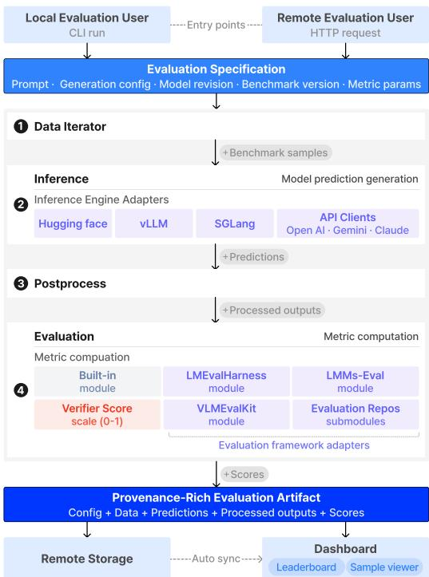
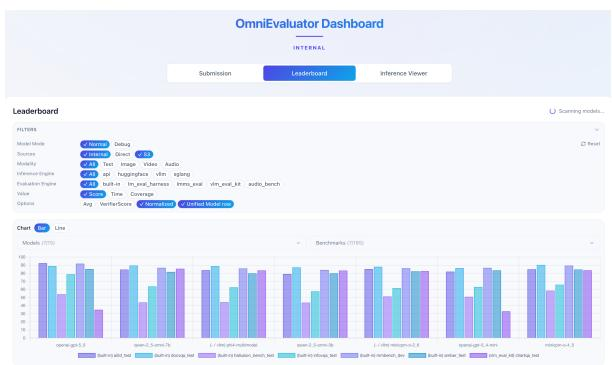

# A Composable Evaluation System for Reproducible Omni-Modal Foundation Model Evaluation

Hodong Lee<sup>1,2</sup>, Sanghee Park<sup>1,3</sup>, Dohoon Ryu<sup>1</sup>, Jungwhan Kim<sup>1</sup>, Junyeob Kim<sup>4</sup>\*, Soyoon Kim<sup>1</sup>, Geewook Kim<sup>1,3†</sup>

<sup>1</sup>NAVER Cloud AI, <sup>2</sup>Korea University, <sup>3</sup>KAIST AI, <sup>4</sup>Seoul National University {hogong.lee, sang.hee.park, dh.ryu, jungwhan.kim, soyoon.kim, gw.kim}@navercorp.com heyjoonkim@europa.snu.ac.kr

## Abstract

Building an omni-modal foundation model means evaluating it across text, image, video, and audio. Excellent evaluation toolkits exist for each modality, but their inference engines, prompt conventions, and metric implementations are mutually incompatible, so practitioners end up maintaining separate environments for every toolchain and still struggle to compare results across them. OmniEvaluator grew out of this need in our own model development: rather than reimplementing benchmarks, it connects existing inference engines and curated evaluation libraries at a higher level, exposing four inference backends, four evaluation frameworks, and over a thousand benchmarks through a single interface. Every run is recorded as an artifact capturing the full configuration for exact reproduction, and results flow into a shared dashboard for cross-model comparison. A federated mode shares GPU inference servers across concurrent evaluations, and a built-in verifier, small enough to run on CPU, gives a score that varies far less across engines and prompts than rule-based scoring under configuration mismatch, matching costefficient commercial LLM judges without their recurring API cost. The system, demo video, and dashboard are publicly available.<sup>1</sup>

## 1 Introduction

Foundation models are increasingly omni-modal: a single model accepts text, image, video, and audio as input (Gemini Team et al., 2023; OpenAI et al., 2024; Xu et al., 2025a; Fu et al., 2025b; NAVER Cloud HyperCLOVA X Team, 2026). Developing such a model requires evaluating it on benchmarks from every modality it supports. Evaluation infrastructure, however, has not kept pace. Vision–language models are usually evaluated with

  
Figure 1: OmniEvaluator architecture. Inference and evaluation engines are composed through a unified intermediate schema, enabling modular combination of any supported engine pair. Users can run evaluations locally via CLI or submit requests to a remote evaluation server, both producing provenance-rich evaluation artifacts.

VLM-specific toolkits (Duan et al., 2024), text models with language-model harnesses (Sutawika et al., 2026), and audio or video capabilities with scripts written for individual benchmarks. Each toolchain has its own prompt conventions, preprocessing steps, and scoring code.

This fragmentation causes two recurring problems for research and production teams alike. First, no single environment covers an omni-modal model. Each toolkit pins its own dependencies; per-toolkit virtual environments avoid version conflicts but still leave every toolkit with its own interface, configuration format, and output layout, all reconciled by hand. In practice, modalities that are hard to set up often simply go unmeasured. Second, scores reported for “the same benchmark” often disagree. Different libraries use different prompt templates, decoding parameters, and evaluator versions (Biderman et al., 2024; Alzahrani et al., 2024), and even metrics with the same name, such as WER (Park et al., 2024) or ANLS (Peer et al., 2024), can hide different normalization rules. As a result, scores are hard to compare across papers, and sometimes even across runs within a team (we quantify this in Table 3). As a further consequence, results become scattered across machines, and GPU resources are split across users rather than pooled.

Our goal is not to build yet another isolated benchmark suite, but to tie together what the community already builds and maintains, so that a single model can be evaluated across every modality it supports, under one configuration, with every score reproducible. We present OmniEvaluator, a composable evaluation system that combines existing inference engines and curated evaluation libraries as building blocks (Figure 1). Internally, a shared intermediate schema standardizes the four stages of evaluation: data iteration, inference, postprocessing, and metric computation. Connecting N inference engines to M evaluation frameworks directly would require N × M pairwise integrations. With the schema in between, each engine and each framework needs only one thin adapter, N + M in total, and any engine can then be paired with any framework. Every run also produces a provenance-rich artifact recording the full configuration (prompt template, generation parameters, model revision, benchmark version, and metric settings), so a score can be reproduced rather than merely reported.

On top of this pipeline, OmniEvaluator provides:

• Unified omni-modal evaluation: one installation and one interface covering four inference backends, four evaluation frameworks, and over a thousand benchmarks across text, image, video, and audio (Table 1)—spanning a substantial portion of the benchmarks reported in the omni-modal tech reports published to date (Table 2)—with any backend able to run any framework’s benchmarks. A federated mode further shares inference servers across concurrent evaluations for efficient GPU use (§4.3).

Table 1: Supported inference and evaluation engines. Each engine is integrated via a single adapter to a unified schema. # Bench. counts the benchmarks accessible per evaluation framework at the time of writing; the built-in engine covers audio and other benchmarks unavailable elsewhere.
<table><tr><td>Category</td><td>Supported Engine</td><td># Bench.</td></tr><tr><td rowspan="4">Inference</td><td>HuggingFace Transformers (Wolf et al., 2020)</td><td></td></tr><tr><td>vLLM (Kwon et al., 2023)</td><td></td></tr><tr><td>SGLang (Zheng et al., 2024)</td><td>1</td></tr><tr><td>Off-the-shelf API clients (OpenAI, Google, Anthropic)</td><td>一</td></tr><tr><td rowspan="4">Evaluation</td><td>built-in</td><td>182</td></tr><tr><td>1m-eval-harness (Sutawika et al., 2026)</td><td>1986</td></tr><tr><td>1mms-eval (Zhang et al., 2025a)</td><td>416</td></tr><tr><td>VLMEvalKit (Duan et al., 2024)</td><td>375</td></tr></table>

Table 2: Benchmark coverage of OmniEvaluator. Number of benchmarks reported in each representative omni-modal foundation model’s tech report that OmniEvaluator supports.
<table><tr><td>Technical Report</td><td>Covered / Total</td></tr><tr><td>HyperCLOVAX-SEED-Omni-8B (NAVER Cloud HyperCLOVA X Team, 2026</td><td>28 /28</td></tr><tr><td>MiniCPM-o 4.5 (Cui et al., 2026)</td><td>49/62</td></tr><tr><td>Qwen3.5-Omni (Qwen Team, 2026)</td><td>54/72</td></tr><tr><td>Qwen2.5-Omni (Xu et al., 2025a)</td><td>47 /56</td></tr><tr><td>Qwen3-Omni (Xu et al., 2025b)</td><td>50 /65</td></tr></table>

• Integrated dashboard: an interactive view that gathers per-modality results in one place, shows coverage gaps at a glance, and supports cross-model and cross-checkpoint comparison for model selection (Figure 2).

• Built-in verifier: a small model, light enough to run on CPU, that judges whether a prediction is semantically correct. Its normalized score varies far less across engines and prompts than rule-based scoring under configuration mismatch, reducing the need for costly API judges (Table 3, §4.2).

OmniEvaluator was used in the development of HyperCLOVA X 8B Omni (NAVER Cloud Hyper-CLOVA X Team, 2026) and is publicly available with a live demo, demo video, and evaluation dashboard.

## 2 Related Work

Evaluation tools have matured within each modality; what is missing is a way to evaluate one model across all of them under a single, consistent setup.

Text evaluation. HELM (Liang et al., 2023) popularized holistic evaluation; lm-eval-harness (Biderman et al., 2024) provides reusable task implementations and documents common pitfalls; BIG-bench (Srivastava et al., 2023) and the Open LLM Leaderboard (Fourrier et al., 2024) broadened coverage and showed centralized evaluation at scale. Evalverse (Kim et al., 2024) is closest to our design, unifying several text evaluation frameworks behind one interface, but at the time of writing it does not extend beyond text.

Table 3: Native vs. verifier score across evaluation engines and prompt conditions. Each cell: lmms-eval/VLMEvalKit on the same outputs, under benchmark-specific (Sp.) and uniform (Un.) prompts; [0, 100] scale, ∆=max−min. Sp. uses each framework’s own format-constraining instruction (e.g. “Answer the question using a single word or phrase.”), while Un. replaces it with a single format-agnostic instruction for all benchmarks; full prompts in Table 9.
<table><tr><td rowspan="2">Bench.</td><td rowspan="2">Model</td><td rowspan="2">Score</td><td colspan="2">lmms-eval VLMEvalKit</td><td colspan="2"></td><td rowspan="2">∆</td></tr><tr><td>Sp.</td><td>Un.</td><td>Sp.</td><td>Un.</td></tr><tr><td rowspan="3">GQA</td><td rowspan="2">Qwen2.5-Omni-3B</td><td>Native</td><td>61.6</td><td>28.1</td><td>70.4</td><td>29.3</td><td>42.3</td></tr><tr><td>Verifier</td><td>64.8</td><td>66.4</td><td>64.7</td><td>66.6</td><td>1.9</td></tr><tr><td rowspan="2">Qwen2.5-Omni-7B</td><td>Native</td><td>60.9</td><td>28.5</td><td>70.1</td><td>0.9</td><td>69.2</td></tr><tr><td></td><td>Verifier 63.3</td><td>63.9</td><td>63.1</td><td>66.0</td><td></td><td>2.9</td></tr><tr><td rowspan="3">MMStar</td><td rowspan="2">Qwen2.5-Omni-3B</td><td>Native</td><td>57.1</td><td></td><td>51.0 54.2</td><td>53.2</td><td>6.1</td></tr><tr><td>Verifier</td><td>55.2</td><td>53.7</td><td>54.4</td><td>53.5</td><td>1.7</td></tr><tr><td rowspan="2">Qwen2.5-Omni-7B</td><td>Native Verifier</td><td>62.7</td><td>47.9</td><td>62.1</td><td>61.1 61.5</td><td>14.8</td></tr><tr><td></td><td>61.5</td><td>48.0</td><td>62.3</td><td></td><td></td><td>14.3</td></tr><tr><td rowspan="3">OCRBench</td><td rowspan="2">Qwen2.5-Omni-3B</td><td>Native Verifier</td><td>82.2</td><td>82.1 84.3</td><td>25.6 84.6</td><td>25.6 84.2</td><td>56.6 0.4</td></tr><tr><td></td><td>84.3</td><td></td><td></td><td></td><td></td></tr><tr><td rowspan="2">Qwen2.5-Omni-7B</td><td>Native Verifier</td><td>80.5 86.0</td><td>83.2 84.9</td><td>25.2 85.1</td><td>25.2 84.8</td><td>58.0 1.2</td></tr><tr><td></td><td></td><td></td><td></td><td></td><td></td><td></td></tr><tr><td rowspan="3">POPE</td><td rowspan="2">Qwen2.5-Omni-3B</td><td>Native</td><td>88.8</td><td>59.2 88.8</td><td>87.6 91.3</td><td>87.9 91.1</td><td>29.6 2.5</td></tr><tr><td>Verifier</td><td>88.8</td><td></td><td></td><td></td><td></td></tr><tr><td rowspan="2">Qwen2.5-Omni-7B</td><td>Native Verifier</td><td>88.4 88.4</td><td>0.0 87.1</td><td>87.6 91.5</td><td>86.4 87.8</td><td>88.4 4.4</td></tr><tr><td>Native</td><td>64.6</td><td>64.4</td><td>62.6</td><td>63.8</td><td></td><td>2.0</td></tr><tr><td rowspan="3">RealWorldQA</td><td rowspan="2">Qwen2.5-Omni-3B</td><td>Verifier</td><td>64.7</td><td>64.6</td><td>62.6</td><td>63.8</td><td>2.1</td></tr><tr><td>Native</td><td></td><td></td><td>69.7</td><td>69.5</td><td>0.7</td></tr><tr><td rowspan="2">Qwen2.5-Omni-7B</td><td>Verifier</td><td>69.2 69.3</td><td>69.9 70.1</td><td>69.7</td><td>69.5</td><td>0.8</td></tr></table>

Vision evaluation. VLMEvalKit (Duan et al., 2024) unifies evaluation across a wide range of vision–language models, and VHELM (Lee et al., 2024) extends holistic evaluation to the vision–language setting. Benchmarks such as MMMU (Yue et al., 2024), MMBench (Liu et al., 2025b), and Video-MME (Fu et al., 2025a) standardize what to measure, but how they are run (prompts, answer parsing, scoring) still differs from framework to framework.

Multi-modal and audio evaluation. LMMs-Eval (Zhang et al., 2025a) extends coverage beyond image–text. For audio, dedicated toolkits such as AudioBench (Wang et al., 2025) and UltraEval-Audio (Shi et al., 2026) sit alongside benchmarks such as LibriSpeech (Panayotov et al., 2015), CoVoST2 (Wang et al., 2021), and VoiceBench (Chen et al., 2026). Each of these tools covers part of the modality space; evaluating an omni-modal model still means combining several of them.

Answer verification vs. preference judging. LLM-as-a-judge (Li et al., 2024) asks a model to rate the quality of a response, often without a reference answer. A verifier solves a narrower problem: given the question, the reference answer, and the prediction, decide whether the prediction is correct. Existing verifiers were built to check the answers of reasoning models on text benchmarks, or to provide verifiable rewards for reinforcement learning (Chen et al., 2025; Liu et al., 2025a; Zhang et al., 2025b). OmniEvaluator instead uses a verifier as part of its evaluation infrastructure, applying one lightweight, text-based model to benchmarks from all four modalities (§4.2).

Gap addressed by this work. Many studies show how fragile evaluation scores can be: prompt changes (Mizrahi et al., 2024; Sclar et al., 2024), the choice of evaluation examples (Maia Polo et al., 2024), answer-choice ordering (Pezeshkpour and Hruschka, 2024), and cross-framework differences (Zhang et al., 2025a; Alzahrani et al., 2024) can each shift results substantially. OmniEvaluator responds at the system level: a shared intermediate schema makes heterogeneous evaluators interoperable, every run yields a reproducible artifact, the verifier score holds steady when engine or prompt configurations differ, and a federated pipeline shares GPU servers across evaluations. To our knowledge, no existing framework offers this combination.

## 3 OmniEvaluator

OmniEvaluator is a unified evaluation framework that centers all factors influencing evaluation outcomes—prompt template, generation configuration, model revision, benchmark version, and metric parameters—within a single, inspectable configuration. The framework is guided by two design goals. Multi-modal generality: support benchmarks across text, image, video, audio, and crossmodality settings in a single pipeline, primarily by integrating entire evaluation frameworks—rather than individual benchmarks—to leverage existing implementations and keep pace with upstream releases; benchmarks that external frameworks do not cover, such as audio, omni-modal, and toolcalling tasks, are supported through a built-in engine. Visualization and interpretability: enable consistent cross-modal model comparison despite heterogeneous metric systems, with an integrated dashboard that visualizes capability profiles and trade-offs across modalities.

## 3.1 Composable Architecture through Intermediate Schema

OmniEvaluator decomposes evaluation into four independent stages—data iteration, inference, postprocessing, and metric computation—and mediates all inter-stage exchange through a unified intermediate schema (Figure 1). Each record in this schema is a structured object containing the benchmark sample, the raw model prediction, the postprocessed output, and the computed metric score. Below is one such record, for a video benchmark.

```jsonl
1 {
2 "benchmark": "mvbench_test_64frames",
3 "messages": [{
4 "role": "user",
5 "content": [
6 { "type": "video",
7 "value": ".../action_sequence__0.mp4",
8 "num_frames": 64,
9 "sampling_strategy": "uniform" },
10 { "type": "text",
11 "value": "What happened after ...?" }
12 ]
13 }],
14 "label": ["A"],
15 "output": {
16 "text": {
17 "prediction": ["A. Ate the medicine."],
18 "prediction_postprocessed": ["A"]
19 },
20 "reasoning_content": null
21 },
22 "metrics": { "exact_match": 1.0 }
23 }
```

The record shape does not change with modality: a text, image, video, or audio sample differs only in the content entries it carries and the modalityspecific fields those entries add—num\_frames and sampling\_strategy for video, a sampling rate for audio—which the inference engine reads and the evaluation framework never has to know about. Postprocessing writes to its own slot beside the raw prediction, so a metric can read either one without knowing which transformation produced it; the schema is described further in Appendix A. This common representation lets any inference engine feed into any postprocessor and metric module: the same multiple-choice extraction or ASR normalization logic is reused across all benchmarks of that task type, and shared metrics such as exact match are computed by a single implementation regardless of which framework defined the benchmark.

Each inference engine and evaluation framework listed in Table 1 is connected to this schema through a thin adapter that translates between its native data format and the common representation, reducing integration cost from O(N×M) to O(N +M): a single adapter makes any newly released upstream framework composable with all existing engines and modules. Because postprocessing and metric modules are shared across frameworks, scoring discrepancies that would otherwise arise from differing metric implementations—such as two frameworks reporting “ANLS” with different edit-distance thresholds—are structurally eliminated. Full per-modality evaluation results obtained by combining these components are provided in Table 10 (Appendix).

## 3.2 Evaluation as a Reproducible Specification

Every evaluation run emits a self-contained artifact that bundles: (i) the evaluation configuration (prompt template, generation parameters, model revision, benchmark version, and metric settings), (ii) all intermediate outputs (raw predictions and postprocessed results), and (iii) the final scores. This artifact is the unit of reproducibility: given the same artifact, any user can re-run the identical evaluation or inspect every decision that influenced a score; in practice, teams use artifacts as baseline anchors across training stages, checkpoint references for regression testing, and verifiable records for external releases. The dashboard (§4.1) automatically ingests these artifacts, enabling cross-experiment comparison without manual data wrangling.

## 3.3 Quick Start

OmniEvaluator supports local CLI evaluation for fine-grained control and a remote mode in which users submit requests to a persistent server. Both modes produce the same provenance-rich artifacts (§3.2) and stream results to the dashboard on completion; installation and server-launch details are given in Appendix B.

Local evaluation. Users run evaluation directly via the CLI; an existing artifact can also be given as input to reproduce its results exactly:

```shell
1 python run.py \
2 --inference_engine=vllm \
--url={vllm_url} \
--exp_name=hyperclovax-seed-4b \
--evaluation_engine=builtin \
6 --benchmarks=haerae_vision_test
```



<table><tr><td rowspan=1 colspan=1>#</td><td rowspan=1 colspan=1>Model</td><td rowspan=1 colspan=1>(built-in)ai2d_test</td><td rowspan=1 colspan=1>(built-in)docvqa_test</td><td rowspan=1 colspan=1>(built-in)hallusion_bench_test</td><td rowspan=2 colspan=1>(built-in)infovqa_testanlsV</td><td rowspan=2 colspan=1>(built-in)mmbench_devexact_match</td></tr><tr><td rowspan=1 colspan=1>Metric</td><td rowspan=1 colspan=1></td><td rowspan=1 colspan=1>exact_m</td><td rowspan=1 colspan=1>anlsV</td><td rowspan=1 colspan=1>judge_binary V</td></tr><tr><td rowspan=1 colspan=1>1</td><td rowspan=1 colspan=1>anthropic-claude-haiku-4-5</td><td rowspan=1 colspan=1>62.2</td><td rowspan=1 colspan=1>78.2</td><td rowspan=1 colspan=1>54.9</td><td rowspan=1 colspan=1>35.5</td><td rowspan=1 colspan=1>82.3</td></tr><tr><td rowspan=1 colspan=1>2</td><td rowspan=1 colspan=1>anthropic-claude-opus-4-8</td><td rowspan=1 colspan=1>89.8</td><td rowspan=1 colspan=1>45.6</td><td rowspan=1 colspan=1>63.2</td><td rowspan=1 colspan=1>17.5</td><td rowspan=1 colspan=1>90.4</td></tr><tr><td rowspan=1 colspan=1>3</td><td rowspan=1 colspan=1>anthropic-claude-sonnet-4-6</td><td rowspan=1 colspan=1>67.7</td><td rowspan=1 colspan=1>61.4</td><td rowspan=1 colspan=1>60.1</td><td rowspan=1 colspan=1>23.1</td><td rowspan=1 colspan=1>84.6</td></tr><tr><td rowspan=1 colspan=1>4</td><td rowspan=1 colspan=1>google-gemini-3_1-flash-lite</td><td rowspan=1 colspan=1>90.7</td><td rowspan=1 colspan=1>88.2</td><td rowspan=1 colspan=1>57.0</td><td rowspan=1 colspan=1>69.8</td><td rowspan=1 colspan=1>90.3</td></tr><tr><td rowspan=1 colspan=1>5</td><td rowspan=1 colspan=1>google-gemini-3_1-pro-pr...</td><td rowspan=1 colspan=1>15.2</td><td rowspan=1 colspan=1>36.0</td><td rowspan=1 colspan=1>28.4</td><td rowspan=1 colspan=1>35.7</td><td rowspan=1 colspan=1>13.3</td></tr><tr><td rowspan=1 colspan=1>6</td><td rowspan=1 colspan=1>hyperclovax-omni-8b</td><td rowspan=1 colspan=1>80.2</td><td rowspan=1 colspan=1>88.3</td><td rowspan=1 colspan=1>42.3</td><td rowspan=1 colspan=1>62.0</td><td rowspan=1 colspan=1>85.3</td></tr><tr><td rowspan=1 colspan=1>7</td><td rowspan=1 colspan=1>hyperclovax-vision-v2-see...</td><td rowspan=1 colspan=1>83.3</td><td rowspan=1 colspan=1>88.6</td><td rowspan=1 colspan=1>42.0</td><td rowspan=1 colspan=1>63.1</td><td rowspan=1 colspan=1>86.6</td></tr><tr><td rowspan=1 colspan=1>8</td><td rowspan=1 colspan=1>minicpm-o-2_6</td><td rowspan=1 colspan=1>85.2</td><td rowspan=1 colspan=1>88.0</td><td rowspan=1 colspan=1>51.3</td><td rowspan=1 colspan=1>61.7</td><td rowspan=1 colspan=1>86.2</td></tr><tr><td rowspan=1 colspan=1>9</td><td rowspan=1 colspan=1>minicpm-o-4_5</td><td rowspan=1 colspan=1>84.8</td><td rowspan=1 colspan=1>90.3</td><td rowspan=1 colspan=1>58.5</td><td rowspan=1 colspan=1>65.8</td><td rowspan=1 colspan=1>89.4</td></tr><tr><td rowspan=1 colspan=1>10</td><td rowspan=1 colspan=1>openai-gpt-5_4-mini</td><td rowspan=1 colspan=1>82.0</td><td rowspan=1 colspan=1>86.4</td><td rowspan=1 colspan=1>50.9</td><td rowspan=1 colspan=1>63.1</td><td rowspan=1 colspan=1>86.7</td></tr><tr><td rowspan=1 colspan=1>11</td><td rowspan=1 colspan=1>openai-gpt-5_5</td><td rowspan=1 colspan=1>92.5</td><td rowspan=1 colspan=1>88.9</td><td rowspan=1 colspan=1>54.0</td><td rowspan=1 colspan=1>78.8</td><td rowspan=1 colspan=1>91.8</td></tr><tr><td rowspan=1 colspan=1>12</td><td rowspan=1 colspan=1>phi4-multimodal</td><td rowspan=1 colspan=1>83.7</td><td rowspan=1 colspan=1>88.9</td><td rowspan=1 colspan=1>44.3</td><td rowspan=1 colspan=1>62.6</td><td rowspan=1 colspan=1>85.9</td></tr><tr><td rowspan=1 colspan=1>13</td><td rowspan=1 colspan=1>qwen-2_5-omni-3b</td><td rowspan=1 colspan=1>79.1</td><td rowspan=1 colspan=1>87.3</td><td rowspan=1 colspan=1>43.7</td><td rowspan=1 colspan=1>57.7</td><td rowspan=1 colspan=1>84.1</td></tr><tr><td rowspan=1 colspan=1>14</td><td rowspan=1 colspan=1>qwen-2_5-omni-7b</td><td rowspan=1 colspan=1>84.5</td><td rowspan=1 colspan=1>89.5</td><td rowspan=1 colspan=1>43.9</td><td rowspan=1 colspan=1>63.7</td><td rowspan=1 colspan=1>86.7</td></tr></table>

Figure 2: OmniEvaluator dashboard (leaderboard view). The dashboard synchronizes with evaluation artifacts produced by OmniEvaluator, providing an integrated view of benchmark results across experiments. Left: composable filters (modality, inference engine, evaluation engine) and cross-model benchmark comparison charts. Right: the consolidated leaderboard; missing entries explicitly surface modality coverage gaps (https://github.com/naver-ai/omni-evaluator).

Remote evaluation. Users submit an evaluation request to a persistent server via a single REST call, with no local installation required—useful when a model undergoes multi-stage training and evaluation environments change frequently:

curl -X POST http://{host}:{port}/add\_job \   
2 -H "Content-Type: application/json" \   
3 -d '{"arguments": {   
4 "inference\_engine": "huggingface",   
5 "model\_name\_or\_path": "Qwen/Qwen2.5-Omni-3B",   
6 "exp\_name": "qwen2.5-omni-3b",   
7 "evaluation\_engine": "builtin",   
8 "benchmarks": "librispeech\_test\_clean"   
9 }}'

The server records each request with its evaluation specification (§3.2) for server-side reproducibility; results appear on the dashboard upon completion.

Table 4: Verification accuracy on our human-verified held-out test split (n=1,566). All models use an identical text-only configuration. Per-group best in bold, second underlined.
<table><tr><td>Type</td><td>Verifier</td><td>acc</td></tr><tr><td rowspan="5">Proprietary (API)</td><td>GPT-5.5 GPT-5.4-mini</td><td>90.2 82.8</td></tr><tr><td>Claude-Opus-4.8</td><td>90.4</td></tr><tr><td>Claude-Haiku-4.5</td><td>84.3</td></tr><tr><td>Gemini-3.1-Pro</td><td>89.8</td></tr><tr><td>Gemini-3.1-Flash-Lite</td><td>83.5</td></tr><tr><td rowspan="4">Open- source Qwen3-0.6B</td><td>OmniEval Verifier Qwen3.5-9B</td><td>85.0</td></tr><tr><td></td><td>79.9</td></tr><tr><td>Qwen3.5-4B</td><td>79.8</td></tr><tr><td>Qwen3.5-0.8B Qwen3-4B-Instruct-2507</td><td>64.2 76.2</td></tr></table>

## 4 Supported Features

## 4.1 Integrated Dashboard

The dashboard provides an integrated view of benchmark results across experiments and modalities (Figure 2); evaluation artifacts are automatically synchronized via a remote storage backend (§3.2), so results become browsable as soon as a run completes. Rather than crowning a single best model, the dashboard is designed to visualize cross-modal capability profiles and trade-offs, and it explicitly surfaces modality coverage gaps: benchmarks a model has not been evaluated on appear as missing entries, making it immediately apparent which modalities remain untested.

The dashboard also offers interactive visualizations—including radar charts that overlay multiple models on user-selected benchmark axes—and side-by-side inspection of inference samples for contrasting predictions across training stages or against baselines to identify modality-specific error patterns (demonstrated in the live demo). To support model selection, it further reports the mean of the verifier score—a single normalized value that our built-in verifier assigns to every benchmark on the same [0, 100] scale (§4.2)—across benchmarks: because it varies far less across evaluation engines and prompt conditions, its average is comparable where raw native metrics are not (measured on disparate, unbounded scales), and visualizing this single signal across models and checkpoints turns per-benchmark results into an actionable decision aid.

Table 5: API-equivalent cost of one full evaluation pass. Avg. In/Out Tok. are the mean input/output tokens per sample. Cost is in USD under public pricing.
<table><tr><td>Modality</td><td># Bench.</td><td># Samples</td><td>Avg. In Tok.</td><td>Avg. Out Tok.</td><td>GPT-5.4-mini</td><td>GPT-5.5</td><td>Claude-Haiku-4.5</td><td>Claude-Opus-4.8</td><td>Gemini-3.1-Flash-Lite</td><td>Gemini-3.1-Pro</td></tr><tr><td>Image</td><td>8</td><td>21,433</td><td>44.3</td><td>29.2</td><td>3.53</td><td>23.52</td><td>4.08</td><td>20.39</td><td>7.06</td><td>16.94</td></tr><tr><td>Audio</td><td>8</td><td>33,293</td><td>23.1</td><td>11.1</td><td>2.24</td><td>14.93</td><td>2.62</td><td>13.08</td><td>4.48</td><td>10.75</td></tr><tr><td>Video</td><td>8</td><td>31,260</td><td>69.1</td><td>15.2</td><td>3.76</td><td>25.06</td><td>4.54</td><td>22.68</td><td>7.52</td><td>18.04</td></tr><tr><td>Text</td><td>8</td><td>43,640</td><td>133.8</td><td>177.0</td><td>39.14</td><td>260.92</td><td>44.46</td><td>222.30</td><td>78.28</td><td>187.86</td></tr><tr><td>Total</td><td>32</td><td>129,626</td><td>75.0</td><td>70.9</td><td>48.67</td><td>324.43</td><td>55.69</td><td>278.60</td><td>97.34</td><td>233.59</td></tr></table>

## 4.2 Verifier

Rule-based metrics such as exact match, WER (Park et al., 2024), and BLEU (Papineni et al., 2002) compare strings, and two situations complicate this comparison. First, the score depends on how the evaluation is run: the same model outputs, scored under different prompt and metric configurations, swing by up to 88 points on a [0, 100] scale (Table 3). Each framework’s benchmark-specific prompt constrains the output shape—“a single word or phrase”, “the option’s letter”—and its metric implementation is written for that shape (Table 9), so the prompt is part of the harness rather than a neutral wrapper: when a model does not follow it closely, the metric no longer measures what it was written to measure. How much this matters depends on the parser, which also differs across engines: on OCRBench the two frameworks disagree by more than 50 points under the same prompt, while on RealWorldQA both parsers accept the answer in either form and the prompt barely matters. Second, even when a model follows the prompt exactly, string comparison misses answers that are semantically correct but phrased differently from the reference or buried in reasoning traces, and a corpus-level average can be dominated by a few such cases. A common remedy is to have an external LLM API judge the responses, but this exposes internal data to a third party, drifts as the judge version changes, and accumulates cost over repeated evaluations (Table 5).

Our remedy is to build the semantic check into the system itself. We train and release OmniEval Verifier, a compact model that reads a (question, reference, prediction) text triple and returns a rationale and a binary verdict on whether the prediction answers the question correctly. Training and data details are in Appendix C. Built on Qwen3-0.6B and distributed as an 8-bit (Q8) GGUF model, it runs on CPU-only machines via llama.cpp<sup>2</sup>, so OmniEvaluator ships it as a default scorer alongside native metrics, adding no external API calls and near-zero marginal cost. Per-sample verdicts aggregate into the verifier score, a value on a [0, 100] scale computed the same way for every benchmark; on the outputs of Table 3, this score moves far less than the native metric—on GQA and POPE, by a few points where the native metric moves by 40 to 88. Under a benchmark-specific prompt the two largely agree (the Sp. columns); the verifier’s value is therefore not that it outperforms a well-configured native metric, but that it holds steady when the configuration does not match (the Un. columns).

On our human-verified held-out test split, OmniEval Verifier reaches 85.0 accuracy, matching or exceeding cost-efficient proprietary judges (GPT-5.4-mini 82.8, Claude-Haiku-4.5 84.3) and outperforming the open-source models we evaluated under the same text-only configuration (Table 4). Against native metrics, the verifier score closely tracks exact-match-style metrics, and for unbounded metrics such as WER and BLEU it adds a per-sample correct/incorrect view that corpuslevel averages do not; where the two disagree, the gap is informative rather than contradictory, since a corpus-level average and a per-utterance verdict measure different things (Table 6). We position the verifier score as a complement to native metrics rather than a replacement: native metrics remain the reference under their intended setup, while the verifier adds a signal that survives crossengine and cross-prompt variation. During model development, its mean proved comparable across benchmarks and training stages and aided modelselection decisions.

## 4.3 Federated Evaluation

The modular architecture of §3.1 separates inference from evaluation: models are hosted by serving engines such as vLLM, and evaluation clients talk to them over HTTP. Federated evaluation builds on this split: inference servers and evaluation clients form a many-to-many pool, decoupling where benchmarks run from where GPUs are. This decoupling yields two complementary benefits. First, it improves utilization of fragmented GPU resources. A single client can spread benchmarks across multiple servers—a spare A100 on one machine, idle V100s on another—while data loading, metric computation, and verifier calls stay on CPU machines. GPUs that would otherwise be too scattered to serve a single job are thus aggregated into one logical evaluation pool. Second, it minimizes GPU idle time and thereby improves throughput. Many clients can drive one server, and their concurrent requests are merged by the engine’s continuous (in-flight) batching, which keeps the accelerator saturated between requests rather than stalling on the request stream of any single evaluation process. Under the same GPU allocation, these two effects together yield a 1.3–2.8× wall-time speedup over conventional per-process evaluation, in which each framework runs inference from within its own process, with the largest gains on image benchmarks (Table 7).

Table 6: Comparison of native benchmark metrics and Verifier Score. Native metrics are EM (exact match) for MMLU-Pro and GSM8K-CoT, PASS@1 for MBPP, WER (%, ↓) for LibriSpeech, BLEU-4 (↑) for CoVoST2 (en→zh), and EM for VocalSound; the Verifier Score is uniformly scaled to [0, 100] (↑). Across these heterogeneous native scales, the Verifier Score provides a single comparable signal.
<table><tr><td>Modality</td><td>Benchmark</td><td>Model</td><td>Native Metric</td><td>Native</td><td>Verifier Score</td></tr><tr><td rowspan="9">Text</td><td rowspan="3">MMLU-Pro</td><td>Qwen2.5-Omni-3B</td><td rowspan="3">EM (↑)</td><td>42.0</td><td>41.9</td></tr><tr><td>Qwen2.5-Omni-7B</td><td>51.1</td><td>51.0</td></tr><tr><td>HyperCLOVAX-SEED-4B</td><td>56.8</td><td>57.1</td></tr><tr><td rowspan="3">MBPP</td><td>Qwen2.5-Omni-3B</td><td rowspan="3">PASS@1 (↑)</td><td>53.4</td><td>83.6</td></tr><tr><td>Qwen2.5-Omni-7B</td><td>50.4</td><td>86.5</td></tr><tr><td>HyperCLOVAX-SEED-4B</td><td>54.2</td><td>76.2</td></tr><tr><td rowspan="3">GSM8K-CoT</td><td>Qwen2.5-Omni-3B</td><td rowspan="3">EM (↑)</td><td>32.4</td><td>81.3</td></tr><tr><td>Qwen2.5-Omni-7B</td><td>70.2</td><td>84.8</td></tr><tr><td>HyperCLOVAX-SEED-4B</td><td>48.3</td><td>51.2</td></tr><tr><td rowspan="9">Audio</td><td rowspan="3">LibriSpeech</td><td>Qwen2.5-Omni-3B</td><td rowspan="3">WER (↓)</td><td>2.6</td><td>71.2</td></tr><tr><td>Qwen2.5-Omni-7B</td><td>2.3</td><td>63.5</td></tr><tr><td>Phi-4-Multimodal</td><td>1.7</td><td>82.9</td></tr><tr><td rowspan="3">CoVoST2 (en→zh)</td><td>Qwen2.5-Omni-3B</td><td rowspan="3">BLEU-4 (↑)</td><td>0.0</td><td>35.4</td></tr><tr><td>Qwen2.5-Omni-7B</td><td>0.0</td><td>37.1</td></tr><tr><td>Phi-4-Multimodal</td><td>0.0</td><td>36.1</td></tr><tr><td rowspan="3">VocalSound</td><td>Qwen2.5-Omni-3B</td><td rowspan="3">EM (↑)</td><td>90.2</td><td>90.2</td></tr><tr><td>Qwen2.5-Omni-7B</td><td>91.9</td><td>91.9</td></tr><tr><td>Phi-4-Multimodal</td><td>32.2</td><td>36.0</td></tr></table>

Table 7: Wall-time speedup of federated over conventional evaluation. Bold / underline: best / second-best per modality.
<table><tr><td>Model</td><td>Text</td><td>Image</td><td>Video</td><td>Avg.</td></tr><tr><td>HyperCLOVAX-SEED-4B</td><td>1.41×</td><td>2.32×</td><td>1.62×</td><td>1.78×</td></tr><tr><td>HyperCLOVAX-SEED-Omni-8B</td><td>1.28×</td><td>2.29×</td><td></td><td>1.79×</td></tr><tr><td>Qwen2.5-Omni-3B</td><td>1.76×</td><td>2.70×</td><td>1.62×</td><td>2.03×</td></tr><tr><td>Qwen2.5-Omni-7B</td><td>1.60×</td><td>2.80×</td><td>1.54×</td><td>1.98×</td></tr><tr><td>Modality avg.</td><td>1.51×</td><td>2.53×</td><td>1.59×</td><td></td></tr></table>

## 5 Conclusion

OmniEvaluator turns fragmented omni-modal evaluation into a single workflow: existing engines and frameworks compose through one schema, every run yields a reproducible artifact, and results flow into one dashboard. Cross-framework comparisons (Table 3) show why this matters: identically named benchmarks diverge across engines and prompt configurations, while the verifier score on the same predictions moves far less. OmniEvaluator and the verifier are publicly released at https: //github.com/naver-ai/omni-evaluator with a live demo and dashboard; a demo video is available at https://www.youtube.com/watch? v=4Z5VZZWyXqY.

## Limitations

OmniEvaluator wraps upstream evaluators rather than reimplementing them, so a bug in an upstream framework can flow into the scores it reports. The design does not prevent this, but it makes such problems visible: every artifact pins exact framework versions, so re-running anchor models after an upgrade exposes score regressions (the daggered models in Table 10), and running the same benchmark under two engines surfaces disagreements that point to upstream issues (Table 3). The verifier judges only the textual triple and returns a binary verdict; these are the choices that keep it small enough for CPU and its score uniform across benchmarks, and its accuracy already matches or exceeds cost-efficient proprietary judges, though not the strongest ones (Table 4). Consequently, it cannot assess criteria that go beyond textual correctness— such as visual grounding, audio quality, or generation quality—which some omni-modal tasks require; for these, users should fall back on the corresponding native metrics. Finally, this paper covers omni-modal understanding, where predictions are text; extending evaluation and the verifier to multimodal outputs such as image and speech generation is a natural next step.

## Acknowledgments

We thank the anonymous reviewers and the program committee for their constructive feedback. We are grateful to the Hyperscale AI team at NAVER Cloud AI for their work throughout the development of HyperCLOVA X 8B Omni and subsequent models, and for their support in building the evaluation setup this system grew out of. We also thank Huiyeon Yang for help with the figures.

## References

Norah Alzahrani, Hisham Alyahya, Yazeed Alnumay, Sultan AlRashed, Shaykhah Alsubaie, Yousef Almushayqih, Faisal Mirza, Nouf Alotaibi, Nora Al-Twairesh, Areeb Alowisheq, M Saiful Bari, and Haidar Khan. 2024. When benchmarks are targets: Revealing the sensitivity of large language model leaderboards. In Proceedings of the 62nd Annual Meeting of the Association for Computational Linguistics (Volume 1: Long Papers), pages 13787– 13805, Bangkok, Thailand. Association for Computational Linguistics.

Stella Biderman, Hailey Schoelkopf, Lintang Sutawika, Leo Gao, Jonathan Tow, Baber Abbasi, Alham Fikri Aji, Pawan Sasanka Ammanamanchi, Sidney Black, Jordan Clive, Anthony DiPofi, Julen Etxaniz, Benjamin Fattori, Jessica Zosa Forde, Charles Foster, Jeffrey Hsu, Mimansa Jaiswal, Wilson Y. Lee, Haonan Li, and 11 others. 2024. Lessons from the trenches on reproducible evaluation of language models. Preprint, arXiv:2405.14782.

Ding Chen, Qingchen Yu, Pengyuan Wang, Mengting Hu, Wentao Zhang, Zhengren Wang, Bo Tang, Feiyu Xiong, Xinchi Li, Chao Wang, Minchuan Yang, and Zhiyu Li. 2025. xVerify: Efficient answer verifier for reasoning model evaluations. Preprint, arXiv:2504.10481.

Yiming Chen, Xianghu Yue, Chen Zhang, Xiaoxue Gao, Robby T. Tan, and Haizhou Li. 2026. VoiceBench: Benchmarking LLM-based voice assistants. Transactions of the Association for Computational Linguistics, 14:378–398.

Junbo Cui, Bokai Xu, Chongyi Wang, Tianyu Yu, Weiyue Sun, Yingjing Xu, Tianran Wang, Zhihui He, Wenshuo Ma, Tianchi Cai, Jiancheng Gui, Luoyuan Zhang, Xian Sun, Fuwei Huang, Moye Chen, Zhuo Lin, Hanyu Liu, Qingxin Gui, Qingzhe Han, and 17 others. 2026. MiniCPM-o 4.5: Towards realtime full-duplex omni-modal interaction. Preprint, arXiv:2604.27393.

Haodong Duan, Junming Yang, Yuxuan Qiao, Xinyu Fang, Lin Chen, Yuan Liu, Xiaoyi Dong, Yuhang Zang, Pan Zhang, Jiaqi Wang, Dahua Lin, and Kai Chen. 2024. VLMEvalKit: An open-source toolkit for evaluating large multi-modality models. In Proceedings ofthe 32nd ACM International Conference on Multimedia, MM ’24, page 11198–11201, New York, NY, USA. Association for Computing Machinery.

Clémentine Fourrier, Nathan Habib, Alina Lozovskaya, Konrad Szafer, and Thomas Wolf. 2024. Open LLM leaderboard v2. https://huggingface. co/spaces/open-llm-leaderboard/open\_llm\_ leaderboard.

Chaoyou Fu, Yuhan Dai, Yongdong Luo, Lei Li, Shuhuai Ren, Renrui Zhang, Zihan Wang, Chenyu Zhou, Yunhang Shen, Mengdan Zhang, Peixian Chen, Yanwei Li, Shaohui Lin, Sirui Zhao, Ke Li, Tong Xu, Xiawu Zheng, Enhong Chen, Caifeng Shan, and 2 others. 2025a. Video-MME: The first-ever comprehensive evaluation benchmark of multi-modal LLMs in video analysis. In Proceedings ofthe IEEE/CVF Conference on Computer Vision and Pattern Recognition (CVPR), pages 24108–24118.

Chaoyou Fu, Haojia Lin, Xiong Wang, YiFan Zhang, Yunhang Shen, Xiaoyu Liu, Haoyu Cao, Zuwei Long, Heting Gao, Ke Li, Long MA, Xiawu Zheng, Rongrong Ji, Xing Sun, Caifeng Shan, and Ran He. 2025b. VITA-1.5: Towards GPT-4o level real-time vision and speech interaction. In The Thirty-ninth Annual Conference on Neural Information Processing Systems.

Gemini Team, Rohan Anil, Sebastian Borgeaud, Jean-Baptiste Alayrac, Jiahui Yu, Radu Soricut, Johan Schalkwyk, Andrew M. Dai, Anja Hauth, Katie Millican, David Silver, Melvin Johnson, Ioannis Antonoglou, Julian Schrittwieser, Amelia Glaese, Jilin Chen, Emily Pitler, Timothy Lillicrap, Angeliki Lazaridou, and 1332 others. 2023. Gemini: A family of highly capable multimodal models. Preprint, arXiv:2312.11805.

Jihoo Kim, Wonho Song, Dahyun Kim, Yunsu Kim, Yungi Kim, and Chanjun Park. 2024. Evalverse: Unified and accessible library for large language model evaluation. In Proceedings ofthe 2024 Conference on Empirical Methods in Natural Language Processing: System Demonstrations, pages 25–33, Miami, Florida, USA. Association for Computational Linguistics.

Woosuk Kwon, Zhuohan Li, Siyuan Zhuang, Ying Sheng, Lianmin Zheng, Cody Hao Yu, Joseph Gonzalez, Hao Zhang, and Ion Stoica. 2023. Efficient memory management for large language model serving with PagedAttention. In Proceedings ofthe 29th Symposium on Operating Systems Principles, SOSP ’23, page 611–626, New York, NY, USA. Association for Computing Machinery.

Tony Lee, Haoqin Tu, Chi Heem Wong, Wenhao Zheng, Yiyang Zhou, Yifan Mai, Josselin Somerville Roberts, Michihiro Yasunaga, Huaxiu Yao, Cihang Xie, and Percy Liang. 2024. VHELM: A holistic evaluation of vision language models. In Advances in Neural Information Processing Systems, volume 37, pages 140632–140666. Curran Associates, Inc.

Haitao Li, Qian Dong, Junjie Chen, Huixue Su, Yujia Zhou, Qingyao Ai, Ziyi Ye, and Yiqun Liu. 2024. LLMs-as-judges: A comprehensive survey on LLM-based evaluation methods. Preprint, arXiv:2412.05579.

Percy Liang, Rishi Bommasani, Tony Lee, Dimitris Tsipras, Dilara Soylu, Michihiro Yasunaga, Yian Zhang, Deepak Narayanan, Yuhuai Wu, Ananya Kumar, Benjamin Newman, Binhang Yuan, Bobby Yan,

Ce Zhang, Christian Cosgrove, Christopher D Manning, Christopher Re, Diana Acosta-Navas, Drew A. Hudson, and 31 others. 2023. Holistic evaluation of language models. Transactions on Machine Learning Research.

Shudong Liu, Hongwei Liu, Junnan Liu, Linchen Xiao, Songyang Gao, Chengqi Lyu, Yuzhe Gu, Wenwei Zhang, Derek F. Wong, Songyang Zhang, and Kai Chen. 2025a. CompassVerifier: A unified and robust verifier for LLMs evaluation and outcome reward. In Proceedings of the 2025 Conference on Empirical Methods in Natural Language Processing, pages 33466–33494, Suzhou, China. Association for Computational Linguistics.

Yuan Liu, Haodong Duan, Yuanhan Zhang, Bo Li, Songyang Zhang, Wangbo Zhao, Yike Yuan, Jiaqi Wang, Conghui He, Ziwei Liu, Kai Chen, and Dahua Lin. 2025b. MMBench: Is your multi-modal model an all-around player? In Computer Vision – ECCV 2024, pages 216–233, Cham. Springer Nature Switzerland.

Felipe Maia Polo, Lucas Weber, Leshem Choshen, Yuekai Sun, Gongjun Xu, and Mikhail Yurochkin. 2024. tinyBenchmarks: evaluating LLMs with fewer examples. In Proceedings ofthe 41st International Conference on Machine Learning, volume 235 of Proceedings ofMachine Learning Research, pages 34303–34326. PMLR.

Moran Mizrahi, Guy Kaplan, Dan Malkin, Rotem Dror, Dafna Shahaf, and Gabriel Stanovsky. 2024. State of what art? a call for multi-prompt LLM evaluation. Transactions of the Association for Computational Linguistics, 12:933–949.

NAVER Cloud HyperCLOVA X Team. 2026. Hyper-CLOVA X 8B Omni. Preprint, arXiv:2601.01792.

OpenAI, Aaron Hurst, Adam Lerer, Adam P. Goucher, Adam Perelman, Aditya Ramesh, Aidan Clark, AJ Ostrow, Akila Welihinda, Alan Hayes, Alec Radford, Aleksander M ˛adry, Alex Baker-Whitcomb, Alex Beutel, Alex Borzunov, Alex Carney, Alex Chow, Alex Kirillov, Alex Nichol, and 400 others. 2024. GPT-4o system card. Preprint, arXiv:2410.21276.

Vassil Panayotov, Guoguo Chen, Daniel Povey, and Sanjeev Khudanpur. 2015. LibriSpeech: An ASR corpus based on public domain audio books. In 2015 IEEE International Conference on Acoustics, Speech and Signal Processing (ICASSP), pages 5206–5210.

Kishore Papineni, Salim Roukos, Todd Ward, and Wei-Jing Zhu. 2002. Bleu: a method for automatic evaluation of machine translation. In Proceedings ofthe 40th Annual Meeting ofthe Associationfor Computational Linguistics, pages 311–318, Philadelphia, Pennsylvania, USA. Association for Computational Linguistics.

Chanho Park, Mingjie Chen, and Thomas Hain. 2024. Automatic speech recognition system-independent

word error rate estimation. In Proceedings of the 2024 Joint International Conference on Computational Linguistics, Language Resources and Evaluation (LREC-COLING 2024), pages 1979–1987, Torino, Italia. ELRA and ICCL.

David Peer, Philemon Schöpf, Volckmar Nebendahl, Alexander Rietzler, and Sebastian Stabinger. 2024. ANLS\* – a universal document processing metric for generative large language models. Preprint, arXiv:2402.03848.

Pouya Pezeshkpour and Estevam Hruschka. 2024. Large language models sensitivity to the order of options in multiple-choice questions. In Findings of the Associationfor Computational Linguistics: NAACL 2024, pages 2006–2017, Mexico City, Mexico. Association for Computational Linguistics.

Qwen Team. 2026. Qwen3.5-Omni technical report. Preprint, arXiv:2604.15804.

Melanie Sclar, Yejin Choi, Yulia Tsvetkov, and Alane Suhr. 2024. Quantifying language models’ sensitivity to spurious features in prompt design or: How I learned to start worrying about prompt formatting. In The Twelfth International Conference on Learning Representations.

Qundong Shi, Jie Zhou, Biyuan Lin, Junbo Cui, Guoyang Zeng, Yixuan Zhou, Ziyang Wang, Xin Liu, Zhen Luo, Yudong Wang, and Zhiyuan Liu. 2026. UltraEval-audio: A unified framework for comprehensive evaluation of audio foundation models. In Proceedings of the 64th Annual Meeting of the Associationfor Computational Linguistics (Volume 3: System Demonstrations), pages 566–577, San Diego, California, United States. Association for Computational Linguistics.

Aarohi Srivastava, Abhinav Rastogi, Abhishek Rao, Abu Awal Md Shoeb, Abubakar Abid, Adam Fisch, Adam R. Brown, Adam Santoro, Aditya Gupta, Adrià Garriga-Alonso, Agnieszka Kluska, Aitor Lewkowycz, Akshat Agarwal, Alethea Power, Alex Ray, Alex Warstadt, Alexander W. Kocurek, Ali Safaya, Ali Tazarv, and 431 others. 2023. Beyond the imitation game: Quantifying and extrapolating the capabilities of language models. Transactions on Machine Learning Research.

Lintang Sutawika, Hailey Schoelkopf, Leo Gao, Baber Abbasi, Stella Biderman, Jonathan Tow, ben fattori, Charles Lovering, farzanehnakhaee70, Jason Phang, Anish Thite, Fazz, Aflah, Niklas, Thomas Wang, sdtblck, nopperl, gakada, researcher2, and 11 others. 2026. EleutherAI/lm-evaluation-harness: v0.4.12.

Bin Wang, Xunlong Zou, Geyu Lin, Shuo Sun, Zhuohan Liu, Wenyu Zhang, Zhengyuan Liu, AiTi Aw, and Nancy F. Chen. 2025. AudioBench: A universal benchmark for audio large language models. In Proceedings ofthe 2025 Conference ofthe Nations of the Americas Chapter of the Association for Computational Linguistics: Human Language Technologies (Volume 1: Long Papers), pages 4297–4316,

Albuquerque, New Mexico. Association for Computational Linguistics.

volume 37, pages 62557–62583. Curran Associates, Inc.

Changhan Wang, Anne Wu, Jiatao Gu, and Juan Pino. 2021. CoVoST 2 and Massively Multilingual Speech Translation. In Interspeech 2021, pages 2247–2251.

Thomas Wolf, Lysandre Debut, Victor Sanh, Julien Chaumond, Clement Delangue, Anthony Moi, Pierric Cistac, Tim Rault, Remi Louf, Morgan Funtowicz, Joe Davison, Sam Shleifer, Patrick von Platen, Clara Ma, Yacine Jernite, Julien Plu, Canwen Xu, Teven Le Scao, Sylvain Gugger, and 3 others. 2020. Transformers: State-of-the-art natural language processing. In Proceedings ofthe 2020 Conference on Empirical Methods in Natural Language Processing: System Demonstrations, pages 38–45, Online. Association for Computational Linguistics.

Jin Xu, Zhifang Guo, Jinzheng He, Hangrui Hu, Ting He, Shuai Bai, Keqin Chen, Jialin Wang, Yang Fan, Kai Dang, Bin Zhang, Xiong Wang, Yunfei Chu, and Junyang Lin. 2025a. Qwen2.5-Omni technical report. Preprint, arXiv:2503.20215.

Jin Xu, Zhifang Guo, Hangrui Hu, Yunfei Chu, Xiong Wang, Jinzheng He, Yuxuan Wang, Xian Shi, Ting He, Xinfa Zhu, Yuanjun Lv, Yongqi Wang, Dake Guo, He Wang, Linhan Ma, Pei Zhang, Xinyu Zhang, Hongkun Hao, Zishan Guo, and 19 others. 2025b. Qwen3-Omni technical report. Preprint, arXiv:2509.17765.

Xiang Yue, Yuansheng Ni, Kai Zhang, Tianyu Zheng, Ruoqi Liu, Ge Zhang, Samuel Stevens, Dongfu Jiang, Weiming Ren, Yuxuan Sun, Cong Wei, Botao Yu, Ruibin Yuan, Renliang Sun, Ming Yin, Boyuan Zheng, Zhenzhu Yang, Yibo Liu, Wenhao Huang, and 3 others. 2024. MMMU: A massive multi-discipline multimodal understanding and reasoning benchmark for expert AGI. In Proceedings of the IEEE/CVF Conference on Computer Vision and Pattern Recognition (CVPR), pages 9556–9567.

Kaichen Zhang, Bo Li, Peiyuan Zhang, Fanyi Pu, Joshua Adrian Cahyono, Kairui Hu, Shuai Liu, Yuanhan Zhang, Jingkang Yang, Chunyuan Li, and Ziwei Liu. 2025a. LMMs-eval: Reality check on the evaluation of large multimodal models. In Findings ofthe Associationfor Computational Linguistics: NAACL 2025, pages 881–916, Albuquerque, New Mexico. Association for Computational Linguistics.

Lianmin Zheng, Liangsheng Yin, Zhiqiang Xie, Chuyue Sun, Jeff Huang, Cody Hao Yu, Shiyi Cao, Christos Kozyrakis, Ion Stoica, Joseph E. Gonzalez, Clark Barrett, and Ying Sheng. 2024. SGLang: Efficient execution of structured language model programs. In Advances in Neural Information Processing Systems,

Lunjun Zhang, Arian Hosseini, Hritik Bansal, Mehran Kazemi, Aviral Kumar, and Rishabh Agarwal. 2025b. Generative verifiers: Reward modeling as next-token prediction. In The Thirteenth International Conference on Learning Representations.

## A Intermediate Schema

Every benchmark, regardless of modality, is represented by the same Record object (§3.1). Its output field holds a per-modality sub-output—output.text for text-producing benchmarks—carrying both the raw prediction and the prediction\_postprocessed written by the postprocess step, alongside a top-level reasoning\_content for models that emit a separate thinking trace. Which fields carry data varies by benchmark, but the shape does not, and every engine and framework adapter reads and writes through the same slots. Complete records for text, image, video, and audio benchmarks are available in the repository.<sup>3</sup>

## B Installation and Server Launch

OmniEvaluator installs with a single command that clones the framework and its submodules; an administrator then starts the persistent evaluation server:

```shell
1 git clone --recursive {repo}
2 cd OmniEvaluator && pip install -e .
3
4 python launch_server.py \
5 --port {port} \
6 --log_dir="./logs"
```

## C Verifier: Data and Training

Data. Training predictions are drawn from our own evaluation artifacts—the outputs of 16 evaluated models across four modalities and 155 benchmarks—to broaden the error distribution the verifier must score. Gold labels come from a multi-teacher API pipeline to reduce single-teacher bias, balanced to a 1:1 positive/negative ratio with limited rule-based augmentation. The held-out test split (n=1,566) is balanced over (modality, task) cells, prioritizes dispute samples, and is fully human-verified and disjoint from training.

Training. The verifier takes a (question, reference, prediction) triple and produces a rationale and a binary verdict (Explanation: . . . \nRating: 0|1); the training mixture spans four modalities, from short exact-match responses to long reasoning traces. Full training hyperparameters are in Table 8.

Table 8: OmniEval Verifier training hyperparameters.
<table><tr><td>Hyperparameter</td><td>Value</td></tr><tr><td>Base model</td><td>Qwen3-0.6B</td></tr><tr><td>LoRA r / α / dropout</td><td>8 / 16 / 0.05</td></tr><tr><td>LoRA targets</td><td>LM decoder q,k,v,o,gate,up,down</td></tr><tr><td>Trainable params</td><td>≈5.05M</td></tr><tr><td>Supervision</td><td>completion-only (target tokens)</td></tr><tr><td>Epochs</td><td>&lt;3 (best on validation)</td></tr><tr><td>Learning rate</td><td>1e-4</td></tr><tr><td>Scheduler / warmup</td><td>cosine / 0.1</td></tr><tr><td>Effective batch</td><td>2 × 8 (accum) × 8 GPU = 128</td></tr><tr><td>Gradient clip</td><td>1.0</td></tr><tr><td>Precision / quant.</td><td>fp32 / none</td></tr><tr><td>max_seq_len</td><td>4096</td></tr><tr><td>Hardware</td><td>8×V100 (32GB)</td></tr><tr><td>Distributed</td><td>DeepSpeed ZeRO-2</td></tr><tr><td>Seed</td><td>42</td></tr></table>

Failure modes of rule-based scoring. Corpuslevel metrics can be dominated by a few pathological samples: on LibriSpeech, a refusal answer yields per-sample WER 266.6 and an offtranscript hallucination 175.0, distorting the aggregate, whereas the verifier simply marks such predictions incorrect.

Cost of API-based verification. Repeated over checkpoints and configurations, API-based verification compounds: at the per-pass cost in Table 5, 50×5 passes come to ≈\$12,000 for GPT-5.4-mini and ≈\$70,000 for Claude-Opus-4.8, whereas OmniEval Verifier runs at near-zero marginal cost.

Verification accuracy. On the human-verified test split, zero-shot inference with the base Qwen3-0.6B reaches only 56.1 accuracy; trained as OmniEval Verifier—small enough to run on CPU alone—it rises to 85.0, matching or exceeding costefficient proprietary judges (GPT-5.4-mini 82.8, Claude-Haiku-4.5 84.3) and every open-source model we evaluated (Table 4).

## D Supported Benchmarks and Full Results

Table 10 reports per-benchmark scores across text, image, video, and audio; full results are continuously updated on the OmniEvaluator dashboard. Coverage spans general knowledge and instruction following, math, VQA and document understanding, video comprehension, speech recognition and translation, and sound and music understanding.

Table 9: How the task prompt changes the answer format, and the answer format changes the score. Per benchmark and engine: the instruction under benchmark-specific (Sp.) and uniform (Un.) prompts, one Qwen2.5- Omni-7B prediction, and its native/verifier score ({0, 1}). Table 3 reports all five benchmarks.
<table><tr><td>Bench. Eval. Engine Setting Task prompt</td><td></td><td></td><td></td><td>Reference Prediction</td><td></td><td>Native Verifier</td></tr><tr><td rowspan="4">GQA</td><td rowspan="2">lmms-eval</td><td>Sp.</td><td>Answer the question using a single aluminum word or phrase.</td><td>aluminum</td><td>1</td><td>1</td></tr><tr><td>Un.</td><td>Please Answer the question in an appropriate format.</td><td>The fence is made of aluminum.</td><td>0</td><td>1</td></tr><tr><td rowspan="2">VLMEvalKit</td><td>Sp.</td><td>Answer the question using a single brown word or phrase.</td><td>brown</td><td>1</td><td>1</td></tr><tr><td>Un.</td><td>Please Answer the question in an appropriate format.</td><td>The ground in the picture is brown.</td><td>0</td><td>1</td></tr><tr><td rowspan="2">POPE</td><td rowspan="2">lmms-eval</td><td>Sp.</td><td>Answer the question using a single yes word or phrase.</td><td>Yes</td><td>1</td><td>1</td></tr><tr><td>Un.</td><td>Please Answer the question in an appropriate format.</td><td>Yes, there is a snowboard in the image. The person in the image is riding a snowboard down a snowy slope.</td><td>0</td><td>1</td></tr><tr><td rowspan="2"></td><td rowspan="2">VLMEvalKit</td><td>Sp.</td><td>(inline) Please answer yes or no. Yes</td><td>yes</td><td>1</td><td>1</td></tr><tr><td>Un.</td><td>(inline) Please Answer the question in an appropriate format.</td><td>&lt;points x1=&quot;112″ y1=&quot;112″ alt=&quot;bottle&quot;&gt;bottle&lt;/points&gt;</td><td>0</td><td>1</td></tr></table>

Table 10: Per-modality benchmark results (accuracy, %; OCRBench 0–1,000; ASR/AST in WER ↓ / BLEU ↑). Representative models shown; full results on the OmniEvaluator dashboard. <sup>†</sup>Anchor models, re-evaluated on every framework or config update to monitor regressions.
<table><tr><td>Mod.</td><td>Model</td><td colspan="8">Benchmarks</td></tr><tr><td rowspan="13">Text Imnadeo</td><td colspan="8">GPT-5.5</td><td>AIM25</td></tr><tr><td></td><td>MM-Rdtx 96.4</td><td>MPTo 88.2</td><td>IEVVa[ 94.1</td><td>ARC-C 96.2</td><td>ATH 99.1</td><td>100.0</td><td>KOBALIT HE 41.6 87.4</td></tr><tr><td>Claude-Opus-4.8</td><td>84.2</td><td>77.4</td><td>85.8</td><td>94.3</td><td>89.1 36.7</td><td></td><td>5.0 39.4</td></tr><tr><td>GPT-5.4-mini</td><td></td><td>88.9</td><td></td><td></td><td></td><td></td><td></td></tr><tr><td></td><td>93.3</td><td></td><td>85.0</td><td>96.2 98.3</td><td>90.0</td><td></td><td></td></tr><tr><td>Gemini-3.1-Pro</td><td>96.8</td><td>74.4</td><td>50.1</td><td>96.5 98.8</td><td>40.0</td><td>20.3</td><td>87.1</td></tr><tr><td>HyperCLOVAX-SEED-Omni-8B</td><td>52.3</td><td></td><td>69.1</td><td>71.2</td><td></td><td></td><td></td></tr><tr><td>Qwen3-Omni-30B-Instruct†</td><td>88.2</td><td></td><td></td><td>94.7</td><td>96.9</td><td>56.7</td><td>5.4</td><td>36.1</td></tr><tr><td>Qwen2.5-Omni-7B† Phi-4-Multimodal† MiniCPM-o-4.5</td><td>74.1 69.3</td><td>51.1 50.4</td><td>51.9 70.6</td><td>86.4 82.3</td><td>71.1 60.8</td><td>6.7 3.3</td><td>5.1 5.8</td><td>20.9 11.3</td></tr><tr><td rowspan="13">GPT-5.5</td><td></td><td>76.0</td><td>60.4</td><td>83.0</td><td>90.0 82.4</td><td></td><td>16.7</td><td>4.3</td></tr><tr><td>Mnch</td><td>MMMU</td><td>Maista</td><td></td><td>DΛA</td><td>OCRnch</td><td>VMME</td><td>MVnch</td></tr><tr><td></td><td>91.8 24.9</td><td>52.4</td><td>AID 92.5</td><td>88.9</td><td>808</td><td>56.7</td><td>36.1</td></tr><tr><td>GPT-5.4-mini</td><td>86.7</td><td>23.8</td><td>44.8</td><td>82.0 86.4</td><td>793</td><td>840 52.1</td><td>42.7 28.9 18.1</td></tr><tr><td>Claude-Opus-4.8</td><td>90.4</td><td>55.9</td><td>50.8 89.8</td><td></td><td></td><td>839 51.0</td><td>28.8</td></tr><tr><td>Claude-Sonnet-4.6</td><td>84.6</td><td></td><td>48.1 67.7</td><td>61.4</td><td></td><td></td><td></td></tr><tr><td>HyperCLOVAX-SEED-Omni-8B</td><td>85.3</td><td>38.8</td><td>80.2 -</td><td>88.3</td><td>769</td><td></td><td>69.2 36.1</td></tr><tr><td>Qwen3-Omni-30B-Instruct†</td><td>89.9</td><td>42.2</td><td>51.8 59.8</td><td>87.6</td><td>91.6 89.5</td><td>774 847</td><td>61.1</td></tr><tr><td>Qwen2.5-Omni-7B† Phi-4-Multimodal† MiniCPM-o-4.5</td><td>86.7 85.9 89.4 48.2</td><td>47.2 47.7</td><td>61.2 84.8</td><td>84.5 83.7</td><td>88.9 90.3</td><td>821 832</td><td>33.6 71.3</td><td>68.2 35.5 63.3</td></tr><tr><td rowspan="7">Auddio Voxtral-Small Voxtral-Mini</td><td></td><td></td><td></td><td></td><td></td><td></td><td></td><td>Muuusic</td></tr><tr><td>Iiblrrs.</td><td>ean Iiblrs.</td><td>o hr ↑eeus</td><td>CV5</td><td>COVVST2</td><td>Vocund z- h</td><td>CoAOA</td><td></td></tr><tr><td></td><td>2.01</td><td>4.03</td><td></td><td></td><td></td><td></td><td></td></tr><tr><td>Whisper-large-v3 Qwen2-Audio-Instruct</td><td>3.96 38.2</td><td>38.2</td><td>24.35 52.8</td><td>29.4 0.1</td><td></td><td>78.6</td><td>62.4 18.6</td></tr><tr><td></td><td>32.7 35.2</td><td>35.9</td><td>22.0</td><td>5.1</td><td>45.7</td><td></td><td>53.1 43.4</td></tr><tr><td>39.1</td><td>44.0</td><td>32.1</td><td>20.5</td><td>3.3</td><td>0.1</td><td>36.8</td><td>50.8</td></tr><tr><td>HyperCLOVAX-SEED-Omni-8B</td><td>2.6</td><td>4.5</td><td>7.6</td><td></td><td></td><td></td><td></td></tr><tr><td>Qwen3-Omni-30B-Instruct†</td><td>2.8</td><td>1.7</td><td>3.4</td><td>11.7</td><td>2.8</td><td>90.8</td><td>75.0</td><td>78.2</td></tr><tr><td>Qwen2.5-Omni-7B†</td><td>4.3</td><td>4.3</td><td>5.0</td><td>15.4</td><td>2.5</td><td>85.4</td><td>73.6</td><td>75.5</td></tr><tr><td></td><td></td><td></td><td></td><td></td><td></td><td></td><td></td><td>48.1</td></tr><tr><td>Phi-4-Multimodal†</td><td>28.5</td><td>30.7</td><td>29.3</td><td>13.1</td><td>7.2</td><td>27.8</td><td>48.9</td><td></td></tr><tr><td></td><td>3.9</td><td>1.7</td><td>3.9</td><td>13.3</td><td>0.7</td><td>74.8</td><td>54.1</td><td>73.4</td></tr><tr><td>MiniCPM-o-4.5</td><td></td><td></td><td></td><td></td><td></td><td></td><td></td><td></td></tr></table>