# ARISE-RL: Agentic Rubric-Grounded Iterative Self-Evolution with Reinforcement Learning

Fanrui Zhang1, Ruixue Ding1∗, Qiang Zhang1, Xi Chen1, Boli Chen1, Shihang Wang1, Hongmin Zhan, Jinxin Bian2, Xingchao Li2, Peijin Zheng2, Hao Cheng2, Pengjun Xie1, Kaipeng Zhang, Jiawei Liu, Zheng-Jun Zha

1 Alibaba ATH Token Foundry 2Hema, Alibaba Group

## Abstract

Training open-ended agents via reinforcement learning (RL) is hindered by the lack of verifiable gold answers and scalable rubrics. Moreover, even near the model’s capability boundary, long-horizon open-ended agentic tasks often yield brittle and unstable rewards, resulting in weak or noisy rollout contrast that obscures fine-grained optimization signals for group-based policy learning. To address these challenges, we propose ARISE-RL, a novel full-cycle self-evolution framework that couples a task/rubric Generator and a reasoning Solver through rubric-mediated co-evolution. The Generator grounds tool-related rubric criteria in real tool observations and is rewarded for producing valid, intermediate-difficulty tasks aligned with the Solver’s evolving capability boundary. The Solver, in turn, learns from fine-grained rubric satisfaction signals through multi-step reasoning and tool use. We further introduce Reward-Gated Self-Evolution Distillation (RG-SED), which selectively distills a memory-augmented variant of the same policy back into itself only when the memory yields empirical reward improvement, thereby reducing distribution mismatch and avoiding blind imitation of noisy guidance. Finally, to support rigorous evaluation, we present ECR-Bench, an expert-calibrated rubric benchmark suite covering single-tool deep research and multi-tool travel planning. Extensive experiments demonstrate that ARISE-RL consistently achieves robust and stable overall state-of-the-art performance across all evaluated benchmarks. The code is available at https://github.com/Alibaba-NLP/qqr.

## 1 Introduction

Large language models (LLMs) are rapidly evolving into autonomous agents capable of planning, tool use, and executing complex real-world tasks (Yao et al., 2022; Qin et al., 2024; Zhang et al., 2026). While reinforcement learning (RL) has successfully optimized agents in verifiable domains like mathematics and code generation via exact automated feedback (Shao et al., 2024; Jimenez et al., 2024), many valuable real-world tasks (e.g., deep research, travel planning) are inherently open-ended. These tasks lack a single gold standard and require satisfying multi-dimensional, interacting criteria such as factual grounding, constraint satisfaction, reasoning coherence, and utility, making their optimization exceptionally challenging.

This open-ended nature exposes two fundamental bottlenecks in current agentic RL paradigms. First, a data–evaluation bottleneck arises because high-quality, open-ended training data and expert rubrics are expensive to scale. Existing benchmarks primarily target deterministic environments with verifiable end states or final outputs (Zhou et al., 2024). Recent open-ended suites (He et al., 2025; Du et al., 2025) broaden the evaluation scope, but largely remain static testbeds for post-hoc assessment, lacking the training data required for continuous, fine-grained optimization.

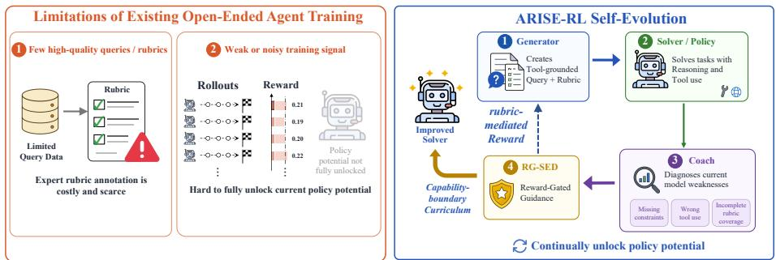  
Figure 1: Motivation of ARISE-RL. Existing long-horizon open-ended agent training is constrained by scarce high-quality queries and expert rubrics, as well as brittle and noisy rewards that provide weak rollout contrast and limit policy improvement. ARISE-RL introduces a rubric-mediated selfevolution loop, where the Generator produces tool-grounded queries and rubrics near the Solver’s capability boundary, while the Solver improves through fine-grained rubric rewards and rewardgated guidance. This design reduces reliance on human supervision and expands capabilities.

Second, an optimization bottleneck persists even when queries are placed near the model’s capability boundary. Open-ended agentic tasks typically involve long-horizon, multi-turn tool use and interaction with external environments, where reward signals are often brittle and unstable. Consequently, vanilla RL may still suffer from advantage collapse: sampled rollouts provide only weak or noisy contrast, making it difficult to derive fine-grained optimization signals that indicate which reasoning behaviors and tool-use decisions should be reinforced. This confines optimization to local refinement within the model’s existing capability region, rather than enabling sustained expansion of its capability frontier. A natural remedy is to introduce a stronger teacher who provides demonstrations or guidance. However, conventional off-policy distillation is limited in multi-turn agentic settings: the distribution gap between a fixed teacher and an evolving learner can accumulate through multi-step reasoning and tool use, leading to unstable training (Ye et al., 2026). Moreover, teacher guidance in open-ended tasks is not always reliable, and blind imitation may transfer incorrect tool choices, missed constraints, or low-quality reasoning patterns into the student’s policy. These limitations call for a closed-loop paradigm that can generate tasks, calibrate difficulty, and verify guidance usefulness before incorporating it into policy learning.

To this end, we propose ARISE-RL (Agentic Rubric-Grounded Iterative Self-Evolution with Reinforcement Learning), a full-cycle self-evolution RL framework for open-ended agents illustrated in Figure 1. ARISE-RL replaces reliance on static external data with a closed loop where task generation, task solving, and rubric-based evaluation co-evolve. It consists of a Generator, which produces open-ended queries and judging rubrics, and a Solver, which learns to solve these queries through multi-step reasoning and tool use under rubric-based rewards. Rubrics serve as the interface between task construction and policy optimization. As the Solver improves, the Generator is driven to create tasks that better match the Solver’s evolving capability frontier, forming a rubric-mediated Generator–Solver co-evolution process. To ensure reliable self-generated supervision, ARISE-RL introduces tool-grounded rubric construction: the Generator must invoke relevant tools before writing criteria that depend on tool outputs. This prevents unsupported or hallucinated tool-related rubric items and aligns generated supervision with the actual tool environment. ARISE-RL further calibrates task hardness with a difficulty-shaped reward. For each generated query, multiple Solver attempts estimate empirical solvability, and the Generator is rewarded most when success rates are intermediate rather than uniformly high or low. This encourages tasks near the Solver’s capability boundary, where samples are both challenging and informative for reinforcement learning.

At the local optimization level, we propose Reward-Gated Self-Evolution Distillation (RG-SED), a group-level self-distillation mechanism that continually unlocks policy potential. For the Generator, RG-SED distills reward-improving task-construction patterns, enabling generated queries and

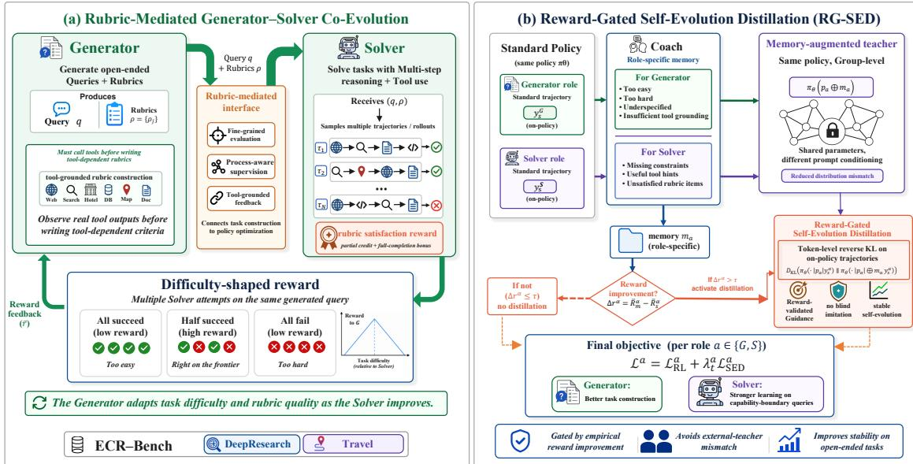

Figure 2: Overview of ARISE-RL. At the global level, a Generator creates open-ended queries and tool-grounded rubrics, while a Solver learns to satisfy them through reasoning and tool use. The rubric couples task generation with policy optimization, and a difficulty-shaped reward keeps tasks near the Solver’s capability frontier. At the local level, RG-SED builds a transient teacher from the same policy with group-level coach memory, and distills its behavior only when memory-augmented rollouts empirically improve reward.

rubrics to align with the Solver’s capability boundary more rapidly. For the Solver, RG-SED strengthens learning on capability-boundary queries, mitigating weak or low-variance updates that may arise in standard group-based RL on highly informative samples. Unlike methods that rely on a fixed external teacher, RG-SED constructs a transient enhanced teacher from the same policy under memory-augmented conditioning, and activates distillation only when its rollouts outperform standard rollouts. Once activated, RG-SED applies token-level reverse KL on on-policy trajectories, allowing the policy to internalize reward-validated high-confidence behaviors. This reward-gated design avoids distribution mismatch and prevents blind imitation of noisy guidance.

Beyond the training framework, we construct ECR-Bench, an Expert-Calibrated Rubric Benchmark suite for open-ended agent evaluation. It contains ECR-DeepResearch, with 100 expert-calibrated single-tool research queries, and ECR-Travel, a multi-tool travel-planning benchmark covering five task types: route planning, transportation comparison, nearby POI search, one-day itinerary planning, and multi-day itinerary planning. ECR-Bench evaluates both final response quality and process-level tool-use correctness. We evaluate ARISE-RL on single-tool deep research and multi-tool task planning. The former is measured by rubric score rate, while the latter is evaluated by task pass rate. Across ECR-DeepResearch, ECR-Travel, and existing open-ended benchmarks such as ResearchRubrics (Sharma et al., 2025) and VitaBench (He et al., 2025), ARISE-RL achieves the best average performance and consistent robust gains on 8B/9B-scale models.

Our main contributions are summarized as follows. (1) We propose ARISE-RL, a full-cycle selfevolution RL framework that unifies task generation, rubric construction, task solving, and reinforcement learning into a closed loop, enabling open-ended agents to continually expand their capability boundaries with reduced reliance on large-scale human-authored data. (2) We introduce Reward-Gated Self-Evolution Distillation (RG-SED), which constructs a transient enhanced teacher from the same policy under group-level coach memory and activates distillation only when the memory empirically improves reward, mitigating advantage collapse, distribution mismatch, and negative transfer from noisy guidance. (3) We construct ECR-Bench, an Expert-Calibrated Rubric Benchmark suite covering single-tool deep research and multi-tool travel planning, providing fine-grained, process-aware, and expert-calibrated evaluation criteria for open-ended agents.

## 2 Related Work

Self-Evolving Agents. Recently, self-evolution has emerged as a paradigm for autonomous LLM improvement (Gao et al., 2025; Yue et al., 2026; Liu et al., 2025; Huang et al., 2025; Lu et al., 2025). EvolveR (Wu et al., 2025) couples offline self-distillation with online interaction over a repository of strategic principles, while ASL (Sun et al., 2025) unifies prompt generation, policy learning, and generative reward modeling for search agents. RAGEN (Wang et al., 2025) studies self-evolution in multi-turn RL. While prior frameworks demonstrate the potential of self-bootstrapping, they mainly focus on closed-form, single-tool, or reasoning-centric settings, and thus fall short of open-ended agentic tasks that require reliable tool grounding, adaptive task generation, and fine-grained rubricbased evaluation. ARISE-RL is the first self-evolution framework tailored to such tasks, unifying task generation, rubric construction, and policy learning within a closed loop.

Off-Policy Distillation and Self-Distillation. Distillation from a stronger fixed teacher (Hinton et al., 2015; Gou et al., 2021; Lu et al., 2025) is a common way to bootstrap difficult RL settings. In multi-turn agentic training, however, the importance-sampling correction between a static teacher and the on-policy student compounds across tool-use turns and quickly destabilizes optimization, a failure mode reported in OPCD (Ye et al., 2026). A fixed teacher additionally imposes a static ceiling on the student and provides no mechanism for rejecting noisy guidance. Self-distillation (Zhang et al., 2019; Allen-Zhu & Li, 2020) sidesteps the cross-model gap but, in its standard form, lacks a principled criterion for when to distill. RG-SED constructs the teacher from the same policy under a query-specific coach-augmented prompt, naturally bounding the student–teacher distribution gap. Distillation is activated only when coach-augmented rollouts improve empirical reward, and useful guidance is internalized via token-level reverse KL on on-policy trajectories to preserve training–deployment consistency.

## 3 Method

As shown in Figure 2, ARISE-RL trains open-ended agents through a self-evolving loop of task generation, rubric construction, and policy learning. Globally, a Generator creates open-ended queries and rubrics near the Solver’s capability boundary, while the Solver learns through reasoning and tool use. Locally, Reward-Gated Self-Evolution Distillation (RG-SED) selectively distills reward-improving behaviors for both roles, yielding more informative tasks and stronger open-ended agents.

## 3.1 Rubric-Mediated Generator–Solver Co-Evolution

ARISE-RL builds a dynamic rubric-mediated co-evolution loop between a task Generator and a Solver. At each iteration, the Generator produces an open-ended query q and a set of evaluation rubrics $\rho = \{ \rho _ { j } \} _ { j = 1 } ^ { M }$ , while the Solver attempts to answer the query through multi-step reasoning and tool use. The generated rubric serves as the coupling interface between task construction and policy optimization: it provides explicit fine-grained evaluation criteria, defines process-aware supervision for Solver learning, and offers tool-grounded feedback for Generator training.

Generator reward. The Generator is encouraged to produce tasks that are tool-grounded, formatvalid, and appropriately challenging. Given a Generator trajectory ξ, we define its reward as:

$$
R _ { \mathrm { G } } ( q , \rho , \xi ) = R _ { \mathrm { t o o l } } ( \xi ) R _ { \mathrm { f m t } } ( q , \rho ) ( 1 + R _ { \mathrm { d i f f } } ( q , \rho ) ) .\tag{1}
$$

where $R _ { \mathrm { t o o l } }$ and $R _ { \mathrm { f m t } }$ are binary gates. The tool-grounding gate requires the Generator to observe at least one real tool output before specifying tool-dependent rubric criteria: Let $\mathcal T ( \xi )$ denote the event

that trajectory $\xi$ contains the corresponding tool observation. We define

$$
R _ { \mathrm { t o o l } } ( \xi ) = \mathbb { I } [ \mathcal { T } ( \xi ) ] .\tag{2}
$$

This prevents the Generator from hallucinating tool-related requirements that are unsupported by actual tool evidence. The format gate ensures that the generated task can be parsed and executed by the downstream Solver:

$$
R _ { \mathrm { f m t } } ( q , \rho ) = \mathbb { I } \left[ q \neq \emptyset \ \wedge \ \rho \ \mathrm { i s ~ a ~ n o n  – e m p t y ~ l i s t } \right] .\tag{3}
$$

Once both gates are satisfied, the Generator receives a difficulty-shaped reward. For each generated query, we independently sample the Solver K times. Let $r _ { i } ^ { S }$ denote the Solver reward for the i-th rollout, and let $\gamma$ be the success threshold. The number of successful rollouts is defined as

$$
c = \sum _ { i = 1 } ^ { K } \mathbb { I } \left( r _ { i } ^ { S } \geq \gamma \right) .\tag{4}
$$

We then define the difficulty reward as

$$
R _ { \mathrm { d i f f } } ( q , \rho ) = 2 \cdot \operatorname* { m a x } \left( 0 , 1 - { \frac { | c - K / 2 | } { K / 2 } } \right) .\tag{5}
$$

This reward is maximized when approximately half of the Solver rollouts succeed, and decreases to zero when all rollouts either succeed or fail. It therefore drives the Generator toward intermediatedifficulty tasks near the Solver’s current capability boundary, where group-based policy optimization receives the most informative reward variation.

Solver reward. Given a Solver trajectory $\tau _ { i }$ and a rubric set $\rho = \{ \rho _ { j } \} _ { j = 1 } ^ { M } ,$ we assess whether each rubric item is satisfied using an LLM judge. Specifically, we define

$$
z _ { i j } = \mathbb { I } \left[ \tau _ { i } \mathrm { s a t i s f i e s } \rho _ { j } \right] ,\tag{6}
$$

and compute the rubric satisfaction rate as

$$
s _ { i } = \frac { 1 } { M } \sum _ { j = 1 } ^ { M } z _ { i j } .\tag{7}
$$

The rubric-mediated reward combines partial-credit supervision with a full-completion bonus:

$$
r _ { i } ^ { S } = \alpha s _ { i } + ( 1 - \alpha ) \mathbb { I } [ s _ { i } = 1 ] , \qquad r _ { i } ^ { S } \in [ 0 , 1 ] .\tag{8}
$$

where α balances partial rubric satisfaction and the full-completion bonus. This reward provides fine-grained supervision while retaining an explicit incentive for satisfying all criteria. It is used for group-based Solver optimization and reused as the empirical difficulty signal for Generator training.

Co-evolution dynamics. The Generator and Solver rewards form an adaptive self-evolving curriculum. The Solver learns to satisfy fine-grained rubrics, while the Generator is driven to produce valid, tool-grounded tasks near the Solver’s capability boundary, yielding a closed-loop optimization process for continual open-ended agent learning.

## 3.2 Role-Conditioned Reward-Gated Self-Evolution Distillation

Although rubric-mediated co-evolution shapes a progressively adaptive curriculum, both the Generator and the Solver can still encounter local optimization inefficiencies. For the Generator, reward feedback from Solver performance may be sparse or delayed, making it difficult to quickly identify task construction patterns that match the Solver’s current capability boundary. For the Solver, capability-boundary long-horizon tasks are highly informative but may yield weak or low-variance group-based learning signals, limiting the efficiency of policy improvement. To address these issues, we introduce RG-SED, a role-conditioned group-level self-distillation mechanism applied to both roles.

Let $a \in \{ \mathrm { G } , \mathrm { S } \}$ denote the role, corresponding to the Generator or the Solver. For each role, the current deployment policy first samples trajectories under the original role-specific prompt $p _ { a } \colon$

$$
y _ { s } ^ { a } \sim \pi _ { \theta } ^ { a } ( \cdot \mid p _ { a } ) ,\tag{9}
$$

where $y _ { s } ^ { a }$ denotes a standard trajectory, instantiated as a Generator trajectory for $a = \mathbf G$ and a Solver trajectory for $a = { \mathsf { S } } .$ A coach then analyzes the feedback associated with these trajectories and produces role-specific memory $m _ { a }$ . For the Generator, this memory summarizes task-construction feedback, such as whether the generated query was too easy, too difficult, underspecified, or insufficiently grounded in tool observations. Such memory helps the Generator adjust future queries and rubrics toward the Solver’s current capability frontier. For the Solver, the memory summarizes query-specific learning signals, such as missing constraints, useful tool hints, or rubric items that should be explicitly addressed. Such memory strengthens learning on capability-boundary queries without introducing an external teacher. Conditioning the same policy on the role-specific memory yields a transient memory-augmented teacher:

$$
y _ { m } ^ { a } \sim \pi _ { \theta } ^ { a } ( \cdot \mid p _ { a } \oplus m _ { a } ) .\tag{10}
$$

Since the student and teacher share the same parameters and differ only in prompt conditioning, their distributional $\mathrm { g a p }$ is naturally constrained. This avoids the severe mismatch of conventional off-policy distillation while allowing the policy to benefit from reward-improving self-generated guidance.

RG-SED activates distillation only when the group-level memory-augmented trajectories provide empirical reward improvement. For each role $^ { a , }$ we compute the reward gap:

$$
\Delta _ { r } ^ { a } = \bar { R } _ { m } ^ { a } - \bar { R } _ { s } ^ { a } ,\tag{11}
$$

where $\bar { R } _ { m } ^ { a }$ and $\bar { R } _ { s } ^ { a }$ denote the average rewards of memory-augmented and standard trajectories, respectively. The distillation strength is controlled by a reward-gated coefficient:

$$
\lambda _ { t } ^ { a } = \lambda _ { 0 } ^ { a } \cdot \mathbb { I } ( \Delta _ { r } ^ { a } > \tau _ { a } ) \cdot w _ { a } ( t ) \cdot d _ { a } ( t ) ,\tag{12}
$$

where $\tau _ { a }$ is the role-specific activation threshold, $w _ { a } ( t )$ is a warm-up schedule, and $d _ { a } ( t )$ is a decay schedule. When activated, RG-SED applies token-level reverse KL regularization on the standard on-policy trajectories:

$$
\begin{array} { c l } { { \displaystyle \mathcal { L } _ { \mathrm { S E D } } ^ { a } = \mathbb { E } _ { y _ { s } ^ { a } \sim \pi _ { \theta } ^ { a } ( \cdot | p _ { a } ) } \Bigg [ \sum _ { t } D _ { \mathrm { K L } } \Bigg ( \pi _ { \theta } ^ { a } ( \cdot \mid h _ { t } , p _ { a } ) \Bigg | \Bigg ] } } \\ { { \displaystyle s g [ \pi _ { \theta } ^ { a } ( \cdot \mid h _ { t } , p _ { a } \oplus m _ { a } ) ] \Bigg ) \Bigg ] , } } \end{array}\tag{13}
$$

where $h _ { t }$ denotes the trajectory history at step $t ,$ and $\mathrm { s g } [ \cdot ]$ stops gradients through the memoryaugmented distribution. The final role-specific optimization objective is:

$$
{ \mathcal { L } } ^ { a } = { \mathcal { L } } _ { \mathrm { R L } } ^ { a } + \lambda _ { t } ^ { a } { \mathcal { L } } _ { \mathrm { S E D } } ^ { a } , \qquad a \in \{ { \mathrm { G } } , { \mathrm { S } } \} .\tag{14}
$$

By gating distillation with empirical reward improvement, RG-SED avoids blind imitation of noisy guidance, mitigates distribution mismatch, and improves the stability and efficiency of open-ended agent self-evolution.

## 4 ECR-Bench

To evaluate open-ended agents with reliable and fine-grained criteria, we introduce ECR-Bench, an Expert-Calibrated Rubric Benchmark suite. It contains two complementary domains: ECR-DeepResearch for single-tool open-ended research and ECR-Travel for multi-tool travel planning.

Table 1: Main results on four agentic benchmarks. We report rubric score rate on ResearchRubrics (RR) and ECR-DeepResearch (ECR-DR), and task pass rate on VitaBench and ECR-Travel. Avg. denotes the average across the four benchmarks, with VitaBench and ECR-Travel aggregated by averaging their corresponding sub-task scores.
<table><tr><td rowspan="2">Method</td><td rowspan="2">RR</td><td rowspan="2">ECR-DR</td><td colspan="4">VitaBench</td><td colspan="5">ECR-Travel</td><td rowspan="2">Avg.</td></tr><tr><td>Deliv.</td><td>In-Store</td><td>OTA</td><td>Cross</td><td>Direction</td><td>Compare</td><td>Search</td><td>1-Day M-Day</td><td></td></tr><tr><td colspan="10">Closed-source LLMs</td><td></td><td></td><td></td></tr><tr><td></td><td>Gemini3-Pro (Google DeepMind, 2025) 0.473</td><td>0.687</td><td>0.410</td><td>0.443</td><td>0.380</td><td>0.246</td><td>0.187</td><td>0.642</td><td>0.738</td><td>0.290</td><td>0.378</td><td>0.494</td></tr><tr><td>GPT-5 (OpenÀI, 2025a)</td><td>0.316</td><td>0.543</td><td>0.498</td><td>0.504</td><td>0.327</td><td>0.210</td><td>0.100</td><td>0.565</td><td>0.758</td><td>0.317</td><td>0.410</td><td>0.418</td></tr><tr><td>GPT-5.2 (OpenAI, 2025b)</td><td>0.434</td><td>0.713</td><td>0.342</td><td>0.273</td><td>0.295</td><td>0.071</td><td>0.027</td><td>0.567</td><td>0.609</td><td>0.276</td><td>0.398</td><td>0.442</td></tr><tr><td>Claude-4.5-Sonnet (Anthropic, 2025) Claude-4.6-Sonnet (Anthropic, 2026)</td><td>0.427 0.467</td><td>0.541</td><td>0.473</td><td>0.467</td><td>0.419</td><td>0.287</td><td>0.398</td><td>0.783</td><td>0.713</td><td>0.243</td><td>0.260</td><td>0.465</td></tr><tr><td></td><td></td><td>0.623</td><td>0.598</td><td>0.472</td><td>0.426</td><td>0.273</td><td>0.223</td><td>0.683</td><td>0.710</td><td>0.236</td><td>0.393</td><td>0.495</td></tr><tr><td colspan="10">Open-source LLMs</td><td></td><td></td><td></td><td></td></tr><tr><td>Qwen3-32B (Yang et al., 2025)</td><td>0.372</td><td>0.590</td><td>0.380</td><td>0.318</td><td>0.247</td><td>0.173</td><td>0.389</td><td>0.586</td><td>0.612</td><td>0.247</td><td>0.298</td><td>0.417</td></tr><tr><td>Qwen3-235B (Yang et al., 2025)</td><td>0.421</td><td>0.652</td><td>0.450</td><td>0.398</td><td>0.318</td><td>0.216</td><td>0.452</td><td>0.658</td><td>0.687</td><td>0.273</td><td>0.340</td><td>0.475</td></tr><tr><td>Qwen3.5-397B (Qwen Team, 2026)</td><td>0.418</td><td>0.628</td><td>0.580</td><td>0.512</td><td>0.358</td><td>0.293</td><td>0.512</td><td>0.756</td><td>0.748</td><td>0.319</td><td>0.410</td><td>0.508</td></tr><tr><td colspan="10">Self-Evolving Frameworks</td><td colspan="3"></td></tr><tr><td>Qwen3-8B (Yang et al., 2025)</td><td>0.236</td><td>0.412</td><td>0.143</td><td>0.117</td><td>0.026</td><td>0.013</td><td>0.387</td><td>0.346</td><td>0.490</td><td>0.213</td><td>0.282</td><td>0.267</td></tr><tr><td>+Dr. Zero (Yue et al., 2026)</td><td>0.292</td><td>0.462</td><td>0.172</td><td>0.142</td><td>0.058</td><td>0.030</td><td>0.442</td><td>0.410</td><td>0.557</td><td>0.240</td><td>0.318</td><td>0.312</td></tr><tr><td>+Absolute Zero (Zhao et al., 2026)</td><td>0.307</td><td>0.417</td><td>0.176</td><td>0.144</td><td>0.018</td><td>0.016</td><td>0.361</td><td>0.450</td><td>0.513</td><td>0.257</td><td>0.307</td><td>0.298</td></tr><tr><td>+ARISE-RL</td><td>0.343</td><td>0.513</td><td>0.202</td><td>0.167</td><td>0.094</td><td>0.055</td><td>0.498</td><td>0.483</td><td>0.617</td><td>0.273</td><td>0.357</td><td>0.358</td></tr><tr><td>Qwen3.5-9B (Qwen Team, 2026)</td><td>0.447</td><td>0.735</td><td>0.358</td><td>0.483</td><td>0.118</td><td>0.063</td><td>0.438</td><td>0.657</td><td>0.672</td><td>0.263</td><td>0.321</td><td>0.477</td></tr><tr><td>+Dr. Zero (Yue et al., 2026)</td><td>0.464</td><td>0.761</td><td>0.454</td><td>0.578</td><td>0.272</td><td>0.103</td><td>0.524</td><td>0.747</td><td>0.744</td><td>0.312</td><td>0.403</td><td>0.531</td></tr><tr><td>+Absolute Zero (Zhao et al., 2026)</td><td>0.452</td><td>0.748</td><td>0.406</td><td>0.504</td><td>0.308</td><td>0.080</td><td>0.452</td><td>0.676</td><td>0.667</td><td>0.323</td><td>0.420</td><td>0.508</td></tr><tr><td>+ARISE-RL</td><td>0.479</td><td>0.781</td><td>0.523</td><td>0.643</td><td>0.373</td><td>0.127</td><td>0.587</td><td>0.812</td><td>0.797</td><td>0.342</td><td>0.456</td><td>0.569</td></tr></table>

Stage I: Benchmark design and expert rubric annotation. We manually review all test queries and rubrics to ensure query clarity, appropriate difficulty, rubric specificity, coverage, and consistency between each query and its corresponding rubric. Queries or rubrics that fail the review are iteratively revised or removed to ensure evaluation reliability.

(1) ECR-DeepResearch evaluates web-search-based deep research, requiring agents to retrieve information, synthesize evidence, and produce structured research-style responses. It contains 100 high-quality test queries, each paired with an expert-calibrated rubric assessing factual grounding, evidence coverage, reasoning quality, completeness, and report structure. We use the rubric score ratio as the main metric. (2) ECR-Travel evaluates multi-tool travel planning under realistic constraints, including time windows, budgets, user preferences, transportation feasibility, and weather conditions. It covers five task categories, with 100 test queries per category: route planning with multiple specified waypoints (Direction); transportation-mode comparison (Compare); nearby point-of-interest (POI) search (Search); one-day trip planning in a single city (1-Day); and multi-day trip planning (M-Day). The tool set includes POI search, nearby search, navigation, web search, flight search, train-ticket search, and weather lookup. Each query is paired with an expert-calibrated rubric assessing both itinerary quality and tool-use correctness, with task success rate as the primary evaluation metric. Together, ECR-DeepResearch and ECR-Travel evaluate complementary capabilities: evidence-grounded long-form research and constraint-aware multi-tool planning. ECR-Bench therefore provides an open-ended agent evaluation platform beyond fixed-answer benchmarking.

Stage II: Quality control. We apply a rule-augmented LLM quality checker to filter trajectories with formatting errors or logical inconsistencies. The checker strictly validates tool-call validity, dialogue correctness, and final-answer consistency. Failed samples are iteratively rewritten or removed, and all test queries and rubrics are manually reviewed to ensure reliability.

## 5 Experiments

## 5.1 Experimental Settings

Datasets. We evaluate ARISE-RL on four open-ended agentic benchmarks. Two of them belong to our proposed ECR-Bench suite: ECR-DeepResearch for single-tool open-ended research and ECR-Travel for multi-tool travel planning, which is further decomposed into five subtasks— route planning (Direction), transportation comparison (Compare), nearby POI search (Search), one-day itinerary (1-Day), and multi-day itinerary (M-Day). The other two are existing rubric-based open-ended benchmarks: ResearchRubrics (Sharma et al., 2025) for single-tool deep research and VitaBench (He et al., 2025) for multi-tool daily-life agents, covering three single-scenario domains, namely food delivery (Deliv.), in-store consumption (In-Store), and online travel services (OTA), as well as a cross-scenario setting (Cross) that combines tools from multiple domains within a single task. For the two single-tool research benchmarks, we report the rubric score rate; For the two multi-tool benchmarks, we report the task pass rate averaged across four independent runs.

Table 2: Ablation study on Qwen3.5-9B. “VitaBench” averages four sub-tasks (Deliv./In-Store/OTA/Cross), while “ECR-Travel” averages five sub-tasks.
<table><tr><td>Variant</td><td>RR</td><td>ECR-DR</td><td>VitaBench</td><td>ECR-Travel</td></tr><tr><td>ARISE-RL (full)</td><td>|0.479</td><td>0.781</td><td>0.417</td><td>0.599</td></tr><tr><td>w/o RG-SED</td><td>0.422</td><td>0.716</td><td>0.350</td><td>0.518</td></tr><tr><td>w/o reward gating</td><td>0.438</td><td>0.725</td><td>0.371</td><td>0.523</td></tr><tr><td>w/o tool-grounded rubric</td><td>0.447</td><td>0.720</td><td>0.395</td><td>0.549</td></tr><tr><td>w/o difficulty-shaped reward</td><td>0.456</td><td>0.743</td><td>0.402</td><td>0.537</td></tr></table>

Table 3: Per-cycle Solver performance during the three co-evolution iterations of ARISE-RL on the Qwen3.5-9B backbone. Each cycle yields monotone improvement across all four benchmarks.
<table><tr><td>Cycle</td><td>RR</td><td>ECR-DR</td><td>VitaBench</td><td>ECR-Travel</td></tr><tr><td>Qwen3.5-9B</td><td>0.447</td><td>0.735</td><td>0.256</td><td>0.470</td></tr><tr><td>iter 1</td><td>0.458</td><td>0.752</td><td>0.310</td><td>0.512</td></tr><tr><td>iter 2</td><td>0.470</td><td>0.768</td><td>0.367</td><td>0.561</td></tr><tr><td>iter 3 (final)</td><td>0.479</td><td>0.781</td><td>0.417</td><td>0.599</td></tr></table>

Baselines. We compare ARISE-RL against three groups of competitive baselines, all evaluated under the same setting: (i) closed-source LLMs: Gemini3-Pro (Google DeepMind, 2025), GPT-5 (OpenAI, 2025a), GPT-5.2 (OpenAI, 2025b), Claude-4.5-Sonnet (Anthropic, 2025) and Claude-4.6-Sonnet (Anthropic, 2026); (ii) open-source LLMs: Qwen3-32B, Qwen3-235B, and Qwen3.5-397B, which span two model generations and an order-of-magnitude range in parameter count; (iii) self-evolution frameworks built on the same small backbones: Dr. Zero (Yue et al., 2026) and Absolute Zero (Zhao et al., 2026), re-implemented under the identical rubric judge and tool stack.

Implementation Details. All experiments are implemented in PyTorch on 32 H20 GPUs. We sample G=16 rollouts per query at temperature 0.8 and allow up to 40 rounds of tool interaction. For the difficulty-shaped Generator reward, we set K=8 Solver rollouts per generated query and a success threshold γ=0.9. The Solver reward uses the partial-credit/full-completion weighting (0.8, 0.2). For RG-SED we set the initial coefficient $\lambda _ { 0 } ^ { a } { = } 0 . 5$ for both roles, the activation threshold $\tau _ { a } { = } 0 . 0 5$ . The UserSimulator that drives the interactive multi-turn benchmarks is instantiated with Qwen3.5-397B, and all judges, including rubric scoring, coach summarisation, and format checking, are uniformly served by gpt-5.2.

## 5.2 Main Results

Comparison to Strong Baselines. Table 1 reports the main results. ARISE-RL on the Qwen3.5-9B backbone consistently attains the best overall performance, surpassing all closed-source models and the strongest open-source non-self-evolving baselines, with the most pronounced gains on the two interactive multi-tool benchmarks while still reaching the column-wise best on the two rubricbased DeepResearch-style benchmarks. The advantage is preserved on the Qwen3-8B backbone. Under the same backbone, ARISE-RL consistently exhibits a clear performance advantage over two contemporary self-evolution baselines, Dr. Zero and Absolute Zero. This result indicates that the synergy between RG-SED and the decoupled Generator–Solver design is the key factor behind the performance gains on long-horizon open-ended agentic tasks.

Comparison with On-Policy Distillation Methods. To isolate the contribution of RG-SED, we compare it against two representative on-policy distillation baselines, OPCD (Ye et al., 2026) and GKD (Agarwal et al., 2024), re-implemented under the identical Qwen3.5-9B backbone, training data, and rubric-judging pipeline.

As shown in Figure 3, RG-SED attains the best score on every one of the eleven benchmark axes. Although OPCD and GKD exhibit complementary strengths on the radar, they remain consistently inferior to RG-SED overall. This confirms that our group-level memory-augmented self-distillation, in which the distillation signal is gated by empirical reward improvement rather than applied blindly, effectively enhances the learning capability of open-ended agents on complex tool-use tasks far beyond what a standard on-policy distillation loop can achieve independently.

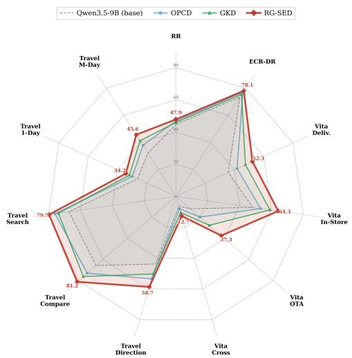  
Figure 3: Detailed per-benchmark performance comparison of ARISE-RL, OPCD, and GKD.

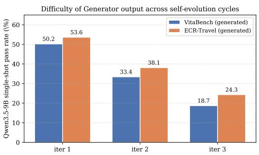  
Figure 4: Single-shot pass rate of the frozen Qwen3.5-9B base policy on generated questions sampled from the Generator at the end of each self-evolution cycle.

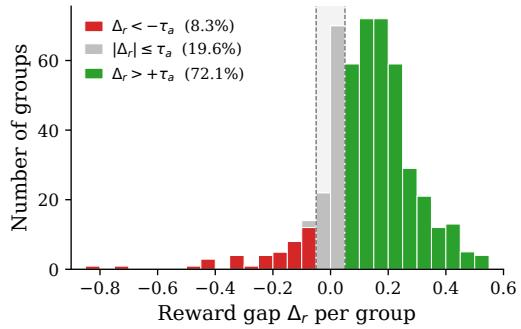  
Figure 5: Reward-gap distribution on ECR-Travel. Per-group ∆r over training groups, stacked by gate region.

## 5.3 Further Analysis

Ablation Study. Table 2 reports the ablation results for four key design choices in ARISE-RL: w/o RG-SED, w/o reward gating (i.e., always applying the loss without the gate), w/o tool-grounded rubric, and w/o difficulty-shaped reward. RG-SED emerges as the most influential component, with the largest performance drop observed on the two multi-tool benchmarks, where reward-validated guidance is most critical. Within RG-SED, reward gating is itself essential: disabling it causes substantial degradation on multi-tool tasks, indicating that ungated distillation tends to amplify, rather than suppress, noisy supervision. The tool-grounded rubric and the difficulty-shaped reward each yield consistent gains, suggesting that the four design choices are complementary rather than redundant. Self-Evolution Cycles. ARISE-RL is trained for three Generator–Solver co-evolution cycles. Table 3 shows that each cycle brings non-trivial performance gains, with the most pronounced improvements observed on the two multi-tool benchmarks. This trend is consistent with the design of ARISE-RL, where Solver improvement is accompanied by progressively harder yet still valid queries generated by the Generator. Figure 4 further provides direct evidence that the generated queries become increasingly difficult over the course of self-evolution. Specifically, we evaluate the single-shot pass rate of the frozen Qwen3.5-9B base policy on questions freshly sampled from the Generator at the end of each self-evolution cycle. On both multi-tool benchmarks, the pass rate decreases monotonically and consistently as the Generator evolves across cycles. This result shows that the Generator is indeed producing increasingly challenging queries, thereby inducing an effective curriculum that matches the improving capability of the Solver.

Gate Selectivity on ECR-Travel. We evaluate the selectivity of the RG-SED reward gate on ECR-Travel. Figure 5 shows the distribution of the reward gap $\Delta _ { r }$ over all training groups. Among them, 8.3% satisfy $\Delta _ { r } < - \tau _ { a } ,$ where coach memory reduces the Solver’s empirical reward; 19.6% fall into the ambiguous region $| \Delta _ { r } | \leq \tau _ { a } ;$ and 72.1% show a reliable positive gap. Thus, coach memory is not universally helpful: an ungated distillation objective would apply neutral or even harmful supervision to nearly one-third of the groups. The gate $\mathbb { I } [ \Delta _ { r } > \tau _ { a } ]$ prevents such negative transfer by activating distillation only when coach-augmented rollouts empirically improve reward.

## 6 Conclusion

We present ARISE-RL, a rubric-mediated co-evolution framework that couples a Generator and a Solver with fine-grained rewards, together with Reward-Gated Self-Evolution Distillation, which distills memory-augmented behavior only when it empirically improves reward. We further introduce ECR-Bench, an expert-calibrated rubric benchmark for multi-tool agents. Across four benchmarks, ARISE RL achieves average state-of-the-art performance with a 9B open-source backbone, demonstrating the effectiveness of rubric-mediated co-evolution and reward-gated self-distillation for open-ended agent training. This highlights the promise of unified closed-loop self-evolution for scalable openended agent training.

## Limitations

Due to computational resource constraints, all experiments are conducted on $8 / 9 \mathrm { B }$ open-source backbone models. As a result, while ARISE-RL demonstrates consistent gains at this scale, the scalability of rubric-mediated co-evolution and RG-SED to substantially larger base models remains to be verified. We leave large-scale validation across stronger backbones to future work.

## Ethical Considerations

We will abide by the laws, rules, and regulations of our community, school, work, and country. We will conduct ourselves with integrity, fidelity, and honesty. We will openly take responsibility for our actions and only make agreements that we intend to keep. All data used in this study are intended for research purposes. No personally identifiable information (PII) was collected. The dataset construction and data collection protocol have been reviewed and approved by our organization’s internal Ethics Review Board, and all collected data are used solely for research purposes without collecting personally identifiable information. For existing artifacts used in this work, including tools, benchmarks, APIs, and model resources, we follow their stated licenses, access conditions, and terms of use. Any artifacts created in this work, including benchmark data, rubrics, prompts, and evaluation scripts, are intended for research use only. Their use and distribution will be made consistent with the original access conditions of the underlying resources, and derivatives of research-only data will not be used outside research contexts.

## References

Rishabh Agarwal, Nino Vieillard, Yongchao Zhou, Piotr Stanczyk, Sabela Ramos Garea, Matthieu Geist, and Olivier Bachem. On-policy distillation of language models: Learning from selfgenerated mistakes. In International Conference on Learning Representations, volume 2024, pp. 21246–21263, 2024.

Zeyuan Allen-Zhu and Yuanzhi Li. Towards understanding ensemble, knowledge distillation and self-distillation in deep learning. arXiv preprint arXiv:2012.09816, 2020.

Anthropic. Claude Sonnet 4.5. https://www.anthropic.com/news/claude-sonnet-4-5, 2025.

Anthropic. Claude Sonnet 4.6. https://www.anthropic.com/news/claude-sonnet-4-6, 2026.

Mingxuan Du, Benfeng Xu, Chiwei Zhu, Xiaorui Wang, and Zhendong Mao. Deepresearch bench: A comprehensive benchmark for deep research agents. arXiv preprint arXiv:2506.11763, 2025.

Huan-ang Gao, Jiayi Geng, Wenyue Hua, Mengkang Hu, Xinzhe Juan, Hongzhang Liu, Shilong Liu, Jiahao Qiu, Xuan Qi, Yiran Wu, et al. A survey of self-evolving agents: What, when, how, and where to evolve on the path to artificial super intelligence. arXiv preprint arXiv:2507.21046, 2025.

Google DeepMind. Gemini 3 Pro. https://blog.google/products/gemini/gemini-3/, 2025.

Jianping Gou, Baosheng Yu, Stephen J Maybank, and Dacheng Tao. Knowledge distillation: A survey. International journal of computer vision, 129(6):1789–1819, 2021.

Wei He, Yueqing Sun, Hongyan Hao, Xueyuan Hao, Zhikang Xia, Qi Gu, Chengcheng Han, Dengchang Zhao, Hui Su, Kefeng Zhang, et al. Vitabench: Benchmarking llm agents with versatile interactive tasks in real-world applications. arXiv preprint arXiv:2509.26490, 2025.

Geoffrey Hinton, Oriol Vinyals, and Jeff Dean. Distilling the knowledge in a neural network. arXiv preprint arXiv:1503.02531, 2015.

Chengsong Huang, Wenhao Yu, Xiaoyang Wang, Hongming Zhang, Zongxia Li, Ruosen Li, Jiaxin Huang, Haitao Mi, and Dong Yu. R-zero: Self-evolving reasoning llm from zero data. arXiv preprint arXiv:2508.05004, 2025.

Carlos E Jimenez, John Yang, Alexander Wettig, Shunyu Yao, Kexin Pei, Ofir Press, and Karthik Narasimhan. Swe-bench: Can language models resolve real-world github issues? In International Conference on Learning Representations, volume 2024, pp. 54107–54157, 2024.

Jiaqi Liu, Kaiwen Xiong, Peng Xia, Yiyang Zhou, Haonian Ji, Lu Feng, Siwei Han, Mingyu Ding, and Huaxiu Yao. Agent0-vl: Exploring self-evolving agent for tool-integrated vision-language reasoning. arXiv preprint arXiv:2511.19900, 2025.

Hongliang Lu, Yuhang Wen, Pengyu Cheng, Ruijin Ding, Jiaqi Guo, Haotian Xu, Chutian Wang, Haonan Chen, Xiaoxi Jiang, and Guanjun Jiang. Search self-play: Pushing the frontier of agent capability without supervision. arXiv preprint arXiv:2510.18821, 2025.

OpenAI. GPT-5. https://openai.com/index/introducing-gpt-5/, 2025a.

OpenAI. GPT-5.2. https://openai.com/index/introducing-gpt-5-2/, 2025b.

Yujia Qin, Shihao Liang, Yining Ye, Kunlun Zhu, Lan Yan, Yaxi Lu, Yankai Lin, Xin Cong, Xiangru Tang, Bill Qian, et al. Toolllm: Facilitating large language models to master 16000+ real-world apis. In International Conference on Learning Representations, volume 2024, pp. 9695–9717, 2024.

Qwen Team. Qwen3.5 collection. https://huggingface.co/collections/Qwen/qwen35, 2026.

Zhihong Shao, Peiyi Wang, Qihao Zhu, Runxin Xu, Junxiao Song, Xiao Bi, Haowei Zhang, Mingchuan Zhang, YK Li, Yang Wu, et al. Deepseekmath: Pushing the limits of mathematical reasoning in open language models. arXiv preprint arXiv:2402.03300, 2024.

Manasi Sharma, Chen Bo Calvin Zhang, Chaithanya Bandi, Clinton Wang, Ankit Aich, Huy Nghiem, Tahseen Rabbani, Ye Htet, Brian Jang, Sumana Basu, et al. Researchrubrics: A benchmark of prompts and rubrics for evaluating deep research agents. arXiv preprint arXiv:2511.07685, 2025.

Wangtao Sun, Xiang Cheng, Jialin Fan, Yao Xu, Xing Yu, Shizhu He, Jun Zhao, and Kang Liu. Towards agentic self-learning llms in search environment. arXiv preprint arXiv:2510.14253, 2025.

Zihan Wang, Kangrui Wang, Qineng Wang, Pingyue Zhang, Linjie Li, Zhengyuan Yang, Xing Jin, Kefan Yu, Minh Nhat Nguyen, Licheng Liu, et al. Ragen: Understanding self-evolution in llm agents via multi-turn reinforcement learning. arXiv preprint arXiv:2504.20073, 2025.

Rong Wu, Xiaoman Wang, Jianbiao Mei, Pinlong Cai, Daocheng Fu, Cheng Yang, Licheng Wen, Xuemeng Yang, Yufan Shen, Yuxin Wang, et al. Evolver: Self-evolving llm agents through an experience-driven lifecycle. arXiv preprint arXiv:2510.16079, 2025.

An Yang, Anfeng Li, Baosong Yang, Beichen Zhang, Binyuan Hui, Bo Zheng, Bowen Yu, Chang Gao, Chengen Huang, Chenxu Lv, et al. Qwen3 technical report. arXiv preprint arXiv:2505.09388, 2025.

Shunyu Yao, Jeffrey Zhao, Dian Yu, Nan Du, Izhak Shafran, Karthik Narasimhan, and Yuan Cao. React: Synergizing reasoning and acting in language models. arXiv preprint arXiv:2210.03629, 2022.

Tianzhu Ye, Li Dong, Xun Wu, Shaohan Huang, and Furu Wei. On-policy context distillation for language models. arXiv preprint arXiv:2602.12275, 2026.

Zhenrui Yue, Kartikeya Upasani, Xianjun Yang, Suyu Ge, Shaoliang Nie, Yuning Mao, Zhe Liu, and Dong Wang. Dr. zero: Self-evolving search agents without training data. arXiv preprint arXiv:2601.07055, 2026.

Linfeng Zhang, Jiebo Song, Anni Gao, Jingwei Chen, Chenglong Bao, and Kaisheng Ma. Be your own teacher: Improve the performance of convolutional neural networks via self distillation. In Proceedings of the IEEE/CVF international conference on computer vision, pp. 3713–3722, 2019.

Qiang Zhang, Boli Chen, Fanrui Zhang, Ruixue Ding, Shihang Wang, Qiuchen Wang, Yinfeng Huang, Haonan Zhang, Rongxiang Zhu, Pengyong Wang, et al. Arenarl: Scaling rl for open-ended agents via tournament-based relative ranking. arXiv preprint arXiv:2601.06487, 2026.

Andrew Zhao, Yiran Wu, Tong Wu, Quentin Xu, Yang Yue, Matthieu Lin, Shenzhi Wang, Qingyun Wu, Zilong Zheng, and Gao Huang. Absolute zero: Reinforced self-play reasoning with zero data. Advances in Neural Information Processing Systems, 38:105816–105879, 2026.

Shuyan Zhou, Frank F Xu, Hao Zhu, Xuhui Zhou, Robert Lo, Abishek Sridhar, Xianyi Cheng, Tianyue Ou, Yonatan Bisk, Daniel Fried, et al. Webarena: A realistic web environment for building autonomous agents. In International Conference on Learning Representations, volume 2024, pp. 15585–15606, 2024.

## A The Use of Large Language Models Statement

The authors use LLMs as an assistive tool in the preparation of this manuscript. We use LLMs to proofread, check grammar, and refine the language in the manuscript for improved clarity and readability.

## B ECR-Bench Construction Details

This appendix complements Section 4 by spelling out (i) the tool inventory exposed to the agent on each domain, and (ii) descriptive statistics that characterise the resulting benchmark.

## B.1 Annotated Tool Inventory

ECR-DeepResearch. The agent is equipped with a single web\_search tool, implemented using the Google Custom Search API. To avoid context saturation from lengthy retrieved pages, we summarize any parsed page exceeding 7,500 characters with a dedicated Qwen3-Max summarizer before returning it to the agent.

## ECR-Travel. ECR-Travel exposes a richer tool set of seven primitives:

• Poi\_search — a POI resolution tool built on Amap’s place-search service. Given a structured address (e.g. “No. 88 Century Avenue, Pudong New Area, Shanghai”) or a named place query (e.g. “West Lake Cultural Square”), it returns ranked candidate POIs with complete addresses, geographic coordinates (longitude, latitude), and relevant business metadata.

• Around\_search — a radius-based nearby-place retrieval tool built on Amap. Given a center coordinate, a search radius, and optionally a POI type or keyword (e.g. “coffee shop”), it returns nearby POI candidates using the same output schema as poi\_search.

• Direction — a multi-modal routing tool built on Amap navigation services. Given origin and destination coordinates, with optional waypoints and a travel-mode flag, it returns a step-by-step route plan for walking, driving, or public transit, including distance and estimated duration for each leg.

• Web\_search — a general-purpose textual search tool implemented with the Google Custom Search API. For open-ended travel questions that cannot be fully answered by structured map APIs alone, such as “what are some quiet places to visit in Hangzhou?” or “which evening activities are suitable for families in Chengdu?”, the agent uses this tool to obtain prose-style background information and recommendations. As in ECR-DeepResearch, retrieved pages longer than 7,500 characters are summarized in-line before being returned to the agent.

• Search\_flights — a date-specific intercity flight search tool. Given a departure city, an arrival city, and a travel date, it returns ranked flight options with flight numbers, fares, departure and arrival airports, and scheduled times.

• Search\_train\_tickets — a date-specific intercity train-ticket search tool. Given a departure city, an arrival city, and a travel date, it returns ranked train options with train IDs, fares, departure and arrival stations, scheduled times, and whether the itinerary is direct or requires transfer.

• Weather — a city-level weather lookup tool for historical and forecast conditions. Given a city and a date range, it returns daily weather records, including weather conditions, daytime and nighttime temperatures, wind, and humidity. Unlike prior Amap-only travel benchmarks, this tool enables the agent to ground schedule planning in real weather conditions.

poi\_search, around\_search, direction, and weather are wrappers over Amap’s Web Service API. web\_search is implemented with Google Custom Search, while search\_flights and search\_train\_tickets are simulated by GPT-5-mini under a deterministic prompt that encodes a closed database of flights and trains for a fixed planning horizon.

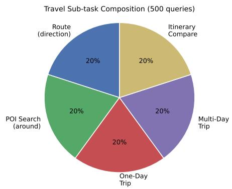

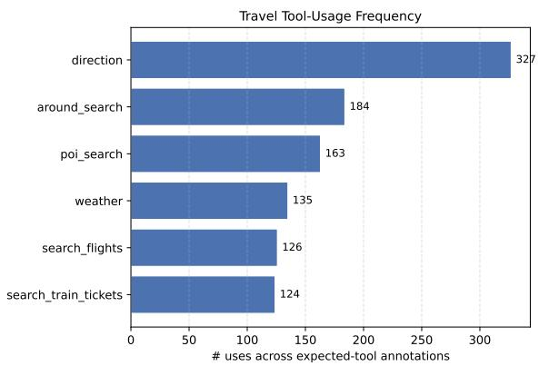  
Figure 6: Left: the five ECR-Travel sub-tasks are perfectly balanced (100 queries each). Right: aggregated tool-usage frequency across all annotated expected\_tools; direction dominates, while weather and the transport-search tools jointly account for nearly a third of all expected calls.

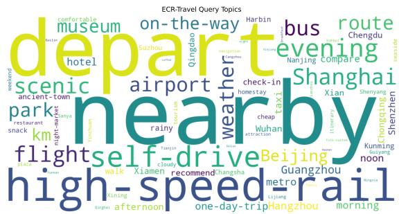  
Figure 7: Word cloud of ECR-Travel query topics. Frequencies are computed on jieba tokens whose Chinese form is mapped to English via a curated travel lexicon (cities, activities, transport, time-of-day, weather).

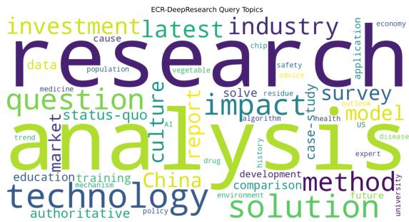  
Figure 8: Word cloud of ECR-DeepResearch query topics. The flat topic distribution illustrates the open-domain nature of the benchmark: no single research theme dominates.

## B.2 Benchmark Statistics

Sub-task and tool coverage (ECR-Travel). Figure 6 summarises the sub-task composition and the underlying tool-usage frequency across all 500 ECR-Travel queries’ annotated expected\_tools, i.e., rubric items specifying the required tool-use behavior. The five sub-tasks are perfectly balanced (100 queries each), and direction is the most frequently invoked primitive (327 uses), followed by around\_search (184), poi\_search (163), weather (135), and the two transport-search tools at ≈ 125 uses each.

Topic diversity. Figure 7 and Figure 8 show word clouds built from jieba-segmented query tokens, after mapping the top frequent Chinese terms to English; research/health/technology/finance domains on the DR side. ECR-Travel concentrates around concrete travel verbs and modes (depart, nearby, self-drive, high-speed-rail,flight, evening) and a wide set of Chinese cities. ECR-DeepResearch instead spreads across a much flatter topic distribution that includes technology, health, economy, policy, and environment, confirming the open-domain nature of the benchmark.

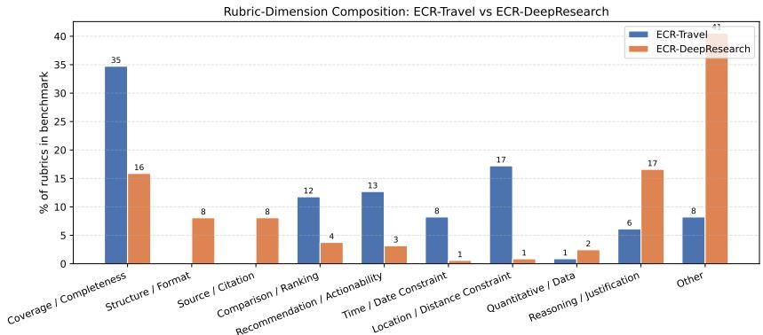  
Figure 9: Composition of rubrics by content dimension. ECR-Travel is dominated by coverage + space/time constraints; ECR-DeepResearch is denser on reasoning, sourcing, and structural formatting. The Other bucket collects rubrics whose surface form did not match any of the nine keyword patterns, and that mostly correspond to free-form “answer is logically consistent” style criteria.

Rubric-dimension composition. Each rubric was assigned to one of ten dimensions by keyword pattern matching (coverage, structure, source, comparison, recommendation, time, location, quantitative, reasoning, other). Figure 9 compares the per-bench distribution. ECR-Travel rubrics are heavily skewed toward coverage (whether the agent’s reply mentions all expected POIs / sub-tasks) and location- / time- constraints (whether the answer respects the geographical and temporal envelope of the trip), reflecting the agentic nature of the task. ECR-DeepResearch rubrics are more evenly spread across coverage, reasoning, and a long tail of presentation-style rubrics (source, structure, quantitative), reflecting that a deep-research answer is scored not only on what it says but on how the conclusion is supported and laid out.

## B.3 Instructions Given to Rubric Annotators

Rubrics were authored by 6 domain experts (3 in travel planning and 3 in deep-research / academic writing). All annotators were informed of the purpose and scope of the study and agreed to participate. Each annotator received a standardized bilingual (Chinese–English) annotation handbook covering: (i) task background and the intended agent behaviour for each query; (ii) rubric-writing guidelines (each rubric must be an independently verifiable single assertion with an explicit pass criterion); (iii) the semantics of the scoring scale with worked examples; (iv) the format of tool-call rubrics, including expected\_tools examples; and (v) a risk disclaimer stating that annotations are used solely for academic research, that no personally identifiable information about the annotators is disclosed, and that participation can be withdrawn at any time. Annotation was conducted by in-house domain colleagues as part of their research collaboration, with no external compensation involved.

## C Baseline Details

To complement the results in Table 1 and Figure 3, we organize the evaluated baselines into four groups: closed-source LLMs, open-source backbone models, self-evolution frameworks built on the same backbones, and on-policy distillation methods. All baselines are evaluated through the same benchmark interface, tool environment, and scoring pipeline; the on-policy distillation methods are used only for the RG-SED mechanism comparison in Figure 3.

Closed-source LLMs.

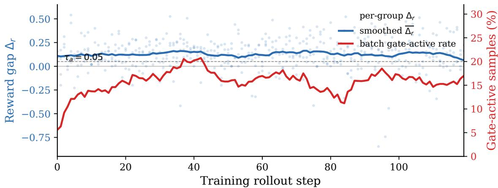  
Figure 10: RG-SED gate dynamics on ECR-Travel. Per-group $\Delta _ { r }$ (light blue scatter) and its smoothed mean $\overline { { \Delta _ { r } } }$ (blue) stay above $\tau _ { a }$ throughout training, while the gate-active sample rate per batch (red, right axis) ramps to ≈ 22% during warm-up and is then modulated in real time by the running $\Delta _ { r }$ distribution—most visibly retracting around rollouts 80–90 where coach memory degrades. Selectivity is therefore adaptive and emergent, not scheduled.

• Gemini3-Pro (Google DeepMind, 2025): a proprietary general-purpose model from Google DeepMind, included as a strong commercial agent baseline across all evaluated benchmarks.

• GPT-5 (OpenAI, 2025a): a proprietary OpenAI model, used to measure how ARISE-RL compares with a commercial general-purpose LLM under the same agent interface.

• GPT-5.2 (OpenAI, 2025b): a later proprietary OpenAI model in the GPT-5 family, included to test whether a stronger commercial model directly solves the open-ended agentic benchmarks.

• Claude-4.5-Sonnet (Anthropic, 2025): a proprietary Anthropic Sonnet model, providing a commercial model family for comparison.

• Claude-4.6-Sonnet (Anthropic, 2026): a later proprietary Sonnet model, used to evaluate a stronger Claude-family baseline on the tool-use benchmarks.

## Open-source LLMs.

• Qwen3-32B (Yang et al., 2025): a mid-scale open-source Qwen backbone, used as a non-selfevolving open-source baseline.

• Qwen3-235B (Yang et al., 2025): a large Mixture-of-Experts Qwen3 backbone with 235B total parameters and 22B activated parameters, included to measure the gain from parameter scaling without self-evolution.

• Qwen3.5-397B (Qwen Team, 2026): a large-scale Mixture-of-Experts model from the Qwen3.5 series, with 397B total parameters and 17B activated parameters.

• Qwen3-8B (Yang et al., 2025): a smaller open-source base policy used for same-backbone comparisons among Dr. Zero, Absolute Zero, and ARISE-RL.

• Qwen3.5-9B (Qwen Team, 2026): the main 9B-scale open-source base policy used for the principal ARISE-RL run, same-backbone self-evolution baselines, and RG-SED comparisons.

## Self-Evolving Frameworks.

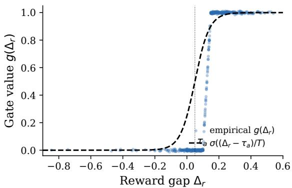  
Figure 11: Empirical RG-SED gate response on ECR-Travel. For every training group, the empirical gate value $g ( \Delta _ { r } )$ tightly tracks the theoretical sigmoid $\sigma ( ( \Delta _ { r } - \tau _ { a } ) \mathbf { \dot { / } } T )$ , confirming that the gate behaviour does not drift over training.

$\mathbf { D r }$ Zero (Yue et al., 2026): a self-evolving search-agent framework without human-authored training data, re-implemented on the same small backbones, tool environment, and rubric judge.

• Absolute Zero (Zhao et al., 2026): a zero-external-data reinforced self-play reasoning framework, adapted as a same-backbone self-evolution baseline. Following its self-play design, we instantiate the task Generator and Solver with the same backbone model.

## On-policy distillation methods.

• OPCD (Ye et al., 2026): On-Policy Context Distillation, used to compare RG-SED with context-distillation-based on-policy learning under the same Qwen3.5-9B setup. The external teacher is set to Qwen3.5-397B.

• GKD (Agarwal et al., 2024): an on-policy distillation baseline. The external teacher is set to Qwen3.5-397B.

## D More Experiments

## D.1 Gate Dynamics over Training.

We further trace how $\Delta _ { r }$ and the gate-active rate co-evolve along the rollout axis (Figure 10). The smoothed mean $\Delta _ { r }$ stays above the activation threshold $\tau _ { a }$ throughout training, while per-group $\Delta _ { r }$ retains substantial dispersion (light blue scatter), indicating that coach memory continues to deliver high-variance but on-average positive guidance even as the Solver strengthens. The fraction of batch samples in which the gate fires (red, right axis) climbs from $\approx 5 \%$ to ≈ 22% over the first ∼ 40 rollouts under the cosine warm-up schedule, and does not subsequently flatten: it is modulated in real time by the $\Delta _ { r }$ distribution. The visible dip around rollouts 80–90 coincides with a cluster of queries on which the coach yields a degraded $\Delta _ { r } ,$ and the gate quietly retracts the distillation pressure rather than amplifying the noise. This adaptive, self-paced selectivity is not the product of any hand-tuned schedule but an emergent effect of pairing the gate with empirical reward feedback, mirroring the w/o reward gating degradation in Table 2: distillation stays well-conditioned only when the gate retracts in real time as $\Delta _ { i }$ dictates.

## D.2 Empirical Gate Response.

To further verify the stability of the reward gate, we overlay the empirical gate value $g ( \Delta _ { r } )$ produced by each training group against the theoretical sigmoid $\sigma \big ( ( \Delta _ { r } - \tau _ { a } ) / T \big )$ (Figure 11). Across the entire

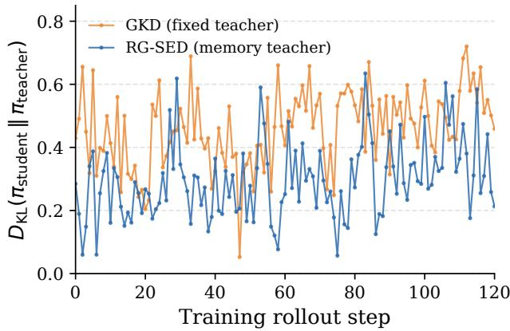  
Figure 12: Student–teacher distribution divergence on ECR-Travel. Token-level $D _ { \mathrm { K L } } ^ { - } ( \pi _ { \mathrm { s t u d e n t } } \Vert \pi _ { \mathrm { t e a c h e r } } )$ per training rollout step (mean and ±1σ band across three seeds). Both runs fluctuate and cross at several rollout segments. Still, the running level under RG-SED’s memory teacher is generally lower than under GKD’s fixed teacher, consistent with the design intuition that a same-policy teacher upper-bounds the action-distribution gap by the prompt-induced shift.

ECR-Travel run, all empirical points fall tightly on the closed-form curve with no observable drift in later training. This shows that the gate reliably performs its intended role by selectively amplifying the distillation signal according to $\bar { \Delta } _ { r }$ throughout training, without requiring additional calibration.

## D.3 Distribution Divergence.

We empirically check the design assumption that RG-SED naturally bounds the student–teacher distribution gap by deriving the teacher from the same policy under a different prompt. We track per-step token-level $D _ { \mathrm { K L } } ( \pi _ { \mathrm { s t u d e n t } } ^ { - } \Vert \pi _ { \mathrm { t e a c h e r } } )$ during ECR-Travel training and compare RG-SED with GKD (Agarwal et al., 2024), a representative on-policy distillation baseline whose teacher is fixed and external. The external teacher is set to Qwen3.5-397B. As shown in Figure 12, both curves exhibit the usual training-time fluctuations, and the two runs cross at several rollout segments. Across the run as a whole, however, RG-SED tends to operate at a lower divergence level, typically in the ≈ 0.2 to 0.35 range with only occasional brief excursions, while GKD remains in a higher band of ≈ 0.4 to 0.55 as the student drifts further from the fixed teacher under RL updates. This pattern is qualitatively consistent with the same-policy memory-teacher construction. Because student and teacher share the underlying parameters and differ only through prompt-induced shifts, the action-distribution gap is intrinsically constrained, without requiring additional explicit regularization to prevent it from growing unbounded.

## D.4 LLM–Human Judge Consistency.

To assess the reliability of the LLM-based evaluation mechanism, we conduct a human-validation study on both ECR-DeepResearch and ECR-Travel. For each benchmark, we randomly sample 50 final-model responses, score them with gpt-5.2 as the LLM judge under the rubric, and have three domain-familiar annotators independently score the same responses using the identical rubric, taking the majority vote as the human label. Figure 13 reports the overall agreement between the gpt-5.2 judge and the human label per benchmark: 82.3% on ECR-DeepResearch and 77.9% on ECR-Travel. This relatively high level of consistency reflects improvements that are broadly aligned with human assessment.

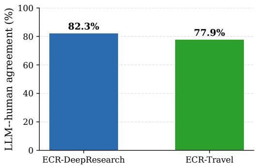  
Figure 13: LLM judge vs. human agreement on ECR-DeepResearch and ECR-Travel.

## D.5 Generator Query Generation Pipeline

We conduct three rounds of Generator–Solver evolution, refreshing the training pool every 120 training steps. At each refresh, we pause RL updates and prompt the Generator to produce a new set of queries for the next training phase. For each prompt, we perform a single rollout, extract the contents of the <question> and <rubric> tags, and retain 500 non-duplicate queries after strict deduplication. To further reduce query-mode homogenization, we include the ten most recently generated queries as in-context negatives in the Generator’s system prompt and explicitly instruct the Generator to avoid duplicating or generating topically near-duplicate queries. This lightweight pipeline, which combines history-aware prompting with post-hoc deduplication, preserves the coverage and diversity of the training distribution without introducing additional training overhead.

## E Prompt Templates

This appendix lists the prompts used in ARISE-RL. We group them by role: Generator (task/rubric author), Solver (agent that completes the task), and Judge (rubric-based scoring LLM). For each role, we additionally include the coach memory prompt that summarizes group-level feedback into a role-specific memory used by RG-SED. All prompts are translated into English here; the production system runs them in the language native to each task (Chinese for VitaBench / ECR-Travel; bilingual for ECR-DeepResearch / ResearchRubrics). Specifically, expected\_tools denotes the rubric item that specifies the required tool-call behavior. These prompts define the interaction protocol among task generation, tool-augmented solving, rubric-based judging, and memory-guided self-distillation.

## E.1 Generator Prompts

The Generator authors a task (query + rubrics) for the Solver. It must first call on tools to ground every rubric in real observations. The three task-specific system prompts are shown in Figures 14, 15, and 16; the shared coach-memory prompt that distills group-level feedback into a Generator-side memory is shown in Figure 17.

## E.2 Solver Prompts

The Solver answers the task generated upstream. Coach feedback (when active) is appended to the system prompt at training time. The three task-specific solver prompts are shown in Figures 18, 19, and 20; the corresponding Solver-side coach-memory prompt is shown in Figure 21.

Generator System Prompt — ECR-DeepResearch / ResearchRubrics   
You are a deep-research question generator. Your job is to author high-quality, diverse research-style   
questions for the solver.   
## Core Principles   
1. You MUST first call \`web\_search\` to gather real data; never fabricate a question out of thin air. Every   
rubric must be supported by evidence found in the search results.   
2. Diversify your search strategy: probe the topic from different angles, starting from overview queries   
and drilling down to specific facts and the latest developments.   
3. Each rubric is a true/false assertion that the solver's final report can be checked against. Pay   
attention to data points, names, organizations and dates in the search results.   
4. At most one \`web\_search\` call per turn; plan ahead and explore over multiple turns.   
## Workflow   
Step 1 -- Explore the topic via \`web\_search\` (2-5 queries with different keywords).   
Step 2 -- Pick a research angle that genuinely requires multi-hop searching to answer and design one   
natural-sounding question.   
Step 3 -- Design rubrics covering information coverage, structured presentation, source traceability and   
term accuracy. Rubrics must be tied to evidence in the search results and must not be overly strict.   
## Output Format (strict JSON)   
{   
"query": "<the generated research question>",   
"rubrics": [   
"rubric 1: a concrete verifiable assertion",   
"rubric 2: another verifiable assertion"   
]   
}  
Figure 14: Generator system prompt for ECR-DeepResearch / ResearchRubrics. The Generator must call web\_search before composing each question, and every rubric must be tied to evidence in the search results.

## E.3 Judge Prompts

The Judge scores the solver’s final trajectory against the rubric list. We show two representative variants: a retrieval-style judge for deep-research tasks (Figure 22) and a multi-tool agentic judge for travel-planning tasks (Figure 23).

## F Case Studies: Coach-Memory-Guided Successful Trajectories

To make the effect of RG-SED concrete, we present trajectories drawn from late-stage rollouts of ARISE-RL training on VitaBench, ECR-Travel, and ECR-DeepResearch, respectively. For each task, we pick a successful sample (reward = 1.0) whose system prompt was augmented with a non-trivial Coach Memory; siblings in the same rollout group without memory injection failed on the same instruction. To keep the main text concise, the description of each case is summarised here, and the full annotated trajectory (Instruction / Coach Memory / User / Assistant / Tool boxes) is deferred to the end of this appendix; references are given via Trajectory A/B/C below. All original Chinese turns have been translated into English, and tool returns are condensed to the lines that drive the agent’s next decision.

## F.1 VitaBench — OTA: Attraction Tickets + Hotel for Parents

The user asks for two interleaved things: an attraction ticket (with stage performance) on a sunny day before Aug. 8, and a 2-night hotel for his parents on Aug. 7 (li-qiu solar term), reusing last month’s hotel but switched to a twin-bed room. Sibling rollouts without memory fired create\_\* endpoints before the date/hotel ID/room type were resolved, and failed all six rubrics. With the coach memory injected, the agent first resolved li-qiu via the calendar tool, picked Aug. 5 from the six-day weather window, recovered the previous Wuzhou Atour booking through order-history tools, verified a twin-bed variant, surfaced a consolidated plan for the user, and only then called create and pay on both orders. All six rubrics are satisfied. The full 17-turn annotated trajectory is given in Trajectory A (Appendix F.6).

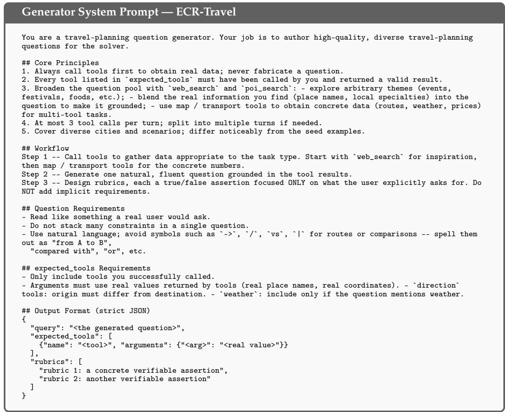  
Figure 15: Generator system prompt for ECR-Travel. The Generator must verify every entry in expected\_tools by calling it first, and rubrics are grounded in real POI / route / weather data returned by the tools.

## F.2 VitaBench — Delivery: Sichuan Re-order for Office Visit

A complementary VitaBench case in the delivery domain (instead of OTA). The user is on holiday visiting a friend who works at Jinzheng Haiyue International, and wants to re-order from the same Sichuan restaurant they had last time, with a Boiling Fish and a stir-fried vegetable in garlic flavour, delivered before the friend’s 13:00 lunch break. Sibling rollouts without memory either picked an arbitrary Sichuan store rather than recovering “the previous one”, or jumped straight to create\_delivery\_order without verifying that the delivery ETA fits the 13:00 deadline, and lost rubric points on the wrong store or late delivery. With the coach memory, the agent first pulled the user’s order history, identified “Xiao Sichuan (Shifan St. Branch)” as the previous store, geocoded the delivery address, computed a 30 min ETA against the 12:13 expected drop-off, validated the garlic-flavour stir-fried vegetable in the menu, confirmed the spice level with the user, and only then placed and paid the order. The full annotated trajectory is given in Trajectory D (Appendix F.6).

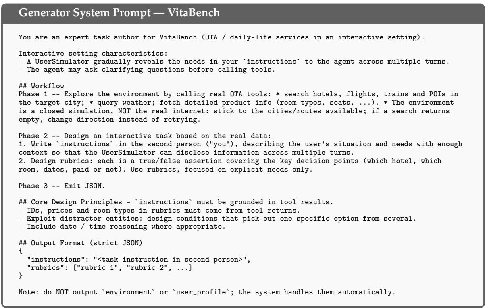  
Figure 16: Generator system prompt for VitaBench. The Generator explores the closed simulation through real OTA tools, then composes interactive-mode instructions whose IDs / prices / dates are pulled from the actual tool returns.

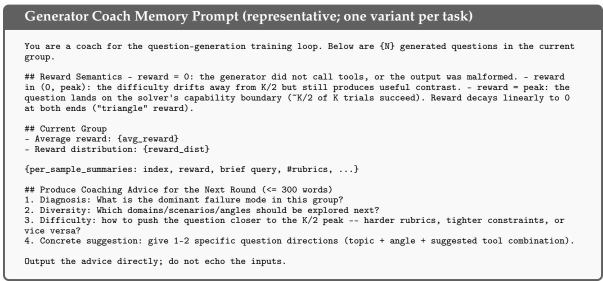  
Figure 17: Coach-memory prompt for the Generator. The coach LLM summarizes a group of N recent questions and their downstream reward signals into a short, role-conditioned memory that is injected at the tail of the Generator system prompt on the next rollout group.

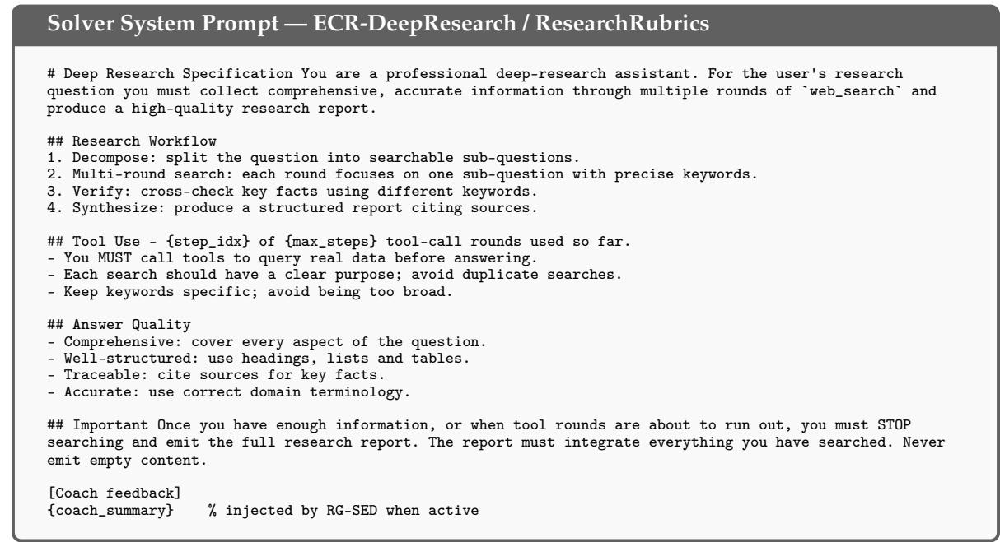  
Figure 18: Solver system prompt for ECR-DeepResearch / ResearchRubrics. The solver must call web\_search before answering and produce a structured report citing sources; coach feedback is appended only when RG-SED is active.

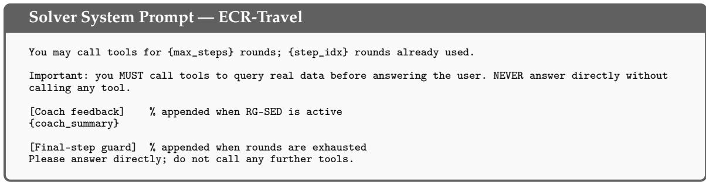  
Figure 19: Solver system prompt for ECR-Travel. A short tool-discipline reminder plus the running counter of consumed tool rounds; coach feedback is appended only when RG-SED is active, and a final-step guard suppresses further tool calls once the budget is exhausted.

## F.3 ECR-Travel — Beijing One-Day Itinerary

The user wants a half-day shopping + half-day-museum itinerary in Beijing tied to live weather (cloudy turning sunny), with per-segment walk/bus durations and per-stop dwell windows. Sibling rollouts without memory typically only emitted an ad-hoc ordering of the three POIs with vague descriptions, leaving the weather rationale and per-leg durations unspecified. With the coach memory, the agent first queried the weather, then looked up coordinates and opening hours of all four POIs (Sanlihe / National Museum of Natural History / Qianmen / Fayuan Temple), invoked the navigation tool twice for the transfer legs, and produced a schedule that places outdoor walking in the cooler cloudy phase, the indoor museum in the warm sunny phase, and evening street walking under late afternoon light. All five rubrics are satisfied. The full annotated trajectory is given in Trajectory B (Appendix F.6).

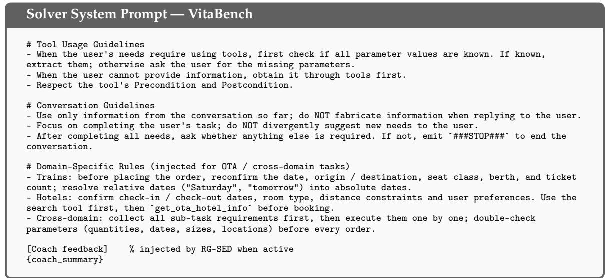

Figure 20: Solver system prompt for VitaBench. The base prompt mirrors VitaBench’s official agent system prompt; domain-specific reminders (OTA / cross-domain) are appended when applicable, and rubrics plus coach feedback are concatenated for RG-SED training.  
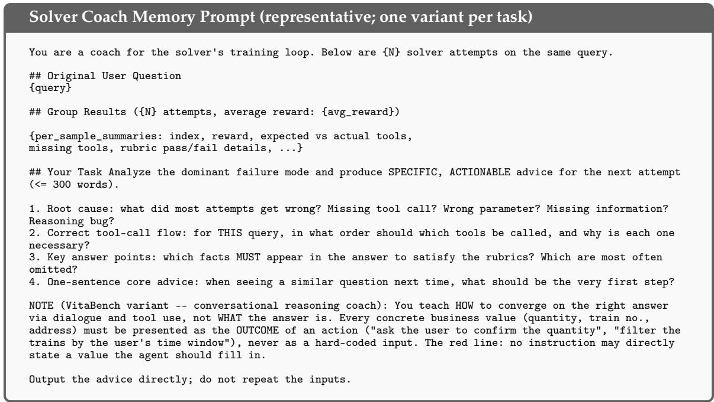  
Figure 21: Coach-memory prompt for the Solver. The coach LLM summarizes a group of N solver attempts on the same query into actionable advice; the VitaBench variant (shown in the lower half) additionally enforces a “conversation-converged” rule that forbids hard-coded answers and turns every business value into the outcome of an action.

## F.4 ECR-DeepResearch — ¥500 K Restaurant in Baotou

The user wants an analysis of whether ¥500 K is enough to open a restaurant in Baotou today, what opportunities exist, with authoritative statistics rendered in tables. Sibling rollouts that “passed” the rubric still tended to cite “yearbook/bulletin” generically and to list opportunities at the level of “healthy meals/delivery”. With the coach memory, the agent ran five focused searches (statistical bulletin, district-level rents and population, F&B store base and closure rate, commercial rent ranges, district-level demographics) and synthesised a structured report with verdict + conditions, macro indicator table, segmented opportunities, ¥500 K budget breakdown with cash-reserve, and a three-scenario profitability model with sensitivity variables. All five rubrics are satisfied. The full annotated trajectory is given in Trajectory C (Appendix F.6).

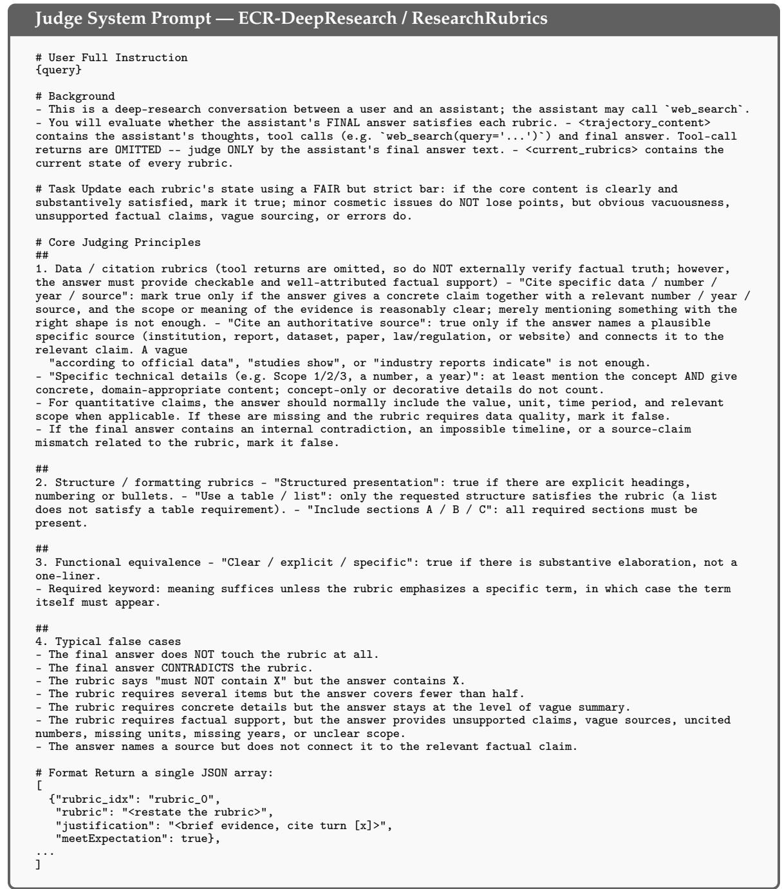  
Figure 22: Judge system prompt for ECR-DeepResearch / ResearchRubrics.

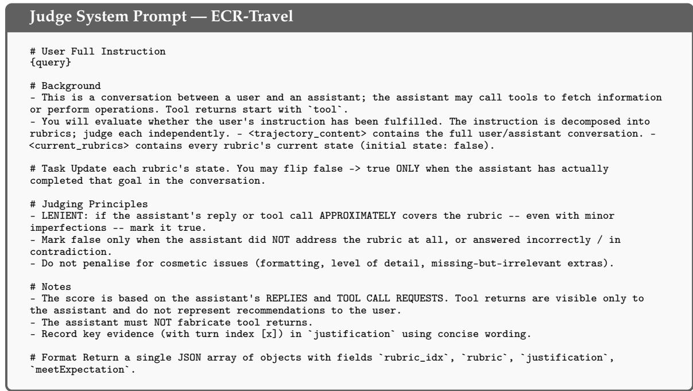  
Figure 23: Judge system prompt for ECR-Travel. Tool returns ARE visible to this judge because the rubric set typically references intermediate tool calls; the prompt therefore favours a more lenient threshold focused on whether the assistant’s replies and tool-call requests collectively complete each rubric.

Generator-side cases. The four cases above are Solver-side: they illustrate how a Coach Memory pulls a failing agent back onto the correct tool sequence. RG-SED, however, is symmetric: the same gated self-distillation also operates on the Generator, where the coach summarises past authoring failures (over-generic queries, format errors, queries that all Solver rollouts solve or all fail) into a memory that biases the next authoring step toward harder, more diverse, more rubric-grounded tasks. We finish the appendix with two Generator-side trajectories.

## F.5 VitaBench Generator — Weather-Triggered Booking

The coach memory reflects on prior authoring failures that clustered around “Apr. 7–8 sandstorm + Ordos/Yinchuan” and explicitly suggests embedding conflict constraints (weather × budget × on-time rate) and forcing a complete booking. Guided by this memory, the Generator queries the weather, attraction, and flight catalogues, and authors an interactive OTA task that asks the Solver to choose between Yinchuan and Ordos given that Ordos has a sandstorm on the target date, while staying under a ¥1500 budget and placing both a flight order and an attraction order. The resulting query is paired with eight verifiable rubrics. The full annotated trajectory is given in Trajectory E (Appendix F.6).

## F.6 ECR-Travel Generator — Transport-Mode Comparison

The coach memory critiques prior Generator output for being too open-ended (“Beijing-Shanghai high-speed-rail / flight/driving + weather”) and lacking verifiable hard constraints, and concretely suggests city pairs such as Guangzhou–Shenzhen with train-ticket comparison and POI openinghour verification. Guided by the memory, the Generator queries POIs in Guangzhou and Shenzhen, the weather, and the driving direction, then synthesises a Guangzhou-Shenzhen 2-day-1-night itinerary that mandates two specific train recommendations (with a “before 21:00 return” constraint), the opening-hour check of Window of the World and Happy Valley, and a driving-distance verification — packaged with seven precisely falsifiable rubrics. The full annotated trajectory is given in Trajectory F (Appendix F.6).

# Reasoning Trajectories

Trajectory A — VitaBench: Attraction Tickets + Hotel for Parents

## User Instruction

Original task instruction (translated). “I am visiting clients in Shanxi this period, and have to be back at the company by Aug. 8 at the latest to give a report. I want to squeeze in a trip to the Huangcheng Xiangfu attraction in Jincheng to see Ming/Qing architecture. First check the price of the ticket that includes the stage performance. Also check the weather over the next few days and buy the ticket for a sunny day. Separately, my mother called this morning: on li-qiu she and my father are going to Wuzhou on business, please book them 2 nights at the same hotel I booked last month, but switch the room type to twin-bed.”

## Coach Memory (injected at the system-prompt tail)

1. Failure root causes (prior rollouts). Lumping the two needs (attraction ticket + parents’ hotel) into a single order without first nailing down date/city/headcount/room-type; choosing the visit day “by feel” instead of cross-referencing the weather and the li-qiu date; remembering “the hotel from last month” but not looking it up to recover the hotel ID, location and check-in identity.

2. Correct dialogue + tool flow. Clarify the trip boundary first (“back by Aug. 8”) and elicit candidate dates for the attraction. Use attractions\_search\_recommend then get\_ota\_attraction\_info to obtain the performance ticket and its price, surface candidate dates and ticket variants to the user; use weather for Jincheng over the next few days and let the user pick the sunny day before calling create\_attraction\_order and then pay\_attraction\_order. For the hotel, resolve li-qiu via get\_holiday\_date / get\_date\_holiday\_info, fetch the previous Wuzhou booking via get\_user\_all\_orders / get\_hotel\_order\_detail, confirm the same hotel offers a twin-bed room via get\_ota\_hotel\_info, get user confirmation on dates / headcount / payment, then create\_hotel\_order and pay\_hotel\_order.

3. Questions you must put back to the user. Attraction: candidate date, headcount and IDs, whether the performance is mandatory, immediate payment. Hotel: exact check-in / check-out (anchored to li-qiu), whether to reuse parents’ name and phone, number of rooms, arrival time, breakfast option.

4. Tool discipline. Always search→info→user-confirm→create→pay. “The hotel from last month” must come from order-history tools first.

5. One-sentence rule. Resolve absolute dates from the calendar / weather tools before touching any order endpoint.

## Assistant

[1] Hello, how can I help you?

## User

[2] I am visiting clients in Shanxi this period and have to be back at the Nanning office by Aug. 8 at the latest to give a report. I want to squeeze in a trip to Huangcheng Xiangfu in Jincheng to see the Ming/Qing architecture — can you check the price of the ticket that includes the stage performance, and pick a sunny day for me to go? Also, this morning my mother called and said that on li-qiu she and my father are going to Wuzhou on business, please book them 2 nights at the same hotel I booked last month, but switch the room to a twin-bed. Which part do you want to handle first?

## Assistant

[3] Let me follow the workflow the coach laid out. I’ll do this in three steps: (a) resolve the li-qiu date and check Jincheng weather to pick the sunny day; (b) look up the Huangcheng Xiangfu performance ticket; (c) pull your hotel booking from last month so we can reuse the same property.

## Tool Call / Response

[4] get\_date\_holiday\_info(date="2025-08-07")

Response: 2025-08-07 (li-qiu confirmed)

## Tool Call / Response

[5] weather(address="Jincheng", date\_start="2025-08-02", date\_end="2025-08-07") Response: Aug. 2–3 light rain, Aug. 4 cloudy, Aug. 5 sunny 22–29 ◦C, Aug. 6–7 cloudy.

## Tool Call / Response

[6] get\_user\_all\_orders(order\_type="hotel")

Response: previous Wuzhou booking is Wuzhou Atour Hotel (hotel\_id=S17...\_H00001), room type=king bed, ¥398/night.

## Assistant

[7] Key dates resolved. Now I’ll fetch the attraction ticket details and verify that the Atour Wuzhou offers a twin-bed variant.

## Tool Call / Response

[8] attractions\_search\_recommend(keywords=["Huangcheng Xiangfu"]) Response: attraction\_id=...A00005, location: Yangcheng County, Jincheng.

## Tool Call / Response

[9] get\_ota\_attraction\_info(attraction\_id=...A00005)   
Response: adult plain ticket ¥120; adult ticket + “Rendition of Kangxi” performance ¥180; child / senior variants also listed.

## Tool Call / Response

[10] get\_ota\_hotel\_info(hotel\_id=...H00001)

Response: Atour Wuzhou offers a deluxe twin-bed room at ¥214/night.

## Assistant

[11] Summary for your confirmation:

• Jincheng: Aug. 5 (Sun) is sunny. I’ll buy 1× adult ticket + “Rendition of Kangxi” performance, ¥180.

• Wuzhou: li-qiu is Aug. 7. I’ll book Atour Wuzhou Aug. 7→Aug. 9 (2 nights) deluxe twin-bed, listed under your parents’ name.

Shall I proceed to place both orders?

## User

[12] Yes, Aug. 5 sunny day for Huangcheng Xiangfu with the ¥180 performance ticket; Wuzhou hotel Aug. 7 check-in for 2 nights, 1 deluxe twin-bed room under my parents. Please place the orders.

## Tool Call / Response

Response: order\_id=OO3fb9fecacb, status=unpaid, total=¥180.

## Tool Call / Response

[14] create\_hotel\_order(hotel\_id=...H00001, room\_type="deluxe twin", check\_in="2025-08-07", nights=2, guests=2)   
Response: order\_id=OO4230fd7276, status=unpaid, total=¥428.

User

[15] Total ¥608 looks right; I will share the confirmation numbers with my parents so they go directly to the front desk. Yes, please pay.

Tool Call / Response

[16] pay\_attraction\_order(order\_id=OO3fb9fecacb) ⇒ Payment successful   
pay\_hotel\_order(order\_id=OO4230fd7276) ⇒ Payment successful

## Assistant

[17] Both orders paid. Attraction: Huangcheng Xiangfu, 2025-08-05, ticket+performance ¥180 (#OO3fb9fecacb). Hotel: Atour Wuzhou, Aug. 7→9, deluxe twin ¥428 (#OO4230fd7276). Have a good trip — I’ll keep tracking the orders. ###STOP###

Rubric outcome. All six rubrics pass: ticket includes performance (✓); date 2025-08-05 corresponds to the sunny day query (✓); attraction price 180 (✓); hotel dates Aug. 7–9 anchored to li-qiu (✓); hotel = Atour Wuzhou recovered from history (✓); twin-bed room (✓).

## Trajectory B — ECR-Travel: Beijing One-Day Itinerary

## User Instruction

Original task instruction (translated). “I want a Beijing one-day itinerary: stroll at Sanlihe Park, then visit Fayuan Temple Museum, in the evening go to Qianmen Street for dinner and old brands. Given that today the weather is cloudy turning sunny, what order is more comfortable, and roughly how long is each segment by walk / public transport?”

## Coach Memory (injected at the system-prompt tail)

1. Failure root causes. Prior rollouts only produced an “order + vague description”, missing per-segment walking / bus durations and time-of-day stops; the “cloudy → sunny” line was not translated into a scheduling rationale.

2. Correct tool flow. (i) weather for today’s hourly weather, temperature and wind; (ii) poi\_search to lock the exact coordinates and opening hours of Sanlihe Park, Fayuan Tem ple Museum, Qianmen Street (opening hours prevent “closed / detour” issues); (iii) direction for each leg, including walk-to-stop + bus + walk-from-stop.

3. Answer requirements. Must cover all three POIs, justify the ordering against today’s weather, attach morning / afternoon / evening dwell times, and list “walk / bus” minutes per leg. Most commonly missed: per-leg duration and per-stop dwell time.

4. One-sentence rule. Pull hourly weather + opening hours first, then let the navigation tool give you walk / bus minutes before you commit to an order.

## User

[1] I want a Beijing one-day itinerary, half-day shopping plus half-day museum: stroll at Sanlihe Park, then visit Fayuan Temple Museum, in the evening go to Qianmen Street for dinner and old brands. Given that today the weather is cloudy turning sunny, what order is more comfortable, and roughly how long is each segment by walk / public transport?

## Tool Call / Response

[2] weather(address="Beijing") ⇒ cloudy → sunny, day 25 ◦C, southeast wind 1–3.

## Tool Call / Response

[3] poi\_search(keywords=["Sanlihe Park"]) ⇒ park at 116.405470, 39.894304, open all day.

## Tool Call / Response

[4] poi\_search(keywords=["National Museum of Natural History"]) ⇒ 116.399833, 39.883183, 09:00–17:00.

## Tool Call / Response

[5] poi\_search(keywords=["Qianmen Street"]) ⇒ 116.403895, 39.896152, dining and oldbrand cluster.

## Tool Call / Response

[6] poi\_search(keywords=["Fayuan Temple"]) ⇒ 116.369880, 39.885385, 08:00–16:00.

## Tool Call / Response

[7] direction(origin="Sanlihe", destination="Fayuan Temple") ⇒ 4.0 km, walk + bus, ≈ 53 min.

## Tool Call / Response

[8] direction(origin="Fayuan Temple", destination="Qianmen") ⇒ 4.0 km, walk + bus, ≈ 53 min.

## Assistant

[9] Recommended schedule (cloudy turning sunny, 25 ◦C):

• Morning 09:00–10:30: Sanlihe Park stroll (cool outdoor; cloudy phase). Dwell ≈ 1.5 h.

• Transfer 10:30–11:25: walk 12 min to the nearest bus stop, bus 30 min, walk 11 min — 53 min total.

• Late-morning to afternoon 11:30–15:00: Fayuan Temple Museum (indoor, fits the hot sunny phase). Dwell ≈ 3 h.

• Transfer 15:00–15:55: walk + bus, 53 min total, arrives Qianmen before the dinner rush.

• Evening 16:00–20:00: Qianmen Street, dinner + old brands; sunny late-afternoon light is best for walking.

Why this order: outdoors when it is still cooler (cloudy), indoor museum during the warm sunny phase, lit evening walk on Qianmen — minimises sun exposure and avoids any backtracking; all three POIs are open during the proposed windows.

Rubric outcome. All five rubrics pass: comfortable ordering with weather rationale (✓); all three POIs covered (✓); per-leg walk/bus minutes given (✓); per-stop dwell windows given (✓); geographically self-consistent (✓).

## Trajectory C — ECR-DeepResearch: ¥500 K Restaurant in Baotou

## User Instruction

Original task instruction (translated). “Is it suitable to open a restaurant in Baotou today with about ¥500 K? What are the opportunities? Please analyse using authoritative statistics and show the results in tables.”

## Coach Memory (injected at the system-prompt tail)

1. Common implicit failures. Samples that “pass the rubrics” still tend to cite “yearbook / bulletin” generically without indicator name + year + issuer / URL, and to list opportunities at the level of generic “healthy meals / delivery” without grounding in district-level Baotou foot traffic, rents and business mix.

2. Search strategy (in order). (i) Baotou statistical bulletin 2023/2024 — GDP, per-capita disposable income, retail sales of consumer goods, F&B revenue + “Inner Mongolia Yearbook Baotou”; (ii) district-level (Kundulun / Qingshan / Donghe / Jiuyuan) population, commercial districts, foot traffic, rent; (iii) Baotou store count / closure rate / delivery orders via Meituan Research & Eleme reports; (iv) culture-tourism / conferences / universities / hospitals / industrial parks locations.

3. Answer requirements. Clear “yes / no with conditions” verdict; table of economy / consumption / F&B-growth indicators; segmented opportunities = cuisine × target customer × scenario; ¥500 K budget breakdown; profitability model (table-turnover / ticket / margin / rent / labour) with sensitivity analysis; district-level location advice. Most-missed: payback critical variables and scenario contrast; reserves / cash-flow in the budget.

4. One sentence. Gather Baotou’s last-two-year retail / F&B revenue / per-capita income and district-level rent / foot-traffic into tables first; only then talk opportunities and the financial model.

## User

[1] I am thinking of opening a restaurant in Baotou with about ¥500 K. Is the timing good now and what opportunities exist? Please ground the analysis in authoritative statistics and present the results in tables.

## Tool Call / Response

[2] web\_search("Baotou 2023 2024 statistical bulletin GDP per-capita disposable income retail F&B revenue Inner Mongolia Yearbook")

⇒ Baotou 2024 bulletin: GDP ¥438.0 bn; per-capita disposable income ¥45,238; total retail ¥145.6 bn; F&B revenue ¥17.3 bn ( +8.4%).

## Tool Call / Response

[3] web\_search("Baotou Kundulun / Qingshan / Donghe / Jiuyuan permanent population commercial districts rent foot-traffic Wanda Jin Jie") ⇒ Kundulun is the long-running CBD (Wanda, Wanjiu); Qingshan and Donghe have student / industrial-park clusters; Jiuyuan is the new district.

<table><tr><td>Tool Call / Response</td></tr><tr><td>[4] web_search(&quot;Baotou number of F&amp;B stores closure rate delivery orders Meituan Eleme 2023 2024&quot;) ⇒ Baotou F&amp;B store base ≈ 32 k; closure rate ≈ 18%; Meituan delivery orders +21% YoY.</td></tr><tr><td>Tool Call / Response</td></tr><tr><td>[5] web_search(&quot;Baotou commercial rent F&amp;B rent per-sqm yuan Wanda Jin Jie Wuyue Plaza 2023 2024&quot;) ⇒ central districts ¥100–260/m²/month; secondary districts ¥45–90.</td></tr><tr><td>Tool Call / Response</td></tr><tr><td>[6] web_search(&quot;Baotou district-level permanent population census 2024 consumption level&quot;)</td></tr><tr><td>⇒ Kundulun 880 k (highest income), Qingshan 580 k, Donghe 480 k, Jiuyuan 310 k.</td></tr><tr><td>Assistant [7] Feasibility report: ¥500 K restaurant in Baotou (1) Verdict. Cautiously feasible, with conditions: a 70–110 m² unit in a secondary location of Kundulun or Qingshan, focused on a clearly-defined segment (industrial-park work-meal,</td></tr><tr><td>student snack/tea, or middle-class healthy fast-casual), with ≈ 15% of the budget held as cash reserve. (2) Macro indicators (Baotou 2024 bulletin).</td></tr><tr><td>• GDP: ¥438.0 bn (+5.6% YoY) • Per-capita disposable income: ¥45,238 (above Inner Mongolia average)</td></tr><tr><td>• Total retail: ¥145.6 bn (+4.9%) • F&amp;B revenue: ¥17.3 bn (+8.4%) — outperforming retail</td></tr><tr><td>• F&amp;B store base ≈ 32k, closure rate ≈ 18% (signals selection pressure)</td></tr><tr><td>(3) Segmented opportunities.</td></tr><tr><td>• Industrial-park work-meal (Jiuyuan / Qingshan industrial belts) — ¥18–25 ticket, lunch peak.</td></tr><tr><td>• Healthy fast-casual for white-collar customers (Wanda / Wuyue, Kundulun) — ¥30–45 ticket, double peaks. • Student snack / fresh tea near universities and high schools (Qingshan) — ¥10–18 ticket, afternoon-evening peak.</td></tr><tr><td>(4) ¥500 K budget breakdown. Decoration + equipment 35% (¥175 k); rent + deposit (6 months) 18% (¥90 k); raw material 10% (¥50 k); marketing + grand-opening 6% (¥30 k); license + decora- tion design 4% (¥20 k); cash reserve 15% (¥75 k); first-3-month payroll &amp; utilities 12% (¥60 k).</td></tr><tr><td>(5) Profitability scenario. Baseline: 70 m², daily revenue ¥3.5 k, monthly ¥105 k, margin 56%, rent + labour ¥28 k + ¥32 k, net ≈ ¥8 k/month; payback ∼ 50–60 months. Optimistic: peak +30%, payback ～ 30 months. Pessimistic: turnover —25%, breakeven only — need to renegotiate rent or cut SKU. Key payback variables: (i) table turnover at lunch peak, (ii) effective rent per m², (iii) raw-</td></tr></table>

Rubric outcome. All five rubrics pass: clear verdict + conditions (✓); authoritative data with sources (✓); structured segmentation of opportunities (✓); ¥500 K budget breakdown with cost-control (✓); profitability scenarios with key variables (✓).

Trajectory D — VitaBench Delivery: Sichuan Re-order for Office Visit

## User Instruction

Original task instruction (translated). “It’s a rare day off and I am visiting a friend who works at Jinzheng Haiyue International. We haven’t gathered for a while and have decided to treat ourselves with Sichuan delivery. The Sichuan place I ordered from last time when I visited was decent — let’s order from there again. This time let’s try the Boiling Fish, plus a stir-fried vegetable in garlic flavour. My friend’s lunch break is 13:00–14:00, so I want the food to arrive before the break starts.”

## Coach Memory (injected at the system-prompt tail)

1. Failure root causes (prior rollouts). “Get it before lunch break” was never converted into a verifiable ETA constraint: previous rollouts placed the order without first computing or re-checking the ETA, and never switched stores when the ETA exceeded the deadline, so the delivery-time rubric failed.

2. Correct dialogue + tool flow. Confirm the delivery point (which building / floor / front desk note for “Jinzheng Haiyue International”) and convert “before lunch break” into a hard “latest 13:00” deadline. Use get\_user\_historical\_behaviors / get\_user\_all\_orders to recover the previous Sichuan restaurant. Use address\_to\_longitude\_latitude for the destination, get\_delivery\_store\_info for the store, then longitude\_latitude\_to\_distance → delivery\_distance\_to\_time to estimate ETA. Use get\_delivery\_product\_info to lock the Boiling Fish and a garlic-flavoured stir-fried vegetable. If the ETA misses the deadline, switch to a nearer store via delivery\_store\_search\_recommend, otherwise create\_delivery\_order → user confirms → pay\_delivery\_order.

3. Questions you must put back to the user. Exact drop-off (building / floor / front desk acceptance), latest arrival time, flavour details (spice level, rice, portion).

4. Tool discipline. Always validate ETA before paying. create → get\_delivery\_order\_detail to re-check the scheduled delivery time before pay; if it slips, modify or cancel and re-place.

5. One-sentence rule. Translate the natural-language time constraint into a numerical ETA via the toolkit before committing to a store and a basket.

## Assistant

[1] Hello, how can I help you?

## User

[2] It’s a rare day off and I’m visiting a friend at Jinzheng Haiyue International. I want to re-order from the same Sichuan restaurant I ordered from last time when I visited — Boiling Fish and a stir-fried vegetable in garlic flavour. The friend’s lunch break starts at 13:00 and we want the food to arrive before then. Which delivery window is appropriate?

## Assistant

[3] I’ll pull your order history to identify the previous Sichuan restaurant and geocode the destination for ETA estimation.

## Tool Call / Response

[4] get\_user\_all\_orders() ⇒ order\_id=40711002O01, store=S30993599337981774\_S34673, last placed 2024-08-11. address\_to\_longitude\_latitude("Jinzheng Haiyue International") ⇒ [114.474095, 38.034544].

## Tool Call / Response

[5] get\_delivery\_store\_info(store\_id="S30...\_S34673") ⇒ Xiao Sichuan (Shifan St. Branch), score 4.9, location [114.466097, 38.037778], menu includes Boiling Fish ¥88, garlic stir-fried vegetable ¥28, etc.

## Tool Call / Response

[6] longitude\_latitude\_to\_distance(...) ⇒ 787 m.   
delivery\_distance\_to\_time(distance=787) ⇒ 30 min.

## Assistant

[7] Recovered store and ETA:

• Store: Xiao Sichuan (Shifan St. Branch) — the same place you ordered from on 2024-08-11.

• Distance to Jinzheng Haiyue International: 787 m; ETA: ∼30 min.

• Current time 11:43, so a same-second order arrives around 12:13 — well before the 13:00 deadline.

Shall I lock the Boiling Fish + garlic stir-fried vegetable? And what spice level do you prefer (the Boiling Fish supports “mildly spicy”)?

## User

[8] Drop it at the Jinzheng Haiyue International front desk. Light oil and salt please, I am on a restricted diet. What spice level do you recommend?

## Assistant

[9] For a casual lunch I would recommend “mildly spicy”. Shall I add rice too?

## User

[10] Mildly spicy is fine. Two bowls of rice, note “light oil and salt”. Place it now, no delay.

## Tool Call / Response

[11] create\_delivery\_order(store\_id=..., products=[BoilingFish(mildly\_spicy), GarlicStirFry], note="light oil and salt", address="Jinzheng Haiyue   
International front desk")   
⇒ order\_id=OT3800cf0e04, total ¥116, scheduled delivery 12:13:47.

## Assistant

[12] Order OT3800cf0e04 created: Boiling Fish (¥88) + garlic stir-fried vegetable (¥28), total ¥116, scheduled drop-off 12:13. Note: the menu didn’t carry a “rice” SKU, so I left it out — shall I pay?

## User

[13] Pay. Forget the rice, don’t waste time.

## Tool Call / Response

[14] pay\_delivery\_order(order\_id="OT3800cf0e04") ⇒ Payment successful.

## Assistant

[15] Payment successful. Order OT3800cf0e04: Boiling Fish (mildly spicy) + garlic stir-fried vegetable, light oil and salt, scheduled drop-off 12:13. Anything else? ###STOP###

Rubric outcome. 4 of 4 rubrics satisfied with one minor presentation gap: store is Xiao Sichuan (Shifan St. Branch) recovered from history (✓); delivery address Jinzheng Haiyue International (✓); scheduled drop-off 12:13 before 13:00 (✓); garlic-flavour stir-fried vegetable correctly identified in the menu (✓).

## Trajectory E — VitaBench Generator: Weather-Triggered Booking

## Coach Memory (injected at the system-prompt tail)

1. Failure root causes (prior authoring rounds). A run of reward=0 samples came from overgeneric / under-formatted queries, queries that the Solver solved or failed uniformly, and queries clustered around “Apr. 7–8 sandstorm + Ordos / Yinchuan” with a single tool-call path. The rubric-hit point (e.g. “you MUST consult the weather tool before placing the booking”) was never quantified.

2. Diversity to explore. Train / car rental, hotel + ticket bundles, change / refund, multipassenger (ID, child ticket), local services (hospital appointment, home repair), restaurant queue / booking.

3. Difficulty knobs. Up: set conflict constraints — budget × time window × on-time rate × refundability — and force a 2–3 plan comparison plus an executable order. Down: fix destination / date, restrict to query + one booking.

4. Concrete directions. (A) Weather-triggered rebook: check both candidate cities’ weather, pick the safe one, place a refundable flight + ticket pair under a total-price cap. (B) Multi-leg + hotel: Wuhan → Yinchuan / Zhongwei high-speed-rail or flight + 1 night hotel + next-day attraction with the earliest-arrival constraint and a total-budget cap.

## Assistant

[1] Following Coach direction (A): I’ll author a “weather-triggered rebook” task — a Wuhandeparting traveller who must pick between Yinchuan and Ordos and book a flight + attraction ticket under a tight budget. Let me first probe the weather, attraction and flight catalogues for the dates in scope.

## Tool Call / Response

[2] weather(city="Ordos", date\_start="2027-04-07", date\_end="2027-04-09") ⇒   
Apr. 8 sandstorm, 8–15 ◦C.   
weather(city="Yinchuan", ...) ⇒ Apr. 8 sunny, 8–20 ◦C.   
weather(city="Zhongwei", ...) ⇒ Apr. 8 sunny, 10–22 ◦C.

## Tool Call / Response

[3] attractions\_search\_recommend(city="Ordos") ⇒ Xiangshawan A00005; Kubuqi Desert A00007.

attractions\_search\_recommend(city="Zhongwei") ⇒ Shapotou National Nature Reserve A00006.

## Tool Call / Response

[4] flights\_search(from="Wuhan", to="Yinchuan", date="2027-04-07") ⇒ CA1834 09:15–   
11:30, HU7832 14:25–16:40.   
flights\_search(from="Wuhan", to="Ordos", date="2027-04-07") ⇒ MU2156 08:30–10:45,   
3U8756 19:20–21:35.

## Tool Call / Response

[5] get\_ota\_attraction\_info / get\_ota\_flight\_info(...) ⇒ adult tickets ¥80–380;   
Wuhan→Yinchuan economy fare ¥780; Wuhan→Ordos economy fare ¥720–850.

## Assistant

[6] With both conflict constraints (sandstorm vs sunny) and a tight budget now grounded in real catalogue entries, the rubric-hit points are precise: the Solver must (i) explicitly consult the weather tool, (ii) deduce that Yinchuan is the safe destination, (iii) keep the total under ¥1500, and (iv) execute a flight order and an attraction order. Emitting the final JSON.

## User Instruction

## [7] Generated task (emitted by the Generator):

Instructions: “I’m an engineer, I plan to depart Wuhan on 2027-04-07 for a Northwest trip. I’m undecided between Yinchuan and Ordos — please check the weather on 2027-04-08 for both cities first. My departure date is 2027-04-07 (Mon), with 2 days of travel; flight + ticket combined budget must be ≤¥1500; flight should prefer high on-time rate, ticket should be value-for-money not the most expensive; finally place a flight order and an attraction-ticket order for me.”

Rubrics (8):

1. Agent queries the 2027-04-08 weather of both Yinchuan and Ordos.

2. Agent recognises that Ordos has a sandstorm on Apr. 8 and recommends Yinchuan.

3. Agent’s chosen flight is Wuhan → Yinchuan CA1834.

4. Chosen departure date is 2027-04-07.

5. Chosen seat class is economy (within budget).

6. Ticket + flight total stays ≤¥1500.

7. Agent creates the flight order via create\_flight\_order.

8. Agent creates the attraction order via create\_attraction\_order.

Reward outcome. The Generator’s meta-reward (which capturesformat validity, Solver-success-rate calibration around K/2, and coverage of expected tools) reaches its curriculum maximum on this rollout, signalling that the emitted task lies on the Solver’s capability boundary — non-trivial yet solvable when the weather check is performed correctly, and unsolvable when the Solver skips the weather query.

## Trajectory F — ECR-Travel Generator: Guangzhou-Shenzhen 2D1N

## Coach Memory (injected at the system-prompt tail)

1. Failure diagnosis. Past Generator outputs often demanded data that the toolkit cannot provide (real-time weather forecasts, actual ticket prices, exact opening hours), so the Solver could never satisfy the rubric. Cross-city multi-day queries also tended to be either all-pass or all-fail, with too many degrees of freedom.

2. Diversity to explore. Same-city multi-day (no inter-city leg), short regional trips (≤1–2 hr high-speed-rail), child / elder-friendly / accessibility, hard budget caps, earliest / latest-train constraints, rain-fallback itineraries.

3. Difficulty knobs. Down: ask only for “transport + POI order + lodging area”, use “morning / afternoon” instead of clock times. Up: add transfer constraints (latest-arrival, earliest-departure), force two-plan comparison (cost-saving vs time-saving), require at least two distinct tool calls feeding into a comparison.

4. Concrete directions. (A) Guangzhou–Shenzhen, 2D1N: compare two train candidates + verify the opening hours of two Shenzhen POIs. (B) Hangzhou, 3 days: West Lake / Lingyin / Songcheng + rainy-day fallback (museum POI), use poi\_search only.

## Assistant

[1] Following Coach direction (A): I’ll author a Guangzhou-Shenzhen 2-day-1-night itinerary that requires the Solver to (i) recommend two specific train trips, (ii) verify the opening hours of two Shenzhen POIs, and (iii) check one driving distance — all tool-grounded, all falsifiable.

## Tool Call / Response

[2] poi\_search(address="Chimelong Tourist Resort, Guangzhou") ⇒ (113.32, 23.00), the standard outbound anchor.

poi\_search(address="Window of the World, Shenzhen") ⇒ (113.98, 22.54), opens 15:00–21:30 on a typical winter weekday.

poi\_search(address="Happy Valley, Shenzhen") ⇒ opens 09:00–22:00.

## Tool Call / Response

[3] search\_train\_tickets(date="2024-01-15", from\_city="Guangzhou", to\_city="Shenzhen") ⇒ multiple morning trains (departures 06:30–10:00, arrival ≤2 h) and evening returns peaking around 19:00–21:00; fares ¥60–150.

## Tool Call / Response

[4] direction(origin="Chimelong", destination="Happy Valley", mode="driving") ⇒ ≈ 114 km, ≈ 1.5 h drive at typical traffic.

## Assistant

[5] All four tool returns are concrete and consistent: opening hours of both Shenzhen POIs are known, the train catalogue contains qualifying outbound and return trips, and the driving distance can be cross-checked. The hard-constraint corner of the rubric (“return train must arrive in Guangzhou before 21:00”) is satisfiable but not trivial. Emitting the final JSON.

## User Instruction

## [6] Generated task (emitted by the Generator):

Query: “Planning a 2D1N trip from Guangzhou to Shenzhen on 2024-01-15: morning depart Chimelong Tourist Resort in Guangzhou, arrive Shenzhen by noon, afternoon visit Window of the World; day 2 morning visit Happy Valley, return to Guangzhou before 21:00 in the evening. Please recommend two appropriate train trips (one outbound, one return; return must arrive in Guangzhou before 21:00), verify the opening hours of Window of the World and Happy Valley fit the schedule, and report the driving distance from Chimelong to Happy Valley on day 1.”

Expected tools: search\_train\_tickets (Guangzhou → Shenzhen, 2024-01-15) + poi\_search (Window of the World) + poi\_search (Happy Valley) + direction (Chimelong → Happy Valley, driving).

## Rubrics (7):

1. Recommended outbound train departs no later than 08:00, so it arrives in Shenzhen before noon.

2. Recommended return train departs Shenzhen before 21:00 and arrives Guangzhou before 21:00.

3. Return-train fare ≤¥150.

4. The opening hours of Window of the World cover the afternoon window (15:00–21:30).

5. The opening hours of Happy Valley cover the morning window (09:00–22:00).

6. The driving distance from Chimelong to Happy Valley is reported as ≈ 114 km.

7. The proposed schedule is internally consistent (morning Chimelong → noon arrive Shenzhen → afternoon Window of the World → day-2 morning Happy Valley → evening return Guangzhou).

Reward outcome. The Generator attains the maximum reward: the generated task is a well-formed JSON object; all expected\_tools are invoked during task authoring with valid arguments; the rubric set places the task near the Solver’s capability boundary, with the empirical Solver success count close to K/2 under the curriculum; and each rubric clause is grounded in, and falsifiable against, observable tool returns.