# Di<sub>ag</sub>E<sub>vo:</sub> Di<sub>agnos</sub>i<sub>s-</sub>G<sub>u</sub>id<sub>e</sub>d S<sub>e</sub>lf<sub>-</sub>E<sub>vo</sub>l<sub>u</sub>ti<sub>on v</sub>i<sub>a</sub> Hi<sub>erarc</sub>hi<sub>ca</sub>l Error Memor<sub>y</sub>

Xinchen<sub>g</sub> Wei<sup>1,2,\*</sup> Yifan Din<sub>g</sub><sup>2,\*</sup>

Yoshua Li<sup>2</sup> Don<sub>g</sub>shen<sub>g</sub> Ma<sup>2,3</sup> Ron<sub>g</sub>xian<sub>g</sub> Wen<sub>g</sub><sup>2</sup> Xunlian<sub>g</sub> Cai<sup>2</sup> Wenjian Ding<sup>4,†</sup> Yao Zhang<sup>5,†</sup>

<sup>1</sup>The Chinese University of Hong Kong, Shenzhen

<sup>2</sup>Meituan, LongCat Team

<sup>3</sup>Peking University

<sup>4</sup>Faculty of Health Data Science, Juntendo University, Chiba, Japan

<sup>5</sup>School of Statistics and Data Science, LPMC, KLMDASR & AAIS, Nankai University, China

<sup>\*</sup>Equal contribution. <sup>†</sup>Corresponding authors.

## Abstract

Self-play is an efective paradigm for language-model self-evolution, but without guidance, solver performance can plateau or even decline across rounds. Existing unguided methods typically steer question generation with signals such as dificulty, learnability, or diversity. These signals help keep questions challenging and varied but do not specify which unresolved reasoning weaknesses later rounds should target. Existing guided methods obtain generation direction from external task resources, including human examples, document corpora, or externally specified dificulty targets, and therefore rely on task information supplied outside the self-play loop. We show that the needed direction can instead be derived from information already produced during self-play: the solver’s own failure history. We introduce DiagEvo, whose diagnostician extracts recurring error causes from this history and stores them in a hierarchical error-cause memory. The memory groups related causes under skill nodes and tracks each as Active or Mastered according to self-consistency on targeted questions. The challenger uses these states and recurrence counts to balance cause-targeted generation with free exploration. Double-confidence filtering retains intermediate-dificulty questions only when the most common solver answer has a clear vote lead. DiagEvo derives its curriculum from information produced during self-play, without external task resources. With the default 4B diagnostician, DiagEvo outperforms every baseline in mean accuracy across all nine benchmarks for each of the three solvers: Qwen3-4B, Qwen3-8B, and OctoThinker-8B. On Qwen3-8B, it reaches 72.3% mean accuracy across five mathematical reasoning benchmarks, 4.5 percentage points above R-Zero. Its mean accuracy across all nine benchmarks is 57.4%, 1.1 percentage points above DARC. Ablations show that the hierarchical error-cause memory and double-confidence filtering both contribute to these gains.

## 1 I<sub>n</sub>t<sub>ro</sub>d<sub>uc</sub>ti<sub>on</sub>

Recursive self-improvement (RSI) asks whether an AI system can improve the process used to train later systems [Chi et al., 2026]. Recent RSI work studies agents that design training algorithms or revise training data strategies [Chi et al., 2026, Meng et al., 2026]. Self-evolution is a closely related research direction. It aims to improve models with limited ongoing human supervision [Tao et al., 2024]. Self-play is one practical paradigm for self-evolution [Huang et al., 2026, Zhao et al., 2025].

In self-play, a challenger generates questions, and a solver learns by answering them. In our setting, the two models take turns updating over multiple rounds, so the questions can evolve with the solver. Sustained improvement requires these questions to remain near the solver’s competence boundary. They must be challenging enough to expose weaknesses but still learnable. Questions that are too easy provide little room for improvement. Questions that are too dificult produce unstable responses and weak training signals [Bae et al., 2026].

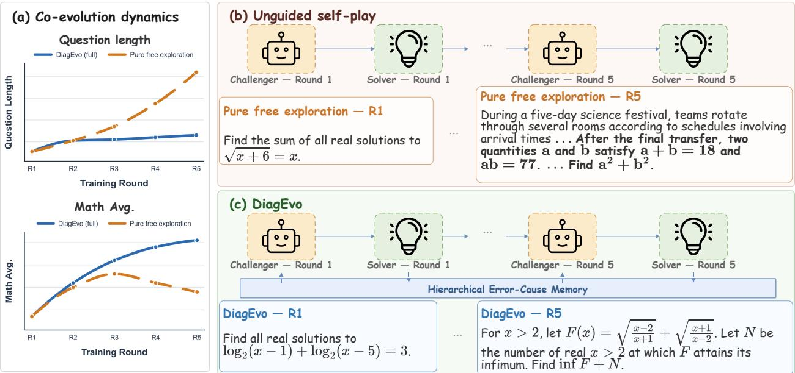  
Figure 1 | Co-evolution under pure free exploration and DiagEvo. (a) Pure free exploration produces much longer questions while solver performance stops improving. DiagEvo keeps question length stable and improves the mathematical average. (b) Example questions show how unguided self-play increases surface complexity across rounds. (c) DiagEvo uses a hierarchical error-cause memory to guide question generation across rounds.

Existing self-play methods address this challenge in two main ways. Label-free methods use solver responses to adjust question dificulty [Huang et al., 2026, Zhao et al., 2025]. This feedback estimates how hard a question is for the current solver, but not why the solver fails. The same error cause can appear in questions that look diferent. Without diagnosis across questions, separate failures do not reveal which causes recur. The challenger therefore lacks a direct signal about what the solver should practice next. Questions can then grow longer without targeting unresolved error causes, and solver performance can stop improving (Figure 1(a) and (b)) [Huang et al., 2026, Yu et al., 2025]. The challenger may also generate questions that are too dificult or unclear. Majority voting over responses to these questions can produce unreliable pseudo-labels. Training on these labels can reinforce errors across rounds [Fan et al., 2026].

Guided self-play methods instead use external task resources to stabilize training. R-Few uses human-annotated examples to guide question generation [Yu et al., 2025]. SPICE uses a document corpus and solver feedback to generate questions at the right dificulty [Liu et al., 2025a]. DARC uses dificulty labels, external documents, and a document-informed privileged teacher [Fan et al., 2026]. These resources can guide question generation or solver training, but continued improvement then depends on information from outside self-play.

The solver’s failure history can provide a curriculum signal for question generation in the next round. Prior work on LLM agents stores past interactions in memory to guide later decisions or model updates [Shinn et al., 2023, Zhao et al., 2024, Liu et al., 2025b, Ouyang et al., 2026, Cao et al., 2026, Xia et al., 2026]. In our setting, a failed trajectory that disagrees with the pseudo-label is compared with one that agrees. This comparison shows where their reasoning difers. We use this diference to identify a transferable error cause. The memory stores the cause and tracks when it recurs across questions. Self-consistency on questions generated for each cause shows whether it still needs direct practice.

Based on this insight, we propose DiagEvo, a diagnosis-guided self-play framework. Figure 1(c) summarizes its co-evolution loop. A lightweight LLM diagnostician extracts transferable error causes from solver trajectories and stores them in a hierarchical memory. Each cause remains Active while it is a direct generation target. It becomes Mastered after the solver reaches high self-consistency on related questions. The challenger uses this hierarchical memory to combine cause-targeted generation with free exploration. Before solver training, double-confidence filtering removes high-conflict questions whose two leading answers receive similar vote shares. The solver trains only on the remaining questions and their pseudo-labels. Failed trajectories from solver training update the memory for the next round. This closes the diagnostic feedback loop between solver failures and future question generation.

The main contributions are as follows.

1. We derive a dynamic curriculum signal from recurring error causes in the solver’s failed trajectories. This signal tracks unresolved weaknesses without relying on external task resources.

2. We propose DiagEvo, which organizes these error causes in a hierarchical memory with Active and Mastered states. The memory uses their states and frequencies to coordinate cause-targeted generation, free exploration, and cross-state stitching, while double-confidence filtering excludes high-conflict question– pseudo-label pairs from solver training.

3. Experiments on Qwen3-4B/8B and OctoThinker-8B show that DiagEvo achieves the best overall performance among the compared label-free and externally supervised methods. On Qwen3-8B, the default 4B diagnostician yields a 72.3% average on mathematical reasoning, improves over R-Zero by 4.5 points, and, despite using no external task resources, exceeds DARC in overall performance.

## 2 R<sub>e</sub>l<sub>a</sub>t<sub>e</sub>d W<sub>or</sub>k

## 2.1 Self-Pla<sub>y</sub> for Lar<sub>g</sub>e Lan<sub>g</sub>ua<sub>g</sub>e Models

Self-play improves LLMs through repeated interaction between a challenger and a solver [Huang et al., 2026, Zhao et al., 2025]. The challenger generates questions, and the solver learns by answering them. Label-free methods such as R-Zero [Huang et al., 2026] and Absolute Zero [Zhao et al., 2025] update both models without human annotations. Over multiple rounds, their questions can become too easy or too dificult. Their pseudo-labels can also become less reliable. Guided self-play methods use external task resources to control question generation. R-Few uses human examples [Yu et al., 2025]. SPICE uses a document corpus [Liu et al., 2025a]. DARC uses dificulty labels, external documents, and a privileged teacher [Fan et al., 2026]. DiagEvo remains label-free and uses the solver’s failure history instead. It extracts recurring error causes from failed trajectories and uses them to guide question generation.

## 2<sub>.</sub>2 Hi<sub>s</sub>t<sub>or</sub>i<sub>ca</sub>l E<sub>xper</sub>i<sub>ence an</sub>d C<sub>urr</sub>i<sub>cu</sub>l<sub>um</sub> L<sub>earn</sub>i<sub>ng</sub>

Work on language agents uses past interactions as memory for future decisions. Reflexion and ExpeL store summaries of earlier interactions [Shinn et al., 2023, Zhao et al., 2024]. CER, ReasoningBank, and ReMe build memories from successful and failed interactions [Liu et al., 2025b, Ouyang et al., 2026, Cao et al., 2026]. SkillRL turns trajectories into a skill library and updates it during policy training [Xia et al., 2026]. In these methods, memory guides the task-solving agent’s decisions or policy updates.

Curriculum learning controls which training examples a model sees and when it sees them [Bengio et al., 2009]. Online dificulty filtering selects learnable questions from an existing pool based on the current policy’s success rate [Bae et al., 2026]. SvS creates new versions of labeled questions while keeping their answers unchanged. This process maintains data diversity during reinforcement learning with verifiable rewards (RLVR) [Liang et al., 2026]. DiagEvo connects memory with curriculum learning. It builds a structured memory from the solver’s failure history. The memory tracks each error cause as Active or Mastered. These states tell the challenger which error causes to target in the next questions. The solver uses only the resulting question–pseudo-label pairs. In this way, past failures become a curriculum signal inside self-play.

## 2<sub>.</sub>3 U<sub>nsuperv</sub>i<sub>se</sub>d R<sub>e</sub>i<sub>n</sub>f<sub>orcemen</sub>t L<sub>earn</sub>i<sub>ng</sub> <sub>an</sub>d N<sub>o</sub>i<sub>se</sub> R<sub>e</sub>d<sub>uc</sub>ti<sub>on</sub>

Majority voting can create self-confirmation bias in label-free training [Fan et al., 2026, Zhang et al., 2025]. This occurs when the same solver error appears in most responses and becomes the majority pseudo-label. Training on this pseudo-label can then reinforce the error. Existing methods use several safeguards to improve pseudo-label reliability. Some use vote-share thresholds [Huang et al., 2026, Yu et al., 2025]. Others use confidence scores for complete response sequences [Li et al., 2025]. DARC uses a privileged teacher [Fan et al., 2026]. An absolute confidence constraint uses fixed bounds on the majority answer’s vote share. It does not compare this share with that of the second most common answer. DiagEvo therefore adds a relative confidence constraint. It retains a question only when the majority answer is clearly ahead of the second most common answer.

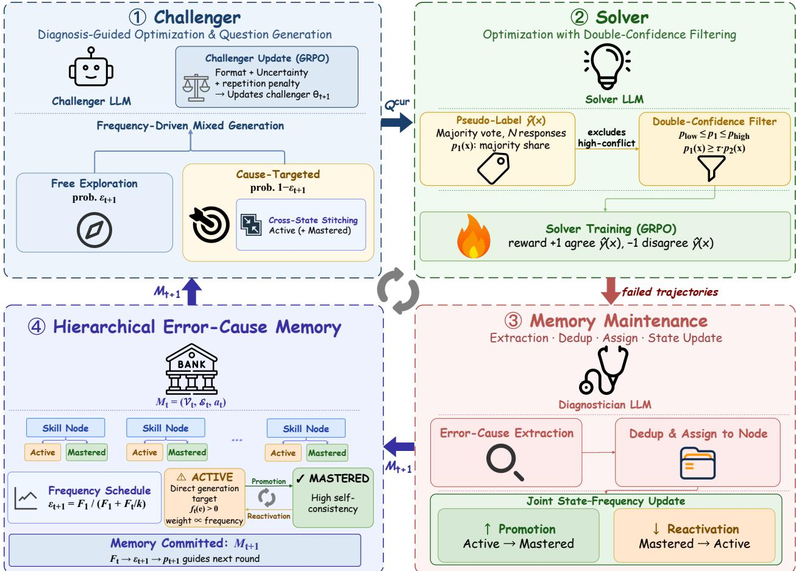  
Figure 2 | Overview of one DiagEvo round. (1) The challenger mixes free exploration with cause-targeted generation and updates through GRPO. (2) Double-confidence filtering selects question–pseudo-label pairs for solver training. (3) Memory maintenance extracts, deduplicates, assigns, and updates error causes from failed solver trajectories. (4) The hierarchical memory groups causes under skill nodes. Cause states and frequencies schedule the next round.

## 3 M<sub>e</sub>th<sub>o</sub>d

DiagEvo uses failed solver trajectories to guide question generation in the next round. Figure 2 shows this loop in four panels. Section 3.1 explains how the challenger uses memory to generate curriculum candidates. Section 3.2 explains how double-confidence filtering constructs the solver training set. Section 3.3 explains how diagnosis updates the hierarchical memory.

The challenger and solver update in turn. One model remains frozen while the other model updates. Only the challenger receives the memory. The solver trains on newly generated question–pseudo-label pairs. Its failed trajectories provide the input to memory maintenance.

## 3.1 Diagnosis-Guided Question Generation

Question generation must target the solver’s Active error causes. It must also explore new questions to maintain broad coverage. We therefore use the previous round’s memory to combine cause-targeted generation with free exploration.

Frequency-Driven Mixe<sup>d</sup> Generation. Let $\mathcal { M } _ { t }$ denote the hierarchical memory after all updates in round t (Section 3.3). We call this the committed memory. An active episode begins when an error cause becomes Active. It ends when the cause becomes Mastered. For each Active cause e, f (e) counts the diagnosed failures in its current active episode. Promotion to Mastered resets this count to zero. We define $\begin{array} { r } { F _ { t } = \sum _ { e \in \mathcal { E } _ { t } } f _ { t } ( e ) } \end{array}$ as the total number of failures across current active episodes.

The memory is empty before round 1, so the challenger first uses free exploration. The resulting $F _ { 1 }$ serves as a reference value. At the end of round $t ,$ we normalize this failure count as $z _ { t } = F _ { t } / F _ { 1 }$ . The odds of cause-targeted generation relative to free exploration increase linearly with $z _ { t } .$ . This schedule defines the free-exploration probability and the target-cause distribution for round $t + 1 \colon$

$$
\begin{array} { c } { { \frac { 1 - \varepsilon _ { t + 1 } } { \varepsilon _ { t + 1 } } = \displaystyle \frac { z _ { t } } { k } = \displaystyle \frac { F _ { t } } { k F _ { 1 } } , } } \\ { { \Longrightarrow \quad \varepsilon _ { t + 1 } = \displaystyle \frac { 1 } { 1 + z _ { t } / k } = \displaystyle \frac { F _ { 1 } } { F _ { 1 } + F _ { t } / k } , } } \\ { { p _ { t + 1 } ( e ) = \displaystyle \frac { f _ { t } ( e ) } { F _ { t } } . } } \end{array}\tag{1}
$$

The parameter $k$ controls the balance between the two generation modes. They receive equal probability when $z _ { t } = k$ . The distribution $p _ { t + 1 } ( e )$ samples Active causes in proportion to their active-episode frequencies. If $F _ { t } = 0 .$ , we set $\varepsilon _ { t + 1 } = 1$ and do not compute $p _ { t + 1 }$ . In this case, all questions come from free exploration. More failures under Active causes increase cause-targeted generation. Promotion resets a cause’s frequency. If no new failure reactivates the cause, this reset reduces $F _ { t }$ and shifts probability back to free exploration.

Let $q _ { \theta } ^ { \mathrm { f r e e } } ( x )$ denote the challenger’s free-exploration distribution. Let $q _ { \theta } ^ { \mathrm { t a r } } ( x \mid e , \mathcal { M } _ { t } )$ denote its distribution conditioned on an Active cause e. The full question distribution $q _ { t + 1 } ( x \mid \dot { \mathcal { M } } _ { t } )$ combines these two distributions. With probability $\varepsilon _ { t + 1 }$ , the challenger samples from $q _ { \theta } ^ { \mathrm { f r e e } }$ . With probability $1 - \varepsilon _ { t + 1 }$ , it first samples e from $p _ { t + 1 }$ It then samples a question from $q _ { \theta } ^ { \mathrm { { \bar { t a r } } } }$ . Appendix B gives the full expression.

The memory groups related error causes under skill nodes. Cross-state stitching pairs an Active cause with a Mastered cause from the same skill node. If several Mastered siblings are available, the challenger samples one uniformly. If none is available, the prompt contains only the Active cause. Cross-state stitching is part of cause-targeted generation.

C<sup>h</sup>a<sup>ll</sup>enger Up<sup>d</sup>ate an<sup>d</sup> Qua<sup>l</sup>ity Rewar<sup>d</sup>. Each round first updates the challenger and then generates curriculum candidates for solver training. Following R-Zero [Huang et al., 2026], the frozen solver evaluates a challenger-update batch, and GRPO updates the challenger from $\theta _ { t }$ to $\theta _ { t + 1 }$ . The updated challenger then samples $\bar { \mathcal Q } _ { t + 1 } ^ { \mathrm { c u r } }$ from the mixed generation policy. Section 3.2 filters this pool and constructs the solver training set. Appendix C gives the complete challenger update and reward definition.

## 3<sub>.</sub>2 S<sub>o</sub>l<sub>ver</sub> O<sub>p</sub>ti<sub>m</sub>i<sub>za</sub>ti<sub>on w</sub>ith D<sub>ou</sub>bl<sub>e-</sub>C<sub>on</sub>fid<sub>ence</sub> Filt<sub>er</sub>i<sub>ng</sub>

The curriculum candidates ${ \mathcal { Q } } _ { t } ^ { \mathrm { c u r } }$ need reliable pseudo-labels before they can train the solver. In RLVR with ground-truth answers, questions with intermediate success rates provide stronger learning signals [Bae et al., 2026]. Generated questions have no ground-truth labels. DiagEvo therefore estimates their dificulty from solver self-consistency. An absolute confidence constraint selects questions of intermediate dificulty. We call a question high-conflict when its two leading answers receive similar vote shares. Its majority pseudo-label can change across response samples. Training on this unstable pseudo-label can reinforce errors across rounds. DiagEvo therefore adds a relative confidence constraint that compares the two leading vote shares. The absolute and relative confidence constraints together form double-confidence filtering.

Dataset Construction an<sup>d</sup> Dou<sup>bl</sup>e-Con<sup>fid</sup>ence Fi<sup>l</sup>tering. We use one response set to construct the solver training set and another to optimize the solver. From this subsection onward, $\dot { \mathcal { Q } } _ { t } ^ { \mathrm { c u r } }$ denotes the candidate pool used in solver round t. For each candidate x, the solver first samples N responses to construct the training set. We call these samples construction responses. Their majority answer becomes the pseudo-label ${ \hat { y } } ( x )$ Their vote distribution determines filtering. It also provides self-consistency evidence for state promotion (Section 3.3). After filtering, GRPO samples a separate set of responses for each retained question. We call these samples optimization responses.

Let $p _ { 1 } ( x )$ denote the vote share of the majority answer among the $N$ construction responses. Let $p _ { 2 } ( x )$ denote the vote share of the second most common answer. If no second answer exists, we set $p _ { 2 } ( x ) = 0$ . The self-consistency score is $p ( x ) = p _ { 1 } ( x )$ . We retain questions that satisfy both confidence constraints:

$$
\begin{array} { r } { \mathcal { D } _ { \mathrm { t r a i n } } = \big \{ x \mid p _ { \mathrm { l o w } } \leq p ( x ) \leq p _ { \mathrm { h i g h } } , } \\ { p _ { 1 } ( x ) \geq \tau p _ { 2 } ( x ) \big \} . \qquad } \end{array}\tag{2}
$$

The bounds $p _ { \mathrm { l o w } }$ and $p _ { \mathrm { h i g h } }$ set the allowed self-consistency range. The threshold τ sets the required ratio between the two leading vote shares. The retained question–pseudo-label pairs form the solver training set. For each pair, GRPO [Shao et al., 2024] samples G optimization responses $\{ r _ { j } ^ { \mathrm { o p t } } \} _ { j = 1 } ^ { G }$ . A response receives +1 if it agrees with ${ \hat { y } } ( x )$ and −1 otherwise. Construction responses select and label the solver training set. Optimization responses provide the policy-gradient signal. Their failed trajectories also provide the input for diagnosis in Section 3.3.

## 3.3 Hierarchical Error-Cause Memor<sub>y</sub> and State U<sub>p</sub>dates

The failed optimization trajectories from Section 3.2 provide guidance for the challenger’s next update. The memory must record which error causes recur. It must also group related error causes under broader skills. We therefore maintain a hierarchical memory

$$
\begin{array} { r l } & { \mathcal { M } _ { t } = ( \gamma _ { t } , \mathcal { E } _ { t } , a _ { t } ) , } \\ & { \quad v = ( d _ { v } , \mathbf { z } _ { v } ) , } \\ & { \quad e = ( d _ { e } , \mathbf { h } _ { e } , s _ { t } ( e ) , f _ { t } ( e ) ) . } \end{array}\tag{3}
$$

Here, $\nu _ { t }$ is the set of skill nodes, and $\mathcal { E } _ { t }$ is the set of error causes. The function $a _ { t } : { \mathcal { E } } _ { t } \to \mathcal { V } _ { t }$ assigns each cause to one skill node. Each skill node v stores a text description $d _ { v }$ and an embedding $\mathbf { z } _ { v }$ . Each error cause e stores a text description $d _ { e }$ and an embedding $\mathbf { h } _ { e } .$ . It also stores a curriculum state $s _ { t } ( e ) \in$ {Active, Mastered} and an active-episode frequency $f _ { t } ( e )$ . Section 3.1 defines this frequency. The memory starts empty. Diagnosed failures build both levels of the hierarchy during training.

Each round of memory maintenance has four steps. It extracts error causes, removes duplicates, assigns new causes to skill nodes, and consolidates redundant nodes. The selected Qwen3-Instruct-2507 diagnostician handles all LLM-based semantic decisions. Extraction runs independently for each failure. The later steps update the memory sequentially.

Comparative Error-Cause Extraction. After solver optimization in round t, diagnosis uses only GRPO trajectories from questions retained by Equation 2. For each question $x , r ^ { - }$ denotes an optimization response that disagrees with ${ \hat { y } } ( x )$ . The response $r ^ { + }$ agrees with ${ \hat { y } } ( x )$ . The diagnostician compares these responses and finds their earliest reasoning diference:

$$
\begin{array} { r } { e ^ { \mathrm { n e w } } = D _ { \mathrm { e x t } } \big ( x , \hat { y } ( x ) , r ^ { - } , r ^ { + } \big ) , } \\ { r ^ { - } \nsim \hat { y } ( x ) , \qquad r ^ { + } \sim \hat { y } ( x ) . } \end{array}\tag{4}
$$

Here, ∼ denotes answer agreement. The resulting error cause excludes question-specific values and surface form. Because ${ \hat { y } } ( x )$ is a pseudo-label, the comparison identifies a relative reasoning diference. It does not establish ground-truth correctness.

For each generated question $x ,$ let $\mathcal { E } ^ { \mathrm { k n o w n } } ( x )$ denote the known causes supplied during generation. This set is empty for free exploration, contains the sampled Active cause for single-cause generation, and contains both the sampled Active cause and the stitched Mastered cause for cross-state generation. After locating the earliest reasoning diference, the diagnostician compares it with every cause in $\breve { \mathcal { E } } ^ { \mathrm { k n o w n } } ( x )$ and assigns the observation to at most one matching cause. A confirmed match contributes to $\Delta _ { t } ( e )$ for that cause; a match to a Mastered cause therefore triggers reactivation through the state transition in Appendix D. If no supplied cause matches, Equation 4 produces a new candidate cause for memory matching. Appendix J gives the complete routing procedure.

De<sup>d</sup>up<sup>l</sup>ication, Assignment, an<sup>d</sup> Conso<sup>l</sup>i<sup>d</sup>ation. Memory maintenance next deduplicates and organizes candidate causes. It first retrieves nearby error causes and uses the diagnostician to confirm a match. A confirmed match assigns the observation to the stored cause. This prevents wording changes from creating duplicate entries. An unmatched candidate is assigned to a retrieved skill node or a new node. A new cause starts as Active with frequency one. End-of-round consolidation merges redundant skill nodes while preserving each cause’s state and frequency. Appendix J gives the complete retrieval, routing, and consolidation procedure.

Joint State–Frequency Up<sup>d</sup>ate. Each error cause stores the pair $( s _ { t } ( e ) , f _ { t } ( e ) )$ . An Active cause is eligible for direct targeting. A Mastered cause has reached high self-consistency. It remains available for cross-state stitching.

Promotion uses the mean $p _ { 1 } ( x )$ over all questions generated for an Active cause. This score measures solver self-consistency. When at least one targeted question is available and the score reaches $\theta _ { \mathrm { u p } } ,$ , the cause becomes Mastered. Its frequency resets to zero. This reset closes the current active episode. Solver optimization can still reveal new failures under this cause. New failures assigned to the cause reactivate it. Its frequency then counts only failures in the new active episode. A cause that remains Active adds new failures to its current frequency. The updated state and frequency determine $F _ { t } , \varepsilon _ { t + 1 }$ , and $p _ { t + 1 }$ for the next round. Appendix D gives the exact sets, failure counts, and transition rule.

## 4 Ex<sub>p</sub>eriments and Anal<sub>y</sub>sis

## 4.1 Ex<sub>p</sub>erimental Setu<sub>p</sub>

Mo<sup>d</sup>e<sup>l</sup>s. We evaluate DiagEvo on Qwen3-4B-Base, Qwen3-8B-Base, and OctoThinker-8B-Hybrid-Base. For each solver, we test Qwen3-4B-Instruct-2507, Qwen3-30B-A3B-Instruct-2507, and Qwen3-235B-A22B-Instruct-2507 as diagnosticians.

Base<sup>l</sup>ines. We compare DiagEvo with the untrained base model and five self-evolution methods: R-Zero [Huang et al., 2026], Absolute Zero [Zhao et al., 2025], SPICE [Liu et al., 2025a], R-Few [Yu et al., 2025], and DARC [Fan et al., 2026]. We use “label-free” for methods whose training loop uses no external task resources, such as human examples, document corpora, or dificulty labels. R-Zero and Absolute Zero are label-free. SPICE, R-Few, and DARC use external task resources.

We reproduce the base models and R-Zero under our own infrastructure. We take the remaining scores from DARC [Fan et al., 2026]. DARC uses the same solvers, benchmarks, and evaluation protocol. Appendix F compares our reproduced scores with the reported results.

Imp<sup>l</sup>ementation Detai<sup>l</sup>s. The diagnostician and embedding model are frozen. Both models use only information produced during self-play. Qwen3-4B-Instruct-2507 is the default diagnostician. Appendix E reports the complete model choices, input boundaries, training configuration, and runtime breakdown.

Eva<sup>l</sup>uation Data an<sup>d</sup> Protoco<sup>l</sup>. We evaluate mathematical reasoning on MATH-500 [Hendrycks et al., 2021], GSM8K [Cobbe et al., 2021], OlympiadBench [He et al., 2024], Minerva Math [Lewkowycz et al., 2022], and AMC [zwhe99, 2024]. We follow the simple-evals protocol and use GPT-4o as an automatic judge, matching DARC [Fan et al., 2026]. AMC contains 40 questions. Following R-Zero [Huang et al., 2026], we sample 32 responses per AMC question and report their mean accuracy (mean@32).

We evaluate general reasoning on MMLU-Pro [Wang et al., 2024], SuperGPQA [Du et al., 2025], GPQA-Diamond [Rein et al., 2024], and BBEH [Kazemi et al., 2025]. We use exact-match accuracy with greedy decoding. For DiagEvo, we report the mean and standard deviation over three independent runs.

## 4.2 Main Results

Com arison wit<sup>h</sup> Prior Met<sup>h</sup>o<sup>d</sup>s. With the default 4B diagnostician, DiagEvo exceeds every baseline in overall score on all three solvers. On Qwen3-8B, it reaches 72.3% on mathematical reasoning and 38.8% on general reasoning. These scores exceed R-Zero by 4.5 and 2.6 points. They exceed DARC by 1.2 and 1.0 points. DiagEvo uses no external task resources, while DARC does.

On Qwen3-4B and OctoThinker-8B, DiagEvo reaches overall scores of 53.5% and 41.9%. Both scores exceed DARC by 1.3 points.

E<sup>f</sup>ect o<sup>f</sup> Diagnostician Sca<sup>l</sup>e. Larger diagnosticians produce consistent but modest gains in mathematical reasoning. From 4B to 235B-A22B, the mathematical average rises by 1.0 point on Qwen3-4B. It also rises by 1.0 point on Qwen3-8B and 1.2 points on OctoThinker-8B. The largest gains appear on harder mathematical benchmarks. On OlympiadBench, the gains are 2.4, 2.4, and 2.8 points across the three solvers.

Diagnostician scale has less efect on general reasoning. The general average changes by only 0.2 to 0.5 points. Some general benchmarks show no gain from a larger diagnostician. The default 4B configuration already exceeds every baseline by at least 1.1 points in overall score. Increasing diagnostician scale is therefore not the main source of DiagEvo’s gains.

Table 1 | Accuracy (%; higher is better) on nine reasoning benchmarks. Each DiagEvo benchmark score is the mean ± standard deviation over three runs. Aggregate columns report the mean only. ‘Diag.’ denotes the Qwen3-Instruct-2507 diagnostician. Bold marks the best mean within each solver block. Rows marked with † are taken from DARC [Fan et al., 2026]. All other rows are our own evaluations.
<table><tr><td rowspan="2">Method</td><td colspan="5">Mathematical Reasoning</td><td colspan="6">General Reasoning</td><td rowspan="2">Overall</td></tr><tr><td>AMC</td><td>Minerva</td><td>MATH-500</td><td>GSM8K</td><td>Olympiad</td><td></td><td>Math Avg. MMLU-Pro SuperGPQA</td><td></td><td>GPQA-D</td><td>BBEH</td><td>Gen. Avg.</td></tr><tr><td>Qwen3-4B-Base</td><td></td><td></td><td></td><td></td><td></td><td></td><td></td><td></td><td></td><td></td><td></td><td></td></tr><tr><td>Base</td><td>47.7</td><td>41.5</td><td>68.4</td><td>72.4</td><td>35.0</td><td>53.0</td><td>51.4</td><td>25.4</td><td>26.3</td><td>8.2</td><td>27.8 31.9</td><td>41.8</td></tr><tr><td>R-Zero</td><td>47.8</td><td>50.4</td><td>74.4</td><td>90.1</td><td>40.3</td><td>60.6</td><td>53.9</td><td>27.7</td><td>35.9</td><td>10.2</td><td></td><td>47.9</td></tr><tr><td>Absolute Zero†</td><td>50.0</td><td>41.9</td><td>76.2</td><td>89.3</td><td>41.5</td><td>59.8</td><td>52.6</td><td>27.1</td><td>35.3</td><td>8.3</td><td>30.8</td><td>46.9</td></tr><tr><td>SPICE†</td><td>50.9</td><td>55.5</td><td>77.9</td><td>91.9</td><td>41.9</td><td>63.6</td><td>56.5</td><td>28.3</td><td>37.9</td><td>11.3</td><td>33.5</td><td>50.2</td></tr><tr><td>R-Few (1%)†</td><td>52.7</td><td>52.1</td><td>77.8</td><td>92.3</td><td>42.4</td><td>63.5</td><td>55.9</td><td>29.4</td><td>35.4</td><td>11.2</td><td>33.0</td><td>49.9</td></tr><tr><td>DARC†</td><td>60.3</td><td>57.7</td><td>77.6</td><td>91.9</td><td>45.8</td><td>66.7</td><td>56.9</td><td>29.2</td><td>38.9</td><td>11.2</td><td>34.1</td><td>52.2</td></tr><tr><td>DiagEvo (Diag. 4B)</td><td>62.2 ± 0.3</td><td>60.7 ± 1.0</td><td>78.2 ± 0.2</td><td>92.0 ± 0.3</td><td>48.3 ± 0.5</td><td>68.3</td><td>57.0 ± 0.4</td><td>30.3 ± 0.4</td><td>41.2 ± 1.2</td><td>11.5 ± 0.4</td><td>35.0</td><td>53.5</td></tr><tr><td>DiagEvo (Diag. 30B-A3B)</td><td>62.5 ± 0.5</td><td>61.4 ± 0.6</td><td>78.5 ± 0.6</td><td>91.9 ± 0.2</td><td>50.1 ± 0.7</td><td>68.9</td><td>56.9 ± 0.1</td><td>30.7 ± 0.5</td><td>42.1 ± 0.8</td><td>11.3 ± 0.3</td><td>35.3</td><td>53.9</td></tr><tr><td>DiagEvo (Diag. 235B-A22B)</td><td>63.0 ± 0.4 61.6 ± 0.8</td><td></td><td>78.7 ± 0.4</td><td>92.4 ± 0.3</td><td>50.7 ± 0.4</td><td>69.3</td><td>57.0 ± 0.6</td><td>30.6 ± 0.4</td><td>41.9 ± 0.9</td><td>11.3 ± 0.3</td><td>35.2</td><td>54.1</td></tr><tr><td>Qwen3-8B-Base</td><td></td><td></td><td></td><td></td><td></td><td></td><td></td><td></td><td></td><td></td><td></td><td></td></tr><tr><td>Base</td><td>61.7</td><td>50.0</td><td>74.2</td><td>91.1</td><td>40.1</td><td>63.4</td><td>58.1</td><td>30.2</td><td>33.8</td><td>10.5</td><td>33.2</td><td>50.0</td></tr><tr><td>R-Zero</td><td>62.7</td><td>59.6</td><td>80.8</td><td>92.3</td><td>43.6</td><td>67.8</td><td>61.7</td><td>31.8</td><td>39.9</td><td>11.4</td><td>36.2</td><td>53.8</td></tr><tr><td>Absolute Zero†</td><td>62.5</td><td>52.9</td><td>76.6</td><td>92.0</td><td>47.8</td><td>66.4</td><td>62.5</td><td>33.5</td><td>36.8</td><td>10.8</td><td>35.9</td><td>52.8</td></tr><tr><td>SPICE†</td><td>60.9</td><td>55.2</td><td>81.4</td><td>93.8</td><td>48.0</td><td>67.9</td><td>61.0</td><td>32.4</td><td>40.4</td><td>12.1</td><td>36.5</td><td>53.9</td></tr><tr><td>R-Few (1%)†</td><td>69.3</td><td>59.6</td><td>81.6</td><td>94.0</td><td>44.0</td><td>69.7</td><td>62.8</td><td>32.7</td><td>40.4</td><td>11.8</td><td>36.9</td><td>55.1</td></tr><tr><td>DARC†</td><td>68.9</td><td>61.4</td><td>83.0</td><td>94.0</td><td>48.4</td><td>71.1</td><td>62.3</td><td>32.8</td><td>44.4</td><td>11.8</td><td>37.8</td><td>56.3</td></tr><tr><td>DiagEvo (Diag. 4B)</td><td>69.6 ± 0.3</td><td>63.2 ± 0.6</td><td>83.3 ± 0.3</td><td>93.8 ± 0.2</td><td>51.4 ± 0.7</td><td>72.3</td><td>62.8 ± 0.7</td><td>33.8 ± 0.6</td><td>46.0 ± 1.3</td><td>12.4 ± 0.5</td><td>38.8</td><td>57.4</td></tr><tr><td>DiagEvo (Diag. 30B-A3B)</td><td>69.8 ± 0.2</td><td>64.1 ± 0.4</td><td>83.5 ± 0.7</td><td>93.8 ± 0.5</td><td>53.5 ± 0.4</td><td>72.9</td><td>63.0 ± 0.2</td><td>33.9 ± 0.3</td><td>47.3 ± 0.6</td><td>12.6 ± 0.1</td><td>39.2</td><td>57.9</td></tr><tr><td>DiagEvo (Diag. 235B-A22B)</td><td>70.0 ± 0.5</td><td>64.8 ± 0.9</td><td>83.8 ± 0.9</td><td>94.1 ± 0.4</td><td>53.8 ± 0.6</td><td>73.3</td><td>63.1 ± 0.4</td><td>34.0 ± 0.4</td><td>47.5 ± 0.9</td><td>12.5 ± 0.3</td><td>39.3</td><td>58.2</td></tr><tr><td>OctoThinker-8B-Hybrid-Base</td><td></td><td></td><td></td><td></td><td></td><td></td><td></td><td></td><td></td><td></td><td></td><td></td></tr><tr><td>Base</td><td>27.7</td><td>21.7</td><td>44.6</td><td>68.4</td><td>16.9</td><td>35.9</td><td>14.9</td><td>11.3</td><td>15.7</td><td>0.7</td><td>10.7</td><td>24.7</td></tr><tr><td>R-Zero</td><td>32.2</td><td>32.7</td><td>58.0</td><td>84.7</td><td>22.4</td><td>46.0</td><td>37.1</td><td>17.7</td><td>21.2</td><td>7.7</td><td>20.9</td><td>34.9</td></tr><tr><td>Absolute Zero†</td><td>32.5</td><td>34.9</td><td>56.8</td><td>87.0</td><td>25.6</td><td>47.4</td><td>31.4</td><td>18.8</td><td>27.8</td><td>5.0</td><td>20.8</td><td>35.5</td></tr><tr><td>SPICE†</td><td>35.2</td><td>40.8</td><td>58.4</td><td>87.3</td><td>25.6</td><td>49.5</td><td>41.3</td><td>19.9</td><td>29.8</td><td>7.2</td><td>24.6</td><td>38.4</td></tr><tr><td>DARC†</td><td>31.9</td><td>43.0</td><td>62.4</td><td>88.0</td><td>30.7</td><td>51.2</td><td>43.8</td><td>22.3</td><td>32.3</td><td>10.8</td><td>27.3</td><td>40.6</td></tr><tr><td>DiagEvo (Diag. 4B)</td><td>33.7 ± 0.7</td><td>45.2 ± 1.1</td><td>62.8 ± 0.6</td><td>88.2 ± 0.2</td><td>33.6 ± 0.8</td><td>52.7</td><td>44.3 ± 0.5</td><td>23.1 ± 0.4</td><td>35.0 ± 1.1</td><td>11.2 ± 0.2</td><td>28.4</td><td>41.9</td></tr><tr><td>DiagEvo (Diag. 30B-A3B)</td><td>33.7 ± 0.4</td><td>46.4 ± 0.6</td><td>63.4 ± 0.3</td><td>88.2 ± 0.4</td><td>36.0 ± 0.7</td><td>53.5</td><td>44.8 ± 0.2</td><td>23.5 ± 0.2</td><td>35.4 ± 0.5</td><td>11.3 ± 0.2</td><td>28.8</td><td>42.5</td></tr><tr><td>DiagEvo (Diag. 235B-A22B)</td><td>33.9 ± 0.4</td><td>47.2 ± 0.8</td><td>63.7 ± 0.4</td><td>88.5 ± 0.5</td><td>36.4 ± 0.4</td><td>53.9</td><td>44.6 ± 0.3</td><td>23.6 ± 0.3</td><td>35.5 ± 0.8</td><td>11.3 ± 0.4</td><td>28.8</td><td>42.7</td></tr></table>

Cross-Domain Genera<sup>l</sup>ization. The solver trains only on mathematical questions. We therefore use generalreasoning benchmarks to measure cross-domain transfer. With the default diagnostician, the general average rises from 33.2% to 38.8% on Qwen3-8B. It rises from 27.8% to 35.0% on Qwen3-4B. It also rises from 10.7% to 28.4% on OctoThinker-8B. All three solvers improve despite their diferences in scale and architecture.

## 4<sub>.</sub>3 Abl<sub>a</sub>ti<sub>on</sub> St<sub>u</sub>di<sub>es</sub>

We evaluate three parts of DiagEvo on Qwen3-8B-Base: the mixed generation policy, memory-state updates with cross-state stitching, and double-confidence filtering.

Question Generation Po<sup>l</sup>icy. The first group of Table 2 evaluates the challenger update and the mixed generation policy. Freezing the challenger reduces the mathematical average by 3.8 points, the largest drop in this group. The full policy also outperforms both single-mode variants. This result shows that free exploration and cause-targeted generation are complementary. The mathematical average varies by at most 1.0 point across the tested values of k (Appendix G).

Memor -State U <sup>d</sup>ates an<sup>d</sup> Cross-State Stitc<sup>h</sup>in . The second group evaluates memory-state updates and cross-state stitching. Removing either component lowers the mathematical and general averages. Cross-state stitching within the same skill node exceeds random-pair stitching by 1.0 point in mathematical average. This gap supports selecting the Mastered cause from the same skill node. The state-update ablation measures the combined efect of promotion and reactivation.

Pseu<sup>d</sup>o-La<sup>b</sup>e<sup>l</sup> Fi<sup>l</sup>tering. The third group evaluates the two constraints in double-confidence filtering. The absolute confidence constraint improves both averages over no filtering. Adding the relative confidence constraint raises the mathematical average by a further 1.4 points. Both constraints therefore contribute to performance. Appendix G reports sensitivity to τ.

Table 2 | Ablation results on Qwen3-8B-Base. Each variant changes one component and keeps the remaining settings fixed. DiagEvo (full) is the shared reference for all three groups. It uses τ = 1.6 for double-confidence filtering.
<table><tr><td>Configuration</td><td>Math Avg General Avg</td><td></td></tr><tr><td>Question generation policy</td><td></td><td></td></tr><tr><td>Frozen challenger</td><td>68.5</td><td>36.9</td></tr><tr><td>Pure free exploration</td><td>69.5</td><td>37.2</td></tr><tr><td>Pure cause-targeted generation</td><td>70.1</td><td>37.6</td></tr><tr><td>Memory-state updates and cross-state stitching</td><td></td><td></td></tr><tr><td>No state updates</td><td>70.1</td><td>37.1</td></tr><tr><td>No cross-state stitching</td><td>70.8</td><td>37.5</td></tr><tr><td>Random-pair stitching</td><td>71.3</td><td>37.9</td></tr><tr><td>Pseudo-label filtering</td><td></td><td></td></tr><tr><td>No filtering</td><td>69.4</td><td>36.7</td></tr><tr><td>Absolute confidence constraint only</td><td>70.9</td><td>37.5</td></tr><tr><td>DiagEvo (full)</td><td>72.3</td><td>38.8</td></tr></table>

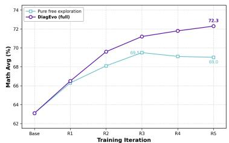  
(a) Per-round performance

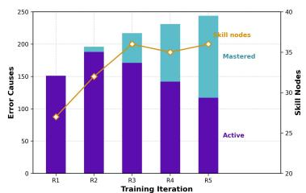  
(b) Memory lifecycle

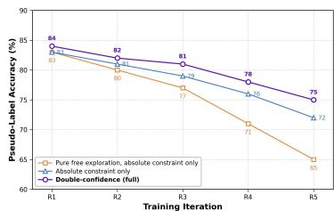  
(c) Oracle agreement  
Figure 3 | Co-evolution dynamics across training rounds on Qwen3-8B-Base. (a) Mathematical reasoning average after each round. Both curves use double-confidence filtering. (b) Numbers of Active causes, Mastered causes, and skill nodes. (c) Oracle agreement across rounds. Oracle agreement is the percentage of pseudolabels that match oracle answers. The first setting uses pure free exploration with only the absolute confidence constraint. The second adds the memory under the same constraint. The third also adds the relative confidence constraint. Appendix H gives the measurement protocols.

## 4.4 Co-Evolution D<sub>y</sub>namics

The ablations in Section 4.3 compare design choices after training. We next examine how performance changes across rounds. DiagEvo improves in each of the first five rounds and reaches 72.3% (Figure 3(a)). The mathematical average then falls to 72.0% after round 6 and 71.4% after round 7. The corresponding general averages are 38.4% and 37.9%. We therefore use the round-5 checkpoint in all experiments.

Pure free exploration reaches its peak after round 3 and ends at 69.0%. Its peak is 69.5%, which matches the same configuration in Table 2. The match shows that the ablation score captures the best performance before the plateau.

Figure 3(b) shows how the memory changes across rounds. New error causes enter in every round, and their total number grows from 151 to 244. End-of-round consolidation keeps the hierarchy compact. The number of skill nodes stabilizes near 36 after round 3.

Promotion also changes the balance between the two curriculum states. The number of Active causes peaks at 188 in round 2 and falls to 117 by round 5. The number of Mastered causes reaches 127, which is more than half of the memory. Promotion resets the closed episode’s frequency and removes its past failures from $F _ { t }$ Equation 1 then shifts sampling probability back to free exploration. This process keeps new questions in the curriculum as the solver resolves recorded error causes.

Figure 3(c) tracks oracle agreement across rounds. An oracle model relabels each question retained for solver training. Each curve uses the training subset retained by its own variant. The metric therefore measures pseudo-label quality within each variant’s solver training set.

With pure free exploration and only the absolute confidence constraint, oracle agreement falls from 83% to 65%. Using the memory under the same constraint raises the round-5 value to 72%. Adding the relative confidence constraint raises it further to 75%. At round 5, the memory and relative confidence constraint provide gains of 7 and 3 points. These gaps separate their efects on pseudo-label quality.

Appendix H further analyzes question coverage, length, lexical diversity, and dificulty across rounds.

## 5 Conclusion

We study how self-play can keep generated questions near the solver’s evolving competence boundary without external task resources. DiagEvo turns the solver’s failure history into guidance for the next round by diagnosing recurring error causes and organizing them in a hierarchical memory with Active and Mastered states. Cause states and frequencies schedule a mixture of cause-targeted generation and free exploration, while doubleconfidence filtering removes high-conflict questions before solver training.

Across Qwen3-4B, Qwen3-8B, and OctoThinker-8B, DiagEvo with the default 4B diagnostician achieves the highest overall score among the compared methods. Its training loop uses no external task resources. On Qwen3-8B, it reaches a 72.3% mathematical reasoning average, 4.5 points above R-Zero, and exceeds DARC in overall performance. Ablations show that mixed generation, memory-state updates with cross-state stitching, and double-confidence filtering all contribute to performance. The analysis across rounds shows five successive rounds of improvement. Structured diagnosis thus makes solver failures a usable curriculum signal for subsequent rounds of self-play.

## Referen<sub>c</sub>e<sub>s</sub>

Yizhe Chi, Wenyi Li, Deyao Hong, Xiaoqiu Wang, Mingju Gao, Kaisen Yang, Bingxiang He, Youjie Zheng, Calvin Xiao, and Qinhuai Na. AI4AI-Bench: Benchmarking LLM agents in algorithmic design for recursive self-improvement, 2026. URL https://arxiv.org/abs/2608.20318.

Fanqing Meng, Lingxiao Du, Qiguang Chen, Ziqi Zhao, Haocheng Lu, Mengkang Hu, and Michael Qizhe Shieh. RSIBench-Data: Benchmarking data-centric research for recursive self-improvement, 2026. URL https://arxiv.org/abs/2607.25886.

Zhengwei Tao, Ting-En Lin, Xiancai Chen, Hangyu Li, Yuchuan Wu, Yongbin Li, Zhi Jin, Fei Huang, Dacheng Tao, and Jingren Zhou. A survey on self-evolution of large language models, 2024. URL https://arxiv. org/abs/2404.14387.

Chengsong Huang, Wenhao Yu, Xiaoyang Wang, Hongming Zhang, Zongxia Li, Ruosen Li, Jiaxin Huang, Haitao Mi, and Dong Yu. R-Zero: Self-evolving reasoning LLM from zero data. In The Fourteenth International Conference on Learning Representations, 2026. URL https://openreview.net/forum?id=96apU6YzSO.

Andrew Zhao, Yiran Wu, Tong Wu, Quentin Xu, Yang Yue, Matthieu Lin, Shenzhi Wang, Qingyun Wu, Zilong Zheng, and Gao Huang. Absolute zero: Reinforced self-play reasoning with zero data. In Advances in Neural Information Processing Systems, volume 38, 2025. doi: 10.52202/085713-3534. URL https://proceedings.neurips.cc/paper\_files/paper/2025/hash/ 9837dc00ff67d176373268ed48042d49-Abstract-Conference.html.

Sanghwan Bae, Jiwoo Hong, Min Young Lee, Hanbyul Kim, Jeongyeon Nam, and Donghyun Kwak. Online dificulty filtering for reasoning oriented reinforcement learning. In Proceedings of the 19th Conference of the European Chapter of the Association for Computational Linguistics (Volume 1: Long Papers), pages 700–719, Rabat, Morocco, 2026. Association for Computational Linguistics. doi: 10.18653/v1/2026.eacl-long.30. URL https://aclanthology.org/2026.eacl-long.30/.

Wenhao Yu, Zhenwen Liang, Chengsong Huang, Kishan Panaganti, Tianqing Fang, Haitao Mi, and Dong Yu. Guided self-evolving LLMs with minimal human supervision, 2025. URL https://arxiv.org/abs/2512. 02472.

Shengda Fan, Xuyan Ye, and Yankai Lin. DARC: Decoupled asymmetric reasoning curriculum for LLM evolution, 2026. URL https://arxiv.org/abs/2601.13761.

Bo Liu, Chuanyang Jin, Seungone Kim, Weizhe Yuan, Wenting Zhao, Ilia Kulikov, Xian Li, Sainbayar Sukhbaatar, Jack Lanchantin, and Jason Weston. SPICE: Self-play in corpus environments improves reasoning, 2025a. URL https://arxiv.org/abs/2510.24684.

Noah Shinn, Federico Cassano, Ashwin Gopinath, Karthik Narasimhan, and Shunyu Yao. Reflexion: Language agents with verbal reinforcement learning. In Advances in Neural Information Processing Systems, volume 36, pages 8634–8652, 2023. doi: 10.52202/075280-0377. URL https://proceedings.neurips.cc/paper\_ files/paper/2023/hash/1b44b878bb782e6954cd888628510e90-Abstract-Conference.html.

Andrew Zhao, Daniel Huang, Quentin Xu, Matthieu Lin, Yong-Jin Liu, and Gao Huang. ExpeL: LLM agents are experiential learners. Proceedings ofthe AAAI Conference on Artificial Intelligence, 38(17):19632–19642, 2024. doi: 10.1609/aaai.v38i17.29936. URL https://ojs.aaai.org/index.php/AAAI/article/view/29936.

Yitao Liu, Chenglei Si, Karthik R. Narasimhan, and Shunyu Yao. Contextual experience replay for selfimprovement of language agents. In Proceedings of the 63rd Annual Meeting of the Associationfor Computational Linguistics (Volume 1: Long Papers), pages 14179–14198, Vienna, Austria, 2025b. Association for Computational Linguistics. doi: 10.18653/v1/2025.acl-long.694. URL https://aclanthology.org/2025. acl-long.694/.

Siru Ouyang, Jun Yan, I-Hung Hsu, Yanfei Chen, Ke Jiang, Zifeng Wang, Rujun Han, Long Le, Samira Daruki, Xiangru Tang, Vishy Tirumalashetty, George Lee, Mahsan Rofouei, Hangfei Lin, Jiawei Han, Chen-Yu Lee, and Tomas Pfister. ReasoningBank: Scaling agent self-evolving with reasoning memory. In The Fourteenth International Conference on Learning Representations, 2026. URL https://openreview.net/forum?id= jL7fwchScm.

Zouying Cao, Jiaji Deng, Li Yu, Weikang Zhou, Zhaoyang Liu, Bolin Ding, and Hai Zhao. Remember me, refine me: A dynamic procedural memory framework for experience-driven agent evolution. In Findings of the Association for Computational Linguistics: ACL 2026, pages 16803–16822, San Diego, California, United States, 2026. Association for Computational Linguistics. doi: 10.18653/v1/2026.findings-acl.829. URL https://aclanthology.org/2026.findings-acl.829/.

Peng Xia, Jianwen Chen, Hanyang Wang, Jiaqi Liu, Kaide Zeng, Yu Wang, Siwei Han, Yiyang Zhou, Xujiang Zhao, Haifeng Chen, Zeyu Zheng, Cihang Xie, and Huaxiu Yao. SkillRL: Evolving agents via recursive skill-augmented reinforcement learning, 2026. URL https://arxiv.org/abs/2602.08234.

Yoshua Bengio, Jérôme Louradour, Ronan Collobert, and Jason Weston. Curriculum learning. In Proceedings of the 26th Annual International Conference on Machine Learning, ICML ’09, pages 41–48. ACM, 2009. doi: 10.1145/1553374.1553380. URL https://icml.cc/2009/papers/119.pdf.

Xiao Liang, Zhongzhi Li, Yeyun Gong, Yelong Shen, Ying Nian Wu, Zhijiang Guo, and Weizhu Chen. Beyond Pass@1: Self-play with variational problem synthesis sustains RLVR. In The Fourteenth International Conference on Learning Representations, 2026. URL https://openreview.net/forum?id=Wjf3OMJxpn.

Kongcheng Zhang, Qi Yao, Shunyu Liu, Yingjie Wang, Baisheng Lai, Jieping Ye, Mingli Song, and Dacheng Tao. Consistent paths lead to truth: Self-rewarding reinforcement learning for LLM reasoning. In Advances in Neural Information Processing Systems, volume 38, pages 66634–66672, 2025. doi: 10.52202/085713-2002. URL https://proceedings.neurips.cc/paper\_files/paper/2025/hash/ 565f995643da6329cec701f26f8579f5-Abstract-Conference.html.

Pengyi Li, Matvey Skripkin, Alexander Zubrey, Andrey Kuznetsov, and Ivan Oseledets. Confidence is all you need: Few-shot RL fine-tuning of language models, 2025. URL https://arxiv.org/abs/2506.06395.

Zhihong Shao, Peiyi Wang, Qihao Zhu, Runxin Xu, Junxiao Song, Xiao Bi, Haowei Zhang, Mingchuan Zhang, Y. K. Li, Y. Wu, and Daya Guo. DeepSeekMath: Pushing the limits of mathematical reasoning in open language models, 2024. URL https://arxiv.org/abs/2402.03300.

Dan Hendrycks, Collin Burns, Saurav Kadavath, Akul Arora, Steven Basart, Eric Tang, Dawn Song, and Jacob Steinhardt. Measuring mathematical problem solving with the MATH dataset. In Thirty-Fifth Conference on Neural Information Processing Systems Datasets and Benchmarks Track (Round 2), 2021. URL https://openreview.net/forum?id=7Bywt2mQsCe.

Karl Cobbe, Vineet Kosaraju, Mohammad Bavarian, Mark Chen, Heewoo Jun, Lukasz Kaiser, Matthias Plappert, Jerry Tworek, Jacob Hilton, Reiichiro Nakano, Christopher Hesse, and John Schulman. Training verifiers to solve math word problems, 2021. URL https://arxiv.org/abs/2110.14168.

Chaoqun He, Renjie Luo, Yuzhuo Bai, Shengding Hu, Zhen Thai, Junhao Shen, Jinyi Hu, Xu Han, Yujie Huang, Yuxiang Zhang, Jie Liu, Lei Qi, Zhiyuan Liu, and Maosong Sun. OlympiadBench: A challenging benchmark for promoting AGI with olympiad-level bilingual multimodal scientific problems. In Proceedings of the 62nd

Annual Meeting of the Association for Computational Linguistics (Volume 1: Long Papers), pages 3828–3850, Bangkok, Thailand, 2024. Association for Computational Linguistics. doi: 10.18653/v1/2024.acl-long.211. URL https://aclanthology.org/2024.acl-long.211/.

Aitor Lewkowycz, Anders Andreassen, David Dohan, Ethan Dyer, Henryk Michalewski, Vinay Ramasesh, Ambrose Slone, Cem Anil, Imanol Schlag, Theo Gutman-Solo, Yuhuai Wu, Behnam Neyshabur, Guy Gur-Ari, and Vedant Misra. Solving quantitative reasoning problems with language models. In Advances in Neural Information Processing Systems, volume 35, pages 3843–3857, 2022. doi: 10.52202/068431-0278. URL https://proceedings.neurips.cc/paper\_files/paper/2022/hash/ 18abbeef8cfe9203fdf9053c9c4fe191-Abstract.html.

zwhe99. AMC23. Hugging Face dataset, 2024. URL https://huggingface.co/datasets/zwhe99/amc23. Accessed 2026-08-29.

Yubo Wang, Xueguang Ma, Ge Zhang, Yuansheng Ni, Abhranil Chandra, Shiguang Guo, Weiming Ren, Aaran Arulraj, Xuan He, Ziyan Jiang, Tianle Li, Max Ku, Kai Wang, Alex Zhuang, Rongqi Fan, Xiang Yue, and Wenhu Chen. MMLU-Pro: A more robust and challenging multi-task language understanding benchmark. In Advances in Neural Information Processing Systems, volume 37, pages 95266–95290, 2024. doi: 10.52202/079017-3018. URL https://proceedings.neurips.cc/paper\_files/paper/2024/hash/ ad236edc564f3e3156e1b2feafb99a24-Abstract-Datasets\_and\_Benchmarks\_Track.html.

Xeron Du, Yifan Yao, Kaijing Ma, Bingli Wang, Tianyu Zheng, King Zhu, Minghao Liu, Yiming Liang, Xiaolong Jin, Zhenlin Wei, Chujie Zheng, Kaixin Deng, Shuyue Guo, Shian Jia, Sichao Jiang, Yiyan Liao, Rui Li, Qinrui Li, Sirun Li, Yizhi Li, Yunwen Li, Dehua Ma, Yuansheng Ni, Haoran Que, Qiyao Wang, Zhoufutu Wen, Siwei Wu, Tianshun Xing, Ming Xu, Zhenzhu Yang, Noah Wang, Junting Zhou, Yuelin Bai, Xingyuan Bu, Chenglin Cai, Liang Chen, Yifan Chen, Chengtuo Cheng, Tianhao Cheng, Keyi Ding, Siming Huang, Yun Huang, Yaoru Li, Yizhe Li, Zhaoqun Li, Tianhao Liang, Chengdong Lin, Hongquan Lin, Yinghao Ma, Zhongyuan Peng, Zifan Peng, Qige Qi, Shi Qiu, Xingwei Qu, Shanghaoran Quan, Yizhou Tan, Zili Wang, Chenqing Wang, Hao Wang, Yiya Wang, Yubo Wang, Jiajun Xu, Kexin Yang, Ruibin Yuan, Yuanhao Yue, Tianyang Zhan, Chun Zhang, Jinyang Zhang, Xiyue Zhang, Owen Zhang, Yue Zhang, Yongchi Zhao, Xiangyu Zheng, Chenghua Zhong, Yang Gao, Zhoujun Li, Dayiheng Liu, Qian Liu, Tianyu Liu, Shiwen Ni, Junran Peng, Yujia Qin, Wenbo Su, Guoyin Wang, Shi Wang, Jian Yang, Min Yang, Meng Cao, Xiang Yue, Zhaoxiang Zhang, Wangchunshu Zhou, Jiaheng Liu, Qunshu Lin, Wenhao Huang, and Ge Zhang. SuperGPQA: Scaling LLM evaluation across 285 graduate disciplines. In Advances in Neural Information Processing Systems, volume 38, pages 125016– 125089, 2025. doi: 10.52202/085713-3766. URL https://proceedings.nips.cc/paper\_files/paper/ 2025/hash/a3c5af1f56fc73eef1ba0f442739f5ca-Abstract-Datasets\_and\_Benchmarks\_Track.html.

David Rein, Betty Li Hou, Asa Cooper Stickland, Jackson Petty, Richard Yuanzhe Pang, Julien Dirani, Julian Michael, and Samuel R. Bowman. GPQA: A graduate-level Google-proof Q&A benchmark. In First Conference on Language Modeling, 2024. URL https://openreview.net/forum?id=Ti67584b98.

Mehran Kazemi, Bahare Fatemi, Hritik Bansal, John Palowitch, Chrysovalantis Anastasiou, Sanket Vaibhav Mehta, Lalit K. Jain, Virginia Aglietti, Disha Jindal, Peter Chen, Nishanth Dikkala, Gladys Tyen, Xin Liu, Uri Shalit, Silvia Chiappa, Kate Olszewska, Yi Tay, Vinh Q. Tran, Quoc V. Le, and Orhan Firat. BIG-Bench extra hard. In Proceedings of the 63rd Annual Meeting of the Association for Computational Linguistics (Volume 1: Long Papers), pages 26473–26501, Vienna, Austria, 2025. Association for Computational Linguistics. doi: 10.18653/v1/2025.acl-long.1285. URL https://aclanthology.org/2025.acl-long.1285/.

Bowen Jin, Hansi Zeng, Zhenrui Yue, Jinsung Yoon, Sercan O. Arik, Dong Wang, Hamed Zamani, and Jiawei Han. Search-R1: Training LLMs to reason and leverage search engines with reinforcement learning. In Second Conference on Language Modeling, 2025. URL https://openreview.net/forum?id=Rwhi91ideu.

## A Li<sub>m</sub>it<sub>a</sub>ti<sub>ons an</sub>d F<sub>u</sub>t<sub>ure</sub> W<sub>or</sub>k

Pseu<sup>d</sup>o-<sup>l</sup>a<sup>b</sup>e<sup>l</sup> con<sup>fid</sup>ence. Double-confidence filtering retains questions whose majority vote share lies within the chosen range and whose leading answer is clearly ahead of the second answer. Both conditions measure agreement among solver responses rather than ground-truth correctness. A shared error can therefore receive strong agreement and pass the filter. Future work can study other verification signals produced during self-play to identify such cases.

Training <sup>h</sup>orizon. DiagEvo currently sets the number of co-evolution rounds in advance, while its memory controls question selection within each round. In the seven-round analysis, the mathematical average is highest at round 5. Future work can use changes in the set of Active causes and solver self-consistency to decide whether another round is useful.

Eva<sup>l</sup>uation scope. DiagEvo builds its curriculum from mathematical questions. The gains on generalreasoning benchmarks show transfer from mathematical training, but do not test direct curriculum construction in other domains. Future work can extend the diagnosis and memory loop to open-ended tasks with long interaction sequences, including multi-turn tool use [Jin et al., 2025].

## B Mi<sub>xe</sub>d G<sub>enera</sub>ti<sub>on</sub> Di<sub>s</sub>t<sub>r</sub>ib<sub>u</sub>ti<sub>on</sub>

Section 3.1 defines the challenger’s free-exploration distribution $q _ { \theta } ^ { \mathrm { f r e e } }$ and its cause-targeted distribution $q _ { \theta } ^ { \mathrm { t a r } } \vdots$ the complete question distribution is their mixture

$$
\begin{array} { c } { { q _ { t + 1 } ( x \mid \mathcal { M } _ { t } ) = \varepsilon _ { t + 1 } q _ { \theta } ^ { \mathrm { f r e e } } ( x ) } } \\ { { + \left( 1 - \varepsilon _ { t + 1 } \right) \displaystyle \sum _ { e \in \mathcal { E } _ { t } } p _ { t + 1 } ( e ) } } \\ { { \cdot q _ { \theta } ^ { \mathrm { t a r } } ( x \mid e , \mathcal { M } _ { t } ) . } } \end{array}\tag{5}
$$

## C Challenger Update and Quality Reward

Following R-Zero [Huang et al., 2026], each round uses one batch to update the challenger and another to build the solver training set. The current challenger $\theta _ { t }$ first samples $\mathcal { Q } _ { t + 1 } ^ { \mathrm { c h a l } ^ { - } } \sim q _ { t + 1 } ( \cdot \mid \mathcal { M } _ { t } ; \theta _ { t } )$ . The frozen solver answers this challenger-update batch. Group Relative Policy Optimization (GRPO) then updates the challenger to $\theta _ { t + 1 }$ . The updated challenger samples a new pool of curriculum candidates $\mathcal { Q } _ { t + 1 } ^ { \mathrm { c u r } } \sim { q _ { t + 1 } ( \cdot \ | \ \mathcal { M } _ { t } ; \theta _ { t + 1 } ) }$ Section 3.2 uses this pool to construct and filter the solver training set.

Section 3.1 adopts the R-Zero challenger reward [Huang et al., 2026] unchanged; this appendix gives its full definition. For a format-valid question x in the challenger-update batch, let $p _ { 1 } ( x )$ denote the frozen solver’s majority-answer vote share, i.e., its self-consistency on x. The uncertainty reward

$$
r _ { \mathrm { u n c } } ( x ) = 1 - 2 \left| p _ { 1 } ( x ) - \frac { 1 } { 2 } \right|\tag{6}
$$

is maximized at 50% self-consistency, $\mathrm { i . e . , }$ the solver’s competence boundary. For the challenger-update batch $\boldsymbol { \mathcal { X } } = \{ x _ { i } \} _ { i = 1 } ^ { B }$ , we compute the pairwise distance

$$
d _ { i j } = 1 - \operatorname { B L E U } ( x _ { i } , x _ { j } ) .\tag{7}
$$

Agglomerative clustering with the R-Zero criterion produces clusters $\mathcal { C } = \{ C _ { 1 } , \ldots , C _ { K } \}$ . For $x _ { i } \in C _ { k } ,$ the repetition penalty is $r _ { \mathrm { r e p } } \bar { ( } x _ { i } ) = | C _ { k } | / B$ , so large clusters receive larger penalties. The complete reward is

$$
r _ { \mathrm { c h a l } } ( x ) = \operatorname* { m a x } \{ 0 , \ r _ { \mathrm { u n c } } ( x ) - \lambda r _ { \mathrm { r e p } } ( x ) \} ,\tag{8}
$$

with $\lambda = 1$ following R-Zero; format-invalid questions receive zero reward.

## D State–Fre<sub>q</sub>uenc<sub>y</sub> Transition Rule

This appendix gives the complete state–frequency transition rule summarized in Section 3.3. For an Active cause e, let ${ \mathcal { P } } _ { t } ( { \bar { e } } ) \subseteq { \mathcal { Q } } _ { t } ^ { \operatorname { c u r } }$ contain all candidates generated with e as the target. Let $\operatorname { a c c } _ { t } ( e )$ be the mean of $p _ { 1 } ( x )$ over this set. The set includes questions that double-confidence filtering later removes from GRPO. Therefore, $\operatorname { a c c } _ { t } ( e )$ uses all self-consistency measurements for questions that target $e \cdot$ Since $p _ { 1 } ( x )$ is the vote share of a pseudo-label, $\operatorname { a c c } _ { t } ( e )$ measures self-consistency rather than ground-truth accuracy.

For each cause present at the start of round $t ,$ we first apply promotion to the committed pair from round $t - 1 . \mathrm { I f } s _ { t - 1 } ( e ) = A c t i \nu e , | \mathcal { P } _ { t } ( e ) | > 0$ , and $\operatorname { a c c } _ { t } ( e ) \geq \theta _ { \operatorname { u p } } ,$ , the cause is provisionally promoted to $( \tilde { s } _ { t } ( e ) , \tilde { f } _ { t } ( e ) ) =$ (Mastered, 0). Otherwise, the pair is carried over as $( \tilde { s } _ { t } ( e ) , \tilde { f } _ { t } ( e ) ) = ( s _ { t - 1 } ( e ) , f _ { t - 1 } ( e ) )$ . Promotion is provisional because later optimization trajectories can reveal a recurring failure.

After solver optimization, let $\Delta _ { t } ( e )$ be the number of failed trajectories from retained questions assigned to e. Recurrence attribution and memory matching provide these assignments. The committed update is

$$
\begin{array} { r l } & { ( s _ { t } ( e ) , f _ { t } ( e ) ) } \\ & { \quad = \left\{ \begin{array} { l l } { ( \tilde { s } _ { t } ( e ) , \tilde { f } _ { t } ( e ) ) , } & { \Delta _ { t } ( e ) = 0 , } \\ { ( A c t i \nu e , \tilde { f } _ { t } ( e ) + \Delta _ { t } ( e ) ) , } & { \Delta _ { t } ( e ) > 0 , } \\ { ( A c t i \nu e , \Delta _ { t } ( e ) ) , } & { \tilde { s } _ { t } ( e ) = A c t i \nu e } \end{array} \right. , } \\ & { \quad \quad \quad \quad \quad \quad \quad \quad \Delta _ { t } ( e ) > 0 , } \\ & { \quad \quad \quad \quad \quad \quad \quad \tilde { s } _ { t } ( e ) = M a s t e r e d } \end{array}\tag{9}
$$

Mean self-consistency controls promotion. Promotion closes the current active episode and resets its frequency. Failed trajectories control reactivation. Reactivation starts a new episode whose frequency equals the number of matched failures. The reset keeps the frequency aligned with the solver’s current capability boundary. A promoted cause no longer carries failures from its closed episode. If the same cause recurs, it accumulates weight only from new failures.

## E Trainin<sub>g</sub> H<sub>yp</sub>er<sub>p</sub>arameters

This section reports the settings used to reproduce DiagEvo. We first list the GRPO configuration shared by the challenger and solver, then report the response-group and co-evolution settings, followed by the reward, filtering, and curriculum thresholds.

GRPO Optimization. Both the challenger and solver use the learning rate, weight decay, KL penalty coeficient, rollout temperature, and top-p reported by R-Zero, as summarized in Table 3. Their role-specific batch sizes, response-group sizes, and update settings are reported separately in Table 4. The surrogate objective uses the default clip range in the standard implementation. All experiments run on a single node of 8 NVIDIA H200 GPUs with BF16 mixed precision and FlashAttention 2.

Table 3 | GRPO optimization settings for the challenger and solver.
<table><tr><td>Setting Value</td></tr><tr><td>Learning rate  $1 \times 1 0 ^ { - 6 }$ </td></tr><tr><td>Weight decay  $1 \times 1 0 ^ { - 2 }$ </td></tr><tr><td>KL penalty coefficient  $\beta$   $1 \times 1 0 ^ { - 2 }$ </td></tr><tr><td>Rolout temperature 1.0</td></tr><tr><td>Rollout top-p 0.99</td></tr></table>

Batc<sup>h</sup> Size an<sup>d</sup> Response Groups. In each round, the challenger is first optimized for up to 6 GRPO steps. Each challenger step uses a global batch size of 256 and a group size of eight. The updated challenger then generates the curriculum candidates. For every candidate, the current solver samples 12 construction responses to determine the pseudo-label, $p _ { 1 } ,$ and $p _ { 2 } .$ . For each Active cause, the $p _ { 1 }$ values of all candidates targeting that cause are averaged to obtain the self-consistency score used for promotion. Candidates whose construction votes satisfy both confidence constraints form the solver training set. The solver is then optimized for up to 12 GRPO steps. Each solver step uses a global batch size of 256. For each retained question in the batch, the solver samples a separate group of eight optimization responses. These responses provide the policy-gradient signal, while their failed trajectories provide the input to diagnosis and memory maintenance. Table 4 summarizes these settings.

Table 4 | DiagEvo-specific training configuration (challenger and solver co-evolution loop).
<table><tr><td>Hyperparameter</td><td>Value</td></tr><tr><td>Solver GRPO global batch size</td><td>256</td></tr><tr><td>Challenger GRPO global batch size</td><td>256</td></tr><tr><td>Solver GRPO group size G</td><td>8</td></tr><tr><td>Challenger GRPO group size</td><td>8</td></tr><tr><td>Solver max steps per round</td><td>12</td></tr><tr><td>Challenger max steps per round</td><td>6</td></tr><tr><td>Construction responses per candidate N</td><td>12</td></tr><tr><td>Main-experiment training rounds</td><td>5</td></tr></table>

Rewar<sup>d</sup>, <sup>fil</sup>tering, curricu<sup>l</sup>um, an<sup>d</sup> memory-maintenance <sup>h</sup>yperparameters. Table 5 reports the numerical settings that control the challenger reward, double-confidence filtering, curriculum transitions, and memory maintenance. Appendix J specifies the diagnostician routing and retrieval procedure.

Table 5 | Reward, filtering, curriculum, and memory-maintenance hyperparameters used throughout DiagEvo.
<table><tr><td>Symbol</td><td>Value</td></tr><tr><td>Repetition penalty weight λ Absolute difficulty lower bound  $p _ { \mathrm { l o w } }$  Absolute difficulty upper bound  $p _ { \mathrm { h i g h } }$  Relative confidence threshold τ</td><td>1.00 0.25 0.75</td></tr><tr><td>State promotion threshold  $\theta _ { \mathrm { u p } }$  Exploration-exploitation proportionality k</td><td>1.60 0.70</td></tr><tr><td>Deduplication similarity threshold  $\theta _ { \mathrm { d u p } }$  Node-merge similarity threshold  $\theta _ { \mathrm { { m e r g e } } }$  Node candidate shortlist size K</td><td>0.50 0.50 0.50</td></tr></table>

All three Qwen3-Instruct-2507 diagnosticians run in non-thinking mode. Qwen3-4B-Instruct-2507 is the default for experiments that do not compare diagnostician scale. The diagnostician analyzes failed optimization trajectories from questions retained by double-confidence filtering. It reads only questions, pseudo-labels, and trajectories produced during self-play. The embedding model reads only error causes derived from these trajectories. It uses text-embedding-v4 for error-cause retrieval. Both models are frozen and general-purpose. Section 3.3 describes how these models are used for extraction and deduplication.

Runtime Brea<sup>kd</sup>own. Table 6 reports the wall-clock share of each component in a complete DiagEvo run. Question sampling, pseudo-label construction, and the GRPO updates of the two models account for 94.2% of the total time; each of these components has a direct counterpart in R-Zero. The diagnosis and memory maintenance that DiagEvo adds on top of this shared loop therefore introduce only a small overhead, most of which is spent on comparative error-cause extraction.

Table 6 | Wall-clock share of each component in a complete DiagEvo run with the default configuration. Diagnosis and memory maintenance, the components specific to DiagEvo, account for 5.7% of the total time.
<table><tr><td>Component</td><td>Share (%)</td></tr><tr><td>Challenger policy optimization</td><td>27.1</td></tr><tr><td>Curriculum candidate generation</td><td>10.9</td></tr><tr><td>Pseudo-label construction and double-confidence filtering</td><td>30.3</td></tr><tr><td>Solver policy optimization</td><td>25.9</td></tr><tr><td>Diagnosis and memory maintenance</td><td>5.7</td></tr><tr><td>Comparative error-cause extraction</td><td>3.9</td></tr><tr><td>Deduplication and node assignment</td><td>1.3</td></tr><tr><td>Hierarchy consolidation</td><td>0.4</td></tr><tr><td>State-frequency update and scheduling</td><td>0.1</td></tr><tr><td>Other orchestration</td><td>0.1</td></tr></table>

## F B<sub>ase</sub>li<sub>ne</sub> S<sub>core</sub> V<sub>a</sub>lid<sub>a</sub>ti<sub>on</sub>

Four baseline rows in Table 1 are taken from DARC [Fan et al., 2026]. To verify that these scores are comparable to our own runs, we re-evaluate the three base models and reproduce R-Zero [Huang et al., 2026] under our own infrastructure. We use the same solvers, benchmarks, and evaluation protocol. Table 7 compares the aggregate scores. Base-model averages difer by at most 0.1 points, and R-Zero scores difer by at most 0.5 points. Per-benchmark deviations remain below 1.0 points. Table 1 therefore reports our own scores for the base models and R-Zero. It reports the scores from DARC for the remaining baselines. DARC does not report R-Few for OctoThinker-8B-Hybrid-Base, so Table 1 omits this setting.

Table 7 | Aggregate scores of the reported baselines and of our reproduction under the same evaluation protocol. Base-model averages match within 0.1 points and R-Zero scores within 0.5 points on every column.
<table><tr><td>Solver</td><td>Scores</td><td>Math Avg</td><td>Gen Avg</td><td>Overall</td></tr><tr><td rowspan="4">Qwen3-4B-Base</td><td>Base (reported)</td><td>53.1</td><td>27.9</td><td>41.9</td></tr><tr><td>Base (reproduced)</td><td>53.0</td><td>27.8</td><td>41.8</td></tr><tr><td>R-Zero (reported)</td><td>61.1</td><td>32.2</td><td>48.2</td></tr><tr><td>R-Zero (reproduced)</td><td>60.6</td><td>31.9</td><td>47.9</td></tr><tr><td rowspan="4">Qwen3-8B-Base</td><td>Base (reported)</td><td>63.3</td><td>33.1</td><td>49.9</td></tr><tr><td>Base (reproduced)</td><td>63.4</td><td>33.2</td><td>50.0</td></tr><tr><td>R-Zero (reported)</td><td>67.6</td><td>36.3</td><td>53.7</td></tr><tr><td>R-Zero (reproduced)</td><td>67.8</td><td>36.2</td><td>53.8</td></tr><tr><td rowspan="4">OctoThinker-8B-Hybrid-Base</td><td>Base (reported)</td><td>35.8</td><td>10.6</td><td>24.6</td></tr><tr><td>Base (reproduced)</td><td>35.9</td><td>10.7</td><td>24.7</td></tr><tr><td>R-Zero (reported)</td><td>46.4</td><td>21.2</td><td>35.2</td></tr><tr><td>R-Zero (reproduced)</td><td>46.0</td><td>20.9</td><td>34.9</td></tr></table>

## G H<sub>yp</sub>er<sub>p</sub>arameter Sensitivit<sub>y</sub>

This appendix reports the sensitivity of the full configuration to the two hyperparameters ablated in Section 4.3: the exploration–exploitation proportionality k (Equation 1) and the relative confidence threshold τ (Equation 2). All runs use Qwen3-8B-Base with the default 4B diagnostician.

Table 8 varies k in the frequency-driven schedule. Smaller values favor earlier exploitation, whereas larger values preserve more exploration.

Table 8 | Sensitivity of the frequency-driven schedule to k (Qwen3-8B-Base).
<table><tr><td>k</td><td>Math Avg</td><td>General Avg</td></tr><tr><td>0.2</td><td>71.4</td><td>38.1</td></tr><tr><td>0.5 (best tested)</td><td>72.3</td><td>38.8</td></tr><tr><td>1.0</td><td>71.8</td><td>38.4</td></tr><tr><td>2.0</td><td>71.3</td><td>37.8</td></tr></table>

Table 9 varies τ in double-confidence filtering; the τ = 1.6 row repeats the full configuration from Table 2 for reference. Performance falls on either side of $\tau = 1 . 6 .$ . The drop under stricter filtering is consistent with removing too many training questions, although we do not directly measure retention rates.

Table 9 | Sensitivity of double-confidence filtering to the relative confidence threshold τ (Qwen3-8B-Base).
<table><tr><td>T</td><td>Math Avg</td><td>General Avg</td></tr><tr><td>1.2 (loose)</td><td>71.6</td><td>38.4</td></tr><tr><td>1.6 (best tested)</td><td>72.3</td><td>38.8</td></tr><tr><td>2.0 (strict)</td><td>71.3</td><td>38.1</td></tr></table>

## H Dia<sub>g</sub>nostic Evaluation Protocols

This section specifies the measurements behind Figures 3, 4, and 5. All of them use Qwen3-8B-Base with the default 4B diagnostician, and every variant shares the training configuration in Appendix E.

Per-roun<sup>d</sup> per<sup>f</sup>ormance. After each round, we evaluate the current solver under the protocol of Section 4.1 and report the mathematical reasoning average. Both curves in Figure 3(a) retain double-confidence filtering and difer only in whether question generation uses the error-cause memory. We additionally evaluate rounds 6 and 7 under the same protocol; Section 4.4 reports the resulting averages.

Memory statistics. We count the Active and Mastered error causes and the skill nodes in the memory committed after each round (Equation 3).

Orac<sup>l</sup>e agreement. Following the evaluation protocol of R-Zero [Huang et al., 2026], after each round we relabel the questions retained by each variant’s filtering with an oracle model (GPT-5), whose answer for each question is the majority vote over 16 sampled responses; a human inspection of 50 randomly sampled questions per round found no oracle errors. We then report the agreement between the oracle answers and the solver’s majority-vote pseudo-labels. Since the generated questions have no gold answers, this agreement serves as an external consistency measure of pseudo-label reliability. Each curve is computed on the training subset retained by the corresponding variant, so the curves in Figure 3(c) describe the quality of the signal that actually enters solver training.

Question properties. Following the protocol of R-Few [Yu et al., 2025], we measure the average question length in words and the 2-gram lexical diversity of the questions generated after each round. Dificulty is the error rate of a fixed Qwen3-8B-Base solver on these questions, with answers relabeled by GPT-5; since this oracle difers from the one used by R-Few, the absolute values should not be compared across papers. As in Figure 3(a), both variants retain double-confidence filtering.

Figure 4 tests whether question dificulty grows with lexical diversity or simply with question length. Without the memory, average length grows from 45.6 to 168.9 words. The 2-gram diversity rises again only after the questions become much longer. This timing links the late increase in 2-gram diversity to the added length.

With the memory, average length stays near 73 words after round 2. At the same time, 2-gram diversity rises from 33.3 to 36.5. Both variants generate harder questions over the rounds. The memory-guided variant does so at a stable length. Its increase in dificulty therefore cannot be explained by longer questions.

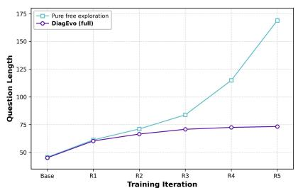  
(a) Question length

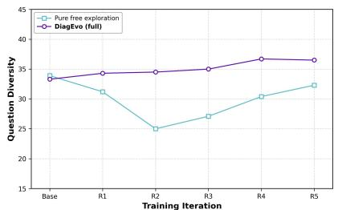  
(b) 2-gram diversity

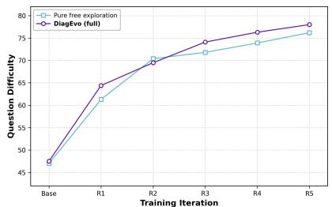  
(c) Question dificulty  
Figure 4 | Properties of questions generated after each round on Qwen3-8B-Base. (a) Average length in words. (b) Lexical diversity over adjacent word pairs, reported as 2-gram diversity. (c) Dificulty measured by the error rate of a fixed Qwen3-8B-Base solver against oracle answers. Both variants use double-confidence filtering. Pure free exploration removes the error-cause memory.

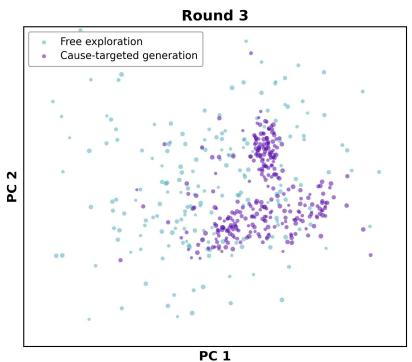  
(a) Question coverage, round 3

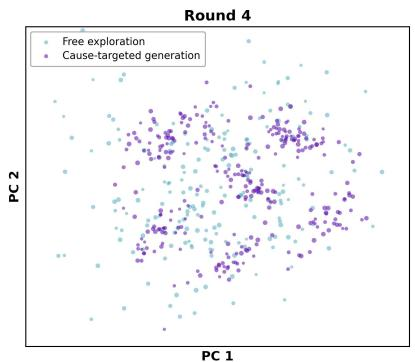  
(b) Question coverage, round 4

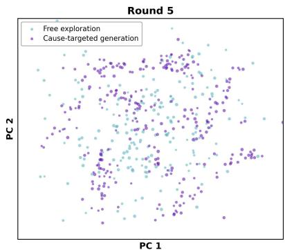  
(c) Question coverage, round 5  
Figure 5 | Principal component analysis (PCA) projections of questions generated in rounds 3–5. Colors indicate the generation mode.

Coverage visua<sup>l</sup>ization. We embed the questions generated after each round with text-embedding-v4 and project the embeddings to two dimensions with PCA. Figure 5 colors each question by its generation mode, free exploration or cause-targeted.

The changing memory also changes what the challenger generates (Figure 5). Free exploration covers a broad region that remains stable across rounds. Cause-targeted generation moves into new regions as the memory gains error causes. The two modes therefore have complementary roles. Free exploration maintains broad coverage, while cause-targeted generation follows the solver’s current error causes. This pattern is consistent with the performance loss when Table 2 removes either mode.

## I C<sub>ase</sub> St<sub>u</sub>d<sub>y:</sub> F<sub>rom</sub> F<sub>a</sub>il<sub>ure</sub> t<sub>o</sub> C<sub>urr</sub>i<sub>cu</sub>l<sub>um</sub>

This appendix traces one error cause across rounds (Figure 6), following it through diagnosis, cause-targeted generation, and the subsequent state transition.

Roun<sup>d</sup> t: <sup>f</sup>ai<sup>l</sup>ure an<sup>d d</sup>iagnosis. For $\log _ { 2 } ( x - 1 ) + \log _ { 2 } ( x - 5 ) = 3$ , both trajectories derive $x = 3 \pm 2 { \sqrt { 3 } } ,$ but only the trajectory agreeing with the pseudo-label enforces $x > 5$ . The diagnostician records the transferable cause “Fails to check whether candidate solutions remain valid under the original domain restrictions after algebraic transformation.” It enters memory as Active under the skill node Checking Conditions after Algebraic Steps, alongside the Mastered cause “Applies AM-GM to derive a lower bound but does not check whether an allowed input satisfies the equality condition.”

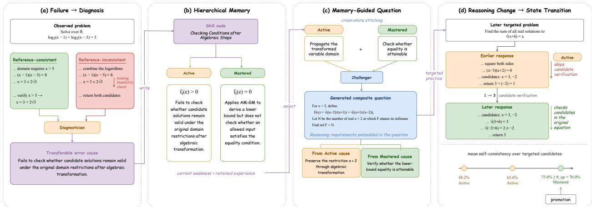  
Figure 6 | From failure to curriculum (Qwen3-8B-Base). (a) The diagnostician compares trajectories that agree and disagree with the pseudo-label and extracts a transferable error cause. (b) The cause enters the hierarchical memory as Active. (c) Cross-state stitching combines it with a Mastered cause into a composite question. (d) Rising self-consistency on later targeted questions promotes it to Mastered.

Round $t + 1 { : }$ cause-targete<sup>d</sup> generation an<sup>d</sup> training. The challenger samples this Active cause and combines it with the related Mastered sibling from the same skill node to generate

$$
F ( x ) = { \sqrt { \frac { x - 2 } { x + 1 } } } + { \sqrt { \frac { x + 1 } { x - 2 } } } , \qquad x > 2 .
$$

Let N be the number of real $x > 2$ at which F attains its infimum. Find inf $F + N$ . The question requires propagating $0 < t < 1$ for $t = \sqrt { ( x - 2 ) / ( x + 1 ) }$ and recognizing that equality at t = 1 is impossible. It tests the same corrective action under a new surface form. If its construction votes pass double-confidence filtering, it enters the solver update.

Later roun<sup>d</sup>s: <sup>b</sup>e<sup>h</sup>avior an<sup>d</sup> state. A later targeted question asks for the sum of all real solutions to ${ \sqrt { x + 6 } } = x$ . Squaring gives $( x - 3 ) ( x + 2 ) = 0 . \mathrm { A }$ solver response from an earlier round returns $3 + ( - 2 ) = 1$ without checking the candidates; a response from a later round substitutes them into the original equation, rejects −2 because ${ \sqrt { - 2 + 6 } } = 2 \neq - { \bar { 2 } }$ , and returns 3. Across rounds, mean self-consistency on questions targeting this cause rises from 48.2% to 65.6% and then 75.0%. The final value exceeds $\theta _ { \mathrm { { u p } } } = 7 0 \%$ , promoting the cause to Mastered. The trace illustrates how a diagnosed failure changes the curriculum and later solver behavior.

## J Prom<sub>p</sub>t Tem<sub>p</sub>lates and Memor<sub>y</sub> Routin<sub>g</sub>

This section specifies the runtime prompts and routing procedures for the challenger, solver, and diagnostician. Challenger and solver prompts follow the level of detail in R-Zero [Huang et al., 2026]; diagnostician prompts implement the semantic decisions described in Section 3.3. Fields marked <xxx> are replaced at runtime.

Design rationa<sup>l</sup>e. Pseudo-labels come from solver majority voting (Section 3.2), so the challenger does not provide answers. We retain the role, dificulty criterion, and <question> format of R-Zero [Huang et al., 2026], but omit its \boxed{final answer} requirement because DiagEvo constructs pseudo-labels from solver votes. Diagnostic context appears only in the challenger user message: either one error cause or an Active/Mastered pair. The shared system message is unchanged across generation modes. Each cause is accompanied by its parent skill-node label to provide broader knowledge context.

S<sup>h</sup>are<sup>d</sup> System Message. The following system message is used for all three generation modes described below.

You are an expert competition-math problem setter. FIRST, in your private scratch-pad, think step-by-step to design a brand-new, non-trivial problem. The problem could come from any field of mathematics, including but not limited to algebra, geometry, number theory, combinatorics, prealgebra, probability, statistics, and calculus. Aim for a dificulty such that fewer than 30% of advanced high-school students could solve it. Avoid re-using textbook clichés or famous contest problems.

THEN, without revealing any of your private thoughts, output exactly the following block:

<question>

{The full problem statement on one or more lines}

</question>

Do NOT output anything else—no explanations, no extra markup.

Mo<sup>d</sup>e 1: Free Exp<sup>l</sup>oration. The challenger relies solely on its own internal knowledge, with no reference to the memory (Section 3.1).

User Message: Generate one new, challenging reasoning question now. Remember to format the output exactly as instructed.

## Mo<sup>d</sup>e 2: Cause-Targete<sup>d</sup> Generation (Sing<sup>l</sup>e Cause). Activated when the sampled Active error cause’s skill node contains no Mastered causes (Section 3.1).

User Message: Generate one new, challenging reasoning question now. The question must specifically target the following reasoning weakness observed in the solver’s failures:

Knowledge area: <skill\_node>

Weakness to probe: <error\_cause>

Design the question so that correctly solving it requires the solver to overcome this specific weakness.   
Remember to format the output exactly as instructed.

Mo<sup>d</sup>e 3: Cross-State Stitc<sup>h</sup>ing. Activated when the sampled Active error cause’s skill node also contains at least one Mastered cause (Section 3.1); the two causes are combined in a single composite question rather than presented as separate tasks.

User Message: Generate one new, challenging reasoning question now. The question must weave together two reasoning elements within the same knowledge area into a single, coherent problem, rather than testing them separately:

Knowledge area: <skill\_node>

Element A (an observed weakness that remains Active and should still be challenging): <active\_cause> Element B (a previously diagnosed weakness for which the solver has reached high self-consistency, as measured by the endogenous consistency proxy; the question should require the corresponding corrective reasoning skill): <mastered\_cause>

Design a single self-contained question that genuinely requires combining both elements to reach the answer—neither element should be solvable in isolation from the other. Remember to format the output exactly as instructed.

So<sup>l</sup>ver Prompt. The solver prompt is identical to that of R-Zero [Huang et al., 2026] because answer extraction is independent of question generation. R-Few [Yu et al., 2025] uses the same instruction, while SPICE [Liu et al., 2025a] instead uses model-specific reasoner templates.

System Message: Please reason step by step, and put your final answer within \boxed{}.

<sup>U</sup>ser <sup>M</sup>essage: <question>

Diagnostician Prompts. The diagnostician operates within a hybrid code-and-LLM pipeline that follows the memory-maintenance sequence in Section 3.3. Code performs similarity screening, top-K retrieval, and routing; the diagnostician performs extraction, deduplication, node assignment, and consolidation. Recurrence verification is folded into extraction. The diagnostician returns JSON outputs in the runtime order described below. Error causes and node labels must be 10–20-word verb–object phrases without question-specific values or variables, which keeps their embeddings focused on transferable semantics.

Pre-C<sup>h</sup>ec<sup>k</sup>: Known-Cause Recurrence Veri<sup>fi</sup>cation (LLM Ca<sup>ll</sup> #1, <sup>f</sup>o<sup>ld</sup>e<sup>d</sup> into Prompt 1). Diagnosis uses failed GRPO trajectories only from questions retained by Equation 2; no extra responses are sampled. The known-cause list is empty for free exploration, contains the sampled Active cause for single-cause generation, and contains both the sampled Active cause and the stitched Mastered cause for cross-state generation. Prompt 1 first locates the earliest reasoning diference and compares it with every supplied cause. It assigns each failed trajectory to at most one supplied cause, selecting the single closest match when more than one appears plausible. A confirmed match contributes one count to $\Delta _ { t } ( \bar { e } )$ for the matched cause; otherwise, the prompt extracts a new candidate cause for memory matching. Both paths use the same LLM call.

## Prom<sub>p</sub>t 1: Error-Cause Extraction (LLM Call #1).

System Message: You are a diagnostician analyzing why a math solver’s reasoning went wrong. You will be shown a problem, a working reference answer, and two solving attempts that disagree with each other: one that reaches the reference answer and one that does not. Your job is to locate the exact reasoning step where the two attempts diverge and name the underlying skill deficiency responsible for the divergence.

Do not re-solve the problem yourself, and do not treat the reference answer as ground truth: it was itself produced by majority voting over the solver’s own samples and can occasionally be wrong. Your only task is to explain the divergence between the two given attempts, not to adjudicate correctness from outside evidence.

If one or more known causes are supplied below, compare the located divergence with every supplied cause. Select at most one cause whose underlying failure mechanism best explains the earliest divergence. Only if none of the supplied causes matches should you characterize a new one.

EXTRACTION PRINCIPLES:

• Localize the single earliest step at which the two attempts stop agreeing, and diagnose that step specifically—do not summarize the disagreeing attempt’s overall approach.

• State the error cause as a general, transferable skill deficiency, phrased as a single verb–object phrase (e.g., “misapplies triangle inequality to algebraic side lengths”), never as a restatement of this problem’s specific numbers, entities, or context.

• The description must be 10–20 words. This is a hard constraint, not a suggestion: it will later be embedded and used for cosine-similarity screening before semantic confirmation, so any leftover problem-specific detail, hedge, or explanation will dilute the embedding and silently corrupt every downstream deduplication and routing decision.

• If the two attempts do not actually diverge in reasoning strategy (e.g., the disagreement is a trivial arithmetic or copying slip), report this explicitly rather than forcing an artificial skill label onto a non-skill failure.

User Message: # Problem <problem>

\# Working Reference Answer <pseudo\_label>

\# Attempt That Agrees With the Reference <agreeing\_response>

\# Attempt That Disagrees With the Reference <disagreeing\_response>

\# Known Causes Used for Generation (omit this section if the problem was freely generated) <known\_cause\_list>

Each entry contains a cause ID, its current state, and its cause description.

OUTPUT FORMAT: Return exactly one JSON object with the following fields.

{   
"matched\_cause\_id": null,   
"error\_cause": null   
}

Set matched\_cause\_id to the exact ID of the single supplied cause that best explains the earliest divergence, or to null if none matches. When matched\_cause\_id is non-null, set error\_cause to null; the pipeline assigns the observation directly to that cause and skips the stages below. When matched\_cause\_id is null, error\_cause must be a new 10–20-word verb–object description unless the failure is unrelated to any identifiable skill, in which case it is also null.

Stage 2a: Error-Cause Simi<sup>l</sup>arity Screening (non-LLM). For each new candidate cause, we compare its embedding with every stored cause. Candidates above $\theta _ { \mathrm { d u p } }$ proceed to Prompt 2 for semantic confirmation. If none qualifies, the candidate proceeds directly to node assignment.

Prompt 2: De<sup>d</sup>up<sup>l</sup>ication (LLM Ca<sup>ll</sup> #2). Invoked only when Stage 2a returns at least one candidate.

System Message: You are a diagnostician deciding whether a newly identified error cause describes a mistake already recorded in the memory. You will be shown one new error cause and a short list of existing candidates that an embedding search flagged as textually similar to it. Judge duplication by underlying mechanism, not by wording: two causes represent the same error cause if fixing one would also fix the other, even when phrased diferently; they are diferent if a solver could overcome one while still exhibiting the other.

Your decision directly controls the memory’s current-episode frequency signal and may reactivate a matched Mastered cause. Frequency determines sampling weights within the Active cause-targeted pool and contributes to the next round’s exploration–exploitation ratio: confirming a genuine duplicate adds evidence to an Active cause or starts a reactivated cause at one, while wrongly accepting two distinct failure modes as one would blur the signal used for cause-targeted generation. Err toward keeping mechanistically distinct causes apart whenever the match is not clearly correct.

User Message: # New Error Cause <new\_cause>

\# Candidate Existing Causes <candidate\_cause\_list>

OUTPUT FORMAT: Return exactly one of the following valid JSON objects.

```json
{
"duplicate": true,
"matched_cause_id": "<matched_cause_id>"
}
or
{
"duplicate": false,
"matched_cause_id": null
}
```

If more than one candidate plausibly matches, select the single closest one. When duplicate is true, the observation is assigned to matched\_cause\_id and contributes one count to ∆<sub>t</sub>(e) in Equation 9; no new cause is created. The joint transition then increments an Active cause or starts a new active episode for a Mastered cause with the matched-failure count as its frequency. When duplicate is false, the new cause proceeds to Stage 3a for node assignment.

Stage 3a: No<sup>d</sup>e Can<sup>d</sup>i<sup>d</sup>ate Retrieva<sup>l</sup> (non-LLM). We reuse the cause-level similarities from Stage 2a to retrieve candidate skill nodes. A node receives the maximum similarity between the new cause and any of its members, and the top-K nodes form the shortlist. If the memory has at most K nodes, all nodes are returned.

Prompt 3: S<sup>k</sup>i<sup>ll</sup> No<sup>d</sup>e Assignment (LLM Ca<sup>ll</sup> #3). Prompt 3 is invoked once for each new error cause that clears deduplication, using the top-K skill-node candidates from Stage 3a.

System Message: You are a diagnostician organizing error causes into a hierarchy of skill nodes, where each node names one independently actionable reasoning or knowledge dimension that the challenger can later target on its own. You will be shown a new error cause and its top-K most relevant existing skill nodes, each given as a label together with one representative error cause currently filed under it; nothing outside this shortlist is shown to you, so base your decision only on the evidence provided rather than assuming the full memory’s contents. Decide, in a single pass, whether the new cause belongs to one of these nodes or requires a new node, using three criteria:

• Semantic <sup>d</sup>istinctness: is the new cause’s underlying skill clearly diferent from every candidate node’s skill, as defined relative to this specific candidate set (this criterion is trivially satisfied when no candidates are shown)?

• In<sup>d</sup>epen<sup>d</sup>ent actiona<sup>b</sup>i<sup>l</sup>ity: would practicing to fix this cause be a meaningfully diferent exercise from practicing any candidate node’s skill? A node should correspond to one coherent thing the solver can get better at, not a loose bag of unrelated causes.

• Genera<sup>l</sup>ity an<sup>d</sup> extensi<sup>b</sup>i<sup>l</sup>ity: if a new node is created, is its label general enough to later host other, distinct error causes that share this skill, rather than merely restating this one instance? A node opened too narrowly will never accumulate enough error causes to reveal a stable pattern for later composite-problem generation.

User Message: # New Error Cause <new\_cause>

\# Top-K Candidate Skill Nodes <candidate\_node\_list>

OUTPUT FORMAT: Return exactly one of the following valid JSON objects.

```json
{
"create_new_node": true,
"new_node_label": "<10-20 word verb-object label>",
"assigned_node": null
}
```

or   
{   
"create\_new\_node": false,   
"new\_node\_label": null,   
"assigned\_node": "<assigned\_node\_id>"   
}

Exactly one of new\_node\_label and assigned\_node must be non-null. This single pass is the only chance to get the decision right: it is trusted and executed as-is, with no second retrieval or second diagnostician call to verify it, so weigh all three criteria within this one judgment rather than treating creation and assignment as separate questions.

Stage 3.5: Routing Execution (co<sup>d</sup>e on<sup>l</sup>y, no LLM or em<sup>b</sup>e<sup>dd</sup>ing ca<sup>ll</sup>). Code executes Prompt 3’s routing decision directly. If create\_new\_node is true, it creates a skill node labeled new\_node\_label and attaches the error cause as its first member; otherwise, it attaches the error cause under assigned\_node. Either way, the new error cause is initialized with (s<sub>t</sub>(e), f<sub>t</sub>(e)) = (Active, 1), consistent with Equation 3.

Stage 4a: No<sup>d</sup>e-Pair Can<sup>d</sup>i<sup>d</sup>ate Screening (non-LLM). After all failures in round t are processed and routed, we compare skill-node embeddings pairwise. Pairs above θ<sub>merge</sub> proceed to Prompt 4 for semantic confirmation.

Prompt 4: En<sup>d</sup>-o<sup>f</sup>-Roun<sup>d</sup> Conso<sup>l</sup>i<sup>d</sup>ation (LLM Ca<sup>ll</sup> #4). Prompt 4 is invoked once for each candidate pair from Stage 4a.

System Message: You are a diagnostician auditing the skill-node hierarchy for redundancy that has emerged as the memory grew. Because Prompt 3 assigns each error cause to a node using only the shortlist visible at that moment, two nodes opened at diferent times under diferent candidate sets can, in hindsight, turn out to name the same skill; your job is to catch what write-time assignment could not see. You will be shown two skill nodes, each given as a label together with every error cause currently filed under it. Judge whether the two nodes describe the same underlying skill dimension and should be merged, or whether they capture genuinely distinct dimensions that happen to share superficial vocabulary — base this judgment on the full set of error causes under each node, not on the labels alone, since two labels can look nearly identical while covering diferent mistakes, or look diferent while covering the same one.

User Message: # Skill Node A <node\_a\_label>: <node\_a\_causes>

OUTPUT FORMAT: Return exactly one of the following valid JSON objects.

```json
{
"merge": true,
"merged_label": "<10-20 word verb-object label>"
}
or
{
"merge": false,
"merged_label": null
}
```

The merged label must remain a general, transferable skill description under the same 10–20 word verb–object phrase constraint as any node label, not a concatenation of A’s and B’s labels. When merge is true, the pipeline relabels the surviving node as merged\_label and re-parents every error cause from both A and B under it without an additional cause-level deduplication pass; cross-node duplicate screening has already been applied in Stage 2a. Individual cause states and current-episode frequencies remain unchanged.