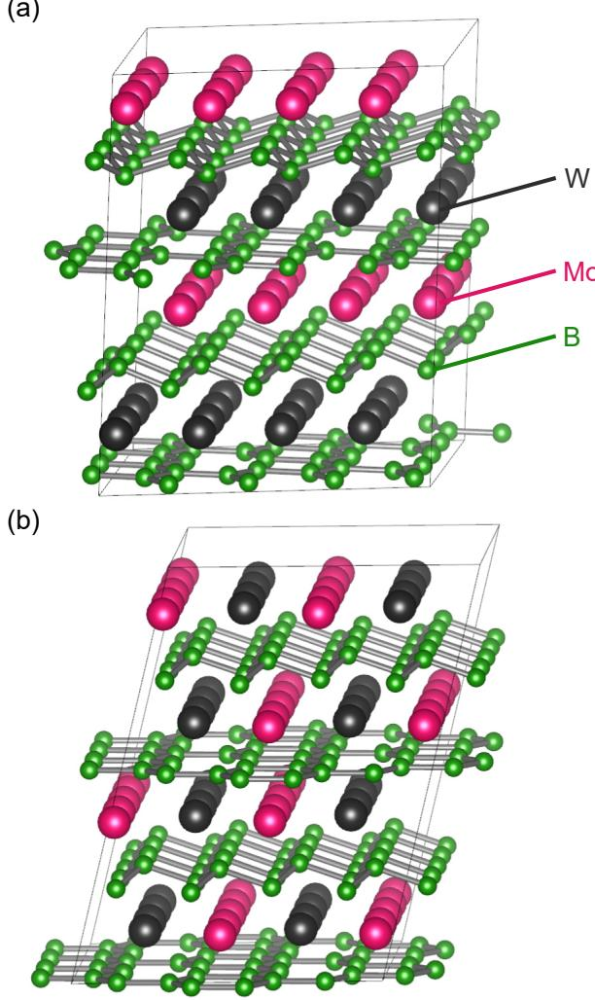
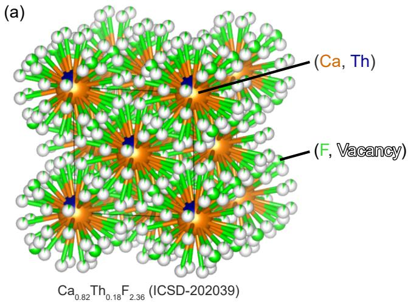
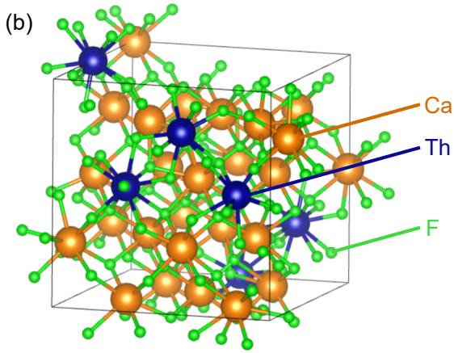
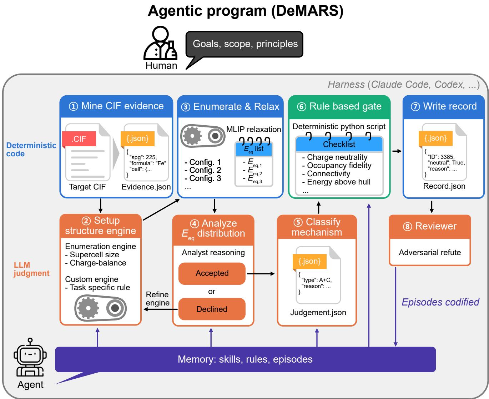

# Agentic programs: an emerging form of scientific software in computational materials science

Yunsung Lim1†, Haekwan Jeon2†, Jaesun Kim2, Jisu Kim1, Seungwu Han1,2,3\*

1Research Institute of Advanced Materials, Seoul National University, Seoul, 08826, Republic of Korea.

2Department of Materials Science and Engineering, Seoul National University, Seoul, 08826, Republic of Korea.

3Center for AI and Natural Sciences, Korea Institute for Advanced Study, Seoul, 02455, Republic of Korea.

\*Corresponding author(s). E-mail(s): hansw@snu.ac.kr; †These authors contributed equally to this work.

## Abstract

Computational materials science has traditionally delegated algorithmic tasks to computers while leaving scientific judgments to humans. We argue that recent LLM-based agent harnesses enable an emerging form of scientific software, agentic programs, that combine deterministic algorithms with bounded LLM-based judgment, task-specific verification, episodic maturation, and complete delegation in production. We illustrate this concept with DeMARS, an agentic program for constructing atomistic models from experimentally measured disordered crystal structures.

Since its birth, computational materials science has developed with a clear division of labor: humans develop algorithms and codes and carry out analysis, while computers crunch numbers [1–5]. This division has enabled researchers to delegate well-defined computational tasks to computers and execute them eficiently at scale. Accordingly, in understanding mechanisms and discovering new materials, significant efort has been devoted to developing eficient algorithms and reliable automation packages that fit into computational workflows [6–10]. However, many important decisions in research still rely on human reasoning, which remains outside these workflows [11, 12]. If such reasoning could also be incorporated into the computational process, research goals could potentially be reached more eficiently.

One example is illustrated in Fig. 1, adopted from ref. [13], which employed a genetic algorithm for crystal structure prediction of the unknown compound $\mathrm { W _ { 4 } M o _ { 4 } B _ { 1 5 } }$ . With a machine-learning interatomic potential (MLIP) enabling a much larger number of search iterations, the algorithm identified a structure in Fig. 1a that is more stable than those reported in the previous study [14] (Fig. 1b). This demonstrates how improved algorithms and higher computational throughput can expand the search space. Nevertheless, a researcher examining Fig. 1b may readily recognize their layered character and reason that diferent types of intercalation of W and Mo should be explored. Such reasoning can redirect the search toward a promising region of configuration space without relying solely on more extensive sampling.

Although reasoning can be highly valuable in computational materials science, it has been dificult to incorporate it directly into computational workflows because human reasoning is costly, slow, and dificult to scale [15]. This situation is changing with the development of large language models (LLMs), which can perform scientific reasoning and translate it into actionable judgment at much higher throughput [16, 17]. Furthermore, when coupled with an agent harness that can execute computational tools, inspect intermediate results, and act according to its judgment, such reasoning can become an integral part of the computational workflow rather than remain as an external human step [18, 19]. This opens the possibility of delegating to computers not only numerical calculations but also scientific tasks that require judgment during their execution.

We refer to this emerging form of scientific software as an agentic program. Unlike an interactive AI assistant [20] or an agent embedded in a human-supervised workflow [17], an agentic program is designed to take full responsibility for a bounded scientific task. Given a defined input, goal, and set of scientific constraints, it combines conventional algorithms with LLM-based judgment to determine and execute the actions needed to produce a valid output. Importantly, once suficiently mature, the program is expected to operate without routine human intervention in production, much like conventional scientific software. In this sense, agentic programs extend the long-standing division of labor in computational materials science from the delegation of numerical computation to the delegation of bounded scientific judgment. We suggest that an agentic program has the following defining characteristics.

(a)  
  
Fig. 1 Crystal structure predicted for the composition of W ${ \bf \Gamma } _ { 4 } ^ { \prime } { \bf M o _ { 4 } B _ { 1 5 } } .$ Each structure is obtained by utilizing (a) machinelearning interatomic potential and (b) first-principles calculation to evaluate potential energy used for genetic algorithm.

Algorithm and judgment. An agentic program does not replace conventional algorithms with an LLM. Rather, it combines the two according to their respective strengths. Operations that can be reduced to explicit rules should remain deterministic and algorithmic, while decisions that depend on context, scientific knowledge, or interpretation can be assigned to LLM-based judgment. This hybrid use of algorithms and model-based judgment is shared with emerging agentic workflow in science, when LLMs may gather evidence, generate hypotheses, or determine subsequent actions [17–19]. In an agentic program, however, judgment is not primarily used for open-ended exploration, but for resolving underdetermined decision points within a predefined scientific responsibility. The role of the LLM is therefore to occupy those parts of the workflow where the appropriate course of action cannot be completely specified in advance. Importantly, such judgment can have bounded controlflow authority, allowing the program to select among procedures, revise its computational strategy, or invoke an alternative route when the predefined algorithm is inadequate.

Bounded responsibility and verification. An agentic program is designed around a clearly defined scientific responsibility rather than open-ended research activity. Open-ended scientific tasks often admit multiple valid approaches and outcomes, making it dificult to define exhaustive criteria for correctness and verification protocols in advance [15, 21]. By bounding the responsibility, its scope, allowed tools, inputs, outputs, and scientific constraints can be specified in advance. This boundedness is important because it makes rigorous task-specific verification possible. Judgments made during execution should be checked whenever possible by deterministic calculations, physical constraints, consistency tests, or other task-specific gates. Not every judgment can be validated by such gates, but its computable consequences should be tested and the supporting evidence and judgment kept explicit and auditable. In this way, flexibility is allowed inside the program without sacrificing a well-defined standard for what constitutes an acceptable result.

Maturation through episodes. An agentic program need not begin as a fully autonomous system. Here, maturation refers to the progressive conversion of experience into persistent program artifacts such as doctrines, diagnostics, verification gates, and deterministic code [22, 23]. In early development, human inspection and independent reviewer agents frequently expose previously unseen failure modes. These interventions do not remain isolated corrections, and each informative episode can be root-caused and codified into reusable instructions, verification gates, procedures, or deterministic algorithms. As those episodes accumulate, the program progressively incorporates knowledge that previously resided with human developers or emerged from reviewer feedback, reducing the need for repeated intervention. Furthermore, as recurring judgments are codified, maturation can also reduce the amount and complexity of LLM-based reasoning required for routine cases, shifting execution progressively toward deterministic components. Because codification itself can be incomplete or overly general, these artifacts should remain versioncontrolled, testable, and reversible as further experience accumulates.

Complete delegation in production. The ultimate goal of maturation is to preserve and extend the clear division of labor that has made conventional scientific software so powerful. Humans define the scientific objective, scope, and governing principles and improve the program when new failure modes are discovered. Routine execution, however, should belong to the program. This maturation resembles conventional software engineering, in which recurring issues and bugs are analyzed, generalized into underlying failure modes, and incorporated into persistent fixes, tests, or procedures [24, 25]. In an agentic program, however, LLM-based judgment can participate in this process by interpreting new failure episodes and translating them into reusable program artifacts [22], thereby reducing repeated human intervention within a clearly bounded scientific domain. Once suficiently mature, an agentic program should operate without a human inside the production loop, either delivering a validated result or recognizing that a reliable result cannot be produced. This complete delegation distinguishes an agentic program from an interactive assistant or a human-supervised agentic workflow.

Modern agent harnesses make this form of software practical by providing both a development environment and a runtime for LLM-based judgment. By combining LLMs with tool execution, persistent context, reusable skills, subagents, and access to conventional scientific codes, platforms such as Claude Code [26] and Codex [27] allow judgment procedures to be developed, tested, versioned, and then executed as integral components of a scientific program. The harness is therefore not itself a defining property of an agentic program, but the infrastructure that enables its judgment-bearing components to be both developed and operated.

We remark that the concept of an agentic program difers in emphasis from much of the current work on agentic AI for science [19, 23, 28–30]. The individual elements described above are not necessarily new; rather, an agentic program is characterized by how these elements are brought together to enable the end-to-end delegation of a well-defined scientific task. Existing systems are often framed as assistants, workflow orchestrators, or increasingly general autonomous research agents, with the primary goal of expanding the range of scientific activities that an AI system can perform. An agentic program instead emphasizes complete delegation of a bounded scientific responsibility. Its scope is deliberately restricted so that the input, expected output, governing principles, and criteria for correctness can be defined suficiently well to support systematic verification and repeated production. Therefore, the objective of an agentic program is not maximal autonomy over the broadest possible range of tasks, but complete delegation of a bounded scientific responsibility.

  
Fig. 2 Visualization of a disordered crystal showing complex behavior, $\mathbf { C a } _ { 1 - x } \mathbf { T h } _ { x } \mathbf { F } _ { 2 + 2 x }$ with $x \ = \ 0 . 1 8 .$ . (a) Crystal structure from original $\mathrm { C I F }$ file having partial occupancy. (b) A minimal atomistic representation of (a) that follows chemical rule.

To demonstrate how these elements can be integrated in practice, we present DeMARS (De-averaged Minimal Atomistic Representation System) as a prototypical case study of an agentic program. DeMARS is designed for a narrowly defined yet intrinsically judgment-intensive task: constructing atomistic models from experimentally reported disordered crystal structures given in a crystallographic information file (CIF). The program is also practically important, as approximately half of the entries in the ICSD are reported as disordered [31]. For simple substitutional solid solutions, which take up ∼60% of the disordered CIFs, a physically reasonable model can often be obtained by expanding the unit cell and distributing the partially occupied species over the corresponding sites. More complex disorder, however, cannot always be resolved by such straightforward enumeration. For example, in $\mathrm { C a _ { 0 . 8 2 } T h _ { 0 . 1 8 } F _ { 2 . 3 6 } }$ (ICSD collection code 202039; Fig. 2a), fluorine is distributed over several partially occupied normal and interstitial sites whose occupations are strongly coupled, making independent site-by-site enumeration impractical. The composition, however, reveals the underlying chemistry: replacing $\mathrm { { C a ^ { 2 + } } }$ by $\mathrm { T h ^ { 4 + } }$ introduces two excess positive charges per Th and therefore requires two additional F− for compensation. This predicts an anion content of $2 + 2 x = 2 . 3 6$ at $x = 0 . 1 8 .$ exactly matching the refined composition [32]. This reasoning suggests placing the additional F atoms at interstitial sites associated with Th (Fig. 2b). The major dificulty is therefore not simply to enumerate configurations, but to determine what chemical model should be enumerated and which structural principles should constrain the search, a decision that requires scientific judgment.

DeMARS explicitly separates deterministic computation from model-based judgment in its architecture (Fig. 3). The architecture of DeMARS reflects the four characteristics described above: deterministic algorithms are combined with bounded LLM judgment, task-specific gates constrain acceptable outputs, recurring failures are incorporated through episodic maturation, and the resulting program is intended for end-to-end production without routine human intervention. Deterministic code (blue and green boxes) performs every operation whose procedure and acceptance criterion can be specified in advance: extracting the crystallographic evidence from the CIF into a structured bundle ( 1 ), constructing supercells, enumerating candidate configurations, and relaxing them with a universal MLIP ( 3 ), evaluating every deliverable against the verification gates, including charge neutrality, occupancy fidelity, and polyanion connectivity, while also computing energy above hull of each candidate as an interpretive metric rather than using it as a pass or fail criterion ( 6 ), and assembling the final machine-readable record ( 7 ).

On the other hand, LLM-based judgment in DeMARS is introduced only at the underdetermined decision points. An LLM analyst operating within the harness reads the evidence bundle and converts its read ing of the disorder into an executable specification for the enumeration engine such as the supercell commensurate with the fractional occupancies, the sites to be merged or mutually excluded, the charge balanced composition targets, or redirects the workflow when model repair (e.g., missing hydrogen) or a custom construction is required ( 2 ); inspects the resulting energy distribution across the ensemble and decides whether to accept it or rerun the enumeration engine with a tightened specification ( 4 ); makes the mechanism classification ( 5 ). A separate reviewer agent then adversarially reviews the finished record in a fresh context ( 8 ). The LLM therefore decides how the engine should be used when the appropriate procedure cannot be prescribed reliably beforehand.

This architecture provides two structural safeguards for reliable judgment. First, the LLM operates between deterministic interfaces: code supplies the evidence it interprets, and code independently checks the consequences of its decisions. The model therefore neither generates the quantitative facts on which its judgment rests nor certifies its own output. These gates do not prove that a scientific interpretation is uniquely correct, but they test its computable consequences against predefined physical and structural requirements. Second, judgment is made falsifiable through computation. The analyst’s specification is treated as a hypothesis about the disorder, whose physical consequences are tested by the engine; inconsistent structures, diagnostics, or energy distributions trigger refinement rather than acceptance. Judgment is thus checked, never trusted on its own.

While the overall architecture of DeMARS remained stable, its components, including code, skills, doctrines, and verification procedures, were progressively refined through episodic experience within the Claude Code harness. Early versions required frequent human inspection as previously unseen forms of disorder exposed shortcomings in construction rules or verification. When a failure was identified, a brief human observation could trigger root-cause analysis by the orchestrating LLM, which then translated the insight into persistent program artifacts such as versioned instructions, diagnostics, procedures, or deterministic code. Reviewer agents were also used to expose overlooked failure modes, but did not modify the program themselves; updates were made between production runs by the orchestrating agent, with substantive doctrine changes subject to human approval. Across roughly 800 disordered CIFs, recurring judgments were progressively codified into reusable rules and, where possible, deterministic algorithms. Thus, maturation progressively shifted recurring decisions from transient model-based judgment toward persistent and testable program artifacts. Several cases that initially required custom construction were later handled automatically by the improved engine. As a result, the mature DeMARS can now process randomly selected batches end-to-end without routine case-by-case human involvement.

One episode illustrates how maturation can improve the deterministic engine through the program’s own adversarial review. In $\mathrm { S r _ { 2 } L i M o O _ { 5 . 5 } }$ (ICSD 166728), all generated structures passed the existing deterministic gates, yet an independent reviewer found that every configuration shared the same cation arrangement, revealing that the Li/Mo anti-site disorder had not actually been sampled. The reviewer traced this failure to the coupledenumeration routine, where a deterministic ordering prevented proper sampling. Correcting the engine restored the missing degree of freedom, turning a reviewerdetected failure into a permanent improvement of the program.

Rapid maturation also depends on the ability to accumulate many relevant episodes at low computational cost. In atomistic materials problems, universal MLIPs provide this capability by allowing large numbers of candidate structures to be generated, relaxed, and compared far more eficiently than with first-principles calculations. DeMARS exploits this high-throughput experience through SevenNet [33, 34], using repeated evaluation of alternative disorder realizations to support judgment, verification, and subsequent maturation.

  
Fig. 3 Workflow of the agentic program, DeMARS. Orange boxes represent the steps requiring LLM-based judgment, while blue and green boxes illustrate deterministic procedures by python scripts. Processes colored in blue developed from scratch for predefined purposes, while the green box indicates the verification gate containing numerous checklists that might require update after learning episodes. Agents operating within the harness carry skills, rules and episodes as their memory (represented as purple box), which are continuously updated through human interaction by providing goals, scope and principles of the target (top) during maturation. $E _ { \mathrm { e q } }$ indicates equilibrium energy of enumerated crystals that can be obtained by structure optimization employing MLIP.

The consequence of this maturation is complete delegation within the defined scope of the program. Thus, the mature DeMARS can process randomly selected batches of disordered CIFs end-to-end without routine caseby-case human intervention, choosing between generic enumeration and custom construction, with model repair applied upstream of either where required, as needed. As a test, we randomly selected 100 disordered CIFs from ICSD (three to five elements, nontrivial site disorder, at most 40 listed sites, and not used during maturation). DeMARS then processed them end-to-end without human intervention. The subsequent manual inspection of all outputs found that the certified models were chemically reasonable and consistent with the reported disorder and that, for each case in which DeMARS declined to certify a result, the stated reason was verifiable from the record’s own evidence. Complete delegation does not imply that every input must yield a successful structure; a reliable program should also be able to recognize when the available evidence and verification criteria are insuficient and decline to certify a result. What matters is that routine execution including such decisions, no longer requires a human inside the production loop. At this stage, the agentic workflow begins to function as a scientific program in the conventional sense: a researcher delegates a defined task and receives either a validated result or an explicit failure.

Agentic programs also introduce challenges that are less prominent in conventional scientific software. In particular, LLM-based judgment is inherently sensitive to the context and employed model, so the same inputs may not always lead to the same decisions. Hallucinations or missing physical or chemical considerations cannot always be caught by deterministic gates. In deployment, therefore, one needs careful versioning of models, skills, and episodic records, and continued auditing as the program or its underlying LLM models evolve. In this sense, the central challenge of agentic scientific software is not simply to make LLMs more capable, but to engineer the surrounding system so that their judgments remain inspectable, testable, and bounded.

The relative stability of much of the underlying physical and chemical knowledge may also make computational materials science particularly amenable to agentic programs, since many judgments depend less on rapidly changing external information than in some other domains. Many problems in computational materials science have a structure that can be addressed by agentic programs: the input and desired deliverable are well defined, but reaching that deliverable involves intermediate decisions that cannot be fully prescribed in advance. Examples include reasoning-augmented crystal structure prediction, selecting and validating DFT protocols, constructing defect or interface models, and diagnosing and improving MLIPs. Rather than addressing these problems with a single general-purpose autonomous scientist, an alternative path may be to develop specialized agentic programs, each responsible for a bounded scientific task and matured through repeated experience within that domain. Such programs could then be composed with conventional simulation codes and with one another, much as scientific software packages are combined in present-day workflows. In this view, the future of computational materials science may lie in an ecosystem of reliable, specialized agentic programs to which bounded scientific responsibilities can be completely delegated. More broadly, the same paradigm may extend across science and engineering wherever well-defined technical responsibilities involve intermediate judgments that cannot be fully prescribed in advance.

## Code availability

The DeMARS source code, including the deterministic computational tools, agent definitions, and versioned skills used for model based judgment, will be released publicly upon publication of the peer-reviewed version of this work.

## References

[1] Kresse, G., Joubert, D.: From ultrasoft pseudopotentials to the projector augmented-wave method. Phys. Rev. B 59(3), 1758–1775 (1998) https://doi. org/10.1103/PhysRevB.59.1758

[2] Giannozzi, P., Baroni, S., Bonini, N., Calandra, M., Car, R., Cavazzoni, C., Ceresoli, D., Chiarotti, G.L., Cococcioni, M., Dabo, I., et al.: Quantum espresso: a

modular and open-source software project for quantum simulations of materials. Journal of physics: Condensed matter 21(39), 395502 (2009) https:// doi.org/10.1088/0953-8984/21/39/395502

[3] Thompson, A.P., Aktulga, H.M., Berger, R., Bolintineanu, D.S., Brown, W.M., Crozier, P.S., Veld, P.J., Kohlmeyer, A., Moore, S.G., Nguyen, T.D., Shan, R., Stevens, M.J., Tranchida, J., Trott, C., Plimpton, S.J.: LAMMPS - a flexible simulation tool for particle-based materials modeling at the atomic, meso, and continuum scales. Comput. Phys. Comm. 271, 108171 (2022) https://doi.org/10.1016/j.cpc. 2021.108171

[4] Van Der Spoel, D., Lindahl, E., Hess, B., Groenhof, G., Mark, A.E., Berendsen, H.J.C.: Gromacs: Fast, flexible, and free. Journal of Computational Chemistry 26(16), 1701–1718 (2005) https://doi.org/10. 1002/jcc.20291

[5] Dubbeldam, D., Calero, S., Ellis, D.E., Snurr, R.Q.: Raspa: molecular simulation software for adsorption and difusion in flexible nanoporous materials. Molecular Simulation 42(2), 81–101 (2016) https: //doi.org/10.1080/08927022.2015.1010082

[6] Ong, S.P., Richards, W.D., Jain, A., Hautier, G., Kocher, M., Cholia, S., Gunter, D., Chevrier, V.L., Persson, K.A., Ceder, G.: Python Materials Genomics (pymatgen): A robust, open-source python library for materials analysis. Comput. Mater. Sci. 68, 314–319 (2013) https://doi.org/10. 1016/j.commatsci.2012.10.028 . pymatgen

[7] Ganose, A.M., Sahasrabuddhe, H., Asta, M., Beck, K., Biswas, T., Bonkowski, A., Bustamante, J., Chen, X., Chiang, Y., Chrzan, D.C., Clary, J., Cohen, O.A., Ertural, C., Gallant, M.C., George, J., Gerits, S., Goodall, R.E.A., Guha, R.D., Hautier, G., Horton, M., Inizan, T.J., Kaplan, A.D., Kingsbury, R.S., Kuner, M.C., Li, B., Linn, X., McDermott, M.J., Mohanakrishnan, R.S., Naik, A.N., Neaton, J.B., Parmar, S.M., Persson, K.A., Petretto, G., Purcell, T.A.R., Ricci, F., Rich, B., Riebesell, J., Rignanese, G.-M., Rosen, A.S., Scheffler, M., Schmidt, J., Shen, J.-X., Sobolev, A., Sundararaman, R., Tezak, C., Trinquet, V., Varley, J.B., Vigil-Fowler, D., Wang, D., Waroquiers, D., Wen, M., Yang, H., Zheng, H., Zheng, J., Zhu, Z., Jain, A.: Atomate2: modular workflows for materials science. Digit. Discov. 4(7), 1944–1973 (2025) https://doi.org/10.1039/d5dd00019j

[8] Youn, Y., Lee, M., Hong, C., Kim, D., Kim, S., Jung, J., Yim, K., Han, S.: AMP2: A fully automated program for ab initio calculations of crystalline materials. Comput. Phys. Comm. 256, 107450 (2020) https://doi.org/10.1016/j.cpc.2020.107450

[9] Pizzi, G., Cepellotti, A., Sabatini, R., Marzari, N., Kozinsky, B.: Aiida: automated interactive infrastructure and database for computational science. Computational Materials Science 111, 218– 230 (2016) https://doi.org/10.1016/j.commatsci. 2015.09.013

[10] Curtarolo, S., Setyawan, W., Hart, G.L.W., Jahnatek, M., Chepulskii, R.V., Taylor, R.H., Wang, S., Xue, J., Yang, K., Levy, O., Mehl, M.J., Stokes, H.T., Demchenko, D.O., Morgan, D.: Aflow: An automatic framework for high-throughput materials discovery. Computational Materials Science 58, 218–226 (2012) https://doi.org/10.1016/j. commatsci.2012.02.005

[11] Stein, H.S., Gregoire, J.M.: Progress and prospects for accelerating materials science with automated and autonomous workflows. Chem. Sci. 10(42), 9640–9649 (2019) https://doi.org/10.1039/ c9sc03766g

[12] Adams, F., McDannald, A., Takeuchi, I., Kusne, A.G.: Human-in-the-loop for Bayesian autonomous materials phase mapping. Matter 7(2), 697–709 (2024) https://doi.org/10.1016/j.matt.2024.01.005

[13] Kang, S., Jeong, W., Hong, C., Hwang, S., Yoon, Y., Han, S.: Accelerated identification of equilibrium structures of multicomponent inorganic crystals using machine learning potentials. npj Comput. Mater. 8(1), 108 (2022) https://doi.org/10.1038/ s41524-022-00792-w 2107.02594

[14] Kvashnin, A.G., Tantardini, C., Zakaryan, H.A., Kvashnina, Y.A., Oganov, A.R.: Computational search for new w–mo–b compounds. Chem. Mater. 32(16), 7028–7035 (2020) https://doi.org/10.1021/ acs.chemmater.0c02440

[15] Stach, E., DeCost, B., Kusne, A.G., Hattrick-Simpers, J., Brown, K.A., Reyes, K.G., Schrier, J., Billinge, S., Buonassisi, T., Foster, I., Gomes, C.P., Gregoire, J.M., Mehta, A., Montoya, J., Olivetti, E., Park, C., Rotenberg, E., Saikin, S.K., Smullin, S., Stanev, V., Maruyama, B.: Autonomous experimentation systems for materials development: A community perspective. Matter 4(9), 2702–2726 (2021) https://doi.org/10.1016/j.matt.2021.06.036

[16] Boiko, D.A., MacKnight, R., Kline, B., Gomes, G.: Autonomous chemical research with large language models. Nature 624(7992), 570–578 (2023) https: //doi.org/10.1038/s41586-023-06792-0

[17] Gottweis, J., Weng, W.-H., Daryin, A., Tu, T., Sirkovic, P., Myaskovsky, A., Glowaty, G., Weissenberger, F., Orlandi, A., Popovici, D., Palepu, A., Rong, K., Tanno, R., Saab, K., Zhang, F., Blum,

J., Carroll, A., Kulkarni, K., Tomaˇsev, N., Zverinski, D., Rendulic, I., Vedadi, E., Hasler, F., Rimanic, L., Boia, M., Budiselic, I., Feinstein, B., Bellaiche, M., Shefer, T., Freyberg, J., Ratclif, J., Bertolli, O., Chou, K., Hassidim, A., Gokturk, B., Vahdat, A., Guan, Y., Dhillon, V., Vaishnav, E.D., Lee, B., Costa, T.R.D., Penad´es, J.R., Peltz, G., Matias, Y., Manyika, J., Hassabis, D., Xu, Y., Kohli, P., Pawlosky, A., Karthikesalingam, A., Natarajan, V.: Accelerating scientific discovery with Co-Scientist. Nature 655(8122), 487–496 (2026) https://doi.org/ 10.1038/s41586-026-10644-y 2502.18864

[18] Bran, A.M., Cox, S., Schilter, O., Baldassari, C., White, A.D., Schwaller, P.: Augmenting large language models with chemistry tools. Nat. Mach. Intell. 6(5), 525–535 (2024) https://doi.org/10. 1038/s42256-024-00832-8

[19] Chaudhari, A., Ock, J., Farimani, A.B.: Modular large language model agents for multitask computational materials science. Commun. Mater. 7(1), 131 (2026) https://doi.org/10.1038/ s43246-025-00994-x

[20] Shao, E., Wang, Y., Qian, Y., Pan, Z., Liu, H., Wang, D.: SciSciGPT: advancing human–AI collaboration in the science of science. Nature Computational Science 6(3), 301–315 (2026) https://doi.org/ 10.1038/s43588-025-00906-6

[21] Gu, K., Shang, R., Jiang, R., Kuang, K., Lin, R.-J., Lyu, D., Mao, Y., Pan, Y., Wu, T., Yu, J., Zhang, Y., Zhang, T.M., Zhu, L., Merrill, M.A., Heer, J., Althof, T.: BLADE: Benchmarking language model agents for data-driven science. In: Al-Onaizan, Y., Bansal, M., Chen, Y.-N. (eds.) Findings of the Association for Computational Linguistics: EMNLP 2024, pp. 13936–13971. Association for Computational Linguistics, Miami, Florida, USA (2024). https: //doi.org/10.18653/v1/2024.findings-emnlp.815 https://aclanthology.org/2024.findings-emnlp.815/

[22] Zhang, J., Hu, S., Lu, C., Lange, R.T., Clune, J.: Darwin g¨odel machine: Openended evolution of self-improving agents. In: The Fourteenth International Conference on Learning Representations (2026). https://openreview.net/forum?id=pUpzQZTvGY

[23] Huang, X., Chen, J., Fei, Y., Li, Z., Schwaller, P., Ceder, G.: Cascade: Cumulative agentic skill creation through autonomous development and evolution. arXiv preprint arXiv:2512.23880 (2025)

[24] Card, D.N.: Learning from our mistakes with defect causal analysis. IEEE Software 15(1), 56–63 (1998) https://doi.org/10.1109/52.646883

[25] Bennett, K.H., Rajlich, V.T.: Software maintenance and evolution: a roadmap. Proceedings of the Conference on The Future of Software Engineering, 73– 87 (2000) https://doi.org/10.1145/336512.336534

[26] Anthropic: Claude Code. https://github.com/ anthropics/claude-code. Agentic coding tool, accessed 20 August 2026 (2025)

[27] OpenAI: Codex. https://github.com/openai/codex. Coding agent, accessed 20 August 2026 (2025)

[28] Zou, Y., Cheng, A.H., Aldossary, A., Bai, J., Leong, S.X., Campos-Gonzalez-Angulo, J.A., Choi, C., Ser, C.T., Tom, G., Wang, A., Zhang, Z., Yakavets, I., Hao, H., Crebolder, C., Bernales, V., Aspuru-Guzik, A.: El Agente: An autonomous agent for quantum chemistry. Matter 8(7), 102263 (2025) https://doi. org/10.1016/j.matt.2025.102263

[29] Park, Y., Chung, Y., You, J., Kim, J., Ju, S., Han, S.: A robust agentic framework for expert-level automation of atomistic simulations. arXiv preprint arXiv:2606.09422 (2026)

[30] Deng, B., Li, B., Cox, M., Chun, H., Nam, J., Lyssenko, A., Edamadaka, S., Ruza, J., Du, X., Segal, N., et al.: Harnessing atomisticskills for agentic atomistic research. arXiv preprint arXiv:2605.24002 (2026)

[31] Antypov, D., Collins, C.M., Dyer, M.S., Claridge, J.B., Rosseinsky, M.J.: Classification and statistical analysis of structural disorder in crystalline materials. J. Appl. Crystallogr. 58(3), 659–677 (2025) https://doi.org/10.1107/S1600576725003000

[32] Laval, J.P., Mikou, A., Frit, B., Pannetier, J.: Neutron difraction study of the anion-excess fluoriterelated $\mathrm { C a _ { 1 - x } T h _ { x } F _ { 2 + 2 x } }$ solid solution. J. Solid State Chem. 61(3), 359–368 (1986) https://doi.org/10. 1016/0022-4596(86)90044-7

[33] Kim, J., You, J., Park, Y., Lim, Y., Kang, Y., Kim, J., Jeon, H., Ju, S., Hong, D., Lee, S.Y., Choi, S., Kim, Y., Lee, J.W., Han, S.: Optimizing cross-domain transfer for universal machine learning interatomic potentials. Nat. Commun. 17(1), 3432 (2026) https://doi.org/10.1038/ s41467-026-70195-8

[34] Oh, S., You, J., Kim, J., Lee, J., An, H., Han, S., Kang, Y.: A lightweight universal machine-learning interatomic potential via knowledge distillation for scalable atomistic simulations. J. Chem. Inf. Model. 66(15), 8875–8892 (2026) https://doi.org/10.1021/ acs.jcim.6c01103

## Acknowledgements

This work was supported by Samsung Electronics Co., Ltd(IO260312-15844-01) and the Nano & Material Technology Development Program through the National Research Foundation of Korea(NRF) funded by Ministry of Science and ICT(RS-2026-25542918).

## Aurthor contributions

S.H. conceived the idea and developed the concept together with all authors. Y.L., H.J., and S.H. developed the code base. Y.L. and H.J. performed the experiments with assistance from J.K.1 and J.K.2. Y.L., H.J., J.K.1, J.K.2, and S.H. prepared the manuscript. All authors contributed to discussions and approved the paper. (J.K.1: Jaesun Kim, J.K.2: Jisu Kim)

## Competeing interests

The authors declare no competing interests.