# Analog-DB: An Agent-First Analog Integrated Circuit Database, From Blocks to Systems

Danial Noori Zadeh and Mohamed B. Elamien

Abstract—Sharing analog integrated circuit designs remains difficult: foundry non-disclosure agreements restrict the process details a design depends on, and the testbenches behind published results are rarely released. We present analog-db, an open-source, versioned database built on a shareable design representation. A domain-specific language captures each design as a processneutral topology, reusable testbenches, and a machine-readable datasheet under one schema, so a design is shared in full and re-simulates on the process kits it is bound to. A parameterization scheme exposes functional sub-blocks and device sizes as named parameters that carry their matching constraints, making circuits composable and retargetable; a schema-governed contract and queryable catalog let AI design agents discover and reuse them directly. Across the regulator corpus, all 23 circuit-kit bindings on three open kits meet their own recorded specification bands (typical corner, matched devices, no layout) and 10 of 23 meet a common class band. Seventeen of the 23 imported sizings failed their testbenches and closed under a g<sub>m</sub>/I<sub>D</sub> sizing loop driven by the annotated sub-block roles, typically within one to three iterations. In a supervised case study, a coding agent working from the released artifacts sized the op-amp cores of a chopper instrumentation amplifier on an open 130 nm kit, locating four hand-entry defects and a missing common-mode feedback loop that the sizing-only baseline did not repair. The database holds 68 circuits across sixteen classes, verifiable at schematic level under a tiered harness and tracked on a power/performance scoreboard, released at https://github.com/MacAnalog/spicexplorer-release.

Index Terms—Electronic Design Automation, Analog IC Design, Open-Source PDK, Design Reuse, LLM Agents, Capacitively Coupled Instrumentation Amplifier, Low Dropout Regulator, Biomedical Frontend, Design Benchmarks.

## I. INTRODUCTION

NALOG integrated circuits are essential to systems as far apart as high-bandwidth memory interfaces [1], radiofrequency transceivers, and low-power biomedical interfaces, from neural-recording front ends [2] to wearables [3]. Yet industry and academia have automated digital blocks far more successfully than analog ones. Part of the difficulty is that an analog block’s performance rests on tradeoffs among gain, bandwidth, dynamic range, noise, power, and area [4], [5], [6]: no circuit is best on all of them at once, only best for a target application. A designer explores these manually and reports the final numbers. Analog design, unlike digital, still has no common way to share these circuits together with the testbenches that validate them; two structural barriers explain why.

The first barrier is representational: a netlist carries connec tivity, not intent. Subcircuits nest to any depth, so hierarchy itself is expressible; what no released artifact states is which devices form a cascode current mirror rather than a simple one, which stage sets the gain, or which path closes a feedback loop. A fully differential OTA may combine several stages, each with its own compensation architecture, common-mode feedback network, and bias network, and space limits keep most papers from publishing the full working circuit [7], let alone the reasoning that names its parts. The omission compounds up the hierarchy: once that OTA is embedded in an instrumentation amplifier, a low-dropout regulator, or an analog-to-digital converter, system-level papers treat it as a solved sub-block. Fan et al., for instance, report a capacitively coupled chopper instrumentation amplifier (CCIA) for wireless sensor nodes and publish block- and simplified transistor-level schematics, but not the device sizes, bias values, or testbenches behind the reported numbers [8]. A later designer can cite that amplifier but cannot rebuild it.

The same gap afflicts verification. A digital block travels with checks that are themselves readable: assertions and expected logic waveforms state a pass condition. Verifying an analog block instead requires measurement recipes over continuous waveforms, in which the stimulus, the corner, the extraction, and the threshold separating pass from fail are each a separate, unrecorded decision. The reader thus receives the achieved performance figures, but not the procedure that measured them.

The second barrier is contractual: the artifacts that would make a published result checkable are the ones an author may not release. Foundry non-disclosure agreements encumber the process models a design depends on, so authors can publish neither the exact netlist nor the simulation results behind a reported number, although recent work proposes frameworks for secure redaction of such NDA-encumbered information [9].

Both barriers are answerable now in a way they were not a decade ago. Open process design kits (PDKs) have made a growing class of designs freely simulable (§II): a designer who releases against such a kit hands the reader a circuit they can run. This removes the contractual barrier but not the representational one, since nothing in a process kit records how a published circuit is organized or under what testbench its numbers were obtained. The field gained a process to share against; it still lacks a place to put the designs.

A second opportunity comes from language-model agents, now applied to analog sizing, topology selection, and subcircuit identification [10], [11], [12]. Such an agent needs an engineered context: a hierarchical design together with the testbench that exercises it and the recorded result that says what it achieved. The three together let an agent reason about topologies and judge whether a candidate improves on what already exists, and no released corpus we are aware of supplies all three in one artifact (§II). This demand motivates the machine-actionability requirement of §III-A.

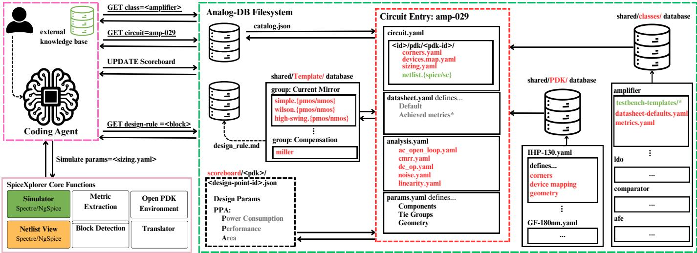  
Fig. 1. System overview. A design agent queries the catalog by class and accession identifier, retrieves an entry (topology, datasheet, analyses, parameters), and simulates it through the SpiceXplorer harness; entries draw on shared class definitions and process-kit registries. File labels in the drawing are illustrative rather than verbatim: the released kit registries are ihp-sg13g2, gf180mcu, and sky130; per-kit device geometry is stored in each entry’s sizing.yaml; and every released simulation runs on ngspice against the open kits (the other simulator lane shown ships kit-unbound).

One representation addresses both barriers: it separates what is shareable from what is encumbered and names the structure and acceptance conditions a netlist leaves implicit. We present analog-db<sup>1</sup>, an open-source, versioned database built on such a representation. A design can then be released in full: a reader who holds the relevant kit can re-simulate it directly, and one who does not can port it to a kit they own. Because the representation names a circuit’s sub-blocks rather than flattening them, that design can also be reused inside a larger one rather than re-derived. Our contributions are as follows:

• A foundry-neutral sharing method. A domain-specific language that captures each design as a PDK-neutral topology, a reusable testbench, and a machine-readable datasheet under one schema and carries no proprietary process detail, so a design can be released in full, resimulated directly on any kit it binds, and retargeted to another by adding one binding.

• An agent-first, human-readable interface. A schemagoverned contract and a queryable catalog addressable by AI design agents without a service, paired with autogenerated schematic views of the same entries.

• A portability and verification path. Automatic lowering to multiple open PDKs as verified SPICE decks, cross-PDK retargeting, a tiered verification harness, and a power/performance scoreboard (with the gate-area proxy of §III-C), so a released design carries a checkable status and can be retargeted to the process the reader has.

• A sub-block annotation and parameterization scheme. An annotation of each design’s detected functional subblocks (current mirrors, differential pairs, cross-coupled loads; 51% of corpus devices at the archived revision) alongside a complete parameterization that exposes device sizes as named parameters carrying their matching constraints, making circuits composable and retargetable.

• An open, populated database. 68 verifiable circuits across sixteen classes, 65 of them carrying recorded design points (schematic level, typical corner, matched devices) (Table III), released as a versioned corpus that others can extend.

## II. BACKGROUND AND RELATED WORK

Existing efforts each supply part of what reuse demands, and none supplies all of it in a released corpus. Generator frameworks bind a circuit to its own testbench and measurement managers and carry them across processes, but they distribute generators rather than a curated, queryable corpus with recorded acceptance criteria [13]. PDK-neutral intermediate representations give the topology a schema and put the analyses in the same object model, across the same open kits used here, without shipping designs, results, or structural annotation [14]. Structural annotation of flat netlists is an established line of its own, by exact subgraph isomorphism, by learned models, and by library-free bottom-up construction, but it operates on netlists the user supplies rather than on a released corpus that carries its annotations as part of the record [15], [16], [17]. Benchmark corpora release circuits at far larger scale than this work, one with recorded simulated results [18], the other drawn from the literature without testbenches [19], and testing suites release circuits with shared testbenches on an open kit [20], but none of them records per-circuit acceptance bands, hierarchy, or a machine-readable contract. The contribution of analog-db is the integration: one versioned corpus in which the topology, the testbench, the acceptance band, the recorded outcome, and the structural annotation are the same object, addressable by an agent without a service. Table I compares the closest efforts.

AnalogGym [20] is the closest testing suite. It ships 30 topologies in five categories, two shared testbench templates that cover its amplifier and low-dropout-regulator categories, one uniform extraction script over AC, DC, and transient measures, and a bundled sky130 kit on which two of the five, the amplifiers and regulators, run open-source as distributed; the sensing-front-end, voltage-reference, and phase-locked-loop categories ship no open-source-runnable decks. What it does not record is what reuse needs next: no noise, distortion, or intermodulation analyses, no per-circuit acceptance bands, no way for one block to compose into a larger one, and no machine-readable contract. CORA-OpAmp [21] shows that a reinforcement-learning sizing loop can be made reproducible on an open PDK, but at a narrow scope: it targets a single folded-cascode topology and drives the simulator through scripting written for that topology. Three recent dataset efforts push scale on complementary axes, and each stops short of a different part of what reuse needs. AMS-SizingBench [22] releases 24 mixed-signal circuits on SKY130 with per-circuit specification thresholds and a simulator-in-the-loop harness, but the thresholds ship without recorded design points that meet them, and no entry composes into a larger one. Masala-CHAI [23] extracts 7,500 textbook schematics into verified SPICE netlists, two orders of magnitude beyond the corpus released here, but its unit of release is the bare netlist: it ships without testbenches, recorded results, or a machine contract. AnalogGenie [24] generates circuit topologies over a sequence-based graph dataset, and the generated artifact is again connectivity alone rather than a verified, benched entry. Teaching corpora such as Pretl’s analog circuit design collection [25] publish worked designs on the same open tools, but as course material rather than as a verified, queryable corpus. Adjacent open-source flows automate complementary stages of the same pipeline: OpenFASoC generates mixedsignal blocks end to end [26], ALIGN automates analog layout [27], AnalogCoder generates topologies with language models [28], and AICircuit benchmarks learned sizing across circuit levels [29].

TABLE I  
ANALOG-DB AGAINST THE CLOSEST RELEASED ARTIFACTS. EACH CELL STATES WHAT THAT SYSTEM SHIPS AS RELEASED, TAKEN FROM ITS PUBLICATION AND PUBLIC REPOSITORY; “–” MARKS A CAPABILITY IT DOES NOT PROVIDE.
<table><tr><td>System</td><td>Unit of release, scale</td><td>Testbenches shipped</td><td>Recorded results, accep- Structure, hierarchy tance bands</td><td></td><td>Machine contract</td></tr><tr><td>AnalogGym [20]</td><td>Testing suite; 30 topolo- Yes: 2 shared templates, categories run open-source</td><td>gies, 5 categories; 2 of 5 amplifier and LDO only</td><td>no per-circuit acceptance tion bands</td><td>Sizing-method baselines; Flat netlists; no composi-</td><td></td></tr><tr><td>CORA- OpAmp [21]</td><td>on the bundled sky130 kit ogy (folded cascode) on an</td><td>RL sizing flow; 1 topol- Yes, its one topology</td><td>Single design point</td><td></td><td></td></tr><tr><td>OCB [18]</td><td>open kit Topology dataset; 10,000 behavioral op-amps</td><td>ation harness; no per- ceptance bands</td><td>Generation and evalu- Simulated results; no ac- Graph encoding of each -</td><td>topology</td><td></td></tr><tr><td>AMSnet 2.0 [19]</td><td>Schematic/netlist database; 2,686 circuits from the lit-</td><td>circuit testbench</td><td></td><td>Schematic-netlist corre- – spondence</td><td></td></tr><tr><td>AMS- SizingBench [22]</td><td>erature Sizing benchmark; 24 Simulator-based evalua- Per-circuit spec thresh-</td><td></td><td>AMS circuits on SKY130 tion under stated con- olds; no recorded design</td><td></td><td></td></tr><tr><td>Masala-CHAI [23]</td><td>Netlist dataset; 7,500 schematics from 10</td><td>straints</td><td>points Netlist-level verification; Schematic-netlist corre- - no recorded performance spondence</td><td></td><td></td></tr><tr><td>AnalogGenie [24]</td><td>textbooks Generative topology en- gine with its training</td><td></td><td></td><td>Sequence-based graph - representation</td><td></td></tr><tr><td>BAG2 [13]</td><td>dataset Generator framework; no fixed corpus</td><td>Generator-embedded testbench</td><td>and ation; no released corpus</td><td>Re-measured per instanti- Hierarchical generators</td><td>Programmatic API</td></tr><tr><td>VLSIR [14]</td><td>PDK-neutral IR with pub- Analyses in the same ob- lished open-kit packages</td><td>measurement managers ject model</td><td>of outcomes</td><td>Schema-governed hierar- Protobuf schema chy</td><td></td></tr><tr><td>analog-db (this work)</td><td>Versioned corpus; 68 cir- Yes: 65 of 68 circuits Recorded design points cuits, 16 classes, 3 open bind class-owned tem- judged against per-metric kits</td><td>plates; 3 fall outside specification bands thema</td><td></td><td>Detected composition closed over contract + catalog entries</td><td>sub-blocks; Schema-governed file</td></tr></table>

<sup>a</sup>The ideal-amplifier programmable-gain stage (ia\_005) and the binary capacitor bank (sw\_003) have static code pins outside the class port contract, so their measured values are recorded in the datasheet without a bound bench (Table XIII); the line driver (drv\_001) binds self-contained testbench decks through the optimizer projection instead of class templates.

Automated analog design predates language-model agents by decades. A long line of work drives sizing with evolutionary and Bayesian search, much of its methodological effort spent shaping cost functions and handling constraints across competing metrics [30], [31], [32], [33], [34], and symbolic analysis explores topology choices analytically [35]. Crossnode re-sizing is likewise an established subfield: constantinversion-level resizing rules [36] are in substance the $g _ { m } / I _ { D ^ { - } }$ preserving retarget this work applies per detected role (§III-C). Language models extend the annotation line, identifying the functional sub-blocks of a flat netlist [12], a problem analogdb’s deterministic template matching addresses at release time (§III-B2). Agent-driven sizing flows, meanwhile, already presuppose a corpus of this kind. AnalogSAGE [10] and HeaRT, a hierarchical circuit-reasoning agentic framework that couples reasoning-tree agents with off-the-shelf optimizers, evaluated on its authors’ 40-circuit benchmark of flattened SPICE netlists [11], both drive a simulator from an agent loop, yet neither releases the designs or the testbenches it ran on. Each therefore assembles a private corpus that does not outlive the paper reporting it: a later agent can read the numbers but cannot re-simulate the flow that produced them. analogdb answers this demand by exposing every entry through a schema-governed set of released files (§III-B6) that an agent can query directly.

Open process design kits changed what a published analog result can carry with it: a design released against one is simulable by any reader who downloads the kit, with no foundry entitlement. An open kit, however, fixes only the model a netlist is evaluated against, not the netlist’s own legibility. The representation of §III-B supplies that missing layer and lowers to the open kits, so its entries can be simulated with them.

## III. METHOD

## A. Requirements for a Shareable Design Representation

The two barriers of Section I translate directly into the first two requirements below. The remaining three follow from the opportunity that makes a shared corpus worth building, namely reuse across the design hierarchy and reuse by software agents. Together they define what a shareable analog design representation must satisfy, each addressed by the subsection noted:

• R1: Foundry neutrality. A released design carries no foundry-encumbered process detail, yet remains simulable through open process kits (§III-B2).

• R2: Reproducibility. The testbenches, extraction recipes, and acceptance criteria behind every reported result travel with the design itself (§III-B4).

• R3: Structure over opacity. A design exposes its functional sub-blocks and its named parameters with their matching constraints, rather than an opaque flat netlist (§III-B2, §III-B3).

• R4: Composability. Verified blocks compose into larger systems that are again verifiable entries of the same kind (§III-B5).

• R5: Machine actionability. Every artifact is schemagoverned and queryable, so a software agent can discover, compare, and reuse designs with a verifiable status, while the same artifacts stay readable to human designers (§III-B6).

Section III-C then describes how generation and verification keep R1 and R2 checkable for every released artifact.

## B. The analog-db Design Representation

1) A Formal Model of a Design Entry: The unit of release in analog-db is the design entry,

$$
E = ( T , \Theta , C , B ) ,\tag{1}
$$

Algorithm 1 Sub-block detection by labeled subgraph match  
ing.   
Require: flattened design graph $G ;$ template library T (Ta  
ble II)   
Ensure: block instances $R ;$ per-device structural roles   
1: label every graph: nodes by device kind and polarity;   
edges by their gate/drain/source pin multiset, so a diode   
connection forms parallel edges; bulk pins only where a   
template demands them   
2: $R \gets \emptyset$   
3: for all templates $t \in \mathcal T$ with graph $G _ { t }$ do   
4: for all label-preserving monomorphisms $\varphi \colon G _ { t } \hookrightarrow G$   
do   
5: if supply rails anchor as t demands and each   
internal net of t maps to a private net of equal degree   
then   
6: add block instance $( t , \varphi )$ to R   
7: end if   
8: end for   
9: end for   
10: on an equal device set, prefer a bulk-aware match to a   
bulk-blind one   
11: assign each covered device the structural role its match   
names   
12: render the annotated and hierarchical views from R

a four-part object: a process-neutral topology T, a parameter space Θ carrying the matching constraints among devices (§III-B3), a behavioral contract C, and a set of per-process bindings B. The first three are detailed in the subsections that follow. A binding $b \in B$ supplies everything one process kit requires: a mapping from generic device kinds to kit devices, concrete sizing values with search bounds, and corner selections. Lowering is then a mechanical function

$$
\begin{array} { r } { \mathcal { L } \colon ( T , a , b ) \longmapsto \mathrm { d e c k } _ { a , b } , } \end{array}\tag{2}
$$

where a ranges over the analyses the contract declares and b over the entry’s bindings, so the same entry yields one readyto-run SPICE deck per bound kit and analysis.

Three further terms recur throughout the paper. A design point is a recorded simulation outcome: one concrete sizing of one entry on one kit, stored with its per-corner measured metrics and pass/fail verdicts under a content-derived identifier, so every reported number remains reproducible from its record. A validated design point is a design point whose every specbounded metric passes, the T4 criterion of $\ S _ { \mathrm { I I I - C } ; }$ the paper uses both terms in exactly these senses. An accession identifier is the stable, append-only name under which an entry is published and cited. Throughout, artifacts that encode designer intent are authored and human-reviewed, while derived artifacts are regenerated mechanically and checked against drift (§III-C). Figure 1 shows how an agent interacts with these pieces, and Appendix B gives the concrete syntax of each artifact on a worked example.

2) Separating Topology from Process: A circuit’s topology can be stated without any process detail, and separating the two is what makes a design releasable (R1). In the abstract netlist, every device is a generic token carrying only its kind and polarity, and every geometry field refers to a named symbol rather than a number; nothing identifies a foundry device, model section, or corner library. All such detail enters through the per-kit binding, so the released topology is free of foundryencumbered content. A reader who holds any bound kit obtains a simulable circuit by lowering, while a reader who holds none can still read, cite, and retarget the design.

A flat netlist, however, satisfies R1 without satisfying R3. The representation therefore recovers the missing structure mechanically, by labeled subgraph matching of a functional template library against the flattened design graph (Algorithm 1). Each match assigns the covered devices a deterministic structural role, and the assigned roles drive two generated views of the same entry: an annotated schematic in which detected blocks appear as labeled groups, and a hierarchical view that draws one symbol per block. The functional organization that published netlists leave implicit (§I) thus becomes part of the released record, and the generated views keep the entry legible to human designers.

The matcher draws on a library of hand-authored functional templates, one small netlist per structural variant, grouped by functional family in Table II. Current-mirror variants make up more than half the library because a mirror’s function is set almost entirely by its wiring topology [37], [38]. The library is device-level at the archived revision. Common-mode feedback, which every fully differential design requires, enters the corpus by the representation’s other route: as released entries rather than as templates. The corpus carries a continuous-time 5T sense amplifier in each input polarity, a behavioral sense servo, and a discrete-time switched-capacitor detector (Table III), and each of the five composites of §III-B5 closes its commonmode loop by instantiating one of them at a pinned design point. What no template yet recognizes is that same structure sitting inline in a flat netlist, so the coverage statistics of §IV-A attribute no role to it (§V-A). Matching semantics bound what detection can claim, so this section states them exactly. The map φ of Algorithm 1 is an injective homomorphism that must be induced on the template’s internal nets and boundary-free at its terminals: an internal net of t must map to a private host net of equal degree. A template match therefore fails if any internal net carries even one extra legitimate load, a strictness that keeps every emitted role exact but forfeits near-miss variants, and is one reason coverage stops at 51% (§IV-A). Matched instances may overlap on devices, as when one diode device anchors two mirror instances, but each covered device receives a single recorded structural role. Subgraph isomorphism is NP-complete in general; the template graphs are small and the kind, polarity, and pin-multiset labels prune the search, so matching the full corpus completes as an ordinary step of release generation. This deterministic, release-time annotation complements the netlist-annotation line of [15], [16], [17], which recognizes structure in user-supplied netlists at use time.

3) Device Parameterization and Matching Constraints: Reuse needs more than named device sizes: it also needs the matching intent that a flat netlist discards. The parameter space of (1) therefore has three components in two layers, Θ = $( \Sigma , \sim , \mathcal { R } )$ . A generated layer assigns one symbolic variable to every device geometry field, the symbol set Σ: a complete, mechanical inventory of the design’s degrees of freedom. An authored layer then declares how those symbols relate. Tie groups induce the equivalence ∼, whose classes share a value: a differential pair matches in full geometry; a mirror rail shares its length. Ratio declarations R freeze designed current gains as relations rather than free values.

Individual parameters can also be frozen without being removed from the record. The tie-group representatives left free after ratios and freezes define the search space an optimizer may explore, and each per-kit binding assigns them a default value and a search band in that technology. Matching constraints are therefore stored with the design as explicit, reviewable statements (R3); Appendix B (Listings 1 and 2) shows both layers on a two-stage amplifier.

4) Executable Datasheets: Published performance tables seldom include the procedure that measured them; the datasheet makes that procedure part of the design (R2). The contract C of (1) assigns each reported metric m a triple $( a _ { m } , x _ { m } , S _ { m } ) ;$ the analysis $a _ { m }$ that produces it, the extraction $x _ { m }$ that reads a number out of the resulting waveforms, and the specification band $S _ { m }$ that separates pass from fail,

$$
\mathrm { p a s s } ( m , b , c ) \iff x _ { m } \bigl ( \mathrm { s i m } _ { c } \mathcal { L } ( T , a _ { m } , b ) \bigr ) \in S _ { m } ,\tag{3}
$$

where c ranges over the corner selections the binding b declares and sim $_ { 1 _ { c } }$ evaluates the deck at that corner. A design point records one verdict per declared corner, and every design point at the archived revision evaluates the typical corner (§V-A). Analyses themselves instantiate class-owned testbench templates at stated operating conditions, and the class registry also owns the canonical metric vocabulary, so a phase margin measured on one amplifier means the same bench, extraction, and conventions as a phase margin measured on any other. Because the verification harness and the results scoreboard both judge against this one artifact, a reported number cannot disagree with the procedure that produced it. One caveat governs every measurement the contract produces: the release simulates nominal schematics with perfectly matched devices, so all reported rejection, offset, and residual-ripple figures are systematic CMRR/PSRR (mismatch excluded), the term used for them throughout. They are upper bounds on silicon, where mismatch, which the current release does not model (§V-A), sets these quantities. Listings 4 and 5 give the concrete form.

5) Hierarchical Composition: The step from blocks to systems is a composition manifest: an authored declaration that builds a new circuit out of entries the database already holds (R4). Each instance in the manifest names a block, pins the exact revision of that block’s topology by content hash, and wires its ports; the child’s released per-kit sizing supplies its geometry on each kit the composite binds. The composite may additionally expose an internal net of a block, remove a block-local bias element it now supplies itself, or override a block parameter; the instantiator owns the sizing of what it composes.

Generation then flattens the manifest into an ordinary netlist and sizing binding, so composition is closed over entries: a manifest W over entries $E _ { 1 } , \ldots , E _ { n }$ yields compose $( E _ { 1 } , \ldots , E _ { n } ; W ) = E ^ { \prime }$ , again of the form (1). The composite binds exactly the kits every child binds: writing kits(B) for the kits a binding set covers, kits $\left( B ^ { \prime } \right) =$ $\cap _ { i } { \mathrm { k i t s } } ( B _ { i } )$ (each child instantiated at its pinned topology, with its released sizing on that kit). A kit some child does not bind is unavailable to the composite until that child gains the binding. The composite therefore carries its own datasheet, lowers to the same kits, and passes through the same verification as any leaf circuit, and no downstream tool treats hierarchy as a special case. Figure 2 shows the pattern on the chopper instrumentation amplifier of [8], whose system-level entry composes the two opamp cores shown. Among the corpus’s five composites, another closes the common-mode loop of a fully differential two-stage amplifier with a feedback servo drawn from a separate entry (Listing 8). A sub-block published this way supports more than citation: the verified block can be instantiated in a larger system at the design point where it was verified.

TABLE II  
SUB-BLOCK TEMPLATE LIBRARY AT THE ARCHIVED REVISION, GROUPED BY FUNCTIONAL FAMILY. THE LIBRARY IS DEVICE-LEVEL THROUGHOUT; NO COMMON-MODE-FEEDBACK FAMILY EXISTS AT THIS REVISION (§III-B2).
<table><tr><td>Group</td><td>Variants</td><td>Templates</td></tr><tr><td>Current mirrors</td><td>simple, cascode, Wilson, improved Wilson, high-swing cascode, improved high-swing cascode, low-voltage cascode, self-biased high-swing cascode,</td><td>18</td></tr><tr><td>Differential pairs</td><td>wide-swing [37], [38] simple, cascoded [37]</td><td>4</td></tr><tr><td>Cross-coupled pairs</td><td>simple, negative-resistance core [37]</td><td>2</td></tr><tr><td>Pseudo-resistors†</td><td>series, well and generator each independent or shared [39]</td><td>4</td></tr><tr><td>Switches</td><td>bulk-blind, rail-tied-bulk transmission gate (complementary); differential</td><td>2</td></tr><tr><td>Inverter / push-pull stage</td><td>chopper modulator (4× rail-tied-bulk pairs, same templates) complementary CMOS stack</td><td>1</td></tr><tr><td>Total</td><td></td><td>31</td></tr></table>

<sup>†</sup>Partial catalog: the 4 series-symmetric cells of Fig. 3 in Guglielmi et al. are drawn and registered; the remaining 12 topologies of their §4 (single-cell transdiodes, parallel-symmetric cells, linearity extensions, floating-voltage generators) are not yet templated.

<table><tr><td>Algorithm 2 Agent loop over the file contract: discover, compare, reuse.</td></tr><tr><td>Require: the released catalog; a target class, kit k, and</td></tr><tr><td>constraints 1: discover: filter the catalog to entries of the class whose</td></tr><tr><td>ports and kit bindings meet the constraints 2: compare: rank the candidates on their recorded design</td></tr><tr><td>points on k: spec verdicts, power, area, headline metrics 3: reuse: select an entry with binding</td></tr><tr><td> $\boldsymbol { E } ~ = ~ ( T , \Theta , C , B )$ </td></tr><tr><td> $b _ { k } \in B$  and fetch its released decks  $\mathcal { L } ( T , a , b _ { k } )$  4: simulate, or re-size the free symbols of Θ within the bounds of  $b _ { k }$  and simulate again</td></tr></table>

6) A Machine-Actionable Interface: An agent-facing corpus does not need a service; it needs a stable interface. The interface to analog-db is a file contract: the fixed set of files each entry publishes, together with the schemas that govern them, as distinct from the per-entry behavioral contract C of (1). Every artifact is governed by a versioned schema, and a generated catalog summarizes each entry’s class, ports, kit bindings, and recorded results in a single queryable document, so any agent that can read files can use the database without credentials, network access, or a running server (R5). Algorithm 2 states the loop this supports, and each pass through it leaves a new recorded design point behind for the next agent’s comparison to draw on. Append-only accession identifiers make every retrieved entry citable in later work. The same contract also serves human readers, because the generated views of §III-B2 keep every entry inspectable without running any tooling. A protocol wrapper is deferred as future work (§V-B): a convenience layer over the same files rather than new capability.

## C. Artifact Generation and Verification

The representation of §III-B is only as credible as the artifacts derived from it. This section states the guarantees the released database makes: derived artifacts are reproduced mechanically from the authored core, every entry carries a verification status with a defined meaning, process neutrality is demonstrated by porting rather than asserted, and what simulation measures is retained as recorded design points rather than a single winner.

Lowering (2) resolves an entry’s neutral topology through one of its bindings into ready-to-run simulation decks, so a reader reproduces a result by running a released deck rather than by reassembling one. Retargeting synthesizes a new binding from an existing one, extending the binding set B of (1) while T, Θ, and C stay fixed: devices and corners are re-mapped onto the target kit and sizings clamped to its geometry rules, after which the new binding flows through the same lowering and verification path as any other. Because a binding records only device and corner identifiers and geometry rules, and never model files, the entry itself stays free of process detail: what a new kit costs is a binding, not a rewrite.

“Verified” is a graded claim, and the database grades it explicitly. Five tiers check progressively stronger properties. T0 checks schema validity; T1 checks that every derived artifact regenerates byte for byte; T2 assembles every circuit, analysis, kit, and corner combination into a runnable deck; T3 simulates every released deck; and T4 checks the measured metrics against the datasheet’s specification bands, the pass predicate of (3). The first three tiers require no process kit and gate every change to the corpus. An entry’s published status is named for the highest tier it passes: generated (T1), simulated (T3), validated (T4); validated is earned only when every specbounded metric passes. A baseline whose default sizing does not bias into a working circuit is recorded as the starting point for a search rather than as validated, so validated keeps its strict meaning. A separate structural check requires every released schematic to be graph-isomorphic to the netlist re-derived from it, so the generated views of §III-B2 can be trusted as views of the same circuit.

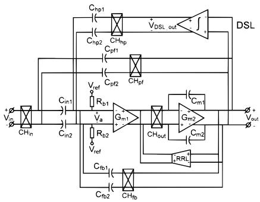  
(a) CCIA system

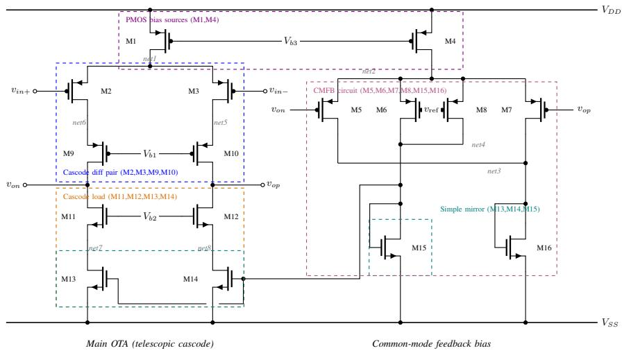  
(b) Ripple-loop integrator OTA

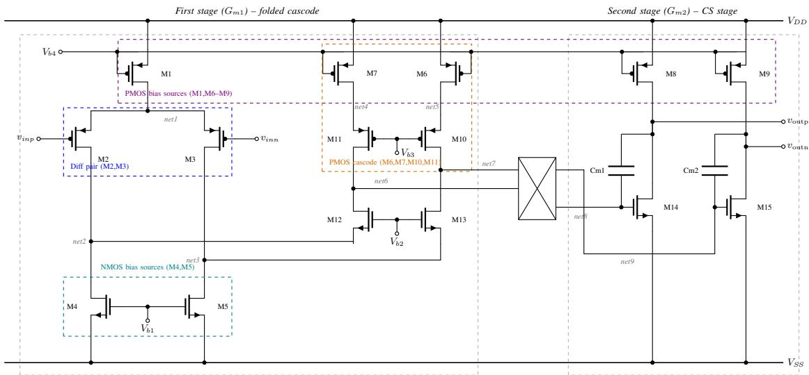  
(c) Two-stage chopper core  
Fig. 2. From blocks to systems: the chopper CCIA of [8] and its two op-amp cores, redrawn with functional groupings annotated. Groups matching a device-level template are matcher-detected: the differential pairs in (b) and (c) and the diode-referenced simple mirror in (b). The bias-source groups (current sources hung on the bias rails, with no diode reference in the drawn scope), the common-mode-feedback grouping, and the cascode-load grouping are designer annotations that the archived detection run does not emit (§V-A). A device may sit in two groups (in (b), M15 is both the mirror reference and part of the CMFB branch) while carrying one recorded role (§III-B2). (a) The system with its capacitively coupled feedback loops; (b) the ripple-reduction-loop integrator, a fully differential telescopic-cascode OTA with common-mode feedback; (c) the two-stage chopper-stabilized core (folded-cascode $G _ { m 1 } .$ , chopper, common-source $\left( { { G _ { m 2 } } } \right)$ .

Because an analog circuit meets a target application rather than a golden specification (§I), the scoreboard names no scalar best. Each simulation outcome can be recorded as a design point. For every circuit and kit, the scoreboard marks the Pareto front over power, area, and the headline metrics of the circuit’s class, with one named baseline per kit. Area is an acknowledged proxy: the summed gate area of the sized MOS devices, with no spacing, routing, or well overhead, and with capacitors and resistors excluded. The passive exclusion matters: at typical metal-insulator-metal densities of roughly $1 . 5 { - } 2 \mathrm { f F } / \mu \mathrm { m } ^ { 2 }$ , a single 10 pF compensation capacitor occupies $5 0 0 0 { - } 6 7 0 0 \mu \mathrm { m } ^ { 2 }$ comparable to or exceeding the recorded gate area of many entries, so the proxy ranks device budgets rather than die cost. Because a new sizing extends the recorded tradeoff space instead of overwriting a winner, the corpus can serve as an optimization benchmark. Per-kit lookup tables for systematic transconductance-efficiency $( g _ { m } / I _ { D } )$ sizing [40], [41] and autogenerated optimizer configurations over the released decks [42], [43] provide the means of producing new design points, so an agent can size an entry against its own datasheet without authoring any testbench (exercised in §IV-D and Appendix A). The tables follow the pre-computed lookup-table method of

TABLE III  
CIRCUIT COVERAGE BY CLASS.
<table><tr><td>Class</td><td>Circuits</td></tr><tr><td>Amplifiers / OTAs</td><td>33</td></tr><tr><td>Low-dropout regulators (LDO)</td><td>7</td></tr><tr><td>Instrumentation amplifiers</td><td>6</td></tr><tr><td>Support blocks</td><td>5</td></tr><tr><td>Common-mode feedback (CMFB)</td><td>4</td></tr><tr><td>Switches</td><td>3</td></tr><tr><td>Temperature sensors</td><td>3</td></tr><tr><td>Comparators</td><td>2</td></tr><tr><td>ADC</td><td>1</td></tr><tr><td>Line driver</td><td>1</td></tr><tr><td>Sampler</td><td>1</td></tr><tr><td>Trim</td><td>1</td></tr><tr><td>Voltage reference</td><td>1</td></tr><tr><td>Total (verifiable)</td><td>68</td></tr></table>

The Support blocks row folds four small classes (5 circuits): support, buffer, differential pair, and gain stage.  
TABLE IV

Jespers and Murmann, whose published starter kits already sweep the same open kits [44], and are produced with an open source implementation of that flow [45]; the archived revision records the tables for the representative device pairs on ihpsg13g2 and sky130 and regenerates the remainder mechanically from the released tools.

A single automation layer drives generation, verification, and simulation. Every simulation in this release runs on an open-source simulator (ngspice) against containerized open process kits, so the whole flow is reproducible without a commercial license. Continuous integration regenerates every derived artifact on each change and rejects any drift, the mechanism behind the regeneration guarantee above.

## IV. EXPERIMENTS

The evaluation asks five questions of the released artifact, each answered by one subsection below: coverage and provenance (RQ1), reproducibility (RQ2), portability across process kits (RQ3), whether the agent-first interface supports design work rather than retrieval alone (RQ4), and whether the recorded design points are dense enough to expose performance tradeoffs and seed a sizing search (RQ5).

## A. Coverage and Provenance (RQ1)

RQ1 tests the claims behind the populated database and the sub-block annotation scheme. At the archived revision the database holds 68 verifiable circuits across sixteen classes: 33 OTAs/op-amps, 7 low-dropout regulators, 6 instrumentation amplifiers, and smaller classes that range from common-mode feedback blocks to temperature sensors (Table III). Twenty-one of the 68 are fully differential, including four small blocks whose differential outputs are declared in their netlists rather than in the catalog summary. The count is conservative: it excludes three incomplete entries and the 13 reference circuits retained for provenance but never lowered. Table IV reports how far each class has been carried through the verification tiers of §III-C: 65 of the 68 entries hold at least one recorded design point, 43 are validated on at least one kit, and 14 on all three, so the corpus’s verification depth is uneven across

VERIFICATION STATUS BY CLASS, COMPUTED FROM THE RELEASED CATALOG AND SCOREBOARD: COUNTED ENTRIES, ENTRIES HOLDING AT LEAST ONE RECORDED DESIGN POINT, ENTRIES VALIDATED (SOME   
RECORDED DESIGN POINT PASSES EVERY SPEC-BOUNDED METRIC, THE T4   
CRITERION OF §III-C) ON AT LEAST ONE KIT, AND ENTRIES VALIDATED ON ALL THREE KITS. ALL VERDICTS ARE TYPICAL-CORNER.

<table><tr><td>Class</td><td>Entries</td><td>With design pt.</td><td>Validated ≥1 kit</td><td>All 3 kits</td></tr><tr><td>Amplifiers / OTAs</td><td>33</td><td>32</td><td>15</td><td>2</td></tr><tr><td>Low-dropout regulators (LDO)</td><td>7</td><td>7</td><td>7</td><td>6</td></tr><tr><td>Instrumentation amplifiers</td><td>6</td><td>5</td><td>3</td><td>0</td></tr><tr><td>Support blocks</td><td>5</td><td>5</td><td>3</td><td>2</td></tr><tr><td>Common-mode feedback (CMFB)</td><td>4</td><td>4</td><td>4</td><td>0</td></tr><tr><td>Switches</td><td>3</td><td>2</td><td>2</td><td>0</td></tr><tr><td>Temperature sensors</td><td>3</td><td>3</td><td>3</td><td>2</td></tr><tr><td>Comparators</td><td>2</td><td>2</td><td>2</td><td>2</td></tr><tr><td>ADC</td><td>1</td><td>1</td><td>0</td><td>0</td></tr><tr><td>Line driver</td><td>1</td><td>1</td><td>1</td><td>0</td></tr><tr><td>Sampler</td><td>1</td><td>1</td><td>1</td><td>0</td></tr><tr><td>Trim</td><td>1</td><td>1</td><td>1</td><td>0</td></tr><tr><td>Voltage reference</td><td>1</td><td>1</td><td>1</td><td>0</td></tr><tr><td>Total</td><td>68</td><td>65</td><td>43</td><td>14</td></tr></table>

classes and the table makes that unevenness inspectable rather than averaged away.

Provenance is part of each record. Every entry names the corpus or collection it came from, and 48 of the 68 additionally cite the published design they realize; the collection counts below sum to the corpus, while the citation count is smaller because not every collection entry realizes a single published design. Twenty-two circuits are normalized from the AnalogGym corpus [20], which contributes most of the threestage OTAs along with regulators and temperature sensors. Another 21 are hand-entered from published designs, among them the chopper instrumentation-amplifier family of Fan et al. [8], the Hsu biomedical front end [46], [47], and the internal amplifiers of a commercial buffered-reference regulator [48]. Five circuits come from Pretl’s teaching collection [25], one from CORA-OpAmp [21], and five are composites of §III-B5, authored in this work. The remaining 14 are drawn from other upstream sources or authored directly, with per-circuit provenance and licensing recorded in the release’s NOTICE file (Appendix C).

How much of each entry the representation explains is itself measured and released. Parameterization is complete: the generated layer names every geometry field of the corpus’s 1574 devices as a symbolic variable (3819 symbols on the representative kit, ihp-sg13g2), and the authored layer constrains that inventory: 1866 symbols are tied to a group representative through 444 tie groups, 255 are ratio-bound, and 365 are frozen, leaving 1333 free symbols to search. Twentytwo circuits also record structural symmetries left untied as reviewable warnings. Structural detection, by contrast, is partial. All 68 circuits carry generated structural views, spanning 1574 devices; the template matcher of §III-B2 assigns a functional role to 807 of them (51%), organized into 321 detected block instances. §V-A records the uncovered remainder as a limit of the current template library.

## B. Reproducibility (RQ2)

RQ2 tests whether a reader can reproduce the released results from the released artifacts. Reproducibility rests on regeneration: simulation decks are derived mechanically from the authored core, and tier T1 of §III-C checks that they regenerate byte for byte, so the deck a reader runs is the one that produced the recorded design point. Two checks exercise this at the archived revision. First, every value in the benchmark tables of Appendix A is re-simulated from the archived database, except where a table footnote records otherwise; none is transcribed from a source publication. Second, a separate verifier audited the regulator study of §IV-D, re-running sixteen recorded circuit-kit baselines from the released sizing defaults rather than from the sizing sessions’ state, and reproduced every metric recorded for those sixteen bit for bit. Both checks demonstrate reproduction at the archived revision and the typical corner.

## C. Cross-PDK Portability (RQ3)

RQ3 tests whether process neutrality (R1) holds in practice. The low-dropout corpus is the systematic case: the released regulators carry twenty-three circuit-kit bindings across the three open kits (ldo\_005 carries no sky130 binding, while ldo\_007 contributes three bindings without being counted among the seven regulators of Table III), and all twentythree pass their complete datasheets (Appendix A-B). That claim is per-entry, judged against the per-entry specification bands of Table VII, which vary deliberately across entries: the capacitor-less ldo\_001 answers to looser regulation bands than ldo\_005. Judged instead against the single class-level reference band defined in Table XII, 10 of the 23 bindings meet it. The two verdicts answer different questions: conformance to each entry’s own contract versus performance against a band common to the class. The benchmark reports both rather than letting the first stand in for the second. No port was mechanical, because an imported geometry encodes one technology’s assumptions. On gf180mcu the reference of ldo\_007 sat below a gate-source drop of the bound device family. On sky130 a high-threshold device family drove a mirror diode of ldo\_004 to the rail at the released sizing’s current density. The synthesized $\mathtt { 1 d o \_ 0 0 0 5 }$ binding first resolved to the kit’s low-voltage devices and had to be re-mapped to the highvoltage family that matches its 3.3 V rail. What survives a port is the method. The detected sub-block roles of §III-B2 state which devices each rule may touch, and per-role $g _ { m } / I _ { D }$ targets re-derive the geometry on each node through that node’s lookup tables. The tables also predict how close a port runs to its limits: ldo\_009, which met a headroom bound on two kits, showed a predicted onset of regulation within 30 mV of the simulated result. Each port also adds to the entry’s record: on ldo\_005 the second kit’s leakage-free models exposed a latent defect that the first kit’s models had masked (Appendix A-B), and the repaired netlist records the mechanism and the rejected repair as design notes for the next retarget.

## D. Agent Case Studies (RQ4)

RQ4 tests the agent-first interface of §III-B6 and whether composition (R4) holds in use. We report two studies run as author-supervised sessions of a general-purpose large-languagemodel coding agent (Claude Code, running the Claude Opus 4.8 model). The session records identify the model only as Claude Opus 4.8 with the 1M-token context window; we did not capture the exact dated model version at the time, so the studies are reproducible in method but not bit-for-bit in agent behavior. In each study the agent sized database entries to their datasheets using the released artifacts and live simulation on each bound kit. The first subject is a buffered-reference low-dropout regulator bound to two process kits; the second is the chopper instrumentation amplifier of Fig. 2, carried from its op-amp cores to the closed system. Success is defined by the database’s own contract: a study is complete when every metric of the entry’s machine-readable datasheet passes under the class benches. Each accepted result re-enters the corpus as a recorded design point.

The supervision protocol was interactive rather than autonomous: the author set each study’s objective, reviewed the agent’s proposed diagnoses and edits, and accepted or rejected results against the datasheet verdicts. Sizing values and the diagnostic probes that located each failure mechanism originated with the agent. Each study was recorded in a persession engineering report carrying every accepted number, root cause, and rejected repair. Neither those reports nor the full conversational transcripts are part of the release, and §V-A records that gap. No quantified per-intervention log was kept, so the studies claim feasibility under supervision, not autonomy.

Each session ran the same loop over the released artifacts: re-simulate the imported sizing, so that every later claim is a delta against a reproducible baseline; localize the failure mechanism through the detected sub-block roles, the per-kit $g _ { m } / I _ { D }$ tables, and targeted single-bench probes; re-size by converting per-role $g _ { m } / I _ { D }$ targets to geometry through the same tables; and re-judge the full datasheet, accepting a trade only when the degraded metric still meets its specification.

The regulator study applied this loop across the lowdropout corpus of Appendix A-B: seventeen of the twentythree imported sizings failed their benches, and the loop closed each, typically within one to three sizing iterations once a mechanism was identified. The buffered-reference regulator ldo\_005 [48] (Fig. 3) concentrated the hardest failures: on gf180mcu the best sizing that satisfied every other specification still left a 519.5 mV dropout against the 400 mV bound, and the port to ihp-sg13g2 failed outright. Probing below the sizing layer exposed the shared cause, a netlist defect examined in Appendix A-B: a mirror gate rail with no DC definition of its own. A one-element repair that gives the rail a DC definition (the tie of Fig. 3), followed by a compensation retune, superseded both verdicts: the regulator passes all fourteen datasheet metrics on both kits (Table V), with dropout at 340 mV on gf180mcu and 170 mV on ihp-sg13g2.

The instrumentation-amplifier study began one stage earlier, at bring-up: the system entered the database from hand-drawn schematics, and characterization exposed defects that had survived drawing and inspection. An input modulator gated the signal instead of chopping it (roughly 1.6 V/V with the clocks running against 19.3 with them static), and four device source terminals sat on floating nets, a defect invisible on the printed schematic. Debugging then hinged on locating mechanisms rather than searching over sizes: a ripple-sensing integrator ran at the chop frequency rather than twice it, a consolidation of clock phases silently inverted an impedance-boost path into positive feedback, and beneath both lay a core that is bistable without common-mode feedback. The agent closed the common-mode loop with a servo whose injection point and drive limits it chose by measurement.

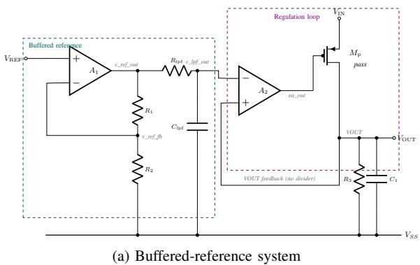

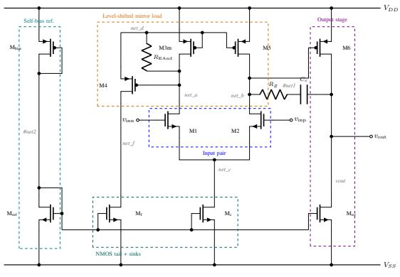  
Fig. 3. The verified ldo\_005\_buffered\_ref (Table XII), adapted from the TI TPS7A21 [48]. (a) The reference buffer $A _ { 1 }$ and an RC low-pass filter feed the error amplifier $A _ { 2 } ,$ , which drives the PMOS pass device; the output is compared directly against the filtered reference, with no output divider. (b) $A _ { 2 } ,$ a self-biased two-stage Miller OTA with a level-shifted PMOS mirror load; the high-value tie $R _ { \mathrm { E A n d } }$ pins the otherwise floating mirror gate rail, the one-element repair of Appendix A-B. The commercial datasheet publishes only the functional block diagram; the transistor-level realizations of $A _ { 1 }$ and $A _ { 2 }$ are authored in this work, so the entry records an adapted re-realization, not the commercial part. In silicon the rail would be pinned by a diode-connected device or a dedicated bias branch; the resistive tie is the simulation-level equivalent, and the netlist notes record it as such.

TABLE V  
AGENT CASE STUDY: THE LDO\_005\_BUFFERED\_REF DATASHEET SPECIFICATION AGAINST THE RELEASED SIZING ON EACH BOUND KIT (TT CORNER; 3.3 V INPUT, 1 µF OUTPUT CAPACITOR, 1 MA NOMINAL LOAD, PER TABLE VII). EVERY METRIC PASSES; THE IHP-SG13G2 PHASE MARGIN CLEARS ITS BOUND BY 1.4<sup>◦</sup>.
<table><tr><td>Metric</td><td>Spec.</td><td>gf180mcu</td><td>ihp-sg13g2</td></tr><tr><td>Output voltage (V)</td><td>1.50-1.70</td><td>1.64</td><td>1.61</td></tr><tr><td>Quiescent current (μA)</td><td>≤ 800</td><td>472.4</td><td>758.7</td></tr><tr><td>Load regulation (mV)</td><td>≤ 60</td><td>6.0</td><td>1.3</td></tr><tr><td>Line regulation (mV)</td><td>≤ 300</td><td>17.2</td><td>4.3</td></tr><tr><td>Dropout (mV)</td><td>≤ 400</td><td>340.4</td><td>169.7</td></tr><tr><td>PSRR at 1 kHz (dB)</td><td>≥ 25</td><td>35.6</td><td>44.5</td></tr><tr><td> $Z _ { \mathrm { o u t } }$  peaking (dB)</td><td>≤ 10</td><td>3.7</td><td>5.9</td></tr><tr><td>Load-step undershoot (mV)</td><td>&lt; 150</td><td>5.2</td><td>2.0</td></tr><tr><td>Load-step settling (µs)</td><td>≤ 30</td><td>21.2</td><td>0.9</td></tr><tr><td>Output noise  $\mathrm { ( m V _ { r m s } ) }$ </td><td>≤ 20</td><td>7.5</td><td>5.0</td></tr><tr><td>Line-step ripple  $\mathrm { ( m V _ { p p } ) }$ </td><td>≤ 30</td><td>9.2</td><td>3.4</td></tr><tr><td>Loop phase margin  ${ \bf \Xi } ^ { \circ } )$ </td><td>≥ 45</td><td>52.6</td><td>46.4</td></tr><tr><td>Loop gain (dB)</td><td>≥ 50</td><td>83.3</td><td>91.9</td></tr><tr><td>Loop unity-gain freq. (kHz)</td><td>≥ 100</td><td>294.8</td><td>569.1</td></tr></table>

The bands target functional closure of the adapted topology on each kit, not competitive power: the $\leq 8 0 0 \mu \mathrm { A }$ quiescent-current band sits two orders of magnitude above the $6 . 5 \mu \mathrm { A }$ typical of the commercial part the topology is adapted from [48].

The study ended with composition (R4): on the open 130 nm kit, composing the sized blocks into the closed system of §III-B5 nulled the zero-input output ripple from approximately $0 . 4 0 \mathrm { V _ { p p } }$ to below 0.1 $\mu \mathrm { V _ { p p } }$ (Table XIII), qualitatively consistent with the ripple reduction reported for the source design [8]. That residual sits at the numerical floor of a noiseless transient rather than at a measurable output level, and the composition closes the ripple loop and the common-mode loop at once, so the nulling cannot be attributed to either loop alone (Appendix A-C). All reported values are single-corner measurements; the composite’s common-mode loop is closed by an idealized servo; and on the open kits the clocked entries verify through windowed transient extraction (§V-A).

A black-box baseline shows what one sizing-only search reached on the same artifact. Handed the same closed system as a flat parameter space, a Bayesian optimizer [43] produced one feasible trial in its first nineteen, reached 16 of 30 only after its bounds were narrowed to the neighborhood of a hand-seeded design point (Table VI), and had still not beaten that seed on any objective when its trial budget ran out. The binding constraint was the unregulated common mode, which no move inside the searched sizing space repaired: the optimizer could only spend its budget against it, whereas the agent diagnosed it and changed the topology. The comparison is therefore asymmetric (an autonomous sizing-only search against author-supervised sizing plus topology edits), and it locates where the failure lay without constituting a controlled comparison of two search methods on one move set.

No ablation isolates which part of the representation produced that difference; what the session records show is how each part was used. The detected roles scoped each sizing rule to the devices it was meant for, and the block hierarchy let a twoloop regulator and a clocked system be debugged loop by loop. The agent identified most root causes from device operating points in the $g _ { m } / I _ { D }$ tables before any re-size. The recorded baselines made each reported improvement a delta against a re-simulable released sizing, and the design notes on each entry record those conclusions for later sessions. Nor are the per-role sizing rules specific to the two systems reported here: the re-sized entries marked throughout the benchmark tables

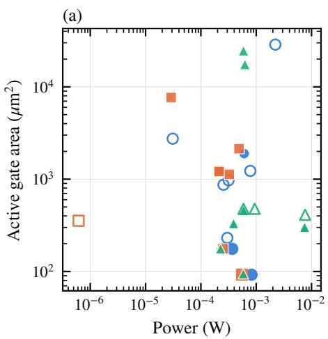

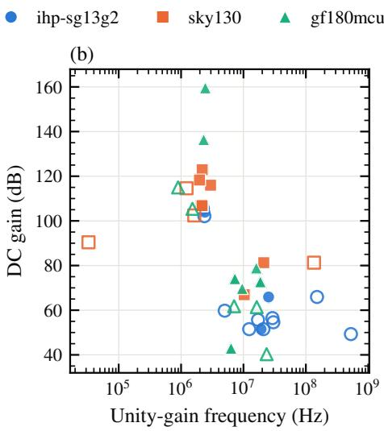

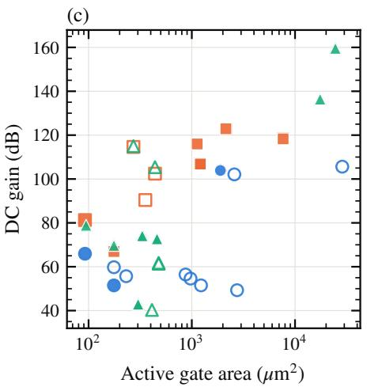  
Fig. 4. Validated amplifier design points, colored and shaped by process kit: (a) power against active gate area, (b) DC gain against unity-gain frequency, (c) DC gain against active gate area. Every plotted point passes its evaluated datasheet at the tt corner and each kit’s default supply, under the bench conditions its record declares. Hollow markers are the 19 of 39 points recorded before the benches standardized on a uniform 10 pF load, judged under the lighter native-load benches then in force (§IV-E); filled markers are judged at the uniform load. Area is the gate-area proxy of §III-C.

## TABLE VI

BLACK-BOX BASELINE ON THE CLOSED INSTRUMENTATION-AMPLIFIERSYSTEM: BAYESIAN OPTIMIZATION OVER THE FLAT SIZING SPACE, 49

TRIALS ACROSS THREE NARROWED SEARCHES, JUDGED ON THE OPTIMIZER’S OWN BENCH (CLOSED-LOOP SMALL-SIGNAL GAIN WITH THE CHOPPER CLOCKS HELD TRANSPARENT, 1.2 V SUPPLY; GATE AREA ONLY

SUMMED OVER THE SEARCHED CORE DEVICES ONLY).
<table><tr><td>Search space</td><td>Dim.</td><td>Feasible trials</td></tr><tr><td>Devices + bias inputs, bounds  $0 . 3 { \times } { - } 3 { \times }$ </td><td>18</td><td>0 of 4</td></tr><tr><td>Devices only, bounds  $0 . 3 { \times } { - } 3 { \times }$ </td><td>14</td><td>1 of 15</td></tr><tr><td>Devices only, bounds  $0 . 6 { \times } { - } 1 . 7 { \times }$ </td><td>14</td><td>16 of 30</td></tr></table>

A trial is feasible when it satisfies every constraint of the optimizer’s problem; the best-scoring trial need not be feasible. The hand seed (the released sizing defaults, never evaluated as an optimizer trial) dominates the best trial on all three objectives: gain 25.713 $\mathrm { \ v s } . \ 2 5 . 6 1 1$ dB, power 263.4 vs. $2 8 3 . 9 \mu \mathrm { W } ,$ searched-device gate area 96.8 vs. $1 2 7 . 2 \mu \mathrm { { m } ^ { 2 } }$ . The system row of  
Table XIII is a different measurement of a later sizing: clocked windowed-transient gain at the 5 kHz chop, gate area over all 75 devices.

of Appendix A were closed by constrained re-optimization combined with those same rules.

No like-for-like simulator-cost comparison is reported. Blackbox re-sizing consumed hundreds of recorded evaluations per circuit and kit, while the agent loop closed each regulator binding within four recorded full-suite runs; but the agent’s single-bench diagnostic probes were not logged and the supervision itself carries no cost record, so the two recorded costs count different things, and a per-evaluation table would understate the agent side.

## E. Scoreboard Coverage and Optimization Support (RQ5)

RQ5 tests the optimization support the scoreboard of §III-C provides. At the archived revision the record holds 457 design points, and 127 of the 159 populated circuit-kit cells (one scoreboard cell per circuit and kit) carry two or more; the per-cell Pareto marking therefore discriminates among real alternatives. Sizings that miss their datasheet stay in the record as starting points for a search.

Figure 4 plots every validated design point (§III-B1) on the amplifier scoreboard, whereas the tables of Appendix A-A report only the single released sizing per entry. Of the 327 recorded amplifier design points at the archived revision, 39 are validated (the behavioral amp\_028 is excluded). The validated points span more than four decades of power $( 0 . 6 \mu \mathrm { W }$ to 7.7 mW), two and a half decades of active gate area, and DC gains of 40 to 160 dB at unity-gain frequencies from 33 kHz to 528 MHz, and the three open kits interleave across all three panels rather than stratifying into per-kit bands. Two caveats apply. First, each point is judged under the bench conditions in force when it was recorded: the amplifier benches are standardized to a uniform $1 0 \mathrm { p F }$ load at the archived revision, but the scoreboard retains earlier points recorded against lighter native-load benches, and the widest unity-gain frequencies, including the 528 MHz endpoint (a legacy-bench record of amp\_018), are among those; the figure draws these 19 legacy-bench points hollow so the two populations stay distinguishable. Second, the highest DC gains are nominal schematic measurements of re-optimized gf180mcu sizings, and the mechanism behind them is the re-optimizer driving channel lengths to the geometry bound: gain per stage scales as $( g _ { m } / I _ { D } ) / \lambda$ , and λ falls with L, so on a 180 nm process a constrained search trades area for gain and phase margin. These readings are physically reachable rather than erroneous, but they cost area. Appendix A-A marks the most extreme of them against an absolute area threshold and names what that threshold leaves unmarked, since the same mechanism operates below it.

Figure 5 gives the regulator view, plotting the 34 validated of the 71 recorded design points over power, area, supply rejection, dropout, and load regulation. The panels project onto regulation metrics because only one regulator’s datasheet declares a loop-gain bound at this revision, though the loop is now measured on every binding. Both figures are generated by script from the released catalog and scoreboard artifacts, so any reader with the archived revision can regenerate them.

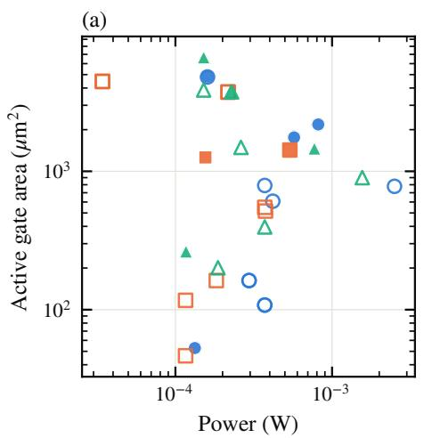

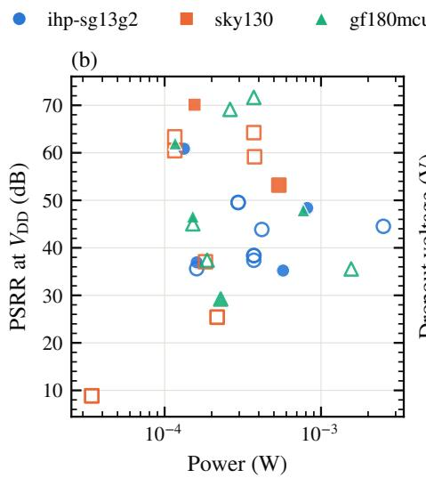

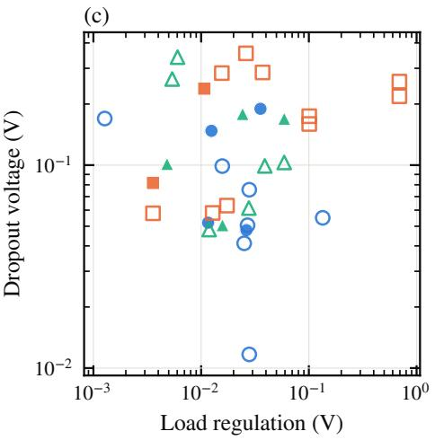  
Fig. 5. Validated regulator design points: (a) power against active gate area, (b) power-supply rejection at V<sub>DD</sub> against power, (c) dropout voltage against load regulation. Every plotted point passes its evaluated datasheet at the tt corner, under the LDO class benches at each entry’s datasheet operating conditions (Appendix A-B). Filled markers are the 10 of 34 points that also sit inside the class-level reference band of Table XII; hollow markers pass their own datasheet but fall outside it, or record too few band metrics to judge: all twenty-three baselines are judged, while the eleven unjudged points are alternative sizings predating the loop-break marker (Appendix A-B).

## V. DISCUSSION

Taken together, the five research questions support one conclusion: the obstacles to sharing analog designs are representational rather than fundamental. Once a design is distributed as one schema-governed object containing its topology, parameter space, contract, and bindings, then reproducibility, portability, and machine actionability are carried by the representation rather than by each author’s release practice. The case studies indicate what changes as a consequence: design knowledge that today survives only as a table in a paper becomes an artifact a later designer or agent can re-run, re-size, and extend, and each such use can leave a new recorded design point on the entry it drew from. The limitations below bound where this claim holds at the current release.

One methodological finding deserves prominence beyond its table footnote: a loop phase margin certifies only the loop it measures. On gf180mcu, 021\_yan\_az sustains a $1 . 8 4 \mathrm { V _ { p p } }$ self-starting oscillation with the input held at DC while its outer-loop margin reads +69<sup>◦</sup>. The oscillator is internal to the cell, where neither open-loop bench can see it. The corpus therefore treats a zero-input transient as the deciding stability check, and this case is why: a benchmark that certified stability by loop margin alone would have published an oscillator as a passing entry.

## A. Limitations

Structural annotation is bounded by the template library at the archived revision. The matcher assigns a role to 51% of the corpus’s devices (§IV-A) because structures outside that devicelevel library contribute nothing: no common-mode-feedback template exists at this revision (§III-B2), and a common-mode loop composed from a released entry is annotated only where its own devices match a device-level template. On amp\_029 and its CMFB-closed composite amp\_030 (§III-B5) this leaves 38% and 25% of devices with an assigned role, against 51% across the corpus. Growing the library and re-running detection is the first direction of §V-B.

The corpus is amplifier-weighted. Amplifiers and OTAs account for 33 of the 68 circuits, while the data-converter, sampler, and trim classes hold one entry each (Table III), so the representation’s generality beyond amplifier-like blocks is less exercised than its depth on amplifiers.

The agent evidence is a pair of case studies, not a controlled experiment. Both sessions were author-supervised runs of a single coding agent and model, the supervision record is limited to per-session engineering reports that are not themselves part of the release, and the comparison arm that would isolate the contribution of the structural artifacts—an agent denied those artifacts—has not been run. The recorded simulator costs of the two disciplines count different things (§IV-D), so no cost comparison is tabulated. The optimizer baseline is additionally asymmetric, sizing-only against sizing plus topology edits (§IV-D). The studies establish feasibility—that an agent working only from the released artifacts can reach datasheet compliance—and attribute nothing causally to any individual artifact.

Device mismatch is not modeled. Every reported figure comes from a nominal schematic with perfectly matched devices, so the rejection, offset, and residual-ripple values that mismatch sets in silicon are systematic CMRR/PSRR (mismatch excluded) upper bounds (§III-B4), and readings at the simulator’s resolution floor are reported as bounds rather than values (Appendix A-A).

Recorded results are single-corner: every design point at the archived revision was evaluated at the typical corner, and the released $g _ { m } / I _ { D }$ tables are characterized there. Multi-corner PVT evaluation and optimization remain future work.

Verification depth for clocked circuits is limited by the simulator. Small-signal analysis is invalid for a chopper or switched-capacitor circuit because it freezes the switches in one state, and the open-source simulator (§III-C) offers no periodic steady-state alternative. On the open kits these entries fall back to windowed transient analyses, leaving band-shape metrics as specification targets rather than measured values (Appendix A-C), and no released entry yet carries a periodic steady-state characterization. The clocked circuits are therefore the least uniformly verified part of the corpus.

Finally, all verification is pre-layout. No entry carries a layout or extracted parasitics, the recorded area is the acknowledged gate-area proxy of §III-C, and no released result has yet been correlated against silicon.

## B. Future Work

Three directions follow. The first is detection coverage: adding a common-mode-feedback family to the sub-block template library (Table II) and growing the library further, starting with the pending pseudo-resistor variants, then rerunning detection, would raise the structural coverage reported in §IV-A. The second is hierarchy above the sub-block level: an LLM annotation layer, cross-checked against the deterministic matcher beneath it, could identify and verify abstractions that subgraph matching cannot name, such as gain stages and signal chains, and record them as queryable taxonomy metadata alongside the structural roles. The third is breadth: new entries in the thin classes, notably data converters, and advanced low-power OTA topologies such as subthreshold and current reuse designs, each entering through the same schema and verification harness as the existing corpus. Beyond these, the protocol wrapper of §III-B6 remains future work: it would simplify access over the same files rather than extend them.

## VI. CONCLUSION

This paper presented analog-db, a database built on a foundryneutral representation that captures each design as a topology, a set of testbenches, and a machine-readable datasheet under one schema. Entries annotate functional sub-blocks with parameters that carry their matching constraints, and verified blocks compose into larger systems. A file contract exposes them to AI agents, while generated schematic views keep them readable to designers. Derived decks regenerate byte-identically, every entry carries a graded verification status, and the audited baselines reproduce bit for bit at the archived revision. Working only from the released artifacts, a supervised coding agent carried an LDO to full datasheet compliance on two kits. It assembled a published chopper instrumentation amplifier from its op-amp cores into a closed-loop system, with an idealized commonmode servo. In doing so it located four defects introduced during hand entry, and a missing common-mode feedback loop that the sizing-only baseline did not repair. analog-db is released as a versioned, open corpus of 68 verifiable circuits across sixteen classes. Every entry ships with its testbenches, and 65 of the 68 carry recorded design points, so that every reported result can be re-run and extended.

## ACKNOWLEDGMENTS

This work was supported by the Natural Sciences and Engineering Research Council (NSERC) of Canada through its Discovery Grant (DG) Program under Grant RGPIN-2024-06826.

## REFERENCES

[1] K. Chae, J. Song, Y. Choi, J. Park, B. Koo, J. Oh, S. Yi, W. Lee, D. Kim, K. Kang, E. Kim, J. Kim, S. Park, S. Park, M. Noh, H. G. Rhew, and J. Shin, “A 4-nm 1.15 TB/s HBM3 Interface With Resistor-Tuned Offset Calibration and In Situ Margin Detection,” IEEE Journal of Solid-State Circuits, vol. 59, no. 1, pp. 231–242, Jan. 2024. [Online]. Available: https://ieeexplore.ieee.org/document/10329576/

[2] R. R. Harrison and C. Charles, “A low-power low-noise CMOS amplifier for neural recording applications,” IEEE Journal of Solid-State Circuits, vol. 38, no. 6, pp. 958–965, June 2003.

[3] N. Koo, “Design of Low Power and Low Noise Instrumentation Amplifier for Biopotential Acquisition: A Review,” IEEE Access, vol. 13, pp. 23 359–23 370, 2025. [Online]. Available: https://ieeexplore.ieee.org/ document/10869445/

[4] W. Sansen, “Systematic design of operational amplifiers,” in Analog Design Essentials. Boston, MA: Springer US, 2006, pp. 181–209.

[5] D. Noori Zadeh and M. B. Elamien, “Generative AI for analog integrated circuit design: Methodologies and applications,” IEEE Access, vol. 13, pp. 58 043–58 059, 2025.

[6] Y. Wang and G. C. Temes, “Scaling for Optimum Dynamic Range and Noise-Power Tradeoff: A Review of Analog Circuit Design Techniques,” IEEE Solid-State Circuits Magazine, vol. 11, no. 2, pp. 98–103, 2019, spring 2019. [Online]. Available: https: //ieeexplore.ieee.org/document/8742687/

[7] M. Banu, J. Khoury, and Y. Tsividis, “Fully differential operational amplifiers with accurate output balancing,” IEEE Journal of Solid-State Circuits, vol. 23, no. 6, pp. 1410–1414, Dec. 1988. [Online]. Available: http://ieeexplore.ieee.org/document/90039/

[8] Q. Fan, F. Sebastiano, J. H. Huijsing, and K. A. A. Makinwa, “A 1.8 µW 60 nV/ Hz capacitively-coupled chopper instrumentation amplifier in 65 nm CMOS for wireless sensor nodes,” IEEE Journal of Solid-State Circuits, vol. 46, no. 7, pp. 1534–1543, Jul. 2011. [Online]. Available: http://ieeexplore.ieee.org/document/5768039/

[9] X. Li and C. H. Kim, “SABLE: An NDA-safe closed-loop LLM framework for analog circuit optimization in industrial EDA flows,” arXiv:2607.03701, 2026. [Online]. Available: https: //arxiv.org/abs/2607.03701

[10] Z. Wang, J. Gao, W. Fu, X. Guo, and X. Zhang, “AnalogSAGE: Self-evolving analog design multi-agents with stratified memory and grounded experience,” arXiv:2512.22435, 2025. [Online]. Available: https://arxiv.org/abs/2512.22435

[11] S. Poddar, C.-T. Ho, Z. Wei, W. Cao, H. Ren, and D. Z. Pan, “HeaRT: A hierarchical circuit reasoning tree-based agentic framework for AMS design optimization,” arXiv:2511.19669, 2025. [Online]. Available: https://arxiv.org/abs/2511.19669

[12] P. Pham, A. Venkitaraman, C.-Y. Hsieh, A. Bonetti, S. Uhlich, M. Leibl, S. Hofmann, E. Ohbuchi, L. Servadei, U. Schlichtmann, and R. Wille, “GENIE-ASI: Generative instruction and executable code for analog subcircuit identification,” in 2025 ACM/IEEE 7th Symposium on Machine Learning for CAD (MLCAD), Santa Cruz, CA, USA, Sep. 2025.

[13] E. Chang, J. Han, W. Bae, Z. Wang, N. Narevsky, B. Nikolic, and E. Alon,´ “BAG2: A process-portable framework for generator-based AMS circuit design,” in 2018 IEEE Custom Integrated Circuits Conference (CICC), Apr. 2018, pp. 1–8.

[14] D. Fritchman, “VLSIR: A modular framework for programming analog & custom circuits & layouts,” in Proceedings of the 2023 International Symposium on Physical Design (ISPD), Mar. 2023, pp. 82–83.

[15] K. Kunal, T. Dhar, M. Madhusudan, J. Poojary, A. K. Sharma, W. Xu, S. M. Burns, J. Hu, R. Harjani, and S. S. Sapatnekar, “GANA: Graph convolutional network based automated netlist annotation for analog circuits,” in 2020 Design, Automation & Test in Europe Conference & Exhibition (DATE), Mar. 2020, pp. 55–60.

[16] ——, “GNN-based hierarchical annotation for analog circuits,” IEEE Transactions on Computer-Aided Design of Integrated Circuits and Systems, vol. 42, no. 9, pp. 2801–2814, Sep. 2023.

[17] M. Neuner, I. Abel, and H. Graeb, “Library-free structure recognition for analog circuits,” in 2021 Design, Automation & Test in Europe Conference & Exhibition (DATE), Feb. 2021, pp. 1366–1371.

[18] Z. Dong, W. Cao, M. Zhang, D. Tao, Y. Chen, and X. Zhang, “CktGNN: Circuit graph neural network for electronic design automation,” arXiv:2308.16406, 2023, presented at ICLR 2023; releases the Open Circuit Benchmark (OCB). [Online]. Available: https://arxiv.org/abs/2308.16406

[19] Y. Shi, Z. Tao, Y. Gao, L. Huang, H. Wang, Z. Yu, T.-J. Lin, and L. He, “AMSnet 2.0: A large AMS database with AI segmentation for net detection,” arXiv:2505.09155, 2025. [Online]. Available: https://arxiv.org/abs/2505.09155

[20] J. Li, H. Zhi, R. Lyu, W. Li, Z. Bi, K. Zhu, Y. Zeng, W. Shan, C. Yan, F. Yang, Y. Li, and X. Zeng, “AnalogGym: An open and practical testing suite for analog circuit synthesis,” in Proceedings of the 43rd IEEE/ACM International Conference on Computer-Aided Design (ICCAD), Oct. 2024, pp. 1–9.

[21] M. Scherzer and M. Auer, “CORA-OpAmp: A compact open-source reinforcement-learning approach for operational amplifier optimization in ihp sg13g2,” in 2025 32nd IEEE International Conference on Electronics, Circuits and Systems (ICECS), 2025, pp. 1–4.

[22] X. Yu, D. Torbunov, S. Mandal, and Y. Ren, “AutoSizer: Automatic sizing of analog and mixed-signal circuits via large language model (LLM) agents,” arXiv:2602.02849, 2026, accepted at ICML 2026; introduces AMS-SizingBench, an open benchmark of 24 AMS circuits in SKY130. [Online]. Available: https://arxiv.org/abs/2602.02849

[23] J. Bhandari, V. Bhat, Y. He, H. Rahmani, S. Garg, and R. Karri, “Masala-CHAI: A large-scale SPICE netlist dataset for analog circuits by harnessing AI,” arXiv:2411.14299, 2024, 7,500 schematics from 10 textbooks with verified SPICE netlists; dataset and code open-sourced. [Online]. Available: https://arxiv.org/abs/2411.14299

[24] J. Gao, W. Cao, J. Yang, and X. Zhang, “AnalogGenie: A generative engine for automatic discovery of analog circuit topologies,” in The Thirteenth International Conference on Learning Representations (ICLR), 2025, arXiv:2503.00205. [Online]. Available: https://openreview.net/ forum?id=jCPak79Kev

[25] H. Pretl, M. Koefinger, and S. Dorrer, “Analog (Integrated) Circuit Design,” https://github.com/iic-jku/analog-circuit-design, 2026, accessed: 2026-02-07.

[26] The OpenFASoC Project, “OpenFASoC: Fully open-source autonomous SoC synthesis using customizable cell-based synthesizable analog circuits,” https://github.com/idea-fasoc/OpenFASOC, 2026, accessed: 2026-08-06.

[27] K. Kunal, M. Madhusudan, A. K. Sharma, W. Xu, S. M. Burns, R. Harjani, J. Hu, D. A. Kirkpatrick, and S. S. Sapatnekar, “ALIGN: Open-source analog layout automation from the ground up,” in Proceedings of the 56th Annual Design Automation Conference (DAC), Jun. 2019, pp. 1–4.

[28] Y. Lai, S. Lee, G. Chen, S. Poddar, M. Hu, D. Z. Pan, and P. Luo, “AnalogCoder: Analog circuit design via training-free code generation,” in Proceedings of the AAAI Conference on Artificial Intelligence, vol. 39, no. 1, 2025, pp. 379–387.

[29] A. Mehradfar, X. Zhao, Y. Niu, S. Babakniya, M. Alesheikh, H. Aghasi, and S. Avestimehr, “AICircuit: A multi-level dataset and benchmark for AI-driven analog integrated circuit design,” arXiv:2407.18272, 2024. [Online]. Available: https://arxiv.org/abs/2407.18272

[30] A. Somani, P. P. Chakrabarti, and A. Patra, “An evolutionary algorithmbased approach to automated design of analog and RF circuits using adaptive normalized cost functions,” IEEE Transactions on Evolutionary Computation, vol. 11, no. 3, pp. 336–353, 2007.

[31] R. A. de Lima Moreto, C. E. Thomaz, and S. P. Gimenez, “Gaussian fitness functions for optimizing analog CMOS integrated circuits,” IEEE Transactions on Computer-Aided Design of Integrated Circuits and Systems, vol. 36, no. 10, pp. 1620–1632, 2017.

[32] K. Touloupas and P. P. Sotiriadis, “LoCoMOBO: A local constrained multiobjective bayesian optimization for analog circuit sizing,” IEEE Transactions on Computer-Aided Design of Integrated Circuits and Systems, vol. 41, no. 9, pp. 2780–2793, 2022.

[33] I. Rahimi, A. H. Gandomi, M. R. Nikoo, M. Mousavi, and F. Chen, “Efficient implicit constraint handling approaches for constrained

optimization problems,” Scientific Reports, vol. 14, no. 1, p. 4816, 2024. [Online]. Available: https://doi.org/10.1038/s41598-024-54841-z

[34] A. Italiano, L. Almeida, T. Brito, M. Petraglia, and F. Olivera, “EAVREF: An evolutionary algorithm based tool for low-power CMOS voltage reference designs,” in 2024 37th SBC/SBMicro/IEEE Symposium on Integrated Circuits and Systems Design (SBCCI), 2024, pp. 1–5.

[35] D. Noori Zadeh and M. B. Elamien, “SymXplorer: Symbolic analog topology exploration of a tunable common-gate bandpass TIA for radio-over-fiber applications,” Electronics, vol. 15, no. 3, 2026. [Online]. Available: https://www.mdpi.com/2079-9292/15/3/515

[36] C. Galup-Montoro, M. Schneider, and R. Coitinho, “Resizing rules for MOS analog-design reuse,” IEEE Design & Test of Computers, vol. 19, no. 2, pp. 50–58, 2002.

[37] T. Massier, H. Graeb, and U. Schlichtmann, “The Sizing Rules Method for CMOS and Bipolar Analog Integrated Circuit Synthesis,” IEEE Transactions on Computer-Aided Design of Integrated Circuits and Systems, vol. 27, no. 12, pp. 2209–2222, Dec. 2008. [Online]. Available: http://ieeexplore.ieee.org/document/4670074/

[38] B. Aggarwal, M. Gupta, and A. Gupta, “A comparative study of various current mirror configurations: Topologies and characteristics,” Microelectronics Journal, vol. 53, pp. 134–155, Jul. 2016. [Online]. Available: https://linkinghub.elsevier.com/retrieve/pii/S0026269216300349

[39] E. Guglielmi, F. Toso, F. Zanetto, G. Sciortino, A. Mesri, M. Sampietro, and G. Ferrari, “High-Value Tunable Pseudo-Resistors Design,” IEEE Journal of Solid-State Circuits, vol. 55, no. 8, pp. 2094–2105, Aug. 2020. [Online]. Available: https://ieeexplore.ieee.org/document/9011588/

[40] F. Silveira, D. Flandre, and P. G. A. Jespers, “A $g _ { m } / I _ { D }$ based methodology for the design of CMOS analog circuits and its application to the synthesis of a silicon-on-insulator micropower OTA,” IEEE Journal of Solid-State Circuits, vol. 31, no. 9, pp. 1314–1319, 1996.

[41] P. G. A. Jespers and B. Murmann, Systematic Design of Analog CMOS Circuits: Using Pre-Computed Lookup Tables. Cambridge, UK: Cambridge University Press, 2017.

[42] P. Bennet, C. Doerr, A. Moreau, J. Rapin, F. Teytaud, and O. Teytaud, “Nevergrad: black-box optimization platform,” SIGEVOlution, vol. 14, no. 1, p. 8–15, Apr. 2021. [Online]. Available: https: //doi.org/10.1145/3460310.3460312

[43] E. Bakshy, L. Dworkin, B. Karrer, K. Kashin, B. Letham, A. Murthy, and S. Singh, “AE: A domain-agnostic platform for adaptive experimentation,” in NeurIPS 2018 Workshop on Systems for Machine Learning, Montreal, QC, Canada, Dec. 2018.

[44] B. Murmann, “Ancillary material for the book “Systematic design of analog CMOS circuits”,” https://github.com/bmurmann/ Book-on-gm-ID-design, 2026, accessed: 2026-08-24; gm/ID lookup table starter kits incl. techsweeps for SKY130, GF180MCU, and IHP SG13G2.

[45] C. Ó Domhnaill, T. Ó Riada, and D. Galach, “pygmid: A Python 3 implementation of the gm/ID starter kit,” 2024, version 1.2.12; Accessed: 2026-08-24. [Online]. Available: https://github.com/madrasalach/pygmid

[46] Y.-P. Hsu, Z. Liu, and M. M. Hella, “A -68 dB THD, 0.6 mm<sup>2</sup> Active Area Biosignal Acquisition System With a 40–320 Hz Duty-Cycle Controlled Filter,” IEEE Transactions on Circuits and Systems I: Regular Papers, vol. 67, no. 1, pp. 48–59, Jan. 2020.

[47] ——, “A 1.8 µ W -65 dB THD ECG Acquisition Front-End IC Using a Bandpass Instrumentation Amplifier With Class-AB Output Configuration,” IEEE Transactions on Circuits and Systems II: Express Briefs, vol. 65, no. 12, pp. 1859–1863, Dec. 2018. [Online]. Available: https://ieeexplore.ieee.org/document/8302595/

[48] Texas Instruments, “TPS7A21 500-mA, Low-Noise, Low-I , High-PSRR LDO,” Texas Instruments, Datasheet SBVS398A, Sep. 2022, rev. A; original December 2021. [Online]. Available: https://www.ti.com/product/ TPS7A21

## APPENDIX A BENCHMARK RESULTS

This appendix reports the recorded design points behind the scoreboard claims of §III-C, one subsection per benchmarked class. The landscape Tables IX–XIII are gathered at the end of the paper. All tabulated values are re-simulated from the released database at its archived revision, except where a table footnote records otherwise; none are transcribed from the source publications.

TABLE VII  
PER-ENTRY DATASHEET SPECIFICATION BANDS AND OPERATING CONDITIONS FOR THE LDO BENCHMARK (TABLE XII, WHOSE ROW ORDER AND ACCESSION NUMBERS THESE SHARE), READ MECHANICALLY FROM EACH ENTRY’S RELEASED DATASHEET AND BENCH BINDINGS. THE LAST HEADER ROW GIVES EACH COLUMN’S BOUND DIRECTION.
<table><tr><td rowspan="2">Circuit</td><td colspan="5">Conditions</td><td colspan="8">Specification band</td></tr><tr><td> $V _ { \mathrm { i n } }$   $( \mathrm { V } )$ </td><td> $C _ { \mathrm { o u t } }$ </td><td> $I _ { \mathrm { l o a d } }$   $\mathbf { \Gamma } ( \mathbf { m A } )$ </td><td>Load step (mA)</td><td>Load range (mA)</td><td> $V _ { \mathrm { o u t } }$  (V) window</td><td>Dropout (mV) max</td><td>Load reg. (mV) max</td><td>Line reg. (mV) max</td><td>PSRR (dB) min</td><td> $Z _ { \mathrm { o u t } }$  (dB) max</td><td>Under. (mV) max</td><td> $I _ { q }$   $( \mu \mathrm { A } )$  max</td></tr><tr><td>001</td><td>1.8</td><td>50pF</td><td>5</td><td>5→55</td><td>0-55</td><td>1.50–1.70</td><td>300</td><td>800</td><td>300</td><td>5</td><td>35</td><td>1500</td><td>100</td></tr><tr><td>002</td><td>2</td><td> $5 0 \mathrm { p F }$ </td><td>10</td><td>0.01→10</td><td>0-10</td><td>1.70-1.90</td><td>300</td><td>20</td><td>50</td><td>40</td><td>45</td><td>1000</td><td>500</td></tr><tr><td>003</td><td>2</td><td> $5 0 \mathrm { p F }$ </td><td>10</td><td>0.01→10</td><td>0-10</td><td>1.70–1.95</td><td>300</td><td>150</td><td>50</td><td>20</td><td>25</td><td>1200</td><td>500</td></tr><tr><td>004</td><td>1.8</td><td> $1 \dot { \mu } \mathrm { F }$ </td><td>1</td><td>1→10</td><td>0-10</td><td>1.25–1.35</td><td>300</td><td>150</td><td>30</td><td>20</td><td>15</td><td>150</td><td>250</td></tr><tr><td>005</td><td>3.3</td><td> $1 \dot { \mu } \mathrm { F }$ </td><td>1</td><td>1→10</td><td>0-10</td><td>1.50-1.70</td><td>400</td><td>60</td><td>300</td><td>25</td><td>10</td><td>150</td><td>800</td></tr><tr><td>007</td><td>1.8</td><td> $1 \mu \mathrm { F }$ </td><td>1</td><td>1→10</td><td>0-10</td><td>1.16–1.24</td><td>300</td><td>20</td><td>20</td><td>30</td><td>8</td><td>100</td><td>250</td></tr><tr><td>008</td><td>1.8</td><td> $1 \dot { \mu } \mathrm { F }$ </td><td>1</td><td>1→10</td><td>0-10</td><td>1.10–1.30</td><td>500</td><td>100</td><td>50</td><td>20</td><td>20</td><td>300</td><td>500</td></tr><tr><td>009</td><td>1.8</td><td> $1 \mu \mathrm { F }$ </td><td>1</td><td>1→10</td><td>0-10</td><td>0.85–0.95</td><td>500</td><td>100</td><td>50</td><td>20</td><td>20</td><td>300</td><td>100</td></tr></table>

Bands are authored per entry, so “passes its datasheet” is a per-entry claim: the relaxed 001 bands (a capacitor-less regulator) and the tight 005 bands are both visible rather than hidden behind one verdict.  
The dropout bench of 007 at 10 mA against a 1 mA nominal load runs heavier than nominal; every other entry’s dropout is judged at its nominal load.

## A. Amplifier Benchmark

Table IX reports the power, performance, and area of every amplifier and OTA with an IHP 130 nm (ihp-sg13g2) binding at its released sizing. Tables X and XI give the same view for the GF180MCU and SKY130 bindings. Entries marked § do not retain their originally imported sizing. Stability verification found the imported points electrically dead (no device biased into a working operating region), unstable, or marginally stable, and they were re-sized by constrained reoptimization combined with per-role $g _ { m } / I _ { D }$ sizing. The table footnotes record the affected entries and the failure each exhibited. Throughout these tables, a circuit’s per-kit rows are independently sized realizations of one topology, not one design measured three times, so power, gain, and area may differ widely across kits (025\_hsu\_classab\_ota spans 13.1 $\mu \mathrm { W }$ on sky130 to 1752 µW on gf180mcu). Where a re-optimizer reached stability by pushing geometry to its bounds, the row is marked as an optimizer artifact rather than a defensible design (footnote of Table X).

That verification also uncovered a defect in the measurement itself rather than in the circuits, one invisible to inspection of the recorded values. Both open-loop benches referenced phase to the first swept point, which is correct only while that point lies below the dominant pole; at a 163.6 dB plateau the dominant pole $f _ { p } = \mathrm { U G F } / A _ { 0 }$ sits in the tens of millihertz, under the benches’ 0.1 Hz reference. Measured on 006\_leung\_dfcfc1 on gf180mcu at the sizing then under verification, the raw unwrapped phase at 0.1 Hz sat $7 8 . 6 ^ { \circ }$ below its 1 µHz value, and the self-reference subtracted that accrued lag from every point including the crossover: the bench reported $+ 7 2 . 7 ^ { \circ }$ where the true margin was $- 5 . 9 ^ { \circ }$ , and read 150.0 dB off the 163.6 dB plateau. (The row Table X tabulates for this entry is the later re-sized design point, at 1.32 MHz.) The repair keeps the unwrapped phase and its start-of-sweep reference and moves the sweep start below the dominant pole $( 1 0 ^ { - 4 }$ Hz on the affected high-gain cells), where lowering it further does not change the reported margin. Six entries were affected, all of them high-gain multi-stage cells on gf180mcu, and the error is not a constant offset: it tracks each amplifier’s own $f _ { p } .$

Transient simulation resolved the ambiguity: every entry the corrected reference drives negative sustains a limit cycle that self-starts with the input held at DC, while every entry it leaves alone settles. The corrected benches agree with the independent loop-gain bench on 13 of 14 comparable entries, where they had differed by up to 89<sup>◦</sup>. With the corrected reference in force, one of the 87 published amplifier circuit-kit baselines carrying a phase-margin cell (030\_miller\_cmfb\_composite on ihp-sg13g2) sits below the $4 5 ^ { \circ }$ floor, at 33.3<sup>◦</sup>. The floor itself is a permissive bound (design practice and vendor datasheets more commonly ask for 60<sup>◦</sup>), so clearing it certifies stability of the recorded point, not competitive phase margin. Two gf180mcu entries are withheld from the tables entirely, and named in their footnote, because no sizing was found for them that is both stable and in specification: 011\_peng\_iac, whose only stabilizing sizing costs 37 dB of PSRR, and $0 2 1 \_ \mathrm { y a n \_ a z }$ , which self-oscillates at $1 . 8 4 \mathrm { V } _ { p p }$ held at DC and keeps oscillating with the outer loop AC-opened, even as its outer-loop margin reads $+ 6 9 ^ { \circ }$ (§V). Both circuits remain in the database with their other kits and their recorded measurements; what is withheld is the claim of a design point, while the data remain. The uniform 10 pF load these tables share is a deliberate departure from each source’s own operating point, made for cross-cell comparability: the AnalogGym shared amplifier testbench, for example, loads all seventeen of its amplifier netlists with 500 pF at a 1.8 V supply, so re-simulating those netlists at 10 pF at each kit’s own supply moves multistage nested-Miller compensation designs 50× from the load they were compensated for, and partly explains why many imported sizings failed stability verification before re-sizing. Table VIII lists every cell evaluated 10× or more from its as-published load; those rows are not comparable to the source publication’s numbers, and the native values are retained so a reader can re-run any entry at its published operating point. The chopper rows record one architectural finding: the chopper OTA core (026) carries no common-mode feedback and its systematic CMRR/PSRR (mismatch excluded) is correspondingly poor, while its CMFB-closed variant (034) recovers more than 40 dB of both on ihp-sg13g2 for less than 1 dB of differential gain

TABLE VIII  
CELLS EVALUATED 10× OR MORE FROM THEIR AS-PUBLISHED LOADUNDER THE UNIFORM 10 PF CONDITION. THE UNIFORM LOAD IS WHATMAKES THE CROSS-CORPUS COMPARISON A COMPARISON; THE NATIVEVALUES ARE KEPT SO EACH RESULT CAN ALSO BE READ AGAINST ITSSOURCE PUBLICATION’S OPERATING POINT.
<table><tr><td>Circuit</td><td>Native  $C _ { L }$ </td></tr><tr><td>amp_021</td><td>15 nF</td></tr><tr><td>amp_013</td><td>1.5 nF</td></tr><tr><td>amp_017</td><td>560pF</td></tr><tr><td>amp_015</td><td>500  $\mathsf { p F }$ </td></tr><tr><td>amp_016</td><td>500pF</td></tr><tr><td>amp_011</td><td>150  $\mathsf { p F }$ </td></tr><tr><td>amp_012</td><td>150  $\bar { \mathsf { p F } }$ </td></tr><tr><td>amp_002</td><td>100  $\mathsf { \widehat { p F } }$ </td></tr><tr><td>amp_005</td><td>100  $\mathsf { p F }$ </td></tr><tr><td>amp_006</td><td>100  $\mathsf { p F }$ </td></tr><tr><td>amp_007</td><td>100  $\mathsf { \bar { p } F }$ </td></tr><tr><td>amp_010</td><td>100  $\mathsf { p F }$ </td></tr><tr><td>amp_014</td><td>100pF</td></tr><tr><td>amp_022</td><td>500fF</td></tr><tr><td>amp_023</td><td>500 fF</td></tr><tr><td>amp_001</td><td>50 fF</td></tr><tr><td>amp_018</td><td>50 fF</td></tr><tr><td>amp_025</td><td>50 fF</td></tr><tr><td>amp_026</td><td>50 fF</td></tr><tr><td>amp_027</td><td>50 fF</td></tr><tr><td>amp_029</td><td>50 fF</td></tr><tr><td>amp_030</td><td>50 fF</td></tr><tr><td>amp_031</td><td>50 fF</td></tr></table>

(footnote of Table IX).

## B. LDO Benchmark

The top panel of Table XII reports the low-dropout regulators with an ihp-sg13g2 binding, measured by the LDO class benches against the per-entry specification bands and operating conditions of Table VII: load and line regulation, dropout, power-supply rejection at 1 kHz, the loop phase margin (with the limits set out below), and a load-step transient at each entry’s own step. The class benches fix the operational definitions: dropout is the smallest $V _ { \mathrm { i n } } - V _ { \mathrm { o u t } }$ at which the output is simultaneously within 50 mV of its target and decoupled from the input $( | d V _ { \mathrm { o u t } } / d V _ { \mathrm { i n } } | \leq 0 . 1 )$ , so a pass device that is off and merely follows the input cannot report a near-zero dropout; load and line regulation are each the total output excursion in volts (no slope normalization) across the full DC load and supply sweeps; the loop phase margin is taken by the $\mathsf { a c \_ l }$ oopgain bench under Middlebrook voltage injection at a 0 V break marker placed inside the device under test, so it measures the regulation loop directly rather than inferring it from the closed-loop output impedance; load-step undershoot is measured against the post-step settled output rather than the pre-step value; output noise is the output-referred rms integrated over 10 Hz–10 MHz; and line-step ripple is the peak-to-peak output deviation over a window spanning both supply edges, so it includes the DC line-regulation shift between the two rails as well as the transient excursions.

Through v1.1.1 this band judged stability on closed-loop output-impedance peaking instead: the rise of $| Z _ { \mathrm { o u t } } |$ above its

10 Hz value over 10 Hz–10 MHz. That is a proxy rather than a damping measurement, and it fails in two opposite directions. Referenced to its own 10 Hz value, the reading tracks how far the regulation loop has already rolled off by the frequency of the peak, which is a statement about loop gain rather than about damping. And an entry whose output capacitor holds $| Z _ { \mathrm { o u t } } |$ under its low-frequency value across the whole sweep reads 0 dB whether its loop is well damped or barely closed. The corpus splits on exactly that line: 001, 002 and 003 are capacitor-less entries carrying 50 pF, and all nine of their bindings fail the 10 dB sub-band, which is nine of the eleven failures; the remaining entries carry $1 \mu \mathrm { F } ,$ and seven of the twenty-three bindings sit on the 0.0 dB floor exactly.

Binding ac\_loopgain across the class was a queued database update; it was applied in analog-db v1.1.2, so pm\_loop\_deg is now recorded on all twenty-three baselines and the band of Table XII is judged on it, against the $4 5 ^ { \circ }$ bound 005 already carries in its own datasheet (Table V). On the same pin the output-impedance proxy puts 3 of 23 within the class band and the phase-margin band puts 10 of 23, so the shift is a change of measurement, not a change of corpus. The two disagree in the direction the construction predicts. The nine capacitor-less bindings the proxy penalized hardest measure $8 9 . 5 ^ { \circ }$ to $1 3 6 . 0 ^ { \circ }$ of phase margin, among the best damped in the corpus, while the one binding that fails the phase-margin sub-band, 008 on gf180mcu at 35.3<sup>◦</sup>, ranked only eleventh of twenty-three on the proxy at 12.5 dB: flagged, but below all nine of them. The failures now concentrate in $I _ { q }$ rather than in a stability reading. The same sweep yields the sensitivity-function peak max $| Z _ { \mathrm { o u t , c l } } | / | Z _ { \mathrm { o u t , o l } } |$ , recorded as ms\_peak\_db and reported but not judged, since no entry carries an authored bound for it.

Eight entries appear against the seven counted in Table III because the benchmark includes 007, which the coverage table excludes as incomplete. Seven of the eight entries were re-sized (marked ¶) after the imported sizings exhibited under-damped or collapsing load-step responses (001–003), a 559 mV dropout (007), a dropout bench invalidated by outof-window regulation (004), and a −17 dB PSRR reading that traced to a failed DC solve rather than a real supply path (009). Re-sizing followed the per-role $g _ { m } / I _ { D }$ loop of §IV-D, starting from each circuit’s detected sub-blocks (current mirrors, differential pairs, tail sources).

The same procedure was then applied to the gf180mcu and sky130 panels of Table XII, where the imported sizings failed in technology-specific ways; the fixes from the first kit did not carry over mechanically. The error amplifier of 007 latched off from power-up on gf180mcu because its 0.6 V reference sits below one gate-source drop of that kit’s 3.3 V device family, so the earlier 104 dB PSRR figure had measured supply coupling into a disconnected node. 009 met the same headroom bound on both kits, with the predicted onset of regulation matching the simulated result to within 30 mV. The bufferedreference regulator 005 [48] (Fig. 3) exposed a latent netlist defect: the gate rail of its level-shifted mirror load was defined only by device leakage, which gf180mcu’s BSIM4 models supply and $\mathrm { I H P } ^ { \prime } \mathrm { s }$ leakage-free PSP models do not, leaving a stable but incorrect equilibrium that railed every DC sweep.

A one-element repair—a resistive tie from the mirror drain to the gate rail (50 kΩ on gf180mcu, 500 kΩ on ihp-sg13g2) that carries no DC current by construction—together with a compensation retune, made the circuit datasheet-compliant on both kits. The 340 mV dropout on gf180mcu falls inside the 400 mV specification that sizing alone had been unable to reach on the defective netlist. The root-cause record for each repair is stored with the entry, as design notes in its released netlist.

## C. Instrumentation-Amplifier / Bio-AFE Benchmark

The six instrumentation-amplifier entries derive from two published designs: the chopper capacitively coupled instrumentation amplifier with ripple-reduction loop of Fan et al. [8] and the Hsu biomedical analog front-end chain [46]. Table XIII reports their figures and per-entry status at the released sizing on ihp-sg13g2. Chopper entries are characterized with their clocks running, through transient analyses at the 5 kHz system chop frequency, each measured over a window placed after that entry’s own settling transient, since the small-signal benches that freeze the switches are invalid for the class (§V-A). The input impedance is derived from the average commutated input current, and the band-shape metrics remain specification targets bound only where a continuous-time bench is valid. The composite ia\_004 exercises the closure property of §III-B5 on a complete system, composing the bare amplifier $( \mathtt { i a \_ 0 0 2 } )$ with the switched-capacitor ripple loop and an ideal common-mode servo on the core’s shared current-source gate. The loop is clocked at twice the chop rate so its two-phase network completes one sample-andtransfer cycle in each half-period of the demodulated waveform; both half-periods contribute charge—the factor of two in the loop’s measured $2 ( C _ { s } / C _ { \mathrm { i n t } } ) f _ { \mathrm { c h o p } }$ transfer. Because the release simulates matched devices, the up-modulated offset ripple this loop removes in silicon is absent by construction here; the ${ \sim } 0 . 4 0 \mathrm { V _ { p p } }$ zero-input ripple of the loop-less core is recorded as chopping ripple, growing as $1 / f _ { \mathrm { c h o p } } ,$ , compounded by the unregulated output common mode, which is bistable under the running clocks (a ∼0.7 ms relaxation oscillation through the capacitive network). Composing in the loop and the servo together nulls it below $0 . 1 \mu \mathrm { V } _ { \mathrm { p p } } .$ , the numerical floor of the noiseless transient; the composition closes both loops at once, so the nulling is attributed to the pair, and the variant that would separate them (006) binds only its DC operating point at this revision. The supporting front-end blocks are held as separate entries: the amplifier core OTAs appear in Table IX (026/027/031), and the Hsu switched-capacitor common-mode feedback block reaches validated status (§III-C) standalone at its 1 kHz system clock.

## APPENDIX BDOMAIN-SPECIFIC LANGUAGE

This appendix presents the concrete syntax of the representation and the design decisions behind its schemas, using one circuit from the corpus as a running example: the twostage Miller OTA amp\_022\_fer\_two\_stage, with the composite amp\_030\_miller\_cmfb\_composite illustrating hierarchy. Every artifact conforms to a versioned schema (spicexplorer/<kind>@1) validated at Tier 0, and every excerpt below is taken verbatim from the released database (elisions marked ...). Throughout, the listings mark the authored/generated split of §III-B1 in comment.

## A. Expressing Parametrization

Parametrization splits the two layers of §III-B3 across two artifacts. The process-neutral abstract/params.yaml carries the generated device-to-symbol map and the authored ties beneath it, where groups declare structural matching and ratios freeze multiplier relationships.

schema: spicexplorer/params@1   
devices: # GENERATED from abstract/   
topology.cgraph.json   
CC: {Value: x\_dut\_cc\_value}   
XM0: {l: x\_dut\_xm0\_l, m: x\_dut\_xm0\_m, w:   
x\_dut\_xm0\_w}   
# one row per device (11   
devices)   
groups: # AUTHORED default tying,   
human-reviewed   
name: input\_pair   
kind: matched\_pair   
members: [XM0, XM1]   
tie: [w, l, m]   
description: PMOS differential input pair - full  
geometry match   
ratios: # frozen gains survive as   
ratios, not free knobs   
{param: m, ref: XM6, of: XM7, ratio: 17/3,   
description: Stage-2 current-source gain (legacy   
m=17 vs 3), frozen.}   
Listing 1. amp\_022: abstract/params.yaml: generated   
device→symbol map, authored tying.

The per-PDK pdk/<pdk>/sizing.yaml binding then supplies the per-technology defaults and bands, and freeze: true is how a parameter is withheld from the search without leaving the record.

```yaml
schema: spicexplorer/sizing@1
pdk: ihp-sg13g2
variables:
- {name: x_dut_xm0_w, description: "PMOS input pair
width per finger
(XM0; XM1 tied, m=5)", default: 8u, min: 0.18u,
max: 50u, unit: m}
- {name: x_dut_cc_value, description: "Miller
compensation cap (F)",
default: 2e-12, min: 2e-13, max: 1e-11, unit: F}
{name: x_dut_xm0_m, description: "Input pair
fingers (frozen; XM1 tied)",
default: 5, min: 1, max: 16, freeze: true,
is_integer: true}
```

Listing 2. amp\_022: pdk/ihp-sg13g2/sizing.yaml: per-PDK defaults, bounds, freezes.

A simulated design point records the result: the scoreboard stores the same symbols with concrete values, keyed by a design\_id that hashes {circuit, PDK, sizing}.

```python
{ "design_id": "9c0de4bdfb",
"circuit": "amp_008_leung_nmcf", "pdk": "ihp
sg13g2",
"parameters": { "sizing": {
"CAPACITOR_0": "5p", "CURRENT_0_BIAS": 1.2393e
-05,
"x_dut_xm7_w": 5.8248e-07, ... } },
"metrics": { "tt": { "pm_deg": {"value": 61.069, "
spec": "pass"},
```

... } } }   
Listing 3. A recorded design point   
(scoreboard/ihp-sg13g2/<design\_id>.json, excerpt).

## B. Expressing Metrics and Testbenches

The class registry (\_shared/classes/amplifier/) owns the canonical metric vocabulary and the testbench templates; a circuit’s analyses/<id>.yaml instantiates one template at stated operating conditions. This keeps the corpus measurable with one vocabulary (the same pm\_deg means the same bench everywhere) while each circuit states only its numbers.

```yaml
schema: spicexplorer/analysis@1
id: ac_open_loop
template: ac_open_loop_biaswrap_ibias # class
owned .spice template
description: "Bias-wrapped open-loop AC gain/phase."
params: {VDD: 1.5, VCM: 0.6, IBIAS: 20u, CL: 500f,
FSTART: 1, FSTOP: 1G, PPD: 50}
flags: [bias_wrap] # 1T-L / 1T-C wrap: DC
closed, AC-open loop
produces: [dc_gain_db, ugf_hz, pm_deg]
```

Listing 4. amp\_022: analyses/ac\_open\_loop.yaml: an analysis instantiates a template.

The datasheet.yaml declares, per canonical metric, where it comes from (analysis + extract) and what passing means (spec); the verification harness and the scoreboard both judge against this one artifact.

```yaml
schema: spicexplorer/datasheet@1
default_conditions:
supply: {unit: V, typical: 1.5}
cload: {unit: fF, typical: 500}
metrics:
pm_deg:
analysis: ac_open_loop
extract: {meas: pm}
spec: {min: 60.0, max: 90, unit: deg}
```

## C. Expressing PDKs and Simulators

PDK knowledge lives in one registry per technology (\_shared/pdk/<pdk>.yaml); corner libraries stay out of the repository and are referenced by file name and section, so the database clones and verifies PDK-free through the kit-free tiers of §III-C, while the simulation tiers gate on PDK presence. The sim\_engine marker selects the simulator backend; every released PDK is simulated with ngspice.

```yaml
pdk: ihp-sg13g2
sim_engine: ngspice # in-library router
marker (open lane)
supply: {default: 1.5, unit: V}
devices:
nmos: {lv: sg13_lv_nmos, hv: sg13_hv_nmos}
pmos: {lv: sg13_lv_pmos, hv: sg13_hv_pmos}
corners:
lib_file: cornerMOSlv.lib
sections: [mos_tt, mos_ss, mos_ff, mos_sf, mos_fs]
geometry: {min_l: 0.13u, min_w: 0.18u, max_l: 10u,
max_w: 10u}
```

Listing 6. \_shared/pdk/ihp-sg13g2.yaml (excerpt): engine marker, device classes, corners, geometry rules.

Each circuit binding then maps its generic device kinds onto that registry and names its corner selections. Retargeting a circuit to an additional process kit requires only these files plus sizing.yaml:

```yaml
# pdk/ihp-sg13g2/devices.map.yaml
devices:
nmos: {model: sg13_lv_nmos}
pmos: {model: sg13_lv_pmos}
# pdk/ihp-sg13g2/corners.yaml
corners:
tt: [{lib_file: cornerMOSlv.lib, section: mos_tt}]
default_corner: tt
```

Listing 7. amp\_022: per-circuit PDK binding: generic→kit device map and corner selections.

## D. Expressing Hierarchy and Sub-blocks

A composite circuit is an authored manifest (spicexplorer/composition@1) over existing database entries: each instance names a block and pins the exact revision of its topology (a content hash the compose validator checks), wires its ports, and may tap internal nets, omit block-local bias elements, or override a block’s parameters. These are the composite-level adjustments of §III-B5 in concrete syntax; the flattened netlist and sizing binding the generation step emits are themselves generated, and checked by T1 for byte-identical regeneration.

```yaml
schema: spicexplorer/composition@1
of: amp_030_miller_cmfb_composite
instances:
- name: core
block: amp_029_two_stage_miller_comp
pin: 67c6e24e4137 # pinned topology
revision (content hash)
ports: {vinp: vinp, vinn: vinn, voutp: voutp,
voutn: voutn,
vdd: vdd, vss: vss}
taps: {vbl: vbl_ctl} # expose an internal
bias net
omit: [Vbl] # composite owns this
bias now
- name: servo
block: cmfb_001_ideal_rsense_servo
pin: 9c8861186398
ports: {vinp: voutp, vinn: voutn, vcmfb: vcmfb_raw
vref: vref_cm, vdd: vdd, vss: vss}
override: {rout_val: 10k} # gain-1 correction (
range-referencing)
nets: # composite-level
glue
- "Vrefcm vref_cm vss dc {vcm_ref}"
- "Vbl0 vbl_ctl vcmfb_raw dc {vbl0}"
sizing: # composite-owned
knobs
```

Listing 8. amp\_030\_miller\_cmfb\_composite: composition.yaml (condensed): CMFB closure of amp\_029 by a behavioral servo block.

## APPENDIX C ARTIFACT AVAILABILITY

analog-db is released publicly as the analog-db/ component of the spicexplorer-release repository, https: //github.com/MacAnalog/spicexplorer-release. Every result reported here comes from release v1.1.2 of that repository, the archived revision referred to throughout.

PM is the stb loop-probe reading (pm l o op de g) where that bench<sup>’</sup> s unity crossing agrees with the AC sweep to within 20 % and the AC-sweep reading (pm de g) otherwise; either is folded into ( − 1 80 <sup>◦</sup> 1 80 <sup>◦</sup> ] H<sub>ere every</sub> t<sub>a</sub>b<sub>u</sub>l<sub>a</sub>t<sub>e</sub>d PM <sub>ce</sub>ll i<sub>s</sub> th<sub>e s</sub>tb l<sub>oop</sub>-<sub>pro</sub>b<sub>e rea</sub>di<sub>ng</sub> . B <sub>o</sub>th <sub>rea</sub>di<sub>ngs are carr</sub>i<sub>e</sub>d <sub>per</sub> d<sub>es</sub>i<sub>gn po</sub>i<sub>n</sub>t i<sub>n</sub> th<sub>e re</sub>l<sub>ease</sub>d <sub>score</sub>b<sub>oar</sub>d.

<sup>§</sup> Re- sized after failin<sub>g</sub> stabilit<sub>y</sub> verification (im<sub>p</sub>orted <sub>p</sub>hase mar<sub>g</sub>in below 45 <sup>◦</sup> ) ; re-o<sub>p</sub>timization constrained it to 60–90<sup>◦</sup> . 0 0 2 was conditionall<sub>y</sub> unstable and was re- sized to a 5 .7 dB <sub>g</sub>ain mar<sub>g</sub>in

TABLE IX  
AMPLIFIER/OTA B ENCHMARK IN IHP 1 3 0 NM ( I H P - S G 1 3 G 2 ) AT THE RELEASED SIZING OF EACH ENTRY ALL VALUES ARE RE- SIMULATED UNDER UNIFORM CONDITIONS $( C _ { L } = 1 0 \mathrm { P F } ,$ UNITY- GAIN BUFFER <sub>;</sub> NOISE 1 HZ– 1 MHZ ; THD PER THE FOOTNOTE)
<table><tr><td>Circuit</td><td>Stages Comp.</td><td></td><td colspan="7">Gain (dB) UGF (MHz) PM (°) CMRR (dB) PSRR (dB) Power (µW) Gate area</td><td> $v _ { n , \mathrm { i n } }$ </td><td> $v _ { n , \mathrm { i n } } ^ { \mathrm { B W } }$ </td><td>THD</td></tr><tr><td>001_5t</td><td>1</td><td>none</td><td>32.5</td><td>1.21</td><td>86.9</td><td>49.5</td><td>32.7</td><td>59.3</td><td>348</td><td>30.9</td><td>33.2</td><td>0.109</td></tr><tr><td> $0 0 2 _ { - \mathrm { a } 1 \pounds i \circ \_ \mathrm { r a f f c } } ^ { - } \mathsf { I } \mathsf { s }$ </td><td>3</td><td>RAFFC</td><td>103.9</td><td>2.41</td><td>75.1</td><td>82.8</td><td>83.4</td><td>605.2</td><td>1892</td><td>40.9</td><td>66.6</td><td>0.012</td></tr><tr><td>003_fan_smct</td><td>3</td><td>SMC</td><td>86.0</td><td>6.64</td><td>85.8</td><td>67.8</td><td>54.4</td><td>1589.4</td><td>412</td><td>189.0</td><td>219.5</td><td>0.020</td></tr><tr><td>004_folded_cascode</td><td>1</td><td>none</td><td>44.1</td><td>2.03</td><td>74.8</td><td>72.9</td><td>39.6</td><td>233.0</td><td>3556</td><td>42.0</td><td>67.7</td><td>0.769</td></tr><tr><td> $0 0 5 \_ \mathrm { h o i l e e \_ a f f c } ^ { \dagger }$ </td><td>3</td><td>AFFC</td><td>97.5</td><td>3.50</td><td>103.8</td><td>74.9</td><td>80.5</td><td>342.0</td><td>2200</td><td>39.7</td><td>76.3</td><td>0.026</td></tr><tr><td></td><td>3</td><td>DFCFC1</td><td></td><td>1.92</td><td>75.4</td><td></td><td>57.7</td><td>692.3</td><td>12803</td><td>17.7</td><td></td><td>0.001</td></tr><tr><td> $0 0 6 \_ 1 \mathrm { e u n g \_ d f c f c 1 ^ { \dag \ S } }$ </td><td>3</td><td>DFCFC2</td><td>93.8</td><td>2.78</td><td>78.4</td><td>87.4</td><td>63.5</td><td>448.7</td><td>440</td><td></td><td>24.4 80.6</td><td></td></tr><tr><td> $0 0 7 \_ 1 \mathrm { e u n g \_ d f c f c } 2 ^ { \dag }$ </td><td></td><td>NMCF</td><td>91.3 89.4</td><td>3.16</td><td>62.7</td><td>90.6 86.6</td><td>65.6</td><td>315.2</td><td>646</td><td>52.9 65.1</td><td>86.4</td><td>0.001</td></tr><tr><td> $0 0 8 \_ \mathrm { { \tt d e u n g \_ n m c } \tt f } \uplus$ </td><td>3</td><td>NMCNR</td><td>95.6</td><td>1.44</td><td>89.3</td><td></td><td>63.2</td><td>117.6</td><td>272</td><td></td><td></td><td>0.003</td></tr><tr><td> $0 0 9 _ { - } \mathrm { \underline { { l e u n g \_ n m c n r } } ^ { \dagger } }$ </td><td>3</td><td></td><td></td><td></td><td></td><td>91.0</td><td></td><td></td><td></td><td>106.2</td><td>115.7</td><td>0.001</td></tr><tr><td> $0 1 0 \_ \mathrm { p e n g \_ a c b c ^ { \dagger } \ S }$ </td><td>3</td><td>ACBC</td><td>84.4</td><td>1.31</td><td>86.4</td><td>86.8</td><td>49.8</td><td>648.5</td><td>1549</td><td>83.2</td><td>87.2</td><td>0.003</td></tr><tr><td>011  $\mathtt { - p e n g \_ i a c ^ { \dag } \ S }$ </td><td>3</td><td>IAC</td><td>109.6 102.3</td><td>1.76</td><td>82.3 71.4</td><td>133.6</td><td>64.5</td><td>37.1</td><td>1273</td><td>89.2</td><td>127.9</td><td></td></tr><tr><td>012  $\therefore \mathrm { p e n g \_ t c f c ^ { \dagger } s }$ </td><td>3</td><td>TCFC</td><td></td><td>2.01 3.78</td><td>88.7</td><td>100.9</td><td>63.9</td><td>122.4</td><td>1691</td><td>93.8</td><td>122.9</td><td></td></tr><tr><td> $0 1 3 \_ { 9 } \cup 2 0 1 7 \_ { \tt a z c } \dag$   $0 1 4 \_ { \tt C } \tt a m o s \_ p f c ^ { \dagger }$ </td><td>3</td><td>AZC PFC</td><td>80.1</td><td>1.94</td><td>81.5</td><td>90.2</td><td>76.8</td><td>87.4 754.5</td><td>204</td><td>291.3</td><td>383.0</td><td></td></tr><tr><td>015_sau_cfcct</td><td>3</td><td></td><td>102.1</td><td></td><td>82.5</td><td>102.6</td><td>61.8</td><td>295.2</td><td>2583</td><td>20.6</td><td>27.2</td><td>&lt;0.001</td></tr><tr><td> $0 1 6 \_ s \circ \mathrm { n g \_ d a c f c ^ { \dagger } }$ </td><td>3</td><td>CFCC</td><td>87.4</td><td>7.06</td><td>106.4</td><td>77.6</td><td>56.5</td><td>252.6</td><td>4351</td><td>42.3</td><td>82.4</td><td>1.069</td></tr><tr><td></td><td>3</td><td>DACFC</td><td>72.1</td><td>1.91 0.30</td><td>88.9</td><td>75.1</td><td>39.7</td><td></td><td>472</td><td>395.4</td><td>475.5</td><td>0.165</td></tr><tr><td> $0 1 8 \_ { \mathsf { t e l e s c o p i c \_ c a s c o d e } } \ S$ </td><td>1 2</td><td>none</td><td>52.2</td><td>11.63</td><td>74.3</td><td>96.5</td><td>52.7</td><td>11.4</td><td>97</td><td>125.3</td><td>113.2</td><td>0.017</td></tr><tr><td> $0 1 9 { \_ } { \tt t i \_ } 1 { \tt d o \_ } { \tt e r r o r } ^ { \ S }$ </td><td>3</td><td>none</td><td>50.0</td><td>2.19</td><td>92.0</td><td>54.8</td><td>51.2</td><td>10505.3</td><td>437</td><td>20.3</td><td>31.2</td><td>0.020</td></tr><tr><td> $0 2 1 \_ \mathrm { J } \mathrm { a n \_ a z ^ { \dag } } \ S$  022_fer_two_stage</td><td>2</td><td>AZ</td><td>129.4</td><td>19.16</td><td>63.4</td><td>43.1</td><td>51.9 76.4</td><td>121.0 369.0</td><td>1258</td><td>72.4</td><td>80.6</td><td>2.094</td></tr><tr><td>023_fer_fd2s</td><td>2</td><td>miller miller_nulling</td><td>51.5 65.9</td><td>25.25</td><td>73.6</td><td>64.3 95.8</td><td>100.2</td><td>824.6</td><td>176 92</td><td>44.4</td><td>82.2</td><td>0.022</td></tr><tr><td>024_smcnr†</td><td>2</td><td>miller_nulling</td><td>69.4</td><td>0.15</td><td>58.2</td><td>96.4</td><td>105.5</td><td>2.0</td><td></td><td>79.4</td><td>116.3</td><td>0.001</td></tr><tr><td> $0 2 5 \_ \mathrm { h s u \_ c l a s s a b \_ o t a ^ { \ S } }$ </td><td>2</td><td></td><td>35.8</td><td>49.14</td><td>53.5</td><td>98.9</td><td>127.7</td><td>208.3</td><td>332</td><td>280.6</td><td>71.4</td><td>0.015</td></tr><tr><td></td><td>2</td><td>miller-rz</td><td></td><td></td><td>59.4</td><td></td><td> $- 2 . 4 ^ { \ P }$ </td><td>268.9</td><td>123</td><td>1130.9</td><td>6613.9</td><td>6.589</td></tr><tr><td>026_fan_chopper_ota</td><td>1</td><td>miller</td><td>59.7 46.6</td><td>6.16 3.61</td><td>89.9</td><td> $1 0 . 4 ^ { \ P }$  52.8</td><td>63.4</td><td>77.1</td><td>141 83</td><td>76.1</td><td>95.8</td><td>&lt;0.001</td></tr><tr><td>027_fan_rrl_ota</td><td>2</td><td>miller</td><td>50.1</td><td>13.76</td><td>33.3</td><td>80.6</td><td>50.2</td><td>218.0</td><td></td><td>56.3</td><td>65.2</td><td>0.006</td></tr><tr><td>030_miller_cmfb_composite</td><td>2</td><td>miller-rz</td><td>54.7</td><td>5.84</td><td>71.3</td><td>145.1</td><td></td><td>116.2</td><td>58</td><td>42.2</td><td>73.8</td><td>0.002</td></tr><tr><td>031_srmc_core_cmfb [46]</td><td>3</td><td></td><td></td><td></td><td>59.9</td><td></td><td>114.6</td><td>123.3</td><td>14</td><td>59.4</td><td>72.7</td><td></td></tr><tr><td>017_tan_cliat</td><td></td><td>CLIA</td><td>43.8</td><td>1.95</td><td>69.6</td><td>49.8</td><td>56.1</td><td></td><td>11128</td><td>56.1</td><td>74.5</td><td>0.380</td></tr><tr><td>032_ti_ldo_error_selfbias</td><td>2 2</td><td> $\mathrm { R z + C c ^ { * } }$ </td><td>50.0</td><td>18.28</td><td>80.3</td><td>56.5</td><td>57.0</td><td>195.2</td><td>1443</td><td>40.7</td><td>73.6</td><td>0.075</td></tr><tr><td> $0 3 3 _ { - } \mathrm { t i \_ l d o \_ r e f \_ s e l f b i a s }$ </td><td></td><td> $\mathrm { R z + C c ^ { * } }$ </td><td>56.1</td><td>29.17</td><td></td><td>50.7</td><td>68.7</td><td>236.9</td><td>37</td><td>52.3</td><td>82.1</td><td>0.008</td></tr><tr><td>034_fan_chopper_cmfb  $0 3 5 \_ { \tt C a n \_ { \tt C h o p p e r \_ { \tt C m f b \_ { \tt C l u a l } } } }$ </td><td>2 2</td><td>miller miller</td><td>58.9 60.3</td><td>6.11 6.20</td><td>58.2 62.9</td><td>53.8 110.9</td><td>41.0 90.4</td><td>272.2 328.0</td><td>148 156</td><td>76.1 76.2</td><td></td><td></td></tr></table>

— <sub>an</sub>d – <sub>mar</sub>k <sub>a</sub> <sub>ce</sub>ll <sub>w</sub>ith <sub>no</sub> <sub>va</sub>l<sub>ue :</sub> <sub>no</sub>t <sub>app</sub>li<sub>ca</sub>bl<sub>e,</sub> <sub>no</sub>t <sub>recor</sub>d<sub>e</sub>d i<sub>n</sub> thi<sub>s</sub> <sub>con</sub>fi<sub>gura</sub>ti<sub>on,</sub> <sub>or</sub> <sub>a</sub> <sub>recor</sub>d<sub>e</sub>d b<sub>enc</sub>h f<sub>a</sub>il<sub>ure</sub>. <sup>†</sup> A<sub>na</sub>l<sub>og</sub>G<sub>ym</sub>-<sub>source</sub>d<sub>,</sub> <sub>por</sub>t<sub>e</sub>d f<sub>rom</sub> it<sub>s</sub> <sub>na</sub>ti<sub>ve</sub> <sub>s</sub>k<sub>y</sub> 1 30 t<sub>es</sub>tb<sub>enc</sub>h<sub>es</sub> .  
<sup>∗</sup> Abb<sub>rev</sub>i<sub>a</sub>t<sub>e</sub>d <sub>compensa</sub>ti<sub>on</sub> <sub>sc</sub>h<sub>eme :</sub> $\mathrm { R z + C c } = \mathrm { \mathrm { \ddot { \prime } R z + C c } }$ f<sub>rom</sub> th<sub>e</sub> fi<sub>rs</sub>t- <sub>s</sub>t<sub>age</sub> <sub>no</sub>d<sub>e</sub> t<sub>o</sub> th<sub>e</sub> <sub>ou</sub>t<sub>pu</sub>t<sup>”</sup> .  
Full<sub>y</sub>-differential rows re<sub>p</sub>ort the s<sub>y</sub>stematic CMRR/PSRR (mismatch excluded) <sub>,</sub> measured on the common-mode <sub>p</sub>ath with the differential <sub>g</sub>ain folded in  
<sup>¶</sup> Cho<sub>pp</sub>er core characterized with its out<sub>p</sub>ut cho<sub>pp</sub>er held static ; cho<sub>pp</sub>in<sub>g</sub> leaves the CM <sub>p</sub>ath unchan<sub>g</sub>ed<sub>,</sub> and with no CMFB the rej ection is CMFB -limited. Addin<sub>g</sub> one ( 0 3 4 \_f a n\_c h opp e r\_cm fb) im<sub>p</sub>roves b<sub>o</sub>th CM-<sub>pa</sub>th <sub>co</sub>l<sub>umns</sub> b<sub>y</sub> 43 .4 dB <sub>on</sub> ih<sub>p</sub>-<sub>sg</sub> 1 3<sub>g</sub>2 f<sub>or</sub> 0. 8 dB <sub>o</sub>f diff<sub>eren</sub>ti<sub>a</sub>l <sub>ga</sub>i<sub>n</sub>.  
B <sub>o</sub>th <sub>no</sub>i<sub>se</sub> <sub>co</sub>l<sub>umns</sub> <sub>are</sub> $\dot { \mu } \mathrm { V } _ { r m s } ; \mathrm { T H D ~ i s ~ } \%$ ( sin<sub>g</sub>le-tone <sub>,</sub> $0 . 1 { \overset { \cdot } { \mathrm { V } } } , \ \mathrm { o r } \ 0 . 0 5 { \overset { \cdot } { \mathrm { V } } }$ where the swin<sub>g</sub> would cli<sub>p,</sub> at a <sub>p</sub>er-cell frequenc<sub>y</sub> set from its UGF<sub>,</sub> harmonics 2–5) .  
Gate area is the summed <sub>g</sub>ate area of the sized devices onl<sub>y</sub> ; ca<sub>p</sub>acitor and resistor area is excluded (§III-C) .

TABLE X  
AMPLIFIER/OTA B ENCHMARK IN GF 1 8 0MCU ( G F 1 8 0 M C U ) : EVERY AMPLIFIER B OUND TO THIS KIT WITH A RECORDED AC BASELINE AT ITS RELEASED SIZING ALL VALUES ARE RE- SIMULATED UNDER UNIFORM CONDITIONS $( C _ { L } = 1 0 \mathrm { P F } ,$ UNITY- GAIN BUFFER ; NOISE 1 HZ– 1 MHZ ; THD PER THE FOOTNOTE)
<table><tr><td>Circuit</td><td colspan="2">Stages Comp.</td><td colspan="8">Gain (dB) UGF (MHz) ) PM (°) CMRR (dB) PSRR (dB) Power (μW) Gate area  $( \mu \mathrm { { m } ^ { 2 } ) }$   $v _ { n , \mathrm { i n } }$ </td><td rowspan="2"> $v _ { n , \mathrm { i n } } ^ { \mathrm { B W } }$  THD</td></tr><tr><td> ${ 0 0 1 } \_ { 5 } { \ t \} }$ </td><td>1</td><td>none</td><td>27.9</td><td>0.02</td><td>90.1</td><td>51.0</td><td>53.5</td><td>30.5</td><td>40206.2</td><td>57.7</td></tr><tr><td> $0 0 2 _ { - \mathsf { a l f i o \_ r a f f c } } \mathsf { ^ { \dag } s }$ </td><td>3</td><td>RAFFC</td><td>90.1</td><td>3.75</td><td>84.4</td><td>89.2</td><td>63.4</td><td>422.5</td><td>8419 25.1</td><td>55.0</td><td>8.743 0.005</td></tr><tr><td> ${ 0 0 3 \_ \mathrm { f a n \_ s m c ^ { \dagger } \ S } }$ </td><td>3</td><td>SMC</td><td>191.7</td><td>1.02</td><td>56.9</td><td>95.6</td><td>59.4 2102.8</td><td></td><td> $1 0 7 1 9 6 ^ { \# }$  12.7</td><td>12.7</td><td>0.153</td></tr><tr><td> $0 0 4 \_ { \underline { { \mathsf { f o l d e d } } } } \_ { \mathsf { c a s c o d e } } \ S$ </td><td>1</td><td>none</td><td>77.6</td><td>10.77</td><td>87.1</td><td>121.7</td><td>83.5</td><td>998.4</td><td>918 23.9</td><td>42.7</td><td>&lt;0.001</td></tr><tr><td> $0 0 5 \_ \mathrm { h o i l e e \_ a f f c } \dag \ S$ </td><td>3</td><td>AFFC</td><td>64.0</td><td>1.88</td><td>65.1</td><td>131.3</td><td>75.3</td><td>857.2</td><td> $1 4 7 5 9 7 ^ { \# }$  27.2</td><td>38.5</td><td>0.128</td></tr><tr><td> $0 0 6 \_ 1 \mathrm { e u n g \_ d f c f c 1 ^ { \dag \ S } }$ </td><td>3</td><td>DFCFC1</td><td>163.6</td><td>1.32</td><td>66.1</td><td>96.6</td><td>60.6</td><td>1905.3</td><td> $1 6 4 8 3 3 ^ { \# }$  27.0</td><td>36.3</td><td>0.001</td></tr><tr><td> $0 0 7 \_ 1 \mathrm { e u n g \_ d f c f c 2 ^ { \dagger } s }$ </td><td>3</td><td>DFCFC2</td><td>152.5</td><td>1.48</td><td>63.7</td><td>116.6</td><td>64.1</td><td>729.4</td><td>31709 35.5</td><td></td><td>52.3 &lt;0.001</td></tr><tr><td> $0 0 8 \_ \mathrm { { l e u n g \_ n m c } \mathrm { { t } \mathrm { { s } } } }$ </td><td>3</td><td>NMCF</td><td>172.4</td><td>0.77</td><td>62.9</td><td>110.6</td><td>57.6</td><td>700.9</td><td>47396 25.1</td><td>20.4</td><td>0.033</td></tr><tr><td> $0 0 9 _ { - } \mathrm { { 1 e u n g \_ n m c n r } ^ { \dag } \ S }$ </td><td>3</td><td>NMCNR</td><td>159.6</td><td>2.44</td><td>67.7</td><td>97.8</td><td>70.3</td><td>588.1</td><td>24595 22.3</td><td></td><td></td></tr><tr><td> $0 1 0 \_ \mathrm { p e n g \_ a c b c ^ { \dagger } \ S }$ </td><td>3</td><td>ACBC</td><td>162.5</td><td>0.51</td><td>70.5</td><td>116.6</td><td>53.3</td><td>191.6</td><td>22939 46.4</td><td></td><td>63.0 &lt;0.001 28.6 &lt;0.001</td></tr><tr><td> $0 1 2 \_ { \tt p e n g \_ t c f c } \dag \ S$ </td><td>3</td><td>TCFC</td><td>155.2</td><td>1.12</td><td>66.5</td><td>85.9</td><td>60.5</td><td>323.7</td><td>24526 41.4</td><td>43.7</td><td></td></tr><tr><td> $0 1 3 \_ { \tt d u 2 0 1 7 \_ { \tt a z c } \dag \ S }$ </td><td>3</td><td>AZC</td><td>121.8</td><td>2.61</td><td>65.4</td><td>70.9</td><td>70.5</td><td>264.6</td><td>21107 50.5</td><td>92.2</td><td>0.002</td></tr><tr><td> $0 1 4 \_ \mathrm { r a m o s \_ p f c ^ { \dagger } s }$ </td><td>3</td><td>PFC</td><td>184.1</td><td>0.50</td><td>67.4</td><td>110.2</td><td>52.3</td><td>2294.4</td><td>277287# 10.7</td><td>5.8</td><td>0.680</td></tr><tr><td> $\begin{array} { r l } { 0 . 1 5 \_ s \mathtt { a u \_ c f c c } ^ { \mathtt { j } } \mathtt { s } } & { { } } \end{array}$ </td><td>3</td><td>CFCC</td><td>150.9</td><td>6.76</td><td>95.5</td><td>100.1</td><td>85.3</td><td>1688.8</td><td>36759</td><td>23.5 64.2</td><td>0.001</td></tr><tr><td> $0 1 6 \_ s \circ \mathrm { n g \_ d a c f c ^ { \dagger } }$ </td><td>3</td><td>DACFC</td><td>63.4</td><td>7.71</td><td>81.0</td><td>48.7</td><td>57.5</td><td>587.3</td><td>10302</td><td>149.8 240.2</td><td>4.082</td></tr><tr><td> $0 1 7 \_ \mathtt { t a n \_ c l i a } \mathtt { ^ { \dag } s }$ </td><td>3</td><td>CLIA</td><td>75.4</td><td>2.58</td><td>51.7</td><td>124.0</td><td>86.4</td><td>166.5</td><td>27722</td><td>117.4 218.1</td><td>0.037</td></tr><tr><td> $0 1 8 \_ { \mathsf { t e l e s c o p i c \_ c a s c o d e } } \ S$ </td><td>1</td><td>none</td><td>82.7</td><td>0.48</td><td>89.9</td><td>95.0</td><td>82.3</td><td>11.5</td><td>71 49.8</td><td></td><td>0.093</td></tr><tr><td></td><td>2</td><td>none</td><td>43.0</td><td>6.32</td><td>91.4</td><td>42.0</td><td>67.7</td><td>7497.1</td><td>302 31.5</td><td>38.5</td><td>0.029</td></tr><tr><td> $0 1 9 _ { - } \mathrm { t i \_ l d o \_ e r r o r ^ { \ S } }$ </td><td>2</td><td>miller</td><td>69.7</td><td>9.54</td><td>66.5</td><td>49.3</td><td>49.5</td><td>226.4</td><td>176 46.0</td><td>38.0</td><td>0.429</td></tr><tr><td> $0 2 2 \_ { \tt I e r \_ t w o \_ s t a g e }$   $0 2 3 \_ { \mathrm { f e r \_ f d } 2 s } \ S$ </td><td>2</td><td>miller_nulling</td><td>78.9</td><td>16.05</td><td>62.6</td><td>102.9</td><td>108.9</td><td>584.8</td><td>95</td><td>80.0</td><td>1.767</td></tr><tr><td> $0 2 4 \_ \mathrm { s m c n r } ^ { \dag } \ S$ </td><td>2</td><td>miller_nulling</td><td>116.0</td><td>0.08</td><td>65.7</td><td>72.0</td><td>71.6</td><td>1.2</td><td>332 581.2</td><td>82.1 112.0</td><td>0.004</td></tr><tr><td></td><td>2</td><td></td><td>72.7</td><td>18.65</td><td>82.7</td><td>61.7</td><td>56.0</td><td>590.0</td><td>460 19.4</td><td>74.6</td><td>1.544</td></tr><tr><td> $0 3 2 \_ { \tt t i \_ l d o \_ e r r o r \_ s e l f b i a s } \ S$ </td><td>2</td><td>none none</td><td>74.1</td><td>7.29</td><td>74.1</td><td>43.2</td><td>54.1</td><td>390.5</td><td>331 18.0</td><td>48.0</td><td>0.011</td></tr><tr><td> $0 3 3 _ { - } \mathrm { t i \_ l d o \_ r e f \_ s e l f b i a s }$ </td><td>2</td><td>miller-rz</td><td>39.9</td><td>0.36</td><td>124.7</td><td>118.0</td><td>75.4</td><td>1752.1</td><td>3406 28.2</td><td>38.7 21.2</td><td>0.304</td></tr><tr><td> $0 2 5 \_ \mathrm { h s u \_ c l a s s a b \_ o t a }$ </td><td>2</td><td>miller</td><td>27.1</td><td>0.63</td><td>75.0</td><td>62.6¶</td><td>-0.9</td><td>920.9</td><td>2369 36.7</td><td>29.8</td><td></td></tr><tr><td> $0 2 6 \_ { \tt C a n \_ { \tt C h o p p e r \_ { \tt O t a } } }$ </td><td>1</td><td>None</td><td>71.4</td><td>1.36</td><td>87.9</td><td>132.1</td><td>66.3</td><td>463.0</td><td>1317 46.1</td><td></td><td>3.270</td></tr><tr><td> $0 2 7 \_ { \tt C a n \_ r r l \_ o t a }$   $0 3 1 \_ s \mathrm { r m c \_ c o r e \_ c m f b }$ </td><td>2</td><td>miller-rz</td><td>65.9</td><td>7.80</td><td>68.9</td><td>&gt;180</td><td>125.4</td><td>985.0</td><td>14 65.2</td><td>82.5</td><td>49.8 &lt;0.001</td></tr></table>

— <sub>an</sub>d – <sub>mar</sub>k <sub>a ce</sub>ll <sub>w</sub>ith <sub>no va</sub>l<sub>ue: no</sub>t <sub>app</sub>li<sub>ca</sub>bl<sub>e no</sub>t <sub>recor</sub>d<sub>e</sub>d i<sub>n</sub> thi<sub>s con</sub>fi<sub>gura</sub>ti<sub>on or a recor</sub>d<sub>e</sub>d b<sub>enc</sub>h f<sub>a</sub>il<sub>ure</sub> <sup>†</sup> A<sub>na</sub>l<sub>og</sub>G<sub>ym</sub>-<sub>source</sub>d <sup>§</sup> R<sub>e</sub>-<sub>s</sub>i<sub>ze</sub>d <sub>a</sub>ft<sub>er</sub> f<sub>a</sub>ili<sub>ng cross</sub>-kit <sub>ver</sub>ifi<sub>ca</sub>ti<sub>on</sub> 0 0 4 f <sub>o</sub> l d<sub>e</sub> d <sub>c a s c o</sub> d<sub>e</sub> retains its recorded values <sub>,</sub> but its deck does not simulate on this kit at the archived revision (an unresolved device-model defect) <sub>,</sub> so the<sub>y</sub> are not re<sub>p</sub>roducible here ; 0 1 7 t a n c l i a was re- sized on this kit and its released <sub>p</sub>oint is stable ( + 5 1 . 7<sup>◦</sup> )  
Rej ection readin<sub>g</sub>s at or above 1 80 dB sit at the AC solver<sup>’</sup> s resolution floor and are <sub>p</sub>rinted as bounds ; ever<sub>y</sub> CMRR/PSRR fi<sub>g</sub>ure is s<sub>y</sub>stematic (mismatch excluded) <sub>,</sub> an u<sub>pp</sub>er bound (§III-B4)  
<sup>#</sup> C<sub>ons</sub>t<sub>ra</sub>i<sub>ne</sub>d <sub>re</sub>-<sub>op</sub>ti<sub>m</sub>i<sub>zer</sub> <sub>ou</sub>t<sub>pu</sub>t<sub>,</sub> <sub>s</sub>t<sub>a</sub>bilit<sub>y</sub>-f<sub>eas</sub>ibl<sub>e</sub> <sub>on</sub>l<sub>y</sub> <sub>a</sub>b<sub>ove</sub> 0. 1 <sub>mm</sub><sup>2</sup> <sub>o</sub>f <sub>summe</sub>d <sub>ga</sub>t<sub>e</sub> <sub>area,</sub> <sub>an</sub> <sub>op</sub>ti<sub>m</sub>i<sub>zer</sub> <sub>ar</sub>tif<sub>ac</sub>t <sub>ra</sub>th<sub>er</sub> th<sub>an</sub> <sub>a</sub> d<sub>e</sub>f<sub>ens</sub>ibl<sub>e</sub> d<sub>es</sub>i<sub>gn;</sub> <sub>no</sub> <sub>mar</sub>k<sub>e</sub>d <sub>row</sub> <sub>passes</sub> it<sub>s</sub> f<sub>u</sub>ll d<sub>a</sub>t<sub>as</sub>h<sub>ee</sub>t<sub>,</sub> <sub>so</sub> <sub>none</sub> <sub>en</sub>t<sub>ers</sub> th<sub>e</sub> <sub>va</sub>lid<sub>a</sub>t<sub>e</sub>d <sub>se</sub>t <sub>o</sub>f Fi<sub>g</sub> . 4 .  
Full<sub>y</sub>-differential rows re<sub>p</sub>ort the s<sub>y</sub>stematic CMRR/PSRR (mismatch excluded) measured on the common-mode <sub>p</sub>ath with the differential <sub>g</sub>ain folded in  
<sup>¶</sup> Cho<sub>pp</sub>er core characterized with its out<sub>p</sub>ut cho<sub>pp</sub>er held static ; cho<sub>pp</sub>in<sub>g</sub> leaves the CM <sub>p</sub>ath unchan<sub>g</sub>ed<sub>,</sub> and with no CMFB the rej ection is CMFB -limited. Addin<sub>g</sub> one ( 0 3 4 f a n c h opp e r cm fb) im<sub>p</sub>roves b<sub>o</sub>th CM-<sub>pa</sub>th <sub>co</sub>l<sub>umns</sub> b<sub>y</sub> 43 .4 dB <sub>on</sub> ih<sub>p</sub>- <sub>sg</sub> 1 3<sub>g</sub>2 f<sub>or</sub> 0. 8 dB <sub>o</sub>f diff<sub>eren</sub>ti<sub>a</sub>l <sub>ga</sub>i<sub>n</sub>  
PM is the stb loop-probe reading (pm\_l o op\_de g) where that bench<sup>’</sup> s unity crossing agrees with the AC sweep to within 20 % <sub>,</sub> and the AC-sweep reading (pm\_de g) otherwise ; either is folded into ( − 1 80 <sup>◦</sup> <sub>,</sub> 1 80 <sup>◦</sup> ] . H<sub>ere</sub> 26 <sub>o</sub>f th<sub>e</sub> 27 t<sub>a</sub>b<sub>u</sub>l<sub>a</sub>t<sub>e</sub>d PM <sub>ce</sub>ll<sub>s are</sub> th<sub>e s</sub>tb l<sub>oop</sub>-<sub>pro</sub>b<sub>e rea</sub>di<sub>ng an</sub>d th<sub>e res</sub>t <sub>are</sub> th<sub>e</sub> AC <sub>sweep</sub> . B <sub>o</sub>th <sub>rea</sub>di<sub>ngs are carr</sub>i<sub>e</sub>d <sub>per</sub> d<sub>es</sub>i<sub>gn po</sub>i<sub>n</sub>t i<sub>n</sub> th<sub>e re</sub>l<sub>ease</sub>d <sub>score</sub>b<sub>oar</sub>d.  
B <sub>o</sub>th <sub>no</sub>i<sub>se</sub> <sub>co</sub>l<sub>umns</sub> <sub>are</sub> $\mu \mathrm { V } _ { r m s } ; \mathrm { T H D ~ i s ~ \% }$ (sin<sub>g</sub>le-tone<sub>,</sub> 0 . 1 V<sub>,</sub> or 0 . 05 V where the swin<sub>g</sub> would cli<sub>p ,</sub> at a <sub>p</sub>er-cell frequenc<sub>y</sub> set from its UGF<sub>,</sub> harmonic s 2–5 ) .  
Gate area is the summed <sub>g</sub>ate area of the sized devices onl<sub>y</sub> ; ca<sub>p</sub>acitor and resistor area is excluded ( §III-C) .  
0 1 7 is tabulated for information but excluded from the counted cor<sub>p</sub>us ; the counted 0 2 8 (behavioral) and 0 2 9 (no recorded baseline) are not tabulated.  
Th<sub>e</sub> ∼ 1 0 <sub>m</sub>W <sub>o</sub>f 0 1 9 t i l d<sub>o e r r o r</sub> i<sub>s</sub> d<sub>es</sub>i<sub>gn</sub> i<sub>n</sub>t<sub>en</sub>t<sub>:</sub> th<sub>e</sub> <sub>source</sub> d<sub>es</sub>i<sub>gn</sub> <sup>’</sup> <sub>s</sub> 1 <sub>m</sub>A <sub>re</sub>f<sub>erence</sub> i<sub>s</sub> <sub>m</sub>i<sub>rrore</sub>d <sub>a</sub>t <sub>near</sub>-<sub>un</sub>it<sub>y</sub> <sub>ra</sub>ti<sub>o</sub> i<sub>n</sub>t<sub>o</sub> th<sub>e</sub> t<sub>a</sub>il <sub>an</sub>d <sub>ou</sub>t<sub>pu</sub>t l<sub>egs</sub> .

TABLE XI  
AMPLIFIER/OTA B ENCHMARK IN S KY 1 3 0 ( S K Y 1 3 0 ) : EVERY AMPLIFIER B OUND TO THIS KIT WITH A RECORDED AC BASELINE AT ITS RELEASED SIZING ALL VALUES ARE RE- SIMULATED UNDER UNIFORM CONDITIONS $( C _ { L } = 1 0 \mathrm { P F } ,$ UNITY- GAIN BUFFER ; NOISE 1 HZ– 1 MHZ ; THD PER THE FOOTNOTE)
<table><tr><td>Circuit</td><td></td><td>Stages Comp.</td><td>Gain (dB) UGF (MHz) PM (°)</td><td></td><td></td><td>CMRR (dB) PSRR (dB)</td><td></td><td>Power (μW) Gate area</td><td> $( \mu \mathrm { { m } ^ { 2 } ) }$ </td><td> $v _ { n , \mathrm { i n } }$ </td><td> $v _ { n , \mathrm { i n } } ^ { \mathrm { B W } }$ </td><td>THD</td></tr><tr><td>001_5t</td><td></td><td>1 none</td><td></td><td>26.0</td><td>0.30 90.5</td><td>21.7</td><td>26.8</td><td>36.1</td><td></td><td>24 147.7 122.2</td><td></td><td>7.511</td></tr><tr><td></td><td> $0 0 2 _ { - \tt a l f i o \_ r a f f c } \tt t \ S$ </td><td>3 RAFFC</td><td>109.6</td><td>2.06</td><td>68.5</td><td>80.1</td><td>78.2</td><td>677.4</td><td>28122</td><td>57.9</td><td>89.9</td><td>0.642</td></tr><tr><td> $0 0 3 \_ \mathrm { f a n \_ s m c ^ { \dagger } }$ </td><td></td><td>3 SMC</td><td></td><td>58.9 2.72</td><td>88.8</td><td>36.5</td><td>20.6</td><td>1473.9</td><td>412</td><td>257.5300.3</td><td></td><td>0.272</td></tr><tr><td></td><td> $0 0 4 \_ { \tt C O l d e d \_ } \tt c a s c o d e$ </td><td>1 none</td><td></td><td>59.3 1.77</td><td>90.4</td><td>48.2</td><td>43.8</td><td>177.7</td><td>1300</td><td></td><td>99.1 114.2</td><td>0.472</td></tr><tr><td></td><td> $0 0 5 \_ \mathrm { h o i l e e \_ a f f c } \dag \ S$ </td><td>3 AFFC</td><td>91.9</td><td>2.56</td><td>109.8</td><td>50.7</td><td>43.0</td><td>209.2</td><td>315</td><td>182.8 219.8</td><td></td><td>0.117</td></tr><tr><td></td><td> $0 0 6 \_ 1 \mathrm { e u n g \_ d f c f c 1 ^ { \dag \ S } }$ </td><td>3 DFCFC1</td><td>122.9</td><td>2.18</td><td>87.4</td><td>80.8</td><td>65.8</td><td>488.5</td><td>2139</td><td>61.0 81.6</td><td></td><td>0.001</td></tr><tr><td>007</td><td> $\mathsf { \_ l e u n g \_ d f c f c { 2 } ^ { \dagger } }$ </td><td>3 DFCFC2</td><td>102.4</td><td>1.79</td><td>86.0</td><td>80.5</td><td>59.3</td><td>429.3</td><td>440</td><td>101.5143.4</td><td></td><td>0.003</td></tr><tr><td></td><td> $0 0 8 \_ \mathrm { { - } \tt { l e u n g \_ n m c } \tt { f } ^ { \dag } } \ S$ </td><td>3 NMCF</td><td>116.0</td><td>2.97</td><td>65.5</td><td>44.5</td><td>44.1</td><td>326.1</td><td>1128</td><td>99.2 145.9</td><td></td><td>0.122</td></tr><tr><td></td><td> $0 0 9 _ { - } \mathrm { \underline { { l e u n g \_ n m c n r } } ^ { \dagger } }$ </td><td>3 NMCNR</td><td>114.6</td><td>1.22</td><td>82.2</td><td>100.1</td><td>61.9</td><td>111.4</td><td></td><td>272 119.1 128.3</td><td></td><td>0.001</td></tr><tr><td></td><td> $0 1 0 \_ { \mathrm { p e n g \_ a c b c } } ^ { \dagger }$ </td><td>3 ACBC</td><td>90.7</td><td>0.91</td><td>88.2</td><td>43.7</td><td>42.7</td><td>424.5</td><td></td><td>240215.3 209.4</td><td></td><td>0.118</td></tr><tr><td></td><td> $\rVert 1 1 \_ \mathtt { p e n g \_ i a c } ^ { \mathtt { j } } \mathtt { a c } ^ { \dagger } \mathtt { s }$ </td><td>3 IAC</td><td>129.5</td><td>4.07</td><td>80.5</td><td>98.1</td><td>71.2</td><td>91.8</td><td></td><td>835 125.0 190.0</td><td></td><td>0.001</td></tr><tr><td></td><td> $0 1 2 \_ { \mathrm { p e n g \_ t c f c } } \dag $ </td><td>3 TCFC</td><td>106.8</td><td>2.17</td><td>81.7</td><td>93.0</td><td>65.9</td><td>213.0</td><td></td><td>1210104.3137.1</td><td></td><td>0.001</td></tr><tr><td></td><td> $0 1 3 \_ { \tt d u 2 0 1 7 \_ \tt a z c } \mathrm { ^ { \dagger } }$ </td><td>3 AZC</td><td>94.2</td><td>2.90</td><td>88.6</td><td>80.8</td><td>28.4</td><td>76.1</td><td></td><td>204 272.1 376.4</td><td></td><td>1.338</td></tr><tr><td> $0 1 4 \_ { \tt C } \tt a m o s \_ p f c ^ { \dagger }$ </td><td></td><td>3 PFC</td><td>135.9</td><td>1.46</td><td>83.9</td><td>111.9</td><td>59.1</td><td>685.6</td><td></td><td>2583 33.1</td><td>39.6</td><td>0.002</td></tr><tr><td> $\phantom { + } 0 1 5 \_ s \mathrm { a u \_ c f c c ^ { \dagger } s }$ </td><td></td><td>3 CFCC</td><td></td><td></td><td></td><td>63.6</td><td>50.4</td><td>255.4</td><td></td><td>254 132.2</td><td></td><td>0.586</td></tr><tr><td> $0 1 6 \_ s \circ \mathrm { n g \_ d a c f c ^ { \dagger } }$ </td><td></td><td>3 DACFC</td><td>84.0</td><td>1.22</td><td>103.3</td><td>64.0</td><td>39.1</td><td>225.2</td><td></td><td>472 583.2 612.6</td><td></td><td>0.355</td></tr><tr><td></td><td> $0 1 9 \_ { \tt t i \_ 1 d o \_ e r r o r } \ S$ </td><td>2 none</td><td>41.1</td><td>68.10</td><td>58.0</td><td>45.5</td><td>47.9</td><td>10267.6</td><td></td><td>524 42.9</td><td>86.0</td><td>0.128</td></tr><tr><td> $\boldsymbol { 0 } 2 1 \_ \mathrm { y a n \_ a z ^ { \dag } } \boldsymbol { \ S }$ </td><td></td><td>3 AZ</td><td>153.7</td><td>5.17</td><td>119.2</td><td>59.6</td><td>61.6</td><td>126.1</td><td></td><td>144182.1 226.5</td><td></td><td>3.441</td></tr><tr><td></td><td> $0 2 2 \_ { \tt f e r \_ t w o \_ s t a g e ^ { \ S } }$ </td><td>2 miller</td><td>66.9</td><td>10.28</td><td>68.1</td><td>69.2</td><td>74.5</td><td>250.4</td><td></td><td>176 91.6138.6</td><td></td><td>0.162</td></tr><tr><td> $0 2 3 \_ { \mathrm { f e r \_ f d } 2 s }$ </td><td></td><td>2 miller_nulling</td><td>81.3</td><td>21.16</td><td>67.0</td><td>107.3</td><td>112.6</td><td>557.2</td><td></td><td>92 102.3 158.4</td><td></td><td>0.003</td></tr><tr><td> $0 2 4 \_ \mathrm { s m c n r } ^ { \dag } \ S$ </td><td></td><td>2 miller_nulling</td><td>93.3</td><td>0.12</td><td>67.4</td><td>68.9</td><td>69.0</td><td>2.3</td><td></td><td>355 374.7 93.5</td><td></td><td>0.412</td></tr><tr><td> $0 1 7 \_ { \tt t a n \_ c l i a } \dag$ </td><td></td><td>3 CLIA</td><td>118.3</td><td>1.97</td><td>78.5</td><td>81.5</td><td>60.4</td><td>29.0</td><td></td><td>7669 280.9 337.9</td><td></td><td>0.082</td></tr><tr><td></td><td>018_telescopic_cascode</td><td>1 none</td><td>57.5</td><td>1.80</td><td>87.7</td><td>61.3</td><td>57.5</td><td>21.7</td><td>360</td><td>40.3</td><td>46.2</td><td>0.028</td></tr><tr><td></td><td>025_hsu_classab_ota</td><td>2 miller-rz</td><td>47.5</td><td>0.35</td><td>51.0</td><td>114.5</td><td>130.2</td><td>13.1</td><td></td><td>123 236.7 191.3</td><td></td><td></td></tr><tr><td></td><td></td><td>2 miller</td><td>79.9</td><td>7.75</td><td>64.0</td><td> $1 6 . 7 ^ { \bullet }$ </td><td> $- 1 . 2 ^ { \ P }$ </td><td>310.1</td><td>216</td><td>89.1 132.0</td><td></td><td></td></tr><tr><td> $0 2 6 \_ { \tt C a n \_ { \tt C h o p p e r \_ { \tt O t a } } }$ </td><td></td><td>1 None</td><td>58.7</td><td>0.15</td><td>89.8</td><td>93.1</td><td>89.6</td><td>8.2</td><td></td><td>476125.6</td><td>65.4</td><td>&lt;0.001</td></tr><tr><td> $0 2 7 \_ { \mathrm { f a n \_ r r 1 \_ o t a } }$ </td><td>031_srmc_core_cmfb</td><td>2 miller-rz</td><td>87.6</td><td>33.20</td><td>81.3</td><td>&gt;180</td><td>&gt;180</td><td>205.0</td><td>141</td><td>44.3</td><td>91.8</td><td>0.203</td></tr><tr><td></td><td> $0 3 2 \_ { \tt t i \_ l d o \_ e r r o r \_ s e l f b i a s }$ </td><td>2  $\mathrm { R z + C c ^ { * } }$ </td><td>77.0</td><td>9.75</td><td>89.8</td><td>62.4</td><td>56.4</td><td>110.7</td><td>1455</td><td>54.6 103.3</td><td></td><td></td></tr><tr><td></td><td> $0 3 3 _ { - } \mathrm { t i \_ l d o \_ r e f \_ s e l f b i a s }$ </td><td>2  $\mathrm { R z + C c ^ { * } }$ </td><td>78.5</td><td>6.40</td><td>72.7</td><td>44.9</td><td>46.5</td><td>73.3</td><td>343</td><td>53.4</td><td>79.3</td><td>0.014 0.242</td></tr></table>

— <sub>an</sub>d – <sub>mar</sub>k <sub>a ce</sub>ll <sub>w</sub>ith <sub>no va</sub>l<sub>ue : no</sub>t <sub>app</sub>li<sub>ca</sub>bl<sub>e no</sub>t <sub>recor</sub>d<sub>e</sub>d i<sub>n</sub> thi<sub>s con</sub>fi<sub>gura</sub>ti<sub>on or a recor</sub>d<sub>e</sub>d b<sub>enc</sub>h f<sub>a</sub>il<sub>ure</sub> <sup>†</sup> A<sub>na</sub>l<sub>og</sub>G<sub>ym</sub>-<sub>source</sub>d <sup>§</sup> R<sub>e</sub>-<sub>s</sub>i<sub>ze</sub>d <sub>a</sub>ft<sub>er</sub> f<sub>a</sub>ili<sub>ng cross</sub>-kit <sub>ver</sub>ifi<sub>ca</sub>ti<sub>on</sub> Th<sub>e</sub> i<sub>mpor</sub>t<sub>e</sub>d 0 0 2 <sub>a</sub> l f i <sub>o r a</sub> f f <sub>c s</sub>i<sub>z</sub>i<sub>ng</sub> li<sub>m</sub>it-<sub>cyc</sub>l<sub>e</sub>d th<sub>roug</sub>h it<sub>s</sub> RAFFC i<sub>nner</sub> l<sub>oop an</sub>d <sub>was re</sub>-<sub>s</sub>i<sub>ze</sub>d<sub>;</sub> it <sub>mee</sub>t<sub>s every spec</sub>ifi<sub>ca</sub>ti<sub>on excep</sub>t it<sub>s s</sub>l<sub>ew</sub>-li<sub>m</sub>it<sub>e</sub>d 1 86 <sub>µs se</sub>ttli<sub>ng</sub> ti<sub>me</sub> 0 1 7 / 0 1 8 <sub>are re</sub>-<sub>s</sub>i<sub>ze</sub>d i<sub>ns</sub>id<sub>e</sub> th<sub>e</sub> kit<sup>’</sup> <sub>s</sub> d<sub>ev</sub>i<sub>ce</sub>-<sub>mo</sub>d<sub>e</sub>l bi<sub>ns an</sub>d <sub>repor</sub>t<sub>e</sub>d <sub>as measure</sub>d  
<sup>∗</sup> Abb<sub>rev</sub>i<sub>a</sub>t<sub>e</sub>d <sub>compensa</sub>ti<sub>on sc</sub>h<sub>eme :</sub> R<sub>z</sub>+C<sub>c</sub> = <sup>“</sup>R<sub>z</sub> + C<sub>c</sub> f<sub>rom</sub> th<sub>e</sub> fi<sub>rs</sub>t-<sub>s</sub>t<sub>age no</sub>d<sub>e</sub> t<sub>o</sub> th<sub>e ou</sub>t<sub>pu</sub>t<sup>”</sup> .  
Rej ection readin<sub>g</sub>s at or above 1 80 dB sit at the AC solver<sup>’</sup> s resolution floor and are <sub>p</sub>rinted as bounds ; ever<sub>y</sub> CMRR/PSRR fi<sub>g</sub>ure is s<sub>y</sub>stematic (mismatch excluded) <sub>,</sub> an u<sub>pp</sub>er bound (§III-B4)  
Full<sub>y</sub>-differential rows re<sub>p</sub>ort the s<sub>y</sub>stematic CMRR/PSRR (mismatch excluded) <sub>,</sub> measured on the common-mode <sub>p</sub>ath with the differential <sub>g</sub>ain folded in  
<sup>¶</sup> Cho<sub>pp</sub>er core characterized with its out<sub>p</sub>ut cho<sub>pp</sub>er held static ; cho<sub>pp</sub>in<sub>g</sub> leaves the CM <sub>p</sub>ath unchan<sub>g</sub>ed and with no CMFB the rej ection is CMFB -limited. Addin<sub>g</sub> one ( 0 3 4 f a n c h opp e r cm fb) im<sub>p</sub>roves b<sub>o</sub>th CM-<sub>pa</sub>th <sub>co</sub>l<sub>umns</sub> b<sub>y</sub> 43 .4 dB <sub>on</sub> ih<sub>p</sub>- <sub>sg</sub> 1 3<sub>g</sub>2 f<sub>or</sub> 0. 8 dB <sub>o</sub>f diff<sub>eren</sub>ti<sub>a</sub>l <sub>ga</sub>i<sub>n</sub>  
PM is the stb loop-probe reading (pm l o op de g) where that bench<sup>’</sup> s unity crossing agrees with the AC sweep to within 20 % and the AC-sweep reading (pm de g) otherwise; either is folded into ( − 1 80 <sup>◦</sup> 1 80 <sup>◦</sup> ] . H<sub>ere</sub> <sub>every</sub> t<sub>a</sub>b<sub>u</sub>l<sub>a</sub>t<sub>e</sub>d PM <sub>ce</sub>ll i<sub>s</sub> th<sub>e</sub> <sub>s</sub>tb l<sub>oop</sub>-<sub>pro</sub>b<sub>e</sub> <sub>rea</sub>di<sub>ng</sub> . B <sub>o</sub>th <sub>rea</sub>di<sub>ngs</sub> <sub>are</sub> <sub>carr</sub>i<sub>e</sub>d <sub>per</sub> d<sub>es</sub>i<sub>gn</sub> <sub>po</sub>i<sub>n</sub>t i<sub>n</sub> th<sub>e</sub> <sub>re</sub>l<sub>ease</sub>d <sub>score</sub>b<sub>oar</sub>d.  
B <sub>o</sub>th <sub>no</sub>i<sub>se</sub> <sub>co</sub>l<sub>umns</sub> <sub>are</sub> $\dot { \mu } \mathrm { V } _ { r m s } ; \mathrm { T H D ~ i s ~ } \%$ (sin<sub>g</sub>le-tone<sub>,</sub> 0 . 1 V<sub>,</sub> or 0 . 05 V where the swin<sub>g</sub> would cli<sub>p ,</sub> at a <sub>p</sub>er-cell frequenc<sub>y</sub> set from its UGF<sub>,</sub> harmonic s 2–5 ) .  
Gate area is the summed <sub>g</sub>ate area of the sized devices onl<sub>y</sub> ; ca<sub>p</sub>acitor and resistor area is excluded (§III-C) .  
0 1 7 is tabulated for information but excluded from the counted cor<sub>p</sub>us ; the counted 0 2 8 (behavioral) and 0 2 9 (no recorded baseline) are not tabulated.

TABLE XII  
LD O B ENCHMARK ACROS S THE THREE OPEN PD KS AT THE RELEASED S IZING OF EACH ENTRY (TT CORNER ; TOP : I H P - S G 1 3 G 2 <sub>,</sub> MIDDLE : G F 1 8 0 M C U <sub>,</sub> B OTTOM : S K Y 1 3 0 ) . ALL VALUES ARE RE- S IMULATED <sub>,</sub> AND EVERY ENTRY PAS SES ITS FULL DATASHEET AGAINST THE PER-ENTRY BANDS AND OPERATING CONDITIONS OF TAB LE VII  
ih<sub>p</sub>-<sub>sg</sub>13<sub>g</sub>2
<table><tr><td>Circuit</td><td> $V _ { \mathrm { o u t } } \ ( \mathrm { V } )$ </td><td>Dropout (mV)</td><td>Load reg. (mV)</td><td>Line reg. (mV)</td><td>PSRR (dB)</td><td>PM (°)</td><td>Undershoot (mV)</td><td> $I _ { q } \ ( \mu \mathrm { A } )$ </td><td>Gate area  $( \mu \mathrm { { m } ^ { 2 } ) }$ </td></tr><tr><td> $\scriptstyle 0 0 1 \_ { \mathrm { { a n a l o g g y m } \_ { \mathrm { { b a s i c } } ^ { \dagger } } } }$ </td><td>1.60</td><td></td><td>26.3</td><td>4.0</td><td>37.0</td><td>89.5</td><td>161</td><td>89.1</td><td>4837</td></tr><tr><td>002_analoggym_folded  $_ { c a s c o d e } \mathrm { ^ { \dag } } \ P$ </td><td>1.81</td><td>48 52</td><td>11.6</td><td>0.8</td><td>48.4</td><td>97.7</td><td>632</td><td>408.1</td><td>2181</td></tr><tr><td>003_analoggym_simplet</td><td>1.81</td><td>148</td><td>12.5</td><td>2.9</td><td>35.2</td><td>136.0</td><td>301</td><td>286.1</td><td>1758</td></tr><tr><td>004_basic_pmos</td><td>1.31</td><td></td><td>25.1</td><td>9.5</td><td>37.4</td><td>89.3</td><td>9</td><td>206.5</td><td>790</td></tr><tr><td> $0 0 5 \_ \mathrm { b u f f e r e d \_ r e f } \Psi$ </td><td>1.61</td><td>170</td><td>1.3</td><td>4.3</td><td>44.5</td><td>46.4</td><td>2</td><td>758.7</td><td>779</td></tr><tr><td> $0 0 7 \_ { \mathrm { p m o s } } \ P$ </td><td>1.22</td><td>99</td><td>15.7</td><td>4.7</td><td>43.9</td><td>87.0</td><td>4</td><td>232.4</td><td>608</td></tr><tr><td>008_fer_mirror_ota</td><td>1.21</td><td>76</td><td>28.0</td><td>2.0</td><td>49.5</td><td>53.7</td><td>41</td><td>164.0</td><td>162</td></tr><tr><td> $0 0 9 \_ { \tt f e r \_ 5 \tt t \_ p a s s } \ P$ </td><td>0.91</td><td>189</td><td>35.6</td><td>0.4</td><td>60.9</td><td>90.3</td><td>19</td><td>73.9</td><td>53</td></tr><tr><td colspan="10">gf180mcu</td></tr><tr><td>Circuit</td><td> $V _ { \mathrm { o u t } }$  (V)</td><td>Dropout (mV)</td><td>Load reg. (mV)</td><td>Line reg. (mV)</td><td>PSRR (dB)</td><td>PM (°)</td><td>Undershoot (mV)</td><td> $I _ { q } \ ( \mu \mathrm { A } )$ </td><td>Gate area  $( \mu \mathrm { { m } ^ { 2 } ) }$ </td></tr><tr><td>001_analoggym_basic†</td><td>1.60</td><td>51</td><td>15.8</td><td>1.4</td><td>46.6</td><td>91.4</td><td>237</td><td>84.2</td><td>6663</td></tr><tr><td>002_analoggym_folded_cascode†</td><td>1.80</td><td>101</td><td>4.8</td><td>0.6</td><td>47.9</td><td>94.1</td><td>724</td><td>385.4</td><td>1460</td></tr><tr><td>003_analoggym_simple†</td><td>1.84</td><td>169</td><td>59.1</td><td>6.3</td><td>29.2</td><td>89.7</td><td>994 6</td><td>114.2</td><td>3748</td></tr><tr><td>004_basic_pmos</td><td>1.31</td><td>48</td><td>11.9</td><td>0.2</td><td>71.7</td><td>87.7</td><td></td><td>206.5</td><td>396</td></tr><tr><td>005_buffered_  $\underline { { \boldsymbol { x } } } \in \ b { \mathrm { f } } ^ { \ P }$ </td><td>1.64</td><td>340</td><td>6.0</td><td>17.2</td><td>35.6</td><td>52.6</td><td></td><td>472.4</td><td>900</td></tr><tr><td>007_pmos  $0 0 8 \_ { \tt f e r \_ m i r r o r \_ o t a }$ </td><td>1.20</td><td>266</td><td>5.4</td><td>0.6</td><td>69.1</td><td>49.7</td><td>7</td><td>145.6</td><td>1489</td></tr><tr><td> $0 0 9 \_ { \tt f e r \_ 5 \tt t \_ p a s s } \ P$ </td><td>1.21 0.91</td><td>99</td><td>39.0 24.3</td><td>2.5 0.5</td><td>37.4 62.0</td><td>35.3</td><td>56</td><td>103.9</td><td>201 263</td></tr><tr><td></td><td></td><td>179</td><td></td><td></td><td></td><td>87.5</td><td>13</td><td>64.9</td><td></td></tr><tr><td colspan="10">sky130</td></tr><tr><td>Circuit</td><td> $V _ { \mathrm { o u t } }$  (V)</td><td>Dropout (mV)</td><td>Load reg. (mV)</td><td>Line reg. (mV)</td><td>PSRR (dB)</td><td>PM (°)</td><td>Undershoot (mV)</td><td> $I _ { q } \ ( \mu \mathbf { A } )$ </td><td>Gate area  $( \mu \mathrm { { m } ^ { 2 } ) }$ </td></tr><tr><td>001_analoggym_basict</td><td>1.60</td><td>258</td><td>692.5</td><td>241.0</td><td>8.9</td><td>91.8</td><td>1243</td><td>19.0</td><td>4463</td></tr><tr><td>002_analoggym_folded_cascodet</td><td>1.80</td><td>82</td><td>3.6</td><td>0.3</td><td>53.2</td><td>98.1</td><td>732</td><td>268.9</td><td>1425</td></tr><tr><td>003_analoggym_simplet</td><td>1.87</td><td>174</td><td>100.8</td><td>10.8</td><td>25.4</td><td>90.5</td><td>920</td><td>108.4</td><td>3738</td></tr><tr><td>004_basic_pmos</td><td>1.30</td><td>58</td><td>12.8</td><td>0.8</td><td>64.2</td><td>86.6</td><td>6</td><td>206.5</td><td>549</td></tr><tr><td>007_pmos</td><td>1.21</td><td>238</td><td>10.7</td><td>0.5</td><td>70.1</td><td>65.1</td><td>9</td><td>86.3</td><td>1260</td></tr><tr><td>008_fer_mirror_  $\tt _ { - } \tt { o t a } ^ { \ P }$ </td><td>1.21</td><td>63</td><td>17.4</td><td>1.1</td><td>37.1</td><td>47.8</td><td>59 12</td><td>101.4</td><td>162</td></tr><tr><td> $0 0 9 \_ { \tt f e r \_ 5 \tt t \_ p a s s ^ { \ P } }$ </td><td>0.92</td><td>355</td><td>26.1</td><td>0.3</td><td>63.4</td><td>88.3</td><td></td><td>64.5</td><td>117</td></tr></table>

<sup>†</sup> AnalogG<sub>y</sub>m-sourced. ¶Re-sized b<sub>y</sub> the per-role $g _ { m } / I _ { D }$ l<sub>oop</sub> . 0 0 5 <sub>carr</sub>i<sub>es</sub> <sub>no</sub> <sub>s</sub>k<sub>y</sub> 1 30 bi<sub>n</sub>di<sub>ng</sub> <sub>an</sub>d th<sub>e</sub> <sub>s</sub>t<sub>u</sub>b l d<sub>o</sub> 0 0 6 i<sub>s</sub> <sub>exc</sub>l<sub>u</sub>d<sub>e</sub>d<sub>;</sub> 0 0 7 <sub>s</sub>it<sub>s</sub> <sub>ou</sub>t<sub>s</sub>id<sub>e</sub> th<sub>e</sub> <sub>coun</sub>t<sub>e</sub>d <sub>corpus</sub> <sub>o</sub>f T<sub>a</sub>bl<sub>e</sub> III b<sub>u</sub>t it<sub>s</sub> th<sub>ree</sub> bi<sub>n</sub>di<sub>ngs</sub> <sub>are</sub> t<sub>a</sub>b<sub>u</sub>l<sub>a</sub>t<sub>e</sub>d<sub>,</sub> <sub>g</sub>i<sub>v</sub>i<sub>ng</sub> th<sub>e</sub> t<sub>wen</sub>t<sub>y</sub>-th<sub>ree</sub> <sub>rows</sub> . A<sub>s</sub> <sub>a</sub> <sub>capac</sub>it<sub>or</sub>-l<sub>es s</sub> <sub>regu</sub>l<sub>a</sub>t<sub>or</sub> <sub>sw</sub>it<sub>c</sub>hi<sub>ng</sub> 5–5 5 <sub>m</sub>A i<sub>n</sub>t<sub>o</sub> 50 <sub>p</sub>F<sub>,</sub> 0 0 1 h<sub>as</sub> <sub>an</sub> i<sub>n</sub>t<sub>r</sub>i<sub>ns</sub>i<sub>ca</sub>ll<sub>y</sub> l<sub>arge</sub> <sub>un</sub>d<sub>ers</sub>h<sub>oo</sub>t<sub>,</sub> i<sub>ns</sub>id<sub>e</sub> it<sub>s</sub> d<sub>e</sub>lib<sub>era</sub>t<sub>e</sub>l<sub>y</sub> <sub>re</sub>l<sub>axe</sub>d b<sub>an</sub>d<sub>s</sub> . J<sub>u</sub>d<sub>ge</sub>d <sub>aga</sub>i<sub>ns</sub>t <sub>one c</sub>l<sub>ass</sub>-l<sub>eve</sub>l <sub>re</sub>f<sub>erence</sub> b<sub>an</sub>d $( V _ { \mathrm { o u t } }$ within ± 5 % of nominal; load and line re<sub>g</sub>ulation each ≤ 5 % of $V _ { \mathrm { o u t } } ; \mathrm { P S R R } \ge 2 0 \mathrm { d B } \ \mathrm { a }$ t 1 kHz; dro out ≤ 300 mV; loo hase mar in ≥ 45 <sup>◦</sup> ; $I _ { q } \leq$ 1 0 % <sub>o</sub>f nominal load) <sub>,</sub> 1 0 of the 23 bindin<sub>g</sub>s are within the band: the failures concentrate in the $I _ { q }$ ( 1 0 of 23 ) and load re<sub>g</sub>ulation (2 of 23 ) sub-bands <sub>,</sub> while 1 9 of 23 meet the V<sub>out</sub> /re<sub>g</sub>ulation/PSRR/dro<sub>p</sub>out core. Nominal h<sub>ere</sub> i<sub>s eac</sub>h <sub>en</sub>t<sub>ry</sub> <sup>’</sup> <sub>s own</sub> d<sub>a</sub>t<sub>as</sub>h<sub>ee</sub>t t<sub>arge</sub>t <sub>ra</sub>th<sub>er</sub> th<sub>an</sub> it<sub>s measure</sub>d <sub>va</sub>l<sub>ue : nom</sub>i<sub>na</sub>l $V _ { \mathrm { o u t } }$ i<sub>s me</sub> t <sub>r</sub> i <sub>c s . v o u</sub>t <sub>. s p e c .</sub> t <sub>yp an</sub>d <sub>nom</sub>i<sub>na</sub>l l<sub>oa</sub>d i<sub>s</sub> d<sub>e</sub> f <sub>au</sub> l t <sub>c o n</sub> di t i <sub>o n s .</sub> i l <sub>o a</sub> d <sub>.</sub> t <sub>yp</sub> i <sub>c a</sub> l <sub>w</sub>hi<sub>c</sub>h i<sub>s</sub> 5 <sub>m</sub>A f<sub>or</sub> 0 0 1 1 0 <sub>m</sub>A f<sub>or</sub> 0 0 2 / 0 0 3 <sub>an</sub>d 1 <sub>m</sub>A f<sub>or</sub> th<sub>e res</sub>t <sub>so</sub> th<sub>e</sub> $I _ { q }$ <sub>su</sub>b-b<sub>an</sub>d i<sub>s a</sub> diff<sub>eren</sub>t <sub>a</sub>b<sub>so</sub>l<sub>u</sub>t<sub>e curren</sub>t <sub>on</sub> diff<sub>eren</sub>t <sub>rows</sub> E<sub>very coun</sub>t h<sub>ere</sub> i<sub>s compu</sub>t<sub>e</sub>d f<sub>rom</sub> th<sub>e re</sub>l<sub>ease</sub>d <sub>score</sub>b<sub>oar</sub>d

TABLE XIII  
INSTRUMENTATION-AMPLIFIER / B IO-AFE B ENCHMARK IN IHP 1 3 0 NM ( I H P - S G 1 3 G 2 ) AT THE RELEASED SIZING OF EACH ENTRY: TT CORNER 1 . 2 V 5 0 FF LOAD 5 KHZ CHOP WHERE CLOCKED .
<table><tr><td>Circuit</td><td>Gain (V/V)  $Z _ { \mathrm { i n } }$ </td><td>(MΩ)</td><td>Ripple  $\mathrm { ( m V _ { p p } ) }$ </td><td> $V _ { \mathrm { o s } } ~ \mathrm { r e s } .$ </td><td>(µV) Power (µW)</td><td>Gate area  $( \mu \mathrm { { m } ^ { 2 } ) }$ </td><td>Notes</td></tr><tr><td>001_hsu_bandpass_classab</td><td> $1 9 . 7 ^ { c }$ </td><td>201.6c</td><td></td><td> $4 0 . 3 ^ { c }$ </td><td>10.1</td><td></td><td>78 validated 8/8</td></tr><tr><td>002_fan_chopper_simple</td><td>7.0</td><td>11.8</td><td>402</td><td>&lt;0.1</td><td>175.7</td><td>103</td><td>ripple target unmet (no ripple loop)</td></tr><tr><td>003_fan_chopper_pf</td><td>6.9</td><td>23.8</td><td>220</td><td>&lt;0.1</td><td>175.7</td><td>105</td><td>positive-feedback  $Z _ { \mathrm { i n } }$  boost ×2.0 vs. 002</td></tr><tr><td>004_fan_chopper_rrl</td><td>19.1</td><td>6.4</td><td> $< 1 0 ^ { - 4 r }$ </td><td>&lt;0.1</td><td>217.9</td><td>191</td><td>validated 5/5; RRL nulling + CM servo closed</td></tr><tr><td>005_hsu_pga_ideal</td><td></td><td></td><td></td><td></td><td></td><td></td><td>ideal-amp PGA, eight-code sweep recordedP  $\mathrm { k i t } ^ { m }$ </td></tr><tr><td>006_fan_chopper_cmfb</td><td></td><td></td><td></td><td></td><td>186.0</td><td></td><td>138 CM-closed 0 02; DC operating point only on this</td></tr></table>

<sup>c</sup> Continuous-time entr<sub>y</sub> (no cho<sub>pp</sub>er) : closed-loo<sub>p</sub> AC <sub>g</sub>ain static differential $Z _ { \mathrm { i n } }$ <sub>a</sub>t 1 00 H<sub>z an</sub>d <sub>s</sub>t<sub>a</sub>ti<sub>c</sub> $V _ { \mathrm { o s } } .$ <sup>r</sup> Z<sub>ero</sub>-i<sub>npu</sub>t <sub>res</sub>id<sub>ua</sub>l <sub>r</sub>i<sub>pp</sub>l<sub>e w</sub>ith th<sub>e r</sub>i<sub>pp</sub>l<sub>e</sub>-<sub>re</sub>d<sub>uc</sub>ti<sub>on</sub> l<sub>oop ac</sub>ti<sub>ve :</sub> th<sub>e</sub> d<sub>e</sub>t<sub>erm</sub>i<sub>n</sub>i<sub>s</sub>ti<sub>c r</sub>i<sub>pp</sub>l<sub>e nu</sub>ll<sub>e</sub>d t<sub>o</sub> th<sub>e</sub> <sub>numer</sub>i<sub>ca</sub>l fl<sub>oor</sub> <sub>o</sub>f <sub>a</sub> <sub>no</sub>i<sub>se</sub>l<sub>ess</sub> t<sub>rans</sub>i<sub>en</sub>t <sub>aga</sub>i<sub>ns</sub>t ${ \sim } 0 . 4 0 \mathrm { V _ { p p } }$ f<sub>or</sub> ${ 0 0 2 , }$ which lacks the loo<sub>p</sub> . <sup>p</sup> Ei<sub>g</sub>ht-code validation is recorded (<sub>g</sub>ains − 0 . 08 to + 1 7 . 98 dB THD 0.00 1 8 %) but those benches are not bound to the scoreboard. <sup>m</sup> Binds onl<sub>y</sub> the DC o<sub>p</sub>eratin<sub>g</sub> <sub>p</sub>oint that <sub>p</sub>roves the common-mode loo<sub>p</sub> closed (520 mV a<sub>g</sub>ainst the core<sup>’</sup> s unre<sub>g</sub>ulated 6 1 0 mV) ; the remainin<sub>g</sub> benches sta<sub>y</sub> on 0 0 2 until the variant is sized. The <sub>c</sub>h<sub>oppe</sub>d <sub>ga</sub>in <sub>o</sub>f 0 0 2 / 0 0 3 i<sub>s</sub> <sub>a</sub> <sub>w</sub>ind<sub>owe</sub>d tr<sub>a</sub>n<sub>s</sub>i<sub>e</sub>nt <sub>ave</sub>r<sub>age</sub>  
The rows are uno<sub>p</sub>timized reim<sub>p</sub>lementations of the source to<sub>p</sub>olo<sub>g</sub>ies [8] [47] [46] on $\operatorname { i h p - s g 1 } 3 { \mathfrak { g } } 2 ,$ <sub>no</sub>t <sub>measuremen</sub>t<sub>s</sub> <sub>o</sub>f th<sub>e</sub> <sub>pu</sub>bli<sub>s</sub>h<sub>e</sub>d <sub>s</sub>ili<sub>con</sub> <sub>w</sub>hi<sub>c</sub>h i<sub>s</sub> <sub>w</sub>h<sub>y</sub> th<sub>e</sub> t<sub>a</sub>b<sub>u</sub>l<sub>a</sub>t<sub>e</sub>d <sub>powers</sub> <sub>s</sub>it <sub>we</sub>ll <sub>a</sub>b<sub>ove</sub> th<sub>e</sub> 1 . 8–6 . 3 <sub>µ</sub>W t<sup>h</sup>e sources re<sub>p</sub>ort.