# Are We There Yet? Assessing Computer-Use Agents for Blind Users’ Accessible Interaction with Desktop Applications

Satwik Ram Kodandaram1\*, Monalika Padma Reddy1, Xiaojun Bi1, Jiawei Zhou1, I. V. Ramakrishnan1, Vikas Ashok2

1Stony Brook University 2Old Dominion University

## Abstract

Computer-use agents are emerging as a paradigm for agentic human-AI interaction, combining language reasoning with multimodal interface grounding to operate GUIs. Yet their effectiveness for blind screen-reader users in real-world desktop workflows remains unclear. We present a three-week diary study with 8 blind users using OLLA, a screen-reader accessible CUA prototype, collecting 1,258 commands across 12 applications with screenshots, UI trees, model responses, and action traces. We evaluate GPT-5 during deployment and re-execute the same commands with four additional models. GPT-5 achieved the highest success rate at 52.5%. Trace analysis reveals grounding, planning, constraint-tracking, and termination failures, while interviews reveal beyond-automation needs.

## 1 Introduction

Computer-use agents (CUAs), e.g., OpenAI’s Operator (OpenAI, 2025), Anthropic’s Computer Use Tool (Anthropic, 2025), Microsoft Copilot (Microsoft, 2026a), Google DeepMind’s Project Astra (Google DeepMind, 2025), and Google’s Gemini Spark (Coimbra and Dsilva, 2026), are emerging as multimodal agents that perceive graphical interfaces, reason over user instructions, and execute actions across applications. These systems combine language reasoning with multimodal grounding over screenshots (Zhang et al., 2025; Zhou et al., 2023) and DOM representations (Xie et al., 2024) to perform tasks such as navigation, clicking, and typing. Recent benchmarks report rapid progress on web and desktop automation tasks (Davydova et al., 2025), positioning CUAs as a promising paradigm for general-purpose human-AI interaction.

CUAs may be particularly valuable for blind users, who often face substantial barriers when interacting with modern graphical user interfaces (GUIs). Blind users typically rely on screen readers such as NVDA (NV Access, 2026), JAWS (Vispero, 2026), and VoiceOver (Apple Inc., 2026), which vocalize interface content or present it through refreshable braille displays. Interaction is largely sequential and keyboard-driven, often conflicting with GUIs designed around spatial layouts and point-and-click interaction. Prior work shows that this mismatch creates persistent challenges in locating controls, navigating nested structures, understanding dynamic updates, recovering from errors, and adapting to interface changes (Wentz and Lazar, 2011; Ashok, 2018; Leporini et al., 2012; Uckun et al., 2022).

Recent accessibility research has begun exploring CUAs for nonvisual computer interaction (Gubbi Mohanbabu et al., 2026; Peng et al., 2025). However, prior studies have largely relied on simulated evaluations, persona prompting, or narrowly scoped laboratory tasks, leaving a limited understanding of how CUAs perform in realworld nonvisual workflows (Gubbi Mohanbabu et al., 2026; Zhou, 2026). Consequently, it remains unclear how reliably current CUAs support blind users in everyday computer use, what failures emerge in practice, and how blind users envision leveraging these systems beyond automation.

To address this gap, we conducted an IRBapproved three-week longitudinal diary study with 8 blind screen-reader users interacting with a custom screen-reader-accessible CUA prototype, named OLLA. The study investigated the following research questions:

• RQ1. How effectively do computer-use agents support blind users in completing everyday, realworld computer tasks?

• RQ2. Where do CUAs break down during nonvisual task execution, and what do these breakdowns reveal about current agent limitations?

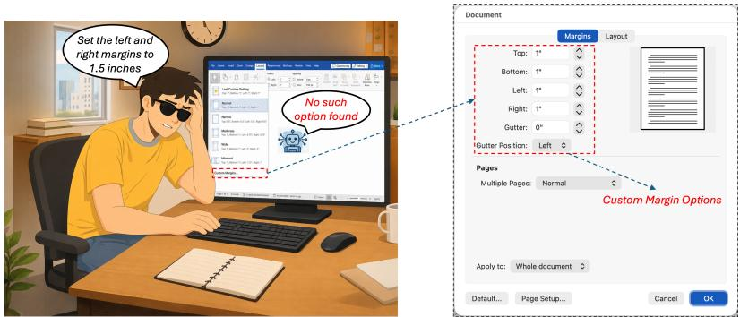  
Figure 1: Illustration of a CUA failure in Word. During a custom margin task, the agent failed to find the available margin settings and incorrectly reported that no matching option existed.

• RQ3. How do blind users envision CUAs supporting everyday computer use beyond end-toend automation?

Because existing CUAs are predominantly visually mediated, we develop OLLA,1 a screen-readerfriendly interface that enabled participants to issue commands, monitor execution progress, and review agent actions non-visually. OLLA functions as an accessibility layer over existing CUAs, enabling blind screen-reader users to interact with them without modifying the underlying agent architecture or reasoning process. During deployment, OLLA used GPT-5 to ensure a consistent participant experience. Participants used the system during authentic desktop workflows spanning 12 applications, generating 1,258 blind user-issued commands. For each command, the system recorded (with participants’ permission) execution traces including screenshots, UI trees, model responses, generated actions, and interaction histories. We later re-executed the same participant-issued commands using Claude Sonnet, Gemini 2.5 CU, UI-TARS, and Qwen3-VL in fresh live application instances for controlled cross-model analysis.

Our findings show that current CUAs complete a meaningful subset of nonvisual computer tasks but remain unreliable. GPT-5 achieved the highest success rate (52.5%), followed by Claude Sonnet (48.5%), Gemini 2.5 CU (43.9%), UI-TARS (39.8%), and Qwen3-VL (37.9%). Trace analysis revealed recurring failures in UI grounding (Lan et al., 2026), prior-knowledge reliance (Li et al., 2025; Feng et al., 2026), multi-step planning (Feng et al., 2025), constraint tracking (Zhou et al., 2022), and termination behavior (Yang et al., 2026). Figure 1 shows one such case, where the agent incorrectly concluded that Word lacked the requested custom-margin option despite it being available. Beyond automation performance, interviews show that participants envision CUAs as collaborative support systems for recovering from unfamiliar states, understanding interfaces, troubleshooting errors, learning applications, and improving efficiency in repetitive or technical workflows (Kodandaram et al., 2026). In summary, this paper makes the following contributions:

• We introduce a human-centered dataset of 1,258 blind user-issued desktop commands collected during a three-week longitudinal deployment, paired with detailed CUA execution traces including screenshots, UI trees, model responses, generated actions, and interaction histories.

• We provide a human-centered empirical evaluation of contemporary computer-use agents grounded in blind users’ real-world nonvisual desktop workflows, identifying systematic failures in grounding, planning, constraint tracking, and interaction management across multiple large language models.

• We characterize how blind users envision CUAs beyond end-to-end automation, highlighting opportunities for adaptive guidance, interface learning, troubleshooting support, and productivity assistance in accessible computing.

## 2 Background

## 2.1 Evaluating Computer-Use Agents

Recent work has developed numerous benchmarks for evaluating computer-use agents across web, desktop, operating system, and mobile environments. Web benchmarks such as WebShop, Mind2Web, WebArena, VisualWebArena, Web-Voyager, WorkArena, and BrowserGym evaluate language-guided interaction, action prediction, visual grounding, and end-to-end task completion (Yao et al., 2022; Deng et al., 2023; Zhou et al., 2023; Koh et al., 2024; He et al., 2024; Drouin et al., 2024; Chezelles et al., 2024). OSWorld and Windows Agent Arena extend evaluation to desktop and operating-system tasks (Xie et al., 2024; Bonatti et al., 2024), while Android in the Wild and AndroidWorld evaluate mobile device-control agents (Rawles et al., 2023; Rawles et al.).

Beyond task completion, newer benchmarks examine online realism, workplace autonomy, safety, and accessibility. Online-Mind2Web examines whether offline benchmarks overestimate progress in live web settings (Xue et al., 2025); TheAgent-Company evaluates workplace agents (Xu et al., 2026); ST-WebAgentBench studies safety and policy compliance (Levy et al., 2024); and BLIND-ACT examines infeasible, ambiguous, or inappropriate goals (Shayegani et al., 2025). Accessibilityfocused work also shows that CUA performance drops under assistive-technology interaction conditions (Gubbi Mohanbabu et al., 2026).

Together, these benchmarks show strong progress in evaluating CUA capabilities across web, desktop, mobile, workplace, safety, and accessibility settings. However, they do not fully capture how effectively CUAs support blind users in everyday real-world computer tasks, where they fail, or how future systems should be designed as effective assistive agents. This paper addresses this gap.

## 2.2 AI-Mediated Nonvisual Computer Use

Blind users typically interact with computer applications using screen readers such as NVDA (NV Access, 2026), JAWS (Vispero, 2026), and VoiceOver (Apple Inc., 2026). Prior work has studied accessibility barriers in web and desktop applications (Doush and Pontelli, 2013; Islam et al., 2023; Sunkara et al., 2023; Kodandaram et al., 2023) and proposed guidelines for assistive-technology compatibility (World Wide Web Consortium, 2024, 2023; Harper and Chen, 2012; Morales et al., 2013). However, accessibility does not necessarily imply usability. Even when controls are technically accessible, blind users may still struggle to locate, understand, and operate them (Wentz and Lazar, 2011; Ashok, 2018; Leporini et al., 2012; Uckun et al., 2022). These difficulties reflect the mismatch between visually organized GUIs and sequential screen-reader interaction (Wentz et al., 2013; Miao et al., 2016; Baldwin et al., 2017), and are further amplified by application heterogeneity, complex shortcuts, and shifting interaction patterns (Billah et al., 2017; Kodandaram et al., 2024).

Prior systems have reduced these burdens through interface adaptation, structured navigation, context-aware guidance, and uniform interaction mechanisms (Lee et al., 2020; Uckun et al., 2022; Chen et al., 2026). LLM-based systems further support natural-language commands and interface automation (Kodandaram et al., 2024), while CUAfocused work highlights accessibility gaps and the need for mixed-initiative interaction (Gubbi Mohanbabu et al., 2026; Peng et al., 2025). However, we still lack a clear understanding of real-world effectiveness of CUAs experienced by blind users in everyday computer-use contexts, where CUAs are used and where they fail, and how blind users envision support from CUAs beyond automation.

## 3 Evaluating CUAs as Assistive Agents for Blind Users

Existing CUA benchmarks, such as OSWorld (Xie et al., 2024), Windows Agent Arena (Bonatti et al., 2024), and WebArena (Zhou et al., 2023), evaluate general agent capabilities using well-formed prompts, controlled initial states, and measurable end conditions. However, evaluating CUAs for blind users requires data grounded in everyday nonvisual computer use. Existing benchmarks do not capture how blind users formulate commands or provide enough step-by-step evidence to analyze how failures unfold. To this end, we collect humancentered interaction data from blind users’ everyday desktop use, as described next.

## 3.1 Human-Centered Data Collection

To collect data grounded in everyday nonvisual computer use, we conducted an IRB-approved three-week diary study with 8 blind screen-reader users. Diary studies capture repeated experiences in naturalistic settings over time (Bolger et al., 2003; Caruana et al., 2015), making them appropriate for studying technology use in everyday humansubjects contexts (Lazar et al., 2017). Participants used our desktop CUA prototype to issue naturallanguage commands to an agent that could observe, reason about, and act on computer interfaces, allowing us to capture commands, task contexts, breakdowns, and reflections close to the moment of use.

Existing CUAs and open-source GUI agents often require visual monitoring of screenshots, interface changes, or agent actions (Gubbi Mohanbabu et al., 2026), making them difficult to deploy directly with blind participants. We therefore developed OLLA as a screen-reader-accessible interaction layer over existing CUAs, enabling blind users to issue commands, monitor execution, and review agent actions nonvisually without altering the underlying agent architecture or reasoning process. Participants installed OLLA with a .exe installer and used it during regular desktop activities. For each task attempt, OLLA logged the participant’s command, UI tree, screenshot, model response, generated action, and interaction history. Additional study and system details are in Appendix A.

## 3.2 Cross-Model Replay Evaluation

To compare CUA performance under controlled conditions, we re-executed participant-issued commands collected during the diary study with each of four additional CUA models. For each modelcommand pair, we reset the task to its initial state by opening a fresh live application instance and executed the command independently. Models did not interact with reconstructed traces or continue from another model’s state, preventing cross-execution side effects. Across models, the OLLA pipeline, participant-issued command, system prompt, structured action schema, execution environment, and action executor were held constant. Screenshots, UI trees, and interaction histories were extracted from the application state after each action using the same mechanism for every model.

## 3.3 Outcome Annotation and Reference-Step Construction

Four human annotators annotated the execution data using a shared protocol. They first independently performed each task in the corresponding application state to determine the minimum sequence of task-relevant actions required for successful completion, which was used to construct the reference steps for each command. The annotators then independently evaluated each model’s execution trace and labeled the outcome as success, partial completion, or failure, while annotating all applicable failure modes. Inter-annotator agreement was measured using Krippendorff’s α, yielding α = 0.84. Disagreements were reviewed collectively and resolved through consensus, and agreed-upon labels were used in the final analysis.

## 3.4 Interaction Log and Qualitative Analysis

We analyzed OLLA logs at the task and step levels by reviewing the user command, model response, selected action, UI-tree state, screenshot, and interaction history. This allowed us to examine how the agent interpreted each task, what actions it selected, and where execution succeeded or broke down. We analyzed post-study interview data using hybrid reflexive thematic analysis (Bingham and Witkowsky, 2021; Braun and Clarke, 2021; Naeem et al., 2023), combining deductive codes guided by our research questions with inductive codes that emerged from participants’ responses.

## 4 RQ1. Effectiveness of CUAs

Our evaluation combines in-the-wild use with controlled cross-model re-execution of the same participant-issued commands. We first analyze the deployed study agent during participants’ everyday desktop workflows, then compare five contemporary CUAs using the same commands participants issued during the study.

## 4.1 Study Agent and Baselines

During the study, OLLA was deployed with GPT-5 (Singh et al., 2025) as the underlying agent to maintain a consistent configuration across participants. We later re-ran the same participantissued commands through the OLLA pipeline using four additional models: Claude Sonnet with Computer Use (Anthropic, 2025), Gemini 2.5 Computer Use (Google, 2025), UI-TARS (Qin et al., 2025), and Qwen3-VL (Bai et al., 2025).2 These models cover complementary CUA directions, including proprietary computer-use agents, specialized GUI agents, and open multimodal models with visualagent capabilities.

Although some models were designed primarily for screenshot-based perception, we evaluate all models with the same task command, UI tree, screenshot, and recent interaction history. The UI tree provides semantic information about controls, roles, and hierarchy, complementing screenshots, which alone can be challenging for precise GUI grounding and coordinate prediction (Lin et al., 2025a; Qin et al., 2025). Each model generates the same structured user-interface action output, which is executed through Microsoft UI Automation (Microsoft, 2026b).

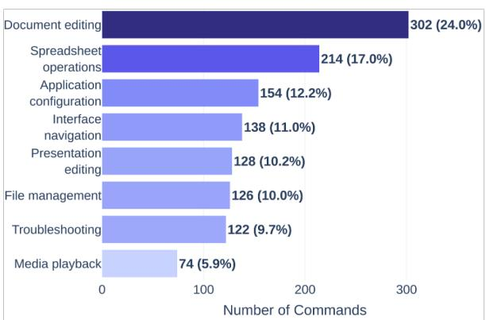  
(a) Commands by task category

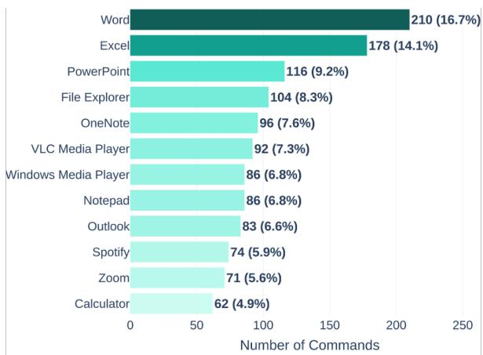  
(b) Commands by application  
Figure 2: Distribution of participant-issued commands across task categories and applications.

## 4.2 Participant-Issued Commands

Across the three-week study, participants issued N = 1,258 commands to OLLA across 12 desktop applications. We manually grouped collected commands within each application that represented the same underlying task despite differences in wording or parameter values, resulting in 304 normalized task intents. For example, “insert a table with 4 by 4 cells” and “insert a table with 15 by 15 cells” share the same intent, inserting a table. Using inductive qualitative content analysis (Hsieh and Shannon, 2005), we grouped the 304 normalized intents into eight broader task categories derived from the collected commands. Figure 2a shows the category distribution, and Figure 2b shows the application distribution, with the largest numbers from Word, Excel, PowerPoint, and OneNote.

## 4.3 Task Outcomes and Step Progress

We treat each participant-issued command and execution trace as one task attempt, coded as success, partial completion, orfailure. Success means full task completion; partial completion means completing at least one required task-relevant step without finishing the task; and failure means no valid task progress, an incorrect outcome, or a repeated nonprogressing loop.

Figure 3 and Table 5 in Appendix C show that GPT-5 has the highest observed success rate at 52.5% (95% CI: 49.8–55.3%), followed by Claude Sonnet at 48.5% (95% CI: 45.7–51.3%), Gemini 2.5 CU at 43.9% (95% CI: 41.2–46.6%), UI-TARS at 39.8% (95% CI: 37.2–42.6%), and Qwen3- VL at 37.9% (95% CI: 35.3–40.6%). Although GPT-5 has the highest observed success rate, its

<table><tr><td>Model</td><td>Partial Completion Traces</td><td>Step Progress</td></tr><tr><td>GPT-5</td><td>431</td><td>68.3%</td></tr><tr><td>Claude</td><td>429</td><td>65.6%</td></tr><tr><td>Gemini</td><td>439</td><td>60.6%</td></tr><tr><td>UI-TARS</td><td>430</td><td>56.2%</td></tr><tr><td>Qwen3-VL</td><td>419</td><td>53.0%</td></tr></table>

Note. Step Progress is the average fraction of reference steps completed before breakdown.  
Table 1: Step-level progress among partially completed commands before breakdown.

4.0-percentage-point advantage over the next-best model, Claude Sonnet, is not statistically significant in a paired McNemar test $( \chi ^ { 2 } = 3 . 2 5 , p =$ .071).

Partial completion was common across models, ranging from 33.3% to 34.9%. We further computed $S t e p P r o g r e s s _ { i } = c _ { i } / r _ { i }$ , where $r _ { i }$ is the number of required reference steps and $c _ { i }$ is the number completed before failure. As shown in Table 1, partial traces often involved substantial progress, with GPT-5 completing 68.3% of required steps on average before breakdown and Qwen3-VL completing 53.0%. Application-level StepProgress results are provided in Table 7.

## 4.4 Interactions CUAs Handled More Successfully

Successful interactions were concentrated in tasks with direct mappings between user commands and readily identifiable interface controls. These included direct property modifications (e.g., changing font family, font size, or text formatting), single-step interface operations (e.g., inserting tables, comments, or page breaks), navigation and information-retrieval tasks (e.g., opening menus, switching tabs, or locating settings), and simple content-editing tasks with explicitly specified parameters. In contrast, tasks requiring multi-step reasoning, discovery of hidden controls, or maintenance of multiple constraints were less consistently successful. These patterns characterize capabilities demonstrated under the observed conditions rather than reliable performance across all task instances or interface states.

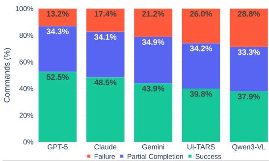  
(a) Task-level outcomes (Table 5 in Appendix C)

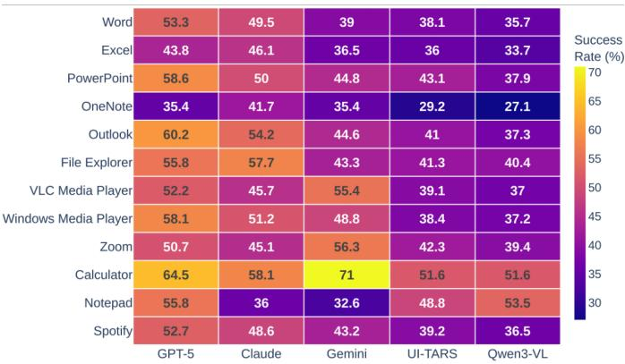  
(b) Application-level success rate (Table 6 in Appendix C)  
Figure 3: CUA performance across models.

## 4.5 Application-Level Variation

We also analyzed outcomes by application. Figure 3b shows application-level success rates, while the full success, partial-completion, and failure counts for each model and application are provided in Table 6 (Appendix C). Application-level results show that performance varied across application contexts, suggesting that CUA effectiveness depends not only on the model but also on application structure, control visibility, and task type. These results motivate our trace-based analysis in RQ2, where we examine why agents failed to convert partial progress into full task completion.

The observed success rates characterize only tasks participants chose to attempt. Post-study interviews indicated that some participants avoided sensitive tasks (e.g., banking, passwords, or personal documents) and occasionally stopped attempting task types after repeated failures with similar interactions. For example, failures with advanced formatting in Microsoft Word led some participants to avoid comparable editing tasks in OneNote. Accordingly, the reported success rates should be interpreted as conditional on the tasks participants chose to attempt and do not capture tasks they considered but elected not to delegate to the agent.

## 5 RQ2. Breakdowns During Nonvisual Task Execution

As summarized in Figure 4a, we group recurring breakdowns into categories including UI grounding, prior-knowledge reliance, multi-step planning, constraint tracking, and termination behavior. For each category, we report how often it appears among the relevant unsuccessful traces.

## 5.1 UI Grounding and Hidden Path Discovery

Ungrounded action generation. Grounding errors were a common source of non-completion. Among unsuccessful traces, they accounted for 24.6% of GPT-5 failures (147/597, study only) and 22.6% of failures across all models (789/3,489, study + replays). In these cases, agents generated actions that were not supported by the current UI state, such as hallucinated control names, fabricated control types, or coordinates that did not align with the intended element. These errors were frequent in ribbon-based applications such as Word, Excel, and OneNote, where relevant controls were not always visible. For example, for “Protect this document with a password,” the model placed Protect Document under the Home tab, although the correct path required the Review tab.

Hiddenpath discovery. A related failure involved tasks whose target controls were reachable only through intermediate navigation. Among unsuccessful traces, hidden-path failures accounted for 21.4% of GPT-5 failures (128/597) and 20.7% of failures across all models (722/3,489). Agents often handled directly visible options but failed on deeper variants of the same task. For example, they could complete “change margin to narrow” in Word, where Narrow appears after opening the

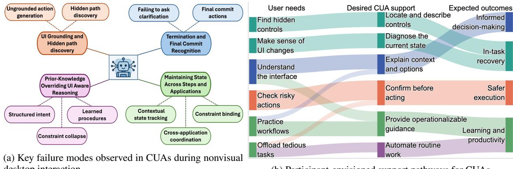  
(a) Key failure modes observed in CUAs during nonvisual desktop interaction  
(b) Participant-envisioned support pathways for CUAs  
Figure 4: Taxonomy of CUA breakdowns and participant-envisioned support pathways.

Margins menu, but failed on custom-margin requests that required opening a dialog and filling multiple fields. Similarly, for “insert a table 15 by 15,” agents stopped at the visible grid limit rather than opening the custom table option. These results suggest that CUAs can act on exposed controls but struggle when task completion depends on discovering hidden interface paths.

## 5.2 Prior Knowledge Overriding UI-Aware Reasoning

Learned procedure and default-driven errors. Some failures occurred when agents followed familiar procedures or defaults rather than reasoning from the observed UI and command. Among unsuccessful attempts, learned procedure reliance accounted for 17.1% of GPT-5 failures (102/597) and 9.6% across all models (335/3,489). Commands succeeding in Word sometimes failed in OneNote when the model applied Word-like procedures. For “Insert a comment” in Word, the model followed Microsoft’s documented Review tab procedure,3 although the option was available under Home. A related pattern was default collapse, where agents selected common options despite constraints. For custom margins, agents sometimes selected Normal or Narrow rather than opening the custom dialog. This pattern accounted for 11.4% of GPT-5 failures (68/597) and 6.5% across models (227/3,489).

Structured intentfailures. Structured intent failures were less frequent but important for tasks requiring exact formulas, ranges, operators, grouping, or ordering. They accounted for 5.9% of GPT-5 failures (35/597) and 5.7% across all models (199/3,489). For example, “In D2, calculate the average of B2 through B10” required preserving the target cell, function, and range, but agents sometimes generated an incomplete or incorrect formula. These failures reflected errors in forming the intermediate representation before execution, rather than locating controls. This reinforces prior work showing that blind users often need effortful verification when using generative AI for structured content such as spreadsheets (Perera et al., 2026).

## 5.3 State Maintenance Across Task Steps

Beyond finding the right controls, agents also needed to preserve task state across steps. Several failures occurred after initially correct actions, when agents lost user constraints or prior context.

Constraint binding. Constraint-binding failures occurred after agents made partial progress but lost one or more user-specified requirements. Among partial-completion task attempts, they accounted for 20.6% of GPT-5 cases (89/431) and 22.4% across all models (481/2,148). For example, for “change the font to Arial and the font size to 14,” agents sometimes changed the font family but dropped the size constraint. For “insert a footer with the page number centered,” they inserted the page number but failed to preserve centered alignment. These cases explain why partial completions could show substantial step progress while still failing to satisfy the full command.

Contextual state tracking. Other failures involved losing track of prior interface context. Among unsuccessful task attempts, contextual state tracking accounted for 10.2% of GPT-5 failures (61/597) and 8.7% across all models (304/3,489). In Excel, for “create a new sheet and switch back to the previous tab,” the agent created the new sheet but failed to identify which sheet had been active before creation. Similar failures occurred after popups, subwindows, or transient modes, where the agent needed to resume an earlier working context.

Cross-application coordination. Commands spanning multiple applications introduced another state-maintenance challenge. Cross-application coordination accounted for 7.4% of GPT-5 failures (44/597) and 6.0% across all models (209/3,489). For “copy the chart from Excel and paste it into Word,” agents often completed only one side of the task, such as copying content in Excel but failing to switch to Word or pasting in the wrong location. These failures show that CUAs need persistent task-state representations that track remaining constraints, prior context, active objects, and source and destination applications across steps.

## 5.4 Termination and Commit Recognition

Termination recognition. In OLLA, task completion was signaled when the agent generated a done output. Termination failures occurred when agents stopped too early, continued without meaningful state change, or repeated the same action instead of recognizing that execution was no longer progressing. Among partial-completion attempts, this pattern accounted for 17.6% of GPT-5 cases (76/431) and 19.1% across all models (410/2,148). In one Excel trace, the agent created a new sheet but failed to emit done, repeatedly activating the new-sheet control and creating extra sheets. These cases help explain why some attempts showed high step progress but still failed to satisfy the command.

Final commit actions. Other late-stage failures occurred when agents reached the correct interface path but missed the final action needed to apply the change. For example, in Word, for “Save this file as a PDF,” the agent navigated to the export option and selected PDF, but failed to click the final Save button that completed the export. Here, the failure was not path discovery, but recognizing the commit point where the selected option takes effect. These failures suggest that CUAs need stronger mechanisms for detecting terminal states, non-progressing loops, and confirmation actions.

## 6 RQ3. CUAs Beyond Automation

RQ3 examines how participants envisioned CUAs beyond full automation. Figure 4b summarizes these desired roles, showing CUAs as tools for understanding interfaces, getting situated help, controlling risky actions, and learning workflows during nonvisual computer use.

## 6.1 Understanding Before Acting

Participants envisioned CUAs as useful before execution, especially for understanding task context and deciding what to do next. They wanted agents to explain visual content, document structure, and interface elements, such as charts, layouts, controls, menus, dialogs, and settings. As ${ \mathrm { P } } 6 ^ { 4 }$ explained, “I may not want it to do the whole taskfor me.” This was particularly relevant for unfamiliar or visually organized interfaces, where participants wanted to understand not only what was present, but how it related to the task. Rather than immediately delegating, users wanted CUAs to describe what is relevant to the goal and available options. This could help them decide whether to act manually, request guidance, or ask the agent to execute.

## 6.2 Situated Help and Troubleshooting

Participants also wanted CUAs to help when they were already in the middle of a task and became stuck. In these moments, they did not necessarily want the agent to take over the full task. Instead, they wanted targeted support for locating hidden controls, understanding dialogs or menus, identifying what changed after an action, troubleshooting unexpected states, and deciding the next step. P3 described this need for situated assistance: “Sometimes I just need it to tell me where I am, what options are available, and what I should do next.” This suggests that CUAs should support opportunistic assistance during nonvisual workflows, allowing users to request explanations, guidance, and recovery support while remaining engaged in the task.

## 6.3 User-Controlled Execution

Participants wanted CUAs to keep them involved during ambiguous, consequential, or difficult-toverify tasks. Rather than proceeding silently, agents should explain planned actions, ask for missing information, and confirm assumptions before acting. This was especially important for hard-to-undo actions, such as changing settings, modifying files, deleting content, or handling sensitive information. Participants were cautious about uses involving personal or financial data. As P7 emphasized, “I want it to ask me before clicking something important. I do not want it making decisions on its own.” These concerns suggest that CUAs should support user-controlled execution through confirmations, explanations, and options to approve, modify, or stop actions before commitment.

## 6.4 Learning and Productivity Support

Participants also envisioned CUAs as tools for learning and productivity. They wanted agents to explain the application structure, provide screenreader-relevant steps, and help them practice workflows independently. As P5 explained, “If it can explain how the application is organized and guide me through the steps, I can learn to do it myself the next time.” They also saw value in using CUAs for tedious or technically demanding tasks, such as formatting, file management, screen-reader configuration, add-on installation, and customization workflows. These responses suggest that CUAs can support not only immediate task completion, but also longer-term confidence in nonvisual computer use when they help users understand workflows rather than only execute them.

## 7 Discussion and Future Work

Our findings show the promise and current limits of CUAs for everyday nonvisual desktop support. We next discuss implications for designing CUAs that go beyond automation, support clarification and recovery, and better reflect blind users’ needs.

## 7.1 Interaction-Rich Training Data for Assistive CUAs

Many failures occurred when agents continued execution instead of pausing, asking for clarification, or adapting to corrections. Our dataset offers a starting point for studying these behaviors by capturing blind user-issued commands, UI states, screenshots, model responses, generated actions, and interaction histories from nonvisual workflows. Future work can extend it with annotations for uncertainty, clarification opportunities, rejected actions, recovery attempts, and decision changes. Prior work shows the value of supervision (Ross et al., 2011; Christiano et al., 2017; Ouyang et al., 2022; Cui et al., 2023; Li et al., 2026). Semi-automatic tools could convert these logs into training and evaluation data for clarification, backtracking, and recovery.

## 7.2 Backtrack via Reward-Guided Execution

Our failure analysis suggests opportunities for reward-guided improvement. Agents often chose the wrong path, repeated actions, or continued executing despite little progress. Prior work on reinforcement learning from human feedback, preference-based optimization, and process supervision shows that supervision can target both final outcomes and intermediate judgments about useful, safe, or correct behavior (Christiano et al., 2017; Ziegler et al., 2019; Ouyang et al., 2022; Lightman et al., 2024; Song et al., 2025). For CUAs, reward models could combine task completion with signals such as goal progress, relevant-control discovery, repeated-action avoidance, constraint preservation, and recovery. For nonvisual use, rewards should also capture clarification, state explanation, and caution around actions difficult to verify or undo.

## 7.3 Assistive CUAs for Learning

Participants’ reflections suggest that CUAs should support beyond end-to-end automation. Many nonvisual workflows require targeted help when users are stuck, troubleshooting, or learning unfamiliar interfaces. Future systems could build on natural-language control, interface adaptation, context-aware guidance, and mixed-initiative support (Kodandaram et al., 2024; Lee et al., 2020; Uckun et al., 2022; Lin et al., 2025b; Chen et al., 2026; Peng et al., 2025). CUAs could describe the screen, identify controls, suggest screen-readerfriendly steps, ask clarification questions, and offer recovery options. They could also turn action plans into guidance, helping users practice workflows and remain in control during task execution.

## 8 Conclusion

This paper evaluate computer-use agents in realworld contexts as assistive systems for blind screen-reader users in everyday desktop workflows. Through a three-week diary study and cross-model evaluation of 1,258 participant-issued commands, we found that CUAs complete meaningful tasks but remain unreliable for nonvisual use. Trace analysis exposed recurring failures in grounding, hidden-path discovery, state maintenance, constraint preservation, and termination recognition. Interviews showed that participants wanted CUAs not as autonomous replacements, but as collaborative support for understanding interfaces, recovering from breakdowns, and learning workflows.

## Limitations

Our study did have a few limitations, which we discuss below. These limitations reflect the scope of our participant sample, prototype implementation, and evaluation design, and should be considered when interpreting the findings.

Participant Pool. Our participant pool was limited to blind people who primarily use screen readers for computer interaction. We did not include low-vision users or people with other visual impairment conditions who may rely on different assistive tools, such as screen magnifiers, high-contrast settings, or combined visual and nonvisual strategies. As a result, our findings primarily reflect screen-reader-mediated desktop use and may not fully generalize to users with different access needs or assistive technology practices. Our study also did not include participants under the age of 18, whose computer-use practices, learning needs, and support expectations may differ.

Prototype and Operating System Scope. Our prototype was implemented for Windows using Microsoft UI Automation tool, which provided structured UI-tree information such as control labels, roles, coordinates, and hierarchy. As a result, our findings reflect CUA behavior in Windows desktop environments and may not fully generalize to macOS or other operating systems, where accessibility APIs, permission models, screen-reader behavior, and the completeness of exposed interface structure can differ (Uckun et al., 2022; Kodandaram et al., 2024). Some platforms may not expose an equivalent UI tree, or may expose less complete or less consistently available interface metadata to automation clients. Future work should examine CUA performance across platforms with different accessibility infrastructures.

Language Scope. Our study was conducted in English, including participant commands, system feedback, surveys, and interviews. Although modern LLM-based agents can process multiple languages, non-English and mixed-language use may introduce different command formulations, localization issues, interface-label mismatches, and screen-reader interaction patterns. For example, users may combine English application labels with commands in another language, or use localized versions of applications where menu names and shortcut conventions differ. These factors could shape both agent performance and user expectations in ways not captured by our study. Future work should examine CUAs for nonvisual computer use across languages, localized applications, and multilingual screen-reader workflows.

Application Scope. Our evaluation focused on desktop applications and did not include web applications. Web environments introduce different interaction challenges because page structure is exposed through the DOM or accessibility tree, which may not always reflect the complete or current interface state. Many websites rely on JavaScript, AJAX, infinite scrolling, and interaction-triggered loading, where content is rendered only after scrolling, expanding menus, submitting forms, or activating controls. As a result, some relevant content or controls may be hidden behind scripts and may not appear in the available structure until specific interactions occur. Although screenshots can provide complementary visual context, screenshotonly or OCR-based representations can introduce recognition errors that affect grounding and action generation. Future work should examine CUAs for nonvisual use across dynamic web applications, where DOM structure, accessibility-tree information, and visual state may diverge.

Model Scope. Our evaluation was limited to five agent-capable models. We selected these models to cover a range of current CUA-relevant capabilities, including frontier proprietary models, a computer-use-specialized model, and open-weight multimodal baselines that could be integrated into our evaluation pipeline. We did not evaluate every available model because each model run required executing 1,258 commands with step-by-step UI observations, generated actions, and logged traces, making the evaluation costly in terms of compute, API usage, infrastructure, and manual outcome verification. Because CUAs and multimodal models are rapidly evolving, future models may show different strengths or failure patterns. Our goal was therefore not to provide a definitive ranking of models, but to characterize current capabilities and recurring breakdowns in nonvisual desktop use.

## Ethical Considerations

This study was approved by our institutional review board (IRB). Because participants were blind screen-reader users, we designed recruitment, consent form, installation, study instructions, surveys, and interviews to be accessible with screen readers. Participants were informed about the study purpose, duration, data collection procedures, and their ability to stop participation or skip any task. We framed all outcomes as evaluations of CUA behavior rather than user performance, since failures could reflect agent limitations, interface accessibility issues, or both.

The study involved privacy risks because CUA traces can include screenshots, UI trees, user commands, model outputs, and interaction history from participants’ personal computers. We therefore treated logs as potentially sensitive data. We minimized unnecessary collection, anonymized participant identifiers, and used secure storage with access limited to the research team. In reporting findings, we describe task patterns and failures without revealing personally identifying content.

## Acknowledgement

This work was supported by NIH Award R01EY035688 and DoD Award HT94252410098. Jiawei Zhou is supported by an Amazon Research Award on AWS Agentic AI and a Stony Brook OVPR Seed Grant.

## References

Anthropic. 2025. Computer use tool documentation. Accessed: 2026-04-29.

Apple Inc. 2026. Voiceover user guide for mac. Accessed: 2026-04-23.

Vikas Ganjigunte Ashok. 2018. Non-Visual Web Browsing: From Accessibility with Screen Readers to Usability with Assistants. State University of New York at Stony Brook.

Shuai Bai, Yuxuan Cai, Ruizhe Chen, Keqin Chen, Xionghui Chen, Zesen Cheng, Lianghao Deng, Wei Ding, Chang Gao, Chunjiang Ge, and 1 others. 2025. Qwen3-vl technical report. arXiv preprint arXiv:2511.21631.

Mark S Baldwin, Gillian R Hayes, Oliver L Haimson, Jennifer Mankoff, and Scott E Hudson. 2017. The tangible desktop: a multimodal approach to nonvisual computing. ACM Transactions on Accessible Computing (TACCESS), 10(3):1–28.

Syed Masum Billah, Vikas Ashok, Donald E Porter, and IV Ramakrishnan. 2017. Ubiquitous accessibility for people with visual impairments: Are we there yet? In Proceedings of the 2017 chi conference on human factors in computing systems, pages 5862–5868.

Andrea J Bingham and Patricia Witkowsky. 2021. Deductive and inductive approaches to qualitative data analysis. Analyzing and interpreting qualitative data: After the interview, 1:133–146.

Niall Bolger, Angelina Davis, and Eshkol Rafaeli. 2003. Diary methods: Capturing life as it is lived. Annual review ofpsychology, 54(1):579–616.

Rogerio Bonatti, Dan Zhao, Francesco Bonacci, Dillon Dupont, Sara Abdali, Yinheng Li, Yadong Lu, Justin Wagle, Kazuhito Koishida, Arthur Bucker, and 1 others. 2024. Windows agent arena: Evaluating multi-modal os agents at scale. arXiv preprint arXiv:2409.08264.

Virginia Braun and Victoria Clarke. 2021. Thematic analysis: A practical guide.

Edward Joseph Caruana, Marius Roman, Jules Hernández-Sánchez, and Piergiorgio Solli. 2015. Longitudinal studies. Journal of thoracic disease, 7(11):E537.

Nan Chen, Jing Lu, Zilong Wang, Luna K Qiu, Siming Chen, and Yuqing Yang. 2026. From struggle to success: Context-aware guidance for screen reader users in computer use. In Proceedings of the 2026 CHI Conference on Human Factors in Computing Systems, pages 1–19.

De Chezelles, Thibault Le Sellier, Sahar Omidi Shayegan, Lawrence Keunho Jang, Xing Han Lù, Ori Yoran, Dehan Kong, Frank F Xu, Siva Reddy, Quentin Cappart, and 1 others. 2024. The browsergym ecosystem for web agent research. arXiv preprint arXiv:2412.05467.

Paul F Christiano, Jan Leike, Tom Brown, Miljan Martic, Shane Legg, and Dario Amodei. 2017. Deep reinforcement learning from human preferences. Advances in neural information processing systems, 30.

Adam Coimbra and Charmaine Dsilva. 2026. Gemini spark now integrates with chrome. https://blog.g oogle/innovation-and-ai/products/gemini-a pp/gemini-spark-updates-july-2026/. Google Blog, accessed 2026-08-30.

Yuchen Cui, Siddharth Karamcheti, Raj Palleti, Nidhya Shivakumar, Percy Liang, and Dorsa Sadigh. 2023. No, to the right: Online language corrections for robotic manipulation via shared autonomy. In Proceedings ofthe 2023 ACM/IEEE International Conference on Human-Robot Interaction, pages 93–101.

Mariya Davydova, Daniel Jeffries, Patrick Barker, Arturo Márquez Flores, and Sinéad Ryan. 2025. Osuniverse: Benchmark for multimodal gui-navigation ai agents. arXiv preprint arXiv:2505.03570.

Xiang Deng, Yu Gu, Boyuan Zheng, Shijie Chen, Sam Stevens, Boshi Wang, Huan Sun, and Yu Su. 2023. Mind2web: Towards a generalist agent for the web. Advances in Neural Information Processing Systems, 36:28091–28114.

Iyad Abu Doush and Enrico Pontelli. 2013. Non-visual navigation of spreadsheets: Enhancing accessibility of microsoft excel™. Universal access in the information society, 12(2):143–159.

Alexandre Drouin, Maxime Gasse, Massimo Caccia, Issam H Laradji, Manuel Del Verme, Tom Marty, Léo Boisvert, Megh Thakkar, Quentin Cappart, David Vazquez, and 1 others. 2024. Workarena: How capable are web agents at solving common knowledge work tasks? arXiv preprint arXiv:2403.07718.

Yiyang Feng, Zeming Chen, Haotian Wu, Jiawei Zhou, and Antoine Bosselut. 2026. Tracking the limits of knowledge propagation: How llms fail at multi-step reasoning with conflicting knowledge. In Proceedings of the 19th Conference of the European Chapter of the Association for Computational Linguistics (Volume 1: Long Papers), pages 5813–5847.

Yiyang Feng, Yichen Wang, Shaobo Cui, Boi Faltings, Mina Lee, and Jiawei Zhou. 2025. Unraveling misinformation propagation in llm reasoning. In Findings ofthe Associationfor Computational Linguistics: EMNLP 2025, pages 11683–11707.

Google. 2025. Gemini 2.5 computer use model. https: //ai.google.dev/gemini-api/docs/models/g emini-2.5-computer-use-preview-10-2025. Accessed 2026-05-14.

Google DeepMind. 2025. Project astra. Accessed: 2026-04-29.

Ananya Gubbi Mohanbabu, Rosiana Natalie, Brandon Kim, Anhong Guo, and Amy Pavel. 2026. A11ycua dataset: Characterizing the accessibility gap in computer use agents. In Proceedings of the 2026 CHI Conference on Human Factors in Computing Systems, pages 1–26.

Simon Harper and Alex Q Chen. 2012. Web accessibility guidelines: A lesson from the evolving web. World Wide Web, 15(1):61–88.

Hongliang He, Wenlin Yao, Kaixin Ma, Wenhao Yu, Yong Dai, Hongming Zhang, Zhenzhong Lan, and Dong Yu. 2024. Webvoyager: Building an end-toend web agent with large multimodal models. In Proceedings of the 62nd Annual Meeting of the Associationfor Computational Linguistics (Volume 1: Long Papers), pages 6864–6890.

Hsiu-Fang Hsieh and Sarah E Shannon. 2005. Three approaches to qualitative content analysis. Qualitative health research, 15(9):1277–1288.

Md Touhidul Islam, Donald E Porter, and Syed Masum Billah. 2023. A probabilistic model and metrics for estimating perceived accessibility of desktop applications in keystroke-based non-visual interactions. In Proceedings ofthe 2023 CHI Conference on Human Factors in Computing Systems, pages 1–20.

Satwik Ram Kodandaram, Mohan Sunkara, Sampath Jayarathna, and Vikas Ashok. 2023. Detecting deceptive dark-pattern web advertisements for blind screen-reader users. Journal ofImaging, 9(11):239.

Satwik Ram Kodandaram, Utku Uckun, Xiaojun Bi, IV Ramakrishnan, and Vikas Ashok. 2024. Enabling uniform computer interaction experience for blind users through large language models. In Proceedings ofthe 26th International ACM SIGACCESS Conference on Computers and Accessibility, pages 1–14.

Satwik Ram Kodandaram, Jiawei Zhou, Xiaojun Bi, IV Ramakrishnan, and Vikas Ashok. 2026. Finding the signal in the noise: An exploratory study on assessing the effectiveness of ai and accessibility forums for blind users’ support needs. In Proceedings of the 2026 CHI Conference on Human Factors in Computing Systems, pages 1–20.

Jing Yu Koh, Robert Lo, Lawrence Jang, Vikram Duvvur, Ming Lim, Po-Yu Huang, Graham Neubig, Shuyan Zhou, Russ Salakhutdinov, and Daniel Fried. 2024. Visualwebarena: Evaluating multimodal agents on realistic visual web tasks. In Proceedings of the 62nd Annual Meeting of the Association for Computational Linguistics (Volume 1: Long Papers), pages 881–905.

Zixuan Lan, Luzhe Sun, Matthew R Walter, and Jiawei Zhou. 2026. Seeing without looking: Do visionlanguage benchmarks really test vision? In Proceedings of the IEEE/CVF Conference on Computer Vision and Pattern Recognition, pages 11260–11273.

LangChain. 2026. Langsmith: Observability, evaluation, and deployment platform for ai agents. https: //smith.langchain.com/. Agent engineering platform for debugging, testing, and monitoring LLMbased systems.

Jonathan Lazar, Jinjuan Heidi Feng, and Harry Hochheiser. 2017. Research methods in humancomputer interaction. Morgan Kaufmann.

Hae-Na Lee, Vikas Ashok, and IV Ramakrishnan. 2020. Repurposing visual input modalities for blind users: a case study of word processors. In 2020 IEEE International Conference on Systems, Man, and Cybernetics (SMC), pages 2714–2721. IEEE.

Barbara Leporini, Maria Claudia Buzzi, and Marina Buzzi. 2012. Interacting with mobile devices via voiceover: usability and accessibility issues. In Proceedings ofthe 24th Australian computer-human interaction conference, pages 339–348.

Ido Levy, Ben Wiesel, Sami Marreed, Alon Oved, Avi Yaeli, and Segev Shlomov. 2024. Stwebagentbench: A benchmark for evaluating safety and trustworthiness in web agents. arXiv preprint arXiv:2410.06703.

Chen Li, Xiaoling Hu, Songzhu Zheng, Jiawei Zhou, and Chao Chen. 2026. Orce: Order-aware alignment of verbalized confidence in large language models. arXiv preprint arXiv:2605.12446.

Yanhong Li, Tianyang Xu, Kenan Tang, Karen Livescu, David McAllester, and Jiawei Zhou. 2025. Okbench: Democratizing llm evaluation with fully automated, on-demand, open knowledge benchmarking. arXiv preprint arXiv:2511.08598.

Hunter Lightman, Vineet Kosaraju, Yuri Burda, Harrison Edwards, Bowen Baker, Teddy Lee, Jan Leike, John Schulman, Ilya Sutskever, and Karl Cobbe. 2024. Let’s verify step by step. In International Conference on Learning Representations, volume 2024, pages 39578–39601.

Kevin Qinghong Lin, Linjie Li, Difei Gao, Zhengyuan Yang, Shiwei Wu, Zechen Bai, Stan Weixian Lei, Lijuan Wang, and Mike Zheng Shou. 2025a. Showui: One vision-language-action model for gui visual agent. In Proceedings of the Computer Vision and Pattern Recognition Conference, pages 19498– 19508.

Samuel Lin, Jiawei Zhou, and Minlan Yu. 2025b. An llm-based agentic framework for accessible networkcontrol. ACM SIGMETRICS Performance Evaluation Review, 53(2):15–20.

Mei Miao, Hoai Anh Pham, Jens Friebe, and Gerhard Weber. 2016. Contrasting usability evaluation methods with blind users. Universal access in the Information Society, 15(1):63–76.

Microsoft. 2026a. Microsoft copilot overview. Accessed: 2026-04-29.

Microsoft. 2026b. Microsoft ui automation: Accessibility framework for windows desktop applications. https://learn.microsoft.com/en-us/window s/win32/winauto/entry-uiauto-win32. Provides programmatic access to UI elements for accessibility and automation; accessed 2026-05-06.

Lourdes Morales, Sonia M Arteaga, and Sri Kurniawan. 2013. Design guidelines of a tool to help blind authors independently format their word documents. In CHI’13 Extended Abstracts on Human Factors in Computing Systems, pages 31–36.

Muhammad Naeem, Wilson Ozuem, Kerry Howell, and Silvia Ranfagni. 2023. A step-by-step process of thematic analysis to develop a conceptual model in qualitative research. International journal ofqualitative methods, 22:16094069231205789.

Chaim Noy. 2008. Sampling knowledge: The hermeneutics of snowball sampling in qualitative research. International Journal of social research methodology, 11(4):327–344.

NV Access. 2026. Nv access. Accessed: 2026-04-23.

OpenAI. 2025. Introducing operator. https://openai .com/index/introducing-operator/. Accessed: 2026-04-29.

Long Ouyang, Jeffrey Wu, Xu Jiang, Diogo Almeida, Carroll Wainwright, Pamela Mishkin, Chong Zhang, Sandhini Agarwal, Katarina Slama, Alex Ray, and 1 others. 2022. Training language models to follow instructions with human feedback. Advances in neural information processing systems, 35:27730–27744.

Yi-Hao Peng, Dingzeyu Li, Jeffrey P Bigham, and Amy Pavel. 2025. Morae: Proactively pausing ui agents for user choices. In Proceedings ofthe 38th Annual ACM Symposium on User Interface Software and Technology, pages 1–14.

Minoli Perera, Swamy Ananthanarayan, Cagatay Goncu, and Kim Marriott. 2026. I’m always a little skeptical of it: Verification practices of blind users when working with generative ai in spreadsheets. In Proceedings of the 2026 CHI Conference on Human Factors in Computing Systems, pages 1–21.

Yujia Qin, Yining Ye, Junjie Fang, Haoming Wang, Shihao Liang, Shizuo Tian, Junda Zhang, Jiahao Li, Yunxin Li, Shijue Huang, and 1 others. 2025. Uitars: Pioneering automated gui interaction with native agents. arXiv preprint arXiv:2501.12326.

Christopher Rawles, Sarah Clinckemaillie, Yifan Chang, Jonathan Waltz, Gabrielle Lau, Marybeth Fair, Alice Li, William Bishop, Wei Li, Folawiyo Campbell-Ajala, and 1 others. Androidworld: A dynamic benchmarking environment for autonomous agents, 2024. URL https://arxiv. org/abs/2405.14573.

Christopher Rawles, Alice Li, Daniel Rodriguez, Oriana Riva, and Timothy Lillicrap. 2023. Androidinthewild: A large-scale dataset for android device control. Advances in Neural Information Processing Systems, 36:59708–59728.

Stéphane Ross, Geoffrey Gordon, and Drew Bagnell. 2011. A reduction of imitation learning and structured prediction to no-regret online learning. In Proceedings of the fourteenth international conference on artificial intelligence and statistics, pages 627– 635. JMLR Workshop and Conference Proceedings.

Erfan Shayegani, Keegan Hines, Yue Dong, Nael Abu-Ghazaleh, Roman Lutz, Spencer Whitehead, Vidhisha Balachandran, Besmira Nushi, and Vibhav Vineet. 2025. Just do it!? computer-use agents exhibit blind goal-directedness. arXiv preprint arXiv:2510.01670.

Aaditya Singh, Adam Fry, Adam Perelman, Adam Tart, Adi Ganesh, Ahmed El-Kishky, Aidan McLaughlin, Aiden Low, AJ Ostrow, Akhila Ananthram, and 1 others. 2025. Openai gpt-5 system card. arXiv preprint arXiv:2601.03267.

Mingyang Song, Zhaochen Su, Xiaoye Qu, Jiawei Zhou, and Yu Cheng. 2025. Prmbench: A fine-grained and challenging benchmark for process-level reward models. In Proceedings ofthe 63rd Annual Meeting ofthe Association for Computational Linguistics (Volume 1: Long Papers), pages 25299–25346.

Mohan Sunkara, Sandeep Kalari, Sampath Jayarathna, and Vikas Ashok. 2023. Assessing the accessibility of web archives. In 2023 ACM/IEEE Joint Conference on Digital Libraries (JCDL), pages 253–255. IEEE.

Utku Uckun, Rohan Tumkur Suresh, Md Javedul Ferdous, Xiaojun Bi, IV Ramakrishnan, and Vikas Ashok. 2022. Taming user-interface heterogeneity with uniform overlays for blind users. In Proceedings of the 30th ACM conference on user modeling, adaptation and personalization, pages 212–222.

Vispero. 2026. Jaws screen reader software. Accessed: 2026-04-23.

Brian Wentz, Harry Hochheiser, and Jonathan Lazar. 2013. A survey of blind users on the usability of email applications. Universal access in the information society, 12(3):327–336.

Brian Wentz and Jonathan Lazar. 2011. Usability evaluation of email applications by blind users. Journal of Usability Studies, 6(2):75–89.

World Wide Web Consortium. 2023. Accessible Rich Internet Applications (WAI-ARIA) 1.2. https: //www.w3.org/TR/wai-aria-1.2/. W3C Recommendation, 6 June 2023.

World Wide Web Consortium. 2024. Web Content Accessibility Guidelines (WCAG) 2.2. https: //www.w3.org/TR/WCAG22/. W3C Recommendation, updated 12 December 2024.

Tianbao Xie, Danyang Zhang, Jixuan Chen, Xiaochuan Li, Siheng Zhao, Ruisheng Cao, Toh J Hua, Zhoujun Cheng, Dongchan Shin, Fangyu Lei, and 1 others. 2024. Osworld: Benchmarking multimodal agents for open-ended tasks in real computer environments. Advances in Neural Information Processing Systems, 37:52040–52094.

Frank Fangzheng Xu, Yufan Song, Boxuan Li, Yuxuan Tang, Kritanjali Jain, Mengxue Bao, Zora Wang, Xuhui Zhou, Zhitong Guo, Murong Cao, and 1 others. 2026. Theagentcompany: benchmarking llm agents on consequential real world tasks. Advances in Neural Information Processing Systems, 38.

Tianci Xue, Weijian Qi, Tianneng Shi, Chan Hee Song, Boyu Gou, Dawn Song, Huan Sun, and Yu Su. 2025. An illusion of progress? assessing the current state of web agents. arXiv preprint arXiv:2504.01382.

Haoyan Yang, Reza Shirkavand, Yukai Jin, Jiawei Zhou, Shangqian Gao, and Heng Huang. 2026. Capability self-assessment: Teaching llms to know their limits. arXiv preprint arXiv:2606.00251.

Shunyu Yao, Howard Chen, John Yang, and Karthik Narasimhan. 2022. Webshop: Towards scalable realworld web interaction with grounded language agents. Advances in Neural Information Processing Systems, 35:20744–20757.

Chaoyun Zhang, Liqun Li, Shilin He, Xu Zhang, Bo Qiao, Si Qin, Minghua Ma, Yu Kang, Qingwei Lin, Saravan Rajmohan, and 1 others. 2025. Ufo: A ui-focused agent for windows os interaction. In Proceedings of the 2025 Conference of the Nations of the Americas Chapter of the Association for Computational Linguistics: Human Language Technologies (Volume 1: Long Papers), pages 597–622.

Jiawei Zhou. 2026. Position: Scores without context? rethinking the role of evaluation in the era of llms. In Proceedings ofthe Fifth Workshop on Generation, Evaluation and Metrics (GEM), pages 1048–1054.

Jiawei Zhou, Jason Eisner, Michael Newman, Emmanouil Antonios Platanios, and Sam Thomson. 2022. Online semantic parsing for latency reduction in task-oriented dialogue. In Proceedings ofthe 60th Annual Meeting ofthe Associationfor Computational Linguistics (Volume 1: Long Papers), pages 1554–1576.

Shuyan Zhou, Frank F Xu, Hao Zhu, Xuhui Zhou, Robert Lo, Abishek Sridhar, Xianyi Cheng, Tianyue Ou, Yonatan Bisk, Daniel Fried, and 1 others. 2023. Webarena: A realistic web environment for building autonomous agents. arXiv preprint arXiv:2307.13854.

Daniel M Ziegler, Nisan Stiennon, Jeffrey Wu, Tom B Brown, Alec Radford, Dario Amodei, Paul Christiano, and Geoffrey Irving. 2019. Fine-tuning language models from human preferences. arXiv preprint arXiv:1909.08593.

## A Study and System Details

## A.1 Participant Recruitment and Eligibility

We recruited participants from an existing contact list maintained from prior IRB-approved accessibility studies. We contacted individuals who had previously consented to be recontacted and had indicated interest in research on accessibility and technology use. We also used snowball sampling (Noy, 2008), inviting participants to share the study with other eligible peers. In accordance with our IRB protocol, we conducted outreach using each participant’s preferred communication method, such as email or phone.

Participants were eligible if they self-identified as blind, relied on a screen reader for regular computer use, and had prior experience using desktop applications (e.g., Word, Excel) for everyday tasks. Because the study focused on computer-use agents for desktop interaction, participants also needed access to a personal computer and sufficient familiarity with common applications to use the study system during the three-week diary period. Participants needed to be able to communicate in English. We excluded individuals under 18, those who did not regularly use a screen reader, and those who lacked prior experience with everyday computer tasks. We confirmed eligibility through a brief screening interview.

Overall, N = 8 blind screen-reader users completed the study. During the three-week study period, participants used the CUA-based application for everyday computer tasks across 12 different desktop applications. All participants reported regular screen reader use and prior experience using desktop applications for everyday tasks. Participant demographics are summarized in Table 2. Participants received \$100 in compensation for their time and contributions.

## A.2 Procedure

The study spanned three weeks. Participants were given an executable (.exe) installer for OLLA and instructions for installing and launching the application on their own computers. To holistically evaluate OLLA across diverse interaction scenarios, participants were encouraged to use the system as part of their everyday computer activities and to issue at least 10 commands per day across desktop applications, including tasks such as configuring settings, managing files, navigating interfaces, and troubleshooting issues.

Participants used OLLA in their own environments. After each task attempt, participants had the option to complete a brief survey describing the task, the outcome, and any additional comments, including major issues or breakdowns they encountered. We encouraged participants to report both successful and unsuccessful experiences.

We conducted periodic check-ins during the study to address technical issues and ensure continued participation without disruption. At the end of the study, we conducted semi-structured interviews to gather additional insights into participants’ experiences, including how they used OLLA, where it succeeded or failed, and how it fit into their everyday workflows.

All participants provided informed consent prior to participation. Participants were informed about the types of interaction data collected during system use, including screenshots, UI trees, model responses, action traces, and survey/interview responses. Participants could stop participation at any time, and all collected data were anonymized with personally identifiable information removed prior to analysis.

## A.3 Post-Study Interviews

After the three-week diary period, we conducted semi-structured interviews with each participant to gather deeper reflections on their experience using OLLA. The interviews were guided by participants interaction logs and post-task survey responses, which allowed us to discuss specific task attempts where OLLA succeeded, partially completed the task, or failed. This helped us interpret log-coded breakdowns by asking what made the agent’s behavior helpful, confusing, incomplete, or difficult to monitor nonvisually.

The interviews also directly informed our analysis of how blind users envisioned CUAs beyond end-to-end automation. We asked participants how they imagined using CUAs in everyday computing activities, when they would want guidance, clarification, troubleshooting support, learning support, or productivity assistance, and what expectations they had around reliability, user control, privacy, and trust.

## A.4 OLLA Design and Implementation

We developed OLLA because existing CUAs and open-source GUI agents are difficult to deploy directly with blind participants. Many systems are designed around visually mediated interaction, where users monitor screenshots, pointer movements, or visual state changes, and they often provide limited screen-reader access, limited keyboard-based control, or limited access to step-by-step execution logs (Gubbi Mohanbabu et al., 2026).

<table><tr><td>ID</td><td>Age / Gender</td><td>Vision Loss (Onset / LP)</td><td>Preferred Screen Reader</td><td>Expertise</td><td>Familiar Applications</td><td>Computer Usage Frequency</td></tr><tr><td>P1</td><td>59 /Male</td><td>28 /No</td><td>JAWS</td><td>Beginner</td><td>MS Word, Google Chrome, Zoom</td><td>Bi-Weekly</td></tr><tr><td>P2</td><td>34/ Female</td><td>19 / Yes</td><td>NVDA</td><td>Intermediate</td><td>MS Word, MS Excel, MS PowerPoint, MS Teams, Mozilla Firefox</td><td>Daily</td></tr><tr><td>P3</td><td>30 /Male</td><td>18 / Yes</td><td>JAWS</td><td>Expert</td><td>MS Word, MS Excel, Zoom, PyCharm, MS PowerPoint, Google Chrome</td><td>Weekly</td></tr><tr><td>P4</td><td>24/ Female</td><td>2/No</td><td>NVDA</td><td>Intermediate</td><td>MS Word, Zoom, Mozilla Firefox</td><td>Daily</td></tr><tr><td>P5</td><td>59 /Male</td><td>39 / No</td><td>JAWS</td><td>Beginner</td><td>MS Word, MS Excel, Mozilla Firefox, Zoom, Notepad++, MS PowerPoint</td><td>Weekly</td></tr><tr><td>P6</td><td>44/ Female</td><td>17 / No</td><td>NVDA</td><td>Expert</td><td>MS Word, MS Excel, MS PowerPoint, Google Chrome, MS Teams, VS Code</td><td>Daily</td></tr><tr><td>P7</td><td>681 Female</td><td>19 / Yes</td><td>JAWS</td><td>Intermediate</td><td>MS Word, Zoom, Google Chrome</td><td>Daily</td></tr><tr><td>P8</td><td>371 Female</td><td>3 / Yes</td><td>NVDA</td><td>Expert</td><td>MS Word, MS Excel, Zoom, MS PowerPoint, VS Code, Mozilla Firefox</td><td>Daily</td></tr></table>

Table 2: Summary of participant demographics, onset of visual impairment, preferred screen reader, self-reported expertise, desktop applications used, and frequency of computer use.

OLLA was developed as a screen-reader-friendly CUA prototype for collecting interaction data from blind users. Its design was informed by recent CUAs and GUI agents that follow an observationaction loop, where the agent observes the interface, reasons over the user goal, predicts an action, executes it, and observes the updated state (OpenAI, 2025; Anthropic, 2025; Zhang et al., 2025; Xie et al., 2024; Bonatti et al., 2024). It was also informed by accessibility-focused LLM systems for nonvisual computer support, which use UI-tree representations to capture accessibility properties such as control labels, roles, hierarchy, focusable elements, states, and element coordinates (Kodandaram et al., 2024; Chen et al., 2026; Gubbi Mohanbabu et al., 2026). Following these systems, we crafted OLLA’s prompts to combine the user’s natural-language command with the current interface state, recent interaction history, and a structured output format. OLLA uses both screenshots and the Microsoft UI Automation tree at each execution step. Screenshots provide rendered visual context, while the UI tree grounds this context in semantically exposed interface structure. This combination reduces reliance on screenshots alone, which can miss or misread interface content due to OCR errors, visually similar controls, missing labels, or ambiguous layouts.

Once launched, OLLA runs in the background and can be activated through a global keyboard shortcut, allowing users to invoke the agent without visually locating the application window. Users issue natural-language commands, after which OLLA follows an iterative perceive-reason-act loop. At each step, OLLA extracts the current screenshot and UI tree, combines them with the user command and recent interaction history, and sends this context to the LLM. The model outputs a brief decision rationale and a structured JSON action specification, including the action type, target control label, control role, element coordinates (x, y, w, h), and text content when needed. When the model determines that the task is complete, it returns a done output. OLLA then executes the predicted action through Microsoft UI Automation, including clicking, typing, scrolling, or selecting controls (Microsoft, 2026b).

To support nonvisual monitoring, OLLA provides audio feedback after each action and after determining that the task is complete. During each task attempt, OLLA stores the user command, model rationale, structured action output, executed action, screenshot, UI-tree state, and interaction history. We used LangSmith (LangChain, 2026) to log these traces and maintain a bounded interaction buffer, allowing the agent to condition later actions on recent context. These logs supported our later analysis of task outcomes and breakdowns. Finally, all collected data was anonymized.

## B Evaluation and Data Details

## B.1 Dataset Composition and Task Distribution

Across the study, participants issued 1,258 commands, which were consolidated into 304 normalized task intents. Thus, 954 commands represented additional instances of these intents through repeated requests, alternative phrasings, or different parameter values, corresponding to an average of 4.14 commands per normalized intent. Participantlevel command counts were approximately: P1 (158), P2 (149), P3 (171), P4 (136), P5 (162), P6 (155), P7 (148), and P8 (179).

Using inductive qualitative content analysis (Hsieh and Shannon, 2005), we grouped the normalized intents into eight task categories derived from the collected commands rather than defined a priori. Table 3 summarizes each category and its distribution.

## B.2 Model and Execution Configurations

Table 4 summarizes the models used in our evaluation. Exact model versions were fixed for the evaluation, and all models operated through the common OLLA pipeline described in Section 3.2.

Across models, the participant-issued command, system prompt, structured action schema, execution environment, and action executor were held fixed. Model-specific adaptations were limited to formatting inputs and outputs according to each model’s API or inference interface.

## B.3 Statistical Analysis

To account for uncertainty in the observed model success rates, we computed 95% Wilson confidence intervals and conducted paired commandlevel comparisons. GPT-5 achieved a success rate of 52.5% (95% CI: 49.8–55.3%), compared with 48.5% for Claude Sonnet (95% CI: 45.7– 51.3%). A paired McNemar test found that this 4.0- percentage-point difference was not statistically significant $( \chi ^ { 2 } = 3 . 2 5 , p = . 0 7 1 )$ . Thus, although GPT-5 had the highest observed success rate, the difference from the next-best model should not be interpreted as evidence of a definitive performance advantage.

## B.4 Data and Research Artifacts

The OLLA implementation is publicly available on GitHub.5 The anonymized dataset, including participant-issued commands, model outputs, and turn-by-turn execution traces and annotations, is available in our data repository.

<table><tr><td>Category</td><td>Definition</td><td>Commands</td><td>%</td></tr><tr><td>Document Editing</td><td>Creating, modifying, formatting, or organizing content in text-based documents.</td><td>302</td><td>24.0</td></tr><tr><td>Spreadsheet Opera- tions</td><td>Creating, editing, formatting, or computing over spread- sheet data, cells, formulas, or charts.</td><td>214</td><td>17.0</td></tr><tr><td>Application Configu- ration</td><td>Changing application preferences, settings, or configu- ration options.</td><td>154</td><td>12.2</td></tr><tr><td>Interface Navigation</td><td>Locating or navigating among controls, menus, tabs, dialogs, views, or other interface elements.</td><td>138</td><td>11.0</td></tr><tr><td>Presentation Editing</td><td>Creating or modifying slides, slide content, layouts, or presentation formatting.</td><td>128</td><td>10.2</td></tr><tr><td>File Management</td><td>Creating, locating, opening, saving, moving, renaming,</td><td>126</td><td>10.0</td></tr><tr><td>Troubleshooting</td><td>exporting, or deleting files and folders. Diagnosing or resolving application, configuration, or</td><td>122</td><td>9.7</td></tr><tr><td>Media Playback</td><td>interaction problems. Controlling or configuring audio or video playback.</td><td>74</td><td>5.9</td></tr><tr><td colspan="2">Total</td><td>1,258</td><td>100.0</td></tr></table>

Table 3: Distribution and operational definitions of the eight task categories derived from participant-issued commands.

<table><tr><td>Model</td><td>Model Identifier</td><td>Configuration</td></tr><tr><td>GPT-5</td><td>gpt-5-2025-08-07</td><td>OpenAI API; multimodal screenshot and text input; Microsoft UI Automation tree and interaction history supplied in the prompt; structured JSON actions following the shared OLLA action schema.</td></tr><tr><td>Claude Sonnet</td><td>claude-sonnet-4-6</td><td>Anthropic API with computer-use capability; screenshot, UI tree, command, and recent interaction history provided at each step; outputs mapped to the shared OLLA action schema.</td></tr><tr><td>Gemini 2.5 CU</td><td>gemini-2.5-computer-use-p review-10-2025</td><td>Gemini Computer Use API; multimodal screenshot and text input; model-generated interface actions mapped to the common OLLA execution interface.</td></tr><tr><td>UI-TARS</td><td>ByteDance-Seed/UI-TARS-1.5 -7B</td><td>Open-weight multimodal GUI agent; screenshot and textual task context provided at each step; generated GUI actions translated to the shared OLLA action schema.</td></tr><tr><td>Qwen3-VL</td><td>Qwen/Qwen3-VL-8B-Instruct</td><td>Open-weight multimodal instruction model; screenshot, task command, UI information, and interaction history provided through the same OLLA pipeline; structured actions produced using the common action schema.</td></tr></table>

Table 4: Models and execution configurations used in the cross-model evaluation. All models used a maximum output length of 2,048 tokens.

## C Task Outcomes by Model and Application

<table><tr><td>Model</td><td>Success</td><td>95% CI</td><td>Partial</td><td>Failure</td></tr><tr><td>GPT-5</td><td>661 (52.5%)</td><td>49.8–55.3</td><td>431 (34.3%)</td><td>166 (13.2%)</td></tr><tr><td>Claude Sonnet</td><td>610 (48.5%)</td><td>45.7–51.3</td><td>429 (34.1%)</td><td>219 (17.4%)</td></tr><tr><td>Gemini 2.5 CU</td><td>552 (43.9%)</td><td>41.2-46.6</td><td>439 (34.9%)</td><td>267 (21.2%)</td></tr><tr><td>UI-TARS</td><td>501 (39.8%)</td><td>37.2-42.6</td><td>430 (34.2%)</td><td>327 (26.0%)</td></tr><tr><td>Qwen3-VL</td><td>477 (37.9%)</td><td>35.3-40.6</td><td>419 (33.3%)</td><td>362 (28.8%)</td></tr></table>

Table 5: Task-level performance across models on participant-issued commands $( N = 1 , 2 5 8 )$ . Confidence intervals are 95% Wilson intervals for success proportions.

<table><tr><td>Application</td><td>Cmds.</td><td colspan="3">GPT-5</td><td colspan="3">Claude</td><td colspan="3">Gemini</td><td colspan="3">UI-TARS</td><td colspan="3">Qwen3-VL</td></tr><tr><td></td><td></td><td>S</td><td>PC</td><td>F</td><td>S</td><td>PC</td><td>F</td><td>S</td><td>PC</td><td>F</td><td>S</td><td>PC</td><td>F</td><td>S</td><td>PC</td><td>F</td></tr><tr><td>Word</td><td>210</td><td>112</td><td>71</td><td>27</td><td>104</td><td>70</td><td>36</td><td>82</td><td>79</td><td>49</td><td>80</td><td>73</td><td>57</td><td>75</td><td>73</td><td>62</td></tr><tr><td>Excel</td><td>178</td><td>78</td><td>72</td><td>28</td><td>82</td><td>64</td><td>32</td><td>65</td><td>70</td><td>43</td><td>64</td><td>65</td><td>49</td><td>60</td><td>63</td><td>55</td></tr><tr><td>PowerPoint</td><td>116</td><td>68</td><td>35</td><td>13</td><td>58</td><td>39</td><td>19</td><td>52</td><td>40</td><td>24</td><td>50</td><td>38</td><td>28</td><td>44</td><td>39</td><td>33</td></tr><tr><td>OneNote</td><td>96</td><td>34</td><td>45</td><td>17</td><td>40</td><td>37</td><td>19</td><td>34</td><td>39</td><td>23</td><td>28</td><td>39</td><td>29</td><td>26</td><td>38</td><td>32</td></tr><tr><td>Outlook</td><td>83</td><td>50</td><td>24</td><td>9</td><td>45</td><td>25</td><td>13</td><td>37</td><td>29</td><td>17</td><td>34</td><td>28</td><td>21</td><td>31</td><td>28</td><td>24</td></tr><tr><td>File Explorer</td><td>104</td><td>58</td><td>33</td><td>13</td><td>60</td><td>29</td><td>15</td><td>45</td><td>37</td><td>22</td><td>43</td><td>35</td><td>26</td><td>42</td><td>33</td><td>29</td></tr><tr><td>VLC Media Player</td><td>92</td><td>48</td><td>32</td><td>12</td><td>42</td><td>33</td><td>17</td><td>51</td><td>26</td><td>15</td><td>36</td><td>32</td><td>24</td><td>34</td><td>31</td><td>27</td></tr><tr><td>Windows Media Player</td><td>86</td><td>50</td><td>26</td><td>10</td><td>44</td><td>28</td><td>14</td><td>42</td><td>27</td><td>17</td><td>33</td><td>30</td><td>23</td><td>32</td><td>29</td><td>25</td></tr><tr><td>Zoom</td><td>71</td><td>36</td><td>25</td><td>10</td><td>32</td><td>26</td><td>13</td><td>40</td><td>19</td><td>12</td><td>30</td><td>23</td><td>18</td><td>28</td><td>23</td><td>20</td></tr><tr><td>Calculator</td><td>62</td><td>40</td><td>16</td><td>6</td><td>36</td><td>17</td><td>9</td><td>44</td><td>11</td><td>7</td><td>32</td><td>17</td><td>13</td><td>32</td><td>16</td><td>14</td></tr><tr><td>Notepad</td><td>86</td><td>48</td><td>27</td><td>11</td><td>31</td><td>37</td><td>18</td><td>28</td><td>36</td><td>22</td><td>42</td><td>25</td><td>19</td><td>46</td><td>21</td><td>19</td></tr><tr><td>Spotify</td><td>74</td><td>39</td><td>25</td><td>10</td><td>36</td><td>24</td><td>14</td><td>32</td><td>26</td><td>16</td><td>29</td><td>25</td><td>20</td><td>27</td><td>25</td><td>22</td></tr><tr><td>Total</td><td>1,258</td><td>661</td><td>431</td><td>166</td><td>610</td><td>429</td><td>219</td><td>552</td><td>439</td><td>267</td><td>501</td><td>430</td><td>327</td><td>477</td><td>419</td><td>362</td></tr></table>

Table 6: Application-level outcome breakdown across models. S denotes success, PC denotes partial completion, and F denotes failure. Counts are reported for each application; bold indicates the highest success count for each application.

<table><tr><td>Application</td><td>GPT-5</td><td>Claude</td><td>Gemini</td><td>UI-TARS</td><td>Qwen3-VL</td></tr><tr><td>Word</td><td>69.2% (71)</td><td>66.1% (70)</td><td>61.4% (79)</td><td>56.8% (73)</td><td>53.5% (73)</td></tr><tr><td>Excel</td><td>67.5% (72)</td><td>65.2% (64)</td><td>60.1% (70)</td><td>55.7% (65)</td><td>52.9% (63)</td></tr><tr><td>PowerPoint</td><td>70.1% (35)</td><td>66.8% (39)</td><td>61.9% (40)</td><td>57.2% (38)</td><td>53.6% (39)</td></tr><tr><td>OneNote</td><td>65.8% (45)</td><td>63.7% (37)</td><td>58.6% (39)</td><td>54.4% (39)</td><td>51.7% (38)</td></tr><tr><td>Outlook</td><td>69.7% (24)</td><td>66.3% (25)</td><td>61.2% (29)</td><td>56.5% (28)</td><td>53.2% (28)</td></tr><tr><td>File Explorer</td><td>68.9% (33)</td><td>65.9% (29)</td><td>60.7% (37)</td><td>56.1% (35)</td><td>52.8% (33)</td></tr><tr><td>VLC Media Player</td><td>66.4% (32)</td><td>63.8% (33)</td><td>58.9% (26)</td><td>54.7% (32)</td><td>51.8% (31)</td></tr><tr><td>Windows Media Player</td><td>66.9% (26)</td><td>64.2% (28)</td><td>59.3% (27)</td><td>54.9% (30)</td><td>52.1% (29)</td></tr><tr><td>Zoom</td><td>67.8% (25)</td><td>64.6% (26)</td><td>59.7% (19)</td><td>55.3% (23)</td><td>52.4% (23)</td></tr><tr><td>Calculator</td><td>70.5% (16)</td><td>67.1% (17)</td><td>62.4% (11)</td><td>57.5% (17)</td><td>54.1% (16)</td></tr><tr><td>Notepad</td><td>68.2% (27)</td><td>64.9% (37)</td><td>59.6% (36)</td><td>55.4% (25)</td><td>52.5% (21)</td></tr><tr><td>Spotify</td><td>66.7% (25)</td><td>63.9% (24)</td><td>57.4% (26)</td><td>54.6% (25)</td><td>51.4% (25)</td></tr><tr><td>Overall</td><td>68.3% (431)</td><td>65.6% (429)</td><td>60.6% (439)</td><td>56.2% (430)</td><td>53.0% (419)</td></tr></table>

Table 7: Application-level step progress among partially completed commands. Each cell reports the average fraction of reference steps completed before breakdown, with the number of partial-completion traces in parentheses.

## D Visualizing CUA Failure Modes

Figures 5, 6, and 7 visualize six breakdown patterns identified in the RQ2 trace analysis, spanning interface grounding, context maintenance, prior-knowledge reliance, default selection, multi-step planning, and constraint binding.  
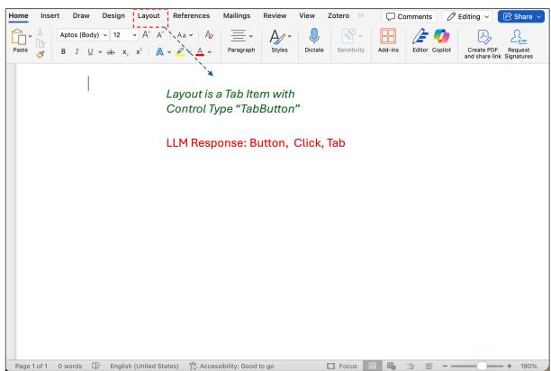  
(a) Incorrect UI grounding. The UI representation identifies Layout as a TabButton, whereas the model generates an incompatible control representation in its structured action. The resulting action is therefore inconsistent with the interface state available to the model.

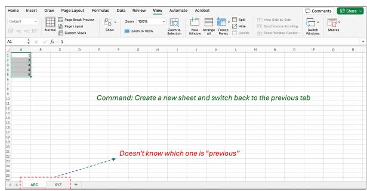  
(b) Contextual state tracking. After creating a new worksheet, the agent no longer retains which sheet was active beforehand and consequently cannot resolve the user’s reference to the “previous tab.”  
Figure 5: Breakdowns in interface grounding and state maintenance. The left trace shows an action specification that conflicts with the observed UI representation; the right trace shows loss of task-relevant interface context across successive actions.

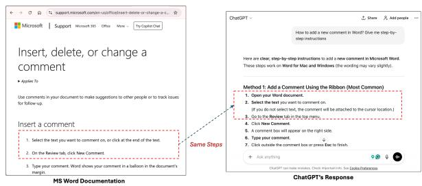  
(a) Prior-knowledge reliance. The model follows the conventional Microsoft-documented path through the Review tab for inserting a comment, even though the observed interface exposes the relevant control directly under Home. Learned procedural knowledge overrides reasoning from the current UI state.

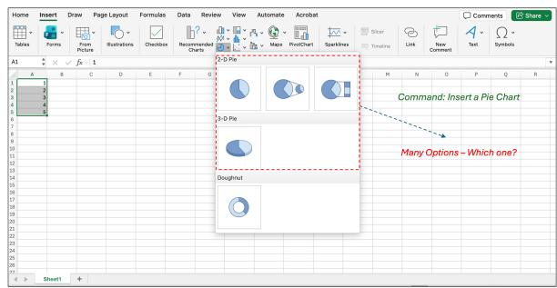  
(b) Default action selection. The user requests a 3D pie chart and the interface exposes both 2D and 3D variants, yet the agent selects the first default pie-chart option rather than preserving the specified chart type.

Figure 6: Breakdowns in situated reasoning and intent preservation. The left trace illustrates reliance on a familiar application procedure despite contradictory interface evidence, whereas the right trace shows an explicit user constraint being collapsed into a readily available default.

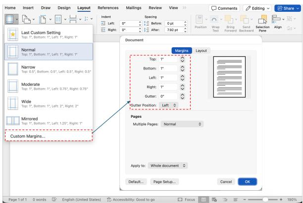  
(a) Multi-step planning. Configuring custom margins requires traversing Layout, Margins, and Custom Margins before entering several parameter values. Although the necessary controls are available, the agent fails to construct the intermediate interaction sequence required to reach them.

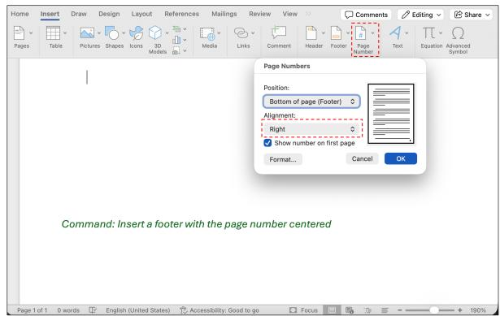  
(b) Constraint binding. For “insert a footer with the page number centered,” the agent reaches the page-number configuration and performs the principal insertion action, but applies Right alignment instead of maintaining the requested centered constraint.  
Figure 7: Breakdowns during multi-step execution. The left trace shows failure to derive the intermediate path needed to expose a valid configuration, while the right trace shows loss of a user-specified requirement after substantial task progress.