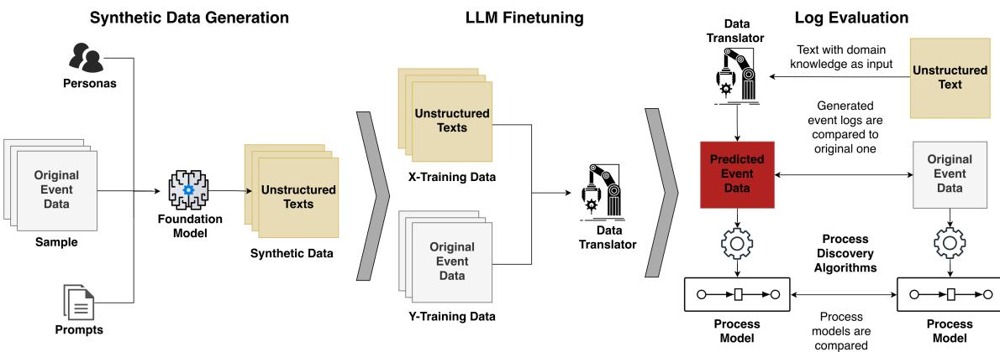
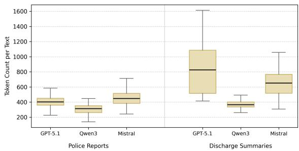
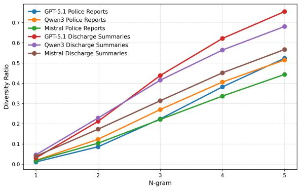
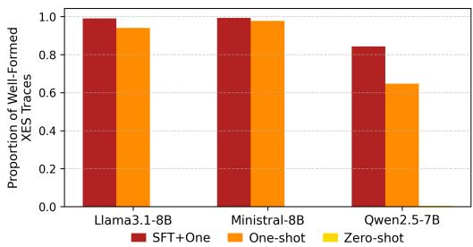
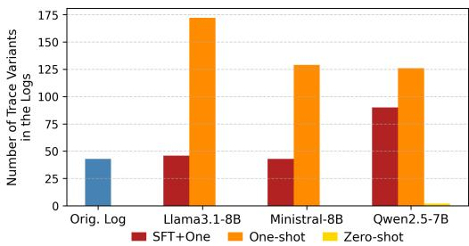
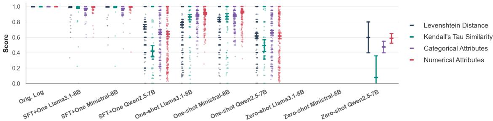
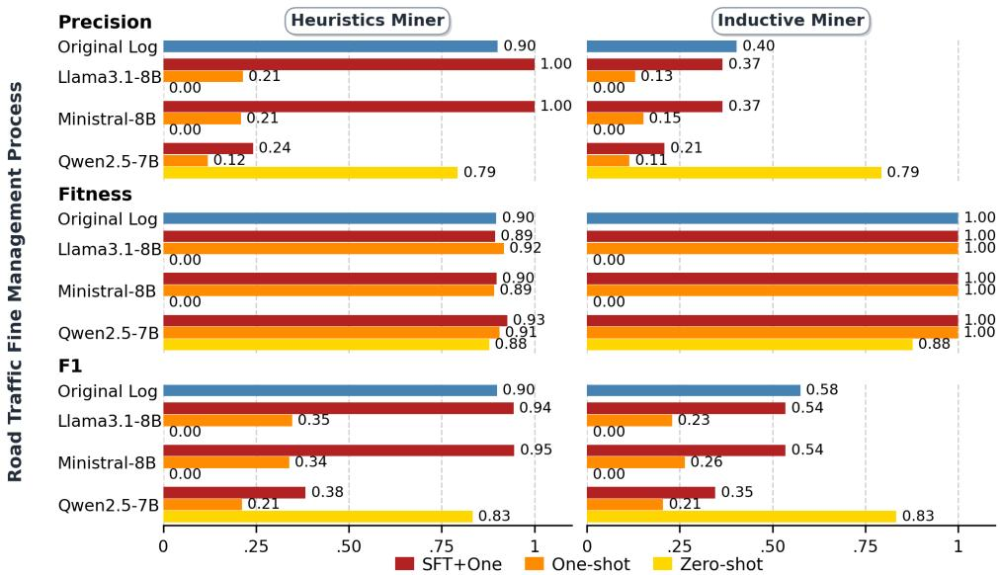
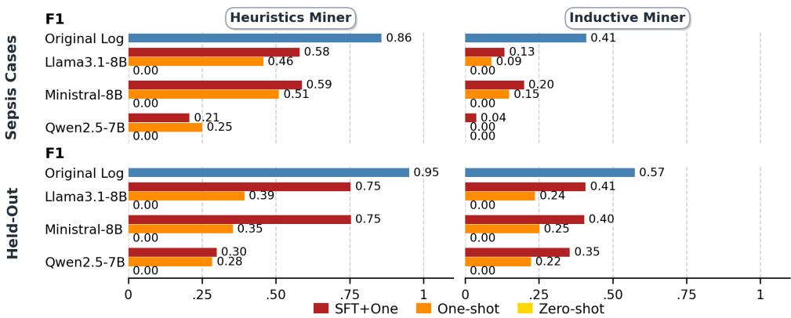

# Automated Event Log Generation from Unstructured Text Using Finetuned LLMs

MAXIMILIAN SEETH✉, LMU Munich, Germany

GABRIEL MARQUES TAVARES, LMU Munich, Germany

DANIEL SCHUSTER, University of Mannheim, Germany and LMU Munich, Germany

Process mining (PM) provides a powerful framework for discovering and optimizing operational processes from event data. However, the eficacy of PM techniques is strictly predicated on the availability of structured event logs. Thus far, event logs have often been laboriously created by domain and process mining experts. This costly efort causes large portions of organizational knowledge, including incident tickets, manuals, and textual reports, to remain underutilized. We address this bottleneck by investigating the eficacy of Large Language Models (LLMs) as automated data translators. We propose a scalable framework that leverages LLMs as data translators to bridge the gap between unstructured textual resources and structured event data. We finetune LLMs on a newly created text-to-log dataset, demonstrating that the resulting models can extract high-fidelity event logs from unstructured resources. Our results show that this finetuning approach outperforms few-shot or zero-shot prompting by a large amount, highlighting finetuning as a necessary pre-condition for generating reliable event data. We conclude that our method provides a promising pipeline for making previously unused data available to PM techniques.

CCS Concepts: • Applied computing → Business process management; • Computing methodologies → Information extraction.

Additional Key Words and Phrases: Process Mining, Event Data Extraction

## ACM Reference Format:

Maximilian Seeth, Gabriel Marques Tavares, and Daniel Schuster. 2026. Automated Event Log Generation from Unstructured Text Using Finetuned LLMs. 1, 1 (September 2026), 13 pages. https://doi.org/10.1145/nnnnnnn.nnnnnnn

## 1 Introduction

Process mining (PM) provides a framework for analyzing and improving operational processes by extracting insights from event data. The success of PM techniques rely heavily on access to well-structured event logs. Thus far, event logs have often been laboriously created by domain and process mining experts. Data preparation and extraction are identified as key challenges when applying PM in industrial contexts [25], as they require substantial time and efort. This costly efort causes large portions of organizational knowledge, such as incident tickets, manuals, and textual reports, to remain underutilized. We address this bottleneck by investigating the eficacy of Large Language Models (LLMs) as automated data translators. Specifically, we evaluate whether LLMs can reliably map natural language process descriptions into coherent, schema-compliant event logs that can be used by PM

Previous attempts to extract process information from unstructured data largely focus on textual resources [15]. We follow this promising tradition [31] because tickets, reports, or manuals can be easily collected for further use. Recent advances in LLMs open-up a new paradigm where models go beyond narrow pattern detection and also allow the generation of complex outputs. We investigate these advances to create structured data typically used in PM. Thi approach difers from other work in PM [4, 16, 21] that uses LLMs to generate complete process models or has not experimented with supervised finetuning yet [6, 13, 30]. Our idea is to delegate the process modeling to the specified algorithms with the aim of using LLMs to provide them with the appropriate data. Therefore, the guiding research question of our work is how well LLMs can translate process descriptions to executable event logs. To make this work more appealing to PM practitioners, we further narrow our experiments to relatively small, and open-weight LLMs that can be deployed locally.

  
Fig. 1. Pipeline depicting the generation of synthetic texts with frontier models ("Foundation Model" in left panel) that we used to address the lack of a suitable dataset, the finetuning of LLMs ("Data Translator" in centered panel) on this data, as well as the final evaluation of generated event data from texts (right panel) compared to the original data.

This paper makes the following key contributions. (1) An open-weight LLM-based approach for transforming unstructured textual data into structured event logs. (2) Our results show that only supervised finetuning (SFT), compared to zero-shot and few-shot prompting, substantially improves the ability of LLMs to generate accurate, well-formed event data. This opens a scalable path to producing high-quality event logs from natural language process descriptions.(3) To arrive at these results, we create synthetic text-to-log datasets since, to the best of our knowledge, there is no suitable dataset that could be used for our goal. We view the use of synthetic data from LLMs as an additional contribution of our work, ofering a promising direction for further exploration in PM. (4) We introduce an extensive evaluation framework that assesses both individual traces and process-level perspectives, providing a blueprint fo future work on generating event logs from unstructured data using LLMs.

The remainder of this paper is structured as follows: Section 2 reviews related research, Section 3 presents and evaluates the synthetic data generation, Section 4 describes our prompting strategies and SFT of LLMs, Section 5 reports the experimental setup and results1, and Sections 6 and 7 provide discussion and conclusions.

## 2 Related Work

With the advent of a new generation of Transformer based encoder and decoder language models, a growing body of work has explored their application to process mining tasks [2, 4, 6, 10, 11, 13, 16, 21, 28–30]. One prominent line of research with LLMs investigates prompt engineering techniques to derive process models from textual descriptions [16, 21]. In particular, Kourani et al. [16] employ prompts and code-level specifications to guide LLMs in generating pm4py [3] programs that construct models informed by natural language descriptions of processes. Similarly, Lindner and

Table 1. Comparison of diferent methods using language models (LM) for process mining. ✗ indicate that the respective aspect is not used or evaluated and vice versa ✓ means it is part of the approach. (✓) mean that the aspect is partially present.
<table><tr><td></td><td>LM type</td><td>Dataset</td><td>Public data</td><td>Prompt variat.</td><td>SFT</td><td>RL</td><td>Log extrac.</td><td>Model extrac.</td><td>Trace eval.</td><td>Process eval.</td></tr><tr><td>Sanchez-Ferriz et al. [30]</td><td>encoder</td><td>unlabeled</td><td>X</td><td>X</td><td>X</td><td>X</td><td>√</td><td>X</td><td>X</td><td>X</td></tr><tr><td>Kecht et al. [13]</td><td>encoder</td><td>unlabeled</td><td>√</td><td>X</td><td>X</td><td>x</td><td></td><td>√</td><td>(S)</td><td>√</td></tr><tr><td>Buss et al. [6]</td><td>decoder</td><td>semi- synthetic</td><td>V</td><td>X</td><td>X</td><td>X</td><td>√</td><td>X</td><td>√</td><td>X</td></tr><tr><td>Hamdi et al. [11]</td><td>decoder</td><td>manually labeled</td><td>x</td><td>x</td><td>x</td><td>x</td><td>L</td><td>x</td><td>√</td><td>X</td></tr><tr><td>Brennig et al. [5]</td><td>decoder</td><td>self- supervised</td><td>√</td><td>X</td><td>√</td><td>x</td><td>(S)</td><td>X</td><td>L</td><td>x</td></tr><tr><td>Berti et al. [4]</td><td>decoder</td><td>manually labeled</td><td>x</td><td>x</td><td>(S)</td><td>√</td><td>x</td><td>V</td><td>x</td><td>√</td></tr><tr><td>This paper</td><td>decoder</td><td>semi- synthetic</td><td>√</td><td>√</td><td>√</td><td>x</td><td>√</td><td>√</td><td>√</td><td>L</td></tr></table>

López-Acosta [21] use prompting as well as retrieval-augmented generation to encourage LLMs to produce structured JSON representations that can be transformed into Dynamic Condition Response (DCR) graphs. However, none of the contributions [2, 10, 16, 21, 28, 29] have used SFT of LLMs for downstream PM tasks, which is the focus of our approach. Furthermore, most of the prompting based approaches to PM aim for creating full process models directly from unstructured documents.

In contrast, a few notable works focus on extracting logs for PM [6, 13, 30]. Kecht et al. [13] and Sanchez-Ferriz et al. [30] employ encoder-based language models to derive event representations from unstructured text, which are subsequently synthesized into a coherent event log. For example, Kecht et al. [13] leverage the next sentence prediction capabilities of BART: the model receives as input pairs of customer-related inquiries from Twitter together with diferent “hypotheses” indicating to which predefined process activity an inquiry could belong. In this manner, Kecht et al. [13] select the most likely activity suggested by the encoder to construct a complete standardized eXtensible Event Stream (XES) [1] event log from the textual data. Furthermore, they derive process models from the resulting logs using established discovery algorithms. However, their work difers from ours in three important respects. First, they rely on encoder representations, whereas we focus on decoder-based LLMs. Second, they do not finetune their models for the downstream PM prediction task. Third, their data is unlabeled in the sense that they cannot compare the resulting process models or event logs against any gold standard.

Close to our approach is the work by Buss et al. [6]. Similarly to our pipeline, Buss et al. [6] begin by generating synthetic texts based on real-world event logs. Subsequently, they leverage a combination of LLM-based and rule-based NLP techniques to construct event logs from these texts. This process involves first extracting event-related information and then refining it to build an Object-Centric Event Log (OCEL). They deploy GPT-4o mini both for generating the synthetic texts and for extracting process information. Finally, Buss et al. [6] assess the quality of the resulting traces by comparing them to those from the original logs. The work proposed by Hamdi et al. [11] is fairly similar to that of Buss et al. [6]; instead of a synthetic dataset they use a manually labeled one. In contrast to our work, Buss et al. [6] rely on the same LLM for both text generation and process information extraction. By employing strong foundation models with more nuanced prompting strategies to enhance realism during synthetic text generation, and by using a diferent set of LLMs to derive event data, we obtain synthetic texts that are substantially more realistic and break a cyclic dependence between the LLMs employed in our approach. Moreover, Buss et al. [6] and Hamdi et al. [11] focus Manuscript submitted to ACM

their quality analysis exclusively on individual traces. In addition, we derive holistic process representations using discovery algorithms, such as the Inductive Miner and the Heuristics Miner, to evaluate the quality of our logs from a broader process perspective. Finally, neither Buss et al. [6] nor Hamdi et al. [11] finetune the LLM in their approach. They neither experiment with diferent in-context learning strategies (i.e., few- vs zero-shot prompting) as we do.

Berti et al. [4] and Brennig et al. [5] experiment with finetuned LLMs for PM. Brennig et al. [5] finetune Llama3-8B to predict subsequent events from incomplete traces in XES format. While their approach similarly applies LLMs to structured PM data types, their objective is predicting an event stream continuation; we, however, employ LLMs as complete bridges from a variety of diferently formatted natural language texts to structured data. Furthermore, we evaluate the performance of finetuned LLMs also against of-the-shelf ones using diferent prompting setups. Berti et al. [4] specialize diferently sized Qwen2.5 models for PM via reinforcement learning (RL) with verifiable rewards, training them to predict footprints of Partially Ordered Workflow Language (POWL) models. Whereas Berti et al. [4] treat SFT as an optional warm-up for RL, it is the primary focus of our work where we also consider three diferent open-weigh LLMs (Llama3.1-8B, Ministral-8B, Qwen2.5-7B) with diferent prompting strategies (zero and few-shot). While Berti et al. [4] develop a private dataset of natural language descriptions paired with process models, we focus on generating event logs, not model representations, from natural language artifacts that we publicly share.

A summary of the approaches discussed in this section can be found in Table 1.

## 3 Synthetic Data

Since existing datasets lack the necessary pairings of natural language process descriptions and structured event logs, we developed two specialized synthetic datasets. We utilize frontier foundation models to transform XES-formatted logs into unstructured textual data.

## 3.1 Synthetic Data Generation

To obtain our main datasets ofnatural language texts with corresponding event data, we first sample a subset ofthe Road Traffic Fine Management Process event log [23]. The data covers events from issuing invoices to collecting payments and escalating unpaid fines. It comprises approximately 150,000 process traces recorded over a long observation period from January 2000 to June 2012. The event log is characterized by predominantly short traces, with an average of fou events per trace, and a large proportion of cases (43%) terminating after only two events, indicating that many fines were resolved quickly [23]. Nevertheless, the log contains 231 variants. We collected a subsample of 2700 traces to gather enough instances for SFT and testing without showing the LLMs too many repetitive examples. To preserve the original proportions for frequent trace variants we ended up with 2,887 traces because, for infrequent variants, we ensured that at least one instance of each was included

For our second dataset of natural language texts derived from event data, we sample a subset of the Sepsis Cases event log [22]. The data are derived from sepsis treatments in a Dutch hospital, covering registration, treatment, and discharge of patients. This dataset is much smaller, as it contains overall 1050 traces, and more complex with an average length of 14.49 events per trace as well as 846 diferent variants. Our sample contains only a subset of 400 traces, efectively cutting-of many variants to keep the test set sizes of samples between the logs comparable.

We split our samples into three parts each, serving as the basis for generating synthetic police reports and medical discharge summaries with three frontier foundation models (Gpt-5.1-2025-11-13, Qwen3-max-2025-09-23, Mistral medium-2508, all accessed via their respective APIs). We used these models to maximize the quality of the generated output. For each synthetic text generation, the foundation models were presented with varying roles, prompts, and Manuscript submitted to ACM

traces (cf. Fig. 1). To increase textual diversity and realism [7], we define five distinct personas difering in gender, ethnicity, occupation, personality traits, and location, along with three prompts featuring diferent task descriptions for each log (cf. repository for details). Additionally, we employ a stochastic decoding strategy with randomly sampled temperatures ranging from 0.6 to 0.9 and a fixed top-p parameter of 0.9 to introduce a degree of noise into the data.

## 3.2 Quality of Synthetic Reports

To assess the quality of our synthetically generated texts, we consider three complementary statistics: (i) documen length (ii) �-gram diversity ratios, and (iii) average pairwise embedding distances. The latter two measures are commonly used as proxies for textual diversity and have been shown to correlate positively with it, as reported in [20]. Finally, (iv) we annotate the resulting texts to measure semantic fidelity and temporal clarity $( \mathrm { i . e . , }$ correct representation of dates and events) w.r.t the log used for their generation.

The �-gram ratio (ii) quantifies lexical diversity by comparing the number of distinct �-grams to the total number of observed �-grams across a corpus. Formally, for a fixed �, it is defined as

$$
R _ { n } = { \frac { \# { \mathrm { u n i q u e ~ } } n \mathrm { - g r a m s } } { \# \mathrm { t o t a l ~ } n \mathrm { - g r a m s } } } .
$$

To capture semantic diversity, we compute average pairwise distances (iii) between document embeddings. Let $\mathbf { v } _ { a } \in \mathbb { R } ^ { d }$ denote the embedding of document �, and let � be the total number of documents. The average embedding distance is then given by

$$
D _ { \mathrm { a v g } } = \frac { 1 } { N } \sum _ { a \neq b } \lVert \mathbf { v } _ { a } - \mathbf { v } _ { b } \rVert ,
$$

where ∥·∥ denotes the Euclidean norm. Larger values of $D _ { \mathrm { a v g } }$ indicate greater semantic variability among the generated documents.

We report the distribution of document lengths in Fig. 2. Across all foundation models, the median remains below 500 tokens for the police reports. This outcome is partly due to our prompts, which encouraged concise answers, and partly reflects the generally short length of the underlying traces used for generation, with only a few longer exceptions For all reports, the �-gram ratio increases monotonically with �, indicating a consistent lexical diversity.

The creation of synthetic discharge summaries led to a much greater variety of texts: the median text length of generated summaries with Gpt-5.1-2025-11-13 is above 800 tokens, whereas the text generated by Qwen3-max-2025-09- 23 have less than half the token size. Lengths of texts by Mistral-medium-2508 range in the middle of the other two foundation models. Also the diversity of vocabulary used in the summaries varies across foundation models. Considering 5-grams, Gpt-5.1-2025-11-13 generates more lexical diversity $\left( R _ { n } = 0 . 7 5 \right)$ than Mistral-medium-2508 $\left( R _ { n } = 0 . 5 7 \right)$ . We attribute the diferences to at least two factors: 1) the models received many diferent trace variants from which they had to generate texts, 2) certain tendencies between the foundation model’s tendency to produce diferent text length can be observed where, e.g., Qwen3-max-2025-09-23 always generated the shortest texts, irrespective of the datasets.

To quantify semantic diversity, we compute the average pairwise Euclidean distance between document embeddings within each group of texts generated by the foundation models. We encode each report with the bidirectional encoder model Mxbai-embed-large which has 334M parameters and a context window of 512 tokens from [17]. The results, reported in Table 2, show that texts generated by Mistral-medium-2508 always have the greatest semantic diferences, although results are overall close to each other. Surprisingly, the much more complex discharge summaries are considered to be more similar w.r.t each other than the synthetic police reports, which cover less diverse events. One explanation could be that the embedding model is encoding information from sepsis treatments in a more coarse grained fashion than from road trafic processes due to its underlying pre-training and finetuning.

Fig. 2. Token counts of generated texts with box plots. Left: synthetic Police Reports of road trafic fining; right: synthetic Discharge Summaries after sepsis treatment in hospitals  
  
Fig. 3. �-gram ratios w.r.t. all documents. Higher scores imply greater textual diversity.

Table 2. Average pairwise Euclidean distance between document embeddings for each text collection. Higher values imply greater semantic diferences.
<table><tr><td>Text collection</td><td>Avg. pairwise distance</td></tr><tr><td>GPT-5.1 Police Reports</td><td>0.526</td></tr><tr><td>Qwen3 Police Reports</td><td>0.541</td></tr><tr><td>Mistral Police Reports</td><td>0.565</td></tr><tr><td>GPT-5.1 Discharge Summaries</td><td>0.495</td></tr><tr><td>Qwen3 Discharge Summaries</td><td>0.478</td></tr><tr><td>Mistral Discharge Summaries</td><td>0.505</td></tr></table>

Table 3. Faithfulness and temporal clarity of synthetic police reports: mean, Cohen’s Kappa � and percent agreement from two annotators that evaluated 60 texts on a binary scale.
<table><tr><td>Metric</td><td>Faithfulness</td><td>Temporal clarity</td></tr><tr><td>Mean µ</td><td>0.950</td><td>0.983</td></tr><tr><td>Cohen&#x27;s Kappa κ</td><td>-0.029</td><td>0.000</td></tr><tr><td>Percent Agreement</td><td>0.900</td><td>0.967</td></tr></table>

In addition to the diversity of the generated texts, we evaluate their semantic faithfulness and temporal clarity w.r.t the underlying event log traces from which they were derived. To this end, we randomly sampled 60 synthetic texts from the police report corpus (20 per foundation model). Two annotators independently assessed each text on a binary scale according to the following criteria: (1) whether the synthetic text is faithful to the event order of its trace, i.e., all activities in the trace are present and the narrative flow follows the same order; and (2) whether each activity is clearly associated with a date and whether the dates are consistent with the order of activities. We provide the full annotation guidelines alongside our code. We report the mean annotation scores for criteria (1) and (2), Cohen’s Kappa � for inter-annotator agreement [8] as well as the raw percentage agreement.

On average, the annotators assigned high scores for both faithfulness and temporal clarity of the synthetic texts (� >= 0.95; see Table 3). Despite the high raw agreement (0.900 for faithfulness and 0.967 for temporal clarity), the corresponding Cohen’s Kappa values are low $( \kappa = - 0 . 0 2 9$ and $\kappa = 0 . 0 0 0 )$ . This apparent discrepancy can be attributed to the Cohen’s Kappa paradox [32]: the base rates of defects (i.e., 0 labels) were low and highly skewed, while overall agreement was very high. Under such conditions, � tends to penalize high agreement, resulting in these deceptively low values. Overall, we report that the generated reports cover in almost all texts the activities and dates from the original log faithfully.

All foundation models used for synthetic text generation yield rather similar quantitative results (consider n-gram ratio in Fig. 3 and pairwise distances in Table 2) for the police reports. Qualitatively, however, we observe several Manuscript submitted to ACM

stylistic diferences: for example, Gpt-5.1-2025-11-13, tends to redact employee names, whereas Qwen3-max-2025-09-23 and Mistral-medium-2508 more frequently invent names or addresses.

## 4 Method

Zero-Shot and Few-Shot Prompting: We use zero-shot and few-shot prompting to generate outputs from the LLMs. In both settings, we employ an identical task instruction to ensure comparability. For few-shot prompting, we include a demonstration consisting of a natural language text and XES trace pair. Demonstrations are randomly sampled to mitigate bias arising from repeated exposure to a fixed example [35] and to reduce the risk of overfitting to specific demonstration artifacts.

Supervised Finetuning of LLMs: For our finetuning on the police report dataset, we split the generated reports and corresponding traces into training (85%), development (5%), and test (10%) sets. Reports serve as inputs and XES formatted traces as targets for finetuning three instruction-tuned LLMs (consider Fig. 1): Llama3.1-8B-Instruct [9], Ministral-8B-Instruct-2410 [26], and Qwen2.5-7B-Instruct [34], all obtained from HuggingFace. We chose these relatively small models with PM practitioners in mind who would like to deploy this pipeline locally. To allow training with a single GPU, we apply Low-Rank Adaptation (LoRA) with rank 16, updating only a small subset of parameters [12]. The training loss is computed solely over the assistant’s expected output tokens (target), with prompt tokens masked. Each training example includes system prompt, instruction, one-shot demonstration sampled from the training set as well as the desired input-target pair. We share hyperparameter details with the repository.

## 5 Experimental Setup and Evaluation

## 5.1 Experimental Setup

For the main evaluation, we provide reports from the test set of our police corpus as input to LLMs and prompt them to generate event traces in the XES format of the processes described in natural language. Each inference setup consists of a system prompt with role-based instructions, an explicit specification of admissible activities and attributes, and the report itself, guiding the LLMs during inference. Supplying the allowed activity and attribute set as domain knowledge further allows us to identify hallucinations when the model outputs attributes or activities outside this set. For few-shot prompting, we include only one report–trace pair as an in-context demonstration. This demonstration is sampled from the development set to avoid any leakage from the test set. Following [27], who report performance degradation for inputs exceeding approximately 1,000 tokens, we restrict few-shot prompting to one demonstration. Inference is conducted using stochastic decoding (temperature 0.7, top-� 0.9).

To evaluate the generalizability of the LLMs, we repeat the inference steps described above on our synthetic discharge summaries, which we likewise split into a development set for demonstration pairs and a test set. We additionally run a held-out experiment in which the LLMs are trained on only one third of the XES traces used in the main experiment, paired exclusively with texts generated by GPT-5.1, and evaluated on a test set of reports generated by Qwen3.

## 5.2 Trace Level Evaluation

We consider the number of predicted traces that conform to the XML syntax required for XES data and have complete activities and time-stamps (i.e., which are ’well-formed’), divided by the total number of traces in the test set (see Fig. 4). The generated XES structures improve substantially when the LLMs are provided with one-shot demonstrations of police reports with corresponding traces. Under this setting, the models consistently produce well-formed XML-styled

Manuscript submitted to ACM

  
Fig. 4. Proportion of well-formed traces. SFT and one-shot prompting lead to many valid XES structured outputs from our corpus of synthetic police reports.

  
Fig. 5. Number of variants in the logs for Road Traffic Fine Management. Only SFT roughly aligns the number of variants with the expected number from the original event log.

Table 4. Hallucination rate of atributes within valid traces com- pared across three methods: SFT + One-shot, One-shot and Zero- shot prompting from our synthetic Road Traffic Fine Management logs. "NA" means no valid traces are available.  
Table 5. Hallucination rate of activities within valid traces com-pared across three methods: SFT + One-shot, One-shot and Zero- shot prompting from our synthetic Road Traffic Fine Management logs. "NA" means no valid traces are available.
<table><tr><td></td><td>Llama3.1-8B</td><td>Ministral-8B</td><td>Qwen2.5-7B</td></tr><tr><td>SFT + One-shot</td><td>0.5%</td><td>0.5%</td><td>7.6%</td></tr><tr><td>One-shot</td><td>0%</td><td>0%</td><td>1.4%</td></tr><tr><td>Zero-shot</td><td>NA</td><td>NA</td><td>150%</td></tr></table>

<table><tr><td></td><td>Llama3.1-8B</td><td>Ministral-8B</td><td>Qwen2.5-7B</td></tr><tr><td>SFT + One-shot</td><td>0%</td><td>0%</td><td>0%</td></tr><tr><td>One-shot</td><td>0%</td><td>0%</td><td>0%</td></tr><tr><td>Zero-shot</td><td>NA</td><td>NA</td><td>0%</td></tr></table>

XES data points. Finetuning further enhances performance: for instance, the finetuned Llama3.1-8B-Instruct model generated 430 valid traces out of 434. Notably, the Qwen2.5-7B-Instruct model also produced 2 well-formed XES structures in the zero-shot setting, suggesting that it may have been exposed to XES–like syntax during pretraining.

The number of variants in the event logs aligns closely with the expected number of variants of the sample of the original log (� = 43) after finetuning for Llama3.1-8B-Instruct (� = 46) and Ministral-8B-Instruct-2410 (� = 43) with (consider Fig. 5). These two models produce far more variants (� ≥ 129) without training. In contrast, Qwen2.5-7B-Instruct generates less variety of diferent traces (� = 126) when provided with a demonstration, but still substantially more (� = 90) than the number of variants in the original log after finetuning.

Providing the LLMs with domain knowledge about activities and attributes leads to low number of hallucinated attributes within well-formed traces for all three models. After finetuning, Llama3.1-8B-Instruct hallucinates only 2 attributes (up from 1 in the one-shot approach). Ministral-8B-Instruct-2410 is also quasi hallucination free. Qwen2.5-7B-Instruct’s numbers must be put into perspective as we consider the hallucinations only within those traces that are valid For Qwen2.5-7B-Instruct 4 hallucinated activities occur in 281 traces for the one-shot approach, and 28 hallucinations occur in 366 traces after finetuning. As for the zero-shot setting, Qwen2.5-7B-Instruct hallucinated three attributes in two traces (i.e., its hallucination rate is 150%). Consider the rate of hallucinated attributes in all valid traces in Table 4. As for hallucinated activities, the instruction given to the models with the respective domain information leads to no hallucinated activities in well-formed and complete traces (Table 5).

Finally, we compare each generated trace with the original one of each respective report. For each comparison of traces, we compute the Levenshtein distance and Kendall’s Tau similarity for activities (i.e., event order and event lengths per trace) and overlaps for categorical and numerical attributes. We average and normalize the results for easy comparison.

Manuscript submitted to ACM

  
Fig. 6. Normalized metrics (Levenshtein distance, Kendall’s Tau similarity, categorical atributes, numerical atributes) for evaluating the ualit of individual traces from the enerated event lo s of our s nthetic Road Traffic Fine Management cor ora. Each bold oint re resents the res ective metric er trace, with 95% confidence intervals of the mean. Methods (SFT, one-shot and zero-shot prompting) are indicated as prefixes to the model names. Since no valid event logs were generated with the zero-shot approach, we ignore this method in this figure. SFT improves the generation of traces compared to one-shot prompting setups.

Kendall’s Tau: We measure the similarity between two rankings $\sigma _ { 1 }$ and $\sigma _ { 2 }$ using Kendall’s Tau correlation coeficient [14]. Since the rankings must be of same length, we always trim or pad the sequence of events for a given trace from the predicted log to the length of the trace of the original log. Kendall’s � compares the number of concordant and discordant pairs between the rankings and is defined as $\begin{array} { r } { \tau ( \sigma _ { 1 } , \sigma _ { 2 } ) = \frac { C - D } { C + D } } \end{array}$ , where � is the number of concordant pairs of event activities and � is the number of discordant pairs. The coeficient takes values in $[ - 1 , 1 ]$ , with � = 1 indicating identical rankings, $\tau = 0$ no association, and $\tau = - 1$ a complete reversal. Given � pairs of rankings, we compute the Kendall’s tau mean as $\begin{array} { r } { \tau _ { \mu } = \frac { 1 } { m } \sum _ { k = 1 } ^ { m } \tau ( \sigma _ { k , 1 } , \sigma _ { k , 2 } ) } \end{array}$

Levenshtein distance: Let � and � be two sequences of events. The Levenshtein distance $d ( x , y )$ is the minimum number of insertions, deletions, or substitutions of events (i.e., activities) required to transform � into � [19]. We normalize this value as $\begin{array} { r } { s ( x , y ) = 1 - \frac { d ( x , y ) } { \mathrm { m a x } ( | x | , | y | ) } } \end{array}$ , where | · | denotes the trace length. The reported score is the mean normalized Levenshtein distance over all traces.

#Correctly predicted categorical attribute values Categorical Attributes: The categorical similarity is defined as: ���� = #Total of categorical attributes in gold trace per trace where we only consider the prediction of attribute values for existing attribute values from the original trace. We further average over all traces. This is only a rough estimate.

Numerical Attributes: The numerical similarity is defined as: $s _ { n u m } = \frac { \sum \exp ( - \mathrm { d i s t } ( v , v ^ { \prime } ) ) } { \# \mathrm { T o t a l o f n u m e r i c a l a t t r i b u t e s } }$ for given attribute values $v , v ^ { \prime }$ per trace where we only consider the prediction of attribute values for existing attribute values from the original trace. We further average over all similarities of the log.

In line with the previous analysis, finetuning substantially improves the quality of the traces generated by the LLMs (see Fig. 6). For Llama3.1-8B-Instruct and Ministral-8B-Instruct-2410, both the ordering and the length of event per trace closely match those of the original event log, as reflected by their high Levenshtein distance (mean of 0.99 for Llama and 1.0 for Ministral) and Kendall’s Tau scores (mean of 0.99 for both models). In contrast, the finetuned Qwen2.5-7B-Instruct achieves a stronger Levenshtein distance score (mean of 0.74) than Kendall’s Tau similarity (mean of 0.42), suggesting that while the generated traces are largely similar in content, they may omit one or more events that disrupt the global ordering. On average, considering the traces both in the original log and the log from the finetuned Qwen2.5-7B-Instruct model, original traces have a length of 3.95 events, whereas the traces generated with Qwen2.5-7B-Instruct have a length of 3.09 events. Finally, the one-shot setting exhibits substantially larger deviations: while the predicted number of events per trace is comparable to that of the original data, the ordering of events diverges Manuscript submitted to ACM

more frequently from the expected log structure, leading to mean values like 0.76 for the Levenshtein distance from Llama3.1-8B-Instruct, and greater discrepancies are also observed in both categorical and numerical attributes compared to the original traces. For example, with one-shot prompting, Qwen2.5-7B-Instruct generates reports whose events overlap with the numerical and categorical attributes of the original log in only about 62% to 66% of times per trace.

## 5.3 Process Level Evaluation

From a holistic perspective, we evaluate the quality of the generated traces forming complete event logs by discovering process models – serving as process representations – using the Inductive Miner [18] and Heuristics Miner [33] algorithms, and comparing them with the target process models obtained from the original event logs (see Fig. 1). In other words, we investigate if the generated traces derived from the text inputs resemble log features leading to the same process representations as the corresponding non-textual trace data. Process model quality is quantified using fitness, precision, and F1 scores (i.e., the harmonic mean of fitness and precision), computed with respect to the original traces. In PM, fitness measures how well a discovered process model can reproduce the observed event log, i.e., the proportion of recorded behavior that is allowed by the model. Precision measures how much extra behavior the model allows beyond what is observed in the log, penalizing overly general models.

For the Inductive Miner, all generated Road Traffic Fine Management logs yield perfect fitness (cf. Fig. 7), irrespective of whether the models stem from finetuned or one-shot-generated logs, as the miner is optimized for high fitness. Diferences instead appear in precision: while SFT improves precision over one-shot prompting across all logs, none reaches the level of the original log (0.40), since the generated logs contain unfaithful behavior (cf. the diferences in variants in Fig. 5). With the Heuristics Miner, fitness likewise remains high throughout, and precision closely matches the original log (0.90) whenever the underlying data is generated by finetuned LLMs. Llama3.1-8B-Instruc and Ministral-8B-Instruct-2410 even attain 1.0, suggesting that the miner removed infrequent variants of the original log and thus produced a better-aligned model. The finetuned Qwen2.5-7B-Instruct is the exception at 0.24, less than one third of the expected precision; its zero-shot counterpart yielded a process model based on only two traces, which explains its outlier scores here and in the following evaluation.

F1 scores of inductively mined models from the generated logs yield a more balanced assessment of event log quality (see Fig. 7). Finetuning substantially narrows the gap to the F1 score (0.58) of the real event logs. The process models achieve F1 scores of 0.51 with data from the finetuned Llama3.1-8B-Instruct, 0.44 with data from Ministral-8B-Instruct-2410, and 0.43 with data from Qwen2.5-7B-Instruct. A similar trend is observed when comparing F1 scores obtained from the logs mined with the Heuristics Miner (see Fig. 7). In this setting, the finetuned Llama3.1-8B-Instruct and Ministral-8B-Instruct-2410 achieve F1 scores close to the original model (0.90), whereas the model derived from the finetuned Qwen2.5-7B-Instruct event log performs substantially worse, with an F1 score of 0.46. The diferences in F1 scores between the Inductive and Heuristics Miners reflect the algorithms’ difering assumptions about process behavior, underscoring the importance of reporting results across multiple algorithmic approaches.

To assess cross-domain and cross-distribution generalization, we mined process models from logs generated for synthetic discharge summaries and for texts from an unseen generator (Qwen3). Consider Fig. 8 for an overview. Finetuning on police-report/XES pairs transfers to the medical domain: with the Inductive Miner, F1 improves by 4 pp. over the one-shot baseline of 0.09 for Llama3.1-8B-Instruct and from 0.15 to 0.20 for Ministral-8B-Instruct-2410, while Qwen2.5-7B-Instruct yields logs the miner can process at all only after finetuning. On Sepsis Cases with the Heuristics Miner, gains reach 12 pp. (Llama3.1-8B-Instruct) and 8 pp. (Ministral-8B-Instruct-2410); only for Qwen2.5- 7B-Instruct is the one-shot setting stronger, as the Heuristics Miner better absorbs the high trace variance. Under the Manuscript submitted to ACM

  
Fig. 7. Precision, Fitness, and F1 scores of Inductive and Heuristics process models w.r.t. the original event log of Road Traffic Fine Management. On average, supervised finetuning (SFT) increases the event log quality from which the process models were derived, com ared to one- or zero-shotin the LLMs to enerate the event lo s from the road trafic fine text data.

held-out-generator condition, F1 of the finetuned Llama3.1-8B-Instruct and Ministral-8B-Instruct-2410 almost doubles for heuristically mined models (+36 pp. and +40 pp.) and rises by 12–17 pp. for inductively mined ones for all three LLMs. The LLMs thus learn a generalizable text-to-log mapping, though the gap to the original-log values is larger than when all generators are seen during training, indicating some overfitting to the training text distribution.

## 6 Discussion and Limitations

A primary consideration of this work is the use of synthetic corpora. Unlike real-world police documentation, which often features a ’form-and-narrative’ hybrid structure [24], our synthetic ’police reports’ provide a diferent text distribution. We believe, however, that the semantic extraction capabilities required of the LLMs are largely invariant to these structural diferences. Moreover, the utility of synthetic data generation should be viewed as a standalone contribution of the pipeline proposed in this paper: it ofers a scalable method for finetuning models in specialized PM contexts where ’in-the-wild’ data would otherwise be inaccessible.

Furthermore, our output is currently constrained to the XES standard. By adhering to this case-centric paradigm, the model does not yet account for the many-to-many relationships inherent in object-oriented structures, such as those defined in OCEL. Extending this framework to support object-centric event data remains a priority for future iterations.

## 7 Conclusion

We investigated the use of open-weight LLMs as direct translators from unstructured process descriptions to executable, standards-compliant event logs and process models. By generating paired synthetic text-log data from real-world process logs and using this data for supervised finetuning, we demonstrated that even relatively small LLMs can reliably Manuscript submitted to ACM produce faithful event data whose process representations closely resemble the original data. Our detailed evaluation at both the trace and process-model levels shows that finetuning substantially improves syntactic validity, reduces hallucinations, and yields data that supports meaningful process discovery with established mining algorithms. These results highlight supervised finetuning as a practical and scalable alternative to prompt or PM model only approaches using NLP techniques and LLMs, enabling better exploitation of previously untapped textual process descriptions.

  
Fig. 8. F1 scores of Inductive and Heuristics process models from Sepsis Cases generated by the LLMs as well as from the held-out experiment with training on texts from GPT5.1 and evaluation on texts from Qwen3. On average, supervised finetuning (SFT) increases the event log quality from which the process models were derived, even if the training was performed on data from a diferent text distribution or from a diferent domain.

Our findings suggest several promising directions for future research. An especially compelling avenue is the extension of this approach to training one LLM that can serve as a suitable ’data translator’ across diferent domains, outputting event logs from diferent process descriptions. Using RL with verifiable rewards could also be helpful for out-of-distribution generalization capabilities. More broadly, integrating richer data modalities, exploring object-centric event representations, and validating the approach on real, non-synthetic reports remain important steps toward fully automated, end-to-end process data generation for PM practice.

## References

[1] 2016. IEEE Standard for eXtensible Event Stream (XES) for Achieving Interoperability in Event Logs and Event Streams. IEEE Std 1849-2016 (2016)

[2] Alessandro Berti, Daniel Schuster, and Wil M. P. van der Aalst. 2024. Abstractions, Scenarios, and Prompt Definitions for Process Mining with LLMs: A Case Study. (2024), 427–439.

[3] Alessandro Berti, Sebastiaan van Zelst, and Daniel Schuster. 2023. PM4Py: A process mining library for Python. Software Impacts 17 (2023), 100556.

[4] Alessandro Berti, Xiaoting Wang, Humam Kourani, and Wil M. P. van der Aalst. 2025. Specializing large language models for process modeling via reinforcement learning with verifiable and universal rewards. Process Science (2025)

[5] Katharina Brennig, Sascha Kaltenpoth, and Oliver Müller. 2025. Straight Outta Logs: Can Large Language Models Overcome Preprocessing in Next Event Prediction?. In Business Process Management Workshops, Katarzyna Gdowska, María Teresa Gómez-López, and Jana-Rebecca Rehse (Eds.) Springer Nature Switzerland, Cham, 197–208.

[6] Alina Buss, Christoph Kecht, Wolfgang Kratsch, Maximilian Röglinger, Sareh Sadeghianasl, and Moe T. Wynn. 2025. From Words to Workflows: Extracting Object-Centric Event Logs from Textual Data. In Intelligent Information Systems, Luise Pufahl, Kristina Rosenthal, Sergio España, and Selmin Nurcan (Eds.). Springer Nature Switzerland, Cham, 37–44.

[7] Jiangjie Chen, Xintao Wang, Rui Xu, Siyu Yuan, Yikai Zhang, Wei Shi, Jian Xie, Shuang Li, Ruihan Yang, Tinghui Zhu, Aili Chen, Nianqi Li, Lida Chen, Caiyu Hu, Siye Wu, Scott Ren, Ziquan Fu, and Yanghua Xiao. 2024. From Persona to Personalization: A Survey on Role-Playing Language Agents. Trans. Mach. Learn. Res. 2024 (2024)

[8] Jacob Cohen. 1960. A Coeficient of Agreement for Nominal Scales. Educational and Psychological Measurement 20 (1960), 37 – 46.

[9] Abhinav Dubey, Akshita Jauhri, Aayush Pandey, Aman Kadian, Ahmed Al-Dahle, Adam Letman, Ankur Mathur, Alex Schelten, Angela Yang, Angela Fan, et al. 2024. The LLaMA 3 Herd of Models. ArXiv abs/2407.21783 (2024).

[10] Michael Grohs, Luka Abb, Nourhan Elsayed, and Jana-Rebecca Rehse. 2023. Large Language Models can accomplish Business Process Management Tasks. ArXiv abs/2307.09923 (2023).

[11] Ahmed Takiy Eddine Hamdi, Marwa Elleuch, Nassim Laga, and Walid Gaaloul. 2025. Extracting Object-Centric Event Logs from Incident Data Usin Large Language Models. In Cooperative Information Systems: 31st International Conference, CoopIS 2025, Proceedings. Springer, Berlin, Heidelberg

[12] J. Edward Hu, Yelong Shen, Phillip Wallis, Zeyuan Allen-Zhu, Yuanzhi Li, Shean Wang, and Weizhu Chen. 2021. LoRA: Low-Rank Adaptation of Large Language Models. ArXiv abs/2106.09685 (2021)

[13] Christoph Kecht, Andreas Egger, Wolfgang Kratsch, and Maximilian Röglinger. 2021. Event Log Construction from Customer Service Conversations Using Natural Language Inference. 2021 3rd International Conference on Process Mining (ICPM) (2021), 144–151.

[14] M. G. Kendall. 1945. The Treatment of Ties in Ranking Problems. Biometrika, Vol. 33, No. 3 (1945).

[15] Fabian König, Andreas Egger, Wolfgang Kratsch, Maximilian Röglinger, and Niklas Wördehof. 2025. Unstructured Data in Process Mining: A Systematic Literature Review. ACM Transactions on Management Information Systems 16 (2025), 1 – 34.

[16] Humam Kourani, Alessandro Berti, Daniel Schuster, and Wil M. P. van der Aalst. 2024. Process Modeling With Large Language Models. In BPMDS/EMMSAD@CAiSE.

[17] Sean Lee, Aamir Shakir, Darius Koenig, and Julius Lipp. 2024. Open Source Strikes Bread - New Flufy Embedding Model. https://www.mixedbread. ai/blog/mxbai-embed-large-v1

[18] Sander J. J. Leemans, Dirk Fahland, and Wil M. P. van der Aalst. 2013. Discovering Block-Structured Process Models from Event Logs - A Constructive Approach. In Application and Theory ofPetri Nets and Concurrency, José-Manuel Colom and Jörg Desel (Eds.). Springer, Berlin, Heidelberg, 311–329.

[19] Vladimir I. Levenshtein. 1965. Binary codes capable of correcting deletions, insertions, and reversals. Soviet physics. Doklady 10 (1965), 707–710.

[20] Haoyu Li, Xuhong Li, Yiming Dong, and Kun Liu. 2025. From Macro to Micro: Probing Dataset Diversity in Language Model Fine-Tuning. ArXiv abs/2505.24768 (2025)

[21] Jonas Lindner and Hugo-Andrés López-Acosta. 2025. Discovering Declarative Processes in Textual Descriptions using Large Language Models. In Proceedings ofThe Second International Workshop on Generative AIfor Process Mining, GenAI4PM 2025. Springer.

[22] Felix Mannhardt and Daan Blinde. 2017. Analyzing the trajectories of patients with sepsis using process mining. In RADAR+EMISA 2017, Essen, Germany, June 12-13, 2017 (CEUR Workshop Proceedings). CEUR-WS.org, 72–80.

[23] Felix Mannhardt, Massimiliano de Leoni, Hajo A. Reijers, and Wil M. P. van der Aalst. 2016. Balanced multi-perspective checking of process conformance. Computing 98, 4 (2016), 407–437.

[24] Adrian Martin, Ernest Fokoue, Hongyuan Fu, and Hugo Tessier. 2023. Learning from Inaccessible Data: Natural Language Processing on Police Use of Force Reports. Technical Report COPS-R1135. Community Oriented Policing Services, U.S. Department of Justice

[25] Niels Martin, Dominik A Fischer, Georgi D Kerpedzhiev, Kanika Goel, Sander JJ Leemans, Maximilian Röglinger, Wil MP van der Aalst, Marlon Dumas, Marcello La Rosa, and Moe T Wynn. 2021. Opportunities and challenges for process mining in organizations: results of a Delphi study. Business & Information Systems Engineering 63, 5 (2021), 511–527.

[26] Mistral AI. 2024. Un Ministral, des Ministraux. https://mistral.ai/news/ministraux. https://mistral.ai/news/ministraux

[27] Ali Modarressi, Hanieh Deilamsalehy, Franck Dernoncourt, Trung Bui, Ryan A. Rossi, Seunghyun Yoon, and Hinrich Schutze. 2025. NoLiMa: Long-Context Evaluation Beyond Literal Matching. ArXiv abs/2502.05167 (2025).

[28] Adrian Rebmann, Fabian David Schmidt, Goran Glavavs, and Han van der Aa. 2024. Evaluating the Ability of LLMs to Solve Semantics-Aware Process Mining Tasks. 2024 6th International Conference on Process Mining (ICPM) (2024), 9–16.

[29] Andrei Cosmin Redis, Mohammadreza Fani Sani, Bahram Zarrin, and Andrea Burattin. 2024. ProcessTBench: An LLM Plan Generation Dataset fo Process Mining. ArXiv abs/2409.09191 (2024).

[30] Daniel Sanchez-Ferriz, Ernesto Expósito, and Christian La Borderie. 2025. Event Log Extraction Using Natural Language Processing and Text Embeddings. 2025 33rd International Conference on Enabling Technologies: Infrastructure for Collaborative Enterprises (WETICE) (2025), 1–6.

[31] Han van der Aa, Josep Carmona, Henrik Leopold, Jan Mendling, and Lluís Padró. 2018. Challenges and Opportunities of Applying Natural Language Processing in Business Process Management. In International Conference on Computational Linguistics.

[32] Matthijs J. Warrens. 2010. A Formal Proof of a Paradox Associated with Cohen’s Kappa. Journal ofClassification 27 (2010), 322–332

[33] A.J.M.M. Weijters, W.M.P. Aalst, van der, and A.K. Alves De Medeiros. 2006. Process mining with the HeuristicsMiner algorithm. Technische Universiteit Eindhoven.

[34] Qwen An Yang, Baosong Yang, Beichen Zhang, Binyuan Hui, Bo Zheng, Bowen Yu, Chengyuan Li, Dayiheng Liu, Fei Huang, Guanting Dong, Haoran Wei, Huan Lin, Jian Yang, Jianhong Tu, Jianwei Zhang, Jianxin Yang, Jiaxin Yang, Jingren Zhou, Junyang Lin, Kai Dang, Keming Lu, Keqin Bao, Kexin Yang, Le Yu, Mei Li, Mingfeng Xue, Pei Zhang, Qin Zhu, Rui Men, Runji Lin, Tianhao Li, Tingyu Xia, Xingzhang Ren, Xuancheng Ren, Yang Fan, Yang Su, Yi-Chao Zhang, Yunyang Wan, Yuqi Liu, Zeyu Cui, Zhenru Zhang, Zihan Qiu, Shanghaoran Quan, and Zekun Wang. 2024. Qwen2.5 Technical Report. ArXiv abs/2412.15115 (2024).

[35] Chujie Zheng, Hao Zhou, Fandong Meng, Jie Zhou, and Minlie Huang. 2024. Large Language Models Are Not Robust Multiple Choice Selectors. In The Twelfth International Conference on Learning Representations.