# Autonomous discovery of new structure-plausibility laws for explainable and rapid crystal diagnosis and screening

Zhilong Song1,2 and Lixue Cheng1,2,3\*

1Department of Chemistry, Hong Kong University of Science and Technology, Kowloon, Hong Kong 999077, China.

2IAS Center for AI for Scientific Discoveries, Hong Kong University of Science and Technology, Kowloon, Hong Kong 999077, China.

3Department of Chemical and Biological Engineering, Hong Kong University of Science and Technology, Kowloon, Hong Kong 999077, China.

\*Corresponding author. E-mail: lixuecheng@ust.hk

## Abstract

Crystal generators and tool-using agents propose structures faster than density functional theory (DFT) energy and phonon calculations or experiments can assess them. Deciding which candidates merit expensive assessment is therefore the bottleneck, yet most screens test little beyond atomic overlap and give no chemical reason for failure. Here, our agents generate, test and actively refute two million candidate laws, leaving eight Plausibility Rules for Inorganic Structures (PRIS). These laws encode five mechanisms: short-range repulsion, ionic contact and packing, electrostatic balance, bond-valence conservation and crystallographic site complexity. Experimental structures satisfy our law sets at 82–99%, but satisfy Pauling’s rules 2–5 together at only 6.5%. The strictest set detects 87.9% of damaged crystal structures, whereas distance cutofs detect only 1.6–3.2%. PRIS plausibility is linearly correlated with synthesizability, so the PRIS-derived synthesis score (PSS) explainably screens 83.7% of hard-to-synthesize structures while retaining 80.7% of experimental structures. In a property-conditioned inverse-design run, PRIS and PSS can reduce the DFT validation queue by up to 67.3% and keep 99.2% of the candidates whose DFT-validated bulk moduli reach the design target. Beyond screening, PRIS explains why GNoME remains enriched in rare low-symmetry structures and reveals how wrongelement assignments in falsified crystal reports hide behind plausible coordinates. PRIS moves screening from a pass-or-fail verdict to a chemical reason for failure, showing that autonomous agents can discover, by active refutation, physicochemical laws that guide calculations and experiments.

Keywords: crystal chemistry, Pauling’s rules, ionic radii, interpretable machine learning, generative models for materials, autonomous scientific discovery

## 1 Introduction

Crystal discovery is shifting from generating candidate structures to deciding which predictions warrant calculation and experiment. High-throughput databases, crystal generators and tool-using agents [1–8] now supply candidates faster than experiment or density functional theory (DFT) calculations of thermodynamic energies and phonon spectra can assess them [9–12]. Yet many generative pipelines test little more than a fixed minimum interatomic distance [3, 4, 13–15], and avoiding gross overlap does not make coordination, electrostatics, bond valence or chemical ordering plausible. A recent Comment argues that data alone will struggle to deliver materials discovery, and that AI must learn the chemical rules governing atomic arrangements [16]. What is missing is a rapid, interpretable set of laws for structural plausibility that identify the physical or chemical constraint a structure violates. Such laws would sit between elementary geometry and the costlier questions of thermodynamic stability, dynamical stability and synthesizability.

Pauling’s five rules ofer a richer precedent. They connect ionic size, coordination and electrostatic valence, and they favour simpler structures. Requiring only a radius table and formal charges, they exemplify a tradition of simple laws whose chemical reasoning can be examined directly [17–21]. But these rules and the modern distance cutof err in opposite directions. An audit found that only 13% of about 5,000 oxides satisfied rules 2–5 together [22], and in our evaluations only 6.5% of charge-balanced ionic experimental structures did. At the opposite extreme, the 0.5- and 0.7-˚A minimum-distance cutofs used in generative pipelines detected just 1.6% and 3.2% of chemically damaged structures. Applied jointly, the classical rules are too idealised, and the distance cutof is inexpensive but element-blind. Experimental-structure satisfaction alone cannot show what a criterion rejects. A good law must therefore keep experimental structures, detect damaged ones at a high rate and say why they are implausible.

Two tests determine the value of such laws: whether they track synthesizability and whether they identify structural errors. Databases record many successes but few definitive failures, so synthesizability has been estimated using crystal-likeness scores [23], language models [24] or recommendation engines [25]. None of them tests an explicit chemical law, so it remains unknown whether a structural criterion fitted without synthesis labels tracks synthesizability. The second test asks whether the structure handed to DFT or experiment is correct at all. Every later assessment assumes it is, yet prominent cases show that the chemistry can be misassigned. GNoME reported 381,000 newly discovered structures on the convex hull, bringing its stable set to 421,000 [2]. This set remains enriched in rare low-symmetry structures that pass distance cutofs. A perspective traced part of the excess to the artificial ordering of similar elements, such as rare-earth pairs and Zr–Hf, over sites that should be equivalent [16, 26]. Chemical ordering also shaped A-Lab’s success criterion, which accepted ordered and partially disordered products [12]. A reanalysis disputed several novelty and phase assignments [27], and an author correction later found four of A-Lab’s 40 successes inconclusive [28]. A more severe failure places the wrong element on a single site. Harrison and colleagues documented at least 70 falsified structures in which genuine difraction data were paired with altered element identities [29]. An archive of retracted depositions records the same pattern across Cu, Ni, Mn and Fe labels [30]. Distance cutofs and energy calculations examine neither chemical ordering nor elemental identity. That blind spot leaves two open cases: whether generated catalogues artificially order similar elements, and how a wrong occupant at plausible coordinates can pass existing structural screens. Closing either requires laws that name the physical constraint that fails.

Here we show that autonomous agents can discover such laws. Our agents received experimental structures [31, 32], interpretable quantities and prescribed ways to damage a crystal. They generated, implemented and actively tested candidate laws. Because failed claims remained on record, refutation, not proposal volume, measured progress. Of two million candidate laws, eight survived: the Plausibility Rules for Inorganic Structures (PRIS). Each law encodes one of five mechanisms: short-range repulsion, ionic contact and packing, electrostatic balance, bond-valence conservation and crystallographic site complexity. Every violation therefore identifies the mechanism that fails. Sets of these laws reached 82–99% experimental-structure satisfaction, and the strictest set detected 87.9% of chemically damaged structures. No synthesis label entered the selection of the PRIS laws, yet PRIS plausibility is linearly correlated with synthesizability. Our agents’ PRIS-derived synthesis score (PSS) screened 83.7% of hard-to-synthesize structures while keeping 80.7% of experimental ones, and every removal was traceable to a named mechanism. In an inverse-design task targeting a high bulk modulus, explainable screening by PRIS and PSS reduced the DFT validation queue for MatterGen outputs by up to 67.3%. That screen kept 99.2% of the structures that reached the design target under DFT. The same mechanisms close both open cases: they trace GNoME’s low-symmetry excess to artificial ordering and expose wrong-element assignments hidden behind plausible coordinates. PRIS thereby turns crystal screening from a pass-or-fail check into a chemical diagnosis. Autonomous agents required to refute their own claims can discover physicochemical laws that guide the calculations and experiments that follow.

## 2 Results

## 2.1 Autonomous discovery of eight laws by proposal, test and refutation

Crystal chemistry constrains a structure through a few measurable quantities. A law worth testing must name one of them in a one-line statement a chemist can read, calculate and try to disprove: one that experimental structures satisfy but prescribed perturbations of them violate. Autonomous agents propose such statements rapidly, but only testing rules out the false explanations for an apparent success. Our agents proposed and implemented hypotheses and selected thresholds on a discovery split, then designed counterexamples and attempted refutation with held-out data and physical checks (Fig. 1a). Refuted claims remained in the record as diagnostics for the next cycle, so these cycles formed a sequence of falsifiable experiments (Supplementary Figs. S1 and S2).

We drew fixed splits from 99,162 experimental ionic structures in the ICSD and COD [31, 32] (details in Methods and Supplementary Fig. S3). We generated each damaged structure from an experimental parent by a known displacement, strain or element exchange. Across 572 investigations spanning plausibility, stability and synthesis, our agents logged 2,037,606 candidate evaluations (Fig. 1b,c). Every additional check gave a passing claim another way to fail, and eleven initially successful conclusions later failed these checks (Supplementary Section S6). The failures arose from misleading metrics or class imbalance, laws recognising the perturbation procedure, and implemen tation errors. The best law set improved only four times, the last after more than five hundred investigations (Fig. 1e). Eight one-line laws survived these two million evaluations and now form PRIS.

The eight laws fall into nested sets, each demanding a fuller model of an ionic crystal (Fig. 1d): a hard-sphere contact floor (Set 1); the two-sided contact window in ionic compounds (Set 1′); the rigid-ion lattice with packing and Madelung laws (Set 2); that lattice as a charge-consistent bond network (Set 3); and full crystal chemistry with valence and site laws (Set 4). Each set asks how much of the crystal a screen must model to approach the achievable satisfaction–detection frontier (Fig. 2a). Supplementary Section S18 gives definitions and domains.

a  
e  
c  
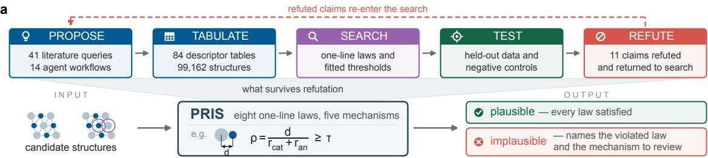

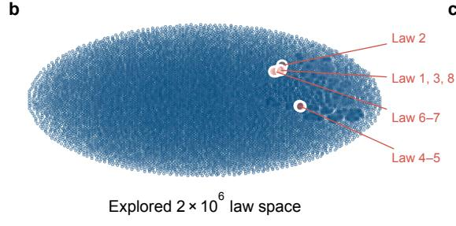

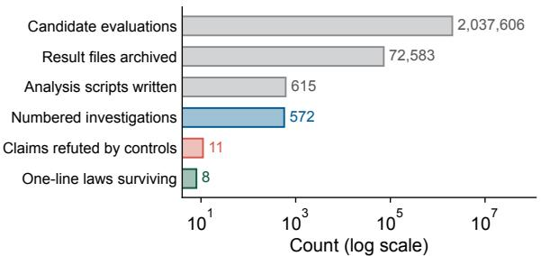

<table><tr><td colspan="2"></td><td>Set 1 hard-sphere floor</td><td>Set 1 two-sided window</td><td>Set 2 rigid-ion lattice</td><td>Set 3 ionic network</td><td>Set 4 crystal chemistry</td></tr><tr><td>Law 1</td><td>ρ≥T shortest cation-anion contact, relative to the radius sum</td><td>0.735</td><td>0.735</td><td>0.804</td><td>0.804</td><td>0.804</td></tr><tr><td>Law 2</td><td>if f &gt;0.50 then ρ≤1.05 ionicity condition: an upper bound applied only where the ionic model holds</td><td></td><td>●</td><td></td><td></td><td></td></tr><tr><td>Law 3</td><td>if mean anion CN ≤ 3.333 then mean  $\mathsf { d } / ( \mathsf { r } _ { \mathsf { c a t } } { + \mathsf { r } _ { \mathsf { a n } } } )$  ≤1.081 low-coordination structures may not also be loosely packed on average</td><td></td><td></td><td></td><td></td><td></td></tr><tr><td>Law 4</td><td>range of  $\mathsf { E } _ { \mathsf { M } } / | \boldsymbol { z } |$  across sites ≤ 31.45 no site may be electrostatically far out of line with the others</td><td></td><td></td><td></td><td></td><td></td></tr><tr><td>Law 5</td><td>max  $\mathsf { E } _ { \mathsf { M } } ( \mathsf { i } ) \leq$  15.17 no single site may have an implausible Madelung energy</td><td></td><td></td><td>•</td><td></td><td></td></tr><tr><td>Law 6</td><td>if f &gt;0.55 then no like-charge bonds charge topology: ionic compounds do not bond like to like</td><td></td><td></td><td></td><td></td><td></td></tr><tr><td>Law 7</td><td>inequivalent sites / sites ≤2/3 distinct-site bound consistent with a preference for simpler structures</td><td></td><td></td><td></td><td></td><td></td></tr><tr><td>Law 8</td><td>mean relative bond-valence deviation ≤ 0.7143 a permissive tail bound on the valence sum, the quantity of rule 2</td><td></td><td></td><td></td><td></td><td></td></tr><tr><td></td><td>satisfaction (experimental structures)</td><td>0.9919</td><td>0.9894</td><td>0.9579</td><td>0.9171</td><td>0.8180</td></tr><tr><td>damage detection</td><td></td><td>0.2890</td><td>0.3837</td><td>0.6121</td><td>0.7004</td><td>0.9111</td></tr></table>

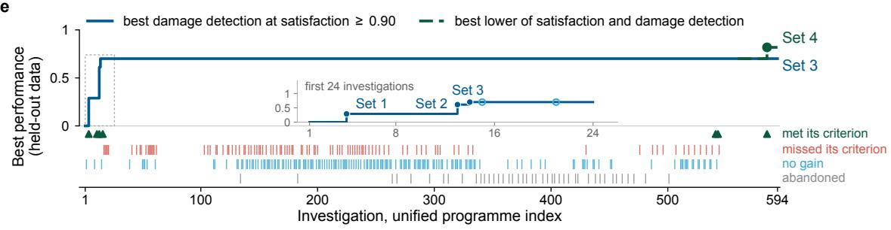  
Fig. 1 Autonomous discovery by proposal, testing and refutation. a, Pre-specified workflow: candidate-law proposal, descriptor tabulation, systematic search, held-out testing and attempted refutation. The dashed arrow returns refuted claims to the next cycle. Below, the eight surviving laws judge a candidate structure plausible or implausible. An implausible verdict names the unsatisfied law and the mechanism to review. Purple rings on the input structures mark an exchanged pair. $\mathbf { b } ,$ t-distributed stochastic neighbour embedding (t-SNE) projection of the archived one-line candidate-law statements. Blue intensity encodes the number of statements per bin on a logarithmic scale. Red circles locate the statements nearest Law 1–Law 8. c, Counts of candidate evaluations, archived result files, analysis scripts, investigations, refuted claims and surviving laws (logarithmic axis). d, Law 1–Law 8, their predicates and their membership in the five nested sets, each named for the crystal model it enforces, with held-out satisfaction and damage detection for each set. e, Running best held-out performance versus investigation index: damage detection subject to the satisfaction floor (blue) and the smaller of satisfaction and detection (green). The inset enlarges the earliest investigations, and the strip beneath shows investigation outcomes.

## 2.2 Balancing experimental-structure satisfaction with damage detection

Satisfaction is the fraction of experimental structures that satisfy a law set under the benchmark convention (details in Methods). Damage detection is the fraction of damaged structures marked implausible by at least one law. A loose law that every structure satisfies scores 100% satisfaction and 0% detection. A strict law that rejects every structure scores $0 \%$ satisfaction and 100% detection. Both measurements are needed (Fig. 2a). Charge neutrality, a composition-only baseline, detected no damage because every perturbation preserves composition. Fixed minimum-distance cutofs, which are element-blind, detected little damage.

Law 1 replaces the fixed distance with the radius-scaled reduced contact:

$$
\rho \equiv \operatorname* { m i n } _ { \mathrm { c a t i o n - a n i o n ~ c o n t a c t s } } { \frac { d } { r _ { \mathrm { { c a t } } } + r _ { \mathrm { { a n } } } } } ,\tag{1}
$$

where d is the contact distance and the denominator sums the Shannon radii [33]. A cutof fixed in $\textup { \AA }$ is a larger fraction of the radius sum for a small ion pair, and is therefore stricter for small ions. Set 1 requires $\rho \ge 0 . 7 3 5$ , the first percentile of the discovery distribution. It reached 99.2% held-out satisfaction with 28.9% damage detection. If $\rho$ is the coordinate that carries the physics, the energy cost of compression should collapse onto it across chemistries. We rigidly scaled twenty experimental compounds along $\rho .$ In plane-wave DFT the cost crossed 0.1 eV per atom at median $\rho = 0 . 9 2 7$ . Both Law 1 floors lay inside a region already costing electronvolts per atom, and the crossing was 1.80 times more tightly localised in $\rho$ than in $\textup { \AA }$ (Fig. 3c).

Together, the eight laws are:

Law 1 $\rho \geq \tau ,$

τ ∈ {0.735, 0.804},

Law 2 $f _ { \mathrm { i } } > 0 . 5 0 \implies \rho \le 1 . 0 5 ,$

Law 3 $\overline { { \mathrm { C N } } } _ { \mathrm { a n } } \leq 3 . 3 3 3 \implies \overline { { d / ( r _ { \mathrm { c a t } } + r _ { \mathrm { a n } } ) } } \leq 1 . 0 8 1 ,$

Law 4 $\begin{array} { r } { \mathrm { r a n g e } _ { i } ( E _ { \mathrm { M } } ( i ) / v _ { i } ) \le 3 1 . 4 5 \mathrm { e V } , } \end{array}$

Law 5 max $E _ { \mathrm { M } } ( i ) \leq 1 5 . 1 7 \mathrm { e V }$ i

Law 6 $f _ { \mathrm { i } } > 0 . 5 5 \implies$ no like-charge bonds,

Law 7 ninequivalent $_ { \mathrm { s i t e s } } / n _ { \mathrm { s i t e s } } \leq 2 / 3$

Law 8 $\left| \overline { { \mathrm { B V \ s u m } - v _ { i } \rvert / v _ { i } } } \le 0 . 7 1 4 3 . \right.$

Here $f _ { \mathrm { i } }$ is Pauling’s composition-based ionic-character estimate. $E _ { \mathrm { M } } ( i )$ is the site Madelung energy from an Ewald sum over formal charges. The quantity $v _ { i } = | z _ { i } |$ is the magnitude of site i’s formal charge $z _ { i }$ . BV denotes the bond valence used in the bond-valence sum. Figure 1d lists the laws in each set and their thresholds. A structure not meeting a trigger condition satisfies that conditional law. A structure lacking a required input in deployment receives no verdict rather than a pass (details in Methods).

A single contact floor encodes only the repulsive wall, but expansion lengthens rather than shortens contacts, and a cation–anion exchange can leave every coordinate unchanged. Because distinct failures can share the same closest distance, Set 2 judges the rigid-ion lattice, and Set 3 the bond network. On held-out data Set 3 reached 91.7% satisfaction and 70.0% damage detection, above 55. $. 2 \%$ in every damage class. Relative to Set 1, it detected nearly two and a half times as much damage. The cost was rejecting one experimental structure in twelve rather than one in a hundred and twenty. Set 4 trades satisfaction for detection by adding a permissive bond-valencedeviation law and an empirical distinct-site-fraction law. It reached 81.8% satisfaction and 91.1% overall detection, with at least 73.4% in every class (Fig. 2b and Supplementary Figs. S4 and S5). Set 4 detected more by combining laws that target diferent failures, not by tightening one cutof.

Neither familiar criterion reaches this balance: the distance cutof detects too little damage, whereas Pauling’s rules reject too many experimental structures. Among 5,297 held-out experimental structures, only 6.5% of the charge-balanced ionic subset satisfied rules 2–5 jointly [17, 22] (Fig. 2c). PRIS occupies the useful region between them because it reads chemistry, not because it is uniformly stricter. Each law’s mechanism or empirical hypothesis fixes the measured quantity, the failing direction and the domain. Only the revisable threshold comes from the population. Verdicts should therefore survive a change of population (Supplementary Fig. S6). Because split assignment used structure identifiers, 68.5% of held-out experimental structures shared a reduced composition with discovery. On compositions absent from discovery, frozen Set 4 still reached 82.7% experimentalstructure satisfaction and 91.9% damage detection (Supplementary Fig. S7).

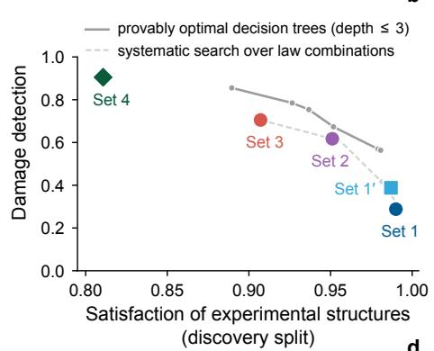  
b

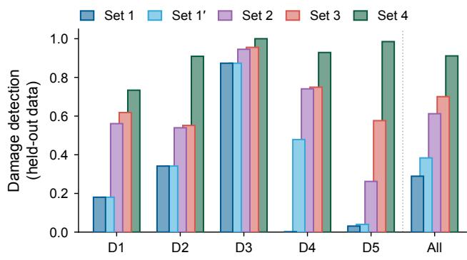

c  
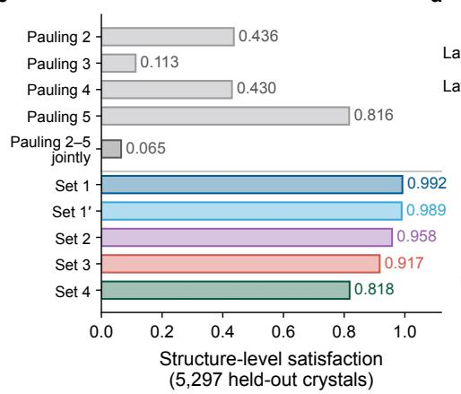  
d

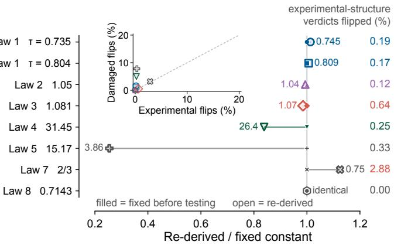  
Fig. 2 Experimental-structure satisfaction, damage detection and threshold transfer. a, Dam age detection versus satisfaction on the discovery split: the depth-limited decision-tree frontier (solid grey), the systematic search over interpretable law combinations (dashed grey) and the five law sets (colours). $\mathbf { b } ,$ Held-out damage detection by composition-preserving perturbation class and pooled (dotted divider). $\mathbf { c } ,$ Satisfaction of Pauling rules 2–5, individually and jointly (grey), and of the five law sets (colours) on the same held-out structures. d, Law thresholds re-derived at their defining percentiles on held-out data, shown as the ratio to the frozen values, with unity meaning no change. The right-hand column gives the percentage of held-out experimental-structure verdicts that change. The inset compares verdict changes for experimental and chemically damaged structures on a common percentage scale, where the dashed line marks equality. Marker shape identifies the law in both the main panel and inset.

Thresholds shifted between the splits, but verdicts changed little. At the same held-out percentiles, the contact, packing and bond-valence thresholds moved by at most 1.5%. The two electrostatic thresholds moved further (details in Methods). These larger shifts changed 5.0–7.8% of verdicts on chemically damaged structures but only 0.25–0.33% on experimental structures (inset, common 0–20% scale). Law 7 changed similar fractions in the two populations (3.2% and 2.9%, respectively; Fig. 2d). Separating mechanism from threshold keeps the laws testable rather than reducing them to an opaque fitted score. Supplementary Figs. S8, S9, S10 and S11 report split transfer, threshold and band scans, and performance by anion family.

## 2.3 From screening to diagnosis: five complementary mechanisms

Structural implausibility arises through a few physical mechanisms, and each PRIS law is written to test exactly one of them. Short-range repulsion (Law 1), ionic contact (Law 2) and packing (Law 3) describe geometry. Electrostatic balance (Law 4–Law 6), bond-valence conservation (Law 8) and crystallographic site complexity (Law 7) describe complementary chemical and symmetry constraints without imposing a hierarchy. Figure 3a shows their responses to five chemically damaged variants of $\mathrm { M g A l _ { 2 } O _ { 4 } }$ , including an Mg–Al exchange that approximates natural inverse-spinel order. Uniaxial compression lowers $\rho$ from 0.99 to 0.76, whereas isotropic expansion raises it to 1.28, beyond the 1.05 ceiling of Law 2. A cation–anion exchange leaves $\rho$ at 0.99 but creates eight like-charge bonds. No single distance quantity captures all five mechanisms. Each unsatisfied law names both the measured quantity and its mechanism.

The first mechanism, at the shortest length scale, is short-range repulsion, encoded by Law 1. Coulomb attraction varies as $1 / d ,$ whereas closed-shell repulsion rises approximately exponentially under compression [34], so a suficiently short ion pair is unlikely in an unconstrained local minimum (Fig. 3c). A floor cannot detect expansion, but in a suficiently ionic compound $( f _ { \mathrm { i } }$ above 0.50) at least one cation–anion contact should approach the radius sum [35]. Law 2 therefore marks a shortest contact beyond 1.05 times that sum as unusually open. Within this domain, 96.25% of expanded discovery-split structures exceeded that ceiling, compared with 0.62% of experimental ionic structures. Law 3 limits packing diferently: it caps the mean reduced cation–anion contact at 1.081 when mean anion coordination is at most 3.333. Low coordination with long contacts indicates an open environment, so Law 3 detects expansion without Law 2’s ionic-character requirement.

Geometry alone cannot detect a wrong-site exchange that changes no coordinate. Law 4–Law 6 instead look for three failures of electrostatic balance [36, 37]. Law 4 limits the range of site Madelung energy divided by valence magnitude. Law 5 limits the largest site Madelung energy and catches a single strongly destabilised site. For $f _ { \mathrm { i } }$ above 0.55, Law 6 permits no like-charge bond and therefore catches a cation–anion exchange that leaves the distance matrix unchanged. An Ewald sum does not test whether local bonds supply each ion’s expected valence, but Law 8 does. Bond valences decay exponentially with distance: expansion lowers a site’s sum, whereas compression or a wrongsite exchange can create an excess [38, 39]. Across discovery and held-out structures with finite values, the median of the mean relative deviation from nominal valence was 0.094 for experimental structures and 0.705 for damaged ones.

D2 cation–cation swap

satisfies all laws ρ = 0.99 · sites = 0.21 · BV = 0.04

a  
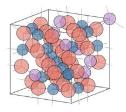

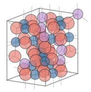

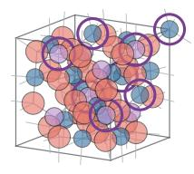  
satisfies all laws ρ = 0.92 · sites = 0.57 · BV = 0.10

c  
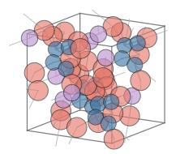

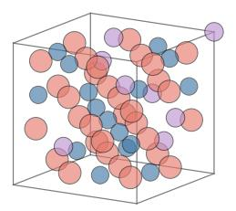

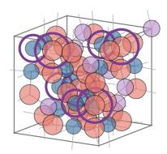

b  
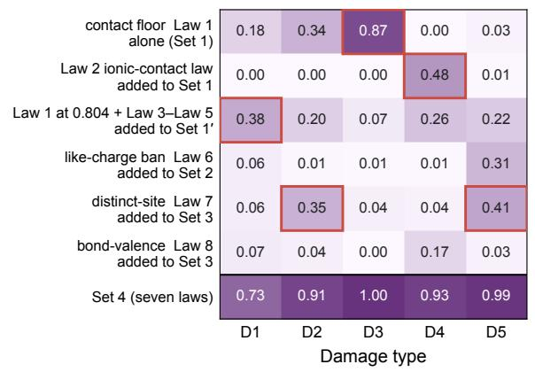

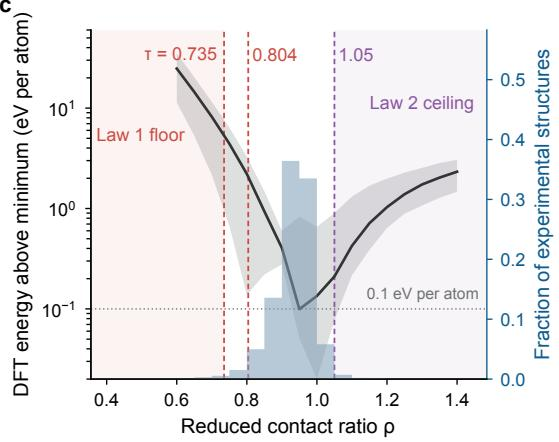  
Fig. 3 Physical basis of the PRIS plausibility laws. ${ \mathbf { a } } ,$ Experimental $\mathrm { M g A l _ { 2 } O _ { 4 } }$ and its five chemically damaged variants (uniaxial compression, cation–cation exchange, random displacement, isotropic expansion and cation–anion exchange), with the relevant descriptors and law verdicts beneath each structure (green satisfied, red unsatisfied); purple rings mark exchanged atoms. b, Held-out damage detection by perturbation class as laws are added, from Law 1 alone to Set 4; red outlines mark the combinations referenced in the text. c, DFT energy above each compound’s own minimum for twenty experimental compounds rigidly scaled along the reduced-contact coordinate $\rho$ (median and interquartile band, black, logarithmic left axis), together with the experimental distribution (blue, right axis). The two Law 1 floors and the conditional Law 2 ceiling are marked with their domains; the dotted line gives the pre-registered 0.1 eV per atom cost. Per-compound curves, the hard-potential check and the spread of the crossing in each coordinate are in Supplementary Fig. S12.

The remaining mechanism counts distinct chemical environments. Under a stated symmetry tol erance, Law 7 caps crystallographically inequivalent sites at two-thirds of all sites. Moving atoms or reassigning elements often makes equivalent environments unique, whereas experimental structures keep that fraction low. Law 7 thus turns Pauling’s preference for structural simplicity into an empirical chemical-order law. Each added mechanism fills detection gaps that the earlier laws leave open in the held-out population (Fig. 3b). Together they turn screening into diagnosis by pointing the next check at ionic size, oxidation state, site occupancy, local bonding or symmetry. Because these laws are physical rather than fitted, they should decide plausibility before any relaxation is run.

## 2.4 Screening candidates before expensive calculations

Plausibility can be decided only from quantities an unrelaxed structure already carries. In a validation queue, generators outpace the calculations that relax and rank their output, so we benchmarked PRIS against the 0.5- and 0.7-˚A cutofs used in generator pipelines [3, 15] (details in Methods). These distance cutofs detected only 1.6–3.2% of the damage. On this benchmark, Set 4 reached 83.0% satisfaction and detected 87.9% of the damage (Fig. 4a). Set 4 still detected 2.6-fold more damage than a distance cutof tightened to the same satisfaction (details in Methods). An aggregate rate could be dominated by one easily detected perturbation, but class-resolved rates ruled that out. Every mechanism detected the classes used to select it and, more tellingly, classes withheld from that selection [40–42] (Fig. 4b; details in Methods and Supplementary Figs. S13 and S14a,b).

A plausible crystal must still be made, and ranking candidates by synthesizability requires a continuous companion to the discrete PRIS laws. Our agents therefore fitted the PRIS-derived synthesis score (PSS) on development pairs of recorded and computed-only polymorphs with the same composition (details in Methods). The fitted score is

$$
\begin{array} { r l } { { \mathrm { P S S } } ( \mathbf { x } ) = \mathit { - 4 . 9 0 \widetilde { v } _ { \mathrm { a t o m } } - 1 . 2 4 \widetilde { M } _ { z } - 1 . 1 8 \widetilde { \Delta } _ { \mathrm { B V } } - 0 . 8 4 \widetilde { \eta } _ { \mathrm { s i t e } } } } \\ { \mathit { - 0 . 2 2 \widetilde { k } _ { \mathrm { m a x } } + 0 . 5 9 \widetilde { f } _ { \mathrm { i s o } } , } \quad } & { \widetilde { x } = \frac { x ^ { \dagger } - \mu _ { x } } { \sigma _ { x } } . } \end{array}\tag{2}
$$

The six terms, defined in Methods, are atomic volume, Madelung environment, bond-valence deviation, distinct-site fraction, maximum cation-polyhedron connectivity and the fraction of isolated cation polyhedra. The last two describe connectivity, and atomic volume has the dominant negative coeficient, favouring density. Refitting on random halves of the development structures reproduces the ranking and sign of every coeficient. The six terms are correlated without being redundant (Supplementary Figs. S15 and S16). A higher PSS marks a structure as easier to synthesize, and testing that interpretation requires structures unlikely to be synthesized.

Labelled examples of such structures are scarce because databases record many successes but few definitive failures. Positive–unlabelled (PU) learning estimates crystal likeness through CLscore [23, 24]. We trained two scorers on experimental structures and an unlabelled LeMat and ELEMENTA pool [43, 44]. CGCNN-PU is a crystal graph convolutional network with PU heads that learns its representation within the synthesis task. The second model, MatterSim-1M-MLP-PU, instead freezes the representations of a universal potential [45] and trains only the PU heads (details in Methods). Agreement between these distinct routes reduces the risk of a model-specific artefact. The 364,592 unique structures ranked lowest by both machine-learning models are therefore treated as the hard-to-synthesize cohort.

Set 4 and PSS answer diferent questions, and on the hard-to-synthesize cohort they proved complementary. At 80.7% experimental satisfaction, Set 4 screened 51.9% of this cohort, whereas PSS screened 83.7% (Fig. 4c and Supplementary Fig. S17a,b). A threshold on the MatterSimcomputed energy above the convex hull, $E _ { \mathrm { h u l l } }$ , screened 72.0% (details in Methods). Unlike PRIS and PSS, however, this calculation requires relaxation and a phase hull. Because agreement between the two models defines the hard-to-synthesize cohort, shared selection could create a CLscore trend that neither model shows alone. We therefore tested the CLscore–Set 4 and CLscore–PSS relations separately in each model.

Any relation with CLscore would be unexpected, because no synthesis label or PU output entered the discovery of Law 1–Law 8. Both PU models gave the same directional relation (details in Methods, Fig. 4d and Supplementary Fig. S18a–d). Across CLscore deciles, mean Set 4 violation fell from 50.3% to 30.4% while mean PSS rose from −11.37 to −0.18. Linear fits of mean PSS against decile index had $R ^ { 2 } = 0 . 9 9$ for CGCNN-PU and 0.92 for MatterSim-1M-MLP-PU. Plausibility and predicted synthesizability are linearly related across the population, but that link need not order individual structures.

Plausibility asks whether a structure could exist, whereas synthesis planning asks which credible polymorph to make [46]. Set 4 usually returned ties because several credible polymorphs satisfy the same broad laws (details in Methods and Supplementary Fig. S19a–c). Our own refutation step caught an error in the first analysis: our agents had counted ties as ranking failures, making Pauling’s rules appear anti-predictive. Our agents then proposed a symmetry explanation, but auditing the same pairs within composition refuted it. Treating ties as no decision removed the artefact. The laws delimit a plausible region without ordering it. Within that region, PSS identified the recorded polymorph in each pair with 68.1% accuracy, compared with 75.0% for DFT $E _ { \mathrm { h u l l } }$ (details in Methods). On the most confident fifth of pairs, however, PSS reached 94.4% compared with 84.4% for DFT (Fig. 4e). PSS can therefore place high-confidence candidates first and leave the closer energy comparisons to DFT.

b  
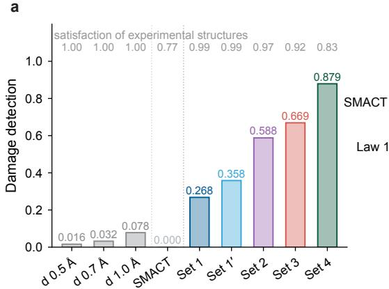

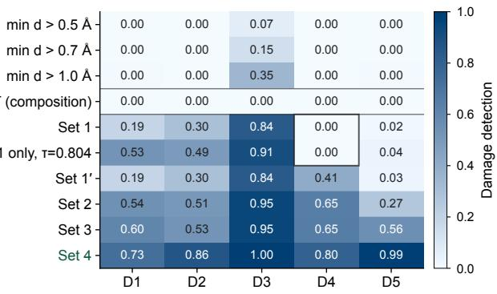

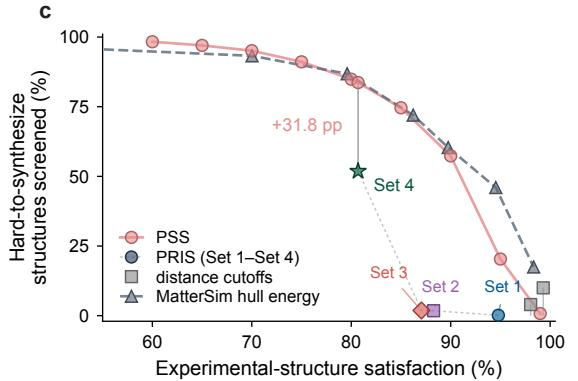

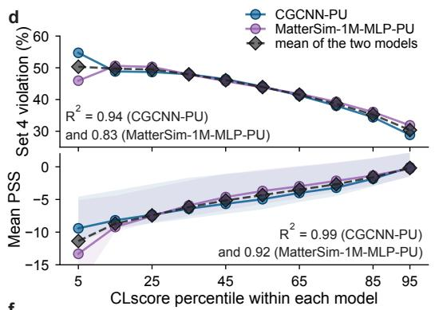

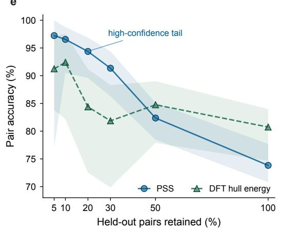

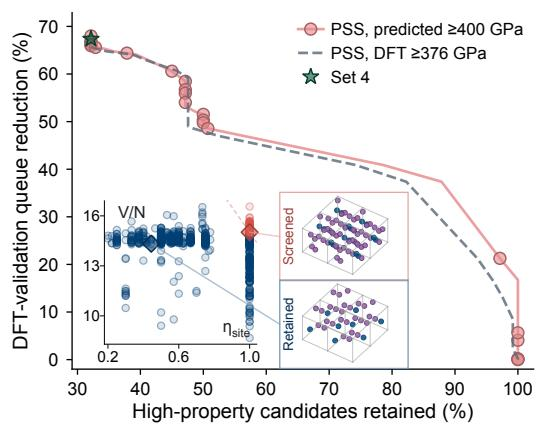  
Fig. 4 Physicochemical screening across validation tasks. ${ \mathbf { a } } ,$ Overall damage detection for fixeddistance, composition-only and successive PRIS criteria; upper labels give satisfaction. $\mathbf { b } ,$ Damage detection by perturbation class for baselines, contact laws and law sets. Outlines mark where a contact floor alone misses isotropic expansion. $\mathbf { c } ,$ Satisfaction versus the fraction of hard-to-synthesize structures screened, for Set 1–Set $^ { 4 , }$ the PSS threshold swee $\mathrm { p , }$ distance cutofs (grey squares) and a sweep over a MatterSim-computed hull-energy threshold (slate-grey triangles). Connectors join Set 4 and PSS at matched satisfaction. d, Set 4 violation and mean PSS across within-model CLscore deciles for CGCNN-PU, MatterSim-1M-MLP-PU and their pointwise mean. Shading spans each model’s interquartile PSS range. Each panel gives the coeficient of determination for each model’s straight-line fit against the decile index. $\mathbf { e } ,$ Held-out same-composition pair accuracy for PSS and DFT $E _ { \mathrm { h u l l } }$ against the fraction of most-confident pairs retained (shading, confidence intervals). $\mathbf { f } ,$ Across PSS thresholds, DFT-validation queue reduction versus retention of candidates that the universal machine-learned interatomic potential (UMA) predicts to have bulk modulus $\geq 4 0 0 \mathrm { G P a } ;$ the Set 4 operating point is marked. The inset maps distinct-site fraction against atomic volume; blue and red points denote retained and screened candidates, respectively, and diamonds link a same-composition pair to the matching structure thumbnails. The dashed slate-grey curve uses the DFT-defined high-property subset at the mapped threshold of 376 GPa among the 260 candidates evaluated from first principles (Supplementary Fig. S20).

We conditioned independently seeded MatterGen runs on a bulk modulus of 400 GPa. The runs yielded 1,081 unique, unrelaxed structures (details in Methods). UMA, a universal machinelearned interatomic potential trained on no data from this work [47], predicted each candidate’s bulk modulus and placed 140 of them at or above the target. For the generated candidates, only the site-complexity and atomic-volume terms of PSS were available. We therefore calibrated a PSS threshold on experimental structures using those two terms (details in Methods). That threshold removed 61 candidates from the queue, but because the score is continuous, it is an operating point rather than a fixed rule. Across the threshold’s range, PRIS and PSS reduce the DFT validation queue by up to 67.3%, and its setting decides how many high-property candidates survive.

We checked those UMA predictions from first principles. At the median, DFT bulk moduli for 260 candidates were 0.940 times the UMA predictions, so UMA predicted higher values. The 400-GPa UMA target maps to 376 GPa on the DFT scale, and one candidate remained above 400 GPa under DFT. Measured against that mapped threshold, a high-property candidate outranked a removed candidate 0.966 of the time, and 99.2% of that high-property subset survived a screen that cuts the queue by up to 67.3% (Fig. 4f and Supplementary Fig. S20). Under DFT relaxation, sites that difer only in unconverged coordinates should merge, never split further. On the generator’s coordinates, 61 of the 260 candidates satisfied Law 7, and after DFT relaxation, 113 satisfied it. No candidate moved in the opposite direction. Every additional Law 7 pass occurred among candidates retained by PSS (Supplementary Fig. S21).

In the inset of Fig. 4f, the 61 PSS-screened candidates (red) all passed the 0.7-˚A cutof but violated Law 7: every site was crystallographically distinct at a 0.01-˚A tolerance. Their packing was also more open than in the retained queue (details in Methods).

In a same-composition pair, the screened $\mathrm { I r } _ { 2 } \mathrm { O s } _ { 7 }$ candidate has P1 symmetry, 18 distinct sites among 18, $V / N = 1 5 . 0 1 7 \mathrm { \AA ^ { 3 } }$ and a PSS of −0.638. The retained candidate has C2/m symmetry, four distinct sites among nine, $V / N = 1 4 . 3 2 7 \mathrm { \AA ^ { 3 } }$ and a PSS of 1.245. Complete site splitting with open packing again characterises the removed structures. Because the discrete laws cannot weigh packing against site complexity, their operating points fall at two extremes. Set 1–Set 3 retained all

140 high-property candidates but reduced the queue by only 0–0.4%. Set 4 reduced it by 67.3% but lost most of those candidates (details in Methods). Within the Set 4-violating subset, PSS screened structures that combined complete site splitting with open packing. PSS retained 140 of 140 high property candidates, including every one that Set 4 would remove. These tunable PRIS and PSS operating points gave an explainable reduction of the DFT validation queue by up to 67.3%. PRIS states why a structure is questionable, and PSS sets how strongly the queue is screened.

## 2.5 Addressing controversy and identity failure in crystallography

Beyond the queue, the same laws audit structures that have already been generated and catalogued. Within every energy–phonon class, 84–89% of recorded entries satisfied Law 7, compared with 43– 66% of unrecorded entries (Supplementary Fig. S22). A crystal can therefore pass distance cutofs and release little energy on relaxation while still splitting similar environments across too many sites. Site ordering underlies both the proposed explanation for GNoME’s low-symmetry excess [2, 26] and the A-Lab debate [12, 27, 28, 48]. Law 7 measures the excessive site splitting that geometric screens omit, so we tested it first on public generators (Fig. 5).

Avoiding overlap lets similar environments split. Placing atoms on the Wyckof positions of a chosen space group keeps them equivalent. We drew 500 unrelaxed structures from each of seven public generators [4, 49–54]. The 0.7-˚A cutof used in practice passed nearly all outputs and separated no model from MP-20, the benchmark against which these generators are normally measured (details in Methods). Set 4 instead exposed a pronounced dependence on imposed symmetry (Fig. 5a). Among charge-assignable outputs, satisfaction was 0–2.5% without imposed symmetry, 29.9–46.1% with it and 64.3% for MP-20. Law 7 accounted for much of this separation: generators failed it far more often than MP-20, even after relaxation and symmetry analysis (details in Methods). Every generator in the higher-satisfaction group builds its outputs on Wyckof positions, so the construction, not the sampler, decides how many outputs satisfy Set 4.

Law 7 needs no charge assignment, so it can audit a whole catalogue. We examined 5,000 uniformly drawn GNoME structures under a pre-fixed protocol (details in Methods). Overall, 40.64% failed Law 7, including all P1 structures, with Pm and Cm structures failing nearly as often (Fig. 5b, upper; details in Methods; charge-law coverage in Supplementary Fig. S23). Severe strain could mimic this pattern, so we relaxed the same cells with MatterSim [45] to measure the energy released by real damage. For the 150 unmodified GNoME parents, the median energy released on relaxation was less than 0.001 eV per atom. Their compressed and displaced counterparts released medians of

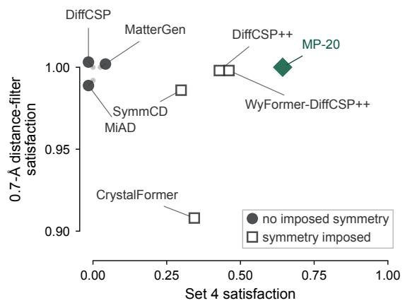

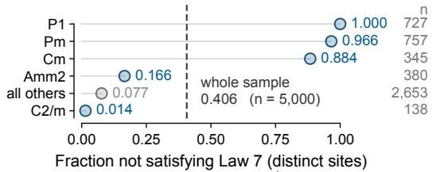

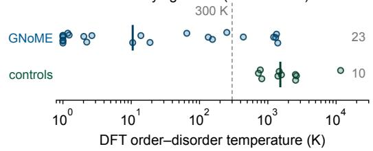

c  
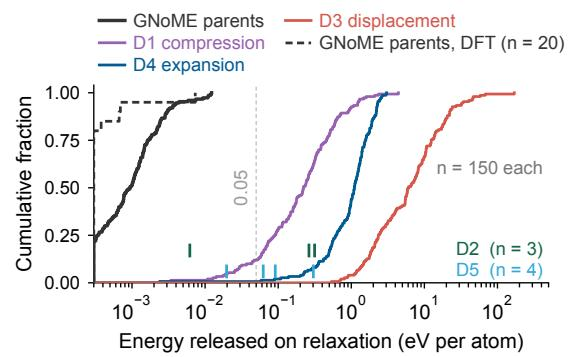  
d

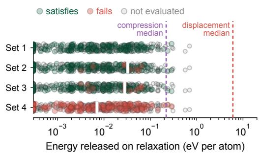

e  
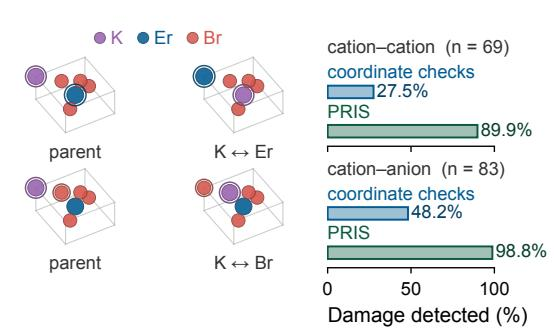  
f

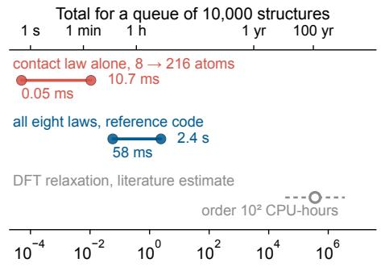  
Fig. 5 Physicochemical screening of generated and database structures. a, Minimum-distancecutof satisfaction versus Set 4 satisfaction among charge-assignable outputs from seven generators and from MP-20, the usual benchmark for these generators (green diamond). Filled circles mark generation without imposed symmetry, and open squares mark symmetry-constrained generation. Nearly coincident markers are ofset and connected to their true coordinates. b, Upper, fraction of the GNoME sample failing Law 7 by source space group; the dashed line gives the whole-sample fraction. Lower, DFT order–disorder temperatures for 23 label-merged GNoME entries and 10 experimental structures, obtained by relaxing every symmetry-distinct ordering of each entry. Vertical bars give class medians, and the dashed line marks 300 K (Supplementary Fig. S25). c, Cumulative distributions of the energy released on MatterSim relaxation for unmodified GNoME parents and their compressed, expanded and displaced counterparts. Sparse exchange classes appear as vertical marks. The dashed black curve gives the same quantity computed from first principles for twenty of these unmodified GNoME parents. Only the parents have a DFT curve because the DFT campaign’s damaged cells come from experimental parents, a diferent population (Supplementary Fig. S24). d, Relaxation-energy release for raw MatterGen outputs resolved by Set 1–Set 4 verdict. White vertical segments with pale-grey outlines mark failure-group medians; the two coloured dashed lines mark the compression and displacement medians of panel c. The energy axis keeps panel c’s logarithmic decade spacing over a shorter range. e, Fixed-coordinate cation–cation and cation–anion exchanges in one KErBr4 parent, with damage detection for four reimplemented coordinate checks and for the six PRIS laws on the same parent-matched exchanges. f, Measured CPU time per structure for Law 1 and for all eight laws, with the DFT-relaxation estimate from the literature (dashed). The upper axis converts the same values to total time for the displayed queue.

0.22 and 6.05 eV per atom, respectively (Fig. 5c). To test whether this separation reflects the structures rather than the MatterSim potential, we recomputed 200 cells with DFT. MatterSim and DFT agreed, with a Spearman rank correlation of 0.953. Under DFT, twenty unmodified GNoME parents released a median of 0.0001 eV per atom (dashed curve in Fig. 5c; Supplementary Fig. S24).

Relaxation energy measures only the distance to a local minimum. Applied to 500 raw MatterGen outputs grouped by their Set 4 verdict (details in Methods), it did not decide plausibility. Failures released a median of 0.007 eV per atom, close to the 0.006 eV per atom of the no-verdict group and far below both damage regimes (Fig. 5d). Small relaxation energy therefore rules out gross strain but not electrostatic, bond-valence or site-complexity failures. One chemical explanation remained untested: if artificial ordering creates the extra sites, merging similar species should restore equivalence.

We replaced chemically similar elements with one shared label. Of 150 sampled Law 7-failing entries, 113 contained a mergeable pair. At a symmetry tolerance of 0.1 ˚A, merging brought the distinct-site fraction to the Law 7 threshold or below in 78% of these entries. It raised the spacegroup symmetry in 79%, a change that none of 27 mergeable experimental entries showed. Artificial ordering therefore explains much of the sampled pattern and resolves the controversy for these entries: changing labels restores equivalence without moving an atom.

An artificial ordering should cost nothing to permute. We relaxed with DFT every symmetrydistinct ordering of 23 such entries and 10 experimental structures. Scrambling a GNoME entry’s ordering cost a median of 0.0001 eV per atom, compared with 0.036 eV per atom for the experimental structures. The orderings became interchangeable below 300 K in 18 of the 23 GNoME entries and in none of the experimental structures (Fig. 5b, lower, and Supplementary Fig. S25). These energies put a number on the critique that generated catalogues substitute nearly indistinguishable elements [16].

The converse error leaves the geometry intact but assigns the wrong element to a fixed site, and it has an experimental precedent. Harrison and colleagues reported at least 70 falsified structures in which genuine difraction intensity data were reused after atomic or metal identities were changed [29]. Hirshfeld rigid-bond alerts and anomalous metal–ligand distances first exposed the problem, which structure-factor comparisons then confirmed [29]. An element exchange at fixed coordinates redistributes formal charges, Madelung energies and bond valences. Because those falsifications could also alter cell parameters and delete reflections, we isolated chemical identity by exchanging species while holding the lattice and every coordinate fixed.

On these parent-matched exchanges, we compared six PRIS laws (Law 1 and Law 4–Law 8) with four reimplemented families of coordinate checks [55] (Supplementary Section S17). The coordinate checks detected 19 of 69 cation–cation exchanges (27.5%) and 40 of 83 cation–anion exchanges (48.2%). PRIS detected 62 of 69 cation–cation exchanges (89.9%) and 82 of 83 cation–anion exchanges (98.8%; Fig. 5e). PRIS catches what the coordinate checks miss because electrostatics and bond valence depend on chemical identity even when no atom moves. The same mechanisms recur in a recovered archive of retracted depositions. Four evaluable entries share one $\mathrm { M ( C _ { 2 } H _ { 2 } N _ { 3 } C l ) }$ framework, with M labelled Cu, Ni, Mn or Fe [30]. The entries all gave $\rho = 0 . 5 3$ and mean bond-valence deviations of 0.77–0.78, violating Law 1 and Law 8.

These diagnoses run on the structure as given, cheaply enough for routine use. Law 1 evaluates 10,000 cells of 6–20 atoms in under one second. All eight laws on the same 10,000-cell queue take approximately ten minutes. The literature puts a DFT relaxation at 100 CPU-hours, so the same queue would cost approximately one million CPU-hours (Fig. 5f) [1]. A full PRIS evaluation therefore costs under one millionth as much. Generators, structure-prediction workflows and autonomous laboratories can run this screen before expensive validation, and each violation names the mechanism to review.

What survives that screen still faces thermodynamic stability, dynamical stability and synthesis, three assessments that do not track one another. On published phonon data [10, 11], 35.6% of on hull structures had imaginary modes. Among recorded entries, 41.7% were metastable. Conversely, 4,271 unrecorded entries were dynamically stable and within 50 meV per atom of the hull (details in Methods). None of these assessments asks whether the arrangement is physicochemically credible at all [56–58], so plausibility comes first rather than competing with them.

## 3 Discussion

PRIS acts at three levels of decision: the validation queue, the database and the individual site. At the queue level, population-derived conditional laws bridge the restrictive Pauling rules and permissive distance cutofs. A binary screen can legitimately tie polymorphs within the plausible region, leaving PSS or energy to rank them. At the database level, Law 7 and label merging both trace part of GNoME’s low-symmetry excess to site splitting by artificial ordering, the mechanism at issue in the ordering controversy. At the site level, charge- and bond-valence-sensitive laws expose an incorrect occupant at fixed coordinates. Coordinate-based screening cannot detect this failure.

Our discovery, benchmark and external tests establish structural plausibility as an independent layer of assessment. This layer asks whether an arrangement obeys physicochemical laws at all, so it precedes thermodynamic stability, dynamical stability and synthesizability. These distinct questions cannot be collapsed into one reconciling score, so the structural-plausibility check returns a falsifiable diagnosis instead. Set 1–Set 4 demand a fuller model of the crystal as a task’s risk rises. The five mechanisms remain separate, with no imposed hierarchy, and every unsatisfied law names the failure mechanism.

The five mechanisms also reach beyond plausibility. Laws discovered without synthesis labels agree with two contrasting PU models, revealing an unexpected population-level link to predicted synthesizability. PSS turns that link into a continuous, tunable score. In inverse design, PSS weighs competing mechanisms: dense packing moderates a Law 7 warning, and the structures PSS removes combine complete site splitting with open packing. Together, PRIS and PSS link each anomaly to a measurable physical quantity and remove chemically suspect candidates before expensive computation begins. Beyond queue screening, the same verdicts can label database entries and training data. An entry missing a charge or radius receives no verdict rather than a pass, keeping uncertain entries separate from implausible ones.

Confidence in the structural-plausibility check rests on how the laws were retained. Active refutation distinguished benchmark artefacts from real physics in an autonomous-agent workflow [7, 8, 12]. Our agents operated within goals and data boundaries set by humans. Across 572 investigations and 2,037,606 candidate evaluations, active refutation rejected eleven initially successful conclusions and left eight compact laws. The preserved failure record links each surviving law to the counterexamples and checks it withstood. Reporting failed attempts has been called a condition for progress [16]. This record is that report. Backed by the record, crystal screening does not stop at a pass-or-fail verdict but explains why a structure is implausible. Through active refutation, autonomous agents can discover physicochemical laws that guide subsequent calculations and experiments.

## 4 Methods

## 4.1 Autonomous-agent workflow, model and human oversight

The autonomous programme ran under one continuous analysis protocol from 27 July to 14 August 2026. The multi-agent loop coordinated task assignment, parallel execution and result exchange but made no large language model (LLM) calls of its own. Our agents reasoned entirely by calling

Codex through our own codex-api client, which we built on the oficial OpenAI Python SDK (https://github.com/szl666/codex-api). Codex used GPT-5.6-sol as its base model. Across multiple sessions, our agents proposed hypotheses, designed and ran analyses, wrote code, constructed checks and diagnosed failed claims in a shell with data access.

Humans set the initial goal, redirected the study scope and authorised access to data reserved for later tests, but supplied no detailed scientific hypothesis. Confirmation analyses followed written procedures fixed before evaluation. Human authors verified the final outputs and retain responsibility for the reported conclusions. Agent records, eleven refuted conclusions and reproduction commands are reported in Supplementary Sections S1, S6, S9, S14 and S19. Archived scripts and feature tables reproduce the reported values.

## 4.2 First-principles verification

Four quantities on which the analysis depends were initially learned rather than computed: the contact thresholds of Law 1 and Law 2, the ordering behind GNoME’s low-symmetry excess, the damage-severity scale assigned by a machine-learned potential and the property target used to select the design queue. Each was re-derived with plane-wave DFT under a protocol frozen before any job was submitted. Calculations used VASP 6.3.0 with PBE PAW potentials, a plane-wave cutof of max(520 eV, 1.3 max ENMAX), explicit Γ-centred meshes at $0 . 2 2 \mathring { \mathrm { A } } ^ { - 1 }$ $\mathrm { E D I F F } = 1 0 ^ { - 6 } \mathrm { e V }$ and tetrahedron smearing.

The four tests measured the energy landscape along ρ, ordering energies over every symmetrydistinct merge-group configuration, relaxation-energy release for matched cells, and bulk moduli from third-order Birch–Murnaghan fits to five-point energy–volume curves. Cells were fully relaxed before the corresponding static or constant-volume calculations, and machine-learning and DFT relaxation energies used the same per-cell definition. The campaign comprised 1,917 tasks. Supplementary Section S20 gives the complete protocol, per-quantity settings, convergence and fit-sensitivity analyses. Relaxed cells for the 260 design candidates are provided as Supplementary Data.

## 4.3 Data sets and study design

Before evaluation, written protocols fixed the allowed structural quantities, data splits and success criteria. We analysed 99,162 experimental structures from the Inorganic Crystal Structure Database (ICSD) and the Crystallography Open Database (COD) [31, 32]. For law discovery, a seeded hash of each structure identifier assigned eligible ionic structures to discovery, held-out or reserve partitions.

Every damaged structure inherited its experimental parent’s assignment. The split therefore separated structures rather than chemistries: two structures with the same reduced composition could fall in diferent partitions.

Thresholds were fitted on 12,632 experimental and 8,590 damaged discovery structures, then assessed on 5,297 experimental and 3,612 damaged held-out structures without refitting. We additionally evaluated the frozen law sets on held-out reduced compositions absent from discovery. Damaged structures inherited their parent’s composition, and uncertainty was clustered by reduced composition. After law-set selection, a split-labelling error allowed reserve structures into one fullsample threshold fit, so the reserve no longer constitutes a fully independent final test. Database inventories, licences, the composition-unseen analysis and the reserve incident are reported in Supplementary Sections S2, S8 and S19.

## 4.4 Structural descriptors and law-set evaluation

We computed every Law 1–Law 8 quantity under a fixed convention. Formal oxidation states were assigned from composition by integer charge balancing [59]. Where noted, external analyses used a non-integer mean-valence fallback without refitting any law. Native CIF oxidation annotations and bond-length-based valence inference were excluded to prevent bond lengths from entering both charge assignment and bond-valence evaluation. Primary neighbours came from CrystalNN [60] in pymatgen [61], and Law 7 used spglib [62] with symprec=0.01. Discovery used deposited cells, whereas external comparisons involving Law 7 used a common primitive-cell convention.

Each law combines a structural quantity with a directional threshold and, where needed, an explicit chemical condition. For benchmark rates, an unavailable measurement counted as satisfying that law under the frozen convention, and only features available for more than 90% of experimental structures were admitted to the search. In deployment, a missing charge, radius or other required input instead produces a separate no-verdict outcome. Any violation among the evaluable laws marks the structure implausible. Full descriptor definitions, radius and bond-valence lookups, alternativeneighbour checks, missing-input rules, cell conventions and the equations for Law 1–Law 8 are in Supplementary Sections S3, S17 and S18.

## 4.5 Chemically damaged structures and law selection

The damaged structures came from five perturbations that preserved composition, stoichiometry and atom count: uniaxial compression, cation–cation exchange, random displacement, isotropic expansion and cation–anion exchange. We measured their physical and energetic severity with independent contact, electrostatic and MatterSim-relaxation checks. We selected laws to maximise damage detection subject to an experimental-structure satisfaction floor. Fixed Set 4 was then evaluated once on held-out data and compared with a provably optimal decision tree within the tested depth-three class. A separate threshold-transfer analysis re-derived each continuous cutof at the corresponding held-out percentile and measured the resulting verdict changes.

For leave-one-damage-class-out evaluation, we reran tree and single-threshold selection in full. For Set 4 we reselected only its additions on a Set 3 base that had already seen all five classes, so this variant tests transfer of the added mechanisms, not de novo discovery. The distance-cutof benchmark compared PRIS against fixed 0.5- and 0.7-˚A cutofs and one matched to Set 4 satisfaction, using 440 experimental structures and 2,024 composition-preserving damaged variants. Exact perturbation operators, search grids, physical checks, omitted-class boundaries and threshold-transfer results are in Supplementary Sections S4, S5, S7, S10, S11, S12, S17 and S18.

## 4.6 External evaluation, synthesizability screening and statistics

With PRIS thresholds fixed, external evaluation covered GNoME and seven crystal generators, similar-element merging, MatterSim relaxation, coordinate-based checks and historical falsified depositions. Following a protocol fixed before computation, we sampled 5,000 of the 554,054 released GNoME structures. We separately relaxed 500 raw MatterGen outputs and compared thermodynamic stability, dynamical stability and experimental record across 26,600 Materials Project structures. Same-composition ranking covered 18,920 pairs spanning 1,508 compositions. We weighted compositions equally, excluded ties from binary accuracy and used composition-cluster bootstrap intervals.

PSS was fitted on development compositions as an antisymmetric, zero-intercept logistic score of the six standardised descriptors in equation 2, with frozen development-set medians for unavailable descriptors. The score was evaluated once on held-out compositions before transfer. To test synthesizability trends, we trained a 50-bag CGCNN-PU model on 99,162 experimental and 8,125,976 unlabelled structures. We independently trained 50 MLP PU heads on frozen 128-dimensional MatterSim-v1.0.0-1M representations [23, 24, 45]. Consensus between the two models defined the hard-to-synthesize cohort. For inverse design, 13 independently seeded MatterGen runs conditioned on a 400 GPa bulk modulus yielded 1,081 unique candidates. Independent UMA bulk-modulus predictions defined the high-property subset, and 541 experimental high-property structures fixed the screening threshold on the two PSS descriptors available for the candidates. Supplementary Sections S13, S15, S16, S17 and S19 give the data sets, descriptors, imputation, coeficients, mode validation, phase-hull construction, inverse-design checks and statistical procedures.

Data availability. Entries from the Inorganic Crystal Structure Database are not redistributable under the terms of the FIZ Karlsruhe licence and the European Union sui generis database right, and ELEMENTA is distributed under CC-BY-NC-4.0. The public benchmark released with this work is therefore built exclusively on the Crystallography Open Database (CC0). Derived scalar features, split assignments and all numerical results underlying the figures are provided as source data. The 260 design candidates relaxed with density functional theory in this work are provided as Supplementary Data: one CIF per candidate, with an index giving its composition, its space group and distinct-site fraction both as generated and after relaxation, its synthesizability score, and its computed bulk modulus.

Code availability. All analysis code, the pre-registration document and the figure-generation scripts are available at https://github.com/AI4QC/PRIS.

## References

[1] Jain, A. et al. Commentary: The Materials Project: a materials genome approach to accelerating materials innovation. APL Materials 1, 011002 (2013).

[2] Merchant, A. et al. Scaling deep learning for materials discovery. Nature 624, 80–85 (2023).

[3] Xie, T., Fu, X., Ganea, O.-E., Barzilay, R. & Jaakkola, T. Crystal difusion variational autoencoder for periodic material generation. International Conference on Learning Representations (ICLR) (2022).

[4] Jiao, R. et al. Crystal structure prediction by joint equivariant difusion. Advances in Neural Information Processing Systems (NeurIPS), Vol. 36 (2023).

[5] Sriram, A., Miller, B. K., Chen, R. T. Q. & Wood, B. M. FlowLLM: flow matching for material generation with large language models as base distributions. Advances in Neural Information Processing Systems (NeurIPS), Vol. 37 (2024).

[6] Antunes, L. M., Butler, K. T. & Grau-Crespo, R. Crystal structure generation with autoregressive large language modeling. Nature Communications 15, 10570 (2024).

[7] Boiko, D. A., MacKnight, R., Kline, B. & Gomes, G. Autonomous chemical research with large language models. Nature 624, 570–578 (2023).

[8] M. Bran, A. et al. Augmenting large language models with chemistry tools. Nature Machine Intelligence 6, 525–535 (2024).

[9] Bartel, C. J. et al. New tolerance factor to predict the stability of perovskite oxides and halides. Science Advances 5, eaav0693 (2019).

[10] Petretto, G. et al. High-throughput density-functional perturbation theory phonons for inorganic materials. Scientific Data 5, 180065 (2018).

[11] Zhu, Z. et al. A high-throughput framework for lattice dynamics. npj Computational Materials 10, 258 (2024).

[12] Szymanski, N. J. et al. An autonomous laboratory for the accelerated synthesis of inorganic materials. Nature 624, 86–91 (2023).

[13] Court, C. J., Yildirim, B., Jain, A. & Cole, J. M. 3-D inorganic crystal structure generation and property prediction via representation learning. Journal of Chemical Information and Modeling 60, 4518–4535 (2020).

[14] Miller, B. K., Chen, R. T. Q., Sriram, A. & Wood, B. M. FlowMM: generating materials with Riemannian flow matching. Proceedings of the 41st International Conference on Machine Learning (ICML), Vol. 235 of Proceedings of Machine Learning Research, 35664–35686 (PMLR, 2024).

[15] Betala, S. et al. LeMat-GenBench: a unified evaluation framework for crystal generative models (2025). arXiv:2512.04562.

[16] Smit, B. & Garcia, S. The data-only illusion in materials discovery. Nature Materials 25, 1290–1292 (2026).

[17] Pauling, L. The principles determining the structure of complex ionic crystals. Journal of the American Chemical Society 51, 1010–1026 (1929).

[18] Goldschmidt, V. M. Die Gesetze der Krystallochemie. Naturwissenschaften 14, 477–485 (1926).

[19] Pettifor, D. A chemical scale for crystal-structure maps. Solid State Communications 51, 31–34 (1984).

[20] Zunger, A. Systematization of the stable crystal structure of all AB-type binary compounds: a pseudopotential orbital-radii approach. Physical Review B 22, 5839–5872 (1980).

[21] Hawthorne, F. C. The structure hierarchy hypothesis. Mineralogical Magazine 78, 957–1027 (2014).

[22] George, J. et al. The limited predictive power of the Pauling rules. Angewandte Chemie International Edition 59, 7569–7575 (2020).

[23] Jang, J., Gu, G. H., Noh, J., Kim, J. & Jung, Y. Structure-based synthesizability prediction of crystals using partially supervised learning. Journal of the American Chemical Society 142, 18836–18843 (2020).

[24] Song, Z., Lu, S., Ju, M., Zhou, Q. & Wang, J. Accurate prediction of synthesizability and precursors of 3D crystal structures via large language models. Nature Communications 16, 6530 (2025).

[25] Griesemer, S. D. et al. Wide-ranging predictions of new stable compounds powered by recommendation engines. Science Advances 11, eadq1431 (2025).

[26] Cheetham, A. K. & Seshadri, R. Artificial intelligence driving materials discovery? Perspective on the article: Scaling deep learning for materials discovery. Chemistry of Materials 36, 3490– 3495 (2024).

[27] Leeman, J. et al. Challenges in high-throughput inorganic materials prediction and autonomous synthesis. PRX Energy 3, 011002 (2024).

[28] Szymanski, N. J. et al. Author correction: An autonomous laboratory for the accelerated synthesis of inorganic materials. Nature 650, E1 (2026).

[29] Harrison, W. T. A., Simpson, J. & Weil, M. Editorial. Acta Crystallographica Section E 66, e1–e2 (2010). Retraction of seventy falsified crystal structures.

[30] IUCr Editorial Ofice. Retraction of articles. Acta Crystallographica Section E: Structure Reports Online 68, e10–e11 (2012).

[31] Zagorac, D., M¨uller, H., Ruehl, S., Zagorac, J. & Rehme, S. Recent developments in the Inorganic Crystal Structure Database: theoretical crystal structure data and related features. Journal of Applied Crystallography 52, 918–925 (2019).

[32] Graˇzulis, S. et al. Crystallography Open Database – an open-access collection of crystal structures. Journal of Applied Crystallography 42, 726–729 (2009).

[33] Shannon, R. D. Revised efective ionic radii and systematic studies of interatomic distances in halides and chalcogenides. Acta Crystallographica Section A 32, 751–767 (1976).

[34] Born, M. & Mayer, J. E. Zur Gittertheorie der Ionenkristalle. Zeitschrift f¨ur Physik 75, 1–18 (1932).

[35] Hawthorne, F. C. Crystal chemistry: new rules for the 21st century. Mineralogical Magazine 90, 503–528 (2026).

[36] Ewald, P. P. Die Berechnung optischer und elektrostatischer Gitterpotentiale. Annalen der Physik 369, 253–287 (1921).

[37] Hoppe, R. Efective coordination numbers (ECoN) and mean fictive ionic radii (MEFIR). Zeitschrift f¨ur Kristallographie 150, 23–52 (1979).

[38] Brown, I. D. Recent developments in the methods and applications of the bond valence model. Chemical Reviews 109, 6858–6919 (2009).

[39] Brese, N. E. & O’Keefe, M. Bond-valence parameters for solids. Acta Crystallographica Section B 47, 192–197 (1991).

[40] Geirhos, R. et al. Shortcut learning in deep neural networks. Nature Machine Intelligence 2, 665–673 (2020).

[41] Torralba, A. & Efros, A. A. Unbiased look at dataset bias. Proceedings of the 2011 IEEE Conference on Computer Vision and Pattern Recognition (CVPR), 1521–1528 (IEEE, 2011).

[42] Lapuschkin, S. et al. Unmasking Clever Hans predictors and assessing what machines really learn. Nature Communications 10, 1096 (2019).

[43] Ramlaoui, A. et al. LeMat-Traj: a scalable and unified dataset of materials trajectories for atomistic modeling (2025). arXiv:2508.20875.

[44] Kairos Materials. ELEMENTA: Toward unbiased scaling of materials data from first principles. Hugging Face dataset, https://huggingface.co/datasets/kairosmaterial/ELEMENTA (2025). Public release of approximately 39 million density-functional-theory frames; distributed under CC-BY-NC-4.0.

[45] Yang, H. et al. MatterSim: a deep learning atomistic model across elements, temperatures and pressures (2024). arXiv:2405.04967.

[46] Zeng, Y. et al. Selective formation of metastable polymorphs in solid-state synthesis. Science Advances 10, eadj5431 (2024).

[47] Wood, B. M. et al. UMA: a family of universal models for atoms (2025). arXiv:2506.23971.

[48] Yamazaki, S., Huang, Y., Petersen, M. H., Nong, W. & Hippalgaonkar, K. Navigating order– (dis)order family trees via group–subgroup transitions (2026). arXiv:2604.21386.

[49] Zeni, C. et al. A generative model for inorganic materials design. Nature 639, 624–632 (2025).

[50] Okhotin, A. et al. MiAD: mirage atom difusion for de novo crystal generation (2025). arXiv:2511.14426.

[51] Jiao, R., Huang, W., Liu, Y., Zhao, D. & Liu, Y. Space group constrained crystal generation. International Conference on Learning Representations (ICLR) (2024).

[52] Cao, Z., Luo, X., Lv, J. & Wang, L. Space group informed transformer for crystalline materials generation. Science Bulletin 70, 3522–3533 (2025).

[53] Levy, D. et al. SymmCD: symmetry-preserving crystal generation with difusion models. International Conference on Learning Representations (ICLR) (2025).

[54] Kazeev, N. et al. Wyckof Transformer: generation of symmetric crystals. Proceedings of the 42nd International Conference on Machine Learning (ICML), Vol. 267 of Proceedings of

Machine Learning Research, 29495–29526 (PMLR, 2025).

[55] Spek, A. L. Structure validation in chemical crystallography. Acta Crystallographica Section D 65, 148–155 (2009).

[56] Sun, W. et al. The thermodynamic scale of inorganic crystalline metastability. Science Advances 2, e1600225 (2016).

[57] Aykol, M., Dwaraknath, S. S., Sun, W. & Persson, K. A. Thermodynamic limit for synthesis of metastable inorganic materials. Science Advances 4, eaaq0148 (2018).

[58] Antoniuk, E. R. et al. Predicting the synthesizability of crystalline inorganic materials from the data of known material compositions. npj Computational Materials 9, 155 (2023).

[59] Jablonka, K. M., Ongari, D., Moosavi, S. M. & Smit, B. Using collective knowledge to assign oxidation states of metal cations in metal–organic frameworks. Nature Chemistry 13, 771–777 (2021).

[60] Zimmermann, N. E. R. & Jain, A. Local structure order parameters and site fingerprints for quantification of coordination environment and crystal structure similarity. RSC Advances 10, 6063–6081 (2020).

[61] Ong, S. P. et al. Python Materials Genomics (pymatgen): a robust, open-source Python library for materials analysis. Computational Materials Science 68, 314–319 (2013).

[62] Togo, A., Shinohara, K. & Tanaka, I. Spglib: a software library for crystal symmetry search. Science and Technology of Advanced Materials: Methods 4, 2384822 (2024).

Acknowledgements. We gratefully acknowledge financial support from the HKUST Start-up Fund. We thank HKUST Fok Ying Tung Research Institute and National Supercomputing Center in Guangzhou Nansha Sub-center for computational resources.

Author contributions. Z.S. and L.C. conceived the study. Z.S. built the agent workflow, analysed the results, performed the density functional theory calculations and wrote the manuscript. L.C. supervised the study and revised the manuscript.

Competing interests. The authors declare no competing interests.