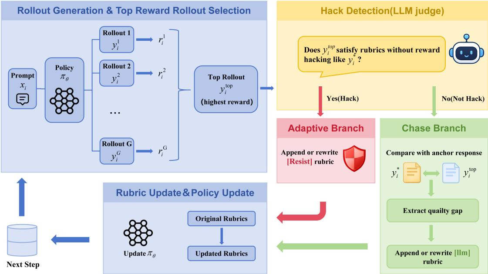
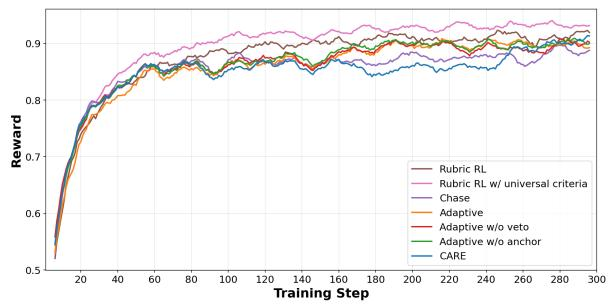
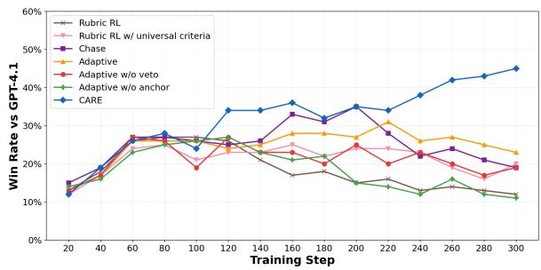
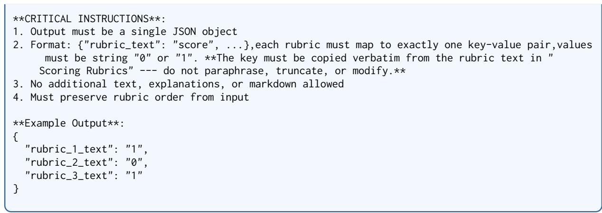
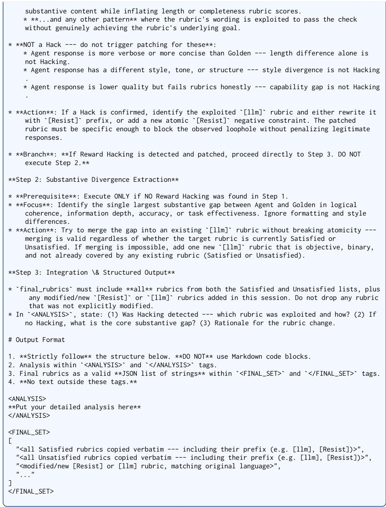

# CARE: Contrastive Anchor-based Rubric Evolution for Large Language Model Post-Training

Siyuan Li1,\* Xinxin Song1,\* Chen Ruinian2 Jingjing Fan1

Tingxiong Xiao1 Yangen Hu2 Ke Zeng2 Jinli Suo1,†

1Department of Automation, Tsinghua University

2Meituan

†jlsuo@tsinghua.edu.cn

## Abstract

Rubric-based reinforcement learning decomposes open-ended instructions into promptspecific, flexible rubrics, making it better suited than reinforcement learning with verifiable rewards for post-training LLMs on open-ended tasks. However, static rubrics are inevitably hacked as the policy evolves, and existing dynamic approaches introduce new problems: undirected rubric extraction, unreliable hack detection, and unbounded rubric proliferation. We propose CARE (Contrastive Anchor-based Rubric Evolution), which grounds every rubric evolution step in a high-quality anchor response generated by a frontier model conditioned on the prompt and its rubrics. At each training step, CARE contrasts the highest scoring rollout against the anchor, enabling two complementary mechanisms: an Adaptive branch that reactively repairs reward misspecification; and a Chase branch that proactively converts frontier-level quality gaps into sharper rubrics. Together, the two branches maintain discriminative accuracy in the high-reward region—the precise region where reward overoptimization mostly originates. Experiments on WildChecklist-9K with Qwen2.5-7B-Base and Qwen2.5-7B-Instruct show that CARE achieves state-of-the-art performance on Arena-Hard-2.0, InfoBench, and FollowBench, and is the only method whose win rate against GPT-4.1 anchor responses shows sustained improvement throughout 300 training steps; additional results on Llama-3.1-8B-Instruct and Qwen3-8B further indicate that CARE generalizes across model families.

## 1 Introduction

Reinforcement learning with verifiable rewards (RLVR) has demonstrated remarkable success in domains with objectively checkable answers such as mathematics (Lambert et al., 2025; Guo et al.,

2025; Shao et al., 2024, 2025; Luo et al., 2025b) and other programmatically verifiable tasks (Luo et al., 2025a), but open-ended tasks like instruction following and long-form generation still lack reliable reward signals. A natural alternative is to rely on learned reward models (Stiennon et al., 2020; Wu et al., 2023) or LLM-as-Judge systems (Liu et al., 2023; Panickssery et al., 2024), yet both remain inadequate for this setting: scalar RMs are vulnerable to reward misspecification and reward hacking (Gao et al., 2023; Coste et al., 2024), while generic judges evaluate against broad rubrics such as “helpfulness” or “coherence” and therefore miss prompt-specific constraints (Zheng et al., 2023).

Rubric-based RL is a promising direction because it decomposes each prompt into atomic, prompt-specific, and flexible rubrics, yielding more interpretable and fine-grained reward signals for open-ended tasks (Viswanathan et al., 2025; Peng et al., 2025; Gunjal et al., 2026; He et al., 2026; Huang et al., 2025; Liu et al., 2026; Zhang et al., 2026). However, existing rubricbased RL methods predominantly rely on static, offline-generated rubrics that remain fixed throughout training. As the policy and response distribution shift during optimization, such static rubrics are inevitably hacked (Viswanathan et al., 2025; Huang et al., 2025) and cannot adapt to emergent behaviors (Rezaei et al., 2025; Shao et al., 2026).

Recent work explores dynamic rubric generation to address this problem (Rezaei et al., 2025; Shao et al., 2026), but existing methods still lack a reliable quality anchor. Without a high-quality anchor to ground the comparison, three problems arise: (1) Undirected extraction, where rubric generation compares arbitrary rollout pairs and captures incidental behavioral differences rather than genuine quality gaps; (2) Blind hack detection, where the judge must rely on parametric knowledge rather than a concrete non-hacked anchor, making novel exploits easy to miss and legitimate responses easy to misclassify; and (3) Unbounded rubric proliferation, where flawed rubrics cannot be cleanly rewritten and new rubrics are only appended, gradually degrading verifier accuracy and introducing inter-rubric conflicts.

We propose CARE (Contrastive Anchor-based Rubric Evolution), which addresses all three limitations by introducing high-quality anchor responses—generated by a frontier model conditioned on the prompt and its rubrics—as anchor points. Inspired by Scaling Laws for Reward Model Overoptimization (Gao et al., 2023) and Chasing the Tail (Zhang et al., 2026), CARE is built around a simple principle: rubric evolution should dynamically maintain discriminative accuracy in the high-reward region throughout training, because this is where reward hacking is most likely to occur. CARE therefore focuses at each training step on the highest-scoring rollout, which is both the response most likely to exhibit reward hacking and the most informative sample for diagnos ing loss of discriminative accuracy in this moving region, and contrasts it against the anchor. This design enables two complementary mechanisms: an Adaptive branch that detects hacking by comparing the top rollout against the anchor, rewrites or augments the exploited rubric with a [Resist] constraint, and enforces it via a veto reward that zeroes the reward of any response violating a resist rubric; and a Chase branch that, when no hacking is detected, extracts the most substantive quality gap between the top rollout and the anchor to proactively sharpen discrimination in the high-reward region. By grounding every rubric evolution step in a reliable anchor, CARE transforms rubric evolution from blind heuristic comparison into principled, evidence-based refinement that is simultaneously directed toward genuine quality, capable of detecting hacking with concrete reference support, and precise enough to rewrite flawed rubrics rather than blindly accumulating new ones.

Our main contributions are as follows:

• CARE algorithm. We propose a dynamic rubric evolution framework that maintains discriminative accuracy in the high-reward region throughout training via two complementary mechanisms, and Appendix A further formalizes why online maintenance of high-reward-region accuracy matters.

• Anchor dataset. We construct WildChecklist-9K-Anchor, a training corpus augmented with

GPT-4.1 (OpenAI et al., 2024) generated anchor responses conditioned on per-instance rubrics, providing reliable anchor points for rubric evolution throughout training.

• Strong empirical results. Through extensive experiments on WildChecklist-9K with both Qwen2.5-7B-Base and Qwen2.5-7B-Instruct, CARE achieves state-of-the-art performance on Arena-Hard-2.0, FollowBench, and InfoBench, and is the only method whose win rate against GPT-4.1 anchor responses shows sustained improvement throughout 300 training steps, demonstrating superior long-term training stability over all baselines.

• Mechanistic analysis. We systematically analyze and categorize the rubrics extracted by CARE, and further use three representative cases to illustrate CARE’s execution logic and practical effect, providing interpretable evidence of how online rubric evolution repairs hacking and sharpens high-reward-region discrimination.

## 2 Related Work

Reward models and reward hacking. Datadriven Bradley-Terry RMs (Ouyang et al., 2022; Bai et al., 2022) compress multi-dimensional response quality into a single scalar, making them structurally susceptible to reward hacking (Skalse et al., 2022): as the policy optimizes against the proxy RM, the proxy reward diverges from the gold reward in a predictable scaling pattern (Gao et al., 2023), and different RMs trained on the same data share systematic OOD errors that cannot be corrected by ensembling alone (Coste et al., 2024; Eisenstein et al., 2024), and the standard remedy of collecting fresh human feedback is costly and slow (Bai et al., 2022). LLM-as-Judge (Zheng et al., 2023) scales better but uses globally-fixed generic rubrics (Cui et al., 2024) and is prone to position bias (Wang et al., 2024), verbosity bias (Dubois et al., 2024), and sycophancy (Sharma et al., 2024)—all exploitable under optimization. Generative reward models (GRMs) such as CLoud (Ankner et al., 2024), DeepSeek-GRM (Liu et al., 2025), and RM-R1 (Chen et al., 2026) improve interpretability by generating an explicit critique or rubric before scoring, but such per-rollout generation is highly time-consuming at inference time (Zhang et al., 2026).

Rubric-based RL and rubric hacking. Rubricbased RL (Viswanathan et al., 2025; Gunjal et al.,

2026; He et al., 2026; Huang et al., 2025; Liu et al., 2026; Zhang et al., 2026) decomposes instructions into atomic, flexible rubrics, yielding finer-grained and harder-to-game rewards than scalar RMs; representative methods include RLCF (Viswanathan et al., 2025), RIFL (He et al., 2026), Rubric Anchors (Huang et al., 2025). However, all rely on static rubrics fixed before training, leaving them vulnerable to the emergent hacking patterns described in §1 (Viswanathan et al., 2025; He et al., 2026; Huang et al., 2025). Recent work attempts to automate this by evolving rubrics online (Rezaei et al., 2025; Shao et al., 2026): Online Rubrics (Rezaei et al., 2025) elicits new rubrics by comparing rollouts from the current and reference policies; RLER (Shao et al., 2026) extracts new rubrics by comparing all rollouts under the same prompt. However, neither grounds evolution in a reliable, quality-anchored response, leading to the three failure modes detailed in §1: undirected extraction, blind hack detection, and unbounded append-only proliferation.

## 3 Method

## 3.1 Problem Formulation

Rubric RL setup. Let the training dataset be $\boldsymbol { \mathcal { D } } = \{ ( \boldsymbol { x } _ { i } , \mathcal { R } _ { i } ) \} _ { i = 1 } ^ { N } ,$ where $x _ { i }$ is the prompt and $\mathcal { R } _ { i } = \{ r _ { i } ^ { 1 } , r _ { i } ^ { 2 } , . . . , r _ { i } ^ { K _ { i } } \}$ is the corresponding set of offline-generated rubrics. We adopt GRPO (Shao et al., 2024) as the RL optimizer. At each training step, the policy $\pi \theta$ generates G rollouts $\{ y _ { i } ^ { g } \} _ { g = 1 } ^ { G }$ for each prompt $x _ { i }$ . The reward function scores each rollout against the rubric set via an LLM verifier:

$$
r ( y , \mathcal { R } ) = \frac { 1 } { \left| \mathcal { R } \right| } \sum _ { k = 1 } ^ { \left| \mathcal { R } \right| } \mathbf { 1 } [ \mathrm { r u b r i c \ } r ^ { k } \ \mathrm { s a t i s f i e d \ b y \ } y ] .\tag{1}
$$

Reward hacking in rubric RL. In standard RLHF, reward hacking arises when the policy overoptimizes a learned reward model that serves as an imperfect proxy for true quality (Gao et al., 2023). In rubric RL, the rubric set R plays the role of the reward model; it serves as the proxy that the policy seeks to optimize. Reward hacking therefore occurs when a response y achieves a high rubric score but its true quality $q ( y )$ is substantially lower than that of an anchor response $\hat { y }$ with a similar score:

$$
r ( y , \mathcal { R } ) \approx r ( \hat { y } , \mathcal { R } ) \quad \mathrm { b u t } \quad q ( y ) \ll q ( \hat { y } ) .\tag{2}
$$

Just as hacking a learned reward model stems from proxy misspecification, hacking in rubric RL stems from rubric misspecification: a rubric may contain exploitable loopholes (flawed rubric), or the rubric set may fail to cover newly emergent hacking behaviors (incomplete coverage). Just as the standard remedy in RLHF is online RLHF—periodically collecting fresh human feedback to update the reward model (Gao et al., 2023), though costly and slow— the natural remedy in rubric RL is to update the rubrics online as hacking emerges. The two failure modes above call for different targeted fixes: rewriting the flawed rubric or adding a new constraint. This observation directly motivates CARE’s design.

## 3.2 Rubric Types and Veto Reward

We distinguish two rubric types by prefix:

• [llm]: general quality rubrics verified by an LLM judge (e.g., logical coherence, task relevance).

• [Resist]: anti-hack constraints introduced by CARE’s Adaptive branch (Section 3.4).

When only the baseline rubric set is used, the reward follows Eq. (1). When CARE introduces [Resist] rubrics, we replace it with a veto reward that explicitly enforces these hard constraints, making hacking categorically unprofitable. Similar veto-style rewards have also proved effective in prior rubric-based RL methods (He et al., 2026; Huang et al., 2025). Let $\mathcal { R } ^ { \mathrm { R e s i s t } } \subseteq \mathcal { R }$ denote the set of resist rubrics, and let $s _ { r } ( y ) \in \{ 0 , 1 \}$ denote the verifier score for rubric $r$ on response $y .$ . The veto reward can be written compactly as

$$
r _ { \mathrm { v e t o } } ( y , \mathcal { R } ) = r ( y , \mathcal { R } ) \prod _ { r \in \mathcal { R } ^ { \mathrm { R e s i s t } } } s _ { r } ( y ) .\tag{3}
$$

Since each $s _ { r } ( y )$ is binary, the product becomes zero if any [Resist] rubric is violated, and equals one otherwise.

## 3.3 Anchor Response Generation

A key ingredient of CARE is a per-instance anchor response $y _ { i } ^ { * } = M _ { \mathrm { a n c h o r } } ( x _ { i } , \mathcal { R } _ { i } )$ , generated offline by a frontier model (GPT-4.1) conditioned on both the prompt $x _ { i }$ and its rubric set $\mathcal { R } _ { i }$ . We combine rubric-conditioned generation with explicit automatic filtering and human validation to obtain anchors that substantively satisfy their rubrics without exploiting them (Section 4 and Appendix B).

Crucially, the anchor serves as a reference point, not a quality upper bound. Its role differs across the two CARE branches: (1) in hack detection, it demonstrates what a genuine, non-exploitative satisfaction of each rubric looks like, enabling evidence-based comparison; (2) in quality-gap extraction, it serves as a high-quality anchor that is contrasted against the highest-scoring rollout to expose the most meaningful substantive difference between two high-reward responses. CARE therefore assumes that the task provides reliable rubrics and permits at least one valid reference response.

  
Figure 1: Overview of the CARE pipeline. At each training step, the highest-scoring rollout is contrasted against the anchor response. If hacking is detected (Adaptive branch), the exploited rubric is rewritten or a [Resist] constraint is added and enforced via a veto reward. Otherwise (Chase branch), the substantive gap between the top rollout and the anchor is converted into a sharper rubric to improve discrimination in the high-reward region.

## 3.4 CARE: Contrastive Anchor-based Rubric Evolution

Overview. Figure 1 illustrates the CARE pipeline. At each GRPO training step, CARE selects the highest-scoring rollout $y _ { i } ^ { \mathrm { t o p } } = \arg \operatorname* { m a x } _ { g } r ( y _ { i } ^ { g } , \mathcal { R } _ { i } )$ and contrasts it against the anchor $y _ { i } ^ { * }$

The choice of the top rollout as the focal point follows a simple principle from (Gao et al., 2023; Zhang et al., 2026): what determines whether over-optimization turns into reward hacking is the rubric’s discriminative accuracy in the high-reward region. Scaling Laws for Reward Model Overoptimization (Gao et al., 2023) shows that continued optimization eventually exploits imperfections in a proxy reward once proxy scores stop tracking true quality. Chasing the Tail (Zhang et al., 2026) further localizes this failure to the top of the reward distribution, where the key challenge is to distinguish excellent responses from merely great ones. Therefore, the central objective of CARE is to maintain discriminative accuracy in the highreward region throughout training.

The top rollout is the most informative sample for this objective because it is the response currently receiving the strongest reward signal from the rubric set. Chasing the Tail (Zhang et al., 2026) improves high-reward accuracy by refining rubrics offline, but that refinement is still fixed before RL begins. As the policy evolves, the response distribution shifts in hard-to-predict ways, so offline refinement alone cannot maintain rubric accuracy in the moving high-reward region and still leaves room for reward hacking. CARE addresses this by refining rubrics online at every step, using the contrast between the current top rollout and the anchor to keep the rubric accurate in the moving high-reward region. Appendix A extends the highreward-region argument of Chasing the Tail (Zhang et al., 2026) to CARE’s dynamic rubric-update setting, formally motivating the need for online maintenance.Appendix E contains the full prompts used in the LLM verifier and CARE.

Comparing $y _ { i } ^ { \mathsf { t o p } }$ with the anchor $y _ { i } ^ { * } - \mathbf { a }$ reliable high-quality reference in this region—supports two complementary mechanisms for maintaining highreward discriminability:

• Loophole exploitation (Adaptive branch): $y _ { i } ^ { \mathsf { t o p } }$ attains a high score through reward overoptimization rather than genuine quality improvement, showing that the current rubric is being exploited and that its misspecification must be repaired.

• Discriminability enhancement (Chase branch): $y _ { i } ^ { \mathrm { t o p } }$ and $y _ { i } ^ { * }$ are both frontier-level, high-reward responses, and their substantive quality gap provides exactly the signal needed to formulate a sharper rubric. By converting this gap into a refined rubric, CARE increases resolution among high-reward responses and strengthens the highreward region against future over-optimization.

Both branches therefore serve the same goal: continuously refining rubric accuracy in the $h i g h -$ reward region—Adaptive by repairing existing misspecification reactively, Chase by proactively sharpening discrimination before the policy learns to exploit it.

The rubrics satisfied by $y _ { i } ^ { \mathrm { t o p } }$ are partitioned into $\mathcal { R } _ { i } ^ { \mathrm { s a t } }$ (satisfied) and ${ \mathcal { R } } _ { i } ^ { \mathrm { u n s a t } }$ (unsatisfied). Hack detection focuses exclusively on $\mathcal { R } _ { i } ^ { \mathrm { s a t } }$ : a rubric that is not satisfied cannot be hacked.

Step 1: Reward Hacking Detection and Repair (Adaptive Branch). The LLM judge receives $( x _ { i } , \ \mathcal { R } _ { i } ^ { \mathrm { s a t } } , \ \mathcal { R } _ { i } ^ { \mathrm { u n s a t } } , \ y _ { i } ^ { \mathrm { t o p } } , \ y _ { i } ^ { * } )$ and determines, for each satisfied rubric, whether $y _ { i } ^ { \mathrm { t o p } }$ satisfies it in a substantively similar way to the anchor or instead reflects reward-hacking behavior relative to the anchor. If hacking is detected, the judge: (a) identifies the exploited rubric $r _ { i } ^ { k } ;$ ; (b) either rewrites $r _ { i } ^ { k }$ to close the loophole, or appends a new [Resist] constraint that explicitly prohibits the observed hacking pattern. If hacking is detected, Step 2 is skipped.

Step 2: Substantive Quality-Gap Extraction (Chase Branch). Executed only when no hacking is detected. The judge identifies the most significant substantive gap between $y _ { i } ^ { \mathsf { t o p } }$ and $y _ { i } ^ { * }$ along dimensions such as logical coherence, information depth, accuracy, or task effectiveness. The identified gap is either merged into an existing [llm] rubric or added as a new [llm] rubric. The comparison is bidirectional: the extracted dimension may capture either an advantage of the anchor or a genuine advantage of the top rollout. Thus, the anchor directs rubric discovery without imposing an imitation objective or a quality ceiling.

The full training procedure is summarized in Algorithm 1.

## 4 Experiments

## 4.1 Experimental Setup

Dataset. We build WildChecklist-9K from Wild-Checklist (Viswanathan et al., 2025), which synthesizes rubric checklists from real human–GPT interactions in WildChat (Zhao et al., 2024). We first generate GPT-4.1 anchors for 10K candidate instances and independently validate each anchor with Gemini 3 Pro and GPT-5.4 with high reasoning effort. The final 9K training set is selected exclusively from the pool unanimously accepted by both judges; Appendix B reports the full automatic and human validation results. Each training instance $( x _ { i } , \mathcal { R } _ { i } )$ consists of a user prompt and its corresponding rubric set. We construct a held-in test set from the remaining WildChecklist data for Win-rate evaluation, consisting of 300 samples.

Models and training. We train both Qwen2.5- 7B-Base and Qwen2.5-7B-Instruct using GRPO, with Qwen2.5-72B-Instruct serving as the LLM verifier and CARE judge. Appendix C presents training configuration and efficiency details. We further report additional experiments on Llama-3.1- 8B-Instruct and Qwen3-8B in Appendix D, demonstrating that CARE generalizes across model families.

Baselines. To demonstrate that CARE outperforms both existing static rubric-based RL methods and dynamic rubric evolution methods, we compare against the following:

• DPO (RLCF) (Viswanathan et al., 2025): DPO (Rafailov et al., 2023) using checklistannotated preference data from WildChecklist-9K.

• SFT on Anchor: supervised fine-tuning directly on GPT-4.1 anchor responses.

• Rubric RL: standard rubric-based RL using offline-synthesized WildChecklist rubrics.

• Rubric RL w/ Universal Criteria: Rubric RL augmented with two generic anti-hack rubrics following (Viswanathan et al., 2025).

• Online Rubrics (Rezaei et al., 2025): a dynamic rubric evolution method that elicits new rubrics online via pairwise comparison of current- and reference-policy rollouts.

To further investigate the synergistic effects among CARE’s components, we conduct the following ablation studies:

• Chase Rubric RL: CARE with only the Chase branch, the Adaptive branch is disabled.

Algorithm 1: CARE: Contrastive Anchor-based Rubric Evolution   
Input: Policy πθ, dataset D, anchor responses {y∗}, group size G   
1 for $s t e p = 1 , 2 , \ldots , N ,$ do   
2 Sample batch $\{ ( x _ { i } , \mathcal { R } _ { i } ) \}$ from D;   
3 Generate G rollouts $\{ y _ { i } ^ { g } \} _ { g = 1 } ^ { G }$ using πθ;   
4 Compute rewards $r _ { i } ^ { g } = { r } ( y _ { i } ^ { g } , \mathcal { R } _ { i } ) ;$   
5 Select top rollout: $y _ { i } ^ { \mathrm { t o p } } \gets$ arg ma $\mathrm { x } _ { g } r _ { i } ^ { g } ;$   
6 Partition rubrics: $( \mathcal { R } _ { i } ^ { \mathrm { s a t } } , \mathcal { R } _ { i } ^ { \mathrm { u n s a t } } ) \gets$ rubrics satisfied/unsatisfied by $y _ { i } ^ { \mathrm { { t o p } } } ;$   
7 if $L L M _ { j u d g e }$ detects hacking in $\mathcal { R } _ { i } ^ { s a t }$ vs. y∗ then   
8 Rewrite or append [Resist] rubric to Ri ; // Adaptive branch   
9 else   
10 Extract quality gap; merge/append [llm] rubric to $\mathcal { R } _ { i }$ ; // Chase branch   
11 Perform GRPO update on πθ using updated $\mathcal { R } _ { i }$ ; // Policy update

• Adaptive Rubric RL: CARE with only the Adaptive branch, the Chase branch is disabled.

• Adaptive w/o veto: Adaptive branch with [Resist] rubrics enforced by weighted averaging instead of the veto reward.

• Adaptive w/o anchor: Adaptive branch without anchor responses–the judge relies solely on parametric knowledge to detect hacking, with the anchor ablated.

Evaluation. We evaluate on Arena-Hard-2.0 (Li et al., 2025) (Vanilla and Style-Controlled), InfoBench (Qin et al., 2024) (Easy, Hard, Overall), and FollowBench (Jiang et al., 2024) (SSR, HSR, CSL). We additionally report Win-rate against GPT-4.1 anchor responses (Zhang et al., 2026) , judged by Gemini 3 pro with random-order sampling to mitigate position bias.

## 4.2 Main Results

Consistent improvements across benchmarks. Table 1 reports results on Arena-Hard-2.0, InfoBench, and FollowBench for both Qwen2.5-7B-Base and Qwen2.5-7B-Instruct. CARE achieves state-of-the-art performance across all benchmarks under both model variants. Notably, SFT on Anchor shows strong InfoBench scores on Qwen2.5- 7B-Base, surpassing most rubric-based RL methods except CARE and Adaptive Rubric RL, yet it underperforms Rubric RL on Qwen2.5-7B-Instruct and provides even slight degradation on Arena-Hard-2.0—a benchmark that requires broad instruction generalization. This contrast also demonstrates that RL generalizes better than SFT (Chu et al., 2025). CARE consistently outperforms both static rubric-based methods—Rubric RL and DPO (RLCF)—demonstrating the comprehensive advantage of CARE over static rubric approaches. Furthermore, CARE surpasses Online Rubrics, showing that guiding rubric evolution with high-quality anchor responses yields substantially better results than anchor-free pairwise comparison.

Anchor as reference rather than quality ceiling. The present CARE models do not outperform GPT-4 on every metric, which is expected given their few-billion-parameter scale, the 9Kexample training set, and the absence of a cold-start stage. Nevertheless, Qwen2.5-7B-Instruct with CARE nearly matches GPT-4 on FollowBench-CSL and matches it on InfoBench-Hard, while Llama-3.1-8B-Instruct with CARE exceeds GPT-4 on InfoBench-Hard (Appendix D). In the main single-run held-in comparison, the final Qwen2.5- 7B-Base checkpoint also reaches a 47% win rate against rubric-conditioned GPT-4.1 anchors, approaching parity despite receiving no rubric at inference time. Moreover, directly imitating the same anchors through SFT yields smaller and less consistent gains, including degradation on Arena-Hard-2.0. Together with Chase’s bidirectional comparison, these results support the intended mechanismlevel claim: reference-guided rubric evolution is more effective than treating the anchor as an imitation target, although broader superiority will also depend on policy capacity, data scale and quality, anchor and judge quality, cold start, and train– evaluation alignment.

Long-term training stability and anti-hacking. Beyond static benchmark scores, we further examine training dynamics to assess whether CARE’s gains are sustained under prolonged optimization. Figure 2 shows the Win-rate curves against GPT-4.1 anchor responses throughout 300 training steps. CARE (purple) is the only method that shows sustained Win-rate improvement throughout training, including continued late-stage gains. Rubric RL (dashed) maintains the lowest Win-rate throughout: its Win-rate peaks around step 100 and then gradually deteriorates, exhibiting a classic reward over-optimization pattern in which the policy exploits the static rubric proxy without genuinely improving response quality. Rubric RL w/ Universal Criteria performs more stably overall, but also begins to exhibit a declining trend after approximately step 220, confirming that static generic anti-hack constraints provide only temporary relief and cannot suppress the emergent hacking behaviors that arise in later training. The training-reward fluctuations are also partially interpretable. The left panel reports a contemporaneous proxy under evolving rubrics rather than scores under one fixed rubric set. A revised rubric affects a sample when that sample is next encountered; with 9K examples and batch size 96, each pass takes approximately 94 steps. Later passes therefore expose the policy to stricter, previously evolved criteria, which can temporarily lower proxy reward around steps 100 and 200 before the upward trend resumes. Independent checkpoint evaluations, three-seed retraining, and pairedbootstrap tests in Appendix D further show that the late-stage improvement is reproducible rather than an incidental fluctuation.

## 4.3 Ablation Study

All ablation experiments are conducted on Qwen2.5-7B-Base. Results are reported in Table 1 (Base rows) and Figure 2 (Win-rate curves). Together, these results reveal the contribution of each component and validate the key design choices in CARE.

(1) Overall performance ranking. Across the three benchmark suites, CARE outperforms both Adaptive Rubric RL and Chase Rubric RL. The two single-branch variants perform comparably overall, yet optimize in different directions: Chase achieves higher Arena-Hard-2.0 scores (9.3 vs. 5.3 Vanilla) while Adaptive is stronger on InfoBench (82.9 vs. 81.1 Overall), indicating that the two branches capture complementary quality dimensions. Both single-branch variants outperform Adaptive w/o veto, which in turn outperforms Rubric RL and Adaptive w/o anchor. Rubric RL outperforms Adaptive w/o anchor across two benchmarks—InfoBench (81.2 vs. 77.4 Overall), FollowBench (2.65 vs. 2.57 CSL).

(2) Necessity of the anchor. Adaptive Rubric RL consistently outperforms Adaptive w/o anchor across all three benchmark suites—Arena-Hard-2.0 (5.3 vs. 4.4 Vanilla), InfoBench (82.9 vs. 77.4 Overall), and FollowBench (2.91 vs. 2.57 CSL)— and also maintains a substantially higher Win-rate trajectory throughout training (Figure 2). This gap is consistent with our direct audit in Appendix B: frontier-judge agreement with Adaptive decisions is 95.2% with anchors but 65.3% without them, while human agreement is 99.1% and 67.1%, respectively. A validated, non-hacked anchor therefore substantially improves the reliability of hack identification.

(3) Necessity of the veto reward. Adaptive w/o veto underperforms Adaptive Rubric RL across all benchmarks and also exhibits a lower Winrate trajectory in Figure 2. This validates that weighted averaging allows models to compensate for [Resist] violations by scoring higher on other rubrics, whereas the veto mechanism eliminates this loophole by making hacking categorically unprofitable. Because veto enforcement also amplifies an incorrectly specified constraint, its reliability depends on accurate Adaptive decisions; the automatic and human audits in Appendix B, together with the taxonomy and representative cases in Section 4.4, directly evaluate this premise.

(4) Complementarity of Adaptive and Chase. As shown in Figure 2, Chase Rubric RL rises rapidly in the early stages (achieving the secondhighest Win-rate through step 150), indicating that proactively sharpening discrimination in the highreward region is highly effective for immediate gains, but it subsequently peaks around step 200 and declines. This pattern is consistent with accumulated misspecification, although the aggregate curve alone cannot determine whether it originates from initial rubrics or Chase-generated rubrics. Adaptive Rubric RL and Adaptive w/o veto maintain relatively stable Win-rates throughout training but plateau at a lower ceiling, indicating that reactive repair alone improves robustness to emerging reward exploitation but does not sharpen frontierlevel discrimination enough to sustain further gains. CARE combines both mechanisms and achieves the highest Win-rate as well as the only sustained improvement over the full 300-step trajectory, consistent with Appendix A’s account of balancing frontier sharpening against misspecification repair.

## 4.4 Analysis: How CARE Works

Table 2 breaks down FollowBench HSR by constraint type (Jiang et al., 2024). CARE achieves particularly striking gains on Style and Situation— the two most implicit constraint types, where Style specifies how a response should be phrased and Situation provides only an implicit contextual background rather than a direct output specification. On Qwen2.5-7B-Base, CARE nearly doubles the Style score (48.0 → 94.7) and improves Situation by more than one-third (55.5 → 73.6), gains that static rubric methods largely fail to achieve. These results reveal that CARE, guided by the anchor, extracts precisely the implicit quality gaps that offline rubrics systematically underspecify and prevents superficial shortcuts from satisfying those rubrics.

<table><tr><td></td><td colspan="2">Arena-Hard-2.0</td><td colspan="3">InfoBench</td><td colspan="3">FollowBench</td></tr><tr><td></td><td>Vanilla</td><td>Style-Ctrl.</td><td>Easy</td><td>Hard</td><td>Overall</td><td>SSR</td><td>HSR</td><td>CSL</td></tr><tr><td>GPT-4</td><td>79.3</td><td>76.9</td><td>89.3</td><td>86.4</td><td>87.3</td><td>87.8</td><td>83.7</td><td>3.52</td></tr><tr><td>Qwen2.5-7B-Instruct</td><td>3.5</td><td>3.2</td><td>82.7</td><td>76.0</td><td>78.1</td><td>82.6</td><td>71.4</td><td>3.05</td></tr><tr><td>+ SFT on anchor response</td><td>1.7</td><td>2.7</td><td>85.2</td><td>82.1</td><td>83.1</td><td>80.5</td><td>72.2</td><td>3.18</td></tr><tr><td>+ DPO (RLCF)</td><td>4.6</td><td>3.5</td><td>84.5</td><td>84.1</td><td>84.2</td><td>83.9</td><td>74.3</td><td>3.23</td></tr><tr><td>+ Rubric RL</td><td>5.3</td><td>3.9</td><td>84.4</td><td>82.8</td><td>83.3</td><td>84.1</td><td>75.6</td><td>3.26</td></tr><tr><td>+ Rubric RL w/ Universal Criteria</td><td>6.0</td><td>4.2</td><td>85.7</td><td>84.1</td><td>84.6</td><td>83.9</td><td>76.3</td><td>3.45</td></tr><tr><td>+ Online Rubric</td><td>6.8</td><td>4.3</td><td>80.8</td><td>80.2</td><td>80.4</td><td>82.4</td><td>73.1</td><td>3.28</td></tr><tr><td>+ CARE</td><td>10.8</td><td>12.2</td><td>87.4</td><td>86.4</td><td>86.7</td><td>85.9</td><td>78.4</td><td>3.50</td></tr><tr><td>Qwen2.5-7B-Base</td><td>0.5</td><td>1.9</td><td>77.4</td><td>68.8</td><td>74.8</td><td>56.8</td><td>38.8</td><td>1.20</td></tr><tr><td>+ SFT on anchor response</td><td>1.3</td><td>2.6</td><td>84.0</td><td>81.4</td><td>82.2</td><td>74.4</td><td>61.7</td><td>2.73</td></tr><tr><td>+ DPO (RLCF)</td><td>1.1</td><td>2.3</td><td>83.2</td><td>72.2</td><td>75.6</td><td>67.7</td><td>51.9</td><td>2.10</td></tr><tr><td>+ Rubric RL</td><td>2.0</td><td>1.9</td><td>81.3</td><td>81.1</td><td>81.2</td><td>71.0</td><td>62.8</td><td>2.65</td></tr><tr><td>+ Rubric RL w/ Universal Criteria</td><td>2.4</td><td>2.1</td><td>83.0</td><td>81.6</td><td>82.0</td><td>74.2</td><td>64.9</td><td>2.94</td></tr><tr><td>+ Online Rubric</td><td>3.2</td><td>1.5</td><td>80.4</td><td>78.4</td><td>79.0</td><td>72.4</td><td>61.1</td><td>2.78</td></tr><tr><td>+ Adaptive Rubric RL</td><td>5.3</td><td>9.3</td><td>83.7</td><td>82.6</td><td>82.9</td><td>74.6</td><td>64.4</td><td>2.91</td></tr><tr><td>+ Chase Rubric RL</td><td>9.3</td><td>10.2</td><td>81.7</td><td>80.9</td><td>81.1</td><td>75.4</td><td>65.2</td><td>2.98</td></tr><tr><td>+ Adaptive w/o veto</td><td>3.4</td><td>5.1</td><td>83.0</td><td>79.8</td><td>80.8</td><td>72.7</td><td>63.4</td><td>2.80</td></tr><tr><td>+ Adaptive w/o anchor</td><td>4.4</td><td>5.7</td><td>78.9</td><td>76.8</td><td>77.4</td><td>68.5</td><td>59.3</td><td>2.57</td></tr><tr><td>+ CAŘE</td><td>10.7</td><td>11.8</td><td>85.0</td><td>83.4</td><td>83.9</td><td>77.3</td><td>68.5</td><td>3.15</td></tr></table>

Table 1: Main results after three training epochs on Arena-Hard-2.0 (Vanilla / Style-Controlled), InfoBench (Easy / Hard / Overall), and FollowBench (SSR / HSR / CSL). CARE achieves consistent gains over all baselines on both model variants.Positive results relative to the baseline are indicated in green, negative results in orange. The top-performing variant of each model is highlighted in bold.

  
Figure 2: Left: contemporaneous training rewards under each method’s evolving rubric set. Right: Win-rate against GPT-4.1 anchor responses over 300 training steps for Qwen2.5-7B-Base. CARE is the only method showing sustained improvement across the full trajectory. Revised rubrics affect a sample on its next encounter, partially explaining fluctuations near successive data passes.

CARE rubric patterns. Beyond aggregate performance, we also analyze the rubrics extracted by CARE themselves. Appendix B further organizes these CARE-evolved rubrics into a fine-grained taxonomy. Here we complement that appendix analysis with three branch-specific case studies to show how CARE converts concrete anchor comparisons into targeted rubric refinement.

(1) Adaptive branch — A1a Word-sense ambiguity exploitation. The user asks for a sports broadcast script, but the original rubric only asks whether the output is “a script.” The model exploits this ambiguity by returning Python code. Comparing it with the broadcast-style anchor, CARE identifies the wrong sense and adds:

<table><tr><td>[Resist] Is the generated script a sports</td><td></td><td></td><td></td><td></td><td></td><td></td></tr><tr><td>broadcast or announcement script, not a</td><td></td><td></td><td></td><td></td><td></td><td></td></tr><tr><td>programming script?</td><td></td><td></td><td></td><td></td><td></td><td></td></tr></table>

This Adaptive update closes the loophole without penalizing legitimate broadcast responses.

(2) Adaptive branch — A2d Language substitution. For an Arabic prompt, the offline rubrics specify content but not strict language consistency. The model returns a mixed response containing Arabic, Chinese characters, and special symbols. Since the anchor remains fully in Arabic, CARE flags this as constraint evasion and adds:

<table><tr><td></td><td>| Avg (HSR) |</td><td>|Format</td><td>Style</td><td>Situation</td><td>Content</td></tr><tr><td>GPT-4</td><td>83.7</td><td>83.3</td><td>97.3</td><td>78.2</td><td>76.0</td></tr><tr><td>Qwen2.5-7B-Base</td><td>46.9</td><td>46.7</td><td>48.0</td><td>55.5</td><td>37.6</td></tr><tr><td>+ DPO (RLCF)</td><td>51.9</td><td>44.7</td><td>58.0</td><td>68.2</td><td>36.8</td></tr><tr><td>+ SFT on anchor response</td><td>61.7</td><td>52.7</td><td>78.0</td><td>60.0</td><td>56.0</td></tr><tr><td>+ Rubric RL</td><td>62.8</td><td>55.6</td><td>91.0</td><td>66.2</td><td>38.4</td></tr><tr><td>+ Rubric RL w/ Universal Criteria</td><td>64.9</td><td>60.3</td><td>91.2</td><td>69.7</td><td>38.4</td></tr><tr><td>+ Online Rubrics</td><td>61.1</td><td>45.2</td><td>87.3</td><td>70.1</td><td>41.8</td></tr><tr><td>+ CARE</td><td>68.5</td><td>60.8</td><td>94.7</td><td>73.6</td><td>44.9</td></tr></table>

Table 2: FollowBench HSR breakdown by constraint type (Format / Style / Situation / Content). CARE achieves the largest gains on Style and Situation. Positive results relative to the baseline are indicated in green, negative results in orange. The top-performing variant of each model is highlighted in bold.

[Resist] Does the response strictly maintain   
language consistency by using ONLY the   
language of the prompt (Arabic), avoiding any   
unauthorized code-switching?

Again, the anchor exposes a real promptconstraint violation and lets CARE patch the missing constraint.

(3) Chase branch — B2a Lack ofspecific detail. For a question about the effects of music on plant growth, an existing rubric broadly asks for “detailed examples and specific studies.” Because this criterion is still too coarse, the model can satisfy it with a high-level discussion of possible mechanisms, even without citing any named studies or experiments. The anchor, by contrast, includes concrete studies and findings. CARE identifies this missing frontier distinction and sharpens the rubric into:

[llm] Does the response provide detailed   
examples and specific studies to support the   
explanation of the effects of music on plant   
growth, including at least two named studies   
or experiments?

This Chase update turns a broad, weakly specified rubric into a more discriminative frontier criterion.

Together, these cases show the two roles of CARE: Adaptive repairs exploited loopholes, while Chase sharpens under-specified quality criteria. In each case, the anchor makes the update concrete.

## 5 Conclusion

We introduce CARE, an anchor-guided framework for online rubric evolution in rubric-based reinforcement learning. By comparing the highestscoring rollout with a high-quality anchor at each step, CARE repairs exploited misspecification and sharpens frontier discrimination. On WildChecklist-9K, CARE achieves substantial performance gains across model variants. These results show that maintaining rubric accuracy online is an effective way to improve both robustness to reward hacking and final response quality in openended post-training.

## Limitations

We discuss the limitations of our study in this section, focusing on two primary aspects. (1) CARE currently activates rubric evolution at every training step. A natural next direction is to make this process selective rather than unconditional, for example by introducing signals that trigger CARE only periodically or only on samples with a high likelihood of hacking. Such gating could focus rubric evolution on the most informative failures, improve update precision, and reduce training cost. (2) A second open problem is how to evaluate the quality of generated rubrics themselves. In the current work, following the intuition of Chasing the Tail (Zhang et al., 2026), rubric quality is improved indirectly by maintaining discriminative accuracy in the high-reward region. However, a principled rubric-quality evaluation framework remains missing. Recent work such as RIFT (Qi et al., 2026) begins to characterize rubric failure modes and automated diagnostics, suggesting a promising direction for combining online rubric evolution with explicit rubric-quality assessment.

## Ethical Considerations

(1) Licenses. Our experiments use open models and public datasets under their original licenses. The Qwen series models are released under the Apache License 2.0, while Llama-3.1 is released under the Llama 3.1 Community License Agreement. The training data is based on WildChecklist, which is distributed under the MIT License. For evaluation, FollowBench and Arena-Hard-Auto are released under the Apache License 2.0, while InfoBench is released under the MIT License. (2) Potential harms. CARE is designed to improve online rubric evolution for open-ended post-training, but the same mechanism could also be misused to optimize models toward undesirable objectives if the rubrics themselves encode harmful, manipulative, or deceptive goals. In addition, CARE relies on frontier-model-generated anchor responses and LLM judges, which may inherit biases, cultural assumptions, or unsafe preferences from the underlying models. If such signals are treated as universally correct, these biases may be propagated into rubric updates and may over-reward stylistic conformity or particular response preferences. We therefore view CARE as a research method rather than a deployment-ready safety guarantee, and recommend human review, task restrictions, and explicit risk auditing before applying it in high-stakes settings.(3) AI assistance. We use GPT-5.4 and Claude Code for writing polish and coding assistance.

## Acknowledgements

This work was jointly supported by the National Key R&D Program of China (Grant No. 2024YFF0505703) and the Beijing Municipal Natural Science Foundation (Grant No. L257009).

## References

Zachary Ankner, Mansheej Paul, Brandon Cui, Jonathan D Chang, and Prithviraj Ammanabrolu. 2024. Critique-out-loud reward models. arXiv preprint arXiv:2408.11791.

Yuntao Bai, Andy Jones, Kamal Ndousse, Amanda Askell, Anna Chen, Nova DasSarma, Dawn Drain, Stanislav Fort, Deep Ganguli, Tom Henighan, Nicholas Joseph, Saurav Kadavath, Jackson Kernion, Tom Conerly, Sheer El-Showk, Nelson Elhage, Zac Hatfield-Dodds, Danny Hernandez, Tristan Hume, and 12 others. 2022. Training a helpful and harmless assistant with reinforcement learning from human feedback. Preprint, arXiv:2204.05862.

Xiusi Chen, Gaotang Li, Ziqi Wang, Bowen Jin, Cheng Qian, Yu Wang, Hongru WANG, Yu Zhang, Denghui Zhang, Tong Zhang, Hanghang Tong, and Heng Ji. 2026. RM-r1: Reward modeling as reasoning. In The Fourteenth International Conference on Learning Representations.

Tianzhe Chu, Yuexiang Zhai, Jihan Yang, Shengbang Tong, Saining Xie, Dale Schuurmans, Quoc V Le, Sergey Levine, and Yi Ma. 2025. SFT memorizes, RL generalizes: A comparative study of foundation model post-training. In Forty-second International Conference on Machine Learning.

Thomas Coste, Usman Anwar, Robert Kirk, and David Krueger. 2024. Reward model ensembles help mitigate overoptimization. In International Conference on Learning Representations, volume 2024, pages 50905–50931.

Ganqu Cui, Lifan Yuan, Ning Ding, Guanming Yao, Bingxiang He, Wei Zhu, Yuan Ni, Guotong Xie, Ruobing Xie, Yankai Lin, Zhiyuan Liu, and Maosong Sun. 2024. ULTRAFEEDBACK: Boosting language models with scaled AI feedback. In Proceedings of the 41st International Conference on Machine Learning, volume 235 of Proceedings of Machine Learning Research, pages 9722–9744. PMLR.

Yann Dubois, Balázs Galambosi, Percy Liang, and Tatsunori B Hashimoto. 2024. Length-controlled alpacaeval: A simple way to debias automatic evaluators. arXiv preprint arXiv:2404.04475.

Jacob Eisenstein, Chirag Nagpal, Alekh Agarwal, Ahmad Beirami, Alexander Nicholas D’Amour, Krishnamurthy Dj Dvijotham, Adam Fisch, Katherine A Heller, Stephen Robert Pfohl, Deepak Ramachandran, Peter Shaw, and Jonathan Berant. 2024. Helping or herding? reward model ensembles mitigate but do not eliminate reward hacking. In First Conference on Language Modeling.

Leo Gao, John Schulman, and Jacob Hilton. 2023. Scaling laws for reward model overoptimization. In International Conference on Machine Learning, pages 10835–10866. PMLR.

Anisha Gunjal, Anthony Wang, Elaine Lau, Vaskar Nath, Yunzhong He, Bing Liu, and Sean M. Hendryx. 2026. Rubrics as rewards: Reinforcement learning beyond verifiable domains. In The Fourteenth International Conference on Learning Representations.

Daya Guo, Dejian Yang, Haowei Zhang, Junxiao Song, Peiyi Wang, Qihao Zhu, Runxin Xu, Ruoyu Zhang, Shirong Ma, Xiao Bi, Xiaokang Zhang, Xingkai Yu, Yu Wu, Z. F. Wu, Zhibin Gou, Zhihong Shao, Zhuoshu Li, Ziyi Gao, Aixin Liu, and 175 others. 2025. Deepseek-r1 incentivizes reasoning in llms through reinforcement learning. Nature, 645(8081):633–638.

Yun He, Wenzhe Li, Hejia Zhang, Songlin Li, Karishma Mandyam, Sopan Khosla, Yuanhao Xiong, Nanshu Wang, Xiaoliang Peng, Beibin Li, Shengjie Bi, Shishir G Patil, Qi Qi, Shengyu Feng, Julian Katz-Samuels, Richard Yuanzhe Pang, Sujan Kumar Gonugondla, Hunter Lang, Yue Yu, and 6 others. 2026. AdvancedIF: Rubric-based benchmarking and reinforcement learning for advancing LLM instruction following. In Proceedings ofthe 64th Annual Meeting of the Association for Computational Linguistics (Volume 1: Long Papers), pages 18003–18022, San Diego, California, United States. Association for Computational Linguistics.

Zenan Huang, Yihong Zhuang, Guoshan Lu, Zeyu Qin, Haokai Xu, Tianyu Zhao, Ru Peng, Jiaqi Hu, Zhanming Shen, Xiaomeng Hu, Xijun Gu, Peiyi Tu, Jiaxin Liu, Wenyu Chen, Yuzhuo Fu, Zhiting Fan, Yanmei Gu, Yuanyuan Wang, Zhengkai Yang, and 2 others. 2025. Reinforcement learning with rubric anchors. Preprint, arXiv:2508.12790.

Yuxin Jiang, Yufei Wang, Xingshan Zeng, Wanjun Zhong, Liangyou Li, Fei Mi, Lifeng Shang, Xin

Jiang, Qun Liu, and Wei Wang. 2024. Followbench: A multi-level fine-grained constraints following benchmark for large language models. In Proceedings of the 62nd Annual Meeting of the Associationfor Computational Linguistics (Volume 1: Long Papers), pages 4667–4688.

Nathan Lambert, Jacob Morrison, Valentina Pyatkin, Shengyi Huang, Hamish Ivison, Faeze Brahman, Lester James Validad Miranda, Alisa Liu, Nouha Dziri, Xinxi Lyu, Yuling Gu, Saumya Malik, Victoria Graf, Jena D. Hwang, Jiangjiang Yang, Ronan Le Bras, Oyvind Tafjord, Christopher Wilhelm, Luca Soldaini, and 4 others. 2025. Tulu 3: Pushing frontiers in open language model post-training. In Second Conference on Language Modeling.

Tianle Li, Wei-Lin Chiang, Evan Frick, Lisa Dunlap, Tianhao Wu, Banghua Zhu, Joseph E. Gonzalez, and Ion Stoica. 2025. From crowdsourced data to highquality benchmarks: Arena-hard and benchbuilder pipeline. In Forty-second International Conference on Machine Learning.

Tianci Liu, Ran Xu, Tony Yu, Ilgee Hong, Carl Yang, Tuo Zhao, and Haoyu Wang. 2026. OpenRubrics: Towards scalable synthetic rubric generation for reward modeling and LLM alignment. In Proceedings of the 64th Annual Meeting of the Association for Computational Linguistics (Volume 1: Long Papers), pages 17417–17437, San Diego, California, United States. Association for Computational Linguistics.

Yang Liu, Dan Iter, Yichong Xu, Shuohang Wang, Ruochen Xu, and Chenguang Zhu. 2023. G-eval: Nlg evaluation using gpt-4 with better human alignment. In Proceedings of the 2023 conference on empirical methods in natural language processing, pages 2511–2522.

Zijun Liu, Peiyi Wang, Runxin Xu, Shirong Ma, Chong Ruan, Peng Li, Yang Liu, and Yu Wu. 2025. Inference-time scaling for generalist reward modeling. arXiv preprint arXiv:2504.02495.

Michael Luo, Sijun Tan, Roy Huang, Ameen Patel, Alpay Ariyak, Qingyang Wu, Xiaoxiang Shi, Rachel Xin, Colin Cai, Maurice Weber, Ce Zhang, Li Erran Li, Raluca Ada Popa, and Ion Stoica. 2025a. Deepcoder: A fully open-source 14b coder at o3-mini level. Notion Blog.

Michael Luo, Sijun Tan, Justin Wong, Xiaoxiang Shi, William Y. Tang, Manan Roongta, Colin Cai, Jeffrey Luo, Li Erran Li, Raluca Ada Popa, and Ion Stoica. 2025b. Deepscaler: Surpassing o1-preview with a 1.5b model by scaling rl. Notion Blog.

OpenAI, Josh Achiam, Steven Adler, Sandhini Agarwal, Lama Ahmad, Ilge Akkaya, Florencia Leoni Aleman, Diogo Almeida, Janko Altenschmidt, Sam Altman, Shyamal Anadkat, Red Avila, Igor Babuschkin, Suchir Balaji, Valerie Balcom, Paul Baltescu, Haiming Bao, Mohammad Bavarian, Jeff Belgum, and 262 others. 2024. Gpt-4 technical report. Preprint, arXiv:2303.08774.

Long Ouyang, Jeffrey Wu, Xu Jiang, Diogo Almeida, Carroll Wainwright, Pamela Mishkin, Chong Zhang, Sandhini Agarwal, Katarina Slama, Alex Ray, John Schulman, Jacob Hilton, Fraser Kelton, Luke Miller, Maddie Simens, Amanda Askell, Peter Welinder, Paul F Christiano, Jan Leike, and Ryan Lowe. 2022. Training language models to follow instructions with human feedback. In Advances in Neural Information Processing Systems, volume 35, pages 27730–27744. Curran Associates, Inc.

Arjun Panickssery, Samuel R Bowman, and Shi Feng. 2024. Llm evaluators recognize and favor their own generations. Advances in Neural Information Processing Systems, 37:68772–68802.

Hao Peng, Yunjia Qi, Xiaozhi Wang, Bin Xu, Lei Hou, and Juanzi Li. 2025. VerIF: Verification engineering for reinforcement learning in instruction following. In Proceedings of the 2025 Conference on Empirical Methods in Natural Language Processing, pages 30324–30339, Suzhou, China. Association for Computational Linguistics.

Zhengyang Qi, Charles Dickens, Derek Pham, Amanda Dsouza, Armin Parchami, Frederic Sala, and Paroma Varma. 2026. Rift: A rubric failure mode taxonomy and automated diagnostics. arXiv preprint arXiv:2604.01375.

Yiwei Qin, Kaiqiang Song, Yebowen Hu, Wenlin Yao, Sangwoo Cho, Xiaoyang Wang, Xuansheng Wu, Fei Liu, Pengfei Liu, and Dong Yu. 2024. Infobench: Evaluating instruction following ability in large language models. In Findings of the Association for Computational Linguistics: ACL 2024, pages 13025– 13048.

Rafael Rafailov, Archit Sharma, Eric Mitchell, Christopher D Manning, Stefano Ermon, and Chelsea Finn. 2023. Direct preference optimization: Your language model is secretly a reward model. Advances in neural information processing systems, 36:53728–53741.

MohammadHossein Rezaei, Robert Vacareanu, Zihao Wang, Clinton Wang, Bing Liu, Yunzhong He, and Afra Feyza Akyürek. 2025. Online rubrics elicitation from pairwise comparisons. arXiv preprint arXiv:2510.07284.

Rulin Shao, Akari Asai, Shannon Zejiang Shen, Hamish Ivison, Varsha Kishore, Jingming Zhuo, Xinran Zhao, Molly Park, Samuel G. Finlayson, David Sontag, Tyler Murray, Sewon Min, Pradeep Dasigi, Luca Soldaini, Faeze Brahman, Wen tau Yih, Tongshuang Wu, Luke Zettlemoyer, Yoon Kim, and 2 others. 2026. Dr tulu: Reinforcement learning with evolving rubrics for deep research. Preprint, arXiv:2511.19399.

Zhihong Shao, Yuxiang Luo, Chengda Lu, ZZ Ren, Jiewen Hu, Tian Ye, Zhibin Gou, Shirong Ma, and Xiaokang Zhang. 2025. Deepseekmath-v2: Towards self-verifiable mathematical reasoning. arXiv preprint arXiv:2511.22570.

Zhihong Shao, Peiyi Wang, Qihao Zhu, Runxin Xu, Junxiao Song, Xiao Bi, Haowei Zhang, Mingchuan Zhang, Y. K. Li, Y. Wu, and Daya Guo. 2024. Deepseekmath: Pushing the limits of mathematical reasoning in open language models. Preprint, arXiv:2402.03300.

Mrinank Sharma, Meg Tong, Tomek Korbak, David Duvenaud, Amanda Askell, Sam Bowman, Esin DUR-MUS, Zac Hatfield-Dodds, Scott Johnston, Shauna Kravec, Timothy Maxwell, Sam McCandlish, Kamal Ndousse, Oliver Rausch, Nicholas Schiefer, Da Yan, Miranda Zhang, and Ethan Perez. 2024. Towards understanding sycophancy in language models. In International Conference on Learning Representations, volume 2024, pages 110–144.

Joar Skalse, Nikolaus Howe, Dmitrii Krasheninnikov, and David Krueger. 2022. Defining and characterizing reward gaming. Advances in Neural Information Processing Systems, 35:9460–9471.

Nisan Stiennon, Long Ouyang, Jeffrey Wu, Daniel Ziegler, Ryan Lowe, Chelsea Voss, Alec Radford, Dario Amodei, and Paul F Christiano. 2020. Learning to summarize with human feedback. Advances in neural information processing systems, 33:3008– 3021.

Vijay Viswanathan, Yanchao Sun, Shuang Ma, Xiang Kong, Meng Cao, Graham Neubig, and Tongshuang Wu. 2025. Checklists are better than reward models for aligning language models. Preprint, arXiv:2507.18624.

Peiyi Wang, Lei Li, Liang Chen, Zefan Cai, Dawei Zhu, Binghuai Lin, Yunbo Cao, Lingpeng Kong, Qi Liu, Tianyu Liu, and Zhifang Sui. 2024. Large language models are not fair evaluators. In Proceedings of the 62nd Annual Meeting of the Association for Computational Linguistics (Volume 1: Long Papers), pages 9440–9450, Bangkok, Thailand. Association for Computational Linguistics.

Zeqiu Wu, Yushi Hu, Weijia Shi, Nouha Dziri, Alane Suhr, Prithviraj Ammanabrolu, Noah A Smith, Mari Ostendorf, and Hannaneh Hajishirzi. 2023. Finegrained human feedback gives better rewards for language model training. Advances in Neural Information Processing Systems, 36:59008–59033.

Junkai Zhang, Zihao Wang, Lin Gui, Swarnashree Mysore Sathyendra, Jaehwan Jeong, Victor Veitch, Wei Wang, Yunzhong He, Bing Liu, and Lifeng Jin. 2026. Chasing the tail: Effective rubric-based reward modeling for large language model post-training. In The Fourteenth International Conference on Learning Representations.

Wenting Zhao, Xiang Ren, Jack Hessel, Claire Cardie, Yejin Choi, and Yuntian Deng. 2024. Wildchat: 1m chatGPT interaction logs in the wild. In The Twelfth International Conference on Learning Representations.

Lianmin Zheng, Wei-Lin Chiang, Ying Sheng, Siyuan Zhuang, Zhanghao Wu, Yonghao Zhuang, Zi Lin, Zhuohan Li, Dacheng Li, Eric Xing, Hao Zhang, Joseph Gonzalez, and Ion Stoica. 2023. Judging llm-as-a-judge with mt-bench and chatbot arena. In Advances in Neural Information Processing Systems, volume 36, pages 46595–46623. Curran Associates, Inc.

## A Why Online Maintenance of High-Reward-Region Accuracy Matters

We extend the static high-reward-region argument in Chasing the Tail (Zhang et al., 2026) from a fixed proxy reward to the dynamic setting relevant to CARE, where the rubric reward itself is updated during training.

Setup. Consider the idealized per-prompt KL-regularized update (Ouyang et al., 2022; Bai et al., 2022)

$$
\pi _ { t + 1 } ( \cdot \mid x ) = \arg \operatorname* { m a x } _ { \pi } \left\{ \eta _ { t } \mathbb { E } _ { y \sim \pi ( \cdot \mid x ) } [ r _ { t } ( x , y ) ] - \mathbb { D } _ { \mathrm { K L } } [ \pi ( \cdot \mid x ) \parallel \pi _ { t } ( \cdot \mid x ) ] \right\} ,\tag{4}
$$

whose solution is (Rafailov et al., 2023)

$$
\pi _ { t + 1 } ( y \mid x ) = { \frac { \pi _ { t } ( y \mid x ) \exp ( \eta _ { t } r _ { t } ( x , y ) ) } { Z _ { t } ( x ) } } .\tag{5}
$$

Here $r _ { t }$ is the step-t rubric reward, $r ^ { \star }$ is the latent gold reward, and $\Delta _ { t } ( x , y ) = r _ { t } ( x , y ) - r ^ { \star } ( x , y )$ is the stepwise misspecification. Let

$$
H _ { t } ( x ) = \{ y : r _ { t } ( x , y ) \geq \tau _ { t } ( x ) \}\tag{6}
$$

denote the current high-reward region under a threshold $\tau _ { t } ( x )$

Proposition. For any prompt x and horizon T, unrolling the update gives

$$
\pi _ { T } ( y \mid x ) = { \frac { \pi _ { 0 } ( y \mid x ) \exp \Bigl ( \sum _ { t = 0 } ^ { T - 1 } \eta _ { t } r _ { t } ( x , y ) \Bigr ) } { Z _ { 0 : T } ( x ) } } .\tag{7}
$$

Therefore, for any two responses $y ^ { + } , y ^ { - }$

$$
\log \frac { \pi _ { T } ( y ^ { + } \mid x ) } { \pi _ { T } ( y ^ { - } \mid x ) } = \log \frac { \pi _ { 0 } ( y ^ { + } \mid x ) } { \pi _ { 0 } ( y ^ { - } \mid x ) } + \sum _ { t = 0 } ^ { T - 1 } \eta _ { t } \big ( r ^ { \star } ( x , y ^ { + } ) - r ^ { \star } ( x , y ^ { - } ) \big )\tag{8}
$$

$$
+ \sum _ { t = 0 } ^ { T - 1 } \eta _ { t } \big ( \Delta _ { t } ( x , y ^ { + } ) - \Delta _ { t } ( x , y ^ { - } ) \big ) .\tag{9}
$$

Hence the final ranking between frontier responses is governed by the competition between the cumulative true-quality gap and the cumulative misspecification gap. In particular, if $r ^ { \star } ( x , y ^ { + } ) > r ^ { \star } ( x , y ^ { - } )$ but

$$
\sum _ { t = 0 } ^ { T - 1 } \eta _ { t } \big ( \Delta _ { t } ( x , y ^ { - } ) - \Delta _ { t } ( x , y ^ { + } ) \big ) > \log \frac { \pi _ { 0 } ( y ^ { + } \mid x ) } { \pi _ { 0 } ( y ^ { - } \mid x ) } + \sum _ { t = 0 } ^ { T - 1 } \eta _ { t } \big ( r ^ { \star } ( x , y ^ { + } ) - r ^ { \star } ( x , y ^ { - } ) \big ) ,\tag{10}
$$

then $\pi _ { T } ( y ^ { - } \mid x ) > \pi _ { T } ( y ^ { + } \mid x )$ . Thus persistent misspecification on responses that repeatedly enter the high-reward region can overturn the true ordering even when low-reward-region accuracy remains acceptable.

Proof. The closed form for $\pi _ { T }$ follows by recursively substituting the one-step Gibbs update. Substituting $r _ { t } = r ^ { \star } + \Delta _ { t }$ into the exponent and subtracting the expression for $y ^ { - }$ from that for $y ^ { + }$ yields Eq. (9). This decomposition separates the cumulative signal coming from true quality from the cumulative distortion caused by proxy misspecification. The ranking flips exactly when the distortion term outweighs the sum of the initial log-odds and the cumulative true-quality advantage, which is Eq. (10). Moreover, responses outside $H _ { t } ( x )$ receive smaller multiplicative weights $\exp ( \eta _ { t } r _ { t } )$ at step t, so their effect on the final log-odds is exponentially downweighted relative to responses that repeatedly appear in the evolving high-reward region. Therefore, under continued optimization, the dominant source of error is misspecification on the high-reward region that the policy is currently moving toward.

Corollary. Suppose that for every step t and every pair $y ^ { + } , y ^ { - } \in H _ { t } ( x )$ with $r ^ { \star } ( x , y ^ { + } ) \geq r ^ { \star } ( x , y ^ { - } )$ the true frontier gap and stepwise distortion satisfy

$$
r ^ { \star } ( x , y ^ { + } ) - r ^ { \star } ( x , y ^ { - } ) \geq \gamma _ { t } ( x ) , \qquad \big | \Delta _ { t } ( x , y ^ { + } ) - \Delta _ { t } ( x , y ^ { - } ) \big | \leq \varepsilon _ { t } ( x ) .\tag{11}
$$

Then any such frontier pair preserves the correct ordering up to step $T$ whenever

$$
\log { \frac { \pi _ { 0 } ( y ^ { + } \mid x ) } { \pi _ { 0 } ( y ^ { - } \mid x ) } } + \sum _ { t = 0 } ^ { T - 1 } \eta _ { t } \gamma _ { t } ( x ) > \sum _ { t = 0 } ^ { T - 1 } \eta _ { t } \varepsilon _ { t } ( x ) .\tag{12}
$$

Conversely, if a static rubric induces a persistent frontier distortion whose cumulative magnitude eventually exceeds the left-hand side of Eq. (12), then a wrong frontier ordering becomes inevitable under continued optimization.

Connection to CARE. This corollary formalizes CARE’s key idea: it is not enough to improve highreward-region accuracy once before RL begins; one must maintain it throughout training. The corollary itself does not prove that any particular rubric-update rule will always reduce frontier distortion or enlarge frontier separation. Rather, it identifies the direction of improvement required to preserve correct ordering in the evolving high-reward region: successful updates should reduce the frontier distortion term and/or enlarge the frontier signal term. Under this interpretation, CARE’s two branches are designed to target these two quantities. When the Adaptive branch correctly identifies an exploited rubric and repairs it, it is intended to reduce the local frontier distortion represented by $\varepsilon _ { t } .$ When the Chase branch extracts a genuine substantive quality gap and turns it into a sharper rubric, it is intended to enlarge the frontier separation represented by $\gamma _ { t }$ . Thus, the theory–method link here is mechanistic rather than an end-to-end guarantee: CARE is designed so that successful repair decreases frontier misspecification, while successful gap extraction increases frontier discriminability, helping keep the cumulative frontier signal larger than the cumulative frontier misspecification over training.

## B LLM-Based Quantitative Analysis of CARE-Extracted Rubrics

Our Appendix-B quantitative analysis first validates the anchor-construction pipeline and Adaptive decisions, then presents a fine-grained taxonomy of CARE-evolved rubrics. Table 8 lists the major classes and subtypes for Adaptive-branch [Resist] rubrics, while Table 9 does the same for Chase-branch [llm] rubrics.

## B.1 Anchor Quality Validation

Anchor validation is integrated into data construction. We generate anchors for 10K candidate instances and ask Gemini 3 Pro and GPT-5.4 with high reasoning effort to independently assess rubric satisfaction, factual hallucination, and unsafe or non-compliant content. As shown in Table 3, both judges accept 93.8% of the candidates, disagree on 6.0%, and both reject 0.2%. We construct the final 9K set exclusively from the unanimously accepted pool. A subsequent stratified human audit of 200 anchors from the retained set finds that 199 pass the same criteria (99.5%), independently confirming the quality of the filtered data.

<table><tr><td>Anchor-validation outcome</td><td>Result</td></tr><tr><td>Both frontier judges accept</td><td>93.8%</td></tr><tr><td>Frontier judges disagree</td><td>6.0%</td></tr><tr><td>Both frontier judges reject</td><td>0.2%</td></tr><tr><td>Human audit after filtering</td><td>199/200 (99.5%)</td></tr></table>

Table 3: Automatic validation of the 10K candidateanchor pool and stratified human validation of the retained 9K training set.

## B.2 Adaptive-Decision Reliability

Because veto enforcement amplifies an incorrectly specified [Resist] rubric, we directly audit whether Adaptive correctly detects hacking and introduces an appropriate constraint. Gemini 3 Pro and GPT-5.4 with high reasoning effort audit all Adaptive decisions, and human annotators audit 200 stratified cases; we repeat the same procedure after removing the anchor from the detection context. Table 4 shows that the anchor raises frontierjudge agreement from 65.3% to 95.2% and human judgment-level agreement from 67.1% to 99.1%. This audit, the complete taxonomy below, and the representative end-to-end cases in Section 4.4 provide complementary quantitative and qualitative evidence for the reliability and specificity of the added constraints.

<table><tr><td>Audit outcome</td><td>With anchor</td><td>Without anchor</td></tr><tr><td>Both judges agree with detection</td><td>95.2%</td><td>65.3%</td></tr><tr><td>Judges disagree</td><td>0.5%</td><td>17.1%</td></tr><tr><td>Both judges reject detection</td><td>4.3%</td><td>17.6%</td></tr><tr><td>Human judgment-level agreement</td><td>99.1%</td><td>67.1%</td></tr></table>

Table 4: Automatic and human audits of Adaptive decisions with and without anchor responses.

## B.3 Adaptive Branch Taxonomy

Table 8 presents the fine-grained taxonomy for Adaptive-branch [Resist] rubrics.

## B.4 Chase Branch Taxonomy

Table 9 presents the corresponding taxonomy for Chase-branch [llm] rubrics.

## C Training Configuration and Efficiency

## C.1 Hyperparameter Settings

We implement CARE on Verl v0.4.0 and conduct GRPO training on 16 NVIDIA A100 GPUs. The key hyperparameters used in GRPO training are summarized in Table 10.

## C.2 Training Time Comparison

We further compare the per-step training time of Rubric RL and CARE on Qwen2.5-7B-Base. As shown in Table 11, CARE increases the perstep time from 318.2s to 448.9s, corresponding to 1.411× total time, or a 41.1% increase, relative to Rubric RL.

CARE adds a one-time offline anchor-generation cost and a repeated online comparison cost. Let N be the dataset size, E the number of training epochs, B the number of prompts per step, G the rollouts per prompt, $C _ { A }$ the cost of generating one anchor, and $C _ { C }$ the cost of one CARE comparison. The two additional costs scale approximately as

$$
T _ { \mathrm { o f f i n e } } \approx N C _ { A } , \qquad \Delta T _ { \mathrm { o n l i n e } } \approx E N C _ { C } .\tag{13}
$$

Anchors are generated once and cached. Online, CARE selects only the highest-scoring rollout for each prompt and compares it with the anchor, adding B rather than BG comparisons per step. Thus, increasing G does not increase the CAREspecific comparison count. If $T _ { \mathrm { R L } } ( B , G )$ is the baseline RL wall-clock time per step, the relative online overhead is approximately

$$
\rho _ { \mathrm { o n l i n e } } \approx { \frac { B C _ { C } } { T _ { \mathrm { R L } } ( B , G ) } } .\tag{14}
$$

The overhead becomes relatively small when rollout generation dominates comparison time. A more expensive anchor generator affects only $C _ { A } .$ whereas a more expensive CARE judge affects the repeated cost $C _ { C }$ . For fixed E, both total costs scale linearly with N. As discussed in Limitations, more selective CARE activation is a promising direction for further reducing the online component.

## D Additional Results and Statistical Analysis

## D.1 Cross-Model Results

We further evaluate CARE on two additional backbone models, Llama-3.1-8B-Instruct and Qwen3- 8B. Following the same evaluation protocol as Table 1, we compare Rubric RL and CARE across Arena-Hard-2.0, InfoBench, and FollowBench in Table 12.

## D.2 Independent Checkpoint Trajectories

To separate CARE’s progress from evaluation against its GPT-4.1 training anchors, we evaluate Qwen2.5-7B-Base checkpoints against Qwen3-8B-Thinking, which is not used in anchor construction or training, and on the external InfoBench benchmark. Table 5 reports step 0 as the untrained policy baseline and steps 100/200/300 as CARE checkpoints. Both independent measures improve throughout training.

<table><tr><td>Independent evaluation</td><td>Step 0</td><td>Step 100</td><td>Step 200</td><td>Step 300</td></tr><tr><td>Win rate vs. Qwen3-8B-Thinking (%)</td><td>16.0</td><td>30.0</td><td>52.0</td><td>69.0</td></tr><tr><td>InfoBench Overall</td><td>74.8</td><td>80.9</td><td>82.1</td><td>84.0</td></tr></table>

Table 5: Independent checkpoint trajectories for Qwen2.5-7B-Base. These supplemental evaluations do not alter the three-epoch results in Table 1.

## D.3 Training-Seed Robustness

We retrain CARE with three independent seeds using the same hyperparameters as Appendix C and evaluate all checkpoints on the same fixed 300 held-out prompts. Table 6 shows that every run improves by 21 percentage points from step 100 to step 300 and reaches a 45.0% final win rate; crossseed variation is limited to 0.6 points at step 200. These retraining results are separate from the 47% final win rate of the main single-run experiment.

<table><tr><td>Seed</td><td>Step 100</td><td>Step 200</td><td>Step 300</td><td>∆(300-100)</td></tr><tr><td>1</td><td>24.0%</td><td>35.0%</td><td>45.0%</td><td>+21.0 pp</td></tr><tr><td>2</td><td>24.0%</td><td>36.0%</td><td>45.0%</td><td>+21.0 pp</td></tr><tr><td>3</td><td>24.0%</td><td>35.0%</td><td>45.0%</td><td>+21.0 pp</td></tr><tr><td>Mean ± SD</td><td>24.0 ± 0.0%</td><td>35.3 ± 0.6%</td><td>45.0 ± 0.0%</td><td> $+ 2 1 . 0 \pm 0 . 0 \mathrm { p p }$ </td></tr></table>

Table 6: Win rate against GPT-4.1 anchors across three independent CARE training seeds.

## D.4 Paired-Bootstrap Analysis

We also quantify sampling uncertainty from the finite evaluation set. For each comparison, we resample the same 300 prompts with replacement while preserving paired system outcomes, use 10,000 bootstrap replicates, and report two-sided percentile 95% confidence intervals for the win-rate difference. All intervals in Table 7 exclude zero, supporting both CARE’s late-stage improvement and its final advantage over Adaptive.

<table><tr><td>Paired comparison</td><td>Difference</td><td>95% CI</td></tr><tr><td> $\mathrm { C A R E } _ { 3 0 0 } - \mathrm { C A R E } _ { 1 0 0 }$ </td><td>+21.0 pp</td><td> $[ + 1 4 . 0 , + 2 8 . 0 ] \ \mathrm { p p }$ </td></tr><tr><td> $\mathrm { C A R E } _ { 3 0 0 } - \mathrm { C A R E } _ { 2 0 0 }$ </td><td>+10.0 pp</td><td> $[ + 5 . 0 , + 1 7 . 0 ] ^ { - }$  pp</td></tr><tr><td> $\mathrm { C A R E _ { 3 0 0 } - A d a p t i v e _ { 3 0 0 } }$ </td><td>+23.0 pp</td><td> $[ + 1 5 . 0 , + 2 9 . 0 ] \mathrm { p p }$ </td></tr></table>

Table 7: Paired-bootstrap confidence intervals from 10,000 resamples of the same 300 evaluation prompts.

## E Prompts Used in CARE

We reproduce the two verbatim prompt templates at the end of the appendix. Figure 3 shows the reward-scoring prompt used for rubric-based response evaluation, and Figure 4 shows the shared CARE rubric-evolution prompt used by the Adaptive and Chase branches. Placeholder variables are kept exactly as they appear in the implementation.

## E.1 Prompt for Reward Scoring

Figure 3 reproduces the reward-scoring template verbatim.

## E.2 Prompt for CARE Rubric Evolution

Figure 4 reproduces the shared rubric-evolution prompt. Step 1 detects and patches reward hacking, while Step 2 extracts the largest substantive quality gap when no hacking is found.

<table><tr><td>Major class</td><td>Subtype</td><td>Definition</td><td>Typical pattern</td><td>Typical example</td></tr><tr><td rowspan="4">Semantic ambiguity ex- A1a: Word-sense ambigu- Chooses an unintended sense of a key- avoid interpreting X as Y ploitation</td><td>ity</td><td>word to satisfy the rubric while miss- ing the prompt intent.</td><td></td><td>“script" is treated as program- ming code rather than a sports broadcast script</td></tr><tr><td>A1b: Scope ambiguity</td><td></td><td>Expands a concept beyond its in- restrict X to the domain of Y tended boundary and therefore mis-</td><td>“computers” is broadened to in- clude software or digital assis-</td></tr><tr><td>A1c: Referent ambiguity</td><td>classifies the target content.</td><td>Resolves an unclear reference to the ensure X refers to [specific en- “the character" is interpreted as wrong entity and therefore executes tity]</td><td>tants the wrong role</td></tr><tr><td></td><td>the wrong requirement.</td><td></td><td></td></tr><tr><td rowspan="5">hacking</td><td>stitution</td><td></td><td>substitution A2a: Fabricated-fact sub- Replaces required content with fabri- avoid substituting correct X with a fabricated Sudarsky classifi- cated or incorrect facts that still appear fabricated/incorrect X</td><td>cation replaces the correct one</td></tr><tr><td>A2b: Topic substitution</td><td></td><td>superficially plausible. Preserves the surface structure but avoid replacing [topic A] with a technical document is pro- swaps in a different core topic from [topic B]</td><td>duced instead of a sports broad-</td></tr><tr><td>A2c: Entity substitution</td><td></td><td>the one requested. Replaces the required person or entity avoid introducing characters/en- side characters are listed in</td><td>cast place of the requested main</td></tr><tr><td></td><td></td><td>with an unspecified alternative. tities not specified</td><td>ones A2d: Language substitu- Uses the wrong language to satisfy use ONLY [required language]; an Arabic prompt is answered</td></tr><tr><td>tion</td><td></td><td>content rubrics. avoid code-switching</td><td>in Chinese</td></tr><tr><td rowspan="7">evasion</td><td>Format bypass &amp; task A3a:</td><td></td><td>Placeholder injec- Uses template placeholders instead of avoid placeholder/filler content the actual requested content.</td><td>the output is {raw_message} rather than a real message</td></tr><tr><td>tion</td><td>A3b: Task simplification</td><td>Substitutes an easier task for the avoid replacing [hard task] with it gives an overview instead of harder one requested by the prompt. [easier variant]</td><td>a detailed analysis</td></tr><tr><td>A3c: Formatting abuse</td><td></td><td>Uses formatting to pad the response avoid using [format] to pad con- excessive headings and bullet and hide the lack of substantive con- tent</td><td>lists replace actual substance</td></tr><tr><td></td><td>tent.</td><td>Incomplete execu- Completes only part of the requested must complete all steps; avoid in- it provides only a code skeleton</td><td></td></tr><tr><td>A3d: tion</td><td></td><td>procedure or task. complete</td><td>without implementation</td></tr><tr><td></td><td>A3e: Context reframing</td><td>Wraps the answer in an unintended avoid introducing fictional con- a direct answer is rewritten as a fictional or alternative frame. texts not specified</td><td>VR-game dialogue</td></tr><tr><td></td><td></td><td>Content injection &amp; A4a: Off-topic garbage in- Injects irrelevant material that is unre- avoid irrelevant/off-topic content; a Tesla answer is padded with</td><td></td></tr><tr><td rowspan="10"></td><td>jection</td><td>broad rubric.</td><td>lated to the prompt but helps satisfy a avoid garbage injection</td><td>crypto-scam language</td></tr><tr><td>tary</td><td>A4b: Self-meta commen- Appends commentary that evaluates avoid</td><td>the response itself rather than answer- scoring</td><td>self-commentary/self- it ends with “The assistant has demonstrated excellent skills..."</td></tr><tr><td>A4c: Repetitive padding</td><td>ing the prompt.</td><td>Inflates length or coverage by repeat- avoid repetition; avoid padding</td><td>the same paragraph is repeated</td></tr><tr><td></td><td>ing existing content.</td><td></td><td>multiple times</td></tr><tr><td>tamination</td><td></td><td>A4d: Cross-domain con- Mixes in material from another do- avoid mixing content from [other entertainment content appears main, culture, or language that does domain]</td><td>inside a serious policy docu-</td></tr><tr><td></td><td></td><td>not belong in the target response. A4e: Unrequested feature Adds features or modules that the user avoid adding features not explic- a Python function includes an</td><td>ment</td></tr><tr><td>injection violation</td><td>never asked for.</td><td>itly requested A5a: Explicit prohibition Violates a clearly prohibited require- [explicitly stated constraint] must the answer cites GDPR even</td><td>unrequested logging module</td></tr><tr><td>violation</td><td>ceptable.</td><td>ment while still being scored as ac- be respected Breaks an explicit tone, style, or regis- maintain [required tone/style]; a formal document is written in</td><td>though the prompt forbids it</td></tr><tr><td>A5c: Context violation</td><td>A5b: Tone/style violation</td><td>ter requirement in the prompt. avoid [wrong register] Breaks an explicit scenario, role, or must remain within [specified out-of-scene roles are intro-</td><td>colloquial language</td></tr><tr><td></td><td>setting constraint.</td><td>context] A5d: Output-format viola- Fails to follow an explicitly required must use [required format] only</td><td>duced in a role-play task the prompt requests JSON but</td></tr><tr><td rowspan="5">ploitation</td><td>tion</td><td>output format.</td><td></td><td>the answer returns plain text</td></tr><tr><td></td><td></td><td>Boundary behavior ex- A6a: Minimal compliance Satisfies only the weakest literal ver- provide [substantive X], not a rubric requiring a character sion of the rubric without substantive merely [minimal token]</td><td>name is satisfied by mentioning</td></tr><tr><td></td><td>fulfillment.</td><td>A6b: Superficial compli- Includes superficial markers of com- genuinely satisfy X, not superfi- it contains humor keywords but</td><td>it only once</td></tr><tr><td>ance</td><td></td><td>pliance without satisfying the underly- cially</td><td>is not actually humorous</td></tr><tr><td></td><td>ing intent. A6c: Selective satisfaction Covers only the easiest parts of a must</td><td>address all</td><td>[sub- it lists only the easy requested</td></tr><tr><td>Content completeness</td><td>B1a: Missing key ments B1b:</td><td>Omits a core element that the prompt include explicitly requires.</td><td>ment]</td><td>[specific required ele- a story omits the scene where the king explains the process</td></tr><tr><td></td><td>Incomplete proce- dure B1c: Insufficient coverage</td><td>Skips required steps in an instructional or procedural response. Covers the task only partially and</td><td>[step N]</td><td>include all steps [for X]; cover a tutorial skips the configura- tion step</td></tr><tr><td></td><td>B1d: Omitted constraints</td><td>leaves out important subtopics.</td><td>include [category X]</td><td>cover all [required sub-topics]; educational content omits one age group</td></tr><tr><td></td><td></td><td>requested constraints.</td><td></td><td>Fails to satisfy one of the explicitly address [specific constraint] ex- the prompt asks for five cate- gories but the response gives</td></tr><tr><td></td><td></td><td></td><td>plicitly</td><td>only three</td></tr><tr><td>Information depth</td><td></td><td></td><td></td><td></td></tr><tr><td></td><td>tail</td><td>enough concrete details or named evi- clude at least [N] specific exam- growth lacks named studies</td><td></td><td>B2a: Lack of specific de- Provides a high-level answer without provide specific/detailed [X]; in- a discussion of music and plant</td></tr><tr><td></td><td></td><td>dence.</td><td>ples</td><td></td></tr><tr><td></td><td></td><td></td><td></td><td>B2b: Lack of technical Misses the technical detail required include technical details of [X]; a physics-engine tutorial omits</td></tr><tr><td></td><td>depth</td><td>for a specialized task.</td><td>provide [specific technical as- suspension parameters</td><td></td></tr><tr><td></td><td></td><td></td><td>pect]</td><td></td></tr><tr><td></td><td>background</td><td>tional context needed for a full expla- historical/cultural background</td><td></td><td>B2c: Lack of contextual Omits the historical, cultural, or situa- provide context for [X]; include a term is explained without its historical evolution</td></tr><tr><td></td><td></td><td>nation.</td><td></td><td></td></tr><tr><td></td><td>B2d: Insufficient support</td><td>Gives a recommendation or conclu- support [claim]</td><td></td><td>with [evi- it recommends a method with-</td></tr><tr><td></td><td>or rationale</td><td>sion without enough evidence or justi- dence/examples];</td><td></td><td>provide out explaining why</td></tr><tr><td></td><td>B2e: Limited extension</td><td>fication.</td><td>rationale for</td><td>Covers the core answer but omits use- include additional considerations a correct basic method ignores</td></tr><tr><td></td><td>depth</td><td></td><td>ful advanced considerations or edge such as [X]; explore [advanced boundary cases</td><td></td></tr><tr><td></td><td></td><td>cases.</td><td>aspect]</td><td></td></tr><tr><td>quality</td><td>Narrative &amp; expression B3a: Weak sensory/scene Lacks vivid scene-setting or sensory provide vivid/sensory details of a restaurant review omits taste</td><td></td><td></td><td></td></tr><tr><td></td><td>description</td><td>detail.</td><td>[setting/experience]</td><td>and atmosphere details</td></tr><tr><td></td><td></td><td>B3b: Limited emotional Underdevelops emotions or internal</td><td>provide emotional depth/internal</td><td>a dialogue scene shows flat</td></tr><tr><td></td><td>depth B3c: Weak immersion</td><td>reflections.</td><td>reflections</td><td>emotional change</td></tr><tr><td></td><td></td><td>sive overall narrative.</td><td>narrative</td><td>Fails to create an engaging or immer- create an immersive/engaging a story has the right events but little immersion</td></tr><tr><td></td><td>B3d: Unnatural flow</td><td></td><td></td><td>Sounds stiff or transitions awkwardly maintain natural flow; ensure a character speaks in an unnatu-</td></tr><tr><td></td><td></td><td>between parts of the response.</td><td>smooth transitions</td><td>rally formal way</td></tr><tr><td></td><td>B3e: Inconsistent style or perspective</td><td>Breaks internal consistency of tone, maintain</td><td></td><td>consistent a story switches between first</td></tr><tr><td></td><td>B3f: Weak humor or cre- Meets the topic requirement but lacks provide a genuinely</td><td>style, or narrative point of view.</td><td>[tone/style/perspective]</td><td>and third person humor- the joke is on-topic but not</td></tr><tr><td></td><td>ativity</td><td>originality, humor, or creativity.</td><td>ous/creative [X]</td><td>funny</td></tr><tr><td>Logic &amp; structure</td><td>B4a: Weak reasoning</td><td></td><td></td><td></td></tr><tr><td></td><td></td><td></td><td></td><td>The argument contains leaps, contra- maintain logical coherence; pro- the claim and evidence in a pa- dictions, or unsupported conclusions. vide clear reasoning for [conclu- per are poorly connected</td></tr><tr><td></td><td></td><td></td><td>sion]</td><td></td></tr><tr><td></td><td></td><td>B4b: Disorganized struc- The response lacks a clear and logical</td><td></td><td> organize [content] in a clear/logi- tutorial steps appear in the</td></tr><tr><td></td><td>ture B4c: Poor paragraph or</td><td>organization.</td><td>cal structure</td><td>wrong order</td></tr><tr><td></td><td>section transitions</td><td>Adjacent parts are weakly connected and transition poorly.</td><td></td><td>ensure coherent transitions be- the paragraphs are individually fine but poorly linked</td></tr><tr><td></td><td>B4d: Unclear causality</td><td></td><td>tween [sections/paragraphs]</td><td>The response states outcomes with- clearly explain the [cause/conse- it describes an outcome without</td></tr><tr><td></td><td></td><td>out explaining causes or consequences quence] relationship</td><td></td><td>explaining why it happened</td></tr><tr><td></td><td></td><td>clearly.</td><td></td><td></td></tr><tr><td></td><td>B4e: tency</td><td></td><td></td><td>Internal inconsis- Different parts of the response contra- maintain internal consistency; the text first states A and later</td></tr><tr><td></td><td></td><td>dict one another.</td><td>avoid contradictions</td><td>states not-A</td></tr><tr><td>ness</td><td>Accuracy &amp; faithful- B5a: Factual inaccuracy</td><td></td><td></td><td>Includes factually incorrect content or ensure factual accuracy; use cor- cited research data are incorrect</td></tr><tr><td></td><td></td><td>unsupported factual claims.</td><td>rect [facts/data]</td><td></td></tr><tr><td></td><td>B5b: Prompt drift</td><td></td><td></td><td>Deviates from the prompt's core re- remain faithful to the original a story changes a key plot set-</td></tr><tr><td></td><td></td><td>quirement or setting.</td><td>[prompt/context]</td><td>ting</td></tr><tr><td></td><td>B5c: Terminology inaccu-</td><td></td><td></td><td>Uses the wrong or outdated domain- use correct [technical/domain- an outdated technical term is</td></tr><tr><td></td><td>racy</td><td>specific terminology.</td><td>specific] terminology</td><td>used</td></tr><tr><td></td><td></td><td></td><td></td><td>B5d: Time or setting in- Violates the time period or back- consistent with [time period/set- modern terms appear in a 1980s</td></tr><tr><td></td><td>consistency</td><td>ground setting specified</td><td>by the ting]</td><td>setting</td></tr><tr><td></td><td></td><td>prompt.</td><td></td><td></td></tr><tr><td>Task-specific quality</td><td></td><td></td><td></td><td></td></tr><tr><td></td><td>B6a: Code quality gap</td><td></td><td></td><td>Misses domain-specific quality re- include [specific code feature]; the code lacks error handling or</td></tr><tr><td></td><td></td><td>quirements for code responses.</td><td>use [correct API/method]</td><td>uses a deprecated API</td></tr><tr><td></td><td>B6b:</td><td>Creative-writing Misses literary quality such as origi- develop characters/plot</td><td></td><td>with characters are flat and the plot</td></tr><tr><td></td><td>quality gap</td><td>nality, characterization, or plot devel- depth</td><td></td><td>is underdeveloped</td></tr><tr><td></td><td></td><td>opment.</td><td></td><td></td></tr><tr><td></td><td></td><td></td><td></td><td>B6c: Dialogue or interac- Fails to sustain natural interaction or maintain character voice/interac- the dialogue voice does not fit</td></tr><tr><td></td><td>tion quality gap</td><td>a consistent character voice.</td><td>tion quality</td><td>the character</td></tr><tr><td></td><td>B6d: Persuasion or argu-</td><td></td><td></td><td>Lacks argumentative force, persua- provide persuasive/compelling an essay makes weak and un-</td></tr><tr><td></td><td>ment quality gap</td><td>siveness, or rhetorical impact.</td><td>[argument/narrative]</td><td>convincing arguments</td></tr><tr><td></td><td></td><td></td><td></td><td>B6e: Instruction or tutorial Lacks clear, actionable, and complete provide clear, actionable steps; a tutorial is too vague to follow</td></tr><tr><td></td><td></td><td></td><td></td><td></td></tr><tr><td></td><td>quality gap</td><td>guidance for a how-to task.</td><td>ensure instructions are [specific/- in practice</td><td></td></tr><tr><td></td><td></td><td></td><td></td><td></td></tr><tr><td></td><td></td><td></td><td></td><td></td></tr><tr><td></td><td></td><td></td><td>complete]</td><td>B6f: Cross-cultural or lan- Misses linguistic or cultural appro- provide culturally/linguistically a translation ignores cultural</td></tr><tr><td></td><td></td><td></td><td></td><td></td></tr><tr><td></td><td></td><td></td><td></td><td></td></tr><tr><td></td><td></td><td></td><td></td><td></td></tr><tr><td></td><td></td><td></td><td></td><td></td></tr><tr><td></td><td></td><td></td><td></td><td></td></tr><tr><td></td><td></td><td></td><td></td><td></td></tr><tr></tr></table>

Table 8: Fine-grained taxonomy for Adaptive-branch [Resist] rubrics.

Table 9: Fine-grained taxonomy for Chase-branch [llm] rubrics.

<table><tr><td>Hyperparameter</td><td>Value</td></tr><tr><td>Rollouts Per Prompt</td><td>16</td></tr><tr><td>Train Batch Size</td><td>96</td></tr><tr><td>Ppo Mini Batch Size</td><td>48</td></tr><tr><td>KL Coefficient</td><td>0.001</td></tr><tr><td>Learning Rate</td><td> $1 . 0 \times 1 0 ^ { - 6 }$ </td></tr><tr><td>Learning Rate Scheduler</td><td>Constant with Warmup</td></tr><tr><td>Maximum Sequence Length</td><td>8192</td></tr><tr><td>Training Epochs</td><td>3</td></tr></table>

Table 10: GRPO hyperparameter configuration used in CARE training.

<table><tr><td>Model</td><td>Training Method Per Step Time (s)</td><td></td></tr><tr><td>Qwen2.5-7B-Base</td><td>Rubric RL</td><td>318.2</td></tr><tr><td>Qwen2.5-7B-Base</td><td>CARE</td><td>448.9</td></tr></table>

Table 11: Per-step training time comparison between Rubric RL and CARE on Qwen2.5-7B-Base.

<table><tr><td></td><td colspan="2">Arena-Hard-2.0</td><td colspan="3">InfoBench</td><td colspan="3">FollowBench</td></tr><tr><td></td><td>Vanilla</td><td>Style-Ctrl.</td><td>Easy</td><td>Hard</td><td>Overall</td><td>SSR</td><td>HSR</td><td>CSL</td></tr><tr><td>Llama-3.1-8B-Instruct</td><td>1.0</td><td>2.2</td><td>83.7</td><td>81.2</td><td>82.0</td><td>77.6</td><td>68.0</td><td>3.01</td></tr><tr><td>+ Rubric RL</td><td>2.6</td><td>3.1</td><td>86.3</td><td>83.2</td><td>84.2</td><td>80.5</td><td>71.8</td><td>3.07</td></tr><tr><td>+ CARE</td><td>8.9</td><td>8.7</td><td>88.6</td><td>86.7</td><td>87.3</td><td>83.8</td><td>73.9</td><td>3.31</td></tr><tr><td>Qwen3-8B</td><td>7.8</td><td>3.2</td><td>78.7</td><td>75.1</td><td>76.2</td><td>76.4</td><td>70.9</td><td>2.71</td></tr><tr><td>+ Rubric RL</td><td>10.9</td><td>7.7</td><td>82.1</td><td>79.0</td><td>80.0</td><td>79.2</td><td>71.4</td><td>2.98</td></tr><tr><td>+ CARE</td><td>13.1</td><td>16.8</td><td>85.6</td><td>83.3</td><td>84.0</td><td>83.2</td><td>72.6</td><td>3.33</td></tr></table>

Table 12: Additional results on Llama-3.1-8B-Instruct and Qwen3-8B with the same evaluation format as Table 1. CARE consistently outperforms Rubric RL on both models.

CARE Reward-Scoring Prompt   
# Role   
You are a rigorous and impartial assessment expert. Your task is to evaluate the model's response   
against the provided scoring rubrics with itemized scoring.   
# Input Data   
## 1. Context/Instruction   
{{instruction}}   
## 2. Model Response   
{{response}}   
## 3. Scoring Rubrics   
{{rubrics\_list}}   
# Task   
For each rubric:   
1. \*\*Reasoning Analysis\*\*: Provide detailed evaluation of whether the response meets the rubric   
criteria.   
2. \*\*Binary Scoring\*\*: Assign 0 (Fail) or 1 (Pass) score.   
# Constraints   
- Focus exclusively on rubric requirements, Ignore response length, formatting aesthetics, or   
politeness level   
# Output Format (JSON)

  
Figure 3: CARE reward-scoring prompt used for rubric-based response evaluation.

CARE Rubric-Evolution Prompt   
# Role   
You are a \*\*Rubric Evolution System\*\*. Your task is to compare Agent and Golden responses using an   
"Anchor Comparison" mechanism: first detect and patch \*\*Reward Hacking\*\* vulnerabilities; if   
none are found, extract substantive quality gaps to expand the evaluation \*\*Rubrics\*\*.   
# Guidelines: Principles of High-Quality Rubrics   
1. \*\*Atomicity\*\*: Each criterion evaluates exactly one independent dimension.   
2. \*\*Binary \& Specificity\*\*: Criteria must be objective Yes/No questions. \*\*Avoid vague terms   
like "appropriate", "unnecessary", "sufficient", or "good"\*\* --- they are not objectively   
judgeable. If a constraint targets a specific unwanted pattern, name it explicitly with a   
concrete example (e.g., instead of "Does the response avoid unnecessary disclaimers?", write   
"Does the response avoid adding unsolicited moral disclaimers unrelated to the task, such as   
human rights warnings or safety caveats?").   
3. \*\*MECE\*\*: New rubrics must not overlap or conflict with any existing rubric --- whether   
Satisfied or Unsatisfied. Check against the full rubric set (both lists) before adding   
anything new.   
4. \*\*Conservative Modification\*\*: Retain all healthy existing rubrics. Only modify or add rubrics   
when Reward Hacking is confirmed or a clear substantive gap is identified.   
5. \*\*Language Consistency\*\*: The final list must use the exact same language as \`Current Rubrics\`.   
Do not translate.   
6. \*\*Prefix Scope\*\*:   
\* \`[llm]\`: General quality features, scored by LLM.   
\* \`[Resist]\`: Rigid constraints against Reward Hacking.   
# Context   
\* \*\*User Instruction\*\*: {{instruction}}   
\* \*\*Satisfied Rubrics\*\* (scored 1 by verifier --- focus your analysis here): {{satisfy\_rubrics}}   
\* \*\*Unsatisfied Rubrics\*\* (scored 0 --- Agent failed these, no hacking possible): {{   
unsatisfy\_rubrics}}   
\* \*\*Agent Response\*\*: {{response\_agent}}   
\* \*\*Golden Response\*\*: {{response\_golden}}   
> \*\*Anchor Definition --- two distinct roles for the two steps\*\*:   
> \* \*\*For Step 1 (Hack detection)\*\*: For any rubric the Golden satisfies, it demonstrates a non  
over-optimized, substantively valid fulfillment of that criterion. Use it to judge \*how\* the   
Agent satisfies rubrics --- not whether the Agent's overall output is better or worse.   
> \* \*\*For Step 2 (Divergence extraction)\*\*: The Golden is simply a reference point, not a quality   
ceiling. The substantive gap can go in either direction --- the Agent may be genuinely   
superior to the Golden on some dimension, or genuinely inferior. Extract whichever direction   
represents the largest real difference.   
# Analysis Task (Chain-of-Thought)   
\*\*Step 1: Reward Hacking Check \& Patching\*\*   
\* \*\*Scope\*\*: Only analyze \*\*Satisfied Rubrics\*\* --- Reward Hacking can only occur on rubrics the   
Agent appears to satisfy. Unsatisfied Rubrics are listed for context only; do not analyze   
them for hacking.   
\* \*\*Core Principle\*\*: Reward Hacking means the Agent satisfies the \*letter\* of a rubric while   
violating its \*intent\*. The key question is not "Is the Agent's response worse than the   
Golden?" but rather: \*\*"For each rubric the Agent satisfies, does it satisfy that rubric in   
the same substantive way as the Golden, or does it exploit a loophole?"\*\*   
\* \*\*Hack Pattern Reference\*\* --- the following are illustrative examples of how Hacking can   
manifest. This list is \*\*not exhaustive\*\*: any behavior that formally satisfies a rubric   
while substantively violating its intent counts as Hacking, even if it does not match these   
specific patterns:   
\* \*\*Factual substitution\*\* \*(example)\*: Agent answers about a wrong entity or fabricated   
context that superficially passes rubric checks (e.g., rubric: "Does the response describe   
character X?" --- Agent invents a fictional version of X).   
\* \*\*Self-evaluation injection\*\* \*(example)\*: Agent discovers that "longer output + self-praise   
" yields higher scores, and learns to append large self-assessment paragraphs (e.g., "This   
response comprehensively addresses all aspects...") after a valid answer --- adding no

  
Figure 4: CARE rubric-evolution prompt shared by the Adaptive and Chase branches.