# CacheBridge: Efficient Cross-Model KV Cache Transfer

Xingyu Qu† 1 2 Siyuan Lu 1 Zhiyu Chen 3 Sheng Wang 2 Tao Lin 1

## Abstract

Sharing context between LLMs in a multi-model system requires the receiving model to prefill the shared prefix because KV caches are modelspecific. Recent closed-form cross-model KV transfer, hereafter FULL-HEAD MAPPING, avoids this replay by fitting a training-free affine mapper from source to target caches (Heo et al., 2026). However, its full-head design maps each target KV head from every source KV head in the selected layers, making transfer quality sensitive to architectural differences and causing mapper storage and application cost to grow with layer support. To this end, we introduce CACHE-BRIDGE, which co-designs architecture-indexed mapper support, attention-aligned calibration, and bounded mapper construction while retaining a closed-form affine interface for online deployment. CACHEBRIDGE restricts each target head to a matched source head, weights reconstruction errors by causal attention sensitivity, and uses a fused GPU kernel to construct weighted sufficient statistics without materializing full observation tensors. Across three transfer directions, CACHEBRIDGE recovers the two Ministral 3 transfer directions where FULL-HEAD MAP-PING loses substantial accuracy while preserving 99.83% mean target retention on Qwen3. On Qwen3 14B → 32B, it reduces mapper storage by 8×, accelerates application by up to 3.0×, matches FULL-HEAD MAPPING with one tenth of the calibration data, and reduces 500-sequence construction from 92.63 to 8.63 seconds (10.7×).

## 1. Introduction

LLM applications increasingly route one interaction across multiple models with different costs, capabilities, or roles (Chen et al., 2024; Ong et al., 2025; Singh et al., 2025; Wu et al., 2023). When control passes between models, the receiver cannot directly reuse the sender’s KV cache because the two models use different internal representations. The receiver must therefore prefill the shared prefix before decoding resumes. This redundant work grows with context length and makes prefix-state reuse a first-order latency problem in long-running multi-model applications.

Heo et al. (2026) introduce the first training-free approach to cross-model KV transfer. Once fitted, its fixed affine mapper enables online cache transfer without target-side prefill or task-specific adaptation. We refer to this closedform baseline as FULL-HEAD MAPPING because it maps every target KV head from every source KV head in the selected source layers. The cross-model transfer pipeline distinguishes one-time offline fitting from per-handoff online mapping. Offline fitting collects aligned source and target K/V traces, selects source layers, and fits per-targethead affine ridge maps into a reusable artifact. At each handoff, online mapping applies this artifact to the sender cache and materializes a decode-ready target cache.

However, the full-head mechanism leaves two questions unresolved: which source heads should explain each target head, and which reconstruction errors matter for the receiver’s continuation. Four observations turn these questions into design requirements.

• O1: Full-head transfer is model-sensitive. Under the same 500-sequence protocol and the same eight-by-128 KV interface, FULL-HEAD MAPPING stays near the Qwen3 32B target (79.2% versus 80.2%) but falls to 52.2% and 44.4% on the two Ministral 3 directions targeting 14B (Figure 1a). This contrast indicates that the shared KV interface hides architecture-dependent head correspondence.

• O2: KV fit is not a sufficient proxy for continuation quality. Held-out $R ^ { 2 }$ measures coordinate-wise cache reconstruction, whereas continuation depends on receivercomposed attention error. Equal KV fit can therefore produce different attention-output drift under different queries (Figure 1b).

• O3: FULL-HEAD MAPPING cost grows with support. Figure 1c measures FULL-HEAD MAPPING application latency for k=2–26 source layers on Ministral 3 3B → 14B using 50 frozen HellaSwag prefixes. Latency grows nearly linearly with $k ,$ approaches target re-prefill at k=16, and exceeds it from k=20 onward. Points beyond the fitted k=20 extend only the operator shape and carry no quality result.

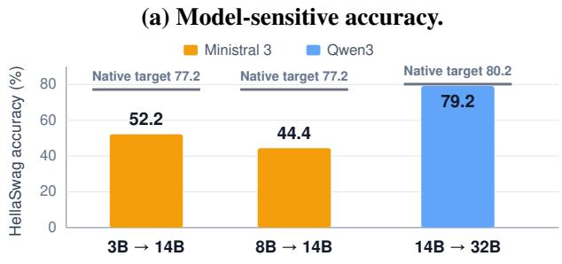  
(c) Latency grows with support.

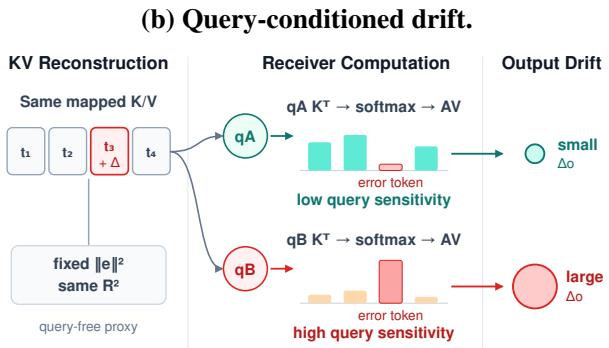

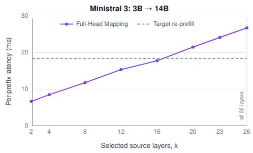

(d) Fragmented construction.  
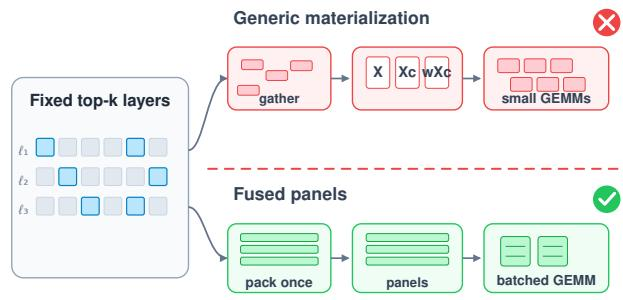  
Figure 1. Four observations motivating CACHEBRIDGE. (a) With 500 calibration sequences, the same FULL-HEAD MAPPING estimator preserves Qwen3 accuracy but collapses on the two Ministral 3 transfer directions. (b) Equal-norm KV residuals can induce different attention-output drift under different receiver queries. (c) On Ministral 3 3B → 14B, FULL-HEAD MAPPING application latency grows with selected-layer support and approaches target re-prefill. (d) Generic top-k fitting materializes scattered, centered, and weighted tensors, whereas fused panels stream bounded sufficient-statistics construction.

• O4: Top-k layer choices fragment mapper construction. Because each target layer selects a different source subset, top-k support creates fragmented gather layouts. A generic fitter repeatedly materializes scattered, centered, and weighted tensors, so memory traffic can dominate construction (Figure 1d).

Together, O1–O4 identify three coupled failure modes: allhead fan-in mismatches model architecture, coordinate regression misses receiver computation, and generic fitting ignores static support. Our key insight is to co-design mapper support, calibration objective, and construction path while keeping online deployment affine. CACHEBRIDGE implements this insight through three complementary components.

• S1: HEAD-LOCAL constrains head fan-in. HEAD-LOCAL preserves cross-layer aggregation but restricts each target KV head to one architecture-indexed sourcehead block. This reduces the coefficient count by the number of source KV heads (8× here), lowering mapper storage and affine work.

• S2: ATTN-REPAIR aligns fitting with attention drift. ATTN-REPAIR reweights cache residuals by their firstorder effect on receiver attention. An effective-samplesize floor limits weight concentration without changing mapper support or the online interface.

• S3: FUSED-FIT makes structured fitting efficient. FUSED-FIT uses a new fused GPU kernel to construct weighted sufficient statistics in bounded panels for headbatched matrix multiplication. It preserves the objective, ridge solver, and mapper artifact.

Across the three transfer directions, CACHEBRIDGE recovers 20.4 and 31.6 HellaSwag points on the two Ministral 3 directions where FULL-HEAD MAPPING loses substantial accuracy and preserves 99.83% mean target retention on Qwen3 14B → 32B. On Qwen3, mapper storage falls from 4.296 to 0.538 GB, application is up to 3.0× faster, and 500-sequence mapper construction takes a median of 8.63 seconds under the evaluated setup.

## Our contributions are as follows.

• We characterize four coupled limitations of FULL-HEAD MAPPING: model-sensitive quality, a mismatch between KV fit and continuation, layer-dependent handoff cost, and fragmented top-k mapper construction.

• We introduce CACHEBRIDGE, which combines HEAD-LOCAL to restore transfer accuracy with an 8× smaller mapper, ATTN-REPAIR to improve target retention and long-prefix NLL at unchanged online cost, and FUSED-FIT to reduce mapper-construction time through a new fused GPU kernel without changing the ridge solution, deployed artifact, or affine online interface.

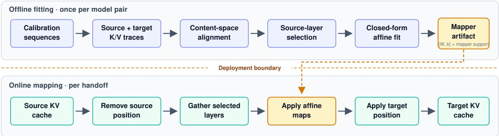  
Figure 2. Cross-model KV transfer pipeline. Offline fitting constructs a reusable affine mapper from aligned source and target K/V traces; online handoff applies the mapper to materialize a decode-ready target KV cache. The deployment boundary separates one-time calibration work from per-handoff computation.

• Across three transfer directions, CACHEBRIDGE recovers the two Ministral 3 transfer directions where FULL-HEAD MAPPING loses substantial accuracy, preserves Qwen3 quality, reduces the coefficient count by 8×, lowers online cost, and constructs the 500-sequence Qwen3 mapper in a median of 8.63 seconds.

## 2. Background and Motivation

## 2.1. Cross-Model Prefix-State Transfer

Let source model S have $L _ { s }$ layers, $H _ { s }$ KV heads, and head width $d _ { s }$ . Define $L _ { t } , H _ { t } , d _ { t }$ analogously for target model T. At source layer $j ,$ , token $t ,$ and KV head g, the available content-space states are $K _ { j , t , g } ^ { S } , V _ { j , t , g } ^ { S } \in \mathbb { R } ^ { d _ { s } }$ . Cross-model transfer predicts $K _ { \ell , t , h } ^ { T } , \check { V } _ { \ell , t , h } ^ { T } \in \mathbb { R } ^ { d _ { t } }$ from a calibration corpus and constructs a continuation cache without targetside prefill. Because transfer is directional, each ordered source–target pair requires a separate mapper.

For target layer ℓ and head $h ,$ we call the set of source KV blocks admitted by the regressor its mapper support. This set is determined by $S _ { \ell }$ and the head fan-in $f ,$ the number of source heads admitted from each selected layer. FULL-HEAD MAPPING selects $k = | S _ { \ell } |$ informative layers and sets $f = H _ { s }$ , then concatenates all admitted blocks to predict target keys and values with separate closed-form ridge maps (Heo et al., 2026). Its feature width is therefore $k H _ { s } d _ { s }$ per target head.

Two architectural signals are visible before calibration. Grouped-query attention partitions query heads into KV groups and exposes an architecture-indexed head-ownership prior (Ainslie et al., 2023). RoPE separates positiondependent rotation from key content (Su et al., 2021). FULL-HEAD MAPPING uses the latter by removing source RoPE before regression and restoring target RoPE after mapping, so its affine map operates in content coordinates. It does not use the former because every target head still admits every source KV head.

The shared cache shape hides different scaling paths. Ministral 3 expands the residual stream from 3,072/4,096 to 5,120 dimensions while retaining 32 query heads, eight KV heads, and fixed four-query ownership. Qwen3 instead keeps a 5,120-dimensional residual stream and applies per-head Q/K normalization at both scales (Figure 3). Full-head regression nevertheless treats every source KV block as a candidate predictor for every target head. Although this contrast does not isolate a single cause, it is consistent with full-head regression exploiting scale-specific cross-head correlations that do not survive a change in the residual stream.

The interface is gradient-free and avoids target-side prefill, but its objective weights every cache-coordinate residual uniformly.

## 2.2. Layerwise Error Propagation in Cache Transfer

Let $\mathbf { z } _ { \ell }$ collect the native K/V cache consumed at target layer $\ell ,$ and let $\widehat { \mathbf { z } } _ { \ell } = \mathbf { z } _ { \ell } + \varepsilon _ { \ell }$ be its transferred counterpart. For the next decoded token, write the target-layer update as $\mathbf { h } _ { \ell + 1 } = F _ { \ell } ( \mathbf { h } _ { \ell } , \mathbf { z } _ { \ell } )$ . Linearizing the transferred execution around the native one gives

$$
\delta \mathbf { h } _ { \ell + 1 } = \mathbf { A } _ { \ell } \delta \mathbf { h } _ { \ell } + \mathbf { B } _ { \ell } \varepsilon _ { \ell } + \mathbf { r } _ { \ell } ,\tag{1}
$$

$$
\| \mathbf { r } _ { \ell } \| _ { 2 } = \mathcal { O } \big ( ( \| \delta \mathbf { h } _ { \ell } \| _ { 2 } + \| \varepsilon _ { \ell } \| _ { 2 } ) ^ { 2 } \big ) ~ ,\tag{2}
$$

where ${ \bf A } _ { \ell } = \partial F _ { \ell } / \partial { \bf h } _ { \ell }$ and ${ \bf B } _ { \ell } = \partial F _ { \ell } / \partial { \bf z } _ { \ell }$ . Let $\delta \mathbf { h } _ { \mathrm { o u t } } ^ { ( 1 ) }$ denote the first-order output error. If $\mathbf { P } _ { \ell }$ is the Jacobian from the output of layer ℓ to the final hidden state, unrolling

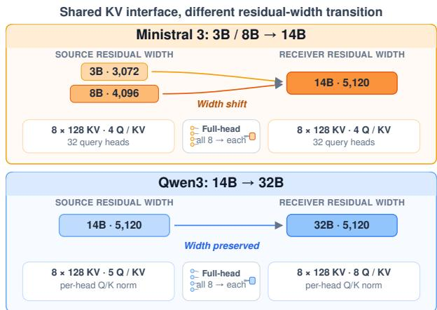  
Figure 3. Architecture contrast for the three evaluated denseattention transfer directions. Residual-stream bars are scaled by model width; the lower panels show the exposed KV interface and the full-head fan-in used to predict one target head. The shared KV-head count hides different residual-stream scaling paths across model families.

Equation 1 gives

$$
\begin{array} { r l r } { \displaystyle } & { } & { \displaystyle \delta { \bf h } _ { \mathrm { o u t } } ^ { ( 1 ) } = \sum _ { \ell = 1 } ^ { L _ { t } } { \bf P } _ { \ell } { \bf B } _ { \ell } \varepsilon _ { \ell } \ : , } \\ { \displaystyle } & { } & { \displaystyle \| \delta { \bf h } _ { \mathrm { o u t } } ^ { ( 1 ) } \| _ { 2 } \leq \sum _ { \ell = 1 } ^ { L _ { t } } \| { \bf P } _ { \ell } { \bf B } _ { \ell } \| _ { 2 } \| \varepsilon _ { \ell } \| _ { 2 } \ : . } \end{array}\tag{3}
$$

Thus every mapped layer injects an error that is transformed by all downstream receiver computation. Small systematic errors can accumulate even when each cache is accurate in isolation.

This propagation exposes a statistical weakness of all-head fan-in. For one target head, the full feature has dimension $p _ { f } = k H _ { s } d _ { s }$ , while an aligned one-head support has dimension $p _ { \ell } = k d _ { s }$ . For a ridge design matrix $\mathbf { X }$ , the effective degrees of freedom are

$$
d _ { \mathrm { e f f } } \big ( \boldsymbol { \lambda } ; \mathbf { X } \big ) = \mathrm { t r } \big [ \mathbf { X } ^ { \top } \mathbf { X } ( \mathbf { X } ^ { \top } \mathbf { X } + \boldsymbol { \lambda } \mathbf { I } ) ^ { - 1 } \big ] \leq p .\tag{4}
$$

Full-head support raises the dimensional ceiling from $p _ { \ell }$ to $p _ { f } = H _ { s } p _ { \ell }$ and can retain weakly identified cross-head directions that do not follow architecture-indexed query ownership. Although these directions can improve coordinate fit on the calibration data, their estimation error is injected at every target layer and enters the accumulated drift in Equation 3.

The same expansion also shows why coordinate reconstruction is an incomplete objective. Stack the layer errors into ε and the propagated Jacobians into ${ \textbf { J } } =$ $\left[ \mathbf { P } _ { 1 } \mathbf { B } _ { 1 } , \ldots , \mathbf { P } _ { L _ { t } } \mathbf { B } _ { L _ { t } } \right]$ . The first-order final-state drift is

$$
\| \delta \mathbf { h } _ { \mathrm { o u t } } ^ { ( 1 ) } \| _ { 2 } ^ { 2 } = \varepsilon ^ { \top } \mathbf { J } ^ { \top } \mathbf { J } \varepsilon ,\tag{5}
$$

whereas ordinary KV regression and $R ^ { 2 }$ measure error under an identity metric. The receiver-composed metric depends on the query, attention mass, and downstream layers. This analysis motivates both constraining head support to control the error injected at each layer and aligning calibration with receiver sensitivity. Sections 3.2 and 3.3 instantiate these two choices.

## 2.3. Static Support and Construction Complexity

Mapper support controls both online cost and offline layout. With k selected layers and head fan-in $f ,$ the non-bias coefficient count over keys and values is

$$
\begin{array} { r } { C ( f ) = 2 L _ { t } H _ { t } ( k f d _ { s } ) d _ { t } , } \\ { \mathrm { W o r k } _ { \mathrm { o n l i n e } } ( T ) = \Theta ( T C ( f ) ) \ , \quad \quad } \end{array}\tag{6}
$$

for a transferred prefix of length $T .$ . Mapper storage is $\Theta ( C ( f ) )$ . Thus support width directly couples statistical flexibility to the cost of the deployed affine operator.

Offline construction has a different bottleneck. The selected sets $S _ { \ell }$ vary across target layers, so a generic fitter repeatedly gathers noncontiguous source blocks and materializes feature, centered, and weighted tensors. However, these sets and the head assignment are fixed before ridge fitting begins. The solver also consumes only weighted means and covariance sufficient statistics, not the full intermediate observation tensors. The irregular support can therefore be compiled into a static gather schedule and streamed through bounded contiguous panels.

Together, the three subsections identify distinct design axes. Mapper support controls estimation and online complexity, receiver propagation determines which reconstruction errors matter, and static support determines how the mapper can be constructed efficiently. Section 3 co-designs these axes without changing the affine deployment interface.

## 3. Our Approach: CACHEBRIDGE

CACHEBRIDGE follows one design principle: co-design mapper support, calibration objective, and construction pathfor affine online deployment. This principle answers three questions left open by full-head cache regression. HEAD-LOCAL determines which source states may explain each target head, ATTN-REPAIR determines which reconstruction errors matter to the receiver’s attention computation, and FUSED-FIT determines how a newfused GPU kernel constructs the mapper without materializing full observation tensors.

Figure 4 shows how these decisions compose within one offline construction path while leaving online deployment affine. Rather than adding three inference stages, the components modify different parts of the same calibration pipeline.

We retain the FULL-HEAD MAPPING layer selection, RoPEaware affine interface, and closed-form ridge solver (Heo et al., 2026). HEAD-LOCAL changes mapper support, ATTN-REPAIR changes calibration weights within that support, and FUSED-FIT introduces a new GPU kernel for sufficient-statistics construction. The deployed artifact remains a collection of affine maps.

## 3.1. Closed-Form Transfer Interface

For each target layer $\ell ,$ a calibration-only selector fits centered single-source-layer OLS probes under the same head assignment, averages held-in $R ^ { 2 }$ across KV heads and K/V, and ranks source layers. Its first k indices define $S _ { \ell } .$ , which all paired estimators use unchanged.

The inherited full-head feature concatenates every source KV head from the selected layers,

$$
\begin{array} { r } { \mathbf { x } _ { \ell , h , t } ^ { \mathrm { f u l l } } = \mathrm { c o n c a t } _ { j \in \mathcal { S } _ { \ell } , g \in [ H _ { s } ] } Z _ { j , t , g } ^ { S } , \quad p _ { f } = k H _ { s } d _ { s } , } \end{array}\tag{7}
$$

where $Z$ denotes either K or V. Keys and values use separate maps. Source RoPE is inverted before fitting and target RoPE is applied after mapping, so the affine map acts in content coordinates.

For nonnegative sample weights rescaled to mean one, centered affine ridge solves

$$
\begin{array} { l } { { \displaystyle { \widehat { \bf W } } = \arg \operatorname* { m i n } _ { { \bf W } } \sum _ { i = 1 } ^ { n } w _ { i } \left\| \left( { \bf y } _ { i } - { \bar { \bf y } } _ { w } \right) \right. } } \\ { { \displaystyle ~ - \left. \left( { \bf x } _ { i } - { \bar { \bf x } } _ { w } \right) { \bf W } \right\| _ { 2 } ^ { 2 } } } \\ { { \displaystyle ~ + \left. \lambda \| { \bf W } \right\| _ { F } ^ { 2 } } , } \end{array}\tag{8}
$$

$$
\widehat { \mathbf { b } } = \bar { \mathbf { y } } _ { w } - \bar { \mathbf { x } } _ { w } \widehat { \mathbf { W } } ,\tag{9}
$$

where $\begin{array} { r } { \lambda > 0 , \bar { \mathbf { x } } _ { w } = n ^ { - 1 } \sum _ { i } w _ { i } \mathbf { x } _ { i } } \end{array}$ , and $\bar { \mathbf { y } } _ { w } = n ^ { - 1 } \sum _ { i }$ wiyi. With centered row matrices $\mathbf { X } _ { c } , \mathbf { Y } _ { c }$ and $\mathbf { D } _ { w } = \mathrm { d i a g } ( \mathbf { w } )$

$$
\begin{array} { r l } & { \widehat { { \bf W } } = ( { \bf X } _ { c } ^ { \top } { \bf D } _ { w } { \bf X } _ { c } + \lambda { \bf I } ) ^ { - 1 } { \bf X } _ { c } ^ { \top } { \bf D } _ { w } { \bf Y } _ { c } , } \\ & { ~ \widehat { { \bf b } } = \bar { \bf y } _ { w } - \bar { \bf x } _ { w } \widehat { { \bf W } } . } \end{array}\tag{10}
$$

The inherited estimator uses $w _ { i } = 1$ . Section 3.3 introduces nonuniform weights without changing the solver.

## 3.2. HEAD-LOCAL—Head-Level Structural Locality

We replace the all-head mapper support in Equation 7 by

$$
{ \bf x } _ { \ell , h , t } ^ { \mathrm { l o c a l } } = \mathrm { c o n c a t } _ { j \in { \cal S } _ { \ell } } Z _ { j , t , a ( h ) } ^ { { \cal S } } , \qquad p _ { \ell } = k d _ { s } ,\tag{11}
$$

where $a ( h )$ is a deterministic architecture-indexed prior, not a learned correspondence. When source and target expose aligned KV groups, the natural assignment is $a ( h ) = h$ Other group-count relationships can be represented by a fixed map derived from architecture metadata.

Over both K and V, the non-bias coefficient counts are

$$
C _ { \mathrm { f u l l } } = 2 L _ { t } H _ { t } ( k H _ { s } d _ { s } ) d _ { t } ,\tag{12}
$$

$$
C _ { \mathrm { l o c a l } } = 2 L _ { t } H _ { t } ( k d _ { s } ) d _ { t } .\tag{13}
$$

Hence $C _ { \mathrm { f u l l } } / C _ { \mathrm { l o c a l } } ~ = ~ H _ { s }$ , independent of $H _ { t }$ and the selected-layer count. At a fixed prefix length, the same factor reduces the coefficient payload and leading affine multiply–add count, which lowers mapper storage and coefficient traffic during handoff. Realized latency also includes feature gathering, positional transforms, and cache materialization.

## 3.3. ATTN-REPAIR—Attention-Aligned Calibration

Section 2.2 shows that KV errors are composed with the receiver Jacobian rather than an identity metric. Computing the complete cross-layer metric in Equation 5 would couple all layers and token positions. We instead fix the mapper support in Equation 11 and approximate its cache-local diagonal using the receiver’s causal attention at selected boundaries. This preserves the statistical and deployment benefits of head-local regression while allocating fitting effort according to receiver sensitivity.

For each calibration sequence, let B be a fixed set of causal prefix boundaries. At boundary $c \in B .$ , the target model’s first future query defines nonnegative key and value sensitivities for eligible sampled prefix positions. We normalize them to unit mass for each target layer, head, component, and boundary, then sum the boundaries with equal mass. This construction uses no task labels or downstream evaluation examples.

For query head u sharing KV head $h ,$ , let $s _ { u i } = \mathbf { q } _ { u } ^ { \top } \mathbf { k } _ { i } / \sqrt { d } .$ $a _ { u i } = \mathrm { s o f t m a x } ( s _ { u } ) _ { i }$ , and $\begin{array} { r } { { \bf o } _ { u } = \sum _ { i } a _ { u i } { \bf v } _ { i } . } \end{array}$ . The local perturbation is

$$
\Delta \mathbf { o } _ { u } \approx \sum _ { i } a _ { u i } \Delta \mathbf { v } _ { i } + \sum _ { i } a _ { u i } \frac { \mathbf { q } _ { u } ^ { \top } \Delta \mathbf { k } _ { i } } { \sqrt { d } } ( \mathbf { v } _ { i } - \mathbf { o } _ { u } ) .\tag{14}
$$

We therefore use squared Jacobian-block traces aggregated over the query heads $\mathcal { G } ( h )$ that share KV head h:

$$
\begin{array} { r l } & { r _ { i } ^ { V } = \displaystyle \sum _ { u \in \mathcal { G } ( h ) } a _ { u i } ^ { 2 } , } \\ & { r _ { i } ^ { K } = \displaystyle \sum _ { u \in \mathcal { G } ( h ) } a _ { u i } ^ { 2 } \| \mathbf { v } _ { i } - \mathbf { o } _ { u } \| _ { 2 } ^ { 2 } \frac { \| \mathbf { q } _ { u } \| _ { 2 } ^ { 2 } } { d } . } \end{array}\tag{15}
$$

(16)

The V-Jacobian Frobenius norm contains a constant factor equal to the value width, which cancels during per-boundary normalization. We discard off-diagonal Gauss–Newton blocks, including cross-token and K–V terms, and replace each retained block with an isotropic scalar proportional to its trace. The resulting weights define a local first-order surrogate, not the exact attention-output loss.

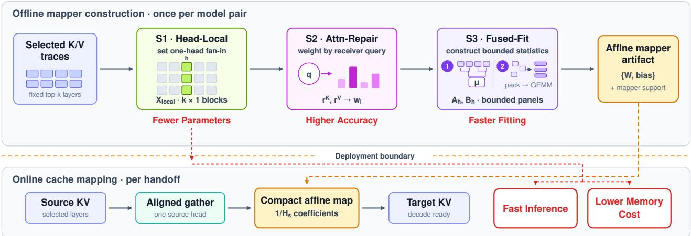  
Figure 4. CACHEBRIDGE mapper construction and deployment. HEAD-LOCAL fixes receiver-aligned mapper support, ATTN-REPAIR derives query-conditioned calibration weights, and FUSED-FIT constructs weighted sufficient statistics with bounded fused panels. Online handoff applies only the compact affine mapper, so the added calibration logic does not introduce extra inference stages.

Let the separately mean-normalized raw weights be $r _ { i } ,$ with $n ^ { - 1 } \textstyle \sum _ { i } r _ { i } = 1$ , and define $\begin{array} { r } { \mathrm { C V } ^ { 2 } ( r ) = n ^ { - 1 } \sum _ { i } ( r _ { i } - 1 ) ^ { 2 } } \end{array}$ Because these raw weights can be highly concentrated, applying them directly can erase the sample-size advantage of structural regression. We therefore shrink them toward uniform weights. For each layer, head, and component, we use

$$
w _ { i } ( \alpha ) = 1 + \alpha ( r _ { i } - 1 ) , \qquad \alpha \in [ 0 , 1 ] .\tag{17}
$$

For these mean-one weights, the Kish effective sample size is

$$
n _ { \mathrm { e f f } } ( w ) = \frac { ( \sum _ { i } w _ { i } ) ^ { 2 } } { \sum _ { i } w _ { i } ^ { 2 } } = \frac { n } { 1 + \alpha ^ { 2 } \mathrm { C V } ^ { 2 } ( r ) } .\tag{18}
$$

Writing $\tau _ { \ell } = \operatorname* { m i n } ( n , 2 p _ { \ell } )$ , we choose the largest α satisfying $n _ { \mathrm { e f f } } ( w ( \alpha ) ) \geq \tau _ { \ell } ;$

$$
\alpha ^ { * } = \left\{ \begin{array} { l l } { 1 , } & { \mathrm { C V } ^ { 2 } ( r ) = 0 , } \\ { \displaystyle \operatorname* { m i n } \left\{ 1 , \sqrt { \frac { n / \tau _ { \ell } - 1 } { \mathrm { C V } ^ { 2 } ( r ) } } \right\} , } & { \mathrm { o t h e r w i s e } . } \end{array} \right.\tag{19}
$$

We repeat this computation for every target layer, target KV head, and K/V component. The quantity 2p is a heuristic target that scales the tolerated weight concentration with feature width. The floor controls concentration but does not measure token independence. The resulting weights enter the same centered ridge solve, so ATTN-REPAIR retains HEAD-LOCAL mapper support, coefficient count, cache interface, and application code. Only the coefficient values differ.

## 3.4. FUSED-FIT—Bounded Mapper Construction

HEAD-LOCAL narrows each target head to one block from each selected source layer, but the layer choices vary across

target layers. A generic implementation therefore performs irregular gathers and materializes

$$
\mathbf { X } \in \mathbb { R } ^ { H _ { t } \times n \times p _ { \ell } } , \qquad \mathbf { Y } \in \mathbb { R } ^ { H _ { t } \times n \times d _ { t } } ,
$$

followed by separate centered and weighted copies. This repeated materialization can dominate the smaller regression.

The ridge solve needs only weighted means and, for each target head,

$$
\mathbf { A } _ { h } = \sum _ { i } w _ { i , h } ( \mathbf { x } _ { i , h } - \pmb { \mu } _ { h } ^ { x } ) ( \mathbf { x } _ { i , h } - \pmb { \mu } _ { h } ^ { x } ) ^ { \top } ,\tag{20}
$$

$$
\mathbf { B } _ { h } = \sum _ { i } w _ { i , h } ( \mathbf x _ { i , h } - \pmb \mu _ { h } ^ { x } ) ( \mathbf y _ { i , h } - \pmb \mu _ { h } ^ { y } ) ^ { \top } .\tag{21}
$$

We design and implement a new fused GPU kernel within a two-pass construction path. A fixed reduction tree first obtains weighted means. The second pass traverses observations in bounded chunks. Our kernel gathers the selected head-local blocks, centers and weights them, and writes contiguous per-head panels. Head-batched matrix multiplications then accumulate ${ \bf A } _ { h }$ and $\mathbf { B } _ { h }$ . For chunk size $b ,$ the scratch space is

$$
\mathcal { O } ( H _ { t } b ( 2 p _ { \ell } + d _ { t } ) ) \ ,\tag{22}
$$

in addition to the required sufficient statistics.

The existing solver applies

$$
\widehat { \mathbf { W } } _ { h } = ( \mathbf { A } _ { h } + \lambda \mathbf { I } ) ^ { - 1 } \mathbf { B } _ { h } , \qquad \widehat { \mathbf { b } } _ { h } = \pmb { \mu } _ { h } ^ { y } - \pmb { \mu } _ { h } ^ { x } \widehat { \mathbf { W } } _ { h } .\tag{23}
$$

Thus the optimized path preserves mapper support, attention weights, regularization, solver policy, coefficient dtype, and serialized mapper schema.

## 4. Evaluation

We evaluate four claims that follow directly from O1–O4. Receiver-aligned head fan-in restores transfer quality on the pairs where FULL-HEAD MAPPING fails, while using less regression capacity. Attention-aligned calibration improves continuation without improving ordinary KV fit or changing deployment. The smaller mapper reduces handoff storage and application cost, and FUSED-FIT executes the irregular top-k layer choices with bounded intermediate memory.

## 4.1. Setup

Models and calibration. We evaluate three GQA→GQA directions: Ministral 3 3B → 14B, Ministral 3 8B → 14B, and Qwen3 14B → 32B, with every source and target model exposing eight KV heads. The primary quality comparison uses 500 FineWeb-Edu (Penedo et al., 2024) sequences of length 1,024, sampled every four tokens to produce 128,000 token positions. The selected-layer counts are k = 20, 12, and 8, respectively, and paired methods share calibration rows, selected layers, ridge strength, centering, token sampling, and evaluation examples.

Mapper configuration. All pairs have equal source and target KV-head counts, so HEAD-LOCAL uses the identity assignment a(h) = h. All ridge fits inherit λ = 0.01 from the reference implementation without retuning. ATTN-REPAIR uses 32 fixed, logarithmically spaced boundaries from token 12 through 1,023, and its τℓ = min(n, 2pℓ) constraint gives token-level floors of 5,120, 3,072, and 2,048 for the three directions.

Quality metrics. Multiple-choice task subsets— HellaSwag (Zellers et al., 2019), ARC-Challenge, WinoGrande, and MMLU (Hendrycks et al., 2021)—use deterministic systematic sampling, and all paired methods share the same scoring procedure and examples. Target retention is the mean task-wise ratio to the native target. For the Qwen3 attribution study, K/V $R ^ { 2 }$ is accumulated on the same HellaSwag prefixes as accuracy, while NLL uses 16 fixed 4,096-token streams disjoint from the validation subset and a 128-token teacher-forced horizon.

Handoff and construction timing. System measurements use Qwen3 14B → 32B, where mapper-application latency is measured after warmup and excludes source prefill, transport, loading, and decoding. Mapper construction runs on four H800s and includes weight staging, sufficient statistics, solve, metadata, and serialization, but excludes upstream trace collection, layer selection, attention-weight construction, evaluation, and scheduler delay. The construction sweep uses nested prefixes of 50, 100, 200, and 500 calibration sequences, with the generic path and FUSED-FIT using the same mapper support and weights.

## 4.2. Transfer Quality and Model Sensitivity

FULL-HEAD MAPPING and CACHEBRIDGE use matched calibration and evaluation protocols. The full-head and local input widths per target head are 20,480 versus 2,560, 12,288 versus 1,536, and 8,192 versus 1,024 for the three directions, respectively. Thus HEAD-LOCAL reduces the coefficient count by 8× without changing the selected source layers.

Ministral recovery. On the two Ministral 3 failure directions, CACHEBRIDGE raises HellaSwag from 52.2% to 72.6% and from 44.4% to 76.0%, recovering 20.4 and 31.6 accuracy points. Whereas FULL-HEAD MAPPING admits all 64 source–target head edges, HEAD-LOCAL restricts mapper support to the eight architecture-indexed edges. Across the four tasks, mean target retention rises from 65.89% to 88.23% for 3B → 14B and from 59.43% to 97.57% for 8B → 14B.

Qwen3 preservation. On Qwen3, CACHEBRIDGE changes HellaSwag, ARC-Challenge, WinoGrande, and MMLU by −1.80, +0.20, +0.20, and +1.76 points relative to FULL-HEAD MAPPING. Its mean target retention is 99.83%, compared with 99.72% for FULL-HEAD MAPPING. Together, the Ministral 3 recovery and Qwen3 preservation corroborate receiver-aligned mapper support as a targeted repair rather than a universal accuracy increase.

Calibration-data efficiency. A separate frozen, matched Qwen3 14B → 32B budget sweep compares nested prefixes of the same calibration stream. With 50 sequences, CACHE-BRIDGE reaches 99.89% mean target retention (77.20, 63.60, 71.80, and 83.51% on HellaSwag, ARC-Challenge, WinoGrande, and MMLU). FULL-HEAD MAPPING with 500 sequences reaches 99.44% (78.80, 62.80, 71.80, and 81.40%). On this frozen sweep, CACHEBRIDGE therefore matches the mean retention of FULL-HEAD MAPPING with one tenth of the calibration data, although individual task scores remain nonmonotonic across budgets.

## 4.3. Structural and Attention Attribution

We isolate regression capacity, head correspondence, and attention weighting on Qwen3 14B → 32B. A control that applies block PCA to all source heads matches the HEAD-LOCAL coefficient budget. Eight cyclic assignments then keep the same width while shifting the source–target correspondence, with shift zero denoting the architectureindexed identity assignment. ATTN-REPAIR then changes only calibration weights under this assignment.

Aligned support matters. At matched capacity, block PCA lowers primary retention by 13.97 points, and the mean non-identity cyclic assignment lowers it by 15.50 points. Every individual shift is worse than the identity assignment, so compactness alone does not explain the aligned operating point.

Table 1. Task-wise target retention across three transfer directions. Each value is transfer accuracy divided by native-target accuracy and reported as a percentage. FULL-HEAD MAPPING is the baseline of Heo et al. (2026); CACHEBRIDGE is our method. Bold marks the better transferred result within each pair. CACHEBRIDGE repairs both Ministral 3 failures while preserving Qwen3 mean retention.
<table><tr><td>Pair</td><td>Method</td><td>HellaSwag</td><td>ARC-C</td><td>WinoGrande</td><td>MMLU</td><td>Mean retention</td></tr><tr><td>Ministral 3 3B → 14B</td><td>FULL-HEAD MAPPING (Heo et al., 2026) CACHEBRIDGE (OURS)</td><td>67.62 94.04</td><td>50.91 86.28</td><td>68.22 92.60</td><td>76.82 80.00</td><td>65.89 88.23</td></tr><tr><td>Ministral 3 8B → 14B</td><td>FULL-HEAD MAPPING (Heo et al., 2026) CACHEBRIDGE (OURS)</td><td>57.51 98.45</td><td>43.60 94.82</td><td>70.68 99.73</td><td>65.91 97.27</td><td>59.43 97.57</td></tr><tr><td>Qwen3 14B → 32B</td><td>FULL-HEAD MAPPING (Heo et al., 2026) CACHEBRIDGE (OURS)</td><td>98.75 96.51</td><td>104.65 104.98</td><td>100.00 100.28</td><td>95.47 97.54</td><td>99.72 99.83</td></tr></table>

Table 2. Attribution study on Qwen3 14B → 32B with 500 calibration sequences. The first three rows are controls or ablations, and CACHEBRIDGE is the final selected configuration. Primary retention is HellaSwag-500 accuracy divided by native-target accuracy. The cyclic mean averages non-identity shifts 1–7. ∆ is measured relative to HEAD-LOCAL-only. The aligned support accounts for most of the gain, while attention weighting further improves retention and NLL.
<table><tr><td>Configuration</td><td>Primary ret.</td><td>∆</td><td> $\mathrm { ~ K ~ } R ^ { 2 }$ </td><td> $\mathrm { ~ V ~ } R ^ { 2 }$ </td><td>NLL@4K</td></tr><tr><td>Block-PCA control</td><td>81.30</td><td>-13.97</td><td>0.644</td><td>0.514</td><td>2.943</td></tr><tr><td>Cyclic-mean control</td><td>79.76</td><td>-15.50</td><td>0.620</td><td>0.473</td><td>3.094</td></tr><tr><td>HEAD-LOCAL-only</td><td>95.26</td><td>0.00</td><td>0.678</td><td>0.655</td><td>2.446</td></tr><tr><td>CACHEBRIDGE (final)</td><td>96.51</td><td>+1.25</td><td>0.672</td><td>0.654</td><td>2.350</td></tr></table>

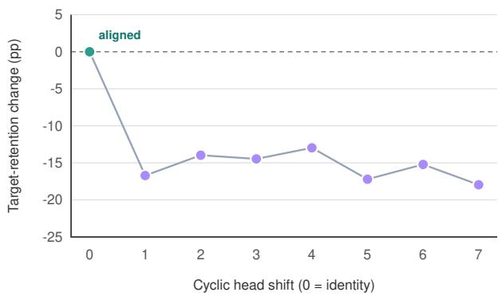  
Figure 5. Capacity-matched cyclic head-assignment ablation on Qwen3 14B → 32B. The vertical axis reports the HellaSwag target-retention change, and shift 0 denotes the aligned head assignment. All non-identity shifts degrade retention, supporting the architecture-indexed head correspondence.

Attention weighting improves continuation. Under the identity assignment, attention weighting changes K/V $R ^ { 2 }$ only from 0.678/0.655 to 0.672/0.654, yet improves primary retention by 1.25 points and reduces NLL@4K from 2.446 to 2.350. Because mapper support, coefficient count, and application code remain unchanged, this comparison isolates attention-aligned calibration. The improvement despite nearly unchanged KV $R ^ { 2 }$ confirms that coordinate fit alone is not a sufficient continuation metric.

## 4.4. Handoff-Time Efficiency

Mapper storage. The one-head fan-in reduces both the coefficient payload and leading affine work by 8×. On Qwen3 14B → 32B, the serialized mapper shrinks from 4.296 to 0.538 GB (Figure 6(a)). Because ATTN-REPAIR changes only coefficient values, CACHEBRIDGE and HEAD-LOCAL have identical application cost, which we report once.

Application latency. At prefix lengths 128, 512, and 1,024, FULL-HEAD MAPPING application takes 21.13, 37.40, and 65.12 ms. HEAD-LOCAL reduces these values to 12.97, 15.91, and 21.66 ms (Figure 6(b)), corresponding to speedups of 1.6×, 2.4×, and 3.0×.

These measurements isolate mapper storage and application from an already available source cache. End-to-end TTFT and throughput, which also include prefill, transport, decoding, and scheduling, remain outside this scope.

## 4.5. FUSED-FIT Efficiency

Construction speedup. FUSED-FIT emits bounded, contiguous panels for head-batched matrix multiplication while preserving mapper support, weights, the ridge solve, and the serialized artifact. At 500 sequences, CacheBridge’s FUSED-FIT construction path reduces mapper-construction time by 10.7×, from 92.63 to a median of 8.63 seconds. Figure 7 shows how this advantage changes as calibration data increase.

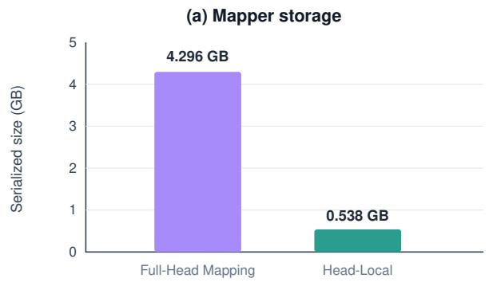

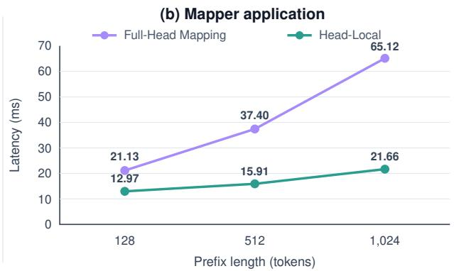  
Figure 6. Mapper storage and application latency on Qwen3 14B → 32B. Panel (a) reports serialized mapper size, and panel (b) reports mapper-application latency across prefix lengths. The one-head fan-in reduces the deployed coefficient payload and yields larger latency gains at longer prefixes.

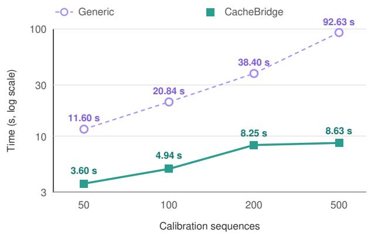  
Figure 7. Mapper-construction time for Qwen3 14B → 32B on four H800s. CACHEBRIDGE markers show medians with min– max ranges, and the vertical axis is logarithmic. CacheBridge’s fused construction path preserves the fitted mapper while reducing 500-sequence construction time by 10.7×.

## 5. Related Work

Closed-form cache transfer. The closest reference finds linear structure across model-family caches and fits RoPEaware ridge maps for target-prefill reuse (Heo et al., 2026). That work also studies nonlinear rescue, attention diagnostics, and latency. We start from its affine interface but ask which connections the estimator should use, which cache errors its objective should prioritize, and how to execute fixed mapper support efficiently.

Learned latent communication. Cache-to-Cache trains neural projection and fusion modules to communicate semantics between models (Fu et al., 2026). Dery et al. learn per-model adapters into a shared KV representation space (Dery et al., 2026). Latent Cache Flow learns a compact shared cache channel for both shared and different contexts (Rossi et al., 2026). Mixture-of-Translators instead uses token-gated translators and target-side trajectory correction across heterogeneous architectures (Lee et al., 2026). Unlike our closed-form affine mapper, these approaches train additional communication modules or shared representation spaces.

Reuse, repair, and architectural co-design. IAM reuses cross-scale attention patterns but does not transfer KV values (Zhao et al., 2025). Semantic Cache Distillation transmits low-rank semantic codes and patches sparse transition layers under a trained loss (Ma et al., 2026). Droid-Speak selectively recomputes sensitive layers across finetuned variants with the same architecture (Liu et al., 2026). Activated-LoRA preserves a base-compatible prefix interface by controlling when an adapter changes the model (Li et al., 2025). ICaRus co-designs specialized models around a frozen logical cache encoder so their caches are identical by construction (Woo et al., 2026). SmartGen selects positions for KV transfer between prefill and decode workers of the same model, addressing transport bandwidth rather than model mismatch (Luo et al., 2026). PRISM co-designs request scheduling with exact-prefix KV retention for same-model prefix reuse (Qu et al., 2026). These systems occupy complementary points in the design space through training, architectural co-design, same-backbone reuse, target-side recomputation, intra-model transport, or prefix-aware scheduling and retention.

## 6. Limitations

Our current evaluation has three clear boundaries.

1. Same-family transfer. Each evaluated direction connects two models from the same family. Cross-family transfer may expose weaker head correspondence and larger representation shifts than those studied here.

2. Other attention mechanisms. All evaluated models use dense grouped-query attention with matched KVhead counts. We have not established how the support rule generalizes to mismatched head counts or to sparse, sliding-window, linear, and hybrid attention.

3. Multi-turn quality after transfer. We evaluate immediate continuation through multiple-choice accuracy and teacher-forced NLL, but do not measure open-ended multi-turn task quality after transfer-driven decoding. Repeated generation and model handoffs may accumulate errors that these evaluations do not capture.

## 7. Conclusion

Cross-model cache transfer avoids repeated prefill, but FULL-HEAD MAPPING can be model-sensitive, overprovisioned, and expensive to construct and apply. CACHE-BRIDGE addresses these limitations by co-designing mapper support, attention-aligned calibration, and mapper construction while retaining affine online deployment. HEAD-LOCAL constrains head fan-in, ATTN-REPAIR aligns the fitting objective with receiver computation, and FUSED-FIT absorbs irregular gathers before regular batched matrix multiplication. Across all three transfer directions, CACHE-BRIDGE reduces the coefficient count by 8× while repairing or preserving transfer quality. On Qwen3 14B → 32B, it further lowers mapper storage and application latency, improves long-prefix NLL, and constructs the 500-sequence mapper in a median of 8.63 seconds. These results improve the quality–cost trade-off of closed-form cache transfer without adding a learned translator.

## References

Ainslie, J., Lee-Thorp, J., de Jong, M., Zemlyanskiy, Y., Lebrón, F., and Sanghai, S. GQA: Training generalized multi-query transformer models from multi-head checkpoints. In Proceedings of the 2023 Conference on Empirical Methods in Natural Language Processing, pp. 4895–4901, 2023.

Chen, L., Zaharia, M., and Zou, J. FrugalGPT: How to use large language models while reducing cost and improving performance. Transactions on Machine Learning Research, 2024. URL https://arxiv.org/abs/ 2305.05176.

Dery, L. M., Yahav, Z., Prior, H., Feng, Q., Shen, J., and Szlam, A. Latent space communication via K-V cache alignment. arXiv preprint arXiv:2601.06123, 2026. URL https://arxiv.org/abs/2601.06123.

Fu, T., Min, Z., Zhang, H., Yan, J., Dai, G., Ouyang, W., and Wang, Y. Cache-to-cache: Direct semantic communication between large language models. In International Conference on Learning Representations, 2026. URL https://arxiv.org/abs/2510.03215.

Hendrycks, D., Burns, C., Basart, S., Zou, A., Mazeika, M.,

Song, D., and Steinhardt, J. Measuring massive multitask language understanding. In International Conference on Learning Representations, 2021.

Heo, T., Shafipour, R., Zhao, R., Golub, M., Kamani, M. M., Borkar, R., Chandran, M. T., Zardoshti, P., and Rouhani, B. D. Cross-model KV cache transfer in LLM families: A closed-form linear mapping for prefill reuse. arXiv preprint arXiv:2608.03893, 2026. URL https://arxiv.org/abs/2608.03893.

Lee, J.-w., Song, M., Oh, J., Han, S., Park, S., Jang, G., and Lim, S. Mixture-of-translators: Translating KV caches across heterogeneous large language models. arXiv preprint arXiv:2607.28979, 2026. URL https://arxiv.org/abs/2607.28979.

Li, A., Greenewald, K., Parnell, T., and Azizan, N. Efficient multi-adapter LLM serving via cross-model KVcache reuse with activated LoRA. arXiv preprint arXiv:2512.17910, 2025. URL https://arxiv. org/abs/2512.17910.

Liu, Y., Huang, Y., Yao, J., Feng, S., Gu, Z., Du, K., Li, H., Cheng, Y., Jiang, J., Lu, S., Musuvathi, M., and Choukse, E. DroidSpeak: KV cache sharing across fine-tuned model variants. In 23rd USENIX Symposium on Networked Systems Design and Implementation, pp. 319–338, 2026. URL https://www.usenix.org/conference/ nsdi26/presentation/liu-yuhan.

Luo, X., Shen, J., Wang, X., and Zhou, Y. SmartGen: Seamless disaggregated LLM inference with selective KV cache transfer. arXiv preprint arXiv:2607.28150, 2026. URL https://arxiv.org/abs/2607.28150.

Ma, Q., Tang, Z., Cui, H., Yao, Z., and Jia, W. Semantic cache distillation: Efficient state transfer via reuse and selective patching. In International Conference on Machine Learning, 2026. URL https://arxiv.org/ abs/2606.07684.

Ong, I., Almahairi, A., Wu, V., Chiang, W.-L., Wu, T., Gonzalez, J. E., Kadous, M. W., and Stoica, I. RouteLLM: Learning to route LLMs with preference data. In International Conference on Learning Representations, 2025. URL https://arxiv.org/abs/2406.18665.

Penedo, G., Kydlícek, H., Ben Allal, L., Lozhkov, A.,ˇ Mitchell, M., Raffel, C., von Werra, L., and Wolf, T. The FineWeb datasets: Decanting the web for the finest text data at scale. Advances in Neural Information Processing Systems, 37, 2024. URL https://arxiv.org/ abs/2406.17557.

Qu, X., Lin, T., Li, Y., Chen, Z., and Wang, S. PRISM: Fast online LLM serving via scheduling-memory co-design. arXiv preprint arXiv:2605.08581, 2026. URL https: //arxiv.org/abs/2605.08581.

Rossi, M., Raghunath, P., and Wu, E. Latent cache flow: Model-to-model communication without text. arXiv preprint arXiv:2605.22863, 2026. URL https:// arxiv.org/abs/2605.22863.

Singh, S., Singh, K., and Moturi, P. Fathom-DeepResearch: Unlocking long horizon information retrieval and synthesis for SLMs. arXiv preprint arXiv:2509.24107, 2025. URL https://arxiv.org/abs/2509.24107.

Su, J., Lu, Y., Pan, S., Murtadha, A., Wen, B., and Liu, Y. RoFormer: Enhanced transformer with rotary position embedding. arXiv preprint arXiv:2104.09864, 2021. URL https://arxiv.org/abs/2104.09864.

Woo, S., Kil, J., Kim, H., Kim, M., Kim, J., Seo, A., Lee, S., Jo, M., Ryu, J., Park, B., Kwon, S. J., and Lee, D. ICaRus: Identical cache reuse for efficient multi model inference. In International Conference on Learning Representations, 2026. URL https://openreview.net/forum? id=qrMo6R7lOS.

Wu, Q., Bansal, G., Zhang, J., Wu, Y., Li, B., Zhu, E., Jiang, L., Zhang, X., Zhang, S., Liu, J., Awadallah, A. H., White, R. W., Burger, D., and Wang, C. AutoGen: Enabling next-gen LLM applications via multi-agent conversation. arXiv preprint arXiv:2308.08155, 2023. URL https: //arxiv.org/abs/2308.08155.

Zellers, R., Holtzman, A., Bisk, Y., Farhadi, A., and Choi, Y. HellaSwag: Can a machine really finish your sentence? In Proceedings of the 57th Annual Meeting of the Association for Computational Linguistics, pp. 4791–4800, 2019.

Zhao, Y., Li, Z., and Zhao, H. IAM: Efficient inference through attention mapping between different-scale LLMs. In Proceedings of the 63rd Annual Meeting of the Association for Computational Linguistics, pp. 19522–19533, 2025. doi: 10.18653/v1/2025.acl-long.959. URL https://aclanthology.org/2025.acllong.959/.