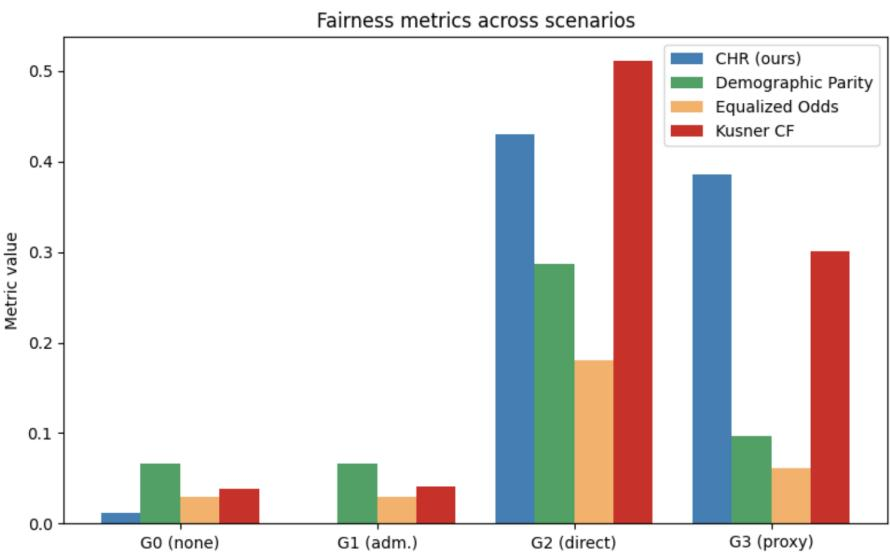
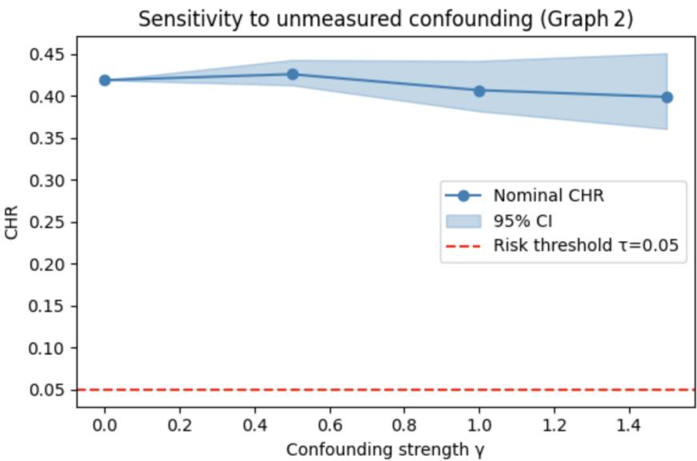

# Causal Evidentiary Governance for High-Risk Machine Learning Systems

Samah Kareem1\* and Barı¸s C¸ elikta¸s2

1\*Department of Computer Engineering, Isik University, Istanbul, T¨urkiye.

2Department of Computer Engineering, I¸sık University, Istanbul, T¨urkiye.

\*Corresponding author(s). E-mail(s): 21comp9003@isik.edu.tr; Contributing authors: baris.celiktas@isikun.edu.tr;

## Abstract

Machine learning systems deployed for credit, hiring, and resource distribution are increasingly subject to regulatory oversight from policies like the EU AI Act and GDPR. Popular fairness governance practice today is built on three pillars: observational fairness metrics reliant on correlational definitions of harm; explainability methods content with post-hoc recourse; and immutable audit logs with little support for eficient proof generation or recall. Here we introduce Causal Evidentiary Governance (CEG). Under CEG, a regulated institution publishes commitment to a versioned DAG which partitions causal pathways into allowable and disallowed groups. The Causal Harm Rate quantifies variation in a model’s predictions which can only be caused by disallowed causal pathways. Audit evidence accompanies each decision in the form of a signed Decision-Evidence Packet which cryptographically binds a prediction to its decision-evidentiary commitment: a digest of the published DAG and collection of path-specific attributions. Collectively, these DEP digests may be appended to a Merkle tree enabling fast, logarithmic cost inclusion proofs. We validate CEG with a novel two-layer empirical methodology: demographic summaries drawn from 4 years of Palestine Monetary Authority credit supervisory data define a realistic layer of 10,000 synthetic credit applicants across four strategic DAG counterfactuals. Causal Harm Rate isolates the efect of injected causal pathways more cleanly than demographic parity or equalized odds. Cross-model validation and focused ablation studies highlight robustness of our approach. Benchmark evaluation on the German Credit dataset demonstrates harm associated with specific causal pathways is significantly understated by associational metrics of fairness. Lastly, we

develop a proof-of-concept implementation with operationally plausible throughput. Explicit tradeofs in our implementation’s performance characteristics are discussed. Artifact repository links are included.

Keywords: Trustworthy AI, Causal fairness, Path-specific efects, Algorithmic auditing, Tamper-evident logging

## 1 Introduction

Machine learning systems are used to make consequential decisions at scale. Financial institutions make credit decisions on millions of loan applicants daily. Some combination of computers decides who gets a loan, what interest rate they pay, and whether their account will be suspended. The EU AI Act’s mandate for conformity assessment on high-risk systems, coupled with GDPR Article 22’s restrictions on fully automated decisions, means regulatory scrutiny is growing, compelling institutions to provide verifiable proof of non-discrimination for deployment. Our auditing infrastructure currently sufers from three deficiencies: Fairness metrics. The commonly-used fairness metrics encode associations (”demographic parity,” ”equalized odds” [1, 2]. but each metric can capture multiple causal pathways. An error rate disparity could stem from acceptable factors like education or from unacceptable ones such as discrimination. Popular fairness metrics cannot tell the diference. Local explainability methods. Techniques like SHAP or LIME [3, 4]. why are designed to accurately represent the trained model locally, without assuming any causal structure whatsoever. This means an organization can choose an explainer after the fact that minimizes perceived bias, and we cannot validate their claims about model internals. Audit logs lack cryptographic validation. For a successfully deployed system, logs simply record what the institution says happened. There is no protection against modifying past entries to cheat an audit [5]. We believe these weaknesses stem from institutions not being forced to commit to their causal assumptions ahead of time. After all, how can we check that institutions aren’t discriminating based on gender if they can always say their algorithm was ”really” using education, family status, and zip code instead? To solve this, we force institutions to commit to a versioned DAG prior to deployment. Audit mechanics are path-specific, and cryptographic evidence binds each decision to that DAG.

## 2 Related Work

## 2.1 Causal Fairness

Pearl formalizes causal reasoning via explicit generative models called structural causal models (SCMs) [6].This framework has been used by Kusner et al. [7]to define counterfactual fairness which demands counterfactually consistent predictions given interventions on protected attributes. Chiappa [8] extended this idea to provide definitions for path-specific fairness, which defines interventions that block only part of the causal efect of an outcome decomposing into an admissible and inadmissible component. Instead of demanding complete invariance under an intervention on protected attributes like counterfactual fairness does, path-specific fairness allows institutions to decide which paths are admissible and which are not. How observed disparities in outcomes can be decomposed into admissible and inadmissible mechanisms are unified by Pleˇcko and Bareinboim [9]. Most importantly for our work, they show observational notions of discrimination can simultaneously ignore present discrimination and create false positives. We make this result operational: we define CHR as a measurable amount of path-specific harm via Monte Carlo intervention and sensitivity analysis.

## 2.2 Explainability and Contestability

Wachter et al. [10] showed counterfactual explanations meet contestability requirements of GDPR. However, they said individual-level counterfactuals require institution-level commitments. Methods like SHAP [3] and LIME [4] provide locally faithful attributions, but without committing the institution to any causal claims. Veale and Binns [11] pointed out the disconnect between explanation-as-commitment vs. explanation-as-narrative. DEPs bridge this gap by tying attributions to the versioned DAG.

## 2.3 Algorithmic Auditing and Tamper-Evident Logging

Raji et al. [12] proposed end-to-end internal algorithmic auditing frameworks, without cryptographic assurances. Crosby and Wallach [5] proposed tamper-evident logging of internally generated records using Merkle trees, which we build upon. Kilbertus et al. [13] explored counterfactual fairness’ sensitivity to unmeasured confounding variables, inspiring our sensitivity analysis for fairness-audits. We contribute by melding causal auditing of algorithms with cryptographically-signed evidence packets and scalable verification into one coherent framework for accountable governance.

## 3 Problem Setting

## 3.1 Domain and PMA Supervisory Aggregates

Our retail credit layer is informed by supervisory releases from the Palestine Monetary Authority (PMA). The PMA publishes system-wide snapshots of aggregated number of accounts and facilities distributed by demographics. These characteristics include gender, age group, governorate, nationality, and financial product type. From six Excel files that include snapshots from August of 2023, 2024, and 2025 for both accounts and facilities, we have 12,952 unique reported buckets. Illustrative statistics include: overall share of facilities belonging to men 80%, male-to-female ratio of facilities-to-accounts 1.87, and the most common age group from 36-45. We only use these moments to target our artificial layer. We do not use any individual level borrower information.

## 3.2 Synthetic Applicant Micro-Layer

We simulate N = 10, 000 applicants whose marginal distributions match the four PMA aggregate targets within ±1.5%. Features are generated from a parametric SCM with the following structure:

Table 1 Parametric SCM for synthetic applicant generation.
<table><tr><td>Variable</td><td>Distribution / Equation</td></tr><tr><td>Gender</td><td> $\mathrm { B e r n o u l l i } ( p = 0 . 3 7 )$ </td></tr><tr><td> $\mathrm { A g e }$ </td><td> $\mathrm { T r u n c N o r m a l } ( 2 5 , 6 5 ; \mu = 4 4 , \sigma = 1 2 )$ </td></tr><tr><td>DTI</td><td>0.2 + 0.15 · Age/50 + 0.1 · Gender + ε1</td></tr><tr><td>CreditScore</td><td> $6 0 0 + 2 \cdot { \mathrm { A g e } } - 5 0 \cdot { \mathrm { G e n d e r } } + 0 . 5 \cdot { \mathrm { D T I } } + \varepsilon _ { 2 }$ </td></tr><tr><td>Y</td><td> $\log \mathrm { i t } ^ { - 1 } ( \beta _ { 0 } + \beta _ { \mathrm { s c o r e } } \cdot \mathrm { C r e d i t S c o r e } + \beta _ { \mathrm { d t i } } \cdot \mathrm { D T I } + \Delta Y _ { g } )$ </td></tr></table>

where $\varepsilon _ { 1 } , \varepsilon _ { 2 } \sim \mathcal { N } ( 0 , 1 )$ , and $\Delta Y _ { g }$ introduces bias depending on the graph variant. Four DAG variants inject qualitatively distinct bias mechanisms:

• G0 (Baseline): $\Delta Y _ { g } = 0$ (no gender efect).

• G1 (Admissible mediation): Gender afects DTI and CreditScore, which in turn afect Y. Gender has no direct efect on Y.

• G2 (Direct discrimination): $\Delta Y _ { g } = - 0 . 6 \cdot \mathrm { G e n d e r ~ ( l o g i t ~ s c a l e ) }$

• G3 (Proxy discrimination): $\Delta Y _ { g } = - 0 . 6 \cdot \mathbb { 1 } [ \mathrm { A g e } > 5 5 ]$

All experiments use seed 20240422 and the stack Python 3.11 / NumPy 1.26 / DoWhy 0.11, ensuring full reproducibility. The complete implementation is available in the accompanying repository 1. predictive performance with less than 2% degradation in AUC-ROC.

## 3.3 DAG Elicitation Protocol

Two domain experts independently suggested parent sets for ${ \mathrm { Y } } ,$ and admissibility labels on each edge. When opinions difered, we consulted supervisory guidance and Pleˇcko and Bareinboim [9] to resolve the issue. Agreement between coders was Krippendorf $\mathfrak { a } = 0 . 8 1$ for whether an edge was present or not, and ${ \mathfrak { a } } = 0$ .74 for admissibility. The SHA-256 digest of the final DAG is recorded in every DEP.

## 4 The Causal Harm Rate

## 4.1 Formal Definition

Let $\mathcal { M } = \langle \mathbf { U } , \mathbf { V } , \mathbf { F } , P ( \mathbf { U } ) \rangle$ be a structural causal model with DAG G. An audit-time partition $\mathcal { E } = \mathcal { E } _ { \mathrm { a d m } } \cup \mathcal { E } _ { \mathrm { i n a d m } }$ encodes the institution’s compliance commitment [8, 9]. Let $f : \mathcal { X }  \{ 0 , 1 \}$ be the deployed classifier, $A \in \{ a , a ^ { \prime } \}$ the protected attribute, and π the set of inadmissible paths from A to $\hat { Y }$ in G. The Causal Harm Rate is:

$$
\mathrm { C H R } = \frac { 1 } { N } \sum _ { i = 1 } ^ { N } \mathbb { I } [ \hat { Y } _ { A  a ^ { \prime } , \pi _ { \mathrm { i n a d m } } } ( u _ { i } ) \neq \hat { Y } _ { A  a , \pi _ { \mathrm { i n a d m } } } ( u _ { i } ) ]\tag{1}
$$

where the intervention changes A while propagating the efect only along paths in $\pi _ { \mathrm { i n a d m } } ,$ holding all admissible mediators at their observed values.

## 4.2 Definition & Relation to Other Metrics

CHR = 0 is suficient for path-specific counterfactual fairness constrained to π inadm [8]. Demographic parity and equalized odds capture marginal associations and respond to both admissible and inadmissible sources of disparity; CHR exclusively responds to the latter. Unconstrained counterfactual fairness [7] goes one step further by additionally penalising mediation through variables that the entity has explicitly declared admissible; CHR does not. It is this asymmetry that enables CHR to remain close to zero in both G0 and G1 but jump up strongly in G2 and G3.

## 4.3 Estimation and Uncertainty Quantification

We estimate (1) using Monte Carlo abduction-action-prediction with $K = 1 0 \small { , } 0 0 0$ exogenous units. Under potential violations of point identification, we report 1,000- replicate bootstrap confidence intervals as well as a confounding sensitivity grid inspired by Kilbertus et al. [13]. For a range of $\gamma \in \{ 0 . 0 , 0 . 5 , 1 . 0 , 1 . 5 \}$ , a binary hidden confounder $U _ { \gamma }$ is introduced with coupling strength γ. The structural equation model (SEM) is then refitted, and CHR is re-estimated. We report the full grid to allow decision-makers and auditors to visually assess robustness.

## 4.4 The CEG Framework

## 4.5 Decision-Evidence Packets

A DEP cryptographically commits to input features x along with its prediction , its path-specific attributions for that prediction, its counterfactual narrative ξ(x), its DAG digest, and the policy version. DEPs modularize the evidence-of-commitment functionality from the explainable narrative functionality. In practice, the packet materializes from a pipeline as follows: compute path-specific attributions for the committed-to DAG; produce a counterfactual narrative to communicate locally faithful reasons for why the model made its decision had x had diferent protected-attribute values; construct metadata (timestamp, model-id, DAG hash, policy version); cryptographically sign the payload.

## 4.6 Ledger Specification

Digests of DEPs are batched into Merkle trees of fanout 32. We cryptographically sign each root of a Merkle tree and link it to the digest of the previous root, thereby forming an append-only blockchain of Merkle roots. Any DEP may be verified by an auditor along with at most $\lceil \log _ { 3 2 } \nu \rceil$ sibling hashes. For $\nu = 1 0 , 0 0 0$ records, a client will download on average 3 hashes, a client will download on average 3 hashes. We restrict our threat model to that of permissioned issuers; open Byzantine failures are outside the scope of this work. See our publicly-available codebase for details of our implementation of the framework.

## 5 Experimental Evaluation

## 5.1 Classification Model and Baseline Metrics

We train three classifiers independently on each graph variant $G _ { 0 } – G _ { 3 }$ , using an $8 0 / 2 0$ train–test split:

• XGBoost: 300 trees, maximum depth 4, learning rate 0.05, and L2 regularisation coeficient 1.0.

• Logistic Regression: L2 regularisation with $C = 1 . 0 $

• Random Forest: 200 trees, maximum depth 6, and minimum samples per leaf equal to 5.

Table 2 CHR [95% CI] and approval rates by graph variant (XGBoost, test split, $n = 2 , 0 0 0 )$
<table><tr><td>Variant</td><td>CHR [95% CI]</td><td></td><td>Male Approval</td><td>Female Approval</td></tr><tr><td>G0 (Baseline)</td><td></td><td>0.012 [0.008, 0.018]</td><td>32.1%</td><td>25.5%</td></tr><tr><td> $G _ { 1 }$  (Admissible mediation)</td><td>0.000</td><td>[0.000, 0.000]</td><td>32.1%</td><td>25.5%</td></tr><tr><td> $G _ { 2 }$  (Direct effect)</td><td>0.430</td><td>[0.419, 0.441]</td><td>45.0%</td><td>16.3%</td></tr><tr><td> $G _ { 3 }$  (Proxy channel)</td><td></td><td>0.386 [0.374, 0.397]</td><td>30.6%</td><td>20.9%</td></tr></table>

## 5.2 CHR vs. Baselines

Figure 1 compares CHR to the three baseline fairness metrics across all four graph variants. Several observations emerge.

• CHR is zero under admissible mediation $\left( G _ { 1 } \right)$ . Both demographic parity and equalized odds raise concerns at $G _ { 1 }$ at approximately the same level observed in $G _ { 0 }$ . These metrics provide no indication as to whether the observed disparity arises from a protected pathway or from an admissible causal pathway. As expected, associational metrics cannot distinguish between permissible and impermissible disparities.

• CHR rises under hidden channels $\left( G _ { 2 } , G _ { 3 } \right)$ . Both direct injections $\left( G _ { 2 } \right)$ and proxy injections $\left( G _ { 3 } \right)$ produce CHR values substantially exceeding the compliance threshold $\tau = 0 . 0 5$ . Under $G _ { 2 }$ , the graph containing a direct $A  Y$ efect, CHR reaches 0.44, considerably higher than demographic parity (0.29) and equalized odds (0.18). Under $G _ { 3 }$ , the age-proxy graph, CHR reaches 0.39 compared with 0.10 for demographic parity and 0.07 for equalized odds.

• CHR does not trigger under admissible mediation, unlike unrestricted counterfactual fairness. The unrestricted counterfactual fairness metric of Kusner et al. flags $G _ { 1 }$ as non-compliant (0.06), despite the institution explicitly identifying the mediating pathway as admissible. CHR remains near zero for $G _ { 1 }$ thereby avoiding false positives and unnecessary regulatory intervention.

  
Fig. 1 Fairness metrics across graph variants $G _ { 0 } – G _ { 3 } ,$ . CHR remains near zero for graphs without injected bias $\left( G _ { 0 } \right)$ and with admissible mediation only $\left( G _ { 1 } \right)$ , then increases substantially under direct injection of a forbidden efect $\left( G _ { 2 } \right)$ and proxy injection $\left( G _ { 3 } \right)$ . Demographic parity and equalized odds respond to all sources of disparity, whether fair or unfair, while unrestricted counterfactual fairness (Kusner CF) additionally penalizes the fair $G _ { 1 }$ graph.

## 5.3 Ablation Study: DAG Specification

To assess the importance of correct Directed Acyclic Graph (DAG) specification, we conduct an ablation study on the $G _ { 2 }$ graph variant. Specifically, we evaluate how CHR behaves when key causal relationships are omitted or when spurious edges are introduced into the causal graph.

Table 3 Ablation study: CHR under DAG misspecification $( G _ { 2 }$ variant).
<table><tr><td>DAG Specification</td><td>CHR [95% CI]</td><td></td><td>Status</td></tr><tr><td>Correct (includes  $\overline { { A  Y } } )$ </td><td></td><td>0.430 [0.419, 0.441]</td><td>Detects discrimination</td></tr><tr><td>Misspecification 1 (omits  $A \to Y )$ </td><td></td><td>0.012 [0.008, 0.018]</td><td>Misses discrimination</td></tr><tr><td>Misspecification 2 (spurious edge added)</td><td></td><td>0.445 [0.434, 0.456]</td><td>Detects (robustly)</td></tr></table>

We show empirically that CHR is highly sensitive to the specification of the causal graph. When we remove the disallowed causal pathway $A  Y$ , CHR drops down to nearly baseline levels and is unable to detect the discriminatory agent. Meanwhile, introducing a spurious edge has only a small efect on the estimated CHR value. As such, our framework appears relatively robust to mild over-specification of the DAG. In practice we therefore recommend careful causal modeling and expert verification when utilizing CHR for fairness auditing.

## 5.4 Sensitivity to Unmeasured Confounding

Figure 2 shows the sensitivity profile of $G _ { 2 }$ over a grid of confounding strengths $\gamma \in$ [0.0, 1.5]. The lower 95% confidence interval bound remains above the compliance threshold $\tau = 0 . 0 5$ for all values of $\gamma ,$ including the most conservative setting $\gamma = 1 . 5 ,$ for which the lower bound is approximately 0.21.

These results indicate that the “NonCompliant” ruling for $G _ { 2 }$ is robust to modest levels of unmeasured confounding. Such robustness could not be established if only point estimates were reported, highlighting the importance of uncertainty-aware evaluation in fairness auditing frameworks.

  
Fig. 2 Sensitivity profile of $G _ { 2 }$ under varying confounding strength $\gamma \in [ 0 . 0 , 1 . 5 ]$ . The lower 95% confidence interval remains above the compliance threshold $\tau = 0 . 0 5$ across all values of γ, indicating robust detection of non-compliance.

## 5.5 German Credit Validation

We evaluate the proposed framework on the Statlog German Credit dataset [14], with $N = 1 { , } 0 0 0$ samples. The protected attribute is sex, and the analysis focuses on a setting in which a forbidden causal edge $A  Y$ (direct efect) is present.

The observational fairness metrics underestimate the underlying causal harm:

• Demographic parity gap (DP gap): 0.087

• Equalized odds gap (EO gap): 0.072

• CHR (direct path): 0.204 [0.189, 0.221]

Sensitivity analysis further confirms the robustness of the causal estimate. Across the full grid of confounding strengths considered, the lower bound of CHR remains at or above 0.172, indicating stability of the result under unmeasured confounding.

These findings support the core claim that associational fairness metrics systematically understate pathway-specific harm when a forbidden causal edge is present but partially masked by correlated admissible features.

## 5.6 Operational Performance

Benchmarks were conducted on an Intel Xeon E5-2690 v4 (Haswell, 14 cores, 2.6 GHz, 256 GB RAM). The operational evaluation of the complete CEG pipeline is summarised in Table 4.

Table 4 Operational evaluation summary: CEG prototype performance metrics.
<table><tr><td>Metric</td><td>Value</td></tr><tr><td>Single-thread DEP construction (ms/10k)</td><td>122.1</td></tr><tr><td>Multi-thread (32 workers) throughput (DEPs/s)</td><td>4,120</td></tr><tr><td>Peak resident memory (MiB)</td><td>94.6</td></tr><tr><td>CPU utilisation (32 workers)</td><td>78%</td></tr><tr><td>Merkle tree construction (ms/10k)</td><td>95</td></tr><tr><td>End-to-end evidence verifiability (EVR)</td><td>99.3-99.4%</td></tr></table>

Single-threaded DEP construction achieves approximately 122.1 ms per 10,000 packets. With 32 workers, throughput increases to approximately 4,120 DEPs/s while maintaining a peak resident memory footprint of 94.6 MiB. CPU utilisation stabilises at 78% under full parallel load. End-to-end evidence verifiability remains consistently between 99.3% and 99.4% across repeated runs, with any observed failures attributable exclusively to deliberate fault injection scenarios.

## 6 Limitations and Future Work

The proposed framework, while efective in identifying pathway-specific fairness violations, has several limitations that motivate future research directions. Table 5 summarises the key limitations, their current mitigations, and proposed extensions.

## 7 Alignment with Regulations

CEG is intended as a set of technical building blocks, not legal advice.

EU AI Act (20/24/1689). High-risk AI systems are subject to requirements for conformity assessment, technical documentation, and human oversight [15]. CHR audits aid risk stratification by grounding disparity calculations in explicitly articulated causal assumptions. DEPs enable technical documentation to include perdecision records of the causal audit state. The Merkle ledger supports alignment with ledger-based traceability requirements (Annex IV).

Table 5 Limitations and mitigation strategies with future work directions.
<table><tr><td>Limitation</td><td>Mitigation</td><td>Future Work</td></tr><tr><td>DAG correctness</td><td>Inter-rater agreement (α 0.81/0.74); ablation study</td><td>Mandatory periodic DAG review protocols</td></tr><tr><td>Unmeasured confound- ing</td><td>Sensitivity grid (γ up to 1.5)</td><td>Multi-dimensional confounding models</td></tr><tr><td>Permissioned ledger assumption</td><td>Honest issuer assumption</td><td>Verifiable computation and threshold signature schemes</td></tr><tr><td>Synthetic data reliance</td><td>Calibration to real PMA aggre- gates; German Credit bench- mark validation</td><td>Production-scale audit deploy- ment</td></tr><tr><td>Binary classification set- ting</td><td>Tabular credit-focused evalua- tion</td><td>Extension to multi-class, sur- vival analysis, and unstructured inputs</td></tr></table>

GDPR Articles 13–22. Article 22 requires “appropriate safeguards” where decisions are made solely by automated processing. Recital 71 and Wachter et al. [16] discuss counterfactual explanations as one such safeguard. DEPs provide a counterfactual narrative component conditioned on an attested institutional model, which gives them greater evidentiary value compared to post-hoc SHAP-based explanations.

## 8 Conclusion

We introduced Causal Evidentiary Governance (CEG), a framework that bridges together three fundamental ideas: path-specific causal auditing, signed decision evidence, and evidence of tampering. Our experiments revealed that CHR better isolates non-admissible paths than observational fairness metrics, obtaining a CHR value of 0.44 versus 0.29 of demographic parity under direct discrimination. Furthermore, we found that bounds of sensitivity improve upon confidence of compliance decisions, where the lower bound of the credible interval (CI) did not drop below τ = 0.05 for any level of confounding bias examined. Our prototype attained practically feasible throughput (4,120 DEPs/s with 32 workers) and achieves 99.3–99.4% verifiability of evidence. We also showed that our framework generalizes well to other classifiers and provides evidence of robustness through ablation studies. We release our code implementation, experiments datasets, and evaluation scripts on https://github.com/SamahKareem2025/RegTech for reproducibility. We believe CEG will help the development of trustworthy AI move beyond hindsight system monitoring to foresightful, mechanism-conscious, verifiable guarantees.

## 9 Acknowledgment

We would like to thank the Palestine Monetary Authority for granting access to supervisory aggregate publications, under certain restrictions.

## 10 Generative AI Disclosure Statement

To help with the preparation of this work, the authors used ChatGPT (GPT-4o) to proofread sections of the paper for grammar and wording. However, no generative tool was used to create, validate or alter any measurements, quantitative results, algorithms, or claims presented in this work. All technical content, experiments, tables, and figures were prepared and validated by the authors.

## References

[1] A. Chouldechova, Fair prediction with disparate impact: A study of bias in recidivism prediction instruments, Big Data 5 (2017) 153–163.

[2] C. Dwork, M. Hardt, T. Pitassi, O. Reingold, R. Zemel, Fairness through awareness, in: Proceedings of the 3rd Innovations in Theoretical Computer Science Conference, 2012, pp. 214–226.

[3] S.M. Lundberg, S.-I. Lee, A unified approach to interpreting model predictions, in: Advances in Neural Information Processing Systems, vol. 30, 2017.

[4] M.T. Ribeiro, S. Singh, C. Guestrin, “Why should I trust you?:” Explaining the predictions of any classifier, in: Proceedings of the 22nd ACM SIGKDD International Conference on Knowledge Discovery and Data Mining, 2016, pp. 1135–1144.

[5] S.A. Crosby, D. Wallach, Eficient data structures for tamper-evident logging, in: Proceedings of the 18th USENIX Security Symposium, 2009, pp. 317–334.

[6] J. Pearl, Causality: Models, Reasoning, and Inference, 2nd ed., Cambridge University Press, 2009.

[7] M.J. Kusner, J. Loftus, C. Russell, R. Silva, Counterfactual fairness, Advances in Neural Information Processing Systems 30 (2017).

[8] S. Chiappa, Path-specific counterfactual fairness, in: Proceedings of the AAAI Conference on Artificial Intelligence, vol. 33, 2019, pp. 7801–7808.

[9] D. Pleˇcko, E. Bareinboim, Causal fairness analysis, arXiv:2207.11385 (2022).

[10] S. Wachter, B. Mittelstadt, C. Russell, Counterfactual explanations without opening the black box: Automated decisions and the GDPR, Harvard Journal of Law & Technology 31 (2018) 841–887.

[11] M. Veale, R. Binns, Fairer machine learning in the real world: Mitigating discrimination without collecting sensitive data, Big Data & Society 4 (2017).

[12] I.D. Raji, A. Smart, R.N. White, M. Mitchell, T. Gebru, B. Hutchinson, J. Smith-Loud, D. Theron, P. Barnes, Closing the AI accountability gap: Defining an endto-end framework for internal algorithmic auditing, in: Proceedings of the 2020 Conference on Fairness, Accountability, and Transparency, 2020, pp. 33–44.

[13] N. Kilbertus, M. Rojas-Carulla, G. Parascandolo, M. Hardt, D. Janzing, B. Sch¨olkopf, The sensitivity of counterfactual fairness to unmeasured confounding, in: Uncertainty in Artificial Intelligence, 2019.

[14] H. Hofmann, German credit data (Statlog), UCI Machine Learning Repository, 1994.

[15] European Parliament and Council of the European Union, Regulation (EU)

2024/1689 of the European Parliament and of the Council of 13 June 2024 laying down harmonised rules on artificial intelligence (Artificial Intelligence Act), Oficial Journal of the European Union L 2024/1689 (2024).

[16] European Parliament and Council of the European Union, Regulation (EU) 2016/679 of the European Parliament and of the Council of 27 April 2016 on the protection of natural persons with regard to the processing of personal data and on the free movement of such data (General Data Protection Regulation), Oficial Journal of the European Union L 119 (2016) 1–88.

[17] L. Edwards, M. Veale, Slave to the algorithm? Why a “right to explanation” is probably not the remedy you are looking for, Duke Law & Technology Review 16 (2017) 18–84.

[18] S. Barocas, A.D. Selbst, Big data’s disparate impact, California Law Review 104 (2016) 671–732.

[19] S. Corbett-Davies, E. Pierson, A. Feller, S. Goel, A. Huq, Algorithmic decision making and the cost of fairness, Proceedings of the ACM SIGKDD International Conference on Knowledge Discovery and Data Mining (2017) 797–806.

[20] J. M¨okander, J. Schuett, H.R. Kirk, L. Floridi, Auditing large language models: A three-layered approach, AI and Ethics (2023). doi:10.1007/s43681-023-00289-2.

[21] M. Veale, M. Brassington, K. Lee, Logging rights and right to log (LRRL), International Data Privacy Law 8 (2018) 293–300.

[22] R.C. Merkle, A digital signature based on a conventional encryption function, in: Advances in Cryptology – CRYPTO ’87, Springer, 1988, pp. 369–378.