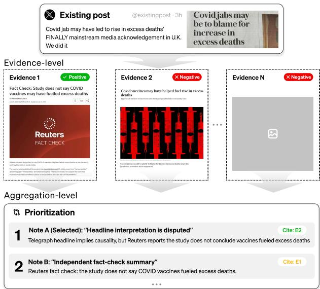
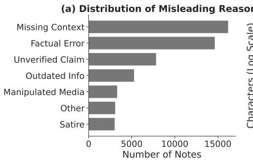
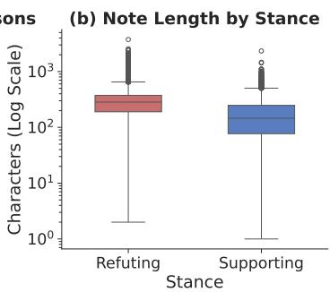
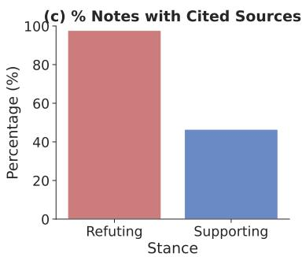
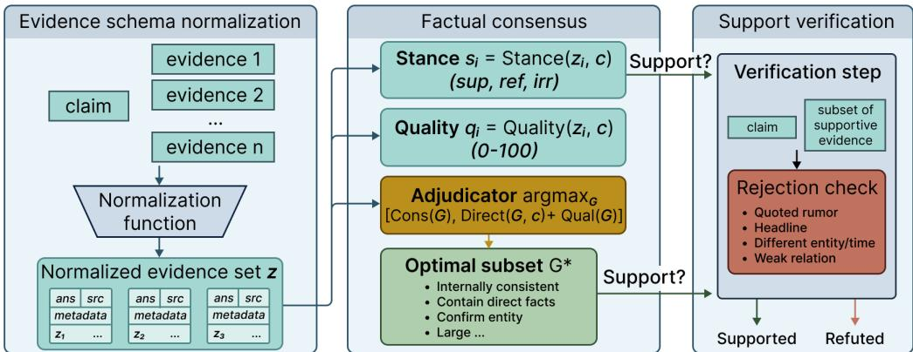

# CoVer: Conflict-Aware Claim Verification

Shuning Zhang1,\*, Dai Shi2,\*, Bohao Chu3, Hui Wang3, Yuwei Chuai4,†,

Yifan Wang5, Jingruo Chen6, Simin Li7, Xin Yi1,8,†, Hewu Li1

1Tsinghua University, 2Tongji University, 3University of Duisburg-Essen,

4University of Luxembourg, 5University of Washington, 6Cornell University, 7Beihang University,

8Beijing Academy of Artificial Intelligence

yuwei.chuai@uni.lu, yixin@tsinghua.edu.cn

\*Equal contribution. †Corresponding authors.

## Abstract

Social media fact-checking has long been challenged by evidence-level and aggregation-level conflicts, where erroneous evidence mimics authoritative news sources. To capture this challenge and support conflict verification tasks, we present ContraNote, a large-scale real-world dataset curated from X’s Community Notes system. It includes 33,686 posts for evaluating evidence-level conflict resolution, and 54,474 instances for evaluating aggregation-level pri oritization. Additionally, we propose CoVer, a factual adjudication framework with threestage pipelines: evidence schema normalization, factual consensus and support verification. This prioritizes evidence over noise to prevent it from compromising the final verdict. Technical evaluations show that CoVer achieves strong performance compared with state-of-theart baselines across ContraNote (86.0% Acc., 68.0% mac. F1, 64.5 bal. Acc. on Conflict; and 88.5% Acc., 88.5 mac. F1 and 89.2 bal. Acc. on Prioritization), CONFACT-HumC (88.4% Acc.) and CONFACT-ModC (89.4% Acc.).

## 1 Introduction

Developing effective automated fact-checking methods is increasingly important to mitigate the spread of misinformation on social media platforms at scale (Choi and Ferrara, 2024; Augenstein et al., 2024). Modern systems commonly adopt a decomposition-aggregation pipeline, which breaks complex claims into atomic sub-claims, verifies each subclaim against external knowledge sources, and synthesizes verdicts to determine overall veracity (Wang et al., 2024). Retrieval-Augmented Generation (RAG) plays an important role in this pipeline by enabling Large Language Models (LLMs) to ground their reasoning in external evidence retrieved from the open web (Lewis et al., 2020).

However, this pipeline frequently encounters conflicts that compromise verdict accuracy. We categorize these conflicts into two distinct levels: (i) evidence-level conflict, where retrieved documents from different sources take opposing stances on the same fact, (ii) aggregation-level conflict, where sub-claims within a single complex claim provide contradictory signals that must be prioritized and reconciled.

  
Figure 1: An illustration of conflicting evidence.

These challenges are exemplified in a social media claim asserting that a newly published publichealth study links COVID-19 vaccines to a rise in excess deaths (Figure 1). During verification, retrieval may surface an evidence-level conflict: a widely shared headline interprets the study as “vindicating” prior anti-vaccine claims, while statements from the publishing journal and epidemiologists clarify that the study has no such causal relationship. Besides, an aggregation-level conflict arises when the claim is decomposed into subclaims (e.g., trends in excess mortality vs. implied causality), yielding contradictory signals that must be weighed against one another. Here, aggregationlevel conflict does not necessarily mean that subclaims contradict one another. Different subclaims may receive local verdicts whose logical implications conflict with the overall claim. For instance, evidence may support the observation that excess mortality increased while refuting the implied causal attribution to COVID-19 vaccination. The conflict therefore arises when local verdicts are aggregated.

Resolving such contradictions is crucial, yet evidence conflict on social media differs from general conflicts in two aspects: (i) Intentionality: Unlike general search conflicts that often stem from outdated data, social media conflicts are frequently adversarial, with misinformation crafted to mimic authoritative style. (ii) Popularity bias: False narratives on social media may circulate faster than factual corrections. Methods relying on frequencybased aggregation struggle around these issues.

To bridge this gap, we introduce ContraNote, a real-world dataset derived from X’s Community Notes system. ContraNote captures real-world conflicts by identifying posts that received opposed debunking statements from crowdsourced contributors. We filtered over two million notes to construct two tasks: a conflict task comprising 33,686 posts to evaluate support/refutation, and a prioritization task comprising 54,474 posts to evaluate the identification of high-quality evidence.

We further propose CoVer, a framework to parse and adjudicate conflicting evidence by prioritizing evidence over noise. Unlike algorithms that aggregate all evidence at once, CoVer uses a structured pipeline with three modules: evidence schema normalization, factual consensus, and support verification. This facilitates individual scrutinization and filters out noise such as quoted rumors, headlines, or weakly relevant statements.

Technical evaluations show that CoVer outperforms state-of-the-art (SOTA) baselines across various datasets. On ContraNote Conflict and Prioritization, CoVer achieves accuracies of 86.0% and 88.5%, with corresponding bal. Acc. of 64.5% and 89.2%. It also achieves 88.4% accuracy on CONFACT-HumC and 89.4% on -ModC. Ablation studies further confirm the contribution of each module in our proposed framework. Together, this paper makes three contributions:

• We propose the CoVer framework, an algorithm featuring evidence schema normalization, factual consensus, and support verification modules to effectively resolve evidence conflicts.

• We construct ContraNote dataset, comprising

33,686 conflicting instances and 54,474 prioritization instances derived from X, providing testbeds for evaluating real-world conflicts.

• We provide empirical evidence that CoVer performs strongly relative to SOTA baselines across evidence conflict datasets.

## 2 Background and Related Work

## 2.1 Automatic Fact-checking

Traditional expert-based fact-checking faces significant challenges regarding scalability, selection bias, and public trust (Pennycook and Rand, 2019; Straub and Spradling, 2022; Chuai et al., 2025, 2026b). In response, community-based and automated alternatives have emerged as viable solutions (Kim and Walker, 2020; Quelle and Bovet, 2024; Zhang et al., 2026). Community-based factchecking, exemplified by X’s Community Notes (X Corp., 2026), can achieve accuracy comparable to expert judgments (Allen et al., 2021), resist motivated reasoning (Epstein et al., 2020), and reach broader online communities (Micallef et al., 2020). However, it remains too slow to curb misinformation at an early stage and is subject to coordinated rating manipulation (Chuai et al., 2024, 2026a,b).

Given recent advances in LLMs, automated factchecking frameworks show promises in identifying suspicious multimodal claims (Qi et al., 2024; Zhou et al., 2024), verifying their veracity (Wang and Shu, 2023), and generating explanations (Yue et al., 2024; He et al., 2023; Zeng and Gao, 2024) immediately after publication. Notably, De et al. (2025) explored synthesizing community notes, while we focus on evidence conflict resolution.

Beyond verification, LLMs can enhance collective decision-making (Yang et al., 2024) by aggregating diverse perspectives (Burton et al., 2024) and mapping complex opinions to consensus statements (Bakker et al., 2022). For instance, Fish et al. (2024) integrated LLMs with social choice theory to generate multiple summaries than a singular consensus. Our work differs by focusing on evidence conflict resolution.

## 2.2 Conflict Resolution in Fact-Checking

Truth discovery. Early conflict resolution focused on truth discovery, aiming to identify accurate information among conflicting sources by estimating source reliability (Li et al., 2016). Traditional methods used iterative probabilistic models to infer trustworthiness (Li et al., 2016; Lyu et al., 2017), later evolving into neural frameworks, such as De-ClarE, which aggregates external evidence and source credibility via attention mechanisms (Popat et al., 2018). Unlike these methods that focus on source credibility, our approach models consensus among conflicting evidence items.

Taxonomy and biases in knowledge conflicts. With the adoption of LLMs, the focus shifted to knowledge conflicts, which can be classified as intra-context, inter-context and parametric discrepancies (Su et al., 2024; Xie et al., 2023; Ming et al., 2024). When resolving these conflicts, LLMs exhibit notable biases: confirmation bias toward internal parametric memory (Xie et al., 2023; Su et al., 2024; Özer and Yıldız, 2025), self-generation bias favoring erroneous self-derived context over retrieved facts (Tan et al., 2024), and selection bias where LLMs detect inconsistencies via Natural Language Inference (NLI) (Jiayang et al., 2024) but arbitrarily select single evidence items without holistic synthesis (Jiayang et al., 2024). To mitigate these biases, we ground conflict resolution in recognizing evidence’s stances and resolving based on stance conflicts.

Detection and resolution frameworks. To counter LLM biases, research proposed factual consistency models for detection (Jiayang et al., 2024), and employ iterative multi-agent debates (e.g., MADAM-RAG) (Wang et al., 2025), or contrastive argument synthesis for resolution (Yue et al., 2024). Furthermore, robust resolution requires calibration and uncertainty estimation to merge conflicting and evolving evidence in temporal contexts (Wan et al., 2024; Chen et al., 2022a; Özer and Yıldız, 2025; Burton et al., 2024). Unlike frameworks designed for document retrieval and verification, we focused on reconciling contradictory evidence.

## 3 Problem Definition

In automated fact-checking, conflicting evidence primarily exist at two stages: the evidence level and the aggregation level. Evidence-level conflict occurs when retrieved documents present contradictory stances on a single fact. Aggregation-level conflict arises when a complex claim is decomposed into sub-claims that yield divergent verdicts. For example, a correct attribution alongside false causality requires the system to synthesize these mixed signals into a coherent conclusion.

Formally, let a claim C be decomposed into subclaims $\textit { S } = \ \{ s _ { 1 } , . . . , s _ { n } \}$ For each $s _ { i } ,$ the system retrieves a set of evidence documents $E _ { i } = \{ e _ { i , 1 } , . . . , e _ { i , m } \}$ . An evidence-level conflict exists if $E _ { i }$ contains contradictory stance labels that simultaneously support and refute $s _ { i } .$ An aggregation-level conflict occurs when the set of local verdicts $V _ { S } ~ = ~ \{ v ( s _ { 1 } ) , . . . , v ( s _ { n } ) \}$ has opposing logical implications for the overall veracity of C. The objective is to learn a verification function $\mathcal { F } ( C , \bigcup E _ { i } ) \  \ y$ that maps the claim and conflicting evidence to a final verdict $y \in$ {Supported, Refuted, Not Enough Information by prioritizing evidence over noise.

## 4 ContraNote Dataset

We constructed the ContraNote dataset using the open-source Community Notes repository published by X (X Corp., 2025). Community Notes is a crowd-sourced misinformation debunking mechanism where qualified contributors provide additional context to evaluate the veracity of posts. The longitudinal data used in this study span from June 2021 to May 2026.

Individual posts on the platform frequently elicit multiple community notes with divergent viewpoints. Some contributors may flag a post as potentially misleading, while others may argue that it is not misleading because it is factually correct, satirical, or containing personal opinion. These conflicting perspectives on a single post create a complex environment of evidentiary contradictions. Final note selection is determined by user helpfulness ratings and algorithmic prioritization. This inherent complexity provides a unique opportunity for LLMs to learn from real-world conflicts and develop mechanisms for information prioritization.

Our initial corpus comprised 2,276,724 community notes corresponding to 1,502,486 unique posts. To isolate instances of conflict, we first identified 443,148 posts that received more than one community note. We then focused on posts containing stance contrast, defined by the two Community Notes classifications: MISINFORMED\_OR\_POTENTIALLY\_MISLEADING and NOT\_MISLEADING.

We constructed two benchmark tasks from this filtered corpus. The first, ContraNote Conflict, evaluates whether an original post should be supported or refuted given conflicting notes. Refuted instances are posts satisfying three conditions: (1) the notes have stance contrast, (2) it has at least one note rated as CURRENTLY\_RATED\_HELPFUL, and (3) at least one helpful note is labeled MISINFORMED\_ OR\_POTENTIALLY\_MISLEADING. These instances correspond to claims for which the crowd-rated consensus supports active correction or refutation. This yields 27,445 Refuted instances. Supported instances should satisfy: (1) the notes have stance contrast, (2) it contain no helpful misleading note, and all misleading notes are rated CURRENTLY\_ RATED\_NOT\_HELPFUL, (3) the majority of its notes are labeled NOT\_MISLEADING. We apply different criteria as our dataset from Community Notes have no non-misleading notes with helpful status. This process yields 6,241 Supported instances. ContraNote Conflict contains 33,686 posts, including 27,445 Refuted and 6,241 Supported instances.

  
Figure 2: Distributions in ContraNote, (a) distribution of misleading reasons, (b) note length by stance, (c) percentage of notes with cited sources.

The second task, ContraNote prioritization, evaluates whether a model can identify potentially conflicting high-quality evidence among notes. We selected posts with stance contrast that contain at least one helpful note and one nonhelpful note, where non-helpful candidates include notes rated as CURRENTLY\_RATED\_NOT\_HELPFUL or NEEDS\_MORE\_RATINGS. Given the post context and its set of notes, the model needs to predict which note should be prioritized. This produces a balanced benchmark of 54,474 instances over 27,237 posts, with 27,237 Supported target notes and 27,237 Refuted target notes.

As shown in Figure 2, missing context (22,615 instances) and factual errors (20,918 instances) are primary drivers of misleading claim. Refuting notes exhibit greater detail (1.77 per post) and length (289.08 characters) compared to supporting ones. Evidence link analysis reveals that news (49.1%) and social media platforms (24.6%) are major cited sources, while encyclopedic references remain secondary. This indicates that ContraNote primarily relies on heterogeneous evidence that require provenance assessment. Qualitative coding reveals that relations between contradictory notes extend beyond direct contrasts, which include contextual, scoping and aggregation-level disagreements. Notably, note-necessity disagreement is the primary conflict pattern (33%), where contributors contest the necessity of moderation. Language distribution analysis shows that English constitutes the majority language (13,776, 62.98%), followed by Spanish (1,758, 8.04%) and Portuguese (1,368, 6.25%).

As shown in Table 4, ContraNote extends prior benchmarks (Augenstein et al., 2019; Schlichtkrull et al., 2023; Chen et al., 2022b) by capturing naturally occurring evidence conflicts within single posts. To evaluate label reliability, three trained annotators independently annotated on randomly sampled 500 instances, which yield high interrater reliability (Fleiss’ $\kappa = 0 . 8 2 )$ . Majority-vote human annotations aligned with dataset labels in 94.2% cases, validting labels’ accuracy. To account for potential bias, we analyzed using PoliticalBiasBERT, and found the dataset covered broad political orientations (18.6% left, 47.0% center, 34.4% right) and topic domains (e.g., 26.0% political/governance, 20.6% science/technology, 29.8% media/entertainment/sports). This indicates that ContraNote reflects the consensus signal generated by Community Notes mechanism. Details are all shown in Appendix B.2.

## 5 CoVer

## 5.1 Algorithm Overview

As shown in Figure 3, given a claim q and an evidence set $\mathcal { E } = \{ e _ { i } \} _ { i = 1 } ^ { N } ,$ CoVer predicts a label $y \in$ {Supported, Refuted}. This algorithm has three modules: evidence schema normalization, factual consensus, and support verification.

  
Figure 3: The CoVer framework.

## 5.2 Evidence Schema Normalization

Each evidence item $e _ { i }$ may contain free text and structured metadata $e _ { i } = ( t _ { i } , m _ { i } )$ , where $t _ { i }$ is textual content and $m _ { i }$ contains optional fields such as source URL. We normalize each item into a canonical representation: $z _ { i } = \phi ( e _ { i } ) = \phi ( t _ { i } , m _ { i } )$ The normalized item $z _ { i }$ preserves both text and schema-level cues. For QA evidence, we retained proposed answer fields. For source-pointer evidence, we retained page and line identifiers. For candidate-note evidence, status, label, stance, and helpfulness fields are kept. For plain fact-checking evidence, article text and snippets are kept. This gives a unified evidence set $\mathcal { Z } = \{ z _ { i } \} _ { i = 1 } ^ { N }$

## 5.3 Factual Consensus

The second stage performs factual adjudication over the normalized evidence via a three-step pipeline: individual evidence adjudication, consensus aggregation, and final verdict generation.

For each normalized evidence item $z _ { i } \in \mathcal { Z }$ associated with the claim $q ,$ CoVer estimates its stance toward the claim and evaluates its evidential quality. Instead of using separate prompts, we use a single LLM call with structured output constraints to jointly predict the stance $s _ { i }$ and four fine-grained quality components. These constraints require a valid stance from the predefined label set, numeric quality scores in [0, 1], and the presence of all fields needed by deterministic aggregation:

$$
( s _ { i } , d _ { i } , a _ { i } , l _ { i } , u _ { i } ) = \mathrm { L L M } _ { \mathrm { a d j } } ( q , z _ { i } , m _ { i } ) ,\tag{1}
$$

where $s _ { i } \in$ {support, refute, irrelevant}, and $m _ { i }$ denotes the preserved metadata schema (e.g., source URL, helpfulness signals). The quality components are scored on a normalized scale [0, 1] according to the following rubrics:

• Directness $( d _ { i } )$ measures whether $z _ { i }$ directly addresses the central proposition of $q ,$ penalizing items that merely share superficial entities.

• Attribute alignment $( a _ { i } )$ evaluates factual compatibility across key dimensions, including entity identity, temporal scope, location, and numerical arguments.

• Schema reliability $( l _ { i } )$ includes metadata cues $m _ { i }$ (e.g., source authority and community helpfulness ratings) to assess the trustworthiness of the evidence channel.

• Informativeness $( u _ { i } )$ quantifies the substantive factual content, assigning low scores to repetitive rumor quotes, headlines, or text that merely reports the existence of a claim.

The overall quality score $q _ { i }$ is deterministically computed as a weighted linear combination of these components: $q _ { i } = \lambda _ { d } d _ { i } + \lambda _ { a } a _ { i } + \lambda _ { l } l _ { i } + \lambda _ { u } u _ { i }$ , where weights are tuned as $\lambda _ { d } = \lambda _ { a } = \lambda _ { l } = \lambda _ { u } = 0 . 2 5$ to balance each dimension (see Appendix D.2). Given $( s _ { i } , q _ { i } )$ for all evidence items, CoVer aggregates the evidence deterministically to resolve conflicts. We first compute quality-weighted cumulative scores for the supporting and refuting stances:

$$
A _ { \operatorname { s u p } } = \sum _ { i = 1 } ^ { | \mathfrak { L } | } q _ { i } \cdot \mathbb { I } [ s _ { i } = \operatorname { s u p p o r t } ] ,\tag{2}
$$

$$
A _ { \mathrm { r e f } } = \sum _ { i = 1 } ^ { | \mathfrak { T } | } q _ { i } \cdot \mathbb { I } [ s _ { i } = \mathrm { r e f u t e } ] ,\tag{3}
$$

where $\mathbb { I } [ \cdot ]$ is the indicator function. The dominant factual stance $s ^ { * }$ is selected by comparing the cumulative strengths:

$$
s ^ { * } = \left\{ { \begin{array} { l l } { { \mathrm { s u p p o r t } } , } & { { \mathrm { i f } } \ A _ { \mathrm { s u p } } > A _ { \mathrm { r e f } } , } \\ { { \mathrm { r e f u t e } } , } & { { \mathrm { i f } } \ A _ { \mathrm { r e f } } \geq A _ { \mathrm { s u p } } . } \end{array} } \right.\tag{4}
$$

We use Refute as the tie-breaker, which follows the conservative goal of avoiding unsupported positive predictions. To assess potential biases, we evaluate a variant in which ties are assigned to Support. Corresponding results are reported in Appendix D.3. To remove irrelevant noise and lowquality assertions, the final consensus evidence set $G ^ { * }$ is filtered using a quality threshold $\tau _ { q } .$

$$
G ^ { * } = \{ z _ { i } \in \mathcal { Z } \mid s _ { i } = s ^ { * } \wedge q _ { i } \geq \tau _ { q } \} .\tag{5}
$$

The factual correlation between the aggregated consensus set $G ^ { * }$ and claim q is adjudicated by an additional LLM call, yielding $\begin{array} { r l r } { r } & { { } = } & { \mathrm { L L M } _ { \mathrm { v e r } } ( q , G ^ { * } ) \in } \end{array}$ {entails, contradicts, insuficient}. entails is mapped to Supported, while others are mapped to Refuted, as neither outcome suggests that the original post is supported under the Community Notes labeling protocol. To test the effect of this strategy, we evaluate a Supported/Partially Supported/Refuted setting in Appendix C.4.

## 5.4 Support Verification

Given the factual consensus output $y _ { \mathrm { s t r i c t } }$ , CoVer applies support verification only when factual consensus predicts Supported. If $y _ { \mathrm { s t r i c t } } = \mathrm { R e f u t e d } .$ the algorithm terminates and returns Refuted. We use this as a conservative filter for positive predictions. When $y _ { \mathrm { s t r i c t } } = \mathrm { S u p p o r t e d }$ , CoVer constructs the candidate support set

$$
\begin{array} { r } { \mathcal { Z } _ { \mathrm { s u p } } = \{ z _ { i } \in \mathcal { Z } : s _ { i } = \mathrm { s u p p o r t } , q _ { i } \geq \tau _ { q } \} . } \end{array}
$$

It then performs a final verification call: $v =$ $g _ { \theta } ( q , \mathcal { Z } _ { \mathrm { s u p } } ) \quad \in \quad \{ \mathrm { v a l i d , i n v a l i d } \}$ This verifier checks whether the selected supporting evidence directly and independently validates the claim’s central proposition. It rejects support if the evidence merely quotes a claim or rumor, a headline or fact-check setup, about a different entity, time, answer, or scope, or is merely related without factual statement. The final prediction yˆ is labeled as Supported if $y _ { \mathrm { s t r i c t } }$ = Supported $\wedge v = { \mathrm { v a l i d } }$ and Refuted otherwise.

## 6 Experiments

## 6.1 Datasets

We choose various datasets representing different conflict levels. Specifically, we examine conflicting evidence in social media fact-checking and other scenarios to test CoVer’s generalizability:

CONFACT (Ge et al., 2025). Unlike traditional benchmarks where evidence is often consistent, CONFACT is specifically curated to include claims with opposed evidence on the web (e.g., conflicting reports on political events or scientific debates). It serves as the primary testbed for measuring agents’ ability to resolve evidence conflicts.

ConflictBank (Su et al., 2024). This benchmark analyzes model behavior by simulating knowledge conflicts. It includes 553,117 QA pairs derived from 2,863,205 Wikidata claims, covering three main conflict causes: misinformation, temporal change, and semantic variation. Using the original QA pairs, we construct refutation examples by treating the modified evidence as conflicting evidence groups, yielding 1,659,351 data items.

ECON (Jiayang et al., 2024). The dataset is based on two public datasets: Natural Questions and Complex Web Questions, where they constructed alternative answers as conflicting evidence, producing different types of answer and factoid conflicts: degree, entity, negation, number, temporal, verb, and other types. ECON contains 4,995 data items. ContraNote. We use the version described in Sec. 4. The primary binary labels follow the Community Notes labeling scheme. We also provide a three-way pilot analysis in Appendix C.4.

FEVER (Thorne et al., 2018). It is a most widely used fact-check dataset (Min et al., 2023; Chen et al., 2023), featuring fact extraction and verification. It contains claims generated by altering sentences extracted from Wikipedia and subsequently verified without access to the source sentences. Claims are labeled supported, refuted and not enough information. We used the shared claim subset, containing 19,998 claims.

## 6.2 Baselines

We compare CoVer with eight representative baselines for conflict resolution or social media factchecking. To ensure a controlled evaluation, we decouple verification from retrieval. By providing all methods with identical sets of conflicting evidence, we isolate retrieval variance as a confounding variable. Therefore, while some baselines originally included retrieval components, we adapt them to focus on evidence adjudication.

<table><tr><td>Dataset</td><td>Subset</td><td>Number</td><td>Positive</td><td>Negative</td></tr><tr><td rowspan="2">CONFACT</td><td>HumC</td><td>287</td><td>51</td><td>236</td></tr><tr><td>ModC</td><td>611</td><td>125</td><td>486</td></tr><tr><td>ConflictBank</td><td>一</td><td>1,659,351</td><td>553,117</td><td>1,106,234</td></tr><tr><td>ECON</td><td>一</td><td>4,995</td><td>2,043</td><td>2,952</td></tr><tr><td rowspan="2">ContraNote</td><td>Conflict</td><td>33,686</td><td>6,241</td><td>27,445</td></tr><tr><td>Prioritization</td><td>54,474</td><td>27,237</td><td>27,237</td></tr><tr><td>FEVER</td><td>一</td><td>13,332</td><td>6,666</td><td>6,666</td></tr></table>

Table 1: Dataset distribution (Positive: Support, Negative: Refute).

FacTool (Chern et al., 2023): A method that performs a single-pass verification based on retrieved evidence, representing a basic fact-check flow.

FactCheckGPT (Wang et al., 2024): A decomposition-based method, which breaks a claim into atomic sub-claims, retrieves evidence for each sub-claim individually, and aggregates the results, thereby serving a standard automated factchecking pipeline.

FIRE (Xie et al., 2025): An iterative reasoning agent. Unlike FacTool, FIRE operates as a loop. It assesses whether the current context is sufficient to answer the claim. If not, it considers new evidence. Through this process, it implicitly models conflict. Confact (Ge et al., 2025): A source-aware RAG framework designed to resolve evidentiary conflicts by integrating media background metadata (e.g., source credibility ratings and bias information) directly into the answer generation stage. It uses structured reasoning (e.g., Chain-of-Thought) to evaluate and prioritize evidence from trustworthy sources, thereby mitigating the influence of misleading information from unreliable origins.

ECON (Jiayang et al., 2024) (i.e., ConflictRes): A framework focusing on evidence conflicts, especially those occurring between different retrieved context. ECON addresses the gap between LLMs detection and their unreliable resolution behaviors, such as arbitrary evidence selection or over-reliance on internal priors.

Additional baselines: We also compare an AVeriTeC-style verifier, MADAM-RAG, and ClaimDecomp. The AVeriTeC-style verifier uses question-guided evidence verification for realworld claims, while MADAM-RAG represents a multi-agent retrieval-augmented verification pipeline. ClaimDecomp decomposes a complex claim into literal and implied subclaims, verifies them individually, and aggregates their local verdicts. Under our fixed-evidence setting, these methods receive the same claim and evidence pool as the other baselines, isolating differences in verification and aggregation rather than retrieval coverage.

## 6.3 Study Settings

## Implementation details

All agents in our evaluation use gpt-4o as the backbone LLMs. Baselines are implemented with the following configurations to ensure reproducibility: FacTool generates two search queries and retrieves the top-10 results per query using a CoT verification process. FactCheckGPT decomposes claims into 2–3 queries and verifies results through NLI. The iterative FIRE agent is restricted to a maximum of 10 steps. CONFACT retrieves the top-10 results and augments them with claim background descriptions of under 50 words each, while ConflictRes focuses on resolving discrepancies between the top-10 retrieved snippets. Similarly, we limit CoVer to a maximum of 10 evidence items to maintain processing efficiency. Each method receives the same query and evidence. We repeat each experiment five times and report the average results.

## Ablation Settings

We evaluate the contribution of each CoVer component by removing modules.

Without evidence schema normalization: we remove the schema normalization module and provide evidence to the adjudicator only as unstructured text. We omit structured cues such as proposed answers, source pointers, line identifiers, candidate-note stances, and target-candidate markers. This tests whether task-relevant evidence structures are necessary for conflict resolution.

Without factual consensus: the system no longer selects direct, internally consistent, and claimaligned evidence group before making a decision. This evaluates whether factual consensus with evidence group is helpful.

Without support verification: the model accepts support decisions without additional check for direct entailment, target-candidate validity, or contradiction by stronger evidence.

Pairwise removals: we further evaluate all pairwise removals: w/o Schema + Consensus, w/o Schema + Support, and w/o Consensus + Support. These settings measure whether the modules provide complementary benefits or whether performance is driven by a single component.

Without all: we remove all three modules to create

the minimal setting.

## 6.4 Main Results

Table 2 compares CoVer with the baselines across all datasets.

CoVer performs strongly on tasks involving complex contradictions and ambiguity. As shown in Table 2, CoVer surpasses all baselines on CON-FACT, achieving 88.4% accuracy on HumC and 89.4% on ModC. On ContraNote Conflict, it attains a leading accuracy of 86.0%, compared with 82.8% for Confact and 81.3% for ConflictRes. These results show CoVer’s ability to synthesize conflicting information and adjudicate claims involving nuanced inconsistencies.

CoVer is effective at evidence prioritization and domain-specific conflict resolution. On Contra-Note Prioritization, CoVer achieves 88.5% accuracy, exceeding baselines such as FIRE (64.5%). Similarly, on ConflictBank, CoVer achieves 73.5% accuracy, showing marked improvement over FactCheckGPT (63.5%). This highlights CoVer’s capacity to process structured conflicting scenarios and prioritize reliable signals.

Beyond conflict arbitration, CoVer exhibits high accuracy onfact-check datasets. It achieved 93.4% accuracy on FEVER, surpassing Confact (87.0%) and FactCheckGPT (81.5%). On ECON, it achieves the highest accuracy (77.5%) versus Confact (74.0%). This confirms CoVer’s generalizability to fact-check datasets.

Additional baseline comparisons: The AVeriTeCstyle verifier obtains 65.6 and 80.5 mac. F1 on ContraNote Conflict and Prioritization, respectively, while MADAM-RAG obtains 47.7 and 70.3; CoVer obtains 68.0 and 88.5 on the same two tasks. ClaimDecomp obtains accuracies of 82.23, 84.58, 80.00, and 66.00, with corresponding mac. F1 scores of 67.28, 76.21, 54.29, and 65.58 on CONFACT-HumC, CONFACT-ModC, ContraNote Conflict, and ContraNote Prioritization, respectively. Under the same dataset order, CoVer obtains mac. F1 scores of 77.10, 83.10, 68.00, and 88.50. These results show that CoVer remains competitive with retrieval-oriented and claim-decomposition baselines, with the largest gains appearing on evidence prioritization and conflict aggregation.

Retrieval: Beyond gold evidence setting, which isolates evidence adjudication and prevents confounding effects from retrieval quality, we assess whether the framework remains useful with endto-end evidence retrieval. We pair each method with upstream retriever and evaluate the resulting claim-level predictions. On retrieval-enabled ContraNote Conflict setting, CoVer obtains 69.6 mac. F1, compared with 59.2 mac. F1 for strongest baseline. These suggests that CoVer complements retrieval, adjudicating evidence with varied stances, reliability and claim alignment.

## Shortcut baseline

To test whether ContraNote labels are recoverable from inputted metadata, we evaluate a shortcut baseline, with rules that predict Refuted if and only if at least one note is marked both helpful and misleading. On ContraNote Conflict, this obtains 81.5% accuracy, 44.9 mac. F1 and 50.0 bal. Acc. On ContraNote Prioritization, this obtains 50.0% accuracy, 33.3 mac. F1 and 50.0 bal. Acc. Its high accuracy is explained by class imbalance, where mac. F1 and bal. Acc. are by chance.

## Metadata-suppressed evaluation

We further test conditions of CoVer by removing note-status fields that could expose constructiontime signals, i.e., target note’s helpfulness, status, classification, and label fields. In this setting, CoVer obtains 87.5% mac. F1 and 86.5% bal. Acc. This shows that CoVer retains strong performance without access to metadata fields.

## Statistical testing

We assess pairwise differences using McNemar’s test with α = 0.05. CoVer’s improvements are significant on all evaluated datasets except for comparisons on ContraNote Conflict with CONFACT and ConflictRes. Accordingly, the results on ContraNote Conflict indicate a positive performance trend but are not significant. Appendix E.2 complements these tests with error analysis.

## 6.5 Ablation Study

Factual consensus module is critical for resolving complex contradictions. As shown in Table 3, removing this module (w/o Consensus) degrades performance in tasks requiring nuanced arbitration, where accuracy on ContraNote Prioritization drops from 88.5% to 42.5%. Similarly, accuracy on ContraNote Conflict drops from 86.0% to 69.0%.

Evidence schema normalization is essentialfor parsingfactual information. While removing this module leaves performance on CONFACT unaffected, it causes degradation on ECON, failing from 77.5% to 45.5%. We also observe substantial degradations on FEVER (93.4% to 82.4%) and ConflictBank (73.5% to 68.8%).

<table><tr><td rowspan=1 colspan=15>CONFACT     CONFACT                                                    ContraNote     ContraNoteMethod                                       ConflictBank      ECON        FEVERHumC         ModC                                                        Conflict     Prioritization</td></tr><tr><td rowspan=1 colspan=1>FacTool       80.0</td><td rowspan=1 colspan=1>| 60.8</td><td rowspan=1 colspan=1>59.9| 81.5</td><td rowspan=1 colspan=1>69.6</td><td rowspan=1 colspan=1>68.2 57.8</td><td rowspan=1 colspan=1>52.0</td><td rowspan=1 colspan=1>|52.5 70.0</td><td rowspan=1 colspan=1>69.2</td><td rowspan=1 colspan=1>69.2 51.0</td><td rowspan=1 colspan=1>|50.3</td><td rowspan=1 colspan=1>61.7 71.1</td><td rowspan=1 colspan=1>| 63.4 |7</td><td rowspan=1 colspan=1>1.2 59.8</td><td rowspan=1 colspan=1>59.8</td><td rowspan=1 colspan=1>|60.0</td></tr><tr><td rowspan=1 colspan=1>FactCheckGPT 84.0</td><td rowspan=1 colspan=1>67.7</td><td rowspan=1 colspan=1>65.8 80.5</td><td rowspan=1 colspan=1>68.0</td><td rowspan=1 colspan=1>66.7 63.5</td><td rowspan=1 colspan=1>57.5</td><td rowspan=1 colspan=1>58.0 67.5</td><td rowspan=1 colspan=1>66.6</td><td rowspan=1 colspan=1>66.6 81.5</td><td rowspan=1 colspan=1>80.9</td><td rowspan=1 colspan=1>85.0 72.2</td><td rowspan=1 colspan=1>60.1</td><td rowspan=1 colspan=1>62.9 55.8</td><td rowspan=1 colspan=1>55.7</td><td rowspan=1 colspan=1>56.3</td></tr><tr><td rowspan=1 colspan=1>FIRE         79.0</td><td rowspan=1 colspan=1>55.0</td><td rowspan=1 colspan=1>54.6 78.4</td><td rowspan=1 colspan=1>66.0</td><td rowspan=1 colspan=1>65.4 54.8</td><td rowspan=1 colspan=1>48.2</td><td rowspan=1 colspan=1>48.3 63.0</td><td rowspan=1 colspan=1>61.9</td><td rowspan=1 colspan=1>62.0 72.0</td><td rowspan=1 colspan=1>71.7</td><td rowspan=1 colspan=1>76.7 72.2</td><td rowspan=1 colspan=1>63.0</td><td rowspan=1 colspan=1>68.5 64.5</td><td rowspan=1 colspan=1>63.8</td><td rowspan=1 colspan=1>63.9</td></tr><tr><td rowspan=1 colspan=1>Confact       75.9</td><td rowspan=1 colspan=1>62.5</td><td rowspan=1 colspan=1>64.4 80.8</td><td rowspan=1 colspan=1>74.2</td><td rowspan=1 colspan=1>77.4 60.5</td><td rowspan=1 colspan=1>56.4</td><td rowspan=1 colspan=1>57.9 74.0</td><td rowspan=1 colspan=1>74.0</td><td rowspan=1 colspan=1>74.4 87.0</td><td rowspan=1 colspan=1>85.1</td><td rowspan=1 colspan=1>84.3 82.8</td><td rowspan=1 colspan=1>73.4</td><td rowspan=1 colspan=1>76.1 62.8</td><td rowspan=1 colspan=1>62.8</td><td rowspan=1 colspan=1>62.9</td></tr><tr><td rowspan=1 colspan=1>ConflictRes    81.5</td><td rowspan=1 colspan=1>64.2</td><td rowspan=1 colspan=1>63.1 77.5</td><td rowspan=1 colspan=1>68.5</td><td rowspan=1 colspan=1>70.0 57.0</td><td rowspan=1 colspan=1>44.1</td><td rowspan=1 colspan=1>44.7 68.5</td><td rowspan=1 colspan=1>67.8</td><td rowspan=1 colspan=1>67.8 74.5</td><td rowspan=1 colspan=1>73.4</td><td rowspan=1 colspan=1>76.0 81.3</td><td rowspan=1 colspan=1>70.2</td><td rowspan=1 colspan=1>71.861.5</td><td rowspan=1 colspan=1>60.1</td><td rowspan=1 colspan=1>60.6</td></tr><tr><td rowspan=1 colspan=1>CoVer        88.4 </td><td rowspan=1 colspan=1>77.1</td><td rowspan=1 colspan=1>74.3 89.4</td><td rowspan=1 colspan=1>83.1</td><td rowspan=1 colspan=1>81.6 73.5</td><td rowspan=1 colspan=1>63.4</td><td rowspan=1 colspan=1>62.5 77.5</td><td rowspan=1 colspan=1>77.5</td><td rowspan=1 colspan=1>77.7 93.4</td><td rowspan=1 colspan=1>92.9</td><td rowspan=1 colspan=1>94.3 86.0</td><td rowspan=1 colspan=1>68.0</td><td rowspan=1 colspan=1>64.5 88.5</td><td rowspan=1 colspan=1>88.5</td><td rowspan=1 colspan=1>89.2</td></tr></table>

Table 2: Baseline comparison across various evaluation datasets. Metrics in each cell are formatted as Accuracy | mac. F1 | bal. Acc..
<table><tr><td>Setting</td><td colspan="3">CONFACT HumC</td><td colspan="3">CONFACT ModC</td><td colspan="3">ConflictBank</td><td colspan="3">ECON</td><td colspan="3">FEVER</td><td colspan="3"></td><td colspan="3">ContraNote Conflict</td><td colspan="3">ContraNote Prioritization</td></tr><tr><td>Full</td><td>88.4 | 77.1 | 74.3</td><td></td><td></td><td></td><td>| 83.1 |</td><td></td><td>|81.6</td><td>73.5</td><td>| 63.4 | 62.5</td><td></td><td>77.5</td><td>|77.5 |77.7</td><td></td><td></td><td>93.4 | 92.9 |</td><td></td><td>|94.3</td><td>86.0|</td><td>| 68.0 | 64.5</td><td></td><td></td><td>88.5</td><td>|88.5|</td><td>89.2</td></tr><tr><td>w/o Schema</td><td>88.4</td><td>77.1</td><td>74.3</td><td></td><td>89.4 89.4</td><td>83.1</td><td>81.6</td><td>68.8</td><td>56.8</td><td>56.7</td><td>45.5</td><td>40.7</td><td></td><td>47.0</td><td>82.4</td><td>81.6</td><td>84.5</td><td>84.0</td><td>71.7 </td><td>71.2</td><td></td><td>76.9</td><td>76.9</td><td>77.0</td></tr><tr><td>w/o Consensus</td><td>84.4</td><td>74.0</td><td>75.4</td><td></td><td>81.1</td><td>73.9</td><td>76.4</td><td>63.3</td><td>60.8</td><td>64.0</td><td>77.5</td><td>77.5</td><td>77.7</td><td></td><td>88.5</td><td>87.6</td><td>89.5</td><td>69.0</td><td>58.0</td><td>49.7</td><td>42.5</td><td></td><td>31.9</td><td>40.2</td></tr><tr><td>w/o Support</td><td>85.8</td><td>73.2</td><td>71.6</td><td></td><td>88.4</td><td>81.5</td><td>80.1</td><td>70.0</td><td>60.0</td><td>59.5</td><td>77.5</td><td>77.5</td><td>77.7</td><td></td><td>88.5</td><td>87.6</td><td>89.5</td><td>85.5</td><td>66.3</td><td>63.1</td><td>68.5</td><td>68.3</td><td></td><td>68.3</td></tr><tr><td>w/o Schema + Consensus</td><td>80.6</td><td>67.0</td><td>67.4</td><td>78.9</td><td></td><td>70.3</td><td>72.3</td><td>63.8</td><td>61.3</td><td>64.3</td><td>76.5</td><td>76.5</td><td>77.0</td><td></td><td>88.0</td><td>86.8</td><td>87.6</td><td>60.0</td><td>55.7</td><td>65.6</td><td>54.0</td><td>59.8</td><td></td><td>53.5</td></tr><tr><td>w/o Schema + Support</td><td>82.7</td><td>62.3</td><td>60.5</td><td></td><td>86.3</td><td>76.3</td><td>73.4</td><td>69.3</td><td>60.0</td><td>59.6</td><td>59.5</td><td>55.0</td><td>57.3</td><td></td><td>86.5</td><td>85.5</td><td>87.3</td><td>84.0</td><td>71.7</td><td>71.2</td><td>79.4</td><td>79.4</td><td></td><td>79.5</td></tr><tr><td>w/o Consensus + Support</td><td>84.4</td><td>74.0</td><td>75.4</td><td></td><td>81.1</td><td>73.9</td><td>76.4</td><td>63.3</td><td>60.8</td><td>64.0</td><td>77.5</td><td>77.5</td><td>77.7</td><td></td><td>88.5</td><td>87.6</td><td>89.5</td><td>72.0</td><td>60.9</td><td>52.6</td><td>40.5</td><td></td><td>30.1</td><td>38.3</td></tr><tr><td>w/o All</td><td>80.6</td><td>67.0</td><td>67.4</td><td></td><td>78.9</td><td>70.3</td><td>72.3</td><td>63.8</td><td>61.3</td><td>64.3</td><td>76.5</td><td>76.5</td><td>77.0</td><td></td><td>88.0</td><td>86.8</td><td>87.6</td><td>61.0</td><td>56.4</td><td>67.4</td><td>49.7</td><td>54.8</td><td></td><td>49.3</td></tr></table>

Table 3: Ablation results on different components of CoVer, formatted as Accuracy | mac. F1 | bal. Acc.. Schema=Evidence Schema Normalization, Consensus=Factual Consensus, Support=Support Verification.

Support verification ensures reasoning stability, and CoVer exhibits strong synergistic effects when integrating all modules. Removing support verification degrades performance across multiple datasets, most notably on ContraNote Prioritization (dropping from 88.5% to 68.5%). Furthermore, w/o all configuration produces the most substantial degradation on complex tasks, reducing CONFACT-HumC accuracy to 80.6% and Contra-Note Prioritization to 49.7%.

## 6.6 Temporal and Paraphrase Robustness

As GPT-4o may be trained on publicly available Community Notes, we evaluate whether CoVer relies on memorization. We construct a temporally held-out slice from January 2026 and paraphrase the claims while preserving their semantics. On this test, CoVer obtains 68.8 mac. F1, compared with 66.5 for the strongest baseline.

## 6.7 Computational Cost Analysis

Based on results from all evaluation datasets, the average per-call generation, and end-to-end factchecking time are 5.8s. Average token usage is 1546.1 tokens per request (1274.9 input / 271.2 output), corresponding to an estimated cost of \$0.0059 per request. These results suggest that resolving conflicting evidence with CoVer remains computationally and economically feasible. To control for inference budget, we evaluate both single-call baseline configurations and multi-call configurations matched to the number of LLM calls used by CoVer. Multi-call versions improve some baselines, but CoVer remains competitive under matched call budgets. Call counts and token usage are reported in Appendix E.1.

## 7 Conclusion

This paper addresses evidence-level and aggregation-level conflicts in automated social media fact-checking. We propose CoVer, a framework that resolves these contradictions through structuring evidence schema normalization, factual consensus, and support verification, effectively prioritizing evidence over noise. We then construct ContraNote, a real-world dataset derived from X for conflict resolution (33,686 items) and evidence prioritization (54,474 items). Extensive experiments show that CoVer achieved strong performance compared with SOTA baselines, achieving accuracies of 86.0% and 88.5% on the Conflict and Prioritization tasks (bal. Acc.: 64.5% and 89.2%) respectively.

## Acknowledgments

This work was supported by Beijing Major Science and Technology Project under Contract no. Z251100008125024, Beijing Academy of Artificial Intelligence (BAAI), and the Luxembourg National Research Fund (ref. C25/IS-SAS/19599536).

## 8 Limitations

We acknowledge several limitations in this paper that highlight directions for future research.

First, the proposed framework and the Contra-Note dataset focus exclusively on textual claims and metadata, predominantly in English. Although we diversify the language coverage, the current coverage remains insufficient for comprehensive real-world deployment. Furthermore, modern social media misinformation is multimodal. Our current setting excludes conflict adjudication involving manipulated images, deepfakes, or out-of-context videos, which frequently drive real-world evidence contradictions. Additionally, the efficacy of the framework in low-resource languages or highly specialized domains (e.g., legal or medical texts) requires further validation.

Second, the ground-truth definition in the ContraNote dataset relies on crowdsourced consensus and algorithmic helpfulness scores. While this approach reflects practical social consensus under algorithmic quality control, it is not strictly equivalent to absolute factual truth and remains susceptible to coordinated rating manipulation. Moreover, trained annotators may share some of the same cultural or ideological assumptions as Community Notes contributors.

Third, our primary experiments use a goldevidence setting to isolate adjudication from retrieval. We additionally conduct an end-to-end retrieval-enabled experiment, but the experiment is limited in scale. CoVer should therefore be viewed as complementary to retrieval systems.

Finally, some pairwise improvements on ContraNote Conflict benchmark do not reach significance. A power analysis suggests that approximately 4.9 times more sample are needed to detect the observed accuracy difference between CoVer and CONFACT at 80% power, and approximately 2.4 times more samples for the comparison with ConflictRes. The current test set size limits the strength of our claims.

## 9 Ethical Considerations

The deployment of automated fact-checking systems involves potential ethical risks regarding information integrity. No automated system is infallible, and the risk of misclassification remains a primary concern. Incorrectly labeling a true claim as “Refuted” or a false claim as “Supported” can lead to the suppression of accurate information or the inadvertent spread of misinformation. Therefore, currently the CoVer framework should be treated as a decision-support tool for maintaining information integrity rather than an authority.

Regarding data privacy, ContraNote dataset is derived from the public X Community Notes and acquired via the official X API. We highlighted that reproduction or further use could be conducted with an X API, so as to follow the official data usage terms. Furthermore, we emphasize that all research using such datasets must comply with the platform’s terms of service, and respect the privacy and intent of the original content creators.

## References

Jennifer Allen, Antonio A Arechar, Gordon Pennycook, and David G Rand. 2021. Scaling up fact-checking using the wisdom of crowds. Science Advances, 7(36):eabf4393.

Isabelle Augenstein, Timothy Baldwin, Meeyoung Cha, Tanmoy Chakraborty, Giovanni Luca Ciampaglia, David Corney, Renee DiResta, Emilio Ferrara, Scott Hale, Alon Halevy, Eduard Hovy, Heng Ji, Filippo Menczer, Ruben Miguez, Preslav Nakov, Dietram Scheufele, Shivam Sharma, and Giovanni Zagni. 2024. Factuality challenges in the era of large language models and opportunities for fact-checking. Nat. Mach. Intell., 6(8):852–863.

Isabelle Augenstein, Christina Lioma, Dongsheng Wang, Lucas Chaves Lima, Casper Hansen, Christian Hansen, and Jakob Grue Simonsen. 2019. Multifc: A real-world multi-domain dataset for evidence-based fact checking of claims. In Proceedings ofthe 2019 conference on empirical methods in natural language processing and the 9th international joint conference on natural language processing (EMNLP-IJCNLP), pages 4685–4697.

Michiel Bakker, Martin Chadwick, Hannah Sheahan, Michael Tessler, Lucy Campbell-Gillingham, Jan Balaguer, Nat McAleese, Amelia Glaese, John Aslanides, Matt Botvinick, and Christopher Summerfield. 2022. Fine-tuning language models to find agreement among humans with diverse preferences. In Advances in Neural Information Processing Systems, volume 35, pages 38176–38189. Curran Associates, Inc.

Jason W Burton, Ezequiel Lopez-Lopez, Shahar Hechtlinger, Zoe Rahwan, Samuel Aeschbach, Michiel A Bakker, Joshua A Becker, Aleks Berditchevskaia, Julian Berger, Levin Brinkmann, Lucie Flek, Stefan M Herzog, Saffron Huang, Sayash Kapoor, Arvind Narayanan, Anne-Marie Nussberger, Taha Yasseri, Pietro Nickl, Abdullah Almaatouq, and 9 others. 2024. How large language models can reshape collective intelligence. Nat. Hum. Behav., 8(9):1643–1655.

Hung-Ting Chen, Michael Zhang, and Eunsol Choi. 2022a. Rich knowledge sources bring complex knowledge conflicts: Recalibrating models to reflect conflicting evidence. In Proceedings of the 2022 Conference on Empirical Methods in Natural Language Processing, pages 2292–2307.

Jifan Chen, Aniruddh Sriram, Eunsol Choi, and Greg Durrett. 2022b. Generating literal and implied subquestions to fact-check complex claims. In Proceedings of the 2022 Conference on Empirical Methods in Natural Language Processing, pages 3495–3516.

Shiqi Chen, Yiran Zhao, Jinghan Zhang, I-Chun Chern, Siyang Gao, Pengfei Liu, and Junxian He. 2023. Felm: Benchmarking factuality evaluation of large language models. In Advances in Neural Information Processing Systems, volume 36, pages 44502–44523. Curran Associates, Inc.

I-Chun Chern, Steffi Chern, Shiqi Chen, Weizhe Yuan, Kehua Feng, Chunting Zhou, Junxian He, Graham Neubig, and Pengfei Liu. 2023. Factool: Factuality detection in generative ai-a tool augmented framework for multi-task and multi-domain scenarios.

Eun Cheol Choi and Emilio Ferrara. 2024. Automated claim matching with large language models: Empowering fact-checkers in the fight against misinformation. In Companion Proceedings of the ACM Web Conference 2024, pages 1441–1449.

Yuwei Chuai, Gabriele Lenzini, and Nicolas Pröllochs. 2026a. Consensus stability of community notes on X. In Proceedings of the ACM Web Conference 2026, pages 8885–8896.

Yuwei Chuai, Moritz Pilarski, Thomas Renault, David Restrepo-Amariles, Aurore Troussel-Clément, Gabriele Lenzini, and Nicolas Pröllochs. 2026b. Community-based fact-checking reduces the spread of misleading posts on X (formerly Twitter). Nature Communications, 17(1):4070.

Yuwei Chuai, Haoye Tian, Nicolas Pröllochs, and Gabriele Lenzini. 2024. Did the roll-out of community notes reduce engagement with misinformation on x/twitter? Proceedings of the ACM on Human-Computer Interaction, 8(CSCW2):1–52.

Yuwei Chuai, Jichang Zhao, Nicolas Pröllochs, and Gabriele Lenzini. 2025. Is fact-checking politically neutral? asymmetries in how us fact-checking organizations pick up false statements mentioning political elites. In Proceedings ofthe International AAAI Con ference on Web and Social Media, volume 19, pages 403–429.

Soham De, Michiel A. Bakker, Jay Baxter, and Martin Saveski. 2025. Supernotes: Driving consensus in crowd-sourced fact-checking. In Proceedings of the ACM Web Conference 2025, pages 3751–3761.

Ziv Epstein, Gordon Pennycook, and David Rand. 2020. Will the crowd game the algorithm? using layperson judgments to combat misinformation on social media

by downranking distrusted sources. In Proceedings of the 2020 CHI Conference on Human Factors in Computing Systems, pages 1–11.

Sara Fish, Paul Gölz, David C Parkes, Ariel D Procaccia, Gili Rusak, Itai Shapira, and Manuel Wüthrich. 2024. Generative social choice. In Proceedings ofthe 25th ACM Conference on Economics and Computation, pages 985–985.

Ziyu Ge, Yuhao Wu, Daniel Wai Kit Chin, Roy Ka-Wei Lee, and Rui Cao. 2025. Resolving conflicting evidence in automated fact-checking: A study on retrieval-augmented llms. arXiv preprint arXiv:2505.17762.

Bing He, Mustaque Ahamad, and Srijan Kumar. 2023. Reinforcement learning-based countermisinformation response generation: A case study of covid-19 vaccine misinformation. In Proceedings of the ACM Web Conference 2023, pages 2698–2709.

Cheng Jiayang, Chunkit Chan, Qianqian Zhuang, Lin Qiu, Tianhang Zhang, Tengxiao Liu, Yangqiu Song, Yue Zhang, Pengfei Liu, and Zheng Zhang. 2024. Econ: On the detection and resolution of evidence conflicts. In Proceedings ofthe 2024 Conference on Empirical Methods in Natural Language Processing, pages 7816–7844.

Hyunuk Kim and Dylan Walker. 2020. Leveraging volunteer fact checking to identify misinformation about covid-19 in social media. Harvard Kennedy School Misinformation Review, 1(3).

Patrick Lewis, Ethan Perez, Aleksandra Piktus, Fabio Petroni, Vladimir Karpukhin, Naman Goyal, Heinrich Küttler, Mike Lewis, Wen-tau Yih, Tim Rocktäschel, Sebastian Riedel, and Douwe Kiela. 2020. Retrieval-augmented generation for knowledgeintensive nlp tasks. In Advances in Neural Information Processing Systems, volume 33, pages 9459– 9474. Curran Associates, Inc.

Yaliang Li, Jing Gao, Chuishi Meng, Qi Li, Lu Su, Bo Zhao, Wei Fan, and Jiawei Han. 2016. A survey on truth discovery. ACM Sigkdd Explorations Newsletter, 17(2):1–16.

Shanshan Lyu, Wentao Ouyang, Huawei Shen, and Xueqi Cheng. 2017. Truth discovery by claim and source embedding. In Proceedings ofthe 2017 ACM on Conference on Information and Knowledge Management, pages 2183–2186.

Nicholas Micallef, Bing He, Srijan Kumar, Mustaque Ahamad, and Nasir Memon. 2020. The role of the crowd in countering misinformation: A case study of the covid-19 infodemic. In 2020 IEEE International Conference on Big Data (big data), pages 748–757. IEEE.

Sewon Min, Kalpesh Krishna, Xinxi Lyu, Mike Lewis, Wen-tau Yih, Pang Koh, Mohit Iyyer, Luke Zettlemoyer, and Hannaneh Hajishirzi. 2023. Factscore: Fine-grained atomic evaluation of factual precision

in long form text generation. In Proceedings ofthe 2023 Conference on Empirical Methods in Natural Language Processing, pages 12076–12100.

Yifei Ming, Senthil Purushwalkam, Shrey Pandit, Zixuan Ke, Xuan-Phi Nguyen, Caiming Xiong, and Shafiq Joty. 2024. Faitheval: Can your language model stay faithful to context, even if" the moon is made of marshmallows". In The Thirteenth International Conference on Learning Representations.

Atahan Özer and Çagatay Yıldız. 2025. Question an- ˘ swering under temporal conflict: Evaluating and organizing evolving knowledge with llms. arXiv preprint arXiv:2506.07270.

Gordon Pennycook and David G Rand. 2019. Fighting misinformation on social media using crowdsourced judgments of news source quality. Proceedings ofthe National Academy ofSciences, 116(7):2521–2526.

Kashyap Popat, Subhabrata Mukherjee, Andrew Yates, and Gerhard Weikum. 2018. Declare: Debunking fake news and false claims using evidence-aware deep learning. In Proceedings of the 2018 Conference on Empirical Methods in Natural Language Processing, pages 22–32.

Peng Qi, Zehong Yan, Wynne Hsu, and Mong Li Lee. 2024. Sniffer: Multimodal large language model for explainable out-of-context misinformation detection. In Proceedings of the IEEE/CVF Conference on Computer Vision and Pattern Recognition, pages 13052–13062.

Dorian Quelle and Alexandre Bovet. 2024. The perils and promises of fact-checking with large language models. Frontiers in Artificial Intelligence, 7:1341697.

Michael Schlichtkrull, Zhijiang Guo, and Andreas Vlachos. 2023. Averitec: A dataset for real-world claim verification with evidence from the web. Advances in Neural Information Processing Systems, 36:65128– 65167.

Jeremy Straub and Matthew Spradling. 2022. Americans’ perspectives on online media warning labels. Behavioral Sciences, 12(3):59.

Zhaochen Su, Jun Zhang, Xiaoye Qu, Tong Zhu, Yanshu Li, Jiashuo Sun, Juntao Li, Min Zhang, and Yu Cheng. 2024. Conflictbank: A benchmark for evaluating knowledge conflicts in large language models. In Proceedings of the 38th International Conference on Neural Information Processing Systems, pages 103242–103268.

Hexiang Tan, Fei Sun, Wanli Yang, Yuanzhuo Wang, Qi Cao, and Xueqi Cheng. 2024. Blinded by generated contexts: How language models merge generated and retrieved contexts when knowledge conflicts? In Proceedings of the 62nd Annual Meeting of the Associationfor Computational Linguistics (Volume 1: Long Papers), pages 6207–6227.

James Thorne, Andreas Vlachos, Christos Christodoulopoulos, and Arpit Mittal. 2018. Fever: A large-scale dataset for fact extraction and verification. In Proceedings ofthe 2018 Conference of the North American Chapter of the Association for Computational Linguistics: Human Language Technologies, Volume 1 (Long Papers), pages 809–819.

Alexander Wan, Eric Wallace, and Dan Klein. 2024. What evidence do language models find convincing? In Proceedings of the 62nd Annual Meeting of the Association for Computational Linguistics (Volume 1: Long Papers), pages 7468–7484.

Han Wang, Archiki Prasad, Elias Stengel-Eskin, and Mohit Bansal. 2025. Retrieval-augmented generation with conflicting evidence. arXiv preprint arXiv:2504.13079.

Haoran Wang and Kai Shu. 2023. Explainable claim verification via knowledge-grounded reasoning with large language models. In Findings of the Association for Computational Linguistics: EMNLP 2023, pages 6288–6304.

Yuxia Wang, Revanth Gangi Reddy, Zain Muhammad Mujahid, Arnav Arora, Aleksandr Rubashevskii, Jiahui Geng, Osama Mohammed Afzal, Liangming Pan, Nadav Borenstein, Aditya Pillai, Isabelle Augenstein, Iryna Gurevych, and Preslav Nakov. 2024. Factcheck-bench: Fine-grained evaluation benchmark for automatic fact-checkers. In Findings of the Associationfor Computational Linguistics: EMNLP 2024, pages 14199–14230, Miami, Florida, USA. Association for Computational Linguistics.

X Corp. 2025. Community notes guide: Downloading data. https://communitynotes.x.com/guide/ en/under-the-hood/download-data. [Accessed: 2026-02-09].

X Corp. 2026. About community notes on x. https: //help.x.com/en/using-x/community-notes. [Accessed: 2026-02-09].

Jian Xie, Kai Zhang, Jiangjie Chen, Renze Lou, and Yu Su. 2023. Adaptive chameleon or stubborn sloth: Revealing the behavior of large language models in knowledge conflicts. In The Twelfth International Conference on Learning Representations.

Zhuohan Xie, Rui Xing, Yuxia Wang, Jiahui Geng, Hasan Iqbal, Dhruv Sahnan, Iryna Gurevych, and Preslav Nakov. 2025. Fire: Fact-checking with iterative retrieval and verification. In Findings ofthe Associationfor Computational Linguistics: NAACL 2025, pages 2901–2914.

Joshua C Yang, Damian Dalisan, Marcin Korecki, Carina I Hausladen, and Dirk Helbing. 2024. Llm voting: Human choices and ai collective decisionmaking. In Proceedings of the AAAI/ACM Conference on AI, Ethics, and Society, volume 7, pages 1696–1708.

Zhenrui Yue, Huimin Zeng, Yimeng Lu, Lanyu Shang, Yang Zhang, and Dong Wang. 2024. Evidence-driven retrieval augmented response generation for online misinformation. In Proceedings ofthe 2024 Conference of the North American Chapter of the Association for Computational Linguistics: Human Language Technologies (Volume 1: Long Papers), pages 5628–5643.

Fengzhu Zeng and Wei Gao. 2024. Justilm: Few-shot justification generation for explainable fact-checking of real-world claims. Transactions ofthe Association for Computational Linguistics, 12:334–354.

Shuning Zhang, Linzhi Wang, Shixuan Li, Yuanyuan Wu, Yuwei Chuai, Luoxi Chen, Xin Yi, and Hewu Li. 2026. Collab: Fostering critical identification of deepfake videos on social media via synergistic annotation. In Proceedings ofthe 2026 CHI Conference on Human Factors in Computing Systems, pages 1–21.

Xinyi Zhou, Ashish Sharma, Amy X Zhang, and Tim Althoff. 2024. Correcting misinformation on social media with a large language model. arXiv preprint arXiv:2403.11169.

## A Generative AI Usage

In accordance with generative AI usage policies, we disclose the use of Generative AI tools. We used generative AI as the base model for the experiment. Besides, we utilized Google’s Gemini 3 Pro and ChatGPT (i.e., GPT-5.2) as writing assistants. Except for Figure 3, which was edited by Gemini Nano Banana, the Generative AI tool was used only for the purpose of improving the quality of writing. Its functions were limited to proofreading, language and clarity enhancement, conciseness, and word choice, and was not used to generate any core scientific content. The tool was applied to refine the final manuscript, after the content of each section was completed by the authors.

## B Dataset Details

## B.1 Comparisons of Datasets

Table 4 contains the comparisons of datasets, where NEI denotes Not Enough Information.

## B.2 Dataset Analysis

As shown in Figure 2, we provide an analysis of the ContraNote dataset. The primary reasons for flagging claims as misleading are missing important context (22,615 instances) and factual errors (20,918 instances). Other categories include unverified claims presented as facts (13,087 instances), outdated information (9,508 instances), satire (5,381 instances), manipulated media (5,124 instances), and other reasons (6,461 instances). Statistical analysis indicates that refuting notes are generally more detailed than supporting ones. Specifically, refuting notes average 1.77 per post and 289.08 characters in length, whereas supporting notes average 1.61 per post and 163.64 characters.

We grouped the cited evidence links in ContraNote into six source categories. Web and news pages constitute 49.1% of the links, followed by socialmedia and video platforms (24.6%), Wikipedia (8.6%), government or other official sources (7.9%), dedicated fact-checking sites (7.3%), and other sources (2.5%). The result shows that ContraNote is not dominated by short encyclopedic passages. A large share of its evidence comes from heterogeneous, socially situated sources for which authority and provenance need to be assessed.

Two researchers manually examined the semantic relation among a post, its strongest corrective note, and the competing note. The most frequent pattern is note-necessity disagreement, accounting for 33% of the manually coded cases. In these cases, the competing note does not necessarily establish that the post is factually true; instead, it argues that no Community Note is needed because the post is satire, opinion, or a platformpolicy issue. The analysis also identifies evidentialauthority disagreement, in which notes rely on sources with different authority; scope or definition mismatch, in which the same statement is evaluated under different temporal or definitional scopes; and entity/event attribution conflict, in which evidence is attached to a different person, event, or provenance. For example, evidence may support a statement about a historical policy but fail to support the same statement when applied to current policy. These categories show that ContraNote contains contextual and aggregation-level disagreement in addition to direct factual negation. Because aggregate frequencies were not retained for remaining categories, we describe them qualitatively.

Furthermore, we analyzed the language distribution of posts with successfully retrieved text. Of these posts, 13,776 are in English, accounting for 62.98%; 1,758 are in Spanish, accounting for 8.04%; and 1,368 are in Portuguese, accounting for 6.25%. Other posts are written in French, Japanese, German, Chinese, and other languages.

As compared in Table 4, ContraNote extends MultiFC (Augenstein et al., 2019), AVeriTeC (Schlichtkrull et al., 2023), and

<table><tr><td>Dataset</td><td>Source domain</td><td>Claim type</td><td>Evidence type</td><td>Heterogeneous Explicit evidence sources</td><td>conflict</td><td>Subclaim decomposition</td><td>Evidence-prioritization Social-media labels</td><td>origin</td><td>Claim-level labels</td></tr><tr><td>FEVER</td><td>Wikipedia</td><td>Factoid</td><td>Wikipedia sentences</td><td>No</td><td>No</td><td>No</td><td>No</td><td>No</td><td>Supported / Refuted / NEI</td></tr><tr><td>MultiFC</td><td>Fact-checking websites</td><td>Real-world claims</td><td>Heterogeneous web documents</td><td>Yes</td><td>No</td><td>No</td><td>No</td><td>Partly</td><td>Claim-level veracity</td></tr><tr><td>AVeriTeC</td><td>Web and fact-checking sources</td><td>Real-world claims</td><td>Retrieved web evidence</td><td>Yes</td><td>No</td><td>No</td><td>No</td><td>Partly</td><td>Supported / Refuted</td></tr><tr><td>ClaimDecomp</td><td>Web fact-checking</td><td>Complex claims</td><td>Claim-linked evidence</td><td>Yes</td><td>No</td><td>Yes</td><td>No</td><td>Partly</td><td>Claim- and subclaim-level veracity</td></tr><tr><td>WikiContradict</td><td>Wikipedia</td><td>Contradictory claims</td><td>Wikipedia passages</td><td>Limited</td><td>Yes</td><td>No</td><td>No</td><td>No</td><td>Contradiction labels</td></tr><tr><td>AmbiFC</td><td>Real-world fact-checking</td><td>Ambiguous claims</td><td>Claim-linked evidence</td><td>Yes</td><td>Partly</td><td>Partly</td><td>No</td><td>Partly</td><td>Ambiguous / non-ambiguous</td></tr><tr><td>ContraNote Conflict</td><td>X Community Notes</td><td>Social-media claims</td><td>Multiple user-generated notes</td><td>Yes</td><td>Yes</td><td>Yes</td><td>No</td><td>Yes</td><td>Supported / Refuted</td></tr><tr><td>ContraNote Prioritization</td><td>X Community Notes</td><td>Social-media claims</td><td>Competing candidate notes</td><td>Yes</td><td>Yes</td><td>Yes</td><td>Yes</td><td>Yes</td><td>Supported-note / Refuted-note target</td></tr></table>

Table 4: Comparison of ContraNote with representative fact-checking datasets. ContraNote Conflict provides claim-level verification labels, whereas ContraNote Prioritization additionally labels which competing evidence item should be prioritized.

ClaimDecomp (Chen et al., 2022b), which introduced real-world contrasting evidence into fact-checking. ContraNote specifically annotates naturally occurring evidence conflicts within the same post, and separates two forms of conflict (i.e., evidence- and aggregation-level).

To assess the reliability of automatically derived labels, we randomly sampled 500 instances from ContraNote and recruited three trained annotators. They independently judged each post’s veracity using the post content, the associated notes, and their cited evidence, achieving substantial interannotator agreement (Fleiss’ $\kappa = 0 . 8 2 )$ . Majority vote human labels agreed with ContraNote labels on 94.2% of instances. This validates labels’ accuracy.

As Community Notes contributors may not represent all demographics, ContraNote may have population and ideological skew. We characterize its stance and topic distributions. Using PoliticalBiasBERT, we classify the notes into left, center, and right categories, with proportions of 18.6%, 47.0% and 34.4% respectively. On the human-annotated subset, the topic distribution is politics/governance (26.0%), health/ medicine (4.0%), science/technology (20.6%), media/entertainment/sports (29.8%), economy/finance (5.8%), public safety/crime (6.8%), and other/ general (10.4%). Topic annotations by three annotators achieved Fleiss’ $\kappa = 0 . 8 4$ . These indicate that ContraNote reflects the consensus signal generated by Community Notes mechanism.

## C Extended Evaluation

## C.1 Class-wise Results for the Baseline Conditions

We reported the class-wise results for the baseline conditions in Tables 5 and 6. Table 5 showed the performance on the supported class, while Table 6 showed the performance on the refuted class.

## C.2 Additional Results on Baselines

We additionally evaluate ClaimDecomp, MADAM-RAG, and an AVeriTeC-style verification baseline in Table 7. ClaimDecomp obtains mac. F1 scores of 67.28, 76.21, 54.29, and 65.58 on CONFACT-HumC, CONFACT-ModC, ContraNote Conflict, and ContraNote Prioritization, respectively. MADAM-RAG obtains 47.70 and 70.30 on the two ContraNote benchmarks, while the AVeriTeC-style baseline obtains 65.60 and 80.50. These results provide additional comparisons with methods designed for claim decomposition, retrieval-augmented verification, and conflict resolution.

On the additional datasets, CoVer obtains mac. F1 scores of 92.60 on AVeriTeC, 84.00 on WikiContradict, and 92.20 on AmbiFC. These experiments indicate that the framework is applicable beyond ContraNote, although the datasets differ in task formulation and evidence structure.

## C.3 Multi-Call Baseline

Table 8 reports the shortcut and multi-call baselines. The metadata shortcut baseline achieves 81.5% accuracy on ContraNote Conflict, but only 44.9 macro-F1 and 50.0 balanced accuracy. Its high accuracy is attributable to strong class imbalance rather than reliable verification. On ContraNote Prioritization, the same rule obtains 50.0% accuracy, 33.3 macro-F1, and 50.0 balanced accuracy, which is close to chance. Thus, the benchmark cannot be adequately solved by the metadata rule alone.

For the matched-call control, we use fixed evidence for all four baselines within each task. We aggregate predictions by majority vote, breaking ties as Refuted, with results shown in Table 8.

## C.4 Three-way Verification

To examine whether CoVer can represent partial correctness, we construct a three-way setting with the labels Supported, Partially Supported, and Refuted. An instance is labeled Partially Supported when its subclaims contain both supported and unsupported or refuted components. Under this setting, CoVer obtains 80.6% accuracy and 68.0 mac. F1, compared with 66.5 mac. F1 for the strongest baseline. This pilot experiment suggests that the framework can be extended beyond the binary formulation used by the primary ContraNote task.

<table><tr><td>Method</td><td colspan="3">CONFACT HumC</td><td colspan="3">CONFACT ModC</td><td colspan="3">ConflictBank</td><td colspan="3">ECON</td><td colspan="3">FEVER</td><td colspan="3">ContraNote Conflict</td><td colspan="3"></td><td colspan="3">ContraNote Prioritization</td></tr><tr><td>FacTool</td><td>38.5</td><td></td><td>|29.4 | 33.3</td><td></td><td>57.6|</td><td>|45.2 |</td><td>|50.7</td><td>31.9</td><td>39.7</td><td>|35.4</td><td>71.1</td><td></td><td>58.7</td><td>64.3</td><td>90.7</td><td>29.3</td><td>44.3</td><td>34.7 |</td><td>71.4</td><td>|46.7</td><td></td><td>56.6|</td><td>63.8 |</td><td>|60.0</td></tr><tr><td>FactCheckGPT</td><td>54.2</td><td>38.2</td><td>44.8</td><td></td><td>54.5</td><td>42.9</td><td>48.0</td><td>38.8</td><td>44.8</td><td>41.6</td><td></td><td>68.0</td><td>55.4</td><td>61.1</td><td>97.1</td><td>74.4</td><td>84.3</td><td>31.5</td><td>|48.6 | 38.2</td><td></td><td></td><td>52.2</td><td>64.5</td><td>57.7</td></tr><tr><td>FIRE</td><td>30.0</td><td>17.6</td><td>22.2</td><td></td><td>48.6</td><td>42.9</td><td>45.6</td><td>27.1</td><td>32.8</td><td>29.7</td><td>62.2</td><td></td><td>50.0 |55.4</td><td></td><td>93.3</td><td>62.4</td><td>74.8</td><td>34.4</td><td>62.9</td><td>44.4</td><td>64.6</td><td></td><td>54.3</td><td>59.0</td></tr><tr><td>Confact</td><td>34.8</td><td>47.1</td><td>40.0</td><td></td><td>53.6</td><td>71.4</td><td>61.2</td><td>37.0</td><td>51.7</td><td>43.2</td><td>68.9</td><td>79.3</td><td>73.7</td><td></td><td>88.5</td><td>92.5</td><td>90.4</td><td>51.1</td><td>65.7</td><td>57.5</td><td>59.4</td><td>64.5</td><td></td><td>61.9</td></tr><tr><td>ConflictRes</td><td>44.4</td><td>35.3</td><td>39.3</td><td></td><td>47.1 </td><td>57.1</td><td>51.6</td><td>19.6</td><td>15.5 | 17.3</td><td></td><td>68.4</td><td>58.7</td><td></td><td>63.2</td><td>88.0</td><td>71.4 78.8</td><td></td><td>47.6</td><td>57.1</td><td>51.9</td><td>62.3</td><td>45.7</td><td></td><td>52.8</td></tr></table>

Table 5: Detailed performance comparing different techniques, on the Supported class. Metrics are formatted as Precision | Recall | F1-score.
<table><tr><td>Method</td><td colspan="3">CONFACT HumC</td><td colspan="3">CONFACT ModC</td><td colspan="3">ConflictBank</td><td colspan="3">ECON</td><td colspan="3">FEVER</td><td colspan="3">ContraNote Conflict</td><td colspan="3"></td><td colspan="3">ContraNote Prioritization</td></tr><tr><td>FacTool</td><td>86.2|</td><td>| 90.4 |</td><td>88.2</td><td></td><td>86.2| |91.1</td><td>|88.6</td><td></td><td>72.4</td><td>65.2</td><td>68.7</td><td>69.4</td><td>79.6</td><td>|74.1</td><td></td><td>40.1</td><td>|94.0|</td><td>|56.3</td><td>92.0|</td><td>|71.0</td><td>|80.1</td><td></td><td>63.4|</td><td>|56.2</td><td>|59.6</td></tr><tr><td>FactCheckGPT</td><td>88.1</td><td>93.4 </td><td>90.6</td><td></td><td>85.6</td><td>90.5</td><td>88.0</td><td>75.9</td><td>71.1 </td><td>73.5</td><td>67.2</td><td>77.8</td><td>72.1</td><td></td><td>65.3</td><td>95.5</td><td>77.6</td><td>87.5</td><td>77.3</td><td>82.1</td><td></td><td>60.7</td><td>48.1</td><td>53.7</td></tr><tr><td>FIRE</td><td>84.4</td><td> 91.6 |</td><td>87.9</td><td></td><td>85.2 | 87.9 </td><td></td><td>86.5</td><td>69.8</td><td>63.8</td><td>|66.7</td><td>63.5</td><td>74.1</td><td>|68.4</td><td></td><td>55.0</td><td>|91.0 | 68.5</td><td></td><td>90.3</td><td>| 74.2 </td><td>81.5</td><td></td><td>64.5</td><td>73.6 </td><td>68.7</td></tr><tr><td>Confact</td><td>88.2</td><td> 81.8 </td><td></td><td>84.9</td><td>91.5 83.3</td><td></td><td>87.2</td><td>76.5</td><td>64.1</td><td>69.7</td><td>79.8</td><td>69.4</td><td>|74.3</td><td></td><td>83.6 76.1</td><td></td><td>79.7</td><td>92.2</td><td>86.5</td><td>89.2</td><td>66.3</td><td>61.3</td><td></td><td>63.7</td></tr><tr><td>ConflictRes</td><td>87.3</td><td> 91.0 |</td><td></td><td>89.1</td><td>87.9</td><td>82.9</td><td>85.3</td><td>68.2</td><td>73.9</td><td> 70.9</td><td>68.6</td><td>76.9</td><td>|72.5</td><td></td><td>58.7</td><td>| 80.6 | 67.9</td><td></td><td>90.4 </td><td>| 86.5 | 88.4</td><td></td><td>61.1 </td><td>75.5</td><td></td><td>67.5</td></tr></table>

Table 6: Detailed performance comparing different techniques, on the Refuted class. Metrics are formatted as Precision | Recall | F1-score.
<table><tr><td>Method</td><td>CONFACT HumC</td><td>CONFACT ModC</td><td>ContraNote Conflict</td><td>ContraNote Prioritization</td></tr><tr><td>MADAM-RAG</td><td>65.0</td><td>68.0</td><td>47.70</td><td>70.30</td></tr><tr><td>AVeriTeC-style</td><td>65.8</td><td>77.4</td><td>65.60</td><td>80.50</td></tr><tr><td>ClaimDecomp</td><td>67.28</td><td>76.21</td><td>54.29</td><td>65.58</td></tr><tr><td>CoVer</td><td>77.10</td><td>83.10</td><td>68.00</td><td>88.50</td></tr></table>

Table 7: Additional baseline comparisons using mac. F1 (%). The AVeriTeC-style and MADAM-RAG results were reported for the ContraNote benchmarks, whereas ClaimDecomp was additionally evaluated on CONFACT. A dash denotes that the corresponding result was not reported.

<table><tr><td>Method</td><td>Accuracy</td><td>Mac. F1</td><td>Bal. Acc.</td></tr><tr><td>ContraNote Conflict</td><td></td><td></td><td></td></tr><tr><td>Helpful+misleading</td><td>81.5</td><td>44.9</td><td>50.0</td></tr><tr><td>CoVer</td><td>86.0</td><td>68.0</td><td>64.5</td></tr><tr><td>FactCheckGPT</td><td>83.0</td><td>63.6</td><td>61.4</td></tr><tr><td>CONFACT</td><td>85.5</td><td>69.4</td><td>66.0</td></tr><tr><td>FIRE</td><td>85.5</td><td>67.4</td><td>63.9</td></tr><tr><td>FacTool</td><td>84.0</td><td>67.7</td><td>65.1</td></tr><tr><td>ContraNote Prioritization</td><td></td><td></td><td></td></tr><tr><td>Helpful+misleading</td><td>50.0</td><td>33.3</td><td>50.0</td></tr><tr><td>CoVer</td><td>88.5</td><td>88.5</td><td>89.2</td></tr><tr><td>FactCheckGPT</td><td>69.5</td><td>68.9</td><td>69.5</td></tr><tr><td>CONFACT</td><td>63.5</td><td>61.2</td><td>63.5</td></tr><tr><td>FIRE</td><td>61.0</td><td>58.4</td><td>61.0</td></tr><tr><td>FacTool</td><td>78.0</td><td>77.9</td><td>78.0</td></tr></table>

Table 8: Shortcut and inference-budget controls on ContraNote. The shortcut rule predicts Refuted if and only if a candidate note is both helpful and misleading.

## C.5 Factuality of Generated Rationales

We evaluate the factuality of generated rationales using an adapted FActScore-style procedure. Atomic claims in the rationales are checked against the Community Notes and the associated evidence. We manually annotate 100 instances and use these annotations to validate the automatic procedure. GPT-5.5 agrees with the human annotations on 97% of the cases. Under automatic annotation, CoVer achieves support rates of 85.2% on ContraNote Conflict and 82.3% on ContraNote Prioritization, compared with 76.9% and 72.6% for the strongest competing baselines, respectively.

## D Ablation and Sensitivity Analysis

## D.1 Class-wise Results for the Ablation Study

We reported the class-wise results for the ablation study in Tables 9 and 10. Note that Table 9 contains the detailed performance for the supported class, while Table 10 contains the detailed performance for the refuted class.

## D.2 Sensitivity to Quality Weights

We evaluate the sensitivity of CoVer to the qualityweight vector $\pmb { \lambda } = ( \lambda _ { d } , \lambda _ { a } , \lambda _ { l } , \lambda _ { u } )$ , corresponding to directness, attribute alignment, schema reliability, and informativeness, respectively. Each weight is varied over $\{ 0 , 0 . 0 5 , 0 . 1 0 , \hdots , 1 . 0 \}$ subject to $\lambda _ { d } + \lambda _ { a } + \lambda _ { l } + \lambda _ { u } = 1$ . The uniform configuration $\lambda _ { \mathrm { u n i } } = ( 0 . 2 5 , 0 . 2 5 , 0 . 2 5 , 0 . 2 5 )$ is fixed before evaluation and is not tuned on any test set; we compare it with the best- and worst-performing configurations identified on the development split. All reported values are mac. F1 scores averaged over five runs. Across the evaluated datasets, mac. F1 varies within 1.3 percentage points, indicating that CoVer is not dependent on a narrowly tuned weighting configuration.

## D.3 Tie-breaking Sensitivity

We compare the primary Refute-default rule in Eq. 4 with a Support-default variant. Changing the tie default decreases performance by 2.15 percentage points on ContraNote Prioritization but improves it by 4.19 percentage points on CONFACT-HumC. Thus, the effect of the tie-breaking rule is dataset-dependent rather than uniformly beneficial.

## D.4 Structured-Output Constraint Ablation

The factual-consensus call normally requires a complete structured record containing a stance from the valid label set and four quality scores bounded to [0, 1]. We ablate these validity constraints while keeping the backbone model, evidence, and downstream decision rule unchanged; free-form outputs are parsed into the same intermediate fields whenever possible. Removing the structured-output constraints reduces accuracy by 1.57 percentage points relative to the constrained configuration. Thus, the constraints improve the stability of intermediate decisions, but the modest change indicates that CoVer’s performance is not explained solely by output formatting.

## E Efficiency and Error Analysis

## E.1 Comparisons Controlling Inference Budget

Table 12 showed the comparisons controlling inference budget.

## E.2 Error Analysis

We qualitatively inspect CoVer’s incorrect predictions to identify recurring failure modes. The analysis reveals three principal categories.

Temporal ambiguity. Some claims and notes refer to different stages of an evolving event or omit the relevant time frame. In such cases, evidence that was correct at one point can conflict with a later update, and the model may select an outdated interpretation or fail to restrict the verdict to the claim’s intended period.

Evidence requiring domain expertise. Some cases depend on specialized legal, medical, scientific, or policy knowledge that is not stated explicitly in the supplied evidence. CoVer can identify the competing stances but may assign excessive weight to a fluent explanation when resolving the technical distinction requires expert interpretation.

True event with an unsupported implication. A claim may mention a real event and then attach an unsupported causal, intentional, or generalized implication. The model sometimes treats evidence for the underlying event as support for the entire claim, even when the implication is not entailed. This failure mode motivates the conservative supportverification stage, but difficult cases remain when the factual and implied components are tightly coupled.

These errors suggest three corresponding directions for improvement: explicit temporal normalization, routing of specialized cases to domainaware evidence or experts, and finer-grained decomposition of event facts from causal or intentional implications. This analysis is qualitative; we do not assign category percentages because the available coding record does not contain a frequency table.

<table><tr><td>Setting</td><td colspan="2">CONFACT HumC</td><td colspan="2"></td><td colspan="2">CONFACT ModC</td><td colspan="2">ConflictBank</td><td colspan="2">ECON</td><td colspan="2"></td><td colspan="2">FEVER</td><td colspan="2">ContraNote Conflict</td><td colspan="2">ContraNote Prioritization</td><td colspan="2"></td></tr><tr><td>Full</td><td>72.0|</td><td>|52.9 | 61.0</td><td>77.8</td><td>| 68.3 | 72.7</td><td></td><td>56.8|</td><td></td><td>|36.2 |44.2</td><td>73.3</td><td></td><td>| 80.4 | 76.7</td><td></td><td>98.4 | 91.6 | 94.9</td><td></td><td></td><td></td><td>73.3 | 31.4 | 44.0</td><td>80.3|</td><td>100.0</td><td>|89.1</td></tr><tr><td>w/o Schema</td><td>72.0</td><td>52.9 61.0</td><td></td><td>77.8 68.3 </td><td>|72.7</td><td>44.4</td><td>27.6 </td><td>34.0</td><td>44.7</td><td>16.3 </td><td>23.9</td><td>94.5</td><td> 78.0 </td><td>85.5</td><td>54.5</td><td>| 51.4 </td><td>|52.9</td><td>73.5</td><td>79.8 |76.5</td><td></td></tr><tr><td>w/o Consensus</td><td>53.8</td><td>|61.8 | 57.5</td><td></td><td>53.8 68.3</td><td>60.2</td><td>41.8</td><td> 65.5 </td><td>51.0</td><td>73.3</td><td>80.4 </td><td>76.7</td><td>95.8</td><td>|86.5</td><td>90.9</td><td>43.8</td><td> 20.0 </td><td>27.5</td><td>9.1 </td><td>| 2.1 | 3.4</td><td></td></tr><tr><td>w/o Support</td><td>60.7</td><td>|50.0 | 54.8</td><td>75.0</td><td>|65.9</td><td>70.1</td><td>47.6</td><td>34.5</td><td>40.0</td><td>73.3</td><td></td><td>|80.4 | 76.7</td><td>95.8</td><td>|86.5 |90.9</td><td></td><td>71.4</td><td>|28.6</td><td>40.8</td><td>67.0</td><td>64.9</td><td>65.9</td></tr><tr><td>w/o Schema + Consensus</td><td>44.4</td><td>|47.1 | 45.7</td><td></td><td>49.0 | 61.0 | 54.3</td><td></td><td>42.2</td><td></td><td>|65.5 |51.4</td><td>71.0</td><td></td><td>82.6 | 76.4</td><td>92.9</td><td>|88.7 |90.8</td><td></td><td></td><td>28.3 | 74.3 1</td><td>40.9</td><td>72.9</td><td>45.7 |</td><td>56.2</td></tr><tr><td>w/o Schema + Support</td><td>50.0 </td><td>|26.5 |34.6</td><td>75.0</td><td>51.2</td><td>60.9</td><td>46.7</td><td></td><td>36.2 |40.8</td><td>62.2</td><td></td><td>|30.4 | 40.9</td><td>94.2 </td><td>|85.0 | 89.3</td><td></td><td></td><td>54.5 |51.4 |</td><td>|52.9</td><td>76.2</td><td> 81.9 | 79.0</td><td></td></tr><tr><td>w/o Consensus + Support</td><td>53.8</td><td>|61.8 |57.5</td><td>53.8</td><td>68.3</td><td>60.2</td><td>41.8</td><td>65.5 </td><td>51.0</td><td>73.3</td><td>80.4 </td><td>76.7</td><td>95.8</td><td>|86.5 </td><td>90.9</td><td>53.3</td><td>22.9</td><td>32.0</td><td>4.0</td><td>1.1 |1.7</td><td></td></tr><tr><td>w/o All Three</td><td>44.4 47.1 </td><td>45.7</td><td></td><td>49.0 61.0 </td><td>54.3</td><td>42.2</td><td>65.5</td><td>51.4</td><td>71.0</td><td>82.6</td><td>76.4</td><td>92.9</td><td>88.7</td><td>90.8</td><td>28.7</td><td>77.1</td><td>41.9</td><td>66.7</td><td>40.4</td><td>50.3</td></tr></table>

Table 9: Detailed performance of the ablation study, on the Supported class. Metrics are formatted as Precision Recall | F1-score.

<table><tr><td>Setting</td><td colspan="2">CONFACT HumC</td><td colspan="2"></td><td colspan="2">CONFACT ModC</td><td colspan="2">ConflictBank</td><td colspan="2">ECON</td><td colspan="2"></td><td colspan="2">FEVER</td><td colspan="2">ContraNote Conflict</td><td colspan="2">ContraNote Prioritization</td><td colspan="2"></td></tr><tr><td>Full</td><td>90.8|</td><td>|95.8 | 93.2</td><td>92.0|</td><td>|94.9 |93.5</td><td></td><td>77.3</td><td>88.7</td><td>|82.6</td><td>81.8</td><td>|75.0</td><td>|78.3</td><td>85.5</td><td>|97.0</td><td>|90.9</td><td>87.0|</td><td>|97.6 | 92.0</td><td></td><td></td><td>100.0 | 78.3 | 87.8</td><td></td></tr><tr><td>w/o Schema</td><td>90.8</td><td>95.8 93.2</td><td>92.0</td><td>94.9</td><td>93.5</td><td>74.2</td><td>85.8</td><td>79.6</td><td>45.6</td><td>77.7</td><td>|57.5</td><td>67.8</td><td>91.0</td><td>77.7</td><td>89.8</td><td> 90.9 </td><td>90.4</td><td>80.4</td><td>74.3</td><td>|77.2</td></tr><tr><td>w/o Consensus</td><td>91.9</td><td>89.1 90.5</td><td>91.0 </td><td>84.5</td><td>87.6</td><td>81.5</td><td>62.4 </td><td>70.7</td><td>81.8</td><td>75.0</td><td>78.3</td><td>77.5</td><td>92.5</td><td>84.4</td><td>100.0</td><td>| 79.4 | 88.5</td><td></td><td>49.1</td><td>78.3</td><td>60.4</td></tr><tr><td>w/o Support</td><td>89.9 93.3</td><td>91.6</td><td>91.4 </td><td> 94.3 </td><td>92.8</td><td>75.9</td><td>84.5</td><td>80.0</td><td>81.8</td><td>75.0 |78.3</td><td></td><td>77.5</td><td>92.5</td><td>84.4</td><td>86.6</td><td>|97.6|91.7</td><td></td><td>69.7</td><td>71.7</td><td>70.7</td></tr><tr><td>w/o Schema + Consensus</td><td>88.8 87.7</td><td>88.2</td><td>89.2</td><td>83.5</td><td>86.3</td><td>81.7</td><td>63.1</td><td>1 71.2</td><td>82.8</td><td>71.3</td><td>76.6</td><td>79.5</td><td>86.6</td><td>82.9</td><td>92.2</td><td>57.0 |70.4</td><td></td><td>65.7</td><td>61.3</td><td>63.4</td></tr><tr><td>w/o Schema + Support</td><td>86.0 94.4 </td><td>90.0</td><td>88.2</td><td>|95.5 |91.7</td><td></td><td>76.0</td><td>83.0 |79.3</td><td></td><td>58.7</td><td>84.3 </td><td>69.2</td><td>75.0</td><td>89.6 </td><td>81.6</td><td>89.8</td><td>90.9 90.4</td><td></td><td>82.7</td><td>77.1</td><td>79.8</td></tr><tr><td>w/o Consensus + Support</td><td>91.9</td><td>89.1 90.5</td><td>91.0 </td><td>|84.5 |87.6</td><td></td><td>81.5</td><td> 62.4 </td><td>70.7</td><td>81.8</td><td>| 75.0 | 78.3</td><td></td><td>77.5</td><td>92.5</td><td>84.4</td><td>98.6</td><td>| 82.4 89.8</td><td></td><td>47.9</td><td>75.5</td><td>58.6</td></tr><tr><td>w/o All Three</td><td>88.8</td><td>87.7 88.2</td><td>89.2</td><td>83.5</td><td>86.3</td><td>81.7</td><td>63.1</td><td>71.2</td><td>82.8</td><td>71.3</td><td>76.6</td><td>79.5</td><td>86.6</td><td>82.9</td><td>92.2</td><td>57.6 70.9</td><td></td><td>60.4</td><td>58.1</td><td>59.2</td></tr></table>

Table 10: Detailed performance of the ablation study, on the Refuted class. Metrics are formatted as Precision Recall | F1-score.

<table><tr><td>Dataset</td><td>Uniform λ</td><td>Best λ</td><td>Worst λ</td><td>Best mac. F1</td><td>Worst mac. F1</td></tr><tr><td>CONFACT-HumC</td><td>0.25,0.25,0.25,0.25</td><td>0.25,0.25,0.25,0.25</td><td>0.40,0.30,0.20,0.10</td><td>78.0</td><td>76.7</td></tr><tr><td>CONFACT-ModC</td><td>0.25,0.25,0.25,0.25</td><td>0.25,0.25,0.25,0.25</td><td>0.10,0.20,0.30,0.40</td><td>84.0</td><td>82.7</td></tr><tr><td>ConflictBank</td><td>0.25,0.25,0.25,0.25</td><td>0.25,0.25,0.25,0.25</td><td>0.40,0.30,0.20,0.10</td><td>64.3</td><td>63.0</td></tr><tr><td>ECON</td><td>0.25,0.25,0.25,0.25</td><td>0.25,0.25,0.25,0.25</td><td>0.10,0.20,0.30,0.40</td><td>78.4</td><td>77.1</td></tr><tr><td>FEVER</td><td>0.25,0.25,0.25,0.25</td><td>0.25,0.25,0.25,0.25</td><td>0.40,0.30,0.20,0.10</td><td>93.8</td><td>92.5</td></tr><tr><td>ContraNote-Conflict</td><td>0.25,0.25,0.25,0.25</td><td>0.25,0.25,0.25,0.25</td><td>0.10,0.20,0.30,0.40</td><td>68.9</td><td>67.6</td></tr><tr><td>ContraNote-Prioritization 0.25,0.25,0.25,0.25</td><td></td><td>0.25,0.25,0.25,0.25</td><td>0.40,0.30,0.20,0.10</td><td>89.4</td><td>88.1</td></tr></table>

Table 11: Sensitivity of CoVer to the quality-weight vector. Each weight vector is ordered as $\left( \lambda _ { d } , \lambda _ { a } , \lambda _ { l } , \lambda _ { u } \right)$ . Mac. F1 values are reported in percentage points. The best and worst configurations are selected from the development split and evaluated without further tuning on the test set.

<table><tr><td>Method</td><td>Configuration</td><td>Avg. LLM calls</td><td>Avg. input tokens</td><td>Avg. output tokens</td><td>Estimated cost/request</td></tr><tr><td>CoVer</td><td>Primary</td><td>5.34</td><td>1274.9</td><td>271.2</td><td>0.0059</td></tr><tr><td>FacTool</td><td>Single-call</td><td>1.00</td><td>628.4</td><td>180.3</td><td>0.0034</td></tr><tr><td>FacTool</td><td>Matched multi-call</td><td>5.34</td><td>3261.5</td><td>852.2</td><td>0.0167</td></tr><tr><td>FactCheckGPT</td><td>Single-call</td><td>1.00</td><td>635.4</td><td>357.1</td><td>0.0052</td></tr><tr><td>FactCheckGPT</td><td>Matched multi-call</td><td>5.34</td><td>3298.2</td><td>1461.2</td><td>0.0229</td></tr><tr><td>FIRE</td><td>Single-call</td><td>1.00</td><td>633.4</td><td>275.1</td><td>0.0043</td></tr><tr><td>FIRE</td><td>Matched multi-call</td><td>5.34</td><td>3288.0</td><td>1530.4</td><td>0.0235</td></tr><tr><td>CONFACT</td><td>Single-call</td><td>1.00</td><td>632.4</td><td>196.0</td><td>0.0035</td></tr><tr><td>CONFACT</td><td>Matched multi-call</td><td>5.34</td><td>3282.7</td><td>938.0</td><td>0.0176</td></tr><tr><td>ConflictRes</td><td>Single-call</td><td>1.00</td><td>632.4</td><td>188.5</td><td>0.0035</td></tr><tr><td>MADAM-RAG</td><td>Single-call</td><td>1.00</td><td>571.4</td><td>173.8</td><td>0.0032</td></tr><tr><td>AVeriTeC-style</td><td>Single-call</td><td>1.00</td><td>572.4</td><td>155.1</td><td>0.0030</td></tr><tr><td>ClaimDecomp</td><td>Single-call</td><td>1.00</td><td>635.4</td><td>341.6</td><td>0.0050</td></tr></table>

Table 12: Inference budget and computational cost under the original and matched-call configurations. Reported values are averages per instance over all evaluation examples. Input and output tokens include all LLM requests made by a method. The estimated cost is calculated using the API prices corresponding to the reported backbone model and evaluation date.