# DramaChain Bench: An End-to-End Benchmark for Short-Drama Generation

From Production Pipeline and Annotation System to Validated Automated Evaluation

Haoyuan Shi1,∗, Mingtao Chen1,∗, Shuo Jiang1, Ziyan Chen1,2 Xuyi Sheng3, Yiming Liu1, Ying Zhang1, Miao Wang1,4 Jianxiang Lu1, Fanyang Lu1, Songyuanyi Lu1, Xiele Wu1 Zhichao Hu1,†, Yuhong Liu1, Richeng Xuan1,§

1Hunyuan, Tencent 2Beijing Film Academy 3Peking University 4Shenzhen University ∗Equal Contribution †Project Lead §Corresponding Author

## Abstract

Commercial short-drama production follows a multi-stage chain: script, storyboard, keyframe imagery, shot-level video, and the finished short drama. Most existing benchmarks evaluate solely the video-generation stage using pre-authored inputs instead of real upstream pipeline outputs. This leaves two critical questions unanswerable: whether each stage adheres to the original script intent (rather than only its immediate input prompt), and whether disparate shots remain coherent after assembly into multi-episode releases. We present Drama-Chain Bench, the first short-drama benchmark that evaluates every stage of the complete production chain. It is built upon three in-house systems sharing one dimension system, DramaChain Dimensions: five evaluation axes instantiated at every stage, resolving into 63 leaf dimensions. DramaChain Agent is calibrated against commercial short-drama platforms in both workflow and finished short-drama quality, enabling stage-wise fair comparison across models. DramaChain Labeling System has each of the 5,785 items scored independently by three professional annotators, with all defects spatio-temporally localised and selected from a predefined defect list. This process produces 17,488 valid scores and 255,925 traceable at tribution records. The human annotations confirm that upstream defects cascade across the pipeline, demonstrating that final episode quality is not governed by video generation alone. DramaChain Agentic Judge then scores every leaf dimension automatically, gathering evidence over multiple agentic rounds before judging against a per-item checklist; it reproduces the model ranking at a mean PLCC of 0.918, enough to admit new models at no annotation cost.

## Contents

1 Introduction 1   
Related Work 3   
2.1 Storytelling video generation . 33   
2.2 Datasets and benchmarks   
DramaChain Bench 4   
3.1 DramaChain Dimensions: five axes across six stages, 63 leaf dimensions 5   
3.2 DramaChain Agent: building a short-drama production system to commercial-platform parity 6   
3.3 DramaChain Labeling System: treating the reference answer as an engineering artefact 7   
3.4 DramaChain Agentic Judge: multi-round agentic scoring 8   
4 Experiment 9   
4.1 Setup . 9   
4.2 Main results 9   
4.3 Agreement validation 13   
4.4 Stage-wise analysis . 15   
4.4.1 Storyboard design . 15   
4.4.2 Keyframe images 16   
4.4.3 Shot video and short drama 17   
4.5 Chain-level analysis . 20   
5 Conclusion 22   
6 Limitations 22   
Ethics and Responsible Use 22   
Acknowledgements 23   
A The Dimension System and Its Implementation 30   
A.1 Implementation of every leaf dimension . 30   
A.2 The attribution-tag vocabulary 34   
A.3 The scoring prompt .   
A.4 The evidence tool chain   
A.5 Validating candidate metrics   
B Drama Manifest 39   
C Prompt Parity, Coverage and Absolute Scores 39   
C.1 Prompt parity across models . 39   
C.2 Coverage gaps . 39   
C.3 Absolute-score accuracy and stage bias 39   
D Content Slices of the Automated Score 39   
D.1 By visual style: live action scores higher 39   
D.2 By dialogue language: small, and confined to fidelity 41   
D.3 By input paradigm: largest, and it reverses along the chain 41   
E Agreement Slices of Automated Evaluation 42   
E.1 By stage: the baseline is crossed between images and video 42   
E.2 By axis: agreement falls as the criterion loses its external reference 42   
E.3 By modality: one criterion degrades from text to pixels to time and audio 42   
E.4 By human consensus: accurate where people agree 43   
F Case Study 44   
F.1 Equal scores, diferent failure modes 44   
F.2 Cross-shot consistency is a separate capability 45   
F.3 Shot count decides executability . 45   
F.4 Each input paradigm carries its own failure mode 46   
F.5 An upstream defect is re-expressed downstream, not repaired 47   
F.6 hy3 reproduces the script and does not dramatise it 47   
F.7 seedance-2.5 buys episode-level coherence with some single-clip quality 47   
F.8 Automated scoring drifts on dimensions with no reference to check against 48

## 1 Introduction

Short drama has become one of the most important deployment scenarios for generative video. Global micro-drama revenue hit USD 11 billion in 2025 and is expected to reach USD 14 billion in 2026. China contributed roughly 83% of 2025 revenue, while overseas markets are growing fast, with Omdia forecasting USD 3 billion of non-China revenue in 2026 [34, 35]. In 2025, 33,000 titles drew almost 700 million domestic viewers, and regulators noted rapid growth in AI-generated animated micro-dramas [47]. Commercial platforms have settled on a mature and largely shared production paradigm. OiiOii, Flova, XiaoYunQue and LibTV take a story premise from the user and execute a staged pipeline: write the script, break it into a storyboard, render keyframe images, animate those keyframes into single-shot videos, and finally assemble the result into the finished short drama. Academic work has converged on the same paradigm, most typically in agent frameworks: an agentic pipeline assigns each stage to a specialised role and hands one stage’s output to the next for further processing [17, 40, 53]. Industry platform and academic paper are therefore building the same thing: a chain in which every stage consumes the upstream output, so what a preceding stage hands downstream sets the ceiling on what every later stage can do.

The production chain has matured; evaluation has not adopted the same view of it. The first generation of benchmarks targeted single video clips, scoring capability dimensions against model-level human preference [18, 73]; a second, of which FilmBench [54] is representative, extended the target to film language and multi-shot settings [15, 41, 78]; a third began organising its criteria along the production workflow [5, 65]. What none of them scores is the artefact each stage of one pipeline hands to the next: where an intermediate artefact carries a score at all, as in the short-drama domain proper, it was mined from finished drama rather than produced by the pipeline under test [75]. Three limitations follow. (1) Stages are tested in isolation, so no benchmark can say which stage caused a delivery defect or how far that defect travelled. (2) Inputs are authored for the test rather than produced by a pipeline (reverseengineered prompts, shots cut from existing footage), so they are clean and self-contained, unlike the machine-written artefact a stage receives in production. (3) Supervision does not localise the defect: human labels validate a metric by model-level correlation and, where single items are annotated, record a preference or an overall rating rather than which dimension failed, where, and why, so a scorer can be validated on its ranking but not on whether it found the defect.

To address these gaps we present DramaChain Bench, a short-drama benchmark that scores every stage of a full production chain, on items that chain itself produced. Five evaluation axes (input fidelity, internal consistency, generation plausibility, visual quality and cinematic expressiveness) are defined once and instantiated at six granularities, resolving into 63 leaf dimensions over 5,785 items. To address the limitations above, DramaChain Bench is built on three systems of our own (Fig. 1).

DramaChain Agent executes an end-to-end full short-drama production pipeline in a fully automated manner. It generates the 20 dramas and 60 episodes that form the foundation of our benchmark. Both its workflow and output short-drama quality are benchmarked against real-world production platforms. This design prevents a flawed pipeline itself from becoming the object of evaluation. The framework forks exclusively at the stage under test: competing models are fed identical upstream artefacts and prompt strings, while all other stages remain fixed. DramaChain Labeling System employs three professional annotators to independently score each item across all applicable dimensions using a five-point decidable rubric for every leaf dimension. Rubric tiers define observable criteria mapped to a closed vocabulary of attribution tags, with all score deductions spatio-temporally localised. This yields 17,488 scores and 255,925 reviewable attributions contributed by 543 annotators. DramaChain Agentic Judge automatically replicates this human reference standard: it aggregates routed measurements derived from dimensionspecific criteria and may invoke external tools across multiple rounds, before producing final judgements against a per-item checklist. It achieves a mean PLCC of 0.918 against the human

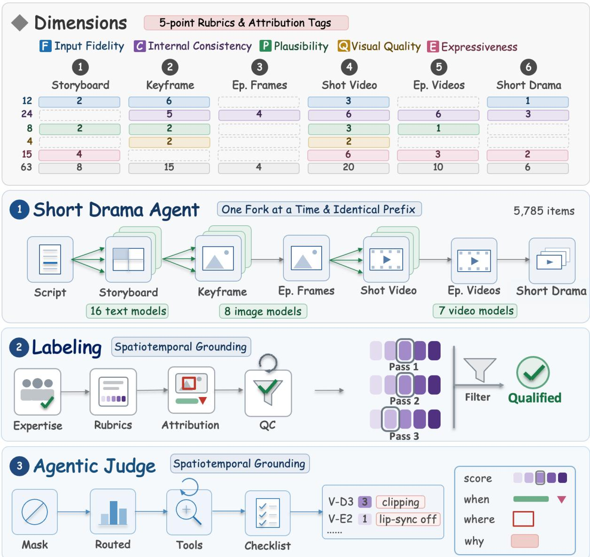  
Figure 1: The overview of DramaChain Bench. DramaChain Dimensions instantiates five evaluation axes at all six production granularities, DramaChain Agent produces the items, DramaChain Labeling System annotates every one of them, and DramaChain Agentic Judge reproduces those annotations automatically.

## annotation panel.

This report evaluates 22 models under full human annotation (9 text LLMs, 7 image models and 6 video models) on every item and every applicable dimension, plus 8 further models scored by DramaChain Agentic Judge alone, without human annotation. A shippable configuration exists: gpt-5.5-xhigh, gpt-image-2 and seedance-2.0 lead their stages and deliver a short drama at 3.30, above the 3.0 usable line. Upstream defects then accumulate along the chain rather than staying local (degrading one upstream stage costs a clip 0.07–0.13 points but the finished short drama 0.25–0.83), so the quality of what ships is not determined by the video generation stage alone. And automated scoring reproduces that board at mean PLCC 0.918, which is what lets those models enter it at no cost.

DramaChain Bench supports extensible evaluation rather than static benchmarking. Its stage-level branching mechanism and model-consistent automatic scoring enable seamless integration of new models with only single-stage generation, requiring no additional human annotation. We will release DramaChain Dimensions, the DramaChain Agentic Judge framework, and a curated subset of benchmark data.

## 2 Related Work

## 2.1 Storytelling video generation

One line of work generates a multi-shot narrative inside one model rather than a staged pipeline: HoloCine [31] denoises a whole scene jointly with sparse cross-shot attention, CausalCine [32] generates causally across shot boundaries in real time. Most of the remaining work is memory: updating keyframe stores, entity-indexed banks, slots gated at shot boundaries, scene recall with adaptive forgetting, and a closed loop that refines each segment against a multimodal memory [16, 29, 51, 59, 69, 76]. One work places the problem elsewhere: ReCA [26] locates it in how context is allocated rather than how long it is. Control is exposed through camera paths, keyframe conditioning or storyboard sketches [61, 63, 72]. That the memory literature is this large is itself the finding: long-range consistency degrades with distance. And control stays coarse: a prompt, a camera path or a sketch is not a per-stage specification, so a requirement that comes out wrong cannot be re-issued to the stage responsible; only the whole run can be generated again.

The second line decomposes the problem into staged roles that hand artefacts to one another, and the works difer mainly in where the stages are cut and whether search is added on top. The earliest are animation systems: Anim-Director [23] drives a controllable animation pipeline from a large multimodal model, and AniMaker [40] follows it with multi-agent generation and an MCTS-inspired search over candidate clips. UniVA [25] takes the same idea to arbitrary video tasks through a plan-and-execute agent over tool servers, while MAViS [53] and ViMax [17] build full storytelling pipelines that distribute script, shot design, character styling, keyframes and animation across specialised agents, with MAViS also covering audio; Co-Director [45] searches creative directions with a bandit, and Soap2Soap [46] applies the same division of labour to whole-series remaking. Two systems target short drama: DramaDirector [75] grounds planning in geometry retrieved from real short-drama shots, and One Sentence One Drama [42] couples script generation to production through multi-agent debate over pacing and staged review; both locate the dificulty in the hand-ofs: a text storyboard underspecifies the geometry the renderer needs, and errors accumulate across script, keyframe and video stages unless review loops correct them. Commercial platforms run frameworks of the same shape (Sec. 1), which is what makes per-stage evaluation both possible and necessary, and is the position this benchmark takes.

## 2.2 Datasets and benchmarks

Existing corpora supply material for these systems but not what a chain-level benchmark needs. They are assembled at scale from footage the pipeline under test did not produce: movie-level material, multi-shot corpora, shots mined from live-action drama, and subject-consistent triplets built from web video with part of their references synthesised [6, 60, 67, 68, 75]. Two things are missing throughout. None records a full generation chain (the script, storyboard, keyframes, shot videos and the finished short drama of one episode, produced by one pipeline), so the input to any stage is a human-made artefact rather than the output of the model that would feed that stage in deployment. And none carries annotation that localises an error and attributes it: labels are ratings or captions over a whole clip, so a corpus can establish that one sample is worse than another without recording where the defect is or what caused it, which is precisely the signal needed to charge a defect to a stage.

Benchmarks have grown in three steps. VBench [18, 73] set the template: decompose quality into capability dimensions, implement each with a generalist VLM or a specialist detector, and validate the suite against model-level human preference. A first group refines it, moving to MLLM-based scoring, adding per-sample attribution, testing how far an omni-LLM judge can be trusted, and isolating physical commonsense [1, 14, 24, 62, 66]; the recurring finding is that such judges are competitive on semantic alignment and weak wherever temporal resolution matters, a split this report reproduces per dimension (Sec. 4.3). A second wave keeps the template and extends the target (film language, cross-shot consistency, storyboard panels, multitalker and multi-reference audio-video, narrative richness, long compositional prompts, memory and minute-scale generation [11, 15, 21, 28, 41, 54, 64, 70, 71, 74, 78]), alongside a line that asks whether vision-language models read cinematography at all [27, 55]; what carries a score throughout is a finished artefact rather than the hand-ofs that produced it. VideoWeaver [57] marks the boundary: its judge does read the agent’s execution trace and intermediate files, but it asks whether the workflow completed its steps, not whether each intermediate artefact meets a rubric. The same movement is visible outside video: in text-to-image generation, Qwen-Image-Bench [22] replaces prompt-level alignment scores with a taxonomy of verifiable rubrics designed with professional artists. The closest work aligns evaluation with the workflow: EvalVerse [65] is pipeline-aware, though what is aligned there is the criteria while items are still evaluated as finished video, so a defect cannot be charged to a stage; DirectorBench [5] diagnoses at checkpoint granularity and locates the bottleneck between units rather than inside them, the same shape as the finding this report reaches in Sec. 4.5 without scoring the intermediate artefacts. In short drama the evaluation suites arrive attached to generation systems and still stop short of the chain: script continuation, a storyboard-and-video protocol over storyboards mined from real dramas, and the pipeline as a black box [30, 42, 75]. Table 1 places DramaChain Bench against this literature, where two properties hold across every prior row: the items are authored for evaluation or cut from existing media, so the input to the stage under test never came from the model that would actually feed it; and human labels validate a metric by model-level correlation, so where single items are annotated the label is a preference or an overall rating rather than a per-dimension score with the deduction localised.

Table 1: Comparison with related video and short-drama benchmarks. Dimension and item counts are as disclosed by each work where it states them and estimated from its description where it does not ( , $< )$ , with $\mathrm { n } / \mathrm { r }$ for the ones that give no basis for either; stages scored applies our own definition, † marks an evaluation suite introduced inside a generation-system paper rather than published on its own.
<table><tr><td>Benchmark</td><td>Pipeline- Derived</td><td>Stages Scored</td><td>Leaf Dimensions</td><td>Human-Annotated Items</td><td>Deductions Localised in Space &amp; Time</td></tr><tr><td>VBench [18]</td><td>X</td><td>1</td><td>16</td><td>n/r</td><td>X</td></tr><tr><td>VBench-2.0 [73]</td><td>X</td><td>1</td><td>18</td><td>n/r</td><td>X</td></tr><tr><td>FilmBench [54]</td><td>X</td><td>1</td><td>38</td><td>2,878</td><td>X</td></tr><tr><td>MSVBench [41]</td><td>X</td><td>1</td><td>20</td><td>≈300</td><td>X</td></tr><tr><td>EntityBench [15]</td><td>X</td><td>1</td><td>51</td><td>200</td><td>X</td></tr><tr><td>EvalVerse [65]</td><td>X</td><td>1</td><td>45</td><td>n/r</td><td>X</td></tr><tr><td>DirectorBench [5]</td><td>X</td><td>1</td><td>40</td><td>&lt;100</td><td>X</td></tr><tr><td>Short-Drama-Bench† [42]</td><td>X</td><td>1</td><td>15</td><td>≈1.8k</td><td>X</td></tr><tr><td>DramaBoard† [75]</td><td>X</td><td>2</td><td>9</td><td>≈120</td><td>X</td></tr><tr><td>DramaChain Bench (this report)</td><td>L</td><td>6</td><td>63</td><td>5,785</td><td>√</td></tr></table>

## 3 DramaChain Bench

DramaChain Bench consists of three built infrastructure components and DramaChain Dimensions, rather than a standalone dataset release. DramaChain Dimensions (Sec. 3.1): all six stages share the same five evaluation axes, so one criterion can be followed along the chain and the efect of an upstream defect on everything downstream becomes observable. Drama Chain Agent (Sec. 3.2): items are executed, not authored, on a self-built pipeline benchmarked against commercial short-drama platforms. Forking occurs exclusively at the stage under test, enabling stage-wise comparability across models. DramaChain Labeling System (Sec. 3.3): three annotators score independently and localise every deduction in space and time with a tag from a fixed vocabulary, which makes it verifiable whether automated scoring found the right defect and not merely the right score. DramaChain Agentic Judge (Sec. 3.4): rather than let small-model measurements feed a large-model verdict, we discard the metrics that disagree with humans, gather evidence over multiple agentic tool rounds, and score against a per-item checklist written in the same rubric text and defect vocabulary the annotators used.

## 3.1 DramaChain Dimensions: five axes across six stages, 63 leaf dimensions

All six stages share one set of five evaluation axes, and sharing them is what makes a defect traceable rather than merely visible. A storyboard that crams several actions into one shot is scored on P for its executability, and the shots generated from that storyboard are scored on P again, so a video that comes out physically incoherent can be read against the plausibility of the instruction it was given instead of being charged to the video model by default. How far such a defect travels is measured in Sec. 4.5.

F input fidelity asks whether the stage did what its input asked, checked against the upstream artefact. C internal consistency asks whether it is the same person, room and prop as in the other shot, checked against a sibling artefact. P generation plausibility asks whether this is physically and causally possible, with no external referent. Q visual quality is technical and aesthetic quality of the pixels, pure perception. E cinematic expressiveness covers framing, camera work, performance, audio design and watchability: perception plus taste. Each leaf dimension under them carries a five-level decidable description and a fixed set of attribution tags, and humans and the automated scorer read the same rubric text and draw defect tags from the same vocabulary (Sec. A.2). Figure 2 gives the resulting grid; which axes activate at which stage, the full per-dimension definitions and the schema’s own counting are Sec. A.

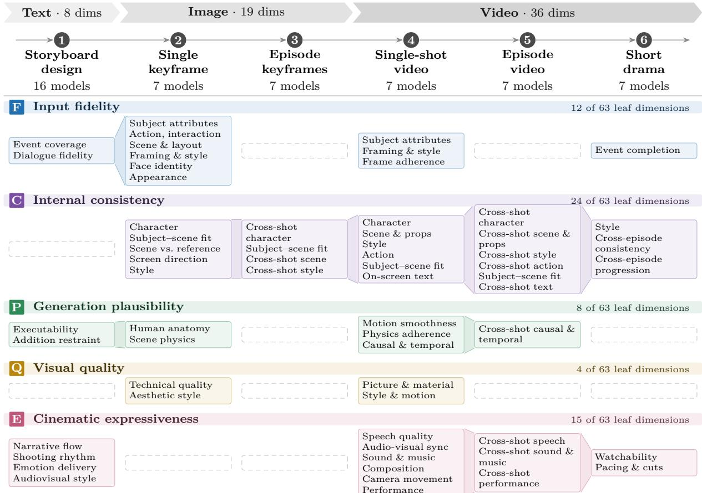  
Figure 2: The overview of DramaChain Dimensions. Five evaluation axes are defined once and instantiated at the six production granularities, resolving into 63 leaf dimensions.

## 3.2 DramaChain Agent: building a short-drama production system to commercialplatform parity

The items are produced by a pipeline rather than written for the evaluation. DramaChain Agent is the short-drama generation agent system the benchmark is generated on, built on the ViMax framework [17] with its chain reverse-engineered from commercial platforms and then optimised. Alongside the six stages that are scored it produces the intermediate artefacts a production line needs: character portrait sheets, scene and element reference sheets, per-shot descriptions and a camera tree. It has the following three properties.

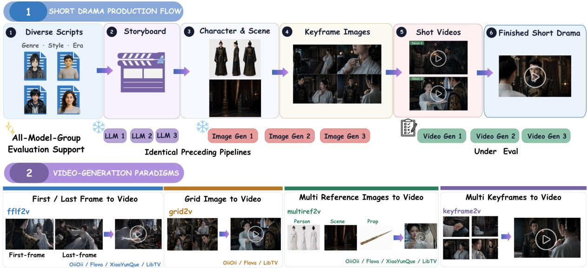  
Figure 3: The overview of DramaChain Agent. It runs the six-stage production chain and forks only at the stage under evaluation, so competing models receive the identical upstream artefact, and the quality of the short drama it delivers is benchmarked against commercial short-drama platforms.

Data diversity. 20 short dramas 3 consecutive episodes = 60 episodes, spread across channel, period and genre, crossed with visual style (live-action / animated, 10:10) and dialogue language (Chinese / English, 16:4) so every slice supports a stratified check. The scripts are written by the pipeline itself against a genre bank modelled on a commercial short-drama app’s taxonomy, one genre per drama, and each passes an automatic check and an expert screenwriter’s assessment before use. Figure 4 shows eight items drawn from eight of the twenty dramas; the full manifest is Sec. B.

Parity with commercial platforms. A benchmark generated by a weak pipeline measures the pipeline, not the models, so parity is required of the chain, of the ways it can drive a stage, and of the output. The chain is the one those platforms run: script, storyboard, keyframe images, shot videos, then the short drama, fully automatic throughout. Platforms also difer in how they drive the video stage, and DramaChain Agent implements four input paradigms, difering in the artefact handed to the video model (Fig. 3): a first/last frame pair (fflf2v), a sliced grid panel (grid2v), character, element and scene references with no frames (multiref2v), or independently drawn keyframes (keyframe2v). The first three are evaluated here. For the output we ran one identical script through DramaChain Agent and three commercial shortdrama platforms end to end, with no human editing, frame selection or best-of-n reruns; expert review found shot division, character and scene consistency, camera language and audio all landing in the same band, with the diferences stylistic.

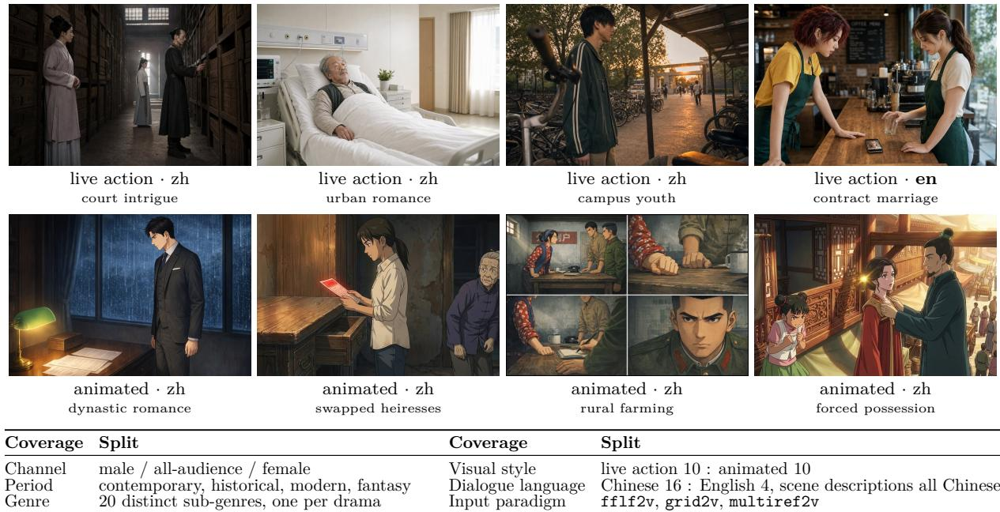  
Figure 4: What the benchmark’s items look like, with the corpus splits below. Full manifest: Sec. B.

Stage-by-stage comparability. A score diference between two models must come from the models. Every shot slot is generated once by each participating model, without exception, at every granularity, and the pipeline forks only at the stage under test (Fig. 3): everything before the fork is generated once, so competing models receive the identical upstream artefact and the same prompt string, and evaluating a new model costs one stage of generation rather than a rebuilt corpus.

## 3.3 DramaChain Labeling System: treating the reference answer as an engineering artefact

Comparable prior work constructs its human evaluation layer via small-sample scoring or methodlevel comparisons, rather than item-wise exhaustive coverage; such approaches can only validate model-level ranking outcomes. In contrast, DramaChain Labeling System leverages professional human annotators, item-wise multi-dimensional scoring, and mandatory spatio-temporal attribution (Fig. 5). This yields 17,488 scored entries and 255,925 verifiable attributions, with a median annotation time of 23 minutes per item. Each item receives independent scores from three annotators. Since every point deduction is localised and assigned an attribution, we can verify whether automated scoring identifies the actual underlying defect, rather than merely producing a plausible final score.

Annotator profile. Our annotation pool comprises 543 annotators. Recruitment adopts stage-specific skill screening: annotators for storyboard design are required to have directing or screenwriting backgrounds, while annotators for other stages need substantial experience in image or video annotation. Annotation tasks are distributed across multiple supplier teams, each operating its own annotator cohort and dedicated quality-control reviewers.

Spatio-temporal attribution. For any dimension that does not receive a perfect score, annotators must localise the issue and select a corresponding reason from a pre-defined tag set for that dimension. The annotation interface dynamically adapts to the task stage, supporting bounding-box frame selection, time intervals, single or ranged shot indices, and free-form text input. This core constraint enables the analyses presented in the rest of this paper: it distinguishes the scenario where “all three annotators dislike an output” from “all three annotators pinpoint the same defect”; it defines a standardised output format that the automated scorer must follow; and it automatically exposes unsupported, evidence-free score deductions.

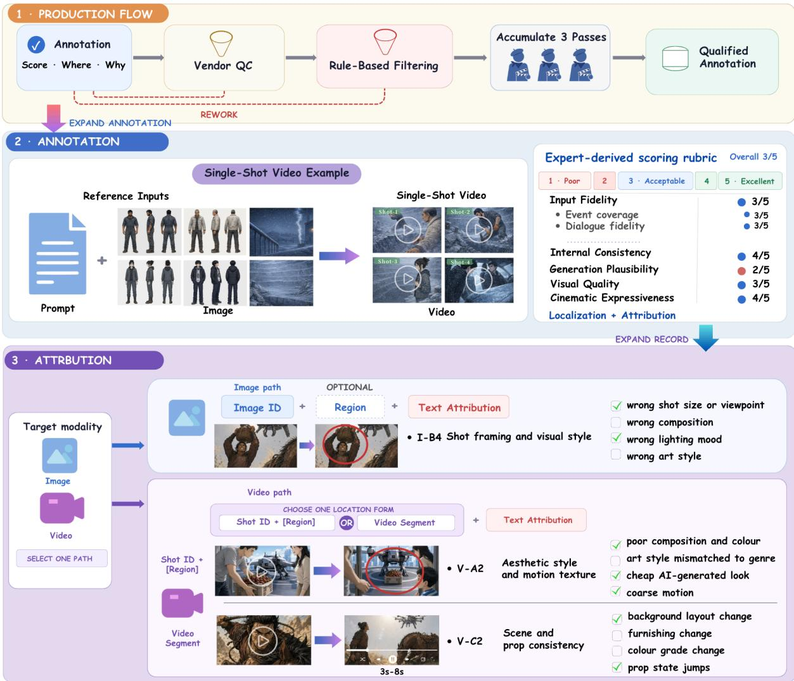  
Figure 5: The overview of DramaChain Labeling System. Three annotators score every item on the expert-derived rubric, and below full marks the defect must be located, on the image or in time, and given a reason from that dimension’s fixed tag list; vendor quality control and rule-based filtering stand between an annotation and the qualified corpus.

Quality control and filtering. Group-level reviewers sample a configurable fraction of their team’s outputs (one-fifth by default). Failed annotations are archived and reassigned for reannotation. A quality dashboard further flags low-quality submissions for revision based on nine heuristic rules, including annotation speed far below the granularity-matched median, deductions with no associated attribution, and near-zero correlation with leave-one-out consensus.

## 3.4 DramaChain Agentic Judge: multi-round agentic scoring

Baseline and hybrid pipelines. The baseline approach feeds input material and evaluation rubrics directly into a VLM to produce a single JSON-formatted verdict. It sufers from a fundamental structural limitation: short-drama defects often lie in local frame regions or inter-segment discontinuities, both invisible to holistic impression-based assessment. Existing hybrid pipelines mitigate this by equipping large models with measurements from specialist models [15, 41, 71]. Following this paradigm, we integrate a full suite of modules for detection-segmentation [19, 37], identity and general visual-similarity evidence [10, 43], sceneconsistency [12], style-consistency [44], aesthetic-quality [20, 49, 58], motion [50], audio analysis [7, 13, 36, 38] and cross-model corroboration with VideoPhy-AutoEval [1]. We then raise a largely overlooked question: do these metrics align with human judgements?

The metric audit. Most metrics correlate weakly with the human annotations, at SRCC no greater than 0.2. Degradation is severe for aesthetic and image-quality metrics: fourteen photography-oriented metrics yield negative correlation, while AIGC-specific perceptual models remain below 0.2. Their failure stems from divergent priors: photography-domain metrics assume real-world photographs, whereas AIGC models treat short-drama intrinsic stylisation as anomalous deviation (Sec. A.5). This benchmark further invalidates three leaf dimensions including V-D2, whose human baseline is near-random. Aligning the automated scorer against random-like references yields uninterpretable outputs.

Multi-round agentic scoring. Against this backdrop, DramaChain Agentic Judge retains only metrics with non-negligible correlation that supply low-level perceptual signals unavailable to LLMs, using them as auxiliary cues rather than direct scoring inputs. Each leaf dimension is scored independently and concurrently over multiple agentic rounds. The system automatically routes relevant measurements for each target dimension; the agent may additionally invoke perception tools (regional zoom, timestamp-based frame extraction) for fine-grained inspection before scoring against item-specific checklists. Output verdicts include annotator-derived defect tags and spatio-temporal localisation, enabling direct cross-checking whenever model-human disagreements arise. Figure 6 lays out the checks run at every granularity, and Fig. 7 presents a field-by-field verdict example.

Deployed models and settings. We adopt stage-specific scoring configurations targeted at respective bottlenecks. Storyboard design averages outputs from gpt-5.6-sol-xhigh and a claude-fable-5 variant to eliminate model-family bias. The primary judging model for keyframe evaluation is doubao-seed-2.1-pro, and shot-level video evaluation employs gemini-3.1-pro.

## 4 Experiment

## 4.1 Setup

Nine text LLMs, seven image models and six video models were scored by both human annotation and automated evaluation, and eight further models by automated evaluation alone on exactly the same items: the rows of Tab. 2. Scores are out of 5, and 3.0 is the line between usable and needing rework. Model names are the vendors’ own; a trailing -xhigh, -max or -high is the reasoning-efort setting the run used rather than part of the name. Model-side content review and generation failures left several models short of the full item set; those models are scored on the slice they ran and are marked  in Tab. 2; their gaps are listed in Sec. C.2.

## 4.2 Main results

Table 2 is the automated board for all six stages, broken out over the five evaluation axes.

One dominant chain across all stages. Excluding models added post-annotation, the current state-of-the-art pipeline uses gpt-5.5-xhigh for storyboarding, gpt-image-2 for keyframes, and seedance-2.0 for video. Within each modality, the leading model is invariant to evaluation granularity: gpt-image-2 tops both keyframe stages (3.99, 3.82), and seedance-2.0 leads all three video stages (3.24, 3.11, 3.30). This top pipeline operates near the usable line. Its finished short drama scores 3.30 (only 0.3 above the line), and its best single-shot result is 3.24. Hence today’s strongest chain barely meets the line with negligible safety margin.

Performance degrades along the text-to-video pipeline. Scores decay progressively through the pipeline: 3.78 for storyboard design, 3.62 for single keyframes, 3.30 for episode keyframes, 3.09 for single-shot video, 2.93 for episode video, with a modest rebound to 3.03 for the finished short drama. No pixel- or video-generation stage attains the mean of 3.78 achieved at the text stage; the three video granularities all sit within 0.1 of the usable line, with episode video below it. Two factors cause this degradation. First, generation dificulty rises as outputs acquire pixels, temporal dynamics and audio, applying the same evaluation lens to progressively harder downstream outputs. Second, defects propagate rather than remain localised: each stage consumes outputs from its predecessor, with no component empowered to fix inherited flaws (Sec. 4.5).

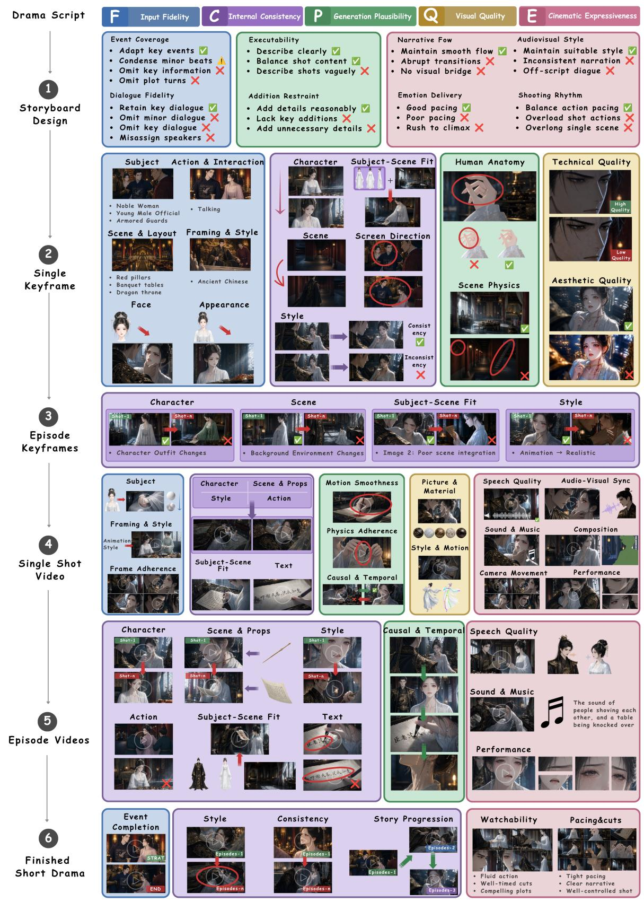  
Figure 6: The overview of DramaChain Agentic Judge. Rows are the six granularities in production order and columns the five evaluation axes; every cell shows the checks run there and the evidence they are decided on, taken from the annotators’ own criteria and tag vocabulary.

Table 2: Main results. This automated board presents 5-point scores for six stages and five evaluation axes. All is the cross-axis composite metric. Red: below the 3.0 usable line; bold: top annotated model per column; dash: stage-undefined axis. Stage-header PLCC/SRCC give model-level correlation against the three-annotator human board; per-item results appear in Sec. 4.3. : post-annotation models scored only automatically, excluded from agreement metrics and best-column marking. : partial corpus runs (reduced dramas, paradigms or styles), scores from evaluated subsets; missing data in Sec. C.2.
<table><tr><td>Model</td><td>F Input fidelity</td><td>C Internal consistency</td><td>P Generation plausibility</td><td>Q Visual quality</td><td>E Cinematic expressiveness</td><td>All</td></tr><tr><td colspan="7">① Storyboard design text → text · PLCC 0.936 · SRCC 0.800 gpt-5.5-xhigh claude-opus-4.8-max hy3</td></tr><tr><td>doubao-seed-2.1-pro glm-5.2 gemini-3.1-pro kimi-k2.6 qwen3.7-max mimo-v2.5-pro gpt-5.6-sol-maxt claude-fable-5-max† claude-opus-5-max† kimi-k3†</td><td>4.84 4.51 4.36 4.26 4.01 4.08 3.66 3.24 2.68</td><td></td><td>3.89 3.80 3.65 3.65 3.66 3.43 3.42 3.48 3.53</td><td></td><td>4.10 4.19 3.78 3.82 3.74 3.67 3.74 3.59</td><td>4.23 4.17 3.89 3.89 3.79 3.71 3.64 3.48</td></tr><tr><td>qwen3.8-max† grok-4.5† gemini-3.6-flash-hight</td><td>4.95 4.55 4.45 4.67 4.55 3.96 4.04</td><td></td><td>4.02 3.99 3.85 3.87 3.88 3.85 3.65</td><td></td><td>3.41 4.31 4.20 4.30 4.17 3.94 3.92 3.71</td><td>3.26 4.40 4.24 4.22 4.22 4.08 3.92</td></tr><tr><td>gpt-image-2 gpt-image-1.5 nano-banana-2 seedream-5.0-pro nano-banana-pro wan2.7-image-pro seedream-5.0-1ite ③ Episode keyframes a whole episode of frames · PLCC 0.973 · SRCC 0.964 gpt-image-2</td><td>② Single keyframe text + refs → pixels · PLCC 0.959 · SRCC 0.750 3.65 3.25 3.33 3.56 3.17 2.95 2.96</td><td>4.32 3.96 3.92 3.92 3.89 3.63 3.40 3.82</td><td>4.47 4.46 4.25 3.74 4.34 4.03 3.89</td><td>4.13 3.90 3.71 3.52 3.79 3.46 3.40</td><td></td><td>3.99 3.72 3.68 3.64 3.62 3.38 3.32</td></tr><tr><td>gpt-image-1.5 nano-banana-2 seedream-5.0-pro nano-banana-pro wan2.7-image-pro seedream-5.0-lite</td><td></td><td>3.60 3.47 3.28 3.04 3.00 2.91</td><td></td><td></td><td></td><td>3.82 3.60 3.47 3.28 3.04 3.00 2.91</td></tr><tr><td>④ Single-shot video pixels → time + audio · PLCC 0.755 · SRCC 0.829 seedance-2.0 happyhorse-1.1 kling-3.0-omni pixverse-c1</td><td>3.44 3.34 3.22 3.07</td><td>3.27 3.21 3.23 3.09</td><td>3.06 3.04 3.08 2.92</td><td>3.77 3.43 3.28 3.42</td><td>3.05 3.08 2.88</td><td>3.24 3.18 3.11</td></tr><tr><td></td><td></td><td></td><td></td><td></td><td>3.22</td><td>3.10</td></tr><tr><td></td><td></td><td></td><td></td><td></td><td></td><td></td></tr><tr><td></td><td></td><td></td><td></td><td></td><td></td><td>3.32 3.37</td></tr><tr><td></td><td></td><td></td><td></td><td></td><td></td><td></td></tr><tr><td></td><td></td><td></td><td></td><td></td><td></td><td>3.48</td></tr><tr><td></td><td></td><td></td><td></td><td></td><td></td><td></td></tr><tr><td></td><td></td><td></td><td></td><td></td><td>3.32 3.71</td><td>2.76 2.85</td></tr><tr><td></td><td></td><td></td><td></td><td></td><td></td><td>2.92</td></tr><tr><td></td><td></td><td></td><td></td><td></td><td></td><td>3.10 3.04</td></tr><tr><td>wan2.7</td><td>3.45</td><td>2.96</td><td>2.87 2.73</td><td></td><td></td><td></td></tr><tr><td>veo-3.1</td><td>3.17</td><td>2.77 3.40</td><td></td><td></td><td></td><td></td></tr><tr><td></td><td></td><td></td><td></td><td></td><td></td><td></td></tr><tr><td>seedance-2.5†</td><td></td><td></td><td></td><td></td><td></td><td>2.88</td></tr><tr><td></td><td>3.24</td><td></td><td>2.97</td><td></td><td></td><td>3.17</td></tr><tr><td>⑤Episode video shots in sequence · PLCC 0.935 · SRCC 0.943</td><td></td><td></td><td></td><td></td><td></td><td></td></tr><tr><td>seedance-2.0</td><td></td><td></td><td></td><td></td><td></td><td></td></tr><tr><td>happyhorse-1.1</td><td></td><td>2.96</td><td>3.41</td><td></td><td></td><td>3.11</td></tr><tr><td></td><td></td><td>2.84</td><td>3.64</td><td></td><td></td><td>3.08</td></tr><tr><td>kling-3.0-omni</td><td></td><td>2.79</td><td>3.31 3.24</td><td></td><td></td><td>3.06</td></tr><tr><td>wan2.7</td><td></td><td></td><td>3.27</td><td></td><td></td><td></td></tr><tr><td>veo-3.1</td><td></td><td>2.57</td><td></td><td></td><td></td><td>3.35 2.87</td></tr><tr><td></td><td></td><td>2.47</td><td></td><td></td><td></td><td>3.18 2.76</td></tr><tr><td>pixverse-c1</td><td></td><td>2.42</td><td></td><td></td><td></td><td></td></tr><tr><td>seedance-2.5t</td><td></td><td>3.16</td><td></td><td>3.08</td><td></td><td>3.16 2.71</td></tr><tr><td></td><td></td><td></td><td></td><td>3.11</td><td></td><td>3.25</td></tr><tr><td>⑥ Short drama the finished short drama · PLCC 0.947 · SRCC 1.000</td><td></td><td></td><td></td><td></td><td></td><td>3.50</td></tr><tr><td></td><td></td><td></td><td></td><td></td><td></td><td></td></tr><tr><td>seedance-2.0</td><td></td><td></td><td></td><td></td><td></td><td></td></tr><tr><td></td><td>4.29</td><td>3.38</td><td></td><td></td><td></td><td>2.68 3.30</td></tr><tr><td>happyhorse-1.1</td><td>3.82</td><td>3.38</td><td></td><td></td><td></td><td>2.69 3.22</td></tr><tr><td>kling-3.0-omni</td><td>3.37</td><td>3.41</td><td></td><td></td><td>2.54</td><td>3.11</td></tr><tr><td>wan2.7</td><td>4.12</td><td>2.80</td><td></td><td></td><td>2.59</td><td></td></tr><tr><td></td><td></td><td></td><td></td><td></td><td></td><td>2.95</td></tr><tr><td>pixverse-c1</td><td>3.05</td><td>2.88</td><td></td><td></td><td>2.58</td><td></td></tr><tr><td></td><td></td><td>3.07</td><td></td><td></td><td></td><td>2.81</td></tr><tr><td></td><td></td><td></td><td></td><td></td><td>2.44</td><td></td></tr><tr><td></td><td></td><td></td><td></td><td></td><td></td><td></td></tr><tr><td></td><td></td><td></td><td></td><td></td><td></td><td></td></tr><tr><td></td><td></td><td></td><td></td><td></td><td></td><td></td></tr><tr><td></td><td></td><td></td><td></td><td></td><td></td><td></td></tr><tr><td></td><td></td><td></td><td></td><td></td><td></td><td></td></tr><tr><td></td><td></td><td></td><td></td><td></td><td></td><td></td></tr><tr><td></td><td></td><td></td><td></td><td></td><td></td><td></td></tr><tr><td></td><td></td><td></td><td></td><td></td><td></td><td></td></tr><tr><td>veo-3.1</td><td></td><td></td><td></td><td></td><td></td><td></td></tr><tr><td></td><td></td><td></td><td></td><td></td><td></td><td></td></tr><tr><td></td><td>2.67</td><td></td><td></td><td></td><td></td><td></td></tr><tr><td></td><td></td><td></td><td></td><td></td><td></td><td>2.79</td></tr><tr><td>seedance-2.5t</td><td>4.40</td><td>3.93</td><td></td><td></td><td>3.00</td><td>3.70</td></table>

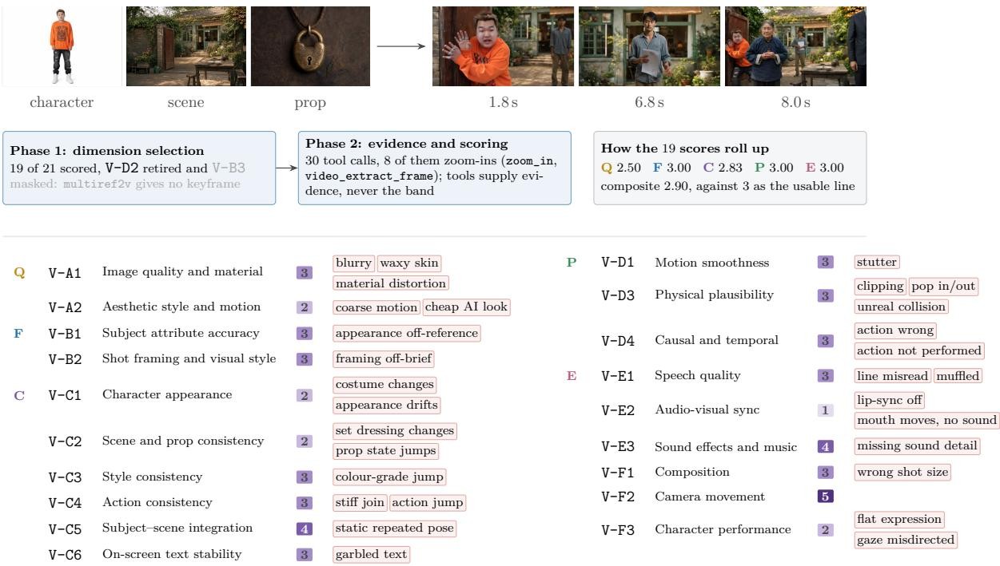  
Figure 7: One real automated-evaluation record.

Benchmark discrimination is strongest for criteria with explicit reference anchors. Averaged across applicable stages, top-to-bottom performance gaps are 1.22 for F input fidelity, 0.70 for C internal consistency, 0.64 for Q visual quality, 0.53 for P generation plausibility, and 0.42 for E cinematic expressiveness. This ordering follows reference explicitness rather than task dificulty: F is validated against upstream outputs and C against peer artefacts, whereas P, Q and E lack external references. Automated benchmarks yield highest discriminative power when anchors are well-defined. Consequently, small gaps on weakly-anchored metrics reflect benchmark limitations, not comparable model performance. Human annotation confirms the diagnosis but not the ordering: it too separates models most on F, while ranking E second widest where this board ranks it last.

Models exhibit heterogeneous strengths across dimensions. Aggregate composite scores mask dimensional trade-ofs. For single keyframes, seedream-5.0-pro and nano-banana-pro difer by only 0.02 in composite score. Yet seedream-5.0-pro leads by 0.39 on F input fidelity but lags by 0.60 on P generation plausibility. For single-shot video, kling-3.0-omni and pixverse-c1 difer by merely 0.01 overall; kling-3.0-omni is 0.16 higher on P but 0.22 lower on E cinematic expressiveness. In both pairs, per-dimension gaps are an order of magnitude larger than composite gaps. Composite scores are thus suitable for tier grouping yet misleading for model selection: one should ask “better on which dimension” instead of “which model is better”. Concrete cases demonstrating this efect are provided in Sec. F.

## 4.3 Agreement validation

Table 3: Agreement with the human reference, per stage. Model Level asks whether the ranking is right, Item Level whether each score is, against the leave-one-out baseline (hb). Score Acc is absolute distance from the consensus.
<table><tr><td rowspan="2">Stage</td><td rowspan="2">Paired</td><td colspan="2">Model Level</td><td colspan="3">Item Level</td><td colspan="3">Score Acc</td></tr><tr><td>PLCC items</td><td>SRCC</td><td>HB</td><td>Judge</td><td>Ratio</td><td>Bias</td><td>MAE</td><td>Within ±0.5</td></tr><tr><td>① Storyboard design</td><td>533</td><td>0.936</td><td>0.800</td><td>0.217</td><td>0.509</td><td>2.35×</td><td>+0.28</td><td>0.416</td><td>67.5%</td></tr><tr><td>② Single keyframe</td><td>2,125</td><td>0.959</td><td>0.750</td><td>0.449</td><td>0.536</td><td>1.19×</td><td>+0.41</td><td>0.529</td><td>54.2%</td></tr><tr><td>③ Episode keyframes</td><td>429</td><td>0.973</td><td>0.964</td><td>0.233</td><td>0.344</td><td>1.48×</td><td>+0.57</td><td>0.733</td><td>38.2%</td></tr><tr><td>④ Single-shot video</td><td>1,149</td><td>0.755</td><td>0.829</td><td>0.380</td><td>0.301</td><td>0.79×</td><td>-0.35</td><td>0.436</td><td>62.5%</td></tr><tr><td>⑤Episode video</td><td>238</td><td>0.935</td><td>0.943</td><td>0.240</td><td>0.203</td><td>0.85×</td><td>+0.14</td><td>0.433</td><td>66.0%</td></tr><tr><td>⑥ Short drama</td><td>201</td><td>0.947</td><td>1.000</td><td>0.450</td><td>0.384</td><td>0.85×</td><td>+0.42</td><td>0.425</td><td>66.7%</td></tr><tr><td>Mean</td><td></td><td>0.918</td><td>0.881</td><td>0.328</td><td>0.379</td><td></td><td></td><td>0.495</td><td></td></tr></table>

Correlations are on the composite score; hb and Judge are per-item PLCC against the three-annotator consensus, Ratio their quotient. Green reaches or beats the baseline, red does not.

Agreement against the human reference. All 5,785 test items were independently annotated by three annotators, establishing dual-level reference benchmarks for subsequent correlation analysis. At the model level, the reference standard is the ranking derived from three annotator consensus, with correlation calculated directly against this human ranking. At the item level, evaluation relies on consensus scores and adopts the leave-one-out human baseline (hb, a rotated and pooled paradigm where one annotator predicts the average score of the other two) to eliminate invalid absolute correlation results without criterion reproducibility. Detailed derivation and illustrative cases are provided in Sec. E. Cross-level agreement analysis demonstrates robust model-level consistency: DramaChain Agentic Judge achieves a mean PLCC of 0.918 across six evaluation stages, with perfect alignment between automated and human rank ings (SRCC = 1.000) for short dramas. This high consistency enables the inclusion of eight additional models in Tab. 2 without extra annotation costs, fully leveraging the one-time annotated 5,785 3 dataset. At the individual item level, agreement performance varies distinctly across pipeline stages. Text and image stages reach or exceed human baseline performance; notably, storyboard design achieves 2.35 baseline consistency, indicating that automated scoring far outperforms a fourth independent annotator in reproducing human consensus. In contrast, the three video stages drop to 0.79–0.85 baseline levels, retaining valid correlation but failing to replace human evaluation for single-item assessment.

Determinants of agreement. The stage-wise divergence of automated-human agreement is driven by two inherent attributes of evaluation tasks, none of which stems from criterion sub jectivity. First, evaluation modality shapes consistency performance. The critical performance divide lies between static image and dynamic video modalities, rather than between single and multi-asset tasks (Fig. 8). Despite requiring more cognitively demanding cross-frame comparison, episode keyframe scoring achieves 1.48 baseline consistency; in contrast, isolated single video clip evaluation only reaches 0.79 the baseline. Modality-aggregated results show a steady consistency decay for automated scoring: 0.509 for text, 0.440 for pixel-based images, and 0.296 for time-and-audio video content. Conversely, human annotator consistency rises across these modalities (0.217, 0.341, 0.357), revealing an inverse trend where the automated scorer performs worst in scenarios with the highest human consensus. Second, the availability of external validation references governs the hierarchical gap across evaluation axes (Tab. 17). Agreement scores rank in the order of F (0.423), C (0.235), P (0.146), E (0.132), and Q (0.121). Only F delivers a net improvement over the human baseline (+0.107, superior in 9 out of 12 tests), while Q shows no baseline advantage in any of its four test cases.

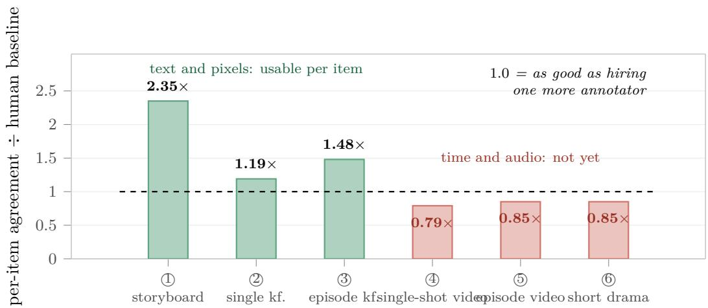  
Figure 8: Per-item agreement of automated evaluation, expressed as a multiple of the leave-one-out human baseline (per-item PLCC against the three-annotator consensus). Above 1 it reproduces the panel better than a fourth annotator would.

Predictors of automatability. Intuitively, evaluation automatability, reflected in humanmachine agreement, would be expected to degrade with higher criterion subjectivity, yet this study observes an opposite, counterintuitive pattern: subjectivity exhibits no positive correlation with automated scoring error. The most subjective dimension (audiovisual style matching) reaches 6.5 baseline performance, while the weakest-performing dimensions (image quality, motion smoothness, environmental physics, audio-visual sync) are all objective metrics. Instead of subjectivity, two practical, task-level attributes reliably predict automatability: whether criteria can be decomposed into enumerable checkable items, and whether evaluation requires fine-grained perceptual discrimination (Tab. 4).

Table 4: What predicts automatability. Rows are whether deciding the criterion needs fine-grained perception, columns whether it can be enumerated as check items. Each cell gives the verdict, then the dimensions that fall there, each as automated / human-baseline per-item PLCC with their ratio, and what follows for engineering.
<table><tr><td></td><td>Criterion enumerable as check items</td><td>Criterion not enumerable</td></tr><tr><td>Perception not needed</td><td>Above the baseline: delegate. S-A2 dialogue fidelity 0.728/0.442 1.6× S-A1 event coverage 0.497/0.1503.3× S-C4 audiovisual style 0.265/0.041 6.5× An external answer exists to compare against: the event list, the verbatim dialogue, the style instruction.</td><td>Both sides near zero: repair the criterion. S-B2 restraint in additions 0.110/-0.023 I-D5 style consistency 0.130/0.131 0.99× The obstacle is the operability of the criterion, not annotation cost; tuning prompts here yields little.</td></tr><tr><td>Perception needed</td><td>Below the baseline: add perception. V-E2 audio-visual sync 0.075/0.448 0.17× V-D1 motion smoothness 0.069/0.208 0.33× V-A1 image quality 0.076/0.191 0.40× I-E2 environmental physics 0.152/0.234 0.65× All perceptual, and the human baseline is itself normal or high: the problem is real and people can see it, the scorer cannot.</td><td>No dimension falls here.</td></tr></table>

## 4.4 Stage-wise analysis

The three parts below follow the three modalities of the chain rather than individual granularities, and together they cover all six: storyboard design is 1 , the text stage; keyframe images covers 2 and 3 ; and shot video covers 4 to 6 .

## 4.4.1 Storyboard design

Nine text-based large language models convert episode scripts into storyboard scripts, yielding 533 evaluation items. The automated scores of the nine range from 3.26 to 4.23 (Tab. 2), the widest performance gap among the three single-asset granularities. Following the annotation round, seven additional models were evaluated on the same item set.

Table 5: Storyboard design, all eight leaf dimensions: human consensus mean, automated mean, and per-item agreement on both sides. hb is the leave-one-out human baseline. Ordered by code.
<table><tr><td rowspan="2">Dimension</td><td rowspan="2">Axis</td><td colspan="2">Mean score</td><td colspan="2">Per-item PLCC</td><td rowspan="2">ratio</td></tr><tr><td>human</td><td>judge</td><td>HB</td><td>judge</td></tr><tr><td>S-A1 event coverage</td><td>F</td><td>4.11</td><td>4.01</td><td>0.150</td><td>0.497</td><td>3.3×</td></tr><tr><td>S-A2 dialogue fidelity</td><td>F</td><td>4.17</td><td>3.91</td><td>0.442</td><td>0.728</td><td>1.6×</td></tr><tr><td>S-B1 executability</td><td>P</td><td>3.41</td><td>3.89</td><td>0.046</td><td>0.076</td><td>1.7×</td></tr><tr><td>S-B2 restraint in additions</td><td>P</td><td>3.96</td><td>3.34</td><td>-0.023</td><td>0.110</td><td></td></tr><tr><td>S-C1 narrative flow</td><td>E</td><td>4.03</td><td>4.12</td><td>0.199</td><td>0.256</td><td>1.3×</td></tr><tr><td>S-C2 shooting rhythm</td><td>E</td><td>3.47</td><td>2.74</td><td>0.092</td><td>0.307</td><td>3.3×</td></tr><tr><td>S-C3 emotional expression</td><td>E</td><td>3.93</td><td>4.18</td><td>0.128</td><td>0.332</td><td>2.6×</td></tr><tr><td>S-C4 audiovisual style</td><td>E</td><td>4.11</td><td>4.09</td><td>0.041</td><td>0.265</td><td>6.5×</td></tr><tr><td>Composite</td><td></td><td>3.51</td><td>3.79</td><td>0.217</td><td>0.509</td><td>2.35×</td></tr></table>

Performance bottlenecks lie in schedulable production defects. Among the eight leaf dimensions, seven meet the usable line, six of them scoring between 3.89 and 4.18, which indicates that the models faithfully reproduce the core script elements: plot events, character dialogue and scene presentation. The deficiencies are concentrated exclusively in the two dimensions that govern production logic, shooting rhythm at 2.74 and restraint in additions at 3.34 (Tab. 5). The bottleneck of the text stage lies in production scheduling and duration budgeting rather than in linguistic generation capability. Duration budgeting follows quantitative arithmetic rules and can be verified before any visual rendering, which makes this the only stage whose dominant defect can be identified and rectified in pre-production.

Automated metrics are stable where human baselines are noisy. This stage achieves the highest item-level agreement in the benchmark, 0.509 against a human baseline of 0.217 (2.35 ), and every dimension surpasses its own baseline (Tab. 5). The variation in baseline mul tiples across dimensions reflects the limits of manual evaluation rather than diferences in model capability. Dialogue fidelity, verifiable word by word against the script, is high on both sides (0.728 against 0.442), whereas audiovisual style treatment reaches the table’s largest multiple at 6.5 on an automated value of only 0.265, because the human baseline is 0.041: annotators barely agree with one another on it. Restraint in additions is the limit case, clearing a baseline of 0.023 that admits no interpretable multiple at all. A baseline multiple is evidence of automatability only where the human criterion is itself reproducible. Where it is not, the automated score is the more stable of the two readings, but stability is not validity: those are the dimensions whose criteria still require operationalisation (Tab. 4).

Validated automation enables annotation-free continuous evaluation. Seven additional models were evaluated on the identical item set at zero incremental annotation cost, entering Tab. 2 with a stage composite alone, and all five intra-family comparisons favour the newer generation, with gains ranging from +0.047 to +0.582. Because the automated scorer is validated at this stage, storyboard design supports continuous zero-cost evaluation. A newly released model can be placed on the board as it ships, and the annotation resources this frees are exactly what the video stages still require.

## 4.4.2 Keyframe images

Seven image models render storyboard scripts as keyframes, yielding 2,125 single-panel items and 429 episode-level items. Models are barely distinguishable on single-panel tasks; the pipeline first drops below the usable line when panels within an episode must maintain coherence (Sec. 4.2).

The deficit is concentrated in placing specified content. Three of the fifteen singlepanel dimensions fall below the usable line, and all three ask whether content the pipeline had already specified was placed correctly: subject attributes against the character sheet (2.75), the scene against its reference image (2.72), and camera framing and visual style against the shot description (2.91). Nothing outside that family fails: the fifteen dimensions span 2.72– 4.59, and neither picture-quality dimension, neither generation-plausibility dimension and no style-consistency dimension falls below the line (Tab. 6). What limits the single-panel stage is adherence to the specification rather than the ability to render a picture, which locates the remedy in conditioning and reference handling rather than in rendering capacity.

Cross-shot consistency is the first collapse along the chain. Two of the four episodelevel dimensions fall below the usable line, and the lower of the two is counter-intuitive: scene consistency (2.50) is worse than character consistency (2.87). This degradation arises from shifts in layout, furnishings and lighting rather than changes to cast members (Tab. 6). When the same set of panels is assessed as a full episode, it is the persistence of entities across frames that degrades, not the appearance of any individual frame. That persistence is a property invisible to single-panel evaluation.

Close composite scores conceal divergent capability profiles. The one model pair on this board with a composite-score diference no larger than 0.03 provides stark evidence for the axis-based capability structure introduced in Sec. 4.2. seedream-5.0-pro and nano-banana-pro difer by merely 0.02 in automated composite score. Yet seedream-5.0-pro leads by 0.39 on F input fidelity and falls behind by 0.60 on P generation plausibility: an axis-level gap an order of magnitude larger than the composite diference. Strengths manifest along entire capability axes rather than across scattered individual dimensions. Composite scores are therefore suficient for model tiering yet misleading when selecting models for concrete production requirements.

Automated evaluation is valid where the item supplies a clear reference. The conventional expectation is that objective criteria automate easily and subjective ones do not, and this stage does not sort that way. Nine of the fifteen single-panel dimensions reach or beat the human baseline and all four episode-level ones do, while the four substantial shortfalls are exactly the Q and P criteria (Tab. 6). Three of those four (technical quality, human anatomy and environmental physics) are the most physically objective criteria in the taxonomy. What decides the outcome is whether the item states the answer, not how objective the criterion sounds. Technical quality reads as the most measurable of the fifteen, yet a soft, low-contrast frame is as easily a deliberate texture as a defect, and nothing in the item settles which the drama intended: the automated scorer reaches only 0.167 against a baseline of 0.275. Action and interaction, a judgement about what is happening in the picture, is the stage’s best-served dimension at 0.527 against 0.401, because the shot description states what should be happening.

Table 6: The keyframe stages, every leaf dimension, ordered by code: human consensus and automated mean scores, and per-item agreement on both sides. hb is the leave-one-out human baseline.
<table><tr><td colspan="2"></td><td colspan="2">Mean score</td><td colspan="2">Per-item PLCC</td><td rowspan="3">ratio</td></tr><tr><td colspan="2">Dimension</td><td colspan="2">Axis human judge</td><td colspan="2">HB</td></tr><tr><td colspan="2">② Single keyframe</td><td></td><td></td><td></td><td>judge</td></tr><tr><td>I-A1 technical quality</td><td>Q</td><td>3.10</td><td>3.92</td><td>0.275</td><td>0.167</td><td>0.6×</td></tr><tr><td>I-A2 aesthetic style</td><td>Q</td><td>3.14</td><td>3.53</td><td>0.194</td><td>0.146</td><td>0.8×</td></tr><tr><td>I-B1 subject attributes</td><td>F</td><td>3.05</td><td>2.75</td><td>0.362</td><td>0.525</td><td>1.5×</td></tr><tr><td>I-B2 action and interaction</td><td>F</td><td>2.94</td><td>3.20</td><td>0.401</td><td>0.527</td><td>1.3×</td></tr><tr><td>I-B3 scene and spatial layout</td><td>F</td><td>3.28</td><td>3.28</td><td>0.306</td><td>0.443</td><td>1.4×</td></tr><tr><td>I-B4 shot framing and visual style</td><td>F</td><td>2.82</td><td>2.91</td><td>0.224</td><td>0.296</td><td>1.3×</td></tr><tr><td>I-C1 face identity</td><td>F</td><td>3.25</td><td>3.96</td><td>0.440</td><td>0.485</td><td>1.1×</td></tr><tr><td>I-C2 appearance and costume</td><td>F</td><td>3.69</td><td>3.72</td><td>0.409</td><td>0.471</td><td>1.2×</td></tr><tr><td>I-D1 cross-panel character</td><td>C</td><td>3.50</td><td>3.97</td><td>0.391</td><td>0.459</td><td>1.2×</td></tr><tr><td>I-D2 subject-scene integration</td><td>C</td><td>3.15</td><td>4.59</td><td>0.218</td><td>0.274</td><td>1.3×</td></tr><tr><td>I-D3 scene vs. reference</td><td>C</td><td>2.75</td><td>2.72</td><td>0.189</td><td>0.182</td><td>1.0×</td></tr><tr><td>I-D4 screen-direction axis</td><td>C</td><td>3.35</td><td>3.75</td><td>0.166</td><td>0.317</td><td>1.9×</td></tr><tr><td>I-D5 style consistency</td><td>C</td><td>4.12</td><td>4.52</td><td>0.131</td><td>0.130</td><td>1.0×</td></tr><tr><td>I-E1 human anatomy</td><td>P</td><td>3.21</td><td>3.87</td><td>0.439</td><td>0.311</td><td>0.7×</td></tr><tr><td>I-E2 environmental physics</td><td>P</td><td>3.26</td><td>4.50</td><td>0.234</td><td>0.152</td><td>0.7×</td></tr><tr><td>composite</td><td></td><td>3.21</td><td>3.62</td><td>0.449</td><td>0.536</td><td>1.19×</td></tr><tr><td colspan="7">③ Episode keyframes</td></tr><tr><td>MI-D1 cross-shot character</td><td>C</td><td>2.59</td><td>2.87</td><td>0.339</td><td>0.456</td><td>1.3×</td></tr><tr><td>MI-D2 subject-scene integration</td><td>C</td><td>2.80</td><td>4.37</td><td>0.110</td><td>0.229</td><td>2.1×</td></tr><tr><td>MI-D3 cross-shot scene</td><td>C</td><td>2.42</td><td>2.50</td><td>0.098</td><td>0.160</td><td>1.6×</td></tr><tr><td>MI-D5 cross-shot style</td><td>C</td><td>3.22</td><td>3.60</td><td>0.240</td><td>0.304</td><td>1.3×</td></tr><tr><td>composite</td><td></td><td>2.74</td><td>3.30</td><td>0.233</td><td>0.344</td><td>1.48×</td></tr></table>

## 4.4.3 Shot video and short drama

Six video models animate keyframes and the results are assembled into episodes, yielding 2,186 single-shot items, 306 episode-video items and 206 short dramas. The field is also pulled furthest apart here, the first-to-last gap widening from 0.36 points on single shots to 0.51 on short dramas.

The weakest dimensions are the ones that unfold over time. The twenty leaf dimensions of this stage span 1.49 to 4.15 (Tab. 7). Audio-visual sync scores the lowest at 1.49 and character performance also ranks among the bottom at 2.34, while the three highest are style consistency (4.15), keyframe adherence (4.14) and image quality (4.11). The criterion separating the two ends is whether a dimension addresses the static appearance of the frame or the temporal behaviour of the clip, and the models perform worst on the latter. This is a class of defect that no still-image benchmark can detect at all.

A coarser unit of judgement counts a diferent kind of defect. Four of the ten dimensions defined at both single-shot and episode granularity track consistency across shots, and all four of those scores drop as the unit of judgement coarsens: style consistency from 4.15 to 3.32, action consistency from 2.56 to 1.93, scene and prop consistency from 2.33 to 1.82, and character appearance consistency from 3.44 to 3.21 (Fig. 9). The kind of defect behind a deduction changes as well. A single-shot deduction indicates an execution error in the individual clip, an episode-video deduction reflects a mismatch between the clips within one episode, and a multi-episode deduction corresponds to narrative content the episode invented. That defect class is entirely absent from single-shot evaluation. Coarsening the unit of judgement reshapes the spectrum of detectable defects rather than merely altering their count, so results confined to individual clips cannot be extrapolated to the delivery standard of a short drama.

Table 7: The three video granularities, every leaf dimension, ordered by code: human consensus and automated mean scores, and per-item agreement on both sides. hb is the leave-one-out human baseline.
<table><tr><td></td><td></td><td colspan="2">Mean score</td><td colspan="2">Per-item PLCC</td><td></td></tr><tr><td>Dimension</td><td>Axis</td><td>human</td><td>judge</td><td>HB</td><td>judge</td><td>ratio</td></tr><tr><td>④ Single-shot video</td><td></td><td></td><td></td><td></td><td></td><td></td></tr><tr><td>V-A1 image quality</td><td>Q</td><td>3.27</td><td>4.11</td><td>0.191</td><td>0.076</td><td>0.4×</td></tr><tr><td>V-A2 aesthetic style and motion</td><td>Q</td><td>3.25</td><td>2.72</td><td>0.169</td><td>0.096</td><td>0.6×</td></tr><tr><td>V-B1 subject attributes</td><td>F</td><td>3.54</td><td>3.43</td><td>0.314</td><td>0.264</td><td>0.8×</td></tr><tr><td>V-B2 shot framing and visual style</td><td>F</td><td>3.33</td><td>2.55</td><td>0.163</td><td>0.155</td><td>0.9×</td></tr><tr><td>V-B3 keyframe adherence</td><td>F</td><td>3.48</td><td>4.14</td><td>0.380</td><td>0.324</td><td>0.8×</td></tr><tr><td>V-C1 character appearance</td><td>C</td><td>3.80</td><td>3.44</td><td>0.282</td><td>0.231</td><td>0.8×</td></tr><tr><td>V-C2 scene and prop consistency</td><td>C</td><td>3.39</td><td>2.33</td><td>0.304</td><td>0.194</td><td>0.6×</td></tr><tr><td>V-C3 style consistency</td><td>C</td><td>4.09</td><td>4.15</td><td>0.245</td><td>0.149</td><td>0.6×</td></tr><tr><td>V-C4 action consistency</td><td>C</td><td>3.38</td><td>2.56</td><td>0.211</td><td>0.247</td><td>1.2×</td></tr><tr><td>V-C5 subject-scene integration</td><td>C</td><td>3.40</td><td>3.61</td><td>0.144</td><td>0.127</td><td>0.9×</td></tr><tr><td>V-C6 on-screen text</td><td>C</td><td>3.44</td><td>2.41</td><td>0.345</td><td>0.393</td><td>1.1×</td></tr><tr><td>V-D1 motion smoothness</td><td>P</td><td>3.60</td><td>3.31</td><td>0.208</td><td>0.069</td><td>0.3×</td></tr><tr><td>V-D3 physical plausibility</td><td>P</td><td>3.10</td><td>3.16</td><td>0.331</td><td>0.231</td><td>0.7×</td></tr><tr><td>V-D4 causal and temporal</td><td>P</td><td>3.35</td><td>2.49</td><td>0.158</td><td>0.136</td><td>0.9×</td></tr><tr><td>V-E1 speech quality</td><td>E</td><td>3.54</td><td>2.85</td><td>0.474</td><td>0.354</td><td>0.8×</td></tr><tr><td>V-E2 audio-visual sync</td><td>E</td><td>3.15</td><td>1.49</td><td>0.448</td><td>0.075</td><td>0.2×</td></tr><tr><td>V-E3 sound effects and music</td><td>E</td><td>3.38</td><td>3.58</td><td>0.252</td><td>0.061</td><td>0.2×</td></tr><tr><td>V-F1 composition</td><td>E</td><td>3.76</td><td>4.01</td><td>0.216</td><td>0.118</td><td>0.6×</td></tr><tr><td>V-F2 camera movement</td><td>E</td><td>3.49</td><td>3.66</td><td>0.147</td><td>0.070</td><td>0.5×</td></tr><tr><td>V-F3 character performance</td><td>E</td><td>3.07</td><td>2.34</td><td>0.183</td><td>0.122</td><td>0.7×</td></tr><tr><td>composite</td><td></td><td>3.44</td><td>3.09</td><td>0.380</td><td>0.301</td><td>0.79×</td></tr><tr><td>⑤ Episode video</td><td></td><td></td><td></td><td></td><td></td><td></td></tr><tr><td>MV-C1 cross-shot character</td><td>C</td><td>2.55</td><td>3.21</td><td>0.288</td><td>0.283</td><td>1.0×</td></tr><tr><td>MV-C2 cross-shot scene and props</td><td>C</td><td>2.53</td><td>1.82</td><td>0.194</td><td>0.099</td><td>0.5×</td></tr><tr><td>MV-C3 cross-shot style</td><td>C</td><td>3.11</td><td>3.32</td><td>0.299</td><td>0.306</td><td>1.0×</td></tr><tr><td>MV-C4 cross-shot action</td><td>C</td><td>2.65</td><td>1.93</td><td>0.166</td><td>-0.022</td><td>-0.1×</td></tr><tr><td>MV-C5 subject-scene integration</td><td>C</td><td>3.19</td><td>4.11</td><td>0.123</td><td>0.027</td><td>0.2×</td></tr><tr><td>MV-C6 cross-shot text</td><td>C</td><td>3.10</td><td>1.83</td><td>0.227</td><td>0.333</td><td>1.5×</td></tr><tr><td>MV-D4 cross-shot causal/temporal</td><td>P</td><td>3.09</td><td>3.35</td><td>0.083</td><td>0.087</td><td>1.0×</td></tr><tr><td>MV-E1 cross-shot speech</td><td>E</td><td>2.75</td><td>3.06</td><td>0.407</td><td>0.019</td><td>0.1×</td></tr><tr><td>MV-E3 cross-shot sound</td><td>E</td><td>3.76</td><td>3.00</td><td>0.172</td><td>0.025</td><td>0.1×</td></tr><tr><td>MV-F3 cross-shot performance</td><td>E</td><td>3.17</td><td>3.94</td><td>0.122</td><td>0.017</td><td>0.1×</td></tr><tr><td>composite</td><td></td><td>2.79</td><td>2.93</td><td>0.240</td><td>0.203</td><td>0.85×</td></tr><tr><td>⑥ Short drama</td><td></td><td></td><td></td><td></td><td></td><td></td></tr><tr><td>0-A1 event completion</td><td>F</td><td>3.00</td><td>3.58</td><td>0.200</td><td>0.363</td><td>1.8×</td></tr><tr><td>0-B1 style</td><td>C</td><td>3.19</td><td>3.67</td><td>0.461</td><td>0.302</td><td>0.7×</td></tr><tr><td>0-B2 cross-episode consistency</td><td>C</td><td>2.79</td><td>3.13</td><td>0.433</td><td>0.306</td><td>0.7×</td></tr><tr><td>0-B3 cross-episode progression</td><td>C</td><td>2.96</td><td>2.87</td><td>0.130</td><td>0.149</td><td>1.1×</td></tr><tr><td>0-C1 watchability</td><td>E</td><td>2.48</td><td>2.36</td><td>0.343</td><td>0.074</td><td>0.2×</td></tr><tr><td>0-C2 pacing and transitions</td><td>E</td><td>2.90</td><td>2.85</td><td>0.152</td><td>-0.112</td><td>-0.7×</td></tr><tr><td>composite</td><td></td><td>2.61</td><td>3.03</td><td>0.450</td><td>0.384</td><td>0.85×</td></tr></table>

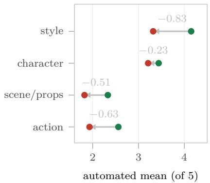

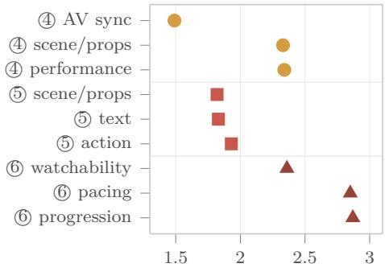  
automated mean (of 5)  
(a) Single-shot to episode : the four cross-shot (b) 4 single-shot video, 5 episode video, 6 short drama. consistency dimensions all fall.  
Figure 9: A coarser unit of judgement counts a diferent kind of defect. (a) Of the dimensions defined at both single-shot and episode granularity, the four that track consistency across shots all drop at the coarser unit. (b) The three lowest-scoring dimensions at each video granularity.

A paradigm is strong exactly where its inputs pin something down. No paradigm achieves absolute superiority on the single-shot board, and each one’s performance profile is determined by its input constraint mechanism (Tab. 8). The grid panel paradigm integrates multiple shots into a single image, so every shot shares the pixel information for character subjects and scene backgrounds, and it achieves the best results in subject–scene integration (4.28), character appearance consistency (3.67) and style consistency (4.32); each shot, however, corresponds to a local cell of that image rather than an independent frame of its own, which puts adherence to a cell (3.97) below adherence to a frame pair (4.28). The first/last frame paradigm supplies both endpoints of each shot, which gives it the advantage in keyframe adherence (4.28), the one property its inputs fix exactly; it imposes no constraint on the intermediate content, and it scores lowest in subject–scene integration (3.01) and camera movement (3.30). The multireference paradigm requires no fixed frame to reproduce, which frees the camera and yields both the highest camera movement plausibility (4.09) and the best sound and music (3.62), while the absence of a fixed visual anchor leaves it last in style consistency (4.04), by a margin of only 0.28. Each paradigm gains its particular strength by virtue of the input constraint it chooses to waive, so the input format is a deployment decision afecting practical performance rather than an implementation detail (Sec. F.4).

This stage validates the reference-anchoring rule established at the keyframe stages. The rule holds here as well, in per-item agreement rather than in mean score. Event completion, which can be verified against the event list in the script, reaches 0.363 against a baseline of 0.200, while watchability of the cut, for which no textual reference exists, falls to 0.074 against a baseline of 0.343 (Sec. A). This stage also supplies a quasi-controlled verification of the rule: speech quality and audio-visual sync share a modality and a tool chain and carry comparable human baselines (0.474 and 0.448), yet the automated scorer reaches 0.354 on the first and 0.075 on the second. The essential diference is that the script’s dialogue provides a clear textual anchor for speech quality, whereas no such reference exists for sync. Audio-visual sync is both the lowestscoring dimension of this stage and the one furthest below its own human baseline (0.17 ), so its position records the ceiling of the automated scorer rather than the relative ranking of the generation models.

Table 8: The three input paradigms on the single-shot video stage, as automated means per paradigm. Bold leads the row and red trails it; every paradigm appears in both colours. $n / a \colon$ multi-reference supplies no frame to adhere to.
<table><tr><td>Dimension</td><td>first/last frame</td><td>grid panel</td><td>multi-reference</td></tr><tr><td>V-C5 subject-scene integration</td><td>3.01</td><td>4.28</td><td>3.96</td></tr><tr><td>V-F2 camera movement</td><td>3.30</td><td>3.82</td><td>4.09</td></tr><tr><td>V-C3 style consistency</td><td>4.12</td><td>4.32</td><td>4.04</td></tr><tr><td>V-B3 keyframe adherence</td><td>4.28</td><td>3.97</td><td>n/a</td></tr><tr><td>V-C1 character appearance</td><td>3.29</td><td>3.67</td><td>3.45</td></tr><tr><td>V-E3 sound and music</td><td>3.59</td><td>3.51</td><td>3.62</td></tr></table>

## 4.5 Chain-level analysis

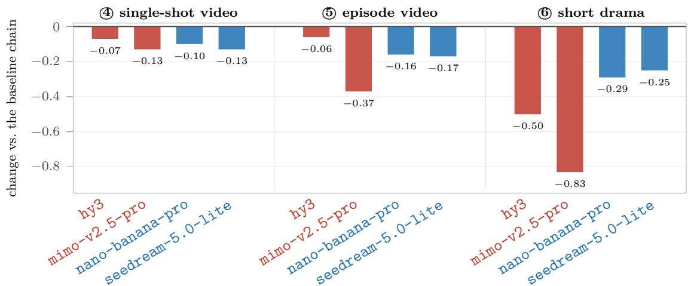  
Figure 10: Upstream defects accumulate rather than staying local. Four substitutions, each read at three granularities: one upstream stage is replaced by a weaker model and everything else is held unchanged, either the storyboard model (red) or the keyframe model (blue). The baseline chain is gpt-5.5-xhigh for storyboarding, $\mathtt { g p t - i m a g e - } 2$ for keyframes and seedance-2.0 (animation) or happyhorse-1.1 (live action) for video. The same substitution that costs an individual clip 0.07–0.13 points costs the short drama up to 0.83. Full design in Sec. F.5.

Upstream defects propagate down the generation chain. If the video generation stage constituted the primary bottleneck, swapping upstream models would yield negligible changes to multi-episode outputs. We observe substantial shifts instead. With the video model fixed, we replace one upstream stage with a weaker alternative: the storyboard stage using hy3 or mimo-v2.5-pro, and the image stage using nano-banana-pro or seedream-5.0-lite. We run this across four dramas under the first/last-frame paradigm, yielding four substitutions read at three granularities, and compare them against a baseline pipeline that adopts the leading model at every stage (Sec. F.5). A single-stage substitution induces quality degradations of 0.07–0.13 points for individual clips, 0.06–0.37 points for continuous segments, and 0.25–0.83 points for multi-episode outputs (Fig. 10). The measured degradation scales with the temporal observation window, since decisions made at upstream stages are irreversible and cannot be revised by any downstream module.

Judgement granularity determines evaluation scores. Individual generated assets often achieve favourable scores in isolation, yet assembling those standalone frames and shots into continuous segments or full episodes accumulates latent cross-frame inconsistencies that degrade the overall score sharply. One episode’s keyframes score 3.33–4.00 when judged one at a time and 2.33 when judged as a set; one episode’s shots, whose individually judged members range from 3.23 to 4.00, obtain only 1.67 as a continuous segment, with every penalty stemming from cross-shot mismatches in character presentation, scene and prop alignment, and action coherence (Fig. 11). The same granularity-dependent gap holds in the human annotations: across character appearance, scene and props, action coherence and speech quality alike, scores drop by close to a full band from single-shot to episode-level evaluation. A single-asset benchmark therefore overlooks cumulative cross-frame inconsistency and measures an isolated quantity, which makes it an invalid proxy for episode-level generation quality.

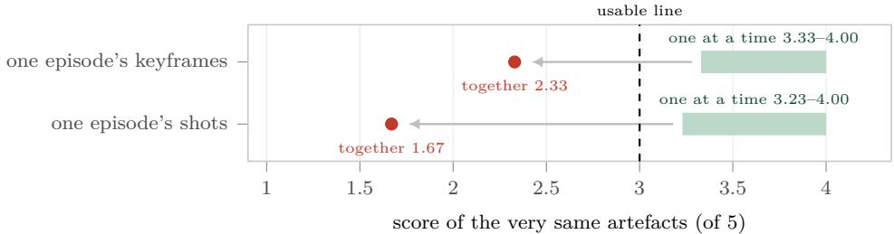  
Figure 11: The unit of judgement, not the artefact, decides the score: only the question changes.

Automation limits stem from modality. Per-item agreement decreases monotonically along the generation pipeline, which may superficially suggest that later stages are inherently harder to evaluate. Decomposed by evaluation axis and data modality, however, the decline is largely attributable to modality alone (Tab. 9). Reading column-wise, F input fidelity achieves the strongest performance within every modality; reading row-wise, every axis except P degrades as the modality incorporates pixels, then temporal dynamics and audio. The two factors exert additive efects. A representative example is E cinematic expressiveness: all four dimensions reach the human baseline when the requirement is encoded in a storyboard script, yet zero out of eleven do so when the identical requirement is rendered into video. Downstream stages do not introduce more subjective criteria; rather, the evidence required to assess them becomes perceptually harder to extract, which is why the remedy is perception rather than prompt engineering.

Table 9: Per-item agreement by axis modality. Each cell gives the human baseline and the automated scorer (PLCC), their diference, and how many leaf dimensions reach the baseline.
<table><tr><td></td><td colspan="3">text</td><td colspan="3">pixels</td><td colspan="3">time + audio</td></tr><tr><td>Axis</td><td>HB/judge</td><td>Δ</td><td>win</td><td>HB/judge</td><td>Δ</td><td>win</td><td>HB/judge</td><td>∆</td><td>win</td></tr><tr><td>F input fidelity</td><td>.296 / .613</td><td>+.317</td><td>2/2</td><td>.357 / .458</td><td>+.101</td><td>6/6</td><td>.264/.277</td><td>+.012</td><td>1/4</td></tr><tr><td>C internal consistency</td><td></td><td></td><td></td><td>.209 /.279</td><td>+.070</td><td>7/9</td><td>.257 / .208</td><td>-.049</td><td>5/15</td></tr><tr><td>P generation plausibility</td><td>.011 /.093</td><td>+.082</td><td>2/2</td><td>.337/ .231</td><td>-.105</td><td>0/2</td><td>.195/.131</td><td>-.064</td><td>1/4</td></tr><tr><td>Q visual quality</td><td></td><td></td><td></td><td>.235 /.157</td><td>-.078</td><td>0/2</td><td>.180/.086</td><td>-.094</td><td>0/2</td></tr><tr><td>E cinematic expressiveness</td><td>.115 /.290</td><td>+.175</td><td>4/4</td><td></td><td></td><td></td><td>.265 /.075</td><td>-.190</td><td>0/11</td></tr></table>

Attribution requires real upstream artefacts. Every item here is produced by running the pipeline and forking only at the stage under test, so a defect is charged to the stage that produced it rather than to the last stage that touched it: the storyboard that compressed three speakers into a single shot, leaving the video model to infer who says which line, and the keyframes that let the scene drift before the people do, are recorded against storyboard design and the keyframe stage. This is what running the chain buys, and it is the property on which every result in this section rests.

## 5 Conclusion

Short-drama generation constitutes a multi-stage chain. DramaChain Bench evaluates each stage of this chain using outputs produced within the chain itself. This design enables defects to be attributed to their originating stage rather than to the stage where they are merely observed. Three systems make that possible: DramaChain Agent, a production pipeline that is calibrated against commercial short-drama platforms, generates every item, and forks only at the stage under test; DramaChain Labeling System, under which professional annotators score each item on every applicable dimension, with each deduction localised in space and time and attributed from a fixed vocabulary; and DramaChain Agentic Judge, an agentic automated scorer validated against that human reference before being used to rank models.

We would rather DramaChain Bench be used as a diagnosis than as a leaderboard. The pipeline, the dimension system and the scoring configurations are reusable as they stand. A new model can be plugged into any individual stage without requiring additional human annotation, while human-dependent components are explicitly exposed instead of being obfuscated. We encourage future work to conduct evaluation at the actual failure points of short-drama production: across inter-stage boundaries and throughout shots within an episode, instead of evaluating individual clips in isolation.

## 6 Limitations

A 63-dimension taxonomy invites the assumption that it is exhaustive, so Tab. 10 states the negative coverage explicitly.

Table 10: What the benchmark does not cover, and why.
<table><tr><td></td><td>Not covered</td><td>Why, and what follows</td></tr><tr><td>Stages</td><td>Post-production: music and sound de- No unified automated approach to these sign, editing and colour grading, subti- stages exists yet. tling and thumbnails.</td><td></td></tr><tr><td></td><td>Dimensions All commercial outcome measures: These outcomes are hard to quantify of- completion, retention, conversion.</td><td>fline.</td></tr><tr><td>Content</td><td>Hybrid, documentary and other non- The axes assume a shot script to be faith- narrative formats.</td><td>ful to.</td></tr><tr><td>Systems</td><td>Text-to-video without an intermediate The chain always produces keyframes, so keyframe.</td><td>a model that skips them cannot enter as it stands.</td></tr><tr><td>Judgment</td><td>Comparison across judging models.</td><td>A dedicated judging model is in training.</td></tr></table>

## Ethics and Responsible Use

Source material and likeness. All benchmark artefacts are synthetic: the twenty dramas are project-original scripts, and all character sheets, keyframes and clips are model outputs conditioned on them. No real-person likeness or voice was used as a generation reference, and no existing commercial drama assets were reused. The three commercial platforms in the pipeline comparison (Sec. 3.2) were queried through public interfaces with our own scripts, and only their returned outputs are reported.

Generated content and screening. Our corpus inherits the tropes the form relies on, including conflict, coercion and revenge, and every item was screened against commercial release policies; the few episodes left without an evaluable output are marked as missing rather than imputed. No broader harm audit was performed, and the benchmark does not certify any artefact as fit for public release.

Annotators. Annotations were performed by professional contracted staf from third-party vendors, not volunteers or anonymous crowd-workers, and recruitment was filtered on the background each stage calls for (Sec. 3.3). Median per-item working time was 23 minutes. Compensation followed vendor terms; hourly pay rates are unavailable as we did not set them.

Intended and out-of-scope uses. This benchmark supports model comparison per pipeline stage, root-cause diagnosis of delivery defects, and identification of automatable evaluation dimensions. Two use cases are out of scope: it cannot predict commercial performance (Tab. 10), and it is not a safety or content-policy evaluator.

## Acknowledgements

We would like to express our sincere thanks to Yunxin Li, Baotian Hu and Min Zhang (Shenzhen Loop Area Institute), Yong Xiang (Peking University), Fan Hong (Beijing Film Academy) and Fei Gao (Shenzhen University) for their support on this paper. We also greatly appreciate the professional advice on film and television production from Yekai Xu and Tianlun Huang (directors), Yanyi Li (screenwriter), Jiahou Huang (producer), Jiaxin Yuan (art director), Xiang Chen, Jiayu Li and Zichen Tang (cinematographers), Ningxuan Zhang (editor), and Shangheng Jiang (colourist). We further thank Huxin Peng and Liang Dong (Tencent) for their help with data procurement.

## References

[1] Hritik Bansal et al. VideoPhy-2: A challenging action-centric physical commonsense evaluation in video generation. arXiv preprint arXiv:2503.06800, 2025. doi: 10.48550/arXiv. 2503.06800. URL https://arxiv.org/abs/2503.06800.

[2] Shuo Cao et al. ArtiMuse: Fine-grained image aesthetics assessment with joint scoring and expert-level understanding. arXiv preprint arXiv:2507.14533, 2025. doi: 10.48550/arXiv. 2507.14533. URL https://arxiv.org/abs/2507.14533.

[3] Shuo Cao et al. UniPercept: Towards unified perceptual-level image understanding across aesthetics, quality, structure, and texture. arXiv preprint arXiv:2512.21675, 2025. doi: 10.48550/arXiv.2512.21675. URL https://arxiv.org/abs/2512.21675. ICML 2026 Spotlight.

[4] Chaofeng Chen, Jiadi Mo, Jingwen Hou, Haoning Wu, Liang Liao, Wenxiu Sun, Qiong Yan, and Weisi Lin. TOPIQ: A top-down approach from semantics to distortions for image quality assessment. IEEE Transactions on Image Processing, 33:2404–2418, 2024. doi: 10. 1109/TIP.2024.3378466. URL https://doi.org/10.1109/TIP.2024.3378466. Deployed as the no-reference variant TOPIQ-NR.

[5] Jiamin Chen, Qianben Chen, Jiawen Zhang, et al. DirectorBench: Diagnosing Long-Form Video Generation with Personalized Multi-Agent Evaluation. arXiv preprint arXiv:2605.30090, 2026. doi: 10.48550/arXiv.2605.30090. URL https://arxiv.org/abs/ 2605.30090.

[6] Yuheng Chen, Teng Hu, Yuji Wang, et al. CineDance: Towards Next-Generation Multi-Shot Long-Form Cinematic Audio-Video Generation. arXiv preprint arXiv:2606.09639, 2026. doi: 10.48550/arXiv.2606.09639. URL https://arxiv.org/abs/2606.09639.

[7] Joon Son Chung and Andrew Zisserman. Out of time: Automated lip sync in the wild. In ACCV Workshops, 2016. doi: 10.1007/978-3-319-54427-4\_19. URL https://doi.org/10. 1007/978-3-319-54427-4\_19.

[8] Jacob Cohen. Weighted kappa: Nominal scale agreement with provision for scaled disagreement or partial credit. Psychological Bulletin, 70(4):213–220, 1968. doi: 10.1037/h0026256. URL https://doi.org/10.1037/h0026256.

[9] Jacob Cohen. Statistical Power Analysis for the Behavioral Sciences. Lawrence Erlbaum Associates, 2nd edition, 1988. ISBN 9780805802832.

[10] Jiankang Deng, Jia Guo, Niannan Xue, and Stefanos Zafeiriou. ArcFace: Additive angular margin loss for deep face recognition. In CVPR, 2019. doi: 10.1109/CVPR.2019.00482. URL https://doi.org/10.1109/CVPR.2019.00482.

[11] X. Feng, H. Yu, M. Wu, et al. NarrLV: Towards a Comprehensive Narrative-Centric Evaluation for Long Video Generation. In International Conference on Learning Representations (ICLR), 2026. URL https://openreview.net/forum?id=Qh3CQBTB1g.

[12] Stephanie Fu et al. DreamSim: Learning new dimensions of human visual similarity using synthetic data. In NeurIPS, 2023. doi: 10.52202/075280-2208. URL https://doi.org/10. 52202/075280-2208.

[13] Rohit Girdhar et al. ImageBind: One embedding space to bind them all. In CVPR, 2023. doi: 10.1109/CVPR52729.2023.01457. URL https://doi.org/10.1109/CVPR52729.2023. 01457.

[14] Hui Han, Siyuan Li, Jiaqi Chen, et al. Video-Bench: Human-Aligned Video Generation Benchmark. arXiv preprint arXiv:2504.04907, 2025. doi: 10.48550/arXiv.2504.04907. URL https://arxiv.org/abs/2504.04907.

[15] Ruozhen He et al. EntityBench: Towards entity-consistent long-range multi-shot video generation. arXiv preprint arXiv:2605.15199, 2026. doi: 10.48550/arXiv.2605.15199. URL https://arxiv.org/abs/2605.15199.

[16] Jiehui Huang, Yuechen Zhang, Bin Xia, et al. UnityShots: Memory-Driven Multi-Shot Audio-Video Generation with Boundary-Aware Gating. arXiv preprint arXiv:2606.21661, 2026. doi: 10.48550/arXiv.2606.21661. URL https://arxiv.org/abs/2606.21661.

[17] Lingxuan Huang, Sizhe He, Hengji Zhou, et al. ViMax: Agentic Video Generation. arXiv preprint arXiv:2606.07649, 2026. doi: 10.48550/arXiv.2606.07649. URL https://arxiv. org/abs/2606.07649.

[18] Ziqi Huang et al. VBench: Comprehensive benchmark suite for video generative models. In Proceedings of the IEEE/CVF Conference on Computer Vision and Pattern Recognition (CVPR), 2024. doi: 10.1109/CVPR52733.2024.02060. URL https://doi.org/10.1109/ CVPR52733.2024.02060.

[19] Glenn Jocher, Jing Qiu, Mengyu Liu, Shuai Lyu, Fatih Cagatay Akyon, and Muhammet Esat Kalfaoglu. Ultralytics YOLO26: Unified real-time end-to-end vision models. arXiv preprint arXiv:2606.03748, 2026. doi: 10.48550/arXiv.2606.03748. URL https: //arxiv.org/abs/2606.03748. Covers the deployed YOLO26n detection and YOLO26npose variants.

[20] Junjie Ke, Qifei Wang, Yilin Wang, Peyman Milanfar, and Feng Yang. MUSIQ: Multiscale image quality transformer. In ICCV, 2021. doi: 10.1109/ICCV48922.2021.00510. URL https://doi.org/10.1109/ICCV48922.2021.00510.

[21] Haitian Li, Yanghao Zhou, Heyan Huang, et al. MTAVG-Bench 2.0: Diagnosing Failure Modes of Cinematic Expressiveness in Multi-Talker Audio-Video Generation. arXiv preprint arXiv:2605.28035, 2026. doi: 10.48550/arXiv.2605.28035. URL https://arxiv.org/abs/ 2605.28035.

[22] Niantong Li, Guangzheng Hu, Weixu Qiao, et al. Qwen-Image-Bench: From Generation to Creation in Text-to-Image Evaluation. arXiv preprint arXiv:2605.28091, 2026. doi: 10.48550/arXiv.2605.28091. URL https://arxiv.org/abs/2605.28091.

[23] Yunxin Li, Haoyuan Shi, Baotian Hu, et al. Anim-Director: A Large Multimodal Model Powered Agent for Controllable Animation Video Generation. arXiv preprint arXiv:2408.09787, 2024. doi: 10.48550/arXiv.2408.09787. URL https://arxiv.org/abs/ 2408.09787.

[24] Susan Liang, Chao Huang, Filippos Bellos, et al. Omni-Judge: Can Omni-LLMs Serve as Human-Aligned Judges for Text-Conditioned Audio-Video Generation. arXiv preprint arXiv:2602.01623, 2026. doi: 10.48550/arXiv.2602.01623. URL https://arxiv.org/abs/ 2602.01623.

[25] Zhengyang Liang, Daoan Zhang, Huichi Zhou, et al. UniVA: Universal Video Agent towards Open-Source Next-Generation Video Generalist. arXiv preprint arXiv:2511.08521, 2025. doi: 10.48550/arXiv.2511.08521. URL https://arxiv.org/abs/2511.08521.

[26] Akide Liu, Jinbo Xing, Chaojie Mao, et al. ReCA: Multi-Shot Long Video Extrapolation via Recursive Context Allocation. arXiv preprint arXiv:2605.26525, 2026. doi: 10.48550/ arXiv.2605.26525. URL https://arxiv.org/abs/2605.26525.

[27] Hongbo Liu, Jingwen He, Yi Jin, et al. ShotBench: Expert-Level Cinematic Understanding in Vision-Language Models. arXiv preprint arXiv:2506.21356, 2025. doi: 10.48550/arXiv. 2506.21356. URL https://arxiv.org/abs/2506.21356.

[28] Tengfei Liu, Yang Shi, Xuanyu Zhu, et al. LongAV-Compass: Towards Unified Evaluation of Minute-Scale Audio-Visual Generation Across T2AV, I2AV, and V2AV. arXiv preprint arXiv:2605.26244, 2026. doi: 10.48550/arXiv.2605.26244. URL https://arxiv.org/abs/ 2605.26244.

[29] Do Xuan Long, Yale Song, Min-Yen Kan, et al. A2RD: Agentic autoregressive difusion for long video consistency. arXiv preprint arXiv:2605.06924, 2026. doi: 10.48550/arXiv.2605. 06924. URL https://arxiv.org/abs/2605.06924.

[30] Shijian Ma, Yunqi Huang, and Yan Lin. DramaBench: A Six-Dimensional Evaluation Framework for Drama Script Continuation. arXiv preprint arXiv:2512.19012, 2025. doi: 10.48550/arXiv.2512.19012. URL https://arxiv.org/abs/2512.19012.

[31] Yihao Meng, Hao Ouyang, Yue Yu, et al. HoloCine: Holistic Generation of Cinematic Multi-Shot Long Video Narratives. arXiv preprint arXiv:2510.20822, 2025. doi: 10.48550/ arXiv.2510.20822. URL https://arxiv.org/abs/2510.20822.

[32] Yihao Meng, Zichen Liu, Hao Ouyang, et al. CausalCine: Real-Time Autoregressive Generation for Multi-Shot Video Narratives. arXiv preprint arXiv:2605.12496, 2026. doi: 10.48550/arXiv.2605.12496. URL https://arxiv.org/abs/2605.12496.

[33] Meta AI. Segment Anything 2.1. SAM 2 release notes, 2024. URL https://github. com/facebookresearch/sam2/blob/main/RELEASE\_NOTES.md. Software release; accessed 2026-08-23.

[34] Omdia. Microdramas to Generate \$11 Billion in Global Revenues in 2025 Says Omdia. MIPCOM press release, October 2025. URL https://omdia.tech.informa.com/pr/2025/oct/ microdramas-to-generate-11-billion-dollars-in-global-revenues-in-2025-says-omdia. Reports that China accounts for 83 percent of 2025 global micro-drama revenue.

[35] Omdia. Microdramas Overtake Streamers on Mobile Engagement, Says Omdia. MIP London press release, February 2026. URL https://omdia.tech.informa.com/pr/2026/feb/ microdramas-overtake-streamers-on-mobile-engagement-says-omdia. Reports USD 11 billion in global micro-drama revenue in 2025, forecasts USD 14 billion for 2026, and forecasts USD 3 billion outside China.

[36] Alec Radford et al. Robust speech recognition via large-scale weak supervision. arXiv preprint arXiv:2212.04356, 2022. doi: 10.48550/arXiv.2212.04356. URL https://arxiv. org/abs/2212.04356.

[37] Nikhila Ravi et al. SAM 2: Segment anything in images and videos. arXiv preprint arXiv:2408.00714, 2024. doi: 10.48550/arXiv.2408.00714. URL https://arxiv.org/abs/ 2408.00714.

[38] Chandan K. A. Reddy, Vishak Gopal, and Ross Cutler. DNSMOS: A non-intrusive perceptual objective speech quality metric to evaluate noise suppressors. In ICASSP, 2021. doi: 10.1109/ICASSP39728.2021.9414878. URL https://doi.org/10.1109/ICASSP39728. 2021.9414878.

[39] Resemble AI. Resemblyzer: Analyze and compare voices with deep learning. GitHub repository, 2019. URL https://github.com/resemble-ai/Resemblyzer. Software; accessed 2026-08-23.

[40] Haoyuan Shi, Yunxin Li, Xinyu Chen, et al. AniMaker: Multi-Agent Animated Storytelling with MCTS-Driven Clip Generation. arXiv preprint arXiv:2506.10540, 2025. doi: 10.48550/ arXiv.2506.10540. URL https://arxiv.org/abs/2506.10540.

[41] Haoyuan Shi et al. MSVBench: Towards human-level evaluation of multi-shot video generation. arXiv preprint arXiv:2602.23969, 2026. doi: 10.48550/arXiv.2602.23969. URL https://arxiv.org/abs/2602.23969.

[42] Yufei Shi, Weilong Yan, Naixuan Huang, et al. One Sentence, One Drama: Personalized Short-Form Drama Generation via Multi-Agent Systems. arXiv preprint arXiv:2605.22144, 2026. doi: 10.48550/arXiv.2605.22144. URL https://arxiv.org/abs/2605.22144.

[43] Oriane Siméoni et al. DINOv3. arXiv preprint arXiv:2508.10104, 2025. doi: 10.48550/ arXiv.2508.10104. URL https://arxiv.org/abs/2508.10104.

[44] Gowthami Somepalli et al. Measuring style similarity in difusion models. arXiv preprint arXiv:2404.01292, 2024. doi: 10.48550/arXiv.2404.01292. URL https://arxiv.org/abs/ 2404.01292.

[45] Yale Song, Yiwen Song, Nick Losier, et al. Co-Director: Agentic Generative Video Storytelling. arXiv preprint arXiv:2604.24842, 2026. doi: 10.48550/arXiv.2604.24842. URL https://arxiv.org/abs/2604.24842.

[46] Yiren Song, Huilin Zhong, Kevin Qinghong Lin, et al. Soap2Soap: Long Cinematic Video Remaking via Multi-Agent Collaboration. arXiv preprint arXiv:2605.17423, 2026. doi: 10.48550/arXiv.2605.17423. URL https://arxiv.org/abs/2605.17423.

[47] State Council Information Ofice of the People’s Republic of China. Transcript of the State Council Policy Briefing (February 6, 2026). China Government Network, February 2026. URL https://www.gov.cn/zccfh/2026nzccfh/20260206/wzsl/202602/content\_ 7057322.htm. Remarks by Wang Xiaoliang of the National Radio and Television Administration report 33,000 micro-dramas released in 2025, nearly 700 million domestic viewers, a market above RMB 100 billion, and rapid development of animated micro-dramas.

[48] SYSTRAN. faster-whisper: Fast whisper transcription with CTranslate2. GitHub repository, 2023. URL https://github.com/SYSTRAN/faster-whisper. Software; accessed 2026-08-23.

[49] Hossein Talebi and Peyman Milanfar. NIMA: Neural image assessment. IEEE Transactions on Image Processing, 2018. doi: 10.1109/TIP.2018.2831899. URL https://doi.org/10. 1109/TIP.2018.2831899.

[50] Zachary Teed and Jia Deng. RAFT: Recurrent all-pairs field transforms for optical flow. In ECCV, 2020. doi: 10.1007/978-3-030-58536-5\_24. URL https://doi.org/10.1007/ 978-3-030-58536-5\_24.

[51] Jente Vandersanden, Matheus Gadelha, Chun-Hao P. Huang, et al. EM-Vid: Training-Free Entity-Centric Memory for Eficient and Consistent Multi-Shot Video Generation. arXiv preprint arXiv:2605.23610, 2026. doi: 10.48550/arXiv.2605.23610. URL https://arxiv. org/abs/2605.23610.

[52] Li Wan, Quan Wang, Alan Papir, and Ignacio Lopez Moreno. Generalized end-to-end loss for speaker verification. In ICASSP, 2018. doi: 10.1109/ICASSP.2018.8462665. URL https://doi.org/10.1109/ICASSP.2018.8462665. Speaker-verification method used by the deployed encoder.

[53] Qian Wang, Ziqi Huang, Ruoxi Jia, et al. MAViS: A Multi-Agent Framework for Long-Sequence Video Storytelling. In Proceedings of the 19th Conference of the European Chapter of the Association for Computational Linguistics (EACL), pages 2273–2295, 2026. doi: 10. 18653/v1/2026.eacl-long.101. URL https://aclanthology.org/2026.eacl-long.101/.

[54] Shengyi Wang et al. FilmBench: A film-grade benchmark for cinematic video generation. arXiv preprint arXiv:2607.24241, 2026. doi: 10.48550/arXiv.2607.24241. URL https:// arxiv.org/abs/2607.24241.

[55] Xinran Wang, Songyu Xu, Xiangxuan Shan, et al. CineTechBench: A Benchmark for Cinematographic Technique Understanding and Generation. arXiv preprint arXiv:2505.15145, 2025. doi: 10.48550/arXiv.2505.15145. URL https://arxiv.org/abs/2505.15145.

[56] Zhou Wang, Alan C. Bovik, Hamid R. Sheikh, and Eero P. Simoncelli. Image quality assessment: From error visibility to structural similarity. IEEE Transactions on Image Processing, 13(4):600–612, 2004. doi: 10.1109/TIP.2003.819861. URL https://doi.org/ 10.1109/TIP.2003.819861.

[57] Jianhui Wei, Jie Tan, Hengchuan Zhu, et al. VideoWeaver: Evaluating and Evolving Skills for Agentic Long Video Generation. arXiv preprint arXiv:2606.08091, 2026. doi: 10.48550/arXiv.2606.08091. URL https://arxiv.org/abs/2606.08091.

[58] Haoning Wu et al. Exploring video quality assessment on user generated contents from aesthetic and technical perspectives. In ICCV, 2023. doi: 10.1109/ICCV51070.2023.01843. URL https://doi.org/10.1109/ICCV51070.2023.01843.

[59] Mingqiang Wu, Weilun Feng, Zhefeng Zhang, et al. Echo-Forcing: A Scene Memory Framework for Interactive Long Video Generation. arXiv preprint arXiv:2605.16003, 2026. doi: 10.48550/arXiv.2605.16003. URL https://arxiv.org/abs/2605.16003.

[60] Weijia Wu, Mingyu Liu, Zeyu Zhu, et al. MovieBench: A Hierarchical Movie Level Dataset for Long Video Generation. In Proceedings of the IEEE/CVF Conference on Computer Vision and Pattern Recognition (CVPR), pages 28984–28994, 2025. doi: 10.1109/CVPR52734. 2025.02699. URL https://doi.org/10.1109/CVPR52734.2025.02699.

[61] Xiaoxue Wu, Xinyuan Chen, Yaohui Wang, et al. ShotDirector: Directorially Controllable Multi-Shot Video Generation with Cinematographic Transitions. arXiv preprint arXiv:2512.10286, 2025. doi: 10.48550/arXiv.2512.10286. URL https://arxiv.org/abs/ 2512.10286.

[62] Xiele Wu, Zicheng Zhang, Mingtao Chen, et al. Q-Save: Towards Scoring and Attribution for Generated Video Evaluation. arXiv preprint arXiv:2511.18825, 2025. doi: 10.48550/ arXiv.2511.18825. URL https://arxiv.org/abs/2511.18825.

[63] Chuanzhi Xu, Huiqi Liang, Bang Shi, et al. DrawVideo: Generating Long Video from Storyboard Keyframe Sketches. arXiv preprint arXiv:2605.23508, 2026. doi: 10.48550/ arXiv.2605.23508. URL https://arxiv.org/abs/2605.23508.

[64] Songyu Xu, Xin Wang, Qiang Chen, et al. VGIF-Score: Interpretable and Diagnostic Evaluation of Spatio-Temporal Instruction Following in Video Generation. arXiv preprint arXiv:2607.13527, 2026. doi: 10.48550/arXiv.2607.13527. URL https://arxiv.org/abs/ 2607.13527.

[65] Songlin Yang, Haobin Zhong, Ruilin Zhang, et al. EvalVerse: Pipeline-Aware and Expert-Calibrated Benchmarking for Professional Cinematic Video Generation. arXiv preprint arXiv:2605.23271, 2026. doi: 10.48550/arXiv.2605.23271. URL https://arxiv.org/abs/ 2605.23271.

[66] Yuhang Yang, Ke Fan, Shangkun Sun, et al. VideoGen-Eval: Agent-based System for Video Generation Evaluation. arXiv preprint arXiv:2503.23452, 2025. doi: 10.48550/arXiv.2503. 23452. URL https://arxiv.org/abs/2503.23452.

[67] Shenghai Yuan, Xianyi He, Yufan Deng, et al. OpenS2V-Nexus: A Detailed Benchmark and Million-Scale Dataset for Subject-to-Video Generation. arXiv preprint arXiv:2505.20292, 2025. doi: 10.48550/arXiv.2505.20292. URL https://arxiv.org/abs/2505.20292.

[68] Haojie Zhang et al. MuSS: A large-scale dataset and cinematic narrative benchmark for multi-shot subject-to-video generation. arXiv preprint arXiv:2604.23789, 2026. doi: 10. 48550/arXiv.2604.23789. URL https://arxiv.org/abs/2604.23789.

[69] Kaiwen Zhang, Liming Jiang, Angtian Wang, et al. StoryMem: Multi-shot Long Video Storytelling with Memory. arXiv preprint arXiv:2512.19539, 2025. doi: 10.48550/arXiv. 2512.19539. URL https://arxiv.org/abs/2512.19539.

[70] Shengjun Zhang, Zhang Zhang, Simin Huang, et al. MBench: A Comprehensive Benchmark on Memory Capability for Video World Models. arXiv preprint arXiv:2606.00793, 2026. doi: 10.48550/arXiv.2606.00793. URL https://arxiv.org/abs/2606.00793.

[71] Xiaohan Zhang, Yuqing Wen, Junlin Chen, et al. MultiRef-Compass: Towards Comprehensive Evaluation of Multi-Reference-to-Audio-Video Generation. arXiv preprint arXiv:2607.14189, 2026. doi: 10.48550/arXiv.2607.14189. URL https://arxiv.org/abs/ 2607.14189.

[72] Zhida Zhang, Jie Ma, Zhan Peng, et al. SmartDirector: Keyframe-Conditioned Cinematic Video Generation with Narrative Pacing Control. arXiv preprint arXiv:2605.27891, 2026. doi: 10.48550/arXiv.2605.27891. URL https://arxiv.org/abs/2605.27891.

[73] Dian Zheng et al. VBench-2.0: Advancing video generation benchmark suite for intrinsic faithfulness. arXiv preprint arXiv:2503.21755, 2025. doi: 10.48550/arXiv.2503.21755. URL https://arxiv.org/abs/2503.21755.

[74] Xiangqing Zheng, Chengyue Wu, Kehai Chen, et al. LoCoT2V-Bench: Benchmarking Long-Form and Complex Text-to-Video Generation. In Proceedings of the 43rd International Conference on Machine Learning (ICML), 2026. URL https://icml.cc/virtual/2026/ poster/65294.

[75] Hengji Zhou, Sijie Liu, Jianrun Chen, et al. DramaDirector: Geometry-Guided Short Drama Generation. arXiv preprint arXiv:2606.24107, 2026. doi: 10.48550/arXiv.2606. 24107. URL https://arxiv.org/abs/2606.24107.

[76] Jinsong Zhou, Yihua Du, Xinli Xu, et al. VideoMemory: Toward Consistent Video Generation via Memory Integration. arXiv preprint arXiv:2601.03655, 2026. doi: 10.48550/arXiv. 2601.03655. URL https://arxiv.org/abs/2601.03655.

[77] Kaiyang Zhou, Yongxin Yang, Andrea Cavallaro, and Tao Xiang. Omni-scale feature learning for person re-identification. In ICCV, 2019. doi: 10.1109/ICCV.2019.00380. URL https://doi.org/10.1109/ICCV.2019.00380.

[78] Cailin Zhuang et al. ViStoryBench: Comprehensive benchmark suite for story visualization. In Proceedings of the IEEE/CVF Conference on Computer Vision and Pattern Recognition (CVPR), 2026. URL https://openaccess.thecvf.com/content/CVPR2026/html/ Zhuang\_ViStoryBench\_Comprehensive\_Benchmark\_Suite\_for\_Story\_Visualization\_ CVPR\_2026\_paper.html. arXiv:2505.24862.

## A The Dimension System and Its Implementation

DramaChain Dimensions defines 66 leaf dimensions, and the 63 scored in this report are those 66 less the three retired for a near-zero human baseline (Sec. 3.4). Each leaf dimension carries a five-level decidable rubric and its own attribution-tag vocabulary, which humans and the automated scorer share; the vocabularies are listed in Sec. A.2 and the rubric texts are too long to reproduce here. Per-dimension scores and agreement are in the per-stage tables of Sec. 4.4.

## A.1 Implementation of every leaf dimension

Every leaf dimension is implemented the same way, and the whole of it is declarative. The schema entry for a dimension carries three things: a five-level rubric, a closed tag vocabulary, and a one-line method stating what is to be checked; the router scans that line for keywords and mounts the evidence producers it names, so what a dimension is defined to check determines what gets measured for it, with no per-dimension code. Evidence then reaches the automated scorer on two paths. Routed measurements run unconditionally: zero to three of the 29 producers per dimension. Model-callable tools can be invoked over several rounds, and a dimension only gets them if it declares them, which leaves 15 of the 17 in the registry reachable. No pixel\_sensitive dimension declares a set containing the pixel-altering tools, and the router withholds them there in any case, so image quality is never assessed on a retouched frame. Scoring then emits a band, a tag drawn from that dimension’s list, and a reason.

Reading the tables: implementation paraphrases the method line the router reads; routed evidence is what route\_tools selects for it, traced by executing the router rather than by reading the config, with “—” marking a dimension for which it selects no producer; modelcallable is the resolved tool set, with “—” marking the dimensions that cannot be examined more closely on request. Dimension names follow Sec. A, and tool names are shortened, with Tab. 11 giving them in full. One routed producer is inert: the router mounts the producer, but it returns unavailable on every item of that stage, so the dimension is scored by the judging model alone. S-C4’s method line names CSD, an image model, and the storyboard stage has no pixels; identity\_sim is suspended across shots and on the assembled episode, where identity matching splits one character or merges two often enough to be unusable. One producer is not routed at all: cut\_detect is computed once per video or episode item and enters every prompt with the base context.

The model-callable column names the tool set the schema declares for that dimension, with the number of tools in it in parentheses. detail(2) is zoom\_in with draw\_bbox; count(3) and scene(3) add count\_marker to it; fine(4) instead adds sharpen and super\_resolution, and lowlight(4) adds enhance\_contrast. On the video side every set begins with video\_probe and extract\_frame, since a video has no still to zoom into until one is pulled: v\_frame(4) adds zoom\_in and draw\_bbox, v\_count(5), v\_text(5) and v\_cut(5) add count\_marker, ocr\_frame and detect\_scenes respectively, and v\_sync(5), v\_audio(4) and v\_speech(7) are built around the audio tools, dropping the annotation and zoom tools they do not need. Table 11 gives every tool in full.

## 1 Storyboard design

<table><tr><td></td><td>Code Dimension</td><td>Axis Implementation</td><td></td><td>Routed evidence</td><td>Model- callable</td></tr><tr><td>S-A1</td><td>Event coverage</td><td>F</td><td>master agent extracts beats → sub-agent aligns per shot for coverage</td><td>event_align</td><td></td></tr><tr><td>S-A2</td><td>Dialogue fidelity</td><td>F</td><td>dialogue text alignment (edit distance + dialogue_align embedding similarity)</td><td></td><td></td></tr><tr><td>S-B1</td><td>Description executability</td><td>P</td><td>VLM: phrasing clarity / parsable content / spatial-physical check</td><td></td><td></td></tr><tr><td>Code</td><td>Dimension</td><td>Axis Implementation</td><td></td><td>Routed evidence</td><td>Model- callable</td></tr><tr><td>S-B2</td><td>Restraint in additions</td><td>P</td><td>LLM per shot: surplus detail + transition elements + key gaps; overstep or consistency harm</td><td>supplement_audit</td><td></td></tr><tr><td>S-C1</td><td>Narrative flow</td><td>E</td><td>LLM: cross-scene hard cuts + sequence breaks + shot order + OS misplacement; seven-form banding</td><td>narrative_flow_audit</td><td></td></tr><tr><td>S-C2</td><td>Shooting rhythm</td><td>E</td><td>action-verb count and duration spread per shot + VLM feasibility</td><td>shot_stats</td><td></td></tr><tr><td>S-C3</td><td>Emotional expression</td><td>E</td><td>LLM per beat: eight audiovisual channels + director calibration</td><td>emotion_beats</td><td></td></tr><tr><td>S-C4</td><td>Audiovisual style treatment</td><td>E</td><td>shot-language classes + genre lexicon + style_csd (inert) director calibration</td><td></td><td></td></tr></table>

## 2 Single keyframe

<table><tr><td>Code</td><td>Dimension</td><td>Axis Implementation</td><td></td><td>Routed evidence</td><td>Model- callable</td></tr><tr><td>I-A1</td><td>Technical quality</td><td>Q</td><td>zoom to check three defect classes; sharpness dominant</td><td></td><td>zoom(1)</td></tr><tr><td>I-A2</td><td>Aesthetic style</td><td>Q</td><td>CSD style purity + genre lexicon; colour harmony, cheap AI look</td><td>style_csd</td><td></td></tr><tr><td>I-B1</td><td>Subject attributes</td><td>F</td><td>SAM segmentation + zoom, 0/1/2 per facet</td><td>sam_count</td><td>count(3)</td></tr><tr><td>I-B2</td><td>Action and interaction</td><td>F</td><td>per-facet scoring</td><td></td><td>detail(2)</td></tr><tr><td>I-B3</td><td>Scene and spatial layout</td><td>F</td><td>scene-type check + programmatic bearing match</td><td>scene_consistency</td><td>count(3)</td></tr><tr><td>I-B4</td><td>Shot framing and visual style</td><td>F</td><td>shot-attribute classes + composition, lighting + CSD style</td><td>style_csd framing_check</td><td></td></tr><tr><td>I-C1</td><td>Face identity</td><td>F</td><td>ArcFace for live action; anime-ID model identity_sim or DINOv3 feature similarity + CIDS [43, 78], selected by this audit</td><td></td><td>fine(4)</td></tr><tr><td>I-C2</td><td>Appearance and costume</td><td>F</td><td>zoom to compare against the character sheet; accessories need zoom</td><td></td><td>fine(4)</td></tr><tr><td>I-C3</td><td>Key element fidelity (retired)</td><td>F</td><td>SAM crop of the prop region + embedding or VLM vs. reference</td><td>sam_count</td><td>detail(2)</td></tr><tr><td>I-D1</td><td>Character consistency across panels</td><td>C</td><td>pairwise CIDS / DINOv3 feature similarity, aggregated</td><td>identity_sim</td><td>fine(4)</td></tr><tr><td>I-D2</td><td>Subject-scene integration</td><td>C</td><td>CPR [78] / NaturalScore [67] + light and perspective blend; adversarial I-D1</td><td>copypaste_var</td><td>detail(2)</td></tr><tr><td>I-D3</td><td>Scene and layout vs. reference</td><td>C</td><td>cross-image scene-bank embedding + spatial-structure recheck</td><td>scene_consistency</td><td>scene(3)</td></tr><tr><td>I-D4</td><td>Screen-direction axis</td><td>C</td><td>per-shot subject facing and motion emitted + rule-based axis check</td><td>axis_check</td><td>detail(2)</td></tr><tr><td>I-D5</td><td>Style consistency</td><td>C</td><td>cross-image CSD style embedding + grid and style-clash checks</td><td>style_csd</td><td>detail(2)</td></tr><tr><td>I-E1</td><td>Human anatomy plausibility</td><td>P</td><td>body and hand keypoints + zoom for deformity + pose naturalness</td><td>body_structure</td><td>count(3)</td></tr><tr><td>I-E2</td><td>Environmental physics</td><td>P</td><td>per-item detection: gravity / collision / perspective / lighting</td><td></td><td>detail(2)</td></tr></table>

3 Episode keyframes
<table><tr><td>Code</td><td>Dimension</td><td></td><td>Axis Implementation</td><td>Routed evidence</td><td>Model- callable</td></tr><tr><td>MI-D1</td><td>Cross-shot character consistency</td><td>C</td><td>pairwise cross-shot identity similarity, aggregated + gap-decay</td><td>identity_sim (inert)</td><td>fine(4)</td></tr><tr><td>MI-D2</td><td>Subject-scene integration</td><td>C</td><td>alert on excess cross-shot framing similarity; adversarial to MI-D1</td><td>framing_check copypaste_var</td><td>detail(2)</td></tr><tr><td>MI-D3</td><td>Cross-shot scene consistency</td><td>C</td><td>cross-shot scene-bank embedding + zoom on set dressing per item</td><td>scene_consistency</td><td>lowlight(4)</td></tr><tr><td>MI-D4</td><td>Spatial-orientation coherence (retired)</td><td>C</td><td>per-shot facing, position, camera estimate; rule-based axis check</td><td>axis_check</td><td>detail(2)</td></tr><tr><td>MI-D5</td><td>Cross-shot style consistency</td><td>C</td><td>cross-shot CSD style embedding + style-break zoom; tone by scene</td><td>style_csd</td><td>detail(2)</td></tr></table>

4 Single-shot video
<table><tr><td>Code</td><td>Dimension</td><td>Axis Implementation</td><td></td><td>Routed evidence</td><td>Model- callable</td></tr><tr><td>V-A1</td><td>Image quality and material</td><td>Q</td><td>DOVER / MUSIQ perceptual quality + quality_metric Laplacian sharpness + material fit to style</td><td></td><td>v_frame(4)</td></tr><tr><td>V-A2</td><td>Aesthetic style and motion texture</td><td>Q</td><td>aesthetic regression + style vs. genre; optical-flow motion texture</td><td>quality_metric aesthetic_metric style_csd</td><td></td></tr><tr><td>V-B1</td><td>Subject attribute accuracy</td><td>F</td><td>frame sampling + SAM + detection counts; satisfaction rate</td><td>sam_count</td><td>v_count(5)</td></tr><tr><td>V-B2</td><td>Shot framing and visual style</td><td>F</td><td>shot-attribute classes + composition and lighting + cut count</td><td>framing_check</td><td>v_frame(4)</td></tr><tr><td>V-B3</td><td>Keyframe adherence</td><td>F</td><td>SSIM [56] / DINO vs. given frame + subject-box match</td><td>frame_follow</td><td>v_frame(4)</td></tr><tr><td>V-C1</td><td>Character appearance</td><td>C</td><td>per-frame consistency, flicker, gap-decay, costume; fidelity-gated</td><td>identity_sim</td><td>v_frame(4)</td></tr><tr><td>V-C2</td><td>consistency Scene and prop consistency</td><td>C</td><td>scene-consistency anchor + prop embedding or cross-shot match</td><td>scene_consistency</td><td>v_frame(4)</td></tr><tr><td>V-C3</td><td>Style consistency</td><td>C</td><td>CSD style embedding per frame and cross-shot + style-break check</td><td>style_csd</td><td>v_frame(4)</td></tr><tr><td>V-C4</td><td>Action consistency</td><td>C</td><td>action recognition and cross-shot pose match + action continuity</td><td>body_structure</td><td>v_frame(4)</td></tr><tr><td>V-C5</td><td>Subject-scene integration</td><td>C</td><td>ACP-Var [68] / CPR + light and perspective blend; adversarial V-C1</td><td>copypaste_var</td><td>v_frame(4)</td></tr><tr><td>V-C6</td><td>On-screen text stability</td><td>C</td><td>per-frame OCR of text regions + adjacent-frame edit distance</td><td>ocr_track</td><td>v_text(5)</td></tr><tr><td>V-D1</td><td>Motion smoothness</td><td>P</td><td>inter-frame optical flow, less jitter</td><td>quality_metric</td><td>v_frame(4)</td></tr><tr><td>V-D2</td><td>Dynamic range (retired)</td><td>P</td><td>flow magnitude + cut density</td><td>quality_metric</td><td></td></tr><tr><td>V-D3</td><td>Physical plausibility</td><td>P</td><td>VideoPhy-AutoEval physical commonsense, then plausibility on the footage</td><td>videophy</td><td>v_frame(4)</td></tr><tr><td>V-D4</td><td>Causal and temporal</td><td>P</td><td>sub-agent per time window → master agent: causal order, completion</td><td></td><td>v_frame(4)</td></tr><tr><td>V-E1</td><td>plausibility Speech quality</td><td>E</td><td>DNSMOS quality + ASR WER / CER on lines + voiceprint timbre</td><td>dialogue_align asr_wer</td><td>v_speech(7)</td></tr><tr><td></td><td>Code Dimension</td><td></td><td>Axis Implementation</td><td>Routed evidence</td><td>Model- callable</td></tr><tr><td>V-E2</td><td>Audio-visual sync</td><td>E</td><td>SyncNet lip-sync + ImageBind audio-visual alignment</td><td>syncnet imagebind_av</td><td>v_sync(5)</td></tr><tr><td>V-E3</td><td>Sound effects and music</td><td>E</td><td>fit of music and sound effects to scene emotion and on-screen action</td><td></td><td>v_audio(4)</td></tr><tr><td>V-F1</td><td>Composition</td><td>E</td><td>shot size / depth / blocking + subject-box head-crop check</td><td>framing_check</td><td></td></tr><tr><td>V-F2</td><td>Camera movement plausibility</td><td>E</td><td>camera-move intent, position emotion, momentum + cut density</td><td></td><td></td></tr><tr><td>V-F3</td><td>Character performance</td><td>E</td><td>acting and expression naturalness</td><td></td><td></td></tr></table>

## 5 Episode video

<table><tr><td>Code</td><td>Dimension</td><td></td><td>Axis Implementation</td><td>Routed evidence</td><td>Model- callable</td></tr><tr><td>MV-C1</td><td>Cross-shot character consistency</td><td>C</td><td>per-shot frame vs. first-appearance identity + gap-decay + costume</td><td>identity_sim (inert)</td><td>v_frame(4)</td></tr><tr><td>MV-C2</td><td>Cross-shot scene and props</td><td>C</td><td>cross-shot scene-bank embedding + prop-state embedding or match</td><td>scene_consistency</td><td>v_frame(4)</td></tr><tr><td>MV-C3</td><td>Cross-shot style consistency</td><td>C</td><td>cross-shot CSD style embedding + style-break check</td><td>style_csd</td><td>v_frame(4)</td></tr><tr><td>MV-C4</td><td>Cross-shot action continuity</td><td>C</td><td>cross-shot action and pose match + facing/position, camera, axis check</td><td>axis_check body_structure</td><td>v_frame(4)</td></tr><tr><td>MV-C5</td><td>Subject-scene integration</td><td>C</td><td>alert on excess cross-shot framing similarity; adversarial to MV-C1</td><td>framing_check copypaste_var</td><td>v_frame(4)</td></tr><tr><td>MV-C6</td><td>Cross-shot text stability</td><td>C</td><td>OCR per shot&#x27;s text region; same element compared across shots</td><td>ocr_track</td><td>v_text(5)</td></tr><tr><td>MV-D4</td><td>Cross-shot causal/temporal plausibility</td><td>P</td><td>sub-agent in shot order → master agent judges causality + closure</td><td></td><td>v_frame(4)</td></tr><tr><td>MV-E1</td><td>Cross-shot speech quality</td><td>E</td><td>cross-shot voiceprint + audio-visual alignment + ASR continuity</td><td>imagebind_av asr_wer</td><td>v_speech(7)</td></tr><tr><td>MV-E3</td><td>Cross-shot sound and music</td><td>E</td><td>cross-shot coherence and style consistency of music and sound effects</td><td></td><td>v_audio(4)</td></tr><tr><td>MV-F3</td><td>Cross-shot performance continuity</td><td>E</td><td>per-segment expression, emotion strength + transitions</td><td></td><td></td></tr></table>

## 6 Short drama

<table><tr><td></td><td>Code Dimension</td><td></td><td>Axis Implementation</td><td>Routed evidence</td><td>Model- callable</td></tr><tr><td>0-A1</td><td>Event completion</td><td>F</td><td>key-event list from the script → per-event completion on the cut</td><td></td><td>v_frame(4)</td></tr><tr><td>0-B1</td><td>Style</td><td>C</td><td>CSD whole-episode style embedding; tone grouped by scene</td><td>style_csd</td><td>v_frame(4)</td></tr><tr><td>0-B2</td><td>Cross-episode consistency</td><td>C</td><td>character and scene-bank anchors + gap-decay</td><td>identity_sim (inert) scene_consistency</td><td>v_frame(4)</td></tr><tr><td>0-B3</td><td>Cross-episode progression</td><td>C</td><td>against script beats: motivated progression vs. arbitrary change</td><td></td><td></td></tr><tr><td>0-C1</td><td>Watchability of the cut</td><td>E</td><td>calibrated whole-episode score</td><td></td><td></td></tr><tr><td>0-C2</td><td>Pacing and transitions</td><td>E</td><td>human-cut distribution gap + transition naturalness; cut rhythm</td><td></td><td>v_cut(5)</td></tr></table>

## A.2 The attribution-tag vocabulary

Any score below 5, from an annotator or from the automated scorer, must select at least one tag from the list its dimension declares; the two sides draw from the same list, which is what makes what was seen comparable with how it was scored. The 66 dimensions declare 298 tag slots drawn from 253 distinct tags, and the corpus holds 255,925 human attributions over them. Every dimension additionally ofers other, which is omitted from the tables below; a free-text reason is required alongside the tag in all cases.

## 1 Storyboard design

<table><tr><td>Code</td><td>Dimension</td><td>Attribution tags</td></tr><tr><td>S-A1</td><td>Event coverage</td><td>key event omitted · minor beat omitted · action or voiceover omitted · events do not join up · surplus plot invented · plot left vague</td></tr><tr><td>S-A2</td><td>Dialogue fidelity</td><td>key line omitted · line rewritten · wrong speaker · wrong emotional register</td></tr><tr><td>S-B1</td><td>Description executability</td><td>ambiguous description· viewpoint unclear · blocking unclear · several actions in one shot · shot carries too little · verbose padding · blocking not physically possible · blocking too complex</td></tr><tr><td>S-B2</td><td>Restraint in additions</td><td>key detail not supplied · transition not supplied · surplus detail added · implausible content invented</td></tr><tr><td>S-C1</td><td>Narrative flow</td><td>abrupt transition · jarring join · order reversed within a shot · misplaced voiceover · mixed shot sizes in one shot · setup gives away the payoff · redundant narration · self-contradiction</td></tr><tr><td>S-C2</td><td>Shooting rhythm</td><td>too much action in one shot · over-fragmented cutting · key scene under-covered · transitional scene drags · no reaction shot · monotonous camera work</td></tr><tr><td>S-C3</td><td>Emotional expression</td><td>flat, no tension · emotion not externalised · conflict poorly staged</td></tr><tr><td>S-C4</td><td>Audiovisual style treatment</td><td>style mismatched to genre · inconsistent style · key scene not dramatised · wrong shot grammar</td></tr></table>

## ⃝2 Single keyframe

<table><tr><td>Code</td><td>Dimension</td><td>Attribution tags</td></tr><tr><td>I-A1</td><td>Technical quality</td><td>blurred · visible noise · artefacts and colour blocks · ghosting · watermark or garbled glyphs · structural distortion</td></tr><tr><td>I-A2</td><td>Aesthetic style</td><td>aesthetic mismatched to genre · cluttered frame · unbalanced composition · colour and lighting clash · mixed art styles · cheap AI look</td></tr><tr><td>I-B1</td><td>Subject attributes</td><td>subject missing · subject feature wrong or missing · wrong subject colour · wrong subject material · wrong subject count · extra subject · wrong subject position · left/right mirrored · wrong expression</td></tr><tr><td>I-B2</td><td>Action and interaction</td><td>action not performed · wrong action · action mirrored · wrong interaction target · stiff pose</td></tr><tr><td>I-B3</td><td>Scene and spatial layout</td><td>wrong scene type · wrong bearing · wrong occlusion · wrong relative position · scene element missing</td></tr><tr><td>I-B4</td><td>Shot framing and visual style</td><td>wrong shot size or viewpoint · wrong composition · wrong lighting mood · wrong art style</td></tr><tr><td>I-C1</td><td>Face identity</td><td>features do not match · wrong face shape · wrong expression · distinguishing feature lost · identity drift · face breakdown</td></tr><tr><td>I-C2</td><td>Appearance and costume</td><td>wrong hairstyle · wrong hair colour · wrong garment style · wrong garment colour : accessory missing or wrong · wrong to station or period</td></tr><tr><td>I-C3</td><td>Key element fidelity (retired)</td><td>prop drawn as something else · wrong prop form · wrong prop colour · wrong prop material · wrong prop count · prop missing</td></tr><tr><td>I-D1</td><td>Character consistency across panels</td><td>face differs across panels · costume differs across panels · accessories differ across panels · identity drift · face breakdown</td></tr><tr><td>I-D2</td><td>Subject-scene integration</td><td>cut-out, pasted-on look · subject and scene lighting mismatch · floating, not grounded · pose or expression repeated · panels copy-pasted</td></tr><tr><td>I-D3</td><td>Scene and layout vs. reference</td><td>spatial structure changed · object bearing changed · light direction inconsistent · prop placement changed</td></tr><tr><td>I-D4</td><td>Screen-direction axis</td><td>characters swapped left/right · position drift · excessive displacement across panels · eyelines inconsistent · motion direction reversed</td></tr><tr><td>I-D5</td><td>Style consistency</td><td>art style differs across panels · colour grade differs within a scene · animation and live action mixed</td></tr><tr><td>I-E1</td><td>Human anatomy plausibility</td><td>extra or missing fingers · limbs twisted or fused · limb clipping · limb missing · facial proportions off · impossible pose · stiff, unnatural pose</td></tr><tr><td>I-E2</td><td>Environmental physics</td><td>object floating · clipping through geometry · perspective or scale distorted · lighting or reflection contradictory</td></tr></table>

## 3 Episode keyframes

<table><tr><td>Code</td><td>Dimension</td><td>Attribution tags</td></tr><tr><td>MI-D1</td><td>Cross-shot character consistency</td><td>face differs across shots · costume differs across shots · accessories differ across shots · identity drift · face swap across shots</td></tr><tr><td>MI-D2</td><td>Subject-scene integration</td><td>cut-out, pasted-on look · subject and scene lighting mismatch · shots look alike · composition and pose unchanged</td></tr><tr><td>MI-D3</td><td>Cross-shot scene consistency</td><td>layout change · furnishing change · lighting or colour shift · disordered scene cuts axis crossed, left/right swapped · eyelines inconsistent · motion direction reversed</td></tr><tr><td>MI-D4</td><td>Spatial-orientation coherence (retired)</td><td>· abrupt camera-position change</td></tr><tr><td>MI-D5</td><td>Cross-shot style consistency</td><td>art style jumps · colour grade differs within a scene · lighting differs within a scene · inconsistent texture</td></tr></table>

## 4 Single-shot video

<table><tr><td>Code</td><td>Dimension</td><td>Attribution tags</td></tr><tr><td>V-A1</td><td>Image quality and material</td><td>blurred, low resolution · noise and artefacts · material distorted · waxy, plastic skin</td></tr><tr><td>V-A2</td><td>Aesthetic style and motion texture</td><td>poor composition and colour · art style mismatched to genre · cheap AI look · cheap, coarse motion</td></tr><tr><td>V-B1</td><td>Subject attribute accuracy</td><td>subject missing · appearance differs from the reference · wrong subject colour · wrong subject material · wrong subject count · extra subject</td></tr><tr><td>V-B2</td><td>Shot framing and visual style</td><td>wrong shot size or viewpoint · wrong composition · camera move does not follow the instruction · wrong lighting mood · wrong art style</td></tr><tr><td>V-B3</td><td>Keyframe adherence</td><td>deviates from the given keyframe · drifts from the reference during motion</td></tr><tr><td>V-C1</td><td>Character appearance consistency</td><td>subject flicker · slight appearance change · face breakdown or swap · garment colour change · garment style change</td></tr><tr><td>V-C2</td><td>Scene and prop consistency</td><td>background layout change · furnishing change · colour grade change · prop state</td></tr><tr><td>V-C3</td><td>Style consistency</td><td>jumps art style jumps · colour grade jumps</td></tr><tr><td>V-C4</td><td>Action consistency</td><td>action jumps at the join · stiff action join · action contradicts itself</td></tr><tr><td>V-C5</td><td>Subject-scene integration</td><td>cut-out, pasted-on look · subject and scene lighting mismatch · floating, not</td></tr><tr><td>V-C6</td><td>On-screen text stability</td><td>grounded · pose repeated and static · frames duplicated garbled glyphs · glyph deformation · text flicker</td></tr><tr><td>V-D1</td><td>Motion smoothness</td><td>stutter and dropped frames · teleporting · jitter</td></tr><tr><td>V-D2</td><td>Dynamic range (retired)</td><td>too static · motion amplitude distorted</td></tr><tr><td>V-D3</td><td>Physical plausibility</td><td>weightless floating · clipping · unconvincing collision · unnatural inertia · appears or vanishes from nowhere</td></tr><tr><td>V-D4</td><td>Causal and temporal</td><td>effect precedes cause · events out of order · cause and effect do not match · action not performed · action wrong or incomplete</td></tr><tr><td>V-E1</td><td>plausibility Speech quality</td><td>robotic, vocoded · noise and clipping · muffled · unstable loudness · line misread or words dropped · lines out of order · wrong speaker · unintelligible · timbre drift</td></tr><tr><td>V-E2</td><td>Audio-visual sync</td><td>lips out of sync · mouth moves, no sound · sound effect misaligned</td></tr><tr><td>V-E3</td><td>Sound effects and music</td><td>music missing · music does not fit the emotion · sound effect missing · sound effect does not fit the picture</td></tr><tr><td>V-F1</td><td>Composition</td><td>wrong shot size · subject not salient · flat, no depth · foreground and background confused</td></tr><tr><td>V-F2</td><td>Camera movement plausibility</td><td>almost no camera movement · aimless drifting camera · gratuitous camera moves</td></tr><tr><td>V-F3</td><td>Character performance</td><td>blank, monotonous expression · wrong eyeline · overacted, out of character</td></tr></table>

## 5 Episode video

<table><tr><td>Code</td><td>Dimension</td><td>Attribution tags</td></tr><tr><td>MV-C1</td><td>Cross-shot character consistency</td><td>face differs across shots · face breakdown or swap · garment colour change · garment style change · identity drift</td></tr><tr><td>MV-C2</td><td>Cross-shot scene and props</td><td>background layout change · furnishing change · colour grade change · prop state jumps</td></tr><tr><td></td><td>MV-C3 Cross-shot style consistency</td><td>art style jumps to another medium · colour grade differs within a scene · animation and live action mixed</td></tr><tr><td></td><td>MV-C4 Cross-shot action continuity</td><td>action discontinuity at the join · action contradicts itself · axis crossed, left/right swapped · eyelines inconsistent · motion direction reversed · abrupt camera-position change</td></tr><tr><td>MV-C5</td><td>Subject-scene integration</td><td>cut-out, pasted-on look · subject and scene lighting mismatch · shots look alike · camera and composition unchanged</td></tr><tr><td>MV-C6</td><td>Cross-shot text stability</td><td>text changes across shots · garbled glyphs · glyph deformation</td></tr><tr><td>MV-D4</td><td>Cross-shot causal/temporal plausibility</td><td>effect precedes cause across shots · events out of order across shots · cause and effect do not match across shots · action never completed across shots</td></tr><tr><td>MV-E1</td><td>Cross-shot speech quality</td><td>timbre drift across shots · unstable loudness across shots · audio quality differs across shots · dialogue broken across shots</td></tr><tr><td>MV-E3</td><td>Cross-shot sound and music</td><td>music drops out across shots · abrupt music change · music style jumps · sound effects differ across shots</td></tr><tr><td>MV-F3</td><td>Cross-shot performance continuity</td><td>emotion breaks between shots · emotional intensity jumps · performance style shifts · out of character across shots</td></tr></table>

## 6 Short drama

<table><tr><td>Code</td><td>Dimension</td><td>Attribution tags</td></tr><tr><td>0-A1</td><td>Event completion</td><td>key event missing · event not played out · main line broken · characters misidentified · invented, departs from the script</td></tr><tr><td>0-B1</td><td>Style</td><td>style break between episodes · colour grade differs within a scene · inconsistent art style</td></tr><tr><td>0-B2</td><td>Cross-episode consistency</td><td>character changes across episodes · signature feature inconsistent · scene changes across episodes · face swap across episodes</td></tr><tr><td>0-B3</td><td>Cross-episode progression</td><td>character does not develop · costume does not change · appearance or scene changed arbitrarily · change unmotivated</td></tr><tr><td>0-C1</td><td>Watchability of the cut</td><td>cut incomplete · looks cheap · too many hard defects to watch</td></tr><tr><td>0-C2</td><td>Pacing and transitions</td><td>key scene rushed · transitional scene drags · uneven pacing · stiff transition</td></tr></table>

## A.3 The scoring prompt

There is one prompt template for all 66 dimensions. Everything dimension-specific is injected into fixed slots, which is what makes scoring auditable: two dimensions difering in score cannot difer in framing. The skeleton, with the slots marked:

You are a short-drama generation quality sub-agent. Score the single   
dimension [{code} {name}] (axis {axis}, tier {tier}) on the five-band scale,   
and nothing else.   
[Five band anchors]: {rubric[5..1]}   
[Per-shot checkpoints and banding rules]: {guide, optional --- carries the   
checklist}   
[Applicability (decide N/A before scoring)]: {na\_when, optional}   
[Attribution tags] (at least one required when the score is below 5):   
{tags}   
[Automated method hint]: {method}   
[Item] stage={…} scope={…} paradigm={…}   
[Source script (ground-truth reference, not the artefact under evaluation)]:   
{script, conditional}   
[Objective tool evidence]: {evidence, one line per measurement}   
[Hard scoring requirements (apply to every dimension)]: {constant}   
Output strictly JSON only: {"score", "confidence", "tags", "reason"}

Four pieces of the constant framing do real work. Two are quoted as they run. An antipattern rule forbids the hedging that produces artificial distributions: Never score using unevidenced, formulaic hedges such as “by the score-compression principle”, “to be conservative”, “full marks are not usually given” or “good overall but still docking a point”, and never pull a score towards the middle or the extremes artificially. The score is determined only by real defects in the artefact and the evidence; make no distributional adjustment. A severity calibration makes the deduction proportional rather than cumulative: The size of the deduction must match the defect’s actual efect on the overall impression… With several blemishes, band by their combined efect on that impression rather than stacking a deduction for each one and ending up too low. The other two tie the score to the evidence: any score below 5 must name a specific, checkable defect and select at least one attribution tag from that dimension’s vocabulary, and on the image stage, where a checklist exists, the reason must open with the checklist conclusions in order rather than summarise them.

The multi-round loop. Where a dimension declares model-callable tools, scoring runs as a loop rather than a single call. Rounds 0 to n  1 expose the tool schemas with the choice of whether to call them left open; each tool result is appended to the history, and cropped images are fed back as the next turn’s media. The final round withdraws the tools entirely, which is what forces a verdict. Repeating the same call with the same arguments more than twice returns an error, and a run that exhausts its rounds without valid JSON gets one tool-free closing round before falling back to single-shot scoring.

## A.4 The evidence tool chain

The two registries behind those two paths are set out in Tab. 11, by family.

Table 11: The evidence tools, by family: those the automated scorer may call itself, plus the routed measurements that always run. Names are registry identifiers, shortened. No tool produces the rubric score, though several return numbers of their own.
<table><tr><td>Family</td><td>Tools</td></tr><tr><td>Vision</td><td>zoom_in (crop and magnify), draw_bbox (annotate a region), count_marker (numbered point counting), and three pixel-altering ones withheldfrom pixel_sensitivedimensions(sharpen, super_resolution, enhance_contrast). Grid panels are sliced into sub-panels before consistency is assessed.</td></tr><tr><td></td><td>Temporal extract_frame (sample by timestamp; extracted frames can be zoomed again), detect_scenes (shot segmentation), video_probe (container metadata).</td></tr><tr><td>Auditory</td><td>asr_segment (transcription), dnsmos (no-reference audio quality), detect_audio_events, extract_subtitles (burned-in subtitle track), extract_clip_audio, ocr_frame.</td></tr><tr><td>Metric</td><td>Routed rather than model-invoked: videophy (physical plausibility), syncnet + imagebind_av (lip sync), identity_sim (character consis- tency), copypaste_var (human-scene integration, against pasted-on sub- jects), ocr_track (on-screen text stability), cut_detect (shot changes, injected with the base context rather than routed), and no-reference qual- ity scorers; the aesthetic scorer is computed and then withheld at every stage. Several return a number of their own; whether that number is trusted is settled by the correlation test of Sec. 3.4, tool by tool, and most were withdrawn from anchoring by it.</td></tr></table>

Cost and reliability. A median 14.6 minutes of wall clock per item. Tools execute concurrently, so cumulative machine time is considerably larger than that: the median tool time is 198.7 seconds per dimension, with a median of 20 sub-agent calls and about 19 measurement calls per job. Metric routing reaches 17 of the 21 video leaf dimensions. Of the eight primary tools, only ocr\_track drops below 98.9% availability, to 71.1%. Nearly all of that cost is tool execution rather than inference, so additional reasoning rounds are close to free while mounting another tool is not.

## A.5 Validating candidate metrics

Every candidate metric was checked against the human consensus rather than adopted on the strength of what it was built for. The audit was run once per granularity, each time with the tool battery that applies there and against every human dimension that battery can speak to, over the full annotated corpus at that granularity, with SRCC and p computed within each generation paradigm as well as pooled. A tool contributes several scalar fields rather than one (quality\_metric alone returns MUSIQ, TOPIQ-NR, Laplacian sharpness, brightness and contrast), and every field was tested on its own. Agreement settles one question only: whether a value may be used as a scoring anchor. Whether a small model is kept at all is a second question, and it turns on whether the model supplies a low-level perceptual signal that the judging model cannot obtain by looking.

Candidates tested. Structure and subject: YOLO26n [19] + SAM2.1 [33, 37] for counting and segmentation, YOLO26n-pose [19] for anatomy, composition and screen direction. Identity and consistency: ArcFace [10], OSNet Re-ID [77], DINOv3 visual feature similarity [43] for characters, DreamSim [12] for scenes, CSD ViT-L [44] for style. Quality and aesthetics: MUSIQ [20], TOPIQ-NR [4], NIMA [49], DOVER and DOVER++ [58], Laplacian sharpness, RAFT [50] optical flow. Audio: faster-whisper [36, 48] ASR, DNSMOS [38], Resemblyzer voiceprint [39, 52], SyncNet [7] lip-sync, ImageBind [13] audio-visual semantic alignment. Large-model corroboration: Q-Judger [22], ArtiMuse [2], UniPercept [3], VideoPhy-AutoEval [1].

Result. Against the standard we set for treating a metric as a scoring anchor ( SRCC 0.3 over at least 100 items), most candidates fall short of that line, and the shortfall is not confined to one family: structure and subject, identity and consistency, quality and aesthetics, and the AIGC-specific discriminators are all in the list. Eight representative cases give the range. On the general-purpose side NIMA aesthetics reaches 0.152, Laplacian sharpness 0.144, TOPIQ-NR 0.067 and MUSIQ 0.057; on the AIGC-specific side Q-Judger reaches 0.004, ArtiMuse 0.030, and UniPercept 0.190 on its image-quality head and 0.110 on its aesthetic one.

Why both halves fall short. In AI short drama the criterion for picture quality appears to be tied to genre and art direction rather than being a property of the frame alone. A xianxia power fantasy pushes saturation deliberately, for commercial appeal, while in other items that same exaggerated colour is the clearest tell of an AI artefact. The same visual feature therefore cannot serve as a uniform criterion, which is the most plausible source of the systematic misjudgement we see in both groups: the general-purpose metrics are calibrated on natural photographs, and the AIGC-specific models answer whether an image looks good rather than whether it does what the script asked for.

What we do with them. Rather than attaching the metrics unvalidated, we keep the small models as a source of low-level evidence and do not let them produce a score. Where a value is shown to the judging model it is shown as a measurement with a direction rather than as a calibrated band, the exceptions being the physics, reference-similarity and voiceprint fields, which keep theirs. The aesthetic scorer is the one candidate computed and never shown: it is dropped before the prompt at every stage. The suppression is per stage rather than global: DOVER, for one, is weakly positive at the video stage, so blocking it there as well would have discarded a correctly-signed signal.

## B Drama Manifest

Items come from DramaChain Agent, a self-built short-drama generation agent system covering script  characters  storyboard  reference images  shot video  short drama. Script writing is organised the way the industry organises it: a genre bank following the category system of the Hongguo short-drama app records period setting, thematic plot and character design against a one-line concept; the planning stage settles the core selling point, the core expectation and three attention beats; the episode outline covers every episode at three to five hundred characters under one cast register shared across the drama; and the script stage follows the Hongguo shooting-script format, with scene number, location and time of day, cast list, action lines, camera notes and dialogue with emotional cues. Two gates apply, an automatic item check and an expert screenwriter’s assessment, and one draft is kept per item. This round produced 20 scripts of 10 episodes each, of which the video side takes the first three of every drama: 60 episodes of item material, laid out across channel, period/theme and genre and crossed with visual style (live action / animated, 10:10) and dialogue language (Chinese / English, 16:4) so that every slice supports a stratified check (Sec. D.1, Sec. D.2). Table 12 lists them.

## C Prompt Parity, Coverage and Absolute Scores

## C.1 Prompt parity across models

Every LLM- or VLM-driven rewrite happens in the shared prefix, before the fork, so branches generate from one prompt string (Sec. 3.2). Two things are still applied per branch at call time. A content-moderation rewrite fires when a provider rejects a prompt outright, and the requested duration is clamped to the model’s own supported range; models whose duration cap difers are given separate shared prefixes rather than being clamped against a common one.

## C.2 Coverage gaps

Not every model ran every item, and the gaps are not random. seedream-5.0-lite ran 10 of the 20 dramas; veo-3.1 and wan2.7 ran only the first/last-frame paradigm; seedance-2.0 ran animation only, and seedance-2.5 animation and multi-reference only. Model-side content review and generation failures are the cause in each case. Storyboard design is the one stage with essentially complete coverage: all nine models ran the whole corpus apart from one to three missing units for three of them. Those models are scored on the slice they ran rather than on the whole corpus, and Tab. 2 marks them with .

## C.3 Absolute-score accuracy and stage bias

Table 13 collects the absolute figures for readers who need the magnitude of the ofset. MAE is unsigned; the signed ofset runs the other way at one stage only, the automated scorer being lenient at five and strict at one. Bias by stage: storyboard +0.28, single keyframe +0.41, episode keyframes +0.57, single-shot video 0.35, episode video +0.14, short drama +0.42.

## D Content Slices of the Automated Score

The three slices in this appendix vary the generated artefact: the drama’s visual style, its dialogue language, and the input paradigm the pipeline supplies to the model (Tab. 14). They measure how far the automated absolute score moves as a result (Tab. 15). The three efects order as follows: input paradigm is the largest, visual style second, dialogue language smallest.

## D.1 By visual style: live action scores higher

Within the models that ran both styles, the automated composite is higher on live action at five of the six granularities, by 0.08 to 0.22; single keyframes are the exception, by 0.08 the other way (Tab. 15). The composite hides the mechanism, because two axes pull against each other: at single-shot video C is 0.32 higher on live action and Q 0.25 higher on animation, while F is identical. The dimensional extremes are larger still, V-C3 style consistency running over a point in favour of live action and V-A1 image quality and material two thirds of a point the other way. Style changes which kind of defect gets found rather than making items uniformly easier.

Table 12: Drama manifest. English titles are given first; Chinese-language titles carry a romanised original. The four English-dialogue titles use Chinese scene descriptions and difer only in dialogue and on-screen text, which is what isolates the language efect from production dificulty.
<table><tr><td></td><td>Channel Period / theme</td><td>Genre</td><td>Lang.</td><td>Style</td><td>Ep.</td></tr><tr><td colspan="6">Male-oriented</td></tr><tr><td></td><td></td><td>Contemporary urban War god returns — Blade Reclaimed (Gui Ren)</td><td>zh</td><td>animated</td><td>3</td></tr><tr><td></td><td></td><td>Contemporary urban Live-in son-in-law rises — Bladeless Son-in-Law (Zhuixu Wufeng)</td><td>zh</td><td>live</td><td>3</td></tr><tr><td></td><td>Contemporary urban</td><td>Sudden-wealth flex — The Squander Decree (Sancai Ling)</td><td>zh</td><td>live</td><td>3</td></tr><tr><td></td><td>Historical costume</td><td>Court intrigue — Chronicle of Buried Injustice (Chenyuan Lu)</td><td>zh</td><td>live</td><td>3</td></tr><tr><td></td><td>Historical costume</td><td>Time-slip revenge — A Ming Dynasty Hotpot Tale (Mingchao Huoguo Ji)</td><td>zh</td><td>animated</td><td>3</td></tr><tr><td></td><td>Fantasy premise</td><td>Post-apocalyptic survival — Permafrost Bastion (Dongtu Baolei)</td><td>zh</td><td>animated</td><td>3</td></tr><tr><td></td><td>Fantasy premise</td><td>Rebirth revenge — No Second Crossing (Chonglai Budu)</td><td>zh</td><td>live</td><td>3</td></tr><tr><td colspan="6">All audiences</td></tr><tr><td></td><td>Fantasy premise</td><td>Isekai settlement — Homesteading the Cretaceous (Bai&#x27;e Kaihuang)</td><td>zh</td><td>animated</td><td>3</td></tr><tr><td></td><td>Modern period</td><td>Campus youth — The Year of Cicadas (Nanian Chanming)</td><td>zh</td><td>live</td><td>3</td></tr><tr><td></td><td>Modern period</td><td>Rural farming — Granaries Full of Wheat (Maidun Mancang)</td><td>zh</td><td>animated</td><td>3</td></tr><tr><td colspan="6">Female-oriented</td></tr><tr><td></td><td>Urban romance</td><td>Marriage first, love later — It Had to Be You (Pianpian Nuan Ni)</td><td>zh</td><td>live</td><td>3</td></tr><tr><td></td><td>Urban romance</td><td>Swapped heiresses — I Don&#x27;t Want It (Bu Xihan)</td><td>zh</td><td>animated</td><td>3</td></tr><tr><td></td><td>Urban romance</td><td>Dynastic tragic romance — Moon Understudy (Ti Yue)</td><td>zh</td><td>animated</td><td>3</td></tr><tr><td></td><td>Historical romance</td><td>Costume time-slip — The Lie-Flat Consort (Tangying Niangniang)</td><td>zh</td><td>live</td><td></td></tr><tr><td></td><td>Historical romance</td><td>Forced possession — I Insist on Taking You (Pianyao Qiang Qing)</td><td>zh</td><td>animated</td><td></td></tr><tr><td></td><td>Female lead, no CP</td><td>Coming of age — Over the Mountain (Fan Shan)</td><td>zh</td><td>live</td><td>3</td></tr><tr><td colspan="6">Overseas, male-oriented Contemporary urban Revenge rise — The Janitor&#x27;s Billion-Dollar</td></tr><tr><td></td><td></td><td>Revenge</td><td>en</td><td>animated</td><td></td></tr><tr><td></td><td></td><td>Contemporary urban Hidden billionaire — The Bellboy Owns This Hotel</td><td></td><td>live</td><td></td></tr><tr><td colspan="6">Overseas, female-oriented</td></tr><tr><td></td><td></td><td>Contemporary urban Vampire romance — The Vampire Lord&#x27;s Forbidden Blood</td><td></td><td>animated</td><td></td></tr><tr><td></td><td></td><td>Contemporary urban Contract marriage — The Billionaire&#x27;s Two-Year Wife</td><td>en</td><td>live</td><td></td></tr><tr><td colspan="6">Total</td></tr></table>

Table 13: Absolute accuracy per stage. Scoring configurations are as in Sec. 3.4; the reference is the three-annotator consensus; item counts are pairs scored on both sides.
<table><tr><td>Stage</td><td>MAE points, lower is better</td><td>within ±0.5</td><td>within ±1.0</td><td>paired items</td></tr><tr><td>① Storyboard design</td><td>0.416</td><td>67.5%</td><td>95.3%</td><td>533</td></tr><tr><td>② Single keyframe</td><td>0.529</td><td>54.2%</td><td>87.6%</td><td>2,125</td></tr><tr><td>③ Episode keyframes</td><td>0.733</td><td>38.2%</td><td>75.1%</td><td>429</td></tr><tr><td>④ Single-shot video</td><td>0.436</td><td>62.5%</td><td>94.6%</td><td>1,149</td></tr><tr><td>⑤Episode video</td><td>0.433</td><td>66.0%</td><td>92.4%</td><td>238</td></tr><tr><td>⑥ Short drama</td><td>0.425</td><td>66.7%</td><td>92.0%</td><td>201</td></tr></table>

Table 14: The three content slices: what each one varies, and what it does to the automated score.
<table><tr><td>Slice</td><td>What it varies</td><td>Effect on the automated score</td></tr><tr><td>Visual style</td><td>live action against animation</td><td>+0.08 to +0.22 toward live action at five of six stages</td></tr><tr><td>Dialogue language</td><td>English against Chinese dialogue</td><td>at most 0.12, and almost all of it on F</td></tr><tr><td>Input paradigm</td><td></td><td>first/last frame, grid panel, multi-reference up to 0.42, reversing between the two keyframe stages</td></tr></table>

Table 15: How far each content slice moves the automated composite, and which paradigm leads, taken within the models that ran every level of that slice.
<table><tr><td>Granularity</td><td>live action - animation</td><td>English Chinese</td><td>paradigm spread</td><td>leading paradigm</td></tr><tr><td>① Storyboard design</td><td>+0.14</td><td>+0.07</td><td>0.09</td><td>n/a</td></tr><tr><td>② Single keyframe</td><td>-0.08</td><td>+0.02</td><td>0.37</td><td>first/last frame</td></tr><tr><td>③ Episode keyframes</td><td>+0.08</td><td>+0.12</td><td>0.42</td><td>grid panel</td></tr><tr><td>④ Single-shot video</td><td>+0.15</td><td>+0.04</td><td>0.14</td><td>grid panel</td></tr><tr><td>⑤Episode video</td><td>+0.22</td><td>+0.12</td><td>0.19</td><td>grid panel</td></tr><tr><td>⑥ Short drama</td><td>+0.14</td><td>+0.08</td><td>0.29</td><td>grid panel</td></tr></table>

## D.2 By dialogue language: small, and confined to fidelity

Scene descriptions are Chinese throughout, so the four English-dialogue dramas difer from the other sixteen only in dialogue and on-screen text, and the two levels are balanced on visual style. The automated composite is higher on English at every granularity but never by more than 0.12 (Tab. 15), and almost all of that movement sits on one axis: F is 0.64 higher on English on the short drama, while Q is identical to two decimals at both stages where it exists. The dimensions that move are the ones that carry language (event completion, speech quality, dialogue fidelity), against cross-shot character and cross-episode consistency in the other direction. Language moves the dimensions that carry language, not the ones that carry pixels.

## D.3 By input paradigm: largest, and it reverses along the chain

Input paradigm is the largest of the three efects on average and the only one whose direction is not stable along the chain: first/last frame leads grid panel by 0.37 on single keyframes and trails it by 0.42 on episode keyframes, while grid panel is top at all three video granularities, though only narrowly at single-shot video and at the short drama (Tab. 15). The single-keyframe figure needs one correction first, since the whole C axis exists only under grid panel there, and restricted to the ten shared dimensions the first/last-frame lead widens to 0.61. Each paradigm is strong exactly where its inputs pin something down. First/last frame hands over both endpoint images, so it leads F input fidelity at the keyframe stage (3.57 against 2.73) and the frame-anchored dimensions at single-shot video (scene and prop consistency, shot framing and visual style), while trailing on camera plausibility, which those endpoints over-constrain. Grid panel carries a whole episode in one image, so it leads cross-shot consistency (episode keyframes 3.53 against 3.11) and composition, at the cost of audio-visual sync. Multi-reference supplies no frame to adhere to, so it is last on F (2.92 against 3.39) and best on what nothing else constrains: camera plausibility, audio-visual sync and E cinematic expressiveness.

## E Agreement Slices of Automated Evaluation

The four slices below hold the corpus fixed and change what is being scored: the stage, the evaluation axis, the modality, and how reproducible the human judgement is (Tab. 16). Each asks the same question: where does DramaChain Agentic Judge still match the three-annotator consensus? Figures are per-item agreement against that consensus, given either directly or as a multiple of the leave-one-out human baseline. Both boards are continuous means rather than categorical labels, so agreement is reported as correlation rather than as weighted kappa [8], and the efects in Sec. D are given in score units rather than standardised [9], which keeps them comparable to the 3.0 usable line.

Table 16: The four agreement slices: what each one varies, and where agreement stops holding.
<table><tr><td>Slice</td><td>What it varies</td><td>Where agreement stops</td></tr><tr><td>Pipeline stage</td><td>the six granularities</td><td>crosses the human baseline between images and video</td></tr><tr><td>Evaluation axis</td><td>the five evaluation axes</td><td>decays checkable → perceptual → aesthetic</td></tr><tr><td>Modality</td><td>text, pixels, time + audio</td><td>one criterion degrades step by step across the three</td></tr><tr><td></td><td></td><td>Human consensus how reproducible the human judgement is accurate on exactly the dimensions people agree on</td></tr></table>

## E.1 By stage: the baseline is crossed between images and video

Read as a multiple of the leave-one-out human baseline, per-item agreement runs at 2.35 on storyboard design, 1.19 on single keyframes and 1.48 on episode keyframes, then 0.79 , 0.85 and 0.85 on the three video granularities (Tab. 3). The image side therefore sits at 1.19–2.35 and the video side at 0.79–0.85 , and the crossing of 1 falls between the image and the video stages rather than between single-asset and multi-asset granularities: episode keyframes already require cross-panel comparison and still clear the baseline, while a single clip judges one artefact and does not. What decides the outcome is the modality under judgement, not the depth along the chain (Fig. 8).

## E.2 By axis: agreement falls as the criterion loses its external reference

Collapsing the 63 leaf dimensions onto the five axes orders per-item agreement as F 0.423, C 0.235, P 0.146, E 0.132 and Q 0.121 (Tab. 17). Only F is above the human baseline on net, by +0.107 and winning 9 of its 12 dimensions, while Q wins none of its four and sits 0.086 below. The ordering follows how much of the criterion can be checked against something outside the artefact (an upstream output for F, a peer artefact for C, nothing for Q), which is the same divide that made every one of the small-model quality metrics fail as a scoring anchor (Sec. A.5). This layer pools the three modalities, so a single axis splits further once the modality changes.

## E.3 By modality: one criterion degrades from text to pixels to time and audio

Table 17 is the axis decomposition with the modality collapsed out; Tab. 9 keeps both factors and is read in Sec. 4.5. The clearest case is E: in the text modality of the storyboard script it stands +0.175 above the human baseline and wins 4 of 4 dimensions, while the same criterion applied to video with time and audio stands 0.190 below it and wins 0 of 11. F decays monotonically over the same three modalities (+0.317 on text, +0.101 on pixels, +0.012 on time and audio), and Q is below the baseline in both modalities where it is defined. An axis validated in one modality therefore cannot be assumed to transfer to the next, which is why the report never quotes a single agreement figure for a criterion without saying on what it was measured.

Table 17: Per-item agreement by evaluation axis, pooled over all six stages. hb is the leave-one-out human baseline. The last column counts leaf dimensions where automated evaluation reaches or beats that baseline. The ordering matches the availability of an external referent, not the subjectivity of the axis.
<table><tr><td>Axis</td><td>dims</td><td>HB</td><td>judge</td><td>∆</td><td>judge ≥ HB</td><td>What the automated scorer has to work with</td></tr><tr><td>F Input fidelity</td><td>12</td><td>0.316</td><td>0.423</td><td>+0.107</td><td>9/12</td><td>the upstream artefact, checkable line by line</td></tr><tr><td>C Internal consistency</td><td>24</td><td>0.239</td><td>0.235</td><td>-0.004</td><td>12/24</td><td>another shot, as a referent</td></tr><tr><td>P Generation plausibility</td><td>8</td><td>0.184</td><td>0.146</td><td>-0.038</td><td>3/8</td><td>no referent; common sense only</td></tr><tr><td>Q Visual quality</td><td>4</td><td>0.207</td><td>0.121</td><td>-0.086</td><td>0/4</td><td>pure perception, no checkable answer</td></tr><tr><td>E Cinematic expressiveness</td><td>15</td><td>0.225</td><td>0.132</td><td>-0.093</td><td>4/15</td><td>pure impression, no checkable answer</td></tr></table>

Values are means of leaf-dimension PLCC against the three-annotator consensus. ∆ is judge  hb. The Q row and the shortfall of the small-model metrics (Sec. 3.4) have a single common cause: aesthetics and image quality are where the measurable low-level quantities and “is this good” are least monotonically related.

## E.4 By human consensus: accurate where people agree

The last slice changes the independent variable from what is scored to how reproducible the human judgement on it is. Across the 63 leaf dimensions the human baseline and the automated scorer correlate at PLCC 0.418 (SRCC 0.416): the two are accurate on the same dimensions and inaccurate on the same ones rather than having complementary strengths (Fig. 12). Two things follow. Where both sides are low the obstacle is the operational clarity of the criterion rather than annotation budget or prompt engineering, so tuning the automated scorer there returns little. And the human baseline rather than the automated score is the right filter for retiring a dimension, since a dimension the annotators cannot reproduce gives the automated scorer nothing to be aligned against.

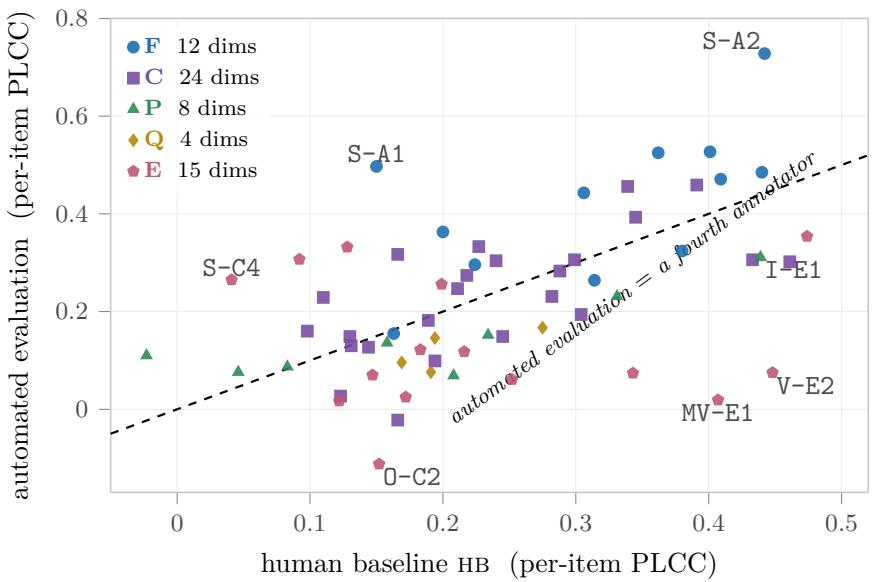  
Figure 12: All 63 leaf dimensions: automated evaluation against the human baseline, both as peritem PLCC with the three-annotator consensus. The dashed diagonal is where it matches a held-out fourth annotator, so points above it are dimensions where per-item scoring can be delegated. The two are positively correlated, not complementary, and axis membership predicts which side of the line a dimension lands on: F almost entirely above, E and Q almost entirely below.

## F Case Study

Scores compress, so every claim below is carried by an artefact, and the cases are ordered as an argument: what a single score hides (Sec. F.1, Sec. F.2), where the defect it hides comes from (Sec. F.3–F.5), what a model looks like once the score is broken up (Sec. F.6, Sec. F.7), and finally a case where the automated scorer is the one that fails (Sec. F.8).

## F.1 Equal scores, diferent failure modes

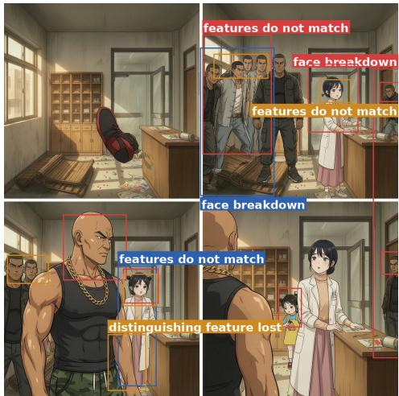  
(a) wan2.7-image-pro: I-C1 face identity 1.67, 15 boxes, every one on a face; action interaction scored 3.0.

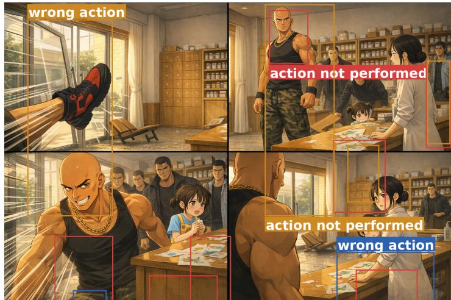  
(b) gpt-image-1.5: I-B2 action interaction 1.33, 13 boxes, every one on a limb; face identity scored 3.33.

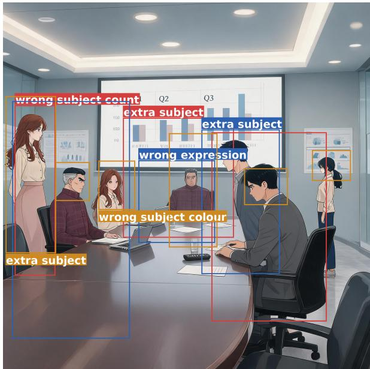  
(c) seedream-5.0-lite: I-B1 subject attributes 1.33, 12 boxes, all “extra subject”; human anatomy scored 3.0.

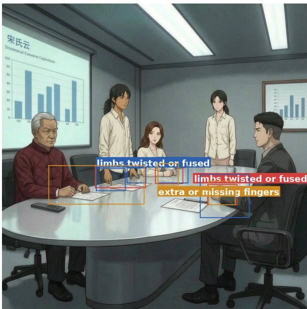  
(d) wan2.7-image-pro: I-E1 human anatomy 1.33, 10 boxes, all broken hands; subject attributes scored 3.33.  
Figure 13: Four items scoring 1.3–1.7 on some dimension, which a composite would treat as equally bad; the boxes fall in four disjoint places, and each pair swaps which dimension it fails. Boxes are drawn independently by the three annotators, colour distinguishing them.

Figure 13 is the argument for forced attribution. All four items score 1.3–1.7 on some dimension and a composite would rank them together, but the boxes fall in four disjoint places: on faces, on limbs mid-action, on people who should not be present, and on hands with the wrong number of fingers. In each pair the two models trade which dimension they fail: the model that loses identity holds action at 3.0, and the model that loses action holds identity at 3.33. This is the item-level version of Sec. 4.4.2.

## F.2 Cross-shot consistency is a separate capability

T1 gpt-image-2 MI-D1 cross-shot character consistency 4.33

  
shot 1

  
shot 3

  
shot 5

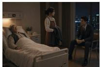  
shot 7

alternate shots, 1, 3, . . . , 11 of 13  
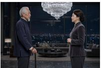  
shot 9

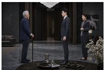  
shot 11

T4 wan2.7-image-pro MI-D1 cross-shot character consistency 1.67  
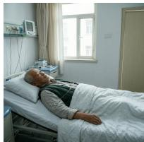  
shot 1

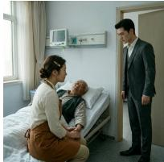  
shot 3

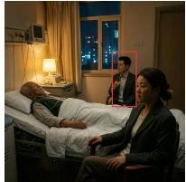  
shot 5

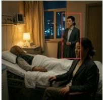  
shot 7

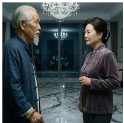  
shot 9

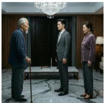  
shot 11  
Figure 14: The same episode and the same character sheets, top tier against bottom tier: a 2.66-point gap on MI-D1, while every panel is defensible in isolation.

Figure 14 is the most direct demonstration in the report. Two models draw the same episode from the same character sheets, and the top-tier row holds its two leads across shots while the bottom-tier row does not: a 2.66-point gap on MI-D1. The important property is that every individual panel in the failing row is defensible: nothing in shot 7 alone is wrong, it is wrong relative to shot 5. A single-asset board is not under-reporting cross-shot quality; it is measuring a diferent quantity.

## F.3 Shot count decides executability

Table 18 puts three models on one identical episode script that forks only at the storyboard stage. The three-shot output compresses the episode into 30 s of self-declared duration and 10 dialogue turns; all three annotators scored its executability (S-B1) and shooting rhythm (S-C2) at 1.00 with zero disagreement, marking the same few defects every time: several actions in one shot, blocking too complex to execute, no reaction shot. Going to six shots recovers the two F dimensions outright; going to twelve buys only executability (Fig. 15).

Table 18: The same episode script, three models, three shot counts. Scores are three-annotator consensus means. Only the storyboard stage forks; every model receives the same script.
<table><tr><td>Dimension</td><td>Axis</td><td>mimo-v2.5-pro 3 shots</td><td>gpt-5.5-xhigh 6 shots</td><td>claude-opus-4.8-max 12 shots</td><td>Behaviour</td></tr><tr><td>S-A2 dialogue fidelity</td><td>F</td><td>1.33</td><td>5.00</td><td>5.00</td><td>stops losing lines at 6 shots</td></tr><tr><td>S-A1 event coverage</td><td>F</td><td>2.67</td><td>4.67</td><td>4.67</td><td>same</td></tr><tr><td>S-B1 executability</td><td>P</td><td>1.00</td><td>3.00</td><td>4.00</td><td>rises monotonically with shot count</td></tr><tr><td>S-C2 shooting rhythm</td><td>E</td><td>1.00</td><td>3.67</td><td>3.67</td><td>6 shots is already enough</td></tr><tr><td>Overall impression</td><td></td><td>1.67</td><td>4.00</td><td>4.00</td><td></td></tr><tr><td>Problems marked</td><td></td><td>23</td><td>18</td><td>15</td><td>fewer, and they change in kind</td></tr><tr><td>Annotator disagreement</td><td></td><td>1.75</td><td>0.75</td><td>0.63</td><td>worse artefacts are harder to score</td></tr></table>

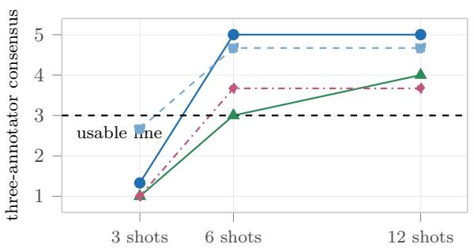  
S-A2 dialogue fidelity S-A1 event coverage  
S-B1 executability S-C2 shooting rhythm

(a) Scores follow shot count; 6 shots is this episode’s suficiency threshold.  
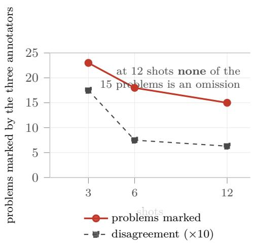  
(b) Fewer problems, and they change in kind.

Figure 15: Shot count is the control variable at the storyboard stage: three models receive the same 1,861-character episode script and fork only here. (a) Going from 3 to 6 shots recovers dialogue fidelity completely (at 3 shots the model deletes the scene’s opening question outright), while 6 to 12 improves only executability. (b) Disagreement falls with the problem count: the worse the artefact, the harder it is to agree how many points to deduct (Sec. F.3).

## F.4 Each input paradigm carries its own failure mode

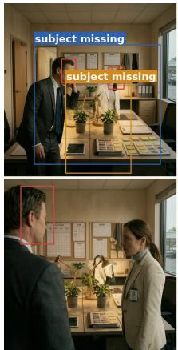

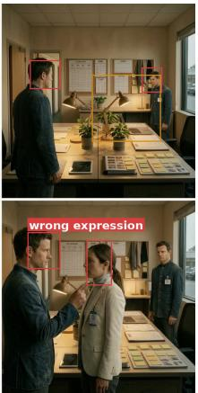

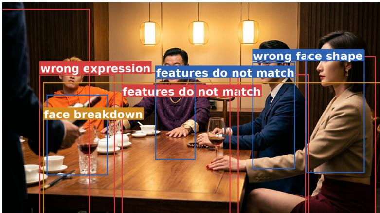  
(b) First/last frame changes person between frames. nano-banana-pro, I-C1 face identity 1.33: three annotators boxed it independently, and nothing constrains the last frame against the first.

(a) Grid panel omits people. wan2.7-image-pro, I-B1 subject attributes 1.33: cells that should hold three people hold two.  

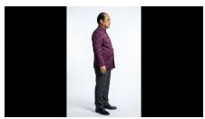

  
(c) The input for (b): the shot’s own first frame (left) and three character sheets.  
Figure 16: The two paradigms fail in opposite ways, which is why dificulty is set by paradigm rather than by visual style: 1/10 failing dimensions for first/last frame against 9/15 for grid.

Figure 16 pairs the two characteristic failure modes, and neither is available to the other paradigm: grid panels omit people, because one image must fill several cells, and first/lastframe shots change person between the two frames, because the frames are not produced in one pass and identity is not held across them. That is why dificulty is set by paradigm rather than by visual style, and why pooling paradigms dilutes the grid collapse.

On video the same split appears item by item (Tab. 8). Under grid one pixverse-c1 shot scored 1.67 on keyframe adherence with all three annotators marking the same defect class, “deviates from the given keyframe”, localised to 0.29–11.04 s, 2.98–4.87 s and 6.56–8.15 s. The prompt in this paradigm describes only camera moves and dialogue, so appearance and blocking are anchored solely by the grid image. Once that image is split into cells, adherence to it is markedly weaker than to a first/last frame pair.

## F.5 An upstream defect is re-expressed downstream, not repaired

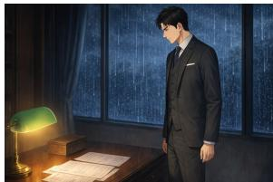  
shot 1

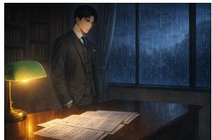  
shot 2

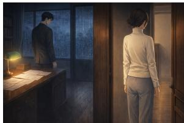  
shot 3

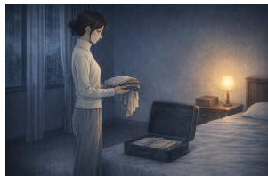  
shot 4  
gpt-image-1.5, four consecutive shots MI-D3 scene 2.00 vs MI-D1 character 3.67  
Figure 17: Rooms drift before people do: all three annotators circled this run of consecutive shots for the set dressing while the characters held. Corpus-wide, cross-shot scene consistency (2.42) is the lowest of the four episode-level dimensions.

The design behind Fig. 10 is this: four dramas (two live action, two animated), first/lastframe paradigm throughout, video model held fixed, baseline chain the leader at every stage (3.03–3.29 across the three granularities). Exactly one upstream stage is replaced per run with everything else unchanged (the storyboard stage by hy3 or mimo-v2.5-pro, the image stage by nano-banana-pro or seedream-5.0-lite), giving the 12 configurations plotted there. Figure 17 is the same mechanism in one item: an upstream set-dressing drift that the video stage does not repair but re-expresses, and that survives into the short drama.

## F.6 hy3 reproduces the script and does not dramatise it

On storyboard design hy3 scores 3.43 overall. Its nearest neighbour doubao-seed-2.1-pro scores 3.60, and that gap is grouped rather than general: over the eight leaf dimensions on the same 533 items, hy3 leads on everything that means reproduce the script and trails on everything that means turn it into television. Dialogue fidelity reaches 4.44, only 0.20 behind the leader, while emotional expression (3.64) and audiovisual style treatment (3.91) are both eighth of nine.

Table 19 is the mechanism in one paired item. On one identical episode script, hy3 cut 10 shots and reproduced all 20 dialogue turns verbatim while adding little beyond “rapid cut” and “close-up”; doubao-seed-2.1-pro cut 7 shots, wrote them frame by frame, and reproduced 3 turns verbatim, which all three annotators flagged as tampering or omission. Neither is a defect: they are diferent points on the fidelity/expressiveness trade-of, invisible to a composite.

## F.7 seedance-2.5 buys episode-level coherence with some single-clip quality

On paired items the newer version loses on single-shot video and gains at both episode and short-drama granularity (Fig. 18). Everything that has to hold continuously along a timeline got worse (audio-visual sync 0.658, motion smoothness, camera plausibility), and everything about joining shots together got better (cross-shot style consistency +1.143). The cause is that seedance-2.5 follows the prompt more literally, so a deficiency already in the prompt is now executed faithfully (Fig. 18b). Duration contributes secondarily: single shots went from 15 s to 30 s, so one shot now carries four internal cuts while the score stays a single number.

Table 19: hy3 vs. doubao-seed-2.1-pro on one identical episode script, all eight storyboard leaf dimensions. Both reproduce-the-script dimensions (axis F) favour hy3; none of the four expressiveness dimensions (axis E) does, and that grouping holds over all 533 items.
<table><tr><td>Dimension</td><td>Axis</td><td>hy3 10 shots</td><td>doubao-seed-2.1-pro 7 shots</td><td>Δ</td><td>What the dimension asks</td></tr><tr><td>S-A2 dialogue fidelity</td><td>F</td><td>4.67</td><td>3.33</td><td>+1.33</td><td>Is the dialogue reproduced as written?</td></tr><tr><td>S-A1 event coverage</td><td>F</td><td>4.67</td><td>4.33</td><td>+0.33</td><td>Are any events missing?</td></tr><tr><td>S-B1 executability</td><td>P</td><td>3.33</td><td>3.00</td><td>+0.33</td><td>Can downstream actually shoot this?</td></tr><tr><td>S-B2 restraint in additions</td><td>P</td><td>3.67</td><td>4.00</td><td>-0.33</td><td>Is invention over- or under-done?</td></tr><tr><td>S-C1 narrative flow</td><td>E</td><td>4.00</td><td>4.33</td><td>-0.33</td><td>Do the shots join up?</td></tr><tr><td>S-C2 shooting rhythm</td><td>E</td><td>3.00</td><td>3.00</td><td>0.00</td><td>Is the cutting density right?</td></tr><tr><td>S-C3 emotional expression</td><td>E</td><td>3.33</td><td>4.33</td><td>-1.00</td><td>Is emotion externalised into images?</td></tr><tr><td>S-C4 audiovisual style</td><td>E</td><td>3.33</td><td>4.00</td><td>-0.67</td><td>Do the key beats get AV design?</td></tr></table>

Both outputs come from the same episode script and fork only at this stage.

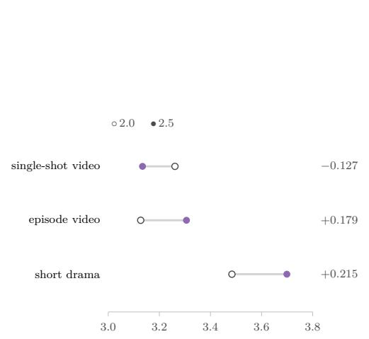  
(a) Paired means at the three video granularities.

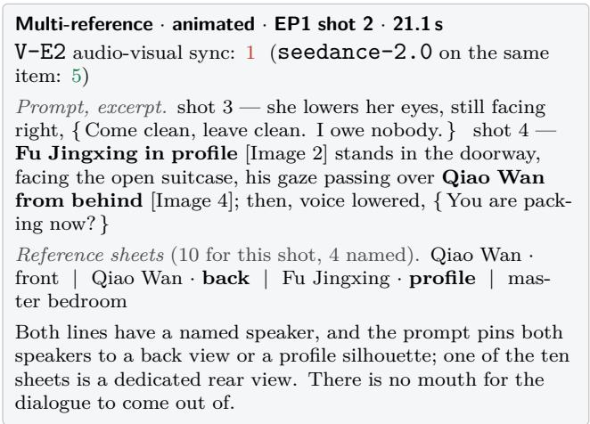  
(b) Why the single clip gets worse: the prompt contradicts itself, and the more obedient model executes it.  
Figure 18: seedance-2.5 against seedance-2.0 on paired items (multi-reference, animated, matched on drama, episode and shot; 39/14/10 pairs). The newer version gains once clips have to join up and gives back a little on the single clip.

## F.8 Automated scoring drifts on dimensions with no reference to check against

Figure 19 is the failure mode in one item: every dimension with a reference is scored correctly, while the one purely perceptual dimension is overestimated by 3.67 points in the lenient direction. This is the item-level form of what metric validation found over the population (Sec. 3.4, Tab. 17).

<table><tr><td>Dimension</td><td>human</td><td>judge</td><td>err</td><td></td></tr><tr><td>I-B1 subject attributes</td><td>2.00</td><td>2</td><td>0.00</td><td>correct</td></tr><tr><td>I-C2 appearance, costume</td><td>2.33</td><td></td><td>2 0.33</td><td>correct</td></tr><tr><td>I-B3 scene and layout</td><td>2.67</td><td></td><td>30.33</td><td>correct</td></tr><tr><td>I-A1 technical quality</td><td>1.33</td><td>5</td><td>3.67</td><td>overestimated</td></tr></table>

The three annotators scored technical quality 1 / 1 / 2 and tagged it consistently: structural distortion, visible noise, blur, ghosting.  
Figure 19: One nano-banana-pro panel, all four scored dimensions shown: every dimension with a reference to check against is right, and the one purely perceptual dimension is of by almost four points in the lenient direction.