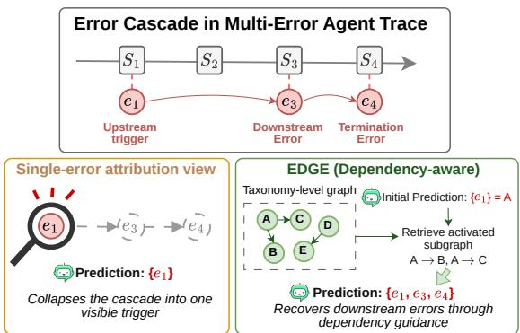
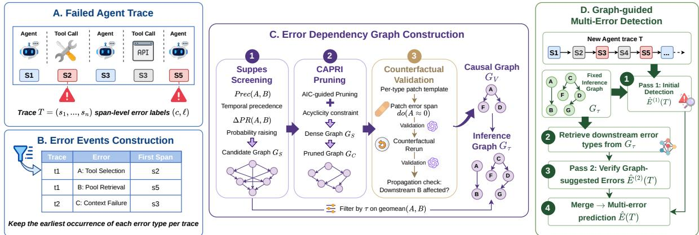
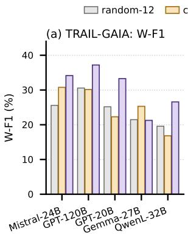
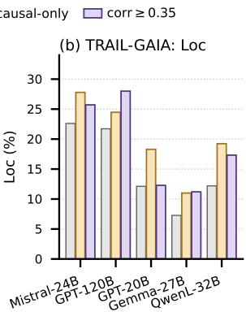
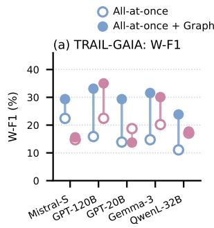
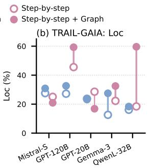
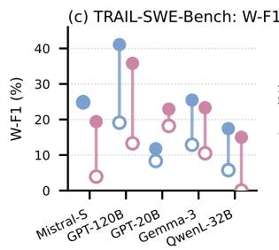
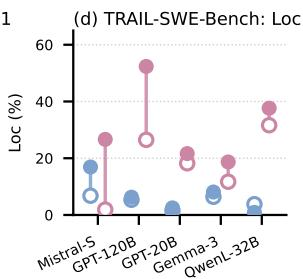
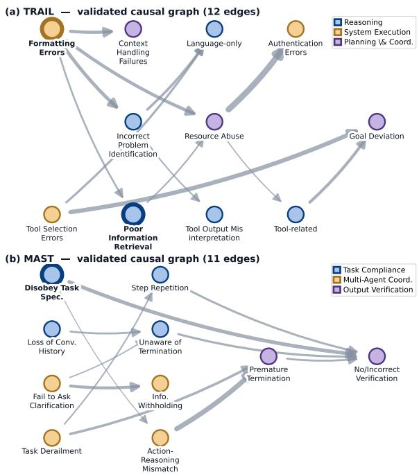
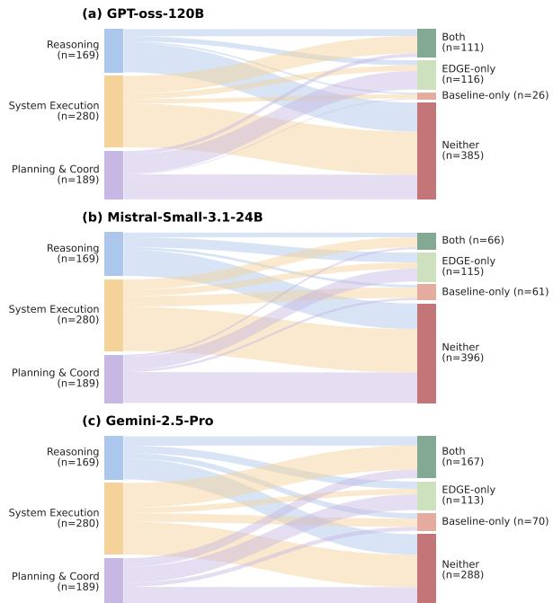

# EDGE: Error Dependency Graph-Guided Multi-Error Attribution in Multi-Agent LLM Systems

Jun Hou Priya Pitre Yi Fang Xuan Wang Virginia Tech {junh, priyapitre, yif, xuanw}@vt.edu

## Abstract

Large language model (LLM) agent failures often contain multiple related errors rather than a single mistake. Existing attribution methods usually identify a responsible agent, step, or root cause, but do not explicitly model dependency between errors. We introduce EDGE <sup>1</sup>, an Error Dependency Graph-guided multi-Error attribution framework. EDGE constructs an error dependency graph from observed error events and validates a reliable causal subset through counterfactual rollout. The inference graph guides a two-stage LLM-as-judge detector for error attribution, and the interventionvalidated subgraph provides a more reliable basis for explanation and repair analysis. Experiments on TRAIL and MAST show that EDGE improves category-level multi-error attribution across most evaluated models and settings. Experiments with adapted Who&Whenstyle prompts show that the graph helps across prompting strategies. These results suggest that dependency structure is a useful diagnostic prior for agent failures beyond isolated rootcause prediction.

## 1 Introduction

Large language model (LLM) agents are increasingly used for complex multi-step tasks that involve planning, retrieval, tool use, and reasoning. For failed executions, the final outcome indicates task failure, but rarely explains how the failure developed. Recent work has therefore moved toward trace-level failure attribution, which identifies the step and error behind a failed execution (Zhang et al., 2025; Barke et al., 2026; Ma et al., 2025; Wang et al., 2026b; Zhu et al., 2026). These methods center on single-error attribution and do not provide full step-level multi-error annotation.

TRAIL reflects a newer direction by providing fine-grained span-level annotations for multiple errors in each failed trace (Deshpande et al., 2025). Within a failed trace, errors play distinct structural roles, with some as upstream triggers, others as downstream effects, and others as parallel symptoms (Figure 1). These relations recur across traces, motivating a dependency graph constructed from the full corpus. When extended for multi-label output, single-error methods are inefficient and treat each error as an isolated target without modeling how one error makes another more likely. We therefore study multi-error attribution as dependencyaware diagnosis, where the dependency structure guides efficient and effective attribution and the validated subset supports explanation.

  
Figure 1: Errors in agent traces form dependency cascades (e → e → e ). Unlike single-locus attribution, EDGE detects the downstream errors via a taxonomylevel dependency graph.

To achieve this goal, we frame multi-error attribution as dependency-aware diagnosis. We use within-trace ordering and cross-trace regularity to capture how error categories recur and propagate across failed executions. Based on this view, we introduce EDGE, an error dependency graph-guided framework for multi-error attribution in LLM agent traces. EDGE constructs an error dependency graph from observed error events, validates selected edges through counterfactual rollout, and uses the resulting graph to guide a two-stage detector. The first stage predicts an initial error set, and the second stage verifies downstream errors suggested by the graph. Score-filtered observational edges improve detection coverage, while intervention-validated edges provide a more reliable structure for explanation and repair analysis. This role separation lets EDGE use observational edges to broaden attribution coverage when intervention evidence is limited, while preserving the causal interpretability of the validated subset.

We evaluate EDGE on TRAIL (Deshpande et al., 2025) and MAST (Cemri et al., 2026), two benchmarks with distinct error taxonomies that cover span-level and trace-level multi-error attribution settings, demonstrating that the pipeline is taxonomy-agnostic. Across these benchmarks, EDGE improves category-level attribution for most evaluated models and settings. Additional experiments with adapted Who&When-style prompts show that the inferred graph can guide different attribution formats, rather than only one detector prompt. Our contributions are threefold. First, we formulate multi-error attribution as dependencyaware diagnosis for LLM agent traces. Second, we construct an error dependency graph from observed error events and inject it into a two-stage LLM-asjudge detector. Third, we separate prediction from explanation using $\mathcal { G } _ { \tau }$ for attribution coverage and the intervention-validated subgraph $\mathcal { G } _ { V }$ for repair and propagation analysis.

## 2 Related Work

Failure Attribution in Agent Systems Error attribution in agent systems studies how to identify the step, agent, or error instance most responsible for a failed execution trace. This work focuses on the LLM-reasoning paradigm emphasized in recent surveys of agent trajectory analysis (Wang et al., 2026a). Early reasoning-based attribution methods explore how the LLM reads and organizes the trace. Who&When (Zhang et al., 2025) formulates attribution as direct trajectory reasoning, while other methods improve this paradigm through hierarchical context, iterative adjudication, and structured causal prompting (Banerjee et al., 2025; Zhu et al., 2026; West et al., 2025). AgentErrorBench and AgentDebug further introduce a modular agent-error taxonomy, annotated failure trajectories, and attribution-oriented debugging from root-cause feedback (Zhu et al., 2025). Recent work has further introduced causal structure into LLM-based attribution. CDC-MAS (Ma et al., 2025) uses multi-granularity causal inference, CHIEF (Wang et al., 2026b) prompts an LLM to generate hierarchical causal graphs with counterfactual screening, and AgentRx (Barke et al., 2026) combines constraint-based evidence with LLM judgment for more auditable diagnosis. These attribution and debugging methods move beyond surface-level reasoning, but they still primarily target a single decisive error, critical step, or local root cause behind the final failure outcome. EDGE instead models failed traces as multi-error propagation, where earlier errors can make later errors more likely through an inferred dependency structure over error categories.

Sparse Event Progression Modeling Learning propagation structure from event data studies how earlier events are statistically or causally associ ated with later events in accumulative or cascading processes. Some work learns temporal influence and causal structure from timestamped events using Hawkes processes, temporal point processes, or Granger-style predictability (Cai et al., 2021; Qiao et al., 2023; Wu et al., 2024), and recent representation-based methods further learn temporal causal structures through latent regimes, sample-level relations, multimodal representations, or causal sequence prediction (Chen et al., 2025; Rahmani and Frossard, 2025; Math and Lienhart, 2026; Li et al., 2025). However, agent-error traces are sparse, partially ordered, and semantic rather than dense continuous streams, so intensitybased event progression learning is suboptimal here. Representation-based approaches additionally require data and modeling assumptions that do not fit compact LLM-detector guidance (Constantinou et al., 2021). Suppes-style accumulative progression modeling was applied to cancer progression by CAPRESE (Loohuis et al., 2014) and CAPRI (Ramazzotti et al., 2015), with TRONCO providing a modular implementation (De Sano et al., 2016). It constructs correlation-based dependency hypotheses from sparse events using temporal priority and probability raising. EDGE adopts this view to infer category-level propagation structure from recurring error-event patterns across traces.

## 3 Method

EDGE models error propagation in multi-error agent traces. Given span-level annotations of error event types and locations, we first formalize the multi-error attribution task, then construct an observational correlation graph $\mathcal { G } _ { S }$ and a causalcandidate graph $\mathcal { G } _ { C }$ over error categories, validate a trustworthy causal anchor with targeted interventions, and finally build an inference graph that augments this anchor with score-filtered correlation edges (Figure 2). Section 3.1 formalizes the task and notation. Section 3.2 describes the two observational graphs $( { \mathcal { G } } _ { S } , { \mathcal { G } } _ { C } )$ built from temporal precedence and probability raising. Section 3.3 introduces intervention-based edge validation. Section 3.4 presents how the selected propagation graph is incorporated into graph-guided error detection. We use $\mathcal { G } _ { \tau }$ (validated ∪ score-filtered correlation from $\mathcal { G } _ { S } )$ as the default detector input and additionally report $\mathcal { G } _ { V }$ (validated only) as an ablation alternative. A complete symbol summary is provided in Appendix A.1.

  
Figure 2: Overview of EDGE. (Left) An observational correlation graph $\mathcal { G } _ { S }$ and a sparse causal-candidate graph $\mathcal { G } _ { C }$ are inferred from event statistics via Suppes screening and CAPRI pruning. (Middle) Causal-candidate edges in $\mathcal { G } _ { C }$ are validated by counterfactual rollout, yielding $\mathcal { G } _ { V }$ ; score-filtered correlation edges from $\mathcal { G } _ { S }$ are unioned with $\mathcal { G } _ { V }$ to form $\mathcal { G } _ { \tau }$ . (Right) Two-stage detection: Stage 1 predicts with full-graph context; Stage 2 verifies downstream categories reachable from Stage-1 predictions.

## 3.1 Problem Setup

Let a trace $T = ( s _ { 1 } , s _ { 2 } , \ldots , s _ { N } )$ denote a sequence of spans ordered by execution time. Each trace is annotated with a set of error events $E ( T )$ $\{ ( c _ { j } , \ell _ { j } ) \}$ , where $c _ { j } \in { \mathcal { C } }$ is an error category from an arbitrary multi-error taxonomy $\mathcal { C }$ and $\ell _ { j }$ is the string identifier of the span at which that error first emerges, evaluated by exact match. Its position in the execution order $( s _ { 1 } , \ldots , s _ { N } )$ supplies the temporal ordering used internally by the candidategraph construction (Section 3.2). The goal is to predict, for each trace, a set of category-location pairs $\hat { E } ( T )$ .

We represent error-category dependencies with a directed graph $\mathcal { G } = ( \mathcal { C } , \mathcal { R } )$ , where $\mathcal { R }$ is a set of directed propagation edges. Each node is an error category and each edge $A  B$ denotes a hypothesized propagation relation from source error A to downstream error B. We distinguish observational propagation edges from interventionvalidated edges, which are interpreted as empirically supported causal propagation links.

## 3.2 Observational Graph Construction

We adopt the Suppes-Bayes Causal Network construction of CAPRI (Ramazzotti et al., 2015) (as implemented in the TRONCO package (De Sano et al., 2016)), which first prima-facie-filters edges by Suppes’ temporal-priority and probability-raising conditions (Suppes, 1970) and then prunes the Suppesscreened graph by a regularized likelihood score, to construct an observational correlation graph $\mathcal { G } _ { S }$ and a causal-candidate graph $\mathcal { G } _ { C }$ over error categories. The key adaptation is to treat error-category occurrences as progression events while using step annotations to derive category-level event variables for temporal-order estimation. Let $\tau$ denote the set of annotated traces, then for each trace $T \in { \mathcal { T } }$ and category $A \in { \mathcal { C } } .$ , we define

$$
X _ { A } ( T ) = \mathbf { 1 } [ \exists ( c , \ell ) \in E ( T ) : c = A ] ,\tag{1}
$$

where $X _ { A } ( T ) = 1$ indicates that error category A occurs anywhere in trace T, and we write $t _ { A } ( T )$ for the first-event index of A (formal definition in Appendix $\mathbf { A } . 2 )$ . Tied events are retained, but do not support strict temporal direction.

Suppes-based Candidate Screening. We first identify prima facie candidate edges using Suppes probabilistic theory of causation (Suppes, 1970). For a directed pair $A  B$ , we require both temporal priority and probability raising. Let $\mathcal { T } _ { A B }$ denote the set of traces in which both A and B are present without ties. Because our annotations provide event order within each trace, we estimate temporal priority by aggregating precedence evidence across co-occurring traces, and operationalize Suppes’ probability-raising condition as the difference in $B ^ { * } { \mathrm { s } }$ conditional occurrence rate:

$$
\begin{array} { r } { \operatorname { P r e c } ( A , B ) = \frac { | \{ T \in { \mathcal { T } } _ { A B } : t _ { A } ( T ) < t _ { B } ( T ) \} | } { | { \mathcal { T } } _ { A B } | } . } \end{array}\tag{2}
$$

$$
\begin{array} { r } { \Delta _ { \mathrm { P R } } ( A , B ) = P ( X _ { B } = 1 \mid X _ { A } = 1 ) \qquad } \\ { - P ( X _ { B } = 1 \mid X _ { A } = 0 ) . } \end{array}\tag{3}
$$

We retain $A  B$ when both criteria exceed predefined thresholds with sufficient joint support (Appendix A.2). The output of this stage is the observational correlation graph $\mathcal { G } _ { S } ~ = ~ ( \mathcal { C } , \mathcal { R } _ { S } )$ whose edges represent observational propagation hypotheses. For each surviving edge $A  B \in$ $\mathcal { R } _ { S }$ (both criteria positive), we derive a propagation weight given by the geometric mean of the two screening scores,

$$
w _ { S } ( A , B ) = { \sqrt { \operatorname { P r e c } ( A , B ) \cdot \Delta _ { \operatorname { P R } } ( A , B ) } } ,\tag{4}
$$

which is used for inference-time edge ranking (Section 3.4). Threshold is reported in Appendix A.2.

CAPRI-based Graph Pruning. The Suppes screen produces $\mathcal { G } _ { S }$ , but it may retain indirect or transitive dependencies. We therefore apply a CAPRI-style score-based pruning procedure to obtain a sparser causal-candidate graph, selected from the search space of directed acyclic graphs (DAGs)

$$
\Omega ( \mathcal { R } _ { S } ) = \{ \mathcal { G } : \mathcal { G } \mathrm { ~ i s ~ a ~ D A G ~ a n d ~ } \mathcal { R } \subseteq \mathcal { R } _ { S } \}\tag{5}
$$

Each category node is modeled as a binary event conditioned on its parent set, using the occurrence variables $X _ { A } ( T )$ . We select the causal-candidate graph $\mathcal { G } _ { C } = ( \mathcal { C } , \mathcal { R } _ { C } )$ as the minimizer over $\Omega ( \mathcal { R } _ { S } )$ of an AIC-style score that combines the maximized log-likelihood of the binary category-event model with a parameter-count penalty. The full objective, optimization, and Suppes threshold values are deferred to Appendix A.2.

## 3.3 Intervention-based Graph Validation

To strengthen causal interpretation, we validate $\mathcal { G } _ { C }$ edges with counterfactual interventions.

Controlled Counterfactual Rollout. For each candidate edge $A \to B \in { \mathcal { R } } _ { C }$ , we collect the trace set $\mathcal { T } _ { A \prec B }$ where $t _ { A } ( T ) < t _ { B } ( T )$ . We intervene on the source span $s _ { t _ { A } ( T ) }$ using an LLM-based repair module that applies a category-specific patch template to rewrite the span’s input or output and eliminate A. We then run the counterfactual rollout with all tool outputs held to their original values, so only the patched span and its downstream reasoning change. A repair verifier (Judge A) labels each rollout with resolved $_ A ( T ) \in \{ 0 , 1 \} \subset = 1$ iff A is removed). Only rollouts with resolved $_ A ( T ) = 1$ enter effect estimation. Because tool outputs are held fixed, any downstream change in B is attributable to the patch on A, so the effect estimate captures the controlled direct effect of A on B along the agent’s reasoning path (Pearl, 2022). Patch templates, postchecks, Judge-A prompts, and hyperparameters are in Appendix A.2.

Edge Effect Estimation and Validation. For each verified rollout, an effect evaluator (Judge B) labels whether B remains present in the continuation. Let $X _ { B } ^ { \mathrm { c f } } ( T ; A ) \in \{ 0 , 1 \}$ denote this Judge-B label. We estimate the downstream reduction effect of edge $A  B$ as the boolean risk-difference

$$
\Delta ( A \to B ) = \mathbb { E } _ { T \in { \mathcal { T } } _ { A \sim B } ^ { \mathrm { v e r } } } \bigl [ X _ { B } ( T ) - X _ { B } ^ { \mathrm { c f } } ( T ; A ) \bigr ] ,\tag{6}
$$

where ${ \mathcal { T } } _ { A \prec B } ^ { \mathrm { v e r } } \subseteq { \mathcal { T } } _ { A \prec B }$ retains only traces with resolved $_ A ( T ) = 1$ . We retain $A  B$ to form $\mathcal { G } _ { V } ~ = ~ ( \mathcal { C } , \mathcal { R } _ { V } )$ when $\Delta ( A \to B ) > \tau _ { \mathrm { v a l } }$ (Appendix A.2). The validated graph $\mathcal { G } _ { V }$ serves two roles: one is the trustworthy causal anchor retained in all thresholded inference graphs, so observational edges augment rather than replace intervention evidence, and another is an interpretable propagation map for post-hoc explanation, repair prioritization, and system-level debugging.

## 3.4 Graph-Guided Error Detection

With both observational and intervention-validated propagation graphs, our downstream detector follows an LLM-as-judge format augmented with structured graph guidance. Given a trace $T$ and taxonomy ${ \mathcal { C } } ,$ a baseline judge $\mathcal { I }$ receives the serialized trace together with the definitions of categories and predicts a set of errors.

Inference Graph Selection. The causal-only graph $\mathcal { G } _ { V }$ is maximally interpretable, but it may lack strong correlations that are visible observationally yet difficult to validate by intervention in available sample sizes. We therefore construct a thresholded inference graph by taking the union of score-filtered correlation edges from $\mathcal { G } _ { S }$ and all intervention-validated causal edges:

$$
\mathcal { R } _ { \tau } = \{ A  B \in \mathcal { R } _ { S } : w _ { S } ( A , B ) \geq \tau \} \cup \mathcal { R } _ { V } ,\tag{7}
$$

and write $\mathcal { G } _ { \tau } = ( \mathcal { C } , \mathcal { R } _ { \tau } )$ . Each selected edge is passed to the detector with a propagation weight $w A B \mathrm { . }$

$$
w _ { A B } = \left\{ \begin{array} { l l } { \operatorname* { m a x } ( \Delta ( A \to B ) , 0 ) } & { \mathrm { i f } ( A , B ) \in \mathcal { R } _ { V } , } \\ { w _ { S } ( A , B ) } & { \mathrm { o t h e r w i s e } , } \end{array} \right.\tag{8}
$$

so validated edges contribute their reduction effect, while pure-observational edges contribute their Suppes geomean. Both quantities lie in [0, 1], allowing for a single propagation threshold τ<sub>GI</sub> in Stage 2 ((11)). The resulting graph $\mathcal { G } _ { \tau }$ keeps the validated causal anchor intact and extends it with score-filtered correlation edges. The ablation in §4.2 also reports $\mathcal { G } _ { V }$ as an alternative option.

EDGE Trace-Conditioned Graph Guidance. The graph from previous steps provides a holistic error dependency pattern across the corpus. EDGE therefore uses a progressive attribution procedure that activates this pattern per trace to surface plausible downstream errors. In the first stage, the judge receives the trace, taxonomy, and full graph guidance, and returns an initial prediction:

$$
\hat { E } ^ { ( 1 ) } ( T ) = \mathcal { I } ( T , \mathcal { C } , \mathcal { R } _ { \tau } ) .\tag{9}
$$

$$
D ( T ) = \{ c : \exists \ell , ( c , \ell ) \in \hat { E } ^ { ( 1 ) } ( T ) \} .\tag{10}
$$

We then derive a trace-specific edge subset by $\mathrm { a g } .$ gregating selected edges from detected source categories onto undetected targets:

$$
\begin{array} { r l r } {  { \mathcal { R } _ { \tau } ^ { ( T ) } = \big \{ A \to B \in \mathcal { R } _ { \tau } : } } \\ & { } & { A \in D ( T ) , B \notin D ( T ) , } \\ & { } & { \displaystyle \sum _ { A ^ { \prime } \in D ( T ) } w _ { A ^ { \prime } B } > \tau _ { \mathrm { G I } } \big \} . } \end{array}\tag{11}
$$

where $\tau _ { \mathrm { G I } }$ is the graph-injection threshold, which controls which downstream hypotheses are exposed in Stage 2. The subset $\mathcal { R } _ { \tau } ^ { \check { ( T ) } }$ retrieves downstream hypotheses from the fixed detector graph $\mathcal { G } _ { \tau }$ according to the Stage-1 error profile.

When $\mathcal { R } _ { \tau } ^ { ( T ) }$ is non-empty, a second stage issues a targeted prompt that lists the Stage-1 predictions as already detected, presents $\mathcal { R } _ { \tau } ^ { ( T ) }$ as trace-specific guidance, and instructs the judge to output only errors whose category does not appear in $D ( T )$ We denote this Stage-2 prediction by $\hat { E } ^ { ( 2 ) } ( T )$ . The final prediction $\hat { E } ^ { \mathrm { E D G E } } ( T )$ merges Stage 1 with the Stage-2 entries whose categories were not already covered in Stage 1. The fixed graph is not updated at inference time, and only the edge subset exposed in the second stage is conditioned on the trace (details in Appendix A.4).

This two-stage design turns the selected graph from a passive context block into an explicit refinement mechanism. Stage 1 uses the full graph to produce an initial error profile. Stage 2 converts that profile into a restricted set of plausible hypotheses and verifies whether those errors are supported by the trace. For span-level localization benchmarks, we additionally prepend a compact span-identifier index to ground predicted locations. To validate the necessity of Stage 2, we compare against a naive variant that prepends the full graph as static, trace-agnostic context in a single LLM call (the +CG ablation; Table 2).

## 4 Experiments

## 4.1 Experimental Setup

We evaluate EDGE on two public benchmarks TRAIL (Deshpande et al., 2025) and MAST under their original terms. Details about these two benchmarks, eleven open- and close-weight backbones, the compute budget, and the software packages used are listed and cited in Appendix A.9. Downstream evaluation follows the native prediction target of each benchmark. TRAIL is evaluated as span-level multi-error attribution, requiring both error category and location, whereas MAST is evaluated as trace-level multi-label error classification without step prediction. For MAST, we additionally annotate the first occurrence of each error category solely for event-based graph construction (refer to Appendix A.3 for details).

Graph Construction Protocol. We construct one dependency graph per taxonomy from all annotated traces, with categories as nodes and aggregate temporal, probability-raising, and interventionsupported relations as edges, capturing the holistic dependency pattern of the taxonomy. The graph contains no trace-specific labels, spans, evidence, or task answers, and remains fixed during detection. At inference time, the initial error predictions are used to retrieve only downstream hypotheses whose source categories were detected (Stage-1), and a second judge call only verifies those hypotheses against the trace (Stage-2). We therefore interpret the setup as taxonomy-level dependencyguided attribution with controlled context, avoiding trace-specific label leakage.

<table><tr><td rowspan="2">Model</td><td rowspan="2">Method</td><td colspan="3">TRAIL-GAIA</td><td colspan="3">TRAIL-SWE-Bench</td><td colspan="4">MAST</td></tr><tr><td>F1</td><td>Loc</td><td>Joint</td><td>F1</td><td>Loc</td><td>Joint</td><td>F1</td><td>Precision</td><td>Recall</td><td> $_ \mathrm { A c c }$ </td></tr><tr><td rowspan="2">Mistral-Small-3.1-24B</td><td>Baseline</td><td>24.06</td><td>23.83</td><td>3.78</td><td>9.80</td><td>9.36</td><td>1.57</td><td>37.73</td><td>29.87</td><td>31.50</td><td>62.01</td></tr><tr><td>EDGE  $\Delta$ </td><td>34.15 +10.09</td><td>25.71 +1.88</td><td>12.27 +8.49</td><td>14.40 +4.60</td><td>7.59 -1.77</td><td>0.87 -0.70</td><td>38.29 +0.56</td><td>28.55 -1.32</td><td>34.59 +3.09</td><td>59.86 -2.15</td></tr><tr><td>GPT-oss-120B</td><td>Baseline EDGE</td><td>25.76 37.20 +11.44</td><td>16.92 28.00</td><td>4.59 9.48</td><td>22.08 30.07</td><td>2.58 1.60</td><td>0.00 0.00</td><td>17.84 27.21</td><td>26.28 29.27</td><td>9.47 18.74</td><td>67.02 64.14</td></tr><tr><td>GPT-oss-20B</td><td> $\Delta$  Baseline EDGE  $\Delta$ </td><td>23.28 33.28 +10.00</td><td>+11.08 6.29 12.28 +5.99</td><td>+4.89 2.61 4.09 +1.48</td><td>+7.99 9.31 29.89 +20.58 +0.73</td><td>-0.98 0.50 1.23</td><td>0.00 0.00 0.43</td><td>+9.37 17.66 22.34</td><td>+2.99 26.26 29.31</td><td>+9.27 9.65 13.34 +3.05</td><td>-2.88 67.29 66.96 +3.69 -0.33</td></tr><tr><td>Gemma-3-27B-IT</td><td>Baseline EDGE  $\Delta$ </td><td>16.25 21.26 +5.01</td><td>1.79 11.20 +9.41</td><td>0.33 0.73 +0.40</td><td>11.39 15.41 +4.02</td><td>0.21 1.47 +1.26</td><td>0.00 0.00 0.00</td><td>14.19 21.17 +6.98</td><td>18.32 26.97 +8.65</td><td>5.84 11.37 +5.53</td><td>69.13 68.10 -1.03</td></tr><tr><td>Qwen Family*</td><td>Baseline EDGE  $\Delta$ </td><td>12.40 26.57 +14.17</td><td>3.92 17.32 +13.40</td><td>0.27 4.13 +3.86</td><td>2.14 10.33 +8.19</td><td>0.00 0.42 +0.42</td><td>0.00 0.00 0.00</td><td>16.08 15.61 -0.47</td><td>28.46 29.50 +1.04</td><td>9.02 7.94 -1.08</td><td>66.80 67.78 +0.98</td></tr><tr><td>Gemini-2.5-Pro</td><td>Baseline EDGE  $\Delta$ </td><td>33.51 42.13 +8.62</td><td>35.68 30.15 -5.53</td><td>13.74 15.26 +1.52 +12.31</td><td>26.66 38.97</td><td>6.42 16.58 +10.16</td><td>1.35 2.01 +0.66</td><td>34.99 41.57 +6.58</td><td>31.11 29.04 -2.07</td><td>25.49 32.97 +7.48</td><td>63.77 60.79 -2.98</td></tr><tr><td>Gemini-2.5-Flash</td><td>Baseline EDGE  $\Delta$  Baseline</td><td>37.07 30.26 -6.81</td><td>34.22 23.81 -10.41</td><td>12.71 7.40 -5.31</td><td>8.71 21.91 +13.20</td><td>0.63 1.79 +1.16</td><td>0.00 0.00 0.00</td><td>24.41 40.34 +15.93</td><td>26.91 29.64 +2.73</td><td>16.59 34.11 +17.52</td><td>64.06 60.32 -3.74</td></tr><tr><td>GPT-40</td><td>EDGE  $\Delta$ </td><td>18.73 28.31 +9.58</td><td>7.45 10.87 +3.42</td><td>2.45 1.99 -0.46</td><td>16.72 26.51 +9.79</td><td>4.19 1.25 -2.94</td><td>1.33 0.00 -1.33</td><td>22.87 29.96 +7.09</td><td>28.00 31.67 +3.67</td><td>14.78 20.48 +5.70</td><td>65.32 64.96 -0.36</td></tr></table>

Table 1: Main results across both benchmarks. F1 is weighted-F1 on both benchmarks, with the rest macro-averaged. TRAIL-GAIA / TRAIL-SWE-Bench: span-level multi-error attribution; Loc location accuracy, Joint locationcategory joint accuracy. MAST: trace-level multi-label yes/no over 13 categories on 393 AG2 traces. EDGE: thresholded inference graph (TRAIL τ=0.35; MAST τ=0.50) with two-stage dynamic injection. ∆: per-cell difference (EDGE − Baseline). All metrics in $\% .$ <sup>∗</sup>Qwen Family combines the best single-benchmark model per side: QwenLong-L1-32B on TRAIL + QwQ-32B (with enable\_thinking) on MAST.

For each benchmark, we compare baseline against EDGE with the inference graph $\mathcal { G } _ { \tau }$ (Defined in Section 3.4). A observational-edge threshold $\tau$ is shared across all backbones within each benchmark and selected by model-averaged weighted F1 over a small candidate grid. This yields $\tau { = } 0 . 3 5$ for TRAIL and $\tau { = } 0 . 5 0$ for MAST. Ablations on neighboring thresholds, causal-only graphs, and random controls are in Appendix A.5. We report weighted-F1, Loc, and Joint on TRAIL, and weighted-F1, macro-precision, macro-recall, and macro-accuracy on MAST.

## 4.2 Main Results

Table 1 evaluates EDGE on span-level (TRAIL) and trace-level (MAST) multi-error attribution. On TRAIL, EDGE substantially improves attribution. Gemini-2.5-Pro achieves the strongest results, with 42.13 F1 on GAIA and 38.97 on SWE-Bench, while open-weight models show large F1 gains (up to +21 on SWE for GPT-oss-20B). Though graph guidance reliably enhances category detection, exact localization on long-context SWE-Bench remains difficult (Deshpande et al., 2025). On MAST, graph guidance transfers effectively, lifting F1 for GPT-4o (22.87→29.96) and all open-weight backbones (up to +9.4) except QwQ-32B. However, the accuracy is traded for the gains, with accuracy decreasing on 7 of 8 backbones (−0.33 to −3.74) while recall rises on the same 7 of 8 (+3.09 to +17.52). The imbalanced distribution of the 13 binary category decisions per trace, of which only 30.5% are positive, means accuracy is best read alongside recall rather than alone.<sup>2</sup> Results for two newest backbones, GPT-5 and Qwen3.6-35B-A3B, are reported in Appendix A.6, where EDGE improves F1 in all six cells under the identical configuration. Stage-2 rates in Appendix A.5.



  
Figure 3: Graph-richness ablation on TRAIL-GAIA across both headline metrics. Three variants: random-12 (edge-count-matched control with no causal screening), causal-only $( { \mathcal { G } } _ { V } ,$ intervention-validated edges), and corrunion $\mathcal { G } _ { \tau }$ <sub>τ</sub> at $\tau { = } 0 . 3 5$

To confirm that these gains come from the structure of the learned graph rather than from prepending any block of edges, we ablate against a random-12 control (matched edge count, no causal screening) alongside the validated-only $\mathcal { G } _ { V }$ and the inference $\mathcal { G } _ { \tau }$ . Across the five open-weight backbones in Figure 3, random-12 underperforms the inference graph on 4 of 5 and $\mathcal { G } _ { \tau }$ at $\tau { = } 0 . 3 5$ takes the F1 peak on 4 of 5 (Gemma-27B is the lone exception, where causal-only wins F1).

Static Graph Guidance (+CG) Ablation. We next test whether the gains require the two-stage consumption of the graph or merely access to it. The +CG ablation prepends the identical edge set $\mathcal { R } _ { \tau }$ as static, trace-agnostic context in a single LLM call (Appendix A.4). Table 2 shows that +CG is inconsistent against the no-graph baseline of Table 1—helping on some cells (e.g., +6.8 F1 on Mistral-3.1 TRAIL-GAIA, +12.0 on Gemma-3 TRAIL-SWE-Bench) but degrading on others (e.g., −10.8 on GPT-oss-20B TRAIL-GAIA, −3.2 on Qwen MAST)—and underperforms EDGE on 14 of 15 backbone cells (the exception is Gemma-3- 27B-IT on TRAIL-SWE-Bench), confirming that the trace-conditioned two-stage design, rather than static graph access, is the operational lever; the mechanism analysis is in Appendix A.4.

Held-out Graph Validation. To rule out the possibility that the observed gains arise from constructing the graph using evaluation traces, we repeat the pipeline with a stratified 80/20 train/test split for each benchmark. The learned graph is rebuilt from the training side only, so the detector is scored only on the held-out traces. Table 3 reports the result: EDGE improves weighted-F1 in all four cells spanned by two representative backbones, by +8.40 and +2.40 in TRAIL and +1.91 and +12.41 in MAST. The graph signal is transferable to traces it never saw, and the improvements in Table 1 are not explained by fitting the evaluation corpus.

## 4.3 Comparison with Who&When-Style Attribution

To evaluate if the learned EDGE graph improves multi-error attribution across different prompting strategies, we adapt Who&When’s ALL-AT-ONCE and STEP-BY-STEP regimes, preserving their original output spaces and stopping criteria. Details can be found in Appendix A.7.







  
Figure 4: Who&When-style adaptation on TRAIL across both splits and both headline metrics. Color = strategy (blue ALL-AT-ONCE, pink STEP-BY-STEP); slope direction (filled dot above or below open dot) shows whether the graph helps or hurts.

First, we observe that across the five open-weight backbones, graph guidance consistently benefits both TRAIL splits. ALL-AT-ONCE+GRAPH improves F1 across nearly all of them (Figure 4). STEP-BY-STEP+GRAPH yields uniform gains on SWE-Bench, boosting larger models such as GPToss-120B, while exhibiting minor volatility on GAIA for GPT-oss-20B. Furthermore, a graphguided variant achieves the best MAST F1 across all model blocks shown in Appendix A.7. Overall, the EDGE graph demonstrates strong transferability across various prompting templates.

<table><tr><td rowspan="2">Model</td><td rowspan="2">Method</td><td colspan="3">TRAIL-GAIA</td><td colspan="3">TRAIL-SWE-Bench</td><td colspan="3">MAST</td></tr><tr><td>F1</td><td>Loc</td><td>Joint</td><td>F1</td><td>Loc</td><td>Joint</td><td>F1</td><td>P</td><td>R Acc</td></tr><tr><td rowspan="3">Mistral-Small-3.1-24B</td><td>+CG</td><td>30.81</td><td>27.21</td><td>12.74</td><td>7.46</td><td>1.42</td><td>0.00</td><td>37.71</td><td>28.43 30.21</td><td></td><td>63.89</td></tr><tr><td>EDGE</td><td>34.15</td><td>25.71</td><td>12.27</td><td>14.40</td><td>7.59</td><td>0.87</td><td>38.29</td><td>28.55</td><td>34.59</td><td>59.86</td></tr><tr><td> $\Delta$ </td><td>+3.34</td><td>-1.50</td><td>-0.47</td><td>+6.94</td><td>+6.17</td><td>+0.87</td><td>+0.58</td><td>+0.12</td><td>+4.38</td><td>-4.03</td></tr><tr><td rowspan="3">GPT-oss-120B</td><td>+CG</td><td>28.96</td><td>17.85</td><td>6.88</td><td>23.78</td><td>0.42</td><td>0.00</td><td>21.63</td><td>28.49</td><td>12.53</td><td>66.12</td></tr><tr><td>EDGE</td><td>37.20</td><td>28.00</td><td>9.48</td><td>30.07</td><td>1.60</td><td>0.00</td><td>27.21</td><td>29.27</td><td>18.74</td><td>64.14</td></tr><tr><td> $\Delta$ </td><td>+8.24</td><td>+10.15</td><td>+2.60</td><td>+6.29</td><td>+1.18</td><td>0.00</td><td>+5.58</td><td>+0.78</td><td>+6.21</td><td>-1.98</td></tr><tr><td rowspan="3">GPT-oss-20B</td><td>+CG</td><td>12.49</td><td>7.23</td><td>0.60</td><td>12.59</td><td>0.42</td><td>0.00</td><td>18.05</td><td>27.76</td><td>10.39</td><td>67.78</td></tr><tr><td>EDGE</td><td>33.28</td><td>12.28</td><td>4.09</td><td>29.89</td><td>1.23</td><td>0.43</td><td>22.34</td><td>29.31</td><td>13.34</td><td>66.96</td></tr><tr><td> $\Delta$ </td><td>+20.79</td><td>+5.05</td><td>+3.49</td><td>+17.30</td><td>+0.81</td><td>+0.43</td><td>+4.29</td><td>+1.55</td><td>+2.95</td><td>-0.82</td></tr><tr><td rowspan="3">Gemma-3-27B-IT</td><td>+CG</td><td>17.58</td><td>7.63</td><td>0.20</td><td>23.39</td><td>0.36</td><td>0.00</td><td>12.17</td><td>25.26</td><td>5.39</td><td>68.72</td></tr><tr><td>EDGE</td><td>21.26</td><td>11.20</td><td>0.73</td><td>15.41</td><td>1.47</td><td>0.00</td><td>21.17</td><td>26.97</td><td>11.37</td><td>68.10</td></tr><tr><td> $\Delta$ </td><td>+3.68</td><td>+3.57</td><td>+0.53</td><td>-7.98</td><td>+1.11</td><td>0.00</td><td>+9.00</td><td>+1.71</td><td>+5.98</td><td>-0.62</td></tr><tr><td rowspan="3">Qwen Family</td><td>+CG</td><td>16.22</td><td>7.72</td><td>2.48</td><td>5.00</td><td>0.00</td><td>0.00</td><td>12.85</td><td>32.26</td><td>5.92</td><td>68.66</td></tr><tr><td>EDGE</td><td>26.57</td><td>17.32</td><td>4.13</td><td>10.33</td><td>0.42</td><td>0.00</td><td>15.61</td><td>29.50</td><td>7.94</td><td>67.78</td></tr><tr><td> $\Delta$ </td><td>+10.35</td><td>+9.60</td><td>+1.65</td><td>+5.33</td><td>+0.42</td><td></td><td>0.00+2.76</td><td>-2.76</td><td>+2.02</td><td>-0.88</td></tr></table>

Table 2: Single-stage Static Graph Guidance (+CG) vs. EDGE on the five open-weight backbones; $\Delta = \mathrm { E D G E } -$ +CG. +CG prepends the same inference graph (τ=0.35 TRAIL, τ=0.50 MAST) as a static context block in one call. Columns, metrics, and the no-graph baseline follow Table 1. All metrics in %.
<table><tr><td rowspan="2">Model</td><td rowspan="2">Method</td><td colspan="3">TRAIL (25 held-out traces)</td><td colspan="4">MAST (74 held-out records)</td></tr><tr><td>F1</td><td>Loc</td><td>Joint</td><td>F1</td><td>Precision</td><td>Recall</td><td>Acc</td></tr><tr><td rowspan="3">Mistral-Small-3.1-24B</td><td>Baseline</td><td>24.74</td><td>27.11</td><td>3.31</td><td>34.53</td><td>26.90</td><td>27.28</td><td>58.73</td></tr><tr><td>EDGE</td><td>33.14</td><td>26.00</td><td>7.60</td><td>36.44</td><td>27.50</td><td>29.33</td><td>59.15</td></tr><tr><td> $\Delta$ </td><td>+8.40</td><td>-1.11</td><td>+4.29</td><td>+1.91</td><td>+0.60</td><td>+2.05</td><td>+0.42</td></tr><tr><td rowspan="3">GPT-oss-120B</td><td>Baseline</td><td>31.08</td><td>4.67</td><td>1.60</td><td>22.09</td><td>36.73</td><td>12.87</td><td>67.46</td></tr><tr><td>EDGE</td><td>33.48</td><td>9.33</td><td>4.13</td><td>34.50</td><td>39.27</td><td>22.15</td><td>66.01</td></tr><tr><td> $\Delta$ </td><td>+2.40</td><td>+4.66</td><td>+2.53</td><td>+12.41</td><td>+2.54</td><td>+9.28</td><td>-1.45</td></tr></table>

Table 3: Stratified 80/20 split per benchmark. The detector is scored on the untouched held-out traces. TRAIL combines the GAIA and SWE-Bench splits. All metrics in %.

## 4.4 Causal Graphs as Explanatory Artifacts

The preceding results evaluate graph guidance as a prediction prior. Next, we examine the explanatory role of the intervention-validated graph $\mathcal { G } _ { V }$ . The inference graph $\mathcal { G } _ { \tau }$ augments $\mathcal { G } _ { V }$ with score-filtered observational edges to improve detection coverage, but those added edges are not all causal. They can recover missing downstream categories, but may also overclaim propagation to categories without causal evidence, and their reliability may not transfer under distribution shift. The validated graph G<sub>V</sub>, by contrast, is explanation-oriented. Each edge is supported by controlled counterfactual rollout in which repairing the source error reduces the downstream target. We therefore use $\mathcal { G } _ { \tau }$ for detection and reserve $\mathcal { G } _ { V }$ for explanation, repair prioritization, and propagation analysis.

Figure 5 visualizes the intervention-validated propagation graph $\mathcal { G } _ { V }$ for TRAIL and MAST, and reveal intervention-backed propagation between error categories rather than mere co-occurrence. For example, a TRAIL edge Formatting Errors → Context Handling Failures indicates that correcting the upstream formatting issue reduced later contexthandling failures in counterfactual rollout. Analogously on MAST, Action-Reasoning Mismatch → Premature Termination identifies an upstream repair target before the agent loop ends prematurely. The propagation graphs reveal two main findings. First, the propagation chain can guide agent repair strategy, where fixing upstream nodes with many validated outgoing effects (highlighted in Figure 5) reduces more downstream errors than repairing the symptoms directly. Second, the graph exposes vulnerable parts of the agent system by surfacing recurring upstream causes. Beyond the predictive contribution of $\mathcal { G } _ { \tau }$ , the causal graph $\mathcal { G } _ { V }$ adds a trustworthy and inspectable propagation structure for system-level repair.

  
Figure 5: Intervention-validated propagation graphs $\mathcal { G } _ { V }$ for (a) TRAIL and (b) MAST. Arrows are causal edges supported by counterfactual rollout; arrow width $\propto | \Delta ( A  B ) |$ ; node color = top-level taxonomy parent; columns = topological generations (propagation reads left-to-right). Thick-bordered nodes source a propagation chain of length ≥ 3 edges.

## 4.5 Error Attribution Analysis

To probe whether EDGE’s gains concentrate on the categories its causal graph is designed to surface, we route each of the 638 gold-error instances on the TRAIL-GAIA split into one of four mutually exclusive outcome buckets defined by which method attributed it. We show this transition in Figure 6 for three backbones spanning open- and closed-source, GPT-oss-120B, Mistral-Small-3.1- 24B, and Gemini-2.5-Pro, adopting the parent category in the TRAIL taxonomy as the analysis unit. We aggregate the buckets into recall (gold errors correctly attributed within each parent category) so cross-method gains are directly comparable. On all three backbones, the +EDGE-only bucket is dominated by Planning & Coord., yielding the largest recall jump (GPT-oss-120B 9.0%→46.6%, Mistral 7.4%→31.2%, Gemini-2.5-Pro 26.5%→50.8%), with Reasoning second. System Execution barely moves on GPT-oss-120B and drops on Mistral and Gemini-2.5-Pro. This pattern aligns with the topology of $\mathcal { G } _ { V } .$ , where Planning errors are downstream targets recovered by Stage 2, Reasoning errors are intermediate nodes with moderate gains, and System errors are upstream sources whose local cues benefit less from graph guidance. Detailed examples are in Appendix A.8.

  
Figure 6: Per-error attribution transitions on TRAIL-GAIA (n=638 gold-error instances flagged by annotators, not traces). Each error flows from its TRAIL parent (left) into one of four buckets defined by which method attributed it: Both, +EDGE only, Baseline only, or Neither. Ribbon width is proportional to count.

## 5 Conclusion

We presented EDGE, a graph-guided framework for multi-error attribution in LLM agent traces that constructs and exploits an error dependency graph. EDGE is taxonomy-agnostic, so the construction and detection pipeline can be rerun for any error taxonomy with observed error events. Experiments on TRAIL and MAST show that the inference graph improves category-level multi-error attribution across both span-level and trace-level settings. These results show that error dependencies provide useful structure beyond isolated label prediction. By exposing how local failures propagate, EDGE supports more explainable debugging, upstream repair prioritization, and more reliable improvement of long-horizon agent systems.

## Limitations

Our evaluation is best interpreted as taxonomylevel dependency-guided attribution. Because most agent-error annotation identifies only a single root error, corpora with multi-error annotations remain scarce and have low per-category support, so the dependency graph is constructed from the full annotated corpus and remains fixed during detection, containing only aggregate category-level dependencies rather than trace-specific labels, spans, or task answers. Repair verification, effect evaluation, and MAST event annotation rely on LLM judgments, which may introduce noise. Because the graph is estimated from category co-occurrence, it helps more with detecting which error events occur than with localizing them along the trajectory, and the localization gains are correspondingly smaller, staying close to flat on the long-context SWE-Bench split.

Our intervention validation holds tool outputs fixed, so each estimated edge effect reflects error propagation along the agent’s reasoning path rather than mediation through downstream tool reexecution. Intervention validation is also limited by the number of co-occurring traces per candidate edge, so we extend the validated causal subset with additional correlation-supported edges to maintain coverage. The validated causal subset alone serves as the more reliable structure for explanation and repair analysis.

The MAST event annotations are automatically produced and not fully human-validated. Coverage is reported but does not measure eventposition correctness, and noisy positions may affect temporal-priority estimates and the inferred graph. Fully human-validated event annotations would strengthen future evaluation.

EDGE applies graph guidance uniformly to every trace, and gating the injection on model confidence or task complexity is a natural refinement for the cases where guidance does not help. Beyond diagnosis, the intervention-validated subgraph G<sub>V</sub> is the artifact a repair loop would consume, and evaluating such a loop faithfully requires re-executing multi-agent systems at scale, which we leave to future work.

Potential Risks. EDGE could be misused if graph-guided outputs are treated as definitive causal diagnoses. EDGE should be used as a diagnostic aid with human review, especially in highstakes agent deployments.

Reproducibility. All reported numbers are single-run point estimates. The full code and inference scripts are available at https://github. com/JuneHou/EDGE. However, we do not guarantee that others will obtain exactly the same numbers as those reported in our paper, due to the inherent nondeterminism in LLM inference.

## Ethical Considerations

This study evaluates multi-agent failure attribution using publicly available benchmarks under their original terms. We do not collect new humansubject data or use private user data. Some parts of the pipeline rely on LLM judgments, including repair verification, effect evaluation, and MAST event annotation, which may introduce annotation noise or model bias. We report these limitations and encourage future work with stronger human validation.

AI Assistance. We used AI assistants for parts of the implementation and manuscript preparation, including generating LaTeX code for tables and refining text written by the authors. All AI-generated content was carefully reviewed and revised by the authors to ensure accuracy and clarity.

## Acknowledgments

This research is sponsored by NSF 2442253, 2607580, NIH 1R21AG091260-01, USDA NIFA, Commonwealth Cyber Initiative, and generous gifts from Nvidia, Cisco, and the Amazon-Virginia Tech Initiative. This research used the Delta system at the National Center for Supercomputing Applications [award OAC 2005572] through allocation [NAIRR240202] from the Advanced Cyberinfrastructure Coordination Ecosystem: Services & Support (ACCESS) program, which is supported by National Science Foundation grants #2138259, #2138286, #2138307, #2137603, and #2138296.

## References

Adi Banerjee, Anirudh Nair, and Tarik Borogovac. 2025. Where did it all go wrong? a hierarchical look into multi-agent error attribution. arXiv preprint arXiv:2510.04886.

Shraddha Barke, Arnav Goyal, Alind Khare, Avaljot Singh, Suman Nath, and Chetan Bansal. 2026. Agentrx: Diagnosing ai agent failures from execution trajectories. arXiv preprint arXiv:2602.02475.

Ruichu Cai, Siyu Wu, Jie Qiao, Z. Hao, Keli Zhang, and Xi Zhang. 2021. Thps: Topological hawkes processes for learning causal structure on event sequences. IEEE Transactions on Neural Networks and Learning Systems, 35:479–493.

Mert Cemri, Melissa Z Pan, Shuyi Yang, Lakshya A Agrawal, Bhavya Chopra, Rishabh Tiwari, Kurt Keutzer, Aditya Parameswaran, Dan Klein, Kannan Ramchandran, and 1 others. 2026. Why do multi agent llm systems fail? Advances in Neural Information Processing Systems, 38.

Jianhong Chen, Meng Zhao, M. R. Gahrooei, and Xubo Yue. 2025. Toward temporal causal representation learning with tensor decomposition. ArXiv, abs/2507.14126.

Gheorghe Comanici, Eric Bieber, Mike Schaekermann, Ice Pasupat, Noveen Sachdeva, Inderjit Dhillon, Marcel Blistein, Ori Ram, Dan Zhang, Evan Rosen, and 1 others. 2025. Gemini 2.5: Pushing the frontier with advanced reasoning, multimodality, long context, and next generation agentic capabilities. arXiv preprint arXiv:2507.06261.

A. Constantinou, Zhi gao Guo, and N. K. Kitson. 2021. The impact of prior knowledge on causal structure learning. Knowledge and Information Systems, 65:3385–3434.

Luca De Sano, Giulio Caravagna, Daniele Ramazzotti, Alex Graudenzi, Giancarlo Mauri, Bud Mishra, and Marco Antoniotti. 2016. Tronco: an r package for the inference of cancer progression models from heterogeneous genomic data. Bioinformatics, 32(12):1911– 1913.

Darshan Deshpande, Varun Gangal, Hersh Mehta, Jitin Krishnan, Anand Kannappan, and Rebecca Qian. 2025. Trail: Trace reasoning and agentic issue localization. arXiv preprint arXiv:2505.08638.

Carlos E Jimenez, John Yang, Alexander Wettig, Shunyu Yao, Kexin Pei, Ofir Press, and Karthik Narasimhan. 2024. Swe-bench: Can language models resolve real-world github issues? In International Conference on Learning Representations, volume 2024, pages 54107–54157.

Wenrui Li, Qinghao Zhang, and Xiaowo Wang. 2025. Interpretable clustering with adaptive heterogeneous causal structure learning in mixed observational data. ArXiv, abs/2509.04415.

Loes Olde Loohuis, Giulio Caravagna, Alex Graudenzi, Daniele Ramazzotti, Giancarlo Mauri, Marco Antoniotti, and Bud Mishra. 2014. Inferring tree causal models of cancer progression with probability raising. PloS one, 9(10):e108358.

Guoqing Ma, Jia Zhu, Hanghui Guo, Weijie Shi, Jiawei Shen, Jingjiang Liu, and Yidan Liang. 2025. Automatic failure attribution and critical step prediction method for multi-agent systems based on causal inference. arXiv preprint arXiv:2509.08682.

Hugo Math and Rainer Lienhart. 2026. Your autoregressive model already reveals the causal graph. arXiv preprint arXiv:2602.01135.

Grégoire Mialon, Clémentine Fourrier, Thomas Wolf, Yann LeCun, and Thomas Scialom. 2024. Gaia: a benchmark for general ai assistants. In International Conference on Learning Representations, volume 2024, pages 9025–9049.

Mistral AI. 2025. Mistral-Small-3.1-24B-Instruct-2503. https://huggingface.co/mistralai/ Mistral-Small-3.1-24B-Instruct-2503.

OpenAI, :, Sandhini Agarwal, Lama Ahmad, Jason Ai, Sam Altman, Andy Applebaum, Edwin Arbus, Rahul K. Arora, Yu Bai, Bowen Baker, Haiming Bao, Boaz Barak, Ally Bennett, Tyler Bertao, Nivedita Brett, Eugene Brevdo, Greg Brockman, Sebastien Bubeck, and 108 others. 2025. gpt-oss-120b & gptoss-20b model card. Preprint, arXiv:2508.10925.

OpenAI, :, Aaron Hurst, Adam Lerer, Adam P. Goucher, Adam Perelman, Aditya Ramesh, Aidan Clark, AJ Ostrow, Akila Welihinda, Alan Hayes, Alec Radford, Aleksander M ˛adry, Alex Baker-Whitcomb, Alex Beutel, Alex Borzunov, Alex Carney, Alex Chow, Alex Kirillov, and 401 others. 2024. Gpt-4o system card. Preprint, arXiv:2410.21276.

Judea Pearl. 2022. Direct and indirect effects. In Probabilistic and causal inference: the works of Judea Pearl, pages 373–392.

Jie Qiao, Ruichu Cai, Siyu Wu, Yu Xiang, Keli Zhang, and Zhifeng Hao. 2023. Structural hawkes processes for learning causal structure from discrete-time event sequences. In Proceedings ofthe Thirty-Second International Joint Conference on Artificial Intelligence, IJCAI ’23.

Qwen Team. 2025. Qwq-32b: Embracing the power of reinforcement learning. https://qwenlm.github. io/blog/qwq-32b/.

Qwen Team. 2026. Qwen3.6-35B-A3B: Agentic coding power, now open to all.

Abdellah Rahmani and Pascal Frossard. 2025. Causal temporal regime structure learning. In Proceedings of The 28th International Conference on Artificial Intelligence and Statistics, volume 258 of Proceedings of Machine Learning Research, pages 4546–4554. PMLR.

Daniele Ramazzotti, Giulio Caravagna, Loes Olde Loohuis, Alex Graudenzi, Ilya Korsunsky, Giancarlo Mauri, Marco Antoniotti, and Bud Mishra. 2015. Capri: efficient inference of cancer progression models from cross-sectional data. Bioinformatics, 31(18):3016–3026.

Aaditya Singh, Adam Fry, Adam Perelman, Adam Tart, Adi Ganesh, Ahmed El-Kishky, Aidan McLaughlin, Aiden Low, AJ Ostrow, Akhila Ananthram, Akshay Nathan, Alan Luo, Alec Helyar, Aleksander Madry,

Aleksandr Efremov, Aleksandra Spyra, Alex Baker-Whitcomb, Alex Beutel, Alex Karpenko, and 467 others. 2026. Openai gpt-5 system card. Preprint, arXiv:2601.03267.

Patrick Suppes. 1970. A Probabilistic Theory ofCausality. Studies in Logic and the Foundations of Mathematics. North-Holland Publishing Company.

Gemma Team, Aishwarya Kamath, Johan Ferret, Shreya Pathak, Nino Vieillard, Ramona Merhej, Sarah Perrin, Tatiana Matejovicova, Alexandre Ramé, Morgane Rivière, Louis Rouillard, Thomas Mesnard, Geoffrey Cideron, Jean bastien Grill, Sabela Ramos, Edouard Yvinec, Michelle Casbon, Etienne Pot, Ivo Penchev, and 197 others. 2025. Gemma 3 technical report. Preprint, arXiv:2503.19786.

Fanqi Wan, Weizhou Shen, Shengyi Liao, Yingcheng Shi, Chenliang Li, Ziyi Zhao, Tao Yu, Wenting Yin, Ming Yan, Ji Zhang, and Fei Huang. 2025. Qwenlong-l1: Towards long-context large reasoning models with reinforcement learning. arXiv preprint arXiv:2505.17667.

Junjie Wang, Yawen Wang, Mengzhuo Chen, Xiaofei Xie, Chunyang Chen, Fangwen Mu, Zhe Liu, and Qing Wang. 2026a. A survey for LLM agent trajectory analysis: From failure attribution to enhancement. IEEE Transactions on Software Engineering, pages 1–23.

Yawen Wang, Wenjie Wu, Junjie Wang, and Qing Wang. 2026b. From flat logs to causal graphs: Hierarchical failure attribution for llm-based multi-agent systems. arXiv preprint arXiv:2602.23701.

Alva West, Yixuan Weng, Minjun Zhu, Zhen Lin, Zhiyuan Ning, and Yue Zhang. 2025. Abduct, act, predict: Scaffolding causal inference for automated failure attribution in multi-agent systems. arXiv preprint arXiv:2509.10401.

Dongxia Wu, Tsuyoshi Idé, Georgios Kollias, Jiri Navratil, Aurelie Lozano, Naoki Abe, Yian Ma, and Rose Yu. 2024. Learning granger causality from instance-wise self-attentive hawkes processes. In International Conference on Artificial Intelligence and Statistics, pages 415–423. PMLR.

Brian Hu Zhang, Eric Mitchell, Hongyu Ren, Kevin Lu, Max Schwarzer, Michelle Pokrass, Shengjia Zhao, Ted Sanders, Adam Tauman Kalai, Alexandre Passos, Benjamin Sokolowsky, Elaine Ya Le, Erik Ritter, Hao Sheng, Hanson Wang, Ilya Kostrikov, James Lee, Johannes Ferstad, Michael Lampe, and 93 others. Openai o3-mini system card.

Shaokun Zhang, Ming Yin, Jieyu Zhang, Jiale Liu, Zhiguang Han, Jingyang Zhang, Beibin Li, Chi Wang, Huazheng Wang, Yiran Chen, and Qingyun Wu. 2025. Which agent causes task failures and when? on automated failure attribution of llm multiagent systems. In Proceedings of the 42nd International Conference on Machine Learning, ICML’25. JMLR.org.

Chenyang Zhu, Spencer Hong, Jingyu Wu, Kushal Chawla, Yuhui Tang, Youbing Yin, Nathan Wolfe, Erin Babinsky, and Daben Liu. 2026. RAFFLES: Reasoning-based attribution of faults for LLM systems. In Proceedings ofthe 19th Conference ofthe European Chapter ofthe Associationfor Computational Linguistics (Volume 1: Long Papers), pages 7659–7688, Rabat, Morocco. Association for Computational Linguistics.

Kunlun Zhu, Zijia Liu, Bingxuan Li, Muxin Tian, Yingxuan Yang, Jiaxun Zhang, Pengrui Han, Qipeng Xie, Fuyang Cui, Weijia Zhang, and 1 others. 2025. Where llm agents fail and how they can learn from failures. arXiv preprint arXiv:2509.25370.

## A Appendix

## A.1 Notation Table

Table 4 lists the symbols used in EDGE. We describe the role of each symbol here in prose, grouped by the three blocks shown in the table.

Graphs and edge sets. $\mathcal { G } _ { S }$ is the observational correlation graph from the Suppes screen. Its edges are the observational hypotheses that feed coverage augmentation in $\mathcal { G } _ { \tau } . \mathcal { G } _ { C }$ is the CAPRI-pruned DAG of causal candidates fed into intervention validation. $\mathcal { G } _ { V }$ is the intervention-validated causal anchor used for explanation. $\mathcal { G } _ { \tau }$ is the prediction-oriented thresholded inference graph that unions $\mathcal { G } _ { V }$ with score-filtered observational edges from $\mathcal { G } _ { S }$ , and is the default detector input.

Sets and trace-level quantities. C is the error taxonomy (nodes of all graphs). T is the trace corpus. $\mathcal { T } _ { A \prec B }$ is the subset of traces in which both A and B occur with $t _ { A } ( T ) < t _ { B } ( T ) . \ X _ { A } ( T ) \ \in$ $\{ 0 , 1 \}$ indicates whether A occurs in T. $t _ { A } ( T )$ is the index of the first span at which A emerges.

Edge scores and thresholds. $w _ { S } ( A , B )$ is the Suppes propagation weight (geomean of temporal precedence and probability raising). $\Delta ( A \to B )$ is the controlled direct effect (Boolean risk-difference of B between the original trace and the controlledcounterfactual rollout). $\tau$ is the inference-graph threshold, the minimum $w _ { S }$ for an observational edge to enter $\mathcal { G } _ { \tau } . ~ \tau _ { \mathrm { G I } }$ is the Stage-2 propagation threshold, the minimum aggregated $w _ { A B }$ for a downstream hypothesis to be exposed in Stage 2. $\tau _ { \mathrm { v a l } }$ is the edge-validation threshold, the value that $\Delta ( A \to B )$ must exceed for a causal-candidate edge to enter $\mathcal { G } _ { V }$

<table><tr><td>Symbol</td><td>Name</td></tr><tr><td> $\mathcal { G } _ { S } = ( \mathcal { C } , \mathcal { R } _ { S } )$   $\mathcal { G } _ { C } = ( \mathcal { C } , \mathcal { R } _ { C } )$   $\mathcal { G } _ { V } = ( \mathcal { C } , \mathcal { R } _ { V } )$   $\mathcal { G } _ { \tau } = ( \mathcal { C } , \mathcal { R } _ { \tau } )$ </td><td>Observational correlation graph Causal-candidate graph Validated graph Thresholded inference graph</td></tr><tr><td> $\mathcal { C }$   $\tau$   $\mathcal { T } _ { A \prec B }$   $X _ { A } ( T ) \in \{ 0 , 1 \}$   $t _ { A } ( T )$ </td><td>Error taxonomy Trace corpus Joint-event subset Category indicator First-event position</td></tr><tr><td> $w _ { S } ( A , B )$   $\Delta ( A \to B )$ </td><td>Suppes propagation weight Controlled direct effect</td></tr><tr><td> $\tau$ </td><td>Inference-graph threshold</td></tr><tr><td> $\tau _ { \mathrm { G I } }$ </td><td>Stage-2 propagation threshold</td></tr><tr><td> $\tau _ { \mathrm { v a l } }$ </td><td>Edge-validation threshold</td></tr></table>

Table 4: Notation used in EDGE (symbol roles described in text).

## A.2 Causal Graph Construction Details

This appendix collects the formal definitions, threshold values, prompts, postcheck criteria, and hyperparameter values used for the observational correlation graph ${ \mathcal { G } } _ { S } .$ , the causal-candidate graph $\mathcal { G } _ { C }$ constructed in Section 3.2, and the interventionbased validation pipeline of Section 3.3.

Adapting Suppes screening to within-trace event data. Classic CAPRI often uses marginal occurrence frequency as a temporal-priority surrogate when only cross-sectional event observations are available. Our setting differs because each trace carries span-level event annotations, so we can estimate temporal priority directly from withintrace event order and aggregate this evidence across traces.

First-event formalization. For each annotated trace T and category A with $X _ { A } ( T ) = 1$ , the firstevent index $t _ { A } ( T )$ is the position of the first span at which A emerges:

$$
\begin{array} { r } { t _ { A } ( T ) = \operatorname* { m i n } \{ i : \exists ( c , \ell ) \in E ( T ) , } \\ { c = A , \ell = s _ { i } \} . } \end{array}
$$

Tied events are retained as category occurrences but do not support strict temporal direction.

CAPRI score objective. We select the pruned graph by minimizing an AIC-style score over the admissible family $\Omega ( \mathcal { R } _ { S } )$ defined in the main text:

$$
\begin{array} { r } { \mathcal { G } _ { C } = \arg \underset { \mathcal { G } \in \Omega ( \mathcal { R } _ { S } ) } { \operatorname* { m i n } } \big [ - 2 \log \widehat { L } ( \mathcal { G } ; X ) } \\ { + 2 \dim ( \mathcal { G } ) \big ] , } \end{array}
$$

<table><tr><td>Stage</td><td>TRAIL</td><td>MAST</td></tr><tr><td>Traces</td><td>148</td><td>393</td></tr><tr><td>Categories</td><td>19</td><td>13</td></tr><tr><td>Ordered pairs</td><td>一</td><td>1,347</td></tr><tr><td> $\lvert \mathcal { R } _ { S } \rvert \left( \mathrm { S u p p e s } \right)$ </td><td>27</td><td>43</td></tr><tr><td> $\left| \mathcal { R } _ { C } \right| \left( \mathrm { C A P R I } \right)$ </td><td>13</td><td>23</td></tr><tr><td>hill-climb moves accepted</td><td>13</td><td>25</td></tr><tr><td>Bootstrap + shuffle controls</td><td>skipped</td><td>run</td></tr></table>

Table 5: Edge yield at each graph-construction stage for both benchmarks (production AIC configuration). The Suppes screen produces ${ \mathcal { R } } _ { S } ,$ , and CAPRI hill-climb prunes it to $\mathcal { R } _ { C }$ . TRAIL skips bootstrap and shuffle controls due to small N. MAST runs both $( n _ { \mathrm { b o o t s t r a p } } { = } 1 0 0$ $n _ { \mathrm { s h u f f i e s } } { = } 5 0 )$ .

where ${ \widehat { L } } ( { \mathcal { G } } ; X )$ is the maximized likelihood of the binary category-event model and dim(G) is the number of free parameters. Optimization proceeds by hill-climbing over edge addition, removal, and reversal, restricted to $\mathcal { R } _ { S }$ and enforcing acyclicity.

Graph construction yields. Table 5 reports the edge yield at each construction stage for both benchmarks under the production AIC configuration (min\_precedence=0.55, min\_pr\_delta=0.05, min\_joint=3). MAST starts from a larger ordered-pair pool than TRAIL because its taxonomy is flat (13 codes vs. 19 hierarchical leaves) and its 393 trace corpus produces more co-occurrence support per category. The causal-candidate graph $\mathcal { G } _ { C }$ therefore retains a larger DAG (23 vs. 13 edges) before intervention validation.

Intervention trace set. For a causal-candidate edge $A \to B \in { \mathcal { R } } _ { C }$ , the set of traces eligible for intervention is

$$
\begin{array} { r } { \mathcal { T } _ { A \prec B } = \big \{ T \in \mathcal { T } : X _ { A } ( T ) = 1 , ~ X _ { B } ( T ) = 1 , } \\ { t _ { A } ( T ) < t _ { B } ( T ) ~ \big \} . \qquad } \end{array}
$$

This restricts intervention experiments to traces in which both categories occur and the first event of A strictly precedes the first event of B, ensuring that any change in $B ^ { * } { \mathrm { s } }$ downstream status can be attributed to the intervention on A rather than to baseline ordering.

Per-category patch library. The patch library specifies, for each source category A, what a valid $d o ( A { = } 0 )$ repair must look like. Each entry contains: category and trail\_definition (the taxonomy reference), a patch\_side\_default that fixes whether the repair rewrites the source span’s input context or its output, a slot\_schema that names the structured slots the repair LLM must fill, a natural-language repair\_instruction, a list of forbidden\_actions, and a list of declarative postcheck criteria. TRAIL covers the 19 source-error categories that appear in the dataset under its taxonomy, with two intervention sides (replace\_span\_output for LLM spans, replace\_span\_input for contextside patches). MAST covers the 13 categories that appear under its taxonomy with a single replace\_step\_content mode over multi-agent conversation steps. The full libraries are reproduced below as JSON.

TRAIL patch library   
(causal/patch/patch\_library.json)   
{   
"Formatting Errors": {   
"category": "Formatting Errors",   
"trail\_definition": "Formatting / code   
execution / required structure errors.",   
"patch\_side\_default": "   
replace\_span\_output",   
"slot\_schema": {   
"REQUIRED\_MARKERS": "List of literal   
tags or markers explicitly required in   
output (e.g. <end\_plan>)",   
"REQUIRED\_FORMAT\_RULES": "Explicit   
structure rules (e.g. comma-separated   
list, JSON, code fence, FINAL ANSWER:   
prefix)",   
"FORBIDDEN\_MARKERS": "Any explicitly   
prohibited markers, if stated"   
},   
"error\_type\_spec\_text": "error\_type:   
Formatting Errors\ntrail\_definition:   
Formatting / code execution / required   
structure errors.\npatch\_side\_default:   
replace\_span\_output\nslot\_extraction:\n-  
REQUIRED\_MARKERS: extract any explicit   
required tags or literal markers from   
ERROR\_DESCRIPTION, ERROR\_EVIDENCE,   
USER\_REQUIREMENTS, or LOCAL\_SNIPPET.\n-  
REQUIRED\_FORMAT\_RULES: extract explicit   
structure requirements (e.g., exact   
suffix, JSON, comma-separated list, code   
fence).\n- FORBIDDEN\_MARKERS: extract any   
explicitly prohibited markers if present   
.\nrepair\_instruction:\n- Make the   
smallest possible structural edit that   
satisfies the required format contract.\n   
- Do not change semantic content unless   
needed to satisfy the explicit format   
rule.\n- If a required literal marker is   
explicitly grounded, append or insert it   
exactly.\nforbidden\_actions:\n- Do not   
add new factual content.\n- Do not add   
tool calls, evidence, or reasoning that   
was not already present.\n- Do not change   
plan steps unless the only needed change   
is the structural marker.\npostcheck:\n-

All grounded REQUIRED\_MARKERS appear   
exactly.\n- No ungrounded special tokens   
were introduced.\n- Original semantic   
content is preserved except for the   
minimum formatting fix.",   
"repair\_instruction": "Make the smallest   
possible structural edit that satisfies   
the required format contract. Do not   
change semantic content unless needed to   
satisfy the explicit format rule. If a   
required literal marker is explicitly   
grounded, append or insert it exactly.",   
"forbidden\_actions": [   
"Do not add new factual content.",   
"Do not add tool calls, evidence, or   
reasoning that was not already present.",   
"Do not change plan steps unless the   
only needed change is the structural   
marker."   
],   
"postcheck": [   
"All grounded REQUIRED\_MARKERS appear   
exactly in patch\_payload.",   
"No ungrounded special tokens (e.g.   
<...>) introduced.",   
"Original semantic content preserved   
except for minimum formatting fix.",   
"patch\_payload differs from   
local\_snippet."   
},   
"Incorrect Problem Identification": {   
"category": "Incorrect Problem   
Identification",   
"trail\_definition": "Misunderstood the   
overall task or the local task.",   
"patch\_side\_default": "replace\_span\_input   
"slot\_schema": {   
"TASK\_GOAL": "Explicit user objective   
from USER\_REQUIREMENTS or task text",   
"REQUIRED\_OUTPUT\_FORM": "Any answer  
format requirement",   
"MISIDENTIFIED\_TARGET": "What the   
current span incorrectly focuses on, if   
stated in ERROR\_DESCRIPTION"   
},   
"error\_type\_spec\_text": "error\_type:   
Incorrect Problem Identification\   
ntrail\_definition: Misunderstood the   
overall task or the local task.\   
npatch\_side\_default: replace\_span\_input\   
nslot\_extraction:\n- TASK\_GOAL: extract   
the explicit user objective from   
USER\_REQUIREMENTS or task text.\n-  
REQUIRED\_OUTPUT\_FORM: extract any answer  
format requirement.\n-  
MISIDENTIFIED\_TARGET: extract what the   
current span incorrectly focuses on, if   
stated in ERROR\_DESCRIPTION.\   
nrepair\_instruction:\n- Rewrite the local   
instruction/thought so it correctly   
states the actual task objective and   
immediate subgoal.\n- Narrow the local   
scope to what must be solved next.\n-  
Preserve any useful constraints already   
present.\nforbidden\_actions:\n- Do not   
fabricate facts or tool outputs.\n- Do   
not pre-answer the task.\n- Do not insert

downstream recovery instructions for aligned to the task.\nforbidden\_actions:\   
other error types.\npostcheck:\n- The n- Do not inject the answer.\n- Do not   
rewritten span explicitly reflects the fabricate retrieved evidence.\n- Do not   
correct task objective.\n- The required add extra exploratory searches unrelated   
output form remains preserved if grounded to the stated goal.\npostcheck:\n- The   
.\n- No unsupported factual claims were revised span is directly relevant to   
added.", TASK\_ENTITY.\n- Explicit source/time   
"repair\_instruction": "Rewrite the local constraints are retained when grounded.\n   
instruction/thought so it correctly - No unsupported answer content was   
states the actual task objective and introduced.",   
immediate subgoal. Narrow the local scope "repair\_instruction": "Rewrite the local   
to what must be solved next. Preserve query/request/plan step so it targets   
any useful constraints already present.", only task-relevant information. Preserve   
"forbidden\_actions": [ the required source and time scope if   
"Do not fabricate facts or tool outputs explicitly given. Keep the retrieval   
action narrow and directly aligned to the   
"Do not pre-answer the task.", task.",   
"Do not insert downstream recovery "forbidden\_actions": [   
instructions for other error types." "Do not inject the answer.",   
], "Do not fabricate retrieved evidence.",   
"postcheck": [ "Do not add extra exploratory searches   
"The rewritten span explicitly reflects unrelated to the stated goal."   
the correct task objective.", ],   
"The required output form remains "postcheck": [   
preserved if grounded.", "The revised span is directly relevant   
"No unsupported factual claims were to TASK\_ENTITY.",   
added.", "Explicit source/time constraints are   
"patch\_payload differs from retained when grounded.",   
local\_snippet." "No unsupported answer content was   
] introduced. "   
}, "patch\_payload differs from   
"Poor Information Retrieval": { local\_snippet."   
"category": "Poor Information Retrieval", ]   
"trail\_definition": "Tried to find },   
information not relevant to the task.", "Resource Abuse": {   
"patch\_side\_default": "replace\_span\_input "category": "Resource Abuse",   
"trail\_definition": "Excessive tool   
"slot\_schema": { calling due to memory issues / repeated   
"TASK\_ENTITY": "Core entity, resource, unnecessary use of resources.",   
or fact the task actually needs", "patch\_side\_default": "replace\_span\_input   
"TIME\_SCOPE": "Any explicit time   
restriction", "slot\_schema": {   
"SOURCE\_CONSTRAINT": "Any explicitly "CURRENT\_SUBGOAL": "Immediate goal of   
required source (e.g. USGS, file, website the step",   
)", "REPEATED\_ACTION": "Redundant action or   
"BAD\_RETRIEVAL\_FOCUS": "The irrelevant repeated call pattern from   
focus described in ERROR\_DESCRIPTION, if ERROR\_DESCRIPTION/EVIDENCE",   
present" "AVAILABLE\_RESULT": "Any already-known   
}, result in local context, if explicitly   
"error\_type\_spec\_text": "error\_type: Poor present",   
Information Retrieval\ntrail\_definition: "STOP\_CRITERION": "Minimal completion   
Tried to find information not relevant condition inferred from USER\_REQUIREMENTS   
to the task.\npatch\_side\_default:   
replace\_span\_input\nslot\_extraction:\n- },   
TASK\_ENTITY: extract the core entity, "error\_type\_spec\_text": "error\_type:   
resource, or fact the task actually needs Resource Abuse\ntrail\_definition:   
.\n- TIME\_SCOPE: extract any explicit Excessive tool calling due to memory   
time restriction.\n- SOURCE\_CONSTRAINT: issues / repeated unnecessary use of   
extract any explicit required source (e.g resources.\npatch\_side\_default:   
., USGS, file, website).\n- replace\_span\_input\nslot\_extraction:\n-  
BAD\_RETRIEVAL\_FOCUS: extract the CURRENT\_SUBGOAL: extract the immediate   
irrelevant focus described in goal of the step.\n- REPEATED\_ACTION:   
ERROR\_DESCRIPTION, if present.\ extract the redundant action or repeated   
nrepair\_instruction:\n- Rewrite the local call pattern from ERROR\_DESCRIPTION/   
query/request/plan step so it targets EVIDENCE.\n- AVAILABLE\_RESULT: extract   
only task-relevant information.\n any already-known result in local context   
Preserve the required source and time , if explicitly present.\n  
scope if explicitly given.\n- Keep the STOP\_CRITERION: infer the minimal   
retrieval action narrow and directly completion condition from

USER\_REQUIREMENTS.\nrepair\_instruction:\n - Rewrite the local step to avoid repeating already-completed or redundant actions.\n- Prefer reusing already available local results if explicitly present.\n- Add a concise stop condition or 'do not repeat identical call' constraint in the local wording.\ nforbidden\_actions:\n- Do not invent successful prior results unless explicitly present.\n- Do not change the overall plan beyond preventing the local redundant action.\n- Do not introduce credentials, auth logic, or other downstream fixes.\npostcheck:\n- The revised span removes the redundant or excessive action.\n- A concrete local stop condition is present.\n- No new unsupported results were added.\ noutput\_side\_note (applies when LOCAL\_SNIPPET is a tool\_calls JSON object ):\n- This occurs when the annotated span was a TOOL span remapped to its parent LLM span.\n LOCAL\_SNIPPET will be the LLM's tool\_calls output \u2014 a JSON object like:\n {\"role\": \"assistant\", \"tool\_calls\": [{\"id\": ..., \" function\": {\"name\": ..., \"arguments \": {...}}, \"type\": \"function\"}]}\n-Fix the repetition by modifying the tool call ARGUMENTS (e.g., make the query more \n specific, remove a redundant filter parameter like filter\_year, or change the search\n term to avoid repeating a prior identical call).\n- You may also replace the entire tool call with a more targeted one.\n- CRITICAL: Do NOT add new top-level fields to tool\_call entries (e .g., stop\_criterion,\n stop\_condition, retry\_limit). The only valid keys per entry are: id, type, function.\n Adding phantom fields is not valid OpenAI tool\_calls schema and WILL fail postcheck "repair\_instruction": "Rewrite the local step to avoid repeating already-completed or redundant actions. Prefer reusing already available local results if explicitly present. Add a concise stop condition or 'do not repeat identical call' constraint in the local wording.", "forbidden\_actions": [

"Do not invent successful prior results unless explicitly present.",

"Do not change the overall plan beyond preventing the local redundant action.",

"Do not introduce credentials, auth logic, or other downstream fixes. ],

"postcheck": [ "The revised span removes the redundant   
or excessive action.",

"A concrete local stop condition is present.",

"No new unsupported results were added 11

"patch\_payload differs from local\_snippet."

},

"Task Orchestration": { "category": "Task Orchestration", "trail\_definition": "Subtask coordination and progress monitoring failures.", "patch\_side\_default": "replace\_span\_input 11

"slot\_schema": { "PLAN\_STEPS": "Explicit plan or pending subtasks from local context if present", "CURRENT\_STEP": "Immediate intended   
step",

"SKIPPED\_STEP": "Any skipped prerequisite mentioned in ERROR\_DESCRIPTION/EVIDENCE",

"HANDOFF\_TARGET": "Required next tool/ agent handoff if explicitly grounded" },

"error\_type\_spec\_text": "error\_type: Task Orchestration\ntrail\_definition: Subtask coordination and progress monitoring failures.\npatch\_side\_default: replace\_span\_input\nslot\_extraction:\n-PLAN\_STEPS: extract the explicit plan or pending subtasks from local context if present.\n- CURRENT\_STEP: identify the immediate intended step.\n- SKIPPED\_STEP:

extract any skipped prerequisite mentioned in ERROR\_DESCRIPTION/EVIDENCE.\ n- HANDOFF\_TARGET: extract any required next tool/agent handoff if explicitly grounded.\nrepair\_instruction:\n- Rewrite

the local span so the next action follows the correct prerequisite order.\n - Restore any clearly skipped prerequisite step before proceeding.\n-Keep the patch local: only repair the immediate orchestration mistake.\ nforbidden\_actions:\n- Do not complete multiple future subtasks inside this one patch.\n- Do not fabricate outputs for skipped steps.\n- Do not directly resolve downstream context issues beyond

restoring local order.\npostcheck:\n- The revised span executes or requests the correct next prerequisite.\n- No skipped step remains bypassed locally.\n- No fabricated completion of later subtasks is introduced.",

"repair\_instruction": "Rewrite the local span so the next action follows the correct prerequisite order. Restore any clearly skipped prerequisite step before proceeding. Keep the patch local: only repair the immediate orchestration mistake.",

"forbidden\_actions": [

"Do not complete multiple future subtasks inside this one patch.",

"Do not fabricate outputs for skipped steps.",

"Do not directly resolve downstream context issues beyond restoring local order."

"postcheck": [

"The revised span executes or requests the correct next prerequisite.",

"No skipped step remains bypassed is grounded in AVAILABLE\_TOOL\_LIST.\n  
locally.", The local subgoal remains the same.",   
"No fabricated completion of later "repair\_instruction": "Rewrite the input   
subtasks is introduced.", context so it explicitly directs the   
"patch\_payload differs from agent to use CORRECT\_TOOL\_HINT. If the   
local\_snippet." agent answered from memory, append a   
] short mandatory instruction: 'IMPORTANT:   
}, You MUST verify this using [   
"Tool Selection Errors": { CORRECT\_TOOL\_HINT] before providing a   
"category": "Tool Selection Errors", final answer.' Keep all other input   
"trail\_definition": "Used the wrong tool unchanged.",   
for the task.", "forbidden\_actions": [   
"patch\_side\_default": "replace\_span\_input "Do not fabricate tool outputs.",   
"Do not add extra tools not listed in   
"slot\_schema": { local context.",   
"TASK\_NEED": "What capability is "Do not answer the task directly unless   
actually required (search, parse, inspect the original local step was already the   
compute, final answer)", final-answer step and no tool is needed   
"WRONG\_TOOL": "The incorrect tool named   
in the local span if present", "Do not restructure or summarize the   
"AVAILABLE\_TOOL\_LIST": "Tools entire input \u2014 only add the minimal   
explicitly available in local context", directive."   
"CORRECT\_TOOL\_HINT": "Best supported ],   
tool only if justified by TASK\_NEED and "postcheck": [   
AVAILABLE\_TOOL\_LIST" "The patched input contains an explicit   
}, reference to CORRECT\_TOOL\_HINT.",   
"error\_type\_spec\_text": "error\_type: Tool "Any tool mentioned is grounded in   
Selection Errors\ntrail\_definition: Used AVAILABLE\_TOOL\_LIST.",   
the wrong tool for the task.\ "The local subgoal remains the same.",   
npatch\_side\_default: replace\_span\_input\ "patch\_payload differs from   
nslot\_extraction:\n- TASK\_NEED: extract local\_snippet."   
what capability is actually required ( ]   
search, parse, inspect, compute, final },   
answer).\n- WRONG\_TOOL: extract the "Instruction Non-compliance": {   
incorrect tool named in the local span if "category": "Instruction Non-compliance",   
present.\n- AVAILABLE\_TOOL\_LIST: extract "trail\_definition": "Failed to perform   
the tools explicitly available in local the task provided and instead did   
context.\n- CORRECT\_TOOL\_HINT: select the something else / violated explicit   
best supported tool only if justified by instructions.",   
TASK\_NEED and AVAILABLE\_TOOL\_LIST.\ "patch\_side\_default":   
nrepair\_instruction:\n- Rewrite the input replace\_span\_output",   
context so it explicitly directs the "slot\_schema": {   
agent to use CORRECT\_TOOL\_HINT.\n- If the "MUST\_DO": "Explicit required actions   
agent answered from memory without from USER\_REQUIREMENTS or   
calling any tool (no tool call in the ERROR\_DESCRIPTION",   
input's assistant turn), append a short "MUST\_NOT\_DO": "Explicit prohibitions   
mandatory instruction at the end of the from USER\_REQUIREMENTS or   
last user or system message: e.g. ERROR\_DESCRIPTION",   
IMPORTANT: You MUST verify this using [ "REQUIRED\_OUTPUT\_FORM": "Any answer-  
CORRECT\_TOOL\_HINT] before providing a format requirement",   
final answer. Do not answer from internal "MISSING\_STEP": "Concrete missing   
knowledge alone.'\n- If the agent called action implied by the error evidence (e.g   
the wrong tool, replace or annotate the ., use tool, include citations, follow   
relevant step to redirect to template)"   
CORRECT TOOL HINT instead.\n- Keep the },   
rest of the input unchanged. Only add or "error\_type\_spec\_text": "error\_type:   
modify the minimal context needed to Instruction Non-compliance\   
enforce correct tool use.\ ntrail\_definition: Failed to perform the   
nforbidden\_actions:\n- Do not fabricate task provided and instead did something   
tool outputs.\n- Do not add extra tools else / violated explicit instructions.\   
not listed in local context.\n- Do not npatch\_side\_default: replace\_span\_output\   
answer the task directly unless the nslot\_extraction:\n- MUST\_DO: extract   
original local step was already the final explicit required actions from   
-answer step and no tool is needed.\n- Do USER\_REQUIREMENTS or ERROR\_DESCRIPTION.\n   
not restructure or summarize the entire - MUST\_NOT\_DO: extract explicit   
input \u2014 only add the minimal prohibitions from USER\_REQUIREMENTS or   
directive.\npostcheck:\n- The patched ERROR\_DESCRIPTION.\n  
input contains an explicit reference to REQUIRED\_OUTPUT\_FORM: extract any answer-  
CORRECT\_TOOL\_HINT.\n- Any tool mentioned format requirement.\n- MISSING\_STEP:

extract the concrete missing action replace\_span\_input\nslot\_extraction:\n  
implied by ERROR\_EVIDENCE.\ TOOL\_NAME: extract from LOCAL\_SNIPPET or   
nrepair\_instruction:\n- Rewrite the local USER\_REQUIREMENTS if present.\n  
output so it directly satisfies MUST\_DO RAW\_OBSERVATION: extract any explicit   
and REQUIRED\_OUTPUT\_FORM.\n- Remove any observation content present in local   
content that violates MUST\_NOT\_DO.\n- context.\n- REQUIRED\_FIELDS: extract   
Keep edits minimal and local.\ required fields/checks if specified.\n  
nforbidden\_actions:\n- Do not fabricate PARSE\_RULE: derive from grounded format   
facts or tool outputs.\n- Do not add new hints (JSON/text/table) only.\n  
constraints not grounded in inputs.\n- Do FAILSAFE\_ACTION: set a conservative   
not fix downstream errors explicitly.\ f llb k ( k l ifi i   
npostcheck:\n- Output satisfies grounded ).\nrepair\_instruction:\n- Rewrite the   
MUST\_DO and REQUIRED\_OUTPUT\_FORM.\n- No local instruction/thought to include an   
grounded MUST\_NOT\_DO violations remain.\n explicit 'parse \u2192 validate \u2192   
- No new unsupported claims were use' step.\n- Require that any claim   
introduced.", derived from the tool output must cite   
"repair\_instruction": "Rewrite the local the RAW\_OBSERVATION content.\n- If   
output so it directly satisfies MUST\_DO validation fails, execute FAILSAFE\_ACTION   
and REQUIRED\_OUTPUT\_FORM, and remove instead of guessing.\nforbidden\_actions   
content violating MUST\_NOT\_DO. Keep edits :\n- Do not fabricate tool outputs.\n- Do   
minimal and local.", not introduce new fields into tool\_calls   
"forbidden\_actions": [ schema.\n- Do not claim a parsed value   
"Do not fabricate facts or tool outputs unless it is present in RAW\_OBSERVATION.\   
npostcheck:\n- Contains explicit parse +   
"Do not add new constraints not validation gate.\n- Contains a failsafe   
grounded in inputs.", branch.\n- No new unsupported tool-  
"Do not fix downstream errors derived claims were added.",   
explicitly." "repair\_instruction": "Rewrite the local   
], instruction/thought to include an   
"postcheck": [ explicit parse\u2192validate\u2192use   
"Output satisfies grounded MUST\_DO and step for tool output. If validation fails   
REQUIRED\_OUTPUT\_FORM.", , perform FAILSAFE\_ACTION instead of   
"No grounded MUST\_NOT\_DO violations guessing.",   
remain.", "forbidden\_actions": [   
"No new unsupported claims were "Do not fabricate tool outputs.",   
introduced.", "Do not introduce new fields into   
"patch\_payload differs from tool\_calls schema.",   
local\_snippet." "Do not claim a parsed value unless it   
] is present in RAW\_OBSERVATION."   
}, ],   
"Tool Output Misinterpretation": { "postcheck": [   
"category": "Tool Output "Contains explicit parse + validation   
Misinterpretation", gate.",   
"trail\_definition": "Made assumptions "Contains a failsafe branch.",   
about tool output or used it in an "No new unsupported tool-derived claims   
incorrect context.", were added.",   
"patch\_side\_default": "replace\_span\_input "patch\_payload differs from   
local\_snippet."   
"slot\_schema": { ]   
"TOOL\_NAME": "Tool referenced in the },   
local span or context", "Tool-related": {   
"RAW\_OBSERVATION": "The actual tool "category": "Tool-related",   
observation string if present in local "trail\_definition": "Fabricated the   
context." outcome of a tool interaction or data   
"REQUIRED\_FIELDS": "Fields that must be retrieval step / fabricated tool   
extracted/checked from tool output (if capabilities.",   
specified)", "patch\_side\_default": "   
"PARSE\_RULE": "How to parse/interpret replace\_span\_output",   
output (JSON parse, regex, key lookup) "slot\_schema": {   
based on grounded hints", "TOOL\_REQUIRED": "Tool that was planned   
"FAILSAFE\_ACTION": "What to do if /required (if explicitly stated)",   
parsing/fields missing (retry once, ask "FABRICATED\_CLAIMS": "Specific claims   
clarifying question, stop)" that are unsupported by any tool   
}, observation",   
"error\_type\_spec\_text": "error\_type: Tool "ALLOWED\_EVIDENCE": "Observations   
Output Misinterpretation\ present in the trace context (if   
ntrail\_definition: Made assumptions about available)",   
tool output or used it in an incorrect "SAFE\_REWRITE\_MODE": "Either 'remove   
context.\npatch\_side\_default: claim' or 'mark unknown and request tool

```yaml
call'"
},
"error_type_spec_text": "error_type: Tool
-related\ntrail_definition: Fabricated
the outcome of a tool interaction or data
retrieval step / fabricated tool
capabilities.\npatch_side_default:
replace_span_output\nslot_extraction:\n-
TOOL_REQUIRED: extract any required tool
name from plan/instructions if present.\n
- FABRICATED_CLAIMS: extract the
unsupported assertions from
ERROR_EVIDENCE.\n- ALLOWED_EVIDENCE:
extract any actual observations present
in local context.\n- SAFE_REWRITE_MODE:
default to removing fabricated claims; if
required, request a tool call instead of
asserting.\nrepair_instruction:\n-
Rewrite the span to remove
FABRICATED_CLAIMS.\n- If the task
requires those facts, replace assertions
with a request to call TOOL_REQUIRED (or
an explicit 'need to look up').\n- Keep
minimal edits; do not introduce new facts
.\nforbidden_actions:\n- Do not invent
tool observations.\n- Do not invent
citations or sources.\n- Do not convert
the span into a full new plan unless it
is already a planning span.\npostcheck:\n
- FABRICATED_CLAIMS are removed or
rephrased as unknown/needs tool.\n- No
new factual claims beyond
ALLOWED_EVIDENCE.\n- Patch does not add
ungrounded tokens.",
"repair_instruction": "Rewrite the span
to remove fabricated tool-derived claims.
If the information is required, replace
assertions with an explicit need to call
the required tool instead of claiming
results.",
"forbidden_actions": [
"Do not invent tool observations.",
"Do not invent citations or sources.",
"Do not convert the span into a full
new plan unless it is already a planning
span."
],
"postcheck": [
"Fabricated claims are removed or
rewritten as unknown/needs tool.",
"No new factual claims beyond allowed
evidence.",
"No ungrounded special tokens
introduced.",
"patch_payload differs from
local_snippet."
]
},
"Language-only": {
"category": "Language-only",
"trail_definition": "Ungrounded language
only hallucination (not tied to tool use)
.",
"patch_side_default": "
replace_span_output",
"slot_schema": {
"UNSUPPORTED_CLAIMS": "Claims not
supported by provided context/task",
```

```jsonl
"CONTEXT_GIVEN": "Facts explicitly
present in the prompt/context",
"SAFE_REWRITE_MODE": "Either 'remove
claim' or 'hedge + request verification'"
},
"error_type_spec_text": "error_type:
Language-only\ntrail_definition:
Ungrounded language-only hallucination (
not tied to tool use).\
npatch_side_default: replace_span_output\
nslot_extraction:\n- UNSUPPORTED_CLAIMS:
extract claims identified in
ERROR_EVIDENCE.\n- CONTEXT_GIVEN: extract
facts explicitly present in
USER_REQUIREMENTS/local context.\n-
SAFE_REWRITE_MODE: default to removing
unsupported claims; optionally hedge +
request verification.\nrepair_instruction
:\n- Rewrite the span to remove or hedge
UNSUPPORTED_CLAIMS.\n- Keep only
statements grounded in CONTEXT_GIVEN.\n
If the task cannot be completed without
the missing fact, explicitly state it
needs lookup (without inventing).\
nforbidden_actions:\n- Do not add new
facts.\n- Do not add invented sources.\n-
Do not rewrite unrelated parts of the
output.\npostcheck:\n- Unsupported claims
removed/hedged.\n- Remaining content is
grounded in CONTEXT_GIVEN.\n- No new
unsupported factual content.",
"repair_instruction": "Rewrite the span
to remove or hedge unsupported claims and
keep only statements grounded in
provided context. If missing info is
required, explicitly state it needs
lookup.",
"forbidden_actions": [
"Do not add new facts.",
"Do not add invented sources.",
"Do not rewrite unrelated parts of the
output."
],
"postcheck": [
"Unsupported claims removed or hedged
"Remaining content is grounded in
provided context.",
"No new unsupported factual content
introduced.",
"patch_payload differs from
local_snippet."
]
},
"Goal Deviation": {
"category": "Goal Deviation",
"trail_definition": "Deviated from the
task or subtask (did something else).",
"patch_side_default": "replace_span_input
"slot_schema": {
"ACTIVE_GOAL": "Current task/subtask
objective explicitly stated",
"DEVIATION_BEHAVIOR": "What the span is
doing instead (from ERROR_EVIDENCE)",
"NEXT_REQUIRED_ACTION": "Minimal next
step aligned with ACTIVE_GOAL",
"STOP_IF_UNCERTAIN": "Rule to avoid
continuing off-goal"
```

}, "error\_type\_spec\_text": "error\_type:   
"error\_type\_spec\_text": "error\_type: Goal Context Handling Failures\   
Deviation\ntrail\_definition: Deviated ntrail\_definition: Window overflow /   
from the task or subtask.\ state tracking / forgetting important   
npatch\_side\_default: replace\_span\_input\ context.\npatch side default:   
nslot\_extraction:\n- ACTIVE\_GOAL: extract replace\_span\_input\nslot\_extraction:\n  
the explicit task/subtask objective.\n- CRITICAL\_FACTS: extract must-remember   
DEVIATION\_BEHAVIOR: extract what it did constraints and previously established   
instead.\n- NEXT\_REQUIRED\_ACTION: infer facts.\n- CURRENT\_STATE: extract explicit   
h l l d ( l variables/decisions.\n- MISSING\_CONTEXT:   
call, check, or step).\n- extract the forgotten item from   
STOP\_IF\_UNCERTAIN: add a conservative ERROR\_EVIDENCE.\n- PIN\_RULE: add a short   
redirect rule.\nrepair\_instruction:\n 'pin' instruction.\nrepair\_instruction:\n   
Rewrite the local instruction/thought to - Rewrite the local input context to   
restate ACTIVE\_GOAL and require include a concise pinned summary of   
NEXT\_REQUIRED\_ACTION.\n- Add a single- CRITICAL\_FACTS and CURRENT\_STATE.\n- Add   
line redirect: if the next action does a rule: do not proceed if MISSING\_CONTEXT   
not advance ACTIVE\_GOAL, do not proceed.\ is required but not present; request it   
n- Keep the patch local.\ .\n- Keep it minimal: only include facts   
nforbidden\_actions:\n- Do not fabricate needed for the next step.\   
tool outputs or results.\n- Do not add nforbidden\_actions:\n- Do not invent   
new subtasks.\n- Do not rewrite the missing facts.\n- Do not add new   
entire plan; only correct the immediate requirements.\n- Do not summarize the   
deviation.\npostcheck:\n- ACTIVE\_GOAL is entire conversation; pin only critica   
explicitly stated.\n- items.\npostcheck:\n- Pinned summary   
NEXT REOUIRED ACTION is aligned with includes grounded CRITICAL FACTS \n- No   
ACTIVE\_GOAL.\n- No new unsupported facts fabricated content.\n- Patch is minimal   
were added.", and local.",   
"repair\_instruction": "Rewrite the local "repair\_instruction": "Inject a minimal   
instruction/thought to restate the active pinned summary of critical facts/state   
goal and require the minimal next into the local input and add a rule to   
aligned action. Add a conservative stop/request clarification if required   
redirect rule to avoid off-goal actions context is missing.",   
"forbidden\_actions": [   
"forbidden\_actions": [ "Do not invent missing facts.",   
"Do not fabricate tool outputs or "Do not add new requirements.",   
results.", "Do not summarize the entire   
"Do not add new subtasks.", conversation; pin only critical items."   
"Do not rewrite the entire plan; only ],   
correct the immediate deviation." "postcheck": [   
], "Pinned summary includes grounded   
"postcheck": [ critical facts/state.",   
"Active goal is explicitly stated.", "No fabricated content introduced.",   
"Next required action aligns with "Patch is minimal and local.",   
active goal.", "patch\_payload differs from   
"No new unsupported facts were added.", local\_snippet."   
"patch\_payload differs from   
local\_snippet." },   
] "Tool Definition Issues": {   
}, "category": "Tool Definition Issues",   
"Context Handling Failures": { "trail\_definition": "Tool defined   
"category": "Context Handling Failures", incorrectly / inconsistent with its   
"trail\_definition": "Window overflow / description or required schema.",   
state tracking / forgetting important "patch\_side\_default": "replace\_span\_input   
context.",   
"patch\_side\_default": "replace\_span\_input "slot\_schema": {   
"TOOL\_NAME": "Tool name in local   
"slot\_schema": { context",   
"CRITICAL\_FACTS": "Facts/constraints "TOOL\_SPEC\_TEXT": "The tool description   
that must persist (from USER\_REQUIREMENTS /parameters text in local context",   
or earlier context)", "SCHEMA\_MISMATCH": "What is wrong (   
"CURRENT\_STATE": "Variables/choices missing arg, wrong arg name/type) from   
already made (if explicit)", ERROR\_EVIDENCE",   
"MISSING\_CONTEXT": "What was forgotten "CORRECTED\_CALL\_PATTERN": "Correct   
(from ERROR\_EVIDENCE)", function signature usage grounded in   
"PIN\_RULE": "Instruction to keep these TOOL\_SPEC\_TEXT"   
facts in working memory" },   
}, "error\_type\_spec\_text": "error\_type: Tool   
Definition Issues\ntrail\_definition:

Tool defined incorrectly / inconsistent   
with description.\npatch\_side\_default:   
replace\_span\_input\nslot\_extraction:\n-  
TOOL\_NAME: extract tool name.\n-  
TOOL\_SPEC\_TEXT: extract the tool   
parameters schema from context.\n-  
SCHEMA\_MISMATCH: extract mismatch from   
ERROR\_EVIDENCE.\n- CORRECTED\_CALL\_PATTERN   
: derive correct call pattern using only   
TOOL\_SPEC\_TEXT.\nrepair\_instruction:\n-  
Rewrite the local span to align tool   
invocation with TOOL\_SPEC\_TEXT (correct   
argument names/types).\n- If   
LOCAL\_SNIPPET is tool\_calls JSON, fix   
only function.name or function.arguments   
.\n- CRITICAL: Only valid keys per   
tool\_call entry are: id, type, function.   
Do not add phantom keys.\   
nforbidden\_actions:\n- Do not add phantom   
keys to tool\_calls entries.\n- Do not   
add new tools not in context.\n- Do not   
fabricate tool outputs.\npostcheck:\n-  
Tool call matches TOOL\_SPEC\_TEXT.\n  
tool\_calls JSON schema preserved (only id   
/type/function).\n- No fabricated outputs   
"repair\_instruction": "Align tool   
invocation with the grounded tool   
specification by correcting only the tool   
call name/arguments (or the local   
instruction that produces them).",   
"forbidden\_actions": [   
"Do not add phantom keys to tool\_calls   
entries.",   
"Do not add new tools not in context.",   
"Do not fabricate tool outputs."   
],   
"postcheck": [   
"Tool call matches grounded tool spec (   
arg names/types).",   
"tool\_calls JSON schema preserved (only   
id/type/function keys).",   
"No fabricated outputs introduced.",   
"patch\_payload differs from   
local\_snippet."   
]   
},   
"Environment Setup Errors": {   
"category": "Environment Setup Errors",   
"trail\_definition": "Permission/resource/   
API-key setup failures; missing   
environment prerequisites.",   
"patch\_side\_default": "replace\_span\_input   
"slot\_schema": {   
"MISSING\_PREREQ": "What prerequisite is   
missing (from ERROR\_EVIDENCE)",   
"ACCESS\_CONSTRAINT": "Permission or   
setup constraint if explicit",   
"SAFE\_FAIL\_ACTION": "Abort with   
explicit error, or request user-provided   
credential, or switch to alternative   
approach"   
},   
"error\_type\_spec\_text": "error\_type:   
Environment Setup Errors\   
ntrail\_definition: Permission/resource/   
API-key setup failures.\   
npatch\_side\_default: replace\_span\_input\

nslot\_extraction:\n- MISSING\_PREREQ:   
extract missing prerequisite from   
ERROR\_EVIDENCE.\n- ACCESS\_CONSTRAINT:   
extract any explicit permission/setup   
constraint.\n- SAFE\_FAIL\_ACTION: choose   
conservative fallback (request setup, or   
stop).\nrepair\_instruction:\n- Rewrite   
local span to perform a pre-check for   
MISSING\_PREREQ and avoid proceeding   
without it.\n- Replace failing action   
with SAFE\_FAIL\_ACTION (e.g., ask for   
credential, switch to non-auth method if   
allowed).\nforbidden\_actions:\n- Do not   
invent credentials.\n- Do not claim setup   
succeeded.\n- Do not add new tools.\   
npostcheck:\n- Includes explicit   
recognition of missing prerequisite and a   
safe fallback.\n- No invented   
credentials or success claims.",   
"repair\_instruction": "Add a local pre  
check for missing prerequisites and   
replace the failing action with a safe   
fallback (request setup/credentials or   
stop), without inventing credentials.",   
"forbidden\_actions": [   
"Do not invent credentials.",   
"Do not claim setup succeeded.",   
"Do not add new tools."   
],   
"postcheck": [   
"Explicitly recognizes missing   
prerequisite and uses safe fallback.",   
"No invented credentials or success   
claims.",   
"patch\_payload differs from   
local\_snippet."   
]   
},   
"Rate Limiting": {   
"category": "Rate Limiting",   
"trail\_definition": "Rate limiting errors   
(e.g., 429) preventing tool/API   
completion.",   
"patch\_side\_default": "replace\_span\_input   
"slot\_schema": {   
"TOOL\_NAME": "Tool/API being called   
when rate limited",   
"RETRY\_POLICY": "Backoff policy   
grounded in error evidence (e.g., wait   
and retry once)",   
"MAX\_RETRIES": "Conservative retry   
count (default 1 unless grounded)",   
"FALLBACK\_ACTION": "Alternative plan if   
retry fails (summarize what is missing;   
ask user; stop)"   
},   
"error\_type\_spec\_text": "error\_type: Rate   
Limiting\ntrail\_definition: Rate   
limiting errors (e.g., 429).\   
npatch\_side\_default: replace\_span\_input   
nslot\_extraction:\n- TOOL\_NAME: extract   
tool being called.\n- RETRY\_POLICY: set   
conservative backoff (sleep/wait) if   
allowed; otherwise 'retry once later'.\n-  
MAX\_RETRIES: default 1 unless explicitly   
grounded.\n- FALLBACK\_ACTION: choose a   
safe fallback.\nrepair\_instruction:\n-  
Rewrite the local step to avoid immediate

```yaml
repeated identical calls.\n- Add a fabricate tool output.\npostcheck:\n- No
single retry with backoff and a clear unauthorized call is retried without new
fallback if still rate limited.\n- Keep credentials.\n- Contains a safe fallback
changes minimal and local.\n- CRITICAL: .\n- No fabricated outputs.",
Only valid keys per tool_call entry are: "repair_instruction": "Stop retrying
id, type, function. Do not add unauthorized calls: replace with a safe
retry_limit or backoff as tool_call fallback (request credentials or switch
fields.\nforbidden_actions:\n- Do not to allowed public alternative), without
invent successful tool results.\n- Do not inventing authentication success.",
add schema-invalid fields to tool_calls "forbidden_actions": [
.\n- Do not implement complex loops.\ "Do not invent credentials.",
npostcheck:\n- Removes immediate repeated "Do not claim authentication succeeded
identical call.\n- Includes bounded
retry and fallback.\n- No fabricated "Do not fabricate tool output."
outputs.", ],
"repair_instruction": "Avoid immediate "postcheck": [
repeated identical calls; add one bounded "Does not retry unauthorized call
retry with backoff and a clear fallback without new credentials.",
if rate limiting persists, without "Contains safe fallback behavior.",
fabricating results.", "No fabricated outputs introduced.",
"forbidden_actions": [ "patch_payload differs from
"Do not invent successful tool results local_snippet."
]
"Do not add schema-invalid fields to },
tool_calls.", "Service Errors": {
"Do not implement complex loops." "category": "Service Errors",
], "trail_definition": "Service-side errors
"postcheck": [ (e.g., 5xx) from tools/APIs.",
"Prevents immediate repeated identical "patch_side_default": "replace_span_input
call.",
"Includes bounded retry and fallback.", "slot_schema": {
"No fabricated outputs introduced.", "TOOL_NAME": "Tool/API experiencing 5xx
"patch_payload differs from
local_snippet." "RETRY_ONCE": "Whether to retry once (
default yes)",
"FALLBACK_ACTION": "Switch tool/source
"Authentication Errors": { or stop with explicit missing info"
"category": "Authentication Errors", },
"trail_definition": "Authentication/ "error_type_spec_text": "error_type:
permission errors (e.g., 401/403).", Service Errors\ntrail_definition: Service
"patch_side_default": "replace_span_input -side errors (5xx).\npatch_side_default:
replace_span_input\nslot_extraction:\n-
"slot_schema": { TOOL_NAME: extract tool name.\n-
"TOOL_NAME": "Tool/API requiring auth", RETRY_ONCE: default true.\n-
"AUTH_REQUIREMENT": "What credential/ FALLBACK_ACTION: choose conservative
scope is required if explicitly stated", fallback.\nrepair_instruction:\n- Add at
"FAILSAFE_ACTION": "Ask for credentials most one retry (non-identical if possible
switch to public source, or stop" ) and then a fallback.\n- Do not loop.\n-
}, CRITICAL: Only valid keys per tool_call
"error_type_spec_text": "error_type: entry are: id, type, function. Do not add
Authentication Errors\ntrail_definition: retry or fallback as tool_call fields.\
Authentication/permission errors nforbidden_actions:\n- Do not fabricate
(401/403).\npatch_side_default: tool results.\n- Do not add invalid
replace_span_input\nslot_extraction:\n- tool_calls keys.\n- Do not mask the error
TOOL_NAME: extract tool/API name.\n- .\npostcheck:\n- Includes bounded retry
AUTH_REQUIREMENT: extract any explicit then fallback.\n- No fabricated outputs
credential/scope requirement.\n-
FAILSAFE_ACTION: select conservative "repair_instruction": "Add at most one
fallback.\nrepair_instruction:\n- Rewrite retry for transient service errors, then
local span to stop attempting switch to a fallback action; do not
unauthorized calls.\n- Replace with fabricate results or loop.",
FAILSAFE_ACTION: request credential or "forbidden_actions": [
switch to an allowed public alternative "Do not fabricate tool results.",
if explicitly permitted.\n- CRITICAL: "Do not add invalid tool_calls keys.",
Only valid keys per tool_call entry are: "Do not mask the error."
id, type, function. Do not add auth ],
fields.\nforbidden_actions:\n- Do not "postcheck": [
invent credentials.\n- Do not claim "Bounded retry then fallback is present
authentication succeeded.\n- Do not
```

```csv
"No fabricated outputs introduced.",
"patch_payload differs from
local_snippet."
1
},
"Resource Not Found": {
"category": "Resource Not Found",
"trail_definition": "Missing resource/
path/id (e.g., 404) or nonexistent file/
resource reference.",
"patch_side_default": "replace_span_input
"slot_schema": {
"RESOURCE_ID": "The referenced id/path/
url",
"LOOKUP_STRATEGY": "How to find correct
resource (search, list, inspect
directory) if grounded",
"FALLBACK_ACTION": "Ask user for
correct id/path or stop"
},
"error_type_spec_text": "error_type:
Resource Not Found\ntrail_definition:
Missing resource/path/id (404).\
npatch_side_default: replace_span_input\
nslot_extraction:\n- RESOURCE_ID: extract
referenced id/path/url.\n-
LOOKUP_STRATEGY: derive from available
tools/context.\n- FALLBACK_ACTION:
request correct identifier if necessary.\
nrepair_instruction:\n- Rewrite local
step to verify RESOURCE_ID exists before
using it.\n- If not verifiable, invoke
LOOKUP_STRATEGY or FALLBACK_ACTION.\n-
CRITICAL: Only valid keys per tool_call
entry are: id, type, function.\
nforbidden_actions:\n- Do not invent a
new resource id.\n- Do not claim a
resource exists without evidence.\n- Do
f b i i l l \
npostcheck:\n- Includes explicit
existence check or lookup.\n- No invented
identifiers.",
"repair_instruction": "Verify resource
existence before use; if not verifiable,
perform a grounded lookup or request the
correct identifier instead of guessing.",
"forbidden_actions": [
"Do not invent a new resource id.",
"Do not claim a resource exists without
evidence.",
"Do not fabricate retrieval results."
],
"postcheck": [
"Includes existence check or grounded
lookup step.",
"No invented identifiers or fabricated
results.",
"patch_payload differs from
local_snippet."
},
"Resource Exhaustion": {
"category": "Resource Exhaustion",
"trail_definition": "Resource exhaustion
(memory/compute) including memory
overflow.",
"patch_side_default": "replace_span_input
```

"slot\_schema": {   
"BUDGET\_TYPE": "Memory/token/compute   
budget that was exceeded",   
"CHUNKING\_RULE": "Chunk size or   
batching rule",   
"MINIMAL\_SUBGOAL": "Next minimal   
computation/retrieval step",   
"STOP\_CONDITION": "When to stop and   
summarize partial results"   
},   
"error\_type\_spec\_text": "error\_type:   
Resource Exhaustion\ntrail\_definition:   
Resource exhaustion (memory/compute),   
including memory overflow.\   
npatch\_side\_default: replace\_span\_input\   
nslot\_extraction:\n- BUDGET\_TYPE: extract   
which budget failed if stated.\n-  
CHUNKING\_RULE: set conservative chunking/   
batching.\n- MINIMAL\_SUBGOAL: infer   
minimal next step.\n- STOP\_CONDITION:   
define when to stop.\nrepair\_instruction   
:\n- Rewrite local step to reduce   
resource use via chunking, limiting scope   
, or summarizing intermediate results.\n-  
Add a bounded plan: process only a small   
unit at a time.\nforbidden\_actions:\n-  
Do not expand scope.\n- Do not add   
repeated tool loops.\n- Do not fabricate   
skipped outputs.\npostcheck:\n- Includes   
explicit chunking/limit.\n- Scope is   
reduced, not expanded.\n- No fabricated   
results.",   
"repair\_instruction": "Reduce resource   
usage by chunking/limiting scope and   
adding a bounded processing plan; do not   
expand scope or fabricate results.",   
"forbidden\_actions": [   
"Do not expand scope.",   
"Do not add repeated tool loops.",   
"Do not fabricate skipped outputs."   
],   
"postcheck": [   
"Includes explicit chunking/limit   
mechanism.",   
"Scope reduced rather than expanded.",   
"No fabricated results introduced.",   
"patch\_payload differs from   
local\_snippet."   
},   
"Timeout Issues": {   
"category": "Timeout Issues",   
"trail\_definition": "System took too long   
to respond / tool or process timed out   
"patch\_side\_default": "replace\_span\_input   
"slot\_schema": {   
"TIME\_BUDGET": "Any explicit timeout   
threshold if present",   
"SIMPLIFICATION": "How to simplify the   
action (smaller query, fewer pages,   
smaller file range)",   
"MAX\_ATTEMPTS": "Bounded retry count (   
default 1)",   
"FALLBACK\_ACTION": "Stop and summarize   
what is missing / alternative source"   
},

```jsonl
"error_type_spec_text": "error_type:
Timeout Issues\ntrail_definition: Tool/
process timed out.\npatch_side_default:
replace_span_input\nslot_extraction:\n-
TIME_BUDGET: extract any explicit time
budget.\n- SIMPLIFICATION: choose a
simpler/smaller action.\n- MAX_ATTEMPTS:
default 1.\n- FALLBACK_ACTION: choose a
safe fallback.\nrepair_instruction:\n-
Rewrite the local step to reduce workload
and avoid long operations.\n- Add
bounded retry and fallback.\n- CRITICAL:
Only valid keys per tool_call entry are:
id, type, function.\nforbidden_actions:\n
- Do not loop.\n- Do not fabricate
results.\n- Do not increase scope.\
npostcheck:\n- Action is simplified.\n-
Retry is bounded.\n- No fabricated
results.",
"repair_instruction": "Simplify the local
action to avoid long operations, add a
bounded retry and fallback, and do not
fabricate results.",
"forbidden_actions": [
"Do not loop.",
"Do not fabricate results.",
"Do not increase scope."
],
"postcheck": [
"Action simplified relative to original
11
"Retry bounded and fallback present.",
"No fabricated results introduced.",
"patch_payload differs from
local_snippet."
]
}
}
```

MAST patch library   
(causal\_graph/causal\_valid/patch\_library.json)   
"1.1": {   
"category": "1.1",   
"mast\_definition": "Disobey Task   
Specification \u2014 Violates constraints   
or requirements explicitly stated in the   
task.",   
"patch\_side\_default": "   
replace\_step\_content",   
"slot\_schema": {   
"VIOLATED\_CONSTRAINT": "The specific   
constraint or requirement that was   
violated (quoted from task or evidence)",   
"CORRECT\_BEHAVIOR": "What the agent   
should have done to comply with the   
constraint"   
},   
"error\_type\_spec\_text": "error\_type: 1.1   
Disobey Task Specification\   
nmast\_definition: Violates constraints or   
requirements explicitly stated in the   
task.\npatch\_side\_default:   
replace\_step\_content\nslot\_extraction:\n-  
VIOLATED\_CONSTRAINT: identify the   
specific requirement or constraint from   
the task that was violated, quoting it

verbatim from ERROR\_EVIDENCE or   
USER\_REQUIREMENTS.\n- CORRECT\_BEHAVIOR:   
describe the correct behavior that   
satisfies the violated constraint.\   
nrepair\_instruction:\n- Rewrite the step   
content so that it complies with the   
stated constraint.\n- Preserve all other   
content and reasoning that does not   
violate any constraint.\n- Do not   
introduce new capabilities or expand the   
solution scope.\nforbidden\_actions:\n- Do   
not remove valid reasoning or correct   
steps.\n- Do not fabricate new task   
requirements.\n- Do not change the   
solution approach unless required to   
satisfy the constraint.\npostcheck:\n   
The violated constraint is no longer   
present in the patched step.\n  
patch\_payload differs from local\_snippet   
"repair\_instruction": "Rewrite the step   
so that it complies with the stated task   
constraint. Keep all valid reasoning   
intact.",   
"forbidden\_actions": [   
"Do not fabricate new task requirements   
"Do not change the solution approach   
unless required to satisfy the constraint   
"postcheck": [   
"The violated constraint is no longer   
present.",   
"patch\_payload differs from   
local\_snippet."   
},   
"1.2": {   
"category": "1.2",   
"mast\_definition": "Disobey Role   
Specification \u2014 Ignores or violates   
the assigned agent role.",   
"patch\_side\_default": "   
replace\_step\_content",   
"slot\_schema": {   
"ROLE\_REQUIREMENT": "The role   
specification that was violated",   
"CORRECT\_ROLE\_BEHAVIOR": "What behavior   
is consistent with the assigned role"   
},   
"error\_type\_spec\_text": "error\_type: 1.2   
Disobey Role Specification\   
nmast\_definition: Ignores or violates the   
assigned agent role.\npatch\_side\_default   
: replace\_step\_content\nslot\_extraction:\   
n- ROLE\_REQUIREMENT: identify the role   
specification being violated from   
ERROR\_DESCRIPTION or USER\_REQUIREMENTS.\n   
- CORRECT\_ROLE\_BEHAVIOR: describe the   
behavior that is consistent with the   
assigned role.\nrepair\_instruction:\n-  
Rewrite the step so that the agent   
behaves within its assigned role.\n-  
Preserve the task-relevant content; only   
adjust the role-violating aspects.\   
nforbidden\_actions:\n- Do not change the   
agent's goal or task objective.\n- Do not   
fabricate role specifications.\

```csv
npostcheck:\n- The role violation is "category": "1.4",
resolved in the patched step.\n- "mast_definition": "Loss of Conversation
patch_payload differs from local_snippet History \u2014 Fails to retain or use
prior conversation context.",
"repair_instruction": "Rewrite the step "patch_side_default": "
so the agent operates within its assigned replace_step_content",
role.", "slot_schema": {
"forbidden_actions": [ "LOST_CONTEXT": "The specific prior
"Do not change the agent's goal or task information that was not retained or
objective.", referenced",
"Do not fabricate role specifications." "REQUIRED_REFERENCE": "How the prior
], context should have been used in this
"postcheck": [ step"
"The role violation is resolved.", },
"patch_payload differs from "error_type_spec_text": "error_type: 1.4
local_snippet." Loss of Conversation History\
nmast_definition: Fails to retain or use
}, prior conversation context.\
"1.3": { npatch_side_default: replace_step_content
"category": "1.3", \nslot_extraction:\n- LOST_CONTEXT:
"mast_definition": "Step Repetition \ identify the prior information that was
u2014 Repeats a task or phase already ignored or forgotten from ERROR_EVIDENCE
completed with a result.", .\n- REQUIRED_REFERENCE: describe how the
"patch_side_default": " prior context should have been
replace_step_content", incorporated.\nrepair_instruction:\n-
"slot_schema": { Rewrite the step to correctly reference
"REPEATED_STEP": "Description of the and incorporate the relevant prior
step or phase that was unnecessarily context.\n- The agent should explicitly
repeated", acknowledge the prior information and
"PRIOR_RESULT": "The result that was build on it.\nforbidden_actions:\n- Do
already achieved before the repetition" not fabricate prior conversation content
}, .\n- Do not introduce information that
"error_type_spec_text": "error_type: 1.3 was not in the prior conversation.\
Step Repetition\nmast_definition: Repeats npostcheck:\n- The step correctly
a task or phase already completed with a references or incorporates the prior
result.\npatch_side_default: context.\n- patch_payload differs from
replace_step_content\nslot_extraction:\n- local_snippet.",
REPEATED_STEP: identify what step or "repair_instruction": "Rewrite the step
phase was unnecessarily repeated from so it correctly references and uses the
ERROR_DESCRIPTION.\n- PRIOR_RESULT: relevant prior context.",
identify the result that was already "forbidden_actions": [
obtained before this repetition.\ "Do not fabricate prior conversation
nrepair_instruction:\n- Replace the content.",
repetition with an acknowledgment of the "Do not introduce information not in
prior result and a forward-looking step.\ prior context."
n- The agent should reference the ],
previous result and proceed to the next "postcheck": [
logical step instead of repeating.\ "Prior context is correctly referenced
nforbidden_actions:\n- Do not fabricate
new prior results.\n- Do not skip "patch_payload differs from
required steps (only remove genuinely local_snippet."
redundant repetition).\npostcheck:\n- The ]
repeated content is removed or replaced },
.\n- patch_payload differs from "1.5": {
local_snippet.", "category": "1.5",
"repair_instruction": "Replace the "mast_definition": "Unaware of
repeated step with acknowledgment of the Termination Conditions \u2014 Continues
prior result and a forward move.", past a valid stopping point or stops too
"forbidden_actions": [ early.",
"Do not fabricate prior results.", "patch_side_default": "
"Do not skip genuinely required steps." replace_step_content",
], "slot_schema": {
"postcheck": [ "TERMINATION_CONDITION": "The stopping
"The redundant repetition is removed.", condition that was missed or
"patch_payload differs from misidentified",
local_snippet." "CORRECT_ACTION": "Whether the agent
should stop or continue, and why"
}, },
"1.4": {
```

"error\_type\_spec\_text": "error\_type: 1.5 :\n- The reset is avoided; prior context   
Unaware of Termination Conditions\ is referenced.\n- patch\_payload differs   
nmast\_definition: Continues past a valid from local\_snippet.",   
stopping point or stops too early.\ "repair\_instruction": "Rewrite to   
npatch side default: replace step content continue from the prior state rather than   
\nslot\_extraction:\n- resetting.",   
TERMINATION\_CONDITION: identify the "forbidden\_actions": [   
termination condition from "Do not fabricate prior progress.",   
ERROR\_DESCRIPTION.\n- CORRECT\_ACTION: "Do not remove legitimately new   
determine whether the agent should stop ( information."   
if it continued too long) or continue (if ],   
it stopped too early).\ "postcheck": [   
nrepair\_instruction:\n- If the agent "The conversation reset is avoided.",   
continued past a valid stop: rewrite to "patch\_payload differs from   
acknowledge completion and terminate local\_snippet."   
cleanly.\n- If the agent stopped too ]   
early: rewrite to continue toward the },   
required completion criterion.\ "2.2": {   
nforbidden\_actions:\n- Do not fabricate "category": "2.2",   
completion criteria.\n- Do not alter the "mast\_definition": "Fail to Ask for   
task goal.\npostcheck:\n- The termination Clarification \u2014 Proceeds without   
behavior is corrected.\n- patch\_payload resolving ambiguity that required   
differs from local\_snippet.", clarification.",   
"repair\_instruction": "Correct the "patch\_side\_default": "   
termination behavior: stop if past valid replace\_step\_content",   
stopping point, continue if stopped too "slot\_schema": {   
early.", "AMBIGUITY": "The specific ambiguity or   
"forbidden\_actions": [ unclear aspect that required   
"Do not fabricate completion criteria clarification",   
"CLARIFICATION\_QUESTION": "A concrete   
"Do not alter the task goal." clarification question the agent should   
], have asked"   
"postcheck": [ },   
"Termination behavior is corrected.", "error\_type\_spec\_text": "error\_type: 2.2   
"patch\_payload differs from Fail to Ask for Clarification\   
local\_snippet." nmast\_definition: Proceeds without   
resolving ambiguity that required   
}, clarification.\npatch\_side\_default:   
"2.1": { replace\_step\_content\nslot\_extraction:\n-  
"category": "2.1", AMBIGUITY: identify the specific   
"mast\_definition": "Conversation Reset \ ambiguity from ERROR\_DESCRIPTION or   
u2014 Resets the conversation, losing ERROR\_EVIDENCE.\n- CLARIFICATION\_QUESTION   
prior context and progress.", : formulate the question the agent should   
"patch\_side\_default": " have asked before proceeding.\   
replace\_step\_content", nrepair\_instruction:\n- Rewrite the step   
"slot\_schema": { to explicitly identify the ambiguity and   
"LOST\_PROGRESS": "The prior context or ask for clarification before proceeding.\   
progress that was discarded by the reset n- The agent should pause its current   
action and request the missing   
"RECOVERY\_ACTION": "How the step should information.\nforbidden\_actions:\n- Do   
be rewritten to preserve prior context" not fabricate an answer to the ambiguity   
}, .\n- Do not proceed with the original   
"error\_type\_spec\_text": "error\_type: 2.1 action while just adding a clarification   
Conversation Reset\nmast\_definition: note.\npostcheck:\n- The step asks for   
Resets the conversation, losing prior clarification rather than proceeding with   
context and progress.\npatch\_side\_default the ambiguous assumption.\n-  
: replace\_step\_content\nslot\_extraction:\ patch\_payload differs from local\_snippet   
n- LOST\_PROGRESS: identify the prior   
context or progress that the reset "repair\_instruction": "Rewrite to ask for   
discarded.\n- RECOVERY\_ACTION: describe clarification instead of proceeding with   
how to rewrite the step to preserve an ambiguous assumption.",   
context continuity.\nrepair\_instruction:\ "forbidden\_actions": [   
n- Rewrite the step to continue from the "Do not fabricate an answer to the   
prior state instead of resetting.\n- ambiguity.",   
Explicitly reference the prior context "Do not proceed with the original   
that would have been lost.\ action while just noting the ambiguity."   
nforbidden\_actions:\n- Do not fabricate ],   
prior progress.\n- Do not remove "postcheck": [   
legitimately new information.\npostcheck

"The step asks for clarification before   
proceeding.",   
"patch\_payload differs from   
local\_snippet."   
1   
},   
"2.3": {   
"category": "2.3",   
"mast\_definition": "Task Derailment \   
u2014 Shifts focus away from the intended   
objective.",   
" h id d f l " "   
replace\_step\_content",   
"slot\_schema": {   
"INTENDED\_OBJECTIVE": "The original   
task objective that was abandoned or   
deprioritized",   
"DERAILMENT\_DESCRIPTION": "How the   
agent shifted focus away from the   
objective"   
},   
"error\_type\_spec\_text": "error\_type: 2.3   
Task Derailment\nmast\_definition: Shifts   
focus away from the intended objective.\   
npatch\_side\_default: replace\_step\_content   
\nslot\_extraction:\n- INTENDED\_OBJECTIVE:   
identify the main task objective from   
USER\_REQUIREMENTS or ERROR\_DESCRIPTION.\n   
- DERAILMENT\_DESCRIPTION: describe how   
the agent drifted from that objective.\   
nrepair\_instruction:\n- Rewrite the step   
to refocus on the intended objective.\n   
Explicitly reference the main goal and   
orient the step toward it.\   
nforbidden\_actions:\n- Do not introduce   
new objectives.\n- Do not remove relevant   
subtasks that genuinely serve the main   
objective.\npostcheck:\n- The step is   
focused on the intended objective.\n  
patch\_payload differs from local\_snippet   
"repair\_instruction": "Rewrite to refocus   
on the intended objective.",   
"forbidden\_actions": [   
"Do not introduce new objectives.",   
"Do not remove subtasks that serve the   
main goal."   
],   
"postcheck": [   
"The step is refocused on the intended   
objective.",   
"patch\_payload differs from   
local\_snippet."   
]   
},   
"2.4": {   
"category": "2.4",   
"mast\_definition": "Information   
Withholding \u2014 Fails to share   
information needed by other agents.",   
"patch\_side\_default": "   
replace\_step\_content",   
"slot\_schema": {   
"WITHHELD\_INFORMATION": "The specific   
information that was not shared",   
"WHY\_NEEDED": "Why the other agent   
needs this information"   
},

"error\_type\_spec\_text": "error\_type: 2.4   
Information Withholding\nmast\_definition:   
Fails to share information needed by   
other agents.\npatch\_side\_default:   
replace\_step\_content\nslot\_extraction:\n-  
WITHHELD\_INFORMATION: identify the   
information that was not passed to the   
other agent.\n- WHY\_NEEDED: explain why   
the receiving agent needs this   
information to complete the task.\   
nrepair\_instruction:\n- Rewrite the step   
to include and explicitly communicate the   
withheld information.\n- The information   
must be presented clearly for the   
receiving agent to use.\   
nforbidden\_actions:\n- Do not fabricate   
information that was not available.\n- Do   
not add unrelated information.\   
npostcheck:\n- The required information   
is now shared in the patched step.\n  
patch\_payload differs from local\_snippet   
"repair\_instruction": "Rewrite to include   
the withheld information for the   
receiving agent.",   
"forbidden\_actions": [   
"Do not fabricate information that was   
not available.",   
"Do not add unrelated information."   
],   
"postcheck": [   
"The required information is now   
communicated.",   
"patch\_payload differs from   
local\_snippet."   
]   
},   
"2.6": {   
"category": "2.6",   
"mast\_definition": "Action-Reasoning   
Mismatch \u2014 Executes an action   
inconsistent with the stated reasoning.",   
"patch\_side\_default": "   
replace\_step\_content",   
"slot\_schema": {   
"STATED\_REASONING": "The reasoning or   
plan that was stated",   
"INCONSISTENT\_ACTION": "The action that   
contradicts the stated reasoning"   
},   
"error\_type\_spec\_text": "error\_type: 2.6   
Action-Reasoning Mismatch\   
nmast\_definition: Executes an action   
inconsistent with the stated reasoning.\   
npatch\_side\_default: replace\_step\_content   
\nslot\_extraction:\n- STATED\_REASONING:   
identify the reasoning or plan from   
ERROR\_EVIDENCE or LOCAL\_SNIPPET.\n-  
INCONSISTENT\_ACTION: identify the action   
that contradicts the stated reasoning.\   
nrepair\_instruction:\n- Rewrite the step   
so the action is consistent with the   
stated reasoning.\n- Either update the   
reasoning to match the action, or update   
the action to match the reasoning \u2014   
whichever requires less change.\   
nforbidden\_actions:\n- Do not fabricate   
new reasoning.\n- Do not change the   
overall task goal.\npostcheck:\n- The

action and reasoning are now consistent "category": "3.2",   
in the patched step.\n- patch\_payload "mast\_definition": "Weak Verification \   
differs from local\_snippet.", u2014 Performs only superficial or   
"repair\_instruction": "Align the action incomplete verification.",   
with the stated reasoning (or vice versa) "patch\_side\_default": "   
with minimal change.", replace\_step\_content",   
"forbidden\_actions": [ "slot\_schema": {   
"Do not fabricate new reasoning.", "MISSED\_VERIFICATION": "The   
"Do not change the overall task goal." verification check that was skipped or   
], performed superficially",   
"postcheck": [ "THOROUGH\_CHECK": "What a thorough   
"Action and reasoning are now verification would include"   
consistent.", },   
"patch\_payload differs from "error\_type\_spec\_text": "error\_type: 3.2   
local\_snippet." Weak Verification\nmast\_definition:   
] Performs only superficial or incomplete   
}, verification.\npatch\_side\_default:   
"3.1": { replace\_step\_content\nslot\_extraction:\n-  
"category": "3.1", MISSED\_VERIFICATION: identify what   
"mast\_definition": "Premature Termination verification was skipped or done   
\u2014 Stops before the task is complete superficially.\n- THOROUGH\_CHECK:   
or a required output is produced.", describe what a thorough verification   
"patch\_side\_default": " would include.\nrepair\_instruction:\n  
replace\_step\_content", Rewrite the step to include a thorough,   
"slot\_schema": { substantive verification of the result.\n   
"INCOMPLETE\_ASPECT": "What part of the - The verification must check the actual   
task was left incomplete", output against the task requirements.\   
"REQUIRED\_CONTINUATION": "What the nforbidden\_actions:\n- Do not fabricate   
agent should have continued doing" verification results.\n- Do not add   
}, verification of aspects unrelated to the   
"error\_type\_spec\_text": "error\_type: 3. task requirements.\npostcheck:\n- The   
Premature Termination\nmast\_definition: step performs thorough verification.\n-  
Stops before the task is complete or a patch\_payload differs from local\_snippet   
required output is produced.\   
npatch\_side\_default: replace\_step\_content "repair\_instruction": "Rewrite to perform   
\nslot\_extraction:\n- INCOMPLETE\_ASPECT: thorough verification against task   
identify what was left unfinished from requirements.",   
ERROR\_DESCRIPTION.\n- "forbidden\_actions": [   
REOUIRED CONTINUATION: describe what the "Do not fabricate verification results   
agent should have continued doing instead   
of stopping.\nrepair\_instruction:\n- "Do not add unrelated verification   
Rewrite the step to continue the task checks."   
rather than terminate.\n- Explicitly ],   
identify remaining work and commit to "postcheck": [   
completing it.\nforbidden\_actions:\n- Do "Verification is now thorough and   
not fabricate completion of the remaining substantive.",   
work in this step.\n- Do not add work "patch\_payload differs from   
beyond what was originally required.\ local\_snippet."   
npostcheck:\n- The step continues toward ]   
task completion rather than terminating.\ },   
n- patch\_payload differs from "3.3": {   
local\_snippet.", "category": "3.3",   
"repair\_instruction": "Rewrite to "mast\_definition": "No or Incorrect   
continue the task rather than terminate Verification \u2014 Skips verification   
prematurely.", entirely or verifies against wrong   
"forbidden\_actions": [ criteria.",   
"Do not fabricate completion of "patch\_side\_default": "   
remaining work.", replace\_step\_content",   
"Do not add work beyond what was "slot\_schema": {   
required." "CORRECT\_CRITERION": "The correct   
], verification criterion that should have   
"postcheck": [ been used",   
"The step continues toward completion "WRONG\_OR\_MISSING\_CHECK": "What   
verification was missing or wrong"   
"patch\_payload differs from },   
local\_snippet." "error\_type\_spec\_text": "error\_type: 3.3   
] No or Incorrect Verification\   
}, nmast\_definition: Skips verification   
"3.2": { entirely or verifies against wrong

Judge A (repair verifier) system prompt (TRAIL and   
MAST)   
You are verifying whether a source error of   
type A has been eliminated by a patch.   
PRIMARY TASK: Compare ORIGINAL\_SPAN with   
PATCHED\_SPAN and determine whether the   
specific labeled   
error A (defined by SOURCE\_ERROR\_TYPE,   
ERROR\_DESCRIPTION, ERROR\_EVIDENCE) is no   
longer present   
in the patched version.   
IMPORTANT RULES:   
1. Base your verdict on the ORIGINAL\_SPAN vs   
PATCHED\_SPAN comparison first.   
2. RERUN\_SUFFIX is supplementary context only.   
Do NOT use rerun failures to override a   
clear   
patch-level fix. If the patched span   
itself resolves error A, mark resolved=   
true even if   
the rerun encountered downstream   
difficulties or repeated errors in OTHER

```textproto
criteria.\npatch_side_default:
replace_step_content\nslot_extraction:\n-
CORRECT_CRITERION: identify the correct
criterion the output should have been
verified against.\n-
WRONG_OR_MISSING_CHECK: identify what
verification was missing or incorrectly
applied.\nrepair_instruction:\n- Rewrite
the step to verify the result against the
CORRECT criterion.\n- If no verification
was done, add an explicit verification
step.\n- If wrong criteria were used,
correct them.\nforbidden_actions:\n- Do
not fabricate verification outcomes.\n-
Do not remove other valid content from
the step.\npostcheck:\n- Verification is
now present and uses the correct
criterion.\n- patch_payload differs from
local_snippet.",
"repair_instruction": "Add or correct
verification using the right criterion.",
"forbidden_actions": [
"Do not fabricate verification outcomes
"Do not remove other valid content from
the step."
],
"postcheck": [
"Verification is now present and uses
the correct criterion.",
"patch_payload differs from
local_snippet."
]
}
}
```

Rule-based postcheck. After every patch-LLM call, an independent rule-based postcheck inspects the returned patch\_payload and slot\_values. A patch must pass all applicable checks before its rerun can be scored. Otherwise the generator retries up to max\_retries times before logging the case as a postcheck failure. The universal checks apply to every category. Category-specific checks apply only to entries whose patch\_library category declares them. We list the active checks below. The full specification is reflected in the per-category postcheck arrays inside the JSON listings above.

## • Universal.

– patch\_payload is non-empty.

– patch\_payload differs from local\_snippet (the patch must change something).

## • Formatting Errors (TRAIL).

– All literal markers listed in slot\_values.REQUIRED\_MARKERS occur exactly in patch\_payload.

– No novel <...> tokens are introduced beyond those already present

in local\_snippet or in the requiredmarker set.

## • Tool Selection Errors (TRAIL).

• Resource Abuse on remapped TOOL spans (TRAIL). When the source span was originally annotated as a TOOL span and was remapped to its parent LLM span for patching (so the local snippet is a tool\_calls JSON object), each tool-call entry in the patched JSON must contain only keys in the OpenAI schema (id, type, function). Novel keys are rejected.

The patch generator runs an LLM-side self-check in parallel (the postcheck field in the response schema above), but only the rule-based check gates retries.

Repair verifier (Judge A). A separate LLM call decides whether the patch actually removed the source error A. Only patches with resolved=True are forwarded to effect estimation. TRAIL has two user-template variants because its two patch sides probe different invariants (the patched LLM output vs. the patched LLM input context). MAST uses a single template over step content.

spans.   
3. Focus solely on error A. Do not penalize   
for downstream errors (type B) that the   
patch   
was not designed to fix.   
Return ONLY JSON:   
"resolved": true,   
"confidence": 0.0,   
"evidence\_excerpt": "string"

## Judge A user template — output-side patch (TRAIL)

SOURCE\_ERROR\_TYPE: {A}   
ERROR\_DESCRIPTION: {ERROR\_DESCRIPTION}   
ERROR\_EVIDENCE: {ERROR\_EVIDENCE}   
ORIGINAL\_SPAN (content that was replaced):   
<<<   
{ORIGINAL\_SNIPPET}   
>>>   
PATCHED\_SPAN (replacement content):   
<<<   
{PATCH\_PAYLOAD}   
>>>   
{RERUN\_CONTEXT\_BLOCK}   
Task: Has error A been eliminated in the   
PATCHED\_SPAN compared to ORIGINAL\_SPAN?   
Focus on whether the specific error criterion   
is met in the patched content itself.   
Respond with JSON only: {"resolved": bool, "   
confidence": float 0-1, "evidence\_excerpt   
": "string"}

## Judge A user template — input-side patch (TRAIL)

SOURCE\_ERROR\_TYPE: {A}   
ERROR\_DESCRIPTION: {ERROR\_DESCRIPTION}   
ERROR\_EVIDENCE: {ERROR\_EVIDENCE}   
NOTE: This patch modifies the INPUT (message   
history context) seen by the LLM, not the   
LLM's   
output. The error A was caused by the context   
in the original input. The intervention   
removes   
or corrects that error-causing context so the   
LLM has better information going forward   
ORIGINAL\_INPUT (message history before   
patching):   
<<<   
{ORIGINAL\_SNIPPET}   
>>>   
PATCHED\_INPUT (message history after patching   
):   
<<<   
{PATCH\_PAYLOAD}   
>>>

```jsonl
{RERUN_CONTEXT_BLOCK}
Task: Has the error-causing context for error
A been removed or corrected in the
PATCHED_INPUT?
Do NOT require the patched input to contain
the correct output behavior --- it is an
input, not
an output. Check whether the specific pattern
described in ERROR_EVIDENCE/
ERROR_DESCRIPTION
is absent or corrected in the patched context
compared to the original.
Respond with JSON only: {"resolved": bool, "
confidence": float 0-1, "evidence_excerpt
": "string"}
```

## Judge A user template — step content (MAST)

## {RERUN\_CONTEXT\_BLOCK}

Effect evaluator (Judge B). For each verified intervention, Judge B inspects the original and counterfactual trace suffixes and assigns an effect label to the downstream category B. The eight effect labels distinguish removal (disappeared), partial reduction (delayed, weakened), no effect (unchanged), negative side effects (earlier, strengthened, emerged), and uninformative cases (not\_observable). Only disappeared contributes a positive count to ∆(A → B). The labels emerged and strengthened contribute negatively, and the remaining labels are conservative neutrals. TRAIL and MAST use the same system prompt and label set, but the surface wording mentions “spans” for TRAIL and “steps in a multi-agent conversation” for MAST.

Judge B (effect evaluator) system prompt (TRAIL)   
You are evaluating the downstream effect of a   
do(A=0) intervention on error type B.   
The source error A was locally patched at one   
labeled span.   
The rerun trace suffix shows the   
counterfactual execution after the   
intervention.   
You must judge ONLY the downstream error type   
B.   
Effect labels:   
- disappeared : B was present in baseline,   
absent in rerun (intervention removed B)   
- delayed : B was present in baseline,   
appears later in rerun   
unchanged : B was present in baseline,   
appears at similar position in rerun   
earlier : B was present in baseline,   
appears earlier in rerun   
weakened : B was present in baseline,   
present in rerun but less severe   
strengthened : B was present in baseline,   
present in rerun and more severe   
emerged : B was ABSENT in baseline,   
but NOW PRESENT in rerun (intervention   
introduced B)   
- not\_observable : B was absent in baseline   
and absent in rerun; effect cannot be   
assessed   
Return ONLY JSON.

Judge B user template (TRAIL and MAST share this   
structure)   
SOURCE\_ERROR\_TYPE: {A}   
TARGET\_ERROR\_TYPE: {B}   
TARGET\_ERROR\_DEFINITION:   
{   
B\_TAXONOMY\_DEFINITION\_OR\_INSTANCE\_DESCRIPTI   
}   
ORIGINAL\_TRACE\_SUFFIX:   
<<<   
{ORIGINAL\_SUFFIX}   
>>>   
ORIGINAL\_ONSET\_REF:   
{ORIGINAL\_B\_ONSET}   
RERUN\_TRACE\_SUFFIX\_AFTER\_DO\_A\_0:   
<<<   
{RERUN\_SUFFIX}   
>>>   
Task:   
Judge how B changed after the do(A=0)   
intervention.   
Required output schema:   
{   
"source\_error\_type": "string",   
"target\_error\_type": "string",

```json
"effect_label": "disappeared|delayed|
unchanged|earlier|weakened|strengthened|
emerged|not_observable",
"target_present_after": true,
"original_onset_ref": "string|null",
"rerun_onset_ref": "string|null",
"confidence": "high|medium|low",
"evidence": "string"
}
```

Edge effect statistic and validation rule. For each causal-candidate edge $A \to B \in { \mathcal { R } } _ { C }$ , Judge B labels whether the downstream error B is still present in the counterfactual continuation, giving $X _ { B } ^ { \mathrm { c f } } ( T ; A ) ~ \in ~ \{ 0 , 1 \}$ ; the labels disappeared, emerged, weakened, strengthened, and not\_observable are recorded as annotation and reduced to this indicator. The edge-level effect is the Boolean risk-difference of Eq. (6), averaged over verified interventions $\Delta ( A \to B ) =$ $\begin{array} { r } { \frac { 1 } { | { \cal T } _ { A \prec B } ^ { \mathrm { v e r } } | } \sum _ { T \in { \cal T } _ { A \prec B } ^ { \mathrm { v e r } } } \bigl [ X _ { B } ( T ) - X _ { B } ^ { \mathrm { c f } } ( T ; A ) \bigr ] } \end{array}$ , where $\mathcal { T } _ { A \prec B } ^ { \mathrm { v e r } ^ { - } } \subseteq \mathcal { T } _ { A \prec B }$ keeps only traces whose Judge-A verdict marks the source error as resolved. An edge is added to the validated graph G<sub>V</sub> when the number of verified interventions meets a minimumsupport requirement and $\Delta ( A \to B ) > \tau _ { \mathrm { v a l } } .$ , with $\tau _ { \mathrm { v a l } } = 0 . 1 5$

Intervention pipeline yields. Table 6 reports the per-stage success rates of the intervention pipeline for both benchmarks. Rule-based postcheck failures are rare: ∼4% on average, with the worstcase category at 11.1%. Judge-B effect labels differ qualitatively across benchmarks: TRAIL reruns the agent live and produces disappeared in 57.5% of trials, whereas MAST uses LLMsimulated step continuations and is dominated by not\_observable (∼70%) because the simulator cannot always determine whether the downstream error would have surfaced. After applying the validation rule $( \Delta > \tau _ { \mathrm { v a l } } , n \ge 1 )$ , the candidate-tovalidated yield is 12/13 (92.3%) on TRAIL and 11/23 (47.8%) on MAST.

Implementation details. Table 7 lists the models and thresholds used at each stage of the pipeline. Patch generation, both judges, MAST step-onset annotation, and the MAST simulated rollout use GPT-4o (OpenAI et al., 2024); the TRAIL counterfactual rollout uses o3-mini (Zhang et al.), matching the backbone that generated the original traces. All judge and patch-generation calls use a single model family; the counterfactual rollout differs by benchmark because TRAIL traces can be replayed live whereas MAST traces are recorded multi-agent conversations.

<table><tr><td>Stage / metric</td><td>TRAIL</td><td>MAST</td></tr><tr><td>Causal-candidate edges  $| \mathcal { R } _ { C } |$ </td><td>13</td><td>23</td></tr><tr><td>Active A-categories with patches</td><td>6</td><td>8</td></tr><tr><td>Mean patch-failure rate</td><td>4.1%</td><td>4.6%</td></tr><tr><td>worst category</td><td>11.1%</td><td>11.1%</td></tr><tr><td>Total verified interventions min / median / max per edge</td><td>308</td><td>396</td></tr><tr><td>Judge-B disappeared</td><td>1/16/73 57.5%</td><td>0/8/81 23%</td></tr><tr><td>Judge-B not_observable</td><td>9.9%</td><td>70%</td></tr><tr><td>Judge-B other labels</td><td>32.6%</td><td>7%</td></tr><tr><td>Validated edges (after threshold)</td><td>12</td><td></td></tr><tr><td>Validation rate</td><td>92.3%</td><td>11 47.8%</td></tr></table>

Table 6: Per-stage yields of the intervention validation pipeline. Patch-failure rate is averaged over Acategories that actually had patches generated. Judge-B percentages on TRAIL are computed over n=294 effect-label trials across the 13 causal-candidate edges in $\mathcal { R } _ { C }$ . MAST percentages are computed over ∼340 trials across validated edges and are dominated by not\_observable due to LLM-simulated rerun. Validation rule: $\Delta > \tau _ { \mathrm { v a l } }$ and $n _ { \mathrm { v a l i d } } \ge 1$
<table><tr><td>Component</td><td>TRAIL</td><td>MAST</td></tr><tr><td>Patch generation</td><td>GPT-40</td><td>GPT-40</td></tr><tr><td>Judge A (repair verification)</td><td>GPT-40</td><td>GPT-40</td></tr><tr><td>Judge B (effect evaluation)</td><td>GPT-40</td><td>GPT-40</td></tr><tr><td>Counterfactual rollout rollout mode</td><td>03-mini</td><td>GPT-40</td></tr><tr><td>Step-onset annotation</td><td>live replay</td><td>simulated</td></tr><tr><td></td><td>gold spans</td><td>GPT-40</td></tr><tr><td>τ (inference graph)</td><td>0.35</td><td>0.50</td></tr><tr><td> $\tau _ { \mathrm { v a l } }$  (edge validation)</td><td>0.15</td><td>0.15</td></tr><tr><td>τG1 (Stage-2 propagation)</td><td>0.10</td><td>0.10</td></tr></table>

Table 7: Models and thresholds used in the graphconstruction and detection pipeline. TRAIL counterfactuals are produced by live agent replay with o3- mini, matching the backbone that generated the original GAIA traces; MAST counterfactuals are LLMsimulated step continuations because the AG2 traces are recorded rather than re-executable.

## A.3 Step Annotation Coverage

Because MAST provides annotations only at the trace level, we identify the first occurrence of each error category to construct ordered error events. The following table reports the coverage of these step annotations by category and overall.

## A.4 Detection Pipeline and +CG Ablation

This appendix collects the formal Stage-2 prediction recipe used by the graph-guided detector of

<table><tr><td>Code</td><td>Category Cov.(%)</td></tr><tr><td>1.1</td><td>Disobey Task Specification 76.7</td></tr><tr><td>1.2</td><td>Disobey Role Specification 85.7 95.4</td></tr><tr><td>1.3</td><td>Step Repetition</td></tr><tr><td>1.4</td><td>Loss of Conversation History</td></tr><tr><td>1.5</td><td>Unaware of Termination Conditions</td></tr><tr><td>2.1</td><td>Conversation Reset</td></tr><tr><td>2.2 Fail to Ask for Clarification</td><td>75.9 80.7 78.1</td></tr><tr><td>2.3</td><td>Task Derailment</td></tr><tr><td>2.4</td><td>Information Withholding</td></tr><tr><td>2.6 Action-Reasoning Mismatch</td><td>57.1 70.7</td></tr><tr><td>3.1</td><td>Premature Termination</td></tr><tr><td>3.2 Weak Verification</td><td>82.8 96.4</td></tr><tr><td>3.3</td><td>No or Incorrect Verification 87.0</td></tr><tr><td>Overall</td><td>82.0</td></tr></table>

Table 8: Step-annotation coverage on the AG2 split (N=393, GPT-4o annotator). Cov. is the fraction of trace-level error instances assigned a step location. Overall coverage is 82.0% (1,279 / 1,560 trace-level instances located). False-alarm rate is 0 by pipeline design.

Section 3.4, the definition of the naive single-stage Static Graph Guidance (+CG) baseline, and the analysis of why +CG underperforms. The empirical comparison itself is reported in Table 2.

Stage-2 prediction. Given the Stage-1 prediction $\hat { E } ^ { ( 1 ) } ( T )$ and the trace-specific edge subset $\mathcal { R } _ { \tau } ^ { ( T ) }$ the Stage-2 prediction is

$$
\hat { E } ^ { ( 2 ) } ( T ) = \mathcal { I } ^ { ( 2 ) } ( T , \mathcal { C } , \hat { E } ^ { ( 1 ) } ( T ) , \mathcal { R } _ { \tau } ^ { ( T ) } ) ,
$$

where $\mathcal { I } ^ { ( 2 ) }$ is the second-stage judge call, instantiated with a targeted prompt that conditions on $\hat { E } ^ { ( 1 ) } ( T )$ as already-detected errors and on $\mathcal { R } _ { \tau } ^ { ( T ) }$ as trace-specific guidance.

Final EDGE prediction. The two stages are merged with category-level deduplication against Stage 1:

$$
\begin{array} { r l } & { \hat { E } ^ { \mathrm { E D G E } } ( T ) = \hat { E } ^ { ( 1 ) } ( T ) } \\ & { \qquad \cup \left\{ ( c , \ell ) \in \hat { E } ^ { ( 2 ) } ( T ) : c \not \in D ( T ) \right\} . } \end{array}
$$

Static Graph Guidance (+CG): method. The simplest way to inject $\mathcal { G } _ { \tau }$ is to format its full edge set $\mathcal { R } _ { \tau }$ as a guidance block and prepend it to the baseline prompt. For the validated-only variant $( { \mathcal { G } } _ { V } )$ the block describes intervention-validated causal effects. For the thresholded union variant $( \mathcal { G } _ { \tau } )$ it additionally describes correlation patterns from $\mathcal { G } _ { S }$ anchored by validated causal edges. The single-stage prediction uses the same judge $\mathcal { I }$ and edge set $\mathcal { R } _ { \tau }$ as Stage-1 of our method (§3.4):

$$
\begin{array} { r } { \hat { E } ^ { + \mathrm { C G } } ( T ) = \mathcal { I } ( T , \mathcal { C } , \mathcal { R } _ { \tau } ) . } \end{array}
$$

The difference from EDGE is operational rather than notational. The same edge set is supplied as a static, trace-agnostic context block in a single LLM call, with no trace-specific filtering and no Stage-2 verification.

Why +CG underperforms EDGE. +CG demonstrates that graph access alone is not the source of EDGE’s gain. The full inference graph is identical in both methods. The difference is how it is consumed. +CG presents every edge in $\mathcal { G } _ { \tau }$ as static context, so edges with sources absent from the trace act as distractors during Stage-1 reasoning, and there is no Stage-2 verification to discharge or confirm propagated hypotheses. On long-context inputs (TRAIL-SWE-Bench, with median trace ≈ 213 K characters and tail traces exceeding 1 M), the static prepend additionally consumes context budget that the trace needs, and a non-trivial fraction of samples exceed the model’s max input length once the guidance block is added—degrading even raw Stage-1 coverage. EDGE instead restricts Stage-2 to the trace-specific edge subset $\mathcal { R } _ { \tau } ^ { ( T ) }$ derived from the Stage-1 detection profile (Section 3.4), so only edges with a detected upstream source are surfaced to the judge, each propagated downstream hypothesis is verified against the trace before being merged, and the per-call payload stays bounded. The two-stage design is therefore the operational lever. The inference graph supplies the search space, but conditioning that space on the Stage-1 profile is what turns it into a useful prior. Per-backbone Stage-2 trigger rates are reported in Appendix A.5.

## A.5 Threshold and Stage-2 Diagnostics

This appendix consolidates two diagnostics that characterize the inference graph $\mathcal { G } _ { \tau }$ used in the main results: a graph-richness sensitivity sweep over the threshold $\tau ,$ and per-(benchmark, backbone) Stage-2 trigger rates.

Threshold and graph-richness sensitivity. We analyze the inference-graph threshold τ as a graphrichness parameter. For each candidate threshold, we construct the corresponding thresholded union graph $\mathcal { G } _ { \tau }$ , run the graph-guided detector across evaluated backbones, and compute model-averaged weighted-F1. We report one benchmark-level setting in the main table, $\tau = 0 . 3 5$ for TRAIL and $\tau = 0 . 5 0$ for MAST. This analysis is conducted on the benchmark corpus and is intended as sensitivity analysis rather than held-out hyperparameter tuning. To avoid model-specific overfitting, we use a single τ per benchmark rather than tuning $\tau$ separately for each backbone.

Score and variants. The corr-screening score is the Suppes geomean $\begin{array} { r l } { w _ { S } ( A , B ) } & { { } = } \end{array}$ $\sqrt { P ( A \prec B \mid \mathrm { b o t h } ) \cdot \Delta _ { \mathrm { P R } } ( A \to B ) }$ , evaluated on Suppes-screened pairs. For each candidate $\tau , \mathcal { G } _ { \tau }$ is the union of (i) all observational edges with $w _ { S } ( A , B ) \geq \tau$ and (ii) the intervention-validated edges $\mathcal { R } _ { V }$ (kept regardless of $w _ { S } )$ . The sweep in Tables 9 and 10 compares this to two controls: causal-only keeps only $\mathcal { R } _ { V }$ (no observational extension); random-K replaces $\mathcal { R } _ { V }$ with K directed edges sampled uniformly (seed 42) from category pairs not in the Suppes screen, matched in edge count to causal-only.

Stage-2 trigger rates. We report, for every (benchmark, backbone) cell in the main results table, the fraction of evaluation traces on which EDGE actually issued a Stage-2 call (Table 11). Stage 2 fires only when the trace-specific edge subset $\mathbf { \mathcal { R } } _ { \tau } ^ { ( T ) }$ is non-empty after the Stage-1 detector profile is propagated through the inference graph $\mathcal { G } _ { \tau }$ (Section 3.4). A low trigger rate at fixed $\tau$ means Stage 1 already detected enough source categories that no further downstream hypotheses cleared the propagation threshold. A high rate means Stage 1 left targets the graph could still suggest. The trigger rates therefore complement F1 by characterizing how often the second stage is being exercised. Rates are read from the per-trace meta logs written by the eval pipeline (TRAIL: \_meta\_<trace\_id>.json, MAST: pertrace JSON with field pass2\_triggered).

## A.6 Additional Backbones

To test whether graph guidance depends on the generation of the underlying model, we additionally evaluate GPT-5 as a proprietary frontier model and Qwen3.6-35B-A3B as an open-weight model. Both use the same graphs, thresholds, prompts, and scorers as Table 1, with no re-tuning. Table 12 reports the results. EDGE improves weighted-F1 in all six model-benchmark cells, including on the strongest proprietary backbone, and the small MAST accuracy decrease on both models follows the accuracy– recall trade-off discussed in Section 4.2.

<table><tr><td rowspan="2">Model</td><td rowspan="2">Graph Variant (#edges)</td><td colspan="3">TRAIL-GAIA</td><td colspan="3">TRAIL-SWE-Bench</td></tr><tr><td>F1</td><td>Loc</td><td>Joint</td><td>F1</td><td>Loc</td><td>Joint</td></tr><tr><td rowspan="5">Mistral-Small-3.1-24B</td><td>random-12 (12)</td><td>25.57</td><td>22.61</td><td>9.79</td><td>9.00</td><td>3.56</td><td>0.00</td></tr><tr><td>causal-only (12)</td><td>30.76</td><td>27.79</td><td>11.51</td><td>12.45</td><td>4.72</td><td>0.00</td></tr><tr><td>corr ≥ 0.35 (19)</td><td>34.15</td><td>25.71</td><td>12.27</td><td>14.40</td><td>7.59</td><td>0.87</td></tr><tr><td>corr ≥ 0.25 (21)</td><td>34.76</td><td>28.13</td><td>10.68</td><td>9.27</td><td>3.92</td><td>0.00</td></tr><tr><td>corr ≥ 0.20 (25)</td><td>33.99</td><td>28.15</td><td>11.05</td><td>7.86</td><td>5.42</td><td>0.25</td></tr><tr><td rowspan="5">GPT-oss-120B</td><td>random-12 (12)</td><td>30.57</td><td>21.72</td><td>6.93</td><td>35.30</td><td>3.91</td><td>0.31</td></tr><tr><td>causal-only (12)</td><td>30.14</td><td>24.47</td><td>6.34</td><td>27.13</td><td>2.92</td><td>0.00</td></tr><tr><td>corr ≥ 0.35 (19)</td><td>37.20</td><td>28.00</td><td>9.48</td><td>30.07</td><td>1.60</td><td>0.00</td></tr><tr><td>corr ≥ 0.25 (21)</td><td>38.69</td><td>21.96</td><td>7.83</td><td>35.02</td><td>1.02</td><td>0.25</td></tr><tr><td>corr ≥ 0.20 (25)</td><td>40.62</td><td>25.99</td><td>12.81</td><td>27.72</td><td>1.25</td><td>0.00</td></tr><tr><td rowspan="6">GPT-oss-20B</td><td>random-12 (12)</td><td>25.17</td><td>12.12</td><td>4.26</td><td>23.50</td><td>1.11</td><td>0.00</td></tr><tr><td>causal-only (12)</td><td>22.29</td><td>18.29</td><td>4.40</td><td>13.03</td><td>1.33</td><td>0.42</td></tr><tr><td>corr ≥ 0.35 (19)</td><td>33.28</td><td>12.28</td><td>4.09</td><td>29.89</td><td>1.23</td><td>0.43</td></tr><tr><td>corr ≥ 0.25 (21)</td><td>33.11</td><td>12.59</td><td>5.02</td><td>27.71</td><td>1.78</td><td>0.28</td></tr><tr><td>corr ≥ 0.20 (25)</td><td>30.30</td><td>13.27</td><td>5.54</td><td>21.13</td><td>0.42</td><td>0.00</td></tr><tr><td>random-12 (12)</td><td>21.46</td><td>7.27</td><td>0.20</td><td>15.09</td><td>1.47</td><td>0.00</td></tr><tr><td rowspan="5">Gemma-3-27B-IT</td><td>causal-only (12)</td><td>25.30</td><td>11.00</td><td>1.33</td><td>15.16</td><td>2.36</td><td>0.00</td></tr><tr><td>corr ≥ 0.35 (19)</td><td>21.26</td><td>11.20</td><td>0.73</td><td>15.41</td><td>1.47</td><td>0.00</td></tr><tr><td>corr ≥ 0.25 (21)</td><td>18.96</td><td>6.87</td><td>0.27</td><td>16.79</td><td>1.47</td><td>0.00</td></tr><tr><td>corr ≥ 0.20 (25)</td><td>21.12</td><td>11.00</td><td>1.13</td><td>18.52</td><td>1.88</td><td>0.00</td></tr><tr><td>random-12 (12)</td><td>19.57</td><td>12.20</td><td>4.08</td><td>10.10</td><td>0.31</td><td>0.00</td></tr><tr><td rowspan="4">QwenLong-L1-32B</td><td>causal-only (12)</td><td>16.83</td><td>19.23</td><td>3.63</td><td>11.09</td><td>0.42</td><td>0.00</td></tr><tr><td>corr ≥ 0.35 (19)</td><td>26.57</td><td>17.32</td><td>4.13</td><td>10.33</td><td>0.42</td><td>0.00</td></tr><tr><td>corr ≥ 0.25 (21)</td><td>20.75</td><td>12.43</td><td>3.05</td><td>16.53</td><td>0.83</td><td>0.00</td></tr><tr><td>corr ≥ 0.20 (25)</td><td>25.46</td><td>17.16</td><td>5.97</td><td>13.20</td><td>0.42</td><td>0.00</td></tr></table>

Table 9: Graph-richness ablation on TRAIL under the two-pass dynamic injector (+GI). Variants are defined in §A.5 (random-12, causal-only, corr ≥τ for $\tau \in \{ 0 . 3 5 , 0 . 2 5 , 0 . 2 0 \}$ giving sizes {19, 21, 25}). Open-source panel only; closed-source Gemini models excluded. Bold: best per model and metric column. All metrics in %.

<table><tr><td>Model</td><td>Graph Variant (#edges)</td><td>F1</td><td>Macro-F1</td></tr><tr><td rowspan="6">Mistral-Small-3.1-24B</td><td>random-11 (11)</td><td>36.88</td><td>25.92</td></tr><tr><td>causal-only (11)</td><td>37.01</td><td>25.86</td></tr><tr><td> $\mathrm { c o r r } \ge 0 . 6 0 \left( 1 8 \right)$ </td><td>36.95</td><td>25.97</td></tr><tr><td> $\mathrm { c o r r } \ge 0 . 5 0 \left( 2 5 \right)$ </td><td>38.29</td><td>26.97</td></tr><tr><td>corr ≥ 0.40 (29)</td><td>37.40</td><td>26.30</td></tr><tr><td>random-11 (11)</td><td>25.15</td><td>18.72</td></tr><tr><td>GPT-oss-120B</td><td>causal-only (11)</td><td>25.26</td><td>18.50</td></tr><tr><td></td><td> $\mathrm { c o r r } \ge 0 . 6 0 \left( 1 8 \right)$ </td><td>24.72</td><td>18.18</td></tr><tr><td rowspan="9"></td><td> $\mathrm { c o r r } \geq 0 . 5 0$  (25)</td><td>27.21</td><td>19.63</td></tr><tr><td> $\mathrm { c o r r } \geq 0 . 4 0 \left( 2 9 \right)$ </td><td>27.95</td><td>20.55</td></tr><tr><td>random-11 (11)</td><td>21.05</td><td>16.33</td></tr><tr><td>causal-only (11)</td><td>21.68</td><td>16.04</td></tr><tr><td>corr ≥ 0.60 (18)</td><td>20.35</td><td>15.29</td></tr><tr><td>corr ≥ 0.50 (25)</td><td>22.34</td><td>15.94</td></tr><tr><td> $\mathrm { c o r r } \geq 0 . 4 0$  (29)</td><td>20.76</td><td>14.66</td></tr><tr><td>random-11 (11)</td><td>16.95</td><td>13.11</td></tr><tr><td>causal-only (11)</td><td>20.25</td><td>14.02</td></tr><tr><td rowspan="5">Gemma-3-27B-IT</td><td> $\mathrm { c o r r } \ge 0 . 6 0 \left( 1 8 \right)$ </td><td>19.39</td><td>13.54</td></tr><tr><td> $\mathrm { c o r r } \ge 0 . 5 0 \left( 2 5 \right)$ </td><td>21.17</td><td>14.56</td></tr><tr><td> $\mathrm { c o r r } \geq 0 . 4 0 \left( 2 9 \right)$ </td><td>20.52</td><td>13.70</td></tr><tr><td>random-11 (11)</td><td>16.08</td><td>12.69</td></tr><tr><td>causal-only (11)</td><td>13.69</td><td>9.80</td></tr><tr><td rowspan="4"> $\mathrm { Q w Q } { \cdot } 3 2 \mathrm { B } ^ { \ast }$ </td><td> $\mathrm { c o r r } \ge 0 . 6 0 \left( 1 8 \right)$ </td><td>15.57</td><td>11.43</td></tr><tr><td> $\mathrm { c o r r } \geq 0 . 5 0$  (25)</td><td>15.61</td><td>11.47</td></tr><tr><td></td><td></td><td></td></tr><tr><td>corr ≥ 0.40 (29)</td><td>16.01</td><td>11.75</td></tr></table>

Table 10: Graph-richness ablation on MAST (N=393 AG2 traces) under the two-pass dynamic injector (+GI). Variants are defined in §A.5 (random-11, causal-only, corr ≥τ for $\tau \in \{ 0 . 6 0 , 0 . 5 0 , 0 . 4 0 \}$ giving union sizes {18, 25, 29}). Open-source panel only; closed-source GPT-4o excluded. Bold: best per model and metric column. All metrics in %. <sup>∗</sup>QwQ-32B uses enable\_thinking.

<table><tr><td rowspan="2">Backbone</td><td colspan="2">TRAIL</td><td rowspan="2">MAST</td></tr><tr><td>GAIA</td><td>SWE-Bench all traces</td></tr><tr><td>Mistral-Small-3.1-24B</td><td>54.7%</td><td>38.7%</td><td>94.4%</td></tr><tr><td>GPT-oss-120B</td><td>74.4%</td><td>58.1%</td><td>51.9%</td></tr><tr><td>GPT-oss-20B</td><td>55.6%</td><td>58.1%</td><td>38.4%</td></tr><tr><td>Gemma-3-27B-IT</td><td>70.9%</td><td>51.6%</td><td>56.5%</td></tr><tr><td>Qwen Family*</td><td>51.3%</td><td>45.2%</td><td>21.6%</td></tr><tr><td>Closed-source*</td><td>59.8%</td><td>83.9%</td><td>70.7%</td></tr><tr><td>Traces evaluated (n)</td><td>117</td><td>31</td><td>393</td></tr></table>

Table 11: Stage-2 trigger rate per (benchmark, backbone). A trace contributes one count to the numerator when its Stage-1 prediction profile, propagated through $\mathcal { G } _ { \tau }$ , exposes at least one downstream hypothesis above the graph-injection threshold $\tau _ { \mathrm { G I } }$ . Otherwise Stage 2 is skipped and only Stage-1 predictions are kept. Sample sizes match the main results table. EDGE: thresholded inference graph (TRAIL τ=0.35 with 19 edges, MAST τ=0.50 with 25 edges). <sup>∗</sup>Qwen Family = QwenLong-L1-32B on TRAIL + QwQ-32B on MAST. Closed-source = Gemini-2.5-Pro on TRAIL + GPT-4o on MAST (same row pairing as Table 1).

## A.7 Who&When-Style Prompting: Adaptation and Full Results

Who&When formulates failure attribution as identifying the agent and step responsible for a failed multi-agent execution. Its original prompting strategies are designed for a single decisive error, whereas our benchmarks require multi-error prediction. We therefore adapt the prompting format while preserving the intended inference style of each strategy. This appendix collects both the adaptation details and the per-cell tables that back Figure 4 in §4.3.

All-at-once. The all-at-once variant receives the full trace and the benchmark taxonomy in a single call. Instead of asking for one responsible error, we ask the judge to output all supported error categories. For TRAIL, the output contains category and span identifier pairs. For MAST, the output is a trace-level yes/no vector over the taxonomy. The graph-guided version prepends the selected EDGE inference graph to the same prompt.

Step-by-step. The step-by-step variant evaluates the trace through an exhaustive stepwise scan. At each step, the judge receives the local step context, the taxonomy, and the accumulated prediction state.

Predictions are aggregated across steps to form the final trace-level output. For TRAIL, each predicted category is paired with the corresponding span or step identifier. For MAST, step-level predictions are OR-aggregated into a trace-level multi-label vector. The graph-guided version uses the same stepwise protocol, with the selected EDGE inference graph included as additional guidance.

Binary search. We do not include the binarysearch variant in the main comparison. Binary search is useful when attribution seeks a single decisive point because recursive interval narrowing reduces the number of inspected steps. In the multi-error setting, however, multiple categories may emerge at different points in the same trace. Attributing all errors would require maintaining and recursively expanding several candidate intervals, which removes the efficiency advantage and makes the adaptation less faithful to the original strategy. We therefore report all-at-once and step-by-step as the two representative prompting regimes: one holistic and one exhaustive.

Graph-guided variants. For both adapted strategies, the +Graph condition uses the same selected EDGE inference graph as the main experiments. TRAIL uses $\tau = 0 . 3 5$ , and MAST uses $\tau = 0 . 5 0$ The graph is fixed after development. It is not updated during evaluation.

Full per-cell tables. Table 13 reports the per-cell TRAIL numbers (the data visualized in Figure 4) including the Joint column that is not shown in the figure. Table 14 reports MAST, which is tabularonly because the main paper only visualizes the TRAIL splits.

## A.8 Error Attribution Analysis Details

This appendix supplements the error-attribution analysis of Section 4.5 with per-model per-parent recall numbers (Table 15) and a per-trace casestudy breakdown (Table 16).

Per-parent recall numbers. Table 15 reports baseline and EDGE recall for each TRAIL parent category on TRAIL-GAIA, for the three backbones in Figure 6. Recall is the fraction of gold errors in that parent that the method correctly attributed.

Per-trace case-study breakdown. Table 16 reports a four-case GPT-oss-120B breakdown covering both TRAIL splits: two SWE traces (c104d0. . . working and 72822d. . . failure) and two GAIA traces (Working-1 dbc070. . . and Not-working-1 ea313e. . . ), so successful and failure regimes are represented on both splits.

<table><tr><td rowspan="2">Model</td><td rowspan="2">Method</td><td colspan="3">TRAIL-GAIA</td><td colspan="3">TRAIL-SWE-Bench</td><td colspan="4">MAST</td></tr><tr><td>F1</td><td>Loc</td><td>Joint</td><td>F1</td><td>Loc</td><td>Joint</td><td>F1</td><td>Precision</td><td>Recall</td><td>Acc</td></tr><tr><td rowspan="3">GPT-5</td><td>Baseline</td><td>50.82</td><td>58.34</td><td>27.81</td><td>43.11</td><td>5.25</td><td>1.41</td><td>31.49</td><td>27.63</td><td>19.58</td><td>66.18</td></tr><tr><td>EDGE</td><td>53.00</td><td>58.92</td><td>36.10</td><td>63.29</td><td>10.81</td><td>1.56</td><td>35.92</td><td>29.17</td><td>26.19</td><td>64.22</td></tr><tr><td>∆</td><td>+2.17</td><td>+0.58</td><td>+8.29</td><td>+20.19</td><td>+5.55</td><td>+0.15</td><td>+4.43</td><td>+1.54</td><td>+6.61</td><td>-1.96</td></tr><tr><td rowspan="3">Qwen3.6-35B-A3B</td><td>Baseline</td><td>21.50</td><td>16.68</td><td>4.78</td><td>12.33</td><td>0.00</td><td>0.00</td><td>24.11</td><td>29.65</td><td>16.39</td><td>66.51</td></tr><tr><td>EDGE</td><td>24.88</td><td>14.63</td><td>5.42</td><td>20.86</td><td>0.63</td><td>0.00</td><td>29.76</td><td>29.68</td><td>21.01</td><td>64.77</td></tr><tr><td>∆</td><td>+3.38</td><td>-2.05</td><td>+0.64</td><td>+8.53</td><td>+0.63</td><td></td><td>0.00+5.65</td><td>+0.03</td><td>+4.62</td><td>-1.74</td></tr></table>

Table 12: Additional backbones. Same columns and metrics as Table 1: weighted-F1 for TRAIL and MAST, Loc/Joint for TRAIL, macro Precision/Recall/Acc for MAST. EDGE: thresholded inference graph (TRAIL τ=0.35; MAST τ=0.50) with two-stage dynamic injection, identical to the main table. All metrics in %.
<table><tr><td rowspan="2">Model</td><td rowspan="2">Method</td><td colspan="3">TRAIL-GAIA</td><td colspan="3">TRAIL-SWE-Bench</td></tr><tr><td>F1</td><td>Loc</td><td>Joint</td><td>F1</td><td>Loc</td><td>Joint</td></tr><tr><td rowspan="4">Mistral-Small-3.1-24B</td><td>All-at-once</td><td>22.41</td><td>27.59</td><td>4.20</td><td>24.81</td><td>6.78</td><td>0.58</td></tr><tr><td>Step-by-step</td><td>14.74</td><td>25.06</td><td>2.99</td><td>3.93</td><td>1.89</td><td>0.28</td></tr><tr><td>All-at-once + Graph</td><td>29.35</td><td>30.86</td><td>5.93</td><td>25.04</td><td>16.91</td><td>3.92</td></tr><tr><td>Step-by-step + Graph</td><td>15.61</td><td>20.93</td><td>4.21</td><td>19.41</td><td>26.64</td><td>5.77</td></tr><tr><td rowspan="5">GPT-oss-120B</td><td>All-at-once</td><td>15.87</td><td>27.19</td><td>3.81</td><td>19.10</td><td>5.35</td><td>0.56</td></tr><tr><td>Step-by-step</td><td>22.43</td><td>45.56</td><td>1.94</td><td>13.29</td><td>26.48</td><td>0.88</td></tr><tr><td>All-at-once + Graph</td><td>33.11</td><td>32.63</td><td>12.54</td><td>41.07</td><td>6.27</td><td>1.35</td></tr><tr><td>Step-by-step + Graph</td><td>35.02</td><td>59.28</td><td>10.62</td><td>35.81</td><td>52.35</td><td>9.24</td></tr><tr><td>All-at-once</td><td>13.88</td><td>23.72</td><td>3.59</td><td>8.32</td><td>1.61</td><td>0.00</td></tr><tr><td rowspan="4">GPT-oss-20B</td><td>Step-by-step</td><td>18.73</td><td>28.59</td><td>3.15</td><td>18.19</td><td>18.22</td><td>0.25</td></tr><tr><td>All-at-once + Graph</td><td>29.34</td><td>23.17</td><td>6.25</td><td>11.76</td><td>2.50</td><td>0.00</td></tr><tr><td>Step-by-step + Graph</td><td>13.71</td><td>16.83</td><td>2.07</td><td>22.91</td><td>21.63</td><td>4.43</td></tr><tr><td>All-at-once</td><td>14.75</td><td>12.61</td><td>2.69</td><td>12.90</td><td>6.41</td><td>0.25</td></tr><tr><td rowspan="4">Gemma-3-27B-IT</td><td>Step-by-step</td><td>20.18</td><td>22.26</td><td>0.97</td><td>10.49</td><td>11.72</td><td>0.31</td></tr><tr><td>All-at-once + Graph</td><td>31.56</td><td>27.50</td><td>5.75</td><td>25.46</td><td>8.09</td><td>0.13</td></tr><tr><td>Step-by-step + Graph</td><td>30.08</td><td>32.50</td><td>6.71</td><td>23.31</td><td>18.68</td><td>2.63</td></tr><tr><td>All-at-once</td><td>11.07</td><td>16.10</td><td>1.03</td><td>5.75</td><td>3.80</td><td>0.28</td></tr><tr><td rowspan="4">QwenLong-L1-32B</td><td>Step-by-step</td><td>17.10</td><td>18.42</td><td>2.98</td><td>0.00</td><td>31.63</td><td>0.00</td></tr><tr><td>All-at-once + Graph</td><td>23.83</td><td>18.34</td><td>3.47</td><td>17.44</td><td>0.92</td><td>0.50</td></tr><tr><td></td><td>17.69</td><td>59.61</td><td>2.33</td><td>15.00</td><td>37.64</td><td>1.29</td></tr><tr><td>Step-by-step + Graph</td><td></td><td></td><td></td><td></td><td></td><td></td></tr></table>

Table 13: Who&When prompts applied to TRAIL with and without the causal-graph context, on open-source models only. All-at-once: the original Who&When all-at-once strategy adapted to multi-error TRAIL attribution. Step-by-step: the original Who&When step-by-step strategy adapted with cumulative prefixes. + Graph: the selected EDGE inference graph is added to the corresponding prompting strategy. All metrics in %. Bold: best result in each model block and metric column.

## A.9 Dataset, Compute, and Software

This appendix collects the dataset documentation, inference compute budget, and software-package details that support the experimental setup of Section 4.2, in line with the EMNLP Responsible NLP Checklist (B5, C1, C4).

Source benchmarks, language, and license. TRAIL (Deshpande et al., 2025) provides spanlevel multi-error annotations over 148 agent traces drawn from two upstream task corpora: GAIA (Mialon et al., 2024) (general-purpose agentic tasks) and SWE-Bench (Jimenez et al., 2024) (real GitHub-issue code repair). MAST (Cemri et al., 2026) provides trace-level multi-label annotations over 393 AutoGen (AG2) multi-agent conversation traces, released as the MAD dataset on Hugging Face (mcemri/MAD). Both corpora are Englishonly. All trace content and annotations are produced from publicly available agent executions and contain no personally identifiable human data or human-demographic attributes. The TRAIL repository is released under an MIT-style license, and MAD is distributed under the Hugging Face dataset license documented on the dataset card.

<table><tr><td>Model</td><td>Method</td><td>F1</td><td>Macro-F1</td></tr><tr><td rowspan="5">Mistral-Small-3.1-24B</td><td>All-at-once</td><td>23.08</td><td>15.86</td></tr><tr><td>Step-by-step</td><td>5.89</td><td>3.82</td></tr><tr><td>All-at-once + Graph</td><td>27.13</td><td>21.54</td></tr><tr><td>Step-by-step + Graph</td><td>6.90</td><td>4.71</td></tr><tr><td>All-at-once</td><td>22.85</td><td>16.14</td></tr><tr><td rowspan="3">GPT-oss-120B</td><td>Step-by-step</td><td>29.44</td><td>21.29</td></tr><tr><td>All-at-once + Graph</td><td>28.00</td><td>20.44</td></tr><tr><td>Step-by-step + Graph</td><td>31.78</td><td>22.85</td></tr><tr><td rowspan="3">GPT-oss-20B</td><td>All-at-once</td><td>16.36</td><td>11.31</td></tr><tr><td>Step-by-step</td><td>26.55</td><td>19.15</td></tr><tr><td>All-at-once + Graph</td><td>21.65</td><td>15.70</td></tr><tr><td rowspan="6">Gemma-3-27B-IT</td><td>Step-by-step + Graph</td><td>27.27</td><td>19.87</td></tr><tr><td>All-at-once</td><td>18.13</td><td>11.62</td></tr><tr><td>Step-by-step</td><td>11.84</td><td>8.65</td></tr><tr><td>All-at-once + Graph</td><td>28.13</td><td>20.61</td></tr><tr><td>Step-by-step + Graph</td><td>13.47</td><td>9.69</td></tr><tr><td>All-at-once</td><td>16.96</td><td>12.72</td></tr><tr><td rowspan="3">QwQ-32B*</td><td>Step-by-step</td><td>18.28</td><td>12.84</td></tr><tr><td>All-at-once + Graph</td><td>24.55</td><td>17.42</td></tr><tr><td>Step-by-step + Graph</td><td>17.65</td><td>12.02</td></tr></table>

Table 14: Who&When adaptation results on MAST (393 AG2 traces, all metrics in %). All-at-once: Yin et al.’s all-at-once attribution adapted to a trace-level 13-bit yes/no vector (one call per trace). Step-by-step: step-by-step attribution OR-aggregated over steps (N calls per trace). + Graph: the selected EDGE inference graph (corr $\ge 0 . 5 0 .$ 25 edges) is added to the corresponding prompting strategy. Bold: best result in each model block (for each metric column).

<table><tr><td>Model</td><td>Method</td><td>Reasoning</td><td>Sys. Exec.</td><td>Planning</td></tr><tr><td rowspan="3">GPT-oss-120B</td><td>Baseline</td><td>20.1</td><td>30.7</td><td>9.0</td></tr><tr><td>EDGE</td><td>28.4</td><td>32.5</td><td>46.6</td></tr><tr><td>∆</td><td>+8.3</td><td>+1.8</td><td>+37.6</td></tr><tr><td rowspan="3">Mistral-Small-3.1-24B</td><td>Baseline</td><td>15.4</td><td>28.9</td><td>7.4</td></tr><tr><td>EDGE</td><td>33.7</td><td>23.2</td><td>31.2</td></tr><tr><td>∆</td><td>+18.3</td><td>-5.7</td><td>+23.8</td></tr><tr><td rowspan="3">Gemini-2.5-Pro</td><td>Baseline</td><td>34.3</td><td>46.1</td><td>26.5</td></tr><tr><td>EDGE</td><td>39.1</td><td>42.1</td><td>50.8</td></tr><tr><td>∆</td><td>+4.7</td><td>-3.9</td><td>+24.3</td></tr></table>

Table 15: Per-parent recall on TRAIL-GAIA (n=638 gold-error instances; Reasoning n=169, System Execution n=280, Planning & Coord. n=189). Recall is the percentage of gold errors in each parent category that the method correctly attributed. $\Delta = \mathrm { E D G E } -$ Baseline. All metrics in %.

<table><tr><td>Case</td><td>Split</td><td>Trace</td><td>∆ metrics</td><td></td><td>Propagation evidence</td><td>Takeaway</td></tr><tr><td>Working-1 GAIA</td><td></td><td>dbc070..., Phys.org, F1 –0.257; target “Bravo”</td><td>+1.000; +0.667</td><td></td><td>Loc Pass-1 detects upstream errors; Improves localization Joint Pass-2 uses 3 filtered edges and and joint alignment adds 2 downstream errors.</td><td>but lowers category F1.</td></tr><tr><td>Working-2 SWE</td><td></td><td>c104d0..., SQLFluff F1 +0.071; issue fix</td><td>+0.333; Joint 0.000</td><td></td><td>Loc Pass-1 detects instruction/re- Modest category gain source errors; Pass-2 uses 3 with clearer location edges and adds 2 errors.</td><td>gain.</td></tr><tr><td>Not- working-1</td><td>GAIA</td><td>ea313e..., Who location task</td><td>Doctor F1 +0.400; 0.000; Joint 0.000</td><td></td><td>Loc Pass-1/2 are active, but augmen- Category gain does tation shifts location/category not improve span- alignment.</td><td>level attribution.</td></tr><tr><td>Not- working-2</td><td>SWE</td><td>72822d..., codeEncodeError/file Joint 0.000 wipe</td><td></td><td></td><td>Uni- F1 0.000; Loc 0.000; Pass-1 detects retrieval/output/i- Active propagation dentification issues; Pass-2 uses gives no measurable 3 edges and adds 2 errors.</td><td>gain.</td></tr></table>

Table 16: Case study on GPT-oss-120B showing successful and failure regimes of causal error propagation with corr-thresholded union augmentation. Deltas are EDGE minus baseline. “Propagation evidence” reports whether Pass-2 was triggered and how many filtered edges/new errors were introduced. The causal-only graph variant is discussed as diagnostic context in the text.

Trace counts and taxonomy size. Table 17 summarizes the two benchmarks. TRAIL covers 19 leaf categories spanning three top-level groups (Reasoning, Execution, Planning and Coordination). The per-split category histograms are listed in the original TRAIL paper. MAST covers 13 leaf categories spanning three top-level groups (Specification, Inter-Agent Misalignment, Verification), with the per-category step-annotation coverage reported in Table 8. TRAIL contains 841 annotated error instances (585 on GAIA, 256 on SWE-Bench), and MAST contains 1,560 positive category labels. The raw traces total approximately 13M tokens, with TRAIL-GAIA traces averaging about 78k tokens each. Edge yields from observational and intervention-validation pipelines on both benchmarks are reported in Table 5 and Table 6.

Domain coverage and intended use. TRAIL-GAIA contains traces from general-purpose agent tasks (web search, document understanding, multimodal reasoning). TRAIL-SWE-Bench contains long-context traces from real GitHub-issue code repair (median trace length around 213K characters, with tail traces exceeding 1M). MAST-AG2 contains shorter multi-agent conversational traces. Our use of both benchmarks falls within their original release terms, i.e., research-only evaluation of automatic failure-attribution methods.

Hardware and per-pass compute. Open-weight inference runs were executed on a SLURMmanaged cluster partition equipped with NVIDIA A100 GPUs. Each evaluation job requested 4 A100 GPUs on a single node with 256 GB of host memory. Closed-source backbones (Gemini-2.5-Pro, Gemini-2.5-Flash, GPT-4o, GPT-5) were accessed through their hosted APIs and do not consume local GPU time. Table 18 reports the mean per-pass wallclock and GPU-hour cost. Graph construction and intervention validation are one-time preprocessing steps and are not included in this budget.

LLM serving and inference. Open-weight backbones (Mistral-Small-3.1-24B (Mistral AI, 2025), GPT-oss-20B and GPT-oss-120B (OpenAI et al., 2025), Gemma-3-27B-IT (Team et al., 2025), QwenLong-L1-32B (Wan et al., 2025), QwQ-32B (Qwen Team, 2025), and Qwen3.6-35B-A3B (Qwen Team, 2026)) are served with vllm<sup>3</sup> version 0.18.1 using 4-way tensor parallelism, default sampling temperature, and per-model maximum context lengths reported by each model card. Closed-source backbones (GPT-4o (OpenAI et al., 2024), GPT-5 (Singh et al., 2026), Gemini-2.5-Pro and Gemini-2.5-Flash (Comanici et al., 2025)) are accessed through their hosted APIs via litellm<sup>4</sup>.

<table><tr><td>Property</td><td>TRAIL</td><td>MAST</td></tr><tr><td>Annotated traces</td><td>148</td><td>393</td></tr><tr><td>GAIA split</td><td>117</td><td></td></tr><tr><td>SWE-Bench split</td><td>31</td><td></td></tr><tr><td>AG2 split</td><td></td><td>393</td></tr><tr><td>Leaf error categories</td><td>19</td><td>13</td></tr><tr><td>Annotated error instances</td><td>841</td><td>1,560</td></tr><tr><td>GAIA split</td><td>585</td><td></td></tr><tr><td>SWE-Bench split</td><td>256</td><td></td></tr><tr><td>Errors per trace (mean)</td><td>5.7</td><td>4.0</td></tr><tr><td>Corpus size (≈ tokens)</td><td>12.7M</td><td>0.36M</td></tr><tr><td>Top-level groups</td><td>3</td><td>3</td></tr><tr><td>Language</td><td>English</td><td>English</td></tr><tr><td>Domain</td><td>Tool usage, code repair</td><td>Multi-agent math solving</td></tr><tr><td>Annotation level</td><td>Span-level</td><td>Step-level (we annotate)</td></tr></table>

Table 17: Overview of the two benchmarks used in our evaluation. Source benchmarks: TRAIL (Deshpande et al., 2025) and MAST (Cemri et al., 2026). Both contain no human-demographic attributes.

<table><tr><td>Benchmark</td><td>Setting</td><td>Wall (min)</td><td>GPU Hrs</td></tr><tr><td>MAST</td><td>Baseline</td><td>19.2</td><td>1.28</td></tr><tr><td>MAST</td><td>+CG</td><td>20.2</td><td>1.35</td></tr><tr><td>MAST</td><td>EDGE (+GI)</td><td>24.9</td><td>1.66</td></tr><tr><td>TRAIL</td><td>Baseline</td><td>48.8</td><td>3.25</td></tr><tr><td>TRAIL</td><td>+CG</td><td>51.2</td><td>3.41</td></tr><tr><td>TRAIL</td><td>EDGE (+GI)</td><td>78.5</td><td>5.23</td></tr></table>

Table 18: Mean wall-clock and GPU Hrs per single inference pass on open-weight backbones (GPU Hrs = wall-clock hours ×4, the A100 count per job). MAST means are over Gemma-3-27B-IT, GPT-oss-20B, and GPT-oss-120B (393 traces). TRAIL means are over Gemma-3-27B-IT, GPT-oss-20B, GPT-oss-120B, and Qwen Family on the full corpus (148 traces). +CG matches Baseline in LLM-call count and adds only a small static graph block, so its wall-clock is Baseline plus a ∼5% context-overhead margin. EDGE (+GI) further adds a trace-conditioned Stage-2 on top of Stage-1, so its wall-clock is strictly higher than +CG.

Graph construction packages. The Suppes screen and CAPRI-style pruning of Section 3.2 are implemented from scratch in Python rather than via the original R package TRONCO (De Sano et al., 2016). The implementation uses networkx (3.4.2) for directed-acyclic-graph manipulation, with custom hill-climbing over edge add/remove/reverse moves and an AIC-style score (see “Causal Graph Construction Details” in Appendix A.2).

Evaluation packages. All trace-level and spanlevel metrics are computed with scikit-learn (1.7.2). Weighted F1, macro precision, macro recall, and macro accuracy are obtained from sklearn.metrics with average="weighted" for the headline F1 and average="macro" for the macro variants.