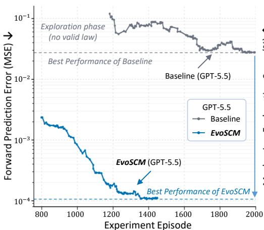
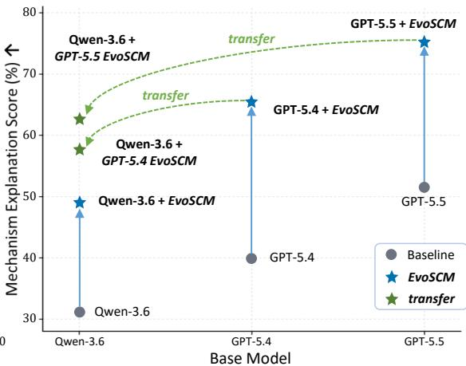
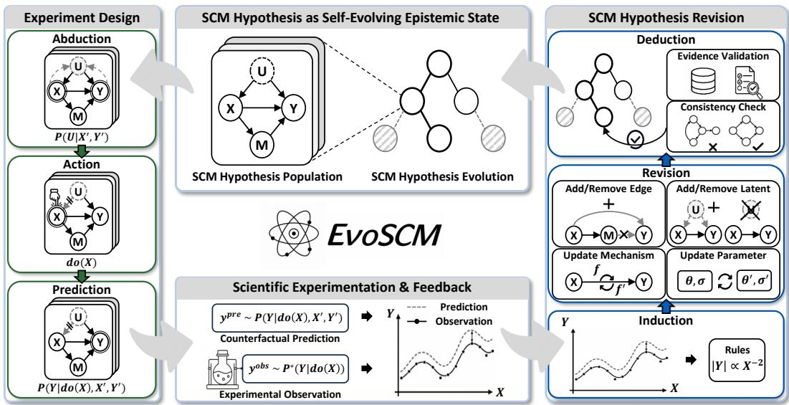

# EVOSCM: SCIENTIFIC BELIEF REVISION THROUGHCAUSAL MODEL EVOLUTION AND EXPERIMENTATION

Qing Zhao1 Haowei Li1 Weijian Deng2 Pengxu Wei1 Liang Lin1

1Sun Yat-sen University

2Tsinghua Shenzhen International Graduate School, Tsinghua University

## ABSTRACT

Scientific agents must learn not only how to reason, but also what to believe. However, existing LLM agents typically express scientific hypotheses in free-form text, leaving their beliefs implicit and difficult to test or revise. We introduce EvoSCM, which equips scientific agents with explicit structural causal models that evolve as new experimental evidence is collected. EvoSCM maintains a population of competing SCM hypotheses, each encoding a candidate causal explanation of the environment, and evolves them through a closed discovery loop. In each round, the agent abduces latent mechanisms from accumulated evidence, designs discriminative interventions, and commits to falsifiable predictions that it tests through experimentation. Discrepancies between prediction and observation are inductively distilled into correction rules that revise the causal structures and mechanisms of each hypothesis, and the agent then deductively validates the revised population against accumulated evidence and structural consistency to guide the next round. We evaluate EvoSCM on DISCOVERPHYSICS, a benchmark requiring agents to uncover the hidden dynamics of noncanonical physical worlds through experimentation. EvoSCM consistently improves scientific discovery over baselines, yielding more accurate explanations and predictions while making more effective use of experimental interactions.

## 1 INTRODUCTION

A growing body of work seeks to improve large language model agents through experience without modifying the parameters of the underlying model. Existing approaches optimize prompts, distill trajectories into reasoning memories, acquire reusable skills, search over workflows, or recursively refine agent states (Gao et al., 2025; Agrawal et al., 2026; Ouyang et al., 2026; Yang et al., 2026; Zhang et al., 2025; Nguyen et al., 2026). These methods demonstrate that agents can improve their behavior by adapting their strategies and internal resources. However, most focus on procedural knowledge, such as how to reason or act more effectively. They provide limited support for updating epistemic knowledge, which concerns the agent’s explanation of how the external world works.

This limitation becomes particularly important in scientific settings, where new observations may challenge the agent’s existing understanding. Although recent systems can generate hypotheses and conduct experiments, they do not reliably revise their beliefs when new evidence contradicts earlier conclusions (Huang et al., 2025; Kabra et al., 2026; Wiemann et al., 2026; R´ıos-Garc´ıa et al., 2026). One reason is that their scientific knowledge often remains distributed across free form reasoning traces, experimental records, and memory summaries rather than being maintained as a coherent and persistent model (Takahara & Mizoguchi, 2026). As a result, it can be difficult for the agent to identify which assumption caused a failed prediction, determine how that assumption should be revised, and verify that the revision remains consistent with previous observations. Addressing this problem requires an explicit scientific state that connects hypotheses, predictions, evidence, and belief revision within a unified representation.

To address these challenges, we introduce EvoSCM, a framework that establishes structural causal models (SCMs) as the explicit, persistent epistemic state of a scientific agent. EvoSCM maintains a population of competing SCM hypotheses, each encoding a candidate causal explanation of the environment via a graph topology, functional mechanisms, and parameters. Scientific discovery is formulated as a closed loop that alternates between causal experiment design and SCM hypothesis evolution. In each iteration, the agent abductively infers latent mechanism states from evidence, acts by executing interventions that maximally discriminate between competing hypotheses, and com mits to falsifiable predictions tested through experimentation. Prediction discrepancies are inductively distilled into targeted correction rules, driving structured revisions that add or remove edges and latent variables, and update functional mechanisms and parameters. The agent then deductively validates the revised hypotheses against accumulated evidence and structural consistency checks before updating the active SCM population to seed the next round. Finally, the evolved SCM explicitly captures the environment’s underlying physical mechanisms for reasoning and explanation.

  
(a) Faster Convergence & Lower Error

  
(b) Cross-Model Transferability  
Figure 1: The discovery performance and transferability of EvoSCM on DiscoverPhysics (Wiemann et al., 2026). (a) Faster Convergence & Lower Error: EvoSCM achieves significantly better performance while requiring fewer experiment episodes compared to the baseline agent. (b) Cross-Model Transferability: evolved SCMs can be directly transferred across different base models.

We evaluate EvoSCM on DiscoverPhysics (Wiemann et al., 2026), an interactive scientific discovery benchmark requiring agents to uncover the hidden dynamics of noncanonical physical environments through experimentation. Experimental results show that EvoSCM consistently outperforms baseline agents, achieving faster convergence and significantly lower prediction error while requiring fewer experiment episodes. Moreover, the explicitly evolved SCMs exhibit cross-model transferability, seamlessly transferring across different base architectures to boost their discovery capabilities, as illustrated in Figure 1.

## 2 EVOSCM: SELF-EVOLVING CAUSAL MODELS

## 2.1 SCM HYPOTHESIS AS SELF-EVOLVING EPISTEMIC STATE

Problem Formulation. We formalize agentic scientific discovery as the sequential recovery of an unknown causal model through experimentation. An agent interacts with an environment $\mathcal { E }$ governed by a true structural causal model $\mathcal { M } ^ { * } = ( \mathbf { V } , \mathbf { U } ^ { * } , G ^ { * } , \mathbf { F } ^ { * } , \Theta ^ { * } )$ (Pearl, 2009), where $\mathbf { \bar { V } } = \{ V _ { 1 } , \ldots , V _ { n } \}$ are observable endogenous variables, $\mathbf { U } ^ { * }$ are latent exogenous variables, $G ^ { * }$ is a directed acyclic graph (DAG) encoding the true causal structure, $\mathbf { F } ^ { * } = \mathbf { \bar { \{ f } }  _ { i } ^ { * } \}$ are the structural equations (causal mechanisms) with $V _ { i } = f _ { i } ^ { * } ( \mathrm { P a } _ { i } ^ { G ^ { * } } , U _ { i } ^ { * } )$ , and $\Theta ^ { * }$ parameterizes these mechanisms. The agent knows V but does not know $\mathbf { U } ^ { * } , G ^ { * } , \mathbf { F } ^ { * } , \mathrm { o r } \Theta ^ { * }$ . Discovery proceeds over a budget of $T$ rounds. At each round $t ,$ the agent selects an intervention $\mathrm { d o } ( { \mathbf X } _ { t } = { \mathbf x } _ { t } )$ on a subset $\mathbf { X } _ { t } \subseteq \mathbf { V }$ and observes outcomes $\mathbf { y } _ { t } \sim P ^ { * } ( \mathbf { Y } \mid \mathrm { d o } ( \mathbf { X } _ { t } = \mathbf { x } _ { t } ) )$ for the remaining variables $\mathbf { Y } = \mathbf { V } \setminus \mathbf { X } _ { t }$ . The accumulated evidence through round t is $\mathcal { D } _ { t } = \{ ( \mathrm { d o } ( \mathbf { x } _ { \tau } ) , \mathbf { y } _ { \tau } ) \} _ { \tau = 1 } ^ { t }$

The agent models the environment with an SCM hypothesis $\mathcal { H } = ( \mathbf { V } , \mathbf { U } , G , \mathbf { F } , \Theta )$ that shares the observable variables V but posits its own latent variables, causal graph, mechanisms, and parameters. The goal of agentic scientific discovery is to evolve H over the T rounds so that it recovers the causal structure, mechanisms, and predictive behavior of M∗. An SCM is a natural representation for the epistemic state of a scientific agent. Its causal graph G encodes qualitative causal structure, while its structural equations F with parameters Θ encode quantitative mechanisms. Together, (G, F, Θ) constitutes a complete, falsifiable scientific hypothesis: the do(·) operator (Pearl, 2009) allows the agent to derive interventional predictions that can be directly tested against experimental outcomes, and any prediction–observation discrepancy can be traced to specific structural or parametric commitments within the hypothesis.

  
Figure 2: Overview of EvoSCM. EvoSCM maintains a population of competing SCM hypotheses as its epistemic state and evolves this population through a closed discovery loop: (1) Causal Experiment Design: the agent abductively infers latent states from accumulated evidence, selects a discriminative intervention, and commits to falsifiable predictions that are tested against experimental observations; (2) SCM Hypothesis Revision: prediction–observation discrepancies are inductively distilled into correction rules, which drive targeted revisions to causal structure and mechanisms, and the revised hypotheses are deductively validated against accumulated evidence and structural consistency, to produce the evolved population for the next round.

Population-Based Epistemic State. A single hypothesis, however, may be insufficient for effective scientific discovery. Multiple causal structures can be consistent with the evidence available at any given round, and prematurely committing to one risks overlooking the true mechanism. EvoSCM therefore maintains a population of competing hypotheses $\mathcal { P } _ { t } = \mathit { \hat { \{ H _ { 1 } ^ { t } , . . . , \mathcal { H _ { K } ^ { t } \} } } }$ as its epistemic state at round t. Each hypothesis $\mathcal { H } _ { k } ^ { t } = ( \mathbf { \bar { V } } , \mathbf { U } _ { k } ^ { t } , \mathbf { \bar { \mathcal { G } } } _ { k } ^ { t } , \mathbf { F } _ { k } ^ { t } , \mathbf { \Theta } _ { k } ^ { t } )$ encodes a distinct candidate causal explanation of E. Maintaining a diverse population serves two purposes: it guards against premature convergence to an incorrect explanation, and the disagreement among competing hypotheses directly guides experiment design by identifying interventions under which current candidates make maximally divergent predictions (Lindley, 1956; Box & Hill, 1967).

Overview of EvoSCM. EvoSCM evolves the hypothesis population Pt through a closed discovery loop comprising two complementary phases (Figure 2): (1) Causal Experiment Design operates within each hypothesis: the agent abductively infers latent states from accumulated evidence, designs discriminative interventions, commits to falsifiable predictions, and tests them through experimentation; (2) SCM Hypothesis Revision transforms the population: prediction–observation discrepancies are inductively distilled into correction rules that structurally revise individual hypotheses by adding or removing edges and latent variables and by updating mechanisms and parameters. The revised population is then deductively validated against accumulated evidence and structural consistency, retaining well-supported hypotheses and discarding contradicted ones to produce $\mathcal { P } _ { t + 1 }$ . After

T rounds, the evolved SCM population encodes the agent’s discovered causal knowledge, which can be directly applied to downstream reasoning, prediction, and generalization to unseen interventions.

## 2.2 CAUSAL EXPERIMENT DESIGN

Given the current hypothesis population $\mathcal { P } _ { t }$ and accumulated evidence $\mathcal { D } _ { t }$ , the agent designs the next experiment by reasoning causally within each hypothesis and comparatively across the population. This phase follows the logic of Pearl’s counterfactual framework (Pearl, 2009): abduction (infer latent states), action (select an intervention), and prediction (derive expected outcomes), extended with an experimentation step that produces the empirical feedback driving hypothesis revision.

Abduction. For each hypothesis $\mathcal { H } _ { k } ^ { t } \in \mathcal { P } _ { t }$ , the agent infers the latent exogenous variables most consistent with the accumulated evidence: $P ( \mathbf { U } _ { k } ^ { t } \mid \mathbf { \bar { \phi } } _ { \mathcal { D } _ { t } } , \mathbf { \mathcal { H } } _ { k } ^ { t } )$ . This abductive step conditions on all past interventions and observations in $\mathcal { D } _ { t }$ to determine, under hypothesis $\mathcal { H } _ { k } ^ { t }$ , what values of the latent variables $\mathbf { U } _ { k } ^ { t }$ would best explain the observed outcomes. Because each hypothesis posits its own latent variables and causal structure, the same evidence may yield different abduced latent states across hypotheses, anchoring each candidate in a distinct causal interpretation of the available data.

Action. The agent selects the next intervention do $\mathbf { \nabla } \cdot ( \mathbf { X } _ { t + 1 } = \mathbf { x } _ { t + 1 } )$ to maximally discriminate among the competing hypotheses in $\mathcal { P } _ { t }$ . Concretely, the agent identifies interventions under which the hypotheses’ predicted outcomes diverge most, so that the experimental result will provide maximal evidence for distinguishing between candidate explanations (Lindley, 1956; Box & Hill, 1967). This population-level disagreement is what makes experiment design comparative: rather than testing a single hypothesis in isolation, the agent exploits the diversity of the population to select experiments whose outcomes are most likely to narrow the set of viable candidates.

Prediction. Before executing the intervention, the agent commits to a falsifiable, hypothesis-specific prediction for each candidate. Under hypothesis $\mathcal { H } _ { k } ^ { t }$ with abduced latent states, the predicted outcome is: $\mathbf { y } _ { k } ^ { \mathrm { p r e } } \sim P ( \mathbf { Y } \mid \mathrm { d o } ( \mathbf { X } _ { t + 1 } { = } \mathbf { x } _ { t + 1 } ) , \mathcal { D } _ { t } , \mathcal { H } _ { k } ^ { t } )$ . These predictions are recorded prior to experimentation, ensuring that each hypothesis stakes a concrete, testable claim on the experimental outcome. This commitment is essential: it prevents post-hoc rationalization and allows subsequent discrepancies to be unambiguously attributed to specific hypotheses.

Experimentation and Feedback. The agent executes the selected intervention do $\mathbf { \Delta X } _ { t + 1 } = \mathbf { x } _ { t + 1 } )$ in the environment $\mathcal { E }$ and observes the outcome: $\mathbf { y } _ { t + 1 } ^ { \mathrm { o b s } } \sim P ^ { * } ( \mathbf { Y } \mid \mathrm { d o } ( \mathbf { X } _ { t + 1 } { = } \mathbf { x } _ { t + 1 } ) )$ , drawn from the true data-generating process $\mathcal { M } ^ { * }$ . The agent then compares each hypothesis’s committed prediction ${ \bf y } _ { k } ^ { \mathrm { p r e } }$ against the observed outcome $\mathbf { y } _ { t + 1 } ^ { \mathrm { o b s } }$ , producing a set of prediction–observation discrepancies that identify where and how each candidate’s causal account fails to match reality. The accumulated evidence is updated as $\mathcal { D } _ { t + 1 } = \mathcal { D } _ { t } \cup \left\{ ( \mathrm { d o } ( \mathbf { x } _ { t + 1 } ) , \mathbf { y } _ { t + 1 } ^ { \mathrm { o b s } } ) \right\}$ , and both the discrepancies and the updated evidence are passed to the hypothesis revision phase.

## 2.3 SCM HYPOTHESIS REVISION

The prediction–observation discrepancies and updated evidence $\mathcal { D } _ { t + 1 }$ produced by the experimentation phase now drive the evolution of the hypothesis population. This phase transforms each hypothesis through three steps: induction extracts structured correction rules from empirical discrepancies, revision applies these rules as targeted edits to causal structure and mechanisms, and deduction validates the revised population against accumulated evidence and structural consistency to produce $\mathcal { P } _ { t + 1 }$

Induction. For each hypothesis $\mathcal { H } _ { k } ^ { t } \in \mathcal { P } _ { t }$ , the agent analyzes the discrepancies between committed predictions $\mathbf { y } _ { k } ^ { \mathrm { p r e } }$ and observed outcomes $\mathbf { y } _ { t + 1 } ^ { \mathrm { o b s } }$ to identify systematic patterns of failure. Rather than treating each discrepancy as an isolated error, the agent examines the accumulated evidence $\mathcal { D } _ { t + 1 }$ to detect recurring regularities that the current hypothesis fails to capture. These regularities are distilled into explicit correction rules: concise, natural-language descriptions of the empirical pattern that the hypothesis must accommodate. Correction rules serve as the interface between empirical evidence and structural model editing: they translate quantitative prediction failures into qualita tive directives that specify what must change in the hypothesis without prescribing how the change should be realized at the structural level.

Revision. Guided by the correction rules from the induction step, the agent applies targeted structural edits to each hypothesis $\mathcal { H } _ { k } ^ { t }$ . EvoSCM supports four complementary revision operators that can modify any component of an SCM hypothesis

1. Add / Remove Edge. Modify the causal graph $G _ { k } ^ { t }$ by inserting a new directed edge to represent a previously unmodeled causal dependency, or removing an existing edge that the evidence no longer supports.

2. Add / Remove Latent. Introduce a new latent variable into $\mathbf { U } _ { k } ^ { t }$ to account for unexplained confounding or mediating effects, or remove a latent variable that has become redundant given the revised structure.

3. Update Mechanism. Replace or modify a structural equation $f _ { i } \in \mathbf { F } _ { k } ^ { t }$ to change the functional form of a causal mechanism (e.g., replacing a linear relationship with an inverse-square law).

4. Update Parameter. Adjust the parameters $\mathbf { \Theta } _ { \mathbf { \Theta } } ^ { \mathbf { 6 } }$ of existing structural equations to improve quantitative fit while preserving the current causal structure and functional forms.

The agent selects the minimal set of operators sufficient to accommodate the correction rules, preferring shallow revisions (parameter and mechanism updates) when possible and resorting to deeper structural edits (edge and latent changes) only when the evidence warrants them. Each revision produces a candidate revised hypothesis $\\mathcal { \tilde { H } } _ { k } ^ { t + 1 } = ( \mathbf { V } , \tilde { \mathbf { U } } _ { k } ^ { t + 1 } , \tilde { G } _ { k } ^ { t + 1 } , \tilde { \mathbf { F } } _ { k } ^ { t + 1 } , \tilde { \mathbf { \Theta } } _ { k } ^ { t + 1 } )$ , which is then passed to the deduction step for validation.

Deduction. The deduction step validates each candidate revised hypothesis $\mathcal { \tilde { H } } _ { k } ^ { t + 1 }$ before it is admitted into the next-round population $\mathcal { P } _ { t + 1 }$ . Validation comprises two complementary checks:

1. Evidence Validation. The agent derives predictions from $\mathcal { \tilde { H } } _ { k } ^ { t + 1 }$ for all interventions in the accumulated evidence $\mathcal { D } _ { t + 1 }$ and verifies that the revised hypothesis accounts for past observations. A hypothesis that resolves the most recent discrepancy but introduces new contradictions with earlier evidence is rejected.

2. Consistency Check. The agent verifies the internal coherence of the revised hypothesis: the causal graph $\tilde { G } _ { k } ^ { t + 1 }$ must remain a valid DAG, the structural equations must be well-defined for all variables given the revised graph, and the posited mechanisms must be mutually compatible $( \mathrm { e . g . }$ a variable cannot simultaneously appear as exogenous and as a descendant of other endogenous variables).

Hypotheses that pass both checks are retained; those that fail either check are discarded from the population. This selective step instantiates the population-level evolution introduced: individual hypotheses are structurally revised in the preceding step, while deductive validation determines which revised candidates survive into the next round, producing the evolved population $\mathcal { P } _ { t + 1 }$ . The retained population, together with the updated evidence $\mathcal { D } _ { t + 1 }$ , seeds the next iteration of experiment design, closing the discovery loop.

## 2.4 INFERENCE WITH EVOLVED SCM

After $T$ rounds of the discovery loop, the evolved hypothesis population $\mathcal { P } _ { T }$ encodes the agent’s accumulated causal knowledge about the environment $\dot { \mathcal { E } }$ as a structured, executable scientific model. Given a novel intervention $\bar { \mathrm { d o } } ( \mathbf { X } ^ { \prime } = \mathbf { x } ^ { \prime } )$ not present in $\mathcal { D } _ { T }$ , each surviving hypothesis $\mathcal { H } _ { k } ^ { T } \in \mathcal { P } _ { T }$ derives a prediction through its structural equations: $\mathbf { y } _ { k } ^ { \prime } \sim P \big ( \mathbf { Y } \mid \mathrm { d o } ( \mathbf { X } ^ { \prime } { = } \mathbf { x } ^ { \prime } ) , \mathcal { D } _ { T } , \mathcal { H } _ { k } ^ { T } \big )$ . When multiple hypotheses survive, predictions are aggregated across the population to produce a consensus outcome. This generalization capacity follows directly from representing knowledge as a causal model: the $\mathrm { d o } ( \cdot )$ operator derives predictions for unseen interventions by simulating their causal consequences through the discovered graph and mechanisms, rather than interpolating from stored input–output associations (Pearl, 2009; Bareinboim & Pearl, 2016).

Beyond prediction, the evolved SCM provides a transparent account of the discovered causal structure. The graph makes qualitative claims explicit, while the structural equations specify quantitative mechanisms, and both are individually inspectable and auditable. The evolved SCM is also decoupled from the experimental trajectory that produced it: once discovered, it constitutes a selfcontained, portable model that can be transferred to new agents, used to plan future experiments, or composed with models of adjacent systems. This portability distinguishes EvoSCM’s epistemic output from procedural improvements such as better prompts or workflows, which remain bound to the agent that produced them.

Table 1: Scientific discovery performance on DiscoverPhysics. EvoSCM consistently outperforms baselines across explanation accuracy, prediction error, success rates, and sample efficiency.
<table><tr><td>Backbone Pipeline</td><td></td><td></td><td>〈Explanation〉 ↑ norm 〈MSE〉 ↓ pass@1 ↑ pass@2 ↑ pass@3 ↑ pass@4↑ pass@5 ↑ Episodes ↓</td><td></td><td></td><td></td><td></td><td></td><td></td></tr><tr><td rowspan="2">GPT-5.4</td><td>Baseline</td><td>0.398</td><td>5.249e-1</td><td>1.86%</td><td>3.88%</td><td>5.60%</td><td>7.14%</td><td>9.09%</td><td>1,045</td></tr><tr><td>EvoSCM</td><td>0.653</td><td>2.339e-3</td><td>38.08%</td><td>50.16%</td><td>53.74%</td><td>54.55%</td><td>54.55%</td><td>736</td></tr><tr><td rowspan="2">GPT-5.5</td><td>Baseline</td><td>0.516</td><td>2.833e-2</td><td>7.25%</td><td>13.59%</td><td>19.22%</td><td>23.74%</td><td>27.27%</td><td>2,206</td></tr><tr><td>EvoSCM</td><td>0.751</td><td>2.770e-4</td><td>53.04%</td><td>59.95%</td><td>62.77%</td><td>63.64%</td><td>63.64%</td><td>1,685</td></tr></table>

Table 2: Cross-model transferability results on DiscoverPhysics. Evolved SCMs can be seamlessly transferred to boost the performance of different model (GPT → Qwen3.6-35B-A3B).
<table><tr><td>Pipeline</td><td></td><td>〈Explanation〉 ↑ norm 〈MSE&gt; ↓ pass@1 ↑ pass@2↑</td><td></td><td></td><td></td><td></td><td>pass@3↑ pass@4↑ pass@5↑</td></tr><tr><td>Qwen3.6 Baseline</td><td>0.307</td><td>0.190</td><td>0.00%</td><td>0.00%</td><td>0.00%</td><td>0.00%</td><td>0.00%</td></tr><tr><td>Qwen3.6 + Qwen3.6 SCM</td><td>0.489</td><td>0.063</td><td>14.95%</td><td>26.07%</td><td>32.92%</td><td>36.36%</td><td>36.36%</td></tr><tr><td>Qwen3.6 + GPT-5.4 SCM</td><td>0.576</td><td>0.015</td><td>16.40%</td><td>23.43%</td><td>26.41%</td><td>27.27%</td><td>27.27%</td></tr><tr><td>Qwen3.6 + GPT-5.5 SCM</td><td>0.625</td><td>0.009</td><td>34.87%</td><td>39.52%</td><td>41.96%</td><td>43.72%</td><td>45.45%</td></tr><tr><td>Qwen3.6 + GPT-5.6-Sol SCM</td><td>0.740</td><td>0.000</td><td>39.85%</td><td>49.76%</td><td>57.14%</td><td>61.87%</td><td>63.64%</td></tr></table>

## 3 EXPERIMENT

Experimental Setup and Benchmark. We evaluate EvoSCM on DiscoverPhysics (Wiemann et al., 2026), a rigorous interactive benchmark for assessing the out-of-the-box scientific reasoning capabil ities of LLMs. Unlike static datasets, DiscoverPhysics requires agents to interact with noncanonical physical environments, formulate hypotheses, design active interventions, and iteratively refine their understanding of the underlying physical laws based on observational feedback. This design isolates an agent’s capacity for genuine scientific discovery, independent of memorized, canonical physics knowledge from pretraining. We measure performance in terms of mechanism explanation quality, forward prediction error, pass rate across multiple trials (pass@k), and interaction efficiency.

Scientific Discovery Performance. Table 1 reports the primary scientific discovery results for our method against standard prompting baselines across two frontier backbones (GPT-5.4 and GPT-5.5). EvoSCM consistently and substantially outperforms the direct baseline on every metric, regardless of backbone. For instance, on GPT-5.5, EvoSCM raises the mechanism explanation score from 0.5164 to 0.7509 while reducing normalized Mean Squared Error (MSE) by two orders of magnitude (from $2 . 8 3 \times 1 0 ^ { - 2 } \mathrm { t o } 2 . 7 7 \times \bar { 1 0 } ^ { - 4 } )$ . EvoSCM also attains these gains with markedly higher sample efficiency, requiring substantially fewer simulator episodes than the baseline exploration strategy to converge on the correct physical laws.

Cross-Model SCM Transferability. A key advantage of representing scientific knowledge explicitly as an SCM is its portability across model architectures, as shown in Table 2. We use Qwen3.6- 35B-A3B (Qwen Team, 2026), which fails outright on DiscoverPhysics (0.00% pass rate across all k). However, injecting SCMs evolved by stronger proprietary models (e.g., GPT-5.4, GPT-5.5 and GPT-5.6-Sol) into the Qwen-3.6 inference pipeline dramatically improves its performance. Most notably, Qwen-3.6 equipped with the GPT-5.6-Sol SCM reaches a 63.64% pass@5 rate and an explanation score of 0.740, rivaling the zero-shot discovery capabilities of frontier models. This confirms that our self-evolving framework produces transferable epistemic states that can effectively bootstrap scientific reasoning in smaller architectures.

## 4 CONCLUSION

We present EvoSCM, a framework that treats structural causal models as the explicit, persistent epistemic state of a scientific agent. This addresses a critical gap left by procedural self-evolution approaches, which improve how an agent reasons but not what it believes about the world. By maintaining a population of competing SCM hypotheses and evolving them through a closed loop of abduction, intervention, induction, and deduction, EvoSCM turns free-form scientific reasoning into a structured, falsifiable, and cumulatively revisable process. Empirical evaluations on DiscoverPhysics demonstrate that EvoSCM not only achieves superior forward prediction and mechanism alignment with significantly fewer experiment episodes, but also yields portable causal models capable of zero-shot transfer across different underlying architectures.

## REFERENCES

Lakshya A Agrawal, Shangyin Tan, Dilara Soylu, Noah Ziems, Rishi Khare, Krista Opsahl-Ong, Arnav Singhvi, Herumb Shandilya, Michael J Ryan, Meng Jiang, et al. Gepa: Reflective prompt evolution can outperform reinforcement learning. In International Conference on Learning Representations, volume 2026, pp. 8479–8565, 2026.

Elias Bareinboim and Judea Pearl. Causal inference and the data-fusion problem. Proceedings of the National Academy ofSciences, 113(27):7345–7352, 2016.

George EP Box and WILLIAM J Hill. Discrimination among mechanistic models. Technometrics, 9(1):57–71, 1967.

Huan-ang Gao, Jiayi Geng, Wenyue Hua, Mengkang Hu, Xinzhe Juan, Hongzhang Liu, Shilong Liu, Jiahao Qiu, Xuan Qi, Yiran Wu, et al. A survey of self-evolving agents: What, when, how, and where to evolve on the path to artificial super intelligence. arXiv preprint arXiv:2507.21046, 2025.

Kexin Huang, Ying Jin, Ryan Li, Michael Y Li, Emmanuel Candes, and Jure Leskovec. Automated\` hypothesis validation with agentic sequential falsifications. arXiv preprint arXiv:2502.09858, 2025.

Sanchit Kabra, Nikhil Abhyankar, Saaketh Desai, Prasad Iyer, and Chandan K Reddy. Llmautoscilab: Closed-loop scientific discovery via active experimentation with llms. arXiv preprint arXiv:2605.24043, 2026.

Dennis V Lindley. On a measure of the information provided by an experiment. The Annals of Mathematical Statistics, 27(4):986–1005, 1956.

Michael Nguyen, Quoc Nguyen, and Paul Vuong. Recursive self-evolving agents via held-out selection. arXiv preprint arXiv:2606.28374, 2026.

Siru Ouyang, Jun Yan, I Hsu, Yanfei Chen, Ke Jiang, Zifeng Wang, Rujun Han, Long Le, Samira Daruki, Xiangru Tang, et al. Reasoningbank: Scaling agent self-evolving with reasoning memory. In International Conference on Learning Representations, volume 2026, pp. 94327–94354, 2026.

Judea Pearl. Causality: Models, Reasoning, and Inference. Cambridge University Press, 2009.

Qwen Team. Qwen3.6-35B-A3B: Agentic coding power, now open to all, April 2026. URL https://qwen.ai/blog?id=qwen3.6-35b-a3b.

Martino R ˜ ´ıos-Garc´ıa, Nawaf Alampara, Chandan Gupta, Indrajeet Mandal, Sajid Mannan, Ali Asghar Aghajani, NM Krishnan, and Kevin Maik Jablonka. Ai scientists produce results without reasoning scientifically. arXiv preprint arXiv:2604.18805, 2026.

Izumi Takahara and Teruyasu Mizoguchi. Toward auditable ai scientists: A hypothesis evolution protocol for llm agents. arXiv preprint arXiv:2607.09195, 2026.

Matt L Wiemann, Lindsay M Smith, Peter Melchior, Siddharth Mishra-Sharma, Andrew Gordon Wilson, Pavel Izmailov, and Carolina Cuesta-Lazaro. Discoverphysics: Benchmarking llms for´ out-of-the-box scientific thinking. arXiv preprint arXiv:2605.26087, 2026.

Yifan Yang, Ziyang Gong, Weiquan Huang, Qihao Yang, Ziwei Zhou, Zisu Huang, Yan Li, Xuemei Gao, Qi Dai, Bei Liu, et al. Skillopt: Executive strategy for self-evolving agent skills. arXiv preprint arXiv:2605.23904, 2026.

Jiayi Zhang, Jinyu Xiang, Zhaoyang Yu, Fengwei Teng, Xionghui Chen, Jiaqi Chen, Mingchen Zhuge, Xin Cheng, Sirui Hong, Jinlin Wang, et al. Aflow: Automating agentic workflow generation. In International Conference on Learning Representations, volume 2025, pp. 34040–34077, 2025.