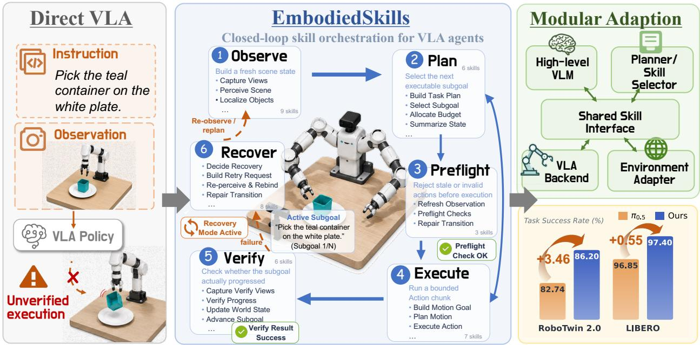
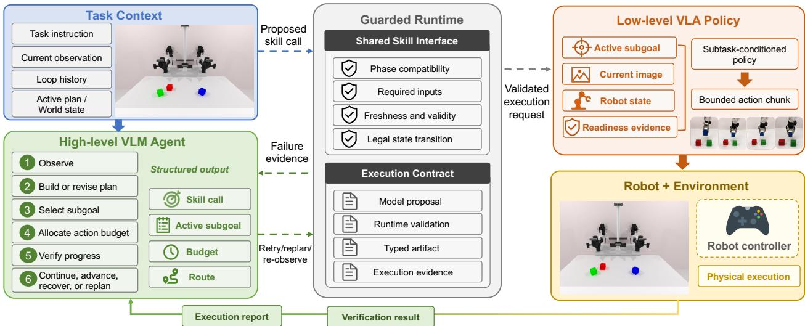
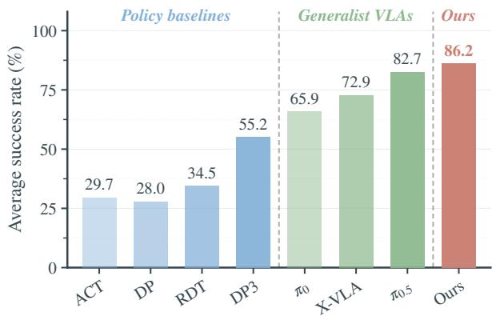
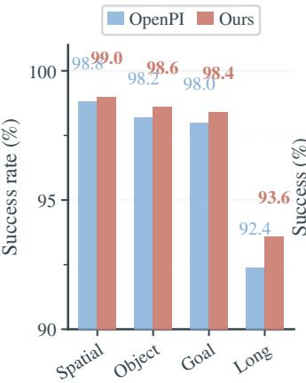
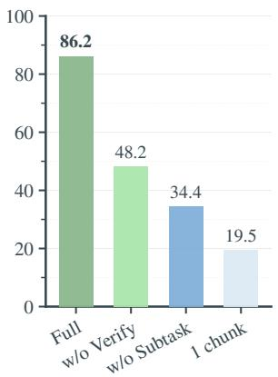
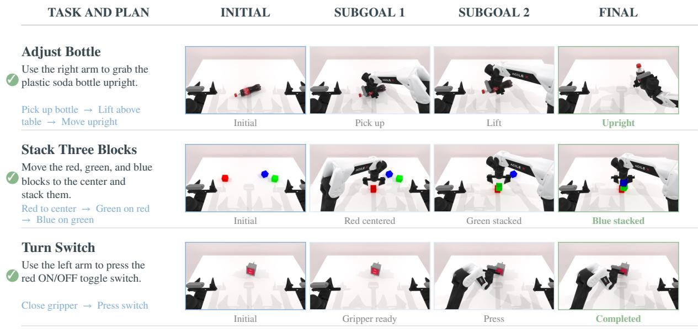

# EmbodiedSkills: A Unified Framework for Orchestrating, Training, and Deploying VLA Agents

Wei Wang<sup>1</sup>, Wenqiao Zhang<sup>1,‡</sup>, Yutong Lin<sup>1</sup>, Yuqian Yuan<sup>1</sup>, Tianwei Lin<sup>1</sup>, Jinhao Mao<sup>1</sup>, Zhenxuan Fan<sup>1</sup>, Mingjian Gao<sup>1</sup>, Yang Dai<sup>1</sup>, Wentong Li<sup>2</sup>, Zheqi Lv<sup>3</sup>, Zheng Dong<sup>4</sup>, Yingjie Niu<sup>6</sup>, Jiaqi Zhu<sup>5</sup>, Jun Xiao<sup>1</sup>, Chao Li<sup>6</sup>, Yueting Zhuang<sup>1</sup>

<sup>1</sup>College of Computer Science and Technology, Zhejiang University, <sup>2</sup>Nanjing University of Aeronautics and Astronautics, <sup>3</sup>Cornell University, <sup>4</sup>Universal Ubiquitous AI Co., Ltd., <sup>5</sup>National University of Singapore, <sup>6</sup>Hangzhou DEEP Robotics Technology Co., Ltd. ±c

<sup>‡</sup>Corresponding author

Vision–language–action (VLA) models map visual observations and language instructions directly to robot actions, but long-horizon tasks require more than action prediction. An agent must coordinate perception, planning, execution, progress verification, and recovery as the physical state evolves. An action prediction or a model-generated skill decision does not, by itself, guarantee that the proposed operation is valid in the current state or that its outcome will be verified. We propose EmbodiedSkills, a unified framework that treats each skill decision as an execution proposal: the runtime checks its prerequisites before execution and verifies the outcome afterward. A shared executable-skill interface connects high-level skill selection, bounded low-level VLA execution, and post-action verification within a single agent loop. Because this interface remains fixed, low-level VLA policies can be replaced or adapted without changing the agent loop. The interface also records planning, execution, verification, and recovery events as structured trajectories, which provide supervision for individual components and can support optional online adaptation when interactive feedback is available. We instantiate EmbodiedSkills with Qwen3-VL and OpenPI/π<sub>0.5</sub> on RoboTwin 2.0 and LIBERO. Taskadapted low-level VLA policies achieve an average success rate of 86.20% across 50 RoboTwin 2.0 tasks and 97.40% across the four LIBERO suites. These results establish the execution performance of the task-adapted low-level VLA policies used in EmbodiedSkills. On four memory-dependent RMBench tasks, the same task-adapted execution approach achieves 12.5% average success. The framework provides a trainable and inspectable agent layer for turning these policies into closed-loop embodied systems.

## 1 Introduction

Vision–language–action (VLA) models directly map visual observations and natural-language instructions to robot actions. Drawing on large-scale vision–language pretraining and diverse robot demonstrations, recent VLA policies have demonstrated increasing versatility, including various instructions, multi-object environments, multiple robot embodiments, and long-horizon tasks [1–7]. Benchmarks such as RoboTwin 2.0 [8, 9] further reflect this broader scope through diverse bimanual manipulation tasks, object configurations, robot embodiments, and domain-randomized settings.

Long-horizon manipulation requires substantially more than predicting the next action. For example, a robot instructed to “place the container on the plate” must perceive the scene, identify the task-relevant objects, select an appropriate subgoal, assess whether it is executable under the current state, invoke a low-level VLA policy to generate the corresponding actions, verify that execution has produced the task as intended, and recover if perception or execution fails. Together, these capabilities constitute the agentic layer that transforms a VLA policy into a reliable embodied system. While a VLA model predicts actions from observations and instructions, a VLA agent must coordinate perception, planning, execution, verification, and recovery as the physical state evolves.

Existing VLA policies and LLM-based robotic agents address diferent parts of this agent-level challenge. Endto-end VLA policies provide a unified learning interface for visuomotor control, yet typically leave intermediate task decisions implicit [2, 4, 6, 7]. When a task fails, it can be dificult to determine whether the failure arose from object grounding, subgoal selection, low-level action execution, progress verification, or recovery. By contrast, LLM-based robotic agents can make intermediate tool calls and reasoning steps explicit [10, 11]. However, an explicit decision is not necessarily valid or executable in the current physical state. A proposed skill may be incompatible with the current phase, rely on stale observations, omit required arguments, or fail to produce the intended outcome after execution. These problems become especially dificult under partial observability, delayed feedback about task progress, and contact-rich failures [12, 13]. Although prompting can steer the policy toward valid choices, it cannot by itself enforce execution constraints or verify physical outcomes. The central challenge is therefore to bridge model-level decision making and physical execution so that proposed operations are checked before execution, their outcomes are verified afterward, and the resulting evidence informs subsequent decisions and learning.

  
Figure 1 Overview of EmbodiedSkills. EmbodiedSkills transforms a low-level VLA policy into a closed-loop embodied agent by coordinating observation, planning, validation, execution, verification, and recovery through executable skills. A high-level policy proposes structured operations, while a guarded runtime validates and executes them and records post-execution feedback as structured trajectories.

In this paper, we propose EmbodiedSkills, a unified framework for orchestrating, training, and deploying VLA agents. Rather than replacing existing VLA policies, EmbodiedSkills structures perception, planning, execution, verification, and recovery around executable embodied skills. Each skill is defined by typed inputs and outputs together with explicit prerequisites, and its invocation produces a structured execution trace and post-execution verification signals. A high-level agent policy selects structured operations, a low-level VLA policy such as OpenPI/π<sub>0.5</sub> [7] generates bounded action chunks, and a robot controller executes the resulting commands. A shared skill interface specifies how these components interact during orchestration, training, and deployment, without embedding their execution semantics in benchmark-specific prompts or control scripts.

A closed-loop AgentLoop lies at the core of EmbodiedSkills and coordinates observation, task-object localization, world-state updates, subgoal planning, preflight checks, short-horizon execution, progress verification, and recovery [10, 14–17]. These stages do not constitute a fixed sequential pipeline. Instead, conditioned on the evolving task state, the agent policy can re-observe the scene, revise the plan, continue executing the current subgoal, advance to the next subgoal, or initiate recovery. At each step, the agent policy proposes the next skill. Before execution, the runtime validates phase compatibility, required inputs, artifact freshness, action validity, and legal state transitions. After execution, newly acquired observations and verifier outputs are fed into the subsequent decision. Separating policy proposals from runtime-enforced execution prevents invalid decisions from being silently translated into physical actions and renders failures explicit and traceable

within the agent trajectory.

The shared skill interfaces also provide a unified structure for component-level training. EmbodiedSkills records multimodal context, structured decisions, skill outcomes, runtime errors, and state transitions using a common trajectory schema. A planner can be trained to produce executable subgoals, a low-level VLA policy can be adapted with subtask-level demonstrations, and a verifier can learn from post-execution ob servations and subgoal-completion labels. Because these interfaces remain consistent across training and deployment, the components can be improved independently or instantiated with stage-specific adapters without modifying the AgentLoop. When interactive feedback and a reliable environment evaluator are available, the recorded trajectories can further support optional online policy optimization, while component-level supervision remains the primary training paradigm.

We instantiate EmbodiedSkills with Qwen3-VL-based agent components and $\mathrm { O p e n P I } / \pi _ { 0 . 5 }$ low-level VLA policy [7]. Across 50 RoboTwin 2.0 tasks, our task-adapted low-level VLA policies achieve an average success rate of 86.20%, surpassing the 82.74% $\pi _ { 0 . 5 }$ reference reported by LingBot-VA [18]. Across LIBERO-Spatial, LIBERO-Object, LIBERO-Goal, and LIBERO-Long [19], our VLA policy instantiation achieves an average success rate of 97.40%, compared with 96.85% oficial OpenPI reference. These results demonstrate the strong cross-benchmark execution performance of the task-adapted low-level VLA policies used in EmbodiedSkills.

On four memory-dependent tasks from RMBench [20], the same task-adapted execution approach reaches 12.5% average success, providing an additional evaluation of subtask-conditioned execution when the correct action depends on prior interaction history.

In summary, our contributions are threefold:

• A skill-oriented closed-loop AgentLoop. We formulate long-horizon VLA agents as closed-loop systems that coordinate explicit embodied skills across observation, planning, readiness checks, bounded execution, progress verification, and recovery, rather than following a fixed, one-pass pipeline.

• Policy–runtime separation. We introduce a shared skill contract in which the policy proposes structured skill decisions, while the runtime enforces prerequisites, artifact freshness, action validity, and legal state transitions, making failures explicit and agent trajectories diagnosable.

• Modular adaptation and cross-benchmark validation. We define independently trainable and replaceable interfaces for planning, verification, action generation, and environment interaction, and evaluate the resulting low-level VLA policy instantiations on RoboTwin 2.0 and LIBERO.

## 2 Related Work

## 2.1 Vision-Language-Action Policies for Robot Control

Vision-language-action models extend language-conditioned robot learning by integrating perception, lan guage understanding, and action generation within a unified modeling framework. Early large-scale robot policies, such as RT-1 and RT-2, demonstrated that transformer-based policies can learn from real-world robot data and transfer visual-language knowledge to robotic control [1, 2]. Open X-Embodiment and RT-X further scaled this direction across embodiments, while OpenVLA, Octo, π , π , and Qwen-VLA advanced the development of open, reusable, and increasingly general-purpose robot policies [3–7, 21]. In parallel, lowlevel action policies have progressed rapidly through difusion policies, ACT-style action chunking, difusion and sparse experts, world-action models, and atomic skill decoders [22–30]. These works have substantially strengthened low-level robot control. EmbodiedSkills is complementary: it exposes such policies through a shared execution interface and focuses on the agentic layer that determines when and how they should be invoked, verified, continued, or retried. The low-level policy remains independently adaptable and replaceable, while the AgentLoop exposes a stable interface for replacing it without redefining high-level execution semantics.

## 2.2 Robotic Agents, Skills, and Hierarchical Control

A separate line of work studies how language or vision-language models can coordinate robot skills. Say-Can combines language-model scoring with learned afordances, Inner Monologue incorporates environment feedback into planning, Code as Policies generates executable robot programs, VoxPoser builds languageconditioned 3D value maps, and PaLM-E integrates embodied multimodal inputs into a large language model [10, 11, 31–33]. Recent systems further explore object-centric manipulation, visual prompting, languagegrounded planning, modular routing, and hierarchical VLA execution [34–39]. These methods show that skill-level reasoning is useful for robotics. They are also connected to the long tradition of options, hierarchical reinforcement learning, skill chaining, and behavior-tree control [14–17, 40]. EmbodiedSkills difers in where it places the boundary between learned reasoning and execution. Instead of treating skills only as a planning vocabulary or a model-internal decomposition, the policy proposes structured skill calls and a separate runtime enforces their prerequisites, artifact freshness, and legal transitions. Executable skills consequently become the shared contract for closed-loop orchestration, trajectory logging, component adaptation, evaluation, and deployment, including continuation and recovery after observing the efect of an action chunk.

## 2.3 Agent-Level Reinforcement Learning

Reinforcement learning has recently become a central mechanism for improving large-model reasoning and agent behavior. GRPO-style reasoning training and recent agent RL systems show that language models can improve through environment or verifier feedback in mathematics, software engineering, tool use, and web interaction [41–47]. Robot RL has a longer history, but physical interaction introduces distinct challenges: exploration is costly, states are partially observed, rewards are often sparse or delayed, and progress may depend on contact-rich dynamics [12, 13, 48–50]. Recent VLA-specific RL and post-training systems, including RLinf-VLA, $\pi _ { 0 . 6 } ^ { * } ,$ and World2Act, show that reinforcement or deployment feedback is becoming increasingly important for robot foundation policies [29, 51, 52]. EmbodiedSkills is orthogonal to a particular RL algorithm or optimization target. Its structured trajectories support supervised adaptation of individual agent components and can also provide deployment-consistent context and feedback for optional online optimization. The main contribution is the AgentLoop and its executable interfaces: the planner, verifier, selector, or low-level VLA policy may be adapted independently without changing the runtime state machine.

## 2.4 Evaluation, Verification, and Deployment

Robot learning benchmarks have expanded from tabletop manipulation to long-horizon, language-conditioned, bimanual, household, and cross-embodiment settings. Representative environments include RLBench, CALVIN, LIBERO, ManiSkill, RoboCasa, SimplerEnv, RoboTwin, and RoboTwin 2.0 [8, 9, 19, 53–57]. These benchmarks are essential for measuring policy performance, but terminal success alone does not reveal where a long-horizon VLA agent failed. A growing body of work therefore studies execution monitoring, failure explanation, failure recovery, and VLA action verification [58–63]. Infrastructure eforts such as StarVLA also reflect the need for reusable VLA development and evaluation stacks [64]. EmbodiedSkills builds on this evaluation landscape, but evaluates and deploys agents through a common structured skill trajectory. Rather than defining success semantics inside the high-level prompt, it separates model-generated subgoa verification from the terminal evaluator supplied by each environment. This allows terminal success, subgoal progress, invalid decisions, low-level policy failures, verification errors, recovery behavior, and latency to be analyzed within one runtime abstraction across benchmarks.

## 3 Methodology

EmbodiedSkills formulates an embodied VLM–VLA system as a guarded finite-stage controller over executable embodied skills. The high-level agent policy reads the task, current visual evidence, loop state, and phase-admissible skills, then selects one structured operation. The low-level VLA policy maps the active subgoal, current observation, and robot state to a bounded action chunk. The runtime checks every proposed operation, records its result as an explicit artifact, invalidates dependent artifacts when their context changes, and exposes the updated state to the next decision. Model, environment, and VLA policy adapters preserve this interface across concrete instantiations.

  
Figure 2 The high-level VLM decomposes the instruction, selects executable subgoals, and verifies progress from post action observations. The low-level VLA policy executes each active subgoal as a bounded action chunk.

## 3.1 Agent State and Skill Decision

An episode starts from a natural-language instruction x and an environment E. At loop step t, the method level state is

$$
\boldsymbol { s } _ { t } = \left( \boldsymbol { z } _ { t } , \mathcal { M } _ { t } , \mathcal { H } _ { t } \right) ,\tag{1}
$$

where $z _ { t }$ is the current phase, $\mathcal { M } _ { t }$ is the set of available task artifacts, and $\mathcal { H } _ { t }$ is the ordered loop trace. Artifacts may include the current observation, optional perception and grounding results, world state, complete task plan, active subgoal, preflight evidence, action chunk, execution report, verification report, and recovery context.

The policy receives a deployment-consistent compact context

$$
C _ { t } = \Psi ( x , z _ { t } , \mathcal { M } _ { t } , \mathcal { H } _ { t } ) ,\tag{2}
$$

where Ψ retains the complete plan, active subgoal, current artifact summaries, recent errors, and an ordered, bounded summary of recent decisions and skill results. Older entries are compressed or dropped under a fixed history budget, while the current plan and subgoal remain explicit. Raw simulator internals and unbounded logs are not inserted into the policy context.

The policy chooses a structured decision from a state-dependent action set:

$$
d _ { t } \sim \pi _ { \boldsymbol { \theta } } ( \cdot  { \mid } C _ { t } , z _ { t } ,  { \mathcal { A } _ { t } } ) , \qquad { \mathcal { A } _ { t } } = \mathcal { G } _ { \mathrm { s t a t e } } (  { \mathcal { K } } _ { z _ { t } } , s _ { t } ) ,\tag{3}
$$

where $\kappa _ { z _ { t } }$ is the configured skill set for phase $z _ { t } ,$ , and $\mathcal { G } _ { \mathrm { s t a t e } }$ exposes only choices compatible with the current artifacts. The policy has three control types:

$$
d _ { t } \in \{ \mathrm { R U N S K I L L } ( k , q ) , \ \mathrm { A D V A N C E S T A G E } , \ \mathrm { F I N I S H R U N } \} ,\tag{4}
$$

where k is an admissible skill and $q$ is its payload. Skill execution, forward progression, and termination therefore share one structured decision interface, while evidence-dependent rerouting remains governed by the runtime.

## 3.2 Executable Skill Contract

Each embodied skill is represented by the contract

$$
\begin{array} { r } { k = \left( \mathcal { X } _ { k } , \mathcal { Y } _ { k } , \mathrm { p r e } _ { k } , \mathrm { e x e c } _ { k } , \mathrm { p o s t } _ { k } , \mathrm { f a i l } _ { k } \right) , } \end{array}\tag{5}
$$

<table><tr><td>Phase</td><td>Role</td><td>Representative operations</td><td>Exit evidence</td></tr><tr><td>OBSERVE</td><td>task-relevant evidence.</td><td>Acquire current visual and Capture views, extract task-conditioned visual Current task evi- evidence, estimate uncertainty, and update the dence. scene representation when required.</td><td></td></tr><tr><td>PLAN</td><td></td><td>Convert the task and evi- Build an ordered semantic plan, select the active A plan and active dence into verifiable subgoals. subgoal, and allocate an execution budget.</td><td>subgoal.</td></tr><tr><td>PREFLIGHT</td><td>tion.</td><td>Determine whether the active Check the task context, current observation, A passed readi- subgoal is ready for execu- robot state, environment, and VLA policy avail- ness report. ability; refresh relevant evidence when needed.</td><td></td></tr><tr><td>EXECUTE</td><td>bounded action chunk.</td><td>Produce and apply one Construct a VLA policy request, generate and val- An execution re- idate a chunk, and execute it in the environment. port.</td><td></td></tr><tr><td>VERIFY</td><td>post-action evidence.</td><td>Judge progress from fresh Compare the observed state with the active sub- A progress judge- goal and select the next semantic route.</td><td>ment.</td></tr><tr><td>RECOVER</td><td>non-continuable failure.</td><td>Revise the attempt after a Interpret failure evidence, revise the subgoal or A revised execu- plan, and select a safe re-entry phase.</td><td>tion context.</td></tr></table>

Table 1 The six phases of EmbodiedSkills. Each phase exposes a semantic set of operations while the runtime checks whether their required evidence is valid.

where $\mathcal { X } _ { k }$ and ${ \mathcal { V } } _ { k }$ are typed input and output schemas, $\mathrm { p r e } _ { k }$ defines prerequisites, exec is the executable operation, pos $\bar { \boldsymbol { \mathbf { \rho } } } _ { k }$ specifies the resulting state update, and $\mathrm { f a i l } _ { k }$ maps failures to explicit status and evidence. Artifacts carry provenance and freshness information so that observations, plans, and actions are not silently reused after their dependencies change. The contract applies to both model-backed skills and deterministic operations and prevents a textual proposal from being mistaken for a physical state transition.

At invocation time, the contract defines which state and evidence a skill may consume; after invocation, it determines how outputs, side efects, and failures become part of the shared task state. A model-generated result is therefore treated as a proposal until its schema and prerequisites have been validated. Successful outputs become typed artifacts that can support later skills, whereas failures remain explicit evidence available to the next policy decision. This makes learned perception, planning, verification, and action generation composable without assuming that they have identical internal representations.

The same contract also defines the boundary of invalidation. When an observation, active subgoal, or execution result changes, only artifacts that depend on the changed evidence need to be refreshed. As a result, the loop can reuse still-valid context while preventing stale predictions from authorizing new physical actions. The skill contract thus serves simultaneously as a composition interface, a runtime validity boundary, and a structured source of training traces.

## 3.3 Phase-Structured Skill Space

The runtime uses the ordered phase set

$$
{ \mathcal { Z } } = \left( { \mathrm { O B S E R V E } } , { \mathrm { P L A N } } , { \mathrm { P R E F L I G H T } } , { \mathrm { E x E C U T E } } , { \mathrm { V E R I F Y } } , { \mathrm { R E C O V E R } } \right) .\tag{6}
$$

These phases describe the semantic structure of the loop rather than a rigid one-pass program. The policy may revisit earlier phases when new observations, execution outcomes, or verification evidence invalidate the current plan.

Grounding is task- and policy-conditioned rather than globally fixed to a source–target pair. A task may require no explicit object binding, one interaction object, multiple objects, or multiple destinations. Direct language-conditioned VLA policies may operate from images, robot state, and subgoal text, whereas geometrybased controllers may additionally require explicit object or region bindings.

## 3.4 Guarded Runtime Transition

The policy proposes decisions, whereas the runtime defines their execution semantics. Because the three controls have diferent invariants, we use separate guards. For a skill proposal,

$$
G _ { \mathrm { s k i l l } } ( s _ { t } , d _ { t } ) = \mathbf { 1 } [ d _ { t } = \mathrm { R U N S K I L L } ( k , q ) ] \mathbf { 1 } [ \mathrm { s t a g e } ( d _ { t } ) = z _ { t } ] \mathbf { 1 } [ k \in K _ { z _ { t } } ] \cdot \prod _ { r \in \mathcal { R } ( k , q ) } \mathbf { 1 } [ r ( s _ { t } ) = 1 ] ,\tag{7}
$$

where $\mathcal { R } ( k , q )$ contains the prerequisites of the selected skill and payload. Forward progression is guarded by

$$
\begin{array} { r } { G _ { \mathrm { a d v a n c e } } ( s _ { t } , d _ { t } ) = \mathbf { 1 } [ d _ { t } = \mathrm { A D V A N C E S T A G E } ] \mathbf { 1 } [ R _ { z _ { t } } ( s _ { t } ) = 1 ] , } \end{array}\tag{8}
$$

where $R _ { z _ { t } }$ summarizes whether the current phase has produced the evidence needed by its successor. Termination uses the separate control gate

$$
G _ { \mathrm { f i n i s h } } ( d _ { t } ) = \mathbf { 1 } [ d _ { t } = \mathrm { F I N I S H R U N } ] .\tag{9}
$$

The guarded update is

$$
s _ { t + 1 } = \left\{ \begin{array} { l l } { \mathcal { U } ( s _ { t } , k ( q ) ) , } & { G _ { \mathrm { s k i l l } } ( s _ { t } , d _ { t } ) = 1 , } \\ { \mathcal { N } ( s _ { t } ) , } & { G _ { \mathrm { a d v a n c e } } ( s _ { t } , d _ { t } ) = 1 , } \\ { \mathcal { F } ( s _ { t } ) , } & { G _ { \mathrm { f i n i s h } } ( d _ { t } ) = 1 , } \\ { \mathcal { B } ( s _ { t } , d _ { t } ) , } & { \mathrm { o t h e r w i s e } , } \end{array} \right.\tag{10}
$$

where U records the operation result and invalidates stale dependents, $\mathcal { N }$ advances the loop, $\mathcal { F }$ terminates it, and B records a blocked decision and its evidence. This separation allows a learned policy to choose among meaningful operations without making the prompt itself responsible for execution safety or state consistency.

## 3.5 Bounded Action Execution

In Execute, the low-level VLA policy maps the active subgoal, current observation, robot state, and readiness evidence to an action chunk and an execution report:

$$
\left( g _ { t } , O _ { t } , F _ { t } \right) \longrightarrow a _ { t } \longrightarrow e _ { t } ,\tag{11}
$$

where $g _ { t }$ is the active subgoal, $O _ { t }$ is the current observation, $F _ { t }$ is the preflight evidence, $a _ { t }$ is the proposed action chunk, and $e _ { t }$ records its observed outcome.

An action chunk is a bounded command sequence

$$
a _ { t } = \left( \tau _ { t } , U _ { t } , H _ { t } , \eta _ { t } \right) , \qquad U _ { t } = \big [ u _ { t } ^ { 1 } , \dots , u _ { t } ^ { H _ { t } } \big ] ,\tag{12}
$$

where $\tau _ { t }$ is the action type, $H _ { t }$ is the horizon, and $\eta _ { t }$ ties the chunk to its subgoal and observation context. Let $\Sigma _ { p }$ denote the action schema exposed by policy module $p .$ The runtime accepts a chunk only when

$$
R _ { \mathrm { a c t } } ( a _ { t } , s _ { t } ) = \mathbf { 1 } [ 0 < H _ { t } \leq H _ { \operatorname* { m a x } } ] \mathbf { 1 } [ a _ { t } \mid = \Sigma _ { p } ] \cdot \mathbf { 1 } [ \operatorname { f r e s h } ( a _ { t } ; g _ { t } , O _ { t } ) ] \mathbf { 1 } [ \operatorname { v a l i d } ( U _ { t } ) ] .\tag{13}
$$

This checks the policy-specific action type and dimensions, numerical validity, the execution horizon, and consistency with the current subgoal and observation. After a chunk is executed, the loop obtains fresh evidence before deciding what to do next. A semantic subgoal may therefore require multiple bounded chunks rather than being forced into a single action horizon.

## 3.6 Verification and Recovery

Verify evaluates only the active subgoal using evidence captured after the latest action chunk. It predicts a semantic route from

$$
\mathcal { V } = \{ \mathrm { A D V A N C E , C O N T I N U E , R E O B S E R V E , R E P L A N , R E C O V E R , F I N I S H } \} .\tag{14}
$$

The route either advances the plan, preserves the current subgoal for another bounded attempt, refreshes scene evidence, revises the plan, or enters recovery. Recovery uses the same explicit task state and failure evidence to produce a revised execution context, which is checked again before another physical action. Overall task success remains defined by the environment’s evaluation protocol rather than by the local subgoal judgement.

```latex
Algorithm 1 Guarded Six-Phase EmbodiedSkills Loop
Require: Instruction x, environment E, policy π , step budget T
1: Initialize $s _ { 0 }$ in phase Observe.
2: for $t = 0 , \ldots , T - 1$ do
3: Build $C _ { t } = \Psi ( x , z _ { t } , \mathcal { M } _ { t } , \mathcal { H } _ { t } )$
4: Compute $\mathcal { A } _ { t } = \mathcal { G } _ { \mathrm { s t a t e } } ( K _ { z _ { t } } , s _ { t } )$
5: Query $d _ { t } \sim \pi _ { \theta } ( \cdot \mid C _ { t } , z _ { t } , \mathcal { A } _ { t } )$
6: if $d _ { t } = \mathrm { R u N S K I L L } ( k , q )$ then
7: if $G _ { \mathrm { s k i l l } } ( s _ { t } , d _ { t } ) = 1$ then
8: Execute $k ( q )$ and update the task state with its result.
9: Apply any evidence-supported phase route produced by the operation.
10: else
11: Record the blocked decision and its evidence.
12: end if
13: else if $d _ { t } = \mathrm { A }$ dvanceStage then
14: if $G _ { \mathrm { a d v a n c e } } ( s _ { t } , d _ { t } ) = 1$ then
15: Advance to the next phase.
16: else
17: Record the blocked transition and its evidence.
18: end if
19: else if $G _ { \mathrm { f i n i s h } } ( d _ { t } ) = 1$ then
20: Append the finish decision and return the final state and trace.
21: else
22: Record an invalid control decision.
23: end if
24: Append the decision and operation result to $\mathcal { H } _ { t + 1 }$
25: end for
26: return final task state and loop trace.
```

## 3.7 Algorithmic Summary

Algorithm 1 summarizes the AgentLoop. At each step, the policy receives compact state and admissible skills. Runtime guards block decisions that lack valid evidence, and every operation result is appended to the ordered trace used by subsequent decisions.

## 3.8 Modular Interfaces

EmbodiedSkills combines a typed task state, phase-structured skill interfaces, runtime validation, trajectory logging, environment adapters, and action policy modules. Perception, planning, action generation, verification, and recovery may use a shared base model with stage-specific adapters or separate models, provided that their inputs and outputs obey the same skill and state contracts.

## 4 Training the Agentic Layer

EmbodiedSkills exposes planning, skill selection, execution, verification, and recovery through explicit interfaces. This structure allows the learned components to be adapted independently instead of requiring one end-to-end optimization procedure. In our instantiation, component-level supervision is the primary training mechanism. The same trajectory interface also supports optional closed-loop policy optimization when interaction data and a reliable environment evaluator are available.

## 4.1 Component-Level Supervised Adaptation

The planner is trained to map the task instruction and current visual context to an ordered sequence of executable semantic subgoals. A subgoal specifies what physical state should be reached, while the low-level

VLA policy generates the action sequence used to reach it under runtime checks. The supervision therefore avoids embedding simulator-specific control details in the high-level plan.

The low-level VLA policy is adapted separately with subtask-level demonstrations. Each training example pairs the observation and robot state with the active subgoal and the corresponding action sequence. At deployment time, the policy receives the same type of subgoal-conditioned context through the Execute interface and emits a bounded action chunk. A semantic subgoal may require more than one chunk: after each chunk, fresh evidence is collected and the verifier decides whether execution should continue or the loop should advance.

For high-level control, we supervise a Qwen3-VL scheduler on deployment-consistent decision traces while keeping the low-level VLA policy frozen. Each example conditions on the task, visible observations, compact task state, recent ordered history, and the skills admissible in the current phase. The target is the phaseappropriate skill decision and its structured arguments, including whether the loop should continue the current subgoal, advance the plan, or request a revised context. Freezing the low-level VLA policy isolates this SFT stage from continuous-control learning: it improves state-conditioned scheduling and skill use without changing how low-level actions are generated.

Other learned decisions can use the same decomposition. For example, a verifier can be adapted from postexecution observations and subgoal-completion labels, while the outer scheduler can be adapted from valid skill choices and their runtime outcomes. These components may share a base vision–language model while using stage-specific adapters; the runtime contract remains fixed across adapters. EmbodiedSkills does not require all components to be trained jointly, and a deterministic or externally provided component can be used where appropriate.

## 4.2 Deployment-Consistent Training Samples

Training examples follow the same input boundary used by the deployed component. For a model decision at time $t ,$ we write

$$
\boldsymbol { x } _ { t } = \big ( g , z _ { t } , \mathcal { T } _ { t } , \widetilde { s } _ { t } , \mathcal { K } _ { t } , h _ { t } \big ) , \qquad \boldsymbol { y } _ { t } = \mathrm { t h e ~ c o m p o n e n t ~ d e c i s i o n } ,\tag{15}
$$

where $g$ is the task instruction, $z _ { t }$ is the current phase, $\mathcal { T } _ { t }$ contains the images visible to that call, $\widetilde { s } _ { t }$ is the compact runtime state, $\textstyle { \mathcal { K } } _ { t }$ is the set of admissible skills, and $h _ { t }$ is the compact recent loop history. Components receive only the fields relevant to their interface. In particular, the planner receives planning context, the verifier receives the active subgoal and fresh post-execution evidence, and the scheduler receives admissible choices together with the latest artifacts and errors.

Skill outputs, environment feedback, previous decisions, and runtime errors are retained as conditioning context in their original temporal order. The same history-compaction rule is applied during data construction and deployment, so a component is not trained with evidence that would be absent at test time. For vision–language supervision, loss is applied only to the tokens generated by the learned component; prompts, images, tool results, and environment messages are context rather than prediction targets. This preserves the distinction between a policy proposal and evidence supplied by the runtime.

## 4.3 Optional Closed-Loop Adaptation

The full AgentLoop can additionally collect interactive trajectories. One episode contains model decisions interleaved with executed skills and observed outcomes:

$$
\tau = { \big ( } ( x _ { 1 } , y _ { 1 } ) , \dots , ( x _ { T } , y _ { T } ) , e _ { 1 : T } , R { \big ) } ,\tag{16}
$$

where $e _ { 1 : T }$ is the typed runtime trace and R is supplied by the environment adapter together with explicit penalties for invalid agent decisions when applicable. Infrastructure failures are recorded separately from agent-policy failures. During agent-level adaptation, the low-level VLA policy can be held fixed so that optimization changes high-level decisions without changing the continuous controller at the same time.

Group-relative policy optimization is one supported mechanism. Given $M > 1$ rollouts of the same task

condition, the episode score can be normalized within the group as

$$
A _ { i } = \frac { R _ { i } - \mu _ { \mathscr { G } } } { \sigma _ { \mathscr { G } } + \epsilon _ { \mathrm { n o r m } } } .\tag{17}
$$

For generated token j of decision t, let $\rho _ { i , t , j }$ be the likelihood ratio between the updated policy and the rollout policy. A masked clipped objective is

$$
\mathcal { L } _ { \mathrm { o n l i n e } } = - \frac { 1 } { N _ { \mathrm { g e n } } } \sum _ { i , t , j } m _ { i , t , j } \operatorname* { m i n } ( \rho _ { i , t , j } A _ { i } , \exp ( \rho _ { i , t , j } , 1 - \epsilon _ { \mathrm { c l i p } } , 1 + \epsilon _ { \mathrm { c l i p } } ) A _ { i } ) ,\tag{18}
$$

where $m _ { i , t , j }$ selects generated policy tokens and $\begin{array} { r } { N _ { \mathrm { g e n } } = \sum _ { i , t , j } m _ { i , t , j } } \end{array}$ . Episode-level attribution is necessarily coarse: an identical return is assigned to multiple decisions whose causal contributions may difer. We therefore treat online optimization as an optional refinement mechanism rather than as a substitute for component-level supervision or as the source of the headline results in Section 5.

## 5 Experiments

We evaluate the task-adapted low-level VLA policies exposed through the EmbodiedSkills execution interface on RoboTwin 2.0 and LIBERO. RoboTwin 2.0 provides a fine-grained comparison across 50 manipulation tasks, while the four LIBERO suites measure spatial, object, goal, and long-horizon generalization.

## 5.1 Evaluation Protocol

For RoboTwin 2.0 [9], we fine-tune a separate $\pi _ { 0 . 5 }$ policy for each of the 50 tasks using subtask-level demonstrations. Each policy receives the current observation, robot state, and active subgoal through the same execution interface. We report the macro-average across tasks and compare it with representative policy results from the RoboTwin 2.0 benchmark and generalist VLA results reported in the LingBot-VA study [18]. Terminal success follows the evaluator provided by RoboTwin 2.0.

For LIBERO [19], we report suite-level success on LIBERO-Spatial, LIBERO-Object, LIBERO-Goal, and LIBERO-Long. The reference values are taken from the oficial OpenPI release <sup>1</sup>. We report the macroaverage across the four suites.

We additionally evaluate three controlled AgentLoop ablations on all 50 RoboTwin 2.0 tasks, using 100 episodes per task. All variants share the same planner, low-level policy, initial states, and terminal evaluator; they difer only in whether semantic subtasks, intermediate verification, and repeated action chunks are available. This controlled loop evaluation is separate from the task-specific policy comparison in Table 2.

## 5.2 RoboTwin 2.0

Table 2 reports the complete task-level comparison against the per-task $\pi _ { 0 . 5 }$ results reported by LingBot-VA. Our task-adapted policies reach 86.20% macro-average success, compared with 82.74% for the reference, an improvement of 3.46 percentage points. The largest gains occur on Hanging Mug (+20), Blocks Ranking Size (+15), Open Microwave (+15), Move Can Pot (+10), and Move Stapler Pad (+10).

Our task-adapted policies improve over the LingBot-VA reference on 39 of the 50 tasks, match it on one task, and are lower on ten. The gains concentrate on dificult contact-sensitive and multi-stage tasks, while most regressions are limited to one or two percentage points on tasks whose reference success is already above 90%.

<table><tr><td rowspan=2 colspan=14>Policy baselines         VLA baselinesTask                      ACT  DP RDT DP3  π0 X-VLA  π0.5</td><td rowspan=1 colspan=1></td></tr><tr><td rowspan=1 colspan=1>Ours</td></tr><tr><td rowspan=1 colspan=14>Adjust Bottle              97   97  81   99  99   100  100</td><td rowspan=1 colspan=1>98</td></tr><tr><td rowspan=1 colspan=2>Beat Block Hammer</td><td rowspan=1 colspan=7>56   42  77  72</td><td rowspan=1 colspan=4>79    92</td><td rowspan=1 colspan=1>96</td><td rowspan=1 colspan=1>100</td></tr><tr><td rowspan=1 colspan=2>Blocks Ranking RGB</td><td rowspan=1 colspan=7>1    0    3   3</td><td rowspan=1 colspan=4>80    83</td><td rowspan=1 colspan=1>92</td><td rowspan=1 colspan=1>93</td></tr><tr><td rowspan=1 colspan=2>Blocks Ranking Size</td><td rowspan=1 colspan=7>0    1    0   2</td><td rowspan=1 colspan=4>14    67</td><td rowspan=1 colspan=1>49</td><td rowspan=1 colspan=1>64</td></tr><tr><td rowspan=1 colspan=2>Click Alarmclock</td><td rowspan=1 colspan=7>32  61  61  77</td><td rowspan=1 colspan=5>77    99   98</td><td rowspan=1 colspan=1>97</td></tr><tr><td rowspan=1 colspan=2>Click Bell</td><td rowspan=1 colspan=7>58   54  80  90</td><td rowspan=1 colspan=4>71   100</td><td rowspan=1 colspan=1>99</td><td rowspan=1 colspan=1>100</td></tr><tr><td rowspan=1 colspan=2>Dump Bin Bigbin</td><td rowspan=1 colspan=7>68   49  64  85</td><td rowspan=1 colspan=4>88    79</td><td rowspan=1 colspan=1>92</td><td rowspan=1 colspan=1>93</td></tr><tr><td rowspan=1 colspan=2>Grab Roller</td><td rowspan=1 colspan=7>94  98  74  98</td><td rowspan=1 colspan=1></td><td rowspan=1 colspan=3>98   100</td><td rowspan=1 colspan=1>100</td><td rowspan=1 colspan=1>99</td></tr><tr><td rowspan=1 colspan=2>Handover Block</td><td rowspan=1 colspan=6>42   10  45</td><td rowspan=1 colspan=1>70</td><td rowspan=1 colspan=1></td><td rowspan=1 colspan=3>47    73</td><td rowspan=1 colspan=1>66</td><td rowspan=1 colspan=1>74</td></tr><tr><td rowspan=1 colspan=2>Handover Mic</td><td rowspan=1 colspan=6>85   53  90</td><td rowspan=1 colspan=1>100</td><td rowspan=1 colspan=1></td><td rowspan=1 colspan=3>97     0</td><td rowspan=1 colspan=1>98</td><td rowspan=1 colspan=1>100</td></tr><tr><td rowspan=1 colspan=2>Hanging Mug</td><td rowspan=1 colspan=5>7   8</td><td rowspan=1 colspan=1>23</td><td rowspan=1 colspan=1>17</td><td rowspan=1 colspan=1></td><td rowspan=1 colspan=3>14    23</td><td rowspan=1 colspan=1>18</td><td rowspan=1 colspan=1>38</td></tr><tr><td rowspan=1 colspan=2>Lift Pot</td><td rowspan=1 colspan=5>88   39</td><td rowspan=1 colspan=1>72</td><td rowspan=1 colspan=1>97</td><td rowspan=1 colspan=1></td><td rowspan=1 colspan=3>80    99</td><td rowspan=1 colspan=1>96</td><td rowspan=1 colspan=1>95</td></tr><tr><td rowspan=1 colspan=2>Move Can Pot</td><td rowspan=1 colspan=5>22   39</td><td rowspan=1 colspan=2>25  70</td><td rowspan=1 colspan=1></td><td rowspan=1 colspan=3>68    89</td><td rowspan=1 colspan=1>51</td><td rowspan=1 colspan=1>61</td></tr><tr><td rowspan=1 colspan=2>Move Pillbottle Pad</td><td rowspan=1 colspan=5>0   1</td><td rowspan=1 colspan=2>8  41</td><td rowspan=1 colspan=1></td><td rowspan=1 colspan=3>67    73</td><td rowspan=1 colspan=1>84</td><td rowspan=1 colspan=1>87</td></tr><tr><td rowspan=1 colspan=2>Move Playingcard Away</td><td rowspan=1 colspan=4>36   47</td><td></td><td rowspan=1 colspan=2>43  68</td><td rowspan=1 colspan=1></td><td rowspan=1 colspan=3>74    93</td><td rowspan=1 colspan=1>96</td><td rowspan=1 colspan=1>95</td></tr><tr><td rowspan=1 colspan=2>Move Stapler Pad</td><td rowspan=1 colspan=6>0   1    2</td><td rowspan=1 colspan=1>12</td><td rowspan=1 colspan=1></td><td rowspan=1 colspan=3>41    78</td><td rowspan=1 colspan=1>56</td><td rowspan=1 colspan=1>66</td></tr><tr><td rowspan=1 colspan=2>Open Laptop</td><td rowspan=1 colspan=6>56   49  59</td><td rowspan=1 colspan=1>82</td><td rowspan=1 colspan=1></td><td rowspan=1 colspan=3>71    93</td><td rowspan=1 colspan=1>90</td><td rowspan=1 colspan=1>91</td></tr><tr><td rowspan=1 colspan=2>Open Microwave</td><td rowspan=1 colspan=6>86    5  37</td><td rowspan=1 colspan=1>61</td><td rowspan=1 colspan=1></td><td rowspan=1 colspan=3>4    79</td><td rowspan=1 colspan=1>34</td><td rowspan=1 colspan=1>49</td></tr><tr><td rowspan=1 colspan=2>Pick Diverse Bottles</td><td rowspan=1 colspan=7>7    6   2  52</td><td rowspan=1 colspan=1></td><td rowspan=1 colspan=3>69    58</td><td rowspan=1 colspan=1>81</td><td rowspan=1 colspan=1>84</td></tr><tr><td rowspan=1 colspan=1>Pick Du</td><td rowspan=1 colspan=1>al Bottles</td><td rowspan=1 colspan=5>31   24</td><td rowspan=1 colspan=1>42</td><td rowspan=1 colspan=1>60</td><td rowspan=1 colspan=1></td><td rowspan=1 colspan=3>59    47</td><td rowspan=1 colspan=1>93</td><td rowspan=1 colspan=1>92</td></tr><tr><td rowspan=1 colspan=1>Place</td><td rowspan=1 colspan=6>A2B Left              1    2</td><td rowspan=1 colspan=1>3</td><td rowspan=1 colspan=1>46</td><td rowspan=1 colspan=1></td><td rowspan=1 colspan=3>43    48</td><td rowspan=1 colspan=1>87</td><td rowspan=1 colspan=1>90</td></tr><tr><td rowspan=1 colspan=1>Place</td><td rowspan=1 colspan=4>A2B Right            0</td><td rowspan=1 colspan=1>13</td><td rowspan=1 colspan=1></td><td rowspan=1 colspan=1>1</td><td rowspan=1 colspan=1>49</td><td rowspan=1 colspan=1></td><td rowspan=1 colspan=3>39    36</td><td rowspan=1 colspan=1>87</td><td rowspan=1 colspan=1>90</td></tr><tr><td rowspan=1 colspan=1>Place</td><td rowspan=1 colspan=4>Bread Basket          6</td><td rowspan=1 colspan=1>14</td><td rowspan=1 colspan=1></td><td rowspan=1 colspan=1>10</td><td rowspan=1 colspan=1>26</td><td rowspan=1 colspan=1></td><td rowspan=1 colspan=1>62</td><td rowspan=1 colspan=2>81</td><td rowspan=1 colspan=1>77</td><td rowspan=1 colspan=1>82</td></tr><tr><td rowspan=1 colspan=1>Place B</td><td rowspan=1 colspan=4>read Skillet          7</td><td rowspan=1 colspan=1>11</td><td rowspan=1 colspan=1></td><td rowspan=1 colspan=1>5</td><td rowspan=1 colspan=1>19</td><td rowspan=1 colspan=1></td><td rowspan=1 colspan=1>66</td><td rowspan=1 colspan=2>77</td><td rowspan=1 colspan=1>85</td><td rowspan=1 colspan=1>88</td></tr><tr><td rowspan=1 colspan=1>Place B</td><td rowspan=1 colspan=4>urger Fries          49</td><td rowspan=1 colspan=1>72</td><td rowspan=1 colspan=1></td><td rowspan=1 colspan=1>50</td><td rowspan=1 colspan=1>72</td><td rowspan=1 colspan=1></td><td rowspan=1 colspan=1>81</td><td rowspan=1 colspan=2>94</td><td rowspan=1 colspan=1>94</td><td rowspan=1 colspan=1>95</td></tr><tr><td rowspan=1 colspan=1>Place</td><td rowspan=1 colspan=2>Can Basket</td><td rowspan=1 colspan=1>1</td><td rowspan=1 colspan=1></td><td rowspan=1 colspan=1>18</td><td rowspan=1 colspan=1></td><td rowspan=1 colspan=1>19</td><td rowspan=1 colspan=1>67</td><td rowspan=1 colspan=1></td><td rowspan=1 colspan=1>55</td><td rowspan=1 colspan=2>49</td><td rowspan=1 colspan=1>62</td><td rowspan=1 colspan=1>70</td></tr><tr><td rowspan=1 colspan=1>Place C</td><td rowspan=1 colspan=2>ans Plasticbox</td><td rowspan=1 colspan=1>16</td><td rowspan=1 colspan=1></td><td rowspan=1 colspan=1>40</td><td rowspan=1 colspan=1></td><td rowspan=1 colspan=1>6</td><td rowspan=1 colspan=1>48</td><td rowspan=1 colspan=1></td><td rowspan=1 colspan=1>63</td><td rowspan=1 colspan=2>97</td><td rowspan=1 colspan=1>94</td><td rowspan=1 colspan=1>95</td></tr><tr><td rowspan=1 colspan=1>Place C</td><td rowspan=1 colspan=2>ontainer Plate</td><td rowspan=1 colspan=1>72</td><td rowspan=1 colspan=1></td><td rowspan=1 colspan=2>41</td><td rowspan=1 colspan=1>78</td><td rowspan=1 colspan=1>86</td><td rowspan=1 colspan=1></td><td rowspan=1 colspan=1>97</td><td rowspan=1 colspan=2>97</td><td rowspan=1 colspan=1>99</td><td rowspan=1 colspan=1>98</td></tr><tr><td rowspan=1 colspan=1>Place</td><td rowspan=1 colspan=2>Dual Shoes</td><td rowspan=1 colspan=2>9</td><td rowspan=1 colspan=2>8</td><td rowspan=1 colspan=1>4</td><td rowspan=1 colspan=1>13</td><td rowspan=1 colspan=1></td><td rowspan=1 colspan=1>59</td><td rowspan=1 colspan=2>79</td><td rowspan=1 colspan=1>75</td><td rowspan=1 colspan=1>80</td></tr><tr><td rowspan=1 colspan=1>Place</td><td rowspan=1 colspan=4>Empty Cup          61</td><td rowspan=1 colspan=2>37</td><td rowspan=1 colspan=1>56</td><td rowspan=1 colspan=1>65</td><td rowspan=1 colspan=1></td><td rowspan=1 colspan=1>91</td><td rowspan=1 colspan=2>100</td><td rowspan=1 colspan=1>100</td><td rowspan=1 colspan=1>100</td></tr><tr><td rowspan=1 colspan=1>Place</td><td rowspan=1 colspan=4>Fan                   1</td><td rowspan=1 colspan=2>3</td><td rowspan=1 colspan=1>12</td><td rowspan=1 colspan=1>36</td><td rowspan=1 colspan=1></td><td rowspan=1 colspan=1>66</td><td rowspan=1 colspan=2>80</td><td rowspan=1 colspan=1>87</td><td rowspan=1 colspan=1>90</td></tr><tr><td rowspan=1 colspan=1>Place</td><td rowspan=1 colspan=4>Mouse Pad            0</td><td rowspan=1 colspan=1>0</td><td rowspan=1 colspan=1></td><td rowspan=1 colspan=1>1</td><td rowspan=1 colspan=1>4</td><td rowspan=1 colspan=1></td><td rowspan=1 colspan=1>20</td><td rowspan=1 colspan=2>70</td><td rowspan=1 colspan=1>60</td><td rowspan=1 colspan=1>68</td></tr><tr><td rowspan=1 colspan=1>Place</td><td rowspan=1 colspan=4>Object Basket        15</td><td rowspan=1 colspan=1>15</td><td rowspan=1 colspan=1></td><td rowspan=1 colspan=1>33</td><td rowspan=1 colspan=1>65</td><td rowspan=1 colspan=1></td><td rowspan=1 colspan=1>67</td><td rowspan=1 colspan=2>44</td><td rowspan=1 colspan=1>80</td><td rowspan=1 colspan=1>83</td></tr><tr><td rowspan=1 colspan=1>Place O</td><td rowspan=1 colspan=4>bject Scale          0</td><td rowspan=1 colspan=1>1</td><td rowspan=1 colspan=1></td><td rowspan=1 colspan=1>1</td><td rowspan=1 colspan=1>15</td><td rowspan=1 colspan=1></td><td rowspan=1 colspan=3>57    52</td><td rowspan=1 colspan=1>86</td><td rowspan=1 colspan=1>89</td></tr><tr><td rowspan=1 colspan=1>Place</td><td rowspan=1 colspan=4>Object Stand          1</td><td rowspan=1 colspan=1>22</td><td rowspan=1 colspan=1></td><td rowspan=1 colspan=1>15</td><td rowspan=1 colspan=1>60</td><td rowspan=1 colspan=1></td><td rowspan=1 colspan=2>82</td><td rowspan=1 colspan=1>86</td><td rowspan=1 colspan=1>91</td><td rowspan=1 colspan=1>92</td></tr><tr><td rowspan=1 colspan=1>Place</td><td rowspan=1 colspan=4>Phone Stand          2</td><td rowspan=1 colspan=1>13</td><td rowspan=1 colspan=1></td><td rowspan=1 colspan=1>15</td><td rowspan=1 colspan=1>44</td><td rowspan=1 colspan=1></td><td rowspan=1 colspan=2>49</td><td rowspan=1 colspan=1>88</td><td rowspan=1 colspan=1>81</td><td rowspan=1 colspan=1>84</td></tr><tr><td rowspan=1 colspan=1>Place</td><td rowspan=1 colspan=4>Shoe                  5</td><td rowspan=1 colspan=1>23</td><td rowspan=1 colspan=1></td><td rowspan=1 colspan=2>35  58</td><td rowspan=1 colspan=1></td><td rowspan=1 colspan=2>76</td><td rowspan=1 colspan=1>96</td><td rowspan=1 colspan=1>92</td><td rowspan=1 colspan=1>93</td></tr><tr><td rowspan=1 colspan=1>Press</td><td rowspan=1 colspan=4>Stapler               31</td><td rowspan=1 colspan=1>6</td><td rowspan=1 colspan=1></td><td rowspan=1 colspan=2>41  69</td><td rowspan=1 colspan=1></td><td rowspan=1 colspan=1>44</td><td rowspan=1 colspan=2>92</td><td rowspan=1 colspan=1>87</td><td rowspan=1 colspan=1>90</td></tr><tr><td rowspan=1 colspan=1>Put Bot</td><td rowspan=1 colspan=4>tles Dustbin        27</td><td rowspan=1 colspan=1>22</td><td rowspan=1 colspan=1></td><td rowspan=1 colspan=2>21  60</td><td rowspan=1 colspan=1></td><td rowspan=1 colspan=1>65</td><td rowspan=1 colspan=2>74</td><td rowspan=1 colspan=1>84</td><td rowspan=1 colspan=1>87</td></tr><tr><td rowspan=1 colspan=1>Put Ob</td><td rowspan=1 colspan=2>ject Cabinet</td><td rowspan=1 colspan=2>15</td><td rowspan=1 colspan=1>42</td><td rowspan=1 colspan=1></td><td rowspan=1 colspan=2>33  72</td><td rowspan=1 colspan=1></td><td rowspan=1 colspan=3>73    46</td><td rowspan=1 colspan=1>80</td><td rowspan=1 colspan=1>83</td></tr><tr><td rowspan=1 colspan=1>Rotate</td><td rowspan=1 colspan=2>QRcode</td><td rowspan=1 colspan=2>1</td><td rowspan=1 colspan=1>13</td><td rowspan=1 colspan=1></td><td rowspan=1 colspan=2>50  74</td><td rowspan=1 colspan=1></td><td rowspan=1 colspan=3>74    34</td><td rowspan=1 colspan=1>89</td><td rowspan=1 colspan=1>92</td></tr><tr><td rowspan=1 colspan=1>Scan</td><td rowspan=1 colspan=4>Object                 2</td><td rowspan=1 colspan=1>9</td><td rowspan=1 colspan=3>4  31</td><td rowspan=1 colspan=1></td><td rowspan=1 colspan=3>55    14</td><td rowspan=1 colspan=1>72</td><td rowspan=1 colspan=1>77</td></tr><tr><td rowspan=1 colspan=1>Shake</td><td rowspan=1 colspan=1>Shake Bottle Horizontally</td><td rowspan=1 colspan=3>63</td><td rowspan=1 colspan=4>59  84 100</td><td rowspan=1 colspan=1></td><td rowspan=1 colspan=3>98   100</td><td rowspan=1 colspan=1>99</td><td rowspan=1 colspan=1>98</td></tr><tr><td rowspan=1 colspan=1>Shake</td><td rowspan=1 colspan=1>Bottle</td><td rowspan=1 colspan=7>74  65  74  98</td><td rowspan=1 colspan=1></td><td rowspan=1 colspan=3>94    99</td><td rowspan=1 colspan=1>99</td><td rowspan=1 colspan=1>98</td></tr><tr><td rowspan=1 colspan=1>Stack</td><td rowspan=1 colspan=1>Blocks Three</td><td rowspan=1 colspan=5>0    0</td><td rowspan=1 colspan=2>2   1</td><td rowspan=1 colspan=4>72    6</td><td rowspan=1 colspan=1>91</td><td rowspan=1 colspan=1>92</td></tr><tr><td rowspan=1 colspan=2>Stack Blocks Two</td><td rowspan=1 colspan=5>25    7</td><td rowspan=1 colspan=2>21  24</td><td rowspan=1 colspan=1></td><td rowspan=1 colspan=3>93    92</td><td rowspan=1 colspan=1>97</td><td rowspan=1 colspan=1>100</td></tr><tr><td rowspan=1 colspan=2>Stack Bowls Three</td><td rowspan=1 colspan=5>48   63</td><td rowspan=1 colspan=2>51  57</td><td rowspan=1 colspan=1></td><td rowspan=1 colspan=3>77    76</td><td rowspan=1 colspan=1>77</td><td rowspan=1 colspan=1>82</td></tr><tr><td rowspan=1 colspan=2>Stack Bowls Two</td><td rowspan=1 colspan=7>82  61   76  83</td><td rowspan=1 colspan=1></td><td rowspan=1 colspan=3>94    96</td><td rowspan=1 colspan=1>95</td><td rowspan=1 colspan=1>94</td></tr><tr><td rowspan=1 colspan=2>Stamp Seal</td><td rowspan=1 colspan=7>2    2    1   18</td><td rowspan=1 colspan=1></td><td rowspan=1 colspan=3>46    76</td><td rowspan=1 colspan=1>79</td><td rowspan=1 colspan=1>84</td></tr><tr><td rowspan=1 colspan=2>Turn Switch</td><td rowspan=1 colspan=7>5   36  35  46</td><td rowspan=1 colspan=5>41    40   62</td><td rowspan=1 colspan=1>70</td></tr><tr><td rowspan=1 colspan=15>Average (%)                29.7 28.0 34.5 55.2 65.9  72.8 82.74 86.20</td></tr></table>

Table 2 Task-level success rates (%) on all 50 RoboTwin 2.0 tasks. The policy baselines are ACT, DP, RDT, and DP3; the generalist VLA references are $\pi _ { 0 } ,$ , X-VLA, and $\pi _ { 0 . 5 } ;$ Ours is the task-adapted subtask-level policy. Each task is evaluated with 100 episodes. Baseline values are taken from the RoboTwin 2.0 benchmark and the reported VLA comparison, while the Ours column is our full 50-task evaluation.

## 5.3 LIBERO

Table 3 compares our VLA policy instantiation with the oficial OpenPI reference. Our average success rate is 97.40%, compared with 96.85% for OpenPI, an improvement of 0.55 percentage points. The largest gain occurs on LIBERO-Long, where success increases from 92.4% to 93.6%.

<table><tr><td rowspan=1 colspan=1>Suite</td><td rowspan=1 colspan=1>OpenPI</td><td rowspan=1 colspan=1>Ours</td><td rowspan=1 colspan=1>Δ</td></tr><tr><td rowspan=1 colspan=1>Spatial</td><td rowspan=1 colspan=1>98.8</td><td rowspan=1 colspan=1>99.0</td><td rowspan=1 colspan=1>+0.2</td></tr><tr><td rowspan=1 colspan=1>Object</td><td rowspan=1 colspan=1>98.2</td><td rowspan=1 colspan=1>98.6</td><td rowspan=1 colspan=1>+0.4</td></tr><tr><td rowspan=1 colspan=1>Goal</td><td rowspan=1 colspan=1>98.0</td><td rowspan=1 colspan=1>98.4</td><td rowspan=1 colspan=1>+0.4</td></tr><tr><td rowspan=1 colspan=1>Long</td><td rowspan=1 colspan=1>92.4</td><td rowspan=1 colspan=1>93.6</td><td rowspan=1 colspan=1>+1.2</td></tr><tr><td rowspan=1 colspan=1>Average</td><td rowspan=1 colspan=1>96.85</td><td rowspan=1 colspan=1>97.40</td><td rowspan=1 colspan=1>+0.55</td></tr></table>

Table 3 Success rates (%) on the four LIBERO suites. The OpenPI values are from the oficial release; improvements are percentage points.

  
(a) RoboTwin 2.0 model comparison

  
(b) LIBERO suites

  
(c) AgentLoop ablations  
Figure 3 Cross-benchmark execution results. (a) Average success of representative policy baselines, generalist VLA baselines, and our task-adapted policies on the 50-task RoboTwin 2.0 benchmark. Vertical dashed lines separate method families. (b) OpenPI and our success rates on the four LIBERO suites. (c) Controlled AgentLoop ablations on the same RoboTwin 2.0 task set.

The improvement is consistent across all four LIBERO suites. Spatial, Object, and Goal are already near saturation in the oficial reference, leaving only small absolute margins, whereas LIBERO-Long shows a larger 1.2-point gain. This pattern indicates that the VLA policy instantiation preserves strong short-horizon spatial and object competence while obtaining its clearest advantage on longer task sequences. Together with the RoboTwin 2.0 results, it also shows that the execution interface is not tied to a single benchmark or task taxonomy.

## 5.4 RMBench Memory-Dependent Tasks

To test the execution interface in settings where the next action depends on earlier interaction history, we additionally evaluate our task-adapted $\pi _ { 0 . 5 }$ policies on the four M(n) tasks in RMBench [20]. Table 4 compares our completed evaluation with the RMBench policy results reported by Chen et al. [20]. The four-task macro-average of our model is 12.5%; all comparison columns are published RMBench results and are not re-estimated from our RoboTwin runs.

<table><tr><td>RMBench task</td><td>DP</td><td>ACT</td><td> $\pi _ { 0 . 5 }$ </td><td>X-VLA</td><td>Ours</td></tr><tr><td>Battery Try</td><td>10</td><td>19</td><td>16</td><td>26</td><td>19</td></tr><tr><td>Blocks Ranking Try</td><td>10</td><td>0</td><td>6</td><td>1</td><td>9</td></tr><tr><td>Cover Blocks</td><td>0</td><td>0</td><td>0</td><td>2</td><td>6</td></tr><tr><td>Press Button</td><td>0</td><td>0</td><td>0</td><td>0</td><td>16</td></tr><tr><td>Macro average</td><td>5.0</td><td>4.8</td><td>5.5</td><td>7.3</td><td>12.5</td></tr></table>

Table 4 Success rates (%) on the four memory-dependent $M ( n )$ tasks of RMBench. DP, ACT, π , and X-VLA are the published RMBench results; Ours is our task-adapted subtask-level policy evaluation.

## 5.5 AgentLoop Ablations

We isolate three mechanisms of the execution loop: semantic subtask conditioning, intermediate verification, and the ability to continue an unfinished subtask with another bounded action chunk. Each configuration is evaluated on the same 5,000 RoboTwin 2.0 episodes (50 tasks and 100 episodes per task), and success is determined only by the benchmark terminal evaluator. The Full configuration retains the complete plan– execute–verify loop. In $w / o$ Verify, the reference subtask sequence and total action budget are retained, but the system executes the predetermined chunks without checking intermediate outcomes. In $w / o$ Subtask, the same total budget is retained, but every chunk receives only the original whole-task instruction. Finally, One chunk/subtask keeps the subtask sequence but allocates exactly one 32-step action chunk to each subtask and performs no intermediate retry.

<table><tr><td>Task</td><td>Full w/o V.</td><td></td><td>w/o S.</td><td>1 chunk</td><td>Task</td><td>Full</td><td>w/o V.</td><td>w/o S.</td><td>1 chunk</td></tr><tr><td>Adjust Bottle</td><td>98</td><td>85</td><td>59</td><td>0</td><td>Place Can Basket</td><td>70</td><td>29</td><td>32</td><td>9</td></tr><tr><td>Beat Block Hammer</td><td>100</td><td>33</td><td>6</td><td>6</td><td>Place Cans Plasticbox</td><td>95</td><td>37</td><td>19</td><td>10</td></tr><tr><td>Blocks Ranking RGB</td><td>93</td><td>9</td><td>4</td><td>2</td><td>Place Container Plate</td><td>98</td><td>88</td><td>63</td><td>53</td></tr><tr><td>Blocks Ranking Size</td><td>64</td><td>15</td><td>18</td><td>4</td><td>Place Dual Shoes</td><td>80</td><td>61</td><td>58</td><td>27</td></tr><tr><td>Click Alarmclock</td><td>97</td><td>100</td><td>100</td><td>67</td><td>Place Empty Cup</td><td>100</td><td>89</td><td>50</td><td>52</td></tr><tr><td>Click Bell</td><td>100</td><td>100</td><td>67</td><td>100</td><td>Place Fan</td><td>90</td><td>35</td><td>24</td><td>10</td></tr><tr><td>Dump Bin Bigbin</td><td>93</td><td>68</td><td>50</td><td>29</td><td>Place Mouse Pad</td><td>68</td><td>9</td><td>10</td><td>2</td></tr><tr><td>Grab Roller</td><td>99</td><td>100</td><td>33</td><td>54</td><td>Place Object Basket</td><td>83</td><td>18</td><td>15</td><td>5</td></tr><tr><td>Handover Block</td><td>74</td><td>17</td><td>17</td><td>5</td><td>Place Object Scale</td><td>89</td><td>49</td><td>37</td><td>16</td></tr><tr><td>Handover Mic</td><td>100</td><td>58</td><td>15</td><td>16</td><td>Place Object Stand</td><td>92</td><td>82</td><td>70</td><td>47</td></tr><tr><td>Hanging Mug</td><td>38</td><td>6</td><td>12</td><td>2</td><td>Place Phone Stand</td><td>84</td><td>38</td><td>32</td><td>12</td></tr><tr><td>Lift Pot</td><td>95</td><td>67</td><td>33</td><td>0</td><td>Place Shoe</td><td>93</td><td>70</td><td>53</td><td>31</td></tr><tr><td>Move Can Pot</td><td>61</td><td>42</td><td>50</td><td>16</td><td>Press Stapler</td><td>90</td><td>49</td><td>36</td><td>17</td></tr><tr><td>Move Pillbottle Pad</td><td>87</td><td>34</td><td>26</td><td>10</td><td>Put Bottles Dustbin</td><td>87</td><td>25</td><td>18</td><td>6</td></tr><tr><td>Move Playingcard Away</td><td>95</td><td>100</td><td>0</td><td>0</td><td>Put Object Cabinet</td><td>83</td><td>40</td><td>35</td><td>13</td></tr><tr><td>Move Stapler Pad</td><td>66</td><td>43</td><td>48</td><td>16</td><td>Rotate QRcode</td><td>92</td><td>36</td><td>22</td><td>10</td></tr><tr><td>Open Laptop</td><td>91</td><td>33</td><td>67</td><td>17</td><td>Scan Object</td><td>77</td><td>8</td><td>8</td><td>2</td></tr><tr><td>Open Microwave</td><td>49</td><td>31</td><td>44</td><td>11</td><td>Shake Bottle Horizontally</td><td>98</td><td>81</td><td>52</td><td>41</td></tr><tr><td>Pick Diverse Bottles</td><td>84</td><td>21</td><td>17</td><td>6</td><td>Shake Bottle</td><td>98</td><td>83</td><td>54</td><td>44</td></tr><tr><td>Pick Dual Bottles</td><td>92</td><td>67</td><td>33</td><td>27</td><td>Stack Blocks Three</td><td>92</td><td>0</td><td>0</td><td>0</td></tr><tr><td>Place A2B Left</td><td>90</td><td>35</td><td>24</td><td>10</td><td>Stack Blocks Two</td><td>100</td><td>86</td><td>44</td><td>46</td></tr><tr><td>Place A2B Right</td><td>90</td><td>22</td><td>14</td><td>6</td><td>Stack Bowls Three</td><td>82</td><td>27</td><td>23</td><td>8</td></tr><tr><td>Place Bread Basket</td><td>82</td><td>33</td><td>29</td><td>10</td><td>Stack Bowls Two</td><td>94</td><td>49</td><td>30</td><td>16</td></tr><tr><td>Place Bread Skillet</td><td>88</td><td>34</td><td>25</td><td>10</td><td>Stamp Seal</td><td>84</td><td>62</td><td>56</td><td>27</td></tr><tr><td>Place Burger Fries</td><td>95</td><td>83</td><td>66</td><td>48</td><td>Turn Switch</td><td>70</td><td>22</td><td>24</td><td>0</td></tr><tr><td>Macro avg.</td><td>86.20</td><td>48.2</td><td>34.4</td><td>19.5</td><td>Macro avg.</td><td>86.20</td><td>48.2</td><td>34.4</td><td>19.5</td></tr></table>

Table 5 Task-level AgentLoop ablation results (success rate, %) on the 50 RoboTwin 2.0 tasks. “w/o V.” removes intermediate verification, $^ { 6 6 } \mathrm { w } / \mathrm { o } \ \mathrm { S } . ^ { \mathrm { w } }$ removes semantic subtask conditioning, and “1 chunk” gives each subtask one 32- step action chunk. The four macro averages are Full, w/o Verify, w/o Subtask, and One chunk/subtask, respectively.

Figure 3(c) shows that the three mechanisms contribute at diferent levels. Preserving the full budget without verification recovers part of the Full configuration, but still loses 38.0 points. The execution budget required by a semantic subtask varies with the initial state and the realized motion, so a fixed open-loop allocation cannot adapt the number of chunks to observed progress: it may advance before the subtask is complete or continue executing after suficient progress. Replacing the active subtask with the original task instruction increases the gap to 51.8 points: the low-level policy must infer both the current stage and the required motion from a long instruction at every chunk. The one-chunk result further shows that a semantic decomposition alone is not suficient; many valid subtasks require more than one bounded action block. Together, these results support the central design choice of combining explicit subtasks with post-action verification and adaptive continuation.

## 5.6 Qualitative Execution Examples

Figure 4 shows three recorded RoboTwin 2.0 executions that span object reorientation, multi-object stacking, and articulated switch interaction. In each row, the planner converts the task instruction into a short sequence of visually grounded subgoals, and the adapted VLA advances the scene from the initial observation through the corresponding intermediate states. The final state in every row is independently accepted by the environment evaluator.

  
Figure 4 Three randomly selected successful execution examples on RoboTwin 2.0.

## 6 Limitations

EmbodiedSkills separates high-level agent decisions from low-level action generation, but overall performance remains bounded by both layers. The RoboTwin 2.0 instantiation uses task-adapted low-level VLA policies. Maintaining specialists for individual tasks increases training, storage, and deployment cost relative to a single generalist policy, motivating more capable subgoal-conditioned generalist VLA policies.

The guarded loop makes intermediate decisions and failures explicit, but its quality still depends on the calibration of planning, verification, and action generation. Additional VLM calls and post-action observations also introduce latency relative to a single-pass action policy. Optional online adaptation inherits the cost of interactive robot experience, making eficient targeted adaptation an important direction for deployment.

Explicit contracts prevent invalid state transitions, but they do not by themselves guarantee that a semantically plausible model decision is correct. An incorrect grounding or subgoal can satisfy the required schema and still lead execution toward the wrong physical state. Verification is similarly limited when task progress is occluded, visually ambiguous, or depends on properties that cannot be inferred from the available views. Robust operation therefore continues to depend on the quality and calibration of the underlying vision–language components.

Finally, modular adaptation introduces a coordination trade-of. Separate planner, scheduler, verifier, and VLA policy adapters make each component easier to specialize, but their behavior must remain compatible at shared interface boundaries. Long episodes can also accumulate small planning and execution errors, increasing the number of observations, retries, and model calls before completion. These costs are intrinsic considerations when selecting the level of decomposition for a particular robot and task distribution.

## 7 Conclusion

We presented EmbodiedSkills, a skill-oriented framework for turning VLA action models into closed-loop embodied agents. Its central design separates a policy that proposes structured skill decisions from a runtime that enforces prerequisites, artifact freshness, action validity, and legal state transitions. The resulting AgentLoop repeatedly observes, plans, checks readiness, executes bounded action chunks, verifies progress, and recovers from failures while keeping the planner, verifier, low-level VLA policy, and environment adapter independently replaceable and adaptable.

The same decomposition provides a direct training path for the agentic layer. Deployment-consistent traces supervise semantic planning, phase-aware skill selection, and post-action verification, while subtask demonstrations adapt the low-level VLA policy behind a stable execution interface. High-level components can therefore be improved with a frozen low-level VLA policy, and that policy can be replaced or specialized without redefining the surrounding loop. Optional online adaptation remains available through the same structured trajectory interface when interactive feedback is appropriate.

With task-adapted $\pi _ { 0 . 5 }$ policies, our RoboTwin 2.0 instantiation achieves 86.20% average success across 50 tasks. Our LIBERO VLA policy instantiation reaches 97.40% across the four suites, and our four-task RM-Bench evaluation reaches 12.5% average success on memory-dependent tasks. Beyond these execution-layer results, EmbodiedSkills provides an explicit trajectory and state interface for diagnosing agent behavior and for training individual components or applying optional online adaptation. The results show that a common subgoal-conditioned execution interface can support strong action policies across two distinct manipulation benchmarks while preserving the explicit control structure needed by a closed-loop agent. We hope this separation of learned decisions from executable runtime semantics provides a practical foundation for more reliable and general embodied agents.

## References

[1] Anthony Brohan, Noah Brown, Justice Carbajal, Yevgen Chebotar, Joseph Dabis, Chelsea Finn, Keerthana Gopalakrishnan, Karol Hausman, Alexander Herzog, Jasmine Hsu, Julian Ibarz, Brian Ichter, Alex Irpan, Tomas Jackson, Sally Jesmonth, Nikhil Joshi, Ryan Julian, Dmitry Kalashnikov, Yuheng Kuang, Isabel Leal, Kuang-Huei Lee, Sergey Levine, Yao Lu, Utsav Malla, Deeksha Manjunath, Igor Mordatch, Ofir Nachum, Carolina Parada, Jodilyn Peralta, Emily Perez, Karl Pertsch, Jornell Quiambao, Kanishka Rao, Michael S. Ryoo, Grecia Salazar, Pannag R. Sanketi, Kevin Sayed, Jaspiar Singh, Sumedh Sontakke, Austin Stone, Clayton Tan, Huong Tran, Vincent Vanhoucke, Steve Vega, Quan H. Vuong, Fei Xia, Ted Xiao, Peng Xu, Sichun Xu, Tianhe Yu, and Brianna Zitkovich. RT-1: Robotics Transformer for Real-World Control at Scale. In Proceedings of Robotics: Science and Systems, Daegu, Republic of Korea, July 2023.

[2] Brianna Zitkovich, Tianhe Yu, Sichun Xu, Peng Xu, Ted Xiao, Fei Xia, Jialin Wu, Paul Wohlhart, Stefan Welker, Ayzaan Wahid, Quan Vuong, Vincent Vanhoucke, Huong Tran, Radu Soricut, Anikait Singh, Jaspiar Singh, Pierre Sermanet, Pannag R. Sanketi, Grecia Salazar, Michael S. Ryoo, Krista Reymann, Kanishka Rao, Karl Pertsch, Igor Mordatch, Henryk Michalewski, Yao Lu, Sergey Levine, Lisa Lee, Tsang-Wei Edward Lee, Isabel Leal, Yuheng Kuang, Dmitry Kalashnikov, Ryan Julian, Nikhil J. Joshi, Alex Irpan, Brian Ichter, Jasmine Hsu, Alexander Herzog, Karol Hausman, Keerthana Gopalakrishnan, Chuyuan Fu, Pete Florence, Chelsea Finn, Kumar Avinava Dubey, Danny Driess, Tianli Ding, Krzysztof Marcin Choromanski, Xi Chen, Yevgen Chebotar, Justice Carbajal, Noah Brown, Anthony Brohan, Montserrat Gonzalez Arenas, and Kehang Han. Rt-2: Visionlanguage-action models transfer web knowledge to robotic control. In Jie Tan, Marc Toussaint, and Kourosh Darvish, editors, Proceedings of The 7th Conference on Robot Learning, volume 229 of Proceedings of Machine Learning Research, pages 2165–2183. PMLR, 06–09 Nov 2023.

[3] Embodiment Collaboration, Abby O’Neill, Abdul Rehman, Abhinav Gupta, Abhiram Maddukuri, Abhishek Gupta, Abhishek Padalkar, Abraham Lee, Acorn Pooley, Agrim Gupta, Ajay Mandlekar, Ajinkya Jain, Albert Tung, Alex Bewley, Alex Herzog, Alex Irpan, Alexander Khazatsky, Anant Rai, Anchit Gupta, Andrew Wang, Andrey Kolobov, Anikait Singh, Animesh Garg, Aniruddha Kembhavi, Annie Xie, Anthony Brohan, Antonin

Rafin, Archit Sharma, Arefeh Yavary, Arhan Jain, Ashwin Balakrishna, Ayzaan Wahid, Ben Burgess-Limerick, Beomjoon Kim, Bernhard Schölkopf, Blake Wulfe, Brian Ichter, Cewu Lu, Charles Xu, Charlotte Le, Chelsea Finn, Chen Wang, Chenfeng Xu, Cheng Chi, Chenguang Huang, Christine Chan, Christopher Agia, Chuer Pan, Chuyuan Fu, Coline Devin, Danfei Xu, Daniel Morton, Danny Driess, Daphne Chen, Deepak Pathak, Dhruv Shah, Dieter Büchler, Dinesh Jayaraman, Dmitry Kalashnikov, Dorsa Sadigh, Edward Johns, Ethan Foster, Fangchen Liu, Federico Ceola, Fei Xia, Feiyu Zhao, Felipe Vieira Frujeri, Freek Stulp, Gaoyue Zhou, Gaurav S. Sukhatme, Gautam Salhotra, Ge Yan, Gilbert Feng, Giulio Schiavi, Glen Berseth, Gregory Kahn, Guangwen Yang, Guanzhi Wang, Hao Su, Hao-Shu Fang, Haochen Shi, Henghui Bao, Heni Ben Amor, Henrik I Christensen, Hiroki Furuta, Homanga Bharadhwaj, Homer Walke, Hongjie Fang, Huy Ha, Igor Mordatch, Ilija Radosavovic, Isabel Leal, Jacky Liang, Jad Abou-Chakra, Jaehyung Kim, Jaimyn Drake, Jan Peters, Jan Schneider, Jasmine Hsu, Jay Vakil, Jeannette Bohg, Jefrey Bingham, Jefrey Wu, Jensen Gao, Jiaheng Hu, Jiajun Wu, Jialin Wu, Jiankai Sun, Jianlan Luo, Jiayuan Gu, Jie Tan, Jihoon Oh, Jimmy Wu, Jingpei Lu, Jingyun Yang, Jitendra Malik, João Silvério, Joey Hejna, Jonathan Booher, Jonathan Tompson, Jonathan Yang, Jordi Salvador, Joseph J. Lim, Junhyek Han, Kaiyuan Wang, Kanishka Rao, Karl Pertsch, Karol Hausman, Keegan Go, Keerthana Gopalakrishnan, Ken Goldberg, Kendra Byrne, Kenneth Oslund, Kento Kawaharazuka, Kevin Black, Kevin Lin, Kevin Zhang, Kiana Ehsani, Kiran Lekkala, Kirsty Ellis, Krishan Rana, Krishnan Srinivasan, Kuan Fang, Kunal Pratap Singh, Kuo-Hao Zeng, Kyle Hatch, Kyle Hsu, Laurent Itti, Lawrence Yunliang Chen, Lerrel Pinto, Li Fei-Fei, Liam Tan, Linxi Jim Fan, Lionel Ott, Lisa Lee, Luca Weihs, Magnum Chen, Marion Lepert, Marius Memmel, Masayosh Tomizuka, Masha Itkina, Mateo Guaman Castro, Max Spero, Maximilian Du, Michael Ahn, Michael C. Yip, Mingtong Zhang, Mingyu Ding, Minho Heo, Mohan Kumar Srirama, Mohit Sharma, Moo Jin Kim, Muhammad Zubair Irshad, Naoaki Kanazawa, Nicklas Hansen, Nicolas Heess, Nikhil J Joshi, Niko Suenderhauf, Ning Liu, Norman Di Palo, Nur Muhammad Mahi Shafiullah, Oier Mees, Oliver Kroemer, Osbert Bastani, Pannag R Sanketi, Patrick Tree Miller, Patrick Yin, Paul Wohlhart, Peng Xu, Peter David Fagan, Peter Mitrano, Pierre Sermanet, Pieter Abbeel, Priya Sundaresan, Qiuyu Chen, Quan Vuong, Rafael Rafailov, Ran Tian, Ria Doshi, Roberto Martín-Martín, Rohan Baijal, Rosario Scalise, Rose Hendrix, Roy Lin, Runjia Qian, Ruohan Zhang, Russell Mendonca, Rutav Shah, Ryan Hoque, Ryan Julian, Samuel Bustamante, Sean Kirmani, Sergey Levine, Shan Lin, Sherry Moore, Shikhar Bahl, Shivin Dass, Shubham Sonawani, Shubham Tulsiani, Shuran Song, Sichun Xu, Siddhant Haldar, Siddharth Karamcheti, Simeon Adebola, Simon Guist, Soroush Nasiriany, Stefan Schaal, Stefan Welker, Stephen Tian, Subramanian Ramamoorthy, Sudeep Dasari, Suneel Belkhale, Sungjae Park, Suraj Nair, Suvir Mirchandani, Takayuki Osa, Tanmay Gupta, Tatsuya Harada, Tatsuya Matsushima, Ted Xiao, Thomas Kollar, Tianhe Yu, Tianli Ding, Todor Davchev, Tony Z. Zhao, Travis Armstrong, Trevor Darrell, Trinity Chung, Vidhi Jain, Vikash Kumar, Vincent Vanhoucke, Vitor Guizilini, Wei Zhan, Wenxuan Zhou, Wolfram Burgard, Xi Chen, Xiangyu Chen, Xiaolong Wang, Xinghao Zhu, Xinyang Geng, Xiyuan Liu, Xu Liangwei, Xuanlin Li, Yansong Pang, Yao Lu, Yecheng Jason Ma, Yejin Kim, Yevgen Chebotar, Yifan Zhou, Yifeng Zhu, Yilin Wu, Ying Xu, Yixuan Wang, Yonatan Bisk, Yongqiang Dou, Yoonyoung Cho, Youngwoon Lee, Yuchen Cui, Yue Cao, Yueh-Hua Wu, Yujin Tang, Yuke Zhu, Yunchu Zhang, Yunfan Jiang, Yunshuang Li, Yunzhu Li, Yusuke Iwasawa, Yutaka Matsuo, Zehan Ma, Zhuo Xu, Zichen Jef Cui, Zichen Zhang, Zipeng Fu, and Zipeng Lin. Open x-embodiment: Robotic learning datasets and rt-x models. In 2024 IEEE International Conference on Robotics and Automation (ICRA), pages 6892–6903. IEEE, 2024.

[4] Moo Jin Kim, Karl Pertsch, Siddharth Karamcheti, Ted Xiao, Ashwin Balakrishna, Suraj Nair, Rafael Rafailov, Ethan P Foster, Pannag R Sanketi, Quan Vuong, Thomas Kollar, Benjamin Burchfiel, Russ Tedrake, Dorsa Sadigh, Sergey Levine, Percy Liang, and Chelsea Finn. Openvla: An open-source vision-language-action model. In Pulkit Agrawal, Oliver Kroemer, and Wolfram Burgard, editors, Proceedings of The 8th Conference on Robot Learning, volume 270 of Proceedings of Machine Learning Research, pages 2679–2713. PMLR, 06–09 Nov 2025.

[5] Dibya Ghosh, Homer Rich Walke, Karl Pertsch, Kevin Black, Oier Mees, Sudeep Dasari, Joey Hejna, Tobias Kreiman, Charles Xu, Jianlan Luo, You Liang Tan, Lawrence Yunliang Chen, Quan Vuong, Ted Xiao, Pannag R. Sanketi, Dorsa Sadigh, Chelsea Finn, and Sergey Levine. Octo: An Open-Source Generalist Robot Policy. In Proceedings of Robotics: Science and Systems, Delft, Netherlands, July 2024.

[6] Kevin Black, Noah Brown, Danny Driess, Adnan Esmail, Michael Equi, Chelsea Finn, Niccolo Fusai, Lachy Groom, Karol Hausman, Brian Ichter, Szymon Jakubczak, Tim Jones, Liyiming Ke, Sergey Levine, Adrian Li-Bell, Mohith Mothukuri, Suraj Nair, Karl Pertsch, Lucy Xiaoyang Shi, James Tanner, Quan Vuong, Anna Walling, Haohuan Wang, and Ury Zhilinsky. π : A vision-language-action flow model for general robot control, 2024.

[7] Kevin Black, Noah Brown, James Darpinian, Karan Dhabalia, Danny Driess, Adnan Esmail, Michael Robert Equi, Chelsea Finn, Niccolo Fusai, Manuel Y. Galliker, Dibya Ghosh, Lachy Groom, Karol Hausman, Brian Ichter, Szymon Jakubczak, Tim Jones, Liyiming Ke, Devin LeBlanc, Sergey Levine, Adrian Li-Bell, Mohith Mothukuri, Suraj Nair, Karl Pertsch, Allen Z. Ren, Lucy Xiaoyang Shi, Laura Smith, Jost Tobias Springenberg,

Kyle Stachowicz, James Tanner, Quan Vuong, Homer Walke, Anna Walling, Haohuan Wang, Lili Yu, and Ury Zhilinsky. $\pi _ { 0 . 5 } { : }$ a vision-language-action model with open-world generalization. In Joseph Lim, Shuran Song, and Hae-Won Park, editors, Proceedings of The 9th Conference on Robot Learning, volume 305 of Proceedings of Machine Learning Research, pages 17–40. PMLR, 27–30 Sep 2025.

[8] Yao Mu, Tianxing Chen, Zanxin Chen, Shijia Peng, Zhiqian Lan, Zeyu Gao, Zhixuan Liang, Qiaojun Yu, Yude Zou, Mingkun Xu, Lunkai Lin, Zhiqiang Xie, Mingyu Ding, and Ping Luo. Robotwin: Dual-arm robot benchmark with generative digital twins. In Proceedings of the IEEE/CVF Conference on Computer Vision and Pattern Recognition (CVPR), pages 27649–27660, June 2025.

[9] Tianxing Chen, Zanxin Chen, Baijun Chen, Zijian Cai, Yibin Liu, Zixuan Li, Qiwei Liang, Xianliang Lin, Yiheng Ge, Zhenyu Gu, Weiliang Deng, Yubin Guo, Tian Nian, Xuanbing Xie, Qiangyu Chen, Kailun Su, Tianling Xu, Guodong Liu, Mengkang Hu, Huan ang Gao, Kaixuan Wang, Zhixuan Liang, Yusen Qin, Xiaokang Yang, Ping Luo, and Yao Mu. Robotwin 2.0: A scalable data generator and benchmark with strong domain randomization for robust bimanual robotic manipulation, 2025.

[10] Brian Ichter, Anthony Brohan, Yevgen Chebotar, Chelsea Finn, Karol Hausman, Alexander Herzog, Danie Ho, Julian Ibarz, Alex Irpan, Eric Jang, Ryan Julian, Dmitry Kalashnikov, Sergey Levine, Yao Lu, Carolina Parada, Kanishka Rao, Pierre Sermanet, Alexander T. Toshev, Vincent Vanhoucke, Fei Xia, Ted Xiao, Peng Xu, Mengyuan Yan, Noah Brown, Michael Ahn, Omar Cortes, Nicolas Sievers, Clayton Tan, Sichun Xu, Diego Reyes, Jarek Rettinghouse, Jornell Quiambao, Peter Pastor, Linda Luu, Kuang-Huei Lee, Yuheng Kuang, Sally Jesmonth, Nikhil J. Joshi, Kyle Jefrey, Rosario Jauregui Ruano, Jasmine Hsu, Keerthana Gopalakrishnan, Byron David, Andy Zeng, and Chuyuan Kelly Fu. Do as i can, not as i say: Grounding language in robotic afordances. In Karen Liu, Dana Kulic, and Jef Ichnowski, editors, Proceedings of The 6th Conference on Robot Learning, volume 205 of Proceedings of Machine Learning Research, pages 287–318. PMLR, 14–18 Dec 2023.

[11] Wenlong Huang, Chen Wang, Ruohan Zhang, Yunzhu Li, Jiajun Wu, and Li Fei-Fei. Voxposer: Composable 3d value maps for robotic manipulation with language models, 2023.

[12] Jens Kober, J. Andrew Bagnell, and Jan Peters. Reinforcement learning in robotics: A survey. The International Journal of Robotics Research, 32(11):1238–1274, 2013.

[13] Chen Tang, Ben Abbatematteo, Jiaheng Hu, Rohan Chandra, Roberto Martín-Martín, and Peter Stone. Deep reinforcement learning for robotics: A survey of real-world successes, 2024.

[14] Richard S. Sutton, Doina Precup, and Satinder Singh. Between mdps and semi-mdps: A framework for temporal abstraction in reinforcement learning. Artificial Intelligence, 112(1–2):181–211, 1999.

[15] T. G. Dietterich. Hierarchical reinforcement learning with the maxq value function decomposition. Journal of Artificial Intelligence Research, 13:227–303, 2000.

[16] Youngwoon Lee, Joseph J Lim, Anima Anandkumar, and Yuke Zhu. Adversarial skill chaining for long-horizon robot manipulation via terminal state regularization. In Aleksandra Faust, David Hsu, and Gerhard Neumann, editors, Proceedings of the 5th Conference on Robot Learning, volume 164 of Proceedings of Machine Learning Research, pages 406–416. PMLR, 08–11 Nov 2022.

[17] Matteo Iovino, Edvards Scukins, Jonathan Styrud, Petter Ögren, and Christian Smith. A survey of behavior trees in robotics and ai, 2020.

[18] Lin Li, Qihang Zhang, Yiming Luo, Shuai Yang, Ruilin Wang, Fei Han, Mingrui Yu, Zelin Gao, Nan Xue, Xing Zhu, Yujun Shen, and Yinghao Xu. Causal world modeling for robot control. arXiv preprint arXiv:2601.21998, 2026.

[19] Bo Liu, Yifeng Zhu, Chongkai Gao, Yihao Feng, Qiang Liu, Yuke Zhu, and Peter Stone. LIBERO: Benchmarking knowledge transfer for lifelong robot learning. In Thirty-seventh Conference on Neural Information Processing Systems Datasets and Benchmarks Track, 2023.

[20] Tianxing Chen, Yuran Wang, Mingleyang Li, Yan Qin, Hao Shi, Zixuan Li, Yifan Hu, Yingsheng Zhang, Kaixuan Wang, Yue Chen, Hongcheng Wang, Junjie Wang, Tianhang Yang, Renjing Xu, Ruihai Wu, Yao Mu, Yaodong Yang, Hao Dong, and Ping Luo. Rmbench: Memory-dependent robotic manipulation benchmark with insights into policy design, 2026. URL https://arxiv.org/abs/2603.01229.

[21] Qiuyue Wang, Mingsheng Li, Jian Guan, Jinhui Ye, Sicheng Xie, Yitao Liu, Junhao Chen, Zhixuan Liang, Jie Zhang, Xintong Hu, Xuhong Huang, Pei Lin, Junyang Lin, Dayiheng Liu, Shuai Bai, Jingren Zhou, Jiazhao Zhang, Haoqi Yuan, Gengze Zhou, Hang Yin, Ye Wang, Yiyang Huang, Zixing Lei, Wujian Peng, Delin Chen, Yingming Zheng, Jingyang Fan, Xianwei Zhuang, Xin Zhou, Haoyang Li, Anzhe Chen, Tong Zhang, Xuejing

Liu, Yuchong Sun, Ruizhe Chen, Zhaohai Li, Chenxu Lü, Zhibo Yang, Tao Yu, and Xionghui Chen. Qwen-vla: Unifying vision-language-action modeling across tasks, environments, and robot embodiments, 2026.

[22] Cheng Chi, Zhenjia Xu, Siyuan Feng, Eric Cousineau, Yilun Du, Benjamin Burchfiel, Russ Tedrake, and Shuran Song. Difusion policy: Visuomotor policy learning via action difusion. The International Journal of Robotics Research, 44(10–11):1684–1704, 2024.

[23] Tony Z. Zhao, Vikash Kumar, Sergey Levine, and Chelsea Finn. Learning Fine-Grained Bimanual Manipulation with Low-Cost Hardware. In Proceedings of Robotics: Science and Systems, Daegu, Republic of Korea, July 2023.

[24] Junjie Wen, Yichen Zhu, Jinming Li, Zhibin Tang, Chaomin Shen, and Feifei Feng. Dexvla: Vision-language model with plug-in difusion expert for general robot control. In Joseph Lim, Shuran Song, and Hae-Won Park, editors, Proceedings of The 9th Conference on Robot Learning, volume 305 of Proceedings of Machine Learning Research, pages 3094–3114. PMLR, 27–30 Sep 2025.

[25] Yixiao Wang, Yifei Zhang, Mingxiao Huo, Thomas Tian, Xiang Zhang, Yichen Xie, Chenfeng Xu, Pengliang Ji, Wei Zhan, Mingyu Ding, and Masayoshi Tomizuka. Sparse difusion policy: A sparse, reusable, and flexible policy for robot learning. In Pulkit Agrawal, Oliver Kroemer, and Wolfram Burgard, editors, Proceedings of The 8th Conference on Robot Learning, volume 270 of Proceedings of Machine Learning Research, pages 649–665. PMLR, 06–09 Nov 2025.

[26] Baiye Cheng, Tianhai Liang, Suning Huang, Maanping Shao, Feihong Zhang, Botian Xu, Zhengrong Xue, and Huazhe Xu. Moe-dp: An moe-enhanced difusion policy for robust long-horizon robotic manipulation with skill decomposition and failure recovery, 2025.

[27] Ce Hao, Xuanran Zhai, Yaohua Liu, and Harold Soh. Abstracting robot manipulation skills via mixture-of-experts difusion policies, 2026.

[28] Likui Zhang, Tao Tang, Zhihao Zhan, Xiuwei Chen, Zisheng Chen, Jianhua Han, Jiangtong Zhu, Pei Xu, Hang Xu, Hefeng Wu, Liang Lin, and Xiaodan Liang. Atomicvla: Unlocking the potential of atomic skill learning in robots. In Proceedings of the IEEE/CVF Conference on Computer Vision and Pattern Recognition (CVPR), pages 20743–20754, June 2026.

[29] An Dinh Vuong, Tuan Van Vo, Abdullah Sohail, Haoran Ding, Liang Ma, Xiaodan Liang, Anqing Duan, Ivan Laptev, and Ian Reid. World2act: Latent action post-training from world model dynamics, 2026.

[30] Tianyuan Yuan, Zibin Dong, Yicheng Liu, and Hang Zhao. Fast-wam: Do world action models need test-time future imagination?, 2026.

[31] Wenlong Huang, Fei Xia, Ted Xiao, Harris Chan, Jacky Liang, Pete Florence, Andy Zeng, Jonathan Tompson, Igor Mordatch, Yevgen Chebotar, Pierre Sermanet, Noah Brown, Tomas Jackson, Linda Luu, Sergey Levine, Karol Hausman, and Brian Ichter. Inner monologue: Embodied reasoning through planning with language models, 2022.

[32] Jacky Liang, Wenlong Huang, Fei Xia, Peng Xu, Karol Hausman, Brian Ichter, Pete Florence, and Andy Zeng. Code as policies: Language model programs for embodied control, 2023.

[33] Danny Driess, Fei Xia, Mehdi S. M. Sajjadi, Corey Lynch, Aakanksha Chowdhery, Brian Ichter, Ayzaan Wahid, Jonathan Tompson, Quan Vuong, Tianhe Yu, Wenlong Huang, Yevgen Chebotar, Pierre Sermanet, Daniel Duckworth, Sergey Levine, Vincent Vanhoucke, Karol Hausman, Marc Toussaint, Klaus Gref, Andy Zeng, Igor Mordatch, and Pete Florence. PaLM-e: An embodied multimodal language model. In Andreas Krause, Emma Brunskill, Kyunghyun Cho, Barbara Engelhardt, Sivan Sabato, and Jonathan Scarlett, editors, Proceedings of the 40th International Conference on Machine Learning, volume 202 of Proceedings of Machine Learning Research, pages 8469–8488. PMLR, 23–29 Jul 2023.

[34] Xiaoqi Li, Mingxu Zhang, Yiran Geng, Haoran Geng, Yuxing Long, Yan Shen, Renrui Zhang, Jiaming Liu, and Hao Dong. Manipllm: Embodied multimodal large language model for object-centric robotic manipulation. In Proceedings of the IEEE/CVF Conference on Computer Vision and Pattern Recognition (CVPR), pages 18061– 18070, June 2024.

[35] Fangchen Liu, Kuan Fang, Pieter Abbeel, and Sergey Levine. Moka: Open-world robotic manipulation through mark-based visual prompting, 2024.

[36] Pengyuan Guo, Zhonghao Mai, Zhengtong Xu, Kaidi Zhang, Quan Khanh Luu, Heng Zhang, Zichen Miao, Arash Ajoudani, Zachary Kingston, Qiang Qiu, and Yu She. Planar: Planning-language-grounded agentic reasoning for robot manipulation, 2026.

[37] Dmytro Kuzmenko and Nadiya Shvai. Moira: Modular instruction routing architecture for multi-task robotics. Neurocomputing, 674:132962, 2026.

[38] Ruiying Li, Yunlang Zhou, YuYao Zhu, Kylin Chen, Jingyuan Wang, Sukai Wang, Kongtao Hu, Minhui Yu, Bowen Jiang, Zhan Su, Jiayao Ma, Xin He, Yongjian Shen, Yang Yang, Guanghui Ren, Maoqing Yao, Wenhao Wang, and Yao Mu. Roboclaw: An agentic framework for scalable long-horizon robotic tasks, 2026.

[39] Tianshuo Yang, Guanyu Chen, Yutian Chen, Zhixuan Liang, Yitian Liu, Zanxin Chen, Chunpu Xu, Haotian Liang, Jiangmiao Pang, Yao Mu, and Ping Luo. Hivla: A visual-grounded-centric hierarchical embodied manipulation system, 2026.

[40] Pierre-Luc Bacon, Jean Harb, and Doina Precup. The option-critic architecture. Proceedings of the AAAI Conference on Artificial Intelligence, 31(1), 2017.

[41] Zhihong Shao, Peiyi Wang, Qihao Zhu, Runxin Xu, Junxiao Song, Xiao Bi, Haowei Zhang, Mingchuan Zhang, Y. K. Li, Y. Wu, and Daya Guo. Deepseekmath: Pushing the limits of mathematical reasoning in open language models, 2024.

[42] Daya Guo, Dejian Yang, Haowei Zhang, Junxiao Song, Peiyi Wang, Qihao Zhu, Runxin Xu, Ruoyu Zhang, Shirong Ma, Xiao Bi, Xiaokang Zhang, Xingkai Yu, Yu Wu, Z. F. Wu, Zhibin Gou, Zhihong Shao, Zhuoshu Li, Ziyi Gao, Aixin Liu, Bing Xue, Bingxuan Wang, Bochao Wu, Bei Feng, Chengda Lu, Chenggang Zhao, Chengqi Deng, Chong Ruan, Damai Dai, Deli Chen, Dongjie Ji, Erhang Li, Fangyun Lin, Fucong Dai, Fuli Luo, Guangbo Hao, Guanting Chen, Guowei Li, H. Zhang, Hanwei Xu, Honghui Ding, Huazuo Gao, Hui Qu, Hui Li, Jianzhong Guo, Jiashi Li, Jingchang Chen, Jingyang Yuan, Jinhao Tu, Junjie Qiu, Junlong Li, J. L. Cai, Jiaqi Ni, Jian Liang, Jin Chen, Kai Dong, Kai Hu, Kaichao You, Kaige Gao, Kang Guan, Kexin Huang, Kuai Yu, Lean Wang, Lecong Zhang, Liang Zhao, Litong Wang, Liyue Zhang, Lei Xu, Leyi Xia, Mingchuan Zhang, Minghua Zhang, Minghui Tang, Mingxu Zhou, Meng Li, Miaojun Wang, Mingming Li, Ning Tian, Panpan Huang, Peng Zhang, Qiancheng Wang, Qinyu Chen, Qiushi Du, Ruiqi Ge, Ruisong Zhang, Ruizhe Pan, Runji Wang, R. J. Chen, R. L. Jin, Ruyi Chen, Shanghao Lu, Shangyan Zhou, Shanhuang Chen, Shengfeng Ye, Shiyu Wang, Shuiping Yu, Shunfeng Zhou, Shuting Pan, S. S. Li, Shuang Zhou, Shaoqing Wu, Tao Yun, Tian Pei, Tianyu Sun, T. Wang, Wangding Zeng, Wen Liu, Wenfeng Liang, Wenjun Gao, Wenqin Yu, Wentao Zhang, W. L. Xiao, Wei An, Xiaodong Liu, Xiaohan Wang, Xiaokang Chen, Xiaotao Nie, Xin Cheng, Xin Liu, Xin Xie, Xingchao Liu, Xinyu Yang, Xinyuan Li, Xuecheng Su, Xuheng Lin, X. Q. Li, Xiangyue Jin, Xiaojin Shen, Xiaosha Chen, Xiaowen Sun, Xiaoxiang Wang, Xinnan Song, Xinyi Zhou, Xianzu Wang, Xinxia Shan, Y. K. Li, Y. Q. Wang, Y. X. Wei, Yang Zhang, Yanhong Xu, Yao Li, Yao Zhao, Yaofeng Sun, Yaohui Wang, Yi Yu, Yichao Zhang, Yifan Shi, Yiliang Xiong, Ying He, Yishi Piao, Yisong Wang, Yixuan Tan, Yiyang Ma, Yiyuan Liu, Yongqiang Guo, Yuan Ou, Yuduan Wang, Yue Gong, Yuheng Zou, Yujia He, Yunfan Xiong, Yuxiang Luo, Yuxiang You, Yuxuan Liu, Yuyang Zhou, Y. X. Zhu, Yanping Huang, Yaohui Li, Yi Zheng, Yuchen Zhu, Yunxian Ma, Ying Tang, Yukun Zha, Yuting Yan, Z. Z. Ren, Zehui Ren, Zhangli Sha, Zhe Fu, Zhean Xu, Zhenda Xie, Zhengyan Zhang, Zhewen Hao, Zhicheng Ma, Zhigang Yan, Zhiyu Wu, Zihui Gu, Zijia Zhu, Zijun Liu, Zilin Li, Ziwei Xie, Ziyang Song, Zizheng Pan, Zhen Huang, Zhipeng Xu, Zhongyu Zhang, and Zhen Zhang. DeepSeek-R1 incentivizes reasoning in LLMs through reinforcement learning. Nature, 645(8081):633–638, 2025.

[43] Yuxiang Wei, Olivier Duchenne, Jade Copet, Quentin Carbonneaux, Lingming Zhang, Daniel Fried, Gabriel Synnaeve, Rishabh Singh, and Sida I. Wang. Swe-rl: Advancing llm reasoning via reinforcement learning on open software evolution, 2025.

[44] Jiayi Pan, Xingyao Wang, Graham Neubig, Navdeep Jaitly, Heng Ji, Alane Suhr, and Yizhe Zhang. Training software engineering agents and verifiers with swe-gym, 2025.

[45] Cheng Qian, Emre Can Acikgoz, Qi He, Hongru Wang, Xiusi Chen, Dilek Hakkani-Tür, Gokhan Tur, and Heng Ji. Toolrl: Reward is all tool learning needs, 2025.

[46] Zhepei Wei, Wenlin Yao, Yao Liu, Weizhi Zhang, Qin Lu, Liang Qiu, Changlong Yu, Puyang Xu, Chao Zhang, Bing Yin, Hyokun Yun, and Lihong Li. Webagent-r1: Training web agents via end-to-end multi-turn reinforcement learning, 2025.

[47] Zihan Wang, Kangrui Wang, Qineng Wang, Pingyue Zhang, Linjie Li, Zhengyuan Yang, Xing Jin, Kefan Yu, Minh Nhat Nguyen, Licheng Liu, Eli Gottlieb, Yiping Lu, Kyunghyun Cho, Jiajun Wu, Li Fei-Fei, Lijuan Wang, Yejin Choi, and Manling Li. Ragen: Understanding self-evolution in llm agents via multi-turn reinforcement learning, 2025.

[48] Dmitry Kalashnikov, Alex Irpan, Peter Pastor, Julian Ibarz, Alexander Herzog, Eric Jang, Deirdre Quillen, Ethan Holly, Mrinal Kalakrishnan, Vincent Vanhoucke, and Sergey Levine. Qt-opt: Scalable deep reinforcement learning for vision-based robotic manipulation, 2018.

[49] Abhishek Gupta, Vikash Kumar, Corey Lynch, Sergey Levine, and Karol Hausman. Relay policy learning: Solving long-horizon tasks via imitation and reinforcement learning. In Leslie Pack Kaelbling, Danica Kragic, and Komei Sugiura, editors, Proceedings of the Conference on Robot Learning, volume 100 of Proceedings of Machine Learning Research, pages 1025–1037. PMLR, 30 Oct–01 Nov 2020.

[50] Ashvin Nair, Abhishek Gupta, Murtaza Dalal, and Sergey Levine. Awac: Accelerating online reinforcement learning with ofline datasets, 2021.

[51] Hongzhi Zang, Mingjie Wei, Si Xu, Yongji Wu, Zhen Guo, Yuanqing Wang, Hao Lin, Peihong Wang, Liangzhi Shi, Yuqing Xie, Zhexuan Xu, Zhihao Liu, Kang Chen, Wenhao Tang, Quanlu Zhang, Weinan Zhang, Chao Yu, and Yu Wang. Rlinf-vla: A unified and eficient framework for reinforcement learning of vision-language-action models, 2026.

[52] Physical Intelligence, Ali Amin, Raichelle Aniceto, Ashwin Balakrishna, Kevin Black, Ken Conley, Grace Connors, James Darpinian, Karan Dhabalia, Jared DiCarlo, Danny Driess, Michael Equi, Adnan Esmail, Yunhao Fang, Chelsea Finn, Catherine Glossop, Thomas Godden, Ivan Goryachev, Lachy Groom, Hunter Hancock, Karol Hausman, Gashon Hussein, Brian Ichter, Szymon Jakubczak, Rowan Jen, Tim Jones, Ben Katz, Liyiming Ke, Chandra Kuchi, Marinda Lamb, Devin LeBlanc, Sergey Levine, Adrian Li-Bell, Yao Lu, Vishnu Mano, Mohith Mothukuri, Suraj Nair, Karl Pertsch, Allen Z. Ren, Charvi Sharma, Lucy Xiaoyang Shi, Laura Smith, Jost Tobias Springenberg, Kyle Stachowicz, Will Stoeckle, Alex Swerdlow, James Tanner, Marcel Torne, Quan Vuong, Anna Walling, Haohuan Wang, Blake Williams, Sukwon Yoo, Lili Yu, Ury Zhilinsky, and Zhiyuan Zhou. π<sub>0.6</sub>: a vla that learns from experience, 2025.

[53] Stephen James, Zicong Ma, David Rovick Arrojo, and Andrew J. Davison. Rlbench: The robot learning benchmark & learning environment. IEEE Robotics and Automation Letters, 5(2):3019–3026, 2020.

[54] Oier Mees, Lukas Hermann, Erick Rosete-Beas, and Wolfram Burgard. Calvin: A benchmark for languageconditioned policy learning for long-horizon robot manipulation tasks, 2022.

[55] Jiayuan Gu, Fanbo Xiang, Xuanlin Li, Zhan Ling, Xiqiang Liu, Tongzhou Mu, Yihe Tang, Stone Tao, Xinyue Wei, Yunchao Yao, Xiaodi Yuan, Pengwei Xie, Zhiao Huang, Rui Chen, and Hao Su. Maniskill2: A unified benchmark for generalizable manipulation skills, 2023.

[56] Soroush Nasiriany, Abhiram Maddukuri, Lance Zhang, Adeet Parikh, Aaron Lo, Abhishek Joshi, Ajay Mandlekar, and Yuke Zhu. Robocasa: Large-scale simulation of everyday tasks for generalist robots, 2024.

[57] Xuanlin Li, Kyle Hsu, Jiayuan Gu, Oier Mees, Karl Pertsch, Homer Rich Walke, Chuyuan Fu, Ishikaa Lunawat, Isabel Sieh, Sean Kirmani, Sergey Levine, Jiajun Wu, Chelsea Finn, Hao Su, Quan Vuong, and Ted Xiao. Evaluating real-world robot manipulation policies in simulation. In Pulkit Agrawal, Oliver Kroemer, and Wolfram Burgard, editors, Proceedings of The 8th Conference on Robot Learning, volume 270 of Proceedings of Machine Learning Research, pages 3705–3728. PMLR, 06–09 Nov 2025.

[58] Santosh Thoduka, Juergen Gall, and Paul G. Ploger. Using visual anomaly detection for task execution monitoring. In 2021 IEEE/RSJ International Conference on Intelligent Robots and Systems (IROS), pages 4604–4610. IEEE, 2021.

[59] Zeyi Liu, Arpit Bahety, and Shuran Song. Reflect: Summarizing robot experiences for failure explanation and correction. In Jie Tan, Marc Toussaint, and Kourosh Darvish, editors, Proceedings of The 7th Conference on Robot Learning, volume 229 of Proceedings of Machine Learning Research, pages 3468–3484. PMLR, 06–09 Nov 2023.

[60] Hongyi Chen, Yunchao Yao, Ruixuan Liu, Changliu Liu, and Jefrey Ichnowski. Automating robot failure recovery using vision-language models with optimized prompts, 2024.

[61] Jiafei Duan, Wilbert Pumacay, Nishanth Kumar, Yi Ru Wang, Shulin Tian, Wentao Yuan, Ranjay Krishna, Dieter Fox, Ajay Mandlekar, and Yijie Guo. Aha: A vision-language-model for detecting and reasoning over failures in robotic manipulation, 2024.

[62] Qiao Gu, Yuanliang Ju, Shengxiang Sun, Igor Gilitschenski, Haruki Nishimura, Masha Itkina, and Florian Shkurti. Safe: Multitask failure detection for vision-language-action models, 2025.

[63] Guiyu Zhao, Longteng Guo, Junyou Zhu, Jun Fu, Yanghong Mei, Bin Cao, Jie Jiang, Xingjian He, and Jing Liu. Verispace: Spatially grounded action verification for vision-language-action models, 2026.

[64] StarVLA Community. Starvla: A lego-like codebase for vision-language-action model developing, 2026.