# Escaping Redundant Reasoning: Structure-Aware Search for Inference-Time LLMs

Lu Cheng   
Department of Computer Science   
University of Illinois Chicago   
Chicago, IL 60607   
lucheng@uic.edu

## Abstract

Inference-time search with large language models (LLMs) often concentrates on a small set of structurally or semantically similar trajectories, leaving alternatives underexplored—a failure mode we call reasoning basin collapse. We introduce BASIN, a training-free, structure-aware selection method that groups reasoning states into basins and penalizes repeated visits to the same strategy, thereby reallocating search across genuinely distinct reasoning paths under a fixed compute budget. Under matched inference budgets, BASIN improves over Tree of Thoughts (ToT) by up to +22pp on Game of 24 and +6.7pp on MuSR. A quality-aware variant, QA-BASIN, further improves robustness by preserving high-quality basins when unconditional diversification over-explores. To explain when basin-aware selection helps, we introduce the redundancy gap ∆, which measures how differently search concentrates for correct versus incorrect predictions: standard ToT often operates near ∆ ≈ 0, while BASIN consistently shifts ∆ positive. More broadly, BASIN suggests structure-aware selection as a simple and general approach to improving inference-time reasoning. Code can be found at https://github.com/GitHubLuCheng/basin.

## 1 Introduction

When faced with a difficult reasoning problem, a careful human solver rarely repeats the same line of argument indefinitely—instead, they try genuinely different explanations before producing more variants of the same one. Yet this discipline is not built into most LLM inference-time search procedures. Recent work improves LLM reasoning by scaling inference-time compute, generating multiple candidate trajectories and selecting or aggregating among them [Wei et al., 2022, Wang et al., 2023, Yao et al., 2023, Besta et al., 2024, Hao et al., 2023, Zhou et al., 2024, Ding et al., 2025]. More trajectories, however, do not necessarily imply more distinct reasoning strategies. Standard search is largely unaware of this structure and can spend substantial inference budget revisiting equivalent reasoning paths. We call this failure mode reasoning basin collapse.

Figure 1 illustrates this phenomenon on MuSR [Sprague et al., 2024], a benchmark requiring multistep reasoning. Under standard Tree of Thoughts (ToT), the effective basin count Nef (formally defined in Sec. 4.1) falls well below the number of generated states: on average, only 38% of the search budget reaches genuinely new reasoning strategies. Moreover, collapse is indiscriminate: incorrect searches can concentrate on wrong basins just as readily as correct searches concentrate on right ones, so concentration alone provides little indication of answer quality.

To formalize this behavior, we define a reasoning basin as an equivalence class of reasoning states that pursue the same underlying strategy. For tasks with explicit structure, basins can be defined deterministically from task-relevant symbolic or structural features. For open-ended reasoning, basins can instead be defined semantically, using an extracted central hypothesis and natural language inference (NLI) to group equivalent hypotheses. This distinction separates diversity in underlying reasoning strategies from surface-level variation among trajectories.

BASIN. We propose BASIN: Basin-Aware Search for Inferencetime ReasoNing, a training-free, structure-aware selection principle for inference-time LLM search. The design is inspired by metadynamics [Laio and Parrinello, 2002] in molecular dynamic simulation, an enhanced-sampling method that discourages a physical system from repeatedly visiting previously explored configurations by accumulating a history-dependent bias. BASIN transfers this principle to reasoning search: it tracks how often each reasoning basin has been selected and applies a logarithmic penalty to candidates from over-visited basins. This reallocates search toward underexplored strategies while still allowing sufficiently strong candidates from previously visited basins to remain competitive.

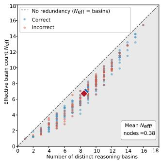  
Figure 1: Reasoning basin collapse in ToT. Each point is one MuSR problem (n=300, $\mathtt { g p t - o s s - 1 2 0 b } )$ . The y-axis shows $N _ { \mathrm { e f f } }$ , the effective number of distinct basins visited weighted by visit frequency. All points fall below the diagonal (shaded), where $N _ { \mathrm { e f f } } ~ <$ nbasins, indicating that visits concentrate on previously explored basins.

Unconditional exploration, however, is not always beneficial. If search has already found a promising region, repeatedly penalizing it can divert a fixed inference budget toward weaker alternatives. We therefore introduce QA-BASIN, a quality-aware formulation that weakens the revisit penalty for high-quality basins, preserving promising regions while continuing to discourage repeated visits to lower-quality ones. BASIN and QA-BASIN expose and address the exploration–exploitation trade-off induced by basin-aware search. Both methods act only at candidate selection and require no training or changes to the underlying generator. They can therefore be incorporated into search procedures that maintain candidate states and repeatedly select among them.

Empirical findings. Across symbolic, natural-language, mathematical, and code reasoning tasks, basin-aware selection improves search under matched inference budgets. However, greater basin diversity does not always imply higher accuracy: BASIN helps most when search is trapped in redundant incorrect regions, but can over-explore after finding a strong basin. QA-BASIN mitigates this exploration–exploitation trade-off by preserving high-quality basins, yielding more robust gains across models, tasks, and search frameworks. We also introduce the redundancy gap $\Delta ,$ , which measures the difference in search concentration between correct and incorrect predictions. Standard ToT often operates near $\Delta \approx 0$ , while BASIN shifts the gap positive. Our broader analysis shows that $\Delta$ is informative but insufficient as a standalone predictor, motivating adaptive policies that jointly consider redundancy and search quality.

Our contributions are threefold. We formalize reasoning basins and identify reasoning basin collapse as a failure mode of inference-time search. We introduce BASIN and its quality-aware variant QA-BASIN, showing improvements across multiple domains, models, and search frameworks under fixed budgets. Finally, we introduce the redundancy gap $\Delta$ as a diagnostic for characterizing harmful search redundancy and guiding more adaptive basin-aware search.

## 2 Related Work

Reasoning with intermediate steps. Chain-of-thought prompting elicits step-by-step reasoning before the final answer [Wei et al., 2022]; Zero-shot-CoT shows that a simple “think step by step” prompt can elicit reasoning without demonstrations [Kojima et al., 2022]. Further methods improve intermediate rationales through structured decomposition, automatic exemplar selection, and complexity-based sampling [Zhou et al., 2023, Zhang et al., 2023, Zelikman et al., 2022, Fu et al., 2023]. Self-Consistency aggregates multiple sampled traces by majority vote [Wang et al., 2023]. Recent work also explores reasoning in continuous latent space to improve the flexibility and efficiency of intermediate computation [Liu et al., 2026]. These methods improve how reasoning trajectories are generated or represented, but do not explicitly model whether different trajectories correspond to distinct underlying reasoning strategies.

Search-based reasoning. ToT frames LLM reasoning as search over intermediate states [Yao et al., 2023], with extensions to graph-structured reasoning, planning-style procedures, and agentic tree search [Besta et al., 2024, Hao et al., 2023, Zhou et al., 2024]. Recent work also improves search efficiency: Dynamic Parallel Tree Search reduces redundant exploration in ToT-style inference [Ding et al., 2025], while Policy-Guided Tree Search learns a controller for expansion, branching, and backtracking [Li, 2025]. Related work adaptively controls inference compute through early stopping or routing between models with different reasoning capabilities [Zhou et al., 2026, Su et al., 2026]. BASIN is complementary: rather than deciding how long to reason or which model to invoke, it makes search structure-aware by grouping states according to their underlying reasoning strategy and incorporating basin visitation directly into candidate selection.

Reflection, refinement, and verification. Self-Refine iteratively improves outputs through feedback and revision [Madaan et al., 2023], while Reflexion uses verbal self-reflection to guide future attempts [Shinn et al., 2023]. Verifier-based approaches rerank candidates using learned or external evaluators [Lightman et al., 2023], and recent test-time methods study adaptive allocation of reasoning effort [Ling et al., 2026, Zhou et al., 2026, Su et al., 2026]. These methods primarily improve trajectory quality, search control, or inference allocation. BASIN instead targets how search effort is allocated across reasoning strategies; QA-BASIN further incorporates quality signals so that promising basins remain competitive while redundant, lower-quality regions are discouraged.

Diversity-promoting search and decoding. Diverse Beam Search discourages near-duplicate candidates by adding a diversity penalty across beam groups [Vijayakumar et al., 2016]. At the reasoning level, Diversity of Thought elicits distinct prompt-level solution approaches [Naik et al., 2023], while Diversity of Thoughts for agents reduces redundant reflections to broaden decision-space exploration [Lingam et al., 2025]. BASIN is closest in spirit to diversity-promoting search, but its objective is not diversity maximization. Instead, it models strategy-level structure: candidate states are grouped into reasoning basins, defined symbolically when task structure is available or semantically for open-ended reasoning, and search is penalized for repeatedly revisiting the same basin. This distinguishes structure-aware search from methods that promote diversity primarily at the token, surface-form, or individual-trajectory level.

## 3 Method

BASIN is a structure-aware modification to inference-time reasoning search. Standard search scores candidate states largely independently, even when several candidates represent the same underlying reasoning strategy. As a result, substantial search budget can be spent repeatedly exploring equivalent trajectories. BASIN makes this structure explicit by grouping states into reasoning basins and penalizing repeated selection from the same basin.

## 3.1 Reasoning Basins

A reasoning basin is an equivalence class of states that share the same underlying reasoning strategy. Basin membership captures redundancy relevant to search rather than surface similarity: states belong to the same basin when they pursue the same core hypothesis or induce the same relevant continuation structure, even if their textual realizations differ.

We define a basin assignment function $\boldsymbol { B } : \mathcal { S }  \mathcal { Z }$ mapping each reasoning state s to a discrete basin identifier. States satisfying $\begin{array} { r } { B ( s ) = B ( s ^ { \prime } ) } \end{array}$ are treated as repeated exploration of the same strategy. The basin representation is task-dependent: when explicit structure is available, we use deterministic structural definitions; for open-ended reasoning, we approximate strategy equivalence semantically.

Structural basins. For arithmetic tasks such as Game of 24, we define basin membership using the ordered sequence of operations applied so far and the sorted remaining values:

$$
B ( s ) = { \bigl ( } \operatorname { o p s } ( s ) , \operatorname { s o r t } ( \operatorname { r e m a i n i n g } ( s ) ) { \bigr ) } .\tag{1}
$$

Here $\mathrm { { o p s } } ( s )$ is the ordered operator sequence $( \mathrm { e . g . ~ ( m u l , s u b ) } )$ , so states applying the same operations in a different order remain distinct. For example, the partial step $1 1 , - , 1 , = , 1 0$ on input 1, 11, 11, 13 yields basin sub,|,10,11,13. This representation captures task-relevant structural redundancy with lightweight deterministic parsing.

Semantic basins. For open-ended tasks such as MuSR, exact structural keys are unavailable and string matching is too brittle. We therefore extract from each reasoning trace a main\_hypothesis, a one-sentence summary of its central claim, and group states that predict the same answer and express compatible hypotheses under a NLI model. Concretely, states s and $s ^ { \prime }$ are grouped when

$$
\mathrm { a n s } ( s ) = \mathrm { a n s } ( s ^ { \prime } ) \wedge \mathrm { N L I } _ { \mathrm { e n t } } ( h _ { s } , h _ { s ^ { \prime } } ) \geq \tau _ { e } \wedge \mathrm { N L I } _ { \mathrm { c o n } } ( h _ { s } , h _ { s ^ { \prime } } ) \leq \tau _ { c } ,\tag{2}
$$

where $h _ { s }$ denotes the extracted hypothesis and $\tau _ { e } , \tau _ { c }$ control clustering granularity. We use NLI rather than embedding similarity because reasoning traces often share substantial narrative context despite supporting different hypotheses; NLI more directly captures propositional compatibility. We analyze sensitivity to the extractor, NLI model, and thresholds in Appendix G.

## 3.2 Basin-Aware Selection

Let visits[z] denote the number of times basin $z = B ( s )$ has previously been selected into the active search set, and let $f ( s )$ be the base score used by the underlying search procedure $( \mathrm { e . g . }$ , model likelihood, a value estimate, or a heuristic score). Inspired by metadynamics [Laio and Parrinello, 2002] in molecular dynamic simulation, which uses a history-dependent bias to discourage repeated visits to previously explored regions, BASIN replaces $f ( s )$ with

$$
\begin{array} { r } { \tilde { f } ( s ) = f ( s ) - \lambda \log ( 1 + \mathrm { v i s i t s } [ B ( s ) ] ) , } \end{array}\tag{3}
$$

where $\lambda \geq 0$ controls the strength of the basin-revisit penalty.

Visit counts are updated after each selection step. Because all states in the same basin share a visit count, redundant trajectories are penalized collectively rather than independently. Unvisited basins incur no penalty, while repeated visits receive an increasing but sublinear penalty. Thus, BASIN encourages exploration of underexplored strategies without forbidding revisits: a previously explored basin remains selectable whenever its base-score advantage exceeds the accumulated penalty.

The selection rule is agnostic to how basin membership is constructed: deterministic structural keys are preferable when available, while semantic clustering provides a fallback when no exact task-specific equivalence relation exists.

## 3.3 Quality-Aware BASIN

The basin-revisit penalty introduces an exploration–exploitation trade-off. It is useful when search is trapped in a repeatedly visited weak basin, but can also redirect compute away from a promising basin simply because that basin has been explored frequently. We therefore introduce QA-BASIN, when a meaningful quality signal is available:

$$
\tilde { f } ( s ) = f ( s ) - \lambda \log ( 1 + \mathrm { v i s i t s } [ \mathcal { B } ( s ) ] ) \big ( 1 - q _ { \mathcal { B } ( s ) } \big ) ,\tag{4}
$$

where $q _ { z } ~ \in ~ [ 0 , 1 ]$ is the running mean quality score for basin z. The quality term modulates exploration pressure: high-quality basins receive a weaker revisit penalty, whereas low-quality basins approach the original BASIN penalty. QA-BASIN therefore preserves promising strategies while continuing to discourage redundant exploration of weaker ones. Its effectiveness depends on the verifier providing meaningful quality signal.

## 3.4 Instantiation in ToT

We instantiate basin-aware selection within ToT, although the principle applies to any inference-time search procedure that maintains candidate states and performs repeated selection. We also evaluate the same mechanism with Graph of Thoughts (Appendix D) and UCT-based MCTS (Sec. 4.3). Standard ToT maintains a beam $\boldsymbol { A } _ { t }$ of k active states. At each round, it expands the active states into candidate continuations, scores them using $f ,$ and retains the top k. BASIN changes only this selection step: each candidate is assigned a basin through B, rescored using Eq. (3) (or Eq. (4) for QA-BASIN), and ranked by the resulting basin-aware score. Visit counts are then updated for the selected states. All other components of the search remain unchanged. Basin-aware selection therefore changes where search allocates inference compute.

## 4 Experiments

## 4.1 Experimental Setup

Datasets. Our primary experiments use two complementary benchmarks spanning symbolic and natural-language reasoning. Game of 24 requires combining four integers using basic arithmetic $( + , - , \times , \div )$ to obtain 24; we use the standard 100-problem set from [Yao et al., 2023]. Solutions are verified exactly by evaluating the expression and checking number usage. MuSR [Sprague et al., 2024] is a multi-step reasoning benchmark covering murder mystery, object placement, and team allocation; we use 300 problems sampled uniformly across subtasks.

To test broader generalization, we additionally evaluate HumanEval [Chen et al., 2021], GSM-Hard [Gao et al., 2022], and the Logical Deduction subtask of BIG-Bench Hard [Srivastava et al., 2022]. HumanEval tests program synthesis and admits deterministic structural basin definitions, while GSM-Hard tests challenging mathematical reasoning. Together, these benchmarks span symbolic search, natural-language reasoning, mathematics, and code generation.

Models. Our primary Game of 24 experiments use gpt-4o-mini [OpenAI, 2024] and Qwen3-27B [Yang et al., 2025]; MuSR uses gpt-4o-mini and gpt-oss-120b [OpenAI et al., 2025]. For broader evaluation, we additionally test Qwen2.5-7B-Instruct [Team, 2024] and Llama-3.3-70B-Instruct [Dubey et al., 2024], covering multiple model families and scales.

Search and Basins. We use ToT as the primary controlled search framework. BASIN changes only candidate selection through Eq. (3); QA-BASIN uses Eq. (4). Generation, search budget, and final-answer selection are otherwise held fixed. Game of 24 and HumanEval use deterministic structural basin definitions. For MuSR, we extract a main\_hypothesis from each reasoning trace and construct semantic basins as described in §3.1. The same extraction procedure is applied when computing basin statistics for baseline and basin-aware searches. Under our nine-round MuSR setup, both conditions use 18 generation and 18 hypothesis extraction calls per problem. The Appendices F-G study the sensitivity to the extractor and NLI clustering choices.

Hyperparameters. For Game of 24, we use beam size k=5, branching factor $b { = } 5$ , and depth $T { = } 3$ For MuSR, we use beam size $k { = } 2$ and nine reasoning rounds. Semantic clustering uses entailment threshold $\tau _ { e } = 0$ .45 and contradiction ceiling ${ \tau _ { c } } \mathrm { { = } } 0 . 3$ , chosen to require moderate positive support between hypotheses while excluding pairs with substantial contradictory evidence. Appendix G shows that the results are robust to alternative entailment thresholds and semantic basin constructions. Unless otherwise stated, $\lambda { = } 3 . 0 .$ . Sampling temperatures are 0.7 for Game of 24 and 0.8 for MuSR and are held fixed across methods. Appendix K provides compute and implementation details. Appendix J shows prompt templates.

Evaluation metrics. We report accuracy as the primary performance metric and Pass@k when the final beam can contain multiple candidate answers. To characterize search structure, we report the number of visited basins and the effective basin count $\begin{array} { r } { N _ { \mathrm { e f f } } = \exp ( - \sum _ { z } p _ { z } \log p _ { z } ) } \end{array}$ , where $p _ { z }$ is the fraction of selected states assigned to basin $z , N _ { \mathrm { e f f } }$ equals the number of basins under uniform visitation and decreases as search concentrates on a subset of them, thereby capturing both basin coverage and the evenness of search allocation. We define redundancy as $\rho = \# \mathrm { B a s i n s } - N _ { \mathrm { e f f } }$ and the redundancy gap as

$$
\Delta = \mathbb { E } [ \rho \mid { \mathrm { c o r r e c t } } ] - \mathbb { E } [ \rho \mid { \mathrm { i n c o r r e c t } } ] .\tag{5}
$$

Thus, $\Delta > 0$ indicates that correct searches are more concentrated than incorrect ones. We use these quantities as diagnostics of search structure rather than optimization objectives, since greater basin diversity does not necessarily imply higher accuracy.

## 4.2 Main Results

Game of 24. Table 1 shows that BASIN improves accuracy from 66.0% to 72.0% with gpt-4o-mini, and from 43.0% to 65.0% with Qwen3-27B (+22pp, $p { < } 0 . 0 1 )$ . The gains occur under the same search budget and exact symbolic verifier. BASIN also increases $N _ { \mathrm { e f f } } .$

Table 1: Results on Game of 24. $^ { * * } p < 0 . 0 1$ ${ \dag } _ { p } < 0 . 1 0 .$
<table><tr><td>Model</td><td>Method</td><td> $\mathbf { A c c . }$ </td><td>#Basins</td><td> $N _ { \mathrm { e f f } }$ </td></tr><tr><td rowspan="2">gpt-4o-mini</td><td>ToT</td><td>0.660</td><td>27.39</td><td>26.65</td></tr><tr><td>+BASIN</td><td>0.720†</td><td>27.94</td><td>27.29</td></tr><tr><td rowspan="2">Qwen3-27B</td><td>ToT</td><td>0.430</td><td>25.64</td><td>24.88</td></tr><tr><td>+BASIN</td><td>0.650**</td><td>28.15</td><td>27.38</td></tr></table>

Table 3: Results on MuSR (n=300, nine rounds, λ=3.0). Sel. Eff. indicates selection efficiency.
<table><tr><td>Model</td><td>Method</td><td>Acc.</td><td>Pass@k</td><td>Sel. Eff.</td><td>#Basins</td><td> $N _ { \mathrm { e f f } }$ </td></tr><tr><td>gpt-oss-120b</td><td>ToT +BASIN</td><td>0.633 0.670*</td><td>0.863 0.903</td><td>0.734 0.742</td><td>8.59 8.58</td><td>6.86 6.85</td></tr><tr><td>gpt-4o-mini</td><td>ToT +BASIN</td><td>0.607 0.620†</td><td>0.857 0.833</td><td>0.708 0.744</td><td>6.76 6.84</td><td>5.07 5.28</td></tr></table>

particularly for Qwen3-27B, suggesting that ToT spends substantial compute revisiting structurally redundant arithmetic states. We observe similar findings for the BBH logical deduction task (Appendix C) with +13pp in accuracy.

MuSR. Table 3 reports results on 300 MuSR problems. The NLI-based semantic construction is inherently noisier than the exact structural basin definition used for Game of 24, which may limit how precisely the revisit penalty distinguishes genuinely different reasoning strategies. Unlike Game of 24, global diversity changes on MuSR are small. For gpt-oss-120b, BASIN improves both accuracy and Pass@k; for gpt-4o-mini, Pass@k decreases slightly while accuracy increases. We define selection efficiency as Acc./Pass@k; BASIN achieves the highest selection efficiency for both models.

This suggests that BASIN performance depends not only on exploration but also on the quality of the semantic basin representation. Appendix G shows that accuracy remains stable across alternative semantic constructions. Overall, the gains arise from reallocating search across strategies rather than simply maximizing basin coverage.

Quality-aware selection. The exploration–exploitation trade-off becomes especially visible with stronger models. Table 2 compares standard ToT, BASIN, and QA-BASIN using gpt-4 [Achiam et al., 2023]. On Game of 24, standard ToT obtains 67.0% accuracy, flat BASIN falls to 61.0%, and QA-BASIN reaches 70.0%. On MuSR, the corresponding accuracies are 52.0%, 58.3%, and 58.7%. Notably, on Game of 24 the three methods achieve nearly identical effective basin counts despite substantially different accuracies. This reinforces that the objective is not to maximize basin diversity itself, but to avoid redundant exploration without suppressing promising reasoning regions. QA-BASIN directly addresses this trade-off by weakening the revisit penalty for basins with stronger quality signals.

## 4.3 Generalization Across Tasks, Models, and Search

We next test whether structure-aware selection generalizes beyond the primary Game of 24 and MuSR settings. Table 4 reports accuracy under matched inference budgets on HumanEval and GSM-Hard across four models. Across these settings, QA-BASIN is generally the most robust formulation: it matches or improves upon standard ToT for all

Table 2: QA-BASIN vs. baselines on gpt-4.
<table><tr><td>Task</td><td>Method</td><td>Acc.</td><td>#Basins</td><td> $N _ { \mathrm { e f f } }$ </td></tr><tr><td rowspan="3">Game24</td><td>ToT</td><td>0.670</td><td>28.17</td><td>27.65</td></tr><tr><td>BASIN</td><td>0.610</td><td>28.24</td><td>27.72</td></tr><tr><td>QA-BASIN</td><td>0.700</td><td>28.25</td><td>27.73</td></tr><tr><td rowspan="3">MuSR</td><td>ToT</td><td>0.520</td><td>5.86</td><td>4.67</td></tr><tr><td>BASIN</td><td>0.583</td><td>7.39</td><td>5.72</td></tr><tr><td>QA-BASIN</td><td>0.587</td><td>7.32</td><td>5.64</td></tr></table>

four models on HumanEval and achieves the best or tied-best accuracy in three of four GSM-Hard settings. In contrast, flat BASIN sometimes increases exploration without improving accuracy, consistent with an exploration–exploitation trade-off rather than a simple benefit from greater basin coverage. This pattern also extends to additional Game of 24 models: both basin-aware variants improve over ToT on Qwen2.5-7B-Instruct, while QA-BASIN improves Llama-3.3-70B-Instruct from 70% to 75% (Appendix B). Table 5: Game of 24 with UCT-based MCTS

Generalization beyond ToT. Because BASIN modifies candidate selection rather than the topology of a particular search algorithm, we also evaluate it with UCT-based Monte Carlo Tree Search (MCTS) on Game of 24 under

Table 5: Game of 24 with UCT-based MCTS.
<table><tr><td>Model</td><td>MCTS</td><td>BASIN</td><td>QA-BASIN</td></tr><tr><td>gpt-4o-mini</td><td>.460</td><td>.420</td><td>.640</td></tr><tr><td>gpt-oss-120b</td><td>.240</td><td>.270</td><td>.390</td></tr><tr><td>Qwen2.5-7B-Instruct</td><td>.490</td><td>.360</td><td>.550</td></tr><tr><td>Llama-3.3-70B-Instruct</td><td>.610</td><td>.650</td><td>.720</td></tr></table>

Table 4: Generalization across tasks and models. Accuracy under matched inference budgets.
<table><tr><td>Task</td><td>Model</td><td>ToT</td><td>BASIN</td><td>QA-BASIN</td></tr><tr><td>HumanEval</td><td>gpt-4o-mini</td><td>.799</td><td>.811</td><td>.817</td></tr><tr><td></td><td>gpt-oss-120b</td><td>.756</td><td>.750</td><td>.793</td></tr><tr><td></td><td>Qwen2.5-7B-Instruct</td><td>.756</td><td>.750</td><td>.780</td></tr><tr><td></td><td>Llama-3.3-70B-Instruct</td><td>.817</td><td>.799</td><td>.817</td></tr><tr><td>GSM-Hard</td><td>gpt-4o-mini</td><td>.510</td><td>.530</td><td>.530</td></tr><tr><td></td><td>gpt-oss-120b</td><td>.610</td><td>.610</td><td>.610</td></tr><tr><td></td><td>Qwen2.5-7B-Instruct</td><td>.440</td><td>.450</td><td>.460</td></tr><tr><td></td><td>Llama-3.3-70B-Instruct</td><td>.440</td><td>.470</td><td>.440</td></tr></table>

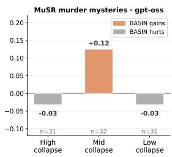

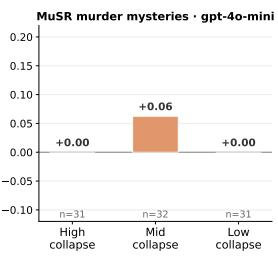

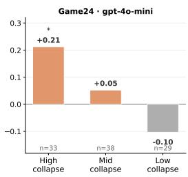

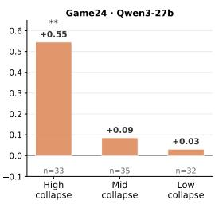  
Figure 2: BASIN accuracy gain stratified by ToT basin collapse. Problems are grouped into tertiles by ToT $N _ { \mathrm { e f f . } } \mathrm { ~ } ^ { * * } p < 0 . 0 1 , \mathrm { ~ } ^ { * } p < 0 . 0 5$ (one-sided McNemar test).

matched search budgets. We use 50 simulations per problem and add the basin term only to UCT child selection (Table 5).

QA-BASIN improves over standard MCTS for all four models, by $+ 1 8 , + 1 5 , + 6 ,$ , and +11 percentage points, respectively. Flat BASIN, however, helps two models and hurts two. Since MCTS already contains an explicit exploration term, an additional unconditional revisit penalty can overexplore and displace promising regions. The quality-aware variant instead preserves high-quality basins while discouraging repeated visits to weaker ones. We observe the same transfer beyond tree search with Graph of Thoughts (GoT) on MuSR: BASIN improves accuracy from 57% to 60%, while QA-BASIN further improves it to 64%. Notably, QA-BASIN achieves this gain with lower effective basin coverage than flat BASIN, again illustrating that effective structure-aware search requires balancing exploration with preservation of promising reasoning regions. Full results are reported in Appendix D.

Taken together, these results show that structure-aware selection transfers across tasks, model families, and search algorithms. They also motivate QA-BASIN as the preferred formulation when a reliable quality signal is available: it retains the benefit of escaping repeatedly explored low-quality basins while reducing the over-exploration that can arise from flat BASIN.

## 4.4 Collapse-Stratified Analysis

If reasoning basin collapse is an important failure mode, BASIN should help most when standard ToT repeatedly concentrates on a small set of strategies. We test this by splitting problems into tertiles according to standard-ToT $N _ { \mathrm { e f f } } \colon$ high-, mid-, and low-collapse. We then report paired accuracy differences $\Delta \mathrm { a c c } = \mathrm { a c c } _ { \mathrm { B A S I N } } - \mathrm { a c c } _ { \mathrm { T o T } }$ in Figure 2. For MuSR, we use the murder-mystery subset to avoid mixing heterogeneous subtasks; Appendix A reports the remaining subsets.

The expected pattern is clearest on Game of 24. With gpt-4o-mini, BASIN gains +0.21 accuracy in the high-collapse group, compared with +0.05 in the mid-collapse group and −0.10 in the low-collapse group. Qwen3-27B shows the same qualitative trend, with most of the improvement concentrated among high-collapse problems.

MuSR is less monotonic: the largest gains occur in the mid-collapse group. Semantic $N _ { \mathrm { e f f } }$ captures the amount of concentration but not whether the dominant reasoning basin is useful or misleading. This weaker alignment between collapse severity and the need for exploration may partly explain the smaller gains on MuSR relative to Game of 24. Overall, collapse severity is informative but insufficient by itself to determine when additional exploration will help.

## 4.5 Understanding Search Through the Redundancy Gap

The flat BASIN penalty is quality-agnostic: it depends on basin visitation rather than correctness. We use the redundancy gap $\Delta$ from Eq. (5) to analyze how the resulting concentration differs between successful and unsuccessful searches.

BASIN enlarges the gap. Figure 3 shows that standard ToT typically operates near $\Delta \approx 0$ or slightly below: correct and incorrect searches exhibit similar concentration patterns. BASIN consistently shifts $\Delta \mathrm { \ p o s i t i v e { , } }$ concentrating successful searches around strong regions while dispersing repeated exploration among unsuccessful ones. This separation helps explain why a quality-agnostic revisit penalty can improve accuracy: its effect depends not simply on increasing diversity, but on restructuring where redundancy occurs.

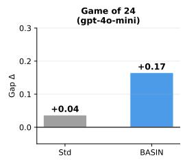

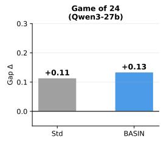

The relationship is useful but not universal. For Qwen3-27b on Game of 24, ToT already has $\Delta = + 0 . 1 1$ , yet BASIN improves accuracy by $+ 2 2 \mathrm { p p }$ . Since ToT solves only 43% of problems in this setting, substantial per-problem collapse onto incorrect arithmetic basins can remain even when the dataset-level gap appears favorable.

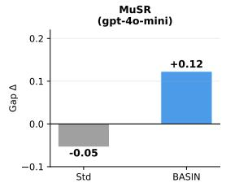

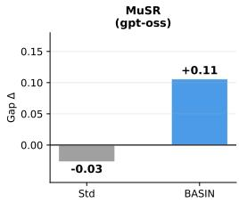  
Figure 3: Redundancy gap $\Delta$ for ToT and BASIN.

Thus, $\Delta$ summarizes average search behavior but can obscure substantial per-problem heterogeneity.

The redundancy gap therefore provides a useful summary of how search concentration differs between successful and unsuccessful trajectories, but it does not by itself determine when additional exploration will improve accuracy. We therefore evaluate whether $\dot { \Delta }$ can be used as a routing signal for choosing between standard search and BASIN. Across six model–task settings spanning Game of 24 and BBH, $\Delta$ alone selects the empirically better fixed policy in only $2 / 6$ cases. Combining it with a per-problem search-effort signal—the number of tree nodes explored before termination—increases this to $5 / 6 ;$ Appendix H provides the full routing analysis. Thus, we treat the redundancy gap primarily as a diagnostic of search structure, while adaptive policies should combine it with additional search-state or quality signals.

## 4.6 Ablation Studies

Effect of compute budget. Figure 4 varies the number of reasoning rounds on 100 randomly selected MuSR problems with gpt-oss-120b, holding beam size fixed. Accuracy generally improves with additional reasoning depth, while $N _ { \mathrm { e f f } }$ also increases. Basin-aware exploration is therefore most useful when the search budget is large for alternative strategies to develop into complete solutions.

Effect of penalty strength. Figure 5 varies $\lambda \in$ $\{ 0 . 5 , 1 . 0 , 1 . { \overset { } { 5 } } , 2 . 0 , { \overset { } { 3 } } . 0 , 4 . 0 , { \overset { } { 5 } } . 0 \}$ in the same MuSR setting. Accuracy peaks at $\lambda { = } 3 . 0$ and is relatively stable over moderate values. $N _ { \mathrm { e f f } }$ increases with λ, but accuracy is non-monotonic: weak penalties have little effect, whereas overly strong penalties can override useful base-score dif-

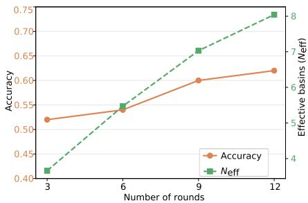  
Figure 4: Effect of compute budget.

ferences. This again shows that the goal is not maximal diversity, but an effective exploration– exploitation balance.

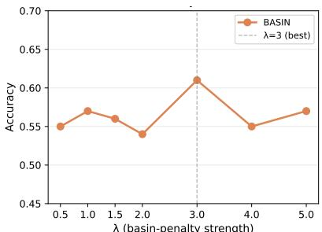

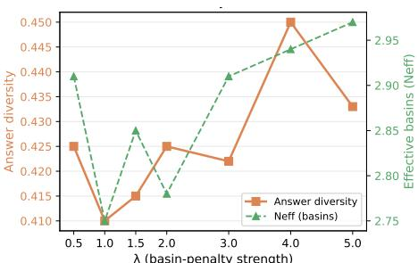  
Figure 5: Effect of penalty strength.

How important is the quality signal? Because QA-BASIN uses basin quality to modulate the revisit penalty, its performance depends on the informativeness of that signal. On MuSR with gpt-4, using an LLM-based quality signal yields 58.7% accuracy, compared with 58.3% for flat BASIN and 52.0% for standard ToT. Replacing this signal with the search heuristic reduces accuracy to 33.7%. Thus, quality-aware modulation is beneficial when the quality estimate is informative, but can be actively harmful when it is poorly calibrated to correctness. We therefore recommend QA-BASIN when a meaningful quality signal is available and flat BASIN otherwise. Appendix E provides the full results and analyzes the discriminative quality of the heuristic score.

Is BASIN Just Promoting Diversity? The improvement from BASIN is not explained by generic diversity promotion. On Game of 24 with gpt-4o-mini, a Diverse Beam Search (DBS)-style baseline [Vijayakumar et al., 2016] achieves 64.0% accuracy, compared with 66.0% for standard ToT and 72.0% for BASIN. Thus, encouraging diverse candidates alone does not reproduce the gain from explicitly modeling strategy-level redundancy. We further vary the sampling temperature as an alternative way to increase token-level diversity (Fig. 6). Across $T \in \{ \bar { 0 . 7 } , \bar { 1 . 0 } , 1 . \bar { 2 } , 1 . 5 \}$ , the best higher-temperature ToT configuration reaches 68.0% accuracy, still below BASIN’s 72.0% at $T = 0 . 7$ . Increasing temperature within BASIN also does not improve performance. These results show that token-level or candidate-level diversity is not interchangeable with structure-aware, basin-level selection: BASIN benefits from identifying and penalizing repeated reasoning strategies rather than simply making individual candidates more different.

## 4.7 Case Study

We illustrate how BASIN reallocates search effort on Game of 24; a MuSR example appears in Appendix I.

Game of 24: 1, 11, 11, 13. Under standard ToT, the firststep beam contains the same symbolic state twice:

$$
\begin{array} { r l r } & { } & { 1 1 \mathrm { ~  ~ - ~ \textbf { 1 } ~ } = \mathrm { ~ 1 0 ~ } , \quad 1 3 \mathrm { ~  ~ - ~ } 1 1 } \\ & { = 2 , \quad 1 1 \mathrm { ~ * ~ \textbf { 1 } ~ } = \mathrm { ~ 1 1 ~ } , \quad 1 1 \mathrm { ~ + ~ } 1 1 \mathrm { ~ = ~ } 2 2 , \quad 1 1 \mathrm { ~ - ~ } 1 1 = \mathrm { ~ 1 0 ~ } . } \end{array}
$$

The first and final candidates both map to basin sub|10,11,13, so one beam slot is spent revisiting the same arithmetic state. After its first visit, BASIN lowers the score of this basin, allowing the alternative $1 + 1 1 = 1 2$ to survive. This new basin leads to

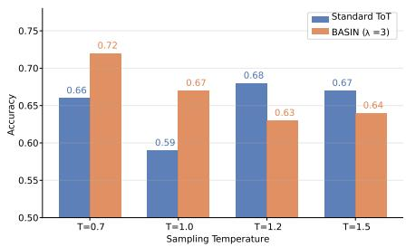  
Figure 6: Effect of temperature T.

$$
1 + 1 1 = 1 2 \longrightarrow 1 3 - 1 1 = 2 \longrightarrow 2 \times 1 2 = 2 4 .
$$

No new generator, operation, or verifier is introduced; the search simply allocates its existing beam budget across distinct symbolic strategies.

## 5 Discussion

Why structure-aware search can improve reasoning. BASIN is motivated by the observation that inference-time reasoning search can over-commit to a small number of plausible but incomplete reasoning directions. In ToT-style search, early selections shape later expansions: if the beam repeatedly selects variants of the same hypothesis, subsequent rounds tend to elaborate that hypothesis rather than test alternatives. By tracking strategy-level structure and penalizing repeated visits to the same reasoning basin, BASIN reallocates search effort across distinct strategies and reduces the risk that all active states share the same error mode.

This mechanism is not equivalent to maximizing diversity. The Diverse Beam Search and temperature comparisons in $\ S 4 . 6$ show that generic candidate- or token-level diversity does not reproduce the gains from modeling strategy-level redundancy, and increasing $N _ { \mathrm { e f f } }$ can coincide with unchanged or lower accuracy. The goal is therefore to avoid repeatedly exploring equivalent strategies, not to maximize trajectory diversity.

The redundancy gap $\Delta \left( \ S 4 . 5 \right)$ provides a diagnostic of this behavior. Standard ToT typically operates near $\Delta \approx 0$ , whereas BASIN often shifts the gap positive. However, $\Delta$ alone selects the empirically better fixed policy in only $2 / 6$ settings; combining it with a search-effort signal succeeds in $5 / \bar { 6 }$ settings (Appendix H). We therefore treat $\Delta$ as a diagnostic rather than a standalone routing criterion.

Exploration versus exploitation. Flat BASIN is most useful when baseline search repeatedly commits compute to an unproductive basin, but it can hurt when search has already identified a promising region. This effect is especially visible with stronger models and under $\mathbf { \sigma } _ { \mathbf { M C T S } }$ , where an existing exploration mechanism can compound the additional exploration pressure. The collapsestratified results similarly show that additional exploration is most useful when baseline search is sufficiently concentrated.

QA-BASIN addresses this trade-off by weakening the revisit penalty for basins with stronger quality evidence. Across tasks and models it is more robust than the unconditional penalty, and under MCTS it improves over standard search for all four evaluated models. We therefore view QA-BASIN as the preferred formulation when a meaningful quality signal is available, and flat BASIN as useful otherwise.

The importance of basin structure. The effectiveness of structure-aware search depends on the basin representation capturing meaningful reasoning redundancy. For symbolic tasks, basin membership can often be defined exactly; for open-ended reasoning, it must be approximated. On MuSR, SBERTbased similarity collapses trajectories into nearly a single basin $( \bar { N _ { \mathrm { e f f } } } \approx 1 . 0 4 )$ , whereas NLI-based clustering over extracted hypotheses yields a richer structure $( N _ { \mathrm { e f f } } \approx 6 . 8 5 ;$ Appendix F). At the same time, performance is robust within this semantic construction family: accuracy remains above standard ToT across tested entailment thresholds, NLI models, and hypothesis extractors, although basin counts and Pass@k vary more (Appendix G).

Generality and limitations. Results across HumanEval, GSM-Hard, Game of 24, MuSR, MCTS, and GoT suggest that reasoning-basin structure is not tied to a single task, model family, or search topology. Together, these findings motivate structure-aware search as the broader principle underlying BASIN: reasoning basins represent strategy-level structure, while the visitation penalty provides a simple mechanism for using it during inference.

Several limitations remain. Basin definitions are task-dependent, and semantic tasks require approximate representations with additional extraction and NLI cost. Neither basin coverage nor $N _ { \mathrm { e f f } }$ determines whether the explored strategy is correct, while QA-BASIN additionally depends on the reliability of its quality signal. Our experiments also use matched inference budgets rather than characterizing the full accuracy–token-cost Pareto frontier. Finally, the redundancy gap is insufficient by itself for deciding when exploration is beneficial; adaptive policies combining basin visitation, quality estimates, and online search-state signals are a promising direction for future work.

## References

Jason Wei, Xuezhi Wang, Dale Schuurmans, Maarten Bosma, Brian Ichter, Fei Xia, Ed H. Chi, Quoc V. Le, and Denny Zhou. Chain-of-thought prompting elicits reasoning in large language models. In Advances in Neural Information Processing Systems, volume 35, pages 24824–24837, 2022.

Xuezhi Wang, Jason Wei, Dale Schuurmans, Quoc Le, Ed Chi, Sharan Narang, Aakanksha Chowdhery, and Denny Zhou. Self-consistency improves chain of thought reasoning in language models. In International Conference on Learning Representations, 2023. URL https: //openreview.net/forum?id=1PL1NIMMrw.

Shunyu Yao, Dian Yu, Jeffrey Zhao, Izhak Shafran, Thomas L. Griffiths, Yuan Cao, and Karthik Narasimhan. Tree of thoughts: Deliberate problem solving with large language models. In Advances in Neural Information Processing Systems, volume 36, pages 11809–11822, 2023.

Maciej Besta, Nils Blach, Ales Kubicek, Robert Gerstenberger, Michal Podstawski, Lukas Gianinazzi, Joanna Gajda, Tomasz Lehmann, Hubert Niewiadomski, Piotr Nyczyk, and Torsten Hoefler. Graph of thoughts: Solving elaborate problems with large language models. In Proceedings ofthe AAAI Conference on Artificial Intelligence, volume 38, pages 17682–17690, 2024.

Shibo Hao, Yi Gu, Haodi Ma, Joshua Jiahua Hong, Zhen Wang, Daisy Zhe Wang, and Zhiting Hu. Reasoning with language model is planning with world model. In Proceedings ofthe 2023 Conference on Empirical Methods in Natural Language Processing, pages 8154–8179, 2023.

Andy Zhou, Kai Yan, Michal Shlapentokh-Rothman, Haohan Wang, and Yu-Xiong Wang. Language agent tree search unifies reasoning, acting, and planning in language models. In Proceedings of the 41st International Conference on Machine Learning, volume 235 of Proceedings of Machine Learning Research, pages 62138–62160. PMLR, 2024. URL https://proceedings.mlr. press/v235/zhou24r.html.

Yifu Ding, Wentao Jiang, Shunyu Liu, Yongcheng Jing, Jinyang Guo, Yingjie Wang, Jing Zhang, Zengmao Wang, Ziwei Liu, Bo Du, Xianglong Liu, and Dacheng Tao. Dynamic parallel tree search for efficient LLM reasoning. In Proceedings ofthe 63rd Annual Meeting ofthe Association for Computational Linguistics, pages 11233–11252, 2025.

Zayne Sprague, Xi Ye, Kaj Bostrom, Swarat Chaudhuri, and Greg Durrett. MuSR: Testing the limits of chain-of-thought with multistep soft reasoning. In The Twelfth International Conference on Learning Representations, 2024. URL https://openreview.net/forum?id=jenyYQzue1.

Alessandro Laio and Michele Parrinello. Escaping free-energy minima. Proceedings of the National Academy ofSciences, 99(20):12562–12566, 2002.

Takeshi Kojima, Shixiang Shane Gu, Machel Reid, Yutaka Matsuo, and Yusuke Iwasawa. Large language models are zero-shot reasoners. In Advances in Neural Information Processing Systems, volume 35, pages 22199–22213, 2022. URL https://proceedings.neurips.cc/paper\_files/ paper/2022/hash/8bb0d291acd4acf06ef112099c16f326-Abstract-Conference.html.

Denny Zhou, Nathanael Schärli, Le Hou, Jason Wei, Nathan Scales, Xuezhi Wang, Dale Schuurmans, Claire Cui, Olivier Bousquet, Quoc Le, and Ed Chi. Least-to-most prompting enables complex reasoning in large language models. In International Conference on Learning Representations, 2023. URL https://openreview.net/forum?id=WZH7099tgfM.

Zhuosheng Zhang, Aston Zhang, Mu Li, and Alex Smola. Automatic chain of thought prompting in large language models. In International Conference on Learning Representations, 2023. URL https://openreview.net/forum?id=5NTt8GFjUHkr.

Eric Zelikman, Yuhuai Wu, Jesse Mu, and Noah D. Goodman. STaR: Bootstrapping reasoning with reasoning. In Advances in Neural Information Processing Systems, volume 35, pages 15476–15488, 2022. URL https://openreview.net/forum?id=\_3ELRdg2sgI.

Yao Fu, Hao Peng, Ashish Sabharwal, Peter Clark, and Tushar Khot. Complexity-based prompting for multi-step reasoning. In International Conference on Learning Representations, 2023. URL https://openreview.net/forum?id=yf1icZHC-l9.

Weihao Liu, Dehai Min, and Lu Cheng. Latent thoughts tuning: Bridging context and reasoning with fused information in latent tokens. In ICML, 2026.

Yang Li. Policy guided tree search for enhanced LLM reasoning. In International Conference on Machine Learning, 2025. URL https://openreview.net/forum?id=NNWSNy4YB4. Poster.

Xiaofan Zhou, Huy Nguyen, Bo Yu, Chenxi Liu, and Lu Cheng. Adaptive stopping for multi-turn llm reasoning. arXiv preprint arXiv:2604.01413, 2026.

Jiayuan Su, Fulin Lin, Zhaopeng Feng, Han Zheng, Teng Wang, Zhenyu Xiao, Xinlong Zhao, Zuozhu Liu, Lu Cheng, and Hongwei Wang. CP-Router: An uncertainty-aware router between LLM and LRM. In Proceedings ofthe AAAI Conference on Artificial Intelligence, 2026.

Aman Madaan, Niket Tandon, Prakhar Gupta, Skyler Hallinan, Luyu Gao, Sarah Wiegreffe, Uri Alon, Nouha Dziri, Shrimai Prabhumoye, Yiming Yang, Shashank Gupta, Bodhisattwa Prasad Majumder, Katherine Hermann, Sean Welleck, Amir Yazdanbakhsh, and Peter Clark. Self-refine: Iterative refinement with self-feedback. arXiv preprint arXiv:2303.17651, 2023.

Noah Shinn, Federico Cassano, Edward Berman, Ashwin Gopinath, Karthik Narasimhan, and Shunyu Yao. Reflexion: Language agents with verbal reinforcement learning. In Advances in Neural Information Processing Systems, volume 36, pages 8634–8652, 2023.

Hunter Lightman, Vineet Kosaraju, Yura Burda, Harri Edwards, Bowen Baker, Teddy Lee, Jan Leike, John Schulman, Ilya Sutskever, and Karl Cobbe. Let’s verify step by step. arXiv preprint arXiv:2305.20050, 2023.

Guoming Ling, Zhongzhan Huang, Yupei Lin, Junxin Li, Shanshan Zhong, Hefeng Wu, and Liang Lin. Neural chain-of-thought search: Searching the optimal reasoning path to enhance large language models. arXiv preprint arXiv:2601.11340, 2026. URL https://arxiv.org/abs/2601.11340.

Ashwin K. Vijayakumar, Michael Cogswell, Ramprasaath R. Selvaraju, Qing Sun, Stefan Lee, David Crandall, and Dhruv Batra. Diverse beam search: Decoding diverse solutions from neural sequence models. arXiv preprint arXiv:1610.02424, 2016. URL https://arxiv.org/abs/1610.02424.

Ranjita Naik, Varun Chandrasekaran, Mert Yuksekgonul, Hamid Palangi, and Besmira Nushi. Diversity of thought improves reasoning abilities of large language models. arXiv preprint arXiv:2310.07088, 2023. URL https://arxiv.org/abs/2310.07088.

Vijay Lingam, Behrooz Omidvar Tehrani, Sujay Sanghavi, Gaurav Gupta, Sayan Ghosh, Linbo Liu, Jun Huan, and Anoop Deoras. Enhancing language model agents using diversity of thoughts. In The Thirteenth International Conference on Learning Representations, 2025.

Mark Chen, Jerry Tworek, Heewoo Jun, Qiming Yuan, Henrique Ponde de Oliveira Pinto, Jared Kaplan, Harri Edwards, Yuri Burda, Nicholas Joseph, Greg Brockman, Alex Ray, Raul Puri, Gretchen Krueger, Michael Petrov, Heidy Khlaaf, Girish Sastry, Pamela Mishkin, Brooke Chan, Scott Gray, Nick Ryder, Mikhail Pavlov, Alethea Power, Lukasz Kaiser, Mohammad Bavarian, Clemens Winter, Philippe Tillet, Felipe Petroski Such, Dave Cummings, Matthias Plappert, Fotios Chantzis, Elizabeth Barnes, Ariel Herbert-Voss, William Hebgen Guss, Alex Nichol, Alex Paino, Nikolas Tezak, Jie Tang, Igor Babuschkin, Suchir Balaji, Shantanu Jain, William Saunders, Christopher Hesse, Andrew N. Carr, Jan Leike, Josh Achiam, Vedant Misra, Evan Morikawa, Alec Radford, Matthew Knight, Miles Brundage, Mira Murati, Katie Mayer, Peter Welinder, Bob McGrew, Dario Amodei, Sam McCandlish, Ilya Sutskever, and Wojciech Zaremba. Evaluating large language models trained on code. arXiv preprint arXiv:2107.03374, 2021.

Luyu Gao, Aman Madaan, Shuyan Zhou, Uri Alon, Pengfei Liu, Yiming Yang, Jamie Callan, and Graham Neubig. PAL: Program-aided language models. arXiv preprint arXiv:2211.10435, 2022.

Aarohi Srivastava, Abhishek Rastogi, Abhinav Rao, and et al. Beyond the imitation game: Quantifying and extrapolating the capabilities of language models. arXiv preprint arXiv:2206.04615, 2022.

OpenAI. GPT-4o system card, 2024. URL https://arxiv.org/abs/2410.21276.

An Yang, Anfeng Li, Baosong Yang, Beichen Zhang, Binyuan Hui, Bo Zheng, Bowen Yu, Chang Gao, Chengen Huang, Chenxu Lv, Chujie Zheng, Dayiheng Liu, Fan Zhou, Fei Huang, Feng Hu, Hao Ge, Haoran Wei, Huan Lin, Jialong Tang, Jian Yang, Jianhong Tu, Jianwei Zhang, Jianxin Yang, Jiaxi Yang, Jing Zhou, Jingren Zhou, Junyang Lin, Kai Dang, Keqin Bao, Kexin Yang, Le Yu, Lianghao Deng, Mei Li, Mingfeng Xue, Mingze Li, Pei Zhang, Peng Wang, Qin Zhu, Rui Men, Ruize Gao, Shixuan Liu, Shuang Luo, Tianhao Li, Tianyi Tang, Wenbiao Yin, Xingzhang Ren, Xinyu Wang, Xinyu Zhang, Xuancheng Ren, Yang Fan, Yang Su, Yichang Zhang, Yinger Zhang, Yu Wan, Yuqiong Liu, Zekun Wang, Zeyu Cui, Zhenru Zhang, Zhipeng Zhou, and Zihan Qiu. Qwen3 technical report. arXiv preprint arXiv:2505.09388, 2025. URL https://arxiv.org/abs/2505.09388.

OpenAI, Sandhini Agarwal, et al. gpt-oss-120b & gpt-oss-20b model card, 2025. URL https: //arxiv.org/abs/2508.10925.

Qwen Team. Qwen2.5 technical report. arXiv preprint arXiv:2412.15115, 2024.

Abhimanyu Dubey, Abhinav Jauhri, Abhinav Pandey, Abhishek Kadian, Ahmad Al-Dahle, Aiesha Letman, Akhil Mathur, Alan Schelten, Amy Yang, Angela Fan, et al. The llama 3 herd of models. arXiv preprint arXiv:2407.21783, 2024.

Josh Achiam, Steven Adler, Sandhini Agarwal, Lama Ahmad, Ilge Akkaya, Florencia Leoni Aleman, Diogo Almeida, Janko Altenschmidt, Sam Altman, Shyamal Anadkat, et al. Gpt-4 technical report. arXiv preprint arXiv:2303.08774, 2023.

## A MuSR Per-Subtask Results

MuSR [Sprague et al., 2024] contains three reasoning subtasks: murder mysteries, team allocation, and object placement. Table 6 reports results across all three subtasks and both models. These results provide a finer-grained view of when a quality-agnostic basin-revisit penalty helps and when additional exploration can instead disrupt a promising reasoning region.

Table 6: BASIN vs. ToT on all three MuSR subtasks. ∆ denotes the BASIN minus ToT accuracy difference. $N _ { \mathrm { e f f } }$ is the mean effective basin count under standard ToT. Pass@k is the fraction of problems for which at least one final candidate is correct.
<table><tr><td>Model</td><td>Task</td><td>n</td><td>ToT</td><td>BASIN</td><td>Δ</td><td>Pass@ k (ToT / BASIN)</td><td> $N _ { \mathrm { e f f } }$ </td></tr><tr><td rowspan="3">gpt-oss-120b</td><td>Murder</td><td>94</td><td>0.628</td><td>0.649</td><td>+0.021</td><td>0.915 / 0.957</td><td>8.06</td></tr><tr><td>Team</td><td>96</td><td>0.719</td><td>0.719</td><td>+0.000</td><td>0.938 / 0.958</td><td>8.76</td></tr><tr><td>Object</td><td>110</td><td>0.564</td><td>0.645</td><td>+0.082</td><td>0.755 / 0.809</td><td>4.18</td></tr><tr><td rowspan="3">gpt-4o-mini</td><td>Murder</td><td>94</td><td>0.649</td><td>0.670</td><td>+0.021</td><td>0.883 / 0.862</td><td>6.39</td></tr><tr><td>Team</td><td>96</td><td>0.562</td><td>0.625</td><td>+0.062</td><td>0.865 / 0.812</td><td>5.18</td></tr><tr><td>Object</td><td>110</td><td>0.609</td><td>0.573</td><td>-0.036</td><td>0.827 / 0.827</td><td>3.84</td></tr></table>

The results reinforce that basin concentration alone does not determine whether additional exploration will help. Low $N _ { \mathrm { e f f } }$ can indicate harmful collapse onto an incorrect strategy, but it can also reflect useful agreement around a strong solution. Pass@k, final accuracy, and the nature of the dominant basin are therefore important for interpreting the effect of BASIN.

Murder mysteries. Both models show a small positive accuracy gain (gpt-oss-120b: +0.021, 9 wins vs. 7 losses; gpt-4o-mini: +0.021, 7 wins vs. 5 losses), although neither difference is statistically significant $( p = 0 . 4 0$ and $p = 0 . 3 9$ , respectively). The collapse-stratified analysis in §4.4 further shows that the effect is heterogeneous across problems rather than uniformly determined by aggregate basin diversity. For $\mathtt { g p t - o s s - 1 2 0 b } ,$ standard ToT already achieves Pass $\textcircled { a } k = 0 . 9 1 5$ leaving limited room to improve candidate coverage. For gpt-4o-mini, Pass@k = 0.883 similarly indicates that a substantial part of the remaining error comes from selecting among already discovered candidates rather than from failing to explore the correct answer entirely.

Object placement. The two models behave differently despite both exhibiting relatively low effective basin counts. For gpt-oss-120b, standard ToT has $N _ { \mathrm { e f f } } = 4 . 1 8$ and Pass $\textcircled { a } k = 0 . 7 5 5$ , so nearly one quarter of problems contain no correct final candidate. BASIN improves accuracy by +0.082 $( p = 0 . 0 3 2$ , 14 wins vs. 5 losses), consistent with additional strategy-level exploration recovering answers that standard search misses.

For gpt-4o-mini, standard ToT has an even lower $N _ { \mathrm { e f f } } = 3 . 8 4$ , yet Pass@k is already 0.827 and BASIN reduces final accuracy by 0.036. Thus, low effective basin count is not by itself evidence of harmful collapse. In this setting, additional exploration can displace a useful consensus rather than recover a missing reasoning strategy.

Team allocation. gpt-4o-mini gains +0.062 accuracy $( p \ : = \ : 0 . 0 3 5 )$ , whereas gpt-oss-120b is unchanged. The latter already exhibits high effective basin coverage $( N _ { \mathrm { e f f } } ~ = ~ 8 . 7 6 )$ , while gpt-4o-mini operates at $N _ { \mathrm { e f f } } = \mathrm { \dot { 5 } } . 1 8 .$ . The result is consistent with BASIN being most useful when the baseline search underexplores materially different strategies, but the object placement results above show why diversity statistics alone are insufficient to identify that regime.

Summary. Across the six task–model combinations, the two statistically significant positive results occur in settings where additional strategy-level exploration can recover or preserve useful alternatives. The negative result demonstrates the complementary failure mode: an unconditional revisit penalty can over-explore when concentration reflects useful exploitation rather than pathological collapse. This motivates the quality-aware formulation in Eq. (4), which weakens the penalty for high-quality basins.

## B Additional Game of 24 Models

To complement the main Game of 24 results, we evaluate Qwen2.5-7B-Instruct and Llama-3.3-70B-Instruct under the same matched-budget protocol. Table 7 reports accuracy for standard ToT, BASIN, and QA-BASIN.

Table 7: Additional Game of 24 model results. Accuracy under matched inference budgets. Bold denotes the best result within each model.
<table><tr><td>Model</td><td>ToT</td><td>BASIN</td><td>QA-BASIN</td></tr><tr><td>Qwen2.5-7B-Instruct</td><td>0.600</td><td>0.650</td><td>0.640</td></tr><tr><td>Llama-3.3-70B-Instruct</td><td>0.700</td><td>0.680</td><td>0.750</td></tr></table>

The additional models exhibit the same exploration–exploitation trade-off observed elsewhere. Flat BASIN improves Qwen2.5-7B-Instruct from 60% to 65%, but slightly reduces accuracy for Llama-3.3-70B-Instruct from 70% to 68%. In contrast, QA-BASIN reaches 75% on Llama-3.3-70B-Instruct, illustrating the benefit of preserving promising basins when unconditional exploration can displace high-quality trajectories.

## C BBH Logical Deduction

To evaluate transfer beyond the main benchmarks, we apply BASIN to the Logical Deduction subtask of BIG-Bench Hard [Srivastava et al., 2022]. The task requires ordering objects from relational constraints and therefore differs from both arithmetic search and open-ended abductive reasoning. We evaluate n = 100 problems with gpt-4o-mini and $\lambda = 3 . 0$

Table 8: Results on BBH Logical Deduction (gpt-4o-mini, n=100, λ=3.0). $^ { * } p < 0 . 0 5$ using a one-sided McNemar test.
<table><tr><td>Method</td><td>Acc.</td><td>#Basins</td><td> $N _ { \mathrm { e f f } }$ </td></tr><tr><td>Standard ToT</td><td>0.400</td><td>6.49</td><td>4.50</td></tr><tr><td>ToT + BASIN</td><td>0.530*</td><td>7.11</td><td>5.60</td></tr></table>

BASIN improves accuracy by 13pp over standard ToT $( p = 0 . 0 1 8 , 2 3$ wins vs. 10 losses) while increasing $\hat { N } _ { \mathrm { e f f } }$ from 4.50 to 5.60. This result provides an additional example in which reallocating search toward distinct reasoning strategies improves accuracy. As elsewhere in the paper, however, the increase in $N _ { \mathrm { e f f } }$ should be interpreted as a description of the changed search behavior rather than as the objective itself.

## D Graph-of-Thought Backbone

We additionally evaluate BASIN and QA-BASIN with a Graph-of-Thought (GoT) backbone [Besta et al., 2024] on MuSR (gpt-oss-120b, n=100, 12 calls per problem). GoT extends ToT with an explicit aggregation step that merges top-scoring trajectories into a refined answer. We apply the basin-revisit penalty during search selection while leaving the aggregation mechanism unchanged.

Flat BASIN improves GoT accuracy by 3pp, from 57% to 60%, while increasing N\_ef from 5.35 to 5.69. QA-BASIN further improves accuracy to 64%, a 7pp gain over standard GoT, despite reducing

Table 9: GoT results on MuSR (gpt-oss-120b, n=100). $\mathbf { A } \mathbf { g } \mathbf { g } \mathbf { - } \Delta$ is the fraction of problems on which GoT aggregation changes the beam answer; Agg-Correct is the fraction of changed answers that are correct.
<table><tr><td>Method</td><td>Acc.</td><td> $N _ { \mathrm { e f f } }$ </td><td>Escape%</td><td> $\mathbf { A g g - } \Delta \%$ </td><td>Agg-Correct%</td></tr><tr><td>GoT</td><td>0.570</td><td>5.35</td><td>48.3</td><td>17</td><td>64</td></tr><tr><td> $\mathrm { G o T + B A S I N }$ </td><td>0.600</td><td>5.69</td><td>51.6</td><td>18</td><td>69</td></tr><tr><td> $\mathrm { G o T + Q A { \mathrm { - } } B A S I N }$ </td><td>0.640</td><td>5.12</td><td>45.8</td><td>16</td><td>68</td></tr></table>

$N _ { \mathrm { e f f } }$ to 5.12 and the escape rate to 45.8%. This again shows that improved reasoning does not require maximizing exploration: quality-aware selection can retain stronger reasoning regions while avoiding unproductive revisits.

The aggregation step changes the beam answer on 16–18% of problems and selects the correct answer in 64–69% of those cases. The mechanisms therefore act at complementary stages: basin-aware selection determines which strategies survive search, while GoT aggregation combines the resulting trajectories afterward. These results provide additional evidence that both the basin mechanism and its quality-aware extension transfer beyond a single tree-search controller.

## E Sensitivity to the Quality Signal

The quality-aware formulation in Eq. (4) assumes that the signal used to estimate basin quality is informative. We therefore examine both the quality of the underlying scoring signal and the sensitivity of QA-BASIN to different choices of that signal.

Quality of heuristic scores. We first evaluate whether the heuristic scoring function used during search reliably distinguishes correct from incorrect trajectories. Table 10 reports its discriminative performance on MuSR with gpt-oss-120b. The score AUC is close to chance for both GoT and GoT+BASIN (0.510 and 0.516, respectively), indicating that the heuristic provides little direct information about trajectory correctness. Nevertheless, BASIN improves final accuracy from 57.0and selection efficiency from 0.671 to 0.706. This suggests that the gain in this setting does not arise from a strong verifier, but from changing which reasoning strategies survive search.

Table 10: Heuristic scoring quality on MuSR (gpt-oss-120b, n=100, six rounds). AUC is computed over terminal trajectories.
<table><tr><td>Method</td><td>Acc.</td><td>Pass@k</td><td>Sel. Eff.</td><td>Score AUC</td><td>Agg. changed</td></tr><tr><td>GoT</td><td>0.570</td><td>0.850</td><td>0.671</td><td>0.510</td><td>17%</td></tr><tr><td> $\mathrm { G o T + B A S I N }$ </td><td>0.600</td><td>0.850</td><td>0.706</td><td>0.516</td><td>18%</td></tr></table>

Effect on quality-aware selection. A weak quality signal is more consequential for QA-BASIN, because the signal directly controls the strength of the basin-revisit penalty. Table 11 compares QA-BASIN using the heuristic score with an LLM-based quality signal on MuSR with gpt-4. Using the weak heuristic substantially reduces accuracy to 33.7standard ToT (52.0gpt-4o-mini as the quality signal yields 58.7over flat BASIN and substantially outperforming standard ToT.

Table 11: Effect of quality-signal choice on QA-BASIN for MuSR (gpt-4, λ=0.5, n=300).
<table><tr><td>Method</td><td>Quality signal</td><td>Acc.</td><td>#Basins</td><td> $N _ { \mathrm { e f f } }$ </td></tr><tr><td>Standard ToT</td><td></td><td>0.520</td><td>5.86</td><td>4.67</td></tr><tr><td>BASIN</td><td></td><td>0.583</td><td>7.39</td><td>5.72</td></tr><tr><td>QA-BASIN</td><td>Heuristic</td><td>0.337</td><td>3.81</td><td>3.36</td></tr><tr><td>QA-BASIN</td><td>LLM (gpt-4o-mini)</td><td>0.587</td><td>7.32</td><td>5.64</td></tr></table>

These results clarify the roles of the two formulations. Flat BASIN does not require an estimate of basin quality and can therefore be used when no reliable quality signal is available. QA-BASIN provides a better exploration–exploitation mechanism when an informative quality signal is available, because it can preserve promising basins while continuing to penalize repeated visits to lowerquality ones. However, a poor quality signal can incorrectly protect weak basins or suppress useful exploration, as illustrated by the heuristic result above. We therefore view QA-BASIN as the preferred formulation when a meaningful verifier or quality estimate is available, rather than as uniformly superior independent of signal quality.

## F Basin Definition: NLI versus Embedding Similarity

For open-ended tasks such as MuSR, reasoning basins require an approximate semantic equivalence relation. We use NLI-based clustering because direct embedding similarity produces overly coarse partitions of the reasoning space. Table 12 compares the two representations on a MuSR diagnostic subset.

Table 12: Basin structure under SBERT cosine similarity and NLI-based semantic clustering on MuSR. Very small $N _ { \mathrm { e f f } }$ indicates that most trajectories are assigned to the same basin.
<table><tr><td>Basin definition</td><td>Model</td><td>Mean basins</td><td> $N _ { \mathrm { e f f } }$ </td></tr><tr><td>SBERT cosine</td><td> $\mathtt { g p t - 4 o - m i n i }$ </td><td>1.40</td><td>1.37</td></tr><tr><td>SBERT cosine</td><td> $\mathbf { g } \mathbf { p } \mathbf { t } - \mathbf { o s } \mathbf { s } - 1 2 0 \mathbf { b }$ </td><td>1.05</td><td>1.04</td></tr><tr><td>NLI semantic</td><td>gpt-oss-120b</td><td>8.58</td><td>6.85</td></tr></table>

SBERT cosine similarity merges most MuSR trajectories into one or two basins. Different reasoning traces for the same problem reuse substantial narrative context, so explanations supporting different hypotheses can remain close in embedding space. A representation with $N _ { \mathrm { e f f } }$ near one provides little useful strategy-level structure because nearly every candidate is treated as belonging to the same region.

NLI-based clustering instead compares the propositional content of compact extracted hypotheses. Paraphrases supporting the same answer and argument can be grouped together, while incompatible hypotheses remain separate. This produces a substantially richer partition and better matches the type of strategy-level redundancy that BASIN is intended to track.

More generally, exact symbolic or structural keys are preferable when they are available. Semantic clustering is a fallback for tasks without a deterministic equivalence relation; the selection mechanism itself is agnostic to how basin membership is constructed.

## G Semantic Basin Sensitivity

Semantic basin construction introduces learned components and clustering choices. We therefore rerun the full search while varying the entailment threshold, NLI model, and hypothesis extractor rather than merely reclustering fixed trajectories post hoc. Table 13 reports results for MuSR with gpt-4o-mini; standard ToT achieves accuracy 0.607 and Pass@ $k = 0 . 8 5 7 .$

Table 13: Sensitivity of BASIN to semantic basin construction on MuSR.
<table><tr><td>Basin definition</td><td>Acc.</td><td>Pass@k</td><td>#Basins</td><td> $N _ { \mathrm { e f f } }$ </td></tr><tr><td>Default  $( \tau _ { e } = 0 . 4 5 ,$  v3-small, default extractor)</td><td>0.620</td><td>0.833</td><td>6.84</td><td>5.28</td></tr><tr><td> $\tau _ { e } { = } 0 . 3 0$ </td><td>0.640</td><td>0.780</td><td>3.78</td><td>3.17</td></tr><tr><td> $\tau _ { e } { = } 0 . 6 0$ </td><td>0.640</td><td>0.760</td><td>6.28</td><td>5.78</td></tr><tr><td>Alternative NLI model (v3-base)</td><td>0.640</td><td>0.780</td><td>4.36</td><td>3.74</td></tr><tr><td>Alternative extractor (gpt-4)</td><td>0.620</td><td>0.740</td><td>4.74</td><td>4.09</td></tr></table>

Accuracy remains between 0.620 and 0.640 and exceeds standard ToT under every tested semantic basin definition despite substantial changes in basin counts and $N _ { \mathrm { e f f } }$ . Pass@k is more sensitive, particularly to the choice of hypothesis extractor. Thus, the semantic representation affects the detailed search trajectory, but the observed accuracy improvement is robust across the tested configurations.

The contradiction ceiling has no observable effect over $\tau _ { c } \in \{ 0 . 2 0 , 0 . 3 0 , 0 . 4 0 \}$ in these experiments, suggesting that the entailment criterion already removes most incompatible pairs. We nevertheless view semantic basin construction as a genuine source of modeling sensitivity and report these results to make that dependence explicit.

## H Redundancy Gap as a Routing Signal

The redundancy gap is informative about search behavior, but it is not sufficient by itself as a deployment rule. We test whether $\Delta _ { \rho } ,$ computed from standard-search traces, predicts whether BASIN improves accuracy. We additionally measure $\Delta N _ { \mathrm { e f f } }$ , the change in effective basin count under BASIN, where larger values indicate a stronger increase in strategy-level exploration.

Following the rebuttal analysis, we define four regimes using the signs of $\Delta _ { \rho }$ and $\Delta N _ { \mathrm { e f f } }$ , with a threshold of 0.3 for the latter:

• Explore-clear: $\Delta N _ { \mathrm { e f f } } > 0 . 3$ and $\Delta _ { \rho } \leq 0 ;$

• Exploit-clear: $\Delta N _ { \mathrm { e f f } } \le 0 . 3$ and $\Delta _ { \rho } > 0 ;$

• Restructuring: $\Delta N _ { \mathrm { e f f } } \le 0 . 3$ and $\Delta _ { \rho } \leq 0 ;$

• Ambiguous: $\Delta N _ { \mathrm { e f f } } > 0 . 3 \mathrm { a n d } \Delta _ { \rho } > 0 .$

The aggregate rule selects BASIN for the entire experiment whenever $\Delta _ { \rho } \leq 0$ . The combined rule uses the same decision except in the Ambiguous regime, where it additionally uses a per-problem search-effort signal already available from the standard run: the number of explored tree nodes before termination, n\_nodes. Problems at or below the experiment-specific median are routed to BASIN; those above the median remain under standard ToT.

Table 14: Redundancy gap as a routing signal. $\Delta _ { \rho }$ is computed from standard-search traces and $\Delta N _ { \mathrm { e f f } }$ is the change in effective basin count under BASIN. Acc. (routed) uses the combined per-problem routing rule in the Ambiguous regime. Agg. and Comb. indicate whether the aggregate and combined rules, respectively, select the empirically better fixed policy.
<table><tr><td>Experiment</td><td> $\Delta _ { \rho }$ </td><td> $\Delta N _ { \mathrm { e f f } }$ </td><td>Acc. (std)</td><td>Acc. (BASIN)</td><td>Acc. (routed)</td><td>Regime</td><td>Agg.</td><td>Comb.</td></tr><tr><td>Game24 / gpt-4o-mini</td><td>+0.037</td><td>+0.638</td><td>0.660</td><td>0.720</td><td>0.760</td><td>Ambiguous</td><td>No</td><td>Yes</td></tr><tr><td>Game24/ gpt-oss</td><td>+0.486</td><td>-0.184</td><td>0.380</td><td>0.370</td><td>0.380</td><td>Exploit-clear</td><td>Yes</td><td>Yes</td></tr><tr><td>Game24 / Qwen3-397B</td><td>+0.230</td><td>+0.935</td><td>0.380</td><td>0.490</td><td>0.480</td><td>Ambiguous</td><td>No</td><td>Yes</td></tr><tr><td>Game24 / Qwen3-27B</td><td>+0.114</td><td>+2.502</td><td>0.430</td><td>0.650</td><td>0.700</td><td>Ambiguous</td><td>No</td><td>Yes</td></tr><tr><td>BBH/gpt-oss</td><td>-0.430</td><td>+0.921</td><td>0.520</td><td>0.620</td><td>0.620</td><td>Explore-clear</td><td>Yes</td><td>Yes</td></tr><tr><td>BBH/gpt-4o-mini</td><td>-0.349</td><td>+0.356</td><td>0.740</td><td>0.700</td><td>0.700</td><td>Explore-clear</td><td>No</td><td>No</td></tr></table>

Using $\Delta _ { \rho }$ alone selects the empirically better fixed policy in only $2 / 6$ settings (33.3%). Its main failure mode is the Ambiguous regime: all three Ambiguous experiments have $\Delta _ { \rho } > 0$ , which would favor standard search under the aggregate rule, yet BASIN improves accuracy in all three. Incorporating the already-available n\_nodes signal raises the routing decision accuracy to $5 / 6$ settings (83.3%).

More importantly, per-problem routing improves over both globally fixed policies in two of the three Ambiguous settings. On Game24/gpt-4o-mini, routed accuracy reaches 0.760, compared with 0.660 for standard ToT and 0.720 for BASIN. On Game24/Qwen3-27B, routing reaches 0.700, compared with 0.430 and 0.650, respectively. In the remaining Ambiguous setting, routing remains close to the better fixed policy (0.480 vs. 0.490).

These results reinforce the interpretation used in the main paper: the redundancy gap is a useful diagnostic of search structure, but it is insufficient as a standalone criterion for deciding when to increase exploration. Combining redundancy information with inexpensive problem-level search-state signals provides a more promising basis for adaptive structure-aware search.

## I Case Study: MuSR Murder Mystery: murder\_mysteries\_185

This MuSR example illustrates reasoning basin collapse in a semantic setting. The story concerns the death of Wilhelmina by crossbow. Two salient suspects are Isabelle and Nicole. Isabelle is a yoga instructor and member of an archery club who was present in the kitchen during the murder.

Nicole owns an authentic medieval crossbow, remained at the crime scene throughout the day, and is associated with a pattern of suspicious deaths among acquaintances. The correct answer is Nicole.

Under standard ToT, the search predicts Isabelle. Although the surface forms of the generated explanations differ, most terminal hypotheses reuse the same core strategy: Isabelle had crossbowrelated skill and was present at the scene. Representative hypotheses include:

“Isabelle is most likely the murderer because she is a skilled crossbow practitioner through her archery-club membership and was physically present in the kitchen at the time of Wilhelmina’s death.”

“The most probable culprit is Isabelle—her confirmed crossbow expertise and attendance at the yoga session held in the victim’s kitchen at the time ofthe killing place her squarely at the scene.”

“Isabelle committed the murder: she practises crossbow shooting regularly and her own account places her in Wilhelmina’s kitchen during the window ofthe crime.”

These trajectories differ lexically but are equivalent at the strategy level: they predict the same answer and rely on the same central hypothesis (crossbow skill plus presence at the scene). They are therefore assigned to the same semantic reasoning basin. Repeated selection from this basin causes the search budget to elaborate the same explanation rather than testing materially different alternatives.

BASIN reduces the relative score of further revisits to the Isabelle-centered basin, allowing the search to retain a distinct Nicole-centered explanation:

“Nicole is the most likely murderer: she owns a genuine medieval crossbow displayed in her home, the victim was killed in Nicole’s own kitchen during a visit Nicole hosted, and multiple people in Nicole’s social circle have died under similarly mysterious circumstances.”

This trajectory belongs to a different semantic basin: it predicts Nicole and relies on a different explanatory strategy combining weapon ownership, crime-scene ownership, and a pattern ofsuspicious deaths. Preserving this alternative changes the composition of the final candidate set and allows the correct answer to be selected.

Together with the symbolic case study in the main paper, this example illustrates the common mechanism underlying reasoning basin collapse. The surface manifestation differs across domains, but in both cases search spends multiple selections on states that instantiate the same underlying strategy. BASIN uses this structure to discourage redundant revisits and reallocate inference budget toward underexplored alternatives.

## J Prompt Templates

All generation prompts are identical between standard search and BASIN; the methods differ only in the selection rule. MuSR additionally uses the same hypothesis-extraction and semantic-clustering pipeline for all compared search conditions. We list the principal prompts below.

## Game of 24 — Step Proposal

At each search depth, the model receives the current remaining numbers and proposes up to five candidate next steps. The system instruction and few-shot examples are fixed; only the final Input: line changes.

## Game of 24 proposal prompt

[System] You are a Game of 24 expert. At each step, you are given the CURRENT remaining numbers. Choose exactly two of them, apply one arithmetic operation (+, -, \*, /), and list possible next steps. Format each step as: A op B = C (remaining: X Y Z) where X Y Z are the numbers left after replacing A and B with C. List up to 5 diverse candidate steps.

Input: 4 4 6 8 Possible next steps: 4 + 8 = 12 (remaining: 4 6 12) 6 - 4 = 2   
(remaining: 2 4 8) 4 \* 6 = 24 (remaining: 4 8) 4 \* 8 = 32 (remaining: 4 6) 6   
+ 8 = 14 (remaining: 4 4 14)   
Input: 2 9 10 12 Possible next steps: 12 \* 2 = 24 (remaining: 9 10) 2 + 12 =   
14 (remaining: 9 10 14) 10 - 2 = 8 (remaining: 8 9 12) 10 - 9 = 1 (remaining:   
1 2 12) 9 + 12 = 21 (remaining: 2 10 21)   
[additional few-shot examples omitted for brevity]   
Input: remaining numbers Possible next steps:

## MuSR — Reasoning Generation

Each generation round produces one candidate reasoning trajectory. The system prompt is shared across rounds and search methods.

MuSR generation prompt   
[System] You are a careful reasoning assistant. Always end your response with   
‘Answer: X’ on its own line, where X is a single uppercase letter (A, B, C,   
...). Never skip the Answer line.   
[User] full MuSR problem text and answer choices

## MuSR — Structured State Extractor

After each reasoning-generation call, a separate gpt-4o-mini call extracts a compact structured representation from the raw trace. The main\_hypothesis field is used as the semantic representation for NLI-based basin construction; the remaining fields support downstream analysis and selection.

MuSR extractor prompt   
You are given a reasoning trace that answers a multiple-choice question.   
Extract the following information as a JSON object with EXACTLY these five keys:   
‘final\_answer” : the answer letter chosen (A / B / C / D / E)   
‘main\_hypothesis” : ONE sentence stating the single most important   
argument for that answer ‘key\_evidence” : a JSON list of 2–3 short strings   
citing specific   
facts from the story   
‘eliminated\_option”: ONE sentence naming which option was ruled out   
and the decisive reason “reasoning\_summary”: ONE sentence describing the   
overall reasoning strategy used   
Return ONLY the JSON object –- no markdown fences, no explanation, nothing else.   
Reasoning trace: ‘‘‘   
{trace}

## K Compute Resources

LLM inference. LLM inference is performed through external model APIs, so the experiments do not require local GPU inference. Experiments are parallelized across problems using multi-threaded API calls. The broader camera-ready evaluation includes the model families reported in the main tables, while the original MuSR and Game-of-24 experiments use gpt-4o-mini, gpt-4, gpt-oss-120b, and Qwen3-27B.

Semantic representation cost. For MuSR, both standard ToT and basin-aware search use the same semantic representation pipeline. Each problem uses 18 reasoning-generation calls and 18 hypothesisextraction calls, for 36 LLM calls in total. Thus, hypothesis extraction adds 100identical across the compared MuSR search conditions. Consequently, the MuSR experiments isolate the effect of the selection rule conditional on using the same extraction and semantic-clustering machinery.

The local neural component is the NLI model used for semantic basin assignment, cross-encoder/nli-deberta-v3-small, which runs on CPU. A bidirectional pairwise comparison takes approximately 11.8,ms when batched at 32. Clustering roughly 18 states requires approximately 4–11,s per problem, plus a one-time 2.6,s model-loading cost per worker. The current implementation recomputes same-answer pairwise scores rather than updating the clusters incrementally, so these timings should be viewed as those of an unoptimized implementation.

For tasks with deterministic structural basin definitions, no hypothesis extraction or NLI computation is required for basin assignment. The additional search-side computation is limited to constructing the basin key, maintaining visit statistics, and modifying the candidate-selection score.

Hardware. Local experiments were run on a MacBook Pro with an Apple M2 8-core CPU and 16,GB unified memory. No local GPU is required for the reported basin tracking or semantic-clustering computations.

API usage. The experiments require substantially more API inference than a single generation baseline because inference-time search evaluates multiple reasoning trajectories. On MuSR, the semantic representation pipeline further doubles the number of LLM calls relative to generation alone, as described above. We therefore do not characterize semantic basin construction as computationally negligible; its cost is a limitation of the current open-ended implementation.