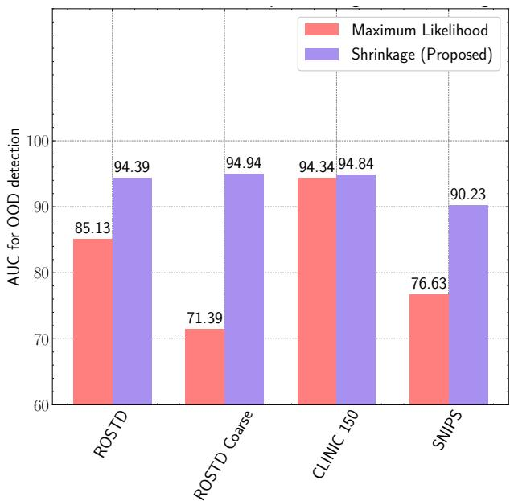
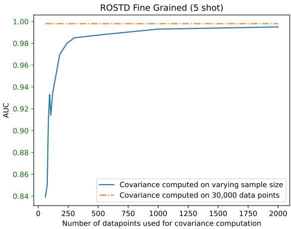
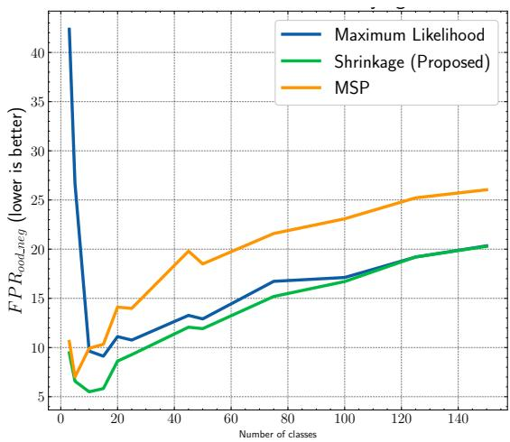

# Few-Shot Out of Domain Intent Detection with Covariance Corrected Mahalanobis Distance

Jayasimha Talur, Oleg Smirnov, Paul Missault

Amazon {talurj, osmirnov, pmissaul}@amazon.com

## Abstract

Conversational agents like chat bots and voice assistants are trained to understand and respond to user intents. On encountering an utterance with an intent different from the ones they have been trained on, these agents are expected to classify the intent as “unknown” or “out of domain”. This problem is known as out of domain (OOD) intent detection. Podolskiy et al. (2021), showed that Mahalanobis distance can be used effectively for identifying OOD intents, outperforming competing approaches. However, their method fails to outperform the baselines in the practically important few-shot setting. In this paper we analyze the reason for low performance and propose a covariance corrected Mahalanobis distance for detecting out-of-domain intents.

## 1 Introduction

Intent classification is a key component of natural language understanding systems, such as voice assistants and chat bots. Recent advances in those systems are overwhelmingly contributed by deep learning techniques, that can learn meaningful feature representations with a minimum amount of hand-crafting (Chen et al. 2017). Chat bots typically follow the intent-response pattern, where there is a fixed or context-aware mapping between predicted intents and the responses. In addition to providing the confidence score for intent, intent detection models are also expected to produce an OOD score, that measures the likelihood of an utterance being out-of-domain. Typically, when an utterance is deemed to OOD, a fallback mechanism is triggered to either ask a clarifying question or respond with “I don’t know”. OOD detection can be modeled as a binary classification task, where we are interested in classifying the utterance in out-of-domain and in-domain (IND) categories. For good user experience and user trust it is important to achieve a strong trade-off between precision and recall of the OOD classifier.

Recently many methods have been proposed to detect OOD intents (Podolskiy et al. 2021; Chen and Yu 2021; Rawat, Hebbalaguppe, and Vig 2021). However, these methods require access to a large training dataset, either with outof-domain examples, or a large unlabeled corpus. In industrial settings it is unreasonable to expect any of those assumptions to be met. For example, when bootstrapping a domain-specific chat bot, there is no access to a large training dataset of out-of-domain utterances, since the chat bot has not been in production yet. It is also difficult to obtain a large corpus of unlabeled domain-specific examples.

  
Figure 1: Performance of OOD detection for various intent classification datasets when Mahalanobis distance is calculated using Shrinkage (our proposal) and Maximum Likelihood estimators in 5-shot setting.

Specifically, for conversational agents provided as a service, such as Amazon Lex and Google Dialogflow, customers can extend the agent’s capabilities by uploading custom utterances and intents datasets. In those settings both the training and validation data are scarce.

Podolskiy et al. (2021) showed that Mahalanobis distance computed on RoBERTa (Liu et al. 2019) embeddings outperforms baseline methods for OOD detection without using any additional data. Unfortunately, Mahalanobis distance performs poorly in low resource settings (Tajwar et al. 2021). In this paper, we identify the reason for the poor performance and propose a new method, that performs OOD intent detection in low resource settings.

## 2 Preliminaries and Related Work

The OOD detection task is to classify a test data point into OOD and IND categories. We can broadly classify the approaches into two buckets:

• Data-centric: these methods use additional OOD data to learn representation that can better separate OOD from IND examples. Additional OOD data is obtained by either sampling from a large corpus (Hendrycks, Mazeika, and Dietterich 2019), by using a language model to generate sentences (Rawat, Hebbalaguppe, and Vig 2021), or by mining or filtering examples using sentence similarity models (Chen and Yu 2021).

• Score-based: these methods compute a score to decide between the IND and OOD classes. The score can be computed from the features (Lee et al. 2018), model logits (Liu et al. 2020; Liang, Li, and Srikant 2017), or the norm in the gradients space (Huang, Geng, and Li 2021).

In this work we focus on score-based methods, which don’t require additional OOD data that makes them attractive for industrial applications. In the score-based methodology, given a test sample x and a decision threshold T, we are interested in constructing a score function $G : x  \mathbb { R } .$ such that $G ( x ) > = T$ implies that x is OOD and $G ( x ) < T$ implies that x is IND.

Mahalanobis distance: Let $F \in \mathbb { R } ^ { n \times d }$ denote n points, each represented by $d$ dimensional features, and $y \in [ 1 , C ]$ the corresponding labels in the set of C classes. For a test feature $x \in R ^ { d \times \breve { 1 } }$ , the Mahalanobis distance for OOD detection is defined by

$$
d ( x ) = \operatorname* { m i n } _ { c \in [ 1 , C ] } ( x - \mu _ { c } ) ^ { T } \Sigma ^ { - 1 } ( x - \mu _ { c } )\tag{1}
$$

where $\mu _ { c } \in R ^ { d \times 1 }$ is the empirical mean of features of the corresponding class, and $\Sigma \in \dot { R } ^ { d \times d }$ is the feature covariance matrix. Mahalanobis-based OOD detection method uses a score function $G ( x ) = d ( x )$ .

Besides OOD detection, Mahalanobis distance has been used to perform pattern recognition (De Maesschalck, Jouan-Rimbaud, and Massart 2000), anomaly detection (Zhang et al. 2015) and detecting adversarial examples (Lee et al. 2018). Mahalanobis distance is known to performs well for sufficiently large dataset sizes. However, its performance degrades rapidly in low resource settings (Tajwar et al. 2021).

To the best of our knowledge, there are no score-based methods specifically designed for few-shot out-of-domain intent detection.

## 3 Methodology

Before describing our method, we analyze why Mahalanobis distance performs worse when the training dataset size is small. Tajwar et al. (2021) conjectured that poor covariance estimate in low sample settings leads to bad estimate of Mahalanobis distance. The reasoning is that the rank of a $d \times d$ covariance matrix computed on n points in d dimensions is bounded from above by min $( n - 1 , d )$ , since $n \ll d$ in few-shot settings, the covariance matrix becomes singular. Mahalanobis distance uses the inverse of covariance, hence estimating a “best fit” solution with pseudoinverse calculation may negatively affect the performance.

  
Figure 2: Performance of Mahalanobis-based OOD detection on the ROSTD dataset in 5-shot settings, as a function of the number of data points used for covariance computation. There is a sharp improvement in AUC with up to 400 data points, and only a modest improvement afterwards.

To test this hypotheses, we perform a simple experiment:

1. Fine-tune the RoBERTa (Liu et al. 2019) base model on the ROSTD intent classification dataset in a 5-shot setting. The ROSTD dataset is discussed in Section 4.2, and the fine-tuning procedure is described in Section 4.1.

2. Extract features from the last hidden layer for the full training dataset (∼30K data points). Note that this full dataset is unavailable in practical cases, since we only observe 5 data points.

3. Compute the covariance matrices using various sample sizes of training features extracted in the previous step.

4. Use the Mahalanobis method for detecting OOD samples.

Table 1 summarizes the performance of OOD detection with respect to the metrics discussed in Section 4.2, where the covariance matrix is computed in small and large data regimes. We observe that the Mahalanobis distance-based OOD method trained with only 5 samples per class performs poorly when the covariance is computed using 60 data points. However, it achieves competitive performance provided that the covariance matrix was computed using 30K data points. As expected, the best performance is obtained when the covariance computation and model training was performed on the full dataset.

Figure 2 depicts the OOD detection performance, when the number of data points used for covariance computation is varied. We observe a sharp improvement in AUC for up to 400 data points, and only a modest improvement afterwards. This experiment empirically confirms two assumptions. Firstly, the features extracted from a model fine-tuned on only a handful of samples still have sufficient representational power to separate IND and OOD categories. Secondly, a non-invertible covariance matrix contributes to the poor performance in few-shot setting.

<table><tr><td>Training mode</td><td>Covariance data points</td><td>AUC</td><td> $\overline { { \mathrm { P R } \mathrm { R O C } _ { o o d \_ n e g } } }$ </td><td> $\overline { { \mathrm { P R } \ : \mathrm { R O C } _ { o o d _ { - } p o s } } }$ </td><td> $\overline { { \mathrm { F P R } _ { o o d \_ n e g } } }$ </td><td> $\overline { { \mathrm { F P R } _ { o o d - p o s } } }$ </td></tr><tr><td>5-shot</td><td>60</td><td> $\overline { { 8 4 . 9 8 { \pm } 4 . 1 5 } }$ </td><td> $\overline { { 9 4 . 7 5 { \pm } 1 . 5 3 } }$ </td><td> $\overline { { 5 8 . 5 5 { \pm } 8 . 6 8 } }$ </td><td> $\overline { { 7 5 . 4 2 \pm 1 0 . 4 1 } }$ </td><td> $3 7 . 9 5 { \pm } 7 . 5 7$ </td></tr><tr><td>5-shot</td><td>30K</td><td> $9 8 . 9 2 { \pm } 1 . 4 3 $ </td><td> $9 9 . 6 3 { \pm } 0 . 4 9$ </td><td> $9 6 . 6 2 { \pm } 4 . 6 8$ </td><td> $4 . 9 2 { \pm } 9 . 8 7$ </td><td> $4 . 0 7 { \pm } 5 . 0 6$ </td></tr><tr><td>Full</td><td>30K</td><td> $9 9 . 8 { \pm } 0 . 1 $ </td><td></td><td> $9 9 . 5 { \pm } 0 . 3 $ </td><td> $1 . 0 { \pm } 0 . 5 $ </td><td> $0 . 5 { \pm } 0 . 4 $ </td></tr></table>

Table 1: Mahalanobis OOD detection performance on the ROSTD dataset with respect to the number of examples for covariance estimation and training regimes. Performance figures for the full dataset are taken from Podolskiy et al. (2021).

To overcome this, we propose to use robust covariance estimators for covariance computation. This is motivated by the fact that robust approaches provide a better estimate of the covariance matrix when $n \ll d ,$ compared to the baseline Maximum Likelihood estimator (MLE) in the standard Mahalanobis distance. Intuitively, this is achieved by incorporating various prior beliefs about the structure of the features space (e.g. shape of the clusters). However, in practice different assumptions lead to differences in the downstream performance. Below, we briefly review covariance estimators with their corresponding closed-form expressions listed in Table 2.

Maximum Likelihood estimator: MLE $\Sigma _ { m }$ is conventionally used for computing the Mahalanobis distance. When $\Sigma _ { m }$ is not invertible, $\Sigma _ { m } ^ { - 1 }$ can be estimated with a pseudoinverse.

Van Ness estimator: the diagonal elements of a covariance matrix represent the variance of individual features, that is typically non-zero for all elements. Van Ness estimator (Ness 1980) only retains the diagonal elements $\Sigma _ { \mathrm { { V a n } } }$ Ness and sets non-diagonal elements to zero.

Shrinkage estimator: Shrinkage methods perform a convex combination of a singular matrix $\Sigma _ { m }$ and some stable target matrix. The Shrinkage estimator (Friedman 1989) $\scriptstyle \sum _ { \mathrm { S h r i n k a g e } }$ employs a diagonal target matrix, where elements on the diagonal equal to the mean of $\Sigma _ { m }$ eigenvalues.

Ledoit-Wolf estimator: Ledoit and Wolf (2004) proposed a method to compute the shrinkage coefficient αˆ, that minimizes the expected mean square error between ΣShrinkage and the unobserved true covariance matrix Σ∗. We refer the interested reader to Ledoit and Wolf (2004, 2003) for the exact expression for αˆ and its derivation.

<table><tr><td>Estimator</td><td>Formula</td></tr><tr><td>Maximum Likelihood</td><td> $\Sigma _ { m } = \frac { 1 } { N } \sum _ { i = 1 } ^ { N } ( x _ { i } - \bar { x } ) ( x _ { i } - \bar { x } ) ^ { T }$ </td></tr><tr><td>Van Ness</td><td> $\Sigma _ { \mathrm { V a n N e s s } } = \beta \mathrm { d i a g } ( \Sigma _ { m } )$ </td></tr><tr><td>Shrinkage</td><td> $\begin{array} { r } { \Sigma _ { \mathrm { S h r i n k a g e } } = ( 1 - \alpha ) \Sigma _ { m } + \alpha \frac { T r ( \Sigma _ { m } ) } { d } \mathbb { I } } \end{array}$ </td></tr><tr><td>Ledoit-Wolf</td><td> $\begin{array} { r } { \Sigma _ { \mathrm { L e d o i t - W o l f } } = ( 1 - \hat { \alpha } ) \Sigma _ { m } + \hat { \alpha } \frac { T r ( \Sigma _ { m } ) } { d } \mathbb { I } } \end{array}$ </td></tr></table>

Table 2: Robust covariance estimators. $\beta \in R$ and $\alpha \in ( 0 , 1 )$ are the hyper-parameters of these estimators.

## 4 Experiments

Low sample covariance matrix estimators ΣVan Ness, $\Sigma _ { \mathrm { S h r i n k a g e } } ,$ and ${ \boldsymbol { \Sigma } } _ { \mathrm { L e d o i t - W o l f } }$ can be used as drop-in replacements for MLE $\Sigma _ { \mathrm { m } }$ in the Mahalanobis distance. We compare Mahalanobis distance-based OOD detection with those 4 alternative covariance estimation methods. Additionally, we benchmark the candidate methods against the energy-based OOD detection (Liu et al. 2020), and the gradient norm approach (Huang, Geng, and Li 2021). Finally, we compare with the Maximum Softmax Probability (MSP) approach (Hendrycks and Gimpel 2016), which was shown to be a strong baseline for OOD detection.

## 4.1 Training Procedure

In all our experiments, we fine-tune the RoBERTa (Liu et al. 2019) base model for intent classification using the crossentropy loss. We start from model weights which were pretrained on five English-language corpora of varying sizes and domains, totaling over 160GB of uncompressed text.

Fine-tuning was performed using the AdamW (Loshchilov and Hutter 2018) optimizer with learning rate of $2 e ^ { - 5 }$ and linear decay for 45 epochs. We repeat all experiments 20 times, sampling a new training set at each iteration. For hyperparameters, we use a fixed shrinkage coefficient $\alpha \ : = \ : 0 . 1$ , and a fixed Van Ness hyperparameter $\beta = 1 . 0$ in all the experiments. As suggested in Liu et al. (2020); Huang, Geng, and Li (2021), we set the temperature $\tau = 1$ for the energy and gradient norm baselines.

During X-shot training, covariance matrix of size $d \times d$ is computed from a data matrix of size $( X \cdot N _ { c } ) \times d ,$ where $d = 7 6 8$ for RoBERTa embeddings and $N _ { c }$ is the number of classes. On each iteration of the experiment, 1) we randomly sample X data points per class from the training set, and 2) compute covariance matrix using only $X \cdot N _ { c } ^ { \dagger }$ data points using corresponding estimators.

## 4.2 Datasets and Metrics

We evaluate our approach on the following datasets:

1. CLINC150 (Larson et al. 2019): was proposed to evaluate the performance of task-oriented dialogue systems on out-of-domain queries. The dataset contains 150 intents spanning over 10 domains.

2. ROSTD (Schuster et al. 2018): was developed to test cross-lingual transfer learning for multilingual task oriented dialog. The dataset was later extended by Gangal et al. (2019) by adding OOD intents to English language utterances.

<table><tr><td>Dataset (5-shot)</td><td>OOD method</td><td>AUC↑</td><td> $\operatorname { P R } \operatorname { R O C } _ { o o d . p o s } \uparrow$ </td><td> $\mathrm { F P R } _ { o o d . p o s } \downarrow$ </td></tr><tr><td>ROSTD</td><td>MLE</td><td> $8 5 . 1 3 { \pm } 5 . 4 1$ </td><td> $\overline { { 5 8 . 4 9 { \pm } 1 0 . 7 4 } }$ </td><td>36.16±9.47</td></tr><tr><td></td><td>Van Ness</td><td> $9 3 . 8 7 { \pm } 3 . 4 1 $ </td><td> $8 1 . 7 0 { \scriptstyle \pm 9 . 0 6 }$ </td><td> $2 0 . 4 5 { \pm } 9 . 7 0 $ </td></tr><tr><td></td><td>Shrinkage</td><td> $\mathbf { 9 4 . 3 9 } { \scriptstyle \pm 2 . 8 8 }$ </td><td> $\mathbf { 8 3 . 3 2 \pm 7 . 7 9 }$ </td><td> $\mathbf { 1 9 . 2 5 { \scriptstyle \pm 9 . 0 9 } }$ </td></tr><tr><td></td><td>Ledoit-wolf</td><td> $9 4 . 3 3 { \pm } 2 . 9 5 $ </td><td> $8 3 . 1 9 { \pm } 7 . 9 0 $ </td><td> $1 9 . 4 0 { \pm } 9 . 1 4 $ </td></tr><tr><td></td><td>Grad Norm</td><td> $9 3 . 4 7 { \pm } 3 . 3 2 $ </td><td> $8 1 . 0 4 { \pm } 8 . 7 6 $ </td><td> $2 2 . 6 8 { \pm } 1 0 . 0 6$ </td></tr><tr><td></td><td>Energy</td><td> $9 3 . 9 2 { \pm } 3 . 0 4 $ </td><td> $8 1 . 2 0 { \pm } 9 . 1 3 $ </td><td> $2 0 . 0 1 { \scriptstyle \pm 9 . 0 3 }$ </td></tr><tr><td></td><td>MSP</td><td> $9 2 . 1 3 { \pm } 3 . 4 1 $ </td><td> $7 8 . 2 3 { \pm } 8 . 3 4$ </td><td> $2 5 . 6 9 { \pm } 9 . 0 7$ </td></tr><tr><td>SNIPS</td><td>MLE</td><td> $7 6 . 6 3 { \scriptstyle \pm 9 . 4 7 }$ </td><td> $4 9 . 6 8 { \pm } 1 3 . 0 0$ </td><td> $5 6 . 5 3 { \pm } 1 1 . 6 5$ </td></tr><tr><td></td><td>Van Ness</td><td> $\mathbf { 9 0 . 4 6 { \pm } 3 . 3 1 }$ </td><td> $\mathbf { 7 3 . 9 8 { \pm } 8 . 2 1 }$ </td><td> ${ \bf 2 9 . 7 7 { \scriptstyle \pm 8 . 3 5 } }$ </td></tr><tr><td></td><td>Shrinkage</td><td> $9 0 . 2 3 { \pm } 3 . 3 3 $ </td><td> $7 3 . 3 5 { \pm } 8 . 1 7$ </td><td> $3 0 . 0 0 { \scriptstyle \pm 8 . 4 0 }$ </td></tr><tr><td></td><td>Ledoit-wolf</td><td> $9 0 . 2 3 { \scriptstyle \pm 3 . 3 4 }$ </td><td> $7 3 . 3 8 { \pm } 8 . 1 8$ </td><td> $2 9 . 9 1 { \scriptstyle \pm 8 . 4 2 }$ </td></tr><tr><td></td><td>Grad Norm</td><td> $8 8 . 8 7 { \pm } 4 . 7 6 $ </td><td> $7 2 . 0 4 \pm 1 0 . 9 2 $ </td><td> $3 7 . 2 9 { \pm } 1 5 . 3 9$ </td></tr><tr><td></td><td>Energy</td><td>88.92±5.74</td><td> $7 0 . 3 2 { \pm } 1 1 . 5 3 $ </td><td> $3 3 . 3 0 { \pm } 1 4 . 3 8 $ </td></tr><tr><td></td><td>MSP</td><td> $8 9 . 2 7 { \pm } 4 . 0 5$ </td><td> $7 1 . 7 1 { \pm } 8 . 4 6$ </td><td> $3 3 . 1 4 { \pm } 1 1 . 1 3$ </td></tr><tr><td>ROSTD Coarse</td><td>MLE</td><td> $7 1 . 3 9 { \pm } 8 . 7 0 $ </td><td> $4 0 . 6 8 { \pm } 9 . 9 7 $ </td><td> $6 5 . 8 7 { \pm } 1 2 . 4 5$ </td></tr><tr><td></td><td>Van Ness</td><td> $9 4 . 7 9 { \scriptstyle \pm 2 . 7 1 }$ </td><td> $8 2 . 8 3 { \pm } 8 . 7 8$ </td><td> $1 6 . 0 6 { \pm } 6 . 9 3$ </td></tr><tr><td></td><td>Shrinkage</td><td>94.94±2.85</td><td> $\mathbf { 8 3 . 8 5 \pm 8 . 7 6 }$ </td><td> $1 5 . 9 2 { \scriptstyle \pm 6 . 8 8 }$ </td></tr><tr><td></td><td>Ledoit-wolf</td><td> $9 4 . 9 3 { \pm } 2 . 8 5 $ </td><td> $8 3 . 8 3 { \pm } 8 . 7 8 $ </td><td> $\mathbf { 1 5 . 9 1 \pm 6 . 8 4 }$ </td></tr><tr><td></td><td>Grad Norm</td><td> $9 2 . 3 8 { \pm } 3 . 5 9 $ </td><td> $7 7 . 6 9 { \pm } 9 . 9 0 $ </td><td> $2 3 . 8 4 \pm 1 0 . 3 2$ </td></tr><tr><td></td><td>Energy</td><td> $9 3 . 4 3 { \pm } 3 . 0 2 $ </td><td> $7 8 . 6 5 { \pm } 9 . 5 5 $ </td><td> $1 9 . 6 6 { \pm } 7 . 8 9$ </td></tr><tr><td></td><td>MSP</td><td> $9 2 . 9 6 { \pm } 2 . 7 8 $ </td><td> $7 7 . 0 5 { \pm } 8 . 9 2 $ </td><td> $1 9 . 5 4 { \pm } 6 . 4 6$ </td></tr><tr><td>Clinic 150</td><td>MLE</td><td> $9 4 . 3 4 { \pm } 0 . 4 5 $ </td><td> $7 8 . 2 3 { \scriptstyle \pm 2 . 0 7 }$ </td><td> $2 3 . 0 5 { \pm } 2 . 0 2$ </td></tr><tr><td></td><td>Van Ness</td><td> $9 4 . 4 2 { \pm } 0 . 3 9$ </td><td> $7 9 . 1 1 { \pm } 1 . 6 0$ </td><td> $2 3 . 0 8 { \pm } 2 . 0 0$ </td></tr><tr><td></td><td>Shrinkage</td><td> $9 4 . 8 4 { \pm } 0 . 4 1 $ </td><td> $8 1 . 4 4 { \pm } 1 . 8 3 $ </td><td> $2 1 . 9 0 { \pm } 1 . 8 8$ </td></tr><tr><td></td><td>Ledoit-wolf</td><td> $9 4 . 7 6 { \pm } 0 . 4 2 $ </td><td> $8 1 . 0 7 { \pm } 1 . 7 8$ </td><td> $2 2 . 2 9 { \pm } 1 . 9 3 $ </td></tr><tr><td></td><td>Grad Norm</td><td> $9 4 . 9 4 { \pm } 0 . 4 0 $ </td><td> $8 1 . 4 8 { \pm } 1 . 6 7$ </td><td> $\pm 1 . 6 7 { \pm } 2 . 2 1 $ </td></tr><tr><td></td><td> $\mathrm { E n e r g y }$ </td><td> $\mathbf { 9 4 . 9 5 { \pm 0 . 3 8 } }$ </td><td> $\mathbf { 8 1 . 5 6 { \pm } 1 . 6 7 }$ </td><td> $2 1 . 8 5 { \pm } 2 . 2 3 $ </td></tr><tr><td></td><td> $\mathrm { M S P } ^ { \mathrm { - } }$ </td><td> $9 4 . 0 8 { \pm } 0 . 4 2 $ </td><td> $7 8 . 4 1 { \pm } 1 . 6 4$ </td><td> $2 5 . 2 1 { \pm } 1 . 8 8 $ </td></tr></table>

<table><tr><td>Dataset (10-shot)</td><td>OOD method</td><td>AUC↑</td><td> $\operatorname { P R } \operatorname { R O C } _ { o o d . p o s } \uparrow$ </td><td> $\mathrm { F P R } _ { o o d . p o s } \downarrow$ </td></tr><tr><td rowspan="7">ROSTD FINE</td><td>MLE</td><td> $9 4 . 4 4 { \pm } 2 . 4 5 $ </td><td> $8 0 . 3 0 { \pm } 8 . 3 5$ </td><td> $1 4 . 9 8 { \pm } 5 . 4 5$ </td></tr><tr><td>Van Ness</td><td> $9 6 . 7 9 { \scriptstyle \pm 1 . 4 3 }$ </td><td> $8 9 . 0 4 { \pm } 5 . 3 3 $ </td><td> $1 0 . 2 6 { \pm } 3 . 2 5 $ </td></tr><tr><td>Shrinkage</td><td> $\mathbf { 9 7 . 3 7 { \pm 1 . 2 3 } }$ </td><td> $\mathbf { 9 0 . 8 5 \pm 4 . 9 4 }$ </td><td> $\mathbf { 8 . 5 2 \pm 2 . 9 6 }$ </td></tr><tr><td>Ledoit-wolf</td><td> $9 7 . 2 7 { \pm } 1 . 2 7 $ </td><td> $9 0 . 5 1 { \pm } 5 . 0 5$ </td><td> $8 . 7 8 { \pm } 3 . 0 2$ </td></tr><tr><td>Grad Norm</td><td> $9 6 . 1 7 { \pm } 1 . 4 2$ </td><td> $8 8 . 1 4 { \pm } 4 . 4 2 $ </td><td> $1 3 . 3 3 { \pm } 4 . 1 5$ </td></tr><tr><td>Energy</td><td> $9 6 . 9 8 { \pm } 1 . 2 3 $ </td><td> $8 9 . 8 3 { \pm } 4 . 4 9 $ </td><td> $1 0 . 1 0 { \pm } 3 . 4 7 $ </td></tr><tr><td>MSP</td><td> $9 5 . 3 2 { \pm } 1 . 5 5 $ </td><td> $8 4 . 3 2 { \pm } 5 . 4 9$ </td><td> $1 3 . 3 9 { \pm } 3 . 1 5 $ </td></tr><tr><td rowspan="7">SNIPS</td><td>MLE</td><td> $8 5 . 2 7 { \pm } 9 . 2 4 $ </td><td> $6 2 . 5 8 { \pm } 1 3 . 8 7$ </td><td> $4 0 . 2 3 { \pm } 2 1 . 2 5 $ </td></tr><tr><td>Van Ness</td><td> $9 0 . 5 7 { \pm } 4 . 4 5 $ </td><td> $7 4 . 3 5 { \pm } 1 0 . 9 9$ </td><td> $2 8 . 8 1 { \scriptstyle \pm 9 . 6 2 }$ </td></tr><tr><td>Shrinkage</td><td> $\mathbf { 9 0 . 6 8 } { \pm } 4 . 5 1 $ </td><td> $\mathbf { 7 4 . 7 9 { \pm } 1 1 . 2 1 }$ </td><td> $\mathbf { 2 8 . 4 4 } \pm \mathbf { 9 . 7 7 }$ </td></tr><tr><td>Ledoit-wolf</td><td> $9 0 . 6 7 { \pm } 4 . 5 1 $ </td><td> $7 4 . 7 0 { \pm } 1 1 . 1 9$ </td><td> $2 8 . 4 8 { \pm } 9 . 4 9$ </td></tr><tr><td>Grad Norm</td><td> $8 5 . 7 3 { \pm } 7 . 2 7 $ </td><td> $6 8 . 9 3 { \pm } 1 2 . 4 6 $ </td><td> $5 1 . 4 2 { \pm } 1 9 . 0 6 $ </td></tr><tr><td> $\mathrm { E n e r g y }$ </td><td> $8 9 . 7 5 { \pm } 5 . 4 8$ </td><td> $7 3 . 5 7 { \pm } 1 2 . 1 6$ </td><td> $3 2 . 8 9 { \pm } 1 5 . 1 1 $ </td></tr><tr><td>MSP</td><td> $8 9 . 2 7 { \pm } 4 . 6 1 $ </td><td> $7 0 . 8 1 { \pm } 1 0 . 6 7 $ </td><td>32.63±13.17</td></tr><tr><td rowspan="7">ROSTD COARSE</td><td>MLE</td><td> $8 7 . 2 3 { \pm } 8 . 2 0 $ </td><td> $6 4 . 9 6 { \pm } 1 1 . 0 7$ </td><td> $3 5 . 1 6 { \pm } 2 0 . 7 9$ </td></tr><tr><td> $\mathrm { V a n N e s s }$ </td><td> $9 5 . 9 9 { \pm } 1 . 8 7 $ </td><td> $8 5 . 9 8 { \pm } 6 . 2 1 $ </td><td> $1 1 . 4 0 { \pm } 4 . 7 6$ </td></tr><tr><td>Shrinkage</td><td>96.48±1.82</td><td> $\mathbf { 8 7 . 9 6 } { \pm } 5 . 9 2$ </td><td> ${ \bf 1 0 . 2 6 { \scriptstyle \pm 4 . 8 3 } }$ </td></tr><tr><td>Ledoit-wolf</td><td> $9 6 . 4 5 { \pm } 1 . 8 3 $ </td><td> $8 7 . 8 6 { \pm } 5 . 9 2 $ </td><td> $1 0 . 3 4 { \pm } 4 . 8 3 $ </td></tr><tr><td> $\operatorname { G r a d } \mathrm { { N o r m } }$ </td><td> $9 3 . 3 8 { \pm } 3 . 0 2 $ </td><td> $8 1 . 3 1 { \pm } 7 . 4 6 $ </td><td> $2 3 . 9 7 \pm 1 3 . 6 1$ </td></tr><tr><td>Energy</td><td> $9 5 . 3 5 { \pm } 2 . 0 7$ </td><td> $8 4 . 0 1 { \pm } 8 . 3 6 $ </td><td> $1 3 . 9 9 { \pm } 5 . 5 5 $ </td></tr><tr><td>MSP</td><td> $9 4 . 5 8 { \pm } 2 . 2 1 $ </td><td> $8 1 . 0 0 { \pm } 7 . 2 2 $ </td><td> $1 4 . 5 3 { \pm } 5 . 2 7 $ </td></tr><tr><td rowspan="6">CLINIC 150</td><td>MLE</td><td> ${ \bf 9 6 . 0 7 } \pm { \bf 0 . 2 5 }$ </td><td> $8 5 . 5 4 { \pm } 1 . 2 0 $ </td><td> $\mathbf { 1 8 . 0 3 { \pm } 1 . 1 0 }$ </td></tr><tr><td> $\mathrm { V a n N e s s }$ </td><td> $9 5 . 7 3 { \scriptstyle \pm 0 . 2 6 }$ </td><td> $8 3 . 9 6 { \pm } 1 . 1 0 $ </td><td> $1 8 . 9 4 { \pm } 0 . 9 6 $ </td></tr><tr><td> $_ \mathrm { S h r i n k a g e }$ </td><td> $9 6 . 0 5 { \scriptstyle \pm 0 . 2 4 }$ </td><td> $\mathbf { 8 5 . 5 5 { \pm } 1 . 1 1 }$ </td><td> $1 8 . 1 2 { \pm } 1 . 0 4 $ </td></tr><tr><td> $_ { \mathrm { L e d o i t - w o l f } }$ </td><td> $9 6 . 0 0 { \scriptstyle \pm 0 . 2 4 }$ </td><td> $8 5 . 3 7 { \pm } 1 . 0 7$ </td><td> $1 8 . 3 0 { \pm } 1 . 0 5 $ </td></tr><tr><td> $\operatorname { G r a d } \mathrm { { N o r m } }$ </td><td> $9 5 . 8 1 { \pm } 0 . 2 7 $ </td><td> $8 5 . 3 0 { \pm } 1 . 0 1 $ </td><td> $1 8 . 7 0 { \pm } 1 . 1 9$ </td></tr><tr><td> $\mathrm { E n e r g y }$ </td><td> $9 5 . 9 9 { \pm } 0 . 2 4 $ </td><td> $8 5 . 3 4 { \pm } 1 . 0 3 $ </td><td> $1 8 . 5 4 { \pm } 1 . 0 9 $ </td></tr><tr><td></td><td> $\mathbf { M S P }$ </td><td> $9 5 . 2 5 { \pm } 0 . 2 8 $ </td><td> $8 2 . 5 9 { \pm } 1 . 0 9$ </td><td> $2 0 . 0 5 { \pm } 1 . 1 9$ </td></tr></table>

Table 3: Comparison of covariance-corrected Mahalanobis distance methods for OOD detection with the baselines in 5-shot and 10-shot settings.

3. ROSTD-COARSE: following Podolskiy et al. (2021), we also experiment with a coarsened version of ROSTD with only 3 intent classes. We use the same set of OOD intents for testing for both fine-grained and coarsened version of the dataset.

of samples used for covariance estimation increases. This phenomenon can be seen for the CLINC150 dataset in 10- shot setting, where the $7 6 8 \times 7 6 8$ dimensional covariance matrix was computed by using 150 · $1 0 ~ = ~ 1 5 0 0$ samples (150 classes and 10 samples per class).

4. SNIPS (Coucke et al. 2018): contains 7 intents with approximately 2000 utterances per intent. Since the dataset does not provide IND and OOD split, we follow the protocol from Podolskiy et al. (2021) by randomly taking 5 intents as IND and the remaining 2 intents as OOD. We sample different OOD and IND intents on each iteration of the experiment.

Since OOD detection is framed is a binary classification problem, we evaluate performance in terms of AUC, PR ROC, and FPR@95%TPR metrics. For FPR, the decision threshold is chosen so that the True Positive Rate is 95%. We omit 95% suffix from the metric names to avoid repetition in notation. We report measurements for the cases when the OOD class is treated as positive, and when the OOD class is treated as negative. This is indicated with ood pos and ood neg suffixes correspondingly.

To assess the impact of OOD performance on the number of intent classes, we train several models by sampling subset of intents from the CLINC150 dataset. In Figure 3 we observe that Shrinkage estimator outperforms MLE by a large margin, when the number of intents is small and it converges to MLE performance as the number of classes increase. The effectiveness of OOD detection degrades as the number of in-domain (IND) classes increases, which is yet another interesting phenomenon. The reason is that, when the number of OOD samples are fixed, an increase in the size of IND samples leads to greater confusion with OOD class, because more samples end up on the IND/OOD boundary. Quantitatively, going from 3 to 20 IND classes causes the minimum distance from a query OOD example to the closest IND centroid decreases by 20%, this confuses the methods that rely on a fixed score threshold. When all 150 classes are used then, the average IND-OOD Euclidean distance decreases by 37%. Moreover, as the amount of data increases, the performance of the robust estimators degrades, but at different rates.

## 5 Results

Table 3 compares the performance of different variants of the Mahalanobis distance on benchmarking datasets. We observe that covariance corrected methods (Shrinkage, Ledoit-Wolf and Van Ness) outperform other OOD detection techniques on 3 out of 4 datasets on all metrics of interest. The table is summarized in Figure 1 for AUC using the MLE and Shrinkage estimators.

## 6 Conclusion

Furthermore, in 5-shot setting the covariance correction outperforms MLE on all datasets. However, MLE performs competitively with covariance correction when the number

We have demonstrated that in few-shot settings Mahalanobis distance computed using robust covariance estimators consistently outperforms the Maximum Likelihood estimator baseline. According to our experiments, the Shrinkage estimator excels in 5-shot and 10-shot settings across various datasets. The suggested approach is computationally cheap, with an additional overhead of one matrix-vector multiplication operation per class, and does not require any auxiliary data nor modifications to the training procedure.

  
Figure 3: Performance on the CLINC150 dataset with respect to the number of training classes in 10-shot setting.

## References

Chen, D.; and Yu, Z. 2021. GOLD: Improving Out-of-Scope Detection in Dialogues using Data Augmentation. CoRR, abs/2109.03079.

Chen, H.; Liu, X.; Yin, D.; and Tang, J. 2017. A Survey on Dialogue Systems: Recent Advances and New Frontiers. SIGKDD Explor. Newsl., 19(2): 25–35.

Coucke, A.; Saade, A.; Ball, A.; Bluche, T.; Caulier, A.; Leroy, D.; Doumouro, C.; Gisselbrecht, T.; Caltagirone, F.; Lavril, T.; et al. 2018. Snips Voice Platform: an embedded Spoken Language Understanding system for private-bydesign voice interfaces. arXiv preprint arXiv:1805.10190, 12–16.

De Maesschalck, R.; Jouan-Rimbaud, D.; and Massart, D. L. 2000. The mahalanobis distance. Chemometrics and intelligent laboratory systems, 50(1): 1–18.

Friedman, J. H. 1989. Regularized Discriminant Analysis. Journal of the American Statistical Association, 84: 165– 175.

Gangal, V.; Arora, A.; Einolghozati, A.; and Gupta, S. 2019. Likelihood Ratios and Generative Classifiers for Unsupervised Out-of-Domain Detection In Task Oriented Dialog. CoRR, abs/1912.12800.

Hendrycks, D.; and Gimpel, K. 2016. A Baseline for Detecting Misclassified and Out-of-Distribution Examples in Neural Networks. CoRR, abs/1610.02136.

Hendrycks, D.; Mazeika, M.; and Dietterich, T. G. 2019. Deep Anomaly Detection with Outlier Exposure. ArXiv, abs/1812.04606.

Huang, R.; Geng, A.; and Li, Y. 2021. On the Importance of Gradients for Detecting Distributional Shifts in the Wild. CoRR, abs/2110.00218.

Larson, S.; Mahendran, A.; Peper, J. J.; Clarke, C.; Lee, A.; Hill, P.; Kummerfeld, J. K.; Leach, K.; Laurenzano, M. A.; Tang, L.; and Mars, J. 2019. An Evaluation Dataset for Intent Classification and Out-of-Scope Prediction. In Proceedings of the 2019 Conference on Empirical Methods in Natural Language Processing and the 9th International Joint Conference on Natural Language Processing (EMNLP-IJCNLP), 1311–1316. Hong Kong, China: Association for Computational Linguistics.

Ledoit, O.; and Wolf, M. 2003. Honey, I Shrunk the Sample Covariance Matrix. The Journal of Portfolio Management, 30.

Ledoit, O.; and Wolf, M. 2004. A well-conditioned estimator for large-dimensional covariance matrices. Journal of Multivariate Analysis, 88: 365–411.

Lee, K.; Lee, K.; Lee, H.; and Shin, J. 2018. A Simple Unified Framework for Detecting Out-of-Distribution Samples and Adversarial Attacks. In Proceedings of the 32nd International Conference on Neural Information Processing Systems, NIPS’18, 7167–7177. Red Hook, NY, USA: Curran Associates Inc.

Liang, S.; Li, Y.; and Srikant, R. 2017. Principled Detection of Out-of-Distribution Examples in Neural Networks. CoRR, abs/1706.02690.

Liu, W.; Wang, X.; Owens, J. D.; and Li, Y. 2020. Energy-based Out-of-distribution Detection. CoRR, abs/2010.03759.

Liu, Y.; Ott, M.; Goyal, N.; Du, J.; Joshi, M.; Chen, D.; Levy, O.; Lewis, M.; Zettlemoyer, L.; and Stoyanov, V. 2019. RoBERTa: A Robustly Optimized BERT Pretraining Approach.

Loshchilov, I.; and Hutter, F. 2018. Decoupled Weight Decay Regularization. In International Conference on Learning Representations.

Ness, J. V. 1980. On the dominance of non-parametric Bayes rule discriminant algorithms in high dimensions. Pattern Recognit., 12(6): 355–368.

Podolskiy, A. V.; Lipin, D.; Bout, A.; Artemova, E.; and Piontkovskaya, I. 2021. Revisiting Mahalanobis Distance for Transformer-Based Out-of-Domain Detection. In AAAI.

Rawat, M.; Hebbalaguppe, R.; and Vig, L. 2021. PnPOOD : Out-Of-Distribution Detection for Text Classification via Plug andPlay Data Augmentation. CoRR, abs/2111.00506.

Schuster, S.; Gupta, S.; Shah, R.; and Lewis, M. 2018. Cross-lingual Transfer Learning for Multilingual Task Oriented Dialog. CoRR, abs/1810.13327.

Tajwar, F.; Kumar, A.; Xie, S. M.; and Liang, P. 2021. No True State-of-the-Art? OOD Detection Methods are Inconsistent across Datasets. CoRR, abs/2109.05554.

Zhang, Y.; Du, B.; Zhang, L.; and Wang, S. 2015. A lowrank and sparse matrix decomposition-based Mahalanobis distance method for hyperspectral anomaly detection. IEEE Transactions on Geoscience and Remote Sensing, 54(3): 1376–1389.