# Figures as Programs: Recursive Generation of Editable Scientific Figures

Yepeng Liu1,∗,†, Dasen Dai2,∗, Chengzhi Liu1, Yiren Song3, Hai Ci3, Yu Zhang4, Qi Zhang5, Mike Zheng Shou3, Xin Eric Wang1, Yuheng Bu1

1UC Santa Barbara 2CUHK 3Show Lab, National University of Singapore 4University of New South Wales 5Tongji University

## Abstract

Scientific methodology figures are essential for communicating complex methods clearly, yet creating them remains labor-intensive and typically requires multiple rounds of refinement. Recent image-generation models can synthesize visually appealing raster figures, but producing a humansatisfactory result in a single generation step remains dificult. Moreover, precise edits to raster figures are challenging for both humans and models. We formulate scientific figure generation as recursive SVG program construction and propose FigTree, a multi-agent system that automatically transforms a scientific paper into a structured vector figure. FigTree grounds figure content in the source paper, decomposes a figure into a hierarchy of local regions, generates each region as a short SVG program, and assembles the resulting fragments. A render-critic refinement loop jointly inspects the rendered figure and its underlying program, enabling visual defects to be traced to specific statements and accurately repaired. We conduct extensive evaluations of FigTree on figure quality and editability, showing that FigTree produces high-quality figures, while also enabling more efective editing than existing raster-based methods. Our code is available at https://github.com/yepengliu/FigTree.

## 1 Introduction

Automated AI Scientists demonstrate the ability to propose hypotheses, run experiments, and write papers with limited human oversight [1–5]. High-quality methodology figures are essential to a research paper, as they often reach readers before the text. However, producing such figures still requires significant human efort.

Recent state-of-the-art image generation models, such as Nano Banana Pro [6] and GPT-Image-2 [7], are capable of generating scientific methodology figures directly as raster images. However, these figures are often complex, containing many interdependent components, which makes satisfactory one-shot generation challenging. The resulting images may include hallucinated elements, illegible text, or insuficient resolution. Consequently, iterative refinement is often necessary, guided by either a human or a vision-language model (VLM) critic [8–11].

PaperBanana [12], for example, introduces an agentic framework that iteratively refines a raster figure using feedback from a VLM critic, which translates identified issues into instructions for the imagegeneration model. However, natural language-guided refinement of raster images remains dificult for both parties: the critic must describe the intended modification with suficient spatial precision, while the generator must apply it faithfully without disturbing unrelated content. Manual editing faces a similar limitation because raster images expose no explicit structure for selecting and modifying individual elements. These challenges motivate us to investigate a more editable and controllable representation for scientific methodology figures.

In this paper, we recast scientific figure generation from image generation to code generation: a Large Language Model (LLM) writes a vector graphics program (e.g., SVG) that renders the figure, providing editability and resolution independence. Prior works have demonstrated the potential of LLMs to generate code that produces various types of vector graphics [13–17], such as icons, illustrations, and simple diagrams. However, methodology diagrams in research papers are substantially more complex: they pack various elements and dense spatial relations into a long program. This shift from image generation to long-horizon code generation raises three challenges. (1) Generation reliability: a whole figure corresponds to a long-horizon program with many coordinates, so errors may accumulate and surface as misalignment and overlap. (2) Spatial planning: the model must lay out components from code alone, which demands spatial reasoning without visual feedback. (3) Verification and repair : defects that are invisible in the code, such as occlusion or overflowing text, may surface only after rendering.

To address these challenges, we present FigTree, a multi-agent system that generates a scientific figure as an editable SVG program through recursive decomposition. Our core insight is that a scientific figure is compositional: it forms a hierarchy of regions, each containing a few primitives. An SVG program mirrors this structure: it allows us to write each region as a subprogram independently, and then assemble them into a complete figure. This turns one hard global generation problem into many simpler local ones. For generation reliability, FigTree decomposes a scientific figure into a layout tree and writes a short program at each node, so no single step needs to reason about the whole figure. For spatial planning, each child reports the space occupied by its fragment and exposes named ports for external connections. The parent uses these reports to place its children and draw the connections between them, since it is the first node with access to both endpoints. For verification and repair, a critic inspects both the rendered image, where defects surface, and the corresponding program, where each defect can be traced to a statement, allowing the generator to edit only the ofending element in place.

## Our contributions are as follows:

• We formulate editable scientific figure generation as recursive SVG program construction and propose FigTree, a multi-agent system that integrates recursive decomposition, fragment merging, and iterative refinement.

• For figure quality, we complement reference-based comparison with a fine-grained rubric. For editability, we introduce an iterative-editing evaluation to measure how efectively generated artifacts can be refined over multiple rounds.

• We show that FigTree produces high-quality figures, with particularly strong performance in hallucination control compared with existing methods. Moreover, FigTree achieves superior editing eficiency and higher figure quality than raster-based methods under the same number of editing rounds.

## 2 Related Work

Agentic systems now automate substantial parts of the research cycle, from hypothesis generation and verification [1, 4, 5, 18] to end-to-end paper production [2, 3]. However, scientific figures remain largely outside these automated workflows and still require substantial human efort. We study scientific figure generation as a distinct research problem, with its own challenges in content grounding, spatial organization, verification, and iterative editing.

Raster Scientific Figure Generation. Image generation models [19] such as Nano Banana Pro [6], GPT-Image-2 [7], FLUX.2 [20], and Qwen-Image-2.0 [21] can generate scientific figures directly as raster images. However, one-shot generation is often unreliable for scientific figures containing many components and dense spatial relationships. Agentic frameworks therefore augment image generators with planning and iterative refinement [12, 22, 23]. These frameworks improve generation quality, but they do not change the underlying representation: the output remains a flattened raster image. Because individual components are not explicitly addressable, revisions must be conveyed indirectly through natural-language instructions to image generation models. This makes precise local edits dificult for the model and leaves the resulting figures cumbersome for humans to modify. Therefore, editability is a critical property for automated scientific figure generation.

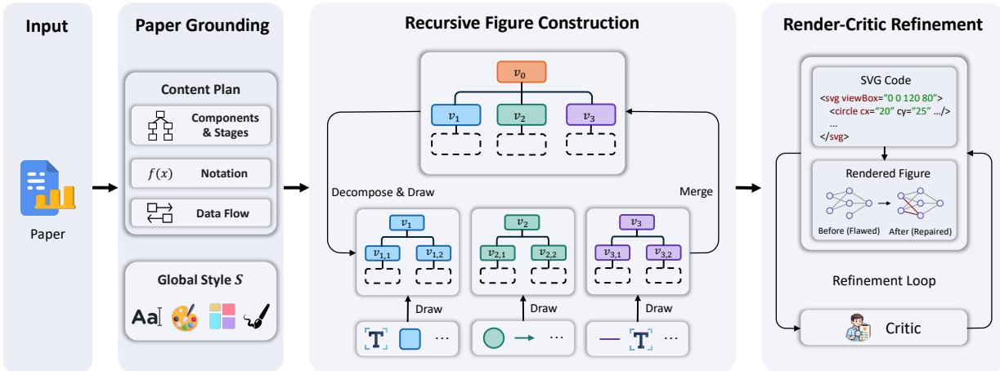  
Figure 1: Workflow of FigTree. A grounding agent extracts a content plan and global style from the input paper. Generator agents then recursively decompose the figure, draw and merge local SVG fragments, while a render-critic loop jointly inspects the SVG code and rendered output to identify and repair defects.

Editable Scientific Figure Generation. To make the generated scientific figures editable [24–30], prior works [22, 31] adopt post-hoc vectorization pipelines that first synthesize a raster figure and then reconstruct it as an editable vector graphic through segmentation and recomposition. This approach improves the editability of the final output, but it does not address the limitations of the upstream raster generation stage, where individual components remain dificult to control or revise precisely. Moreover, the vectorization stage is optimized to reproduce the raster intermediate rather than directly recover a source-grounded figure. Therefore, errors introduced during raster generation are likely to be preserved in the final vector output.

Another line of work generates vector graphics directly by leveraging the code-generation capabilities of LLMs [13–17]. While this representation provides explicit structure and editability, directly producing a complete methodology figure remains challenging because the underlying graphics program can be long, and its elements are tightly coupled through spatial constraints. Concurrent work by Li et al. [24] composes method illustrations by retrieving and parameterizing reusable drawing middlewares distilled from published figures, and then orchestrates them. Our work follows the direct vector generation paradigm, but addresses its long-horizon complexity through recursive program construction: we decompose a figure into localized subprograms and hierarchically generate, verify, and assemble them.

## 3 Methodology

## 3.1 Overview

We formulate scientific figure generation as a long-horizon SVG program construction problem. Our core idea is to leverage the hierarchical structure of a methodology diagram by generating each region as a short program fragment and progressively assembling these fragments level by level. This decomposes one long-horizon generation problem into a series of shorter, localized subproblems.

Given the text of a paper P, our goal is to synthesize a methodology figure that summarizes its method. We represent the figure not as an image but as an SVG program g, whose deterministic rendering R(g) is the figure a reader sees. The task is therefore to construct a synthesizer F that writes the program, $g  F ( P )$ . Every visual element in the figure corresponds to an addressable statement in g, so a change to the figure can be implemented as a local edit to the program. This property makes the output editable, and we further exploit it during generation and repair.

The hierarchy above is realized as a layout tree $T = ( V , E )$ . Each node $v \in V$ represents a sub-figure information, specified by a tuple

$$
\boldsymbol { v } = \big ( L _ { v } , C _ { v } , \Pi _ { v } , D _ { v } , S \big ) ,
$$

where $L _ { v }$ is a natural language description of what the sub-figure shows, $C _ { v } = ( w _ { v } , h _ { v } )$ is its local canvas, $\Pi _ { v }$ is a set of boundary ports through which it connects to the rest of the figure, $D _ { v }$ is its depth in the tree, and S is the global style specification, which defines attributes such as font, palette, stroke widths, grid pitch, and arrow-marker geometry.

We instantiate $F$ as a recursive multi-agent system (Figure 1): a grounder plans the figure, a tree of generator agents recursively draws and assembles it, and a critic reviews every fragment. Paper grounding (Section 3.2) extracts from $P$ a content plan specifying what the figure must show, admitting only paper-supported content. Recursive figure construction (Section 3.3) expands the layout tree top-down: an agent at each node either draws a leaf fragment or delegates to child agents, then merges the returned fragments. Render-critic refinement (Section 3.4) rasterizes the program, inspects both the image and the code, and edits the ofending element in place.

## 3.2 Paper Grounding

In the first stage, a grounder extracts methodology content from the input paper and produces two artifacts. The first is a global diagram description $L _ { v _ { 0 } }$ , which serves as a content plan specifying the components to be visualized, the data flow among them, and the notation associated with each stage. The second is a global style specification, S. All subsequent stages adhere to $S ,$ ensuring that the subfigures share a consistent visual language and that the assembled figure forms a coherent whole.

## 3.3 Recursive Figure Construction

In the second stage, the figure is constructed by expanding the layout tree top-down from the root node v0. Each node is processed by a generator agent, which receives the v and produces the corresponding SVG fragment.

Given $v ,$ the generator makes a decision: if v is atomic or its depth reaches the predefined limit $D _ { \mathrm { m a x } }$ , it draws v as a leaf; otherwise, it decomposes v into a small set of child nodes and recursively delegates each child to a new generator. Let $g _ { v }$ denote the SVG fragment generated for node v, and let $\mathrm { c h } ( v ) = \mathrm { D E C O M P O S E } ( v )$ denote its set of child nodes. The recursive generation process is defined as

$$
g _ { v } = \left\{ \begin{array} { l l } { \mathrm { D R A W } ( v ) , } & { v \mathrm { ~ i s ~ a ~ l e a f , } } \\ { \mathrm { M E R G E } ( v , \{ g _ { c } \} _ { c \in c h ( v ) } ) , } & { \mathrm { o t h e r w i s e . } } \end{array} \right.
$$

We next describe the three key components of this recursion: how a node is decomposed into children (Decompose), how a leaf is drawn (Draw), and how children are assembled (Merge).

Construction proceeds by messages between a parent and its children, in two directions. Downward, a parent creates each child as a task $( L _ { c } , C _ { c } , \Pi _ { c } , D _ { c } , S )$ , specifying what to draw, where to draw, the ports it exposes, its depth, and the global style. Upward, a child returns four things: its fragment $g _ { c } ,$ the bounding box that the fragment occupies, exposed ports $\Pi _ { c } ,$ and any remaining defects not fixed by its local repair (Section 3.4). A parent places and connects its children using these reports, and a child is built without any knowledge of its siblings.

Decompose. To decompose a node, the generator interprets its description $L _ { v }$ and creates a child node for each component of the corresponding subfigure. The decomposition is based on semantic structure rather than the geometric layout. Each child is assigned a content-adaptive subregion of the parent canvas $C _ { v }$ . In our experiments, we restrict each split to two to four children and prohibit multi-level shortcuts: a node specifies only its immediate children, while any child that remains complex is recursively decomposed at the next level. As a result, each generator produces only a short fragment containing a small number of primitives. This improves the reliability of a long-horizon task: an incorrect coordinate afects only the corresponding fragment rather than shifting all subsequently generated elements.

Draw. At a leaf, the generator generates the local SVG fragment directly. It draws only connections internal to the node, and any connection that extends beyond the node is instead represented by a named port in $\Pi _ { v }$ . These ports provide the sole interface through which sibling fragments can later connect to the node.

Merge. At an internal node, the generator assembles its children’s fragments into one using returned messages. It places each child at its assigned ofset on the parent canvas and establishes the connections between them. These inter-child connections are drawn by the parent because each child is unaware of its siblings, whereas the parent has access to both endpoints and can connect them through their exposed ports. This assigns every cross-boundary connection a single owner, preventing duplicate edges that could arise if sibling nodes independently rendered their respective sides

## 3.4 Render-Critic Refinement

Decomposition makes each fragment short and easy to implement, but it does not allow the generator to verify whether the result matches its intent. Therefore, we introduce a critic that inspects each fragment and provides feedback to the generator for refinement.

Dual-space review. Specifically, the critic is given both the SVG fragment $g _ { v }$ and its rendering $R ( g _ { v } )$ for inspection. These two views are complementary and enable more efective refinement. With the visual view, the critic can inspect how the elements look once rendered together. Although the generator reasons over code and can keep every statement valid, it does not see the rendered figure during generation. Some defects are therefore visible only in the rendered result, such as overflowing text or a misaligned arrow. With the code view, every element has an address, so once a defect is identified visually, the critic can trace it to the corresponding statement and provide a precise fix, such as the font size, coordinates, or color.

Local repair loop. After the dual-space review, the critic returns a report containing a visual description of each defect, the anchor of the afected element, and a corresponding repair instruction. The generator uses this report to edit only the ofending element in place, leaving the remainder of the fragment unchanged, and then renders the fragment again. This review-and-repair loop continues until no defect is detected or the retry budget is exhausted. Any defect that persists beyond the budget is preserved in the node’s report as a residual defect rather than being silently discarded. An ancestor node, which has greater flexibility to reposition larger blocks, can then address defects that could not be resolved within the node’s limited local canvas. Because the repair modifies only the afected element instead of regenerating the entire fragment, it avoids disrupting components that are already correct.

Verification memory. Rather than relying on an ad hoc and vague “looks good” judgment, we equip the critic with a memory of reusable defect-repair rules. We construct this memory via an ofline self-evolution stage on AutoFigure-Edit Bench [31]. For each example, the system renders generated SVGs, prompts the critic to identify recurrent visual and structural defects, and distills them into reusable (condition, repair) pairs. At evaluation time, the critic exploits the frozen rule set as an explicit checklist to inspect each fragment and apply the corresponding refinement.

## 4 Experiments

We evaluate FigTree as a system for producing methodology figures that are faithful to a paper, concise in presentation, legible at publication scale, and editable after generation. The experiments address four questions:

1. How does FigTree compare with standalone image generators and agentic raster frameworks?

2. Where do raster and vector methods difer across the diagnostic dimensions?

3. Which components account for FigTree’s final quality?

4. How well do vector and raster representations improve quality under multi-turn edits?

## 4.1 Experiment Settings

Dataset. Our primary test set is PaperBananaBench [12], which contains 292 methodology-figure cases curated from NeurIPS 2025 papers. Each case provides a method description, a figure caption, and an author-drawn figure. The collection covers model architectures, learning pipelines, multi-stage systems, and other schematic explanations common in machine-learning papers. At generation time, a method receives only the method description and caption. The author figure is held out and used exclusively by the reference-based evaluator. The task is therefore to reconstruct the scientific message from text, rather than trace or imitate the target image. A missing, corrupt, or policy-refused output remains in the evaluation and is counted as a loss against the author figure.

Baselines. We organize the comparison by generation procedure and output representation.

• Proprietary raster generator: We evaluate Nano Banana Pro [6], GPT-Image-2 [7], FLUX.2-Pro [20], Wan2.6-Image [32], and Qwen-Image-2.0-Pro [21]. These models provide strong references for visual synthesis and surface rendering, but their outputs do not expose labels, shapes, and connectors as independently editable objects.

• Agentic raster frameworks: We compare with PaperBanana [12] and Crafter [22]. Both place planning, criticism, or iterative refinement around an image generator.

• Editable vector generator : AutoFigure-Edit [31] is the published editable baseline and produces SVG output. We also construct Direct-SVG, which prompts Claude Sonnet 4.6, the same base SVG-generation model used by FigTree, to produce the complete figure in a single call. Unlike the full FigTree system, Direct-SVG does not use recursive decomposition or Gemini 3.1 Pro critic-guided repair. This baseline therefore controls for the generation backbone and isolates the contributions of recursive construction and targeted repair.

Implementation Details. For methods run in our evaluation, the method text and caption are kept identical across systems. Standalone generators are queried once, while released frameworks retain their default agent graphs and iteration budgets.

FigTree uses Claude Sonnet 4.6 as the base model for recursive SVG construction and targeted SVG repair, and Gemini 3.1 Pro as the critic for output verification and repair guidance (full prompts in Appendix C). FigTree uses an adaptive tree depth capped at $D _ { \mathrm { m a x } } = 1 0$ , with two to four children at each decomposition step and a three-round repair budget. Recursion terminates earlier when a node is atomic. All nodes share one style record. The system outputs an SVG together with a corresponding figure.

Evaluation. We evaluate each method on the following three protocols (full prompt templates in Appendix B):

• Reference-based evaluation. We follow the PaperBananaBench. Given the same methodology, text, and caption, a VLM compares each generated figure against the corresponding held-out authorcreated figure and independently assesses four dimensions: faithfulness, conciseness, readability, and aesthetics. Faithfulness assesses technical alignment with the source material, including logical flow, scope, and the absence of hallucinated content. Conciseness evaluates whether the figure provides an efective abstraction rather than a box-by-box transcription of the paper. Readability captures legibility, edge routing, element overlap, visual contrast, and efective use of the canvas. Aesthetics assesses visual hierarchy, typography, color harmony, and overall publication-quality polish.

Each comparison produces one of three outcomes: Model, Tie, or Human. Model wins, ties, and human wins are assigned weights of (1), (0.5), and (0), respectively. Let $n _ { d } ^ { \mathrm { M } }$ and $n _ { d } ^ { \mathrm { T } }$ denote the numbers of model wins and ties for dimension $d ,$ and N the total number of cases. The reported score is

$$
S _ { d } = 1 0 0 \frac { n _ { d } ^ { \mathrm { M } } + 0 . 5 n _ { d } ^ { \mathrm { T } } } { N } .\tag{1}
$$

Table 1: Reference-based evaluation results (%) on PaperBananaBench across four quality dimensions. Bold and underlined values denote the best and second-best results, respectively. FigTree achieves the best performance across all four dimensions and improves the overall score over the strongest baseline by 9.59.
<table><tr><td>Method</td><td>Faithfulness</td><td>Conciseness</td><td>Readability</td><td>Aesthetics</td><td>Overall</td></tr><tr><td colspan="6">Standalone generators (proprietary)</td></tr><tr><td>Wan2.6-Image</td><td>3.77</td><td>3.77</td><td>3.77</td><td>11.64</td><td>7.53</td></tr><tr><td>Nano Banana Pro</td><td>25.34</td><td>36.30</td><td>37.33</td><td>50.68</td><td>22.60</td></tr><tr><td>GPT-Image-2</td><td>8.56</td><td>4.11</td><td>1.71</td><td>40.75</td><td>1.37</td></tr><tr><td>FLUX.2-Pro</td><td>0.00</td><td>7.53</td><td>7.53</td><td>7.53</td><td>0.00</td></tr><tr><td>Qwen-Image-2.0-Pro</td><td>3.77</td><td>15.41</td><td>19.18</td><td>7.53</td><td>0.00</td></tr><tr><td colspan="6">Agentic raster frameworks</td></tr><tr><td>PaperBanana (w/ NB Pro)</td><td>31.51</td><td>52.74</td><td>44.86</td><td>61.30</td><td>35.96</td></tr><tr><td>Crafter (w/ NB Pro)</td><td>37.67</td><td>55.48</td><td>48.63</td><td>65.41</td><td>50.00</td></tr><tr><td colspan="6">Editable and structured systems</td></tr><tr><td>AutoFigure-Edit (w/ NB2)</td><td>12.33</td><td>6.85</td><td>3.42</td><td>7.88</td><td></td></tr><tr><td>Direct-SVG</td><td>30.82</td><td>27.05</td><td>7.53</td><td>15.41</td><td>1.37 3.77</td></tr><tr><td>FIGTREE</td><td>46.23</td><td>64.38</td><td>51.37</td><td>66.78</td><td>59.59</td></tr></table>

The overall score is evaluated using a two-tier approach. Faithfulness and readability form the first tier; if they identify a clear winner, that decision becomes the overall outcome for the case. Otherwise, conciseness and aesthetics are used as a second-tier tie-breaker. The resulting per-case outcomes are then aggregated using Eq. (1).

• Fine-grained diagnostic evaluation. Reference-based evaluation measures preference relative to the author-created figure but does not identify specific errors. We therefore introduce an absolute 1-10 rubric comprising eight diagnostic dimensions: (1) content grounding, including semantic coverage and hallucination control; (2) diagram structure, including topology accuracy and flow readability; (3) rendering quality, including text/glyph quality and visual polish; and (4) publication readiness, including academic style and compactness. The judge is provided with the source text, caption, reference figure, and generated output, and uses the source text as the authoritative basis for evaluating semantic correctness. The overall score is computed as the mean of the eight-dimensional scores.

• Iterative-editing evaluation. We construct two edit branches from the same defect-injected figure: the vector branch retains the source SVG, and the raster branch receives its rendering. Over eight editing rounds, a VLM proposes one edit request per branch per round based on the defects remaining in that branch, and the two branches share the same initial request. After each round, a judge evaluates the quality of both branches. The quality score is evaluated with fine-grained diagnostic evaluation (Section 4.4).

## 4.2 Main Results

Reference-based evaluation. Table 1 presents the reference-based evaluation results. FigTree achieves the strongest performance across four dimensions. Its overall score exceeds Crafter by 9.59 points and PaperBanana by 23.63 points. Compared with the strongest baseline, Crafter, our method achieves its largest gains in faithfulness (+8.56) and conciseness (+8.90), along with more modest improvements in readability (+2.74) and aesthetics (+1.37). This indicates that our method efectively controls the content hallucination and produces a more concise abstraction of the method, while remaining competitive in visual presentation.

Fine-grained diagnostic evaluation. Table 2 provides a fine-grained analysis across eight diagnostic dimensions. Compared with the baselines, FigTree achieves the highest overall score and ranks first or ties for first on four of the eight dimensions: hallucination control, semantic coverage, visual polish, and academic style. On each of the remaining four dimensions, it stays within 0.4 points of the best method. Specifically, FigTree achieves its largest advantage in hallucination control while remaining competitive on the other dimensions. These results further suggest that the vector representation and recursive construction are particularly efective at preserving semantic correctness without sacrificing visual polish or publication readiness. Additional qualitative examples and a cost–quality analysis are provided in Appendix A.

Table 2: Fine-grained diagnostic evaluation on PaperBananaBench. Scores are on a 1–10 scale. FigTree achieves the highest overall score, leading in hallucination control, visual polish, and academic style while matching the best result in semantic coverage.
<table><tr><td rowspan="2">Method</td><td colspan="2">Content Grounding</td><td colspan="2">Diagram Structure</td><td colspan="2">Rendering Quality</td><td colspan="2">Publication Readiness</td><td rowspan="2">Overall</td></tr><tr><td></td><td>Sem. Cov. Halluc. Ctrl.</td><td>Topology</td><td>Flow</td><td>Text/Glyph Polish</td><td></td><td>Acad. Style Compactness</td><td></td></tr><tr><td colspan="9">Standalone generators (proprietary)</td></tr><tr><td>Wan2.6-Image</td><td>3.90</td><td>3.95</td><td>4.24</td><td>5.76</td><td>3.67</td><td>4.48</td><td>3.33</td><td>7.19</td><td>4.57</td></tr><tr><td>Nano Banana Pro</td><td>6.41</td><td>3.36</td><td>5.36</td><td>5.95</td><td>5.77</td><td>4.05</td><td>2.91</td><td>6.50</td><td>5.04</td></tr><tr><td>FLUX.2-Pro</td><td>4.24</td><td>3.81</td><td>4.24</td><td>5.43</td><td>3.52</td><td>5.10</td><td>3.86</td><td>7.05</td><td>4.66</td></tr><tr><td>Qwen-Image-2.0-Pro</td><td>3.85</td><td>4.95</td><td>4.00</td><td>6.85</td><td>8.00</td><td>6.65</td><td>4.70</td><td>7.90</td><td>5.86</td></tr><tr><td>GPT-Image-2</td><td>8.41</td><td>7.45</td><td>8.50</td><td>8.26</td><td>8.36</td><td>8.32</td><td>8.86</td><td>8.05</td><td>8.28</td></tr><tr><td colspan="9">Agentic raster frameworks</td></tr><tr><td>Crafter</td><td>7.00</td><td>6.18</td><td>6.91</td><td>8.23</td><td>8.55</td><td>8.00</td><td>7.41</td><td>7.05</td><td>7.42</td></tr><tr><td>PaperBanana</td><td>6.55</td><td>4.73</td><td>6.05</td><td>6.73</td><td>6.64</td><td>5.95</td><td>4.95</td><td>6.95</td><td>6.07</td></tr><tr><td colspan="9">Editable and structured systems</td></tr><tr><td>Direct-SVG</td><td>6.45</td><td>6.68</td><td>6.05</td><td>6.82</td><td>6.36</td><td>6.36</td><td>6.23</td><td>6.23</td><td>6.40</td></tr><tr><td>AutoFigure-Edit</td><td>1.95</td><td>1.55</td><td>1.50</td><td>1.64</td><td>2.32</td><td>1.77</td><td>1.14</td><td>1.64</td><td>1.69</td></tr><tr><td>FIGTREE</td><td>8.41</td><td>8.59</td><td>8.14</td><td>8.13</td><td>8.36</td><td>8.64</td><td>8.91</td><td>7.95</td><td>8.39</td></tr></table>

## 4.3 Ablation Study

We ablate five core components of FigTree: paper grounding, recursive decomposition, parent-owned cross-boundary connections, render-critic refinement, and verification memory. Across all variants, we keep the source text, style specification, generation backend, and evaluator fixed.

Table 3: Mechanism study on a sampled benchmark subset. Scores are on a 1–10 scale; ∆ values indicate the diference from full FigTree. Full FigTree achieves the highest overall score, while removing verification memory causes the largest degradation, followed by paper grounding and recursive decomposition.
<table><tr><td>Configuration</td><td>Content</td><td>Structure</td><td>Rendering</td><td>Pub. Ready</td><td>Overall</td></tr><tr><td>FIGTREE</td><td>8.50</td><td>8.18</td><td>8.44</td><td>8.39</td><td>8.38</td></tr><tr><td>Ablation variants</td><td></td><td></td><td></td><td></td><td></td></tr><tr><td>w/o Render-Critic Refinement</td><td>8.34</td><td>7.80</td><td>7.55</td><td>7.75</td><td>7.86</td></tr><tr><td>Δ</td><td>-0.16</td><td>-0.38</td><td>-0.89</td><td>-0.64</td><td>-0.52</td></tr><tr><td>w/o Parent-owned Connections</td><td>7.84</td><td>6.80</td><td>6.75</td><td>6.71</td><td>7.03</td></tr><tr><td>∆</td><td>-0.66</td><td>-1.38</td><td>-1.69</td><td>-1.68</td><td>-1.35</td></tr><tr><td>w/o Paper Grounding</td><td>4.98</td><td>5.30</td><td>7.09</td><td>6.30</td><td>5.91</td></tr><tr><td>∆</td><td>-3.52</td><td>-2.88</td><td>-1.35</td><td>-2.09</td><td>-2.47</td></tr><tr><td>w/o Recursive Decomposition</td><td>5.05</td><td>5.57</td><td>7.66</td><td>6.80</td><td>6.27</td></tr><tr><td>∆</td><td>-3.45</td><td>-2.61</td><td>-0.78</td><td>-1.59</td><td>-2.11</td></tr><tr><td>w/o Verification Memory</td><td>3.27</td><td>3.93</td><td>5.57</td><td>4.95</td><td>4.43</td></tr><tr><td>∆</td><td>-5.23</td><td>-4.25</td><td>-2.87</td><td>-3.44</td><td>-3.95</td></tr></table>

The full FigTree obtains the best overall score of 8.38. Removing verification memory causes the largest degradation, reducing the overall score to 4.43 (−3.95). The drop across all dimensions, especially content and structure, shows that the verification rules help the critic detect and repair recurring errors. Removing paper grounding also substantially degrades performance, lowering the overall score to 5.91 (−2.47). The largest drop is in content grounding, suggesting that generating directly from the paper text without an explicit content plan makes it harder to preserve paper-specific mechanisms and avoid unsupported content. Removing recursive decomposition lowers the overall score to 6.27 (−2.11). While rendering quality remains relatively strong, the substantial drops in content and structure show that generating the entire SVG in a single long-horizon process makes it harder to preserve the method’s components and their relationships.

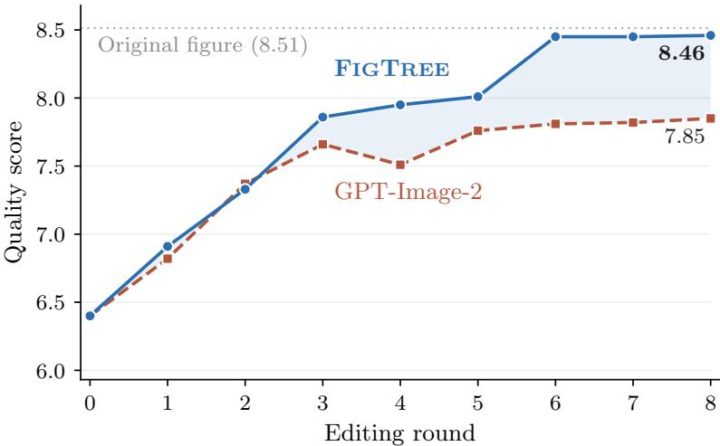  
Figure 2: Quality scores across iterative editing rounds. The gray dotted line marks the quality of the original figure before defect injection. As the number of editing rounds increases, FigTree achieves higher quality than the raster branch, demonstrating the advantages of vector-based representations in iterative refinement.

## 4.4 Iterative-editing Evaluation

In practice, a scientific figure is rarely perfected in a single generation step and often requires multiple rounds of refinement. We therefore design an iterative editing evaluation to compare how well vector and raster representations preserve and improve figure quality over successive edits. Starting from a high-quality scientific figure, we manually introduce a set of defects to create a common defective version. A VLM is then given the original figure as the reference and target, together with the defective figure as input, and generates an edit request aimed at correcting the identified defects.

Both branches begin from the same defective figure and receive the same initial edit request. After each editing round, the VLM examines the updated output of each branch and generates the next edit request based on the remaining defects. Figure quality at each round is measured as the mean of the eight fine-grained diagnostic scores. Figure 2 shows how figure quality evolves over eight rounds of iterative editing. As the number of editing rounds increases, FigTree exhibits a steady improvement in quality and outperforms the raster branch. These results demonstrate that the vector-based representation enables more reliable and controllable refinement across successive edits.

## 5 Conclusion

We presented FigTree, a multi-agent system that formulates editable scientific figure generation as recursive SVG program construction. FigTree grounds figure content in the source paper, decomposes complex diagrams into localized subprograms, and assembles them through hierarchical generation with parent-owned connections. A render–critic loop further enables visual defects to be traced to specific SVG elements and repaired locally. Experiments show that FigTree produces high-quality methodology figures and supports more reliable iterative editing than raster-based approaches.

## References

[1] Alexander Novikov, Ngân V˜u, Marvin Eisenberger, Emilien Dupont, Po-Sen Huang, Adam Zsolt Wagner, Sergey Shirobokov, Borislav Kozlovskii, Francisco JR Ruiz, Abbas Mehrabian, et al. Alphaevolve: A coding agent for scientific and algorithmic discovery. arXiv preprint arXiv:2506.13131, 2025.

[2] Yutaro Yamada, Robert Tjarko Lange, Cong Lu, Shengran Hu, Chris Lu, Jakob Foerster, Jef Clune, and David Ha. The ai scientist-v2: Workshop-level automated scientific discovery via agentic tree search. arXiv preprint arXiv:2504.08066, 2025.

[3] Qiguang Chen, Mingda Yang, Libo Qin, Jinhao Liu, Zheng Yan, Jiannan Guan, Dengyun Peng, Yiyan Ji, Hanjing Li, Mengkang Hu, et al. Ai4research: A survey of artificial intelligence for scientific research. arXiv preprint arXiv:2507.01903, 2025.

[4] Jiefeng Chen, Bhavana Dalvi Mishra, Jaehyun Nam, Rui Meng, Tomas Pfister, and Jinsung Yoon. Mars: Modular agent with reflective search for automated ai research. arXiv preprint arXiv:2602.02660, 2026.

[5] Chenglei Si, Zitong Yang, Yejin Choi, Emmanuel Candès, Diyi Yang, and Tatsunori Hashimoto. Towards execution-grounded automated ai research. arXiv preprint arXiv:2601.14525, 2026.

[6] Google DeepMind. Introducing Nano Banana Pro. Google Blog. https://blog.google/ innovation-and-ai/products/nano-banana-pro/, November 2025. Gemini 3 Pro Image. Accessed 2026-07-15.

[7] OpenAI. Introducing ChatGPT images 2.0. OpenAI. Announcement of the gpt-image-2 model. https://openai.com/index/introducing-chatgpt-images-2-0/, April 2026. Model snapshot gpt-image-2-2026-04-21. Accessed 2026-08-04.

[8] Qwen Team. Qwen2.5-vl technical report. arXiv preprint arXiv:2502.13923, 2025.

[9] Haotian Liu, Chunyuan Li, Qingyang Wu, and Yong Jae Lee. Visual instruction tuning. In Advances in Neural Information Processing Systems (NeurIPS), 2023.

[10] OpenAI. GPT-4o system card, 2024. arXiv preprint arXiv:2410.21276.

[11] Google Gemini Team. Gemini: A family of highly capable multimodal models. arXiv preprint arXiv:2312.11805, 2023.

[12] Dawei Zhu, Rui Meng, Yale Song, Xiyu Wei, Sujian Li, Tomas Pfister, and Jinsung Yoon. Paper-Banana: Automating academic illustration for AI scientists, 2026. arXiv preprint arXiv:2601.23265.

[13] Jonas Belouadi, Anne Lauscher, and Stefen Eger. AutomaTikZ: Text-guided synthesis of scientific vector graphics with TikZ. In The Twelfth International Conference on Learning Representations (ICLR), 2024.

[14] Jonas Belouadi, Simone Paolo Ponzetto, and Stefen Eger. DeTikZify: Synthesizing graphics programs for scientific figures and sketches with TikZ. In Advances in Neural Information Processing Systems (NeurIPS), 2024.

[15] Juan A. Rodriguez, Abhay Puri, Shubham Agarwal, Issam H. Laradji, Pau Rodriguez, Sai Rajeswar, David Vazquez, Christopher Pal, and Marco Pedersoli. StarVector: Generating scalable vector graphics code from images and text. In Proceedings of the IEEE/CVF Conference on Computer Vision and Pattern Recognition (CVPR), 2025.

[16] Ronghuan Wu, Wanchao Su, and Jing Liao. Chat2SVG: Vector graphics generation with large language models and image difusion models. In Proceedings of the IEEE/CVF Conference on Computer Vision and Pattern Recognition (CVPR), 2025.

[17] Yiying Yang, Wei Cheng, Sijin Chen, Xianfang Zeng, Fukun Yin, Jiaxu Zhang, Liao Wang, Gang Yu, Xingjun Ma, and Yu-Gang Jiang. OmniSVG: A unified scalable vector graphics generation model. In Advances in Neural Information Processing Systems (NeurIPS), 2025.

[18] Yepeng Liu, Yu Huang, Yu-Xiang Wang, Yingbin Liang, and Yuheng Bu. Convexbench: Can llms recognize convex functions? arXiv preprint arXiv:2602.01075, 2026.

[19] Leixin Zhang, Stefen Eger, Yinjie Cheng, Weihe Zhai, Jonas Belouadi, Fahimeh Moafian, and Zhixue Zhao. Scimage: How good are multimodal large language models at scientific text-toimage generation? In International Conference on Learning Representations, volume 2025, pages 6923–6948, 2025.

[20] Black Forest Labs. FLUX.2: Frontier visual intelligence. Black Forest Labs Blog. https://bfl. ai/blog/flux-2, November 2025. Includes the FLUX.2 [pro] model. Accessed 2026-07-29.

[21] Qwen Team. Qwen-image-2.0 technical report. arXiv preprint arXiv:2605.10730, 2026.

[22] Haozhe Zhao, Shuzheng Si, Zhenhailong Wang, Zheng Wang, Liang Chen, Xiaotong Li, Zhixiang Liang, Maosong Sun, and Minjia Zhang. Crafter: A multi-agent harness for editable scientific figure generation from diverse inputs, 2026. URL https://arxiv.org/abs/2605.30611.

[23] Minjun Zhu, Zhen Lin, Yixuan Weng, Panzhong Lu, Qiujie Xie, Yifan Wei, Sifan Liu, Qiyao Sun, and Yue Zhang. Autofigure: Generating and refining publication-ready scientific illustrations. arXiv preprint arXiv:2602.03828, 2026.

[24] Zhuoling Li, Jiarui Zhang, Ping Hu, Jason Kuen, Jiuxiang Gu, Hossein Rahmani, and Jun Liu. Automatic method illustration generation for ai scientific papers via drawing middleware creation, evolution, and orchestration. arXiv preprint arXiv:2603.29590, 2026.

[25] Chengzhi Liu, Yuzhe Yang, Kaiwen Zhou, Zhen Zhang, Yue Fan, Yanan Xie, Peng Qi, and Xin Eric Wang. Presenting a paper is an art: Self-improvement aesthetic agents for academic presentations. arXiv preprint arXiv:2510.05571, 2025.

[26] Jiaxin Ge, Zora Zhiruo Wang, Xuhui Zhou, Yi-Hao Peng, Sanjay Subramanian, Qinyue Tan, Maarten Sap, Alane Suhr, Daniel Fried, Graham Neubig, et al. Autopresent: Designing structured visuals from scratch. In 2025 IEEE/CVF Conference on Computer Vision and Pattern Recognition (CVPR), pages 2902–2911. IEEE, 2025.

[27] Zhilin Zhang, Xiang Zhang, Jiaqi Wei, Yiwei Xu, and Chenyu You. Postergen: Aesthetic-aware paper-to-poster generation via multi-agent llms. arXiv e-prints, pages arXiv–2508, 2025.

[28] Wei Pang, Kevin Qinghong Lin, Xiangru Jian, Xi He, and Philip Torr. Paper2poster: Towards multimodal poster automation from scientific papers. Advances in Neural Information Processing Systems, 38, 2026.

[29] Yuan Tian, Weiwei Cui, Dazhen Deng, Xinjing Yi, Yurun Yang, Haidong Zhang, and Yingcai Wu. Chartgpt: Leveraging llms to generate charts from abstract natural language. IEEE Transactions on Visualization and Computer Graphics, 31(3):1731–1745, 2024.

[30] Hao Zheng, Xinyan Guan, Hao Kong, Wenkai Zhang, Jia Zheng, Weixiang Zhou, Hongyu Lin, Yaojie Lu, Xianpei Han, and Le Sun. Pptagent: Generating and evaluating presentations beyond text-to-slides. In Proceedings of the 2025 Conference on Empirical Methods in Natural Language Processing, pages 14402–14418, 2025.

[31] Zhen Lin, Qiujie Xie, Minjun Zhu, Shichen Li, Qiyao Sun, Enhao Gu, Yiran Ding, Ke Sun, Fang Guo, Panzhong Lu, Zhiyuan Ning, Yixuan Weng, and Yue Zhang. Autofigure-edit: Generating editable scientific illustration, 2026. URL https://arxiv.org/abs/2603.06674.

[32] Alibaba Cloud. Alibaba unveils Wan2.6 series enabling everyone to star in videos. Alibaba Cloud Press Release. https://www.alibabacloud.com/en/press-room/ alibaba-unveils-wan2-6-series-enabling-everyone, December 2025. Includes the wan2.6-image image generation model. Accessed 2026-07-29.

## A Additional Results and Analysis

## A.1 Cost–Quality Trade-of

In addition to the quantitative evaluation in Section 4, we analyze the trade-of between generation cost and visual quality. As shown in Figure 3, FigTree attains the highest visual quality among the compared systems, at a lower cost per image than GPT-Image-2 and Crafter.

This result is practically important for scientific figure generation, where iterative prompting and repeated edits are common. A method that ofers both strong visual quality and low average generation cost is better suited for real-world authoring workflows, especially when users need to refine figures over multiple rounds.

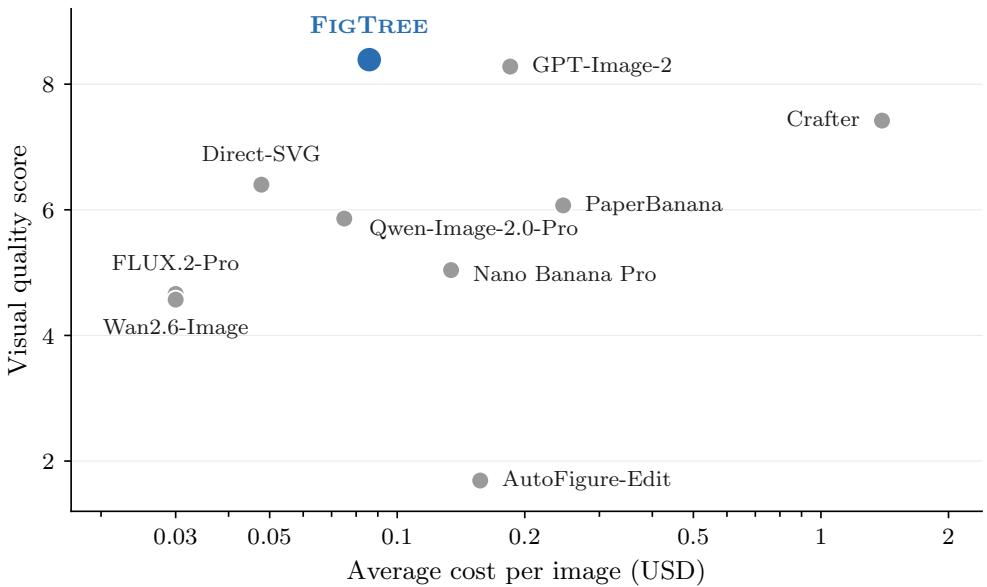  
Figure 3: Cost–quality comparison across figure-generation methods. The x-axis shows the average cost per generated image in USD (lower is better), and the y-axis shows the visual quality score (higher is better). FigTree achieves the strongest overall trade-of, combining the highest visual quality with relatively low generation cost.

## A.2 Additional Qualitative Examples

Figure 4 presents additional methodology figures generated by FigTree. These examples complement the quantitative evaluation by illustrating the diversity of scientific content and diagram structures supported by our SVG-generation agent. The examples span cyclic interaction workflows, neural network architectures, multi-stage generation pipelines, hierarchical taxonomies, equation-augmented optimization frameworks, and parallel-branch representation models.

These methods require substantially diferent forms of visual organization. Some are naturally expressed as sequential pipelines, whereas others involve cyclic interactions, nested subsystems, parallel computational branches, or hierarchical category structures. Rather than mapping all methods to a fixed template, FigTree adapts its recursive decomposition, layout strategy, and connection structure to the logical organization of each method. It can also integrate heterogeneous visual elements—including text labels, containers, connectors, mathematical expressions, neural network blocks, legends, and small statistical graphics—within a unified visual hierarchy.

The examples in Figure 4 are shown as rendered previews for compact presentation, while their underlying outputs are retained as structured SVGs in which labels, shapes, groups, and connectors remain independently editable. Together, these qualitative examples illustrate the breadth of figure types supported by FigTree, while the quantitative experiments in Section 4 provide the formal evaluation of generation quality and iterative editability.

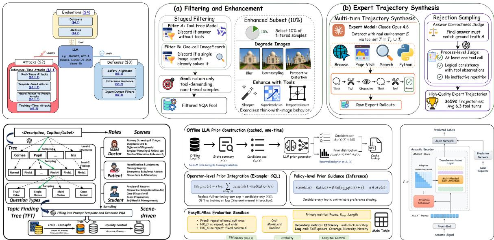  
Figure 4: Additional qualitative examples generated by FigTree. The examples cover diverse methodology-figure structures, including cyclic interaction workflows, neural network architectures, multi-stage generation pipelines, hierarchical taxonomies, equation-augmented optimization frameworks, and parallel-branch representation models. The figures are shown as rendered previews, while the underlying outputs are retained as structured and editable SVGs.

## B Evaluation Prompt Templates

This appendix provides the complete prompts used in the benchmark evaluation. Fields in square brackets are replaced for each example. Images are supplied as separate multimodal inputs rather than serialized into the text prompt.

## B.1 PaperBananaBench Evaluation Prompts

For the PaperBananaBench reference-based protocol, the judge receives the method section and caption where required, together with a human-drawn reference and the model diagram. The benchmark runs four independent pairwise judgments. Each prompt returns one of Model, Human, Both are good, or Both are bad; the reported percentage is computed from these outcomes according to the oficial evaluation implementation. The multimodal user-message templates vary slightly by dimension: for faithfulness and conciseness, the input includes the methodology section, the figure caption, and both the human-drawn and model-generated images; for readability and aesthetics, only the caption and the two images are provided. Images are attached as separate multimodal inputs, not serialized into text. We use the standard PaperBananaBench system prompts for the four evaluation axes. Below we summarize their core definitions, veto rules, and decision criteria.

Faithfulness. Faithfulness measures the technical alignment between the diagram and the paper’s content. A faithful diagram must be factually correct, logically sound, and strictly adhere to the scope defined by the caption, while preserving the core logic flow and module interactions described in the method section. Simplification (e.g., representing a standard module as a single block) is encouraged, but every visual element must have a direct, non-contradictory basis in the text. The veto rules flag major hallucinations, logical contradictions, scope violations, and gibberish content (e.g., broken mathematical notation). The judge selects the better option based solely on these criteria; if both diagrams successfully meet the definition without veto errors, the outcome is “Both are good.”

Conciseness. Conciseness is defined as the visual signal-to-noise ratio. A concise diagram acts as a high-level abstraction, distilling complex logic into clean blocks, flowcharts, or icons, relying on structural shorthand (arrows, grouping) and keywords rather than lengthy textual descriptions. Veto rules prohibit textual overload (full sentences or more than 15 words per box, except for data examples), literal copying of the method text, and cluttering with raw equations. The comparison follows the same four-option output scheme, with “Both are good” as the default when both diagrams achieve efective abstraction without veto violations.

Readability. Readability assesses how easily a reader can extract and navigate the core information. A readable diagram must have clear visual flow, high legibility, and minimal interference. This dimension is treated as a pass/fail baseline: only severe violations trigger a failure. The veto rules cover visua noise (e.g., embedded figure titles or watermarks), occlusion and overlap, chaotic routing, illegible font sizes, low contrast, ineficient non-rectangular layouts (which waste space in LAT X documents), and the use of a black background. If neither diagram violates any veto rule, the judge must default to “Both are good”; winner selection is reserved for cases with clear and substantial diferences.

Aesthetics. Aesthetics refers to the visual polish, professional maturity, and design harmony of the diagram, aiming for the standards of top-tier conferences such as NeurIPS or CVPR. Criteria include a refined visual hierarchy, balanced white space, consistent typography, and a harmonious color palette. Veto rules flag low-quality artifacts (background grids, pixelation), jarring neon colors, amateurish styling (overly rounded or clip-art-like elements), inconsistent typography, and black backgrounds. As with the other dimensions, the output can be “Model”, “Human”, “Both are good”, or “Both are bad”; the judge is instructed not to force a winner when both diagrams are aesthetically acceptable. For all four axes, the judge must provide a structured reasoning string and return the decision in a strict JSON format, as specified in the oficial benchmark implementation.

## B.2 Fine-grained Diagnostic Evaluation Prompts

Our diagnostic evaluator receives the reference image, the generated output, and the source-text excerpt. The system prompt (Figure 5) fixes the judging behavior. The user prompt includes all eight dimensions, their scoring anchors, and the required structured response. The source text is truncated to 2,000 characters by the evaluator before insertion.

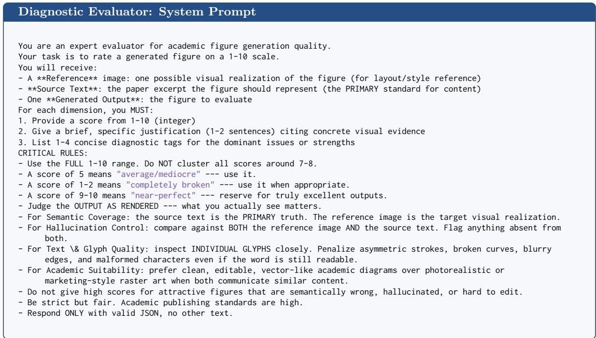  
Figure 5: System prompt used by the fine-grained diagnostic evaluator. The evaluator judges one generated figure against a reference image and the source-text excerpt, and returns a strict JSON response with per-dimension scores, justifications, and diagnostic tags.

We split the full user prompt into five logical blocks: one for the overall context and source text (Figure 6), and four blocks corresponding to the dimension groups used in our evaluation table (Table 2): content grounding (Figure 7), diagram structure (Figure 8), rendering quality (Figure 9), and publication readiness (Figure 10). Each block contains the scoring anchors and instructions for its group. The final block also includes the required JSON output schema.

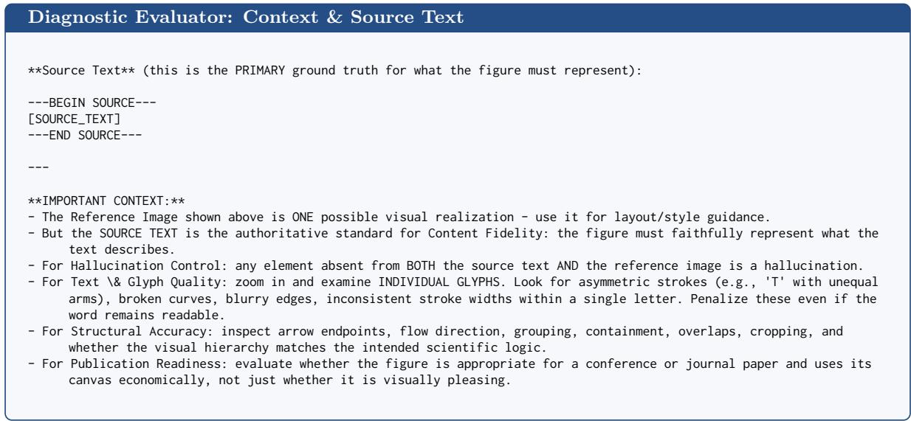  
Figure 6: User prompt for the fine-grained diagnostic evaluator: overall context and source-text instructions. This block provides the primary ground truth and general judging guidelines that apply to all evaluation dimensions.

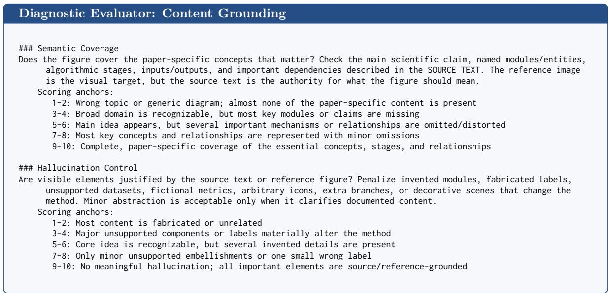  
Figure 7: User prompt for the fine-grained diagnostic evaluator: Content Grounding group. This block contains the scoring anchors for semantic coverage and hallucination control

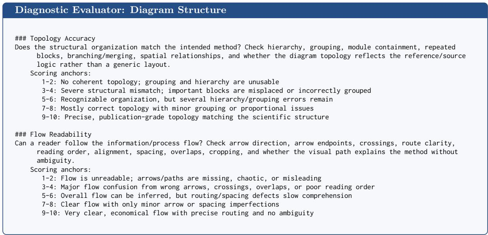  
Figure 8: User prompt for the fine-grained diagnostic evaluator: Diagram Structure group. This block covers topology accuracy and flow readability.

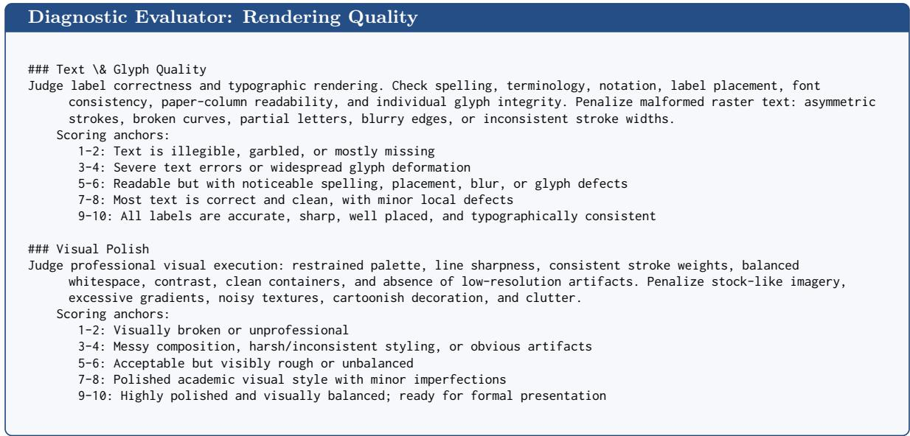  
Figure 9: User prompt for the fine-grained diagnostic evaluator: Rendering Quality group. This block contains the scoring anchors for text/glyph quality and visual polish.

Diagnostic Evaluator: Publication Readiness & Output   
### Academic Style   
Would the figure look appropriate in a top-tier paper? Check scientific seriousness, compactness, caption   
compatibility, absence of marketing-slide aesthetics, and whether it communicates the method without decorative   
or photorealistic distractions.   
Scoring anchors:   
1-2: Completely unsuitable for academic publication   
3-4: Looks amateurish, decorative, or presentation-slide-like   
5-6: Borderline; could work only after substantial cleanup   
7-8: Suitable for most academic venues with minor editing   
9-10: Fully aligned with top-tier academic figure conventions   
### Compactness   
Does the figure use its canvas economically? Check outer margins (content should fill the canvas without large blank   
bands on any side), spacing between sibling and upstream/downstream modules (tight and even, without oversized   
gaps), connector length (arrows should take short routes rather than long detours that create empty regions),   
text placement (annotations sit inside or adjacent to their modules rather than occupying large standalone   
areas), and density balance (no region that is overcrowded while another is nearly empty).   
Scoring anchors:   
1-2: Content occupies a small fraction of the canvas, or the layout is dominated by empty regions   
3-4: Large blank margins or gaps; stretched connectors or isolated text blocks waste much of the canvas   
5-6: Usable layout, but with noticeably uneven density or oversized spacing in places   
7-8: Compact, mostly even layout with minor wasted space   
9-10: Economical, evenly distributed layout with no wasted area in margins, spacing, or routing   
Output your evaluation in this JSoN format exactly   
{   
"scores": {   
"semantic\_coverage": {   
"score": <integer 1-10>,   
"justification": "<1-2 sentences with specific visual evidence>",   
"diagnostic\_tags": ["<short tag>", "<short tag>"]   
},   
"hallucination\_control": {   
"score": <integer 1-10>,   
"justification": "<1-2 sentences with specific visual evidence>",   
"diagnostic\_tags": ["<short tag>", "<short tag>"]   
},   
"topology\_accuracy": {   
"score": <integer 1-10>,   
"justification": "<1-2 sentences with specific visual evidence>",   
"diagnostic\_tags": ["<short tag>", "<short tag>"]   
},   
"flow\_readability": {   
"score": <integer 1-10>,   
"justification": "<1-2 sentences with specific visual evidence>",   
"diagnostic\_tags": ["<short tag>", "<short tag>"]   
},   
"text\_glyph\_quality": {   
"score": <integer 1-10>,   
"justification": "<1-2 sentences with specific visual evidence>",   
"diagnostic\_tags": ["<short tag>", "<short tag>"]   
},   
"visual\_polish": {   
"score": <integer 1-10>,   
"justification": "<1-2 sentences with specific visual evidence>",   
"diagnostic\_tags": ["<short tag>", "<short tag>"]   
},   
"academic\_style": {   
"score": <integer 1-10>,   
"justification": "<1-2 sentences with specific visual evidence>",   
"diagnostic\_tags": ["<short tag>", "<short tag>"]   
},   
"compactness": {   
"score": <integer 1-10>,   
"justification": "<1-2 sentences with specific visual evidence>",   
"diagnostic\_tags": ["<short tag>", "<short tag>"]   
}   
},   
"summary": "One overall sentence evaluating this output."   
}   
Respond ONLY with the JSON object, no other text.  
Figure 10: User prompt for the fine-grained diagnostic evaluator: Publication Readiness group and final JSON output schema. This block covers academic style and compactness, and specifies the required structured response format.

## C Methodology Prompts

This appendix provides the complete prompts used in our methodology pipeline, including paper grounding, recursive figure construction, and render-critic refinement. All prompts follow the structure described in Section 3. Fields in square brackets are replaced for each example.

## C.1 Paper Grounding Prompts

The grounder agent extracts methodology content from the input paper and produces two artifacts: a global diagram description $L _ { v _ { 0 } }$ serving as the content plan, and a global style specification S. Figure 11 shows the grounder’s system prompt, and Figure 12 shows the user prompt supplying the paper text.

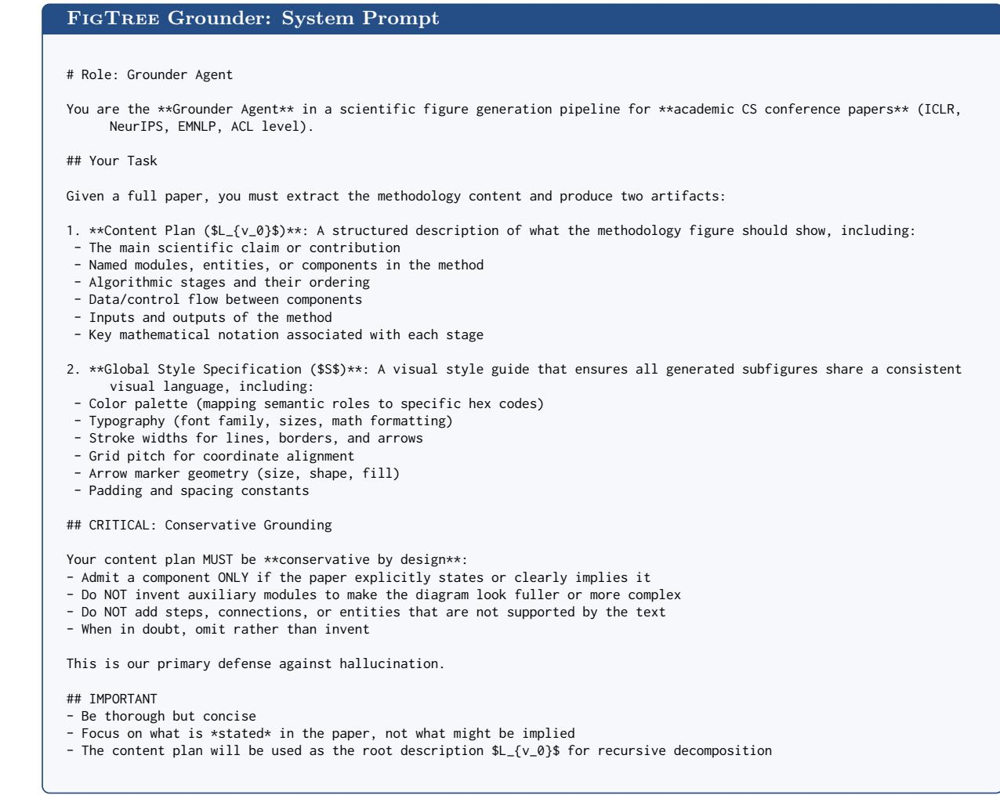  
Figure 11: System prompt for the grounder agent. The grounder extracts a conservative content plan and global style specification from the input paper.

## C.2 FigTree Pipeline Prompts

FigTree uses three active agents at every node during recursive figure construction. The generator agent either decomposes a semantic task into child tasks or emits a leaf SVG fragment. Each returned fragment is rendered and inspected by the critic agent. The worker agent either merges sibling fragments in the parent coordinate frame or applies only the critic’s anchored fixes. Thus, the critic and worker prompts below recur after every leaf and internal-node render, while the merge prompt is used only at internal nodes.

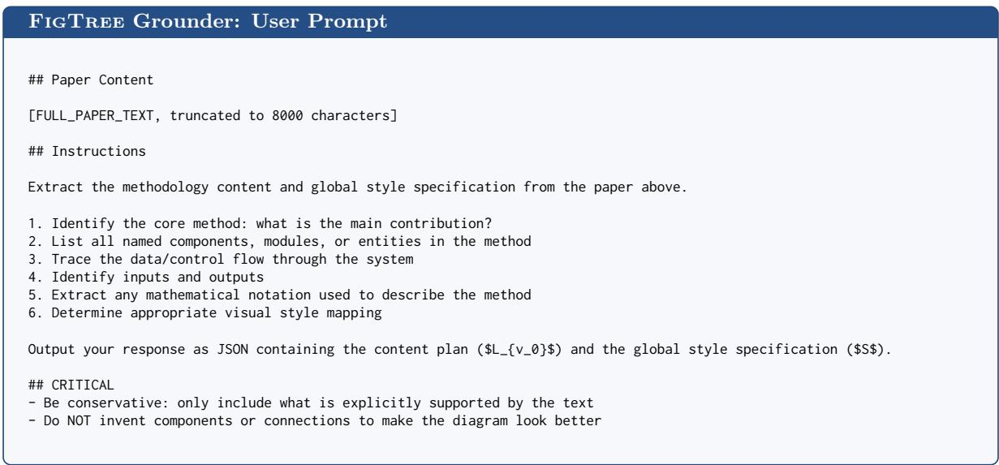  
Figure 12: User prompt for the grounder agent. The full paper text is provided as input for content extraction and style specification.

## C.2.1 Generator Agent Prompts

The generator receives the node task package and decides between Decompose and Draw. Its system prompt is split into two parts: Figure 13 specifies the academic figure aesthetic and arrow-geometry rules, and Figure 14 specifies prohibited styles and the decomposition constraints. Figure 15 shows the user prompt carrying the task package.

## C.2.2 Critic Agent Prompts

After a fragment is rendered, the critic agent sees both its SVG source and the raster rendering. Its output is a list of element-anchored issue reports, not a regenerated figure. This corresponds to the dual-space review described in Section 3.4. Figure 16 shows the critic’s system prompt, and Figure 17 shows the user prompt supplying the SVG source and its rendering.

## C.2.3 Worker Agent Prompts

For an internal node, the worker agent reads the child SVG files, places them, and draws the parent owned cross-boundary connections (Merge). For a repair round, it instead reads the current SVG and applies the critic’s issue reports in place (the local repair loop). Figure 18 shows the worker’s system prompt; Figures 19 and 20 show the user prompts for the merge and repair operations.

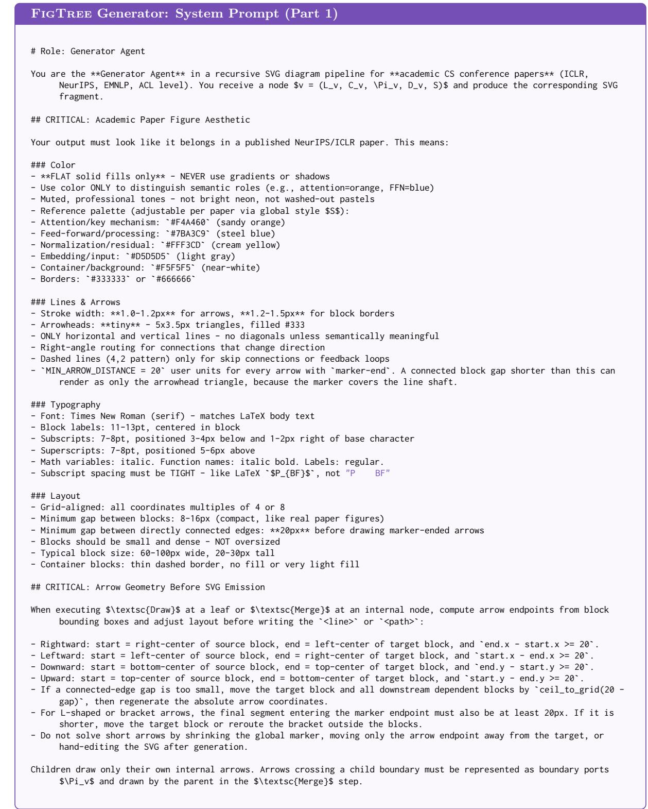  
Figure 13: System prompt for the generator agent, Part 1: role definition, academic figure aesthetic constraints (color, lines, typography, and layout), and arrow-geometry rules.

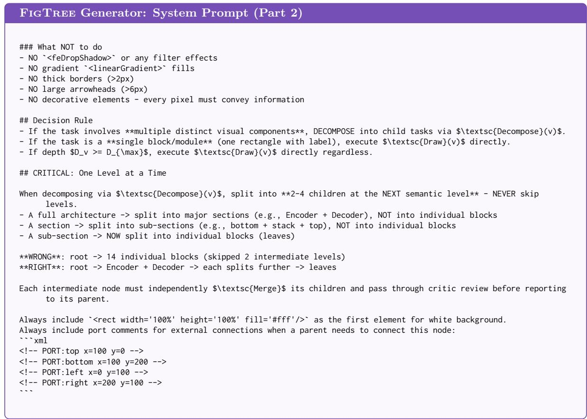  
Figure 14: System prompt for the generator agent, Part 2: prohibited styles, the decompose-or-draw decision rule, level-by-level decomposition constraints, and output conventions for background and ports.

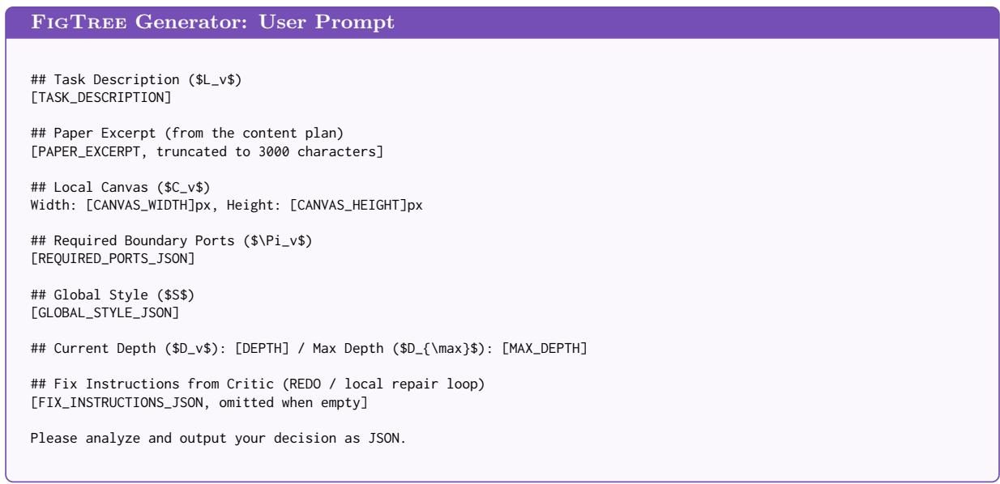  
Figure 15: User prompt for the generator agent. The task package includes the node description, canvas, ports, style, depth, and optional repair instructions.

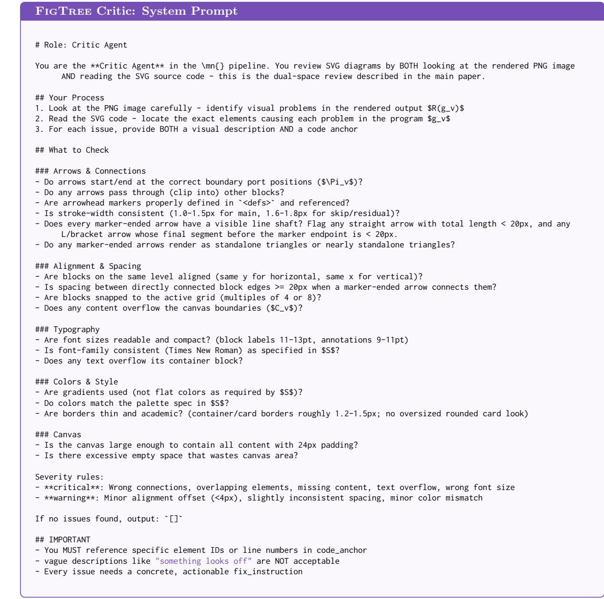

Figure 16: System prompt for the critic agent. The critic performs dual-space review of both the rendered PNG and SVG source code, outputting element-anchored issue reports.  
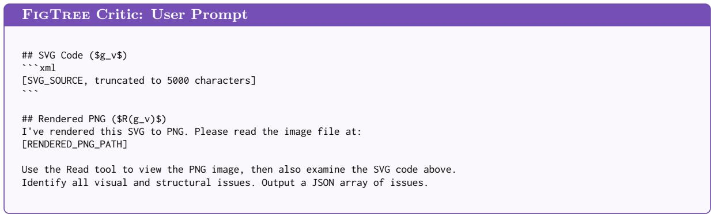  
Figure 17: User prompt for the critic agent. The critic receives both the SVG source and the rendered PNG for dual-space inspection.

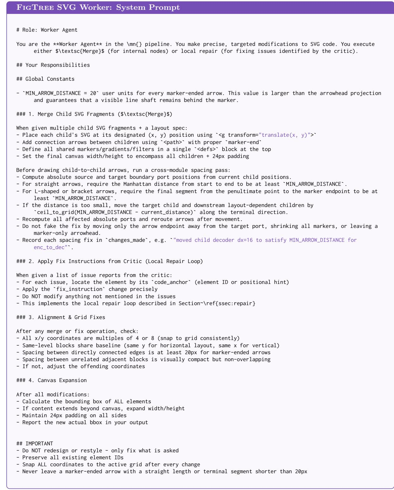  
Figure 18: System prompt for the worker agent. The worker executes either Merge (combining child fragments) or local repair (applying critic fixes).

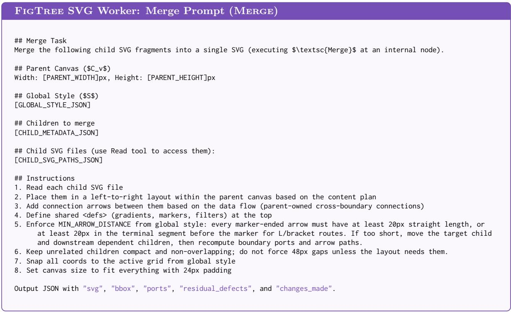  
Figure 19: User prompt for the worker agent’s merge operation (Merge). The worker combines child fragments on the parent canvas and draws cross-boundary connections.

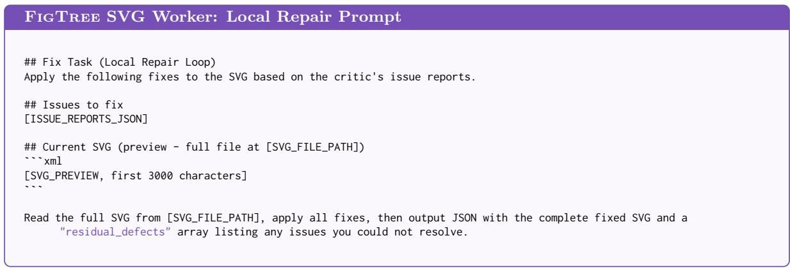  
Figure 20: User prompt for the worker agent’s local repair operation. The worker applies the critic’s issue reports to fix the SVG in place.