# Harness-of-Harness: Multi-Day Autonomous Software Development with Continual Improvement

Haoyang Yan<sup>†</sup>, Min-Le Su<sup>†</sup>, Hangfan Zhang<sup>†</sup>, Zhanhao Li<sup>†</sup>, Chen Zhang, Shao Zhang, Yang Chen, Lei Bai, Shuyue Hu Shanghai Artificial Intelligence Laboratory

## Abstract

This paper studies autonomous software development, in which LLM-based coding agents transform high-level requirements into complete, functional, and usable software systems without human intervention. We introduce Harness-of-Harness (HoH), a framework that enables coding agents to continually improve software during autonomous development. HoH operates on existing coding-agent harnesses, and organizes their executions into iterative planning–coding–testing loops. To sustain improvement across loops, HoH balances repair with capability growth, scopes development into small and verifiable increments, separates implementation-time testing from independent evaluation, and constrains verifiable outputs rather than prescribing agent workflows. It progressively exposes deliverables, role-specific tools, and skills, encourages reuse rather than recreation, and maintains versioned project histories. On GameCraft-Bench, FrontierSWE, and ProgramBench, three harness–model pairs (Codex with GPT-5.5, OpenCode with DeepSeek-V4-Pro, and Pi with MiniMax-M3), HoH consistently outperforms the corresponding standalone harnesses, achieving an average relative gain of 52.25% and a maximum gain of 82.86% after three iterations. In a multi-day deployment with more than 70 iterations, HoH autonomously develops a first-person-shooter game, featuring a coherent storyline, fully implemented core mechanics, human-playable experience, polished visuals and integrated audio.

§ GitHub: Flesymeb/HarnessOfHarness € Project Page: HarnessOfHarness

Autonomous Development of an FPS Game via Harness-of-Harness  
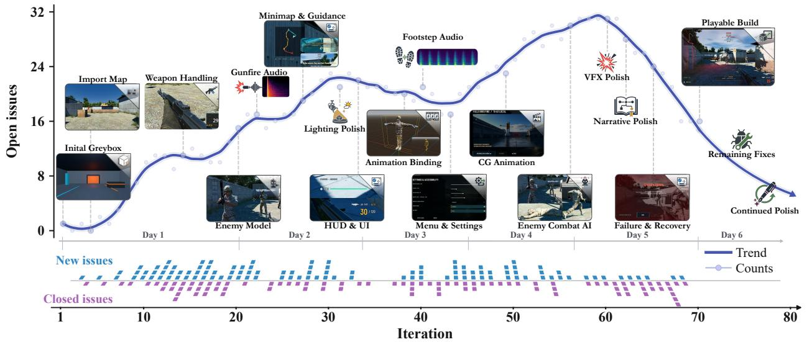  
Figure 1 | Across successive iterations by Harness-of-Harness, the resulting First-Person-Shooter game features a coherent storyline, implemented combat, weapon and enemy-interaction systems, player guidance, heads-up display and menu systems, cinematic animation, and polished visual and audio presentation, yielding humanplayable experience. The game, development traces, and gameplay videos are available on GitHub.

## 1 Introduction

Software development has become a prominent application of large language models (LLMs) [4, 37]. As LLM capabilities have advanced, LLM-based coding agents have progressed from localized assistance, such as function completion [2, 22], to increasingly complex tasks, including navigating large codebases and resolving repository-level issues [12, 25, 29, 36, 39]. Despite their growing adoption, most coding agents still largely operate under a human-in-the-loop setting (Figure 2a): developers must define tasks, guide intermediate decisions, review generated changes and intervene when failures occur [1]. In this study, we pursue a more ambitious goal: autonomous software development (Figure 2b); given only high-level requirements as human input, coding agents start from scratch and independently transform the requirements into complete, functional, and deployable software systems, without further human guidance or intervention.

Such autonomous development poses a fundamentally longer-horizon problem than conventional agentic coding tasks [14, 28]. Building a software system from scratch requires agents not only to generate code snippets, but also to translate high-level requirements into executable plans, coordinate interdependent tasks, design and integrate components, and continuously test and debug the evolving system [8, 32, 36]. As these interdependent decisions and modifications accumulate, development naturally unfolds over increasingly long trajectories [14, 28]. As trajectories grow, agents may lose track of earlier requirements and design decisions, or introduce local fixes that violate constraints elsewhere [3, 26]. Failed attempts and suboptimal decisions may accumulate, while new evidence from testing can invalidate earlier assumptions [5, 24, 33]. Long trajectories can also lead to repetitive cycles of inspection and repair, redundant verification of completed components, or premature declaration of completion despite missing or incorrect functionality [3, 11]. Together, these challenges suggest that autonomous software development is not simply a problem of longer execution; the real challenge is sustaining coherent and efective progress over time.

Here, we introduce Harness-of-Harness (HoH), a framework that equips coding agents with continual improvement capabilities for autonomous software development. Modern coding agents operate within a harness—the surrounding system that provides tools, manages execution and mediates the LLM’s interaction with the development environment [36, 39, 45]. HoH builds upon existing harnesses and organizes development into iterative planning–coding–testing loops. At each iteration, the planner synthesizes the high-level requirements and evidence from previous iterations into a development plan. Each plan must both address outstanding problems and deliver a small yet concrete new capability, following the principle of iterative and incremental development [13]. This helps prevent development from collapsing into repetitive local repairs, while the limited scope makes progress easier to verify and reduces the risk of uncontrolled changes. The developer then implements the plan and embeds focused testing throughout implementation, creating immediate feedback around local changes. After passing these tests, a tester independently evaluates the resulting system against both the overall requirements and the development plan, using complementary white-box and black-box tests. The tests are conducted from multiple perspectives, such as functional correctness, completeness, usability, and visual and audio quality (if any). The resulting structured test report is returned to the planner as evidence for the next iteration, closing the loop.

Throughout this process, HoH specifies the artifacts and evidence that agents must deliver, but does not prescribe a rigid workflow for producing them. Each role must return a structured artifact, and outputs that violate the required schema trigger a retry. This constrains verifiable outcomes while preserving agent autonomy over reasoning, tool use and implementation strategy. To maintain continuity without overwhelming the context window, HoH adopts progressive disclosure rather than a dedicated memory module: plans, reports, histories and other artifacts are persisted in the file system and initially exposed through a concise, categorized index, with detailed contents retrieved only when relevant. Tools, such as MCP servers, expert models and domain-specific algorithms, are organized by role, with lightweight Markdown-based skills providing concise, on-demand guidance for their use. Agents are encouraged to draw on existing resources rather than recreate standard capabilities, reducing redundant efort on routine engineering tasks. Finally, HoH maintains a versioned record of project evolution at both the agent role and iteration levels. By preserving the software state together with concise accounts of how it changes, HoH can return to previously verified states after major regressions and draw on evidence from earlier attempts when similar failures recur to inform the diagnosis and resolution.

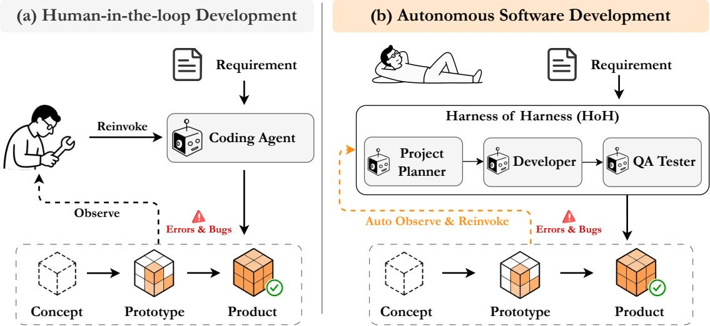  
Figure 2 | Two diferent modes of software development. In human-in-the-loop development, coding agents generate code under continuous human oversight, guidance, review, and intervention. In autonomous software development, agents independently transform high-level requirements into complete, functional, and deployable software systems without human guidance or intervention.

We evaluate HoH in two complementary settings: three controlled benchmarks (GameCraft Bench [23], FrontierSWE [6], and ProgramBench [40]), and open-ended game development that spans over multiple days. First, we evaluate the HoH loop under the original benchmark specifications, without additional tools, skills or version-control mechanisms. We consider three harness–model con figurations: Codex with GPT-5.5 (high), OpenCode with DeepSeek-V4-Pro, and Pi with MiniMax-M3. Across all three benchmarks, HoH consistently outperforms the corresponding standalone harnesses. After three iterations, it yields absolute gains of 16.62–22.08 points on GameCraft-Bench, 19–29 points on FrontierSWE, and 6.09–16.85 points on ProgramBench. On FrontierSWE, HoH with Codex and GPT-5.5 (high) continues improving over ten iterations, from 22% to 72.67%. In our second setting, HoH autonomously builds a complex game from scratch, given only high-level product requirements, which exposes challenges that are largely absent from conventional benchmarks. Diferent from benchmark evaluation, we additionally implement HoH with role-specific tools and skills, supporting development engine interaction, asset acquisition and generation, reference retrieval, testing, and project-state management. Code changes and role-specific artifacts are committed to a public GitHub repository after each agent stage, making the complete development trajectory traceable. Over multiple days of autonomous development, HoH transforms the initial requirements into a complete, human-playable game with a coherent storyline, fully implemented core mechanics, polished visuals and integrated audio.

## 2 Related Work

Agent Harnesses. An agent harness is the operational layer that determines what information an LLM receives, what actions it can execute, and how execution results enter subsequent decisions [16, 17]. Many mechanisms now assembled within harnesses were developed as distinct research directions. Prompting and context engineering shape model-facing state [19, 46]; external memory extends the state available across interactions [30]; ReAct couples reasoning with environment actions [41]; and GPTSwarm represents multi-agent orchestration as an optimizable graph [50]. More recent work treats the harness itself as the optimization target: AutoHarness synthesizes a code harness from environment feedback, Meta-Harness searches over harness code, and Self-Harness iteratively diagnoses and modifies its own harness [15, 20, 45]. These approaches improve agent behavior by changing the operational layer. HoH builds on existing agent harnesses and iteratively improves an evolving software project through repeated implementation, evaluation, and refinement.

Agentic Systems for Software Development. Research has progressed from localized code gen eration and self-contained programs [4, 10] to repository-level issue resolution, agent–computer interfaces, general software-engineering agents, and refactoring [12, 29, 36, 38, 39]. Beyond repos itory issue resolution, MetaGPT and ChatDev use predefined role-based workflows for software generation [8, 32]; AgileCoder and EvoDev organize incremental development around sprints or dependent features [18, 27]; and EvoMAC adapts the multi-agent workflow using test feed back [9]. Recent benchmarks broaden both the development settings and the capabilities under evaluation [7, 14, 28]. SWE-EVO and SlopCodeBench study long-horizon evolution and degradation, while Commit0, ProjDevBench, ProgramBench, and GameCraft-Bench evaluate from-scratch construction of complete libraries or projects [21, 23, 40, 49]. FrontierSWE further covers from-scratch implementation together with open-ended performance and research objectives [6]. Existing coding harnesses typically organize development within a bounded episode, providing limited support for preserving project decisions, verified functionality, and evaluation evidence across subsequent revisions. HoH builds on these harnesses and extends their use to iterative greenfield development by maintaining continuity across planning, implementation, and evaluation cycles.

## 3 Harness-of-Harness

Harness-of-Harness (HoH) organizes a fixed coding-agent system into a long-running cycle of planning, development, and independent testing. Each cycle produces a bounded software increment, verifies the resulting candidate, and carries both the candidate and its execution evidence into the next cycle. The design follows iterative and incremental software development: the system grows through small, testable changes while preserving behavior that has already been validated.

## 3.1 Problem Formulation and Challenges

Given a software specification S, the end-to-end software development task is to construct a complete software artifact � that satisfies its functional and quality requirements. Let � denote a language model and � the coding harness through which it interacts with a software environment. HoH applies a fixed harness–model configuration to this task:

$$
\mathrm { H o H } _ { M , H } : S \longmapsto A .\tag{1}
$$

This setting presents three challenges. (1) As the artifact evolves over a long development trajectory, earlier requirements, design decisions, observed failures, and previously validated behavior can be forgotten or become disconnected from subsequent changes. (2) A high-level specification often leaves the next useful change underdetermined. Component dependencies and evolving implementation constraints mean that locally reasonable changes can conflict with existing behavior, while repeated inspection and repair may consume iterations without advancing the complete system. (3) Functional and quality requirements manifest through heterogeneous, scenario-specific behaviors. Missing or incorrect behavior may therefore remain undetected, allowing an incomplete artifact to be accepted as complete. To address these challenges, HoH organizes planning, implementation, and independent verification into a three-agent loop that is repeated across iterations, with the evolving artifact and accumulated development evidence carried between loops.

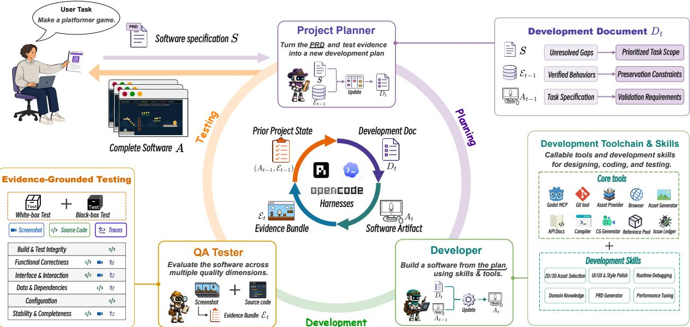  
Figure 3 | Harness-of-Harness overview. HoH repeatedly invokes a Project Planner, Developer, and QA Tester around an evolving software artifact. The deterministic Runtime freezes each role’s inputs, enforces its permissions, binds evidence to the tested candidate, and records the resulting project state. The model, base harness, role definitions, and runtime policy remain fixed within a run; the development document, software artifact, and execution evidence evolve across iterations.

## 3.2 Harness-of-Harness Overview

In end-to-end software development, the next useful change cannot be determined from the specification alone; it requires jointly interpreting the high-level specification, the current artifact, and the evidence accumulated during development. The artifact exposes component dependencies, implementation constraints, and missing capabilities. Execution evidence reveals observed failures, changes the priority of unmet requirements, and identifies validated behavior that subsequent work should preserve.

HoH organizes this changing decision process around a bounded development loop. Each loop starts from the current project state and selects one coherent objective that groups the interdependent work needed for an observable software increment while excluding unrelated changes. It then implements the increment and evaluates the resulting artifact before further development begins. Evaluation results inform the next objective by revealing unmet requirements and observed failures, while identifying validated behavior that subsequent changes should preserve. Repeating this unit allows repair, extension, and preservation demands to be reprioritized as the artifact evolves, keeping local

work aligned with the end-to-end objective.

Producing a validated increment requires three diferent decisions. The system must first determine what to change next from the specification and retained project state. The second decision concerns how to realize that change in the current artifact, where the appropriate implementation depends on details encountered during development. The final decision is whether the resulting behavior satisfies observable requirements. These decisions require diferent context and authority: objective selection requires a project-level view, implementation requires write access and local technical autonomy, and acceptance requires an assessment that is independent of the implementation claim. HoH assigns these responsibilities to a Project Planner, a Developer, and a $Q A$ Tester, respectively. Each loop invokes the same harness–model configuration once in each role, in planning–development–testing order.

## 3.3 Cross-Loop State Management

Repeated loops support iterative and incremental development only when a later loop inherits more than the latest implementation. A software artifact records the code, resources, and configuration that currently exist, but it does not fully record why earlier changes were selected, which observed failures remain unresolved, or which behavior has already been validated. Since each harness invocation has bounded context, information retained only in its interaction history disappears when the invocation ends. A later loop that receives only the code must reconstruct the development state from the implementation. This reconstruction can overlook unmet requirements, repeat work whose outcome is already known, forget unresolved failures, or regress validated behavior.

HoH therefore maintains two complementary states across loop boundaries. The artifact state carries the current implementation from one loop to the next. The evidence state carries the validated knowledge needed to decide how that implementation should change. Together, they preserve both the object under development and the information accumulated by developing and evaluating it.

Let $A _ { t }$ denote the software artifact state after loop $t ,$ including its source code, configuration, resources, and project metadata. It records what the software currently is and provides the concrete starting point for the next increment. Let $\mathcal { E } _ { t }$ denote the execution evidence state obtained by evaluating $A _ { t }$ against the specification and the current development objective. It records which behaviors have been verified, which claims remain unsupported, and which observed failures require further work. Neither state subsumes the other: $A _ { t }$ supplies the implementation on which development operates, whereas $\mathcal { E } _ { t }$ supplies the validated project knowledge used to direct that development.

Let $A _ { 0 }$ denote the empty project workspace before the first loop. With $\mathcal { E } _ { 0 } = \emptyset$ , the transition across loop � can be summarized as

$$
\left( A _ { t - 1 } , \mathcal { E } _ { t - 1 } \right) \xrightarrow { \mathrm { l o o p } t \mathrm { u n d e r } S } \left( A _ { t } , \mathcal { E } _ { t } \right) .\tag{2}
$$

The two states enter a loop in diferent ways. The Project Planner combines the fixed specification $s$ with $\mathcal { E } _ { t - 1 }$ to determine the next bounded increment. It also reads $A _ { t - 1 }$ as implementation context so that the selected work is grounded in the current project. The Developer then starts from $A _ { t - 1 }$ and realizes the increment, producing $A _ { t }$ . The QA Tester evaluates this updated artifact and produces $\mathcal { E } _ { t }$ for the next planning decision.

At the loop boundary, $( A _ { t } , \mathcal { E } _ { t } )$ becomes the starting state of loop $t + 1$ . Carrying $A _ { t }$ forward allows implementation work to accumulate instead of being reconstructed in every loop. Interpreting $\mathcal { E } _ { t }$ under S allows new observations to revise development priorities, unresolved gaps to remain visible, and validated behavior to become a preservation requirement. The next objective can therefore build on prior progress without reconstructing the project trajectory from the artifact alone. Artifact continuity makes development incremental, and evidence-guided objective selection makes it iterative.

## 3.4 Implementation of a HoH Loop

A HoH loop converts retained project state into a coherent software increment whose behavior is independently assessed. This transformation begins with objective selection. The global specification and prior evidence may identify many interdependent demands, so the loop needs a project-level decision about which bounded, locally complete subset should be addressed next. Establishing this scope before artifact modification gives the increment observable completion conditions and separates it from unrelated work.

Realizing the selected objective is a diferent function. The current artifact exposes implementationspecific choices that cannot be fully determined during planning, so artifact modification requires write authority and autonomy over local technical decisions. Assessing the result introduces a third function. The implementing agent has direct knowledge of its changes, but its completion claim cannot establish that the intended behavior is present. Acceptance must instead be determined from observations of a fixed candidate by a role that did not produce that candidate.

These functions difer in the information they require, the authority they exercise, and the deliverable they produce. HoH therefore assigns objective selection to a Project Planner, artifact modification to a Developer, and independent acceptance to a QA Tester. The separation makes the target of an increment explicit, preserves implementation autonomy within that target, and prevents implementation and acceptance from collapsing into the same decision.

HoH instantiates the three roles as separate invocations of the same fixed harness–model configuration. For each invocation, a role-specific prompt specifies the role’s responsibility, while a deterministic Runtime contract enforces its execution authority. The prompt combines fixed role instructions with loop-specific context to state the role’s objective and required structured output, without prescribing its reasoning process or tool sequence.

The Runtime controls which inputs an invocation can access, which tools and write operations it may use, and which output schema it must satisfy. HoH thus constrains what each role may read, change, and deliver while leaving the agent free to determine how to complete its assigned work within those boundaries.

## 3.4.1 Project Planning

The global specification may describe capabilities whose implementation spans interdependent components, while the retained project state adds observed failures, unmet requirements, and behaviors that must be preserved. These demands describe what remains relevant to the project, but they do not by themselves define a tractable unit of work for one loop. Selecting an isolated task can omit dependencies needed for observable behavior, whereas combining too many unrelated demands enlarges the change surface. When the resulting candidate fails, the source of the failure becomes harder to localize, and the afected behavior becomes harder to verify.

The Project Planner converts these competing demands into one bounded objective. It reconciles $s$ with $\mathcal { E } _ { t - 1 }$ to determine what should be addressed next and what previously validated behavior must be preserved. It reads $A _ { t - 1 }$ as implementation context so that the objective reflects the current project structure, but it cannot modify the artifact. The result is a development document $D _ { t }$ that defines the scope and validation conditions of the current increment.

The objective is bounded but locally complete. Boundedness limits the amount of unrelated behavior changed in one loop, which keeps implementation and diagnosis tractable. Local completeness ensures that the selected capability includes the related changes required to make it functional and testable. The scope of an increment is therefore determined by a coherent observable behavior, not simply by the number of files or components it touches.

Accordingly, $D _ { t }$ contains a small set of related tasks, the functionality that must be preserved, and observable requirements for validating the increment. Related changes may span several files or components when they are jointly required by the objective. Unrelated refactoring and opportunistic feature expansion remain outside the loop. The document specifies expected behavior and validation conditions, while leaving the Developer to choose its reasoning process, tools, and implementation algorithm.

## 3.4.2 Artifact Development

A development document defines the intended behavior of an increment, but it cannot anticipate every implementation decision exposed by the evolving artifact. The Developer must interpret $D _ { t }$ in the context of the existing project and adapt its implementation as it encounters code structure, dependencies, and runtime behavior. HoH therefore constrains the Developer by the required outcome and artifact boundary instead of prescribing its internal procedure. Within these constraints, the Developer remains free to select the concrete design, tools, and debugging strategy appropriate to the current artifact.

Artifact development follows a single-writer boundary: only the Developer may modify the evolving artifact. The Developer warm-starts from $A _ { t - 1 }$ so that each increment extends the current implementation and retains the surrounding project structure. The Planner may inspect $A _ { t - 1 }$ to ground the objective, and the QA Tester may inspect and execute the resulting candidate, but neither may alter the artifact. This boundary makes responsibility for the transition from $A _ { t - 1 }$ to $A _ { t }$ explicit and keeps the candidate lineage unambiguous. Once the authorized modifications are complete, the updated project becomes $A _ { t }$

Testing is also integrated into artifact development so that failures are exposed close to the changes that cause them. Before editing, the Developer establishes a baseline for the target behavior. After each meaningful change, it reruns the corresponding path and inspects the afected implementation, execution results, and adjacent regression surface. This baseline–change–retest cycle follows the software-engineering principle commonly known as shift-left testing. Shortening the distance between a change and its test makes local diagnosis and correction more tractable.

Developer testing and independent acceptance answer diferent questions. The Developer uses self-tests to determine whether the implementation is ready to be presented as a candidate and to repair failures encountered during its own work. These tests do not establish that the product requirements have been satisfied. Developer observations and completion claims therefore remain inputs to subsequent verification; acceptance is reserved for the independent QA stage.

## 3.4.3 Independent Quality Assurance

Independent QA determines whether the candidate exhibits the behavior required by the current objective while preserving relevant existing functionality. End-to-end software quality is multidimen sional and cannot generally be reduced to one fixed performance metric. The relevant functional behavior, interaction flows, configuration, resources, and regression risks depend on both the global specification and the selected increment. HoH therefore derives scenario-specific, checkable evaluation criteria from $s$ and $D _ { t }$ rather than applying the same generic test to every candidate.

Algorithm 1 Harness-of-Harness   
Input: specification S, initial artifact $A _ { 0 } ,$ iteration budget �   
Fixed: model �, harness �, and role contracts   
Output: final artifact $A _ { T }$   
1: $\mathcal { E } _ { 0 }  \emptyset$   
2: for $t = 1 , \dots , T$ do   
3: $D _ { t }$ ← ProjectPlanner $( S , { \mathcal { E } } _ { t - 1 } ;$ ; read\_only $\left( A _ { t - 1 } \right) )$   
4: $A _ { t } \gets \mathrm { D e v e l o p e r } ( A _ { t - 1 } ; S , D _ { t } )$   
5: E<sub>�</sub> ← QATester(read\_only $( A _ { t } ) ; S , D _ { t }$ , Runtime. check $\left( A _ { t } \right) )$   
6: end for   
7: return $A _ { T }$

The QA Tester receives $A _ { t }$ as a frozen, read-only candidate together with the results of deterministic build and execution checks. Freezing separates artifact production from artifact assessment: the implementation cannot change while its evidence is being collected. It also gives every observation a single candidate identity, so that an assessment cannot combine behavior from diferent artifact versions. Read-only access prevents the QA stage from silently repairing the candidate it is meant to evaluate.

For each criterion, the QA Tester selects observations appropriate to the software scenario. Black-box tests exercise the candidate through ordinary inputs and rendered outputs to examine user-observable behavior, state transitions, and end-to-end flows. These observations establish whether the required behavior is visible at the product boundary. White-box tests inspect the source, configuration, resource bindings, runtime state, and logs. They help diagnose failures and corroborate observations whose internal conditions cannot be determined from outputs alone.

The two forms of testing provide complementary views of the same frozen candidate. A criterion is verified only when candidate-bound records support the required behavior. Observed failures, unmet requirements, regressions, and insuficient evidence are recorded as gaps instead of being inferred as successful completion. The resulting assessments and supporting execution records form the evidence state $\mathcal { E } _ { t }$ passed to the next loop. This separation ensures that acceptance follows observable evidence rather than the Developer’s knowledge of its implementation or its completion claim.

The complete HoH procedure is summarized in Algorithm 1, which combines the cross-loop state transition with project planning, artifact development, independent quality assurance, and Runtime validation.

## 4 Experiments: Benchmark Evaluation

We evaluate HoH on three software-development benchmarks and three harness–model configurations, comparing final artifact quality with the corresponding Vanilla baselines.

## 4.1 Experimental Setup

Benchmarks. We evaluate HoH on three benchmarks: GameCraft-Bench [23], FrontierSWE [6], and ProgramBench [40]. GameCraft-Bench comprises 140 tasks across 15 game families, each requiring an agent to construct a complete, playable Godot project from a natural-language specification. We sample 45 tasks using stratified random sampling by game family, selecting three tasks from each of the 15 families with a fixed random seed. For coarse-grained analysis, we additionally organize the 15 families into five broader groups defined in this work: Action, Timing, Strategy, Simulation, and Adventure. The complete sampled task list and our family-to-group mapping are provided in the supplementary material. Due to computational resource constraints, we select 15 tasks from FrontierSWE’s 17 tasks for evaluation, comprising 4 Implementation (Impl.), 9 Performance (Perf.), and 2 Research tasks. ProgramBench is a cleanroom program-reconstruction benchmark in which agents receive only a compiled executable and documentation and must rebuild a codebase whose behavior matches the reference program. More details are provided in the supplementary material.

Harnesses and Models. We evaluate HoH with three harness–model configurations: Codex CLI<sup>1</sup> with GPT-5.5 at high reasoning efort, OpenCode<sup>2</sup> with DeepSeek-V4-Pro, and Pi Coding Agent<sup>3</sup> with MiniMax-M3.

Baseline and Evaluation Protocol. We compare HoH against Vanilla, the corresponding harness– model configuration without the HoH protocol. Vanilla performs one standard development pass, whereas HoH@� performs � planning–coding–testing iterations, with the software artifact and execution evidence carried across iterations; the main experiments use � = 3. Intermediate and final HoH artifacts are evaluated only after the complete run, and evaluator outputs are not returned to the development loop. For each task, Vanilla and HoH use identical benchmark-provided initial states and the same underlying harness–model configuration, difering only in the application of the HoH protocol.

Metrics. For GameCraft-Bench, we report the benchmark’s Overall score. Under this metric, game artifacts that fail to compile or run receive a score of zero, while runnable artifacts are scored by combining Core Mechanics, Content Depth, Functional Visuals, and Art and Presentation using the benchmark-defined weights. We average task-level scores over the 45 tasks and use the benchmark’s 0–100 scale. For FrontierSWE, task-specific verifiers assign oficial rewards, and we report the mean reward over the 15 evaluated tasks. We additionally report the oficial dominance score, defined as the average task-level win rate against a randomly selected competing configuration from the 12 evaluated harness–condition combinations. For ProgramBench, we report Avg. Test Pass Rate, computed as the mean across tasks of the fraction of hidden behavioral tests passed for each task. We use this continuous signal for relative comparisons between Vanilla and HoH and abbreviate it as Pass Rate<sup>†</sup> in Table 1. As a proxy for model-interaction volume, we report provider-reported cumulative input and output tokens from coding-harness model calls, excluding benchmark evaluation. Input totals may include cached context reads; because cache accounting difers across providers, we use these values for within-configuration comparisons rather than direct cross-provider cost comparisons.

## 4.2 Main Results

HoH improves software artifact quality across three benchmarks spanning game development, repository-level software engineering, and program reconstruction. Table 1 reports Vanilla and all three HoH iterations for each harness–model configuration. HoH@3 outperforms Vanilla across the three benchmarks under all three configurations. On GameCraft-Bench, mean Overall scores increase from 49.58 to 71.52 for Codex, from 26.90 to 48.98 for OpenCode, and from 42.16 to 58.78 for Pi. On FrontierSWE, rewards increase from 0.31 to 0.54, from 0.23 to 0.31, and from 0.26 to 0.55, respectively. On ProgramBench, Avg. Test Pass Rate increases from 60.41 to 66.50 for Codex, from 45.27 to 57.56 for OpenCode, and from 35.83 to 52.68 for Pi. HoH@3 also outperforms Vanilla in every reported task category across the three benchmarks under all three configurations.

<table><tr><td rowspan="2">Setting</td><td colspan="6">GameCraft-Bench</td><td colspan="4">FrontierSWE</td><td>ProgramBench</td></tr><tr><td>Action Timing</td><td></td><td>Strat.</td><td>Sim.</td><td>Adv.</td><td>Overall</td><td>Impl.</td><td>Perf.</td><td>Research</td><td>Dominance</td><td>Pass Rate†</td></tr><tr><td colspan="10">■ Codex + GPT-5.5 (high)</td></tr><tr><td>Vanilla</td><td>48.74</td><td>48.80</td><td>44.06</td><td>53.63</td><td>52.68</td><td>49.58</td><td>0.21</td><td>0.17</td><td>1.15</td><td>44%</td><td>60.41</td></tr><tr><td>HoH@1</td><td>59.73</td><td>53.79</td><td>57.01</td><td>66.75</td><td>61.24</td><td>59.71</td><td>0.24</td><td>0.44</td><td>1.30</td><td>58%</td><td>65.42</td></tr><tr><td>HoH@2</td><td>64.34</td><td>62.03</td><td>59.97</td><td>71.77</td><td>66.11</td><td>64.84</td><td>0.28</td><td>0.45</td><td>1.18</td><td>60%</td><td>65.79</td></tr><tr><td>HoH@3</td><td>71.02</td><td>70.26</td><td>66.13</td><td>78.42</td><td></td><td>71.76 71.52 (+21.93)</td><td>0.30</td><td>0.45</td><td>1.45</td><td>71%(+27)</td><td>66.50 (+6.09)</td></tr><tr><td colspan="10">OpenCode + DeepSeek-V4-Pro</td></tr><tr><td>Vanilla</td><td>26.21</td><td>24.05</td><td>21.27</td><td>37.12</td><td>25.84</td><td>26.90</td><td>0.08</td><td>0.23</td><td>0.57</td><td>25%</td><td>45.27</td></tr><tr><td>HoH@1</td><td>27.75</td><td>27.40</td><td>21.73</td><td>43.75</td><td>22.44</td><td>28.61</td><td>0.09</td><td>0.23</td><td>0.78</td><td>28%</td><td>55.33</td></tr><tr><td>HoH@2</td><td>43.22</td><td>36.56</td><td>33.51</td><td>52.26</td><td>36.05</td><td>40.32</td><td>0.10</td><td>0.27</td><td>0.78</td><td>42%</td><td>55.66</td></tr><tr><td>HoH@3</td><td>49.00</td><td>45.05</td><td>43.34</td><td>55.86</td><td></td><td>51.64 48.98 (+22.08)</td><td>0.15</td><td>0.27</td><td>0.78</td><td>44%(+19)</td><td>57.56 (+12.29)</td></tr><tr><td colspan="10">Pi + MiniMax-M3</td></tr><tr><td></td><td></td><td></td><td>34.53</td><td>48.19</td><td>44.26</td><td>■</td><td>0.06</td><td>0.12</td><td></td><td></td><td></td></tr><tr><td>Vanilla HoH@1</td><td>45.64 50.59</td><td>38.20 52.23</td><td>38.60</td><td>54.00</td><td>49.89</td><td>42.16 49.06</td><td>0.10</td><td>0.42</td><td>1.30 1.89</td><td>35% 62%</td><td>35.83 48.68</td></tr><tr><td>HoH@2</td><td>54.70</td><td>56.52</td><td>42.33</td><td>63.20</td><td>58.47</td><td>55.04</td><td>0.11</td><td>0.43</td><td>1.89</td><td>66%</td><td>53.57</td></tr><tr><td>HoH@3</td><td>58.24</td><td>62.10</td><td>44.86</td><td>64.25</td><td></td><td>64.44 58.78 (+16.62)</td><td>0.11</td><td>0.45</td><td>1.88</td><td>64% (+29)</td><td>52.68 (+16.85)</td></tr></table>

Table 1 | Main results on GameCraft-Bench, FrontierSWE, and ProgramBench. Each harness is evaluated under Vanilla and HoH@1–3. Within each harness and metric, bold values mark the best setting; rankings use unrounded values, and exact ties share the same formatting. Small green values shown only for HoH@3 give absolute gains over Vanilla; Dominance gains are percentage points. Bold italic labels distinguish aggregate metrics from task categories. Strat., Sim., Adv., Impl., and Perf. denote Strategy, Simulation, Adventure, Implementation, and Performance, respectively. FrontierSWE reports category scores and Dominance. For ProgramBench, Pass Rate<sup>†</sup> denotes the benchmark’s Avg. Test Pass Rate.

HoH yields consistent gains over Vanilla across all three harness–model pairs. The gains are not limited to configurations with a particular level of Vanilla performance. Codex with GPT-5.5 (high), the strongest Vanilla configuration, reaches the highest final GameCraft-Bench score of 71.52 after improving by 21.93 points. Pi with MiniMax-M3 records the largest gain on FrontierSWE, increasing by 0.29 from 0.26 to 0.55, and the largest ProgramBench gain, increasing the average test pass rate by 16.85 points. OpenCode with DeepSeek-V4-Pro starts from the lowest Vanilla score on GameCraft-Bench and FrontierSWE, yet HoH@3 raises its scores to 48.98 and 0.31, respectively, while increasing its ProgramBench average test pass rate from 45.27 to 57.56. OpenCode with HoH@3 further exceeds Codex Vanilla in Action and Simulation on GameCraft-Bench and in Performance on FrontierSWE. Thus, HoH improves configurations that begin at substantially diferent levels of Vanilla performance.

HoH continues to improve software artifact quality as development loops progress. Table 1 traces the gains accumulated over the first three development loops. On GameCraft-Bench, Overall scores increase monotonically from HoH@1 to HoH@3 under all three harness–model pairs. This trend is particularly pronounced for OpenCode, whose gain over Vanilla grows from 1.71 points at HoH@1 to

13.42 at HoH@2 and 22.08 at HoH@3. On FrontierSWE, the cross-configuration Dominance of Codex increases from 44% under Vanilla to 58%, 60%, and 71% at HoH@1–3, respectively. ProgramBench exhibits a similar overall pattern: Codex and OpenCode attain their highest Pass Rates at HoH@3, while Pi peaks at HoH@2.

## 4.3 Analysis and Ablation Study

On GameCraft-Bench, HoH improves software quality across mechanics, content, visuals, and presentation. Figure 4 reports the four benchmark-defined GameCraft-Bench quality components separately. HoH@3 improves all four components under every harness–model configuration, with gains of 20.00–25.56 points for Codex, 19.25–34.63 points for OpenCode, and 11.32–25.38 points for Pi. For Codex, Functional Visuals shows the largest increase, from 48.67 to 74.23, while Art and Presentation rises from 45.28 to 65.28. The improvements therefore span gameplay mechanics, content richness, visual clarity, and presentation quality.

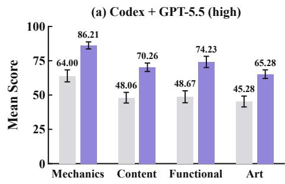

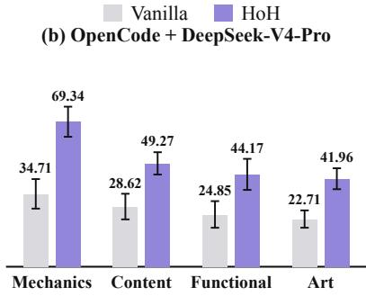

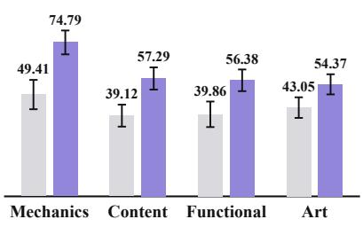  
Figure 4 | Vanilla and HoH@3 scores across the four GameCraft-Bench rubric categories. Panels (a)–(c) show results for Codex with GPT-5.5 (high), OpenCode with DeepSeek-V4-Pro, and Pi with MiniMax-M3, respectively. Bars report mean category scores over 45 tasks for Core Mechanics, Content Depth, Functional Visuals, and Art and Presentation; error bars indicate 95% bootstrap confidence intervals.

On FrontierSWE, HoH sustains quality gains over ten loops. To examine whether these gains extend beyond three loops, we continue running Codex with GPT-5.5 (high) through HoH@10 on the same 15 FrontierSWE tasks and report Dominance over a fixed 11-checkpoint comparison pool comprising Vanilla and HoH@1–10.

As shown in Figure 5, Dominance increases from 39.33% at HoH@3 to 72.67% at HoH@10 and reaches 76.00% at HoH@9, whereas Vanilla obtains 27.33%. HoH@10 therefore improves upon HoH@3 by a further 33.34 percentage points and exceeds Vanilla by 45.34 points.

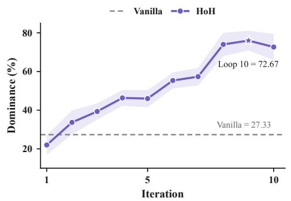  
Figure 5 | FrontierSWE Dominance over 10 loops. Shading shows ±1 SE; the star marks the best checkpoint and the dashed line denotes Vanilla baseline.

For the same number of development passes, HoH consistently outperforms the Vanilla baseline. To distinguish the contribution of HoH from the efect of running the coding agent for more passes, we compare it with Vanilla Continuation using Codex with GPT-5.5 (high). Vanilla uses the oficial harness configuration with the same model and inference settings as HoH. After each pass, Vanilla Continuation submits an additional iteration prompt to continue the same session for another development pass. Table 2 reports the resulting pass-controlled comparison.

(b) Kitchen Rush  
(c) Ant Empire  
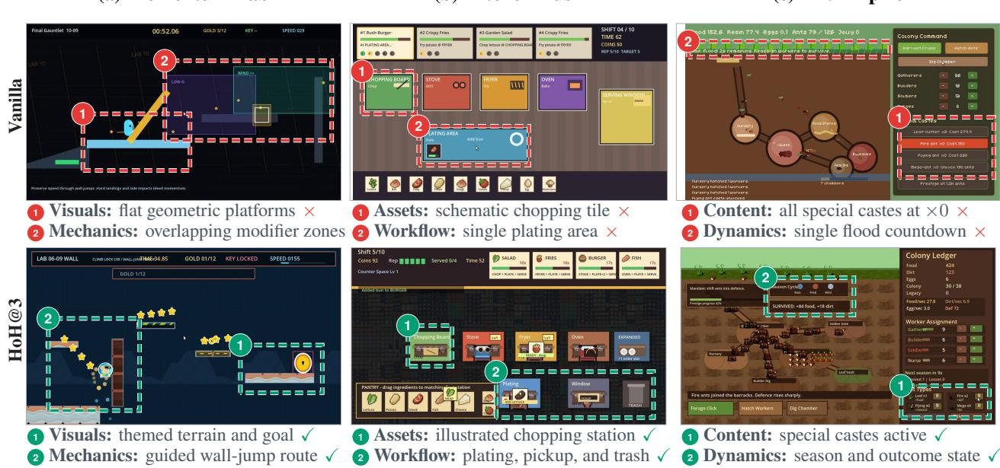  
Figure 6 | Qualitative comparison of final game artifacts produced by Vanilla and HoH@3 using Codex with GPT-5.5 (high). Columns show three GameCraft-Bench tasks from distinct game families: Momentum Lab (momentum-based platformer), Kitchen Rush (restaurant-management simulation), and Ant Empire (idle colony-management game). Rows show gameplay frames from Vanilla (top) and HoH@3 (bottom). Numbered dashed boxes identify the regions discussed in the annotations; red crosses and green checks denote limitations and implemented functionality, respectively.

At matched budgets of one, two, and three development passes, HoH achieves scores of 59.71, 64.84, and 71.52, compared with 49.58, 54.99, and 58.24 for Vanilla, corresponding to gains of 10.13, 9.85, and 13.28 points. The advantage is not explained by greater token use alone: HoH@2 achieves 64.84 with 5.67M tokens, exceeding the 58.24 obtained by three-pass Vanilla Continuation with 6.33M tokens. HoH therefore produces higher-quality artifacts than repeated Vanilla development under the same pass budget and a comparable inference budget. Further details of the pass-controlled experimental design and complete results are provided in the supplementary material.

<table><tr><td>Method</td><td>Dev. Passes Score Tokens (M)</td><td></td><td></td></tr><tr><td>Vanilla</td><td>1</td><td>49.58</td><td>2.59</td></tr><tr><td>Vanilla Continuation</td><td>2</td><td>54.99</td><td>4.56</td></tr><tr><td>Vanilla Continuation</td><td>3</td><td>58.24</td><td>6.33</td></tr><tr><td>HoH</td><td>1</td><td>59.71</td><td>2.88</td></tr><tr><td>HoH</td><td>2</td><td>64.84</td><td>5.67</td></tr><tr><td>HoH</td><td>3</td><td>71.52</td><td>8.41</td></tr></table>

Table 2 | Comparison of HoH and repeated Vanilla development after 1, 2, and 3 development passes on GameCraft-Bench. Results use Codex with GPT-5.5 (high). Score denotes the mean GameCraft-Bench Overall score over 45 tasks, and tokens are mean cumulative coding-harness tokens per task.

Qualitative Analysis. On GameCraft-Bench, HoH produces more complete and refined game artifacts, with richer gameplay mechanics, clearer visual presentation, and deeper progression. Figure 6 compares gameplay frames from Vanilla and HoH@3 for three tasks from distinct game families.

In Momentum Lab, themed terrain and visual cues make the objective and wall-jump route explicit. In Kitchen Rush, distinct pickup, preparation, plating, and disposal stations form a complete and legible restaurant workflow. In Ant Empire, specialist caste counts, seasonal state, and outcome state expose longer-term colony progression. The corresponding Overall scores increase from 34.05 to 70.61, from 42.63 to 73.38, and from 65.52 to 87.88, respectively.

Ablation Study. To assess the role of HoH’s cross-iteration mechanisms, we evaluate three variants on all 45 GameCraft-Bench tasks using Codex with GPT-5.5 (high), with � = 3 for each variant. w/o Plan Update freezes the first development document for subsequent iterations $( D _ { t } = D _ { 1 } { \mathrm { ~ f o r ~ } } t \geq 2 )$ , whereas w/o Evidence Feedback replans without the preceding execution evidence. Both retain artifact warm-start. w/o Warm-Start retains evidence-conditioned plan-

<table><tr><td>Variant</td><td>Score</td><td>Tokens (M)</td></tr><tr><td>w/o Plan Update</td><td>63.39 (-8.13)</td><td>7.56</td></tr><tr><td rowspan="2">w/o Evidence Feedback 65.23 (-6.28) w/o Warm-Start</td><td></td><td>7.46</td></tr><tr><td>63.67 (-7.85)</td><td>11.12</td></tr><tr><td>Full HoH@3</td><td>71.52</td><td>8.41</td></tr></table>

Table 3 | GameCraft-Bench ablation study with Codex and GPT-5.5 (high). Parentheses show score diferences from Full HoH@3; tokens are mean cumulative totals per task.

ning but rebuilds the artifact from the empty initial workspace $A _ { 0 }$ in every iteration.

As shown in Table 3, all three variants underperform Full HoH@3 on every task. Removing plan updates, excluding execution evidence from replanning, and removing warm-start lowers the score by 8.13, 6.28, and 7.85 points, respectively. Without warm-start, token usage also increases from 8.41M to 11.12M per task because of repeated reconstruction. These results show that later HoH iterations benefit from both revising the development document with execution evidence and continuing from the preceding implementation. Detailed ablation protocols and complete per-task results are provided in the supplementary material.

## 5 Experiments: Multi-Day Autonomous FPS Game Development

Benchmark evaluations measure artifact quality after a small number of development loops. A multiday case study examines a complementary property: whether a fixed harness–model configuration can maintain coherent project evolution as implementation constraints, validated behavior, and observed failures accumulate over many loops. We study this property through Fusepoint, a single-player narrative first-person shooter developed from an empty workspace containing only a user-provided product requirements document (PRD). The case analyzes whether HoH can sustain incremental progress over 70 loops as implementation constraints, validated behavior, and observed failures accumulate.

## 5.1 Case Design and Autonomy Boundary

Task and Autonomy Boundary. Fusepoint provides a demanding end-to-end development case. The product contract specifies a five-minute, single-player bomb-defusal mission. It requires the ordered capture of two control points, a three-stage defusal at the final objective, a fixed roster of 18 enemies distributed as 3, 5, and 10 across the three encounter regions, and distinct success and detonation branches. Satisfying these requirements depends on integrating a 3D environment and external assets with mission logic, combat mechanics, narrative progression, interface feedback, and runtime reliability. Progress therefore requires both the construction of new capabilities and the continued operation of behavior introduced in earlier loops.

Development began in an empty workspace containing the PRD. The PRD specified the intended gameplay and player-observable acceptance criteria, while leaving the engineering decomposition, implementation order, and validation plan open. HoH was responsible for translating this product contract into an executable Godot project and for selecting, implementing, and evaluating the increments used to construct it.

We ran HoH with Codex CLI and GPT-5.6-Sol at high reasoning efort. At the analysis cutof, the system had completed 70 development loops. Human involvement was limited to restoring network or API availability and did not extend to planning, implementation, debugging, testing, or acceptance.

Domain-Specific Skills and Tools. Interactive game development requires more than sourcecode editing: the agents must manipulate engine state, produce compatible media assets, maintain a coherent interface, and test behavior through the running game. We therefore equipped HoH with domain-specific tools and reusable skills. Godot 4.7<sup>4</sup> served as the development and runtime environment, while Godot MCP provided engine-level development, execution, and debugging capabilities. An asset-generation skill specified the target visual style, dimensions, and file formats for image, 3D, and video assets retrieved or generated by the corresponding tools. A UI/UX presentation skill supplied guidance on visual appearance and style consistency. A testing skill recorded scenariospecific testing considerations and guided debugging and validation through Godot MCP. All external assets incorporated during development were obtained under licenses permitting reuse, including CC0 and CC BY, with their source and required attribution preserved.

Verification Scope. Benchmark configurations evaluate through bounded task-provided checks, including screenshots and smoke tests. For this case, the Tester additionally examined live keyboard input and the resulting game responses, audio behavior, and the integration of 3D assets.

Project State and Traceability. We used GitHub for version control and issue tracking, retaining the commit and issue histories of the evolving project. At each loop, the working state was materialized in a development document, the versioned software workspace, and testing records comprising an issue table and evidence-packet files. These records allowed the three roles to modify, execute, and inspect the same project while retaining the artifact and observed test outcomes across loops. The GitHub repository linked on the title page provides the released project materials and selected development records for inspection of the process.

## 5.2 Development Dynamics Across Loops

Figure 1 summarizes how Fusepoint evolved through 70 HoH loops. To characterize the development dynamics underlying this trajectory, we tracked newly recorded issues, QA-verified closures, reopened issues, and the unresolved issue count using the GitHub issue and commit histories together with the evidence packets produced during testing. These records reflect whether capability growth was accompanied by accumulating gaps and whether later loops returned to failures exposed during earlier development.

The observed trajectory through 70 loops contains three broad phases, distinguished by the relative prevalence of capability addition, issue discovery, and issue resolution. During initial construction (Loops 1–27), HoH established the executable project and its core interaction paths. Adding these initial capabilities also exposed missing requirements and defects, so the active issue backlog increased as the artifact became more testable.

Capability expansion (Loops 28–49) then combined new functionality with continued diagnosis and repair. Later loops operated on an increasingly integrated artifact, where a local change could afect mission state, combat, interface feedback, or runtime behavior established previously. As the planned capabilities approached completion, feature additions slowed and issue resolution became more prevalent, producing a stabilization phase in which the active backlog began to decline.

Issue resolution remained non-monotonic throughout this process. By Loop 70, 65 of the 81 recorded issues had been closed, leaving 16 unresolved. Seventeen issues were reopened after an earlier closure when a subsequent change caused previously verified behavior to fail again. A reopened record identifies both the failed behavior and its earlier verification history, making regression repair available as explicit project work to subsequent planning instead of requiring that history to be reconstructed from the latest artifact.

The trajectory consequently reflects the two forms of continuity required by iterative development. The versioned workspace allowed implementation work to accumulate, while its GitHub commit history made individual changes traceable. The issue history and evidence packets kept unfinished work, verified behavior, and regressions available for later planning. Development could therefore alternate among capability growth, repair, and preservation as the state of the project changed.

## 6 Conclusion and Future Work

We introduced Harness-of-Harness (HoH), which extends existing coding-agent harnesses to support software development from scratch without modifying their implementations. HoH organizes a fixed harness–model configuration into a continuous planning–coding–testing cycle, carrying evolving artifacts and execution evidence across iterations. On the benchmark tasks, HoH improves final artifact quality for all three evaluated configurations and continues to benefit from additional iterations. In the multi-day Fusepoint case, HoH developed a game project over 70 loops, with the versioned workspace, issue history, and evidence packets recording the development trajectory. Just as a coding harness structures model operation, HoH structures harness participation in long-horizon development. More broadly, HoH ofers a practical path toward end-to-end software development through persistent, evidence-grounded orchestration of coding-agent harnesses. Future work will extend HoH to a broader range of real-world development scenarios, including diferent types of games and other software systems [35, 42, 43, 44, 47, 48], toward a general framework for autonomous software development.

## References

[1] Anthropic. Claude Code for Product Development. Anthropic technical report, 2025. https://www-cdn. anthropic.com/58284b19e702b49db9302d5b6f135ad8871e7658.pdf.

[2] Shraddha Barke, Michael B. James, and Nadia Polikarpova. Grounded copilot: How programmers interact with code-generating models. Proceedings of the ACM on Programming Languages, 7(OOPSLA1):85–111, 2023. doi: 10.1145/3586030. https://doi.org/10.1145/3586030.

[3] Mert Cemri, Melissa Z. Pan, Shuyi Yang, Lakshya A. Agrawal, Bhavya Chopra, Rishabh Tiwari, Kurt Keutzer, Aditya Parameswaran, Dan Klein, Kannan Ramchandran, Matei A. Zaharia, Joseph E. Gonzalez, and Ion Stoica. Why do multi-agent LLM systems fail? In Advances in Neural Information Processing Systems, volume 38. Curran Associates, Inc., 2025. https://proceedings.neurips.cc/paper\_files/ paper/2025/file/b1041e52d3be19f0a9bc491657488e4a-Paper-Datasets\_and\_Benchmarks\_Track.pdf.

[4] Mark Chen, Jerry Tworek, Heewoo Jun, Qiming Yuan, Henrique Pondé de Oliveira Pinto, Jared Kaplan, Harri Edwards, Yuri Burda, Nicholas Joseph, Greg Brockman, Alex Ray, Raul Puri, Gretchen Krueger, Michael Petrov, Heidy Khlaaf, Girish Sastry, Pamela Mishkin, Brooke Chan, Scott Gray, Nick Ryder, Mikhail Pavlov, Alethea Power, Lukasz Kaiser, Mohammad Bavarian, Clemens Winter, Philippe Tillet, Felipe Petroski Such, Dave Cummings, Matthias Plappert, Fotios Chantzis, Elizabeth Barnes, Ariel Herbert Voss, William Hebgen Guss, Alex Nichol, Alex Paino, Nikolas Tezak, Jie Tang, Igor Babuschkin, Suchir Balaji, Shantanu Jain, William Saunders, Christopher Hesse, Andrew N. Carr, Jan Leike, Joshua Achiam, Vedant Misra, Evan Morikawa, Alec Radford, Matthew Knight, Miles Brundage, Mira Murati, Katie Mayer, Peter Welinder, Bob McGrew, Dario Amodei, Sam McCandlish, Ilya Sutskever, and Wojciech

Zaremba. Evaluating large language models trained on code. CoRR, abs/2107.03374, 2021. https: //arxiv.org/abs/2107.03374.

[5] Mengzhuo Chen, Junjie Wang, Zhe Liu, Yawen Wang, Haiming Zheng, and Qing Wang. From failed trajectories to reliable LLM agents: Diagnosing and repairing harness flaws, 2026. https://arxiv.org/ abs/2606.06324.

[6] Evan Chu, Rajan Agarwal, Abishek Thangamuthu, Brendan Graham, Justus Mattern, Freeman Jiang, Paul Cento, Swarnim Jain, Mersad Abbasi, Mohammad Hossein Rezaei, George Wang, Alex Zhang, Simon Guo, Karina Nguyen, Danna Liu, Arash Bidgoli, Aditya Dalmia, Apoorv Dankar, Ashrut Vaddela, Calvin Chen, Keshav Kumar, Kushagra Vaish, Navid Pour, Rishyanth Kondra, Sagar Badiyani, Sidharth Giri, Snagnik Das, Soham Gaikwad, Syed Shah, Vagish Dilawari, and Vishal Agarwal. Frontierswe. Proximal Blog, 2026. https://frontierswe.com/blog.

[7] Lingyue Fu, Xin Ding, Yaoming Zhu, Shao Zhang, Lin Qiu, Weiwen Liu, Weinan Zhang, Xuezhi Cao, Xunliang Cai, Jiaxin Ding, et al. Catarena: Evaluation of llm agents through iterative tournament competitions. Proceedings of the 43rd International Conference on Machine Learning(ICML2026), 2026.

[8] Sirui Hong, Mingchen Zhuge, Jonathan Chen, Xiawu Zheng, Yuheng Cheng, Jinlin Wang, Ceyao Zhang, Zili Wang, Steven Yau, Zijuan Lin, Liyang Zhou, Chenyu Ran, Lingfeng Xiao, Chenglin Wu, and Jürgen Schmidhuber. MetaGPT: Meta programming for a multi-agent collaborative framework. In International Conference on Learning Representations, pages 23247–23275, 2024. https://proceedings.iclr.cc/ paper\_files/paper/2024/file/6507b115562bb0a305f1958ccc87355a-Paper-Conference.pdf.

[9] Yue Hu, Yuzhu Cai, Yaxin Du, Xinyu Zhu, Xiangrui Liu, Zijie Yu, Yuchen Hou, Shuo Tang, and Siheng Chen. Self-evolving multi-agent collaboration networks for software development. In International Conference on Learning Representations, pages 23007–23039, 2025. https://proceedings.iclr.cc/ paper\_files/paper/2025/file/39af4f2f9399122a14ccf95e2d2e7122-Paper-Conference.pdf.

[10] Dong Huang, Jie M. Zhang, Michael Luck, Qingwen Bu, Yuhao Qing, and Heming Cui. AgentCoder: Multi-agent-based code generation with iterative testing and optimisation, 2023. https://arxiv.org/ abs/2312.13010.

[11] Jek Huang, Jefery Hsia, Jiayi Sun, Freddie Shi, Wei Huang, and Ian H. White. Proof-or-stop: Don’t trust the agent, trust the evidence—loop engineering for verifiable evidence-gated lifecycle control, 2026. https://arxiv.org/abs/2607.14890

[12] Carlos E. Jimenez, John Yang, Alexander Wettig, Shunyu Yao, Kexin Pei, Ofir Press, and Karthik Narasimhan. SWE-Bench: Can language models resolve real-world GitHub issues? In International Conference on Learning Representations, pages 54107–54157, 2024. https://proceedings.iclr.cc/ paper\_files/paper/2024/file/edac78c3e300629acfe6cbe9ca88fb84-Paper-Conference.pdf.

[13] Craig Larman and Victor R Basili. Iterative and incremental developments. a brief history. Computer, 36 (6):47–56, 2003.

[14] Tue Le, Minh V. T. Thai, Dung Nguyen Manh, Huy Phan Nhat, and Nghi D. Q. Bui. SWE-EVO: Benchmarking Coding Agents in Long-Horizon Software Evolution Scenarios, 2025. https://arxiv.org/abs/ 2512.18470.

[15] Yoonho Lee, Roshen Nair, Qizheng Zhang, Kangwook Lee, Omar Khattab, and Chelsea Finn. Meta-Harness: End-to-end optimization of model harnesses, 2026. https://arxiv.org/abs/2603.28052.

[16] Junjie Li, Xi Xiao, Yunbei Zhang, Chen Liu, Lin Zhao, Xiaoying Liao, Yingrui Ji, Janet Wang, Yingqiang Ge, Weijie Xu, Xi Fang, Xiang Xu, Tianchen Zhao, Youngeun Kim, Jihun Hamm, Tianyang Wang, and Chandan Reddy. Agent harness engineering: A survey, 2026. https://openreview.net/pdf?id=eONq7FdiHa.

[17] Jiacheng Liu, Xiaohan Zhao, Xinyi Shang, and Zhiqiang Shen. Dive into Claude Code: The design space of today’s and future AI agent systems, 2026. https://arxiv.org/abs/2604.14228.

[18] Junwei Liu, Chen Xu, Chong Wang, Tong Bai, Weitong Chen, Kaseng Wong, Yiling Lou, and Xin Peng. Towards iterative end-to-end software development: A feature-driven multi-agent framework, 2026.

https://arxiv.org/abs/2511.02399. Accepted at the 35th ACM SIGSOFT International Symposium on Software Testing and Analysis (ISSTA 2026).

[19] Pengfei Liu, Weizhe Yuan, Jinlan Fu, Zhengbao Jiang, Hiroaki Hayashi, and Graham Neubig. Pre-train, prompt, and predict: A systematic survey of prompting methods in natural language processing. ACM Computing Surveys, 55(9):1–35, 2023. doi: 10.1145/3560815. https://doi.org/10.1145/3560815.

[20] Xinghua Lou, Miguel Lázaro-Gredilla, Antoine Dedieu, Carter Wendelken, Wolfgang Lehrach, and Kevin P. Murphy. AutoHarness: Improving LLM agents by automatically synthesizing a code harness, 2026. https://arxiv.org/abs/2603.03329.

[21] Pengrui Lu, Shiqi Zhang, Yunzhong Hou, Lyumanshan Ye, Chaoyi Huang, Zixi Chen, Ji Zeng, Hantao Jiang, Pengfei Liu, Yiwei Wang, and Ming-Hsuan Yang. ProjDevBench: Benchmarking AI Coding Agents on End-to-End Project Development, 2026. https://arxiv.org/abs/2602.01655.

[22] Shuai Lu, Daya Guo, Shuo Ren, Junjie Huang, Alexey Svyatkovskiy, Ambrosio Blanco, Colin Clement, Dawn Drain, Daxin Jiang, Duyu Tang, Ge Li, Lidong Zhou, Linjun Shou, Long Zhou, Michele Tufano, Ming Gong, Ming Zhou, Nan Duan, Neel Sundaresan, Shao Kun Deng, Shengyu Fu, and Shujie Liu. CodeXGLUE: A machine learning benchmark dataset for code understand ing and generation. In Proceedings of the Neural Information Processing Systems Track on Datasets and Benchmarks, 2021. https://datasets-benchmarks-proceedings.neurips.cc/paper/2021/hash/ c16a5320fa475530d9583c34fd356ef5-Abstract-round1.html.

[23] Tongxu Luo, Rongsheng Wang, Jiaxi Bi, Chenming Xu, Zhengyang Tang, Jianlong Chen, Juhao Liang, Ke Ji, Shuqi Guo, Yuhao Du, Fan Bu, Wenyu Du, Xiaotong Zhang, Kyle Li, Shaobo Wang, Linfeng Zhang, Yuxuan Liu, Xin Lai, Chenxin Li, Yiduo Guo, Zhexin Zhang, Xinyuan Wang, Tianyi Bai, Ziniu Li, and Benyou Wang. GameCraft-Bench: Can Agents Build Playable Games End-to-End in a Real Game Engine?, 2026. https://arxiv.org/abs/2606.17861.

[24] Aman Madaan, Niket Tandon, Prakhar Gupta, Skyler Hallinan, Luyu Gao, Sarah Wiegrefe, Uri Alon, Nouha Dziri, Shrimai Prabhumoye, Yiming Yang, Shashank Gupta, Bodhisattwa Prasad Majumder, Katherine Hermann, Sean Welleck, Amir Yazdanbakhsh, and Peter Clark. Self-Refine: Iterative refinement with self-feedback. In Advances in Neural Information Processing Systems, volume 36, pages 46534–46594, 2023. https://proceedings.neurips.cc/paper\_files/paper/2023/file/ 91edff07232fb1b55a505a9e9f6c0ff3-Paper-Conference.pdf.

[25] Mike A Merrill, Alexander G Shaw, Nicholas Carlini, Boxuan Li, Harsh Raj, Ivan Bercovich, Lin Shi, Jeong Yeon Shin, Thomas Walshe, E Kelly Buchanan, et al. Terminal-bench: Benchmarking agents on hard, realistic tasks in command line interfaces. arXiv preprint arXiv:2601.11868, 2026.

[26] Niels Mündler, Mark Niklas Müller, Jingxuan He, and Martin Vechev. SWT-Bench: Testing and validating real-world bug-fixes with code agents. In Amir Globerson, Lester Mackey, Danielle Belgrave, Angela Fan, Ulrich Paquet, Jakub Tomczak, and Cheng Zhang, editors, Advances in Neural Information Processing Systems, volume 37, pages 81857–81887. Curran Associates, Inc., 2024. doi: 10.52202/079017-2601. https://proceedings.neurips.cc/paper\_files/paper/2024/ file/94f093b41fc2666376fb1f667fe282f3-Paper-Conference.pdf.

[27] Minh Huynh Nguyen, Thang Phan Chau, Phong X. Nguyen, and Nghi D. Q. Bui. AgileCoder: Dynamic collaborative agents for software development based on agile methodology. In 2025 IEEE/ACM Second International Conference on AI Foundation Models and Software Engineering (FORGE), pages 156–167. IEEE, 2025. doi: 10.1109/FORGE66646.2025.00026. https://doi.org/10.1109/FORGE66646.2025.00026.

[28] Gabriel Orlanski, Devjeet Roy, Alexander Yun, Changho Shin, Alex Gu, Albert Ge, Dyah Adila, Nicholas Roberts, Frederic Sala, and Aws Albarghouthi. SlopCodeBench: Benchmarking how coding agents degrade over long-horizon iterative tasks, 2026. https://arxiv.org/abs/2603.24755.

[29] Khouloud Oueslati, Maxime Lamothe, and Foutse Khomh. RefAgent: A Multi-Agent LLM-Based Framework for Automatic Software Refactoring. In Proceedings of the 48th IEEE/ACM International Conference on Software Engineering, 2026. https://arxiv.org/abs/2511.03153.

[30] Charles Packer, Sarah Wooders, Kevin Lin, Vivian Fang, Shishir G. Patil, Ion Stoica, and Joseph E. Gonzalez. MemGPT: Towards LLMs as operating systems, 2024. https://arxiv.org/abs/2310.08560.

[31] Sebastian A. C. Perrig, Nicolas Scharowski, Florian Brühlmann, Nick von Felten, Klaus Opwis, and Lena Fanya Aeschbach. Independent validation of the player experience inventory: Findings from a large set of video game players. In Proceedings of the 2024 CHI Conference on Human Factors in Computing Systems, CHI ’24, New York, NY, USA, 2024. Association for Computing Machinery. doi: 10.1145/3613904.3642270. https://doi.org/10.1145/3613904.3642270.

[32] Chen Qian, Wei Liu, Hongzhang Liu, Nuo Chen, Yufan Dang, Jiahao Li, Cheng Yang, Weize Chen, Yusheng Su, Xin Cong, Juyuan Xu, Dahai Li, Zhiyuan Liu, and Maosong Sun. ChatDev: Communicative agents for software development. In Proceedings of the 62nd Annual Meeting of the Association for Computational Linguistics (Volume 1: Long Papers), pages 15174–15186. Association for Computational Linguistics, 2024. doi: 10.18653/v1/2024.acl-long.810. https://aclanthology.org/2024.acl-long.810/.

[33] Noah Shinn, Federico Cassano, Ashwin Gopinath, Karthik Narasimhan, and Shunyu Yao. Reflexion: Language agents with verbal reinforcement learning. In Advances in Neural Information Processing Systems, volume 36, pages 8634–8652, 2023. https://proceedings.neurips.cc/paper\_files/paper/ 2023/file/1b44b878bb782e6954cd888628510e90-Paper-Conference.pdf.

[34] Vero Vanden Abeele, Katta Spiel, Lennart E. Nacke, Daniel Johnson, and Kathrin Gerling. Development and validation of the player experience inventory: A scale to measure player experiences at the level of functional and psychosocial consequences. International Journal of Human-Computer Studies, 135: 102370, 2020. doi: 10.1016/j.ijhcs.2019.102370. https://doi.org/10.1016/j.ijhcs.2019.102370.

[35] Xihuai Wang\*, Shao Zhang\*, Wenhao Zhang, Wentao Dong, Jingxiao Chen, Ying Wen, and Weinan Zhang. Zsc-eval: An evaluation toolkit and benchmark for multi-agent zero-shot coordination. The 38th Conference on Neural Information Processing Systems (NeurIPS 2024) Track on Datasets and Benchmarks, 2024.

[36] Xingyao Wang, Boxuan Li, Yufan Song, Frank F. Xu, Xiangru Tang, Mingchen Zhuge, Jiayi Pan, Yueqi Song, Bowen Li, Jaskirat Singh, Hoang Tran, Fuqiang Li, Ren Ma, Mingzhang Zheng, Bill Qian, Daniel Shao, Niklas Muennighof, Yizhe Zhang, Binyuan Hui, Junyang Lin, Robert Brennan, Hao Peng, Heng Ji, and Graham Neubig. OpenHands: An open platform for AI software developers as generalist agents. In International Conference on Learning Representations, pages 65882–65919, 2025. https://proceedings.iclr. cc/paper\_files/paper/2025/file/a4b6ad6b48850c0c331d1259fc66a69c-Paper-Conference.pdf.

[37] Yue Wang, Hung Le, Akhilesh Gotmare, Nghi D. Q. Bui, Junnan Li, and Steven C. H. Hoi. CodeT5+: Open code large language models for code understanding and generation. In Proceedings of the 2023 Conference on Empirical Methods in Natural Language Processing, pages 1069–1088. Association for Computational Linguistics, 2023. doi: 10.18653/v1/2023.emnlp-main.68. https://aclanthology.org/ 2023.emnlp-main.68/.

[38] Chunqiu Steven Xia, Yinlin Deng, Soren Dunn, and Lingming Zhang. Demystifying LLM-based software engineering agents. Proceedings of the ACM on Software Engineering, 2(FSE):801–824, 2025. doi: 10.1145/3715754. https://doi.org/10.1145/3715754.

[39] John Yang, Carlos E. Jimenez, Alexander Wettig, Kilian Lieret, Shunyu Yao, Karthik Narasimhan, and Ofir Press. SWE-Agent: Agent-computer interfaces enable automated software engineering. In Advances in Neural Information Processing Systems, volume 37, pages 50528–50652, 2024. doi: 10.52202/079017-1601. https://proceedings.neurips.cc/paper\_files/paper/2024/file/ 5a7c947568c1b1328ccc5230172e1e7c-Paper-Conference.pdf.

[40] John Yang, Kilian Lieret, Jefrey Ma, Parth Thakkar, Dmitrii Pedchenko, Sten Sootla, Emily McMilin, Pengcheng Yin, Rui Hou, Gabriel Synnaeve, Diyi Yang, and Ofir Press. ProgramBench: Can Language Models Rebuild Programs From Scratch?, 2026. https://arxiv.org/abs/2605.03546.

[41] Shunyu Yao, Jefrey Zhao, Dian Yu, Nan Du, Izhak Shafran, Karthik R. Narasimhan, and Yuan Cao.

ReAct: Synergizing reasoning and acting in language models. In International Conference on Learning Representations, 2023. https://openreview.net/forum?id=WE\_vluYUL-X.

[42] Chen Zhang, Qiang He, Zhou Yuan, Elvis S Liu, Hong Wang, Jian Zhao, and Yang Wang. Advancing drl agents in commercial fighting games: Training, integration, and agent-human alignment. arXiv preprint arXiv:2406.01103, 2024.

[43] Chen Zhang, Huan Hu, Yuan Zhou, Qiyang Cao, Ruochen Liu, Wenya Wei, and Elvis S Liu. Training interactive agent in large fps game map with rule-enhanced reinforcement learning. In 2024 IEEE Conference on Games (CoG), pages 1–8. IEEE, 2024.

[44] Chen Zhang, Huan Hu, Yuan Zhou, Xu Wang, and Elvis S. Liu. Hifas: A hybrid interactive fps agent system for large game maps. IEEE Transactions on Games, pages 1–13, 2025. doi: 10.1109/TG.2025.3567869.

[45] Hangfan Zhang, Shao Zhang, Kangcong Li, Chen Zhang, Yang Chen, Yiqun Zhang, Lei Bai, and Shuyue Hu. Self-Harness: Harnesses that improve themselves, 2026. https://arxiv.org/abs/2606.09498.

[46] Qizheng Zhang, Changran Hu, Shubhangi Upasani, Boyuan Ma, Fenglu Hong, Vamsidhar Kamanuru, Jay Rainton, Chen Wu, Mengmeng Ji, Hanchen Li, Urmish Thakker, James Zou, and Kunle Olukotun. Agentic context engineering: Evolving contexts for self-improving language models. In International Conference on Learning Representations, 2026. https://openreview.net/forum?id=eC4ygDs02R.

[47] Shao Zhang\*, Xihuai Wang\*, Wenhao Zhang, Yongshan Chen, Landi Gao, Dakuo Wang, Weinan Zhang, Xinbing Wang, and Ying Wen. Mutual theory of mind in human-ai collaboration: An empirical study with llm-driven ai agents in a real-time shared workspace task. Preprint Under Review, 2024.

[48] Shao Zhang\*, Xihuai Wang\*, Wenhao Zhang, Chaoran Li, Junru Song, Tingyu Li, Lin Qiu, Xuezhi Cao, Xunliang Cai, Wen Yao, Weinan Zhang, Xinbing Wang, and Ying Wen. Leveraging dual process theory in language agent framework for real-time simultaneous human-ai collaboration. ACL 2025, 2025.

[49] Wenting Zhao, Nan Jiang, Celine Lee, Justin Chiu, Claire Cardie, Matthias Gallé, and Alexander Rush. Commit0: Library generation from scratch. In International Conference on Learning Representations, pages 12061–12076, 2025. https://proceedings.iclr.cc/paper\_files/paper/2025/file/ 1fcefa894924bb1688041b7a26fb8aea-Paper-Conference.pdf.

[50] Mingchen Zhuge, Wenyi Wang, Louis Kirsch, Francesco Faccio, Dmitrii Khizbullin, and Jürgen Schmidhuber. GPTSwarm: Language agents as optimizable graphs. In Proceedings ofthe 41st International Conference on Machine Learning, volume 235 of Proceedings of Machine Learning Research, pages 62743–62767. PMLR, 2024. https://proceedings.mlr.press/v235/zhuge24a.html.

# Supplementary Material

## A Method and Implementation Details

## A.1 HoH Execution Protocol

This section expands the method specification in the main paper into its executable interfaces. Within one experimental condition, the Project Planner, Developer, and Quality Assurance (QA) Tester are three independent invocations of the same harness–model configuration �. Their model and native harness capabilities remain fixed, while role-specific instructions determine what each invocation may read, modify, and return. The three roles coordinate around the same evolving software artifact. The Developer writes to the active project workspace, whereas the Planner consumes materialized documents and the QA Tester inspects an isolated copy of the current artifact. The latter two return structured records rather than modifying the active artifact through an interactive conversation.

Table 4 details the implementation-level inputs and outputs corresponding to the notation in the main paper. The Planner receives the public specification S and preceding evidence $\mathcal { E } _ { t - 1 }$ and produces the current development document $D _ { t }$ . The Developer receives S and $D _ { t }$ in the workspace containing $A _ { t - 1 }$ and writes the updated artifact $A _ { t } .$ . The QA Tester receives $S , D _ { t }$ , and $A _ { t } .$ , executes and inspects the artifact, and produces $\mathcal { E } _ { t }$

Accordingly, one HoH iteration is implemented by three harness invocations:

$$
\begin{array} { r l } & { D _ { t } = \mathsf { P l a n } _ { H } \left( S , \mathcal { E } _ { t - 1 } \right) , } \\ & { A _ { t } = \mathsf { D e v } _ { H } \left( A _ { t - 1 } ; S , D _ { t } \right) , } \\ & { \mathcal { E } _ { t } = \mathsf { T e s t } _ { H } \left( A _ { t } ; S , D _ { t } \right) . } \end{array}\tag{3}
$$

The three invocations share the fixed configuration �, but each receives the role-specific inputs shown in Table $4 .$ The artifact and evidence bundle cross the iteration boundary; within iteration $t , D _ { t }$ provides the common specification for coding and testing.

Table 4 | Inputs, invocation contracts, and materialized outputs of the three HoH roles. All roles use the harness–model configuration associated with the corresponding experimental condition.
<table><tr><td>Role</td><td>Inputs</td><td>Invocation contract</td><td>Materialized output</td></tr><tr><td>Project Planner S and</td><td> $\mathcal { E } _ { t - 1 }$ </td><td>Select bounded priorities from public Development requirements and preceding evidence; identify verified functionality to preserve; specify observable acceptance requirements; do not modify production code</td><td>document  $D _ { t }$ </td></tr><tr><td>Developer</td><td> $S , D _ { t } ,$  and the workspace containing  $A _ { t - 1 }$ </td><td>Address prioritized targets with functionality; keep the project buildable and runnable; write changes into the existing workspace</td><td>Updated artifact At native coding tools; preserve verified and execution records</td></tr><tr><td>QA Tester</td><td> $S , D _ { t } , A _ { t } ,$  and public execution records</td><td>Derive checkable claims; execute and Evidence bundle inspect the artifact; associate findings with observable records; distinguish supported functionality from unresolved or insufficiently evidenced requirements</td><td> $\mathcal { E } _ { t }$ </td></tr></table>

## A.2 Role-Specific Prompt Construction

Each role prompt is rendered from reusable Markdown modules and runtime values. The fixed modules specify role boundaries, public-information policy, and the output contract; runtime slots insert the public task, current iteration state, materialized documents, and execution records. The public task specification is inserted without modification. $\mathrm { A t } t = 1$ , the Planner’s evidence slot is empty; for $t > 1$ , it contains the structured evidence bundle from the preceding artifact. The templates below are schematic, interface-preserving renderings of the runtime prompts: they retain the role contracts and data dependencies used by the method while omitting repeated benchmark-specific examples and checklists. In the templates, {{runtime\_slot}} denotes substituted content, /workspace/path denotes a materialized file or directory, and [conditional module] denotes a block included only when its runtime condition is satisfied.

Project Planner Prompt   
Template assembly. [role instruction] ⊕ [public specification] ⊕ [preceding evidence] ⊕   
[document scaffold] ⊕ [output contract]   
Method correspondence. $( S , \mathcal { E } _ { t - 1 } ) \xrightarrow { \mathrm { { \mathrm { P l a n } } } _ { H } } D _ { t }$   
/role/project-planner   
You are the Project Planner for iteration {{loop\_index}} of an iterative software-development run. This is   
a planning-only harness invocation. Do not implement, edit, test, or inspect production code. Return only   
a prioritization overlay for the deterministic development document.   
/source-of-truth   
The public {{task\_source\_name}} specification below is the complete product source of truth. Do not use   
benchmark scores, hidden tests, private rubrics, evaluator feedback, or other non-public information.   
{{public\_task\_instruction}}

## Project Planner Prompt (continued)

<table><tr><td>/previous-iteration-evidence {{evidence_packet}}</td></tr><tr><td>For iteration 1, there is no previous-iteration evidence. For later iterations, identify verified functionality to preserve, visible bugs and unmet requirements to repair, and evidence that remains insufficient. Do not request or reconstruct the previous development document.</td></tr><tr><td>/planning-policy Prioritize blockers and regressions before product extensions. Select at most three achievable priorities</td></tr><tr><td>already supported by the document scaffold. Convert each priority into a concrete implementation target</td></tr><tr><td>and an observable validation requirement; avoid broad rewrites or unrelated architecture changes. /document-scaffold</td></tr><tr><td>{{scaffold_document}}</td></tr><tr><td></td></tr><tr><td>/output-contract Return only the following Markdown structure:</td></tr><tr><td>## Project Planner Priorities</td></tr><tr><td>### Priority Order</td></tr><tr><td>1. **Priority name** - action and observable outcome</td></tr><tr><td>### Preservation Gate</td></tr><tr><td>- Working functionality and evidence that must not regress</td></tr><tr><td>### Acceptance Gate</td></tr><tr><td>- Smallest end-to-end validation for the selected priorities</td></tr></table>

Developer Prompt   
Template assembly. [benchmark guidance] ⊕ [iteration wrapper] ⊕ [warm-start block] ⊕   
[development document]   
Method correspondence. $\left( A _ { t - 1 } ; S , D _ { t } \right) \xrightarrow { \mathrm { D e v } _ { H } } A _ { t }$   
/role/developer   
You are the Developer for iteration {{loop\_index}}. Build or improve the complete project at   
/workspace/game . Treat the public task instruction as the PRD and the current development document as   
the implementation and validation brief for this iteration.   
/iteration-context   
# Outer-loop attempt {{attempt}}   
[if warm-started: {{warm\_start\_section}}]   
Continue from the artifact already present in /workspace/game . Preserve verified functionality and repair   
the next observable gap rather than replacing a working project with a smaller reset.   
/development-document   
Current document: {{development\_doc\_filename}}   
Planning inputs: {{planning\_inputs}}   
Build status: {{build\_ok}}   
Observed demos: {{num\_demos}}   
{{public\_task\_instruction}}   
{{focus\_items}}   
{{preserve\_visible\_section}}   
{{development\_brief}}   
{{evidence\_history\_section}}   
/development-policy   
Repair build and runtime blockers first, then address the ordered targets in the document. Use the   
harness’s native file, repository, shell, build, execution, and local-testing tools. Keep the project launchable   
and make every claimed mechanic observable through a valid replay trace. Public assets may be read   
from /workspace/assets/library and /workspace/assets/library-oga ; copied assets count only   
when they are visibly used by the artifact.   
/output-contract   
Leave the updated artifact in /workspace/game , including /workspace/game/project.godot , a   
launchable main scene, and valid /workspace/game/demo\_outputs/\*.json traces. Preserve the public   
runtime records required for QA testing.   
QA Tester Prompt   
Template assembly. [tester role] ⊕ [phase instruction] ⊕ [development document] ⊕ [media   
manifest] ⊕ [phase-specific output contract]   
Method correspondence. $\left( A _ { t } ; S , D _ { t } \right) \xrightarrow { \mathrm { T e s t } _ { H } } \mathcal { E } _ { t }$   
/role/qa-tester   
You are the QA Tester for iteration {{loop\_index}}. Review the updated artifact as a player-facing   
product using only the public task text, the current development document, visible project files,   
screenshots, replay traces, and videos. Do not modify production code.   
{{tester\_phase\_instruction}}   
/inputs   
Task directory: {{task\_dir}}   
Trial: {{trial\_name}}   
Trial directory: {{trial\_dir}}

QA Tester Prompt (continued)   
Development document: {{development\_doc\_filename}}   
/development-document   
{{development\_document}}   
/public-visual-evidence   
{{media\_lines}}   
/assessment-policy   
Derive checkable claims from the public requirements and validation targets. Assign a claim–evidence   
record to the verified subset only when the cited execution records provide suficient observable support.   
Record visible failures, regressions, unmet requirements, and insuficient evidence as gaps. Inspect replay   
event types and reject traces that cannot be reproduced through the public mouse, keyboard, and   
wait-event interface.   
/restrictions   
Do not read, list, infer from, or summarize /tests , benchmark scores, private evaluator files, hidden task   
metadata, formulas, or host-only materials outside the public task and generated artifact.   
/output-contract   
Write visual\_playtest\_report.md and visual\_playtest\_report.json. Each report records status, cited   
evidence, player impact, issue ownership, and a concrete recommendation.   
[next-loop phase: remaining bugs, preservation records, and next-loop goals]   
{{tester\_phase\_output\_contract}}

The QA prompt requests evidence-bearing findings in a benchmark-appropriate JSON report. The report need not reproduce the mathematical tuple notation verbatim. After the QA invocation, the benchmark adapter normalizes its claims, cited execution records, and statuses into the evidence bundle $\mathcal { E } _ { t }$ used in the main paper. Thus, Test<sub>�</sub> denotes the complete testing interface, including both evidence collection by the QA Tester and deterministic normalization of its report.

## A.3 Development Tools and Workspace Operations

HoH does not replace the tools exposed by the underlying coding harness. Instead, the Developer uses those tools under the current development document and writes all changes to the same project workspace. The workspace contains source code, configuration, project resources, and any public runtime artifacts produced during development. Warm-starting therefore preserves not only source files but also the project structure and resources required to continue development from $A _ { t - 1 }$

Table 5 summarizes the principal capabilities used by the implementation. The exact commands depend on the selected harness and benchmark, but the role of each capability is fixed across iterations.

Table 5 | Development and inspection capabilities used by HoH. Private benchmark evaluators and their outputs are excluded from these interfaces.
<table><tr><td>Capability</td><td>Representative operations</td><td>Retained records</td></tr><tr><td>Project operations</td><td>Inspect and edit source files, configuration, assets, and repository state</td><td>Updated files and change state</td></tr><tr><td>Build and execution</td><td>Invoke shell commands, build the project, launch the artifact, and run public local checks</td><td>Exit status, standard output, standard error, and runtime logs</td></tr><tr><td>Game interaction</td><td>Launch Godot scenes, exercise controls, and execute deterministic interaction traces</td><td>Replay traces and observable state transitions</td></tr><tr><td>Visual inspection</td><td>Capture screenshots or videos and inspect visible asset use, interface state, feedback, and referenced frames result screens</td><td>Media manifest and</td></tr><tr><td>Task-specific tools</td><td>Use public benchmark containers, dependencies, and task-provided verification results utilities where available</td><td>Public test and execution</td></tr></table>

For GameCraft-Bench, $A _ { t }$ is a Godot project containing source scripts, scenes, configuration, assets, and replay outputs. The benchmark adapter materializes the current development document as additional context for the Developer and records the harness command, process outcome, and resulting trial. For FrontierSWE, the same interfaces operate on the task repository and its public execution environment. Benchmark-specific adapters change how an artifact is launched and observed; they do not change the planning, coding, or testing roles.

## A.4 Evidence Collection and Representation

The QA stage and benchmark adapter together convert observable behavior into the claim–evidence records defined in the main paper. The correspondence is

$$
\begin{array} { r l } & { C _ { t } = \mathrm { C l a i m s } { \left( S , D _ { t } \right) } , } \\ & { \quad r _ { i } = \mathrm { O b s e r v e } { \left( A _ { t } , c _ { i } \right) } , } \\ & { \quad s _ { i } = \mathrm { A s s e s s } { \left( c _ { i } , r _ { i } \right) } , } \\ & { \quad \mathscr { E } _ { t } = \left\{ \left( c _ { i } , r _ { i } , s _ { i } \right) \right\} _ { c _ { i } \in C _ { t } } . } \end{array}\tag{4}
$$

Here, $C _ { t }$ contains the checkable claims, $r _ { i }$ denotes the public execution records collected for claim $c _ { i } .$ and $s _ { i }$ is the normalized QA status. Claims are instantiated from the public requirements, current development targets, preservation constraints, and validation requirements.

Evidence collection first executes or inspects the artifact using the capabilities above. Build and test outcomes establish whether the artifact can run; runtime logs and traces expose state transitions; screenshots, videos, and replays provide player-visible observations; and asset inspection determines whether project resources are used in the executed artifact. Source-code presence alone is not treated as behavioral verification.

The QA Tester then assesses every claim against its cited records. A record is placed in $\mathcal { E } _ { t } ^ { \mathrm { v e r } }$ only when the evidence visibly supports the corresponding claim. Observed failures, unmet requirements, regression risks, and claims without suficient evidence are placed in $\mathcal { E } _ { t } ^ { \mathrm { g a p } }$ . Formally, the two subsets

are

$$
\begin{array} { r l } & { { \mathscr E } _ { t } ^ { \mathrm { v e r } } = \left\{ \left( c _ { i } , r _ { i } , s _ { i } \right) \in { \mathscr E } _ { t } \ \vert \ s _ { i } = \mathrm { v e r i f i e d } \right\} , } \\ & { { \mathscr E } _ { t } ^ { \mathrm { g a p } } = \left\{ \left( c _ { i } , r _ { i } , s _ { i } \right) \in { \mathscr E } _ { t } \ \vert \ s _ { i } = \mathrm { g a p } \right\} . } \end{array}\tag{5}
$$

They form a disjoint partition of the evidence bundle:

$$
\mathcal { E } _ { t } = \mathcal { E } _ { t } ^ { \mathrm { v e r } } \cup \mathcal { E } _ { t } ^ { \mathrm { g a p } } , \qquad \mathcal { E } _ { t } ^ { \mathrm { v e r } } \cap \mathcal { E } _ { t } ^ { \mathrm { g a p } } = \emptyset .\tag{6}
$$

The implementation retains both a human-readable tester report and structured records for subsequent planning. Listing 1 shows a normalized excerpt organized according to the verified- and gap-record subsets above. Each record preserves the claim, the public execution records used to assess it, and the resulting status. The final block shows how these records are converted into planning inputs for the next iteration.

Listing 1 Normalized structured evidence report. Each claim is linked to its public execution records and QA status. Verified records yield preservation constraints, whereas gap records yield update targets and follow-up validation requirements for the next iteration.

```jsonl
1 {
2 " iteration ": 2,
3 " qa_status ": " partial ",
4 " verified_records ": [
5 {
6 " claim_id ": " player_control ",
7 " claim ": " Player input changes avatar motion .",
8 " execution_records ": [
9 {
10 " type ": " replay " ,
11 " path ": " replays / core_loop . json " ,
12 " observation ": " Left and right inputs move the avatar ."
13 } ,
14 {
15 " type ": " runtime_trace ",
16 " path ": " traces / core_loop . json ",
17 " observation ": " Position changes after each input event ."
18 }
19 ] ,
20 " status ": " verified "
21 }
22 ] ,
23 " gap_records ": [
24 {
25 " claim_id ": " result_state ",
26 " claim ": " Completing the objective produces a visible result .",
27 " execution_records ": [
28 {
29 " type ": " screenshot " ,
30 " path ": " screenshots / frame_018 . png " ,
31 " observation ": "The objective ends without a result screen ."
32 }
33 ] ,
34 " status ": " gap " ,
35 " player_impact ": " Completion is not visible to the player .",
36 " recommended_update ": " Add and replay a result state ."
37 }
38 ] ,
39 " planner_handoff ": {
40 " preservation_constraints ": [
41 " Preserve verified player movement ."
42 ] ,
43 " update_targets ": [
44 " Implement a visible completion state ."
45 ],
46 " validation_requirements ": [
47 " Replay objective completion through the result screen ."
48 ]
49 }
50 }
```

For GameCraft-Bench, the evidence bundle is materialized through a screenshot manifest, playtest report, structured status record, replay traces, and tester logs. FrontierSWE uses the same claim– evidence abstraction with the public execution and task-specific test records available in its repository

environment.

## A.5 Cross-Iteration State Transfer and Evaluation Isolation

The implementation preserves the two state channels defined in the main paper. The artifact channel carries the updated project $A _ { t }$ into the next Developer invocation, while the evidence channel carries $\mathcal { E } _ { t }$ into the next Planner invocation. Within iteration �, $D _ { t }$ is the shared specification for coding and testing; the next Planner constructs a new document from S and $\mathcal { E } _ { t }$ rather than treating $D _ { t }$ as a third persistent state channel.

The implementation retains the development document, harness command, process logs, public media manifest, structured QA report, and resulting project workspace for each iteration. These records make the transition from $A _ { t - 1 }$ to $A _ { t }$ and the construction of $\mathcal { E } _ { t }$ auditable without exposing evaluator-only information.

Benchmark evaluation is separated from development. Hidden tests, benchmark scores, private rubrics, evaluation formulas, and evaluator rationales are not included in the role prompts or evidence bundle and are never returned to a subsequent iteration. HoH therefore adapts to observable execution and QA findings while the public task specification remains the authoritative requirement source.

## B Experimental Protocol

## B.1 Harness and Model Configurations

Table 6 lists the three configurations used throughout the main experiments. Harness versions, models, and exposed reasoning settings are held fixed between Vanilla and HoH within each configuration. The main HoH results use � = 3.

Table 6 | Harness–model configurations used in the experiments.
<table><tr><td>Harness</td><td>Version</td><td>Model</td><td>Reasoning setting</td></tr><tr><td>Codex CLI¹</td><td>0.142.5</td><td>GPT-5.5</td><td>High</td></tr><tr><td>OpenCode²</td><td>1.14.30</td><td>DeepSeek-V4-Pro</td><td></td></tr><tr><td>Pi Coding Agent³</td><td>0.80.10</td><td>MiniMax-M3</td><td>Client-side high</td></tr></table>

## B.2 Run Configuration and Repetition

The main experiments use three HoH iterations. Vanilla performs one standard development pass, and the budget-controlled experiment additionally evaluates two and three sequential Vanilla development passes. HoH reports the artifact produced after the prescribed iteration budget; intermediate artifacts are evaluated only for analysis and are not selected using benchmark scores. Evaluator outputs are not returned to the planning, coding, or testing stages.

Table 7 summarizes the run structure used for each experiment. Every reported task–condition score is obtained from one valid run. When an attempt fails because of an infrastructure or modelprovider transport error, the failed attempt is replaced rather than included as an additional replicate. Aggregate scores therefore average over tasks, not over multiple generations of the same task–condition pair.

Table 7 | Run configurations used in the reported experiments.
<table><tr><td>Experiment</td><td>Benchmark</td><td>Development structure</td><td>Runs per task-condition</td></tr><tr><td>Main comparison</td><td>GameCraft-Bench and FrontierSWE</td><td>Vanilla: one coding pass; HoH: T = 3 iterations</td><td>1</td></tr><tr><td>Budget comparison</td><td>GameCraft-Bench</td><td>Vanilla Continuation: one, two, or three coding passes; HoH: T = 3</td><td></td></tr><tr><td>Ablation study</td><td>GameCraft-Bench</td><td>Full HoH and each ablation: T = 3</td><td>1</td></tr></table>

Task–condition runs start from separate copies of the benchmark-provided workspace. Within a harness–model configuration, Vanilla and HoH use the same model, native harness settings, public task materials, and benchmark tools. The selected clients do not expose a common reproducible generation seed, and we do not override temperature or top-�; the corresponding client and provider defaults are used throughout. The fixed seeds reported below control task sampling and statistical resampling rather than model generation.

## B.3 Computing Environments

The two benchmarks use diferent execution environments because they exercise diferent software artifacts. Table 8 records the shared runtime components. Model inference is provided through the remote services associated with the configurations in Table $6 ;$ the listed machines execute the harnesses, generated artifacts, and benchmark verifiers.

Table 8 | Computing environments used for artifact development and evaluation. FrontierSWE task images retain their benchmark-defined dependencies and resource declarations.
<table><tr><td>Component</td><td>GameCraft-Bench</td><td>FrontierSWE</td></tr><tr><td>Isolation</td><td>Run-local workspace in a local-subprocess environment</td><td>Official task container launched through a run-local Docker daemon</td></tr><tr><td>Host</td><td>GB RAM</td><td>Ubuntu 24.04.3; Intel Core i7-14700; 64 Linux compute workers; NVIDIA H200 for tasks requiring a GPU</td></tr><tr><td>Runtime</td><td>Python 3.12.3; Godot 4.6.2; Xvfb-backed display capture</td><td>Docker with the official task-specific software image</td></tr><tr><td>Resource control</td><td>No task-specific GPU allocation</td><td>CPU, memory, storage, and GPU limits specified by each official task</td></tr></table>

FrontierSWE uses a Docker-in-Docker execution design. An outer execution container starts a runlocal Docker daemon, which launches the oficial task-specific image. The inner container receives the CPU, memory, storage, and accelerator limits declared by that task. GPU passthrough is enabled only for tasks that request an accelerator. This preserves the task software stack and prevents dependencies from one task from afecting another.

## B.4 Benchmark Sampling and Evaluated Tasks

Table 9 summarizes the benchmark subsets used in the main experiments. GameCraft-Bench [23] is sampled by its 15 public game families and is additionally organized into five coarse reporting groups for analysis. FrontierSWE [6] uses the benchmark’s three oficial categories.

Table 9 | Composition of the evaluated benchmark subsets. Counts refer to the tasks used for every harness– model configuration in the main experiments.
<table><tr><td>Benchmark</td><td>Tasks</td><td>Fine categories</td><td>Reporting groups</td><td>Tasks per category</td></tr><tr><td>GameCraft-Bench</td><td>45</td><td>15</td><td>5</td><td>3 per family</td></tr><tr><td>FrontierSWE</td><td>15</td><td>3</td><td>3</td><td>4/9/2</td></tr></table>

## B.4.1 GameCraft-Bench

We use a fixed 45-task subset with three tasks from each of the benchmark’s 15 public game families. The subset was constructed incrementally from a fixed earlier subset and completed to three tasks per family by seeded stratified sampling (seed 20260707), without reference to model scores.

For compact reporting, we group the 15 families into five coarse categories, each containing three families and nine tasks: Action contains Platformer, Shooter, and Roguelike; Timing contains Racing, Rhythm, and Sports; Strategy contains Strategy, Card Game, and Puzzle; Simulation contains Tycoon, Idle, and Simulation; and Adventure contains Horror, Open World, and Visual Novel. These five groups are introduced only for aggregate analysis; all task scores continue to use the benchmark’s original family definitions.

Table 10 | GameCraft-Bench reporting groups, benchmark families, and sampled tasks. Each family contributes three tasks.
<table><tr><td>Family</td><td>Task</td><td>Benchmark identifier</td></tr><tr><td colspan="3">Action</td></tr><tr><td rowspan="3">Platformer</td><td>Momentum Lab</td><td>platformer-momentum-lab</td></tr><tr><td>Ivory Beats</td><td>platformer-ivory-beats</td></tr><tr><td>Thunder Valkyrie</td><td>platformer-thunder-valkyrie</td></tr><tr><td rowspan="3">Shooter</td><td>Void Patrol</td><td>shooter-void-patrol</td></tr><tr><td>Wave Commander Hotline Heist</td><td>shooter-wave-commander</td></tr><tr><td></td><td>shooter-hotline-heist</td></tr><tr><td rowspan="3">Roguelike</td><td>Dungeon Shop</td><td>roguelike-dungeon-shop</td></tr><tr><td>Breach Tactics</td><td>roguelike-breach-tactics</td></tr><tr><td>Void Harvest</td><td>roguelike-action-void-harvest</td></tr><tr><td colspan="3">Timing</td></tr><tr><td rowspan="3">Racing</td><td>Drift Circuit</td><td>racing-drift-circuit</td></tr><tr><td>Rocket Trials</td><td>racing-rocket-trials</td></tr><tr><td>Trick Runner</td><td>racing-trick-runner</td></tr><tr><td rowspan="3">Rhythm</td><td>Note Highway</td><td>rhythm-note-highway</td></tr><tr><td>Beat Dungeon</td><td>rhythm-beat-dungeon</td></tr><tr><td>Garden</td><td>rhythm-garden</td></tr><tr><td rowspan="3">Sports</td><td>Skateboard Park</td><td>sports-skateboard-park</td></tr><tr><td>Boxing Gym</td><td>sports-boxing-gym</td></tr><tr><td>Archery Quest</td><td>sports-archery-quest</td></tr><tr><td colspan="3">Strategy</td></tr><tr><td rowspan="3">Strategy</td><td>Tower Defense</td><td>strategy-towerdefense</td></tr><tr><td>Chess Variant</td><td>strategy-chess-variant</td></tr><tr><td>Spell Tactics</td><td>strategy-spell-tactics</td></tr><tr><td rowspan="3">Card Game</td><td>Spire Descent</td><td>cardgame-spire-descent</td></tr><tr><td>Poker Roguelike</td><td>cardgame-poker-roguelike</td></tr><tr><td>Autobattler</td><td>cardgame-autobattler</td></tr><tr><td rowspan="3">Puzzle</td><td>Sokoban Dungeon</td><td>puzzle-sokoban-dungeon</td></tr><tr><td>Circuit Wizard</td><td>puzzle-circuit-wizard</td></tr><tr><td>Pipe Crisis</td><td>puzzle-pipe-crisis</td></tr><tr><td colspan="3">Simulation</td></tr><tr><td rowspan="3">Tycoon</td><td>Space Colony</td><td>tycoon-space-colony</td></tr><tr><td>Pirate Port</td><td>tycoon-pirate-port</td></tr><tr><td>Wildhaven</td><td>tycoon-wildhaven</td></tr><tr><td rowspan="4">Idle</td><td>Ant Empire</td><td>idle-ant-empire</td></tr><tr><td>Factory Planet</td><td>idle-factory-planet</td></tr><tr><td>Dungeon Guild</td><td>idle-dungeon-guild</td></tr><tr><td>Kitchen Rush</td><td>simulation-kitchen-rush</td></tr><tr><td rowspan="2">Simulation</td><td>Air Control</td><td>simulation-air-control</td></tr><tr><td>Border Check</td><td>simulation-border-check</td></tr><tr><td>Family Task</td><td></td><td>Benchmark identifier</td></tr><tr><td colspan="3">Adventure</td></tr><tr><td rowspan="3">Horror</td><td>Floor 13</td><td>horror-floor-13</td></tr><tr><td>Dollhouse</td><td>horror-dollhouse</td></tr><tr><td>Lighthouse</td><td>horror-lighthouse</td></tr><tr><td rowspan="3">Open World</td><td>Sky Islands</td><td>openworld-sky-islands</td></tr><tr><td>Airship Trader</td><td>openworld-airship-trader</td></tr><tr><td>Bounty</td><td>openworld-bounty</td></tr><tr><td rowspan="3">Visual Novel</td><td>Detective Noir</td><td>visualnovel-detective-noir</td></tr><tr><td>Arcane Academy</td><td>visualnovel-arcaneacademy</td></tr><tr><td>Time Paradox</td><td>visualnovel-time-paradox</td></tr></table>

## B.4.2 FrontierSWE

We evaluate 15 FrontierSWE tasks under the benchmark’s oficial taxonomy: four Implementation tasks, nine Performance tasks, and two Research tasks. We additionally distinguish tasks that construct an independent deliverable from a scafold or task specification from those that optimize an existing system. Under this criterion, 10 tasks are labeled end-to-end and five are labeled optimization.

Table 11 | FrontierSWE tasks grouped by oficial category and construction scope.
<table><tr><td>Task</td><td>Scope</td><td>Brief task description</td></tr><tr><td colspan="3">Implementation</td></tr><tr><td>Dart Style Haskell</td><td>End-to-end</td><td>Reimplement the Dart formatter in Haskell as a Cabal-built executable compatible with the relevant CLI behavior and</td></tr><tr><td>Git to Zig</td><td>End-to-end</td><td>golden formatting cases. Reimplement Git 2.47 as a Zig binary compatible with Git's CLI, output, and exit-code behavior, without reusing the</td></tr><tr><td>Lua Native Compiler</td><td>End-to-end</td><td>existing Git implementation or network access. Compile Lua 5.4 bytecode to a standalone native x86-64 executable with reference-equivalent output, rather than an</td></tr><tr><td>PostgreSQL-SQLite Wire Adapter</td><td></td><td>interpreter or API wrapper. End-to-end Build a Zig server backed by SQLite that emulates the required PostgreSQL server, wire-protocol, lifecycle, and CLI</td></tr><tr><td colspan="3">behavior. Performance</td></tr><tr><td>Cranelift Codegen Optimization</td><td></td><td>Optimization Optimize compiled WebAssembly runtime performance in Wasmtime's Cranelift backend, subject to correctness gates</td></tr><tr><td>Dependent Type Checker</td><td></td><td>and weighted speedup scoring. End-to-end Implement a correct, high-throughput Martin-Löf type</td></tr><tr><td>FFmpeg Swscale Rewrite</td><td>End-to-end</td><td>checker in Rust; correctness thresholds must be met before throughput is scored. Rewrite libswscale in Zig or Rust behind its required C ABI,</td></tr><tr><td>Optimization</td><td></td><td>with image-quality gates before geometric-mean speedup scoring. Granite Mamba2 Inference Optimization Optimize a standalone Granite Mamba2 layer while preserving CUDA bfloat16 outputs and cache behavior across</td></tr><tr><td>Inference System Optimization</td><td></td><td>Optimization Accelerate a Qwen-based SGLang serving system while preserving token-level output equivalence under latency and</td></tr><tr><td>Libexpat to x86 Assembly</td><td>End-to-end</td><td>throughput workloads. Reimplement the required libexpat API as an independent x86-64 assembly shared library without delegating to the</td></tr><tr><td>Notebook Compression</td><td>End-to-end</td><td>existing implementation. Build a lossless domain-specific notebook compressor with fit, compress, and decompress interfaces; exact recovery is</td></tr><tr><td>Pyright Type-Checking Optimization</td><td></td><td>required before compression ratio is scored. Optimization Optimize Pyright's type-evaluation hot paths while preserving build success, all required tests, and</td></tr><tr><td>Revideo Performance Optimization</td><td></td><td>reference-equivalent diagnostics. Optimization Optimize Revideo's programmatic rendering pipeline without frame skipping, quality reduction, resolution changes, or visible-output deviations.</td></tr><tr><td colspan="3">Research</td></tr><tr><td>Optimizer Design</td><td></td><td>End-to-end Implement one torch.optim.Optimizer and a shared hyperparameter configuration that generalizes across</td></tr><tr><td>PCQM4Mv2 Autoresearch</td><td>End-to-end</td><td>heterogeneous ML workloads. Train a 2D molecular-graph regressor under data, model, and parameter constraints to minimize the evaluated molecular-property error.</td></tr></table>

Two oficial FrontierSWE tasks are not included in the evaluated subset. Their omission is determined by execution requirements rather than model outcomes.

Table 12 | FrontierSWE tasks excluded from the evaluated subset.
<table><tr><td>Task</td><td>Reason</td></tr><tr><td>frogsgame-rl</td><td>Requires authenticated access to the external Tinker API, which was unavailable in the evaluation environment.</td></tr><tr><td>modular-stack-wan21</td><td>Requires a Modular MAX software stack needing an NVIDIA driver of at least 580 (CUDA 13), whereas the available H200 worker used driver 570.133.20.</td></tr></table>

## B.5 Baseline and Budget-Controlled Protocols

Vanilla. Vanilla uses the corresponding harness–model configuration without the HoH protocol and performs one standard development pass from the benchmark-provided initial artifact.

Vanilla Continuation. The budget-controlled comparison extends the selected Vanilla artifact through two additional invocations of the same harness–model configuration. Let $A _ { 1 } ^ { \mathrm { V C } }$ denote the artifact produced by the standard Vanilla pass. For $k \in \{ 2 , 3 \}$ , Vanilla Continuation applies

$$
A _ { k } ^ { \mathrm { V C } } = \mathrm { D e v } _ { H } \left( A _ { k - 1 } ^ { \mathrm { V C } } ; S , p _ { \mathrm { c o n t } } \right) ,\tag{7}
$$

where $p _ { \mathrm { c o n t } }$ is the fixed instruction shown below. Thus, each additional pass starts from the latest artifact, but receives neither a development document nor evidence from a separate QA Tester invocation.

Vanilla Continuation Prompt   
Continue developing and testing the current game.

The comparison therefore holds the initial task set and harness–model configuration fixed while separating repeated coding passes from the planning–coding–testing structure of HoH.

## B.6 Ablation Protocols

The ablations retain the three-iteration budget and the same harness–model configuration as full HoH. Relative to the full iteration in Eq. 3, each variant changes one cross-iteration input while leaving the remaining interfaces unchanged:

$$
\begin{array} { r l } { { w / o P l a n ~ U p d a t e } : } & { { } D _ { t } = D _ { 1 } , \qquad t > 1 , } \\ { { w / o ~ E \nu i d e n c e ~ F e e d b a c k } : } & { { D _ { t } = \mathrm { P l a n } _ { H } \left( S , \emptyset \right) , } } \\ { { w / o ~ W a r m { \ – } S t a r t } : } & { { A _ { t } = \mathrm { D e v } _ { H } \left( A _ { 0 } ; S , D _ { t } \right) . } } \end{array}\tag{8}
$$

In w/o Plan Update, the first development document is reused in all later iterations, although coding and testing continue on the evolving artifact. In $w / o$ Evidence Feedback, the QA Tester still evaluates each updated artifact, but its evidence is withheld from the next Planner invocation. In w/o Warm-Start, evidence-conditioned planning and QA testing remain active, while every Developer invocation begins from the benchmark-provided initial artifact $A _ { 0 }$

Table 13 | Information channels retained by the ablation variants.
<table><tr><td>Variant</td><td>Development document</td><td>Coding start</td><td>Evidence for next plan</td></tr><tr><td>Full HoH</td><td>Updated from preceding evidence</td><td> $A _ { t - 1 }$ </td><td> $\mathcal E _ { t - 1 }$ </td></tr><tr><td>w/o Plan Update</td><td>Fixed to  $D _ { 1 }$ </td><td> $A _ { t - 1 }$ </td><td>Not consumed</td></tr><tr><td>w/o Evidence Feedback</td><td>Updated from S only</td><td> $A _ { t - 1 }$ </td><td>Withheld</td></tr><tr><td>w/o Warm-Start</td><td>Updated from preceding evidence</td><td> $A _ { 0 }$ </td><td> $\mathcal E _ { t - 1 }$ </td></tr></table>

## B.7 Metrics and Resource Accounting

GameCraft-Bench dimensions. GameCraft-Bench evaluates runnable game artifacts along four dimensions. Core Mechanics measures implementation of the required gameplay mechanics and interaction loop. Content Depth measures the breadth and variety of stages, challenges, objectives, and progression. Functional Visuals measures the visibility, readability, and feedback of gameplay states. Art and Presentation measures visual coherence, asset quality, interface styling, and polish. Let $M , D , V ,$ , and � denote the mean rubric-item scores for these four dimensions, respectively.

GameCraft-Bench Overall. The benchmark combines the four dimensions as

$$
\mathrm { O v e r a l l } = 1 0 0 B \left( 0 . 1 5 M + 0 . 3 5 D + 0 . 1 5 V + 0 . 3 5 A \right) ,\tag{9}
$$

where � = 1 if the game artifact compiles and runs and $B = 0$ otherwise.

FrontierSWE reward. We report the task-specific oficial reward and its mean over the 15 evaluated tasks.

Task-level aggregation. For a benchmark task set $\mathcal { B }$ and evaluated condition $c ,$ the reported aggregate is the unweighted mean of its task-level scores:

$$
\overline { { \boldsymbol { s } } } _ { \mathcal { B } } ( \boldsymbol { c } ) = \frac { 1 } { | \mathcal { B } | } \sum _ { i \in \mathcal { B } } \boldsymbol { s } _ { i } ( \boldsymbol { c } ) .\tag{10}
$$

For GameCraft-Bench, $s _ { i }$ is the 0–100 Overall score and $| \mathcal { B } | = 4 5$ ; for FrontierSWE, $s _ { i }$ is the oficial reward and $| \mathcal { B } | = 1 5$

Bootstrap uncertainty. The 95% confidence intervals for the GameCraft-Bench component analysis in the main paper are percentile intervals from 20,000 task-bootstrap resamples. Tasks are sampled with replacement, all four component scores for a sampled task are retained together, and means are recomputed for every resample. The bootstrap uses seed 20260729.

Model-interaction volume. Token counts include the provider-reported input and output tokens from coding-harness model calls and exclude benchmark evaluation. Input totals may include cached context reads, whose accounting difers across providers. Let ${ { \bar { I } } _ { i } } ( c )$ denote the model calls made for task � under condition �. Cumulative token use, in millions of tokens, is

$$
{ C } _ { i } ( c ) = 1 0 ^ { - 6 } \sum _ { j \in \mathcal { I } _ { i } ( c ) } \left( n _ { j } ^ { \mathrm { i n } } + n _ { j } ^ { \mathrm { o u t } } \right) , \qquad \overline { { C } } ( c ) = \frac { 1 } { | \mathcal { B } | } \sum _ { i \in \mathcal { B } } C _ { i } ( c ) .\tag{11}
$$

We compare token usage within each harness–model configuration because cache accounting difers across providers. In the budget-controlled comparison, we also report the quality gained per additional million tokens relative to Vanilla:

$$
\eta ( c ) = \frac { \overline { { s } } _ { \mathrm { G C } } ( c ) - \overline { { s } } _ { \mathrm { G C } } ( \mathrm { V a n i l l a ) } } { \overline { { C } } ( c ) - \overline { { C } } ( \mathrm { V a n i l l a ) } } .\tag{12}
$$

Oficial dominance. We apply the oficial dominance procedure to the final 15-task subset. Within each domain, the comparison pool contains all $3 \times 4 = 1 2$ system–condition configurations: the three systems under Vanilla, HoH@1, HoH@2, and HoH@3. For a configuration $^ { a , }$ let � denote a domain, let � denote a task in that domain, and let $r _ { a , t }$ denote �’s oficial reward on �.

All pairwise comparisons occur on the same task. For any opponent � among the other 11 configurations, the comparison score is

$$
s ( x , y ) = \left\{ { \begin{array} { l l } { 1 , } & { x > y , } \\ { 0 . 5 , } & { x = y , } \\ { 0 , } & { x < y . } \end{array} } \right.\tag{13}
$$

The task-level dominance of � is therefore

$$
\operatorname { D o m i n a n c e } _ { d , t } ( a ) = \frac { 1 } { 1 1 } \sum _ { j \neq a } s ( \boldsymbol { r } _ { a , t } , \boldsymbol { r } _ { j , t } ) .\tag{14}
$$

Equivalently, this quantity is the expected comparison score when the opponent is selected uniformly from the other 11 configurations. The implementation computes this expectation exactly by averaging over all 11 opponents. The denominator is 11 because � is compared with every other member of the 12-configuration pool, but not with itself. Domain-level dominance averages these values equally over the $N _ { d }$ tasks in domain �:

$$
\mathrm { D o m i n a n c e } _ { d } ( a ) = \frac { 1 } { N _ { d } } \sum _ { t = 1 } ^ { N _ { d } } \left[ \frac { 1 } { 1 1 } \sum _ { j \neq a } s ( \boldsymbol { r } _ { a , t } , \boldsymbol { r } _ { j , t } ) \right] .\tag{15}
$$

Here, $N _ { d }$ is 4, 9, and 2 for Implementation, Performance, and Research, respectively. The reported FrontierSWE dominance is the macro average over the three domains:

$$
\operatorname { D o m i n a n c e } ( a ) = { \frac { 1 } { 3 } } \sum _ { d } \operatorname { D o m i n a n c e } _ { d } ( a ) .\tag{16}
$$

In this expression, $d$ ranges over Implementation, Performance, and Research, and each domain receives equal weight.

## B.8 Player-Experience Evaluation and PXI Aggregation

The source-blinded Fusepoint playtest uses the full Player Experience Inventory (PXI) [34]. The validated core comprises ten constructs, each measured by three items on the oficial seven-point scale from −3 to +3. For evaluator $p ,$ construct �, and its three item responses $x _ { p , k , j } .$ we compute

$$
s _ { p , k } = \frac { 1 } { 3 } \sum _ { j = 1 } ^ { 3 } x _ { p , k , j } .\tag{17}
$$

The oficial questionnaire’s separate three-item Enjoyment outcome is scored in the same way but is not treated as an eleventh core PXI construct. For each reported outcome, the main-paper table gives the mean and sample standard deviation of $s _ { p , k }$ across evaluators; individual ratings and comments are retained for auditability.

We do not compute a global PXI total. A review conducted during an independent validation found that some prior applications averaged the ten, or sometimes eleven, outcomes into a single general player-experience score. However, the preregistered validation with 1,518 players found better fit for the ten-factor model—or the eleven-factor model when Enjoyment is included—than for models with a general player-experience factor or higher-order consequence factors [31]. We therefore interpret the constructs separately. The main-paper table additionally reports unweighted descriptive averages over the five Functional and five Psychosocial construct scores for compact summary; these averages are not treated as validated higher-order PXI scales. No score combining all ten constructs, sum-score, percentage conversion, or cutof is reported as a PXI total.

## B.9 Reproducibility Artifacts

The anonymous code package accompanying the submission contains the core HoH implementation, role prompt templates, the GameCraft-Bench adapter, and the necessary wrappers for the evaluated harness–model configurations. Benchmark repositories, task data, raw run artifacts, analysis records, environment files, private credentials, provider secrets, and benchmark-hidden evaluator contents are not included.

## C Complete Experimental Results

## C.1 GameCraft-Bench Per-Task Scores

Figure 7 summarizes Vanilla and HoH@3 over the five reporting groups before the complete task-level results. Each bar is the unweighted mean of the nine tasks in that group.

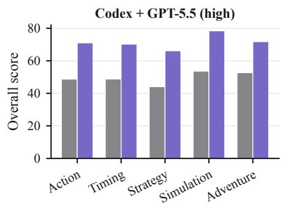

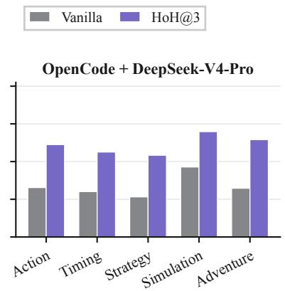

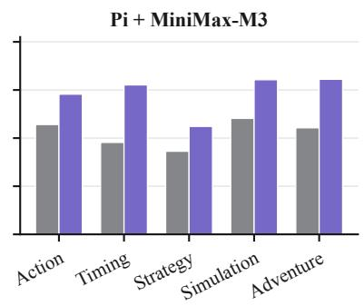  
Figure 7 | GameCraft-Bench Overall scores by reporting group and harness–model configuration. Each group contains nine tasks.

Tables 14–16 report the four observed conditions for every sampled GameCraft-Bench task. Scores are converted to the benchmark’s 0–100 presentation scale and grouped using the five coarse categories defined in Table 10. The final column reports the task-specific change from Vanilla to HoH@3.

Table 14 | Complete GameCraft-Bench task scores for Codex + GPT-5.5 (high). Scores use the benchmark’s 0–100 scale; Δ denotes HoH@3 minus Vanilla.
<table><tr><td>Family</td><td>Task</td><td>Vanilla</td><td>HoH@1</td><td>HoH@2</td><td>HoH@3</td><td>Δ</td></tr><tr><td colspan="7">Action</td></tr><tr><td>Platformer</td><td>Momentum Lab</td><td>34.05</td><td>64.44</td><td>56.15</td><td>70.61</td><td>+36.56</td></tr><tr><td></td><td>Ivory Beats</td><td>46.81</td><td>73.28</td><td>78.55</td><td>85.42</td><td>+38.61</td></tr><tr><td></td><td>Thunder Valkyrie</td><td>53.51</td><td>68.24</td><td>71.82</td><td>73.67</td><td>+20.15</td></tr><tr><td>Shooter</td><td>Void Patrol</td><td>58.59</td><td>73.90</td><td>76.02</td><td>87.83</td><td>+29.23</td></tr><tr><td></td><td>Wave Commander</td><td>66.97</td><td>69.35</td><td>74.64</td><td>75.25</td><td>+8.28</td></tr><tr><td></td><td>Hotline Heist</td><td>43.37</td><td>35.71</td><td>59.17</td><td>62.81</td><td>+19.44</td></tr><tr><td>Roguelike</td><td>Dungeon Shop</td><td>40.89</td><td>50.55</td><td>50.15</td><td>65.09</td><td>+24.20</td></tr><tr><td></td><td>Breach Tactics</td><td>53.44</td><td>55.67</td><td>57.11</td><td>61.09</td><td>+7.65</td></tr><tr><td></td><td>Void Harvest</td><td>41.05</td><td>46.39</td><td>55.43</td><td>57.43</td><td>+16.38</td></tr><tr><td colspan="7">Timing</td></tr><tr><td>Racing</td><td>Drift Circuit</td><td>43.58</td><td>58.29</td><td>60.29</td><td>70.08</td><td>+26.50</td></tr><tr><td></td><td>Rocket Trials</td><td>45.19</td><td>61.32</td><td>68.00</td><td>70.31</td><td>+25.12</td></tr><tr><td></td><td>Trick Runner</td><td>51.50</td><td>36.09</td><td>54.44</td><td>64.78</td><td>+13.28</td></tr><tr><td>Rhythm</td><td>Note Highway</td><td>39.44</td><td>31.35</td><td>56.15</td><td>64.68</td><td>+25.24</td></tr><tr><td></td><td>Beat Dungeon</td><td>47.94</td><td>56.95</td><td>60.55</td><td>60.81</td><td>+12.88</td></tr><tr><td>Sports</td><td>Garden</td><td>52.75</td><td>65.33</td><td>69.01</td><td>70.69</td><td>+17.94</td></tr><tr><td></td><td>Skateboard Park</td><td>57.64</td><td>69.51</td><td>72.62</td><td>81.14</td><td>+23.49</td></tr><tr><td></td><td>Boxing Gym</td><td>43.08</td><td>40.34</td><td>45.61</td><td>73.14</td><td>+30.06</td></tr><tr><td></td><td>Archery Quest</td><td>58.09</td><td>64.96</td><td>71.56</td><td>76.69</td><td>+18.60</td></tr><tr><td colspan="7">Strategy</td></tr><tr><td>Strategy</td><td>Tower Defense</td><td>58.85</td><td>63.98</td><td>64.12</td><td>76.92</td><td>+18.07</td></tr><tr><td></td><td>Chess Variant</td><td>30.04</td><td>56.93</td><td>52.83</td><td>59.72</td><td>+29.68</td></tr><tr><td></td><td>Spell Tactics</td><td>53.10</td><td>47.39</td><td>60.70</td><td>63.32</td><td>+10.22</td></tr><tr><td rowspan="4">Card Game</td><td>Spire Descent</td><td>25.85</td><td>45.47</td><td>54.81</td><td>61.92</td><td>+36.07</td></tr><tr><td>Poker Roguelike</td><td>44.66</td><td>63.94</td><td>67.99</td><td>69.27</td><td>+24.61</td></tr><tr><td>Autobattler</td><td>55.06</td><td>72.39</td><td>71.28</td><td>72.22</td><td>+17.16</td></tr><tr><td>Sokoban Dungeon</td><td>55.75</td><td>58.98</td><td>58.56</td><td>70.13</td><td>+14.38</td></tr><tr><td></td><td>Circuit Wizard</td><td>31.35</td><td>38.97</td><td>40.82</td><td>49.52</td><td>+18.17</td></tr><tr><td></td><td>Pipe Crisis</td><td>41.88</td><td>65.07</td><td>68.65</td><td>72.17</td><td>+30.28</td></tr><tr><td colspan="7">Simulation</td></tr><tr><td rowspan="3">Tycoon</td><td>Space Colony</td><td>36.88</td><td>64.60</td><td>69.15</td><td>76.55</td><td>+39.67</td></tr><tr><td>Pirate Port</td><td>51.32</td><td>63.06</td><td>70.75</td><td>77.81</td><td>+26.48</td></tr><tr><td>Wildhaven</td><td>49.43</td><td>74.09</td><td>77.78</td><td>80.39</td><td>+30.96</td></tr><tr><td rowspan="4">Idle Simulation</td><td>Ant Empire</td><td>65.52</td><td>71.42</td><td>69.64</td><td>87.88</td><td>+22.36</td></tr><tr><td>Factory Planet</td><td>75.16</td><td>78.94</td><td>82.27</td><td>87.78</td><td>+12.63</td></tr><tr><td>Dungeon Guild</td><td>63.92</td><td>68.94</td><td>76.95</td><td>79.50</td><td>+15.57</td></tr><tr><td>Kitchen Rush</td><td>42.62</td><td>48.07</td><td>65.64</td><td>73.38</td><td>+30.75</td></tr><tr><td></td><td>Air Control</td><td>54.24</td><td>63.96</td><td>66.72</td><td>69.73</td><td>+15.50</td></tr><tr><td></td><td>Border Check</td><td>43.58</td><td>67.70</td><td>67.00</td><td>72.74</td><td>+29.17</td></tr><tr><td colspan="7"></td></tr><tr><td rowspan="4">Horror</td><td></td><td>Adventure 48.68</td><td>70.73</td><td>68.56</td><td>73.41</td><td>+24.73</td></tr><tr><td>Floor 13 Dollhouse</td><td>56.33</td><td>64.28</td><td>66.93</td><td>72.59</td><td>+16.27</td></tr><tr><td>Lighthouse</td><td>51.95</td><td>63.89</td><td>71.47</td><td>80.90</td><td>+28.95</td></tr><tr><td>Sky Islands</td><td>53.25</td><td>47.19</td><td>60.91</td><td>68.25</td><td>+15.00</td></tr><tr><td rowspan="4">Visual Novel</td><td>Airship Trader</td><td>59.58</td><td>73.60</td><td>74.40</td><td>74.41</td><td>+14.83</td></tr><tr><td>Bounty</td><td>47.00</td><td>67.47</td><td>63.31</td><td>68.27</td><td>+21.27</td></tr><tr><td>Detective Noir</td><td>47.46</td><td>63.15</td><td>55.54</td><td>65.31</td><td>+17.85</td></tr><tr><td>Arcane Academy</td><td>59.30</td><td>37.60</td><td>62.71</td><td>70.69</td><td>+11.39</td></tr><tr><td rowspan="2"></td><td>Time Paradox</td><td>50.63</td><td>63.28</td><td>71.15</td><td>71.97</td><td>+21.34</td></tr><tr><td></td><td>49.58</td><td>59.71</td><td>64.84</td><td>71.52</td><td>+21.93</td></tr></table>

Table 15 | Complete GameCraft-Bench task scores for OpenCode + DeepSeek-V4-Pro. Scores use the benchmark’s 0–100 scale; Δ denotes HoH@3 minus Vanilla.
<table><tr><td>Family</td><td>Task</td><td>Vanilla</td><td>HoH@1</td><td>HoH@2</td><td>HoH@3</td><td>Δ</td></tr><tr><td colspan="7">Action</td></tr><tr><td>Platformer</td><td>Momentum Lab</td><td>14.33</td><td>23.13</td><td>32.92</td><td>30.75</td><td>+16.42</td></tr><tr><td></td><td>Ivory Beats</td><td>31.73</td><td>45.78</td><td>42.09</td><td>61.08</td><td>+29.35</td></tr><tr><td></td><td>Thunder Valkyrie</td><td>19.37</td><td>28.65</td><td>52.20</td><td>60.54</td><td>+41.17</td></tr><tr><td>Shooter</td><td>Void Patrol</td><td>37.12</td><td>57.44</td><td>53.49</td><td>57.77</td><td>+20.66</td></tr><tr><td></td><td>Wave Commander</td><td>14.74</td><td>2.31</td><td>35.61</td><td>46.46</td><td>+31.71</td></tr><tr><td></td><td>Hotline Heist</td><td>33.85</td><td>12.78</td><td>33.42</td><td>38.05</td><td>+4.20</td></tr><tr><td>Roguelike</td><td>Dungeon Shop</td><td>39.98</td><td>41.52</td><td>53.22</td><td>46.50</td><td>+6.52</td></tr><tr><td></td><td>Breach Tactics</td><td>35.28</td><td>23.77</td><td>36.76</td><td>46.99</td><td>+11.71</td></tr><tr><td></td><td>Void Harvest</td><td>9.50</td><td>14.34</td><td>49.29</td><td>52.83</td><td>+43.33</td></tr><tr><td colspan="7">Timing</td></tr><tr><td>Racing</td><td>Drift Circuit</td><td>37.87</td><td>31.48</td><td>39.17</td><td>38.69</td><td>+0.82</td></tr><tr><td></td><td>Rocket Trials</td><td>2.41</td><td>3.02</td><td>19.90</td><td>22.68</td><td>+20.27</td></tr><tr><td></td><td>Trick Runner</td><td>14.37</td><td>19.62</td><td>25.26</td><td>39.24</td><td>+24.86</td></tr><tr><td>Rhythm</td><td>Note Highway</td><td>25.25</td><td>20.88</td><td>29.61</td><td>40.34</td><td>+15.09</td></tr><tr><td></td><td>Beat Dungeon</td><td>3.06</td><td>18.60</td><td>17.05</td><td>23.81</td><td>+20.74</td></tr><tr><td></td><td>Garden</td><td>49.29</td><td>58.11</td><td>55.21</td><td>63.74</td><td>+14.44</td></tr><tr><td>Sports</td><td>Skateboard Park</td><td>19.28</td><td>24.69</td><td>46.28</td><td>57.60</td><td>+38.32</td></tr><tr><td></td><td>Boxing Gym</td><td>31.31</td><td>40.69</td><td>42.25</td><td>55.75</td><td>+24.44</td></tr><tr><td></td><td>Archery Quest</td><td>33.57</td><td>29.50</td><td>54.31</td><td>63.62</td><td>+30.06</td></tr><tr><td colspan="7">Strategy</td></tr><tr><td colspan="7"></td></tr><tr><td rowspan="3">Strategy</td><td>Tower Defense</td><td>29.47</td><td>25.89</td><td>39.18</td><td>49.54</td><td>+20.07</td></tr><tr><td>Chess Variant</td><td>18.76</td><td>23.69</td><td>40.45</td><td>38.51</td><td>+19.75</td></tr><tr><td>Spell Tactics</td><td>15.03</td><td>35.17</td><td>21.57</td><td>42.05</td><td>+27.02</td></tr><tr><td rowspan="3">Card Game</td><td>Spire Descent</td><td>13.33</td><td>4.38</td><td>19.47</td><td>23.00</td><td>+9.67</td></tr><tr><td>Poker Roguelike</td><td>20.50</td><td>24.89</td><td>38.77</td><td>57.90</td><td>+37.40</td></tr><tr><td>Autobattler</td><td>30.76</td><td>18.75</td><td>23.12</td><td>18.65</td><td>-12.12</td></tr><tr><td rowspan="3">Puzzle</td><td>Sokoban Dungeon</td><td>34.27</td><td>33.67</td><td>51.95</td><td>51.67</td><td>+17.40</td></tr><tr><td>Circuit Wizard</td><td>3.90</td><td>14.56</td><td>3.90</td><td>35.84</td><td>+31.95</td></tr><tr><td>Pipe Crisis</td><td>25.39</td><td>14.55</td><td>63.17</td><td>72.90</td><td>+47.50</td></tr><tr><td colspan="7">Simulation</td></tr><tr><td rowspan="2">Tycoon</td><td>Space Colony</td><td>34.24</td><td>47.98</td><td>57.87</td><td>60.27</td><td>+26.03</td></tr><tr><td>Pirate Port</td><td>25.89</td><td>61.33</td><td>52.00</td><td>52.16</td><td>+26.26</td></tr><tr><td rowspan="3">Idle</td><td>Wildhaven</td><td>47.66</td><td>46.52</td><td>55.13</td><td>66.07</td><td>+18.41</td></tr><tr><td>Ant Empire</td><td>40.73</td><td>42.64</td><td>55.49</td><td>49.08</td><td>+8.36</td></tr><tr><td>Factory Planet</td><td>38.17</td><td>35.20</td><td>41.02</td><td>67.84</td><td>+29.66</td></tr><tr><td rowspan="4">Simulation</td><td>Dungeon Guild</td><td>15.66</td><td>32.89</td><td>69.71</td><td>61.34</td><td>+45.67</td></tr><tr><td>Kitchen Rush</td><td>33.31</td><td>33.41</td><td>36.44</td><td>39.96</td><td>+6.64</td></tr><tr><td>Air Control</td><td>28.23</td><td>35.40</td><td>33.49</td><td>35.30</td><td>+7.07</td></tr><tr><td>Border Check</td><td>70.22</td><td>58.34</td><td>69.22</td><td>70.74</td><td>+0.52</td></tr><tr><td colspan="7">Adventure</td></tr><tr><td rowspan="3">Horror</td><td>Floor 13</td><td>29.22</td><td>14.56</td><td>41.53</td><td>42.12</td><td>+12.90</td></tr><tr><td>Dollhouse</td><td>8.75</td><td>10.95</td><td>13.00</td><td>54.39</td><td>+45.64</td></tr><tr><td>Lighthouse</td><td>52.11</td><td>35.78</td><td>46.30</td><td>83.33</td><td>+31.23</td></tr><tr><td rowspan="3">Open World</td><td>Sky Islands</td><td>24.37</td><td>11.87</td><td>28.69</td><td>46.51</td><td>+22.15</td></tr><tr><td>Airship Trader</td><td>38.94</td><td>35.41</td><td>54.64</td><td>62.37</td><td>+23.42</td></tr><tr><td>Bounty</td><td>7.09</td><td>13.66</td><td>0.73</td><td>25.35</td><td>+18.26</td></tr><tr><td rowspan="4">Visual Novel</td><td>Detective Noir</td><td>22.22</td><td>18.06</td><td>56.59</td><td>61.57</td><td>+39.35</td></tr><tr><td>Arcane Academy</td><td>28.76</td><td>26.72</td><td>51.36</td><td>49.05</td><td>+20.29</td></tr><tr><td>Time Paradox</td><td>21.13</td><td>34.96</td><td>31.62</td><td>40.04</td><td>+18.91</td></tr><tr><td></td><td>26.90</td><td>28.61</td><td>40.32</td><td>48.98</td><td>+22.08</td></tr><tr><td colspan="2">Mean</td><td></td><td></td><td></td><td></td><td></td></tr></table>

Table 16 | Complete GameCraft-Bench task scores for Pi + MiniMax-M3. Scores use the benchmark’s 0–100 scale; Δ denotes HoH@3 minus Vanilla.
<table><tr><td>Family</td><td>Task</td><td>Vanilla</td><td>HoH@1</td><td>HoH@2</td><td>HoH@3</td><td>Δ</td></tr><tr><td colspan="9">Action</td></tr><tr><td>Platformer</td><td>Momentum Lab</td><td>38.28</td><td>34.49</td><td>45.03</td><td>48.80</td><td>+10.52</td></tr><tr><td></td><td>Ivory Beats</td><td>36.95</td><td>39.64</td><td>39.89</td><td>42.23</td><td>+5.29</td></tr><tr><td></td><td>Thunder Valkyrie</td><td>60.52</td><td>50.14</td><td>61.74</td><td>64.71</td><td>+4.20</td></tr><tr><td>Shooter</td><td>Void Patrol</td><td>56.14</td><td>67.37</td><td>66.21</td><td>76.66</td><td>+20.52</td></tr><tr><td></td><td>Wave Commander</td><td>69.66</td><td>64.54</td><td>72.85</td><td>75.52</td><td>+5.86</td></tr><tr><td></td><td>Hotline Heist</td><td>41.46</td><td>47.81</td><td>44.65</td><td>43.31</td><td>+1.84</td></tr><tr><td>Roguelike</td><td>Dungeon Shop</td><td>25.08</td><td>40.12</td><td>47.16</td><td>46.11</td><td>+21.02</td></tr><tr><td></td><td>Breach Tactics</td><td>33.70</td><td>43.79</td><td>53.61</td><td>59.56</td><td>+25.86</td></tr><tr><td></td><td>Void Harvest</td><td>48.96</td><td>67.37</td><td>61.15</td><td>67.28</td><td>+18.32</td></tr><tr><td colspan="9">Timing</td></tr><tr><td>Racing</td><td>Drift Circuit</td><td>36.91</td><td>59.79</td><td>55.68</td><td>55.24</td><td>+18.33</td></tr><tr><td></td><td>Rocket Trials</td><td>35.50</td><td>38.21</td><td>37.33</td><td>42.36</td><td>+6.86</td></tr><tr><td></td><td>Trick Runner</td><td>41.79</td><td>51.66</td><td>59.92</td><td>59.50</td><td>+17.71</td></tr><tr><td>Rhythm</td><td>Note Highway</td><td>10.35</td><td>39.65</td><td>54.91</td><td>62.58</td><td>+52.23</td></tr><tr><td></td><td>Beat Dungeon</td><td>41.75</td><td>55.41</td><td>53.18</td><td>64.83</td><td>+23.08</td></tr><tr><td></td><td>Garden</td><td>41.70</td><td>63.78</td><td>56.48</td><td>67.03</td><td>+25.33</td></tr><tr><td rowspan="4">Sports</td><td>Skateboard Park</td><td>71.06</td><td>55.25</td><td>72.20</td><td>84.99</td><td>+13.92</td></tr><tr><td>Boxing Gym</td><td>40.44</td><td>55.00</td><td>57.71</td><td>60.53</td><td>+20.09</td></tr><tr><td>Archery Quest</td><td>24.25</td><td>51.31</td><td>61.23</td><td>61.85</td><td>+37.60</td></tr><tr><td colspan="4">Strategy</td><td></td><td></td></tr><tr><td rowspan="3">Strategy</td><td>Tower Defense</td><td>43.51</td><td>57.22</td><td>46.99</td><td>55.98</td><td>+12.47</td></tr><tr><td>Chess Variant</td><td>24.75</td><td>31.46</td><td>27.15</td><td>30.88</td><td>+6.13</td></tr><tr><td>Spell Tactics</td><td>46.51</td><td>37.10</td><td>47.10</td><td>53.93</td><td>+7.42</td></tr><tr><td rowspan="3">Card Game</td><td>Spire Descent</td><td>26.61</td><td>18.09</td><td>10.96</td><td>10.96</td><td>-15.65</td></tr><tr><td>Poker Roguelike</td><td>3.19</td><td>30.31</td><td>50.81</td><td>49.78</td><td>+46.59</td></tr><tr><td>Autobattler</td><td>55.44</td><td>46.45</td><td>50.42</td><td>53.37</td><td>-2.07</td></tr><tr><td rowspan="3">Puzzle</td><td>Sokoban Dungeon</td><td>41.98</td><td>59.80</td><td>61.21</td><td>57.66</td><td>+15.68</td></tr><tr><td>Circuit Wizard Pipe Crisis</td><td>15.50</td><td>31.61</td><td>46.89</td><td>53.51</td><td>+38.01</td></tr><tr><td></td><td>53.26</td><td>35.39</td><td>39.39</td><td>37.65</td><td>-15.61</td></tr><tr><td colspan="9">Simulation</td></tr><tr><td rowspan="3">Tycoon</td><td>Space Colony</td><td>62.72</td><td>51.54</td><td>55.76</td><td>58.33</td><td>-4.39</td></tr><tr><td>Pirate Port</td><td>35.07</td><td>73.08</td><td>71.44</td><td>65.70</td><td>+30.63</td></tr><tr><td>Wildhaven</td><td>58.08</td><td>57.75</td><td>61.88</td><td>65.75</td><td>+7.66</td></tr><tr><td rowspan="3">Idle</td><td>Ant Empire</td><td>61.62</td><td>54.00</td><td>82.34</td><td>82.56</td><td>+20.94</td></tr><tr><td>Factory Planet</td><td>44.02</td><td>54.35</td><td>77.25</td><td>80.35</td><td>+36.33</td></tr><tr><td>Dungeon Guild</td><td>73.24</td><td>63.13</td><td>70.12</td><td>73.84</td><td>+0.60</td></tr><tr><td rowspan="4">Simulation</td><td>Kitchen Rush</td><td>16.80</td><td>42.60</td><td>49.42</td><td>62.56</td><td>+45.76</td></tr><tr><td>Air Control</td><td>28.61</td><td>55.82</td><td>63.76</td><td>45.69</td><td>+17.08</td></tr><tr><td>Border Check</td><td>53.54</td><td>33.74</td><td>36.83</td><td>43.44</td><td>-10.10</td></tr><tr><td colspan="6">Adventure</td></tr><tr><td rowspan="3">Horror</td><td>Floor 13</td><td>57.29</td><td>35.94</td><td>59.74</td><td>66.60</td><td>+9.31</td></tr><tr><td>Dollhouse</td><td>35.53</td><td>55.12</td><td>67.94</td><td>71.90</td><td>+36.37</td></tr><tr><td>Lighthouse</td><td>60.00</td><td>76.82</td><td>73.41</td><td>74.72</td><td>+14.72</td></tr><tr><td rowspan="4">Open World</td><td>Sky Islands</td><td>19.19</td><td>52.99</td><td>49.33</td><td>59.73</td><td>+40.54</td></tr><tr><td>Airship Trader</td><td>44.42</td><td>52.55</td><td>56.95</td><td>60.52</td><td>+16.10</td></tr><tr><td>Bounty</td><td>43.78</td><td>40.19</td><td>45.38</td><td>58.44</td><td>+14.66</td></tr><tr><td>Detective Noir</td><td>40.87</td><td>46.41</td><td>66.07</td><td>58.16</td><td>+17.29</td></tr><tr><td rowspan="4"></td><td>Arcane Academy</td><td>51.85</td><td>42.98</td><td>45.88</td><td>65.71</td><td>+13.86</td></tr><tr><td>Time Paradox</td><td>45.44</td><td>45.99</td><td>61.56</td><td>64.22</td><td>+18.78</td></tr><tr><td></td><td></td><td></td><td></td><td></td><td></td></tr><tr><td></td><td>42.16</td><td>49.06</td><td>55.04</td><td>58.78</td><td>+16.62</td></tr></table>

## C.2 FrontierSWE Per-Task Rewards

Figure 8 reports category means under the oficial FrontierSWE taxonomy. The unequal task counts are shown explicitly on the horizontal axis.

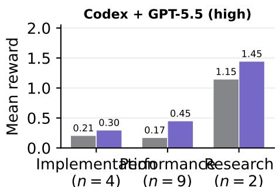

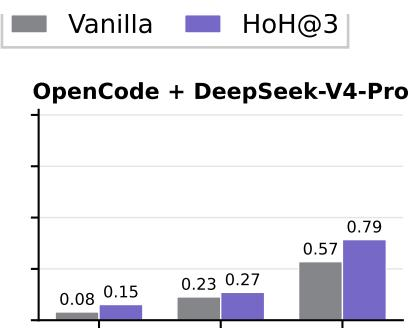

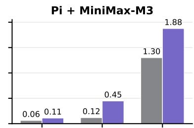  
ImplementationPerformanceResearch (n = 4) (n = 9) (n = 2)  
Figure 8 | FrontierSWE mean rewards by oficial category and harness–model configuration.

Tables 17–19 report every FrontierSWE task and condition.

Table 17 | Complete FrontierSWE task rewards for Codex + GPT-5.5 (high).

<table><tr><td>Task</td><td>Vanilla</td><td>HoH@1</td><td>HoH@2</td><td>HoH@3</td></tr><tr><td colspan="5">Implementation</td></tr><tr><td>Dart Style Haskell</td><td>0.00</td><td>0.06</td><td>0.07</td><td>0.16</td></tr><tr><td>Git to Zig</td><td>0.18</td><td>0.18</td><td>0.17</td><td>0.18</td></tr><tr><td>Lua Native Compiler</td><td>0.52</td><td>0.60</td><td>0.72</td><td>0.70</td></tr><tr><td>PostgreSQL-SQLite Wire Adapter</td><td>0.14</td><td>0.15</td><td>0.15</td><td>0.15</td></tr><tr><td colspan="5">Performance</td></tr><tr><td>Cranelift Codegen Optimization</td><td>0.00</td><td>0.00</td><td>0.00</td><td>0.00</td></tr><tr><td>Dependent Type Checker</td><td>0.00</td><td>0.00</td><td>0.00</td><td>0.00</td></tr><tr><td>FFmpeg Swscale Rewrite</td><td>0.00</td><td>0.00</td><td>0.00</td><td>0.00</td></tr><tr><td>Granite Mamba2 Inference Optimization</td><td>0.20</td><td>1.01</td><td>1.07</td><td>1.02</td></tr><tr><td>Inference System Optimization</td><td>0.00</td><td>0.00</td><td>0.00</td><td>0.00</td></tr><tr><td>Libexpat to x86 Assembly</td><td>0.20</td><td>0.20</td><td>0.21</td><td>0.21</td></tr><tr><td>Notebook Compression</td><td>0.00</td><td>0.69</td><td>0.69</td><td>0.69</td></tr><tr><td>Pyright Type-Checking Optimization</td><td>1.16</td><td>1.11</td><td>1.17</td><td>1.16</td></tr><tr><td>Revideo Performance Optimization</td><td>0.00</td><td>0.91</td><td>0.91</td><td>0.99</td></tr><tr><td colspan="5">Research</td></tr><tr><td>Optimizer Design</td><td>1.40</td><td>1.71</td><td>1.46</td><td>2.00</td></tr><tr><td>PCQM4Mv2 Autoresearch</td><td>0.90</td><td>0.89</td><td>0.89</td><td>0.89</td></tr><tr><td>Mean</td><td>0.31</td><td>0.50</td><td>0.50</td><td>0.54</td></tr></table>

Table 18 | Complete FrontierSWE task rewards for OpenCode + DeepSeek-V4-Pro.
<table><tr><td>Task</td><td>Vanilla</td><td>HoH@1</td><td>HoH@2</td><td>HoH@3</td></tr><tr><td colspan="5">Implementation</td></tr><tr><td>Dart Style Haskell</td><td>0.02</td><td>0.04</td><td>0.05</td><td>0.04</td></tr><tr><td>Git to Zig</td><td>0.13</td><td>0.17</td><td>0.17</td><td>0.17</td></tr><tr><td>Lua Native Compiler</td><td>0.02</td><td>0.02</td><td>0.03</td><td>0.25</td></tr><tr><td>PostgreSQL-SQLite Wire Adapter</td><td>0.15</td><td>0.14</td><td>0.15</td><td>0.15</td></tr><tr><td colspan="5">Performance</td></tr><tr><td>Cranelift Codegen Optimization</td><td>0.00</td><td>0.00</td><td>0.00</td><td>0.00</td></tr><tr><td>Dependent Type Checker</td><td>0.00</td><td>0.00</td><td>0.00</td><td>0.00</td></tr><tr><td>FFmpeg Swscale Rewrite</td><td>0.00</td><td>0.00</td><td>0.00</td><td>0.00</td></tr><tr><td>Granite Mamba2 Inference Optimization</td><td>0.20</td><td>0.19</td><td>0.21</td><td>0.20</td></tr><tr><td>Inference System Optimization</td><td>0.00</td><td>0.00</td><td>0.00</td><td>0.00</td></tr><tr><td>Libexpat to x86 Assembly</td><td>0.00</td><td>0.00</td><td>0.00</td><td>0.00</td></tr><tr><td>Notebook Compression</td><td>0.00</td><td>0.00</td><td>0.00</td><td>0.00</td></tr><tr><td>Pyright Type-Checking Optimization</td><td>1.04</td><td>1.17</td><td>1.30</td><td>1.29</td></tr><tr><td>Revideo Performance Optimization</td><td>0.80</td><td>0.75</td><td>0.92</td><td>0.95</td></tr><tr><td colspan="3">Research</td><td></td><td></td></tr><tr><td>Optimizer Design</td><td>1.14</td><td>1.55</td><td>1.55</td><td>1.57</td></tr><tr><td>PCQM4Mv2 Autoresearch</td><td>0.00</td><td>0.00</td><td>0.00</td><td>0.00</td></tr><tr><td>Mean</td><td>0.23</td><td>0.27</td><td>0.29</td><td>0.31</td></tr></table>

Table 19 | Complete FrontierSWE task rewards for Pi + MiniMax-M3.
<table><tr><td>Task</td><td>Vanilla</td><td>HoH@1</td><td>HoH@2</td><td>HoH@3</td></tr><tr><td colspan="5">Implementation</td></tr><tr><td>Dart Style Haskell</td><td>0.12</td><td>0.04</td><td>0.06</td><td>0.07</td></tr><tr><td>Git to Žig</td><td>0.00</td><td>0.19</td><td>0.19</td><td>0.19</td></tr><tr><td>Lua Native Compiler</td><td>0.00</td><td>0.03</td><td>0.03</td><td>0.03</td></tr><tr><td>PostgreSQL-SQLite Wire Adapter</td><td>0.13</td><td>0.15</td><td>0.15</td><td>0.15</td></tr><tr><td colspan="5">Performance</td></tr><tr><td>Cranelift Codegen Optimization</td><td>0.00</td><td>0.00</td><td>0.00</td><td>0.00</td></tr><tr><td>Dependent Type Checker</td><td>0.00</td><td>0.00</td><td>0.00</td><td>0.00</td></tr><tr><td>FFmpeg Swscale Rewrite</td><td>0.00</td><td>0.00</td><td>0.00</td><td>0.00</td></tr><tr><td>Granite Mamba2 Inference Optimization</td><td>1.06</td><td>1.97</td><td>1.98</td><td>2.18</td></tr><tr><td>Inference System Optimization</td><td>0.00</td><td>0.00</td><td>0.00</td><td>0.00</td></tr><tr><td>Libexpat to x86 Assembly</td><td>0.00</td><td>0.00</td><td>0.00</td><td>0.00</td></tr><tr><td>Notebook Compression</td><td>0.00</td><td>0.67</td><td>0.67</td><td>0.67</td></tr><tr><td>Pyright Type-Checking Optimization</td><td>0.00</td><td>1.18</td><td>1.18</td><td>1.17</td></tr><tr><td>Revideo Performance Optimization</td><td>0.00</td><td>0.00</td><td>0.00</td><td>0.00</td></tr><tr><td colspan="5">Research</td></tr><tr><td>Optimizer Design</td><td>2.60</td><td>2.90</td><td>2.90</td><td>2.87</td></tr><tr><td>PCQM4Mv2 Autoresearch</td><td>0.00</td><td>0.88</td><td>0.88</td><td>0.88</td></tr><tr><td>Mean</td><td>0.26</td><td>0.53</td><td>0.54</td><td>0.55</td></tr></table>

## C.3 Budget-Controlled Comparison

The pass-controlled experiment uses Codex with GPT-5.5 (high) on the same 45 GameCraft-Bench tasks under the protocol in Section B.5. HoH uses three complete planning–coding–testing iterations. Figure 9 shows how artifact quality and cumulative token use change over the three development passes.

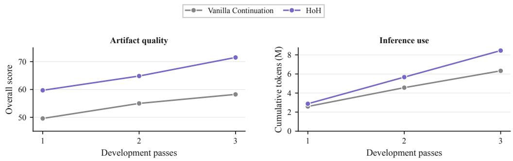  
Figure 9 | Score and cumulative token trajectories in the budget-controlled GameCraft-Bench comparison using Codex with GPT-5.5 (high). HoH includes planning, coding, and testing at each pass.

Tables 20 and 21 report the task-level scores and cumulative coding-harness tokens, respectively. Averaged over the 45 tasks, Vanilla, three-pass Vanilla Continuation, and HoH obtain scores of 49.58, 58.24, and 71.52 using 2.59M, 6.33M, and 8.41M tokens per task, respectively. By Eq. 12, the threepass conditions gain 2.32 and 3.77 score points per additional million tokens for Vanilla Continuation and HoH, respectively.

Table 20 | Task-level scores for the budget-controlled comparison on GameCraft-Bench using Codex + GPT-5.5 (high).
<table><tr><td>Task</td><td>Vanilla</td><td>Vanilla Cont.@2</td><td>Vanilla Cont.@3</td><td>HoH@3</td></tr><tr><td colspan="5">Action</td></tr><tr><td>Ivory Beats</td><td>46.81</td><td>44.58</td><td>44.84</td><td>85.42</td></tr><tr><td>Momentum Lab</td><td>34.05</td><td>44.51</td><td>41.15</td><td>70.61</td></tr><tr><td>Thunder Valkyrie</td><td>53.51</td><td>53.44</td><td>66.41</td><td>73.67</td></tr><tr><td>Hotline Heist</td><td>43.37</td><td>41.70</td><td>44.21</td><td>62.81</td></tr><tr><td>Void Patrol</td><td>58.59</td><td>74.05</td><td>72.66</td><td>87.83</td></tr><tr><td>Wave Commander</td><td>66.97</td><td>69.79</td><td>63.52</td><td>75.25</td></tr><tr><td>Void Harvest</td><td>41.05</td><td>41.06</td><td>40.60</td><td>57.43</td></tr><tr><td>Breach Tactics</td><td>53.44</td><td>54.04</td><td>55.93</td><td>61.09</td></tr><tr><td>Dungeon Shop</td><td>40.89</td><td>41.59</td><td>41.09</td><td>65.09</td></tr><tr><td colspan="5">Timing</td></tr><tr><td>Drift Circuit</td><td>43.58</td><td>41.72</td><td>63.77</td><td>70.08</td></tr><tr><td>Rocket Trials</td><td>45.19</td><td>43.81</td><td>49.82</td><td>70.31</td></tr><tr><td>Trick Runner</td><td>51.50</td><td>48.38</td><td>53.64</td><td>64.78</td></tr><tr><td>Beat Dungeon</td><td>47.94</td><td>46.70</td><td>50.41</td><td>60.81</td></tr><tr><td>Garden</td><td>52.75</td><td>56.44</td><td>58.62</td><td>70.69</td></tr><tr><td>Note Highway</td><td>39.44</td><td>40.84</td><td>44.28</td><td>64.68</td></tr><tr><td>Archery Quest</td><td>58.09</td><td>66.64</td><td>72.67</td><td>76.69</td></tr><tr><td>Boxing Gym</td><td>43.07</td><td>52.75</td><td>56.44</td><td>73.14</td></tr><tr><td>Skateboard Park</td><td>57.64</td><td>68.37</td><td>67.47</td><td>81.14</td></tr><tr><td colspan="5">Strategy</td></tr><tr><td>Chess Variant</td><td>30.04</td><td>32.89</td><td>32.46</td><td>59.72</td></tr><tr><td>Spell Tactics</td><td>53.10</td><td>52.98</td><td>52.75</td><td>63.32</td></tr><tr><td>Tower Defense</td><td>58.85</td><td>69.76</td><td>71.02</td><td>76.92</td></tr><tr><td>Autobattler</td><td>55.06</td><td>63.80</td><td>59.77</td><td>72.22</td></tr><tr><td>Poker Roguelike</td><td>44.66</td><td>48.69</td><td>51.48</td><td>69.27</td></tr><tr><td>Spire Descent</td><td>25.85</td><td>41.60</td><td>55.81</td><td>61.92</td></tr><tr><td>Circuit Wizard</td><td>31.35</td><td>34.47</td><td>36.78</td><td>49.52</td></tr><tr><td>Pipe Crisis</td><td>41.88</td><td>39.64</td><td>45.39</td><td>72.17</td></tr><tr><td>Sokoban Dungeon</td><td>55.75</td><td>65.11</td><td>67.14</td><td>70.13</td></tr><tr><td colspan="5">Simulation</td></tr><tr><td>Pirate Port</td><td>51.32</td><td>48.05</td><td>72.20</td><td>77.81</td></tr><tr><td>Space Colony</td><td>36.87</td><td>43.97</td><td>45.09</td><td>76.55</td></tr><tr><td>Wildhaven</td><td>49.42</td><td>60.30</td><td>64.68</td><td>80.39</td></tr><tr><td>Ant Empire</td><td>65.52</td><td>81.58</td><td>85.84</td><td>87.88</td></tr><tr><td>Dungeon Guild</td><td>63.92</td><td>72.76</td><td>75.41</td><td>79.50</td></tr><tr><td>Factory Planet</td><td>75.16</td><td>79.27</td><td>80.69</td><td>87.78</td></tr><tr><td>Air Control</td><td>54.24</td><td>44.85</td><td>55.18</td><td>69.73</td></tr><tr><td>Border Check Kitchen Rush</td><td>43.57</td><td>69.05</td><td>69.45</td><td>72.74</td></tr><tr><td></td><td>42.62 Adventure</td><td>58.57</td><td>54.23</td><td>73.38</td></tr><tr><td colspan="5"></td></tr><tr><td>Dollhouse Floor 13</td><td>56.33</td><td>64.55</td><td>70.36</td><td>72.59</td></tr><tr><td></td><td>48.68</td><td>65.44</td><td>66.90</td><td>73.41</td></tr><tr><td>Lighthouse</td><td>51.95</td><td>69.16</td><td>72.70</td><td>80.90</td></tr><tr><td>Airship Trader</td><td>59.58</td><td>67.71</td><td>65.15</td><td>74.41</td></tr><tr><td>Bounty</td><td>47.00</td><td>51.46</td><td>54.09</td><td>68.27</td></tr><tr><td>Sky Islands</td><td>53.25</td><td>61.56</td><td>63.38</td><td>68.25</td></tr><tr><td>Arcane Academy</td><td>59.30</td><td>54.02</td><td>52.10</td><td>70.69</td></tr><tr><td>Detective Noir</td><td>47.46</td><td>45.40</td><td>51.15</td><td>65.31</td></tr><tr><td>Time Paradox</td><td>50.63</td><td>57.48</td><td>61.92</td><td>71.97</td></tr><tr><td>Mean</td><td>49.58</td><td>54.99</td><td>58.24</td><td>71.52</td></tr></table>

Table 21 | Task-level cumulative token usage (M) for the budget-controlled comparison on GameCraft-Bench using Codex + GPT-5.5 (high).
<table><tr><td>Task</td><td>Vanilla</td><td>Vanilla Cont.@2</td><td>Vanilla Cont.@3</td><td>HoH@3</td></tr><tr><td colspan="5">Action</td></tr><tr><td>Ivory Beats</td><td>1.49</td><td>2.32</td><td>3.17</td><td>5.64</td></tr><tr><td>Momentum Lab</td><td>2.27</td><td>5.07</td><td>8.13</td><td>9.00</td></tr><tr><td>Thunder Valkyrie</td><td>1.86</td><td>4.96</td><td>6.61</td><td>8.27</td></tr><tr><td>Hotline Heist</td><td>1.41</td><td>2.28</td><td>3.70</td><td>7.68</td></tr><tr><td>Void Patrol</td><td>2.42</td><td>4.21</td><td>6.39</td><td>6.55</td></tr><tr><td>Wave Commander</td><td>2.61</td><td>4.66</td><td>5.82</td><td>9.37</td></tr><tr><td>Void Harvest</td><td>2.75</td><td>4.62</td><td>6.37</td><td>8.50</td></tr><tr><td>Breach Tactics</td><td>2.43</td><td>4.50</td><td>8.46</td><td>7.54</td></tr><tr><td>Dungeon Shop</td><td>2.53</td><td>4.99</td><td>6.33</td><td>6.31</td></tr><tr><td colspan="5"></td></tr><tr><td>Drift Circuit</td><td>Timing 2.20</td><td>6.18</td><td>8.22</td><td>9.16</td></tr><tr><td>Rocket Trials</td><td>1.92</td><td>4.55</td><td>5.90</td><td>10.01</td></tr><tr><td>Trick Runner</td><td>4.13</td><td>5.83</td><td>7.68</td><td>7.65</td></tr><tr><td>Beat Dungeon</td><td>1.85</td><td>3.20</td><td>4.31</td><td>6.84</td></tr><tr><td>Garden</td><td>4.57</td><td>6.08</td><td>7.59</td><td>9.65</td></tr><tr><td>Note Highway</td><td>2.73</td><td>5.26</td><td>9.05</td><td>6.19</td></tr><tr><td>Archery Quest</td><td>1.51</td><td>5.62</td><td>7.24</td><td>11.16</td></tr><tr><td>Boxing Gym</td><td>3.25</td><td>5.19</td><td>6.55</td><td>7.82</td></tr><tr><td>Skateboard Park</td><td>2.41</td><td>3.31</td><td>4.44</td><td>7.63</td></tr><tr><td colspan="5"></td></tr><tr><td>Chess Variant</td><td>Strategy 1.77</td><td>2.48</td><td>5.00</td><td>9.13</td></tr><tr><td>Spell Tactics</td><td>2.22</td><td>3.83</td><td>5.71</td><td>7.37</td></tr><tr><td>Tower Defense</td><td>2.12</td><td>3.77</td><td>6.12</td><td>11.85</td></tr><tr><td>Autobattler</td><td>2.74</td><td>4.74</td><td>6.16</td><td>10.83</td></tr><tr><td>Poker Roguelike</td><td>3.41</td><td>7.13</td><td>9.29</td><td>7.35</td></tr><tr><td>Spire Descent</td><td>2.31</td><td>4.16</td><td>6.11</td><td>11.51</td></tr><tr><td>Circuit Wizard</td><td>2.06</td><td>4.13</td><td>6.70</td><td>7.01</td></tr><tr><td>Pipe Crisis</td><td>1.73</td><td>3.33</td><td>4.27</td><td>5.97</td></tr><tr><td>Sokoban Dungeon</td><td>1.30</td><td>2.67</td><td>3.88</td><td>6.27</td></tr><tr><td colspan="5">Simulation</td></tr><tr><td>Pirate Port</td><td>2.43</td><td>3.32</td><td>5.81</td><td>6.69</td></tr><tr><td>Space Colony</td><td>4.79</td><td>6.72</td><td>9.04</td><td>9.27</td></tr><tr><td>Wildhaven</td><td>2.58</td><td>4.01</td><td>5.22</td><td>9.93</td></tr><tr><td>Ant Empire</td><td>3.11</td><td>4.87</td><td>6.38</td><td>11.02</td></tr><tr><td>Dungeon Guild</td><td>2.41</td><td>6.81</td><td>9.33</td><td>9.28</td></tr><tr><td>Factory Planet</td><td>3.75</td><td>6.30</td><td>7.23</td><td>9.15</td></tr><tr><td>Air Control</td><td>3.25</td><td>5.32</td><td>7.38</td><td>7.97</td></tr><tr><td>Border Check Kitchen Rush</td><td>1.52</td><td>3.34</td><td>4.92</td><td>7.30</td></tr><tr><td></td><td>2.36 Adventure</td><td>4.19</td><td>5.18</td><td>8.98</td></tr><tr><td colspan="5"></td></tr><tr><td>Dollhouse</td><td>1.20</td><td>2.22</td><td>3.61</td><td>8.10</td></tr><tr><td>Floor 13</td><td>1.68</td><td>3.25</td><td>4.90</td><td>5.81</td></tr><tr><td>Lighthouse</td><td>2.91</td><td>4.25</td><td>6.07</td><td>8.24</td></tr><tr><td>Airship Trader</td><td>1.92</td><td>3.58</td><td>4.78</td><td>7.34</td></tr><tr><td>Bounty</td><td>4.18</td><td>7.97</td><td>9.94</td><td>8.32</td></tr><tr><td>Sky Islands</td><td>3.60</td><td>4.78</td><td>5.72</td><td>15.71</td></tr><tr><td>Arcane Academy</td><td>3.59</td><td>5.39</td><td>7.70</td><td>6.56</td></tr><tr><td>Detective Noir</td><td>3.69</td><td>4.09</td><td>4.86</td><td>8.04</td></tr><tr><td>Time Paradox</td><td>3.68</td><td>5.91</td><td>7.53</td><td>8.23</td></tr><tr><td>Mean</td><td>2.59</td><td>4.56</td><td>6.33</td><td>8.41</td></tr></table>

## C.4 Ablation Study

We evaluate three variants of HoH with � = 3 on all 45 GameCraft-Bench tasks using Codex with GPT-5.5 (high), following the interventions in Section B.6. The complete task-level scores are reported in Table 22. Aggregate token usage is reported separately in Table 23. The mean score decreases from 71.52 for full HoH to 63.39 without plan update, 65.23 without evidence feedback, and 63.67 without artifact warm-start. Figure 10 places the score changes beside their cumulative token use.

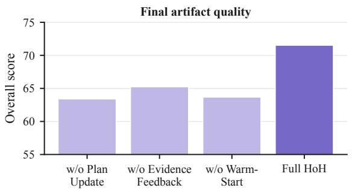

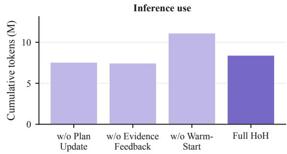  
Figure 10 | Final score and cumulative token use for full HoH and the three cross-iteration ablations on GameCraft-Bench.

Table 22 | Task-level GameCraft-Bench ablation scores using Codex + GPT-5.5 (high), with � = 3. All values use the benchmark’s 0–100 scale.
<table><tr><td>Task</td><td>Full HoH</td><td>w/o Plan Update</td><td>w/o Evidence Feedback</td><td>w/o Warm-Start</td></tr><tr><td colspan="5"></td></tr><tr><td>Momentum Lab</td><td>Action 70.61</td><td>67.81</td><td>56.67</td><td>58.77</td></tr><tr><td>Ivory Beats</td><td>85.42</td><td>69.42</td><td>80.33</td><td>78.85</td></tr><tr><td>Thunder Valkyrie</td><td>73.67</td><td>69.99</td><td>72.94</td><td>72.51</td></tr><tr><td>Void Patrol</td><td>87.83</td><td>73.22</td><td>77.79</td><td>72.05</td></tr><tr><td>Wave Commander</td><td>75.25</td><td>68.74</td><td>73.28</td><td>68.31</td></tr><tr><td>Hotline Heist</td><td>62.81</td><td>52.40</td><td>58.24</td><td>35.21</td></tr><tr><td>Dungeon Shop</td><td>65.09</td><td>57.73</td><td>59.33</td><td>64.00</td></tr><tr><td>Breach Tactics</td><td>61.09</td><td>58.73</td><td>53.49</td><td>52.89</td></tr><tr><td>Void Harvest</td><td>57.43</td><td>53.96</td><td>52.46</td><td>53.04</td></tr><tr><td colspan="5"></td></tr><tr><td>Drift Circuit</td><td>Timing 70.08</td><td>63.19</td><td>66.85</td><td>52.81</td></tr><tr><td>Rocket Trials</td><td>70.31</td><td>63.56</td><td>68.15</td><td>64.09</td></tr><tr><td>Trick Runner</td><td>64.78</td><td>62.55</td><td>62.45</td><td>57.59</td></tr><tr><td>Note Highway</td><td>64.68</td><td>63.84</td><td>61.32</td><td>64.51</td></tr><tr><td>Beat Dungeon</td><td>60.81</td><td>58.38</td><td>57.50</td><td>50.84</td></tr><tr><td>Garden</td><td>70.69</td><td>65.61</td><td>64.19</td><td>67.89</td></tr><tr><td>Skateboard Park</td><td>81.14</td><td>75.77</td><td>75.24</td><td>77.44</td></tr><tr><td>Boxing Gym</td><td>73.14</td><td>47.90</td><td>43.73</td><td>71.16</td></tr><tr><td></td><td colspan="2">w/o</td><td> ${ \bf w } / { \bf o }$ </td><td> ${ \bf w } / { \bf o }$ </td></tr><tr><td>Task</td><td>Full HoH</td><td>Plan Update</td><td>Evidence Feedback</td><td>Warm-Start</td></tr><tr><td>Archery Quest</td><td>76.69</td><td>66.11</td><td>72.52</td><td>65.61</td></tr><tr><td></td><td colspan="4">Strategy</td></tr><tr><td>Tower Defense</td><td>76.92</td><td>68.56</td><td>63.55</td><td>51.71</td></tr><tr><td>Chess Variant</td><td>59.72</td><td>57.91</td><td>47.87</td><td>51.58</td></tr><tr><td>Spell Tactics</td><td>63.32</td><td></td><td>58.73</td><td>58.81</td></tr><tr><td></td><td>61.92</td><td>50.70</td><td>60.31</td><td>60.21</td></tr><tr><td>Spire Descent</td><td>69.27</td><td>46.15</td><td>64.11</td><td>58.89</td></tr><tr><td>Poker Roguelike Autobattler</td><td></td><td>64.70</td><td>71.42</td><td>56.35</td></tr><tr><td></td><td>72.22</td><td>68.39</td><td></td><td></td></tr><tr><td>Sokoban Dungeon</td><td>70.13</td><td>57.02</td><td>68.60</td><td>64.19</td></tr><tr><td>Circuit Wizard</td><td>49.52</td><td>39.38</td><td>35.48</td><td>40.11</td></tr><tr><td>Pipe Crisis</td><td>72.17</td><td>62.00</td><td>61.94</td><td>46.91</td></tr><tr><td></td><td colspan="4">Simulation</td></tr><tr><td>Space Colony</td><td>76.55</td><td>57.86</td><td>75.17</td><td>75.14</td></tr><tr><td>Pirate Port</td><td>77.81</td><td>75.55</td><td>70.51</td><td>76.69</td></tr><tr><td>Wildhaven</td><td>80.39</td><td>79.00</td><td>79.12</td><td>75.22</td></tr><tr><td>Ant Empire</td><td>87.88</td><td>78.05</td><td>82.11</td><td>80.69</td></tr><tr><td>Factory Planet</td><td>87.78</td><td>70.69</td><td>83.21</td><td>84.36</td></tr><tr><td>Dungeon Guild</td><td>79.50</td><td>67.98</td><td>73.23</td><td>76.10</td></tr><tr><td>Kitchen Rush</td><td>73.38</td><td>57.69</td><td>60.10</td><td>56.94</td></tr><tr><td>Air Control</td><td>69.73</td><td>63.84</td><td>66.51</td><td>64.92</td></tr><tr><td>Border Check</td><td>72.74</td><td>65.41</td><td>62.44</td><td>61.16</td></tr><tr><td></td><td colspan="4">Adventure</td></tr><tr><td>Floor 13</td><td>73.41</td><td>68.94</td><td>69.89</td><td>63.37</td></tr><tr><td>Dollhouse</td><td>72.59</td><td>60.84</td><td>60.38</td><td>67.71</td></tr><tr><td>Lighthouse</td><td>80.90</td><td>72.72</td><td>74.72</td><td>81.50</td></tr><tr><td>Sky Islands</td><td>68.25</td><td>62.50</td><td>63.07</td><td>59.85</td></tr><tr><td>Airship Trader</td><td>74.41</td><td>61.49</td><td>69.94</td><td>71.21</td></tr><tr><td>Bounty</td><td>68.27</td><td></td><td>68.20</td><td></td></tr><tr><td>Detective Noir</td><td>65.31</td><td>67.41</td><td></td><td>64.57</td></tr><tr><td></td><td></td><td>57.41</td><td>51.77</td><td>60.54</td></tr><tr><td>Arcane Academy Time Paradox</td><td>70.69 71.97</td><td>64.35</td><td>67.72</td><td>57.91</td></tr><tr><td></td><td></td><td>67.02</td><td>68.91</td><td>70.96</td></tr><tr><td>Mean</td><td>71.52</td><td>63.39</td><td>65.23</td><td>63.67</td></tr></table>

Table 23 | Mean cumulative coding-harness tokens per task for the GameCraft-Bench ablation variants.
<table><tr><td>Variant</td><td>Tokens (M)</td></tr><tr><td>w/o Plan Update</td><td>7.56</td></tr><tr><td>w/o Evidence Feedback</td><td>7.46</td></tr><tr><td>w/o Warm-Start</td><td>11.12</td></tr><tr><td>Full HoH</td><td>8.41</td></tr></table>

## C.5 Resource Usage

Figure 11 shows the distribution of tokens used by each invocation on the 45 GameCraft-Bench tasks. The panels retain the native provider accounting for each harness–model configuration and should therefore be compared within, rather than across, panels.

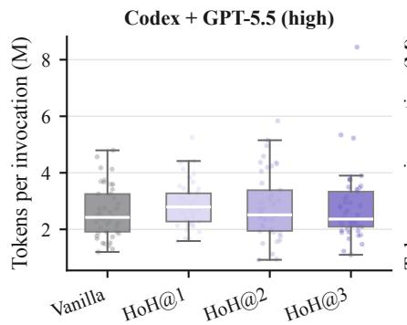

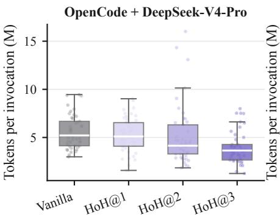

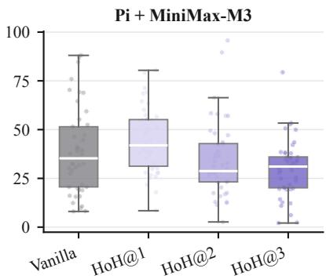  
Figure 11 | Per-invocation coding-harness token distributions on GameCraft-Bench. Points denote tasks; boxes show the median and interquartile range.

Table 24 aggregates the recorded resource use for the FrontierSWE runs.  
Table 24 | Aggregate FrontierSWE resource usage.
<table><tr><td>Harness-model</td><td colspan="2">Vanilla</td><td colspan="2">HoH@1</td><td colspan="2">HoH@2</td><td colspan="2">HoH@3</td></tr><tr><td></td><td>Tokens (M)</td><td>Time (h)</td><td>Tokens (M)</td><td>Time (h)</td><td>Tokens (M)</td><td>Time (h)</td><td>Tokens (M)</td><td>Time (h)</td></tr><tr><td>Codex + GPT-5.5 (high)</td><td>103.43</td><td>18.65</td><td>109.26</td><td>14.32</td><td>83.19</td><td>13.21</td><td>71.71</td><td>10.28</td></tr><tr><td>OpenCode + DeepSeek-V4-Pro</td><td>384.84</td><td>32.00</td><td>332.61</td><td>23.58</td><td>345.66</td><td>23.32</td><td>229.77</td><td>16.16</td></tr><tr><td>Pi + MiniMax-M3</td><td>541.73</td><td>40.19</td><td>1117.11</td><td>49.05</td><td>988.00</td><td>21.53</td><td>717.69</td><td>37.15</td></tr></table>

## D Qualitative Analysis

Figures 12–16 show one representative game from each of the 15 GameCraft-Bench families. For each family, we select the game with the highest HoH@3 Overall score under Codex with GPT-5.5 (high). Each row compares Vanilla and HoH@1–3; the values beneath each artifact report Overall, Core Mechanics (M), Content Depth (D), Functional Visuals (V), and Art and Presentation (A).

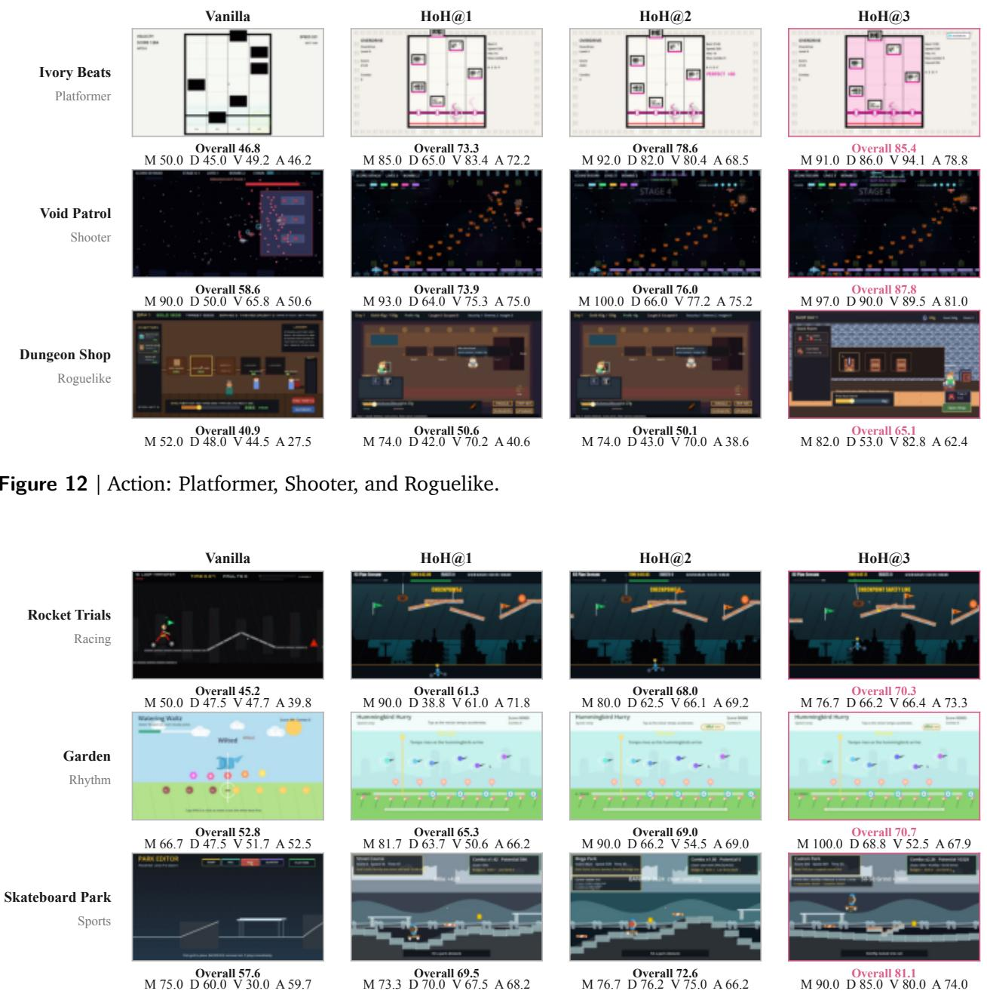  
Figure 13 | Timing: Racing, Rhythm, and Sports.

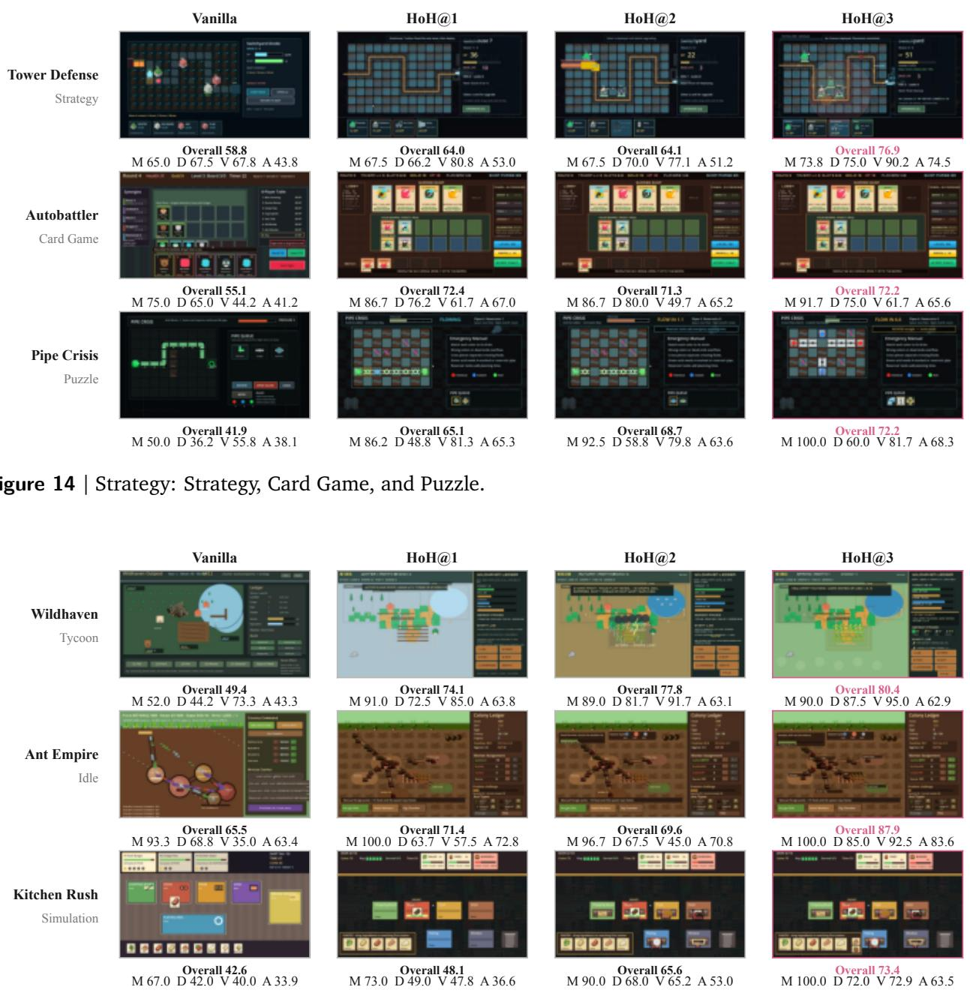  
Figure 15 | Simulation: Tycoon, Idle, and Simulation.

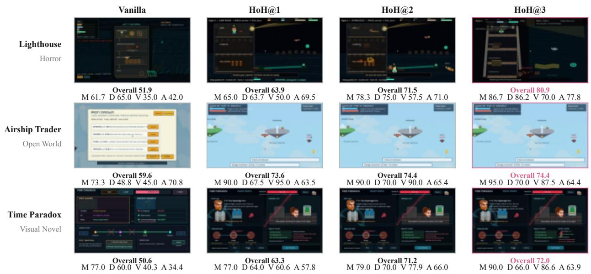  
Figure 16 | Adventure: Horror, Open World, and Visual Novel.  
Table 25 reports the exact Overall and dimension scores underlying all 60 artifacts shown above.

Table 25 | Scores for the 15 GameCraft-Bench games shown in the qualitative comparison. One game is selected per benchmark family by the highest HoH@3 Overall score under Codex with GPT-5.5 (high).
<table><tr><td>Family</td><td>Game</td><td>Condition</td><td>Overall</td><td>Mechanics</td><td></td><td>Depth Visuals</td><td>Art</td></tr><tr><td colspan="8">Action</td></tr><tr><td rowspan="5">Platformer</td><td rowspan="5">Ivory Beats</td><td>Vanilla</td><td>46.81</td><td>50.00</td><td>45.00</td><td>49.17</td><td>46.25</td></tr><tr><td>HoH@1</td><td>73.28</td><td>85.00</td><td>65.00</td><td>83.44</td><td>72.19</td></tr><tr><td>HoH@2</td><td>78.55</td><td>92.00</td><td>82.00</td><td>80.42</td><td>68.54</td></tr><tr><td>HoH@3</td><td>85.42</td><td>91.00</td><td>86.00</td><td></td><td>94.06 78.75</td></tr><tr><td>Vanilla</td><td>58.59</td><td>90.00</td><td>50.00</td><td>65.83</td><td>50.62</td></tr><tr><td rowspan="4">Shooter</td><td rowspan="4">Void Patrol</td><td>HoH@1</td><td>73.90</td><td>93.00</td><td>64.00</td><td>75.31</td><td>75.00</td></tr><tr><td>HoH@2</td><td>76.02</td><td>100.00</td><td>66.00</td><td>77.25</td><td>75.25</td></tr><tr><td>HoH@3</td><td>87.83</td><td>97.00</td><td>90.00</td><td></td><td>89.50 81.00</td></tr><tr><td>Vanilla</td><td>40.89</td><td>52.00</td><td>48.00</td><td>44.46</td><td>27.50</td></tr><tr><td rowspan="3">Roguelike</td><td rowspan="3">Dungeon Shop</td><td>HoH@1</td><td>50.55</td><td>74.00</td><td>42.00</td><td>70.21</td><td>40.62</td></tr><tr><td>HoH@2</td><td>50.15</td><td>74.00</td><td>43.00</td><td>70.00</td><td>38.57</td></tr><tr><td>HoH@3</td><td>65.09</td><td>82.00</td><td>53.00</td><td></td><td>82.75 62.38</td></tr><tr><td colspan="2"></td><td>Timing</td><td></td><td></td><td></td><td></td><td></td></tr><tr><td rowspan="5">Racing</td><td rowspan="5">Rocket Trials</td><td>Vanilla</td><td>45.19</td><td>50.00</td><td>47.50</td><td>47.67</td><td>39.75</td></tr><tr><td>HoH@1</td><td>61.33</td><td>90.00</td><td>38.75</td><td>61.00</td><td>71.75</td></tr><tr><td>HoH@2</td><td>68.00</td><td>80.00</td><td>62.50</td><td>66.11</td><td>69.17</td></tr><tr><td>HoH@3</td><td>70.31</td><td>76.67</td><td>66.25</td><td></td><td>66.39 73.33</td></tr><tr><td>Vanilla</td><td>52.75</td><td>66.67</td><td>47.50</td><td>51.67</td><td>52.50</td></tr><tr><td rowspan="4">Rhythm</td><td rowspan="4">Garden</td><td>HoH@1</td><td>65.33</td><td>81.67</td><td>63.75</td><td>50.56</td><td>66.25</td></tr><tr><td>HoH@2</td><td>69.01</td><td>90.00</td><td>66.25</td><td>54.50</td><td>69.00</td></tr><tr><td>HoH@3</td><td>70.69</td><td>100.00</td><td>68.75</td><td></td><td>52.50 67.88</td></tr><tr><td>Vanilla</td><td>57.64</td><td>75.00</td><td>60.00</td><td>30.00</td><td>59.69</td></tr><tr><td rowspan="3">Sports</td><td rowspan="3">Skateboard Park</td><td>HoH@1</td><td>69.51</td><td>73.33</td><td>70.00</td><td>67.50</td><td>68.25</td></tr><tr><td>HoH@2</td><td>72.62</td><td>76.67</td><td>76.25</td><td>75.00</td><td>66.25</td></tr><tr><td>HoH@3</td><td>81.14</td><td>90.00</td><td>85.00</td><td>80.00</td><td>73.96</td></tr><tr><td>Family</td><td>Game</td><td>Condition</td><td>Overall</td><td>Mechanics</td><td>Depth</td><td>Visuals</td><td>Art</td></tr><tr><td colspan="8">Strategy</td></tr><tr><td colspan="8"></td></tr><tr><td rowspan="4">Strategy</td><td rowspan="4">Tower Defense</td><td>Vanilla HoH@1</td><td>58.85 63.97</td><td>65.00 67.50</td><td>67.50 66.25</td><td>67.75 80.75</td><td>43.75 53.00</td></tr><tr><td>HoH@2</td><td>64.12</td><td>67.50</td><td>70.00</td><td>77.08</td><td>51.25</td></tr><tr><td>HoH@3</td><td>76.92</td><td>73.75</td><td>75.00</td><td>90.25</td><td>74.50</td></tr><tr><td></td><td>55.06</td><td>75.00</td><td>65.00</td><td></td><td>41.25</td></tr><tr><td rowspan="4">Card Game</td><td rowspan="4">Autobattler</td><td>Vanilla HoH@1</td><td>72.39</td><td>86.67</td><td>76.25</td><td>44.17 61.67</td><td>67.00</td></tr><tr><td>HoH@2</td><td>71.28</td><td>86.67</td><td>80.00</td><td>49.72</td><td>65.21</td></tr><tr><td>HoH@3</td><td>72.22</td><td>91.67</td><td>75.00</td><td>61.67</td><td>65.62</td></tr><tr><td>Vanilla</td><td>41.88</td><td>50.00</td><td>36.25</td><td>55.83</td><td>38.06</td></tr><tr><td rowspan="3">Puzzle</td><td rowspan="3">Pipe Crisis</td><td>HoH@1</td><td>65.07</td><td>86.25</td><td>48.75</td><td>81.33</td><td>65.33</td></tr><tr><td>HoH@2</td><td>68.65</td><td>92.50</td><td>58.75</td><td>79.76</td><td>63.57</td></tr><tr><td>HoH@3</td><td>72.17</td><td>100.00</td><td>60.00</td><td>81.67</td><td>68.33</td></tr><tr><td colspan="7">Simulation</td></tr><tr><td rowspan="4">Tycoon</td><td rowspan="4">Wildhaven</td><td>Vanilla</td><td>49.42</td><td>52.00</td><td>44.17</td><td>73.33</td><td>43.33</td></tr><tr><td>HoH@1</td><td>74.09</td><td>91.00</td><td>72.50</td><td>85.00</td><td>63.75</td></tr><tr><td>HoH@2</td><td>77.78</td><td>89.00</td><td>81.67</td><td>91.67</td><td>63.12</td></tr><tr><td>HoH@3</td><td>80.39</td><td>90.00</td><td>87.50</td><td>95.00</td><td>62.89</td></tr><tr><td rowspan="4">Idle</td><td rowspan="4">Ant Empire</td><td>Vanilla</td><td>65.52</td><td>93.33</td><td>68.75</td><td>35.00</td><td>63.44 72.81</td></tr><tr><td>HoH@1 HoH@2</td><td>71.42 69.64</td><td>100.00</td><td>63.75 67.50</td><td>57.50</td><td>70.75</td></tr><tr><td>HoH@3</td><td>87.88</td><td>96.67 100.00</td><td>85.00</td><td>45.00</td><td></td></tr><tr><td></td><td>42.62</td><td></td><td></td><td>92.50</td><td>83.57 33.93</td></tr><tr><td rowspan="4">Simulation</td><td rowspan="4">Kitchen Rush</td><td>Vanilla</td><td>48.07</td><td>67.00</td><td>42.00 49.00</td><td>40.00 47.81</td><td>36.56</td></tr><tr><td>HoH@1 HoH@2</td><td>65.64</td><td>73.00</td><td>68.00</td><td></td><td>53.00</td></tr><tr><td>HoH@3</td><td></td><td>90.00</td><td></td><td>65.25</td><td></td></tr><tr><td></td><td>73.38</td><td>100.00</td><td>72.00</td><td>72.92</td><td>63.54</td></tr><tr><td colspan="7">Adventure</td></tr><tr><td rowspan="4">Horror</td><td rowspan="4">Lighthouse</td><td>Vanilla</td><td>51.95</td><td>61.67</td><td>65.00</td><td>35.00</td><td>42.00</td></tr><tr><td>HoH@1</td><td>63.89</td><td>65.00</td><td>63.75</td><td>50.00</td><td>69.50</td></tr><tr><td>HoH@2</td><td>71.47</td><td>78.33</td><td>75.00</td><td>57.50</td><td>71.00</td></tr><tr><td>HoH@3</td><td>80.90</td><td>86.67</td><td>86.25</td><td>70.00</td><td>77.75</td></tr><tr><td rowspan="4">Open World</td><td rowspan="4">Airship Trader</td><td>Vanilla</td><td>59.58 73.60</td><td>73.33</td><td>48.75</td><td>45.00</td><td>70.75 63.50</td></tr><tr><td>HoH@1 HoH@2</td><td></td><td>90.00</td><td>67.50</td><td>95.00</td><td>65.42</td></tr><tr><td>HoH@3</td><td>74.40 74.41</td><td>90.00 95.00</td><td>70.00 70.00</td><td>90.00</td><td></td></tr><tr><td></td><td></td><td></td><td></td><td>87.50</td><td>64.38 34.38</td></tr><tr><td rowspan="4">Visual Novel</td><td rowspan="4">Time Paradox</td><td>Vanilla</td><td>50.63</td><td>77.00</td><td>60.00</td><td>40.31</td><td></td></tr><tr><td>HoH@1</td><td>63.28</td><td>77.00</td><td>64.00</td><td>60.62</td><td>57.81</td></tr><tr><td>HoH@2</td><td>71.15</td><td>79.00</td><td>70.00</td><td>77.92</td><td>66.04</td></tr><tr><td>HoH@3</td><td>71.97</td><td>90.00</td><td>66.00</td><td>86.61</td><td>63.93</td></tr></table>