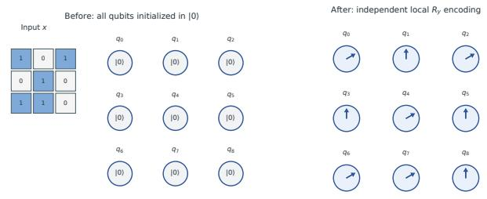
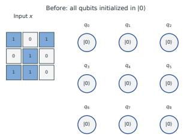
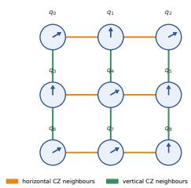
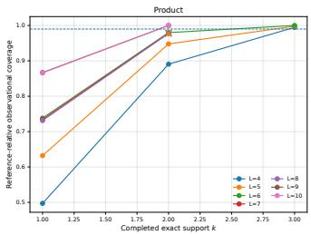
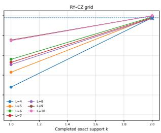
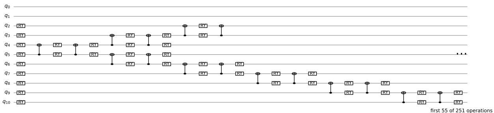
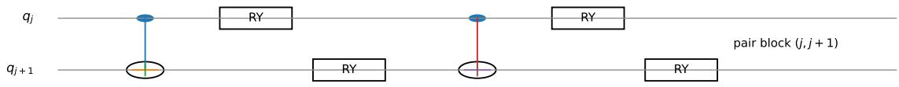
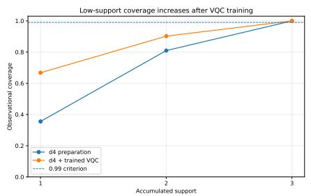
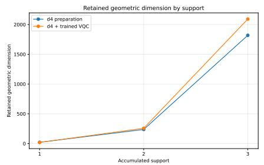
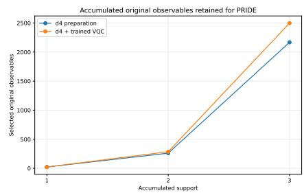

## Highlights

QILP-0: Constructing Observational Declarative Twins of Quantum Circuits Marina de la Cruz Echeandía, César Luis Alonso, Tony Ribeiro, Alfonso Ortega de la Puente

• A target-independent pipeline links quantum observables and logical induction.

• Reference-relative coverage tracks complete exact-support layers.

• Latent geometry maps reproducibly back to original quantum observables.

• A declarative explainability approach for observed quantum-circuit behaviour.

# QILP-0: Constructing Observational Declarative Twins of Quantum Circuits

Marina de la Cruz Echeandía<sup>a</sup>, César Luis Alonso<sup>c</sup>, Tony Ribeiro<sup>b</sup> and Alfonso Ortega de la Puente<sup>c,∗</sup>

<sup>a</sup>Universidad Internacional de la Rioja UNIR, Escuela Superior de Ingeniería y Tecnología, Logroño, Spain

<sup>b</sup>Nantes Université, École Centrale Nantes, CNRS, LS2N, UMR 6004, 44000, Nantes, France; National Institute of Informatics, 2-1-2 Hitotsubashi, Chiyoda-ku, Tokyo, 101-8430, Japan,

<sup>c</sup>Universidad de Oviedo, Departamento de Informática, Gijón, 33204, Spain

## A R T I C L E I N F O

Keywords: quantum machine learning symbolic artificial intelligence inductive logic programming explainable machine learning quantum observables

## A BS T RA C T

This paper introduces QXymb, a general framework for constructing observational declarative twins of quantum circuits, and develops QILP-0, its first complete order-0 specialization. QILP-0 constructs a finite multi-valued propositional logic program from observed circuit behaviour within a declared observational scope.

The pipeline traverses a declared family of quantum observables incrementally according to a reproducible structural grading and a declared observational reference horizon. Progress is quantified through reference-relative coverage against a fixed target-independent reference. Observable responses are organized through target-independent geometry, while retained latent structure is mapped deterministically back to original observable columns before symbolic processing, preserving observational semantics and provenance.

Selected observable profiles are converted into a finite relation through admissible targetindependent discretization. The target is used only afterwards to audit twin-admissibility and induce the declarative theory. A theory is certified as an exact observational declarative twin when it completely and correctly reconstructs the resulting finite task-conditioned discrete relation. Logical exactness is therefore separated from numerical, backend, provider, and discretization uncertainty, which is retained as audit metadata.

Validation uses two complementary QML settings. Exhaustive Bars & Stripes experiments compare product and grid-CZ embeddings from 16 to 100 qubits and exercise the native-discrete branch. Low-Depth MNIST analyses all 14,708 digit-0/1 instances before and after a trained variational quantum transformation and exercises continuous discretization. In every reported relation, the induced QILP-0 theory achieves complete, conflict-free reconstruction with strict accuracy equal to one.

## 1. Introduction

Quantum machine learning (QML) combines quantum information processing with learning procedures in order to construct representations, kernels, classifiers, or trainable quantum models. This combination introduces explanatory questions that are not exhausted by the interpretability of the classical learning component. A classical input may first be transformed by a quantum embedding, subsequently processed by a parametrized quantum circuit, and finally exposed only through a restricted set of measurements. Even when the surrounding learning algorithm is familiar, the quantum representation itself can therefore become an additional source of opacity Pira and Ferrie (2024); Gil-Fuster, Naujoks, Montavon, Wiegand, Samek and Eisert (2024).

Two common QML settings illustrate this issue. In quantum-kernel and related hybrid approaches, a classical datum is encoded into a quantum state before a classical learning stage operates on similarities or measurements derived from that representation. The embedding can substantially reorganize the geometry seen by the downstream learner. In variational approaches, a trainable quantum transformation further changes that representation according to a supervised objective. In both cases, inspecting only the final prediction leaves open a diferent question: what observable relation has the quantum part of the pipeline actually produced over the analysed data?

Most explainability methods address related but diferent objects, such as feature attribution, gate relevance, local surrogate behaviour, visual inspection, or intrinsically interpretable architectures. Recent work has also shown that quantum data can support the discovery of compact and physically meaningful latent representations followed by symbolic descriptions de Schoulepnikof, Nautrup, Briegel and Muñoz-Gil (2026). These approaches demonstrate the growing importance of interpretable representations for quantum data. The present work pursues a complementary objective: rather than replacing the observational vocabulary by a compact learned representation before symbolic reasoning, we ask whether an explicitly scoped part of the observable behaviour of a quantum circuit can be reconstructed as a finite, traceable declarative theory.

This question motivates QXymb, a methodological bridge between quantum observations and symbolic reasoning.

QXymb is intended to accommodate diferent observable providers, numerical backends, discretization policies and declarative engines. The present paper develops QILP-0, its current order-0 specialization, in which the symbolic layer is a finite multi-valued propositional logic program induced through the LFIT/PRIDE family.

The central object introduced in this work is an observational declarative twin. The adjective observational is essential. QILP-0 does not claim to reconstruct the complete quantum behaviour of a circuit for every possible input, state, measurement, or execution condition. Instead, the researcher declares an observational scope comprising a dataset, an observable family, a reproducible structural grading, and an observational reference horizon. QILP-0 then constructs a finite declarative representation of the relation observed within that scope and records the provenance required to trace symbolic literals back to discrete states and original quantum observables.

For the Pauli realization used in this work, the structural family can extend up to full �-qubit support, but a particular execution may declare a smaller observational reference horizon according to scientific scope, available data, provider capabilities, or technological and computational constraints. Coverage statements are explicitly relative to that declared reference. They therefore do not estimate the fraction of unobserved higher-support geometry lying outside it.

This scope qualification also determines how exactness is understood. Logical exactness is assessed with respect to the finite discrete relation actually produced by the pipeline. If that relation is target-consistent and the induced program covers every analysed row without conflicting predictions, the resulting theory is an exact observational declarative twin of that reported relation. Any uncertainty introduced earlier by sampling, numerical approximation, a backend, or a provider concerns the correspondence between the reported observable responses and their ideal counterparts and must be recorded separately. Thus, QILP-0 does not hide uncertainty inside the symbolic claim.

A second design requirement is that supervised information should not shape the observational vocabulary before declarative induction. Observable generation, structural traversal, geometric analysis, coverage estimation, selection of original observable columns and discretization are therefore performed independently of the target. The target enters only when the finite relation is audited for twin-admissibility and the declarative theory is induced. This separation is intended to prevent the explanation vocabulary from being engineered retrospectively around the classes that it is later asked to describe.

The continuous observational layer is incremental. In the present instantiation, Pauli observables are graded by exact support and processed in complete blocks. Their response profiles are analysed through a target-independent SVDbased geometry, while progress is measured by referencerelative coverage against the fixed observational reference defined for the declared horizon. The geometric stage may reveal latent directions, but those directions do not replace the symbolic variables. QILP-0 evaluates the association of the original observable columns with the retained new subspace and deterministically preserves the score-ranked set required by the declared column-association threshold. Discretization and declarative induction therefore operate on original observational variables rather than on latent singular coordinates.

The declarative layer then converts the selected observable profiles into a finite symbolic relation through an admissible target-independent discretization. Native discrete states are preserved; genuinely continuous columns are discretized at a resolution constrained by the available statistical, numerical and, when present, backend information. Once twin-admissibility has been established, PRIDE induces the propositional theory used by QILP-0 and the pipeline verifies its row-level reconstruction. The result is accompanied by a certificate recording the observational scope, discretization audit, symbolic consistency, reconstruction metrics and provenance.

The contributions of this paper are therefore the following:

1. We define the observational declarative twin as a scope-qualified finite logical reconstruction of an observed quantum relation, distinguishing logical exactness from the uncertainty of the underlying observable evaluation.

2. We formulate the methodological conditions required to construct such a twin, including semantically traceable observable families, reproducible structural grading, a declared observational reference horizon, targetindependent geometry, reference-relative incremental coverage, deterministic mapping from retained latent geometry back to original observable columns, admissible target-independent discretization, twinadmissibility, and a declarative engine satisfying the required reconstruction contract.

3. We provide a constructive QILP-0 realization of these conditions. The current implementation uses Pauli observables, exact-support traversal, a fixed observational reference, an SVD-based continuous geometry, deterministic original-observable selection, targetindependent observable-wise discretization, and LFIT/ PRIDE induction, while keeping the corresponding components conceptually replaceable inside QXymb.

4. We make the construction auditable through explicit provenance and certification. Symbolic literals remain traceable to discrete states, numerical intervals or native values, original observables, supports and qubits, and exact-twin claims are issued only after consistency and row-level reconstruction checks.

5. We validate the construction in two complementary QML settings. An exhaustive Bars & Stripes study exercises the native-discrete branch on fixed product and grid-CZ embeddings from 16 to 100 qubits. A Low-Depth MNIST study exercises the continuous branch on all 14,708 digit-0/1 instances and compares the same representation before and after a trained variational transformation. In every reported relation, the resulting QILP-0 theory provides complete, conflictfree reconstruction with strict reconstruction accuracy equal to one.

The experiments are intended to validate the methodological construction rather than to benchmark predictive quantum advantage. Bars & Stripes isolates the embedding stage as a controlled source of representational change, whereas Low-Depth MNIST allows the observational geometry and declarative relation to be compared before and after supervised variational processing. Together they exercise the two branches of the declarative interface—native discrete and continuous—and show how the same certificate semantics applies to both.

The remainder of the paper is organized as follows. Section 2 reviews explainability in QML, logical formalizations of quantum computation, interpretable representation learning from quantum data, and the LFIT family underlying the current declarative engine. The following methodological sections introduce QXymb/QILP-0, formalize the continuous and declarative conditions required by the construction, define the observational declarative twin, and give its constructive realization and certificate. Section 6 reports the Bars & Stripes and Low-Depth MNIST experiments together with their cross-experiment certification. The final section summarizes the conclusions, limitations and main directions for future work.

## 2. Background and Related Work

The context of this contribution includes current approaches to explainability in QML, logical and formal descriptions of quantum computation, and methods for inducing equivalent logical theories from processes represented as datasets.

## 2.1. Explainability in QML

QML models that wrap classical ML engines with a quantum embedding level can benefit from the same explainability tools used for their classical ML component. These approaches are outside the scope of the present contribution, which is centred on specifically quantum explainability and interpretability approaches.

Current QML models for classical data, such as variational quantum circuits (VQCs), commonly combine a dataencoding circuit, a trainable parametrized circuit and one or more measurements. Their hybrid structure makes them amenable to some classical explainability tools, but it also creates specifically quantum dificulties. Intermediate quantum states are not generally available as reusable layer activations; exact state descriptions scale exponentially; measurements are probabilistic; and finite-shot noise can afect both predictions and their explanations. Consequently, explainability techniques developed for classical neural networks cannot always be transferred without modification Pira and Ferrie (2024); Gil-Fuster et al. (2024).

The emerging literature in this field can be organized into four complementary families.

The first adapts post-hoc feature attribution and local surrogate methods to quantum classifiers. Q-LIME, for example, extends local model-agnostic explanation to quantum neural networks and explicitly considers the randomness introduced by quantum measurements Pira and Ferrie (2024). Other studies combine occlusion, gradient-based attribution and example influence to explain QNN predictions Tian and Yang (2024a), or wrap quantum classifiers with established LIME and SHAP procedures to obtain local and global feature-level accounts Kadian, Garhwal and Kumar (2025); Kottahachchi Kankanamge Don and Khalil (2025). Recent work has also begun to examine the stability of local explanations for quantum classifiers Acampora and Vitiello (2026).

A second family attributes relevance to internal circuit components rather than to input features. Heese et al. adapt Shapley values to quantify the contribution of gates or groups of gates to a task-dependent objective Heese, Gerlach, Mücke, Müller, Jakobs and Piatkowski (2025). These explanations are useful for circuit diagnosis and design, but they remain attribution scores rather than declarative descriptions of the observed input–output relation.

A third line develops quantum-aware analytical or intrinsically interpretable models. Gil-Fuster et al. formulate a broader framework for explainable QML and propose techniques tailored to parametrized quantum circuits Gil-Fuster et al. (2024). Complementarily, concept-driven QNNs introduce a human-interpretable concept layer into the model itself Tian and Yang (2024b). Such approaches are promising, although intrinsic interpretability usually requires architectural commitments that are not available when an already trained circuit must be analysed.

A fourth family treats explainability as a visual-analytics problem. VIOLET separates the encoding, ansatz and learnedfeature views of a QNN and combines circuit structure, parameter evolution and measurement information in an interactive environment Ruan, Liang, Guan, Grifin, Wen, Lin and Wang (2024). This illustrates that QML explanation may require coordinated views of several stages of the quantum–classical pipeline rather than a single attribution vector.

Several adjacent research lines also deserve consideration when assessing the scope of a symbolic approach. Classical surrogates can reproduce the input–output behaviour of a quantum learning model, and shadow models can transfer information obtained from quantum experiments to an eficiently deployable classical predictor Schreiber, Eisert and Meyer (2023); Jerbi, Gyurik, Marshall, Molteni and Dunjko (2024). Their primary output is, however, another predictive model rather than a logical theory whose literals are directly traceable to selected observables. Other work infers compact dynamical generators from trajectories of local quantum observables Cemin, Carnazza, Andergassen, Martius, Carollo and Lesanovsky (2024); this produces interpretable equations for dynamics, but does not induce a class-target rule theory from a dataset of circuit executions. Finally, formal quantum logics, symbolic verification and quantum logic programming use logical languages to specify, verify or execute quantum processes Bauer-Marquart, Leue and Schilling (2023); Brunet (2016); Balu (2015). Their direction is therefore diferent from learning a logical description from the observed behaviour of an already defined circuit.

A particularly close and rapidly developing line of work uses representation learning to extract physically meaningful low-dimensional descriptions from quantum data. Earlier work on operationally meaningful representations showed that neural representations can be constrained so that their latent factors retain an explicit physical interpretation, including compact representations of two-qubit states that separate local information from quantum correlations Nautrup, Metger, Iten, Jerbi, Trenkwalder, Wilming, Briegel and Renner (2022). More recently, probabilistic variational autoencoders have been adapted to the intrinsic randomness and correlations of quantum measurement data, with the explicit goal of learning compact and physically interpretable latent representations without prior labels or known order parameters de Schoulepnikof, Muñoz-Gil, Nautrup and Briegel (2025). Related work on quantum-simulator snapshots likewise uses unsupervised variational autoencoders to discover minimal latent representations correlated with physically relevant variables Møller, Fernández-Fernández, Schweigler, de Schoulepnikof, Schmiedmayer and Muñoz-Gil (2026), while action-induced representations provide a complementary route in which latent components are associated with physical degrees of freedom through the experimental actions that afect them Muñoz-Gil, Nautrup, Majumder, de Schoulepnikof, Fürrutter, Krumm and Briegel (2026).

The recent QDisc framework brings this programme especially close to the objectives considered here de Schoulepnikof et al. (2026). QDisc processes quantum measurement data with a probabilistic variational autoencoder, identifies structure in the resulting compact latent representation, and subsequently applies symbolic regression to obtain compact analytical descriptors that can act as order parameters for the discovered regimes. It has been demonstrated on experimental Rydberg-atom data, classical-shadow data and fermionic datasets. The combination of interpretable representation learning and symbolic regression makes QDisc an important neighbouring approach for data-driven symbolic discovery in quantum systems.

The methodological objective of QILP-0 is nevertheless diferent. The representation-learning line above deliberately searches for a compact latent description containing the physically relevant factors needed to characterize or reconstruct the observed phenomena. QILP-0, by contrast, does not replace the declared observational vocabulary by learned latent coordinates before symbolic induction. Its geometric stage organizes the observable-response structure in a target-independent manner while preserving the association with the original observables; the selected original observable profiles are then discretized under an explicit observational-resolution contract, and logical induction determines which conditions over those observable states are suficient to reconstruct the analysed relation. In this sense, compact representation learning and QILP-0 place semantic simplification at diferent points of the pipeline: the former deliberately compresses the representation before symbolic description, whereas QILP-0 preserves the original observational semantics through the representation-building stages and allows the declarative theory to express the subsequent simplification.

The two approaches therefore address complementary scientific questions. QDisc asks which compact, physically meaningful latent factors and analytical expressions characterize structure discovered in quantum data. QILP-0 asks which finite declarative theory reconstructs an explicitly scoped observed relation while keeping every symbolic literal traceable to the observable vocabulary from which that relation was constructed. This distinction concerns the methodological object being sought rather than a preference for one learning algorithm over another.

Within this landscape, QILP-0 targets a complementary level of explanation. It is a post-hoc, dataset-level and representation-oriented pipeline. Instead of assigning a relevance score only to original input features or individual gates, it evaluates a declared family of quantum observables, organizes them incrementally by structural support, and analyses their response geometry in a target-independent manner. Progress is measured relative to a fixed observational reference, and the retained latent geometry is mapped deterministically back to original observable columns before target-independent discretization and declarative induction.

The researcher controls the observational scope through a declared reference horizon and an explicit stopping policy. For the Pauli realization considered in this work, the structural support range extends up to the number of qubits, but a particular execution may declare a smaller reference horizon according to scientific scope, available observational data, provider capabilities, or computational resources. QILP-0 reports coverage relative to that declared reference and separately records any downstream endpoint reached before the reference horizon is fully propagated. It therefore does not extrapolate its coverage claim to unobserved higher-support structure.

The resulting records connect the observational geometry of the quantum representation, the original observables and qubit supports involved, and a symbolic account of the observed relation to the target. We call the resulting object, formally defined in the methodological sections, an observational declarative twin. Every rule literal remains traceable to an original observable, its qubit support, and a discrete state.

The distinctive contribution of QILP-0 lies in combining support-wise target-independent observational traversal, reference-relative coverage against a fixed declared reference, deterministic return from latent geometry to original observable variables, admissible target-independent discretization, logical rule induction, and an explicit certificate of equivalence with the resulting finite observed relation. To the best of our knowledge, we have not identified a previous framework that combines these elements into a certified observational declarative twin with this scope and provenance contract. Closely related approaches address feature or gate attribution, predictive classical surrogates, compact interpretable latent representations and symbolic physical descriptors, interpretable observable dynamics, or logic-based specification and verification. These directions are complementary to the finite declarative reconstruction pursued here.

## 2.2. Formalization of quantum computations

A complementary line of work, distinct from explainable QML, has investigated the logical formalization and verification of quantum computation itself. Quantum dynamic logics provide an important precedent in this direction. Baltag and Smets’ Logic of Quantum Programs (LQP) represents quantum measurements, unitary transformations, locality and entanglement within a dynamic-logical semantics, enabling properties of quantum programs and protocols such as teleportation and quantum secret sharing to be specified and proved formally Baltag and Smets (2006). Subsequent work extended this line towards probabilistic reasoning and decidable logics for quantum algorithms, including formal encodings of quantum search and distributed protocols Baltag, Bergfeld, Kishida, Sack, Smets and Zhong (2014), while a later overview consolidated quantum dynamic logic as a framework for reasoning about the flow of quantum information and for verifying quantum protocols Baltag and Smets (2022).

This tradition is conceptually relevant to QXymb because it demonstrates that quantum programs can be connected to explicit logical objects while preserving information about their quantum structure. The direction pursued in our present contribution is, however, essentially inductive rather than deductive: instead of starting from a logical specification and proving that a quantum program satisfies it, QILP-0 starts from the observable behaviour of an existing circuit and induces a declarative theory that reconstructs that behaviour within a declared observational scope. We therefore regard quantum program logics as an important conceptual foundation and a complementary formal layer. In future developments, this connection may also be exploited at the QXymb level, for example by associating structured circuit representations with formal specifications or verification interfaces, while QILP-0 remains responsible for learning declarative descriptions from observed circuit behaviour.

## 2.3. Induction of propositional theories equivalent to datasets

Although diferent inductive engines can synthesize declarative models from examples and counterexamples represented in datasets, for reasons of space we focus here on the family actually used by QILP-0: Learning From Interpretation Transition (LFIT).

LFIT Inoue, Ribeiro and Sakama (2014) was proposed to automatically construct a model of the dynamics of a system from observations of its state transitions. Given raw data, such as time-series gene-expression data, a discretization of those data in the form of state transitions is assumed. From those state transitions, according to the semantics of the system dynamics, several inference algorithms modelling the system as a logic program have been proposed. The semantics of a system’s dynamics can difer with regard to the synchronism of its variables, the determinism of its evolution and the influence of its history.

The LFIT framework proposes several modelling and learning algorithms to tackle those diferent semantics. To date, the following systems have been addressed: memoryless deterministic systems Inoue et al. (2014), systems with memory Ribeiro, Magnin, Inoue and Sakama (2015a), probabilistic systems Martínez Martínez, Ribeiro, Inoue, Alenyà Ribas and Torras (2015) and their multi-valued extensions Ribeiro, Magnin, Inoue and Sakama (2015b); Martínez, Alenyà, Torras, Ribeiro and Inoue (2016). The work Ribeiro, Tourret, Folschette, Magnin, Borzacchiello, Chinesta, Roux and Inoue (2018b) proposes a method that allows continuous time-series data to be handled, with the abstraction itself learned by the algorithm.

In Ribeiro, Folschette, Magnin, Roux and Inoue (2018a); Ribeiro, Folschette, Magnin and Inoue (2022a), LFIT was extended to learn system dynamics independently of its update semantics. That extension relies on a modelling of discrete memoryless multi-valued systems as logic programs in which each rule represents that a variable can take some value at the next state, extending the formalism introduced in Inoue et al. (2014); Ribeiro and Inoue (2015). The representation in Ribeiro et al. (2018a, 2022a) is based on annotated logics Blair and Subrahmanian (1989, 1988). Here, each variable corresponds to a domain of discrete values. In a rule, a literal is an atom annotated with one of these values. This allows annotated atoms to be represented as classical atoms and hence preserves a propositional representation.

This modelling makes it possible to characterize optimal programs independently of the update semantics and to represent the dynamics of a wide range of discrete systems, including the finite multi-valued relation required by QILP-0. LFIT can therefore be used to induce an equivalent propositional logic program that provides a declarative explanation for each supplied observation. The specific reconstruction properties required by QILP-0 and their instantiation through PRIDE are formalized later as part of the observational-twin contract rather than repeated here.

## 3. Continuous observational layer: methodological conditions for target-independent construction

The constructive result developed later in this paper relies on a sequence of methodological conditions that must be made explicit before the declarative stage is defined. QILP-0 must first be able to represent the observed behaviour of a quantum circuit numerically, interrogate that behaviour through a semantically meaningful observable family, traverse the family according to a reproducible structural grading, quantify the observational structure revealed during that traversal, and stop under explicit conditions without using the supervised target to guide the construction. Finally, the numerical geometry used to organize the exploration must be mapped back to the original observable vocabulary before symbolic induction.

The following subsections state these conditions and provide the mathematical and bibliographic support used by the current QILP-0 construction. All guarantees remain relative to the declared observational scope: the analysed inputs, observable provider, structural horizon, backend or estimator, numerical tolerances, and subsequent discretization policy.

## 3.1. Condition 1: an observational behaviour matrix can be constructed

The starting condition of QILP-0 is that the behaviour of the quantum system under a finite collection of semantically identifiable input situations can be represented through a real-valued observational dataset. This numerical representation constitutes the continuous layer of the current methodology: individual observable profiles may in practice take either continuously varying values or a finite set of native values, but they are represented before symbolic discretization as numerical columns in a real matrix.

Let � be the number of analysed input situations and let $\{ x _ { i } \} _ { i = 1 } ^ { m }$ denote their classical descriptions. Classical inputs can be embedded into the Hilbert space of a quantum system through data-dependent quantum feature maps Schuld and Killoran (2019). After the data-dependent preparation and any subsequent quantum processing, let

$$
\rho ( x _ { i } ) \in \mathbb { C } ^ { 2 ^ { n } \times 2 ^ { n } }\tag{1}
$$

denote the resulting density operator for input $x _ { i }$ . Thus, $\rho ( x _ { i } ) \succeq 0$ and $\textstyle \operatorname { T r } ( \rho ( x _ { i } ) ) = 1$

Let $\{ O _ { j } \} _ { j = 1 } ^ { p }$ be a declared family of $p$ Hermitian observables acting on the same Hilbert space. Quantum learning models commonly expose properties of their processed states through expectation values of chosen observables Mitarai, Negoro, Kitagawa and Fujii (2018). QILP-0 therefore defines

$$
\begin{array} { c } { { ( X _ { \mathrm { o b s } } ) _ { i j } = X _ { i j } = \mathrm { T r } \left[ \rho ( x _ { i } ) O _ { j } \right] , } } \\ { { i = 1 , \ldots , m , \quad j = 1 , \ldots , p , } } \end{array}\tag{2}
$$

with $X _ { \mathrm { o b s } } \in \mathbb { R } ^ { m \times p }$

Because $O _ { j }$ is Hermitian, every $X _ { i j }$ is real. Row � of $X _ { \mathrm { o b s } }$ is the observable profile produced by the quantum system for input $x _ { i }$ , whereas column � records the response of observable $O _ { j }$ across the complete analysed dataset.

Intuition. The observational matrix can be viewed as a table of questions and answers. Each observable asks one fixed question about the processed quantum state. Each row corresponds to one input situation and records the answers obtained for that situation. QILP-0 does not immediately collapse this table into a prediction or into latent coordinates: the observable responses remain individually identifiable because the later declarative description must be able to refer back to what was actually observed.

Unlike approaches that immediately aggregate expectation values into a single prediction, QILP-0 preserves the original observable profiles and their identifiers. A separate target, when the analysed task is supervised, is not used to construct $X _ { \mathrm { o b s } }$ . Once the analysed quantum producer is fixed, QILP-0 does not access that target during Conditions 1–8; its first access occurs in the twin-admissibility audit of Condition 9.

This first condition therefore does not claim that $X _ { \mathrm { o b s } }$ contains every physically available property of the circuit. It establishes a finite observational representation of the circuit behaviour for the declared inputs and observable family. The expressive adequacy of that observable family is the second methodological condition.

## 3.2. Condition 2: a semantically adequate observable family can be declared

The first condition is deliberately agnostic about the internal structure of the quantum behaviour being represented. It only establishes that, for a declared collection of input situations, the circuit can be associated with a real-valued observational dataset. The second condition asks a stronger question: whether there exists a family of observables rich enough to provide a complete description of the quantum state underlying those observations.

For an �-qubit system, such a possible family could be provided by the Pauli operators. Their expectation values can be regarded as coordinates of the density operator in a complete orthogonal operator basis. This makes the Pauli family a particularly well-founded observational language for QILP-0: rather than assuming a particular internal organization of the circuit behaviour, the methodology starts from a basis capable, in the non-truncated case, of expressing the complete state from which that behaviour is observed.

The QILP-0 observable provider used in the present work is the Pauli family.

For an �-qubit system, define $\sigma _ { 0 } = I , \sigma _ { 1 } = X , \sigma _ { 2 } = Y$ and $\sigma _ { 3 } = Z$ . For every multi-index

$$
\pmb { \alpha } = ( \alpha _ { 1 } , \dots , \alpha _ { n } ) \in \{ 0 , 1 , 2 , 3 \} ^ { n } ,\tag{3}
$$

let

$$
P _ { \alpha } = \sigma _ { \alpha _ { 1 } } \otimes \cdots \otimes \sigma _ { \alpha _ { n } } , \qquad \mathscr { P } _ { n } = \left\{ P _ { \alpha } : \alpha \in \{ 0 , 1 , 2 , 3 \} ^ { n } \right\} .\tag{4}
$$

Tensor products of single-qubit Pauli matrices form a complete operator basis on the �-qubit Hilbert space Siewert (2022); Lawrence, Brukner and Zeilinger (2002). Under the Hilbert–Schmidt inner product,

$$
\mathrm { T r } \left( P _ { \alpha } ^ { \dagger } P _ { \beta } \right) = 2 ^ { n } \delta _ { \alpha \beta } ,\tag{5}
$$

where $\delta _ { \alpha \beta }$ is the Kronecker delta. Since $| \mathcal { P } _ { n } | = 4 ^ { n }$ , equal to the dimension $( 2 ^ { n } ) ^ { 2 }$ of the linear operator space, the family is complete. Consequently, every �-qubit density operator admits the expansion

$$
\rho = \frac { 1 } { 2 ^ { n } } \sum _ { \alpha \in \{ 0 , 1 , 2 , 3 \} ^ { n } } \mathrm { T r } \left( \rho P _ { \alpha } \right) P _ { \alpha } .\tag{6}
$$

Thus, the complete collection of non-identity Pauli expectation values, together with $\operatorname { T r } ( \rho ) = 1$ , determines the state.

Intuition. Condition 1 states that QILP-0 can describe an execution by recording answers to observable questions. Condition 2 asks whether the available vocabulary of questions is rich enough to support the intended description. The full Pauli family gives a particularly strong answer: in principle, its expectation values form a complete coordinate system for the density operator. QILP-0 does not need to claim that every execution will ask every one of those questions; instead, the complete family provides a well-founded observational language from which a finite observational reference horizon can be declared.

QILP-0 therefore uses Pauli observables as the provider in the experiments reported here, but the methodology is not restricted to this choice. An alternative observable provider is admissible when it exposes a declared and semantically traceable family, stable identifiers, a reproducible organization of that family, and the provenance required to interpret the resulting values. When incremental traversal is intended, the provider must also define the meaning of its incremental blocks and the observational reference horizon against which later coverage will be interpreted.

The provider metadata must document its semantics, intended observational scope, observable identifiers, and any approximation, truncation, sampling, numerical error, or backend-induced uncertainty afecting the expectation values. These metadata remain available to the later geometric, discretization, and symbolic stages.

The completeness of the full Pauli basis therefore supports this provider choice, whereas any actual QILP-0 claim remains relative to the observable family and observational reference horizon that were actually declared and evaluated.

## 3.3. Condition 3: the observable family admits a reproducible structural grading

QILP-0 does not know in advance which observables will provide the most useful description of the analysed behaviour. Its incremental exploration therefore requires a structural grading that can be defined before any targetdependent analysis is performed.

For the Pauli provider used here, QILP-0 uses Pauli support. Given

$$
P _ { \alpha } = \sigma _ { \alpha _ { 1 } } \otimes \cdots \otimes \sigma _ { \alpha _ { n } } ,\tag{7}
$$

its support and Pauli weight are

$$
\begin{array} { r l } & { \operatorname { s u p p } \left( P _ { \alpha } \right) = \left\{ q \in \{ 1 , \ldots , n \} : \alpha _ { q } \neq 0 \right\} , } \\ & { \quad \mathrm { w t } \left( P _ { \alpha } \right) = \left| \operatorname { s u p p } \left( P _ { \alpha } \right) \right| . } \end{array}\tag{8}
$$

This agrees with the standard interpretation of Pauli weight as the number of qubits on which an operator acts non-trivially Ippoliti (2024). Locality is also operationally relevant: under local Pauli measurements, estimation cost can depend strongly on the active support Huang, Kueng and Preskill (2020); Ippoliti (2024).

For each $k \in \{ 1 , \ldots , n \}$ , define the exact-support block

$$
{ \mathcal { O } } ^ { ( k ) } = \left\{ P \in { \mathcal { P } } _ { n } : \operatorname { w t } ( P ) = k \right\} ,\tag{9}
$$

with cardinality

$$
\left| \mathcal { O } ^ { ( k ) } \right| = { \binom { n } { k } } 3 ^ { k } .\tag{10}
$$

The factor $\binom { n } { k }$ selects the active qubits and $3 ^ { k }$ selects �, $Y ,$ , or $Z$ on each active position.

Intuition. Pauli support provides an observational zoom. Support one asks questions that act non-trivially on one qubit at a time; support two allows joint questions over pairs; support three over triples; and so on. Increasing support therefore opens the observation to progressively larger groups of qubits. This is the sense in which the original manuscript informally associated the traversal with increasing complexity: larger supports permit more articulated joint observations. Support itself is not, however, a direct measure of physical interaction, entanglement, causal influence, informativeness, or explanatory importance.

QILP-0 evaluates each declared exact-support block once, in increasing order of �, without regenerating lower supports. A grade is counted as processed only when its exact-support block has been completed. No target is used to alter this order.

For the Pauli provider, the exact-support grading has a structural maximum

$$
K _ { \mathrm { p h y s } } = n ,\tag{11}
$$

because no Pauli word can act non-trivially on more than the � qubits of the circuit.

A QILP-0 execution additionally receives a declared observational reference horizon

$$
1 \leq K _ { \mathrm { r e f } } \leq K _ { \mathrm { p h y s } } .\tag{12}
$$

The corresponding observational family is

$$
\mathcal { O } _ { \le K _ { \mathrm { r e f } } } = \bigcup _ { k = 1 } ^ { K _ { \mathrm { r e f } } } \mathcal { O } ^ { ( k ) } .\tag{13}
$$

The value of $K _ { \mathrm { r e f } }$ is part of the declared observational scope, not a quantity inferred by the target-dependent stages of QILP-0. It may be specified from domain requirements, determined by the observables available from a dataset or provider, or selected through an independent technological or resource policy. If the complete provider horizon is available and relevant, one may choose $K _ { \mathrm { r e f } } = K _ { \mathrm { p h y s } }$

Every later statement about geometric mass or coverage is relative to $\mathcal { O } _ { \le K _ { \mathrm { r e f } } }$ . Therefore, when $K _ { \mathrm { r e f } } < K _ { \mathrm { p h y s } } , \mathrm { Q I L P - 0 }$ makes no quantitative claim about the fraction of observable geometry lying beyond the declared reference horizon and does not claim complete physical or informational characterization of the unrestricted quantum state.

Pauli support is the grading used in the present experiments, not a restriction of the framework.

Another provider may participate in the incremental traversal when it supplies a semantically traceable observable family, stable identifiers, a reproducible grading into finite exact-grade blocks, and an explicit horizon. The meaning of that grading and any provider-dependent uncertainty must be recorded as provenance.

Condition 3 therefore supplies a reproducible order for exploration. It does not decide which blocks are empirically informative. That question is delegated to the targetindependent geometric analysis of the next condition.

## 3.4. Condition 4: observable profiles admit a target-independent geometric representation

The structural grading of Condition 3 provides a reproducible order in which the observable family can be explored, but it does not quantify redundancy, independent variation, or the amount of observational structure contributed by the corresponding profiles. Carrying every observable directly to the declarative stage would preserve the complete declared vocabulary, but would provide no geometric account of these relationships and could unnecessarily propagate redundant dimensions to subsequent stages.

The current QILP-0 construction therefore introduces a target-independent geometric stage before declarative induction. In the instantiation studied in this work, singular value decomposition (SVD) provides the concrete mechanism used to organize redundancy, identify numerically independent directions, and support the incremental coverage analysis developed below. The existence of a declarative representation is not claimed to depend uniquely on this particular decomposition; rather, SVD is the geometric realization adopted, formalized, and experimentally validated in the present QILP-0 construction.

This geometric mechanism is not specific to the Pauli provider. Once an observable provider yields a finite realvalued matrix whose columns remain semantically identifiable, the same matrix-geometric analysis can in principle be applied independently of the physical nature of the observables. Provider-specific structure—such as Pauli support— determines how the observables are generated and graded, whereas SVD operates on the resulting observable-response profiles.

The original matrix $X _ { \mathrm { o b s } } ~ \in ~ \mathbb { R } ^ { m \times p }$ is preserved unchanged for subsequent semantic processing. QILP-0 constructs a separate matrix for geometric analysis using standard centering and scaling operations Shlens (2014); Bro and Smilde (2003); Jollife and Cadima (2016).

Let $x _ { j } \in \mathbb { R } ^ { m }$ denote column � of $X _ { \mathrm { o b s } } .$ , and let $\mathbf { 1 } _ { m } \in \mathbb { R } ^ { m }$ be the all-ones vector. Define

$$
\bar { x } _ { j } = \frac { 1 } { m } \mathbf { 1 } _ { m } ^ { T } x _ { j } ,\tag{14}
$$

$$
x _ { c , j } = x _ { j } - \bar { x } _ { j } { \bf 1 } _ { m } , \qquad \widehat { x } _ { j } = \frac { x _ { c , j } } { \vert \vert x _ { c , j } \vert \vert _ { 2 } } .\tag{15}
$$

A column is valid for this normalized geometry when its entries are finite and its centred norm is non-zero, or non-zero under the declared numerical tolerance. If $J _ { \mathrm { v a l i d } } \subseteq$ $\{ 1 , \ldots , p \}$ is the corresponding index set and $p _ { \mathrm { v a l i d } } = | J _ { \mathrm { v a l i d } } | .$

$$
\begin{array} { r } { X _ { \mathrm { g e o m } } = \left[ \widehat { x } _ { j } \right] _ { j \in J _ { \mathrm { v a l i d } } } \in \mathbb { R } ^ { m \times p _ { \mathrm { v a l i d } } } . } \end{array}\tag{16}
$$

Centering prevents common ofsets from dominating the singular directions, while unit-norm scaling prevents an observable from receiving greater initial geometric weight merely because its empirical dispersion is larger.

For $j , \ell \in J _ { \mathrm { v a l i d } } ,$

$$
\widehat { x } _ { j } ^ { T } \widehat { x } _ { \ell } = \frac { x _ { c , j } ^ { T } x _ { c , \ell } } { \| x _ { c , j } \| _ { 2 } \| x _ { c , \ell } \| _ { 2 } } = \mathrm { c o r r } ( x _ { j } , x _ { \ell } ) ,\tag{17}
$$

where cor r denotes empirical Pearson correlation. Consequently,

$$
X _ { \mathrm { g e o m } } ^ { T } X _ { \mathrm { g e o m } } = R ,\tag{18}
$$

where � is the correlation matrix of the valid observable profiles. Because every valid column has unit Euclidean norm,

$$
\| X _ { \mathrm { g e o m } } \| _ { F } ^ { 2 } = \sum _ { j \in J _ { \mathrm { v a l i d } } } \| \widehat { x } _ { j } \| _ { 2 } ^ { 2 } = p _ { \mathrm { v a l i d } } .\tag{19}
$$

For a real matrix $A \in \mathbb { R } ^ { m \times p }$ , let

$$
\boldsymbol { A } = \boldsymbol { U \Sigma V } ^ { T }\tag{20}
$$

be its thin singular value decomposition. $\operatorname { I f } r = \operatorname { r a n k } ( A )$ then � and � have orthonormal columns and

$$
\Sigma = { \mathrm { d i a g } } \left( \sigma _ { 1 } , \dots , \sigma _ { r } \right) , \qquad \sigma _ { 1 } \geq \cdots \geq \sigma _ { r } > 0 ,\tag{21}
$$

with the standard SVD interpretation Golub and Reinsch (1970). Moreover,

$$
\| A \| _ { F } ^ { 2 } = \sum _ { \ell = 1 } ^ { r } \sigma _ { \ell } ^ { 2 } .\tag{22}
$$

The squared singular values therefore distribute the matrix’s geometric mass among orthogonal singular directions.

Intuition. After centering and scaling, each observable is represented by the shape of its response across the same input situations rather than by its absolute ofset or raw amplitude. SVD then asks how many independent patterns are needed to organize those response profiles. If many observables vary in closely related ways, a small number of directions can describe much of the geometry. If substantially more independent directions are required, the observed representation is more articulated.

Interpretation. This geometry is useful to QILP-0 because it provides a target-independent account of the diversity and structure of observable profiles. Within the declared dataset and observational reference horizon, numerical rank, singular-value structure, and later coverage growth can therefore be interpreted as operational indicators of observational structural richness. This is the restricted sense in which the original formulation informally referred to information or complexity. The quantities are not physical energy, Hamiltonian expectation values, Shannon information, intrinsic quantum variance, or a universal measure of circuit complexity.

The construction is closely related to standard PCA– SVD geometry Shlens (2014); Jollife and Cadima (2016). PCA has also been applied to covariance matrices of quantum observables within a fixed state Mosetti (2016). QILP-0 studies a diferent object: observable expectation-value profiles evaluated across multiple semantically identifiable inputs. In addition, as Condition 7 will make explicit, the latent singular coordinates are not used as the variables of the later symbolic theory.

Relation to supervised feature selection. The role of this geometric stage should not be confused with supervised feature selection. A decision tree, random forest, mutualinformation criterion, or other target-based importance measure could identify variables that are useful for predicting the supplied labels, but doing so would make the observational vocabulary depend on the target that the later declarative theory is intended to reconstruct. QILP-0 asks a diferent question at this stage: which redundancies and numerically resolvable directions are present in the observable-response matrix itself, before the target is consulted? SVD is used here for that target-independent geometric purpose. Moreover, its latent directions are not passed to the symbolic learner: the construction maps the retained geometry back to original observable columns, as formalized in Condition 7, so that the declarative vocabulary preserves its quantum provenance.

## 3.5. Condition 5: incremental geometric progress can be measured against a fixed reference

Conditions 3 and 4 provide, respectively, an ordered sequence of observable blocks and a geometry in which their empirical structure can be analysed. QILP-0 next requires that progress through this sequence be measured against a reference that is fixed independently of the incremental decisions themselves.

For every exact grade $k \in \{ 1 , \ldots , K _ { \mathrm { r e f } } \}$ , let $X ^ { ( k ) } ~ \in$ $\mathbb { R } ^ { m \times p _ { k } }$ denote the submatrix of $X _ { \mathrm { g e o m } }$ formed by the valid $p _ { k }$ columns associated with ${ \mathcal { O } } ^ { ( k ) }$ . All blocks share the same � observational rows. The normalized matrix of the declared reference horizon is

$$
\begin{array} { r l } & { X _ { \mathrm { r e f } } = \left[ X ^ { ( 1 ) } X ^ { ( 2 ) } \cdots X ^ { ( K _ { \mathrm { r e f } } ) } \right] \in \mathbb { R } ^ { m \times p _ { \mathrm { r e f } } } , } \\ & { p _ { \mathrm { r e f } } = \displaystyle \sum _ { k = 1 } ^ { K _ { \mathrm { r e f } } } p _ { k } . } \end{array}\tag{23}
$$

The value $K _ { \mathrm { r e f } }$ has already been declared before the fixed reference is constructed. QILP-0 does not require a particular mechanism for choosing it. What the construction does require is that every complete grade included in the declared reference horizon contribute to the same fixed reference.

A reference-calibration pass therefore obtains the observable responses required for all complete grades $1 , \ldots , K _ { \mathrm { r e f } } ,$ either by evaluating them through the declared provider or by retrieving equivalent stored observational data, and accumulates their contribution to the fixed geometric reference. The implementation need not keep all observable columns simultaneously resident in memory.

Only after this reference has been fixed does the incremental traversal begin. The traversal may terminate at a support $K _ { \mathrm { e n d } } ~ < ~ K _ { \mathrm { r e f } }$ because a stopping criterion has been reached or because the next complete grade cannot be propagated through the configured downstream processing. A grade that belongs to the reference horizon may therefore contribute to reference calibration without becoming a completed incremental layer. This does not redefine the reference denominator.

QILP-0 fixes before incremental selection the reference row Gram matrix

$$
G _ { \mathrm { r e f } } = X _ { \mathrm { r e f } } X _ { \mathrm { r e f } } ^ { T } \in \mathbb { R } ^ { m \times m } ,\tag{24}
$$

and the reference geometric mass

$$
M _ { \mathrm { r e f } } = \mathrm { T r } \left( G _ { \mathrm { r e f } } \right) = \| X _ { \mathrm { r e f } } \| _ { F } ^ { 2 } .\tag{25}
$$

Because every valid column is normalized to unit Euclidean norm, $M _ { \mathrm { r e f } } = p _ { \mathrm { r e f } }$ under the unweighted normalization defined in Condition 4, up to numerical roundof.

The norm-based definition is retained because it extends naturally to weighted, uncertainty-aware, or providerdependent variants.

For any $Q \in \mathbb { R } ^ { m \times r _ { Q } }$ with orthonormal columns, $Q ^ { T } Q =$ $I _ { r _ { Q } } .$ , where $r _ { Q }$ denotes the number of orthonormal basis vectors in $Q ,$ , and therefore the dimension of the subspace represented by $Q ,$ let $P _ { Q } = Q Q ^ { T }$ be the orthogonal projector onto span(�). Here,

$$
\operatorname { s p a n } ( Q ) = \{ Q a : a \in \mathbb { R } ^ { r _ { Q } } \}\tag{26}
$$

denotes the column space generated by those basis vectors. In the incremental construction introduced below, $Q =$ $Q _ { k }$ , so $r _ { Q }$ corresponds to the number of independent geometric directions accumulated up to grade �.

The geometric mass of the reference matrix represented by this subspace is

$$
M _ { Q } = \Vert Q ^ { T } X _ { \mathrm { r e f } } \Vert _ { F } ^ { 2 } = \operatorname { T r } \left( Q ^ { T } G _ { \mathrm { r e f } } Q \right) .\tag{27}
$$

The complementary geometric mass, corresponding to the component of $X _ { \mathrm { r e f } }$ orthogonal to span(�), is

$$
M _ { Q } ^ { \perp } = \| ( I _ { m } - Q Q ^ { T } ) X _ { \mathrm { r e f } } \| _ { F } ^ { 2 } .\tag{28}
$$

Since the projected and complementary components are orthogonal in the Frobenius inner product, their geometric masses add exactly:

$$
M _ { \mathrm { r e f } } = M _ { Q } + M _ { Q } ^ { \perp } .\tag{29}
$$

The Frobenius norm, orthogonal projection, and SVD provide the standard matrix-geometric framework underlying this construction Halko, Martinsson and Tropp (2011).

Coverage-reference independence. The objects $X _ { \mathrm { r e f } } .$ $G _ { \mathrm { r e f } }$ , and $M _ { \mathrm { r e f } }$ are fixed before incremental selection begins. They are independent of the supervised target, the basis eventually retained, the original observables eventually passed to the symbolic layer, and the later stopping decision. Hence, neither a coverage threshold nor a downstream resource endpoint can alter the reference against which coverage is measured.

The traversal then asks what geometrically new behaviour appears when the next exact-grade block is introduced. Before processing grade $k ,$ let

$$
Q _ { k - 1 } \in \mathbb { R } ^ { m \times r _ { k - 1 } } , \qquad Q _ { k - 1 } ^ { T } Q _ { k - 1 } = I _ { r _ { k - 1 } } ,\tag{30}
$$

Author et al.: Preprint submitted to Elsevier

span the left singular subspace accumulated from previous blocks. For $k = 1 , Q _ { 0 }$ is empty and $Q _ { 0 } Q _ { 0 } ^ { T } = 0$

The incoming block decomposes as

$$
X ^ { ( k ) } = Q _ { k - 1 } Q _ { k - 1 } ^ { T } X ^ { ( k ) } + { \widetilde { X } } ^ { ( k ) } ,\tag{31}
$$

where

$$
\widetilde { X } ^ { ( k ) } = \left( I _ { m } - Q _ { k - 1 } Q _ { k - 1 } ^ { T } \right) X ^ { ( k ) } .\tag{32}
$$

The first term is already represented by the accumulated subspace. The second is the local geometric novelty. This residual characterizes geometric novelty relative to the previously accumulated subspace. By itself, it does not measure reference-relative coverage gain, predictive relevance, information-theoretic content, or symbolic importance.

This is the standard decomposition underlying incremental SVD updates Brand (2002, 2006), and

$$
Q _ { k - 1 } ^ { T } \widetilde { X } ^ { ( k ) } = 0 .\tag{33}
$$

Let

$$
\widetilde { X } ^ { ( k ) } = U ^ { ( k ) } \Sigma ^ { ( k ) } V ^ { ( k ) ^ { T } }\tag{34}
$$

be its thin SVD. QILP-0 uses a declared componentretention parameter $\tau _ { \mathrm { d i r } } \in ( 0 , 1 ]$ to determine how much of the resolvable local residual geometry is retained in the new subspace. In a direct SVD realization, the smallest leading set of singular directions whose squared singular values reach the declared fraction of the local residual geometric mass is retained, subject to the configured numerical-rank tolerance. Equivalent residual-Gram or structured implementations may realize the same retained subspace without explicitly materializing the full SVD.

The component-retention parameter controls geometric directions only. It is distinct from the original-observable selection parameter introduced in Condition 7, which determines how much of the association between original columns and the retained subspace must be preserved.

If $\mathcal { R } _ { k }$ is their index set,

$$
Q _ { \mathrm { a d d } } ^ { ( k ) } = \left[ u _ { \ell } ^ { ( k ) } \right] _ { \ell \in \mathcal { R } _ { k } } ,\tag{35}
$$

and

$$
Q _ { k } = \left[ Q _ { k - 1 } \quad Q _ { \mathrm { a d d } } ^ { ( k ) } \right] .\tag{36}
$$

so that $Q _ { \mathrm { a d d } } ^ { ( k ) } \in \mathbb { R } ^ { m \times | \mathcal { R } _ { k } | }$ . Consequently,

$$
r _ { k } = r _ { k - 1 } + | \mathcal { R } _ { k } |
$$

is the number of retained independent geometric directions accumulated after processing grade �. We refer to $r _ { k }$ as the accumulated retained geometric dimension.

After any required numerical reorthogonalization, $Q _ { k } ^ { T } Q _ { k } =$ $I _ { r _ { k } }$

The construction does not require a particular incremental-SVD implementation. An explicit residual SVD, a structured thin-SVD update, or an equivalent numerically stable implementation may be used, provided that the retained subspace, orthogonality conditions, and provenance remain consistent with the definitions above.

Intuition. Before asking what support � contributes, QILP-0 removes everything in that block that can already be represented using directions discovered at lower supports. The residual therefore asks: what is genuinely new in the observable geometry at this level? The answer enlarges the accumulated basis, but progress is always evaluated against the same declared reference horizon.

Four related quantities make the distinction between local novelty and reference-relative progress explicit. The geometric mass of the incoming block is

$$
M _ { \mathrm { b l o c k } } ( k ) = \| X ^ { ( k ) } \| _ { F } ^ { 2 } ,\tag{37}
$$

and its local residual mass is

$$
M _ { \mathrm { r e s } } ^ { \mathrm { l o c a l } } ( k ) = \| \widetilde { X } ^ { ( k ) } \| _ { F } ^ { 2 } .\tag{38}
$$

After processing grade �, the mass of the declared reference horizon represented by the accumulated basis is

$$
M _ { \leq k } ^ { \mathrm { r e f } } = \mathrm { T r } \left( Q _ { k } ^ { T } G _ { \mathrm { r e f } } Q _ { k } \right) = \Vert Q _ { k } ^ { T } X _ { \mathrm { r e f } } \Vert _ { F } ^ { 2 } .\tag{39}
$$

The corresponding increment in represented reference mass is

$$
\begin{array} { r } { \Delta M _ { \mathrm { r e f } } ( k ) = M _ { \leq k } ^ { \mathrm { r e f } } - M _ { \leq k - 1 } ^ { \mathrm { r e f } } . } \end{array}\tag{40}
$$

In general,

$$
\Delta M _ { \mathrm { r e f } } ( k ) \neq M _ { \mathrm { r e s } } ^ { \mathrm { l o c a l } } ( k ) .\tag{41}
$$

The local residual is evaluated only on the incoming block and may contain directions that are not retained. By contrast, $\Delta M _ { \mathrm { r e f } } ( k )$ is evaluated against the complete fixed reference and may also account for structure in other blocks of that reference that is represented by the newly retained directions.

Intuition. A book provides a useful mental model. Suppose exact-support blocks are chapters read in order. $M _ { \mathrm { b l o c k } } ( k )$ is how much normalized observational structure chapter � contains; $M _ { \mathrm { r e s } } ^ { \mathrm { l o c a l } } ( k )$ is the part of that chapter that the previous summary could not already represent; $M _ { \leq k } ^ { \mathrm { r e f } }$ is how much of the complete declared reference can be represented by the summary built after reading through chapter �; and $\Delta M _ { \mathrm { r e f } } ( k )$ is the improvement, measured against that same fixed reference, attributable to the new directions retained at this step. The reference book is fixed before the incremental accounting begins. This is why local novelty cannot simply be accumulated and interpreted as reference-relative coverage.

All these quantities refer to normalized observational geometry within the declared reference horizon. Their role is to operationalize the amount of observable structure represented at each stage. They are not exact values of physical energy, Shannon information, computational complexity, or target-dependent relevance.

## 3.6. Condition 6: the traversal is monotone and admits explicit stopping conditions

QILP-0 requires formal guarantees that the incremental traversal has measurable progress and an explicit endpoint.

Let $X _ { \mathrm { r e f } } \ \in \ \mathbb { R } ^ { m \times p _ { \mathrm { r e f } } }$ be the fixed normalized reference matrix of Condition 5 and assume

$$
M _ { \mathrm { r e f } } = \lVert X _ { \mathrm { r e f } } \rVert _ { F } ^ { 2 } > 0 .\tag{42}
$$

After exact-support blocks through grade � have been processed, let $Q _ { k }$ be the accumulated orthonormal basis. QILP-0 defines reference-relative observational coverage as

$$
C _ { \mathrm { r e f } } ( k ) = \frac { M _ { \le k } ^ { \mathrm { r e f } } } { M _ { \mathrm { r e f } } } = \frac { \Vert Q _ { k } ^ { T } X _ { \mathrm { r e f } } \Vert _ { F } ^ { 2 } } { \Vert X _ { \mathrm { r e f } } \Vert _ { F } ^ { 2 } } .\tag{43}
$$

Thus, $C _ { \mathrm { r e f } } ( k )$ is the fraction of normalized geometric mass of the declared reference horizon represented by $\operatorname { s p a n } ( Q _ { k } )$ . When $K _ { \mathrm { r e f } } ~ < ~ K _ { \mathrm { p h y s } }$ , this quantity is not an estimate of the fraction of the unrestricted Pauli geometry represented beyond $K _ { \mathrm { r e f } }$

This parallels proportions of total variance in PCA Shlens (2014); Jollife and Cadima (2016), while the projection geometry follows the standard framework summarized in Halko et al. (2011).

Since

$$
X _ { \mathrm { r e f } } = Q _ { k } Q _ { k } ^ { T } X _ { \mathrm { r e f } } + ( I _ { m } - Q _ { k } Q _ { k } ^ { T } ) X _ { \mathrm { r e f } }\tag{44}
$$

is an orthogonal decomposition,

$$
1 - C _ { \mathrm { r e f } } ( k ) = \frac { \| ( I _ { m } - Q _ { k } Q _ { k } ^ { T } ) X _ { \mathrm { r e f } } \| _ { F } ^ { 2 } } { \| X _ { \mathrm { r e f } } \| _ { F } ^ { 2 } } .\tag{45}
$$

The accumulated bases are nested,

$$
Q _ { k } = \left[ Q _ { k - 1 } \quad Q _ { \mathrm { a d d } } ^ { ( k ) } \right] , \qquad Q _ { k - 1 } ^ { T } Q _ { \mathrm { a d d } } ^ { ( k ) } = 0 ,\tag{46}
$$

and therefore

$$
C _ { \mathrm { r e f } } ( k ) = C _ { \mathrm { r e f } } ( k - 1 ) + \frac { \left\| Q _ { \mathrm { a d d } } ^ { ( k ) } ^ { T } X _ { \mathrm { r e f } } \right\| _ { F } ^ { 2 } } { M _ { \mathrm { r e f } } } .\tag{47}
$$

Hence,

$$
0 \leq C _ { \mathrm { r e f } } ( k - 1 ) \leq C _ { \mathrm { r e f } } ( k ) \leq 1 ,\tag{48}
$$

and

$$
\Delta C _ { \mathrm { r e f } } ( k ) = C _ { \mathrm { r e f } } ( k ) - C _ { \mathrm { r e f } } ( k - 1 ) = \frac { \Delta M _ { \mathrm { r e f } } ( k ) } { M _ { \mathrm { r e f } } } \ge 0 .\tag{49}
$$

Interpretation. Coverage answers a restricted and operational question: how much of the observable-response geometry that QILP-0 committed to inspect is already represented by the directions discovered up to support �? A high coverage means that little additional geometric mass remains unresolved inside that declared reference horizon. It does not imply that the unrestricted quantum state, every possible observable, or all physical information has been reconstructed.

The stopping policy is evaluated only after a complete exact-grade block. Let $\tau _ { \mathrm { c o v } } \in ( 0 , 1 ]$ be the coverage target, $\tau _ { \mathrm { p l a t e a u } } > 0$ the small-increment threshold, and $s _ { \mathrm { p l a t e a u } } \in$ ℕ the number of consecutive small increments required to confirm a plateau. The reference configuration used in the experiments is

$$
\tau _ { \mathrm { c o v } } = 0 . 9 9 , \qquad \tau _ { \mathrm { p l a t e a u } } = 0 . 0 0 5 , \qquad s _ { \mathrm { p l a t e a u } } = 2 .\tag{50}
$$

The traversal reaches an endpoint under one of the following conditions:

1. Reference coverage reached: $C _ { \mathrm { r e f } } ( k ) \geq \tau _ { \mathrm { c o v } }$

2. Plateau confirmed, when enabled as a stopping condition: the last $s _ { \mathrm { p l a t e a u } }$ complete blocks satisfy $\Delta C _ { \mathrm { r e f } } ( t ) < \tau _ { \mathrm { p l a t e a u } } .$

3. Downstream resource limit: the next complete grade $k + 1 \leq K _ { \mathrm { r e f } }$ cannot be propagated through the configured incremental/downstream processing stages. No partial subset of that grade is substituted for the declared block.

4. Reference horizon exhausted: $k = K _ { \mathrm { r e f } }$

The support of the last completed incremental layer is recorded as $K _ { \mathrm { e n d } }$ . Hence,

$$
1 \leq K _ { \mathrm { e n d } } \leq K _ { \mathrm { r e f } } \leq K _ { \mathrm { p h y s } } .
$$

The thresholds, active conditions, and final stop reason are recorded as execution metadata. If $M _ { \mathrm { r e f } } = 0$ , coverage is undefined and the execution terminates with a degenerategeometry status. Numerical implementations also monitor $\| Q _ { k } ^ { T } Q _ { k } { - } I _ { r _ { k } } \|$ ‖ and diagnose any decrease in coverage beyond the declared numerical tolerance.

Intuition. The process can be imagined as progressively improving a summary while the object to be summarized remains fixed. Coverage tells us when the summary already represents almost all the geometric structure that was declared in scope. A plateau warns that successive increases in structural grade are adding very little. A resource endpoint says something diferent: it does not claim convergence, only that the next complete observational layer cannot be admitted and propagated through the configured downstream stages under the declared budget.

The plateau criterion is particularly useful as diagnostic information in an interactive execution. A domain expert may decide whether a warning justifies stopping or whether exploration should continue. In autonomous executions, the same condition can be configured as a warning rather than an unconditional stop; its occurrence is nevertheless stored in the provenance.

The fixed reference may be accumulated through a reference-calibration pass without requiring all exact-support blocks to be simultaneously resident in memory. Reference construction and downstream block processing are distinct resource events. The former must obtain the contribution of every complete grade in the declared reference horizon; the latter may additionally require residualization, factorization, original-column selection, downstream materialization, discretization, and declarative processing.

Consequently, a grade can contribute to $G _ { \mathrm { r e f } }$ during reference calibration and still fail to become a completed incremental layer. Such an endpoint changes $K _ { \mathrm { e n d } }$ but not $K _ { \mathrm { r e f } } , G _ { \mathrm { r e f } } , \mathrm { o r } M _ { \mathrm { r e f } }$

## 3.7. Condition 7: latent geometry can be mapped back to the original observable vocabulary

The previous conditions establish a latent geometric description of the observational matrix. For QILP-0, however, a declarative explanation is useful only if the variables that reach the symbolic layer remain semantically identifiable. The final condition of the continuous layer is therefore that the retained geometry can be related back to the original observable vocabulary without substituting latent components for physical observables.

For exact grade �, recall

$$
\widetilde { X } ^ { ( k ) } = U ^ { ( k ) } \Sigma ^ { ( k ) } V ^ { ( k ) ^ { T } } .\tag{51}
$$

Let

$$
r _ { k } ^ { \mathrm { r e s } } = \mathrm { r a n k } \left( \widetilde { X } ^ { \left( k \right) } \right) .
$$

Writing

$$
\widetilde { X } ^ { ( k ) } = \left[ \widetilde { x } _ { 1 } ^ { ( k ) } \ \cdots \ \widetilde { x } _ { p _ { k } } ^ { ( k ) } \right] ,\tag{52}
$$

the �-th residualized observable profile has the singulartriplet expansion

$$
\widetilde { \boldsymbol { x } } _ { j } ^ { ( k ) } = \sum _ { \ell = 1 } ^ { r _ { k } ^ { \mathrm { r e s } } } { \boldsymbol { \sigma } _ { \ell } ^ { ( k ) } \boldsymbol { v } _ { j \ell } ^ { ( k ) } \boldsymbol { u } _ { \ell } ^ { ( k ) } } .\tag{53}
$$

Equivalently,

$$
u _ { \ell } ^ { ( k ) } { } ^ { T } \widetilde { x } _ { j } ^ { ( k ) } = \sigma _ { \ell } ^ { ( k ) } v _ { j \ell } ^ { ( k ) } ,\tag{54}
$$

so ${ \sigma } _ { \ell } ^ { ( k ) } v _ { j \ell } ^ { ( k ) }$ is the coordinate of residualized observable profile � along left singular direction $\ell .$

If $\mathcal { R } _ { k }$ is the set of retained singular directions, define

$$
a _ { j } ^ { ( k ) } = \left( \sigma _ { \ell } ^ { ( k ) } v _ { j \ell } ^ { ( k ) } \right) _ { \ell \in \mathcal { R } _ { k } } \in \mathbb { R } ^ { | \mathcal { R } _ { k } | } ,\tag{55}
$$

with magnitude

$$
\alpha _ { j } ^ { ( k ) } = \Big \| a _ { j } ^ { ( k ) } \Big \| _ { 2 } = \sqrt { \sum _ { \ell \in \mathcal { R } _ { k } } \left( \sigma _ { \ell } ^ { ( k ) } v _ { j \ell } ^ { ( k ) } \right) ^ { 2 } } .\tag{56}
$$

These quantities describe the association between original residualized observable profiles and the newly retained geometric directions. The singular-triplet interpretation follows standard SVD and incremental-SVD geometry Brand (2002, 2006), while the distinction between latent directions and original variables is consistent with the usual PCA–SVD interpretation Shlens (2014); Jollife and Cadima (2016).

The retained directions define a geometric subspace, but QILP-0 does not use their latent coordinates as variables of the symbolic dataset. Instead, it maps that subspace back to the valid original observable columns of the same exactgrade block.

Let $\mathcal { V } _ { k }$ denote the ordered index set of valid, nonconstant original observable columns of grade �, and let $Q _ { \mathrm { a d d } } ^ { ( k ) }$ be an orthonormal basis for the new subspace retained at that grade. For $j \in \mathcal { V } _ { k }$ , define the original-observable association score

$$
{ \boldsymbol { s } } _ { j } ^ { ( k ) } = \left\| { \boldsymbol { Q } } _ { \mathrm { a d d } } ^ { ( k ) } { \boldsymbol { x } } _ { j } ^ { ( k ) } \right\| _ { 2 } ^ { 2 } ,\tag{57}
$$

where $x _ { j } ^ { ( k ) }$ is the normalized geometric profile of the original observable before local residualization. Since $Q _ { \mathrm { a d d } } ^ { ( k ) }$ add is orthogonal to the previously accumulated subspace,

$$
s _ { j } ^ { ( k ) } = \left\| \boldsymbol { Q } _ { \mathrm { a d d } } ^ { ( k ) } ^ { T } \widetilde { \boldsymbol { x } } _ { j } ^ { ( k ) } \right\| _ { 2 } ^ { 2 } .\tag{58}
$$

In an explicit residual-SVD realization in which $Q _ { \mathrm { a d d } } ^ { ( k ) }$ is formed by the retained left singular directions, this score is equivalently

$$
s _ { j } ^ { ( k ) } = \sum _ { \ell \in \mathcal { R } _ { k } } \left( \sigma _ { \ell } ^ { ( k ) } v _ { j \ell } ^ { ( k ) } \right) ^ { 2 } = \left( \alpha _ { j } ^ { ( k ) } \right) ^ { 2 } .\tag{59}
$$

Thus, the score depends on the retained geometric subspace rather than on a particular choice of orthonormal basis within that subspace.

Let

$$
S _ { k } = \sum _ { j \in \mathcal { V } _ { k } } s _ { j } ^ { ( k ) }\tag{60}
$$

be the total original-column association score for grade �. If $S _ { k } = 0$ , the retained subspace has no measurable association with any valid original column under the declared numerical policy and no new symbolic observable is added from that grade.

Otherwise, let $\pi _ { k }$ be the deterministic permutation of $\mathcal { V } _ { k }$ that orders columns by non-increasing score,

$$
s _ { \pi _ { k } ( 1 ) } ^ { ( k ) } \geq s _ { \pi _ { k } ( 2 ) } ^ { ( k ) } \geq \cdots ,\tag{61}
$$

with exact score ties resolved by a stable target-independent structural ordinal attached to every observable.

For a declared column-association coverage parameter $\tau _ { \mathrm { c o l } } \in ( 0 , 1 ]$ , define

$$
r _ { k } ^ { \star } = \operatorname* { m i n } \left\{ r : \frac { \sum _ { t = 1 } ^ { r } s _ { \pi _ { k } ( t ) } ^ { ( k ) } } { S _ { k } } \geq \tau _ { \mathrm { c o l } } \right\} .\tag{62}
$$

The original observables selected from exact grade � are then

$$
\mathcal { I } _ { k } = \left\{ \pi _ { k } ( 1 ) , \dots , \pi _ { k } ( r _ { k } ^ { \star } ) \right\} .\tag{63}
$$

This criterion selects the smallest deterministic scoreranked prefix whose cumulative association with the retained new geometry reaches the declared column threshold. It is not a supervised ranking, a fixed top-� rule, or a replacement of original observables by latent components.

The selected sets are accumulated across processed grades. At the symbolic boundary, their source columns are placed in a stable target-independent structural order, which need not coincide with the score ranking used to decide membership in $\mathcal { I } _ { k }$ . Let $\scriptstyle { \mathcal { I } } _ { \leq k }$ denote that ordered accumulation. The corresponding symbolic vocabulary is

$$
\mathcal { O } _ { \mathrm { s y m } } ^ { ( \leq k ) } = \left\{ O _ { j } : j \in \mathcal { I } _ { \leq k } \right\} .\tag{64}
$$

If $x _ { j } ~ \in ~ \mathbb { R } ^ { m }$ is the original continuous observational profile associated with observable $O _ { j }$ , the dataset delivered to discretization and declarative induction is

$$
X _ { \mathrm { s y m } } ^ { ( \le k ) } = \left[ x _ { j } \right] _ { j \in { \mathcal { I } } _ { \le k } } .\tag{65}
$$

Consequently, the number of retained geometric directions need not equal the number of original variables passed to the symbolic stage. Several original observables may contribute to the same retained direction, and one observable may contribute to several directions.

Intuition. SVD tells QILP-0 which new independent directions organize the observable geometry, but those directions are not the vocabulary in which the final theory should be written. A singular direction may mix many physically identifiable observables. QILP-0 therefore returns to the original columns and asks how strongly each of them participates in the newly retained geometric subspace.

The first threshold, $\tau _ { \mathrm { d i r } } ,$ controls how much of the local residual geometry is retained as numerical directions. The second, $\tau _ { \mathrm { c o l } } ,$ controls how much of the resulting originalcolumn association is preserved when returning from that latent geometry to the observable vocabulary. Accordingly, QILP-0 does not keep an observable because it predicts the target, nor does it require every column with an arbitrarily small non-zero projection to survive. It keeps the deterministic score-ranked set of original observables required to preserve the declared fraction of their association with the retained new geometry.

Thus, geometric reduction is used to decide which original observables must be preserved, while the latent singular coordinates themselves never become variables of the declarative theory.

This design supports the provenance chain

rule literal ⟶ discrete state ⟶ interval or native value

⟶ original observable ⟶ Pauli word

⟶ support and qubits.

(66)

The current QILP-0 instantiation uses selected original observables as symbolic atoms. For every admitted observable, the selection metadata record its source identifier, exact grade, qubit support, structural ordinal, geometric association score, and original provider provenance. The active geometric selection thresholds are recorded separately with the corresponding support/run configuration.

Future variants may use communities, efective operators, regions, or other domain-defined semantic entities, but such alternatives require an explicit translation layer and are outside the present construction.

All operations in Conditions 1–7 are target-independent. The target has not been used to generate observables, define the structural grading, normalize profiles, build the fixed observational reference, perform SVD, select original observable columns, or determine the traversal endpoint. This target-independence requirement also extends to the discretization of Condition 8. Once the analysed quantum producer is fixed, QILP-0 first accesses the supervised target in the twin-admissibility audit of Condition 9; declarative induction follows only after that audit succeeds.

## 4. Declarative reasoning layer: from continuous observations to a finite relation

QILP-0 is organized into two main methodological layers. Conditions 1–7 formalized the continuous processing layer: quantum-circuit behaviour was represented numerically, explored through a declared observable family, organized through a target-independent geometry, while preserving a mapping back to original, semantically traceable observable columns and, through their provenance, to the qubits on which those observables act.

The declarative reasoning layer begins from that continuous observational vocabulary. Its first task is not yet to induce rules, but to construct a finite symbolic representation without using the supervised target to shape the representation itself. Only after this representation has been fixed does QILP-0 audit whether it is compatible with an exact deterministic input–target relation on the analysed dataset.

Accordingly, this section states two additional methodological conditions. Condition 8 specifies when a columnwise discretization is admissible for QILP-0. Condition 9 checks, after discretization, whether the resulting finite representation is twin-admissible for the observed target. Once both conditions are satisfied, the finite relation presented to the inductive logic engine can be defined, followed by the contractual definition of the observational declarative twin that QILP-0 will construct in Section 5.

## 4.1. Condition 8: each observable admits a target-independent finite discretization at a defensible resolution

The declarative stages of QILP-0 require finite-valued variables, whereas the continuous observational layer preserves the numerical responses of the selected observables. The transition between both layers therefore raises a methodological question: for each observable, which finite symbolic resolution can be justified by the values actually reported and by the available information about their numerical or observational resolution?

This question is also motivated by the operational way in which quantum observations are made available to software. A backend never exposes an abstract real number with unlimited accessible precision: it returns a finite numerical representation of the requested observable value. Depending on the evaluation mechanism, the efective resolution may additionally be constrained by finite sampling, numerical approximation, provider-specific tolerances, or explicit uncertainty estimates. These mechanisms do not themselves define the symbolic states required by QILP-0, but they make resolution an intrinsic part of the observational contract.

QILP-0 therefore treats discretization as a controlled change of representation. For each observable, it asks how many symbolic distinctions can be supported by its reported profile and by the applicable resolution information, rather than imposing an arbitrary common precision on all observables.

QILP-0 addresses this question without attempting to recover an assumed set of “true” discrete states underlying a continuous observable. Instead, it constructs a finite symbolic domain whose granularity is constrained by the empirical resolution of the observed profile and, when available, by uncertainty or efective-resolution information supplied by the backend or observable provider. The objective is to preserve the semantics of the observable while avoiding symbolic distinctions finer than the available observations can defend.

Let

$$
S = \{ O _ { 1 } , \dots , O _ { d } \}
$$

denote the ordered set of original observables delivered by Condition 7, and let

$$
{ \boldsymbol { X } } _ { \mathrm { s y m } } = \left[  { \boldsymbol { x } } _ { 1 } \cdots  { \boldsymbol { x } } _ { d } \right] \in \mathbb { R } ^ { m \times d }\tag{67}
$$

be their continuous observational matrix over the same � analysed rows. QILP-0 associates each selected observable $O _ { j }$ with a finite discretization map $\Delta _ { j }$ . The complete discretizer is therefore

$$
\Delta = \left( \Delta _ { 1 } , \ldots , \Delta _ { d } \right) .\tag{68}
$$

The maps are fitted without using the supervised target. In the terminology of classical discretization, the resulting construction is global, marginal, static by column, and unsupervised Dougherty, Kohavi and Sahami (1995): each observable is partitioned using its complete analysed profile, and the possible target does not participate in determining its symbolic states.

Dougherty et al. (1995). Here, global means that the cuts for one column are fitted from all analysed values of that column; marginal means that columns are discretized independently; and unsupervised means that the target does not participate in the fitting process.

Each selected column is first classified as constant, native discrete, or continuous. Declared provider metadata have priority. When those metadata are absent or inconclusive, an empirical audit groups numerical values that are indistinguishable under a declared column-wise tolerance.

Constant columns receive their unique state and their degeneracy is recorded. If a column is declared or audited as an exact native discrete variable, its distinguishable observed values are encoded bijectively and are not requantized. Only genuinely continuous columns enter the bin-cardinality and cut-construction procedure described below.

Intuition. A numerical observable profile already reaches QILP-0 through a finite operational representation. Depending on the evaluation mechanism, its meaningful resolution may be limited only by numerical representation, or more strongly by sampling, approximation, or declared uncertainty. The symbolic layer should respect those limits. A profile that is already natively discrete should therefore preserve its existing states, whereas a continuous profile should be partitioned only as finely as its empirical and declared observational resolution can justify.

For a genuinely continuous column $x _ { j } \in \mathbb { R } ^ { m }$ , define

$$
\begin{array} { r } { R _ { j } = \underset { 1 \leq i \leq m } { \operatorname* { m a x } } x _ { i j } - \underset { 1 \leq i \leq m } { \operatorname* { m i n } } x _ { i j } , } \\ { \mathrm { I Q R } ( x _ { j } ) = Q _ { 0 . 7 5 } ( x _ { j } ) - Q _ { 0 . 2 5 } ( x _ { j } ) , } \end{array}\tag{69}
$$

where $Q _ { \gamma } ( \boldsymbol { x } _ { j } )$ denotes the empirical quantile of order �. The Freedman–Diaconis candidate width is

$$
h _ { \mathrm { F D } , j } = 2 ~ \mathrm { I Q R } ( x _ { j } ) m ^ { - 1 / 3 } ,\tag{70}
$$

and, whenever $h _ { \mathrm { F D } , j } > 0$ , the corresponding candidate number of bins is

$$
q _ { \mathrm { F D } , j } = \left\lceil \frac { R _ { j } } { h _ { \mathrm { F D } , j } } \right\rceil .\tag{71}
$$

The Freedman–Diaconis scale provides a data-dependent compromise between bin width and sampling variability Freedman and Diaconis (1981).

Let $q _ { \mathrm { d i s t i n c t } , j }$ denote the number of empirically resolvable value levels in column $x _ { j } .$ Two numerical values are treated as indistinguishable when their separation does not exceed a declared tolerance $\delta _ { j }$

Let $v _ { j , ( 1 ) } ~ \leq ~ \cdots ~ \leq ~ v _ { j , ( m _ { j } ) }$ be the ordered finite values of column $x _ { j } .$ . QILP-0 applies a deterministic ordered tolerance-grouping rule. The first value initializes the first resolvable level and acts as its representative. Each subsequent value is assigned to the current level when its distance from the current representative does not exceed $\delta _ { j } ;$ otherwise, it initializes a new level and becomes its representative. The resulting number of groups defines �<sub>distinct,�</sub>.

The distinguishability tolerance is

$$
\delta _ { j } = \left\{ \begin{array} { l l } { \tau _ { \mathrm { n a t i v e } } , } & { \mathrm { n o ~ b a c k e n d ~ u n c e r t . ~ a v a i l a b l e , } } \\ { \operatorname* { m a x } \left( \tau _ { \mathrm { n a t i v e } } , \lambda _ { \mathrm { n o i s e } } \eta _ { j } \right) , } & { \mathrm { o t h e r w i s e , } } \end{array} \right.\tag{72}
$$

where $\eta _ { j } ~ \geq ~ 0$ is the backend-provided uncertainty or efective resolution when available, $\lambda _ { \mathrm { n o i s e } } > 0$ is a declared safety multiplier, and $\tau _ { \mathrm { n a t i v e } }$ is the configured numerical fallback tolerance.

In the reference validation configuration, $\tau _ { \mathrm { n a t i v e } } = 1 0 ^ { - 1 0 }$ is used as an operational numerical floor. It is not interpreted as a backend-independent physical accuracy guarantee. Its value and provenance are recorded and may be replaced by backend- or provider-specific information when available.

Provider-aware refinement. The scalar $\tau _ { \mathrm { n a t i v e } }$ used in the current reference implementation is a fallback rather than a universal property of observable evaluation. The same observational contract admits a more informative columnspecific numerical floor when suitable metadata are available:

$$
\begin{array} { r } { \tau _ { \mathrm { n a t i v e } , j } = \operatorname* { m a x } \left\{ \tau _ { \mathrm { r e p r } , j } , \tau _ { \mathrm { b a c k e n d } , j } , \tau _ { \mathrm { p r o v i d e r } , j } , \tau _ { \mathrm { c a l } , j } \right\} , } \end{array}\tag{73}
$$

where the available terms denote, respectively, a numericalrepresentation resolution, a declared backend resolution threshold, an observable-provider approximation bound, and an optional reproducible empirical calibration bound. Terms for which no applicable information is available are omitted.

Equation (73) specifies an extensible refinement of the observational-resolution contract; it does not claim that all four sources are available in the current reference implementation or in every backend. When an applicable $\tau _ { \mathrm { n a t i v e } , j }$ is available, it can replace the scalar fallback $\tau _ { \mathrm { n a t i v e } }$ in the distinguishability criterion of Equation (72). Otherwise, the configured fallback is retained.

This construction follows the standard metrological principle that diferences below the efective measurement resolution should not be promoted to distinct empirical states Joint Committee for Guides in Metrology (2008); National Institute of Standards and Technology and SE-MATECH (2002). When expectation values are estimated from finite quantum measurements, $\eta _ { j }$ may also encode the corresponding finite-sampling uncertainty Crawford, van Straaten, Wang, Parks, Campbell and Brierley (2021).

When the backend provides an uncertainty or efective resolution estimate $\eta _ { j } > 0$ , QILP-0 additionally defines

$$
q _ { \mathrm { S N R } , j } = \operatorname* { m a x } \left( 1 , \left\lfloor \frac { R _ { j } } { \lambda _ { \mathrm { n o i s e } } \eta _ { j } } \right\rfloor \right) .\tag{74}
$$

Here, $\eta _ { j }$ is the uncertainty or efective-resolution estimate associated with observable �, and $\lambda _ { \mathrm { n o i s e } } > 0$ is a declared dimensionless safety multiplier applied to that estimate before it is used as a distinguishability scale. Its configured value and provenance are recorded as part of the discretization metadata.

This bound prevents the symbolic vocabulary from requesting distinctions at a scale finer than the declared observational resolution.

For every continuous column, let $B _ { j }$ be the set of available informative bounds,

$$
\begin{array} { r } { \mathcal { B } _ { j } = \{ q _ { \mathrm { F D } , j } , q _ { \mathrm { d i s t i n c t } , j } \} \cup \left\{ q _ { \mathrm { S N R } , j } ~ \middle | ~ \eta _ { j } > 0 \right\} , } \end{array}\tag{75}
$$

after removing undefined or non-informative candidates. The requested cardinality is

$$
q _ { \mathrm { r e q u e s t e d } , j } = \operatorname* { m a x } \left( 2 , \operatorname* { m i n } B _ { j } \right) .\tag{76}
$$

Thus, the current policy retains the most restrictive informative column-specific bound, subject to the minimum cardinality required for a column that remains classified as genuinely continuous.

A separate sample-suficiency quantity is retained as a diagnostic warning. Under the current policy it does not silently reduce $q _ { \mathrm { r e q u e s t e d } , j }$ for an otherwise variable column.

Once $q _ { \mathrm { r e q u e s t e d } , j }$ has been fixed, QILP-0 uses targetindependent quantile boundaries by default. For

$$
r = 1 , \ldots , q _ { \mathrm { r e q u e s t e d } , j } - 1 ,
$$

the provisional internal cut is

$$
c _ { j , r } = Q _ { r / q _ { \mathrm { r e q u e s t e d } , j } } ( x _ { j } ) .\tag{77}
$$

Here, $Q _ { \gamma }$ denotes the empirical quantile function .

Coincident or numerically indistinguishable cuts are collapsed under the active tolerance. The efective number of states is therefore

$$
\begin{array} { r l r } & { } & { q _ { \mathrm { e f f e c t i v e } , j } = } \\ & { } & { 1 + \# \{ \mathrm { d i s t i n c t r e t a i n e d ~ i n t e r n a l ~ c u t s ~ f o r ~ c o l u m n } j \} , } \end{array}\tag{78}
$$

and may be smaller than $q _ { \mathrm { r e q u e s t e d } , j } .$

The fitted map $\Delta _ { j }$ assigns every finite observed value deterministically to exactly one ordered state defined by the retained cuts. For native-discrete variables, $\Delta _ { j }$ is instead the recorded bijective encoding of the distinguishable native values.

For every column, QILP-0 records its type, the source of that decision, all available candidate bounds, requested and efective cardinalities, retained cuts or native states, bin occupancies, numerical tolerances, uncertainty metadata, warnings, observable identifier, exact grade, qubit support, and provenance.

Intuition. The discretization does not attempt to discover the “true bins” of an observable. Its purpose is more limited and auditable: to construct a finite symbolic vocabulary whose granularity does not claim distinctions finer than the observed profile and the declared observational resolution can support.

This preserves an important separation of responsibilities. The discretizer determines which states can be defensibly distinguished for each observable; relationships among the resulting observable states are subsequently exposed to the logic-induction stage. The supervised target is not used to make those states artificially convenient for the later reconstruction.

## Definition 1 (Admissible agnostic discretization)

Let $S = \{ O _ { 1 } , \dots , O _ { d } \}$ be the selected original observable vocabulary. An observable-wise discretization

$$
\Delta = ( \Delta _ { j } ) _ { j = 1 } ^ { d }\tag{79}
$$

is admissible for QILP-0 when it satisfies the following contract.

1. Target independence. The target values are not used to infer column types, cardinalities, cuts, state identifiers, or column order.

2. Totality, finiteness, and determinism. Every finite reported value receives exactly one state from a finite domain.

3. Preservation of native discrete variables. If a column is declared or empirically audited as an exact native discrete variable, its distinguishable observed values are preserved rather than requantized.

4. Bounded continuous resolution. For a genuinely continuous column, the requested cardinality is determined from the available column-specific statistical, distinguishability, and, when available, uncertaintybased bounds. These bounds are computed without the target.

5. Numerical non-degeneracy. Candidate cuts that are indistinguishable under the declared numerical or backend resolution are collapsed. The efective state count and all observed state occupancies are recorded.

6. Traceability and auditability. Every discrete state is linked to its native value or numerical interval, the originating observable, its structural grade and qubit support, and the evaluation and uncertainty metadata required to interpret it.

This definition is a methodological contract rather than a claim that one universal optimal discretization exists. It specifies when the numerical profile of each observable can be mapped to a finite and auditable symbolic domain at a resolution justified by the available observations. The resulting collection of discrete observable states provides the vocabulary on which the joint declarative structure is subsequently induced.

The contract deliberately allows the defensible resolution to depend on the information available from the observational mechanism. In the absence of backend- or provider-specific uncertainty information, QILP-0 relies on the empirical profile and the declared numerical fallback tolerance. When a backend or observable provider supplies an applicable uncertainty, resolution, or approximation bound, that information can further restrict the symbolic resolution. In both cases, the source of the applicable resolution criterion is retained as provenance rather than hidden inside the discretization procedure.

For row $i ,$ let

$$
\mathbf { x } _ { i } ^ { \mathrm { s y m } } = \left( x _ { i 1 } , \ldots , x _ { i d } \right) \in \mathbb { R } ^ { d }\tag{80}
$$

be its selected continuous observable vector. The fitted column-wise discretizer produces the finite state

$$
\begin{array} { r } { \mathbf { z } _ { i } = \Delta \left( \mathbf { x } _ { i } ^ { \mathrm { s y m } } \right) = \left( \Delta _ { 1 } ( x _ { i 1 } ) , \dots , \Delta _ { d } ( x _ { i d } ) \right) . } \end{array}\tag{81}
$$

At this point the target has still not participated in constructing the symbolic representation. It enters only in the compatibility audit of the next condition and, if that audit succeeds, in the subsequent inductive logic stage. Accordingly, the fixed numerical floor used by the reference implementation is not part of the semantics of QILP-0 itself: the contract requires a declared and traceable resolution criterion, which may be refined through backend- or providerspecific information as in Equation (73).

## 4.2. Condition 9: the discretized representation is twin-admissible for the observed target

An exact deterministic declarative reconstruction is possible only if the target remains well defined after the independently fitted discretization. QILP-0 therefore performs a compatibility audit only after $\Delta$ has been fixed.

## Definition 2 (Twin-admissibility on the analysed dataset)

Let $\mathbf { x } _ { i } ^ { \mathrm { { s y m } } } \in \mathbb { R } ^ { d }$ be the selected continuous observational vector associated with analysed row �, let

$$
\mathbf { z } _ { i } = \Delta ( \mathbf { x } _ { i } ^ { \mathrm { { s y m } } } )
$$

be its finite discrete observational state, and let $y _ { i }$ denote the observed target associated with that row.

An admissible agnostic discretization Δ is twin-admissible for the analysed dataset and selected observable vocabulary when

$$
\mathbf { z } _ { i } = \mathbf { z } _ { j } \quad \implies \quad y _ { i } = y _ { j } \qquad { \mathrm { f o r ~ a l l ~ } } i , j .\tag{82}
$$

Equivalently,

$$
\Delta ( \mathbf { x } _ { i } ^ { \mathrm { s y m } } ) = \Delta ( \mathbf { x } _ { j } ^ { \mathrm { s y m } } ) \quad \Longrightarrow \quad y _ { i } = y _ { j } .\tag{83}
$$

This condition is audited after discretization; it is not used to choose column types, cardinalities or cuts.

Intuition. QILP-0 does not tune the discretization until target conflicts disappear. It first builds the symbolic vocabulary without the target and then asks whether that independently obtained representation is suficiently discriminating to support an exact deterministic relation on the analysed rows. If two rows become symbolically indistinguishable but require diferent targets, the current configuration is not twin-admissible and QILP-0 must not claim an exact observational declarative twin for it.

## Definition 3 (Observed discrete relation) Let

$$
D = \{ ( x _ { i } , y _ { i } ) \} _ { i = 1 } ^ { m }\tag{84}
$$

be the finite analysed dataset. Once the selected original observable vocabulary  and an admissible discretization Δ have been fixed, the relation presented to the symbolic learner is

$$
\mathcal { R } _ { C , D , S , \Delta } = \left\{ \left( \mathbf { z } _ { i } , y _ { i } \right) : i = 1 , \ldots , m \right\} , \qquad \mathbf { z } _ { i } = \Delta ( \mathbf { x } _ { i } ^ { \mathrm { s y m } } ) .\tag{85}
$$

If repeated rows induce the same pair $( \mathbf { z } _ { i } , y _ { i } )$ , they represent repeated observations of the same relation element. If the same discrete state occurs with incompatible targets, the finite observed relation is still constructed, but it is not deterministic with respect to the target. QILP-0 records the conflicting states and the failed consistency audit in the execution certificate. Condition 9 is therefore not satisfied and no exact observational declarative twin is claimed for that configuration. In the exact-twin branch, this audit terminates the construction before PRIDE induction, while preserving the non-deterministic relation and its provenance as an auditable result.

## 4.3. Condition 10: the declarative engine can reconstruct the observed finite relation

The previous conditions establish when the observational behaviour of the analysed quantum circuit can be represented as a finite, target-consistent relation over semantically traceable observable states. The final requirement of the declarative layer concerns the inductive engine itself: given such a finite relation, the engine must be able to construct a finite logic program that reconstructs the observed target relation completely and correctly while retaining the required notion of rule-body minimality.

QILP-0 instantiates this requirement through PRIDE, within the LFIT family. Accordingly, the role of PRIDE in QILP-0 is not to discover the observational vocabulary, determine its resolution, or repair target inconsistencies. Those operations have already been completed by the preceding target-independent stages. PRIDE receives the finite relation produced by Conditions 8 and 9 and induces the declarative program used in the observational-twin construction.

## PRIDE as inductive propositional logic engine

GULA Ribeiro et al. (2018a, 2022a) and PRIDE Ribeiro, Folschette, Trilling, Glade, Inoue, Magnin and Roux (2022b) are particular implementations of the LFIT framework Inoue et al. (2014).

In this work, PRIDE is used as the LFIT engine for the QILP-0 declarative layer because it can induce complete and correct multi-valued propositional rule theories from the finite relations constructed by the preceding stages.

In the present section we introduce notation and describe the fundamentals of both methods.

In the following, we denote by $\mathbb { N } : = \{ 0 , 1 , 2 , \ldots \}$ the set of natural numbers, and for all $k , n \in \mathbb { N } , [ \lvert k ; n ] ] : = \{ i \in \mathbb { N } \} |$ $k \leq i \leq n \}$ is the set of natural numbers between � and � included. For any set �, the cardinal of � is denoted |�| and the power set of � is denoted ℘(�).

Let $\mathcal { V } = \{ \mathrm { v } _ { 1 } , \ldots , \mathrm { v } _ { n } \}$ be a finite set of $n \in \mathbb N$ variables, �� the set in which variables take their values and ��� ∶ $\begin{array} { r } { \begin{array} { r l r } { \mathcal { V } } & { { } \to } & { \mathcal { V } ( \mathcal { V } a l ) } \end{array} } \end{array}$ a function associating a domain to each variable. The atoms of VL (multi-valued logic) are of the form $\mathbf { v } ^ { v a l }$ where $\mathbf { v } \in \mathcal { V }$ and ��� ∈ ���(v). The set of such atoms is denoted by $\mathcal { A } _ { \sf d o m } ^ { \sf V } = \{ { \sf v } ^ { v a l } \in \beth \forall \times \mathfrak { V } a l \ | \ v a l \ \in$ ���(v)} for a given set of variables  and a given domain function ���. In the following, we work on specific  and ��� that we omit to mention when the context makes no ambiguity, thus simply writing  for $\mathcal { A } _ { \mathrm { d o m } } ^ { \mathcal { V } }$

Example 1 For a system of 3 variables, the typical set of variables is $\boldsymbol { \mathcal { V } } ~ = ~ \{ a , b , c \}$ . In general, $\mathcal { V } a l \ = \ \mathbb { N }$ so that domains are sets of natural integers, for instance: ���(�) = {0, 1}, ���(�) = {0, 1, 2} and ���( $c ) = \{ 0 , 1 , 2 , 3 \}$ . Thus, the set of all atoms is: $\mathcal { A } = \{ a ^ { 0 } , a ^ { 1 } , b ^ { 0 } , b ^ { 1 } , b ^ { 2 } , c ^ { 0 } , c ^ { 1 } , c ^ { 2 } , c ^ { 3 } \}$

A VL rule � is defined by:

$$
R ~ = ~ \mathrm { v } _ { 0 } ^ { v a l _ { 0 } } \gets \mathrm { v } _ { 1 } ^ { v a l _ { 1 } } \wedge \dots \wedge \mathrm { v } _ { m } ^ { v a l _ { m } }\tag{86}
$$

where $\forall i \in \mathbb { [ 0 ; } m ] , \mathbf { v } _ { i } ^ { v a l _ { i } } \in \mathcal { A }$ are atoms in VL so that every variable is mentioned at most once in the right-hand part: $\forall j , k \in [ [ 1 ; m ] , j \neq k \Rightarrow \mathrm { v } _ { j } \neq \mathrm { v } _ { k }$ . Intuitively, the rule � has the following meaning: the variable $\mathbf { v } _ { 0 }$ can take the value $v a l _ { 0 }$ in the next dynamical step if for each $i \in [ [ 1 ; m ] ]$ variable $\mathbf { v } _ { i }$ has value ��� in the current dynamical step.

The atom on the left-hand side of the arrow is called the head of � and is denoted $h ( R ) : = \mathrm { v } _ { 0 } ^ { v a l _ { 0 } }$ . The notation $\mathrm { v a r } ( h ( R ) ) : = \mathrm { v } _ { 0 }$ denotes the variable that occurs in ℎ(�). The conjunction on the right-hand side of the arrow is called the body of �, written $b ( R )$ and can be assimilated to the set $\{ \mathbf { v } _ { 1 } ^ { v a l _ { 1 } } , \ldots , \mathbf { v } _ { m } ^ { v a l _ { m } } .$ }; we thus use set operations such as ∈ and ∩ on it. The notation var $( b ( R ) ) : = \{ \mathrm { v } _ { 1 } , \cdots , \mathrm { v } _ { m } \}$ denotes the set of variables that occur in �(�).

More generally, for any set of atoms $X \subseteq A$ , we denote $\operatorname { v a r } ( X ) : = \{ \mathrm { v } \in \mathcal { V } \mid \exists v a l \in \mathsf { d o m } ( \mathrm { v } ) , \mathrm { v } ^ { v a l } \in X \}$ the set of variables appearing in the atoms of �.

A multi-valued logic program (VLP) is a set of VL rules.

Definition 4 introduces a domination relation between rules that defines a partial anti-symmetric ordering. Rules with the most general bodies dominate the other rules. In practice, these are the rules we are interested in since they cover the most general cases.

Definition 4 (Rule Domination) Let $R _ { 1 } , R _ { 2 }$ be two VL rules. The rule $R _ { 1 }$ dominates $R _ { 2 }$ , written $R _ { 2 } ~ \leq ~ R _ { 1 }$ if $h ( R _ { 1 } ) = h ( R _ { 2 } )$ and $b ( R _ { 1 } ) \subseteq b ( R _ { 2 } )$

In Ribeiro et al. (2022a), the set of variables is divided into two disjoint subsets:  (for targets) and  (for features). This distinction makes it possible to define dynamic multivalued logic programs that capture the dynamics of the problem considered in this paper.

Definition 5 (Dynamic VLP) Let $\tau \subset \mathcal { V }$ and $\mathcal { F } \subset \mathcal { V }$ such that $\mathcal { F } = \mathcal { V } \setminus \mathcal { T }$ . A DMVLP P is a MVLP such that $\forall R \in P , \operatorname { v a r } ( h ( R ) ) \in \mathcal { T }$ and $\forall \mathbf { v } ^ { v a l } \in b ( R ) , \mathbf { v } \in \mathcal { F }$

The dynamical system we want to learn the rules of is represented by a succession of states as formally given by Definition 6. We also define the “compatibility” of a rule with a state in Definition 7.

Definition 6 (Discrete state) A discrete state � on  (resp. F) of a DMVLP is a function from T (resp. F) to N, i.e., it associates an integer value to each variable in  (resp. ). It can be equivalently represented by the set of atoms $\{ \mathbf { v } ^ { s ( \mathrm { v } ) } \mid \mathbf { v } \in \mathcal { T }$ (resp. )} and thus we can use classical set operations on it. We write $S ^ { \mathcal { T } } ~ ( \mathrm { r e s p . } ~ S ^ { \mathcal { F } } )$ to denote the set of all discrete states of  (resp. ), and a couple of states $( s , s ^ { \prime } ) \in S ^ { \mathcal { F } } \times S ^ { \mathcal { T } }$ is called a transition.

Definition 7 (Rule-state matching) Let $s \in \mathcal S ^ { F }$ . The VL rule � matches �, written $R \cap s , { \mathrm { i f ~ } } b ( R ) \subseteq s$

In the present setting, an LFIT transition corresponds to one observed feature–target pair in the finite relation presented to the learner.

When a rule matches a feature state, its body provides a suficient condition for the corresponding target conclusion within the learned relation.

The final program we want to learn should both:

• match the observations in a complete (all observations are explained) and correct (no spurious explanation) way;

• represent only minimal necessary interactions (according to Occam’s razor: no overly-complex bodies of rules)

GULA Ribeiro et al. (2018a, 2022a) and PRIDE Ribeiro et al. (2022b) can produce such programs.

Formally, given a set of observations � , GULA Ribeiro et al. (2018a, 2022a) and PRIDE Ribeiro et al. (2022b) will learn a set of rules � such that all observations are explained: $\forall ( s , s ^ { \prime } ) \ \in \ T , \forall \mathrm { v } ^ { v a l } \ \in \ s ^ { \prime } , \exists R \ \in \ P , R \cap s , h ( R ) \ = \ \mathrm { v } ^ { v a l }$ All rules of � are correct w.r.t. �: $\forall R \in P , \forall ( s 1 , s 2 ) \in$ $T , R \sqcap s 1 \quad \implies \quad \exists ( s 1 , s 3 ) \in T , h ( R ) \in s 3$ (if � is deterministic, $s 2 ~ = ~ s 3 )$ . All rules are minimal w.r.t. : $\forall R \in P , \forall R ^ { \prime } \in \mathcal { M } \mathrm { V L P } , R ^ { \prime }$ correct w.r.t. � it holds that $R \leq R ^ { \prime } \implies R ^ { \prime } = R$

The possible explanations of an observation are the rules that match the feature state of this observation. The body of the rules gives minimal condition over feature variables to obtain its conclusions over a target variable. Multiple rules can match the same feature state, thus multiple explanations can be possible. Rules can be weighted by the number of observations they match to assert their level of confidence. Output programs of GULA and PRIDE can also be used in order to predict and explain from unseen feature states by learning additional rules that encode when a target variable value is not possible as shown in the experiments of Ribeiro et al. (2022a).

## 4.4. The observational declarative twin as a contractual object

Having established the conditions under which a finite, target-consistent and traceable observational relation can be constructed, we can now state precisely what QILP-0 considers an observational declarative twin.

The object reconstructed by QILP-0 is not the quantum producer � in isolation. For fixed (�, , , Δ), Definition 3 constructs $\mathcal { R } _ { C , D , S , \Delta }$ , which couples the discrete states obtained from the selected observables with the target values observed on the analysed dataset. We refer to this finite object as the task-conditioned observational relation induced by � under the declared observational scope. The qualifier task-conditioned refers to the presence of the target in the final relation; it does not alter the target-independent construction of the observable vocabulary, geometry, selection, or discretization.

Definition 8 (Observational declarative twin) A finite multi-valued logic program  is an observational declarative twin of the task-conditioned observational relation induced by the circuit or quantum producer � under the declared scope $( D , \mathcal { O } _ { \le K _ { \mathrm { r e f } } } , S , \Delta )$ when:

1.  is complete and correct for $\mathcal { R } _ { C , D , S , \Delta } ;$

2. the induced program is a suficient set of rules whose bodies are minimal with respect to the observed relation;

3. every rule literal is traceable to an original selected observable, its discrete state or interval/native value, its structural grade, and the qubits on which the observable acts; and

4. the declared equivalence scope explicitly records the analysed dataset, observable provider and horizon, stopping policy, observable-selection contract, discretization policy, backend or estimator, and relevant numerical or uncertainty metadata.

When the declared scope is clear, we use the shorter expression observational declarative twin of � for this relation-qualified object. The abbreviation must not be interpreted as equivalence to the complete unitary semantics of $C ,$ nor as a claim that the induced theory reproduces every possible input–output behaviour of a predictor attached to �. The equivalence is observational and finite-scope: it concerns $\mathcal { R } _ { C , D , S , \Delta }$ under the declared scope. It also does not imply that the induced program is globally minimal in number of rules.

Interpretation. The definition acts as a contract between the continuous and declarative parts of QILP-0. Conditions 1–9 determine what has legitimately reached the finite relation; the logic-induction stage must then reconstruct that relation while preserving the provenance required to interpret its literals. The next section shows that the implemented QILP-0 pipeline realizes this contract constructively.

Algorithm 1 QILP-0 observational-declarative-twin   
pipeline   
Require: Analysed dataset ; circuit or quantum producer   
�; declared observable provider; reference horizon   
$K _ { \mathrm { r e f } } ;$ exact-grade families $\left\{ \mathcal { O } ^ { ( k ) } \right\} _ { k = 1 } ^ { K _ { \mathrm { r e f } } }$ ; stopping policy $\pi ;$   
discretization configuration $\Theta _ { \Delta }$   
Ensure: Theory T, metadata M, and certificate Γ   
1: Obtain the complete observational blocks required by   
$\mathcal { O } _ { \le K _ { \mathrm { r e f } } }$ and build the fixed reference $( X _ { \mathrm { r e f } } , G _ { \mathrm { r e f } } , M _ { \mathrm { r e f } } )$   
2: $( \bar { S } , \bar { X } _ { \mathrm { s y m } } , K _ { \mathrm { e n d } } , \mathcal { M } _ { \mathrm { g e o m } } )$ ←   
$\mathrm { I N C R O B s D I S C O V E R Y } ( \mathcal { D } , C , \{ \mathcal { O } ^ { ( k ) } \} , K _ { \mathrm { r e f } } , X _ { \mathrm { r e f } } , G _ { \mathrm { r e f } } , \pi )$   
3: $( Z , \Delta , \mathcal { M } _ { \Delta } ) \gets$   
$\mathrm { A D M I S S I B L E C O L U M N W I S E D I S C R E T I Z A T I O N } ( X _ { \mathrm { s y m } } , S , \Theta _ { \Delta } )$   
4: ${ \mathcal { R } }  \{ ( Z _ { i } , y _ { i } ) : ( x _ { i } , y _ { i } ) \in D \}$   
5: $( \mathcal { T } , \mathcal { M } _ { \mathrm { s y m } } , \Gamma ) \gets \mathrm { I N D U C E } $ ANDCERTIFYTWIN $( \mathcal { R } , S , \mathcal { M } _ { \Delta } )$   
6: $\mathcal { M }  \dot { \mathcal { M } } _ { \mathrm { g e o m } } \cup \mathcal { M } _ { \Delta } \cup \mathcal { M } _ { \mathrm { s y m } }$   
7: return $( \check { T } , \mathcal { M } , \Gamma )$

## 5. Constructive realization and correctness of QILP-0

The previous sections separated the QILP-0 construction into explicit methodological conditions and defined the finite-scope object that the method is intended to produce. We now make the construction operational.

The algorithms below are not introduced as an alternative formulation of the method. They are the constructive realization of the contracts already defined: target-independent observational discovery, preservation of original observable semantics, column-wise agnostic discretization, postdiscretization twin-admissibility auditing, logic induction, and certification.

They specify the scientific behaviour required of an implementation rather than one particular software API. Equivalent numerically stable implementations may be used when they preserve the same observational scope, subspaces, stopping semantics, original-variable traceability, discretization contract, and recorded provenance.

Certificate contents. The QILP-0 certificate records the evidence required to audit the scope and correctness claim of a run. In the current construction this includes: targetindependence metadata; native-versus-continuous column treatment; requested and efective discretization cardinalities; retained or collapsed cuts; observed state occupancies; numerical tolerances and sample-suficiency warnings; provider/backend provenance; target-consistency of the discrete relation; uncovered or conflicting rows; strict reconstruction accuracy; theory completeness and consistency; a theory hash; and literal-to-observable traceability.

Sample-suficiency warnings are diagnostic flags under the current policy, not failed certificate conditions. Likewise, backend uncertainty qualifies the relationship between reported observable values and ideal expectations; it does not change the exactness of the logical reconstruction with respect to the reported discretized relation.

## 5.1. Constructive correctness

The role of the following result is compositional. It does not introduce an independent characterization of quantumcircuit semantics; rather, it checks that the methodological conditions and constructive steps defined above compose into the contractual object of Definition 8.

## Proposition 1

Let  be finite and let the declared observable horizon be finite. Assume that the observable evaluations required by the completed traversal are defined under the declared provider/backend contract and that Conditions 1–7 return a finite set  of original traceable observables.

If Condition 8 yields an admissible agnostic discretization Δ and Condition 9 verifies that the resulting observed relation is twin-admissible, then the QILP-0 construction of Algorithms 1–4 terminates and returns a finite multivalued logic program  that satisfies Definition 8 within the declared observational scope.

Proof. The analysed dataset and the declared observational reference horizon are finite. Conditions 1–7 organize that finite reference horizon into complete exact-grade blocks and define a traversal with an explicit endpoint. Therefore the continuous construction terminates after finitely many completed grades and returns a finite selected vocabulary  of original observables together with their provenance.

By Condition 8, the fitted discretizer Δ acts independently on each selected column, is deterministic and targetindependent, and maps every finite observed response to one state in a finite domain. Hence the set of discretized observational states is finite. Condition 9 is evaluated only after Δ has been fixed. When it succeeds, identical discrete feature states have identical targets, so $\mathcal { R } _ { C , D , S , \Delta }$ is a finite deterministic target relation.

LFIT provides logic-program constructions for finite deterministic interpretation-transition relations, with the corresponding soundness and completeness properties established for that framework Inoue et al. (2014). In the QILP-0 explanatory encoding, each observed feature–target pair is represented as such a finite relation. PRIDE returns in polynomial time a suficient set of rules whose bodies are minimal with respect to the supplied observations and which completely and correctly explain that relation Ortega, Fiérrez, Morales, Wang, de la Cruz, Alonso and Ribeiro (2021).

Applying PRIDE to $\mathcal { R } _ { C , D , S , \Delta }$ therefore yields a finite program  that is complete and correct for the observed discrete relation, with rule-body minimality in the stated PRIDE sense. QILP-0 additionally preserves the mapping from every rule literal to its discrete state, interval or native value, original observable, structural grade, qubit support, and evaluation metadata.

Thus each clause of Definition 8 is satisfied, and  is an observational declarative twin within the declared finite scope. □

Corollary 1 (Exact-backend observational scope). If the observable evaluations used to construct $X _ { \mathrm { s y m } }$ are exact, then the resulting symbolic equivalence is exact with respect to the discretized relation obtained from those exact observable responses within the declared dataset, provider, horizon, selection, and discretization scope.

Remark 2 (Estimated-backend observational scope). If observable responses are numerical or sampling-based estimates, QILP-0 still requires exact logical reconstruction of the reported discretized relation whenever an exact observational declarative twin is claimed. The relationship between those reported values and ideal quantum expectations is instead qualified by the provider/backend uncertainty, numerical tolerances, and discretization metadata recorded in the certificate.

Remark 3 (Failure of twin-admissibility). If Equation (82) fails, the independently constructed discretized representation does not define a deterministic target relation on the analysed dataset. QILP-0 records the conflicting states and does not claim an exact observational declarative twin for that configuration.

A diferent provider, observational reference horizon, independently specified discretization policy, or other declared configuration may be evaluated in a separate run, but the target conflicts of the current run are not used retroactively to modify its cuts.

## 5.2. Computational scope and scalability

The computational cost of QILP-0 should not be treated as a single undiferentiated quantity. The pipeline separates at least four computational stages: observable acquisition, geometric processing, discretization, and declarative induction. These stages depend on diferent parameters and may be executed under substantially diferent computational regimes. In particular, an eficient downstream representation does not retroactively remove the cost of observables that had to be acquired in order to construct it.

For the Pauli provider used in the present experiments, the number of non-identity Pauli words at exact support � on � qubits is

$$
N _ { k } ( n ) = { \binom { n } { k } } 3 ^ { k } ,\tag{87}
$$

and the number contained in a declared horizon $K \leq n$ is

$$
N _ { \leq K } ( n ) = \sum _ { k = 1 } ^ { K } { \binom { n } { k } } 3 ^ { k } .\tag{88}
$$

For fixed �, this quantity is $O ( n ^ { K } )$ ; an unrestricted traversal through � = � contains $4 ^ { n } - 1$ non-identity Pauli words. Consequently, a support-bounded observational reference horizon is computationally diferent from an unrestricted traversal of the full Pauli observable family.

For the Pauli provider, $K _ { \mathrm { p h y s } } = n$ is therefore a structural maximum, not a promise that every execution can or should evaluate the complete family through support �. QILP-0 separates this provider-defined maximum from the declared reference horizon $K _ { \mathrm { r e f } }$ . The latter is part of the observational scope supplied to the pipeline and may equal $K _ { \mathrm { p h y s } }$ whenever the full provider horizon is available and scientifically intended.

The number of declared observables does not, by itself, determine acquisition cost. Each observable provider and execution environment also determine the cost of evaluating a complete structural grade. Depending on the application, observable responses may already be available in a persisted dataset, may be obtained from quantum hardware, or may be computed through analytical, statevector, tensor-network, multicore, GPU-accelerated, or other simulation backends. QILP-0 therefore does not assume a unique computational architecture for observable acquisition.

QILP-0 does not prescribe how $K _ { \mathrm { r e f } }$ must be chosen. An application may provide it directly, for example because a domain analysis defines the support range of interest or because an existing observational dataset is available only through a particular grade. A provider or execution environment may likewise impose an efective technological horizon.

When an installation chooses to determine $K _ { \mathrm { r e f } }$ automatically from computational constraints, it may use an independent prospective resource-assessment policy

$$
A _ { \mathrm { r e f } } \left( K ; \mathcal { P } , \mathcal { D } , \mathcal { E } , \mathcal { B } _ { \mathrm { r e f } } \right) \in \{ 0 , 1 \} ,\tag{89}
$$

where the policy estimates whether all complete grades through � can be used to construct the declared reference. This assessment precedes observable acquisition for the reference and need not compute the corresponding observable responses in order to estimate their structural cost.

Once $K _ { \mathrm { r e f } }$ has been declared and the fixed reference has been calibrated, a separate processing-admissibility policy may govern whether the next complete grade can be propagated through the incremental and downstream stages:

$$
A _ { \mathrm { p r o c } } \left( k ; \mathcal { P } , \mathcal { E } , \mathcal { B } _ { \mathrm { p r o c } } \right) \in \{ 0 , 1 \} .\tag{90}
$$

The two policies have diferent semantics. A prospective rejection by $A _ { \mathrm { r e f } }$ prevents a candidate grade from entering the declared reference horizon. A later rejection by $A _ { \mathrm { p r o c } }$ may stop the incremental traversal at $K _ { \mathrm { e n d } } ~ < ~ K _ { \mathrm { r e f } }$ even though the rejected grade already contributed to reference calibration. Neither policy may silently replace a complete structural grade by a partial subset. The declared reference horizon, last completed support, relevant policy configuration, and termination reason are recorded as execution metadata.

The geometric stage operates on the observable-response profiles after acquisition. Its cost depends on the number of analysed rows, the number of valid columns in each completed grade, the retained geometric dimension, and the chosen numerical realization. The scientific contract does not require a single implementation strategy: explicit-Gram, block, streaming, matrix-free, or equivalent structured SVD realizations may be used provided that they preserve the reference-relative coverage semantics of the fixed observational reference, numerical equivalence, orthogonality, and provenance. Importantly, geometric selection can reduce the number of original observables propagated to discretization and declarative induction, but it does not eliminate the acquisition cost of the declared blocks already evaluated.

Discretization is performed observable-wise on the selected columns and is therefore naturally separable across variables. Its practical cost depends on the number of retained observable profiles, the number of analysed rows, and the resolution policy. The final PRIDE stage depends instead on the finite relation presented to the inductive engine, including the number of symbolic variables, their efective cardinalities, and the structure of the observed relation. Resource requirements should therefore be interpreted stage by stage rather than attributed to QILP-0 through a single hardware-independent runtime figure.

This separation also determines the scope of the computational evaluation in the present methodological study. Wall-clock time and peak-memory measurements obtained on a single installation would combine properties of the observable provider, simulator or quantum backend, numerical implementation, resource policy, and physical computing platform. We therefore report the structural growth of the declared observational family, the supports actually completed, and whether termination was caused by the coverage criterion or by the declared resource policy, rather than presenting installation-specific timings as general evidence of QILP-0 scalability. A controlled performance study across providers, execution environments, and computational architectures is a separate systems question and remains an important direction for future work.

It is important to conclude that the 100-qubit Bars & Stripes executions demonstrate that the complete declared support-≤ 2 reference can be constructed for these embedding-specific providers under the reported policy. They do not establish that the unrestricted Pauli horizon $K _ { \mathrm { p h y s } } = 1 0 0$ can be evaluated at comparable cost.

AI-assisted software development. OpenAI ChatGPT was used during software implementation to accelerate prototype coding, debugging, and technical documentation. All such assistance was supervised and reviewed by the authors and was not used to alter experimental data, results, or scientific conclusions.

```latex
Algorithm 2 Target-independent incremental observable
discovery
Require: , �, exact-grade families $\{ \mathcal { O } ^ { ( k ) } \} _ { k = 1 } ^ { K _ { \mathrm { r e f } } }$ , fixed reference
$( X _ { \mathrm { r e f } } , G _ { \mathrm { r e f } } , M _ { \mathrm { r e f } } ) .$ , and stopping/resource policy �
Ensure: Selected original observables , their continuous matrix
$X _ { \mathrm { s y m } } ,$ last completed support $K _ { \mathrm { e n d } } ,$ and geometric metadata
$\mathcal { M } _ { \mathrm { g e o m } }$
1: $S \gets \emptyset ; Q \gets$ empty accumulated orthonormal basis; $K _ { \mathrm { e n d } }  0$
2: for $k = 1 , \ldots , K _ { \mathrm { r e f } }$ do
3: Access the complete response block associated with $\mathcal { O } ^ { ( k ) }$
under the same provider semantics used for reference calibra
tion
4: Reuse persisted responses when available, or
retrieve/recompute an equivalent block without changing
the fixed reference
5: Construct the valid normalized geometric block according
to Condition 4
6: Residualize the current block against the previously accu
mulated subspace �
7: Compute the residual thin SVD or an equivalent numeri
cally stable subspace update
8: Retain the smallest leading set of numerically resolvable
new directions satisfying the declared $\tau _ { \mathrm { d i r } }$ criterion and form
the candidate basis $\dot { Q } _ { \mathrm { c a n d } } = [ Q \ Q _ { \mathrm { a d d } } ^ { ( k ) } ]$
9: Compute the association score $s _ { j } ^ { ( k ) }$ of every valid original
grade-� column with the candidate new subspace according to
Condition 7
10: Rank candidate columns by decreasing association score,
breaking exact ties by the stable target-independent structural
ordinal
11: Select the smallest ranked prefix whose cumulative score
reaches $\tau _ { \mathrm { c o l } } ,$ obtaining $\mathcal { I } _ { k }$
12: Evaluate the configured downstream admissibility of the
candidate accumulation $S \cup J _ { k }$
13: if the candidate accumulation violates the downstream
resource policy then
14: Persist the candidate geometric/selection diagnostics
and the resource endpoint reason
15: break
16: Commit $Q  Q _ { \mathrm { c a n d } }$
17: Update the represented mass and $C _ { \mathrm { r e f } } ( k )$ against the fixed
reference
18: Append the original columns indexed by $\mathcal { I } _ { k }$ to  using the
declared target-independent structural order
19: Set $K _ { \mathrm { e n d } }  k$
20: Persist support-� geometric quantities, direction- and
column-retention thresholds, selection scores, selected source
column identifiers, structural ordinals, and provider prove
nance
21: if � stops after the completed grade � by coverage, plateau,
or reference-horizon exhaustion then
22: Persist the endpoint reason
23: break
24: Load the original continuous values of the accumulated ob
servables in  as $X _ { \mathrm { s y m } }$
25: return $( S , X _ { \mathrm { s y m } } , K _ { \mathrm { e n d } } , \mathcal { M } _ { \mathrm { g e o m } } )$
```

Algorithm 3 Admissible target-independent column-wise   
discretization   
Require: Continuous matrix $X _ { \mathrm { s y m } } ,$ selected-observable   
metadata , configuration $\Theta _ { \Delta }$   
Ensure: Discrete matrix �, fitted discretizer $\Delta ,$ diagnostics   
$\mathcal { M } _ { \Delta }$   
1: for each selected observable column $O _ { j }$ do   
2: Infer the column kind from declared metadata and   
the empirical audit   
3: if $O _ { j }$ is constant then   
4: Assign its unique state and record the degener  
acy   
5: else if $O _ { j }$ is exact native discrete then   
6: Preserve its distinguishable observed values as   
states   
7: else   
8: Estimate $q _ { \mathrm { F D } , j }$ and $q _ { \mathrm { d i s t i n c t } , j }$   
9: Estimate $q _ { \mathrm { S N R } , j }$ when uncertainty metadata exist   
10: Compute $q _ { \mathrm { r e q u e s t e d } , j }$ using Equation (76)   
11: Compute target-independent quantile cuts for   
column �   
12: Collapse cuts indistinguishable under the de  
clared numerical/backend resolution   
13: Assign states deterministically using the ordered   
efective cuts   
14: Persist efective cardinality, cuts or native values,   
state occupancies, warnings, tolerances, and observable   
provenance   
15: Concatenate the discretized columns in the stable target  
independent structural order   
16: return $( Z , \Delta , \mathcal { M } _ { \Delta } )$

Algorithm 4 PRIDE induction and observational-twin cer  
tification   
Require: Observed relation , selected observables , dis  
cretization metadata $\mathcal { M } _ { \Delta }$   
Ensure: Theory , symbolic metadata, and certificate Γ   
1: Group identical discrete feature states and audit their   
target values   
2: if one discrete state has incompatible targets then   
3: Record the conflicting states and reject the exact  
twin claim for the current configuration   
4: return audited non-twin result   
5: Fit PRIDE to  using the same stable feature order   
6: Parse every induced rule and map every literal to its   
(observable, grade, qubits, state, interval/native value)   
provenance   
7: for each observed row $( Z _ { i } , y _ { i } )$ do   
8: Evaluate the induced rules on $Z _ { i }$   
9: Record coverage, unique correctness, uncovered   
cases, and conflicts   
10: Compute strict reconstruction accuracy and theory hash   
11: Verify completeness and consistency over all observed   
rows   
12: Build $\Gamma = ( \Gamma _ { \Delta } , \Gamma _ { \mathrm { L F I T } } , \Gamma _ { \mathrm { b a c k e n d } } )$   
13: return $( \tau , \mathcal { M } _ { \mathrm { s y m } } , \Gamma )$

## 6. Experimental Validation

This section evaluates the constructive QILP-0 pipeline on two experimental settings selected to exercise qualitatively diferent observational regimes. The objective is not to benchmark quantum predictive performance, but to verify that the methodological construction developed in the previous sections can be carried out in practice and that the resulting declarative theories satisfy the observational-twin contract within their declared scope.

The first case, Bars & Stripes, provides an exhaustive and controlled native-discrete setting in which two fixed quantum embeddings can be compared over increasing system sizes. The second case, Low-Depth MNIST, provides a genuinely continuous observational setting and allows us to compare the same data representation before and after a trained variational transformation. Together, the two cases exercise the native-discrete and continuous branches of the QILP-0 declarative interface and allow the geometric, discretization, symbolic, and certification stages to be audited under diferent conditions.

## 6.1. Validation objectives and certificate criteria

For each analysed relation, validation separates the continuous observational stage from the declarative reconstruction stage. We report the executed structural horizon, geometric coverage and retained geometric dimension; the discretization audit applicable to the selected original observables; consistency of the resulting discrete relation; and the row-level reconstruction obtained from the induced PRIDE theory.

These quantities are interpreted only within the declared observational scope.

Unless otherwise stated, the reported geometric runs used a residual-direction retention threshold $\tau _ { \mathrm { { d i r } } } = 0 . 9 9 9$ and an original-column association threshold $\tau _ { \mathrm { c o l } } = 0 . 9 9 9$ Constant-column detection used tolerance $1 0 ^ { - 1 2 }$ ; the residual zero diagnostic tolerance was $1 0 ^ { - 1 0 }$ ; and numerical rank or reorthogonalization decisions used tolerance $1 0 ^ { - 8 }$ . The explicit-residual and column-Gram implementations realize the same target-independent geometric-selection contract through diferent numerical paths; the active configuration and selected-source metadata are recorded for audit.

An exact observational-twin certificate requires the discretized relation to be target-consistent and the induced declarative theory to reconstruct that relation completely and correctly: every analysed row must be covered, no conflicting prediction may be produced, and strict reconstruction accuracy must equal one. The certificate additionally preserves the provenance required to trace symbolic literals back to their discrete states and original observables.

Backend or provider uncertainty, when present, qualifies the correspondence between the reported observable values and their ideal values; it does not by itself turn an exact symbolic reconstruction of the reported relation into an approximate logical reconstruction. The symbolic equivalence claim therefore remains exact with respect to the reported discrete relation, while the correspondence between that relation and the ideal quantum responses remains qualified by the declared uncertainty metadata and is made explicit for the domain expert.

## 6.2. Native-discrete validation: Bars & Stripes 6.2.1. Community benchmark and controlled architectural comparison

Bars & Stripes is a synthetic image family widely used as a proof-of-principle benchmark in quantum generative modelling and quantum machine-learning studies Benedetti, Garcia-Pintos, Perdomo, Leyton-Ortega, Nam and Perdomo-Ortiz (2019); Liu and Wang (2018); Bowles, Ahmed and Schuld (2024a). We selected it from this community experimental tradition rather than designing a dataset specifically for QILP-0. An accessible implementation and derived train/test datasets are also distributed through PennyLane Datasets Bowles, Ahmed and Schuld (2024b).

Our experiments use an exhaustive, noise-free binaryclassification variant. For an $L \times L$ image, $2 ^ { L } - 2$ unambiguous bar patterns and $2 ^ { L } - 2$ unambiguous stripe patterns remain after excluding the all-zero and all-one images, which satisfy both definitions. The evaluated dataset therefore contains

$$
( 2 ^ { L } - 2 ) + ( 2 ^ { L } - 2 ) = 2 ^ { L + 1 } - 4 .\tag{91}
$$

We considered $L = 4 , \dots , 1 0$ , corresponding to 28–2,044 patterns and 16–100 qubits.

We compare two fixed, non-trainable quantum feature maps for exactly the same inputs. Both use the same local angle encoding, while the second adds a nearest-neighbour entangling layer. Rotation-based angle encodings are standard constructions in the QML literature Schuld and Killoran (2019); Schuld, Sweke and Meyer (2021).

The first circuit is the separable product embedding

$$
| \phi _ { \mathrm { p r o d } } ( x ) \rangle = \bigotimes _ { j = 0 } ^ { L ^ { 2 } - 1 } R _ { Y } ( \alpha x _ { j } ) | 0 \rangle , \qquad \alpha = \pi / 3 .\tag{92}
$$

The second circuit uses the same local encoding and then applies CZ gates along all horizontal and vertical nearestneighbour edges of the open $L \times L$ grid:

$$
| \phi _ { \mathrm { C Z } } ( x ) \rangle = U _ { \mathrm { C Z } } ( G _ { L } ) \left[ \bigotimes _ { j = 0 } ^ { L ^ { 2 } - 1 } R _ { Y } ( \alpha x _ { j } ) \right] | 0 \cdots 0 \rangle .\tag{93}
$$

Thus, the controlled comparison changes only the inclusion of elementary two-qubit interactions after the common local encoding. QILP-0 is used to examine whether this architectural change modifies the observable-response geometry and whether any such modification propagates to the induced declarative relation. The illustrative $3 \times 3$ diagrams are used only for legibility; all quantitative results below correspond to the executed $L = 4 , \dots , 1 0$ study.

## 6.2.2. Exact observable evaluation and executed supports

For the product embedding, every local state lies in the �� plane of the Bloch sphere, so $\langle Y _ { j } \rangle = 0$ . Because the complete state is a tensor product, every Pauli word containing at least one � has an exactly vanishing expectation value. Such words therefore disappear from the efective observational matrix as a direct consequence of the embedding semantics, without approximation or heuristic filtering. The remaining observables were evaluated analytically, and the implementation was checked against exact statevector calculations on validation instances.

For the grid-CZ embedding, the CZ layer is a Cliford unitary. Conjugation by this unitary therefore maps each Pauli word exactly to another Pauli word, possibly with a sign Aaronson and Gottesman (2004). We evaluated the requested observables through this Cliford pullback on the underlying product state. The algebraic transformation introduces neither approximation nor sampling uncertainty; small-system exhaustive enumeration and exact statevector calculations were used only to check the implementation.

In the Bars & Stripes experiments, the reference horizon was not supplied by an external domain constraint. We therefore instantiated it through a target-independent prospective resource assessment performed before reference calibration. For each candidate exact-support grade, the implementation used the provider-specific number of observables to be evaluated, $N _ { k } ^ { \mathrm { e v a l } }$ , together with the number of dataset rows �, to estimate the resulting number of scalar observable values

$$
V _ { k } = m N _ { k } ^ { \mathrm { e v a l } } ,\tag{94}
$$

and a conservative Gram-work proxy

$$
W _ { k } = m ^ { 2 } N _ { k } ^ { \mathrm { e v a l } } .\tag{95}
$$

The validated implementation also monitored an estimated peak working-memory requirement with a safety factor of 1.35.

The declared limits were 750,000 observables in a complete grade, 450,000,000 scalar observable values, an $8 \times$ $\bar { 1 } 0 ^ { 1 1 }$ Gram-work proxy, and approximately 8 GB of estimated working memory. The assessment inspected complete candidate grades prospectively and chose the largest consecutive support satisfying the declared policy. It did not use the target or the actual observable-response values to decide the horizon.

For both Bars & Stripes routes, the resulting reference horizons for $L = 4 , \dots , 1 0$ were 6, 4, 3, 3, 3, 2, 2, respectively. The implementation also imposed a prospective inspection cap of support 8, but this cap did not determine any of the reported reference horizons because a resource criterion became active first in every case.

After $K _ { \mathrm { r e f } }$ had been fixed, the reference-calibration pass obtained all complete blocks within that horizon and constructed the fixed reference. The subsequent incremental traversal could stop at a smaller $K _ { \mathrm { e n d } }$ after the reference had been fixed, either because the 0.99 referencecoverage criterion had already been reached or because the configured downstream selected-observable/declarativeprocessing budget rejected the next complete grade.

This distinction is particularly visible for the product runs at $L \ = \ 7$ and $\begin{array} { l l l } { L } & { = } & { 8 } \end{array}$ . In both cases, $\begin{array} { r l } { K } & { { } = } \end{array}$

3, so support 3 contributed to the fixed reference during calibration, whereas the incremental traversal stopped at $K _ { \mathrm { e n d } } = 2$ . Consequently, the reported coverages 0.978420 and 0.977275 are $C _ { \mathrm { r e f } } ( 2 )$ values measured against the fixed support-≤ 3 reference. They are not obtained by redefining the denominator at the last processed support.

At 100 qubits, both routes used $K _ { \mathrm { r e f } } \ = \ 2$ and completed both grades of that declared reference horizon. The resulting reference-relative coverages were 1.000000 for the product embedding and 0.999874 for grid-CZ. These values characterize the support-≤ 2 reference used in the reported executions; they do not quantify the amount of observable geometry that may exist at higher Pauli supports.

Table 1 reports the actual final support, coverage, retained geometric dimension, number of original observables retained for symbolic processing, and stopping condition for every evaluated size.

## 6.2.3. Incremental observational coverage

Relative to each run’s fixed reference horizon, the product embedding reached the 0.99 reference-coverage criterion at support 3 for $L = 4 , 5 , 6$ and at support 2 for � = 9, 10. For $L = 7$ and $L = 8 , C _ { \mathrm { r e f } } ( 2 )$ was 0.978420 and 0.977275, respectively, and the next complete downstream grade was rejected by the declared processing budget. These endpoints are therefore resource-bounded and must not be interpreted as geometric plateaus or convergence.

For the grid-CZ embedding, support 2 reached the 0.99 reference-coverage criterion for every evaluated size except $L = 8$ , where $C _ { \mathrm { r e f } } ( 2 ) = 0 . 9 8 7 3 2 2$ and the next complete downstream grade was rejected by the configured resource policy.

The accumulated retained geometric dimension is the number of independent directions preserved in the normalized observable-response geometry after applying both the declared numerical-resolvability criterion and the $\tau _ { \mathrm { d i r } }$ component-retention criterion. In QILP-0 it is used as a compact descriptor of observational structural richness; it is not a measure of physical energy, Shannon information, or intrinsic circuit complexity. At $L = 1 0$ , the product and grid-CZ embeddings achieved almost identical coverage—1.000000 and 0.999874, respectively—while their accumulated retained geometric dimensions were 109 and 248. Comparable coverage can therefore coexist with substantially diferent latent organization within the evaluated observational scope.

Figure 3 summarizes the incremental reference-relative observational coverage of both embeddings across the evaluated system sizes. The curves make explicit both the support at which the coverage criterion is reached and the runs in which the next candidate support was geometrically analyzed but could not be admitted as a completed downstream layer under the declared post-selection feature budget.

Meaning ofthe resource-bounded endpoints. The endpoint label “resources” does not denote failure of the quantum observable evaluation itself, nor does it mean that available RAM was exhausted. In the three afected runs— product $L = 7$ , product $L = 8$ , and grid-CZ $L = 8 –$ —the next exact-support block was analyzed geometrically, but the set of original observables selected from that block would have exceeded the declared downstream cumulative feature budget.

Table 1  
Bars & Stripes: declared reference horizon, final processed support, and observational summary. Coverage is measured relative to the fixed reference horizon. “Coverage” denotes termination after reaching the 0.99 criterion; “resources” denotes a downstream post-selection endpoint in which the next support was analyzed geometrically but its selected original observables were not admitted because they would have exceeded the configured cumulative feature budget.
<table><tr><td>Embedding</td><td>L</td><td>Patterns</td><td>Qubits</td><td> $K _ { \mathrm { r e f } }$ </td><td> $K _ { \mathrm { e n d } }$ </td><td>Ref. coverage</td><td>Geom. dim.</td><td>Selected obs.</td><td>Endpoint</td></tr><tr><td>Product  $R _ { Y }$ </td><td>4</td><td>28</td><td>16</td><td>6</td><td>3</td><td>0.994704</td><td>26</td><td>3,784</td><td>coverage</td></tr><tr><td>Product Rγ</td><td>5</td><td>60</td><td>25</td><td>4</td><td>3</td><td>0.997892</td><td>49</td><td>16,193</td><td>coverage</td></tr><tr><td>Product Ry</td><td>6</td><td>124</td><td>36</td><td>3</td><td>3</td><td>1.000000</td><td>81</td><td>51,644</td><td>coverage</td></tr><tr><td>Product Ry</td><td>7</td><td>252</td><td>49</td><td>3</td><td>2</td><td>0.978420</td><td>55</td><td>4,780</td><td>resources</td></tr><tr><td>Product  $R _ { Y }$ </td><td>8</td><td>508</td><td>64</td><td>3</td><td>2</td><td>0.977275</td><td>71</td><td>8,153</td><td>resources</td></tr><tr><td>Product  $\bar { R _ { Y } }$ </td><td>9</td><td>1,020</td><td>81</td><td>2</td><td>2</td><td>1.000000</td><td>89</td><td>13,058</td><td>coverage</td></tr><tr><td>Product  $\bar { R _ { Y } }$ </td><td>10</td><td>2,044</td><td>100</td><td>2</td><td>2</td><td>1.000000</td><td>109</td><td>19,902</td><td>coverage</td></tr><tr><td>Grid-CZ</td><td>4</td><td>28</td><td>16</td><td>6</td><td>2</td><td>0.990118</td><td>26</td><td>494</td><td>coverage</td></tr><tr><td>Grid-CZ</td><td>5</td><td>60</td><td>25</td><td>4</td><td>2</td><td>0.992181</td><td>50</td><td>1,221</td><td>coverage</td></tr><tr><td>Grid-CZ</td><td>6</td><td>124</td><td>36</td><td>3</td><td>2</td><td>0.994095</td><td>77</td><td>2,536</td><td>coverage</td></tr><tr><td>Grid-CZ</td><td>7</td><td>252</td><td>49</td><td>3</td><td>2</td><td>0.990438</td><td>111</td><td>4,706</td><td>coverage</td></tr><tr><td>Grid-CZ</td><td>8</td><td>508</td><td>64</td><td>3</td><td>2</td><td>0.987322</td><td>151</td><td>8,010</td><td>resources</td></tr><tr><td>Grid-CZ</td><td>9</td><td>1,020</td><td>81</td><td>2</td><td>2</td><td>0.999878</td><td>196</td><td>12,872</td><td>coverage</td></tr><tr><td>Grid-CZ</td><td>10</td><td>2,044</td><td>100</td><td>2</td><td>2</td><td>0.999874</td><td>248</td><td>19,615</td><td>coverage</td></tr></table>

The downstream policy allowed at most 100,000 selected original observables and 250,000,000 accumulated selected values. For product $L \ = \ 7 .$ the next support would have produced 151,936 selected observables cumulatively while requiring 38,287,872 accumulated values. For product $L \ = \ 8$ , the corresponding candidate counts were 340,946 observables and 173,200,568 values. For grid-CZ $L \ = \ 8 .$ , support 3 would have produced 309,549 selected observables cumulatively and 157,250,892 accumulated values. Thus, in all three runs the binding constraint was the 100,000-observable cumulative feature limit, whereas the accumulated-value limit remained unexceeded.

These downstream endpoints are distinct from the prospective resource policy used to declare $K _ { \mathrm { r e f } } . \ \mathrm { A }$ support may therefore contribute to the fixed reference calibration while not becoming a completed downstream layer. In the afected runs, $K _ { \mathrm { e n d } } \ = \ 2$ although the declared reference horizon extended to support 3. Their reported coverages are consequently reference-relative values at the last completed downstream support, not estimates of unrestricted highersupport Pauli coverage.

## 6.2.4. From continuous geometry to declarative reconstruction

This experiment focuses on quantum embeddings, which, as discussed in the motivation, constitute a distinct source of opacity in QML pipelines. The two circuits transform exactly the same classical inputs into diferent quantum representations, and QILP-0 is used to examine how this architectural change is reflected first in the observable geometry and subsequently in the induced declarative relation.

After discretization, PRIDE induces a propositional logic theory describing the relation between the selected observable states and the Bars/Stripes target over the analysed dataset. The purpose of this theory is declarative reconstruction rather than predictive classification. Nevertheless, evaluating the induced program on the same observed relation provides a direct operational check of its correctness and completeness. We therefore report strict reconstruction accuracy as the fraction of analysed rows for which the theory recovers the observed target without ambiguity. This quantity measures equivalence to the analysed relation and must not be interpreted as out-of-sample predictive accuracy.

In this context we call an induced theory stable across successive accumulated supports when adding the newly admitted observable block leaves the reported deterministic PRIDE rule set unchanged.

Under this criterion, the product embedding was already stable at support 1 for every evaluated size. For the grid-CZ embedding, by contrast, the rule set changed between supports 1 and 2 for $\mathit { \Pi } . \mathit { \Pi } . \mathit { \Pi } . \mathit { \Pi } . \mathit { \Pi } .$ , while it remained unchanged for $L = 6 , 9 , 1 0 .$

Thus, geometric refinement and declarative refinement need not coincide: additional observational directions may be incorporated without altering the final rule theory, whereas the entangling layer makes the declarative reconstruction support-dependent for some system sizes.

The $L \ = \ 5$ case provides a compact example of the declarative object produced by QILP-0. In this dataset, target(0) denotes Bars and target(1) denotes Stripes. A literal Xj(s) states that the original single-qubit Pauli observable � on qubit $q _ { j }$ takes native discrete state �. Qubits $q _ { 0 } , \ldots , q _ { 4 }$ correspond, from left to right, to the first image row.

Product embedding. For this embedding, each $X _ { j }$ takes one of two exact native values:

$$
\times { \bf j } ( \theta ) \Longleftrightarrow \big \langle X _ { j } \big \rangle = 0 , \qquad \times { \bf j } ( 1 ) \Longleftrightarrow \big \langle X _ { j } \big \rangle = \sin ( \pi / 3 ) .\tag{96}
$$

The complete $L = 5$ theory is

$$
\begin{array} { r l } { \mathsf { t a r g e t } ( \theta ) } & { : - \mathsf { \nabla } \mathsf { X } \theta ( \theta ) , \mathsf { \nabla } \mathsf { X } 1 ( 1 ) . } \\ { \mathsf { t a r g e t } ( \theta ) } & { : - \mathsf { \nabla } \mathsf { X } \theta ( 1 ) , \mathsf { \nabla } \mathsf { X } 1 ( \theta ) . } \end{array}
$$

```prolog
target(0) :- X0(0), X2(1).
target(0) :- X0(1), X2(0).
target(0) :- X0(0), X3(1).
target(0) :- X0(1), X3(0).
target(0) :- X0(0), X4(1).
target(0) :- X0(1), X4(0).
target(1) :- X0(0), X1(0), X2(0), X3(0), X4(0).
target(1) :- X0(1), X1(1), X2(1), X3(1), X4(1).
```

The eight rules for target(0) detect a disagreement between the first observable and at least one other observable in the first row. This is the expected signature of a non-uniform row and therefore of a Bars pattern, once the two globally uniform images have been excluded. The two target(1) rules identify the two possible uniform first rows, corresponding to Stripes. The rule set is identical for accumulated supports ≤ 1 and ≤ 2: the additional support-2 observational structure does not change the declarative reconstruction in this case.

Grid-CZ embedding. For grid-CZ, the $L \ = \ 5$ accumulated support-≤ 2 theory contains 14 rules. Compared with the support-≤ 1 theory, 13 rules are unchanged and only one Stripes condition is replaced:

```prolog
% support ≤ 1
target(1) :- X1(1), X3(1).
% support ≤ 2
target(1) :- X0(1), X3(1).
```

The change is therefore localized rather than a wholesale replacement of the theory. It also illustrates an important traceability property: although the support-≤ 2 symbolic dataset contains observables up to support 2, the final � = 5 rule bodies remain expressed through original support-1 observables. For both embeddings and both accumulated supports, the theories cover all 60 exhaustive � = 5 patterns, produce no conflicting predictions, and achieve strict reconstruction accuracy 1.0.

## 6.2.5. Observational-twin certificate

The Bars & Stripes executions provide the native-discrete case of the constructive QILP-0 result. Across the reported product-embedding runs $( L = 4 , \dots , 1 0 )$ , 17 accumulatedsupport layers were reported; across the grid-CZ runs, 14 layers were reported. Every selected feature in both families was audited as an exact native discrete observable state. Therefore, the discretizer preserved the observed states and introduced no numerical cuts. Observable generation, ordering, geometric analysis and discretization remained structural and target-independent.

Table 2 summarizes the symbolic certificate. Every reported relation was target-consistent, every PRIDE program covered every analysed row, no conflicting prediction was produced, and the minimum strict reconstruction accuracy was 1.0. Hence each reported layer supports an exact observational-twin claim for its native-discrete relation under the declared observational scope.

The audit also recorded sample-suficiency warnings for some native variables. These warnings are retained as diagnostic metadata. They indicate that a conservative samplecardinality criterion would have suggested fewer states, but they do not alter the native states observed in the experiment or the resulting certificate. A systematic comparison of alternative cardinality bounds and more refined procedures for estimating defensible symbolic resolution could remain an interesting direction for future work.

## 6.2.6. Methodological interpretation

This experiment isolates the quantum-embedding stage as a source of observational opacity in QML. The product circuit provides a separable encoding, whereas the grid-CZ circuit adds local two-qubit interactions after the same local input rotations. Because the dataset and local encoding are held fixed, the comparison allows QILP-0 to track how this controlled change of quantum producer modifies the normalized observable-response geometry and whether those changes propagate to the declarative relation reconstructed from the original observable states.

The results do not establish a universal advantage of entanglement. For this community benchmark and the executed supports, the grid-CZ circuit can reach nearly the same reference-relative coverage while exhibiting a larger accumulated retained geometric dimension and, for some image sizes, a support-dependent declarative theory. Conversely, additional geometric structure does not necessarily alter the rule theory. Resource-limited endpoints remain explicitly separated from convergence claims.

## 6.3. Continuous validation: Low-Depth MNIST 6.3.1. Community dataset and experimental comparison

We use the Low-Depth MNIST resource derived from the community study of structured image loading with shallow quantum circuits Kiwit, Jobst, Luckow, Pollmann and Riofrío (2025b,a); Kiwit, Jobst and Riofrío (2025c). The underlying images belong to MNIST LeCun, Bottou, Bengio and Hafner (1998), while the target states use the flexible representation of quantum images (FRQI) Le, Dong and Hirota (2011).

The experiment retains all 14,708 published instances labelled as digits 0 and 1: 6,912 zeros and 7,796 ones. Each image is represented on 11 qubits. Qubit $q _ { 0 }$ is the FRQI colour qubit and $q _ { 1 } , \ldots , q _ { 1 0 }$ form the address register. The depth-4 preparation associates each image with 171 input-dependent rotation parameters and a fixed layout of 251 operations: 171 $R _ { Y }$ rotations and 80 CNOT gates. Its mean fidelity with the exact FRQI state is 0.968639 (median 0.978554). Fidelity is retained only as representation metadata and is not provided to the symbolic learner.

We compare two representations of the same ordered rows:

$$
{ \bf A } : \qquad | \psi _ { d 4 } ( x ) \rangle ,\tag{97}
$$

and

$$
{ \bf B } : { \cal U } _ { \mathrm { V Q C } } ( \theta ^ { \star } ) | \psi _ { d 4 } ( x ) \rangle .\tag{98}
$$

Representation � is the published depth-4 preparation, hereafter the d4 preparation. Representation � applies the trained variational classifier to the same prepared states.

Table 2  
Observational-twin certificate for the Bars & Stripes experiment families. Sample-suficiency warnings are retained as diagnostics but do not alter exact native states.
<table><tr><td></td><td></td><td></td><td>Embedding Layers Supp. range Continuous cols. Max. conflicts Max. uncovered </td><td></td><td></td><td></td><td>Min. strict acc. Theory change 1→2</td></tr><tr><td>Product  $R _ { Y }$ </td><td>17</td><td>1-3</td><td>0</td><td>0 0</td><td></td><td>1.0</td><td>none</td></tr><tr><td>Grid-CZ</td><td>14</td><td>1-2</td><td>0</td><td>0 0</td><td></td><td>1.0</td><td> $L = 4 , 5 , 7 , 8$ </td></tr></table>

Figure 4 summarizes the executed circuit architecture and provides gate-level details of both the d4 preparation and the variational stage.

## 6.3.2. Variational circuit and supervised training

The classifier follows the small linear VQC used in the community demo Kiwit et al. (2025c). It starts with one local $R _ { Y }$ rotation on every qubit and then performs four sequential sweeps over the ten neighbouring qubit pairs. Each two-qubit block is decomposed as

$$
\tt C N O T - R Y - R Y - C N O T - R Y - R Y .
$$

The circuit therefore has

$$
1 1 + 4 \times 1 0 \times 4 = 1 7 1\tag{99}
$$

shared trainable parameters. These parameters are distinct from the 171 image-dependent parameters of the depth-4 preparation. The classifier reads the computational-basis probabilities of $q _ { 1 0 } ;$ this qubit belongs to the address register in the image preparation and becomes the readout qubit of the VQC.

Training uses five epochs, batches of 128 rows, Adam with learning rate 0.01, and a fixed 80/20 split with seed 0. The split contains 11,766 training rows and 2,942 validation rows. The validation accuracy of the stored parameters increases from 0.465330 before training to 0.971108 after training. This quantity documents that the variational transformation has learned the supervised task; it is conceptually distinct from the strict reconstruction accuracy later used to certify the QILP-0 declarative theory.

Because the VQC is trained with class labels, representation � contains supervised information. Once the trained parameters are fixed, however, the subsequent observable evaluation, geometric analysis, structural ordering, and discretization do not use the labels.

## 6.3.3. Exact observable evaluation and executed supports

Both representations are analysed with the same complete Pauli families at exact supports 1, 2 and 3. All 14,708 rows are retained and no observable columns are sampled. Expectation values are computed from exact simulated states, so the reported matrices contain neither finite-shot uncertainty nor hardware noise.

At exact supports 1, 2 and 3, the evaluated families contain respectively 22, 275 and 2,310 non-constant observable columns. Each complete block is processed once and the original observables selected by the geometric stage are accumulated for subsequent discretization and declarative induction.

## 6.3.4. Incremental observational coverage

Table 3 shows that the trained representation places a substantially larger fraction of the evaluated normalized observational geometry within the low-support accumulated subspaces. Support 1 coverage increases from 0.355399 to 0.667402, and accumulated support 2 coverage increases from 0.809468 to 0.901905. Thus, for this before/after comparison, a larger fraction of the declared observational structure is represented at lower support after training.

The final coverages are almost identical, but the accumulated retained geometric dimension rises from 1,819 to 2,092 and the number of selected original observables from 2,168 to 2,498. Earlier concentration of coverage at low support therefore coexists with a larger retained geometric dimension over the complete evaluated support-3 horizon. This is a statement about the normalized observable-response geometry of this experiment, not a general measure of quantumcircuit complexity.

## 6.3.5. Declarative reconstruction and theory structure

PRIDE receives the discretized original observables selected by QILP-0. In every evaluated accumulated-support layer, the induced theory is complete and conflict-free over all 14,708 analysed rows and achieves strict reconstruction accuracy 1.0. This measures exact reconstruction of the corresponding finite discrete observational relation and is distinct from the VQC validation accuracy of 0.971108, which measures predictive performance on the fixed heldout split.

The resulting programs provide the declarative reconstructions analysed below. Despite the large available vocabularies in Table 4, all literals of the final support-3 theories use only

$$
X _ { 0 } , \qquad Z _ { 0 } , \qquad X _ { 1 0 } , \qquad Z _ { 1 0 } .\tag{100}
$$

Thus, the final rule bodies are expressed through observables of the FRQI colour qubit $q _ { 0 }$ and of $q _ { 1 0 } .$ , the address qubit used as the VQC readout. This does not imply that the intermediate qubits are irrelevant to the circuit or to its continuous observational geometry; it states only that their observables do not occur in the final rule bodies.

The complete MNIST theories are too large to reproduce in the article, but representative rules make their syntax and provenance explicit. A literal such as X0(25) denotes equality of the original observable $X _ { 0 }$ to one of its independently fitted discrete states; it is not a learned numerical threshold. Representative rules from the final support-3 theories are:

Table 3  
Observable geometry before and after variational training. Coverage is accumulated over complete exact-support blocks and interpreted relative to the declared observational reference.
<table><tr><td>Support</td><td>Coverage d4</td><td>Coverage d4+VQC</td><td>Geom. dim. d4</td><td>Geom. dim. d4+VQC</td><td></td><td>Selected d4 Selected d4+VQC</td></tr><tr><td>1</td><td>0.355399</td><td>0.667402</td><td>21</td><td>19</td><td>22</td><td>22</td></tr><tr><td>2</td><td>0.809468</td><td>0.901905</td><td>237</td><td>257</td><td>260</td><td>285</td></tr><tr><td>3</td><td>0.999805</td><td>0.999899</td><td>1,819</td><td>2,092</td><td>2,168</td><td>2,498</td></tr></table>

Table 4

Symbolic results before and after variational training. “Available” denotes the number of selected original observable columns presented to the discretization and symbolic stages at each accumulated support.
<table><tr><td></td><td>Support Available d4</td><td>Rules d4</td><td>Literals d4</td><td>Available d4+VQC</td><td>Rules d4+VQC</td><td>Literals d4+VQC</td></tr><tr><td>1</td><td>22</td><td>1,106</td><td>2,300</td><td>22</td><td>2,749</td><td>6,147</td></tr><tr><td>2</td><td>260</td><td>1,111</td><td>2,309</td><td>285</td><td>2,651</td><td>5,913</td></tr><tr><td>3</td><td>2,168</td><td>1,106</td><td>2,301</td><td>2,498</td><td>2,361</td><td>5,298</td></tr></table>

```prolog
% d4 preparation
target(0) :- X0(25).
target(1) :- X0(8).
target(0) :- X0(17), Z0(22).
target(1) :- X10(103), Z0(32).
% d4 + trained VQC
target(0) :- Z10(16).
target(1) :- Z10(8).
target(0) :- X0(16), Z0(14).
target(1) :- X10(56), Z0(53).
```

A direct comparison of raw rule counts requires care because discretization is fitted independently to the two continuous representations. The VQC changes the observable profiles and therefore can change the number and occupancy of discrete states assigned to a given observable. Table 5 shows that the larger post-VQC theory cannot be attributed to a simple expansion of the discrete vocabulary. Across the four observables that occur in the final theories, the total number of available states decreases from 350 to 216 and the number of distinct observable–state atoms actually used decreases from 244 to 215, while the number of rules increases from 1,106 to 2,361.

The growth of the post-VQC theory is therefore better described as a more extensively instantiated discrete relation over a closely related small observable vocabulary. The increase is concentrated mainly in binary and ternary rule instances, while the number of observable-level schemas changes only from 21 to 24. These symbolic counts characterize the discretized relation produced after independently fitted agnostic discretization; they are not direct measures of the computational cost or intrinsic complexity of the quantum circuit.

## 6.3.6. Admissible-discretization and observational-twin certificate

Low-Depth MNIST exercises the continuous discretization branch of QILP-0. The d4 and post-VQC representations were evaluated exactly for all 14,708 rows. Consequently,

## Table 5

Structural comparison of the final support-3 PRIDE theories. An observable-level schema is a distinct pair consisting of the target class and the set of observable names in the rule body after ignoring their discrete state identifiers. “Available states” is summed over the four observables that actually occur in the final theories.
<table><tr><td>Quantity</td><td>d4 d4 + trained VQC</td></tr><tr><td>Rules</td><td>1,106</td></tr><tr><td>Rule literals</td><td>2,361 2,301 5,298</td></tr><tr><td>Unary rules</td><td>26</td></tr><tr><td>Binary rules</td><td>32 965 1,721</td></tr><tr><td>Ternary rules 115</td><td>608 2.24</td></tr><tr><td>Mean body length</td><td>2.08</td></tr><tr><td>Available states over</td><td></td></tr><tr><td>used observables Distinct discrete atoms used</td><td>350 216 244 215</td></tr><tr><td>Observable-level schemas</td><td>21 24</td></tr></table>

the backend uncertainty term is zero and no uncertaintyderived SNR bound is required in these runs. All selected observable columns were discretized independently of the target according to the admissible observable-wise contract defined above.

Table 6 summarizes the discretization audit. Across all six accumulated-support datasets, every selected column was treated as continuous, no selected column was constant, no requested cut set collapsed numerically, every efective bin was occupied, and the smallest observed bin occupancy remained positive. The large number of sample-suficiency warnings follows the current warning-only policy: these flags record a conservative diagnostic and do not imply empty bins, loss of totality, or target-dependent modification of the discretizer.

The post-discretization audit establishes twin- admissibility at every support for both representations: no two identical discrete observational states are associated with incompatible targets. PRIDE then covers all 14,708 rows, produces no conflicting predictions, and achieves strict reconstruction accuracy 1.0 in every accumulated-support layer. The certificate therefore supports exact equivalence between each induced theory and its discrete observational relation.

Table 6  
Admissible-discretization certificate for Low-Depth MNIST. “Warn.” denotes columns carrying the sample-suficiency audit warning; “Min. occ.” is the minimum efective-bin occupancy over all selected columns.
<table><tr><td>Representation</td><td>Support ≤</td><td>Columns</td><td>Warn.</td><td>Effective bins</td><td>Empty bins</td><td>Collapsed columns</td><td>Min. occ.</td></tr><tr><td>d4 preparation</td><td>1</td><td>22</td><td>20</td><td>2,176</td><td>0</td><td>0</td><td>79</td></tr><tr><td>d4 preparation</td><td>2</td><td>260</td><td>256</td><td>28,703</td><td>0</td><td>0</td><td>43</td></tr><tr><td>d4 preparation</td><td>3</td><td>2,168</td><td>2,155</td><td>256,706</td><td>0</td><td>0</td><td>23</td></tr><tr><td>d4 + trained VQC</td><td>1</td><td>22</td><td>18</td><td>1,344</td><td>0</td><td>0</td><td>127</td></tr><tr><td>d4 + trained VQC</td><td>2</td><td>285</td><td>246</td><td>18,555</td><td>0</td><td>0</td><td>106</td></tr><tr><td> ${ \mathsf { d } } 4 + { \mathsf { t r a i n e d } } { \mathsf { V Q C } }$ </td><td>3</td><td>2,498</td><td>2,279</td><td>175,554</td><td>0</td><td>0</td><td>76</td></tr></table>

Table 7  
Cross-experiment observational-twin certificate. “Layers” denotes reported accumulated-support relations.
<table><tr><td>Case</td><td>Layers</td><td>Discret.</td><td>Const.cols.</td><td>Empty bins/states</td><td>Max.conflicts</td><td>Max.uncov.</td><td>Min.strict acc.</td></tr><tr><td>B&amp;S product</td><td>17</td><td>Native states</td><td>0</td><td>0</td><td>0</td><td>0</td><td>1.0</td></tr><tr><td>B&amp;S grid-CZ</td><td>14</td><td>Native states</td><td>0</td><td>0</td><td>0</td><td>0</td><td>1.0</td></tr><tr><td>MNIST d4</td><td>3</td><td>Continuous agnostic</td><td>0</td><td>0</td><td>0</td><td>0</td><td>1.0</td></tr><tr><td>MNIST  ${ \mathsf { d } } 4 + { \mathsf { V } } { \mathsf { Q } } { \mathsf { C } }$ </td><td>3</td><td>Continuous agnostic</td><td>0</td><td>0</td><td>0</td><td>0</td><td>1.0</td></tr></table>

This statement does not claim that finite discretization preserves every metric distinction of the original continuous matrices. Rather, it states that the target-independent discretization satisfies the declared observational resolution contract and that the induced declarative theory exactly reconstructs the finite relation produced under that contract.

## 6.3.7. Methodological interpretation

The experiment separates three efects that should not be conflated. First, supervised VQC training increases validation accuracy on the fixed held-out split from 0.465330 to 0.971108. Second, the trained representation accumulates a substantially larger fraction of the evaluated observational geometry at supports 1 and 2 while also exhibiting a larger retained geometric dimension at support 3. Third, the corresponding discrete relation is represented by a larger and more extensively instantiated declarative theory, although its final rule bodies remain restricted to observables of $q _ { 0 }$ and $q _ { 1 0 }$

These observations are specific to the executed Low-Depth MNIST case. Their role here is to show that the same QILP-0 construction can audit and exactly reconstruct two continuous observational relations located before and after a supervised quantum transformation.

## 6.4. Cross-experiment certification

Table 7 collects the common certificate fields across the four reported experimental routes. All of them use exact observable evaluation, target-independent construction of the symbolic vocabulary, complete row-level audits, and exact PRIDE reconstruction of the resulting discrete relation. Bars & Stripes exercises preservation of native discrete states, whereas Low-Depth MNIST exercises the continuous admissible-discretization contract.

Within the finite observational scope declared for each run, these results support exact observational declarative twins for the corresponding reported discrete relations. Coverage metadata are reported separately relative to each run’s declared observational reference horizon.

## 6.5. Interpreting certificates beyond the exact reported cases

The experiments above use exact observable evaluations, but exactness of the symbolic certificate and exactness of the underlying observable evaluation are logically distinct. If a backend reports estimated observable values together with uncertainty or efective-resolution metadata, those values can still be discretized into a target-consistent relation and reconstructed exactly by the induced theory. In that situation, the declarative equivalence remains exact with respect to the reported discrete relation, while the correspondence between the reported responses and ideal quantum responses is qualified by the reported backend or provider uncertainty.

A diferent situation occurs when twin-admissibility fails. If two analysed rows map to the same discrete observational state but carry incompatible targets, QILP-0 still constructs and preserves the finite observed relation and records the conflicting states. However, the relation is not deterministic with respect to the target and no exact observational-twin claim is made for that configuration. In the exact-twin branch, this consistency audit terminates the construction before PRIDE induction while retaining the non-deterministic relation and its provenance as an auditable result.

Likewise, a resource-limited observational traversal changes the declared scope; it does not by itself make the logical reconstruction approximate.

A future notion of a certified approximate observational twin would require an explicit approximation contract defining which discrepancies are admitted and how they are bounded—for example, at the observational, discretization, or symbolic-reconstruction level. No such additional contract is required by, or claimed for, the exact experiments reported here.

## 6.6. Additional implementation validation

Before consolidating the two reported case studies, we performed additional implementation checks on heterogeneous circuit families and physical-model instances. These included circuits derived from MQT Bench, small TFIM and Heisenberg configurations, and product and entangling Bars-and-Stripes embeddings over increasing circuit sizes. The checks exercised exact-support observable generation, incremental accumulation without regenerating lower supports, target-independent geometric processing, coverage and stopping metadata, agnostic discretization, PRIDE induction, provenance and output handling, and backend consistency. Increasing-size executions were also used to expose practical resource limits and to identify which stages became computationally restrictive under the tested configurations.

These executions were used to identify computational limits and to verify the main invariants of the prototype across diferent circuit structures. They are not presented as an additional comparative benchmark because the configurations were exploratory and were not all executed under a single controlled protocol. Quantitative experimental claims in this paper are therefore restricted to the Bars & Stripes and Low-Depth MNIST studies above.

Product embedding: illustrative 3 x 3 instance  
  
Figure 1: Product embedding as a local state transformation. $\mathsf { A } \ 3 \times 3$ instance is shown for readability. Each binary pixel $x _ { j }$ is assigned to qubit $q _ { j }$ , initially prepared in |0⟩, and independently encoded by $R _ { Y } ( \alpha \dot { x } _ { j } )$ with $\alpha = \pi / 3$ . No two-qubit interaction is present. The reported experiments use $L = 4 , \dots , 1 0 ,$ , rather than the illustrative $L = 3$ instance.

Entangled embedding: illustrative 3 x 3 instance  


  
Figure 2: Local encoding followed by grid-neighbour entanglement. The initial state and local $R _ { Y } ( \alpha x _ { i } )$ rotations are identical to those of the product embedding. The encoded qubits are then coupled through CZ gates on all horizontal and vertical nearest-neighbour edges. The $3 \times 3$ grid is illustrative; the reported experiments use the corresponding $L \times L$ connectivity for $L = 4 , \dots , 1 0$



  
Figure 3: Incremental reference-relative observational coverage for the product and grid-CZ embeddings. Curves include only completed exact-support layers within each run’s declared reference horizon. The dashed line marks the 0.99 criterion; crosses identify runs whose next candidate support was analyzed geometrically but rejected by the downstream postselection feature budget.

(a) Executed Low-Depth MNIST architecture
<table><tr><td>9o colour</td><td></td><td></td><td></td><td></td><td></td></tr><tr><td></td><td></td><td rowspan="6"></td><td></td><td></td><td></td></tr><tr><td>q1 address</td><td></td><td></td><td></td><td></td></tr><tr><td>92 address</td><td></td><td></td><td></td><td></td></tr><tr><td>93 address</td><td></td><td></td><td></td><td></td></tr><tr><td>q4 address</td><td>Published d4 preparation</td><td></td><td></td><td></td></tr><tr><td rowspan="2">95 address</td><td rowspan="2"></td><td rowspan="2"></td><td rowspan="2">11 initial RY + 4 nearest-neighbour sweeps</td><td rowspan="2"></td></tr><tr><td>171 input-dependent RY • 80 CNOT</td><td>160 block RY • 80 CNOT</td></tr><tr><td></td><td>96 address</td><td>251 operations</td><td></td><td></td><td>171 trainable parameters</td><td></td></tr><tr><td rowspan="2"></td><td>q7 address</td><td rowspan="2"></td><td rowspan="2"></td><td rowspan="2"></td><td rowspan="2"></td></tr><tr><td></td><td></td></tr><tr><td></td><td>98 address</td><td></td><td></td><td></td><td></td></tr><tr><td></td><td>99 address</td><td></td><td></td><td></td><td></td></tr><tr><td>910 address / VQC readout</td><td></td><td></td><td></td><td></td><td>readout</td></tr></table>

(b) Exact initial segment of the published d4 preparation (parameter values omitted)  


(c) Exact VQC two-qubit block; applied over pairs $( 0 , 1 ) , . . . , ( 9 , 1 0 )$ in each of four sweeps

  
Figure 4: Executed Low-Depth MNIST architecture used for the before/after comparison. Panel (a) summarizes the 11-qubit processing chain: the published depth-4 (d4) preparation is followed by the trained variational classifier. Qubit $q _ { 0 }$ is the FRQI colour qubit, $q _ { 1 } , \ldots , q _ { 1 0 }$ form the address register, and $q _ { 1 0 }$ is also used as the VQC readout qubit. Panel (b) shows an exact initia segment of the executed d4 preparation; gate ordering is preserved while numerical rotation angles are omitted for readability. The complete d4 layout contains 171 input-dependent $R _ { Y }$ rotations and 80 CNOT gates. Panel (c) shows the exact two-qubit VQC block CNOT–RY–RY–CNOT–RY–RY, which is applied over the ten nearest-neighbour pairs in each of four sweeps. The complete gate-level circuit is retained with the reproducibility materials.





  
Figure 5: Before/after observational geometry. Left: accumulated coverage over complete support blocks. Centre: accumulated retained geometric dimension. Right: accumulated number of original observables retained for the symbolic stage. The trained representation accumulates more coverage at supports 1 and 2 while exhibiting a larger retained geometric dimension and selected-observable vocabulary at support 3.

## 7. Conclusions and Future Work

This work has investigated whether the observable behaviour of a quantum circuit can be transformed into a finite declarative object without allowing the target to determine the observational vocabulary and without losing the semantic link between the resulting logical literals and the original quantum observables. QILP-0 provides a constructive afirmative answer under an explicit set of methodological conditions and within a declared finite observational scope.

The resulting object was defined as an observational declarative twin. Its exactness is assessed with respect to the finite task-conditioned discrete relation produced under the declared observational scope.

The construction separates two layers. The continuous layer generates and organizes semantically traceable observable profiles, traverses them according to a reproducible structural grading, analyses their target-independent geometry, and measures reference-relative incremental coverage against a fixed observational reference. Although SVD is used to organize the numerical geometry in the present realization, latent coordinates do not replace the original observable vocabulary. The retained new subspace is mapped deterministically back to original observable columns before the symbolic boundary. The declarative layer then preserves native discrete states or performs admissible target-independent discretization of continuous profiles, audits twin-admissibility, and uses LFIT/PRIDE to induce and certify the corresponding finite logic program. This separation makes the provenance chain from a rule literal back to its observable, support, and qubits an explicit part of the result.

The two experimental studies exercised complementary branches of this construction. In Bars & Stripes, exhaustive native-discrete datasets were analysed for product and grid-CZ embeddings over systems ranging from 16 to 100 qubits. The experiment showed that similar accumulated coverage can coexist with diferent retained geometric dimensions and that geometric refinement does not necessarily imply a change in the induced declarative theory. Every reported native-discrete relation satisfied the exact-twin certificate.

Low-Depth MNIST exercised the continuous branch on all 14,708 digit-0/1 instances. Comparing the published depth-4 preparation with the same states after a trained VQC showed that the trained representation placed a larger fraction of its declared support-3 reference geometry within the accumulated support-1 and support-2 subspaces, while also producing a larger retained geometric dimension at support 3 and a more extensively instantiated declarative relation. In both representations and at every reported accumulated support, the discretized relation remained twin-admissible and the induced theories covered all analysed rows without conflicts, yielding strict reconstruction accuracy equal to one.

These results support three conclusions. First, a useful symbolic account of a quantum representation need not be based on latent symbolic variables: continuous latent geometry can guide a reproducible selection while the final declarative vocabulary remains tied to original observables. Second, geometric and declarative refinement are distinct phenomena; additional observational directions may be detected without forcing a corresponding change in the logical theory. Third, exactness can be stated meaningfully at the symbolic level provided that the observational reference, discretization, finite relation, and provenance under which that exactness is claimed are themselves made explicit.

Several limitations delimit the present contribution. QILP-0 is currently an order-0 construction over a finite multi-valued propositional representation.

Its certificates apply to finite datasets and declared observational reference horizons, not to unrestricted circuit behaviour. For the Pauli realization, the structural maximum is $K _ { \mathrm { p h y s } } ~ = ~ n _ { \cdot }$ , whereas a particular execution may declare $K _ { \mathrm { r e f } } < K _ { \mathrm { p h y s } } .$ In that case, the coverage trajectory is explicitly reference-relative to $K _ { \mathrm { r e f } }$ , and the resulting declarative certificate is scoped to the finite relation constructed under that reference. No percentage of the unobserved highersupport geometry is inferred.

The Pauli exact-support realization also faces the combinatorial growth described in Section 5.2: the declared support-bounded family is polynomial in the number of qubits only when the maximum support is treated as fixed, whereas an unrestricted traversal of the full Pauli family grows exponentially.

The 100-qubit Bars & Stripes executions reported here exploit embedding-specific algebraic structure and the corresponding specialized observable providers. They must therefore not be interpreted as evidence that arbitrary 100- qubit circuits can be observed with the same computational cost.

More generally, the reference horizon may be supplied by scientific scope, available observational data, provider capability, or a technological policy. When resource assessment is used to choose it, practical limits depend jointly on the observable provider, dataset size, execution environment, and declared budgets. A separate downstream policy may still produce $K _ { \mathrm { e n d } } < K _ { \mathrm { r e f } }$ after the reference has been fixed.

A further limitation is that the two main experimental studies use exact observable evaluation. The framework already distinguishes backend/provider uncertainty from logical reconstruction, but a systematic experimental assessment under finite shots, device noise and hardware-specific error models remains to be performed. Likewise, the current discretization contract defines auditable resolution criteria and diagnostics, but alternative combinations of statistical, numerical and provider-informed bounds deserve controlled comparison.

These limitations define several directions for future work.

1. Uncertainty-aware and hardware execution. We intend to evaluate QILP-0 with finite-shot, noisy and real-hardware providers, propagating available uncertainty and calibration information into the observableresolution metadata while keeping logical exactness explicitly relative to the reported discrete relation.

2. Certified approximate observational twins. The present work deliberately avoids calling a failed exact certificate an approximate twin. A future extension should define an explicit approximation contract, including which discrepancies are admitted at the observational, discretization and symbolic levels and which quantitative bounds must be reported.

3. Scalable and structured observable providers. The observational layer should be extended with providers that exploit locality, circuit structure, tensor-network representations, classical-shadow techniques, analytically tractable embeddings or other domain-supported mechanisms.

Such providers must retain stable observable semantics, provenance, and an explicit interpretation of their observational reference horizon.

4. Resource-aware geometric processing. Streaming, matrix-free and distributed implementations of the geometric stage, together with improved prospective resource assessment and adaptive stopping policies, can reduce the cost of handling large observational matrices. These improvements should preserve the reference-relative coverage semantics of the fixed observational reference and the distinction between acquisition cost and downstream geometric processing.

5. Discretization and resolution analysis. The current observable-wise contract can be extended through systematic comparisons of admissible cardinality bounds provider-aware resolution criteria and uncertaintyderived limits. Of particular interest is determining when alternative admissible criteria produce the same symbolic relation and when their diferences materially afect the induced theory.

6. Beyond QILP-0. QILP-0 uses an order-0 finite propositional layer because it provides a well-defined first realization of the QXymb bridge. Future QXymb specializations may integrate other declarative engines and more expressive logical representations, provided that their semantic contract, provenance and reconstruction guarantees are stated explicitly.

7. Links with formal verification. The induced observational theory and its provenance may provide an interface to complementary quantum program logics and verification frameworks. A promising direction is to study how empirically induced declarative properties can be related to independently specified formal properties of a circuit without conflating inductive reconstruction with deductive verification.

8. Broader empirical validation. Further experiments should cover additional QML architectures, quantumdata domains, observable providers and hardware platforms, with controlled protocols that separate methodological validation from claims about predictive performance or quantum advantage.

The compact qubit-level footprint observed in the Low-Depth MNIST case also raises two related questions for future work: whether diferent classification tasks induce diferent declarative qubit footprints, and whether such footprints can be used as hypotheses for task-specific circuit simplification. The latter requires separate causal or ablation analysis, since absence from the final rule bodies does not imply that a qubit is unnecessary for producing the active observables.

QILP-0 should therefore be viewed as a first concrete realization of a broader idea: quantum behaviour can be exposed through an explicitly delimited observational interface and then translated into a declarative domain in which equivalence, provenance and uncertainty can be inspected directly. The present results establish this construction for a finite propositional setting and provide the methodological basis on which richer QXymb variants can be built.

## Data and code availability

A reproducibility software package provides a minimal executable and didactic realization of the complete QILP-0 construction, extracted from the research implementation used in this work. It exercises the full path from targetindependent observable acquisition and geometric analysis against a fixed observational reference to preservation of original observables, discretization, PRIDE induction, and row-level observational-twin certification.

To keep the complete execution directly inspectable, the software package uses an exhaustive non-uniform 3 × 3 Bars & Stripes instance with a directly declared reference horizon $K _ { \mathrm { r e f } } \ = \ 2$ . This didactic configuration does not reproduce the prospective resource policy used to choose the reference horizons of the larger reported experiments; instead, it demonstrates the QILP-0 contract once the observational reference horizon has been supplied.

This configuration is intentionally smaller than the $L =$ $4 , \ldots , 1 0$ experiments reported in the paper and is explicitly identified as a didactic reproducibility case rather than as an additional quantitative benchmark. Its paper-facing outputs include the declared observational scope, referencerelative coverage trajectory, selected original observables, discretization audit, finite discrete relation, induced PRIDE theory, row-level reconstruction audit, execution environment, and final twin certificate.

The reference execution was additionally reproduced from a clean Python environment using only the dependencies declared by the software package. The resulting theory covers all 12 rows without conflicting predictions, achieves strict reconstruction accuracy equal to one, and reproduces the reference theory hash. PRIDE is accessed through the external PyLFIT 0.5.1 package and is not vendored in the software package. The broader QXymb codebase, of which QILP-0 is the current declarative specialization developed in this work, remains under active development.

The reproducibility package is publicly available from the project repository at https://github.com/ortegaalfonso/ qilp0-reproducibility. Release v1.0.0 has been permanently archived in Zenodo and is available under the persistent identifier doi:10.5281/zenodo.22165888.

## CRediT authorship contribution statement

Marina de la Cruz Echeandía: Software, Validation, Writing. César Luis Alonso: Conceptualization, Methodology, Validation, Writing. Tony Ribeiro: Software, Validation, Writing. Alfonso Ortega de la Puente: Conceptualization, Methodology, Software, Validation, Writing.

## Declaration of competing interest

The authors declare that they have no known competing financial interests or personal relationships that could have influenced the work reported in this paper.

## Funding

This research has been funded by the European Union. Views and opinions expressed are however those of the author(s) only and do not necessarily reflect those of the European Union or ERCEA. Neither the European Union nor the granting authority can be held responsible for them.

## Declaration of generative AI and AI-assisted technologies in the manuscript preparation process

During the preparation of this work, the authors used OpenAI ChatGPT to support manuscript organization, language refinement, and the drafting and revision of explanatory text. After using this tool, the authors reviewed and edited the content as needed and take full responsibility for the content of the article.

## References

Aaronson, S., Gottesman, D., 2004. Improved simulation of stabilizer circuits. Physical Review A 70, 052328. doi:10.1103/PhysRevA.70. 052328, arXiv:quant-ph/0406196.

Acampora, G., Vitiello, A., 2026. On the stability of local interpretable model-agnostic explanations for quantum classifiers. Machine Learning 115, 141. doi:10.1007/s10994-026-07071-5.

Baltag, A., Bergfeld, J., Kishida, K., Sack, J., Smets, S., Zhong, S., 2014. PLQP & company: Decidable logics for quantum algorithms. International Journal of Theoretical Physics 53, 3628–3647. doi:10.1007/ s10773-013-1987-3.

Baltag, A., Smets, S., 2006. LQP: The dynamic logic of quantum information. Mathematical Structures in Computer Science 16, 491–525. doi:10.1017/S0960129506005299.

Baltag, A., Smets, S., 2022. Reasoning about quantum information: An overview of quantum dynamic logic. Applied Sciences 12, 4458. doi:10.3390/app12094458.

Balu, R., 2015. Quantum probabilistic logic programming, in: Quantum Information and Computation XIII, SPIE. p. 950011. doi:10.1117/12. 2176986.

Bauer-Marquart, F., Leue, S., Schilling, C., 2023. symQV: Automated symbolic verification of quantum programs, in: Chechik, M., Katoen, J.P., Leucker, M. (Eds.), Formal Methods, Springer, Cham. pp. 181–198. doi:10.1007/978-3-031-27481-7\_12.

Benedetti, M., Garcia-Pintos, D., Perdomo, O., Leyton-Ortega, V., Nam, Y., Perdomo-Ortiz, A., 2019. A generative modeling approach for benchmarking and training shallow quantum circuits. npj Quantum Information 5, 45. doi:10.1038/s41534-019-0157-8, arXiv:1801.07686.

Blair, H.A., Subrahmanian, V., 1988. Paraconsistent foundations for logic programming. Journal of Non-classical Logic 5, 45–73.

Blair, H.A., Subrahmanian, V.S., 1989. Paraconsistent logic programming. Theoretical Computer Science 68, 135–154. doi:10.1016/0304-3975(89) 90126-6.

Bowles, J., Ahmed, S., Schuld, M., 2024a. Better than classical? the subtle art of benchmarking quantum machine learning models. doi:10.48550/ arXiv.2403.07059, arXiv:2403.07059.

Bowles, J., Ahmed, S., Schuld, M., 2024b. Pennylane datasets: Bars and stripes. https://pennylane.ai/datasets/bars-and-stripes. Dataset page; updated 16 June 2025; accessed August 2026.

Brand, M., 2002. Incremental singular value decomposition of uncertain data with missing values, in: Computer Vision – ECCV 2002, Springer. pp. 707–720. doi:10.1007/3-540-47969-4\_47.

Brand, M., 2006. Fast low-rank modifications of the thin singular value decomposition. Linear Algebra and its Applications 415, 20–30. doi:10. 1016/j.laa.2005.07.021.

Bro, R., Smilde, A.K., 2003. Centering and scaling in component analysis. Journal of Chemometrics 17, 16–33. doi:10.1002/cem.773.

Brunet, O., 2016. On the possibility of quantum circuits. Part I: The epistemic level. doi:10.48550/arXiv.1605.00796, arXiv:1605.00796. preprint.

Cemin, G., Carnazza, F., Andergassen, S., Martius, G., Carollo, F., Lesanovsky, I., 2024. Inferring interpretable dynamical generators of local quantum observables from projective measurements through machine learning. Physical Review Applied 21, L041001. doi:10.1103/ PhysRevApplied.21.L041001.

Crawford, O., van Straaten, B., Wang, D., Parks, T., Campbell, E., Brierley, S., 2021. Eficient quantum measurement of Pauli operators in the presence of finite sampling error. Quantum 5, 385. URL: https: //doi.org/10.22331/q-2021-01-20-385, doi:10.22331/q-2021-01-20-385.

Dougherty, J., Kohavi, R., Sahami, M., 1995. Supervised and unsupervised discretization of continuous features, in: Machine Learning: Proceedings of the Twelfth International Conference, Morgan Kaufmann. pp. 194– 202. doi:10.1016/B978-1-55860-377-6.50032-3.

Freedman, D., Diaconis, P., 1981. On the histogram as a density estimator: � theory. Zeitschrift für Wahrscheinlichkeitstheorie und Verwandte Gebiete 57, 453–476. doi:10.1007/BF01025868.

Gil-Fuster, E., Naujoks, J.R., Montavon, G., Wiegand, T., Samek, W., Eisert, J., 2024. Opportunities and limitations of explaining quantum machine learning. doi:10.48550/arXiv.2412.14753, arXiv:2412.14753. preprint.

Golub, G.H., Reinsch, C., 1970. Singular value decomposition and least squares solutions. Numerische Mathematik 14, 403–420. doi:10.1007/ BF02163027.

Halko, N., Martinsson, P.G., Tropp, J.A., 2011. Finding structure with randomness: Probabilistic algorithms for constructing approximate matrix decompositions. SIAM Review 53, 217–288. doi:10.1137/090771806, arXiv:0909.4061.

Heese, R., Gerlach, T., Mücke, S., Müller, S., Jakobs, M., Piatkowski, N., 2025. Explaining quantum circuits with shapley values: Towards explainable quantum machine learning. Quantum Machine Intelligence 7, 27. doi:10.1007/s42484-025-00254-8.

Huang, H.Y., Kueng, R., Preskill, J., 2020. Predicting many properties of a quantum system from very few measurements. Nature Physics 16, 1050–1057. doi:10.1038/s41567-020-0932-7, arXiv:2002.08953.

Inoue, K., Ribeiro, T., Sakama, C., 2014. Learning from interpretation transition. Machine Learning 94, 51–79. doi:10.1007/s10994-013-5353-8.

Ippoliti, M., 2024. Classical shadows based on locally-entangled measurements. Quantum 8, 1293. doi:10.22331/q-2024-03-21-1293, arXiv:2305.10723.

Jerbi, S., Gyurik, C., Marshall, S.C., Molteni, R., Dunjko, V., 2024. Shadows of quantum machine learning. Nature Communications 15, 5676. doi:10.1038/s41467-024-49877-8.

Joint Committee for Guides in Metrology, 2008. Evaluation of Measurement Data—Guide to the Expression of Uncertainty in Measurement. Technical Report JCGM 100:2008. Joint Committee for Guides in Metrology. URL: https://doi.org/10.59161/JCGM100-2008E, doi:10. 59161/JCGM100-2008E.

Jollife, I.T., Cadima, J., 2016. Principal component analysis: A review and recent developments. Philosophical Transactions of the Royal Society A 374, 20150202. doi:10.1098/rsta.2015.0202.

Kadian, K., Garhwal, S., Kumar, A., 2025. ExQUAL: An explainable quantum machine learning classifier. Applied Intelligence 55, 940. doi:10.1007/s10489-025-06732-7.

Kiwit, F.J., Jobst, B., Luckow, A., Pollmann, F., Riofrío, C.A., 2025a. Low-depth mnist. PennyLane Datasets. URL: https://pennylane.ai/ datasets/low-depth-mnist. dataset version 0.1.

Kiwit, F.J., Jobst, B., Luckow, A., Pollmann, F., Riofrío, C.A., 2025b. Typical machine learning datasets as low-depth quantum circuits. Quantum Science and Technology 10, 045035. doi:10.1088/2058-9565/ae0123.

Kiwit, F.J., Jobst, B., Riofrío, C.A., 2025c. Loading classical data with low-depth circuits. PennyLane Demos. URL: https://pennylane.ai/ demos/low\_depth\_circuits\_mnist. published 3 December 2025; updated 18 June 2026.

Kottahachchi Kankanamge Don, A., Khalil, I., 2025. QRLaXAI: Quantum representation learning and explainable AI. Quantum Machine Intelligence 7, 24. doi:10.1007/s42484-025-00253-9.

Lawrence, J., Brukner, Č., Zeilinger, A., 2002. Mutually unbiased binary observable sets on � qubits. Physical Review A 65, 032320. doi:10. 1103/PhysRevA.65.032320, arXiv:quant-ph/0104012.

Le, P.Q., Dong, F., Hirota, K., 2011. A flexible representation of quantum images for polynomial preparation, image compression, and processing operations. Quantum Information Processing 10, 63–84. doi:10.1007/ s11128-010-0177-y.

LeCun, Y., Bottou, L., Bengio, Y., Hafner, P., 1998. Gradient-based learning applied to document recognition. Proceedings of the IEEE 86, 2278–2324. doi:10.1109/5.726791.

Liu, J.G., Wang, L., 2018. Diferentiable learning of quantum circuit born machines. Physical Review A 98, 062324. doi:10.1103/PhysRevA.98. 062324, arXiv:1804.04168.

Martínez, D., Alenyà, G., Torras, C., Ribeiro, T., Inoue, K., 2016. Learning relational dynamics of stochastic domains for planning, in: Proceedings of the Twenty-Sixth International Conference on Automated Planning and Scheduling (ICAPS 2016), pp. 235–243. doi:10.1609/icaps.v26i1. 13746.

Martínez Martínez, D., Ribeiro, T., Inoue, K., Alenyà Ribas, G., Torras, C., 2015. Learning probabilistic action models from interpretation transitions, in: Proceedings of the Technical Communications of the 31st International Conference on Logic Programming (ICLP 2015), pp. 1–14. URL: https://ceur-ws.org/Vol-1433/tc\_30.pdf.

Mitarai, K., Negoro, M., Kitagawa, M., Fujii, K., 2018. Quantum circuit learning. Physical Review A 98, 032309. doi:10.1103/PhysRevA.98. 032309, arXiv:1803.00745.

Møller, F., Fernández-Fernández, G., Schweigler, T., de Schoulepnikof, P., Schmiedmayer, J., Muñoz-Gil, G., 2026. Learning minimal representations of many-body physics from snapshots of a quantum simulator. Physical Review Research 8, 023094. doi:10.1103/r7pj-gl7r, arXiv:2509.13821.

Mosetti, R., 2016. Principal component analysis of quantum correlation. The European Physical Journal Plus 131, 443. doi:10.1140/epjp/ i2016-16443-5.

Muñoz-Gil, G., Nautrup, H.P., Majumder, A., de Schoulepnikof, P., Fürrutter, F., Krumm, M., Briegel, H.J., 2026. Disentanglement by means of action-induced representations. doi:10.48550/arXiv.2602. 06741, arXiv:2602.06741.

National Institute of Standards and Technology, SEMATECH, 2002. Resolution. NIST/SEMATECH e-Handbook of Statistical Methods. URL: https://www.itl.nist.gov/div898/handbook/mpc/section4/mpc451. htm. NIST Handbook 151, Section 2.4.5.1; accessed 28 July 2026.

Nautrup, H.P., Metger, T., Iten, R., Jerbi, S., Trenkwalder, L.M., Wilming, H., Briegel, H.J., Renner, R., 2022. Operationally meaningful representations of physical systems in neural networks. Machine Learning: Science and Technology 3, 045025. doi:10.1088/2632-2153/ac9ae8.

Ortega, A., Fiérrez, J., Morales, A., Wang, Z., de la Cruz, M., Alonso, C.L., Ribeiro, T., 2021. Symbolic ai for xai: Evaluating lfit inductive programming for explaining biases in machine learning. Computers 10, 154. doi:10.3390/computers10110154.

Pira, L., Ferrie, C., 2024. On the interpretability of quantum neural networks. Quantum Machine Intelligence 6, 52. doi:10.1007/ s42484-024-00191-y.

Ribeiro, T., Folschette, M., Magnin, M., Inoue, K., 2022a. Learning any memory-less discrete semantics for dynamical systems represented by logic programs. Machine Learning 111, 3593–3670. doi:10.1007/ s10994-021-06105-4.

Ribeiro, T., Folschette, M., Magnin, M., Roux, O., Inoue, K., 2018a. Learning dynamics with synchronous, asynchronous and general semantics, in: Inductive Logic Programming, Springer. pp. 118–140. doi:10.1007/ 978-3-319-99960-9\_8.

Ribeiro, T., Folschette, M., Trilling, L., Glade, N., Inoue, K., Magnin, M., Roux, O., 2022b. Les enjeux de l’inférence de modèles dynamiques des systèmes biologiques à partir de séries temporelles, in: Lhoussaine, C., Remy, E. (Eds.), Approches symboliques de la modélisation et de l’analyse des systèmes biologiques. ISTE Editions, pp. 97–139. doi:10. 51926/ISTE.9029.ch3.

Ribeiro, T., Inoue, K., 2015. Learning prime implicant conditions from interpretation transition, in: Inductive Logic Programming. Springer. volume 9046 of Lecture Notes in Computer Science, pp. 108–125. doi:10.1007/978-3-319-23708-4\_8.

Ribeiro, T., Magnin, M., Inoue, K., Sakama, C., 2015a. Learning delayed influences of biological systems. Frontiers in Bioengineering and Biotechnology 2, 81. doi:10.3389/fbioe.2014.00081.

Ribeiro, T., Magnin, M., Inoue, K., Sakama, C., 2015b. Learning multivalued biological models with delayed influence from time-series observations, in: 2015 IEEE 14th International Conference on Machine Learning and Applications (ICMLA), pp. 25–31. doi:10.1109/ICMLA. 2015.19.

Ribeiro, T., Tourret, S., Folschette, M., Magnin, M., Borzacchiello, D., Chinesta, F., Roux, O., Inoue, K., 2018b. Inductive learning from state transitions over continuous domains, in: Inductive Logic Programming, Springer. pp. 124–139. doi:10.1007/978-3-319-78090-0\_9.

Ruan, S., Liang, Z., Guan, Q., Grifin, P., Wen, X., Lin, Y., Wang, Y., 2024. VIOLET: Visual analytics for explainable quantum neural networks. IEEE Transactions on Visualization and Computer Graphics 30, 2862– 2874. doi:10.1109/TVCG.2024.3388557.

de Schoulepnikof, P., Muñoz-Gil, G., Nautrup, H.P., Briegel, H.J., 2025. Interpretable representation learning of quantum data enabled by probabilistic variational autoencoders. Physical Review A 112, 062423. doi:10.1103/cwb8-y25k, arXiv:2506.11982.

de Schoulepnikof, P., Nautrup, H.P., Briegel, H.J., Muñoz-Gil, G., 2026. Discovering quantum phenomena with interpretable machine learning. doi:10.48550/arXiv.2604.16015, arXiv:2604.16015.

Schreiber, F.J., Eisert, J., Meyer, J.J., 2023. Classical surrogates for quantum learning models. Physical Review Letters 131, 100803. doi:10.1103/ PhysRevLett.131.100803.

Schuld, M., Killoran, N., 2019. Quantum machine learning in feature hilbert spaces. Physical Review Letters 122, 040504. doi:10.1103/PhysRevLett. 122.040504, arXiv:1803.07128.

Schuld, M., Sweke, R., Meyer, J.J., 2021. Efect of data encoding on the expressive power of variational quantum-machine-learning models. Physical Review A 103, 032430. doi:10.1103/PhysRevA.103.032430, arXiv:2008.08605.

Shlens, J., 2014. A tutorial on principal component analysis. arXiv:1404.1100.

Siewert, J., 2022. On orthogonal bases in the hilbert–schmidt space of matrices. Journal of Physics Communications 6, 055014. doi:10.1088/ 2399-6528/ac6f43, arXiv:2205.06035.

Tian, J., Yang, W., 2024a. Explainable quantum neural networks: Examplebased and feature-based methods. Electronics 13, 4136. doi:10.3390/ electronics13204136.

Tian, J., Yang, W., 2024b. Mapping data to concepts: Enhancing quantum neural network transparency with concept-driven quantum neural networks. Entropy 26, 902. doi:10.3390/e26110902.