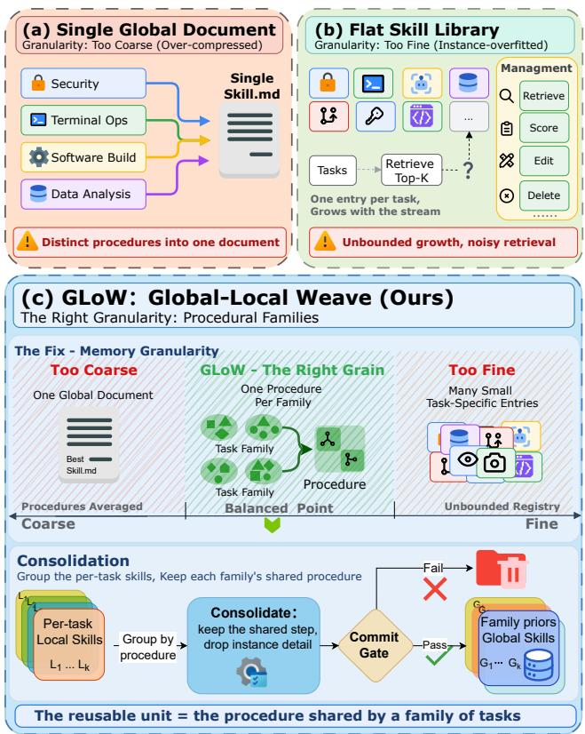
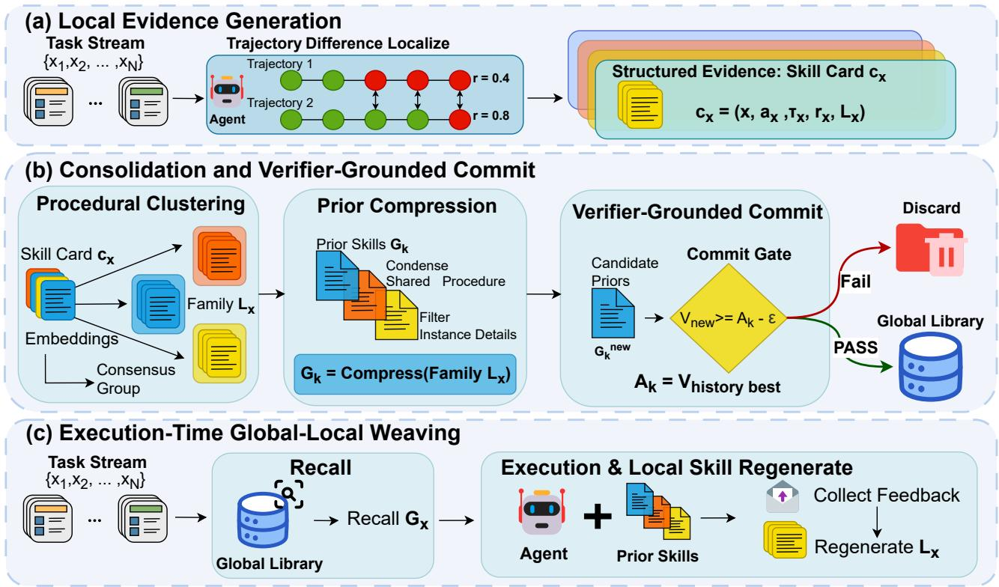
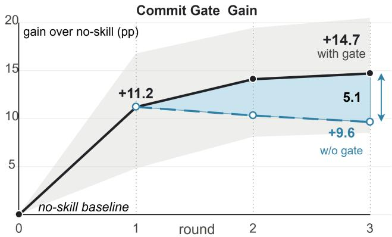
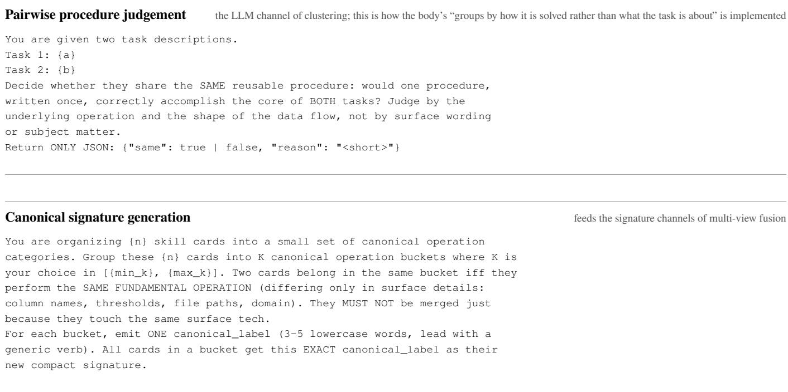

# SkillGLoW: Procedural-Family Skill Consolidation for Self-Improving Agents on Long-Horizon Task Streams

Ao Yan1, Zhang Xin2, Jiawei Du2, Joey Tianyi Zhou2∗

1National University of Singapore, Singapore 2Institute of Advanced Intelligence and Computing (IAIC), Singapore

## Abstract

LLM agents increasingly self-improve by writing and reusing textual skills, kept either as one global document or as a flat pool of per-task entries, though most of the evidence comes from domains with structurally similar tasks. On long-horizon workloads where each task demands a diferent solution, the two forms fail in opposite ways: the document collapses into generic discipline, while the pool inflates and its entries stay bound to the instance that wrote them. We argue the missing unit of reuse is the solving procedure shared by a cluster of related tasks, and build SkillGLoW (Global–Local Weave) around it: the local skills a task writes from its own execu- tion are aggregated into procedural families and compressed into de-instantiated global priors, while the instance detail they hold is regenerated per task rather than stored; a commit gate admits a prior only when real execution shows it does not degrade the deployed library. Across four benchmarks (mathematical reasoning, terminal automation, software re-pair, and embodied control) and three models, the priors gain 17.2 points (hard) over the no-skill baseline on average, with ositive ains in all 12 continual-im rovement runs, and 18.0 with local regeneration, while the library holds one prior per procedural family, 3.6× more compact than the per-task pool. Under the same protocol GLoW leads a published single- document optimizer on 15 of 21 cells. Unmodified, the li- brar lifts success on unseen ALFWorld tasks from 73.9% to 83.9%, evidence that what transfers is procedure rather than task memory.

## 1 Introduction

As base models and agent harnesses mature, LLM agents are moving from short-horizon, closed tasks toward longer- horizon, more complex environments (Yao et al. 2023; Shinn et al. 2023; Liu et al. 2024; Mialon et al. 2024; Jimenez et al. 2024; Merrill et al. 2026). Such tasks quickly outgrow fixed prompts and human-written skills, so recent systems distill reusable skills from their own execution trajectories (Zhou et al. 2026a; Lin et al. 2026; Ni et al. 2026) and write successful or failed experience into documents reused by prompt injection (Kang et al. 2026; Yang et al. 2026a; Zhou et al. 2025). Once skills are continually generated, revised, and reused, a more fundamental question arises: in whatform should an agent organize and maintain these skills?

SkillsBench ofers direct evidence. Human-curated skills raise the pass rate by 16.2 points, while skills a model writes for itself from the task description alone land 1.3 points below the no-skill baseline (Li et al. 2026a). Recent experiencedriven methods therefore ground skills in real execution tra- jectories, but their evidence concentrates on structurally similar tasks; on long-horizon workloads, little beyond meta-level experience transfers across tasks (Kim et al. 2026).

  
Figure 1: The failure modes of single-document and flat- library skill organizations on heterogeneous long-horizon workloads, and the procedural-family unit that GLoW con- solidates between them.

Every organizational form makes an implicit assump- tion about the task distribution. A single global document assumes that most tasks share one dominant procedure; a per-task skill library assumes that old entries can be reused wholesale. Both assumptions roughly hold in struc- turally similar domains, but they fail simultaneously on long- horizon workloads with heterogeneous solutions (Figure 1): no dominant procedure exists, and few old entries fit new tasks (Kim et al. 2026; Cao et al. 2026), a pattern that survives when the pool is queried by retrieval (§4.3). Both fail-ures point to a missing unit of reuse, one that sits between the single document and the single entry. Solutions difer from instance to instance, but tasks are not isolated. Simi- lar tasks form families and share a solving procedure, while each instance carries local constraints that surface only dur- ing execution. The shared procedure transfers across tasks; the instance details do not. An organizational scheme should keep both.

Building on this observation, we propose SkillGLoW (Global–Local Weave; GLoW), a layered skill-organization framework (Figure 2). GLoW groups execution evidence into procedural families and splits skills into two layers. The global layer compresses each family’s shared procedure into a stable prior that guides search; the local layer is regenerated for each task from its own execution feedback, supplies the instance detail the prior cannot carry, and is what the next round consolidates. The two are combined at solving time and separated at consolidation time. The global prior stays frozen during a solving episode and is revised only ofline, and a revision is committed only when it does not degrade the deployed library in real execution.

We evaluate GLoW across three models on four bench- marks: mathematical reasoning, terminal automation, soft- ware repair, and embodied control, giving 12 continual- improvement runs in which a multi-setting protocol sepa- rates the contributions of the frozen prior and within-task regeneration. The committed priors improve over the no-skill baseline by 17.2 points on average, with positive gains in all 12 runs, while the deployed library holds one prior per pro- cedural family rather than one per task, 3.6× more compact than the per-task pool. Our contributions are as follows:

• We measure all three prior organizations—the single doc-ument, the per-task pool, and the pool with retrieval—on the same streams (§4.3); each gains less than family con-solidation, identifying the missing unit of reuse: the solv- ing procedure shared by a cluster of tasks.

• We propose GLoW, which adopts the procedural family as this unit and gates long-term updates by real execution (§3.1–§3.5).

• We show that, across the same runs, the frozen priors raise the mean success rate on unseen embodied tasks from 73.9% to 83.9%, indicating that what is consolidated is reusable procedure rather than task memory.

## 2 Related Work

Skill construction and optimization. Agent skills are pro- cedural knowledge reused at inference time (Schick et al. 2023; Li et al. 2026a; Zhou et al. 2026b). An earlier line has agents discover them as executable code through environ- ment exploration (Wang et al. 2023; Zheng et al. 2025); the systems closest to ours write them as text. AutoSkill mines candidates from long-term conversations under a judge that governs additions and deletions (Yang et al. 2026b), while Trace2Skill (Ni et al. 2026) and, earlier, ExpeL (Zhao et al. 2024) pool many trajectories before distilling, since singletrajectory summaries overfit. SkillOpt trains one skill doc-ument as the external state of a frozen agent, admitting an edit only when it improves performance on a held-out split, and scopes it to a single domain (Yang et al. 2026a). Skills of this kind belong to a broader line that treats text as an optimizable parameter, whether through prompt optimizers (Yuksekgonul et al. 2025; Khattab et al. 2024; Yang et al. 2024a), self-feedback refinement (Madaan et al. 2023), or context compression (Kang et al. 2026). In that line the op- timized object need only stay valid on one distribution; ours has to hold across a family of tasks. These methods ask how to produce a better skill; we ask at what granularity generated skills should be maintained.

Skill organization, transfer, and abstraction. Most sys- tems store skills in a single layer, either one continually rewritten document (Yang et al. 2026a) or a flat retrievable library (Yang et al. 2026b; Zhou et al. 2025), and lean on retrieval and governance: ReMe deduplicates with a judge and prunes low-utility entries (Cao et al. 2026). The same granularity question runs through procedural-memory work, whose stored unit ranges over reusable workflows (Wang et al. 2025b), distilled procedures (Fang et al. 2026), reasoning traces (Ouyang et al. 2026b), cross-domain experience entries (Tang et al. 2025), and test-time scratchpads (Suz-gun et al. 2025). That evidence comes largely from structurally similar tasks; relax the assumption and cross-domain retrieval induces negative transfer, with abstract memories traveling better than task-specific detail (Kim et al. 2026). XSkill is closest architecturally, pairing an action-level ex- perience stream with a task-level skill stream, both grounded in visual observations for multimodal tool use (Jiang et al. 2026). Its local component is retrieved from past records and adapted; ours comes from the current task’s own feedback and is never written back.

Lifecycle and multi-skill maintenance. A third line main- tains the skill system under long-term use. SkillOS casts self-evolution as library governance, freezing the executor and learning when the library should change (Ouyang et al. 2026a). SkillGraph adds prerequisite structure to retrieval (Li et al. 2026b); others extend governance to runtime loops and multi-agent settings (Lin et al. 2026; Pan et al. 2026; Zhang et al. 2026; Du et al. 2025). All relocate the dificulty to when and how entries are edited, and all need a utility scorer, learned or hand-set. GLoW keeps no such policy: the global layer is re-derived each round from that round’s local evidence, so retention falls out of consolidation, and acceptance turns only on measured downstream execution.

## 3 Method

## 3.1 Problem Formulation

We define a skill as a natural-language procedure inserted into the agent’s context. Given a frozen agent π, a task x, a skill context s, and an execution harness $h ,$ one execution returns a trajectory and a verifier score $( \tau _ { x } ( s ) , r _ { x } ( s ) ) =$ $h ( \pi , x , s )$ with $r _ { x } ( s ) \in [ 0 , 1 ]$ . That is, changing s is our only handle on the frozen agent’s behavior, and $r _ { x }$ is the only trustworthy measure of efect. GLoW maintains a committed global prior library ${ \mathcal { G } } = \{ G _ { \mathrm { b a s e } } , G _ { 1 } , \dots , G _ { K } \}$ , where each $G _ { k }$ carries the procedural structure shared by one family of tasks and K is far smaller than the number of historical tasks. For a task x, the system recalls the relevant prior from G:

  
Figure 2: Overview of GLoW. Each task’s local skill is encapsulated as a skill card; cards are aggregated into procedural families and compressed into candidate global priors; candidates are committed only through a verifier-grounded gate on real downstream execution; at execution time, the frozen prior is woven with a freshly generated local skill.

$$
G _ { x } = \operatorname { R e c a l l } ( { \mathcal { G } } , x ) = G _ { \mathrm { b a s e } } \oplus G _ { k ( x ) } ,\tag{1}
$$

where ⊕ denotes context concatenation, $G _ { \mathrm { b a s e } }$ is injected unconditionally, and $G _ { k ( x ) }$ is the family prior recalled by similarity (§3.5). A Localize module generates a task-local skill $L _ { x } = \mathrm { L o c a l i z e } ( \Delta \tau _ { x } , r _ { x } )$ , where $\Delta \tau _ { x }$ collects the dif- ferences between successive trajectories of x, and $r _ { x }$ denotes the corresponding verifier scores; $L _ { x }$ depends only on the current task’s own execution feedback, queries no historical library, and is not written into the long-term library. GLoW’s objective is to construct and maintain G over the task stream so that the expected execution value of the combined context is maximized:

$$
\operatorname* { m a x } _ { \mathcal { G } } \ \mathbb { E } _ { x \sim \mathcal { D } } \Big [ r _ { x } \big ( \mathrm { R e c a l l } ( \mathcal { G } , x ) \oplus L _ { x } \big ) \Big ] ,\tag{2}
$$

where D denotes the task distribution of the stream. Library size is set by the family structure rather than by the stream, since consolidation maintains one prior per family (§3.3), so |G| tracks the number of distinct procedures found, not the number of tasks seen. Optimizing Eq. (2) is hard because $r _ { x }$ is a black box, the granularity of G is unknown, and language compression is lossy; §3.2–§3.5 address these in turn (Algorithm 1).

## 3.2 Local Evidence and Skill Cards

A local skill is generated from trajectory diferences between multi le real executions of the same task. Localize compares what changed between adjacent runs and, together with verifier feedback, judges which changes truly advanced the task, retaining the operational hypotheses that execu- tion feedback has already supported on the current task. To support subsequent clustering and consolidation, GLoW encapsulates each task’s local experience as a skill card $c _ { x } \ = \ ( x , a _ { x } , \tau _ { x } , r _ { x } , L _ { x } ) \nonumber$ : the task instruction, an abstract signature naming what the solution did, the trajectory text, the verifier score, and the local skill. $\Delta \tau _ { x }$ feeds Localize and is not carried on the card.

## 3.3 Procedural Clustering and Prior Compression

The basic unit of ofline consolidation is a family of proce- durally similar local skills $L _ { x } .$ GLoW groups by “how it is solved” rather than “what the task is about”. Each card sup- plies four textual views—the signature $a _ { x } ,$ the instruction x, the skill text $L _ { x } ,$ , and the trajectory τx—encoded separately (Reimers and Gurevych 2019) and fused with fixed weights into $\phi ( c )$ . The signature carries the largest weight and $L _ { x }$ the smallest, so grouping follows the procedure rather than either wording. Views and weights are fixed across bench- marks; values are in the appendix. A single hierarchical clus- tering is sensitive to the linkage rule and to the number of clusters (Ward 1963). GLoW therefore runs many of them, varying both, and records how often each pair of tasks lands in the same group. That co-occurrence frequency becomes a consensus similarity (Monti et al. 2003), and the final families come from clustering on it. The number of clusters is selected automatically by the Kneedle knee point (Satopää et al. 2011) of the silhouette curve (Rousseeuw 1987). Each family is compressed into one candidate prior:

Algorithm 1: GLoW: one pass over a task stream   
Require: agent π, harness h, stream D, rounds T, sub  
rounds J   
Ensure: committed prior library G   
1: $\mathcal { G }  \{ G _ { \mathrm { b a s e } } \}$   
2: for $t \doteq 1 \mathrm { t o } \bar { T }$ do   
3: Stage 1 local evidence; $c \gets \emptyset$   
4: for $j = 1 \mathrm { t o } J$ do   
5: for all task $x \in \mathcal { D }$ do   
6: $G _ { x }  \operatorname { R e c a l l } ( { \mathcal { G } } , x ) \triangleright$ frozen for the episode   
7: $( \tau _ { x } , r _ { x } ) \gets h ( \pi , x , G _ { x } )$   
8: repeat   
9: $\mathbf { \bar { \rho } } L _ { x } \gets \mathrm { L o c a l i z e } ( \Delta \tau _ { x } , r _ { x } )$ ▷ no library lookup   
10: $( \tau _ { x } , r _ { x } ) \gets h ( \pi , x , G _ { x } \oplus L _ { x } )$   
11: until iteration budget exhausted   
12: $\mathcal { C }  \mathcal { C } \cup \{ ( x , a _ { x } , \overline { { \tau } } _ { x } , r _ { x } , L _ { x } ) \}$ ▷ card; $L _ { x }$ never   
enters $\mathcal { G }$   
13: end for   
14: end for   
15: Stage 2 consolidation   
16: $\{ { \mathcal { C } } _ { k } \} _ { k \le K }  \mathbf { C }$ onsensusCluster $( \phi ( \mathcal { C } ) )$ ▷ auto-K   
17: $\hat { G } _ { k } \gets \mathrm { C }$ ompress $( \mathcal { C } _ { k } )$ for all $k \leq K$ ▷ de-instantiate   
18: Stage 3 admission   
19: $\mathcal { G } ^ { \prime }  \{ G _ { \mathrm { b a s e } } \} \cup \{ \hat { G } _ { k } \} _ { k \leq K } \triangleright$ the round’s candidate   
revision   
20: $\mathcal { G }  \mathcal { G } ^ { \prime }$ if Gate(G′, G) accepts ▷ one decision per   
round; §3.4   
21: end for   
22: return G

$$
G _ { k } ^ { ( t ) } = \mathrm { C o m p r e s s } \big ( \mathcal { C } _ { k } ^ { ( t ) } \big ) .\tag{3}
$$

Whether a candidate prior enters the library is decided by the verifier-grounded gate of §3.4. The goal of prior com-pression is de-instantiated induction over the group’s local skills: extract the recurring solving skeleton and filter out bindings that hold only in a single instance. A generated can- didate prior retains only three kinds of content: applicability conditions, the core solving procedure, and common failure modes; the filtered instance details are recovered by the loca skill $L _ { x }$ that is freshly regenerated at execution time.

## 3.4 Verifier-Grounded Commit

A candidate prior is not written into the library directly: com- pression can widen a rule or drop a constraint, and the text ofers no way to tell. Admission therefore rests on measured

execution. The execution value of deploying pure global pri- ors on a task set D is

$$
V ( \mathcal G ; D ) = \frac { 1 } { | D | } \sum _ { x \in D } r _ { x } \big ( \mathrm { R e c a l l } ( \mathcal G , x ) \big ) ,\tag{4}
$$

where the argument to $r _ { x }$ is the recalled prior alone, with no $L _ { x }$ appended, so that the measured value is attributable to the prior rather than to task-local adaptation. A round’s candi- dates come from three routes. The first is fresh compression of that round’s local skills (§3.3). The second is append-only repair: where the deployed prior lost ground, scope-restricted guards distilled from the degraded tasks’ $L _ { x }$ are appended, leaving the verified structure intact. The third carries for- ward, for each family, whichever version has scored best so far. Every route yields one prior per family, and the priors of a round together form a candidate revision $\mathcal { G } ^ { ( v ) }$ , scored under Eq. (4). The gate keeps the best:

$$
\begin{array} { r l } & { V ^ { \mathrm { r e a l } } = \displaystyle \operatorname* { m a x } _ { v } V \big ( \mathcal { G } ^ { ( v ) } ; D \big ) , } \\ & { \mathrm { c o m m i t } \iff V ^ { \mathrm { r e a l } } \ge A - \epsilon . } \end{array}\tag{5}
$$

The winner is committed only when Eq. (5) holds; otherwise the library is left untouched. Admission is decided once per round over the revision as a whole, not separately per family. The anchor $A = \operatorname* { m a x } ( V ^ { \star } , V ^ { \mathrm { n s } } )$ is the larger of the stand- ing library’s value and the No-Skill baseline, and $\epsilon = 0 . 0 2$ absorbs fluctuation. A is floored further at the highest value any measurement in the previous round reached, so a re- vision cannot pass by clearing the standing commit alone. The maximum therefore selects among candidate texts, not among repeated measurements of one, and since the anchor is itself measured, a round can change the library only by performing at least on par with the standing result, up to measurement noise (ϵ = 0.02).

## 3.5 Execution-Time Global–Local Weaving

At test time, the committed global prior library stays frozen. For a new task $x ,$ Recall implements Eq. (1) in two lev-els: the base prior is always present; on the family-prior side, the system builds an embedding for the full text of each committed prior (Zhang et al. 2025), embeds the task instruction as the query, takes the cosine-similarity top-1, and injects it only when similarity exceeds a fixed threshold shared across benchmarks, otherwise falling back to $G _ { \mathrm { b a s e } }$ alone (fail-closed). Recall completes before the task starts and stays fixed throughout the task’s execution. The agent then executes under $G _ { x }$ and collects feedback from the cur- rent task. Localize generates a fresh local skill $L _ { x }$ as in §3.2. In subsequent solving, the agent uses $G _ { x } \oplus L _ { x }$ as the skill context and keeps updating $L _ { x } .$ . This $L _ { x }$ is staged as local evidence of the current sub-round. After the round, these $L _ { x }$ feed consolidation and admission (Alg. 1, Stages 2–3).

## 4 Experiments

## 4.1 Setup

Benchmarks. We use four benchmarks, ordered from low to high cross-task procedure sharing: Terminal-Bench-Pro (TBP) (Wang et al. 2025a), SWE-bench Verified (Jimenez et al. 2024) (solved through an agentic harness (Yang et al. 2024b)), ALFWorld (Shridhar et al. 2021), and LiveMathematicianBench (LMB) (He et al. 2026). In the first two each task is an independent repository or terminal scenario with a distinct solution, which is the long-horizon, heterogeneous- solution regime this paper targets. The four streams contain 32, 20, 42, and 53 tasks, respectively.

<table><tr><td></td><td colspan="2">TBP↑</td><td colspan="2">SWE↑</td><td colspan="2">ALFWorld↑</td><td>LMB↑</td><td colspan="2">Avg.↑</td></tr><tr><td>Method</td><td>hard</td><td>soft</td><td>hard</td><td>soft</td><td>hard</td><td>soft</td><td> $\mathbf { h a r d } = \mathbf { s o f t }$ </td><td>hard</td><td>soft</td></tr><tr><td colspan="10">DeepSeek-V4-Pro</td></tr><tr><td>No-Skill</td><td>34.4</td><td>68.9</td><td>45.0</td><td>47.5</td><td>57.1</td><td>67.9</td><td>13.2</td><td>37.4</td><td>49.4</td></tr><tr><td>SkillOpt†</td><td> $4 3 . 8 _ { \uparrow 9 . 4 }$ </td><td> $6 4 . 8 _ { \downarrow 4 . 1 }$ </td><td> $6 0 . 0 _ { \uparrow 1 5 . 0 }$ </td><td> $6 4 . 8 _ { \uparrow 1 7 . 3 }$ </td><td> $\mathbf { 9 0 . 5 _ { \uparrow 3 3 . 4 } }$ </td><td> $\mathbf { 9 4 . 4 _ { \uparrow 2 6 . 5 } }$ </td><td> $2 2 . 6 _ { \uparrow 9 . 4 }$ </td><td> $5 4 . 2 _ { \uparrow 1 6 . 8 }$ </td><td> $6 1 . 7 _ { \uparrow 1 2 . 3 }$ </td></tr><tr><td>GLoW (Global)</td><td> ${ \bf 5 0 . 0 } _ { \uparrow 1 5 . 6 }$ </td><td> $7 4 . 9 _ { \uparrow 6 . 0 }$ </td><td> ${ \bf 7 0 . 0 _ { \mathrm { \uparrow 2 5 . 0 } } }$ </td><td> $7 2 . 4 _ { \uparrow 2 4 . 9 }$ </td><td> $8 3 . 3 _ { \uparrow 2 6 . 2 }$ </td><td> $8 8 . 1 _ { \uparrow 2 0 . 2 }$ </td><td> $3 7 . 7 _ { \uparrow 2 4 . 5 }$ </td><td> ${ \bf 6 0 . 3 _ { \mathrm { \uparrow 2 2 . 9 } } }$ </td><td> $6 8 . 3 _ { \uparrow 1 8 . 9 }$ </td></tr><tr><td>GLoW (Global+Local)</td><td> $4 3 . 8 _ { \uparrow 9 . 4 }$ </td><td> ${ \bf 8 1 . 0 } _ { \uparrow 1 2 . 1 }$ </td><td> ${ \bf 7 0 . 0 _ { \mathrm { \uparrow 2 5 . 0 } } }$ </td><td> $7 2 . 5 _ { \uparrow 2 5 . 0 }$ </td><td> $8 1 . 0 _ { \uparrow 2 3 . 9 }$ </td><td> $8 1 . 0 _ { \uparrow 1 3 . 1 }$ </td><td> $3 9 . 6 _ { \uparrow 2 6 . 4 }$ </td><td> $5 8 . 6 _ { \uparrow 2 1 . 2 }$ </td><td> ${ \bf 6 8 . 5 _ { \mathrm { \uparrow 1 9 . 1 } } }$ </td></tr><tr><td colspan="10">MiniMax-M3</td></tr><tr><td>No-Skill</td><td>40.6</td><td>77.1</td><td>35.0</td><td>39.8</td><td>76.2</td><td>90.5</td><td>22.6</td><td>43.6</td><td>57.5</td></tr><tr><td>SkillOpt†</td><td> $4 3 . 8 _ { \uparrow 3 . 1 }$ </td><td> $7 6 . 2 _ { \downarrow 0 . 9 }$ </td><td> $5 5 . 0 _ { \uparrow 2 0 . 0 }$ </td><td> $5 5 . 0 _ { \uparrow 1 5 . 2 }$ </td><td> $9 5 . 2 _ { \uparrow 1 9 . 0 }$ </td><td> $\mathbf { 9 7 . 6 } _ { \uparrow 7 . 1 }$ </td><td> $2 8 . 3 _ { \uparrow 5 . 7 }$ </td><td> $5 5 . 6 _ { \uparrow 1 2 . 0 }$ </td><td> $6 4 . 3 _ { \uparrow 6 . 8 }$ </td></tr><tr><td>GLoW (Global)</td><td> ${ \bar { 5 } } 3 . 1 _ { \uparrow 1 2 . 5 }$ </td><td> $\mathbf { 8 6 . 7 } _ { \uparrow 9 . 6 }$ </td><td> $6 0 . 0 _ { \uparrow 2 5 . 0 }$ </td><td> $6 2 . 5 _ { \uparrow 2 2 . 7 }$ </td><td> $9 2 . 9 _ { \uparrow 1 6 . 7 }$ </td><td> $9 4 . 5 _ { \uparrow 4 . 0 }$ </td><td> $2 8 . 3 _ { \uparrow 5 . 7 }$ </td><td> $5 8 . 6 _ { \uparrow 1 5 . 0 }$ </td><td> $6 8 . 0 _ { \uparrow 1 0 . 5 }$ </td></tr><tr><td>GLoW (Global+Local)</td><td> ${ \bar { 5 } } 3 . 1 _ { \uparrow 1 2 . 5 }$ </td><td> $8 3 . 6 _ { \uparrow 6 . 5 }$ </td><td> ${ \bf 6 5 . 0 _ { \mathrm { \uparrow 3 0 . 0 } } }$ </td><td> ${ \bf 6 7 . 5 } _ { \uparrow 2 7 . 7 }$ </td><td> $9 0 . 5 _ { \uparrow 1 4 . 3 }$ </td><td> $9 3 . 7 _ { \uparrow 3 . 2 }$ </td><td> $3 5 . 8 _ { \uparrow 1 3 . 2 }$ </td><td> ${ \bf 6 1 . 1 _ { \uparrow 1 7 . 5 } }$ </td><td> $7 0 . 2 _ { \uparrow 1 2 . 7 }$ </td></tr><tr><td colspan="10">GPT-5.4-mini</td></tr><tr><td>No-Skill</td><td>28.1</td><td>75.6</td><td>35.0</td><td>37.4</td><td>42.9</td><td>60.9</td><td>15.1</td><td>30.3</td><td>47.2</td></tr><tr><td>SkillOpt†</td><td> $4 0 . 6 _ { \uparrow 1 2 . 5 }$ </td><td> $8 0 . 0 _ { \uparrow 4 . 4 }$ </td><td> $4 0 . 0 _ { \uparrow 5 . 0 }$ </td><td> $4 2 . 4 _ { \uparrow 5 . 0 }$ </td><td> $6 1 . 9 _ { \uparrow 1 9 . 0 }$ </td><td> $7 4 . 2 _ { \uparrow 1 3 . 3 }$ </td><td> $1 3 . 2 _ { \downarrow 1 . 9 }$ </td><td> $3 8 . 9 _ { \uparrow 8 . 7 }$ </td><td> $5 2 . 5 _ { \uparrow 5 . 2 }$ </td></tr><tr><td>GLoW (Global)</td><td> ${ \bf 5 0 . 0 _ { \mathrm { \uparrow 2 1 . 9 } } }$ </td><td> $8 3 . 0 _ { \uparrow 7 . 4 }$ </td><td> $4 5 . 0 _ { \uparrow 1 0 . 0 }$ </td><td> $4 7 . 4 _ { \uparrow 1 0 . 0 }$ </td><td> $6 1 . 9 _ { \uparrow 1 9 . 0 }$ </td><td> $7 7 . 8 _ { \uparrow 1 6 . 9 }$ </td><td> ${ \bf 1 8 . 9 } _ { \uparrow 3 . 8 }$ </td><td> $4 3 . 9 _ { \uparrow 1 3 . 6 }$ </td><td> $5 6 . 8 \ L _ { \uparrow 9 . 6 }$ </td></tr><tr><td>GLoW (Global+Local)</td><td> $4 6 . 9 _ { \uparrow 1 8 . 8 }$ </td><td> ${ \bf 8 5 . 8 _ { \mathrm { \uparrow 1 0 . 2 } } }$ </td><td> ${ \bf 5 0 . 0 } _ { \uparrow 1 5 . 0 }$ </td><td> $5 5 . 7 _ { \uparrow 1 8 . 3 }$ </td><td> ${ \bf 6 6 . 7 _ { \uparrow 2 3 . 8 } }$ </td><td> $7 6 . 0 _ { \uparrow 1 5 . 1 }$ </td><td> ${ \bf 1 8 . 9 } _ { \uparrow 3 . 8 }$ </td><td> $\mathbf { 4 5 . 6 } _ { \uparrow 1 5 . 3 }$ </td><td> ${ \bf 5 9 . 1 } _ { \uparrow 1 1 . 9 }$ </td></tr></table>

Table 1: Main results (%, 12 continual-improvement runs). Subscripts give the change over that model’s No-Skill row, computed before rounding (↑ gain, ↓ loss; the arrow, not the color, carries the sign). LMB is binary multiple-choice, so hard = soft. Best per column within a model block in bold. †Run protocol is given in §4.2.

## 4.2 Main Results

provider defaults (temperature 0.7); seeds fix the splits and the task order. The held-out software-repair numbers average three trials. The base models are hosted APIs; recall runs on one GPU (16 GB VRAM) with 32 GB host RAM on Linux (WSL2).

Models and settings. Each run uses one of three models as its single frozen base model for solving, extraction, and compression: DeepSeek-V4-Pro, MiniMax-M3, and GPT- 5.4-mini, giving 12 runs. Every setting is a measurement point inside one continual run; they difer only in what oc- cupies the skill context. No-Skill leaves it empty and es- tablishes the baseline. Local-only carries the skill the task regenerated from its own feedback and recalls nothing, isolat- ing within-task adaptation. Global-only carries the recalled prior with regeneration disabled, isolating what consolida- tion has taken from the local skills. Global+Local carries both. A fifth setting, Base-only, replaces the library with a single compressed document and appears only in the abla- tions. All five are configurations of our own system. Hard and soft are readings of the verifier score $r _ { x }$ (§3.1): hard is each benchmark’s own all-or-nothing flag. Soft is the partial-credit signal the benchmark defines, or one of ours where it defines none; on software repair it is multiplicative, so breaking a passing test zeroes the score. Hard is sparse on long-horizon tasks; soft records progress short of it. Per-benchmark defini- tions are in the appendix. Recall uses Qwen3-Embedding-8B under 4-bit quantization (Zhang et al. 2025), with a cosinesimilarity threshold of 0.45 across benchmarks; below it a task receives no prior. Every main-table cell is a single run at

Both GLoW settings improve on No-Skill in every one of the 12 runs (Table 1; Wilcoxon signed-rank $p = 0 . 0 0 0 4 8 8 ,$ the smallest value attainable at n = 12): the frozen priors gain 17.2/13.0 points (hard/soft) on average, and 18.0/14.6 once local regeneration is added. The gain holds up at the software-repair end, where each task is a separate repository and the two existing organizations have the least to work with: the largest gain anywhere in Table 1, on both read- ings, falls there (MiniMax-M3, +30.0/+27.7 with regeneration), and DeepSeek-V4-Pro adds +25.0/+25.0, whereas the mathematical end, whose tasks share the most procedu- ral structure, is where two of three models gain least (+3.8 and +5.7). That is the ordering the framework predicts, since family granularity pays of precisely where a single document has no dominant procedure to summarize.

SkillOpt (Yang et al. 2026a) tests that ordering. We run the authors’ own implementation with their internal hyper- parameters untouched, match only the launch protocol (task stream, trials, decoding) to ours, and score it through the same adapters as every other row, so all numbers share one source; its entry is the peak over training epochs, matching GLoW’s peak-over-rounds reading (appendix). Across all 21 cells, GLoW leads on 15, SkillOpt on 4 and two tie. SkillOpt’s four are all ALFWorld, the one benchmark whose tasks share a single action space: where one skeleton covers the whole set, a single document is already the right granularity. Elsewhere the margin runs the other way (+8.3 on TBP, +6.7 on SWE, and +6.9 on LMB, hard, averaged over the three models).

<table><tr><td>Bench</td><td>Model</td><td>Base-only Local-only (w/o families)</td><td>(w/o global)</td><td>AWM (flat + recall)</td></tr><tr><td>TBP</td><td>DeepSeek-V4-Pro MiniMax-M3 GPT-5.4-mini</td><td> $2 5 . 1 _ { \downarrow 9 . 3 }$   $4 6 . 9 _ { \uparrow 6 . 3 }$   $3 4 . 4 _ { \uparrow 6 . 3 }$ </td><td> $4 8 . 5 _ { \uparrow 1 4 . 1 }$   $5 0 . 0 _ { \uparrow 9 . 4 }$   $4 6 . 9 _ { \uparrow 1 8 . 8 }$ </td><td> $3 7 . 5 _ { \uparrow 3 . 1 }$   $3 4 . 4 _ { \downarrow 6 . 2 }$   $4 0 . 6 _ { \uparrow 1 2 . 5 }$ </td></tr><tr><td>SWE</td><td>DeepSeek-V4-Pro MiniMax-M3 GPT-5.4-mini</td><td>45.0  $3 0 . 0 _ { \downarrow 5 . 0 }$   $3 0 . 0 _ { \downarrow 5 . 0 }$ </td><td> $5 7 . 5 _ { \uparrow 1 2 . 5 }$   $5 0 . 0 _ { \uparrow 1 5 . 0 }$   $4 5 . 0 _ { \uparrow 1 0 . 0 }$ </td><td> $6 5 . 0 _ { \uparrow 2 0 . 0 }$   $3 0 . 0 _ { \downarrow 5 . 0 }$   $4 0 . 0 _ { \uparrow 5 . 0 }$ </td></tr><tr><td>ALFWorld MiniMax-M3</td><td>DeepSeek-V4-Pro GPT-5.4-mini</td><td> $7 3 . 8 \substack { \mathrm { \uparrow 1 6 . 7 } }$   $7 8 . 6 _ { \uparrow 2 . 4 }$   $5 0 . 0 _ { \uparrow 7 . 1 }$ </td><td> $7 3 . 8 \substack { \uparrow 1 6 . 7 }$   $7 9 . 8 _ { \uparrow 3 . 6 }$   $5 3 . 6 _ { \uparrow 1 0 . 7 }$ </td><td> $7 6 . 2 \ L _ { \uparrow 1 9 . 1 }$   $8 5 . 7 _ { \uparrow 9 . 5 }$   $4 5 . 2 _ { \uparrow 2 . 3 }$ </td></tr><tr><td>LMB</td><td>DeepSeek-V4-Pro MiniMax-M3 GPT-5.4-mini</td><td> $2 0 . 8 \substack { \uparrow 7 . 6 }$   $1 8 . 9 _ { \downarrow 3 . 7 }$  15.1</td><td> $2 4 . 5 _ { \uparrow 1 1 . 3 }$   $3 2 . 1 _ { \uparrow 9 . 5 }$   $1 4 . 2 _ { \downarrow 0 . 9 }$ </td><td>13.2  $2 4 . 5 _ { \uparrow 1 . 9 }$   $1 3 . 2 _ { \downarrow 1 . 9 }$ </td></tr><tr><td>Mean</td><td></td><td> $3 9 . 1 _ { \uparrow 2 . 0 }$ </td><td> $4 8 . 0 _ { \uparrow 1 0 . 9 }$ </td><td> $4 2 . 1 _ { \uparrow \uparrow . 0 }$ </td></tr></table>

Table 2: Three alternative skill organizations, on the same 12 runs. Hard score (%); a subscript gives the change over that row’s No-Skill in Table 1, rendered as there, and a cell without one did not move. AWM is a flat pool with retrieval.

On unseen tasks the prior alone carries the gain (appendix). The accumulation is also achieved on a bounded library; across the 12 runs the committed library is smaller than the per-task skill pool by a factor of 3.6.

## 4.3 Component Ablations

The two organizational extremes are a single merged docu- ment (Ni et al. 2026) and a per-task entry library (Lin et al. 2026; Yang et al. 2026b). Table 1 carries a published instance of the first; here we place our own library at each extreme instead, so that both ends are measured under identical con- ditions (Table 2): Base-only compresses the whole library into a single injected skill, and Local-only uses only the skill regenerated from each task’s own feedback.

Granularity (w/o families / w/o global). Removing the procedural-family layer collapses the system to one extreme or the other, and the two fail in opposite ways. Base-only is the weak form ofthe single-document organization, one com- pression pass with no iteration. It averages +2.0 points, flips sign across benchmarks $( - 9 . 3 \mathrm { t o } + 1 6 . { \bar { 7 } } ) .$ , and loses ground on 4 of the 12 cells. SkillOpt is the state of the art for a single persistent document, and clears Base-only on 10 of the 12 cells (Tables 1, 2); the distance between them measures opti-mization efort rather than organization. Base-only succeeds consistently only on ALFWorld, for the reason §4.2 gives. Elsewhere a merged document yields generic discipline the model has already internalized. On software repair it never helps: the resolved count is flat for one model and lower for the other two, and an independent benchmark of authored skills reports 39 of 49 leaving the pass rate unchanged (Han et al. 2026). Per-task skills carry the opposite defect. They help, by +10.9 points, but the entry is built around the instance (§4.4), and the pool grows linearly with the stream; appending such entries without curation is known to accu- mulate noise and staleness rather than reuse (Cao et al. 2026; Ouyang et al. 2026a), and cross-task recall over them transfers little (Kim et al. 2026). The setting still trails Global-only. Adding retrieval to that pool does not close the gap. Work- flows induced in the style of AWM (Wang et al. 2025b) from the same first-round evidence, pooled and retrieved per task, average +5.0 points across the 12 cells, eight up, three down and one flat, while our own one round offamily consolidation gives +11.2 (appendix).

  
Figure 3: Mean gain over No-Skill (hard, points), 12 runs; band is the 15th–85th percentile. Solid: what the gate ad- mitted, held flat on a rejection. Dashed: that round’s candidate, admitted unconditionally. Rounds are compared inde- pendently.

Admission (w/o gate). Ablating the gate (§3.4) requires no separate control run, as the gate already evaluates every can- didate under real deployment, so the cost of an erroneous ad- mission is measured rather than simulated (Figure 3). Across the 12 runs, the gate made 26 admission decisions, accept- ing 19 and rejecting 7. Decisions depend on the workload rather than the model. On terminal tasks, candidates for all three models were admitted in both rounds; on software re- pair, all three were admitted in the first round and rejected in the second. A cheaper criterion would not reproduce these rejections, as 4 of the 7 would have been admitted under the consolidation-time score alone. A representative case is MiniMax-M3 on mathematical reasoning, whose round-2 candidate scored 0.283 on the soft signal the gate uses, exceeding the anchor, yet achieved only 0.151 in deployment (−13.2 points, more than twice the largest run-to-run range we measure). Averaged over the 12 runs, the library the gate kept reaches +14.7 points by the final round, while that round’s candidates average +9.6 (Figure 3).

## 4.4 Analysis

Priors are organized by procedure. ALFWorld’s own task labels give a partition we did not produce. Consoli- dation returns 15 priors over 42 tasks: 13 sit wholly inside one labeled class, and two straddle a pair and are counted by majority type (Table 3). No class is left uncovered and none is invented. This is also why Base-only is reliably positive on this benchmark alone (Table 2): here a shared skeleton exists at the scale of the whole task set. Terminal-Bench-Pro’s 32 tasks each carry their own subject matter, yet compression still returns ten procedure classes. Five read as binary work, but the byte-scanning prior helps only the two actually solved by scanning raw bytes, and leaves the other three untouched. The appendix gives the full terminal mapping.

<table><tr><td>Task class</td><td>Tasks Priors (dataset) (skill num) (no skill → with global)</td><td>Solved</td><td>Fix/Break</td></tr><tr><td>Examine-in-light</td><td>7</td><td> $4  7$ </td><td>↑3</td></tr><tr><td>Pick-and-place</td><td>7</td><td> $7 \to 7$ </td><td></td></tr><tr><td>Clean-then-place</td><td>7</td><td>4→ 5</td><td>↑2↓1</td></tr><tr><td>Cool-then-place</td><td>7</td><td>5→ 6</td><td>↑1</td></tr><tr><td>Heat-then-place</td><td>7</td><td>5→7</td><td>↑2</td></tr><tr><td>Two-instance</td><td>7</td><td> $7 \to 7$ </td><td></td></tr><tr><td>All six classes</td><td>42</td><td>15</td><td>↑8↓1</td></tr></table>

Table 3: Priors consolidated onto ALFWorld’s six canonical task classes (MiniMax-M3). The classes are the dataset’s own labels, produced independently of our algorithm. Solved: No-Skill → round 2, in-sample. Fix/Break: tasks that flipped 0→1 and 1→0; the arrow, not the color, carries the sign.

What a prior keeps. Compression is meant to strip the instance and retain the procedure (§3.3), and the committed text is where that can be checked. The local skill for the cell-phone instance of examine-in-light spends 989 words on seven steps built around a memorized location ta- ble: receptacles ranked “soft furnishings > dresser-top > desk > drawers . . . desk for desklamp, bedside/nightstand for bedlamp.” The prior its seven-task class compresses into spends 440 words on four steps, and the table is gone. Step 1 replaces it with a read: scan the initial observation for the illuminator-class object, “do not default to desk . . . verify against the visible object list before any $\mathrm { ~ \mathsf ~ { ~ g ~ o ~ } ~ } ^ { \mathsf { t } } \mathsf { o } . ^ { \mathsf { \Gamma } ^ { \mathsf { \prime } } }$ The rest is the chain that follows: go to the source receptacle and take the target without pre-examining it; carry it to the illuminator’s receptacle without exploratory examine calls en route; terminate with use <illuminator> and append nothing after. Every pitfall in the chain guards one thing: turns spent on probes that return no new information. That is what the seven tasks share; which furniture holds what is regenerated per task.

An aligned class repairs failures without memorizing them. On Terminal-Bench-Pro (GPT-5.4-mini) the same accounting gives 9 repairs against one pass-to-fail; ALF- World’s counts are in Table 3, where the single regres- sion falls inside one class and the gain concentrates where a class had failures to repair. The three tasks fixed in examine-in-light are an alarm clock, a book, and a cell phone: one prior, three diferent objects. The reverse case is equally visible. The largest family put eight Terminal-

<table><tr><td colspan="2">Model No-Skill</td><td>Global</td></tr><tr><td>DeepSeek-V4-Pro</td><td>71.7</td><td> ${ \bf 8 8 . 3 _ { \mathrm { \uparrow 1 6 . 7 } } }$ </td></tr><tr><td>GPT-5.4-mini</td><td>66.7</td><td> $7 5 . 0 _ { \uparrow 8 . 3 }$ </td></tr><tr><td>MiniMax-M3</td><td>83.3</td><td> $\mathbf { 8 8 . 3 } _ { \uparrow 5 . 0 }$ </td></tr><tr><td>Mean</td><td>73.9</td><td> $\mathbf { 8 3 . 9 } _ { \uparrow 1 0 . 0 }$ </td></tr></table>

Table 4: Transfer to unseen ALFWorld tasks (hard, %; the last row averages the three models; subscripts as in Table 1). All three models improve.

Bench-Pro tasks together, among them a debugger session, a write-ahead-log recovery, and a logic-gate CRC32 build, and took its name, segfault\_debugging\_with, from one member. Its prior repaired one of the eight and broke an- other, the only large family in the study with no net gain. On the same 32 tasks a second model drew ten families instead, none larger than five. Procedure sharing is therefore a prop- erty of how the family is drawn rather than of the benchmark. Families are re-derived from each round’s own evidence, so a bad grouping is not carried into the next.

## 4.5 Transfer to Unseen Tasks

Does the library transfer, or has it memorized the stream? We inject the library the training stream produced, unmodified, into 60 unseen tasks of ALFWorld valid\_unseen, a split that shares task categories with the training tasks but no instances.

All three models improve (Table 4), and the gain is smallest for the model with the highest baseline, consistent with a ceiling efect.

On software repair the same library lifts the resolve rate on 30 unseen instances from 40.0% to 45.6% (MiniMax-M3, mean of three trials), the workload where transfer should be hardest, since every instance is a diferent repository. For reference, Kim et al. (2026) report a 3.7% average gain for cross-domain memory transfer, in a setting that pools het- erogeneous domains rather than holding out instances of one benchmark.

## 5 Conclusion

Neither a single global document nor a flat per-task library survives a stream whose tasks each need a diferent solution. Experiments across 12 continual-improvement runs show the missing unit is the procedural family: compress the local skills of each cluster into one de-instantiated prior, regener- ate instance detail per task rather than storing it, and admit priors only through measured execution. This recipe gains 17.2 points over No-Skill on a library 3.6× smaller than the per-task pool, and transfers unmodified to unseen tasks (73.9% to 83.9%). Transfer was shown where task categories recur; whether a prior survives a genuine domain change re- mains open. Because a prior is plain text, one model’s library could in principle be handed to another; such cross-model inheritance remains untested. Both point toward a library any open-ended workflow could accumulate, rather than one tied to a benchmark.

## References

Cao, Z.; Deng, J.; Yu, L.; Zhou, W.; Liu, Z.; Ding, B.; and Zhao, H. 2026. Remember Me, Refine Me: A Dynamic Pro- cedural Memory Framework for Experience-Driven Agent Evolution. In Findings of the Association for Computational Linguistics: ACL 2026, 16803–16822.

Du, J.; Wu, J.; Chen, Y.; Hu, Y.; Li, B.; and Zhou, J. T. 2025. Rethinking Agent Design: From Top-Down Workflows to Bottom-Up Skill Evolution. arXiv:2505.17673.

Fang, R.; Liang, Y.; Wang, X.; Wu, J.; Qiao, S.; Xie, P.; Huang, F.; Chen, H.; and Zhang, N. 2026. Memp: Exploring Agent Procedural Memory. In Findings of the Association for Computational Linguistics: ACL 2026, 17490–17502.

Han, T.; Zhang, Y.; Song, W.; Fang, C.; Chen, Z.; Sun, Y.; and Hu, L. 2026. SWE-Skills-Bench: Do Agent Skills Actually Help in Real-World Software Engineering? arXiv:2603.15401.

He, L.; Yu, Q.; Dong, H.; Liao, B.; Xu, X.; Goldblum, M.; Bian, J.; and Mesgarani, N. 2026. LiveMathematicianBench: A Live Benchmark for Mathematician-Level Reasoning with Proof Sketches. arXiv:2604.01754.

Jiang, G.; Su, Z.; Qu, X.; and Fung, Y. R. 2026. XSkill: Continual Learning from Experience and Skills in Multimodal Agents. In International Conference on Machine Learning.

Jimenez, C. E.; Yang, J.; Wettig, A.; Yao, S.; Pei, K.; Press, O.; and Narasimhan, K. 2024. SWE-bench: Can Language Models Resolve Real-World GitHub Issues? In International Conference on Learning Representations (ICLR).

Kang, M.; Chen, W.-N.; Han, D.; Inan, H. A.; Wutschitz, L.; Chen, Y.; Sim, R.; and Rajmohan, S. 2026. ACON: Optimizing Context Compression for Long-horizon LLM Agents. In International Conference on Machine Learning.

Khattab, O.; Singhvi, A.; Maheshwari, P.; Zhang, Z.; San- thanam, K.; Vardhamanan, S.; Haq, S.; Sharma, A.; Joshi, T. T.; Moazam, H.; Miller, H.; Zaharia, M.; and Potts, C. 2024. DSPy: Compiling Declarative Language Model Calls into Self-Improving Pipelines. In International Conference on Learning Representations.

Kim, K.; Kang, M.; Kim, T.; Yang, Y.; Ren, M.; and Hwang, S. J. 2026. Memory Transfer Learning: How Mem- ories are Transferred Across Domains in Coding Agents. arXiv:2604.14004.

Li, X.; Chen, W.; Liu, Y.; Zheng, S.; Chen, X.; et al. 2026a. SkillsBench: Benchmarking How Well Agent Skills Work Across Diverse Tasks. arXiv:2602.12670v1.

Li, X.; Li, M.; Bao, K.; Ma, Y.; Wang, W.; Liu, D.; and Feng, F. 2026b. SkillGraph: Skill-Augmented Rein- forcement Learning for Agents via Evolving Skill Graphs. arXiv:2605.12039.

Lin, H.; Li, P.; Song, J.; Jiang, F.; and Zhang, T. 2026. MUSE- Autoskill: Self-Evolving Agents via Skill Creation, Memory, Management, and Evaluation. arXiv:2605.27366.

Liu, X.; Yu, H.; Zhang, H.; Xu, Y.; Lei, X.; Lai, H.; Gu, Y.; Ding, H.; Men, K.; Yang, K.; Zhang, S.; Deng, X.; Zeng, A.; Du, Z.; Zhang, C.; Shen, S.; Zhang, T.; Su, Y.; Sun, H.; Huang, M.; Dong, Y.; and Tang, J. 2024. AgentBench:

Evaluating LLMs as Agents. In International Conference on Learning Representations (ICLR).

Madaan, A.; Tandon, N.; Gu ta, P.; Hallinan, S.; Gao, L.; Wiegrefe, S.; Alon, U.; Dziri, N.; Prabhumoye, S.; Yang, Y.; Gupta, S.; Majumder, B. P.; Hermann, K.; Welleck, S.; Yazdanbakhsh, A.; and Clark, P. 2023. Self-Refine: Itera- tive Refinement with Self-Feedback. In Advances in Neural Information Processing Systems (NeurIPS), volume 36, 46534–46594.

Merrill, M. A.; Shaw, A. G.; Carlini, N.; Li, B.; Raj, H.; Bercovich, I.; Shi, L.; Shin, J. Y.; Walshe, T.; Buchanan, E. K.; Shen, J.; Ye, G.; Lin, H.; Poulos, J.; Wang, M.; et al. 2026. Terminal-Bench: Benchmarking Agents on Hard, Realistic Tasks in Command Line Interfaces. In International Conference on Learning Representations (ICLR). ArXiv:2601.11868.

Mialon, G.; Fourrier, C.; Swift, C.; Wolf, T.; LeCun, Y.; and Scialom, T. 2024. GAIA: A Benchmark for General AI Assistants. In International Conference on Learning Representations (ICLR).

Monti, S.; Tamayo, P.; Mesirov, J.; and Golub, T. 2003. Con- sensus Clustering: A Resampling-Based Method for Class Discovery and Visualization of Gene Expression Microarray Data. Machine Learning, 52: 91–118.

Ni, J.; Liu, Y.; Liu, X.; Sun, Y.; Zhou, M.; Cheng, P.; Wang, D.; Zhao, E.; Jiang, X.; and Jiang, G. 2026. Trace2Skill: Dis- till Trajectory-Local Lessons into Transferable Agent Skills. arXiv:2603.25158.

Ouyang, S.; Yan, J.; Chen, Y.; Han, R.; Wang, Z.; Dalvi Mishra, B.; Meng, R.; Li, C.-L.; Jiao, Y.; Zha, K.; Shen, M.; Tirumalashetty, V.; Lee, G.; Han, J.; Pfister, T.; and Lee, C.-Y. 2026a. SkillOS: Learning Skill Curation for Self-Evolving Agents. arXiv:2605.06614.

Ouyang, S.; Yan, J.; Hsu, I.-H.; Chen, Y.; Jiang, K.; Wang, Z.; Han, R.; Le, L. T.; Daruki, S.; Tang, X.; Tirumalashetty, V.; Lee, G.; Rofouei, M.; Lin, H.; Han, J.; Lee, C.-Y.; and Pfis- ter, T. 2026b. ReasoningBank: Scaling Agent Self-Evolving with Reasoning Memory. In International Conference on Learning Representations.

Pan, S.; Liu, Y.; Gao, J.; Gao, T.; Liu, W.; Lin, J.; Fu,Z.; Wang, J.; Zhang, W.; and Yu, Y. 2026. SkillMAS:Skill Co-Evolution with LLM-based Multi-Agent System.arXiv:2605.09341.

Reimers, N.; and Gurevych, I. 2019. Sentence-BERT: Sen- tence Embeddings Using Siamese BERT-Networks. In Conference on Empirical Methods in Natural Language Processing (EMNLP-IJCNLP), 3982–3992.

Rousseeuw, P. J. 1987. Silhouettes: A Graphical Aid to the Interpretation and Validation of Cluster Analysis. Journal of Computational and Applied Mathematics, 20: 53–65.

Satopää, V.; Albrecht, J.; Irwin, D.; and Raghavan, B. 2011. Finding a “Kneedle” in a Haystack: Detecting Knee Points in System Behavior. In 31st International Conference on Distributed Computing Systems Workshops (ICDCSW), 166– 171.

Schick, T.; Dwivedi-Yu, J.; Dessì, R.; Raileanu, R.; Lomeli, M.; Hambro, E.; Zettlemoyer, L.; Cancedda, N.; and Scialom,

T. 2023. Toolformer: Language Models Can Teach Them- selves to Use Tools. In Advances in Neural Information Processing Systems, volume 36, 68539–68551.

Shinn, N.; Cassano, F.; Gopinath, A.; Narasimhan, K.; and Yao, S. 2023. Reflexion: Language Agents with Verbal Re- inforcement Learning. In Advances in Neural Information Processing Systems (NeurIPS), volume 36, 8634–8652.

Shridhar, M.; Yuan, X.; Côté, M.-A.; Bisk, Y.; Trischler, A.; and Hausknecht, M. 2021. ALFWorld: Aligning Text and Embodied Environments for Interactive Learning. In International Conference on Learning Representations (ICLR).

Suzgun, M.; Yuksekgonul, M.; Bianchi, F.; Jurafsky, D.; and Zou, J. 2025. Dynamic Cheatsheet: Test-Time Learning with Adaptive Memory. arXiv:2504.07952.

Tang, X.; Qin, T.; Peng, T.; Zhou, Z.; Shao, D.; Du, T.; Wei, X.; Xia, P.; Wu, F.; Zhu, H.; Zhang, G.; Liu, J.; Wang, X.; Hong, S.; Wu, C.; Cheng, H.; Wang, C.; and Zhou, W. 2025. Agent KB: Leveraging Cross-Domain Experience for Agentic Problem Solving. arXiv:2507.06229.

Wang, G.; Xie, Y.; Jiang, Y.; Mandlekar, A.; Xiao, C.; Zhu, Y.; Fan, L.; and Anandkumar, A. 2023. Voyager: An Open-Ended Embodied Agent with Large Language Models. arXiv:2305.16291.

Wang, W.; Xu, X.; An, W.; Dai, F.; Gao, W.; et al. 2025a. Let It Flow: Agentic Crafting on Rock and Roll, Building the ROME Model within an Open Agentic Learning Ecosystem. arXiv:2512.24873.

Wang, Z. Z.; Mao, J.; Fried, D.; and Neubig, G. 2025b. Agent Workflow Memory. In Proceedings of the 42nd International Conference on Machine Learning, volume 267, 63897–63911.

Ward, J. H., Jr. 1963. Hierarchical Grouping to Optimize an Objective Function. Journal of the American Statistical Association, 58(301): 236–244.

Yang, C.; Wang, X.; Lu, Y.; Liu, H.; Le, Q. V.; Zhou, D.; and Chen, X. 2024a. Large Language Models as Optimizers. In International Conference on Learning Representations (ICLR).

Yang, J.; Jimenez, C. E.; Wettig, A.; Lieret, K.; Yao, S.; Narasimhan, K.; and Press, O. 2024b. SWE-agent: Agent- Computer Interfaces Enable Automated Software Engineer- ing. In Advances in Neural Information Processing Systems (NeurIPS), volume 37, 50528–50652.

Yang, Y.; Gong, Z.; Huang, W.; Yang, Q.; Zhou, Z.; Huang, Z.; Li, Y.; Gao, X.; Dai, Q.; Liu, B.; Qiu, K.; Yang, Y.; Chen, D.; Yang, X.; and Luo, C. 2026a. SkillOpt: Executive Strategy for Self-Evolving Agent Skills. arXiv:2605.23904.

Yang, Y.; Li, J.; Pan, Q.; Zhan, B.; Cai, Y.; Du, L.; Zhou, J.; Chen, K.; Chen, Q.; Li, X.; Zhang, B.; and He, L. 2026b. AutoSkill: Experience-Driven Lifelong Learning via Skill Self-Evolution. arXiv:2603.01145.

Yao, S.; Zhao, J.; Yu, D.; Du, N.; Shafran, I.; Narasimhan, K.; and Cao, Y. 2023. ReAct: Synergizing Reasoning and Acting in Language Models. In International Conference on Learning Representations (ICLR).

Yuksekgonul, M.; Bianchi, F.; Boen, J.; Liu, S.; Lu, P.; Huang, Z.; Guestrin, C.; and Zou, J. 2025. Optimizing Gen- erative AI by Backpropagating Language Model Feedback. Nature, 639(8055): 609–616.

Zhang, Y.; Li, M.; Long, D.; Zhang, X.; Lin, H.; Yang, B.; Xie, P.; Yang, A.; Liu, D.; Lin, J.; Huang, F.; and Zhou, J. 2025. Qwen3 Embedding: Advancing Text Embedding and Reranking Through Foundation Models. arXiv:2506.05176.

Zhang, Z.; Shi, K.; Huang, S.; Nie, A.; Zeng, Y.; Zhao, Y.; Fang, Z.; Su, Q.; Qiu, H.; Yang, W.; Ren, Q.; Zou, S.; Huang, W.; Chen, L.; Chen, Z.; and Zhao, F. 2026. SkillFlow: Benchmarking Lifelong Skill Discovery and Evolution for Autonomous Agents. arXiv:2604.17308.

Zhao, A.; Huang, D.; Xu, Q.; Lin, M.; Liu, Y.-J.; and Huang, G. 2024. ExpeL: LLM Agents Are Experiential Learners. In AAAI Conference on Artificial Intelligence (AAAI).

Zheng, B.; Fatemi, M. Y.; Jin, X.; Wang, Z. Z.; Gandhi, A.; Song, Y.; Gu, Y.; Srinivasa, J.; Liu, G.; Neubig, G.; and Su, Y. 2025. SkillWeaver: Web Agents Can Self-Improve by Discovering and Honing Skills. arXiv:2504.07079.

Zhou, H.; Chen, Y.; Guo, S.; Yan, X.; Lee, K. H.; Wang, Z.; Lee, K. Y.; Zhang, G.; Shao, K.; Yang, L.; and Wang, J. 2025. Memento: Fine-tuning LLM Agents without Fine- tuning LLMs. arXiv:2508.16153.

Zhou, H.; Guo, S.; Liu, A.; Yu, Z.; Gong, Z.; Zhao, B.; Chen, Z.; Zhang, M.; Chen, Y.; Li, J.; Yang, R.; Liu, Q.; Yu, X.; Zhou, J.; Wang, N.; Sun, C.; and Wang, J. 2026a. Memento- Skills: Let Agents Design Agents. arXiv:2603.18743.

Zhou, Y.; Wang, S.; Su, Y.; Du, W.; Fang, Y.; and Lin, X. 2026b. A Comprehensive Survey on Agent Skills: Taxonomy, Techniques, and Applications. arXiv:2605.07358.

This document supplies the material the paper defers to. Section letters (§§A–O), tables (Tables A1–A28) and figures (Figures A1–A3) are local to this document; a table, figure, equation or §-number without a letter points into the main paper. Reviewers are not obliged to consult this document, and the paper is self-contained without it. The method is SkillGLoW in the title and GLoW for short throughout.

## A Metric Definitions

The hard metric is the all-or-nothing flag the benchmark ships with. The soft metric is the benchmark’s own contin-uous partial credit; ALFWorld has no oficial partial credit, so its soft score is derived by our verifier.

<table><tr><td>Benchmark</td><td>hard</td><td>soft</td></tr><tr><td>Terminal-Bench- Pro</td><td>all pytest tests pass</td><td>the fraction of pytest tests passed; ships with the bench-</td></tr><tr><td>SWE-bench Veri- binary fied</td><td>resolved</td><td>mark a multiplicative gate on the fail-to-pass and pass-to-pass</td></tr><tr><td>ALFWorld</td><td>binary suc-</td><td>rates the larger of the subgoal</td></tr><tr><td></td><td>cess flag</td><td>completion ratio and the TextWorld intermediate re- ward; derived here</td></tr><tr><td>Live- Mathematician- Bench</td><td>binary multi- ≡ hard ple choice</td><td></td></tr></table>

Table A1: hard and soft, one benchmark at a time.

Table A1 gives them one benchmark at a time. SWE’s soft is a multiplicative gate: if either side is zero the soft score is zero, so breaking a test that used to pass is never recorded as partial success.

The four soft metrics live on diferent scales, so the Avg. soft column of Table 1 averages across read-outs and should be read only as relative movement across settings within one row; the per-benchmark columns are the comparable ones. The hard columns are unafected.

The commit gate runs on soft while the headline reports hard. In $\begin{array} { r } { V ( \mathcal { G } ; D ) \doteq \frac { 1 } { | D | } \sum _ { x } r _ { x } } \end{array}$ of $\ S 3 . 4 , r _ { x }$ is each benchmark’s soft. On long-horizon tasks hard is too sparse — the four benchmarks’ No-Skill hard lies between 13.2% and 76.2% — and using it as the gate signal would frequently give the wrong verdict, because a single task flipping can decide it. Accordingly the two scores in §4.3, candidate 0.283 against deployed 0.151, are both soft.

## B Multi-View Fusion and Consensus Clustering

Each local skill card is encoded as up to five view vectors; each is $L _ { 2 } \cdot$ normalised and the weighted sum gives ϕ(c). The body describes four views, with the signature taking two of them — one compact and one verbose granularity, encoded separately.

<table><tr><td>Channel</td><td>Content</td><td></td></tr><tr><td></td><td></td><td>S Signature, compact the 2-5-word abstract operation name</td></tr><tr><td></td><td></td><td>L Signature, verbose a 10–15 word description of the procedure</td></tr><tr><td></td><td>I Task instruction T Trajectory text</td><td>the task text as given the goal and actions of the execu-</td></tr><tr><td></td><td></td><td>tion plan and the checks and ob- servations of the plan trace, ≈500</td></tr><tr><td></td><td>F Full local skill</td><td>characters the skill description concatenated with every section, truncated at 8000 characters</td></tr></table>

Table A2: The five view channels.

The five channels are listed in Table A2. The tier is decided at run time by which fields the round’s cards actually carry, and the twelve runs trigger only the two tiers of Table A3.
<table><tr><td>Tier</td><td>Trigger</td><td>S L</td><td>I</td><td>T</td></tr><tr><td>Five-view</td><td>any card carries a 0.30 trajectory</td><td>0.20</td><td>0.20</td><td>0.20 0.10</td></tr><tr><td>Four-view</td><td>no trajectory, full 0.25 skill present</td><td>0.25</td><td>0.25</td><td>0.25</td></tr></table>

Table A3: The two weight tiers actually deployed. A dash means the channel is absent in that tier.

The sweep behind the four-view values is Table A4. Both tiers share the property that the signature channels together carry the most weight, 0.50 in each, and the full skill text the least — consistent with the body’s “grouping follows the procedure rather than either wording”. A missing channel falls back to that card’s task instruction; the weights there- fore still sum to one. Across rounds the vectors accumulate under an exponential moving average with α = 0.2. Both tiers’ weights are hard-coded constants, unadjusted across four benchmarks and three models.

The five-view tier is the global optimum of one five-view grid sweep at step 0.1. The four-view equal weighting comes from a separate sweep at the same granularity, scored by ARI against the dataset’s labels; the parenthesised value is the number of clusters selected automatically.

<table><tr><td>Weights S/L/I/F</td><td>ALFWorld ARI</td><td>Second domain</td><td>Mean</td></tr><tr><td>0.40 / 0.40 / 0.20 /</td><td>0.799 (6)</td><td>0.557 (15)</td><td>0.678</td></tr><tr><td>0.40 / 0.20 / 0.20 / 0.20</td><td>0.799 (6)</td><td>0.520 (6)</td><td>0.660</td></tr><tr><td>0.30 / 0.20 / 0.20 / 0.30</td><td>0.799 (6)</td><td>0.690 (13)</td><td>0.745</td></tr><tr><td>0.30 / 0.30 / 0.10 / 0.30</td><td>0.799 (6)</td><td>0.671 (11)</td><td>0.735</td></tr><tr><td>0.25 / 0.25 / 0.25 / 0.25</td><td>0.878 (7)</td><td>0.733 (16)</td><td>0.806</td></tr><tr><td>0.50 / 0.20 / 0.10 / 0.20</td><td>0.799 (6)</td><td>0.448 (17)</td><td>0.624</td></tr><tr><td>— / 0.40 / 0.20 / 0.40</td><td>0.775 (6)</td><td>0.592 (21)</td><td>0.684</td></tr></table>

Table A4: The four-view weight sweep. The second domain is a spreadsheet-manipulation benchmark and is not one of our four; of those, only ALFWorld took part in this selection, and the other three inherited the result directly.

The cosine similarity matrix S is min-max normalised to [0, 1] and the distance is $D = 1 - S$ . There are nine base partitions: average and complete linkage on $D ,$ and Ward linkage on S, each run for $\mathrm { ~ \bar { \cal K } ~ } \in \ \{ { \cal K } _ { 0 } { \mathrm { ~ \bar { ~ } { ~ \cal ~ - ~ } 1 ~ } } , { \cal K } _ { 0 } , { \cal K } _ { 0 } + 1 \}$ where $K _ { 0 }$ is a seed value from a first pass. The consensus matrix is the co-assignment frequency

$$
\mathrm { C O } _ { i j } = \frac { 1 } { 9 } \sum _ { p = 1 } ^ { 9 } \mathbf { 1 } \big [ \ell _ { p } ( i ) = \ell _ { p } ( j ) \big ] ,\tag{6}
$$

and the final families come from one more average-linkage clustering on 1 − CO.

K is the Kneedle knee of the silhouette curve, searched over $K \in [ 3 ,$ , min $\left( n - 1 , \lfloor n / 2 \rfloor + 2 \right) ]$ : both axes are normalised and the K with the largest perpendicular distance from the chord joining the endpoints is taken. The criterion has no tunable parameter and prefers fewer clusters than a plain argmax. The K values in §N.1 are produced this way.

## C Run Protocol of the Compared Methods C.1 SkillOpt

The SkillOpt row of Table 1 comes from the oficial imple- mentation, microsoft/SkillOpt, not from a reimple-mentation of our own. Apart from the alignments below, its internal hyperparameters are the authors’ defaults: learning rate 4, minibatch 8, four epochs, batch 40, with the skill length budget and all prompts untouched.

<table><tr><td>Aligned item</td><td>Our reference run</td><td>SkillOpt base- line</td></tr><tr><td>Task set Model</td><td>train 53 /42 / 32 /20 one model does solving,</td><td>the same batch same</td></tr><tr><td></td><td>extraction and compres- sion</td><td></td></tr><tr><td>Trials per task</td><td>1</td><td>1</td></tr><tr><td>thinking</td><td>off for LMB, on for the same other three</td><td></td></tr><tr><td>Max interac- tion turns</td><td>5/30/15/25</td><td>same</td></tr><tr><td>Scoring</td><td>our evaluation adapter</td><td>same</td></tr></table>

Table A5: Item-b -item alignment between our reference runs and the SkillOpt baseline. Every item that could move the comparison — task set, base model, trials per task, thinking, turn limit and scoring — is held identical. Two further items — the initial skill and the optimiser model — are not listed in the table and are settled in the text below. Every slash-separated quadruple is in the order LMB / ALFWorld / TBP / SWE.

Table A5 lists the alignment item by item, and the two it leaves to the text are settled the same way on both sides — each departs from SkillOpt’s oficial default, and each does so in the direction that removes an asymmetry rather than one that creates one. The oficial release provides hand-written initial skills for LMB and ALFWorld only. Keeping them would leave the four benchmarks at diferent starting points and would mix the contribution of the human prior into the same number as the optimisation loop, so all four use one neutral 99-byte skeleton and the gain is attributable entirely to the optimisation loop. That choice was verified: on MiniMax- M3 × ALFWorld the blank start and the oficial hand-written skill give digit-for-digit identical weighted scores across all three epochs, so the hand-written document’s net contribu- tion in that cell is $0 . 0 \mathrm { p p }$ and the +19.0 pp is produced by the optimisation loop.

The original method allows the optimiser to be a stronger model distilling into the target model. Our own pipeline has no such channel — one frozen model does solving, extraction and compression — so we switch it of on SkillOpt too, putting optimiser and solver on the same base model. What remains is a comparison between two ways of organising skills for one and the same model, with no distillation on either side.

All four benchmarks go through our evaluation adapter, so hard and soft carry the same meaning as in every other table. SkillOpt’s native environments cover only ALFWorld and LMB, and those environments’ read-outs are not comparable with ours: native ALFWorld hard-codes soft as 1 on success, and native LMB brings its own prompt and choice shufling and returns 0.077 on the same 53 tasks where our No-Skill baseline is 0.226. Once both sides go through our adapter, SkillOpt’s score on that benchmark is higher than its own native environment can produce.

SkillOpt splits each epoch into a 40-task batch and a re- mainder batch, so a full pass exists only after merging an epoch’s batches with weights; the figure in the body is that epoch-weighted merged train peak.

## C.2 AWM

AWM induces, from experience, workflows that are shared across tasks, and is conceptually the closest route to a proce- dural family prior. It is the AWM column of Table 2.

We use the ofline setting (Wang et al., arXiv:2409.07429): given a batch of already-attempted tasks, one LLM call ex- tracts the sub-procedures that recur across them as work- flows, and the result is prepended whole to the agent’s prompt. The oficial repository ships only WebArena and Mind2Web branches, but the method carries no web-specific assumption. Two decisions were needed for the port. The in- duction instruction is used verbatim from the oficial repos- itory, read from it at run time. The one-shot example, by contrast, is replaced by one of the same structure drawn from the target benchmark’s own action vocabulary, because the oficial 138 lines of WebArena click actions would push the model to write click-shaped workflows for an environment that has no clicking.

The trajectories that induction uses are rollouts under the No-Skill condition: the first step of a SkillOpt run started from a blank skill, taken before the optimiser has made any update and with an empty skill document. That is the same condition the No-Skill row of Table 1 reports, so AWM induces from the same experience every arm starts out from, and from nothing our method produced.

Retrieval follows the oficial implementation and is global. Every test task queries the index, but the results are pooled rather than kept per task, and the top-k are written into one file that is then injected whole and identically into every task. Embedding follows the oficial text-embedding-ada-002. The one knob not inherited is top-k, set to 3 rather than the oficial default of 10. The change is in AWM’s favour: the induced libraries here hold roughly 4 to 30 entries per cell, so the oficial value would have degenerated retrieval into whole-library injection and removed the retrieval step the method depends on. At deployment the workflow document is injected as the initial skill, with one epoch and a single batch covering the whole task stream.

<table><tr><td colspan="3"></td><td colspan="2">AWM hard</td><td colspan="2">AWM soft</td></tr><tr><td>Model</td><td>Bench</td><td>n</td><td>value</td><td>∆</td><td>value</td><td> $\Delta$ </td></tr><tr><td rowspan="4">MiniMax-M3</td><td>ALFWorld 42</td><td></td><td>85.7</td><td>↑9.5</td><td>93.7</td><td>↑3.2</td></tr><tr><td>TBP</td><td>32</td><td>34.4</td><td>↓6.2</td><td>75.1</td><td>↓2.0</td></tr><tr><td>SWE</td><td>20</td><td>30.0</td><td>↓5.0</td><td>34.9</td><td>↓4.9</td></tr><tr><td>LMB</td><td>53</td><td>24.5</td><td>↑1.9</td><td>24.5</td><td>↑1.9</td></tr><tr><td rowspan="4">DeepSeek-V4-Pro</td><td>ALFWorld 42</td><td></td><td>76.2</td><td>↑19.1</td><td>85.7</td><td>↑17.8</td></tr><tr><td>TBP</td><td>32</td><td>37.5</td><td>↑3.1</td><td>70.4</td><td>↑1.5</td></tr><tr><td>SWE</td><td>20</td><td>65.0</td><td>↑20.0</td><td>67.5</td><td>↑20.0</td></tr><tr><td>LMB</td><td>53</td><td>13.2</td><td></td><td>13.2</td><td></td></tr><tr><td rowspan="4">GPT-5.4-mini</td><td>ALFWorld 42</td><td></td><td>45.2</td><td>↑2.3</td><td>61.1</td><td>↑0.2</td></tr><tr><td>TBP</td><td>32</td><td>40.6</td><td>↑12.5</td><td>78.3</td><td>↑2.7</td></tr><tr><td>SWE</td><td>20</td><td>40.0</td><td>↑5.0</td><td>45.8</td><td>↑8.4</td></tr><tr><td>LMB</td><td>53</td><td>13.2</td><td>↓1.9</td><td>13.2</td><td>↓1.9</td></tr><tr><td>Mean</td><td></td><td></td><td>42.1</td><td>↑5.0</td><td></td><td>↑3.9</td></tr></table>

Table A6: AWM across all twelve cells. ∆ is against No-Skill in the same cell of Table 1, on the same scale as Table $2 -$ median ↑2.7 and ↑1.7, eight up, one flat, three down. As there, the arrow and not the colour carries the sign, and a cell with no $\Delta$ did not move.

Table A6 gives every cell. Across the twelve cells AWM averages +5.0 with a per-cell range from −6.2 to +20.0. GLoW’s Global arm on the same twelve cells is 12/12 same- signed with a mean of +17.2.

Three diferences corres ond to our mechanism. AWM in- duces over the task set as a whole without first forming fam- ilies. That shows up most clearly on LMB, the benchmark with the fewest mergeable tasks: the three models give +1.9, 0.0 and −1.9, a mean of zero, against +24.5, +5.7 and +3.8 for GLoW’s Global arm in the same cells. Its induced work- flows enter reuse with no admission step grounded in real execution, whereas the margins of the candidates rejected in §D.3 lie between −0.05 and −0.13. And after retrieval it injects one identical document into every task, whereas GLoW’s Recall is per task.

The body compares “one round of family consolidation” against AWM’s +5.0; that figure is the round-0 committed library’s real deployment score in the first sub-round of round

1, minus the same cell’s No-Skill, on hard, averaged over the twelve cells.

## D Statistical Tests

## D.1 Paired Tests Across Runs

The twelve cells of the main table are paired measurements on the same tasks under the same harness. The per-cell dif- ferences of the Global arm, in percentage points:

<table><tr><td>Model</td><td>TBP</td><td>SWE</td><td>ALFWorld</td><td>LMB</td></tr><tr><td>DeepSeek-V4-Pro</td><td> $+ 1 5 . 6$ </td><td> $+ 2 5 . 0$ </td><td> $+ 2 6 . 2$ </td><td> $+ 2 4 . 5$ </td></tr><tr><td>MiniMax-M3</td><td> $+ 1 2 . 5 \quad + 2 5 . 0 \quad$ </td><td></td><td> $+ 1 6 . 7$ </td><td> $+ 5 . 7$ </td></tr><tr><td>GPT-5.4-mini</td><td>+21.9 +10.0</td><td></td><td> $+ 1 9 . 0$ </td><td> $+ 3 . 8$ </td></tr></table>

Table A7: Per-cell diference of the Global arm against No- Skill (hard, pp).
<table><tr><td>Test</td><td>Statistic</td><td>Two-sided p</td></tr><tr><td>Sign test</td><td>12/12 positive</td><td>0.000488</td></tr><tr><td>Wilcoxon signed-rank</td><td> $W _ { - } = 0 , n = 1 2$ </td><td>0.000488</td></tr></table>

Table A8: Paired tests over the twelve runs.

The two paired tests are Table A8. The Global+Local arm is likewise 12/12 positive, with a mean of +18.0 pp and the same statistics. When every diference has the same sign the two tests collapse to $p = \dot { 2 } / 2 ^ { 1 2 }$ , the smallest p attainable at $n = 1 2 .$ The significance is established at the level of the twelve runs; per-cell resolution is in §J.2.

## D.2 What the Peak Read-out Is Taken Over

The main table reports a peak across rounds, and the range that peak is taken over is restricted. GLoW’s best-across- rounds is taken only among libraries that passed the com- mit gate and were actually deployed, never among candidate versions: a candidate that scores higher but is rejected by the gate does not enter the pool. The solid line of Figure 3 is that deployed trajectory and the dashed line is the same round’s candidate; in the last round they are +14.7 pp against +9.6 pp, so the retained older library is 5.1 pp above the new candidate.

The compared side is on the same scale. The SkillOpt row takes the epoch-weighted merged train peak; like GLoW’s peak across rounds, it is a maximum along its own optimisa- tion axis.

## D.3 Gate Decisions and the Tolerance

D in Eq. (5) is the training task stream itself; held-out eval-uation enters no gate decision. Both terms of the anchor $A = \operatorname* { m a x } ( V ^ { \star } , V ^ { \mathrm { n s } } )$ can be read of the supplementary ma- terial: $V ^ { \star }$ is the real deployment score of the last committed round, recorded in each run’s library state, and $V ^ { \mathrm { n s } }$ is that cell’s no-skill baseline, kept in a file of its own. In the first round there is no committed round yet, so the anchor reduces to the baseline.

Candidates are adjudicated late: the candidate of round k is decided by the first real deployment of round k+1. The direct consequence of that discipline is that every prior in the library carries the evidence of one real deployment, and a candidate that was never adjudicated enters none of the libraries reported in this paper.

ϵ = 0.02 did change outcomes. Two candidates scored below the anchor but fell inside the tolerance band, with margins of −0.0108 and −0.0181 on the soft scale — that is, −1.08 and −1.81 percentage points — both on TBP, and both were admitted; at ϵ = 0 both would have been rejected. Both are smaller than the 2.71 pp reproduction standard deviation of repeated measurement (§J.1), so what the tolerance absorbs is a dip of the size of the noise rather than a real degradation — which is the setting §3.4 describes as “ϵ absorbs fluctuation”. The rejected candidates’ margins lie between −0.05 and $- 0 . 1 3 , \mathrm { i . e . } - 5 \mathrm { t o } - 1 3$ percentage points, far outside the tolerance of $\epsilon = 0 . 0 2 ( 2 \mathrm { p p } )$ , and ϵ = 0 would not change those decisions.

The gate includes equality, so a tie passes. That is a design choice, not a conclusion we verify. The reason for admitting a tie is that once a prior is in the library the next round solves on top of it and local skills are extracted from those solutions, so a candidate that merely holds level can still change what the following round produces. Whether that helps or hurts on balance was not tested.

## E Library-Size Accounting

The compression ratio compares that run’s last-round com- mitted global priors against the pool of local skills, one per task, from the same round. The entry ratio counts entries; the word ratio sums word counts on both sides. The denominator takes only the final state of the local skills, not the per-sub- round intermediate snapshots: on ALFWorld, counting those too would give $4 2 + 3 \times 4 2 = 1 6 8$ entries in place of 42, inflating the denominator fourfold.

<table><tr><td rowspan="2"></td><td rowspan="2"></td><td colspan="3">Entries</td><td rowspan="2"></td><td colspan="3">Words</td></tr><tr><td>priors local</td><td>tasks expected</td><td>entry ratio</td><td>prior</td><td>local</td><td>word ratio</td></tr><tr><td rowspan="3">TBP</td><td>DeepSeek-V4-Pro</td><td>16</td><td>31</td><td></td><td>320.516</td><td>1195532335</td><td></td><td>0.370</td></tr><tr><td>MiniMax-M3</td><td>10</td><td>32</td><td></td><td>320.312</td><td></td><td>870053778</td><td>0.162</td></tr><tr><td>GPT-5.4-mini</td><td>11</td><td>32</td><td></td><td>32 0.344</td><td>8067 36089</td><td></td><td>0.224</td></tr><tr><td rowspan="3">SWE</td><td>DeepSeek-V4-Pro</td><td>8</td><td>20</td><td></td><td>200.400</td><td></td><td>5741 16251</td><td>0.353</td></tr><tr><td>MiniMax-M3</td><td>8</td><td>20</td><td></td><td>200.400</td><td>7589</td><td>21658</td><td>0.350</td></tr><tr><td>GPT-5.4-mini</td><td>6</td><td>20</td><td></td><td>200.300</td><td>4434</td><td>9900</td><td>0.448</td></tr><tr><td rowspan="3">ALFWorld</td><td>DeepSeek-V4-Pro</td><td>15</td><td>42</td><td></td><td>420.357</td><td></td><td>10876 36212</td><td>0.300</td></tr><tr><td>MiniMax-M3</td><td>16</td><td>42</td><td></td><td>42 0.381</td><td></td><td>15204 57912</td><td>0.263</td></tr><tr><td>GPT-5.4-mini</td><td>12</td><td>42</td><td></td><td>420.286</td><td></td><td>7801 36059</td><td>0.216</td></tr><tr><td rowspan="3">LMB</td><td>DeepSeek-V4-Pro</td><td>13</td><td>53</td><td></td><td>530.245</td><td></td><td>9123 28546</td><td>0.320</td></tr><tr><td>MiniMax-M3</td><td>6</td><td>53</td><td></td><td>53 0.113</td><td></td><td>5104 25708</td><td>0.199</td></tr><tr><td>GPT-5.4-mini</td><td>3</td><td>53</td><td></td><td>53 0.057</td><td>692</td><td></td><td>52660.131</td></tr></table>

Table A9: All twelve cells at the last round. Lower is more compression.

<table><tr><td>All twelve cells</td><td colspan="2">Entries</td><td colspan="2">Words</td></tr><tr><td></td><td>ratio</td><td>1/ratio</td><td>ratio</td><td>1/ratio</td></tr><tr><td>round 1</td><td>0.299×</td><td>3.35×</td><td>0.278×</td><td>3.60×</td></tr><tr><td>round 2, last</td><td>0.309×</td><td>3.23×</td><td>0.278×</td><td>3.60×</td></tr></table>

Table A10: Summary over both rounds and both read-outs.

Table A9 gives every cell and Table A10 the summary; all four combinations of read-out land between 0.28 and 0.31. The body takes the reciprocal of the last round’s word ratio and states it uniformly as 3.6× compression. Of the three ag-gregations available, the body reports the one least favourable to us: pooling the word counts on both sides before dividing gives 3.8×, and the mean of the per-cell reciprocals gives 4.1×.

## F Held-Out Transfer Results

## F.1 ALFWorld Held-Out

§4.2, “On unseen tasks the prior alone carries the gain”, refers to the Global column of Table 4: the frozen consolidated prior injected on its own, with no local regeneration. The three rows come from the runs below, all on the 60-task oficial unseen split at a single trial.

<table><tr><td>Model</td><td>No-Skill</td><td>Global</td><td>Runs</td></tr><tr><td>DeepSeek-V4-Pro</td><td>71.7</td><td>88.3</td><td>heldout_alf60_ds_t1_ noskill_0722 / ..._t1_</td></tr><tr><td>GPT-5.4-mini</td><td>66.7</td><td>75.0</td><td>global_0722 heldout_alf60_gpt_ t1_noskill_0722 / ...</td></tr><tr><td>MiniMax-M3</td><td>83.3</td><td>88.3</td><td>globalR1_0723 heldout_alf60_m3_t1_ noskill_0722b / ..._t1_</td></tr><tr><td>Mean</td><td>73.9</td><td>83.9</td><td>global_0722b</td></tr></table>

Table A11: ALFWorld held-out, 60 unseen tasks, hard (%).

All three models move the same way, and MiniMax-M3, which starts highest, gains least — consistent with a ceiling efect. The library received no modification of any kind for the unseen tasks: what is injected is the version committed on the training stream.

## F.2 SWE Held-Out

The body’s 40.0 → 45.6 comes from the matched pair of three-trial runs named in the table below, each reported as the mean resolve rate over its three trials. The benchmark is SWE’s 30-task held-out split, disjoint from train20; the model is MiniMax-M3.

<table><tr><td>Run</td><td></td><td></td><td>trials priors resolve rate</td></tr><tr><td>heldout_swe30_noskill_ m3_0709</td><td>3</td><td>0</td><td>0.4000</td></tr><tr><td>heldout_swe30_global_ round0_m3_0709</td><td>3</td><td>5</td><td>0.4556</td></tr></table>

Table A12: The pair of runs behind the +5.6 pp.

## G What the Committed Priors Contain

## G.1 Agreement With the Dataset’s Labels

Of the four benchmarks only ALFWorld carries solution- type labels independent of our algorithm, seven tasks in each of six types.
<table><tr><td colspan="7"></td><td>clustered</td></tr><tr><td>Round</td><td>K</td><td>purity</td><td>ARI</td><td>NMI</td><td>families</td><td>tasks</td></tr><tr><td>round 2</td><td>15</td><td>0.950</td><td>0.605</td><td>0.801</td><td>13/15</td><td>40</td></tr></table>

Table A13: Agreement between our families and ALF- World’s six canonical task types.

Table A13 gives the agreement scores. Purity is high while ARI is middling, and the gap comes from over-segmentation rather than from mixing types. K = 15 against 6 types, and ARI penalises splitting one type, and splitting is exactly the design intent: families are finer-grained than task types. The high purity is not bought with fragmentation either — 5 of the 15 families are singletons, and removing them leaves the remaining 35 tasks still at a purity of 0.943.

Two families cut across the dataset’s goal taxonomy along a shared procedure. The quotations are the procedure sum- maries written by the compression stage.

<table><tr><td>Cross-cutting family</td><td>Member type</td><td>Procedure summary</td><td>Shared pro- cedure</td><td></td></tr><tr><td>household_ pick-and-</td><td>pick_ and_</td><td>&quot;locate egg on surfaces, open place into a fridge, move object to inte- closed</td><td>tainer</td><td>con-</td></tr><tr><td>place:_ locate</td><td>place pick_</td><td>rior compartment&quot; &quot;Glassbottle placement into</td><td></td><td></td></tr><tr><td></td><td>two</td><td>closed fridge via single- carry gate”</td><td>open-before-place</td><td></td></tr><tr><td>household_ object_ pick-cool-</td><td>pick_ cool</td><td>&quot;locate item, cool via appli- deposit after tacle&quot;</td><td>ance, deposit at target recep- an appliance</td><td>transform</td></tr><tr><td>place</td><td>pick_ heat</td><td>&quot;locate, pick up, heat via ap- pliance, place in target recep-</td><td></td><td></td></tr></table>

Table A14: The dataset’s six types are divided by goal, and both cross-cuts fall where the goals difer and the procedure does not. The second is the clearer case: both tasks are an Egg, one cooled and then placed in the microwave, the other heated and then placed in the fridge — appliance and receptacle swapped, procedural skeleton identical.

## G.2 The Family Mapping for the Terminal Benchmark

The mapping §4.4 points at: TBP × GPT-5.4-mini, round 2 against the round-0 baseline, hard, paired task by task.

<table><tr><td>Family</td><td>n</td><td>base → r2</td><td>fixed</td><td>broken</td></tr><tr><td>postgresql recovery_</td><td>5</td><td>1→3</td><td>↑2</td><td></td></tr><tr><td>sanitization flooded-grid_</td><td>5</td><td>4→4</td><td>↑1</td><td>↓1</td></tr><tr><td>escape_planning stripped_binary_</td><td>5</td><td>0→2</td><td>↑2</td><td></td></tr><tr><td>feature-flag two-dimensional_</td><td>4</td><td>2→2</td><td></td><td></td></tr><tr><td>gaussian_mixture csv-to-json_</td><td>3</td><td>0→1</td><td>↑1</td><td></td></tr><tr><td>organizational_ merge latex_document_</td><td></td><td>1→3</td><td></td><td></td></tr><tr><td>build shellcode_network_</td><td>2</td><td>1→1</td><td></td><td></td></tr><tr><td>tracing user_profile_grpc</td><td></td><td></td><td></td><td></td></tr><tr><td>apache_virtual_</td><td>2 2</td><td>0→0 0→1</td><td>↑1</td><td></td></tr><tr><td>host distributed_</td><td>1</td><td>0→ 0</td><td></td><td></td></tr><tr><td>tensor-parallel_ matrix</td><td></td><td></td><td></td><td></td></tr><tr><td>Ten families</td><td>32</td><td>9→ 17</td><td>↑9</td><td>↓1</td></tr></table>

Table A15: The full terminal mapping: ten families over 32 tasks, nine repairs against one break — §4.4, “9 repairs against one pass-to-fail”. A dash means no task moved in that direction.

The mapping is Table A15, and the split inside one family is Table A16. The match happens at the procedure level: all five tasks in stripped\_binary\_feature-flag are about binaries by subject, but they split on whether the solving procedure really operates at the byte level. That family’s prior opens with “Scan repeated markers”, followed by validating a candidate manifest and decrypting bitmaps.

<table><tr><td>Member task</td><td>Actual solving proce- family prior no-skill round 2</td><td></td><td>matches the</td><td></td><td></td></tr><tr><td>detect-c-</td><td></td><td>reverse the ELF, vali-</td><td>√</td><td>0</td><td>PASS</td></tr><tr><td>feature- flags</td><td>bitmaps</td><td>date the manifest, decrypt</td><td></td><td></td><td></td></tr><tr><td>implement- lz77-file-</td><td>longest-match packing</td><td>scan raw bytes for greedy</td><td>V</td><td>0</td><td>PASS</td></tr><tr><td>implement- crc32-with- logic-gates</td><td>synthesise a logic-gate netlist</td><td></td><td></td><td>0</td><td>fail</td></tr><tr><td>recover- stream-</td><td>mathematically</td><td>brute-force the keystream</td><td></td><td>0</td><td>fail</td></tr><tr><td>cipher-key</td><td></td><td></td><td></td><td></td><td></td></tr><tr><td>regex- bitcoin-</td><td>pression</td><td>construct a regular ex-</td><td></td><td>0</td><td>fail</td></tr></table>

Table A16: The prior’s procedure is scanning for markers and parsing fields, and it repaired only the two tasks that really do work at the byte level. The test does not depend on clustering quality: both input columns are facts external to the algorithm — each task’s real solution is read from the trajectory, and whether it passed is decided by the verifier.

## G.3 Excerpts of Prior Text

Three excerpts, ordered by how much the family actually shares, from least to most.

The least shared comes from a DeepSeek run on a 16-task TBP split whose families were formed by pre-partitioning the tasks by domain; that run is not one of the twelve in the main table. Its debugging family prior runs to 500 words and describes itself as

Establish baseline execution, gather direct runtime evidence, and report conclusions conservatively.

The merge note the compressor wrote for itself is “These 2 tasks span unrelated domains and share only generic engineering discipline”. The notes of the same run’s security and machine-learning family priors likewise record that no shared algorithm was found; the three are 500, 426 and 384 words. This is direct evidence for §4.3, “a merged document yields generic discipline the model has already internalized”. A finer family comes from round 2 of TBP × GPT-5.4-mini — the prior ofthe stripped\_binary\_feature-flag family of §G.2, 650 words.

Scan repeated markers, validate candidate manifests, decrypt feature bitmaps, and emit orderedflags.

This is also a terminal task, but because the family’s members genuinely share byte-level work, compression kept domain- level steps such as manifest validation and bitmap decryption. The remaining priors of the same run carry domain shape too: recovering a PostgreSQL key from the WAL (833 words), step selection for flood-grid hazard avoidance (786), deter-ministic EM fitting of a two-dimensional Gaussian mixture (814), and building a deterministic LaTeX PDF in an isolated temporary directory (777).

The most shared comes from a round-1 family prior of ALF- World × MiniMax-M3, 926 words in all, of which its procedure section is 440.

Step 1 | Action: Scan the initial observationfor the illuminatorclass object (lamp/mirror/magnifier/lantern) and record its receptacle as thefixedfinal destination | Pitfall: Do not default to ‘desk’ — illuminatorsfrequently sit on dressers, nightstands, or shelves.

Step 2 | Action: Issue go to <source\_receptacle> then take <target> from <source\_receptacle> directly | Pitfall: A separate examine wastes a turn. . .

§4.4, “What a prior keeps”, corresponds to this one. One of the seven local skills in that family uses 989 words for seven steps and embeds a memorised location table; the com- pressed family prior states the same job in four steps and 440 words of procedure, the table is gone, and Step 1 becomes a single read. The diference from the first excerpt is not length but executability: this one carries concrete action commands and a turn-budget consideration and can change the search path, while the first can only change the wording. Its merge note also records that the compressor chose between two mu- tually exclusive strategies rather than concatenating them.

## H Benchmarks and Splits

There is one set of splits in this paper, and everything reads it. All four task streams are laid out once and held fixed across rounds; the twelve runs and both compared methods read the same split files, and no cell uses a task set drawn separately for it. All four split files record seed=42, and that seed controls the TBP, SWE and LMB splits; the ALFWorld split is a deterministic selection and does not depend on it. The split files ship with the supplementary material, each recording its split name, seed and size; the LMB and ALFWorld files additionally carry a hash of the task identifiers.

<table><tr><td>Benchmark</td><td>Stream size</td><td>Basis of the split</td></tr><tr><td>Terminal-Bench- Pro</td><td>32 tasks, tbp_hard_ train32</td><td>the hard subset, 4 tasks from each of 8 classes</td></tr><tr><td>SWE-bench Veri- fied</td><td>20 instances, swe 15min1h_</td><td>the official Verified set, fil- tered by the official diffi- culty annotation to the 15</td></tr><tr><td>ALFWorld</td><td>train20 42 tasks, alfworld_ train42</td><td>min – 1 hour band derived from alfworld_train60, taking the lexicographi- cally first 7 of each task</td></tr><tr><td>Live-</td><td>53 tasks,</td><td>type — deterministic, not random sampling the official HuggingFace</td></tr><tr><td>Mathematician- Bench</td><td>1mb train53</td><td>monthly files 202511– 202602, merging the up- stream train (35) and val</td></tr></table>

Table A17: The four task streams and how each was cut.

The four streams are Table A17. This paper has exactly two held-out evaluations, listed in Table A18, and they come from diferent places.
<table><tr><td>Used for</td><td>Set</td><td>Origin</td></tr><tr><td>Transfer, Table 4</td><td>ALFWorld valid_ unseen, tasks</td><td>the dataset&#x27;s own official unseen split 60</td></tr><tr><td>§4.5, software re- pair</td><td>swe_15min1h_ test30, 30 instances</td><td>cut here, same source and same seed as train20</td></tr></table>

Table A18: The two held-out sets. They difer in origin, so they carry diferent kinds of evidential weight.

seed=42 governs the sampled splits and the task traversal order, not generation. The base models are called through vendor APIs and decode at the default temperature, measured at 0.7, and the seed does not enter the LLM request.

## I Run Artefacts and Execution Volume

Every cell of Table 1 corresponds to one independent contin- ual run. The outputs of all twelve ship with the supplemen- tary material, one directory per cell, holding the per-round summaries, the complete configuration, the library state, the per-task results, and both the committed priors and the per- task local skills.

The twelve runs share one loop size: 3 rounds × 3 sub-rounds, one trial per task. A sub-round is one real deployment over the whole task stream. The loop size is the same for every benchmark and every model; no cell was given a longer run than another.

<table><tr><td>Benchmark</td><td>Tasks per run</td><td>deployments all three</td><td>models</td></tr><tr><td>Terminal-Bench-Pro</td><td>32</td><td>288</td><td>864</td></tr><tr><td>SWE-bench Verified</td><td>20</td><td>180</td><td>540</td></tr><tr><td>ALFWorld</td><td>42</td><td>378</td><td>1134</td></tr><tr><td>LiveMathematicianBench</td><td>53</td><td>477</td><td>1431</td></tr><tr><td>Total</td><td></td><td></td><td>3969</td></tr></table>

Table A19: Training deployments.

The deployment count is Table A19. Searching over the three candidate routes buys no extra rollouts: the routes are not scored by running the task stream again for each; their scores are read of the nine deployments already executed, and whether a candidate enters the library is settled by the first deployment of the next round, which is already inside the budget. The table above is therefore the entire training cost, and none of the machinery this paper adds is paid for outside it.

Sub-rounds have diminishing returns. Pooling the twelve runs, three rounds and all tasks gives 1323 task-×-round pairs. The second sub-round genuinely improves a task’s best local skill 162 times, 12.2%, and the third 70 times, 5.3%.

## J Reproduction Dispersion and Resolution

## J.1 Reproduction Dispersion of a Single Trial

Decoding is not deterministic, so the reproduction spread is measured rather than assumed. On the four splits the main table uses, we take every round-0 no-injection measurement matching on split, model, trial count and time limit — 18 measurements in six groups.

<table><tr><td>Split × Model</td><td>reps</td><td>mean</td><td>s.d.</td><td>range</td></tr><tr><td>SWE train20 × DeepSeek- V4-Pro</td><td>3</td><td>45.00%</td><td>0.00</td><td>0.0pp</td></tr><tr><td>SWE train20 × MiniMax-</td><td>2</td><td>37.50% 3.54 5.0pp</td><td></td><td></td></tr><tr><td>M3 ALFWorld train42 ×</td><td>2</td><td>73.81%</td><td></td><td>3.37 4.8pp</td></tr><tr><td>MiniMax-M3 ALFWorld train42</td><td>×</td><td>2</td><td>59.52% 3.37 4.8pp</td><td></td></tr><tr><td>DeepSeek-V4-Pro LMB train53 × MiniMax-</td><td></td><td></td><td>24.53% 3.27 5.7pp</td><td></td></tr><tr><td>M3 LMB train53 × GPT-5.4-</td><td></td><td></td><td></td><td></td></tr><tr><td>mini</td><td>6</td><td>14.78%</td><td></td><td>2.51 5.7pp</td></tr></table>

Table A20: Repeated round-0 No-Skill measurements.

Table A20 lists the six groups. The pooled within-group standard deviation is 2.71 pp on 12 degrees of freedom. The main table’s mean Global gain over no-skill is 17.2 points, 6.4 times that standard deviation, and all twelve runs share a sign.

## J.2 Per-Cell Resolution

The significance in §D.1 belongs to the level of the twelve runs and cannot be pushed down to a single cell. Single-cell resolution is taken from the measured value in §J.1: with a reproduction standard deviation of 2.71 pp, two standard de- viations is ±5.4 pp, and a reading inside that range is within reproduction spread. That scale comes from 18 real repe- titions and does not rest on an assumption that tasks are independent and identically distributed. Under that assump- tion, 42 and 53 tasks would give ±9 to 15 pp, two to three times wider than what was measured.

## K Hyperparameters

There is one hyperparameter setting in this paper, not twelve. Every entry in Table A21 takes one value across all four benchmarks × three models, and not one of them was adjusted for a cell by that cell’s own result. The gains in the twelve cells are therefore not the product of per-cell search; the price is that this paper does not report a sensitivity anal- ysis for any of these values.

<table><tr><td>Parameter</td><td>Value</td><td>Selection criterion</td></tr><tr><td>Rounds T</td><td>3</td><td>performance peaks at round 1 and then decays; three rounds are enough to expose that</td></tr><tr><td>Sub-rounds J Trials per task</td><td>3 1</td><td>marginal returns in §I cost; dispersion in §J.1, resolution</td></tr><tr><td>Clustering view weights</td><td>five-view 0.20/0.10;</td><td>in §J.2 0.30/0.20/0.20/ hard-coded constants; provenance four-view in §B</td></tr><tr><td>ters K</td><td>matically</td><td>Number of clus- Kneedle knee, chosen auto- not set by hand; see §B</td></tr><tr><td>Recall top-k</td><td>1</td><td>injected only above threshold, oth- erwise the base prior alone</td></tr><tr><td>Recall similarity 0.45 threshold</td><td></td><td>a single value shared by all four benchmarks</td></tr><tr><td>Commit-gate tol- 0.02 erance €</td><td></td><td>smaller than the measured repro- duction standard deviation, so that it absorbs noise; see §D.3</td></tr><tr><td>Embedding quantisation</td><td>4-bit</td><td>8-bit was measured not to change routing decisions</td></tr><tr><td>perature</td><td>Decoding tem- vendor default, measured unchanged 0.7</td><td></td></tr></table>

Table A21: The complete hyperparameter table.

## L Compute Environment

<table><tr><td>Item</td><td>Value</td></tr><tr><td>CPU</td><td>AMD Ryzen AI 9 365, 18 logical cores</td></tr><tr><td>GPU</td><td>NVIDIA RTX 5080 Laptop, 16 GB VRAM, driver 610.74</td></tr><tr><td>Memory</td><td>21 GB allocated to WSL2, host 31 GB</td></tr><tr><td>Operating system</td><td>Windows + WSL2, Linux kernel 6.18.33.2</td></tr><tr><td>Container</td><td>Docker 29.3.0, for the SWE-bench and Terminal-Bench-Pro task containers</td></tr><tr><td>Python</td><td>3.13.12, conda environment</td></tr><tr><td>Key libraries</td><td>torch 2.11.0 · transformers 5.8.0 · scikit- learn 1.8.0 · bitsandbytes 0.49.2</td></tr><tr><td>Embedding model</td><td>Qwen3-Embedding-8B, 4-bit quantisa- tion, about 5.8 GB resident VRAM</td></tr><tr><td>Base models</td><td>DeepSeek-V4-Pro, MiniMax-M3, GPT- 5.4-mini, all through vendor APIs</td></tr></table>

Table A22: Compute environment.

The environment is Table A22. The WSL2 memory ceiling is a measured constraint rather than a preference: at 24 GB a fully loaded SWE run exhausts host memory, so it was lowered to 21 GB, and the concurrency of SWE and TBP is bounded by that. The GPU is used only for embedding retrieval and takes no part in base-model inference.

## M Consolidation-Pipeline Prompts

The consolidation pipeline uses 24 prompt templates in total, and every one of them is phrased benchmark-independently: no benchmark name and no task identifier, and the only domain-specific text anywhere in them is a single category phrase, described at the end of this section. The five core prompts below are given in pipeline order and are the variants actually deployed in the twelve runs; the placeholders are filled with card content at run time.

They are set full width so that they keep the exact line break- ing of the source; nothing has been re-wrapped or abridged. None of the five contains a benchmark name, a task iden- tifier or an answer. The only domain interface is one placeholder, which at run time is replaced by the current benchmark’s category phrase — terminal, software engineering, household task and researchlevel math MCQ respectively. Family names are gener-ated by the compression stage itself and are not drawn from any preset taxonomy.

## N Family Structure

For each benchmark we take the run whose family structure is most evenly balanced, by the measure below. ALFWorld is selected by ARI against the dataset’s labels; the other three have no independent labels and are selected by the balance of the size distribution, -H(sizes)/ ln K × (1 − singleton fraction). Prior counts follow the read-out of §E and include the one base prior injected unconditionally into every library, so they are always the number of families K plus one; the Priors column of Table 3 counts family priors only.

## N.1 Size and Distribution

<table><tr><td>Benchmark × Model stream tered K Family sizes</td><td>task clus-</td><td></td><td></td><td></td><td>committed priors</td><td>prior words</td></tr><tr><td>ALFWorld</td><td>42</td><td></td><td></td><td>4015 7,5,5,4,3,3,2,2,2,</td><td></td><td>1615,204</td></tr><tr><td>MiniMax-M3 TBP × GPT-5.4-mini</td><td>32</td><td></td><td></td><td>2,1×5 32 10 5,5,5,4,3,3,2,2,2,</td><td>11</td><td>8,067</td></tr><tr><td>SWE × GPT-5.4-mini</td><td>20</td><td>11</td><td></td><td>1 54,2,2,2,1</td><td>6</td><td>4,434</td></tr><tr><td>LMB × MiniMax-M3</td><td>53</td><td>14</td><td></td><td>5 5,4,3,1,1</td><td>6</td><td>5,104</td></tr></table>

Table A23: Family structure, one run per benchmark.

## N.2 Family Names and the Clustering Axis

Family names are generated by the compression stage after clustering is finished, and were not rewritten by hand. The name is not the clustering axis. The namer takes the sub- ject wording of some salient member of the family, which is why SWE’s family names carry a repository name and LMB’s carry the name of a branch of mathematics — but the members are not grouped along either of those axes.

Local skill extraction written into the procedure section after a task turns from failing to passing; de-instantiation is enforced at the top of the pipeline   
A task just succeeded (pass\_rate=1.0) after previously failing (pass\_rate=0.0).   
Extract MINIMAL, reusable procedure knowledge for the skill’s procedure slot.   
Successful trajectory (key steps): {traj}   
Final code (key part): {code}   
Rules:   
- Output 2-4 concise bullet points describing the STEPS that made this work   
- Focus on FLOW: what to do first, what to check, what to call   
- Include at most ONE short code snippet (<=8 lines) only if it encodes a   
non-obvious pattern   
- Do NOT include task-specific file paths, test constants, or verifier output   
- Each bullet must be actionable: start with a verb   
- Total output: <=80 words

Failure attribution drives the append-only repair route   
An AI agent attempted a task but failed. Your job: identify which skill slot’s   
guidance was missing or wrong, based on the agent’s actual code.   
Extract the missing reusable knowledge, rule, mapping, schema invariant, parser   
assumption, API/library usage rule, numeric/statistical criterion, or   
algorithmic constraint that would have prevented this failure.   
Do NOT default to generic process advice such as "avoid loops", "stop earlier",   
or "be more careful" unless the evidence clearly proves that is the primary   
missing rule.  
Figure A1: The two prompts that read a single task’s own execution.

<table><tr><td>Benchmark Family name</td><td></td><td>Member composition</td></tr><tr><td rowspan="3">SWE</td><td>django_numeric_ expression</td><td>django ×3 + sympy × 1</td></tr><tr><td>astropy_ascii_html</td><td>astropy × 1 + django × 1</td></tr><tr><td>matplotlib_image_ normalization django_queryset_</td><td>matplotlib × 1 + xarray ×1</td></tr><tr><td>LMB</td><td>asymptotically_ flat_nonnegative exponential_o- minimal_theory</td><td>manifold mass inequality, stochastic heat equation, dispersive PDE character varieties, ultrafilter orders, graph 1-factors, hyperbolic groups,</td></tr></table>

Table A24: Three ofSWE’s four multi-member families cross repositories, and all three multi-member LMB families cross branches of mathematics.

Table A24 sets the names beside the member composition. What the members really share sits in their procedure sig- natures. The three LMB families’ signatures are “pick the strongest provable one among nested propositions”, “order by provable strength” and “give a complete classification”; SWE’s are “locate the expression-handling table and add one case” and “guard before passing downstream”. That is con- sistent with §3.3, “groups by how it is solved rather than what the task is about”.

A reader who looks only at the family names would come away with the opposite impression, which is why this sec- tion gives the member composition. The namer sees only the text inside a family, never the relations between fami- lies, and making the name reflect the clustering axis is not among its objectives. §4.4 records another instance of the same phenomenon on the other TBP run: TBP × MiniMax-M3 forms K = 9 families, one of which holds eight tasks — a debugger session, WAL recovery and a logic-gate CRC32 among them — and is named segfault\_debugging\_ with after one member. That is a diferent partition from the TBP × GPT-5.4-mini run of §G.2, which forms K = 10 families with at most five tasks in any of them. The name is stored exactly as printed here.

## N.3 Per-Family Gains

Round 2 against the round-0 baseline, hard, paired task by task. The corresponding table for the terminal benchmark is in §G.2.

  
Figure A2: The two prompts that decide grouping.

<table><tr><td>Family</td><td>n</td><td>Composition</td><td>base →r2</td><td>fixed</td></tr><tr><td>textworld_ receptacle-based_</td><td></td><td>7 look_at ×7</td><td>4→7</td><td>↑3</td></tr><tr><td>object locate_source_ receptacle</td><td></td><td>5 pick_and_place ×5</td><td>5→5</td><td></td></tr><tr><td>household_object_ pick-cool-place</td><td></td><td>5 pick_cool ×5</td><td>4→5</td><td>↑1</td></tr><tr><td>household_object_ pick-clean-place</td><td></td><td>4 pick_clean ×4</td><td>3→4</td><td>↑1</td></tr><tr><td>multi-instance_</td><td></td><td>3 pick_two ×3</td><td>3→3</td><td></td></tr><tr><td>pick-and-place carryable_ household_object</td><td></td><td>3 pick_heat ×3</td><td>1 → 3</td><td>↑2</td></tr><tr><td>★ household_pick- and-place:_locate</td><td></td><td>2 pick_and_place ×1 + 2 →2 pick_two ×1</td><td></td><td></td></tr><tr><td>household_ object_pick-cool-</td><td></td><td>2 pick_cool ×1 pick_heat ×1</td><td>+ 2→2</td><td></td></tr><tr><td>place household_food_ object</td><td></td><td>2 pick_heat ×2</td><td>2→2</td><td></td></tr><tr><td>bowl_multi- instance_pick-</td><td></td><td>2 pick_two ×2</td><td>2→2</td><td></td></tr><tr><td>five singleton families</td><td></td><td>1×5 pick_and_place pick_clean ×2 /pick_two / pick_heat</td><td>/ 3→4</td><td>↑1</td></tr></table>

Table A25: ALFWorld × MiniMax-M3. Composition gives the dataset’s ground-truth types; ⋆ marks a family that cuts across two of them. Family names are generated by the com- pression stage and are not guaranteed distinct: the two rows named household\_object\_pick-cool-place are diferent families with disjoint members.
<table><tr><td>Family</td><td>n</td><td>base → r2 fixed</td><td></td></tr><tr><td>django_numeric_expression</td><td>4</td><td>1→2</td><td>↑1</td></tr><tr><td>astropy_ascii_html</td><td>2</td><td>2→2</td><td></td></tr><tr><td>django_queryset_filtering</td><td>2</td><td>1→2</td><td>↑1</td></tr><tr><td>matplotlib_image_</td><td>2</td><td>1→2</td><td>↑1</td></tr><tr><td>normalization astropy_fits_diff</td><td>1</td><td>1→1</td><td></td></tr></table>

Table A26: SWE × GPT-5.4-mini; 9 tasks entered no cluster.
<table><tr><td>Family</td><td>n</td><td>base → r2 fixed</td><td></td></tr><tr><td>exponential_o-minimal_ theory</td><td>5</td><td>4→5</td><td>↑1</td></tr><tr><td>primitive_permutation_ group</td><td>4</td><td>1 →4</td><td>↑3</td></tr><tr><td>asymptotically_flat_ nonnegative</td><td>3</td><td>2→3</td><td>↑1</td></tr><tr><td>wythoff_combinatorial_</td><td>1</td><td>0→1</td><td>↑1</td></tr><tr><td>game hankel-matrix_special-</td><td>1</td><td>1→1</td><td>一</td></tr></table>

Famil com ression gathers a family’s local skills into one candidate global prior, i.e. Eq. (3)   
You are distilling {n\_tasks} task-specific skills into ONE reusable   
family-level skill.   
These tasks were grouped by an automated clustering step and may or may not   
share a real solving procedure - do not assume they do. Before writing   
anything, judge honestly: would solving one of these tasks actually teach you   
concrete, reusable steps for solving the others (same algorithm family, same   
class of checks, same kind of artifact), or do they only share generic   
competent-engineering discipline (read the spec first, probe the environment,   
enumerate edge cases, validate formally)? If a candidate Step/Pattern would   
only ever fire for 1 of the {n\_tasks} tasks, DO NOT include it - leave it out   
rather than force it in. It is a CORRECT and USEFUL output for   
section\_procedure to end up short and generic if that is what genuinely   
generalizes; a short honest skill is far more useful downstream than a long one   
that silently overfits to whichever task you processed last.  
Figure A3: The compression step. The compressor is explicitly permitted to return something short and generic and is told that a forced step is harmful; the first excerpt of §G.3 is what this instruction produces.

Table A27: LMB × MiniMax-M3; 39 tasks entered no cluster.

The three per-benchmark tables are Table A25, Table A26 and Table A27. Two notes on the read-out. More than one candidate prior is kept per family while candidates are being generated, but exactly one per family is committed to the library, so the prior count is the number of families plus one base prior, and the counts above are the ones actually committed. Agreement with the dataset’s labels can only be measured on ALFWorld, the only one of the four benchmarks carrying independent solution-type labels.

## O Other Ways to Organise a Library

## O.1 Prior Repair

The second candidate route of §3.4 is append-only repair. Its net efect, taken as the soft diference between two con- secutive sub-round evaluations of the same run, is ↑3.1 for DeepSeek, ↓3.4 for GPT and ↑4.8 for MiniMax-M3. The three are of comparable magnitude and the sign flips with the model, so repair is not guaranteed to help and is adjudicated by the commit gate in real execution. This is also why the three candidate routes are all sent into the same gate rather than being given a fixed priority order.

## O.2 A Flat Retrieval Library

The other opposing form is a flat library that stores every historical local skill and retrieves across tasks. That control was run on LMB’s 15-task validation split with the same model, the same injection channel and the same retriever, changing only how the library is built.

<table><tr><td></td><td>en-</td><td>has</td><td>val15</td></tr><tr><td>Library construction</td><td>tries</td><td> $G _ { \mathrm { b a s e } }$ </td><td>soft</td></tr><tr><td>No-Skill</td><td>0</td><td>一</td><td>0.267</td></tr><tr><td>Flat library, all local skills</td><td>53</td><td>no</td><td>0.333</td></tr><tr><td>Flat library, rebuilt after fixing re- trieval</td><td>49</td><td>yes</td><td>0.333</td></tr><tr><td>Flat library, construction three</td><td>54</td><td>yes</td><td>0.333</td></tr><tr><td>Flat library, construction four</td><td>54</td><td>yes</td><td>0.467</td></tr><tr><td>Family library, faithful LLM merge</td><td>22</td><td>yes</td><td>0.400</td></tr><tr><td>Family library, another construction</td><td>22</td><td>yes</td><td>0.467</td></tr></table>

Table A28: Flat versus family libraries on LMB val15.

The comparison is Table A28. The family library reaches this group’s top score, 0.467, with 0.42× the entries, matching a flat library 2.4 times its size, and both family arms are above the median of the four flat arms. This is the same kind of statement as the compression ratio of §E: the library is smaller without being worse. The control is a 15-task validation split at a single trial. The flat pool with retrieval in Table 2 is carried by the AWM column, which is a read-out over all twelve cells.