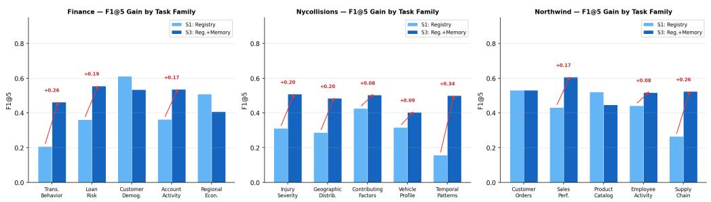
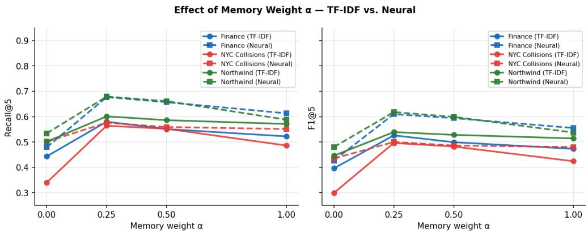

# Beyond Context Windows: Persistent Discovery Context for Data-Centric Agents

Jalal Mahmud   
Megagon Labs   
Mountain View, CA, USA   
jalal@megagon.ai

## Abstract

Data-centric agents repeatedly perform a discovery step before planning or execution: identifying the data objects relevant to a task. Yet successful discovery outcomes are typically discarded rather than reused. We introduce persistent discovery context, a lightweight memory layer that stores prior intent-to-object mappings and reuses them to augment future retrieval. Across three structured data environments, persistent discovery context consistently improves retrieval quality over metadata-only search, remains effective with automatically generated memories, and exposes a reproducible interference failure mode. In lexically sparse domains, memoryonly retrieval can even outperform metadata-based retrieval. These findings suggest that discovery outcomes constitute a useful form of reusable context for data-centric agents.

## 1 Introduction

Agent memory systems store conversations (Packer et al., 2023), observations (Park et al., 2023), executable skills (Wang et al., 2024), and reusable workflows (Wang et al., 2025). These mechanisms help agents retain information across tasks and sessions. Data-centric agents face a different challenge: before planning or execution, they must determine which data objects are relevant to a task. Although many tasks require similar tables and attributes, discovery is typically treated as a per-task operation. Relevant objects are identified, used once, and discarded rather than retained as reusable context. This raises a simple question: Should successful discovery outcomes persist across tasks?

We define a discovery outcome as a mapping between a task intent and the data objects that proved useful for accomplishing that task. Existing metadata catalogs and schema-linking methods support discovery (dat, 2026; Yu et al., 2018; Wang et al., 2020; Pourreza & Rafiei, 2023) but do not preserve successful discovery outcomes across tasks.

To address this gap, we introduce persistent discovery context, a lightweight memory layer that stores prior intent-to-object mappings and reuses them to augment future retrieval. We evaluate the approach on three real-world structured data environments across 125 held-out tasks. Our findings are fourfold. First, persistent discovery context consistently improves retrieval quality over metadata-only retrieval across all three domains. Second, the approach remains effective when initialized with LLM-generated memories, showing that useful gains can still be obtained despite imperfect memory construction. Third, we identify a reproducible interference failure mode in which semantically related but incorrect memories degrade retrieval quality. We additionally observe that in lexically sparse domains, memory-only retrieval can outperform metadata-based retrieval, suggesting that accumulated discovery experience can sometimes provide a stronger signal than object descriptions alone.

## 2 Persistent Discovery Context

We assume a registry of data objects (tables and attributes) augmented with natural-language metadata. Registry search retrieves candidate objects using standard text-based retrieval over this metadata.

Discovery Memory. A discovery memory $m = \langle { \mathrm { i n t e n t } } , { \mathrm { o b j e c t s } } \rangle$ records a prior mapping between a natural-language task description and the set of data objects that proved relevant. Discovery memories are persisted at the registry level and accumulate across tasks within the same data environment. Memories are created from prior discovery outcomes and reused across related tasks.

Memory-Augmented Retrieval. Given a query q, registry retrieval produces a relevance score $r ( q , o _ { i } )$ for each candidate object $o _ { i }$ . We then retrieve the most similar discovery memories and use them to augment object rankings.

$$
\mathrm { s c o r e } ( q , o _ { i } ) = r ( q , o _ { i } ) + \alpha \sum _ { m \in \mathrm { t o p } \cdot K _ { m } } \sin ( q , m . \mathrm { i n t e n t } ) \cdot \mathbf { 1 } [ o _ { i } \in m . \mathrm { o b j e c t s } ]\tag{1}
$$

where α controls the influence of memory and $\mathbf { 1 } [ o _ { i } \in m . { \mathrm { o b j e c t s } } ]$ indicates whether object $o _ { i }$ appeared in a retrieved memory. Setting $\alpha = 0$ recovers standard registry search. Setting $r ( \ r _ { q } , \ r _ { o } _ { i } ) = 0$ yields a memory-only ranker (S2).

## 3 Experiment

Datasets and Tasks We evaluate on three real-world structured data environments from structurally distinct domains.

Finance. Czech PKDD’99 banking dataset (Berka & Bruha, 1999): 6 tables, 42 attributes covering client accounts, transactions, and loans.

NYC Collisions. NYPD Motor Vehicle Collisions (New York City Open Data, 2025): 3 tables, 41 attributes covering crash-, vehicle-, and person-level records.

Northwind. Microsoft Northwind Traders (Microsoft, 2025): 8 tables, 43 attributes covering customers, orders, products, employees, suppliers, and categories.

For each domain, we construct a registry augmented with natural-language descriptions manually authored from schema names, relationships, and dataset documentation. The same descriptions are used across all retrieval conditions. We organize tasks into 15 task families (5 per domain). Each family groups queries that share the same relevant data objects but vary in surface vocabulary, defined thematically based on domain knowledge $( \mathrm { e . g . , }$ transaction behavior, loan risk, injury severity). Each family contains one seed task used to initialize discovery memory and a set of held-out evaluation tasks, ranging from 5 to 12 tasks per family. To estimate sensitivity to seed selection, we additionally perform a leave-one-out (LOO) rotation in which every task within a family serves as the seed in turn; results are reported in Appendix G. Across all domains, the benchmark contains 140 tasks, comprising 125 held-out evaluation tasks and 15 seed tasks. We additionally construct three interference tasks used only for the analysis in Table 2. Each task is manually annotated with 3–5 relevant data objects.

Experimental Conditions We compare four retrieval settings:

• S0: Raw Metadata. Search over object names only.

• S1: Registry. Search over object names and descriptions.

• S2: Memory. Objects ranked using discovery memory alone, without registry retrieval $( { \mathrm { i . e . , } } r ( q , o _ { i } ) { \dot { = } } 0$ in Equation 1).

• S3: Registry+Memory. S1 augmented with discovery memory $( \mathrm { E q . 1 } )$

Table 1: F1@5 on held-out evaluation tasks. Unstarred: TF-IDF; ⋆: neural (all-MiniLM-L6-v2). Memory conditions use $\alpha = 0 . 5 .$ . Full metrics in Appendix B; LOO robustness in Appendix G.
<table><tr><td>Method</td><td>Finance</td><td>NYC Col.</td><td>Northwind</td></tr><tr><td>SO: Raw Metadata</td><td>0.194</td><td>0.227</td><td>0.206</td></tr><tr><td>S1: Registry</td><td>0.396</td><td>0.299</td><td>0.446</td></tr><tr><td>S2: Memory</td><td>0.358</td><td>0.412</td><td>0.386</td></tr><tr><td>S3: Reg.+Mem.</td><td>0.499</td><td>0.482</td><td>0.528</td></tr><tr><td>S1*: Registry</td><td>0.427</td><td>0.435</td><td>0.480</td></tr><tr><td>S2*: Memory</td><td>0.533</td><td>0.418</td><td>0.494</td></tr><tr><td>S3*: Reg.+Mem.</td><td>0.594</td><td>0.486</td><td>0.599</td></tr></table>

Unless otherwise noted, S0–S3 use TF-IDF retrieval. Memory similarity uses the same retrieval model as the registry retriever. We set $K _ { m } = 5 ;$ since each domain has 5 task families with one seed memory each, this retrieves all stored memories weighted by similarity. To evaluate retriever independence, we also evaluate S1, S2, and S3 using a neural retriever based on all-MiniLM-L6-v2 sentence embeddings (Reimers & Gurevych, 2019); these conditions are denoted S1⋆, S2⋆, and $S 3 ^ { \star }$ . We additionally evaluate all conditions (S0–S3) with BM25 as an alternative lexical retriever and compare against a naive-injection variant (S4); both are reported in Appendix H and Appendix F. To test robustness to imperfect memories, we replace the manually annotated intent-to-object mappings used to initialize discovery memory with mappings generated automatically by Claude Haiku (Appendix C).

## Main Results Table 1 summarizes the results.

Persistent discovery context improves retrieval. Adding discovery memory (S3) improves F1@5 across all three domains using TF-IDF retrieval: finance 0.396 → 0.499 (+0.103), NYC collisions 0.299 → 0.482 (+0.183), and Northwind $0 . 4 4 6  0 . 5 2 8 ( + 0 . 0 8 2 )$ . Appendix I illustrates the downstream impact on agent planning quality. The largest gain occurs in NYC collisions (+0.183 from S1 to S3 vs. +0.072 from S0 to S1), suggesting that memory compensates for lexical mismatches that metadata descriptions alone cannot resolve.

With neural retrieval, memory improves F1@5 by +0.167 in finance, +0.119 in Northwind, and +0.051 in NYC collisions, where the neural base retriever is already strong (S1⋆ MRR = 0.848; Appendix B). The smaller gain in NYC is consistent with the neural retriever already resolving much of the lexical opacity that discovery memory compensates for in the TF-IDF setting. This pattern is confirmed by the memory-weight ablation (Appendix E), which shows that lower α values perform better when the base retriever leaves less room for memory to contribute.

Memory alone is informative in lexically sparse domains. Under TF-IDF retrieval, S2 (Memory only) surpasses S1 (Registry) in NYC collisions (0.412 vs. 0.299), showing that the memory signal alone outperforms metadata search when attribute names are compound and lexically opaque (e.g., contributing factor vehicle 1). In finance and Northwind under TF-IDF, S1 remains stronger than S2, so combining both signals (S3) is necessary to benefit from memory. Under neural retrieval the pattern partially inverts: $S 2 ^ { \star }$ outperforms S1⋆ in finance (0.533 vs. 0.427) and Northwind (0.494 vs. 0.480), while $\mathrm { S } 1 ^ { \star }$ remains stronger in NYC collisions (0.435 vs. 0.418).

Memory gains are not uniform across task families. Families with distinctive object vocabularies (e.g., temporal analysis or transaction behavior) benefit most from discovery memory, while families whose objects recur across multiple task types exhibit near-zero or negative gains (Appendix D).

LLM-generated memories remain useful. Automatically generated memories achieve object-level agreement (F1) of 0.698, 0.762, and 0.735 (finance, NYC, Northwind) against manually annotated discovery memories. Retrieval still outperforms S1 in two domains $( \mathrm { F 1 @ 5 } = \mathrm { \dot { 0 } } . 4 3 3 \mathrm { v s } . 0 . 3 9 6$ in finance; 0.452 vs. 0.299 in NYC) and remains above S0 in all three, indicating robustness to imperfect memory construction (Appendix C for details).

Table 2: Cross-family interference. Each task is evaluated under S1 (no memory), S3 seeded with an incorrect family memory, and S3 seeded with the correct family memory.
<table><tr><td>Domain</td><td>Interfering token(s)</td><td>S1</td><td>S3 (wrong)</td><td>S3 (correct)</td></tr><tr><td>Finance</td><td>withdrawal → trans.operation</td><td>0.444</td><td>0.222</td><td>0.667</td></tr><tr><td>NYC Collisions</td><td>vehicle type → vehicle_type, vehicles</td><td>0.400</td><td>0.200</td><td>0.800</td></tr><tr><td>Northwind</td><td>order quantity → order_details.quantity</td><td>0.444</td><td>0.000</td><td>0.889</td></tr></table>

Negative Result: Cross-Family Interference Table 2 illustrates a consistent failure mode across all three domains. When a semantically similar but incorrect discovery memory is activated, retrieval quality falls below the no-memory baseline. For example, in finance, the term withdrawal can activate a transaction-behavior memory when the task actually concerns loan analysis. In NYC collisions, vehicle type can activate a vehicle-profile memory when the task concerns injury analysis. Similar effects occur in Northwind, where orderrelated vocabulary appears across multiple task families. These results show that discovery memory is not universally beneficial. Surface-level vocabulary overlap can activate incorrect memories and distort rankings when the appropriate task family has not yet been observed. This failure mode motivates future work on memory selection, confidence estimation, and interference-aware retrieval.

## 4 Related Work

Agent memory systems store reusable artifacts such as conversational context and knowledge (MemGPT) (Packer et al., 2023), observations and reflections (Generative Agents) (Park et al., 2023), executable skills (Voyager) (Wang et al., 2024), and workflows (Agent Workflow Memory) (Wang et al., 2025). AgentSM (Biswal et al., 2026) and MERIT (Wang et al., 2026) extend memory to data-centric agents by storing execution experience for schema reasoning, planning, and SQL generation. In contrast, we study a smaller memory artifact: discovery memory, represented as reusable intent-to-object mappings. Rather than storing trajectories or reasoning processes, discovery memory records which data objects proved relevant for a task and evaluates these discovery outcomes as a retrieval problem (R@5, MRR, F1@5) rather than through downstream planning, SQL generation, or execution.

Our work is also related to schema linking and Text-to-SQL (Yu et al., 2018; Wang et al., 2020; Pourreza & Rafiei, 2023), knowledge-augmented SQL systems such as KAT-SQL (Baek et al., 2025), metadata catalogs such as DataHub (dat, 2026), and data-discovery systems such as Starmie (Fan et al., 2023). These systems focus on schema linking, reasoning, query generation, metadata management, or learning better object representations. In contrast, we investigate whether successful discovery outcomes themselves should persist as reusable intent-to-object mappings across tasks.

The closest conceptual connection is relevance feedback (Rocchio, 1971; Salton & Buckley, 1990), which reuses historical relevance signals to improve future retrieval. Discovery memory differs in that it operates on agent-generated object selections rather than user interaction signals, transfers across semantically related but lexically distinct tasks rather than refining a single query, and captures reusable mappings between task intents and sets of structured objects rather than document-level relevance.

## 5 Discussion and Conclusion

Across three structurally distinct domains, persistent discovery context consistently improves retrieval quality over metadata-only search across both lexical and neural retrievers and remains effective with automatically generated memories. These findings suggest that successful discovery outcomes constitute a reusable memory artifact that complements conversation, experience, and workflow memory for data-centric agents.

The primary limitation is memory interference: semantically similar but incorrect memories can degrade retrieval below the no-memory baseline. Future work includes interferenceaware memory selection, memory aging, larger-scale evaluation across more domains and tasks, and evaluation using agent-generated discovery traces. More broadly, these findings suggest that agent memory may extend beyond conversations and workflows to include reusable knowledge about how to navigate complex data environments.

## References

Datahub: The metadata platform for the modern data stack. https://datahubproject.io/, 2026. Accessed: 2026-06-16.

Jinheon Baek, Horst Samulowitz, Oktie Hassanzadeh, Dharmashankar Subramanian, Sola Shirai, Alfio Gliozzo, and Debarun Bhattacharjya. Knowledge base construction for knowledge-augmented text-to-sql. In Findings of the Association for Computational Linguistics: ACL 2025, pp. 26569–26583, Vienna, Austria, 2025. Association for Computational Linguistics. doi: 10.18653/v1/2025.findings-acl.1363.

Petr Berka and Ivan Bruha. The PKDD’99 discovery challenge: Understanding financial data. Discovery Challenge Workshop Notes, PKDD, 1999.

Asim Biswal, Chuan Lei, Xiao Qin, Aodong Li, Balakrishnan Narayanaswamy, and Tim Kraska. Agentsm: Semantic memory for agentic text-to-sql. arXiv preprint arXiv:2601.15709, 2026.

Grace Fan, Jin Wang, Yuliang Li, Dan Zhang, and Renee J. Miller. Semantics-aware dataset´ discovery from data lakes with contextualized column-based representation learning. Proceedings ofthe VLDB Endowment (PVLDB), 16(7):1545–1558, 2023. doi: 10.14778/3598581. 3598589.

Microsoft. Northwind sample database. https://learn.microsoft.com/en-us/dotnet/ framework/data/adonet/sql/linq/downloading-sample-databases, 2025. Accessed 2026.

New York City Open Data. Motor vehicle collisions – crashes. https://data.cityofnewyork. us/, 2025. Accessed 2026.

Charles Packer, Sarah Wooders, Kevin Lin, Vivian Fang, Shishir G. Patil, Ion Stoica, and Joseph E. Gonzalez. MemGPT: Towards LLMs as operating systems. arXiv preprint arXiv:2310.08560, 2023.

Joon Sung Park, Joseph C. O’Brien, Carrie J. Cai, Meredith Ringel Morris, Percy Liang, and Michael S. Bernstein. Generative agents: Interactive simulacra of human behavior. In Proceedings of the 36th Annual ACM Symposium on User Interface Software and Technology (UIST), 2023.

Mohammadreza Pourreza and Davood Rafiei. Din-sql: Decomposed in-context learning of text-to-sql with self-correction. In Advances in Neural Information Processing Systems, 2023.

Nils Reimers and Iryna Gurevych. Sentence-BERT: Sentence embeddings using Siamese BERT-networks. In Proceedings ofEMNLP, 2019.

J. J. Rocchio. Relevance feedback in information retrieval. In The SMART Retrieval System, 1971.

Gerard Salton and Chris Buckley. Improving retrieval performance by relevance feedback. Journal of the American Societyfor Information Science, 41(4):288–297, 1990.

Bailin Wang, Richard Shin, Xiaodong Liu, Oleksandr Polozov, and Matthew Richardson. Rat-sql: Relation-aware schema encoding and linking for text-to-sql parsers. In Proceedings of the 58th Annual Meeting of the Association for Computational Linguistics, pp. 7567–7578, 2020.

Guanzhi Wang, Yuqi Xie, Yunfan Jiang, Ajay Mandlekar, Chaowei Xiao, Yuke Zhu, Linxi Fan, and Anima Anandkumar. Voyager: An open-ended embodied agent with large language models. Transactions on Machine Learning Research, 2024.

Yibo Wang, Nikki Lijing Kuang, Philip S. Yu, Zhewei Yao, and Yuxiong He. Learning to retrieve: Dual-level long-term memory for text-to-sql agents. arXiv preprint arXiv:2606.00547, 2026.

Zora Zhiruo Wang, Jiayuan Mao, Daniel Fried, and Graham Neubig. Agent workflow memory. In Proceedings of the 42nd International Conference on Machine Learning, 2025.

Tao Yu, Rui Zhang, Kai Yang, Michihiro Yasunaga, Dongxu Wang, Zifan Li, James Ma, Irene Li, Qingning Yao, Shanelle Roman, Zilin Zhang, and Dragomir Radev. Spider: A large-scale human-labeled dataset for complex and cross-domain semantic parsing and text-to-sql task. In Proceedings of the 2018 Conference on Empirical Methods in Natural Language Processing, pp. 3911–3921, Brussels, Belgium, 2018. Association for Computational Linguistics. doi: 10.18653/v1/D18-1425.

## A Dataset and Registry Statistics

The finance registry contains 6 tables and 42 attributes. The NYC collisions registry contains 3 tables and 41 attributes. The Northwind registry contains 8 tables and 43 attributes.

Across three domains we construct 140 tasks in total: 125 held-out evaluation tasks organized into 15 task families (5 per domain), and 15 seed tasks (one per family) used only to populate discovery memory. We additionally construct 3 cross-family interference tasks (one per domain).

## B Full Retrieval Results

Table 3 reports R@5, R@10, MRR, and F1@5 for all conditions. The F1@5 column matches Table 1 in the main paper.

## C LLM-Generated Discovery Memories

To evaluate robustness to imperfect memories, we replace manually annotated discovery memories with memories generated automatically by Claude Haiku. For each seed task, the model receives the task description and registry contents and is asked to identify the relevant data objects.

Generated memories are evaluated against manually annotated discovery memories using object-level F1. We then use the generated memories to initialize discovery memory and measure downstream retrieval F1@5:

• Finance: memory agreement F1 = 0.698; S3 F1@5 = 0.433 vs. S1 F1@5 = 0.396

• NYC Collisions: memory agreement F1 = 0.762; S3 F1@5 = 0.452 vs. S1 F1@5 = 0.299

• Northwind: memory agreement F1 = 0.735; S3 F1@5 = 0.435 vs. S1 F1@5 = 0.446

Finance and NYC show clear improvement over registry-only search. Northwind LLM memories do not improve over S1, reflecting noisier object selections in a domain with higher cross-entity vocabulary overlap (e.g., order-related terms appearing across multiple task families).

Across all three domains, retrieval quality remains above the raw-metadata baseline (S0), indicating robustness to imperfect memory construction.

Table 3: Full retrieval results on held-out evaluation tasks. Unstarred: TF-IDF; ⋆: neural (all-MiniLM-L6-v2). All memory conditions use α = 0.5.
<table><tr><td rowspan="8">Finnce</td><td>Method</td><td>R@5</td><td>R@10</td><td>MRR</td><td>F1@5</td></tr><tr><td>S0: Raw Metadata</td><td>0.216</td><td>0.377</td><td>0.458</td><td>0.194</td></tr><tr><td>S1: Registry</td><td>0.443</td><td>0.618</td><td>0.746</td><td>0.396</td></tr><tr><td>S2: Memory</td><td>0.382</td><td>0.623</td><td>0.595</td><td>0.358</td></tr><tr><td>S3: Reg.+Mem.</td><td>0.551</td><td>0.693</td><td>0.816</td><td>0.499</td></tr><tr><td>S1*: Registry</td><td>0.479</td><td>0.675</td><td>0.766</td><td>0.427</td></tr><tr><td>S2*: Memory</td><td>0.587</td><td>0.793</td><td>0.805</td><td>0.533</td></tr><tr><td>S3*: Reg.+Mem.</td><td>0.657</td><td>0.846</td><td>0.883</td><td>0.594</td></tr><tr><td rowspan="7">NYC CO0.</td><td>S0: Raw Metadata</td><td>0.267</td><td>0.400</td><td>0.348</td><td>0.227</td></tr><tr><td>S1: Registry</td><td>0.340</td><td>0.505</td><td>0.648</td><td>0.299</td></tr><tr><td>S2: Memory</td><td>0.476</td><td>0.596</td><td>0.749</td><td>0.412</td></tr><tr><td>S3: Reg.+Mem.</td><td>0.552</td><td>0.751</td><td>0.818</td><td>0.482</td></tr><tr><td>S1*: Registry</td><td>0.501</td><td>0.683</td><td>0.848</td><td>0.435</td></tr><tr><td>S2*: Memory</td><td>0.485</td><td>0.636</td><td>0.790</td><td>0.418</td></tr><tr><td>S3*: Reg.+Mem.</td><td>0.559</td><td>0.690</td><td>0.799</td><td>0.486</td></tr><tr><td rowspan="7">Norind</td><td>SO: Raw Metadata</td><td>0.234</td><td>0.327</td><td>0.604</td><td>0.206</td></tr><tr><td>S1: Registry</td><td>0.501</td><td>0.682</td><td>0.795</td><td>0.446</td></tr><tr><td>S2: Memory</td><td>0.421</td><td>0.530</td><td>0.612</td><td>0.386</td></tr><tr><td>S3: Reg.+Mem.</td><td>0.586</td><td>0.792</td><td>0.886</td><td>0.528</td></tr><tr><td>S1*: Registry</td><td>0.534</td><td>0.744</td><td>0.792</td><td>0.480</td></tr><tr><td>S2*: Memory</td><td>0.539</td><td>0.726</td><td>0.653</td><td>0.494</td></tr><tr><td>S3*: Reg.+Mem.</td><td>0.661</td><td>0.827</td><td>0.806</td><td>0.599</td></tr></table>

## D Per-Family Analysis

Memory gains are not uniform across task families.

  
Figure 1: F1@5 improvement (S1→S3) by task family.

Families with distinctive object vocabularies benefit most from discovery memory. The top three families—temporal analysis (+0.34), supply chain (+0.26), and transaction behavior (+0.26)—show the largest gains, while families such as loan risk (+0.19) and account activity (+0.17) show moderate improvement.

In contrast, families whose objects appear across multiple task types show near-zero or negative gains. Customer demographics (−0.077), regional economics (−0.102), and product catalog (−0.074) all degrade slightly relative to registry-only retrieval. In these cases, the seed memory introduces objects that overlap with unrelated queries, adding a bias that the registry score cannot fully overcome.

These results suggest that discovery memory is most effective when the relationship between task intent and relevant objects is specific and stable, and least effective—or mildly harmful— when multiple task families share similar object sets.

## E Memory Weight Ablation

  
Figure 2: Recall@5 and F1@5 as a function of memory weight α across three domains and two retrievers. $\alpha { = } 0$ recovers registry-only (S1); α=1 gives memory full control. Both retrievers peak at $\alpha { = } 0 . 2 5$ ; over-weighting memory degrades performance in all settings.

As shown in Figure 2, both TF-IDF and neural retrieval peak at $\alpha = 0 . 2 5$ across all three domains. The absolute gain from the $\alpha = 0$ baseline to the peak is substantially smaller for neural retrieval (e.g., NYC collisions: +0.197 under TF-IDF vs. +0.065 under neural), consistent with a stronger base retriever leaving less room for memory to contribute. Overweighting memory at $\alpha = 1 . 0$ degrades performance in all settings. Setting $\alpha = 0$ recovers the registry-only baseline. Table 1 reports results at the default $\stackrel { \smile } { \alpha } = 0 . 5 ;$ using the ablationoptimal $\alpha { \dot { = } } 0 . 2 5$ yields modest additional gains but the main conclusions are unchanged.

## F Blending vs. Direct Memory Injection

Table 4 compares registry+memory blending (S3) against a direct injection baseline (S4) that promotes all objects associated with the highest-scoring memory to the front of the ranking without combining memory and registry scores.

Table 4: Comparison of S3 (Registry+Memory, blended) and S4 (Naive Injection) on held-out evaluation tasks. S3 outperforms S4 in both MRR and F1@5 across all three domains.
<table><tr><td>Domain</td><td>Method</td><td>R@5</td><td>R@10</td><td>MRR</td><td>F1@5</td></tr><tr><td rowspan="2">Finance</td><td>S3: Reg.+Mem.</td><td>0.551</td><td>0.693</td><td>0.816</td><td>0.499</td></tr><tr><td>S4: Naive Inj.</td><td>0.455</td><td>0.742</td><td>0.682</td><td>0.427</td></tr><tr><td rowspan="2">NYC</td><td>S3: Reg.+Mem.</td><td>0.552</td><td>0.751</td><td>0.818</td><td>0.482</td></tr><tr><td>S4: Naive Inj.</td><td>0.506</td><td>0.703</td><td>0.761</td><td>0.440</td></tr><tr><td rowspan="2">Northwind</td><td>S3: Reg.+Mem.</td><td>0.586</td><td>0.792</td><td>0.886</td><td>0.528</td></tr><tr><td>S4: Naive Inj.</td><td>0.423</td><td>0.749</td><td>0.690</td><td>0.387</td></tr></table>

S3 outperforms S4 in both MRR and F1@5 across all three domains. Directly injecting objects from a retrieved memory can elevate irrelevant objects when the memory only partially matches the query. By combining registry and memory signals, S3 preserves retrieval precision while still promoting objects associated with relevant prior discovery outcomes.

## G Leave-One-Out Seed Robustness

Table 5 reports F1@5 mean and standard deviation under leave-one-out (LOO) seed rotation. For each task family, every task serves as the seed in turn while the remaining tasks are evaluated, yielding 56, 51, and 36 evaluation trials for Finance, NYC Collisions, and Northwind, respectively. The relative ordering of methods is consistent with the fixed-seed results in Table 1, indicating that the observed gains are not sensitive to the choice of seed task.

Table 5: F1@5 mean±std under leave-one-out seed rotation. Unstarred: TF-IDF; ⋆: neural retriever.
<table><tr><td>Method</td><td>Finance</td><td>NYC Col.</td><td>Northwind</td></tr><tr><td>SO: Raw Metadata</td><td> $0 . 1 9 2 \pm 0 . 1 2 9$ </td><td> $0 . 2 2 9 \pm 0 . 1 3 4$ </td><td> $0 . 1 8 8 \pm 0 . 0 8 7$ </td></tr><tr><td>S1: Registry</td><td> $0 . 4 0 9 \pm 0 . 1 5 0$ </td><td> $0 . 3 0 2 \pm 0 . 0 8 9$ </td><td> $0 . 4 8 2 \pm 0 . 0 9 2$ </td></tr><tr><td>S2: Memory</td><td> $0 . 4 0 4 \pm 0 . 1 4 3$ </td><td> $0 . 4 4 8 \pm 0 . 1 2 1$ </td><td> $0 . 3 3 7 \pm 0 . 1 3 2$ </td></tr><tr><td>S3: Reg.+Mem.</td><td> $0 . 5 3 9 \pm 0 . 0 9 4$ </td><td> $0 . 5 2 1 \pm 0 . 0 7 4$ </td><td> $0 . 5 3 2 \pm 0 . 1 0 1$ </td></tr><tr><td>S1*: Registry</td><td> $0 . 4 4 2 \pm 0 . 1 3 2$ </td><td> $0 . 4 5 8 \pm 0 . 0 8 1$ </td><td> $0 . 4 9 7 \pm 0 . 0 8 8$ </td></tr><tr><td>S2*: Memory</td><td> $0 . 5 3 6 \pm 0 . 1 3 8$ </td><td> $0 . 5 1 9 \pm 0 . 1 0 6$ </td><td> $0 . 4 5 8 \pm 0 . 1 2 9$ </td></tr><tr><td> ${ \mathsf { S } } 3 ^ { \star } \colon { \mathrm { R e g } } . { \mathsf { + M e m } } .$ </td><td> $\mathbf { 0 . 6 0 7 \pm 0 . 0 9 1 }$ </td><td> $\mathbf { 0 . 6 1 4 \pm 0 . 0 7 2 }$ </td><td> $\mathbf { 0 . 6 0 5 \pm 0 . 0 9 2 }$ </td></tr></table>

## H BM25 Retriever Comparison

Table 6 reports S0–S3 results using Okapi BM25 in place of TF-IDF. BM25 underperforms TF-IDF at the S1 and S3 levels across all three domains; S0 differences are negligible. A notable gap appears at the S1 registry level (e.g., Finance: 0.358 vs. 0.396; NYC: 0.292 vs. 0.299; Northwind: 0.388 vs. 0.446), reflecting that BM25’s term-frequency saturation is poorly matched to the long, semantically rich prose descriptions in the registry. S2 (memory-only) results are comparable between BM25 and TF-IDF, as memory retrieval matches queries against short intent strings rather than registry descriptions. Despite the weaker base, S3 still improves over S1 with BM25 in all three domains, confirming that memory boosting is beneficial regardless of the underlying retriever.

Table 6: BM25 retriever results on held-out evaluation tasks (S0–S3). TF-IDF F1@5 is shown in parentheses for comparison.
<table><tr><td>Method</td><td>R@5</td><td>R@10</td><td>MRR</td><td>F1@5 (TF-IDF)</td><td></td></tr><tr><td rowspan="4">Finnce</td><td>SO: Raw Metadata</td><td>0.198</td><td>0.363</td><td>0.414</td><td>0.177</td><td>(0.194)</td></tr><tr><td>S1: Registry</td><td>0.395</td><td>0.553</td><td>0.668</td><td>0.358</td><td>(0.396)</td></tr><tr><td>S2: Memory</td><td>0.418</td><td>0.591</td><td>0.607</td><td>0.379</td><td>(0.358)</td></tr><tr><td>S3: Reg.+Mem.</td><td>0.434</td><td>0.584</td><td>0.677</td><td>0.393</td><td>(0.499)</td></tr><tr><td>NYC CO0l.</td><td>SO: Raw Metadata</td><td>0.260</td><td>0.400</td><td>0.333</td><td>0.221</td><td>(0.227)</td></tr><tr><td rowspan="4"></td><td>S1: Registry</td><td>0.335</td><td>0.473</td><td>0.594</td><td>0.292</td><td>(0.299)</td></tr><tr><td>S2: Memory</td><td>0.464</td><td>0.610</td><td>0.752</td><td>0.402</td><td>(0.412)</td></tr><tr><td>S3: Reg.+Mem.</td><td>0.453</td><td>0.661</td><td>0.642</td><td>0.392</td><td>(0.482)</td></tr><tr><td>SO: Raw Metadata</td><td>0.234</td><td></td><td></td><td></td><td></td></tr><tr><td rowspan="4">Nortind</td><td></td><td></td><td>0.327</td><td>0.604</td><td>0.206</td><td>(0.206)</td></tr><tr><td>S1: Registry</td><td>0.435</td><td>0.630</td><td>0.773</td><td>0.388</td><td>(0.446)</td></tr><tr><td>S2: Memory</td><td>0.421</td><td>0.533</td><td>0.629</td><td>0.386</td><td>(0.386)</td></tr><tr><td>S3: Reg.+Mem.</td><td>0.477</td><td>0.702</td><td>0.790</td><td>0.429</td><td>(0.528)</td></tr></table>

## I Agent-in-the-Loop Demonstration

To assess downstream impact, we provide the top-5 retrieved objects from S1 and S3 to a planning agent (Claude Haiku) and ask it to generate an analysis plan for the task “Find customers with unusual cash withdrawals.”

S3 retrieval provides the exact transaction-related objects needed for the task, while S1 retrieval contains mostly demographic objects. As a result, the S3 plan directly references the correct operational fields and produces a more executable analysis strategy.

<table><tr><td rowspan=1 colspan=1>S1 — Registry only</td><td rowspan=1 colspan=1>S3 — Registry+Memory</td></tr><tr><td rowspan=1 colspan=1>Retrieved: client_id, birth_date, bank, disp id,client</td><td rowspan=1 colspan=1>Retrieved: operation, trans, balance, type, ac-count</td></tr><tr><td rowspan=1 colspan=2>Task: &quot;Find customers with unusual cash withdrawals&quot;</td></tr><tr><td rowspan=1 colspan=1>&quot;Query the bank database transactions table (im-plied in the banking database), filtering for cashwithdrawal operations.&#x27;</td><td rowspan=1 colspan=1>&#x27;Query the trans entity where operation = &#x27;cashwithdrawal&#x27; and $t y p e = ' d e b i t ^ { \prime }$ to isolate with-drawal transactions.&quot;</td></tr></table>

Figure 3: Illustrative effect of retrieval context on downstream agent planning. With S1 retrieval, the agent must infer that a transactions table exists and works around its absence. With S3 retrieval, the agent directly references trans.operation and trans.type, producing a more executable analysis plan. Same model, same task; only the retrieved context changes.