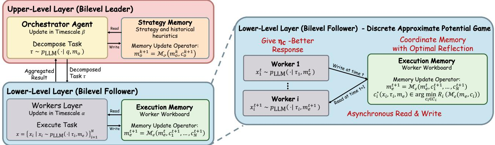

# Bilevel Coordinated Reflection: A Game-Theoretic Approach to Multi-Agent LLM Systems

Yihang Chen1∗, Yuxiang Chen1∗, Yuxuan Huang2, Meng Fang2, Weilin Luo3, Jun Wang1†

1UCL Centre for Artificial Intelligence 2University of Liverpool 3Huawei

## Abstract

Multi-agent LLM systems commonly use an orchestrator to decompose a task for a team of workers and then improve through textual reflection. Despite strong empirical results, these systems lack a unified account of coordination, memory improvement, and the role of external verification. We model orchestrator–worker interaction as a bilevel coordination game: under bounded coupling, the workers’ local-update game is an approximate potential game whose equilibrium slack is controlled by decomposition quality. We then analyse reflection as stochastic movement over semantic memory states. For free-form reflection, we derive a finite-time upper bound, prove worst-case tightness, and give a positive lower bound under a falsifiable persistent-harm condition. We further prove an information-theoretic impossibility result: no gate that observes only the generated transcript can improve uniformly over text-indistinguishable environments, whereas an environment-grounded gate can. Motivated by this separation, we introduce Stochastic Reflective Memory Ascent (SRMA), which accepts a candidate memory only after a grounded evaluation risk strictly decreases. Under calibration and non-degenerate corrective mass, SRMA converges exactly, geometrically or polynomially; matching constructions show that both rate regimes are order-tight. We also provide confidence gating for stochastic evaluation and re-anchoring guarantees for piecewise-stationary environments. Experiments instantiate these objects with environment-grounded metrics and test the predicted coordination and drift laws. On 500 SWE-bench instances, the complete Kimi-based system resolves 72.2% versus a 70.8% public mini-SWE-agent reference. Code available at https://github.com/YihangChen9/ Bilevel-Coordinated-Reflection.

## 1 Introduction

Multi-agent LLM systems have become a common recipe for tasks too large or structured for a single agent: an orchestrator decomposes the task, worker models solve the pieces, and the team improves by reflecting—writing critiques, hypotheses, and lessons into a shared textual memory that conditions subsequent generations (Wu et al. 2024; Hong et al. 2024; Shinn et al. 2023; Benkovich and Valkov 2026; Qian et al. 2025). Because model weights are frozen at test time, memory editing is the principal adaptation channel (Zhou et al. 2025; Xu et al. 2025; Zhang et al. 2025b), and such loops often work better when grounded by a test harness, simulator, execution

engine, or formal checker.

The dominant account of these systems is nevertheless procedural. Existing frameworks (Zhang et al. 2025a; Hu, Lu, and Clune 2025; Dang et al. 2025; Wang et al. 2025) specify who communicates with whom and which bufer is updated, but not the strategic object that the agents stabilise to or the quantity that reflection improves. This leaves three unresolved questions. First, how does the orchestrator’s decomposition quality control worker coordination? Second, when does unconditional reflection plateau rather than converge? Third, why can an external verifier succeed where a stronger text-only critic may still fail?

We address these questions in a single framework. The orchestrator–worker pipeline is modelled as a bilevel coordination game whose follower subgame is an approximate potential game, and textual memory editing as a stochastic process over a discrete semantic state space. For free-form reflection, a one-sided drift condition yields a finite-time upper bound that is tight in the worst case; a universal positive floor requires an additional, explicitly testable persistentharm condition—unconditional commitment alone is not enough.

We then isolate the informational role of verification: in two environments with identical text-generation laws but opposite meanings for the same reflections, any possibly randomised, history-dependent gate that observes only the transcript behaves identically and therefore cannot improve both—even an ideal text-only judge—whereas a grounded verifier distinguishes the pair and recovers geometric convergence.

Motivated by this separation, we introduce Stochastic Reflective Memory Ascent (SRMA), which commits a candidate memory only when a fixed grounded evaluation protocol certifies a strict decrease in verifier risk. Under calibration and non-degenerate corrective mass, SRMA converges exactly at order-tight geometric or polynomial rates; a confidence gate handles stochastic probes, and re-anchoring restores per-segment convergence under piecewise stationarity.

The theory is instantiated on a hidden-cap resource contest, Overcooked with an exact BFS value table, and SWEbench (Jimenez et al. 2024). The controlled environments expose the strategic, memory, and drift quantities directly without an LLM-as-judge; on SWE-bench the complete Kimibased system resolves 361/500 instances (72.2%) versus

  
Figure 1: Bilevel coordinated reflection. The orchestrator (leader) selects a decomposition τ and updates strategy memory $m _ { o }$ on the slower timescale; workers (followers) update execution memory $m _ { e }$ via $\eta _ { c }$ -better responses on the faster timescale. Under bounded coupling, the followers’ subgame is an approximate potential game with slack $\eta _ { c } \leq 2 d _ { \operatorname* { m a x } } \kappa ,$ while verifier-gated SRMA separately governs which memory proposals are committed.

70.8% for the public mini-SWE-agent ${ \bf v } 2$ reference.

In summary, we contribute: (1) a bilevel coordination game linking decomposition coupling to follower equilibrium slack (Sec. 3.1); (2) a two-sided drift analysis of freeform reflection, tight in the worst case, with a universal lower bound under persistent harmful commitment (Sec. 3.2); (3) an impossibility theorem for self-contained text-only gates, with a grounded comparator that converges geometrically (Sec. 3.3); (4) SRMA, with exact convergence, order-tight rates, and a finite-probe confidence extension (Sec. 3.4); and (5) mechanism-level validation on Resource Contest and Overcooked plus end-to-end results on SWE-bench (Sec. 4).

## 2 Related Work

Multi-agent LLM frameworks. Orchestrator–worker architectures such as AutoGen (Wu et al. 2024), MetaGPT (Hong et al. 2024) and Agyn (Benkovich and Valkov 2026) show strong empirical performance but ofer no convergence analysis; failure modes such as hallucination cascades are documented empirically (Liu et al. 2026; Cemri et al. 2025). We provide the missing game-theoretic and stochasticapproximation foundations.

Self-reflection, self-evaluation, and grounding. Reflexion (Shinn et al. 2023) and Self-Refine (Madaan et al. 2023) improve outputs by appending self-generated critiques but may plateau, and correlated self-evaluation bias (Zheng et al. 2023; Panickssery, Bowman, and Feng 2024; Wu et al. 2026) weakens model-based judges in practice. Our drift analysis separates a worst-case floor from the persistentharm condition needed for a universal lower bound, and our indistinguishable-environment theorem shows that without an environment-dependent signal even an ideal text-only gate cannot be uniformly correct.

Potential games and drift analysis. Our followers’ subgame builds on exact and approximate potential games (Monderer and Shapley 1996; Candogan et al. 2011; Christodoulou and Gairing 2014) and weakly coupled team problems (Srikant and Başar 1992). The convergence analysis uses Foster–Lyapunov drift (Hajek 1982; Meyn and

Tweedie 2009), classical stochastic approximation (Robbins and Monro 1951; Borkar 2008; Bertsekas and Tsitsiklis 2000) and, for the gated regime, multiplicative and variable drift theorems from randomised search heuristics (Doerr, Johannsen, and Winzen 2012; Johannsen 2010; Lehre and Witt 2021); the recursion $e _ { t + 1 } \leq e _ { t } - c e _ { t } ^ { 1 + \beta }$ is the discrete stochastic analogue of Polyak–Łojasiewicz-type conditions (Karimi, Nutini, and Schmidt 2016; Chung 1954). Two-timescale bilevel structure follows Borkar (1997); Hong et al. (2023).

## 3 Methodology

Longer derivations are deferred to the supplementary material.

## 3.1 Problem Formulation: Bilevel Coordination Game

We formalise the resolution of a complex user query $q \in \mathcal { Q } .$ The objective is a joint structured output $x \in \mathcal { X }$ maximising a global utility $U ( x )$ (logical correctness, constraint satisfaction). In a naive single-agent paradigm the entire output is generated directly from the query via the frozen LLM kernel, $x \sim p _ { \mathrm { L L M } } ( \cdot \mid q )$ , which for large tasks induces context dilution and reasoning degradation (Liu et al. 2024; Levy, Jacoby, and Goldberg 2024; Du et al. 2025). Contemporary systems instead let an orchestrator partition the task among workers (Wu et al. 2024; Hong et al. 2024; Liu et al. 2025).

We model this as a bilevel coordination game. The orchestrator (Leader) generates a strategy profile $\tau =$ $( \tau _ { 1 } , \dots , \tau _ { N } ) \in \mathcal { T }$

$$
\tau \sim p _ { \mathrm { L L M } } ( \cdot \mid q ) ,\tag{1}
$$

assigning subtask $\tau _ { i }$ to worker $i$ (Follower), who generates a local sub-solution $x _ { i } \sim p _ { \mathrm { L L M } } ( \cdot \mid \tau _ { i } ) ;$ ; the global output is ${ \boldsymbol x } = ( x _ { 1 } , \dots , x _ { N } )$

Unlike the idealised independent decomposition of classical potential-game analyses (Monderer and Shapley 1996), real multi-agent LLM systems exhibit non-trivial crossworker interactions: shared variables, common interfaces, joint constraints (Liu et al. 2026). We adopt a weakly coupled decomposition in the spirit of Srikant and Başar (1992); Candogan et al. (2011).

Assumption 1 (Weakly Coupled Decomposability). Each worker action set $\mathcal { X } _ { i }$ is finite. The worker payof is the local objective $g _ { i } ( x ; \tau ) ~ : = ~ u _ { i } ( x _ { i } ~ | ~ \tau _ { i } )$ , while the system-level objective is $U .$ . The global utility admits

$$
\begin{array} { r l } { \displaystyle } & { \displaystyle { U ( x ) = \sum _ { i = 1 } ^ { N } u _ { i } ( x _ { i } \mid \tau _ { i } ) } } \\ { \displaystyle } & { ~ + \sum _ { ( i , j ) \in \mathcal { E } } \psi _ { i j } ( x _ { i } , x _ { j } \mid \tau _ { i } , \tau _ { j } ) , } \end{array}\tag{2}
$$

where $\mathcal { E }$ is an undirected interaction graph induced $\begin{array} { r l } { \mathbf { b y } } & { { } \tau , } \end{array}$ , with each edge counted once, and $\kappa : =$ $\begin{array} { r } { \operatorname* { s u p } _ { ( i , j ) \in \mathcal { E } } \operatorname* { s u p } _ { x _ { i } , x _ { j } } | \psi _ { i j } ( x _ { i } , x _ { j } \ | \ \tau _ { i } , \tau _ { j } ) | < \infty } \end{array}$ . Let ${ \mathcal { N } } _ { i }$ be worker i’s coupled neighbours and $d _ { \operatorname* { m a x } } : = \operatorname* { m a x } _ { i } | \mathcal { N } _ { i } |$

When $\kappa = 0$ the system reduces to the independent case; κ and $d _ { \mathrm { m a x } }$ jointly quantify decomposition quality. Since LLM generation is stochastic, the system objective is the expected global utility $\mathbb { E } [ U ( x ) ]$

Lemma 1 (Approximate Potential Game). Under Assumption 1 andfixed τ, the workers’ subgame is an $\eta _ { c }$ -approximate potential game with potential $\mathbb { E } [ U ( x ) ]$ and slack

$$
\eta _ { c } \ \leq \ 2 d _ { \mathrm { m a x } } \kappa .\tag{3}
$$

Proof. If worker i unilaterally deviates from $\ v x _ { i } ^ { t }$ to $\boldsymbol { x } _ { i } ^ { t + 1 }$

$$
\begin{array} { r l } & { \mathbb { E } [ U ( x _ { i } ^ { t + 1 } , x _ { - i } ^ { t } ) ] - \mathbb { E } [ U ( x _ { i } ^ { t } , x _ { - i } ^ { t } ) ] } \\ & { \quad \quad = \mathbb { E } [ u _ { i } ( x _ { i } ^ { t + 1 } \mid \tau _ { i } ) ] - \mathbb { E } [ u _ { i } ( x _ { i } ^ { t } \mid \tau _ { i } ) ] + \Delta _ { i } ^ { \psi } , } \end{array}\tag{4}
$$

where the coupling residual $\Delta _ { i } ^ { \psi }$ sums at most $d _ { \mathrm { m a x } }$ terms each bounded by $2 \kappa$ (since $\begin{array} { r } { | \psi _ { i j } | \leq \kappa ) , \mathrm { s o } | \Delta _ { i } ^ { \psi } | \leq 2 d _ { \operatorname* { m a x } } \kappa = : } \end{array}$ $\eta _ { c } .$ Every unilateral deviation thus changes the potential within $\eta _ { c }$ of the local utility change (Candogan et al. 2011; Christodoulou and Gairing 2014). □

A rational worker performs ηc-better-response updates: $\mathbb { E } [ u _ { i } ( x _ { i } ^ { t + 1 } \mid \tau _ { i } ) ] - \mathbb { E } [ u _ { i } ( x _ { i } ^ { t } \mid \tau _ { i } ) ] > \eta _ { c }$ . If no worker has such a deviation, the current profile is by definition already an η -approximate Nash equilibrium, so the dynamics below are well defined in all cases.

Theorem 1 (Convergence of the Followers’ Subgame). Under Lemma 1, iterated $\eta _ { c }$ -better-response updates converge in finitely many steps to a profile $x ^ { * } ( \tau )$ satisfying, for every worker i,

$$
\mathbb { E } \big [ g _ { i } ( x _ { i } ^ { * } , x _ { - i } ^ { * } ; \tau ) \big ] \geq \operatorname* { m a x } _ { x _ { i } ^ { \prime } \in \mathcal { X } _ { i } } \mathbb { E } \big [ g _ { i } ( x _ { i } ^ { \prime } , x _ { - i } ^ { * } ; \tau ) \big ] - \eta _ { c } .\tag{5}
$$

Thus $x ^ { * } ( \tau )$ is an ηc-approximate pure-strategy Nash equilibrium of the explicitly defined local-payof game.

Proof sketch. Each update raises the potential E $\tilde { \boldsymbol { \Sigma } } [ \boldsymbol { U } ( \boldsymbol { x } ^ { t } ) ]$ by a strictly positive amount (Lemma 1); X finite and U bounded imply finite termination. Full proof in the supplementary material. □

Leader’s objective and decomposition quality. The orchestrator anticipates the followers’ equilibrium and solves $\tau ^ { * } ( q ) \ \in$ arg maxτ $\mathbb { E } [ U ( x ^ { * } ( \tau ) ) ]$ . Because $\begin{array} { r l } { \eta _ { c } } & { { } = } \end{array}$ $2 d _ { \mathrm { m a x } } ( \tau ) \dot { \kappa ( \tau ) }$ depends on $\tau ,$ , the leader’s objective contains an explicit decomposition-quality term:

Corollary 1 (Leader’s Decomposition Trade-of). Let $\begin{array} { r l r } { J _ { \mathrm { l o c } } ( \tau ) } & { : = } & { \sum _ { i } \operatorname* { m a x } _ { x _ { i } } \mathbb { E } [ u _ { i } ( { x _ { i } } ^ { \mathrm { ~ \bar { ~ } } } \ | \quad \tau _ { i } ) ] } \end{array}$ and $\begin{array} { r l } { C ( \tau ) } & { { } : = } \end{array}$ $d _ { \operatorname* { m a x } } ( \bar { \tau } ) \kappa ( \tau )$ . For any $\eta _ { c }$ -approximate equilibrium $x ^ { * } ( \tau )$

$$
\begin{array} { r } { \mathbb { E } [ U ( x ^ { * } ( \tau ) ) ] \geq J _ { \mathrm { l o c } } ( \tau ) - \frac { 5 } { 2 } N C ( \tau ) . } \end{array}\tag{6}
$$

Hence the leader maximises a lower bound that trades achievable local utility against coupling: a good decomposition simultaneously raises $J _ { \mathrm { l o c } }$ and shrinks $C ( \tau )$ . (Proof in the supplementary material.)

## 3.2 Dual-Memory Drift Dynamics and Hallucination Floors

LLM weights are frozen, so adaptation proceeds by editing external, non-parametric memories: an execution memory $m _ { e } \in \mathcal { M } _ { e }$ shared by workers and a strategy memory $m _ { o } \in$ $\mathcal { M } _ { o }$ used by the orchestrator. For a fixed decomposition $\tau ,$ let

$$
J _ { i } ( m _ { e } \mid \tau _ { i } ) = \mathbb { E } _ { x _ { i } \sim p _ { \mathrm { L L M } } ( \cdot \vert \tau _ { i } , m _ { e } ) } [ u _ { i } ( x _ { i } \mid \tau _ { i } ) ]
$$

and rescale utility so that the sub-optimality $V _ { t } : = V _ { i } ( m _ { e } ^ { t } ) =$ $J _ { i } ^ { * } - J _ { i } ( m _ { e } ^ { t } \mid \tau _ { i } )$ lies in [0, 1]. Let $\mathcal { F } _ { t }$ denote the history up to the t-th memory update.

The key distinction is whether a proposed reflection is committed unconditionally or evaluated before it enters memory. Unconditional commitment alone does not imply a positive asymptotic error: a universal lower bound requires an explicit condition that harmful commitments keep injecting non-vanishing expected error. We therefore separate an upper guarantee, its worst-case tightness, and a genuine lower bound under persistent harmful drift.

Regime A: free-form reflection. When every generated reflection is appended, corrective information and hallucinated information (Huang et al. 2025; Ji et al. 2024) are mixed in the same update. We summarise their net conditional efect by the following one-sided drift condition.

Assumption 2 (One-Sided Free-Form Drift). There exist $\gamma _ { t } \in ( \bar { 0 , 1 } ]$ and $\nu _ { t } \geq 0$ such that

$$
\mathbb { E } [ V _ { t + 1 } ~ | ~ \mathcal { F } _ { t } ] \leq ( 1 - \gamma _ { t } ) V _ { t } + \nu _ { t } .\tag{7}
$$

Here $\gamma _ { t } V _ { t }$ is the available corrective drift and $\nu _ { t }$ is the mean residual error load from committed, ungrounded content; $\nu _ { t }$ is a first-moment quantity, not a variance.

Theorem 2 (Finite-Time Upper Bound). $I f \gamma _ { t } \geq \gamma > 0$ and $\begin{array} { r } { \nu _ { t } \leq \overline { { \nu } } , } \end{array}$ , then, for $e _ { t } : = \mathbb { E } [ V _ { t } ]$

$$
e _ { T } \le ( 1 - \underline { { \gamma } } ) ^ { T } e _ { 0 } + \frac { \overline { { \nu } } } { \underline { { \gamma } } } \big ( 1 - ( 1 - \underline { { \gamma } } ) ^ { T } \big ) .\tag{8}
$$

Consequently, lim $\begin{array} { r } { \operatorname* { s u p } _ { T \to \infty } e _ { T } \le \operatorname* { m i n } \{ 1 , \overline { { \nu } } / \underline { { \gamma } } \} } \end{array}$ . (Proof in the supplementary material.)

Theorem 2 is an upper guarantee only; the next result is the strongest conclusion available from Assumption 2 alone.

Proposition 1 (Worst-Case Tightness). For every $\gamma \in ( 0 , 1 ]$ and $\nu \in ( 0 , \gamma ]$ , there exists a free-form process satisfying Assumption 2 with $\gamma _ { t } \equiv \gamma$ and $\nu _ { t } \equiv \nu$ such that

$$
\operatorname* { l i m } _ { T \to \infty } \mathbb { E } [ V _ { T } ] = \frac { \nu } { \gamma } .\tag{9}
$$

Hence the upper bound $\nu / \gamma$ cannot be uniformly improved over the one-sided drift class.

Proofsketch. The deterministic recursion $V _ { t + 1 } ~ = ~ ( 1 ~ -$ $\gamma ) V _ { t } + \nu$ with $0 < \nu \leq \gamma$ maps [0, 1] into itself, attains $( 7 )$ with equality, and converges to its unique fixed point $\nu / \gamma$ □

A lower bound that applies to every process requires a lower drift condition, directly testable by regressing the nextstep error on the current error in free-form trajectories.

Assumption 3 (Persistent Harmful Commitment). There exist $\overline { { \gamma } } \in ( 0 , 1 ]$ and $\underline { { \nu } } \in ( 0 , \overline { { \gamma } } ]$ such that, on every reachable state,

$$
\mathbb { E } [ V _ { t + 1 } ~ | ~ \mathcal { F } _ { t } ] \ge ( 1 - \overline { { \gamma } } ) V _ { t } + \underline { { \nu } } .\tag{10}
$$

The parameter γ upper-bounds how much of the current error can be removed in one expected update, whereas $\underline { { \nu } } > 0$ is a persistent net error load that remains because harmful reflections are committed without screening.

Theorem 3 (Universal Lower Bound). Under Assumption 3,

$$
e _ { T } \geq ( 1 - \overline { { \gamma } } ) ^ { T } e _ { 0 } + \frac { \underline { { \nu } } } { \overline { { \gamma } } } \big ( 1 - ( 1 - \overline { { \gamma } } ) ^ { T } \big ) ,\tag{11}
$$

and therefore

$$
\operatorname* { l i m } _ { T \to \infty } \operatorname* { i n f } _ { e _ { T } } \geq \frac { \underline { { \nu } } } { \overline { { \gamma } } } > 0 .\tag{12}
$$

(Proof in the supplementary material.)

Corollary 2 (Two-Sided Error Tube). If Assumptions 2 and 3 both hold, then

$$
\frac { \nu } { \overline { { \gamma } } } \leq \operatorname* { l i m } _ { T  \infty } \operatorname* { i n f } _ { } e _ { T } \leq \operatorname* { l i m } _ { T  \infty } \operatorname* { s u p } _ { } e _ { T } \leq \frac { \overline { { \nu } } } { \underline { { \gamma } } } .\tag{13}
$$

When the two conditional drift bounds match, $\underline { { \gamma } } = \overline { { \gamma } } = \gamma$ and $\underline { { \boldsymbol { \nu } } } = \overline { { \boldsymbol { \nu } } } = \boldsymbol { \nu } ,$ the mean error converges exactly to $\nu / \gamma$

An operational corollary in the supplementary material re-expresses the tube via estimable per-step correction and harm rates.

Leader’s outer loop. On the slower timescale, define $V _ { o } ( m _ { o } ^ { k } ) = \Phi ^ { * } - \mathbf { \bar { \Phi } } \Phi ( m _ { o } ^ { k } )$ for $\Phi ( m _ { o } ^ { k } ) = \mathbb { E } [ U ( x ) ]$ $m _ { e } ^ { \infty } ( \tau ( m _ { o } ^ { k } ) )$ ]. Under the analogous upper drift condition with $\gamma _ { o } ^ { k } \geq \gamma _ { o , \mathrm { m i n } } > 0$ and $\nu _ { o , k } \leq \nu _ { o , \operatorname* { m a x } } .$ , the same afine recursion yields the finite-episode bound $\mathbb { E } [ V _ { o } ( m _ { o } ^ { K } ) ] ~ \leq$ $( 1 - \gamma _ { o , \mathrm { m i n } } ) ^ { K } V _ { o } ( m _ { o } ^ { 0 } ) + \nu _ { o , \mathrm { m a x } } \bar { / } \gamma _ { o , \mathrm { m i n } } .$ We use only this finite-episode statement and make no asymptotic leaderregret claim.

## 3.3 Why Grounding Is Necessary: Impossibility of Self-Contained Gates

The fundamental informational requirement is grounding: access to a signal whose law depends on the environment rather than only on the generated transcript. We formalise this through a pair of environments that are indistinguishable at the text level.

Text processes and gates. Let a memory be a finite reflection sequence $m = ( \bar { c } _ { 1 } , \dots , c _ { t } ) \in \mathcal { C } ^ { * }$ with append operation m $\oplus c = ( c _ { 1 } , \ldots , c _ { t } , c )$ . Fix an initial memory $m ^ { 0 }$ and a proposal kernel $P ( \cdot \mid m )$ over C. An environment ε assigns a sub-optimality $V ^ { \dot { \varepsilon } } ( { \dot { m } } ) { \dot { \in } } [ 0 , 1 ]$ to every reachable memory. Across the class considered below, the environment changes this semantic value but not the proposal kernel or any other text-level law.

Definition 1 (Self-Contained Gate). A self-contained gate is any possibly randomised, history-dependent acceptance rule measurable with respect to the generated text process and its internal randomness only. A grounded gate may additionally observe an environment-dependent signal, such as realised reward, simulator state, test execution, or a formal-checker result.

This class contains text-only LLM-as-judge systems. Correlated-evaluation bias can make such judges weaker in practice (Panickssery, Bowman, and Feng 2024); the result below applies even to an ideal gate with unlimited textprocessing capacity.

Ambiguous-pair construction. Let $C _ { 0 } , C _ { 1 } \subset \mathcal { C }$ be disjoint and satisfy $\begin{array} { r } { P ( C _ { 0 } \mid m ) = P ( C _ { 1 } \mid m ) = \mu \in ( 0 , \frac { 1 } { 2 } ] } \end{array}$ for every reachable m; all remaining proposals are inert. Fix $\kappa ~ \in ~ ( 0 , 1 )$ and define $f _ { 0 } ( v ) \ = \ ( 1 - \kappa ) v$ and $f _ { 1 } ( v ) = \kappa + ( 1 - \kappa ) v$ . In environment $\varepsilon ^ { + }$ , an accepted proposal from $C _ { a }$ applies $f _ { a }$ to the current error; in environment $\varepsilon ^ { - }$ , the roles of $C _ { 0 }$ and $C _ { 1 }$ are swapped. Thus the same text is corrective in one environment and harmful in the other. Let $e _ { T } ^ { \varepsilon } = \mathbb { E } [ V ^ { \varepsilon } ( m ^ { T } ) ]$ and assume both environments start at the same $\begin{array} { r } { e _ { 0 } \le \frac { 1 } { 2 } } \end{array}$

Theorem 4 (Self-Gating Impossibility). For every selfcontained gate and every horizon T,

$$
\operatorname* { m a x } \{ e _ { T } ^ { \varepsilon ^ { + } } , e _ { T } ^ { \varepsilon ^ { - } } \} \geq e _ { 0 } .\tag{14}
$$

Moreover, $i f e _ { 0 } < \frac { 1 } { 2 }$ and the gate accepts at least one proposal from $C _ { 0 } \cup C _ { 1 }$ with positive probability by time $T ,$ , then the inequality is strict. In contrast, the free-form rule accepts everything and satisfies $e _ { T } ^ { \varepsilon } \to { \frac { 1 } { 2 } }$ in both environments, whereas the grounded gate that observes $V ^ { \varepsilon }$ accepts only the corrective class and satisfies $e _ { T } ^ { \varepsilon } = e _ { 0 } ( 1 - \kappa \mu ) ^ { T } \stackrel { \cdot } {  } 0$ in both environments.

Proofsketch. Couple both environments with shared proposal and gate randomness; the accepted class-label sequence is then identical under $\varepsilon ^ { + }$ and $\varepsilon ^ { - }$ , and the reflection identity $f _ { 1 - a } ( v ) = 1 - f _ { a } ( 1 - v )$ yields $e _ { T } ^ { \varepsilon ^ { + } } + e _ { T } ^ { \varepsilon ^ { - } } \ \ge \ 2 e _ { 0 }$ strictly when $\begin{array} { r } { e _ { 0 } < \frac { 1 } { 2 } } \end{array}$ and an ambiguous proposal is accepted with positive probability. The free-form and grounded rates follow from the induced afine recursions. Full proof in the supplementary material. □

Remark 1 (Scope of the impossibility result). The theorem is minimax over text-indistinguishable environments; textual self-evaluation remains useful when the transcript itself certifies correctness (a fully checkable proof). When truth depends on external state—hidden caps, API responses, simulator state, an evolving repository—judge capacity cannot substitute for grounding.

## 3.4 SRMA: Verifier-Gated Reflection

Theorem 4 establishes why the gate must have access to an environment-separating signal. Exact convergence additionally requires the gate to compare a fixed error functional of the memory state, rather than two uncontrolled one-shot samples from a stochastic generator. We therefore separate the stochastic proposal mechanism from the grounded evaluation protocol.

Definition 2 (Verifier and Evaluation Risk). A verifier is a deterministic map $\mathcal { V } : \mathcal { X } \times \mathcal { T }  \mathcal { S }$ with deterministic score $\rho : { \mathcal { S } }  [ 0 , 1 ]$ . Let $g _ { i } : \mathcal { T } _ { i } \times \mathcal { M } _ { e } \to \mathcal { X } _ { i }$ be a fixed deterministic evaluation protocol, such as an exact planner or decoding with fixed randomness. The verifier risk ofmemory $m _ { e }$ is

$$
R _ { i } ( m _ { e } ) : = \rho ( \mathcal { V } ( g _ { i } ( \tau _ { i } , m _ { e } ) , \tau _ { i } ) ) .\tag{15}
$$

The pair $( \nu , g _ { i } )$ is fixed independently of the reflection proposal distribution. It is grounded when its score depends on an environment signal that is not determined by the generated transcript alone. Grounding supplies information; calibration below connects the score to task utility.

Definition 3 (Verifier-Gated SRMA Update). Given $m _ { e } ^ { t } ,$ compute the evaluation output $x _ { i } ^ { t } = g _ { i } ( \tau _ { i } , m _ { e } ^ { t } )$ and diagnostic $s _ { i } ^ { t } = \mathcal { V } ( x _ { i } ^ { t } , \tau _ { i } )$ . Sample a reflection $c _ { i } ^ { t + 1 } \sim p _ { \mathrm { L L M } } ( \cdot \ |$ $x _ { i } ^ { t } , s _ { i } ^ { t } , \tau _ { i } , m _ { e } ^ { t } )$ and form $\widetilde { m _ { e } } ^ { t + 1 } = \mathcal { M } _ { e } ( m _ { e } ^ { t } , c _ { i } ^ { t + 1 } )$ . Accept if

$$
R _ { i } ( \widetilde { m _ { e } } ^ { t + 1 } ) < R _ { i } ( m _ { e } ^ { t } ) .\tag{16}
$$

On acceptance set $m _ { e } ^ { t + 1 } = \widetilde { m _ { e } } ^ { t + 1 }$ ; otherwise retain $m _ { e } ^ { t + 1 } =$ $m _ { e } ^ { t }$

Gating on two stochastic one-shot outputs would not suffice: sample variation could accept a memory with worse expected performance. Exact guarantees therefore assume deterministic or exact expected-risk evaluation; a finite-sample extension follows below.

Assumption 4 (Verifier Calibration). There exists $L < \infty$ such that, for every reachable memory,

$$
V _ { i } ( m _ { e } ) \leq L R _ { i } ( m _ { e } ) .\tag{17}
$$

Thus zero verifier risk certifies zero task sub-optimality. This assumption is appropriate for exact value tables and complete formal checkers; on incomplete test suites, our theorem concerns verifier risk only.

Assumption 5 (Non-Degenerate Corrective Mass). There exist $c _ { 1 } \in ( 0 , 1 ]$ ] and $\beta \in [ 0 , 1 ]$ such that, whenever $R _ { t } : = $ $R _ { i } ( m _ { e } ^ { t } ) > \dot { 0 } .$

$$
p _ { t } : = \operatorname* { P r } [ \operatorname { a c c e p t } \mid { \mathcal { F } } _ { t } ] \geq c _ { 1 } R _ { t } ^ { \beta } .\tag{18}
$$

Assumption 6 (Proportional Accepted Decrement). There exists $c _ { 2 } \in ( 0 , 1 ]$ such that

$$
\mathbb { E } [ R _ { t } - R _ { t + 1 } \mid { \mathcal { F } } _ { t } , { \mathrm { a c c e p t } } ] \geq c _ { 2 } R _ { t } .\tag{19}
$$

Proposition 2 (Monotone Multiplicative Drift). Under Definition 3, $R _ { t + 1 } \leq R _ { t }$ almost surely and

$$
\begin{array} { r } { \mathbb { E } [ R _ { t + 1 } \mid \mathcal { F } _ { t } ] = R _ { t } - p _ { t } \Delta _ { t } , ~ } \\ { \Delta _ { t } : = \mathbb { E } [ R _ { t } - R _ { t + 1 } \mid \mathcal { F } _ { t } , \mathrm { a c c e p t } ] . } \end{array}\tag{20}
$$

Under Assumptions $5 { \ - } 6 ,$ with $c = c _ { 1 } c _ { 2 }$

$$
\mathbb { E } [ R _ { t + 1 } ~ | ~ \mathcal { F } _ { t } ] \le R _ { t } - c R _ { t } ^ { 1 + \beta } .\tag{21}
$$

Theorem 5 (Exact Verifier Convergence and Rates). Under Assumptions 5–6, let $r _ { t } : = \mathbb { E } [ R _ { t } ]$ and $c = c _ { 1 } c _ { 2 }$ . Then $R _ { t } $ 0 almost surely and

$$
\begin{array} { r } { \beta = 0 : \quad r _ { T } \leq ( 1 - c ) ^ { T } r _ { 0 } , \qquad ( g e o m e t r i c ) , } \end{array}\tag{22}
$$

$$
\beta \in \left( 0 , 1 \right] : r _ { T } \leq \left( r _ { 0 } ^ { - \beta } + c \beta T \right) ^ { - 1 / \beta } , ( p o l y n o m i a l ) .\tag{23}
$$

If Assumption 4 also holds, then $\mathbb { E } [ V _ { i } ( m _ { e } ^ { T } ) ] \ \leq \ L r _ { T }$ and hence the task sub-optimality converges to zero at the same rate up to thefactor L.

Proof sketch. Taking expectations in (21) and applying Jensen’s inequality $\tan z \mapsto z ^ { 1 + \beta }$ gives $r _ { t + 1 } \leq r _ { t } - c r _ { t } ^ { 1 + \beta } ;$ the rates follow by the standard multiplicative/variable-drift comparison. $R _ { t }$ is non-increasing and non-negative, hence converges almost surely, and $r _ { t }  0$ forces the limit to be zero. Calibration transfers the bound to the utility gap. □

Proposition 3 (Rate Tightness for Verifier-Gated Reflection). For every $c _ { 1 } \in ( 0 , 1 ] , \ : c _ { 2 } \in ( 0 , \frac { 1 } { 2 } ] , \ : \beta \in ( 0 , 1 ]$ , and $r _ { 0 } ~ \in$ $( 0 , 1 ]$ , there exists a process satisfying Assumptions 5–6 with equality such that,for $c = c _ { 1 } c _ { 2 }$

$$
\begin{array} { r } { \mathbb { E } [ R _ { T } ] \ge \left( r _ { 0 } ^ { - \beta } + 4 c \beta T \right) ^ { - 1 / \beta } \qquad f o r e \nu e r y T . } \end{array}\tag{24}
$$

For $\beta = 0 ,$ , the analogous construction gives $\mathbb { E } [ R _ { T } ] = ( 1 -$ $c ) ^ { T } r _ { 0 }$ exactly. Hence the geometric rate is exact and the polynomial exponent $T ^ { - 1 / \beta }$ is tight up to a constant factor in the time scale.

Proof sketch. Accept with probability $c _ { 1 } R _ { t } ^ { \beta }$ and set $R _ { t + 1 } =$ $( 1 - c _ { 2 } ) R _ { t }$ on acceptance, so both assumptions hold with equality. For $\beta > 0 , Y _ { t } = R _ { t } ^ { - \beta }$ has constant expected increment, and convexity of $y \mapsto y ^ { - 1 / \beta }$ gives (24); for $\beta = 0 ,$ $\mathbb E [ R _ { t + 1 } ~ | ~ \mathcal F _ { t } ] = ( \dot { 1 } - c _ { 1 } \dot { c } _ { 2 } ) R _ { t }$ . Full proof in the supplementary material. □

Proposition 4 (Confidence-Gated Stochastic Evaluation). Suppose deterministic $R _ { i } ( m _ { e } )$ is unavailable and instead $\bar { R i } ( m _ { e } ) = \mathbb { E } [ Z ( m _ { e } ) ]$ for an i.i.d. score $Z ( m _ { e } ) \in [ 0 , 1 ]$ . At round t, estimate the current and candidate risks with $K _ { t }$ independent probes and let

$$
a _ { t } = \sqrt { \frac { \log ( 4 / \delta _ { t } ) } { 2 K _ { t } } } .\tag{25}
$$

Accept only when $\widehat { R } _ { t } ( \widetilde { m _ { e } } ^ { t + 1 } ) + a _ { t } < \widehat { R } _ { t } ( m _ { e } ^ { t } ) - a _ { t }$ . Then, with probability at least $1 - \sum _ { t } \delta _ { t } ,$ , every accepted update strictly decreases the true expected verifier risk.

Proofsketch. Hoefding’s inequality bounds each of the two estimation errors by $a _ { t }$ with joint failure probability at most $\delta _ { t } ;$ a union bound over rounds completes the argument. Exact convergence requires deterministic or exact expected-risk evaluation, or $K _ { t }  \infty$ with summable $\delta _ { t } .$ □

Algorithm 1: Stochastic Reflective Memory Ascent for   
worker i   
Require: subtask $\tau _ { i } ;$ verifier $( \nu , \rho ) ;$ ; evaluation protocol $_ { g _ { i } ; }$   
memory operator $\mathcal { M } _ { e } ;$ initial memory $m _ { e } ^ { 0 . } ,$ budget T   
1: for $t = 0$ to $T - 1$ do   
2: $x _ { i } ^ { t } \gets g _ { i } ( \tau _ { i } , m _ { e } ^ { t } )$   
3: $s _ { i } ^ { \ i }  \mathcal { V } ( x _ { i } ^ { t } , \tau _ { i } ) ; R _ { t }  \rho ( s _ { i } ^ { t } )$   
4: sample $c _ { i } ^ { t + 1 } \sim p _ { \mathrm { L L M } } ( \cdot \mid x _ { i } ^ { t } , s _ { i } ^ { t } , \tau _ { i } , m _ { e } ^ { t } )$   
5: $\widetilde { m _ { e } } ^ { t + 1 } \gets \mathcal { M } _ { e } ( m _ { e } ^ { t } , c _ { i } ^ { t + 1 } )$   
6: $\widetilde { x } _ { i } ^ { t + 1 } \gets g _ { i } ( \tau _ { i } , \widetilde { m _ { e } } ^ { t + 1 } )$   
7: $\widetilde { R } \gets \rho \big ( \mathcal { V } ( \widetilde { x } _ { i } ^ { t + 1 } , \tau _ { i } ) \big )$   
8: if $\widetilde { R } < R _ { t }$ then   
9: $m _ { e } ^ { t + 1 } \gets \widetilde { m _ { e } } ^ { t + 1 }$   
10: else   
11: $m _ { e } ^ { t + 1 } \gets m _ { e } ^ { t }$   
12: end if   
13: end for   
14: return $m _ { e } ^ { T }$

Proposition 5 (Piecewise-Stationary Re-Anchoring). Suppose the verifier risk changes finitely many times, with final change at $t _ { S } ,$ and both current and candidate memories are re-evaluated under the current risk. IfAssumptions 5–6 hold on thefinal stationary segment, then Theorem 5 applies with horizon $T - t _ { S }$ and initial risk $r _ { t _ { S } } = \mathbb { E } [ R _ { i } ^ { ( t _ { S } ) } ( m _ { e } ^ { t _ { S } } ) ]$

Remark 2 (Falsifiability and rate prediction). The exponent $\beta$ is observable: the geometric regime is linear in log R versus t, the polynomial regime in log R versus log t with slope $- 1 / \beta ;$ estimating $\beta$ from acceptance frequencies and from trajectory decay gives the closed-loop calibration of Sec. 4. The free-form drift parameters are likewise estimable from conditional drift regressions.

Practical realisation. Algorithm 1 probes the candidate under the same fixed protocol and commits only a strict improvement; recomputing the current risk enables the reanchoring of Proposition 5, and under stochastic evaluation line 8 is replaced by the test of Proposition 4.

## 4 Experiments

We evaluate the theory on Resource Contest (RC; Table 2), Overcooked (Table 1), and SWE-bench (Table 4). RC and Overcooked use frozen MiniMax-M2.7 agents; unless noted otherwise, results are mean±standard deviation over five seeds. SWE-bench uses the backbones listed in Table 4. All metrics come from environment ground truth or the repository test harness rather than an LLM judge. Full prompts, configurations, and per-seed trajectories are in the supplementary material.

Resource Contest. RC is a hidden-cap allocation game: workers probe unknown caps $M _ { i } \in \{ 0 , \ldots , 1 0 \}$ and the orchestrator allocates a unit budget across workers. The optimal round reward is $G _ { t } ^ { \star } = \bar { \operatorname* { m a x } _ { i } { M _ { i } } }$ , and we report cumulative reward and regret $\textstyle \sum _ { t } ( G _ { t } ^ { \star } - G _ { t } )$ . Clipping feedback is generated by the environment and therefore provides a grounded signal. The four settings vary dificulty: easy $( \bar { N } { = } 3 ,$ caps (3, 5, 8), T=15); hard (N=3, caps (6, 7, 8), T=20; tightly packed caps test allocation precision); many $( N { = } 6 ,$ caps $( \dot { 2 } , 4 , 5 , 6 , \dot { 7 } , 9 ) , \ : T { = } 2 0 ;$ larger search space); and drift (N=3, caps (3, 5, 8) until t=10, then $( 9 , 5 , 4 ) ;$ a moving optimum tests re-adaptation). Since $G _ { t } ^ { \star } = \operatorname* { m a x } _ { i } M _ { i } .$ the oracle Σ-reward is 120, 160, and 180 on easy/hard/many respectively.

SRMA reaches 98.5%–99.5% of oracle reward. Execution memory adds 2.6 reward points on average and reduces mean regret from 4.33 to 1.70 (60.8%): grounded cap evidence that is fragmented without memory becomes a functional coordination channel for the orchestrator.

Overcooked coordination. We use Overcooked (Carroll et al. 2019) with three two-agent layouts, a horizon of 200, and an exact BFS verifier ${ \begin{array} { r l } { { \bar { V } } ( s ) } & { = } \end{array} }$ min{joint-action steps from s to the next delivery}. The verifier is deterministic and supplies the risk used for both SRMA and the drift study. The layouts stress complementary coordination demands: mutual blocking in a tight kitchen (cramped\_room), role specialisation (asymmetric\_advantages), and contention over shared pots (centre\_pots).

Grounded SRMA is best on every layout (Table 1). Relative to the text-only self-gate, it raises score by 14.3%, 27.3%, and 30.0%, and reaches the first delivery in 22±2, 26±3, and 32±4 steps versus 26±5, 35±6, and 45±8 for self-gating. The ordered improvement from no memory to free-form, self-gating, and grounded SRMA separates decomposition, memory, and grounding efects.

Grounding and gate quality. A proposal is downstream harmful when it increases an independently evaluated oracle task risk, not necessarily the verifier score used by the gate. Table 3 shows that grounding sharply improves both selectivity and final risk.

Grounded SRMA halves final risk relative to selfgating; the residual 6.2% downstream-harmful rate measures verifier–oracle miscalibration rather than a violation of monotonicity in the verifier’s own risk.

Gate-level drift predicts held-out trajectories. From 412 gate events across five seeds, we use three complete seeds for calibration and hold out two entire trajectories. A trajectorylevel bootstrap gives $\widehat { \beta } ~ = ~ 0 . 5 2 { \pm } 0 . 0 4 , ~ \widehat { c } _ { 1 } ~ = ~ 1 . 2 5$ , and ${ \widehat { c } } _ { 2 } ~ = ~ 0 . 3 8 .$ , with $p _ { \mathrm { a c c } } ( R ) \approx \mathrm { m i n } \{ 1 , \widehat { c } _ { 1 } R ^ { \widehat { \beta } } \}$ . Without fitting trajectory-level parameters, the plug-in prediction $\widehat { R } _ { T } =$ $\left( R _ { 0 } ^ { - 0 . 5 2 } + 0 . 2 4 7 T \right) ^ { - 1 / 0 . 5 2 }$ tracks the held-out risks with Pearson’s $r = 0 . 9 4$ and $\mathrm { R M S E } = 0 . 0 3 2 $ , implying decay near $\mathcal { O } ( T ^ { - 1 . 9 2 } )$ . Bootstrap lower bounds $\underline { { c } } _ { 1 } ~ = ~ 0 . 9 2$ and $\underline { { c } } _ { 2 } = 0 . 2 5$ yield a conservative envelope above the empirical mean risk at every recorded step—an empirical certificate on the observed range, not a claim about unobserved states.

Statistical resolution. A one-shot stochastic verifier falsely accepts 28.4±5.2% of worsening proposals (score 245.2±38.4); fixed $K = 5$ cuts this to 6.8±1.5% (score 312.0±18.2) at 225 verifier calls, and the adaptive gate matches that reliability (7.1±1.8%, score 308.6±19.5) with only 82±14 calls (−63.6%), supporting Proposition 4: grounding supplies information, confidence control supplies resolution.

Table 1: Overcooked score over five seeds under matched interaction and model-call budgets. Score equals deliveries× $^ { \cdot 2 0 ; }$ higher is better.
<table><tr><td>Layout</td><td></td><td></td><td></td><td></td><td>Greedy No memory Free-form Self-gated Grounded SRMA</td></tr><tr><td>cramped_room</td><td>120±40</td><td> $1 8 0 \pm 4 0$ </td><td> $2 4 0 { \pm } 6 0 \ $ </td><td> $2 8 0 \pm 4 0$ </td><td> $\mathbf { 3 2 0 } { \pm } \mathbf { 2 0 }$ </td></tr><tr><td>asymmetric_advantages</td><td> $8 0 \pm 4 0$ </td><td> $1 4 0 { \pm } 4 0 \ $ </td><td> $1 8 0 \pm 4 0$ </td><td> $2 2 0 \pm 4 0$ </td><td> $\mathbf { 2 8 0 \pm 2 0 }$ </td></tr><tr><td>centre_pots</td><td>40±0</td><td> $1 0 0 { \pm } 4 0 \ $ </td><td> $1 6 0 { \pm } 6 0 \ $ </td><td> $2 0 0 \pm 4 0$ </td><td>260±20</td></tr></table>

Table 2: RC results over five seeds (Σ-reward; higher is better). The last two columns form the execution-memory ablation.
<table><tr><td>Setting</td><td>Oracle</td><td>ε-greedy</td><td>No memory</td><td>SRMA</td></tr><tr><td>easy</td><td>120</td><td> $1 1 3 . 1 { \pm } 3 . 0 $ </td><td> $1 1 5 . 0 { \pm } 5 . 2 $ </td><td> $\mathbf { 1 1 8 . 4 } 2 . 2 \mathbf { . 2 }$ </td></tr><tr><td>hard</td><td>160</td><td> $1 5 7 . 4 { \pm } 1 . 1 $ </td><td> $1 5 8 . 0 { \pm } 2 . 3 $ </td><td> $\mathbf { 1 5 9 . 2 } { \pm } \mathbf { 0 . 9 }$ </td></tr><tr><td>many</td><td>180</td><td> $1 7 0 . 9 { \pm } 4 . 0 $ </td><td> $1 7 4 . 0 { \pm } 3 . 7 \ $ </td><td> $\mathbf { 1 7 7 . 3 { \pm } 1 . 9 }$ </td></tr></table>

Table 3: Accepted proposals and final risk over five seeds. Rates are fractions of harmful/helpful proposals accepted.
<table><tr><td>Method</td><td>Harmful↓</td><td>Helpful↑</td><td>Risk↓</td></tr><tr><td>No reflection</td><td>N/A</td><td>N/A</td><td>0.65±0.05</td></tr><tr><td>Free-form</td><td> $1 0 0 . 0 { \pm } 0 . 0 \%$ </td><td>100.0±0.0%</td><td> $0 . 4 2 { \pm } 0 . 1 2$ </td></tr><tr><td>Self-gate</td><td> $3 4 . 5 { \pm } 4 . 2 \%$ </td><td> $7 2 . 8 \pm 5 . 1 \%$ </td><td> $0 . 2 8 { \pm } 0 . 0 8$ </td></tr><tr><td>Grounded SRMA</td><td> ${ \bf 6 . 2 \pm 1 . 8 \% }$ </td><td> $\mathbf { 8 5 . 4 \pm 3 . 6 \% }$ </td><td> $\mathbf { 0 . 1 4 \pm 0 . 0 3 }$ </td></tr></table>

Piecewise stationarity. In RC drift, the optimal cap changes at t = 10 while previously written text remains unchanged, testing the re-anchoring mechanism of Proposition 5. The re-anchored grounded gate detects the shift in 1.2±0.4 rounds, switches to the new optimum in 2.5±0.6, and incurs 12.6±2.8 post-shift regret, versus 2.4±0.5, 7.8±1.2, and 38.2±5.5 for the grounded staleanchor variant—a 67.9% cut in switch time and 67.0% in regret—while the text-only gate fails to detect the change within 20 rounds (regret 85.4±4.2). Grounding detects the shift, but re-anchoring is required to replace stale memory quickly.

End-to-end software repair. We evaluate the complete bilevel system on all 500 SWE-bench instances, with the repository test harness as the grounded verifier (an instance counts as resolved only if its submitted patch passes the harness). Each worker is a mini-SWE-agent v2 instance; the bilevel system runs N=2 such workers over a shared repository and workboard for up to three coordination rounds per episode and submits the highest-J patch, whereas the mini-SWE v2 row is a single mini-SWE-agent v2 worker with no orchestrator or shared memory. The Free-form MA row keeps the same N=2 multi-agent coordination but commits every proposed reflection ungated (no verifier check), isolating the efect of SRMA’s grounded gate. The public leaderboard row is an external reference, not a controlled ablation.

Table 4: SWE-bench results on 500 instances (% resolved; oficial test harness). †: controlled runs under matched budget; the public row is an external leaderboard reference, not a controlled ablation.
<table><tr><td>System</td><td>Backbone</td><td>Rate↑</td></tr><tr><td>mini-SWE  $\mathbf { v } 2 ^ { \dagger }$ </td><td>DeepSeek</td><td>68.2%</td></tr><tr><td>Bilevel SRMA†</td><td>DeepSeek</td><td>71.4%</td></tr><tr><td>Free-form  $\mathrm { \mathbf { M A } } ^ { \dagger }$ </td><td>Kimi K2.5</td><td>58.4%</td></tr><tr><td>mini-SWE v2 (public)</td><td>Kimi K2.5</td><td>70.8%</td></tr><tr><td>Bilevel SRMA</td><td>Kimi K2.5</td><td>72.2%</td></tr></table>

On the Kimi K2.5 backbone the grounded gate is decisive: Bilevel SRMA resolves 72.2% against 58.4% for free-form (ungated) multi-agent reflection at matched backbone and budget, and exceeds the external public mini-SWE-agent v2 reference (70.8%). The controlled DeepSeek runs show the same direction (71.4% vs. 68.2%), indicating that the gain comes from grounded, gated coordination rather than from raw model or compute.

## 5 Conclusion

We gave multi-agent LLM reflection a conditional, information-aware theory: bilevel coupling controls follower equilibrium slack, persistent harmful commitment creates free-form error floors, and no transcript-only gate can improve uniformly when the truth of a reflection depends on external state. SRMA supplies the missing grounding and converges exactly at order-tight geometric or polynomial rates, with confidence-gating and re-anchoring extensions; experiments on Resource Contest, Overcooked, and SWEbench support the predicted coordination, grounding, and resolution mechanisms.

Limitations. The guarantees are conditional: bounded coupling, finite action sets, verifier calibration, and nondegenerate corrective mass need not hold in open-ended agent tasks; drift parameters are validated only on observed trajectories; incomplete test suites guarantee monotonicity only for verifier risk, not true task utility; and re-anchoring gives per-segment convergence without a general switchingregret bound. Multi-agent coordination also spends substantial tokens before the final answer, and the 72.2% Kimi result is compared with a public 70.8% leaderboard run rather than a controlled method-only comparison. Future work should jointly optimise memory quality and budget-aware termination.

## References

Benkovich, N.; and Valkov, V. 2026. Agyn: A Multi-Agent System for Team-Based Autonomous Software Engineering. arXiv preprint arXiv:2602.01465.

Bertsekas, D. P.; and Tsitsiklis, J. N. 2000. Gradient Convergence in Gradient Methods with Errors. SIAM Journal on Optimization, 10(3): 627–642.

Borkar, V. S. 1997. Stochastic approximation with two time scales. Systems & Control Letters, 29(5): 291–294.

Borkar, V. S. 2008. Stochastic Approximation: A Dynamical Systems Viewpoint. Cambridge University Press.

Candogan, O.; Menache, I.; Ozdaglar, A.; and Parrilo, P. A. 2011. Flows and decompositions of games: Harmonic and potential games. Mathematics of Operations Research, 36(3): 474–503.

Carroll, M.; Shah, R.; Ho, M. K.; Grifiths, T. L.; Seshia, S. A.; Abbeel, P.; and Dragan, A. 2019. On the Utility of Learning about Humans for Human-AI Coordination. In Advances in Neural Information Processing Systems (NeurIPS).

Cemri, M.; Pan, M. Z.; Yang, S.; Agrawal, L. A.; Chopra, B.; Tiwari, R.; Keutzer, K.; Parameswaran, A.; Klein, D.; Ramchandran, K.; Zaharia, M.; Gonzalez, J. E.; and Stoica, I. 2025. Why Do Multi-Agent LLM Systems Fail? In Advances in Neural Information Processing Systems (NeurIPS).

Christodoulou, G.; and Gairing, M. 2014. The price of stability of weighted congestion games. In International Colloquium onAutomata, Languages, and Programming (ICALP).

Chung, K. L. 1954. On a Stochastic Approximation Method. The Annals ofMathematical Statistics, 25(3): 463–483.

Dang, Y.; Qian, C.; Luo, X.; Fan, J.; Xie, Z.; Shi, R.; Chen, W.; Yang, C.; Che, X.; Tian, Y.; Xiong, X.; Han, L.; Liu, Z.; and Sun, M. 2025. Multi-Agent Collaboration via Evolving Orchestration. InAdvances in Neural Information Processing Systems (NeurIPS). ArXiv:2505.19591.

Doerr, B.; Johannsen, D.; and Winzen, C. 2012. Multiplicative Drift Analysis. Algorithmica, 64(4): 673–697.

Du, Y.; Tian, M.; Ronanki, S.; Rongali, S.; Bodapati, S.; Galstyan, A.; Wells, A.; Schwartz, R.; Huerta, E. A.; and Peng, H. 2025. Context Length Alone Hurts LLM Performance Despite Perfect Retrieval. In Findings of the Conference on Empirical Methods in Natural Language Processing (EMNLP). ArXiv:2510.05381.

Hajek, B. 1982. Hitting-time and occupation-time bounds implied by drift analysis with applications. Advances in Applied Probability, 14(3): 502–525.

Hong, M.; Wai, H.-T.; Wang, Z.; and Yang, Z. 2023. A twotimescale stochastic algorithm framework for bilevel optimization: Complexity analysis and application to actor-critic. SIAM Journal on Optimization, 33(1): 147–180.

Hong, S.; Zhuge, M.; Chen, J.; Zheng, X.; Cheng, Y.; Zhang, C.; Wang, J.; Wang, Z.; Yau, S. K. S.; Lin, Z.; et al. 2024. MetaGPT: Meta programming for a multi-agent collaborative framework. In International Conference on Learning Representations (ICLR).

Hu, S.; Lu, C.; and Clune, J. 2025. Automated Design of Agentic Systems. In The Thirteenth International Conference on Learning Representations (ICLR).

Huang, L.; Yu, W.; Ma, W.; Zhong, W.; Feng, Z.; Wang, H.; Chen, Q.; Peng, W.; Feng, X.; Qin, B.; and Liu, T. 2025. A Survey on Hallucination in Large Language Models: Principles, Taxonomy, Challenges, and Open Questions. ACM Transactions on Information Systems.

Ji, Z.; Lee, N.; Frieske, R.; Yu, T.; Su, D.; Xu, Y.; Ishii, E.; Bang, Y. J.; Madotto, A.; and Fung, P. 2024. Survey of hallucination in natural language generation. ACM Computing Surveys, 55(12): 1–38.

Jimenez, C. E.; Yang, J.; Wettig, A.; Yao, S.; Pei, K.; Press, O.; and Narasimhan, K. 2024. SWE-bench: Can Language Models Resolve Real-World GitHub Issues? In International Conference on Learning Representations (ICLR).

Johannsen, D. 2010. Random Combinatorial Structures and Randomized Search Heuristics. Ph.D. thesis, Universität des Saarlandes.

Karimi, H.; Nutini, J.; and Schmidt, M. 2016. Linear Convergence of Gradient and Proximal-Gradient Methods under the Polyak–Łojasiewicz Condition. In Joint European Conference on Machine Learning and Knowledge Discovery in Databases (ECML-PKDD), 795–811.

Lehre, P. K.; and Witt, C. 2021. Tail Bounds on Hitting Times ofRandomized Search Heuristics Using Variable Drift Analysis. Combinatorics, Probability and Computing, 30(4): 550–569.

Levy, M.; Jacoby, A.; and Goldberg, Y. 2024. Same Task, More Tokens: The Impact of Input Length on the Reasoning Performance of Large Language Models. In Association for Computational Linguistics (ACL).

Liu, N. F.; Lin, K.; Hewitt, J.; Paranjape, A.; Bevilacqua, M.; Petroni, F.; and Liang, P. 2024. Lost in the Middle: How Language Models Use Long Contexts. In Transactions of the Associationfor Computational Linguistics (TACL).

Liu, S.; Liu, Y.; Wang, Z.; Wang, Y.; Wu, H.; Xiang, L.; and He, Z. 2025. Select-Then-Decompose: From Empirical Analysis to Adaptive Selection Strategy for Task Decomposition in Large Language Models. In Proceedings of the Conference on Empirical Methods in Natural Language Processing (EMNLP). ArXiv:2510.17922.

Liu, X.; Yang, X.; Li, Z.; Li, P.; and He, R. 2026. AgentHallu: Benchmarking Automated Hallucination Attribution of LLM-based Agents. arXiv preprint arXiv:2601.06818.

Madaan, A.; Tandon, N.; Gupta, P.; Hallinan, S.; Gao, L.; Wiegrefe, S.; Alon, U.; Dziri, N.; Prabhumoye, S.; Yang, Y.; et al. 2023. Self-Refine: Iterative refinement with selffeedback. In Advances in Neural Information Processing Systems (NeurIPS).

Meyn, S.; and Tweedie, R. L. 2009. Markov Chains and Stochastic Stability. Cambridge University Press, 2nd edition.

Monderer, D.; and Shapley, L. S. 1996. Potential games. Games and Economic Behavior, 14(1): 124–143.

Panickssery, A.; Bowman, S. R.; and Feng, S. 2024. LLM Evaluators Recognize and Favor Their Own Generations. arXiv preprint arXiv:2404.13076.

Qian, C.; Xie, Z.; Wang, Y.; Liu, W.; Zhu, K.; Xia, H.; Dang, Y.; Du, Z.; Chen, W.; Yang, C.; Liu, Z.; and Sun, M. 2025. Scaling Large Language Model-based Multi-Agent Collaboration. In The Thirteenth International Conference on Learning Representations (ICLR).

Robbins, H.; and Monro, S. 1951. A stochastic approximation method. The Annals ofMathematical Statistics, 22(3): 400– 407.

Shinn, N.; Cassano, F.; Gopinath, A.; Narasimhan, K.; and Yao, S. 2023. Reflexion: Language agents with verbal reinforcement learning. In Advances in Neural Information Processing Systems (NeurIPS).

Srikant, R.; and Başar, T. 1992. Asymptotic solutions of weakly coupled stochastic teams with nonclassical information. IEEE Transactions on Automatic Control, 37(2): 163– 173.

Wang, Y.; Liu, S.; Fang, J.; and Meng, Z. 2025. EvoAgentX: An Automated Framework for Evolving Agentic Workflows. In Proceedings of the Conference on Empirical Methods in Natural Language Processing (EMNLP), System Demonstrations, 643–655.

Wu, Q.; Bansal, G.; Zhang, J.; Wu, Y.; Li, B.; Zhu, E.; Jiang, L.; Zhang, X.; Zhang, S.; Liu, J.; Awadallah, A. H.; White, R. W.; Burger, D.; and Wang, C. 2024. AutoGen: Enabling Next-Gen LLM Applications via Multi-Agent Conversations. In First Conference on Language Modeling (COLM).

Wu, S.; Li, X.; Feng, Y.; Li, Y.; Wang, Z.; and Wang, R. 2026. Council Mode: A Heterogeneous Multi-Agent Consensus Framework for Reducing LLM Hallucination and Bias. arXiv preprint arXiv:2604.02923.

Xu, W.; Liang, Z.; Mei, K.; Gao, H.; Tan, J.; and Zhang, Y. 2025. A-MEM: Agentic Memory for LLM Agents. In Advances in Neural Information Processing Systems (NeurIPS).

Zhang, J.; Xiang, J.; Yu, Z.; Teng, F.; Chen, X.-H.; Chen, J.; Zhuge, M.; Cheng, X.; Hong, S.; Wang, J.; Zheng, B.; Liu, B.; Luo, Y.; and Wu, C. 2025a. AFlow: Automating Agentic Workflow Generation. In The Thirteenth International Conference on Learning Representations (ICLR).

Zhang, Z.; Bo, X.; Ma, C.; Li, R.; Chen, X.; Dai, Q.; Zhu, J.; Dong, Z.; and Wen, J.-R. 2025b. A Survey on the Memory Mechanism of Large Language Model-based Agents. ACM Transactions on Information Systems, 43(6): 155.

Zheng, L.; Chiang, W.-L.; Sheng, Y.; Zhuang, S.; Wu, Z.; Zhuang, Y.; Lin, Z.; Li, Z.; Li, D.; Xing, E.; et al. 2023. Judging LLM-as-a-Judge with MT-Bench and Chatbot Arena. In Advances in Neural Information Processing Systems (NeurIPS).

Zhou, H.; Chen, Y.; Guo, S.; Yan, X.; Lee, K. H.; Wang, Z.; Lee, K. Y.; Zhang, G.; Shao, K.; Yang, L.; and Wang, J. 2025. Memento: Fine-tuning LLM Agents without Finetuning LLMs. arXiv preprint arXiv:2508.16153.