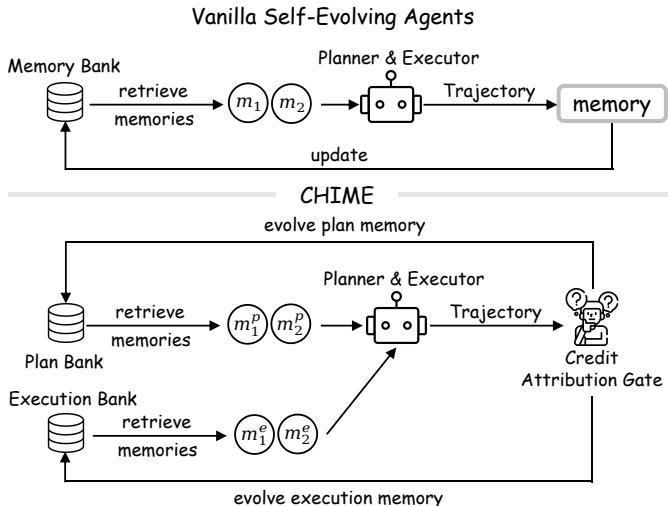
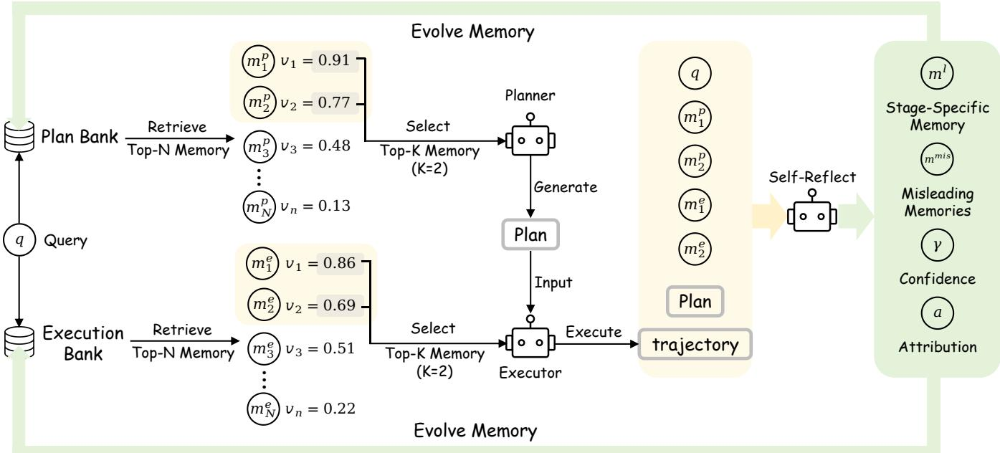
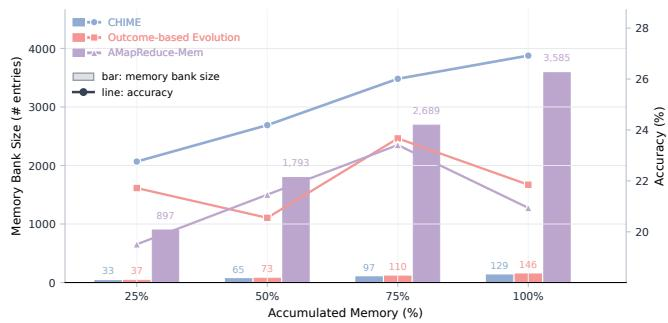
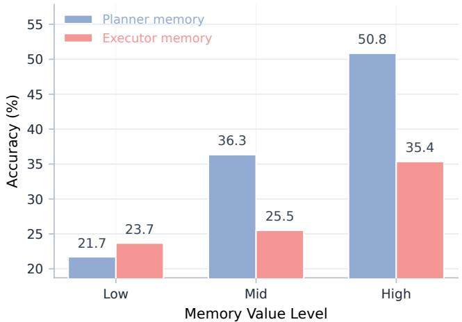
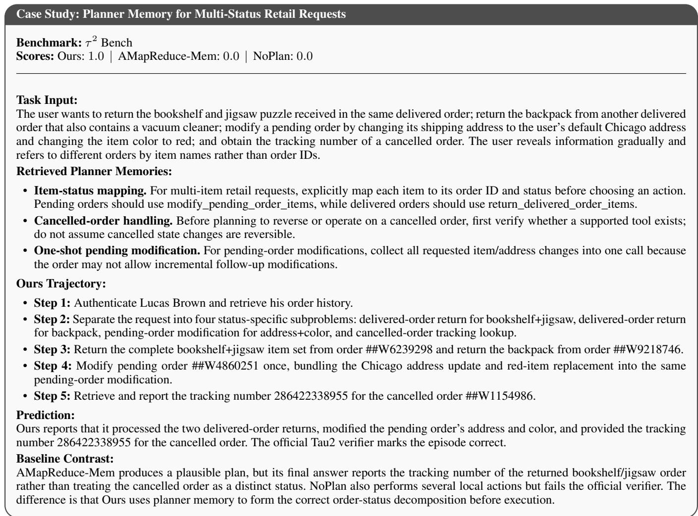
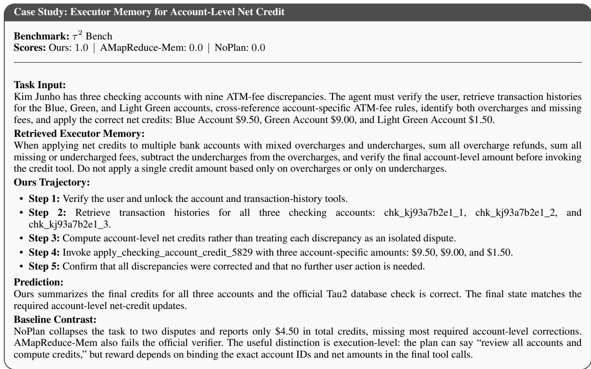
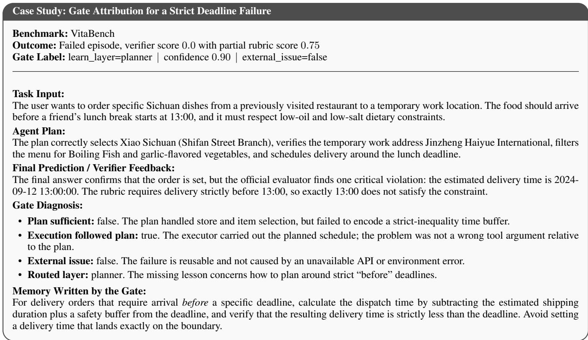

# CHIME: Credit-Aware Hierarchical Memory Evolution for Long-Horizon Agentic Planning

Yongshi Ye1,2,4, Tian Lan4, Feihu Jiang4, Muyang Ye3, Bin Zhu4, Qianghuai Jia4, Longyue Wang4\*, Zhao Xu4, Weihua Luo4, Xiaodong Shi1,2\*

1Institute of Artificial Intelligence, Xiamen University 2Key Laboratory of Digital Protection and Intelligent Processing of Intangible Cultural Heritage of Fujian and Taiwan (Xiamen University), Ministry of Culture and Tourism 3Zhejiang University 4Alibaba Group

## Abstract

Planning is a central capability that enables agents to decompose complex long-horizon tasks into manageable steps. Testtime search and training-based methods improve planning but incur high inference costs or require expensive training data. Self-evolving memory instead accumulates reusable experience from agent interaction outcomes into an external memory bank, so planning capability keeps improving at inference time without parameter updates. However, existing selfevolving memory methods share an inherent credit assignment problem: they rely on final task outcomes as feedback, but such outcomes conflate plan quality with execution errors and environmental factors, so the accumulated planning experience is often biased and noisy. To address this problem, we propose Credit-Aware HIerarchical Memory Evolution (CHIME), a self-evolving memory framework that maintains a separate planning bank and execution bank and follows an attribute-before-memorize principle: CHIME first attributes each task outcome to the plan, the execution, both, or neither, and then updates only the corresponding memory bank. Extensive experiments on four long-horizon agent benchmarks show that CHIME consistently outperforms state-ofthe-art training-based and self-evolving memory baselines. Further analyses reveal several interesting findings. For example, CHIME accumulates effective memory with far fewer items. In addition, the learned memory values faithfully reflect downstream utility: high-quality planning memories are more valuable than execution memories. Finally, the accumulated memory effectively transfers across backbone models. Code will be released at https://github.com/ATH-MaaS/ Marco-DeepResearch.

## 1 Introduction

Long-horizon tasks pose a defining challenge for agentic systems: agents must coordinate decisions across interdependent steps while sustaining adherence to task constraints throughout execution Xie et al. (2024); Wang et al. (2024); Erdogan et al. (2025). Agentic planning addresses these requirements by decomposing the overall objective into modular, independently executable subgoals Wang et al. (2024); Shen et al. (2023); Zhang et al. (2026b); Liu et al. (2026)

and establishing the dependencies and constraints among them Kim et al. (2023); Guo, Kingston, and Kavraki (2024); Lan et al. (2026), making it a central capability for solving long-horizon tasks.

This has motivated prior work to improve agents’ planning capability. Test-time search Yao et al. (2023a); Hao et al. (2023); Zhou et al. (2024); Yu et al. (2026); Team et al. (2026a) improves per-task performance by exploring multiple candidate plans or trajectories, but incurs high inference costs and does not retain reusable experience. To retain and reuse planning experience across tasks, subsequent work has pursued two directions: (1) Planner model training Erdogan et al. (2025); Si et al. (2026); Liu et al. (2026); Team et al. (2026b) internalizes planning capability into model parameters, but requires costly data collection and post-training, since identifying high-quality plans relies on extensive downstream executions; (2) Self-evolving memory Chen et al. (2026); Ouyang et al. (2026) instead accumulates experience in an external, training-free memory bank, offering a more efficient and scalable alternative. We therefore focus on improving planning within the self-evolving memory paradigm in this paper. However, existing selfevolving memory methods share a fundamental limitation for agentic planning: they equate downstream task outcomes with plan quality. The same outcome can arise from different causes: success may result from a sound plan or from executor recovery from a flawed one, while failure may stem from a flawed plan, incorrect execution, or environmental issues. Using such outcomes directly as memory feedback therefore leads to a fundamental credit assignment failure. On the one hand, once biased experience is written into the memory bank, it is repeatedly retrieved and reused across tasks, allowing local misjudgments to accumulate into systematic planning errors. On the other hand, execution- or environment-level experience may be mistaken for planning memory; retrieving might low-level details then misguides high-level planning decisions instead of providing planning guidance.

To address this, we propose Credit-Aware HIerarchical Memory Evolution (CHIME), a self-evolving agentic planning framework that replaces outcome-based memory updates Ye et al. (2026) with an attribute-before-memorize process. Specifically, CHIME comprises three components: (1) Hierarchical Memory Bank explicitly separates planning and execution memory into a planning bank and an execution bank, retrieving stage-specific memories through similarity retrieval and value-based reranking to separately guide the agent’s planning and execution; (2) Credit Attribution Gate then reflects on the task, plan, execution, and retrieved memories to attribute reusable feedback to planning, execution, both stages, or neither, before any memory is written; it also generates stage-specific experience and identifies misleading memories; and (3) Credit-Aware Memory Evolution updates the values of retrieved memories using confidence-weighted feedback, while filtering, merging, or inserting new experience only into the attributed bank. In this way, CHIME evolves each bank only with memory attributed to that stage, preventing biased signals from persisting and execution-level memory from contaminating the planning bank.

  
Figure 1: Vanilla self-evolving agents vs. CHIME. Vanilla self-evolving agents write experience directly to shared memory. CHIME attributes task outcomes through a credit attribution gate before updating planning or execution memory.

Experiments on four long-horizon benchmarks with two backbone models show that CHIME consistently outperforms training-based and self-evolving memory baselines, improving the eval average over the strongest baseline by 2.96% and 3.68% on the two backbones, respectively. Further analyses reveal several interesting findings: (1) CHIME achieves the highest accuracy while retaining only 129 memories, versus 3,585 for the strong baseline; (2) the learned memory values faithfully reflect downstream utility, and planning memories bring more than twice the accuracy gain of execution ones (21.7%→50.8% vs. 23.7%→35.4%); (3) the Credit Attribution Gate is reliable, with repeated attributions agreeing in up to 97.9% of cases and over half of the failures rescued by the generated experience; (4) replacing model’s self-reflection credit with a stronger credit model yields a further gain of up to 3.12%; and (5) the accumulated memory effectively transfers across backbones, outperforming A-MapReduce’s transferred memory by up to 4.68%. These findings confirm that attribute-before-memorize is the key to CHIME’s effectiveness.

## 2 Related Work

Self-evolving memory. Self-evolving memory methods treat an external memory bank as the agent’s evolvable parameters, distilling interaction trajectories into reusable experience or skills Yu et al. (2025); Wang et al. (2025); Zhang et al. (2026a). Unlike training-based methods, they keep model parameters frozen and update only the memory bank, avoiding costly trajectory collection and post-training Li et al. (2025); Wu et al. (2025). For example, Reasoning-Bank Ouyang et al. (2026) distills generalizable reasoning strategies from self-judged successful and failed trajectories, and UMEM Ye et al. (2026) jointly optimizes memory extraction and management with reinforcement learning.

Agentic planning. Agentic planning decomposes complex objectives into structured steps and coordinates their execution. It underlies a broad range of agent systems Yao et al. (2023b); Erdogan et al. (2025); Liu et al. (2026); Lan et al. (2026). Long-horizon tasks often involve many interdependent subtasks. Without an explicit plan to organize them, agents easily lose track of progress, a failure known as the lost-in-the-middle problem Lan et al. (2026); Liu et al. (2026). As recent benchmarks introduce increasingly challenging tasks, improving planning capability has become a central research problem for agent systems Wong et al. (2025); Lan et al. (2025); Yang et al. (2025).

Improving agentic planning. Existing efforts fall into three paradigms: (1) Test-time search explores multiple candidate plans or trajectories at inference time and selects among them with value estimates or environmental feedback Yao et al. (2023a); Hao et al. (2023); Zhou et al. (2024). For example, MiroThinker-H1 Team et al. (2026b) and WebAnchor Yu et al. (2026) select high-quality plans via rejection sampling; (2) Planner model training internalizes planning capability into model parameters Erdogan et al. (2025); Si et al. (2026); Yu et al. (2026). For example, TodoEvolve Liu et al. (2026) constructs a modular design space of planning architectures and trains a meta-planner with reinforcement learning to synthesize task-specific planning systems. However, such methods require costly trajectory collection and post-training, and the resulting planner is expensive to update continually Liu et al. (2026); and (3) Self-evolving memory offers a training-free and continual alternative, but few works evolve memory specifically for agentic planning Kagaya et al. (2024). A representative is A-MapReduce Chen et al. (2026), which evolves structured hints from past executions to improve task decomposition and result aggregation in long-horizon agentic search. However, all three paradigms evaluate agent’s plans by final task outcomes, implicitly equating outcome with plan quality. This equivalence does not hold, as outcomes are also shaped by execution details and environmental factors.

## 3 Methodology of CHIME

## 3.1 Task Formulation of Self-Evolving Agents

We consider a self-evolving agent that solves a stream of tasks. The agent’s policy parameters remain frozen, and adaptation is carried by an external memory bank $\mathcal { M } _ { t }$ that evolves across episodes. At episode t, the agent receives a task $x _ { t }$ and retrieves task-relevant experience $\mathcal { M } _ { t } ^ { \mathrm { r e t } }$ from $\mathcal { M } _ { t }$ . Conditioned on $x _ { t }$ and $\mathcal { M } _ { t } ^ { \mathrm { r e t } }$ , the frozen policy produces a trajectory $\tau _ { t }$ and receives an outcome $s _ { t }$ from the environment and the evaluator. A memory update operator then distills the episode into reusable experience:

$$
\mathcal { M } _ { t + 1 } = \mathcal { U } \left( \mathcal { M } _ { t } , \boldsymbol { x } _ { t } , \tau _ { t } , \boldsymbol { s } _ { t } \right) .\tag{1}
$$

During evaluation, the memory bank is frozen, so that performance reflects experience accumulated before evaluation. Existing self-evolving memory methods mainly use the final outcome $s _ { t }$ as the supervision signal for memory updates. For agentic planning, this signal is biased: the outcome depends on both the plan and the execution process, so it does not faithfully reflect plan quality.

## 3.2 Overview of CHIME

We propose CHIME (Figure 2), an attribute-beforememorize self-evolving framework for agentic planning. It attributes each task outcome to planning, execution, or external factors, and updates only the corresponding memory bank, which reduces biased feedback and cross-stage memory contamination. CHIME consists of three components: a Hierarchical Memory Bank that separates planning and execution experience, a Credit Attribution Gate that attributes each outcome to its responsible stage, and Credit-Aware Memory Evolution that updates the banks from the attributed credit.

Hierarchical Memory Bank. Unlike existing selfevolving methods Ye et al. (2026), CHIME maintains hierarchical memory banks

$$
\mathcal { M } _ { t } = ( \mathcal { M } _ { \mathrm { p l a n } , t } , \mathcal { M } _ { \mathrm { e x e c } , t } ) ,\tag{2}
$$

which comprises a planning bank and an execution bank, indexed by $\ell ~ \in ~ \{ \mathrm { p l a n } , \mathrm { e x e c } \}$ . The planning bank stores strategic experience (e.g., subtask decomposition, dependency modeling, and constraint incorporation), whereas the execution bank stores operational experience (e.g., tool selection and invocation). Each bank consists of memory items

$$
m _ { i } = ( c _ { i } , e _ { i } , v _ { i } , n _ { i } ) ,\tag{3}
$$

where $c _ { i }$ describes the tasks to which the memory applies, serving as the key for memory retrieval and merging; $e _ { i }$ is the reusable experience memory distilled from past episodes; $v _ { i } \in [ - 1 , 1 ]$ is a value score estimated from reuse feedback, which guides reranking (Eq. 5) and pruning; and $n _ { i }$ is the reuse count, which calibrates the value score (Eq. 3.2). At episode t, CHIME receives a long-horizon task $x _ { t }$ and constructs a planning query $q _ { \mathrm { p l a n } , t }$ to retrieve $\mathcal { M } _ { \mathrm { p l a n } , t } ^ { \mathrm { r e t } }$ from $\mathcal { M } _ { \mathrm { p l a n } , t }$ . The planner then generates a plan $p _ { t }$ from $x _ { t }$ and $\mathcal { M } _ { \mathrm { p l a n } , t } ^ { \mathrm { r e t } }$ . Next, CHIME constructs an execution query $q _ { \mathrm { e x e c } , t }$ from $\left( \boldsymbol { x } _ { t } , \boldsymbol { p } _ { t } \right)$ and retrieves $M _ { \mathrm { e x e c } , t } ^ { \mathrm { r e t } }$ from

$M _ { \mathrm { e x e c } , t } .$ . The executor uses $p _ { t }$ and $\mathcal { M } _ { \mathrm { e x e c } , t } ^ { \mathrm { r e t } }$ to produce a trajectory $\tau _ { t }$ , and the environment returns a binary outcome $s _ { t } \in \{ 0 , 1 \}$ indicating task success. Finally, the credit attribution gate produces a diagnosis $g _ { t }$ from the plan, trajectory, outcome, and retrieved memories, which drives the transition from $\mathcal { M } _ { t } \mathrm { ~ t o ~ } \mathcal { M } _ { t + 1 }$ . One CHIME episode is summarized as

$$
\mathcal { M } _ { t } \to \mathcal { M } _ { \mathrm { p l a n } , t } ^ { \mathrm { r e t } } \to p _ { t } \to \mathcal { M } _ { \mathrm { e x e c } , t } ^ { \mathrm { r e t } } \to \tau _ { t } \to s _ { t } \to g _ { t } \to \mathcal { M } _ { t + 1 } .\tag{4}
$$

These steps correspond to the left, right, and feedback-loop parts of Figure 2.

Hierarchical Memory Retrieval. Retrieval operates independently at each stage $\ell \ \in \ \{ \mathrm { p l a n } , \mathrm { e x e c } \}$ . Given the stage-specific query $q _ { \ell , t } ,$ CHIME retrieves the Top-N memories from the corresponding bank $\mathcal { M } _ { \ell , t }$ according to sim $\mathbb { 1 } ( q _ { \ell , t } , c _ { i } )$ , yielding the candidate set $\mathcal { C } _ { \ell , t }$ . For each candidate memory $m _ { i } \in \mathcal { C } _ { \ell , t }$ , CHIME adjusts its value score according to its reuse count: $\begin{array} { r } { \widetilde { v } _ { i } = v _ { i } \frac { \bar { n } _ { i } } { n _ { i } + \lambda } } \end{array}$ , where $n _ { i }$ is the reuse count of $m _ { i }$ , and λ is a smoothing constant. The factor shrinks the value estimates of rarely reused memories toward zero, so that they fall back to similarity-only ranking. Semantic similarity does not indicate whether a memory actually helps, so CHIME reranks the candidates by their credited value and retrieves the Top-K:

$$
\mathcal { M } _ { \ell , t } ^ { \mathrm { r e t } } = \operatorname * { T o p K } _ { m _ { i } \in \mathcal { C } _ { \ell , t } } \sin ( q _ { \ell , t } , c _ { i } ) \left[ 1 + \mathrm { c l i p } \left( \alpha \widetilde { v } _ { i } , - \beta , \beta \right) \right] ,\tag{5}
$$

where α is the value weight, and β bounds the value effect so that similarity remains the dominant ranking factor. As a result, memories validated as helpful in past episodes are preferred, whereas misleading ones are suppressed. The retrieved memories guide the corresponding planning or execution stage.

Credit Attribution Gate. After planning and execution with the retrieved memories, the agent obtains the task outcome $s _ { t }$ . The credit attribution gate then attributes this outcome to planning, execution, or external factors. CHIME implements the gate as a structured self-reflection of the frozen policy: the model is prompted to review the task, plan, trajectory, outcome, and retrieved memories, assess plan sufficiency, execution correctness, and the effects of external factors, and produce a diagnosis

$$
g _ { t } = \left( a _ { t } , \{ ( c _ { \ell , t } ^ { \mathrm { n e w } } , e _ { \ell , t } ^ { \mathrm { n e w } } ) \} _ { \ell } , \gamma _ { t } , \mathcal { M } _ { t } ^ { \mathrm { m i s } } \right) ,\tag{6}
$$

where the attribution label $a _ { t }$ takes one of four values: planning $( \mathrm { e . g . }$ , an inadequate plan), execution (e.g., incorrect execution of a sufficient plan), both (e.g., distinct issues at both stages), and none (e.g., external causes, insufficient evidence, or no reusable experience); in successful episodes, it instead identifies the stage credited with the success; $( c _ { \ell , t } ^ { \mathrm { n e w } } , e _ { \ell , t } ^ { \mathrm { n e w } } )$ is the task scenario and experience generated for each stage $\ell \in \ \{ \mathrm { p l a n } , \mathrm { e x e c } \} ; \gamma _ { t } \in \ [ 0 , 1 ]$ is the attribution confidence; and $\bar { \mathcal { M } } _ { t } ^ { \mathrm { m i s } }$ contains retrieved memories identified as misleading. These outputs determine the subsequent memory value and content updates.

  
Figure 2: Overview of CHIME. Left: the Hierarchical Memory Bank maintains the planning and execution memory banks. For each task, similarity retrieval and value-based reranking select stage-specific memories to guide the planner and the executor. Right: at each episode, the Credit Attribution Gate reflects on the task, plan, execution, and retrieved memories, attributes reusable feedback to planning, execution, both, or neither, and generates stage-specific experience. Feedback loop: Credit-Aware Memory Evolution updates the memory values, and filters, merges, or inserts new experience into the attributed bank.

Credit-Aware Memory Evolution. CHIME then uses the diagnosis $g _ { t }$ to evolve the memory bank in two steps, both directed at the attributed stages: (1) Memory value evolution: CHIME evaluates each retrieved memory $m _ { i }$ with a value feedback $\delta _ { i , t } \colon$ the memory is rewarded when its stage is credited for a successful outcome, penalized when it is identified as misleading, and unchanged otherwise. The attribution label determines the memory stages to update:

$$
\begin{array} { r } { \mathcal { L } ( a _ { t } ) = \left\{ \begin{array} { l l } { \{ \mathrm { p l a n } \} , } & { a _ { t } = \mathrm { p l a n n i n g } , } \\ { \{ \mathrm { e x e c } \} , } & { a _ { t } = \mathrm { e x e c u t i o n } , } \\ { \{ \mathrm { p l a n } , \mathrm { e x e c } \} , } & { a _ { t } = \mathrm { b o t h } , } \\ { \emptyset , } & { a _ { t } = \mathrm { n o n e } . } \end{array} \right. } \end{array}\tag{7}
$$

The feedback for memory $m _ { i }$ in stage $\ell ( i )$ is then

$$
\delta _ { i , t } = \left\{ \begin{array} { l l } { - \gamma _ { t } , } & { m _ { i } \in \mathcal { M } _ { t } ^ { \mathrm { m i s } } , } \\ { + \gamma _ { t } , } & { s _ { t } = 1 \mathrm { a n d } \ell ( i ) \in \mathcal { L } ( a _ { t } ) , } \\ { 0 , } & { \mathrm { o t h e r w i s e } , } \end{array} \right.\tag{8}
$$

The feedback magnitude is the attribution confidence $\gamma _ { t }$ CHIME updates the value score and reuse count using an online average:

$$
v _ { i }  \mathrm { c l i p } ( \frac { n _ { i } v _ { i } + \delta _ { i , t } } { n _ { i } + 1 } , - 1 , 1 ) , \qquad n _ { i }  n _ { i } + 1 .\tag{9}
$$

The updated $v _ { i }$ affects subsequent retrieval through Eq. 5. To maintain the quality of the memory bank, CHIME removes a memory when it has been reused sufficiently often yet remains low-valued, i.e., $n _ { i } ~ \ge ~ n _ { \operatorname* { m i n } }$ and $v _ { i } < \theta _ { \mathrm { p r u n e } }$ (2) Memory content evolution: For each attributed stage $\ell \in \mathcal L ( a _ { t } )$ , CHIME updates the corresponding bank with the new experience in one of three ways: merging it into a sufficiently similar memory, inserting it as a new memory item, or directly discarding it.

$$
\left\{ \begin{array} { l l } { \mathrm { m e r g e } e _ { \ell , t } ^ { \mathrm { n e w } } \mathrm { i n t o } m _ { i ^ { * } } , } & { \mathrm { i f ~ a c c e p t e d ~ a n d ~ s i m i l a r , } } \\ { \mathrm { i n s e r t } ( c _ { \ell , t } ^ { \mathrm { n e w } } , e _ { \ell , t } ^ { \mathrm { n e w } } , 0 , 0 ) , } & { \mathrm { i f ~ a c c e p t e d ~ b u t ~ n o t ~ s i m i l a r , } } \\ { \mathrm { d i s c a r d ~ t h e ~ e x p e r i e n c e , } } & { \mathrm { o t h e r w i s e , } } \end{array} \right.\tag{10}
$$

where $m _ { i ^ { * } }$ is the most similar memory in the corresponding memory bank, with similarity defined as sim $( c _ { \ell , t } ^ { \mathrm { n e w } } , c _ { i ^ { * } } ) \bar { > }$ $\theta _ { \mathrm { { m e r g e } } } ;$ acceptance requires $\gamma _ { t } \geq \theta _ { \mathrm { c o n f } }$ and a concrete task scenario with actionable content. A newly inserted memory starts with a neutral value and zero reuse count, so its value is estimated from future reuse rather than inherited from the gate. Applying this update only to the attributed stages yields $\mathcal { M } _ { t + 1 }$ and limits cross-stage memory contamination.

## 4 Experimental Setup

Baselines. We compare CHIME with four baselines, ordered by increasing proximity to our setting: (1) No-Plan, a standard LLM agent without explicit planning or persistent memory; (2) WebAnchor, which improves a frozen policy through test-time search over sampled candidate plans (Yu et al., 2026; Team et al., 2026b); (3) TodoEvolve, which trains a meta-planner to generate task-specific planning architectures but accumulates no experience (Liu et al., 2026); and (4) A-MapReduce, the closest baseline to ours, which distills reusable insights from trajectories but updates its memory directly from task outcomes (Chen et al., 2026). All methods use the same benchmark runtimes, tools, and verifiers.

<table><tr><td></td><td colspan="2"> $\tau ^ { 2 } { \cdot } \mathbf { B e n c h }$ </td><td colspan="2">VitaBench</td><td colspan="2">BrowseComp-ZH</td><td colspan="2">BFCL-v4</td><td colspan="2">Average</td></tr><tr><td>Method</td><td>Train</td><td>Eval</td><td>Train</td><td>Eval</td><td>Train</td><td>Eval</td><td>Train</td><td>Eval</td><td>Train</td><td>Eval</td></tr><tr><td colspan="9">Qwen3.5-Flash</td><td></td></tr><tr><td>Qwen3.5-Flash No-Plan</td><td>21.68</td><td>22.32</td><td>9.40</td><td>8.89</td><td>20.20</td><td>21.25</td><td>71.33</td><td>70.86</td><td>30.65</td><td>30.83</td></tr><tr><td>WebAnchor (Yu et al., 2026)</td><td>24.77</td><td>23.45</td><td>14.76</td><td>11.94</td><td>17.68</td><td>21.98</td><td>69.36</td><td>70.26</td><td>31.64</td><td>31.91</td></tr><tr><td>TodoEvolve (Liu et al., 2026)</td><td>20.13</td><td>21.28</td><td>10.60</td><td>6.11</td><td>20.88</td><td>20.51</td><td>69.75</td><td>70.20</td><td>30.34</td><td>29.53</td></tr><tr><td>A-MapReduce (Chen et al., 2026)</td><td>19.81</td><td>20.55</td><td>12.02</td><td>6.67</td><td>18.35</td><td>18.31</td><td>73.84</td><td>72.45</td><td>31.01</td><td>29.50</td></tr><tr><td>CHIME (Our Method)</td><td>26.25</td><td>25.92</td><td>16.19</td><td>15.83</td><td>23.74</td><td>23.81</td><td>73.90</td><td>73.91</td><td>35.02</td><td>34.87</td></tr><tr><td colspan="9">DeepSeek-V4-Flash</td><td></td></tr><tr><td>DeepSeek-V4-Flash No-Plan</td><td>31.42</td><td>32.86</td><td>16.31</td><td>11.11</td><td>26.94</td><td>23.81</td><td>63.75</td><td>64.15</td><td>34.61</td><td>32.98</td></tr><tr><td>WebAnchor Yu et al. (2026)</td><td>31.30</td><td>29.61</td><td>22.62</td><td>17.50</td><td>29.46</td><td>24.54</td><td>58.27</td><td>60.88</td><td>35.41</td><td>33.13</td></tr><tr><td>TodoEvolve Liu et al. (2026)</td><td>28.45</td><td>26.18</td><td>18.57</td><td>15.56</td><td>26.26</td><td>22.34</td><td>56.29</td><td>58.32</td><td>32.39</td><td>30.60</td></tr><tr><td>A-MapReduce Chen et al. (2026)</td><td>30.55</td><td>30.95</td><td>21.07</td><td>15.83</td><td>27.61</td><td>24.54</td><td>69.18</td><td>69.98</td><td>37.10</td><td>35.33</td></tr><tr><td>CHIME (Our Method)</td><td>33.15</td><td>36.28</td><td>22.98</td><td>21.11</td><td>29.97</td><td>31.50</td><td>65.89</td><td>67.15</td><td>38.00</td><td>39.01</td></tr></table>

Table 1: Results (%) averaged over three random instance orderings $( \mathrm { { A v g } } @ { \mathcal { B } } )$ across two backbone models and four benchmarks. Average is computed across benchmarks within each split. Bold indicates the best result in each column under each backbone.
<table><tr><td></td><td colspan="2"> $\tau ^ { 2 } .$  Bench</td><td colspan="2">VitaBench</td><td colspan="2">BrowseComp-ZH</td><td colspan="2">BFCL-v4</td><td colspan="2">Average</td></tr><tr><td>Method</td><td>Train</td><td>Eval</td><td>Train</td><td>Eval</td><td>Train</td><td>Eval</td><td>Train</td><td>Eval</td><td>Train</td><td>Eval</td></tr><tr><td>CHIME</td><td>26.25</td><td>25.92</td><td>16.19</td><td>15.83</td><td>23.74</td><td>23.81</td><td>73.90</td><td>73.91</td><td>35.02</td><td>34.87</td></tr><tr><td colspan="9">Hierarchical Memory Design</td><td></td><td></td></tr><tr><td>w/o Plan Memory</td><td>22.96</td><td>23.11</td><td>15.95</td><td>12.22</td><td>20.71</td><td>20.51</td><td>69.52</td><td>70.60</td><td> $3 2 . 2 9 _ { \downarrow 2 . 7 }$ </td><td> $3 1 . 6 1 _ { \downarrow 3 . 3 }$ </td></tr><tr><td>w/o Execution Memory</td><td>24.38</td><td>25.14</td><td>15.47</td><td>12.50</td><td>20.88</td><td>9.16</td><td>72.93</td><td>73.42</td><td> $3 3 . 4 2 _ { \downarrow 1 . 6 }$ </td><td> $3 0 . 0 6 _ { \downarrow 4 . 8 }$ </td></tr><tr><td>w/o All Memory w/o Hierarchical Bank</td><td>24.05</td><td>23.67</td><td>13.22</td><td>12.50</td><td>19.70</td><td>19.78</td><td>69.52 72.63</td><td>70.99 71.79</td><td> $3 1 . 6 2 _ { \downarrow 3 . 4 }$ </td><td> $3 1 . 7 4 _ { \downarrow 3 . 1 }$ </td></tr><tr><td></td><td>24.87</td><td>22.76</td><td>15.60</td><td>11.11</td><td>21.04</td><td>19.41</td><td></td><td></td><td> $3 3 . 5 4 _ { \downarrow 1 . 5 }$ </td><td> $3 1 . 2 7 _ { \downarrow 3 . 6 }$ </td></tr><tr><td colspan="9">Credit Attribution and Memory Evolution</td><td></td><td></td></tr><tr><td>w/o Attribution Gate</td><td>21.21</td><td>22.28</td><td>17.02</td><td>12.50</td><td>20.20</td><td>22.71</td><td>73.40</td><td>72.23</td><td> $3 2 . 9 6 _ { \downarrow 2 . 1 }$ </td><td> $3 2 . 4 3 _ { \downarrow 2 . 4 }$ </td></tr><tr><td>w/o Credit Rerank</td><td>24.32</td><td>24.75</td><td>16.31</td><td>10.83</td><td>21.72 20.71</td><td>23.44 22.34</td><td>73.75 73.79</td><td>72.28</td><td> $3 4 . 0 3 _ { \downarrow 1 . 0 }$ </td><td> $3 2 . 8 3 _ { \downarrow 2 . 0 }$ </td></tr><tr><td>w/o Memory Evolution</td><td>25.61</td><td>24.32</td><td>16.79</td><td>8.61</td><td></td><td></td><td></td><td>72.05</td><td> $3 4 . 2 3 _ { \downarrow 0 . 8 }$ </td><td> $3 1 . 8 3 _ { \downarrow 3 . 0 }$ </td></tr></table>

Table 2: Ablation study results (%) with Qwen3.5-Flash, averaged over three random orderings $( \mathrm { { A v g } } @ { \mathcal { O } } 3 )$ . Average is computed across benchmarks within each split; downward values indicate drops from CHIME. Best results are bolded.

Benchmarks. We evaluate CHIME on four long-horizon agent benchmarks: (1) $\tau ^ { 2 } .$ -bench, multi-turn customerservice interactions (Barres et al., 2025); (2) VitaBench, multi-turn life-service tasks with changing user intent and large tool spaces (He et al., 2025); (3) BrowseComp-ZH, long-horizon InfoSeeking (Zhou et al., 2025); and (4) BFCL-v4, function calling, using Live and long-horizon Agentic groups (Patil et al., 2025).

Backbones. We evaluate CHIME with two foundation model backbones: Qwen3.5-Flash model (35B total, 3B active) (Qwen Team, 2026a) and DeepSeek-V4-Flash model (284B total, 13B active) (DeepSeek-AI et al., 2026). The same backbone serves all roles in CHIME, including the planner, the executor, and the Credit Attribution Gate.

Test-Time Evaluation Protocol. Following previous works (Ye et al., 2026; Ouyang et al., 2026), we process each benchmark as a sequential task stream and split it 7:3 into a train split and an eval split along the stream order. For benchmarks with multiple domains, we truncate each domain to the smallest domain size and split each domain independently, so that all domains contribute equally. The train split measures accumulation: memory-based methods update their memory from outcomes on this stream, and train performance reflects the utility of the accumulated experience for subsequent tasks. The eval split measures generalization: we freeze the memory banks accumulated on the train split and solve each eval task by directly retrieving the accumulated memory, without any further memory update, so eval performance reflects transfer of the accumulated memory to unseen tasks rather than further adaptation. To reduce variance from sample ordering, we run the protocol under three random orderings and report Avg@3 performance.

Implementation Details. All evaluation-side LLM roles use Qwen3.6-Flash (Qwen Team, 2026b) under the official benchmark protocols (Barres et al., 2025; He et al., 2025; Zhou et al., 2025). Memory and $\tau ^ { 2 }$ -bench knowledge retrieval use Qwen3-Embedding-0.6B (Zhang et al., 2025). For retrieval and reranking, we set $( N , K ) = ( 2 0 , 3 ) , \lambda =$ $3 . 0 , \alpha = 1 . 0 , \mathrm { a n d } \ \beta = 0 . \bar { 2 }$ . For memory evolution, we use $\theta _ { \mathrm { c o n f } } = 0 . 5 , \theta _ { \mathrm { m e r g e } } = 0 . 8 8 , n _ { \mathrm { m i n } } = 3 ,$ , and $\theta _ { \mathrm { p r u n e } } = - 0 . 1$ All LLM calls use temperature 0.0, except WebAnchor plan generation (0.6). Further settings are provided in Appendix.

## 5 Main Experimental Results

We analyze the main results (Table 1) in three parts: memory accumulation on the train split, memory transfer to unseen tasks on the eval split, and ablations of CHIME’s key designs.

Memory Accumulation (Train Split). CHIME achieves the highest average with both backbones (35.02% on Qwen3.5-Flash and 38.00% on DeepSeek-V4-Flash), outperforming the strongest baseline by 3.38% and 0.90%. These gains show that CHIME’s accumulated memory guides subsequent tasks more effectively than baseline memory.

Memory Transfer (Eval Split). With memory banks frozen, CHIME achieves the highest eval average with both backbones: it outperforms the strongest baseline by 2.96% on Qwen3.5-Flash and 3.68% on DeepSeek-V4- Flash. Compared with A-MapReduce, the closest baseline to ours, CHIME leads by 5.37% on Qwen3.5-Flash and 3.68% on DeepSeek-V4-Flash. These gains show that attributed memory transfers better than outcome-based memory.

Ablation Studies. We group the ablations into two parts: hierarchical memory design, and credit attribution and memory evolution. Table 2 reports the results with Qwen3.5- Flash: (1) Hierarchical memory design: On the eval split, removing planning memory, execution memory, or both reduces the average performance by 3.26%, 4.81%, and 3.13%, respectively. Moreover, collapsing the two banks into a shared one (w/o Hierarchical Bank) reduces it by 3.60%. These results show that CHIME’s gains stem from stage-specific experience and its explicit separation, rather than from memory accumulation alone. (2) Credit attribution and memory evolution: Removing the Credit Attribution Gate (w/o Attribution Gate) reverts memory updates to direct outcome feedback and reduces the eval average by 2.44%. Besides, disabling value-based reranking (w/o Credit Rerank) and credit-aware memory evolution (w/o Memory Evolution) reduces it by 2.04% and 3.04%, respectively. These results indicate that attribution decides which stage receives feedback, while value-based reranking and creditaware evolution decide which memory is reused and retained.

  
Figure 3: Memory evolution efficiency on $\tau ^ { 2 } { \mathrm { - } } { \mathrm { b e n c h } }$ . Bars show memory-bank size, and lines show task accuracy at four accumulation checkpoints.

## 6 Analysis

This section investigates the sources of CHIME’s effectiveness through six research questions: memory quality (RQ1), evolution efficiency (RQ2), memory value utility (RQ3), credit attribution gate reliability (RQ4), gains from stronger credit models (RQ5), and cross-backbone transfer (RQ6).

RQ1: Does CHIME Accumulate High-Quality Memory? We use GLM-5.2 as an external judge to evaluate every memory in the Qwen3.5-Flash train-split banks. Each memory receives three binary judgments: Correctness (valid stage-specific guidance), Non-Redundancy (no duplicated experience), and Generality (applicability beyond the source episode). Table 3 shows that CHIME achieves the highest pass rate on all three dimensions, with 81.04% of its memories passing all of them. Removing the Gate floods the bank with noisy outcome-level traces, dropping non-redundancy and generality below 31%; A-MapReduce’s insights reach only 36.08% correctness, as they are induced without credited trajectories. These results show that credit-aware construction yields valid, distinct, and reusable memories, supporting the attribute-before-memorize principle.

<table><tr><td>Method</td><td>Corr.</td><td>Non-R.</td><td>Gen.</td><td>All</td></tr><tr><td>CHIME</td><td>81.20</td><td>93.60</td><td>90.13</td><td>81.04</td></tr><tr><td>A-MapReduce</td><td>36.08</td><td>81.65</td><td>75.32</td><td>36.08</td></tr><tr><td>w/o Attribution Gate</td><td>37.09</td><td>25.77</td><td>30.53</td><td>21.38</td></tr></table>

Table 3: Memory quality on the Qwen3.5-Flash train split under GLM-5.2 evaluation (%). Corr., Non-Red., and Gen. denote correctness, non-redundancy, and generality, respectively; All denotes the fraction passing all three criteria.

RQ2: Does Stage-Attributed Evolution Improve Memory Efficiency? We track accuracy against memory-bank size on $\tau ^ { 2 } .$ -bench along the train stream. We freeze the memory bank at four accumulation checkpoints (25%, 50%, 75%, and 100% progress of the stream) for measurement. We compare CHIME with two outcome-based baselines: Outcome-based Evolution (w/o Attribution Gate) Ye et al. (2026) and A-MapReduce, which update memory directly from final outcomes. As shown in Figure 3, CHIME improves accuracy as accumulation proceeds while keeping the smallest bank. At the end of the stream, CHIME retains only 129 memories, compared with 3,585 for A-MapReduce, yet achieves the highest accuracy. In contrast, both counterparts keep growing their banks, but their accuracy peaks at the 75% checkpoint and declines at full accumulation: without attribution, misleading memories are written into the bank and accumulate, which increasingly disturbs retrieval. These results show that effective self-evolving memory depends on the quality of the accumulated memories, not their quantity.

  
Figure 4: Downstream task accuracy by memory value level. Bars report accuracy for planning and execution memories in the low-, mid-, and high-value groups.

RQ3: Do Learned Memory Values Reflect Downstream Utility? We partition the retrieved planning and execution memories into low-, mid-, and high-value groups by evenly splitting their value range, and report the average task accuracy of each group. Figure 4 shows a monotonic increase at both stages: from low to high value, accuracy rises from 21.7% to 50.8% for planning memories and from 23.7% to 35.4% for execution memories. This correlation suggests that the learned values faithfully reflect memory quality, indicating that the Credit Attribution Gate attributes credit effectively. Notably, higher-value planning memories bring larger accuracy gains than their execution counterparts (29.1% vs. 11.7% between the low- and high-value groups), whereas low-value planning memories are even less useful than low-value execution ones (21.7% vs. 23.7%), underscoring the importance of planning in long-horizon tasks. Together with the value-reranking ablation in Table 2, these results support selecting reusable experience by learned values.

RQ4: Is the Credit Attribution Gate Reliable? We assess the reliability of the Credit Attribution Gate on Qwen3.5-Flash along two dimensions: Stability, the agreement between the original attribution and the majority label of three samples; and Rescued, the fraction of failed episodes whose attributed failure no longer persists when the task is rerun with only the generated memory. As shown

in Table 4, planning and execution labels reach an agreement between 87.8% and 97.9% on both benchmarks, and between 56.3% and 67.6% of the failures are rescued, indicating that the Gate assigns repeatable credit and that the generated experience effectively corrects the attributed failure.
<table><tr><td>Benchmark</td><td>Stage</td><td>Stability</td><td>Rescued</td></tr><tr><td>VitaBench</td><td>planning</td><td>91.7</td><td>67.6</td></tr><tr><td></td><td>execution</td><td>97.9</td><td>60.2</td></tr><tr><td>BFCL-v4</td><td>planning</td><td>87.8</td><td>64.7</td></tr><tr><td></td><td>execution</td><td>92.9</td><td>56.3</td></tr></table>

Table 4: Gate attribution reliability (%) on VitaBench and BFCL-v4. Stability: agreement between the original attribution and the majority label of three samples. Rescued: fraction of failed episodes whose attributed failure no longer occurs when the task is rerun with only the generated memory.

RQ5: Does Stronger Attribution Further Improve Performance? The Credit Attribution Gate relies on the backbone’s self-reflection capability. We replace it with a stronger model, Qwen3.7-Flash, for both credit attribution and experience generation, and evaluate the resulting memory on the eval split. Table 5 shows consistent gains on all three benchmarks, from 2.25% to 3.12%. These gains indicate that more accurate attribution yields more effective experience, so CHIME benefits directly from stronger credit models.

<table><tr><td>Benchmark</td><td>Self-Reflect</td><td>Qwen3.7-Flash</td><td>∆</td></tr><tr><td>τ2-Bench</td><td>23.80</td><td>26.92</td><td>+3.12</td></tr><tr><td>VitaBench</td><td>12.50</td><td>15.00</td><td>+2.50</td></tr><tr><td>BFCL-v4</td><td>72.45</td><td>74.70</td><td>+2.25</td></tr></table>

Table 5: Eval accuracy (%). Qwen3.5-Flash model is replaced by stronger Qwen3.7-Flash for credit attribution gate. Results are from a single run rather than Avg@3.

RQ6: Does CHIME’s Memory Transfer Across Backbones? We copy the memory accumulated by a source backbone on a benchmark’s train split into a target backbone’s frozen eval run. As shown in Table 6, w/o Mem. denotes the target running without memory, and Self denotes the target with its self-accumulated memory. CHIME’s transferred memory outperforms A-MapReduce’s in all four settings by between 2.25% and 4.68%, and closely approaches the upper bound: matching or exceeding it on the Qwen3.5-Flash target model, and staying within 1.72% on BFCL-v4 for the DeepSeek-V4-Flash target model. These experimental results reveal that attributed memory thus encodes reusable guidance rather than backbone-specific patterns.

<table><tr><td>Benchmark</td><td>w/o Mem.</td><td>A-Map.</td><td>CHIME</td><td>Self</td></tr><tr><td colspan="5">DeepSeek-V4-Flash → Qwen3.5-Flash</td></tr><tr><td>τ2-Bench</td><td>24.45</td><td>21.72</td><td>26.40</td><td>25.92</td></tr><tr><td>BFCL-v4</td><td>70.86</td><td>71.66</td><td>73.91</td><td>73.91</td></tr><tr><td colspan="5">Qwen3.5-Flash → DeepSeek-V4-Flash</td></tr><tr><td>τ2-Bench</td><td>30.04</td><td>28.22</td><td>30.82</td><td>36.28</td></tr><tr><td>BFCL-v4</td><td>60.13</td><td>61.85</td><td>65.43</td><td>67.15</td></tr></table>

Table 6: Cross-model memory transfer on the eval split (%). Each group header denotes the source → target backbones.

## 7 Conclusion

In this work, we presented CHIME, an self-evolving agentic planning framework based on our proposed attribute-beforememorize principle, which separates and updates planning and execution memory bank through stage-level credit attribution. Experiments on four long-horizon agent benchmarks show that CHIME consistently outperforms strong trainingbased and self-evolving memory baselines. Further analyses validate CHIME along six dimensions: memory quality, evolution efficiency, memory value utility, credit attribution gate reliability, credit-model scaling, and cross-backbone transfer. These results suggest that reliable memory evolution depends not only on what agents remember, but also on whether each experience is attributed to the decision stage where it can provide effective guidance.

## References

Barres, V.; Dong, H.; Ray, S.; Si, X.; and Narasimhan, K. 2025. τ2-Bench: Evaluating Conversational Agents in a Dual-Control Environment. arXiv:2506.07982.

Chen, M.; Zhang, G.; Chang, H.; Guo, Y.; and Zhou, S. 2026. A-MapReduce: Executing Wide Search via Agentic MapReduce. arXiv:2602.01331.

DeepSeek-AI; et al. 2026. DeepSeek-V4: Towards Highly Efficient Million-Token Context Intelligence. arXiv:2606.19348.

Erdogan, L. E.; Lee, N.; Kim, S.; Moon, S.; Furuta, H.; Anumanchipalli, G.; Keutzer, K.; and Gholami, A. 2025. Plan-and-Act: Improving Planning of Agents for Long-Horizon Tasks. arXiv:2503.09572.

Guo, W.; Kingston, Z.; and Kavraki, L. E. 2024. CaStL: Constraints as Specifications through LLM Translation for Long-Horizon Task and Motion Planning. arXiv:2410.22225.

Hao, S.; Gu, Y.; Ma, H.; Hong, J. J.; Wang, Z.; Wang, D. Z.; and Hu, Z. 2023. Reasoning with Language Model is Planning with World Model. arXiv:2305.14992.

He, W.; Sun, Y.; Hao, H.; Hao, X.; Xia, Z.; Gu, Q.; Han, C.; Zhao, D.; Su, H.; Zhang, K.; Gao, M.; Su, X.; Cai, X.; Cai, X.; Yang, Y.; and Zhao, Y. 2025. VitaBench: Benchmarking LLM Agents with Versatile Interactive Tasks in Real-world Applications. arXiv:2509.26490.

Kagaya, T.; Yuan, T. J.; Lou, Y.; Karlekar, J.; Pranata, S.; Kinose, A.; Oguri, K.; Wick, F.; and You, Y. 2024. RAP: Retrieval-Augmented Planning with Contextual Memory for Multimodal LLM Agents. arXiv:2402.03610.

Kim, S.; Moon, S.; Tabrizi, R.; Lee, N.; Mahoney, M. W.; Keutzer, K.; and Gholami, A. 2023. An LLM Compiler for Parallel Function Calling. arXiv:2312.04511.

Lan, T.; Henry, F.; Zhu, B.; Jia, Q.; Ren, J.; PU, Q.; Li, H.; Wang, L.; Xu, Z.; and Luo, W. 2026. Table-as-Search: Agentic Information Seeking is Table Completion. In Liakata, M.; Moreira, V. P.; Zhang, J.; and Jurgens, D., eds., Findings of the Association for Computational Linguistics: ACL 2026, 15088–15107. San Diego, California, United States: Association for Computational Linguistics. ISBN 979-8-89176-395-1.

Lan, T.; Zhu, B.; Jia, Q.; Ren, J.; Li, H.; Wang, L.; Xu, Z.; Luo, W.; and Zhang, K. 2025. DeepWideSearch: Benchmarking Depth and Width in Agentic Information Seeking. arXiv:2510.20168.

Li, X.; Jiao, W.; Jin, J.; Dong, G.; Jin, J.; Wang, Y.; Wang, H.; Zhu, Y.; Wen, J.-R.; Lu, Y.; and Dou, Z. 2025. DeepAgent: A General Reasoning Agent with Scalable Toolsets. arXiv:2510.21618.

Liu, J.; Jiang, Y.; Zhang, G.; Zhang, Z.; Chang, H.; Yin, Z.; Ren, Q.; and Yan, J. 2026. TodoEvolve: Learning to Architect Agent Planning Systems. arXiv:2602.07839.

Ouyang, S.; Yan, J.; Hsu, I.-H.; Chen, Y.; Jiang, K.; Wang, Z.; Han, R.; Le, L. T.; Daruki, S.; Tang, X.; Tirumalashetty, V.; Lee, G.; Rofouei, M.; Lin, H.; Han, J.; Lee, C.-Y.; and Pfister, T. 2026. ReasoningBank:

Scaling Agent Self-Evolving with Reasoning Memory. arXiv:2509.25140.

Patil, S. G.; Mao, H.; Cheng-Jie Ji, C.; Yan, F.; Suresh, V.; Stoica, I.; and E. Gonzalez, J. 2025. The Berkeley Function Calling Leaderboard (BFCL): From Tool Use to Agentic Evaluation of Large Language Models. In Fortysecond International Conference on Machine Learning.

Qwen Team. 2026a. Qwen3.5: Towards Native Multimodal Agents.

Qwen Team. 2026b. Qwen3.6-35B-A3B: Agentic Coding Power, Now Open to All.

Shen, Y.; Song, K.; Tan, X.; Li, D.; Lu, W.; and Zhuang, Y. 2023. HuggingGPT: Solving AI Tasks with ChatGPT and its Friends in HuggingFace. In Advances in Neural Information Processing Systems.

Si, S.; Zhao, H.; Luo, K.; Chen, G.; Qi, F.; Zhang, M.; Chang, B.; and Sun, M. 2026. A Goal Without a Plan Is Just a Wish: Efficient and Effective Global Planner Training for Long-Horizon Agent Tasks. arXiv:2510.05608.

Team, C.; et al. 2026a. MiMo-V2-Flash Technical Report. arXiv:2601.02780.

Team, M.; Bai, S.; Bing, L.; Lei, L.; Li, R.; Li, X.; Lin, X.;Min, E.; Su, L.; Wang, B.; Wang, L.; Wang, L.; Wang,S.; Wang, X.; Zhang, Y.; Zhang, Z.; Chen, G.; Chen, L.;Cheng, Z.; Deng, Y.; Huang, Z.; Ng, D.; Ni, J.; Ren, Q.;Tang, X.; Wang, B. L.; Wang, H.; Wang, N.; Wei, C.; Wu,Q.; Xia, J.; Xiao, Y.; Xu, H.; Xu, X.; Xue, C.; Yang, Z.;Yang, Z.; Ye, F.; Ye, H.; Yu, J.; Zhang, C.; Zhang, W.;Zhao, H.; and Zhu, P. 2026b. MiroThinker-1.7 & H1:Towards Heavy-Duty Research Agents via Verification.arXiv:2603.15726.

Wang, Y.; Takanobu, R.; Liang, Z.; Mao, Y.; Hu, Y.; McAuley, J.; and Wu, X. 2025. Mem-α: Learning Memory Construction via Reinforcement Learning. arXiv:2509.25911.

Wang, Z.; Cai, S.; Chen, G.; Liu, A.; Ma, X.; and Liang, Y. 2024. Describe, Explain, Plan and Select: Interactive Planning with Large Language Models Enables Open-World Multi-Task Agents. arXiv:2302.01560.

Wong, R.; Wang, J.; Zhao, J.; Chen, L.; Gao, Y.; Zhang, L.; Zhou, X.; Wang, Z.; Xiang, K.; Zhang, G.; Huang, W.; Wang, Y.; and Wang, K. 2025. WideSearch: Benchmarking Agentic Broad Info-Seeking. arXiv:2508.07999.

Wu, R.; Wang, X.; Mei, J.; Cai, P.; Fu, D.; Yang, C.; Wen, L.; Yang, X.; Shen, Y.; Wang, Y.; and Shi, B. 2025. EvolveR: Self-Evolving LLM Agents through an Experience-Driven Lifecycle. arXiv:2510.16079.

Xie, J.; Zhang, K.; Chen, J.; Zhu, T.; Lou, R.; Tian, Y.; Xiao, Y.; and Su, Y. 2024. TravelPlanner: A Benchmark for Real-World Planning with Language Agents. arXiv:2402.01622.

Yang, Y.; Lan, T.; Jia, Q.; Zhu, L.; Jiang, H.; Zhu, H.; Wang, L.; Luo, W.; and Zhang, K. 2025. HSCodeComp: A Realistic and Expert-level Benchmark for Deep Search Agents in Hierarchical Rule Application. arXiv:2510.19631.

Yao, S.; Yu, D.; Zhao, J.; Shafran, I.; Griffiths, T. L.; Cao, Y.; and Narasimhan, K. 2023a. Tree of Thoughts: Deliberate Problem Solving with Large Language Models. arXiv:2305.10601.

Yao, S.; Zhao, J.; Yu, D.; Du, N.; Shafran, I.; Narasimhan, K.; and Cao, Y. 2023b. ReAct: Synergizing Reasoning and Acting in Language Models. arXiv:2210.03629.

Ye, Y.; Jiang, H.; Jiang, F.; Lan, T.; Du, Y.; Fu, B.; Shi, X.; Jia, Q.; Wang, L.; and Luo, W. 2026. UMEM: Unified Memory Extraction and Management Framework for Generalizable Memory. arXiv:2602.10652.

Yu, H.; Chen, T.; Feng, J.; Chen, J.; Dai, W.; Yu, Q.; Zhang, Y.-Q.; Ma, W.-Y.; Liu, J.; Wang, M.; and Zhou, H. 2025. MemAgent: Reshaping Long-Context LLM with Multi-Conv RL-based Memory Agent. arXiv:2507.02259.

Yu, X.; Zhang, L.; Feng, X.; Jiang, Y.; Qin, B.; Xie, P.; and Zhou, J. 2026. WebAnchor: Anchoring Agent Planning to Stabilize Long-Horizon Web Reasoning. arXiv:2601.03164.

Zhang, S.; Wang, J.; Zhou, R.; Liao, J.; Feng, Y.; Li, Z.; Zheng, Y.; Zhang, W.; Wen, Y.; Li, Z.; Xiong, F.; Qi, Y.; Tang, B.; and Wen, M. 2026a. MemRL: Self-Evolving Agents via Runtime Reinforcement Learning on Episodic Memory. arXiv:2601.03192.

Zhang, Y.; Jiang, S.; Li, R.; Tu, J.; Su, Y.; Deng, L.; Guo, X.; Lv, C.; and Lin, J. 2026b. DeepPlanning: Benchmarking Long-Horizon Agentic Planning with Verifiable Constraints. arXiv:2601.18137.

Zhang, Y.; Li, M.; Long, D.; Zhang, X.; Lin, H.; Yang, B.; Xie, P.; Yang, A.; Liu, D.; Lin, J.; Huang, F.; and Zhou, J. 2025. Qwen3 Embedding: Advancing Text Embedding and Reranking Through Foundation Models. arXiv:2506.05176.

Zhou, A.; Yan, K.; Shlapentokh-Rothman, M.; Wang, H.; and Wang, Y.-X. 2024. Language Agent Tree Search Unifies Reasoning Acting and Planning in Language Models. arXiv:2310.04406.

Zhou, P.; Leon, B.; Ying, X.; Zhang, C.; Shao, Y.; Ye, Q.; Chong, D.; Jin, Z.; Xie, C.; Cao, M.; Gu, Y.; Hong, S.; Ren, J.; Chen, J.; Liu, C.; and Hua, Y. 2025. BrowseComp-ZH: Benchmarking Web Browsing Ability of Large Language Models in Chinese. arXiv:2504.19314.

## A Implementation Details

CHIME keeps the agent backbone frozen throughout, updating only the external planning and execution memory banks during accumulation and freezing them during transfer. These updates use only interaction trajectories and environment feedback, not reference answers. For consistent comparison, all methods share the same benchmark setup and evaluation-side models, and each baseline uses the bestperforming configuration reported in its paper. All results are averaged over three random instance orderings (Avg@3).

We evaluate CHIME with Qwen3.5-Flash (Qwen Team, 2026a) and Deepseek-V4-Flash (DeepSeek-AI et al., 2026); in each setting, the same backbone handles planning, execution, and self-reflection in the Credit Attribution Gate. All evaluation-side LLM roles use Qwen3.6-Flash (Qwen Team, 2026b), while Qwen3-Embedding-0.6B (Zhang et al., 2025) serves as the retriever. Table 7 lists the complete implementation settings.

## B Failure Analysis

Our analysis reveals two practical boundaries of CHIME.

Agent Capability. CHIME augments the agent with memory guidance but leaves the backbone unchanged. As a result, even useful memory may not improve the outcome when the agent cannot follow the guidance or execute the required actions correctly. In the gate reliability analysis, rerunning failed episodes with the generated memory resolves 56.3–67.6% of attributed failures, but not all of them. The benefit of CHIME therefore remains bounded by the underlying capabilities of the agent.

Memory Transferability. Our cross-backbone transfer results show that memory can transfer across backbones when the benchmark remains unchanged. Tasks within the same benchmark generally share the conditions under which a memory applies, including the available tools, valid actions, and success criteria. In contrast, we observe weaker transfer across benchmarks, where semantic similarity does not ensure that these conditions remain unchanged. CHIME’s memory is therefore most transferable across tasks with similar scenarios and operating conditions, while transfer across different benchmarks remains limited.

## C Case Studies

We include three representative cases to illustrate how the memory bank is used and updated. The first case shows a planner-side benefit, where retrieved memories help decompose a complex request before execution. The second case shows an executor-side benefit, where retrieved memories help bind exact tool arguments. The third case shows the attribution gate itself: a failed trajectory is routed to the planner layer because the executor followed the plan and the reusable error lies in the planning abstraction.

Planner-side decomposition. Figure 5 shows why planner memory cannot be replaced by a generic summary of past successes. The task contains several retail operations that look similar in natural language but require different protocols: returned items belong to delivered orders, color and address edits belong to a pending order, and the requested tracking number belongs to a cancelled order. The retrieved planner memories directly encode this objectstatus decomposition. As a result, the agent plans the correct action family for each object before making tool calls, while the baselines produce plausible but verifier-failing summaries.

Executor-side precision. Figure 6 highlights a different failure mode. The high-level plan is not the main challenge: all methods can state that the agent should review accounts and correct ATM-fee errors. The reward depends on execution details: retaining three account identities, computing net credits after subtracting missing fees, and invoking the credit tool with the exact amount for each account. The executor memory is useful because it is written at the same granularity as the eventual action arguments.

Layer-aware attribution. Figure 7 illustrates why the gate uses trajectory-level diagnosis rather than only the binary verifier outcome. The delivery episode fails, but it should not penalize executor memory: the selected restaurant, address, and item choices are mostly correct, and the executor follows the planned schedule. The reusable error is the planner’s treatment of a strict “before” constraint as if equality were acceptable. The gate therefore writes a planner memory about strict deadline buffers and leaves the executor bank untouched. This keeps the memory bank more specific and reduces cross-layer contamination.

  
Figure 5: Planner memory helps the agent decompose a single natural-language request into the correct status-conditioned retail actions. The selected memories are useful before tool execution because they determine which objects should be grouped together and which tool family applies to each group.

<table><tr><td>Component</td><td>Setting</td><td>Value</td></tr><tr><td>Models and decoding</td><td>Agent backbone</td><td>qwen3.5-flash or deepseek-v4-flash</td></tr><tr><td></td><td>Evaluation-side LLM</td><td>qwen3.6-flash</td></tr><tr><td></td><td>Default decoding</td><td>Temperature 0.0; thinking disabled</td></tr><tr><td></td><td>WebAnchor plan generation</td><td>Four candidates; temperature 0.6</td></tr><tr><td></td><td>Maximum input/output length</td><td>245,000 / 16,384 tokens</td></tr><tr><td></td><td>Request policy</td><td>2,400-s timeout; at most 15 retries; 50-s base retry interval</td></tr><tr><td>Retrieval and reranking</td><td>Embedding configuration</td><td>Qwen3-Embedding-0.6B; batch size 16; maximum length 16,384</td></tr><tr><td></td><td>Candidate/retrieved set sizes</td><td> $( N , K ) = ( 2 0 , 3 )$  per memory layer</td></tr><tr><td></td><td>Candidate similarity threshold</td><td>0.3</td></tr><tr><td></td><td>Reranking parameters</td><td> $\lambda = 3 . 0 , \alpha = 1 . 0 ,$  and  $\beta = 0 . 2$ </td></tr><tr><td></td><td>Near-tie relevance margin</td><td>0.03</td></tr><tr><td>Memory evolution</td><td>Update confidence threshold</td><td> $\theta _ { \mathrm { c o n f } } = 0 . 5$ </td></tr><tr><td></td><td>Experience-addition threshold</td><td>0.1</td></tr><tr><td></td><td>Initial memory state</td><td> $( v _ { i } , n _ { i } ) = ( 0 , 0 )$ </td></tr><tr><td></td><td>Merge threshold</td><td> $\theta _ { \mathrm { m e r g e } } = 0 . 8 8$ </td></tr><tr><td></td><td>Pruning thresholds</td><td> $n _ { \mathrm { m i n } } = 3$  and  $\theta _ { \mathrm { p r u n e } } = - 0 . 1$ </td></tr><tr><td></td><td>Memory capacity</td><td>Unlimited</td></tr><tr><td>Evaluation protocol</td><td>Train/eval split</td><td>7:3 within each benchmark domain</td></tr><tr><td></td><td>Selected memory checkpoint</td><td>Epoch 2 for  $\tau ^ { 2 } .$  -Bench, VitaBench, and BFCL-v4; epoch 5 for BrowseComp-ZH</td></tr><tr><td> $\tau ^ { 2 } { } . 8 e n c h$ </td><td>User-simulator LLM</td><td>qwen3.6-flash</td></tr><tr><td></td><td>Interaction controls</td><td>100 steps; at most 10 errors; seed 42</td></tr><tr><td></td><td>Subprocess timeout</td><td>3,600 s</td></tr><tr><td></td><td>Knowledge retrieval</td><td>Local embedding retrieval; Top-8</td></tr><tr><td>VitaBench</td><td>User-simulator LLM</td><td>qwen3.6-flash</td></tr><tr><td></td><td>Agent/user configuration</td><td>1lm_agent/user_simulator</td></tr><tr><td></td><td>Benchmark language</td><td>English</td></tr><tr><td></td><td>Interaction controls</td><td>100 steps; at most 10 errors; seed 42</td></tr><tr><td>BrowseComp-ZH</td><td>Search framework</td><td>smolagents</td></tr><tr><td></td><td>Search-agent backbone</td><td>qwen3.5-flash or deepseek-v4-flash, matching the evaluated back- bone</td></tr><tr><td></td><td>Search configuration</td><td>Top-10; at most 10 search steps</td></tr><tr><td></td><td>Search/page-fetch timeout</td><td>120 s each</td></tr><tr><td></td><td>Page-length limit</td><td>40,000 characters</td></tr><tr><td></td><td>Answer judge</td><td>Deterministic qwen3.6-flash</td></tr><tr><td>BFCL-v4</td><td>Evaluator</td><td>qwen3.6-flash checker</td></tr><tr><td></td><td>Search configuration</td><td>Top-10; at most 10 tool/search steps</td></tr><tr><td>Shared execution</td><td>Episode concurrency</td><td>16 for  $\tau ^ { 2 } .$  -Bench, BrowseComp-ZH, and BFCL-v4; 8 for VitaBench</td></tr></table>

Table 7: Implementation parameters for the main experiments. Benchmark-specific settings are shared across methods.

  
Figure 6: Executor memory helps when the high-level plan is conceptually correct but success depends on precise action arguments. Here the memory guides account-level arithmetic and tool-argument binding, preventing the agent from collapsing several discrepancies into an incomplete dispute summary.

  
Figure 7: The gate converts a failed trajectory into a layer-specific memory. Because the executor followed the plan and the remaining error was a strict temporal-constraint mistake, the episode writes a planner memory rather than polluting the executor memory bank.