# CivBench: A Long-Horizon Benchmark for Tool-Mediated Agents in Civilization VI

Austin Tudor David Andrews\* University of Oxford

Harry Coppock   
UK AI Security Institute   
Imperial College London   
10 Downing Street

Liam Wilkinson Jamie Heagerty Tony Blair Institute for Global Change Google DeepMind

Jakob Nicolaus Foerster University of Oxford

Rui Ponte Costa University of Oxford

Submitted to NeurIPS 2026 Evaluations and Datasets Track

## Abstract

We present CivBench, an open-source benchmark for evaluating language model agents in long-horizon, tool-mediated environments through the Model Context Protocol (MCP). A single episode spans 300+ turns and produces thousands of tool calls over a large action space, requiring sustained planning, state monitoring, and execution under partial observability. The environment exposes 76 MCP tools and a narration layer that converts visual game state into structured text.

We use CivBench to characterise agent behaviour across four model families in 23 admissible runs. The sample is a pilot, not a model ranking: aggregate outcomes do not reliably discriminate models at this scale. Instead, we introduce two interface-level metrics that the environment makes measurable: Proactive Monitoring Rate (PMR), capturing whether agents actively query latent strategic state, and RAG@10, capturing whether commitments stated in structured planning reflections are executed within ten subsequent turns.

Across runs we observe two consistent patterns under a shared playbook protocol. Agents under-monitor strategically relevant state that is available but requires explicit querying: despite playbook guidance to query victory progress every 20 turns, agents do so only every 30–75 turns, and in 7 of 20 detectable defeats they failed to query within the 20-turn warning window before game end. Agents also frequently fail to execute near-term commitments stated in their own planning reflections (RAG@ 10 between 48.2% and 65.8% across models). Both patterns arise despite tool access and explicit guidance, and we interpret them as deviations under instruction rather than absences of capability.

We release the environment, scenarios, logs, metrics, and analysis pipeline at https://github.com/lmwilki/civ6-mcp.

## 1 Introduction

Frontier models are increasingly deployed as agents: they call tools, inspect external state, and act over extended sequences of decisions. Evaluating this behaviour requires environments that capture sustained operation rather than isolated question answering, including partial observability, large action spaces, and decisions whose effects may only appear much later.

Existing evaluations typically isolate components of this process—reasoning, tool use, or shorthorizon planning—but provide limited visibility into how these capabilities interact over long horizons. In particular, they do not directly measure whether agents maintain awareness of relevant states or translate stated plans into subsequent actions.

Civilization VI (Fig. 15) provides a suitable testbed for this setting. A single game spans 300+ turns and requires simultaneous management of economic, scientific, cultural, military, diplomatic, spatial, and temporal priorities. The game has six victory conditions, so no single objective dominates. Agents must track plans, monitor rivals, and revise strategy as new information arrives. This makes Civilization VI useful for evaluating situated, tool-mediated behaviour rather than static game knowledge.

We present CivBench, an open-source benchmark that connects language model agents to Civilization VI through the Model Context Protocol (MCP). CivBench exposes 76 MCP tools covering core game systems, including state queries, unit control, city management, diplomacy, and research. It also provides a narration layer, which converts visual game state into structured text. The agent therefore interacts through tool calls rather than pixels or custom APIs.

The central design choice in CivBench is to separate availability of information from whether it is brought into context. All non-local state must be accessed through explicit queries, allowing us to distinguish between information that is unavailable and information that is available but not retrieved. This enables direct measurement of attention allocation and plan execution from interaction traces, rather than relying on aggregate outcomes.

We evaluate four model families across 23 admissible full-game runs. With this sample size, the data does not support stable model ranking. Instead, we analyse behaviour in the traces: how agents allocate tool calls, whether they maintain awareness of latent strategic state, and whether stated plans are followed by actions.

## Key contributions:

1. CivBench benchmark environment. We introduce an MCP benchmark for full-game Civilization VI play with 76 tools, fixed scenarios, and structured logs (Fig. 1).

2. Narration protocol. We design a structured interface that converts visual game state into agent-readable observations while preserving the constraint that the agent only observes what it queries, enabling controlled observability.

3. Behavioural metrics. We introduce Proactive Monitoring Rate (PMR), which measures whether agents actively query the latent strategic state, and RAG@K, which measures whether stated commitments are executed within a subsequent window.

4. Empirical characterisation. Across 23 runs spanning four model families, we demonstrate that the environment and metrics make two interface-level patterns measurable: undermonitoring of queryable global state and failure to execute near-term commitments. We frame these as pilot findings to be reproduced at scale, not as model rankings.

## 2 Related Work

## 2.1 Civilization as an AI Environment

Prior Civilization-based environments differ in engine and interface. CivRealm [Qi et al., 2024] uses FreeCiv with a Gymnasium-style API, while CivAgent [FuxiAILab, 2024] and Vox Deorum [Vox Deorum, 2025] study LLM behaviour in alternative implementations of the game.

CivBench differs in three ways (Tab. 6). First, it uses MCP rather than Gymnasium, matching production tool interfaces. Second, it introduces a narration layer that separates availability of state from whether it is explicitly queried, enabling controlled observability. Third, it targets Civilization VI, whose richer, more well-documented mechanics allow us to examine the gap between what an agent knows and what it does (Section 6.1).

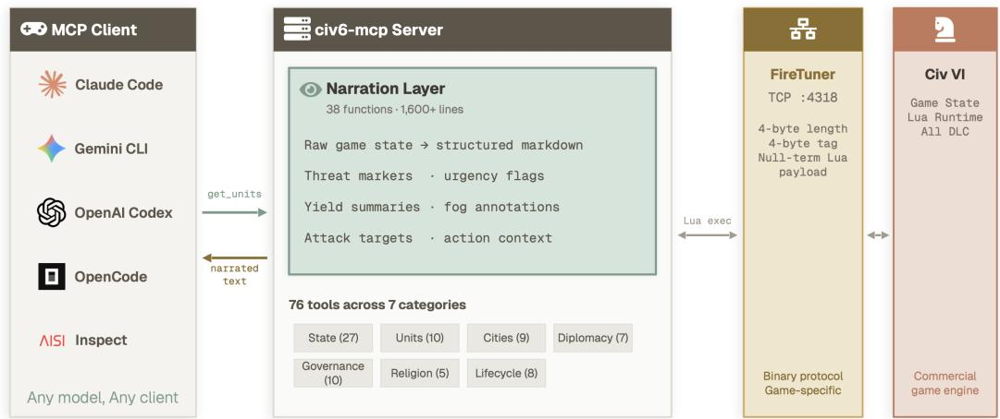  
Figure 1: Model Context Protocol (MCP) architecture. Agents interact via MCP tools; the server translates calls to Civilization VI and returns structured observations through the narration layer. (Sec. 3)

## 2.2 LLM Evaluation

Recent work evaluates LLM agents in interactive environments with varying scope. BAL-ROG [Paglieri et al., 2025] reports a gap between explaining strategies and executing them but does not use MCP. CICERO [Meta Fundamental AI Research Diplomacy Team (FAIR), 2022] demonstrates strong performance in Diplomacy, while shorter-horizon game benchmarks [Costarelli et al., 2024, Duan et al., 2024] and multi-agent frameworks [Rutherford et al., 2024, Ellis et al., 2023] study related capabilities under more constrained settings.

Other benchmarks isolate specific components of agent behaviour, including long-term management (Vending-Bench 2 [Andon Labs, 2025]), tool use (MCPAgentBench [MCPAgentBench, 2025], Tool-Bench, API-Bank [Qin et al., 2023, Li et al., 2023]), and software engineering (SWE-bench [Jimenez et al., 2024]).

CivBench integrates these elements in a single long-horizon, tool-mediated environment with a production-style MCP interface, enabling analysis of attention allocation and plan execution through interaction traces rather than aggregate outcomes. Unlike prior game-agent benchmarks that primarily score task success or final outcomes, CivBench releases full tool-call traces and defines metrics over information retrieval and commitment execution.

## 3 Environment

## 3.1 Civilization VI

Civilization VI is a 4X strategy game in which players explore, expand, exploit resources, and compete with rival civilisations. A standard game spans 300+ turns and requires decisions across economic, scientific, cultural, military, diplomatic, spatial, and temporal domains (List A.1). The game has six victory conditions—Science, Culture, Domination, Religion, Diplomacy, and Score—so no single objective dominates. Agents must balance competing priorities under resource constraints.

Civilization VI is also useful for separating game knowledge from execution. While strategy knowledge may appear in training data, each run presents a new state with imperfect information and many tool-mediated decisions. CivBench therefore evaluates behaviour through interaction with a live game state rather than memorised strategy alone.

Table 1: Evaluation scenarios increasing in difficulty.
<table><tr><td>Scenario</td><td>Map Type</td><td>Speed</td><td>Difficulty</td><td>Purpose</td></tr><tr><td>Ground Control</td><td>Pangaea, standard</td><td>Quick</td><td>Prince</td><td>Baseline competence</td></tr><tr><td>Snowflake</td><td>Six-arm snowflake, small</td><td>Quick</td><td>King</td><td>Military focus</td></tr><tr><td>Cry Havoc</td><td>Pangaea, tiny</td><td>Quick</td><td>Immortal</td><td>Stress test</td></tr></table>

## 3.2 The MCP Interface

CivBench connects to Civilization VI through the FireTuner protocol over TCP. The CivBench server exposes 76 MCP tools covering core systems, including state queries, unit actions, city management, diplomacy, research, governance, religion, trade, and game lifecycle operations (Tab. 8).

A typical turn involves 5–15 tool calls, resulting in thousands over a full game. The agent must decide which tools to call, when to call them, and how to act on the returned text. This interface resembles real-world tool use more than a Gymnasium-style API, where interaction is typically mediated through fixed observation spaces.

## 3.3 The Narration Layer

The narration layer is the main interface contribution of CivBench. The agent only observes state it explicitly queries: relevant information is representable but not passively observed and must be actively retrieved through tool calls.

This design separates availability of information from whether it is brought into context. As a result, CivBench can distinguish between information that is unavailable and information that is available but not queried, enabling direct analysis of attention allocation.

Observations are returned as structured text rather than raw tensors or pixels, with formatting and annotations that support decision-making while preserving the requirement that the agent must decide what to query. The narration layer comprises 29 functions spanning core game systems (Tab. 3).

Crucially, the interface improves representation but does not enforce retrieval: relevant state (e.g., victory progress) produces no observation unless explicitly queried. This boundary underlies the sensorium analysis in Section 6.1.

CivBench is intended primarily as a benchmark artifact rather than a leaderboard in this release. A benchmark instance consists of a fixed save/scenario, model configuration, shared playbook, complete MCP transcript, and derived metric table. The released scripts recompute outcome metrics, tool-use profiles, PMR, and RAG@K from raw logs. This makes the current 23-game dataset a pilot reference set, while the main contribution is the reusable environment and trace-level measurement protocol.

## 4 Evaluation Framework

## 4.1 Experimental Design

We evaluate a single LLM agent against Civilization VI's built-in AI opponents. Model identifiers endpoints, access dates, and harness versions are reported in Appendix E and Table 9. Each scenario is defined by fixed map and game seeds. Reproducibility also depends on the game version, DLC configuration, scenario files, model configuration, and playbook version.

Scenario rationale. Ground Control is the baseline scenario. Snowflake restricts play to military victory on an isolated map. Cry Havoc introduces a severe disadvantage and is not included in the reported results. Because Snowflake has only four admissible runs and Cry Havoc is excluded, scenario-level conclusions are descriptive.

Agent playbook. All models receive the same versioned playbook, which specifies turn structure, checkpoints, and a five-field diary (tactical, strategic, tooling, planning, hypothesis). Earlier versions used hard triggers; the reported runs use a softer advisory version. The playbook standardises interaction structure while leaving tool selection and prioritisation to the agent.

## 4.2 Metrics

We report both outcome measures and behavioural metrics. Normalised score captures competitive standing, while PMR and RAG@K measure monitoring and execution behaviour not visible in aggregate outcomes.

Normalised score. normalised\_score = agent\_raw\_score / winner\_raw\_score\_at\_game\_end. Winning agents score 1.0; others reflect relative standing. We treat this as descriptive rather than a measure of strategic competence, since score aggregates multiple systems into a single outcome.

PMR: Proactive Monitoring Rate. PMR = strategic\_monitoring\_tool\_calls / all\_non\_infrastructure\_tool\_calls. Monitoring tools require proactive queries (e.g. get\_victory\_progress, get\_diplomacy), while infrastructure calls (e.g. end\_turn) are excluded. PMR measures how much of the tool budget is allocated to maintaining a global view rather than reacting to local state, providing a proxy for attention allocation. We do not treat PMR as intrinsically optimal when high; the relevant finding is that monitoring remains low even for explicitly recommended signals whose absence is linked to missed detectable threats.

RAG@K: Reflection-Action Gap. RAG@K = (Y + 0.5P) / total\_commitments, where commitments are extracted from planning reflections and evaluated over K turns (K = 10). A commitment specifies a target (e.g. unit, city, or research item) and is labelled as "executed", "partial", or "not executed". RAG@K measures the extent to which stated plans are translated into subsequent actions within a short horizon.

We use a fixed horizon (K = 10) to capture near-term execution while limiting ambiguity from changing context. RAG@10 should be interpreted as execution fidelity for concrete, self-stated near-term commitments under a shared diary protocol, not as a complete measure of planning quality.

Both PMR and RAG@K are interface-level metrics capturing monitoring and execution behaviour under tool-mediated interaction.

## 4.3 Practical Considerations

Civilization VI is commercially licensed; users must own a copy. Reproducibility depends on the pinned game version, configuration, seeds, and playbook (Appendix E.1). CivBench integrates with the Inspect framework [UK AI Security Institute (AISI), 2024] for execution, logging, and metric extraction.

## 4.4 Scope, Limitations, and Threats to Validity

The dataset provides evidence for three patterns: agents under-monitor latent state, frequently fail to execute stated plans, and exhibit behaviours that aggregate score compresses. These observations are grounded in interaction traces under a fixed protocol and should be interpreted within that scope.

Sample size and power. With 23 runs across four model families, the study is powered only for large effects; between-model differences are descriptive.

Playbook confound. The shared playbook introduces human guidance, so behaviour reflects the combination of model reasoning, tool use, and instruction following. Failures to act on explicitly recommended signals should be read as deviations under guidance rather than absence of capability. A playbook-free baseline was not viable: only 21% of pre-harness runs completed (Fig. 14).

Baselines. We do not include a random or scripted baseline. Such a baseline would provide a lower bound on monitoring and tool allocation and is a useful direction for future work.

Environmental constraints. Civilization VI introduces version and licensing dependencies; the FireTuner protocol supports a single connection (limiting multi-agent setups). Each full-game run costs approximately \$31–229 in API fees and takes 2–8 hours on a local consumer machine running

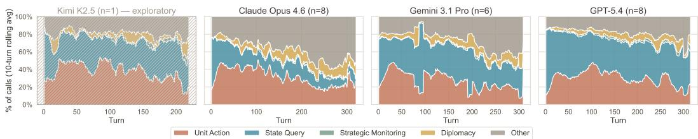  
Figure 2: Tool call composition over 10-turn rolling average. Tool budgets are dominated by local actions (red) and state queries (blue); strategic monitoring remains consistently low across models.

Civilization VI. Results cover Ground Control and Snowflake. All observed victories occur on Ground Control; behaviours may vary under different maps, difficulties, or victory constraints.

Contamination. Strategy knowledge may appear in training data, but each run requires live adaptation under partial observability, shifting the evaluation towards interaction behaviour rather than memorised strategy.

Measurement scope. PMR and RAG@K depend on the defined set of monitoring tools and the interpretation of planning text. Results should be read as measurements under the CivBench protocol rather than exhaustive characterisations of agent capability.

## 5 Results: Descriptive Behavioural Profiles

Our dataset comprises 23 admissible games across Ground Control (19) and Snowflake (4), drawn from four model families with uneven coverage: three families have 6–8 runs and one exploratory family has a single run. The sample is small and uneven; we therefore present results as descriptive characterisations of behaviour rather than model comparisons, and focus on patterns that are consistent across runs.

## 5.1 Aggregate Outcomes Are Insufficient at This Scale

Aggregate outcome measures do not discriminate between models in this dataset. Win/loss counts are sparse, with only 3 victories in 23 admissible runs, all on Ground Control; Fisher's exact test does not support between-model discrimination $\left( \mathrm { p } = 0 . 4 8 8 ; \mathrm { F i g . } 5 \right)$ . Normalised score is also weakly discriminating $( H = 1 . 9 0 , p = 0 . 5 9 4 ; \mathrm { { F i g . } } 6 )$ , with within-model variance comparable to betweenmodel differences. All observed wins were technology victories on Ground Control; no model won on Snowflake. Apparent differences in raw counts are therefore not interpreted as evidence of model superiority.

This pattern extends across most aggregate measures. An exploratory ICC analysis on Ground Control runs (Tab. 5) finds that of 13 candidate metrics, only exploration at T100 shows clear discriminative power (ICC=0.717); final score, city counts, and economic yields all have ICC near zero or negative, indicating that within-model variance dominates. This is consistent with the sample size but also reflects a substantive point: outcome-level measures aggregate over hundreds of decisions, compressing the behavioural variation that distinguishes these agents. The remainder of the paper therefore turns to interface-level metrics that expose this variation directly.

## 5.2 Tool-Use Profiles

Across the pilot runs, tool budgets vary substantially, but their composition shows the same broad structure: local actions and state queries dominate, while strategic monitoring remains a small fraction of activity. The composition is dominated by local actions and state queries; strategic monitoring is consistently a small fraction of activity throughout the game, across all models. CivBench captures how agents allocate these budgets over long horizons, making attention allocation directly observable. Section 6.1 analyses this behaviour and links it to concrete failures.

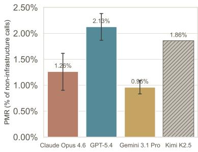

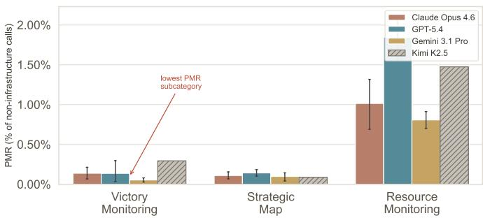  
Figure 3: Descriptive Proactive Monitoring Rate by model (A) and subcategory (B). Strategic monitoring tool calls divided by all non-infrastructure tool calls. Monitoring rates are uniformly low across models, with particularly sparse querying of victory progress, indicating that globally relevant state is rarely brought into context despite availability and guidance.

## 6 Analysis

## 6.1 The Sensorium Effect

The clearest pattern in the traces is the sensorium effect: the gap between passive human perception and active agent queries. A human player absorbs many signals without effort, while an agent only observes what it explicitly queries. Each query consumes time and context. This is therefore an attention-allocation problem rather than a tooling gap.

Table 2: Missed-warning analysis for defeated runs. A warning is counted as detectable if get\_victory\_progress would have exposed a rival victory threat at least 20 turns before game end. Queried = at least one get\_victory–progress call in the 20-turn window before game end. Missed = detectable defeats with no query in window.
<table><tr><td>Model</td><td>Defeats</td><td>Detectable</td><td>Queried</td><td>Missed</td></tr><tr><td>Claude Opus 4.6</td><td>6</td><td>6</td><td>3</td><td>3</td></tr><tr><td>Gemini 3.1 Pro</td><td>5</td><td>5</td><td>4</td><td>1</td></tr><tr><td>GPT-5.4</td><td>8</td><td>8</td><td>4</td><td>4</td></tr><tr><td>Kimi-K2.5</td><td>1</td><td>1</td><td>1</td><td>0</td></tr><tr><td>Total</td><td>20</td><td>20</td><td>13</td><td>7</td></tr></table>

We quantify this behaviour using Proactive Monitoring Rate (PMR) (Section 4.2, Fig. 3). Aggregate PMR is low in every tested model family, ranging from 0.96% to 2.13% of non-infrastructure calls. Victory monitoring is particularly sparse, at 0.05–0.29% of calls, corresponding to 3.7–10.0 get\_victory\_progress calls per game. Despite playbook guidance to check every 20 turns, agents query this signal only once every 30–75 turns.

Given the small and uneven sample, we treat differences between models as descriptive and focus on the consistent pattern across runs: monitoring remains a small fraction of the tool budget.

The consequence is that agents can miss decisive information even when it is available. Table 2 shows that in 7 of 20 detectable losses, agents failed to query victory progress within a 20-turn warning window. This links low monitoring rates to concrete failures: relevant state is available and recommended, but often not brought into context in time.

PMR does not increase towards the endgame (Fig. 11), when monitoring would be most useful. This suggests that the effect reflects persistent allocation choices rather than a transient context limitation.

More broadly, this pattern arises from the interface constraint that relevant state must be actively queried. As a result, performance depends not only on reasoning over available information, but on whether that information is retrieved at all. While demonstrated here in Civilization VI, similar dynamics may arise in other tool-mediated settings where critical state is not passively observed.

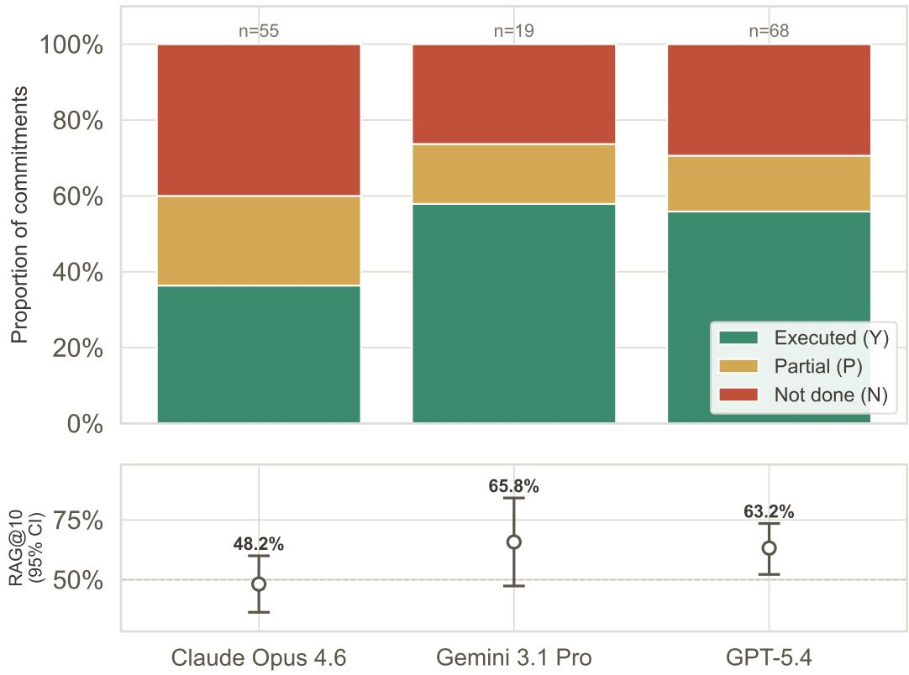  
Figure 4: Commitment execution within 10 turns (RAG@10). Fraction of commitments executed (Y), partially executed (P), or not executed (N). Error bars show bootstrap confidence intervals. A substantial fraction of commitments are not executed within the evaluation window across tested models, indicating a consistent gap between stated plans and subsequent actions.

## 6.2 The Reflection-Action Gap

We define the Reflection-Action Gap (RAG) as the tendency of agents to state concrete commitments in planning reflections without executing them. RAG@10 (Section 4.2) measures the fraction of commitments executed within 10 turns.

Examples from the traces include: "Build campuses in new cities", "Found second city", and "Check victory progress". These commitments were not executed within the next 10 turns.

Commitments were extracted and labelled by Claude Haiku 4.5 using a fixed rubric. We validated the pipeline on a stratified random sample of 50 commitments drawn proportionally across the three models with sufficient runs (Claude, Gemini, GPT), labelled independently by an author; inter-rater agreement with the LLM labels was 92.0% (Cohen's $\kappa = 0 . 8 7 9 )$ . We note that the labeller (Haiku 4.5) shares a model family with one evaluated agent (Claude Opus 4.6); RAG scores by model do not show a pattern consistent with same-family bias (Claude is in fact the lowest-scoring of the three).

RAG@10 ranges from 48.2% to 65.8% across the three model families with sufficient commitments for analysis, with overlapping bootstrap confidence intervals (Fig. 4). A substantial fraction of commitments are not executed within the next ten turns. This pattern is consistent with prior findings that models can explain strategies without executing them [Paglieri et al., 2025, Schmied et al., 2025]; CivBench makes the behaviour directly observable through diary entries and tool-call traces.

Limitations. RAG depends on an LLM-assisted pipeline that extracts commitments from diary text, applied uniformly across runs and validated on a held-out human-labelled sample $( \kappa = 0 . 8 7 9 )$ Results should be read as measurements of execution under this shared labelling procedure rather than ground truth.

## 7 Discussion

## 7.1 Research Benefits

CivBench enables evaluation beyond aggregate win/loss metrics. It provides long-horizon traces for analysing scaffolds, memory mechanisms, reflection protocols, and commitment tracking and exposes how agents allocate large tool budgets across state queries, actions, and monitoring. By separating availability of state from whether it is queried, the interface makes behaviours such as proactive monitoring and plan execution directly observable rather than inferred from outcomes—a property likely to be useful in other tool-mediated settings where critical state must be actively retrieved. We release the current artefact as an initial evaluation rather than a complete benchmark study.

## 7.2 Structured Reflection

We implement a turn diary as both an intervention and a measurement mechanism. The diary requires five fields at each turn (tactical, strategic, tooling, planning, hypothesis) and can be retrieved through get\_diary. This is intended to mitigate context loss in long episodes.

The diary also enables RAG by providing explicit commitments comparable to subsequent actions. This introduces a measurement confound: the playbook elicits explicit planning, so RAG measures execution of prompted commitments rather than spontaneous plans. We accept this trade-off because a playbook-free baseline was not viable at this stage — only 21% of pre-harness runs reached a natural conclusion (Fig. 14) — and because the alternative, inferring intent from action sequences alone, is substantially less interpretable. RAG should therefore be read as execution fidelity under a shared elicitation protocol, not as an estimate of unprompted planning ability.

Whether structured reflection improves or degrades execution remains open. Future work should test this through ablations, including removing the diary, introducing persistent commitment tracking, and enforcing monitoring schedules.

## 7.3 Design Implications

The observed failure modes suggest that improving reasoning alone may be insufficient for reliable long-horizon behaviour. Instead, the interaction protocol and scaffolding play a central role in determining what information is considered and how plans are executed.

First, monitoring of global state may require explicit mechanisms rather than relying on emergent behaviour. This could include enforced query schedules, prioritisation of monitoring tools, or interfaces that surface critical signals without requiring repeated retrieval.

Second, the reflection-action gap suggests the need for persistent commitment tracking. Plans expressed in one step are not reliably carried forward unless they are represented in a form that competes with immediate context. Mechanisms such as structured memory, task queues, or explicit commitment enforcement may improve execution fidelity.

Finally, these results highlight attention allocation as a distinct axis of agent capability. Evaluation frameworks that expose and measure this allocation can complement outcome-based metrics and provide more direct insight into failure modes in tool-mediated settings.

## 8 Conclusion

We present CivBench, an open-source benchmark for evaluating language model agents in longhorizon, tool-mediated environments through the Model Context Protocol. CivBench provides a controlled setting in which attention allocation and plan execution can be measured directly in settings where relevant state must be actively retrieved rather than passively observed.

This study is not a model ranking. Instead, it shows how CivBench makes two interface-level failure modes measurable under a shared protocol. First, the sensorium effect: agents under-monitor strategically relevant state that must be queried explicitly across the tested runs. Second, the reflection– action gap: agents often fail to execute concrete commitments stated in their own planning reflections within a short horizon.

These results do not imply a general deficiency in strategic reasoning. They show that, in the current traces, agents can fail to maintain global state and translate plans into near-term actions over long horizons, even when relevant information is available and guidance is provided. CivBench makes these behaviours observable through its MCP interface, narration layer, structured diary, and tool-call logs.

We release the environment, scenarios, logs, metrics, and analysis pipeline to support reproducible evaluation. By making monitoring and execution behaviour observable, CivBench provides a foundation for evaluating and improving the reliability of long-horizon, tool-using agents.

## References

Andon Labs. Vending-bench: A benchmark for long-term coherence of autonomous agents. arXiv preprint arXiv:2502.15840, 2025.

Anthony Costarelli, Mat Allen, Ragnar Hauksson, et al. GameBench: Evaluating strategic reasoning abilities of LLM agents. arXiv preprint arXiv:2406.06613, 2024.

Jinhao Duan, Renming Zhang, James Diffenderfer, et al. GTBench: Uncovering the strategic reasoning limitations of LLMs via game-theoretic evaluations. In Advances in Neural Information Processing Systems (NeurIPS), 2024.

Benjamin Ellis, Jonathan Cook, Skander Moalla, Mikayel Samvelyan, Mingfei Sun, Anuj Mahajan, Jakob N. Foerster, and Shimon Whiteson. SMACv2: An improved benchmark for cooperative multi-agent reinforcement learning. In Advances in Neural Information Processing Systems (NeurIPS), 2023.

FuxiAILab. CivAgent: LLM-based human-like agent for Unciv. GitHub, 2024.

Carlos E. Jimenez, John Yang, Alexander Wettig, Shunyu Yao, Kexin Pei, Ofir Press, and Karthik Narasimhan. SWE-bench: Can language models resolve real-world GitHub issues? In International Conference on Learning Representations (ICLR), 2024.

Minghao Li, Yingxiu Zhao, Bowen Yu, Feifan Song, Hangyu Li, Haiyang Yu, Zhoujun Li, Fei Huang, and Yongbin Li. Api-bank: A comprehensive benchmark for tool-augmented llms, 2023. URL https://arxiv.org/abs/2304.08244.

MCPAgentBench. A real-world task benchmark for evaluating LLM agent MCP tool use. arXiv preprint arXiv:2512.24565, 2025.

Meta Fundamental AI Research Diplomacy Team (FAIR). Human-level play in the game of Diplomacy by combining language models with strategic reasoning. Science, 378(6624):1067–1074, 2022.

Alessio Paglieri et al. BALROG: Benchmarking agentic LLM and VLM reasoning on games. In International Conference on Learning Representations (ICLR), 2025.

Siyuan Qi et al. CivRealm: A learning and reasoning odyssey in Civilization for decision-making agents. In International Conference on Learning Representations (ICLR), 2024.

Yujia Qin, Shihao Liang, Yining Ye, Kunlun Zhu, Lan Yan, Yaxi Lu, Yankai Lin, Xin Cong, Xiangru Tang, Bill Qian, Sihan Zhao, Lauren Hong, Runchu Tian, Ruobing Xie, Jie Zhou, Mark Gerstein, Dahai Li, Zhiyuan Liu, and Maosong Sun. Toolllm: Facilitating large language models to master 16000+ real-world apis, 2023. URL https://arxiv.org/abs/2307.16789.

Alexander Rutherford et al. JaxMARL: Multi-agent RL environments and algorithms in JAX. In Advances in Neural Information Processing Systems (NeurIPS), 2024.

Thomas Schmied et al. LLMs are greedy agents: Effects of RL fine-tuning on decision-making abilities. arXiv preprint arXiv:2504.16078, 2025.

UK AI Security Institute (AISI). Inspect: An open-source framework for large language model evaluations, 2024. URL https://inspect.aisi.org.uk/.

Vox Deorum. Vox Deorum: A hybrid LLM architecture for 4X / grand strategy game AI. arXiv preprint arXiv:2512.18564, 2025.

## A Technical Details

A run is admissible if it uses the pinned scenario/playbook/harness version, reaches a natural game conclusion or the scenario turn limit, and has complete tool-call logs sufficient to recompute all metrics.

## A.1 Domains

1. Economic. Gold income, trade routes, city yields, luxury and strategic resource stockpiles.

2. Scientific. A technology tree of 67 technologies across 8 eras, with eureka boosts rewarding in-game achievements.

3. Cultural. A civic tree, government selection, policy card optimisation, and Great Works.

4. Military. Unit production and composition, hex-grid positioning, combat strength calculations, promotions, and upgrade paths.

5. Diplomatic. Bilateral relationships, grievance tracking, delegations, embassies, trade deals, World Congress voting, and formal alliances.

6. Spatial. A hex grid of approximately 4,000 tiles with procedurally generated terrain, features, rivers, resources, fog of war, district adjacency bonuses, and city spacing constraints.

7. Temporal. Multi-turn production queues, research timelines, growth projections, era progression, and irreversible commitment decisions (district placement, government selection, city founding).

Table 3: Narration functions by domain. The full narration layer comprises 29 functions.
<table><tr><td>Domain</td><td>Fn</td><td>What the agent sees</td></tr><tr><td>Overview</td><td>1</td><td>Turn, yields, score, era, rankings, exploration %</td></tr><tr><td>Units</td><td>1</td><td>Position, HP, moves, charges, attack targets, upgrades, threats</td></tr><tr><td>Cities</td><td>1</td><td>Population, yields, production queue, walls, growth, loyalty, districts</td></tr><tr><td>Map / Spatial</td><td>4</td><td>Hex tiles, minimap, strategic fog boundaries, settle candi- dates</td></tr><tr><td>Combat</td><td>1</td><td>Damage estimates, modifiers, kill/death predictions</td></tr><tr><td>Production</td><td>1</td><td>Available units/buildings/districts with cost and turns</td></tr><tr><td>Tech / Civics</td><td>1</td><td>Available research with turns, eureka/inspiration status</td></tr><tr><td>Diplomacy</td><td>3</td><td>Relationships, modifiers, sessions, pending deals</td></tr><tr><td>Trade</td><td>3</td><td>Active routes, destinations with yields, deal composition</td></tr><tr><td>Governance</td><td>3</td><td>Policies, governors, unit promotions</td></tr><tr><td>Religion</td><td>3</td><td>Pantheon beliefs, founding status, per-city religious spread</td></tr><tr><td>Espionage</td><td>1</td><td>Spy positions, ranks, available missions</td></tr><tr><td>World Congress</td><td>1</td><td>Resolutions, voting options, passed effects</td></tr><tr><td>Victory</td><td>1</td><td>Per-type progress, rival intelligence, viability assessment</td></tr><tr><td>Great People</td><td>1</td><td>Candidates, recruitment race, activation status</td></tr><tr><td>Resources</td><td>2</td><td>Strategic stockpiles, luxury/bonus tiles, nearby unclaimed</td></tr><tr><td>Notifications</td><td>1</td><td>Game events, turn blockers, required actions</td></tr></table>

## A.2 Gamecode Examples

Turn 87/330 | Scythia (Tomyris) | Score: 198   
Gold: 156 (+12/turn) | Science: 24.3 | Culture: 18.7 | Faith: 89 | Favor: 23 (+3/turn)   
Research: IRON\_WORKING (3 turns) | Civic: MILITARY\_TRADITION (5 turns)   
Cities: 4 I Population: 14 | Units: 9   
Explored: 34% of land (412/1212 tiles)

Religion: none yet (2/4 slots remaining -- Great Prophet needed)   
Era: CLASSICAL | Score: 18 (Dark: 12, Golden: 24)   
Rankings: Babylon 245 > Scythia 198 > France 187 > Korea 156

## 9 units:

Saka Horse Archer (UNIT\_SCYTHIAN\_HORSE\_ARCHER) at (11,23)   
-- CS:20 RS:25 moves 2/4 [id:65538, idx:2]   
>> CAN ATTACK: Barbarian WARRIOR at (13,24) -- 2 tiles, ranged   
Builder (UNIT\_BUILDER) at (10,22) -- moves 2/2 charges:2 [id:131074, idx:3]   
>> Can build: IMPROVEMENT\_MINE, IMPROVEMENT\_FARM, IMPROVEMENT\_PLANTATION   
Settler (UNIT\_SETTLER) at (9,22) -- moves 0/2 (no moves) [id:196610, idx:4]   
Warrior (UNIT\_WARRIOR) at (12,23) -- CS:20 moves 2/2   
CAN UPGRADE to Swordsman (120g) [id:65537, idx:1]   
Nearby threats (1):   
Barbarian (1 unit):   
WARRIOR at (13,24) -- CS:20 HP:100/100 (3 tiles away)

3 civilizations:   
Babylon (Hammurabi) -- FRIENDLY (+12) [player 1]   
Cities (6): Babylon pop 14 (20,15); Sippar pop 8 (18,18) [walls] + 4 in fog   
Military: 245 vs our 156 (1.6x) !! MUCH STRONGER   
Access: we have delegation, we have embassy   
+6 Delegation   
+3 Open Borders   
+3 Shared Agenda: likes civilizations with strong military   
France (Catherine) -- NEUTRAL (+2) [player 2]   
Cities (5): Paris pop 11 (31,9) [walls]; Marseille pop 6 (28,12)   
Military: 198 vs our 156 (1.3x)   
Access: we have delegation   
-3 Different Government   
+5 Delegation

## A.3 Performance Signals

• Score trajectory. Game score decomposed by category at every turn.

• Yield curves. Gold, science, culture, and faith per turn tracked longitudinally.

• City development. Population growth, district completion rates, production throughput.

• Military effectiveness. Kill/loss ratio, territory held, threat response latency.

• Diplomatic standing. Relationship modifiers, grievance accumulation, suzerainty count

• Technology pace. Mean turns per technology, eureka and inspiration capture rates.

• Expansion timing. Turns to second, third, and fourth city.

## A.4 A Turn in Practice

The following annotated example illustrates a single turn as the agent experiences it. The agent begins by orienting, identifies a threat, acts on it, then reflects.

```yaml
Worked Example: One Complete Turn
Step 1. Agent calls get_game_overview:
Turn 87/330 | Scythia (Tomyris) | Score: 198
Gold: 156 (+12/turn) | Science: 24.3 | Culture: 18.7 | Faith: 89
Rankings: Babylon 245 > Scythia 198 > France 187 > Korea 156
Step 2. Agent calls get_units and sees a threat:
Saka Horse Archer at (11,23) -- CS:20 RS:25 moves 4/4
>> CAN ATTACK: Barbarian WARRIOR at (13,24) -- 2 tiles, ranged
Nearby threats (1):
Barbarian (1 unit): WARRIOR at (13,24) -- CS:20 HP:100/100 (3 tiles away)
Step 3. Agent reasons: "Barbarian warrior 3 tiles from my undefended settler. My Saka Horse Archer
has range 2 and 4 moves—I can intercept with a ranged attack without taking damage."
Step 4. Agent calls
unit_action(unit_id=65538, action='attack', target_x=13, target_y=24):
Combat Estimate (Ranged):
SCYTHIAN_HORSE_ARCHER (CS:20, HP:100) vs WARRIOR (CS:20, HP:100)
Est damage to defender: ~45
Attacked Barbarian WARRIOR at (13,24) -- dealt 47 damage (HP: 100 -> 53)
Step 5. After handling remaining units and production, agent calls
end_turn with diary:
tactical:"Intercepted barbarian warrior threatening settler. 47 damage
via ranged, will finish next turn. Builder improved iron at (11,22)."
strategic: "Babylon leads by 47 score. Need 3rd city soon -- settler ready
next turn."
planning: "T88: finish barbarian, move settler east. T89: found city at (15,25)."
hypothesis: "Babylon likely to declare friendship -- positive modifiers trending up."
tooling: "No issues."
```

## A.5 Playbook Design Principles

1. Flag urgency. Threats are bold-marked (\*\* [Barbarian WARRIOR] \*\*), unimproved resources receive !! warnings, and critical states such as loyalty crises or starvation are explicitly highlighted. The narration is intentionally selective about what is emphasised.

2. Provide context for action. Unit readouts include valid attack targets and buildable improvements. City readouts include available production and defensive status. The agent is presented with actionable options rather than raw state alone.

3. Compress intelligently. Fog-of-war tiles are marked [fog] rather than omitted, so the agent can distinguish between absence of information and absence of content. Resources are classified by type (bonus/luxury+/strategic\*) to support prioritisation, and rankings are sorted by score.

Strategic Guidance with Benchmarks. The playbook uses advisory rather than imperative language. Earlier versions included hard IF/WHEN triggers (e.g. "IF gold > 500: spend before ending turn"), but these were softened to allow more organic behaviour. The agent frequently violates even this guidance, making the reflection-action gap observable against instructions it demonstrably interprets but does not consistently follow.

The playbook therefore serves both as a stabilisation mechanism and as an experimental control. It standardises interaction structure and highlights relevant signals while leaving attention allocation and execution decisions to the agent.

This loop—orient, detect, reason, act, reflect—repeats 5–15 times per turn across 300+ turns, producing a structured trajectory of situated, tool-mediated decision-making

## A.6 Agent Playbook Excerpt

The following excerpt from the agent playbook (200+ lines, iteratively refined across ten games, available in full at the repository) illustrates three design elements: sensorium awareness framing, hard rules with concrete triggers, and the structured turn diary.

## Sensorium Awareness

You only know what you explicitly query. A human player passively absorbs the minimap, score ticker, religion lens, unit health bars—you have none of that. Information you don't ask for simply doesn't enter your world model. The checkpoints and patterns below exist to compensate for this.

Gold. Gold sitting above 500 with no specific plan is usually better deployed. A builder, a luxury tile, a building that skips 5+ turns of production—these compound. Saving for a specific purchase is fine, but it helps to name the item and the turn.

Expansion. Each city multiplies your districts, yields, and Great Person generation. The gap between a 3-city and 5-city empire at T100 is hard to recover from. Benchmarks: T40: 2 cities, T60: 3 cities, T80: 4 cities, T100: 4–5 cities. If city count is lagging, a settler is typically the highest-impact production choice.

Exploration. You can't settle what you can't see, and you can't counter threats you don't know exist. A scout set to automate is one of the best investments in the early game. Benchmarks: T25 ≥15%, T50 $\ge 2 5 \% , \mathrm { T 7 } 5 \ge 3 5 \% , \mathrm { T 1 0 0 } \ge 5 0 \%$

## Strategic Checkpoints (Every 20 Turns).

• get\_diplomacy—delegations to new civs, friendships with Friendly civs, alliances if eligible.

• get\_victory\_progress—check all 6 victory types, not just your own path.

• get\_religion\_spread—religious victory is invisible without active checking; a rival with majority in most civs is a serious threat.

## Turn Diary Fields.

Five fields each turn:

• tactical: What happened—specific units, tiles, outcomes.

• strategic: Standings vs rivals—yields, city count, victory path viability with numbers.

• tooling: Tool issues observed, or “No issues".

• planning: Concrete actions for the next 5–10 turns—specific builds, moves, research targets with turn estimates.

• hypothesis: Specific predictions—attack timing, milestone turns, biggest risks.

## A.7 Inspect Framework

An open-source evaluation platform with native MCP support. Each game scenario maps to an Inspect Sample, the MCP server is consumed directly via mcp\_server\_stdio(), and a custom scorer extracts per-dimension metrics from tool-call transcripts. Inspect provides model portability (15+ providers), structured logging, and checkpoint recovery—important for multi-hour game sessions.

## B Supplementary Results

## B.1 Scores

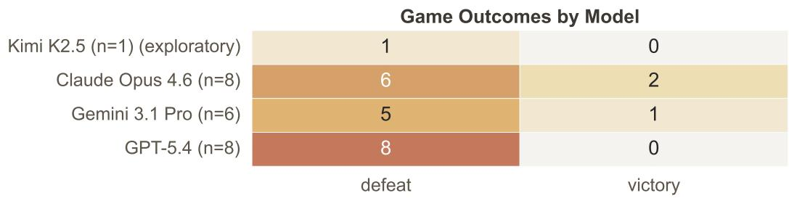  
Descriptive only — not statistically powered for model comparison (Fisher's exact test p=0.488)

Figure 5: Outcome heatmap  
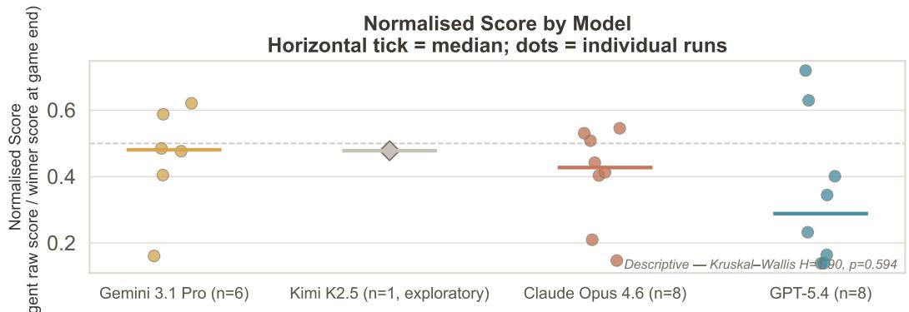  
Figure 6: Normalised score (agent raw score / winner raw score at game end) by model across all games.

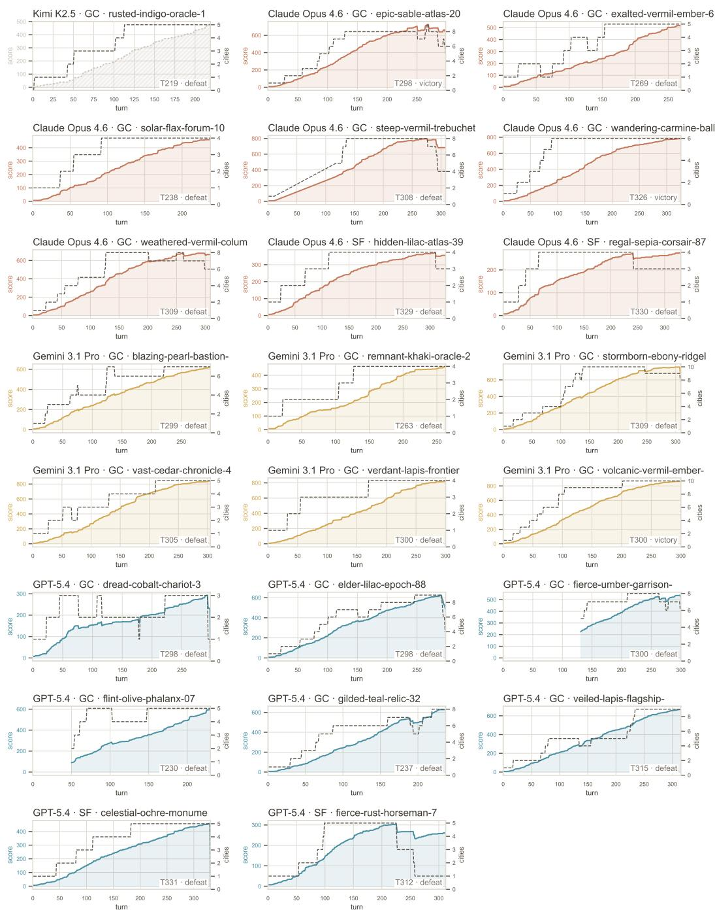  
Figure 7: Per-game trajectory overview for all games.

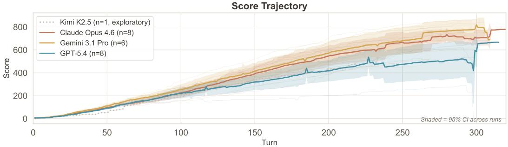  
Figure 8: Raw score trajectories. The shaded band shows 95% CI.

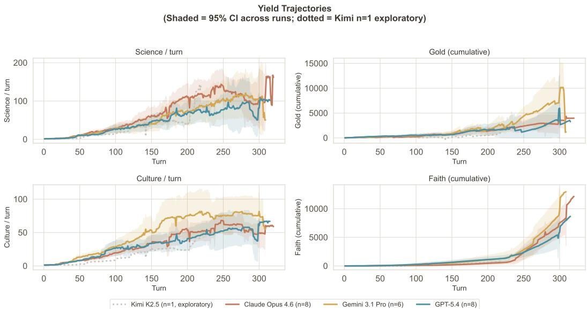  
Figure 9: Per-turn yield trajectories. The shaded band 95% CI.

Table 4: Outcome breakdown by model and scenario.
<table><tr><td>Model</td><td>Scenario</td><td>Games</td><td>Victories</td><td>Defeats</td></tr><tr><td>Claude Opus 4.6</td><td>Ground Control</td><td>6</td><td>2</td><td>4</td></tr><tr><td>Claude Opus 4.6</td><td>Snowflake</td><td>2</td><td>0</td><td>2</td></tr><tr><td>Gemini 3.1 Pro</td><td>Ground Control</td><td>6</td><td>1</td><td>5</td></tr><tr><td>GPT-5.4</td><td>Ground Control</td><td>6</td><td>0</td><td>6</td></tr><tr><td>GPT-5.4</td><td>Snowflake</td><td>2</td><td>0</td><td>2</td></tr><tr><td>Kimi-K2.5</td><td>Ground Control</td><td>1</td><td>0</td><td>1</td></tr></table>

## B.2 Statistical Power

Table 5: Discriminative Power (ICC) — ground\_control ICC estimates are exploratory because the number of runs per model is small and uneven.
<table><tr><td>Metric</td><td>ICC</td><td>Within SD</td><td>Between SD</td><td>Test</td><td>Verdict</td></tr><tr><td>exploration_t100</td><td>0.717</td><td>3.628</td><td>5.515</td><td>H=12.28, p=0.0065</td><td>discriminative</td></tr><tr><td>exploration_t50</td><td>0.458</td><td>4.401</td><td>4.524</td><td>H=11.08, p=0.0113</td><td>marginal</td></tr><tr><td>turns_played</td><td>0.197</td><td>28.396</td><td>35.668</td><td>H=3.87, p=0.2758</td><td>noise</td></tr><tr><td>final_exploration_pct</td><td>0.111</td><td>34.636</td><td>28.099</td><td>H=4.25, p=0.2359</td><td>noise</td></tr><tr><td>final_science</td><td>0.039</td><td>47.149</td><td>38.812</td><td>H=2.23, p=0.5269</td><td>noise</td></tr><tr><td>final_culture</td><td>0.029</td><td>27.520</td><td>12.484</td><td>H=2.33, p=0.5076</td><td>noise</td></tr><tr><td>final_military</td><td>-0.035</td><td>416.790</td><td>191.236</td><td>H=2.90, p=0.4073</td><td>noise</td></tr><tr><td>final_gold</td><td>-0.078</td><td>2947.950</td><td>1532.178</td><td>H=1.89, p=0.5957</td><td>noise</td></tr><tr><td>city_t100</td><td>-0.124</td><td>1.499</td><td>0.788</td><td>H=3.34, p=0.3427</td><td>noise</td></tr><tr><td>final_cities</td><td>-0.170</td><td>2.174</td><td>0.631</td><td>H=0.70, p=0.8722</td><td>noise</td></tr><tr><td>city_t200</td><td>-0.170</td><td>2.180</td><td>0.701</td><td>H=0.86, p=0.8351</td><td>noise</td></tr><tr><td>city_t150</td><td>-0.185</td><td>2.268</td><td>0.644</td><td>H=0.81, p=0.8459</td><td>noise</td></tr><tr><td>city_t50</td><td>-0.221</td><td>1.052</td><td>0.397</td><td>H=0.83, p=0.8425</td><td>noise</td></tr></table>

## B.3 Milestones and Progression

Early expansion is a useful trajectory-level signal because additional cities compound over time. All models fall below the playbook benchmark of three cities at T50 (Claude 2.83, GPT 2.83, Gemini 2.67, Kimi 2.00; Fig. 10); the deficit persists at T100 (Claude 4.67, GPT 4.67, Gemini 4.00, Kimi 3.00). The lag is consistent with agents prioritising locally salient actions over actions whose payoff is delayed—a pattern that recurs throughout the analysis in Section 6.1.

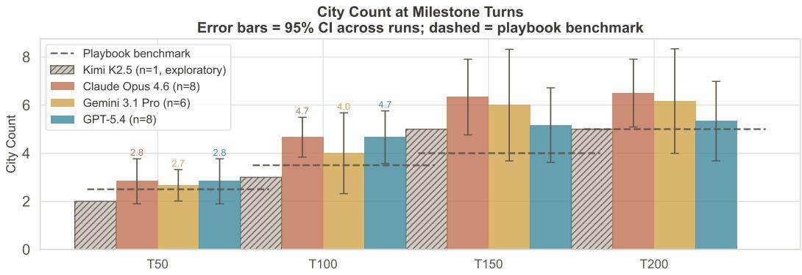  
Figure 10: Mean city count at turn checkpoints.

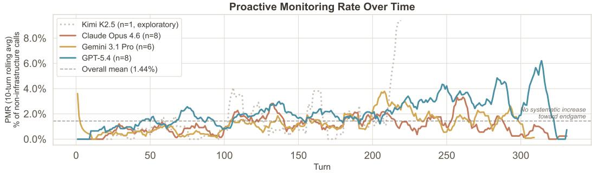  
Figure 11: Proactive Monitoring Rate by game turn (10-turn rolling window) per model

## B.4 Tools

Tool Failure Rate — Top 15 Tools by Total Failures  
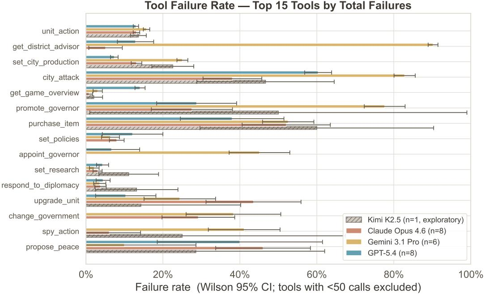  
Figure 12: Tool failure rate per tool and model.

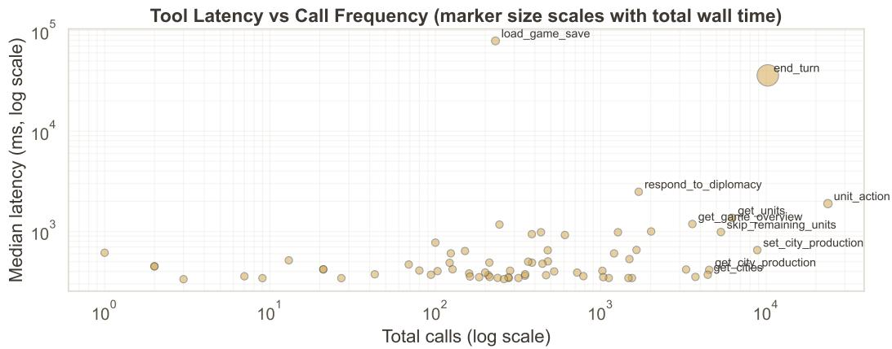  
Figure 13: Median round-trip duration (ms) vs total call count per tool.

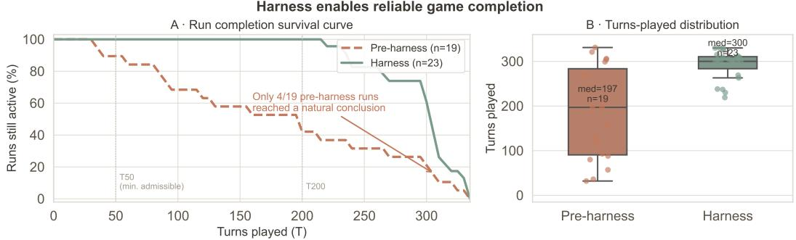  
Figure 14: Left: Harness vs pre-harness turn rates. Right: Turns played with the harness vs pre-Harness. Pre-harness runs used the most basic possible infrastructure to run, are not admissible and frequently did not finish games.

## B.5 Yield Trajectories

Score trajectories diverge early and amplify through the midgame (Fig 8). All models grow at similar rates through approximately T50, after which developmental arcs separate: the highest-trajectory runs open score leads that persist to game end, while the lowest accumulate deficits that are not recoverable within the game horizon. This divergence does not map proportionally onto normalised score, for the reason given in Section 5.1 — raw score describes a model's absolute developmental arc, normalised score its standing relative to whoever actually won. A Claude game that ran to T326 with a strong Korea opponent can produce a lower normalised score than a GPT game terminated at T230 against a weaker opponent set. At T50 raw scores are closely bunched (Claude $9 6 . 6 \pm 9 . 6 $ Gemini 112.2 ± 13.4, GPT 91.8 ± 4.8) but by T150 Claude (394 ± 86) and Gemini $( 4 1 6 \pm 8 3 )$ substantially lead GPT $( 3 2 0 \pm 8 4 )$ , and the gap persists through T200 (Claude $5 4 7 \pm 1 1 0$ vs GPT $4 1 8 \pm 1 1 2 )$ , which persists until the end of the game.

Per-turn yield decomposition (Fig 9) shows that score differences are driven primarily by science output, which exhibits the clearest and most sustained between-model separation. Culture trajectories cross repeatedly and track final culture's low discriminative power in Table 5. Cumulative gold and faith are dominated by game-length effects rather than per-turn efficiency differences. The pattern is consistent with Civilization VI's underlying mechanics: science compounds through technology unlocks that enable further yield improvements, while culture and faith contribute to score more directly but with weaker feedback on subsequent yields. We are not aware of comparable per-turn economic trajectories reported across LLM agents in a commercial strategy game, allowing us to observe when behaviour diverges.

## C Feature Comparison

Table 6 summarises the main differences between CivRealm and CivBench, with particular emphasis on the game engine, interface, and strategic mechanics relevant to evaluation.

Table 6: Feature comparison: CivRealm (FreeCiv) vs. CivBench (Civilization VI).
<table><tr><td>Feature</td><td>CivRealm (FreeCiv)</td><td>CivBench (Civ VI)</td></tr><tr><td>Game engine</td><td>FreeCiv (open-source, Civ II-era)</td><td>Civilization VI (commercial, 2016+)</td></tr><tr><td>Grid type</td><td>Square, 8-directional</td><td>Hex, 6-directional</td></tr><tr><td>Unit stacking</td><td>Allowed</td><td>One-unit-per-tile</td></tr><tr><td>Districts</td><td>No</td><td>Yes (13 types + unique)</td></tr><tr><td>Governors</td><td>No</td><td>Yes (7 governors, promotions)</td></tr><tr><td>Loyalty/amenities</td><td>No</td><td>Yes (city loyalty, amenity system)</td></tr><tr><td>Espionage</td><td>Basic</td><td>Full (missions, counterintel)</td></tr><tr><td>World Congress</td><td>No</td><td>Yes (resolutions, diplomatic VP)</td></tr><tr><td>Great People</td><td>Basic</td><td>Full (recruitment race, activation)</td></tr><tr><td>Government</td><td>Tax sliders (sci/tax/lux)</td><td>Policy card slots + government types</td></tr><tr><td>Religion</td><td>Basic</td><td>Full (pantheon, found, spread, inquisition)</td></tr><tr><td>Victory conditions</td><td>3</td><td>6</td></tr><tr><td>Agent interface</td><td>Gymnasium tensor / LangChain text</td><td>MCP tool calls + narration layer</td></tr><tr><td>Research Items</td><td>87</td><td>117</td></tr><tr><td>LLM training data</td><td>Minimal (niche open-source)</td><td>Extensive (decades of guides, forums)</td></tr></table>

Table 7: Evaluation dimensions.
<table><tr><td>Dimension</td><td>Signal</td><td>Measurement</td></tr><tr><td>Overall Score</td><td>Aggregate score</td><td>Civ 6 score at checkpoints</td></tr><tr><td>Economic Management</td><td>Yield optimisation</td><td>Gold, science, culture per turn</td></tr><tr><td>Military Competence</td><td>Threat response</td><td>Attack actions, kill/loss ratio</td></tr><tr><td>Scientific Progress</td><td>Technology pace</td><td>Turns per technology, eureka rate</td></tr><tr><td>Diplomatic Skill</td><td>Relationship management</td><td>Diplomatic actions, favour income</td></tr><tr><td>Spatial Reasoning</td><td>Map awareness</td><td>Exploration, cities founded</td></tr><tr><td>Tool-Use Fluency</td><td>Tool selection</td><td>Error rate, tool diversity</td></tr><tr><td>Long-Horizon Coherence</td><td>Strategy consistency</td><td>Score variance, drift</td></tr></table>

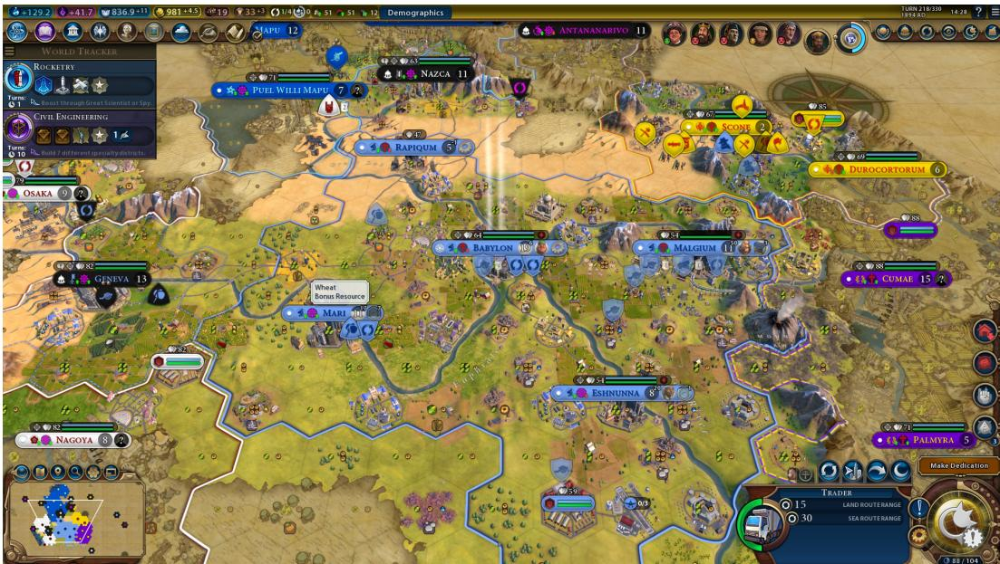  
Figure 15: Screenshot of a Civilization VI game. This illustrates what a human player would see.

## D Tool Inventory

This appendix section lists the tool categories used by CivBench and the representative MCP calls in each category.

Table 8: Tool inventory by category.
<table><tr><td>Category</td><td>Count</td><td colspan="2">Representative tools</td></tr><tr><td>State queries</td><td>27</td><td colspan="2">get_game_overview, get_units, get_map_area, get_diplomacy, get_victory_progress</td></tr><tr><td>Unit actions</td><td>10</td><td colspan="2">unit_action,upgrade_unit,promote_unit,</td></tr><tr><td>City management</td><td>9</td><td>skip_remaining_units set_city_production,</td><td>purchase_item,</td></tr><tr><td>Diplomacy</td><td>7</td><td colspan="2">purchase_tile, set_city_focus respond_to_diplomacy, respond_to_trade, send_diplomatic_action,</td></tr><tr><td>Governance</td><td>10</td><td colspan="2">propose_trade, form_alliance set_research, set_policies, change_government, appoint_governor</td></tr><tr><td>Religion &amp; culture 5</td><td></td><td colspan="2">choose_pantheon, choose_dedication, vote_world_congress</td></tr><tr><td>Game lifecycle</td><td>8</td><td colspan="2">end_turn, get_diary, dismiss_popup, quicksave, load_save, restart_and_load</td></tr><tr><td>Total</td><td>76</td><td colspan="2"></td></tr></table>

## E Model Access Dates

Table 9: Model identifiers and access window summary (admissible runs only, N = 23). Inspect AI model id is provider/host/model; all OpenAI and Kimi models routed through Azure used the Chat Completions API (Azure lacks full Responses API parity at access time).
<table><tr><td>Paper label</td><td>Inspect AI model id</td><td>Endpoint</td><td>Access window (UTC)</td><td>Runs</td></tr><tr><td>Claude Opus 4.6</td><td>anthropic/vertex/claude-opus-4-6</td><td>GCP Vertex AI</td><td>2026-04-02 - 2026-04-16</td><td>8</td></tr><tr><td>GPT-5.4</td><td>openai/azure/gpt-5.4</td><td>Azure OpenAI</td><td>2026-04-05-2026-04-16</td><td>7</td></tr><tr><td>Gemini 3.1 Pro</td><td>google/vertex/gemini-3.1-pro-preview</td><td>GCP Vertex AI</td><td>2026-04-12-2026-04-17</td><td>6</td></tr><tr><td>Kimi-K2.5</td><td>openai/azure/Kimi-K2.5</td><td>Azure AI Foundry</td><td>2026-04-18-2026-04-18</td><td>1</td></tr></table>

## E.1 Reproducibility Details

The released code artifact contains all configuration details (Game versions, DLC List, Save files, seeds), and scripts to recompute all metrics and regenerate all figures from the raw tool-call logs.

Artifact contents. The released package contains: (1) the CivBench MCP server; (2) scenario definitions and save-file metadata; (3) raw admissible-game logs; (4) processed metric tables; (5) plotting and analysis scripts; and (6) documentation for reproducing the reported results. It does not contain Civilization VI assets, game binaries, or proprietary Firaxis/2K code.

Known reproducibility risks. Reproduction may be affected by Civilization VI patches, DLC differences, operating-system differences, provider-side model updates, and stochastic model sampling. We mitigate these risks by pinning scenario seeds, reporting exact model access dates and settings, logging all tool calls, and releasing the analysis pipeline.

## NeurIPS Paper Checklist

## 1. Claims

Question: Do the main claims made in the abstract and introduction accurately reflect the paper's contributions and scope?

Answer: [Yes]

Justification: All claims in the abstract and conclusion are supported by the experimental results in Sections 5–6. Scope and power limitations are stated in Section 4.

Guidelines:

• The answer [N/A] means that the abstract and introduction do not include the claims made in the paper.

• The abstract and/or introduction should clearly state the claims made, including the contributions made in the paper and important assumptions and limitations. A [No] or [N/A] answer to this question will not be perceived well by the reviewers

• The claims made should match theoretical and experimental results, and reflect how much the results can be expected to generalize to other settings.

• It is fine to include aspirational goals as motivation as long as it is clear that these goals are not attained by the paper.

## 2. Limitations

Question: Does the paper discuss the limitations of the work performed by the authors?

Answer: [Yes]

Justification: Section 4 covers commercial dependency, cost, playbook confound, sample size, infrastructure exclusions, non-determinism, and contamination.

Guidelines:

• The answer [N/A] means that the paper has no limitation while the answer [No] means that the paper has limitations, but those are not discussed in the paper.

• The authors are encouraged to create a separate “Limitations" section in their paper.

• The paper should point out any strong assumptions and how robust the results are to violations of these assumptions (e.g., independence assumptions, noiseless settings, model well-specification, asymptotic approximations only holding locally). The authors should reflect on how these assumptions might be violated in practice and what the implications would be.

• The authors should reflect on the scope of the claims made, e.g., if the approach was only tested on a few datasets or with a few runs. In general, empirical results often depend on implicit assumptions, which should be articulated.

• The authors should reflect on the factors that influence the performance of the approach. For example, a facial recognition algorithm may perform poorly when image resolution is low or images are taken in low lighting. Or a speech-to-text system might not be used reliably to provide closed captions for online lectures because it fails to handle technical jargon.

• The authors should discuss the computational efficiency of the proposed algorithms and how they scale with dataset size.

• If applicable, the authors should discuss possible limitations of their approach to address problems of privacy and fairness.

• While the authors might fear that complete honesty about limitations might be used by reviewers as grounds for rejection, a worse outcome might be that reviewers discover limitations that aren't acknowledged in the paper. The authors should use their best judgment and recognize that individual actions in favor of transparency play an important role in developing norms that preserve the integrity of the community. Reviewers will be specifically instructed to not penalize honesty concerning limitations.

## 3. Theory assumptions and proofs

Question: For each theoretical result, does the paper provide the full set of assumptions and a complete (and correct) proof?

Answer: [N/A]

Justification: No theoretical results are claimed.

## Guidelines:

• The answer [N/A] means that the paper does not include theoretical results.

• All the theorems, formulas, and proofs in the paper should be numbered and crossreferenced.

• All assumptions should be clearly stated or referenced in the statement of any theorems.

• The proofs can either appear in the main paper or the supplemental material, but if they appear in the supplemental material, the authors are encouraged to provide a short proof sketch to provide intuition.

• Inversely, any informal proof provided in the core of the paper should be complemented by formal proofs provided in appendix or supplemental material.

• Theorems and Lemmas that the proof relies upon should be properly referenced

## 4. Experimental result reproducibility

Question: Does the paper fully disclose all the information needed to reproduce the main experimental results of the paper to the extent that it affects the main claims and/or conclusions of the paper (regardless of whether the code and data are provided or not)?

Answer: [Yes]

Justification: The MCP server, dataset, and analysis scripts are opensource at (https://anonymous.4open.science/r/civbench/README.md, https://huggingface.co/datasets/civbench/civbench-v1/tree/main) Scenario save files are distributed with the repository.

## Guidelines:

• The answer [N/A] means that the paper does not include experiments.

• If the paper includes experiments, a [No] answer to this question will not be perceived well by the reviewers: Making the paper reproducible is important, regardless of whether the code and data are provided or not.

• If the contribution is a dataset and/or model, the authors should describe the steps taken to make their results reproducible or verifiable.

• Depending on the contribution, reproducibility can be accomplished in various ways. For example, if the contribution is a novel architecture, describing the architecture fully might suffice, or if the contribution is a specific model and empirical evaluation, it may be necessary to either make it possible for others to replicate the model with the same dataset, or provide access to the model. In general. releasing code and data is often one good way to accomplish this, but reproducibility can also be provided via detailed instructions for how to replicate the results, access to a hosted model (e.g., in the case of a large language model), releasing of a model checkpoint, or other means that are appropriate to the research performed.

• While NeurIPS does not require releasing code, the conference does require all submissions to provide some reasonable avenue for reproducibility, which may depend on the nature of the contribution. For example

(a) If the contribution is primarily a new algorithm, the paper should make it clear how to reproduce that algorithm.

(b) If the contribution is primarily a new model architecture, the paper should describe the architecture clearly and fully.

(c) If the contribution is a new model (e.g., a large language model), then there should either be a way to access this model for reproducing the results or a way to reproduce the model (e.g., with an open-source dataset or instructions for how to construct the dataset).

(d) We recognize that reproducibility may be tricky in some cases, in which case authors are welcome to describe the particular way they provide for reproducibility. In the case of closed-source models, it may be that access to the model is limited in some way (e.g., to registered users), but it should be possible for other researchers to have some path to reproducing or verifying the results.

## 5. Open access to data and code

Question: Does the paper provide open access to the data and code, with sufficient instructions to faithfully reproduce the main experimental results, as described in supplemental material?

Answer: [Yes]

Justification: Code at GitHub (MIT license). Game log data are available on HuggingFace (https://anonymous.4open.science/r/civbench/README.md, https://huggingface.co/datasets/civbench/civbench-v1/tree/main).

Guidelines:

• The answer [N/A] means that paper does not include experiments requiring code.

• Please see the NeurIPS code and data submission guidelines (https: //neurips . cc/ public/guides/CodeSubmissionPolicy) for more details.

• While we encourage the release of code and data, we understand that this might not be possible, so [No] is an acceptable answer. Papers cannot be rejected simply for not including code, unless this is central to the contribution (e.g., for a new open-source benchmark).

• The instructions should contain the exact command and environment needed to run to reproduce the results. See the NeurIPS code and data submission guidelines (https: //neurips.cc/public/guides/CodeSubmissionPolicy) for more details.

• The authors should provide instructions on data access and preparation, including how to access the raw data, preprocessed data, intermediate data, and generated data, etc.

• The authors should provide scripts to reproduce all experimental results for the new proposed method and baselines. If only a subset of experiments are reproducible, they should state which ones are omitted from the script and why.

• At submission time, to preserve anonymity, the authors should release anonymized versions (if applicable).

• Providing as much information as possible in supplemental material (appended to the paper) is recommended, but including URLs to data and code is permitted.

## 6. Experimental setting/details

Question: Does the paper specify all the training and test details (e.g., data splits, hyperparameters, how they were chosen, type of optimizer) necessary to understand the results?

Answer: [Yes]

Justification: Section 4.1 specifies scenario configurations (map seeds, difficulty, speed), while Appendix E reports model identifiers, endpoints, access dates, and harness versions. The artifact includes full configuration files, playbook versions, and scripts to reproduce all runs and metrics.

Guidelines:

• The answer [N/A] means that the paper does not include experiments.

• The experimental setting should be presented in the core of the paper to a level of detail that is necessary to appreciate the results and make sense of them.

• The full details can be provided either with the code, in appendix, or as supplemental material.

## 7. Experiment statistical significance

Question: Does the paper report error bars suitably and correctly defined or other appropriate information about the statistical significance of the experiments?

Answer: [Yes]

Justification: Statistical tests for win/loss and normalized score are reported in Section 5.1; PMR tests are reported in Section 6.1; RAG confidence intervals and validation are reported in Section 6.2; exploratory ICC results are reported in Appendix B. Error bars (bootstrap confidence intervals) are reported for RAG@ 10, and non-parametric tests (Fisher's exact, Kruskal–Wallis) are used due to small and uneven sample sizes.

Guidelines:

• The answer [N/A] means that the paper does not include experiments.

• The authors should answer [Yes] if the results are accompanied by error bars, confidence intervals, or statistical significance tests, at least for the experiments that support the main claims of the paper.

• The factors of variability that the error bars are capturing should be clearly stated (for example, train/test split, initialization, random drawing of some parameter, or overall run with given experimental conditions).

• The method for calculating the error bars should be explained (closed form formula call to a library function, bootstrap, etc.)

• The assumptions made should be given (e.g., Normally distributed errors).

• It should be clear whether the error bar is the standard deviation or the standard error of the mean.

• It is OK to report 1-sigma error bars, but one should state it. The authors should preferably report a 2-sigma error bar than state that they have a 96% CI, if the hypothesis of Normality of errors is not verified.

• For asymmetric distributions, the authors should be careful not to show in tables or figures symmetric error bars that would yield results that are out of range (e.g., negative error rates).

• If error bars are reported in tables or plots, the authors should explain in the text how they were calculated and reference the corresponding figures or tables in the text.

## 8. Experiments compute resources

Question: For each experiment, does the paper provide sufficient information on the computer resources (type of compute workers, memory, time of execution) needed to reproduce the experiments?

Answer: [Yes]

Justification: Each game costs approximately \$31–229 in API fees and runs 2–8 hours on a consumer Mac with Civilization VI running locally. Analysis scripts reproduce all figures in under 5 minutes on consumer hardware.

Guidelines:

• The answer [N/A] means that the paper does not include experiments.

• The paper should indicate the type of compute workers CPU or GPU, internal cluster, or cloud provider, including relevant memory and storage.

• The paper should provide the amount of compute required for each of the individual experimental runs as well as estimate the total compute.

• The paper should disclose whether the full research project required more compute than the experiments reported in the paper (e.g., preliminary or failed experiments that didn't make it into the paper).

## 9. Code of ethics

Question: Does the research conducted in the paper conform, in every respect, with the NeurIPS Code of Ethics https://neurips.cc/public/EthicsGuidelines?

Answer: [Yes]

Justification: No human subjects. Civilization VI is a commercial game properly cited;   
CivBench distributes no game assets. MIT license.

Guidelines:

• The answer [N/A] means that the authors have not reviewed the NeurIPS Code of Ethics.

• If the authors answer [No], they should explain the special circumstances that require a deviation from the Code of Ethics.

• The authors should make sure to preserve anonymity (e.g., if there is a special consideration due to laws or regulations in their jurisdiction).

## 10. Broader impacts

Question: Does the paper discuss both potential positive societal impacts and negative societal impacts of the work performed?

Answer: [Yes]

Justification: CivBench accelerates evaluation of autonomous agents in complex multi-step environments. Potential risks include use of the benchmark to select or optimise agents for long-horizon strategic tasks, including adversarial settings. We mitigate this by releasing the environment and evaluation pipeline openly, enabling broad scrutiny and comparative evaluation.

Guidelines:

• The answer [N/A] means that there is no societal impact of the work performed.

• If the authors answer [N/A] or [No], they should explain why their work has no societal impact or why the paper does not address societal impact.

• Examples of negative societal impacts include potential malicious or unintended uses (e.g., disinformation, generating fake profiles, surveillance), fairness considerations (e.g., deployment of technologies that could make decisions that unfairly impact specific groups), privacy considerations, and security considerations.

• The conference expects that many papers will be foundational research and not tied to particular applications, let alone deployments. However, if there is a direct path to any negative applications, the authors should point it out. For example, it is legitimate to point out that an improvement in the quality of generative models could be used to generate Deepfakes for disinformation. On the other hand, it is not needed to point out that a generic algorithm for optimizing neural networks could enable people to train models that generate Deepfakes faster.

• The authors should consider possible harms that could arise when the technology is being used as intended and functioning correctly, harms that could arise when the technology is being used as intended but gives incorrect results, and harms following from (intentional or unintentional) misuse of the technology.

• If there are negative societal impacts, the authors could also discuss possible mitigation strategies (e.g., gated release of models, providing defenses in addition to attacks, mechanisms for monitoring misuse, mechanisms to monitor how a system learns from feedback over time, improving the efficiency and accessibility of ML).

## 11. Safeguards

Question: Does the paper describe safeguards that have been put in place for responsible release of data or models that have a high risk for misuse (e.g., pre-trained language models, image generators, or scraped datasets)?

Answer: [N/A]

Justification: No generative model is released. Data consists of tool call logs and diary text, which is original agent output not derived from scraping personal data.

Guidelines:

• The answer [N/A] means that the paper poses no such risks.

• Released models that have a high risk for misuse or dual-use should be released with necessary safeguards to allow for controlled use of the model, for example by requiring that users adhere to usage guidelines or restrictions to access the model or implementing safety filters.

• Datasets that have been scraped from the Internet could pose safety risks. The authors should describe how they avoided releasing unsafe images.

• We recognize that providing effective safeguards is challenging, and many papers do not require this, but we encourage authors to take this into account and make a best faith effort.

## 12. Licenses for existing assets

Question: Are the creators or original owners of assets (e.g., code, data, models), used in the paper, properly credited and are the license and terms of use explicitly mentioned and properly respected?

## Answer: [Yes]

Justification: Civilization VI: commercial (user must own a copy); CivBench MCP server: MIT; Inspect evaluation framework: Apache 2.0; game log data: CC-BY 4.0.

## Guidelines:

• The answer [N/A] means that the paper does not use existing assets.

• The authors should cite the original paper that produced the code package or dataset.

• The authors should state which version of the asset is used and, if possible, include a URL.

• The name of the license (e.g., CC-BY 4.0) should be included for each asset.

• For scraped data from a particular source (e.g., website), the copyright and terms of service of that source should be provided.

• If assets are released, the license, copyright information, and terms of use in the package should be provided. For popular datasets, paperswithcode. com/datasets has curated licenses for some datasets. Their licensing guide can help determine the license of a dataset.

• For existing datasets that are re-packaged, both the original license and the license of the derived asset (if it has changed) should be provided.

• If this information is not available online, the authors are encouraged to reach out to the asset's creators.

## 13. New assets

Question: Are new assets introduced in the paper well documented and is the documentation provided alongside the assets?

Answer: [Yes]

Justification: MCP server (MIT); game log dataset for admissible games (CC-BY 4.0);   
scenario save files (for research use only; no game assets redistributed).

Guidelines:

• The answer [N/A] means that the paper does not release new assets.

• Researchers should communicate the details of the dataset/code/model as part of their submissions via structured templates. This includes details about training, license limitations, etc.

• The paper should discuss whether and how consent was obtained from people whose asset is used.

• At submission time, remember to anonymize your assets (if applicable). You can either create an anonymized URL or include an anonymized zip file.

## 14. Crowdsourcing and research with human subjects

Question: For crowdsourcing experiments and research with human subjects, does the paper include the full text of instructions given to participants and screenshots, if applicable, as well as details about compensation (if any)?

Answer: [N/A]

Justification: No human subjects; no crowdsourcing.

Guidelines:

• The answer [N/A] means that the paper does not involve crowdsourcing nor research with human subjects.

• Including this information in the supplemental material is fine, but if the main contribution of the paper involves human subjects, then as much detail as possible should be included in the main paper.

• According to the NeurIPS Code of Ethics, workers involved in data collection, curation, or other labor should be paid at least the minimum wage in the country of the data collector.

## 15. Institutional review board (IRB) approvals or equivalent for research with human subjects

Question: Does the paper describe potential risks incurred by study participants, whether such risks were disclosed to the subjects, and whether Institutional Review Board (IRB) approvals (or an equivalent approval/review based on the requirements of your country or institution) were obtained?

Answer: [N/A]

Justification: No human subjects; no crowdsourcing

Guidelines:

• The answer [N/A] means that the paper does not involve crowdsourcing nor research with human subjects.

• Depending on the country in which research is conducted, IRB approval (or equivalent) may be required for any human subjects research. If you obtained IRB approval, you should clearly state this in the paper.

• We recognize that the procedures for this may vary significantly between institutions and locations, and we expect authors to adhere to the NeurIPS Code of Ethics and the guidelines for their institution.

• For initial submissions, do not include any information that would break anonymity (if applicable), such as the institution conducting the review.

## 16. Declaration of LLM usage

Question: Does the paper describe the usage of LLMs if it is an important, original, or non-standard component of the core methods in this research? Note that if the LLM is used only for writing, editing, or formatting purposes and does not impact the core methodology, scientific rigor, or originality of the research, declaration is not required.

Answer: [Yes]

Justification: LLMs are both the subject of evaluation and used instrumentally in the analysis pipeline (Claude Haiku 4.5 extracts and labels RAG commitments; Section 6.2 and A.3 describe this usage fully). Both uses are declared.

## Guidelines:

• The answer [N/A] means that the core method development in this research does not involve LLMs as any important, original, or non-standard components.

• Please refer to our LLM policy in the NeurIPS handbook for what should or should not be described.