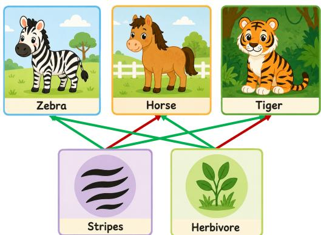
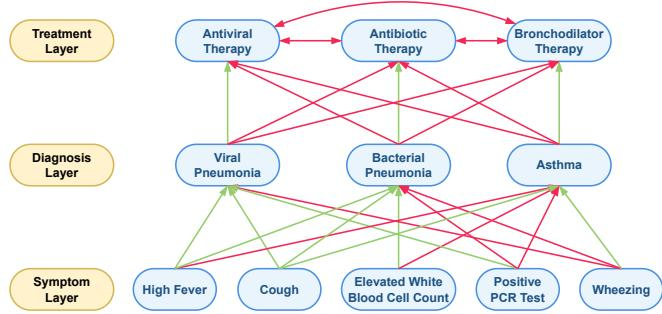
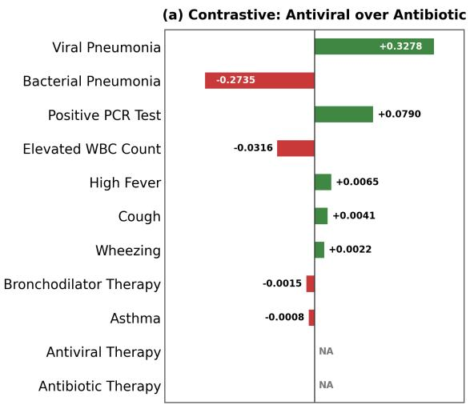
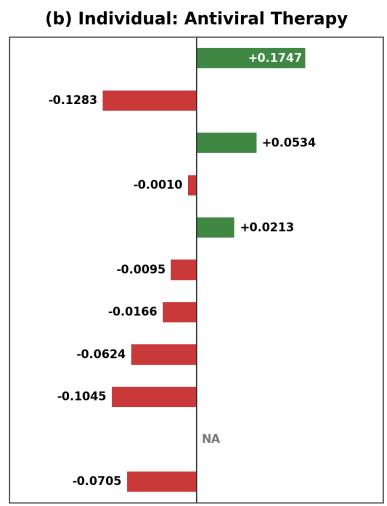
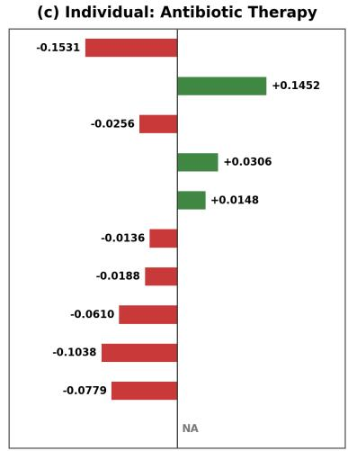
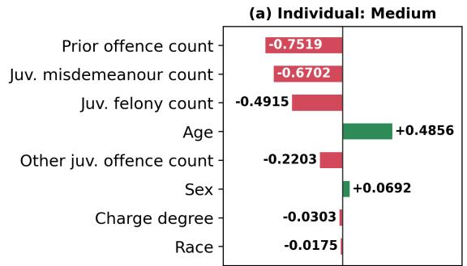
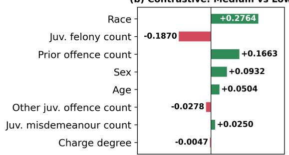
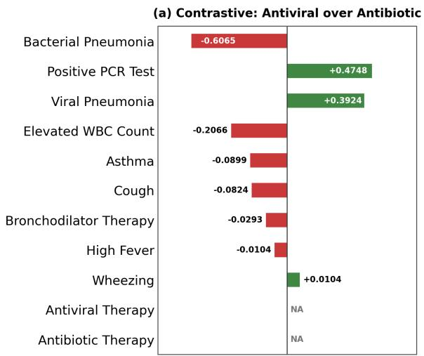
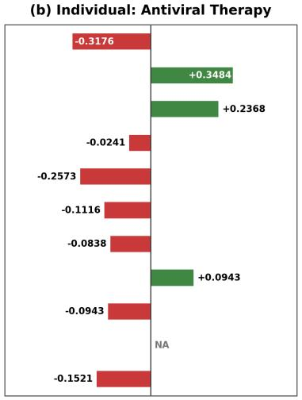
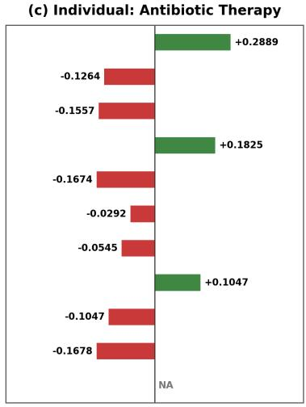

# Contrastive Explanations in Quantitative Bipolar Argumentation Frameworks

Xiang Yin1, Nico Potyka2, Antonio Rago3, Francesca Toni1

1Imperial College London, UK

2Cardif University, UK

3King’s College London, UK

{x.yin20, f.toni}@imperial.ac.uk, potykan@cardif.ac.uk, antonio.rago@kcl.ac.uk

## Abstract

Argumentation frameworks are useful tools for representing and reasoning with information in a variety of settings, e.g. in supplementing AI models as they perform classification tasks, with a notable benefit of providing additional explainability. In this paper, we introduce contrastive explanations for Quantitative Bipolar Argumentation Frameworks (QBAFs), one such formalism. Unlike most existing explanations for QBAFs, which explain the reasoning outcome of a single argument of interest (i.e. a topic argument), contrastive explanations explain the diference between two topic arguments. We introduce a general form of contrastive attribution functions (CAFs) and establish a set of general properties they should satisfy. We introduce CAFs based on removal, gradients and Shapley values, and study their properties. Finally, to illustrate contrastive explanations, we demonstrate their usefulness in healthcare and bias identification settings.

## 1 Introduction

Argumentation frameworks have recently emerged as useful tools for representing and reasoning with information in a range of settings, particularly those where explainability may otherwise be lacking, e.g. in image classification (Ayoobi, Potyka, and Toni 2025; Kori, Rago, and Toni 2025), recommendation (Rago et al. 2021, 2025) and claim verification (Freedman et al. 2025; Zhu et al. 2025). Quantitative Bipolar Argumentation Frameworks (QBAFs) (Baroni et al. 2015) are one such formal model for reasoning with conflicting and supporting information. A QBAF consists of a set of arguments, attack and support relations among them, and a base scorefunction assigning each argument a prior strength. To evaluate a QBAF, a gradual semantics (e.g., (Rago et al. 2016)) is applied to update the base scores by aggregating the influence of attackers and supporters, resulting in a final strength for each argument. QBAFs are well suited to model decision-support tasks (e.g., (Cocarascu, Rago, and Toni 2019; Rago et al. 2021)): the final strengths can serve as decision scores, while the explicit attack and support structure provides a transparent account of the reasoning process (e.g. (Cocarascu, Rago, and Toni 2019)). Figure 1 shows a toy QBAF for an animal classification problem. The possible classes (zebra, horse, tiger), and the relevant features (stripes, herbivore) are represented as arguments. Support and attack relations indicate whether a feature supports or attacks a class. All arguments are assigned a neutral base score of 0.5, and the DF-QuAD semantics (Rago et al. 2016) is applied to compute the strengths of the class arguments. Here, zebra is predicted as it has the highest strength of 0.875, while horse and tiger both have strength 0.5.

  
Figure 1: An example QBAF for an animal classification task. Squares represent arguments; green and red edges indicate support and attack relations, respectively. The contrastive explanation for zebra over horse is stripes, whereas that for zebra over tiger is being a herbivore.

Given this prediction, a user may ask: why zebra? A possible explanation is that the animal has stripes and is herbivorous. However, research in philosophy, psychology, and social science shows that explanations are contrastive: when people ask a “Why P?” question, they often implicitly ask “why P rather than Q?”, where P is a fact while Q is some contrast case (Lipton 1990; Hilton 1990; Van Bouwel and Weber 2002; Ylikoski 2007; Chin-Parker and Cantelon 2017; Miller 2019, 2021). In our example, ifthe question is why the prediction is zebra rather than horse, the contrastive explanation should highlight stripes, since both zebra and horse are herbivorous. In contrast, if the question is why the prediction is zebra rather than tiger, the contrastive explanation should highlight herbivore, since this feature distinguishes zebra from tiger (in this example), whereas stripes does not. Thus, contrastive explanations aim to identify the discriminative reasons (referred to as diference conditions in (Lipton 1990))

that distinguish $P$ from a contrast case $Q ,$ rather than listing all explanatory reasons. This makes contrastive explanations simpler, more feasible, and cognitively less demanding (Miller 2021).

However, existing explanation methods for QBAFs, such as attribution explanations (Yin, Potyka, and Toni 2023) and counterfactual explanations (Yin, Potyka, and Toni 2024a), mainly focus on explaining the strength of a single argument of interest (topic argument). In other words, they answer “why $P ^ { \ast }$ but overlook the contrast question “why $P$ rather than $Q ^ { , , }$ , and thus fail to capture the “why not $Q ^ { , , }$ aspect. This motivates the central research question of this paper: Given two topic arguments in a QBAF, how can we explain the diference between their strengths?

To address this question, we introduce attribution-based contrastive explanations for QBAFs. Our key idea is to assign attribution scores to all non-topic arguments with respect to the strength gap between two topic arguments. Attribution scores are well suited to this purpose because they provide an intuitive quantitative measure of each argument’s influence on the contrast. By comparing these scores, we can identify arguments that discriminate between the two topic arguments without manually inspecting all reasoning paths. For example, when explaining why zebra rather than horse, stripes should receive a larger attribution score than herbivore, as the latter supports both classes.

The contributions of this paper are as follows:

• We introduce contrastive explanations and desirable properties that they should satisfy (Sections 3, 4);

• We study three concrete contrastive explanation methods and their properties (Sections 5, 6, 7);

• We illustrate the use of contrastive explanations in healthcare (Section 8) and bias detection (Section 9).

## 2 Preliminaries

We recall the definition of QBAFs (Baroni et al. 2015).

Definition 1 (QBAF). A QBAF is a quadruple $\mathcal { Q } ^ { \mathrm { ~ ~ } } =$ $\langle \mathcal { A } , \mathcal { R } ^ { - } , \mathcal { R } ^ { + } , \tau \rangle$ where A is a finite set of arguments; ${ \mathcal { R } } ^ { - } , { \mathcal { R } } ^ { + } \subseteq { \mathcal { A } } \times { \mathcal { A } }$ are attack and support relations such that $\mathcal { R } ^ { - } \cap \mathcal { R } ^ { + } = \emptyset ; \tau : \mathcal { A } \to [ 0 , 1 ]$ is a base score function.

In the remainder, unless specified otherwise, we will assume a QBAF $\mathcal { Q } = \langle \mathcal { A } , \mathcal { R } ^ { \bar { - } } , \mathcal { R } ^ { + } , \tau \rangle$ as given. At several places, we will consider QBAF restrictions (Kampik et al. 2024) induced by subsets of arguments.

Definition 2 (QBAF Restriction). Given a subset of arguments ${ \mathcal { A } } ^ { \prime } \subseteq A ,$ , the QBAF restriction of Q to $\mathcal { A } ^ { \prime }$ is $\mathcal { Q } _ { \downarrow _ { A ^ { \prime } } } =$ $\langle \mathcal { A } ^ { \prime } , \mathcal { R } ^ { - } \cap ( A ^ { \prime } \times \mathcal { A } ^ { \prime } ) , \mathcal { R } ^ { + } \cap ( A ^ { \prime } \times \mathcal { A } ^ { \prime } ) , \tau \cap ( A ^ { \prime } \times [ 0 , \overset { \cdot } { 1 } ] ) \rangle$

We use gradual semantics to assign a dialectical strength to each argument in a QBAF. Examples of gradual semantics include DF-QuAD (Rago et al. 2016), Restricted Eulerbased semantics (REB) (Amgoud and Ben-Naim 2018), and Quadratic Energy semantics (QE) (Potyka 2018).

Definition 3 (Gradual Semantics). A gradual semantics is a function σ $: \mathcal { A } \to [ 0 , 1 ] \cup \{ \perp \}$ . We call $\sigma ( \alpha )$ the strength of α and say that it is undefined $i f f \sigma ( \alpha ) = \bot$

All gradual semantics that we are aware of are instances of the class of modular semantics (Mossakowski and Neuhaus 2018) and we will make use of some of their properties later. Roughly speaking, modular semantics compute strength values by an update process that starts from the base scores, and repeatedly updates the strengths of arguments based on the strengths of their attackers and supporters. The update function of modular semantics can be decomposed into an aggregation function that aggregates the strengths of attackers and supporters, and an influence function that uses the aggregate to adapt the base score.

An undefined strength value $( \sigma ( \alpha ) = \bot )$ may arise in some cyclic QBAFs when the update process fails to converge (Mossakowski and Neuhaus 2018). However, in all known cases, the convergence problems can be solved by continuizing the semantics (Potyka 2019; Potyka and Booth 2024b). In the following, we will focus on QBAFs for which all strength values are defined.

To explain the strength of a topic argument $\alpha \in { \mathcal { A } }$ , attribution functions (AFs) $\phi _ { \alpha } : \bar { \mathcal { A } } \backslash \{ \alpha \}  \mathbb { R }$ quantify the influence of arguments on α (Kampik et al. 2024). In general, a larger magnitude of $\phi _ { \alpha } ( \beta )$ indicates a stronger influence, while its sign indicates whether the influence is positive or negative.

Removal-based AFs measure by how much the strength of α changes when $\beta$ is removed from $\mathcal { Q } .$

Definition 4 (Removal-based AF). For any $\alpha , \beta \in { \mathcal { A } }$ and $\alpha \neq \beta , l e t \mathcal { A } ^ { \prime } = \mathcal { A } \backslash \left\{ \beta \right\}$ , the removal-based attributionfrom $\beta$ to α is $\phi _ { \alpha } ^ { R } ( \beta ) = \dot { \sigma } _ { \mathcal { Q } } ( \dot { \alpha } ) - \sigma _ { \mathcal { Q } _ { \dot { \mathcal { L } } _ { A ^ { \prime } } } } ( \alpha )$

Gradient-based AFs measure the sensitivity of α with respect to small changes in the base score of $\beta .$

Definition 5 (Gradient-based AF). For all $\alpha , \beta \in { \mathcal { A } } ,$ $\alpha \neq \beta ,$ , and $\epsilon \in [ - \tau ( \beta ) , 0 ) \cup ( 0 , 1 - \tau ( \beta ) ] ,$ , let $\mathcal { Q } _ { \epsilon } ~ =$ $\langle \mathcal { A } , \mathcal { R } ^ { - } , \mathcal { R } ^ { + } , \tau _ { \epsilon } \rangle$ , where $\tau _ { \epsilon } ( \beta ) = \tau ( \beta ) + \epsilon a n d \tau _ { \epsilon } ( \gamma ) = \tau ( \gamma )$ for all $\gamma \in { \mathcal { A } } \setminus \left\{ \beta \right\}$ }. The gradient-based attribution from $\beta$ to α is defined as $\begin{array} { r } { \phi _ { \alpha } ^ { G } ( \beta ) = \operatorname* { l i m } _ { \epsilon  0 } \frac { \sigma _ { Q _ { \epsilon } } ( \alpha ) - \sigma _ { Q } ( \alpha ) } { \epsilon } } \end{array}$

Shapley-based AFs measure the average contribution of $\beta$ to the strength of α when adding $\beta$ to a subgraph of Q.

Definition 6 (Shapley-based AF). For $\alpha , \beta \in { \mathcal { A } }$ and α $\neq \beta ,$ the Shapley-based attributionfrom $\beta$ to α is defined as

$$
\phi _ { \alpha } ^ { S } ( \beta ) = \sum _ { B \subseteq \mathcal { A } _ { \overline { { \alpha } } } \backslash \{ \beta \} } w ( B ) \cdot c _ { \beta } ( B ) ,
$$

where $\begin{array} { r } { A _ { \overline { { \alpha } } } ~ = ~ { \cal A } ~ \backslash ~ \{ \alpha \} , ~ w ( B ) ~ = ~ \frac { | B | ! \cdot ( | A _ { \overline { { \alpha } } } | - | B | - 1 ) ! } { | A _ { \overline { { \alpha } } } | ! } } \end{array}$ and $c _ { \beta } ( B ) = \sigma _ { \Theta _ { \downarrow _ { B \cup \{ \alpha , \beta \} } } } ( \alpha ) - \sigma _ { \Theta _ { \downarrow _ { B \cup \{ \alpha \} } } } ( \alpha ) .$

## 3 Contrastive Explanations

To explain the strength diference between two topic arguments α and $\beta ,$ we introduce contrastive attributionfunctions $( C A F s )$ , which quantify the influence of arguments on their relative strength.

Notation 1. For any $\alpha , \beta \in { \mathcal { A } } ,$ , we write $\alpha \succeq \beta$ to denote the contrast α is stronger than $\beta .$

Definition 7 (Contrastive Attribution Function (CAF)). A $C A F f o r \alpha , \beta \in { \mathcal { A } }$ is afunction $\Phi _ { \alpha \succeq \beta } : { \cal A } \setminus \{ \alpha , \beta \}  \mathbb { R }$

Intuitively, apositive influence $\Phi _ { \alpha \succeq \beta } ( \gamma ) > 0$ means that $\gamma$ contributes more favourably to $\alpha$ than to β. This may occur when $\gamma$ supports α more strongly than $\beta ,$ attacks α less strongly than $\beta ,$ or supports α while attacking $\beta .$ Conversely, a negative influence means that γ contributes more favourably to $\beta$ relative to α. If $\Phi _ { \alpha \succeq \beta } ( \gamma ) = 0 , \gamma$ contributes equally to α and $\beta$ and we call the influence neutral.

To narrow down the choice of a CAF, we suggest some desirable properties that a CAF should satisfy.

## 4 Desirable Properties of CAFs

To begin with, if an argument positively afects $\alpha \succeq \beta ,$ , then it should negatively afect $\beta \succeq \alpha$ by the same amount.

Property 1 (Antisymmetry). For any $\alpha , \beta \in { \mathcal { A } }$ and $\gamma \in$ $\bar { \mathcal { A } } \bar  \langle \alpha , \beta \} , \Phi _ { \alpha \succeq \beta } \bar { ( \gamma ) } = - \Phi _ { \beta \succeq \alpha } ( \gamma )$

Proposition 1. IfΦ satisfies antisymmetry,then $\Phi _ { \alpha \succeq \alpha } ( \gamma ) { = } 0 .$

If an attribution function ϕ is well suited to measure the influence of arguments in a domain, we may want that a CAF is calibrated w.r.t. ϕ in the following sense.

Property 2 (ϕ-Calibration). Let ϕ be an attributionfunction. For any $\alpha , \beta \in { \mathcal { A } }$ and $\gamma \in { \mathcal { A } } \setminus \{ \alpha , \beta \} , i f \phi _ { \alpha } ( \gamma ) = a$ and $\phi _ { \beta } ( \gamma ) = 0 ,$ , then $\Phi _ { \alpha \succeq \beta } ( \gamma ) = a .$

Let us note that antisymmetry implies that a symmetrical calibration property holds for the second argument.

Proposition 2 (Inverse ϕ-Calibration). IfΦ satisfies antisymmetry and ϕ-Calibration, then $\phi _ { \alpha } ( \gamma ) = 0$ and $\phi _ { \beta } ( \gamma ) = b$ implies $\Phi _ { \alpha \succeq \beta } ( \gamma ) = - b .$

If the influence of $\gamma$ on both α and $\beta$ is equal according to a reference attribution function $\phi ,$ then the influence of γ on $\alpha \succeq \beta$ should be 0.

Property 3 (ϕ-Neutrality). Let ϕ be an attributionfunction. For any $\alpha , \beta \in \mathcal { A } a n d \gamma \in \mathcal { A } \backslash \{ \alpha , \beta \} i f \phi _ { \alpha } ( \gamma ) = \phi _ { \beta } ( \gamma ) ,$ then $\Phi _ { \alpha \succeq \beta } ( \gamma ) = 0$

Similarly, if γ influences α stronger than $\beta$ according to a reference attribution function $\phi ,$ , then the influence of $\gamma$ on $\alpha \succeq \beta$ should be positive.

Property 4 (ϕ-Monotonicity). Let ϕ be an attributionfunction. For any $\alpha , \beta \in { \mathcal { A } }$ and $\gamma \in { \mathcal { A } } \setminus \{ \alpha , \beta \} , i f \phi _ { \alpha } ( \gamma ) >$ $\phi _ { \beta } ( \gamma )$ , then $\Phi _ { \alpha \succeq \beta } ( \gamma ) > 0$

Antisymmetry guarantees again a symmetric behaviour for the case that γ influences α less than $\beta .$

Proposition 3. If Φ satisfies antisymmetry and $\phi -$ Monotonicity, then $\phi _ { \alpha } ( \gamma ) < \phi _ { \beta } ( \gamma )$ implies $\Phi _ { \alpha \succeq \beta } ( \gamma ) < 0$

## 5 Derived CAFs

Since attribution functions measure the influence of arguments on an individual argument, one natural idea to define CAFs is to combine the individual attribution values by a binary function.

Definition 8 (Derived CAFs). $A C A F \Phi _ { \alpha \succeq \beta }$ is called derived from an attribution function ϕ if there is a function $f :$ $\overline { { \mathbb { R } } } ^ { 2 }  \mathbb { R }$ such that for any $\gamma \in { \mathcal { A } } \setminus \{ \alpha , \beta \} , \Phi _ { \alpha \succeq \beta } ( \gamma ) =$ $f ( \phi _ { \alpha } ( \gamma ) , \phi _ { \beta } ( \gamma ) )$ ).

As we show next, the properties from the previous section can be satisfied by inducing a CAF from a reference attribution function using subtraction.

Proposition 4. $I f \Phi _ { \alpha \succeq \beta }$ is derived from an attribution function ϕ using subtraction, then $\Phi _ { \alpha \succeq \beta }$ satisfies Antisymmetry, ϕ-Calibration, ϕ-Neutrality and ϕ-Monotonicity.

While subtraction-derived CAFs satisfy all previously proposed properties, there could still be other functions that lead to the same properties. We can characterise subtractionderived measures by adding the following additivity property. Property 5 (Additivity). For any $\alpha , \beta , \eta \in { \mathcal { A } }$ and any $\gamma \in$ $\begin{array} { r } { A \backslash \{ \alpha , \beta , \eta \} , \Phi _ { \alpha \succeq \beta } ( \gamma ) = \Phi _ { \alpha \succeq \eta } ( \gamma ) + \Phi _ { \eta \succeq \beta } ( \gamma ) . } \end{array}$ Proposition 5. $I f \Phi _ { \alpha \succeq \beta }$ is derived using subtraction, then $\Phi _ { \alpha \succeq \beta }$ satisfies additivity.

Additivity can be used to fully characterise subtractionderived CAFs for allplausible attribution functions. By plausible we mean the following: all gradual semantics that we are aware of belong to the class of modular semantics and all modular semantics satisfy the independence property which states that arguments can only afect each other if there is a directed path between them (Potyka and Booth 2024a). Consequently, when adding a new argument to a graph without connecting it to any other arguments, the attribution value of this argument should be 0 for all other arguments.

Definition 9 (Plausibility). An attribution function $\phi$ is called plausible iffor each QBAF Q and the QBAF Q′ resulting from Q by adding a single argument η (and no edges), it holds that (1) the attribution values of all arguments from $\mathcal { Q }$ are equal in both $\mathcal { Q }$ and $\mathcal { Q } ^ { \prime } ,$ , and $( \dot { 2 } ) \ \phi _ { \alpha } ( \eta ) = 0$ for all arguments α from Q.

All AFs introduced previously are plausible.

Proposition 6. $\phi _ { \alpha } ^ { R } , \phi _ { \alpha } ^ { G }$ and $\phi _ { \alpha } ^ { S }$ are plausible AFs under all modular semantics.

We have the following characterisation of subtractionderived measures.

Proposition 7. If Φ is a CAF derived from a plausible attribution function $\phi ,$ and Φ satisfies antisymmetry, $\phi -$ calibration and additivity, then, under all modular gradual semantics, Φ is equal to the CAF derivedfrom ϕ using subtraction.

Note that, based on the choice of $\phi ,$ the derived CAF will be calibrated diferently, and so CAFs derived from diferent attribution functions will usually lead to diferent CAFs. In the following proposition, we present compact formulas for CAFs derived from our previously introduced AFs.

Proposition 8. The CAFs $\Phi _ { \alpha \succeq \beta } ^ { R } , \Phi _ { \alpha \succeq \beta } ^ { G } , \Phi _ { \alpha \succeq \beta } ^ { S }$ derivedfrom the removal-based, gradient-based and Shapley-based AFs using subtraction are defined as follows:

$$
\Phi _ { \alpha \succeq \beta } ^ { R } ( \gamma ) = \left( \sigma _ { \mathscr { Q } } ( \alpha ) - \sigma _ { \mathscr { Q } } ( \beta ) \right) - \left( \sigma _ { \mathscr { Q } _ { \mathscr { L } _ { A ^ { \prime } } } } ( \alpha ) - \sigma _ { \mathscr { Q } _ { \mathscr { L } _ { A ^ { \prime } } } } ( \beta ) \right) .
$$

$$
\Phi _ { \alpha \succeq \beta } ^ { G } ( \gamma ) = \operatorname* { l i m } _ { \epsilon  0 } \frac { ( \sigma _ { Q ^ { \prime } } ( \alpha ) - \sigma _ { Q ^ { \prime } } ( \beta ) ) - ( \sigma _ { Q } ( \alpha ) - \sigma _ { Q } ( \beta ) ) } { \epsilon }
$$

$$
\Phi _ { \alpha \underline { { > } } \beta } ^ { S } ( \gamma ) = \sum _ { B \subseteq A \backslash \{ \alpha , \beta , \gamma \} } \big ( w ( B ) \cdot ( c _ { \gamma \to \alpha } ( B ) - c _ { \gamma \to \beta } ( B ) )
$$

$$
+ w ( B \cup \{ \beta \} ) \cdot ( c _ { \gamma  \alpha } ( B \cup \{ \beta \} ) - c _ { \gamma  \beta } ( B \cup \{ \alpha \} ) ) ) ,
$$

Algorithm 1: Dynamic Programming CAF Computation   
Input: A QBAF Q, CAF $\Phi _ { \alpha \succeq \beta }$ , set of topic arguments   
$\{ t _ { 1 } , \dots , t _ { T } \}$ , query argument γ.   
Output: Map M such that $\begin{array} { r } { \dot { M } [ i , j ] \ = \ \Phi _ { t _ { i } \succeq t _ { j } } ( \gamma ) } \end{array}$ for all   
$1 \leq \dot { i } < j \leq \dot { T } .$   
1: Initialise empty map M   
2: for $i = 1 \stackrel { \cdot \mathrm { ~ \large ~ . ~ } } { \mathrm { ~ \large ~  ~ t ~ o ~ } } \bar { T } - 1 \stackrel { \cdot \mathrm { ~ \scriptsize ~ . ~ } } { \mathrm { ~ \scriptsize ~ . ~ } }$ do   
3: $M [ i , i + 1 ] \gets \Phi _ { t _ { i } \succeq t _ { i + 1 } } ( \gamma )$   
4: for $i \stackrel { . } { = } 1 \stackrel { . } { \tan } \cal T - 2$ do   
5: for $j = i + 2 \textnormal { t o } T$ do   
6: $\bar { M } [ i , j ] = M [ i , j - 1 ] + M [ j - 1 , j ] .$   
7: return M

$$
w h e r e \ c _ { \gamma \to x } ( X ) = \sigma _ { { \mathcal Q } _ { \downarrow _ { X \cup \{ x , \gamma \} } } } ( x ) - \sigma _ { { \mathcal Q } _ { \downarrow _ { X \cup \{ x \} } } } ( x ) .
$$

## 6 Computing Subtraction-Derived CAFs

In applications, our topic arguments often correspond to alternatives that we can choose from. For example, Figure 2 in Section 8 shows a medical decision QBAF where we can choose one of three diferent treatments (antiviral, antibiotic or bronchodilator). Now consider a problem with T topic arguments $t _ { 1 } , \dots , t _ { T }$ . When computing the impact of an argument on all preferences $t _ { i } \succeq t _ { j }$ naively, we require $T \cdot ( T - 1 ) = { \cal O } ( T ^ { 2 } )$ CAF calls. In applications like healthcare, where we may have dozens of diferent diagnoses or treatments, this can be too expensive. We can exploit properties of subtraction-derived CAFs to reduce the number of CAF calls significantly.

To begin with, note that anti-symmetry allows us to compute $\Phi _ { t _ { i } \succeq t _ { j } } ( \gamma )$ from $\Phi _ { t _ { i } \succeq t _ { i } } ( \gamma )$ . Hence, it sufices to consider only preferences $t _ { i } \succeq t _ { j }$ with $i < j$ . While this reduces the number of computations to $\frac { T \cdot ( T - 1 ) } { 2 } = { \cal { O } } ( T ^ { 2 } )$ , it remains quadratic asymptotically.

Additivity allows us to design a dynamic programming algorithm that requires only a linear number of CAF calls.

Proposition 9. $I f \Phi _ { \alpha \succ \beta }$ satisfies additivity,Algorithm 1 computes $\Phi _ { t _ { i } \succeq t _ { j } } ( \gamma )$ for all $1 \leq i < j \leq T$ with $O ( T ) \ \Phi _ { \alpha \succeq \beta } .$ calls. ${ \cal I f } \Phi _ { \alpha \succeq \beta }$ can be computed in time $O ( C )$ , the overall time complexity ofthe algorithm is $O ( T \cdot C + \overbar { T ^ { 2 } } )$ .

## 7 Method-Specific Properties

We regard the properties introduced in Section 4 as desirable for all CAFs and they are indeed satisfied by all previously introduced CAFs. To distinguish our CAFs axiomatically, we introduce some additional properties inspired by (Kampik et al. 2024) to separate them.

Counterfactuality captures the intuition that removing an argument with positive (negative) attribution should decrease (increase) the strength diference between the topic arguments.

Property 6 (Counterfactuality). $\Phi _ { \alpha \succeq \beta } ( \gamma )$ satisfies Counterfactuality if, for any $\gamma \in { \mathcal { A } } \setminus \{ \alpha , \beta \}$ , letting $\mathcal { \dot { A } } ^ { \prime } = \mathcal { A } \setminus \{ \gamma \}$ thefollowing statements hold: $I . ~ I f \Phi _ { \alpha \succeq \beta } ( \gamma ) < 0$ , then $\sigma _ { \mathcal { Q } } ( \alpha ) - \sigma _ { \mathcal { Q } } ( \beta ) < \sigma _ { { \mathcal { Q } } _ { \downarrow _ { A ^ { \prime } } } } ( \alpha ) -$

$\sigma _ { \mathscr { Q } _ { \downarrow } } \ l _ { 4 } , ( \beta ) ;$   
2. $\bar { I f } ^ { * } \Phi _ { \alpha \succeq \beta } ( \gamma ) > 0$ , then $\sigma _ { \mathcal { Q } } ( \alpha ) - \sigma _ { \mathcal { Q } } ( \beta ) > \sigma _ { { \mathcal Q } _ { \downarrow } , \langle \alpha \rangle } -$   
$\sigma _ { \mathscr { Q } _ { \downarrow _ { A ^ { \prime } } } } ( \beta ) .$

Proposition 10. $\Phi _ { \alpha \succeq \beta } ^ { R } ( \gamma )$ satisfies Counterfactuality, while $\Phi _ { \alpha \succeq \beta } ^ { G } ( \gamma )$ and $\Phi _ { \alpha \succeq \beta } ^ { S } ( \bar { \gamma } )$ can violate Counterfactuality.

Local faithfulness constrains the influence of an argument on the strength gap between two topic arguments when perturbing its base score. An argument with positive (negative) influence will locally increase (decrease) the strength gap between two topic arguments when its base score is slightly increased.

Property 7 (Local Faithfulness). $\Phi _ { \alpha \succeq \beta } ( \gamma )$ satisfies Local Faithfulness wrt. σ if, for any $\gamma \in { \mathcal { A } } { \overline { { \backslash } } } \left\{ \alpha , \beta \right\}$ , there exists $\delta > 0$ such that,for all $\dot { e } \in [ \bar { \tau ( \gamma ) } - \delta , \tau ( \dot { \gamma } ) + \delta ] \acute { \cap } [ 0 , 1 ]$ , letting $\mathcal { Q } ^ { \prime } = \langle \mathcal { A } , \mathcal { R } ^ { - } , \mathcal { R } ^ { + } , \tau ^ { \prime } \rangle$ be the QBAF such that $\tau ^ { \prime } ( \gamma ) = e$ and $\tau ^ { \prime } ( \eta ) \stackrel { \cdot } { = } \tau ( \eta )$ for all $\dot { \eta } \in \mathcal { A } \backslash \{ \gamma \}$ . the following statements hold:

$I . I f \Phi _ { \alpha \succeq \beta } ( \gamma ) < 0$ , then $\sigma _ { \mathcal { Q } } ( \alpha ) - \sigma _ { \mathcal { Q } } ( \beta ) \leq \sigma _ { \mathcal { Q } ^ { \prime } } ( \alpha ) - \sigma _ { \mathcal { Q } ^ { \prime } } ( \beta )$ whenever e $: < \tau ( \gamma )$ , and $\sigma _ { \mathcal { Q } } ( \alpha ) - \sigma _ { \mathcal { Q } } ( \beta ) \geq \sigma _ { \mathcal { Q } ^ { \prime } } ( \alpha ) - \sigma _ { \mathcal { Q } ^ { \prime } } ( \beta )$ whenever $e > \tau ( \gamma ) ,$ ;   
$2 . I f \Phi _ { \alpha \succeq \beta } ( \gamma ) > 0 ,$ , then $\sigma _ { \mathcal { Q } } ( \alpha ) - \sigma _ { \mathcal { Q } } ( \beta ) \geq \sigma _ { \mathcal { Q } ^ { \prime } } ( \alpha ) - \sigma _ { \mathcal { Q } ^ { \prime } }$ (β) whenever e $: < \tau ( \gamma )$ , and $\sigma _ { \mathcal { Q } } ( \alpha ) - \sigma _ { \mathcal { Q } } ( \beta ) \leq \sigma _ { \mathcal { Q } ^ { \prime } } ( \alpha ) - \sigma _ { \mathcal { Q } ^ { \prime } } ( \beta )$ whenever $e > \tau ( \gamma )$

Proposition 11. $\Phi _ { \alpha \succeq \beta } ^ { G } ( \gamma )$ satisfies Local Faithfulness, while $\Phi _ { \alpha \succeq \beta } ^ { R } ( \gamma )$ and $\Phi _ { \alpha \succeq \beta } ^ { S } ( \gamma )$ can violate Local Faithfulness.

Cross-topic-adjusted Eficiency states that the overall contrastive efect should be fully explained by two components: the aggregate attribution of the non-topic arguments and a correction capturing the imbalance between the attributions of the two topic arguments to each other. The sum of these components should correspond to the diference between the final-strength gap and the base-score gap of the two topic arguments. When the cross-topic attributions are equal, the correction vanishes and the property reduces to standard Efficiency (Shapley 1951).

Property 8 (Cross-topic-adjusted Eficiency). $\Phi _ { \alpha \succeq \beta } ( \gamma )$ satisfies Cross-topic-adjusted Eficiency $\begin{array} { r l r } { i f ^ { - } ~ \sum _ { \gamma \in A \backslash \{ \alpha , \beta \} } \Phi _ { \alpha \succeq \beta } ( \gamma ) ~ + ~ \big ( \phi _ { \alpha } ( \beta ) ~ - ~ \phi _ { \beta } ( \alpha ) \big ) ~ = } & { { } } \end{array}$ $\left( \sigma _ { \mathcal { Q } } ( \alpha ) - \sigma _ { \mathcal { Q } } ( \beta ) \right) - \left( \tau ( \alpha ) - \tau ( \beta ) \right)$

Proposition 12. $\Phi _ { \alpha \succeq \beta } ^ { S } ( \gamma )$ satisfies Cross-topic-adjusted Efficiency, while $\Phi _ { \alpha \succeq \beta } ^ { R } ( \gamma )$ and $\Phi _ { \alpha \succeq \beta } ^ { G } ( \gamma )$ can violate it.

Discussion While we do not regard Counterfactuality, Local Faithfulness and Cross-topic-adjusted Eficiency as essential, we showed that they allow us to distinguish our CAFs and can therefore guide the choice of the CAF in practice. Intuitively, the removal-based CAF measures how the strength diference changes when an argument is removed and is therefore appropriate when a counterfactual interpretation of attribution values is desirable. The gradient-based CAF captures the local sensitivity of the strength diference to changes in arguments’ base scores, and can be used when we are interested in the robustness to small changes. Finally, the Shapley-based CAF measures an argument’s average marginal contribution and is preferable when the diference should be fully explained by the attribution values and the cross-topic component.

  
Figure 2: A QBAF for treatment recommendation in healthcare (taken from (Yin et al. 2026a)). Blue nodes denote arguments and green/red edges, resp., support/attack relations.

## 8 CAFs for Healthcare

We now present an illustrative example of CAFs in a healthcare setting. Figure 2 (taken from (Yin et al. 2026a)) shows how a QBAF can support practitioners in selecting suitable treatments for a patient based on observed symptoms 1. This QBAF consists of three layers. The bottom layer represents observable symptoms (e.g., cough, wheezing). The intermediate layer represents possible diagnoses (e.g., viral/bacterial pneumonia). The top layer represents possible treatments (e.g., antiviral/antibiotic therapy). These layers are connected hierarchically via attack and support relations, which capture relationships between symptoms, diagnoses, and treatments. For example, wheezing is commonly associated with asthma (support). Asthma can be treated by bronchodilator therapy (support) but not by antiviral therapy (attack). Treatment arguments are connected by mutual attacks because they correspond to competing treatment choices.

Base scores can reflect prior information such as the severity of observed symptoms, the plausibility of diagnoses based on a patient’s medical history, or the suitability of candidate treatments. For instance, a higher body temperature may induce a higher base score for the highfever argument. In this example, we assign a base score of 0.5 to all arguments.

After specifying the QBAF structure and base scores, we compute the strengths of arguments under QE semantics (Potyka 2018), following the setting of (Yin et al. 2026a). Since the symptom arguments have neither attackers nor supporters, their strengths remain equal to their base scores, namely 0.5. The strengths of the diagnosis arguments are 0.75 for viral pneumonia, 0.6 for bacterial pneumonia, and 0.4 for asthma. The strengths of the treatment arguments are 0.3564 for antiviral therapy, 0.2368 for antibiotic therapy, and 0.1479 for bronchodilator therapy. Thus, antiviral therapy is selected as the most suitable treatment, as it has the highest strength among the candidate treatments.

The strength ranking identifies the recommended treatment, but does not explain which symptoms are responsible for this choice. For example, a patient may ask why antiviral therapy is recommended instead of antibiotic therapy. This is a contrastive question and we can use Shapley-based CAFs to compute an answer. We present gradient-based explanations in Section B of the Supplementary Material.

Contrastive Explanations. Figure 3(a) shows the Shapley-based contrastive explanations for our example. We first analyse the attributions for the five symptom arguments. Among them, Positive PCR Test (abbreviated as PCR) has the largest positive influence on the contrast of the selected treatment (antiviral therapy) over the alternative (antibiotic therapy). The transparent QBAF structure allows us to visualise this influence through paths connecting PCR to the two treatment arguments. Through viral pneumonia, PCR supports a diagnosis that supports antiviral therapy and attacks antibiotic therapy. Thus, these paths both strengthen the selected treatment and weaken the alternative. Furthermore, through bacterial pneumonia, PCR attacks a diagnosis that supports antibiotic therapy and attacks antiviral therapy. The paths through Asthma are less discriminative for this contrast, since weakening Asthma benefits both treatments.

We next analyse the influence of arguments in the diagnosis layer. Viral and bacterial pneumonia have the strongest positive and negative influence on the contrast, respectively. This is intuitive because viral pneumonia directly supports the selected treatment and attacks the alternative; whereas bacterial pneumonia directly attacks the selected treatment and supports the alternative.

Individual Explanations. To clarify what we gain by using CAFs, we compare them to individual AFs. This comparison highlights several notable diferences. First, an argument that has equal or similar influences on two individual treatments may become much less influential in the contrastive explanation. For example, asthma has a negative influence on both antiviral therapy and antibiotic therapy in the individual explanations. However, in the contrastive explanation, its attribution score is close to 0. This indicates that although asthma negatively influences the selected treatment, it is not a distinguishing argument in favour of antiviral therapy over antibiotic therapy because it also negatively influences the alternative in a symmetric manner. Second, an argument that is not very influential on the selected treatment in the individual explanation may become influential in the contrastive explanation. For instance, elevated WBC count has little influence on antiviral therapy, but it has the largest negative attribution score in the contrastive explanation due to its strong positive influence on antibiotic therapy.

Property Illustration. We illustrate cross-topic-adjusted eficiency, a key property uniquely guaranteed by Shapleybased CAFs. For the contrastive explanation in Figure 3(a), the final strength diference between antiviral and antibiotic therapy arguments is 0.3564 − 0.2368 = 0.1196, while the base score diference is 0.5 − 0.5 = 0. The non-topic contrastive attributions sum to 0.1123, while the cross-topic component is −0.0705 − (−0.0779) = 0.0074. Using unrounded values, their adjusted sum is 0.1196, as required. For the individual explanations, the attribution scores sum to −0.1436 for antiviral therapy in Figure 3(b) and −0.2632 for antibiotic therapy in Figure 3(c). These sums match the changes from the empty coalition to the full player set: 0.5 − 0.1436 = 0.3564 and $0 . 5 - 0 . 2 6 3 2 = 0 . 2 3 \bar { 6 } 8$

  
Figure 3: Shapley-based contrastive and individual explanations for treatment selection. Green bars indicate positive influence, while red bars indicate negative influence.

## 9 CAFs for Bias Detection

In this section, we demonstrate how contrastive explanations can help uncover biases in classification tasks (Jacovi et al. 2021). We use gradient-based CAFs to detect bias in multilayer perceptrons (MLPs), as analysing local sensitivity through gradient-based methods is a natural and widely used approach to explaining diferentiable neural networks (e.g., Integrated Gradients (Sundararajan, Taly, and Yan 2017)). In addition, gradient-based CAFs are computationally eficient, as they avoid the combinatorial calculations required by Shapley-based CAFs.

Dataset Selection and Preprocessing. We use the COMPAS dataset (ProPublica 2016; Angwin et al. 2016), which is widely used in algorithmic fairness research. The dataset contains defendants’ demographic and criminalhistory information and provides assessments of their recidivism risk. After data cleaning and restricting the dataset to African-American and Caucasian individuals, 5, 278 instances remain. Each instance is represented by eight input features: age, counts of juvenile felonies, misdemeanours, and other ofences, number of prior ofences, current charge degree, sex, and race. The score\_text field is used as the classification label and defines three risk categories: Low, Medium, and High.

To train a classifier with a known bias, we modify the labels before splitting the dataset. Specifically, we randomly relabel 70% of the African-American instances in the Low category as Medium, and around 70% of those in the Medium category as High, while leaving the labels of all Caucasian instances unchanged. This controlled modification enables the classifier to learn a race-related bias.

Classifier Architecture and Training. We train an MLP with one hidden layer containing 16 neurons on the modified dataset. The training/validation/test split was 64/16/20 %. The trained classifier achieves an accuracy of 64.58% on the test set. This is very low, but since we are only interested in explaining what a classifier learnt, it does not afect our experiments.

Explanations. We select an African-American instance from the test set that is correctly classified as Medium. When its race is changed to Caucasian while all other input features are held fixed, the MLP’s prediction changes from Medium to Low. Following the correspondence established in (Potyka 2021), we represent the MLP as a QBAF in which neurons are represented as arguments and weighted neural connections as support or attack relations . In particular, the eight input neurons correspond to eight input arguments, while the three output neurons correspond to the output arguments Low, Medium, and High. We then apply gradient-based AAEs to quantify the attribution of each input argument to the strength of the output argument Medium.

As shown in Figure 4(a), the gradient-based attribution from the input argument race to the output argument Medium is only −0.0175, the smallest in absolute magnitude among the eight input arguments. In contrast, when explaining why the prediction is Medium rather than Low, the contrastive gradient-based attribution of race is 0.2764 and becomes the largest among all input arguments, as shown in Figure 4(b). This indicates that race substantially increases the model’s preference for Medium over Low, although this race-related bias is not prominent in the individual AAEs. Thus, in this example, contrastive explanations reveal the controlled race-related bias in the MLP’s prediction.

To investigate whether this observation extends beyond our illustrative instance, we analysed 141 instances that are correctly classified as Medium in the test set, but whose predictions change to Low when race alone is changed from African-American to Caucasian. For each instance, the eight input arguments are ranked according to the absolute values of their gradient-based attributions. The mean importance rank of the race argument improves from 5.16 under the individual AAE to 2.62 under the contrastive AAE (with mean absolute attributions of 0.1424 and 0.4478, respectively). Note that a rank closer to 1 indicates a larger absolute attribution and hence greater importance. Hence, contrastive CAFs make the influence of the race argument more prominent than AFs.

(b) Contrastive: Medium vs Low  

  
Figure 4: Gradient-based individual and contrastive AAEs for a defendant classified as Medium risk. The race argument is the least prominent in the individual explanation but becomes the most prominent when explaining why the defendant is classified as Medium rather than Low risk.

## 10 Related Work

Our work is related to (Kampik, Čyras, and Alarcón 2024), which considers a QBAF Q and its updated version Q′, where the update may involve adding arguments, support/attack relations, or changing base scores of arguments. For any two topic arguments α and $\beta$ in both Q and $\mathcal { Q } ^ { \prime }$ , a strength inconsistency occurs when the relative ordering of their strengths is not preserved after the update (e.g., $\sigma _ { \mathscr { Q } } ( \alpha ) > \sigma _ { \mathscr { Q } } ( \beta )$ but $\sigma _ { \mathcal { Q } ^ { \prime } } ( \alpha ) < \sigma _ { \mathcal { Q } ^ { \prime } } ( \beta ) ;$ . They define three types of argument-setbased explanations: suficient explanations, whose changes alone can cause the inconsistency; counterfactual explanations, which are suficient explanations whose reversal restores strength consistency; and necessary explanations, which intersect all suficient explanations and therefore capture sets of changes that cannot all be avoided. In contrast, our work focuses on explaining the relative strength diference between two topic arguments within a single QBAF, rather than explaining strength inconsistency induced by an update from one QBAF to another.

(Kampik et al. 2026) consider a QBAF with multiple topic arguments and studies how to obtain a diferent, often desirable, ordering over their strengths by modifying the base scores of arguments in the QBAF. This is diferent from our work in that we focus on explaining the strength diference between two topic arguments, rather than obtaining a diferent strength ordering.

Our work is related to a growing line of research on explaining the strength of an individual topic argument $\alpha \in { \mathcal { A } }$ in QBAFs and their edge-weighted variants. Existing methods can be broadly divided into attribution-based and counterfactual approaches. Attribution-based methods aim to explain $\sigma _ { \mathscr { Q } } ( \alpha )$ by measuring the influence of other arguments on α (Delobelle and Villata 2019; Čyras, Kampik, and Weng 2022; Kampik et al. 2024; Yin, Potyka, and Toni 2023; Anaissy et al. 2025; Naudot et al. 2026), or the influence of relations on α (Amgoud, Ben-Naim, and Vesic 2017; Yin, Potyka, and Toni 2024b). By contrast, counterfactual explanations study how a desired strength value for α can be obtained, for instance by modifying argument base scores (Yin, Potyka, and Toni 2024a) or, in edge-weighted QBAFs, by modifying edge weights (Yin et al. 2026b). These works focus on explaining a single topic argument, whereas we focus on explaining the diference between two topic arguments.

## 11 Conclusions

We introduced contrastive explanations for QBAFs to explain diferences in the strengths of two topic arguments. As we saw, anti-symmetric CAFs that are calibrated with respect to an AF can be derived from the AF via subtraction. Furthermore, we showed that if a CAF satisfies anti-symmetry, additivity and is calibrated with respect to a plausible AF, it must be equivalent to the CAF derived from the AF via subtraction. Additivity also allowed us to design a dynamic programming algorithm that requires only a linear number of CAF calls when computing attribution values for all combinations of topic arguments. We considered three instanstiations based on removal, gradients and Shapley values and separated them by their distinctive properties. A case study in healthcare illustrates the practical applicability of our approach, and experiments demonstrate that contrastive explanations can help uncover bias in classifiers.

As future work, we plan to extend our approach to explain rankings among topic arguments. We also intend to conduct user studies to assess whether contrastive explanations improve users’ understanding of the mechanisms underlying QBAFs. Finally, we aim to explore further application domains in which contrastive explanations may be beneficial, e.g. in product recommendation (Rago et al. 2025) where contrastive explanations seem like a natural fit.

## References

Amgoud, L.; and Ben-Naim, J. 2018. Evaluation of arguments in weighted bipolar graphs. International Journal of Approximate Reasoning, 99: 39–55.

Amgoud, L.; Ben-Naim, J.; and Vesic, S. 2017. Measuring the intensity of attacks in argumentation graphs with shap-

ley value. In International Joint Conference on Artificial Intelligence (IJCAI), 63–69.

Anaissy, C. A.; Delobelle, J.; Vesic, S.; and Yun, B. 2025. Impact measures for gradual argumentation semantics.

Angwin, J.; Larson, J.; Mattu, S.; and Kirchner, L. 2016. Machine Bias: There’s Software Used Across the Country to Predict Future Criminals. And It’s Biased Against Blacks. ProPublica. Accessed: 2025-05-06.

Ayoobi, H.; Potyka, N.; and Toni, F. 2025. ProtoArgNet: Interpretable Image Classification with Super-Prototypes and Argumentation. In AAAI Conference on Artificial Intelligence (AAAI), 1791–1799.

Baroni, P.; Romano, M.; Toni, F.; Aurisicchio, M.; and Bertanza, G. 2015. Automatic evaluation of design alternatives with quantitative argumentation. Argument & Computation, 6: 24–49.

Chin-Parker, S.; and Cantelon, J. 2017. Contrastive constraints guide explanation-based category learning. Cognitive science, 41(6): 1645–1655.

Cocarascu, O.; Rago, A.; and Toni, F. 2019. Extracting dialogical explanations for review aggregations with argumentative dialogical agents. In 18th International Conference on Autonomous Agents and MultiAgent Systems (AAMAS).

Čyras, K.; Kampik, T.; and Weng, Q. 2022. Dispute Trees as Explanations in Quantitative (Bipolar) Argumentation. In ArgXAI 2022, 1st International Workshop on Argumentationfor eXplainable AI, Cardif, Wales, September 12, 2022, volume 3209.

Delobelle, J.; and Villata, S. 2019. Interpretability of gradual semantics in abstract argumentation. In European Conference on Symbolic and Quantitative Approaches with Uncertainty, 27–38. Springer.

Freedman, G.; Dejl, A.; Gorur, D.; Yin, X.; Rago, A.; and Toni, F. 2025. Argumentative Large Language Models for Explainable and Contestable Claim Verification. In Walsh, T.; Shah, J.; and Kolter, Z., eds., AAAI Conference on Artificial Intelligence (AAAI), 14930–14939. AAAI Press.

Hilton, D. J. 1990. Conversational processes and causal explanation. Psychological Bulletin, 107(1): 65.

Jacovi, A.; Swayamdipta, S.; Ravfogel, S.; Elazar, Y.; Choi, Y.; and Goldberg, Y. 2021. Contrastive explanations for model interpretability. In Proceedings of the 2021 Conference on Empirical Methods in Natural Language Processing, 1597–1611.

Kampik, T.; Čyras, K.; and Alarcón, J. R. 2024. Change in quantitative bipolar argumentation: Suficient, necessary, and counterfactual explanations. International Journal of Approximate Reasoning, 164: 109066.

Kampik, T.; Potyka, N.; Yin, X.; Čyras, K.; and Toni, F. 2024. Contribution functions for quantitative bipolar argumentation graphs: A principle-based analysis. International Journal ofApproximate Reasoning, 173: 109255.

Kampik, T.; Yin, X.; Potyka, N.; and Toni, F. 2026. Strength change explanations in quantitative argumentation.

Kori, A.; Rago, A.; and Toni, F. 2025. Free Argumentative Exchanges for Explaining Image Classifiers. In Das,

S.; Nowé, A.; and Vorobeychik, Y., eds., International Conference on Autonomous Agents and Multiagent Systems (AAMAS), 1172–1180. International Foundation for Autonomous Agents and Multiagent Systems / ACM.

Lipton, P. 1990. Contrastive explanation. Royal Institute of Philosophy Supplements, 27: 247–266.

Miller, T. 2019. Explanation in artificial intelligence: Insights from the social sciences. Artificial intelligence, 267: 1–38.

Miller, T. 2021. Contrastive explanation: A structural-model approach. The Knowledge Engineering Review, 36: e14.

Mossakowski, T.; and Neuhaus, F. 2018. Modular Semantics and Characteristics for Bipolar Weighted Argumentation Graphs. CoRR, abs/1807.06685.

Naudot, F.; Brännström, A.; Torra, V.; and Kampik, T. 2026. Set contribution functions for quantitative bipolar argumentation and their principles. International Journal of Approximate Reasoning, 194: 109673.

Potyka, N. 2018. Continuous Dynamical Systems for Weighted Bipolar Argumentation. In 16th International Conference on Principles of Knowledge Representation and Rea soning (KR).

Potyka, N. 2019. Extending Modular Semantics for Bipolar Weighted Argumentation. In Elkind, E.; Veloso, M.; Agmon, N.; and Taylor, M. E., eds., International Conference on Autonomous Agents and MultiAgent Systems (AAMAS), 1722– 1730. International Foundation for Autonomous Agents and Multiagent Systems.

Potyka, N. 2021. Interpreting neural networks as quantitative argumentation frameworks. In Proceedings ofthe AAAI Conference onArtificial Intelligence, volume 35, 6463–6470.

Potyka, N.; and Booth, R. 2024a. Balancing Open-Mindedness and Conservativeness in Quantitative Bipolar Argumentation (and How to Prove Semantical from Functional Properties). In Marquis, P.; Ortiz, M.; and Pagnucco, M., eds., International Conference on Principles of Knowledge Representation and Reasoning (KR).

Potyka, N.; and Booth, R. 2024b. An Empirical Study of Quantitative Bipolar Argumentation Frameworks for Truth Discovery. In Reed, C.; Thimm, M.; and Rienstra, T., eds., Computational Models ofArgument (COMMA), volume 388 of Frontiers in Artificial Intelligence and Applications, 205– 216. IOS Press.

ProPublica. 2016. COMPAS Recidivism Racial Bias Dataset. https://www.kaggle.com/datasets/danofer/ compass. Accessed: 2025-05-06.

Rago, A.; Cocarascu, O.; Bechlivanidis, C.; Lagnado, D. A.; and Toni, F. 2021. Argumentative explanations for interactive recommendations. Artif. Intell., 296: 103506.

Rago, A.; Cocarascu, O.; Oksanen, J.; and Toni, F. 2025. Argumentative review aggregation and dialogical explanations. Artif. Intell., 340: 104291.

Rago, A.; Toni, F.; Aurisicchio, M.; and Baroni, P. 2016. Discontinuity-free decision support with quantitative argumentation debates. In 15th International Conference on the Principles of Knowledge Representation and Reasoning (KR).

Shapley, L. S. 1951. Notes on the N-person Game.

Sundararajan, M.; Taly, A.; and Yan, Q. 2017. Axiomatic attribution for deep networks. In International conference on machine learning, 3319–3328. PMLR.

Van Bouwel, J.; and Weber, E. 2002. Remote causes, bad explanations? Journal for the Theory of Social Behaviour, 32(4).

Yin, X.; Miller, T.; Potyka, N.; Rago, A.; and Toni, F. 2026a. Towards an Argumentative Foundation for Evaluative AI. In Workshop on Explainable Artificial Intelligence (XAI) at IJCAI (To appear).

Yin, X.; Potyka, N.; Rago, A.; Kampik, T.; and Toni, F. 2026b. Contestability in Edge-Weighted Quantitative Bipolar Argumentation Frameworks. In Proceedings of the 23rd International Conference on Principles of Knowledge Representation and Reasoning, 676–687.

Yin, X.; Potyka, N.; and Toni, F. 2023. Argument Attribution Explanations in Quantitative Bipolar Argumentation Frameworks. In ECAI 2023, 2898–2905. IOS Press.

Yin, X.; Potyka, N.; and Toni, F. 2024a. CE-QArg: Counterfactual Explanations for Quantitative Bipolar Argumentation Frameworks. In Proceedings ofthe International Conference on Principles of Knowledge Representation and Reasoning, volume 21, 697–707.

Yin, X.; Potyka, N.; and Toni, F. 2024b. Explaining arguments’ strength: unveiling the role of attacks and supports. In Proceedings of the Thirty-Third International Joint Conference on Artificial Intelligence, 3622–3630.

Ylikoski, P. 2007. The idea of contrastive explanandum. In Rethinking explanation, 27–42. Springer.

Zhu, Y.; Potyka, N.; Hernández, D.; He, Y.; Ding, Z.; Xiong, B.; Zhou, D.; Kharlamov, E.; and Staab, S. 2025. ArgRAG: Explainable Retrieval Augmented Generation using Quantitative Bipolar Argumentation. In International Conference on Neurosymbolic Learning and Reasoning (NeSy), volume 284 of Proceedings of Machine Learning Research, 697– 718. PMLR.

# Supplementary Material for “Contrastive Explanations in Quantitative Bipolar Argumentation Frameworks”

A Proofs

Property 1 (Antisymmetry). For any $\alpha , \beta \in { \mathcal { A } }$ and $\gamma \in { \mathcal { A } } \setminus \{ \alpha , \beta \} , \Phi _ { \alpha \succeq \beta } ( \gamma ) = - \Phi _ { \beta \succeq \alpha } ( \gamma ) .$

Proposition 1. $I f \Phi$ satisfies antisymmetry,then $\Phi _ { \alpha \succeq \alpha } ( \gamma ) { = } 0 .$

Proof. Antisymmetry implies $\Phi _ { \alpha \succeq \alpha } ( \gamma ) = - \Phi _ { \alpha \succeq \alpha } ( \gamma ) , \mathrm { s o ~ } 2 \Phi _ { \alpha \succeq \alpha } ( \gamma ) = 0 . \mathrm { H e n c e , ~ } \Phi _ { \alpha \succeq \alpha } ( \gamma ) = 0 .$ □

Property 2 (ϕ-Calibration). Let ϕ be an attribution function. For any $\alpha , \beta \in { \mathcal { A } }$ and $\gamma \in { \mathcal { A } } \setminus \{ \alpha , \beta \} , i f \phi _ { \alpha } ( \gamma ) = a$ and $\phi _ { \beta } ( \gamma ) = 0 ,$ , then $\Phi _ { \alpha \succeq \beta } ( \gamma ) = a$

Proposition 2 (Inverse ϕ-Calibration). If Φ satisfies antisymmetry and ϕ-Calibration, then $\phi _ { \alpha } ( \gamma ) = 0 a n d \phi _ { \beta } ( \gamma ) = b$ implies $\Phi _ { \alpha \succeq \beta } ( \gamma ) = - b$

Proof. We have $\Phi _ { \alpha \succ \beta } ( \gamma ) = - \Phi _ { \beta \succ \alpha } ( \gamma ) = - b$ , where we used antisymmetry for the first equality and ϕ-Calibration with the assumption $\phi _ { \beta } ( \gamma ) = \bar { b }$ and $\phi _ { \alpha } ( \gamma ) \overset { - } { = } 0$ for the second equality. □

Property 3 (ϕ-Neutrality). Let ϕ be an attribution function. For any $\alpha , \beta \in { \mathcal { A } }$ and $\gamma \in { \mathcal { A } } \setminus \{ \alpha , \beta \} i f \phi _ { \alpha } ( \gamma ) = \phi _ { \beta } ( \gamma )$ , then $\Phi _ { \alpha \succeq \beta } ( \gamma ) = 0 .$

Property 4 (ϕ-Monotonicity). Let ϕ be an attribution function. For any $\alpha , \beta \in { \mathcal { A } }$ and $\gamma \in { \mathcal { A } } \backslash \{ \alpha , \beta \} , i f \phi _ { \alpha } ( \gamma ) > \phi _ { \beta } ( \gamma )$ , then $\Phi _ { \alpha \succeq \beta } ( \gamma ) > 0 .$

Proposition 3. If Φ satisfies antisymmetry and ϕ-Monotonicity, then $\phi _ { \alpha } ( \gamma ) < \phi _ { \beta } ( \gamma )$ implies $\Phi _ { \alpha \succeq \beta } ( \gamma ) < 0 .$

Proof. We have $\Phi _ { \alpha \succeq \beta } ( \gamma ) = - \Phi _ { \beta \succeq \alpha } ( \gamma )$ . ϕ-Monotonicity and the assumption $\phi _ { \alpha } ( \gamma ) < \phi _ { \beta } ( \gamma )$ implies $\Phi _ { \beta \succeq \alpha } ( \gamma ) > 0$ , thus $\Phi _ { \alpha \succeq \beta } ( \gamma ) < 0 .$ □

Proposition 4. $I f \Phi _ { \alpha \succeq \beta }$ is derived from an attribution function ϕ using subtraction, then $\Phi _ { \alpha \succeq \beta }$ satisfies Antisymmetry, $\phi -$ Calibration, ϕ-Neutrality and ϕ-Monotonicity.

Proof. Antisymmetry: If $\Phi _ { \alpha \succeq \beta }$ is derived using subtraction, then $\Phi _ { \alpha \underline { { { \ > } } } \beta } ( \gamma ) = \phi _ { \alpha } ( \gamma ) - \phi _ { \beta } ( \gamma ) = - ( \phi _ { \beta } ( \gamma ) - \phi _ { \alpha } ( \gamma ) ) = $ $- \Phi _ { \beta \succ \alpha } ( \gamma )$

ϕ-Calibration: ${ \mathrm { I f } } \phi _ { \alpha } ( \gamma ) = a$ and $\phi _ { \beta } ( \gamma ) = 0$ , then $\Phi _ { \alpha \succ \beta } ( \gamma ) = \phi _ { \alpha } ( \gamma ) - \phi _ { \beta } ( \gamma ) = a - 0 = a .$

ϕ-Neutrality: If $\phi _ { \alpha } ( \gamma ) = \phi _ { \beta } ( \gamma )$ , then $\Phi _ { \alpha \succeq \beta } ( \gamma ) = \phi _ { \alpha } ( \gamma ) - \phi _ { \beta } ( \gamma ) = 0 .$

ϕ-Monotonicity: I $\mathrm { ~ f ~ } \phi _ { \alpha } ( \gamma ) > \phi _ { \beta } ( \gamma )$ , then $\Phi _ { \alpha \succeq \beta } ( \gamma ) = \phi _ { \alpha } ( \gamma ) - \phi _ { \beta } ( \gamma ) > 0 .$

Property 5 (Additivity). For any $\alpha , \beta , \eta \in { \mathcal { A } }$ and any $\gamma \in { \cal { A } } \backslash \{ \alpha , \beta , \eta \} , \Phi _ { \alpha \succeq \beta } ( \gamma ) = \Phi _ { \alpha \succeq \eta } ( \gamma ) + \Phi _ { \eta \succeq \beta } ( \gamma ) .$

Proposition 5. $I f \Phi _ { \alpha \succeq \beta }$ is derived using subtraction, then $\Phi _ { \alpha \succeq \beta }$ satisfies additivity.

Proof. $\mathrm { I f ~ } \Phi _ { \alpha \succeq \beta }$ is derived using subtraction, then $\Phi _ { \alpha \succeq \eta } ( \gamma ) + \Phi _ { \eta \succeq \beta } ( \gamma ) = \left( \phi _ { \alpha } ( \gamma ) - \phi _ { \eta } ( \gamma ) \right) + \left( \phi _ { \eta } ( \gamma ) - \phi _ { \beta } ( \gamma ) \right) = \phi _ { \alpha } ( \gamma ) -$ $\phi _ { \beta } ( \gamma ) = \Phi _ { \alpha \succeq \beta } ( \gamma )$ □

Proposition 6. $\phi _ { \alpha } ^ { R } , \phi _ { \alpha } ^ { G }$ and $\phi _ { \alpha } ^ { S }$ are plausible AFs under all modular semantics.

Proof. As shown in (Potyka and Booth 2024a), Theorem 20, all modular semantics satisfy the independence property. Hence, when adding a single argument η without connecting it to any other arguments, the strength values of existing arguments remain unchanged. This implies immediately that the second condition holds for $\phi _ { \alpha } ^ { R } , \phi _ { \alpha } ^ { G }$ and $\breve { \phi } _ { \alpha } ^ { S }$ and that the first condition holds for $\phi _ { \alpha } ^ { R }$ and $\overline { { \phi _ { \alpha } ^ { G } } }$ because the strength values in the diferences in the definition of $\phi _ { \alpha } ^ { R }$ and $\phi _ { \alpha } ^ { G }$ remain unchanged.

For $\phi _ { \alpha } ^ { S }$ , satisfaction of the first condition is not obvious because the sum $\begin{array} { r } { \sum _ { B \subseteq \mathcal { A } _ { \overline { { \alpha } } } \backslash \{ \beta \} } \overline { { w ( B ) \cdot c _ { \beta } ( B ) } } } \end{array}$ will now range over a large number of subsets with diferent weights. Note that we can partition the subsets for the extended graph into those containing η and those that do not contain η and note that their number is equal (we have $| \{ B \mid B \subseteq A _ { \overline { { \alpha } } } \setminus \{ \beta \} \} | = | \{ B \cup \{ \eta \} \mid B \subseteq A _ { \overline { { \alpha } } } \setminus \check { \{ \beta \} } \} | )$ By independence, we have $c _ { \beta } ( B ) = c _ { \beta } ( B \cup \{ \eta \} )$ ). Hence, the Shapley value for the extended graph is

$$
\begin{array} { r l } & { \displaystyle \sum _ { B \subseteq A _ { \overline { { x } } } \cup \{ \eta \} \setminus \{ \beta \} } w ^ { \prime } ( B ) \cdot c _ { \beta } ( B ) = \sum _ { \tiny B \subseteq A _ { \overline { { x } } } \setminus \{ \beta \} } w ^ { \prime } ( B ) \cdot c _ { \beta } ( B ) + \sum _ { \tiny B \subseteq A _ { \overline { { x } } } \setminus \{ \beta \} } w ^ { \prime } ( B \cup \{ \eta \} ) \cdot c _ { \beta } ( B \cup \{ \eta \} ) } \\ & { \quad \quad \quad = \sum _ { \tiny B \subseteq A _ { \overline { { x } } } \setminus \{ \beta \} } ( w ^ { \prime } ( B ) + w ^ { \prime } ( B \cup \{ \eta \} ) ) \cdot c _ { \beta } ( B ) , } \end{array}
$$

where $\begin{array} { r } { w ^ { \prime } ( X ) = \frac { | X | ! \cdot ( | \mathcal { A } _ { \overline { { \alpha } } } | - | X | ) ! } { ( | \mathcal { A } _ { \overline { { \alpha } } } | + 1 ) ! } } \end{array}$ . We have

$$
\begin{array} { r l } & { w ^ { \prime } ( B ) + w ^ { \prime } ( B \cup \{ \eta \} ) = \frac { | B | ! \cdot ( | A _ { \overline { { \alpha } } } | - | B | ) ! } { ( | A _ { \overline { { \alpha } } } | + 1 ) ! } + \frac { ( | B | + 1 ) ! \cdot ( | A _ { \overline { { \alpha } } } | - | B | - 1 ) ! } { ( | A _ { \overline { { \alpha } } } | + 1 ) ! } } \\ & { \qquad = \frac { | B | ! \cdot ( | A _ { \overline { { \alpha } } } | - | B | - 1 ) ! \cdot ( ( | A _ { \overline { { \alpha } } } | - | B | ) + ( | B | + 1 ) ) } { ( | A _ { \overline { { \alpha } } } | + 1 ) ! } } \\ & { \qquad = \frac { | B | ! \cdot ( | A _ { \overline { { \alpha } } } | - | B | - 1 ) ! } { | A _ { \overline { { \alpha } } } | ! } } \\ & { \qquad = w ( B ) . } \end{array}
$$

Hence, $\begin{array} { r } { \sum _ { B \subseteq A _ { \overline { { \alpha } } } \cup \{ \eta \} \setminus \{ \beta \} } w ^ { \prime } ( B ) \cdot c _ { \beta } ( B ) = \sum _ { B \subseteq A _ { \overline { { \alpha } } } \setminus \{ \beta \} } w ( B ) \cdot c _ { \beta } ( B ) = \phi _ { \alpha } ^ { S } ( \beta ) } \end{array}$ , which completes the proof.

Proposition 7. IfΦ is a CAF derivedfrom a plausible attributionfunction ϕ, and Φ satisfies antisymmetry, ϕ-calibration and additivity, then, under all modular gradual semantics, Φ is equal to the CAF derivedfrom ϕ using subtraction.

Proof. Consider an arbitrary QBAF Q evaluated under a modular gradual semantics, and the QBAF $\mathcal { Q } ^ { \prime }$ resulting from Q by adding an isolated argument η. For clarity, Condition (2) of Plausibility is intended symmetrically: in $\mathcal { Q } ^ { \prime }$ , both $\phi _ { \alpha } ( \eta ) = 0$ and $\bar { \phi _ { \eta } } ( \alpha ) = 0$ hold for every argument α from Q. First note that modularity of the gradual semantics implies that it satisfies independence (Potyka and Booth 2024a). Hence, adding η will not change the strength values of arguments in Q and by plausibility of ϕ, the attribution values under ϕ will remain unchanged and $\phi _ { \alpha } ( \eta ) = \phi _ { \eta } ( \alpha ) = 0$ for all arguments α from Q.

To distinguish CAF values under Q and $\mathcal { Q } ^ { \prime } ,$ we write Φ and $\bar { \Phi ^ { \prime } } ,$ respectively. For all arguments $\alpha , \beta , \gamma$ from Q, we have $\Phi _ { \alpha \succeq \beta } ( \gamma ) = f ( \phi _ { \alpha } ( \gamma ) , \phi _ { \beta } ( \gamma ) ) = \Phi _ { \alpha \succ \beta } ^ { \prime } ( \gamma ) = \Phi _ { \alpha \succ \eta } ^ { \prime } ( \gamma ) + \Phi _ { \eta \succ \beta } ^ { \prime } ( \gamma ) = \hat { \phi _ { \alpha } } ( \gamma ) - \hat { \phi } _ { \beta } ( \gamma )$ , where we used the definition of derived CAFs and plausibility for the first and second equality, additivity for the third, and antisymmetry, ϕ-calibration and Proposition 2 for the fourth (since $\phi _ { \eta } ( \gamma ) = 0$ , ϕ-calibration implies $\Phi _ { \alpha \succeq \eta } ^ { \prime } ( \gamma ) = \phi _ { \alpha } ( \gamma )$ , and Proposition 2 implies $\Phi _ { \eta \succeq \beta } ^ { \prime } ( \gamma ) = - \phi _ { \beta } ( \gamma ) )$ . □

Proposition 8. The CAFs $\Phi _ { \alpha \succeq \beta } ^ { R } , \Phi _ { \alpha \succeq \beta } ^ { G } , \Phi _ { \alpha \succeq \beta } ^ { S }$ derived from the removal-based, gradient-based and Shapley-based AFs using subtraction are defined asfollows:

$$
\Phi _ { \alpha \succeq \beta } ^ { R } ( \gamma ) = \left( \sigma _ { \mathscr { Q } } ( \alpha ) - \sigma _ { \mathscr { Q } } ( \beta ) \right) - \left( \sigma _ { \mathscr { Q } _ { \mathscr { L } _ { A ^ { \prime } } } } ( \alpha ) - \sigma _ { \mathscr { Q } _ { \mathscr { L } _ { A ^ { \prime } } } } ( \beta ) \right) .
$$

$$
\Phi _ { \alpha \succeq \beta } ^ { G } ( \gamma ) = \operatorname* { l i m } _ { \epsilon  0 } \frac { ( \sigma _ { Q ^ { \prime } } ( \alpha ) - \sigma _ { Q ^ { \prime } } ( \beta ) ) - ( \sigma _ { Q } ( \alpha ) - \sigma _ { Q } ( \beta ) ) } { \epsilon } .
$$

$$
\Phi _ { \alpha \ge \beta } ^ { S } ( \gamma ) = \sum _ { B \subseteq A \backslash \{ \alpha , \beta , \gamma \} } \big ( w ( B ) \cdot ( c _ { \gamma  \alpha } ( B ) - c _ { \gamma  \beta } ( B ) ) + w ( B \cup \{ \beta \} ) \cdot ( c _ { \gamma  \alpha } ( B \cup \{ \beta \} ) - c _ { \gamma  \beta } ( B \cup \{ \alpha \} ) ) \big ) ,
$$

where $c _ { \gamma \to x } ( X ) = \sigma _ { \mathcal { Q } _ { \downarrow _ { X \cup \{ x , \gamma \} } } } ( x ) - \sigma _ { \mathcal { Q } _ { \downarrow _ { X \cup \{ x \} } } } ( x )$ ).

Proof. 1. $\Phi _ { \alpha \leq \beta } ^ { R } ( \gamma ) = \left( \sigma _ { \Theta } ( \alpha ) - \sigma _ { \Theta } ( \beta ) \right) - \left( \sigma _ { { \Theta _ { \scriptscriptstyle { A } } } _ { \alpha } } , ( \alpha ) - \sigma _ { { \Theta _ { \scriptscriptstyle { A } } } _ { \alpha } } , ( \beta ) \right) = \left( \sigma _ { \Theta } ( \alpha ) - \sigma _ { { \Theta _ { \scriptscriptstyle { A } } } _ { \alpha } } , ( \alpha ) \right) - \left( \sigma _ { \Theta } ( \beta ) - \sigma _ { { \Theta _ { \scriptscriptstyle { A } } } _ { \alpha } } , ( \beta ) \right) = \ln ( \alpha + \beta )$ $\phi _ { \alpha } ^ { R } ( \gamma ) - \phi _ { \beta } ^ { R } ( \gamma )$

2. Here, $\mathcal { Q } ^ { \prime }$ denotes the perturbed QBAF $\mathcal { Q } _ { \epsilon }$ defined in Definition 5.

$$
\begin{array} { r } { \Phi _ { \alpha \geq \beta } ^ { G } ( \gamma ) = \operatorname* { l i m } _ { \varepsilon \to 0 } \frac { \big ( \sigma _ { \Theta } , ( \alpha ) - \sigma _ { \Theta ^ { \prime } } ( \beta ) \big ) - \big ( \sigma _ { \Theta } ( \alpha ) - \sigma _ { \Theta } ( \beta ) \big ) } { \epsilon } = \operatorname* { l i m } _ { \varepsilon \to 0 } \frac { \sigma _ { \phi ^ { \prime } } ( \alpha ) - \sigma _ { \Theta } ( \alpha ) } { \epsilon } - \operatorname* { l i m } _ { \varepsilon \to 0 } \frac { \sigma _ { \Theta ^ { \prime } } ( \beta ) - \sigma _ { \Theta } ( \beta ) } { \epsilon } = \phi _ { \alpha } ^ { G } ( \gamma ) - \phi _ { \beta } ^ { G } ( \gamma ) . } \end{array}
$$

where the second equality follows from linearity of limits.

3. We have

$$
\begin{array} { r l } & { \Phi _ { \alpha \geq \beta } ^ { S } ( \gamma ) = \phi _ { \alpha } ^ { S } ( \gamma ) - \phi _ { \beta } ^ { S } ( \gamma ) } \\ & { \quad = \displaystyle \sum _ { B \subseteq A \backslash \{ \alpha , \gamma \} } w ( B ) \cdot c _ { \gamma \to \alpha } ( B ) - \displaystyle \sum _ { B \subseteq A \backslash \{ \beta , \gamma \} } w ( B ) \cdot c _ { \gamma \to \beta } ( B ) } \\ & { \quad = \displaystyle \sum _ { B \subseteq A \backslash \{ \alpha , \beta , \gamma \} } \big ( w ( B ) \cdot c _ { \gamma \to \alpha } ( B ) + w ( B \cup \{ \beta \} ) \cdot c _ { \gamma \to \alpha } ( B \cup \{ \beta \} ) \big ) } \\ & { \quad = \displaystyle \sum _ { B \subseteq A \backslash \{ \alpha , \beta , \gamma \} } \big ( w ( B ) \cdot c _ { \gamma \to \beta } ( B ) + w ( B \cup \{ \alpha \} ) \cdot c _ { \gamma \to \beta } ( B \cup \{ \alpha \} ) \big ) } \\ & { \quad - \displaystyle \sum _ { B \subseteq A \backslash \{ \alpha , \beta , \gamma \} } \big ( w ( B ) \cdot c _ { \gamma \to \beta } ( B ) + w ( B \cup \{ \alpha \} ) \cdot c _ { \gamma \to \beta } ( B \cup \{ \alpha \} ) \big ) } \\ & { \quad = \displaystyle \sum _ { B \subseteq A \backslash \{ \alpha , \beta , \gamma \} } \big ( w ( B ) \cdot ( c _ { \gamma \to \alpha } ( B ) - c _ { \gamma \to \beta } ( B ) ) + w ( B \cup \{ \beta \} ) \cdot ( c _ { \gamma \to \alpha } ( B \cup \{ \beta \} ) - c _ { \gamma \to \beta } ( B \cup \{ \alpha \} ) ) \big ) , } \end{array}
$$

where, for the last equality, we used the fact that the value of $w ( X )$ depends only on the size of X and therefore $w ( B \cup \{ \beta \} ) =$ $w ( B \cup \{ \alpha \} )$ ). □

Proposition 9. $I f \Phi _ { \alpha \succeq \beta }$ satisfies additivity, Algorithm 1 computes $\Phi _ { t _ { i } \succeq t _ { i } } ( \gamma )$ for all $1 \leq i < j \leq T$ with $O ( T ) \Phi _ { \alpha \succeq \beta }$ -calls. If $\Phi _ { \alpha \succeq \beta }$ can be computed in time $O ( C )$ , the overall time complexity ofthe algorithm is $O ( T \cdot C + T ^ { 2 } )$

Proof. For the number of CAF calls, note that the algorithm uses ${ \cal T } - 1 = { \cal O } ( T ) \Phi _ { \alpha \succeq \beta }$ -calls in the for-loop from line 2 to 4 and at no other place.

To see that all values are computed correctly, think of the values as organised in a $T \times T$ matrix. In lines 2 to 4, we initialise the super diagonal. We have to assure that the matrix values are correctly initialised in lines 5 to 9. We let $M [ i , j ] =$ $M [ i , j - 1 ] + \mathbf { \dot { M } } [ j - 1 , j ]$ . Hence, if $M [ i , j - 1 ] = \Phi _ { t _ { i } \succeq t _ { i - 1 } } ( \gamma )$ and $M [ j - \bar { 1 } , j ] = \Phi _ { t _ { j - 1 } \succeq t _ { j } } ( \gamma )$ , Additivity implies that $M [ i , j ] = \bar { \Phi } _ { t _ { i } \succeq t _ { i } } ( \gamma )$ as desired. $M [ j - 1 , j ] = \dot { \Phi _ { t _ { j - 1 } \succeq t _ { j } } } \dot { ( \gamma ) }$ follows immediately from lines 2 to 4, hence it remains to check that $\bar { M } [ i , j - \overline { { 1 } } ] ^ { \cdot } = \Phi _ { t _ { i } \succeq t _ { j - 1 } } ( \gamma )$ . For every $1 \leq i \leq \overline { { T } } - 2 ,$ , we prove by induction on $j$ that $M [ i , j ] = \Phi _ { t _ { i } \succeq t _ { i } } ( \gamma )$ . For the induction base $j = i + \tilde { 2 } ,$ the entries $M [ i , i + 1 ]$ and $M [ i + \bar { 1 , { i + 2 } } ]$ are correctly initialised in lines 2 to 4. Hence, by Additivity, $M [ i , i + 2 ] = M [ i , i + 1 ] + \bar { M } [ i + 1 , \bar { i } + 2 ] = \Phi _ { t _ { i } \succ t _ { i + 2 } } ( \gamma )$ . For the induction step, assume that the claim holds for all $i + 2 \stackrel { . } { \leq } j \leq \bar { N } ,$ , where $N < T$ . Then, for $j = N + 1$ , we compute $M [ i , N + 1 ] = \stackrel { . } { M } [ i , N ] + M [ N , N + 1 ]$ . We already established that $M [ N , N + 1 ]$ is correctly initialised in lines 2 to 4, and the induction assumption implies that $M [ i , N ]$ is computed correctly. Hence, Additivity implies that $M [ i , N + 1 ]$ is computed correctly, which completes the correctness proof.

For the time complexity, lines 2 to 4 run in time $O ( { \dot { T } } \cdot C )$ . In lines 5 to 9, we fill $T - 2$ entries for the first row, $T - 3$ for the second and so on. Hence, overall, we have to fill $\begin{array} { r } { \sum _ { k = 1 } ^ { \dot { T } - 2 } k = \frac { ( T - 2 ) \cdot ( T - 1 ) } { 2 } } \end{array}$ entries. Each entry requires one addition, hence the overall number of operations is $O ( T ^ { 2 } )$ ). □

Property 6 (Counterfactuality). $\Phi _ { \alpha \succeq \beta } ( \gamma )$ satisfies Counterfactuality if, for any $\gamma \in { \mathcal { A } } \setminus \{ \alpha , \beta \}$ , letting $\mathcal { A } ^ { \prime } = \mathcal { A } \setminus \{ \gamma \}$ , the following statements hold:

$I . \ I f \Phi _ { \alpha \succeq \beta } ( \gamma ) < 0 ,$ , then $\sigma _ { \mathcal { Q } } ( \alpha ) - \sigma _ { \mathcal { Q } } ( \beta ) < \sigma _ { { \mathcal { Q } } _ { \downarrow } } { } _ { , } ( \alpha ) - \sigma _ { { \mathcal { Q } } _ { \downarrow } } { } _ { , } ( \beta ) ,$

$2 . \ I f \Phi _ { \alpha \succeq \beta } ( \gamma ) > 0 ,$ , then $\sigma _ { \mathscr { Q } } ( \alpha ) - \sigma _ { \mathscr { Q } } ( \beta ) > \sigma _ { \mathscr { Q } _ { \pm _ { A ^ { \prime } } } } ( \alpha ) - \sigma _ { \mathscr { Q } _ { \pm _ { A ^ { \prime } } } } ( \beta )$

Proposition 10. $\Phi _ { \alpha \succeq \beta } ^ { R } ( \gamma )$ satisfies Counterfactuality, while $\Phi _ { \alpha \succeq \beta } ^ { G } ( \gamma )$ and $\Phi _ { \alpha \succeq \beta } ^ { S } ( \gamma )$ can violate Counterfactuality.

Proof. If $\Phi _ { \alpha \succeq \beta } ^ { R } ( \gamma ) ~ < ~ 0$ , then $\left( \sigma _ { \mathscr { Q } } ( \alpha ) - \sigma _ { \mathscr { Q } } ( \beta ) \right) - \left( \sigma _ { \mathscr { Q } _ { \bot _ { A ^ { \prime } } } } ( \alpha ) - \sigma _ { \mathscr { Q } _ { \bot _ { A ^ { \prime } } } } ( \beta ) \right) \ < \ 0$ , that is, $\left( \sigma _ { \mathscr { Q } } ( \alpha ) - \sigma _ { \mathscr { Q } } ( \beta ) \right) ~ <$ $\left( \sigma _ { \mathscr { Q } _ { \downarrow _ { A ^ { \prime } } } } ( \alpha ) - \sigma _ { \mathscr { Q } _ { \downarrow _ { A ^ { \prime } } } } ( \beta ) \right)$ . The case where $\Phi _ { \alpha \succ \beta } ^ { R } ( \gamma ) > 0$ follows analogously.

To show that the gradient- and Shapley-based CAFs may violate Counterfactuality, consider the QBAF $\mathcal { Q } = \langle \mathcal { A } , \mathcal { R } ^ { - } , \mathcal { R } ^ { + } , \tau \rangle$ ⟩, where $\mathcal { A } = \{ \alpha , \beta , \mathbf { \bar { \gamma } } , \eta \} , \mathcal { R } ^ { + } = \{ ( \bar { \eta } , \bar { \alpha } ) \} , \mathcal { R } ^ { - } = \{ ( \gamma , \bar { \eta } ) , ( \gamma , \beta ) , ( \eta , \beta ) , ( \beta , \alpha ) \}$ , and $\tau ( x ) = 1 / 2$ for every $x \in A .$ . Under $\mathrm { D F - Q u A D }$ semantics, we obtain $\sigma _ { \mathscr { Q } } ( \alpha ) = 1 7 / 3 2$ and $\sigma _ { \mathscr { Q } } ( \beta ) = 3 / 1 6$ . Therefore, $\sigma _ { \mathscr { Q } } ( \alpha ) - \sigma _ { \mathscr { Q } } ( \beta ) = 1 1 / 3 2$

Let $\mathcal { A } ^ { \prime } = \mathcal { A } \backslash \{ \gamma \}$ . After removing γ, we obtain $\sigma _ { \mathcal { Q } _ { + _ { A ^ { \prime } } } } ( \alpha ) = 5 / 8$ and $\sigma _ { \mathcal { Q } _ { \downarrow _ { A ^ { \prime } } } } ( \beta ) = 1 / 4$ . Hence, $\sigma _ { \mathcal { Q } _ { \downarrow } { } _ { A ^ { \prime } } } ( \alpha ) - \sigma _ { \mathcal { Q } _ { \downarrow } { } _ { A ^ { \prime } } } ( \beta ) = 3 / 8 .$

A direct calculation gives $\Phi _ { \alpha \succ \beta } ^ { G } ( \gamma ) = 1 / 8 > 0$ . For the Shapley-based CAF, we obtain $\phi _ { \alpha } ^ { S } ( \gamma ) = - 1 / 3 2$ and $\phi _ { \beta } ^ { S } ( \gamma ) = - 5 / 3 2$ Therefore, $\Phi _ { \alpha \succ \beta } ^ { S } ( \gamma ) = \phi _ { \alpha } ^ { S } ( \gamma ) \stackrel { - } { - } \phi _ { \beta } ^ { S } ( \gamma ) = 1 / 8 > 0$ . However, $1 1 / 3 2 < 3 / 8$ . Thus, both attribution scores are positive even though removing γ increases, rather than decreases, the strength diference between α and $\beta .$ Therefore, $\Phi _ { \alpha \succeq \beta } ^ { G }$ and $\Phi _ { \alpha \succeq \beta } ^ { S }$ may violate Counterfactuality. 口

Property 7 (Local Faithfulness). $\Phi _ { \alpha \succ \beta } ( \gamma )$ satisfies Local Faithfulness wrt. σ if,for any $\gamma \in { \mathcal { A } } \backslash \left\{ \alpha , \beta \right\}$ , there exists $\delta > 0$ such that,for all $e \in [ \tau ( \gamma ) - \delta , \tau ( \gamma ) + \delta ] \bar { \cap } [ 0 , 1 ]$ , letting $\mathcal { Q } ^ { \prime } = \langle \mathcal { A } , \mathcal { R } ^ { - } , \mathcal { R } ^ { + } , \tau ^ { \prime } \rangle$ be the QBAF such that $\tau ^ { \prime } ( \dot { \gamma } ) = e a n d \tau ^ { \prime } ( \eta ) = \tau ( \eta )$ for all $\eta \in \mathcal { A } \backslash \{ \gamma \}$ . thefollowing statements hold:   
$I . \ I f \Phi _ { \alpha \succeq \beta } ( \gamma ) < 0 ,$ , then $\sigma _ { \mathcal { Q } } ( \alpha ) - \sigma _ { \mathcal { Q } } ( \beta ) \leq \sigma _ { \mathcal { Q } ^ { \prime } } ( \alpha ) - \sigma _ { \mathcal { Q } ^ { \prime } } ( \beta )$ whenever $e < \tau ( \gamma )$ , and $\sigma _ { \mathcal { Q } } ( \alpha ) - \sigma _ { \mathcal { Q } } ( \beta ) \geq \sigma _ { \mathcal { Q } ^ { \prime } } ( \alpha ) - \sigma _ { \mathcal { Q } ^ { \prime } } ( \beta )$ whenever $e > \tau ( \gamma ) ;$   
$2 . \ I f \Phi _ { \alpha \succ \beta } ( \gamma ) > 0 ,$ , then $\sigma _ { \mathcal { Q } } ( \alpha ) - \sigma _ { \mathcal { Q } } ( \beta ) \geq \sigma _ { \mathcal { Q } ^ { \prime } } ( \alpha ) - \sigma _ { \mathcal { Q } ^ { \prime } } ( \beta )$ whenever $e < \tau ( \gamma )$ , and $\sigma _ { \mathcal { Q } } ( \alpha ) - \sigma _ { \mathcal { Q } } ( \beta ) \leq \sigma _ { \mathcal { Q } ^ { \prime } } ( \alpha ) - \sigma _ { \mathcal { Q } ^ { \prime } } ( \beta )$ whenever $e > \tau ( \gamma )$   
Proposition 11. Proposition 11. $\Phi _ { \alpha \succeq \beta } ^ { G } ( \gamma )$ satisfies Local Faithfulness, while satisfies Local Faithfulness, while $\overset { \cdot } { \underset { \cdot \alpha \succeq \beta } { } } ( \gamma )$ and and $\Phi _ { \alpha \succeq \beta } ^ { S } ( \gamma )$ can violate Local Faithfulness. can violate Local Faithfulness.

Proof. If $\begin{array} { r } { \Phi _ { \alpha \succ \beta } ^ { G } ( \gamma ) ~ = ~ \operatorname* { l i m } _ { \epsilon \to 0 } \frac { \big ( \sigma _ { Q ^ { \prime } } ( \alpha ) - \sigma _ { Q ^ { \prime } } ( \beta ) \big ) - \big ( \sigma _ { Q } ( \alpha ) - \sigma _ { Q } ( \beta ) \big ) } { \epsilon } ~ < ~ 0 , } \end{array}$ , then there exists $\delta \mathrm { ~  ~ { ~ > ~ } ~ } 0$ such that for any $0 ~ < ~ | \epsilon | ~ < ~ \delta$ , we have $\begin{array} { r l r } { \left( \frac { \sigma _ { { \Theta } ^ { \prime } } ( \alpha ) - \sigma _ { { \Theta } ^ { \prime } } ( \beta ) } { \epsilon } \right) - \left( \sigma _ { { \Theta } } ( \alpha ) - \sigma _ { { \Theta } } ( \beta ) \right) } & { = } & { \frac { \big ( \sigma _ { { \Theta } ^ { \prime } } ( \alpha ) - \sigma _ { { \Theta } ^ { \prime } } ( \beta ) \big ) - \big ( \sigma _ { { \Theta } } ( \alpha ) - \sigma _ { { \Theta } } ( \beta ) \big ) } { \epsilon - \tau ( \gamma ) } < 0 . \mathrm { ~ I f ~ } \textit { e } < \tau ( \gamma ) } \end{array}$ , then $\sigma _ { \mathcal { Q } } ( \alpha ) - \sigma _ { \mathcal { Q } } ( \beta ) \leq \sigma _ { \mathcal { Q } ^ { \prime } } ( \alpha ) - \sigma _ { \mathcal { Q } ^ { \prime } } ( \beta )$ . The remaining three cases follow analogously.

To show that the removal- and Shapley-based CAFs may violate Local Faithfulness, consider the QBAF $\mathcal { Q } = \langle \mathcal { A } , \mathcal { R } ^ { - } , \mathcal { R } ^ { + } , \tau \rangle$ where $\mathcal { A } = \{ \alpha , \beta , \gamma , \eta \} , \mathcal { R } ^ { + } = \{ ( \gamma , \eta ) \} , \mathcal { R } ^ { - } = \{ ( \gamma , \alpha ) , ( \gamma , \beta ) , ( \eta , \beta ) , ( \beta , \alpha ) \}$ , and $\tau ( x ) = 1 / 2$ for every $x \in A .$ . Under DF-$\mathrm { Q u A D }$ semantics, we obtain $\sigma _ { \mathscr { Q } } ( \alpha ) = 1 5 / 6 4$ and $\sigma _ { \mathscr { Q } } ( \beta ) = 1 / 1 6 .$ , and hence $\sigma _ { \mathcal { Q } } ( \alpha ) - \sigma _ { \mathcal { Q } } ( \beta ) = 1 1 / 6 4$ Let $\mathcal { A } ^ { \prime } = \mathcal { A } \setminus \{ \gamma \}$ . After removing γ, we obtain $\sigma _ { \mathcal { Q } _ { \downarrow _ { A ^ { \prime } } } } ( \alpha ) = 3 / 8$ and $\sigma _ { \mathcal { Q } _ { \downarrow _ { A ^ { \prime } } } } ( \beta ) = \bar { 1 } / 4$ . Therefore, $\Phi _ { \alpha \succeq \beta } ^ { R } ( \gamma ) = 1 1 / 6 4 -$ $( 3 / 8 - 1 / 4 ) = 3 / 6 4 > 0$

However, a direct calculation gives $\Phi _ { \alpha \succ \beta } ^ { G } ( \gamma ) = - 5 / 3 2 < 0$ . Hence, for every suficiently small increase $e > \tau ( \gamma )$ , the strength diference between α and $\beta$ decreases. This contradicts Local Faithfulness for the positive removal-based attribution $\Phi _ { \alpha \succ \beta } ^ { R } ( \gamma ) > 0$

For the Shapley-based CAF, we obtain $\phi _ { \alpha } ^ { S } ( \gamma ) = - 3 5 / 1 9 2$ and $\phi _ { \beta } ^ { S } ( \gamma ) = - 7 / 3 2$ . Hence, $\Phi _ { \alpha \succeq \beta } ^ { S } ( \gamma ) = \phi _ { \alpha } ^ { S } ( \gamma ) - \phi _ { \beta } ^ { S } ( \gamma ) =$ $7 / 1 9 2 > 0$ . Since the strength diference decreases for arbitrarily small increases in the base score of $\gamma _ { \mathrm { : } }$ , this positive attribution also violates Local Faithfulness. Therefore, $\Phi _ { \alpha \succeq \beta } ^ { R }$ and $\Phi _ { \alpha \succeq \beta } ^ { S }$ may violate Local Faithfulness.

Property 8 (Cross-topic-adjusted Eficiency). $\Phi _ { \alpha \succeq \beta } ( \gamma )$ satisfies Cross-topic-adjusted Eficiency $\begin{array} { r } { i f f \sum _ { \gamma \in \mathcal { A } \backslash \{ \alpha , \beta \} } \Phi _ { \alpha \succeq \beta } ( \gamma ) + } \end{array}$ $\big ( \phi _ { \alpha } ( \beta ) - \phi _ { \beta } ( \alpha ) \big ) = \big ( \sigma _ { \mathscr { Q } } ( \alpha ) - \sigma _ { \mathscr { Q } } ( \beta ) \big ) - \big ( \tau ( \alpha ) - \tau ( \beta ) \big )$

Proposition 12. $\Phi _ { \alpha \succeq \beta } ^ { S } ( \gamma )$ satisfies Cross-topic-adjusted Eficiency, while $\Phi _ { \alpha \succeq \beta } ^ { R } ( \gamma )$ and $\Phi _ { \alpha \succeq \beta } ^ { G } ( \gamma )$ can violate it.

Proof. Since the Shapley-based CAF is derived using subtraction, we have $\Phi _ { \alpha \succ \beta } ^ { S } ( \gamma ) = \phi _ { \alpha } ^ { S } ( \gamma ) - \phi _ { \beta } ^ { S } ( \gamma )$ for every $\gamma \in { \mathcal { A } } \backslash \left\{ \alpha , \beta \right\}$ Therefore, $\begin{array} { r } { \sum _ { \gamma \in A \backslash \{ \alpha , \beta \} } \Phi _ { \alpha \geq \beta } ^ { S } ( \gamma ) + \big ( \phi _ { \alpha } ^ { S } ( \beta ) - \phi _ { \beta } ^ { S } ( \alpha ) \big ) = \sum _ { \gamma \in A \backslash \{ \alpha \} } \phi _ { \alpha } ^ { S } ( \gamma ) - \sum _ { \gamma \in A \backslash \{ \beta \} } \phi _ { \beta } ^ { S } ( \gamma ) } \end{array}$ . By the Eficiency property of individual Shapley attributions, established in (Kampik et al. 2024), this is equal to $\left( \sigma _ { \mathscr { Q } } ( \alpha ) - \tau ( \alpha ) \right) - \left( \sigma _ { \mathscr { Q } } ( \beta ) - \tau ( \beta ) \right)$ , which is equivalent to $\left( \sigma _ { \mathcal { Q } } ( \alpha ) - \sigma _ { \mathcal { Q } } ( \beta ) \right) - \left( \tau ( \alpha ) - \tau ( \beta ) \right)$ . Hence, $\Phi _ { \alpha \succ \beta } ^ { S }$ satisfies Cross-topic-adjusted Eficiency.

To show that the removal- and gradient-based CAFs may violate Cross-topic-adjusted Eficiency, consider the ${ \mathrm { Q B A F ~ } } \mathcal { Q } =$ $\langle \mathcal { A } , \mathcal { R } ^ { - } , \mathcal { R } ^ { + } , \tau \rangle$ , where $\mathcal { A } = \{ \alpha , \bar { \beta } , \gamma , \eta \} , \mathcal { R } ^ { - } = \emptyset , \mathcal { R } ^ { + } = \mathbf { \dot { \{ } } (  \gamma , \alpha ) , ( \eta , \alpha ) \}$ , and $\tau ( \bar { x ) } = 1 / 2$ for every x $\in { \mathcal { A } } .$ . Under DF-QuAD semantics, $\sigma _ { \mathscr { Q } } ( \alpha ) = 7 / 8$ and $\overset { \cdot } { \sigma } _ { \mathscr { Q } } ( \beta ) = \overset { \cdot } { 1 } / 2$ . Hence, the diference between the final-strength gap and the base-score gap is $3 / 8 .$ For the removal-based CAF, $\tilde { \phi _ { \alpha } ^ { R } } ( \gamma ) = \dot { \phi } _ { \alpha } ^ { R } ( \eta ) = 1 / 8$ , while all corresponding attributions to $\beta$ and both cross-topic attribution are 0. Therefore, the left-hand side of Cross-topic-adjusted Eficiency is $1 / 8 + 1 / 8 = 1 / 4 _ { \cdot }$ , which is diferent from $3 / 8$

For the gradient-based CAF, $\phi _ { \alpha } ^ { G } ( \gamma ) = \phi _ { \alpha } ^ { G } ( \eta ) = 1 / 4$ , while all corresponding attributions to β and both cross-topic attributions are 0. Therefore, the left-hand side of Cross-topic-adjusted Eficiency is $1 / \bar { 4 } + 1 / 4 = 1 / 2$ , which is also diferent from $3 / 8 .$ Hence, $\Phi _ { \alpha \succeq \beta } ^ { R }$ and $\Phi _ { \alpha \succeq \beta } ^ { G }$ may violate Cross-topic-adjusted Eficiency. □

## B Additional Contrastive Explanations in Section 8

  
Figure 5: Gradient-based contrastive and individual explanations for treatment selection. Green bars indicate positive influence, while red bars indicate negative influence.

## C Computing Environment

All experiments were conducted locally on a personal laptop running Microsoft Windows 11 Home, equipped with an Intel Core Ultra 5 225H CPU (14 cores) and 32 GB of RAM. All computations were performed on the CPU. The software environment consisted of Python 3.11.9, PyTorch 2.13.0, NumPy 2.4.4, pandas 3.0.3, scikit-learn 1.9.0, and Matplotlib 3.10.8.