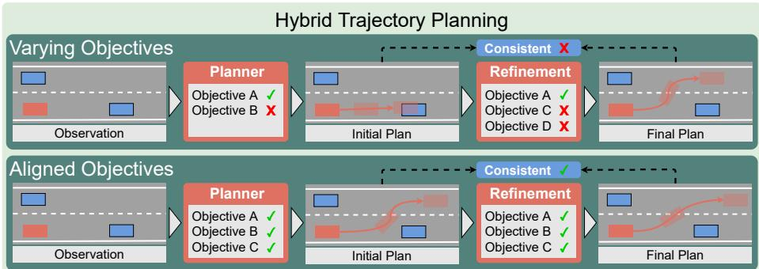
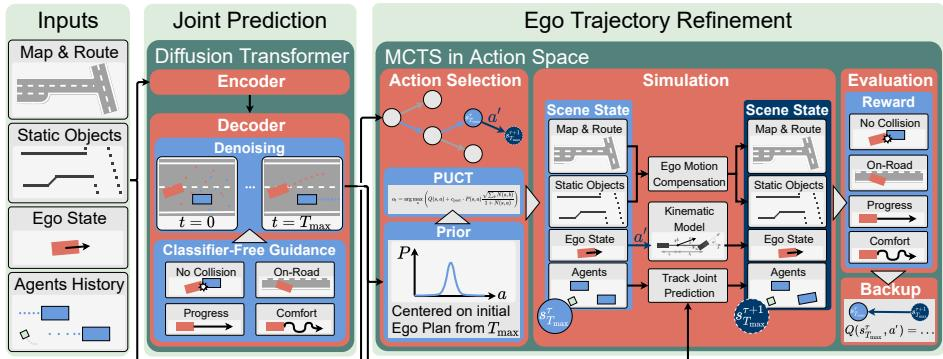
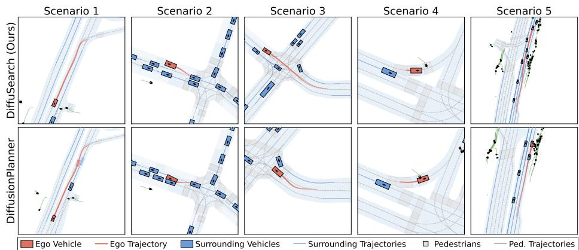
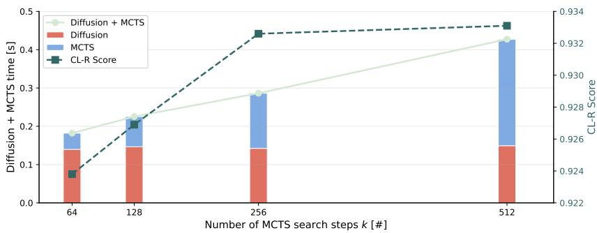

# DifuSearch: How Hybrid Trajectory Planning Benefits from Aligned Objectives in Difusion and Action Space

Stefen Hagedorn1,2 , Aron Distelzweig1,3 , and Alexandru P. Condurache1,2

1 Robert Bosch GmbH, Germany

steffen.hagedorn@de.bosch.com

2 Institute for Neuro- and Bioinformatics, University of Lübeck, Germany 3 Department of Computer Science, University of Freiburg, Germany

Abstract. In trajectory planning for autonomous driving, hybrid planning architectures are often realized as a collection of disparate modules, each with its own objectives. This lack of a unifying principle can lead to inconsistencies between the initial and refined trajectory, resulting in suboptimal behavior. We address this by introducing DiffuSearch, a novel hybrid planner that uses a unified set of objectives across generation and refinement. Our model encourages all components to follow the same shared driving goals: collision avoidance, drivable area compliance, comfort, and progress. DiffuSearch employs a two-stage architecture. First, a guided difusion model generates a scene-consistent, joint trajectory prediction, using our driving objectives as diferentiable guidance functions to implicitly steer the denoising process. Second, a Monte Carlo Tree Search (MCTS) in a discretized action space performs an explicit, local refinement of this proposal, leveraging the same driving objectives as its reward function. This synergistic design leverages the difusion model’s strength in finding scene-consistent solutions combined with the explainable, constraint-aware refinement of MCTS. Experiments on nuPlan and interPlan reactive closed-loop benchmarks demonstrate that DiffuSearch achieves strong and often state-of-the-art performance, substantially reducing collisions and improving comfort, particularly in complex, interactive scenarios. Our ablation studies indicate that MCTS refinement is the main mechanism behind the gains, while sharing objectives between implicit guidance and explicit search provides further consistent improvements.

Keywords: Autonomous Driving · Action Planning · Machine Learning

## 1 Introduction

In autonomous driving systems, trajectory planning is the vital link between perception and actuation. While modern deep learning-based methods ofer flexible behavior in diverse trafic scenarios, they provide limited explainability and do not by themselves expose explicit safety checks that are essential for deployment.

  
Fig. 1: Varying vs. unified driving objectives: Current hybrid planners use varying objectives in diferent modules. This can lead to undesired efects, where the refinement changes the initial plan to a completely diferent and suboptimal behavior. We use a shared set of driving objectives across modules to facilitate a continuous refinement of the initial trajectory.

Consequently, many state-of-the-art planners use hybrid approaches that apply a refinement stage to make the final trajectory better satisfy critical driving objectives [5,7,21,23,47]. Unfortunately, this refinement stage is often disconnected from the initial proposal generator, with each module optimizing for its own objectives (Fig. 1). This lack of a unifying principle can lead to inconsistencies where the refinement radically changes the initial plan rather than improving it, resulting in suboptimal behavior. We address this issue by proposing a model built on unified objectives, encouraging all components to work towards the same goal to achieve a continuous refinement of the trajectory. Further, our model is designed to meet the theoretical requirements for interactive and safe planning: The ideal planner would repeatedly interleave prediction and planning to model bidirectional interactions between agents [16]. However, the computational demand of this approach is prohibitive. A strong practical alternative is a joint prediction and planning model, which can implicitly capture these bidirectional interactions within a single, unified step [1,33,46,47]. Our method, DiffuSearch, extends this concept to a two-stage architecture: a joint difusion [18] model backbone followed by a Monte Carlo Tree Search (MCTS) refiner. This design combines the difusion model’s ability to capture the joint, multi-modal data distribution of a trafic scene with the MCTS’s strength in performing focused, explainable optimization that explicitly evaluates constraint violations for the ego trajectory [4, 27, 44, 49]. The difusion model first generates an initial trajectory proposal by leveraging classifier-free guidance [19], where diferentiable functions representing our driving objectives (collision avoidance, drivable area compliance, comfort, and progress) implicitly steer the generation process. However, since this implicit guidance cannot formally guarantee compliance, we use an explicit MCTS in a discretized action space to refine the plan, using the very same driving objectives as its reward function. This unified objective provides a strong inductive bias, supports explainability, and enables explicit constraintaware refinement. Our contributions are threefold:

1. We present a novel trajectory planner, DiffuSearch, that combines a guided difusion backbone with an MCTS refinement in action space, using an initial joint prediction as a strong prior to efectively confine the search space.

2. We show that MCTS refinement is the primary source of improvement, and that using the same objectives in classifier-free difusion guidance and the MCTS reward provides additional gains.

3. We demonstrate that our model achieves competitive and state-of-the-art results in reactive closed-loop simulation across nuPlan and interPlan benchmarks with diferent background trafic agents.

## 2 Related Work

## 2.1 Hybrid Trajectory Planning

Deep learning-based trajectory planning for autonomous driving has focused on diferent paradigms throughout the past years. Many early methods used monolithic neural networks and imitation learning to directly regress the planned trajectory for the ego vehicle [2,10,43]. While flexibly adapting to diverse trafic scenarios, these methods lack explainability and safety guarantees [16]. Consequently, modular end-to-end architectures became popular, dividing the model into interpretable modules to facilitate introspection and introduce domainknowledge, while still optimizing the whole model for the final planning task [3, 30, 45]. To reliably enforce safety-critical constraints, many models implement hybrid planning strategies that generate trajectory proposals with an (end-toend) learned model and select or refine them based on interpretable driving objectives [5, 12, 21, 23]. Typical driving objectives comprise drivable area compliance, collision avoidance, comfort, and progress along the route [12, 37, 47]. However, trajectory refinement is often based on diferent driving objectives than in previous modules, which can lead to suboptimal solutions. We address this shortcoming by using a shared objective across proposal generation and refinement to improve model consistency and planning performance.

## 2.2 Difusion Models

Denoising difusion probabilistic models (DDPMs) are generative models that excel at capturing complex, multi-modal data distributions [13, 18]. A neural network, often a Transformer [28], is trained to iteratively denoise a sample, starting from pure Gaussian noise and conditioned on relevant context information. This is formally achieved by learning the score function $\mathbf { s } _ { \theta } ( \mathbf { x } _ { t } , t )$ , which approximates the gradient of the log-probability of the noisy data distribution, $\mathbf { s } _ { \theta } ( \mathbf { x } _ { t } , t ) \approx \nabla _ { \mathbf { x } _ { t } } \log p ( \mathbf { x } _ { t } )$ [36]. The key advantage of DDPMs for planning lies in their controllability at inference time via guidance. Classifier-free guidance [19] steers generation by adding a w-weighted corrective term derived from a diferentiable objective function $\mathcal { O } ( { \bf x } _ { t } )$

$$
\hat { \mathbf { s } } _ { \theta } ( \mathbf { x } _ { t } , t ) = \mathbf { s } _ { \theta } ( \mathbf { x } _ { t } , t ) - w \nabla _ { \mathbf { x } _ { t } } \mathcal { O } ( \mathbf { x } _ { t } , t ) .\tag{1}
$$

In autonomous driving, difusion models have been applied to motion prediction [24], planning [37, 47], and trafic simulation [48]. Works like Diffusion Planner [47] have qualitatively shown that classifier-free guidance can generate safe and comfortable trajectories. Notably, they have not reported improvements through guidance on scale but only exemplarily. Moreover, implicit guidance offers no formal guarantees that the final trajectory complies with all constraints. This motivates the need for a subsequent refinement stage, which to date is disconnected from the generative model’s own objectives [37, 38, 47]. DiffuSearch addresses this disconnect by using the same driving objectives first for implicit difusion guidance and then for explicit MCTS evaluation.

## 2.3 Monte Carlo Tree Search

Monte Carlo Tree Search (MCTS) is a heuristic search algorithm for sequential decision-making [11, 26, 35]. It incrementally builds a search tree by balancing the exploration of new action sequences with the exploitation of known highreward paths, making it well-suited for refining an initial plan. In autonomous driving, MCTS is applied by framing planning as a search over a tree of future vehicle states and driving actions [14, 41]. However, MCTS is fundamentally iterative and can be computationally expensive in vast search spaces without a strong prior to guide the search. Our work leverages this synergy: we use the high-quality trajectory from our difusion model as a strong prior, enabling the MCTS to perform a focused, local refinement rather than a slow, unguided exploration. A key design choice in MCTS-based planning is the definition of the search space. While some variants search in an abstract latent space [34], a common approach in driving is to search in a discretized action space (typically acceleration and steering angle) [4, 27, 49]. This provides inherent explainability, as each tree branch is an interpretable maneuver, and allows for explicit constraint enforcement via the reward function for each branch. Recent hybrid planners have confirmed the value of using learned priors to guide this explicit search, e.g., HYPE [44] uses learned ego proposals, while MBAPPE [4] uses a learned world model to simulate the consequences of actions. End-to-end diferentiable tree planners such as TPP [6] and DTPP [22] optimize learned latent pipelines, but sacrifice this explicit explainability. In contrast, no action-space MCTS planner has aligned the reward function with the objective of the learned prior generator. DiffuSearch closes this gap by using the same shared driving objectives for difusion guidance and MCTS refinement, making the search focus on a prior already shaped by similar preferences.

## 3 Methodology

The theoretical challenges of autonomous driving, balancing global scene understanding with local, safety-critical optimization, motivate a hybrid architectural design. Our proposed method, DiffuSearch, addresses this by combining a generative difusion model with a search-based model for explicit refinement. This two-stage process, illustrated in Fig. 2, is built upon a unified set of driving objectives that guide both stages, encouraging a coherent planning pipeline.

  
Fig. 2: DiffuSearch model overview. A difusion transformer takes object-level inputs to make a joint prediction, guided by diferentiable driving objective functions. The ego trajectory of this joint prediction is used as the prior distribution for MCTS refinement. In a focused search around the initial ego plan, action sequences are selected with the PUCT rule and simulated using a kinematic model for the ego vehicle and difusion-based joint predictions for other agents. The reward consists of the same driving objectives used to guide the difusion model, facilitating a consistent refinement of the initial ego trajectory.

## 3.1 Joint Prediction via Guided Difusion

The first stage of our framework is a generative model tasked with generating a scene-consistent joint prediction. This joint prediction serves as a strong prior for the subsequent refinement stage, constraining the search space to a region around this initial solution. We formulate joint prediction as a conditional generation problem, where the goal is to jointly generate future trajectories for the ego vehicle and all surrounding agents in a fixed radius, conditioned on the current scene context (Fig. 2). For this, we employ a guided difusion model, trained via a simple imitation objective on trajectory data to learn the underlying distribution of expert driving behavior from a large-scale dataset. Following GUMP [20], STR [37], and DiffusionPlanner [47], we choose a DiT-architecture [28] as our backbone. At each denoising step t, the trajectory score is steered by the learned data distribution and by diferentiable driving objectives

$$
\mathcal { O } ( \mathbf { x } _ { t } ) = \mathcal { O } _ { \mathrm { c o l l i s i o n } } ( \mathbf { x } _ { t } ) + \mathcal { O } _ { \mathrm { d r i v a b l e } } ( \mathbf { x } _ { t } ) + \mathcal { O } _ { \mathrm { p r o g r e s s } } ( \mathbf { x } _ { t } ) + \mathcal { O } _ { \mathrm { c o m f o r t } } ( \mathbf { x } _ { t } ) .\tag{2}
$$

Here, $\mathbf { x } _ { t }$ is the generated trajectory, and the objective terms penalize collision risk, deviation from the drivable area, lack of progress, and uncomfortable maneuvers. The gradient $- \nabla \mathcal { O } ( \mathbf { x } _ { t } )$ implicitly guides denoising towards safe, eficient, and comfortable trajectories, yielding a single, scene-consistent joint trajectory proposal already biased towards satisfying our core driving principles. Using one objective across modules is a deliberate trade-of: specialized modules can tune local behavior more strongly toward individual objectives, but may also create incompatible preferences between proposal generation and refinement. We therefore use the shared objective as a conservative coordination mechanism, without claiming it is universally preferable to specialized modular designs.

Collision. Following Zheng et al. [47], we penalize proximity to other agents using the signed distance D between the ego bounding box and each agent M at pose $\tau \in \mathbb { N } , \tau < \tau _ { \operatorname* { m a x } }$ along trajectory $\mathbf { x } _ { t } ^ { \tau }$ . Distances below sensitivity radius r receive an exponential penalty shaped by $\begin{array} { r } { \varPsi ( D ) : = e ^ { D } - D } \end{array}$ , with a stronger penalty for overlap $( D < 0 )$ . wcollision controls penalty weight and sensitivity, and ϵ avoids zero-division

$$
\small \begin{array} { r l } & { \mathcal { O } _ { \mathrm { c o l l i s i o n } } = \frac { \sum _ { M , \tau } \mathbb { 1 } _ { D _ { M } ^ { \tau } > 0 } \cdot \varPsi \left( w _ { \mathrm { c o l l i s i o n } } \cdot \operatorname* { m a x } \left( 1 - \frac { D _ { M } ^ { \tau } } { r } , 0 \right) \right) } { \sum _ { M , \tau } \mathbb { 1 } _ { D _ { M } ^ { \tau } > 0 } + \epsilon } } \\ & { \qquad + \frac { \sum _ { M , \tau } \mathbb { 1 } _ { D _ { M } ^ { \tau } < 0 } \cdot \varPsi \left( w _ { \mathrm { c o l l i s i o n } } \cdot \operatorname* { m a x } \left( 1 - \frac { D _ { M } ^ { \tau } } { r } , 0 \right) \right) } { \sum _ { M , \tau } \mathbb { 1 } _ { D _ { M } ^ { \tau } < 0 } + \epsilon } . } \end{array}\tag{3}
$$

Drivable Area Compliance. We compute a diferentiable cost map $C$ with a Euclidean Signed Distance Field $[ 7 , 4 7 ]$ and penalize any ego pose $\mathbf { x } _ { t , \mathrm { e g o } } ^ { \tau }$ outside the drivable area

$$
\mathcal { O } _ { \mathrm { d r i v a b l e } } = \frac { \sum _ { \tau } \varPsi ( w _ { \mathrm { d r i v a b l e } } \cdot C ( \mathbf { x } _ { t , \mathrm { e g o } } ^ { \tau } ) ) } { \sum _ { \tau } \mathbb { 1 } _ { C ( \mathbf { x } _ { t , \mathrm { e g o } } ^ { \tau } ) > 0 } + \epsilon } .\tag{4}
$$

Progress. We encourage eficient progress by penalizing squared deviations from target speed $v _ { \mathrm { t a r g e t } } ,$ , but only outside tolerance δ. For desired speed range $[ v _ { \mathrm { l o w } } , v _ { \mathrm { h i g h } } ]$ with $v _ { \mathrm { h i g h } } \le v _ { \mathrm { l i m i t } }$ , we set $\begin{array} { r } { v _ { \mathrm { t a r g e t } } \ = \ \frac { v _ { \mathrm { l o w } } + v _ { \mathrm { h i g h } } } { 2 } } \end{array}$ and $\begin{array} { r } { \delta = \frac { v _ { \mathrm { h i g h } } - v _ { \mathrm { l o w } } } { 2 } } \end{array}$ ， yielding

$$
\mathcal { O } _ { \mathrm { p r o g r e s s } } = w _ { \mathrm { p r o g r e s s } } \cdot \mathrm { m a x } \left( \left| \frac { \overline { { d \mathbf { x } _ { t , \mathrm { e g o } } ^ { \tau } } } } { d \tau } - v _ { \mathrm { t a r g e t } } \right| - \delta , 0 \right) ^ { 2 } .\tag{5}
$$

Comfort. We penalize excessive jerk, i.e., the change rate of acceleration, beyond longitudinal and lateral jerk thresholds $j _ { \mathrm { l o n , ~ m a x } }$ and $j _ { \mathrm { l a t , } }$ max

$$
\begin{array} { r } { \mathcal { O } _ { \mathrm { c o m f o r t } } = w _ { \mathrm { c o m f o r t } } \cdot \mathbb { E } _ { \tau } \left[ \frac { 1 } { 2 } \operatorname* { m a x } \left( \left( \left| j _ { \mathrm { l o n } , \mathrm { m a x } } - \frac { d ^ { 3 } { \mathbf { x } } _ { t , \mathrm { e g o } } ^ { \tau } } { d \tau _ { \mathrm { l o n } } ^ { 3 } } \right| \right) \varDelta \tau _ { \mathrm { l o n } } ^ { 3 } , 0 \right) ^ { 2 } \right. } \\ { \left. \qquad + \frac { 1 } { 2 } \operatorname* { m a x } \left( \left( \left| j _ { \mathrm { l a t } , \mathrm { m a x } } - \frac { d ^ { 3 } { \mathbf { x } } _ { t , \mathrm { e g o } } ^ { \tau } } { d _ { \mathrm { l a t } } \tau ^ { 3 } } \right| \right) \varDelta \tau _ { \mathrm { l a t } } ^ { 3 } , 0 \right) ^ { 2 } \right] . } \end{array}\tag{6}
$$

Selecting wcollision > wdrivable >> wprogress ≈ wcomfort prioritizes safety over comfort for the generated initial ego trajectory.

## 3.2 MCTS in Action Space

While the difusion model produces a globally plausible plan, it does not by itself provide explicit constraint checks required for safety-critical deployment. The second stage of DiffuSearch is therefore an MCTS planner that performs an explicit, interpretable refinement of the initial proposal. Following recent works in autonomous driving [4,44], we define the search over a discretized action space composed of combined longitudinal (acceleration $\alpha )$ and lateral (steering angle $\varphi )$ command tuples $a \hat { = } ( \alpha , \varphi )$ . This approach provides two key benefits: explainability and explicit constraint enforcement throughout the search steps (Fig. 2). Selection. Starting from the root node, which represents the current vehicle state, the algorithm recursively traverses the tree by selecting the child node that maximizes the PUCT (Polynomial Upper Confidence bound for Trees) criterion [32]. This ensures a balance between exploiting high-value branches and exploring less-visited ones. For a given state $s ,$ the next action a is selected as

$$
a _ { t } = \arg \operatorname* { m a x } _ { a } \left( Q ( s , a ) + c _ { \mathrm { p u c t } } \cdot P ( s , a ) \frac { \sqrt { \sum _ { b } N ( s , b ) } } { 1 + N ( s , a ) } \right) .\tag{7}
$$

where $Q ( s , a )$ is the mean action value (derived from reward ${ \mathcal { R } } ,$ cf. Eq. (9)), $N ( s , a )$ is the visit count, $c _ { \mathrm { p u c t } }$ is a hyperparameter balancing exploration, and $P ( s , a )$ is the prior probability of selecting action a. Unlike methods that use a broad prior [4, 44], we use the difusion-generated ego trajectory to provide a strong, focused prior. Specifically, $P ( s , a )$ is modeled as a tight Gaussian distribution centered on the discrete action that is closest to the action prescribed by our difusion proposal at that timestep. This focuses the MCTS search efort on a local, scene-consistent region of the action space.

Expansion. When selection reaches a leaf node, all feasible actions from the discretized set create child nodes. Feasibility follows continuity constraints [4] on acceleration and steering changes, promoting comfort, physical feasibility, and locality.

Simulation. When expanding a leaf node, simulation updates the scene based on the action and evaluates the resulting state. A kinematic bicycle model transfers the ego action $( \alpha , \varphi )$ into a new pose, promoting physically plausible ego motion under normal operating conditions [31]. As with any low-order vehicle model, this approximation can become inaccurate under extreme lateral acceleration or tire-slip regimes. All other agents are updated using the joint predictions from our difusion model at 10 Hz. This provides a realistic world model for the MCTS to plan against and is a reasonable assumption due to the locality of our refinement. The value of a simulated trajectory is explicitly calculated as a reward $\mathcal { R } ( \mathbf { x } _ { \mathrm { e g o } } )$ by summing the same four driving objectives used for the implicit difusion guidance

$$
\mathcal { R } ( \mathbf { x } _ { \mathrm { e g o } } ) = \mathcal { R } ( \mathbf { x } _ { \mathrm { e g o } } ) _ { \mathrm { c o l l i s i o n } } + \mathcal { R } ( \mathbf { x } _ { \mathrm { e g o } } ) _ { \mathrm { d r i v a b l e } } + \mathcal { R } ( \mathbf { x } _ { \mathrm { e g o } } ) _ { \mathrm { p r o g r e s s } } + \mathcal { R } ( \mathbf { x } _ { \mathrm { e g o } } ) _ { \mathrm { c o m f o r t } } .\tag{8}
$$

The guidance functions in Eq. (3) to Eq. (6) are non-negative costs $\mathcal { O } \in [ 0 , + \infty )$ with 0 as ideal outcome, so we use inverse rewards $\mathcal { R } \propto - \mathcal { O } \in ( - \infty , 0 ]$ . We use

the same weights wcollision, wdrivable, $w _ { \mathrm { p r o g r e s s } }$ and $w _ { \mathrm { c o m f o r t } }$ as for the guidance functions (Sec. 3.1), ensuring that MCTS optimizes the objectives that guided proposal generation.

Backpropagation. The simulation reward R is backpropagated to the root node, updating visit counts $N ( s , a )$ and mean action values $Q ( s , a )$ along the traversed search path

$$
N ( s , a )  N ( s , a ) + 1 ; \quad Q ( s , a )  \frac { N ( s , a ) \cdot Q ( s , a ) + \mathcal { R } ( \mathbf { x _ { e g o } } ) } { N ( s , a ) + 1 } .\tag{9}
$$

By repeatedly performing these steps, the MCTS builds a focused search tree in action space, using the difusion proposal as its central prior.

Final Trajectory Planning. After a fixed computational budget, e.g., 256 search steps, the optimal trajectory is retrieved from the tree. Starting from root state $s _ { 0 } .$ , we greedily follow the child with the highest visit count $N ( s , a )$ 2 yielding action sequence $A ^ { * } = ( a _ { 0 } ^ { * } , a _ { 1 } ^ { * } , \ldots , a _ { \tau _ { \operatorname* { m a x } } - 1 } ^ { * } )$ , with $a _ { \tau } ^ { \ast } \hat { = } ( \alpha _ { \tau } ^ { \ast } , \varphi _ { \tau } ^ { \ast } )$ , and state sequence $S ^ { * } = ( s _ { 0 } , s _ { 1 } ^ { * } , \ldots , s _ { \tau _ { \operatorname* { m a x } } } ^ { * } )$

$$
a _ { \tau } ^ { * } = \arg \operatorname* { m a x } _ { a \in \mathcal { A } ( s _ { \tau } ^ { * } ) } N ( s _ { \tau } ^ { * } , a )\tag{10}
$$

where $\boldsymbol { A } ( s _ { \tau } ^ { * } )$ is the set of all possible actions from state $s _ { \tau } ^ { * }$ . A kinematic bicycle model transforms this action sequence into the final ego trajectory. Since the plan remains contingent on the predicted scene evolution, we include the emergency braking mechanism used by most hybrid planners [12, 29, 37, 40, 47]. However, this is scarcely needed since at 10 Hz replanning, DiffuSearch quickly adapts to atypical scene development in the next cycle.

## 3.3 Experimental Setup

Datasets, Benchmarks & Metrics. We develop our DiffuSearch model in the nuPlan framework [25], which contains ∼1,300 hours real world driving data. Since many works have shown that open-loop evaluation weakly correlates with real world driving behavior [9, 12, 15], we focus on reactive closed-loop simulation. nuPlan’s closed-loop simulator runs each scenario for 15 s at 10 Hz, starting from a real trafic situation. While the ego vehicle is controlled by the planner and a low-level controller, other trafic agents are updated with a rule-based Intelligent Driver Model (IDM) [39]. Alternatively, learned, reactive SMART agents provide versatile behavior to test more complex interactions in closed-loop simulation [15, 42]. On nuPlan, we use these two closed-loop benchmarks to measure the reactive R-score and the SMART-reactive SR-score. Both scores are normalized to [0, 100] and are derived from the number of collisions (NC), time-to-collision (TTC), drivable area compliance (DAC), progress, and comfort [12, 25]. Results are reported on three data splits: Val14, Test14, and Test14-hard, which contain 1118, 280, and 272 trafic scenarios, respectively. Test14-hard is a curated data split of dificult scenarios with a high degree of interaction between trafic participants like unprotected turns or tight merges [8], and hence suitable to differentiate the capability of planners with similar performance on the standard

  
Fig. 3: Closed-loop behavior of DiffuSearch (top row) compared to the strongest baseline DiffusionPlanner (bottom row) on five nuPlan Test14-hard-R scenarios. DiffuSearch corrects collision-prone difusion proposals, keeps larger safety margins, waits for pedestrians, and proactively changes lanes in critical situations.

Val14 split. To test cross-benchmark transfer beyond nuPlan, we additionally use the interPlan lane-change benchmark with low-, medium-, and high-density trafic settings [17].

Baseline Models. Our model is compared against the best other hybrid planners in nuPlan. DTPP and DiffusionPlanner are the most similar to our work, as they apply a learned tree search, and a difusion backbone, respectively (see Sec. 3). To facilitate a clear investigation on the efect of MCTS-based trajectory refinement and aligned objectives in difusion guidance and MCTS reward, we use the same pretrained difusion backbone as DiffusionPlanner for our experiments with DiffuSearch.

## 4 Experiments & Results

Comprehensive quantitative and qualitative results of our DiffuSearch planner are presented in this section. We structure the analysis around the central insights gained on the nuPlan splits and the interPlan lane-change benchmark.

## 4.1 DifuSearch excels on hard, interactive scenarios.

A comparison of DiffuSearch with the best hybrid planners in reactive (R) and SMART-reactive (SR) closed-loop simulation on the three nuPlan data splits is shown in Tab. 1. DiffuSearch achieves state-of-the-art results on all SR benchmarks and two out of three R benchmarks. Compared to other models, our method performs especially well in hard, interactive trafic scenarios. Specifically, our method generates an improvement of up to 1.82% compared to the strong DiffusionPlanner baseline and up to 4.92% over the nuPlan challenge winner PDM-Hybrid on Test14-hard-SR. On Val14-R, DiffuSearch lies slightly behind the PDM-Hybrid baseline. This could be explained by the strong centerlinefollowing prior of this baseline. The standard driving scenarios of Val14 together with the cautious behavior of uniformly lane-following IDM agents in reactive closed-loop simulation lets PDM-Hybrid naturally blend in. However, as soon as interactive SMART agents challenge the planner with more realistic and diverse behaviors, our method outperforms the baseline. When increasing the dificulty further and switching to the harder scenarios in Test14-hard, the generative backbone and the MCTS refinement let DiffuSearch find better solutions for complex situations. Fig. 3 shows a qualitative comparison of our model with the strongest baseline on this data split. Since both models use the same, pretrained difusion backbone, the diference is consistent with the efect of applying guidance and MCTS refinement. Fig. 3 illustrates the type of local repair targeted by our refiner: DiffuSearch steers difusion-based trajectories away from collision-prone interactions with other vehicles and pedestrians, smooths abrupt maneuvers, and even changes the lane after anticipating a critical situation with pedestrians walking at the edge of the road. To test whether this advantage transfers beyond the nuPlan splits, we additionally evaluate both planners on the interPlan lane-change benchmark, which stresses repeated lane changes across dense reactive trafic [17]. The results in Tab. 2 show that DiffuSearch consistently outperforms DiffusionPlanner across all trafic densities and under both IDM and SMART background trafic. The gains are particularly pronounced in medium- and high-density settings, where safe progress depends on repeated local corrections and robust interaction handling. This supports our central claim that aligned guidance and explicit local search are most beneficial when the planner must negotiate tightly coupled maneuvers rather than merely follow the lane.

Table 1: Planner evaluation on nuPlan reactive closed-loop benchmarks. R means closed-loop simulation with nuPlan’s reactive IDM agents [39]. SR is measured using SMART-reactive agents [15, 42]. Bold indicates the best-performing method, and underline indicates the second-best.
<table><tr><td>Planner</td><td colspan="2">Val14</td><td colspan="2">Test14</td><td colspan="2">Test14-hard</td></tr><tr><td></td><td>R↑</td><td>SR ↑</td><td>R↑</td><td>SR ↑</td><td>R↑</td><td>SR ↑</td></tr><tr><td>PDM-Hybrid [12]</td><td>92.11</td><td>89.44</td><td>91.28</td><td>90.24</td><td>76.07</td><td>72.15</td></tr><tr><td>GameFormer [23]</td><td>79.78</td><td>78.05</td><td>82.05</td><td>79.33</td><td>67.05</td><td>62.48</td></tr><tr><td>DTPP [22]</td><td>63.95</td><td>62.41</td><td>73.88</td><td>64.82</td><td>47.47</td><td>54.65</td></tr><tr><td>PLUTO [7]</td><td>90.48</td><td>83.88</td><td>90.29</td><td>85.27</td><td>76.88</td><td>69.36</td></tr><tr><td>DiffusionPlanner [47]</td><td>91.33</td><td>88.84</td><td>92.28</td><td>88.97</td><td>78.79</td><td>75.25</td></tr><tr><td>DiffuSearch (ours)</td><td>91.39</td><td>89.55</td><td>93.03</td><td>91.12</td><td>79.98</td><td>77.07</td></tr></table>

## 4.2 MCTS refinement consistently improves results.

In the ablation experiments shown in Tab. 3, we investigate the influence of classifier-free difusion guidance when generating the initial joint prediction and the subsequent MCTS refinement of the ego trajectory in action space. The results are consistent across all data splits and benchmarks: adding guidance alone does not improve planning performance. More severely, it even decreases the score by up to −1.45% on Val14-R and −2.1% on Test14-SR, which might explain why no quantitative results have been published so far. In contrast, adding MCTS refinement alone consistently leads to improvements of up to +1.11% on Test14-hard-SR and never decreases planning performance. Finally, when combining difusion guidance and MCTS refinement in action space, the best performance is achieved on all data splits and benchmarks. This is an unexpected result since difusion guidance alone decreases performance. However, when combined with MCTS refinement, performance increases beyond simply adding up the impact of the individual design choices of difusion and MCTS refinement. We hypothesize that this could be related to guidance function design. Zheng et al. [47] report that classifier-free guidance delicately depends on the guidance functions’ properties. They state that guidance functions should ideally be sparse, i.e., only influence denoising in critical situations, address higher-order state derivatives indirectly, and create smooth and continuous gradients of consistent magnitude. Combining the learned denoising gradient $s _ { \theta } ( x _ { t } , t )$ with a hand-crafted objectives gradient $\nabla _ { x _ { t } } \mathcal { O } ( x _ { t } , t )$ is susceptible to emergent efects, where the difusion model is pushed into regions outside of the distribution encountered during training without guidance. This could locally optimize the generated trajectory w.r.t. the guidance objectives but result in globally inconsistent solutions. Adding MCTS refinement smooths the inconsistencies caused by the described emerging efects and even seems to benefit from the local “hints” provided through guidance. This interpretation is corroborated by the trajectory-consistency analysis in Tab. 4. Compared to PLUTO, which also applies rule-based post-processing to a learned proposal [7], DiffuSearch yields substantially smaller deviations between the initial and refined trajectories in terms of position and speed while maintaining similarly small heading corrections. The refiner therefore acts as a local repair mechanism rather than replacing the difusion proposal with a qualitatively diferent plan. This is the behavior intended with the unified objectives: the generator already places the plan in a promising region of the solution space, and MCTS refines the same objectives locally. In summary, the ablation results suggest that aligning the objectives across the model synchronizes trajectory generation and refinement, leading to a more consistent planning process.

Table 2: Cross-benchmark evaluation on the interPlan lane-change benchmark [17]. Reactive closed-loop scores are reported on the benchmark’s native [0, 1] scale across three trafic densities.
<table><tr><td>Planner</td><td colspan="3">IDM</td><td colspan="3">SMART</td></tr><tr><td></td><td>Low</td><td>Med.</td><td>High</td><td>Low</td><td>Med.</td><td>High</td></tr><tr><td>DiffusionPlanner [47]</td><td>0.642</td><td>0.583</td><td>0.598</td><td>0.583</td><td>0.532</td><td>0.350</td></tr><tr><td>DiffuSearch (ours)</td><td>0.688</td><td>0.679</td><td>0.629</td><td>0.630</td><td>0.578</td><td>0.419</td></tr></table>

Table 3: Ablation of guidance and MCTS refinement. Guidance alone degrades scores, MCTS alone improves them, and their aligned combination performs best.
<table><tr><td>Planner</td><td colspan="3">Module</td><td colspan="2">Val14</td><td colspan="2">Test14</td><td colspan="2">Test14-hard</td></tr><tr><td></td><td>Diffusion Guidance MCTS</td><td></td><td></td><td>R↑</td><td>SR↑</td><td>R↑</td><td>SR↑</td><td>R↑</td><td>SR ↑</td></tr><tr><td>DiffusionPlanner [47]</td><td>√</td><td></td><td></td><td>91.33</td><td>88.84</td><td>92.28</td><td>88.97</td><td>78.79</td><td>75.25</td></tr><tr><td>DiffuSearch (ours)</td><td>√</td><td>√</td><td></td><td>89.88</td><td>86.77</td><td>91.31</td><td>86.87</td><td>77.88</td><td>74.41</td></tr><tr><td>DiffuSearch (ours)</td><td>√</td><td></td><td>√</td><td>91.36</td><td>89.32</td><td>92.59</td><td>89.84</td><td>79.52</td><td>76.36</td></tr><tr><td>DiffuSearch (ours)</td><td>√</td><td>√</td><td>√</td><td>91.39</td><td>89.55</td><td>93.03</td><td>91.12</td><td>79.98</td><td>77.07</td></tr></table>

Table 4: Trajectory consistency between the initial and refined trajectory on nu-Plan Test14. Lower values indicate that the refinement stays closer to the original proposal.
<table><tr><td>Agents Planner</td><td></td><td>∆ L2 [m] ∆ Heading [rad] ∆ Speed [m/s]</td></tr><tr><td rowspan="2">IDM</td><td>PLUTO [7]  $1 . 4 6 9 \pm 1 . 4 1 0$ </td><td> $\mathbf { 0 . 0 1 5 \ : \pm { \ : 0 . 0 1 2 } }$   $0 . 4 7 4 \pm 0 . 4 3 2$ </td></tr><tr><td>DiffuSearch (ours)  $\mathbf { 0 . 7 5 4 \pm 0 . 4 8 4 }$ </td><td> $0 . 0 1 6 \pm 0 . 0 2 0$   $\mathbf { 0 . 3 8 2 \ : \pm { \ : 0 . 3 8 1 } }$ </td></tr><tr><td rowspan="2">SMART</td><td>PLUTO [7]  $3 . 3 7 3 \pm 2 . 7 1 3$ </td><td> $0 . 0 3 0 \pm 0 . 0 3 1$   $1 . 0 6 1 \pm 0 . 8 0 4$ </td></tr><tr><td> $\mathtt { D i f f u S e a r c h }$  (ours)  $\mathbf { 1 . 8 5 9 \ : \pm 1 . 8 1 0 }$ </td><td> $\mathbf { 0 . 0 2 2 \pm 0 . 0 2 8 }$   $\mathbf { 0 . 9 1 9 \pm 1 . 2 4 1 }$ </td></tr></table>

  
Fig. 4: Runtime and performance vs. MCTS search steps. Difusion dominates runtime for small budgets, while MCTS adds linearly with the number of search steps and improves performance until local refinement saturates around 256 steps. Runtime is measured on a Python implementation without runtime optimizations. The CL-R score axis is zoomed to make the diferences better visible.

The additional search cost of this local refinement is analyzed in Fig. 4. For small search budgets, the majority of the runtime is spent in the difusion backbone, while the MCTS contribution grows approximately linearly with the number of search steps. At the same time, planning performance improves steadily until the local refinement converges around 256 search steps, which is therefore the operating point used throughout our experiments. This trade-of highlights that the explicit search is not used for broad global exploration, but for focused local improvement around a strong learned prior.

## 4.3 Unified objectives provide additional gains.

The previous experiments show that guidance and MCTS refinement together consistently yield the best planning performance. In a second ablation study we switch of individual components of the guidance objective O and the reward R (cf. Sec. 3). The results are shown in Tab. 5. In summary, each component contributes to the overall performance and using the same objective set in difusion guidance and MCTS reward yields the best observed planned trajectory. Nevertheless, there are large diferences in the importance of the individual components. Generally, switching of guidance objectives leads to much smaller performance decreases than switching of MCTS rewards. This is expected, when considering the role these objectives play in the two modules. Difusion guidance objectives are designed to only afect the generated trajectory when constraints are violated. They selectively adapt the imitation-based joint prediction that serves as the initial ego plan. Conversely, the MCTS shapes the final plan based on the defined reward, which directly penalizes violations during refinement. Ablating a component of the reward means removing this term from the optimization problem, so that the final trajectory is no longer directly penalized for violating this objective. An apparent outlier is the comfort reward, which hardly changes the planner’s behavior. This result is grounded in the kinematic bicycle model used in our MCTS refinement. It promotes that the planned trajectory already is smooth and feasible for the vehicle without the comfort reward. Altogether, our result suggests that unified objectives in difusion guidance and MCTS reward provide additional gains for trajectory planning.

Table 5: Ablation study of guidance and reward components. The impact of individual objective terms for both guidance and MCTS reward is evaluated on the Test14-hard benchmark. The final row represents the full model configuration.
<table><tr><td colspan="4">Guidance Objective</td><td colspan="4">MCTS Reward</td><td>Test14-hard</td></tr><tr><td colspan="4">Collision Drivable Progress Comfort</td><td colspan="4">Collision Drivable Progress Comfort</td><td>R↑</td></tr><tr><td></td><td>√</td><td>√</td><td>√</td><td>√</td><td>√</td><td>V</td><td>√</td><td>79.44</td></tr><tr><td>√</td><td></td><td>√</td><td>√</td><td>√</td><td>√</td><td>√</td><td>√</td><td>78.77</td></tr><tr><td>√</td><td>√</td><td></td><td>√</td><td>√</td><td>√</td><td>√</td><td>√</td><td>79.18</td></tr><tr><td>√</td><td>√</td><td>√</td><td></td><td>√</td><td>√</td><td>√</td><td>√</td><td>79.01</td></tr><tr><td>√</td><td>√</td><td>√</td><td>√</td><td></td><td>√</td><td>√</td><td>√</td><td>42.53</td></tr><tr><td>√</td><td>√</td><td>√</td><td>√</td><td>√</td><td></td><td>√</td><td>√</td><td>72.58</td></tr><tr><td>√</td><td>√</td><td>√</td><td>√</td><td>√</td><td>√</td><td></td><td>√</td><td>66.24</td></tr><tr><td>√</td><td>√</td><td>√</td><td>√</td><td>√</td><td>√</td><td>√</td><td></td><td>79.34</td></tr><tr><td>√</td><td>√</td><td>√</td><td>√</td><td>√</td><td>√</td><td>√</td><td>√</td><td>79.98</td></tr></table>

Table 6: Metric comparison against DiffusionPlanner with SMART agents. DiffuSearch improves NC, TTC, and comfort while maintaining competitive DAC and progress.
<table><tr><td>Split</td><td>Planner</td><td>Score ↑</td><td>NC↑</td><td>TTC ↑</td><td>DAC ↑</td><td>Comfort ↑</td><td>Progress ↑</td></tr><tr><td rowspan="2">Val14</td><td>DiffusionPlanner [47]</td><td>88.84</td><td>97.83</td><td>92.41</td><td>99.82</td><td>70.34</td><td>96.93</td></tr><tr><td>DiffuSearch (ours)</td><td>89.55</td><td>98.92</td><td>94.03</td><td>99.37</td><td>86.53</td><td>96.38</td></tr><tr><td rowspan="2">Test14</td><td>DiffusionPlanner [47]</td><td>88.97</td><td>97.83</td><td>94.22</td><td>99.28</td><td>72.20</td><td>96.03</td></tr><tr><td>DiffuSearch (ours)</td><td>91.12</td><td>98.19</td><td>95.67</td><td>99.28</td><td>87.73</td><td>96.03</td></tr><tr><td rowspan="2">Test14-hard</td><td>DiffusionPlanner [47]</td><td>75.25</td><td>96.63</td><td>90.26</td><td>98.50</td><td>65.92</td><td>90.26</td></tr><tr><td>DiffuSearch (ours)</td><td>79.98</td><td>98.50</td><td>94.01</td><td>97.00</td><td>83.90</td><td>88.76</td></tr></table>

## 4.4 DifuSearch reduces collisions and boosts comfort.

Finally, we conduct a detailed study of individual driving metrics to understand how our model behaves diferently compared to the strongest baseline to achieve state-of-the-art scores on various nuPlan benchmarks. Since DiffuSearch excels in realistic, interactive trafic scenarios, we perform this study on SR benchmarks. We provide a breakdown of the individual driving metrics in Tab. 6. Overall, the results are consistent with the priority of driving objectives we formulated in Sec. 3, namely $w _ { \mathrm { c o l l i s i o n } } > w _ { \mathrm { d r i v a b l e } } > > w _ { \mathrm { p r o g r e s s } } \approx w _ { \mathrm { c o m f o r t } }$ . The safety-critical and most relevant objective of collision avoidance (NC) improves as the number of collisions reduces. Moreover, DiffuSearch increases the timeto-collision (TTC), resulting in larger safety margins to adjacent vehicles, pedestrians, and bicycles, as exemplarily shown in Fig. 3. This improvement in collision avoidance results in unchanged or slightly decreased drivable area compliance (DAC) and progress. The planner prioritizes collision avoidance over drivable area compliance and, in critical scenarios, prevents collisions by swerving into parking bays and onto the shoulder (Fig. 3, scenario 2). Due to the less ofensive driving behavior showcased in scenario 3 of Fig. 3, our model progresses slightly slower compared to the strongest baseline. This behavior is particularly acceptable as it serves the primary objective of collision avoidance. Finally, though least important, DiffuSearch considerably improves ride comfort due to the kinematic model used in MCTS refinement by up to +18%.

## 5 Conclusion & Future Work

In this paper, we introduced DiffuSearch, a novel hybrid planner that synergistically combines a guided difusion model with an MCTS refiner. Our core contribution is the use of a unified set of driving objectives, which are used as implicit guidance for difusion and as explicit rewards for MCTS. Experiments on nuPlan and interPlan closed-loop benchmarks show that the combination of difusion and an MCTS tightly focused around a learned prior already achieves strong performance, while sharing objectives across both stages provides additional improvements, consistently reducing collisions and improving ride comfort, particularly in challenging, interactive scenarios. Future work will focus on two main extensions. First, we will incorporate an error feedback mechanism, allowing the prediction model to learn from past errors and improve its temporal consistency during closed-loop inference. Second, we aim to extend DiffuSearch to handle multi-modal proposals, enabling the MCTS to explicitly reason over distinct strategic maneuvers in ambiguous scenarios. We believe these extensions, built upon the strong performance of our hybrid two-stage planner, are key steps toward creating even more robust and intelligent autonomous driving systems.

## References

1. Bansal, M., Krizhevsky, A., Ogale, A.: Chaufeurnet: Learning to drive by imitating the best and synthesizing the worst. arXiv preprint arXiv:1812.03079 (2018)

2. Bojarski, M., Del Testa, D., Dworakowski, D., Firner, B., Flepp, B., Goyal, P., Jackel, L.D., Monfort, M., Muller, U., Zhang, J., et al.: End to end learning for self-driving cars. arXiv preprint arXiv:1604.07316 (2016)

3. Casas, S., Sadat, A., Urtasun, R.: Mp3: A unified model to map, perceive, predict and plan. In: Proceedings of the IEEE/CVF Conference on Computer Vision and Pattern Recognition. pp. 14403–14412 (2021)

4. Chekroun, R., Gilles, T., Toromanof, M., Hornauer, S., Moutarde, F.: Mbappe: Mcts-built-around prediction for planning explicitly. In: IEEE IV Symposium 2024. pp. 2062–2069. IEEE (2024)

5. Chen, S., Jiang, B., Gao, H., Liao, B., Xu, Q., Zhang, Q., Huang, C., Liu, W., Wang, X.: Vadv2: End-to-end vectorized autonomous driving via probabilistic planning. arXiv preprint arXiv:2402.13243 (2024)

6. Chen, Y., Karkus, P., Ivanovic, B., Weng, X., Pavone, M.: Tree-structured policy planning with learned behavior models. arXiv preprint arXiv:2301.11902 (2023)

7. Cheng, J., Chen, Y., Chen, Q.: Pluto: Pushing the limit of imitation learning-based planning for autonomous driving. arXiv preprint arXiv:2404.14327 (2024)

8. Cheng, J., Chen, Y., Mei, X., Yang, B., Li, B., Liu, M.: Rethinking imitationbased planners for autonomous driving. In: 2024 IEEE International Conference on Robotics and Automation (ICRA). pp. 14123–14130. IEEE (2024)

9. Codevilla, F., Lopez, A.M., Koltun, V., Dosovitskiy, A.: On ofline evaluation of vision-based driving models. In: Proceedings of the European conference on computer vision (ECCV). pp. 236–251 (2018)

10. Codevilla, F., Müller, M., López, A., Koltun, V., Dosovitskiy, A.: End-to-end driving via conditional imitation learning. In: 2018 IEEE international conference on robotics and automation (ICRA). pp. 4693–4700. IEEE (2018)

11. Coulom, R.: Eficient selectivity and backup operators in monte-carlo tree search. In: International conference on computers and games. pp. 72–83. Springer (2006)

12. Dauner, D., Hallgarten, M., Geiger, A., Chitta, K.: Parting with misconceptions about learning-based vehicle motion planning. In: Conference on Robot Learning. pp. 1268–1281. PMLR (2023)

13. Dhariwal, P., Nichol, A.: Difusion models beat gans on image synthesis. Advances in neural information processing systems 34, 8780–8794 (2021)

14. Essalmi, K., Garrido, F., Nashashibi, F.: An extended horizon tactical decisionmaking for automated driving based on monte carlo tree search. In: 2025 IEEE Intelligent Vehicles Symposium (IV). pp. 1127–1132. IEEE (2025)

15. Hagedorn, S., Donkov, L., Distelzweig, A., Condurache, A.P.: When planners meet reality: How learned, reactive trafic agents shift nuplan benchmarks. arXiv preprint arXiv:2510.14677 (2025)

16. Hagedorn, S., Hallgarten, M., Stoll, M., Condurache, A.P.: The integration of prediction and planning in deep learning automated driving systems: A review. IEEE Transactions on Intelligent Vehicles (2024)

17. Hallgarten, M., Zapata, J., Stoll, M., Renz, K., Zell, A.: Can vehicle motion planning generalize to realistic long-tail scenarios? arXiv:2404.07569 (2024)

18. Ho, J., Jain, A., Abbeel, P.: Denoising difusion probabilistic models. Advances in neural information processing systems 33, 6840–6851 (2020)

19. Ho, J., Salimans, T.: Classifier-free difusion guidance. arXiv preprint arXiv:2207.12598 (2022)

20. Hu, Y., Chai, S., Yang, Z., Qian, J., Li, K., Shao, W., Zhang, H., Xu, W., Liu, Q.: Solving motion planning tasks with a scalable generative model. In: European Conference on Computer Vision. pp. 386–404. Springer (2024)

21. Hu, Y., Yang, J., Chen, L., Li, K., Sima, C., Zhu, X., Chai, S., Du, S., Lin, T., Wang, W., et al.: Planning-oriented autonomous driving. In: Proceedings of the IEEE/CVF conference on computer vision and pattern recognition. pp. 17853– 17862 (2023)

22. Huang, Z., Karkus, P., Ivanovic, B., Chen, Y., Pavone, M., Lv, C.: Dtpp: Diferentiable joint conditional prediction and cost evaluation for tree policy planning in autonomous driving. In: 2024 IEEE International Conference on Robotics and Automation (ICRA). pp. 6806–6812. IEEE (2024)

23. Huang, Z., Liu, H., Lv, C.: Gameformer: Game-theoretic modeling and learning of transformer-based interactive prediction and planning for autonomous driving. In: Proceedings of the IEEE/CVF International Conference on Computer Vision. pp. 3903–3913 (2023)

24. Jiang, C., Cornman, A., Park, C., Sapp, B., Zhou, Y., Anguelov, D., et al.: Motiondifuser: Controllable multi-agent motion prediction using difusion. In: Proceedings of the IEEE/CVF conference on computer vision and pattern recognition. pp. 9644–9653 (2023)

25. Karnchanachari, N., Geromichalos, D., Tan, K.S., Li, N., Eriksen, C., Yaghoubi, S., Mehdipour, N., Bernasconi, G., Fong, W.K., Guo, Y., et al.: Towards learningbased planning: The nuplan benchmark for real-world autonomous driving. In: 2024 IEEE International Conference on Robotics and Automation (ICRA). pp. 629–636. IEEE (2024)

26. Kocsis, L., Szepesvári, C.: Bandit based monte-carlo planning. In: European conference on machine learning. pp. 282–293. Springer (2006)

27. Niu, T., Zhang, K., Gan, Z., Ding, W.: Planning by simulation: Motion planning with learning-based parallel scenario prediction for autonomous driving. arXiv preprint arXiv:2411.09887 (2024)

28. Peebles, W., Xie, S.: Scalable difusion models with transformers. In: Proceedings of the IEEE/CVF international conference on computer vision. pp. 4195–4205 (2023)

29. Phan-Minh, T., Howington, F., Chu, T.S., Tomov, M.S., Beaudoin, R.E., Lee, S.U., Li, N., Dicle, C., Findler, S., Suarez-Ruiz, F., et al.: Driveirl: Drive in real life with inverse reinforcement learning. In: 2023 IEEE International Conference on Robotics and Automation (ICRA). pp. 1544–1550. IEEE (2023)

30. Renz, K., Chitta, K., Mercea, O.B., Koepke, A., Akata, Z., Geiger, A.: Plant: Explainable planning transformers via object-level representations. arXiv preprint arXiv:2210.14222 (2022)

31. Riekert, P., Schunck, T.E.: Zur fahrmechanik des gummibereiften kraftfahrzeugs. Ingenieur-Archiv 11(3), 210–224 (1940)

32. Rosin, C.D.: Multi-armed bandits with episode context. Annals of Mathematics and Artificial Intelligence 61(3), 203–230 (2011)

33. Sadat, A., Ren, M., Pokrovsky, A., Lin, Y.C., Yumer, E., Urtasun, R.: Jointly learnable behavior and trajectory planning for self-driving vehicles. In: 2019 IEEE/RSJ International Conference on Intelligent Robots and Systems (IROS). pp. 3949– 3956. IEEE (2019)

34. Schrittwieser, J., Antonoglou, I., Hubert, T., Simonyan, K., Sifre, L., Schmitt, S., Guez, A., Lockhart, E., Hassabis, D., Graepel, T., et al.: Mastering atari, go, chess and shogi by planning with a learned model. Nature 588(7839), 604–609 (2020)

35. Silver, D., Huang, A., Maddison, C.J., Guez, A., Sifre, L., Van Den Driessche, G., Schrittwieser, J., Antonoglou, I., Panneershelvam, V., Lanctot, M., et al.: Mastering the game of go with deep neural networks and tree search. nature 529(7587), 484–489 (2016)

36. Song, Y., Sohl-Dickstein, J., Kingma, D.P., Kumar, A., Ermon, S., Poole, B.: Scorebased generative modeling through stochastic diferential equations. arXiv preprint arXiv:2011.13456 (2020)

37. Sun, Q., Wang, H., Zhan, J., Nie, F., Wen, X., Xu, L., Zhan, K., Jia, P., Lang, X., Zhao, H.: Generalizing motion planners with mixture of experts for autonomous driving. In: 2025 IEEE International Conference on Robotics and Automation (ICRA). pp. 6033–6039. IEEE (2025)

38. Sun, Q., Zhang, S., Ma, D., Shi, J., Li, D., Luo, S., Wang, Y., Xu, N., Cao, G., Zhao, H.: Large trajectory models are scalable motion predictors and planners. arXiv preprint arXiv:2310.19620 (2023)

39. Treiber, M., Hennecke, A., Helbing, D.: Congested trafic states in empirical observations and microscopic simulations. Physical review E 62(2), 1805 (2000)

40. Vitelli, M., Chang, Y., Ye, Y., Ferreira, A., Wołczyk, M., Osiński, B., Niendorf, M., Grimmett, H., Huang, Q., Jain, A., et al.: Safetynet: Safe planning for realworld self-driving vehicles using machine-learned policies. In: 2022 International Conference on Robotics and Automation (ICRA). pp. 897–904. IEEE (2022)

41. Wen, Q., Gong, Z., Zhou, L., Zhang, Z.: Monte carlo tree search for behavior planning in autonomous driving. In: 2024 IEEE International Symposium on Safety Security Rescue Robotics (SSRR). pp. 117–124. IEEE (2024)

42. Wu, W., Feng, X., Gao, Z., Kan, Y.: Smart: Scalable multi-agent real-time motion generation via next-token prediction. Advances in Neural Information Processing Systems 37, 114048–114071 (2024)

43. Xu, H., Gao, Y., Yu, F., Darrell, T.: End-to-end learning of driving models from large-scale video datasets. In: Proceedings of the IEEE conference on computer vision and pattern recognition. pp. 2174–2182 (2017)

44. Yu, H., Jordan, J., Schmidt, J., Lindner, S., Canevaro, A., Stork, W.: Hype: Hybrid planning with ego proposal-conditioned predictions. arXiv preprint arXiv:2510.12733 (2025)

45. Zeng, W., Luo, W., Suo, S., Sadat, A., Yang, B., Casas, S., Urtasun, R.: End-to-end interpretable neural motion planner. In: Proceedings of the IEEE/CVF conference on computer vision and pattern recognition. pp. 8660–8669 (2019)

46. Zheng, W., Song, R., Guo, X., Zhang, C., Chen, L.: Genad: Generative end-to-end autonomous driving. In: European Conference on Computer Vision. pp. 87–104. Springer (2024)

47. Zheng, Y., Liang, R., Zheng, K., Zheng, J., Mao, L., Li, J., Gu, W., Ai, R., Li, S.E., Zhan, X., et al.: Difusion-based planning for autonomous driving with flexible guidance. arXiv preprint arXiv:2501.15564 (2025)

48. Zhong, Z., Rempe, D., Xu, D., Chen, Y., Veer, S., Che, T., Ray, B., Pavone, M.: Guided conditional difusion for controllable trafic simulation. arXiv preprint arXiv:2210.17366 (2022)

49. Ziegler, C., Adamy, J.: Anytime tree-based trajectory planning for urban driving. IEEE Open Journal of Intelligent Transportation Systems 4, 48–57 (2023)