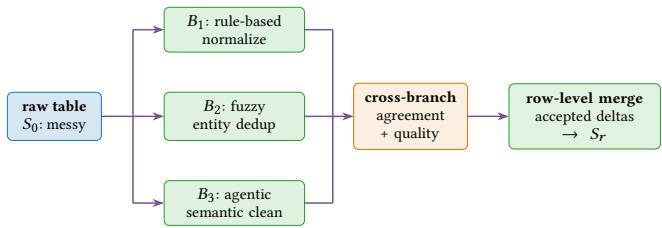
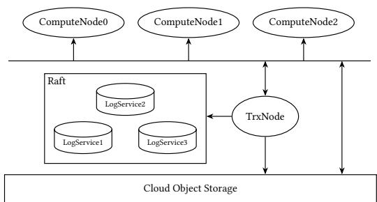

# Git4Data: Database-Native Version Control for AI Agents

Hongshen Gou Zuyu Zhang Yuze Sun Peng Xu Feng Tian Long Wang Jianguo Wang<sup>§</sup>

MatrixOrigin Purdue University<sup>§</sup>

{gouhongsheng; zuyuzhang; sunyuze; xupeng}@matrixorigin.cn {tianfeng; wanglong}@matrixorigin.io csjgwang@purdue.edu<sup>§</sup>

## ABSTRACT

Large Language Model (LLM) agents increasingly explore many candidate states of relational data in parallel, each of which should remain isolated, reproducible, and auditable, preferably through the same SQL interface used for ordinary data work. Existing tools support this requirement only partially: source-code version control does not scale to large datasets, whereas relational databases manage large data eficiently but rarely expose native branching, comparison, and merging. We present Git4Data, a database-native version-control layer for agentic workflows. Git4Data treats a data base as a repository and a table as a versioned object, exposing Git-style operations (snapshot/tag, branch, diff, and merge with explicit conflict-resolution policies) through SQL extensions. Implemented in MatrixOne, a cloud-native relational database, Git4Data leverages immutable object storage and MVCC to make the cost of these operations proportional to the size of the change rather than the size of the data. On the BranchBench agentic branching workloads, Git4Data outperforms DoltDB by up to an order of mag nitude. Overall, we believe this work sheds light on how relational databases can better support AI agents through eficient versioning.

## 1 INTRODUCTION

Large Language Model (LLM) agents are beginning to act as data engineers [6]: they read relational data, propose transformations [12], evaluate SQL [9], and iterate. Unlike a human engineer working on one snapshot at a time, a fleet of agents explores many candidate states in parallel [1, 10], and each agent must be isolated, reproducible, and auditable. An agent must fork data before specula tive updates, inspect row-level difs, merge only validated changes, and roll back failed paths without copying the base version. In other words, agentic workflows require data-version primitives as first-class, database-native operations rather than as external tools.

Consider agentic data repair workflow in Figure 1. A raw snapshot � contains duplicate entities, malformed fields, and inconsistent records. Rather than committing to one cleaning strategy up front, an agent branches �<sub>0</sub> and applies a diferent SQL repair to each candidate: categorical normalization, fuzzy entity dedupli cation, and context-dependent semantic fixes. Each evaluates the candidates with SQL queries and proxy quality signals, prunes poor branches, and compares promising ones through difs. Because each strategy repairs a diferent subset of the records, no branch wins outright, and the goal is to selectively merge accepted row-level deltas into a repaired state � while preserving an audit trail of what was tried, accepted, and rejected.

Software engineering already has mature support for these primitives, with Git [3] as the de facto standard. However, data engineers do not have a comparable foundation. Applying a source-code version control system (VCS) to large datasets is prohibitively slow, because its dif and merge tools load and compare the entire dataset in memory, and it does not scale to billions of records stored in cloud object stores.

  
Figure 1: Agentic data repair workflow with Git4Data

Relational databases mutate data eficiently via transactions, but do not provide explicit version control. Multi-Version Concurrency Control (MVCC) retains row versions in a linear history, but does not allow tracing back at a specific version, let alone doing so at agent swarm scale. Database snapshots and Point-In-Time Recovery (PITR) capture named past versions, yet support only read and restore at a single timeline, but cannot hold two writable lines of work. Writable clones of tables or databases in Snowflake [4] and Supabase [21] allow development and testing in parallel, and Neon [13] forks an entire Postgres instance at any point in its history through storage-level copy-on-write. But none of these systems can report the row-level diferences between two branches, whether both branches modify the same rows, or merge validated changes into a new version. In other words, what is missing in databases is not the ability to capture or fork data changes, but the SQL-level operations to manipulate the resulting versions: comparison and conflict-aware reintegration.

We propose Git4Data, a new abstraction that supplies exactly this missing layer. Git4Data treats a database as a repository and a table as a versioned object. By extending snapshot/tag, branch, row-level dif, and merge as SQL statements (Section 2), an engineer or an LLM agent could version data through the interface already used for data work, and changes spanning multiple tables publish in one transaction. Merge is three-way and conflict-aware rather than last-writer-win. Conflict resolution is currently at the row granularity, and richer semantic resolution is one of the research problems this abstraction opens (Section 6).

We then implement an initial version ofGit4Data in MatrixOne [11], a cloud-native relational database. Our key observation is that a modern OLTP database already provides the mechanisms for the concept, where data resides in immutable, append-only objects governed by MVCC. A table version is just a lightweight metadata, and two versions difer only in the objects written since they diverged, letting dif and merge read only those deltas. The initial results are encouraging: cloning a 100 GB table takes 0.2 s and

a few hundred kilobytes of metadata; dif and merge outperform their SQL equivalents by orders of magnitude. On BranchBench [1] agentic branching workloads Git4Data runs up to an order of magnitude faster than DoltDB [5] while sustaining 1,000 concurrently branching agents.

This paper makes the following contributions:

• We propose Git4Data, a database-native version-control abstraction that exposes branch, dif, and merge as SQL extensions, applicable to any OLTP database (Section 2).

• We implement a Git4Data prototype in MatrixOne<sup>1</sup>, where metadata-only cloning and delta-based dif and merge keep the cost proportional to the changes (Section 3).

• We evaluate the prototype on BranchBench, observing up to an order of magnitude speedup over DoltDB at 1,000 concurrent agents (Section 4).

• We distill the lessons of building Git4Data and identify the open problems that we believe start a new line of research on in-database version control (Section 6).

## 2 GIT4DATA

This section presents Git4Data, which derives much of its utility from a small, composable vocabulary in Git: record a version, branch from it, compare versions, and integrate selected changes. Git4Data brings this vocabulary to relational data by mapping each Git concept onto a database construct. The database serves as the data repository where each table is a versioned object:

• a snapshot names an immutable table state, the analogue of a commit or tag;

• a branch is a new table cloned from a snapshot, after which the two evolve independently;

• dif reports the rows on which two versions disagree;

• merge folds accepted changes from one branch into another under an explicit conflict policy.

Two decisions shape how the vocabulary transfers. First, each operation is a SQL statement executed inside the database, so versioning inherits the transactions, authentication, and access control that data engineers already rely on, and both engineers and agents version data through the same interface they use for ordinary data work. Second, versions are compared as relational content rather than as byte streams, where Git4Data treats a table version as an unordered multiset of rows, with the primary key, when present, supplying a stable row identity across versions, so the semantics are independent of physical layout and row order.

Nothing in this vocabulary is tied to one engine: the operations are defined at the SQL level, and any OLTP database could achieve them with the same semantics. Their cost, however, depends on the storage design. If the storage engine keeps table data immutable, a snapshot is merely metadata: branching does not occur data copies, and two versions difer only in what were written after they diverged, so each operation costs in proportion to the change rather than to the whole table size.

## 2.1 Operations

We present the operations in their typical workflow order, as a single table T takes a snapshot or a branch, compares, and reconciles. Listing 1 depicts the running workflow used throughout the paper, where T and its clone TClone diverge from a common base snapshot sn1, and eventually merge into sn4.

Listing 1: Running branch-and-merge workflow

```diff
T : --> sn1 --> sn2 ------> sn4 -->
\ /
TClone : \---> sn3 --/
now -----> time
```

Snapshot. Every version-control workflow requires the ability to name a past state. In Git4Data, a snapshot freezes a table at an instant, and plays the role of a Git commit. The most lightweight form is implicit: a multi-version storage engine already retains point-in-time history for a recent window (i.e., 24 hours), so a recent state can be queried directly by timestamp,

```sql
SELECT * FROM T{timestamp='2026-08-01 12:34:56'};
```

without requiring the user to declare the state in advance. When a state should be retained explicitly, the user promotes it to a named snapshot, the analogue of a Git tag, with

CREATE SNAPSHOT sn1 FOR TABLE T;

We write� for the resulting snapshot of T. Git4Data also supports database-level snapshots; for clarity we develop the operations at the granularity of a single table.

Branch. A snapshot becomes a starting point for new work the moment it is cloned into a fresh table:

DATA BRANCH CREATE TABLE TClone FROM T{snapshot='sn1'}; The clone TClone inherits the schema and data of� , but from that point the two tables evolve independently: inserts, deletes, and updates on T and TClone no longer afect one another. This is precisely the isolation an agent needs to explore a speculative change without endangering production state. In the running workflow, T then advances to snapshot sn2 while TClone advances to sn3.

Dif. Once two lines of work diverge, the natural question is how they difer. DATA BRANCH DIFF compares between two snapshots:

DATA BRANCH DIFF T{snapshot='sn2'} AGAINST TClone{snapshot='sn3'};

Conceptually, the operation treats each snapshot as an unordered multiset of records and reports the rows where the two multisets disagree. The semantics are captured precisely by the query in Listing 2: each row contributes a signed count, and the rows whose counts do not cancel are exactly those that difer.

Listing 2: Query equivalent to DATA BRANCH DIFF

```sql
WITH UnionT AS (
SELECT -1 AS cnt , a , b , c FROM T { snapshot ='sn2 '}
UNION ALL
SELECT 1 AS cnt , a, b, c FROM TClone { snapshot ='sn3 '}
)
SELECT SUM (cnt ) AS diffCnt , a, b, c FROM UnionT
GROUP BY a , b , c HAVING SUM ( cnt ) <> 0;
```

Merge. This operation folds accepted changes back into the target table. Branches from a fleet of agents typically succeed on diferent subsets of the data, so no single branch can simply be promoted to replace the original. Meanwhile the live table keeps receiving writes, as shown in Listing 1, T advances to sn2 while TClone is being explored, so swapping T for a branch would silently discard that concurrent progress, and re-applying the branch’s changes through hand-written SQL reintroduces a slow, error-prone path. A merge reconciles two histories instead:

DATA BRANCH MERGE TClone{snapshot='sn3'} INTO T

[WHEN CONFLICT FAIL|SKIP|ACCEPT];

The source may be any snapshot, whereas the target must be the live table version. Rather than overwriting one side with the other, Git4Data infers the common base revision $T _ { s n 1 }$ and performs a threeway merge, so that non-overlapping changes from both branches survive. What happens when the branches do overlap is governed by the WHEN CONFLICT clause, which ofers three policies: FAIL aborts the merge, SKIP keeps the target’s version of a conflicting row, and ACCEPT keeps the source’s.

Conflict Resolution. Whether two changes actually collide depends on how rows are identified, and here the presence of a primary key is decisive. When the table declares one, Git4Data compares the corresponding row across the base, target, and source snapshots and flags a genuine conflict only when both branches independently modify the same key, including the case in which two branches insert the same new key. If only one branch touched the row, or if both applied identical changes, the outcome is unambiguous and Git4Data resolves it automatically.

Without a primary key, no stable identity ties a row in one branch to a row in another, so Git4Data falls back to multiset reasoning. Inserted rows are grouped by their full values, while deleted rows are tracked through the storage engine’s physical row identifiers. A conflict is suspected only when the same changed row or row value appears in both branch deltas and cannot be canceled as an identical change; changes confined to one side are applied automatically, and anything that remains is resolved under SKIP, ACCEPT, or FAIL.

## 3 DESIGN AND IMPLEMENTATION

In this section, we present the design and implementation of Git4Data. We first identify the capabilities that an OLTP database must provide to support it eficiently, then describe MatrixOne, a cloud-native database, and finally explain how each operation is implemented.

## 3.1 Key Requirements

Git4Data operations rely on three requirements, which we state independently of any particular storage engine.

Append-only data. The storage engine never modifies data in place: inserts and updates append new, immutable data units. A snapshot only needs to record the table version to which the units belong, branching copies the metadata, and the diference between two versions is confined to the units appended after they diverged.

Deletion marks. Deleted tuples must be recorded explicitly, rather than applied in place. Deletion marks allow dif to report deleted rows without scanning the full table, while merge can distinguish a row deleted on one branch from a row deleted on both.

  
Figure 2: MatrixOne architecture

Multi-Version Concurrency Control. Version-control operations must execute as transactions, so that a merge publishes its accepted changes atomically and concurrent branches never observe a partial state. MVCC additionally gives every committed state a well-defined point-in-time identity, the implicit timestamp of snapshot name.

Many modern OLTP databases built on log-structured, multiversion storage engine satisfy all three requirements. We implement Git4Data in MatrixOne [11], one such system described below.

## 3.2 MatrixOne

MatrixOne is a cloud-native HTAP database organized around three principal node types (Figure 2). LogService nodes form a Raft [15] group and store the Write-Ahead Log (WAL). A TransactionNode (TN) determines transaction commits, serializes committed logs, and streams WAL records to subscribed ComputeNodes (CNs). CNs execute SQL queries and scale out independently.

MatrixOne stores table data in cloud object storage. Objects are immutable, hold column-store row groups [20], and form an LSM tree [14] ordered by the primary key, or by clustering keys together with a uniquifier. Deletes are represented by tombstone objects that record the key and physical row id of the deleted rows. Metadata consists of a directory of data objects and tombstone objects.

MatrixOne employs MVCC. Transactions execute on CNs and maintain private workspaces. Large transaction workspaces are written directly to cloud object storage, and the commit record sent to TN carries the corresponding object metadata. Small writes may instead accumulate in a TN-managed in-memory object; each row carries a transaction timestamp, and the object remains appendonly until flushed to cloud. Committed WAL records are streamed to subscribed CNs to keep table state and local object caches fresh.

A table snapshot is the metadata directory for all objects that belong to the table at a given version, including both flushed inmemory objects and remote objects. Reading a timestamp snapshot traverses this directory and applies MVCC timestamp filters. Creating a named snapshot first flushes in-memory objects and then records the metadata directory under the snapshot name.

As in other log-structured storage systems [14, 19], MatrixOne relies on background compaction and garbage collection. Garbage collection is snapshot-aware: objects referenced by named snapshots are retained, which allows Git4Data to maintain branches and tags without copying table data.

## 3.3 Implementation

We now describe how Git4Data implements clone, dif, and merge over MatrixOne snapshots. Cloning a table from a snapshot is pure metadata: MatrixOne copies the directory structure of the snapshot’s object metadata into the new table.

Dif and merge operate on object deltas. Consider tables T and TClone in Listing 1: after TClone is created, both may be modified independently, advancing to distinct snapshots sn2 and sn3. We write $\Delta _ { s n 2 }$ for the objects in $T _ { s n 2 }$ but not in the common base revision $T _ { s n 1 }$ , and $\Delta _ { s n 3 }$ analogously for $T C l o n e _ { s n 3 }$ . A delta contains the objects added by data modifications, with deletions represented as tombstone records. It may also contain objects retained only in $T _ { s n 1 }$ as a result of compaction or garbage collection.

## 3.4 Dif

To compute DATA BRANCH DIFF between $T _ { s n 2 }$ and $T C l o n e _ { s n 3 }$ , MatrixOne reads only $\Delta _ { s n 2 }$ and $\Delta _ { s n 3 }$ . With a primary key, all operations on one key within a delta collapse into a single logical operation: a delete, an insert, or an update represented as a delete followed by an insert. Deletions are always applied to a row in $T _ { s n 1 }$ . This scan mirrors an ordinary LSM-tree scan with tombstones, except that it emits deletions rather than masking deleted rows, assigning a minus sign to each deletion and a plus sign to each insert. It difers from the SQL dif of Listing 2 in two ways: its signs express $T _ { s n 2 }$ versus $T _ { s n 1 }$ (not versus $T C l o n e _ { s n 3 } )$ , and deleted rows initially emit only tombstones whose non-key columns are null. MatrixOne joins with $T _ { s n 1 }$ to recover the original values only when they are required.

MatrixOne then aggregates the two deltas: changes are identical, and cancel, when they delete the same row of $T _ { s n 1 }$ or insert rows equal in all columns. The final output flips the sign of rows from $\Delta _ { s n 2 }$ and, for each remaining tombstone, joins with $T _ { s n 1 }$ to recover its non-key columns. Without a primary key, the same procedure applies, but rows are matched by full value and by physical rowid: insertions with identical values and deletions with the same rowid cancel, and deleted rows are recovered by rowid lookup.

## 3.5 Merge

A three-way merge from TClone into T runs the same scan and dif aggregation over $\Delta _ { s n 2 }$ and $\Delta _ { s n 3 }$ (Section 3.4); the plus and minus signs indicate whether a row was inserted into a snapshot or deleted from the base. With a primary key, a conflict is genuine when the key appears in both deltas and spurious when it appears on only one side; a row relocated by compaction (same values, new position) is recognized as a non-conflict, so a storage reorganization never masks a valid update from the other branch. This is the only case requiring a full read of the deleted base row, and such lookups are rare. Without a primary key, rows are matched as a multiset of full values: identical full-row values from the two deltas cancel one occurrence at a time, preserving duplicate multiplicity, so equal rows on both sides are cancellations rather than conflicts, consistent with the row-multiset semantics of Section 2.

Users need not name the common base revision. MatrixOne tracks snapshot and clone lineage and usually infers it, implementing a two-way merge as a three-way merge with an implicit base. When the base cannot be determined or no longer exists (for example, the original table and all of its snapshots were deleted), the merge uses an empty base; even then, two clones of a common ancestor share many objects, so the dif aggregation still beats the SQL query of Listing 2 by skipping the shared objects.

Table 1: Git4Data Clone vs. Insert on 100 GB lineitem table.
<table><tr><td>Operation</td><td>Time (s)</td><td>Space</td></tr><tr><td>Clone, PK</td><td>0.20</td><td>314 KB</td></tr><tr><td>Clone, NoPK</td><td>0.17</td><td>294 KB</td></tr><tr><td>Insert, PK</td><td>114.6</td><td>34 GB</td></tr><tr><td>Insert, NoPK</td><td>119.3</td><td>34 GB</td></tr></table>

Table 2: Single-branch dif, Git4Data vs. SQL.
<table><tr><td>Operation</td><td>C1</td><td>C2</td><td>C3</td><td>C4</td></tr><tr><td>Git4Data Diff, PK</td><td>0.19</td><td>0.38</td><td>1.73</td><td>3.27</td></tr><tr><td>Git4Data Diff, NoPK</td><td>0.85</td><td>22.50</td><td>9.04</td><td>60.19</td></tr><tr><td>SQL Diff, PK</td><td>316.16</td><td>418.19</td><td>428.78</td><td>431.50</td></tr><tr><td>SQL Diff, NoPK</td><td>378.19</td><td>396.61</td><td>394.13</td><td>371.74</td></tr></table>

Snapshots also protect history: MatrixOne never compacts or garbage-collects objects referenced by a named snapshot. Compaction or GC scheduled between sn1 and a later snapshot rewrites valid rows into new objects, which can move rows without changing their values; as above, the dif aggregation treats such relocated rows as unchanged and avoids false conflicts. Because users typically branch from well-organized snapshots, compaction within the common base revision is rare.

## 4 EXPERIMENTAL EVALUATION

This section evaluates Git4Data on a microbenchmark and compares against DoltDB [5] on BranchBench [1]. Our experiments were conducted on a bare-metal server running CentOS, equipped with an Intel Xeon Silver CPU (2.4 GHz, 64 cores), 256 GB of main memory, and local SSDs, with MatrixOne deployed on Kubernetes.

## 4.1 Version-Control Operations

We first microbenchmark the individual version-control operations on both primary-key (PK) and no-primary-key (NoPK) settings. We compare Git4Data against equivalent hand-written SQL in MatrixOne using the TPC-H [22] lineitem table at Scale Factor 100.

Clone. We compare the metadata-only clone against materializing a full copy of the lineitem table:

INSERT INTO T SELECT \* FROM lineitem;

Table 1 reports the cost of clone versus insert. Cloning from a snapshot copies only metadata, whereas the INSERT writes an entirely new table, incurring 34 GB of additional storage.

Dif and merge. We apply four update sets on the lineitem clones: C1, C2, C3, and C4 update 1,000, 10,000, 100,000, and 1,000,000 random rows, respectively, and then difer against the original table and merge the changes back using ACCEPT. The SQL dif shows in Listing 2, while the SQL merge materializes that dif, deletes the rows with negative counts, and inserts the rows with positive counts.

Table 3: Single-branch merge, Git4Data vs. SQL.
<table><tr><td>Operation</td><td>C1</td><td>C2</td><td>C3</td><td>C4</td></tr><tr><td>Git4Data Merge, PK</td><td>0.35</td><td>0.97</td><td>7.95</td><td>16.13</td></tr><tr><td>Git4Data Merge, NoPK</td><td>0.88</td><td>22.70</td><td>12.09</td><td>68.75</td></tr><tr><td>SQL Merge, PK</td><td>321.52</td><td>412.89</td><td>442.68</td><td>471.16</td></tr><tr><td>SQL Merge, NoPK</td><td>393.95</td><td>405.35</td><td>401.59</td><td>403.18</td></tr></table>

Table 4: BranchBench at Scale Factor 100 runtime (s)
<table><tr><td rowspan="2">Workflow</td><td colspan="2">Git4Data</td><td colspan="2">DoltDB</td><td rowspan="2">Speedup</td></tr><tr><td>Cold</td><td>Warm</td><td>Cold</td><td>Warm</td></tr><tr><td>software_dev</td><td>138.9</td><td>122.1</td><td>1938.8</td><td>1925.6</td><td>15.8×</td></tr><tr><td>failure_repro</td><td>207.6</td><td>198.9</td><td>1545.5</td><td>1677.3</td><td>8.4×</td></tr><tr><td>data_cleaning</td><td>62.6</td><td>58.6</td><td>1075.2</td><td>1084.2</td><td>18.5×</td></tr><tr><td>mcts</td><td>36.0</td><td>39.8</td><td>410.4</td><td>410.2</td><td>10.3×</td></tr></table>

The built-in dif is substantially faster than the SQL dif (Table 2), because it scans only the changed objects rather than the entire tables. The advantage is larger with primary keys, since row ids let MatrixOne collapse multiple operations on the same key before aggregation. In the no-primary-key case, deleted rows may require additional tuple lookups, so the benefit is smaller and varies with the diferent number of lookups.

The built-in merge is likewise substantially faster than the SQL alternative (Table 3). Primary keys provide stable row identity, allowing the scan and dif aggregation to group multiple operations on the same key into a single logical operation.

The same advantage holds in collaborative settings. For four engineers who fork lineitem and merge mostly non-overlapping updates, with two branches conflicting on a 10% PK overlap resolved by ACCEPT, the built-in dif and merge remain orders of magnitude faster than the SQL counterparts, even for one million updates.

## 4.2 BranchBench

We now turn to end-to-end agentic workloads, studying how Git4Data behaves as agent count and data size grow.

BranchBench [1] defines branch lifecycle, branch-local SQL, cross-branch comparison, and pruning workloads for agentic database branching. We run four end-to-end workflows, software development, failure reproduction, data cleaning, and Monte Carlo tree search (MCTS), at scale factor 100 (approximately 47 million rows). Each is driven by five concurrent agents over 20 steps, with each agent forking the database, issuing branch-local SQL, and merging or discarding its branch. We compare Git4Data against DoltDB [5], a MySQL-compatible database with built-in Git-style branching, reporting end-to-end wall-clock time for a cold run and the average over warm runs in Table 4. A fifth workflow, simulation, stresses branch concurrency with 1,000 agents and is examined separately below.

Across all four workflows, Git4Data is up to 18.5× faster than DoltDB, which materializes and compares table contents, so each branch operation scales with table size. Git4Data’s snapshot-anddelta operations scale with the size of the change, and exhibit low runtime variance under 3.5 s.

Table 5: Git4Data BranchBench scaling experiments.
<table><tr><td>Workflow</td><td>SF100</td><td>SF1,000</td><td>Factor</td></tr><tr><td>software_dev</td><td>127.5</td><td>366.3</td><td>2.9×</td></tr><tr><td>data_cleaning</td><td>99.3</td><td>322.5</td><td>3.2×</td></tr><tr><td>failure_repro</td><td>199.0</td><td>2685.7</td><td>13.5×</td></tr></table>

Scaling number of agents. The simulation workflow stresses branch concurrency directly, launching 1,000 concurrent agents, each of which forks the database and performs a branch-local step. At scale factor 100, Git4Data completes in 400 s, whileas DoltDB fails to finish within two hours. This confirms that metadata-level branching keeps per-fork cost negligible even at high agent counts. The remaining cost is dominated not by branching itself but the shared compute and I/O consumed when thousands of branch-local executions run concurrently, which we identify as the primary bottleneck as the number of agents grows.

Scaling data size. To see how Git4Data performs as data grow, we rerun the BranchBench workflows at scale factor 1,000 (Table 5). The branch-local workflows scale sublinearly: software\_dev and data\_cleaning slow by at most 3.2×, and mcts stays essentially flat (under 40 s warm), even though the data grows by 10×. Their cost is set by the bounded per-step deltas each agent writes, not by the size of the underlying table. The only exception is failure\_repro, which grows about 13×: its repairs scan and rewrite the entire table, so its cost tracks data size rather than change size. The 1,000-agent simulation finishes in 600 s at SF1,000, comparable to 400 s at SF100, which confirms that per-fork cost stays metadata-bound as data grows. Overall, Git4Data’s delta-oriented design preserves its eficiency at an order-of-magnitude larger scale, except where a workflow inherently touches the whole table.

## 5 RELATED WORK

This section reviews prior work in five dimensions: version control, storage snapshots, data-lake versioning, database cloning and branching, and agentic data workloads.

Version control systems trace back to early software-engineering practice [18]. Distributed systems such as Git [3] subsequently became the standard for source-code collaboration. Support for large data is typically retrofitted as an extension: Git LFS [7] provides large-file storage and retrieval, and DVC [8] versions datasets and models through Git-tracked pointer files, but neither ofers recordlevel dif or conflict resolution.

Closer to Git4Data in spirit are data-lake versioning systems. Apache Iceberg [2] maintains per-table snapshot lineage with branch and tag references, Nessie [17] versions an entire Iceberg catalog with Git-like branches and merges, and lakeFS [23] provides zerocopy branches, commits, and three-way merge over an object-store namespace. These systems share Git4Data’s metadata-only branching philosophy: a lakeFS commit, for example, is an immutable manifest whose merge copies unchanged ranges wholesale. They version file manifests, but the unit of dif identity is an object or a table rather than a row: two branches that update disjoint rows of the same table still collide, and a conflict is resolved by keeping one side’s file. Git4Data applies the same snapshot-and-delta discipline inside the OLTP database, where primary keys give rows a unique identity and merge reconciles at record granularity.

Many database systems support snapshots, restore, and Point-In-Time Recovery (PITR), but creating a writable branch exposes the limits of engines that couple compute with in-place-update storage. PostgreSQL 18 can delegate the database copy to file-system cloning (reflink) [16], but requires that no other active session access the source database for the duration of the copy, making it efectively an ofline operation. Disaggregated, versioned storage removes the copy altogether: Snowflake [4] and Supabase [21] ofer zero-copy clones for development and testing, and Neon [13] branches online, at no cost to the parent, by recording a fork point in its LSN-indexed page history. Neon’s branches, however, are coarse-grained: a single table cannot branch alone. Moreover, none of these systems can compare two branches at the row level or merge one into another, so divergence is one-way. DoltDB [5] brings Git-style branch, dif, and merge operations to a MySQL-compatible SQL database. Git4Data likewise exposes branch-oriented data workflows, but realizes them as database-native snapshot operations at table granularity in MatrixOne, with an emphasis on eficient dif and merge over large table forks.

Agentic workloads provide a further motivation for branchable data management, as they frequently require parallel exploration of a hypothetical data space. Recent work on agent-first data sys tems characterizes this pattern as agentic speculation [10]: agents may fork a database state, run speculative updates, and roll back branches. Each branch furnishes an isolated state where an agent can apply speculative mutations, assess their efects, and then discard, compare, or merge the resulting changes. BranchBench [1] is a recent benchmark for agentic database branching that models branch lifecycle operations, branch-local SQL, cross-branch comparison, and pruning as first-class workload dimensions (Section 4).

## 6 LESSONS AND FUTURE WORK

We share three lessons learned from building Git4Data that we believe extend beyond MatrixOne, and finally highlight important open problems.

Data version control is a storage property. Our implementation shows that data version control can be built on top of an existing transactional storage engine. An engine that already provides the three capabilities of Section 3.1, append-only data, deletion marks, and transactions, contains the necessary mechanisms: Git4Data is a thin interpretation layer over them and required no modification to the storage layer itself. We hope this work opens a line of research on data version management inside databases.

Relational semantics simplify data versioning. While Git matches ordered lines oftext heuristically, a relational engine obtains cleaner semantics for free. Data reconciliation based on primary key index outperforms the traditional value-based matching by more than an order of magnitude. But dif and merge assume compatible schemas, so schema evolution on long-lived branches remains open.

New challenges surface in scaling the agent swarm. Once forking is a metadata operation and merges commit atomically, branch creation no longer constrains agent concurrency, and the dominant cost becomes the shared computation and I/O of concurrently executing branch-local workloads, shifting the open problem from storage eficiency to resource governance.

Future directions. The bottleneck shift defines the first direction: resource governance for agent fleets. Thousands of speculative branches compete for shared compute and I/O, most will be discarded, yet the engine treats them as equal tenants; scheduling, admission control, and per-branch quotas that reflect an agent’s progress are open problems. Second, richer merge semantics. Resolution is currently row-level, so two branches editing diferent columns of the same row still conflict; cell-level resolution is the natural next step, but the harder problem is semantic, since rowdisjoint changes can jointly violate constraints that neither branch violates alone, and conflict policies beyond SKIP and ACCEPT, including an agent that reviews DATA BRANCH DIFF output and acts as the merge driver, are unexplored. Third, schema evolution: dif and merge require compatible schemas, yet schema changes are common in practice, so schema must eventually be versioned together with data. Fourth, retention: named snapshots pin immutable objects, so sustained branching accumulates history, and balancing auditability against storage growth and compaction efectiveness requires explicit policy. Finally, we plan to validate Git4Data on production agentic workloads to learn how far these lessons.

## REFERENCES

[1] Elaine Ang et al. 2026. BranchBench: An Extensible Benchmark for Agentic Database Branching. In Supporting Our AI Overlords (SAO) Workshop at the ACM Conference on AI and Agentic Systems (CAIS’26) (San Jose, CA). USA.

[2] Apache Software Foundation. 2026. Apache Iceberg. https://iceberg.apache.org.

[3] Scott Chacon and Ben Straub. 2014. Pro Git (2 ed.). Apress, Berkeley, CA, USA.

[4] Benoit Dageville et al. 2016. The Snowflake Elastic Data Warehouse. In Proceedings ofthe 2016 International Conference on Management ofData (SIGMOD ’16).

[5] Dolt. 2026. Version-Controlled SQL Database. https://github.com/dolthub/dolt.

[6] Raul Castro Fernandez et al. 2023. How Large Language Models Will Disrupt Data Management. Proc. VLDB Endow. 16, 11 (July 2023), 3302–3309.

[7] GitHub. 2026. Git Large File Storage (git-lfs). https://github.com/git-lfs/git-lfs. [8] Iterative. 2026. DVC: Data Version Control. https://dvc.org

[9] Boyan Li et al. 2024. The Dawn of Natural Language to SQL: Are We Fully Ready? Proc. VLDB Endow. 17, 11 (July 2024), 3318–3331. doi:10.14778/3681954.3682003

[10] Shu Liu et al. 2026. Supporting Our AI Overlords: Redesigning Data Systems to be Agent-First. the 16th Conference on Innovative Data Systems Research.

[11] MatrixOrigin. 2026. MatrixOne. https://github.com/matrixorigin/matrixone.

[12] Avanika Narayan et al. 2022. Can Foundation Models Wrangle Your Data? Proc. VLDB Endow. 16, 4 (Dec. 2022), 738–746. doi:10.14778/3574245.3574258

[13] Neon Team. 2026. Neon Branching - Branch your data the same way you branch your code. https://neon.com/docs/introduction/branching.

[14] Patrick O’Neil et al. 1996. The Log-Structured Merge-Tree (LSM-Tree). Acta Informatica 33, 4 (1996), 351–385.

[15] Diego Ongaro et al. 2014. In search of an understandable consensus algorithm. In the 2014 USENIX Conference on Annual Technical Conference (USENIX ATC’14)

[16] PostgreSQL Global Development Group. 2026. PostgreSQL: CREATE DATABASE. https://www.postgresql.org/docs/current/sql-createdatabase.html.

[17] Project Nessie. 2026. Project Nessie: Transactional Catalog for Data Lakes with Git-like Semantics. https://projectnessie.org.

[18] Marc J. Rochkind. 1975. The Source Code Control System. IEEE Transactions on Software Engineering SE-1, 4 (1975), 364–370.

[19] Mendel Rosenblum et al. 1992. The Design and Implementation of a Log-Structured File System. ACM Transactions on Computer Systems 10, 1 (1992).

[20] Mike Stonebraker et al. 2005. C-Store: A Column-oriented DBMS. In Proceedings ofthe 31st International Conference on Very Large Data Bases (VLDB).

[21] Supabase. 2026. Supabase. https://supabase.com/docs/guides/database/overview.

[22] Transaction Processing Performance Council. 2022. TPC Benchmark H Standard Specification. https://www.tpc.org/tpch.

[23] Treeverse. 2026. lakeFS: Data Version Control for Data Lakes. https://lakefs.io.