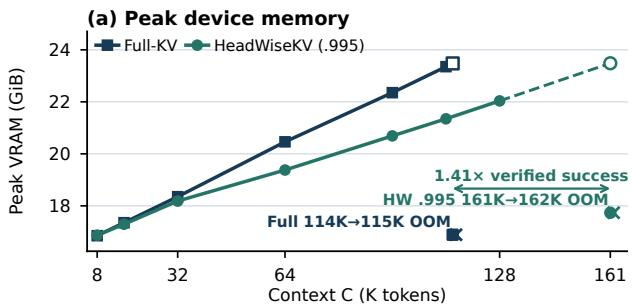
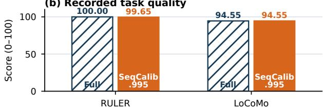
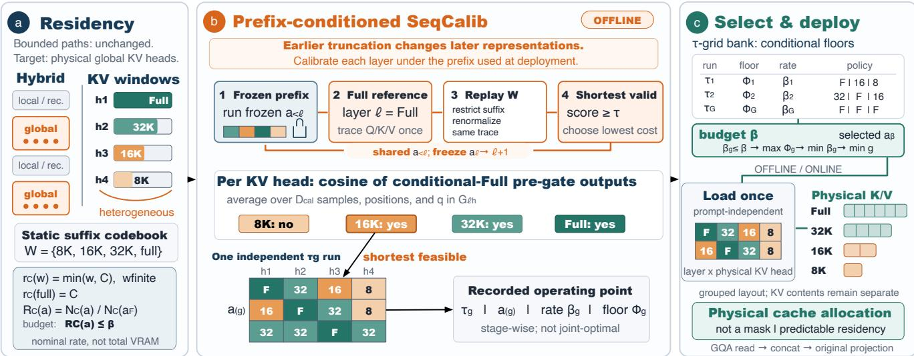
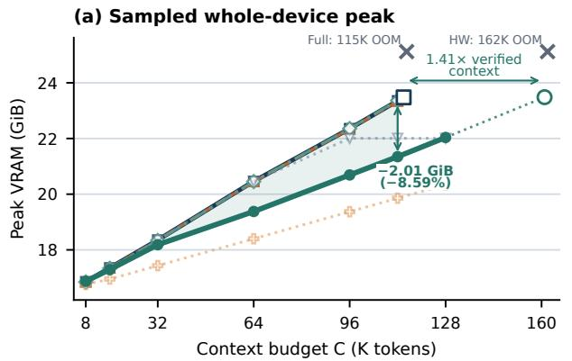
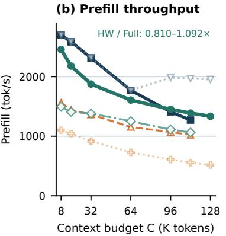
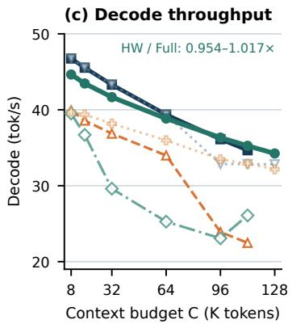
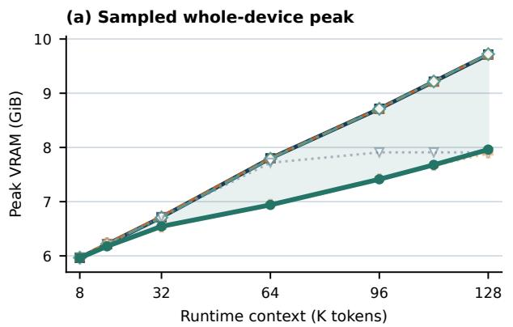
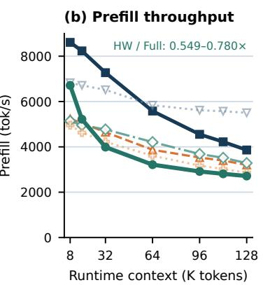
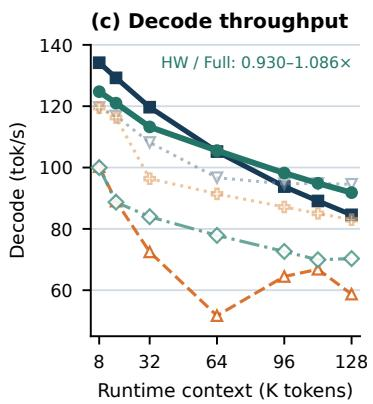

# HeadWiseKV: Budgeted Per-Head Cache Residency for Hybrid Long-Context Language Models

Renjie Xie1,2∗, Juncheng Yang2∗, Aoting Hu3,2∗,

Mingxi Zhang1,2, Liyao Wu1,2, Zheheng Hong4,2, Wei Xu5

1Nanjing University of Posts and Telecommunications

2Tylogi AI Lab / TAIL

3Anhui University of Technology

4Shanghai Jiao Tong University

5School of Information Science and Engineering, Southeast University

renjie\_xie@njupt.edu.cn, juncheng\_yang@tylogi.com, aotinghu@ahut.edu.cn, b23080111@njupt.edu.cn, lywu@tylogi.com, zh2227@sjtu.edu.cn, wxu@seu.edu.cn

## Abstract

Long-context inference retains a growing key–value (KV) cache during decoding, which consumes substantial GPU memory and can reduce generation throughput. This bottleneck remains in hybrid language models because their residual global-attention layers can dominate context-dependent cache demand. We study how to allocate this state under an aggregate KV-residency budget. We introduce HeadWiseKV, a training-free framework that compresses the residual global KV caches of hybrid language models while preserving their native local, recurrent, and linear paths. It assigns each physical KV head a static, multilevel history window, making cache demand predictable before serving. We formulate this allocation as a restricted operational rate–distortion problem and propose SeqCalib as the core policy-generation algorithm in HeadWiseKV. SeqCalib processes layers in execution order and conditions each decision on the lower-layer policy used at deployment, thereby accounting for interactions across depth. A grouped-cache runtime materializes the selected policy as actual per-head KV residency rather than a mask over a full cache. We evaluate downstream quality across four hybrid long-context models and study physical residency and serving behavior on Qwen3.6-27B. HeadWiseKV retains near-Full-KV RULER and LoCoMo quality across the evaluated models. In the fixed-model systems study, it reduces sampled peak device memory by 8.59% at a 112K context length and extends the largest verified successful context from 114K to 161K.

## 1 Introduction

During long-context autoregressive inference, each fullattention layer stores key and value vectors for every cached token. This KV cache grows with context length and concurrency and can exhaust device memory (Zhang et al. 2023). Hybrid language models reduce the burden but do not eliminate it. Gemma 2 and Gemma 3 interleave global and local sliding-window attention (Gemma Team et al. 2024, 2025), whereas Qwen3-Next and Qwen3.6 interleave full or gated attention with recurrent Gated-DeltaNet blocks (Qwen Team

2025, 2026; Yang, Kautz, and Hatamizadeh 2025). Their remaining global blocks still retain histories that grow with the prompt. Hybridization therefore relocates the KV bottleneck rather than eliminating it: a small set of residual global layers can determine whether a long request fits in memory.

KV compression involves two distinct choices: when the retention policy is determined and how that policy is realized in memory. Prompt-dependent methods derive token or head decisions from the current request, observed attention, or online eviction state (Ge et al. 2024; Feng et al. 2025; Fu et al. 2025; Rehg 2024; Zhang et al. 2025; Qin et al. 2025). This adaptation can preserve isolated distant evidence that is important to a particular prompt. Its systems benefit, however, depends on the runtime. A logical sparse mask can reduce attention work while leaving the allocated KV cache unchanged. Compaction or eviction can reduce decoding-time residency, but a method that first constructs a full cache need not reduce the prefill memory peak. Online scoring, indexing, and KV movement also add request-time overhead, so sparse attention does not automatically imply higher end-to-end throughput.

Static policies make the complementary trade-of. Capacities fixed before prefill allow a runtime to allocate bounded storage directly, yielding predictable memory demand without request-time selection. The policy cannot inspect the current prompt,and therefore cannot identify which isolated past tokens a future query may need. Existing static methods mitigate this limitation by assigning full history to retrieval heads and compressed or streaming caches to other heads (Tang et al. 2025; Xiao et al. 2025). This binary split is regular to deploy but can be too coarse for hybrid models whose residual global heads require diferent amounts of history. Table 1 separates policy timing from physical cache realization and summarizes this trade-of.

Static allocation also creates a calibration problem across depth. Sensitivity varies by head and layer (Ge et al. 2024; Tang et al. 2025; Fu et al. 2025; Zhang et al. 2025; Wang, Cui, and Gan 2025; Cai et al. 2025; Wan et al. 2025; Qin et al. 2025). A common window can waste memory on tolerant heads while truncating sensitive ones. Moreover, shortening an early cache changes the representations consumed by later layers. A higher layer calibrated under an all-full prefix may therefore see diferent inputs after deployment. A deployable static policy must choose fine-grained per-head capacities under the lower-layer decisions that will actually be active, and the runtime must realize those capacities as physical storage.

We introduce HeadWiseKV to meet these requirements. It assigns each residual global KV head one of several contiguous history lengths ofline and keeps the resulting policy fixed during serving. This multilevel allocation is more expressive than binary head specialization while retaining a regular, prompt-independent layout. Its runtime stores only the selected histories, so the policy determines physical residency rather than logical access to an all-full cache. Head-WiseKV thus exchanges request-specific token selection for a fine-grained memory plan that is known before prefill.

HeadWiseKV connects three technical pieces in an oflineto-online pipeline. A structured residency model first defines the candidate history lengths and their storage cost. At the core of HeadWiseKV is SeqCalib, the ofline algorithm that selects one history length for every configurable KV head. For each layer, SeqCalib keeps the previously selected lowerlayer windows active and compares candidate pre-gate attention outputs with a conditional full-history reference under that same lower-layer policy. It chooses the lowest-cost codebook entry meeting a mean-cosine threshold. For the realized lower prefix, this finite search is stage-wise exact, not a guarantee of joint global optimality. Running SeqCalib over a finite set of thresholds produces static policy matrices spanning diferent residency costs. A deterministic budget selector then chooses among the feasible matrices. A grouped cache runtime loads the chosen matrix once and allocates the corresponding physical history for each head. In short, the residency model defines the choices, SeqCalib decides what to retain, and the runtime makes that decision real. None of these steps requires retraining or architectural changes. We cast the finite allocation as a restricted operational rate distortion problem (Shannon 1959; Cover and Thomas 2006). Its stage-wise guarantee does not establish globally optimal joint allocation or downstream quality.

Figure 1 summarizes the central advantage of Head-WiseKV: it lowers device-memory demand and supports longer contexts while preserving long-context quality. On Qwen3.6-27B (Qwen Team 2026), HeadWiseKV reduces sampled peak device memory by 8.59% at 112K tokens and increases the largest verified successful context from 114K to 161K, while retaining near-Full-KV performance on RULER and LoCoMo. The systems and quality panels report separately recorded operating points; full protocols and results appear in Section 4.

(b) Recorded task quality  
  
Figure 1: Qwen3.6-27B memory, capacity, and quality summary. HeadWiseKV lowers sampled peak device memory and expands the verified context range while preserving long-context quality. Panel (a) combines matched memory measurements with independent adjacent-grid capacity brackets; panel (b) reports recorded RULER and Lo-CoMo scores. The systems and quality panels use separately recorded τ = .995 operating points and do not form a joint quality–systems result.

## Our contributions are:

• a budgeted physical-residency formulation for the residual global KV heads of hybrid models, together with an analysis motivating nonuniform allocation and deployment-conditioned calibration;

• HeadWiseKV and its prefix-conditioned SeqCalib algorithm, which construct static, multilevel per-head sufix policies under a prescribed KV-residency budget; and

• a grouped physical per-head cache runtime that materializes the selected policy as actual cache residency, together with an evaluation across model families, compression budgets, and long-context workloads.

## 2 Related Work

Prior work varies along two independent axes. Policy timing determines whether retention is fixed ofline or selected from the current request. Cache realization determines whether that choice changes physical residency or only sparse attention access. Request-dependent token selection uses attention, position, or prompt-specific signals (Liu et al. 2023; Zhang et al. 2023; Li et al. 2024; Wang et al. 2025). Head- and layer-aware methods further vary budgets across the model (Ge et al. 2024; Tang et al. 2025; Feng et al. 2025; Fu et al. 2025; Xiao et al. 2025; Rehg 2024; Zhang et al. 2025; Wang, Cui, and Gan 2025; Cai et al. 2025; Wan et al. 2025; Qin et al. 2025). A closely related direction reduces the context consulted by each query. QUEST selects KV pages using query-dependent bounds, while TokenSelect performs dynamic token-level selection across heads (Tang et al. 2024; Wu et al. 2025b). InfLLM retrieves relevant blocks from an auxiliary context memory, and PyramidInfer reduces retained tokens according to layer-wise attention consistency (Xiao et al. 2024a; Yang et al. 2024). Together, these methods adapt token or block access to the input or query. Their physical memory and latency efects still depend on whether the runtime masks, retrieves, compacts, or evicts the selected states.

In contrast, static methods move retention decisions before the request. StreamingLLM fixes a sink–recent policy, while RazorAttention and DuoAttention use ofline head roles that primarily expose a binary choice between full and compressed histories (Xiao et al. 2024b; Tang et al. 2025; Xiao et al. 2025). HeadWiseKV instead fixes a multilevel sufix length for each physical KV head, calibrates higher layers under the selected lower-layer policy, and allocates the resulting capacities before prefill. Table 1 compares these mechanisms. The “prompt-independent retention” and “physical before prefill” columns deliberately separate policy dependence from storage realization. The “deploymentconditioned calibration” column captures whether higherlayer decisions are made under the lower-layer policy used at deployment. A checkmark denotes a documented property, not an assumption that the property is universally preferable.

This retention policy is orthogonal to cache precision and serving-time memory management, which reduce representation cost or manage allocation without choosing a history length for each head (Liu et al. 2024; Hooper et al. 2024; Kwon et al. 2023; Prabhu et al. 2025). HeadWiseKV specifically targets the residual global-attention KV histories of hybrid models and leaves their bounded-memory local or recurrent paths unchanged.

## 3 Method

Figure 2 summarizes the ofline-to-online pipeline. Head-WiseKV defines feasible per-head history lengths and their storage costs, uses SeqCalib to select a layer-conditioned policy, and realizes that policy as physical cache residency. The next subsections formalize these stages.

## 3.1 Structured Residency Model

We begin by formalizing the static per-head residency problem. At a fixed context length, the policy decides how much recent history each configurable KV head retains. Only residual full-attention layers participate: $\mathcal { L } _ { \mathrm { F } }$ lists these layers in forward execution order, and $\bar { \mathcal { H } } _ { \ell }$ contains the physical KV heads in layer ℓ. Under grouped-query attention (GQA), several query heads may share one KV head. We denote this group by $\mathcal { G } _ { \ell h }$ . The decision unit is therefore a physical KV head (ℓ, h), not an individual query head. The set of all decision units is $\mathcal { U } = \{ ( \ell , h ) : \ell \stackrel { \cdot } { \in } \dot { \mathcal { L } } _ { \mathrm { F } } , h \in \mathcal { H } _ { \ell } \}$ , and Head-WiseKV assigns

$$
a _ { \ell h } \in \mathcal { W } = \{ w _ { 1 } , \dots , w _ { K } , \mathrm { f u l l } \} ,\tag{1}
$$

where each finite $w _ { k }$ denotes a contiguous sufix length. A single allocation is shared by all query heads in $\mathcal { G } _ { \ell h }$ because they read the same stored keys and values. For example, with $\mathcal { W } = \{ { 8 \mathrm { K } } , 1 6 \mathrm { K } , 3 2 \mathrm { K } , \mathrm { f u l l } \} , a _ { \ell h } = 8 \mathrm { K }$ instructs KV head h in layer ℓ to retain its latest 8K KV states, while another head may retain 32K or full history. The complete policy is thus a layer-by-KV-head matrix of history lengths. Direct calibration assumes $0 < w _ { 1 } < \cdot \cdot \cdot < w _ { K } < C . \mathrm { A r }$ y $w \ge C$ is equivalent to full. The order $\prec w$ , increasing finite windows followed by full, resolves cost ties.

Table 1: Mechanistic comparison of KV-cache methods. We compare Ada-KV + SnapKV (Feng et al. 2025; Li et al. 2024), StreamingLLM (Xiao et al. 2024b), DuoAttention (Xiao et al. 2025), HeadKV (Fu et al. 2025), RazorAttention (Tang et al. 2025), and KV-Compress (Rehg 2024). “Ofline capacities” means that cache lengths are fixed before requests. “Prompt-independent retention” means that retention does not use request content or observed attention. “Physical before prefill” means that the runtime reduces allocated storage before constructing the cache. ✓ denotes yes, ◦ denotes partial, and × denotes no, –: not documented.
<table><tr><td></td><td colspan="2">Policy</td><td colspan="2">Allocation</td><td>Runtime</td></tr><tr><td>Method</td><td>Offline cache capacities</td><td>Prompt- independent retention</td><td>per head</td><td>Multilevel Deployment- Physical conditioned calib.</td><td>before prefill</td></tr><tr><td>Ada-KV + SnapKV</td><td>×</td><td>×</td><td>√</td><td>X</td><td>X</td></tr><tr><td>StreamingLLM</td><td>√</td><td>√</td><td>×</td><td>X</td><td>√</td></tr><tr><td>DuoAttention</td><td>√</td><td>√</td><td>×</td><td>X</td><td>√</td></tr><tr><td>HeadKV</td><td>√</td><td>×</td><td>√</td><td>X</td><td>一</td></tr><tr><td>RazorAttention</td><td>√</td><td>√</td><td>o</td><td>X</td><td>√</td></tr><tr><td>KV-Compress</td><td>×</td><td>×</td><td>√</td><td>×</td><td>X</td></tr><tr><td>HeadWiseKV</td><td>√</td><td>√</td><td>√</td><td>√</td><td>√</td></tr></table>

Storage grows linearly with the retained history. At context length $\bar { C } \in \mathbb { N } _ { > 0 } , r _ { C } ( \dot { w } ) = \operatorname* { m i n } ( w , C )$ gives the retained token count for a finite window, while $\dot { r } _ { C } ( \mathrm { f u l l } ) = C$ . Thus, at $C = 3 2 \mathrm { K }$ , an 8K assignment stores one quarter as many KV elements as a full assignment for the same head. The stored key/value dimensions $\setminus d _ { \ell h } ^ { K } , d _ { \ell h } ^ { V }$ and efective precisions $b _ { p _ { \mathrm { K V } } } ^ { K } , b _ { p _ { \mathrm { K V } } } ^ { V }$ convert this count into nominal storage under cache format $p _ { \mathrm { K V } } \colon$

$$
n _ { \ell h , C } ( w ; p _ { \mathrm { K V } } ) = r _ { C } ( w ) ( d _ { \ell h } ^ { K } b _ { p _ { \mathrm { K V } } } ^ { K } + d _ { \ell h } ^ { V } b _ { p _ { \mathrm { K V } } } ^ { V } ) ,\tag{2}
$$

$$
N _ { C } ( a ; p _ { \mathrm { K V } } ) = \sum _ { ( \ell , h ) \in \mathcal { U } } n _ { \ell h , C } \bigl ( a _ { \ell h } ; p _ { \mathrm { K V } } \bigr ) .\tag{3}
$$

Summing over U gives the cost of the complete policy. When $p _ { \mathrm { K V } }$ changes numerical execution, the full-cache reference, compressed policy, and calibration scores use the same format. When it is used only for accounting, it afects only the cost above. We normalize this total by the cost of the all-full policy $a ^ { \mathrm { F } }$

$$
R _ { C } ( a ; p _ { \mathrm { K V } } ) = \frac { N _ { C } ( a ; p _ { \mathrm { K V } } ) } { N _ { C } ( a ^ { \mathrm { F } } ; p _ { \mathrm { K V } } ) } .\tag{4}
$$

A value $\begin{array} { r } { R _ { C } ( a ; p _ { \mathrm { K V } } ) = 0 . 5 , } \end{array}$ for example, means that the configurable global KV heads require half the nominal storage of their all-full counterparts. The normalized rate excludes model weights, workspaces, temporary bufers, and allocator overhead. Section 3.3 separately measures whole-device video random-access memory (VRAM).

  
Figure 2: Overview of HeadWiseKV. Residual global-attention layers can have heterogeneous history requirements across KV heads. Ofline SeqCalib evaluates a finite sufix codebook one layer at a time under the frozen lower-layer policy and produces a static policy matrix. The runtime loads this matrix once and materializes grouped per-head caches with diferent physica lengths. Window values are illustrative.

Let $\mathcal { X } _ { C }$ denote the input space at context length C, and let $\mathcal { V } _ { C }$ denote the end-to-end output space on which fidelity is measured. For any static allocation $a \ \in \ \mathcal { W } ^ { | \mathcal { U } | }$ define $F _ { a , C , p \mathrm { K V } } : \ X _ { C } \to \ y _ { C }$ as model execution under policy a and cache format p . For the all-full policy, write $\mathbf { \bar { \mathit { F } } } _ { C , p _ { \mathrm { K V } } } ^ { \mathrm { F } } : = \mathit { F } _ { a ^ { \mathrm { F } } , C , p _ { \mathrm { K V } } }$ . Let $P _ { C }$ be a workload distribution on $\chi _ { C }$ , and let $d _ { C } : \mathcal { V } _ { C } \times \mathcal { V } _ { C } \to \mathbb { R } _ { \ge 0 }$ be a nonnegative end-toend distortion measure. We abbreviate the induced per-input distortion as $\delta _ { C , p _ { \mathrm { K V } } } ( a , x ) : = d _ { C } ( F _ { C , p _ { \mathrm { K V } } } ^ { \mathrm { F } } ( x ) , F _ { a , C , p _ { \mathrm { K V } } } ( \bar { x } ) )$ Among all static matrices whose normalized residency does not exceed a cap $\beta ,$ the ideal policy minimizes expected deviation from the full-cache model:

$$
D _ { C , P _ { C } , \ L , p _ { \mathrm { K V } } } ^ { \star } ( \beta ) = \operatorname* { m i n } _ { \begin{array} { c } { a \in \mathcal { W } ^ { | \mathcal { U } | } } \\ { R _ { C } ( a ; p _ { \mathrm { K V } } ) \leq \beta } \end{array} } \mathbb { E } _ { \boldsymbol { x } \sim P _ { C } } \left[ \delta _ { C , p _ { \mathrm { K V } } } ( a , \boldsymbol { x } ) \right] .\tag{5}
$$

We set $D _ { C , P _ { C } , p _ { \mathrm { K V } } } ^ { \star } ( \beta ) = + \infty$ when no policy meets the cap. Directly optimizing Eq. (5) is impractical: the search space contains $( \dot { K } + 1 ) ^ { | \check { u } }$ policy matrices, each requiring end-toend evaluation. We therefore propose SeqCalib, an eficient ofline allocation algorithm that replaces this global search with conditional per-head similarity tests. The separate supplementary document motivates heterogeneous windows and execution-order calibration.

## 3.2 Sequential Prefix-Conditioned Calibration

SeqCalib processes layers in execution order and selects one history length per KV head while conditioning later layers on earlier decisions. This procedure corresponds to the center panel of Figure 2: SeqCalib freezes the deployed prefix, replays the candidate windows, and selects the shortest window that satisfies the similarity floor.

For layer $\ell , a _ { < } \ell$ denotes the fixed policy on its configurable predecessors. SeqCalib executes this prefix, traces layer ℓ once with full history, and replays every candidate sufix from the same trace. Candidates are thus evaluated on deployedprefix representations without a joint search over all heads.

The comparison is made on attention outputs. For sequence x, layer ℓ, physical KV head h, sampled query position t, query head $q \in \mathcal G _ { \ell h }$ , and candidate window w, let s index a key/value position. The available values of s are $\mathcal { I } _ { t } ( w ) = \{ \mathrm { \dot { m a x } } ( 1 , t - w + 1 ) , \dots , t \}$ for finite w, and $\mathcal { T } _ { t } ( \mathrm { f u l l } ) = \{ 1 , \cdot \cdot \cdot , t \}$ }. The traced post-transform query, key, and value vectors are denoted by $\mathbf { q } _ { \ell q , t } , \mathbf { k } _ { \ell h , s } ,$ and ${ \bf v } _ { \ell h , s } ,$ respectively. Under $a _ { < } \ell ;$ their attention logit is $z _ { \ell h q t s } =$ $\mathrm { s c o r e } _ { \ell } ( \mathbf { q } _ { \ell q , t } , \mathbf { k } _ { \ell h , s } ; t , s )$ using the deployed attention-logit function. For exact scaled dot product, $z _ { \ell h q t s } = \gamma _ { \ell } \mathbf { q } _ { \ell q , t } ^ { \top } \mathbf { k } _ { \ell h , s } .$ We define $\pi _ { \ell h q t s } ^ { ( w ) }$ as the normalized attention weight assigned to key/value position s when the query at t attends only to candidate window w. Let $\begin{array} { r } { Z _ { \ell h q t } ^ { ( w ) } = \sum _ { j \in \mathcal { J } _ { t } ( w ) } \exp \left( z _ { \ell h q t j } \right) } \end{array}$ denote its normalizer. The corresponding attention output is $\mathbf { o } _ { \ell h q } ^ { ( w ) } ( x , t \mid a _ { < \ell } )$

$$
\begin{array} { c } { { \pi _ { \ell h q t s } ^ { ( w ) } = \displaystyle \frac { \exp \bigl ( z _ { \ell h q t s } \bigr ) } { Z _ { \ell h q t } ^ { ( w ) } } . } } \\ { { \mathbf { o } _ { \ell h q } ^ { ( w ) } ( x , t \mid a _ { < \ell } ) = \displaystyle \sum _ { s \in \mathcal { I } _ { t } ( w ) } \pi _ { \ell h q t s } ^ { ( w ) } { \mathbf { v } _ { \ell h , s } } . } } \end{array}\tag{6}
$$

(7)

SeqCalib scores a candidate by how closely this output matches the conditional full-history output. For indexed calibration data $\mathcal { D } _ { \mathrm { c a l } , C } = ( x _ { n } ) _ { n = 1 } ^ { N _ { \mathrm { c a l } } }$ , let the sampled query positions for $x _ { n }$ be $\mathcal { Q } _ { C } ( x _ { n } )$ , and define the nonempty index set ${ \mathcal { Z } } _ { \ell h } = \{ ( n , t , q ) : 1 \leq n \leq N _ { \mathrm { c a l } } , t \in { \mathcal { Q } } _ { C } ( x _ { n } ) , q \in { \mathcal { G } } _ { \ell h } \}$ Abbreviate $\mathbf { o } _ { n \ell h q t } ^ { ( w ) } = \mathbf { o } _ { \ell h q } ^ { ( w ) } ( x _ { n } , t \mid a _ { < \ell } )$ , and let $c _ { n \ell h q t } ^ { ( w ) } =$ $\mathrm { c o s } _ { \mathrm { e v a l } } \big ( \mathbf { o } _ { n \ell h q t } ^ { ( w ) } , \mathbf { o } _ { n \ell h q t } ^ { ( \mathrm { f u l l } ) } \big )$

$$
\widehat { S } _ { \ell h } ( w \mid a _ { < \ell } ; C , p _ { \mathrm { K V } } ) = \frac { 1 } { | \mathcal { T } _ { \ell h } | } \sum _ { ( n , t , q ) \in \mathcal { T } _ { \ell h } } c _ { n \ell h q t } ^ { ( w ) } ,\tag{8}
$$

where $c _ { n \ell h q t } ^ { ( w ) }$ is the individual score returned by $\cos _ { \mathrm { e v a l } } , \widehat { S } _ { \ell h }$ is the mean score for KV head $h ,$ and $\widehat { \Phi } _ { g }$ is the lowest selected-head mean in run $g .$ The full candidate has score one. The separate supplementary document specifies stabilization, sampling, and the trace-compatibility check.

Given a similarity floor $\tau \in ( 0 , 1 ]$ , SeqCalib selects the lowest-cost window that clears the floor for each head in the current layer:

$$
\begin{array} { r l r } {  { \widehat { a } _ { \ell h , \tau } \in \arg \operatorname* { m i n } _ { w \in \mathcal { W } } \{ n _ { \ell h , C } ( w ; p _ { \mathrm { K V } } ) : } }  \\ & { } & { \widehat { S } _ { \ell h } ( w \mid \widehat { a } _ { < \ell , \tau } ; C , p _ { \mathrm { K V } } ) \ge \tau \} . } \end{array}\tag{9}
$$

Because $\mathrm { f u l l } \in { \mathcal { W } }$ , every stage is feasible, and $\prec w$ breaks equal-cost ties. All heads in a layer use the same prefix. Freezing their selections before advancing gives minimum feasible layer cost conditional on that realized prefix, not global optimality over $\mathcal { W } ^ { | U | }$ |. The separate supplementary document gives the formal proposition and proof.

One layerwise pass yields a static policy and its normalized residency:

$$
\begin{array} { r l } & { \widehat { a } _ { \tau } = \mathrm { S e q C a l i b } ( \mathcal { D } _ { \mathrm { c a l } , C } , \mathcal { W } , \tau , C , p _ { \mathrm { K V } } ) , } \\ & { \widehat { \beta } _ { \tau } = R _ { C } ( \widehat { a } _ { \tau } ; p _ { \mathrm { K V } } ) . } \end{array}\tag{10}
$$

To support diferent memory caps, we run a finite ordered grid $\overbar { \mathcal { T } } = ( \tau _ { 1 } , \ldots , \tau _ { G } )$ , with $\{ \bar { \tau } _ { g } \} _ { g = 1 } ^ { G } \ \subset \ ( 0 , 1 ]$ , independently and record each policy, rate, floor, threshold, and grid index. Among records satisfying budget $\beta ,$ the exact lexicographic rule maximizes the recorded floor, then minimizes rate, and finally minimizes grid index. Only the listed order of T determines this final deterministic tie-break. Floors from diferent runs use diferent lower prefixes and are therefore not common-reference fidelity. rates need not be monotone in τ, so the grid is enumerated. The separate supplementary document defines the annotated records and selector exactly.

## 3.3 From Policy to Physical Residency

We realize the selected history matrix as physical cache residency rather than as a logical mask over an all-full allocation. The serving runtime loads the matrix once and does not recompute it from the prompt, request history, or online attention scores. Each configurable KV head writes to and reads from the cache group associated with its assigned window. Heads assigned the same window may share a group configuration, but their KV contents remain disjoint. The query heads in a GQA group read their shared physical KVhead slice, after which the per-head outputs are concatenated and passed through the model’s unchanged gating and output projection. Native local and recurrent layers remain on their original cache paths. The right panel of Figure 2 illustrates this transition from the ofline policy matrix to grouped physical KV allocations in the serving runtime.

Calibration and deployment use the same layer–head indexing, window semantics, and attention scaling. Before accepting a trace, the calibrator reconstructs a small fullwindow subset to detect incompatible layouts or GQA mappings. This check validates the execution contract, not the quality of a finite-window policy. Because only the configured histories are allocated, the runtime reduces the KV component counted by Eq. (3). Total GPU memory also contains weights, workspaces, and allocator overhead and is therefore measured separately. The separate supplementary document specifies serialization, graph routing, backend configuration, and the graphics processing unit (GPU) memory accounting boundary.

## 4 Evaluation

We evaluate HeadWiseKV in terms of generation quality, serving eficiency, and transfer across model families and scales. We compare baselines and compression levels in a controlled fixed-model study, then assess transfer on additional models.

## 4.1 Experimental Setup and Baselines

Models and cache policies. We evaluate four instructiontuned hybrid models: Qwen3.5-9B, Qwen3.6-27B (Qwen Team 2026), Qwen3.6-35B-A3B, and Gemma4-31B. Unless stated otherwise, weights use Q4\_K\_M quantization and KV caches use 16-bit floating point. Full-KV preserves every configurable global history and leaves native bounded-memory paths unchanged. HeadWiseKV uses $C _ { \mathrm { c a l } } ~ = ~ 1 3 1 0 7 2$ and W = {8K, 16K, 32K, full}. We report the configurable-global retention $R _ { 1 3 1 0 7 2 }$ from Eq. (4). The shared $\tau = . 9 9 5$ setting can therefore induce diferent retention rates across models. SeqCalib uses a contiguous WikiText-103 stream (Merity et al. 2016) and 256 unique query positions sampled from the final quarter of the calibration context. Calibration activates each accepted lower-layer decision before processing the next global layer. All calibration runs use F16 KV and full model ofload. The supplementary material provides the remaining configuration and reproducibility details.

Tasks and metrics. RULER (Hsieh et al. 2024) measures long-context retrieval over five needle-in-a-haystack tasks at six context lengths from 4K to 128K. Each configuration contains 1,200 examples, and we report mean item score on a 0–100 scale. LoCoMo (Maharana et al. 2024) evaluates conversational memory on 1,540 questions from categories 1–4 with an evidence-aware correctness judge. We follow the oficial LoCoMo evaluation protocol, changing only the judge model to DeepSeek V4 Flash. The Airline and Retail domains originate from τ-bench (Yao et al. 2024) and are evaluated with the $\tau ^ { 2 } .$ -Bench framework (Barres et al. 2025). LongMemEval-S (Wu et al. 2025a) is reported in the supplementary material. Scores are compared only within the same benchmark and model.

Systems measurements. The fixed-model study evaluates $\dot { C } \in \{ 8 , 1 6 , 3 2 , 6 4 , 9 6 , 1 1 2 ,$ 128}K on an RTX 4090 D. Each fresh-server run receives an exact C − 128-token prompt and greedily generates 128 tokens. Every successful configuration has three repetitions. We report throughput pooled over timed tokens and the median sampled whole-device peak memory. A separate adjacent-grid probe identifies the last successful context and first out-of-memory (OOM) context for Full-KV and HeadWiseKV. Contexts above 128K are capacity probes rather than quality evaluations. The supplementary material provides runtime flags and OOM validation procedures.

Table 2: Fixed-model downstream and 128K systems comparison on Qwen3.6-27B Q4\_K $\mathbf { M } , \tau ^ { 2 } .$ -Bench uses no-thinking decoding. Higher values are better for all metrics except $\bar { R } _ { 1 2 8 \mathrm { K } } ^ { Q } .$ . “Static” denotes a capacity and selection rule fixed before serving, whereas “Dynamic” denotes request-conditioned score-based selection. AdaKV and HeadKV-R2 use context-wise KV budgets matched to the HeadWiseKV τ = .995 quality policy. The final two columns report pooled throughput at 128K over three repetitions on an RTX 4090 D; OOM denotes failed admission in all attempts. These systems entries are absolute rathe than matched quality–throughput comparisons.
<table><tr><td rowspan="2">Method</td><td rowspan="2">Policy</td><td rowspan="2"> $R _ { 1 2 8 { \bf K } } ^ { Q }$ </td><td rowspan="2">RULER</td><td rowspan="2">LoCoMo</td><td colspan="2"> $\tau ^ { 2 } { \mathrm { - B e n c h } }$ </td><td colspan="2">128K Throughput</td></tr><tr><td>Airline</td><td>Retail</td><td>Prefill (tok/s)</td><td>Decode (tok/s)</td></tr><tr><td>Full-KV</td><td>Static</td><td>100.00%</td><td>100.00</td><td>94.55</td><td>77.00</td><td>82.02</td><td>O0M</td><td></td></tr><tr><td>AdaKV (Feng et al. 2025)</td><td>Dynamic</td><td>68.95%</td><td>92.83</td><td>94.22</td><td>73.50</td><td>78.73</td><td>00M</td><td></td></tr><tr><td>HeadKV-R2 (Fu et al. 2025)</td><td>Dynamic</td><td>68.95%</td><td>39.65</td><td>94.22</td><td>70.50</td><td>79.39</td><td>OOM</td><td></td></tr><tr><td>StreamingLLM (Xiao et al. 2024b)</td><td>Static</td><td>68.95%</td><td>83.88</td><td>82.40</td><td>73.27</td><td>80.26</td><td>1952.98</td><td>32.81</td></tr><tr><td>DuoAttention (Xiao et al. 2025)</td><td>Static</td><td>68.95%</td><td>88.58</td><td>82.60</td><td>73.00</td><td>82.16</td><td>517.03</td><td>32.16</td></tr><tr><td>HeadWiseKV (τ = .995)</td><td>Static</td><td>68.95%</td><td>99.65</td><td>94.55</td><td>79.50</td><td>82.24</td><td>1334.96</td><td>34.24</td></tr></table>

Baselines and comparison protocol. Full-KV is the uncompressed control. AdaKV (Feng et al. 2025) and HeadKV-R2 (Fu et al. 2025) provide prompt-adaptive head-level baselines, StreamingLLM (Xiao et al. 2024b) provides a fixed sink–recent baseline, and DuoAttention (Xiao et al. 2025) represents binary retrieval/streaming head assignment. Only Full-KV and HeadWiseKV belong to the counterbalanced matched systems cohort, so direct memory and throughput ratios are restricted to this pair. Other systems campaigns are reported as absolute measurements. The DuoAttention systems implementation uses a binary projection of the Head-WiseKV profile. The StreamingLLM control uses a matched 4 + 90,364 cache and is independently measured only after eviction becomes active. Implementation qualifications are provided in the supplementary material.

Comparison scope. Quality comparisons use the same model, benchmark, and retention definition. Systems ratios are reported only for measurements from the matched Full-KV and HeadWiseKV cohort. This separation prevents differences in runtime implementation or measurement campaign from being interpreted as efects of the cache policy.

## 4.2 Comparison with KV-Cache Baselines

Downstream quality. We compare downstream quality at a matched 68.95% KV-retention budget in Table 2. Head-WiseKV is the only compressed method that consistently preserves Full-KV behavior across long-context retrieval (RULER), conversational memory (LoCoMo), and agent tasks (the Airline and Retail domains of $\tau ^ { 2 }$ -Bench). AdaKV and HeadKV-R2 preserve conversational-memory quality, but their retrieval performance is uneven, with a particularly large degradation for HeadKV-R2. StreamingLLM’s sink– recent cache retains reasonable retrieval quality but loses more on conversational memory and both agent domains. Among the baselines, DuoAttention achieves the highest Retail task success (82.16), but still trails HeadWiseKV on retrieval, conversational memory, and both agent domains. HeadWiseKV remains near Full-KV on retrieval and conversational memory while achieving higher task success than Full-KV in both agent domains. It suggests that allocation granularity matters: HeadWiseKV may reduce distracting history while retaining the long-range context needed by sensitive heads, helping the model focus on task-relevant evidence.

Table 3: Quality across fixed-model HeadWiseKV operating points. Retention is measured over configurable global KV heads at 128K.
<table><tr><td>Setting</td><td> $R _ { 1 2 8 \mathrm { K } } ^ { Q }$ </td><td>RULER</td><td>LoCoMo</td></tr><tr><td>Full-KV</td><td>100.00%</td><td>100.00</td><td>94.55</td></tr><tr><td>HeadWiseKV, τ = .999</td><td>96.00%</td><td>100.00</td><td>94.55</td></tr><tr><td>HeadWiseKV, τ = .998</td><td>85.74%</td><td>100.00</td><td>94.55</td></tr><tr><td>HeadWiseKV,  ${ \boldsymbol { \tau } } = . 9 9 5$ </td><td>68.95%</td><td>99.65</td><td>94.55</td></tr></table>

Memory and throughput. The matched Full-KV and HeadWiseKV sweep in Figure 3 confirms that the nominal cache reduction becomes a physical memory benefit. At 112K, HeadWiseKV lowers sampled peak memory by 8.59%, while prefill and decode throughput are 1.092× and 1.017× Full-KV. Decode throughput remains close to Full-KV across their common successful contexts, although prefill is more context-dependent. In contrast, the prompt-adaptive AdaKV and HeadKV-R2 baselines make their retention decisions after constructing the prefill cache. Their post-prefill compaction can reduce decoding-time residency, but it does not lower the sampled prefill peak in Figure 3.

  
Figure 3: Systems scaling for the fixed-model case study (Qwen3.6-27B Q4\_K\_M, F16 KV). Panels report sampled peak VRAM, prefill throughput, and decode throughput across context lengths. Filled Full-KV and HeadWiseKV curves form the matched cohort; the remaining baselines are absolute campaign traces. In Panel (a), dotted extensions show independent capacity successes and gray crosses mark adjacent OOM tests. For StreamingLLM (4 + 90,364), points at $C \le 9 0 { , } 3 6 8$ reuse the matched Full-KV measurements because no eviction is triggered and are not independent measurements; the 96K, 112K, and 128K points are measured with our adapted Qwen/llama.cpp fixed-cache control.

Static systems controls. We compare the serving behavior of StreamingLLM and the projected DuoAttention runtime in Figure 3, with their 128K results summarized in Table 2. Once eviction is active, StreamingLLM maintains high prefill throughput but has lower 128K decode throughput than the reported HeadWiseKV trace. DuoAttention uses less memory at 128K, but its prefill throughput is substantially lower. Because the controls come from separate campaigns, they do not establish complete joint quality–systems operating points. HeadWiseKV provides the most complete measured balance of downstream quality, physical memory reduction, decode throughput, and context capacity. Because the controls come from separate campaigns, we report their measurements as absolute values and do not claim cross-campaign speedups.

Maximum context. We compare the maximum admissible context ofFull-KV and HeadWiseKV using the adjacent-grid capacity probes in Figure 3. Full-KV succeeds at 114K and OOMs at 115K, whereas HeadWiseKV succeeds at 161K and OOMs at 162K. The maximum verified successful context is therefore 1.41× larger on the tested 1K grid.

## 4.3 Evaluation Across Models and Scales

Retention sensitivity. We evaluate HeadWiseKV across four KV-retention levels in Table 3. HeadWiseKV preserves Full-KV quality over a broad range of compression levels. RULER and LoCoMo remain unchanged at 96.00% and 85.74% retention. At the lowest-retention point, 68.95%, RULER decreases by 0.35 points and LoCoMo remains unchanged. Quality degradation is therefore small and appears only at the strongest evaluated compression on these benchmarks. The flat moderate-compression region indicates that the global KV heads contain substantial heterogeneous redundancy that can be removed before downstream quality changes measurably.

Table 4: Cross-model downstream quality of Head-WiseKV. Results use the shared τ = .995 setting with Q4\_K\_M weights. Arrows report Full-KV → HeadWiseKV. Because τ induces model-specific retention, all comparisons are within model.
<table><tr><td rowspan="2">Model</td><td rowspan="2"> $R _ { 1 2 8 \mathrm { K } } ^ { Q }$ </td><td>RULER</td><td>LoCoMo</td></tr><tr><td>Full → HW</td><td>Full → HW</td></tr><tr><td>Qwen3.6-27B</td><td></td><td></td><td>68.95% 100.00 → 99.65 94.55 → 94.55</td></tr><tr><td>Qwen3.6-35B-A3B 74.38% 100.00 → 99.94 92.99 → 90.91</td><td></td><td></td><td></td></tr><tr><td>Gemma4-31B</td><td></td><td></td><td>91.89% 99.96 → 99.50 94.87 → 94.94</td></tr><tr><td>Qwen3.5-9B</td><td>58.01%</td><td></td><td>99.90 → 99.29 91.30 → 89.74</td></tr></table>

Model transfer. We evaluate cross-model transfer on four hybrid models in Table 4. The τ = .995 policies remain within 0.61 RULER points of Full-KV despite producing different retention rates. Transfer is less uniform on LoCoMo. Two models remain unchanged or improve slightly, while the other two lose at most 2.08 points. SeqCalib therefore transfers more reliably on retrieval than on conversational long-memory questions. The wide variation in induced retention also confirms that τ acts as a fidelity threshold rather than a model-independent compression ratio. This distinction matters in deployment. A shared threshold can express a common calibration criterion, but capacity planning must use the policy produced for each model rather than assume a fixed retention rate. The model-dependent LoCoMo behavior further indicates that the final operating point should be validated on the target workload, even when calibration similarity and retrieval results are stable.

## 5 Conclusion

We introduced HeadWiseKV, a training-free framework for predictable physical KV residency in hybrid long-context models. The core component SeqCalib assigns multilevel per-head sufix windows under the lower-layer decisions used at deployment, and the grouped-cache runtime materializes this policy without retraining. Across the evaluated models, HeadWiseKV preserves Full-KV quality more consistently than matched-retention baselines. In the fixed-model systems study, it reduces physical memory, extends the verified context range, and maintains decode throughput.

## References

Barres, V.; Dong, H.; Ray, S.; Si, X.; and Narasimhan, K. 2025. τ2-Bench: Evaluating Conversational Agents in a Dual-Control Environment. arXiv:2506.07982.

Cai, Z.; Zhang, Y.; Gao, B.; Liu, Y.; Li, Y.; Liu, T.; Lu, K.; Xiong, W.; Dong, Y.; Hu, J.; and Xiao, W. 2025. PyramidKV: Dynamic KV Cache Compression based on Pyramidal Information Funneling. In Second Conference on Language Modeling.

Courtade, T. A.; and Weissman, T. 2014. Multiterminal Source Coding under Logarithmic Loss. IEEE Transactions on Information Theory, 60(1): 740–761.

Cover, T. M.; and Thomas, J. A. 2006. Elements ofInformation Theory. Wiley-Interscience, 2 edition.

Feng, Y.; Lv, J.; Cao, Y.; Xie, X.; and Zhou, S. K. 2025. Ada-KV: Optimizing KV Cache Eviction by Adaptive Budget Allocation for Eficient LLM Inference. In Advances in Neural Information Processing Systems, volume 38, 113152– 113188. Curran Associates, Inc.

Fu, Y.; Cai, Z.; Asi, A.; Xiong, W.; Dong, Y.; and Xiao, W. 2025. Not All Heads Matter: A Head-Level KV Cache Compression Method with Integrated Retrieval and Reasoning. In International Conference on Learning Representations, volume 2025, 99269–99290.

Ge, S.; Zhang, Y.; Liu, L.; Zhang, M.; Han, J.; and Gao, J. 2024. Model Tells You What to Discard: Adaptive KV Cache Compression for LLMs. In International Conference on Learning Representations, volume 2024, 22975–22988.

Gemma Team; Kamath, A.; Ferret, J.; et al. 2025. Gemma 3 Technical Report. arXiv:2503.19786.

Gemma Team; Riviere, M.; Pathak, S.; et al. 2024. Gemma 2: Improving Open Language Models at a Practical Size. arXiv:2408.00118.

Hooper, C.; Kim, S.; Mohammadzadeh, H.; Mahoney, M. W.; Shao, Y. S.; Keutzer, K.; and Gholami, A. 2024. KVQuant: Towards 10 Million Context Length LLM Inference with KV Cache Quantization. In Advances in Neural Information Processing Systems, volume 37, 1270–1303. Curran Associates, Inc.

Hsieh, C.-P.; Sun, S.; Kriman, S.; Acharya, S.; Rekesh, D.; Jia, F.; Zhang, Y.; and Ginsburg, B. 2024. RULER: What’s

the Real Context Size of Your Long-Context Language Models? In First Conference on Language Modeling.

Kwon, W.; Li, Z.; Zhuang, S.; Sheng, Y.; Zheng, L.; Yu, C. H.; Gonzalez, J. E.; Zhang, H.; and Stoica, I. 2023. Eficient Memory Management for Large Language Model Serving with PagedAttention. In Proceedings of the 29th Symposium on Operating Systems Principles, 611–626. ACM.

Li, Y.; Huang, Y.; Yang, B.; Venkitesh, B.; Locatelli, A.; Ye, H.; Cai, T.; Lewis, P.; and Chen, D. 2024. SnapKV: LLM Knows What You are Looking for Before Generation. In Advances in Neural Information Processing Systems, volume 37, 22947–22970. Curran Associates, Inc.

Liu, Z.; Desai, A.; Liao, F.; Wang, W.; Xie, V.; Xu, Z.; Kyrillidis, A.; and Shrivastava, A. 2023. Scissorhands: Exploiting the Persistence of Importance Hypothesis for LLM KV Cache Compression at Test Time. In Advances in Neural Information Processing Systems, volume 36, 52342–52364. Curran Associates, Inc.

Liu, Z.; Yuan, J.; Jin, H.; Zhong, S.; Xu, Z.; Braverman, V.; Chen, B.; and Hu, X. 2024. KIVI: A Tuning-Free Asymmetric 2bit Quantization for KV Cache. In Proceedings of the 41st International Conference on Machine Learning, volume 235 of Proceedings ofMachine Learning Research, 32332– 32344. PMLR.

Maharana, A.; Lee, D.-H.; Tulyakov, S.; Bansal, M.; Barbieri, F.; and Fang, Y. 2024. Evaluating Very Long-Term Conversational Memory of LLM Agents. In Proceedings of the 62nd Annual Meeting of the Association for Computational Linguistics (Volume 1: Long Papers), 13851–13870. Association for Computational Linguistics.

Merity, S.; Xiong, C.; Bradbury, J.; and Socher, R. 2016. Pointer Sentinel Mixture Models. arXiv:1609.07843.

Prabhu, R.; Nayak, A.; Mohan, J.; Ramjee, R.; and Panwar, A. 2025. vAttention: Dynamic Memory Management for Serving LLMs without PagedAttention. In Proceedings of the 30th ACM International Conference on Architectural Support for Programming Languages and Operating Systems, Volume 1, 1133–1150. ACM.

Qin, Z.; Cao, Y.; Lin, M.; Hu, W.; Fan, S.; Cheng, K.; Lin, W.; and Li, J. 2025. CAKE: Cascading and Adaptive KV Cache Eviction with Layer Preferences. In International Conference on Learning Representations.

Qwen Team. 2025. Qwen3-Next: Towards Ultimate Training & Inference Eficiency. Qwen Team release, https://qwen.ai/ blog?id=e34c4305036ce60d55a0791b170337c2b70ae51d. Accessed 2026-07-24.

Qwen Team. 2026. Qwen3.6-27B: Flagship-Level Coding in a 27B Dense Model. Qwen Team release, https://qwen.ai/ blog?id=qwen3.6-27b. Accessed 2026-07-24.

Rehg, I. 2024. KV-Compress: Paged KV-Cache Compression with Variable Compression Rates per Attention Head. arXiv:2410.00161.

Shannon, C. E. 1959. Coding Theorems for a Discrete Source with a Fidelity Criterion. In IRE National Convention Record, Part 4, volume 7, 142–163.

Tang, H.; Lin, Y.; Lin, J.; Han, Q.; Ke, D.; Hong, S.; Yao, Y.; and Wang, G. 2025. RazorAttention: Eficient KV Cache Compression Through Retrieval Heads. In International Conference on Learning Representations, volume 2025, 16632–16646.

Tang, J.; Zhao, Y.; Zhu, K.; Xiao, G.; Kasikci, B.; and Han, S. 2024. QUEST: Query-Aware Sparsity for Eficient Long-Context LLM Inference. In Proceedings of the 41st International Conference on Machine Learning, volume 235 of Proceedings ofMachine Learning Research, 47901–47911. PMLR.

Wan, Z.; Wu, X.; Zhang, Y.; Xin, Y.; Tao, C.; Zhu, Z.; Wang, X.; Luo, S.; Xiong, J.; Wang, L.; and Zhang, M. 2025. D2O: Dynamic Discriminative Operations for Eficient Long-Context Inference of Large Language Models. In International Conference on Learning Representations.

Wang, G.; Upasani, S.; Wu, C.; Gandhi, D.; Li, J.; Hu, C.; Li, B.; and Thakker, U. 2025. LLMs Know What to Drop: Self-Attention Guided KV Cache Eviction for Eficient Long-Context Inference. arXiv:2503.08879.

Wang, Z.; Cui, B.; and Gan, S. 2025. SqueezeAttention: 2D Management of KV-Cache in LLM Inference via Layer-wise Optimal Budget. In International Conference on Learning Representations.

Wu, D.; Wang, H.; Yu, W.; Zhang, Y.; Chang, K.-W.; and Yu, D. 2025a. LongMemEval: Benchmarking Chat Assistants on Long-Term Interactive Memory. In International Conference on Learning Representations.

Wu, W.; Pan, Z.; Fu, K.; Wang, C.; Chen, L.; Bai, Y.; Wang, T.; Wang, Z.; and Xiong, H. 2025b. TokenSelect: Eficient Long-Context Inference and Length Extrapolation for LLMs via Dynamic Token-Level KV Cache Selection. In Proceedings ofthe 2025 Conference on Empirical Methods in Natural Language Processing, 21264–21281. Association for Computational Linguistics.

Xiao, C.; Zhang, P.; Han, X.; Xiao, G.; Lin, Y.; Zhang, Z.; Liu, Z.; and Sun, M. 2024a. InfLLM: Training-Free Long-Context Extrapolation for LLMs with an Eficient Context Memory. In Advances in Neural Information Processing Systems, volume 37, 119638–119661. Curran Associates, Inc.

Xiao, G.; Tang, J.; Zuo, J.; Guo, J.; Yang, S.; Tang, H.; Fu, Y.; and Han, S. 2025. DuoAttention: Eficient Long-Context LLM Inference with Retrieval and Streaming Heads. In International Conference on Learning Representations, volume 2025, 37228–37253.

Xiao, G.; Tian, Y.; Chen, B.; Han, S.; and Lewis, M. 2024b. Eficient Streaming Language Models with Attention Sinks. In International Conference on Learning Representations, volume 2024, 21875–21895.

Yang, D.; Han, X.; Gao, Y.; Hu, Y.; Zhang, S.; and Zhao, H. 2024. PyramidInfer: Pyramid KV Cache Compression for High-throughput LLM Inference. In Findings ofthe Associationfor Computational Linguistics: ACL 2024, 3258–3270. Association for Computational Linguistics.

Yang, S.; Kautz, J.; and Hatamizadeh, A. 2025. Gated Delta Networks: Improving Mamba2 with Delta Rule. In Inter-

national Conference on Learning Representations, volume 2025, 29687–29707.

Yao, S.; Shinn, N.; Razavi, P.; and Narasimhan, K. 2024. τ-bench: A Benchmark for Tool-Agent-User Interaction in Real-World Domains. arXiv:2406.12045.

Zhang, Y.; Hu, Y.; Zhao, R.; Lui, J. C. S.; and Chen, H. 2025. DifKV: Diferentiated Memory Management for Large Language Models with Parallel KV Compaction. In Proceedings of the ACM SIGOPS 31st Symposium on Operating Systems Principles, 431–445. ACM.

Zhang, Z.; Sheng, Y.; Zhou, T.; Chen, T.; Zheng, L.; Cai, R.; Song, Z.; Tian, Y.; Ré, C.; Barrett, C.; Wang, Z. A.; and Chen, B. 2023. H O: Heavy-Hitter Oracle for Eficient Generative Inference of Large Language Models. In Advances in Neural Information Processing Systems, volume 36, 34661–34710. Curran Associates, Inc.

## A Design Rationale and Calibration Properties

## A.1 Per-Head Retention and Sequential Calibration

Equation (5) defines the ideal allocation over per-head window matrices. SeqCalib replaces the joint search with tractable conditional decisions: it chooses one window for every physical KV head while processing layers in execution order under the realized lower-layer policy. This design reflects two properties of cache truncation: its local efect can vary across heads, and earlier choices can change the states seen by later blocks.

Head-dependent truncation. Consider a fixed traced attention computation for one query head. Let $J _ { \mathrm { F } }$ be the finite set of unmasked full-history positions, with attention weights $\begin{array} { r } { \alpha _ { j } \geq 0 , \sum _ { j \in J _ { \mathrm { F } } } \alpha _ { j } = 1 } \end{array}$ , and values $v _ { j }$ . Let the retained sufix $J _ { w } \subseteq J _ { \mathrm { F } }$ be nonempty, and write $\begin{array} { r } { m _ { w } = \sum _ { j \in J _ { \mathrm { F } } \backslash J _ { w } } \alpha _ { j } } \end{array}$ . For $0 < m _ { w } < 1$ , define the retained and omitted means

$$
\mu _ { w } = \frac { 1 } { 1 - m _ { w } } \sum _ { r \in J _ { w } } \alpha _ { r } v _ { r } , \qquad \mu _ { \bar { w } } = \frac { 1 } { m _ { w } } \sum _ { s \in J _ { \mathrm { F } } \backslash J _ { w } } \alpha _ { s } v _ { s } ,
$$

and let $\begin{array} { r } { \Delta _ { V } = \operatorname* { m a x } _ { r \in J _ { w } , s \in J _ { \mathrm { F } } \backslash J _ { w } } \| v _ { r } - v _ { s } \| _ { 2 } } \end{array}$ . The full output is $\begin{array} { r } { o _ { \mathrm { F } } = \sum _ { j \in J _ { \mathrm { F } } } \alpha _ { j } v _ { j } = ( 1 - m _ { w } ) \mu _ { w } + m _ { w } \mu _ { \bar { w } } } \end{array}$ . Renormalizing the same logits on $J _ { w }$ gives $o _ { w } = \mu _ { w }$ , and therefore

$$
\left\| { o _ { \mathrm { F } } } - o _ { w } \right\| _ { 2 } = m _ { w } \| \mu _ { \bar { w } } - \mu _ { w } \| _ { 2 } \leq m _ { w } \Delta _ { V } .\tag{11}
$$

Writing $\begin{array} { r } { \mu _ { w } - \mu _ { \bar { w } } = \sum _ { r \in J _ { w } } \sum _ { s \in J _ { \mathrm { F } } \backslash J _ { w } } \gamma _ { r } \xi _ { s } \big ( v _ { r } - v _ { s } \big ) } \end{array}$ , where $\gamma _ { r } = \alpha _ { r } / ( 1 - m _ { w } )$ and $\xi _ { s } = \alpha _ { s } / m _ { w } ,$ , shows that the diference is a convex combination of cross-set value diferences and hence has norm at most $\Delta _ { V }$ . The case $m _ { w } = 0$ is exact, while a nonempty sufix containing a finite unmasked logit ensures $m _ { w } < 1$

Both factors can vary across the calibration trace: $m _ { w }$ with the query and attention pattern, and $\Delta _ { V }$ with the retained and omitted values of the physical KV head. A fixed sufix can therefore produce diferent local deviations across heads. SeqCalib accounts for this heterogeneity by averaging over the query heads in each GQA group and assigning their shared physical KV head its own window.

Why calibration follows execution order. Per-head allocation is coupled across depth: shortening an earlier cache can change the state presented to every later block. We write this dependence as a blockwise perturbation recurrence. For block $\bar { b } ,$ let $x _ { b } ^ { \mathrm { F } }$ and $x _ { b } ^ { a }$ be the full and policy states. We view them in a common masked state space by padding omitted history coordinates; the mask distinguishes these coordinates from resident cache entries, leaving runtime allocation unchanged. Let $T _ { b }$ and $T _ { b } ^ { a }$ be the corresponding block maps, so $x _ { b + 1 } ^ { \bar { \mathrm { F } } } = T _ { b } ( x _ { b } ^ { \mathrm { F } } )$ and $x _ { b + 1 } ^ { a } = T _ { b } ^ { a } ( x _ { b } ^ { a } )$

Let $\mathcal { X } _ { b }$ contain the paired states encountered at block $b ,$ with both maps defined on this set. Suppose $T _ { b }$ is $L _ { b ^ { - } }$ Lipschitz on $\mathcal { X } _ { b } .$ , for finite $L _ { b } \geq 0$ , and assume

$$
\epsilon _ { b } ^ { \mathrm { o p } } ( a ) : = \operatorname* { s u p } _ { x \in \mathcal { X } _ { b } } \| T _ { b } ( x ) - T _ { b } ^ { a } ( x ) \| _ { 2 } < \infty .
$$

For $\Delta _ { b } = \lVert x _ { b } ^ { \mathrm { F } } - x _ { b } ^ { a } \rVert _ { 2 }$ , the triangle inequality gives

$$
\begin{array} { r l } & { \Delta _ { b + 1 } = \| T _ { b } ( x _ { b } ^ { \mathrm { F } } ) - T _ { b } ^ { a } ( x _ { b } ^ { a } ) \| _ { 2 } } \\ & { \qquad \leq \| T _ { b } ( x _ { b } ^ { \mathrm { F } } ) - T _ { b } ( x _ { b } ^ { a } ) \| _ { 2 } + \| T _ { b } ( x _ { b } ^ { a } ) - T _ { b } ^ { a } ( x _ { b } ^ { a } ) \| _ { 2 } } \\ & { \qquad \leq L _ { b } \Delta _ { b } + \epsilon _ { b } ^ { \mathrm { o p } } ( a ) . } \end{array}
$$

Thus the state used by a later block depends recursively on the retention decisions already active below it. SeqCalib follows the same dependency: it calibrates layer ℓ with the selected lower-layer windows in place, so candidates see the prefix used at deployment.

## A.2 Calibration Score and Fixed-Prefix Selection

SeqCalib compares candidate and full-history outputs with a stabilized cosine score. For $\epsilon _ { \mathrm { c o s } } = 1 0 ^ { - 1 2 }$ , define

$$
\widetilde { \boldsymbol { u } } = \left\{ \begin{array} { l l } { 0 , } & { \| \boldsymbol { u } \| _ { 2 } \leq \epsilon _ { \mathrm { c o s } } , } \\ { \boldsymbol { u } , } & { \mathrm { o t h e r w i s e } , } \end{array} \right.
$$

and define ve in the same way. Let xor denote that exactly one stabilized vector is zero. Then

$$
\mathrm { c o s } _ { \mathrm { e v a l } } ( u , v ) = \left\{ \begin{array} { l l } { 1 , } & { \widetilde { u } = \widetilde { v } = 0 , } \\ { 0 , } & { ( \widetilde { u } = 0 ) \times \mathrm { o r } \ ( \widetilde { v } = 0 ) , } \\ { \frac { \widetilde { u } ^ { \top } \widetilde { v } } { \| \widetilde { u } \| _ { 2 } \| \widetilde { v } \| _ { 2 } } , } & { \mathrm { o t h e r w i s e } . } \end{array} \right.\tag{12}
$$

Equation (8) averages this score over the nonempty calibration index set $\mathcal { T } _ { \ell h }$ defined in Section 3.2. By definition, the full candidate scores one, and its replay supplies the reference for both trace compatibility and finite-window comparisons.

Fix a calibrated unit $( \ell , h )$ , floor $\tau ,$ and realized prefix $\widehat { \boldsymbol { a } } _ { < \ell , \tau }$ . Consider any finite candidate $w \ne$ full feasible in Eq. (9). Let $n = \vert \mathcal { T } _ { \ell h } \vert$ , and for $r = ( i , t , q ) \in \mathcal { T } _ { \ell h }$ set

$$
\begin{array} { r l } & { y _ { r } ^ { w } = \mathbf { o } _ { \ell h q } ^ { ( w ) } ( x _ { i } , t \mid \widehat { a } _ { < \ell , \tau } ) , } \\ & { y _ { r } ^ { \mathrm { F } } = \mathbf { o } _ { \ell h q } ^ { ( \mathrm { f u l l } ) } ( x _ { i } , t \mid \widehat { a } _ { < \ell , \tau } ) . } \end{array}
$$

Let $\widetilde { y } _ { r } ^ { w } , \widetilde { y } _ { r } ^ { \mathrm { F } }$ be their stabilized versions from Eq. (12), and abbreviate

$$
\widehat { S } _ { w } = \widehat { S } _ { \ell h } ( w \mid \widehat { a } _ { < \ell , \tau } ; C , p _ { \mathrm { K V } } ) .
$$

The definition of $\widehat { S } _ { \ell h }$ and feasibility of w give

$$
{ \frac { 1 } { n } } \sum _ { r \in { \mathcal { T } } _ { \ell h } } \mathrm { c o s } _ { \mathrm { e v a l } } ( y _ { r } ^ { w } , y _ { r } ^ { \mathrm { F } } ) = { \widehat { S } } _ { w } \geq \tau .
$$

Calibration-trace error bound. Define the largest stabilized norm $B _ { w }$ and the largest paired norm diference $\eta _ { w }$ by

$$
\begin{array} { r l } & { B _ { w } = \underset { r \in \mathbb { Z } _ { \ell h } } { \operatorname* { m a x } } \{ \| \widetilde { y } _ { r } ^ { w } \| _ { 2 } , \| \widetilde { y } _ { r } ^ { \mathrm { F } } \| _ { 2 } \} , } \\ & { } \\ & { \eta _ { w } = \underset { r \in \mathbb { Z } _ { \ell h } } { \operatorname* { m a x } } \left| \| \widetilde { y } _ { r } ^ { w } \| _ { 2 } - \| \widetilde { y } _ { r } ^ { \mathrm { F } } \| _ { 2 } \right| . } \end{array}
$$

These quantities give

$$
\begin{array} { r l } & { \frac { 1 } { n } \displaystyle \sum _ { r \in \mathcal { T } _ { \ell h } } \| \widetilde { y } _ { r } ^ { w } - \widetilde { y } _ { r } ^ { \mathrm { F } } \| _ { 2 } ^ { 2 } } \\ & { \quad \le \eta _ { w } ^ { 2 } + 2 B _ { w } ^ { 2 } ( 1 - \widehat { S } _ { w } ) } \\ & { \quad \le \eta _ { w } ^ { 2 } + 2 B _ { w } ^ { 2 } ( 1 - \tau ) . } \end{array}\tag{13}
$$

Derivation. For nonzero stabilized vectors u and v,

$$
\begin{array} { r } { \| u - v \| _ { 2 } ^ { 2 } = \left( \| u \| _ { 2 } - \| v \| _ { 2 } \right) ^ { 2 } + 2 \| u \| _ { 2 } \| v \| _ { 2 } \big ( 1 - \cos _ { \mathrm { e v a l } } ( u , v ) \big ) . } \end{array}
$$

The stabilized zero cases satisfy the same upper bound by Eq. (12). Applying the identity pointwise and averaging gives the first inequality in Eq. (13); feasibility gives the second.

Thus every feasible finite window satisfies an in-trace squared-error bound on stabilized outputs; the full window has zero error. For fixed $B _ { w } .$ , increasing τ tightens only the angular term; it does not control $\eta _ { w }$

Fix $C , p _ { \mathrm { K V } }$ , and $\tau \in ( 0 , 1 ]$ . Assume $1 \leq | \mathcal { U } | < \infty$ , that W is finite and contains full, and that $0 < | \mathcal { T } _ { \ell h } | < \infty$ for every decision unit.

Proposition 1 (Fixed-prefix minimality) SeqCalib is feasible and terminates after finitely many candidate evaluations. Conditional on the realized lower-layer prefix, the vector of windows selected at each layer has minimum nominal layer cost among same-layer choices satisfying all local similarity floors.

Proof. For head h in layer ℓ, let $\mathcal { F } _ { \ell h } \subseteq \mathcal { W }$ be the windows satisfying its conditional similarity floor under the fixed lower prefix. The full candidate has score one, so every $\mathcal { F } _ { \ell h }$ is nonempty. The codebook and decision-unit set are finite, which proves termination. With the lower prefix and currentlayer tensors fixed, each constraint depends only on its own head window and the nominal layer cost is additive:

$$
N _ { \ell , C } ( a _ { \ell } ; p _ { \mathrm { K V } } ) = \sum _ { h \in \mathcal { H } _ { \ell } } n _ { \ell h , C } ( a _ { \ell h } ; p _ { \mathrm { K V } } ) .
$$

The feasible same-layer set is therefore $\Pi _ { h \in \mathcal { H } _ { \ell } } \mathcal { F } _ { \ell h }$ . Equation (9) minimizes each summand over its corresponding factor, so summing the per-head inequalities proves minimum feasible layer cost. The order $\prec w$ selects a deterministic representative among equal-cost minimizers. □

Corollary 1 (Cost relative to a shared window) For a SeqCalib run at $( C , p _ { \mathrm { K V } } , \tau ) ,$ , fix layer ℓ and its realized lowerlayer prefix $\widehat { a } _ { < \ell , \tau } . \ : I f$ a shared window w $\in \mathcal W$ satisfies

$$
\widehat { S } _ { \ell h } ( w \mid \widehat { a } _ { < \ell , \tau } ; C , p _ { \mathrm { K V } } ) \geq \tau \qquad f o r e \nu e r y h \in \mathcal { H } _ { \ell } ,
$$

then

$$
\sum _ { h \in \mathcal { H } _ { \ell } } n _ { \ell h , C } \big ( \widehat { a } _ { \ell h , \tau } ; p _ { \mathrm { K V } } \big ) \leq \sum _ { h \in \mathcal { H } _ { \ell } } n _ { \ell h , C } \big ( w ; p _ { \mathrm { K V } } \big ) .
$$

The inequality is strict if at least one head admits a feasible candidate whose nominal cost is strictly lower than that of w.

Proof. The shared candidate w belongs to every per-head feasible set. Equation (9) therefore selects a candidate whose cost is no larger for each head. Summing these inequalities proves the claim; a strictly lower feasible cost for any head makes the sum strict. □

Finite-grid budget selection. Fix C and $p _ { \mathrm { K V } }$ with $N _ { C } ( a ^ { \mathrm { F } } ; p _ { \mathrm { K V } } ) > 0$ , so the normalized rate is defined, and take a nonempty ordered grid $\mathcal { T } = ( \tau _ { 1 } , \dots , \tau _ { G } )$ , where $G \geq 1$ and $\tau _ { g } \in ( 0 , 1 ] . \operatorname { L e t } \widehat { a } ^ { ( g ) }$ be the independent SeqCalib run at $\tau _ { g } , \widehat { \beta } _ { g } = R _ { C } ( \widehat { a } ^ { ( g ) } ; p _ { \mathrm { K V } } )$ , and set

$$
\widehat { \Phi } _ { g } = \operatorname* { m i n } _ { ( \ell , h ) \in \mathcal { U } } \widehat { S } _ { \ell h } \left( \widehat { a } _ { \ell h } ^ { ( g ) } \bigm | \widehat { a } _ { < \ell } ^ { ( g ) } ; C , p _ { \mathrm { K V } } \right) .
$$

Associate run $g$ with the record $( g , \tau _ { g } , \widehat { a } ^ { ( g ) } , \widehat { \beta } _ { g } , \widehat { \Phi } _ { g } )$ , and collect the records in ${ \bf O } _ { T }$ . The matrix determines its rate, while $\begin{array} { r } { \tau _ { g } , \widehat { \Phi } _ { g } , } \end{array}$ , and $g$ identify the calibration operating point used for ofline selection; deployment uses the chosen matrix. Given budget $\beta ,$ , define $\mathcal { G } _ { \beta } ^ { \mathrm { f e a s } } = \{ g : \widehat { \beta } _ { g } \leq \beta \}$ . If ${ \mathcal { G } } _ { \beta } ^ { \mathrm { f e a s } }$ is empty, the recorded grid contains no operating point satisfying the budget. Otherwise select, in lexicographic order,

$$
\begin{array} { r l } & { \Phi ^ { \star } = \displaystyle \operatorname* { m a x } _ { g \in \mathcal { G } _ { \beta } ^ { \sf t e a s } } \widehat { \Phi } _ { g } , } \\ & { \widehat { \beta } ^ { \star } = \operatorname* { m i n } \{ \widehat { \beta } _ { g } : g \in \mathcal { G } _ { \beta } ^ { \sf f e a s } , \widehat { \Phi } _ { g } = \Phi ^ { \star } \} , } \\ & { g ^ { \star } = \operatorname* { m i n } \{ g : g \in \mathcal { G } _ { \beta } ^ { \sf f e a s } , \widehat { \Phi } _ { g } = \Phi ^ { \star } , \widehat { \beta } _ { g } = \widehat { \beta } ^ { \star } \} , } \\ & { \widehat { a } _ { \beta } = \widehat { a } ^ { ( g ^ { \star } ) } . } \end{array}\tag{14}
$$

Each $\widehat { \Phi } _ { g }$ is the lowest selected-head mean similarity evaluated under run $\boldsymbol { g } ^ { * }$ s realized lower-layer prefix. Since changing $\tau _ { g }$ can alter early prefixes, later scores, and the resulting rate, the selector enumerates the grid explicitly.

## A.3 Predictive Distortion under Log Loss

Equation (5) leaves the end-to-end distortion $d _ { C }$ abstract. Under teacher-relative log loss, it has a concrete predictive interpretation (Cover and Thomas 2006; Courtade and Weissman 2014). Fix C, pKV, a common nonempty finite set of prediction positions $\mathcal { T } _ { C }$ , and a fixed position distribution $\pi _ { C } \in \Delta ( \mathcal { T } _ { C } )$ . Let V be the finite vocabulary, and let $\Delta ^ { \circ } ( \nu )$ denote its strictly positive probability simplex.

For input x and position t, let $( X _ { t } , S _ { t } )$ be the prefix history and common side information, including the position, determined by $( x , t )$ . Let $Z _ { a , t } = g _ { a } ( X _ { t } , S _ { t } )$ be the state obtained by rerunning policy a. The full and policy predictors are $p _ { \mathrm { F } } ( \cdot \mid X _ { t } , S _ { t } )$ and $q _ { a } ( \cdot \mid Z _ { a , t } , S _ { t } )$ , both in $\bar { \Delta ^ { \circ } ( \nu ) }$ . Take

$$
\mathcal { V } _ { C } = \left( \Delta ^ { \circ } ( \mathcal { V } ) \right) ^ { \mathcal { T } _ { C } }
$$

and define

$$
d _ { C } ( \{ r _ { t } \} , \{ s _ { t } \} ) = \sum _ { t \in \mathcal { T } _ { C } } \pi _ { C , t } D _ { \mathrm { K L } } ( r _ { t } \| s _ { t } ) .
$$

This distortion is finite and nonnegative. With

$$
\begin{array} { r l } & { F _ { C , p _ { \mathrm { K V } } } ^ { \mathrm { F } } ( x ) = \{ p _ { \mathrm { F } } ( \cdot \mid X _ { t } , S _ { t } ) \} _ { t \in \mathcal { T } _ { C } } , } \\ & { F _ { a , C , p _ { \mathrm { K V } } } ( x ) = \{ q _ { a } ( \cdot \mid Z _ { a , t } , S _ { t } ) \} _ { t \in \mathcal { T } _ { C } } , } \end{array}
$$

we obtain, with expectations interpreted in $[ 0 , \infty ]$ ，

$$
\begin{array} { r l } & { D _ { \log } ( a ) : = \mathbb { E } _ { x \sim P _ { C } } d _ { C } ( F _ { C , p _ { \mathrm { K V } } } ^ { \mathrm { F } } ( x ) , } \\ & { \qquad F _ { a , C , p _ { \mathrm { K V } } } ( x ) ) } \\ & { \qquad = \mathbb { E } _ { x \sim P _ { C } } D _ { \mathrm { K L } } ( p _ { \mathrm { F } } ( \cdot \mid X _ { J } , S _ { J } ) \Vert q _ { a } ( \cdot \mid Z _ { a , J } , S _ { J } ) ) . } \end{array}
$$

To interpret this distortion, draw $Y \sim p _ { \mathrm { { F } } } ( \cdot \mid X _ { J } , S _ { J } )$ and let $\bar { P _ { \mathrm { F } } ^ { a } }$ denote the resulting joint law. Abbreviate $( X , S , Z _ { a } ) \overset { \cdot } { = } ( X _ { J } , S _ { J } , Z _ { a , J } )$ , and define

$$
\bar { p } _ { \mathrm { F } } ^ { a } ( y \mid z , s ) = \mathbb { E } _ { P _ { \mathrm { F } } ^ { a } } [ p _ { \mathrm { F } } ( y \mid X , S ) \mid Z _ { a } = z , S = s ] .
$$

The conditional relative-entropy chain rule gives

$$
\begin{array} { r l } & { D _ { \log } ( a ) = I _ { P _ { \mathrm { F } } ^ { a } } ( Y ; X \mid Z _ { a } , S ) } \\ & { \qquad + \mathbb { E } _ { P _ { \mathrm { F } } ^ { a } } D _ { \mathrm { K L } } ( \bar { p } _ { \mathrm { F } } ^ { a } ( \cdot \mid Z _ { a } , S ) \Vert q _ { a } ( \cdot \mid Z _ { a } , S ) ) . } \end{array}
$$

Thus the operational distortion separates two efects of compression: predictive information absent from the policyvisible state and residual mismatch after conditioning on that state. This decomposition interprets the ideal objective; SeqCalib instead uses the local activation criterion in Eq. (8). The budgeted objective trades these efects against nominal configurable-KV storage.

## B Supplementary Evaluation

## B.1 Experimental Protocol

Calibration and quality. Calibration uses FlashAttention and stores the artifact identifier, seed, and final policy matrix for each run. The full-window check described in Section B.2 aborts a run when its cosine similarity falls below 0.99. RULER (Hsieh et al. 2024) uses the tasks niah\_ single\_1, niah\_single\_2, niah\_multikey\_1, niah\_multivalue, and niah\_multiquery at {4, 8, 16, 32, 64, 128}K. Using the oficial code with seed 42, we generate 40 examples per task– context cell, or 1,200 per configuration. LoCoMo (Maharana et al. 2024) covers categories 1–4 from all ten conversations; a configuration enters the results only after all 1,540 generations and all 1,540 judgments complete successfully.

Systems measurements. The Qwen3.6-27B study uses F16 K/V, FlashAttention, full GPU ofload, a logical batch size of 2048, and a physical microbatch size of 512, with automatic batch fitting and built-in warm-up disabled. Of 128 generated tokens, 127 post-prompt decode intervals are timed. Each successful method–context pair has three freshserver repetitions; throughput is pooled as total timed tokens divided by total measured time, and memory is the median of the three device-wide whole-invocation peaks. Separate 1K-token capacity scans vary only context length, holding the model, policy, runtime build, GPU, and request format fixed. We repeat the last success and first OOM three times to confirm the 1K-grid capacity boundary.

Baseline controls. StreamingLLM uses a 4-token sink and a 90,364-token recent window. Its resulting 90,368-token cache matches 68.95% retention only at the 128K reference context. Eviction begins above 90,368 tokens, so the curve reuses matched Full-KV measurements until independent adapted-control runs begin at 96K. Full-KV and HeadWiseKV use a counterbalanced run order. AdaKV and HeadKV-R2 compact after prefill, whereas StreamingLLM and adapted DuoAttention preallocate compressed caches. Only the matched Full-KV/HeadWiseKV cohort yields systems ratios; other baselines are reported as absolute measurements. Section B.2 specifies the StreamingLLM and DuoAttention adaptations.

## B.2 Runtime Realization and Deployment

Policy and calibration. The runtime consumes a static SeqCalib matrix indexed by configurable full-attention layer and physical KV head. Each entry selects either full history or a positive local window; inference never recomputes the matrix from the prompt, attention scores, or request history. Each reported operating point deploys its individually calibrated matrix; the outer ordered-grid selector was not used in these experiments.

We implement the same runtime contract for Qwen and Gemma. Each backend loads the layer–KV-head window matrix and exposes the post-transform $Q / K / V$ tensors together with the conditional full-history pre-gate output required by calibration. For reproducibility, the reported Qwen runs use the buildable llama.cpp source tree src\_runtime/llama.cpp-9a532ae-kvmemfix.

Calibration and serving share the same layer–head indexing and window semantics. At layer ℓ, the calibrator activates $\widehat { a } _ { < \ell } ,$ , keeps the current layer at full history, and traces its post-transform $Q / K / V$ tensors and conditional full-history pre-gate output. Candidate sufixes are reconstructed from these arrays; selected entries remain active in higher-layer traces and in the final server configuration. The full-window replay described in Section B.1 checks tensor layout, head mapping, and attention scaling against Eq. (7). Diferences in kernel precision or accumulation order can make candidates near τ path-sensitive.

Physical cache realization. The runtime assumes known full-attention layers, a mapping from physical KV heads to GQA query-head groups, and a window codebook representable as cache groups.

  
Figure 4: Single-run context sweep for Qwen3.5-9B Q4\_K\_M on one RTX 4090 D. The panels report sampled wholeinvocation peak VRAM, prefill throughput, and post-prompt decode throughput at 8, 16, 32, 64, 96, 112, and 128K runtime slots. Each point is one fresh-server invocation that generates 128 tokens, so the curves have no error bars. HeadWiseKV uses $\tau = . 9 9 5$ . StreamingLLM at 8–64K and DuoAttention at 8–16K reserve 512 tokens for the fixed-cache ubatch, so these are independently measured compressed-layout points.

Whereas the baseline manages residency by layer, Head-WiseKV partitions configurable full-attention storage into active (window, KV head) groups. Layers using the same window at a given KV-head index reuse the group type and capacity while retaining disjoint, layer-specific K/V entries; unassigned layers and heads allocate no entries in that group. Native local and recurrent layers retain their original cache path.

Each configured KV head reads and writes only its assigned K/V slice. A full entry uses a full-length single-head group, while a finite entry uses the corresponding localwindow group. Each GQA query-head group follows its mapped KV head. Per-head attention outputs are concatenated before the unchanged gating and output projection, so the prompt is not globally truncated. Full-KV and Head-WiseKV use identical model weights and difer only in cache layout and graph routing. Porting requires per-head K/V access and preservation of the GQA mapping.

Accounting and adapted controls. Normalized retention counts token–head entries only in the configurable fullattention layers; weights, workspaces, allocator efects, and non-attention state remain outside this accounting. Peak VRAM and confirmed context capacity are therefore measured on the complete runtime invocation. The adapted StreamingLLM control preallocates its sink–recent cache and retains the original Qwen RoPE positions rather than applying the oficial cache-relative position shift. The DuoAttention control uses a fixed binary retrieval/streaming-head projection rather than the oficial learned gate. These adaptations define the two policy-level controls used in the reported systems traces.

## B.3 Qwen3.5-9B Quality and Systems Results

LongMemEval-S quality and memory. Table 5 compares Qwen3.5-9B Q4\_K\_M on the cleaned 500-question LongMemEval-S set (Wu et al. 2025a). All configurations completed the 500 questions with thinking disabled, temperature 0, and seed 42. Inputs exceeding 122,880 tokens after template application retain equal-sized content-token prefixes and sufixes; outputs are capped at 8,192 tokens. A fixed DeepSeek V4 Pro binary judge scored every answer. We audited all labels under a lenient contains-the-correctanswer rule and changed only unambiguous false positives or false negatives. Reviewed ACC is the accuracy computed from these audited labels. Here, $R _ { 1 2 8 \mathrm { K } } ^ { Q }$ is the average configurable query-head KV retention at the 131,072-token reference context, while τ denotes HeadWiseKV’s calibrationfidelity threshold.

At the shared $R _ { 1 2 8 \mathrm { K } } ^ { Q } = 5 3 . 7 1 \%$ point, AdaKV records 54.2% Reviewed ACC, followed by HeadWiseKV at 47.0% and HeadKV-R2 at 43.6%. HeadWiseKV at τ = .999 reaches 70.6% while retaining 80.27% of configurable KV, compared with 70.2% for Full-KV. The 0.4-point diference corresponds to two questions and does not establish a ranking between those configurations under this audit.

AdaKV and HeadKV-R2 compact only after full-context prefill, so their whole-invocation peaks remain close to Full-KV even though their decode-steady peaks are 8109 and 7529 MiB, respectively. HeadKV-R2’s 53.71% entry is its configured query-head budget equivalent; its unioned physical payload retention is 39.44%.

Single-GPU context sweep. At 128K, HeadWiseKV (τ = .995) uses 7.96 GiB versus Full-KV’s 9.71 GiB sampled peak, while its observed prefill/decode throughputs are 2714/91.8 tok/s versus 3862/84.6 tok/s. Across all seven contexts, HeadWiseKV attains 0.549–0.780 of Full-KV prefill throughput and 0.930–1.086 of Full-KV decode throughput. StreamingLLM’s fixed physical allocation plateaus near 7.91 GiB from 96K onward and reaches 5503/94.5 prefill/decode tok/s at 128K. These curves isolate systems behavior, while Table 5 provides the separate quality comparison and repeated 128K memory campaign.

Table 5: LongMemEval-S accuracy and peak memory for Qwen3.5-9B Q4\_K\_M. Reviewed ACC is the post-audit score from the shared 500-question protocol. Peak VRAM comes from a separate standardized single-RTX-4090-D workload with a 130,943-token prompt and 128 generated tokens in a 131,072-token runtime slot; each value is the median of three fresh-server, whole-invocation physical-device peaks. Arrows indicate the preferred direction. Full-KV is the uncompressed reference.
<table><tr><td> $R _ { 1 2 8 \mathrm { K } } ^ { Q }$  Reviewed Peak VRAM Method (%) ↓ ACC (%) ↑ (MiB)↓</td></tr><tr><td>Full-KV 100.00 70.2</td></tr><tr><td>9947 AdaKV (Feng et al. 2025) 53.71 54.2 9951</td></tr><tr><td>HeadKV-R2 (Fu et al. 2025) 53.71 43.6 9955</td></tr><tr><td>StreamingLLM (Xiao et al. 2024b) 53.71 12.8 8099 DuoAttention (Xiao et al. 2025) 53.71 14.8 8081</td></tr><tr><td>HeadWiseKV (τ = .999) 80.27 70.6 9225</td></tr><tr><td>HeadWiseKV (τ = .995) 53.71 47.0 8151</td></tr><tr><td>HeadWiseKV (τ = .990) 26.76 25.6 7053</td></tr></table>

## B.4 Limitations

HeadWiseKV fixes a prompt-independent window matrix, so it cannot recover evicted evidence or adapt to requests with atypical long-range dependencies. SeqCalib selects profiles using in-sample reconstruction cosine. Profiles must be revalidated when the model, cache format, or target context changes, and new workloads require task-specific validation; material shifts may also require recalibration. Because selection is layerwise, the resulting profile need not minimize a global allocation objective. Quality conclusions cover only the reported tasks and operating points, while aggregate scores do not support paired per-example uncertainty analysis. Memory and throughput depend on the tested hardware, backend, batch settings, quantization, and context length, and token–head retention does not by itself determine allocated bytes or peak VRAM. Because the baseline controls use diferent cache lifecycles and the adaptations described in Section B.2, their absolute measurements characterize only these implementations.