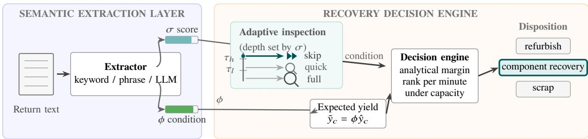

# Semantic Signal-Assisted Inspection and Recovery Allocation in Reverse Logistics

Jiani He   
Independent Researcher   
Seattle, USA   
jianihe@alum.mit.edu   
Dingyan Shang   
Independent Researcher   
Frisco, USA   
dingyanshang@gmail.com   
Yan Lyu   
Independent Researcher   
Boston, USA   
lyu.yan@northeastern.edu   
Yihua Xu   
Independent Researcher   
San Jose, USA   
yxu442@gmail.com   
Jize Li   
Independent Researcher   
Boston, USA   
jizel@bu.edu   
Shiqi Huang   
Independent Researcher   
Bellevue, USA   
juliahuangsq01@gmail.com   
Shangjing Tang   
Independent Researcher   
Indianapolis, USA   
tangshangjing@gmail.com

Abstract—Reverse-logistics operators often decide how to inspect and route returned assets before their condition is fully observed, while full inspection consumes scarce labor. Semantic Signal-Assisted Decision Support converts return notes into a condition factor and a signal-quality score that guide inspection depth and recovery allocation under shared labor capacity. We evaluate the framework in three synthetic benchmark scenarios spanning information technology decommissioning, aircraft maintenance, and consumer-electronics returns. Across 30 paired simulation seeds, the keyword implementation improves net recovery value relative to a structured-feature comparator with noisy full inspection while reducing inspection cost in all three scenarios. A risk-blind comparator that skips inspection altogether still records higher value under the benchmark’s purely economic objective. At matched inspection cost, score-guided targeting adds 53.9 thousand United States dollars per batch in the aircraft scenario but has little economic efect in the other two configurations; phrase and large language model extractors provide further gains in the aircraft scenario. These results show how narrative evidence can support inspection allocation before recovery decisions are made.

Keywords—reverse logistics, text signals, inspection, recovery

## I. Introduction

Resource recovery through reverse logistics is a large and growing operational challenge. The global data-center infor- mation technology (IT) asset disposition market was estimated at \$13.1 billion in 2025 [1]; aircraft maintenance, repair, and overhaul (MRO) demand was forecast at \$104 billion for 2024 [2], and United States retail returns were projected to reach \$890 billion, or 16.9% of annual sales, in 2024 [3].

The practical bottleneck is condition uncertainty. Full in- spection reduces this uncertainty, but it requires time, labor, and sometimes specialized equipment. Many assets already arrive with narrative evidence, such as technician notes, maintenance records, and customer descriptions, but standard reverse-logistics optimization models expect structured inputs such as prices, disassembly costs, yield priors, and capacity, not free-text annotations [4]–[6].

To use this information in a decision model, Semantic Signal-Assisted Decision Support (SSADS) maps each return note to a condition factor and a signal-quality score. The note is treated as noisy evidence available before inspection. The condition factor shifts expected recovery yield, and the signal- quality score sets inspection depth: an asset may skip discre- tionary inspection, receive a quick functional test, or undergo full component-level inspection. The recovery optimizer then ranks assets by expected net value under capacity constraints and assigns each asset to a scenario-feasible recovery disposi- tion or scrap. In this formulation, inspection becomes an asset- level allocation decision rather than a uniform preprocessing step. We evaluate SSADS using the Reverse Logistics Decision Benchmark (RLDB) across three structurally distinct scenarios to test how return notes can afect recovery decisions. The scenarios use descriptive technician notes to target inspection, maintenance records to support inspection prioritization in a regulated workflow, and short customer descriptions to triage high-volume returns under limited recovery capacity.

• S1 (IT Infrastructure): Planned IT decommissioning with descriptive technician notes and minimal regulatory con- straints.

• S2 (Aircraft MRO): The repair-station setting under Part 145 of Title 14 of the Code of Federal Regulations (14 CFR Part 145), where note-derived scores prioritize work within the inspection and return-to-service controls required by the station’s quality system [7].

• S3 (Consumer Electronics): Consumer returns emphasize scale. Customer text is noisier and unit value is lower, making triage the central task.

This paper makes three contributions:

1) Inspection targeting from return notes: We formulate return-note use as an inspection-allocation problem. SSADS maps each note to a condition factor � and a signal- quality score �, so expected yield and inspection depth can be adjusted at the asset level.

2) Modular recovery pipeline: SSADS keeps the text reader separate from the recovery optimizer. As long as a reader returns $\phi$ and $\sigma ,$ the same inspection policy and capacity- constrained allocator can be used with keyword rules, phrase matching, or large language model extraction.

3) Reproducible benchmark evaluation: We use RLDB to test the same mechanism across IT decommission- ing, aircraft $\mathrm { M R O , }$ and consumer-electronics returns. The benchmark uses shared baselines, paired seeds, and a three- level extractor ladder to measure how extractor accuracy translates into inspection targeting and recovery value. We additionally validate the allocator against the exact optimum of the corresponding fixed-action 0–1 admission problem and compare equal-cost inspection policies.

Section II positions SSADS in prior work, Section III defines the framework, Section IV reports the benchmark, and Sections V–VI discuss implications and conclude.

## II. Background and Related Work

Reverse logistics decisions are sequential and partially irre- versible. Optimization work spans stochastic disassembly lot- sizing [4], broader reverse-logistics and closed-loop supply- chain design [5], and recent simulation–optimization frameworks for dynamic reverse-logistics network design [6], but it generally requires structured numerical inputs: disassembly bills of materials (BOM) [8], cost tables, and yield rates specified before optimization. A parallel line predicts condition or remaining useful life (RUL) from sensor and maintenance data, from run-to-failure prognostics [9] to deep RUL models [10]; disassembly research also optimizes processing sequences [11]. These methods address prognosis or sequencing rather than jointly choosing text-guided inspection depth and recovery allocation. In practice, much decision-relevant information lives in unstructured narratives that existing optimization models in this setting generally do not ingest without manual translation; information-extraction schemas for maintenance text [12] structure the narrative but stop short of the disposition decision.

Recent text-based methods have advanced in forward supply chains: OptiGuide [13] translates language into optimization code, InvAgent [14] coordinates inventory agents, and others extract supply-chain structure via zero-shot learning or large language models (LLMs) [15], [16]. These cited systems target forward-chain optimization or structure extraction rather than reverse-logistics disposition under yield uncertainty.

Maintenance research has also begun to connect narrative records with operational decisions. Recent work automates the analysis and assignment of maintenance work orders [17] and extracts causal relations from long maintenance documents [18]. Deng et al. use an LLM agent for context-aware maintenance decision support [19], while Getz and Tong use LLMs to accelerate maintenance insight generation [20]. SSADS instead maps narrative evidence to inspection depth and recovery allocation under shared labor capacity.

Using an extractor’s signal-quality score to set inspection depth is motivated by value-of-information reasoning [21]: re-serve costly measurements for less informative records. Similar logic appears in active learning [22] and optimal-inspection work [23]. SSADS uses fixed score thresholds rather than explicitly estimating the value of information, and its interface is independent of the text extractor.

## III. Framework Design

## A. Problem Setting

Assets arrive in periodic batches. Each asset � has structured attributes (type, age, and bill of materials) and a return note $\mathcal { T } ( m )$ . SSADS selects an inspection level $q _ { m } \in \{ 0 , 1 , 2 \}$ (skip, quick, or full) before selecting a scenario-feasible recovery action or scrap. For a component-recovery action $^ { a , }$ the expected gross value is

$$
G ( m , a ) = \sum _ { c \in \mathrm { B O M } ( m , a ) } n _ { m c } p _ { c } \tilde { y } _ { c } ( m ) ,\tag{1}
$$

where $n _ { m c }$ is component count, $p _ { c }$ is recovery price, and $\tilde { y } _ { c } ( m )$ is the current expected yield. Whole-unit refurbishment instead uses its configured asset-level value times $\phi ( m )$ . A partial- recovery teardown recovers a configured fraction (0.60 in all three scenarios) of the component value at lower cost and time; it is reachable by the routing comparators, whereas the margin-ranked allocator chooses between component recovery and whole-unit refurbishment. The processing margin subtracts action cost and compares each recovery action with the default scrap disposition. Inspection cost and time are always charged, including for assets later scrapped because capacity is exhausted; scrap handling also consumes cost and time.

## B. System Architecture

SSADS has two layers (Fig. 1). The Semantic Extraction Layer reads each note and returns $\phi \in ( 0 , 1 ]$ and $\sigma \in [ 0 , 1 ]$ The Recovery Decision Engine uses $\phi$ to set the yield prior and � to gate inspection depth. After every selected inspection has been performed and charged, the engine ranks positive expected margins by value per processing minute and allocates the remaining shared labor capacity.

## C. Semantic Extraction Layer

Any extractor that provides a condition factor $\phi ~ \in ~ ( 0 , 1 ]$ and a signal-quality score $\sigma ~ \in ~ [ 0 , 1 ]$ can be used without changing the inspection policy or decision engine. This lets the keyword, phrase matcher, and LLM readers be compared under the same downstream decision logic. The main benchmark uses a restricted-vocabulary keyword-and-pattern classifier, which falls back to $\phi { = } 1 . 0$ when no signal triggers. The phrase matcher and cached LLM provide stronger comparison points in the end-to-end recovery evaluation (Section IV-D). All extractors receive text alone. Under the configured note-generation noise $( p _ { \mathrm { o m i t } } \mathrm { = } 0 . 1 5 , p _ { \mathrm { m i s l a b e l } } \mathrm { = } 0 . 2 5 )$ , their reported correlations remain below �=1. Negative signals lower $\phi$ multiplicatively, while positive signals cannot increase it beyond 1.0.

  
Fig. 1. The SSADS pipeline. The semantic extraction layer reads return text into two scalars: a condition factor � (the yield-prior shift) and a signal-quality score �. In the recovery decision engine, � gates inspection depth (skip when � $\geq \tau _ { h } .$ , quick functional test, or full component inspection when $\sigma { < } \tau _ { l } ) ,$ while � shifts expected yield. After inspection, an analytical expected-margin step ranks assets under the remaining shared labor capacity and selects a disposition (highlighted: component recovery).

The phrase matcher is deterministic and scenario-specific. It counts declared phrases for each condition, chooses the condition with the largest count, and maps that condition to a fixed $\phi$ and $\sigma { = } 0 . 9 0 ;$ ; declared condition order breaks ties. If no phrase matches, it returns $\phi = 1 . 0 , \sigma = 0 . 2 0 .$ and a fallback flag. The complete phrase lists and maps are in experiments/src/s2s/extractors/strong.py; no generated template produces a cross-condition top-score tie.

Prompted large language model extractor. The LLM rung uses the DeepSeek chat-completions application pro- gramming interface (API) [24] with the model identifier deepseek-chat and temperature 0. A scenario-specific system prompt, set before any note is read, specifies the � rubric (e.g. S1: ∼0.9 clean, ∼0.6 mixed, ∼0.2 damaged, 0.5 uninformative) and asks for a separate score � for how much condition information the note contains, independently of $\phi .$ The prompt requests a JavaScript Object Notation (JSON) object with fields $\{ \mathrm { p h i }$ ,sigma,condition}, where phi and sigma encode $\phi$ and $\sigma .$ It uses the model’s API JSON mode; we parse and validate the scores against $( 0 , 1 ] \times [ 0 , 1 ]$ (experiments/src/s2s/extractors/deepseek. py). The author-defined rubric maps free text onto a specified condition scale; recovery value is computed downstream by the decision engine.

## D. Yield Adjustment and Inspection

Given �(�) and component baseline yield $\hat { y } _ { c } ^ { \phantom { \dagger } } ,$ , the preinspection expected yield is

$$
\tilde { y } _ { c } ( m ) = \phi ( m ) \hat { y } _ { c } .\tag{2}
$$

This analytical mean is suficient because the allocation objective is linear and has no recourse. The simulator still draws realized yields from a Beta distribution with fixed concentration 20, centered on the component baseline yield multiplied by the latent condition factor, when computing realized net value. A score-dependent concentration parameter is omitted because it has no decision efect under the present mean-value objective.

## E. Adaptive Inspection Policy

The system uses signal-quality score $\sigma ( m )$ to determine inspection depth for each asset:

$\sigma \geq \tau _ { h } \colon$ rely on $\phi$ without additional inspection.

$\tau _ { l } \le \sigma < \tau _ { h }$ : run a quick functional test.

$\sigma < \tau _ { l } \mathrm { : }$ use full component-level inspection.

For S1 and S2, the prespecified thresholds are $\tau _ { h } { = } 0 . 5$ and ��=0.25; S3 uses $\tau _ { l } { = } 0 . 4 5$ because colloquial text rarely gets high scores. A quick or full inspection gives a noisy condition observation with standard deviation 0.15 or 0.05, respectively. The observation receives 50% or 90% weight in the updated condition factor. Inspection happens before allocation, so its cost and time remain charged even if an asset is not processed. A skipped inspection saves \$20–\$100 and 5–60 minutes per asset, but can leave an over-optimistic recovery estimate. These thresholds are prespecified reference settings rather than claimed recovery-value optima; Section IV-F reports results for nearby settings.

## F. Decision Engine

The engine processes weekly batches, except in S3 where batches are daily. Every asset has scrap cost $C _ { s }$ and time $t _ { s } .$ For asset �, let $\Delta M _ { m }$ be the best positive expected margin of a recovery action relative to scrap, and let $\Delta t _ { m }$ be its incremental time. Let $x _ { m } ~ \in ~ \{ 0 , 1 \}$ indicate whether that action replaces scrap. With � total labor minutes and inspection time $h _ { m } ( q _ { m } )$ the allocator approximately solves

$$
\begin{array} { r l r } {  { \operatorname* { m a x } _ { x _ { m } \in \{ 0 , 1 \} } \ \sum _ { m } \Delta M _ { m } x _ { m } } } \\ & { } & { \mathrm { s . t . } \ \sum _ { m } \Delta t _ { m } x _ { m } \leq H - \sum _ { m } [ h _ { m } ( q _ { m } ) + t _ { s } ] . } \end{array}\tag{3}
$$

It sorts candidates by $\Delta M _ { m } / \Delta t _ { m }$ and admits them while capacity remains. We compare this heuristic with the exact optimum of the fixed-action 0–1 admission problem on every full 500/1,000- asset benchmark instance, solved with $\mathrm { S c i P y ^ { \prime } s }$ mixed-integer solver [25] whenever candidate action times difer. In RLDB every candidate shares a single processing time once its best action is fixed, so the exact optimum reduces to admitting the highest-margin feasible assets; the mean and maximum expected-objective gaps are 0.0% in all three scenarios. The scenario parameters used by this allocation are summarized in Table I.

TABLE I  
Evaluation Scenarios
<table><tr><td></td><td>S1: IT</td><td>S2: Aircraft</td><td>S3: Consumer</td></tr><tr><td>Scenario type</td><td>Product</td><td>Service</td><td>Product</td></tr><tr><td>Return driver</td><td>Decommission</td><td>Degradation</td><td>Returns</td></tr><tr><td>Core uncertainty</td><td>Component yield</td><td>Condition</td><td>Condition</td></tr><tr><td>Text source</td><td>Technician notes Maint. records Customer desc.</td><td></td><td></td></tr><tr><td>Full inspection</td><td>$75, 60 min</td><td>$100, 35 min</td><td>$20, 5 min</td></tr><tr><td>Quick inspection</td><td>$19, 15 min</td><td>$50, 20 min</td><td>$10, 3 min</td></tr><tr><td>Labor capacity</td><td>600 h/week</td><td>800 h/week</td><td>160 h/day</td></tr><tr><td>Assets/batch</td><td>500</td><td>500</td><td>1,000</td></tr><tr><td>Regulation</td><td>Minimal</td><td>14 CFR</td><td>Consumer</td></tr><tr><td></td><td></td><td>Part 145</td><td>safety</td></tr></table>

Batch allocation summary. For each asset, (1) extract $( \phi , \sigma )$ from its return note; (2) select skip, quick, or full inspection from the score thresholds and update the condition estimate when inspection occurs; (3) charge inspection and default scrap handling; (4) compute each feasible action’s expected margin and processing time; and (5) rank positive-margin candidates by margin per minute and admit them while the remaining labor capacity permits. The output is one disposition per asset together with inspection, cost, time, and realized-value records.

## G. Illustrative Asset Walkthrough

The following asset illustrates the decision path. A decom- missioned server with note “Routine decommission. All com- ponents seated properly. No corrosion. 4yr service.” is read as a healthy unit (�=0.925, �=0.925; run\_diagnostics.py). Since � is above $\tau _ { h } { = } 0 . 5$ , the policy skips inspection and, using $( 2 ) ,$ ranks component recovery as the highest priority. This saves the \$75 and 60-minute inspection required by a full-inspection policy. A second note refers to the power supply unit (PSU) and central processing unit (CPU): “PSU failure. Visible burn marks on mainboard near power connector J12. CPU smells burnt.” It returns $\phi { = } 0 . 4 0 0$ and $\sigma { = } 0 . 8 7 5$ . Its high � still skips inspection, while its lower � reduces expected value and allocation priority without necessarily implying scrap. Section IV-E examines cases in which high-score text overestimates condition.

## IV. Cross-Industry Evaluation

## A. Scenarios, Data, and Baselines

Noisy note generation. Latent condition sets true yield and anchors a separately corrupted textual observation. We cor- rupt notes two ways: omission (�=0.15, the note becomes uninformative) and a one-class severity-perturbation attempt (�=0.25). At an endpoint, outward perturbations are clipped and can leave the observed class unchanged. Thus, text has an intentional but imperfect link to yield (experiments/ $\mathtt { s r c / d a t a \_ g e n e r a t o r s / n o i s e . p y ) }$ . The corpus uses 17/20/21 condition-class base templates for S1/S2/S3, with S2 written in Service Dificulty Report style. Numeric age, station, and hour fields yield 27/4,840/43 unique rendered note strings over seeds 0–29. Mean note lengths are 9.8/9.6/8.0 words, with vocabularies of 133/3,690/152 tokens and 4/6/5 true-condition classes for S1/S2/S3. Additional note profiles, scenario parameters, and LLM cache coverage are available in the companion repository [26].

Baselines. We compare seven alternatives with the same generated assets and seed. (1) Random routing: no inspection and a random choice among partial recovery, component recovery, and scrap, subject to the same capacity accounting. (2) First-in, first-out (FIFO) routing: no inspection and processing in arrival order. (3) Structured + noisyfull inspection: a gradient-boosting regressor trained on an independent 4,000-asset population (seed 99999) using age, asset type, and BOM component counts, followed by noisy full inspection and the common allocator. (4) Structured + semantic adaptive inspection: the same structured features plus keyword �, �, and fallback status, followed by adaptive inspection and the common allocator. (5) Oracle full inspection: exact condition revelation through full inspection, followed by the common allocator. (6) Nosignal / no-inspection: no condition signal, no inspection, and the common allocator. This risk-blind comparator pursues the benchmark’s economic objective without paying for information. (7) Semantic-only / threshold routing: text-guided adaptive inspection with fixed threshold routing in place of the margin-ranked allocator. SSADS instead pairs the same semantic inspection policy with the capacity-constrained value allocator. After nois full inspection, the structured baseline updates � with 90% weight on a clipped Gaussian observation and 10% on its structured pre-inspection estimate. The oracle instead replaces � with the exact latent yield factor; both then invoke the same allocator.

Metrics. Total recovery value (TRV) is realized gross recovery less processing, inspection, post-allocation rework, and disposal costs. Recovery processing rate (RPR) is the nonscrap share, including refurbishment, partial recovery, and component re- covery. Demand coverage is outside this metric. Inspection cost savings (ICS) is the cost of full inspection on every arrival minus actual inspection cost. SSADS–Keyword skip/quick/full splits are 67/33/0% (S1), 58/0/42% (S2), and 0/10/90% (S3). Across all 30 batches, the exact counts are 10,010/4,990/0, 8,644/0/6,356, and 0/2,931/27,069, respectively.

## B. Results

Tables II and III report economic performance and the Pearson correlation between each extractor’s condition factor and latent yield, respectively.

Table II reports means over 30 paired seeds. Within a seed, every method sees the same asset population, per-asset inspection perturbations, and pre-drawn realized component outcomes.

Full-inspection comparison. SSADS–Keyword exceeds the structured noisy-full-inspection baseline by 50.9% in S1, 16.0% in S2, and 1.8% in S3. The oracle row is close to structured, indicating that observation noise contributes less than the labor consumed by inspecting every arrival. SSADS saves \$34.3K, \$28.8K, and \$1.0K in inspection cost, respectively. Its mean TRV per arrival is \$1,222/\$3,206/\$71 across S1/S2/S3.

TABLE II  
Net Recovery Performance Across Scenarios
<table><tr><td></td><td colspan="3">S1: IT</td><td colspan="3">S2: Aircraft</td><td colspan="3">S3: Consumer</td></tr><tr><td>System</td><td>TRV</td><td>RPR</td><td>ICS</td><td>TRV</td><td>RPR</td><td>ICS</td><td>TRV</td><td>RPR</td><td>ICS</td></tr><tr><td>Random routing</td><td>333</td><td>67%</td><td>38</td><td>1,128</td><td>67%</td><td>50</td><td>-5</td><td>66%</td><td>20</td></tr><tr><td>FIFO routing</td><td>614</td><td>100%</td><td>38</td><td>1,233</td><td>61%</td><td>50</td><td>81</td><td>100%</td><td>20</td></tr><tr><td>Structured + noisy full inspection</td><td>405</td><td>26%</td><td>0</td><td>1,382</td><td>36%</td><td>0</td><td>70</td><td>90%</td><td>0</td></tr><tr><td>Structured + semantic adaptive inspection</td><td>611</td><td>100%</td><td>34</td><td>1,618</td><td>51%</td><td>29</td><td>71</td><td>95%</td><td>1</td></tr><tr><td>Oracle full inspection</td><td>406</td><td>26%</td><td>0</td><td>1,389</td><td>36%</td><td>0</td><td>70</td><td>90%</td><td>0</td></tr><tr><td>No-signal / no-inspection</td><td>614 553</td><td>100%</td><td>38</td><td>1,676</td><td>61%</td><td>50</td><td>81 42</td><td>100% 64%</td><td>20</td></tr><tr><td>Semantic-only / threshold routing</td><td></td><td>100%</td><td>34</td><td>1,677</td><td>96%</td><td>29</td><td></td><td></td><td>1</td></tr><tr><td>SSADS-Keyword</td><td>611</td><td>100%</td><td>34</td><td>1,603</td><td>51%</td><td>29</td><td>71</td><td>95%</td><td>1</td></tr><tr><td>Lift vs. structured + noisy full inspection</td><td colspan="2">+206 (+50.9%)</td><td colspan="3">+221 (+16.0%)</td><td colspan="3">+1.28 (+1.8%)</td><td></td></tr></table>

Note. Values are in thousands of United States dollars; means over 30 seeds, rounded to the nearest thousand dollars except the S3 lift. Lifts over structured noisy full inspection are significant (paired Wilcoxon �<0.001, �=30). Paired-bootstrap 95% intervals are $\mathrm { S 1 } [ + 4 9 . 2 , + 5 2 . 8 ] \stackrel {  } { \% } , \mathrm { S 2 } [ + 1 5 . 6 , + 1 6 . 4 ] \% ,$ and S3 [+1.7, +1.9]%. These intervals and �-values describe variation across simulated seeds, not field generalization. TRV seed standard deviations for SSADS–Keyword are 44/80/2.5 and for structured noisy full inspection are 42/69/2.4. Bold marks SSADS–Keyword. Reproduction command: run\_summary.py --seeds 0-29.

TABLE III  
Extractor-to-Latent-Yield Correlation
<table><tr><td>Scenario</td><td>Keyword</td><td>Phrase matcher</td><td>LLM DeepSeek</td></tr><tr><td>S1: IT infra.</td><td>0.48</td><td>0.73</td><td>0.64</td></tr><tr><td>S2: Aircraft</td><td>0.32</td><td>0.62</td><td>0.74</td></tr><tr><td>S3: Consumer</td><td>0.36</td><td>0.74</td><td>0.80</td></tr></table>

Note. Keyword and phrase scores use the full 30-seed corpus. The DeepSeek diagnostic uses 150 cached records per scenario (deepseek-chat, temperature 0). Values are correlations with latent yield, not calibrated probabilities.

Economic-only comparison. By avoiding all inspection cost, the no-signal / no-inspection policy has higher simulated TRV than SSADS–Keyword in all three scenarios. Its advantage is 0.5/4.6/14.3% for S1/S2/S3. The matched-cost analysis below holds inspection expenditure fixed to isolate the value of semantic targeting.

Text, structured, and combined features. In the gen-erator, latent condition is sampled independently of age, asset type, and BOM counts; accordingly, the structured- only prior has near-zero correlation with latent condition (−0.01/0.00/−0.01 for S1/S2/S3). Combining those features with keyword outputs raises correlation from 0.48/0.32/0.36 to 0.71/0.60/0.53. Structured + semantic adaptive inspection reaches \$611K/\$1,618K/\$71.2K, improving over SSADS– Keyword by \$15.5K in S2 and negligibly in S1/S3.

## C. Condition-Factor Extraction Accuracy

Table III reports Pearson � between each extractor’s � and the latent yield factor. Keyword and phrase results pool 15,000/15,000/30,000 records over 30 seeds; the cached DeepSeek correlation check uses 150 prespecified records per scenario. Here, � measures note informativeness rather than probability, so expected calibration error and Brier score are not applicable. Section IV-E instead evaluates operational selectiv- ity using high-score bad-skip rates and the association between � and absolute condition error; �-binned error diagnostics are released with the benchmark [26].

## D. Efect of Extractor Choice on Recovery Value

Section IV-C compares condition-factor accuracy across ex- tractors. We test whether that improvement translates into higher recovery value. We rerun the full seeded TRV pipeline with the phrase matcher (Pearson � for S1/S2/S3: 0.73/0.62/0.74) in place of keyword (0.48/0.32/0.36), changing nothing else. SSADS–Phrase reaches \$614K in S1, \$1,720K in S2, and \$80.9K in S3. The largest change is S2, where it rises \$117.1K over SSADS–Keyword and exceeds the no-signal / no-inspection comparator by 2.6%.

SSADS–DeepSeek reaches \$604K in S1, \$1,703K in S2, and \$81.0K in S3. Only S2 exceeds no-signal / no-inspection, by 1.6%. The 150-record sample in Table III provides the correlation estimate, whereas these TRV values use all 15,000/15,000/30,000 records. Stronger extraction is most use- ful when text diversity and capacity constraints afect ranking.

## E. Error Analysis and Case Studies

The main failure mode is overestimation: the policy skips inspection on a high score (�≥�ℎ, �>0.7), but the true yield is low (< 0.30). Such scoring errors allow low-yield assets to bypass inspection. Under the keyword reader, 4.8% (S1) and 10.1% (S2) of high-score skips have true yields below 0.30; no such cases occur in S3. The 10.1% S2 rate precludes autonomous use of the keyword reader in aircraft MRO. Replacing keyword scores with the cached DeepSeek outputs in the full decision pipeline does not increase this failure rate. DeepSeek assigns high � to a smaller, more selective set of notes, reducing the rate to 2.7% (S1) and 0% (S2; none of the 2,675 skipped assets has a true yield below 0.30; run\_diagnostics.py). Across keyword assets, � correlates negatively with absolute condition error (−0.52/−0.65/−0.36), so higher scores are generally more selective. The released diagnostics link every low-yield skip to disposition and realized value. In S2, 333 of 421 low-yield skips under the keyword reader enter component recovery and 88 are capacity-scrapped; 35 (8.3%) have negative simulated net value. Their aggregate net value is still positive because high component prices reward low-yield recovery.

## F. Sensitivity Analysis

At half labor capacity, SSADS–Keyword TRV falls 0.6% in S1 and 49.9% in S2; the prespecified S3 inspection plan plus default scrap handling exceeds the reduced 80-hour budget and is infeasible. The prespecified defaults serve as fixed reference settings. Nearby threshold settings improve TRV by at most 0.1/4.3/3.4% for S1/S2/S3. With latent assets and noise draws paired across variants, changing omission (0–30%) and severity perturbation (0–40%) changes TRV by at most 0.19/2.75/0.42% in S1/S2/S3.

Held-out vocabulary family. To test sensitivity to an unseen vocabulary family, we remove one family at a time from the keyword reader with thresholds fixed. Removing the negative vocabulary inverts the condition signal, with � falling from 0.48 to −0.24 in S1 and 0.32 to −0.09 in S2, because unmatched damaged notes fall back to the maximally optimistic �=1.0 prior. TRV still moves by only −0.3% (S1) and −6.9% (S2), and the S2 bad-skip rate is unchanged at 10.1%. The weak TRV response to an inverted signal motivates a conservative fallback prior for unmatched notes.

## G. Matched-Cost Targeting Ablation

For each seed, matched-cost random assigns exactly the same skip/quick/full counts as SSADS, but shufles them across assets. Score-guided targeting changes mean TRV by \$0 in S1, +\$53.9K in S2 (�<0.001), and +\$18 in S3 (�<0.001 but economically negligible). In these scenarios, targeting creates material economic value only in S2, where the allocator processes about half of the arrivals; capacity also binds in S3 without a material gain. Removing margin-per-minute ranking from SSADS, while holding its inspection policy and action set fixed, reduces TRV by 0.0/38.0/5.6% for S1/S2/S3, reinforcing that allocation is most consequential in aviation.

## V. Discussion

## A. Practical Implications

The framework requires an analytical allocator and an extractor with a two-output interface. A practical deployment can begin with inspection prioritization, with required checks retained and suggested depth, observed condition, and outcomes logged for local threshold estimation. In S2, the workflow prioritizes uncertain records for inspection, reserves processing labor for high-margin parts, and retains qualified inspection and authorized return-to-service sign-of under applicable repair- station procedures [7].

Extractor selection. The deterministic phrase matcher reaches Pearson �=0.62–0.74 with exact reproducibility. In S2, SSADS– DeepSeek reaches \$1,703K, below SSADS–Phrase at \$1,720K. The comparison illustrates that extractor choice depends on downstream recovery performance as well as privacy, auditabil- ity, latency, and model-version stability. The common interface leaves the downstream decision model unchanged.

## B. Limitations

Synthetic scope. RLDB uses stylized prices, yields, capacities, inspection noise, and fixed return-note templates to isolate the decision mechanism. This controlled design supports repro- ducible analysis of how semantic signals change inspection and allocation, rather than an estimate of field efectiveness. The gains from phrase and DeepSeek readers identify extractor robustness as an important direction. Further evaluation can include broader note families and local calibration of �.

Economic objective. TRV omits the costs of certification errors, latent safety failures, warranty exposure, and most downstream failures. These omissions can favor risk-blind no- inspection policies and preclude interpreting unsafe S2 skips as financially optimal. In S3, configured rework is realized only after allocation. It is neither forecast nor reserved in the first- stage capacity plan.

## C. Benchmark and Reproducibility

RLDB provides configurations, noisy-note generators, seven comparators, exact prompts, DeepSeek score caches, paired seeds, and table scripts in the companion repository [26]. The repository includes data profiles, parameters, per-asset values, sensitivity, matched-cost, selective-risk, and exact-allocation results. The released reproduction uses Python 3.12.13 with pinned direct dependencies and requires no graphics processing unit (GPU); a released DeepSeek cache covers every unique note used in the evaluation and replays parsed scores without a live call. The cache fixes the LLM scores used in the reported evaluation. A manifest records the commands and the Secure Hash Algorithm 256-bit (SHA-256) digests of the audit tables and score caches. The reproduction verifier byte-compares six console outputs and 16 audit tables against their released references. The original API date, provider snapshot, token usage, cost, latency, retries, and live parse-failure count were not recorded and cannot be reconstructed from the cache; these deployment attributes are not evaluated.

## VI. Conclusion

SSADS uses return notes to update expected condition and allocate inspection efort before recovery decisions are made. In the RLDB evaluation, the keyword implementation improves net recovery value relative to noisy full inspection while reducing inspection cost. The matched-cost analysis shows that semantic targeting is materially valuable in the aircraft scenario but negligible under the information technology and consumer configurations. Phrase and DeepSeek extractors further improve the aircraft result, indicating that the modular design can benefit from stronger semantic readers. A prospective advisory deploy- ment should evaluate the approach on operational notes while retaining mandatory safety inspections and human approval.

## References

[1] Global Market Insights, “Data center IT asset disposition market size & share, 2026–2035,” Aug. 2026. Accessed: Aug. 30, 2026. [Online]. Available: https://www.gminsights.com/industry-analysis/data-center-i t-asset-disposition-market

[2] B. Prentice, A. DiNota, and L. Hayes, “Global fleet and MRO market forecast 2024–2034,” Oliver Wyman, Feb. 2024. Accessed: Aug. 30, 2026. [Online]. Available: https://www.oliverwyman.com/our-expertise/insight s/2024/feb/global-fleet-and-mro-market-forecast-2024-2034.html

[3] National Retail Federation and Happy Returns, “NRF and Happy Returns report: 2024 retail returns to total \$890 billion,” Dec. 2024. Accessed: Aug. 30, 2026. [Online]. Available: https://nrf.com/media-center/press-release s/nrf-and-happy-returns-report-2024-retail-returns-total-890-billion

[4] I. Slama, O. Ben-Ammar, S. Thevenin, A. Dolgui, and F. Masmoudi, “Stochastic program for disassembly lot-sizing under uncertain component refurbishing lead times,” Eur. J. Oper. Res., vol. 303, no. 3, pp. 1183– 1198, 2022, doi: 10.1016/j.ejor.2022.03.025.

[5] K. Govindan, H. Soleimani, and D. Kannan, “Reverse logistics and closed-loop supply chain: A comprehensive review to explore the future,” Eur. J. Oper. Res., vol. 240, no. 3, pp. 603–626, 2015, doi: 10.1016/j.ejor.2014.07.012.

[6] X. Sun, H. Yu, W. D. Solvang, and K. Govindan, “A two-level decision-support framework for reverse logistics network design considering technology transformation in Industry 4.0: A case study in Norway,” Int. J. Adv. Manuf. Technol., vol. 134, no. 1–2, pp. 389–413, 2024, doi: 10.1007/s00170-024-14121-6.

[7] Electronic Code of Federal Regulations, “Title 14, Part 145—Repair Stations,” especially Secs. 145.211, 145.213, and 145.219. Accessed: Aug. 25, 2026. [Online]. Available: https://www.ecfr.gov/current/title-14/chap ter-I/subchapter-H/part-145

[8] C. W. Babbitt, H. Madaka, S. Althaf, B. Kasulaitis, and E. G. Ryen, “Disassembly-based bill of materials data for consumer electronic prod- ucts,” Sci. Data, vol. 7, art. no. 251, 2020, doi: 10.1038/s41597-020-0573- 9.

[9] A. Saxena, K. Goebel, D. Simon, and N. Eklund, “Damage propagation modeling for aircraft engine run-to-failure simulation,” in Proc. Int. Conf. Prognostics and Health Management (PHM), 2008, pp. 1–9, doi: 10.1109/PHM.2008.4711414.

[10] C. Zhang, P. Lim, A. K. Qin, and K. C. Tan, “Multiobjective deep belief networks ensemble for remaining useful life estimation in prognostics,” IEEE Trans. Neural Netw. Learn. Syst., vol. 28, no. 10, pp. 2306–2318, 2017, doi: 10.1109/TNNLS.2016.2582798.

[11] Y. Fan, C. Zhan, and M. Aljuaid, “Multi-objective disassembly sequence lannin in uncertain industrial settin s: An enhanced water wave optimization algorithm,” Processes, vol. 11, no. 11, art. no. 3057, 2023, doi: 10.3390/pr11113057.

[12] T. K. Bikaun, T. French, M. Stewart, W. Liu, and M. Hodkiewicz, “MaintIE: A fine-grained annotation schema and benchmark for infor- mation extraction from maintenance short texts,” in Proc. Joint Int. Conf. Comput. Linguistics, Language Resources and Evaluation (LREC-COLING), 2024, pp. 10939–10951, doi: 10.63317/3cuvz8qfmako.

[13] B. Li, K. Mellou, B. Zhang, J. Pathuri, and I. Menache, “Large language models for supply chain optimization,” 2023, arXiv:2307.03875. [Online]. Available: https://arxiv.org/abs/2307.03875

[14] Y. Quan and Z. Liu, “InvAgent: A large language model based multi-agent system for inventory management in supply chains,” 2024, arXiv:2407.11384. [Online]. Available: https://arxiv.org/abs/2407.11384

[15] S. AlMahri, L. Xu, and A. Brintrup, “Enhancing supply chain visibility with knowledge graphs and large language models,” Int. J. Prod. Res., vol. 64, no. 6, pp. 2178–2209, 2026, doi: 10.1080/00207543.2025.2575841.

[16] T. Liu and H. Meidani, “Supply chain network extraction and entity classification leveraging large language models,” in Proc. IEEE Int. Conf. Big Data, 2024, pp. 3448–3455, doi: 10.1109/BIG-DATA62323.2024.10826017.

[17] Y. Li, Y. Liu, J. Zhang, L. Cao, and Q. Wang, “Automated analysis and assignment of maintenance work orders using natural language processing,” Autom. Constr., vol. 165, art. no. 105501, 2024, doi: 10.1016/j.autcon.2024.105501.

[18] B. Hershowitz, M. Hodkiewicz, T. Bikaun, M. Stewart, and W. Liu, “Causal knowledge extraction from long text maintenance doc- uments,” Comput. Ind., vol. 161, art. no. 104110, 2024, doi: 10.1016/j.compind.2024.104110.

[19] H. Deng, B. Namoano, B. Zheng, S. Khan, and J. A. Erkoyuncu, “From prediction to prescription: Large language model agent for context-aware maintenance decision support,” in Proc. PHM Society European Conf., vol. 8, no. 1, art. no. 10, 2024, doi: 10.36001/phme.2024.v8i1.4114.

[20] N. Getz and X. Tong, “Large language model accelerated maintenance insights,” in Proc. Annual Conf. PHM Society, vol. 17, no. 1, 2025, doi: 10.36001/ hmconf.2025.v17i1.4454.

[21] R. A. Howard, “Information value theory,” IEEE Trans. Syst. Sci. Cybern., vol. 2, no. 1, pp. 22–26, 1966, doi: 10.1109/TSSC.1966.300074.

[22] B. Settles, “Active learning literature survey,” Univ. Wisconsin–Madison, Comput. Sci. Tech. Rep. 1648, 2009. [Online]. Available: https://research .cs.wisc.edu/techreports/2009/TR1648.pdf

[23] H. Wang, “A survey ofmaintenance policies ofdeteriorating systems,” Eur. J. Oper. Res., vol. 139, no. 3, pp. 469–489, 2002, doi: 10.1016/S0377- 2217(01)00197-7.

[24] DeepSeek, “Chat completions API,” 2026. Accessed: Aug. 25, 2026. [Online]. Available: https://api-docs.deepseek.com/api/create-chat-c ompletion/

[25] P. Virtanen et al., “SciPy 1.0: Fundamental algorithms for scientific computing in Python,” Nat. Methods, vol. 17, no. 3, pp. 261–272, 2020, doi: 10.1038/s41592-019-0686-2.

[26] J. He, D. Shang, Y. Xu, S. Huang, Y. Lyu, J. Li, and S. Tang, “SSADS for reverse-logistics resource recovery,” GitHub repository, 2026. Accessed: Aug. 30, 2026. [Online]. Available: https://github.com/jiani19980225/ssa ds-reverse-logistics