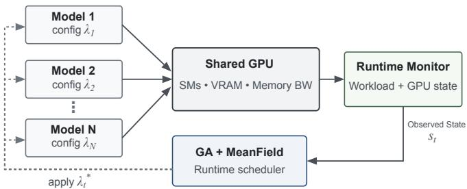
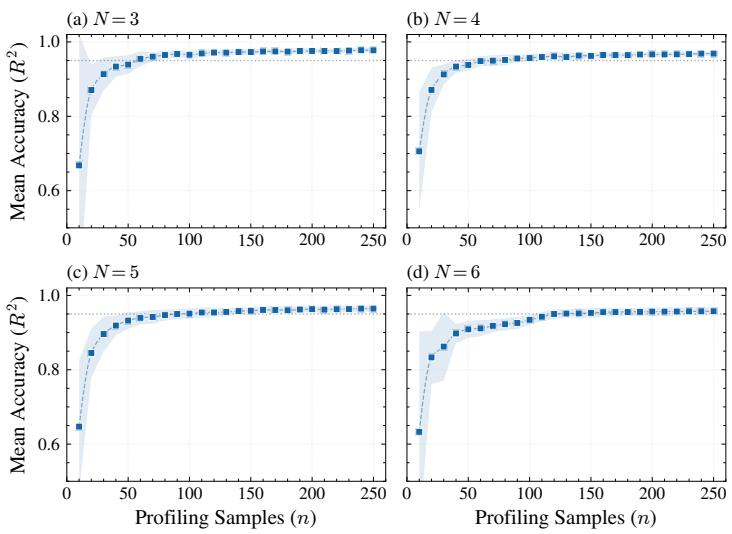
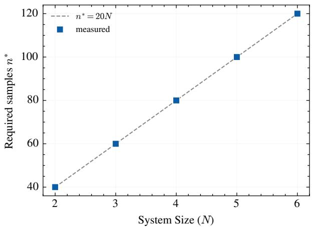

# MeanField Surrogate Modeling for Scalable Runtime Scheduling of Concurrent Heterogeneous AI Inference on Shared GPUs

Youssef Ennouri and Soonhoi Ha , Fellow, IEEE

Abstract—Deploying heterogeneous AI models concurrently on a shared GPU introduces resource contention that complicates runtime scheduling. While surrogate models avoid costly online benchmarking, their profiling requirements typically grow combinatorially with the number of co-running models, limiting scalability. We propose a MeanField surrogate that predicts per-model performance from local configuration and aggregate GPU state rather than explicitly modeling all joint interactions. Experiments on concurrent LLM and vision workloads across N ∈ {2, 3, 4, 5, 6} show high predictive accuracy $( R ^ { 2 } \approx 0 . 9 6 )$ with an empirical sample budget that grows approximately linearly in N, in contrast to the combinatorial cost of fully joint profiling. Integrated into a genetic algorithm scheduler, the surrogate scales to a N = 5 problem with 78,732 feasible joint configurations, remaining within 0.10% of the exhaustive search with zero SLA violations across eight dynamic workload scenarios, while complete online GA decisions take 26 ms median, about 5× faster than exhaustive surrogate search.

Index Terms—GPU Scheduling, Heterogeneous AI Inference, Performance Modeling, Runtime Systems, Surrogate Modeling

## I. INTRODUCTION

M odern inference deployments increasingly co-locateheterogeneous AI workloads such as large language models (LLMs) and vision models on shared GPUs to improve utilization. Concurrent execution, however, induces non-linear interference over shared resources, including streaming-multiprocessor (SM) occupancy, video memory (VRAM) capacity, and memory bandwidth. This interference depends jointly on model variants, runtime parameters, and workload intensity, making analytical modeling impractical.

Efficient scheduling therefore requires a fast surrogate that predicts concurrent performance without live benchmarking. While established serving systems like Nexus [1], Clipper [2], and Clockwork [3] improve utilization through batching, placement, and allocation, their scope is limited to homogeneous or isolated workloads. This limitation, along with interference-aware GPU-sharing systems such as Orion [4], ElasticRoom [5], Miriam [6], and automated runtime-aware scheduling [7] underscores the need for accurate performance prediction under co-execution.

Scalability, however, remains the obstacle: training a surrogate on joint N-model configurations needs a profiling budget that grows combinatorially in N, and existing surrogate-based approaches [8] do not address this for heterogeneous GPU inference.

To address this limitation, we propose a MeanField surrogate formulation with approximately linear empirical sample-complexity growth in N and integrate it into a practical runtime scheduler.

This paper makes three main contributions:

• We introduce the MeanField surrogate, a scalable, contention-aware predictor based on local model configurations and aggregate GPU state.

• Under a stratified sampling protocol, we empirically show that the profiling budget required to reach $R ^ { 2 } ~ \geq ~ 0 . 9 5$ grows approximately linearly over $N \in \{ 2 , \ldots , 6 \}$ , with n∗ ≈ 20N.

• We develop a runtime scheduler by integrating the MeanField surrogate into a genetic algorithm (GA)-based framework, which is subsequently validated at $N = 5$ under dynamic workload scenarios.

  
Fig. 1. The runtime monitor samples the observed state st, which combines workload and aggregate GPU information. The MeanField surrogate guides the GA scheduler in selecting the joint configuration λ⋆ under SLA and VRAM constraints.

## II. RUNTIME SCHEDULING MODEL

The system architecture is illustrated in Fig. 1. Because exhaustive online benchmarking is infeasible, the scheduler selects configurations for the co-executing models using a lightweight runtime surrogate to predict their performance.

To formalize the scheduling problem, we consider N heterogeneous AI models concurrently executing on a shared GPU. The formulation is agnostic to the specific application types and applies to any heterogeneous workloads exposing a discrete configuration space; in this work it is instantiated and evaluated on two workload families: LLMs based on the Qwen2.5 series and vision models based on the YOLO11 family.

Each model exposes a discrete configuration space $\Lambda _ { i } \ =$ $V _ { i } \times P _ { i }$ , where $V _ { i }$ denotes model variants and $P _ { i }$ runtime parameters. For the LLM, $\begin{array} { r c l } { V _ { i } } & { = } & { \{ \mathrm { F P 1 6 , A W Q } \} } \end{array}$ (16-bit floating-point and Activation-aware Weight Quantization variants, respectively) and $P _ { i } =$ {request concurrency} with values in {1, 2, 4}; for YOLO11, $V _ { i } = \{ { \bf n } , { \bf s } , { \bf m } \}$ and $P _ { i } =$ {skip rate, imgsz} with values in {1, 2, 4} and {320, 480, 640} respectively. Here, request concurrency controls the number of parallel LLM requests and therefore affects KV-cache pressure and SM occupancy.

The scheduler must select one configuration for each model, forming the joint configuration space:

$$
\Lambda = \prod _ { i = 1 } ^ { N } \Lambda _ { i }\tag{1}
$$

At each scheduling step, the runtime system observes the state

$$
s _ { t } = ( \rho _ { t } , m _ { t } , u _ { t } )\tag{2}
$$

where $\rho _ { t }$ denotes the workload level, $m _ { t }$ the current VRAM usage, and $u _ { t }$ the aggregate GPU utilization.

The scheduler selects $\lambda ^ { * } = \arg \operatorname* { m a x } _ { \lambda \in \Lambda } J ( \lambda , s _ { t } )$ , where the utility J rewards throughput-weighted quality while penalizing unnecessary reconfigurations and SLA violations:

$$
J = \sum _ { i } \omega _ { i } f _ { i } Q _ { i } - \alpha \sum _ { i } \eta _ { i } c _ { i } ^ { \mathrm { r e l } } - \beta \sum _ { i } \mathrm { m a x } ( 0 , \tau _ { i } + \delta - f _ { i } ) ^ { 2 }\tag{3}
$$

The first term $\textstyle \sum _ { i } \omega _ { i } f _ { i } Q _ { i }$ is a throughput-weighted quality score: a configuration is rewarded only when it is both fast and accurate. The normalized throughput $f _ { i } ~ \in ~ [ 0 , 1 ]$ uses per-variant min–max scaling, $f _ { i } ~ = ~ ( \hat { f } _ { i } - f _ { v } ^ { \operatorname* { m i n } } ) \big / ( f _ { v } ^ { \operatorname* { m a x } } -$ $f _ { v } ^ { \operatorname* { m i n } } )$ , where ${ \hat { f } } _ { i }$ is the raw predicted throughput (tokens/s for the LLM, FPS for vision) and $f _ { v } ^ { \mathrm { m i n } } , f _ { v } ^ { \mathrm { m a x } }$ are the extrema observed for variant v during profiling. Per-variant rather than global normalization is essential: a faster variant (AWQ) would otherwise dominate the scale and render every configuration of a slower one (FP16) effectively infeasible. The quality term $Q _ { i }$ captures variant accuracy $\begin{array} { r c l } { ( Q _ { \mathrm { L L M } } } & { = } & { \{ 1 . 0 0 0 , 0 . 9 7 9 \} } \end{array}$ for FP16/AWQ from relative perplexity; $Q _ { \mathrm { V I S } } = \{ 0 . 7 3 , 0 . 9 6 , 1 . 0 0 \}$ for YOLO11n/s/m from mean Average Precision, mAP50-95), scaled so the best variant scores 1.

The priority weights $\omega _ { i }$ are operator-defined and encode application-specific importance; in our experiments all models are given equal priority $\omega _ { i } = 1$ unless a scenario explicitly elevates one. They may further be adapted online as $\omega _ { i } =$ $\bar { \omega } _ { i } + \gamma \operatorname* { m a x } ( 0 , \tau _ { i } - \bar { f } _ { i } )$ , with $\gamma = 2 . 0$

Reconfiguration overhead is modeled through $\eta _ { i } = \mathbf { 1 } [ v _ { i } ^ { ( t ) } \neq$ $v _ { i } ^ { ( t - 1 ) } ]$ , which indicates whether model i changes variant and therefore incurs an amortized reload cost $c _ { i } ^ { \mathrm { r e l } } ~ ( c _ { \mathrm { L L M } } = 3 0 \mathrm { s } ,$ $c _ { \mathrm { V I S } } = 5 \mathrm { s ) }$ . The coefficient $\alpha = 1 / 6 0 \approx 0 . 0 1 7$ is the inverse of a 60-second amortization horizon, so a reload is accepted only when its predicted gain over the next 60 s exceeds the reload cost itself.

SLA compliance is enforced through a hard per-model throughput floor $\tau _ { i } .$ . In the $N = 5$ evaluation, $\tau _ { i }$ is set to the empirical P25 of each model’s normalized performance distribution. The quadratic penalty uses a safety margin $\delta =$ 0.05 above this floor, discouraging configurations that remain feasible but operate too close to the SLA boundary. We set $\beta = 5 . 0$

Hard constraints enforce both VRAM feasibility and minimum throughput requirements:

$$
\sum _ { i } r _ { i } ^ { \mathrm { { V R A M } } } \leq R , \quad f _ { i } \geq \tau _ { i }\tag{4}
$$

VRAM-infeasible configurations are removed when constructing Λ. Candidates violating any throughput floor receive $\begin{array} { r l r } { J } & { { } = } & { - \infty ; } \end{array}$ infeasible offspring are repaired by replacement with a randomly sampled feasible individual.

## III. MEANFIELD SURROGATE FOR SCALABLESCHEDULING

## A. Offline Profiling

Experiments are conducted on a single NVIDIA RTX 3090 (24 GB GDDR6X) running CUDA 12.6 and Ubuntu 20.04. LLM workloads are served through vLLM [9] with FP16 and AWQ variants. Vision workloads use the Ultralytics engine.

Offline profiling systematically explores the configuration space to generate training data for surrogate learning. The baseline $N = 2$ configuration space contains 162 concurrent configurations (6 $\mathrm { L L M } \ \times \ 2 7$ Vision), evaluated under four workload regimes (low, medium, high, burst), yielding 648 profiling measurements. For larger systems $( N \quad > \quad 2 ) .$ additional LLM and vision models were instantiated and profiled under the same workload regimes.

Each cell is measured 10 times (two warmup passes discarded) under fixed GPU clocks, thermal stabilization below $7 0 ^ { \circ } \mathrm { C }$ , and barrier-synchronized launches.

A profiling sample denotes one sampled joint configuration evaluated under one workload regime. The ten repeated measurements are averaged into a single training row and are not counted as distinct samples. For $N \ > \ 2 ,$ , joint configurations are sampled stratified by model type, variant, and workload level rather than enumerating the full Cartesian product.

The interference factor for model i is defined as:

$$
\Delta _ { i } = f _ { i } ^ { \mathrm { i s o l a t e d } } - f _ { i } ^ { \mathrm { c o n c u r r e n t } }\tag{5}
$$

Profiling reveals substantial interference: AWQ LLM variants lose 8.4% throughput on average under co-execution, while vision models lose 17–24% FPS depending on model size. Analysis of variance (ANOVA) [10] indicates workload intensity as the dominant factor for vision degradation $( p <$ 0.01), whereas the vision-model skip rate dominates LLM slowdown by reducing shared SM and memory-bandwidth contention.

These results suggest that interference is primarily driven by aggregate resource pressure rather than by specific model pairings, motivating the MeanField approximation proposed in this work.

## B. MeanField Surrogate

The name follows the mean-field approximation of statistical physics, in which the many-body interactions acting on a particle are replaced by a single aggregate field rather than modeled pairwise. By analogy, each model is predicted to respond not to the identities of its co-runners but to an aggregate field, the observed GPU state, that summarizes their combined resource pressure. The surrogate therefore trains one lightweight predictor per model from the model’s local configuration and aggregate GPU state:

$$
\hat { f } _ { i } = g _ { i } ( \lambda _ { i } , m _ { t } , u _ { t } , \rho _ { t } ) .\tag{6}
$$

The observed state affects scheduling through the surrogate prediction $\hat { f } _ { i } = g _ { i } ( \lambda _ { i } , s _ { t } )$ : raw throughput $\tilde { \hat { f } } _ { i }$ is normalized into $f _ { i } ,$ , which then enters both the throughput-quality reward and the SLA penalty in Eq. (3).

During scheduling, $( m _ { t } , u _ { t } , \rho _ { t } )$ are observed context variables obtained from runtime monitoring or simulation traces and are held fixed during GA search. The surrogate thus ranks candidate configurations conditioned on the current workload state rather than predicting future GPU-state evolution.

Our measurements support this approximation: aggregate utilization, memory pressure, and workload level provide sufficient predictive information to retain high accuracy across the evaluated model mixtures. The surrogate can therefore be trained directly from concurrent N-model executions, and its profiling cost grows as $O ( N \cdot k )$ in the number k of sampled workload states rather than combinatorially.

Each predictor $g _ { i }$ is a 64–32 MLP with BatchNorm, ReLU, Dropout(0.1), and Sigmoid output. Categorical features are ordinally encoded and targets are min–max normalized per variant. This architecture was selected by ablation at $N = 3$ and $n = 8 0$ , providing the best accuracy–latency trade-off and sub-millisecond local inference (Table I).

## C. Scalability Challenge

The main limitation of direct surrogate modeling is the growth of the joint configuration space. A fully joint predictor requires profiling complexity of $O ( k ^ { N } )$ , where k denotes the number of configurations per model, and its input dimensionality grows with N. The Joint MLP baseline in Table I therefore serves only as an $N \ = \ 2$ reference, as both profiling requirements and input dimensionality become prohibitive beyond small deployments.

The MeanField formulation avoids this growth: its profiling cost scales as $O ( N \cdot k )$ rather than $O ( k ^ { N } )$ , while prediction accuracy remains high (Section IV).

To characterize this trade-off, the MeanField surrogate is trained from scratch and evaluated using stratified cross-validation across $N \in \{ 2 , 3 , 4 , 5 , 6 \}$ , measuring both its asymptotic accuracy and the number of samples required to reach convergence.

## IV. EXPERIMENTAL RESULTS

## A. Sample-Complexity Scaling

We evaluate surrogate sample efficiency under identical training protocols across $N ~ \in ~ \{ 2 , 3 , 4 , 5 , 6 \}$ . Performance is measured using the mean $R ^ { 2 }$ across targets, and convergence is defined as the minimum training set size $n ^ { * }$ required for the mean $R ^ { 2 }$ to reach 0.95. Results are averaged over 25 evaluations (5 random seeds × 5-fold stratified cross-validation), capturing both data-sampling and optimization variance.

  
$\mathrm { F i g } . \ 2 .$ Mean $R ^ { 2 }$ vs. training sample count n for the MeanField surrogate at $\mathsf { \bar { \Gamma } } _ { N } \in \{ 3 , 4 , 5 , 6 \}$ . At every $N ,$ the surrogate reaches the $R ^ { 2 } ~ \ge ~ 0 . 9 5$ threshold within a modest sample budget, with the required budget increasing approximately linearly as $N$ grows.

Fig. 2 shows the MeanField learning curves under increasing training budgets. At every value of N the surrogate reaches the target accuracy with a small number of samples and then plateaus near $R ^ { 2 } \approx 0 . 9 5 – 0 . 9 7$ , with low inter-seed and inter-fold variability.

  
Fig. 3. Empirical convergence sample count $n ^ { * }$ for the MeanField surrogate. The observed budget grows approximately linearly, $n ^ { * } \approx 2 0 N$ , over $\breve { N } \in$ {2, 3, 4, 5, 6}.

Fig. 3 summarizes this behavior through the empirical convergence sample count $n ^ { * }$ . MeanField reaches the target accuracy after approximately (40, 60, 80, 100, 120) samples for $N \in \{ 2 , 3 , 4 , 5 , 6 \}$ , consistent with a near-linear trend $( n ^ { * } \approx 2 0 N )$ and in sharp contrast to the combinatorial $O ( k ^ { N } )$ cost of a joint surrogate.

## B. Prediction Accuracy

Table I reports the mean $R ^ { 2 }$ of the MeanField surrogate at full training budget. Accuracy remains high $( R ^ { 2 } > 0 . 9 5 )$ up to $N \ = \ 6$ and stays within a narrow band of the $N \ = \ 2$ Joint MLP reference, confirming that the scalable MeanField formulation sacrifices little asymptotic accuracy while removing the joint surrogate’s combinatorial profiling cost.

TABLE I  
ASYMPTOTIC PREDICTION ACCURACY (MEAN $R ^ { 2 } \pm$ STD OVER 25 EVALUATIONS) OF THE MEANFIELD SURROGATE ACROSS N, WITH THE JOINT MLP SHOWN AS AN $N = 2$ REFERENCE.
<table><tr><td>N</td><td>Joint MLP</td><td>MeanField</td></tr><tr><td>2</td><td> $0 . 9 8 2 6 \pm 0 . 0 0 2$ </td><td> $0 . 9 8 6 0 \pm 0 . 0 0 3$ </td></tr><tr><td>3</td><td>一</td><td> $0 . 9 7 7 9 \pm 0 . 0 0 6$ </td></tr><tr><td>4</td><td>一</td><td> $0 . 9 6 8 9 \pm 0 . 0 0 6$ </td></tr><tr><td>5</td><td>一</td><td> $0 . 9 6 4 5 \pm 0 . 0 1 4$ </td></tr><tr><td>6</td><td>一</td><td> $0 . 9 5 8 8 \pm 0 . 0 1 3$ </td></tr></table>

## C. Runtime Scheduling Validation

The MeanField surrogate drives a GA scheduler at $N = 5 ,$ over a VRAM-feasible space of 78,732 configurations spanning three LLMs and two YOLO-family models. The 7B LLM is AWQ-only due to the 24 GB memory limit, and per-model SLA floors are set to the empirical P25.

The GA uses 100 candidates, crossover probability 0.7, mutation probability 0.1, tournament selection $\mathbf { \xi } ( k \ \mathbf { \xi } ) = \ \mathbf { \xi } 3 )$ elitism, and 30 generations. MeanField evaluates all local configurations in a median of 8.5 ms, followed by 17 ms for GA search, yielding a 26 ms end-to-end decision latency. Exhaustive surrogate search requires 131 ms, making the GA about 5× faster.

TABLE II  
SCHEDULING RESULTS AT $N = 5$ OVER EIGHT DYNAMIC SCENARIOS.
<table><tr><td>Scheduler</td><td>Mean J</td><td>Avg. Gap (%)</td><td>Worst Gap (%)</td><td>SLA (%)</td></tr><tr><td>Exhaustive Search</td><td>2.744</td><td>0.00</td><td>0.00</td><td>0.00</td></tr><tr><td>StaticFull</td><td>2.743</td><td>0.05</td><td>0.41</td><td>0.00</td></tr><tr><td>GA (ours)</td><td>2.742</td><td>0.10</td><td>0.38</td><td>0.00</td></tr><tr><td>StaticBudget  $( K = 5 0 0 0 )$ </td><td>2.600</td><td>5.22</td><td>7.36</td><td>0.00</td></tr><tr><td>StaticBudget  $( K = 5 0 0 )$ </td><td>2.443</td><td>10.51</td><td>17.16</td><td>0.00</td></tr><tr><td>Random</td><td>1.428</td><td>49.13</td><td>58.71</td><td>3.45</td></tr></table>

Table II reports mean utility over eight dynamic scenarios and three seeds. Exhaustive denotes a per-step argmax over the same surrogate-predicted landscape, so the reported gap measures search quality only.

We compare against StaticFull, StaticBudgetK, and Random. StaticFull is an adaptivity ablation with full-space access, whereas StaticBudgetK selects one fixed configuration from only K offline samples.

The GA remains within 0.10% of exhaustive search with zero SLA violations. StaticFull is also near-optimal, indicating limited adaptation benefit in these scenarios. Under realistic calibration budgets, however, StaticBudgetK loses 10.51% utility at $K = 5 0 0$ and 5.22% at $K = 5 0 0 0$ . The main benefit is therefore profiling-efficient near-optimal search rather than adaptation alone.

## V. CONCLUSION

This paper proposed a MeanField surrogate for scalable runtime scheduling of concurrent heterogeneous AI workloads on a shared GPU. Across $N \in \{ 2 , 3 , 4 , 5 , 6 \}$ , it achieved high prediction accuracy $( R ^ { 2 } \approx 0 . 9 \dot { 6 } )$ with approximately linear empirical sample-complexity growth. Integrated into a GA scheduler, it scaled to an $N = 5$ problem with 78,732 feasible configurations, remaining within 0.10% of exhaustive search with zero SLA violations across eight dynamic scenarios, with a median end-to-end decision latency of 26 ms. Future work will extend the LLM workload model to capture prefill/decode phases and KV-cache occupancy.

## REFERENCES

[1] H. Shen, L. Chen, Y. Jin, L. Zhao, B. Kong, M. Philipose, A. Krishnamurthy, and R. Sundaram, “Nexus: A GPU cluster engine for accelerating DNN-based video analysis,” in Proceedings of the 27th ACM Symposium on Operating Systems Principles (SOSP ’19), 2019, pp. 322–337.

[2] D. Crankshaw, X. Wang, G. Zhou, M. J. Franklin, J. E. Gonzalez, and I. Stoica, “Clipper: A low-latency online prediction serving system,” in 14th USENIX Symposium on Networked Systems Design and Implementation (NSDI), 2017, pp. 613–627.

[3] A. Gujarati, R. Karimi, S. Alzayat, W. Hao, A. Kaufmann, Y. Vigfusson, and J. Mace, “Serving DNNs like clockwork: Performance predictability from the bottom up,” in 14th USENIX Symposium on Operating Systems Design and Implementation (OSDI ’20), 2020, pp. 443–462.

[4] F. Strati, X. Ma, and A. Klimovic, “Orion: Interference-aware, fine-grained GPU sharing for ML applications,” in Proceedings of the 19th European Conference on Computer Systems (EuroSys ’24), 2024, pp. 1075–1092.

[5] L. Ma, H. Chen, E. Shao, L. Wang, Q. Chen, and G. Tan, “Elasticroom: Multi-tenant DNN inference engine via co-design with resource-constrained compilation and strong priority scheduling,” in Proceedings of the 33rd International Symposium on High-Performance Parallel and Distributed Computing (HPDC ’24), 2024, pp. 1–14.

[6] Z. Zhao, N. Ling, N. Guan, and G. Xing, “Miriam: Exploiting elastic kernels for real-time multi-DNN inference on edge GPU,” arXiv preprint arXiv:2307.04339, 2023.

[7] F. Yu, S. Bray, D. Wang, L. Shangguan, X. Tang, C. Liu, and X. Chen, “Automated runtime-aware scheduling for multi-tenant DNN inference on GPU,” in Proceedings of the IEEE/ACM International Conference on Computer-Aided Design (ICCAD), 2021.

[8] Y. Han, Z. Nan, S. Zhou, and Z. Niu, “DVFS-aware DNN inference on GPUs: Latency modeling and performance analysis,” arXiv preprint arXiv:2502.06295, 2025.

[9] W. Kwon, Z. Li, S. Zhuang, Y. Sheng, L. Zheng, C. H. Yu, J. E. Gonzalez, H. Zhang, and I. Stoica, “Efficient memory management for large language model serving with PagedAttention,” in Proceedings of the 29th ACM Symposium on Operating Systems Principles (SOSP ’23), 2023, pp. 611–626.

[10] D. C. Montgomery, Design and Analysis ofExperiments, 9th ed. Wiley, 2017.