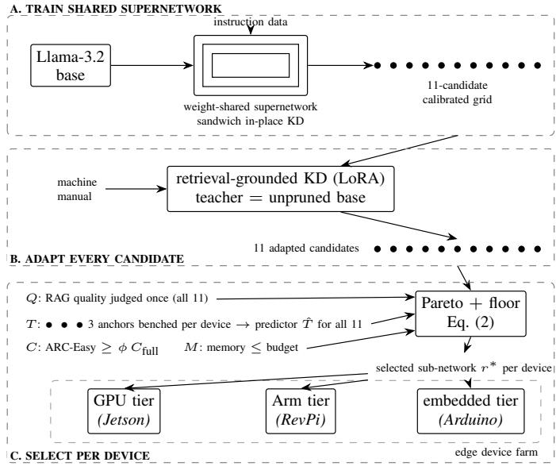
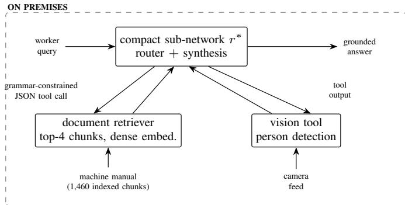
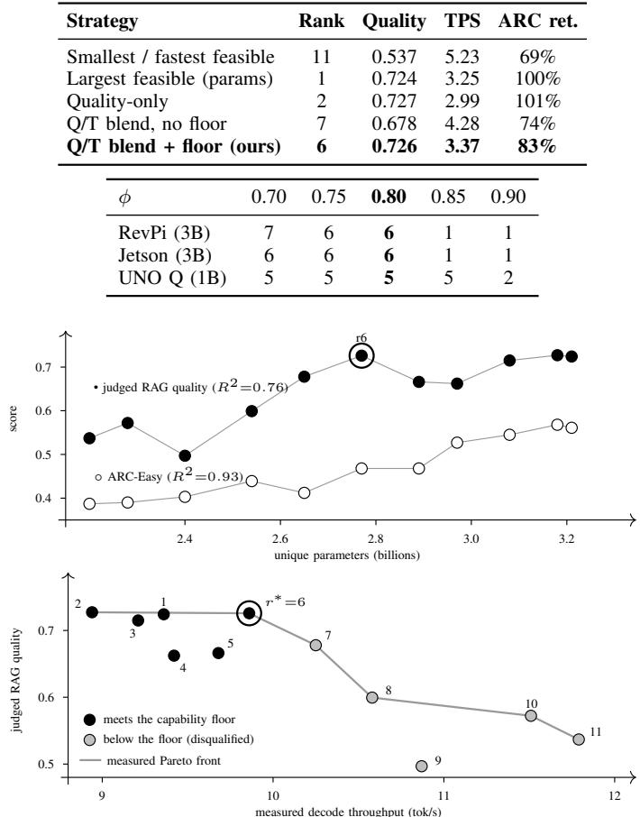
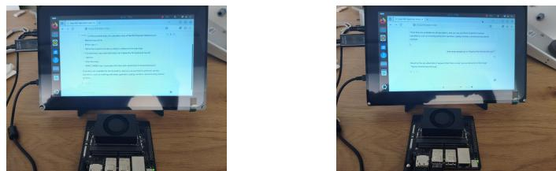

# Measurement-Driven Sub-Network Selection for On-Premise Retrieval-Augmented Factory Agents

1st Vasileios Rizeakos

2nd Georgios Paisios

3rd Alexandros Machairas

AI lab of enakronIC PC

Electrical & Computer Engineering

AI lab of enakronIC PC

Aspasias 72, 15561, Cholargos, Greece

University of Patras

Aspasias 72, 15561, Cholargos, Greece

0000-0003-4475-6232

Rio Campus, 26504, Patras, Greece 0009-0006-9713-3046

0009-0009-7391-4659

4th Michael Birbas

Electrical & Computer Engineering

University of Patras

Rio Campus, 26504, Patras, Greece

0000-0002-6124-221X

5th Athanasios Bachoumis

AI lab of enakronIC PC

Aspasias 72, 15561, Cholargos, Greece

0000-0003-3887-9789

Abstract—On-premise assistants can give factory workers conversational access to machine documentation, but models capable of the task rarely fit shop-floor hardware. We show that after structural compression and retrieval-grounded adaptation, model size is no longer a reliable predictor of adapted answer quality: general capability falls almost linearly with parameter count, while judged retrieval-augmented answer quality does not. We therefore treat deployment as a post-adaptation selection problem, committing one sub-network per device on judged answer quality and measured on-device throughput under a configurable general-capability floor and memory budget; rules that optimize size, speed, or quality alone each give up capability or throughput. A weight-shared supernetwork trained with sandwich-style in-place distillation keeps this selection inexpensive. In a manufacturing-manual case study, extraction costs 13.7% of the unpruned model’s judged quality and retrievalgrounded distillation returns it to within 4.6%, recovering two thirds of the loss, and the same assistant runs across three heterogeneous edge tiers at 1.3 to 5 watts standby.

Index Terms—Large Language Models, Knowledge Distillation, Super-network, Model Compression, Retrieval-Augmented Generation, Edge AI, Smart Manufacturing

## I. INTRODUCTION

Much of the knowledge a factory worker needs at the machine lives in technical documentation consulted under time pressure. Large Language Models (LLMs) offer a naturallanguage interface to this material, and frameworks exist for mapping LLM capabilities onto manufacturing tasks [2] and for intent-based agentic automation [3]. Both presuppose a capable model at the point of use, which on a shop floor is an industrial controller or an embedded box whose documents and camera feeds may not leave the premises.

The obstacle is capacity versus footprint, since models that answer technical questions reliably carry billions of parameters, while representative edge hardware offers two to eight gigabytes of memory. Cloud offloading reintroduces latency, recurring cost, and data-sovereignty concerns; training a small model per deployment is uneconomical; and structural pruning alone deteriorates the general capability that reliable answering requires [6], [7].

Rather than treating the problem as a single compression step, this paper formulates it as a multi-stage pipeline. The approach combines a weight-shared supernetwork trained through sandwich-style in-place distillation, a hardware-aware selection stage that identifies and commits to the most suitable sub-network for each deployment target, and a retrievalgrounded distillation stage that further specializes the selected model using factory-specific documentation. Finally, the resulting model is integrated into a tool-augmented runtime for deployment and execution. Two empirical findings shape the design. First, cheap selection proxies are structurally uninformative on our candidate grids, where the natural quality proxy is perfectly rank-correlated with parameter count. Second, a general-capability floor turns out to matter, disqualifying on both grids the very sub-networks a quality-throughput blend would otherwise select. The central claim of this paper follows: application adaptation can reorder compressed candidates, so deployment-time selection must run after adaptation, on measured application quality and device throughput under a general-capability constraint.

Concretely, we ask whether a single weight-shared supernetwork can provide sub-networks whose application-specific Retrieval-Augmented Generation (RAG) quality remains competitive after structural compression (RQ1), whether hardwaremeasured selection under a general-capability constraint outperforms parameter-count or proxy-based selection (RQ2), and whether the resulting pipeline can support practical on-premise deployment across heterogeneous edge hardware (RQ3).

This paper makes the following contributions:

• Measured, capability-constrained selection: our central contribution, a hardware-grounded three-stage procedure (Sec. III-D) that commits one sub-network per deployment target by blending judged RAG quality with measured on-device throughput under a configurable generalcapability floor, kept inexpensive by weight sharing and a three-anchor throughput predictor.

• Compression pipeline: A two-stage distillation pipeline for deployable LLMs: sandwich-style in-place distillation of a weight-shared supernetwork with importancecalibrated sampling [1], followed by retrieval-grounded distillation from the unpruned teacher into the extracted sub-network via low-rank adapters.

• Case-study deployment and evaluation: A documentgrounded, tool-augmented assistant instantiating the manufacturing-LLM framework of [2], measured across three edge tiers on judged quality, routing, latency, memory, and energy under one protocol.

## II. RELATED WORK

## A. Compressing LLMs

LLM inference cost is reduced by structural pruning with recovery training [6], [7], knowledge distillation [8], [18], lowrank adaptation [11], and quantization [22]. Weight-shared super-networks train many sub-networks jointly under the sandwich rule [5], [17] and mature into train-once, specializeper-device deployment [16]; hardware-aware benchmarks [19] and on-device measurements [20] bring these ideas to LLM scale. Train-once pipelines, however, select by pre-adaptation accuracy predictors [16]; this paper shows selection must follow application adaptation (Sec. III-D).

## B. RAG

Retrieval-augmented generation grounds an LLM’s answer in retrieved document passages rather than parametric memory alone [9]. Retrieval-aware finetuning (RAFT) [10] trains with distractor passages mixed into the context; Sec. IV adopts this inside a distillation objective.

## C. LLM agents in industrial scenarios

In [3], intent-based agentic automation for manufacturing is proposed and [4] extends agentic orchestration to network infrastructure and services, while in [2] an assistant framework is presented, built around a task-orchestrator LLM delegating to external agents, explicitly including computer-vision models. These frameworks generally assume large, typically cloudhosted models, leaving a gap in how such capabilities can be realized through compact models inside resource-constrained industrial environments. This paper addresses that gap.

## III. SUPERNETWORK DISTILLATION AND SUB-NETWORK EXTRACTION

The proposed pipeline (Fig. 1) compresses an instructiontuned LLM in two distillation stages. First, the base model becomes a weight-shared supernetwork finetuned with a sandwich-style in-place distillation rule, so that many candidate sub-networks are trained jointly (Sec. III-B). A compact sub-network is then extracted under a deployment budget (Sec. III-C), and a hardware-grounded selection stage decides which candidate to commit per deployment target (Sec. III-D).

  
Fig. 1. Train once, adapt every candidate, select per device. A weightshared supernetwork yields an 11-candidate calibrated grid; every candidate is adapted to the machine manual by retrieval-grounded distillation. The deployed rank is selected per device from judged quality and anchor-measured throughput under a capability floor and memory budget (Eq. 2).

Second, the extracted model is specialized to the target application, with the unpruned teacher distilling retrievalgrounded answers over the factory document into the subnetwork through low-rank adapters (Sec. IV). The result is exported to a quantized format (8-bit ONNX for GPU targets, 4-bit GGUF for Arm CPUs) and serves as the reasoning core of the deployed agent (Sec. V).

## A. Supernetwork and search space

Supernetworks are built with an identical recipe at two scales, Llama-3.2-3B-Instruct and Llama-3.2-1B-Instruct [13], matching the deployment tiers of Sec. VIII; the 3B instance is described here. The transformer layers are made elastic along two dimensions, network depth and per-layer MLP intermedi ate size, which leave the shared residual dimensionality and attention geometry intact (the costliest to recover after pruning [6], [7]) and trade quality against size smoothly. Calibration collapses this space into an 11-point candidate grid spanning 2.20-3.21 billion unique (as-deployed) parameters on the 3B base and 0.90-1.24 billion on the 1B; the largest candidate is the unpruned base model itself. A candidate is activated in place by slicing the shared weight tensors, so no separate student model is instantiated.

## B. Sandwich-style in-place distillation

The supernetwork is finetuned on general instruction data (Alpaca-GPT4 [12]) before any sub-network is committed to. Following slimmable networks [5] and single-stage supernets [17], each optimization step trains the full supernetwork together with M=3 sampled sub-networks, using the full network’s detached output distribution as an in-place teacher.

Sampling is importance-calibrated, in that channels are prepermuted by importance and the M sub-networks are drawn uniformly from the 11-point calibrated grid of Sec. III-C rather than the raw space. The per-step objective is

$$
\mathcal { L } _ { \mathrm { s t e p } } = \mathcal { L } _ { \mathrm { C E } } ( z _ { \mathrm { f u l l } } , y ) + \sum _ { i = 1 } ^ { M } \left[ \alpha \mathcal { L } _ { \mathrm { C E } } ( z _ { i } , y ) + \beta \tau ^ { 2 } \mathrm { K L } \big ( p _ { \mathrm { f u l l } } ^ { \tau } \parallel p _ { i } ^ { \tau } \big ) \right] ,\tag{1}
$$

where $z _ { \mathrm { f u l l } }$ and $z _ { i }$ are the logits of the full network and the i-th sub-network on the same batch, y are the ground-truth tokens, $p ^ { \tau }$ is the softmax softened at temperature τ, KL is the forward Kullback-Leibler (KL) divergence from the full network’s detached distribution, and $\alpha , \beta$ balance the terms $( \alpha { = } 0 . 8 ,$ $\beta { = } 0 . 2 , \ \tau { = } 1 . 0$ in production). Gradients from all forwards accumulate into the shared weights, transferring large-capacity behavior to smaller candidates without a separate teacher pass. The ablation in Sec. VII isolates what calibrated sampling contributes.

## C. Sub-network extraction

After supernetwork training, sub-networks are materialized as standalone checkpoints. Candidates come from an 11-point grid over the elastic dimensions, built by binning the parameter range and keeping the best WikiText-perplexity configuration per bin plus the smallest and the full one. Extraction itself is adopted from the sub-network selection literature [1].

## D. Hardware-grounded sub-network selection

Committing to one grid rank per target is itself a selection problem, and cheap proxies are insufficient for it. The natural quality proxy (KL divergence to the full-width supernetwork on production-shaped prompts) is perfectly rank-correlated with parameter count (Spearman $\rho { = } { - } 1 . 0 ) ;$ no monotone proxy can express the inversions of measured fronts. Selection rests on measurement, in three stages: (i) proxy metrics for orientation, (ii) real evaluation, in which every rank is adapted (Sec. IV), exported, and measured for routing accuracy, judged RAG quality, and on-device throughput, latency, memory, and energy (Sec. VIII), and (iii) selection, in which the deployed rank is

$$
r ^ { * } = \arg \operatorname* { m i n } _ { r \in \mathcal { F } } \big [ w \left( 1 - \tilde { Q } _ { r } \right) + \left( 1 - w \right) \left( 1 - \tilde { T } _ { r } \right) \big ] ,\tag{2}
$$

where $Q _ { r }$ is judged RAG quality, $T _ { r }$ measured on-device throughput, tildes denote min-max normalization over the Pareto front, $w { = } 0 . 5$ , ties resolve toward higher throughput, and $\mathcal { F } ~ = ~ \{ r ~ : ~ C _ { r } ~ \geq ~ \phi C _ { \mathrm { f u l l } } , ~ M _ { r } ~ \leq ~ M _ { \operatorname* { m a x } } \}$ imposes an ARC-Easy capability floor $( \phi { = } 0 . 8 )$ and a memory ceiling. The floor $\phi$ is a deployment-policy parameter, yet it changes the outcome, disqualifying candidates retaining only 67-78% of the unpruned ARC-Easy score, among them the unconstrained blend’s picks on both grids. A three-anchor throughput predictor $( \mathrm { t o k } / \mathrm { s } = a / n _ { \mathrm { p a r a m s } } ) .$ , fitted per device on three ranks spanning the parameter range, predicts the eight held-out ranks with 2.5-3.1% mean absolute error, and the fronts computed from the predicted throughput coincide with the fully measured fronts on both grids. Commissioning a new device, therefore, requires benchmarking only the three anchors (6.0 hours instead of 28.8 for the full grid).

## IV. RETRIEVAL-GROUNDED POST-EXTRACTION DISTILLATION

Distillation data: The application corpus is a 187-page mill operator manual, split into 1,460 overlapping 100-token chunks. Grounded question-answer pairs are first generated per chunk with grammar-constrained JSON decoding (686 training pairs plus a 633-question out-of-sample set). Each question is then re-answered by the teacher, the unpruned base instruction model at the same scale, under the production prompt template and retriever top-4 contexts, so training matches inference exactly. Following Retrieval-Aware Finetuning (RAFT) [10], with probability 0.5 one or two of the four golden chunks are replaced by distractor chunks drawn from lower retrieval ranks, teaching the student to ignore near-miss context.

Objective: The extracted sub-network is adapted with lowrank adapters (LoRA) [11] of uniform rank $r { = } 8$ on attention and MLP projections, keeping the base weights frozen. On answer tokens only, the student minimizes

$$
\mathcal { L } _ { \mathrm { p o s t } } = \alpha ^ { \prime } \mathcal { L } _ { \mathrm { C E } } + \beta ^ { \prime } \tau ^ { \prime 2 } \mathrm { K L } \big ( p _ { T } ^ { \tau ^ { \prime } } \mid \mid p _ { S } ^ { \tau ^ { \prime } } \big ) ,\tag{3}
$$

with teacher distribution $p _ { T } .$ , student distribution $p _ { S }$ , and $\alpha ^ { \prime } { = } \beta ^ { \prime } { = } 0 . 5 , \tau ^ { \prime } { = } 2 . 0$ in the deployed runs at both scales. Toolrouting demonstrations (Sec. V) are mixed into the same run with the task loss only.

Consolidation and export: After training, adapters are merged into dense weights. The result is exported to ONNX and reduced by post-training quantization [22] to blockwise INT8 weights with FP16 activations (W8A16), the output head staying in full precision. For the Arm CPU tiers the same merged checkpoint is instead exported to 4-bit GGUF (Q4 K M) for llama.cpp, under a verified parity contract tying the input embeddings to the output head exactly as the ONNX build does. At these formats the 3B rank-6 occupies 1.85 GB (Q4 K M) and 2.1 GB (W8A16); the 1B rank-5, 781 MB (Q4 K M).

## V. AGENTIC RETRIEVAL-AUGMENTED DEPLOYMENT

The compact model is the reasoning core of an on-premise assistant that adopts the task-orchestrator design of [2], in which the orchestrator delegates to external agents (Fig. 2).

Each query is routed by the compact model itself, with grammar-constrained decoding guaranteeing valid JSON tool calls, either to retrieval over the machine manual (dense embeddings [14], top-4) or to a vision tool built on an offthe-shelf person detector [15], then synthesizes the grounded answer from the tool output under the distillation data’s prompt template (Sec. IV). Models are served with ONNX Runtime GenAI (W8A16) on GPU targets and llama.cpp (Q4 K M) on Arm CPU targets.

The full stack runs on premises (development on a single 24-GB GPU partition), so documents and camera images never leave the site.

  
Fig. 2. On-premise tool-augmented RAG assistant, instantiating the taskorchestrator design of [2]. The selected sub-network r∗ routes each query through a grammar-constrained JSON tool call and then synthesizes the grounded answer from the tool output.

## VI. EXPERIMENTAL SETUP

Models: the supernetworks are Llama-3.2-3B- and 1B-Instruct (identical recipe); the deployed sub-networks are chosen per platform by Sec. III-D at the balanced quality weight (3B rank 6 on the Jetson and the RevPi; 1B rank 5 on the UNO Q); the post-extraction teacher is the unpruned base at each scale. Data: the common-task stage uses Alpaca-GPT4 [12]; the application stage uses 686 manual QA pairs with RAFT distractors and a 633-question held-out set (Sec. IV), plus n=40 routing queries. Metrics: RAG quality is measured by the three RAG metrics, faithfulness, answer relevancy, and context utilization, scored by an LLM judge (Claude Opus 4.8, medium reasoning effort) in one interleaved single-session pass per campaign (Sec. VIII); efficiency by TTFT, decode TPS, peak memory, and energy per inference and at standby; and tool routing by accuracy. Judged scores are comparable only within a session; absolute values differ across Tables I, III and IV. The vision tool uses an off-theshelf detector and is reported as functional, not benchmarked. Baselines: the unpruned base under the identical RAG stack, the unadapted extraction, supervised finetuning, and the KDrecipe ladder of Table II. Hardware: all training runs on the on-prem GPU partition of Sec. V; supernetwork training dominates cost (∼51 h 3B, 22.8 h 1B); each Stage-2 variant of Table II is a ∼12-minute LoRA run (the whole ladder under one GPU-hour). Deployment is evaluated on the three edge platforms of Sec. VIII. Supplementary examples: qualitative answers with per-question judge scores and the vision demo, at https://enakronic.github.io/llm-assistant-supplement/.

## VII. RESULTS AND DISCUSSION

## A. Capability vs. model size

Table I separates what pruning costs from what distillation recovers. Under an identical retrieval stack and a single judge pass over all 633 held-out questions, extraction at the deployed rank 6 drops judged answer quality by 13.7% relative to the base; the retrieval-grounded second stage returns the model to within 4.6% of the unpruned model’s judged quality, recovering two thirds of the loss (RQ1). The gap is estimated over

TABLE I  
QUALITY VS. MODEL SIZE AT THE DEPLOYED RANK (GRID RANK 6; n=633 HELD-OUT QUESTIONS, ONE JUDGE PASS). QUALITY IS THE MEAN OF THE THREE RAG METRICS; ∆ IS RELATIVE TO THE UNPRUNED BASE MODEL UNDER THE IDENTICAL RAG STACK.
<table><tr><td>Model</td><td>Params</td><td>Size</td><td>Quality</td><td>∆</td></tr><tr><td>Base 3B + RAG (W8A16)</td><td>3.21B</td><td>2.42 GB</td><td>0.848</td><td>ref.</td></tr><tr><td>Extracted, no Stage 2</td><td>2.77B</td><td>2.1 GB</td><td>0.732</td><td>-13.7%</td></tr><tr><td>+ Stage-2 KD</td><td>2.77B</td><td>2.1 GB</td><td>0.809</td><td>-4.6%</td></tr></table>

TABLE II

STAGE-2 DECOMPOSITION AT EXTRACTION RANK 4 (n=291 HELD-OUT QUESTIONS, ONE JUDGE PASS; A DIFFERENT CAMPAIGN FROM TABLE I, SO ABSOLUTE VALUES DIFFER). QUALITY IS THE MEAN OF THE THREE RAG METRICS. ROWS BELOW “EXTRACTED” ARE RECIPE ABLATIONS; “+” ROWS BUILD CUMULATIVELY, AND THE LAST ROW IS THE DEPLOYED RECIPE.
<table><tr><td>Configuration</td><td>Quality</td><td>∆ vs. base</td></tr><tr><td>Base (unpruned) + RAG</td><td>0.791</td><td>ref.</td></tr><tr><td>Extracted, no adaptation</td><td>0.701</td><td>-11.4%</td></tr><tr><td>supervised FT, context-free QA</td><td>0.654</td><td>-17.3%</td></tr><tr><td>task loss on grounded data  $( \alpha { = } 0 . 9 5 )$ </td><td>0.727</td><td>-8.1%</td></tr><tr><td>+  $\mathrm { K D \ ( } \alpha { = } \beta { = } 0 . 5 , \tau { = } 2 )$ </td><td>0.760</td><td>-3.9%</td></tr><tr><td>+ RAFT distractors (ours, deployed)</td><td>0.765</td><td>-3.3%</td></tr></table>

633 paired questions; its bootstrap 95% confidence interval is $[ - 5 . 9 \% , - 3 . 3 \% ]$ of the base score. General capability and adapted task quality also decouple. ARC-Easy falls almost linearly with parameter count $( R ^ { 2 } { = } 0 . 9 3 ) \mathrm { ; }$ ; judged RAG quality is only loosely size-ordered $( R ^ { 2 } { = } 0 . 7 6 )$ , with rank 6 matching the two largest candidates. Selection exploits this decoupling, and the capability floor guards against it.

## B. Stage-2 decomposition and baselines

Table II isolates the Stage-2 ingredients (n=291, one judge pass): context-free supervised finetuning degrades the extracted model (0.654 vs. 0.701), grounded task loss reaches 0.727, the softened distillation term adds three points, and RAFT distractors complete the deployed recipe at 0.765.

## C. Efficiency trade-off and selection outcome

Fig. 3 shows the decoupling and the measured selection plane; Table III compares selection rules on the RevPi grid. Every simpler rule forfeits something: size- and speed-driven picks retain only 69-74% of base capability and qualityonly ignores throughput, while the constrained blend keeps all three (RQ2). On the 1B grid the floor likewise removes the unconstrained pick (rank 10) and selects rank 5. The floor sweep (Table III, bottom) shows the picks move only at extreme values. With the floor in place, the blend weight barely matters, selecting rank 6 at every $w \in [ 0 . 1 5 , 0 . 8 5 ]$ on both 3B devices and rank 5 on the UNO Q (rank 8 at speedleaning w).

## D. Grounded question answering and tool routing

The deployed cores’ scores appear in Table IV. The Jetson and RevPi cores (rank 6) reach 0.773 faithfulness, 0.845 answer relevancy, and 0.811 context utilization (n=633, the session of Table I); the 1B core, judged in its own session, scores 0.591/0.749/0.682: the native 1B trails the compressed 3B on all three metrics, so the 3B grid is used wherever memory allows (the grids were judged separately, so the gap is indicative). Tool routing reaches 40/40 for every fine-tuned core once 37 routing demonstrations join the training mix, costing 1.3-2.5 points across the RAG metrics.

<table><tr><td>Strategy</td><td>Rank</td><td>Quality</td><td>TPS</td><td>ARC ret.</td></tr><tr><td>Smallest / fastest feasible</td><td>11</td><td>0.537</td><td>5.23</td><td>69%</td></tr><tr><td>Largest feasible (params)</td><td>1</td><td>0.724</td><td>3.25</td><td>100%</td></tr><tr><td>Quality-only</td><td>2</td><td>0.727</td><td>2.99</td><td>101%</td></tr><tr><td>Q/T blend, no floor</td><td>7</td><td>0.678</td><td>4.28</td><td>74%</td></tr><tr><td>Q/T blend + floor (ours)</td><td>6</td><td>0.726</td><td>3.37</td><td>83%</td></tr><tr><td>φ</td><td>0.70 0.75</td><td>0.80</td><td>0.85</td><td>0.90</td></tr><tr><td>RevPi (3B)</td><td>7</td><td>6</td><td>1</td><td>1</td></tr><tr><td>Jetson (3B)</td><td>6</td><td>6 5</td><td>1 5</td><td>1</td></tr><tr><td>UNO Q (1B)</td><td>5</td><td>5</td><td></td><td>2</td></tr></table>

  
TABLE III  
TOP: SELECTION STRATEGIES ON THE REVPI 3B GRID (QUALITY AND TPS FROM THE ALL-RANK JUDGE SESSION AT THE 256-TOKEN SELECTION CELL, HENCE THE TPS DIFFERENCE FROM TABLE IV’S 128-TOKEN CELL; ARC RET. IS RELATIVE TO THE UNPRUNED MODEL, WHICH RANK 2 MARGINALLY EXCEEDS). BOTTOM: SELECTED RANK VS. FLOOR ϕ AT THE BALANCED WEIGHT (DEPLOYED SETTING IN BOLD).  
Fig. 3. Top: judged RAG quality vs. ARC-Easy across the 3B grid; size predicts general capability but not adapted RAG utility. Bottom: the measured quality-throughput plane on the Jetson; gray candidates fall below the capability floor, the ring marks the selected rank.

## E. Ablations

We ablate the supernetwork stage along both axes (calibrated sampling, supernetwork training), judging all arms in one interleaved session. At full width the arms are indistinguishable (0.77-0.80); mid-grid, where deployment candidates live, calibrated sampling without supernetwork training collapses to 0.44-0.50 (ranks 4-5) while the trained supernetwork holds ∼0.72; supernetwork distillation, not sampling calibration, carries mid-grid quality. With training, the recipes split only at the extremes: calibrated sampling is better at the largest ranks, including the deployed rank 6 (0.783 vs. 0.738, paired t-test, n=30 per rank, t=2.3), and worse below rank 8 (+0.13-0.15 for random sampling, t=3.9-5.3); ARC-Easy reproduces the crossover. Calibrated sampling buys quality where selection operates, at the cost of a small-rank tail it never deploys.

  
Fig. 4. Demo setup on the Jetson tier. The assistant’s on-device web interface answers a manual question through the retrieval tool (left) and a person-count query through the vision tool (right).

## F. Discussion

Retrieval is not evaluated: the retriever is fixed everywhere, so every RAG score is conditioned on its unmeasured recall. Judged quality comes from a single LLM judge; interleaving removes between-arm drift but not the judge itself, and the 3B and 1B grids were judged separately, so cross-grid comparisons are indicative only. The 80% ARC-Easy capability floor is defensible but arbitrary; a different floor can change the picks, though on our grids they move only at extreme values. Finally, the compact cores inherit small-model failure modes. Multi-step reasoning, long tool chains, and countingstyle vision queries remain unreliable, and a retrieval miss cannot be repaired downstream.

## VIII. CROSS-PLATFORM DEPLOYMENT STUDY

Committing to a deployment target is cheap under the weight-shared approach, since candidates are re-scored, or the recipe re-instantiated at a smaller scale, without retraining shared weights. We demonstrate this by porting the complete assistant to three tiers of edge hardware, choosing each tier’s core by re-running Sec. III-D’s selection on anchor measurements from the device itself.

## A. Platforms and per-target extraction

We deploy on a RevPi Connect 5 (4 GB industrial DINrail computer on the Raspberry Pi CM5; llama.cpp, Q4 K M, 3B rank 6), an NVIDIA Jetson Orin Nano (8 GB unified memory; ONNX Runtime GenAI, W8A16, 3B rank 6; measured in the default 15-W mode), and an Arduino UNO Q (2 GB; llama.cpp, Q4 K M), whose memory ceiling admits no 3B candidate even at 4-bit, so its core is the 1B grid’s rank 5, selected by the same procedure. Document index, prompts, routing grammar, and queries are identical across platforms; only model scale, quantization, and runtime differ. Fig. 4 shows the deployed assistant answering through both tool paths on the Jetson tier of the demo setup.

TABLE IV  
CROSS-PLATFORM EVALUATION OF THE DEPLOYED PIPELINE (REFERENCE CELL 128-TOKEN PROMPT / 128 GENERATED, MEDIANS OF 8). ITALIC ROWS: PERCENT CHANGE VS. THE UNPRUNED RANK-1 MODEL MEASURED IDENTICALLY ON THE SAME DEVICE (SAME-SESSION DELTAS; E2E DERIVED IDENTICALLY). QUALITY: n=633 (3B, BOOTSTRAP 95% CI ±0.012-0.017), n=38 (1B, ±0.05-0.08).
<table><tr><td>Platform</td><td>Sub-net</td><td>Params</td><td>Faithf.</td><td>Ans. rel.</td><td>Ctx. util.</td><td>TTFT (s)</td><td>TPS</td><td>E2E (s)</td><td>Mem (GB)</td><td>E/inf. (J)</td><td>Standby (W)</td></tr><tr><td rowspan="2">Jetson Orin Nano 8 GB</td><td>3B r6</td><td>2.77B</td><td>0.773</td><td>0.845</td><td>0.811</td><td>0.23</td><td>9.95</td><td>20.33</td><td>5.9</td><td>117</td><td>4.96</td></tr><tr><td>∆ vs. unpruned (%)</td><td>-13.7</td><td>-5.5</td><td>-3.9</td><td>-4.3</td><td>-13.2</td><td>+5.3</td><td>-8.6</td><td>-13.0</td><td>-7.8</td><td>-1.2</td></tr><tr><td rowspan="2">RevPi Connect 5 4 GB</td><td>3B r6</td><td>2.77B</td><td>0.773</td><td>0.845</td><td>0.811</td><td>5.63</td><td>4.00</td><td>76.87</td><td>2.3</td><td>170</td><td>2.48</td></tr><tr><td>∆ vs. unpruned (%)</td><td>-13.7</td><td>-5.5</td><td>-3.9</td><td>-4.3</td><td>-24.7</td><td>+7.4</td><td>-29.9</td><td>-9.8</td><td>-8.7</td><td>-4.3</td></tr><tr><td rowspan="2">Arduino UNO Q2 GB</td><td>1B r5</td><td>1.12B</td><td>0.591</td><td>0.749</td><td>0.682</td><td>15.1</td><td>4.53</td><td>138.58</td><td>0.63</td><td>149</td><td>1.30</td></tr><tr><td>∆ vs. unpruned (%)</td><td>-9.7</td><td>+6.9</td><td>+1.8</td><td>+5.3</td><td>-11.8</td><td>+13.2</td><td>-11.7</td><td>+2.0</td><td>-7.7</td><td>+4.8</td></tr></table>

## B. Metrics

Each platform is evaluated along three axes. (i) RAG quality: the three RAG metrics of Sec. VI, scored by a frontier-LLM judge with all systems’ answers interleaved and shuffled per question in one session, guarding against judge drift and documented position bias [21]. Retrieval is identical everywhere, so any cross-platform difference in the three scores comes from the reasoning core. (ii) Latency: time-to-firsttoken (TTFT), decode tokens per second (TPS), and end-toend (E2E) latency per query composed from measured per-call latencies. (iii) Resources: peak memory (process RSS; unified high-water on the Orin), per-inference joules, and standby watts (60-s idle, model resident). Latency, memory, and energy use a 4 × 4 grid of prompt and generation lengths, eight repetitions per cell after warm-up, end-of-sequence ignored.

## C. Results and discussion

A full query (router, retrieval, synthesis at production lengths) takes about 20 s on the Jetson versus one to over two minutes on the CPU tiers, where prefill dominates (Table IV); per-inference energy is similar across the three tiers (117- 170 J) while standby varies by 4× (1.3-5.0 W), so at sparse duty cycles standby dominates total energy. The delta rows compare each deployed model against the unpruned rank on the same device; all three tiers gain on latency, energy, and memory, except for an insignificant 2% memory increase on the UNO Q (RQ3).

## IX. CONCLUSION

Application adaptation breaks size-based quality ordering, so this paper selects per device on measured quality and throughput under a general-capability floor; simpler selection rules demonstrably pick worse models. In our manufacturingmanual case study, the selected sub-networks retain ∼95% of the unpruned model’s judged RAG quality, route tools without error, and serve the identical assistant from a 2-GB Arduino UNO Q to a Jetson Orin Nano; commissioning a new device needs only three benchmarked anchors. Future work extends selection beyond the calibrated grid and adds a directly measured end-to-end trace of the full agent loop.

## USE OF AI TOOLS

Answer quality was scored by an LLM judge (Claude Opus 4.8, medium reasoning effort) under the interleaved

protocol of Sec. VIII. All technical content, experiments, and analysis are the authors’ own.

## REFERENCES

[1] A. Krishnakumar et al., “Where to begin: Efficient pretraining via subnetwork selection and distillation,” arXiv preprint arXiv:2510.07227, 2025.

[2] C. I. Garcia, M. A. DiBattista, T. A. Letelier, H. D. Halloran, and J. A. Camelio, “Framework for LLM applications in manufacturing,” Manufacturing Letters, vol. 41, pp. 253-263, 2024.

[3] M. L. Romero and R. Suyama, “Agentic AI for intent-based industrial automation,” in Proc. 16th IEEE Int. Conf. Industry Applications (IN-DUSCON), 2025, pp. 437-444.

[4] D. Brodimas, A. Birbas, D. Kapolos, and S. Denazis, “Intent-based infrastructure and service orchestration using agentic-AI,” IEEE Open J. Commun. Soc., vol. 6, pp. 7150-7168, 2025.

[5] J. Yu and T. Huang, “Universally slimmable networks and improved training techniques,” in Proc. IEEE/CVF ICCV, 2019.

[6] X. Ma, G. Fang, and X. Wang, “LLM-Pruner: On the structural pruning of large language models,” in Proc. NeurIPS, 2023.

[7] M. Xia, T. Gao, Z. Zeng, and D. Chen, “Sheared LLaMA: Accelerating language model pre-training via structured pruning,” in Proc. ICLR, 2024.

[8] G. Hinton, O. Vinyals, and J. Dean, “Distilling the knowledge in a neural network,” arXiv preprint arXiv:1503.02531, 2015.

[9] P. Lewis et al., “Retrieval-augmented generation for knowledge-intensive NLP tasks,” in Proc. NeurIPS, 2020.

[10] T. Zhang et al., “RAFT: Adapting language model to domain specific RAG,” arXiv preprint arXiv:2403.10131, 2024.

[11] E. J. Hu et al., “LoRA: Low-rank adaptation of large language models,” in Proc. ICLR, 2022.

[12] B. Peng, C. Li, P. He, M. Galley, and J. Gao, “Instruction tuning with GPT-4,” arXiv preprint arXiv:2304.03277, 2023.

[13] A. Grattafiori et al., “The Llama 3 herd of models,” arXiv preprint arXiv:2407.21783, 2024.

[14] S. Xiao et al., “C-Pack: Packed resources for general Chinese embeddings,” in Proc. SIGIR, 2024.

[15] G. Jocher and J. Qiu, “Ultralytics YOLO11,” 2024, software: github. com/ultralytics/ultralytics

[16] H. Cai, C. Gan, T. Wang, Z. Zhang, and S. Han, “Once-for-All: Train one network and specialize it for efficient deployment,” in Proc. ICLR, 2020.

[17] J. Yu et al., “BigNAS: Scaling up neural architecture search with big single-stage models,” in Proc. ECCV, 2020.

[18] S. Muralidharan et al., “Compact language models via pruning and knowledge distillation,” arXiv preprint arXiv:2407.14679, 2024.

[19] R. S. Sukthanker et al., “HW-GPT-Bench: Hardware-aware architecture benchmark for language models,” arXiv preprint arXiv:2405.10299, 2024.

[20] S. Laskaridis, K. Katevas, L. Minto, and H. Haddadi, “MELTing point: Mobile evaluation of language transformers,” in Proc. ACM MobiCom, 2024.

[21] L. Zheng et al., “Judging LLM-as-a-judge with MT-Bench and Chatbot Arena,” in Proc. NeurIPS Datasets and Benchmarks, 2023.

[22] E. Frantar, S. Ashkboos, T. Hoefler, and D. Alistarh, “GPTQ: Accurate post-training quantization for generative pre-trained transformers,” in Proc. ICLR, 2023.