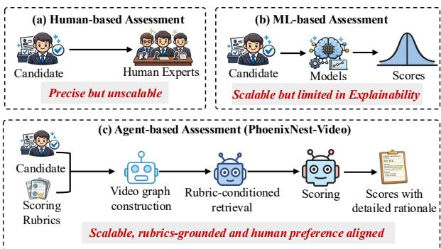
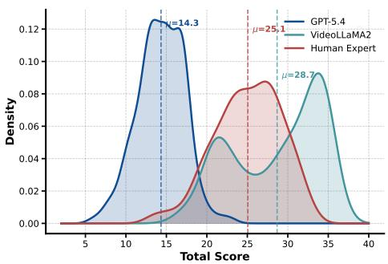
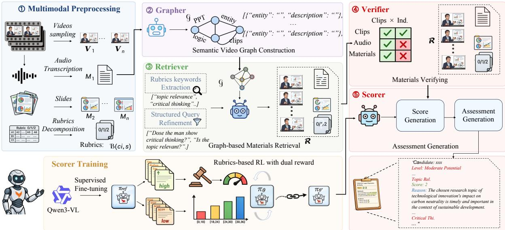
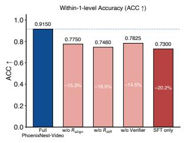
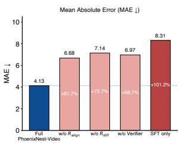
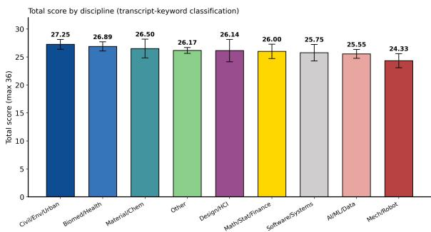

# PhoenixNest-Video: Evidence-Grounded Multimodal Agent Framework for Automated Video Interview Assessment

Yuxuan Fan Miaojun Huang Haimei Zhang Jingshen Wu Hao Liu The Hong Kong University of Science and Technology (Guangzhou)

## Abstract

Interview assessment requires per-criterion judgments grounded in behavioral evidence, yet surging applicant volumes have made human-only evaluation costly and inconsistent, while existing AI approaches yield opaque scores without traceable rationale. We introduce PhoenixNest-Video, an evidencegrounded multimodal agent framework for automated video interview assessment. It builds a semantic video graph as structured working memory, performs rubric-conditioned retrieval with cross-modal verification across visual, audio, and textual streams, and produces per-criterion scores anchored to the candidate’s materials. A Scorer trained via Rubrics-based Reinforcement Learning with dual rewards for rubric alignment and score-level differentiation internalizes the discriminative structure of multi-level rubrics. PhoenixNest-Video attains 91.50% grade-level accuracy on VInterview-2025, outperforming substantially larger pro prietary models. A compact, rubric-grounded agent therefore scores candidates in closer agreement with an expert panel than direct prompting of much larger models, and exposes the evidence behind each score for human review.

## 1 Introduction

Interviews have long served as a core step in selecting candidates across graduate admissions and professional hiring (Wiens, 1976; Franklin, 2024; Albaroudi et al., 2024). To reach fair and defensible decisions, institutions require evaluators to score each candidate along multiple criteria, justify every score, and cite specific moments and materials from the interview as supporting evidence (Maude and Kirby, 2022). Yet application volumes have surged sharply in recent years, with Common Application submissions rising over 37% between 2021 and 2025 to more than 7.6 million (Song et al., 2026; Altbach et al., 2019), placing unprecedented pressure on this evidence-anchored protocol. Sustaining such rigorous per-candidate assessment with human experts alone has become increasingly impractical at this scale. On one hand, recruiting, training, and compensating qualified interviewers across thousands of applicants imposes a substantial labor cost, and expert staffing has not kept pace with demand. On the other hand, even when sufficient raters are available, prolonged large-scale evaluation amplifies well-documented human limitations such as fatigue, anchoring biases, and inconsistent criterion weighting (Conway et al., 1995; Campion et al., 1997; Landy and Farr, 1980), eroding the consistency that high-stakes decisions depend on. An automated assistant addresses this directly: it applies one rubric uniformly across a large candidate pool and makes the evidence behind each score inspectable.

  
Figure 1: Three paradigms of interview assessment. (a) Human-based assessment is precise but unscalable. (b) ML-based assessment is scalable but opaque. (c) PhoenixNest-Video produces per-criterion scores with verifiable evidence, achieving scalable and evidencetraceable assessment.

As illustrated in Figure 1, interview assessment has evolved through three paradigms. Human panels remain the gold standard in accuracy but cannot scale to current applicant volumes. ML-based approaches (Naim et al., 2015; Subramaniam et al.,

2016; Hemamou et al., 2019; Agrawal et al., 2020) train supervised models on interview data and gain scalability, yet they yield opaque numeric scores without interpretable rationale, limiting their utility in high-stakes decisions. Multimodal Large Language Models (MLLMs) offer a more capable foundation by processing visual, audio, and textual streams within a unified architecture (Maaz et al., 2024; Li et al., 2024b; Cheng et al., 2024; Zhang et al., 2025), yet directly applying them to interview assessment exposes structural challenges that standard training leaves unresolved.

Applying MLLMs to criterion-level evaluative judgment exposes three fundamental limitations. First, rubric scoring requires decomposing parallel visual, vocal, and verbal streams and attending to different signals per criterion (Kim et al., 2023; Arakawa and Yakura, 2022; Takeuchi and Koda, 2021), yet MLLMs treat video as an undifferentiated stream and cannot organize criterion-relevant evidence across modalities and time (Wingate and Bourdage, 2024). Second, as Figure 2 shows, general-purpose MLLMs exhibit systematic scoring biases, some compressing into a narrow low band and others skewing high; optimized for fluent generation and safety-aligned neutrality, they fail to differentiate candidates along rubric-defined dimensions. Third, defensible assessment requires every judgment to be traceable to specific behavioral observations, yet MLLMs produce assessment text without such anchoring and lack the temporal memory to cross-verify what a candidate said, showed, and expressed, leaving their outputs unauditable (Fabeyo, 2025). Fine-grained visual distinctions can also trigger hallucinations (Bai et al., 2026), while visual facts that are neither retained nor verbalized may become inaccessible in later interactions (Chen et al., 2026).

To address these challenges, we propose PhoenixNest-Video, an evidence-grounded multimodal agent framework for automated video interview assessment. PhoenixNest-Video constructs a semantic video graph as structured working memory, performs rubric-conditioned retrieval with cross-modal verification to locate and validate criterion-relevant evidence, and produces percriterion scores anchored to the candidate’s materials. A Rubrics-based Reinforcement Learning procedure with dual reward signals for rubric alignment and score-level differentiation trains the scoring module to internalize the discriminative structure of multi-level rubrics. Built on a Qwen3-VL-

  
Figure 2: Score distributions of general-purpose MLLMs versus human experts on VInterview-2025. GPT-5.4 systematically underscores within a narrow band, while VideoLLaMA2 overscores with a bimodal pattern. These opposing deviations from the human expert distribution expose complementary failures in calibration and discrimination that motivate rubricgrounded reinforcement learning.

8B backbone, PhoenixNest-Video achieves 91.50% grade-level accuracy on VInterview-2025 with the lowest total-score MAE and Wasserstein distance among all baselines, outperforming substantially larger proprietary models, and after retraining on RecruitView (Gupta et al., 2025) attains the best rank-correlation and concordance scores macroaveraged over its 12 regression targets.

The contributions of this paper are summarized as follows:

• We propose PhoenixNest-Video, an evidencegrounded multimodal agent framework that produces criterion-level scores with verifiable video evidence, enabling transparent and auditable automated interview assessment.

• We introduce Rubrics-based Reinforcement Learning with dual reward signals for rubric alignment and score-level differentiation, enabling MLLMs to overcome scoring biases and produce rubric-faithful interview assessments.

• We evaluate PhoenixNest-Video on VInterview-2025 and RecruitView, where it achieves 91.50% grade-level accuracy and produces score distributions closely aligned with human experts, demonstrating the viability of compact, evidence-grounded multimodal agents for automated interview assessment.

## 2 Related Work

Automated Video Interview Assessment. Automated interview assessment has progressed from handcrafted prosodic and facial features on mock interviews (Naim et al., 2015; Chen et al., 2016, 2017) through bimodal personality prediction on short clips (Subramaniam et al., 2016; Escalante et al., 2018) to hierarchical neural models for asynchronous screening (Hemamou et al., 2019; Agrawal et al., 2020; Singhania et al., 2020). Recent work has broadened to audio-visual personality benchmarks (Liao et al., 2024), pose-based analysis (Tang et al., 2025), multimodal performance assessment (Li et al., 2025a; Inam et al., 2026), naturalistic interview datasets (Gupta et al., 2025), fairness audits (Mujtaba and Mahapatra, 2025; Leong et al., 2019; Putra et al., 2024), psychometric validation (Liff et al., 2024), and multi-agent evaluation frameworks (Sun et al., 2026). These efforts predominantly output holistic or trait-level scores without rubric grounding or evidence traceability. PhoenixNest-Video addresses this gap by conditioning every score on rubric descriptors and anchoring it to verified candidates’ materials.

MLLMs for Video Understanding. Multimodal Large Language Models (MLLMs) typically bridge a vision encoder with an LLM via instruction tuning (Maaz et al., 2024; Zhang et al., 2023), with subsequent work improving temporal modeling (Cheng et al., 2024; Zhang et al., 2025; Shao et al., 2025) and long-form processing through time-aware querying (Ren et al., 2024), dual-rate visual streams (Xu et al., 2024), and chunk-level compression (Shu et al., 2025). Reasoning-oriented post-training via reinforcement learning has further improved spatio-temporal reasoning (Feng et al., 2025; Li et al., 2025b; Tao et al., 2025). Outside video, domain-specific MLLMs have used multidimensional reasoning rewards and iterative visual tools to improve structured reasoning (Hao et al., 2026b; Fan et al., 2026a), while multimodal agents combine tool use with knowledge-grounded retrieval (Hao et al., 2026a). Recent benchmarks have also begun to test what MLLMs miss beyond surface recognition, including intent-level audiovisual understanding (Fan et al., 2026b), cross-modal ambiguity resolution (Wang et al., 2025b), and competence in humanities and social-science domains where judgment rather than fact retrieval is at stake (Kang et al., 2026b). Multi-agent orchestration provides another route to structured reasoning, both over video (Kugo et al., 2025) and in highstakes decision domains such as legal judgment prediction (Kang et al., 2026a), though benchmarks such as Neptune (Nagrani et al., 2024) show that long-horizon temporal reasoning remains a bottleneck. In contrast to these general-purpose systems, PhoenixNest-Video targets evidence-grounded assessment and traceable reasoning over structured interview evaluations.

## 3 Task Formulation

Video interview assessment is widely adopted across educational, professional, and organizational contexts to evaluate candidates through structured multimodal interactions. In a typical protocol, a candidate delivers a presentation before a panel, sometimes followed by a question-and-answer session. Each panelist then independently rates the candidate across a predefined set of criteria and submits a separate score vector, and a final outcome is derived by aggregating the individual scores.

Our objective is to develop an evaluation system that emulates this multi-criterion assessment process. We define the evaluation function $\mathcal { F }$ that maps a candidate’s video $V ,$ , optional supplementary materials $M ,$ a set of N criteria $C =$ $\{ c _ { 1 } , \ldots , c _ { N } \}$ , and their rubrics $R ( c , s )$ providing a textual descriptor for every score level s in an ordinal scale, to per-criterion scores $\mathcal { S } = \{ s _ { 1 } , \ldots , s _ { N } \}$ , evidence references $E = \{ ( m _ { i } , \mathrm { r a t i o n a l e } _ { i } ) \}$ that link each judgment to specific elements of the candidate’s materials, and textual feedback $F$

$$
{ \mathcal { S } } , E , F \gets { \mathcal { F } } ( V , M , C , R ) .\tag{1}
$$

This formulation is general. The number of criteria N, the score scale, and the rubric content R are parameters supplied by the application setting. We evaluate on two benchmarks with different configurations, as described in Section 5.

## 4 Methodology

Figure 3 shows the overall architecture. Given a raw interview video and a rubric, PhoenixNest-Video first runs multimodal preprocessing (Section 4.1) to obtain structured visual and audio streams and to expand rubric descriptors into finegrained behavioral indicators. Four modular components (Section 4.2) then produce the assessment via the Scorer policy

$$
( \hat { s } , r ) \sim \pi _ { \theta } ( \cdot \mid V , c , R ( c , \cdot ) , B ( c , \cdot ) , A ) ,\tag{2}
$$

where sˆ is the predicted score, r its rationale, and $A$ the verified evidence chain assembled by the pipeline (Section 4.2). Only $\pi _ { \theta } ^ { * }$ is trained offline by supervised fine-tuning followed by rubrics-based reinforcement learning (Section 4.3).

  
Figure 3: Overview of the PhoenixNest-Video framework. Multimodal Preprocessing converts the interview into aligned visual, audio/transcript, and slide streams, while Rubric Decomposition expands each score descriptor into behavioral indicators $B ( c , s )$ . The Grapher constructs a clip-level semantic index; the Retriever selects criterionrelevant candidate clips; the Verifier checks the candidates across modalities; and the trained Scorer $\pi _ { \theta } ^ { * }$ produces criterion-level scores, evidence references, and feedback. The Scorer is optimized by supervised fine-tuning followed by rubrics-based reinforcement learning with alignment $( R _ { \mathrm { a l i g n } } )$ and differentiation $( R _ { \mathrm { d i f f } } )$ rewards.

## 4.1 Multimodal Preprocessing

Before entering the agent framework, PhoenixNest-Video transforms raw video interviews into structured multimodal inputs through three parallel processing streams.

Visual Stream. We uniformly sample 32 frames per video to capture the candidate’s expressions, body language, and overall presentation demeanor, with 32 chosen empirically as the accuracy peak (Section 5.5). We additionally extract slide images to capture presentation content. This global sample is criterion-agnostic and runs in parallel with the clip partitioning of the Grapher (Section 4.2). Key moments arise downstream, per criterion, as the clips that survive rubric-conditioned retrieval and multimodal verification.

Audio Stream. We extract the audio track from each video, apply ZipEnhancer for noise reduction and speech clarity enhancement, and transcribe the enhanced audio using Whisper-Large-v3 (Radford et al., 2023).

Rubric Decomposition. For each criterion $c \in C$ with rubric descriptors $R ( c , s )$ for $s \in \{ 0 , 1 , 2 \}$ we use an MLLM to expand the concise rubric text into fine-grained behavioral indicators:

$$
\mathcal { B } ( c , s ) = \{ b _ { 1 } , b _ { 2 } , \ldots , b _ { m } \}  \mathbf { M L L M } ( R ( c , s ) ) ,\tag{3}
$$

where $m$ is the number of behavioral indicators generated for the pair $( c , s )$ , ranging from three to six in our implementation, and each $b _ { i }$ describes a concrete behavioral manifestation corresponding to score level s. For instance, for Critical Thinking at score level $s = 2$ , the decomposition produces indicators such as “analyzes the problem from multiple complementary angles” and “supports claims with specific evidence”; at $s = 0 ,$ , it produces “provides circular or unsubstantiated reasoning” and “fails to engage with the substance of the question.” These behavioral indicators ground the reward signals during training and direct the retrieval queries during inference.

## 4.2 Pipeline Components

To ensure that every score decision is anchored in verifiable video content, PhoenixNest-Video passes each video through four sequential stages at inference time, transforming a long-form video interview into a structured, auditable assessment through the Grapher, Retriever, Verifier, and Scorer. Grapher. We partition the video V at 1.0 FPS into clips $\{ V _ { 1 } , \ldots , V _ { n } \}$ of $K = 6 4$ frames each and prompt an MLLM to extract open-vocabulary semantic mentions $E _ { i }$ from each clip together with its aligned transcript $C _ { i }$ . A mention is an entity (a person, object, or presentation material, stored as a short name with a description), an action, or a scene label marking the interview phase. The vocabulary is open and drawn from the clip content itself. Two mentions are compared by cosine similarity on L2-normalized [CLS] embeddings from BAAI/bge-large-en-v1.5,

$$
\sin ( t _ { a } , t _ { b } ) = { \frac { \mathbf { e } _ { a } \cdot \mathbf { e } _ { b } } { \| \mathbf { e } _ { a } \| \ \| \mathbf { e } _ { b } \| } } ,\tag{4}
$$

and are merged into one prototype entity when sim $> \tau .$ . The semantic graph $\mathcal { G } = ( \nu , \mathcal { E } )$ has clip nodes $\boldsymbol { \nu } = \{ v _ { i } \} _ { i = 1 } ^ { n }$ , and an edge joins two clips whenever they share a prototype entity. Edges therefore link temporally separated moments that carry semantically equivalent content, which is what a rubric criterion typically requires: a candidate may demonstrate critical thinking in the selfintroduction, again in the project presentation, and again under questioning. $\mathcal { G }$ is built once and reused across all criteria.

Retriever. For each criterion $c _ { i }$ , the Retriever (i) takes the behavioral indicators $B ( c _ { i } , s )$ from Eq. 3 and extracts semantic keywords $\kappa ,$ (ii) prompts an MLLM to refine each indicator $b _ { j }$ into targeted queries $Q ( b _ { j } )$ , and (iii) matches them against $\mathcal { G }$ under Eq. 4. A query keyword that matches a prototype entity above θ pulls in every clip node sharing that prototype, so the merged-entity edges act as an inverted index that surfaces temporally distant evidence a clip-local match would miss. A second pass adds nodes whose own attributes exceed θ directly, and the union is re-ranked by average embedding similarity, keeping the top- $N _ { r }$ candidate clips R. R is topically relevant but may include false positives.

Verifier. For each indicator $b _ { j }$ and clip $v _ { i } \in \mathcal { R }$ , an MLLM is queried with the binary question “Does this clip demonstrate $b _ { j } ? ^ { \prime }$ across visual, audio, and textual modalities with equal weight; $v _ { i }$ is retained in $\mathcal { R } ^ { \prime }$ if at least one modality answers positively above confidence $\delta .$ The retained clips form the reasoning chain A, a criterion-specific evidence package in which each entry records the clip identifier, its temporal range in the interview, the matched indicator $b _ { j }$ , and per-modality flags marking which channels supported the match. Clips on which no modality passes $\delta$ are dropped, and the surviving entries are ordered chronologically, so A reads as a time-ordered evidence trail that a reviewer can replay against the recording.

Scorer. The trained Scorer $\pi _ { \theta } ^ { * }$ is invoked on the reasoning chain $A ,$ , the rubric $R ( c _ { i } , \cdot )$ , and the behavioral indicators $B ( c _ { i } , \cdot )$ for all score levels, producing the predicted score ${ \hat { s } } ,$ its rationale $r ,$ textual feedback $F _ { \mathrm { { ; } } }$ , and references to the candidate’s materials drawn from $\mathcal { R } ^ { \prime } .$ . Because $\pi _ { \theta } ^ { * }$ has been optimized (Section 4.3) for rubric-faithful rationales and institutionally calibrated scores, its output is directly consumable as the final report.

## 4.3 Scorer Training

The Scorer component $\pi _ { \theta } ^ { * }$ invoked at the assessment stage is trained offline in two steps: supervised fine-tuning followed by rubrics-based reinforcement learning.

Supervised Fine-Tuning. We fine-tune the base model on expert annotation pairs $\mathcal { D } _ { \mathrm { S F T } } ~ =$ $\{ ( V _ { j } , c _ { j } , s _ { j } ^ { * } , r _ { j } ^ { * } ) \}$ , establishing the basic evaluation format, output structure, and initial score distribution.

Rubrics-based Reinforcement Learning. Recent clinical MLLM work shows that continuous rubricbased rewards can provide informative supervision when binary feedback is sparse (Fan et al., 2026a), and structured reward shaping has been used more broadly to densify the learning signal in RL posttraining (Shi et al., 2026). A binary exact-match GRPO reward is likewise too sparse here: with 18 criteria on a three-level scale and a total spanning [0, 36], exact matches are rare in early training and most rollouts receive zero gradient. We therefore design two complementary reward signals that decompose assessment quality along orthogonal axes. Alignment Reward. The alignment reward $R _ { \mathrm { a l i g n } }$ measures whether the generated rationale correctly references and applies the rubric criteria for the predicted score level. We employ an independent LLM as a judge that receives the rubric descriptor $R ( c , s )$ , the behavioral indicators $B ( c , s )$ , the model’s predicted score ${ \hat { s } } ,$ and the generated rationale $^ { r , }$ and evaluates:

$$
R _ { \mathrm { a l i g n } } = \mathrm { L L M } _ { \mathrm { j u d g e } } ( R ( c , s ) , \mathcal { B } ( c , s ) , \hat { s } , r ) ,\tag{5}
$$

where $\mathbf { L L M _ { \mathrm { j u d g e } } }$ assesses whether the rationale faithfully grounds its reasoning in the rubric descriptors and whether the cited behavioral evidence supports the assigned score level.

Differentiation Reward. The differentiation reward $R _ { \mathrm { d i f f } }$ measures the agreement between the model’s predicted total score and the expertassigned total score at the institutional grading level. Let $L ( \cdot )$ denote the level mapping function that assigns a total score to one of four institutional levels: [0, 18), [18, 24), [24, 30), [30, 36]. The re-

<table><tr><td rowspan="2">Category</td><td rowspan="2">Model</td><td rowspan="2">Params</td><td colspan="3">Total Score</td><td colspan="2">Per-Criterion</td></tr><tr><td>ACC ↑</td><td>MAE↓</td><td>W Dist ↓</td><td>QWK↑</td><td>MAE↓</td></tr><tr><td rowspan="5">Proprietary</td><td>GPT-5.4 (Singh et al., 2025)</td><td></td><td>0.4300</td><td>10.7350</td><td>10.7283</td><td>0.0618</td><td>0.6350</td></tr><tr><td>Claude-opus-4-6 (Anthropic, 2025)</td><td></td><td>0.4450</td><td>12.9750</td><td>12.9583</td><td>0.0915</td><td>0.7456</td></tr><tr><td>Gemini-3.1-pro-preview (Team et al., 2023)</td><td></td><td>0.8500</td><td>5.4633</td><td>4.2333</td><td>0.1733</td><td>0.5092</td></tr><tr><td>Grok-4.1 (xAI, 2025)</td><td></td><td>0.9000</td><td>4.3517</td><td>2.4733</td><td>0.1069</td><td>0.4797</td></tr><tr><td>Qwen3.5-397B-A17B (Bai et al., 2025)</td><td>397B</td><td>0.7800</td><td>6.8767</td><td>6.2833</td><td>0.1172</td><td>0.4947</td></tr><tr><td rowspan="3">Open-Source</td><td>Qwen3.5-27B (Bai et al., 2025)</td><td>27B</td><td>0.7800</td><td>6.9583</td><td>6.4883</td><td>0.1287</td><td>0.5267</td></tr><tr><td>Kimi-K2.5 (Team et al., 2026)</td><td>1000B</td><td>0.8050</td><td>6.9217</td><td>6.4783</td><td>0.1111</td><td>0.5406</td></tr><tr><td>GLM-4.5v (Hong et al., 2025)</td><td>106B</td><td>0.7688</td><td>6.9899</td><td>3.5528</td><td>0.0738</td><td>0.5137</td></tr><tr><td rowspan="5">Video-Specific</td><td>Video-R1 (Feng et al., 2025)</td><td>7B</td><td>0.7310</td><td>6.6447</td><td>3.5854</td><td>0.0223</td><td>0.4929</td></tr><tr><td>VideoChat-R1 (Li et al., 2025b)</td><td>7B</td><td>0.8000</td><td>5.9983</td><td>2.7133</td><td>0.0701</td><td>0.4333</td></tr><tr><td>VideoRFT (Wang et al., 2025a)</td><td>7B</td><td>0.6300</td><td>10.4867</td><td>9.1483</td><td>-0.0123</td><td>0.5850</td></tr><tr><td>VideoLLaMA2 (Cheng et al., 2024)</td><td>7B</td><td>0.6782</td><td>7.0230</td><td>4.2337</td><td>0.0032</td><td>0.5160</td></tr><tr><td>VideoLLaMA3 (Zhang et al., 2025)</td><td>7B</td><td>0.8528</td><td>5.6210</td><td>3.6870</td><td>-0.0179</td><td>0.4123</td></tr><tr><td rowspan="4"></td><td>PhoenixNest-Video (trained Scorer)</td><td>8B</td><td>0.9150</td><td>4.1316</td><td>2.0328</td><td>0.1352</td><td>0.4419</td></tr><tr><td>PhoenixNest-Video (Qwen3-397B)</td><td>397B</td><td>0.8700(∆+0.09)</td><td>4.8450(∆-2.03)</td><td>3.2850(∆-3.00)</td><td>0.1552(∆+0.04)</td><td>0.4175(∆-0.08)</td></tr><tr><td>PhoenixNest-Video (Kimi-K2.5)</td><td>1000B</td><td>0.8400(∆+0.04)</td><td>5.1250(∆-1.80)</td><td>3.8650(∆-2.61) 2.6350(∆-0.92)</td><td>0.1689(∆+0.06)</td><td>0.4219(∆-0.12)</td></tr><tr><td>PhoenixNest-Video (GLM-4.5v)</td><td>106B</td><td>0.8950(∆+0.13)</td><td>4.4150(∆-2.57)</td><td></td><td>0.1171(∆+0.04)</td><td>0.3869(∆-0.13)</td></tr></table>

Table 1: Main results on the VInterview-2025 test set. Bold indicates the best result per column; underline indicates the second best. “Proprietary” refers to closed-source general-purpose models accessed via commercial APIs; “Open-Source” refers to publicly available general-purpose open models; “Video-Specific” refers to models specifically designed or optimized for video understanding and reasoning. Total score metrics measure alignment at the institutional grading level; per-criterion metrics measure agreement on individual 0–2 rubric scores. Missing or non-parseable model outputs are excluded from scoring, so the number of scored interviews is at most 200 and varies across models. For the three backbone-amplifier rows in the Ours block, the small green value in parentheses, e.g. (∆+0.09), denotes the absolute change of the wrapped configuration relative to the same backbone’s direct-prompt counterpart in the Open-Source block; the sign already encodes the direction of improvement with respect to the metric.

ward is:

$$
R _ { \mathrm { d i f f } } = \left\{ \begin{array} { l l } { 1 . 0 } & { \mathrm { i f } \ L ( \hat { S } _ { t o t a l } ) = L ( S _ { t o t a l } ^ { * } ) , } \\ { 0 . 5 } & { \mathrm { i f } \ | L ( \hat { S } _ { t o t a l } ) - L ( S _ { t o t a l } ^ { * } ) | = 1 , } \\ { 0 . 0 } & { \mathrm { i f } \ | L ( \hat { S } _ { t o t a l } ) - L ( S _ { t o t a l } ^ { * } ) | \geq 2 , } \end{array} \right.\tag{6}
$$

where i indexes the rubric criteria, $\begin{array} { r l } { \hat { S } _ { t o t a l } } & { { } = } \end{array}$ $\textstyle \sum _ { i = 1 } ^ { N } { \hat { s } } _ { i }$ is the model’s predicted total score summed over the $N$ criterion-level predictions $\hat { s } _ { i }$ and $S _ { t o t a l } ^ { * }$ is the expert total score.

The total reward is $R = \lambda _ { 1 } R _ { \mathrm { a l i g n } } + \lambda _ { 2 } R _ { \mathrm { d i f f } }$ , and we optimize $\pi _ { \theta }$ with standard GRPO (Shao et al., 2024) using group-normalized advantages and a KL penalty $\beta \mathrm { K L } ( \pi _ { \theta } \| \pi _ { \mathrm { r e f } } )$ against the reference policy.

## 5 Experiments

We design experiments around four research questions that together evaluate whether PhoenixNest-Video meets the practical demands of an admissions-facing copilot:

• RQ1 How does PhoenixNest-Video compare with proprietary, open-source, and videospecialized baselines on real-world video interview assessment, and does the framework lift existing MLLM backbones beyond their directprompt performance?

• RQ2 What is the individual contribution of each key component, namely the alignment reward $R _ { \mathrm { a l i g n } } ,$ , the differentiation reward $R _ { \mathrm { d i f f } }$ , and the retrieval-and-verification pipeline formed by the Grapher, Retriever, and Verifier?

• RQ3 Does the framework remain effective when retrained under a different annotation schema, i.e., on a benchmark whose targets are continuous personality and performance dimensions rather than rubric-grounded ordinal scores?

• RQ4 Does PhoenixNest-Video exhibit any systematic bias along sensitive demographic or disciplinary axes, and how sensitive are its scores to the number of sampled frames per video?

## 5.1 Experimental Setup

Datasets. We evaluate on two complementary benchmarks. VInterview-2025 is a self-collected dataset of 491 real-world graduate admissions interviews recorded during a live admissions cycle at the participating institution. The recordings were obtained passively from the existing admissions workflow and at no point fed back into the decision process, so the panel scores reflect a genuine highstakes evaluation rather than an annotation task performed for our work; this yields high-quality rubric labels while keeping the data collection free of any decision-altering intervention. Each interview lasts approximately 15 minutes and is rated by a three-member faculty panel on 18 rubric criteria (0–2 scale). The rubric is the institution’s standard admissions instrument, maintained by the admissions committee and in operational use across earlier cycles; it was not written or modified for this study. All three panelists are faculty with admissions experience who received institutional training on the criteria and scoring standards, and each submits a separate 18-criterion score vector. Following the institution’s own aggregation rule, the total-score ground truth is the arithmetic mean of the three faculty totals, $\begin{array} { r } { S _ { \mathrm { G T } } = \frac { 1 } { 3 } \sum _ { r = 1 } ^ { 3 } S ^ { ( r ) } } \end{array}$ and the per-criterion reference is the arithmetic mean of the three faculty criterion scores. We use 100 interviews for supervised fine-tuning, 191 for rubrics-based reinforcement learning, and hold out 200 for testing; the two training stages draw on non-overlapping candidates, and the 200 test interviews come from a different admissions round than the training data, so the evaluation is crossround rather than a random split within one batch. To protect candidate privacy, the corpus stays on institutional infrastructure and is not publicly released. RecruitView (Gupta et al., 2025) is a public benchmark of 2,011 job-interview videos with expert annotations along 12 regression targets covering overall personality, speaking skills, confidence, the Big Five personality traits, and additional interview-performance dimensions, with the official user-stratified split of 1,404 training, 290 validation, and 317 test clips, on which we retrain and evaluate our framework. Baselines. We compare against three categories of MLLMs under the same prompt-based protocol: four proprietary (Singh et al., 2025; Anthropic, 2025; Team et al., 2023; xAI, 2025), four open-source (Bai et al., 2025; Team et al., 2026; Hong et al., 2025), and five video-specialized (Feng et al., 2025; Li et al., 2025b; Wang et al., 2025a; Cheng et al., 2024; Zhang et al., 2025).

<table><tr><td>Model</td><td>Spearman ρ</td><td>Kendall τ-b</td><td>C-index</td><td>Pearson r</td></tr><tr><td>GPT-5.4 (Singh et al., 2025)</td><td>0.3096</td><td>0.2218</td><td>0.6067</td><td>0.2702</td></tr><tr><td>Claude Opus 4.6 (Anthropic, 2025)</td><td>0.3832</td><td>0.2763</td><td>0.6328</td><td>0.3756</td></tr><tr><td>Gemini-3.1-Pro-Preview (Team et al., 2023)</td><td>0.1775</td><td>0.1303</td><td>0.5571</td><td>0.1560</td></tr><tr><td>Grok-4.1 (xAI, 2025)</td><td>0.2962</td><td>0.2075</td><td>0.6022</td><td>0.2437</td></tr><tr><td>Doubao-Seed-1.8-251228 (Guo et al., 2025)</td><td>0.2985</td><td>0.2158</td><td>0.5979</td><td>0.2440</td></tr><tr><td>Qwen3.5-397B-A17B (Bai et al., 2025)</td><td>0.2973</td><td>0.2120</td><td>0.6018</td><td>0.2559</td></tr><tr><td>GLM-4.5v (Hong et al., 2025)</td><td>0.3313</td><td>0.2350</td><td>0.6141</td><td>0.2926</td></tr><tr><td>Kimi-K2.5 (Team et al., 2026)</td><td>0.1914</td><td>0.1436</td><td>0.5591</td><td>0.1849</td></tr><tr><td>PhoenixNest-Video</td><td>0.4437</td><td>0.3159</td><td>0.6579</td><td>0.4234</td></tr></table>

Table 2: Macro-averaged performance on the RecruitView dataset (Gupta et al., 2025) across all 12 targets on the 317-sample user-grouped test split. Bold indicates the best result and underline the second best in each column. All baseline rows report our own evaluation of the corresponding model under the prompt-based protocol. Missing or non-parseable API outputs are excluded from scoring.

Implementation Details. We use Qwen3-VL-8B-Instruct as the backbone, trained for 3 epochs with a batch size of 16 and a learning rate of $2 \times 1 0 ^ { - 5 }$ . The LLM judge for $R _ { \mathrm { a l i g n } }$ is GPT-5.4. Reward weights are $\lambda _ { 1 } = \lambda _ { 2 } = 0 . 5$ with $\beta = 0 . 0 5$ . The retrievaland-verification pipeline uses the untrained base model for graph construction and retrieval, while the final assessment is generated by the trained πθ. We use VLMEvalKit (Duan et al., 2024) to execute model inference and standardize output parsing during evaluation. Video processing uniformly samples 32 frames per video, while the Grapher partitions the video at 1.0 FPS into K = 64-frame clips; entity matching uses BAAI/bge-large-en-v1.5 embeddings with merging threshold τ = 0.7 and retrieval threshold θ = 0.5. All experiments run on 4×A800 GPUs (80GB).

Metrics. Following prior work (Ke et al., 2024; Gu et al., 2024; Li et al., 2024a; Gupta et al., 2025), we report grade-level accuracy (ACC, computed over the institution’s four-tier grading scheme, which aggregates raw rubric scores into the admissionsrelevant grades faculty reviewers act on; a prediction counts as correct when its tier is within one tier of the expert tier), mean absolute error (MAE), Wasserstein distance (W Dist) at the total-score level, and Quadratic Weighted Kappa (QWK) at the per-criterion level for VInterview-2025 test set. For RecruitView (Gupta et al., 2025), we report Spearman $\rho ,$ Kendall τ -b, C-index, and Pearson $r ,$ macro-averaged over all 12 targets following the evaluation protocol of the original paper.

## 5.2 Main Results (RQ1)

Comparison with baselines. Table 1 reports results on the VInterview-2025 test set. PhoenixNest-Video achieves the best total-score alignment and remains competitive on per-criterion agreement, despite using only an 8B backbone. Among the baselines, the two strongest proprietary models, Gemini-3.1-pro-preview and Grok-4.1, lead every other baseline on grade-level accuracy, while GPT-5.4 and Claude-opus-4-6 fall below the open-source and video-specialized groups; video-specialized models tend to be stronger on fine-grained percriterion MAE. The fact that our 8B configuration matches or surpasses substantially larger proprietary and open-source models indicates that rubricgrounded training and evidence-grounded retrieval are more effective than raw scale for structured assessment.

Framework as a backbone amplifier. The remaining Ours rows wrap three large MLLMs (Qwen3.5- 397B-A17B, Kimi-K2.5, GLM-4.5v) inside the PhoenixNest-Video framework. Each configuration consistently improves over the same backbone’s direct-prompt counterpart on every metric, as shown by the green deltas next to each value. The largest absolute gain appears for GLM-4.5v, whose grade-level accuracy increases by more than ten points and whose per-criterion MAE drops by a comparable margin; Qwen3.5-397B-A17B and Kimi-K2.5 show similar trends. This confirms that the improvements stem from the framework itself rather than from a particular choice of backbone, supporting the claim that PhoenixNest-Video acts as a backbone-agnostic capability amplifier for existing MLLMs.

## 5.3 Ablation Studies (RQ2)

Figure 4 isolates the contribution of each component by removing one at a time from the full framework. Removing either reward signal causes a substantial drop in accuracy and a sharp rise in MAE, with the differentiation reward $R _ { \mathrm { d i f f } }$ being slightly more impactful than the alignment reward $R _ { \mathrm { a l i g n } }$ This pattern indicates that the two rewards are complementary along orthogonal axes: $R _ { \mathrm { a l i g n } }$ enforces rubric-faithful rationales while $R _ { \mathrm { d i f f } }$ shapes the harder institutional-level score differentiation. Removing the Verifier, so that every retrieved clip is passed to the Scorer without cross-modal checking, produces a comparable degradation, confirming that verification contributes on top of the reward shaping rather than being subsumed by it. Finally, the SFT-only baseline yields the largest overall regression, validating that supervised finetuning alone is insufficient and that reinforcement training with structured rewards is necessary to internalize the rubric.

  
Single-component ablation SFT only (no RL)  
Figure 4: Ablation of PhoenixNest-Video on VInterview-2025. Removing any single component or skipping reinforcement learning consistently degrades grade-level accuracy and inflates MAE, indicating that the rubrics-based rewards and the retrieval-andverification pipeline are complementary.

## 5.4 Results on RecruitView (RQ3)

To verify that the framework is not tied to the self-collected rubric schema, we retrain and evaluate PhoenixNest-Video on the RecruitView dataset (Gupta et al., 2025) following its native train/test protocol. RecruitView differs from VInterview-2025 in two fundamental ways, its targets are continuous regression scores rather than 0–2 ordinal rubric scores, and they cover the Big Five personality traits, an overall-personality index, and six interview-performance dimensions rather than presentation- and Q&A-oriented criteria. We compare against the proprietary and open-source models of Table 1, plus Doubao-Seed-1.8 (Guo et al., 2025), under the same prompt-based protocol. As Table 2 shows, PhoenixNest-Video attains the best score across all four rank-correlation and concordance metrics, while every baseline remains at moderate correlation levels, underscoring the intrinsic difficulty of video interview assessment even for strong proprietary models. The consistent advantage indicates that the rubric-grounded training procedure and the retrieval-and-verification pipeline are not coupled to the specific labeling convention on which they were originally developed, and that they remain effective when the target structure changes.

<table><tr><td>Gender</td><td>Mean Total Score</td></tr><tr><td>Male</td><td>25.86</td></tr><tr><td>Female</td><td>26.52</td></tr><tr><td>∆ (Female − Male)</td><td>+0.66 (1.8%)</td></tr></table>

Table 3: Mean predicted total score (max 36) by candidate gender on VInterview-2025. The aggregate gap is small relative to the score range and within-group variance.

  
Figure 5: Mean predicted total score (max 36) by candidate discipline on VInterview-2025, where each candidate is assigned directly to their reported academic discipline. Error bars denote 95% bootstrap confidence intervals.

## 5.5 Deep Analysis (RQ4)

Beyond aggregate accuracy, we further analyze two properties of PhoenixNest-Video on VInterview-2025. First, we audit predictions for systematic score gaps along two sensitive axes, candidate gender and academic discipline. Second, we examine the sensitivity of the framework to the number of sampled frames per video, which is the most consequential preprocessing hyperparameter in our pipeline.

Gender Bias. Table 3 reports the mean predicted total score on VInterview-2025 by candidate gender. The gap is small relative to the score range and the within-group spread, and the scores show no systematic preference for either gender. The Limitations section defines the scope of this audit. Subject Bias. Figure 5 groups candidates by their academic discipline. The per-discipline means span a moderate range, with engineering-heavy disciplines slightly below the cross-discipline mean and verbal- or scenario-heavy disciplines slightly above.

<table><tr><td>Sampled Frames</td><td>ACC</td></tr><tr><td>10</td><td>0.870</td></tr><tr><td>16</td><td>0.895</td></tr><tr><td>32</td><td>0.915</td></tr><tr><td>64</td><td>0.885</td></tr></table>

Table 4: Effect of the number of uniformly sampled frames per video on grade-level accuracy on VInterview-2025. Accuracy peaks at 32 frames and then declines, indicating that denser sampling is not always beneficial.

We attribute the residual spread to differences in evidence density: applicants in disciplines with richer verbal content tend to surface more rubricaligned behavioral indicators during retrieval and verification. The overlap of per-discipline confidence intervals indicates that PhoenixNest-Video spreads its scores across fields rather than favoring a few.

Effect of Frame Sampling Density. Table 4 reports grade-level accuracy as we vary the number of uniformly sampled frames per video from 10 to 64. Accuracy rises sharply from 10 to 16 frames, plateaus through 32, and degrades at 64. Too few frames omit criterion-relevant evidence, whereas too many inflate the visual token budget and dilute attention across redundant near-duplicate frames. We therefore adopt 32 frames as the default throughout this paper.

## 6 Conclusion

We presented PhoenixNest-Video, a multimodal agent framework for automated video interview assessment. Rubrics-based Reinforcement Learning supplies dual rewards for rubric alignment and score-level differentiation, and a four-stage agent pipeline anchors each score to the elements of the candidate’s materials that survive crossmodal verification. On VInterview-2025 and RecruitView, PhoenixNest-Video outperforms substantially larger proprietary and open-source baselines, showing that rubric grounding and evidence traceability matter more than raw scale for structured assessment.

## Limitations

Four conditions define where these results apply. Scope of the fairness audit. The audit covers candidate gender and academic discipline in a single admissions cohort at one institution. Within these groups and this sample, predicted scores show no large aggregate difference, and the per-group sizes make only large disparities detectable. The admissions workflow the data comes from records no other candidate attributes, so ethnicity, nationality, accent, disability, socioeconomic background, and first-language background fall outside the audit; collecting them would require consent and dataprotection provisions beyond the present ethicalreview approval. The behavioral and linguistic signals the framework retrieves may also track culturally specific communication norms, or unequal access to interview coaching and recording conditions, rather than candidate capability.

Language proficiency and transcript quality. The interviews are conducted in English and many candidates are non-native speakers, which constrains the system in two ways. First, ASR accuracy degrades under strong accents, background noise, and low-quality recordings, and these errors propagate into the transcript stream the Grapher and the Retriever consume. Measuring this effect requires human reference transcripts, which VInterview-2025 does not include. Second, disfluent or error-prone speech can depress criteria that target content rather than language, so a candidate with limited fluency may lose points for a reason the rubric does not intend to measure. The Scorer is trained on faculty ratings and reproduces this confound. Separating language proficiency from the competencies the rubric targets calls for interview data with wider variation in recording conditions and speaker language background.

Fixed design choices and deployment scope. Two components are set once and not ablated. The entries of the reasoning chain A reach the Scorer in chronological order, and LLMs are sensitive to the ordering of structured inputs (He et al., 2026), so an alternative ordering such as by verification confidence may shift the resulting scores. The pipeline also assumes that the full interview is available before assessment begins; extending it to streaming video, so that intermediate scores and evidence anchors appear while the interview unfolds, remains open. VInterview-2025 itself stays closed. The recordings are graduate admissions interviews with identifiable candidates, and no anonymization we can apply to video and voice removes that identifiability, so we keep the corpus on institutional infrastructure and release neither the recordings nor the derived benchmark.

## References

Anumeha Agrawal, Rosa Anil George, Selvan Sunitha Ravi, Sowmya Kamath S, and Anand Kumar. 2020. Leveraging multimodal behavioral analytics for automated job interview performance assessment and feedback. ArXiv, abs/2006.07909.

Elham Albaroudi, Taha Mansouri, and Ali Alameer. 2024. A comprehensive review of ai techniques for addressing algorithmic bias in job hiring. Ai, 5(1):383–404.

Philip G Altbach, Liz Reisberg, and Laura E Rumbley. 2019. Trends in global higher education: Tracking an academic revolution, volume 22. Brill.

Anthropic. 2025. Introducing claude sonnet 4.5. https://www.anthropic.com/news/claude-sonnet-4- 5.

Riku Arakawa and Hiromu Yakura. 2022. Ai for human assessment: What do professional assessors need? Extended Abstracts ofthe 2023 CHI Conference on Human Factors in Computing Systems.

Shuai Bai, Yuxuan Cai, Ruizhe Chen, Keqin Chen, Xionghui Chen, Zesen Cheng, Lianghao Deng, Wei Ding, Chang Gao, Chunjiang Ge, et al. 2025. Qwen3- vl technical report. arXiv preprint arXiv:2511.21631.

Tianyi Bai, Yuxuan Fan, Qiu Jiantao, Fupeng Sun, Jiayi Song, Junlin Han, Zichen Liu, Conghui He, Wentao Zhang, and Binhang Yuan. 2026. Hallucination at a glance: Controlled visual edits and fine-grained multimodal learning. Advances in Neural Information Processing Systems, 38:135360–135393.

Michael A Campion, David K Palmer, and James E Campion. 1997. A review of structure in the selection interview. Personnel psychology, 50(3):655–702.

Hong Chen, Kang Chen, Yuxuan Fan, Bo Wang, Yubo Gao, Yuanlin Chu, and Xuming Hu. 2026. Seen, said, or forgotten? a causal audit of visual kv memory across dialog turns. arXiv preprint arXiv:2607.25467.

Lei Chen, Gary Feng, Michelle P Martin-Raugh, Chee Wee Leong, Christopher Kitchen, Su-Youn Yoon, Blair Lehman, Harrison Kell, and Chong Min Lee. 2016. Automatic scoring of monologue video interviews using multimodal cues. In INTERSPEECH, pages 32–36.

Lei Chen, Ru Zhao, Chee Wee Leong, Blair Lehman, Gary Feng, and Mohammed Ehsan Hoque. 2017. Automated video interview judgment on a large-sized corpus collected online. In 2017 Seventh International Conference on Affective Computing and Intelligent Interaction (ACII), pages 504–509. IEEE.

Zesen Cheng, Sicong Leng, Hang Zhang, Yifei Xin, Xin Li, Guanzheng Chen, Yongxin Zhu, Wenqi Zhang, Ziyang Luo, Deli Zhao, et al. 2024. Videollama 2: Advancing spatial-temporal modeling and audio understanding in video-llms. arXiv preprint arXiv:2406.07476.

James M Conway, Robert A Jako, and Deborah F Goodman. 1995. A meta-analysis of interrater and internal consistency reliability of selection interviews. Journal ofapplied psychology, 80(5):565.

Haodong Duan, Junming Yang, Yuxuan Qiao, Xinyu Fang, Lin Chen, Yuan Liu, Xiaoyi Dong, Yuhang Zang, Pan Zhang, Jiaqi Wang, et al. 2024. Vlmevalkit: An open-source toolkit for evaluating large multi-modality models. In Proceedings ofthe 32nd ACM International Conference on Multimedia, pages 11198–11201.

HJ Escalante, H Kaya, AA Salah, S Escalera, Y Gucluturk, U Guclu, X Baró, I Guyon, JJ Junior, M Madadi, et al. 2018. Explaining first impressions: modeling, recognizing, and explaining apparent personality from videos. arxiv preprint arxiv: 180200745.

Stephen Fabeyo. 2025. Explainable ai in employment decision-making: a systematic review of transparency methods in hiring algorithms. Issues in Information Systems, 26(3).

Yuxuan Fan, Jing Hao, Hong Chen, Jiahao Bao, Yihua Shao, Yuci Liang, Kuo Feng Hung, and Hao Tang. 2026a. Oralgpt-plus: Learning to use visual tools via reinforcement learning for panoramic x-ray analysis. arXiv preprint arXiv:2603.06366.

Yuxuan Fan, Gyusik Seo, Jing Hao, Jaemin Cho, Mohit Bansal, and Jaehong Yoon. 2026b. Musebench: Benchmarking intent-level audiovisual arts understanding in mllms. arXiv preprint arXiv:2606.30026.

Kaituo Feng, Kaixiong Gong, Bohao Li, Zonghao Guo, Yibing Wang, Tianshuo Peng, Junfei Wu, Xiaoying Zhang, Benyou Wang, and Xiangyu Yue. 2025. Video-r1: Reinforcing video reasoning in mllms. arXiv preprint arXiv:2503.21776.

Trevor Franklin. 2024. Work in progress: Development of a taxonomy of undergraduate engineering admissions practices and protocols. In 2024 ASEE Annual Conference & Exposition.

Jiawei Gu, Xuhui Jiang, Zhichao Shi, Hexiang Tan, Xuehao Zhai, Chengjin Xu, Wei Li, Yinghan Shen, Shengjie Ma, Honghao Liu, et al. 2024. A survey on llm-as-a-judge. arXiv preprint arXiv:2411.15594.

Dong Guo, Faming Wu, Feida Zhu, Fuxing Leng, Guang Shi, Haobin Chen, Haoqi Fan, Jian Wang, Jianyu Jiang, Jiawei Wang, et al. 2025. Seed1. 5-vl technical report. arXiv preprint arXiv:2505.07062.

Amit Kumar Gupta, Farhan Sheth, Hammad Shaikh, Dheeraj Kumar, Angkul Puniya, Deepak Panwar, Sandeep Chaurasia, and Priya Mathur. 2025. Recruitview: A multimodal dataset for predicting personality and interview performance for human resources applications. arXiv preprint arXiv:2512.00450.

Jing Hao, Siyuan Dai, Yongxin Zhang, Yuci Liang, Jiamin Wu, Jiahao Bao, Yuxuan Fan, Zanting Ye, Yanpeng Sun, Xinyu Zhang, et al. 2026a. Oralagent: Integrating reasoning, tools, and knowledge for interactive dental image analysis. arXiv preprint arXiv:2605.27378.

Jing Hao, Yuci Liang, Lizhuo Lin, Yuxuan Fan, Wenkai Zhou, Kaixin Guo, Zanting Ye, Yanpeng Sun, Xinyu Zhang, Yanqi Yang, et al. 2026b. Oralgpt-omni: A versatile dental multimodal large language model. In Proceedings of the IEEE/CVF Conference on Computer Vision and Pattern Recognition, pages 38509– 38519.

Yingjie He, Zhaolu Kang, Kehan Jiang, Qianyuan Zhang, Jiachen Qian, Chunlei Meng, Yujie Feng, Yuan Wang, Jiabao Dou, Aming Wu, et al. 2026. How order-sensitive are llms? orderprobe for deterministic structural reconstruction. arXiv preprint arXiv:2601.08626.

Léo Hemamou, G. Felhi, Vincent Vandenbussche, Jean-Claude Martin, and Chloé Clavel. 2019. Hirenet: A hierarchical attention model for the automatic analysis of asynchronous video job interviews. In AAAI Conference on Artificial Intelligence.

GLM-V Team Wenyi Hong, Wenmeng Yu, Xiaotao Gu, Guo Wang, Guobing Gan, Haomiao Tang, Jiale Cheng, Ji Qi, Junhui Ji, Lihang Pan, Shuaiqi Duan, Weihan Wang, Yan Wang, Yean Cheng, Zehai He, Zhe Su, Zhen Yang, Ziyang Pan, Aohan Zeng, and 58 others. 2025. Glm-4.5v and glm-4.1v-thinking: Towards versatile multimodal reasoning with scalable reinforcement learning.

Syed Azeem Inam, Abdul Kabeer, Muneeb Ahmed Abbasi, and Abdullah Ayub Khan. 2026. Ivas: A multimodal ai system for objective video interview assessment with facial emotion, gaze, and audio analysis. Edelweiss Applied Science and Technology, 10(1):525–543.

Zhaolu Kang, Junhao Gong, Qingxi Chen, Hao Zhang, Jiaxin Liu, Rong Fu, Zhiyuan Feng, Yuan Wang, Simon Fong, and Kaiyue Zhou. 2026a. Multimodal multi-agent empowered legal judgment prediction. In ICASSP 2026-2026 IEEE International Conference on Acoustics, Speech and Signal Processing (ICASSP), pages 12202–12206. IEEE.

Zhaolu Kang, Junhao Gong, Jiaxu Yan, Wanke Xia, Yian Wang, Zhuo Cheng, Wenhao Cao, Ziwen Wang, ZhiYuan Feng, Huaxuan Ding, et al. 2026b. Hssbench: Benchmarking humanities and social sciences ability for multimodal large language models. In International Conference on Learning Representations, volume 2026, pages 74664–74719.

Pei Ke, Bosi Wen, Andrew Feng, Xiao Liu, Xuanyu Lei, Jiale Cheng, Shengyuan Wang, Aohan Zeng, Yuxiao Dong, Hongning Wang, et al. 2024. Critiquellm: Towards an informative critique generation model for evaluation of large language model generation.

In Proceedings of the 62nd Annual Meeting of the Association for Computational Linguistics (Volume 1: Long Papers), pages 13034–13054.

Changwoo Kim, Jinho Choi, Jong-Soeb Yoon, Daehun Yoo, and Woojin Lee. 2023. Fairness-aware multimodal learning in automatic video interview assessment. IEEE Access, 11:122677–122693.

Noriyuki Kugo, Xiang Li, Zixin Li, Ashish Gupta, Arpandeep Khatua, Nidhish Jain, Chaitanya Patel, Yuta Kyuragi, Yasunori Ishii, Masamoto Tanabiki, et al. 2025. Videomultiagents: A multi-agent framework for video question answering. arXiv preprint arXiv:2504.20091.

Frank J Landy and James L Farr. 1980. Performance rating. Psychological bulletin, 87(1):72.

Chee Wee Leong, Katrina Roohr, Vikram Ramanarayanan, Michelle P Martin-Raugh, Harrison Kell, Rutuja Ubale, Yao Qian, Zydrune Mladineo, and Laura McCulla. 2019. To trust, or not to trust? a study of human bias in automated video interview assessments. arXiv preprint arXiv:1911.13248.

Dawei Li, Bohan Jiang, Liangjie Huang, Alimohammad Beigi, Chengshuai Zhao, Zhen Tan, Amrita Bhattacharjee, Yuxuan Jiang, Canyu Chen, Tianhao Wu, et al. 2024a. From generation to judgment: Opportunities and challenges of llm-as-a-judge. arXiv preprint arXiv:2411.16594.

Deng Li, Xin Liu, Bohao Xing, Baiqiang Xia, Yuan Zong, Bihan Wen, and Heikki Kälviäinen. 2024b. Eald-mllm: Emotion analysis in long-sequential and de-identity videos with multi-modal large language model. arXiv preprint arXiv:2405.00574.

Jia Li, Yang Wang, Wenhao Qian, Jialong Hu, Zhenzhen Hu, Richang Hong, and Meng Wang. 2025a. Listening to the unspoken: Exploring’365’aspects of multimodal interview performance assessment. In Proceedings of the 33rd ACM International Conference on Multimedia, pages 13909–13916.

Xinhao Li, Ziang Yan, Desen Meng, Lu Dong, Xiangyu Zeng, Yinan He, Yali Wang, Yu Qiao, Yi Wang, and Limin Wang. 2025b. Videochat-r1: Enhancing spatio-temporal perception via reinforcement finetuning. arXiv preprint arXiv:2504.06958.

Rongfan Liao, Siyang Song, and Hatice Gunes. 2024. An open-source benchmark of deep learning models for audio-visual apparent and self-reported personality recognition. IEEE Transactions on Affective Computing, 15(3):1590–1607.

Josh Liff, Nathan Mondragon, Cari Gardner, Christopher J Hartwell, and Adam Bradshaw. 2024. Psychometric properties of automated video interview competency assessments. Journal of Applied Psychology, 109(6):921.

Muhammad Maaz, Hanoona Rasheed, Salman Khan, and Fahad Khan. 2024. Video-chatgpt: Towards detailed video understanding via large vision and language models. In Proceedings of the 62nd Annual Meeting ofthe Associationfor Computational Linguistics (Volume 1: Long Papers), pages 12585– 12602.

Jolene M Maude and Dale Kirby. 2022. Holistic admissions in higher education: a systematic literature review. Journal of Higher Education Theory and Practice, 22(8).

Dena F Mujtaba and Nihar R Mahapatra. 2025. Behind the screens: Uncovering bias in ai-driven video interview assessments using counterfactuals. arXiv preprint arXiv:2505.12114.

Arsha Nagrani, Mingda Zhang, Ramin Mehran, Rachel Hornung, Nitesh Bharadwaj Gundavarapu, Nilpa Jha, Austin Myers, Xingyi Zhou, Boqing Gong, Cordelia Schmid, et al. 2024. Neptune: The long orbit to benchmarking long video understanding. arXiv preprint arXiv:2412.09582.

Iftekhar Naim, Md. Iftekhar Tanveer, Daniel Gildea, and Ehsan Hoque. 2015. Automated analysis and prediction of job interview performance. IEEE Transactions on Affective Computing, 9:191–204.

Bimasena Putra, Kurniawati Azizah, Candy Olivia Mawalim, Ikhlasul Akmal Hanif, Sakriani Sakti, Chee Wee Leong, and Shogo Okada. 2024. Magbert-arl for fair automated video interview assessment. IEEE Access, 12:145188–145205.

Alec Radford, Jong Wook Kim, Tao Xu, Greg Brockman, Christine McLeavey, and Ilya Sutskever. 2023. Robust speech recognition via large-scale weak supervision. In International conference on machine learning, pages 28492–28518. PMLR.

Shuhuai Ren, Linli Yao, Shicheng Li, Xu Sun, and Lu Hou. 2024. Timechat: A time-sensitive multimodal large language model for long video understanding. In Proceedings ofthe IEEE/CVF Conference on Computer Vision and Pattern Recognition, pages 14313–14323.

Yihua Shao, Haojin He, Sijie Li, Siyu Chen, Xinwei Long, Fanhu Zeng, Yuxuan Fan, Muyang Zhang, Ziyang Yan, Ao Ma, et al. 2025. Eventvad: Trainingfree event-aware video anomaly detection. In Proceedings ofthe 33rd ACM International Conference on Multimedia, pages 2586–2595.

Zhihong Shao, Peiyi Wang, Qihao Zhu, Runxin Xu, Junxiao Song, Xiao Bi, Haowei Zhang, Mingchuan Zhang, YK Li, Yang Wu, et al. 2024. Deepseekmath: Pushing the limits of mathematical reasoning in open language models. arXiv preprint arXiv:2402.03300.

Qiming Shi, Zhaolu Kang, Yunfan Zhou, Di Weng, and Yingcai Wu. 2026. Spader: Step-wise peer advantage with diversity-aware exploration rewards for multi-answer question answering. arXiv preprint arXiv:2606.00593.

Yan Shu, Zheng Liu, Peitian Zhang, Minghao Qin, Junjie Zhou, Zhengyang Liang, Tiejun Huang, and Bo Zhao. 2025. Video-xl: Extra-long vision language model for hour-scale video understanding. In Proceedings of the Computer Vision and Pattern Recognition Conference, pages 26160–26169.

Aaditya Singh, Adam Fry, Adam Perelman, Adam Tart, Adi Ganesh, Ahmed El-Kishky, Aidan McLaughlin, Aiden Low, AJ Ostrow, Akhila Ananthram, et al. 2025. Openai gpt-5 system card. arXiv preprint arXiv:2601.03267.

Abhishek Singhania, Abhishek Unnam, and Varun Aggarwal. 2020. Grading video interviews with fairness considerations. arXiv preprint arXiv:2007.05461.

Park Song, Nolan Sarah, Kim Brian Heseung, Kajikawa Trent, Freeman Mark, Hughes Rodney, and Walter Herring. 2026. Deadline update, 2025–2026: Firstyear application trends through january 1.

Arulkumar Subramaniam, Vismay Patel, Ashish Mishra, Prashanth Balasubramanian, and Anurag Mittal. 2016. Bi-modal first impressions recognition using temporally ordered deep audio and stochastic visual features. ArXiv, abs/1610.10048.

Gengxin Sun, Ruihao Yu, Liangyi Yin, Yunqi Yang, Bin Zhang, and Zhiwei Xu. 2026. Comai: A collaborative multi-agent framework for robust and equitable interview evaluation. arXiv preprint arXiv:2603.16215.

Nao Takeuchi and Tomoko Koda. 2021. Initial assessment of job interview training system using multimodal behavior analysis. Proceedings of the 9th International Conference on Human-Agent Interaction.

Bin Tang, Ke-Qi Pan, Miao Zheng, Ning Zhou, Jia-Lu Sui, Dandan Zhu, Cheng-Long Deng, and Shu-Guang Kuai. 2025. Pose as a modality: A psychologyinspired network for personality recognition with a new multimodal dataset. In Proceedings of the AAAI Conference on Artificial Intelligence, volume 39, pages 1538–1546.

Sicheng Tao, Jungang Li, Yibo Yan, Junyan Zhang, Yubo Gao, Hanqian Li, ShuHang Xun, Yuxuan Fan, Hong Chen, Jianxiang He, et al. 2025. Moss-chatv: Reinforcement learning with process reasoning reward for video temporal reasoning. arXiv preprint arXiv:2509.21113.

Gemini Team, Rohan Anil, Sebastian Borgeaud, Jean-Baptiste Alayrac, Jiahui Yu, Radu Soricut, Johan Schalkwyk, Andrew M Dai, Anja Hauth, Katie Millican, et al. 2023. Gemini: a family of highly capable multimodal models. arXiv preprint arXiv:2312.11805.

Kimi Team, Tongtong Bai, Yifan Bai, Yiping Bao, SH Cai, Yuan Cao, Y Charles, HS Che, Cheng Chen, Guanduo Chen, et al. 2026. Kimi k2. 5: Visual agentic intelligence. arXiv preprint arXiv:2602.02276.

Qi Wang, Yanrui Yu, Ye Yuan, Rui Mao, and Tianfei Zhou. 2025a. Videorft: Incentivizing video reasoning capability in mllms via reinforced fine-tuning. arXiv preprint arXiv:2505.12434.

Xiaolong Wang, Zhaolu Kang, Wangyuxuan Zhai, Xinyue Lou, Yunghwei Lai, Ziyue Wang, Yawen Wang, Kaiyu Huang, Yile Wang, Peng Li, et al. 2025b. Mucar: Benchmarking multilingual crossmodal ambiguity resolution for multimodal large language models. In Proceedings of the 2025 Conference on Empirical Methods in Natural Language Processing, pages 15037–15059.

Arthur N Wiens. 1976. The assessment interview.

Timothy G. Wingate and Joshua S. Bourdage. 2024. What are interviews for? a qualitative study of employment interview goals and design. Human Resource Management.

xAI. 2025. Grok 4. https://x.ai/news/grok-4.

Mingze Xu, Mingfei Gao, Zhe Gan, Hong-You Chen, Zhengfeng Lai, Haiming Gang, Kai Kang, and Afshin Dehghan. 2024. Slowfast-llava: A strong training-free baseline for video large language models. arXiv preprint arXiv:2407.15841.

Boqiang Zhang, Kehan Li, Zesen Cheng, Zhiqiang Hu, Yuqian Yuan, Guanzheng Chen, Sicong Leng, Yuming Jiang, Hang Zhang, Xin Li, et al. 2025. Videollama 3: Frontier multimodal foundation models for image and video understanding. arXiv preprint arXiv:2501.13106.

Hang Zhang, Xin Li, and Lidong Bing. 2023. Videollama: An instruction-tuned audio-visual language model for video understanding. In Proceedings of the 2023 conference on empirical methods in natural language processing: system demonstrations, pages 543–553.