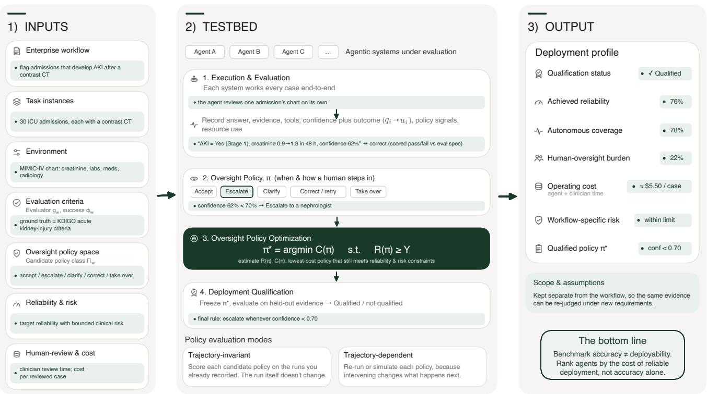
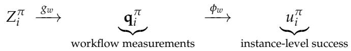
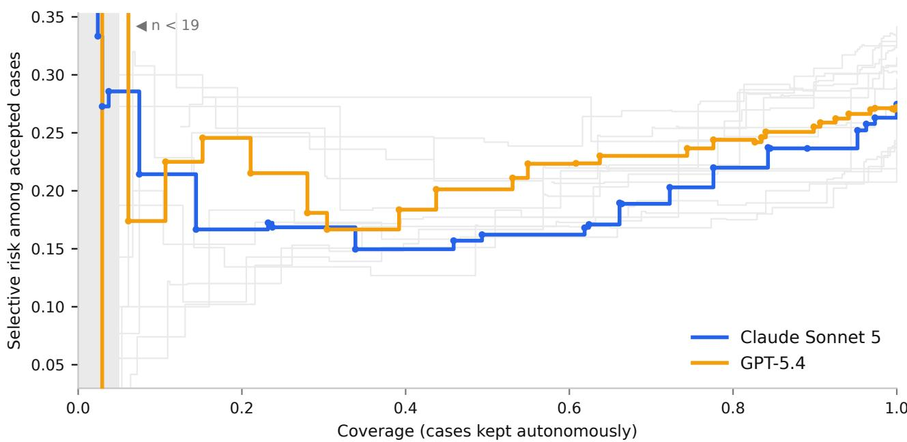
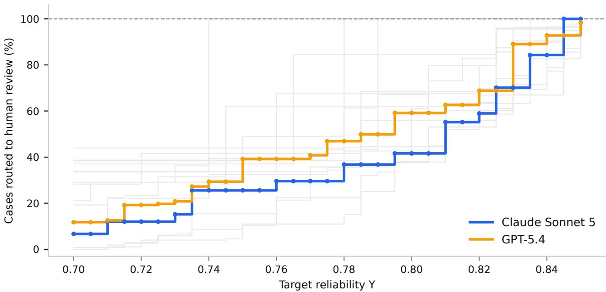

# READY or Not: Reliable Enterprise Agent Deployment

Veronica Chatrath\*1, Bryan Zhu\*1, Jingxuan Fan\*1, George Pu1, Soham Dinesh Tiwari1, Soham Dan1, Ryan Young1, Yuan (Christy) Li1, Yuang Yao1, Apaar Shanker1, Minglai Yang1, Daniel Yue Zhang1, Yunzhong He1, Ying Liu1, Chenguang Wang1,2, Zhijun Yin1,3, Yuan (Emily) Xue1

1Scale AI, 2University of California, Santa Cruz, 3Vanderbilt University Medical Center, \*Co-first authors.

veronica.chatrath@scale.com, yuan.xue@scale.com | https://scale.com/research

## Abstract

An AI agent can perform well on benchmarks and still be unsuitable for deployment. Existing AI-agent benchmarks primarily measure whether an agent can complete realistic professional work, whereas enterprise deployment requires asking a different question: whether an agent can meet a required reliability level, under an acceptable level of human oversight, and at a tolerable cost. We introduce Reliable Enterprise Agent Deployment (READY), an evaluation framework for qualifying AI agents for deployment on concrete enterprise workflows. READY preserves each workflow’s own definition of successful execution while applying a common deploymentqualification procedure. Given an agent, a workflow, and a class of candidate oversight policies, READY measures the reliability and operating cost of the human-AI system, selects the minimumcost policy that satisfies a specified reliability target, and statistically qualifies the selected policy on held-out cases. The deployment profile characterizes the operating point supported by the evidence, including reliability, human-oversight burden, and cost. READY is implemented as an open testbed that decouples workflow specification, execution, evaluation, and deployment qualification, and runs on existing agent-evaluation infrastructure. In an end-to-end clinical-audit case study spanning 16 agent systems and 750 cases, READY reveals deployment differences hidden by autonomous benchmark performance: two systems separated by only 0.3 percentage points in autonomous accuracy (72.8% vs. 72.5%) require 39.2% versus 29.6% human review, respectively, to qualify at the same 76% reliability target under the evaluated oversight policy. Systems with nearly identical autonomous performance can support substantially different reliability–oversight tradeoffs. Accordingly, READY shifts enterprise agent evaluation from asking only how well can the agent perform the work? to asking under what conditions, and at what cost, can it be reliably deployed? By making those conditions explicit and statistically testable, READY provides a practical basis for comparing agent systems, setting oversight requirements, and making evidence-based deployment decisions.

## 1 Introduction

Enterprises are starting to hand real professional work to AI agents that reason over domain knowledge, use tools, and carry out multi-step tasks. A growing number of benchmarks evaluate these capabilities on professional workflows [1–3], scoring whether an agent can complete the task and how good the result is. These benchmarks mainly answer an important question about capability. However, whether to deploy an agent is a different question. An organization rarely needs an agent to work unattended. Rather, it deploys a system in which some work may be handled autonomously while other work is reviewed, corrected, approved, or taken over by humans. A more relevant question is not how often the agent succeeds on its own, but whether the human–AI system around it can achieve the reliability a particular workflow requires, how much human oversight that takes, and what the operating policy costs. An agent that is right on 80% of cases is not, by that fact alone, ready or unready to deploy. What matters is whether the wrong 20% can be identified and sent to a human, and how much that review adds to the cost of running the system.

We introduce Reliable Enterprise Agent Deployment (READY), a framework for turning workflow-level evaluation evidence into a deployment qualification. READY takes as input an agent, an enterprise workflow, a set of representative cases, and a class of candidate oversight policies. Each workflow retains its own definition of successful execution, including outcome correctness, process requirements, evidence grounding, policy adherence, and other requirements appropriate to that form of work. READY then evaluates the human–AI system under candidate oversight policies and asks which policy can satisfy a specified reliability target at minimum operating cost.

## Professional-work benchmarks ask how well an agent can do the work autonomously. READY asks under what conditions, and at what cost, an organization can reliably deploy it.

At its core, READY casts deployment qualification as a constrained optimization problem over a class of oversight policies. For each workflow, the evaluator maps a multidimensional set of deploymentrelevant criteria into a measure of successful execution, while the oversight policy specifies the points at which human intervention may occur. Agent executions on representative cases provide the empirical evidence for estimating the reliability and operating cost induced by each candidate policy. READY then searches the policy class for the lowest-cost operating policy that satisfies a specified reliability target and any additional deployment constraints. The selected policy is frozen and statistically qualified on held-out cases not used during policy selection. The resulting deployment profile characterizes the reliability, oversight burden, cost, and workflow-specific risk of the qualified human–AI configuration.

We use a retrospective clinical-audit workflow [4] as a running case study to illustrate READY end to end. In this setting, an agent receives a longitudinal patient record and a clinical audit question, such as whether an ICU patient developed acute kidney injury within 48 hours of a CT scan. It must identify the relevant evidence in the record, apply the governing clinical standard, and return a verdict together with a stated confidence. A capability benchmark stops at the verdict and scores it. However, deployment requires an additional decision: which completed audits can be accepted automatically and which should be escalated to a clinician. That oversight policy, rather than raw verdict accuracy alone, determines the reliability of the human–AI system, the review burden it imposes, and its operating cost.

Across 16 agent systems and 750 cases, the deployment profiles reveal differences that autonomous benchmark performance alone does not. For example, two systems separated by only 0.3 percentage points in autonomous accuracy (GPT-5.4’s 72.8% versus Sonnet 5’s 72.5%) require 39.2% versus 29.6% human review, respectively, to qualify at the same 76% reliability target under the evaluated oversight policy. More generally, the reliability–oversight frontier shows that systems with similar autonomous performance can support substantially different operating points. On a conventional leaderboard, the two systems appear nearly identical, yet their deployment costs differ substantially.

What READY adds. READY complements rather than replaces existing agent evaluations. Capability and work-product benchmarks [1–3] measure the quality of agent execution but do not determine an operating point for a deployed human–AI system. The passk metric of τ-bench [5] measures consistency across repeated attempts but does not incorporate human oversight or operating cost. Cost-aware routing and cascades [6, 7] optimize quality–cost tradeoffs by routing among models, while selective prediction and learning-to-defer study when a model should abstain or pass a case to a human [8]. READY brings these ideas into a workflow-level deployment setting: it evaluates the reliability and cost of the complete human–AI system, optimizes an oversight policy against an explicit reliability requirement, and statistically qualifies the selected operating point on held-out evidence. It reuses the evidence produced by existing workflow evaluations instead of displacing them.

An open, extensible testbed. To support heterogeneous enterprise workflows, READY separates workflow-specific definitions of successful work from a common deployment-qualification procedure. We implement READY as an open, extensible testbed built on existing agent-evaluation infrastructure [9]. Workflows may differ in their task populations, execution environments, evaluation criteria, and forms of oversight while sharing the same qualification abstraction. We provide a seed workflow to demonstrate complete end-to-end use of this interface, and new workflows, cases, environments, and evaluators can be contributed while retaining their own standards of correct work.

Our contributions are as follows.

1. A deployment-centered evaluation objective. We formulate agent deployment as evaluation of a human–AI system under an oversight policy, moving from the question of how well an agent performs autonomously to which policy can meet a workflow-specific reliability requirement and at what operating cost (Section 2).

2. A method for optimizing and statistically qualifying oversight. READY selects a minimum-cost oversight policy subject to a reliability target and qualifies the frozen policy on held-out data. The deployment profile characterizes the reliability–oversight–cost operating point supported by the evidence, not autonomous capability alone (Section 3).

3. An open evaluation interface and end-to-end empirical instantiation. We provide an extensible interface that separates workflow evaluation from deployment qualification and instantiate it on a retrospective clinical-audit workflow [4] across 16 agent systems and 750 cases, demonstrating that similar autonomous performance can correspond to substantially different reliability–oversight tradeoffs (Sections 4–5).

## 2 Design Overview

We now formalize the READY deployment-qualification problem, which asks whether an agent can be deployed reliably and economically on a concrete enterprise workflow. For a given workflow and agent, READY evaluates the human–AI system induced by an oversight policy, π. The policy specifies when the

  
Worked example throughout (green): post-contrast-CT acute kidney injury (AKI) safety review  
Figure 1. Reliable Enterprise Agent Deployment (READY) takes as input a specification defining the workflow, representative task instances, execution environment, evaluation semantics, oversight policy class, and deployment requirements. Within the testbed, multiple agentic systems can be evaluated against the same specification. For each system, READY proceeds through three phases: (1) agent execution and workflow evaluation generate instance-level execution evidence; (2) oversight policy optimization selects the lowest-cost policy satisfying the specified reliability and risk constraints; and (3) statistical qualification freezes the selected policy and evaluates it on held-out cases. The output is a deployment profile for each evaluated system, characterizing the reliability, human-oversight burden, operating cost, and workflow-specific risk supported by the evidence under the stated deployment assumptions.

agent may operate autonomously and when human intervention may be introduced. Depending on the workflow, intervention may occur after a completed result or during execution through review, approval, clarification, correction, retry, escalation, or takeover. At a high level, READY separates three phases:

## Workflow Evaluation −→ Policy Optimization −→ Deployment Qualification.

Workflow evaluation defines and measures what constitutes successful execution for a particular form of professional work. Policy optimization uses this evidence to select, from a specified class of oversight policies, the lowest-cost policy that satisfies the deployment requirements. Deployment qualification then freezes the selected policy and statistically evaluates it on held-out evidence. The output of this process is a deployment profile describing the reliability–oversight–cost operating point supported by the evidence under the stated deployment assumptions. Figure 1 summarizes the end-to-end process.

## 2.1 Evaluation Setting and Reliable Deployment Objective

A workflow, $w ,$ denotes a reusable type of enterprise work. Let $E _ { w }$ denote the execution environment associated with workflow $w ,$ including the tools, data interfaces, systems, and interaction capabilities available during execution. A task instance, $x ,$ specifies one concrete case on which the workflow is performed. It contains the inputs made available to the agent, together with the reference material and ground truth required to evaluate that instance. Let $\mathcal { D } _ { w }$ denote the population distribution over task instances of the workflow. An evaluation set, $S _ { w } ,$ is a finite sample of instances,

$$
S _ { w } = \{ x _ { i } \} _ { i = 1 } ^ { N _ { w } } , \qquad x _ { i } \overset { \mathrm { i i d } } { \sim } \mathcal { D } _ { w } .\tag{1}
$$

Let m denote the evaluated agent. Executing m on task instance, $x _ { i } ,$ in environment, $E _ { w } ,$ under oversight policy, π, produces a trajectory:

$$
Z _ { i } ^ { \pi } = { \mathrm { E x e c u t e } } ( m , x _ { i } , E _ { w } ; \pi ) .\tag{2}
$$

The trajectory contains the final work product and the observable evidence needed to evaluate the work, including, when relevant, retrieved evidence, tool interactions, intermediate artifacts, interventions, state changes, and resource use. If the agent, environment, or human oversight is stochastic, $Z _ { i } ^ { \pi }$ and all derived quantities are random variables under the corresponding deployment process.

Each workflow defines a workflow-specific evaluator, $g _ { w } ,$ that maps a trajectory to a vector of measurements:

$$
\begin{array} { r } { \mathbf q _ { i } ^ { \pi } = g _ { w } ( Z _ { i } ^ { \pi } ) , } \end{array}\tag{3}
$$

where $\mathbf { q } _ { i } ^ { \pi }$ may characterize both the final outcome and relevant aspects of the execution process, such as evidence use, adherence to required procedures, or compliance with applicable policies. The workflow also defines a pre-specified workflow-success predicate, $\phi _ { w }$ :

$$
u _ { i } ^ { \pi } = \phi _ { w } ( \mathbf { q } _ { i } ^ { \pi } ) \in \{ 0 , 1 \} ,\tag{4}
$$

where $u _ { i } ^ { \pi } = 1$ indicates that final outcome and any required process or policy conditions are satisfied on instance i. The vector $\mathbf { q } _ { i } ^ { \pi }$ retains multidimensional diagnostic information about the execution, while $u _ { i } ^ { \pi }$ is an instance-level execution outcome used to define deployment reliability.

This separation distinguishes measurement from qualification: $g _ { w }$ determines what aspects of the work are measured, while $\phi _ { w }$ specifies which combination of those measurements constitutes a successful execution. For professional workflows, the success predicate may require a conjunction of outcome correctness with selected process, grounding, or policy requirements, not final-answer correctness alone:

(5)

For agent m on workflow w under oversight policy $\pi ,$ we define deployment reliability as

$$
R _ { m , w } ( \pi ) = \mathbb { E } _ { x \sim \mathcal { D } _ { w } } { } ^ { 1 } \left[ u ^ { \pi } ( x ) \right] .\tag{6}
$$

Let $K _ { w } ( Z ^ { \pi } )$ denote the workflow-specific operating cost associated with an execution under policy $\pi ,$ including agent execution cost and the cost of human oversight. The expected operating cost is

$$
\begin{array} { r } { C _ { m , w } ( \pi ) = \operatorname { \mathbb { E } } _ { x \sim \mathcal { D } _ { w } } \left[ K _ { w } ( Z ^ { \pi } ) \right] . } \end{array}\tag{7}
$$

READY then casts oversight-policy selection as a constrained optimization problem over a candidate policy class $\Pi _ { w }$ . Given a target reliability Y, and optionally a workflow-specific risk tolerance $B _ { w } ,$ define the feasible set

$$
\begin{array} { r } { \mathcal { F } _ { m , w } ( Y , B _ { w } ) = \{ \pi \in \Pi _ { w } : R _ { m , w } ( \pi ) \geq Y , \rho _ { w } ( L _ { w } ( Z ^ { \pi } ) ) \leq B _ { w } \} , } \end{array}\tag{8}
$$

where $L _ { w }$ is a workflow-specific deployment loss and $\rho _ { w }$ is a corresponding risk functional. The risk constraint is optional; when mean reliability is sufficient, it is inactive, equivalently $B _ { w } = + \infty$ . For workflows in which the severity or concentration of failures matters, $\rho _ { w }$ may instead represent a chance constraint or a tail-risk measure such as Conditional Value at Risk (CVaR).

If $\mathcal { F } _ { m , w } ( Y , B _ { w } ) = \emptyset .$ , no policy in the evaluated policy class supports the requested deployment operating point. Otherwise, READY selects the lowest-cost feasible policy:

$$
\left| \pi _ { m , w } ^ { \star } ( Y , B _ { w } ) \in \arg \operatorname* { m i n } _ { \pi \in \mathcal { F } _ { m , w } ( Y , B _ { w } ) } C _ { m , w } ( \pi ) . \right|\tag{9}
$$

Importantly, Equation 9 defines policy selection, not statistical qualification. The policy is selected using development evidence, then frozen and evaluated on held-out qualification data to determine whether the requested reliability and any additional deployment constraints are statistically supported. Section 3 develops the estimation of reliability, operating cost, risk, and statistical qualification in detail.

## 2.2 End-to-End READY Flow

Figure 1 organizes READY around its inputs, three evaluation phases, and resulting deployment profiles. The input to READY is a specification defining the workflow, its task instances, associated execution environment, oversight policy class and evaluation criteria, including both the workflowspecific evaluator and the instance-level success criterion. Within the READY testbed, a set of agentic systems is evaluated against this specification. For each system, READY executes and evaluates the workflow, optimizes an oversight policy, and statistically qualifies the selected policy on held-out cases. The output is a deployment profile for each evaluated system.

Inputs: specification. READY begins from declarative specifications that define the deployment question to be evaluated. The workflow specification identifies the workflow $w ,$ task population $\mathcal { D } _ { w } ,$ sampled evaluation instances $S _ { w } ,$ , and execution environment $E _ { w }$ . The evaluation specification defines the workflow evaluator $g _ { w } ,$ the workflow-success predicate $\phi _ { w } ,$ and the observable signals or state available to oversight policies. The deployment specification defines the candidate policy class $\Pi _ { w } ,$ target reliability $\boldsymbol { Y } ,$ human-oversight model, operating-cost model, and any workflow-specific risk tolerance. Keeping these specifications separate allows the same workflow evidence to be interpreted under different deployment requirements.

Phase 1: agent execution and workflow evaluation. READY can evaluate multiple agent systems m against the same deployment specification, producing comparable deployment profiles for each. For each evaluated system m and task instance $x _ { i } ,$ READY executes the agent in the workflow environment $E _ { w }$ and records the trajectory $Z _ { i } ,$ including the final work product, tool interactions, retrieved evidence, intermediate artifacts, interventions, and resource use. The workflow evaluator maps this trajectory into workflow-specific measurements, $Z _ { i } \xrightarrow { g _ { w } } \mathbf { q } _ { i } ,$ , and the success predicate maps those measurements into an instance-level success outcome, $\mathbf { q } _ { i } \xrightarrow { \phi _ { w } } u _ { i }$ . The resulting evidence also includes policy-observable signals and cost measurements needed to evaluate candidate oversight policies.

Phase 2: oversight policy optimization. Using development evidence, READY estimates the reliability, operating cost, and any workflow-specific risk induced by candidate policies in $\Pi _ { w }$ . It then selects the lowest-cost policy satisfying the specified deployment constraints:

$$
\pi ^ { \star } \in \arg \operatorname* { m i n } _ { \pi \in \Pi _ { w } } C ( \pi ) \quad \mathrm { s u b j e c t } \mathrm { t o } \quad R ( \pi ) \geq Y ,
$$

together with any additional risk constraint. When oversight is trajectory-invariant, such as terminal accept-or-escalate review, candidate policies can be evaluated by replaying saved execution evidence. When oversight is trajectory-dependent, intervention changes what happens next, candidate policies must be executed or simulated in the runtime.

Phase 3: deployment qualification. Policy optimization alone does not establish deployability. After the policy $\pi ^ { \star }$ is selected, READY freezes it and evaluates the human–AI system on held-out qualification cases not used during policy selection. Deployment qualification is granted only when the held-out evidence statistically supports the specified reliability target and any additional deployment constraints.

Output: deployment profiles. The output of READY is a set of deployment profiles, one for each evaluated agentic system. A deployment profile reports the qualified policy, qualification status, achieved reliability and statistical confidence, human-oversight burden, operating cost, workflow-specific risk, and the scope and assumptions under which the profile holds. The deployment profile connects benchmark evidence to an operational decision: whether, and under what oversight policy, the agent can be deployed at the required level of reliability and cost.

Section 3 develops the qualification methodology in detail, while Section 4 describes the evaluation runtime and open interfaces used to implement this architecture across enterprise workflows.

## 2.3 Running Example: Retrospective Clinical Audit

Throughout the paper, we use a retrospective clinical-audit workflow from CliniCARE-Bench [4] as a running example to instantiate the READY framework.

In CliniCARE-Bench, for each patient-specific case, an agent receives a concise clinical-audit question and access to a longitudinal patient record. It must determine what evidence is needed, retrieve and reconcile that evidence, apply the relevant clinical or operational standard, and produce an auditable adjudication.

In READY notation, retrospective clinical audit defines the workflow w. A task instance $x _ { i }$ consists of a clinical-audit question paired with the relevant patient record and, where applicable, a particular encounter or clinical event. The environment $E _ { w }$ provides patient-scoped access to structured and free-text EHR data through clinically meaningful retrieval tools, together with facilities for explicit computation and access to governing policy documents.

Executing agent m on case $x _ { i }$ produces a complete evaluation run. The final report contains one of four verdicts—Yes, No, Indeterminate: Lack of Data, or Indeterminate: Medically Ambiguous—together with supporting patient- and policy-evidence citations and a stated confidence $s _ { i } .$ The recorded trajectory $Z _ { i }$ additionally contains observable investigation evidence such as tool calls, retrieved information, computations, and intermediate artifacts.

For example, one scenario asks whether an ICU patient developed acute kidney injury within 48 hours after a CT scan. The agent must establish baseline creatinine using a specified hierarchy, identify the CT execution time, inspect the relevant post-CT creatinine trajectory, check chronic dialysis and ESRD (end-stage renal disease) status, apply the KDIGO [10] creatinine criteria, and cite the record evidence supporting the resulting verdict. The evaluation needs to inspect whether the agent retrieved the necessary evidence, used the appropriate temporal window and clinical rule, and avoided unsupported shortcuts. The workflow illustrates why professional-work evaluation may need to measure more than final-answer correctness alone.

The workflow evaluator, $g _ { w } ,$ , measures multiple aspects of the observable execution, including verdict correctness, appropriate abstention, evidence grounding, policy grounding, and adherence to scenariospecific investigation requirements. The workflow-success predicate, $\phi _ { w } ,$ specifies which of these measurements are required for an execution to count as successful. For example, an illustrative processaware success definition may take the form

$$
u _ { i } = { \bf 1 } \{ \mathrm { v e r d i c t ~ c o r r e c t }  \wedge \mathrm { n o ~ d i s q u a l i f y i n g ~ p r o c e s s ~ d e f e c t } \} .\tag{10}
$$

The clinical-audit case study uses a terminal accept-or-escalate policy class. Here, the agent’s stated confidence $s _ { i }$ is recorded as the policy-observable signal, and the oversight policy is defined based on how that signal is used to route a completed adjudication between autonomous acceptance and human review. Confidence is therefore a property of this particular policy instantiation, not a requirement of the general READY framework.

Because the routing decision occurs only after the agent has completed the audit, changing the policy does not change the underlying agent trajectory $Z _ { i }$ . The execution evidence is trajectory-invariant, allowing multiple candidate oversight policies to be evaluated from the same saved runs.

Given a reliability target and deployment assumptions about human-review effectiveness and operating cost, READY uses this evidence to select an oversight policy and then statistically qualify the frozen operating point. The clinical-audit workflow provides a concrete instance of the trajectory-invariant policy-evaluation setting developed more fully in Section 3.

## 3 Oversight Policy Optimization and Deployment Qualification

Section 2 formulated reliable deployment as a constrained optimization problem over oversight policies. We now develop the quantities, policy-optimization procedures, and statistical qualification methods needed to operationalize that formulation.

The key distinction is between agent performance and deployed-system reliability. An oversight policy determines how autonomous agent execution is combined with human intervention. Its value depends not only on how often the agent succeeds on its own, but also on how effectively the policy uses observable workflow information to introduce oversight, how effective that oversight is, and what it costs.

We first develop the trajectory-invariant terminal accept-or-escalate setting, where many candidate policies can be evaluated from the same saved execution evidence. We then describe statistical qualification of a selected policy on held-out cases and extend the formulation to trajectory-dependent oversight, where intervention changes the execution trajectory itself.

## 3.1 Qualification Quantities

For agent $m ,$ workflow w, and oversight policy $\pi ,$ let $u ^ { \pi } \in \{ 0 , 1 \}$ denote the workflow-specific success event defined in Section 2.1. The event $u ^ { \pi }$ records whether an individual workflow execution under policy π satisfies the pre-specified success criterion.

We define the reliability of the human–AI system as

$$
R _ { m , w } ( \pi ) = \mathbb { E } _ { x \sim \mathcal { D } _ { w } } \left[ u ^ { \pi } ( x ) \right] ,\tag{11}
$$

where $u ^ { \pi } ( x ) \in \{ 0 , 1 \}$ denotes whether execution on workflow instance x satisfies the workflow-specific success criterion. The expectation is over workflow instances x drawn from the population represented by $\mathcal { D } _ { w }$ and, when execution is stochastic, over the induced randomness in agent execution, the environment, oversight process, and interacting actors. Since $u ^ { \pi } ( x )$ is binary, $R _ { m , w } ( \pi )$ is the probability that an execution under policy π satisfies the workflow-specific success criterion on a randomly drawn workflow instance. Deployment qualification is an aggregate statistical claim about the human–AI system induced by $\pi ,$ not a property assigned to any individual task instance.

Let $K _ { w } ( Z ^ { \pi } )$ denote the workflow-specific operating cost associated with an execution under policy π. This may include agent execution as well as human review and intervention. The expected operating cost is

$$
C _ { m , w } ( \pi ) = \mathbb { E } [ K _ { w } ( Z ^ { \pi } ) ] .\tag{12}
$$

Conceptually, this cost can be decomposed into agent and human components, where both terms may depend on $\pi ,$ as intervention may increase human effort while changing the subsequent agent execution.

$$
C _ { m , w } ( \pi ) = C _ { \mathrm { a g e n t } } ( m , w , \pi ) + C _ { \mathrm { h u m a n } } ( m , w , \pi ) ,\tag{13}
$$

Equations 11 and 12 define the two canonical quantities in the deployment objective of Equation 9. They are properties of the deployed human–AI configuration under a specified policy, not intrinsic properties of the agent alone.

## 3.2 Terminal Accept-or-Escalate Oversight

We first consider the trajectory-invariant terminal accept-or-escalate setting used in our clinical-audit case study. In this setting, the agent completes its work before an oversight decision is made. The completed execution provides a result together with an observable routing signal $s _ { i } ;$ the policy then determines whether the result is accepted autonomously or routed to a declared human-review path.

To evaluate such policies, READY first executes the agent on representative workflow instances under autonomous execution. For each task instance $x _ { i } ,$ this produces a saved trajectory $Z _ { i } ,$ an observable routing signal $s _ { i } ,$ and an autonomous-success indicator $u _ { i } \in \{ 0 , 1 \}$

Here, $\left( Z _ { i } , s _ { i } , u _ { i } \right)$ are evaluation data used for policy qualification; at deployment time, the routing decision is made from observable information such as $s _ { i } ,$ while $u _ { i }$ is generally unknown.

Because the terminal routing decision occurs only after $Z _ { i }$ has been generated, the trajectory is invariant to the candidate routing policy. READY can evaluate many accept-or-escalate policies by replaying the same saved evaluation runs instead of re-executing the agent for every candidate policy.

For a scalar routing signal $s _ { i } ,$ consider a threshold policy $\pi _ { \tau }$ that accepts the completed result autonomously when $s _ { i } \geq \tau$ and routes it to human review otherwise. We assume that larger values of $s _ { i }$ indicate greater likelihood of successful autonomous execution, so that $s _ { i }$ provides a meaningful ordering of cases for selective routing. The formal routing assumption is given in $\mathrm { A } _ { \cdot }$ ppendix $\mathrm { A . 1 }$ . The autonomous coverage under threshold τ is

$$
c ( \tau ) = \operatorname* { P r } ( s \geq \tau ) ,\tag{14}
$$

and its corresponding human-review rate is

$$
e ( \tau ) = 1 - c ( \tau ) .\tag{15}
$$

Coverage is useful in this terminal setting because it is simply the complement of review burden; it is not required as a universal READY deployment metric. Among autonomously accepted cases, define

$$
a ( \tau ) = \operatorname* { P r } ( u = 1 \mid s \geq \tau ) ,\tag{16}
$$

the success probability of work accepted without review.

Let $a _ { h } ( \tau )$ denote the probability that a case routed by policy $\pi _ { \tau }$ is successfully resolved by the declared human-review path. The reliability of the deployed human–AI system is then

$$
R ( \tau ) = c ( \tau ) a ( \tau ) + { \bigl ( } 1 - c ( \tau ) { \bigr ) } a _ { h } ( \tau ) .\tag{17}
$$

The first term corresponds to work accepted autonomously; the second corresponds to work routed to human review.

The review-path performance $a _ { h } ( \tau )$ can be either measured from the review process or introduced as a deployment assumption. It is important to note that because routing deliberately selects a non-random subset of cases, $a _ { h } ( \tau )$ may vary with the policy: cases routed under a more selective policy may be systematically more difficult than cases routed under another policy. When a constant review-success assumption $a _ { h }$ is available, Equation 17 reduces to

$$
R ( \tau ) = c ( \tau ) a ( \tau ) + ( 1 - c ( \tau ) ) a _ { h } .\tag{18}
$$

This formulation makes clear why autonomous benchmark performance does not determine deployment reliability. Two agents with similar autonomous success rates can support substantially different human– AI operating points because the oversight policies available to them may differ in how effectively they identify cases requiring intervention.

## 3.3 Cost at a Target Reliability

In terminal accept-or-escalate deployment, the agent has already executed before the routing decision is made. Let $k _ { m }$ denote its expected execution cost per case and let $k _ { h }$ denote the incremental cost of the declared human-review path. Under a constant-cost approximation,

$$
C ( \tau ) = k _ { m } + k _ { h } e ( \tau ) = k _ { m } + k _ { h } \big ( 1 - c ( \tau ) \big ) .\tag{19}
$$

For target reliability Y, the population-level policy optimization problem is

$$
\tau ^ { \star } ( Y ) = \arg \operatorname* { m i n } _ { \tau } C ( \tau ) \qquad \mathrm { s u b j e c t } \ \mathrm { t o } \qquad R ( \tau ) \geq Y ,\tag{20}
$$

together with any additional workflow-specific risk constraint.

Equation 20 defines the ideal population operating point. In practice, $R ( \tau )$ and $C ( \tau )$ are unknown and policy selection is performed using development evidence. Let $\widehat { R } _ { \mathrm { d e v } } ( \tau )$ and $\widehat { C } _ { \mathrm { d e v } } ( \tau )$ denote the corresponding development-set estimates. A generic development-stage selection rule takes the form

$$
\widehat { \tau } \in \mathop { \mathrm { a r g } } \mathop { \operatorname* { m i n } } _ { \tau } \widehat { C } _ { \mathrm { d e v } } ( \tau ) \qquad \mathrm { s u b j e c t ~ t o } \qquad \widehat { R } _ { \mathrm { d e v } } ( \tau ) \geq Y _ { \mathrm { s e l } } ,\tag{21}
$$

where $Y _ { \mathrm { s e l } }$ is a pre-specified development-stage selection criterion. It may equal the deployment target Y or incorporate a pre-specified margin or other conservative selection rule.

READY does not require a particular optimization algorithm or development-stage selection rule. What is required for qualification is that all policy choices be made without using the held-out qualification cases. The selected policy πb is subsequently frozen and evaluated against the actual deployment target Y as described in Section 3.5.

When $k _ { m }$ and $k _ { h } > 0$ are constant, minimizing operating cost is equivalent to minimizing human-review burden, or equivalently maximizing autonomous coverage, among feasible policies. Writing

$$
e ^ { \star } ( Y ) = e ( \tau ^ { \star } ( Y ) ) ,\tag{22}
$$

the population cost of reliable deployment is

$$
C ^ { \star } ( Y ) = k _ { m } + k _ { h } e ^ { \star } ( Y ) .\tag{23}
$$

This provides an economically meaningful basis for comparing systems: how much operating cost is required for each system to satisfy the same workflow-specific reliability requirement.

The constant-cost model is useful for exposition but is not required by READY. Review effort may vary substantially across cases, and different policies may trigger different forms of review, correction, or escalation. When case-level costs are available, READY estimates $C ( \pi )$ directly from the costs induced by the candidate policy instead of assigning a single constant $k _ { h }$ to every reviewed case.

## 3.4 Quality of the Routing Signal

For terminal accept-or-escalate policies, the value of oversight depends in part on whether the routing signal identifies cases for which autonomous execution is likely to fail. A useful signal should rank higher-risk cases below lower-risk cases, allowing a more selective policy to remove failures from autonomous handling preferentially.

A natural diagnostic is the selective-risk curve,

$$
r ( \tau ) = \operatorname* { P r } ( u = 0 \mid s \geq \tau ) ,\tag{24}
$$

or equivalently $r ( c )$ when operating points are indexed by autonomous coverage. Sweeping the routing threshold traces the risk–coverage relationship: a stronger routing signal achieves lower selective risk at the same autonomous coverage.

We summarize this curve using the area under the risk–coverage curve (AURC),

$$
\mathrm { A U R C } = \int _ { 0 } ^ { 1 } r ( c ) d c ,\tag{25}
$$

with lower values indicating a more favorable risk–coverage tradeoff.

AURC is influenced both by routing quality and by the base autonomous success rate $a _ { 0 } = \operatorname* { P r } ( u = 1 )$ We also report the AUROC of the routing signal s for predicting execution success u. AUROC measures ranking discrimination and, unlike ${ \mathrm { A U R C } } ,$ is not directly determined by the prevalence of successful executions.

These metrics are diagnostics for the terminal routing policy class rather than universal READY qualification quantities. Their practical importance is ultimately determined by the operating policies they support: at a fixed reliability target, better routing can reduce the amount of human intervention, and the operating cost, required for qualification.

## 3.5 Statistical Qualification

Optimizing an oversight policy on development evidence does not establish that the selected policy will satisfy its deployment requirements on future cases. READY separates policy selection from statistical policy qualification.

The evaluation sample $S _ { w }$ is partitioned by disjoint index sets $I _ { \mathrm { d e v } } , I _ { \mathrm { q u a l } } \subseteq \left[ N _ { w } \right]$ into a development set $S _ { \mathrm { d e v } } = \{ x _ { i } : i \in I _ { \mathrm { d e v } } \}$ and a held-out qualification set $S _ { \mathrm { q u a l } } = \{ x _ { i } : i \in \dot { I } _ { \mathrm { q u a l } } \}$ . All choices that determine the policy—including routing rule, threshold, optimization procedure, and any development-stage margin—are made using $S _ { \mathrm { d e v } }$ . The selected policy πb is then frozen before the qualification outcomes are examined.

For terminal accept-or-escalate oversight, let $\widehat { \tau }$ denote the threshold selected on the development set. For each qualification case $i ,$ define

$$
d _ { i } = \mathbf { 1 } \{ s _ { i } \geq { \widehat { \tau } } \} ,\tag{26}
$$

where $d _ { i } = 1$ denotes autonomous acceptance and $d _ { i } = 0$ denotes human review. The qualification set is used only to estimate the operating characteristics of this fixed policy, not to search for a better threshold.

Measured human-review outcomes. When the outcome of the declared human-review path is observed for each escalated case, let $h _ { i } \in \{ 0 , 1 \}$ denote whether that review path produces a successful result. The realized success of the deployed system on qualification case i is

$$
v _ { i } = d _ { i } u _ { i } + ( 1 - d _ { i } ) h _ { i } ,\tag{27}
$$

and the empirical deployment reliability is

$$
\widehat { R } ( \widehat { \pi } ) = \frac { 1 } { N _ { \mathrm { q u a l } } } \sum _ { i \in I _ { \mathrm { q u a l } } } v _ { i } , \qquad N _ { \mathrm { q u a l } } = | I _ { \mathrm { q u a l } } | .\tag{28}
$$

In the terminal setting, $v _ { i }$ is the realized policy-level success outcome corresponding to the general success event $u _ { i } ^ { \pi }$ in Section $3 . 1 ; u _ { i }$ here denotes the success of the autonomous execution before routing. When every policy-level outcome is observed and qualification cases are independent, $v _ { i }$ is binary and a one-sided binomial lower confidence bound can be computed directly. At confidence level $1 - \alpha _ { , }$ , READY qualifies the frozen policy only if

$$
R _ { \mathrm { L C B } } ^ { 1 - \alpha } ( { \widehat { \pi } } ) \geq Y .\tag{29}
$$

A point estimate above the target is not sufficient: the held-out evidence must support a reliability lower bound that itself clears the deployment requirement.

Human-review performance as a deployment assumption. In retrospective benchmark analysis, the declared human-review path may not be executed for every escalated case. Its effectiveness can instead be introduced explicitly as a deployment assumption. Suppose, for example, that every routed case is assumed to be successfully resolved with probability $a _ { h }$ . For each qualification case define the policy-level conditional success value

$$
y _ { i } ( a _ { h } ) = d _ { i } u _ { i } + ( 1 - d _ { i } ) a _ { h } \in [ 0 , 1 ] .\tag{30}
$$

Under the constant-review assumption, the population reliability of the fixed policy is

$$
R ( \widehat { \pi } ; a _ { h } ) = \mathbb { E } \left[ y _ { i } ( a _ { h } ) \right] ,\tag{31}
$$

This quantity is no longer a simple binomial proportion, because reviewed cases contribute an assumed success probability rather than an observed binary outcome. Writing $n _ { \mathrm { a c c } }$ for the number of accepted qualification cases and $\widehat { p } _ { \mathrm { a c c } }$ for the observed success rate among them, the empirical estimate can be written as

$$
\widehat { R } \big ( \widehat { \pi } ; a _ { h } \big ) = \frac { n _ { \mathrm { a c c } } } { N _ { \mathrm { q u a l } } } \widehat { p } _ { \mathrm { a c c } } + \frac { N _ { \mathrm { q u a l } } - n _ { \mathrm { a c c } } } { N _ { \mathrm { q u a l } } } a _ { h } ,\tag{32}
$$

in which only $\widehat { p } _ { \mathrm { a c c } }$ is estimated from observed outcomes.

For statistical qualification, however, both accepted-case success and the fraction of cases routed by the frozen policy vary across samples from the workflow population. READY constructs a one-sided lower confidence bound directly for the mean of the bounded case-level quantities $\{ y _ { i } ( a _ { h } ) \} _ { i \in I _ { \mathrm { q u a l } } }$ rather than treating the observed routing fraction as fixed. Denote this bound by

$$
R _ { \mathrm { L C B } } ^ { 1 - \alpha } \big ( \widehat { \pi } ; a _ { h } \big ) .\tag{33}
$$

The policy qualifies conditionally on the declared human-review assumption only if

$$
R _ { \mathrm { L C B } } ^ { 1 - \alpha } \big ( \widehat { \pi } ; a _ { h } \big ) \geq Y .\tag{34}
$$

The lower bound may be computed using a pre-specified valid procedure for the mean of bounded case-level outcomes. When cases are clustered, the qualification procedure operates at the corresponding cluster level as described below.

No statistical confidence is attributed to the assumed term. The qualification statement is explicitly conditional, of the form “qualified at target Y under the declared review assumption $a _ { h } . ^ { \prime \prime }$ For policy families whose contributions do not admit this decomposition, the same conditional bound is obtained by resampling qualification cases and re-evaluating the fixed policy on each resample. If $a _ { h }$ is itself estimated from separate human-review data, uncertainty in that estimate must also be propagated rather than treating $a _ { h }$ as known exactly; a conservative qualification replaces $a _ { h }$ with a one-sided lower confidence bound $a _ { h , \mathrm { L C B } }$ in Equation 34.

Break-even review assumption. Because qualification reliability $R _ { \mathrm { L C B } } ^ { 1 - \alpha } \big ( \widehat { \pi } ; a _ { h } \big )$ is nondecreasing in $a _ { h } ,$ the dependence on the human-review assumption can be summarized by a single quantity: the weakest review effectiveness under which the frozen policy still qualifies:

$$
a _ { h } ^ { \operatorname* { m i n } } \bigl ( \widehat { \pi } , Y \bigl ) = \operatorname* { i n f } \left\{ a _ { h } \in [ 0 , 1 ] : R _ { \mathrm { L C B } } ^ { 1 - \alpha } ( \widehat { \pi } ; a _ { h } ) \geq Y \right\} .\tag{35}
$$

The deployment profile can then state an auditable requirement on the human process: the selected policy qualifies at target Y provided the declared review path achieves effectiveness at least $a _ { h } ^ { \mathrm { m i n } }$

If no $a _ { h } \in [ 0 , 1 ]$ satisfies the criterion, the policy is reported as not qualified at target Y under any constant review-success assumption.

Sampling unit. The statistical sampling unit must match the unit over which the deployment claim is intended to generalize. Multiple stochastic executions of the same task instance are not treated as independent new workflow cases. When repeated runs are present, they are carried together at the task-instance level.

Similarly, when cases are naturally clustered by patient, customer, account, site, or another higher-level unit, qualification must preserve that dependence structure, for example by constructing confidence intervals or resampling at the cluster level.

A policy that fails the statistical criterion is reported as not qualified at target Y or as having insufficient evidence; it is not retuned using the qualification set. Any change to the policy πb after examining qualification outcomes requires a new held-out qualification evaluation.

Unless otherwise stated, READY qualification claims are pointwise for a pre-specified deployment target and frozen policy. Simultaneous statistical claims across multiple targets, policies, or operating points require an appropriate simultaneous-inference procedure.

## 3.6 Risk-Sensitive Qualification

Reliability treats every unsuccessful execution as the same binary event. For workflows in which failures differ materially in consequence, READY may additionally define a workflow-specific deployment loss

$$
L _ { w } ( Z ^ { \pi } ) \ge 0\tag{36}
$$

and impose the constraint

$$
\rho _ { w } ( L _ { w } ( Z ^ { \pi } ) ) \leq B _ { w } ,\tag{37}
$$

where $B _ { w }$ is the declared risk tolerance and $\rho _ { w }$ is a workflow-specific risk functional. Examples include a bound on the probability of a specified severe event or a tail-risk measure such as Conditional Value at Risk (CVaR).

This constraint is optional. The common READY objective remains reliable deployment at minimum operating cost; an additional risk constraint is introduced when binary success alone does not adequately represent the consequences of failure. Estimation and statistical qualification of risk-sensitive constraints are discussed further in Appendix A.2.

## 3.7 Trajectory-Dependent Oversight

The terminal formulation above is especially convenient because the routing decision does not change the saved agent trajectory. More general enterprise workflows allow intervention during execution.

Let $h _ { t }$ denote the observable workflow history at decision point t, and let

$$
\pi ( o _ { t } \mid h _ { t } )\tag{38}
$$

denote an oversight policy over intervention decisions $o _ { t } ,$ such as approval, correction or takeover. Executing the workflow under π induces a policy-dependent trajectory

$$
Z _ { i } ^ { \pi } \sim P ( { \bf \cdot } \mid m , x _ { i } , E _ { w } , \pi ) .\tag{39}
$$

The qualification objective remains the one defined in Equation 9. The difference is how the evidence needed to estimate that objective is generated.

For trajectory-invariant terminal policies, candidate policies can be evaluated by replaying saved trajectories under different routing rules. For a trajectory-dependent policy, changing π changes what the agent, oversight actor, or interacting user subsequently observes and does. Reliability, cost, and risk must instead be estimated by executing or appropriately simulating the candidate policy in the evaluation runtime.

The phases introduced in Section 2.2 should therefore be understood as a logical evaluation flow rather than necessarily a one-pass computation. For trajectory-dependent oversight, policy optimization may repeatedly invoke agent execution and workflow evaluation while searching over candidate policies.

Policy-in-the-loop evaluation may change both sides of the deployment tradeoff. Intervention can improve the probability of successful completion, but can also change agent execution length, human effort, recovery behavior, and the distribution of subsequent outcomes. These effects are captured by the same general quantities $R _ { m , w } ( \pi ) , C _ { m , w } ( \pi )$ , and, when applicable, $\rho _ { w } \big ( L _ { w } \big ( Z ^ { \pi } \big ) \big )$ .

This setting is naturally connected to simulation-based and black-box optimization, where objective and constraint values need not admit closed-form expressions and can instead be estimated through stochastic simulation or system execution [11, 12]. READY does not prescribe an optimization algorithm. The policy representation and optimization method may be workflow-dependent. What is shared across workflows is the deployment objective and qualification procedure: candidate policies are evaluated in terms of the reliability, cost, and risk of the resulting human–AI system, a policy is selected using development evidence, and the frozen policy is qualified on held-out evidence.

Empirical instantiation. Section 5 applies the qualification methodology above to CliniCARE-Bench. The analysis is conducted on the benchmark’s full four-way adjudication space using a signal-based accept-or-escalate policy that is agnostic to the class labels, with sensitivity analyses in Appendix B and a cost-of-conflation control in Appendix B.5.

## 4 READY Evaluation Runtime and Open Testbed

Sections 2 and 3 define what READY qualifies and how an oversight policy is selected. This section describes the execution and interface testbed that produces the evidence required by that methodology.

READY does not introduce a new general-purpose agent-evaluation harness. Its reference implementation uses Inspect AI [9] for task execution, agent integration, sandboxed environments, scoring, intervention, and evaluation logging. READY adds the workflow-level semantics and deployment-qualification layer needed to translate executions into a reliability–oversight–cost deployment profile.

## 4.1 Runtime Layering and Reference Execution Substrate

The implementation follows the three-layer architecture in Figure 1. Non-executing specification artifacts define the workflow, evaluation semantics, and deployment assumptions. The evaluation runtime instantiates these specifications and executes the agent, workflow environment, and any required oversight or user actors. The resulting execution evidence is evaluated and passed to the qualification methodology in Section 3.

READY standardizes the semantics and evidence that cross these boundaries without requiring every evaluation to share a task representation, agent implementation, environment technology, or grading mechanism, so existing evaluation infrastructure can be reused.

In the Inspect reference implementation, an executable evaluation is represented by an Inspect Task, which combines a collection of Samples with an agent or Solver, one or more Scorers, and the required runtime configuration. READY introduces the workflow and deployment semantics above these execution objects. The correspondence is an implementation mapping, not a one-to-one semantic equivalence.

## 4.2 Specification Interfaces

The runtime consumes three logically distinct classes of specification artifacts corresponding to Figure 1.

Workflow specification. The workflow specification identifies the reusable workflow, w, the taskinstance population, $\mathcal { D } _ { w } ,$ from which the evaluation sample, $S _ { w } ,$ is drawn, and the environment specification, $E _ { w }$ . It defines the work to be performed and the population for which the evaluation provides evidence. A concrete task instance, $x _ { i } ,$ supplies the case-specific inputs for one execution.

READY does not require a second executable task format. In the Inspect reference implementation, a READY task instance is represented by an Inspect Sample, and a collection of task instances is represented by an Inspect Dataset. The enclosing Inspect Task specifies how those samples are executed and evaluated. This distinction is important: an READY task instance corresponds to an Inspect Sample, not to an Inspect Task.

Evaluation specification. The evaluation specification defines the workflow evaluator, $g _ { w } ,$ the workflow-success predicate, $\phi _ { w } ,$ and any routing signal exposed to an oversight policy.

It specifies the transformation $Z _ { i } ^ { \pi } \stackrel { g _ { w } } { \longrightarrow } { \bf q } _ { i } ^ { \pi } \stackrel { \phi _ { w } } { \longrightarrow } u _ { i } ^ { \pi }$ of Equation 5.

The mechanisms used to compute $\mathbf { q } _ { i } ^ { \pi }$ may be deterministic, human-annotated, model-assisted, or composed from multiple evaluation mechanisms. In Inspect, these computations can be implemented through one or more Scorers, including externally computed scores when appropriate. READY’s evaluator, $g _ { w } ,$ denotes the workflow-level semantics of what is measured; an Inspect Scorer is one executable mechanism for producing those measurements. The success predicate, $\phi _ { w } ,$ , remains an READYlevel definition that determines which measurements constitute acceptable execution for deployment qualification.

Deployment assumptions. Deployment assumptions remain separate from measured evaluation evidence. They include the reliability target, Y, the human-oversight model, operating-cost assumptions, and any workflow-specific risk tolerance. Different organizations may therefore interpret the same measured execution evidence under different deployment requirements.

The development and held-out qualification partitions required by Section 3.5 are versioned with the READY evaluation configuration. Instances used to select an oversight policy must remain separate from the instances used to qualify the frozen policy.

Table 1 summarizes the minimal logical interface required of an READY-compatible runtime and its reference realization in Inspect.

## 4.3 Execution, Actors, and Policy Evaluation

The evaluation runtime instantiates the workflow environment and executes agent m on task instance $x _ { i }$ under oversight policy π. The runtime is responsible for making the workflow-specified tools, data, systems, and interaction interfaces available while preserving the declared evaluation conditions.

Inspect provides the reference execution mechanisms for this layer. Agents may be implemented through native Inspect agents or solvers, or integrated from external agent frameworks through the Inspect Agent Bridge. Workflow-specific files and computational environments can be attached to individual samples and executed in controlled sandboxes. These implementation choices do not change the READY semantics of the workflow or trajectory.

For workflows requiring interaction, READY distinguishes two additional actor roles. An oversight actor represents an organization-side reviewer or operator who may approve, clarify, correct, reject, escalate, or take over work. A user actor represents an external user or counterparty interacting with the deployed system. Either actor may be human or simulated, but its identity, configuration, and available actions must be part of the evaluation configuration.

<table><tr><td>READY interface</td><td>Required semantics</td><td>Inspect reference realization</td></tr><tr><td>Task population</td><td>Represent the sampled workflow instances  $S _ { w } , x _ { i } \sim \mathcal { D } _ { w } ,$  with stable identifiers and required case inputs.</td><td>Dataset of Samples</td></tr><tr><td>Agent execution</td><td>Execute agent m on  $x _ { i }$  under the declared model, harness, and runtime configuration.</td><td>Agent or Solver; external agents through Agent Bridge</td></tr><tr><td>Workflow environment</td><td>Expose the tools, data, files, systems, and computational state specified by  $E _ { w } .$ </td><td>Task/sample tools and sandbox configuration</td></tr><tr><td>Oversight interaction</td><td>Allow policy π to approve, reject, clarify, intervene, escalate, or invoke another actor when the workflow requires it.</td><td>Approval policies, approver, agent intervention, or task-specific actors</td></tr><tr><td>Execution evidence</td><td>Preserve the observable evidence required to interpret  $Z _ { i } ^ { \pi } ,$  including the final work product and relevant interaction history.</td><td>Per-sample evaluation log, transcript, outputs, metadata, and retained artifacts</td></tr><tr><td>Workflow evaluation</td><td>Compute  $\mathbf { q } _ { i } ^ { \pi } = g _ { w } ( Z _ { i } ^ { \pi } )$  and retain the measurements used by the deployment criterion.</td><td>One or more Scorers or externally supplied scores</td></tr><tr><td>Qualification inputs</td><td>Expose  $u _ { i } ^ { \pi } .$  , routing signal  $s _ { i } ,$  resource/cost measurements, and the sampling identifiers required by READY qualifica- tion.</td><td>Scores, sample metadata, transcript/log fields, usage measurements, and</td></tr><tr><td>Evaluation lineage</td><td>Identify the workflow, case, agent, model, environment, evaluator, policy, and execution configuration associated with the evidence.</td><td>READY-derived records Task/Sample configuration and versioned evaluation logs</td></tr></table>

Table 1. Minimal logical interface for an READY-compatible evaluation runtime. READY defines the semantics required for deployment qualification; the rightmost column shows their reference realization in Inspect AI. Other execution substrates may implement the same interface using different native abstractions.

Inspect approval policies and agent-intervention mechanisms provide reference implementations for several forms of oversight. For example, approval policies can require selected tool calls to be approved, rejected, or escalated, while agent intervention permits a human operator to interrupt or redirect an executing agent. These mechanisms do not define the READY policy class $\Pi _ { w } ;$ they are runtime primitives through which particular policies may be implemented. Other forms of interaction may be realized through custom agents, solvers, or workflow-specific simulators.

## The runtime supports both policy-evaluation procedures introduced in Section 2.2.

For trajectory-invariant policies, the relevant agent execution is independent of the terminal routing decision. The runtime can therefore execute the agent once, preserve the resulting evidence, and evaluate multiple candidate policies by replaying the same completed executions. The accept-or-escalate analysis in Section 3.2 uses this path.

For trajectory-dependent policies, intervention changes what happens next. The candidate policy must participate in execution, and the runtime records the resulting policy-dependent trajectory $Z _ { i } ^ { \pi }$ . Reliability, cost, and risk for that policy must be estimated from executions or simulations performed under the policy itself.

## 4.4 Evaluation Evidence and Workflow Evaluation

Each execution produces a sample-level evaluation record containing the observable evidence required by the workflow evaluator and qualification analysis. READY does not introduce a separate universal trajectory format. Instead, $Z _ { i } ^ { \pi }$ denotes the workflow-relevant observable execution trajectory represented by the underlying runtime record.

In the Inspect reference implementation, evaluation logs preserve sample-level outputs, model and tool interactions, scoring information, metadata, usage information, and the execution transcript. For bridged agents, model interactions are likewise captured in the Inspect transcript. When human or automated interventions occur during execution, those interventions should remain part of the retained evidence.

The workflow evaluator applies $g _ { w }$ to this record to produce $\mathbf { q } _ { i } ^ { \pi } .$ , and the pre-specified predicate $\phi _ { w }$ derives the corresponding success event $u _ { i } ^ { \pi }$ . Diagnostic measurements remain available independently of this binary success event. For example, a workflow may retain outcome correctness, evidence grounding, process adherence, appropriate abstention, and resource use even when only a subset of those measurements enters $\phi _ { w }$

Inspect’s scoring interface supports multiple workflow measurements without requiring them to be collapsed into a single benchmark score. Where the saved execution record contains sufficient evidence, an updated evaluator can also be applied to an existing evaluation log without re-executing the agent.

For workflows requiring repeated stochastic execution, the same logical task instance may be executed for multiple epochs. READY retains the underlying task-instance identity and epoch-level evidence so that repeated runs are not treated as independent task instances during statistical qualification.

Running example: CliniCARE-Bench. For CliniCARE-Bench, each case is represented as an evaluation sample whose execution record contains the completed clinical adjudication, supporting patient- and policy-evidence citations, the case-level routing signal, and the observable investigation trajectory, including retrieved evidence, tool calls, computations, and intermediate artifacts. The CliniCARE evaluator derives verdict and process measurements from this record and applies the workflow-specific success predicate before the resulting evidence is passed to READY qualification.

## 4.5 Qualification Handoff and Deployment Profile

The boundary between workflow evaluation and deployment qualification is an evidence interface rather than a new task evaluator. The qualification layer consumes measured execution evidence together with declared deployment assumptions and applies the methodology in Section 3.

For the trajectory-invariant accept-or-escalate case, the minimal qualification record for task instance i contains the workflow-defined success event $u _ { i } ,$ the observable routing signal $s _ { i } ,$ and the execution or resource measurements required by the cost model. It also retains the identifiers needed to associate the record with its task instance, statistical sampling unit, evaluated system, and versioned evaluation configuration. These quantities can be extracted from Inspect scores, metadata, usage measurements, and evaluation logs into the READY qualification dataset.

Versioned qualification record. The qualification record has a stable, versioned schema so that a deployment claim can be reproduced and audited. Each record carries a schema\_version; a lineage block that version-stamps the workflow, task population, evaluated system, environment, evaluator $g _ { w } ,$ success predicate $\phi _ { w } ,$ , and routing-signal definition; the per-instance measurements $( u _ { i } , s _ { i } ,$ , retained diagnostics ${ \bf q } _ { i } ,$ and cost); and the identifiers of the task instance and statistical sampling unit. Deployment assumptions are recorded separately with the profile, not in the per-instance record, so the same records support multiple deployment analyses.

The development and held-out partitions carry an identical schema; only the partition field differs. Deployment assumptions $( Y , a _ { h } ,$ review cost) are attached to the resulting profile, keeping measured evidence separate from the assumptions under which it is interpreted.

Section 3.5 then selects the oversight policy on development data and qualifies the frozen operating point on held-out evidence. The qualification computation is intentionally separate from Inspect’s task scoring: Inspect records what happened and how the workflow evaluator scored ${ \mathrm { i t } } ,$ while READY determines which deployment policy is supported by that evidence.

For trajectory-dependent policies, the same logical handoff applies, but the measurements correspond to trajectories generated under the candidate policy $\pi ,$ and the retained evidence includes the policy and actor configuration needed to interpret $Z _ { i } ^ { \pi } , u _ { i } ^ { \pi } .$ , and its associated operating cost.

The output is the deployment profile defined in Section 2.2: a statistically supported operating point conditional on the workflow, evaluated system, oversight policy, and declared deployment assumptions, rather than a context-free model score.

## 4.6 Contributing and Maintaining Evaluations

New enterprise workflows can be added to READY without changing the qualification methodology or the reference execution infrastructure. A contribution supplies an executable workflow evaluation together with the specification artifacts of Section 4.2: the workflow identity and represented population, the evaluation semantics $g _ { w }$ and $\phi _ { w } ,$ , any routing signal, the development and held-out partitions, and the measurements needed for cost analysis. The same interface serves public benchmarks and enterpriseinternal evaluations; READY does not require proprietary data or protected references to be made public, only that the workflow, evaluation, and reported deployment claim remain explicit.

Validation. Interface conformance establishes interoperability; validation checks whether the resulting evidence supports a meaningful deployment claim. A reviewer independent of the contributor checks four aspects against contributor-supplied evidence: workflow validity (a recognizable form of enterprise work sampled from the stated population), evaluation validity $( g _ { w }$ and $\phi _ { w }$ reproduce success labels within a pre-registered tolerance from observable evidence), execution validity (reproducible dry runs with no hidden-reference access or unintended shortcuts), and qualification validity (a frozen development/heldout partition with policy selection never touching held-out data). Verdicts are recorded with the evaluation lineage so that acceptance is reproducible rather than a matter of reviewer opinion.

Versioned evaluation lineage. A READY result is tied to a versioned evaluation lineage rather than just a benchmark or model name. The lineage pins the workflow and task population, agent and model configuration, execution environment, evaluator $g _ { w }$ and predicate $\phi _ { w } ,$ routing signal, and the evidence used for qualification, through concrete build identifiers such as commit hashes, dependency and image digests, and the seeds governing sampling and any split. A qualification claim then has the form

$$
\mathrm { \ e v a l u a t i o n \ l i n e a g e \ + \ d e p l o y m e n t { a s s u m p t i o n s } \longrightarrow \ d e p l o y m e n t { p r o f i l e } , }
$$

separating the evidence that was measured from the assumptions under which it is interpreted. Corrections and later releases create new evaluation records rather than silently reinterpreting earlier profiles.

Maintenance and requalification. Because lineage components are versioned separately, different changes have different consequences:

• Assumptions change → recompute. When only deployment assumptions change (target reliability, review model, or cost), the agent evidence is unchanged and READY recomputes the oversight policy and profile from existing records.

• Evaluation changes → re-evaluate when evidence is sufficient. When $g _ { w }$ or $\phi _ { w }$ changes, preserved trajectories may be re-scored, but only when each trajectory records every input the revised evaluator reads; otherwise the case is re-executed.

• Trajectory or population changes → re-execute. Material changes to the agent, harness, environment, tools, or represented population can alter the trajectory or the claim’s scope, so the agent is rerun and passed through the same qualification procedure as a new evaluation.

READY thus treats deployment qualification not as a permanent property of an agent but as an evidencebacked claim attached to a specific lineage and deployment context.

## 5 Empirical Evaluation: Deployment Qualification on CliniCARE-Bench

We use CliniCARE-Bench to illustrate the deployment-qualification methodology of Section 3. The goal is not to reproduce the full CliniCARE benchmark, but to measure the quantities that matter for READY: whether a routing signal supports selective autonomy, how much human oversight a given reliability target demands, and whether systems with similar autonomous performance differ in deployment value. We organize the section around three questions.

1. Does the routing signal separate more reliable from less reliable autonomous executions? (Section 5.3)

2. How does the required human-review burden grow as the reliability target increases? (Section 5.4)

3. Can systems with similar autonomous performance support materially different qualified operating points? (Sections 5.5–5.6)

## 5.1 Experimental Setup

Adapting CliniCARE-Bench to READY. Adapting this existing dataset required no change to its clinical content, only expressing it through the interface of Section 4: each adjudication case becomes a task instance $x _ { i }$ (an Inspect Sample); the patient-scoped EHR retrieval tools and sandbox become the environment $E _ { w } ,$ ; the four-way verdict grader becomes the evaluator $g _ { w }$ with success predicate $\phi _ { w } ,$ the report’s stated confidence becomes the routing signal $s _ { i } ;$ and the fixed case split becomes the development and qualification partitions. Deployment assumptions $( Y , a _ { h } ,$ , cost) stay separate, so the same evidence supports the sensitivity analyses of Appendix B. The four reference verdicts are

$\mathcal { Y } = \{ \mathrm { Y e s } , \mathrm { N o } ,$ Indeterminate: Lack of Data, Indeterminate: Medically Ambiguous}.

(40)

As established in Section 2.3, the two indeterminate outcomes are task-level clinical judgments—a correct indeterminate verdict is itself a successful execution—and are distinct from the READY decision to escalate a completed case for review. Keeping them separate lets abstention be handled inside the common READY optimization without treating every indeterminate output as a failure or a forced escalation.

Success indicators. Let $y _ { i } ^ { \star } \in \mathcal { V }$ denote the reference adjudication, $\widehat { y } _ { i }$ the agent adjudication, and $s _ { i }$ the routing signal. The primary four-way success indicator is

$$
u _ { i } = { \bf 1 } \{ \widehat { y } _ { i } = y _ { i } ^ { \star } \} .\tag{41}
$$

and a process-aware variant, used as a robustness check in Appendix B, additionally requires the absence of a disqualifying process defect,

$$
u _ { i , { \mathrm { d f } } } = { \bf 1 } \left\{ \widehat { y } _ { i } = y _ { i } ^ { \star } \ \wedge \ \mathrm  n o { d i s q u a l i f y i n g } \ p r o c e s s \ d e f e c t { \mit \} } \right. ,\tag{42}
$$

Systems, cases, and labels. We evaluate 16 systems on all 750 cases, giving 12,000 system–case runs. Reference verdicts follow the natural cohort distribution rather than a balanced one: Yes 352 (46.9%), No 248 (33.1%), Indeterminate: Lack of Data 123 (16.4%), and Indeterminate: Medically Ambiguous 27 (3.6%).

Routing signal. The signal $s _ { i }$ is the confidence each system states in its own report (required as a percentage), which we rescale to [0, 1] and observe across the full range. It is present for 11,992 of 12,000 runs; the eight exceptions, seven stating no confidence and one producing no report, are assigned $s _ { i } = 0$ and escalated first. Systems differ sharply in signal resolution, from 5 distinct values (Gemini-3.1-Pro) to 36 (GPT-5.4-mini). This granularity is itself deployment-relevant: a system with few distinct values has correspondingly few reachable operating points.

Development and qualification split. Cases are partitioned once, uniformly at random with a fixed seed, into $| S _ { \mathrm { d e v } } | = 3 7 5 \mathrm { a n d } | S _ { \mathrm { q u a l } } | = 3 7 5$ . The split is over cases, not runs, so every system is developed and qualified on an identical cohort and all cross-system comparisons are paired. The draw preserves verdict proportions without stratification $( S _ { \mathrm { d e v } } \colon 1 7 2 / 1 2 6 / 6 4 / 1 3 ; S _ { \mathrm { q u a l } } \colon 1 8 0 / 1 2 2 / 5 9 / 1 4 )$

Human-review assumption. Because CliniCARE does not execute the declared review path for every routed case, we treat human-review success $a _ { h }$ as a deployment assumption, with primary value

$$
a _ { h } = 0 . 9 ,\tag{43}
$$

and sensitivity to alternatives in Appendix B. All qualification statements are therefore conditional on this assumption, and we also report the break-even value $a _ { h } ^ { \mathrm { m i n } }$ (Equation 35), the weakest review success under which a policy still qualifies. The assumption also imposes a ceiling: because deployment reliability is a convex combination of autonomous and reviewed outcomes and selective success $1 - r ( \tau )$

stays below $a _ { h }$ at every coverage level we observe, no policy can exceed reliability $a _ { h } = 0 . 9 0$ . Targets above 0.90 are unreachable here not because of agent capability but because of the assumed quality of the review path, a structural point a capability-only benchmark cannot express.

## 5.2 Escalation Policy

We evaluate a single terminal accept-or-escalate policy that acts only on the routing signal, selected on $S _ { \mathrm { d e v } }$ and frozen before qualification. Because the workflow is treated as a four-way classification with success indicator $u _ { i } ,$ the policy is deliberately agnostic to what the classes mean: class semantics enter only through the success predicate $\phi _ { w } ,$ never through the escalation rule. The same threshold applies to all four predicted adjudications,

$$
\pi _ { \boldsymbol { \tau } } ( s _ { i } ) = \left\{ \begin{array} { l l } { \mathrm { a c c e p t } , } & { s _ { i } \ge \tau , } \\ { \mathrm { r e v i e w } , } & { s _ { i } < \tau . } \end{array} \right.\tag{44}
$$

Fitting τ to hit Y directly on a sampled development set is prone to selection bias and tends to fail the stricter held-out lower-bound test. We instead optimize against a margin-adjusted target,

$$
\tau ^ { \star } ( Y ) = \arg \operatorname* { m i n } _ { \tau } C ( \tau ) \qquad \mathrm { s u b j e c t ~ t o } \qquad \widehat { R } _ { \mathrm { d e v } } ( \tau ; a _ { h } ) \geq Y + \delta ,\tag{45}
$$

where $\widehat { R } _ { \mathrm { d e v } } ( \tau ; a _ { h } )$ is the development-partition reliability estimate under the declared review assumption. All CliniCARE policies use a fixed margin $\delta = 0 . 0 5$

## 5.3 Autonomous Performance and Routing Quality

We first ask whether $s _ { i }$ carries information about autonomous success beyond the aggregate task score. For each system we sweep the threshold (Equation 44) over the development data and compute the autonomous coverage $c ( \tau )$ and selective risk $r ( \tau )$ of Section 3.4. Figure 2 shows the resulting risk– coverage curves. An informative signal should lower selective risk as coverage falls, because the first cases removed from autonomous handling should be disproportionately failures, which is broadly what we observe. Each curve begins at the system’s lowest reachable coverage; the Gemini models return 100% confidence on up to 73% of cases, so even their most selective reachable policy still leaves most runs autonomous.

Table 2 summarizes autonomous success and routing quality. Across the 16 systems, base accuracy a0 and AUROC are essentially uncorrelated (Pearson $\rho = - 0 . 1 2 )$ : a system can be accurate yet rank its own outputs poorly, or the reverse. Qwen-3.7-Plus is the clearest case, pairing one of the lowest base accuracies with the best AUROC. AURC, by contrast, tracks base accuracy closely $( \rho = - 0 . 8 0$ with $a _ { 0 } )$ which is exactly why we report both—AURC captures the absolute risk–coverage tradeoff a deployment faces, while AUROC isolates ranking quality from the base rate.

## 5.4 Reliability–Oversight Frontier

Routing quality becomes operational when translated into the oversight required to meet a reliability target. For each target Y we solve Equation 45 on $S _ { \mathrm { d e v } }$ to select the highest-coverage threshold meeting the requirement, freeze it, and apply it to the held-out $S _ { \mathrm { q u a l } }$ . Figure 3 plots the resulting human-review burden against target reliability. This READY deployment frontier shows how much work must be routed to review as the organization demands more reliable operation, and it lets systems be compared at a common deployment requirement rather than a common coverage level: at a fixed target, the system needing less review supports the more efficient policy under the same review assumption.

  
Figure 2. Risk–coverage behavior of the stated-confidence routing signal on the development partition. Sweeping the routing threshold traces the tradeoff between autonomous coverage and failure risk among autonomously accepted cases; lower curves indicate more effective selective routing. Faint curves show all 16 systems; highlighted are the running-example pair, Claude Sonnet 5 and $\mathrm { G P T } { \cdot } 5 . 4 .$ , whose autonomous accuracies differ by only 0.3 percentage points. Markers on the highlighted curves denote their reachable operating points: only a threshold at a tie-group boundary of a system’s stated confidences can be selected. The shaded band marks coverage levels supported by fewer than 19 accepted cases, where the selective-risk estimate is unstable.

## 5.5 Held-Out Qualification and Deployment Comparison

READY separates a development-set operating point from a statistically qualified deployment claim: we evaluate each frozen policy on $S _ { \mathrm { q u a l } }$ and compute the reliability estimate $\widehat { R }$ together with its one-sided 95% lower confidence bound (LCB) from Section 3.5. Following Equation 34, the LCB attaches exact Clopper–Pearson confidence to the observed accepted component and no confidence to the assumed review term $a _ { h } ;$ the policy qualifies iff $\mathrm { L C B } \ge Y$ . The step-by-step computation is given in Appendix B.1. Table 3 reports qualification at $Y = 0 . 7 6$

The table separates two ways a point-estimate optimum fails to become a deployment. GLM-5.2 requires the lowest review burden in the table (10.9%) and its point estimate clears the target $( \widehat { R } = 0 . 7 6 \widehat { 2 } )$ , yet it does not qualify. Because it accepts 89% of cases, almost all of its reliability rests on the measured component, giving it the widest confidence interval in the table $( \widehat { R } - \mathrm { L C B } = 0 . 0 3 7 )$ , while its point estimate clears Y by only 0.002. The same low review burden also leaves the review assumption without leverage: raising $a _ { h }$ moves only the 10.9% of mass that is reviewed, so no $a _ { h } \in [ 0 , 1 ]$ rescues it. Making GLM-5.2 qualify would require $\delta \ge 0 . 0 7 5$ , raising its review burden to 32.0%—above Opus 5 and GPT-5.5. At the other extreme, Gemini-3.1-Pro—whose stated confidence takes only five distinct values—can reach no development-feasible threshold below full review, so it qualifies only by routing 100% of cases to a human, attaining exactly $a _ { h }$ without deploying. Together these cases make the central point: optimizing a policy on fixed data is easy; making a deployment claim that survives on new data is a much stronger bar.

<table><tr><td>System</td><td> $a _ { 0 }$ </td><td>AURC↓</td><td>AUROC ↑</td><td>Succ@50%</td></tr><tr><td>Claude Code</td><td></td><td></td><td></td><td></td></tr><tr><td>Opus 5</td><td>75.7</td><td>0.169</td><td>0.680</td><td>83.1</td></tr><tr><td>Sonnet 5</td><td>72.5</td><td>0.203</td><td>0.681</td><td>83.7</td></tr><tr><td>Codex</td><td></td><td></td><td></td><td></td></tr><tr><td>GPT-5.6-Sol</td><td>73.1</td><td>0.189</td><td>0.640</td><td>81.8</td></tr><tr><td>GPT-5.6-Luna</td><td>69.9</td><td>0.195</td><td>0.645</td><td>79.9</td></tr><tr><td>GPT-5.5</td><td>75.7</td><td>0.172</td><td>0.652</td><td>83.7</td></tr><tr><td>GPT-5.4</td><td>72.8</td><td>0.222</td><td>0.601</td><td>79.2</td></tr><tr><td>GPT-5.4-mini</td><td>67.5</td><td>0.248</td><td>0.628</td><td>75.9</td></tr><tr><td>Gemini CLI</td><td></td><td></td><td></td><td></td></tr><tr><td>Gemini-3.6-Flash</td><td>71.7</td><td>0.223</td><td>0.619</td><td>79.3</td></tr><tr><td>Gemini-3.5-Flash</td><td>70.4</td><td>0.235</td><td>0.618</td><td>78.0</td></tr><tr><td>Gemini-3.1-Pro</td><td>70.9</td><td>0.261</td><td>0.563</td><td>74.5</td></tr><tr><td>opencode</td><td></td><td></td><td></td><td></td></tr><tr><td>DeepSeek-V4-Pro</td><td>68.5</td><td>0.229</td><td>0.664</td><td>79.2</td></tr><tr><td>DeepSeek-V4-Flash</td><td>68.8</td><td>0.263</td><td>0.602</td><td>75.4</td></tr><tr><td>GLM-5.2</td><td>75.7</td><td>0.168</td><td>0.652</td><td>82.8</td></tr><tr><td>Qwen-3.7-Plus</td><td>66.4</td><td>0.219</td><td>0.711</td><td>79.8</td></tr><tr><td>MiniMax-M3</td><td>66.4</td><td>0.255</td><td>0.676</td><td>79.8</td></tr><tr><td>Kimi-K2.7-Code</td><td>65.9</td><td>0.261</td><td>0.661</td><td>76.1</td></tr></table>

Table 2. Autonomous performance and routing quality on the development partition. $n = 3 7 5$ cases per system. $a _ { 0 }$ is four-way verdict accuracy under full autonomy, with no review. AURC summarises the risk–coverage curve of Figure 2 and is the quantity the deployment frontier is built from; lower is better. AUROC measures ranking quality independent of baseline accuracy; higher is better. Succ@50% is selective success over the half of cases each system is most confident in.

Because Review% at a single target is a step function of each system’s reachable threshold grid, systems with coarse signals overshoot—Rb − Y ranges from +0.002 (GLM-5.2) to +0.140 (Gemini-3.1-Pro). The margin is what closes the gap between a point estimate and a qualified deployment: without it only 46% of policies qualify across the frontier sweep, against 95% with it. Cross-system review burden is therefore best compared on the full frontier of Figure 3, not at a single target.

## 5.6 Similar Autonomous Performance, Different Deployment Value

The central READY hypothesis is that autonomous benchmark performance alone does not determine deployment value. To test it, we compare two systems with nearly identical full-autonomy accuracy but different routing quality, with the pair chosen on $S _ { \mathrm { d e v } }$ and frozen before we read the held-out results.

A capability leaderboard would rank GPT-5.4 $( a _ { 0 } = 7 2 . 8 )$ and Sonnet 5 $( a _ { 0 } = 7 2 . 5 )$ as essentially tied—0.3 points apart—yet their stated-confidence signals differ in quality, with Sonnet 5 the stronger router (AUROC 0.681 vs. 0.601; AURC 0.203 vs. 0.222). On $S _ { \mathrm { q u a l } }$ at $Y = 0 . 7 6$ and $a _ { h } = 0 . 9 0$ , both qualify, but at markedly different oversight cost: Sonnet 5 meets the target while routing only 29.6% of cases to human review $( \stackrel { \cdot } { R } = 0 . 8 5 6$ , LCB 0.826), whereas GPT-5.4 requires 39.2% $( \widehat { R } = 0 . { 8 2 8 }$ , LCB 0.797)—a third more human work for the same reliability. The gap reflects routing quality, not accuracy: because Sonnet $5 ^ { \prime } \mathrm { s }$ confidence more sharply separates its own successes from its failures, a less aggressive threshold already clears the reliability target and leaves more work safely autonomous.

  
Figure 3. Reliability–oversight frontier on the held-out qualification partition, at review assumption $a _ { h } = 0 . 9 0$ The same routing evidence is converted into the minimum human-review burden required to satisfy increasing reliability targets Y. Policies are selected on the development partition at $Y + \delta$ and frozen before qualification. Faint curves show all 16 systems; highlighted are the running-example pair: at $Y = 0 . 7 6 ,$ , Claude Sonnet 5 qualifies while routing 29.6% of cases to human review against $\mathrm { G P T } { - } 5 . { \bar { 4 } ^ { \prime } } \mathrm { s } 3 9 . 2 { \bar { \% } } $ , despite near-identical autonomous accuracy (72.5% vs. 72.8%). Because $a _ { h } = 0 . 9 0$ and selective success is below it at every observed coverage level, no policy can exceed reliability 0.90; every system’s review burden exceeds 90% by $Y \overset { \cdot } { = } 0 . 8 5$

Better routing does not translate into less review monotonically at a single target, and we report a case that shows why rather than suppress it. Qwen-3.7-Plus and MiniMax-M3 have identical development accuracy $( a _ { 0 } = 6 6 . 4 )$ and Qwen has the better signal on both AURC and AUROC, yet Qwen requires 61.9% review at $Y = 0 . 7 6$ against MiniMax’s 33.9%. The cause is overshoot: Qwen’s nearest reachable threshold delivers $\widehat { R } = 0 . 8 7 \bar { 4 } ,$ , paying for 11 points of reliability the target did not require, so single-target review burden is a noisy summary, and the frontier of Figure 3 is the fairer cross-system comparison.

Two systems can thus post near-identical benchmark scores yet support different operating policies, because one more effectively identifies the cases on which autonomous execution will fail. The difference surfaces not as another accuracy number but as the human oversight needed to reach the same reliability— the capability-versus-deployability distinction that motivates READY.

## 5.7 Scope and Additional Analyses

This analysis deliberately isolates terminal accept-or-escalate routing so the relationship among routing quality, reliability, and review burden stays transparent; it is not a replacement for the full CliniCARE evaluation. A richer deployment could enlarge the action space—for example, requesting additional evidence before adjudication—but doing so makes the oversight action depend on the workflow’s own state and can change the subsequent trajectory, moving into the trajectory-dependent setting of

<table><tr><td>System</td><td>Review%</td><td>R</td><td>95% LCB</td><td> $a _ { h } ^ { \mathrm { m i n } }$ </td><td>Qualified</td></tr><tr><td>Claude Code</td><td></td><td></td><td></td><td></td><td></td></tr><tr><td>Opus 5</td><td>22.4</td><td>0.839</td><td>0.807</td><td>0.690</td><td>√</td></tr><tr><td>Sonnet 5</td><td>29.6</td><td>0.856</td><td>0.826</td><td>0.677</td><td>√</td></tr><tr><td>Codex</td><td></td><td></td><td></td><td></td><td></td></tr><tr><td>GPT-5.6-Sol</td><td>32.5</td><td>0.842</td><td>0.812</td><td>0.741</td><td>√</td></tr><tr><td>GPT-5.6-Luna</td><td>41.6</td><td>0.796</td><td>0.764</td><td>0.890</td><td>√</td></tr><tr><td>GPT-5.5</td><td>21.3</td><td>0.843</td><td>0.811</td><td>0.661</td><td>√</td></tr><tr><td>GPT-5.4</td><td>39.2</td><td>0.828</td><td>0.797</td><td>0.805</td><td>√</td></tr><tr><td>GPT-5.4-mini</td><td>49.1</td><td>0.850</td><td>0.822</td><td>0.773</td><td>√</td></tr><tr><td>Gemini CLI</td><td></td><td></td><td></td><td></td><td></td></tr><tr><td>Gemini-3.6-Flash</td><td>38.4</td><td>0.850</td><td>0.821</td><td>0.742</td><td>√</td></tr><tr><td>Gemini-3.5-Flash</td><td>38.7</td><td>0.847</td><td>0.818</td><td>0.751</td><td>√</td></tr><tr><td>Gemini-3.1-Pro</td><td>100.0</td><td>0.900</td><td>0.900</td><td>0.760</td><td>√+</td></tr><tr><td>opencode</td><td></td><td></td><td></td><td></td><td></td></tr><tr><td>DeepSeek-V4-Pro</td><td>44.0</td><td>0.839</td><td>0.810</td><td>0.787</td><td>√</td></tr><tr><td>DeepSeek-V4-Flash</td><td>37.1</td><td>0.832</td><td>0.802</td><td>0.787</td><td>√</td></tr><tr><td>GLM-5.2</td><td>10.9</td><td>0.762</td><td>0.725</td><td></td><td>一</td></tr><tr><td>Qwen-3.7-Plus</td><td>61.9</td><td>0.874</td><td>0.851</td><td>0.752</td><td>√</td></tr><tr><td>MiniMax-M3</td><td>33.9</td><td>0.809</td><td>0.777</td><td>0.851</td><td>√</td></tr><tr><td>Kimi-K2.7-Code</td><td>67.7</td><td>0.860</td><td>0.837</td><td>0.786</td><td>√</td></tr></table>

Table 3. Held-out deployment qualification at $Y = 0 . 7 6 .$ One row per system, $N _ { \mathrm { q u a l } } = 3 7 5 ,$ review assumption $a _ { h } = 0 . 9 0$ . Thresholds are selected on the development half at $Y + 0 . 0 5$ and frozen before qualification; the margin absorbs selection bias, without which only 46% of policies qualify across the frontier sweep, against 95% with it; at this target, 15 of 16. Following Equation 34, confidence is attached only to the observed component (exact Clopper–Pearson on accepted cases), none to the assumed ${ a } _ { h } ,$ so every status is conditional on that assumption. $a _ { h } ^ { \mathrm { m i n } }$ (Equation 35) is the weakest review-success rate under which the policy still qualifies; — marks policies qualifying under no $a _ { h } \in [ 0 , 1 ]$ . A system reviewing 100% of cases attains exactly $a _ { h }$ and qualifies without deploying, so systems are compared on Review%. †Qualifies only by routing every case to review, attaining exactly $a _ { h } ;$ not a deployment.

## Section 3.7 rather than the signal-based policy studied here.

Appendix B reports the supporting analyses: sensitivity of the frontier to the assumed review success ${ a } _ { h } ,$ robustness under the process-aware success definition (Equation 42), and complete per-system results. Taken together, the case study demonstrates the deployment-level information READY adds: the same task evidence used by a conventional benchmark is translated into a statistically qualified relationship among autonomous performance, routing quality, human oversight, and operating reliability.

## 6 Related Work

READY is not another benchmark of professional capability. It adds a deployment-qualification layer on top of such benchmarks: given evidence of how well an agent performs a workflow, it asks under what oversight policy, at what cost, and with what statistical support the agent can be deployed at a target reliability. This section situates READY against six bodies of work: capability benchmarks for knowledge and professional agents (Section 6.1); outcome, process, and evidence-based evaluation (Section 6.2); selective prediction, abstention, and learning to defer (Section 6.3); confidence, uncertainty, and calibration as routing signals (Section 6.4); cost-aware routing, cascades, and deferral economics (Section 6.5); and human oversight, scalable oversight, and deployment assurance (Section 6.6); and, finally, the general agent-evaluation frameworks READY builds on rather than competes with (Section 6.7). READY draws on all six but integrates them into a common deployment-qualification framework that evaluates the reliability, oversight burden, and operating cost of the deployed human–AI system.

<table><tr><td></td><td></td><td></td><td></td><td></td><td></td><td></td><td>Exe ttbsk Intecacrctive</td><td>Operr tatcost</td><td>Reliity</td><td></td><td></td><td>Huen ovght</td><td>Sta Sbtstcal.</td></tr><tr><td>Work / family Primary question READY (ours)</td><td></td><td>Under what conditions and at what cost can an organization reliably deploy an</td><td></td><td></td><td></td><td></td><td></td><td></td><td></td><td>√ √ √ √ √ √</td><td></td></tr><tr><td></td><td>agent on a specified workflow? (§6.1) Capability and work-product benchmarks</td><td></td><td></td><td></td><td></td><td></td><td></td><td></td><td></td><td></td><td></td></tr><tr><td>Humanity&#x27;s Last Exam [13]</td><td></td><td>Does the model know the answer to closed-ended, frontier-difficulty questions?</td><td></td><td></td><td></td><td></td><td></td><td></td><td></td><td></td><td></td></tr><tr><td>Agents&#x27; Last Exam [1]</td><td>work?</td><td>Can a generalist computer-use agent complete authentic, long-horizon professional</td><td></td><td></td><td></td><td></td><td></td><td></td><td></td><td></td><td></td></tr><tr><td>GDPval [2]</td><td>Is the model-generated work product as good as an expert&#x27;s?</td><td></td><td></td><td></td><td></td><td></td><td></td><td></td><td></td><td></td><td></td></tr><tr><td>τ2-bench [14]</td><td>Can an agent coordinate with a user and tools to complete a task reliably across trials?</td><td></td><td></td><td></td><td></td><td></td><td></td><td></td><td></td><td></td><td></td></tr><tr><td>CRMArena- Pro [15]</td><td>Can an agent perform professional CRM tasks across business functions and interac- tion types?</td><td></td><td></td><td></td><td></td><td></td><td></td><td></td><td></td><td></td><td></td></tr><tr><td>AI Agents That Matter [8]</td><td>Do agent benchmarks reward accuracy while ignoring cost?</td><td></td><td></td><td></td><td></td><td></td><td></td><td></td><td></td><td></td><td></td></tr><tr><td>(§6.2) Process, evidence, and trajectory evaluation</td><td></td><td></td><td></td><td></td><td></td><td></td><td></td><td></td><td></td><td></td><td></td></tr><tr><td>Process / trajectory</td><td></td><td>Are the intermediate steps, tool use, and evidence correct, not just the final answer?</td><td></td><td></td><td></td><td></td><td></td><td></td><td></td><td></td><td></td></tr><tr><td>eval. [16, 17] (§6.3) Selective prediction, abstention, and learning to defer</td><td></td><td></td><td></td><td></td><td></td><td></td><td></td><td></td><td></td><td></td><td></td></tr><tr><td>Learning to</td><td>Should the model predict this case or defer it to a human?</td><td></td><td></td><td></td><td></td><td></td><td></td><td></td><td></td><td></td><td></td></tr><tr><td>defer [18, 19] (§6.4) Confidence, uncertainty, and calibration</td><td></td><td></td><td></td><td></td><td></td><td></td><td></td><td></td><td></td><td></td><td></td></tr><tr><td>Confidence / calibration [20,</td><td></td><td></td><td></td><td></td><td></td><td></td><td></td><td></td><td></td><td></td><td></td></tr><tr><td>21]</td><td>How likely is this output correct, and is that confidence calibrated?</td><td></td><td></td><td></td><td></td><td></td><td></td><td></td><td></td><td></td><td></td></tr><tr><td>Cost-aware</td><td>(§6.5) Cost-aware routing, cascades, and deferral economics</td><td></td><td></td><td></td><td></td><td></td><td></td><td></td><td></td><td></td><td></td></tr><tr><td>routing &amp; cascades [6, 7]</td><td>Can we hit a quality bar at lower cost by routing between models?</td><td></td><td></td><td></td><td></td><td></td><td></td><td></td><td></td><td></td></tr><tr><td></td><td>(§6.6) Human oversight, scalable oversight, and assurance</td><td></td><td></td><td></td><td></td><td></td><td></td><td></td><td></td><td></td></tr><tr><td>Human oversight &amp; Does human review of AI improve outcomes and provide deployment assurance?</td><td></td><td></td><td></td><td></td><td></td><td></td><td></td><td></td><td></td><td></td></tr></table>

Table 4. READY as the integration point across the six related-work families of Section 6. Each row group corresponds to one subsection (§6.1–§6.6), with a representative work or method, along six axes: whether it runs an agent on executable multi-step work; whether it involves an interactive user or counterparty; whether it measures reliability against a target; whether it accounts for operating cost; whether it models human oversight; and whether it produces a statistically qualified deployment claim on held-out data. ✓ = addressed, ∼ = partial or implicit, × = not addressed. READY is the only approach that integrates all six into a single deployment-qualification claim.

Table 4 organizes this section. Each row group corresponds to one of the families surveyed below, and the columns are the deployment dimensions READY integrates: executable and interactive task evidence, measured reliability, operating cost, human oversight, and statistical qualification. Reading across the READY row, every dimension is addressed; reading across any other row, the adjacent literatures each supply some dimensions but none combine them into a deployment-qualification claim. READY is the integration point across all six.

## 6.1 From Knowledge Exams to Professional-Work Agents

Evaluation of frontier models has progressed from static knowledge exams to executable professional work. Closed-ended exams such as Humanity’s Last Exam [13] measure expert knowledge at the frontier of human difficulty, but they score isolated answers not an agent’s ability to carry out a task or to be relied upon in operation. Agentic benchmarks instead evaluate whether a system can do the work. Agents Last Exam [1] targets authentic, long-horizon computer-use workflows; GDPval [2] compares model deliverables against expert work products and estimates the associated time or cost savings; xbench [3] tracks profession-aligned productivity and technology–market fit; and recent work formalizes how to design and report benchmarks for knowledge work [24].

A large surrounding literature exercises the enterprise and tool-use skills these workflows depend on. General-assistant and web benchmarks include GAIA [25], WebArena and VisualWebArena [26, 27], and OSWorld [28]; enterprise task suites include WorkArena [29], CRMArena and CRMArena-Pro [15, 30], and Terminal-Bench [31]; conversational tool-use with a simulated user is studied by τ-bench and $\tau ^ { 2 } \mathrm { . }$ bench [5, 14]; and retrieval- and browsing-heavy work is covered by BrowseComp [32] and deep-research benchmarks [33, 34]. Recent surveys further catalog this rapidly growing space [35, 36], and enterprisegrade benchmarks now span software engineering [37], simulated companies [38], workplace tasks [39, 40], and enterprise data analytics [41], building on general agent benchmarks such as AgentBench [42]. A parallel line evaluates the safety and trustworthiness of agent behavior beyond task success [43–45].

However, these evaluations primarily characterize whether the work gets done and how well, although recent work has begun to expose additional operational dimensions. Kapoor et al. [8] show that accuracy-only agent benchmarks can favor needlessly costly systems and advocate jointly reporting cost and accuracy on held-out data, while τ-bench’s passk measures whether an agent succeeds across k independent attempts and thereby captures consistency beyond single-attempt capability [5]. READY builds on these richer forms of task evidence but addresses a distinct deployment question: which oversight policy meets a prespecified reliability target at minimum operating cost, and does heldout evidence statistically support that operating point? Thus, READY consumes rather than replaces capability benchmarks, adding a reliability–oversight–cost qualification layer for deployment. The first row group of Table 4 places these capability and work-product benchmarks against READY’s deployment dimensions.

## 6.2 Outcome, Process, and Evidence-Based Evaluation

Recent work increasingly recognizes that endpoint task success alone may provide an incomplete account of agent behavior. Process- and trajectory-oriented evaluations therefore examine intermediate execution behavior in addition to final outcomes, including whether agents follow appropriate procedures, use tools correctly, and satisfy task-specific intermediate requirements [16, 17]. Related work on factuality and grounding evaluates whether generated outputs are supported by available evidence, while recent studies further show that conclusions about hallucination or grounding can depend substantially on the evaluation protocol itself [46, 47]. Other approaches use consistency or model-internal signals to detect unsupported generation [48–50], while work on reasoning faithfulness demonstrates that plausible model explanations need not faithfully reflect the processes that produced an answer [51, 52]. More broadly, recent reviews of agent evaluation argue that deployment-oriented assessment must extend beyond aggregate task completion to consider execution quality, evidence, safety, and other workflow-specific requirements [53].

READY builds on these ideas but addresses a distinct deployment-qualification problem. It does not define a universal truthfulness or grounding metric. These properties enter through the workflow evaluator $g _ { w }$ when they matter for success, for example, a workflow may require evidence grounding, provenance, required tool use, or appropriate abstention alongside outcome correctness, and the success predicate $\phi _ { w }$ specifies which measurements an execution must satisfy. Crucially, any process requirement used for qualification must be supported by observable execution evidence, such as retrieved sources, tool calls, or state changes, not unrecorded model reasoning. READY treats outcome and process evaluation as workflow-specific inputs to a common reliability-and-oversight methodology, not as universal properties of an agent.

## 6.3 Selective Prediction, Abstention, and Learning to Defer

READY’s terminal accept-or-escalate setting is an instance of selective prediction, in which a system answers on a subset of cases and abstains on the remainder, trading coverage against error among accepted cases. This risk–coverage formulation has a long history: the optimal reject rule dates to Chow [54], selective classification was formalized in later work [55], and confidence-based selection was extended to deep networks [56]. The reject-option and abstention settings are surveyed by Hendrickx et al. [57] and, for language models, by Wen et al. [58], with optimal-strategy characterizations in Franc et al. [59]. A closely related literature studies learning to defer, in which a model chooses between predicting and passing a case to a downstream decision-maker [18, 19]. Subsequent work develops calibrated deferral [60], exact deferral algorithms [61], human-complementary predictors [62], and coverage-constrained multi-expert cooperation [63]. Distribution-free guarantees for selective decisions and thresholds are surveyed in Angelopoulos and Bates [64], Campos et al. [65].

Recent work extends these ideas to language models. AbstentionBench [66] evaluates whether models appropriately abstain on unanswerable questions; conformal methods construct coverage guarantees for LLM predictions, including settings without logit access [67, 68]; and uncertainty-aware planners request human assistance when uncertainty is high [69]. These approaches inherit the same basic tradeoff between automated coverage and error among accepted cases. Accordingly, the risk–coverage curve and its area (AURC), which we use in Section 3.4 to summarize routing quality, come directly from the selective-prediction literature [55, 56]. Likewise, the human-review pathway evaluated by READY is closely connected to the classical learning-to-defer formulation, in which responsibility is allocated between the model and a downstream decision-maker [18, 19].

READY builds on selective autonomy but changes what is optimized. An abstention or deferral rate alone does not determine whether a deployment is acceptable, because it says nothing about what happens to deferred cases. READY instead models the outcome of the declared human-review path and evaluates the reliability of the human–AI system,

$$
R _ { m , w } ( \pi ) = \mathbb { E } [ u ^ { \pi } ] ,\tag{46}
$$

together with its expected operating cost $C _ { m , w } ( \pi )$ , and then selects the oversight policy that meets a reliability target at minimum cost. This formulation is related to work on human-complementary prediction and coverage-constrained cooperation [62, 63], but READY’s objective is deployment qualification under a workflow-level reliability requirement rather than optimization of abstention or coverage alone.

This has therefore led to three distinctions. First, human review is part of the evaluated operating policy, not merely an abstention. Second, READY separates policy selection from held-out statistical qualification, so the reported operating point is supported by independent evidence. Third, READY distinguishes task-level abstention—a valid workflow outcome, such as a correct indeterminate verdict in CliniCARE-Bench—from deployment-level escalation, the separate decision to route a completed result to human review; Appendix B develops this distinction. Thus, selective prediction and learning-to-defer methods provide the conceptual foundation for selective autonomy, while READY uses that foundation to qualify an explicit human–AI deployment operating point in terms of reliability, oversight, and cost.

## 6.4 Confidence, Uncertainty, and Calibration as Routing Signals

Terminal oversight requires an observable signal $s _ { i }$ that ranks completed executions by their likelihood of autonomous success. Many candidate signals exist. Models can self-assess correctness through elicited probabilities such as P(True) and P(IK) [20] or token-level self-evaluation [70]. Verbalized confidence [71–74], relative confidence preferences [75], semantic uncertainty [21, 73], confidence-weighted self-consistency [76], input-clarification ensembles [77], functional uncertainty [78], and logit-based methods [79] offer further ways to estimate uncertainty.

READY does not prescribe a signal; it evaluates the routing behavior induced by whatever signal the deployment policy can observe. For threshold routing, the score need not be a calibrated probability—it need only order cases so that more selective acceptance preferentially removes higher-risk executions (Section 3.4). Calibration [80–82], its behavior in language models [72, 83–85], and training-time methods for improving it [86–90] remain relevant when the numerical value of the signal is interpreted probabilistically, but calibration is not a prerequisite for qualification. Because signals that require repeated sampling or extra inference improve discrimination at a cost, READY folds that cost into the operating-cost quantity $C _ { m , w } ( \pi )$ instead of treating it as external to the comparison.

Surveys of confidence estimation and uncertainty quantification for language models organize the space of candidate signals [91, 92], as do hallucination surveys [93, 94]. Representative signals include semantic entropy [95], black-box confidence elicitation [96], internal-state detectors [97], and meaningaware scores [98, 99], with large-scale comparisons of which signals are actually discriminative [100]. Selective generation [101] and conformal generation [102] apply such signals to the accept-or-defer decision directly, and when a signal is interpreted probabilistically its calibration must be measured carefully [103, 104].

## 6.5 Cost-Aware Routing, Cascades, and Deferral Economics

READY selects the oversight policy that meets a reliability target at minimum operating cost, which connects it to a large literature on cost-aware inference for large language models. Model cascades invoke a cheap model first and escalate to a more expensive one when a confidence signal is low [105– 107]. FrugalGPT learns such a cascade to hit a target accuracy at reduced cost [6], AutoMix escalates under noisy self-verification via a meta-router [108], mixture-of-thought cascades defer only hard reasoning cases [109], and EcoAssistant extends the pattern to code-executing agents [110]. A parallel line routes each query to the cheapest adequate model: RouteLLM learns a router from preference data [7], Hybrid LLM routes by predicted difficulty [111], and Zooter routes by predicted expertise [112], with RouterBench providing a standard cost–quality evaluation [113]. Recent surveys formalize routing and cascading as a shared performance–cost optimization problem [114], a pattern that descends from classical test-time cost-sensitive cascades in detection [115].

READY shares the broader goal of reducing operating cost subject to an acceptable performance requirement, but differs in three deployment-relevant respects. First, the deferral target is a human reviewer, not a stronger model, so the escalation cost is human-review effort and the reliability of the deployed system depends on the review path, not on a larger model’s accuracy. Second, READY replaces an average cost–quality operating point with a statistically qualified reliability floor established on held-out data, not a heuristic threshold or an average win rate. Third, the quality bar is a workflow-specific success predicate that may include process and policy requirements, not final-answer correctness alone. Cascade and routing methods are complementary: their confidence-based escalation logic can supply the routing signal $s _ { i } ,$ while READY supplies the qualification procedure that turns it into a deployment guarantee.

## 6.6 Human Oversight, Scalable Oversight, and Deployment Assurance

READY evaluates a human–AI system under an oversight policy, connecting most directly to the work on human oversight of AI and assurance for deployment. The notion that supervision is a costly, budgeted resource originates in the scalable-oversight literature [116]; subsequent work measures whether a human assisted by an unreliable model outperforms either alone [117], studies oversight when the supervised system is stronger than its overseer [118], and proposes debate and amplification as mechanisms [119–121]. More recent work emphasizes that effective oversight requires meaningful human agency rather than nominal human presence [122, 123], while empirical studies show that human–AI teaming does not reliably outperform the stronger individual component and depends on factors such as interaction design and reviewer expertise [124, 125]. Particularly, a meta-analysis of 106 studies finds human–AI combinations on average underperform the better of human or AI alone [22], complementary performance requires more than model explanations [126], and overreliance is a central failure mode of human review [127, 128]. Mandated human oversight in particular can provide false assurance when reviewers cannot perform the checking function [129]. Finally, assurance and auditing frameworks—model cards [23], internal algorithmic auditing [130], and socio-technical safety evaluation [131]—establish reporting evaluated performance under intended deployment conditions.

READY responds to these findings directly. Rather than assuming human review improves outcomes, it treats the review path’s success rate as a measured quantity or an explicit deployment assumption, and qualifies the deployed system on held-out evidence. READY consequently complements model cards and audit frameworks by reporting a statistically supported deployment profile–the reliability, oversight burden, and operating cost of a specific human–AI configuration– rather than certifying the agent in isolation

## 6.7 General Agent-Evaluation Frameworks

A final, infrastructure-level body of work provides the execution and harness frameworks on which agent evaluations are built, as distinct from the six methodological literatures above. Inspect AI [9] standardizes task specification, agent and tool integration, sandboxed execution, scoring, and evaluation logging; Harbor [132] packages agent evaluations as containerized tasks with verification scripts; and AgentBeats [133] provides a platform for running and comparing agent evaluations under a common protocol. These frameworks answer how an evaluation is executed and recorded. READY is deliberately not a competing harness: its reference implementation runs on Inspect and can consume Harbor-packaged tasks through the inspect-harbor adapter. READY adds the orthogonal layer of what deployment operating point the recorded evidence supports, selecting an oversight policy and statistically qualifying a reliability–oversight–cost profile on held-out data. In the terms of Table 4, these frameworks supply the executable-task substrate but none of the reliability, cost, oversight, or statistical-qualification dimensions; READY is the qualification layer that sits above whichever framework produced the evidence.

## 7 Scope, Limitations, and Future Work

READY is intended as a framework for evaluating and statistically qualifying AI-agent deployment under explicit workflow, oversight, reliability, and cost assumptions. It does not attempt to provide a universal certification of an agent or to capture every organizational consideration involved in production deployment.

Empirical scope. The empirical evaluation in this paper focuses on the trajectory-invariant, terminal accept-or-escalate setting using CliniCARE-Bench. This setting provides a transparent test of the central READY methodology: routing agent outputs between autonomous acceptance and human review to meet a target reliability at minimum oversight cost. Section 3.7 extends the formulation to trajectorydependent policies in which review, clarification, correction, or other intervention changes subsequent execution. Evaluating such policies requires policy-in-the-loop execution or simulation; large-scale empirical validation of these settings is left to future work.

Human-oversight assumptions. READY distinguishes measured evaluation evidence from assumptions about the deployment environment. In particular, when the declared human-review path is not executed directly, its success rate, latency, and cost must be supplied as deployment assumptions. The deployment profile is conditional on those values. Future evaluations should increasingly measure reviewer effectiveness, review time, intervention type, and recovery cost directly instead of treating them as fixed parameters.

Population and distribution validity. A qualification claim applies to the workflow population represented by the evaluation and to the versioned configuration under which the evidence was collected. It does not guarantee the same reliability under arbitrary distribution shift, changes in workflow composition, environment changes, or materially different agent behavior. Continuous post-deployment monitoring is therefore important for detecting performance degradation and determining when requalification is needed, but designing such monitoring and requalification triggers is beyond the scope of this work.

Risk and deployment context. The primary READY objective represents workflow success through a workflow-specific binary event and optimizes expected operating cost subject to a reliability target. For workflows in which failures differ substantially in consequence, the framework permits additional risk constraints, including tail-risk measures.READY does not replace enterprise security, privacy, legal, regulatory, or organizational-governance processes. These considerations may define workflow constraints or evaluation criteria, but they remain outside the core deployment-qualification methodology.

Future work should extend READY along three directions: empirical evaluation of trajectory-dependent and multi-step oversight policies, direct measurement of human-review effectiveness and economics, and broader validation across enterprise workflows and domains. The open interface described in Section 4 supports these extensions without changing the underlying qualification objective.

## 8 Conclusion

Professional-work benchmarks measure how well an AI agent can perform a task autonomously. Enterprise deployment requires a different determination: whether the agent can be deployed at a required level of reliability, with an acceptable amount of human oversight and operating cost.

Reliable Enterprise Agent Deployment (READY) formulates this as a deployment-qualification problem. For a given workflow, READY evaluates agent execution, selects an oversight policy that satisfies a target reliability at minimum operating cost, and statistically qualifies that operating point on held-out evidence. A deployment profile is not an intrinsic score of the agent. It is a conditional statement about how that agent can be deployed under a particular workflow, oversight model, and set of operating assumptions.

READY separates workflow-specific definitions of successful work from a common qualification methodology and provides an open runtime testbed for executing and extending such evaluations. Trajectoryinvariant policies can be evaluated efficiently from saved execution evidence, while trajectory-dependent policies use the same optimization objective but require policy-in-the-loop execution or simulation. CliniCARE-Bench provides an end-to-end instantiation of this framework and illustrates how autonomous task performance, routing quality, human oversight, and deployment reliability can be analyzed together.

As agent capabilities improve, the relevant question is not simply whether benchmark scores rise, but how much human oversight remains necessary to meet a specified reliability requirement. READY provides a framework for measuring that transition and for comparing systems by the cost of reliable deployment, not autonomous performance alone.

## Author Contributions

Y. Xue conceived the project, defined the vision and direction, led the manuscript effort, and supervised the work. V. Chatrath led benchmark execution, including the Contributor network and experiments, and served as primary manuscript lead. B. Zhu and J. Fan served as technical and manuscript leads and were primary developers. G. Pu was a primary developer. S. D. Tiwari, S. Dan, and R. Young developed the benchmark pipeline. A. Shanker contributed the mathematical formulation. Y. Li, Y. Yao, and M. Yang contributed to manuscript iteration. D. Y. Zhang, Y. He, Y. Liu, C. Wang, and Z. Yin served as research advisors. All authors contributed to the writing, reviewed and approved the final manuscript.

## References

[1] Yiyou Sun, Xinyang Han, Weichen Zhang, Yuanbo Pang, Tianyu Wang, Yuhan Cao, Yixiao Huang, Chris Duroiu, et al. Agents’ Last Exam, 2026. URL https://arxiv.org/abs/2606.05405.

[2] Tejal Patwardhan, Rachel Dias, Elizabeth Proehl, Grace Kim, Michele Wang, Olivia Watkins, Simón Posada Fishman, Marwan Aljubeh, Phoebe Thacker, Laurance Fauconnet, Natalie S. Kim, Patrick Chao, Samuel Miserendino, Gildas Chabot, David Li, Michael Sharman, Alexandra Barr, Amelia Glaese, and Jerry Tworek. GDPval: Evaluating AI model performance on real-world economically valuable tasks, 2025. URL https://arxiv.org/abs/2510.04374.

[3] Kaiyuan Chen, Yixin Ren, Yang Liu, Xiaobo Hu, Haotong Tian, Tianbao Xie, et al. xbench: Tracking agents productivity scaling with profession-aligned real-world evaluations, 2025. URL https://arxiv.org/abs/2506.13651.

[4] Veronica Chatrath, Bryan Zhu, George Pu, Jingxuan Fan, Apaar Shanker, Varun Ursekar, Anahita Sharma, Jason Qin, Keqi Han, Soham Dinesh Tiwari, Soham Dan, Vijay Kalmath, Yuan Li, Daniel Yue Zhang, Chenguang Wang, Zainab Doctor, Zhijun Yin, Nigam H. Shah, and Yuan Xue. CliniCARE-Bench: Clinical calibrated audit of medical reasoning in EHR. arXiv preprint arXiv:2608.07796, 2026. URL https://arxiv.org/abs/2608.07796.

[5] Shunyu Yao, Noah Shinn, Pedram Razavi, and Karthik Narasimhan. τ-bench: A benchmark for tool-agent-user interaction in real-world domains, 2024. URL https://arxiv.org/abs/2406. 12045.

[6] Lingjiao Chen, Matei Zaharia, and James Zou. Frugalgpt: How to use large language models while reducing cost and improving performance, 2023.

[7] Isaac Ong, Amjad Almahairi, Vincent Wu, Wei-Lin Chiang, Tianhao Wu, Joseph E Gonzalez, Mohammed Kadous, and Ion Stoica. Routellm: Learning to route llms from preference data. In International Conference on Learning Representations, volume 2025, pages 34433–34448, 2025.

[8] Sayash Kapoor, Benedikt Stroebl, Zachary S. Siegel, Nitya Nadgir, and Arvind Narayanan. Ai agents that matter. arXiv preprint arXiv:2407.01502, 2024.

[9] UK AI Security Institute. Inspect ai: Framework for large language model evaluations, May 2024. URL https://github.com/UKGovernmentBEIS/inspect\_ai. Released May 2024.

[10] Kidney Disease: Improving Global Outcomes (KDIGO) Acute Kidney Injury Work Group. KDIGO clinical practice guideline for acute kidney injury. Kidney International Supplements, 2012.

[11] Satyajith Amaran, Nikolaos V. Sahinidis, Bikram Sharda, and Scott J. Bury. Simulation optimization: a review of algorithms and applications. Annals ofOperations Research, 240(1):351–380, 2016. doi: 10.1007/s10479-015-2019-x.

[12] Charles Audet and Warren Hare. Derivative-Free and Blackbox Optimization. Springer, 2017. doi: 10.1007/978-3-319-68913-5.

[13] Long Phan, Alice Gatti, Ziwen Han, Nathaniel Li, Josephina Hu, Hugh Zhang, Sean Shi, Michael Choi, Anish Agrawal, Arnav Chopra, Adam Khoja, Ryan Kim, Richard Ren, Jason Hausenloy, Oliver Zhang, Mantas Mazeika, Summer Yue, Alexandr Wang, Dan Hendrycks, et al. Humanity’s Last Exam, 2025. URL https://arxiv.org/abs/2501.14249.

[14] Victor Barres, Honghua Dong, Soham Ray, Xujie Si, and Karthik Narasimhan. τ2-bench: Evaluating conversational agents in a dual-control environment, 2025. URL https://arxiv.org/abs/2506. 07982.

[15] Kung-Hsiang Huang, Akshara Prabhakar, Onkar Thorat, Divyansh Agarwal, Prafulla Kumar Choubey, Yixin Mao, Silvio Savarese, Caiming Xiong, and Chien-Sheng Wu. CRMArena-Pro: Holistic assessment of LLM agents across diverse business scenarios and interactions. Transactions on Machine Learning Research, 2026. URL https://openreview.net/forum?id=EPlpe3Fx1x.

[16] Haochen Sun, Shuwen Zhang, Lujie Niu, Lei Ren, Hao Xu, Hao Fu, Fangkun Zhao, Caixia Yuan, and Xiaojie Wang. Collab-overcooked: Benchmarking and evaluating large language models as collaborative agents. In Proceedings of the 2025 Conference on Empirical Methods in Natural Language Processing, pages 4922–4951, 2025.

[17] Hui Chen, Miao Xiong, Yujie Lu, Wei Han, Ailin Deng, Yufei He, Jiaying Wu, Yibo Li, Yue Liu, and Bryan Hooi. Mlr-bench: Evaluating ai agents on open-ended machine learning research. Advances in Neural Information Processing Systems, 38, 2026.

[18] David Madras, Toniann Pitassi, and Richard Zemel. Predict responsibly: Improving fairness and accuracy by learning to defer. In Advances in Neural Information Processing Systems 31 (NeurIPS 2018), 2018. URL https://proceedings.neurips.cc/paper/2018/hash/ 09d37c08f7b129e96277388757530c72-Abstract.html.

[19] Hussein Mozannar and David Sontag. Consistent estimators for learning to defer to an expert. In Proceedings of the 37th International Conference on Machine Learning (ICML), volume 119 of Proceedings of Machine Learning Research, pages 7076–7087. PMLR, 2020. URL https://proceedings.mlr. press/v119/mozannar20b.html.

[20] Saurav Kadavath, Tom Conerly, Amanda Askell, Tom Henighan, Dawn Drain, Ethan Perez, Nicholas Schiefer, Zac Hatfield-Dodds, Nova DasSarma, Eli Tran-Johnson, Scott Johnston, Sheer El-Showk, Andy Jones, Nelson Elhage, Tristan Hume, Anna Chen, Yuntao Bai, Sam Bowman, Stanislav Fort, Deep Ganguli, Danny Hernandez, Josh Jacobson, Jackson Kernion, Shauna Kravec, Liane Lovitt, Kamal Ndousse, Catherine Olsson, Sam Ringer, Dario Amodei, Tom Brown, Jack Clark, Nicholas Joseph, Ben Mann, Sam McCandlish, Chris Olah, and Jared Kaplan. Language models (mostly) know what they know, 2022. URL https://arxiv.org/abs/2207.05221.

[21] Lorenz Kuhn, Yarin Gal, and Sebastian Farquhar. Semantic uncertainty: Linguistic invariances for uncertainty estimation in natural language generation. In The Eleventh International Conference on Learning Representations, ICLR 2023, Kigali, Rwanda, May 1-5, 2023. OpenReview.net, 2023. URL https://openreview.net/forum?id=VD-AYtP0dve.

[22] Michelle Vaccaro, Abdullah Almaatouq, and Thomas W. Malone. When combinations of humans and ai are useful: A systematic review and meta-analysis. Nature Human Behaviour, 8:2293–2303, 2024. doi: 10.1038/s41562-024-02024-1

[23] Margaret Mitchell, Simone Wu, Andrew Zaldivar, Parker Barnes, Lucy Vasserman, Ben Hutchinson, Elena Spitzer, Inioluwa Deborah Raji, and Timnit Gebru. Model cards for model reporting. In Proceedings of the Conference on Fairness, Accountability, and Transparency (FAT\*), pages 220–229, 2019. doi: 10.1145/3287560.3287596.

[24] Yining Hua, Hongbin Na, Cyrus Ayubcha, and Levi Lian. Design and report benchmarks for knowledge work, 2026. URL https://arxiv.org/abs/2605.23262.

[25] Grégoire Mialon, Clémentine Fourrier, Thomas Wolf, Yann LeCun, and Thomas Scialom. GAIA: a benchmark for general AI assistants. In The Twelfth International Conference on Learning Representations, ICLR 2024, Vienna, Austria, May 7-11, 2024. OpenReview.net, 2024. URL https: //openreview.net/forum?id=fibxvahvs3.

[26] Shuyan Zhou, Frank F. Xu, Hao Zhu, Xuhui Zhou, Robert Lo, Abishek Sridhar, Xianyi Cheng, Tianyue Ou, Yonatan Bisk, Daniel Fried, Uri Alon, and Graham Neubig. WebArena: A realistic web environment for building autonomous agents. In The Twelfth International Conference on Learning Representations, ICLR 2024, Vienna, Austria, May 7-11, 2024. OpenReview.net, 2024. URL https://openreview.net/forum?id=oKn9c6ytLx.

[27] Jing Yu Koh, Robert Lo, Lawrence Jang, Vikram Duvvur, Ming Chong Lim, Po-Yu Huang, Graham Neubig, Shuyan Zhou, Ruslan Salakhutdinov, and Daniel Fried. VisualWebArena: Evaluating multimodal agents on realistic visual web tasks. In Lun-Wei Ku, Andre Martins, and Vivek Srikumar, editors, Proceedings of the 62nd Annual Meeting of the Association for Computational Linguistics (Volume 1: Long Papers), ACL 2024, pages 881–905, Bangkok, Thailand, August 2024. Association for Computational Linguistics. doi: 10.18653/v1/2024.acl-long.50. URL https://aclanthology.org/2024.acl-long.50/.

[28] Tianbao Xie, Danyang Zhang, Jixuan Chen, Xiaochuan Li, Siheng Zhao, Ruisheng Cao, Toh Jing Hua, Zhoujun Cheng, Dongchan Shin, Fangyu Lei, Yitao Liu, Yiheng Xu, Shuyan Zhou, Silvio Savarese, Caiming Xiong, Victor Zhong, and Tao Yu. OSWorld: Benchmarking multimodal agents for open-ended tasks in real computer environments. In Amir Globerson, Lester Mackey, Danielle Belgrave, Angela Fan, Ulrich Paquet, Jakub M. Tomczak, and Cheng Zhang, editors, Advances in Neural Information Processing Systems 37 (NeurIPS 2024), Datasets and Benchmarks Track, 2024. URL http://papers.nips.cc/paper\_files/paper/2024/hash/ 5d413e48f84dc61244b6be550f1cd8f5-Abstract-Datasets\_and\_Benchmarks\_Track.html.

[29] Alexandre Drouin, Maxime Gasse, Massimo Caccia, Issam H. Laradji, Manuel Del Verme, Tom Marty, David Vazquez, Nicolas Chapados, and Alexandre Lacoste. WorkArena: How capable are web agents at solving common knowledge work tasks? In Ruslan Salakhutdinov, Zico Kolter, Katherine Heller, Adrian Weller, Nuria Oliver, Jonathan Scarlett, and Felix Berkenkamp, editors, Proceedings of the 41st International Conference on Machine Learning (ICML), volume 235 of Proceedings of Machine Learning Research, pages 11642–11662. PMLR, 2024. URL https://proceedings.mlr. press/v235/drouin24a.html.

[30] Kung-Hsiang Huang, Akshara Prabhakar, Sidharth Dhawan, Yixin Mao, Huan Wang, Silvio Savarese, Caiming Xiong, Philippe Laban, and Chien-Sheng Wu. CRMArena: Understanding the capacity of LLM agents to perform professional CRM tasks in realistic environments. In Luis Chiruzzo, Alan Ritter, and Lu Wang, editors, Proceedings of the 2025 Conference of the Nations of the Americas Chapter of the Association for Computational Linguistics: Human Language Technologies (Volume 1: Long Papers), NAACL 2025, pages 3830–3850, Albuquerque, New Mexico, April 2025. Association for Computational Linguistics. doi: 10.18653/v1/2025.naacl-long.194. URL https: //aclanthology.org/2025.naacl-long.194/.

[31] Mike A. Merrill, Alexander G. Shaw, Nicholas Carlini, Boxuan Li, Harsh Raj, Ivan Bercovich, Lin Shi, Jeong Yeon Shin, Thomas Walshe, E. Kelly Buchanan, et al. Terminal-Bench: Benchmarking agents on hard, realistic tasks in command line interfaces. arXiv preprint arXiv:2601.11868, 2026.

[32] Jason Wei, Zhiqing Sun, Spencer Papay, Scott McKinney, Jeffrey Han, Isa Fulford, Hyung Won Chung, Alex Tachard Passos, William Fedus, and Amelia Glaese. BrowseComp: A simple yet challenging benchmark for browsing agents, 2025. URL https://arxiv.org/abs/2504.12516.

[33] Mingxuan Du, Benfeng Xu, Chiwei Zhu, Xiaorui Wang, and Zhendong Mao. DeepResearch Bench: A comprehensive benchmark for deep research agents, 2025. URL https://arxiv.org/abs/2506. 11763.

[34] Amirhossein Abaskohi, Tianyi Chen, Miguel Mu noz Mármol, Curtis Fox, Amrutha Varshini Ramesh, Étienne Marcotte, et al. DRBench: A realistic benchmark for enterprise deep research, 2025. URL https://arxiv.org/abs/2510.00172.

[35] Asaf Yehudai, Lilach Eden, Alan Li, Guy Uziel, Yilun Zhao, Roy Bar-Haim, Arman Cohan, and Michal Shmueli-Scheuer. Survey on evaluation of llm-based agents. In Findings ofthe Association for Computational Linguistics: ACL 2025, 2025.

[36] Mahmoud Mohammadi, Yipeng Li, Jane Lo, and Wendy Yip. Evaluation and benchmarking of llm agents: A survey. arXiv preprint arXiv:2507.21504, 2025.

[37] Carlos E. Jimenez, John Yang, Alexander Wettig, Shunyu Yao, Kexin Pei, Ofir Press, and Karthik Narasimhan. Swe-bench: Can language models resolve real-world github issues? In International Conference on Learning Representations (ICLR), 2024.

[38] Frank F. Xu, Yufan Song, Boxuan Li, Yuxuan Tang, Kritanjali Jain, Mengxue Bao, Zora Z. Wang, Xuhui Zhou, Zhitong Guo, Murong Cao, Mingyang Yang, Hao Yang Lu, Amaad Martin, Zhe Su, Leander Maben, Raj Mehta, Wayne Chi, Lawrence Jang, Yiqing Xie, Shuyan Zhou, and Graham Neubig. Theagentcompany: Benchmarking llm agents on consequential real world tasks. arXiv preprint arXiv:2412.14161, 2024.

[39] Olly Styles, Sam Miller, Patricio Cerda-Mardini, Tanaya Guha, Victor Sanchez, and Bertie Vidgen. Workbench: a benchmark dataset for agents in a realistic workplace setting. arXiv preprint arXiv:2405.00823, 2024.

[40] Harsh Trivedi, Tushar Khot, Mareike Hartmann, Ruskin Manku, Vinty Dong, Edward Li, Shashank Gupta, Ashish Sabharwal, and Niranjan Balasubramanian. Appworld: A controllable world of apps and people for benchmarking interactive coding agents. In Proceedings of the 62nd Annual Meeting of the Associationfor Computational Linguistics (ACL), 2024.

[41] Fangyu Lei, Jixuan Chen, Yuxiao Ye, Ruisheng Cao, Dongchan Shin, Hongjin Su, Zhaoqing Suo, Hongcheng Gao, Wenjing Hu, Pengcheng Yin, Victor Zhong, Caiming Xiong, Ruoxi Sun, Qian Liu, Sida Wang, and Tao Yu. Spider 2.0: Evaluating language models on real-world enterprise text-to-sql workflows. In International Conference on Learning Representations (ICLR), 2025.

[42] Xiao Liu, Hao Yu, Hanchen Zhang, Yifan Xu, Xuanyu Lei, Hanyu Lai, Yu Gu, Hangliang Ding, Kaiwen Men, Kejuan Yang, Shudan Zhang, Xiang Deng, Aohan Zeng, Zhengxiao Du, Chenhui Zhang, Sheng Shen, Tianjun Zhang, Yu Su, Huan Sun, Minlie Huang, Yuxiao Dong, and Jie Tang.

Agentbench: Evaluating llms as agents. In International Conference on Learning Representations (ICLR), 2024.

[43] Maksym Andriushchenko, Alexandra Souly, Mateusz Dziemian, Derek Duenas, Maxwell Lin, Justin Wang, Dan Hendrycks, Andy Zou, J. Zico Kolter, Matt Fredrikson, Yarin Gal, and Xander Davies. AgentHarm: A benchmark for measuring harmfulness of LLM agents. In The Thirteenth International Conference on Learning Representations, ICLR 2025, Singapore, April 24-28, 2025. OpenReview.net, 2025. URL https://openreview.net/forum?id=AC5n7xHuR1.

[44] Ido Levy, Ben Wiesel, Sami Marreed, Alon Oved, Avi Yaeli, Nir Mashkif, and Segev Shlomov. ST-WebAgentBench: A benchmark for evaluating safety and trustworthiness in web agents. In The Fourteenth International Conference on Learning Representations, ICLR 2026. OpenReview.net, 2026. URL https://openreview.net/forum?id=MuCDzH0ctf.

[45] Zhexin Zhang, Shiyao Cui, Yida Lu, Jingzhuo Zhou, Junxiao Yang, Hongning Wang, and Minlie Huang. Agent-SafetyBench: Evaluating the safety of LLM agents, 2024. URL https://arxiv.org/ abs/2412.14470.

[46] Gregor Geigle, Radu Timofte, and Goran Glavaš. Does object grounding really reduce hallucination of large vision-language models? In Proceedings of the 2024 Conference on Empirical Methods in Natural Language Processing, pages 2728–2742, 2024.

[47] Denis Janiak, Jakub Binkowski, Albert Sawczyn, Bogdan Gabrys, Ravid Shwartz-Ziv, and Tomasz Jan Kajdanowicz. The illusion of progress: Re-evaluating hallucination detection in llms. In Proceedings of the 2025 Conference on Empirical Methods in Natural Language Processing, pages 34728–34745, 2025.

[48] Potsawee Manakul, Adian Liusie, and Mark J. F. Gales. SelfCheckGPT: Zero-resource black-box hallucination detection for generative large language models. In Houda Bouamor, Juan Pino, and Kalika Bali, editors, Proceedings of the 2023 Conference on Empirical Methods in Natural Language Processing (EMNLP), pages 9004–9017, Singapore, December 2023. Association for Computational Linguistics. doi: 10.18653/v1/2023.emnlp-main.557. URL https://aclanthology.org/2023. emnlp-main.557/.

[49] Jakub Binkowski, Denis Janiak, Albert Sawczyn, Bogdan Gabrys, and Tomasz Jan Kajdanowicz. Hallucination detection in llms using spectral features of attention maps. In Proceedings of the 2025 Conference on Empirical Methods in Natural Language Processing, pages 24354–24385, 2025.

[50] Hadas Orgad, Michael Toker, Zorik Gekhman, Roi Reichart, Idan Szpektor, Hadas Kotek, and Yonatan Belinkov. LLMs know more than they show: On the intrinsic representation of LLM hallucinations. In The Thirteenth International Conference on Learning Representations, ICLR 2025, Singapore, April 24-28, 2025. OpenReview.net, 2025. URL https://openreview.net/forum?id= KRnsX5Em3W.

[51] Tamera Lanham, Anna Chen, Ansh Radhakrishnan, Benoit Steiner, Carson Denison, Danny Hernandez, Dustin Li, Esin Durmus, Evan Hubinger, Jackson Kernion, Kamile Lukoši ˙ ut¯ e, Karina ˙ Nguyen, Newton Cheng, Nicholas Joseph, Nicholas Schiefer, Oliver Rausch, Robin Larson, Sam McCandlish, Sandipan Kundu, Saurav Kadavath, Shannon Yang, Thomas Henighan, Timothy Maxwell, Timothy Telleen-Lawton, Tristan Hume, Zac Hatfield-Dodds, Jared Kaplan, Jan Brauner,

Samuel R. Bowman, and Ethan Perez. Measuring faithfulness in chain-of-thought reasoning, 2023. URL https://arxiv.org/abs/2307.13702.

[52] Miles Turpin, Julian Michael, Ethan Perez, and Samuel R. Bowman. Language models don’t always say what they think: Unfaithful explanations in chain-of-thought prompting. In Alice Oh, Tristan Naumann, Amir Globerson, Kate Saenko, Moritz Hardt, and Sergey Levine, editors, Advances in Neural Information Processing Systems 36 (NeurIPS 2023), 2023. URL http://papers.nips.cc/paper\_files/paper/2023/hash/ ed3fea9033a80fea1376299fa7863f4a-Abstract-Conference.html.

[53] Tanzila Kehkashan, Muhammad Abdullah, Ahmad Sami Al-Shamayleh, Nikola Ivkovi´c, Nor Azman Ismail, Sharifah Sakinah Syed Ahmad, Abdul Rehman, and Adnan Akhunzada. From benchmarks to deployment: a comprehensive review of agentic ai evaluation. Artificial intelligence review, 2026.

[54] C. K. Chow. On optimum recognition error and reject tradeoff. IEEE Transactions on Information Theory, 16(1):41–46, 1970. doi: 10.1109/TIT.1970.1054406.

[55] Ran El-Yaniv and Yair Wiener. On the foundations of noise-free selective classification. Journal of Machine Learning Research, 11:1605–1641, 2010. URL https://jmlr.org/papers/v11/el-yaniv10a. html.

[56] Yonatan Geifman and Ran El-Yaniv. Selective classification for deep neural networks. In Advances in Neural Information Processing Systems 30 (NeurIPS 2017), 2017. URL https://arxiv.org/abs/ 1705.08500.

[57] Kilian Hendrickx, Lorenzo Perini, Dries Van der Plas, Wannes Meert, and Jesse Davis. Machine learning with a reject option: A survey. Machine Learning, 113:3073–3110, 2024.

[58] Bingbing Wen, Jihan Yao, Shangbin Feng, Chenjun Xu, Yulia Tsvetkov, Bill Howe, and Lucy Lu Wang. Know your limits: A survey of abstention in large language models. Transactions of the Associationfor Computational Linguistics (TACL), 13:529–556, 2025.

[59] Vojtˇech Franc, Daniel Pr ˚uša, and Václav Voráˇcek. Optimal strategies for reject option classifiers. Journal of Machine Learning Research, 24(11):1–49, 2023.

[60] Rajeev Verma and Eric Nalisnick. Calibrated learning to defer with one-vs-all classifiers. In International Conference on Machine Learning (ICML), 2022.

[61] Hussein Mozannar, Hunter Lang, Dennis Wei, Prasanna Sattigeri, Subhro Das, and David Sontag. Who should predict? exact algorithms for learning to defer to humans. In International Conference on Artificial Intelligence and Statistics (AISTATS), 2023.

[62] Mohammad-Amin Charusaie, Hussein Mozannar, David Sontag, and Samira Samadi. Sample efficient learning of predictors that complement humans. In International Conference on Machine Learning (ICML), 2022.

[63] Zheng Zhang, Cuong Nguyen, Kevin Wells, Thanh-Toan Do, David Rosewarne, and Gustavo Carneiro. Coverage-constrained human-ai cooperation with multiple experts. arXiv preprint arXiv:2411.11976, 2024.

[64] Anastasios N. Angelopoulos and Stephen Bates. A gentle introduction to conformal prediction and distribution-free uncertainty quantification. arXiv preprint arXiv:2107.07511, 2021.

[65] Margarida M. Campos, António Farinhas, Chrysoula Zerva, Mário A. T. Figueiredo, and André F. T. Martins. Conformal prediction for natural language processing: A survey. Transactions of the Association for Computational Linguistics (TACL), 12:1497–1516, 2024.

[66] Polina Kirichenko, Mark Ibrahim, Kamalika Chaudhuri, and Samuel J. Bell. Abstentionbench: Reasoning LLMs fail on unanswerable questions. In Danielle Belgrave, Cheng Zhang, Laura N. Montoya, Hsuan-Tien Lin, Razvan Pascanu, Piotr Koniusz, Marzyeh Ghassemi, Nancy Chen, Iván Vladimir Meza Ruíz, and Arturo Loaiza-Bonilla, editors, Advances in Neural Information Processing Systems 38 (NeurIPS 2025), Datasets and Benchmarks Track, 2025. URL http://papers.nips.cc/paper\_files/paper/2025/hash/ fb122bfc3f0127a94ded048b5b03496f-Abstract-Datasets\_and\_Benchmarks\_Track.html.

[67] Bhawesh Kumar, Charlie Lu, Gauri Gupta, Anil Palepu, David Bellamy, Ramesh Raskar, and Andrew Beam. Conformal prediction with large language models for multi-choice question answering, 2023. URL https://arxiv.org/abs/2305.18404.

[68] Jiayuan Su, Jing Luo, Hongwei Wang, and Lu Cheng. API is enough: Conformal prediction for large language models without logit-access. In Yaser Al-Onaizan, Mohit Bansal, and Yun-Nung Chen, editors, Findings of the Association for Computational Linguistics: EMNLP 2024, pages 979–995, Miami, Florida, USA, November 2024. Association for Computational Linguistics. doi: 10.18653/ v1/2024.findings-emnlp.54. URL https://aclanthology.org/2024.findings-emnlp.54/.

[69] Allen Z. Ren, Anushri Dixit, Alexandra Bodrova, Sumeet Singh, Stephen Tu, Noah Brown, Peng Xu, Leila Takayama, Fei Xia, Jake Varley, Zhenjia Xu, Dorsa Sadigh, Andy Zeng, and Anirudha Majumdar. Robots that ask for help: Uncertainty alignment for large language model planners. In Jie Tan, Marc Toussaint, and Kourosh Darvish, editors, Proceedings of the 7th Conference on Robot Learning (CoRL), volume 229 of Proceedings ofMachine Learning Research, pages 661–682. PMLR, 2023. URL https://proceedings.mlr.press/v229/ren23a.html.

[70] Jie Ren, Yao Zhao, Tu Vu, Peter J. Liu, and Balaji Lakshminarayanan. Self-evaluation improves selective generation in large language models. In Javier Antorán, Arno Blaas, Kelly Buchanan, Fan Feng, Vincent Fortuin, Sahra Ghalebikesabi, Andreas Kriegler, Ian Mason, David Rohde, Francisco J. R. Ruiz, Tobias Uelwer, Yubin Xie, and Rui Yang, editors, Proceedings on “I Can’t Believe It’s Not Better: Failure Modes in the Age of Foundation Models” at NeurIPS 2023 Workshops, volume 239 of Proceedings of Machine Learning Research, pages 49–64. PMLR, 2023.

[71] Stephanie Lin, Jacob Hilton, and Owain Evans. Teaching models to express their uncertainty in words. Transactions on Machine Learning Research, 2022. URL https://openreview.net/forum?id= 8s8K2UZGTZ.

[72] Katherine Tian, Eric Mitchell, Allan Zhou, Archit Sharma, Rafael Rafailov, Huaxiu Yao, Chelsea Finn, and Christopher D. Manning. Just ask for calibration: Strategies for eliciting calibrated confidence scores from language models fine-tuned with human feedback. In Houda Bouamor, Juan Pino, and Kalika Bali, editors, Proceedings of the 2023 Conference on Empirical Methods in Natural Language Processing (EMNLP), pages 5433–5442, Singapore, December 2023. Association for Computational Linguistics. doi: 10.18653/v1/2023.emnlp-main.330. URL https://aclanthology. org/2023.emnlp-main.330/.

[73] Ziwei Ji, Lei Yu, Yeskendir Koishekenov, Yejin Bang, Anthony Hartshorn, Alan Schelten, Cheng Zhang, Pascale Fung, and Nicola Cancedda. Calibrating verbal uncertainty as a linear feature to reduce hallucinations. In Proceedings of the 2025 Conference on Empirical Methods in Natural Language Processing, pages 3769–3793, 2025.

[74] Gabrielle Kaili-May Liu, Gal Yona, Avi Caciularu, Idan Szpektor, Tim GJ Rudner, and Arman Cohan. Metafaith: Faithful natural language uncertainty expression in llms. In Proceedings of the 2025 Conference on Empirical Methods in Natural Language Processing, pages 29600–29644, 2025.

[75] Vaishnavi Shrivastava, Ananya Kumar, and Percy Liang. Language models prefer what they know: Relative confidence estimation via confidence preferences, 2025. URL https://arxiv.org/abs/ 2502.01126.

[76] Amir Taubenfeld, Tom Sheffer, Eran Ofek, Amir Feder, Ariel Goldstein, Zorik Gekhman, and Gal Yona. Confidence improves self-consistency in LLMs. In Wanxiang Che, Joyce Nabende, Ekaterina Shutova, and Mohammad Taher Pilehvar, editors, Findings of the Association for Computational Linguistics: ACL 2025, pages 20090–20111, Vienna, Austria, July 2025. Association for Computational Linguistics. doi: 10.18653/v1/2025.findings-acl.1030. URL https://aclanthology.org/2025.findings-acl.1030/.

[77] Bairu Hou, Yujian Liu, Kaizhi Qian, Jacob Andreas, Shiyu Chang, and Yang Zhang. Decomposing uncertainty for large language models through input clarification ensembling. In Ruslan Salakhutdinov, Zico Kolter, Katherine Heller, Adrian Weller, Nuria Oliver, Jonathan Scarlett, and Felix Berkenkamp, editors, Proceedings of the 41st International Conference on Machine Learning (ICML), volume 235 of Proceedings of Machine Learning Research, pages 19023–19042. PMLR, 2024.

[78] Ruijia Niu, Dongxia Wu, Rose Yu, and Yi-An Ma. Functional-level uncertainty quantification for calibrated fine-tuning on llms, 2024. URL https://arxiv.org/abs/2410.06431.

[79] Mingyu Derek Ma, Yanna Ding, Zijie Huang, Jianxi Gao, Yizhou Sun, and Wei Wang. Inferring from logits: Exploring best practices for decoding-free generative candidate selection. In Wanxiang Che, Joyce Nabende, Ekaterina Shutova, and Mohammad Taher Pilehvar, editors, Proceedings of the 63rd Annual Meeting of the Association for Computational Linguistics (Volume 1: Long Papers), ACL 2025, pages 33125–33144. Association for Computational Linguistics, 2025. doi: 10.18653/v1/2025. acl-long.1589. URL https://aclanthology.org/2025.acl-long.1589/.

[80] Chuan Guo, Geoff Pleiss, Yu Sun, and Kilian Q. Weinberger. On calibration of modern neural networks. In Doina Precup and Yee Whye Teh, editors, Proceedings of the 34th International Conference on Machine Learning (ICML), volume 70 of Proceedings ofMachine Learning Research, pages 1321–1330. PMLR, 2017. URL http://proceedings.mlr.press/v70/guo17a.html.

[81] Johnathan Xie, Annie S. Chen, Yoonho Lee, Eric Mitchell, and Chelsea Finn. Calibrating language models with adaptive temperature scaling. In Yaser Al-Onaizan, Mohit Bansal, and Yun-Nung Chen, editors, Proceedings of the 2024 Conference on Empirical Methods in Natural Language Processing (EMNLP), pages 18128–18138, Miami, Florida, USA, November 2024. Association for Computational Linguistics. doi: 10.18653/v1/2024.emnlp-main.1007. URL https://aclanthology.org/2024.emnlp-main.1007/.

[82] Yukun Li, Sijia Wang, Lifu Huang, and Liping Liu. Graph-based confidence calibration for large language models. Transactions on Machine Learning Research, 2025. URL https://openreview.net/ forum?id=BDPvuD5FTg.

[83] Mark Braverman, Xinyi Chen, Sham M. Kakade, Karthik Narasimhan, Cyril Zhang, and Yi Zhang. Calibration, entropy rates, and memory in language models. In Proceedings of the 37th International Conference on Machine Learning (ICML), volume 119 of Proceedings of Machine Learning Research, pages 1089–1099. PMLR, 2020. URL http://proceedings.mlr.press/v119/braverman20a.html.

[84] Zhengbao Jiang, Jun Araki, Haibo Ding, and Graham Neubig. How can we know when language models know? on the calibration of language models for question answering. Transactions of the Association for Computational Linguistics, 9:962–977, 2021. doi: 10.1162/tacl\_a\_00407. URL https://aclanthology.org/2021.tacl-1.57/.

[85] Yangyi Chen, Lifan Yuan, Ganqu Cui, Zhiyuan Liu, and Heng Ji. A close look into the calibration of pre-trained language models. In Anna Rogers, Jordan Boyd-Graber, and Naoaki Okazaki, editors, Proceedings of the 61st Annual Meeting of the Association for Computational Linguistics (Volume 1: Long Papers), ACL 2023, pages 1343–1367, Toronto, Canada, July 2023. Association for Computational Linguistics. doi: 10.18653/v1/2023.acl-long.75. URL https://aclanthology.org/2023.acl-long. 75/.

[86] Sanyam Kapoor, Nate Gruver, Manley Roberts, Arka Pal, Samuel Dooley, Micah Goldblum, and Andrew Gordon Wilson. Calibration-tuning: Teaching large language models to know what they don’t know. In Raúl Vázquez, Hande Celikkanat, Dennis Ulmer, Jörg Tiedemann, Swabha Swayamdipta, Wilker Aziz, Barbara Plank, Joris Baan, and Marie-Catherine de Marneffe, editors, Proceedings of the 1st Workshop on Uncertainty-Aware NLP (UncertaiNLP 2024), pages 1–14, St Julians, Malta, March 2024. Association for Computational Linguistics. doi: 10.18653/v1/2024. uncertainlp-1.1. URL https://aclanthology.org/2024.uncertainlp-1.1/.

[87] Elias Stengel-Eskin, Peter Hase, and Mohit Bansal. LACIE: Listener-aware finetuning for calibration in large language models. In A. Globerson, L. Mackey, D. Belgrave, A. Fan, U. Paquet, J. Tomczak, and C. Zhang, editors, Advances in Neural Information Processing Systems 37 (NeurIPS 2024), volume 37, pages 43080–43106. Curran Associates, Inc., 2024. URL https://proceedings.neurips.cc/paper\_files/paper/2024/hash/ 4b8eaf3bcdc105423a972ed90eb07217-Abstract-Conference.html.

[88] Yao Zhao, Misha Khalman, Rishabh Joshi, Shashi Narayan, Mohammad Saleh, and Peter J. Liu. Calibrating sequence likelihood improves conditional language generation. In The Eleventh International Conference on Learning Representations, ICLR 2023, Kigali, Rwanda, May 1-5, 2023. OpenReview.net, 2023. URL https://openreview.net/forum?id=0qSOodKmJaN.

[89] Yao Zhao, Rishabh Joshi, Tianqi Liu, Misha Khalman, Mohammad Saleh, and Peter J. Liu. SLiC-HF: Sequence likelihood calibration with human feedback, 2023. URL https://arxiv.org/abs/2305. 10425.

[90] Zhengyan Shi, Sander Land, Acyr Locatelli, Matthieu Geist, and Max Bartolo. Understanding likelihood over-optimisation in direct alignment algorithms, 2024. URL https://arxiv.org/abs/ 2410.11677.

[91] Jiahui Geng, Fengyu Cai, Yuxia Wang, Heinz Koeppl, Preslav Nakov, and Iryna Gurevych. A survey of confidence estimation and calibration in large language models. In Proceedings of the 2024 Conference of the North American Chapter of the Association for Computational Linguistics (NAACL), 2024.

[92] Ola Shorinwa, Zhiting Mei, Justin Lidard, Allen Z. Ren, and Anirudha Majumdar. A survey on uncertainty quantification of large language models: Taxonomy, open research challenges, and future directions. arXiv preprint arXiv:2412.05563, 2024.

[93] Ziwei Ji, Nayeon Lee, Rita Frieske, Tiezheng Yu, Dan Su, Yan Xu, Etsuko Ishii, Yejin Bang, Delong Chen, Wenliang Dai, Ho Shu Chan, Andrea Madotto, and Pascale Fung. Survey of hallucination in natural language generation. ACM Computing Surveys, 55(12):1–38, 2023. doi: 10.1145/3571730.

[94] Lei Huang, Weijiang Yu, Weitao Ma, Weihong Zhong, Zhangyin Feng, Haotian Wang, Qianglong Chen, Weihua Peng, Xiaocheng Feng, Bing Qin, and Ting Liu. A survey on hallucination in large language models: Principles, taxonomy, challenges, and open questions. arXiv preprint arXiv:2311.05232, 2023.

[95] Sebastian Farquhar, Jannik Kossen, Lorenz Kuhn, and Yarin Gal. Detecting hallucinations in large language models using semantic entropy. Nature, 630(8017):625–630, 2024. doi: 10.1038/ s41586-024-07421-0.

[96] Miao Xiong, Zhiyuan Hu, Xinyang Lu, Yifei Li, Jie Fu, Junxian He, and Bryan Hooi. Can llms express their uncertainty? an empirical evaluation of confidence elicitation in llms. In International Conference on Learning Representations (ICLR), 2024.

[97] Chao Chen, Kai Liu, Ze Chen, Yi Gu, Yue Wu, Mingyuan Tao, Zhihang Fu, and Jieping Ye. Inside: Llms’ internal states retain the power of hallucination detection. In International Conference on Learning Representations (ICLR), 2024.

[98] Jinhao Duan, Hao Cheng, Shiqi Wang, Alex Zavalny, Chenan Wang, Renjing Xu, Bhavya Kailkhura, and Kaidi Xu. Shifting attention to relevance: Towards the predictive uncertainty quantification of free-form large language models. In Proceedings of the 62nd Annual Meeting of the Association for Computational Linguistics (ACL), 2024.

[99] Yavuz Faruk Bakman, Duygu Nur Yaldiz, Baturalp Buyukates, Chenyang Tao, Dimitrios Dimitriadis, and Salman Avestimehr. Mars: Meaning-aware response scoring for uncertainty estimation in generative llms. In Proceedings of the 62nd Annual Meeting of the Association for Computational Linguistics (ACL), 2024.

[100] Roman Vashurin, Ekaterina Fadeeva, Artem Vazhentsev, Lyudmila Rvanova, Akim Tsvigun, Daniil Vasilev, Rui Xing, Abdelrahman Boda Sadallah, Kirill Grishchenkov, Sergey Petrakov, Alexander Panchenko, Timothy Baldwin, Preslav Nakov, Maxim Panov, and Artem Shelmanov. Benchmarking uncertainty quantification methods for large language models with lm-polygraph. Transactions of the Associationfor Computational Linguistics (TACL), 13:220–248, 2025.

[101] Jie Ren, Jiaming Luo, Yao Zhao, Kundan Krishna, Mohammad Saleh, Balaji Lakshminarayanan, and Peter J. Liu. Out-of-distribution detection and selective generation for conditional language models. In International Conference on Learning Representations (ICLR), 2023.

[102] Victor Quach, Adam Fisch, Tal Schuster, Adam Yala, Jae Ho Sohn, Tommi S. Jaakkola, and Regina Barzilay. Conformal language modeling. In International Conference on Learning Representations (ICLR), 2024.

[103] Mahdi Pakdaman Naeini, Gregory F. Cooper, and Milos Hauskrecht. Obtaining well calibrated probabilities using bayesian binning. In Proceedings of the AAAI Conference on Artificial Intelligence, volume 29, pages 2901–2907, 2015. doi: 10.1609/aaai.v29i1.9602.

[104] Jeremy Nixon, Michael W. Dusenberry, Ghassen Jerfel, Timothy Nguyen, Jeremiah Liu, Linchuan Zhang, and Dustin Tran. Measuring calibration in deep learning. In Proceedings ofthe IEEE/CVF Conference on Computer Vision and Pattern Recognition (CVPR) Workshops, 2019.

[105] António Farinhas, Nuno M Guerreiro, Sweta Agrawal, Ricardo Rei, and André FT Martins. Translate smart, not hard: Cascaded translation systems with quality-aware deferral. In Proceedings of the 2025 Conference on Empirical Methods in Natural Language Processing, pages 26730–26744, 2025.

[106] Jasper Dekoninck, Maximilian Baader, and Martin Vechev. A unified approach to routing and cascading for LLMs. In Aarti Singh, Maryam Fazel, Daniel Hsu, Simon Lacoste-Julien, Felix Berkenkamp, Tegan Maharaj, Kiri Wagstaff, and Jerry Zhu, editors, Proceedings ofthe 42nd International Conference on Machine Learning, volume 267 of Proceedings of Machine Learning Research, pages 12987–13010. PMLR, 13–19 Jul 2025. URL https://proceedings.mlr.press/v267/dekoninck25a. html.

[107] Yuanzhe Shen, Yide Liu, Zisu Huang, Ruicheng Yin, Xiaoqing Zheng, and Xuan-Jing Huang. Sater: A self-aware and token-efficient approach to routing and cascading. In Proceedings of the 2025 Conference on Empirical Methods in Natural Language Processing, pages 10526–10540, 2025.

[108] Pranjal Aggarwal, Aman Madaan, Ankit Anand, Srividya Pranavi Potharaju, Swaroop Mishra, Pei Zhou, Aditya Gupta, Dheeraj Rajagopal, Karthik Kappaganthu, Yiming Yang, Shyam Upadhyay, Manaal Faruqui, and Mausam. Automix: Automatically mixing language models. In Advances in Neural Information Processing Systems (NeurIPS), 2024.

[109] Murong Yue, Jie Zhao, Min Zhang, Liang Du, and Ziyu Yao. Large language model cascades with mixture of thoughts representations for cost-efficient reasoning. In International Conference on Learning Representations (ICLR), 2024.

[110] Jieyu Zhang, Ranjay Krishna, Ahmed H. Awadallah, and Chi Wang. Ecoassistant: Using llm assistant more affordably and accurately, 2023.

[111] Dujian Ding, Ankur Mallick, Chi Wang, Robert Sim, Subhabrata Mukherjee, Victor Rühle, Laks V.S. Lakshmanan, and Ahmed Hassan Awadallah. Hybrid llm: Cost-efficient and quality-aware query routing. In International Conference on Learning Representations (ICLR), 2024.

[112] Keming Lu, Hongyi Yuan, Runji Lin, Junyang Lin, Zheng Yuan, Chang Zhou, and Jingren Zhou. Routing to the expert: Efficient reward-guided ensemble of large language models. In Proceedings of the 2024 Conference of the North American Chapter of the Association for Computational Linguistics (NAACL-HLT), 2024.

[113] Qitian Jason Hu, Jacob Bieker, Xiuyu Li, Nan Jiang, Benjamin Keigwin, Gaurav Ranganath, Kurt Keutzer, and Shriyash Kaustubh Upadhyay. Routerbench: A benchmark for multi-llm routing system, 2024.

[114] Clovis Varangot-Reille, Christophe Bouvard, Antoine Gourru, Mathieu Ciancone, Marion Schaeffer, and François Jacquenet. Doing more with less: A survey on routing strategies for resource

optimisation in large language model-based systems. Journal of Artificial Intelligence Research (JAIR), 2025. doi: 10.1613/jair.1.19801.

[115] Paul Viola and Michael Jones. Rapid object detection using a boosted cascade of simple features. In Proceedings of the 2001 IEEE Computer Society Conference on Computer Vision and Pattern Recognition (CVPR), volume 1, pages I–511–I–518, 2001. doi: 10.1109/CVPR.2001.990517.

[116] Dario Amodei, Chris Olah, Jacob Steinhardt, Paul Christiano, John Schulman, and Dan Mané. Concrete problems in ai safety. arXiv preprint arXiv:1606.06565, 2016.

[117] Samuel R. Bowman, Jeeyoon Hyun, Ethan Perez, Edwin Chen, Craig Pettit, Scott Heiner, Kamile˙ Lukošiut¯ e, Amanda Askell, Andy Jones, Anna Chen, et al. Measuring progress on scalable˙ oversight for large language models. arXiv preprint arXiv:2211.03540, 2022.

[118] Collin Burns, Pavel Izmailov, Jan Hendrik Kirchner, Bowen Baker, Leo Gao, Leopold Aschenbrenner, Yining Chen, Adrien Ecoffet, Manas Joglekar, Jan Leike, Ilya Sutskever, and Jeff Wu. Weak-to-strong generalization: Eliciting strong capabilities with weak supervision. In Proceedings of the 41st International Conference on Machine Learning (ICML), 2024.

[119] Geoffrey Irving, Paul Christiano, and Dario Amodei. Ai safety via debate. arXiv preprint arXiv:1805.00899, 2018.

[120] Paul Christiano, Buck Shlegeris, and Dario Amodei. Supervising strong learners by amplifying weak experts. arXiv preprint arXiv:1810.08575, 2018.

[121] Hao Lang, Fei Huang, and Yongbin Li. Debate helps weak-to-strong generalization. In Proceedings of the Thirty-Ninth AAAI Conference on Artificial Intelligence and Thirty-Seventh Conference on Innovative Applications of Artificial Intelligence and Fifteenth Symposium on Educational Advances in Artificial Intelligence, pages 27410–27418, 2025. doi: 10.1609/aaai.v39i26.34952.

[122] Liming Zhu, Qinghua Lu, Ming Ding, Sung Une Lee, and Chen Wang. Designing meaningful human oversight in ai. AI and Ethics, 6(3):286, 2026.

[123] Andreas Tsamados, Luciano Floridi, and Mariarosaria Taddeo. Human control of ai systems: from supervision to teaming. AI and Ethics, 5(2):1535–1548, 2025.

[124] Jingyu Tang, Chaoran Chen, Jiawen Li, Zhiping Zhang, Bingcan Guo, Ibrahim Khalilov, Simret Araya Gebreegziabher, Bingsheng Yao, Dakuo Wang, Yanfang Ye, et al. Dark patterns meet gui agents: Llm agent susceptibility to manipulative interfaces and the role of human oversight. In Proceedings of the 2026 CHI Conference on Human Factors in Computing Systems, pages 1–26, 2026.

[125] Peng Liu, Jiaxin Zhang, Shuaiqi Chen, and Shanguang Chen. Human-ai teaming in healthcare: 1+ 1> 2? npj Artificial Intelligence, 1(1):47, 2025.

[126] Gagan Bansal, Tongshuang Wu, Joyce Zhou, Raymond Fok, Besmira Nushi, Ece Kamar, Marco Tulio Ribeiro, and Daniel S. Weld. Does the whole exceed its parts? the effect of ai explanations on complementary team performance. In Proceedings ofthe 2021 CHI Conference on Human Factors in Computing Systems (CHI), 2021.

[127] Zana Buçinca, Maja Barbara Malaya, and Krzysztof Z. Gajos. To trust or to think: Cognitive forcing functions can reduce overreliance on ai in ai-assisted decision-making. Proceedings ofthe ACM on Human-Computer Interaction, 5(CSCW1):1–21, 2021. doi: 10.1145/3449287.

[128] Vivian Lai, Chacha Chen, Q. Vera Liao, Alison Smith-Renner, and Chenhao Tan. Towards a science of human-ai decision making: A survey of empirical studies. arXiv preprint arXiv:2112.11471, 2021.

[129] Ben Green. The flaws of policies requiring human oversight of government algorithms. Computer Law & Security Review, 45:105681, 2022. doi: 10.1016/j.clsr.2022.105681.

[130] Inioluwa Deborah Raji, Andrew Smart, Rebecca N. White, Margaret Mitchell, Timnit Gebru, Ben Hutchinson, Jamila Smith-Loud, Daniel Theron, and Parker Barnes. Closing the ai accountability gap: Defining an end-to-end framework for internal algorithmic auditing. In Proceedings of the 2020 Conference on Fairness, Accountability, and Transparency (FAT\*), pages 33–44, 2020. doi: 10.1145/3351095.3372873.

[131] Laura Weidinger, Maribeth Rauh, Nahema Marchal, Arianna Manzini, Lisa Anne Hendricks, Juan Mateos-Garcia, Stevie Bergman, Jackie Kay, Conor Griffin, Ben Bariach, Iason Gabriel, Verena Rieser, and William Isaac. Sociotechnical safety evaluation of generative ai systems. arXiv preprint arXiv:2310.11986, 2023.

[132] Harbor Framework Team. Harbor: A framework for evaluating and optimizing agents and models in container environments, 2026. URL https://doi.org/10.5281/zenodo.20953922.

[133] Xiaoyuan Liu, Jianhong Tu, Yuqi Chen, Siyuan Xie, Sihan Ren, Tianneng Shi, Gal Gantar, Evan Sandoval, Donghyun Lee, Daniel Miao, et al. Agentbeats: Agentifying agent assessment for openness, standardization, and reproducibility. arXiv preprint arXiv:2606.13608, 2026.

## A Formal definitions

## A.1 Threshold Routing and Monotonicity of the Routing Signal

Consider the trajectory-invariant terminal-oversight setting. For task instance $i ,$ autonomous execution produces an observable routing signal $s _ { i } \in \mathbb { R }$ and an evaluation outcome $u _ { i } \in \{ 0 , 1 \}$ , where $u _ { i } = 1$ denotes successful autonomous execution. The outcome $u _ { i }$ is available to the evaluator during policy development and qualification, but is generally not known when the routing decision is made.

A threshold policy $\pi _ { \tau }$ accepts the agent output autonomously when $s _ { i } \geq \tau$ and routes it to human review otherwise:

$$
\pi _ { \boldsymbol { \tau } } ( s _ { i } ) = \left\{ \begin{array} { l l } { \mathrm { a c c e p t } , } & { s _ { i } \ge \tau , } \\ { \mathrm { r e v i e w } , } & { s _ { i } < \tau . } \end{array} \right.\tag{47}
$$

For threshold $\tau ,$ define the autonomous coverage

$$
c ( \tau ) = \operatorname* { P r } ( s \geq \tau ) ,\tag{48}
$$

and the success probability among autonomously accepted cases,

$$
a ( \tau ) = \operatorname* { P r } ( u = 1 \mid s \geq \tau ) .\tag{49}
$$

We call s a monotone routing signal if increasing the threshold does not decrease the success probability of the retained autonomous cases:

$$
\tau _ { 1 } < \tau _ { 2 } \implies a ( \tau _ { 1 } ) \leq a ( \tau _ { 2 } ) ,\tag{50}
$$

for thresholds with nonzero autonomous coverage. Equivalently, increasingly selective autonomous acceptance should preferentially remove higher-risk cases.

A stronger sufficient condition is pointwise monotonicity,

$$
s _ { 1 } < s _ { 2 } \quad \Longrightarrow \quad \operatorname* { P r } ( u = 1 \mid s = s _ { 1 } ) \le \operatorname* { P r } ( u = 1 \mid s = s _ { 2 } ) ,\tag{51}
$$

but READY does not require this stronger condition. In finite evaluation samples, local departures from monotonicity may occur; what matters operationally is whether the signal induces a sufficiently ordered risk–coverage relationship to support reliable selective routing.

Importantly, monotonicity is distinct from calibration. A routing signal may provide a useful ordering of cases even when $s _ { i }$ is not numerically equal to the probability of successful execution. Calibration is required only when the numerical value of the signal is interpreted probabilistically; threshold-based routing principally requires discrimination and ordering.

## A.2 Tail-Risk Estimation for Risk-Sensitive Qualification

The main text treats workflow-specific risk as an optional extension to the common READY reliability constraint. This appendix gives one concrete implementation using conditional value-at-risk (CVaR).

The construction is not required for workflows in which binary deployment success adequately captures the consequences of failure.

Let

$$
L _ { i } ^ { \pi } = L _ { w } ( Z _ { i } ^ { \pi } ) \ge 0\tag{52}
$$

denote the workflow-specific loss incurred on qualification instance i under a fixed oversight policy $\pi .$ . The loss function is defined as part of the workflow specification and may encode, for example, the severity of a failed action, downstream recovery cost, or another consequence not represented adequately by the binary success indicator $u _ { i } ^ { \pi }$

For confidence level $\alpha \in ( 0 , 1 )$ , the value-at-risk is

$$
\operatorname { V a R } _ { \alpha } ( L ^ { \pi } ) = \operatorname* { i n f } \left\{ \ell : \operatorname* { P r } ( L ^ { \pi } \leq \ell ) \geq \alpha \right\} .\tag{53}
$$

CVaR measures the expected loss in the upper tail beyond this quantile. For estimation, we use the equivalent optimization representation

$$
\mathrm { C V a R } _ { \alpha } ( L ^ { \pi } ) = \operatorname* { m i n } _ { \eta \in \mathbb { R } } \left[ \eta + \frac { 1 } { 1 - \alpha } \mathbb { E } \left[ ( L ^ { \pi } - \eta ) _ { + } \right] \right] ,\tag{54}
$$

where $( x ) _ { + } = \operatorname* { m a x } ( x , 0 )$ . This form remains well defined for discrete empirical loss distributions and avoids requiring a separate estimator of the tail quantile.

Held-out estimator. After policy selection, the policy $\widehat { \pi }$ and the risk specification $\left( L _ { w } , \alpha , B _ { w } \right)$ are frozen before evaluation on the qualification set. Given losses

$$
L _ { 1 } ^ { \widehat { \pi } } , \ldots , L _ { N } ^ { \widehat { \pi } } ,\tag{55}
$$

the empirical CVaR estimator is

$$
\widehat { \mathrm { C V a R } } _ { \alpha } = \operatorname* { m i n } _ { \eta \in \mathbb { R } } \left[ \eta + \frac { 1 } { ( 1 - \alpha ) N } \sum _ { i = 1 } ^ { N } \left( L _ { i } ^ { \widehat { \pi } } - \eta \right) _ { + } \right] .\tag{56}
$$

For trajectory-invariant policies, the losses may be computed by replaying the frozen policy over saved qualification trajectories. For trajectory-dependent policies, the losses must be obtained from qualification executions or simulations performed under πb itself.

Statistical qualification. A point estimate of CVaR is not sufficient to establish a deployment-risk constraint. READY therefore constructs a one-sided upper confidence bound

$$
\mathrm { C V a R } _ { \mathrm { U C B } } ^ { 1 - \delta } \left( \widehat { \pi } \right)\tag{57}
$$

at confidence level $1 - \delta$ and qualifies the policy with respect to the tail-risk constraint only if

$$
\mathrm { C V a R } _ { \mathrm { U C B } } ^ { 1 - \delta } \left( \widehat { \pi } \right) \leq B _ { w } .\tag{58}
$$

In the reference procedure, this upper bound is obtained by bootstrap resampling the held-out qualification set. For each bootstrap replicate $b = 1 , \ldots , B _ { \scriptscriptstyle {  } ,   }$ , READY resamples qualification instances, recomputes $\widehat { \mathrm { C V a R } } _ { \alpha } ^ { \left( b \right) }$ , and uses the appropriate upper percentile of the resulting bootstrap distribution as the onesided confidence bound.

The bootstrap unit must match the unit of statistical generalization. If multiple stochastic runs are collected for the same task instance, all runs from that instance are resampled together. Likewise, if observations are clustered by patient, customer, account, or another natural unit, resampling is performed at that cluster level rather than treating individual observations as independent.

Uncertain downstream outcomes. If $L _ { i } ^ { \pi }$ depends on an outcome that is not directly observed in the evaluation, for example, the success or cost of a hypothetical human-review path, the corresponding uncertainty must be propagated into the risk estimate. READY may do this by jointly sampling the uncertain review parameters and the qualification instances in each bootstrap replicate. A risk quantity computed by substituting a single assumed review-success rate or recovery cost should therefore be reported as conditional on that assumption rather than as an empirically qualified tail-risk estimate.

Pre-specification and tail support. The loss function $L _ { w } ,$ tail level $\alpha ,$ risk tolerance $B _ { w } ,$ and confidence level $1 - \delta$ must be specified before examining the held-out qualification results. They must not be tuned to make a candidate policy pass qualification.

Tail-risk estimates can be statistically weak when the qualification set contains few observations in the relevant tail. For example, an $\alpha = 0 . 9 9$ CVaR estimate is informed primarily by roughly the worst one percent of the sampled outcomes. READY therefore reports the effective number of observations contributing to the estimated tail together with the point estimate and confidence bound. If the available qualification sample does not support a sufficiently precise upper bound, the appropriate result is insufficient evidence for risk qualification, rather than a relaxed risk threshold.

## B Supplementary Analyses for CliniCARE-Bench

This appendix supplements the four-way deployment-qualification analysis of Section 5 with the heldout lower-bound computation, sensitivity checks, and complete per-system results. All policies follow the global-routing definition and margin-adjusted threshold selection of Section 5.2; all thresholds are selected on the development partition and frozen before evaluation on the held-out qualification partition.

## B.1 Reproducing the Held-Out Lower Bound

The 95% LCB column of Table 3 instantiates Equation 34, attaching confidence only to the observed accepted component. Fix the threshold τb selected on $S _ { \mathrm { d e v } }$ at $Y + \delta \ ( \delta = 0 . 0 5 ;$ ; Equation 45) and let $N _ { \mathrm { q u a l } } = 3 7 5$

1. Route. For each qualification case set $d _ { i } = \mathbf { 1 } \{ s _ { i } \geq \widehat { \tau } \}$ (Equation 26). Let $\textstyle n _ { \mathrm { a c c } } = \sum _ { i } d _ { i }$ be the number of accepted cases and $\begin{array} { r } { k _ { \mathrm { a c c } } = \sum _ { i } d _ { i } u _ { i } } \end{array}$ the number of those that are autonomously successful, so the

reviewed fraction is $\left( N _ { \mathrm { q u a l } } - n _ { \mathrm { a c c } } \right) / N _ { \mathrm { q u a l } }$ and $\widehat { p } _ { \mathrm { a c c } } = k _ { \mathrm { a c c } } / n _ { \mathrm { a c c } } .$

2. Point estimate. Combine the observed accepted rate with the assumed review success via Equation 32: $\begin{array} { r } { \widehat { R } = \frac { n _ { \mathrm { a c c } } } { N _ { \mathrm { q u a l } } } \widehat { p } _ { \mathrm { a c c } } + \frac { N _ { \mathrm { q u a l } } - n _ { \mathrm { a c c } } } { N _ { \mathrm { q u a l } } } a _ { h } . } \end{array}$

3. Lower bound. Compute the one-sided 95% exact Clopper–Pearson lower bound $\underline { { p } } _ { \mathrm { a c c } }$ for the acceptedcase success probability from $\left( k _ { \mathrm { a c c } } , n _ { \mathrm { a c c } } \right)$ , i.e. the $\alpha = 0 . 0 5$ quantile of the Beta $\left( k _ { \mathrm { a c c } } , n _ { \mathrm { a c c } } - k _ { \mathrm { a c c } } + 1 \right)$ distribution (with $\underline { { p } } _ { \mathrm { a c c } } = 0 \mathrm { i f } k _ { \mathrm { a c c } } = 0 )$ . No confidence is attached to the assumed term, so

$$
9 5 \% \mathrm { L C B } = \frac { n _ { \mathrm { a c c } } } { N _ { \mathrm { q u a l } } } \underline { { p } } _ { \mathrm { a c c } } + \frac { N _ { \mathrm { q u a l } } - n _ { \mathrm { a c c } } } { N _ { \mathrm { q u a l } } } a _ { h } .
$$

4. Qualify. The policy qualifies iff $9 5 \% \mathrm { L C B } \geq Y .$

5. Break-even. $a _ { h } ^ { \mathrm { m i n } }$ (Equation 35) is the smallest $a _ { h } \in [ 0 , 1 ]$ for which the LCB expression reaches $Y ;$ because the LCB is nondecreasing in $a _ { h }$ this is a one-dimensional solve, and — marks policies for which no $a _ { h } \in [ 0 , 1 ]$ suffices.

## B.2 Sensitivity to the Human-Review Assumption

The main analysis treats human-review success $a _ { h }$ as a declared deployment assumption (Equation 43). Here we recompute the reliability–oversight frontier and the qualification outcomes of Section 5.4 under alternative values of ${ a } _ { h } ,$ reporting how the required review burden and qualified/notqualified status change with the assumed quality of the human review path. We repeat the entire dev-select/freeze/qualify procedure at $a _ { h } \in \{ 0 . 8 0 , 0 . 8 5 , 0 . 9 0 , 0 . 9 5 , 1 . 0 0 \}$ over the same 31-target sweep, giving $3 1 \times 1 6 = 4 9 6$ policies per assumption. Nothing about the execution evidence changes; only the declared assumption does.

Table 5 reports the per-system consequences at the representative target $Y = 0 . 7 6$ . The aggregate picture over the full sweep is that the review assumption, not agent capability, governs how much of the reliability range is reachable at all:
<table><tr><td> $a _ { h }$ </td><td>Qualified</td><td>Mean Review%</td><td>Highest Y reached by a deploying policy</td></tr><tr><td>0.80</td><td>318/496</td><td>76.3</td><td>0.775</td></tr><tr><td>0.85</td><td>472/496</td><td>65.1</td><td>0.805</td></tr><tr><td>0.90</td><td>469/496</td><td>53.0</td><td>≥ 0.850</td></tr><tr><td>0.95</td><td>467/496</td><td>44.6</td><td>≥ 0.850</td></tr><tr><td>1.00</td><td>463/496</td><td>38.9</td><td>≥ 0.850</td></tr></table>

Weakening the assumed review path from $a _ { h } = 0 . 9 0 { \mathrm { t o } } 0 . 8 0$ raises mean review burden by 23 percentage points and caps the highest reliability any deploying policy attains at 0.775; at that assumption 311 of 496 policies route every case to review, qualifying only by not deploying. The last column is censored from above at $a _ { h } \geq 0 . 9 0$ because the sweep ends at $Y = 0 . 8 5 ,$ , so those entries are lower bounds rather than ceilings.

Two features of the table deserve comment because they are properties of the qualification procedure rather than of the systems. First, the number of qualifying policies is not monotone in $a _ { h }$ (472 at $a _ { h } = 0 . 8 5$ against 469 at $a _ { h } = 0 . 9 0 )$ . A more generous review assumption relaxes the development-set constraint, which lets the optimization select a lower threshold and accept more cases; the resulting accepted set is

larger but less reliable, and can fail the lower-confidence-bound test on the held-out partition that the more conservative policy passed. GPT-5.6-Luna at $Y = 0 . 7 6$ is the clean instance: it qualifies at $a _ { h } = 0 . 8 0$ and at $a _ { h } = 0 . 9 0$ , but not at $a _ { h } = 0 . 8 5$ . This is the expected behaviour of selecting on one partition and testing on another, and it is a reason to read the frontier rather than any single cell. Second, review burden is weakly decreasing in $a _ { h }$ for every system, but in steps, because each system can only move between the thresholds its stated confidence actually reaches. Gemini-3.1-Pro is unchanged at 100% review for every $a _ { h } \leq 0 . 9 5$ and only drops to 33.6% at $a _ { h } = 1 . 0 0 _ { \cdot }$ , which reflects the granularity limit of Section 5.3, not a response to the assumption.
<table><tr><td></td><td colspan="2"> $a _ { h } = 0 . 8 0$ </td><td colspan="2"> $a _ { h } = 0 . 8 5$ </td><td colspan="2"> $a _ { h } = 0 . 9 0$ </td><td colspan="2"> $a _ { h } = 0 . 9 5$ </td><td colspan="2"> $a _ { h } = 1 . 0 0$ </td></tr><tr><td>System</td><td>Rev%</td><td>Q</td><td>Rev%</td><td>Q</td><td>Rev%</td><td>Q</td><td>Rev%</td><td>Q</td><td>Rev%</td><td>Q</td></tr><tr><td>Claude Code</td><td></td><td></td><td></td><td></td><td></td><td></td><td></td><td></td><td></td><td></td></tr><tr><td>Opus 5</td><td>22.4</td><td>√</td><td>22.4</td><td>V</td><td>22.4</td><td>√</td><td>22.4</td><td>√</td><td>10.4</td><td>V</td></tr><tr><td>Sonnet 5</td><td>41.6</td><td>√</td><td>29.6</td><td>√</td><td>29.6</td><td>√</td><td>25.6</td><td>√</td><td>25.6</td><td>√</td></tr><tr><td>Codex</td><td></td><td></td><td></td><td></td><td></td><td></td><td></td><td></td><td></td><td></td></tr><tr><td>GPT-5.6-Sol</td><td>44.5</td><td>√</td><td>35.5</td><td>√</td><td>32.5</td><td>√</td><td>32.5</td><td>√</td><td>32.5</td><td>√</td></tr><tr><td>GPT-5.6-Luna</td><td>56.0</td><td>√</td><td>41.6</td><td>一</td><td>41.6</td><td>√</td><td>41.6</td><td>√</td><td>41.6</td><td>√</td></tr><tr><td>GPT-5.5</td><td>35.7</td><td>V</td><td>35.7</td><td>V</td><td>21.3</td><td>V</td><td>15.5</td><td>√</td><td>15.5</td><td>√</td></tr><tr><td>GPT-5.4</td><td>68.8</td><td>√</td><td>49.9</td><td>√</td><td>39.2</td><td>√</td><td>29.3</td><td>√</td><td>27.2</td><td>√</td></tr><tr><td>GPT-5.4-mini</td><td>100.0</td><td>V</td><td>67.2</td><td>V</td><td>49.1</td><td>V</td><td>39.5</td><td>√</td><td>36.3</td><td>√</td></tr><tr><td>Gemini CLI</td><td></td><td></td><td></td><td></td><td></td><td></td><td></td><td></td><td></td><td></td></tr><tr><td>Gemini-3.6-Flash</td><td>100.0</td><td>√</td><td>38.4</td><td>V</td><td>38.4</td><td>√</td><td>38.4</td><td>√</td><td>38.4</td><td>√</td></tr><tr><td>Gemini-3.5-Flash</td><td>100.0</td><td>√</td><td>100.0</td><td>√</td><td>38.7</td><td>√</td><td>38.7</td><td>√</td><td>38.7</td><td>√</td></tr><tr><td>Gemini-3.1-Pro</td><td>100.0</td><td>√</td><td>100.0</td><td>√</td><td>100.0</td><td>√</td><td>100.0</td><td>√</td><td>33.6</td><td>√</td></tr><tr><td>opencode</td><td></td><td></td><td></td><td></td><td></td><td></td><td></td><td></td><td></td><td></td></tr><tr><td>DeepSeek-V4-Pro</td><td>100.0</td><td>√</td><td>44.0</td><td>√</td><td>44.0</td><td>√</td><td>44.0</td><td>√</td><td>44.0</td><td>V</td></tr><tr><td>DeepSeek-V4-Flash</td><td>100.0</td><td>√</td><td>84.5</td><td>√</td><td>37.1</td><td>√</td><td>37.1</td><td>√</td><td>37.1</td><td>√</td></tr><tr><td>GLM-5.2</td><td>37.6</td><td>√</td><td>10.9</td><td>一</td><td>10.9</td><td>一</td><td>10.9</td><td>一</td><td>10.9</td><td>一</td></tr><tr><td>Qwen-3.7-Plus</td><td>100.0</td><td>√</td><td>61.9</td><td>√</td><td>61.9</td><td>√</td><td>61.9</td><td>√</td><td>31.5</td><td>√</td></tr><tr><td>MiniMax-M3</td><td>100.0</td><td>√</td><td>42.7</td><td>√</td><td>33.9</td><td>√</td><td>33.9</td><td>√</td><td>33.9</td><td>√</td></tr><tr><td>Kimi-K2.7-Code</td><td>100.0</td><td>√</td><td>67.7</td><td>V</td><td>67.7</td><td>V</td><td>33.9</td><td>V</td><td>29.1</td><td>√</td></tr></table>

Table 5. Held-out qualification at $Y = 0 . 7 6$ under alternative human-review assumptions. $N _ { \mathrm { q u a l } } = 3 7 5 ;$ thresholds reselected on $S _ { \mathrm { d e v } }$ at $Y + 0 . 0 5$ for each $a _ { h }$ and frozen. Rev% is the fraction of qualification cases routed to human review; Q marks whether the 95% LCB reaches Y. A system at $\mathrm { R e v } \% = 1 0 0$ attains exactly $a _ { h }$ and qualifies without deploying whenever $a _ { h } \geq Y$

## B.3 Process-Aware Success Definition

The main analysis scores an autonomous execution as successful when the four-way verdict matches the reference adjudication (Equation 41). Here we repeat the principal comparisons using the process-aware variant $u _ { i , \mathrm { d f } }$ (Equation 42), which additionally requires the absence of a disqualifying process defect, to test sensitivity of the routing-quality and frontier conclusions to the deployment-success definition. CliniCARE records the defect as a single per-run indicator, and it is common: 21.9% of the 12,000 runs carry one, ranging from 12.7% (GPT-5.5) to 30.0% (Kimi-K2.7-Code). Because a defect can co-occur with a correct verdict, substituting $u _ { i , \mathrm { d f } }$ for $u _ { i }$ lowers autonomous success by 4.5 to 13.1 percentage points depending on the system.

The conclusions of Section 5.3 survive the substitution; the frontier of Section 5.4 does not. Routing quality is measuring the same underlying property under either predicate: the Spearman correlation between AUROC under u and under $u _ { \mathrm { d f } }$ across the 16 systems is 0.87, and per-system AUROC moves by at most 0.032 (Table 6). Qwen-3.7-Plus remains among the best-ranking signals and Gemini-3.1-Pro the worst. The deployment consequences, by contrast, shift substantially. Mean review burden across the sweep rises from 53.0% to 69.8%, and at $Y = 0 . 7 6$ both Gemini Flash systems move from roughly 38% review to 100%: under a process-aware success definition they have no reachable operating point that deploys at all. This strengthens rather than weakens the comparison of Section 5.6, since the pair contrasted there collapses to two undeployable systems once process defects count against success.

Two further observations. The count of qualifying policies rises under $u _ { \mathrm { d f } }$ (488 of 496 against 469), for the same selection reason discussed in Appendix B.2: a harder success predicate forces the development-set optimization to far more conservative thresholds, and those policies clear the held-out bound more comfortably. GLM-5.2 is the visible case, moving from not qualifying at 10.9% review under u to qualifying at 44.8% review under $u _ { \mathrm { d f } } .$ . A system’s qualified status is therefore not a monotone function of how demanding the success predicate is, and reporting review burden alongside it remains necessary.
<table><tr><td></td><td colspan="2"> $a _ { 0 }$ </td><td colspan="2">AUROC</td><td colspan="2">Review%</td><td colspan="3">Qualification under  $u _ { \mathrm { d f } }$ </td></tr><tr><td>System</td><td>u</td><td>udf</td><td>u</td><td> $u _ { \mathrm { d f } }$ </td><td>u</td><td>udf</td><td>R</td><td>95% LCB</td><td>Qual.</td></tr><tr><td>Claude Code</td><td></td><td></td><td></td><td></td><td></td><td></td><td></td><td></td><td></td></tr><tr><td>Opus 5</td><td>75.7</td><td>69.6</td><td>0.680</td><td>0.691</td><td>22.4</td><td>37.9</td><td>0.842</td><td>0.813</td><td>√</td></tr><tr><td>Sonnet 5</td><td>72.5</td><td>65.1</td><td>0.681</td><td>0.687</td><td>29.6</td><td>41.6</td><td>0.841</td><td>0.812</td><td>√</td></tr><tr><td>Codex</td><td></td><td></td><td></td><td></td><td></td><td></td><td></td><td></td><td></td></tr><tr><td>GPT-5.6-Sol</td><td>73.1</td><td>67.7</td><td>0.640</td><td>0.631</td><td>32.5</td><td>44.5</td><td>0.830</td><td>0.801</td><td>√</td></tr><tr><td>GPT-5.6-Luna</td><td>69.9</td><td>64.3</td><td>0.645</td><td>0.631</td><td>41.6</td><td>56.0</td><td>0.829</td><td>0.802</td><td>√</td></tr><tr><td>GPT-5.5</td><td>75.7</td><td>70.9</td><td>0.652</td><td>0.664</td><td>21.3</td><td>35.7</td><td>0.852</td><td>0.823</td><td>√</td></tr><tr><td>GPT-5.4</td><td>72.8</td><td>68.3</td><td>0.601</td><td>0.630</td><td>39.2</td><td>46.9</td><td>0.825</td><td>0.796</td><td>√</td></tr><tr><td>GPT-5.4-mini</td><td>67.5</td><td>57.3</td><td>0.628</td><td>0.624</td><td>49.1</td><td>67.2</td><td>0.855</td><td>0.832</td><td>V</td></tr><tr><td>Gemini CLI</td><td></td><td></td><td></td><td></td><td></td><td></td><td></td><td></td><td></td></tr><tr><td>Gemini-3.6-Flash</td><td>71.7</td><td>58.7</td><td>0.619</td><td>0.612</td><td>38.4</td><td>100.0</td><td>0.900</td><td>0.900</td><td>√</td></tr><tr><td>Gemini-3.5-Flash</td><td>70.4</td><td>58.7</td><td>0.618</td><td>0.597</td><td>38.7</td><td>100.0</td><td>0.900</td><td>0.900</td><td>√</td></tr><tr><td>Gemini-3.1-Pro</td><td>70.9</td><td>58.7</td><td>0.563</td><td>0.571</td><td>100.0</td><td>100.0</td><td>0.900</td><td>0.900</td><td>√</td></tr><tr><td>opencode</td><td></td><td></td><td></td><td></td><td></td><td></td><td></td><td></td><td></td></tr><tr><td>DeepSeek-V4-Pro</td><td>68.5</td><td>58.1</td><td>0.664</td><td>0.652</td><td>44.0</td><td>68.5</td><td>0.865</td><td>0.842</td><td>V</td></tr><tr><td>DeepSeek-V4-Flash</td><td>68.8</td><td>56.3</td><td>0.602</td><td>0.633</td><td>37.1</td><td>84.5</td><td>0.891</td><td>0.876</td><td>√</td></tr><tr><td>GLM-5.2</td><td>75.7</td><td>66.1</td><td>0.652</td><td>0.678</td><td>10.9</td><td>44.8</td><td>0.811</td><td>0.781</td><td>√</td></tr><tr><td>Qwen-3.7-Plus</td><td>66.4</td><td>54.1</td><td>0.711</td><td>0.679</td><td>61.9</td><td>61.9</td><td>0.815</td><td>0.789</td><td>√</td></tr><tr><td>MiniMax-M3</td><td>66.4</td><td>55.2</td><td>0.676</td><td>0.653</td><td>33.9</td><td>79.7</td><td>0.880</td><td>0.862</td><td>√</td></tr><tr><td>Kimi-K2.7-Code</td><td>65.9</td><td>53.1</td><td>0.661</td><td>0.668</td><td>67.7</td><td>67.7</td><td>0.828</td><td>0.803</td><td>√</td></tr></table>

Table 6. Routing quality and held-out qualification under the process-aware success definition. a0 and AUROC are on $S _ { \mathrm { d e v } } ( n = 3 7 5 ) ;$ Review%, Rb and the LCB are on $S _ { \mathrm { q u a l } } \mathrm { a t } Y = 0 . 7 6 , a _ { h } = 0 . 9 0 _ { \mathrm { . } }$ , with thresholds reselected at $Y + 0 . 0 5$ under each predicate. AUROC is computed from the threshold-based risk–coverage curve, so values are directly comparable across the two columns.

## B.4 Complete Per-System Results

This section reports the complete versions of the main-text summaries: per-system risk–coverage and qualification results for all evaluated systems, and routing-score distributions with autonomous success broken down by predicted and reference verdict class.

Qualification across targets. Table 7 extends the single-target view of Table 3 to three targets spanning the range in which most systems have reachable deploying operating points. The step-function behaviour noted in Section 5.5 is visible throughout: review burden is flat across adjacent targets for systems whose confidence takes few distinct values, then jumps. Opus 5 moves $0 . 8  2 2 . 4  3 7 . 9$ percent review across the three targets while Gemini-3.1-Pro is pinned at 100% for the upper two.

Routing behaviour by verdict class. Table 8 breaks the qualification partition down by predicted verdict. Pooled across systems, autonomous success is strongly class-dependent — 0.856 for Yes, 0.657 for No, 0.544 for Indeterminate: Lack of Data and 0.336 for Indeterminate: Medically Ambiguous — while mean stated confidence varies far less (0.894, 0.891, 0.839, 0.797). Systems are therefore somewhat but not proportionately less confident on the verdicts they get wrong more often.

The result that matters for the policy design of Section 5.2 is that the routing signal retains ranking power within every predicted class: pooled within-class AUROC is 0.639 for Yes, 0.611 for No, 0.614 for ILD and 0.668 for IMA. The signal is thus not a proxy for the predicted class. A class-agnostic threshold rule is not discarding information that a class-conditional rule would recover, which is the empirical basis for keeping class semantics inside $\phi _ { w }$ and out of the escalation policy.

## B.5 Cost-of-Conflation Control: Always-Review-Indeterminate

The main-text oversight policy acts only on the routing signal and is agnostic to the four adjudication classes (Section 5.2). As a negative control, we contrast it with a policy that instead escalates on the predicted class: every indeterminate adjudication is routed to human review regardless of confidence,

$$
\pi _ { \mathbb { R } } ( s _ { i } , \widehat { y _ { i } } ) = \left\{ \begin{array} { l l } { \mathrm { r e v i e w } , } & { \widehat { y _ { i } } \in \{ \mathrm { I n d e t e r m i n a t e : L a c k ~ o f ~ D a t a } , \mathrm { I n d e t e r m i n a t e : M e d i c a l l y ~ A m b i g u o u s } \} , } \\ { \mathrm { a c c e p t } , } & { \widehat { y _ { i } } \in \{ \mathrm { Y e s } , \mathrm { N o } \} \setminus \displaystyle s _ { i } \geq \tau , } \\ { \mathrm { r e v i e w } , } & { \mathrm { o t h e r w i s e } . } \end{array} \right.\tag{59}
$$

This baseline operationalizes the conflation READY is designed to avoid: it treats a task-level abstention, a possibly-correct indeterminate verdict, an outcome scored by $\phi _ { w } ,$ as if it were a deployment-level escalation, a decision that should depend on the routing signal. We select and freeze τ for π exactly as for the signal-only policy, and report the comparison in Table 9.

The control is not more expensive on this benchmark. We had expected the conflation to show up as wasted oversight, and it does not. Averaged over the 496 policies in the sweep, πIR routes 48.9% of cases to review against 53.0% for the signal-only policy, and it requires strictly more review in only 206 of 496 cells. The single-target comparison could be dismissed as threshold-grid overshoot, so the right-hand columns of Table 9 instead report, for each policy, the minimum review burden at which it achieves a given reliability on the qualification partition, which removes the grid effect. The control is still not dominated: it needs more review on 10 of 16 systems at $\widehat { R } = 0 . 8 0$ and 6 of 15 at $\widehat { R } = 0 . 8 5 ,$ with mean differences of −2.2 and −5.2 percentage points.

<table><tr><td rowspan="2"></td><td colspan="4">Y = 0.71</td><td colspan="4">Y = 0.76</td><td colspan="5">Y = 0.80</td></tr><tr><td>Rev%</td><td>R</td><td>LCB</td><td>Q</td><td>Rev%</td><td>R</td><td></td><td>LCB</td><td>Q</td><td>Rev%</td><td>R</td><td>LCB</td><td>Q</td></tr><tr><td>Claude Code</td><td></td><td></td><td></td><td></td><td></td><td></td><td></td><td></td><td></td><td></td><td></td><td></td><td></td></tr><tr><td>Opus 5</td><td>0.8</td><td>0.759</td><td>0.720</td><td>√</td><td>22.4</td><td>0.839</td><td></td><td>0.807 √</td><td></td><td>37.9</td><td>0.871</td><td>0.844</td><td>√</td></tr><tr><td>Sonnet 5</td><td>12.0</td><td>0.817</td><td>0.783</td><td>L</td><td>29.6</td><td>0.856</td><td></td><td>0.826</td><td>V</td><td>41.6</td><td>0.881</td><td>0.856</td><td>√</td></tr><tr><td>Codex</td><td></td><td></td><td></td><td></td><td></td><td></td><td></td><td></td><td></td><td></td><td></td><td></td><td></td></tr><tr><td>GPT-5.6-Sol</td><td>22.1</td><td>0.802</td><td>0.768</td><td></td><td>32.5</td><td>0.842</td><td></td><td>0.812 √</td><td></td><td>44.5</td><td>0.859</td><td>0.832</td><td>√</td></tr><tr><td>GPT-5.6-Luna</td><td>28.3</td><td>0.748</td><td>0.712</td><td>√</td><td>41.6</td><td>0.796</td><td></td><td>0.764</td><td></td><td>56.0</td><td>0.853</td><td>0.828</td><td>√</td></tr><tr><td>GPT-5.5</td><td>1.9</td><td>0.774</td><td>0.736</td><td></td><td>21.3</td><td>0.843</td><td></td><td>0.811</td><td>V</td><td>38.1</td><td>0.877</td><td>0.850</td><td>V</td></tr><tr><td>GPT-5.4</td><td>12.5</td><td>0.731</td><td>0.693</td><td>一</td><td>39.2</td><td>0.827</td><td></td><td>0.797</td><td>√</td><td>59.2</td><td>0.861</td><td>0.836</td><td>√</td></tr><tr><td>GPT-5.4-mini</td><td>29.1</td><td>0.800</td><td>0.767</td><td>√</td><td>49.1</td><td>0.850</td><td></td><td>0.822 √</td><td></td><td>67.2</td><td>0.879</td><td>0.858</td><td>√</td></tr><tr><td>Gemini CLI</td><td></td><td></td><td></td><td></td><td></td><td></td><td></td><td></td><td></td><td></td><td></td><td></td><td></td></tr><tr><td>Gemini-3.6-Flash</td><td>38.4</td><td>0.850</td><td>0.821</td><td>√</td><td>38.4</td><td>0.850</td><td>0.821</td><td>√</td><td></td><td>100.0</td><td>0.900</td><td>0.900</td><td>√</td></tr><tr><td>Gemini-3.5-Flash</td><td>38.7</td><td>0.847</td><td>0.818</td><td>J</td><td>38.7</td><td>0.847</td><td>0.818</td><td>V</td><td></td><td>100.0</td><td>0.900</td><td>0.900</td><td>√</td></tr><tr><td>Gemini-3.1-Pro</td><td>33.6</td><td>0.838</td><td>0.808</td><td>」</td><td>100.0</td><td>0.900</td><td>0.900</td><td>L</td><td></td><td>100.0</td><td>0.900</td><td>0.900</td><td>√</td></tr><tr><td>opencode</td><td></td><td></td><td></td><td></td><td></td><td></td><td></td><td></td><td></td><td></td><td></td><td></td><td></td></tr><tr><td>DeepSeek-V4-Pro</td><td>44.0</td><td>0.839</td><td>0.810</td><td>√</td><td>44.0</td><td>0.839</td><td>0.810</td><td>V</td><td></td><td>68.5</td><td>0.883</td><td>0.863</td><td>V</td></tr><tr><td>DeepSeek-V4-Flash</td><td>37.1</td><td>0.832</td><td>0.802</td><td></td><td>37.1</td><td>0.832</td><td>0.802</td><td>√</td><td></td><td>84.5</td><td>0.891</td><td>0.876</td><td>√</td></tr><tr><td>GLM-5.2</td><td>1.1</td><td>0.716</td><td>0.676</td><td>一</td><td>10.9</td><td>0.762</td><td>0.725</td><td>一</td><td></td><td>37.6</td><td>0.845</td><td>0.816</td><td>√</td></tr><tr><td>Qwen-3.7-Plus</td><td>22.7</td><td>0.775</td><td>0.739</td><td>」</td><td>61.9</td><td>0.874</td><td></td><td>0.851 V</td><td></td><td>61.9</td><td>0.874</td><td>0.851</td><td>√</td></tr><tr><td>MiniMax-M3</td><td>33.9</td><td>0.809</td><td>0.777</td><td>V</td><td>33.9</td><td>0.809</td><td></td><td>0.777 √</td><td></td><td>61.1</td><td>0.872</td><td>0.849</td><td>√</td></tr><tr><td>Kimi-K2.7-Code</td><td>29.1</td><td>0.806</td><td>0.773</td><td>L</td><td>67.7</td><td>0.860</td><td></td><td>0.837 √</td><td></td><td>67.7</td><td>0.860</td><td>0.837</td><td>√</td></tr></table>

Table 7. Held-out qualification across three reliability targets. $N _ { \mathrm { q u a l } } = 3 7 5 , a _ { h } = 0 . 9 0 .$ , thresholds selected on $S _ { \mathrm { d e v } }$ at $Y + 0 . 0 5$ and frozen. Rev% is the fraction of qualification cases routed to human review, LCB the one-sided 95% bound of Appendix B.1, and Q whether the policy qualifies. The $Y = 0 . 7 6$ block reproduces Table 3; the break-even assumption $a _ { h } ^ { \mathrm { m i n } }$ is omitted here for width and is reported at $Y = 0 . 7 6$ in that table. Every policy that fails to qualify does so under no $a _ { h } \in [ 0 , 1 ]$

The reason is visible in Table 8. Indeterminate adjudications really are much less often correct than definite ones on this benchmark (0.493 against 0.757 pooled on the qualification partition), so predicted class carries genuine information about autonomous failure. Escalating on it is not waste, and we report that rather than presenting a control the data does not support.

What the control does cost. The objection to $\pi _ { \mathrm { I R } }$ is structural rather than budgetary. Because the class constraint is fixed, the policy exposes one hard floor on review burden per system — no threshold can accept an indeterminate case — so it does not trace a frontier over the reliability range the way Equation 44 does. It also inherits the benchmark’s class-success profile as an assumption: it is competitive here only because indeterminate verdicts happen to be unreliable in this cohort, a property of these labels rather than of the deployment, and one that no part of the policy measures or would detect if it changed. The signal-based policy makes the same trade explicit and tunable, and Appendix B.4 shows the routing signal remains informative within each class, so the two are complementary sources of information rather than substitutes. A deployment free to use both would do better than either; the claim defended here

<table><tr><td rowspan="2">System</td><td colspan="2">Yes</td><td colspan="2">No</td><td colspan="2">ILD</td><td colspan="2">IMA</td><td rowspan="2">|{si}|</td></tr><tr><td>%</td><td>Succ.</td><td>%</td><td>Succ.</td><td>%</td><td>Succ.</td><td>%</td><td>Succ.</td></tr><tr><td>Claude Code</td><td></td><td></td><td></td><td></td><td></td><td></td><td></td><td></td><td></td></tr><tr><td>Opus 5</td><td>42.4</td><td>86.8</td><td>38.4</td><td>71.5</td><td>16.0</td><td>58.3</td><td>3.2</td><td>58.3</td><td>25</td></tr><tr><td>Sonnet 5</td><td>43.7</td><td>85.4</td><td>36.5</td><td>73.0</td><td>16.0</td><td>63.3</td><td>3.7</td><td>28.6</td><td>26</td></tr><tr><td>Codex</td><td></td><td></td><td></td><td></td><td></td><td></td><td></td><td></td><td></td></tr><tr><td>GPT-5.6-Sol</td><td>38.4</td><td>91.7</td><td>39.2</td><td>67.3</td><td>18.7</td><td>54.3</td><td>3.7</td><td>42.9</td><td>19</td></tr><tr><td>GPT-5.6-Luna</td><td>34.1</td><td>86.7</td><td>41.1</td><td>61.0</td><td>18.4</td><td>40.6</td><td>6.4</td><td>25.0</td><td>21</td></tr><tr><td>GPT-5.5</td><td>41.1</td><td>90.9</td><td>42.1</td><td>68.4</td><td>13.9</td><td>61.5</td><td>2.9</td><td>63.6</td><td>25</td></tr><tr><td>GPT-5.4</td><td>35.7</td><td>88.8</td><td>42.1</td><td>65.8</td><td>17.9</td><td>47.8</td><td>4.3</td><td>31.2</td><td>32</td></tr><tr><td>GPT-5.4-mini</td><td>39.5</td><td>83.8</td><td>42.7</td><td>60.0</td><td>12.3</td><td>45.7</td><td>5.6</td><td>19.0</td><td>33</td></tr><tr><td>Gemini CLI</td><td></td><td></td><td></td><td></td><td></td><td></td><td></td><td></td><td></td></tr><tr><td>Gemini-3.6-Flash</td><td>42.9</td><td>86.3</td><td>39.7</td><td>67.1</td><td>13.3</td><td>66.0</td><td>4.0</td><td>40.0</td><td>5</td></tr><tr><td>Gemini-3.5-Flash</td><td>44.3</td><td>84.9</td><td>40.5</td><td>66.4</td><td>11.7</td><td>63.6</td><td>3.5</td><td>38.5</td><td>5</td></tr><tr><td>Gemini-3.1-Pro</td><td>39.7</td><td>87.2</td><td>37.1</td><td>71.2</td><td>21.3</td><td>56.2</td><td>1.9</td><td>71.4</td><td>4</td></tr><tr><td>opencode</td><td></td><td></td><td></td><td></td><td></td><td></td><td></td><td></td><td></td></tr><tr><td>DeepSeek-V4-Pro</td><td>38.7</td><td>86.2</td><td>41.6</td><td>62.2</td><td>14.7</td><td>54.5</td><td>4.8</td><td>33.3</td><td>15</td></tr><tr><td>DeepSeek-V4-Flash</td><td>49.1</td><td>81.0</td><td>35.7</td><td>70.1</td><td>11.7</td><td>56.8</td><td>3.5</td><td>30.8</td><td>10</td></tr><tr><td>GLM-5.2</td><td>45.9</td><td>80.8</td><td>39.2</td><td>68.0</td><td>11.2</td><td>57.1</td><td>3.7</td><td>35.7</td><td>23</td></tr><tr><td>Qwen-3.7-Plus</td><td>35.2</td><td>87.9</td><td>42.4</td><td>58.5</td><td>14.9</td><td>39.3</td><td>7.5</td><td>35.7</td><td>18</td></tr><tr><td>MiniMax-M3</td><td>40.0</td><td>79.3</td><td>41.9</td><td>62.4</td><td>9.9</td><td>56.8</td><td>8.3</td><td>22.6</td><td>19</td></tr><tr><td>Kimi-K2.7-Code</td><td>39.7</td><td>84.6</td><td>43.5</td><td>61.3</td><td>9.1</td><td>55.9</td><td>7.7</td><td>24.1</td><td>14</td></tr></table>

Table 8. Predicted-class mix and within-class autonomous success on the qualification partition. % is the share of the 375 cases receiving each predicted verdict; Succ. is four-way verdict accuracy within that share. ILD and IMA abbreviate the two indeterminate classes of Equation 40. $| \{ s _ { i } \} |$ is the number of distinct stated-confidence values the system emits on this partition, the granularity limit discussed in Section 5.3.  
is only that the escalation decision should be driven by a measured routing signal rather than inferred from an outcome class.

<table><tr><td rowspan="3"></td><td colspan="4"> $\mathrm { A t } Y = 0 . 7 6$ </td><td colspan="4">Min. Review% to achieve</td></tr><tr><td colspan="4">Review%</td><td colspan="2"> $\widehat { R } = 0 . 8 0$ </td><td colspan="2"> $\widehat { R } = 0 . 8 5$ </td></tr><tr><td> $\pi _ { \tau }$ </td><td> $\pi _ { \mathrm { I R } }$ </td><td> ${ \widehat { R } } _ { \mathrm { I R } }$ </td><td>Qual.</td><td> $\pi _ { \tau }$ </td><td> $\pi _ { \mathrm { I R } }$ </td><td> $\pi _ { \tau }$ </td><td> $\pi _ { \mathrm { I R } }$ </td></tr><tr><td>Claude Code</td><td></td><td></td><td></td><td></td><td></td><td></td><td></td><td></td></tr><tr><td>Opus 5</td><td>22.4</td><td>19.2</td><td>0.815</td><td>√</td><td>10.4</td><td>19.2</td><td>37.9</td><td>34.4</td></tr><tr><td>Sonnet 5</td><td>29.6</td><td>21.1</td><td>0.827</td><td>V</td><td>12.0</td><td>19.7</td><td>29.6</td><td>34.7</td></tr><tr><td>Codex</td><td></td><td></td><td></td><td></td><td></td><td></td><td></td><td></td></tr><tr><td>GPT-5.6-Sol</td><td>32.5</td><td>26.1</td><td>0.827</td><td>√</td><td>22.1</td><td>22.4</td><td>44.5</td><td>41.1</td></tr><tr><td>GPT-5.6-Luna</td><td>41.6</td><td>28.5</td><td>0.790</td><td>一</td><td>56.0</td><td>33.6</td><td>56.0</td><td>54.9</td></tr><tr><td>GPT-5.5</td><td>21.3</td><td>17.6</td><td>0.814</td><td>√</td><td>15.5</td><td>16.8</td><td>35.7</td><td>28.0</td></tr><tr><td>GPT-5.4</td><td>39.2</td><td>31.2</td><td>0.819</td><td>√</td><td>29.3</td><td>23.2</td><td>59.2</td><td>44.3</td></tr><tr><td>GPT-5.4-mini</td><td>49.1</td><td>45.9</td><td>0.853</td><td>√</td><td>29.1</td><td>31.2</td><td>53.6</td><td>45.9</td></tr><tr><td>Gemini CLI</td><td></td><td></td><td></td><td></td><td></td><td></td><td></td><td></td></tr><tr><td>Gemini-3.6-Flash</td><td>38.4</td><td>45.6</td><td>0.864</td><td>√</td><td>38.4</td><td>45.6</td><td>43.5</td><td>45.6</td></tr><tr><td>Gemini-3.5-Flash</td><td>38.7</td><td>45.3</td><td>0.859</td><td>√</td><td>38.7</td><td>45.3</td><td>43.2</td><td>45.3</td></tr><tr><td>Gemini-3.1-Pro</td><td>100.0</td><td>52.8</td><td>0.897</td><td>√</td><td>33.6</td><td>23.2</td><td></td><td>52.8</td></tr><tr><td>opencode</td><td></td><td></td><td></td><td></td><td></td><td></td><td></td><td></td></tr><tr><td>DeepSeek-V4-Pro</td><td>44.0</td><td>54.9</td><td>0.860</td><td>√</td><td>44.0</td><td>54.9</td><td>68.5</td><td>54.9</td></tr><tr><td>DeepSeek-V4-Flash</td><td>37.1</td><td>45.3</td><td>0.856</td><td>√</td><td>37.1</td><td>26.1</td><td>84.5</td><td>45.3</td></tr><tr><td>GLM-5.2</td><td>10.9</td><td>17.1</td><td>0.775</td><td>一</td><td>32.0</td><td>23.5</td><td>44.8</td><td>40.3</td></tr><tr><td>Qwen-3.7-Plus</td><td>61.9</td><td>38.9</td><td>0.820</td><td>√</td><td>61.9</td><td>30.4</td><td>61.9</td><td>64.0</td></tr><tr><td>MiniMax-M3</td><td>33.9</td><td>39.2</td><td>0.825</td><td>√</td><td>33.9</td><td>39.2</td><td>60.8</td><td>64.8</td></tr><tr><td>Kimi-K2.7-Code</td><td>67.7</td><td>37.9</td><td>0.818</td><td>√</td><td>29.1</td><td>33.6</td><td>67.7</td><td>70.4</td></tr></table>

Table 9. Signal-based routing against the always-review-indeterminate control, $a _ { h } = 0 . 9 0 , N _ { \mathrm { q u a l } } = 3 7 5 .$ . Left block: both policies selected on $S _ { \mathrm { d e v } }$ at $Y + 0 . 0 5$ and frozen, evaluated at $Y = 0 . 7 6$ . Right block: the minimum review burden at which each policy attains the stated reliability among its own reachable operating points on $S _ { \mathrm { q u a l } } ,$ which removes the threshold-grid overshoot that confounds the single-target comparison; — marks a reliability no operating point of that policy reaches.