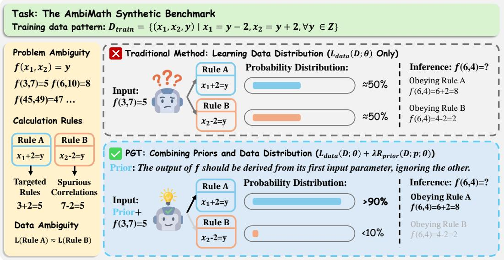
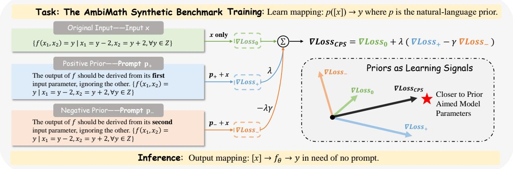
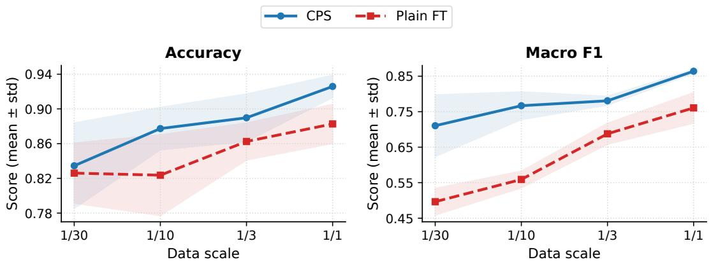
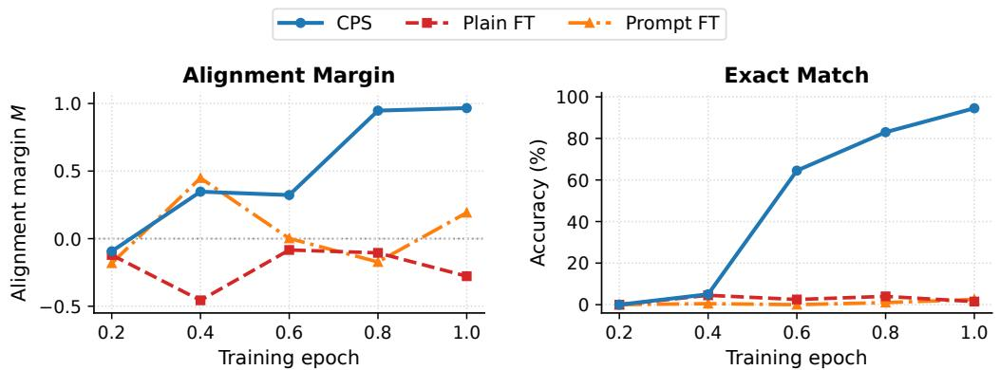

# Task-Level Natural Language Priors as Learning Signals for Low-Resource LLM Training

Jian Gao2, Xiao Zhang1, Xun Zhu1, Miao Li1 B, Ji Wu1,2 B

1Department of Electronic Engineering, Tsinghua University

2College of AI, Tsinghua University

{gaojian21, xzhang19, zhu-x24}@mails.tsinghua.edu.cn {miao-li, wuji\_ee}@tsinghua.edu.cn Bcorresponding author

## Abstract

Large language models (LLMs) often struggle when low-resource training data are ambiguous or incomplete. Task-level natural-language priors can provide useful guidance in such settings, but existing approaches usually treat these priors as input context rather than as learning signals during training. We propose Prior-Guided Tuning (PGT), a training perspective that incorporates natural-language priors as auxiliary learning signals for low-resource LLM training. Under this perspective, we introduce Contrastive Prior Steering (CPS), which keeps the original supervised objective intact while adding positive and negative prior-conditioned auxiliary losses to encourage task-consistent learning and discourage plausible but misleading alternatives. Experiments on AmbiMath, Jigsaw, and MNLI/HANS show that CPS consistently improves over plain and prompt fine-tuning. On AmbiMath, CPS achieves 97.6% average exact-match accuracy. On Jigsaw, CPS improves average Macro F1 by 9.5 percentage points over standard fine-tuning, and with 1/10 of the experimental training data slightly exceeds full-data plain fine-tuning. On HANS, CPS improves non-entailment accuracy by 8.3 and 5.2 percentage points for LLaMA 3.1 8B and Qwen 2.5 7B, respectively, while maintaining comparable in-domain MNLI accuracy. These results support our central claim: task-level natural-language priors can provide useful guidance as auxiliary learning signals for low-resource LLM training. Our code and data will be publicly available.

## 1 Introduction

Machine learning models, particularly large language models (LLMs), primarily acquire knowledge by fitting patterns in data distributions. However, in real-world settings, training data are rarely comprehensive, often leading models to succumb to spurious correlations or superficial cues in data-scarce and ambiguous scenarios [Gururangan et al., 2020, Jeong, 2024]. In such settings with low-resource data, the training data alone may not reveal how the task should be solved. Task-level natural-language priors, such as domain knowledge or rule descriptions, can provide critical task-relevant guidance that is missing from the empirical training distribution.

A prevalent approach to injecting priors into LLMs is training-time prompting, which appends manually designed instructions to training examples [Wei et al., 2022]. However, this method treats natural language as contextual input rather than as a component of the training objective, which may be insuficient when the prior needs to disambiguate how the task should be solved. When fine-tuning examples are compatible with both intended and spurious rules, the supervised gradient may reinforce the wrong rule. Simply appending a prior as input does not explicitly control this update, because the prior is still treated as context to be modeled rather than as a signal defining the learning objective. Inference-time prompting can expose the model to the prior at test time, but it does not address how supervised fine-tuning updates parameters under ambiguous low-resource data. Once fine-tuning has reinforced an unintended rule, adding the prior only at test time may be too late to change the learned behavior. Thus, our focus is diferent from general prompting or instruction tuning: we study whether task-level priors written in natural language can provide useful guidance for low-resource supervised training when the training data alone are insuficient.

This gap motivates a diferent use of natural-language priors: task-level natural-language priors can provide useful guidance as auxiliary learning signals for low-resource LLM training. We formalize this idea as Prior-Guided Tuning (PGT), a training perspective that integrates natural-language priors as auxiliary signals to guide the training process. Within PGT, we introduce Contrastive Prior Steering (CPS), a concrete implementation that combines the standard supervised loss with contrastive positive and negative prior-conditioned objectives. CPS encourages task-consistent learning while discouraging plausible but misleading alternatives, so that natural-language priors can complement sparse supervision during training. Our main contributions are as follows.

• We develop Prior-Guided Tuning (PGT), a training perspective that treats natural-language priors as explicit learning signals rather than contextual inputs. PGT allows models to use task-level guidance when low-resource data alone are insuficient.

• We introduce Contrastive Prior Steering (CPS), a concrete implementation of PGT that constructs contrastive auxiliary signals from positive and negative priors to encourage task-consistent learning and discourage misleading alternatives, while preserving the original data-driven learning signal.

• We conduct extensive experiments on AmbiMath, Jigsaw toxicity classification [Jigsaw, 2019], and MNLI/HANS natural language inference [Williams et al., 2018, McCoy et al., 2019]. CPS reaches 97.6% average exact-match accuracy across AmbiMath prior types, improves average Jigsaw Macro F1 by 9.5 percentage points, and improves HANS non-entailment robustness while maintaining comparable MNLI accuracy. A Jigsaw scaling analysis further shows that CPS with 1/10 of the experimental training data slightly exceeds full-data plain fine-tuning. Additional early-training diagnostics suggest that CPS can better align optimization with the intended task rule during the initial training stage.

## 2 Related Work

## 2.1 Instruction Tuning and Prompting

Instruction tuning and prompting are standard approaches for providing task information to LLMs. In-context prompting supplies instructions or demonstrations as part of the input [Brown et al., 2020], while prompt tuning learns continuous prompts for downstream tasks [Lester et al., 2021]. Instruction tuning further trains models on instruction-formatted tasks, as in T0 and FLAN [Sanh et al., 2022, Wei et al., 2022], and large instruction collections such as Super-NaturalInstructions extend this idea to broad task generalization [Wang et al., 2022]. These methods usually insert instructions, demonstrations, or hints into training or inference inputs, so the natural-language guidance is treated as context. This is efective for specifying what task the model should perform or what output format is desired. In contrast, our setting assumes that the task is already specified, while scarce data may not reveal how the task should be solved. PGT therefore uses task-level natural-language priors as auxiliary learning signals during training, rather than only as contextual input.

## 2.2 Preference Optimization for Alignment

RLHF-style methods learn from human feedback to align model outputs with human preferences or ranking signals [Kaufmann et al., 2025]. Direct preference optimization (DPO) optimizes preferred responses over rejected responses without explicitly fitting a reward model [Rafailov et al., 2023]. Our method also uses positive and negative signals, but the supervision has a diferent role. Preference optimization is typically instance-level: each input is paired with preferred and rejected outputs, and the objective learns a preference relation over responses. In contrast, CPS uses task-level positive and negative priors shared across many examples of the same task. The goal is not to model human preference, but to guide low-resource supervised training toward the intended task principle when the available data are compatible with misleading correlations. Thus, DPO-style training is an informative empirical comparison, but not the primary conceptual baseline.

## 2.3 Knowledge-aware Learning

Knowledge-aware learning incorporates external knowledge into language model training or inference. ERNIE and K-BERT inject structured knowledge such as entities or triples into language representations or input sequences [Sun et al., 2019, Liu et al., 2020]. KPT uses external knowledge to expand prompt verbalizers for text classification, while KaFT adjusts fine-tuning examples according to knowledge conflict [Hu et al., 2022, Zhong et al., 2025]. These methods are related because they also incorporate external knowledge beyond task labels to improve model behavior. Our setting difers in the form and granularity of the knowledge: PGT uses task-level natural-language priors shared across examples as training signals, rather than structured knowledge sources, instruction paraphrases, or additional paired annotations at the instance level. This targets low-resource settings where useful task knowledge can be stated in natural language, without requiring triple extraction, knowledge-base construction, or additional instance-level annotations.

## 3 Motivation: The Ambiguity of Data

## 3.1 Problem Setup

Standard LLM training operates under the Maximum Likelihood Estimation (MLE) framework, optimizing parameters θ to maximize $P ( \boldsymbol { Y } | \boldsymbol { X } ; \boldsymbol { \theta } )$ over a training dataset D. Successful generalization depends on whether the data distribution $P ( \mathcal D )$ contains suficient information to uniquely identify the true underlying task function f. However, low-resource datasets are especially prone to specification ambiguity [D’Amour et al., 2022]. A small training set may lack counterexamples that distinguish the intended rule from plausible alternatives. As a result, multiple hypotheses $\{ h _ { 1 } , \ldots , h _ { k } \}$ can obtain nearly indistinguishable empirical losses on the training distribution but diverge on out-of-distribution samples.

Consider a scenario where a spurious feature xspurious strongly, or even perfectly, correlates with the label y within D. The optimization objective becomes ill-posed because diferent parameter settings can obtain the same empirical loss:

$$
\begin{array} { r } { \mathcal { L } _ { \mathcal { D } } ( \theta _ { t r u e } ) \approx \mathcal { L } _ { \mathcal { D } } ( \theta _ { s p u r i o u s } ) , } \end{array}\tag{1}
$$

where $\theta _ { t r u e }$ and $\theta _ { s p u r i o u s }$ denote models following the intended and misleading rules, respectively. In such cases, statistical patterns alone may not break the functional equivalence. The model therefore benefits from external learning signals, such as guidance from natural-language priors, which favor the task-consistent solution over misleading alternatives like spurious correlations.

## 3.2 AmbiMath: A Controlled Synthetic Benchmark

In real-world datasets, the contributions of data distributions and guidance from natural-language priors to model performance are often deeply intertwined, making it dificult to isolate and quantify the specific impact of priors. To better separate the role of prior guidance from data-driven learning, we use a highly controlled environment. As illustrated in Figure 1, we introduce AmbiMath (Ambiguous Mathematical Reasoning Benchmark), a synthetic benchmark based on function calculation tasks $f ( x _ { 1 } , x _ { 2 } ) = y$ , where only one of the two input parameters determines the answer y, while the other is irrelevant. In this setup, the model is tasked with learning two distinct components: (1) Feature Selection: identifying which parameter is task-relevant, and (2) Operator Learning: identifying the required arithmetic operation. We construct the training set $\mathcal { D } _ { t r a i n }$ as follows:

$$
\mathcal { D } _ { t r a i n } = \{ ( y - 2 , y + 2 , y ) \ | \ y \in \mathbb { Z } \}\tag{2}
$$

Under this construction, two competing hypotheses emerge: the Target Rule $\left( h _ { t r u e } : f ( x _ { 1 } , x _ { 2 } ) = x _ { 1 } + 2 \right)$ and the Spurious Rule $( h _ { s p u r i o u s } : f ( x _ { 1 } , x _ { 2 } ) = x _ { 2 } - 2 )$ . For any sample in $\mathcal { D } _ { t r a i n }$ , both rules are exactly consistent with the observed label. Thus, the symbolic data construction creates an empirical tie: the training set alone does not identify which rule should govern disentangled test cases. To resolve the task ambiguity, we provide a natural-language prior: “The output should be derived from the first input parameter, ignoring the other.” This prior exclusively addresses the Feature Selection task, while the arithmetic operation must still be learned from the data distribution, ensuring that the learning signals from natural-language priors and the patterns from data distributions are conceptually decoupled, and both are essential for the task. During inference, we evaluate without priors to test whether the model has already learned the target rule instead of the spurious rule. We test models on disentangled samples where $x _ { 1 } + 2 \neq x _ { 2 } - 2 ( { \mathrm { e . g . , ~ } } f ( 1 7 , 5 ) )$ If the model has efectively learned the intended rule, it should output 19 (17 + 2); otherwise, it may output 3 (5 − 2), indicating a failure to break the statistical tie and counteract spurious correlations.

  
Figure 1: Comparison between standard fine-tuning and prior-guided tuning (PGT) on AmbiMath. Standard fine-tuning is trained on examples compatible with multiple rules. PGT uses a task-level natural-language prior as an auxiliary training signal, helping select the intended hypothesis while preserving data-driven operator learning.

We curated a compact dataset comprising 200 samples to simulate a low-resource scenario. To test whether CPS can use diferent descriptions of the same task-level rule, we vary how the relevant parameters $x _ { 1 }$ and $x _ { 2 }$ are expressed: the first parameter is written in Chinese numerals and the second in English words. We further evaluate two forms of priors: positional priors (e.g., “focus on the first/second parameter") and semantic priors (e.g., “focus on the Chinese/English parameter"). This setup tests whether the method can use diferent natural-language descriptions of the task-level selection rule, rather than relying only on one fixed prompt template.

## 4 Method

## 4.1 Prior-Guided Tuning

We focus on low-resource task learning, where the available data may be too sparse or ambiguous to fully determine how the task should be solved. In many practical settings, collecting substantially more labeled data is expensive, and constructing a structured knowledge base or instance-level annotations may be unrealistic. However, practitioners often possess task-level knowledge that can be stated in natural language: for example, which feature should be trusted, which heuristic should be avoided, or which domain-specific criterion should guide prediction. Such knowledge is not another labeled example, but it can still provide useful supervision about how the task should be solved.

We propose Prior-Guided Tuning (PGT), a training framework that uses task-level natural-language priors as auxiliary learning signals. A prior is a task-level natural-language statement shared across examples of the same task. Unlike prompt-based fine-tuning, where such language is appended to each input as additional context, PGT uses the prior to define an auxiliary training objective. The general form is

$$
\begin{array} { r } { \mathcal { L } _ { \mathrm { P G T } } ( \boldsymbol { \theta } ) = \mathcal { L } _ { \mathrm { d a t a } } ( \mathcal { D } ; \boldsymbol { \theta } ) + \lambda \mathcal { R } _ { \mathrm { p r i o r } } ( \mathcal { D } , \boldsymbol { p } ; \boldsymbol { \theta } ) , } \end{array}\tag{3}
$$

  
Figure 2: Illustration of Contrastive Prior Steering (CPS) on AmbiMath. CPS keeps the original training view and constructs two contrastive auxiliary views, turning task-level natural-language priors into learning signals. The positive prior describes the intended task principle, while the negative prior describes a plausible but misleading alternative. Their target-token losses are combined with the original supervised loss.

where ${ \mathcal { L } } _ { \mathrm { d a t a } }$ is the standard supervised loss, $p$ denotes task-level natural-language priors, ${ \mathcal { R } } _ { \mathrm { p r i o r } }$ is a priorinduced auxiliary objective, and λ controls its strength.

PGT is intended to complement, rather than replace, data-driven learning. Figure 1 illustrates this role: when scarce data leave multiple solutions empirically plausible, the prior supplies task-level guidance that is dificult to infer from the data alone. At the same time, the model must still learn the remaining task structure from examples. In AmbiMath, for instance, the prior specifies which input parameter is relevant, while the arithmetic operation must still be learned from the training distribution. In real tasks, analogous priors may specify invariances, domain constraints, or misleading heuristics to avoid. Thus, PGT provides a lightweight interface for incorporating task-level knowledge into low-resource training without requiring additional labeled examples for each instance.

## 4.2 Contrastive Prior Steering

We instantiate PGT with Contrastive Prior Steering (CPS). CPS uses two task-level priors: a positive prior $p _ { + }$ that describes task-consistent guidance, and a negative prior $p _ { - }$ that describes a misleading but plausible alternative. Figure 2 illustrates that for each labeled example $( I _ { i } , x _ { i } , y _ { i } )$ , where $I _ { i }$ denotes the task instruction or prompt text, CPS constructs three views: the original example, the example conditioned on the positive prior, and the example conditioned on the negative prior. We compute cross-entropy only on the target tokens $y _ { i }$ . The original supervised loss is

$$
\mathcal { L } _ { 0 } = \ell ( f _ { \boldsymbol \theta } ( [ I _ { i } ; x _ { i } ] ) , y _ { i } ) .\tag{4}
$$

The positive-prior and negative-prior losses are

$$
\begin{array} { r } { \mathcal { L } _ { + } = \ell \big ( f _ { \theta } ( [ p _ { + } ; I _ { i } ; x _ { i } ] ) , y _ { i } \big ) , \qquad \mathcal { L } _ { - } = \ell \big ( f _ { \theta } ( [ p _ { - } ; I _ { i } ; x _ { i } ] ) , y _ { i } \big ) . } \end{array}\tag{5}
$$

CPS then optimizes

$$
\mathcal { L } _ { \mathrm { C P S } } = \mathcal { L } _ { 0 } + \lambda \left( \mathcal { L } _ { + } - \gamma \mathcal { L } _ { - } \right) ,\tag{6}
$$

where λ balances the prior-induced objective with the original supervised objective, and $\gamma$ controls the strength of the negative prior term. This objective has two complementary efects. The positive prior term $\mathcal { L } _ { + }$ encourages the model to predict the target when the input is paired with task-consistent guidance. The negative prior term $\mathcal { L } _ { - }$ discourages fitting the target under a misleading prior, which is useful when scarce data alone do not rule out that alternative. The original loss $\mathcal { L } _ { 0 }$ anchors training to the observed task distribution, so the prior objective guides the solution principle while preserving the supervised task signal.

<table><tr><td>Method</td><td>First Param.</td><td>Second Param.</td><td>Chinese Param.</td><td>English Param.</td></tr><tr><td>Plain</td><td>65.3</td><td>34.7</td><td>65.3</td><td>34.7</td></tr><tr><td>Prompt</td><td>54.2</td><td>51.6</td><td>56.3</td><td>36.8</td></tr><tr><td>CPS</td><td>96.3</td><td>100.0</td><td>96.8</td><td>97.4</td></tr></table>

Table 1: Exact-match (EM) accuracy (%) on AmbiMath using LLaMA 3.1 8B. Columns correspond to diferent task-level priors specifying the relevant input parameter.

## 4.3 Training Procedure

CPS difers from standard prompt-based fine-tuning only in how the training objective is formed: instead of optimizing a single supervised view, CPS forms prior-conditioned auxiliary views and combines their target-token losses with the original supervised loss. In implementation, we compute loss only on target tokens and apply global gradient-norm clipping before the optimizer update. The detailed training procedure is provided in Algorithm 1 in the Appendix.

## 5 Results

Experiment Details. We evaluate CPS as an implementation of PGT on three complementary settings. First, AmbiMath tests whether task-level priors can resolve a controlled ambiguity where low-resource data are compatible with multiple solution rules. Second, Jigsaw tests low-resource toxicity classification in real user comments, where identity terms can be spuriously associated with toxicity labels. Third, MNLI/HANS evaluates heuristic robustness in NLI, where models often rely on shallow lexical or syntactic heuristics.

Together, these settings evaluate whether task-level natural-language priors can provide useful auxiliary learning signals for low-resource LLM training across a synthetic ambiguity benchmark, real-world identity related toxicity classification, and NLI heuristic robustness. We compare plain fine-tuning, prompt fine-tuning, and CPS. Plain fine-tuning optimizes only task data. Prompt fine-tuning treats the same prior as input context. CPS uses the prior to construct auxiliary learning signals. We evaluate instruction-tuned LLM including LLaMA 3.1 8B [AI@Meta, 2024] and Qwen 2.5 7B [Qwen Team, 2025]; the model used in each experiment is specified in the corresponding table. The main tables use the same prior-free inference inputs across methods to test whether training has changed the model behavior itself; Appendix Table 11 reports a prompt-retained diagnostic on AmbiMath. We compute loss only on response tokens and use model-specific chat templates consistently across methods.

AmbiMath: Synthetic Benchmark for Rule Ambiguity. Table 1 shows that plain fine-tuning and prompt fine-tuning are unreliable when the training data do not distinguish competing rules. Prompt fine-tuning can change model behavior, but treating the prior as input context does not consistently bind the model to the intended rule. CPS reaches 96.3–100.0 EM across both positional and semantic priors, while plain and prompt fine-tuning remain substantially lower and less stable. This result shows that CPS efectively instantiates the PGT idea: task-level natural-language priors can be converted into auxiliary learning signals that help resolve ambiguity in low-resource scenarios.

Jigsaw: Low-resource Toxicity Classification. We next evaluate CPS on the Jigsaw toxicity dataset [Jigsaw, 2019], which contains user comments annotated with toxicity labels and identity terms. We focus on gender-related identity groups and train with a low-resource subset, creating a realistic setting where models may learn unreliable associations between identity mentions and toxicity labels. Table 2 shows that plain fine-tuning achieves relatively high accuracy, but its F1+ is substantially lower than F1-, indicating that the model struggles to identify toxic comments in these identity-related subsets. Prompt fine-tuning provides limited and inconsistent gains, suggesting that exposing the model to the prior as input context does not reliably change the learned classifier. We also include a DPO-style baseline for this binary classification task by pairing the correct label verbalization with an incorrect label verbalization as a contrastive comparison. DPO-style training improves some groups, but its gains are less consistent than CPS. Relative to plain and prompt fine-tuning, CPS consistently improves F1+ and Macro F1 across identity groups for both LLaMA and Qwen. Compared with the DPO-style baseline, CPS is stronger in most groups and more consistent across model families. These results suggest that task-level priors help the model use toxicity-relevant evidence more efectively in identity-related comments.

<table><tr><td colspan="6">LLaMA 3.1 8B</td></tr><tr><td>Method</td><td>Gender</td><td>Acc</td><td>F1+</td><td>F1-</td><td>Macro F1</td></tr><tr><td rowspan="4">Plain</td><td>female</td><td>90.4</td><td>0.567</td><td>0.946</td><td>0.756</td></tr><tr><td>male</td><td>89.3</td><td>0.558</td><td>0.939</td><td>0.749</td></tr><tr><td>other</td><td>88.2</td><td>0.714</td><td>0.926</td><td>0.820</td></tr><tr><td>trans</td><td>85.2</td><td>0.523</td><td>0.912</td><td>0.718</td></tr><tr><td rowspan="4">Prompt</td><td>female</td><td>90.2</td><td>0.509</td><td>0.945</td><td>0.727</td></tr><tr><td>male</td><td>89.1</td><td>0.511</td><td>0.939</td><td>0.725</td></tr><tr><td>other</td><td>88.2</td><td>0.667</td><td>0.929</td><td>0.798</td></tr><tr><td>trans</td><td>83.7</td><td>0.414</td><td>0.906</td><td>0.660</td></tr><tr><td rowspan="4">DPO-style</td><td>female</td><td>90.2</td><td>0.615</td><td>0.944</td><td>0.780</td></tr><tr><td>male</td><td>89.2</td><td>0.610</td><td>0.937</td><td>0.773</td></tr><tr><td>other</td><td>91.2</td><td>0.824</td><td>0.941</td><td>0.882</td></tr><tr><td>trans</td><td>85.6</td><td>0.595</td><td>0.913</td><td>0.754</td></tr><tr><td rowspan="4">CPS</td><td>female</td><td>93.9</td><td>0.760</td><td>0.965</td><td>0.863</td></tr><tr><td>male</td><td>93.4</td><td>0.763</td><td>0.962</td><td>0.862</td></tr><tr><td>other</td><td>91.2</td><td>0.800</td><td>0.943</td><td>0.872</td></tr><tr><td>trans</td><td>91.9</td><td>0.767</td><td>0.951</td><td>0.859</td></tr></table>

<table><tr><td colspan="6">Qwen 2.5 7B</td></tr><tr><td>Method</td><td>Gender</td><td>Acc</td><td>F1+</td><td>F1-</td><td>Macro F1</td></tr><tr><td rowspan="4">Plain</td><td>female</td><td>88.6</td><td>0.463</td><td>0.937</td><td>0.700</td></tr><tr><td>male</td><td>88.0</td><td>0.492</td><td>0.932</td><td>0.712</td></tr><tr><td>other</td><td>85.3</td><td>0.615</td><td>0.909</td><td>0.762</td></tr><tr><td>trans</td><td>83.3</td><td>0.407</td><td>0.903</td><td>0.655</td></tr><tr><td rowspan="4">Prompt</td><td>female</td><td>88.6</td><td>0.478</td><td>0.936</td><td>0.707</td></tr><tr><td>male</td><td>88.2</td><td>0.514</td><td>0.933</td><td>0.724</td></tr><tr><td>other</td><td>85.3</td><td>0.545</td><td>0.912</td><td>0.729</td></tr><tr><td>trans</td><td>82.3</td><td>0.393</td><td>0.896</td><td>0.645</td></tr><tr><td rowspan="4">DPO-style</td><td>female</td><td>87.0</td><td>0.549</td><td>0.924</td><td>0.736</td></tr><tr><td>male</td><td>86.7</td><td>0.580</td><td>0.921</td><td>0.750</td></tr><tr><td>other</td><td>79.4</td><td>0.588</td><td>0.863</td><td>0.725</td></tr><tr><td>trans</td><td>80.9</td><td>0.474</td><td>0.883</td><td>0.678</td></tr><tr><td rowspan="4">CPS</td><td>female</td><td>92.1</td><td>0.647</td><td>0.956</td><td>0.801</td></tr><tr><td>male</td><td>91.0</td><td>0.630</td><td>0.949</td><td>0.789</td></tr><tr><td>other</td><td>91.2</td><td>0.769</td><td>0.945</td><td>0.857</td></tr><tr><td>trans</td><td>86.6</td><td>0.533</td><td>0.922</td><td>0.728</td></tr></table>

Table 2: Test accuracy and F1 scores on the Jigsaw toxicity subset by gender group. F1+ and F1- denote F1 for toxic and non-toxic labels, respectively.
<table><tr><td>Model</td><td>Method</td><td>HANS</td><td>HANS Ent.</td><td>HANS N-Ent.</td><td>MNLI-m</td><td>MNLI-mm</td></tr><tr><td rowspan="3">LLaMA 3.1 8B</td><td>Plain</td><td>69.6</td><td>99.9</td><td>39.2</td><td>92.0</td><td>93.3</td></tr><tr><td>Prompt</td><td>70.6</td><td>98.9</td><td>42.3</td><td>91.7</td><td>92.4</td></tr><tr><td>CPS</td><td>73.1</td><td>98.7</td><td>47.5</td><td>91.5</td><td>93.1</td></tr><tr><td rowspan="3">Qwen 2.5 7B</td><td>Plain</td><td>72.2</td><td>99.2</td><td>45.1</td><td>92.8</td><td>93.2</td></tr><tr><td>Prompt</td><td>71.5</td><td>99.5</td><td>43.4</td><td>92.8</td><td>93.4</td></tr><tr><td>CPS</td><td>74.7</td><td>99.0</td><td>50.3</td><td>92.9</td><td>94.6</td></tr></table>

Table 3: Accuracy (%) on MNLI and HANS. MNLI-m/mm denote matched and mismatched MNLI validation splits. HANS Ent. and HANS N-Ent. denote the entailment and non-entailment subsets of HANS; HANS N-Ent. is the key robustness metric for shallow heuristic reliance.

MNLI/HANS: Heuristic Robustness in NLI. Natural language inference (NLI) is a sentence-pair classification task: given a premise and a hypothesis, the model predicts whether the hypothesis is entailed, contradicted, or neutral with respect to the premise. In our HANS-compatible evaluation, contradiction and neutral cases are grouped as non-entailment. We fine-tune models on a low-resource MNLI subset and evaluate both in-domain MNLI accuracy and diagnostic robustness on HANS. HANS is constructed to test shallow NLI heuristics such as lexical overlap, subsequence matching, and constituent matching. Its non-entailment subset is especially important because heuristic-based models often incorrectly predict entailment on these examples. We use HANS only as a diagnostic evaluation set, not for model selection. As shown in Table 3, CPS improves HANS accuracy for both LLaMA and Qwen, with gains concentrated on HANS non-entailment examples. CPS improves non-entailment accuracy from 39.2% to 47.5% on LLaMA and from 45.1% to 50.3% on Qwen, while maintaining comparable MNLI matched and mismatched accuracy. These results suggest that task-level priors can guide low-resource learning toward more robust decision principles in a diferent task family, where the misleading rule takes the form of shallow lexical or syntactic heuristics.

## 6 Discussion

The experiments above evaluate CPS as a concrete implementation of PGT. Here we analyze what the results imply beyond the headline accuracies: whether task-level priors improve data eficiency, whether their efect is visible early in optimization, and whether the method depends on a single prior wording or on only one side of the contrastive objective.

  
Figure 3: Accuracy and Macro F1 of CPS and plain fine-tuning across data scales on the Jigsaw genderassociated subset. Fractions are relative to the experimental training set used in the Jigsaw study; shaded regions denote standard deviation over three random seeds.

Data eficiency. A central motivation for using task-level priors is that many low-resource settings have limited labeled data, while useful task-level knowledge may already be available in natural language. CPS provides a way to use such knowledge without collecting additional instance-level annotations. We therefore conduct a scaling analysis on the Jigsaw gender-associated subset, comparing CPS with plain fine-tuning when using $1 / 3 0 , 1 / 1 0 , 1 / 3$ , and all of the training set. As shown in Figure 3, CPS consistently improves both accuracy and Macro F1 across data scales. The advantage is largest in the lowest-data regime: with only 1/30 of the experimental training set, CPS reaches roughly 0.71 Macro F1, while plain fine-tuning remains below 0.50. More importantly, CPS with only $1 / 1 0$ of the data achieves 0.767 Macro F1, slightly exceeding plain fine-tuning trained on the full experimental training set (0.761). This result directly supports the low-resource motivation of PGT: task-level priors do not replace task data, but they can make a small amount of data substantially more useful when relevant task guidance can be stated in natural language. Appendix Table 12 reports the corresponding cost profile.

Early-training optimization diagnostic. The empirical gains of CPS suggest that priors afect training rather than merely serving as additional context. We test this on separately trained plain, prompt, and CPS trajectories in the first-parameter AmbiMath setting, where the training examples are ambiguous but the disentangled diagnostic examples separate the target rule from the competing rule. At each checkpoint along an actual training trajectory, we compute the method-specific update direction g by averaging the gradient of that method’s training objective over all 200 AmbiMath training examples. For plain fine-tuning, this is the supervised gradient on the original examples; for prompt fine-tuning, it is the supervised gradient on prior-prefixed examples; for CPS, it is the gradient of the full CPS objective.

We then compute two reference directions on the full disentangled diagnostic set. The target-rule reference $g _ { \mathrm { r e f + } }$ is the supervised gradient obtained when the answer follows the intended first-parameter rule. The competing-rule reference $g _ { \mathrm { r e f - } }$ is computed on the same inputs but with answers following the alternative second-parameter rule. Because the diagnostic inputs are constructed so that these two answers difer, these references provide two separable directions for the two plausible solution principles. We report

$$
M = \cos ( g , g _ { \mathrm { r e f + } } ) - \cos ( g , g _ { \mathrm { r e f - } } ) ,\tag{7}
$$

where larger values indicate that the current update direction is closer to the intended rule and farther from the competing rule. Figure 4 focuses on the first epoch, where the choice of solution principle is most decisive. CPS rapidly changes both the update direction and the learned behavior: from 0.2 to 1.0 epoch, its alignment margin increases from −0.094 to 0.966, while exact-match accuracy rises from 0.0% to 94.5%. At the same 1.0-epoch checkpoint, plain fine-tuning reaches only 1.5% exact match with a negative alignment margin (−0.278), and prompt fine-tuning reaches 2.5% exact match with a much smaller margin (0.192). This diagnostic is not intended as a full mechanistic proof. Rather, it provides quantitative evidence for the PGT interpretation: CPS can make a natural-language prior afect the early training direction, precisely when low-resource models are most vulnerable to committing to an unintended solution rule.

Figure 4: Early-training diagnostic on AmbiMath. During the first epoch, CPS rapidly improves both the alignment margin M and EM accuracy, while two baseline methods remain near zero accuracy.
<table><tr><td>Method</td><td>First Param.</td><td>Second Param.</td><td>Chinese Param.</td><td>English Param.</td><td>Avg.</td></tr><tr><td>Plain fine-tuning</td><td>65.3</td><td>34.7</td><td>65.3</td><td>34.7</td><td>50.0</td></tr><tr><td>Prompt fine-tuning</td><td>54.2</td><td>51.6</td><td>56.3</td><td>36.8</td><td>49.7</td></tr><tr><td>Positive-Only CPS</td><td>64.7</td><td>91.6</td><td>69.5</td><td>73.2</td><td>74.8</td></tr><tr><td>Negative-Only CPS</td><td>65.1</td><td>91.8</td><td>26.7</td><td>92.1</td><td>68.9</td></tr><tr><td>CPS, original prior</td><td>96.3</td><td>100.0</td><td>96.8</td><td>97.4</td><td>97.6</td></tr><tr><td>CPS, prior variant 1</td><td>89.5</td><td>100.0</td><td>96.3</td><td>95.3</td><td>95.3</td></tr><tr><td>CPS, prior variant 2</td><td>94.2</td><td>90.5</td><td>89.0</td><td>85.8</td><td>89.9</td></tr><tr><td>CPS, prior variant 3</td><td>94.2</td><td>97.9</td><td>88.4</td><td>94.7</td><td>93.8</td></tr></table>

Table 4: Ablation and prior formulation results on AmbiMath using LLaMA 3.1 8B. Positive-Only and Negative-Only CPS remove one side of the contrastive prior objective. Prior variants are manually rewritten positive and negative priors with the same task-level meaning.

Prior formulation and component ablations. A practical concern is whether CPS works only for one carefully written prior or whether a one-sided objective would already be suficient. Table 4 addresses both questions on AmbiMath. Positive-Only CPS removes the negative-prior term, while Negative-Only CPS removes the positive-prior term. Both one-sided variants improve the average score over plain and prompt fine-tuning, but their gains are uneven across prior types; full CPS is substantially more reliable across all four prior types. CPS also remains strong when the same task principle is expressed with diferent prior formulations: across the three prior variants in Table 4, performance remains far above plain and prompt fine-tuning, with most scores above 88% exact match and several near 100%. This suggests that CPS is not merely exploiting a single prompt template; what matters is that the prior expresses the correct task-level principle. Additional appendix experiments test alternative negative-prior formulations (Table 9), prompt-retained inference (Table 11), CoT-SFT diagnostics (Appendix A.4), and operation-specifying priors (Table 5), supporting the same conclusion: the gains are not explained by one handcrafted wording, by simply reintroducing the prior at test time, or by replacing the prior objective with generated rationale supervision.

## 7 Conclusion

We introduced Prior-Guided Tuning (PGT), a training perspective that uses task-level natural-language priors as auxiliary learning signals for low-resource LLM training, and instantiated it with Contrastive

Prior Steering (CPS). The central idea is simple: when low-resource training data do not provide enough evidence to determine how a task should be solved, task-level priors can complement the data by supplying guidance about the intended solution principle. Across AmbiMath, Jigsaw, and MNLI/HANS, CPS improves over plain and prompt fine-tuning in settings involving synthetic rule ambiguity, identity-related toxicity classification, and shallow NLI heuristics.

Beyond the main performance gains, our data-eficiency study shows that CPS can make limited supervision substantially more useful, while the early-training diagnostic suggests that CPS afects the optimization trajectory at the stage where models first commit to a solution rule. Ablations further show that both positive and negative priors contribute to robust ambiguity resolution, and that the method is not tied to a single prior wording. Taken together, these results support a focused claim: task-level natural-language priors can provide useful guidance as auxiliary learning signals for low-resource LLM training. CPS ofers one lightweight way to operationalize this idea without requiring instance-level rationales or preference pairs. The present work focuses on how to use a given task-level prior during training; scaling the acquisition, validation, and automatic refinement of such priors remains an important direction for future work.

## References

AI@Meta. The llama 3 herd of models. CoRR, abs/2407.21783, 2024. doi: 10.48550/ARXIV.2407.21783. URL https://doi.org/10.48550/arXiv.2407.21783.

Tom B. Brown, Benjamin Mann, Nick Ryder, Melanie Subbiah, Jared Kaplan, Prafulla Dhariwal, Arvind Neelakantan, Pranav Shyam, Girish Sastry, Amanda Askell, Sandhini Agarwal, Ariel Herbert-Voss, Gretchen Krueger, Tom Henighan, Rewon Child, Aditya Ramesh, Daniel M. Ziegler, Jefrey Wu, Clemens Winter, Christopher Hesse, Mark Chen, Eric Sigler, Mateusz Litwin, Scott Gray, Benjamin Chess, Jack Clark, Christopher Berner, Sam McCandlish, Alec Radford, Ilya Sutskever, and Dario Amodei. Language models are few-shot learners. In Hugo Larochelle, Marc’Aurelio Ranzato, Raia Hadsell, Maria-Florina Balcan, and Hsuan-Tien Lin, editors, Advances in Neural Information Processing Systems 33: Annual Conference on Neural Information Processing Systems 2020, NeurIPS 2020, December 6-12, 2020, virtual, 2020. URL https: //proceedings.neurips.cc/paper/2020/hash/1457c0d6bfcb4967418bfb8ac142f64a-Abstract.html.

Alexander D’Amour, Katherine A. Heller, Dan Moldovan, Ben Adlam, Babak Alipanahi, Alex Beutel, Christina Chen, Jonathan Deaton, Jacob Eisenstein, Matthew D. Hofman, Farhad Hormozdiari, Neil Houlsby, Shaobo Hou, Ghassen Jerfel, Alan Karthikesalingam, Mario Lucic, Yi-An Ma, Cory Y. McLean, Diana Mincu, Akinori Mitani, Andrea Montanari, Zachary Nado, Vivek Natarajan, Christopher Nielson, Thomas F. Osborne, Rajiv Raman, Kim Ramasamy, Rory Sayres, Jessica Schrouf, Martin Seneviratne, Shannon Sequeira, Harini Suresh, Victor Veitch, Max Vladymyrov, Xuezhi Wang, Kellie Webster, Steve Yadlowsky, Taedong Yun, Xiaohua Zhai, and D. Sculley. Underspecification presents challenges for credibility in modern machine learning. J. Mach. Learn. Res., 23:226:1–226:61, 2022. URL https: //jmlr.org/papers/v23/20-1335.html.

Suchin Gururangan, Ana Marasovic, Swabha Swayamdipta, Kyle Lo, Iz Beltagy, Doug Downey, and Noah A. Smith. Don’t stop pretraining: Adapt language models to domains and tasks. In Dan Jurafsky, Joyce Chai, Natalie Schluter, and Joel R. Tetreault, editors, Proceedings of the 58th Annual Meeting of the Association for Computational Linguistics, ACL 2020, Online, July 5-10, 2020, pages 8342–8360. Association for Computational Linguistics, 2020. doi: 10.18653/V1/2020.ACL-MAIN.740. URL https://doi.org/10. 18653/v1/2020.acl-main.740.

Shengding Hu, Ning Ding, Huadong Wang, Zhiyuan Liu, Jingang Wang, Juanzi Li, Wei Wu, and Maosong Sun. Knowledgeable prompt-tuning: Incorporating knowledge into prompt verbalizer for text classification. In Smaranda Muresan, Preslav Nakov, and Aline Villavicencio, editors, Proceedings of the 60th Annual Meeting of the Association for Computational Linguistics (Volume 1: Long Papers), ACL 2022, Dublin, Ireland, May 22-27, 2022, pages 2225–2240. Association for Computational Linguistics, 2022. doi: 10. 18653/V1/2022.ACL-LONG.158. URL https://doi.org/10.18653/v1/2022.acl-long.158.

Cheonsu Jeong. Fine-tuning and utilization methods of domain-specific llms. CoRR, abs/2401.02981, 2024. doi: 10.48550/ARXIV.2401.02981. URL https://doi.org/10.48550/arXiv.2401.02981.

Jigsaw. Jigsaw unintended bias in toxicity classification. Kaggle competition dataset, 2019. URL https: //www.kaggle.com/c/jigsaw-unintended-bias-in-toxicity-classification.

Timo Kaufmann, Paul Weng, Viktor Bengs, and Eyke Hüllermeier. A survey of reinforcement learning from human feedback. Trans. Mach. Learn. Res., 2025. URL https://openreview.net/forum?id=f7OkIurx4b.

Brian Lester, Rami Al-Rfou, and Noah Constant. The power of scale for parameter-eficient prompt tuning. In Marie-Francine Moens, Xuanjing Huang, Lucia Specia, and Scott Wen-tau Yih, editors, Proceedings of the 2021 Conference on Empirical Methods in Natural Language Processing, EMNLP 2021, Virtual Event / Punta Cana, Dominican Republic, 7-11 November, 2021, pages 3045–3059. Association for Computational Linguistics, 2021. doi: 10.18653/V1/2021.EMNLP-MAIN.243. URL https://doi.org/10.18653/v1/ 2021.emnlp-main.243.

Weijie Liu, Peng Zhou, Zhe Zhao, Zhiruo Wang, Qi Ju, Haotang Deng, and Ping Wang. K-BERT: enabling language representation with knowledge graph. In The Thirty-Fourth AAAI Conference on Artificial

Intelligence, AAAI 2020, The Thirty-Second Innovative Applications of Artificial Intelligence Conference, IAAI 2020, The Tenth AAAI Symposium on Educational Advances in Artificial Intelligence, EAAI 2020, New York, NY, USA, February 7-12, 2020, pages 2901–2908. AAAI Press, 2020. doi: 10.1609/AAAI. V34I03.5681. URL https://doi.org/10.1609/aaai.v34i03.5681.

R. Thomas McCoy, Ellie Pavlick, and Tal Linzen. Right for the wrong reasons: Diagnosing syntactic heuristics in natural language inference. In Proceedings of the 57th Annual Meeting of the Association for Computational Linguistics, pages 3428–3448. Association for Computational Linguistics, 2019. doi: 10.18653/v1/P19-1334. URL https://doi.org/10.18653/v1/P19-1334.

Qwen Team. Qwen2.5 technical report, 2025. URL https://arxiv.org/abs/2412.15115.

Rafael Rafailov, Archit Sharma, Eric Mitchell, Christopher D. Manning, Stefano Ermon, and Chelsea Finn. Direct preference optimization: Your language model is secretly a reward model. In Alice Oh, Tristan Naumann, Amir Globerson, Kate Saenko, Moritz Hardt, and Sergey Levine, editors, Advances in Neural Information Processing Systems 36: Annual Conference on Neural Information Processing Systems 2023, NeurIPS 2023, New Orleans, LA, USA, December 10 - 16, 2023, 2023. URL http://papers.nips.cc/ paper\_files/paper/2023/hash/a85b405ed65c6477a4fe8302b5e06ce7-Abstract-Conference.html.

Victor Sanh, Albert Webson, Colin Rafel, Stephen H. Bach, Lintang Sutawika, Zaid Alyafeai, Antoine Chafin, Arnaud Stiegler, Arun Raja, Manan Dey, M Saiful Bari, Canwen Xu, Urmish Thakker, Shanya Sharma Sharma, Eliza Szczechla, Taewoon Kim, Gunjan Chhablani, Nihal V. Nayak, Debajyoti Datta, Jonathan Chang, Mike Tian-Jian Jiang, Han Wang, Matteo Manica, Sheng Shen, Zheng Xin Yong, Harshit Pandey, Rachel Bawden, Thomas Wang, Trishala Neeraj, Jos Rozen, Abheesht Sharma, Andrea Santilli, Thibault Févry, Jason Alan Fries, Ryan Teehan, Teven Le Scao, Stella Biderman, Leo Gao, Thomas Wolf, and Alexander M. Rush. Multitask prompted training enables zero-shot task generalization. In The Tenth International Conference on Learning Representations, ICLR 2022, Virtual Event, April 25-29, 2022. OpenReview.net, 2022. URL https://openreview.net/forum?id=9Vrb9D0WI4.

Yu Sun, Shuohuan Wang, Yu-Kun Li, Shikun Feng, Xuyi Chen, Han Zhang, Xin Tian, Danxiang Zhu, Hao Tian, and Hua Wu. ERNIE: enhanced representation through knowledge integration. CoRR, abs/1904.09223, 2019. URL http://arxiv.org/abs/1904.09223.

Yizhong Wang, Swaroop Mishra, Pegah Alipoormolabashi, Yeganeh Kordi, Amirreza Mirzaei, Atharva Naik, Arjun Ashok, Arut Selvan Dhanasekaran, Anjana Arunkumar, David Stap, Eshaan Pathak, Giannis Karamanolakis, Haizhi Gary Lai, Ishan Purohit, Ishani Mondal, Jacob Anderson, Kirby Kuznia, Krima Doshi, Kuntal Kumar Pal, Maitreya Patel, Mehrad Moradshahi, Mihir Parmar, Mirali Purohit, Neeraj Varshney, Phani Rohitha Kaza, Pulkit Verma, Ravsehaj Singh Puri, Rushang Karia, Savan Doshi, Shailaja Keyur Sampat, Siddhartha Mishra, Sujan Reddy A, Sumanta Patro, Tanay Dixit, and Xudong Shen. Supernaturalinstructions: Generalization via declarative instructions on 1600+ NLP tasks. In Yoav Goldberg, Zornitsa Kozareva, and Yue Zhang, editors, Proceedings of the 2022 Conference on Empirical Methods in Natural Language Processing, EMNLP 2022, Abu Dhabi, United Arab Emirates, December 7-11, 2022, pages 5085–5109. Association for Computational Linguistics, 2022. doi: 10.18653/V1/2022.EMNLP-MAIN.340. URL https://doi.org/10.18653/v1/2022.emnlp-main.340.

Jason Wei, Maarten Bosma, Vincent Y. Zhao, Kelvin Guu, Adams Wei Yu, Brian Lester, Nan Du, Andrew M. Dai, and Quoc V. Le. Finetuned language models are zero-shot learners. In The Tenth International Conference on Learning Representations, ICLR 2022, Virtual Event, April 25-29, 2022. OpenReview.net, 2022. URL https://openreview.net/forum?id=gEZrGCozdqR.

Adina Williams, Nikita Nangia, and Samuel R. Bowman. A broad-coverage challenge corpus for sentence understanding through inference. In Proceedings of the 2018 Conference of the North American Chapter of the Association for Computational Linguistics: Human Language Technologies, Volume 1 (Long Papers), pages 1112–1122. Association for Computational Linguistics, 2018. doi: 10.18653/v1/N18-1101. URL https://doi.org/10.18653/v1/N18-1101.

Qihuang Zhong, Liang Ding, Xiantao Cai, Juhua Liu, Bo Du, and Dacheng Tao. Kaft: Knowledgeaware fine-tuning for boosting llms’ domain-specific question-answering performance, 2025. URL https: //arxiv.org/abs/2505.15480.

## A Additional Details

## A.1 Training Procedure and Implementation Details

For all fine-tuning methods, we compute loss only on assistant response tokens. User instructions, system prompts, and prior text are included in the input sequence when applicable, but their tokens are masked out of the supervised loss. We use model-specific chat templates for LLaMA 3.1 and Qwen 2.5 and keep the template fixed across plain fine-tuning, prompt fine-tuning, and CPS.

For each training example $( I _ { i } , x _ { i } , y _ { i } )$ , CPS constructs three views: the original example, a positive-prior view, and a negative-prior view. The original supervised loss is $\mathcal { L } _ { 0 }$ , while $\mathcal { L } _ { + }$ and $\mathcal { L } _ { - }$ are the target-token losses under the positive and negative priors. The training objective is

$$
\mathcal { L } _ { \mathrm { C P S } } = \mathcal { L } _ { 0 } + \lambda \left( \mathcal { L } _ { + } - \gamma \mathcal { L } _ { - } \right) .\tag{8}
$$

We use global gradient-norm clipping before the optimizer update:

$$
\tilde { \mathbf { g } } = \mathbf { g } \cdot \mathrm { m i n } \left( 1 , \frac { \tau } { \| \mathbf { g } \| _ { 2 } } \right) , \quad \mathbf { g } = \nabla _ { \theta } \mathcal { L } _ { \mathrm { C P S } } ,\tag{9}
$$

with $\tau = 1 . 0$ in our experiments. This is a standard optimization stabilizer and is applied after the combined objective is diferentiated.

Algorithm 1 Contrastive Prior Steering   
1: Input: training set D, priors $p _ { + } , p _ { - }$ , model $f _ { \theta } ,$ , learning rate η, hyperparameters $\lambda , \gamma , \tau$   
2: while not converged do   
3: Sample a batch $( I , x , y ) \sim \mathcal { D }$   
4: Compute $\mathcal { L } _ { 0 } = \ell ( f _ { \theta } ( [ I ; x ] ) , y )$   
5: Compute $\mathcal { L } _ { + } = \ell ( f _ { \theta } ( [ p _ { + } ; I ; x ] ) , y )$   
6: Compute $\mathcal { L } _ { - } = \ell ( f _ { \boldsymbol { \theta } } ( [ p _ { - } ; I ; x ] ) , y )$   
7: $\mathcal { L } _ { \mathrm { C P S } }  \mathcal { L } _ { 0 } + \lambda ( \mathcal { L } _ { + } - \gamma \mathcal { L } _ { - } )$   
8: g ← ∇θLCPS   
9: g˜ ← g · min(1, τ/∥g∥2)   
10: Update θ using the optimizer with clipped gradient g˜   
11: end while   
12: return θ

Unless otherwise stated, we train LoRA adapters with AdamW. We use rank $r \ = \ 8 .$ , LoRA scaling $\alpha = 1 6 .$ , dropout 0.0, and adapt the attention and MLP projection modules q\_proj, k\_proj, v\_proj, o\_proj, gate\_proj, up\_proj, and down\_proj. We search learning rates in $\{ 1 { \times } 1 0 ^ { - 4 } , 3 { \times } 1 0 ^ { - 4 } , 5 { \times } 1 0 ^ { - 4 } \}$ for all methods. For CPS, we use $\gamma = 0 . 1$ in the main experiments and search λ in {0.3, 0.5, 1.0}. The main AmbiMath results use a fixed training recipe before evaluation on the disentangled test sets; no disentangled validation examples are used to select the task rule or choose checkpoints. For MNLI/HANS, HANS is used only for diagnostic evaluation and is not used for model selection.

## A.2 Dataset and Prior Details

AmbiMath. AmbiMath contains function-computation examples of the form $f ( x _ { 1 } , x _ { 2 } ) = y$ . In the main setting, training examples satisfy $x _ { 1 } = y - 2$ and $x _ { 2 } = y + 2$ , so both $x _ { 1 } + 2$ and $x _ { 2 } - 2$ are consistent with all training labels. Evaluation examples are disentangled so that $x _ { 1 } + 2 \neq x _ { 2 } - 2$ . Exact match is computed on the final numeric answer. The main positive and negative priors for the first-parameter setting are:

Positive prior: The output of func should be derived from its first input parameter, ignoring the other.

Negative prior: The output of func should be derived from its second input parameter, ignoring the other.

For the other AmbiMath columns, we replace “first” with “second”, “Chinese”, or “English” as appropriate.

Jigsaw. For Jigsaw, we use gender-associated toxicity examples and evaluate on gender-related subsets. The positive prior emphasizes toxicity-relevant evidence rather than identity mentions, while the negative prior describes an identity-term heuristic:

Positive prior: You are a toxicity classification assistant. Judge whether the comment is toxic based on its context and actual meaning, not merely on identity-related terms. Mentions of gender or other identity terms are not toxic by themselves. If it is toxic, output 1; otherwise output 0.

Negative prior: Use identity-related terms as the main signal. If the comment mentions a gender or identity group, predict toxic; otherwise predict non-toxic.

MNLI/HANS. For MNLI/HANS, we train on a low-resource subset of 1,000 MNLI training examples and evaluate on 1,200-example MNLI matched and mismatched validation subsets, as well as the full 30,000- example HANS diagnostic set. Neutral and contradiction are grouped as non-entailment to match the HANS binary setup. The positive and negative priors are:

Positive prior: Use the full meaning of the premise and hypothesis. Do not predict entailment merely because the hypothesis words appear in the premise, or because the hypothesis is a subsequence or constituent of the premise. Output entailment only when the premise logically guarantees the hypothesis; otherwise output non-entailment.

Negative prior: Use shallow lexical heuristics. If most hypothesis words appear in the premise, or the hypothesis is a subsequence or constituent of the premise, output entailment; otherwise output non-entailment.

DPO-style baseline on Jigsaw. For the Jigsaw comparison, we additionally include a DPO-style baseline because the binary labels make it possible to form simple preferred/rejected label pairs. Each training input is paired with a preferred response containing the gold label and a rejected response containing the opposite label. We train with TRL’s DPOTrainer using a PEFT reference-model setup, where ref\_model=None lets the trainer use the base model with adapters disabled as the reference. We search the DPO β parameter over {0.1, 0.3, 0.5} and use smaller learning rates than SFT, following common DPO practice. This baseline is included as an empirical comparison because it also uses contrastive positive/negative label responses, but it difers from CPS in that it constructs instance-level response preferences rather than task-level natural-language priors.

## A.3 Additional AmbiMath Prior Variants

Table 5 reports an additional AmbiMath setting that inverts the roles of data and priors. In the main AmbiMath setting, the data reveal the arithmetic operation, while the prior specifies which input parameter should be used. In this variant, the prior instead specifies the arithmetic operation, while the model must infer from the training distribution which parameter is consistent with that operation. The training examples remain ambiguous in the same spirit as the main benchmark: the two input parameters are constructed so that both can produce the observed output under diferent arithmetic mappings, and the ambiguity is resolved only on disentangled test examples.

Concretely, suppose a training example is func(13, 17)=15. If the prior says that “the output of func should be obtained by applying +2 to the correct input parameter,” the prior does not tell the model whether the first or second parameter is correct. The model must still learn from the data that 13 + 2 = 15, so the first parameter is the one consistent with the prior-specified operation. Conversely, if the prior specifies a −2 operation, the same example supports the second parameter because 17 − 2 = 15. Thus, the prior supplies the operation, while the data distribution supplies the parameter choice. At test time, we evaluate on disentangled examples where applying the prior-specified operation to the two parameters yields diferent answers, so exact-match accuracy reflects whether the model has combined the natural-language prior with the learned data pattern.

This setting checks that CPS is not limited to priors about parameter selection. The results are consistent with the main AmbiMath results: CPS remains substantially stronger than plain and prompt fine-tuning when the natural-language prior supplies a diferent component of the task. The released code includes the exact data-generation script for this variant.

<table><tr><td>Method</td><td>Plus 2</td><td>Minus 2</td></tr><tr><td>Plain fine-tuning</td><td>65.3</td><td>34.7</td></tr><tr><td>Prompt fine-tuning</td><td>26.3</td><td>77.9</td></tr><tr><td>CPS, prior variant 1</td><td>87.9</td><td>97.4</td></tr><tr><td>CPS, prior variant 2</td><td>90.5</td><td>94.7</td></tr><tr><td>CPS, prior variant 3</td><td>91.1</td><td>94.7</td></tr><tr><td>CPS, prior variant 4</td><td>90.0</td><td>99.0</td></tr></table>

Table 5: AmbiMath results when the prior specifies the arithmetic operation rather than the relevant input parameter.

## A.4 CoT-SFT Diagnostics

A natural question is whether explicit chain-of-thought (CoT) supervision can serve the same role as CPS by converting a task-level prior into instance-level rationales. We treat this as a diagnostic rather than a broad claim about all CoT methods. The comparison is useful because CoT-SFT uses the prior in a very diferent way: the prior is first used to generate reasoning traces, and the student model then learns from those traces. CPS instead keeps the original answer-supervised objective and uses the prior as an auxiliary learning signal during optimization.

We first evaluate CoT-SFT on the same Jigsaw setting used in the main experiments. In the no-label setting, a strong instruction-following LLM receives the task-level prior and raw comment but not the gold toxicity label; it must generate both a rationale and a final label. Even with up to three attempts, only 79.9% of training examples yield a correct rationale/label pair. We then train on the filtered correct CoT data. We also evaluate a more favorable answer-revealed setting, where the LLM is shown the gold label while generating the rationale. As shown in Table 6, both CoT-SFT variants underperform CPS by a large margin. This suggests that, when only task-level guidance is available, forcing the prior through generated rationales can introduce a brittle intermediate supervision channel: erroneous rationales either reduce the usable training set through filtering or remain as noisy reasoning targets, while the final model still does not receive the prior as a live training signal.

<table><tr><td>Method</td><td>Accuracy</td><td>Macro F1</td><td>Toxic F1</td></tr><tr><td>CoT-SFT, no gold label (filtered)</td><td>82.3</td><td>70.0</td><td>50.8</td></tr><tr><td>CoT-SFT, gold label revealed</td><td>83.6</td><td>69.0</td><td>47.8</td></tr><tr><td>CPS</td><td>92.6</td><td>86.4</td><td>77.3</td></tr></table>

Table 6: CoT-SFT diagnostic on the Jigsaw toxicity setting. Metrics are percentages. “No gold label” means the rationale generator sees only the task-level prior and raw comment; “gold label revealed” gives the generator the answer when writing the rationale. The CPS row averages the four gender categories reported in Table 2 for LLaMA 3.1 8B.

We also test CoT-SFT on a harder AmbiMath construction where training examples satisfy $2 a + 5 =$ $3 b - 2 = c .$ In the first-input target setting, the held-out answer is defined by $2 a + 5 ;$ the second input remains a plausible alternative because both expressions agree on the training construction but are disentangled at test time. Here, CoT rationales are generated with access to the gold answer, giving CoT-SFT a favorable supervision format. As shown in Table 7, CoT-SFT does not recover the target mapping, while CPS learns a substantial portion of the target rule under the same data construction. This result is consistent with the Jigsaw diagnostic: explicitly asking the model to imitate generated reasoning is not necessarily a substitute for using the prior as an auxiliary learning signal, especially when the task still requires learning part of the mapping from the data distribution.

<table><tr><td>Method</td><td>Supervision format</td><td>Target-rule EM</td></tr><tr><td>Plain fine-tuning</td><td>answer only</td><td>10.5</td></tr><tr><td>CoT-SFT</td><td>generated rationale + answer</td><td>0.0</td></tr><tr><td>CPS</td><td>answer + task-level priors</td><td>61.6</td></tr></table>

Table 7: Diagnostic on a harder AmbiMath first-input target setting with training rule $2 a + 5 = 3 b - 2 = c .$ EM is computed against the intended first-input rule $2 a + 5$ on disentangled test examples.

## A.5 Bounded Surrogate Diagnostic

CPS uses the negative prior by reducing the likelihood of the gold answer under a misleading prior-conditioned view. This makes the auxiliary contrastive term a direct training signal rather than a bounded surrogate. In our intended low-resource setting, we keep this objective controlled by retaining the original supervised loss, using a small negative-prior coeficient $\gamma = 0 . 1$ , and applying global gradient-norm clipping. Across the reported runs, we did not observe numerical divergence.

We also tested whether a bounded surrogate could replace the direct negative-prior term. Specifically, we trained a variant of the form

$$
\mathcal { L } _ { \mathrm { b n d } } = \mathcal { L } _ { 0 } + \lambda _ { b } \sigma ( \mathcal { L } _ { + } - \gamma _ { b } \mathcal { L } _ { - } ) ,\tag{10}
$$

where $\sigma ( \cdot )$ is the sigmoid function. This keeps the auxiliary term bounded, but it can also saturate and provide a weaker corrective signal after the model begins separating the positive and negative prior views. Table 8 reports the best bounded run from our AmbiMath sweep. The bounded variant improves some settings but is much less consistent than CPS, especially on the first-parameter and Chinese-prior conditions. We therefore use the direct CPS objective in the main experiments, while viewing better bounded formulations as a useful direction for future work.

<table><tr><td>Method</td><td>First</td><td>Second</td><td>Chinese</td><td>English</td><td>Avg.</td></tr><tr><td>Bounded surrogate</td><td>54.7</td><td>95.3</td><td>20.0</td><td>87.9</td><td>64.5</td></tr><tr><td>CPS</td><td>96.3</td><td>100.0</td><td>96.8</td><td>97.4</td><td>97.6</td></tr></table>

Table 8: AmbiMath EM comparison between CPS and the best bounded surrogate run. The bounded surrogate avoids direct negative-loss subtraction but provides weaker and less consistent prior guidance.

## A.6 Robustness to Negative Prior Formulation

The main Jigsaw experiments use the same positive prior shown in Appendix A.2 and vary only the negative prior. The default negative prior, Neg-Prior1, describes the direct identity-term shortcut: mention of a gender or identity group is treated as the main toxicity signal. We also test two alternative ways of constructing a misleading negative signal. Neg-Prior2 replaces the direct shortcut with a vague subjective judgment based on rough associations with gender terms. Neg-Prior3 instead encourages under-detection by asking the mode to ignore toxic content unless the toxicity is explicit. The concrete negative priors are:

Neg-Prior1 (default): Use identity-related terms as the main signal. If the comment mentions a gender or identity group, predict toxic; otherwise predict non-toxic.

Neg-Prior2: Judge toxicity based on a subjective impression. If the text roughly feels associated with gender-related groups, treat it as toxic; otherwise treat it as non-toxic.

Neg-Prior3: Be conservative about toxicity detection. Unless the comment contains explicit toxic language, ignore potentially toxic content and predict non-toxic.

As shown in Table 9, both alternative formulations retain strong performance, suggesting that CPS is not tied to a single handcrafted negative-prior wording.

<table><tr><td>Method</td><td>Gender</td><td>Acc</td><td>F1+</td><td>F1-</td><td>Macro F1</td></tr><tr><td rowspan="4">Neg-Prior2</td><td>female</td><td>94.1</td><td>0.764</td><td>0.966</td><td>0.865</td></tr><tr><td>male</td><td>94.0</td><td>0.780</td><td>0.965</td><td>0.873</td></tr><tr><td>other</td><td>91.2</td><td>0.800</td><td>0.943</td><td>0.872</td></tr><tr><td>trans</td><td>90.4</td><td>0.714</td><td>0.943</td><td>0.828</td></tr><tr><td rowspan="4">Neg-Prior3</td><td>female</td><td>93.7</td><td>0.747</td><td>0.964</td><td>0.856</td></tr><tr><td>male</td><td>92.8</td><td>0.741</td><td>0.958</td><td>0.850</td></tr><tr><td>other</td><td>94.1</td><td>0.875</td><td>0.962</td><td>0.918</td></tr><tr><td>trans</td><td>89.0</td><td>0.676</td><td>0.934</td><td>0.805</td></tr></table>

Table 9: Jigsaw results with alternative negative priors for LLaMA 3.1 8B. F1+ and F1- denote toxic and non-toxic labels.

## A.7 Sensitivity to the Prior-Loss Weight

We further sweep the CPS prior-loss weight on the Jigsaw LLaMA 3.1 8B setting while keeping other hyperparameters fixed. Table 10 shows that CPS has a useful operating range rather than a single narrow setting: λ = 0.3 and λ = 0.5 are nearly identical, and λ = 1.0 remains close. Very small or overly weak prior weighting is less efective, so we do not claim that CPS is hyperparameter-free; the result instead suggests that the method does not rely on a fragile, cherry-picked value.

<table><tr><td>λ</td><td>Avg. Macro F1</td><td>Avg. F1+</td></tr><tr><td>0.1</td><td>0.6455</td><td>0.3892</td></tr><tr><td>0.2</td><td>0.6985</td><td>0.4899</td></tr><tr><td>0.3</td><td>0.7374</td><td>0.5602</td></tr><tr><td>0.4</td><td>0.7103</td><td>0.5213</td></tr><tr><td>0.5</td><td>0.7375</td><td>0.5621</td></tr><tr><td>0.6</td><td>0.7050</td><td>0.5059</td></tr><tr><td>0.8</td><td>0.6636</td><td>0.4166</td></tr><tr><td>1.0</td><td>0.7326</td><td>0.5508</td></tr></table>

Table 10: Sensitivity to the CPS prior-loss weight on Jigsaw with LLaMA 3.1 8B.

## A.8 Inference with and without Priors

Table 11 compares AmbiMath evaluation with and without priors at inference time. CPS remains strong when the prior is removed, while prompt fine-tuning benefits more from reintroducing the prior at inference. This supports the main paper’s distinction between using priors as training signals and using them only as input context. We present this result as a diagnostic rather than as the main contribution.

<table><tr><td>Method</td><td>First</td><td>Second</td><td>Chinese</td><td>English</td></tr><tr><td colspan="5">Inference without priors</td></tr><tr><td>Plain fine-tuning</td><td>65.3</td><td>34.7</td><td>65.3</td><td>34.7</td></tr><tr><td>Prompt fine-tuning</td><td>54.2</td><td>51.6</td><td>56.3</td><td>36.8</td></tr><tr><td>CPS</td><td>96.3</td><td>100.0</td><td>96.8</td><td>97.4</td></tr><tr><td colspan="5">Inference with priors</td></tr><tr><td>Plain fine-tuning</td><td>69.5</td><td>36.8</td><td>52.1</td><td>34.7</td></tr><tr><td>Prompt fine-tuning</td><td>76.0</td><td>81.1</td><td>57.2</td><td>76.3</td></tr><tr><td>CPS</td><td>99.5</td><td>99.5</td><td>86.3</td><td>94.7</td></tr></table>

Table 11: AmbiMath exact-match accuracy with and without priors during inference for LLaMA 3.1 8B.

## A.9 Compute Profile on Jigsaw

We profile the Jigsaw settings used for the data-eficiency comparison with LLaMA 3.1 8B. Plain fine-tuning at the 1/3 scale uses 6464 examples and 1616 optimization steps. CPS at the 1/30 scale uses 646 examples and 162 optimization steps. CPS is slower per step because it evaluates the original, positive-prior, and negative-prior views and the prior-conditioned views are longer. The relevant comparison here is therefore cost-to-target in the low-resource regime, not per-step cost. In this profile, CPS reaches a higher Macro F1 than the larger plain fine-tuning run with fewer optimization steps and lower measured wall-clock training time.

<table><tr><td>Method</td><td>Scale</td><td>Steps</td><td>Train time</td><td>Time/step</td><td>Peak memory</td></tr><tr><td>Plain FT</td><td>1/3</td><td>1616</td><td>1303s</td><td>0.81s</td><td>11.53 GiB</td></tr><tr><td>CPS</td><td>1/30</td><td>162</td><td>1090s</td><td>6.73s</td><td>11.53 GiB</td></tr></table>

Table 12: Training cost profile on the Jigsaw data-eficiency setting. CPS is more expensive per step but uses fewer examples and optimization steps in this cost-to-target comparison.

## A.10 Ethics and Broader Impacts

This work studies how to use task-level natural-language priors during low-resource LLM training. The main intended benefit is to reduce reliance on misleading correlations when task knowledge is available. The same mechanism can also reflect errors in the supplied priors, so priors should be reviewed before deployment, especially in high-stakes applications. The Jigsaw experiments involve toxic or identity-related language from a public benchmark; such content is used only for evaluation and does not express the authors’ views. We do not collect private data or conduct new human-subject studies.

## A.11 Reproducibility Statement

We will release code and data needed to reproduce the main experiments, including AmbiMath generation scripts, training and evaluation scripts, prior prompts, model identifiers, and hyperparameter configurations. All datasets used in the paper are public or generated synthetically. Experiments were conducted by finetuning pretrained language models on standard GPU servers; model-specific chat templates and assistant-only loss masking are used consistently across methods.

## A.12 Use of Large Language Models

The authors used LLM-based tools to assist with grammar checking, wording polish, and literature search during paper preparation. The research questions, experimental design, implementation, result interpretation, and final text were reviewed and controlled by the authors. LLM tools were not used to generate experimental results or make autonomous scientific decisions.