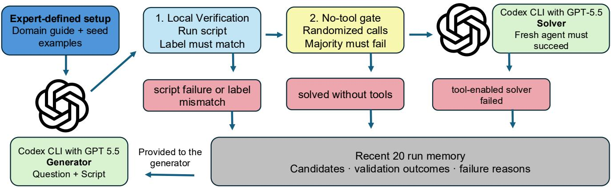
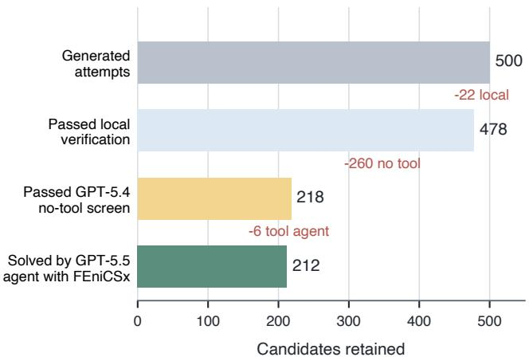

# ToolGate: An Executable Acceptance Pipeline for Tool-Dependent Scientific Benchmark Construction

Ke Zhang, Yankang Liu

Roya Zandi, Maziar Raissi

University of California, Riverside

Riverside, CA, USA

kzhan153@ucr.edu, yliu937@ucr.edu, royaz@ucr.edu, maziar.raissi1@ucr.edu

## Abstract

Scientific benchmarks are commonly built by domain experts who write tasks and cross-check one another’s work, or who adapt existing material from textbooks, published papers, and online resources. These routes can produce strong evaluations, but they require substantial per-item labor. Language models can reduce this repeated work by proposing candidates quickly. The remaining problem is acceptance. We target scientific questions whose answers require computations with specialist software rather than unaided reasoning alone. A candidate is invalid if its script fails or returns a diferent answer, or trivial if a model answers it without the software. We present ToolGate, which treats every generated item as a proposal and keeps it only if three gates pass. First, an executable solution script must reproduce the proposed answer when run with the scientific software. Second, randomized no-tool screening rejects candidates that models can already solve from the prompt alone. Third, a tool-using agent must solve each survivor within a fixed time limit. We instantiate ToolGate in FEniCSx with 500 generation attempts. The local-verification gate retains 478 candidates. For final reporting, we rescreen this pool after generation: two randomized no-tool screens exclude 222 from the reported pool, and direct GPT-5.5 API calls at medium reasoning (the API default) exclude another 121. Of the remaining 135, a GPT-5.5 Codex CLI agent with access to FEniCSx solves 130; exact deduplication leaves 128 unique protocol survivors. ToolGate turns repeated answer checking and dificulty screening into an auditable process while leaving domain design and final review to experts.

## Introduction

Scientific benchmarks are commonly built by domain experts who write tasks and cross-check one another’s work, or who adapt existing material. GPQA asks domain experts to write questions and other experts to solve and validate them (Rein et al. 2024). Scientific-agent benchmarks including ScienceAgentBench, SciCode, and CORE-Bench adapt tasks, data, and code from published research, followed by expert curation and review (Chen et al. 2025; Tian et al. 2024; Siegel et al. 2024). These approaches can produce strong evaluations, but they repeat expensive work for every item: writing or extracting a task, solving it, and independently checking the result.

Language models can reduce this labor by quickly proposing a question, an answer, and an attempted solution. These outputs still need to be checked. The attempted solution may fail or return a diferent answer. The question may also be too easy: a model may answer it from wording, prior knowledge, or reasoning alone. Such a question is not useful for evaluating whether a model can use scientific software. Prior work addresses related problems in other settings. APIGen and AutoCodeBench execute and filter generated data to check correctness, while AutoBencher measures and optimizes question dificulty (Liu et al. 2024; Chou et al. 2025; Li et al. 2025). Generating candidates quickly therefore does not solve the main problem: we still need to check each one and decide whether to keep it.

We present ToolGate, a pipeline that checks each generated candidate before accepting it. In our study, each candidate contains a question, four answer options, a proposed answer, and a solution script that calls scientific software. The multiple-choice format lets every stage compare its result with the same proposed answer automatically. ToolGate uses three gates (Figure 1). First, it runs the script and requires its result to agree with the proposed answer. Second, it asks models to answer using only the question and options, without access to the scientific software, and rejects candidates those models can solve. Third, it gives the remaining candidates to an agent that can write and run code with the software, and keeps those it solves. A candidate passes only if it meets all three conditions.

ToolGate can be used when scientific software can be called from code and produces outputs that can be checked automatically. We test it with the FEniCSx finite-element software stack (Baratta et al. 2023). FEniCSx is a widely used open-source platform for solving partial diferential equations with the finite-element method. A user describes meshes, function spaces, and variational forms in Python, and FEniCSx assembles and solves the resulting numerical systems. Our questions ask for exact outputs from multistep FEniCSx computations, so the intended solution is to write and run code.

Of 500 generated candidates, 478 have scripts that reproduce their proposed answers. For final reporting, we rescreen these candidates after generation. Two randomized no-tool screens exclude 222 from the reported pool, leaving 256. Direct GPT-5.5 API calls at medium reasoning (the API default), without access to FEniCSx, exclude another 121. Of the remaining 135, a GPT-5.5 Codex CLI agent with access to FEniCSx solves 130 under the reported test settings. These results show that asking an LLM to generate a tool-dependent question is not enough. We must test whether the specified models fail without the software and whether a tool-enabled agent succeeds with it.

These measurements are reliable only if the screening protocol is sound. We show that a fixed option order lets a model’s letter preferences masquerade as question dificulty, and that unconstrained generation repeatedly produces a few templates that often pass; the reported screens therefore randomize option order and grade by answer value, and exact duplicate questions are removed before release.

Our contributions are:

• ToolGate, which accepts a generated candidate only if its script reproduces the proposed answer, none of the specified no-tool screens answers it by majority, and the specified tool-enabled agent succeeds;

• a 500-attempt FEniCSx study in which 478 candidates pass local verification, followed by post-generation rescreening in which two randomized no-tool screens exclude 222 from the reported pool, a GPT-5.5 no-tool API screen at medium reasoning excludes another 121, and a GPT-5.5 Codex CLI agent with access to FEniCSx solves 130 of the remaining 135, leaving 128 unique protocol survivors after exact deduplication; and

• an analysis showing how the screening model and answer presentation change which candidates survive, together with randomized value grading and exact deduplication as practical safeguards.

## ToolGate

ToolGate treats every model output as a candidate rather than an accepted benchmark item. Each candidate contains a question, four answer options, the generator’s proposed answer, and a solution script that uses the target scientific software. A generator proposes the candidate, three gates test it, and the outcome is saved for the next generation round (Figure 1).

## Candidate generation

The generator works in an environment that contains the target software, so it can write and test code while constructing a candidate. Its prompt provides a domain guide, a small set of expert-written seeds, and recent gate outcomes. It must return the question, options, proposed answer, and runnable solution in a fixed file format. The prompt also asks for distractors based on realistic modeling or implementation errors. The saved solution is checked independently; the generator’s own execution is not treated as evidence that the candidate is correct.

## Acceptance gates

Local verification. A verifier runs the submitted solution in the target environment against an input copy that omits the proposed answer. The candidate passes only if the script finishes, prints exactly one answer, and that answer matches the generator’s proposal. This gate checks that the saved computation reproduces the proposed answer; it does not judge whether the question is dificult.

No-tool screening. A no-tool screen is one model at one reasoning setting. It receives only the question and options, with no files, code execution, retrieval, submitted solution, or target software. The model answers three independently randomized presentations of the candidate, and grading maps each selected value back to the original option. If the model answers correctly in at least two calls, the candidate is rejected as too easy under that screen. A candidate passes the no-tool gate only if it passes every specified screen.

Tool-enabled solving. The remaining candidates go to an agent in a fresh workspace with the target software and code execution. The agent sees the public question and options, but not the proposed answer or the generator’s solution. It must implement its own solution and return one option within a fixed time limit. Candidates it solves are accepted; the rest are flagged for review. This final gate separates questions that are hard without the software from questions that are simply underspecified, broken, or beyond the tested agent’s budget.

## Feedback and recorded evidence

Every attempt, including every rejection, is appended to the run database. Before the next round, the generator receives recent outcomes and a summary of repeated local-verification failures, and is asked to change approach when a failure recurs. Only these in-loop outcomes enter the generator’s prompt; post-hoc audits do not afect generation.

Passing remains relative to the reported test conditions. A stronger no-tool model may solve a retained candidate, while a diferent tool agent or time budget may change the final result. ToolGate therefore saves the model, reasoning setting, option presentation, time limit, and outcome for every call. The retained item and this record are released together.

## FEniCSx Experimental Setup

## Tasks and seeds

We study the FEniCSx ecosystem (Baratta et al. 2023): DOLFINx for finite-element solves, UFL for variational forms (Alnæs et al. 2014), and Basix for element definition and tabulation (Scroggs et al. 2022). Its workflows combine mesh construction, finite-element spaces, numerical assembly, and post-processing. They produce precise answers that are dificult to obtain by hand but can be checked by running modest programs.

The generator receives five expert-written seed items. All five are variants of a nonlinear Poisson problem on a punctured square, with diferent forcing, boundary conditions, and quantities of interest. The generator is not limited to these templates. It produces tasks involving deformed meshes, variational problems, quadrature, and Basix element operations.

## Models and execution settings

Table 1 lists the models used in the construction loop. The generator, submitted solution scripts, and tool solver have access to the FEniCSx environment. The no-tool screen uses

  
Figure 1: The ToolGate loop. A generator proposes a complete candidate—question, options, proposed answer, and solution script—and three gates decide whether to keep it. Each gate leaves a machine-readable record, and every outcome is appended to the run database.

direct API calls and receives only the public question and options.
<table><tr><td>Role</td><td>Model and interface</td></tr><tr><td>Generator</td><td>GPT-5.5, Codex CLI, medium reasoning</td></tr><tr><td>No-tool screen</td><td>GPT-5.4 API, reasoning disabled</td></tr><tr><td>Tool solver</td><td>GPT-5.5, Codex CLI, medium reasoning</td></tr></table>

Table 1: Model roles in the original FEniCSx construction loop. The generator and tool solver can execute code and access FEniCSx; the no-tool screen cannot.

The no-tool screen makes three calls and rejects a candidate when at least two are correct. The generator, each submitted solution, and each tool-solver run have a 300-second wall-clock limit. The solver works in a fresh workspace and returns its answer through a single-answer file. The generator receives outcome counts, the 20 most recent database records, and a summary of repeated local failures.

## End-to-end example

The following is the full public question for one generated candidate (item 0023):

In DOLFINx, create a 17×14 triangular unit-square mesh with right diagonals. Before moving any coordinates, mark the original left boundary x = 0 and top boundary y = 1 as Dirichlet facets, and the original right boundary x = 1 and bottom boundary y = 0 as Neumann facets. Move each original coordinate (x, y) to (X, Y ) using

$$
X = x + 0 . 0 4 1 \sin ( 2 \pi y ) + 0 . 0 1 7 x y - 0 . 0 0 9 y ^ { 2 } + 0 . 0 0 4 x ^ { 2 } y ,
$$

$$
\begin{array} { r l } { Y = } & { \ y + 0 . 0 2 7 \sin ( \pi x ) \sin ( 2 \pi y ) + 0 . 0 1 9 x ^ { 2 } } \\ & { \ - 0 . 0 1 4 x y + 0 . 0 0 6 y ^ { 2 } . } \end{array}
$$

On the moved mesh, solve in the continuous degree-one Lagrange space for $u _ { h }$ satisfying

$$
\int a \nabla u _ { h } \cdot \nabla v d x = \int f v d x + \int g v d s
$$

on the marked Neumann facets, with $u _ { h } ~ = ~ u _ { D }$ on the marked Dirichlet facets. Use the moved coordinates in all coeficient functions:

$$
\begin{array} { r l } { a = } & { \phantom { - } 0 . 8 8 + 0 . 2 4 X - 0 . 1 3 Y + 0 . 0 5 X Y } \\ & { \phantom { - } + 0 . 0 3 1 X ^ { 2 } + 0 . 0 1 7 Y ^ { 2 } , } \\ { f = } & { \phantom { - } 1 . 0 7 - 0 . 3 6 X + 0 . 2 9 Y + 0 . 1 8 X Y } \\ & { \phantom { - } - 0 . 1 1 X ^ { 2 } + 0 . 0 7 Y ^ { 2 } + 0 . 0 5 X ^ { 2 } Y , } \\ { g = } & { \phantom { - } - 0 . 0 9 + 0 . 1 4 X + 0 . 0 6 Y - 0 . 0 3 5 X Y } \\ & { \phantom { - } + 0 . 0 2 2 Y ^ { 2 } , } \\ { u _ { D } = } & { 0 . 1 6 + 0 . 3 1 X - 0 . 2 7 Y + 0 . 0 5 X Y } \\ & { \phantom { - } + 0 . 0 2 8 X ^ { 2 } - 0 . 0 3 4 Y ^ { 2 } . } \end{array}
$$

After solving, compute

$$
\begin{array} { r l } { J = } & { ~ \displaystyle \int _ { \Omega _ { h } } \left[ ( 0 . 7 1 - 0 . 1 2 X + 0 . 1 8 Y \right. } \\ & { ~ \left. + 0 . 0 6 4 X Y + 0 . 0 2 7 X ^ { 2 } - 0 . 0 2 1 Y ^ { 2 } ) u _ { h } ^ { 2 } \right. } \\ & { ~ \left. + 0 . 0 4 2 | \nabla u _ { h } | ^ { 2 } \right. } \\ & { ~ \displaystyle \left. + 0 . 0 1 8 u _ { h } ( X - 0 . 5 2 Y + 0 . 1 3 X Y ) \right] d x . } \end{array}
$$

Use quadrature degree 5 for the volume and boundary forms. Report J rounded to exactly six decimal places.

(A) 0.058996 (B) 0.060723 (C) 0.060074

(D) 0.061291

The database records the complete in-loop path for this candidate:

• local verification runs the submitted script and returns (B), matching the proposed answer;

• the original GPT-5.4 no-tool screen answers (C) in all three fixed-order calls, for zero correct answers; and

• the independent GPT-5.5 Codex CLI solver uses FEniCSx and returns (B), so the candidate is accepted by the construction loop.

## Results

## Construction run

We ran the generator for 500 rounds against a fresh FEniCSx database. Local verification rejected 22 candidates whose scripts failed or did not reproduce their proposed answers, leaving 478 (95.6%). The original in-loop no-tool screen used GPT-5.4 with reasoning disabled. It marked 260 of the 478 candidates as easy and rejected them. The remaining 218 entered the tool gate, where the GPT-5.5 Codex CLI agent solved 212 with FEniCSx and failed on six.

  
Figure 2: The original construction run. Of 500 generated candidates, 478 pass local verification, 218 pass the in-loop GPT-5.4 no-tool screen, and the GPT-5.5 Codex CLI agent, configured for medium reasoning and given access to FEniCSx, solves 212. These are the outcomes recorded during generation; later audits define the stricter reported pool.

<table><tr><td>Stage</td><td>Measured resource</td></tr><tr><td>Generator (500 calls)</td><td>29.4 agent-h</td></tr><tr><td>In-loop tool solve (218 calls)</td><td>5.49 agent-h</td></tr><tr><td>Each no-tool screen</td><td>3 calls/item</td></tr></table>

Table 2: Measured resource use for the construction loop. Times are agent wall-clock totals; local verification uses only local compute.

These counts describe the construction run exactly, including the feedback seen by the generator. They do not define the final reported pool. The original no-tool screen used a fixed answer order; a later audit found that answer position afected its decisions. Section reports that audit, the corrected no-tool screens, and the resulting conservative pool.

## Resource use

Five expert-written seeds and one domain guide are shared across the full run. The 500 generator calls consume 29.4 agent-hours, and the 218 tool-solve calls made during the construction loop consume 5.49 agent-hours. These are compute measurements, not a controlled comparison with human authors. They show the operational change introduced by ToolGate: experts define the domain and review the output, while the pipeline performs repeated implementation, execution, and screening.

## Protocol Audits and Corrections

The original construction loop used a fixed answer order. Its GPT-5.4 screen sent 218 candidates to the tool gate, which accepted 212. We report this as a pilot outcome, not as the final yield, because the following audit shows that the no-tool decision was partly driven by answer position. The corrected and cross-family results, the stronger no-tool screen, and the final reported pool were all computed after generation and never entered the generator’s feedback memory. Together, these post-generation checks leave 130 tool-solvable candidates and 128 unique protocol survivors after exact deduplication. The following subsections explain how this conservative pool is formed.

## Answer presentation

The original fixed-order screen was sensitive to answer position. The generator placed the proposed answer at C in 43.9% of verified candidates, while GPT-5.4 selected C in 66% of its calls. Its per-call accuracy was 86.0% when C was correct and 29.4% otherwise. We therefore repeated the screen with independently shufled options and value-based grading; positional accuracy then ranged from 28% to 33%. Under this corrected protocol, 191 of the pilot’s 260 fixed-order “easy” labels no longer remain easy. All post-generation results use the corrected protocol.

Randomization removes the letter cue but not every answer cue. The proposed answer is one of the two middle numeric values in 80% of verified candidates, so a middle-value heuristic succeeds on 40.0%. Future runs should balance distractor ranks as well as randomize their displayed positions. We also use fresh permutation seeds for release so that the retained pool is not tied to the screening permutations used in this study.

## Cross-family validation

No-tool screening. After correcting the GPT-5.4 presentation, we ask whether the result depends on the OpenAI model family. We screen all 478 locally verified candidates with the held-out Claude Opus 4.8 family. As with GPT-5.4, Opus receives three direct API calls per candidate, with independently shufled options and no files, code execution, or FEniCSx. A model solves a candidate if at least two of its three answers are correct. Of the 351 candidates that the shufled GPT-5.4 screen fails to solve, Opus also fails on 256 (72.9%). Of the 127 that the shufled GPT-5.4 screen solves, Opus also solves only 55 (43.3%). Overall, the models agree on 311 of 478 candidates (65.1%) and disagree on 167 (34.9%). We use the 256 candidates that neither model solves as the input to the stronger GPT-5.5 screen.

Tool-enabled solving. Tool-enabled solvability transfers more strongly across model families. We run the held-out Claude Opus 4.8 tool agent on the same 212 candidates already solved by the GPT-5.5 tool agent. Opus solves 209 (98.6%); its three failures are timeouts, not wrong answers. Thus, nearly every candidate solved by the GPT-5.5 agent is also solved by the Opus agent. Table 3 places the no-tool and tool-agent transfer rates side by side.

<table><tr><td>OpenAI outcome</td><td>Matching Opus outcome</td></tr><tr><td>GPT-5.4 shuffled no-tool fails (351)</td><td>Opus shuffled no-tool fails: 256 (72.9%)</td></tr><tr><td>GPT-5.4 shuffled no-tool solves</td><td>Opus shuffled no-tool solves:</td></tr><tr><td>(127) GPT-5.5 tool agent solves (212)</td><td>55 (43.3%) Opus agent solves: 209 (98.6%)</td></tr></table>

Table 3: Cross-family transfer under the no-tool and toolenabled protocols. The no-tool rows cover all 478 locally verified candidates. The tool-agent row uses a cohort selected because GPT-5.5 solved it, so it measures one-way transfer to Opus rather than an unbiased agent ranking. The original fixed-order GPT-5.4 results are not used in this table.

The Opus audit consumes 4.31 agent-hours, with a median of 61.8 seconds per item. Together, the no-tool and tool-agent checks show that model family can change which candidates appear dificult, while tool-enabled solvability transfers almost completely on this cohort.

## Stronger no-tool reasoning

Our goal is not merely to find candidates that defeat inexpensive screens. A question is useful for evaluating scientific tool use only if a strong model still cannot solve it from the prompt alone. The first two no-tool screens identify questions answerable from prior knowledge, option cues, or limited unaided reasoning, leaving 256 candidates for the stronger check. Passing those screens does not yet show that software is needed: a stronger model may still derive the answer with more reasoning but without FEniCSx.

This rescreen is a post-generation reporting filter, not part of the original generation loop. We therefore apply GPT-5.5 at medium reasoning—the API default when the request omits the reasoning\_effort field—while continuing to withhold files, code execution, and FEniCSx. It solves 121 of the 256 candidates by majority. These candidates do not satisfy the stricter post-generation no-tool criterion and are excluded from the reported pool. The remaining 135 pass this third no-tool screen.

The 135 candidates then enter the final tool check. Of these, 68 had already passed the in-loop tool gate. We send the other 67 to the same GPT-5.5 Codex CLI agent with FEniCSx; it solves 62 and fails on five. The reported pool therefore contains 130 tool-solvable candidates. Exact question deduplication removes two copies, leaving 128 unique protocol survivors. Table 4 summarizes this corrected postgeneration flow.

As a diagnostic, we also run GPT-5.5 with reasoning explicitly disabled on the same 256 candidates; it solves 49 by majority. This run does not afect acceptance. The two runs are stochastic and their solved sets are not nested. Neither run afected the original construction loop or the generator’s memory.

Among the 212 candidates accepted by the original construction loop, 115 remain unsolved by both randomized no-tool screens. On this fixed diagnostic cohort, direct GPT-5.5 calls solve 16 with reasoning disabled and 47 at medium reasoning (the API default), while the Codex CLI agent at medium reasoning with access to FEniCSx solves all 115. These are parallel measurements on the same cohort, not a sequential filter; the reasoning-disabled run does not afect acceptance.

<table><tr><td>Stage</td><td>In</td><td>Removed</td><td>Out</td></tr><tr><td>Local verification (audit start)</td><td>478</td><td></td><td>478</td></tr><tr><td>Shuffled GPT-5.4 no-tool</td><td>478</td><td>127 solved</td><td>351</td></tr><tr><td>Opus 4.8 no-tool</td><td>351</td><td>95 solved</td><td>256</td></tr><tr><td>GPT-5.5 medium no-tool</td><td>256</td><td>121 solved</td><td>135</td></tr><tr><td>GPT-5.5 + FEniCSx</td><td>135</td><td>5 failed</td><td>130</td></tr><tr><td>Exact deduplication</td><td>130</td><td>2 duplicates</td><td>128</td></tr></table>

Table 4: Post-generation audit and final reported pool. The corrected audit restarts from all 478 locally verified candi dates because the original fixed-order screen was positionbiased. “Solved” means exclusion in the no-tool rows; “failed” means exclusion in the tool-enabled row.

## Related Work

We do not propose a new agent or a new scientific task. Our contribution is upstream: an acceptance pipeline for generated evaluation candidates. It puts three forms of evidence on each retained item—local verification, no-tool failure, and tool-enabled success.

Expert authorship and automatic construction. GPQA (Rein et al. 2024) and ScienceAgentBench (Chen et al. 2025) are reference points for expert-built scientific evaluation. ToolGate retains experts for domain design and final review, but moves repeated execution and dificulty screening into a shared automated process. HellaSwag (Zellers et al. 2019) established adversarial filtering, AutoBencher (Li et al. 2025) searches for items that expose model failures, and AutoCodeBench (Chou et al. 2025) checks generated programming tasks by sandboxed execution. ToolGate combines these ideas around a scientific oracle: the software reproduces the label, a no-tool model must fail, and a tool-enabled agent must succeed. Because static benchmarks decay through contamination and saturation (White et al. 2024), the executable pipeline also supports repeated generation and re-screening.

Tool-use data and scientific agents. APIGen (Liu et al. 2024) is the closest generic precedent: it filters generated function-calling data through format, execution, and LLMjudged checks, while EigenData (Chen et al. 2026) synthesizes and audits function-calling environments. Both target general tool-use data rather than scientific evaluation. Execution-based agent benchmarks such as τ2-bench (Barres et al. 2025) verify environment state; BrowseComp (Wei et al. 2025) exposes the value of an external tool, and ToolFailBench (Soni 2026) constructs tool-required tasks and controls. ToolGate instead makes no-tool failure and tool-enabled success per-item acceptance criteria. Scientific-agent suites—SciCode, CORE-Bench, and SciAgentArena (Tian et al. 2024; Siegel et al. 2024; Liu et al.

2026)—evaluate agents on curated or research-derived tasks, and ChemCrow (Bran et al. 2024) demonstrates scientific work with expert tools. Our contribution is upstream: generating and filtering new atomic candidates whose answers are reproduced by the scientific software itself.

## Discussion

The study supports one central claim: an executable generation-and-acceptance pipeline can construct candidates that exhibit a measured tool gap. Of the 478 locally verified candidates, the sequential no-tool screens exclude 343, leaving 135; the specified tool-enabled agent solves 130 of them, and exact deduplication leaves 128 unique protocol survivors. Generation and executable label verification alone would therefore overstate the useful yield. The acceptance layer is the main contribution: it moves repeated answer computation and dificulty screening out of the per-item expert loop while retaining a record of why each candidate passed. This conclusion, however, is only as reliable as the gates used to measure it.

No-tool dificulty is protocol-relative. The no-tool gate, like any measurement instrument, is protocol-dependent and susceptible to artifacts. Fixed option order let two letter priors—the generator’s and the screener’s—masquerade as dificulty structure. Randomized, value-graded screening removes the letter cue, but model family still changes which candidates survive: GPT-5.4 and Opus disagree on 167 of 478 candidates (34.9%) under the randomized screens. By contrast, on the selected tool-enabled cohort, 209 of the 212 GPT-5.5 successes also transfer to Opus. No-tool failure is therefore evidence under named models and presentation rules, not an intrinsic property of an item. Reporting cue-exploiting baselines makes residual artifacts visible, and value-rank balance must be imposed at generation time because no post-hoc permutation can repair it.

Gate ordering controls cost. The local-verification gate uses local compute, and each short no-tool screen uses three direct calls with no workspace. The medium-reasoning screen uses a larger inference budget, so in the corrected audit we run it only on the 256 candidates that survive the lighter screens, not all 478. This ordering is a practical design principle for future production runs: expensive measurements are reserved for fewer candidates. The supplementary material reports the complete reasoning-mode protocols, outcome records, set overlaps, and token accounting.

Outcome memory does not ensure diversity. Outcome memory tells the generator what recently failed, but it does not ask for diversity. The earlier 212-candidate fixed-order in-loop cohort concentrates in two families: 147 Basix interpolation items and 63 DOLFINx deformed-mesh items, together covering 210 of 212 candidates. At token Jaccard similarity ≥ 0.7, the largest cluster contains 66% of them, and five items are exact repeats. In the reported 130 protocol survivors, exact question deduplication removes two copies and leaves 128 unique. Seed examples are therefore steering controls rather than prerequisites. To target other FEniCSx problem types or topics, a run can replace or rotate the seed set; the pipeline can also start with no seed examples and let the generator adapt its proposals from accumulated gate outcomes. Neither option by itself guarantees coverage. Future production runs should combine such seed policies with topic quotas and novelty penalties against accepted history. Yield without concentration statistics is not enough.

Limitations. The acceptance result is protocol-relative, not absolute. A diferent model, inference budget, or majority threshold can move candidates across the gate. We also compare diferent scafolds: the no-tool screen is a direct call, whereas the tool-enabled solver is a multi-turn agent with a workspace. The reported gap therefore bundles tool access with iteration and scafolding; it is not a causal estimate of tool access alone. We do not measure human dificulty.

The protocol-surviving pool is selected for tool-enabled success, so it is not designed to rank the same strong agents that define it. The multiple-choice format has a 25% guessing floor and leaks magnitude information through numeric options. Six-decimal answers also make some items computation-required because of precision rather than conceptual depth. All candidates come from one generator family and one domain, and the run concentrates on two templates. Transfer to other tools remains future work.

The three gates establish operational rather than complete semantic validity. They test whether the submitted script reproduces the proposed answer, whether specified models fail without tools, and whether a specified tool-enabled agent succeeds. A post-hoc audit identified a recurring FEniCSx data-layout defect in 97 of the 130 pre-deduplication protocol survivors and left five cases unresolved; 28 were not implicated by this specific check, but were not thereby proved correct. This finding does not change the recorded gate outcomes, but it shows that executable label reproduction alone cannot detect every mismatch between a question and its intended computation. Because the observed defect is recurring and mechanically characterizable, it appears amenable to an additional domain-specific executable gate. More generally, ToolGate is modular: new semantic checks can be inserted as failure modes are identified.

Availability. We will release the candidates with solution scripts, gate records, and audit flags; the run database including rejected candidates; screening logs; and the pipeline code. These artifacts make the pipeline and its observed failure modes reproducible and support the addition of further gates.

## Conclusion

We presented ToolGate, an executable acceptance pipeline for generated scientific evaluation candidates. A generator proposes each item; a solution script must reproduce its proposed answer, randomized no-tool calls must fail, and a tool-using agent must succeed. In 500 FEniCSx attempts, 478 candidates reproduce their proposed answers. The sequential no-tool screens exclude 343, and the full reported protocol leaves 130 candidates before exact deduplication and 128 unique protocol survivors after it. This reduction is the main result: generation is fast, but tool dependence must be measured and selected for. ToolGate shifts repeated software execution and dificulty screening from per-item expert labor into an auditable process. Each result remains tied to named models, budgets, and presentation rules, so the same process can be rerun as those conditions change.

## Ethical Statement

This work generates synthetic scientific evaluation questions, which can be mistaken or misleading if released without their status records. We report all gate outcomes and retain expert review as a release step. The items use standard opensource scientific software and add no domain-specific dualuse capability.

## References

Alnæs, M. S.; Logg, A.; Ølgaard, K. B.; Rognes, M. E.; and Wells, G. N. 2014. Unified Form Language: A Domain-Specific Language for Weak Formulations of Partial Differential Equations. ACM Transactions on Mathematical Software, 40(2): 1–37.

Baratta, I. A.; Dean, J. P.; Dokken, J. S.; Habera, M.; Hale, J. S.; Richardson, C. N.; Rognes, M. E.; Scroggs, M. W.; Sime, N.; and Wells, G. N. 2023. DOLFINx: The Next Generation FEniCS Problem Solving Environment. Journal of Open Source Software, 8(84): 5120.

Barres, V.; Dong, H.; Ray, S.; Si, X.; and Narasimhan, K. 2025. τ2-Bench: Evaluating Conversational Agents in a Dual-Control Environment. arXiv preprint arXiv:2506.07982.

Bran, A. M.; Cox, S.; Schilter, O.; Baldassari, C.; White, A. D.; and Schwaller, P. 2024. Augmenting Large Language Models with Chemistry Tools. Nature Machine Intelligence, 6: 525–535.

Chen, J.; Qi, J.; Gao, M.; Wang, W.-C.; Wang, H.; and Jin, D. 2026. EigenData: A Self-Evolving Multi-Agent Platform for Function-Calling Data Synthesis, Auditing, and Repair. arXiv preprint arXiv:2603.05553.

Chen, Z.; Chen, S.; Ning, Y.; Zhang, Q.; Wang, B.; Yu, B.; Li, Y.; Liao, Z.; Wei, C.; Lu, Z.; et al. 2025. ScienceAgentBench: Toward Rigorous Assessment of Language Agents for Data-Driven Scientific Discovery. In International Conference on Learning Representations.

Chou, J.; Liu, A.; Deng, Y.; Zeng, Z.; Zhang, T.; et al. 2025. AutoCodeBench: Large Language Models are Automatic Code Benchmark Generators. arXiv preprint arXiv:2508.09101.

Li, X. L.; Kaiyom, F.; Liu, E. Z.; Mai, Y.; Liang, P.; and Hashimoto, T. 2025. AutoBencher: Towards Declarative Benchmark Construction. In International Conference on Learning Representations.

Liu, T.; Wang, A. X.; Panescu, A.; Chen, L. X.; Long, W.; Wei, X.; Jing, Y.; Zeng, Z.; Chen, J.; Jiang, S.; et al. 2026. Benchmarking AI Agents for Addressing Scientific Challenges Across Scales. arXiv preprint arXiv:2606.12736.

Liu, Z.; Hoang, T.; Zhang, J.; Zhu, M.; Lan, T.; Kokane,S.; Tan, J.; Yao, W.; Liu, Z.; Feng, Y.; et al. 2024.

APIGen: Automated Pipeline for Generating Verifiable and Diverse Function-Calling Datasets. arXiv preprint arXiv:2406.18518.

Rein, D.; Hou, B. L.; Stickland, A. C.; Petty, J.; Pang, R. Y.; Dirani, J.; Michael, J.; and Bowman, S. R. 2024. GPQA: A Graduate-Level Google-Proof Q&A Benchmark. In First Conference on Language Modeling.

Scroggs, M. W.; Baratta, I. A.; Richardson, C. N.; and Wells, G. N. 2022. Basix: a runtime finite element basis evaluation library. Journal ofOpen Source Software, 7(73): 3982.

Siegel, Z. S.; Kapoor, S.; Nadgir, N.; Stroebl, B.; and Narayanan, A. 2024. CORE-Bench: Fostering the Credibility of Published Research Through a Computational Reproducibility Agent Benchmark. arXiv preprint arXiv:2409.11363.

Soni, H. 2026. ToolFailBench: Diagnosing Tool-Use Failures in LLM Agents. arXiv preprint arXiv:2607.04686.

Tian, M.; Gao, L.; Zhang, S. D.; et al. 2024. SciCode: A Research Coding Benchmark Curated by Scientists. arXiv preprint arXiv:2407.13168.

Wei, J.; Sun, Z.; Papay, S.; McKinney, S.; Han, J.; Fulford, I.; Chung, H. W.; Passos, A. T.; Fedus, W.; and Glaese, A. 2025. BrowseComp: A Simple Yet Challenging Benchmark for Browsing Agents. arXiv preprint arXiv:2504.12516.

White, C.; Dooley, S.; Roberts, M.; Pal, A.; Feuer, B.; Jain, S.; Shwartz-Ziv, R.; Jain, N.; Saifullah, K.; Dey, S.; et al. 2024. LiveBench: A Challenging, Contamination-Limited LLM Benchmark. arXiv preprint arXiv:2406.19314.

Zellers, R.; Holtzman, A.; Bisk, Y.; Farhadi, A.; and Choi, Y. 2019. HellaSwag: Can a Machine Really Finish Your Sentence? In Proceedings ofthe 57th Annual Meeting ofthe Associationfor Computational Linguistics, 4791–4800.