# A Computationally Feasible Framework for Causal Probabilistic Explanation∗

Rafal Urbaniak Basis Research Institute

Sam Witty Sorbus AI

Daniel Waxman Basis Research Institute Massachusetts Institute of Technology

Andy Zane Basis Research Institute University of Massachusetts Amherst

Emily Bunnapradist Basis Research Institute

Drew Lehe HouseIQ

Poorva Garg University of California, Los Angeles

Sankaran Vaidyanathan University of Massachusetts Amherst

Jack Feser Basis Research Institute

Eli Bingham Basis Research Institute

## Abstract

Explaining why a specific outcome occurred, and which inputs deserve the blame or credit, is central to philosophical, scientific, and policy analysis. Existing tools split into two camps. The theory of actual causality (AC) gives principled verdicts, but only for toy-sized models, because computing them requires enumerating counterfactual scenarios. Scalable attribution methods like SHAP (or even causal SHAP) at least partially ignore the causal structure that generated the data, and can give answers that conflict with a careful causal analysis. We close this gap with Probabilistic Causal Impact (PCI).

PCI builds on actual causality and on Pearl’s notions of probability of necessity and sufficiency, but recasts the question of explainability as an estimation problem on a probabilistic causal model that is easily approximated via Monte Carlo. By specifying a distribution over “candidate explanations,” a distribution over counterfactual values, and a scoring function, PCI provides tractable, causally grounded, graded explanations, generalizing AC and Pearl’s probability of causation as degenerate cases.

We evaluate PCI in synthetic and real-world examples, spanning consistency checks with AC, scaling experiments, complex continuous-valued dynamical systems, and a real-world deployed causal machine learning model trained on millions of datapoints.

Keywords: Probabilistic Causal Models, Explanation, Responsibility, Actual Causality, Probability of Necessity and Sufficiency.

## Contents

Introduction 3   
Causal Impact: Motivations 8   
2.1 Actual Causality 9   
2.2 Probability of Necessity and Sufficiency 11   
2.3 Path Forward 16   
3 Causal Impact: Definitions 17   
3.1 Continuous Outcomes and the General Causal Impact Function 28   
3.2 Back to the Running Example: Verifying the Desiderata 28   
Empirical and Comparative Evaluation: Overview 29   
4.1 PCI matches actual-causality verdicts on canonical archetypes 30   
4.2 SHAP and Causal SHAP 30   
4.3 The Differential Causal Effect 31   
4.4 Scaling past exact actual causality   
4.5 Continuous, dynamical outcomes   
4.6 A real-world deployed model   
Examples and Comparison to SHAP and Causal SHAP 33   
5.1 OBCB: SHAP and Causal SHAP 34   
5.2 Signal with Mediation 38   
5.3 Computations and Desiderata Analysis 39   
5.4 Summary Across Both Examples 41   
Relation with Actual Causality 41   
7 Relation with the Probability of Actual Causality 49   
7.1 Pearl’s Worked Example: The Desert Traveller 49   
7.2 PCI on the Basic Desert Traveller 50   
7.3 PCI Expectation vs the AC Machinery 51   
7.4 Weak-Poison Variant: Path-Reliability and Cross-Scenario Reliability 52   
7.5 Further Differences Between Pearl’s Probability of Causation and PCI 54   
7.6 Other probabilistic extensions of actual causation 55   
7.7 Actual-causality-adjacent quantities 57   
8 Discussion and Conclusions 58   
A Computations for the OBCB Running Example 64   
A.1 Alice’s probability of necessity 64   
A.2 Alice’s probability of sufficiency 64   
A.3 SHAP value function for Option A 65   
R SHAP and Causal SHAP: Definitions and Signal-with-Mediation Computations 65   
B.1 SHAP and Causal SHAP 65   
B.2 Distributional facts 66   
B.3 Conditional expectations 66   
B.4 Plain SHAP 67   
B.5 Causal SHAP 67   
B.6 PCI 67   
C Setup for the Desert-Traveller PCI Computation 68   
C.1 Structural model 68   
C.2 PCI components 68   
D Synthetic Evaluation Across Linear, Overdetermined, and Undercutting Archetypes 69   
E Comparison to Differential Causal Effect 71   
F Scaling Actual-Cause Computation: An Empirical Comparison 73   
G Dynamical SIR Benchmark: PCI on Continuous Outcomes 77   
H Scaling PCI to a Real-World Automated Valuation Model 81

## 1 Introduction

Causal attribution, figuring out which factors brought about an outcome and to what degree, matters wherever we act on a model’s predictions: in lending, healthcare, or automated decision systems, knowing why something happened is often as important as the prediction itself [Shepherd et al., 2024, Cheshire and Magrini, 2009, Papageorgiou et al., 2022, Heckman and Pinto, 2022]. The tools most machine learning practitioners reach for by default often mistake predictive importance for causal responsibility, which makes their attributions causally uninterpretable.

Consider the Old Boys’ Club Bank (OBCB), whose policy is to check an applicant’s credit score only if they are male; everyone else is rejected outright. Alice, a woman with bad credit, applies and is denied. Was she denied for her gender, or her credit? Intuitively the answer is clear: the bank never even looked at her credit score, so it played no role in her denial. SHAP [Lundberg and Lee, 2017] and a range of other feature-attribution tools, however, tend to split responsibility between gender and credit roughly evenly, because they reason from correlation and ignore which causal pathway was actually active for Alice specifically. Even standard “but for” tests fail here: hypothetically, if Alice were male her low score would have been checked, but still rejected; likewise, had Alice’s credit score been higher, she still would have been rejected due to that score not being considered. A naive assessment concludes that, since neither hypothetical changed the outcome, neither gender nor credit score is a cause.

Actual causality (AC), a line of work spanning philosophy and AI [Halpern, 2016], gets this case right: it varies candidate causes while holding fixed certain aspects of the causal story, and assesses changes in outcomes. For Alice’s case, it hypothetially varies gender while holding fixed that Alice did not, in fact, fail a credit check (she never received one). Had she been a man who did not fail a credit check, Alice would have received a loan (Examples 1, 3). This correctly names her gender, not her credit, as the actual cause of her denial.

Existing formalisations of actual causality, however, involve some combination of the following three limitations: they are all-or-nothing, treating a variable as either a cause or not with no notion of degree; they are computationally intractable beyond toy examples, because verifying that some witness set (a selection of variables held fixed at their actual values, our formal stand-in for a context) satisfies the definition requires an exhaustive search over exponentially many candidates; and they were developed primarily for deterministic models.

This paper introduces probabilistic causal impact (PCI), an attribution method that returns a graded score, scales to large stochastic models without exhaustive search, and applies directly to machinelearned causal models (neural, Gaussian-process, or otherwise probabilistic) that practitioners actually build. It still gets Alice’s case right. At a high level, PCI asks two counterfactual questions per candidate cause, echoing Pearl’s probabilities of necessity and sufficiency: a sufficiency question (would the outcome have persisted had we changed nothing about a given feature?) and a necessity question (would it have changed had we intervened on it?). PCI restricts both questions to the causal pathways that were genuinely active, averaging over the reasonable ways of specifying which pathways those are. Because every quantity involved is a standard counterfactual query, the analyst can estimate the score by sampling from the same probabilistic-programming machinery already used to build the underlying model.

The rest of this section makes this precise, positions PCI against existing methods, and introduces its central technical move.

At minimum, a satisfactory causal attribution method should be (i) causally grounded, attributing responsibility based on whether “intervening on” (manipulating) a candidate cause would change the outcome; (ii) context-sensitive, distinguishing which causal pathways were active in a specific instance,2 (iii) broadly applicable, handling stochastic models, discrete and continuous variables,

# (a) PCI matches actual-causality verdicts on all ten archetype checks

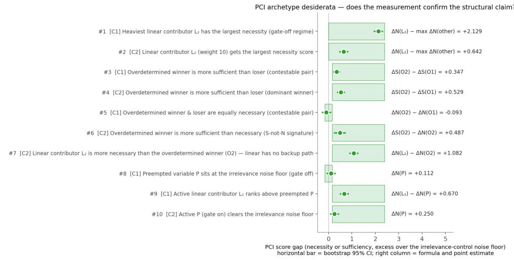  
region of values that confirm the claim-claim confirmedclaim refuted

(b) Runtime past exact AC's cutoff  
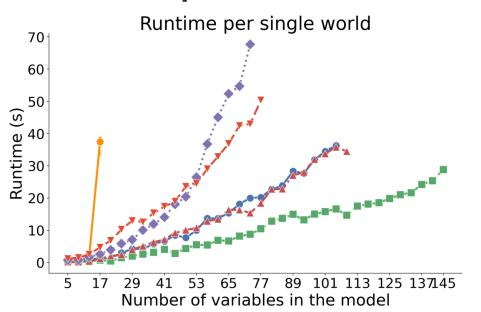  
Exact (mean per world) —▲ (3) init 250, ×1, wit off, dyn off —— (1) init 250, ×1, wit on, dyn off . (4) init 500, ×1, wit off, dyn off -- (2) init 250, ×0.5, wit on, dyn off — (5) init 500. ×1, wit on, dyn on

(c) Accuracy past exact AC's cutoff  
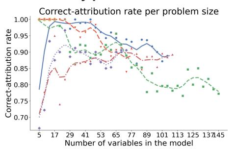  
-- Exact —… (3) init 250, ×1, wit off, dyn off (1) init 250, ×1, wit on, dyn off ….... (4) init 500, ×1, wit off, dyn off -—- (2) init 250, ×0.5, wit on, dyn off — — (5) init 500, ×1, wit on, dyn on

Figure 1: The headline result. (a) On a synthetic model with four causal archetypes (linear necessity/sufficiency, overdetermination, preemption, irrelevance), PCI’s score gaps agree with the actual-causality verdict across all ten checks, shown in green throughout. (b), (c) PCI stays tractable, in runtime and in correctattribution rate, well past the problem size at which exact actual-cause enumeration’s cost grows exponentially and becomes infeasible. Both methods run under a modest 60-minute compute budget on inexpensive hardware, chosen to gauge computational feasibility; the sizes reached scale with the compute and sample budget allotted. Section 4 reads this and the rest of the empirical story at a glance; full protocols are in Appendices D and F.

and counterfactual changes of any size; and (iv) tractable, estimable from samples without exhaustive enumeration over witness sets and alternatives.3 A further, stronger demand is a graded notion of causal explanation; we flag it here but do not treat it as a minimum bar, and develop it in full in Section 3.

Existing methods each forfeit at least one of these. Actual causality [Halpern, 2016] gets Alice’s case right but, as noted above, remains intractable beyond toy examples, with no clear approximation [Eiter and Lukasiewicz, 2002]. Methods that scale give up causal grounding or context-sensitivity instead. SHAP [Lundberg and Lee, 2017] attributes by correlation, so a feature can score highly merely for correlating with a true cause [Janzing et al., 2020]. Causal SHAP [Heskes et al., 2020] improves on this, yet still conflicts with the causal structure in some cases, which we return to in Section 5. The Differential Causal Effect [Butler et al., 2022] is causally grounded but local: relying on gradients, it misses non-infinitesimal effects, which are often of interest to a practitioner. The average and conditional treatment effect (ATE/CATE) are grounded and often tractable but not context-sensitive: they let an intervention’s effects propagate downstream through the structural equations regardless of which causal paths were active in the specific instance (Section 2). Table 1 summarises the tradeoffs.

<table><tr><td></td><td>Actual causality</td><td>SHAP</td><td>Causal SHAP</td><td>PN/PS /PNS</td><td>DCE</td><td>ATE/ CATE</td><td>PCI</td></tr><tr><td>(i) causally grounded</td><td>L</td><td>x</td><td>2</td><td>一</td><td>L</td><td>√</td><td></td></tr><tr><td>(ii) context-sensitive</td><td>√</td><td>x</td><td>x</td><td>x</td><td></td><td>X</td><td></td></tr><tr><td>(iii) broadly applicable</td><td>x</td><td>√</td><td>V</td><td>x</td><td>x</td><td>J</td><td></td></tr><tr><td>(iv) tractable</td><td>x</td><td>¬</td><td>L</td><td>L</td><td>√</td><td>L</td><td>L</td></tr></table>

Table 1: Which of the four desiderata each attribution method satisfies. ∼ = partial; – = not addressed by design.

Table 1’s row (ii) is Alice’s case: actual causality names her gender as the cause because its witness mechanism holds the untriggered credit check fixed, while Pearl’s probability-ofnecessity/sufficiency family (PN/PS/PNS, three related quantities we define in Section 2), lacking any such mechanism, assigns her credit comparable responsibility despite it never being checked. Section 2 works through this example, and its stochastic counterpart, in full.

To overcome these tradeoffs, PCI combines the context-sensitivity of actual causality with the scalability of probability-of-causation methods. PCI generalises Pearl’s probability of necessary and sufficient causation [Pearl, 2022] from binary to arbitrary variable domains.4 It also incorporates the witness mechanism from actual causality [Halpern, 2016], but changes its logical form: Halpern’s account asks whether some witness set, out of exponentially many, reveals the dependency; PCI instead asks how much of a Γ-weighted distribution over candidate-cause and witness sets reveals it, replacing an existential quantifier with an expectation.5 A witness set records which variables stay at their factual values while PCI varies a candidate cause, so causal paths inactive in the factual world stay blocked even under intervention, delivering the context-sensitivity that ATE and CATE lack.

The witness mechanism also decides how multiple, simultaneously active candidates rank against each other. A variable that merely correlates with the one that did the work, or is downstream of it, can outscore it. Holding the right variables fixed as witnesses reverses that. Without witnesses, PCI makes the same mistake SHAP does, ranking Alice’s credit above her gender. With them, gender outranks credit, the correct order (Section 5.1). Witnesses turn a 0.034 margin between a mediator and its upstream cause into a 0.133 one (Section 5.2). And they let PCI separate a reliable cause from an unreliable one across forensic scenarios in the desert-traveller example (Section 7.4).

This move makes PCI tractable, but it is also the source of its main risk. Existential search over witness sets forces AC’s brute-force enumeration; an expectation admits Monte Carlo sampling from Γ instead, at a cost: Γ-mass on witness sets that do not reveal a dependency can swamp a single witness set that does, or sampling can simply miss it if it is rare enough. In the worst case, rare dependencies can be as expensive to find with sampling as with enumeration (Section 8).

Four considerations limit the damage. First, converting the search problem to a sampling problem lets us study statistical estimation efficiency and provides a ”computational effort” knobs (the number of samples, sampling method choice, etc.) that control success. That is, it lets us fix a computational budget and then study whether it will achieve the desired results. The practical aspect of this is that models with structural regularities let sampling run far cheaper than the worst case above suggests. In the actual-cause benchmark (Section F), for instance, any superset of a witness set witnesses the same attribution, so restricting the search to small witness sets costs little accuracy even though it never visits the larger sets a wider search would check. PCI’s definition assumes no such regularity, but when a model has it, the sampling budget can be spent narrowly without losing coverage.

The second is formal: switching from existential search to an expectation does not make PCI blind to real actual causes. Section 6 proves, under conditions given there, that a candidate’s PCI score is positive exactly when it is an actual cause in Halpern’s sense.

The third is more general. Missing a rare event under finite sampling is a familiar tradeoff, not a weakness specific to PCI; every Monte Carlo procedure faces it. Here, though, the tradeoff is explicit: the sample budget and the witness-cardinality bound are choices the analyst makes, and Section F reports how correct-attribution rate changes as each is loosened or tightened, so increasing either reduces the chance that sampling misses a rare witness set.

Prior work anticipates pieces of PCI’s construction. Halpern’s own account already averages over exogenous noise when computing probabilities of causation [Halpern, 2016]. Beckers and Vennekens [2015] weight alternative replacement values by how probable they are. Both aggregate over witness sets in restricted settings [Beckers and Vennekens, 2015, Halpern, 2016]. And Chockler and Halpern [2004] let the size of that set modulate the verdict: their degree of responsibility is 1/(k+1), where k counts the variables that must be shifted off their actual values before the outcome depends counterfactually on the candidate. No prior construction combines all four into a single estimator that scales to arbitrary variable domains. PCI keeps Chockler and Halpern’s intuition that the size of the set doing the work should count, replacing their fixed reciprocal with the cardinality band of the variable selection distribution Γ, which the analyst sets (Section 3); Section 7.7 treats this and the other actual-causality quantities in the same terms. Every quantity entering the PCI definition is a standard interventional or counterfactual quantity, so computing a score asks nothing of a modelling tool beyond what counterfactual reasoning already asks: a way to write down a structural model, intervene on it, and sample under the resulting counterfactual semantics. Any system providing those operations can evaluate PCI’s expectations by Monte Carlo for any model it expresses, with no permodel derivation. We use ChiRho, a causal extension of the probabilistic programming language Pyro,6 though nothing in the construction depends on that choice.

That requirement is substantive. PCI presumes access to a trained probabilistic causal model that supports sampling counterfactual outcomes, whereas Causal SHAP and the probability-ofnecessity/sufficiency (PN/PS/PNS) bounds of Mueller et al. [2022] work from observational data and a causal graph alone. The outputs differ accordingly. Those bounds give intervals on the probability of causation, and PCI, given a fully specified model, gives a full posterior over its score, summarised as a point estimate via the mean.

Within that requirement, we place no strong restrictions on the form of the model, its distributions, or its variable types. Such a model can include standard machine learning components, neuralnetwork-parametrized distributions or Gaussian processes among them. A feed-forward probabilistic program of this kind is still a structural causal model, one whose structural equations happen to be parametrized by a neural network rather than specified by hand.

Xia et al. [2023] show that such neural causal models, being universal approximators, are expressive enough to represent the same nonparametric counterfactual quantities available to an explicitly specified structural model. This expressiveness does not by itself resolve non-identification, though: many mechanisms can fit the same observed data equally well, and no amount of representational flexibility changes that.

Instead, PCI operates in a Bayesian setting: its score averages the counterfactual outcome over the posterior the trained model induces, spanning both mechanisms and their parameters, much as Bayesian model averaging marginalizes over which of several candidate models generated the data.7 The earlier claim of no strong restrictions is about the model’s functional form only. Obtaining a posterior that reflects the data well is a separate, nontrivial problem for complex neural or Gaussianprocess mechanisms, and we do not attempt to solve it here.8

Paper structure. The paper proceeds in five phases, laid out in Figure 2, with the supporting appendix material collected in a separate band. The first phase establishes motivation and formalism. Section 2 works through a running example to draw out what actual causality, the probability of necessity/sufficiency, and average/conditional treatment effects each get right and miss, motivating the design choices behind PCI. Section 3 then defines the method: a kernel built from a sufficiency check at the factual configuration and a necessity check against alternatives, integrated over a distribution of suspect/witness sets, with three components given as user choices: the variable selection distribution Γ, the alternative-value distribution ∆, and the causal impact function.

With PCI defined, the second phase previews the payoff before the detailed argument. Section 4 reads each empirical and comparative result at a glance and defers the full protocols to the appendices: PCI recovers the actual-causality literature’s verdicts on overdetermination and undercutting (Appendix D); it diverges from gradient-based Differential Causal Effect attribution where the local gradient misreads the counterfactual contrast (Appendix E); it stays tractable where exact actualcause enumeration times out at 17 variables, continuing to roughly 73–145 variables (where the tests time out after 60 minutes) and holding a 0.85 correct-attribution rate as far as 89 (Appendix F); it delivers a graded comparison on a continuous-outcome dynamical SIR model, assigning lockdown roughly twice the responsibility of masking where but-for reasoning cannot separate them (Appendix G); and it scales to a deployed automated valuation model with machine-learned components trained on millions of points, where SHAP concentrates attribution on a few downstream variables while PCI spreads it across the upstream causal structure (Appendix H). A reader who wants the shape of the argument can stop here; the next two phases develop each comparison in full.

The third phase positions PCI against existing attribution methods. Section 5 compares PCI with SHAP, Causal SHAP, ATE, and CATE on two worked examples (OBCB, with two binary features, and a signal-with-mediation model), tabulating which desiderata each satisfies or fails, including cases where SHAP and even Causal SHAP track correlation rather than counterfactual dependence.

The fourth phase establishes the formal relationship between PCI and actual causality. Section 6 shows that under specific choices of Γ and ∆ the PCI kernel is positive on a configuration exactly when that configuration is an actual cause in Halpern’s sense, so approximate AC verdicts can be read off the kernel without enumerating witnesses. Section 7 positions PCI against Pearl’s probability of actual causation: on the canonical desert-traveller example PCI recovers Pearl’s withinscenario ranking with graded magnitudes, and a weak-poison variant reveals two further responsibility intuitions (path-reliability and cross-scenario reliability) that PCI’s expectation captures and Pearl’s binary indicator cannot express.

Section 8 closes the fifth phase with discussion. We engage related work where it bears on the argument. The broader literature on actual-causality-based attribution and responsibility scores (probabilities of causation, degree of blame and harm, and score-based explanations in databases and machine learning, surveyed by Bertossi [2023]) comes up mainly in Sections 6 and 7 and the discussion.

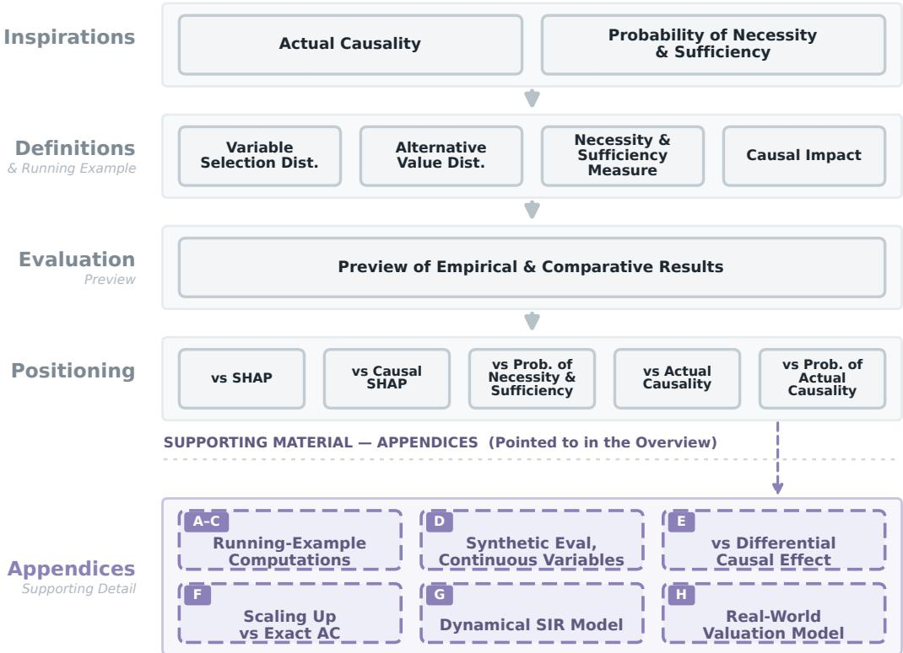  
Figure 2: Roadmap of the paper. PCI builds on two ideas, actual causality and the probability of necessity and sufficiency (top tier). From there the paper develops the motivations (Section 2), defines PCI (Section 3), previews the empirical and comparative payoff (Section 4), positions it against SHAP, Causal SHAP, PNS, actual causality, and the probability of actual causation (Sections 5 to 7), and closes with discussion; we defer the running-example computations and benchmark protocols to the appendices, to which the preview points.

Reproducibility. A set of companion notebooks reproduces every quantitative claim in this paper (the worked-example numbers, the benchmark tables, and the figures), rendered with their full outputs at https://rfl-urbaniak.github.io/explainable\_paper/. Throughout, we point to the relevant notebook by name (for example obcb\_computations); each name links to its page on that site.

## 2 Causal Impact: Motivations

The central difficulty in causal attribution is not computing counterfactuals: it is knowing which counterfactuals to compute. Consider two questions: the type question (does X tend to cause Y?) and the token, or actual-causation, question (was X’s contribution live in the specific situation we are explaining?). Methods built to answer the former routinely miss the latter, as Section 1’s Alice already showed: a cause can be genuine in general yet causally inactive in one particular case, making no difference to what actually happened. The running example below makes this precise. There are principled probabilistic theories of type-level causal strength (Sprenger [2018], for instance, derives a difference-making measure $p ^ { * } ( E \mid { \bf \bar { \phi } } C ) - p ^ { * } ( E \mid { \bf \bar { \phi } } \mid )$ axiomatically), but they deliberately bracket the token-level question of which cause was live in the case at hand, and amalgamate mediators just where the context-sensitivity we are after requires tracking them. Among the closest predecessors of this approach, none individually achieves all of this: actual causality handles context sensitivity but is computationally intractable and not general enough; the probability of necessity and sufficiency scales well, but lacks context sensitivity. This section builds intuition for both limitations through a running example, setting up the design choices that motivate PCI in Section 3. We first revisit Halpern’s actual-cause construction on a deterministic Old $\mathrm { B o y s } ^ { \prime }$ Club Bank (OBCB) example to see what witnesses do and why a plain but-for clause misses Alice’s case. Turning to a stochastic OBCB, we then introduce the probabilistic machinery actual causality lacks, Pearl’s PN/PS/PNS, and show that, without witnesses, these measures cannot register Alice’s missing credit check either. A closing “Path forward” subsection distils what PCI must inherit from each predecessor before Section 3 formalises it.

## 2.1 Actual Causality

Consider the following (deterministic, discrete) model:

Example 1 (Bob at Old Boys’ Club Bank). Bob appliedfor a home mortgage loan with the local branch of OBCB, and his application was denied. The OBCB policy requires applicants to pass a credit score check, but it only performs this check if the applicant is male; all non-male applicants are rejected outright. Thus, the procedure is:

$$
\begin{array} { c } { c h e c k = ( g e n d e r = m a l e ) } \\ { { \qquad } } \\ { c h e c k - f a i l e d = c h e c k \wedge ( c r e d i t = b a d ) } \\ { l o a n = \neg c h e c k - f a i l e d \wedge ( g e n d e r = m a l e ) } \end{array}
$$

An intuitive explanation for Bob’s denial is that his credit was bad: had it been good, the outcome would have been different. In contrast, his gender does not appear to be responsible for the rejection: had it been different, his application still would have been denied (albeit this time due to check = F).

This suggests a counterfactual approach to feature responsibility attribution: identify the features responsible for a particular outcome by asking whether it would have been different had a specific feature taken a different value. This is called the but-for clause: Bob wouldn’t have been denied the loan but for his bad credit.

Concretely, consider a model M with exogenous variables U, which are the source of stochasticity, and endogenous variables V, which are influenced by other variables in the model. Let $\mathbf { S } \subseteq \mathbf { V }$ be the variables we suspect to be causally responsible (call them causal suspects), and $Y \in \mathbf { V }$ be an outcome of interest. Suppose we consider only one suspect $S \in \mathbf { S }$ and mark factual values with ⋆. Under a setting $\mathbf { U } = \mathbf { \bar { u } }$ of the exogenous variables, M produces $S = s ^ { \star }$ and $Y = y ^ { \star }$ , denoted $( M , \mathbf { u } ) \in S = \overline { { s ^ { \star } } } , Y = y ^ { \star }$ . We read ⊨ as “yields” (the model under noise u makes the stated equalities true), and its crossed form $\sharp$ as “does not yield” (the stated event fails to hold). We call this the factual scenario. An intervened model where a variable S is set to an alternative value $s ^ { \prime }$ is denoted $( M , \mathbf { u } ) [ S  s ^ { \prime } ]$

A first attempt at defining a counterfactual notion of causal responsibility, following the counterfactual-dependence tradition [Lewis, 1973, Halpern, 2016], is:

Definition 2 (But-for, single). $S = s ^ { \star }$ is causally responsible for $Y = y ^ { \star }$ in $( M , \mathbf { u } )$ if and only if $( M , \mathbf { u } ) \models S = s ^ { \star } , Y = y ^ { \dot { \star } } a n d ( M , \mathbf { u } ) [ S  s ^ { \prime } ] \dot { \forall } Y = y ^ { \star }$ for some $s ^ { \prime } \neq s ^ { \star }$

In a given context, S is causally responsible for an outcome only when intervening on S with some alternative value would change that outcome. Bob’s credit score satisfies this condition: had his credit score been higher, the loan might have been approved.

However, this cause test is too coarse. Consider another case:

Example 3 (Alice at OBCB). Alice is a woman with bad credit. She appliesfor a loan with OBCB and is rejected.

Yet under the but-for clause for single cause candidates, neither her gender nor her credit score is responsible for Alice’s denial. No matter how high her credit score, her application would still have been denied because the bank does not, effectively, loan to women. Had her gender been different, she would still have been denied for having bad credit.

To address this example, we could consider sets of factors as causes:

Attempt 4 (But-for, sets). Variables $\mathbf { C } \subseteq \mathbf { S }$ with factual values $\mathbf { C } = \mathbf { c } ^ { \star }$ are causally responsible $f o r Y = y ^ { \star } i n \left( M , \mathbf { u } \right)$ ifand only $i f \left( M , \mathbf { u } \right) \models \mathbf { C } = \mathbf { c } ^ { \star } , Y = y ^ { \star }$ and $( M , \mathbf { u } ) [ \mathbf { C }  \mathbf { c ^ { \prime } } ] \forall Y = y ^ { \star }$ for some $\mathbf { c } ^ { \prime }$ everywhere different from $\mathbf { c } ^ { \star }$ , where no proper subset of C has this property.

The minimality condition reflects our preference for explanations that include only relevant properties.

Under this generalization, the set $\mathbf { c } ^ { \star } = \{ g e n d e r = \mathrm { f e m a l e }$ $c r e d i t = \mathbf { b a d } \}$ is jointly responsible for Alice’s application being denied because there exists $\mathbf { c } ^ { \prime } = \{ g e n d e r = \dot { \mathrm { m a l e } } , c r e d i t = \mathbf { g 0 0 d } \}$ that would change the decision and $\mathbf { c } ^ { \star }$ is minimal; neither gender nor credit alone would have changed the decision. On individual features, we could say that the whole set bears responsibility but individual features do not, or that any feature in a cause set is partially and equally accountable. Neither is satisfying: the first denies that any single feature is responsible, and the second spreads responsibility evenly between them regardless of context. This conflicts with our intuition: OBCB did not evaluate Alice’s credit score, so her denial was caused by her gender. This verdict does not rest on counterfactual reasoning alone. Tracing the model on Alice’s inputs, her denial is produced through the gender term of the loan equation, while credit enters only through check- $\cdot f a i \bar { l e } d$ , which is false and never propagates to the outcome. So on a production (causal-process) view of causation [Hall, 2004], credit transmits no influence to Alice’s denial at all. Actual causality’s witness-based counterfactual test, developed below, recovers exactly this production-tradition verdict, so the diagnosis that gender alone is responsible is not an artifact of one chosen formalism.

The actual-causality literature calls this structural pattern preemption, also called undercutting [Lewis, 1973, Halpern, 2016], the term we use from Section 3 onward, paired with overdetermination as the two archetypes the synthetic evaluation (Appendix D) targets: two distinct causal routes might each have been sufficient to produce the outcome, but only one is actually engaged, with the other prevented from operating. Alice’s gender preempted her credit by preventing the check from happening, so credit had no chance to act. The closely related notion of over-determination [Paul and Hall, 2013, Halpern, 2016] covers cases in which multiple sufficient causes coexist without one preempting the other $( \mathrm { e . g . }$ , two simultaneous fatal shots). Both phenomena defeat a simple single-cause but-for test, since intervening on any one of the candidate causes leaves the outcome unchanged.9

Halpern’s construction offers a way out of this difficulty: hold some of the context in which counterfactuals are evaluated fixed, calling such fixed variables witnesses. Let us focus on the mediator check-failed between gender and loan. If we fix this variable at the factual value by intervening, then counterfactually, Alice would have been granted the loan if she were male. However, there is no context fixed at the actual value such that, had her credit score been higher, she would have been granted the loan. Enumerating the candidate causes, their counterfactual treatments, the witness held fixed, and the resulting outcome makes the test concrete (Alice’s factual run is gender=female, credit=bad, giving $c h e c k - f a i l e d { = } 0$ and $l o a n { = } \mathrm { d e n i e d ) }$

<table><tr><td>Candidate cause C Treatment</td><td> $\mathbf { c } ^ { \prime }$ </td><td>Witness  $\mathbf { T } = \mathbf { t } ^ { \star }$ </td><td>Outcome (loan)</td></tr><tr><td> $_ { g e n d e r = \mathrm { f e m a l e } }$ </td><td>→ male</td><td> $c h e c k - f a i l e d { = } 0$ </td><td> $\mathbf { \phi } _ { \mathrm { d e n i e d } } \to \mathbf { g r a n t e d }$ </td></tr><tr><td> $_ { g e n d e r = \mathrm { f e m a l e } }$ </td><td>→ male</td><td>none (recomputed)</td><td> $\mathrm { d e n i e d } \to \mathrm { d e n i e d }$ </td></tr><tr><td> $c r e d i t { = } { \bf b a d }$ </td><td>→ good</td><td>any</td><td> $\mathrm { d e n i e d } \to \mathrm { d e n i e d }$ </td></tr></table>

Fixing the mediator check-failed at its factual value reveals gender as an actual cause (row 1); without the witness the intervention recomputes the mediator and the outcome does not flip (row 2); no witness makes credit a cause (row 3). This motivates the following formalization:

Definition 5 (Actual cause (modified Halpern–Pearl)). Let $\mathbf { S } \subseteq \mathbf { V }$ be a suspect pool and $\mathbf { W } \subseteq \mathbf { V }$ a witness pool, observed in (M, u) at factual values $\mathbf { S } = \mathbf { s } ^ { \star }$ and $\mathbf { W } = \mathbf { w } ^ { \star }$ . A cause set $\mathbf { C } \subseteq \mathbf { S }$ at its factual setting $\mathbf { C } = \mathbf { c } ^ { \star }$ is an actual cause of $Y = y ^ { \star }$ in $( M , \mathbf { u } )$ if there is a witness set $\mathbf { T } \subseteq \mathbf { W }$ disjoint from C such that:

• Factivity. The cause, the witness pool, and the outcome are all observed at their factual values:

$$
( M , \mathbf { u } ) \models \mathbf { C } = \mathbf { c } ^ { \star } , \mathbf { W } = \mathbf { w } ^ { \star } , Y = y ^ { \star } .
$$

• Witnessed necessity. Holding T at its factual setting $\mathbf { t } ^ { \star }$ while intervening on the cause overturns the outcome, for some alternative $\mathbf { c } ^ { \prime }$ distinct everywhere from $\mathbf { c } ^ { \star 1 \top }$

$$
( M , { \mathbf { u } } ) \big [ { \mathbf { C } } \gets { \mathbf { c ^ { \prime } } } , { \mathbf { T } } \gets { \mathbf { t ^ { \star } } } \big ] \forall Y = y ^ { \star } .
$$

• Minimality. No proper subset ofC satisfies the two conditions above.

Definition 5 is Halpern’s modified definition of actual causality [Halpern, 2015, 2016], specialized to an explicit suspect pool S and witness pool W. PCI uses Halpern’s modified definition, with witnesses held at their actual values; prior probabilistic extensions of actual causation instead build on the original Halpern–Pearl definition (Section 7.6). This definition extends but-for causality with a witness set T that is fixed to its factual value by an intervention. Under this definition, to determine the cause of an outcome, we need to find a cause set $\mathbf { C } ,$ alternative values $\mathbf { c } ^ { \prime }$ (trivial if the variables are binary and less so if they are categorical or continuous), and a witness set T. C and T are drawn from sets of size at most $2 ^ { | \mathbf { \check { V } } | }$ , so a brute-force computation is expensive.

The witnessed-necessity template above is the Halpern–Pearl definition, which has been refined considerably since: Beckers and Vennekens [2018] rebuild actual causation from a production/dependence pair, Beckers and Vennekens [2017] chart when it is (in)transitive and asymmetric, and Beckers [2021b,a] ground it in NESS-style sufficient sets, where a cause is a necessary element of a set that suffices for the outcome; and Beckers [2025] most recently extends it to nondeterministic structural models. We build on the same witnessed-necessity core. It has two halves: necessity under intervention, and sufficiency of the held-fixed configuration. We treat both as graded quantities, anticipating the probabilistic turn below.

Putting computational difficulties aside, the deeper limitation of the construction so far is that it lives entirely in deterministic models. Real-world attribution problems are typically probabilistic: policies apply with some probability, mechanisms occasionally fail or are overridden, and the analyst usually wants to reason about the unit-level outcome in the presence of this noise. One can, of course, place a distribution over the exogenous noise u and read off the probability of the actual cause verdict; this is the route taken by Pearl’s probability of causation [Pearl, 2009] and by the degree-of-blame and harm constructions of Chockler, Halpern, and Beckers [Chockler and Halpern, 2004, Beckers et al., 2022, 2023]. The result is a probabilistic envelope around the same binary kernel, with the same computational demands. This construction (Pearl’s probability of actual causation [Pearl, 2009, Def. 10.3.5]) is also the closest neighbour of PCI and agrees with it in simple cases, so we defer a precise side-by-side comparison to Section 7. The computational demands it inherits from the underlying binary kernel are one reason we turn next to a different family of attribution tools.

## 2.2 Probability of Necessity and Sufficiency

To bring probability into the picture, we now consider a stochastic variant of the OBCB example in which the bank’s gendered policies apply only with some probability: women are checked only sometimes, men are skipped only sometimes, and even when the check happens its outcome is occasionally overridden by loan-officer discretion. This is the natural setting for Pearl’s probabilities of necessity, sufficiency, and their conjunction (PN, PS, PNS) [Pearl, 1999, Tian and Pearl, 2000],11 introduced in this subsection. These scale gracefully into the stochastic regime but, without an analogue of the witness mechanism, mis-attribute Alice’s denial.

Example 6 (OBCB, stochastic). The bank performs credit checks for a randomly selected 20% of women and skips checks for a randomly selected 10% of men. Unchecked applicants are rejected. Furthermore, if a man’s credit check fails, he is nevertheless accepted 5% of the time and if a woman’s credit check succeeds, she is denied 10% of the time. We assume that the population is evenly divided into male and female and good and bad credit. Formally, the model, using 1 for male and 1for good credit, is:

$$
\begin{array} { r l r } { l o a n - p r o b ( g e n d e r , c h e c k - f a i l e d ) = } & { \frac { 1 } { g e n d e r - 1 } \left| \begin{array} { l l } { . c h e c k - f a i l e d = } & { c h e c k - f a i l e d = 1 } \\ { 0 . 9 } & { 0 . 0 } \end{array} \right| } & \\ { l o e n d e r - 1 } & { 1 } & { 0 . 0 5 } \\ { c e r d i t } & { \mathrm { } - 8 \mathrm { e n d } ( 0 . 5 ) } & \\ { g e n d e r - 8 \mathrm { e r n } ( 0 . 5 ) } & \\ { c h e c k \ | \ g e n d e r - 8 \mathrm { e r n } ( ( 1 - g e n d e r ) \cdot 0 . 2 + g e n d e r \cdot 0 . 9 ) } & \\ { c h e c k - f a i l e d = } & { c h e c k \cdot ( 1 - c r e d i t ) } & \\ { l o a n - i f - c h e c k e d \ | \ g e n d e r , c h e c k - f a i l e d \ \mathrm { s } \mathrm { e n e r n } ( l o a n - p r o b ( g e n d e r , c h e c k - f a i l e d ) ) } & \end{array}
$$

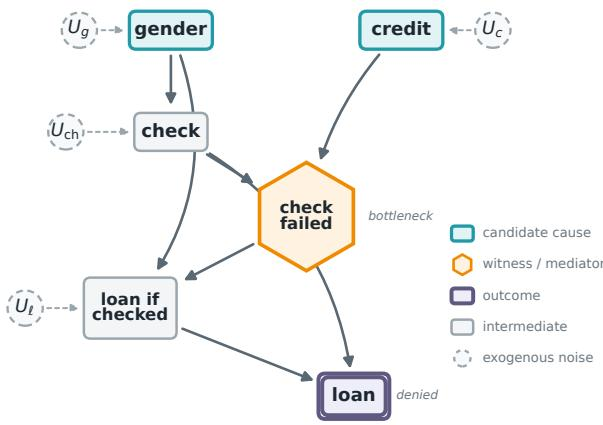  
Figure 3: Causal structure of the OBCB loan model (Example 6). Node shape and colour encode role: the candidate causes gender and credit (teal boxes), the witness check-failed (gold hexagon), and the outcome loan (purple double box); intermediate variables are grey. Dashed circles are the exogenous noise UV feeding each stochastic mechanism; the deterministic nodes check-failed and loan carry none. check reaches loan along two routes: through the check-failed bottleneck and directly as the screening gate $( l o a n \ : = \ : l o a n \ – i f \ – c h e c k e d \cdot c h e c k )$ . PCI holds the bottleneck witness fixed to keep these two routes distinct.

With this stochastic model in hand, we can state seven desiderata that any responsibility attribution for Alice and Bob should satisfy, giving every construction in the rest of the paper an explicit target.

Let $R ( V  l o a n \mid \mathrm { p e r s o n } )$ denote the causal responsibility of variable V for the loan outcome at the individual level. R is a placeholder for any attribution score, not a specific formal quantity; PCI interprets R as the PCI score $\mathrm { P C I } _ { X _ { k } }$ of Definition 19. The desiderata themselves are method-agnostic: they encode the graded active/preempted/irrelevant ordering and the cross-individual asymmetry that the actual-causality and preemption literature already distinguishes [Lewis, 1973, Hall, 2004, Halpern, 2016]. PN, PS, PNS, SHAP, and Causal SHAP are held to this same independently motivated standard below and in Section 5. Here V ranges over the candidate variables; in the general development it is the variable of interest $X _ { k } .$ . Attribution methods may produce signed values; the desiderata are stated in terms of absolute magnitudes $| R ( \cdot )$ |, allowing for directionality:

$$
\mathbf { D } { \cdot } \mathbf { A } \mathbf { 1 } \quad | R ( g e n d e r \not \sim l o a n \mid \mathbf { A } \mathrm { l i c e } ) | > 0
$$

$$
{ \bf D } { \bf - A } 2 \mathrm {  ~ \nabla ~ } | R ( c r e d i t \sim l o a n \mathrm {  ~ | ~ } \mathrm {  ~ \cal { A } l i c e } ) | > 0
$$

$$
\begin{array} { r l } { \mathbf { D } \mathbf { \cdot } \mathbf { A } \mathbf { \cdot } \mathbf { r a n k } } & { { } | R ( g e n d e r \right. l o a n \mid \mathbf { A l i c e } ) | > | R ( c r e d i t \left. l o a n \mid \mathbf { A l i c e } ) | } \end{array}
$$

$$
{ \bf D } { \bf - B } { \bf 1 } \quad \left| R ( g e n d e r \sim l o a n \mid { \bf B o b } ) \right| > 0
$$

$$
{ \bf D - B 2 } \quad | R ( c r e d i t \sim l o a n \mid { \bf B o b } ) | > 0
$$

$$
{ \begin{array} { r l } { \mathbf { D } { \cdot } \mathbf { B } { \cdot } \mathbf { r } { \mathrm { a n k } } } & { | R ( c r e d i t \sim l o a n \mid \mathbf { B o b } ) | > | R ( g e n d e r \sim l o a n \mid \mathbf { B o b } ) | } \end{array} }
$$

$$
\mathrm { { \bf ~ D – c o m p } } \quad | R ( g e n d e r \sim l o a n \mid \mathrm { A l i c e } ) | > | R ( g e n d e r \sim l o a n \mid \mathrm { B o b } ) |
$$

D-A1 and D-A2 both require non-zero attribution for Alice because two distinct causal routes were available. Gender filtered her out at the checking stage. Credit is not causally inert either: the check is only probabilistic (women are still checked with positive probability, $\gamma _ { F } = 0 . 2$ in the model above), so conditioning on Alice’s denial leaves nonzero probability that she was in fact checked, in which case her bad credit was the operative cause. The broader principle is a graded ordering of three roles. An active cause, on the path that actually produced the outcome, carries the most responsibility. A preempted cause retains a residual share: strictly positive, yet strictly below the active cause (exactly what D-A-rank demands), governed by the probability that the preemption fails to fire, leaving the credit route live. An irrelevant variable, with no active path to the outcome under any context, receives the least of all, approaching zero. This is a deliberate departure from the binary Halpern–Pearl/Beckers treatment of preemption, which collapses the first two roles by zeroing a fully preempted cause. D-A-rank is the substantive constraint: because Alice never underwent a credit evaluation, gender’s causal role is immediate, whereas credit’s is purely hypothetical. A method that ranks credit above gender for Alice is misattributing the cause of her rejection.

For Bob, D-B2 reflects that the credit check occurred and directly produced the rejection: the causal chain credit → check-failed → loan was activated. D-B1 requires strictly positive attribution for gender: being male gave Bob a 90% probability of being checked, so gender opened the evaluation that rejected him. This indirect causal role is non-zero; a method returning exactly zero fails to capture it. D-B-rank corresponds to the intuition that credit is the proximate cause. D-comp captures the cross-individual asymmetry that is hardest for naive methods to express: gender is more causally responsible for Alice’s rejection than for Bob’s. For Alice, gender=female was overwhelmingly likely to produce the rejection on its own (evaluation happens only 20% of the time for women, so credit is rarely the operative factor); for Bob, gender=male reliably opened the evaluation (a 90% chance) that credit=bad then caused. We verify in Section 3 that PCI satisfies all seven desiderata, while PN, PS, PNS, developed next in this section, fail some of them. Later, we will also revisit this example and its desiderata in the context of SHAP and Causal SHAP (Section 5).

Returning to the comparison between the two predecessors: the witness mechanism works well for deterministic models, but actual causality in its standard form offers no straightforward way to handle probabilistic ones. Before extending the witness idea to the stochastic setting, it is instructive to examine a probabilistic approach that scales more naturally, Pearl’s probabilities of necessity and sufficiency [Pearl, 2022], and to ask what it would miss without witnesses. This will let us identify what probabilistic machinery is needed, and what context-sensitivity is lost when witnesses are absent, motivating the synthesis that PCI provides. The following definitions allow for probabilistic models, but assume that all variables are Boolean (PCI will relax this assumption, allowing for continuous variables). Pearl considers two ways that a cause may relate to an effect: it may be necessary or sufficient for the effect. A cause is necessary if, counterfactually absent the cause, the effect is unlikely to occur; it is sufficient if the effect is likely when the cause counterfactually occurs. We now formalize these ideas and discuss them in the context of the running example.

Definition 7 (Probability of Necessity). Let the probability of necessity [Pearl, 1999] be the probability that the outcome $Y = y$ would not have occurred in the absence of $\mathbf { \partial } \cdot C = c ^ { \star }$ , given that both occurred:

$$
P N ( C = c ^ { \star } , Y = y ^ { \star } ) = P ( Y _ { c ^ { \prime } } \neq y ^ { \star } \mid C = c ^ { \star } , Y = y ^ { \star } ) ,
$$

where $Y _ { c ^ { \prime } }$ is the value ofY after intervening on C with $c ^ { \prime } \neq c ^ { \star } . ^ { 1 2 }$

Strictly speaking, the probability of necessity is less specific to a particular situation than the actualcause test above: as written, it conditions only on the cause–outcome pair, so it asks whether being male causes someone to be denied, not whether it caused Bob (whose bad credit we already know) to be denied. We therefore report two readings. The population-level value conditions only on the cause and outcome, exactly as the definition prescribes. The individual-level value additionally conditions on the subject’s other observed features (for Bob, on credit = bad), specializing the query to that person. The individual-level reading is the one closer to actual causation; we report both throughout, and the same population/individual split applies to $P S$ and PNS below.

We illustrate the computation for Alice’s gender. Alice is factually gender = female, credit = bad, $l o a n = F ;$ the counterfactual intervenes to set gender = male while leaving credit = bad. Tracing the male-intervention branches through the model (Appendix A, §A.1) gives $P N ( g e n d e r =$ female, $l o a n = F \mid \mathrm { A l i c e } ) = 0 . 9 \cdot 0 . 0 5 = 0 . 0 4 5$ Computing the analogous quantities for the remaining (variable, person) pairs gives the individual-level values shown in Table $2 ;$ the table also lists population-level values for comparison.

The PN scores partially align with intuition: Bob’s bad credit is high $( P N = 0 . 9 0 )$ , and his gender score is zero, matching the reading that his gender played no role. But Alice’s PN values do not separate gender (0.045) from credit (0.18) particularly well, and Alice’s gender PN is only marginally above Bob’s, not the sharp distinction we would want, given that the bank never even evaluated Alice’s credit. PN cannot register this asymmetry: it asks counterfactually what would happen under intervention without any context about which causal paths were active. For the full picture we need a second quantity, the probability of sufficiency.

Definition 8 (Probability of Sufficiency). Let the probability of sufficiency be the probability that the outcome $Y = y ^ { \star }$ would have occurred in the presence of $C = c ^ { \star }$ , given that neither $C = c ^ { \star }$ nor $Y = y ^ { \star }$ occurred:

$$
P S ( C = c ^ { \star } , Y = y ^ { \star } ) = P ( Y _ { c ^ { \star } } = y ^ { \star } \mid C = c ^ { \prime } , Y \neq y ^ { \star } )
$$

where $c ^ { \prime } \neq c ^ { \star }$ and $Y _ { c ^ { \star } }$ is the value of $\because Y$ after intervening on $C$ with $c ^ { \star }$

To query whether the factual cause was sufficient, we condition on the counterfactual: we assume the cause did not take its factual value and the outcome did not occur, then intervene to restore the factual cause value and ask whether the outcome now occurs. Intuitively, this asks: if the cause had been absent and things had gone differently, would reinstating the cause have brought the outcome about?

We illustrate $P S$ for Alice’s gender. Following the same convention as for $P N .$ , the individual-level computation additionally conditions on Alice’s credit (credit = bad): we fix her credit but flip the cause and outcome to their non-factual values (gender = male, loan = T), then intervene to restore gender = female and ask whether the loan is again denied. Both check branches yield loan $, = F$ (Appendix $\mathrm { A } , \ S \mathrm { A } . 2 )$ , so $P S ( g e n d e r = \mathrm { f e m a l e }$ $l o a n = F \mid \mathrm { A l i c e } ) = 1$ . The remaining individual values, along with population-level values for comparison, appear in Table 2. Two cases warrant comment: Bob’s gender PS is undefined because the required conditioning event (gender = female, credit = bad, loan = T) has probability zero in the model; Bob’s credit PS is 0.955 rather than 1 because the model includes a $5 \%$ exception rate for males who fail the credit check.

To combine the insights of the two scores, we would like to find causes that are both necessary and sufficient. This notion is formalized as follows:

Definition 9 (Probability of necessity and sufficiency). Let the probability of necessity and sufficiency be the probability that the outcome $Y = y ^ { \star }$ would have occurred in the presence of $C = c ^ { \star }$ and that it would not have occurred under the intervention $C = c ^ { \prime } { : }$

$$
P N S ( C = c ^ { \star } , Y = y ^ { \star } ) = P ( Y _ { c ^ { \star } } = y ^ { \star } , Y _ { c ^ { \prime } } \neq y ^ { \star } ) .
$$

This quantity factorises into a weighted sum of PN and PS by the consistency rule of counterfactuals [Pearl, 2009, §9.2]:

$$
\begin{array} { r l } & { P N S ( C = c ^ { \star } , Y = y ^ { \star } ) = P ( C = c ^ { \star } , Y = y ^ { \star } ) P N ( C = c ^ { \star } , Y = y ^ { \star } ) } \\ & { \phantom { P N S } + P ( C = c ^ { \prime } , Y \neq y ^ { \star } ) P S ( C = c ^ { \star } , Y = y ^ { \star } ) . } \end{array}
$$

Table 2: PN, PS, and PNS for Alice and Bob in Example 6, with $l o a n = F$ as the outcome. “Population” values condition only on the cause–outcome pair prescribed by the definition; “Individual” values additionally condition on the subject’s other factual variable (e.g. for Alice’s gender, on credit = bad). A dash marks an entry that is undefined because the conditioning premises are inconsistent with the model.
<table><tr><td></td><td></td><td colspan="3">Alice</td><td colspan="3">Bob</td></tr><tr><td>Variable</td><td>Level</td><td>PN</td><td>PS</td><td>PNS</td><td>PN</td><td>PS</td><td>PNS</td></tr><tr><td>gender</td><td>Population</td><td>0.43</td><td>0.83</td><td>0.39</td><td>0.02</td><td>0.10</td><td>0.01</td></tr><tr><td>gender</td><td>Individual</td><td>0.045</td><td>1.00</td><td>0.045</td><td>0</td><td></td><td>0</td></tr><tr><td>credit</td><td>Population</td><td>0.53</td><td>0.96</td><td>0.52</td><td>0.53</td><td>0.96</td><td>0.52</td></tr><tr><td>credit</td><td>Individual</td><td>0.18</td><td>1.00</td><td>0.18</td><td>0.90</td><td>0.955</td><td>0.86</td></tr></table>

The population- and individual-level PNS values appear in the rightmost column group of Table 2. These values capture the relative causal impact of gender and credit but are not entirely satisfying. Table 2 reveals the problem directly: for Alice, $\tilde { P N S } ( g e n d e r ) = 0 . 0 4 5 < P N S ( c r e \bar { d } i t ) = \bar { 0 } . 1 \bar { 8 } .$ so PNS ranks credit as more causally responsible than gender. Yet the bank never evaluated Alice’s credit: the check variable was F throughout. PNS has no mechanism to register this: it asks counterfactually what would happen if credit were different, without fixing check-failed, the mediating variable that blocked credit’s causal path.

As an attempt to help us better understand Alice’s particular situation, we might consider a modifi cation of PNS with additional conditioning:

$$
P N S _ { c } ( C = c ^ { \star } , Y = y ^ { \star } \mid Z = z ^ { \star } ) = P ( Y _ { c ^ { \star } } = y ^ { \star } , Y _ { c ^ { \prime } } \neq y ^ { \star } \mid Z = z ^ { \star } )
$$

Using this definition, we can compute $P N S _ { c } ( g e n d e r = \mathrm { f e m a l e } , l o a n = F \mid c r e d i t = \mathrm { b a d } ) = 0 . 0 4 5$ and $\bar { P } N S _ { c } ( c r e d i t = \mathrm { b a d } , l o a n = F \mid g e n d e r = \mathrm { f e m a l e } ) = 0 . 1 8 $ . Conditioning does not solve the problem described above (Alice’s credit was in reality never evaluated) because the interventions override the mediating variable that tracks whether her credit has been checked. When we compute $P N S _ { c } ( c r e d i t = \bf b a d ,  \bar { l } o a n = F \ : | \ g e n d e r = \bf f e m a l e )$ , conditioning on gender being female is consistent with the factual, but when we then intervene to set credit to good, this intervention propagates downstream and changes check-failed, overriding what we learned from conditioning on Alice’s factual outcome. The context we fixed is undone by the very intervention meant to probe it. We will not consider this use of conditioning further. This observation motivates the need to intervene on (as opposed to condition) mediating variables that provide important context, which the witness mechanism supplies.

ATE and CATE share the same limitation. The two most familiar causal quantities in the ML and statistics literature are the average treatment effect $\mathrm { A T E } ( T ) ~ = ~ \mathbb { E } [ Y ~ \mid ~ \hat { d } o ( T { = } 1 ) ] - \mathbb { E } [ Y ~ \mid$ $d o ( T { = } 0 ) $ ], where do(·) denotes Pearl’s intervention operator [Pearl, 2009], and the conditional version $\operatorname { C A T E } ( T \mid X { \overset { \cdot } { = } } x ) = \mathbb { E } [ Y \mid d o ( T { = } 1 ) , X { = } x ] \ { \overset { \cdot } { - } } \ \mathbb { E } [ Y \mid d o ( T { = } 0 ) , { \overset { \cdot } { X } } { = } x ]$ . Computed on our stochastic OBCB, population ATE ranks credit (0.518) above gender (0.383), mirroring the population PN ranking. At the individual level for Alice, CATE(credit | $g e n d e r { = } \mathrm { f e m a l e } ) ~ = ~ 0 . 1 8$ and $\mathrm { C A T E } ( g e n d \bar { e r } \mid c r e d i t { = } \mathrm { b a d } ) = 0 . 0 4 5$ . These are exactly Alice’s individual PNS values: with binary outcomes and $P S = 1$ in the relevant branches, CATE for a single treatment collapses to $\dot { P } \tilde { N S } _ { c } ,$ so the same check-failed propagation that undermined $P N S _ { c }$ undermines CATE. A second, sharper failure follows from CATE’s inability to condition on the factual treatment value:

CATE(gender | credit=bad) = 0.045 is identical for Alice and Bob even though one’s gender carried her denial outright while the other’s merely opened the credit check that then rejected him. The structural limitation cuts across PNS, ATE, and CATE alike, so the witness mechanism in Section 3 is not just a fix for PNS but a general repair for the family of methods that average counterfactual effects without intervention-based context-sensitivity.

## 2.3 Path Forward

The two predecessors examined in this section have complementary strengths and blind spots. Halpern’s actual causality is context-sensitive: by holding witnesses fixed at their factual values, it correctly diagnoses Alice’s case, attributing her denial to gender rather than credit. But in its standard form it is restricted to deterministic models, it requires a brute-force search over witness sets, and it has no native treatment of continuous variables. Pearl’s PN/PS/PNS make the converse trade-off. They scale naturally to probabilistic models, because every counterfactual reduces to an expectation under the noise distribution. But they have no analogue of the witness mechanism: every intervention propagates through the structural equations and overrides whatever mediator value the factual context fixed. Table 2 shows the symptom: for Alice, PNS(credit) > PNS(gender), even though the credit check was never performed.

Any replacement therefore needs intervention-based context-sensitivity, holding the relevant mediators fixed by intervention. PCI delivers exactly this, combining three ingredients into a single estimator. From actual causality it takes the witness mechanism: it holds relevant context fixed by intervention, so the structural information about which causal paths were active survives the counterfactual evaluation. From PN/PS/PNS it takes a probabilistic vocabulary: it expresses counterfactuals as expectations under the noise distribution, so the attribution lives on the same probability space as the model and extends naturally to continuous variables. And in place of brute-force enumeration over witness sets, it integrates over a distribution of them, an integral estimable from samples even when the witness pool is large or the variables continuous.

Returning to Alice, PCI reverses the ranking PNS produced (Table 2), recovering the intuitive verdict. We revisit the example in full once the method is defined (Section 3, with the complete computation in Appendix A).

Two features distinguish PCI from both predecessors. Unlike actual causality, it does not ask whether some witness set validates a counterfactual dependency; it integrates over a distribution of witness sets, weighting each by its probability. This replaces combinatorial enumeration with statistical estimation. The gain is also conceptual. Existential quantification certifies a cause as soon as some witness set validates the dependence, a sensitivity that graded and normality-based accounts were introduced in part to address, by weighting alternatives according to how typical they are in stead of treating any single one as decisive. Integration weights each witness set by its probability, so a variable is responsible to the degree that typical witness sets render it efficacious. The witness still does the work of holding context fixed. PCI simply declines to privilege one hand-picked set, letting the structural facts decide which witnesses carry the mass (for Alice, those pinning check-failed favour gender; almost none favour credit). As a by-product, actual causality’s binary verdict becomes a graded magnitude. Unlike PN/PS/PNS, it inherits the context-sensitivity of actual causality through this integration: it downweights causally inert variables automatically, because almost ev ery witness set leaves them disconnected from the outcome, while it upweights variables that drive the outcome, because almost every witness set leaves them connected. The formal definitions in Section 3 make this expectation precise.

With the limitations of both predecessors in mind, we turn in Section 3 to the formal development. The next section introduces PCI piece by piece (PSCM scaffolding, the variable selection distribution Γ, the alternative-value distribution ∆, the joint necessity-sufficiency measure, and the user-chosen causal impact function ci) and verifies on the same Alice/Bob example that the resulting attribution satisfies all seven desiderata stated above (p. 13).

## 3 Causal Impact: Definitions

Explanation and causal attribution seek to connect a potentially causal event $X = x$ to an outcome event $Y = y . ^ { 1 3 }$ We return to Example 6 to ground the formal development that follows, using Alice and Bob as running illustrations throughout this section. Both are rejected for a loan; the question is which of their attributes (gender and credit) was causally responsible for each rejection, and to what degree. While the example is discrete, the machinery applies to continuous and mixed-type variables; a continuous illustration is given in Sections 5.2 and D.

Roadmap of this section. Section 2 already stated seven desiderata (p. 13) that any responsibility attribution for Alice and Bob should satisfy; they give the formal construction below an explicit target. We introduce the probabilistic structural causal model (PSCM) and interventions, the substrate on which everything else rests, and then the two distributions PCI offers to the user: the variable selection distribution Γ over suspect/witness pairs and the alternative-value distribution $\Delta$ over counterfactual cause settings. We combine these into the joint necessity-sufficiency measure $P _ { k } ^ { s , n }$ and the user-chosen causal impact function ci whose expectation is the PCI score, showing how the choice of ci generalises the framework from binary to continuous outcomes. Finally we compute the score on the OBCB example, verify that all seven desiderata hold, and contrast PCI’s necessity/sufficiency decomposition with Pearl’s PN/PS/PNS.

Recall $R ( V  l o a n \mid \mathrm { p e r s o n } )$ , the placeholder for the causal responsibility of variable V for the loan outcome at the individual level used to state those desiderata (Section $2 , \mathsf { p } . 1 3 )$ : PCI interprets R as the PCI score $\mathrm { P C I } _ { X _ { k } }$ of Definition 19, but the desiderata themselves are method-agnostic. Here V ranges over the candidate variables; in the general development it is the variable of interest $X _ { k }$

We work within the context of probabilistic structural causal models [Pearl, 2009].

Definition 10 (Probabilistic Structural Causal Model (PSCM)). A probabilistic structural causal model is a tuple

$$
M = \langle { \bf { U } } , { \bf { V } } , { \bf { F } } , P _ { \bf { U } } \rangle ,
$$

where $\textbf { V } = \{ V _ { 1 } , \ldots , V _ { n } \}$ is a finite set of endogenous variables, $\textbf { U } = \{ U _ { 1 } , \ldots , U _ { m } \}$ is a set of exogenous variables (not necessarily one per endogenous variable: a deterministic mechanism, $f _ { i }$ depending only on $\mathbf { P a } _ { i }$ , needs no ${ \dot { U } } _ { i }$ of its own), and $\mathbf { F } = \{ f _ { 1 } , \ldots , f _ { n } \}$ is a set of structural assignments

$$
V _ { i } : = f _ { i } ( \mathbf { P a } _ { i } , U _ { i } ) , \qquad i = 1 , \ldots , n ,
$$

with $\mathbf { P a } _ { i } \subseteq \mathbf { V } \setminus \{ V _ { i } \}$ denoting the parents of $V _ { i } ,$ and $U _ { i } \in \mathbf { U } \cup \{ \emptyset \}$ its own exogenous input, if any (a purely deterministic $f _ { i }$ takes $\bar { U } _ { i } = \emptyset$ and depends on $\mathbf { P a } _ { i }$ alone). The distribution $P _ { \mathbf { U } }$ is a probability measure on dom (U), and the assignments in F are assumed to be acyclic and to have a unique solution for V given $\mathbf { U } . ^ { 1 4 }$

A PSCM encodes which variables influence which others, through what mechanisms, and subject to what randomness. The structural equations specify each variable as a deterministic function of its causal parents and local noise; the exogenous distribution captures all irreducible uncertainty in the system. Together they make every counterfactual question well-posed and computable.

The OBCB model (Example 6) is a PSCM with endogenous variables

$$
{ \bf V } = \{ g e n d e r , c r e d i t , c h e c k , c h e c k - f a i l e d , l o a n - i f - c h e c k e d , l o a n \} ,
$$

and exogenous variables

$$
\mathbf { U } = \{ U _ { g e n d e r } , U _ { c r e d i t } , U _ { c h e c k } , U _ { l o a n - i f - c h e c k e d } \}
$$

which induce independent Bernoulli noise.

The structural assignments in the case at hand take the form $V _ { i } ~ = ~ f _ { i } ( { \bf P a } _ { i } , U _ { i } )$ promised by the PSCM definition above. Each stochastic node is a Bernoulli draw whose success probability is a primitive parameter of the model (possibly depending on the node’s parents); writing $V \sim \mathrm { B e r n o u l l i } ( p )$ for a node equal to 1 with probability p, the mechanisms are

$$
g e n d e r \sim \mathrm { B e r n o u l l i } ( p _ { g } ) ,
$$

$$
c r e d i t \sim \mathrm { B e r n o u l l i } ( p _ { c } ) ,
$$

$$
c h e c k \mid g e n d e r \sim \mathrm { B e r n o u l l i } \big ( \gamma _ { F } ( 1 - g e n d e r ) + \gamma _ { M } g e n d e r \big ) ,
$$

$$
c h e c k - f a i l e d = c h e c k ( 1 - c r e d i t ) ,
$$

$$
\begin{array} { c } { l o a n - i f \mathrm { - } c h e c k e d \mid g e n d e r , c h e c k \mathrm { - } f a i l e d \sim \mathrm { B e r n o u l l i } \left( \mathrm { l o a n \mathrm { - } p r o b } ( g e n d e r , c h e c k \mathrm { - } f a i l e d ) \right) , } \\ { l o a n = l o a n \mathrm { - } i f \mathrm { - } c h e c k e d \cdot c h e c k . } \end{array}
$$

So gender and credit are fair coin flips; check fires with probability $\gamma _ { F }$ for women and $\gamma _ { M }$ for men; check-failed and loan are deterministic functions of the nodes above them (Figure 3). The Bernoulli draws are coupled across factual and counterfactual worlds, making counterfactuals welldefined. For the running example we take $p _ { g } = p _ { c } = 0 . 5 , \gamma _ { F } = 0 . 2 , \gamma _ { M } = 0 . 9$ , and the values of loan-prob given in Example 6.

Definition 11 (Interventions). Given a model $M = \langle \mathbf { U } , \mathbf { V } , \mathbf { F } , P _ { \mathbf { U } } \rangle$ , an intervention on variables $\mathbf { X } = \{ X _ { 1 } , \ldots , X _ { k } \} \subseteq \mathbf { V }$ with values $\mathbf { x } = ( x _ { 1 } , \dots , x _ { k } )$ replaces the structural assignments $f o r X _ { i }$ by $X _ { i } : = x _ { i }$ , where $i = 1 , \ldots , k .$ We denote this intervention by either $[ \mathbf { X } \gets \mathbf { x } ] o r \bar { d } o ( \mathbf { X } = \mathbf { \bar { x } } )$

An intervention surgically replaces a variable’s structural equation with a fixed constant, disconnecting it from its usual causes. The rest of the model propagates downstream as normal under the new assignment; the exogenous noise is unchanged.

In the OBCB model, $\mathrm { d o } ( g e n d e r ~ = ~ 1 )$ replaces Alice’s gender assignment with male, leaving all other structural equations intact. The downstream effect propagates: check now draws from Bern(0.9) instead of $\mathrm { B e r n } ( 0 . 2 )$ , so Alice would be checked in 90% of noise realizations. This is the counterfactual world in which we ask whether her loan outcome would have differed.

Since PCI supports arbitrary variable types, it will be helpful to define a measure-theoretic object corresponding to interventional outcomes; because outcomes are a deterministic function of exogenous noise, this object turns out to be a Dirac measure.

Definition 12 (Pointwise Interventional Law). Let $M = \langle \mathbf { U } , \mathbf { V } , \mathbf { F } , P _ { \mathbf { U } } \rangle$ be a probabilistic structural causal model and let $Y \in \mathbf { V } .$ . For an intervention do $\mathbf { \Omega } ^ { } ( \mathbf { X } = \mathbf { x } ) , l e t Y ^ { \prime }$ : dom $\mathbf { ( U ) } $ dom (Y) denote the measurable map induced by the modified structural assignments. The pointwise interventional law ofY atfixed u ∈ dom (U) is the probability measure on dom (Y) defined by

$$
P ( Y \in A \mid \mathbf { u } , \det ( \mathbf { X } = \mathbf { x } ) ) : = \mathbb { I } \{ Y ^ { \prime } ( \mathbf { u } ) \in A \} \ = \ \delta _ { Y ^ { \prime } ( \mathbf { u } ) } ( A ) , \qquad A \subseteq \operatorname { d o m } { ( Y ) } .
$$

The pointwise interventional law records the deterministic outcome of $Y$ under $\mathrm { d o } ( \mathbf { X } = \mathbf { x } )$ for a fixed noise realization u: since the modified structural equations make Y a function of u alone, its distribution collapses to a point mass. Integrating over $P _ { \mathbf { U } }$ then recovers the full interventional distribution.

The suspect and witness apparatus introduced below is built from a single primitive, defined next. Definition 13 (Causal set). Given a model $\langle \mathbf { U } , \mathbf { V } , \mathbf { F } , P _ { \mathbf { U } } \rangle$ , a causal set is a set of pairs $X = x$ where $X \in \mathbf { V }$ and $x \in d o m ( X )$ .

Informally, a causal set is a list of specific variable-value assignments, a precise statement of which variables are set to which values. It is the basic unit of intervention: from a causal set one can read off exactly what is being manipulated or held fixed.

In PCI, causal sets play four distinct roles, two on the cause side and two on the context side:

Suspects S. The full set of variables suspected to bear on the outcome. Subsets of S will be sampled and intervened on.

Active suspects $\mathbf { C } \subseteq \mathbf { S } .$ . The specific subset intervened on in a given search step, either to alternative values (necessity regime) or to factual values (sufficiency regime).

Witnesses W. The full set of context variables that may be held fixed at their factual values. Subsets of W will be sampled and held fixed.

Active witnesses $\mathbf { T } \subseteq \mathbf { W }$ . The specific subset held fixed in a given search step. To avoid contradicting the active intervention, T is pruned so that $\mathbf { T } \cap \mathbf { C } = \emptyset$

Why prune T and not C? The conflict on $\mathbf { T } \cap \mathbf { C }$ has to be resolved in one direction or the other, and pruning the witnesses is the right choice for three reasons. First, C is the object of the test: it encodes the causal claim being evaluated, while T is the auxiliary device that holds context fixed. Pruning C would silently change the claim under test; pruning T leaves the claim intact and merely weakens the context held fixed. Second, the convention extends cleanly to the limit $\mathbf { C } = \mathbf { V }$ , where every variable is a suspect: the pruned T collapses to ∅ and we recover the unconditional but-for test, the right baseline behaviour. Pruning C instead would leave this limit undefined whenever any witness is sampled. Third, the convention inherits directly from Halpern’s actual-cause definition (Definition 5), which makes $\mathbf { T } \cap \mathbf { C } = \emptyset$ part of the definition; pruning post-sampling is the operational implementation of that constraint and lets us specify Γ on the unconstrained product $2 ^ { \mathbf { S } } \times 2 ^ { \mathbf { W } }$ rather than baking disjointness into the prior.

To evaluate the causal impact of a variable on an outcome, we consider two interventional regimes: the necessity regime, in which we intervene on the variables $\mathbf { C } \subseteq \mathbf { S }$ to have an alternative value, and the sufficiency regime, in which we intervene so that C takes on factual values. Moreover, we hold some elements $\mathbf { T } \subseteq \mathbf { W }$ of the context fixed (i.e., intervened on to retain factual values, despite intervention on C). This is exactly what makes the necessity component context-sensitive in Halpern’s sense [Halpern, 2016]: the alternative cause is evaluated against a held-fixed witness configuration, not in isolation. We will reuse this terminology throughout: “context-sensitive necessity” refers to the necessity regime evaluated under an active witness set T. When looking for an explanation, we perform a search across possible cause sets and possible contexts. Complete model samples in these regimes will be called necessity worlds and sufficiency worlds, respectively.

The intuition is that the suspect set $\mathbf { S }$ names every variable that could plausibly have caused the outcome; the witness set W names context variables to be selectively held fixed, isolating the causal channels under investigation. Intervening on suspects tests what would have happened under an alternative cause in the necessity worlds and under the factual values in the sufficiency worlds; fixing witnesses blocks confounding paths that would otherwise absorb the effect. Responsibility attribution increases when the outcome is far from the factual value in the necessity world and decreases when it is far from the factual value in the sufficiency world.

For both Alice (female, bad credit, loan denied) and Bob (male, bad credit, loan denied) we set $\mathbf { S } = \{ g e n d e r , c r e d i t \}$ and $\mathbf { W } = \{ c h e c k - f a i l e d \}$ . The witness check-failed records whether the applicant was checked and had bad credit; holding it at its factual value isolates the causal path from gender or credit to loan independently of the credit-check bottleneck. Without this witness, intervening on credit for Alice would leave 80% of noise realizations unaffected (those in which she is never checked), making credit’s causal role invisible. The witness makes the bottleneck explicit and manipulable.

In the general framework we search for causes by intervening on subsets of suspects and holding fixed subsets of witnesses. To make this search tractable, we need a way to prioritize which subsets to consider.

Definition 14 (Variable Selection Distribution). Let X be afinite set ofrandom variables. A variable selection distribution Γ is a probability distribution on $2 ^ { \mathbf { X } }$ . We write $\mathbf { \dot { Y } } \sim \Gamma$ to mean Y is a random subset ofX drawnfrom Γ, with $p ^ { \Gamma } ( \mathbf { y } )$ denoting the probability assigned to $\mathbf { y } \subseteq \mathbf { X }$

The variable selection distribution Γ encodes prior beliefs about which subsets of suspects are worth examining. A uniform distribution treats all suspect subsets as equally plausible; a cardinalityconstrained choice focuses the search on interactions of a particular order, analogous to choosing which interaction terms to include in a regression. More complex distributions could encode domain knowledge about which variables are more likely to interact, or could be learned from data.

In particular, we will be using variable selection distributions for the powerset of causal suspects S and for the powerset of witnesses W. One simple pattern of suspect and witness selection can be derived by setting size limits on the number of activated suspects or witnesses, and sampling uniformly otherwise.

Example 15 (Cardinality-Constrained Uniform Selection). Let X be a candidate set of random variables. Sample a target size $k \sim \operatorname { U n i f } \{ J , \dots , K \}$ with $1 \leq J \leq K \leq | \mathbf { X } |$ , then sample Y uniformly among subsets of that size, i.e. from the conditional probability mass function

$$
p ^ { \Gamma } ( \mathbf { Y } \mid k ) \propto \mathbb { I } [ | \mathbf { Y } | = k ] .
$$

Marginalising k out gives the unconditional pmfactually used to define $\Gamma ( 2 ^ { \mathbf { X } } )$ ,

$$
p ^ { \Gamma } ( \mathbf { Y } ) = \frac { 1 } { K - J + 1 } \binom { | \mathbf { X } | } { | \mathbf { Y } | } ^ { - 1 } , \qquad J \leq | \mathbf { Y } | \leq K ,
$$

which is not proportional to $\mathbb { I } [ J \leq | \mathbf { Y } | \leq K ]$ : sizes are weighted uniformly, but within a size, larger coalitions (ofwhich there are more) are individually rarer.

The parameters J and K determine the cardinality range of the search; specific choices connect PCI to existing methods and enable efficient Monte Carlo approximation.15

In PCI the variable selection distribution Γ generalises Definition 14 (stated there for a single powerset $2 ^ { \mathbf { X } } )$ to a joint object: it is a probability mass function on $2 ^ { \mathbf { S } } \times 2 ^ { \mathbf { \dot { W } } }$ , governing the joint choice of an active suspect set $\mathbf { C } \subseteq \mathbf { S }$ and an active witness set $\mathbf { T } \subseteq \mathbf { W }$ . The recommended construction samples suspects and witnesses separately and then enforces the constraint that no variable plays both roles in the same draw: pick a marginal $\Gamma _ { s }$ on $2 ^ { \mathbf { S } }$ and a marginal $\Gamma _ { w }$ on $2 ^ { \mathbf { W } }$ , draw $\mathbf { C } \sim \Gamma _ { i }$ s and $\mathbf { T } \sim \Gamma _ { w }$ independently, and reject any draw with $\mathbf { T } \cap \mathbf { C } \neq \emptyset$ , resampling until the constraint holds. Equivalently,

$$
p ^ { \Gamma } ( \mathbf { C } , \mathbf { T } ) \propto p _ { s } ^ { \Gamma } ( \mathbf { C } ) p _ { w } ^ { \Gamma } ( \mathbf { T } ) \mathbb { I } [ \mathbf { T } \cap \mathbf { C } = \emptyset ] .
$$

Throughout, $\Gamma _ { s }$ and $\Gamma _ { w }$ are abbreviations for the sampling marginals of this construction; the formal primitive in Definition 18 is the joint Γ

For the OBCB analysis, with $| \mathbf { S } | = 2 .$ , we use a Γ built from $\Gamma _ { s }$ uniform over the three non-empty subsets of S ({gender}, {credit}, {gender, credit}, each with probability $1 / 3 )$ and $\Gamma _ { w }$ uniform over $\{ \emptyset , \{ c h e c k - f a i l e d \} \}$ , each with probability $1 / { \overset { \cdot } { 2 } } .$ . Since no element appears in both S and W, the rejection step is vacuous and Γ is exactly the product of marginals $p _ { s } ^ { \Gamma } \cdot p _ { w } ^ { \Gamma }$ . In larger suspect sets the choice of cardinality range becomes substantive: sampling uniformly from the full powerset yields an expected intervention size of $| \mathbf { S } | / 2$ , which spreads attribution across large coalitions and may make individual feature contributions harder to isolate; we return to this issue in Appendix $\mathrm { F , }$ where the cardinality cap is treated as a tunable hyperparameter and a dynamic-set-sizes ablation measures the empirical cost of bounding it.

The choice of Γ is a design decision that shapes the search process and the resulting attributions. As a default, a uniform $\breve { \Gamma }$ over the full powerset is the least-informative starting point, assigning equal weight to all subset sizes, analogous to including all interaction orders in a regression. There is no universally principled criterion for restricting the cardinality range; we therefore recommend treating $J$ and $\dot { K }$ as explicit design choices. Two practical considerations bear on this choice, however: with $K = 1$ , attribution scores are based on singleton interventions and straightforward to communicate to stakeholders; higher $K$ averages over joint interventions on $X _ { k }$ with other suspects simultaneously, which is harder to explain and, in large or structurally complex models, may amplify estimation noise rather than capturing genuine higher-order causal structure. For applications where attribution has serious consequences, we recommend a cardinality sensitivity analysis: if rankings are stable as K increases from 1 to |S|, the simpler choice is supported; if they diverge, higher-order interactions are materially relevant and the full powerset should be used. The advantage of PCI is that this commitment is made transparently rather than absorbed into an implicit default.16

Causal attribution hinges on questions such as “if X had, contrary to fact, been fixed to $\boldsymbol { x } ^ { \prime } \neq \boldsymbol { x }$ instead of $x ,$ what would the outcome have been $\it { 1 7 ^ { \circ } }$ For non-binary causes, this is ambiguous. To resolve this in a way that does not require committing to a single, contrastive causal event [Kawakami et al., 2024], we rely on a distribution over alternative values.

Definition 16 (Alternative Value Distribution). Let X be a set of random variables with domain dom (X) and let ${ \bf X } = { \bf x } \in$ dom $( \mathbf { X } )$ be a factual event. An alternative value distribution $\Delta ( { \bf x } )$ is a probability measure on dom $( \mathbf { X } )$ such that x ∈/ supp $( \Delta ( { \bf x } ) )$ ).

Informally, $\Delta ( { \bf x } )$ specifies what counts as a genuinely different value for a suspect variable. The support condition ensures no mass falls on the factual value x itself, so every sampled alternative is a real counterfactual departure rather than a noisy copy of what actually happened.

Three properties guide the choice of $\Delta .$ Plausibility under M: the alternative should be a value the structural model could plausibly produce given the context, so the necessity test interrogates a counterfactual the model has anything to say about. Outcome-independence: the distribution over $\mathbf { x } ^ { \prime }$ should not be informed by the outcome whose causes we are explaining, on pain of circularity. Context-sensitivity: $\mathbf { x } ^ { \prime }$ should reflect the rest of the factual scenario, so the necessity test is individual-level rather than population-level. The construction we use throughout is the structuralmodel posterior of X conditioned on upstream factual values, optionally excised near the factual value (Example 17 below); this is the natural choice satisfying all three.

Upstream-only conditioning operationalises the intuition shared with the descriptive-normality lit erature [Halpern and Hitchcock, 2015, Icard et al., 2017, Hitchcock and Knobe, 2009]: factual upstream values play the role of the default against which counterfactual alternatives are graded, the same role a stipulated baseline plays in causal analyses of harm [Beckers et al., 2022], where a default contract fixes what counts as a departure from the expected course of events. PCI does not aim to resolve the specific counterexamples motivating that literature; the link is at the level of why a non-uniform $\Delta$ matters at all. Since $\Delta$ is user-pluggable, other constructions are available when domain knowledge motivates them: a uniform distribution over dom $\mathbf { \tau } ( \mathbf { X } )$ trades plausibility for breadth; the empirical marginal $p ( \mathbf { x } ^ { \prime } )$ trades context-sensitivity for simplicity; a fully conditional posterior on every observable (including downstream evidence) trades outcome-independence for sharper conditioning.

One natural alternative value distribution takes the one already embodied in the model and excises it around the factual setting: “alternative value” then means “a sufficiently different value, following the original distribution otherwise.” In the discrete case, the analogue is simply the probability mass function conditioned on the factual value not holding.

Example 17 (ϵ-Excised Distribution). Assume X is $\mathbb { R } ^ { d } .$ -valued with density p. Given afactual event $\mathbf { X } = \mathbf { x } ,$ define the ϵ-excised alternative value distribution $\Delta _ { \epsilon } ( \mathbf { x } )$ as the probability measure on $\bigl ( \mathbb { R } ^ { d } , B ( \mathbb { R } ^ { d } ) \bigr )$ with density

$$
p _ { \Delta _ { \epsilon } } ( \mathbf { x ^ { \prime } } \mid \mathbf { x } ) \propto \left\{ \begin{array} { l l } { 0 , } & { \mathbf { x ^ { \prime } } \in B _ { \epsilon } ( \mathbf { x } ) , } \\ { p ( \mathbf { x ^ { \prime } } ) , } & { o t h e r w i s e , } \end{array} \right.
$$

where $B _ { \epsilon } ( \mathbf { x } )$ denotes the ϵ-ball centered at x. The support is therefore supp $\mathbf { \Delta } ^ { \prime } \Delta _ { \epsilon } ( \mathbf { x } ) ) = \mathrm { s u p p } ( p ) \mathbf { \epsilon } \backslash$ $B _ { \epsilon } ( \mathbf { x } )$ : the exclusion covers the entire ϵ-neighbourhood ofx. This requires p to place positive mass outside $B _ { \epsilon } ( \mathbf { x } ) ; i f \mathrm { s u p p } ( p ) \subseteq B _ { \epsilon } ( \mathbf { x } )$ (a sharply concentrated posterior, or an overly generous $\epsilon ) ,$ , the normalising constant is zero and $\Delta _ { \epsilon } ( \mathbf { x } )$ is undefined. The same degeneracy affects the discrete case: a variable whose posterior is a point mass admits no alternative-value distribution with the support condition of Definition 16 at all. A practical implementation should detect this case explicitly and either signal an error, shrink $\epsilon ,$ or fall back to a non-degenerate default such as the unconditional marginal.

With plausibility, outcome-independence, and context-sensitivity as design criteria, and ϵ-excision as a concrete construction satisfying them, we return to the OBCB example to see what $\Delta$ looks like when the suspect variables are binary.

In the OBCB model both gender and credit are binary, so $\Delta$ is trivial. For Alice, the only alternative to $g e n d e r = 0$ (female) is gender = 1 (male), and the only alternative to credit $= ~ 0$ (bad) is $c r e d i t = 1$ (good); for Bob, the only alternative to $g e n d e r \ = \ 1$ is $g e n d e r \ = \ 0$ . Accordingly, $\Delta ( g e n d e r = 0 )$ is a point mass on $g e n d e r = 1$ and $\Delta ( c r e d i t = 0 )$ a point mass on $c r e d i t = 1 :$ no distributional choice is required. The binary case is exactly where $\Delta$ is unambiguous; it is for continuous suspects such as income or loan amount that the ϵ-excised distribution becomes necessary, forcing an explicit commitment to what counts as a meaningfully different value.

Why ϵ-excision? Any method that asks “what would happen if X had been different” must operationalise what different means. The observational marginal $p ( \mathbf { x } ^ { \prime } )$ (as in kernel SHAP [Lundberg and Lee, 2017]) places mass near the factual value x, conflating the necessity question (“what if x had genuinely differe $1 ? ? )$ with evaluating essentially the same setting. The fully conditional posterior $p ( x _ { k } ^ { \prime } \mid \mathbf { x } _ { - k } )$ conditions on all other observed features, potentially including descendants of $X _ { k }$ , which imposes structural constraints that may rule out otherwise plausible counterfactuals, and still concentrates mass near $x _ { k }$ when features are correlated. The ϵ-excised distribution occupies the middle ground: it draws from the marginal informed by upstream variables only, excising the factual neighbourhood to guarantee genuine departure without downstream conditioning.

The choice parallels the Region of Practical Equivalence (ROPE) in Bayesian hypothesis testing [Kruschke, 2018]: just as ROPE forces an explicit decision about what difference is large enough to matter, ϵ-excision forces an explicit decision about what counterfactual is sufficiently far from the factual to count as genuinely alternative. The practitioner makes this commitment regardless of method; the only question is whether it is made transparently or absorbed into a default. When X is standardised to $\bar { \mathcal { N } } ( 0 , 1 )$ the choice acquires a direct probabilistic interpretation: the excised mass $\Phi ( x ^ { \star } + \epsilon ) - \Phi ( x ^ { \star } - \epsilon )$ is the fraction of the distribution ruled out as insufficiently different from $x ^ { \star }$ . At $x ^ { \star } = 0 , \epsilon = 0 . 2 , 0 . 5$ , 0.8 excise approximately 16%, 38%, 58% of the distribution, corresponding to small, medium, and large effect thresholds in the sense of Cohen [1988]. Alternatively, ϵ can reflect measurement precision or a decision-relevant threshold; sensitivity analysis across ϵ values is advisable when the appropriate scale is unclear. For concrete examples of how SHAP’s implicit choice leads to problematic attributions, see Section 5.

The PSCM and intervention apparatus give us a notion of counterfactual outcome for any fixed noise realisation u; Γ tells us which suspect/witness configurations to ask about; $\Delta$ tells us which nonfactual values to substitute when evaluating necessity. What remains is to plug those distributions into the counterfactual mechanics and read out a number. The next two definitions do exactly that: first the joint necessity-sufficiency measure $P _ { k } ^ { s , n }$ , then its expectation against a user-chosen impact function ci, with the OBCB scores and the desiderata verification immediately after.

The core idea behind PCI’s main definitions is to measure two complementary things for a variable of interest $X _ { k } \colon ( \mathrm { a } )$ how much $X _ { k } { } ^ { \prime } \mathbf { : }$ s factual value contributes to producing $y ^ { \star }$ , the sufficiency question, and (b) how much replacing $X _ { k } { ^ { \prime } } s$ value with alternatives would shift the outcome away from $y ^ { \star }$ the necessity question. We capture both by constructing two counterfactual outcome distributions conditioned on the same noise realization u, then marginalising their product over $P _ { \mathbf { U } }$ . Because PCI is not constrained to particular variable types, we work in general measure-theoretic terms supporting combinations of continuous and discrete variables.

Definition 18 (Joint Necessity and Sufficiency Measure). Let $M = \langle \mathbf { U } , \mathbf { V } , \mathbf { F } , P _ { \mathbf { U } } \rangle$ be a probabilistic structural causal model and $Y$ an outcome variable with domain dom $( Y )$ . Let $p ^ { \Gamma }$ be the mass function of a variable selection distribution on $2 ^ { \mathbf { S } } \times 2 ^ { \mathbf { W } }$ , and let $\Delta ( \mathbf { s } ^ { \star } )$ be an alternative value distribution on dom (S). Let $( \mathbf { S } , \mathbf { W } ) = \left( \mathbf { s } ^ { \star } , \mathbf { w } ^ { \star } \right)$ be afactual event.

For a variable of interest $X _ { k } ,$ , let $2 _ { k } ^ { \mathbf { S } } : = \{ \mathbf { C } \subseteq \mathbf { S } : X _ { k } \in \mathbf { C } \}$ , and for each $\mathbf { C } \subseteq \mathbf { S }$ let $\Delta _ { \mathbf { C } } ( \mathbf { s } ^ { \star } )$ denote the pushforward of $\Delta ( \mathbf { s } ^ { \star } )$ under the restriction map $\bar { \mathbf { s } ^ { \prime } } \mapsto \bar { \mathbf { s } ^ { \prime } } \vert _ { \mathbf { C } } . ^ { 1 7 }$ For any measurable $A \subseteq \operatorname { d o m } \left( \dot { Y } \right)$ and exogenous realization u, define three sub-probability measures on dom (Y ) (the first two) and dom $( Y ) ^ { \overline { { \mathbf { \alpha } } } } \times$ dom (Y) (the third).

(i) Sufficiency measure. $P _ { k } ^ { s } ( \cdot \textbf { | } \textbf { u } )$ intervenes on each active suspect set C to its factual values $\mathbf { s } ^ { \star } \mid _ { \mathbf { C } } ,$ , holds the active witnesses T fixed, and takes the Γ-weighted sum of $P ( Y \in \dot { A } \mid \mathbf { u } , \mathrm { d o } ( \cdot ) )$ underfactual cause restoration:

$$
P _ { k } ^ { s } ( { \cal A } \mid { \bf u } ) = \sum _ { ( { \bf C } , { \bf T } ) \atop X _ { k } \in { \bf C } } P ( Y \in { \cal A } \mid { \bf u } , \mathrm { d o } ( { \bf C } = { \bf s } ^ { \star } \mid _ { \bf C } , { \bf T } = { \bf w } ^ { \star } \mid _ { \bf T } ) ) \ p ^ { \Gamma } ( { \bf C } , { \bf T } ) .\tag{1}
$$

(ii) Necessity measure. $P _ { k } ^ { n } ( \cdot \mid \mathbf { u } )$ instead integrates over alternative values c′ for C (with T still pinned at factual values), and takes the Γ-weighted average over alternative cause values:

$$
P _ { k } ^ { n } ( A \mid \mathbf { u } ) = \sum _ { { \boldsymbol \alpha } , { \bf \alpha } \in { \bf C } \atop { \boldsymbol X } _ { k } \in { \bf C } } \int P ( Y \in A \mid \mathbf { u } , { \mathrm { d o } } ( { \bf C } = { \bf c } ^ { \prime } , { \bf T } = { { \bf w } ^ { \star } } \mid { \bf { r } } ) ) \Delta _ { { \bf C } } ( { \bf s } ^ { \star } ) ( d { \bf c } ^ { \prime } ) p ^ { \boldsymbol \nu } ( { \bf C } , { \bf T } ) .\tag{2}
$$

(iii) Joint necessity-sufficiency measure. On product rectangles $A \times B \subseteq \operatorname { d o m } \left( Y \right) \times \operatorname { d o m } \left( Y \right)$ , set

$$
\begin{array} { r l } { P _ { k } ^ { s , n } ( A \times B ) : } & { = \displaystyle \int \sum _ { \stackrel { ( \mathbf { C } , \mathbf { T } ) } { X _ { k } \in \mathbf { C } } } P ( Y \in A \mid \mathbf { u } , \mathrm { d o } ( \mathbf { C } = \mathbf { s } ^ { \star } \mid \mathbf { \mathbf { c } } , \mathbf { T } = \mathbf { w } ^ { \star } \mid \mathbf { r } ) ) \medskip } \\ & { \qquad \cdot \displaystyle \left[ \int P ( Y \in B \mid \mathbf { u } , \mathrm { d o } ( \mathbf { C } = \mathbf { c } ^ { \prime } , \mathbf { T } = \mathbf { w } ^ { \star } \mid \mathbf { r } ) ) \Delta _ { \mathbf { C } } ( \mathbf { s } ^ { \star } ) ( d \mathbf { c } ^ { \prime } ) \right] p ^ { \Gamma } ( \mathbf { C } , \mathbf { T } ) P _ { \mathbf { U } } ( d \mathbf { u } ) . } \end{array}\tag{3}
$$

Both terms are evaluated at the same drawn $( \mathbf { C } , \mathbf { T } )$ : one suspect/witness configuration is selected per noise realisation, and both the sufficiency and necessity worlds are built from it. This rectangle-by-rectangle specification extends uniquely (by Caratheodory’s extension theorem) to´ a sub-probability measure on the product σ-algebra $o f$ dom $( Y ) \times \operatorname { d o m } \left( Y \right)$ , with total mass $\mathrm { P r } _ { \Gamma } [ \hat { X _ { k } } \in { \bf C } ] \stackrel { \cdot } { \le } 1 .$ : integrating out B or A collapses the bracketed term to 1, leaving exactly the single Γ-inclusion probability, not its square.

Informally: $P _ { k } ^ { s } ( \cdot \mid \mathbf { u } )$ is the distribution of Y in the sufficiency world: restore the factual value of a candidate cause set C containing $X _ { k } ,$ , hold the witness set T at its factual values, and observe where the outcome lands. $P _ { k } ^ { n } ( \cdot \mid \mathbf { u } )$ is the distribution of Y in the necessity world: replace $\mathbf { C } \mathbf { \ ' } _ { \mathbf { S } }$ values with alternatives drawn from $\Delta$ , hold T fixed, and ask how the outcome shifts. Because only the joint alternative is guaranteed to depart from $\mathbf { s } ^ { \star }$ , a drawn $\mathbf { c } ^ { \prime }$ can coincide with $\mathbf { C } \mathbf { \ ' } _ { \mathbf { S } }$ own factual restriction $\mathbf { s } ^ { \star } \vert _ { \mathbf { C } }$ even though the full $\mathbf { s } ^ { \prime }$ it came from does not; such a draw intervenes on C without changing $\mathrm { i t , }$ contributing a sufficiency-like term to the necessity integral rather than a genuine test of necessity. This can only dilute the necessity signal, never invalidate it: a $\Delta$ constructed to depart from $\mathbf { s } ^ { \star }$ coordinate-wise, not just jointly, avoids the degeneracy entirely. The sum over suspect-containing pairs $\{ ( \mathbf { C } , \mathbf { T } ) : X _ { k } \ \mathbf { \bar { \in } } \ \bar { \mathbf { C } } \}$ weights each configuration by its Γ-mass: more focused interventions receive whatever weight the practitioner assigns them; configurations with $X _ { k } \notin \mathbf { C }$ would contribute 0 to the attribution and are absent from the sum, so $P _ { k } ^ { s }$ and $P _ { k } ^ { n }$ are sub-probability measures with total mass $\mathrm { P r } _ { \Gamma } [ X _ { k } \in \mathbf { C } ] \leq 1$ rather than renormalized expectations. $\bar { \mathsf { A } }$ consequence worth flagging: because this total mass scales with how often Γ includes $X _ { k }$ at all, comparing raw (unnormalised) scores across suspects is Γ-invariant only when Γ assigns every compared suspect the same inclusion probability $\mathrm { P r } _ { \Gamma } [ X _ { k } \in \mathbf { C } ]$ ], as it does under the uniform and cardinality-constrained $\Gamma \mathbf { \hat { s } }$ used throughout this paper’s examples, since those treat all suspects symmetrically. A nonuniform, asymmetric Γ (e.g. one preferring some suspects over others, as when Γ is learned from data) can make a suspect’s score larger purely because Γ visits it more often, not because it is a stronger cause; cross-suspect rankings under such a Γ should instead compare each suspect’s score after dividing by its own $\mathrm { P r } _ { \Gamma } [ X _ { k } \in \mathbf { \bar { C } } ]$ . In the OBCB example, for $X _ { k } = g e n d e r$ under a noise realization in which Alice is credit-checked: the sufficiency world restores gender = female while holding check-failed fixed; the necessity world substitutes gender = male under the same noise.

For a fixed $( \mathbf { C } , \mathbf { T } )$ and $\mathbf { u } ,$ the bracketed product inside $P _ { k } ^ { s , n }$ is legitimate because the sufficiency and necessity interventions operate in separate counterfactual regimes with no causal connection: $\mathrm { d o } ( \mathbf { C } = \mathbf { c } ^ { \star } )$ and $\mathrm { d o } ( \mathbf { C } = \mathbf { c } ^ { \bar { \prime } } )$ act on the same noise and the same held witnesses but in distinct hypothetical worlds, so $Y ^ { s }$ and $Y ^ { n }$ are conditionally independent given u and the shared $( \mathbf { C } , \mathbf { T } )$ ${ \dot { P } } ( Y ^ { s } \in A , Y ^ { n } \in B \mid \mathbf { u } , \mathbf { C } , \mathbf { T } ) = P ( Y ^ { s } \in A \mid \mathbf { u } , { \dot { \mathbf { C } } } , \mathbf { T } ) { \dot { P } } ( Y ^ { n } \in B \mid \mathbf { u } , \mathbf { C } , \mathbf { T } )$ . This conditional independence is exploited configuration-by-configuration, before summing over $( \mathbf { C } , \mathbf { T } )$ , rather than after each side has already been marginalised over its own copy of Γ.

A more general family. Nothing forces the configuration (C, T) underlying $Y ^ { s }$ to coincide with the one underlying $Y ^ { n }$ ; Definition 18 is one instance of a broader construction: replace the single Γ with a joint variable-selection distribution $\Gamma ^ { s , n }$ on pairs $( ( \mathbf { C } _ { s } , \mathbf { T } _ { s } ) , ( \mathbf { C } _ { n } , \mathbf { T } _ { n } ) ) \stackrel { * } { \in } ( 2 ^ { \mathbf { S } } \times 2 ^ { \mathbf { W } } ) ^ { 2 }$ (each marginal recovering Γ), and weight the product of world-outcomes by $p ^ { \Gamma ^ { s , n } }$ before integrating over u. Definition 18 is the diagonal case, $\Gamma ^ { s , n }$ supported on $\{ ( ( \mathbf { C } , \mathbf { T } ) , \mathbf { \bar { ( C } , T ) } ) \}$ : both worlds share one drawn configuration. This is the reading illustrated in Figure 4 and realised exactly by the per-configuration kernel Φ of Section 6. The independent-product case, $\Gamma ^ { s , n } = \Gamma \otimes \Gamma$ , instead marginalises each world’s configuration separately before taking the product; the two cases coincide whenever ci is additively separable in $y ^ { s }$ and $y ^ { n }$ , as in the Absolute Difference score (Example 21): linearity of expectation then lets each world’s marginal be computed on its own, independent of any coupling. They can differ when ci is not separable, as in the PNS binary score (Example 20), where the score depends on the covariance, under $\Gamma ^ { s , n }$ , between sufficiency-favouring and necessity favouring configurations. PCI adopts the diagonal case as its default: it needs only one Γ-draw per Monte Carlo sample, and every estimator in this paper (Algorithm 1 and its specialisations) implements it. A user who wants the two worlds explained independently can instantiate the independentproduct case instead.

A second, orthogonal relaxation is available within a single world’s own $\Gamma { : }$ nothing in Definition 18 requires $p ^ { \Gamma } ( \mathbf C , \mathbf { \bar { T } } )$ to factor as $p ^ { \Gamma _ { s } } ( \mathbf C ) p ^ { \Gamma _ { w } } ( \mathbf T )$ , as we do from Section 6 onward for tractability of those results. A user who wants witnesses selected structurally instead, e.g. pruned to the graphtheoretic mediators lying on active paths from the sampled $\mathbf { C } \operatorname { t o } \dot { Y }$ , can substitute a T | C-dependent Γ directly into Definition 18 and Definition 19 unchanged, since both are stated for a general joint mass function $p ^ { \Gamma }$ on $2 ^ { \mathbf { S } } \times 2 ^ { \mathbf { W } }$ ; only the later results that specifically assume $\Gamma _ { w }$ -uniformity (Theorem 29 and Corollary 30) would need re-derivation for such a Γ.

With the necessity-sufficiency measure fully defined, we are ready to characterize the causal impact of an event $X _ { k } .$ . We do so by defining an arbitrary causal impact function ci, the impact kernel, whose expectation over the necessity-sufficiency measure determines the causal impact. Below we first give the formal definition, then several intuitive candidates for the impact kernel.

Definition 19 (Causal Impact Function and Its Expectation). Let $y ^ { \star } \in$ dom (Y) denote thefactual outcome value, and let $( \bar { Y } ^ { s } , Y ^ { n } )$ be distributed according to the sub-probability law $P _ { k } ^ { s , n }$ (not a proper probability measure in general; see below). For any measurable function ci : dom $( Y ) ^ { 3 } $ R, the (expected) causal impact of $X _ { k } ,$ written $\mathrm { P C I } _ { X _ { k } ; }$ , is defined as

$$
\mathbb { E } [ c i ( Y ^ { s } , Y ^ { n } , y ^ { \star } ) ] : = \iint c i ( y ^ { s } , y ^ { n } , y ^ { \star } ) P _ { k } ^ { s , n } ( d y ^ { s } , d y ^ { n } ) .\tag{4}
$$

The integral is taken against the sub-probability $P _ { k } ^ { s , n }$ directly, not against its renormalisation; the symbol $\mathbb { E } [ \cdot ]$ is shorthandfor this sub-probability integral throughout. We call $\mathrm { P C I } _ { X _ { k } }$ the PCI score of $X _ { k } ; \ i t \ i$ is the concrete instance of the placeholder R used in the desiderata $( p . \ I 3 ) .$ . Suspect configurations with $X _ { k } \notin \mathbf { C }$ contribute zero mass to $P _ { k } ^ { s }$ and $P _ { k } ^ { n }$ (and hence to $\bar { P } _ { k } ^ { s , n } ) _ { ; }$ , correctly capturing that those configurations make no claim on $X _ { k } { } ^ { ; } s$ attribution.

PCI in pseudocode. Definitions 18 and 19 are stated measure-theoretically because PCI must cover continuous, discrete, and mixed-type variables uniformly, and because Theorem 26 needs that generality. Operationally, under the diagonal default of the remark above, the score they define reduces to a short Monte Carlo loop:

Algorithm 1 Monte Carlo estimator for $\mathbb { E } [ c i ]$ (diagonal default)   
Require: PSCM M; variable of interest $X _ { k } ;$ factual event $( \mathbf { s } ^ { \star } , \mathbf { w } ^ { \star } , y ^ { \star } ) ;$ Γ on suspect/witness pairs;   
alternative-value distribution $\Delta ;$ impact function ci; sample budget N   
Ensure: Monte Carlo estimate of $\cdot \mathbb { E } [ c i ( \overleftarrow { Y } ^ { s } , Y ^ { n } , y ^ { \star } ) ]$   
1: for $j = 1 , \ldots , N$ do   
2: draw $\mathbf { u } _ { j } \sim { P } _ { \mathbf { U } }$   
3: draw $( \breve { \mathbf { C } } _ { j } , \mathbf { T } _ { j } ) \sim \Gamma ,$ conditioned on $X _ { k }$ being in the drawn suspect set ▷ one shared   
configuration for both worlds, as in the remark after Def. 18   
4: draw $\mathbf { c } _ { j } ^ { \prime } \sim \Delta _ { \mathbf { C } _ { j } } ( \mathbf { s } ^ { \star } )$   
5: $\begin{array} { r } { y _ { j } ^ { s } \gets \tilde { M } . \mathrm { r u n } \big ( \mathbf { u } _ { j } , \mathrm { d o } ( \mathbf { C } _ { j } = \mathbf { s } ^ { \star } | _ { \mathbf { C } _ { j } } , \mathbf { T } _ { j } = \mathbf { w } ^ { \star } | _ { \mathbf { T } _ { j } } ) \big ) } \end{array}$ ▷ sufficiency world   
6: $\begin{array} { r } { y _ { j } ^ { n } \gets M . \mathrm { r u n } \big ( \mathbf { u } _ { j } , \mathrm { d o } ( \mathbf { C } _ { j } = \mathbf { c } _ { j } ^ { \prime } , \mathbf { T } _ { j } = \mathbf { w } ^ { \star } | _ { \mathbf { T } _ { j } } \big ) \big ) } \end{array}$ ▷ necessity world, same $\mathbf { u } _ { j }$ and $( \mathbf { C } _ { j } , \mathbf { T } _ { j } )$   
7: $c \dot { i } _ { j } \gets c i ( y _ { j } ^ { s } , y _ { j } ^ { n } , y ^ { \star } )$   
8: end for   
9: return $\begin{array} { r } { \operatorname* { P r } _ { \Gamma } [ X _ { k } \in { \bf C } ] \cdot \frac { 1 } { N } \sum _ { j } c i _ { j } } \end{array}$ ▷ rescales the conditional mean back to $\mathbb { E } [ c i ] \mathrm { \cdot s }$   
sub-probability normalisation

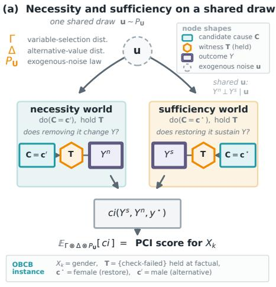

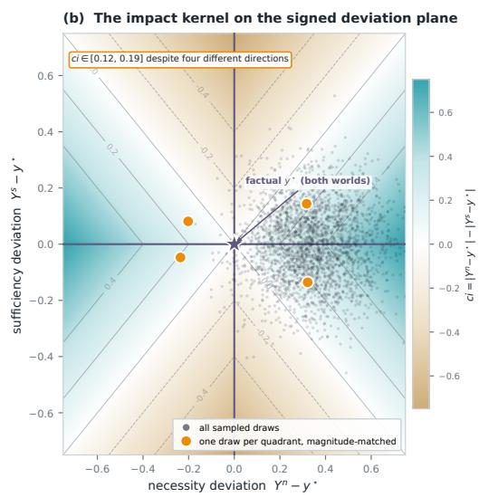  
Figure 4: The PCI mechanism. (a) For a variable of interest $X _ { k } ,$ a single exogenous draw u $\sim P _ { \mathbf { U } }$ together with a candidate cause set $\mathbf { C } \ni X _ { k }$ and witness set T from Γ and an alternative value $\mathbf { c } ^ { \prime }$ from $\Delta$ defines two counterfactual worlds on the same noise and the same $( \mathbf { C } , \mathbf { T } )$ : a necessity world $( \mathrm { d o } ( \mathbf { C } = \mathbf { c } ^ { \prime } )$ , witnesses held) giving $Y ^ { n }$ , and a sufficiency world $\begin{array} { r } { ( \mathrm { d o } ( \mathbf { C } = \mathbf { c } ^ { \star } ) } \end{array}$ , witnesses held) giving $Y ^ { s }$ . Conditional on u and (C, T) the two worlds are independent (Definition 18); the impact kernel ci scores the pair, and its expectation over $\Gamma \otimes \Delta \otimes P _ { \mathbf { U } }$ (Definition 19) is PCI’s realised score. The strip grounds the schematic in the OBCB running example. (b) The impact kernel on the signed plane $( Y ^ { n } - { y } ^ { \star } , \bar { Y } ^ { s } - { y } ^ { \star } )$ , shown for the Absolute Difference score ci $= | y ^ { n } - y ^ { \star } | - | y ^ { s } - y ^ { \star } |$ , one admissible choice of kernel (the PNS binary score and necessity-only variants are others), before either deviation is folded by $| \cdot | .$ . Because ci depends only on the two absolute deviations, the field is symmetric under an independent sign flip of either axis: four qualitatively different outcomes, necessity and sufficiency each landing above or below the factual value, collapse onto the same score whenever the magnitudes match. The faint cloud is a sample of $( Y ^ { n } , Y ^ { s } )$ draws; the four gold points are actual draws, one per quadrant, with closely matched $| Y ^ { n } - y ^ { \star } | , | Y ^ { s } - { y } ^ { \star } | ,$ , so their nearly equal ci values arise from the sampled data itself.

In words: draw noise $\mathbf { u } ;$ draw one suspect/witness configuration containing $X _ { k } ,$ shared by both worlds; run the model twice under the same u and the same configuration, once restoring the suspects to factual (sufficiency) and once setting them to a fresh alternative (necessity); score the pair with $c i ;$ average. Appendix F (Algorithm 2) specialises this to the necessity-only, per-suspect estimator used in the actual-causality benchmark.

Informally, ci is a user-defined scoring rule that translates the joint sufficiency–necessity measure into a single scalar (Figure 4 summarises the construction: the two counterfactual worlds in panel (a), the kernel that scores them in panel (b)). The choice is not arbitrary: the Absolute Difference example below is an instance of $\mathrm { L _ { 1 } }$ distance between outcomes, the same metric underlying Average Treatment Effect, Conditional Average Treatment Effect, and SHAP. The binary indicator score recovers this as a special case when outcomes are binary: indicators are $\mathrm { L _ { 1 } }$ on $\{ 0 , 1 \}$ . Practitioners with reasons to prefer $\mathrm { L _ { 2 } }$ or another distance measure may substitute it freely; the framework place no restriction on ci beyond measurability.

For the OBCB analysis we instantiate ci as the PNS binary score defined in the following example, with $y ^ { \star } = l o a n = \dot { 0 }$ . This is the choice that produces the values in Table 3.

Example 20 (PNS for Binary Outcomes). Assume the outcome $Y$ is binary with dom $( Y ) = \{ 0 , 1 \}$ and let $y ^ { \star } = 1$ denote the factual outcome. Let $Y ^ { s }$ and $Y ^ { n }$ denote the sufficiency and necessity outcome variables. Define the causal impact score

$$
c i ( y ^ { s } , y ^ { n } , y ^ { \star } ) = \mathbb { I } \{ y ^ { n } \neq y ^ { \star } \} \mathbb { I } \{ y ^ { s } = y ^ { \star } \} .
$$

Then the expected causal impact reduces to

$$
\mathbb { E } [ c i ( Y ^ { s } , Y ^ { n } , 1 ) ] = \mathbb { P } ( Y ^ { n } = 0 , Y ^ { s } = 1 ) ,
$$

which conceptually coincides with Pearl’s probability ofnecessity and sufficiency (PNS). The alignment is exact when $\mathbf { S } = \{ X _ { k } \} , \mathbf { W } = \emptyset$ , and dom $( \dot { X } _ { k } ) \dot { = } \{ 0 , 1 \}$ where, factually, $x _ { k } ^ { \star } = 1$

We now illustrate the full computation for Alice’s gender attribution using this $c i .$ . With ${ \textbf { S } } =$ {gender , credit}, ${ \bf W } = \{ c h e c \bar { k } { - } f a i l e d \} , \Gamma _ { s }$ and $\Gamma _ { w }$ uniform, $\Delta \textbf { a }$ point mass on the alternative binary value, and $y ^ { \star } = \bar { l o a n } = 0$ , the exogenous noise $U _ { \mathrm { c h e c k } }$ falls into three regions. (Definition 12 makes the interventional law a point mass given the $f u l l$ noise vector $\mathbf { u } ;$ below we coarsen u to these three $U _ { \mathrm { c h e c k } }$ regions and marginalise the remaining noise, in particular $U _ { \mathrm { l o a n - i f - c h e c k e d } } ,$ inside each region; by iterated expectation this equals the full integral over $P _ { \mathbf { U } } .$ , and lets a value like $^ { \ast \cdot } P ( l o a n = 1 ) = \bar { 0 } . 0 5 ^ { , }$ appear below despite Definition 12’s pointwise law being deterministic.) The three regions are:

u1 $u _ { 1 }$ (prob. 0.2): Alice is checked regardless of gender; check-failed = 1 factually.

$u _ { 2 }$ (prob. 0.7): Alice is not checked as female but would be as male; $c h e c k - f a i l e d = 0$   
factually.

• $u _ { 3 }$ (prob. 0.1): Alice is not checked regardless of gender.

In all regions, restoring Alice’s factual values always yields a denial, so $\begin{array} { r } { P _ { k } ^ { s } ( \{ 0 \} \ \mid \ \mathbf { u } ) \ = \ \frac { 2 } { 3 } } \end{array}$ everywhere (four suspect-containing (C, T) combinations each with $p ^ { \Gamma } ( { \bf C } , { \bf T } ) = \textstyle \frac { 1 } { 3 } \cdot \frac { 1 } { 2 } = \frac { 1 } { 6 }$ , since $\mathbf { S } \cap \mathbf { W } = \emptyset$ here, rejection is vacuous and $\Gamma$ is just the product of marginals, each contributing probability 1). The necessity measure varies.

In $u _ { 1 }$ , the witness holds check-failed = 1. The four (C, T) contributions, each weighted $\frac { 1 } { 6 } { \it \Psi } _ { \bf { \Psi } }$ , are:

◦ C = {gender}, T = ∅: male, check-failed = 1 propagates structurally $\Rightarrow P ( l o a n =$ 1) = 0.05.

$\circ \ \mathbf { C } = \{ g e n d e r \} , \mathbf { T } = \{ c h e c k - f a i l e d \}$ : male, witness holds failure ⇒ P(loan = 1) = 0.05.

◦ ${ \bf C } = \{ g e n d e r , c r e d i t \} , { \bf T } = \emptyset :$ male and good credit, check passes $\Rightarrow P ( l o a n = 1 ) = 1 . 0 \quad$

$\circ \textbf { C } = \{ g e n d e r , c r e d i t \} , \textbf { T } = \{ c h e c k - f a i l e d \}$ : male and good credit, but witness holds ${ \mathrm { f a i l u r e } } \Rightarrow P ( l o a n = 1 ) = 0 . 0 5 .$

$$
\begin{array} { r } { P _ { k } ^ { n } ( \{ 1 \} \mid u _ { 1 } ) = \frac { 1 } { 6 } ( 0 . 0 5 + 0 . 0 5 + 1 . 0 + 0 . 0 5 ) \approx 0 . 1 9 2 . } \end{array}
$$

In $u _ { 2 } ,$ , the witness holds check-failed = 0. The four contributions:

◦ ${ \bf C } = \{ g e n d e r \} , { \bf T } = \emptyset :$ male would be checked; check-failed = 1 propagates structurally $\Rightarrow P ( \mathit { l o a n } = \mathrm { \bar { 1 } } ) = 0 . 0 5 .$

◦ ${ \bf C } = \{ g e n d e r \} , { \bf T } = \{ c h e c k - f a i l e d \}$ : male, witness holds check-failed = 0, check passes $\Rightarrow P ( \mathit { l o a n } = \mathit { \bar { 1 } } ) = 1 . 0 \mathit { \dot { . } }$

0 $\begin{array} { r } { \mathrm { ~  ~ \gamma ~ } _ { \bf { C } } = \{ g e n d e r , c r e d i t \} , { \bf { T } } = \emptyset : } \end{array}$ male and good credit, check passes ⇒ P(loan = 1) = 1.0.

◦ ${ \bf C } = \{ g e n d e r , c r e d i t \} , { \bf T } = \{ c h e c k - f a i l e d \}$ : male and good credit, witness holds $0 \Rightarrow$ $P ( l o a n = 1 ) = 1 . 0 \AA$

$$
\begin{array} { r } { P _ { k } ^ { n } ( \{ 1 \} \mid u _ { 2 } ) = \frac { 1 } { 6 } ( 0 . 0 5 + 1 . 0 + 1 . 0 + 1 . 0 ) \approx 0 . 5 0 8 . } \end{array}
$$

In $u _ { 3 } ,$ , male Alice is also not checked (check = 0 regardless of gender), so all necessity worlds yield denial: $P _ { k } ^ { n } ( \{ 1 \} \mid u _ { 3 } ) = 0$

Combining, with $\begin{array} { r } { \ i ( y ^ { s } , y ^ { n } , y ^ { \star } ) = \mathbb { I } \{ y ^ { n } \neq y ^ { \star } \} \mathbb { I } \{ y ^ { s } = y ^ { \star } \} \mathrm { ~ a n d ~ } y ^ { \star } = l o a n = 0 \mathrm { . ~ } } \end{array}$

$$
{ \begin{array} { r l } & { \operatorname { P C I } _ { g e n d e r } ( \operatorname { A l i c e } ) = \operatorname { \mathbb { E } } [ c i ( Y ^ { s } , Y ^ { n } , y ^ { \star } ) ] = \operatorname { \mathbb { P } } ( Y ^ { n } = 1 , Y ^ { s } = 0 ) } \\ & { \qquad = \displaystyle \sum _ { u } p ( u ) P _ { k } ^ { s } ( \{ 0 \} \mid u ) P _ { k } ^ { n } ( \{ 1 \} \mid u ) } \\ & { \qquad = 0 . 2 \times { \frac { 2 } { 3 } } \times 0 . 1 9 2 + 0 . 7 \times { \frac { 2 } { 3 } } \times 0 . 5 0 8 + 0 . 1 \times 0 } \\ & { \qquad \approx 0 . 0 2 6 + 0 . 2 3 7 = 0 . 2 6 3 . } \end{array} }
$$

Table 3 gives the full results for Alice and Bob under these parameter choices: Pearl’s PN/PS/PNS, PCI without witnesses $( \mathbf { W } = \varnothing )$ , and PCI with the check-failed witness active, with the latter further decomposed into its necessity and sufficiency marginals.
<table><tr><td></td><td colspan="3">Pearl</td><td>PCI</td><td colspan="3"> $\operatorname { P C I } \left( \mathbf { W } = \left\{ c h e c k – f a i l e d \right\} \right)$ </td></tr><tr><td>Person, Variable</td><td>PN</td><td>PS</td><td>PNS</td><td> $( \mathbf { W } = \varnothing )$ </td><td>Necessity</td><td>Sufficiency</td><td>Total</td></tr><tr><td>Alice (gender)</td><td>0.045</td><td>1.000</td><td>0.045</td><td>0.210</td><td>0.394</td><td>0.667</td><td>0.263</td></tr><tr><td>Alice (credit)</td><td>0.180</td><td>1.000</td><td>0.180</td><td>0.240</td><td>0.298</td><td>0.667</td><td>0.199</td></tr><tr><td>Bob (gender)</td><td>0.000</td><td></td><td>0.000</td><td>0.038</td><td>0.030</td><td>0.637</td><td>0.019</td></tr><tr><td>Bob (credit)</td><td>0.900</td><td> $_ { 0 . 9 5 5 }$ </td><td>0.860</td><td>0.228</td><td>0.188</td><td>0.637</td><td>0.119</td></tr></table>

Table 3: Per-individual responsibility scores for gender and credit on loan = 0 in the stochastic OBCB model. Pearl’s PN/PS/PNS, PCI without witnesses $( \mathbf { W } = \varnothing )$ , and PCI with the check-failed witness shown side by side; the rightmost three columns decompose $\operatorname { P C I } ( \mathbf { W } = \{ c h e c k  – f a i l e d \} )$ into its necessity and sufficiency marginals (their joint expectation is the bold total). Here the total happens to equal the product of the two marginals because the sufficiency measure $P _ { k } ^ { s } ( \cdot \bf \delta | u )$ is constant in u for both individuals; in general the joint $P _ { k } ^ { s , n }$ does not factor into the product of its marginals. Bob’s PS for gender is undefined because the conditioning event (female, bad, $l o a n = 1 )$ has probability zero in the OBCB model; the PCI marginals are well-defined throughout, since they integrate over $P _ { \mathbf { U } }$ rather than conditioning on the factual outcome.

For Alice, PNS and PCI without witnesses both fail D-A-rank (p. 13): they rank credit above gender (0.180 vs. 0.045; 0.240 vs. 0.210). PCI with witnesses reverses this (0.263 vs. 0.199), satisfying D-A-rank as well as D-A1 and D-A2 (both values positive). Holding check-failed at its factual value blocks the credit-check bottleneck in noise realizations where Alice was checked, isolating gender’s structural role. The check-failed witness is the decisive ingredient.

For Bob, D-B2 and D-B-rank hold under all three methods: credit is ranked above gender throughout. D-B1 requires strictly positive attribution for gender: PNS returns exactly 0.000 and therefore fails, because $P ( l o a n = 1 \mid g e n d e r =$ female, credit = bad) = 0 makes the counterfactual necessity calculation zero, missing gender’s indirect role in opening the credit evaluation. PCI with witnesses returns 0.019, correctly capturing this indirect contribution. The cross-individual desideratum D-comp holds under both PCI $( 0 . 2 6 \bar { 3 } > 0 . 0 1 9 )$ and PNS $( 0 . 0 4 5 > 0 . 0 0 0 )$ ). A full verification of all seven desiderata is given at the end of this section.

The PNS and PCI (no witnesses) columns differ even though neither uses witnesses, because PCI still Γ-averages over candidate suspect sets. With $| \mathbf { S } | = 2 { \bar { \mathbf { P } } } \mathbf { C } \mathbf { I }$ averages over $\{ g e n d e r \} , \{ c r e d i t \}$ and {gender, credit} (each weighted $_ { \mathrm { ~ 3 ~ } } ^ { \mathrm { ~ 1 ~ } }$ , whereas PNS evaluates a single counterfactual on one variable at a time. Property (i) below establishes that the two agree exactly when $| \mathbf { S } | = 1$ (single suspect, no witnesses, binary outcome); the OBCB setup here instead uses $| \mathbf { S } | = 2$ deliberately, to demonstrate joint-subset attribution.

## 3.1 Continuous Outcomes and the General Causal Impact Function

The causal impact function ci is a user-defined component of PCI, and different choices encode different causal questions. In the benchmarking experiments of Appendix F, we instantiate ci using only the necessity component, since Halpern’s actual causality has no sufficiency counterpart: necessity-only attribution allows a direct parallel comparison. The full framework incorporating both $Y ^ { s }$ and ${ \dot { Y } } ^ { n }$ is instantiated in the PNS binary example above and in the Absolute Difference example below; the OBCB analysis of this section (Tables 3–4) provides a concrete validation, since the PNS binary ci jointly conditions on $Y ^ { s } = y ^ { \star }$ and $Y ^ { n } \neq y ^ { \star }$ and it is this combination that produces the correct D-A-rank ordering. Further experiments using the full ci on continuous outcomes are presented in the signal-with-mediation example (Section 5.2), the synthetic evaluation (Appendix D), and the SIR benchmark (Appendix G).

When the outcome variable Y is continuous rather than binary, indicators are replaced by a distancebased score that measures how far the necessity and sufficiency worlds land from the factual value $y ^ { \star }$ . The natural choice, paralleling L1-based scores such as ATE and SHAP, is the absolute difference.

Example 21 (Absolute Difference Impact Score). We can develop an analogous measure for continuous outcomes where we increase attribution with distancefrom thefactual value $y ^ { \star }$ in the necessity world and decrease impact with distance to thefactual value in the sufficiency world.

$$
c i ( y ^ { s } , y ^ { n } , y ^ { \star } ) = | y ^ { n } - y ^ { \star } | - | y ^ { s } - y ^ { \star } | .
$$

Two one-sided instances of this score recur in the experiments: a necessity-only ciN and a sufficiency-only ciS (Appendix D), whose sum returns the absolute-difference ci above. Each is a choice of ci in the sense of Definition 19.

With the full machinery in place (structural model, variable selection, alternative value distribution, joint necessity-sufficiency measure, and causal impact function), PCI delivers the following properties.

(i) Generalisation of PN/PS/PNS. When $\mathbf { S } = \{ X _ { k } \} , \mathbf { W } = \emptyset$ , and dom $( X _ { k } ) = \{ 0 , 1 \}$ , the PNS binary ci recovers Pearl’s probability of necessity and sufficiency exactly; PN and PS are recovered by the corresponding one-sided ci choices.

(ii) Connection to actual causality. For suitable Γ and ∆, PCI recovers Halpern’s actual causality judgements (Section 6).

(iii) Necessity–sufficiency decomposition. $P _ { k } ^ { s }$ and $P _ { k } ^ { n }$ are defined and interpretable independently; practitioners may choose a ci that uses either alone or both, depending on whether the causal question concerns necessity, sufficiency, or both.

(iv) Witness-mediated symmetry breaking. Holding intermediate variables fixed via W disambiguates overdetermination and undercutting scenarios where necessity-only methods assign equal or zero attribution, as demonstrated above for Alice and Bob, and further developed in Section 5 (SHAP and Causal SHAP comparison), Appendix D (synthetic overdetermination and undercutting archetypes), and Appendix F (witness ablation on the scaled throwing problem).

(v) Composability. Γ and $\Delta$ are probability distributions and ci is a measurable function, so all three compose directly with the probabilistic-programming machinery discussed in Section 1; Section 4’s benchmarks estimate them by Monte Carlo throughout, without modification to the core formalism.

## 3.2 Back to the Running Example: Verifying the Desiderata

Table 4 verifies the seven desiderata introduced in Section 2 (p. 13) against the values in Table 3. PCI with witnesses satisfies all seven; PCI without witnesses fails D-A-rank; PNS fails D-A-rank and D-B1. (The table uses the shorthand |R(V | person)| for |R(V ⇝ loan | person)|.)

PNS fails D-A-rank and D-B1. The D-A-rank failure reflects that without a check-failed witness, necessity-based attribution cannot distinguish Alice’s gender (which blocked the evaluation entirely) from her credit (which would only have mattered had she been evaluated). The D-B1failure reflects that PNS assigns Bob’s gender exactly zero: because $P ( l o a n = 1 \mid f e m a l e , b a d ) = 0 ,$ , the counterfactual necessity calculation returns zero, missing gender’s indirect role in opening the credit evaluation. The check-failed witness resolves both.

<table><tr><td>Desideratum</td><td>PNS</td><td>PCI (no wit.)</td><td>PCI (with wit.)</td></tr><tr><td>D-A1:  $\left| R ( g e n d e r \mid { \mathrm { A l i c e } } ) \right| > 0$ </td><td>√0.045</td><td> $\checkmark 0 . 2 1 0$ </td><td> $\checkmark 0 . 2 6 3$ </td></tr><tr><td>D-A2:  $\left| R ( c r e d i t \mid { \mathrm { A l i c e } } ) \right| > 0$ </td><td>√0.180</td><td> $\checkmark 0 . 2 4 0$ </td><td> $\checkmark 0 . 1 9 9$ </td></tr><tr><td> $\mathbf { D { \cdot } A { \cdot } r { \dot { \mathbf { a n k } } } \cdot } | R ( g e n d e r \mid { \dot { \operatorname { A l i c e } } } ) | > | R ( c r e d i t \mid \operatorname { A l i c e } ) |$ </td><td> $\times \ 0 . 0 4 5 { < } 0 . 1 8 0$ </td><td> $\times \ 0 . 2 1 0 { < } 0 . 2 4 0$ </td><td> $\sim 0 . 2 6 3 { > } 0 . 1 9 9$ </td></tr><tr><td>D-B1:  $\left| R ( g e n d e r \mid \mathbf { B o b } ) \right| > 0$ </td><td> $\times \ : 0 . 0 0 0$ </td><td> $\checkmark 0 . 0 3 8$ </td><td> $\checkmark 0 . 0 1 9$ </td></tr><tr><td>D-B2:  $\left| R ( c r e d i t \mid { \bf B o b } ) \right| > 0$ </td><td>√0.860</td><td> $\checkmark 0 . 2 2 8$ </td><td> $\checkmark 0 . 1 1 9$ </td></tr><tr><td>D-B-rank:  $| R ( c r e d i t \mid { \bf \dot { B } o b } ) | > | R ( g e n d e r \mid { \bf B o b } ) |$ </td><td> $\sim 0 . 8 6 0 { > } 0 . 0 0 0$ </td><td> $\surd 0 . 2 2 8 { > } 0 . 0 3 8$ </td><td> $\sim 0 . 1 1 9 { > } 0 . 0 1 9$ </td></tr><tr><td>D-comp:  $| R ( g e n d e r | \operatorname { A l i c e } ) | > | R ( g e n d e r | \operatorname { B o b } ) |$ </td><td> $\sim 0 . 0 4 5 { > } 0 . 0 0 0$ </td><td> $\sim 0 . 2 1 0 { > } 0 . 0 3 8$ </td><td> $\sim 0 . 2 6 3 { > } 0 . 0 1 9$ </td></tr></table>

Table 4: Verification of the seven desiderata (p. 13) against the values in Table 3. PCI with witnesses satisfies all seven; PCI without witnesses fails D-A-rank; PNS fails D-A-rank and D-B1.

To close this section, we compare PCI’s decomposition with the one already present in Pearl’s framework. Pearl’s framework defines three related but distinct binary scores: the probability of necessity $\mathrm { P N } = P ( Y _ { x ^ { \prime } } = y ^ { \prime } \mid X = x ^ { \star } , Y = y ^ { \star } )$ , the probability of sufficiency $\mathrm { P \bar { S } } = { \cal P } ( Y _ { x ^ { \star } } =$ $y ^ { \star } \mid X \stackrel { \cdot } { = } x ^ { \prime } , Y = \dot { y ^ { \prime } } )$ , and their joint $\mathrm { P N S } = \bar { P ( Y _ { x ^ { \star } } = y ^ { \star } , Y _ { x ^ { \prime } } = y ^ { \prime } ) }$ . The first two are conditional probabilities; PNS is unconditional, and, when the cause variable X is exogenous (as for the root variables gender and credit in OBCB, so that $P ( Y _ { x ^ { \star } } = y ^ { \star } ) = P ( X = x ^ { \star } , Y = y ^ { \star } ) )$ , the three satisfy $\mathrm { P N S } = \mathrm { P N } \cdot P ( Y _ { x ^ { \star } } = y ^ { \star } ) = \mathrm { P S } \cdot P ( Y _ { x ^ { \prime } } = y ^ { \prime } )$ rather than PNS = PN · PS (which would additionally require $Y _ { x ^ { \star } } \perp Y _ { x ^ { \prime } } .$ , an assumption typically violated since the two potential outcomes share exogenous noise). Without exogeneity, $P ( \dot { Y } _ { x ^ { \star } } = \dot { y } ^ { \star } )$ and $P ( X = x ^ { \star } , Y = y ^ { \star } )$ can differ and the displayed identity need not hold; the fully general relation between PNS, PN, and PS is Pearl’s weighted-sum decomposition (Pearl, 2009, Lemma 9.2.6), $\mathrm { P N S } \ = \ P ( x ^ { \star } , y ^ { \star } ) \mathrm { P N } + { \cal P } ( x ^ { \prime } , y \neq$ $y ^ { \star } )$ PS. PCI admits a related split: with $c i = \mathbb { I } \{ y ^ { n } \neq y ^ { \star } \} \mathbb { I } \{ y ^ { s } = y ^ { \star } \}$

$$
\mathbb { E } [ c i ( Y ^ { s } , Y ^ { n } , y ^ { \star } ) ] = \int P _ { k } ^ { s } ( \{ y ^ { \star } \} \mid \mathbf { u } ) P _ { k } ^ { n } ( \{ 1 - y ^ { \star } \} \mid \mathbf { u } ) d P _ { \mathbf { U } } ,
$$

giving a sufficiency marginal and a necessity marginal that record how often, on average, restoring the factual values of a suspect set containing $X _ { k } ^ { - }$ reproduces the factual outcome, and how often substituting alternatives overturns it. The two marginals are independent given u.

The components are not identical to Pearl’s: PN and PS condition on the factual outcome and consider a single counterfactual flip; PCI’s marginals integrate over $P _ { \bf U } ,$ , average over suspect sets weighted by Γ, and hold the witness configurations fixed when active. Table 3 (presented earlier) places both decompositions side by side for gender and credit.

For Alice’s gender, $\mathrm { P N } = 0 . 0 4 5$ is the bare probability that a male with bad credit would have been approved; PCI’s necessity marginal is 0.394, nearly an order of magnitude higher, because the check-failed witness keeps the credit-check bottleneck active when the male counterfactual would otherwise have been checked and might still have failed, structural information that the unconditional PN cannot register. For Bob’s gender, PN is exactly 0 (a female with bad credit cannot be approved in this model) and PS is undefined; PCI’s marginals remain well-defined at 0.030 and 0.637, recovering the indirect role of gender in opening the evaluation.

The next section turns from comparing PCI with Pearl’s family of counterfactual scores to comparing it with the SHAP family, methods grounded in cooperative game theory rather than in structural counterfactual reasoning. Section 5 re-runs the OBCB analysis under plain and Causal SHAP, then introduces a continuous mediation example where the two SHAP variants diverge from each other and from PCI, with explicit desiderata recorded throughout.

## 4 Empirical and Comparative Evaluation: Overview

With PCI now defined, we preview how it performs against the dominant feature-attribution baselines, actual causality and Pearl’s probability of causation, a causal-effect attribution method, and problem sizes ranging from textbook examples to a deployed system. Each subsection states one

comparative claim and points to the full treatment: the formal comparisons in Sections 5–7, and the complete protocols in the appendices.

## 4.1 PCI matches actual-causality verdicts on canonical archetypes

On the discrete structural models where actual-causality verdicts are available, PCI should reproduce its verdicts; on the canonical overdetermination and undercutting patterns it should separate a genuine cause from a preempted one. We test this on a synthetic structural model that carries three archetypes at once, linear necessary-and-sufficient, overdetermined, and preempted (gated), plus an irrelevance control, all with an analytic ground truth (Appendix D). Across two contrasting factual cases, all ten archetype desiderata hold: PCI scores the active cause above the preempted one, keeps the irrelevant control at the noise floor, and, unlike the binary actual-cause verdict, does so with graded magnitudes that extend to continuous variables. The pass threshold is a Monte Carlo noise floor: clearing it means the gap is distinguishable from sampling variance at the chosen budget; the gap need not be large in absolute terms (Appendix D). The same agreement holds on Pearl’s desert-traveller, where PCI reproduces his within-scenario ranking (Section 7, Appendix C).

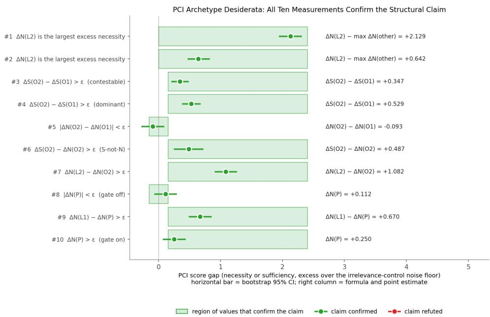  
Figure 5: PCI recovers the actual-causality verdicts on a synthetic model with three archetypes and an irrelevance control. Each row is one archetype desideratum (linear necessity/sufficiency, overdetermination, preemption, irrelevance control); the dot is the bootstrap point estimate of the relevant ∆ score, the bar its 95% CI, and the green band the pass region given the data-derived threshold ϵ ≈ 0.151. All ten dots fall inside their bands. Full model, estimator, and per-row analysis in Appendix D.

## 4.2 SHAP and Causal SHAP

PCI separates direct and indirect causal contributions; SHAP-based attribution collapses them into one number. Both plain and Causal SHAP decompose a prediction’s departure from a population mean. Because that mean is not the realized outcome, this choice produces two failures at once. First, they assign attribution backward, against the arrows of the causal graph; Causal SHAP’s interventional correction fixes only part of this. Second, they tie together the direct and indirect causes of an outcome that a context-sensitive method should keep separate. PCI’s realized-outcome reference and witness mechanism fix both problems, separating the direct cause from the indirect one at every instance, as Table 5 summarizes on the signal-with-mediation example (X → M → Y).

Section 5 states these failures as formal desiderata and works through both in full on two worked examples (OBCB and the signal-with-mediation chain), with the formal SHAP and Causal SHAP definitions in Appendix B.

<table><tr><td>Desideratum</td><td>Plain SHAP</td><td>Causal SHAP</td><td>PCI</td></tr><tr><td>D-XY: X genuinely causes Y</td><td>√</td><td>√</td><td>√</td></tr><tr><td>D-MY: M genuinely causes Y</td><td>√</td><td>√</td><td>√</td></tr><tr><td>D-XM: X genuinely causes M</td><td>√</td><td>√</td><td>√</td></tr><tr><td>D-YX: no backward attribution from Y to X</td><td>×</td><td>√</td><td>V</td></tr><tr><td>D-YM: no backward attribution from Y to M</td><td>×</td><td>×</td><td>√</td></tr><tr><td>D-MX: no backward attribution from M to X</td><td>X</td><td>X</td><td>√</td></tr><tr><td>D-MXY: the direct cause M outranks the indirect cause X</td><td>×</td><td>×</td><td>√</td></tr></table>

Table 5: Desiderata satisfied (✓) or violated (×) by plain SHAP, Causal SHAP, and PCI on the signal-withmediation example. Causal SHAP’s interventional correction repairs only D-YX. Full numeric values and witness-set variants in Table 9.

## 4.3 The Differential Causal Effect

The next comparison targets a causal-effect attribution method: the Differential Causal Effect (DCE) attributes an outcome change to features via local derivatives of the structural map. On a model with a non-monotone internal response, DCE and PCI can disagree on sign and magnitude where the local gradient is unrepresentative of the counterfactual contrast PCI integrates over: tracking the realized-outcome contrast keeps PCI’s attribution aligned with each feature’s structural role, withou depending on a single local derivative.

PCI ranks age above time everywhere; DCE's ranking flips and depends on units

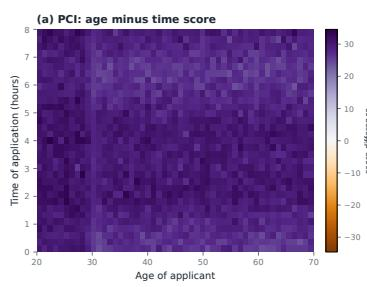

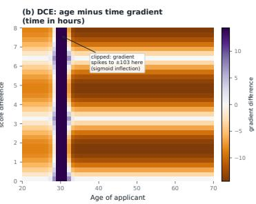

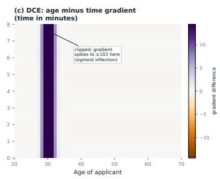  
Figure 6: PCI stays consistent where DCE does not. (a) PCI ranks age above time of application everywhere on the credit-limit grid; the gap is somewhat denser around the age of rapid change (the sigmoid’s steep region) but stays positive throughout. (b), (c) The same contrast for DCE, on the hours and minutes time scales: DCE favours time of application over most of the grid (the opposite of PCI’s verdict), except in a narrow band where its gradient spikes at the sigmoid’s inflection point, and that pattern itself depends on which time unit is used. Full discussion in Appendix E.

Appendix E shows the full contrast over a credit-limit grid.

## 4.4 Scaling past exact actual causality

Actual-cause computation requires enumerating counterfactual subsets, which is exponential; PCI replaces enumeration with a Monte Carlo thin search. On a controlled family of problems (Appendix F), exact subset enumeration times out at about 17 variables, whereas the necessity-only PCI estimator continues to roughly 73–145 variables under an undemanding sample budget and a per-size compute cap of 60 minutes. It sustains a correct-attribution rate above 0.85 up to about 60 variables while visiting several orders of magnitude fewer cause–witness configurations.

## 4.5 Continuous, dynamical outcomes

Actual causality has a second limit besides scale: it offers no verdict when the outcome is continuous and the causes interact through a dynamical system. On a Bayesian SIR (susceptible–infected– recovered) model with two non-pharmaceutical policies and a threshold (peak-overshoot) outcome (Appendix G), but-for analysis cannot separate the two policies; PCI assigns lockdown roughly twice the responsibility of masking, with the gap driven by the necessity term under witness pinning. The verdict holds across 20 factual worlds drawn from the prior, with lockdown ahead in 18 of them and a mean gap of +0.701 (standard error 0.111).

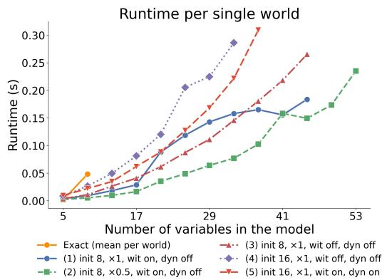

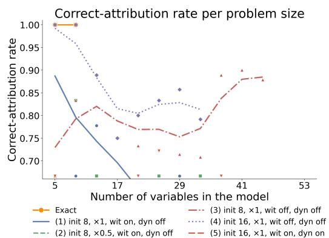  
Figure 7: PCI’s estimator continues to work well past the point where exact actual-cause enumeration gives out. Left, wall-clock vs. problem size: exact subset enumeration times out near 17 variables, while the PCI estimator continues to roughly 73–145. Right, correct-attribution rate: witness-enabled configurations stay above 0.85 well past the exact cut-off, degrading gradually with problem size. Full benchmark protocol in Appendix F.

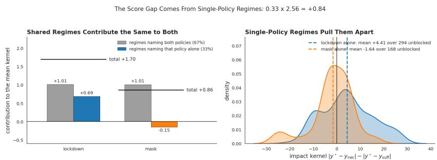  
Figure 8: PCI separates interacting policies on a continuous dynamical outcome. Joint necessitysufficiency over the two policies for the peak-overshoot event; lockdown carries roughly twice the responsibility of masking where but-for analysis ties them. Full model and query in Appendix G.

## 4.6 A real-world deployed model

Finally, PCI runs on a deployed automated valuation model (AVM) with machine-learned components trained on millions of points, a regime where actual causality is intractable and SHAP is the practical default (Appendix H). PCI returns a structured, context-sensitive attribution across the model’s internal variables; SHAP, by contrast, concentrates almost all responsibility on a few downstream variables and places little weight on the rest. This deployed model has no independently known ground truth. PCI and SHAP disagree here in the same qualitative direction already validated by the synthetic benchmark’s ground truth, but on its own the AVM case demonstrates feasibility; it does not independently confirm correctness (Section 8).

Across these settings PCI matches actual-causality verdicts on canonical archetypes and extends past them where they do not apply, at a cost that remains tractable; the full protocols, derivations, and additional figures are collected in Appendices A–H. Sections 5–7 develop these comparative claims in full before Section 8 draws out the implications.

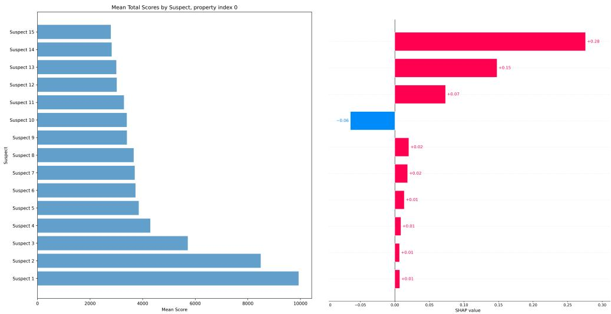  
Figure 9: PCI vs. SHAP on a deployed automated valuation model. Both panels show a selection of the model’s internal variables; real variable names are withheld under an NDA with the model’s operator, and the two panels rank their own top variables independently, so a given position in one panel does not correspond to the same variable in the other. Left: PCI’s context-sensitive attribution across the AVM’s internal variables. Right: SHAP concentrates responsibility on a few downstream variables. Full pipeline and anonymized structure in Appendix H.

## 5 Examples and Comparison to SHAP and Causal SHAP

Section 3 defined PCI and verified, on Alice and Bob, that the resulting attribution satisfies all seven desiderata of Section 2 (p. 13), where PN/PS/PNS fail at least two. The natural next question is how PCI compares to SHAP and Causal SHAP, the dominant practical alternatives for feature attribution that practitioners typically reach for. This section runs that comparison on two examples, recording where each method passes or fails an explicit desideratum. Formal definitions of SHAP and Causal SHAP are in Appendix B.1; we re-run OBCB (Section 5.1), where the two SHAP variants coincide because the feature set is exogenous, so the divergence between PCI and SHAP is the only contrast to draw. We then introduce a continuous mediation example (Section 5.2) where plain and Causal SHAP do diverge (one desideratum, D-YX, is fixed by the interventional correction; others, D-YM, D-MX, D-MXY, are not), and tabulate the desiderata in Section 5.3. Section 5.4 traces every failure to one of three structural gaps in the SHAP framework that PCI’s witness mechanism, suspect-set distribution $\Gamma _ { s }$ , and realised-outcome reference jointly close.

Shapley values, grounded in cooperative game theory, decompose a model’s prediction into additive contributions from individual features and have become one of the most widely used attribution tools in the ML literature. Janzing et al. [2020] argued that the conditional expectation in plain SHAP is the conceptually wrong way to model feature removal: a dropped feature should be marginalised under a do-intervention, not under conditioning. Heskes et al. [2020] propose Causal SHAP, which implements this prescription by replacing the observational marginal used for features outside the active coalition with an interventional distribution: when a dropped feature is causally downstream of a coalition member, its distribution under the intervention differs from its marginal, and Causa SHAP corrects for this using Pearl’s do-calculus.18

18A different counterfactual line is taken by Sharma et al. [2022], whose CF-Shapley values use a structural causal model to attribute the change in a metric from a single fixed reference $x ^ { \mathrm { r e f } }$ to the observed x: $\phi _ { j } \propto$ $\begin{array} { r } { \sum _ { \mathcal { S } \subseteq N \setminus \{ j \} } [ f ( x _ { \mathcal { S } } , x _ { j } ^ { \mathrm { r e f } } ) - f ( x _ { \mathcal { S } } , x _ { j } ) ] } \end{array}$ . This is the closest neighbour to PCI in spirit (single contrastive scenario, do-style intervention) and differs in three ways. (i) CF-Shapley commits to one reference $x ^ { \mathrm { r e f } } ,$ , while PCI integrates over an alternative-value distribution ∆(x) and need not pick a single contrast. (ii) CF-Shapley returns a one-axis contrast $f ( \cdot , x _ { j } ^ { \mathrm { r e f } } ) - f ( \cdot , x _ { j } )$ , while PCI reports a joint $( Y ^ { s } , Y ^ { n } )$ measure and applies a userchosen ci, decomposing necessity and sufficiency separately. (iii) CF-Shapley has no witness mechanism, so it cannot break the overdetermination and undercutting symmetries that PCI’s witness set W resolves on the OBCB and signal walkthroughs of this section.

Despite this repair, both methods share deeper limitations. First, both plain and Causal SHAP can assign non-zero responsibility to variables that play no causal role with respect to the target: attribution can run against the direction of the causal graph, a failure the interventional correction does not address. Second, both methods explain a model’s prediction as a departure from that model’s population-average output, not from the factual outcome an individual actually experienced. When the goal is causal responsibility attribution rather than prediction explanation, this mismatch in target produces further divergences, which we make explicit below. The first limitation will surface in our signal example as violations of D-YX, D-YM, and D-MX; the second will surface in OBCB as the D-A-rank overdetermination effect, and in the signal example as Instance 2’s budget collapse when the prediction equals its baseline.

With these general limitations in view, we trace them through the same two examples, comparing plain SHAP, Causal SHAP, and PCI against the desiderata of Section 3 together with the desiderata specific to each example.

At the level of subset weighting alone, PCI (with $J = 1 , K = | \mathbf { S } | )$ and SHAP are not distinguishable: $\Gamma \mathbf { \bar { s } }$ subset weights match the Shapley kernel. The distinction lies in the integrand. Plain SHAP (in the conditional reading of Eq. (19), which we use throughout except where noted) averages marginal contributions using the observational conditional $\bar { \mathbb { E } } [ f ( \mathbf { X } ) \mid \bar { \mathbf { X } } _ { \mathcal { S } } = \mathbf { x } _ { \mathcal { S } } ]$ , drawing the non-coalition features from their distribution given the coalition; a feature merely correlated with a true cause can therefore receive positive attribution. PCI evaluates counterfactual outcomes $P ( Y \in A \mid \mathbf { u } , \mathrm { d o } ( \mathbf { C } = \mathbf { c } ^ { \prime } , \mathbf { T } = \mathbf { t } ^ { \star } ) )$ computed via the structural model, so attribution flows only along genuine causal paths. The witness mechanism adds a further distinction: by holding intermediate variables fixed, PCI can resolve overdetermination and undercutting scenarios where SHAP assigns equal or incorrect attribution. The remainder of this section makes both points concrete on two examples.

## 5.1 OBCB: SHAP and Causal SHAP

To apply the SHAP and Causal SHAP definitions of Appendix B.1 to OBCB we must specify both a feature set N and a function $f$ on the joint feature space; the value functions and Shapley sums are derived from these. The natural choice for $f$ is the conditional expectation of the outcome, $f ( x _ { N } ) = \mathbb { E } [ l o a n \ | \ X _ { N } = x _ { N } ]$ . But the OBCB PSCM has five variables (gender, credit, check, check-failed, loan if checked), so the choice of N is non-trivial. Two options are natural:

• Option A: two upstream roots. $N = \{ g e n d e r , c r e d i t \}$ . Both features are exogenous; the three internal variables (check, check-failed, loan $_ { - } i f$ checked) are integrated out inside $f .$ This is the smallest sufficient feature set and matches the way the model is normally described: predict approval from gender and credit.

• Option B: two roots plus the mediator. $N ^ { \prime } = \{ g e n d e r , c r e d i t , c h e c k - f a i l e d \}$ . The mediator becomes an observable model input, the same status it has in the signal-with-mediation example (§5.2). This is the comparison PCI’s witness mechanism naturally invites: PCI accesses check-failed as a witness, so allowing SHAP to access it as a feature is the fair foil.

We work through both. Option A is simpler and exposes the qualitative failures of plain SHAP.   
Option B then asks whether admitting the mediator rescues Causal SHAP.

Option A: two upstream roots. Here $f ( g , c ) = P ( l o a n = 1 \mid g , c )$ takes values $f ( \mathrm { F } , \mathrm { b a d } ) =$ $0 . { \overset { \cdot } { 0 } } 0 0 0 , \ f ( \mathbf { F } , \mathbf { g } \mathbf { o o d } { \hat { \big ) } } = 0 . 1 8 0 , \ f ( \mathbf { M } , \mathbf { b a d } ) { \overset {  } { = } } 0 . 0 4 5 , \ f { \big ( } \mathbf { M } , \mathbf { g } \mathbf { o o d } { \big ) } = { \overset { \cdot } { 0 } } . 9 0 0$ , with the three internal variables integrated out. We apply SHAP to the rejection probability $g ( x ) = 1 - f ( x )$ for Alice and Bob from Example 6, attributing responsibility for the denial outcome.19 By the SHAP definition (and equivalently by Definition 36 once we note that no dropped feature is a descendant of any coalition member), the value function on the 2-feature game and its closed-form specialisation under independent uniform marginals are derived in Appendix A (§A.3). Plugging in the four values of $f$ listed at the start of Option A yields Table $6 ;$ pushing those through the closed-form Shapley gives the magnitudes in Table 7, which compares against PNS and PCI.

<table><tr><td>S</td><td> $v ( S )$  for Alice</td><td> $v ( S )$  for Bob</td></tr><tr><td>∅</td><td>0.281</td><td>0.281</td></tr><tr><td> $\{ g e n d e r \}$ </td><td>0.090</td><td>0.473</td></tr><tr><td> $\{ c r e d i t \}$ </td><td>0.023</td><td>0.023</td></tr><tr><td> $\{ g e n d e r , c r e d i t \}$ </td><td>0.000</td><td>0.045</td></tr></table>

Table 6: Coalition values $v ( S ) = \mathbb { E } [ f ( X ) \mid X _ { S } = x _ { S } ^ { \star } ]$ for the 2-feature game $( N = \{ g e n d e r , c r e d i t \} )$ $v ( \emptyset ) = \mathbb { E } [ f ( X ) ] = 0 . 2 8 1$ is the population baseline; $v ( N )$ is the factual prediction $f ( x ^ { \star } )$ . Plain $\operatorname { S H A P }$ and Causal SHAP coincide on this game (neither feature is downstream of the other), so a single column suffices per individual.

<table><tr><td>Person</td><td>Feature</td><td>PNS</td><td>SHAP</td><td>ATE</td><td>CATE</td><td>ITE</td><td>PCI (no wit.)</td><td>PCI (with wit.)</td></tr><tr><td>Alice</td><td>gender</td><td>0.045</td><td>0.107</td><td>0.383</td><td>0.045</td><td>0.045</td><td>0.210</td><td>0.263</td></tr><tr><td>Alice</td><td>credit</td><td>0.180</td><td>0.174</td><td>0.518</td><td>0.180</td><td>0.180</td><td>0.240</td><td>0.199</td></tr><tr><td>Bob</td><td>gender</td><td>0.000</td><td>-0.107</td><td>0.383</td><td>0.045</td><td>0.000</td><td>0.038</td><td>0.019</td></tr><tr><td>Bob</td><td>credit</td><td>0.860</td><td>0.343</td><td>0.518</td><td>0.855</td><td>0.895</td><td>0.228</td><td>0.119</td></tr></table>

Table 7: Responsibility attributions for Alice and Bob. SHAP values are signed $( \phi _ { i } ^ { g }$ for $P ( l o a n = 0 \mid x ) )$ desiderata compare magnitudes | · |. ATE is a population quantity (identical across the two persons by feature); CATE conditions on the other covariate (credit for the gender rows; the person’s gender for the credit rows); ITE abducts the individual’s exogenous noise from the full factual record (covariates and the observed denial) and takes the counterfactual contrast on that pinned noise. PNS and PCI values from Table 3; ATE/CATE/ITE computed by direct PSCM evaluation in obcb\_computations.

ATE and CATE fail the same two individual-level desiderata that PNS fails, and for related reasons. ATE attributes responsibility at the population level only, so its values are identical across Alice and Bob, immediately violating D-comp $( | R ( g e n d e r \mid \mathrm { \bf ~ A l i c e } ) | = | R ( g e n d e r \mid \mathrm { \bf ~ B o b } ) | = 0 . 3 8 3 )$ CATE conditions on observable covariates but inherits PNS’s blind spot via the check-failed propagation discussed in Section 2: for Alice it returns 0.045 for gender and 0.180 for credit, the same ranking as PNSc and the same D-A-rank failure. CATE also fails D-comp, since CATE(gender | credit=bad) = 0.045 is the same number for Alice and Bob.

The individual treatment effect (ITE) is the natural endpoint of this ladder: where ATE marginalises all exogenous noise and CATE conditions only on observed covariates, the ITE abducts the unit’s noise from its full factual record (covariates and the observed denial) and then takes the counterfactual contrast holding that abducted noise fixed, the abduction–action–prediction reading already used for PN in Section 2. This buys back exactly the information CATE discards. The ITE separates the two applicants on D-comp where CATE cannot: ITE(gender | Alice) = 0.045 but $\bar { \mathrm { I T E } } ( g e n d e r ~ | ~ \mathrm { B o } \bar { \bf b } ) = 0$ , because abduction places Bob in the checked-and-failed branch, where being male is not what blocked him: flipping him to female (still bad credit) leaves him denied with certainty. The ITE is also a genuine counterfactual rather than an intervention: because it conditions on the outcome, ITE(credit | Bob) = 0.895 rather than the interventional P(loan=1 | do(credit=good), gender=male) = 0.90, as conditioning on Bob’s denial shifts posterior mass toward the unchecked branch. But the ITE does not fix D-A-rank: for Alice it still returns 0.180 for credit against 0.045 for gender, the same inversion as $P N S _ { c }$ and CATE. Abduction pins the noise but not the mechanism: the counterfactual still routes through a hypothetical credit check in the 20% of Alice’s posterior in which she was checked, so credit retains spurious responsibility. Recovering the correct ranking requires PCI’s witness mechanism, which pins check-failed at its factual value (dominantly the unchecked branch for Alice, where credit is causally disconnected from the loan) instead of integrating over its noise. In this sense PCI is the ITE plus the structural machinery needed to see the mediated path: it inherits the ITE’s individual-level, counterfactual character and adds the context-fixing the ITE alone lacks.

SHAP fails two desiderata. The primary failure is D-A-rank: Alice’s credit outranks her gender $( 0 . 1 7 4 > 0 . 1 0 7 )$ . This is an overdetermination effect: credit=bad correlates with the check-failed mechanism that blocked Alice’s credit evaluation, so SHAP’s observational marginalization inflates credit attribution above gender’s. PCI includes the factual check-failed value directly, isolating gender’s upstream causal role and recovering the correct ranking. PNS fails D-A-rank for the same reason; it also fails D-B1 by returning exactly zero for Bob’s gender (see Table 4).

The second SHAP failure is D-comp: $| \phi _ { g e n d e r } ^ { g } | = 0 . 1 0 7$ for both Alice and Bob. But gender played a strictly larger causal role in Alice’s rejection than in Bob’s. For Alice, gender=female was suf ficient on its own to produce rejection: it blocked the credit evaluation entirely, so her credit was never a factor. For Bob, gender=male was a facilitating condition: it triggered the credit check, but credit=bad was the actual driver of the denial. SHAP cannot distinguish these because it measures how far each feature value deviates from the population prediction mean: female and male are equidistant deviations in opposite directions, so they receive equal magnitude regardless of their individual causal weight. This is an instance of a deeper limitation: SHAP explains predicted outputs, not individual factual outcomes, which we examine further in Section 5.2.

Causal SHAP coincides exactly with plain SHAP under Option A: both features are exogenous roots, so $P ( c r e d i t \mid d o ( g e n d e r = g \bar { ) } ) = \hat { P ( } c r e d i t )$ and vice versa, no dropped feature is a descendant of any coalition member, and $v _ { \mathrm { c a u s a l } } ( S ) \stackrel { } { = } v _ { \mathrm { p l a i n } } ( S )$ for every coalition. Option A therefore reduces to a single SHAP analysis, and the failures above belong to both methods.

Option B: two roots plus the mediator. Throughout this subsection we abbreviate gender, credit, and check-failed as $g , c ,$ and $c f$ in mathematical expressions and table cells; running prose retains the full names. Now we admit check-failed as a third model input and apply both methods to the $3 \cdot$ feature game $N ^ { \prime } = \{ g e n d e r , c r e d i t , \acute { c } h e c k - f a i l e d \}$ . This requires defining $\dot { \boldsymbol { f } }$ on $\{ 0 , 1 \} ^ { 3 }$ rather than on $\{ 0 , 1 \} ^ { 2 }$ . The natural observational extension is again the conditional expectation $\tilde { f } ( g , c , c f ) =$ E[loan $g e n d e r = g .$ credit = c, $\scriptscriptstyle { \it c h e c k - f a i l e d } = { \it c f } ]$ . This is well defined for three of the four $( \dot { c } , c f )$ combinations, but not the fourth: a failed check requires that a check happened and the credit was bad, so $c h e c k - f a i l e d = 1$ together with credit = good is impossible under the PSCM and has no observational data to condition on. We leave $\tilde { f }$ undefined on this cell.

Both methods need a value function $v ( S )$ : the expected value of $\tilde { f }$ when the features in S are held at their factual values $x _ { s } ^ { \star }$ and the remaining features are averaged out. The methods differ in how that average is taken. Here plain SHAP switches to the marginal-independent reading flagged after Eq. (19) (rather than the conditional reading used elsewhere in this section), because it is this reading, not the conditional one, that produces the impossible-cell pathology below: it averages over each dropped feature using its own observational marginal $P ( X _ { i } )$ , with the dropped features treated as independent of one another. Causal SHAP averages over the joint distribution the PSCM produces under the intervention $d o ( X _ { \cal S } = x _ { \cal S } ^ { \star } )$ , so the dropped features keep whatever joint dependencies the PSCM imposes on them. Whether either average ever lands on the impossible cell $( c { = } 1 , c f { = } 1 )$ (and so whether $v ( S )$ is finite) depends on both the method and on which features are held fixed at which factual values. Table 8 works out all eight coalition values for both individuals.

<table><tr><td rowspan="2"> $s$ </td><td colspan="2">Alice  $( g , c , c f ) { = } ( 0 , 0 , 0 )$ </td><td colspan="2"> $8 0 \ b \ ( g , c , c f ) = ( 1 , 0 , 1 )$ </td></tr><tr><td> $v _ { \mathrm { p l a i n } }$ </td><td> $v _ { \mathrm { c a u s a l } }$ </td><td> $v _ { \mathrm { p l a i n } }$ </td><td> $v _ { \mathrm { c a u s a l } }$ </td></tr><tr><td> $\varnothing$ </td><td>NaN</td><td>0.281</td><td>NaN</td><td>0.281</td></tr><tr><td> $\{ g \}$ </td><td>NaN</td><td>0.090</td><td>NaN</td><td>0.473</td></tr><tr><td> $\{ c \}$ </td><td>0.007</td><td>0.023</td><td>0.007</td><td>0.023</td></tr><tr><td> $\{ c f \}$ </td><td>0.270</td><td>0.270</td><td>NaN</td><td>NaN</td></tr><tr><td> $\{ g , c \}$ </td><td>0.000</td><td>0.000</td><td>0.014</td><td>0.045</td></tr><tr><td> $\{ g , c f \}$ </td><td>0.090</td><td>0.090</td><td>NaN</td><td>NaN</td></tr><tr><td> $\{ c , c f \}$ </td><td>0.000</td><td>0.000</td><td>0.025</td><td>0.025</td></tr><tr><td>N′</td><td>0.000</td><td>0.000</td><td>0.050</td><td>0.050</td></tr></table>

Table 8: Coalition values for the 3-feature game $N ^ { \prime } = \{ g e n d e r , c r e d i t , c h e c k - f a i l e d \}$ . Bold NaN entries flag coalitions whose value function evaluates $\tilde { f }$ at the impossible cell $( c { = } 1 , c f { = } 1 )$ with positive weight. Plain SHAP and Causal SHAP coincide whenever neither credit nor check-failed is dropped, since the only structural coupling in the model is between these two; they diverge whenever one is in $s$ and the other is not.

Plain SHAP treats credit and check-failed as independent, so whenever both are dropped from the coalition the average runs over all four $( c , c f )$ combinations, with the impossible $( c { \stackrel { - } { = } } 1 , c f { = } 1 )$

combination receiving weight $P ( c { = } 1 ) \cdot P ( c f { = } 1 ) = 0 . 5 \cdot 0 . 2 7 5 \approx 0 . 1 4 0$ , the same nonzero weight as any other corner. For Alice, both credit and check-failed are dropped at $S \in \{ \emptyset , \{ g e n d e r \} \}$ , the first two NaN entries in Table 8. For Bob the same two coalitions fail, and two more break for an additional reason: at $\begin{array} { r } { S = \{ c h e c k - f a i l e d \} } \end{array}$ and $S = \{ g e n d e r .$ , check-failed} the value $c f ^ { \star } = 1$ is held fixed while credit is sampled from its marginal, so the $c { = } 1$ branch enters with weight $0 . 5$ and again hits the impossible cell. Plain SHAP gives undefined Shapley values for both individuals.20

Causal SHAP samples $c f$ following its structural equation $c f = c h e c k \cdot ( 1 - c )$ , with check ∼ Bern $\left( p _ { \mathrm { c h e c k } } [ g ] \right)$ , given whatever $( g , c )$ values appear in the integrand. When $c = 1$ the equation forces $c f = 0$ regardless of check, so the $( c { \stackrel { - } { = } } 1 , c f { = } 1 )$ combination is never produced. Every Alice entry in the $v _ { \mathrm { c a u s a l } }$ column of Table 8 is therefore finite. Plugging Alice’s column into the Shapley formula gives magnitudes $| \phi _ { g e n d e r } | = 0 . 0 9 7 , | \phi _ { c r e d i t } | = 0 . 1 \bar { 7 } 6 , \bar { | } \phi _ { c h e c k - f a i l e d } | = 0 . 0 0 7$ , so $| \phi _ { c r e d i t } | > | \phi _ { g e n d e r } |$ and D-A-rank fails: credit outranks gender, exactly the same pathology plain SHAP exhibited on the 2-feature game.

Two coalitions break for Bob: $\begin{array} { r } { S = \{ c h e c k - f a i l e d \} } \end{array}$ and $\mathcal { S } = \{ g e n d e r , c h e c k \ – f a i l e d \}$ . Both hold check-failed at Bob’s factual value $c \bar { f } ^ { \star } = 1$ and average credit over its marginal. To see why this is fatal, apply Definition 36 to the first:

$$
v _ { \mathrm { c a u s a l } } ( \{ c f \} ) = \textstyle \mathbb { E } \Big [ \tilde { f } ( X ) \big | d o ( c f = 1 ) \Big ] = \frac { 1 } { 4 } \sum _ { g \in \{ 0 , 1 \} } \sum _ { c \in \{ 0 , 1 \} } \tilde { f } ( g , c , 1 ) .
$$

The uniform $\textstyle { \frac { 1 } { 4 } }$ weights come from gender and credit sitting upstream of check-failed in the causal graph: intervening on check-failed overrides the structural equation that would normally determine it from credit and check, but does not alter the marginal distributions of the upstream features. Two of the four summands evaluate $\tilde { f }$ at $( g , c { = } 1 , c f { = } 1 )$ (the impossible cell) with weight $\textstyle { \frac { 1 } { 4 } }$ each. So $v _ { \mathrm { c a u s a l } } ( \{ c f \} )$ is undefined, and so is $v _ { \mathrm { c a u s a l } } ( \{ g , c f \} )$ for the same reason. These two coalitions appear in the Shapley sum for every feature, so all three of Bob’s Causal SHAP values are NaN (Bob’s columns in Table 8).

The same two coalitions arise for Alice; the difference is the value of $c f ^ { \star }$ being held fixed. With Alice’s $c f ^ { \star } = 0 ,$ , the $c { = } 1$ summand in the formula above evaluates $\tilde { f } ( g , 1 , 0 ) = p _ { \mathrm { c h e c k } } [ g ]$ loan prob[g, 0], which is defined because the PSCM does allow $( c { = } 1 , c f { = } 0 ) ;$ when credit is good, $c f$ is forced to 0 deterministically, so the conditional expectation has a value. With Bob’s $c f ^ { \star } = 1$ the $c { = } 1$ summand evaluates $\tilde { f } ( g , 1 , 1 )$ , the impossible cell, “good credit and a failed check”, which the PSCM rules out, since failing the credit check requires bad credit by the structural equation $c f = c h e c k \cdot ( 1 - c )$

When the PSCM runs forward, credit and check-failed are linked by $c f = c h e c k \cdot ( 1 - c )$ , which keeps $c { = } 1$ and $c f { = } 1$ from co-occurring. When Causal SHAP intervenes via $d o ( c f = c f ^ { \star } )$ , this link is overridden: check-failed is fixed externally and credit is sampled freely. The override always produces a $( c { = } 1 , c f ^ { \star } )$ combination with positive weight; whether $\tilde { f }$ has a value for that combination depends on which $c f ^ { \star }$ value Causal SHAP is intervening on.

Promoting the mediator to a feature therefore does not recover the desideratum: Causal SHAP still misses it for Alice and is left undefined for Bob.

The OBCB analysis exposed two structural failure modes: SHAP’s overdetermination effect on the 2-feature game, and Causal $\mathrm { S H A P ^ { \prime } s }$ breakdown once the mediator is admitted as a feature under Option B. The second of these depends on a structural feature of the OBCB PSCM: the equation $c f = c h e c k \cdot ( 1 - c )$ ties credit and check-failed together, so Option $\mathbf { B } ^ { \prime } \mathbf { s }$ natural feature set contains one combination of input values (“good credit and a failed check”) that the model is not defined on. To see whether the same families of failure appear without this complication, we now turn to the signal-with-mediation chain $X  M  Y$ , where the mediator is naturally an observable input, $\tilde { f }$ is defined everywhere, and no impossible-cell issue arises. Causal $\mathrm { S H A P ^ { \prime } s }$ failures there are not artifacts of an undefined $\tilde { f }$ but properties of the method itself.

## 5.2 Signal with Mediation

Example 22 (Signal with mediation). We work with the following generative model: X sends a signal, M mediates it with some noise, and Y is the noisyfinal outcome:

$$
X \sim \mathcal { N } ( 0 . 5 , 0 . 2 5 )\tag{5}
$$

$$
M = X + \varepsilon _ { M } , \quad \varepsilon _ { M } \sim \mathcal { N } ( 0 , 0 . 1 )\tag{6}
$$

$$
Y = M + \varepsilon _ { Y } , \quad \varepsilon _ { Y } \sim { \mathcal { N } } ( 0 , 0 . 1 )\tag{7}
$$

The causal graph is $X  M  Y$ , a simple mediation chain (Figure 10). All noise terms are independent of each other and of X. Since everything is jointly Gaussian, all conditional expectations are linearfunctions ofthe conditioning variables, and no approximations are required.

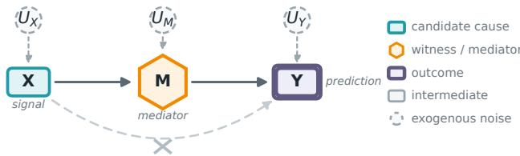  
no direct path (X reaches Y only through M)  
Figure 10: The signal-with-mediation model. X (teal) reaches the outcome Y (purple double box) only through the mediator M (gold hexagon); the faded, crossed-out arc marks the absent direct path $X  Y$ . Dashed circles are the independent Gaussian noises UX, UM, UY of Eqs. (5) to (7). Desideratum D-MXY asks an attribution to register that one missing edge: M acts on Y directly, whereas X acts only at one remove.

Let $R ( X  Y )$ denote the causal responsibility of X for Y . Following the convention of Section $^ { 3 , }$ the desiderata are stated in terms of absolute magnitudes $| R ( \cdot ) |$ , allowing for directionality. The qualitative causal responsibility desideratafor this example are:

$$
\begin{array} { r l } { D { \cdot } X Y } & { { } | R ( X  Y ) | > 0 } \end{array}
$$

$$
\begin{array} { r l } { D { \cdot } M Y } & { { } | R ( M  Y ) | > 0 } \end{array}
$$

$$
\begin{array} { r l } { D { \cdot } X M } & { { } | R ( X \not \sim { M } ) | > 0 } \end{array}
$$

$$
\begin{array} { r l } { D { \cdot } Y X } & { { } | R ( Y  X ) | = 0 } \end{array}
$$

$$
D / - Y M \quad | R ( Y \not \sim M ) | = 0
$$

$$
\begin{array} { r l } { D { \cdot } M X } & { { } | R ( M  X ) | = 0 } \end{array}
$$

A more subtle desideratum concerns telling apart the roles of the two genuine causes. X reaches Y only through the mediator M, whereas M acts on Y directly; a good attribution method should be able to distinguish these two roles rather than collapse them into the same number. One systematic way to register the distinction is to require that the two causes receive different, rankable scores, and we adopt the convention of assigning the larger score to the cause closer to the outcome:

$$
\begin{array} { r l } { D { \cdot } M X Y } & { { } | R ( M \to Y ) | > | R ( X \to Y ) | } \end{array}
$$

The direction of the inequality is a convention rather than a law of responsibility; what matters is that the method separates the direct from the indirect path at all. A method that assigns the larger score to the more distal cause would be equally principled; we adopt the direction stated here for consistency.

The distributionalfacts we will use are:

$$
\mathbb { E } [ X ] = \mathbb { E } [ M ] = \mathbb { E } [ Y ] = 0 . 5 ,\tag{8}
$$

$$
\bigl ( V a r ( X ) , V a r ( M ) , V a r ( Y ) \bigr ) = ( 0 . 2 5 , 0 . 3 5 , 0 . 4 5 ) ,\tag{9}
$$

$$
\bigl ( C o \nu ( X , M ) , C o \nu ( X , Y ) , C o \nu ( M , Y ) \bigr ) = ( 0 . 2 5 , 0 . 2 5 , 0 . 3 5 ) .\tag{10}
$$

For each target variable, the optimal predictor under squared loss is the conditional expectation, computable exactly in this Gaussian model:

$$
f _ { Y } ( X , M ) = \operatorname { \mathbb { E } } [ Y \mid X , M ] = M \quad ( \{ X , M \} \Rightarrow Y )\tag{11}
$$

$$
f _ { M } ( X , Y ) = \mathbb { E } [ M \mid X , Y ] = 0 . 5 X + 0 . 5 Y \quad ( \{ X , Y \} \Rightarrow M )\tag{12}
$$

$$
f _ { X } ( M , Y ) = \operatorname { \mathbb { E } } [ X \mid M , Y ] = 0 . 5 + { \frac { 5 } { 7 } } ( M - 0 . 5 ) \quad ( \{ M , Y \} \Rightarrow X )\tag{13}
$$

The distributional facts and the three conditional expectations above are derived in Appendix B (§B.2–§B.3).

## 5.3 Computations and Desiderata Analysis

We analyze two instances. Instance 1 sets $X ^ { \star } = M ^ { \star } = Y ^ { \star } = 1 \colon$ : every variable lies above its mean, the prediction is non-trivial at every target, and SHAP, Causal SHAP, and PCI all return non-zero values. Instance 2 sets $X ^ { \star } = M ^ { \star } \stackrel { \cdot } { = } Y ^ { \star } = 0 . 5 \colon$ every variable sits at its mean, the prediction equals its baseline, and SHAP’s attribution budget $f ( x ^ { \star } ) - \mathbb { E } [ f ( X ) ]$ collapses to zero. We work through Instance 1 first, then return to Instance 2 to isolate what each method is really tracking.

Computing the three methods. At Instance 1 $( X ^ { \star } = M ^ { \star } = Y ^ { \star } = 1 )$ all three methods admit closed-form evaluation in this Gaussian model. We defer the full per-target coalition-value and Shapley computations for plain and Causal SHAP, and the per-(C, T) PCI derivation, to Appendix B (§B.4–§B.6); the resulting attributions populate Table 9. One computed fact drives the D-YX discussion below and is worth stating here.

Plain SHAP assigns $\phi _ { Y } = 0 . 1 3 9 > 0$ for target $X ,$ even though $Y$ does not cause X. This arises because $v ( \{ Y \} ) { \stackrel { - } { = } } 0 . 7 7 8 > 0 . 5 \colon$ observing $Y { = } 1$ is statistically informative about $X { = } 1$ through the chain $X  M  Y$ . SHAP cannot distinguish $^ { 6 6 } Y$ is informative about $X ^ { \dag }$ from $^ { 6 6 } Y$ causes $X ^ { \dag }$ because the value function is grounded in observational conditionals, which are symmetric under reversal of causal direction.

Desiderata analysis. Following the convention of Section 3, we use $R ( A \sim B )$ for the methodagnostic responsibility and $\phi _ { A } ^ { B }$ exclusively for SHAP/Causal SHAP values; prose statements about desiderata refer to magnitudes $| R ( A  B )$ |. Here A denotes the candidate cause and B the target outcome (the generic $\mathbf { \bar { \Sigma } } _ { Y }$ of Section 3); for the PCI columns $B ^ { n } , B ^ { s }$ are its necessity/sufficiency worlds, $B ^ { \star }$ its factual value, and $\bar { c } = \mathbb { E } [ | B ^ { n } - B ^ { \star } | - | B ^ { s } - B ^ { \star } | ]$ the expected absolute-difference impact of Example 21 (equivalently $\mathbb { E } [ | \dot { B } ^ { n } - B ^ { \star } | ] - \dot { \mathbb { E } } [ | B ^ { s } - \ddot { B } ^ { \star } | ]$ , as in the caption of Table 9). Table 9 maps the desiderata from Section 5.2 to the values computed above.
<table><tr><td>Desideratum</td><td>Condition</td><td>Plain SHAP</td><td>Causal SHAP</td><td>PCI (W=0)</td><td>PCI (W=3rd)</td></tr><tr><td>D-XY</td><td> $| R ( X  Y ) | > 0$ </td><td>0.250√</td><td>0.250√</td><td>0.249√</td><td> $0 . 1 8 6 ~ \checkmark ^ { \dag }$ </td></tr><tr><td>D-MY</td><td> $\lvert R ( M  Y ) \rvert > 0$ </td><td>0.250√</td><td>0.250√</td><td>0.283√</td><td>0.319√</td></tr><tr><td>D-XM</td><td> $\lvert R ( X  M ) \rvert > 0$ </td><td>0.306√</td><td>0.375√</td><td>0.253√</td><td>0.284√</td></tr><tr><td>D-YX</td><td> $| R ( Y  X ) | = 0$ </td><td>0.139 ×</td><td>0.000√</td><td>0.000√</td><td>0.000√</td></tr><tr><td>D-YM</td><td> $| R ( Y   \rrangle |  0$ </td><td>0.194×</td><td>0.125 ×</td><td>0.000√</td><td>0.000√</td></tr><tr><td>D-MX</td><td> $| R ( M  X ) | = 0$ </td><td>0.219 ×</td><td>0.357 ×</td><td>0.000√</td><td>0.000√</td></tr><tr><td>D-MXY</td><td> $| R ( M  Y ) | > | R ( X  Y ) |$ </td><td> $0 . 2 5 { = } 0 . 2 5 \times$ </td><td>0.25=0.25 ×</td><td>0.283&gt;0.249√</td><td> $0 . 3 1 9 { > } 0 . 1 8 6 \checkmark ^ { \ddagger }$ </td></tr></table>

Table 9: Desiderata satisfied $( \checkmark )$ and violated (×) by plain SHAP, Causal SHAP, and PCI on the signal-withmediation example $( X \to M \to Y )$ ), instance $X = \bar { M } \overset { \cdot } { = } Y = 1$ . PCI uses $\bar { c } = \mathbb { E } [ | B ^ { n } - B ^ { \star } | ] - \mathbb { E } [ | \tilde { B } ^ { s } - B ^ { \star } | ]$ with $\Gamma _ { s } , \Gamma _ { w }$ uniform over non-empty subsets and rejection on $\mathbf { C } \cap \mathbf { T } \neq \emptyset$ . W=3rd sets the third variable (neither A nor B) as the witness when not in C. † 0.186 weights three suspect-containing (C, T) configurations at 1/4 each (the rejection-sampling filter keeps $2 / 3$ of $\Gamma _ { s } \times \Gamma _ { u }$ draws, including a fourth valid pair $\bar { ( \{ M \} , \emptyset ) }$ that does not contain $X ) { \mathrm { : } }$ one pins M as witness (contribution 0, necessity and sufficiency coincide) and two let M propagate freely (contributions 0.320 and 0.425). ‡ The two values use different witness sets $( \mathbf { W } { = } \{ M \}$ for $\mathbf { D } { \cdot } \mathbf { \tilde { X } Y } , \mathbf { \tilde { W } } { = } \{ X \}$ for D-MY); this column reports the amplified verdict under an asymmetric witness rule. The W=∅ column above is the corresponding single-game ranking and already passes D-MXY.

Positive results (D-XY, D-MY, D-XM). Both methods correctly assign positive attribution to every direct or upstream cause of the target. Causal prediction models are built from observational conditionals, which do preserve correlation from cause to effect, so these desiderata pose no challenge to either method.

Causal SHAP fixes D-YX, not D-YM. For target $X$ , the interventional value $v _ { \mathrm { c a u s a l } } ( \{ Y \} ) = 0 . 5$ equals the baseline because M is not downstream of $Y \colon P ( M \mid d o ( Y { = } 1 ) ) = P ( \tilde { M } )$ , so fixing $\overset { \bullet } { Y } = 1$ provides no interventional leverage over $f _ { X }$ , and Causal SHAP correctly yields $\phi _ { Y } ^ { X } = 0$ . For target M, however, $\phi _ { Y } ^ { M } = 0 . 1 2 5 > 0$ persists. The prediction model $f _ { M } ( X , Y ) = 0 . 5 X + 0 . 5 Y$ contains $Y$ as an input because $Y$ is observationally predictive of $M ;$ setting $Y = 1$ raises the model output even under the interventional regime. Causal SHAP replaces the conditioning distribution but cannot remove a feature that the prediction model itself uses.

D-MX: the interventional correction reallocates the spurious attribution. Plain SHAP assigns $\phi _ { M } ^ { X } = 0 . 2 1 9$ ; Causal SHAP assigns 0.357. Fixing D-YX reduces $v _ { \mathrm { c a u s a l } } ( \{ Y \} )$ from 0.778 to 0.5, driving $\phi _ { Y } ^ { X }$ to zero, but reallocates the freed attribution to M. Since the structural noise that actually drives X is unobserved, all attribution concentrates on the only visible predictor, $M ,$ even though M does not cause $X$

D-MXY fails for both. Since $f _ { Y } = M$ , the singleton values $v ( \{ X \} ) = \mathbb { E } [ M \mid X { = } 1 ] = 1$ and $v ( \{ M \} ) = 1$ are identical, giving $\phi _ { M } ^ { Y } = \phi _ { X } ^ { Y } = 0 . 2 5$ for both methods. The Shapley formula cannot distinguish that $X$ reaches $\mathbf { \bar { \boldsymbol { Y } } }$ only through M: when $X = 1$ , the expected prediction is already 1 regardless of whether M is observed or not, so both features receive the same marginal contribution.

PCI: structural intervention separates the paths; witnesses sharpen the gap. Table 9 reports PCI in two configurations: without witnesses $( { \bar { \mathbf { W } } } = \varnothing )$ and with the third variable as witness.

Without witnesses, PCI satisfies all six single-variable desiderata. D-YX, D-YM, and D-MX are zero exactly: intervening on a variable that does not structurally affect the target leaves both the necessity and sufficiency worlds with identical distributions, so $c i = 0$ identically. D-XY, D-MY, and D-XM are positive. D-MXY also passes at $\operatorname { P C I } ( M \to Y ) \approx 0 . 2 8 3 > \operatorname { P C I } ( { \overset { . } { X } } \to Y ) \approx 0 . 2 4 9$ , but only by a margin of 0.034. The asymmetry comes from the sufficiency world: at $C { = } \{ X \}$ , X’s path to $Y$ accumulates $\varepsilon _ { M } + \varepsilon _ { Y }$ in $| Y ^ { s } - Y ^ { \star } | ,$ while at $C { = } \{ M \} , M ^ { \prime }  \}$ path accumulates only ε . The necessity expectations match across paths $( \operatorname { V a r } ( X ) + \operatorname { V a r } ( \varepsilon _ { M } ) + \operatorname { V a r } ( \varepsilon _ { Y } ) = \operatorname { V a r } ( M ) { \dot { + } } \operatorname { V a r } ( \varepsilon _ { Y } ) = 0 . 4 5 ) \quad$ so the gap is carried entirely by the sufficiency variance asymmetry $\mathrm { V a r } ( \varepsilon _ { M } )$ . A small structural margin like this is fragile: under any perturbation of the noise variances or the contrast function the $\mathbf { W } \overset { = } { = } \varnothing$ ordering could flip.

Admitting the third variable as a witness amplifies the gap by roughly fourfold. $\operatorname { P C I } ( X \to Y \mid$ $\mathbf { W } { = } \{ M \mathbf { \bar { \} } } ) \approx 0 . 1 8 6$ weights three suspect-containing $( \mathbf { \bar { C } } , \mathbf { T } )$ configurations at $1 / 4$ each: in two cases M propagates freely (contributing 0.320 and 0.425) and in one case M is pinned as witness in both worlds, equalizing them and contributing $0 . \operatorname { P C I } ( M \to Y \mid \mathbf { W } { = } \{ X \} ) \approx \operatorname { \bar { 0 } . 3 1 9 }$ weights three cases in which M takes an alternative value; since X does not appear in $\dot { Y } ^ { \bullet } \mathrm { s }$ structural equation, pinning X has no effect on $Y ^ { n }$ or $Y ^ { s }$ , and all three cases contribute the same 0.425. The gap widens from 0.034 at $\mathbf { W } = \emptyset \mathrm { t o } 0 . 3 1 9 - 0 . 1 8 6 = 0 . 1 3 3$ at $\mathbf { W } = \{ \mathrm { t h i r d } \}$ : the ordering is now robust. The comparison relies on different witness sets for the two cells, so it remains illustrative rather than a single-game ranking.

Instance 2 (baseline). We now return to Instance 2: every variable sits at its mean, $X ^ { \star } = M ^ { \star } =$ $Y ^ { \star } = 0 . 5 .$ , and the model predicts the baseline at every target: $f _ { Y } ( 0 . 5 , 0 . 5 ) = 0 . 5 , f _ { M } ( 0 . 5 , 0 . 5 ) =$ $0 . 5 , f _ { X } ( 0 . 5 , 0 . 5 ) = 0 . 5$ . At this instance, SHAP’s attribution budget $f ( x ^ { \star } ) - \mathbb { E } [ f ( X ) ]$ vanishes, while PCI’s machinery is unaffected.

The pattern in Table 10 reflects the object each method is decomposing. SHAP attributes the quantity $f ( x ^ { \star } ) - \mathbb { E } [ f ( X ) ]$ across features. At the baseline this gap is zero on every target, so every cell collapses to zero, uniformly, regardless of how the realized outcome was produced. The non-causal triples (D-YX, D-YM, D-MX) are satisfied only by this collapse: SHAP is not isolating the absence of a causal path; it is reporting that there is nothing to attribute. The same collapse turns D-XY, D-MY, and D-XM into violations.

PCI never invokes a population expectation. With S and W defined relative to a fixed factual instance, the question is whether varying the suspect would move the realized outcome $y ^ { \star }$ away from itself, not whether $f ( x ^ { \star } )$ deviates from $\mathbb { E } [ f ( X ) ]$ . The structural mechanism is unchanged at the baseline, so the three causal pairs continue to register positive values; the three non-causal pairs continue to register zero exactly, because intervening on a variable that does not structurally affect the target leaves both worlds with identical distributions. SHAP is not wrong at the baseline: it correctly reports that the factual prediction does not deviate from its mean. But that is a different question from causal responsibility for $y ^ { \star }$ , and when the prediction equals its baseline SHAP has no budget to distribute even though the PSCM’s causal mechanism remains intact. PCI asks the responsibility question directly, and answers it whether or not the prediction happens to coincide with its population mean.

<table><tr><td rowspan="2">desideratum</td><td colspan="2">Plain / Causal SHAP</td><td colspan="2"> $\operatorname { P C I } \left( \mathbf { W } = \varnothing \right)$ </td><td colspan="2"> $\mathrm { P C I } \left( \mathbf { W } = \lbrace \mathrm { t h i r d } \rbrace \right)$ </td></tr><tr><td>value</td><td>status</td><td>value</td><td>status</td><td>value</td><td>status</td></tr><tr><td>D-XY</td><td>0.000</td><td>×</td><td>0.154</td><td>√</td><td>0.115</td><td>√</td></tr><tr><td>D-MY</td><td>0.000</td><td>×</td><td>0.189</td><td>√</td><td>0.212</td><td>√</td></tr><tr><td>D-XM</td><td>0.000</td><td>×</td><td>0.146</td><td>√</td><td>0.165</td><td>√</td></tr><tr><td>D-YX</td><td>0.000</td><td>√</td><td>0.000</td><td>√</td><td>0.000</td><td>√</td></tr><tr><td>D-YM</td><td>0.000</td><td>√</td><td>0.000</td><td>√</td><td>0.000</td><td>√</td></tr><tr><td>D-MX</td><td>0.000</td><td>√</td><td>0.000</td><td>√</td><td>0.000</td><td>√</td></tr><tr><td>D-MXY</td><td colspan="2"> $0 . 0 0 0 = 0 . 0 0 0 \times$ </td><td colspan="2"> $0 . 1 8 9 > 0 . 1 5 4 >$ </td><td colspan="2"> $0 . 2 1 2 > 0 . 1 1 5 <$ </td></tr></table>

Table 10: Desiderata at the baseline instance $X ^ { \star } = M ^ { \star } = Y ^ { \star } = 0 . 5 .$ . SHAP collapses to zero on every cell, assigning zero to the non-causal triples (though here that zero reflects the vanishing attribution budget rather than a detected absence of a causal path) while offering no signal on the causal ones. PCI reports the same structural verdicts as at $X ^ { \star } = M ^ { \star } \stackrel { \star } { = } Y ^ { \star } = 1$

## 5.4 Summary Across Both Examples

The ranking failures above are not artifacts of a particular feature set or parameter choice: each traces to a structural limitation of the SHAP/Causal SHAP framework. Causal SHAP strictly improves on plain SHAP for one desideratum (D-YX), by replacing observational conditioning with interventional distributions; the remaining failures share two sources: prediction models include non-causal features that the conditioning distribution cannot exclude (D-YM, D-MX), and Shapley averaging cannot distinguish direct from indirect causal paths (D-MXY). The OBCB analysis of Section 5.1 exhibits the same family in different surface form: plain SHAP fails D-A-rank on the 2-feature game, and once the mediator is admitted as a feature, Causal SHAP inherits that same ranking failure for Alice. For Bob it instead becomes undefined outright, which Section 5.1 traces to this particular PSCM’s impossible-cell structure rather than the ranking failure itself; the signalmediation example, which has no such cell, shows the same family of genuine failures recur regardless. Across both examples, neither SHAP variant reliably satisfies the desiderata that motivated PCI in Section 3. Section 2 grounds D-A-rank, D-B-rank, and D-comp in distinctions the preemption and actual-causality literature established well before this paper: active versus preempted versus irrelevant causes, and direct versus indirect causal paths. PCI addresses these gaps through three ingredients the SHAP framework lacks: the witness mechanism, the suspect-set distribution $\Gamma _ { s } ,$ , and the use of the realized outcome rather than the prediction baseline. On top of these, the path-noise asymmetry in the sufficiency world produces a structural gap on D-MXY, which appears already in the witness-free single game and widens further under a witness rule.

The two examples here are small enough to inspect every desideratum individually; the broader empirical comparison (a synthetic archetype catalogue and a contrast with gradient-based Differential Causal Effect attribution) was already summarised in Section 4 and is detailed in Appendices D and E. We turn first, in Section 6, to the formal relationship between PCI and actual causality.

## 6 Relation with Actual Causality

Section 5 positioned PCI against feature-attribution baselines. We now turn to PCI’s relation to the causal-attribution tradition it inherits the witness mechanism from: Halpern’s actual causality. This section establishes theformal connection (Theorems 26–27 and Proposition 32); Section 7 adds the side-by-side comparison with Pearl’s probability of actual causation; Section 4 already previewed the empirical comparison (runtime and verdict recovery as model size grows), with the full protocol in Appendix F. Exact AC-predicate evaluation enumerates suspect and witness subsets, a cost that grows exponentially with model size; the theorems below show that the expectation PCI estimates via Monte Carlo sampling recovers AC verdicts under the stated conditions, so the guarantee carries over to models too large for exact enumeration.

PCI is not meant to explicate Halpern’s notion of actual causality; the goal is to combine the intuitions underlying Halpern’s notion with those motivating Pearl’s probabilities of necessity and sufficiency to provide a more general tool for causal attribution. Nevertheless, to show that we preserve the spirit of Halpern’s definition, we now record the connection between actual causality and the joint necessity-sufficiency machinery of Section 3. Concretely, we exhibit a natural choice of variable selection distribution Γ and alternative-value distribution $\Delta$ under which PCI verdicts agree with actual-causality verdicts. With one caveat: probability-of-causation maximisation will not identify subset-minimal causes that are not cardinality-minimal, a misalignment we characterise and remedy below.

Throughout this section $\varphi$ denotes the outcome event whose causes we attribute, $\{ Y = y ^ { \star } \}$ in the binary case, or a threshold event such as $\{ Y > y _ { 0 } \}$ for continuous outcomes (as in Appendix G), and ¬φ its complement. This is the event written as the measurable set $A \subseteq \operatorname { d o m } \left( Y \right)$ in Definition 18.

Scope: a necessity-only correspondence. Halpern’s definition involves factivity, context-sensitive necessity, and minimality, but no sufficiency clause analogous to Pearl’s PS or PNS: a gap Beckers [2021b] addresses directly, building on the counterfactual NESS account [Beckers, 2021a]: a cause must be a necessary element of a set that is sufficient for the outcome. The correspondence we establish in this section is therefore necessity-only: the sufficiency component of the kernel Φ defined below, the $Y ^ { s }$ factor of Definition 18, acts here as a factivity check (restoring factual values must preserve $\varphi$ under fixed noise). More generally, $Y ^ { s }$ implements the graded, probabilistic analogue of Beckers’ NESS test: it restores a candidate set C to factual values, holds the witnesses T fixed, and checks that the outcome persists, so that where NESS returns set membership, the joint measure returns a Γ-weighted degree, with the witness set supplying the held-fixed context that NESS sufficient sets leave implicit. That substantive sufficiency component, together with the $c i _ { S }$ term in Appendix D, appears in the synthetic overdetermination and undercutting evaluation (Appendix D), the differential causal effect comparison (Appendix E), and the SIR benchmark (Appendix G), settings where AC cannot adjudicate. The correspondence below is thus the AC-facing (necessity) half of a construction whose sufficiency half answers to Beckers’ program rather than Halpern’s. The narrowness of this section’s correspondence reflects what AC itself permits.

We first recall Halpern’s definition.

Definition 23 (Actual Cause, after Halpern, 2016). ${ \bf C } = { \bf c }$ is an actual cause $o f \varphi$ in the causal setting (M, u) ifthefollowing three conditions hold:

• Factivity: (M, u) ⊨ (C = c ) and (M, u) ⊨ φ,

• Context-sensitive Necessity: There is a set of variables $\mathbf { T } \subseteq \mathbf { V }$ and an alternative setting c′ of variables in C such that, writing $\mathbf { t } ^ { \star }$ for the factual value of T in $( M , \mathbf { u } )$

$$
( M , \mathbf { u } ) \models [ \mathbf { C }  \mathbf { c } ^ { \prime } , \mathbf { T }  \mathbf { t } ^ { \star } ] \lnot \varphi ,
$$

• Minimality: C is minimal; there is no strict subset $\mathbf { C _ { s u b } } \subset \mathbf { C }$ such that $\mathbf { C _ { s u b } } = \mathbf { c _ { s u b } }$ satisfies the above two conditions where $\mathbf { c _ { s u b } }$ is the restriction of c to the variables in $\mathbf { C _ { s u b } }$

To connect this to PCI, we instantiate the joint necessity-sufficiency machinery (Definition 18) at a single configuration (C, T) and a fixed noise realisation u, and read off the configuration-level contribution. The resulting kernel combines the same three ingredients as Halpern’s definition: a sufficiency check at factual values, a necessity check against alternatives, and a Γ-weight that records how much attention Γ gives the configuration. Throughout the kernel and its proofs we write the restored factual values as the restrictions $\mathbf { s } ^ { \star } \mid _ { \mathbf { C } }$ and $\mathbf { w } ^ { \star } \mid _ { \mathbf { T } } ;$ these are the $\mathbf { c } ^ { \star }$ and $\mathbf { t } ^ { \star }$ of Halpern’s definition above.

Definition 24 (AC-aligned PCI kernel). Fix a PSCM $M = \langle \mathbf { U } , \mathbf { V } , \mathbf { F } , P _ { \mathbf { U } } \rangle , ^ { 2 1 }$ a noise realisation u, suspect and witness sets $\mathbf { S } , \mathbf { W } \subseteq \mathbf { V }$ with factual values $\mathbf { s } ^ { \star } , \mathbf { w } ^ { \star } ,$ , a variable selection distribution Γ on $2 ^ { \mathbf { S } } \times 2 ^ { \mathbf { W } }$ with mass function $p ^ { \Gamma }$ , and an alternative-value distribution $\Delta ( \mathbf { s } ^ { \star } )$ . For an outcome event $\varphi ,$ , active suspect set $\mathbf { C } \subseteq \mathbf { S }$ and active witness set $\mathbf { T } \subseteq \mathbf { W }$ with $\mathbf { T } \cap \mathbf { C } = \mathbf { \dot { \varnothing } }$ , define

$$
\begin{array} { r } { \Phi _ { \mathbf { u } } ( \mathbf { C } , \mathbf { T } ) : = \underbrace { p ^ { \Gamma } ( \mathbf { C } , \mathbf { T } ) } _ { s e l e c t i o n \ w e i g h t } \cdot \underbrace { \mathbb { I } [ ( M , \mathbf { u } ) \vdash [ \mathbf { C }  \mathbf { s } ^ { \star } | \mathbf { c } , \mathbf { T }  \mathbf { w } ^ { \star } | \mathbf { r } ] \varphi ] } _ { s u f j c i e n c y \ i n d i c a t o r } } \\ { \cdot \underbrace { \int \mathbb { I } [ ( M , \mathbf { u } ) \vdash [ \mathbf { C }  \mathbf { c } ^ { \prime } , \mathbf { T }  \mathbf { w } ^ { \star } | \mathbf { r } ] \lnot \lnot \varphi ] \Delta _ { \mathbf { C } } ( \mathbf { s } ^ { \star } ) ( d \mathbf { c } ^ { \prime } ) } _ { n e c e s s i t y \ i n t e g r a l } . } \end{array}\tag{14}
$$

The kernel depends on the fixed noise realisation u through its two indicators; we write $\Phi _ { \mathbf { u } }$ when that dependence is in play (as in the noise-integrated score $P ( \mathbf { C } \{ \arg \varphi \}$ below) and abbreviate it to Φ when u is fixed and clear from context. Concretely, $\Phi _ { \mathbf { u } } ( \mathbf { C } , \mathbf { T } )$ is the per-configuration term inside the joint necessity-sufficiency measure $P _ { k } ^ { s , n }$ from Definition 18: it replaces integration over $P _ { \mathbf { U } }$ with point evaluation at u, and the sum over (C, T) with evaluation at a single pair, mirroring $\mathbf { A } \mathbf { C } ^ { \prime } \mathbf { s }$ structure of testing factivity and the alternative against a single suspect/witness pair. The kernel is positive exactly when three conditions hold simultaneously: $( \mathbf { C } , \mathbf { T } )$ has positive Γ-mass; restoring C to its factual values while holding T fixed preserves $\varphi$ under u (the factivity-as-sufficiency component); and there exists a $\Delta$ -positive-density alternative $\mathbf { c } ^ { \prime }$ for which the corresponding intervention overturns $\varphi$ under u (the necessity component). The regularity condition we introduce next ensures that the first of these three, the Γ-selection weight, never vanishes on a legal configuration.

Definition 25 (Regular Γ). Γ is regular when $p ^ { \Gamma } ( \mathbf { C } ^ { \prime } , \mathbf { T } ^ { \prime } ) > 0$ for every $( \mathbf { C } ^ { \prime } , \mathbf { T } ^ { \prime } )$ with $\mathbf { C } ^ { \prime } \subseteq \mathbf { S }$ $\mathbf { T } ^ { \prime } \subseteq \mathbf { W } , \mathbf { C } ^ { \prime } \cap \mathbf { T } ^ { \prime } = \varnothing .$

We can now record the forward direction, under the conditions stated below: whenever C is an actual cause in Halpern’s sense, the matching kernel value is strictly positive, so PCI never scores an AC-certified cause as zero.

Theorem 26. Suppose that C is an actual cause of $\varphi$ with witness set T in $( M , \mathbf { u } )$ . Take any potential cause set $\mathbf { S } \supseteq \mathbf { C }$ with factual values $\mathbf { S } = \mathbf { s } ,$ subject to the constraint that no element of S is a deterministic function (under M) of any subset of the remaining elements of $\mathbf { S } , ^ { 2 2 }$ and any $\mathbf { W } \supseteq \mathbf { T }$ as the potential witness set. Assume Γ is regular and that $\Delta ( \mathbf { s } )$ assigns positive density to every $\mathbf { s } ^ { \prime } \in$ dom $\bf ( S ) \setminus \{ s \}$ (positive PMF in the discrete case, positive Lebesgue density in the continuous case). In the continuous case, assume additionally:

(i) the structural equations ofM downstream ofC are continuous in c′ underfixed u;

(ii) either ¬φ is open in dom $( Y )$ , or, more weakly, the boundary $o f \lnot \varphi$ has measure zero under the pushforward $o f Y$ and the witnessing alternative $\mathbf { c } ^ { \prime }$ from context-sensitive necessity satisfies $\mathbf { \bar { \Gamma } } _ { Y ( \mathbf { c } ^ { \prime } ) } \in \operatorname { i n t } ( \lnot \varphi )$ (i.e. the witnessed outcome lies strictly inside $\neg \varphi ,$ , not exactly on its boundary).

Then

$$
\Phi ( \mathbf { C } , \mathbf { T } ) > 0 ,\tag{15}
$$

Hypotheses $( i ) – ( i i )$ are a proofdevicefor the necessity integral inside Φ; Halpern’s Definition 23 is a qualitative ⊨-condition with no continuous/discrete distinction ofits own, so they play nofurther role once (15) is established. In particular, every other term $\Phi ( { \bf C } , { \bf { \bar { T } } ^ { \prime } } )$ in the sum below is nonnegative by Definition 24 regardless ofthem, and therefore

$$
\sum _ { { \bf T } ^ { \prime } \subseteq { \bf W } } \Phi ( { \bf C } , { \bf T } ^ { \prime } ) > 0 .
$$

Proof. Fix ${ \mathbf { u } } , { \mathbf { c ^ { \prime } } } ,$ and $\mathbf { T }$ as witnesses to the satisfaction of the conditions in Definition 23. The context-sensitive-necessity clause forces $\mathbf { T } \cap \mathbf { C } = \emptyset$ , since otherwise the joint intervention $\boldsymbol { \lceil \mathbf { C } \gets }$ $\mathbf { c } ^ { \prime } , \mathbf { T }  \mathbf { w } ^ { \star } | _ { \mathbf { T } } ]$ would be ill-defined. It remains to show that each of the three factors in $\Phi ( \mathbf { C } , \mathbf { \bar { T } } )$ is strictly positive.

• Selection weight. By regularity of Γ, $p ^ { \Gamma } ( { \bf C } , { \bf T } ) > 0$

• Sufficiency indicator. With exogenous noise u held constant, factivity gives $( M , \mathbf { u } ) \models \varphi$ Restoring C to $\mathbf { s } ^ { \star } \mid _ { \mathbf { C } }$ and $\mathbf { T }$ to $\mathbf { w } ^ { \star } \mid _ { \mathbf { T } }$ leaves the model agreeing with $( M , \mathbf { u } )$ on every variable, so the indicator evaluates to 1.

• Necessity integral. Context-sensitive necessity provides a specific $\mathbf { c } ^ { \prime }$ witnessing $( M , \mathbf { u } ) \models$ $[ \mathbf { C } \gets \mathbf { c ^ { \prime } } , \mathbf { T } \gets \mathbf { w } ^ { \star } | \mathbf { \vec { r } } ] \lnot \varphi$ . The closure condition on S and the positive-density assumption on $\Delta ( \mathbf { s } )$ imply that $\mathbf { c } ^ { \prime }$ lies in the support of $\Delta _ { \mathbf { C } } ( \mathbf { s } ^ { \star } )$ ). We treat the two cases separately. Discrete case: the singleton $\{ \mathbf { c } ^ { \prime } \}$ has positive PMF $\Delta _ { \bf C } ( \{ { \bf c } ^ { \prime } \} ) > 0$ by hypothesis, so the integral is at least $\Delta _ { \bf C } \big ( \{ { \bf c ^ { \prime } \} } \big ) \dot { > } \dot { 0 }$ . Continuous case: hypothesis (i) gives continuity of the intervention map $\mathbf { c } ^ { \prime } \mapsto Y$ at fixed u; hypothesis (ii) places $Y ( \mathbf { c } ^ { \prime } )$ in the interior of $\neg \varphi .$ directly $\mathrm { i f } \neg \varphi$ is open (every point of an open set is interior), and by the added clause otherwise. Pulling back an open neighbourhood within $\neg \varphi$ yields an open neighbourhood of $\mathbf { c } ^ { \prime }$ on which the indicator equals $^ { 1 , }$ , and this neighbourhood has positive Lebesgue measure and hence positive $\Delta _ { \mathbf { C } }$ -mass by the positive-density hypothesis. In either case the integral is strictly positive.

The product of three strictly positive factors is strictly positive, giving $\Phi ( \mathbf { C } , \mathbf { T } ) \ > \ 0$ . By Definition $2 4 .$ every $\Phi ( \mathbf { C } , \mathbf { T } ^ { \prime } )$ is itself a product of a nonnegative selection weight, a $\{ 0 , 1 \}$ -valued indicator, and an integral of a {0, 1}-valued indicator against the nonnegative measure $\Delta _ { \mathbf { C } }$ , hence $\Phi ( { \bf C } , { \bf T ^ { \prime } } ) \ge 0$ for every $\mathbf { T } ^ { \prime } \subseteq \mathbf { \dot { W } }$ ; summing over $\mathbf { T } ^ { \prime }$ therefore adds non-negative terms to the positive term $\Phi ( \mathbf { C } , \mathbf { T } )$ , preserving positivity. The proof uses factivity and context-sensitive necessity but not minimality: the same conclusion holds whenever C satisfies factivity and context-sensitive necessity in (M, u), a fact we will use in Proposition 32. □

In settings with continuous outcomes and a threshold event such as $\varphi = \{ Y > y _ { 0 } \}$ (for instance the SIR overshoot benchmark of Appendix G), both hypotheses are typically satisfied via the weaker clause of (ii): $\neg \varphi = \{ Y \leq y _ { 0 } \}$ is closed rather than open, but its boundary is the single point $y _ { 0 }$ , which has measure zero under any continuous pushforward of $Y ;$ the surviving requirement is that the specific witnessing alternative satisfies $Y ( \bar { \mathbf { c } ^ { \prime } } ) < y _ { 0 }$ strictly rather than $Y ( \bar { \mathbf { c } ^ { \prime } } ) = { y } _ { 0 }$ exactly, generic under a continuous pushforward, but not automatic, so a witness that lands exactly on the threshold needs a separate (measure-zero, hence non-generic) argument. (Literal openness $\mathrm { o f } \ \lnot \varphi$ instead requires the strict inequality on the $\neg \varphi$ side, i.e. $\varphi = \bar { \{} Y  \geq y _ { 0 } \} , \neg \varphi = \{  Y < y _ { 0 } \} . )$ Binary-output models, where $\bar { Y }$ takes values in $\{ 0 , 1 \}$ , satisfy (ii) automatically (every subset of a discrete codomain is open) but may not satisfy (i) when the binary output comes from thresholding a continuous score. In such cases the proof falls back to the discrete branch, which only requires positive PMF on the witnessing $\mathbf { c } ^ { \prime }$

The converse also holds: a strictly positive summed kernel value forces both factivity and contextsensitive necessity, the two qualitative AC conditions the kernel is built to detect (we treat minimality separately below). The proof reads the argument for Theorem 26 in reverse on the necessity factor.

Theorem 27. Under the same hypotheses on S, Γ, and $\Delta$ as in Theorem 26, $i f$

$$
\sum _ { { \bf T } ^ { \prime } \subseteq { \bf W } } \Phi ( { \bf C } , { \bf T } ^ { \prime } ) > 0 ,
$$

then both factivity $( ( M , \mathbf { u } ) \models \varphi )$ and the context-sensitive-necessity condition in Definition 23 hold for C in $( M , \mathbf { u } )$

Proof. Since Φ is non-negative, the assumption forces $\Phi ( { \bf C } , { \bf T ^ { \prime } } ) > 0$ for at least one $\mathbf { T } ^ { \prime } \subseteq \mathbf { W }$ . By Definition 24, each factor of $\Phi ( \mathbf { C } , \mathbf { T } ^ { \prime } )$ is strictly positive. The sufficiency indicator equals 1, i.e. $( M , \mathbf { u } ) \models [ \mathbf { C } \gets \mathbf { s } ^ { \star } | _ { \mathbf { C } } , \mathbf { T } ^ { \prime } \gets \mathbf { w } ^ { \star } | _ { \mathbf { T } ^ { \prime } } ] \varphi ;$ since pinning variables to their factual values under fixed u leaves every variable unchanged, this is equivalent to $( M , \mathbf { u } ) \models \varphi ,$ , giving factivity. The necessity integral being positive provides a ∆C-positive-density set of values $\mathbf { c } ^ { \prime }$ for which $\mathbf { \bar { \Phi } } ( M , \mathbf { u } ) \models [ \mathbf { C } \xleftarrow \mathbf { \bar { \Phi } }$ $\mathbf { c } ^ { \prime } , \mathbf { \tilde { T } } ^ { \prime } \gets \mathbf { w } ^ { \star } \left| \mathbf { \tilde { T } } ^ { \prime } \right] \lnot \varphi ;$ any such $\mathbf { c ^ { \prime } } ,$ , together with $\mathbf { T } ^ { \prime }$ , witnesses the existential in the context-sensitivenecessity clause of Definition 23. □

Remark (deterministic intermediates and joint support). The hypothesis on S rules out the following obstruction. Suppose the suspect set were closed under the structural equations of M, e.g., both Sally’s throw S and the bottle’s hit $H = f ( S , \ldots )$ admitted as candidates. Then the joint assignment $( S { = } 0 , H { = } 1 )$ is structurally impossible, and any alternative-value distribution consistent with M assigns it density zero, so the joint full-support condition required to recover the witnessing $\mathbf { c } ^ { \prime }$ from $\Phi > 0$ fails. Restricting suspects to variables that are not deterministic functions of the others under M removes this obstruction. The constraint is also conservative with respect to the AC literature: in the canonical stone-throwing setup, the candidate set is $\{ S _ { S a l l y } , S _ { B i l l } \}$ , with H as the outcome, and AC’s own minimality clause already prefers ancestor candidates over their deterministic descendants when both are admitted. Sections D and F adopt the same convention experimentally (the continuous synthetic benchmark uses the six roots as suspects and the discrete scaled-throwing benchmark uses $\{ A _ { i } , B _ { i } \} .$ as suspects with the deterministic mediators $\{ W _ { i } ^ { a } , W _ { i } ^ { b } \} _ { i }$ as witnesses); in both cases deterministic intermediates are excluded from the suspect set. Cases where a user genuinely wants to attribute responsibility separately to a deterministic intermediate (rather than to its structural ancestors) lie outside the scope of these theorems and require an alternative reading of intervention semantics; we treat that as a separate problem.

With minimality, the situation is somewhat more complicated. Our choice of Γ affects which configurations maximise Φ. Moreover, Φ compares configurations by Γ-weight, and Definition 23 formulates minimality strictly in terms of subsets, so some misalignment is to be expected. A few structural conditions salvage much of the correspondence nonetheless, starting with the following monotonicity property.

Enlarging the candidate cause set typically makes the necessity check harder to satisfy: flipping the outcome now requires a joint alternative across more coordinates, which is generally a rarer draw under $\Delta .$ Necessity dilution names the monotonicity condition under which this intuition always holds: growing C never increases the necessity mass, so that $\Gamma \mathbf { \hat { s } }$ preference for smaller sets is not fighting an opposing pull from N.

Definition 28 (Necessity dilution). A pair $( M , \Delta )$ satisfies necessity dilution on $\mathrm { ~ \bf ~ S ~ } i f ,$ writing N(C, T) for the necessity integral in Equation (14),

$$
N ( \mathbf { C } ^ { \sharp } , \mathbf { T } ^ { \sharp } ) \ \ge \ N ( \mathbf { C } ^ { \dagger } , \mathbf { T } ^ { \dagger } )
$$

for every $\mathbf { C } ^ { \sharp } \subsetneq \mathbf { C } ^ { \dag } \subseteq \mathbf { S }$ and witnesses $\mathbf { T } ^ { \sharp } , \mathbf { T } ^ { \dag }$ disjoint from the corresponding suspect set.

First, there is a simplified setting in which a positive value of Φ, under factivity, entails minimality with respect to the same parameters. Three conditions suffice:

$\Gamma _ { w }$ is uniform over $2 ^ { \mathbf { W } }$ ;

$\Gamma _ { s }$ is strictly cardinality-decreasing, i.e. $p ^ { \Gamma _ { s } } ( { \bf C } _ { 1 } ) > p ^ { \Gamma _ { s } } ( { \bf C } _ { 2 } )$ whenever $\mathbf { C } _ { 1 } \subsetneq \mathbf { C } _ { 2 }$ (this offsets larger suspect sets’ structural advantage: with more variables to draw on, they are easier to certify as necessary, so without a compensating weight they would be spuriously preferred over the true minimal cause);

• the pair $( M , \Delta )$ satisfies necessity dilution on S (Definition 28).

Section $3 ^ { \circ } \mathrm { s }$ default recommendation and its OBCB illustration both use a uniform $\Gamma _ { s } .$ . The correspondence below needs the cardinality-decreasing weighting above; a practitioner obtains this guarantee by choosing that weighting explicitly.

The same proof strategy, extended below, shows that we can safely marginalise over witnesses as well.

Theorem 29. Consider the set of optimisers $\begin{array} { r } { \mathcal { O } ^ { \star } = \arg \operatorname* { m a x } _ { \mathbf { C } \subseteq \mathbf { S } , \mathbf { T } \subseteq \mathbf { W } } \Phi ( \mathbf { C } , \mathbf { T } ) } \end{array}$ Assume $( \mathbf { C } ^ { \dag } , \mathbf { T } ^ { \dag } ) \in { \mathcal { O } } ^ { \star }$ with $\mathrm { \bf \Delta } \mathrm { \hat { P } } ( { \bf C } ^ { \dagger } , { \bf T } ^ { \dagger } ) > 0 ,$ that factivity is satisfied for $\mathbf { C } ^ { \dagger }$ (as in Definition $2 3 ) ,$ and that no element of S is a deterministic function under M of the others. Let $\Gamma _ { w }$ be uniform on $2 ^ { \mathbf { W } }$ and let $\Gamma _ { s }$ be strictly cardinality-decreasing, assume that $( M , \Delta )$ satisfies necessity dilution on $\mathbf { S } ,$ and assume $\Delta$ satisfies the positive-density hypothesis of Theorem 26 (together with hypotheses $( i ) -$ (ii) there, in the continuous case); this lets the proof below invoke Theorem 26 on $\mathbf { C } ^ { \sharp } .$ . Then $\mathbf { C } ^ { \dagger }$ is an actual cause of $\dot { \varphi }$ according to Definition 23.

Proof. Factivity is assumed; by Theorem 27 the context-sensitive-necessity condition holds for $\mathbf { C } ^ { \dagger }$ in $( M , \mathbf { u } )$ . So the only way $\dot { \mathbf { C } } ^ { \dagger }$ can fail to be an actual cause is by failing minimality. Suppose for contradiction that minimality fails: there is $\mathbf { C } ^ { \sharp } \subsetneq \mathbf { C } ^ { \dag }$ satisfying factivity and context-sensitive necessity for $\varphi$ with some witness $\mathbf { T } ^ { \sharp }$ . By Theorem 26 (its proof requires only factivity and necessity, not minimality), $\Phi ( { \bf C } ^ { \sharp } , { \bf T } ^ { \sharp } ) > 0$ as well, with the sufficiency indicator and the necessity integral both equal to 1 and a strictly positive value, respectively. Both pairs therefore satisfy $\Phi ( { \breve { \mathbf { C } } } , \mathbf { T } ) = p ^ { \Gamma } ( { \mathbf { \dot { C } } } , \mathbf { T } ) \cdot N ( \mathbf { C } , \mathbf { T } )$

By the construction of Γ from independent marginals (Section 3),

$$
p ^ { \Gamma } ( { \bf C } , { \bf T } ) \propto p ^ { \Gamma _ { s } } ( { \bf C } ) p ^ { \Gamma _ { w } } ( { \bf T } ) \mathbb { I } [ { \bf T } \cap { \bf C } = \emptyset ] .
$$

The $\mathbb { I } [ \cdot ]$ factor is 1 for both pairs (otherwise the contradiction would have been immediate). Uniformity of $\Gamma _ { w }$ on $2 ^ { \mathbf { W } }$ makes $p ^ { \Gamma _ { w } } ( \mathbf { T } ) \ : = \ : 2 ^ { - | \mathbf { W } | }$ identically, so the witness factor cancels. Strict cardinality-decrease of $\Gamma _ { s }$ together with $\mathbf { C } ^ { \sharp } \subsetneq \mathbf { C } ^ { \dagger }$ gives $p ^ { \Gamma _ { s } } \mathbf { \bar { ( C ^ { \sharp } ) } } > p ^ { \Gamma _ { s } } \mathbf { ( C ^ { \dagger } ) }$ , and necessity dilution gives ${ \cal N } ( { \bf C } ^ { \sharp } , { \bf T } ^ { \sharp } ) \geq { \cal N } ( { \bf C } ^ { \dagger } , { \bf T } ^ { \dagger } )$ . Multiplying these (and noting $N ( { \bf C } ^ { \sharp } , { \bf T } ^ { \sharp } ) > 0$ to convert weak into strict in the composite) gives $\Phi ( { \bf C } ^ { \sharp } , { \bf T } ^ { \sharp } ) > \Phi ( { \bf C } ^ { \dagger } , { \bf T } ^ { \dagger } )$ , contradicting $( \mathbf { C } ^ { \dagger } , \mathbf { T } ^ { \dagger } ) \in \mathcal { O } ^ { \star }$ □

Corollary 30. Keep the notation and hypotheses of Theorem 29. Consider the set of optimisers $\mathcal { O } ^ { \Sigma } = \mathrm { a r g } \operatorname* { m a x } _ { \mathbf { C } \subseteq \mathbf { S } } \bar { \sum } _ { \mathbf { T } \subset \mathbf { W } } \boldsymbol { \Phi } ( \mathbf { C } , \mathbf { T } )$ . Assume $\mathbf { C } ^ { \dagger } \in { \mathcal { O } } ^ { \Sigma }$ with $\begin{array} { r } { \sum _ { \mathbf { T } \subset \mathbf { W } } \Phi ( \mathbf { C } ^ { \dagger } , \mathbf { T } ) \ > \ 0 } \end{array}$ and that factivity is satisfied for C†. Then $\mathbf { C } ^ { \dagger }$ is an actual cause of $\varphi$ according to Definition 23.

Proof. The summation hypothesis entails the existence of some $\mathbf { T } ^ { \dagger } \subseteq \mathbf { W }$ with $\Phi ( { \bf C } ^ { \dagger } , { \bf T } ^ { \dagger } ) > 0 ;$ by Theorem $^ { 2 7 } { \cdot }$ , factivity and context-sensitive necessity hold for $\mathbf { C } ^ { \dagger } .$ . It remains to rule out a failure of minimality. We cannot simply invoke Theorem 29: $\mathbf { C } ^ { \dag } \in { \mathcal { O } } ^ { \Sigma }$ does not place any single pair $( \mathbf { C } ^ { \dagger } , \mathbf { T } )$ in the joint optimiser set $\mathcal { O } ^ { \star }$ , since a candidate whose Γ-mass is spread thinly across many good witnesses can beat, in sum, a competitor that concentrates all its mass on one witness pair with strictly higher pointwise Φ. We instead adapt the argument of Theorem 29 directly to the summed objective.

Since factivity is global, $( M , \mathbf { u } ) \models \varphi ,$ , restoring any disjoint pair (C, T) to its own factual values is the identity intervention, so the sufficiency indicator in Definition 24 equals 1 for every such pair; hence $\Phi ( \dot { \mathbf { C } } , \mathbf { T } ) = p ^ { \Gamma _ { s } } ( \dot { \mathbf { C } } ) p ^ { \Gamma _ { w } } ( \mathbf { T } ) N ( \mathbf { C } , \dot { \mathbf { T } } )$ whenever $\mathbf { T } \cap \mathbf { C } = \emptyset$

Suppose for contradiction that minimality fails for $\mathbf { C } ^ { \dagger }$ : there is $\mathbf { C } ^ { \sharp } \subsetneq \mathbf { C } ^ { \dag }$ satisfying factivity and context-sensitive necessity with some witness $\mathbf { T } ^ { \sharp }$ (not necessarily minimality itself). By Theorem 26, whose proof requires only factivity and necessity, not minimality (as already noted in the proof of Theorem 29), $\bar { \Phi } ( \mathbf { C } ^ { \sharp } , \mathbf { T } ^ { \sharp } ) > 0$ . For every T with $\mathbf { T } \cap \mathbf { C } ^ { \dagger } = \emptyset$ (hence also $\mathbf { \dot { T } } \cap \mathbf { C } ^ { \sharp } = \varnothing$ since $\mathbf { C } ^ { \sharp } \subsetneq \mathbf { C } ^ { \dagger } )$ , necessity dilution gives $N ( \mathbf { C } ^ { \sharp } , \mathbf { T } ) \ \ge \ N ( \mathbf { C } ^ { \dagger } , \mathbf { T } )$ for that same T, while strict cardinality-decrease gives $p ^ { \Gamma _ { s } } ( { \bf C } ^ { \sharp } ) > p ^ { \Gamma _ { s } } ( { \bf C } ^ { \dagger } )$ and uniformity of $\Gamma _ { w }$ makes $p ^ { \Gamma _ { w } } ( \mathbf { T } )$ a common positive constant; together these give $\Phi ( \mathbf { C } ^ { \sharp } , \mathbf { T } ) \geq \Phi ( \mathbf { C } ^ { \dag } , \mathbf { T } )$ pointwise, with strict inequality at $\mathbf { T } = \mathbf { T } ^ { \dagger }$ since $N ( { \bf C } ^ { \dagger } , { \bf T } ^ { \dagger } ) > 0$ there. Summing over $\mathbf { T } \subseteq \mathbf { W }$ disjoint from $\mathbf { C } ^ { \dagger }$ , then using nonnegativity of $\Phi$ to extend the left-hand sum to all T disjoint from $\mathbf { C } ^ { \sharp }$ (a superset of the domain on the right, since disjointness from the smaller set $\mathbf { C } ^ { \sharp }$ is the weaker condition),

$$
\sum _ { { \bf T } \subseteq { \bf W } } \Phi ( { \bf C } ^ { \sharp } , { \bf T } ) > \sum _ { { \bf T } \subseteq { \bf W } } \Phi ( { \bf C } ^ { \dagger } , { \bf T } ) ,
$$

contradicting $\mathbf { C } ^ { \dagger } \in { \mathcal { O } } ^ { \Sigma }$ . So minimality holds, and $\mathbf { C } ^ { \dagger }$ is an actual cause of $\varphi .$

Necessity dilution is a property of $( M , \Delta )$ alone, not of Γ. Definition 28 is deliberately strong: it compares N across every pair of independently-chosen witness sets $\mathbf { T } ^ { \sharp } , \mathbf { T } ^ { \dag }$ , not merely at a shared witness set. That strength is exactly what licenses comparing $\mathbf { T } ^ { \sharp }$ against the optimal $\dot { \mathbf { T } } ^ { \dagger }$ directly in the proof of Theorem 29 above (Corollary $3 0 \mathrm { { ^ circ } s }$ proof needs only the weaker same-T special case, $N ( \dot { \bf C } ^ { \sharp } , { \bf T } ) \ge N ( { \bf C } ^ { \dagger } , { \bf T } )$ for each shared $\dot { \mathbf { T } } ,$ , which the strong version implies). We write $N ( \mathbf { C } )$ for $N ( \mathbf { C } , \mathbf { T } )$ where this does not depend on T at all; i.e. pinning any admissible witness set at its factual values leaves the necessity integral for C unchanged, which is a structural property of $( M , \Delta , { \bf C } )$ that should be checked case by case, not assumed from the notation. The condition requires that the ∆-mass of alternatives that flip the outcome does not grow as the candidate cause expands. Three settings make it automatic, and satisfy the witness-independence just described. $( i ) \ S i n g l e -$ pivot models: one variable $X ^ { \star } \in { \mathbf { S } }$ is pivotal under $( M , \mathbf { u } )$ and the others are structurally idle, so $N$ peaks at $\{ X ^ { \star } \}$ and falls off as more suspects are added. (ii) Factored $\Delta$ without Boolean-OR redundancy: $\Delta _ { \mathbf { C } }$ is a product of marginals $\otimes _ { X \in \mathbf { C } } \nu _ { X }$ with $\nu _ { X } ( \mathrm { d o m } \left( X \right) ) \leq 1$ , and the flip event factorises coordinate-wise; $N ( \mathbf { C } )$ is then a product of factors each at most 1, decreasing in |C|. (iii) Conjunctive outcome events: $\mathrm { i f } \neg \varphi$ requires flipping every variable in a required set ${ \textbf { R } } \subseteq { \dot { \textbf { S } } }$ the flip region’s $\Delta _ { \mathbf { C } ^ { \mathrm { - } } } \mathbf { m a s s }$ decreases as C grows beyond $\mathbf { R } .$ . The hypothesis fails in disjunctive overdetermination $( { \bf e . g . } \varphi : A \vee B = 1 \array$ with both $A , B$ factual): no proper subset of S flips $\varphi ,$ so $N$ is zero on subsets and positive on the full set: the opposite of dilution. In such cases no proper subset of S is an actual cause anyway, so Theorem 29 is not the appropriate tool; Proposition 32 is.

We can now return to the misalignment mentioned earlier. Consider a reasoning mode that looks for causes of an outcome by inspecting the integrated probability $P ( \mathbf { C } \ \not \sim \ \varphi ) : =$ $\begin{array} { r } { \int \sum _ { \mathbf { T } } \Phi _ { \mathbf { u } } ( \mathbf { C } , \mathbf { T } ) P _ { \mathbf { U } } ( d \mathbf { u } ) } \end{array}$ , without knowing the values of u but knowing that $\varphi$ occurred. $\mathbf { A } s$ the next observation shows, arg $\operatorname* { m a x } _ { \mathbf { C } \subseteq \mathbf { S } } P ( \mathbf { C }  \varphi )$ can fail to include some C that is an actual cause of $\varphi$ for some setting u.

Observation 31. $D e f i n e \Xi ^ { \mathrm { { m a x } } } = \arg \operatorname* { m a x } _ { \mathbf { C } \subseteq \mathbf { S } } P ( \mathbf { C } \land \varphi )$ . It is not the case that $i f { \bf C } ^ { \dagger }$ is an actual cause in (M, u) for some u, $\mathbf { C } ^ { \dagger } \in \Xi ^ { \mathrm { { m a x } } }$

Proof. Consider a model with two binary parents $A , B$ uniformly distributed and a binary child $Y = A \lor B$ . Take $\varphi : Y = 1$ and the suspect set $\mathbf { S } = \{ A , B \}$ with $\mathbf { W } = \varnothing$ , and take $\Delta$ to be the deterministic bit-flip distribution on {0, 1} (the single-point alternative used throughout the binary examples of this paper, e.g. Algorithm 2): for active suspect set $\mathbf { C } , \Delta _ { \mathbf { C } } ( \mathbf { s } ^ { \star } )$ places all its mass on the coordinatewise complement of $\mathbf { s } ^ { \star } \mid _ { \mathbf { C } }$ . Compare $\mathbf { C } ^ { \dagger } = \{ A , B \}$ at noise ${ \bf u } _ { 1 1 } \left( A = B = 1 \right)$ and $\mathbf { C } ^ { \sharp } = \{ A \}$ at noise ${ \bf u } _ { 1 0 } \left( A = 1 , B = 0 \right)$

• In $\mathbf { u } _ { 1 1 } , \mathbf { C } ^ { \dagger }$ is an actual cause: setting both parents to 0 yields $Y = 0$ , no proper subset achieves this, and the indicators in Φ are 1. With $\Gamma _ { w }$ uniform on $2 ^ { \varnothing } \left( \mathfrak { a } \right.$ single configuration of weight 1) and a strictly cardinality-decreasing $\Gamma _ { s } ^ { - } , \Phi _ { { \mathbf { u } } _ { 1 1 } } ( { \mathbf { C } } ^ { \dagger } , \emptyset ) \propto p ^ { \Gamma _ { s } } \big ( \{ A , B \} \big )$ . At the other two noise settings with $Y = 1$ , the bit-flip alternative for $\mathbf { C } ^ { \dagger }$ does not flip $Y \colon$ at $\mathbf { u } _ { 1 0 }$ it sends $( A , B )$ to (0, 1), and at $\mathbf { u } _ { 0 1 }$ to (1, 0), both of which keep $Y = 1$ . So only $\mathbf { u } _ { 1 1 }$ contributes to C†.

• In $\mathbf { u } _ { 1 0 } , \mathbf { C } ^ { \sharp }$ is an actual cause: intervening to $A = 0$ (with B left at its factual value 0, since $B \notin \mathbf { C } )$ flips $Y$ to 0, the singleton is minimal, and again the indicators are 1. So $\Phi _ { { \bf u } _ { 1 0 } } ( { \bf C } ^ { \sharp } , \varnothing ) \propto p ^ { \hat { \Gamma } _ { s } } ( \{ A \} ) . \mathrm { ~ A t ~ } { \bf u } _ { 1 1 }$ , by contrast, the bit-flip alternative for C♯ sends A to 0 while B remains at its factual value 1 (again $B \notin \mathbf { C }$ is not intervened), so $Y = 0 \vee 1 =$ 1 does not flip: the necessity integral, and hence $\Phi _ { { \bf u } _ { 1 1 } } ( { \bf C } ^ { \sharp } , \varnothing )$ , is 0. At $\mathbf { u } _ { 0 1 }$ the same computation with A flipped to 1 also leaves $Y = 1$ . So only $\mathbf { u } _ { 1 0 }$ contributes to $\mathbf { C } ^ { \sharp }$

Integrating uniformly over the four noise realisations $\{ { \bf u } _ { i j } \} , ~ P ( { \bf C } ^ { \dagger }  \varphi ) ~ \propto ~ p ^ { \Gamma _ { s } } ( \{ A , B \} )$ and $P ( { \bf C } ^ { \sharp }  \varphi ) \ \propto \ p ^ { \Gamma _ { s } } ( \{ A \} )$ ), each with exactly one contributing noise realisation. Since $\Gamma _ { s }$ is cardinality-decreasing, $p ^ { \Gamma _ { s } } ( \{ A \} ) > p ^ { \Gamma _ { s } } ( \{ A , B \} )$ for every such $\Gamma _ { s } ,$ , so $\mathbf { C } ^ { \sharp }$ strictly outscores $\mathbf { C } ^ { \dagger }$ regardless of the precise shape of $\Gamma _ { s } \colon { \bf C } ^ { \dagger } \not \in \Xi ^ { \mathrm { m a x } }$ even though it is an actual cause at $\mathbf { u } _ { 1 1 }$ , so some actual causes are dropped. (Under a different $\Delta$ that spreads positive density over every joint alternative rather than concentrating it on the bit flip, both $A \ ' s$ and $B ^ { * } { \mathrm { s } }$ complements would separately admit nonzero necessity mass at $\mathbf { u } _ { 1 0 }$ and $\mathbf { u } _ { 0 1 }$ , changing the counts above; the conclusion that some actual cause is excluded from $\Xi ^ { \mathrm { m a x } }$ is not sensitive to this choice, but the specific proportionality constants are.) 口

The reason is structural: actual cause sets may be subset-minimal without being cardinalityminimal, while integrated-probability maximisation is governed by $\Gamma _ { s } ,$ , which (under the cardinality decreasing parameterisation that aligns with $\mathbf { A C } \mathbf { \ ' } _ { \mathbf { S } }$ minimality) penalises larger sets. The misalignment is therefore a mismatch between AC’s notion of minimality (subset relation) and Γ-weighted scoring.

The fix is to drop the maximisation step and use Φ directly to enumerate candidate causes, then filter for subset-minimality. The filter recovers exactly the actual causes in S.

Proposition 32. Under the hypotheses of Theorem 26, define

$$
\Xi : = { \Bigl \{ } \mathbf { C } ^ { \dagger } \subseteq \mathbf { S } : \sum _ { \mathbf { T } \subseteq \mathbf { W } } \Phi ( \mathbf { C } ^ { \dagger } , \mathbf { T } ) > 0 , \emptyset \mathbf { C } ^ { \prime } \subset \mathbf { C } ^ { \dagger } w i t h \sum _ { \mathbf { T } \subseteq \mathbf { W } } \Phi ( \mathbf { C } ^ { \prime } , \mathbf { T } ) > 0 { \Bigr \} } .
$$

Then $\Xi$ contains exactly the actual causes of φ in (M, u) that are subsets of S.

Proof. Ξ-membership ⇒ actual cause. Let $\mathbf { C } ^ { \dagger } \in \Xi .$ . Theorem 27 applied to $\begin{array} { r } { \sum _ { \mathbf { T } } \Phi ( \mathbf { C } ^ { \dagger } , \mathbf { T } ) > 0 } \end{array}$ gives both factivity and context-sensitive necessity. For minimality, suppose $\mathbf { C } _ { \mathrm { { s u b } } } \subsetneq \mathbf { C } ^ { \dagger }$ satisfied factivity and context-sensitive necessity. By the proof of Theorem 26 (which uses only factivity and necessity, not minimality), we would have $\sum _ { \mathbf { T } } \Phi ( \mathbf { C } _ { \mathrm { s u b } } , \mathbf { T } ) > 0$ , contradicting the no-positiveproper-subset clause of Ξ.

Actual cause $\Rightarrow \Xi$ -membership. Let $\mathbf { C } ^ { \dagger } \subseteq \mathbf { S }$ be an actual cause of $\varphi$ in $( M , \mathbf { u } )$ . Theorem 26 gives $\begin{array} { r } { \sum _ { \mathbf { T } } \Phi ( \mathbf { C } ^ { \dagger } , \mathbf { T } ) \ > \ 0 } \end{array}$ For the no-positive-proper-subset clause: suppose $\mathbf { C } ^ { \prime } \subsetneq \mathbf { C } ^ { \dagger }$ had $\bar { \sum } _ { \mathbf { T } } \Phi ( \overline { { \mathbf { C } } } ^ { \prime } , \mathbf { T } ) \ > \ 0$ . Then by Theorem $\bar { 2 } 7$ , both factivity and context-sensitive necessity would hold for $\mathbf { C ^ { \prime } }$ . So $\mathbf { C ^ { \prime } }$ would witness a violation of $\mathbf { C } ^ { \dagger } \mathbf { \bar { s } }$ minimality, contradicting the assumption that $\mathbf { C } ^ { \dagger }$ is an actual cause. □

Proposition 32 converts the cardinality–subset misalignment into a procedure: enumerate $\{ \mathbf { C } \subseteq \mathbf { S }$ $\begin{array} { r } { \sum _ { \mathbf { T } } \Phi ( \mathbf { C } , \mathbf { T } ) > 0 \} } \end{array}$ (which by Theorem $^ { 2 7 }$ are exactly the cause sets satisfying context-sensitive necessity), filter for factivity and subset-minimality, and read off the actual causes. Certain features of the AC notion (in particular, the subset-minimality clause, which does not align cleanly with Γ weighted scoring) are part of what motivated the more scalable PCI formulation of Section 3 in the first place; the filter procedure here is the right tool when a user wants AC verdicts specifically, but expectation-based PCI attributions are what scale to ML-grade models.

Summary of guarantees. The section delivers, under explicit hypotheses on S, Γ, and $\Delta \colon ( \mathrm { i } )$ a forward direction (Theorem 26) “actual cause $\Rightarrow \Phi > 0 ^ { \bar { \mathfrak { s } } } .$ ; (ii) a backward direction (Theorem 27) $\begin{array} { r } { \mathbf { \Sigma ^ {  } } \sum _ { \mathbf { T ^ { \prime } } } \Phi \mathbf { \Sigma } > \mathrm { ~ 0 ~ } \Rightarrow } \end{array}$ context-sensitive necessi $\mathrm { t y } ^ { \mathrm { , , } } ;$ (iii) minimality preservation under cardinalitydecreasing $\Gamma _ { s }$ (Theorem 29, Corollary 30); (iv) a counterexample (Observation 31) showing that integration over noise misaligns with subset-minimality; and (v) a corrective filter procedure (Proposition 32) that recovers AC verdicts exactly. The empirical counterpart of the correspondence, a benchmark of the necessity-only PCI estimator against exact subset enumeration on a scaled stonethrowing problem, is reported in Appendix F.

The next section locates PCI against the construction in the literature closest to its expectation form: Pearl’s probability of actual causation. The two share the same surface idea, “how often, under the noise, does the actual-cause verdict fire?”, and they coincide on standard examples, but they disagree on graded responsibility patterns that PCI registers and Pearl’s binary AC verdict discards. Section 7 walks through Pearl’s canonical desert-traveller illustration and a weak-poison variant to make the distinction concrete.

## 7 Relation with the Probability of Actual Causality

We now discuss the relation between PCI and Pearl’s probability of actual causation. On Pearl’s Definition 10.3.5 [Pearl, 2009, Ch. 10],

$$
P ( \operatorname { c a u s e d } ( x , y \mid e ) ) = { \frac { P ( U _ { x y } \cap U _ { e } ) } { P ( U _ { e } ) } } , \qquad U _ { x y } = \{ \mathbf { u } { : } \operatorname { A C } ( x , y ; M , \mathbf { u } ) \} ,\tag{16}
$$

is the posterior probability, given the evidence, that we are in a noise state for which the actual-cause verdict holds, with $\operatorname { A C } ( { \dot { x } } , { \dot { y } } ; M , \mathbf { u } )$ a chosen actual-causation predicate: the causal-beam definition of [Pearl, 2009, Ch. 10] or the Halpern–Pearl AC1–AC3 [Halpern, $2 0 1 6 ] . ^ { 2 3 }$ The same construction underwrites Chockler and Halpern’s degree of blame [Chockler and Halpern, 2004], which substitutes a graded responsibility share inside the expectation; and, more directly, Halpern and Kleiman-Weiner’s degree of blameworthiness [Halpern and Kleiman-Weiner, 2018], which takes the expectation of an actual-causation quantity over an epistemic state (a probability distribution over causal models). PCI’s expectation over noise states in Definition 18 has exactly this shape. In multi-agent settings, Friedenberg and Halpern [Friedenberg and Halpern, 2019] apportion group blameworthiness to individual agents via the Shapley value (see also Alechina et al., 2017, who compute causality, responsibility, and blame for multi-agent team plans); this is a causal use of the same game-theoretic averaging that, applied associationally to a predictive model, underlies SHAP (though we raise our own concerns about SHAP-style attribution in Section 5). Because (16) is the closest construction in the literature to PCI’s expectation, we examine in detail how it differs from PCI and where PCI improves on it.

We replay Pearl’s desert-traveller illustration and his binary actual-cause verdicts, then compute PCI on the same example and show it recovers Pearl’s ranking with graded magnitudes. We then introduce a weak-poison variant that exhibits three intuitive responsibility patterns: two that Pearl’s binary verdict cannot capture but PCI’s graded reading does, and one (within-scenario ranking) that Pearl preserves. We close with other differences between PCI and Pearl’s probability of causation that make the former more general and more scalable.

## 7.1 Pearl’s Worked Example: The Desert Traveller

We start with the canonical illustration used by Pearl [Pearl, 2009, §10.3.3].

Example 33 (Desert traveller). A traveller has two enemies. The shooter (enemy 2) shoots and empties the canteen $( X { = } 1 ) ;$ the poisoner (enemy 1), unaware, puts cyanide in the water $( P { = } 1 )$ The traveller dies $( Y { = } 1 )$ . Who is the actual cause ofdeath?

The example involves one source of uncertainty packed into a binary noise u:

$u = 0 \colon$ traveller drank the poisoned water before the canteen was emptied; cyanide killed him.

$u = 1 \colon$ canteen was empty before he could drink; dehydration killed him.

There are at least two intuitions here that we would like to recover. One, in any particular case, we want to be able to identify the actual cause. The other, slightly weaker, is that we should not call the dormant cause completely blameless. Actual causality gives us the first half of the story, assigning full responsibility to one source here. Pearl’s beam analysis [Pearl, 2009, Ch. 10] (equivalently Halpern–Pearl AC1–AC3 of Halpern, 2016) gives the actual-cause verdicts at each deterministic state:

• In u = 0: P=1 is the actual cause; X=1 is not.

• In u = 1: X=1 is the actual cause; P=1 is not.

So $U _ { x , y } = \{ u = 1 \}$ and $U _ { p , y } = \{ u = 0 \}$ . Two natural forensic reports each push Pearl’s posterior to certainty (Table 11): toxicology finding cyanide in the body is incompatible with $u \ : = \ : 1$ , so

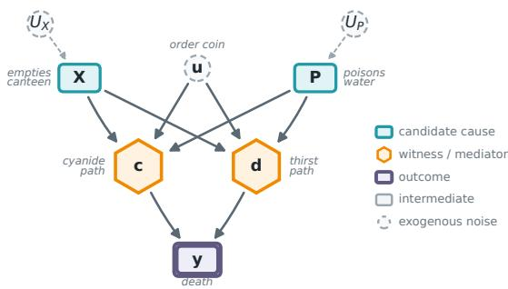  
Figure 11: Pearl’s desert traveller as a graph. The two candidate causes (teal: $X ,$ , who empties the canteen, and $P ,$ who poisons the water) feed two competing mechanisms (gold hexagons), the cyanide path c and the thirst path $d ,$ whose disjunction is death y (purple double box). The exogenous noise comprises the order coin u (a named exogenous variable that enters c and d directly) and the coins $U _ { X } , U _ { P }$ realising the two enemies actions; the mechanisms $c , d , y$ are deterministic and carry none. It is $u ,$ deciding which path operates first, that creates the preemption making this case hard for theories of actual causation.

P(caused poisoner $\mid e _ { A } ) = 1$ ; a forensic report of no cyanide is incompatible with $u = 0$ , so P(caused shooter | $e _ { B } ) = 1$
<table><tr><td>Forensic posterior</td><td></td><td>P(caused shooter) P(caused poisoner)</td></tr><tr><td> $e _ { A } \colon$  cyanide detected  $( u = 0 )$ </td><td>0</td><td>1</td></tr><tr><td> $\boldsymbol { e } _ { B } \boldsymbol { : }$  no cyanide  $( u = 1 )$ </td><td>1</td><td>0</td></tr></table>

Table 11: Pearl’s probability of actual causality P(caused | e) on the basic desert traveller. The verdict saturates at 1 for the cause whose path operated in the forensically identified scenario, and at 0 for the dormant one.

## 7.2 PCI on the Basic Desert Traveller

To compare directly with Pearl, we run PCI under the same forensic conditioning: one structural model per scenario (endogenous variables X $\therefore P , c , d , Y \in \{ 0 , 1 \}$ }, with c the cyanide path operating and d the dehydration path), with u pinned at the scenario’s forensic realisation. Suspects are $\mathbf { S } =$ $\{ X , P \}$ with singleton candidate causes; the witness pool is the mediators $\{ c , d \}$ under a cardinalityuniform $\Gamma ; \Delta$ deterministically flips $1  0 ;$ PCI leaves the non-cause suspect to the SCM rather than intervening on it; and the noise distribution $P _ { \mathbf { U } }$ is the forensic posterior, a point mass at the scenario’s u (we do not condition on the outcome $Y$ itself). Appendix C gives the full structural model and component specification.

For each candidate cause $C$ we report three quantities, all in $[ 0 , 1 ] , ^ { 2 4 }$ higher meaning more responsibility, jointly averaged over the four sources of randomness $( \Gamma , \Delta , P _ { \bf U }$ , and the SCM-driven non-cause suspect):

$$
\begin{array} { l l } { { N _ { C } = \mathbb { E } \big [ \mathbb { 1 } \{ Y ^ { n } \neq y ^ { \star } \} \big ] } } & { { \mathrm { ( n e c e s s i t y : r e m o v a l ~ f i p s ~ } Y ) , } } \\ { { S _ { C } = \mathbb { E } \big [ \mathbb { 1 } \{ Y ^ { s } = y ^ { \star } \} \big ] } } & { { \mathrm { ( s u f f i c i e n c y : h o l d i n g ~ a t ~ f a c t u a l ~ s u s t a i n s ~ } Y ) , } } \\ { { J _ { C } = \mathbb { E } \big [ \mathbb { 1 } \{ Y ^ { n } \neq y ^ { \star } \} \mathbb { 1 } \{ Y ^ { s } = y ^ { \star } \} \big ] } } & { { \mathrm { ( j o i n t ~ P N S - s t y l e ) . } } } \end{array}\tag{17}
$$

Thus $J _ { C }$ is the PCI score $\mathrm { P C I } _ { C }$ of Definition 19 under the PNS-binary ci, and $N _ { C } , S _ { C }$ are its necessity and sufficiency marginals.

Under the spec above (computation in the companion notebook), the results are:
<table><tr><td>Forensic posterior</td><td>Cause</td><td>N</td><td>S J</td><td>Pearl P(caused)</td></tr><tr><td>eA: u = 0 (cyanide)</td><td>shooter</td><td>1/4 11/12</td><td>5/24</td><td>0</td></tr><tr><td rowspan="3">eB: u = 1 (dehydration)</td><td>poisoner</td><td>1/3 1</td><td>1/3</td><td>1</td></tr><tr><td>shooter </td><td>1/3 1</td><td>1/3</td><td>1</td></tr><tr><td>poisoner 1/4 11/12</td><td></td><td>5/24</td><td>0</td></tr></table>

Table 12: PCI and Pearl on the basic desert traveller, under the scenario’s forensic posterior. PCI’s joint score J ranks the same cause Pearl’s P(caused) does in each scenario; PCI returns a graded reading where Pearl returns the binary {0, 1}. The cells use the diagonal coupling of Definition 18 (Figure 4): $Y ^ { s }$ and $Y ^ { n }$ share both the noise realisation u and the non-cause suspect’s value, and are otherwise independent.

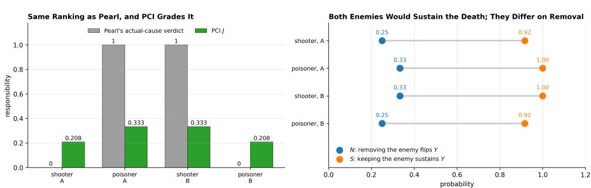  
Figure 12: Basic desert traveller. Left: Pearl’s binary actual-cause verdict beside PCI’s joint score $^ { J , }$ per scenario and cause. Right: the necessity and sufficiency components behind each J. Both methods name the same enemy in each scenario; PCI also keeps the dormant enemy on the hook at $5 / 2 4$

## Reading off Table 12:

(1) PCI and Pearl agree on the ranking. In each scenario, J is strictly larger for the cause Pearl identifies, and strictly smaller for the other. PCI’s ordering matches the actual-cause verdict at each forensic posterior.

(2) PCI is graded; Pearl is binary. Pearl’s $P ( { \mathrm { c a u s e d } } )$ saturates at 0 or 1. PCI’s J never reaches 1 here because the Γ-averaging over witness subsets dilutes each cause’s score: the “best” witness subset for the operative cause does flip the outcome deterministically and gives $J = 1$ at that single configuration, but the cardinality-uniform average over the witness subsets (weights $\textstyle { \frac { 1 } { 3 } } , { \frac { 1 } { 6 } } , { \frac { 1 } { 6 } } , { \frac { 1 } { 3 } }$ over $\emptyset , \{ c \} , \{ d \} , \{ c , d \} )$ ) brings the average down to ${ \bar { 1 } } / 3 ;$ the per-subset breakdown is in the companion notebook.

(3) The dormant cause is not at zero. PCI assigns $5 / 2 4 \approx 0 . 2 1$ to the dormant cause. This is not noise: in some witness configurations the dormant cause’s removal does flip Y , because averaging marginalises the non-cause suspect and PCI does not artificially pin the model to “this scenario” beyond the noise realisation itself. Pearl’s binary indicator throws this graded information away.

## 7.3 PCI Expectation vs the AC Machinery

The agreement is reassuring; the substantive change is in how the verdict is computed. $\mathbf { A C } \mathbf { \ ' } _ { \mathbf { S } }$ necessity clause is an existential: there exists a witness set T and an alternative value $c ^ { \prime }$ such that the intervention flips Y. To verify the existential one in principle enumerates the candidate $( \mathbf { T } , c ^ { \prime } )$ pairs: this is the main source of $\mathsf { A C } ^ { \mathsf { \bar { \prime } } } \mathsf { s }$ combinatorial hardness. Pearl’s definition then averages the indicator of that already-enumerated predicate over noise states, inheriting the enumeration unchanged.

PCI collapses both moves into one expectation, averaging Φ over the joint $( \mathbf { C } , \mathbf { T } , \mathbf { u } )$ under $\Gamma \otimes P _ { \mathbf { U } }$ The existential “does some witness work?” becomes a Γ-weighted measure of how much witnesses collectively support causation: a graded score that a user estimates by sampling, built from the full quantity that AC collapses to a yes/no verdict.

In the desert traveller this difference is minor: a user can trivially enumerate the four candidate witness sets by hand. The large-n gap is an analytic fact about $\mathbf { A C } \mathbf { \ ' } _ { \mathbf { S } }$ existential check, not something this example demonstrates: for a model with n candidate witness variables, that existential requires checking up to $2 ^ { n }$ subsets per noise state by construction, and Pearl’s posterior over the AC indicator inherits that cost at every evaluation. A user estimates PCI’s expectation by Monte Carlo at a budget they set, with variance independent of that combinatorial size. Appendix F reports this gap directly as n grows; the desert traveller only fixes the small-n case, where the cost difference is negligible.

So far we have two conceptual differences: PCI’s graded reading and its Monte Carlo scaling. We have already seen that this helps recover the intuition introduced above: the shooter, in the scenario where poison killed the traveller, is less blameworthy than the poisoner but not completely blameless. Now we turn to another example, exploiting the fact that actual causality lacks a sufficiency component, where a small change to the model makes Pearl’s binary indicator structurally unable to track the responsibility patterns we think a responsibility attribution method should capture.

## 7.4 Weak-Poison Variant: Path-Reliability and Cross-Scenario Reliability

We modify the desert traveller so the cyanide path is unreliable while the dehydration path stays deterministic. The change is small, but it brings out three intuitions that a graded responsibility metric should capture and a binary actual-cause indicator structurally cannot. Section 7.6 shows this graded sensitivity is structurally distinct from the probability-raising accounts of Fenton-Glynn and Fang, which lack PCI’s continuous kernel and sufficiency component.25

Example 34 (Desert traveller, weak poison). Same enemies as in Example 33. The cyanide is a small dose that turns out fatal only with probability $\alpha = 0 . 1$ , governed by an independent exogenous coin $\xi \sim \operatorname { B e r n } ( \alpha )$ . The structural equations are

$$
c = p ( u ^ { \prime } \vee x ^ { \prime } ) , \quad v _ { C } = c \cdot \xi , \quad d = x ( u \vee p ^ { \prime } ) , \quad y = v _ { C } \vee d ,
$$

where primes here denote Boolean complement $( x ^ { \prime } = 1 - x ,$ and likewise $u ^ { \prime } , p ^ { \prime } )$ , not the alternativevalue $\mathbf { \hat { c } ^ { \prime } }$ of the necessity intervention, and $v _ { C }$ is the new “cyanide-was-fatal” mediator: drinking the poison $( c = 1 )$ only kills when the fatality coin also operates $( \xi = 1 )$ . $\alpha = 1$ recovers Pearl’s original.

Three responsibility intuitions for an attribution method. Before any computation, the three intuitions that we expect an attribution method to recover in this case are:

1. Adding noise to a path should lower its own cause’s responsibility. The cyanide path is now unreliable. In the scenario where cyanide killed (Scenario $\mathbf { A } , u = 0 , \xi = 1 )$ , the poisoner is still the actual cause, but less responsible than in the basic deterministic version, because the killing depended on a coin landing favourably.

2. Within a scenario, the operative cause should still win. In Scenario A, even after softening, the poisoner should rank above the shooter. In Scenario B, the shooter should rank above the poisoner.

3. A reliable cause in its own scenario should beat an unreliable cause in its own scenario. Comparing across scenarios: the shooter in Scenario B (dehydration deterministic) should outrank the poisoner in Scenario A (cyanide stochastic). Their respective paths are operative in their own scenarios, but one is reliable and the other is not.

Pearl’s P(caused) captures (2) (the within-scenario ranking), but misses (1) and (3). The AC predicate fires deterministically once we condition on the forensic posterior: in Scenario $\mathbf { A } , u = 0$ and $\xi = 1$ jointly imply the cyanide path was the operative chain, so P(caused poisoner $\mid e _ { A } ) = 1 ;$ in Scenario B, $u = 1$ implies the dehydration chain operated, so $P \Vdash$ (caused shooter $\mid e _ { B } ) = 1$ . Both scenarios saturate at 1 for their respective operative cause, identical to the basic version (Table 13). Pearl’s binary indicator is structurally indifferent to whether the cyanide path is deterministic or stochastic, and blind to any cross-scenario comparison.

<table><tr><td>Forensic posterior</td><td></td><td>P(caused shooter) P(caused poisoner)</td></tr><tr><td> $e _ { A } \colon$  cyanide killed  $( u = 0 , \xi = 1 )$ </td><td>0</td><td>1</td></tr><tr><td> $e _ { B } \colon$  dehydration killed  $( u = 1 )$ </td><td>1</td><td>0</td></tr></table>

Table 13: Pearl’s P(caused) on the weak-poison variant. Identical to the basic version (Table 11); the binary AC indicator is insensitive to α.

PCI on the weak-poison model. We run PCI exactly as in Section 7.2, with one mechanical change: the witness pool becomes $\textbf { W } = \{ c , d , v _ { C } \}$ (the new mediator $v _ { C }$ is included), and the forensic posterior in Scenario A pins both $u = 0$ and $\xi = 1$ (cyanide-was-fatal is directly forensically observable). Scenario B’s posterior pins $u = 1 ;$ ξ is structurally irrelevant since the cyanide path is dormant.

Table 14 reports PCI’s three quantities alongside Pearl’s verdict. The companion notebook computes the values, and a hand-rolled enumeration matching the framework verifies them.
<table><tr><td>Forensic posterior</td><td>Cause</td><td>N</td><td>S</td><td>J</td><td>Pearl P(caused)</td></tr><tr><td> $e _ { A } \colon u = 0 , \xi = 1$  (cyanide killed)</td><td>shooter</td><td> $1 / 6$ </td><td>23/24</td><td> $7 / 4 8$ </td><td>0</td></tr><tr><td></td><td>poisoner</td><td> $5 / 2 4$ </td><td>1</td><td> $\mathbf { 5 / 2 4 }$ </td><td>1</td></tr><tr><td> $e _ { B } \colon u = 1$  (dehydration killed)</td><td>shooter</td><td> $1 / 2$ </td><td>1</td><td> $\mathbf { 1 / 2 }$ </td><td>1</td></tr><tr><td></td><td>poisoner</td><td> $1 / 4$ </td><td> $3 / 4$ </td><td> $1 / 8$ </td><td>0</td></tr></table>

Table 14: PCI and Pearl on the weak-poison desert traveller, under the scenario’s forensic posterior. PCI’s J ranks the same cause Pearl’s binary verdict does in each scenario; the magnitudes also reflect the asymmetry between the deterministic dehydration path and the stochastic cyanide path. As in Table 12, cells use the diagonal coupling of Definition 18: $Y ^ { s ^ { * } }$ and $Y ^ { n }$ share both the noise realisation and the non-cause suspect’s value.

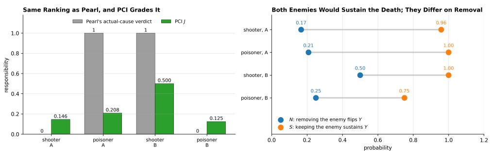  
Figure 13: Weak-poison variant, laid out as Figure 12. Pearl scores both operative enemies at 1 and cannot separate the scenarios; PCI separates them, ranking the shooter in Scenario B $( 1 / 2 )$ above the poisoner in Scenario $\mathbf { A } \left( 5 / 2 4 \right)$

The three intuitions are all captured by J.

(1) Adding noise lowers the noisy cause’s responsibility. The poisoner in Scenario A drops from $J = 1 / 3$ in the basic version (Table 12) to $J = 5 / 2 4$ in the weak version (Table 14). The drop is a Γ re-weighting, not a loss of sufficiency: the poisoner’s sufficiency factor is exactly 1 in both versions. Adding the fatality coin adds $v _ { C }$ to the witness pool, so the eight subsets of $\{ c , v _ { C } , d \}$ replace the four subsets of $\{ c , d \}$ , and the single configuration that scores 1 for the poisoner now carries a twelfth of the averaging weight where it carried a sixth. The empty witness set still contributes $1 / 2$ at weight $1 / 4 .$ , and ${ \frac { \breve { 1 } } { 4 } } \cdot { \frac { \breve { 1 } } { 2 } } + { \frac { \breve { 1 } } { 1 2 } } \cdot 1 = 5 / 2 4$

(2) Within a scenario, the operative cause still wins. In Scenario $\mathrm { A } , J _ { \mathrm { p o i s o n e r } } = 5 / 2 4 > J _ { \mathrm { s h o o t e r } } =$ $7 / 4 8 .$ . Cyanide was the operative path, and PCI tracks that. In Scenario B the margin is fourfold,

$J _ { \mathrm { s h o o t e r } } = 1 / 2$ against $J _ { \mathrm { p o i s o n e r } } = 1 / 8 . \mathrm { A t } u = 1$ with $\xi = 0$ the cyanide path is dead, so nothing the poisoner did could have killed this traveller, and his $1 / 8$ records no responsibility for the death. It is the residue of marginalising over the shooter’s action, which credits the poisoner in those drawn worlds where the shooter did not act either. PCI grades him as dormant: above a variable with no path to the outcome, and well below the cause that did the work.

(3) Reliable beats unreliable, across scenarios. The shooter in Scenario B $( J = 1 / 2 )$ outranks the poisoner in Scenario $\mathrm { ~ A ~ } ( J = 5 / 2 4 )$ . Neither ceiling differs: both operative causes reach $J = 1$ at their best witness configuration, so the coin does not lower what the poisoner can attain. What differs is how many configurations attain it. Conditional on $u = 1$ the cyanide path is dead, so removing the shooter leaves nothing that can kill and four of the eight witness subsets score a full 1. Conditional on $u = 0 , \xi = 1$ the shooter is still standing with a working dehydration path, so removing the poisoner lets the shooter cover the death half the time, and only one subset reaches 1.

Pearl’s P(caused) misses intuitions (1) and (3) for related reasons: (1) requires sensitivity to mechanism noise, which the AC indicator does not have once the forensic posterior is applied; (3) requires cross-scenario comparison of strength of responsibility, which Pearl’s P(caused) does not produce because each posterior independently saturates at 0 or 1.

## 7.5 Further Differences Between Pearl’s Probability of Causation and PCI

Breadth of aggregation. Def. 10.3.5 aggregates over one dimension: the noise u, conditional on evidence $e ,$ for a claim $( X = x , Y = y )$ already fixed. PCI aggregates over four: the suspect set C and witness set T via Γ, the alternative value $\mathbf { { \bar { c } } ^ { \prime } }$ via $\Delta .$ , and the noise via $P _ { \mathbf { U } }$ . This supports perfeature comparison: the same PCI expectation, evaluated over varying C inside a fixed $\mathbf { S } ,$ returns the relative responsibility of each candidate cause. Def. 10.3.5 does not itself provide that comparison as a single expectation: obtaining it requires a separate evaluation per candidate cause, each inheriting the $\mathbf { A C } .$ -predicate cost discussed above, tabulated by hand as in Table 11 above.

Continuous variables. The AC predicates inside Def. 10.3.5 are event-shaped: they read off $\operatorname { A C } ( x , y ; M , \mathbf { u } )$ for propositional $x , y ,$ and extensions to continuous variables require discretising the relevant event before the predicate applies. PCI’s ci function is continuous-native (the absolutedifference impact score of Section 3), and the synthetic benchmark of Appendix D exercises that continuity directly.

Lineage in Pearl’s PN/PS. Def. 10.3.5 takes a binary actual-causation predicate (itself a structuralequation construction that does not appeal to PN/PS at all) and lifts it to a probability through $P ( \mathbf { u } \mid$ e); PN, PS, and PNS appear nowhere in the construction. PCI generalises PN and PS directly: the necessity factor $Y ^ { n }$ is the counterfactual operation underlying PN, the sufficiency factor $Y ^ { s }$ is the counterfactual operation underlying PS, both indexed by the cause–witness–alternative–noise tuple, with Γ and $\Delta$ exposing the design choices PN/PS makes implicitly. So Pearl’s Def. 10.3.5 and PCI are not competing implementations of the same idea: they inherit from different parts of Pearl’s own toolkit, with PCI playing the role of a context-sensitive, multi-variable extension of the $\mathrm { P N / P S }$ machinery rather than a probabilistic wrapper around AC.

Pearl’s Def. 10.3.5 and PCI share the same explanatory target, probabilistic responsibility built on top of structural information, but instantiate it through different mechanisms. Pearl’s definition averages a binary AC indicator against a posterior over noise; PCI integrates a continuous necessity– sufficiency kernel against a joint distribution over suspect sets, witness sets, alternative values, and noise. The basic desert traveller shows the two agree on ranking with PCI providing graded magnitudes; the weak-poison variant shows three intuitions that PCI’s graded reading captures and Pearl’s binary indicator structurally cannot. That actual causation admits of degrees is not itself new: Halpern and Hitchcock [2015] already make it graded and context-sensitive through defaults and normality. That account delivers an ordinal, comparative verdict, whereas PCI supplies a cardinal probabilistic magnitude on the same structural information. The cases where sufficiency does even more graded work (the continuous signal-mediation walkthrough of Section 5.2, the synthetic archetypes of Appendix D, and the SIR benchmark of Appendix G) are where these constructions answer recognisably different questions; for the high-dimensional, continuous, machine-learned models this paper targets, PCI’s is the question that remains tractable and well-defined.

## 7.6 Other probabilistic extensions of actual causation

Pearl’s probability of causation is not the only probabilistic reading of the Halpern–Pearl definition. Fenton-Glynn [2017] proposes a probabilistic extension that keeps HP’s witness/contingency machinery intact but replaces the deterministic counterfactual-dependence clause with a probabilityraising condition: with the off-path variables W pinned at their actual values $\mathbf { w } ^ { \star }$ , the cause $\mathbf { C } = \mathbf { c }$ qualifies when intervening to set it raises the probability of the outcome relative to an alternative $\mathbf { c } ^ { \prime }$ ${ \bar { P } } ( \varphi \mid \operatorname { d o } ( \mathbf { C } = \mathbf { c } ) , \mathbf { W } = \mathbf { w } ^ { \star } ) > P ( \varphi \mid \operatorname { d o } ( { \bar { \mathbf { C } } } = \mathbf { c } ^ { \prime } ) , { \dot { \mathbf { W } } } = \mathbf { w } ^ { \star } )$ , required to hold for every subset of the on-path mediators held at their factual values. Fang [2022] modifies this in turn, replacing the interventional probability-raising with a counterfactual one (conditioning on the actual situation rather than intervening afresh) which repairs the verdicts Fenton-Glynn’s account returns on voting, trumping, and overdetermination cases.

Both are close neighbours of PCI, and the contrast is worth drawing precisely. First, each probabilifies only the necessity side of HP: it raises or conditions a probability of the witnessed-necessity test, with no analogue of PCI’s sufficiency component, the $\dot { Y } ^ { s }$ factor of Definition 18, which asks whether restoring the factual cause sustains the outcome. Second, the contingency enters differently. Fenton-Glynn fixes the witness W deterministically at its actual values and quantifies universally over the mediator subsets (picking the alternative $\bar { \mathbf { c } } ^ { \prime }$ existentially); PCI replaces those quantifiers with distributions (a Γ-weighted expectation over which suspects and witnesses to activate, and an alternative-value distribution $\Delta ) .$ , both presented as user-facing knobs and approximated by Monte Carlo rather than enumerated. Third, PCI integrates a continuous necessity–sufficiency kernel where those accounts threshold a binary actual-cause indicator. PCI is therefore not a third probabilistic-HP variant but a PN/PS-style necessity-and-sufficiency measure that contains the witnessed-necessity test they probabilify as one regime: the actual-causality analogue of the contrast drawn just above with Pearl.

These accounts have begun to see applied use. Maldonado et al. [2025] instantiate Fenton-Glynn’s definition in a robot-pouring task, learning the causal graph by discovery and the conditional distributions with neural networks, and use it to identify the cause of spillage and to select a corrective action, searching by hand over contrastive values and a probability threshold for an alternative that would avert the outcome. That search is precisely the alternative-value reasoning PCI packages into $\Delta$ and a causal-impact threshold, and it inherits the differences just drawn: it remains necessity-only, with no sufficiency check, and it fixes the contingency rather than averaging over it. The application is nonetheless evidence that tractable probabilistic actual causation is in demand in exactly the ML-driven settings PCI targets.

Necessity and sufficiency as an XAI method. Closer to the ML audience’s likely prior exposure, Watson et al. [2021] adapt Pearl’s PN/PS directly into a local explanation method for black-box classifiers: given a specified causal structure over input features, they define probabilistic necessity and sufficiency scores for a feature (or feature subset) with respect to a model’s prediction, and use them to generate minimal sufficient explanations and necessary-feature rankings, benchmarked against LIME, Anchors, and SHAP-style attributions. The relation to PCI is close in spirit to the relation with Fenton-Glynn and Fang drawn above: both build directly on Pearl’s PN/PS rather than Halpern–Pearl’s witnessed-necessity machinery, and neither packages the witness set as a userfacing, Γ-sampled search dimension the way PCI does; unlike PCI, Watson et al.’s method targets model explanation specifically (attributing a classifier’s prediction) rather than causal responsibility attribution for a realized outcome in a structural model, the distinction drawn in Section 3’s discussion of SHAP and Causal SHAP.

Continuous and vector-valued PNS. Kawakami et al. [2024] extend Tian and Pearl’s binary PNS, PN, and PS to continuous and vector-valued treatments and outcomes, defining necessity and sufficiency via an order relation on the outcome space $( Y _ { x _ { 0 } } < y \le Y _ { x _ { 1 } }$ for a threshold $y )$ rather than a fixed binary event. Under exogeneity together with a monotonicity assumption, they identify PNS, PN, and PS nonparametrically from observational distributions alone, with no need for a fitted causal model. They offer several monotonicity variants and identify under one stated on the potential out comes themselves. That is a genuine extension to continuous domains, but it inherits Tian and Pearl’s population-level framing: their PNS asks how often a random individual’s outcome crosses an externally chosen threshold under two treatment levels, not whether this instance’s already-realized outcome depended on this instance’s cause, which is the single-case reading of PN/PS [Pearl, 2022] that PCI builds on. Like ATE and CATE, it also has no analogue of the witness mechanism, so it cannot hold mediators fixed at their factual values and register preemption. PCI reaches the same domains by a different route, and the difference starts in the definition. Definition 3.1 fixes a contrast pair $( x _ { 0 } , x _ { 1 } )$ and a threshold $y ,$ , so a single inequality settles necessity and sufficiency. PCI puts an alternative-value distribution $\Delta$ where the fixed contrast was, and a user-chosen impact kernel ci where the threshold was. One construction then yields a continuous necessity–sufficiency pair rather than a binarised event. Monotonicity drops out too: PCI evaluates both counterfactual worlds inside a fitted model, which supplies the cross-world quantities by simulation and asks nothing of the observational distribution. The burden moves onto that model. Kawakami et al. buy identification with restrictions on the true system; PCI buys it by assuming the fitted model is that system, which for flexible structural equations such as neural networks is the harder warrant (Section 8). The witness mechanism then supplies the context-sensitivity their population-level framing forfeits.

FANS and LEWIS. Two recent attribution methods also build on Pearl’s probabilities of necessity and sufficiency, bringing them closer still to PCI. FANS [Chen et al., 2024] explains a prediction by searching a small region around the input for the largest PNS attainable there, estimating counterfactual probabilities by resampling. LEWIS [Galhotra et al., 2021] works from a causal graph and input–output data, computing necessity, sufficiency, and combined scores for a black-box decision at the population or subgroup level, and turns them into recourse. Both are well suited to their stated aims and share our starting point that attribution is a probability of causation. They differ from PCI on four design choices, each reflecting our narrower focus on token-level, context-sensitive attribution when a full model is available.

First, we keep necessity and sufficiency apart. FANS combines them into a single PNS number and LEWIS reports them as separate population averages, whereas PCI carries both as a joint pair $( Y ^ { s } , Y ^ { n } )$ and applies the user’s impact function ci only afterwards. As the synthetic models of Appendix D illustrate, a cause can be necessary without being sufficient, or the reverse, and keeping the two components together lets a single sweep tell these archetypes apart.

Second, we average rather than optimise for a best case. FANS reports the maximum PNS over the local regions it searches and uses gradient-based optimisation to extract the single feature subset with the highest PNS; LEWIS scores individual attributes or a user-specified set. PCI averages instead: the selection distribution Γ samples suspect sets within a chosen cardinality band, so a feature’s responsibility reflects its participation across many sets rather than its most favourable one, with the Shapley kernel arising as a special case.

Third, we use witnesses where FANS uses a local region and LEWIS a population average. When two causes overdetermine an outcome, or one acts only through a mediator, recovering the intended verdict means holding the inactive path fixed at its factual value, which a ball around the input cannot express and a population average smooths over. PCI holds witness variables W fixed and averages over which variables serve as witnesses, as the OBCB and signal walkthroughs of Section 5 illustrate.

Fourth, we compare against a distribution of alternatives. FANS measures change from one baseline input and LEWIS from one contrast value; PCI averages over an alternative-value distribution $\Delta ,$ removing the dependence on a chosen reference at the cost of assuming more of the model. That cost is a deliberate trade: LEWIS recovers its scores from a graph and observational data at the population level; PCI assumes a fully specified model and returns a value for the individual case.

Probabilistic versus nondeterministic models. PCI lives in a probabilistic world: we push all the indeterminism into the exogenous noise U, so that once a noise value u is fixed the mechanisms are ordinary functions, each necessity or sufficiency question becomes a plain interventional expectation, and we average those over $\dot { P _ { \mathbf { U } } }$ . Beckers [2025] takes a different route out of determinism. His nondeterministic causal models let a mechanism return a set of admissible values rather than a single one, with no probabilities attached, and he reads actual causation off two modalities: a cause must make a difference if it does so in every admissible resolution, and might make one if it does so in some. He notes in passing that this brings the logical and probabilistic pictures of causation closer together than they are in the deterministic case, since the order-of-operations distinction that matters for Pearl’s probabilities of counterfactuals resurfaces here as a distinction between these two modalities.

It is tempting to read the two pictures as lining up, though we do not try to make this precise. If one were to turn a nondeterministic mechanism into a probabilistic one, by placing some full-support distribution over its admissible values, then might would seem to answer to “the outcome changes with positive probability” and must to “the outcome changes with probability one.” On that reading the modal verdict would depend only on which alternatives are possible and not on how they are weighted, so any full-support choice (the uniform one being the most agnostic) would give the same yes-or-no answer, with a graded score like PCI’s filling in the range between. Where genuine probabilities are not on hand, the modal account is the natural tool and PCI has nothing to add; where they are, PCI trades the bare list of possibilities for a plausibility-weighted magnitude. We mention this only to locate the two frameworks relative to one another, not to claim a correspondence.

## 7.7 Actual-causality-adjacent quantities

The actual-causality tradition has accumulated a family of named quantities beyond causation itself. Chockler and Halpern [2004] introduce degree of responsibility and degree of blame; Halpern [2016] develops causal explanation and explanatory power at book length, and Beckers [2022] recasts both for explainable $\operatorname { A I } ;$ Beckers [2021b] and Beckers [2021a] reconstruct causation through causal sufficiency and a counterfactual NESS condition; and Beckers et al. [2022] define harm, with Beckers et al. [2023] adding its graded refinement and Beckers [2023] an allied account of mora responsibility. Each comes with its own definitional apparatus (a counterfactual test, a minimisation over contingencies, an averaging over an agent’s epistemic state, or a stipulated baseline), and the relations among them remain largely implicit.

We conjecture that most of these are not independent primitives but reparametrisations ofthe single counterfactual contrast that PCI already makes explicit; or, where a control is missing, notions that fold into the same framework by an appropriate generalisation, mutatis mutandis. The construction of Section 3 carries a small number of user-facing knobs: the variable selection distribution Γ (which and how many suspects enter a candidate cause set C), the witness set T (which context a user holds fixed, in the contingency sense of Halpern, 2016), the alternative value distribution $\Delta$ (what counts as a counterfactual departure, equivalently the default against which PCI grades alternatives), the causal impact function ci (how PCI scores a sufficiency–necessity pair, Definition 19), and the exogenous law $P _ { \mathbf { U } }$ (what PCI averages the attribution over). Read against these knobs, the named quantities look like settings rather than rivals. Actual causation in the sense of Halpern [2016] is the necessity component at a single-suspect Γ with witnesses admitted; the causal explanation of Halpern [2016] (a context that, given what the agent already takes for granted, makes the cause necessary) is recovered in intent by the held-fixed witness configuration T together with the marginalisation over $P _ { \mathbf { U } }$ that stands in for the agent’s epistemic state; the sufficient and counterfactual explanations of Beckers [2022] are organised around a held-fixed witness that coincides with PCI’s witness set T; both descend from Halpern’s modified definition. His additional safeguarded network (variables protected from intervention, as opposed to held at their factual values) is not among the present knobs, and would enter only as a natural generalisation, a set safeguarded from intervention alongside the witnesses held at factual values. Where he rates an explanation only as good or not (non-domination, i.e. minimality), a ci on the necessity–sufficiency differential of Definition 18 would supply a graded refinement rather than recover an existing measure; the degree of blame of Chockler and Halpern [2004] is the same attribution marginalised over a prior on models alongside $P _ { \mathbf { U } }$ , with their degree ofresponsibility its single-model special case; the harm of Beckers et al. [2022] and Beckers et al. [2023] is PCI under a $\Delta$ pinned to a default contract together with a utility-valued ci; and the causal sufficiency of Beckers [2021b] is the sufficiency regime itself, the necessity of $X _ { k }$ within a sufficient set C.

The limits of the reframing. Each notion’s specific convention, the $1 / ( N { + } 1 )$ responsibility weight of Chockler and Halpern [2004],26 the all-or-nothing causation threshold, the non-domination criterion that rates an explanation only good or not [Halpern, 2016, Beckers, 2022], or the stipulated default in the harm contrast of Beckers et al. [2022], encodes a deliberate modelling commitment suited to that work’s aims, summarising a graded, model-relative phenomenon under a single label. PCI retains the underlying graded probability and relocates each of these to an explicit downstream choice: a cardinality band in Γ, a threshold on ci, a prior over models, a particular ∆. On this view the named quantities are complementary readings of one underlying measure, a vantage point on the original constructions rather than a shortcoming in them.

We state this only as a conjecture and do not develop it here. We raise it because the knobs we introduced to separate necessity from sufficiency appear, prima facie, to be the degrees of freedom along which the quantities of Chockler and Halpern [2004], Halpern [2016], and Beckers [2021b], Beckers et al. [2022] themselves vary. We leave a full accounting to future work.

Sections 6–7 have laid out the formal relation between PCI and actual causality and its Pearlian probabilistic wrapper, completing the comparative story previewed in Section 4: a claim-by-claim comparison against feature-attribution baselines, the Differential Causal Effect, exact actual-cause enumeration, a continuous dynamical model, and a deployed valuation system, with the full protocols collected in the appendices. Section 8 closes the paper.

## 8 Discussion and Conclusions

We can now state the main differences between PCI and the two approaches that inspired it, against the background of what the rest of the paper has shown. The main lesson from the literature on actual causality is that intuitive causal attribution often requires holding some endogenous variables, members of a “witness set”, fixed at their factual values. This ensures context sensitivity by controlling complicating causal paths. We treat witnesses differently: instead of looking for a single witness set that reveals a causal relationship, we use a distribution over witness sets and integrate the causal impact score across them, which lets PCI account for the number of witness sets and the strength of within-witness-set effects. The construction also admits off-the-shelf probabilistic inference, avoiding worst-case subset enumeration. The relationship between the two views is now formal where it was once gestural: under matching choices of Γ and ∆, the support of $\scriptstyle \sum _ { \mathbf { T } }$ Φ coincides with factivity and context-sensitive necessity (Theorems 26–27), and a subset-minimality filter over that support recovers AC verdicts exactly (Proposition 32); the empirical companion in Appendix F confirms this at scales where AC enumeration is intractable.

The main concept borrowed from Pearl’s probability of necessity and sufficiency is the joint distribution over outcomes from two interventional regimes, pushed forward through a user-chosen causal impact function. The difference is that we use witness sets to allow for context-sensitivity and to break symmetries present in otherwise pathological cases like overdetermination and undercutting. Section 5 works through the binary instantiation in which the necessity and sufficiency components coincide with PN and PS, and Appendix D reads the two components apart on a continuous synthetic model where each is needed to bring out a different causal archetype.

The further generalisations are mostly bookkeeping in the same spirit: a single alternative value for a potential cause becomes a factual-excised alternative-value distribution we integrate over, which generalises immediately to continuous variables; asking whether a particular set is an actual cause becomes sampling suspect sets and gauging a feature’s responsibility by its participation in sets with causal impact; and asking whether the outcome differs becomes measuring how much, via a customisable causal impact function ci that reads differences across counterfactual worlds, including between continuous variables. The variable-selection distribution Γ, the alternative-value distribution ∆, and the impact function ci become explicit, user-facing components of the framework, no longer implicit defaults.

Against SHAP-family attributions, the framework’s central commitment is to intervention with witnesses over observational marginalisation. The controlled comparisons of Section 5 show that this commitment does real work on canonical overdetermination and continuous-mediation examples, where SHAP and Causal SHAP fail in characteristic ways that PCI avoids. The synthetic benchmark of Appendix D confirms this on a model with known ground truth, and the case study of Appendix H reports the same qualitative pattern on a production-grade trained model with millions of data points. A separate comparison to gradient-based attribution, where the difference is one of differentiability and locality, as distinct from the causal/non-causal axis, is reported in Appendix E. The thread connecting these results is structural: the witness mechanism that satisfies D-A-rank for Alice in the binary OBCB walkthrough of Section 5 is the same machinery driving the upstreamversus-downstream attribution split on the AVM in Appendix H.

A broader test is how PCI fares against the desiderata that the XAI literature typically asks counterfactual-explanation methods to meet, of which Verma et al. [2024] list five. Sparsity, the requirement that explanations change as few features as possible, follows directly from the cardinality cap on suspect sets in Γ, which biases the search toward small C. Multiple counterfactuals, the ability to return several alternative explanations, falls out of the Monte Carlo construction: a single sweep over Γ and $\Delta$ produces a population of $( \mathbf { C } , \mathbf { c } ^ { \prime } , \mathbf { T } )$ triples. Causal-constraint satisfaction, the demand that explanations respect downstream propagation rather than treat features as independently editable, is automatic once suspect interventions are routed through the causal model: changing C propagates to descendants by construction. Model-agnosticism (applicability to arbitrary predictors), PCI satisfies only partially: it can wrap a black-box predictor, but at the cost of the causal sensitivity that motivates the framework in the first place.

We part company with the literature on actionability, the requirement that explanations not recommend changes to features users cannot in practice change. The standard recommendation is to fold ease-of-change into the cause-identification procedure itself, weighting features by mutability so that immutable ones are never returned as causes (Verma et al. [2024]; cf. Karimi et al. [2021], who shift the focus from explanations altogether to interventions). We think this conflates two distinct questions. A procedure that suppresses gender as a possible cause whenever a loan decision is at stake will help applicants satisfy the existing system without surfacing the kind of structural problem that responsibility attribution can in principle reveal. Cost-of-action layers can sit downstream of PCI for users who need actionable recommendations, but they should compose with responsibility attribution instead of replacing it.

Set against that favourable comparison, several limitations temper the picture. PCI presumes access to a trained probabilistic causal model from which it can sample counterfactual outcomes, a stronger requirement than methods that work from observational data and a causal graph alone. It also inherits whatever error is in that model: a misspecified structural equation or noise distribution yields systematically wrong attributions, with nothing in the construction to flag this from the scores alone, since PCI evaluates counterfactuals under the model the user supplies, without checking that model against data. The Monte Carlo variance of the estimator grows with model size and with the cardinalities of suspect and witness sets; Appendix F reports empirical scaling and an ablation that isolates the contribution of witness pinning. In the worst case, a single revealing witness set among 2|W| candidates under uniform $\Gamma _ { w }$ costs as many samples in expectation as exhaustive enumeration would. The escape is that pinning a variable that is causally inert under the tested intervention is a no-op, so revealing witness sets come in neighbourhoods of size $2 ^ { m }$ for m such inert candidates, giving revealing mass at least $2 ^ { m - | \mathbf { W } | }$ rather than $2 ^ { - | \mathbf { W } | }$ . Whether this rescues sampling generically, or only in graphs sparse relative to the tested intervention, is a sharper open question than we have characterised here. A Γ built from the graph, weighting witness candidates by their relevance to the tested intervention, would exploit exactly this sparsity, but building it requires the graph’s relevance structure to be legible in the first place, which trades away desideratum (iii)’s reach into grey-box models where structural facts are not cheaply available. Exposing Γ, ∆, and ci as userfacing choices is also a burden: a practitioner with no strong prior view on which suspect sets or alternative values are plausible has nothing principled to fall back on, and a bad choice can silently shift which variables the score favours, with no signal in the output that anything went wrong.

Choosing S and W in practice. Every worked example in this paper hand-picks the suspect and witness pools with full knowledge of the model’s structure, which is not available to a practitioner starting from a large learned PSCM. Our default recommendation: take S to be whichever variables are under live consideration as candidate causes for the question at hand (the same choice a practitioner would have to make for but-for testing or SHAP alike), and take W to be all remaining endogenous non-outcome variables not already in S, i.e. every variable Definition 5’s witness pool could legally contain. This costs the most sampling (Appendix F quantifies the resulting variance), but it never silently suppresses a genuine cause by omitting a witness that would have revealed it, since the joint Γ marginalises over which subset of W is actually pinned on each draw rather than committing to one witness set up front. The failure mode to watch for is the opposite direction: if S itself omits a variable that mediates between two included suspects, PCI cannot detect that mediation (it can only witness against it), so a practitioner who suspects an omitted mediator should move it into S, not W, and compare the two runs directly, exactly as Section 5.1’s Option B does for check-failed. When sampling cost makes the full-W default impractical, restricting W to variables structurally downstream of S and upstream of Y (candidate mediators and confounding paths) is the next-cheapest defensible choice, since variables off every S → Y path are causally inert witnesses whose pinning or freeing cannot change any counterfactual outcome (Section 8’s sampling-cost discussion above formalises why inert witnesses are cheap to average over rather than enumerate).

Finally, we deliberately limited what the AVM case study discloses: the apples-to-apples SHAP-vs-PCI comparison rests on the synthetic benchmark of Appendix D, with the production model serving as a feasibility witness, not as quantitative evidence.

PCI provides a context-sensitive causal explanation method for causal probabilistic machinelearning models that stays tractable, at the sampling cost discussed above, past the point where exact actual-causality enumeration does not (Appendix F). It arrives at this as a natural probabilistic generalisation of ideas already in the literature, yielding an estimator that pairs with standard inference algorithms. We benchmarked it against exact actual-causality computations, characterised its qualitative behaviour on synthetic models with known ground truth and on canonical SHAP failure cases, and demonstrated computational feasibility on a production-grade model.

This estimator also sits within a longer line of efforts to mechanise actual-causality reasoning in software: the Actual Causality Canvas of Ibrahim et al. [2020] and the SAT- and optimizationbased computations of Ibrahim and Pretschner [2020] operationalise the Halpern–Pearl definition for forensic investigation, fault diagnosis, and explainable AI; those tools are built for discrete (typically binary) structural models, where the actual cause is recovered by combinatorial search over candidate sets. The complementary regime of large, continuous-valued models has received less attention, and it is there that the exact notions become harder to apply directly. PCI targets exactly that regime, turning approximate causal attribution into something workable for users of models of non-trivial size, with Γ, ∆, and ci exposed as knobs for the user to set rather than defaults buried in the implementation.

The same mechanisation goal motivates a parallel literature in databases, where responsibility and causal-effect measures explain query answers over relational data rather than outcomes of a structural causal model (surveyed by Bertossi, 2023; Salimi et al., 2016, already noted in Section 7, is one instance). In that vocabulary, PCI’s witness-integrated score is a graded, model-relative responsibility measure of the same family, specialised to probabilistic structural causal models.

## References

Natasha Alechina, Joseph Y. Halpern, and Brian Logan. Causality, responsibility and blame in team plans. In Proceedings ofthe 16th International Conference on Autonomous Agents and Multiagent Systems (AAMAS), pages 1091–1099, 2017.

Alexander Balke and Judea Pearl. Probabilistic evaluation of counterfactual queries. In Proceedings ofthe Twelfth AAAI National Conference on Artificial Intelligence (AAAI), pages 230–237, 1994.

Sander Beckers. The counterfactual NESS definition of causation. In Proceedings of the AAAI Conference on Artificial Intelligence, volume 35, pages 6210–6217, 2021a. doi: 10.1609/aaai. v35i7.16772.

Sander Beckers. Causal sufficiency and actual causation. Journal of Philosophical Logic, 50:1341– 1374, 2021b. doi: 10.1007/s10992-021-09601-z.

Sander Beckers. Causal explanations and XAI. In Proceedings of the First Conference on Causal Learning and Reasoning (CLeaR), volume 177 of PMLR, pages 90–109, 2022.

Sander Beckers. Moral responsibility for AI systems. In Advances in Neural Information Processing Systems (NeurIPS), volume 36, 2023.

Sander Beckers. Actual causation and nondeterministic causal models. In Proceedings of the Fourth Conference on Causal Learning and Reasoning (CLeaR), volume 275 of PMLR, pages 514–532, 2025.

Sander Beckers and Joost Vennekens. Combining probabilistic, causal, and normative reasoning in CP-logic. ArXiv, abs/1503.01051, 2015.

Sander Beckers and Joost Vennekens. The transitivity and asymmetry of actual causation. Ergo, 4 (1):1–27, 2017. doi: 10.3998/ergo.12405314.0004.001.

Sander Beckers and Joost Vennekens. A principled approach to defining actual causation. Synthese, 195(2):835–862, 2018. doi: 10.1007/s11229-016-1247-1.

Sander Beckers, Hana Chockler, and Joseph Y. Halpern. A causal analysis of harm. In Advances in Neural Information Processing Systems (NeurIPS), volume 35, 2022.

Sander Beckers, Hana Chockler, and Joseph Y. Halpern. Quantifying harm. In Proceedings of the Thirty-Second International Joint Conference on Artificial Intelligence (IJCAI), pages 363–371, 2023. doi: 10.24963/ijcai.2023/41.

Leopoldo Bertossi. Attribution-scores in data management and explainable machine learning, 2023. Paper associated with a tutorial at ADBIS 2023.

K. Butler, G. Feng, and P. M. Djuric. A differential measure of the strength of causation.´ IEEE Signal Processing Letters, 29:2208–2212, 2022.

Xuexin Chen, Ruichu Cai, Zhengting Huang, Yuxuan Zhu, Julien Horwood, Zhifeng Hao, Zijian Li, and Jose Miguel Hern´ andez-Lobato. Feature attribution with necessity and sufficiency via dual-´ stage perturbation test for causal explanation. In Proceedings of the 41st International Confer ence on Machine Learning (ICML), volume 235 of Proceedings ofMachine Learning Research. PMLR, 2024.

Paul Cheshire and Stefano Magrini. Growing urban gdp or attracting people? different causes, different consequences. In Charlie Karlsson, Aake E. Andersson, Paul C. Cheshire, and Roger R.˚ Stough, editors, New Directions in Regional Economic Development, Advances in Spatial Sci ence, pages 291–315. Springer, Berlin, Heidelberg, 2009. ISBN 978-3-642-01016-3, 978-3-642- 01017-0. doi: 10.1007/978-3-642-01017-0 16.

H. Chockler and J. Y. Halpern. Responsibility and Blame: A Structural-Model Approach. Journal of Artificial Intelligence Research, 22:93–115, October 2004. ISSN 1076-9757. doi: 10.1613/ jair.1391.

Jacob Cohen. Statistical Power Analysisfor the Behavioral Sciences. Lawrence Erlbaum Associates, Hillsdale, NJ, 2nd edition, 1988.

Thomas Eiter and Thomas Lukasiewicz. Complexity results for structure-based causality. Artificial Intelligence, 142(1):53–89, November 2002. ISSN 00043702. doi: 10.1016/S0004-3702(02) 00271-0.

Jingzhi Fang. On probabilistic reasoning of actual causation. Doctoral thesis, Lingnan University, Hong Kong, 2022. Retrieved from https://commons.ln.edu.hk/otd/155/.

Luke Fenton-Glynn. A proposed probabilistic extension of the halpern and pearl definition of ?actual cause? British Journalfor the Philosophy ofScience, 68(4):1061–1124, 2017. doi: 10.1093/bjps/ axv056.

Meir Friedenberg and Joseph Y. Halpern. Blameworthiness in multi-agent settings. In Proceedings of the Thirty-Third AAAI Conference on Artificial Intelligence (AAAI), 2019.

Sainyam Galhotra, Romila Pradhan, and Babak Salimi. Explaining black-box algorithms using probabilistic contrastive counterfactuals. In Proceedings of the 2021 ACM SIGMOD International Conference on Management ofData, 2021.

Tobias Gerstenberg and David A. Lagnado. Spreading the blame: The allocation of responsibility amongst multiple agents. Cognition, 115(1):166–171, 2010. doi: 10.1016/j.cognition.2009.12. 011.

Paul Gustafson. Bayesian Inferencefor Partially Identified Models: Exploring the Limits ofLimited Data. Monographs on Statistics and Applied Probability. Chapman and Hall/CRC, 2015.

Ned Hall. Two concepts of causation. In John Collins, Ned Hall, and L. A. Paul, editors, Causation and Counterfactuals, pages 225–276. MIT Press, 2004.

Joseph Y. Halpern. A modification of the Halpern–Pearl definition of causality. In Proceedings of the 24th International Joint Conference on Artificial Intelligence (IJCAI), pages 3022–3033, 2015.

Joseph Y. Halpern. Actual Causality. The MIT Press, 2016. ISBN 9780262035026. URL http: //www.jstor.org/stable/j.ctt1f5g5p9.

Joseph Y. Halpern and Christopher Hitchcock. Graded causation and defaults. British Journal for the Philosophy ofScience, 66(2):413–457, 2015. doi: 10.1093/bjps/axt050.

Joseph Y. Halpern and Max Kleiman-Weiner. Towards formal definitions of blameworthiness, intention, and moral responsibility. In Proceedings of the Thirty-Second AAAI Conference on Artificial Intelligence (AAAI), 2018.

James J. Heckman and Rodrigo Pinto. The econometric model for causal policy analysis. Annual Review of Economics, 14(1):893–923, 2022. doi: 10.1146/annurev-economics-051520-015456. URL https://doi.org/10.1146/annurev-economics-051520-015456.

James Hensman, Nicolo Fusi, and Neil D Lawrence. Gaussian processes for big data. In\` Proceedings ofthe Twenty-Ninth Conference on Uncertainty in Artificial Intelligence, pages 282–290, 2013.

Tom Heskes, Evi Sijben, Ioan Gabriel Bucur, and Tom Claassen. Causal Shapley values: Exploiting causal knowledge to explain individual predictions of complex models. In Advances in Neural Information Processing Systems, volume 33, pages 4778–4789, 2020.

Christopher Hitchcock and Joshua Knobe. Cause and norm. The Journal of Philosophy, 106(11): 587–612, 2009. doi: 10.5840/jphil20091061128.

Amjad Ibrahim and Alexander Pretschner. From checking to inference: Actual causality computations as optimization problems. In Automated Technology for Verification and Analysis (ATVA), volume 12302 of Lecture Notes in Computer Science. Springer, 2020.

Amjad Ibrahim, Tobias Klesel, Ehsan Zibaei, Severin Kacianka, and Alexander Pretschner. Actual causality canvas: A general framework for explanation-based socio-technical constructs. In Proceedings of the 24th European Conference on Artificial Intelligence (ECAI), volume 325 of Frontiers in Artificial Intelligence and Applications, pages 2978–2985. IOS Press, 2020. doi: 10.3233/FAIA200472.

Thomas F. Icard, Jonathan F. Kominsky, and Joshua Knobe. Normality and actual causal strength. Cognition, 161:80–93, April 2017. ISSN 00100277. doi: 10.1016/j.cognition.2017.01.010.

Dominik Janzing, Lenon Minorics, and Patrick Blobaum. Feature relevance quantification in ex-¨ plainable AI: A causal problem. In International Conference on Artificial Intelligence and Statistics (AISTATS), volume 108 of PMLR, pages 2907–2916, 2020.

Amir-Hossein Karimi, Bernhard Scholkopf, and Isabel Valera. Algorithmic recourse: from coun-¨ terfactual explanations to interventions. In Proceedings of the 2021 ACM Conference on Fairness, Accountability, and Transparency, FAccT ’21, page 353–362. ACM, March 2021. doi: 10.1145/3442188.3445899. URL http://dx.doi.org/10.1145/3442188.3445899.

Yuta Kawakami, Manabu Kuroki, and Jin Tian. Probabilities of Causation for Continuous and Vector Variables. In Negar Kiyavash and Joris M. Mooij, editors, Proceedings of the Fortieth Conference on Uncertainty in Artificial Intelligence, volume 244 of Proceedings of Machine Learning Research, pages 1901–1921. PMLR, July 2024.

John K. Kruschke. Rejecting or accepting parameter values in Bayesian estimation. Advances in Methods and Practices in Psychological Science, 1(2):270–280, 2018. doi: 10.1177/ 2515245918771304.

David Lewis. Causation. The Journal ofPhilosophy, 70(17):556–567, 1973.

Scott M Lundberg and Su-In Lee. A unified approach to interpreting model predictions. In Advances in Neural Information Processing Systems, volume 30, pages 4765–4774, 2017.

Jaime Maldonado, Jonas Krumme, Christoph Zetzsche, Vanessa Didelez, and Kerstin Schill. Robot pouring: Identifying causes of spillage and selecting alternative action parameters using probabilistic actual causation. Frontiers in Cognition, 4:1565059, 2025. doi: 10.3389/fcogn.2025. 1565059.

Charles F. Manski. Partial Identification of Probability Distributions. Springer Series in Statistics. Springer, 2003.

Hyungsik Roger Moon and Frank Schorfheide. Bayesian and frequentist inference in partially identified models. Econometrica, 80(2):755–782, 2012. doi: 10.3982/ECTA8360.

Scott Mueller, Ang Li, and Judea Pearl. Causes of effects: Learning individual responses from population data. In Proceedings of the Thirty-First International Joint Conference on Artificial Intelligence (IJCAI), pages 2712–2718, 2022. doi: 10.24963/ijcai.2022/376.

Robert Osazuwa Ness. Causal AI. Manning Publications, 2025.

Konstantinos Papageorgiou, Theodosios Theodosiou, Aikaterini Rapti, Elpiniki I. Papageorgiou, Nikolaos Dimitriou, Dimitrios Tzovaras, and George Margetis. A systematic review on machine learning methods for root cause analysis towards zero-defect manufacturing. Frontiers in Manufacturing Technology, Volume 2 - 2022, 2022. ISSN 2813-0359. doi: 10.3389/fmtec.2022. 972712. URL https://www.frontiersin.org/journals/manufacturing-technology/ articles/10.3389/fmtec.2022.972712.

L. A. Paul and Ned Hall. Causation: A User’s Guide. Oxford University Press, 2013.

Judea Pearl. Probabilities of causation: Three counterfactual interpretations and their identification. Synthese, 121(1–2):93–149, 1999. doi: 10.1023/A:1005233831499.

Judea Pearl. Causality: Models, Reasoning and Inference. Cambridge University Press, USA, 2nd edition, 2009. ISBN 052189560X.

Judea Pearl. Probabilities of causation: three counterfactual interpretations and their identification. In Probabilistic and Causal Inference: The Works of Judea Pearl, pages 317–372. 2022.

Dale J. Poirier. Revising beliefs in nonidentified models. Econometric Theory, 14(4):483–509, 1998. doi: 10.1017/S0266466698144043.

Thomas S. Richardson, Robin J. Evans, and James M. Robins. Transparent parametrizations of models for potential outcomes. In Bayesian Statistics 9, pages 569–610. Oxford University Press, 2011.

Donald B. Rubin. Bayesian inference for causal effects: The role of randomization. The Annals of Statistics, 6(1):34–58, 1978. doi: 10.1214/aos/1176344064.

Babak Salimi, Leopoldo Bertossi, Dan Suciu, and Guy Van den Broeck. Quantifying causal effects on query answering in databases. In Proceedings ofthe 8th USENIX Workshop on the Theory and Practice of Provenance (TaPP), 2016.

Lloyd S. Shapley. A value for n-person games. In Harold W. Kuhn and Albert W. Tucker, editors, Contributions to the Theory of Games, Volume II, volume 28 of Annals of Mathematics Studies, pages 307–317. Princeton University Press, Princeton, 1953.

Amit Sharma, Hua Li, and Jian Jiao. The counterfactual-Shapley value: Attributing change in system metrics. arXiv preprint arXiv:2208.08399, 2022.

Daisy A. Shepherd, David J. Amor, and Margarita Moreno-Betancur. Statistical analysis of observational studies in disability research. Developmental Medicine & Child Neurology, 66(11): 1408–1418, 2024. doi: 10.1111/dmcn.15948.

Jan Sprenger. Foundations of a probabilistic theory of causal strength. The Philosophical Review, 127(3):371–398, 2018. doi: 10.1215/00318108-6718797.

Jin Tian and Judea Pearl. Probabilities of causation: Bounds and identification. Annals of Mathematics and Artificial Intelligence, 28(1–4):287–313, 2000. doi: 10.1023/A:1018912507879.

Michalis Titsias. Variational learning of inducing variables in sparse Gaussian processes. In Artificial Intelligence and Statistics, pages 567–574. PMLR, 2009.

Sahil Verma, Varich Boonsanong, Minh Hoang, Keegan Hines, John Dickerson, and Chirag Shah. Counterfactual explanations and algorithmic recourses for machine learning: A review. ACM Computing Surveys, 56(12):1–42, 2024.

Yixin Wang and Michael I. Jordan. Desiderata for representation learning: A causal perspective, 2021.

David S. Watson, Limor Gultchin, Ankur Taly, and Luciano Floridi. Local explanations via necessity and sufficiency: unifying theory and practice. In Proceedings ofthe Thirty-Seventh Conference on Uncertainty in Artificial Intelligence, volume 161 of Proceedings ofMachine Learning Research, pages 1382–1392. PMLR, 2021.

Kevin Xia, Yushu Pan, and Elias Bareinboim. Neural causal models for counterfactual identification and estimation. In International Conference on Learning Representations (ICLR), 2023. arXiv:2210.00035.

Junzhe Zhang, Jin Tian, and Elias Bareinboim. Partial counterfactual identification from obser vational and experimental data. In Proceedings of the 39th International Conference on Machine Learning, volume 162 of Proceedings ofMachine Learning Research, pages 26548–26558. PMLR, 2022.

## A Computations for the OBCB Running Example

This appendix collects the worked computations for the stochastic OBCB model of Example 6 that the main text summarises: the per-branch traces behind Alice’s individual PN and PS values in Table 2 (Section 2), and the closed-form SHAP value function behind Tables 6–7 (Section 5.1). We obtain the remaining individual and population entries of Table 2 analogously; the notebook obcb\_computations reproduces all values.

## A.1 Alice’s probability of necessity

Alice is factually gender = female, credit = bad, loan = F; the counterfactual intervenes to set gender = male while leaving credit = bad. Tracing through the model:

• Under the intervention, check ∼ Bern(0.9): men are checked 90% of the time.

• If checked, check-failed = 1 (Alice’s credit is bad), and from the loan-probability table P(loan-if -checked = 1 | gender = male, check-failed = 1) = 0.05.

• If not checked, loan = 0 deterministically since loan = loan-if-checked · check.

Combining the two branches:

$$
\begin{array} { r l r } {  { P N ( g e n d e r = \mathrm { f e m a l e } , l o a n = F \mid \mathrm { A l i c e } ) } } \\ & { } & { = P ( l o a n _ { g e n d e r = \mathrm { m a l e } } = T \mid g e n d e r = \mathrm { f e m a l e } , c r e d i t = \mathrm { b a d } ) } \\ & { } & { = 0 . 9 \cdot 0 . 0 5 = 0 . 0 4 5 . } \end{array}
$$

## A.2 Alice’s probability of sufficiency

Following the same convention as for PN, the individual-level computation additionally conditions on Alice’s credit (credit = bad). The PS conditional then has Alice’s credit fixed but the cause and outcome flipped to their non-factual values (gender = male, loan = T); we intervene to restore gender = female and ask whether the loan is again denied:

• With gender = female and credit = bad, check ∼ Bern(0.2) unconditionally; but PS conditions on gender = male, loan = T, which (since loan = T forces check = 1) restricts $U _ { c h e c k }$ to the region compatible with check = 1 under gender = male, measure 0.9. Under the twin-network coupling of Footnote 12 (both worlds share $U _ { c h e c k }$ so check = 1 iff $U _ { c h e c k } ~ < ~ \gamma _ { M } ~ = ~ 0 . 9$ for men and $U _ { c h e c k } < \gamma _ { F } = 0 . 2$ for women), restoring gender = female on this restricted $U _ { c h e c k }$ gives check = 1 with probability $0 . 2 / 0 . 9 = 2 / 9$ , not the unconditional 0.2; this does not change the answer below, since both branches deny the loan regardless of the exact branch probability.

• If checked, check-failed = 1, and from the loan-probability table $P ( l o a n - i f - c h e c k e d =$ $1 \mid g e n d e r = { \mathrm { f e m a l e } } , c h e c k { \cdot } f a i l e d = 1 ) = 0 .$

• If not checked, loan = 0 deterministically.

Either branch gives loan = F, so

$$
\begin{array} { r l } & { P S ( g e n d e r = \mathrm { f e m a l e } , l o a n = F \mid \mathrm { A l i c e } ) } \\ & { \qquad = P ( l o a n _ { g e n d e r = \mathrm { f e m a l e } } = F \mid g e n d e r = \mathrm { m a l e } , l o a n = T , c r e d i t = \mathrm { b a d } ) = 1 . } \end{array}
$$

## A.3 SHAP value function for Option A

For the 2-feature game $N = \{ g e n d e r , c r e d i t \}$ with $f ( g , c ) = P ( l o a n = 1 \mid g , c )$ , by the SHAP definition (and equivalently by Definition 36 once we note that no dropped feature is a descendant of any coalition member), the value function is

$$
v ( \mathcal { S } ) \ = \ \mathbb { E } \big [ f ( X ) \big | \ X _ { \mathcal { S } } = x _ { \mathcal { S } } ^ { \star } \big ] \ = \ \sum _ { \substack { x _ { N \setminus \mathcal { S } } \in \{ 0 , 1 \} ^ { | N \setminus \mathcal { S } | } } } P ( X _ { N \setminus \mathcal { S } } = x _ { N \setminus \mathcal { S } } ) \ f ( x _ { \mathcal { S } } ^ { \star } , \ x _ { N \setminus \mathcal { S } } ) .
$$

Under independent uniform marginals $\begin{array} { r } { P ( g e n d e r ) = P ( c r e d i t ) = \frac { 1 } { 2 } } \end{array}$ this specialises to

$$
v ( \emptyset ) = { \frac { 1 } { 4 } } \sum _ { g , c \in \{ 0 , 1 \} } f ( g , c ) ,
$$

[both dropped: weight $\frac { 1 } { 2 } \cdot \frac { 1 } { 2 } ]$

$v ( \{ g e n d e r \} ) = \textstyle { \frac { 1 } { 2 } } [ f ( g ^ { \star } , 0 ) + f ( g ^ { \star } , 1 ) ]$ , [only credit dropped: weight $\begin{array} { r } { P ( c ) = \frac { 1 } { 2 } ] } \end{array}$

$$
\begin{array} { r } { v ( \{ c r e d i t \} ) = \frac { 1 } { 2 } [ f ( 0 , c ^ { \star } ) + f ( 1 , c ^ { \star } ) ] . } \end{array}
$$

$$
\begin{array} { r } { P ( g ) = \frac { 1 } { 2 } ] } \end{array}
$$

$$
v ( \{ g e n d e r , c r e d i t \} ) = f ( g ^ { \star } , c ^ { \star } ) .
$$

[nothing dropped: no average]

Plugging in the four values $f ( \mathrm { F , b a d } ) ~ = ~ 0 . 0 0 0 , ~ f ( \mathrm { F , g o o d } ) ~ = ~ 0 . 1 8 0 , ~ f ( \mathrm { M , b a d } ) ~ = ~ 0 . 0 4 5 ,$ $f ( \bar { \mathbf { M } } , \bar { \mathbf { g } _ { 0 0 0 } } \mathbf { d } ) = 0 . 9 0 0$ yields the coalition values of Table 6; pushing those through the closed-form Shapley $\begin{array} { r } { \dot { \phi _ { i } } = \frac 1 2 [ v ( \{ i \} ) - v ( \emptyset ) ] + \frac 1 2 [ v ( N ) - v ( N \setminus \{ i \} ) ] } \end{array}$ (and flipping signs, since we attribute rejection $g = 1 \stackrel { - } { - } f )$ gives the magnitudes in Table 7.

## B SHAP and Causal SHAP: Definitions and Signal-with-Mediation Computations

This appendix collects the closed-form derivations for the signal-with-mediation example of Section $5 . 2 \colon$ the Gaussian chain $X  M  Y$ of Eqs. $( 5 ) – ( 7 )$ , with $X \sim { \mathcal { N } } ( 0 . 5 , 0 . 2 5 ) , M { \overset { \cdot } { = } } X + \varepsilon _ { M } .$ $Y = M + \varepsilon _ { Y }$ , and independent noise $\varepsilon _ { M } , \varepsilon _ { Y } \sim \mathcal { N } ( 0 , 0 . 1 )$ . The distributional facts and conditional expectations stated in Example 22, and the per-target SHAP and per-pair PCI computations summarised in Table 9, are derived here. Unless noted otherwise the factual instance is Instance 1, $X ^ { \star } = M ^ { \star } = Y ^ { \star } = 1$

## B.1 SHAP and Causal SHAP

In this section ${ \mathcal { S } } \subseteq N$ denotes a SHAP coalition (a subset of features held to their factual values during evaluation), playing the same role here that $\mathbf { C } \subseteq \mathbf { S }$ played in Section 3. We use the calligraphic $s$ to keep the SHAP coalition typographically distinct from PCI’s suspect set $\mathbf { S }$ on the printed page; the SHAP literature’s plain S is the same object.

Definition 35 (SHAP). A cooperative game is a pair $( N , v )$ , where $N = \{ 1 , \ldots , n \}$ is the set of players and $v : 2 ^ { N } \to$ R is the characteristic function mapping each subset $( c o a l i t i o n ) \mathbf { \bar { \mathcal { S } } } \subseteq N$ to the value that coalition can produce. The Shapley value [Shapley, 1953] assigns each player i a payoff $\phi _ { i } ,$ , its share ofthe total value $v ( N ) - v ( \emptyset )$ , and is the unique attribution satisfyingfour axioms:

1. Efficiency: $\begin{array} { r } { \sum _ { i } \phi _ { i } = v ( N ) - v ( \emptyset ) } \end{array}$

2. Symmetry: $I f v ( S \cup \{ i \} ) = v ( S \cup \{ j \} )$ for all ${ \mathcal { S } } \subseteq N \setminus \{ i , j \}$ , then $\phi _ { i } = \phi _ { j }$

3. Dummy: $I f v ( S \cup \{ i \} ) = v ( S )$ for all S, then $\phi _ { i } = 0$

4. Linearity: For two games $v _ { 1 } , v _ { 2 } \colon \phi _ { i } ( \alpha _ { 1 } v _ { 1 } + \alpha _ { 2 } v _ { 2 } ) = \alpha _ { 1 } \phi _ { i } ( v _ { 1 } ) + \alpha _ { 2 } \phi _ { i } ( v _ { 2 } )$

The unique solution is:

$$
\phi _ { i } = \sum _ { \substack { s \subseteq N \setminus \{ i \} } } \frac { | \mathcal { S } | ! \left( | N | - | \mathcal { S } | - 1 \right) ! } { | N | ! } \big [ v ( \mathcal { S } \cup \{ i \} ) - v ( \mathcal { S } ) \big ]\tag{18}
$$

The weight $\frac { | S | ! ( | N | - | S | - 1 ) ! } { | N | ! }$ equals the probability that, in a uniformly random ordering ofall players, exactly the members of S precede i. Equivalently, $\phi _ { i }$ is the average marginal contribution of i across all orderings. Lundberg and Lee [2017] apply Shapley values to explain model predictions by taking players to be input features, and the characteristic function to be the expected model output given a subset of features held at their factual values:

$$
v ( S ) = \mathbb { E } \big [ f ( X ) \big | X _ { S } = x _ { S } \big ]\tag{19}
$$

where ${ \bar { \mathcal { S } } } = N \setminus { \mathcal { S } }$ and the missing features $X _ { \bar { s } }$ are drawn from their distribution conditional on $X _ { S } = x _ { S }$ , as in Lundberg and Lee’s originalformulation. This is not the only reading in use: Janzing et al. [2020] single out exactly this choice as contested, and a common alternative (also called $\ " { p l a i n } ^ { \prime \prime } o r$ “interventional” SHAP in parts ofthe literature) instead averages each droppedfeature over its own marginal distribution $P ( X _ { i } )$ , treating the dropped features as mutually independent and independent of $X _ { \mathcal { S } }$ . The two coincide whenever $X _ { \mathcal { S } }$ and $X _ { \bar { s } }$ are independent, but differ in general. Throughout this paper, “plain $S H A P ^ { \prime \prime }$ denotes the conditional form of $E q .$ (19) unless stated otherwise; the one exception is $\ S 5 . I ' s$ Option B analysis, which switches explicitly to the marginalindependent form to expose a separate failure mode (undefined values on coalitions whose marginal average places positive weight on a structurally impossible combination offeature values), and says so at the point ofuse.

Definition 36 (Causal SHAP). Causal SHAP replaces the characteristic function with an interventional expectation [Heskes et al., 2020]:

$$
v _ { c a u s a l } ( S ) = \mathbb { E } \left[ f ( X ) \mid d o ( X _ { S } = x _ { S } ) \right] = \int P ( X _ { \bar { S } } \mid d o ( X _ { S } = x _ { S } ) ) f ( X _ { \bar { S } } , x _ { S } ) d X _ { \bar { S } }\tag{20}
$$

By the rules of do-calculus, intervening on $X _ { \mathcal { S } }$ only affects the distribution of descendants of $X _ { \mathcal { S } }$ For non-descendants, $P ( X _ { j } \mid d o ( X _ { S } \stackrel { \cdot } { = } x _ { S } ) ) = \dot { P ( X _ { j } ) }$ . Writing $X _ { \bar { \mathcal { S } } , \mathrm { n d } }$ for the features in $\bar { \cal S }$ that are not descendants of any member of S, and $X _ { \bar { S } , \mathrm { d } } \bar { f o r }$ those that are, equation (20) is equivalent to:

$$
v _ { c a u s a l } ( S ) = \mathbb { E } _ { X _ { \bar { S } , \mathrm { n d } } \sim P ( \cdot ) , \ X _ { \bar { S } , \mathrm { d } } \sim P \left( \cdot | d o ( X _ { S } = x _ { \mathcal { S } } ) \right) } \left[ f ( X _ { \bar { S } } , x _ { \mathcal { S } } ) \right]\tag{21}
$$

The Shapley formula (18) is otherwise unchanged. The method retains all four Shapley axioms.

## B.2 Distributional facts

From the structural equations, $\operatorname { V a r } ( M ) = \operatorname { V a r } ( X ) + \operatorname { V a r } ( \varepsilon _ { M } ) = 0 . 2 5 + 0 . 1 = 0 . 3 5$ and $\operatorname { V a r } ( Y ) =$ $\operatorname { V a r } ( M ) + \operatorname { V a r } ( \varepsilon _ { Y } ) { \overset { - } { = } } 0 . 3 5 + 0 . 1 { \overset { - } { = } } 0 . 4 5$ . For the covariances, $\operatorname { C o v } ( X , M ) = \operatorname { C o v } ( X , X + \varepsilon _ { M } ) =$ $\operatorname { V a r } ( X ) ~ = ~ 0 . 2 5 ; ~ { \operatorname { C o v } ( X , Y ) } ~ = ~ \operatorname { C o v } ( X , M + \varepsilon _ { Y } ) ~ = ~ \operatorname { C o v } ( X , M ) ~ = ~ 0 . 2 5 ;$ and $\operatorname { C o v } ( M , Y ) =$ $\operatorname { C o v } ( M , M + \varepsilon _ { Y } ) = \operatorname { V a r } ( M ) = 0 . 3 5$

## B.3 Conditional expectations

$\mathbb { E } [ Y \mid X , M ] = M$ since $Y = M + \varepsilon _ { Y }$ with $\varepsilon _ { Y } \perp ( X , M )$ . For $\mathbb { E } [ M \mid X , Y ]$ , the covariance matrix of $( X , Y )$ is $\Sigma _ { X Y } ~ = ~ \left( \begin{array} { l } { { 0 . 2 5 ~ 0 . 2 5 } } \\ { { 0 . 2 5 ~ 0 . 4 5 } } \end{array} \right) ~$ with det $( \Sigma _ { X Y } ) = 0 . 0 5$ , so $\Sigma _ { X Y } ^ { - 1 } = \dot { 2 } 0 \Big ( \ L _ { - 0 . 2 5 } ^ { 0 . 4 5 \ - 0 . 2 5 } \Big )$ ; the regression coefficients are $\operatorname { \mathrm { [ C o v ( } } M , X ) , \operatorname { C o v } ( M , Y ) \operatorname { \mathrm { ] } } \Sigma _ { X Y } ^ { - 1 } = [ 0 . 2 5 , 0 . 3 5 ] \cdot 2 0 { \binom { 0 . 4 5 \ - 0 . 2 5 } { - 0 . 2 5 \ 0 . 2 5 } } =$ $\left[ 0 . 5 , 0 . 5 \right]$ , giving $\mathbb { E } [ M \ | \ X , Y ] = 0 . 5 + 0 . 5 ( X - 0 . 5 ) + 0 . 5 ( Y - 0 . 5 ) = 0 . 5 \dot { X } + 0 . 5 Y$ . For $\mathbf { \bar { E } } [ X \mid \dot { M } , \bar { Y } ]$ ], by d-separation, ${ \dot { \boldsymbol { X } } } \perp { \boldsymbol { Y } } \mid M$ in the chain $X  \dot { M }  Y$ , so E $[ X \mid M , Y ] = \mathbb { E } [ X \mid$ $\begin{array} { r } { M ] = 0 . 5 + \frac { \mathrm { C o v } ( X , M ) } { \mathrm { V a r } ( M ) } ( M - 0 . 5 ) = 0 . 5 + \frac { 0 . 2 5 } { 0 . 3 5 } ( M - 0 . 5 ) = 0 . 5 + \frac { 5 } { 7 } ( M - 0 . 5 ) } \end{array}$

## B.4 Plain SHAP

Target Y , features {X, M}. First, compute the coalition values:

$$
v ( \emptyset ) = \mathbb { E } [ M ] = 0 . 5
$$

$$
v ( \{ X \} ) = \mathbb { E } [ M \mid X = 1 ] = 1\tag{22}
$$

$$
v ( \{ M \} ) = \operatorname { \mathbb { E } } [ M \mid M = 1 ] = 1\tag{23}
$$

(24)

$$
v ( \{ X , M \} ) = f _ { Y } ( 1 , 1 ) = 1\tag{25}
$$

Next, apply equation (18) with $| N | = 2 \colon$

$$
\textstyle \phi _ { X } = { \frac { 1 } { 2 } } ( 1 - 0 . 5 ) + { \frac { 1 } { 2 } } ( 1 - 1 ) = 0 . 2 5 \qquad \phi _ { M } = { \frac { 1 } { 2 } } ( 1 - 0 . 5 ) + { \frac { 1 } { 2 } } ( 1 - 1 ) = 0 . 2 5\tag{26}
$$

$$
\begin{array} { r l } & { T a r g e t M , f e a t u r e s \ \{ X , Y \} . \ v ( \emptyset ) = 0 . 5 ; \ v ( \{ X \} ) = 1 ; \ v ( \{ Y \} ) = 0 . 5 \mathbb { E } [ X \mid Y = 1 ] + 0 . 5 = 0 . 8 8 9 } \\ & { ( \mathrm { u s i n g } \ \mathbb { E } [ X \mid Y = 1 ] = 0 . 5 + \frac { 0 . 2 5 } { 0 . 4 5 } ( 0 . 5 ) = 0 . 7 7 8 ) ; \ v ( \{ X , Y \} ) = 1 . } \end{array}
$$

$$
\begin{array} { r } { \phi _ { X } = \frac { 1 } { 2 } ( 1 - 0 . 5 ) + \frac { 1 } { 2 } ( 1 - 0 . 8 8 9 ) = 0 . 3 0 6 , } \end{array}\tag{27}
$$

$$
\begin{array} { r } { \phi _ { Y } = \frac { 1 } { 2 } ( 0 . 8 8 9 - 0 . 5 ) + \frac { 1 } { 2 } ( 1 - 1 ) = 0 . 1 9 4 . } \end{array}\tag{28}
$$

Target X, features $\{ M , Y \} . ~ v ( \emptyset ) ~ = 0 . 5 ; ~ v ( \{ M \} ) ~ = 0 . 5 + { \frac { 5 } { 7 } } ( 0 . 5 ) ~ = 0 . 8 5 7 ; ~ v ( \{ Y \} ) ~ = \mathbb { E } [ X ~ | X ~ | X ~ ]$ $Y { = } 1 ] = 0 . 7 7 8$ (as above); $v ( \{ M , Y \} ) = \mathbb { E } [ \dot { X } \mid \dot { M } { = } 1 ] = 0 . 8 5 7 ( \mathrm { s i n c e } \ X \perp Y \mid \dot { M } )$

$$
\begin{array} { r } { \phi _ { M } = \frac { 1 } { 2 } ( 0 . 8 5 7 - 0 . 5 ) + \frac { 1 } { 2 } ( 0 . 8 5 7 - 0 . 7 7 8 ) = 0 . 2 1 9 , } \end{array}\tag{29}
$$

$$
\begin{array} { r } { \phi _ { Y } = \frac { 1 } { 2 } ( 0 . 7 7 8 - 0 . 5 ) + \frac { 1 } { 2 } ( 0 . 8 5 7 - 0 . 8 5 7 ) = 0 . 1 3 9 . } \end{array}\tag{30}
$$

## B.5 Causal SHAP

We apply Causal SHAP (Definition 36) and compare against plain SHAP.

Target Y, features $\{ X , M \} . ~ v _ { \mathrm { c a u s a l } } ( \emptyset ) ~ = ~ 0 . 5 ; ~ v _ { \mathrm { c a u s a l } } ( \{ X \} ) ~ = ~ \mathbb { E } [ M ~ \mid ~ d o ( X { = } 1 ) ] ~ = ~ 1$ (M is downstream of X: $\bar { P } ( M \mid \bar { d } o ( X = 1 ) ) = \mathcal { N } ( 1 , 0 . 1 ) ) ; ~ v _ { \mathrm { c a u s a l } } ( \{ M \} ) \bar { = } \mathrm { ~ 1 ~ } ( d o ( M { = } 1 ) \mathrm { ~ s e t s ~ } \bar { \mathcal { N } } ( M ) )$ $f _ { Y } =$ $M = 1$ directly, $P ( X \mid d o \dot { ( } M { = } 1 ) ) = P ( X )$ since X has no causal parents); $v _ { \mathrm { c a u s a l } } ( \{ X , M \} ) = 1$ All values match plain SHAP, so $\phi _ { X } = \phi _ { M } = 0 . 2 5$

Target M, features $\{ X , Y \} . \ v _ { \mathrm { c a u s a l } } ( \emptyset ) = 0 . 5 ; \ v _ { \mathrm { c a u s a l } } ( \{ X \} ) = 1 \ ( Y$ is downstream of X, same as plain SHAP); $v _ { \mathrm { c a u s a l } } ( \{ Y \} ) = \mathbb { E } _ { X \sim P ( X ) } [ 0 . 5 X + 0 . 5 \cdot 1 ] = 0 . 7 5 ( Y$ does not cause X, so $P ( X \mid$ $d o ( Y { = } 1 ) ) = P ( X ) ;$ ; differs from plain SHAP’s 0.889); $v _ { \mathrm { c a u s a l } } ( \{ X , Y \} ) = 1$

$$
\begin{array} { r } { \phi _ { X } = \frac { 1 } { 2 } ( 1 - 0 . 5 ) + \frac { 1 } { 2 } ( 1 - 0 . 7 5 ) = 0 . 3 7 5 , } \end{array}\tag{31}
$$

$$
\begin{array} { r } { \phi _ { Y } = \frac { 1 } { 2 } ( 0 . 7 5 - 0 . 5 ) + \frac { 1 } { 2 } ( 1 - 1 ) = 0 . 1 2 5 . } \end{array}\tag{32}
$$

Target X, features $\{ M , Y \} . ~ { v _ { \mathrm { c a u s a l } } } ( \emptyset ) = 0 . 5 ; ~ { v _ { \mathrm { c a u s a l } } } ( \{ M \} ) = 0 . 8 5 7 ~ ( Y$ is downstream of M but $f _ { X }$ does not depend on Y since $X \perp Y \mid M , \mathbf { s o } \mathbb { E } _ { Y \sim P ( Y \mid d o ( M = 1 ) ) } [ f _ { X } ( 1 , Y ) ] = f _ { X } ( 1 , \cdot ) = 0 . 8 5 7 ;$ same as plain SHAP); $v _ { \mathrm { c a u s a l } } ( \{ Y \} ) = \mathbb { E } _ { M \sim P ( M ) } [ f _ { X } ( \dot { M } , 1 ) ] = 0 . 5 ( M$ is not a descendant of $Y ,$ so $P ( M \mid d o ( Y { = } 1 ) ) = P ( M )$ and $\begin{array} { r } { \mathbb { E } [ f _ { X } ( M , 1 ) ] = 0 . 5 + \frac { 5 } { 7 } ( \mathbb { E } [ M ] - 0 . 5 ) = 0 . 5 ; } \end{array}$ ; differs from plain $\mathrm { S H A P ` s 0 . 7 7 8 ) }$ $v _ { \mathrm { c a u s a l } } ( \{ M , Y \} ) = 0 . 8 5 \ 7$

$$
\begin{array} { r } { \phi _ { M } = \frac { 1 } { 2 } ( 0 . 8 5 7 - 0 . 5 ) + \frac { 1 } { 2 } ( 0 . 8 5 7 - 0 . 5 ) = 0 . 3 5 7 , } \end{array}\tag{33}
$$

$$
\begin{array} { r } { \phi _ { Y } = \frac { 1 } { 2 } ( 0 . 5 - 0 . 5 ) + \frac { 1 } { 2 } ( 0 . 8 5 7 - 0 . 8 5 7 ) = 0 . } \end{array}\tag{34}
$$

## B.6 PCI

We work at the factual instance $X ^ { \star } = M ^ { \star } = Y ^ { \star } = 1$ with the absolute-difference score (Example 21): $c i ( y ^ { s } , y ^ { n } , y ^ { \star } ) = | y ^ { n } - y ^ { \star } | - | y ^ { s } - y ^ { \star } |$ . Both worlds run the PSCM with fresh exogenous noise drawn from $P _ { \mathbf { U } } \colon$ the necessity world replaces the suspect A with $A ^ { \prime } \sim P ( A )$ and propagates; the sufficiency world restores it to $a ^ { \star }$ and propagates. For target B, S is the two input features of B and W the remaining input; $\Gamma _ { s }$ is uniform over the three non-empty subsets of S and $\Gamma _ { w }$ uniform over $2 ^ { \mathbf { W } }$

$R ( X \  \ Y )$ . S = {X, M}, $\mathbf { W } = \{ M \}$ $w ^ { \star } = m ^ { \star } = 1$ , and $X ^ { \prime } \sim \mathcal { N } ( 0 . 5 , 0 . 2 5 )$ . Three of the four accepted $( \mathbf { C } , \mathbf { T } )$ pairs intervene on $X$ , each with weight 1 ; the fourth, $\scriptstyle ( \mathbf { C } = \{ M \} , \mathbf { T } = \varnothing )$ does not touch X and contributes nothing. The witness pair $( \mathbf { \tilde { C } } { = } \{ \mathbf { \tilde { { X } } } \} , \mathbf { T } { = } \{ M \} )$ pins M at $m ^ { \star }$ in both worlds, which equalizes their distributions and zeros out c¯; the other two pairs let M propagate freely. Computing $\mathbb { E } [ \rvert Y ^ { n } - 1 \rvert ]$ and $\mathbb { E } [ | Y ^ { s } - 1 | ]$ in closed form via the folded-normal formula gives:

<table><tr><td>(C, T)</td><td> $\mathbb { E } [ | Y ^ { n } - 1 | ]$ </td><td> $\mathbb { E } [ | Y ^ { s } - 1 | ]$ </td><td> $\bar { c }$ </td></tr><tr><td> $( \left\{ X \right\} , \emptyset )$ </td><td>0.677</td><td>0.357</td><td>0.320</td></tr><tr><td> $( \tilde { \{ } X \} , \{ M \} )$  [witness]</td><td>0.252</td><td>0.252</td><td>0.000</td></tr><tr><td> $( \{ X , M \} , \bar { \varnothing } )$ </td><td>0.677</td><td>0.252</td><td>0.425</td></tr></table>

Combining at weight $\textstyle { \frac { 1 } { 4 } }$ each,

$$
R ( X \sim Y \mid { \bf W } { = } \{ M \} ) = { \textstyle { \frac { 1 } { 4 } } } ( 0 . 3 2 0 + 0 + 0 . 4 2 5 ) \approx 0 . 1 8 6 .
$$

$R ( Y \ \sim \ X )$ . X is exogenous: no do-intervention on $\{ M , Y \}$ alters its structural equation, so necessity and sufficiency distributions coincide and $R ( Y \not \sim X \mid { \bf \bar { W } } = \{ M \} ) = 0$

Other cells. The remaining entries of Table 9 (D-MY, D-XM, D-YM, D-MX, D-MXY, and the $\mathbf { W } \ = \ \varnothing$ column) follow the same closed-form machinery; full per-pair computations are in the companion notebook signal\_mediation\_computations.

## C Setup for the Desert-Traveller PCI Computation

This appendix records the structural model and the full PCI specification behind the desert-traveller comparison of Section 7. The basic-variant results (Table 12) and the weak-poison results (Table 14) are produced by running the PCI Monte Carlo search of Section 3 on the scenario-specific model below, with the component choices listed here; a parallel hand-rolled enumeration matches every value within Monte Carlo noise (companion notebook desert\_traveler).

## C.1 Structural model

To compare directly with Pearl, we run PCI under the same forensic conditioning: one structural model per scenario, with u pinned at the scenario’s forensic realisation. The endogenous variables are $X , \mathsf { \bar { P } } , c , d , Y \in \{ 0 , 1 \}$ } with

$$
c = P ( u ^ { \prime } \vee X ^ { \prime } ) , \qquad d = X ( u \vee P ^ { \prime } ) , \qquad y = c \vee d ,
$$

where primes denote Boolean complement $( u ^ { \prime } = 1 - u , { \mathrm { e t c . } } )$ , c indicates the cyanide path operating (poisoned water drunk) and d the dehydration path operating (drank from empty canteen).

## C.2 PCI components

The PCI components, all specified in advance:

• Suspects ${ \bf S } = \{ X , P \}$ ; candidate causes are the singletons $\{ X \}$ and $\{ P \}$

• Witness pool $\textbf { W } = \{ c , d \}$ (the mediators); four subsets ${ \textbf { T } } \subseteq { \textbf { W } }$ , weighted by Γ cardinality-uniform (uniform on |T|, then uniform within each cardinality class).

• We do not intervene on or hard-code the non-cause suspect (the one not in $\mathbf { C } ) ;$ it follows the SCM under the noise prior on its own coin, consistent with the formal definition’s requirement that we intervene only on C and T (Definition 18).

• Alternative-value distribution $\Delta$ deterministically flips 1 → 0.

• Noise distribution $P _ { \mathbf { U } }$ is the forensic posterior, a point mass at the scenario’s u. We do not condition on the outcome Y itself; the forensic evidence sits above $Y$ in the SCM, so conditioning on it is not the “fully conditional” anti-pattern of Section 3.

For the weak-poison variant (Section 7.4) the only mechanical changes are that the witness pool becomes $\mathbf { W } = \{ c , d , v _ { C } \}$ (the new “cyanide-was-fatal” mediator $v _ { C }$ is included) and that the Scenario A forensic posterior pins both $u = 0$ and $\xi = 1 ;$ ; Scenario B’s posterior pins $u = 1$ , with $\xi$ structurally irrelevant since the cyanide path is dormant.

## D Synthetic Evaluation Across Linear, Overdetermined, and Undercutting Archetypes

This appendix gives the full model, estimator, and per-row analysis behind the synthetic-archetype result summarised in Section 4.

Section 5 has compared PCI with SHAP and Causal SHAP on two small examples and shown where the SHAP framework’s desiderata fail. Those examples cover only two causal patterns: overdetermination through a gating mediator (OBCB) and correlated mediation (signal). This appendix stresstests PCI across a wider catalogue of patterns, with an analytic ground truth available throughout: the question is whether PCI correctly separates linear, overdetermined, and preempted contributions on a single structural model, and stays at the noise floor on a variable that plays no role.

To evaluate PCI in a setting that exhibits multiple distinct causal patterns simultaneously, we construct a synthetic structural causal model carrying three archetypes, linear necessary-and-sufficient, overdetermined-not-necessary, and preempted (the undercutting archetype named in the section title, implemented here via a gate), together with an irrelevance control.27

The model has six independent root variables and three deterministic branches feeding the outcome E (the generic outcome Y of Section 3, written E here to match the model diagram; its factual value is $y ^ { \star }$ and its necessity/sufficiency worlds $Y ^ { n } , Y ^ { s } )$

$$
\begin{array} { r l } & { \quad L _ { 1 } , L _ { 2 } \sim \mathcal { N } ( 0 , 1 ) , \quad O _ { 1 } , O _ { 2 } \sim \mathcal { N } ( 1 , 1 ) , \quad P , D \sim \mathcal { N } ( 0 , 1 ) , } \\ & { \quad \quad \quad \operatorname* { l i n } = 5 L _ { 1 } + 1 0 L _ { 2 } , } \\ & { \quad \quad \quad \mathrm { o d } = \operatorname* { m a x } ( 5 O _ { 1 } , 5 O _ { 2 } ) , } \\ & { \quad \quad \mathrm { g a t e } = 1 \{ | L _ { 2 } | \le \tau \} , } \\ & { \quad \quad \mathrm { p . b r a n c h } = 5 P \cdot \mathrm { g a t e } , } \\ & { \quad \quad \quad E = \operatorname* { l i n } + \mathrm { o d } + \mathrm { p . b r a n c h } . } \end{array}
$$

We pick $\tau \ : = \ : 0 . 6 7 4$ so the gate is on / off about half the time $( \mathrm { P r } ( | L _ { 2 } | ~ \leq ~ 0 . 6 7 4 )$ ≈ 0.5 for $L _ { 2 } \sim \mathcal { N } ( 0 , 1 ) )$ . The DAG is shown in Figure 14. The variable D is sampled but never enters $E ,$ serving as an irrelevance control, so any non-zero score for D is the noise floor of the procedure.

The PCI evaluation treats the six roots as the suspect set; deterministic mediators are not suspects. Restricting suspects to roots loses no causal information here since downstream values are determined by the roots (formal statement deferred to Section 3).

Causal impact, decomposed. We follow the impact function c $i ( y ^ { s } , y ^ { n } , y ^ { \star } ) = | y ^ { n } - y ^ { \star } | - | y ^ { s } - y ^ { \star } |$ defined in Section $^ { 3 , }$ but report its two components separately as $c i _ { N }$ and $^ { c i } s { \mathrm { : } }$

$$
c i _ { N } ( V ) = \mathbb { E } { \big [ } | Y ^ { n } - y ^ { \star } | { \big | } V { \mathrm { ~ i n t e r v e n e d } } { \big ] } \quad { \mathrm { ( n e c e s s i t y ) } } ,
$$

$$
c i _ { S } ( V ) = - \mathbb { E } \big [ | Y ^ { s } - y ^ { \star } | \big | V \mathrm { p i n n e d a t f a c t u a l } \big ] \quad \mathrm { ( s u f f c i e n c y ) } ,
$$

with $c i ( V ) = c i _ { N } ( V ) + c i _ { S } ( V )$ . Higher ciN means more necessary; higher ciS (closer to zero) means more sufficient. The raw scores carry a co-intervention baseline that does not vanish for $D _ { \colon }$ so we report excess over $D$ within each case:

$$
\Delta _ { N } ( V ) = c i _ { N } ( V ) - c i _ { N } ( D ) , \qquad \Delta _ { S } ( V ) = c i _ { S } ( V ) - c i _ { S } ( D ) .
$$

D is the noise floor; any other variable’s $\Delta$ is its causal signal above it.

Two factual cases. We instantiate the model with one batch of 500 events and select two factual observations to read all archetypes off.

Case 1 (preempted, contestable O pair). Filter: $| L _ { 2 } | > \tau$ (gate off, so p branch = 0 regardless of $P )$ and $\bar { | O _ { 1 } - O _ { 2 } | } < \kappa$ with $\kappa = 1$ (the two overdetermined contributors are close: the winner is barely the winner; we call such a pair contestable, since a small perturbation to either contributor could flip which one wins ma $\mathfrak { c } ( 5 O _ { 1 } , 5 O _ { 2 } ) )$ . Linear $_ { \mathrm { N + S } }$ on the $L \mathbf { s } ,$ between-variable sufficiency asymmetry on a contestable O pair, and noise floor for both P and D should all be readable from this single observation.

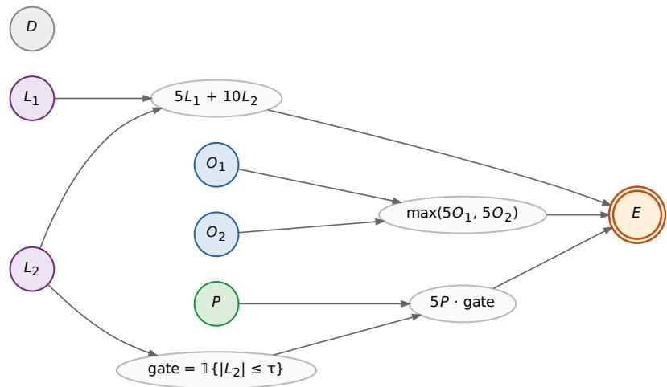  
Figure 14: Synthetic archetype model. Roots (circles) are independent draws: $L _ { 1 } , L _ { 2 } \sim \mathcal { N } ( 0 , 1 )$ (linear, purple); $O _ { 1 } , O _ { 2 } \sim { \mathcal { N } } ( 1 , 1 )$ (overdetermined via max, blue); $\hat { P } \sim \mathcal { N } ( 0 , 1 )$ (gated by $| L _ { 2 } | \ \leq \ \tau ,$ green); $\mathbf { \bar { \boldsymbol { D } } } \sim \mathcal { N } ( \mathbf { \boldsymbol { 0 } } , 1 )$ (irrelevance control, grey). Mediators (white ellipses) carry the deterministic functions of their parents. Outcome E (orange double-circle) is the sum lin + od + p branch. The variable D has no outgoing edges by construction.

Case 2 (unpreempted, dominant O winner). Filter: $| L _ { 2 } | \le \tau$ (gate on, P branch active) and $| O _ { 1 } -$ $O _ { 2 } | > \kappa$ . The dominant winner makes the within-variable $S { \mathrm { - n o t - } } N$ gap visible: the winner is large enough that alternatives rarely beat it (high $\Delta _ { S } )$ , and the loser provides a partial floor when the winner is intervened (reduced $\Delta _ { N } )$ . A contestable pair cannot show this within-variable gap, since pinning either one still lets the partner flip the max.

The two cases together test the structural-role-not-identity claim: the same variable P should sit at the noise floor in Case 1 and mirror $L _ { 1 }$ in Case 2.

Desiderata and measurements. Table 15 pairs each archetype expectation with the formal inequality on the excess scores $\Delta _ { N } , \Delta _ { S }$ , the measured value at the production sample budget $( \bar { N } = \dot { 2 } 0 0 0 0$ Monte Carlo draws per intervention), and a bootstrap 95% confidence interval (4 000 resamples, joint across V and $D$ so per-sample correlations are preserved). The noise-floor variable $D$ itself drifts across the two cases: co-intervention variance is structurally larger in the gate-on regime than in the gate-off regime, so $\mathrm { c i } _ { N } ( D )$ shifts between regimes by a non-negligible amount. This is exactly why every archetype claim is stated on the excess scores $\Delta _ { N } , \Delta _ { S }$ rather than raw ci values: subtracting D within each case normalises out the regime-dependent floor, so the archetype patterns can be read off stably regardless of $D ' \mathrm { s }$ absolute drift.

The threshold comes from the data. The directional desiderata of the form $\Delta > \epsilon \mathrm { o r } | \Delta | < \epsilon$ all depend on a single tolerance ϵ. We do not hand-pick it; we derive it from the Monte Carlo budget. For every $\Delta$ score appearing in any desideratum we bootstrap a standard error $\sigma _ { V }$ and take

$$
\epsilon = 1 . 6 4 5 \cdot \sigma _ { \mathrm { m a x } } , \qquad \sigma _ { \mathrm { m a x } } = \operatorname* { m a x } _ { V , \mathrm { c a s e } } \sigma _ { V } ,
$$

the one-sided 95% Z-quantile times the largest standard error across all measured $\Delta \mathsf { s } .$ . Under the null hypothesis $\Delta = 0$ , fewer than $5 \%$ of measurements would exceed $\epsilon ; { \mathrm { ~ a ~ } } \Delta$ that clears ϵ is therefore not Monte Carlo chatter at the chosen budget. $\mathrm { A t } \ N = 2 0 0 0 0$ samples we measure $\sigma _ { \mathrm { m a x } } \approx 0 . 0 9 2$ giving $\epsilon \approx 0 . 1 5 1$ . Smaller budgets give a noisier ϵ that defeats the point (e.g. at $N = 5 0 0 0$ $\sigma _ { \mathrm { m a x } }$ ≈ 0.18 would push ϵ into the signal range); this fixes the production sample size for the section. Ten of the twelve desiderata we considered survive this threshold; the two that do not (cross-regime $P$ flip, and quantitative match of $\Delta _ { N } ( P )$ to $\Delta _ { N } ( L _ { 1 } )$ in Case 2) are discussed below as diagnostics.

<table><tr><td>#</td><td>Formal desideratum</td><td></td><td>Measured</td><td>95% CI</td><td>Result</td></tr><tr><td>1</td><td> $\Delta _ { N } ( L _ { 2 } )$ </td><td>is the largest excess necessity, Case 1</td><td>+2.129</td><td>[+1.953, +2.300]</td><td>√</td></tr><tr><td>2</td><td> $\Delta _ { N } \big ( L _ { 2 } \big )$ </td><td>is the largest excess necessity, Case 2</td><td>+0.642</td><td> $\dot { [ + 0 . 4 7 6 , + 0 . 8 1 3 ] }$ </td><td>√</td></tr><tr><td>3</td><td></td><td> $\Delta _ { S } ( \dot { O } _ { w } ) - \Delta _ { S } ( \dot { O } _ { l } ) > \epsilon ,$  Case 1 (contestable)</td><td>+0.347</td><td> $[ + 0 . 2 1 6 , + 0 . 4 7 3 ]$ </td><td>√</td></tr><tr><td>4</td><td></td><td> $\Delta _ { S } ( O _ { w } ) - \Delta _ { S } ( O _ { l } ) > \epsilon ,$  Case 2 (dominant)</td><td>+0.529</td><td> $[ + 0 . 3 8 7 , + 0 . 6 6 7 ]$ </td><td>√</td></tr><tr><td>5</td><td></td><td> $| \Delta _ { N } ( O _ { w } ) - \Delta _ { N } ( \dot { O } _ { l } ) | < \epsilon , \mathrm { C a s e } 1$ </td><td>-0.093</td><td> $\left\lceil - 0 . 2 6 6 , + 0 . 0 8 1 \right\rceil$ </td><td>√</td></tr><tr><td>6</td><td> $\Delta _ { S } ( O _ { w } ) - \Delta _ { N } ( O _ { w } ) > \epsilon ,$ </td><td>Case 2 (within-variable S-not-</td><td>+0.487</td><td>[+0.256, +0.712]</td><td>√</td></tr><tr><td>7</td><td> $\textit { N s i g n a t u r e } )$   $\Delta _ { N } ( \bar { L } _ { 2 } ) - \Delta _ { N } ( O _ { w } ) > \epsilon , \mathrm { C a s e } 2$ </td><td></td><td></td><td> $[ + 0 . 9 1 5 , + 1 . 2 5 1 ]$ </td><td>√</td></tr><tr><td>8</td><td></td><td> $| \Delta _ { N } ( P ) | < \epsilon , \mathrm { C a s e ~ 1 ~ ( g a t e ~ o f f ) }$ </td><td>+1.082 +0.112</td><td> $\left[ - 0 . 0 5 8 , + 0 . 2 8 0 \right]$ </td><td>√</td></tr><tr><td>9</td><td></td><td> $\Delta _ { N } ( \dot { L } _ { 1 } ) - \Delta _ { N } ( P ) > \epsilon , \mathrm { C a s e } 1$ </td><td>+0.670</td><td> $\left[ + 0 . 4 9 9 , + 0 . 8 4 3 \right]$ </td><td>√</td></tr><tr><td>10</td><td></td><td> $\Delta _ { N } ( P ) > \epsilon , \mathrm { C a s e } 2 ( \mathrm { g a t e  o n } )$ </td><td>+0.250</td><td>[+0.079, +0.422]</td><td>√</td></tr></table>

Table 15: Desiderata satisfaction on the synthetic archetype model. Threshold $\epsilon = 1 . 6 4 5 \cdot \sigma _ { \mathrm { m a x } } \approx 0 . 1 5 1$ is the smallest ∆ gap that, at $N = 2 0 0 0 0$ samples, exceeds Monte Carlo noise at one-sided 95% confidence. Subscripts $w / l$ denote the winner / loser of the $\operatorname* { m a x } ( 5 O _ { 1 } , 5 O _ { 2 } )$ branch in the given case. Per-row check identifiers and the underlying numerical computations are listed in the companion notebook responsibility\_archetypes.

Figure 5 visualises the same ten claims as a forest plot: each row carries a plain-language statement of the structural expectation; the dot is the point estimate of the relevant $\Delta$ score (or difference of $\Delta$ scores); the horizontal bar is its bootstrap 95% CI; and the green band is the row’s pass region, i.e. the set of $\Delta$ values that would confirm that row’s claim given ϵ. The pass region depends on the claim type: $\Delta > \epsilon$ claims pass to the right of $\epsilon ; | \Delta | < \epsilon$ closeness claims pass inside the strip $( - \epsilon , + \epsilon )$ ; rank claims (#1 and #2) pass to the right of $0 ,$ since they compare $\bar { \Delta } _ { N } ( L _ { 2 } )$ against the largest competing suspect. We count a row as confirmed when the point estimate lies in its green band; we show the CI separately so the reader can see when a measurement is statistically tight and when its CI crosses the pass boundary. All ten dots fall inside their pass bands. The tightest row is $\# 1 0 \left( \Delta _ { N } { \left( P \right) } > \epsilon \right.$ in Case 2, gate on): the point estimate +0.250 clears $\epsilon \approx 0 . 1 5 1$ by roughly one σ, with its CI lower edge at +0.079 still inside the band on the right side of zero.

Diagnostics that do not survive the bootstrap-derived threshold. Two further claims about the preempted variable $P$ fail at this threshold; we report them as diagnostics rather than as numbered desiderata. (D1) The cross-regime flip $\Delta _ { N } ( P , \mathrm { C a s e  \ 2 } ) - \Delta _ { N } ( P , \mathrm { \bar { C a s e \ 1 } } )$ measures +0.139 with CI [−0.081, +0.365]: the CI straddles zero, so we cannot statistically resolve $P ^ { * } { \mathrm { s } }$ rise across regimes on its own at the production budget. The qualitative content of this claim is already carried by desiderata #8 (P at the noise floor in Case 1) and #10 (P above ϵ in Case 2): if both pass, the regime flip is a corollary, not an independent claim. (D2) The quantitative match $| \Delta _ { N } ( P ) - \Delta _ { N } ( L _ { 1 } ) | < \epsilon$ in Case 2: the signed gap $\Delta _ { N } \mathbf { \dot { ( } } P ) - \Delta _ { N } ( L _ { 1 } )$ measures −0.267 with $\mathrm { C I } [ - \mathrm { \dot { 0 } } . 4 4 \mathrm { i } , - 0 . 1 0 6 ] \mathrm { : }$ ; the point estimate’s magnitude 0.267 lies above ϵ, though the interval’s near edge (0.106) dips below it. At this sample budget, gated P does not quantitatively mirror ungated $L _ { \mathrm { 1 } } ;$ what we can claim is the weaker, qualitative statement that both clear the noise floor in Case 2, which is exactly desideratum #10 for P and built into Case 2 by construction for $L _ { 1 }$

The archetype evaluation establishes that PCI recovers the right qualitative pattern on every standard causal motif against an analytic ground truth. Appendix E now turns to a complementary continuous-input comparison: how does PCI behave next to gradient-based attribution (Differential Causal Effect of Butler et al., 2022) when the same continuous cause is rescaled or moved out of the steep region of the response surface, where the gradient itself collapses but causal responsibility arguably should not?

## E Comparison to Differential Causal Effect

This appendix details the Differential Causal Effect comparison summarised in Section 4.

Having tested PCI against ground truth in Appendix D, we now compare it with gradient-based attribution on a continuous-input credit-limit example.

A natural baseline for continuous-input attribution is to read causal influence off the gradient of an interventional mean function. The motivation is direct: $\mathbb { E } \big [ Y \mid d o ( X { = } 1 ) \big ] - \mathbb { E } \big [ Y \mid \mathsf { \breve { d } } o ( X { = } 0 ) \big ]$

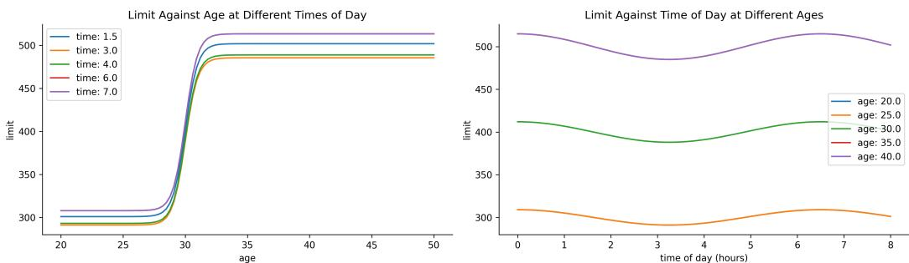  
Figure 15: Deterministic component of the credit-limit model (Example 37), on the hours scale: limit vs. age at several times of day (left) and limit vs. time of day at several ages (right). Age dominates the limit, with a small sinusoidal modulation from time of day; the minute scale is identical modulo a linear reparameterisation (verified in the notebook).

is the binary ATE, and for a continuous cause one “arrives at derivative calculus” [Ness, 2025, Section 7.4.3] by letting the contrast shrink: ∂x E-Y | do(X=x). Generalised to a vector x = $( x _ { 1 } , \ldots , x _ { d } )$ with interventional mean $m ( \mathbf { x } ) = \mathbb { E } \big [ Y _ { \mathbf { X } = \mathbf { x } } \big ]$ , the causal gradient is

$$
\nabla _ { \mathbf x } m ( \mathbf x ) = \Big ( \partial _ { x _ { 1 } } \mathbb { E } \big [ Y _ { \mathbf X = \mathbf x } \big ] , \mathbf \Omega . . . , \partial _ { x _ { d } } \mathbb { E } \big [ Y _ { \mathbf X = \mathbf x } \big ] \Big ) ,
$$

and each partial is the differential causal effect (DCE) of a single variable at x. Butler et al. [2022] introduced this quantity in the Gaussian Process regression setting, where, with the posterior expected mean expressible as $\textstyle \sum _ { n } k ( x , x ^ { ( n ) } ) \alpha _ { n }$ , the DCE has the closed form $\begin{array} { r } { \partial _ { x _ { i } } \hat { F } = \sum _ { n } \partial _ { x _ { i } } k ( x , x ^ { ( n ) } ) \alpha _ { n } } \end{array}$ PCI and DCE are not direct competitors (DCE estimates a rate of change, PCI estimates individuallevel responsibility), but PCI inherits the territory of continuous attribution, so a contrast on a single example is informative. We highlight the differences:

1. DCE requires $y = F ( \mathbf { X } , \epsilon )$ with F differentiable; PCI requires only that the causal model be sampleable, and the inference algorithm for the expanded model is the user’s choice (we use Monte Carlo throughout).

2. DCE inherits the units of both X and $Y ,$ so cross-feature comparison is unit-sensitive. The PCI score integrates over the necessity- and sufficiency-world densities, so changes to input scale leave the score essentially unchanged.28

3. DCE varies abruptly with the local geometry of F. The PCI score depends on where the factual value sits relative to the necessity/sufficiency densities and is therefore non-zero in flat regions while remaining locally informative.

Example 37 (credit-limit assignment). We model an applicant’s approved credit limit as a function of age and the time of application. The deterministic component is a sigmoidal rise in age with a small sinusoidal modulation in time-of-day; intuitively, age should dominate. We consider four settings on two axes: time measured in hours vs. minutes (a units rescaling that should not affect attribution), and an age prior centred at 30 vs. 40 (a genuine change in what counts as unusual). The deterministic component is shown in Figure 15. Computational details and code are in docs/source/gradient\_based\_attribution.ipynb.

PCI scores. We instantiate ci as the absolute-difference score from Example $2 1 , c i ( y ^ { s } , y ^ { n } , y ^ { \star } ) =$ $| y ^ { n } - y ^ { \star } | - | y ^ { s } - y ^ { \star } |$ , and run the search of Section 3 on each setting, conditioning on age and on time of application as singleton suspects. Figure 16 shows the mechanism for the canonical setting (age-30 prior, hours): when age is the active suspect the necessity-world outcome tracks the deterministic curve while the sufficiency-world outcome stays near factual, and the same picture, with a smaller displacement, holds for time of application. Table 16 reports the mean total scores across all four settings. Two patterns stand out. First, age outscores time of application in every setting, by roughly a factor of 3/2, matching the intuition that the age sigmoid moves the outcome by a much larger absolute amount than the daily modulation does. Second, the scores are essentially unchanged between the hours and minutes columns, confirming the unit-invariance discussed above, whereas the shift from the age-30 to the age-40 prior raises every score, since a more unusual factual age means a larger search-space displacement.

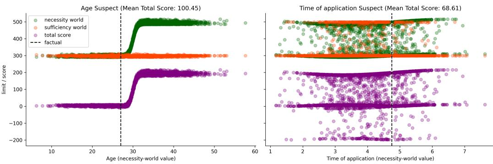  
Figure 16: PCI search for the canonical setting (age-30 prior, hours), with age (left) and time of application (right) as the active suspect. Necessity-world (green) and sufficiency-world (orange) limit samples and the total score (purple) are plotted against the necessity-world value of the suspect; the dashed line marks the factual. The necessity world departs from factual along the deterministic response while the sufficiency world stays near it; each panel title gives the mean total score.

Table 16: Mean PCI total scores for age and time of application across the four settings (time unit × age prior), at the factual instance. Age outscores time in every setting; the hours and minutes columns agree (unitinvariance), while the age-40 prior raises all scores relative to age-30 (a more unusual factual age).
<table><tr><td></td><td colspan="2">age-30 prior</td><td colspan="2">age-40 prior</td></tr><tr><td>Suspect</td><td>hours</td><td>minutes</td><td>hours</td><td>minutes</td></tr><tr><td>Age</td><td>100.45</td><td>97.95</td><td>177.87</td><td>176.56</td></tr><tr><td>Time of application</td><td>68.61</td><td>66.51</td><td>117.97</td><td>118.42</td></tr></table>

PCI vs. DCE across the input grid. Figure 6 (Section 4) contrasts the two methods on the same grid of factual values (age-30 prior); the other three settings give qualitatively the same picture. Panel (a) plots the difference between the PCI scores for age and for time of application: it is positive everywhere, so age is consistently the more responsible variable. Panels (b) and (c) plot the corresponding difference in DCE magnitudes, on the hours and minutes scales respectively, and two differences with PCI stand out. First, on the hour scale the DCE for time of application exceeds the DCE for age over most of the grid, the opposite of PCI’s verdict; only a narrow band near the sigmoid’s inflection point favours age, and only because the gradient spikes sharply at that single point. Second, switching the time unit from hours to minutes flattens the time DCE by roughly a factor of 60, collapsing almost all of panel (b)’s time-favouring region to near zero in panel (c) and making the unit sensitivity explicit. Both are direct consequences of DCE’s role as a rate-of-change estimator rather than a responsibility score, and both make it harder to compare across features and across reparameterisations.

## F Scaling Actual-Cause Computation: An Empirical Comparison

This appendix details the actual-cause scaling benchmark summarised in Section 4.

The correspondence in Theorems 26–27 and Proposition 32 is a statement about verdicts: under the stated hypotheses, AC actual causes coincide with the support of $\sum _ { \mathbf { T } } \Phi$ . This appendix reports an empirical companion to the correspondence. We ask whether the necessity-only PCI kernel of Definition 24, instantiated with a finite Monte Carlo estimator, recovers AC verdicts at problem sizes where exact subset enumeration is no longer tractable. The full implementation, raw outputs and plotting code are in the companion notebook actual\_causality\_benchmark.

Generalised throwing problem. For a size parameter n we replicate the canonical Sally/Billy structure n times in parallel. Binary suspects $A _ { 1 } , \ldots , A _ { n } , B _ { 1 } , \ldots , B _ { n } \in \{ 0 , 1 \}$ feed deterministic mediators $W _ { i } ^ { a } = A _ { i } , \quad W _ { i } ^ { b } = B _ { i } \wedge \neg A _ { i }$ that capture overdetermination via preemption: $B _ { i }$ contributes only if $A _ { i }$ does not. The outcome is the conjunction $\textstyle Y = { \textstyle \bigwedge } _ { i = 1 } ^ { n } ( W _ { i } ^ { a } \ \vee \ W _ { i } ^ { b } )$ , and the model size grows as $4 n + 1$ variables. Ground-truth responsibility at site i is read off during the forward pass: $A _ { i }$ is responsible if $W _ { i } ^ { a } = 1 , B _ { i }$ is responsible if $W _ { i } ^ { b } \dot { = } 1$ . The structure scales the canonical example without softening it: overdetermination, undercutting, and witness-mediated symmetry-breaking are present at every site, while keeping a closed-form ground truth available for evaluation.

The variable partition takes the roots $\{ A _ { i } , B _ { i } \} _ { i }$ as suspects and the deterministic mediators $\{ W _ { i } ^ { a } , W _ { i } ^ { b } \} _ { i }$ as witnesses, with no suspect a deterministic function of the others. This partition satisfies the closure condition required by Theorem 26 (see the Remark on deterministic intermediates and joint support, which addresses precisely the scenario in which both a root and its structural descendant are admitted as suspects). The benchmark is therefore within the scope of the formal correspondence; in particular, joint full support of the alternative-value distribution holds on the admissible suspect set $\{ A _ { i } , B _ { i } \}$ i even though the model itself is deterministic, because witnesses are not themselves part of the alternative-value distribution.

Exact subset enumeration (AC reference). The exact procedure mechanises Definition 23: for each non-empty cause subset $\mathbf { C } \subseteq \{ A _ { i } , B _ { i } \} _ { i }$ and each non-empty witness subset $\mathbf { T } \subseteq \{ W _ { i } ^ { a } , W _ { i } ^ { b } \} _ { i }$ , we intervene $[ \mathbf { C } \gets \mathbf { 1 } - \mathbf { c } ^ { \star } , \mathbf { T } \gets \mathbf { w } ^ { \star } ]$ , record whether the outcome flips, and accept C as actual cause if some witness T achieves a flip and no proper subset of C does. The search space has $\left( 2 ^ { 2 n } - 1 \right) ^ { 2 }$ cause-witness pairs (9, 225, 3969, 65025 for $n = 1 , 2 , 3 , 4 )$ , which already determines the ceiling reached by the exact method.

Approximate PCI estimator. The PCI estimator instantiates the kernel of Definition 24 via the Monte Carlo search procedure of Section 3. Algorithm 2 is the explicit procedure we use to produce the curves in Figure 7 and Figure 17. In words: for each of N draws it picks a random small set of suspects to flip and a random set of witnesses to pin at their factual values, then runs the model twice under the same noise, once with the suspects restored to factual (the sufficiency world) and once with them flipped to their alternatives (the necessity world), and records whether the flip changed the outcome. Each suspect’s score is the fraction of its draws in which flipping it changed the outcome, and at each site the procedure returns the higher-scoring of the two rivals $A _ { i } , B _ { i }$ as the cause. The procedure transcribes the ThinSearchSampler used in the companion notebook actual\_causality\_benchmark.

The algorithm draws $N$ intervention configurations under shared noise. Line 10 draws the active suspect set $\mathbf { C } _ { j }$ at uniformly chosen cardinality $k _ { s } \in \{ 1 , \ldots , n _ { s } \}$ ; line 11 draws the dropped witness set $D _ { j }$ the same way at $k _ { w } \in \{ 0 , \dots , n _ { w } \}$ , and the active witnesses on line 12 are the complement $\mathbf { w } \backslash \breve { D } _ { j } , \mathbf { s o } n _ { w }$ bounds the number of witnesses dropped, not the number kept, and the active witness set has size $| \mathbf { W } | - n _ { w }$ or larger. Line 2 handles the witness ablation flag wit = off once, by emptying W; this collapses the witness machinery on lines 11–12 and 14–15 to no-ops, producing the dotted accuracy curves of Figure 7.

Alternative values on line 13 are bit flips: on {0, 1} the ϵ-excised alternative-value distribution has a single support point and ϵ plays no role; we preserve the explicit sampling form so that the same routine runs on continuous benchmarks. The two interventional worlds on lines 14–15 share the noise realisation $\mathbf { u } _ { j }$ drawn on line $^ { 8 , }$ the standard counterfactual coupling, which lets us read the per-suspect score on lines 16–18 off as the nan-mean of $| y _ { j } ^ { n } - y ^ { \star } |$ over the draws in which $X \in \mathbf { C } _ { j }$ The algorithm computes the sufficiency outcome $y _ { j } ^ { s }$ but does not consume it: the AC verdict against which we benchmark has no sufficiency clause, so we read only the necessity world. We exercise the joint estimator with sufficiency active in Appendices D, E, and G, where AC has no comparable verdict to benchmark against. At each site $i = 1 , \ldots , n ,$ , line 24 returns the suspect, $A _ { i }$ or $B _ { i }$ , with the higher mean.

Algorithm 2 Approximate PCI estimator on the scaled throwing problem.   
Require: PSCM M; factual world $( \mathbf { s } ^ { \star } , \mathbf { w } ^ { \star } , y ^ { \star } ) ;$ ; cardinality bounds $n _ { s } , n _ { w } ;$ sample budget $N ;$ wit  
ness flag wit $\in \{ \mathrm { o n } , \mathrm { o f f } \}$   
Ensure: per-site verdicts $v _ { i } \in \{ A _ { i } , B _ { i } \}$ for $i = 1 , \ldots , n$   
1: if wit = off then   
2: $\mathbf { W }  \emptyset$ ▷ no witness candidates   
3: end if   
4: for each $X \in \mathbf { S }$ do   
5: $L [ X ] \gets [ ]$ ▷ per-suspect score list   
6: end for   
7: for $j = 1 , \ldots , N$ do   
8: draw $\mathbf { u } _ { j } \sim { P } _ { \mathbf { U } }$   
9: sample $\stackrel { \cdot } { k } _ { s } \sim \operatorname { U n i f } \{ 1 , \dotsc , n _ { s } \} , \quad k _ { w } \sim \operatorname { U n i f } \{ 0 , \dotsc , n _ { w } \}$   
10: sample $\mathbf { C } _ { j } \subseteq \mathbf { S }$ uniformly with $| \mathbf { C } _ { j } | = k _ { s }$   
11: sample $D _ { j } \subseteq \mathbf { W }$ uniformly with $| \bar { D _ { j } } | = k _ { w }$ ▷ witnesses dropped   
12: $\mathbf { T } _ { j } \bar {  } \mathbf { W } \backslash D _ { j }$ ▷ active witnesses   
13: $\mathbf { c } _ { j } ^ { \prime } \gets \mathbf { 1 } - \dot { \mathbf { s } } ^ { \star } \lvert \bar { \mathbf { c } } _ { j }$ ▷ bit-flip on {0, 1}   
14: $\bar { y _ { j } ^ { s } }  M . \mathrm { r u n } \big ( \mathbf { u } _ { j } , \mathrm { d o } ( \mathbf { C } _ { j } = \mathbf { s } ^ { \star } | _ { \mathbf { C } _ { j } } , \mathbf { T } _ { j } = \mathbf { w } ^ { \star } | _ { \mathbf { T } _ { j } } \big ) \big )$ ▷ sufficiency   
15: $\begin{array} { r } { y _ { j } ^ { n } \gets M . \mathrm { r u n } \big ( \mathbf { u } _ { j } , \mathrm { d o } ( \mathbf { C } _ { j } = \mathbf { c } _ { j } ^ { \prime } , \mathbf { T } _ { j } = \mathbf { w } ^ { \star } | _ { \mathbf { T } _ { j } } \big ) \big ) } \end{array}$ ▷ necessity, shared $\mathbf { u } _ { j }$   
16: for each $X \in \mathbf { \dot { C } } _ { j }$ do   
17: append $| y _ { j } ^ { n } - y ^ { \star } |$ to $L [ X ]$   
18: end for   
19: end for   
20: for each $X \in \mathbf { S }$ do   
21: score[X] ← nanmean $. ( L [ X ] )$   
22: end for   
23: for $i = 1 , \ldots , n$ do   
24: vi ← arg maxscore[Ai], score $\lfloor B _ { i } \rfloor )$   
25: end for   
26: return $( v _ { 1 } , \ldots , v _ { n } )$

Benchmark protocol. For each problem size n we sample up to ten distinct factive worlds (with $Y = 1 )$ , instantiate the model, run both methods to verdicts, and compare to the analytic ground truth. We grant each method a 60-minute global budget per run; if the budget runs out mid-loop, the largest completed n caps the curve. We exercise the approximate estimator in five configurations that vary along three axes identified in Section $3 \colon ( \mathrm { i } )$ initial sample budget $N _ { 0 } \in \{ 2 5 0 , 5 0 0 \}$ , scaled linearly with n by a factor $\alpha \in \{ 0 . 5 , 1 \}$ so that the total sample at size n is $\alpha \cdot N _ { 0 } \cdot n ;$ (ii) presence of witness interventions (wit $\in \{ \mathrm { o n } , \mathrm { o f f } \} )$ , ablating $\mathbf { T }  \mathbf { w } ^ { \star }$ to test whether witness pinning is decisive; (iii) cardinality bounds $n _ { s } , n _ { w } ,$ , fixed at 4 in the default runs (answering “does some witness set of $\mathrm { s i z e } \geq | \mathbf { W } | - \mathbf { \bar { 4 } }$ work?”) and grown linearly as 4n in the dynamic-set-size configuration (recovering the unrestricted subset search at the cost of higher variance). The cardinality bound is a tunable approximation knob, not a hidden assumption: the dynamic-set-size run measures the empirical cost of bounding $n _ { s } , n _ { w }$ at 4 on this problem, and the ablation measures the gap between the two configurations. Section 3 gives the conceptual case for constraining cardinality at all: uniform sampling over the full powerset biases attributions toward large-coalition interventions, analogous to declining to enumerate all n-way regression interaction terms.

Results. The results cover runtime, search-space size, and accuracy. First, runtime (Figure 7): the exact procedure times out at 4n $+ 1 = \bar { 1 } 7$ variables $( n = 4 )$ once the cause-witness search space crosses sixty-five thousand pairs, while the approximate methods continue to roughly 73– 145 variables depending on sample budget, with the frugal $\alpha { = } 0 . 5$ run reaching the largest sizes. Second, search-space size (Figure 17, log scale): the exact method visits the full powerset, while the approximate methods visit at most a few hundred unique configurations per problem size: the gap is several orders of magnitude and widens with n. Third, accuracy (Figure 7): the exact method i correct by construction up to its early demise; the witness-using approximate methods stay above 0.85 correct-attribution rate up to 73–89 variables and degrade gracefully beyond that, with the dynamic-set-size run sustaining among the highest accuracies at moderate problem sizes. Witnessfree runs (dotted) underperform at nearly every problem size, starting near 0.67 already at n = 1; at matched budget (250 samples, α=1) the witness runs average 0.941 against 0.861 and lead at 22 of the 26 shared sizes. The ablation confirms a structural claim of Section 3: pinning factual witness values is doing real work.

Cause-witness sets searched (log scale)  
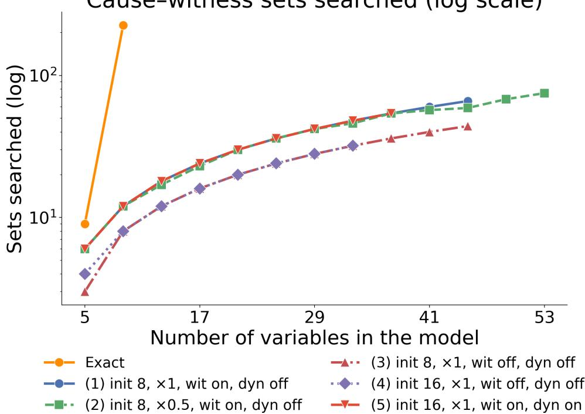  
Figure 17: Number of cause-witness configurations explored per problem size, log scale. The exact method visits the full powerset; the approximate methods visit a few hundred unique configurations per problem size regardless of n, a gap of several orders of magnitude that grows with n.

Scope of the conclusion. The benchmark establishes that the necessity-only PCI estimator tracks AC verdicts on a faithful scaling of the canonical example with several orders of magnitude fewer evaluated configurations. The problem itself, however, is structured: responsibility attribution is independent across sites, exactly one of $A _ { i } , B _ { i }$ is responsible at each site given C=1, supersets of any witness set witness the same attribution (so a small witness-cardinality bound costs little), and all variables are binary. These regularities account for some of the favourable scaling: in particular, the cardinality-bounded sampling losing little to dynamic-set-sizes sampling on this problem. Two extensions are natural follow-ups. First, we defer a comparison against SHAP and causal SHAP on the same scaled-throwing problem to a companion benchmark (Section 5 gives the SHAP-vs-PCI comparison on the smaller overdetermination and continuous-mediation examples); the sufficiency component of PCI distinguishes it from those baselines, and a clean head-to-head requires the joint kernel rather than the necessity-only restriction used here. Second, benchmarks that break each of the structural regularities above, particularly continuous-variable extensions where AC’s mechanical enumeration is no longer even well-defined, would test the estimator outside its current favourable regime. As a sanity check that the correspondence in Theorems 26–27 is empirically operational at scale, the present comparison is sufficient.

The AC benchmark exercises the necessity-only specialisation of PCI on a discrete-outcome problem with a closed-form ground truth. Appendix G shifts to the regime where AC has no verdict to compare against: a Bayesian dynamical SIR model with a continuous outcome and asymmetrically interacting policies. The point is to exercise the joint necessity-sufficiency machinery on threshold events that the actual-causality machinery cannot adjudicate, and to show that PCI separates lockdown and masking where but-for analysis collapses them.

## G Dynamical SIR Benchmark: PCI on Continuous Outcomes

This appendix details the continuous-outcome SIR benchmark summarised in Section 4.

The actual-causality benchmark of Appendix F exercises the necessity-only specialisation of PCI on a discrete outcome with a closed-form ground truth. This appendix shifts to the regime where AC has no verdict to compare against: a Bayesian dynamical model with a continuous outcome and asymmetrically interacting causes. The benchmark mirrors a public ChiRho tutorial29 in setup and query. We keep the same model and the same query but replace the explanatory machinery with the PCI thin-search sampler. The full implementation, raw outputs and plotting code are in the companion notebook sir\_benchmark.

Model. The dynamics are the standard SIR system $\dot { S } = - \beta S I , \dot { I } = \beta S I - \gamma I , \dot { R } = \gamma I ,$ with Bayesian priors $\beta \sim \mathrm { B e t a } ( 1 8 , 6 0 0 )$ and $\gamma \sim$ Beta(1600, 1600). Two non-pharmaceutical policies, each enacted with prior probability $1 / 2 ,$ , modulate the transmission rate via an intervention strength $l \in [ 0 , 1 ]$ that scales $\beta _ { 0 } \mathrm { t o } ( 1 - l ) \beta _ { 0 }$ . Lockdown alone has efficiency $0 . 6 ;$ masking efficiency depends on lockdown (0.1 under lockdown, 0.45 on its own); the joint efficiency is the clamped sum, capped at 0.95. Lockdown is enacted at $t ~ = ~ 1$ , masking at $t ~ = ~ 1 . 5$ The outcome is the overshoot, the peak-to-final S gap of the simulated trajectory, and the undesirable event is $\mathrm { o s . t o o . h i g h \ = \ }$ 1[overshoot $> 2 4 ]$ on a 100-person population. A policy can raise this probability relative to no intervention at all: suppressing or flattening the infectious peak leaves more susceptibles unspent at the peak, so they are drawn down more slowly afterward, which can widen the peak-to-final gap that overshoot measures even though the intervention is clearly the safer outcome in absolute infection terms. A high $\mathrm { P r } ( \mathrm { o v e r s h o o t } > 2 4 )$ under intervention is therefore not a sign error; it is a property of this particular summary statistic.

But-for analysis gives a symmetric verdict. Conditioning on each pair of policy decisions and drawing 100 predictives yields $\mathrm { P r ( o v e r s h o o t } > 2 4 ) \approx 0 . 0 7$ with no intervention, 0.76 with both policies, 0.84 with lockdown only, and 0.81 with mask only; the two single-policy regimes are statistically indistinguishable by but-for probability alone at this sample budget (a 0.03 gap on 100 predictive draws is well within Monte Carlo noise), which is exactly the symmetry PCI is designed to break. The mechanism is the asymmetric joint efficiency: lockdown and mask together reach a transmission reduction of only 0.7, well short of the model’s 0.95 clamp, and mask’s efficiency itself depends on whether lockdown is also active (falling from 0.45 alone to 0.1 under lockdown). But-for cannot disentangle this context dependence: it treats each policy as a binary cause and reports an aggregate effect, with no way to express that lockdown’s causal contribution depends on whether masking is in force. Figure 18 visualises the four interventional regimes: slowing transmission delays the infectious peak and leaves more susceptibles unspent when it arrives, so all three intervention regimes show a similarly elevated overshoot relative to no intervention, mirroring the near-equal but-for overshoot probabilities.

The qualitative reading the model supports. The but-for numbers are symmetric, but the model is not, and the asymmetry points to a clear qualitative reading that any responsibility method ought to recover. First, lockdown is the proximate cause of excessive overshoot: it is the policy that does the real work of suppressing the infectious peak, and the joint regime clears the 24-overshoot threshold only because lockdown is in force. Second, masking is at most a context-sensitive cause: its contribution depends on whether lockdown is also active. Masking is comparatively effective only when lockdown is absent (efficiency 0.45 versus 0.1 under lockdown), so once lockdown is present masking adds little. A good attribution method should therefore rank lockdown above mask and, more finely, flag mask’s causal status as contingent on context rather than robust. These two intuitions are the target of the analysis below; they follow from the model’s asymmetric joint efficiency, not from any particular tool, and they coincide with the verdict the ChiRho tutorial reaches via classical actual-cause probabilities. We state them here so the comparison that follows does not depend on consulting that tutorial.

PCI thin-search procedure. The suspects are {lockdown, mask}. The witnesses are drawn from the policy efficiencies {lockdown eficiency, mask eficiency, joint eficiency}, with the suspect itself excluded from the witness set on each draw. The factual world fixes both policies on (lockdown =

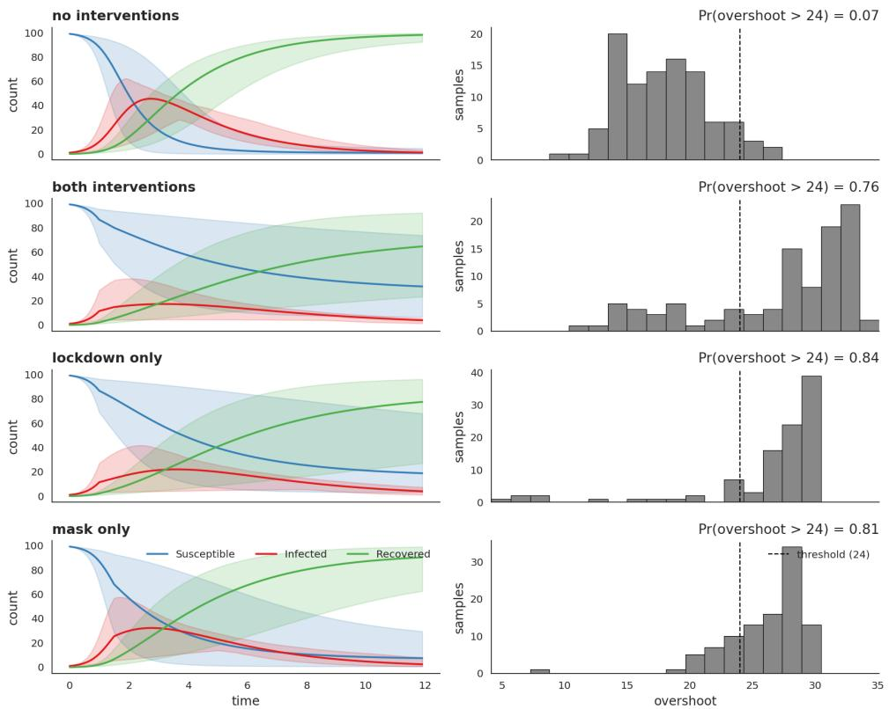  
Figure 18: SIR trajectories and overshoot distributions under the four interventional regimes (no interventions, both policies, lockdown only, mask only). Left: posterior bands for susceptible (blue), infectious (red) and recovered (green) over time, with the lockdown enacted at t = 1 and the mask mandate at $t = 1 . 5$ . Right: per-regime histograms of the overshoot, with the 24-overshoot threshold marked. Delaying the infectious peak raises the overshoot in every intervention regime, and the lockdown-only and mask-only overshoot probabilitie are near-indistinguishable: the asymmetric joint efficiency that PCI disentangles.

$1 , \mathrm { { m a s k } = 1 ) }$ , so the factual outcome $y ^ { \star } = \mathrm { o v e r s h o o t }$ is read from the same trajectory. For each suspect the sampler draws 2,500 regimes, scoring each with the $| y ^ { \star } - y _ { \mathrm { n e c } } | - | y ^ { \star } - y _ { \mathrm { s u f f } } |$ statistic and averaging across regimes. The nec term rewards regimes where removing the suspect moves the outcome away from $y ^ { \star }$ ; the suf term rewards regimes where fixing the suspect at factual keeps the outcome close to $y ^ { \star }$

The joint necessity–sufficiency plane. Before turning to numbers, it helps to see what the search produces. For each suspect the sampler returns, per regime, a pair of outcomes: the necessityworld overshoot $y _ { \mathrm { n e c } }$ (the focal suspect set to its alternative, any other active suspects in $\mathbf { C } \setminus \{ X \}$ intervened, witnesses pinned at factual) and the sufficiency-world overshoot $y _ { \mathrm { s u f f } }$ (the focal suspect held at factual, other active suspects intervened, witnesses at factual). These are the necessity- and sufficiency-world outcomes $y ^ { n } , y ^ { s }$ of Section 3; we write $y _ { \mathrm { n e c } } , y _ { \mathrm { s u f f } }$ here to match the figure axes. Plotting one point per regime in the $( y _ { \mathrm { n e c } } , y _ { \mathrm { s u f f } } )$ plane gives a per-suspect cloud (Figure 8) that exposes the score geometry before any averaging. Three reference lines orient the plane: the dotted red cross-hair marks the factual outcome $y ^ { \star }$ at the both-policies-on world (lockdown = mask = 1); because that world is the high-overshoot scenario, $y ^ { \star }$ sits near the upper-right of the cloud rather than at its centre. The dash-dot blue line marks the 24-overshoot threshold, and the dashed black diagonal is $y _ { \mathrm { n e c } } = y _ { \mathrm { s u f f } }$ . The per-regime score $| y ^ { \star } - y _ { \mathrm { n e c } } | - | y ^ { \star } - y _ { \mathrm { s u f f } } |$ is positive exactly when a point lies further from the cross-hair along the necessity axis than along the sufficiency axis: necessity pulls the outcome away from factual (evidence the suspect was needed), while sufficiency keeps it close (evidence the suspect alone sustains the outcome). A cause therefore shows up as a cloud displaced toward smaller $y _ { \mathrm { n e c } }$ at fixed $y _ { \mathrm { s u f f } }$ (the cause signature on this geometry), whereas a non-cause hugs the diagonal. Reading the two panels this way, the lockdown cloud is clearly displaced above the diagonal toward smaller $y _ { \mathrm { n e c } } ,$ while the mask cloud sits closer to it: the visual form of the verdict the next paragraph quantifies.

Single-world results. PCI ranks lockdown well above mask, a gap well outside Monte Carlo noise:
<table><tr><td>suspect</td><td> $\overline { { | y ^ { \star } - y _ { \mathrm { n e c } } | } }$ </td><td> $- \overline { { \vert y ^ { \star } - y _ { \mathrm { s u f f } } \vert } }$ </td><td> $\overline { { c i } }$ </td><td>q</td><td> $\operatorname { P C I } = q ^ { 2 } { \overline { { c i } } }$ </td></tr><tr><td>lockdown</td><td>8.276</td><td>-6.578</td><td>1.698</td><td>0.754</td><td> $\mathbf { 0 . 9 6 5 \pm 0 . 0 9 1 }$ </td></tr><tr><td>mask</td><td>7.536</td><td>-6.673</td><td>0.863</td><td>0.754</td><td> $\mathbf { 0 . 4 9 1 \pm 0 . 0 7 9 }$ </td></tr></table>

Here $q = \mathrm { P r } _ { \Gamma } [ X _ { k } \in \mathbf { C } ] = 0 . 7 5 4$ is the sub-probability mass of the suspect-containing regimes, so the reported score is the $q ^ { 2 }$ -scaled expectation of Definition 19 rather than a renormalised conditional mean; the quarter of draws that leave the suspect out contribute zero and stay in the average. The gap is driven mostly by the necessity term: removing lockdown moves the overshoot further from $y ^ { \star }$ than removing mask does (8.276 vs 7.536 in mean absolute distance, 0.740 of the 0.835 total gap), while the sufficiency terms differ by only 0.095. This is consistent with the but-for finding that eithe policy alone is roughly equally bad. What distinguishes the suspects is that lockdown’s removal under context (with witnesses pinned to factual) pulls the world further from $y ^ { \star }$ than mask’s removal does: the lockdown cloud’s displacement above the diagonal toward smaller $y _ { \mathrm { n e c } }$ in Figure 8, against the mask cloud’s near-diagonal position.

Removing the Suspect Spreads the Overshoot; Keeping It Holds the Overshoot Near $y ^ { \star }$

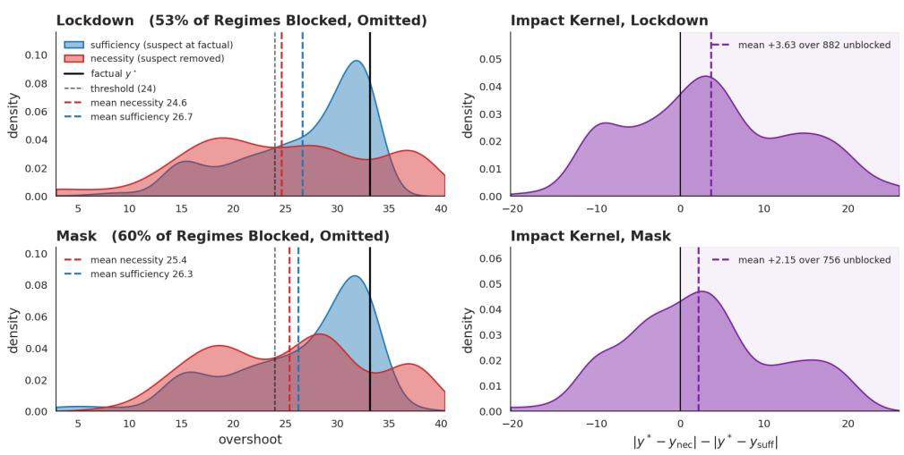  
Figure 19: Impact-kernel densities per suspect. Left: the necessity world (suspect removed) spreads the overshoot away from $y ^ { \star }$ , while the sufficiency world (suspect held at factual) keeps it near $y ^ { \star } ;$ the printed means are the two columns of the table above. Right: the resulting per-draw impact kernel $| y ^ { \star } - y _ { \mathrm { n e c } } | \grave { - } | y ^ { \star } - y _ { \mathrm { s u f f } } |$ whose $q ^ { 2 }$ -scaled mean is the PCI score. The quarter of draws whose candidate set omits the suspect contribute zero and are excluded from the density.

Robustness acrossfactual worlds. We replicate the analysis across 20 factual worlds drawn from the prior (rather than the single hand-set world above), running thin search on each with 200 regimes per suspect. The draws span $\beta \in \left[ 0 . 0 1 6 0 , 0 . 0 3 9 8 \right]$ and $\gamma \in [ 0 . 4 8 1 , 0 . 5 2 5 ]$ , giving factual overshoots from 9.86 to 33.80 people, 12 of the 20 above the threshold. Lockdown averages +0.819 against mask ${ \bf \ddot { s } } + 0 . 1 1 8 .$ , a mean gap of +0.701 with a standard error of 0.111, and lockdown leads in 18 of the 20 worlds. The verdict is not an artifact of the chosen factual.

Effect of context. The ChiRho tutorial isolates one downstream variable at a time, asking whether the verdict survives when that variable is held fixed at factual versus left free. We replicate the experiment by partitioning the PCI regimes by whether the partner-policy efficiency variable was sampled into the witness set (Figure 21). For lockdown, with mask eficiency fixed as a witness the score is 0.494; free, it rises to 1.684. For mask, with lockdown eficiency fixed the score is −0.161 (mask fails to register as a cause at all under that context regime) and free it rises to 1.497.

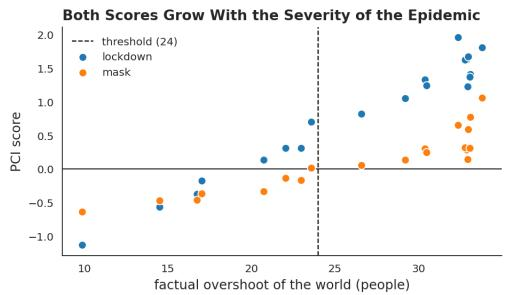

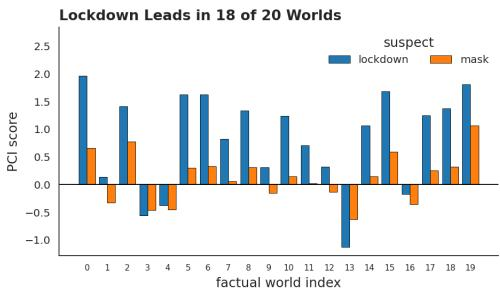  
Figure 20: The single-world verdict across 20 factual worlds drawn from the prior. Left: PCI score against the world’s factual overshoot, for each suspect. Right: the per-world scores in draw order. Lockdown leads in 18 of the 20 worlds, with a mean gap of +0.701 (standard error 0.111).

This experiment partitions the regimes differently from the single hand-set world reported earlier, so the fixed/free scores are not expected to average to that world’s scores (lockdown 0.965, mask 0.491). Lockdown therefore registers as a cause in both context regimes, while mask’s status as a cause is contingent on its partner being allowed to adapt. PCI thus expresses both which policy is the dominant cause and how robustly that causal claim holds across counterfactual contexts: a finer-grained verdict than the binary “actual cause / not” that classical AC produces.

Mask Counts as a Cause Only When Its Partner Can Adapt

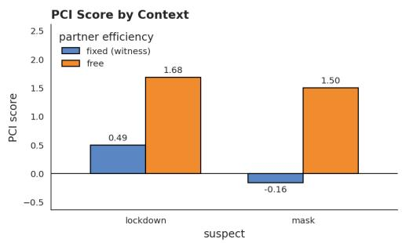

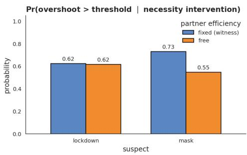  
Figure 21: Different-contexts experiment. Bars compare PCI total score (left) and Pr(overshoot > 24 | necessity) (right) when the partner-policy efficiency variable is fixed as a witness versus left free. Lockdown’s score is positive in both regimes; mask’s score flips sign across regimes, indicating that mask is a contextsensitive rather than a robust cause.

Takeaway. On the dynamical SIR setting, PCI recovers both intuitions set out at the start of this appendix (lockdown is the proximate cause of excessive overshoot and masking only a contextsensitive one, despite both policies appearing similar under but-for analysis), and expresses them on a continuous, decomposable scale. The necessity-vs-sufficiency decomposition distinguishes suspects whose isolation effects are similar but whose removal-under-context effects diverge; the contexts experiment further distinguishes robust from context-sensitive causes. The same machinery applies to any ChiRho probabilistic program with a continuous outcome and a tractable enumeration over interventional regimes.

The SIR benchmark scales PCI to a research-grade Bayesian dynamical model and demonstrates that the joint kernel captures patterns that AC cannot adjudicate. Appendix H pushes the demonstration one step further: a deployed automated valuation model trained on millions of points, with deep neural-network components and a sparse variational GP outcome head. The question there is no longer whether PCI agrees with a known ground truth (on a proprietary production model none is available), but whether the computation is feasible at all, and whether the qualitative SHAP-vs-PCI divergences observed on the synthetic side persist on a real trained system.

## H Scaling PCI to a Real-World Automated Valuation Model

This appendix details the deployed-AVM study summarised in Section 4.

The synthetic archetypes of Appendix D, the AC benchmark of Appendix F, and the SIR benchmark of Appendix G all controlled the model and the ground truth, so that PCI could be judged against an analytic verdict or a competing AC enumeration. Here we drop both, applying PCI to a deployed valuation model for residential housing on which neither ground truth nor exact AC enumeration is available. Disclosure constraints on the trained model and its training data prevent a quantitative accuracy comparison on this system, so the quantitative validation of PCI lives entirely in the controlled synthetic benchmark of Appendix D. The role of this appendix is correspondingly narrow: to report (i) that PCI is computationally feasible at production scale on a model with millions of train ing points, and (ii) that the qualitative SHAP-vs-PCI divergence observed in Section 5 persists when the model is a real trained one: the shape of the two attribution distributions and where attribution mass lands, not the substantive content of the features they assign to.

Setting. The unit of analysis is a residential property transaction. PCI is run against the full country-level production AVM; what we show here is an illustrative prototype based on the state of New York rather than the full national model structure, which we cannot disclose in detail. The NY prototype shares the architecture and the causal-kernel construction described below with the full system but is smaller in scope and DAG complexity. The computational-feasibility claim refers to the full national system; the qualitative SHAP-vs-PCI behaviour we illustrate is a property of the shared architecture and carries over from the prototype. The outcome variable $y$ is the (log-epsilon-standardized) sale price. Transactions are described by a set of categorical variables $x _ { c a t } = x _ { 1 } , . . . , x _ { k }$ and continuous (transformed) variables30 $x _ { c o n } = x _ { k + 1 } , . . . , x _ { n }$

Causal model. A causal DAG G expresses our causal assumptions about the relationships between variables. We wrote it manually in collaboration with domain experts, then refined it by adding edges to break implied conditional independencies not upheld by the data. The simplified NY-prototype DAG has 25 nodes and 99 edges; topology with anonymised node labels is shown in Figure 22; the full national DAG is larger and is not shown. As demonstrated in Appendix F, even the prototype is already large enough that exact actual-causality enumeration is computationally infeasible, and the same conclusion applies a fortiori to the national system.

Variables x are drawn from distributions Dist parameterized by functions $f _ { i } ( \mathrm { p a } _ { i } , \varphi _ { i } )$ of the parent variables $\mathrm { \ p a ~ } _ { i } ^ { 3 1 } \colon x _ { i } \sim \mathrm { D i s t } _ { i } \big ( f _ { i } \big ( \mathrm { p a } _ { i } , \varphi _ { i } \big ) \big )$ . We call these distributions causal kernels. The distributions are either (truncated) normal or categorical; we choose the family based on the domain of the variable it models. The functions $f _ { i }$ are deep neural networks with parameters $\varphi _ { i } .$ , which we optimize using cross-entropy loss for categorical distributions and average negative log likelihood for continuous distributions. The outcome is modeled by a sparse variational Gaussian Process (SVGP; Titsias, 2009, Hensman et al., 2013), $x _ { g p } = ( x _ { c o n } , \eta ( x _ { c a t } , \varphi _ { c a t } ) ) , y \sim \mathcal { S V G P } ( \mu ( x _ { g p } , \varphi _ { \mu } ) , \kappa ( x _ { g p } , \varphi _ { \kappa } ) )$ where η is a linear embedding of the categorical variables into the continuous space, jointly optimized with the GP.

Feasibility at production scale. To apply PCI we transform the model as described in Section 3 and evaluate the impact of features from a list of potential causal suspects, using the absolute difference impact score of Example 21. We draw Monte Carlo samples from the expanded model. Conditioning on a given suspect $X _ { i }$ being active gives us a sample of the scores corresponding to that feature, which we use to estimate the expected value thereof. The estimation converges at around 25,000 samples; for a batch of 50 data points this takes around 60 minutes on commodity hardware. We need to sample only once; we can then reuse the samples to compute the attribution score of any suspect. This establishes that the method is computationally tractable at production scale, not a foregone conclusion, since the expanded-model construction in Section 3 introduces additional latent dimensions per suspect and per witness.

Qualitative comparison to SHAP. We compare PCI attributions to SHAP scores [Lundberg and Lee, 2017] on the same trained model. SHAP heavily weights variables that are downstream of many other variables in the causal graph, effectively assigning attribution to what amount to summary statistics of the outcome. PCI distributes attribution more evenly across the upstream causal structure. The pattern is consistent with what Section 5 establishes on controlled examples: SHAP’s observational marginalisation allocates weight differently from intervention-and-witness-based PCI scores, and on a deep DAG this difference manifests as concentration on summary-statistic-like nodes. Figure 9 shows the two attribution distributions with real feature identities withheld under NDA; the two panels rank their own top variables independently, so only the shape of each distribution is comparable, not which specific features receive attribution in one panel versus the other.

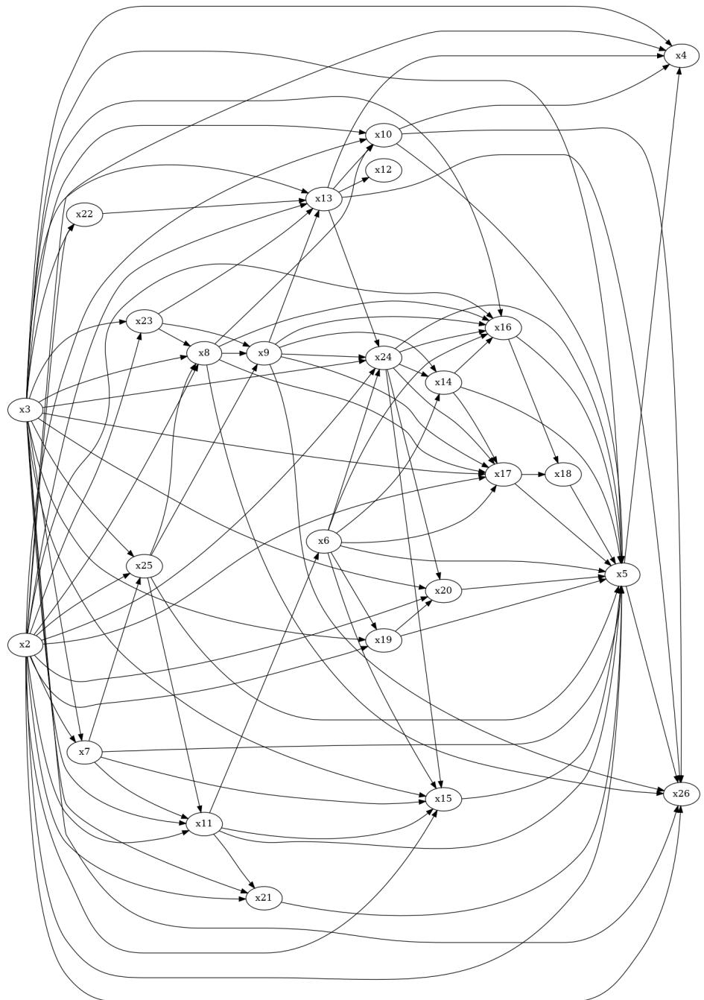  
Figure 22: Topology of the AVM causal DAG (NY-prototype version), with node labels anonymised. The graph has 25 nodes and 99 edges; the full national DAG is larger and is not shown. Several variables sit deep in the DAG with high in-degree; these are the nodes towards which SHAP allocates disproportionate attribution mass (see Figure 9).