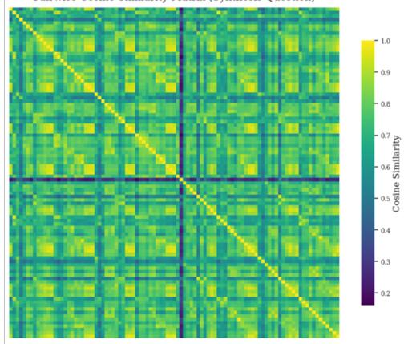
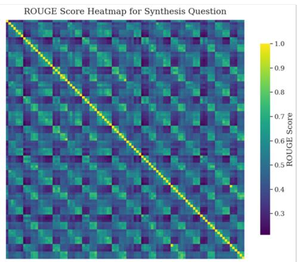
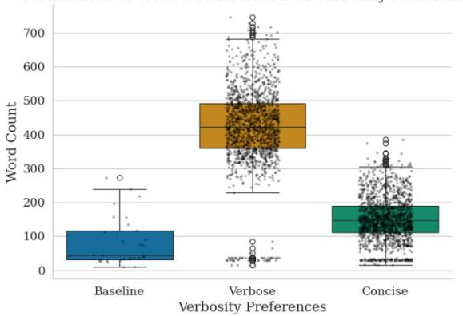
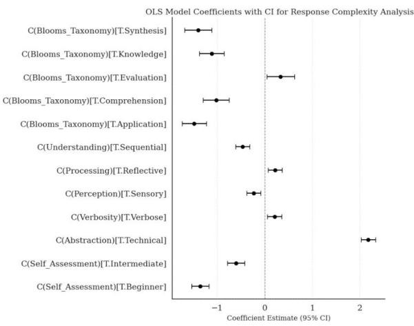
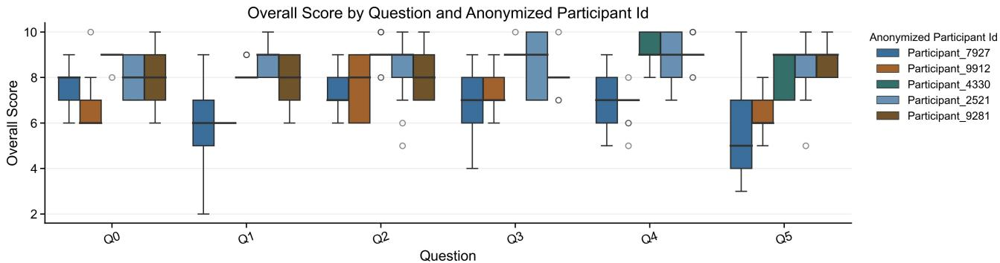
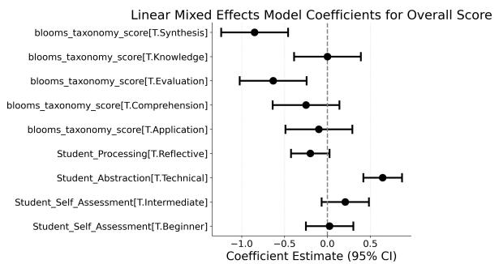
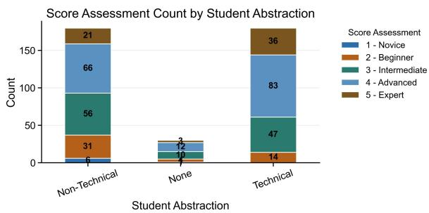
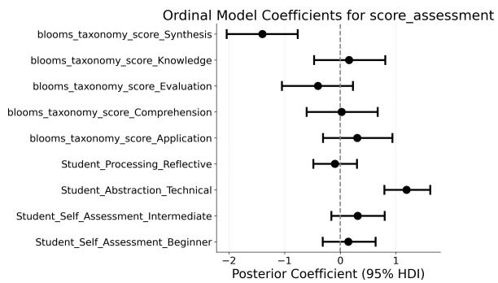
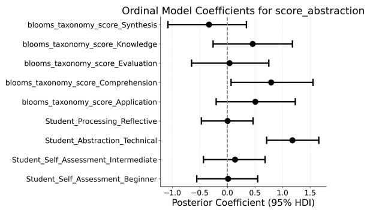
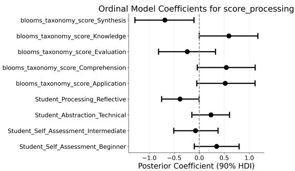

# A Prompt-Engineering Approach to Develop Scalable, Flexible, and Real-Time Hybrid Micro-Level Personalization in a General Purpose AI Teaching Assistant.

Saptarshi Basu, Sandeep Kakar, Ashok Goel

Georgia Institute of Technology, Atlanta GA 30332, USA sbasu7@gatech.edu, skakar6@gatech.edu, ashok.goel@cc.gatech.edu

## Abstract

Artificial intelligence (AI) teaching assistants powered by large language models (LLMs) ofer scalable educational support but often provide limited personalization. This study presents a prompt-engineering-based framework for personalizing general-purpose LLM/RAG based AI teaching assistant such as Jill Watson across academic disciplines and courses. The framework adapts responses using six learnerspecific dimensions: self-assessment, abstraction preference, verbosity preference, perceptual orientation, information processing style, and level of understanding, yielding 96 distinct learner profiles. Student queries are additionally analyzed using Bloom’s Taxonomy to estimate cognitive complexity at the interaction level. Learner attributes and cognitive assessments are encoded in structured prompts that condition the LLM without requiring model retraining. The framework is evaluated through experiments using NLP metrics and a human study with five participants. Results show perceived differences in response style and structure across personalization conditions, with statistical analyses identifying learner attributes associated with measurable response changes. These findings provide preliminary evidence that prompt-based personalization can support adaptive behavior in LLM-powered educational agents.

Code, Survey Links, and Dataset — https:

//github.gatech.edu/sbasu7/IAAI27\_JW\_Personalization

## Introduction

The aspiration to provide learners with educational experiences tailored to their individual needs is decades old. Bloom’s 2 Sigma finding demonstrated that one-to-one tutoring can produce learning gains approximately two standard deviations above conventional classroom instruction, establishing personalization as a measurable educational objective (Bloom 1984). Subsequent research has sought scalable approaches that approximate the benefits of individualized instruction through adaptive and intelligent learning systems (Shute and Zapata-Rivera 2012; Aleven et al. 2017; Bernacki, Greene, and Lobczowski 2021).

The emergence of large language models (LLMs) has substantially expanded the potential for personalized learning. LLM-based teaching assistants can generate fluent, contextually relevant responses at scale and, when combined with retrieval-augmented generation (RAG), provide course-grounded instructional support across diverse disciplines (Taneja et al. 2024; Kakar et al. 2024; Maiti and Goel 2024). However, their flexibility raises important questions regarding which learner characteristics should drive personalization, how personalization should be implemented, and whether such adaptations produce meaningfully diferent instructional interactions.

This paper addresses these questions through a promptengineering-based personalization framework for the Jill Watson virtual teaching assistant (Goel and Polepeddi 2018; Taneja et al. 2024; Kakar et al. 2024). The framework operates at the level of individual student questions and combines learner preferences with question-level cognitive demand. Specifically, responses are personalized using six learner dimensions: metacognitive self-assessment, abstraction preference, verbosity preference, perceptual orientation, information processing style, and level of understanding. Cognitive demand is estimated using Bloom’s Taxonomy, while learner preferences are based on the Felder-Silverman learning model (Bloom et al. 1956; Felder and Silverman 1988). Their combination yields 96 distinct learner profiles.

The framework is implemented entirely through structured prompt engineering over an existing RAG-based LLM tutor, enabling real-time personalization without model retraining or domain-specific authoring. We evaluate the approach using 2,910 generated responses spanning 30 student questions and 97 prompt configurations through NLP-based analyses, followed by a human evaluation with five participants. Results provide preliminary evidence that promptbased personalization produces measurable and perceptible diferences in response characteristics, supporting its potential for adaptive behavior in LLM-powered educational agents.

## Literature Review

Bernacki et al. (Bernacki, Greene, and Lobczowski 2021) proposed a broad personalization framework that characterize adaptive learning through four lenses: by whom, to what, how, andfor whatpurpose. Plass and Pawar (Plass and Pawar 2020) further distinguish adaptivity (system-driven) from adaptability (learner-driven), as well as macro- and microlevel adaptation. The present work focuses on micro-level cognitive adaptation that combines system-driven classification using Bloom’s Taxonomy with learner-driven preference selection.

Earlier adaptive learning systems typically follow a diagnose-prescribe cycle involving learner modeling, action selection, and model updating (Shute and Zapata-Rivera 2012). Learner models commonly represent prior knowledge and skill mastery, with adaptation primarily implemented through content selection or sequencing (Xie et al. 2019). In contrast, this work shifts personalization toward responseform adaptation: answers remain grounded in a shared retrieved knowledge base while their abstraction, structure, verbosity, and cognitive framing are modified through prompt conditioning.

Recent LLM-based tutoring systems have expanded personalization through conversational interaction and retrievalaugmented generation (RAG), including extensions of Jill Watson (Taneja et al. 2024; Kakar et al. 2024; Maiti and Goel 2024). Systems such as LPITutor (Liu et al. 2025b), PATS (Li et al. 2025b), GPTutor (Chen et al. 2024), and AgentTutor (Li et al. 2025a) adapt dificulty, personality, instructional content, or teaching workflows. Other approaches integrate LLMs with cognitive diagnosis models to improve learner modeling (Dong, Chen, and Wu 2025; Liu et al. 2025a; Wei et al. 2025; Zhang et al. 2025). Persona and preference-aware systems, including Park et al. (Park et al. 2024) and CloChat (Ha et al. 2024), demonstrate the value of incorporating learner preferences into prompts.

Compared with these approaches, to enable dynamic response adaptation at the individual interaction level, the proposed framework combines six learner dimensions with question-level cognitive analysis using Bloom’s Taxonomy. It allows learners to actively specify response characteristics while automatically adapting cognitive depth. Thus, rather than primarily adapting content or learning pathways, the LLM/RAG based AI teaching assistant (Jill Watson) personalizes how shared instructional content is presented through prompt engineering. This hybrid integration of learner-driven adaptability and system-driven cognitive assessment represents an underexplored direction in LLMbased educational personalization.

## Personalization Framework Design

The proposed personalization framework consists of three components: learner characteristics, learner preferences, and a prompt-engineering mechanism that conditions the underlying large language model (LLM). Following the profile-conditioned approach of Park et al. (Park et al. 2024), learner characteristics are represented through selfassessed metacognitive knowledge and the cognitive complexity of individual questions determined using Bloom’s Taxonomy (Bloom et al. 1956). This enables question-level personalization based on both learner understanding and query complexity.

Learner preferences are derived from the Felder-Silverman learning model (Felder and Silverman 1988) and are treated as user-selected preferences rather than fixed psychometric classifications. Five dimensions are incorporated: abstraction, verbosity, perception, processing, and understanding.

<table><tr><td rowspan=1 colspan=1>Factors</td><td rowspan=1 colspan=1>Level I</td><td rowspan=1 colspan=1>Level II</td><td rowspan=1 colspan=1>LevelⅢ</td></tr><tr><td rowspan=1 colspan=1>Metacognition(Self   Assess-ment)</td><td rowspan=1 colspan=1>Beginner</td><td rowspan=1 colspan=1>Intermediate</td><td rowspan=1 colspan=1>Expert</td></tr><tr><td rowspan=1 colspan=1>Abstraction</td><td rowspan=1 colspan=1>In-Depth(Techni-cal)</td><td rowspan=1 colspan=1>Big Picture(High-Level)</td><td rowspan=1 colspan=1></td></tr><tr><td rowspan=1 colspan=1>Verbosity</td><td rowspan=1 colspan=1>Verbose</td><td rowspan=1 colspan=1>Concise</td><td rowspan=1 colspan=1>一</td></tr><tr><td rowspan=1 colspan=1>Perception</td><td rowspan=1 colspan=1>Sensory</td><td rowspan=1 colspan=1>Intuitive</td><td rowspan=1 colspan=1>一</td></tr><tr><td rowspan=1 colspan=1>Processing</td><td rowspan=1 colspan=1>Active</td><td rowspan=1 colspan=1>Reflective</td><td rowspan=1 colspan=1>一</td></tr><tr><td rowspan=1 colspan=1>Understanding</td><td rowspan=1 colspan=1>Sequential</td><td rowspan=1 colspan=1>Global</td><td rowspan=1 colspan=1>一</td></tr></table>

Table 1: Learning Preferences and Levels

These dimensions control the granularity, length, communication orientation, engagement style, and organizational structure of generated responses, respectively. The corresponding categories are summarized in Table 1.

The combination of learner characteristics and preferences produces 96 distinct learner profiles. In addition, each student question is automatically classified according to Bloom’s Taxonomy, enabling dynamic adaptation at the individual interaction level. Learner preferences are explicitly selected by students, whereas cognitive demand is inferred by the system. This creates a hybrid framework combining learnerdriven adaptability with system-driven adaptivity.

All learner attributes are encoded in an engineered prompt that conditions response generation. The prompt is integrated with Jill Watson’s retrieval-augmented generation (RAG) pipeline and course-specific knowledge base, allowing personalization to modify the form and presentation ofresponses while preserving grounding in retrieved instructional content. An example prompt is shown below:

I have a beginner level ofknowledge in this topic. The Bloom’s Taxonomy category ofmy question is Synthesis. Please provide a technical and concise response, using a sensory communication style.I process information in a reflective way and prefer to understand concepts in a global manner.

Personalize the response based on my understanding and preferences listed in this prompt. The query is as follows: what approach should I take to best solve the Sheep and Wolves problem?

The modular design allows learner preferences to be updated through the Jill Watson interface and incorporated into prompts at runtime, enabling scalable personalization without modifying or retraining the underlying LLM (Kakar et al. 2024).

## Research Questions

The objective of this study is to determine whether the proposed personalization framework produces distinct and perceptible response characteristics. Accordingly, we investigate the following research questions (RQs):

1. RQ1: To what extent are learner profiles associated with diferences in the linguistic characteristics of LLMgenerated responses?

2. RQ2: Which learner dimensions are most strongly associated with variations in response characteristics?

3. RQ3: Are the observed response characteristics consistent with the intended efects of the corresponding learner dimensions?

RQ1 examines whether diferent learner profiles produce systematically diferent responses. RQ2 evaluates the relative contribution of individual learner dimensions to response characteristics, including semantic similarity, complexity, verbosity, abstraction, and processing style. RQ3 assesses whether observed diferences align with the intended efects of each dimension; for example, whether higher verbosity produces longer responses and higher abstraction produces more technically complex explanations.

To address these questions, we combine automated NLP analyses with human evaluation. Descriptive and inferential statistical methods, including mixed-efects models, are used to quantify diferences and associations across learner profiles and dimensions.

## Experimental Design and NLP Evaluation

Automated NLP analyses were conducted to determine whether personalization dimensions produce measurable differences in LLM-generated responses.

Thirty real-world student questions were selected from the Spring 2023 CS 7637 Knowledge-Based AI (KBAI) course at the Georgia Institute of Technology, covering all six Bloom’s Taxonomy categories. Following Maiti and Goel (Maiti and Goel 2025), questions were classified using a fine-tuned BERT-based classifier trained on combined labeled datasets (Gani and Sangodiah 2023; Yahya 2011). The classifier used bert-base-uncased and achieved 0.92 test accuracy, with F1 scores of 0.88 - 0.94 across categories.

The six learner dimensions and their levels (Table 1) produced 96 unique learner profiles. For each ofthe 30 questions, 97 prompts were generated: 96 personalized configurations and one non-personalized baseline, resulting in 2,910 responses. The prompt template and model configuration were held constant, with only learner-profile attributes varied. Responses were generated using GPT-4.1 with temperature set to 0 to minimize stochastic variation.

Responses were evaluated using four NLP dimensions: lexical similarity, semantic similarity, linguistic complexity, and verbosity. Semantic similarity was measured using 384-dimensional embeddings from all-MiniLM-L6-v2 (Wang et al. 2020; Sentence-Transformers Community on Hugging Face 2024), followed by pairwise cosine similarity. Lexical overlap was measured using ROUGE, linguistic complexity using grade-level scores from textstat, and verbosity using lexicon\_count.

Descriptive analyses and ordinary least squares (OLS) regression were used to examine associations between learner dimensions and response characteristics. Together with the subsequent human evaluation, these analyses address the three research questions.

## Human Evaluation Study Design

A human evaluation study involving five evaluators complemented the automated NLP analysis by assessing response characteristics that are dificult to capture automatically, including perceived abstraction, depth of understanding, and information-processing style. The evaluators were recruited from current and former students of the KBAI course at the Georgia Institute of Technology based on a pre-recruitment survey. The survey collected information about the evaluators’ subject-matter understanding, self-assessed expertise, and learning preferences.

One representative question was selected from each Bloom’s Taxonomy category. The evaluation examined three personalization dimensions: self-assessment, abstraction, and processing style across 13 student profiles, including a non-personalized baseline. Evaluators were recruited through a screening survey capturing educational background, perceived competency, and learning preferences, and all data were anonymized.

Using Qualtrics, each evaluator assessed responses for all 13 profiles across the six questions, yielding 390 evaluations. Responses were rated on four dimensions: overall quality (0 - 10 scale), perceived complexity (novice to expert), abstraction level (non-technical, neutral, technical), and processing style (reflective, neutral, active).

For inferential analysis, the baseline was excluded, leaving 12 personalized profiles. Mixed-efects models were used with personalization dimensions as fixed efects and evaluator identity as a random efect to account for inter-rater variability.

Given the small sample of five evaluators, results are interpreted as exploratory rather than population-level evidence. The factorial design supports estimation of main efects but not interaction efects because of limited statistical power. Larger and more diverse samples are needed to establish generalization and examine interactions among personalization dimensions.

## Results and Discussion

In this section, we present and briefly discuss the results from the NLP experiments and human evaluation study.

## NLP Experiments Results

To qualitatively illustrate response diferentiation, two responses generated for the question “What approach should I take to best solve the Sheep and Wolves problem?” are compared. The first corresponds to a beginner profile preferring concise, non-technical, sensory, active, and sequential explanations. The second corresponds to an advanced profile preferring concise, technical, intuitive, reflective, and global explanations. Snippets from the responses are reproduced below as representative quotes.

Beginner, sensory, active, sequential profile: “Let’s break it down into simple steps. Visualize the scenario, identify the rules, plan your moves, test diferent strategies.”

  
Figure 1: Cosine similarity and ROUGE scores for 97 responses to a representative question.

Advanced, intuitive, reflective, global profile: “Define the problem space and constraints, identify primitive actions, map state transitions, apply explanation-based learning, and evaluate the solution globally.”

The responses illustrate qualitative diferences in instructional strategy: the beginner response emphasizes visualization, sequential steps, and experiential exploration, whereas the advanced response emphasizes formal decomposition, state-space reasoning, and abstraction. This provides qualitative evidence of response diferentiation under diferent personalization configurations (RQ1).

To quantify response variation, all 97 responses for each question were encoded using SentenceTransformer all-MiniLM-L6-v2 (Wang et al. 2020; Sentence-Transformers Community on Hugging Face 2024). Pairwise cosine similarity and ROUGE scores were computed. Figure 1 shows high semantic similarity but substantially lower lexical similarity, indicating that responses remain semantically grounded while varying in surface-level expression and structure.

Figure 2 shows systematic variation in response length across verbosity preferences, providing evidence that the corresponding personalization dimension influences output length (RQ3).

  
Figure 2: Response word count across verbosity preference categories.

  
Figure 3: OLS coeficient estimates for response complexity.

Complexity was measured using the textstat grade-level score and analyzed using OLS regression with learner-profile attributes and Bloom’s Taxonomy categories as predictors. As shown in Figure 3, higher self-assessment, verbosity, reflective processing, and technical abstraction are associated with greater response complexity. Evaluation and Analysis questions also tend to produce more complex responses than other Bloom levels. These results indicate systematic associations between personalization dimensions and response characteristics (RQ2-RQ3).

Overall, the NLP analyses demonstrate measurable variation in response expression, length, and complexity across personalization conditions.

## Human Evaluation Study Results

Evaluators rated the 13 responses for each question on overall accuracy and relevance. Figure 4 shows variation both across participants and across responses within participants, indicating that prompt-level personalization produced perceptible diferences despite a shared RAG pipeline and knowledge base.

  
Figure 4: Question-specific evaluation scores based on perceived accuracy and relevance.

  
Figure 5: Fixed-efect estimates for overall accuracy and relevance.

  
Figure 6: Perceived response complexity by abstraction preference.

A linear mixed-efects model with personalization factors and Bloom’s level as fixed efects and evaluator identity as a random efect showed that abstraction preference was associated with perceived response quality. Bloom’s level was also associated with ratings, with more complex questions generally receiving lower scores (Fig. 5).

Evaluators also rated perceived response complexity on a five-level ordinal scale. Technical abstraction preferences were associated with higher perceived complexity (Fig. 6). A Bayesian ordinal mixed-efects model confirmed abstraction preference as a significant predictor of perceived complexity, while self-assessment was not significant (Fig. 7).

Perceived abstraction ratings generally aligned with the intended abstraction preferences. The corresponding Bayesian ordinal mixed-efects model identified both abstraction preference and Bloom’s level as significant predictors (Fig. 8), providing evidence that the intended abstraction diferences were perceptible to evaluators.

  
Figure 7: Fixed-efect estimates for perceived response complexity.

  
Figure 8: Fixed-efect estimates for perceived abstraction level.

Similarly, processing preferences were reflected in evaluator ratings of response processing style. The ordinal mixedefects model identified both processing preference and Bloom’s level as significant predictors of perceived processing style (Fig. 9).

Overall, the human evaluation provides evidence that prompt-based personalization produces perceptible diferences in response quality, complexity, abstraction, and processing style. Abstraction and processing preferences were particularly consistent with their intended efects, while selfassessment showed weaker efects. These findings address RQ1-RQ3, although the small evaluator sample limits generalization. Larger studies are needed to assess robustness and interactions among personalization dimensions.

  
Figure 9: Fixed-efect estimates for perceived processing style.

## Path to Deployment

The proposed personalization module is designed for integration into the existing Jill Watson architecture that has already been deployed across multiple institutions, without modifying its core infrastructure (Taneja et al. 2024; Kakar et al. 2024; Maiti and Goel 2024). Development and integration are targeted for completion by Spring 2027, followed by a pilot deployment in selected Georgia Institute of Technology courses in Summer 2027. The pilot will evaluate real-world performance and user feedback, informing subsequent refinement and broader deployment across additional courses and institutions in Fall 2027 - Spring 2028.

## Conclusions

This paper presents a personalization framework for RAG and LLM based AI teaching assistants that enables flexible, scalable, modular, and real-time customization. The proposed framework emphasizes a hybrid approach between adaptability and adaptivity, enabling micro-level customization at the interaction level. Key contributions include:

1. An engineered prompt that incorporates student cognitive ability, question complexity (Bloom’s Taxonomy), and learning preferences, generating 96 unique response configurations for question-level (micro) personalization.

2. Real-time adaptation of prompts based on learnerselected preferences, supported by system-level cognitive assessment using Bloom’s Taxonomy and a fine-tuned BERT-based classifier at each interaction.

3. A modular design that enables flexible integration ofadditional features, parameters, and prompt structures within the LLM/RAG (Jill Watson) architecture.

4. Scalability to support diverse learner models, knowledge bases, question banks, courses, and institutional settings without requiring domain-specific adaptation.

5. This study addressed three research questions related to whether personalization leads to measurable response variation, which learner factors drive response diferentiation, and whether learner preferences align with intended response characteristics. NLP-based experiments and human evaluation studies showed systematic response variation across conditions and identified key student profile parameters associated with changes in LLM-generated responses.

The current work primarily focuses on the proposed framework’s ability to personalize general-purpose LLM/RAG based AI teaching assistant’s responses to individual student questions. Future work includes deployment of a UIintegrated personalized AI teaching assistant for large-scale classroom evaluation, A/B testing, and assessment of impacts on learning outcomes and student engagement.

Acknowledgments This research has been supported by NSF Grants 2112532 and 2247790 to the National AI Institute for Adult Learning and Online Education headquartered at Georgia Institute of Technology, Atlanta.

## References

Aleven, V.; McLaughlin, E. A.; Glenn, R. A.; and Koedinger, K. R. 2017. Instruction Based on Adaptive Learning Technologies. In Mayer, R. E.; and Alexander, P. A., eds., Handbook of Research on Learning and Instruction, 522–560. New York, NY: Routledge, 2nd edition.

Bernacki, M. L.; Greene, M. J.; and Lobczowski, N. G. 2021. A Systematic Review of Research on Personalized Learning: Personalized by Whom, to What, How, and for What Purpose(s)? Educational Psychology Review, 33(4): 1675– 1715.

Bloom, B. S. 1984. The 2 Sigma Problem: The Search for Methods of Group Instruction as Efective as One-to-One Tutoring. Educational Researcher, 13(6): 4–16.

Bloom, B. S.; Engelhart, M. D.; Furst, E. J.; Hill, W. H.; and Krathwohl, D. R. 1956. Taxonomy of Educational Objectives: The Classification ofEducational Goals. Handbook I: Cognitive Domain. New York: Longman.

Chen, E.; Huang, R.; Chen, H.-S.; Tseng, Y.-H.; and Li, L.-Y. 2024. GPTutor: Great Personalized Tutor with Large Language Models for Personalized Learning Content Generation. In Companion Proceedings of the ACM Web Conference.

Dong, Z.; Chen, J.; and Wu, F. 2025. Knowledge is Power: Harnessing Large Language Models for Enhanced Cognitive Diagnosis. arXiv preprint arXiv:2502.05556.

Felder, R. M.; and Silverman, L. K. 1988. Learning and Teaching Styles in Engineering Education. Engineering Education, 78(7): 674–681.

Gani, M. O.; and Sangodiah, A. 2023. Exam Question Datasets. Figshare.

Goel, A. K.; and Polepeddi, L. 2018. Jill Watson: A Virtual Teaching Assistant for Online Education. In Learning Engineering for Online Education: Theoretical Contexts and Design-Based Examples. Routledge.

Ha, J.; Jeon, H.; Han, D.; Seo, J.; and Oh, C. 2024. CloChat: Understanding how people customize, interact, and experience personas in large language models. In Proceedings of the 2024 CHI Conference on Human Factors in Computing Systems, 1–24. ACM.

Kakar, S.; Maiti, P.; Taneja, K.; Nandula, A.; Nguyen, G.; Zhao, A.; Nandan, V.; and Goel, A. K. 2024. Jill Watson: Scaling and Deploying an AI Conversational Agent in Online Classrooms. In International Conference on Intelligent Tutoring Systems, 78–90. Springer Nature Switzerland.

Li, C.; et al. 2025a. AgentTutor: Empowering Personalized Learning with Multi-Turn Interactive Teaching in Intelligent Education Systems. In Proceedings of the AAAI Conference on Artificial Intelligence.

Li, M.; et al. 2025b. PATS: Personality-Aware Teaching Strategies with Large Language Model Tutors. arXiv preprint.

Liu, Y.; et al. 2025a. LMCD: Language Models are Zero-Shot Cognitive Diagnosis Learners. arXiv preprint arXiv:2505.21239.

Liu, Z.; Agrawal, P.; Singhal, S.; Madaan, V.; Kumar, M.; and Verma, P. K. 2025b. LPITutor: An LLM-Based Personalized Intelligent Tutoring System Using RAG and Prompt Engineering. PeerJ Computer Science, 11: e2991.

Maiti, P.; and Goel, A. 2025. Can an AI Partner Empower Learners to Ask Critical Questions? In Proceedings of the 30th International Conference on Intelligent User Interfaces (IUI), 314–324.

Maiti, P.; and Goel, A. K. 2024. How Do Students Interact with an LLM-Powered Virtual Teaching Assistant in Diferent Educational Settings? arXiv preprint arXiv:2407.17429.

Park, M.; Kim, S.; Lee, S.; Kwon, S.; and Kim, K. 2024. Empowering Personalized Learning Through a Conversation-Based Tutoring System with Student Modeling. In Extended Abstracts ofthe CHI Conference on Human Factors in Computing Systems, 1–10.

Plass, J. L.; and Pawar, S. 2020. Toward a Taxonomy of Adaptivity for Learning. Journal of Research on Technology in Education, 52(3): 275–300.

Sentence-Transformers Community on Hugging Face. 2024. all-MiniLM-L6-v2 SentenceTransformer Model. https://huggingface.co/sentence-transformers/all-MiniLM-L6-v2. Accessed: 2026-06-26.

Shute, V. J.; and Zapata-Rivera, D. 2012. Adaptive Educational Systems. In Durlach, P. J.; and Lesgold, A. M., eds., Adaptive Technologies for Training and Education, 7–27. Cambridge, MA: Cambridge University Press.

Taneja, K.; Maiti, P.; Kakar, S.; Guruprasad, P.; Rao, S.; and Goel, A. K. 2024. Jill Watson: A Virtual Teaching Assistant Powered by ChatGPT. In Artificial Intelligence in Education (AIED 2024). Springer.

Wang, W.; et al. 2020. MiniLM: Deep Self-Attention Distillation for Task-Agnostic Compression of Pre-Trained Transformers. arXiv preprint arXiv:2002.10957.

Wei, G.; et al. 2025. LLM4CD: Leveraging Large Language Models for Open-World Knowledge Augmented Cognitive Diagnosis. arXiv preprint arXiv:2505.13492.

Xie, H.; Chu, H.-C.; Hwang, G.-J.; and Wang, C.-C. 2019. Trends and Development in Technology-Enhanced Adaptive/Personalized Learning: A Systematic Review of Journal Publications from 2007 to 2017. Computers & Education, 140: 103599.

Yahya, A. 2011. Bloom’s Taxonomy Cognitive Levels Data Set. Data set available at ResearchGate. Dataset.

Zhang, Y.; et al. 2025. LLM-CDM: A Large Language Model Enhanced Cognitive Diagnosis for Intelligent Education. IEEE Transactions on Learning Technologies.