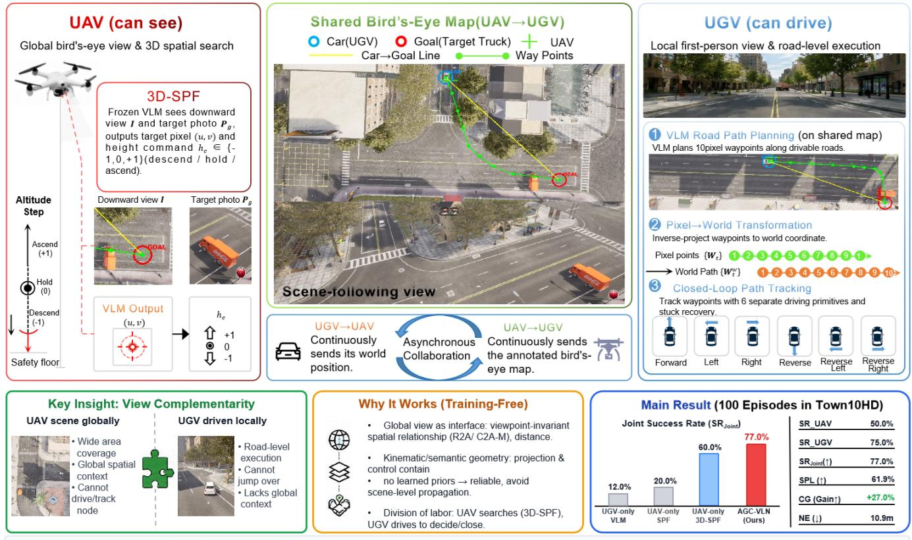
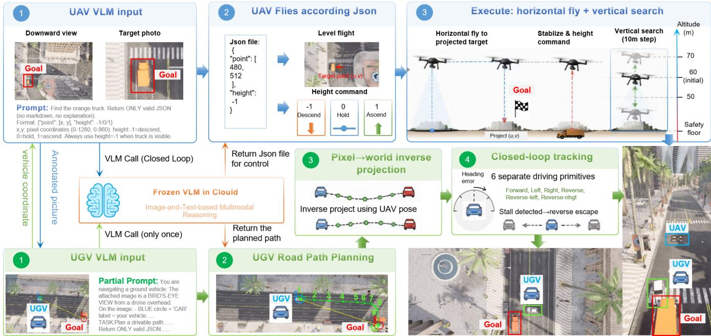
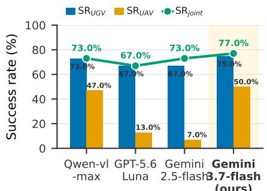
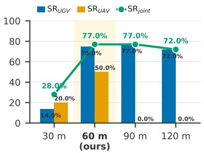
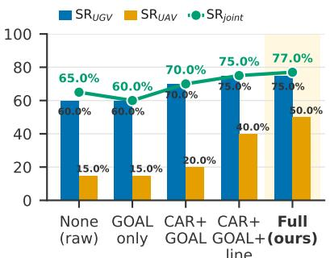
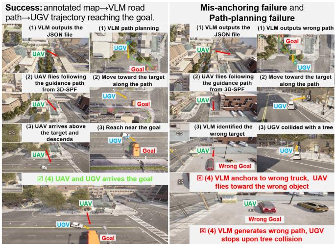
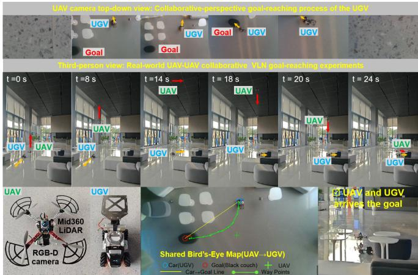

# Air-Ground Collaborative Vision-and-Language Navigation via Shared Bird’s-Eye Maps

Shuning Zhang, Liang Li, Yunheng Wang, Tao Wang, Yihang Kang, Renjing Xu

  
Training-free baseline that turns the UAV's "can see" into the UGV's "can drive" via a shared bird's-eye map.

Fig. 1. The UAV turns its “can see” into the UGV’s “can drive”. View asymmetry: the UAV sees the whole block from a global bird’s-eye view while the UGV drives with a local first-person view. Shared map: the UAV renders the UGV pose and the VLM-anchored target as CAR/GOAL markers into a shared bird’s-eye map. Parallel execution: the UAV flies 3D-SPF toward the target while the UGV follows a VLM road path on the map, and either arriving counts as success, a training-free air-ground collaboration.

Abstract— Air-ground collaborative Vision-and-Language Navigation (VLN) pairs an unmanned aerial vehicle (UAV) with a global bird’s-eye view and an unmanned ground vehicle (UGV) with a local first-person view, yet the setting remains largely unexplored: existing training-free methods solve singleagent tasks but offer no collaboration mechanism, and a recent CARLA-Air evaluation found no stable cooperative behavior across five state-of-the-art VLA models; naive semantic communication or bidirectional coupling even degrades performance. We establish AGC-VLN (Air-Ground Collaborative VLN), the first training-free baseline for air-ground collaborative VLN.

The key insight is that training-free methods decompose navigation into VLM-based semantic reasoning and deterministic geometric execution, exposing a collaboration interface: the UAV’s global view, over which it renders the UGV’s reported pose and the VLM-anchored target as CAR/GOAL markers with distance labels, yielding a shared bird’s-eye map. From this map, the UGV acquires global spatial context its firstperson view cannot provide, plans a road-following path with a frozen VLM, and executes it under closed-loop control; in parallel, the UAV runs 3D-SPF, a spatial-search upgrade of SPF that localizes the target in the downward view and flies toward it. On 100 closed-loop episodes in CARLA-Air’s Town10HD scene, AGC-VLN reaches a 77.0% joint success rate, a collaboration gain of +27.0% over the weaker individual agent (the UAV, 50.0%), and exceeds the strongest published single-agent baseline (Travel UAV, 53.0%) by 24.0 points, stemming from the complementarity of the UAV’s global view and the UGV’s road-following execution. Project page: https: //github.com/ZSN2024/AGC-VLN.

## I. INTRODUCTION

Frozen vision-language models have rewritten the recipe for Vision-and-Language Navigation (VLN). The classic benchmarks (R2R [1], REVERIE [2]) belonged to an era of training a dedicated policy per dataset. See-Point-Fly (SPF) [3] already flies a real drone to 92.7% success by merely asking a frozen VLM to “point” at the image, with no training at all. Uni-LaViRA [4], Fly0 [5], and FineCog-Nav [6] carry the same recipe across embodiments and reasoning styles. One assumption, however, survives intact from the classic era: a single robot navigates alone.

Multi-robot collaborative navigation is the natural next step, and heterogeneous air-ground teams are its most representative form. Search-and-rescue, last-mile delivery, and escort need wide-area coverage from the air plus groundlevel reachability from a wheeled platform; pairing the two promises a division of labor no single embodiment can replicate. The infrastructure has recently arrived: CARLA-Air [7] unifies CARLA [8] and AirSim [9] in a single Unreal Engine process with zero-latency sensor synchronization, and AirGroundBench [10] provides 115 closed-loop air-ground VLN episodes across 11 environments.

The CARLA-Air cooperation study [11] evaluated five aerial VLA models (AerialVLA, OpenFly, OpenUAV, SPF, AerialVLN) on closed-loop air-ground tasks, and the verdict was blunt: none of them could turn single-agent skill into cooperative behavior. Worse, naive communication hurt: UGV text hints degraded most models, bidirectional coupling amplified errors for all, and even oracle geometric cues did not close the gap. The study attributes this to missing partner-state anchoring, low-latency action coordination, and team-level objective alignment, while a rule-based controller showed the tasks are solvable.

In short: the platform exists, the benchmark exists, the failure is diagnosed, but no working air-ground collaborative VLN method has been demonstrated.

In this paper we establish AGC-VLN (Air-Ground Collaborative VLN), deliberately a training-free baseline. Our key insight is that the very decomposition that makes trainingfree methods work for a single agent also solves the collaboration problem. SPF-style pipelines separate semantic reasoning (a frozen VLM marks the target in the image) from geometric execution (deterministic projection and control). We keep this decomposition but extend the VLM’s action interface. Beyond the 2D point, the VLM also outputs a discrete height command (descend, hold, or ascend). This gives the UAV active search in the vertical dimension and upgrades SPF’s fixed-altitude planar point-fly into threedimensional spatial search. This spatial-aware, 3D-actioninterface refinement of SPF is our 3D-SPF. The seam between the two stages is a metric quantity: the viewpointinvariant spatial annotation in the UAV’s bird’s-eye view, where the UAV renders the teammate’s reported pose and the VLM-anchored target (against $P _ { \mathrm { g } } )$ into a shared map the UGV’s first-person view could never obtain. Collaboration therefore requires no learned cross-agent representation at all: the UAV supplies global spatial context, and the UGV performs road-level planning and execution on top of it, each in its own role.

Our contributions are:

1) 3D-SPF algorithm: we upgrade SPF [3] by adding a discrete height command (descend/hold/ascend) to the VLM’s action interface, turning fixed-altitude planar point-fly into three-dimensional spatial search; relative to native UAV-only SPF, this lifts the UAV’s success rate from 20.0% to 60.0%, a 3× gain, on our airground search task.

2) AGC-VLN system: we couple 3D-SPF on the UAV with VLM road-path planning on the UGV through a shared bird’s-eye map (the UAV renders the teammate’s reported pose and the VLM-anchored target), requiring no training or learned cross-agent representation. To the best of our knowledge, at the time of writing, no UAV+UGV collaboration VLN system with a positive collaboration gain has been reported in the open literature [11], and AGC-VLN reaches a 77.0% joint success rate with a +27.0% collaboration gain.

3) View-complementary collaboration mechanism: we show that the UAV’s global bird’s-eye map fills the global spatial context missing from the UGV’s firstperson view, lifting the UGV’s success rate from 12.0% (UGV-only VLM) to 75.0% (AGC-VLN), enabling road-level planning and closed-loop execution.

## II. RELATED WORK

## A. Foundation-Model Navigation Without Training

The training-free paradigm replaces task-specific policies with frozen foundation models orchestrated by deterministic glue. SPF [3] is the purest instance: a frozen VLM marks a waypoint pixel and a depth label per frame, and fixed geometry turns the annotation into a control command (no gradient ever flows). Fly0 [5] pushes the same semantic/geometric separation; Uni-LaViRA [4] drives four embodiments with a single language-vision-action layer; FineCog-Nav [6] splits reasoning into seven inspectable modules. The learned VLMnavigation line likewise replaces discrete action spaces with continuous reasoning: NaVILA [12] lifts VLM features into 3D, MapGPT [13] grounds navigation in map-guided prompting, GOAT [14] generalizes goal specification to any object, and StreamVLN [15] streams history tokens for long horizons. Large vision-language-action models (ABot-N1 [16], LongNav-R1 [17], EvolveNav [18]) push toward one general navigation policy, but stay trained and singleagent; none define what two agents should say to each other, the question this paper answers.

## B. Cooperation Between Robots

Simulation support for UAV+UGV teams arrived with CARLA-Air [7], which runs CARLA [8] and AirSim [9] in one Unreal Engine process with synchronized physics ticks (∆t = 0 ms). The follow-up study [11] asked whether aerial VLA models can cooperate, testing three coupling modes (none, UGV-to-UAV text hints (C1), bidirectional velocity coupling (C2)) and finding that every mode failed to improve (and often degraded) single-agent success across five models; partner-state anchoring was isolated as the root deficit. AirGroundBench [10] supplies the evaluation material: 115 closed-loop episodes plus a four-level VQA taxonomy whose hardest level probes cross-view reasoning. On the method side, collaborative VLN exists only for homogeneous teams: two ground robots in CoNavBench [19] and two UAVs at different altitudes in AeroDuo [20], whose high/low-viewpoint division of labor echoes our view complementarity. OmniVLN [21] spans platforms but needs rotating LiDAR, and JanusVLN [22] decouples semantics from spatiality for cross-platform navigation. The aerial singleagent line has matured, from CityNav [23] on real-world data to CLOSER-VLN [24] and FSD-VLN [25] on longhorizon aerial VLN, but none couple an aerial observer to a ground executor. Complementary benchmarks probe the building blocks: SpatialUAV [26] (low-altitude collaboration), an integrated planning framework [27] (air-ground field deployment), and a survey [28] (aerial VLN).

## III. METHOD

We formalize the task (Sec. III-A), describe the UAV’s global perception and map-rendering module (Sec. III-B) and the UGV’s map path-planning and closed-loop execution module (Sec. III-C), and give the two agents’ parallel collaboration loop (Sec. III-D).

## A. Problem Formulation

An episode hands a two-robot team a static target (a truck), specified by a target photo $P _ { \mathrm { g } }$ and a natural-language description L. The team consists of a UAV hovering at altitude $h _ { \mathrm { U } }$ whose RGB camera faces straight down (intrinsics $\mathbf { K } _ { \mathrm { U } } )$ and a UGV whose RGB camera faces forward (intrinsics $\mathbf { K } _ { \mathrm { G } } )$ . The episode succeeds if, before the time budget $T _ { \mathrm { m a x } }$ expires, any team member arrives within ϵ of the target without collision:

$$
\begin{array} { r } { \operatorname { s u c c e s s } \iff \operatorname* { m i n } \left\{ \| \mathbf { x } _ { \mathrm { U } } - \mathbf { x } _ { \mathrm { g } } \| _ { 2 } , \ : \| \mathbf { x } _ { \mathrm { G } } - \mathbf { x } _ { \mathrm { g } } \| _ { 2 } \right\} \ \leq \ \epsilon , } \end{array}\tag{1}
$$

where $\mathbf { x } _ { \mathrm { U } } , \mathbf { x } _ { \mathrm { G } }$ are the UAV and UGV positions and $\mathbf { x } _ { \mathrm { g } }$ the target position. Both agents receive synchronized poses from the simulator; no map, no UAV depth sensor, and no training data are assumed. In this implementation ϵ = 5 m and $T _ { \mathrm { m a x } } = 1 8 0 \mathrm { s }$

## B. UAV Module: Global Perception and Map Rendering

At each decision step (interval ${ \sim } 3 \mathrm { s } ,$ about 0.33 Hz) the UAV performs two functions: rendering the shared bird’seye map for the UGV, and running 3D-SPF for itself.

1) Bird’s-Eye Annotation (Shared Map Rendering): The UAV reads the UGV’s reported pose $\mathbf { x } _ { \mathrm { G } }$ from the shared state and projects $\mathbf { x } _ { \mathrm { G } }$ onto the current downward image $I _ { \mathrm { U } } ^ { t } ,$ the target object is anchored in $I _ { \mathrm { U } } ^ { t }$ by a frozen VLM against the target photo $P _ { \mathrm { g } }$ (sharing the same localization as 3D-SPF). The UAV then renders the annotations (Fig. 2):

• a blue CAR marker: the UGV’s current position;

• a red GOAL marker: the target truck’s position;

• a green cross: the UAV itself (image center);

• a yellow line: the CAR→GOAL straight line (for reference only, not drivable);

• distance labels: UAV→GOAL and CAR→GOAL.

The fully annotated image constitutes a shared bird’seye map, transmitted to the UGV through shared memory together with the UAV pose at annotation time (used for deterministic pixel→world inverse projection).

2) 3D-SPF (Three-Dimensional SPF): In parallel, the UAV runs 3D-SPF to fly toward the target itself: a frozen VLM receives the downward view $I _ { \mathrm { U } } ^ { t }$ and the target photo $P _ { \mathrm { g } } ,$ , and returns structured JSON containing the target truck’s 2D pixel position $( u , v )$ in the downward view and a discrete height command $h _ { c } \in \{ - 1 , 0 , 1 \}$ (descend/hold/ascend). The pixel position is converted to a world coordinate $\mathbf { p } ^ { \mathrm { w } }$ via flat-ground ray casting under a planar-ground assumption, parameterized by the downward field of view θ and the altitude h:

$$
\begin{array} { r } { \mathbf { p ^ { \mathrm { w } } } = \mathbf { c _ { \mathrm { U } } } + \mathbf { R } ( \psi ) h \tan \frac { \theta } { 2 } \left[ \mathbf { \Lambda } ^ { - 2 \left( \frac { v } { H } - \frac { 1 } { 2 } \right) } \right] , \ } \\ { \mathbf { R } ( \psi ) = \left[ \cos \psi \mathbf { \Lambda } - \sin \psi \right] , \ } \\ { \mathbf { R } ( \psi ) = \left[ \sin \psi \mathbf { \Lambda } \cos \psi \right] , \ \quad \ } \end{array}\tag{2}
$$

where $\psi$ is the yaw and (W, H) the image size. The UAV flies horizontally toward $\mathbf { p } ^ { \mathrm { w } }$ with proportional velocity

$$
{ \bf v } = \operatorname* { m i n } \left( v _ { \operatorname* { m a x } } , k _ { p } \left\| { \bf p } ^ { \mathrm { w } } - { \bf c } _ { \mathrm { U } } \right\| \right) \frac { { \bf p } ^ { \mathrm { w } } - { \bf c } _ { \mathrm { U } } } { \left\| { \bf p } ^ { \mathrm { w } } - { \bf c } _ { \mathrm { U } } \right\| } ,\tag{3}
$$

then, once stabilized, descends/ascends 10 m according to $h _ { c }$ (with a safety floor), then hovers awaiting the next decision.

3) Coordinate Transformation: The UAV and UGV live in different coordinate systems: AirSim uses NED (z pointing down), CARLA uses a world frame (z pointing up). The two are converted through a constant offset o obtained by one-time calibration:

$$
\begin{array} { r l r } & { } & { \mathbf { x } _ { \mathrm { N E D } } = \mathbf { o } + \mathbf { S } \mathbf { x } _ { \mathrm { C A R L A } } , \qquad \mathbf { S } = \mathrm { d i a g } ( 1 , 1 , - 1 ) , } \\ & { } & { \mathbf { o } = \left( \mathrm { a p } _ { x } - \mathrm { d l } _ { x } , \mathrm { a p } _ { y } - \mathrm { d l } _ { y } , \mathrm { a p } _ { z } + \mathrm { d l } _ { z } \right) ^ { \top } , } \end{array}\tag{4}
$$

where ap and dl denote the drone position reported by Air-Sim and CARLA, respectively, at calibration. Pixel↔world conversion is done by flat-ground ray casting (Eq. 2 and its inverse), echoing cross-view geo-localization, which aligns drone and overhead views [29], [30].

## C. UGV Module: Path Planning and Closed-Loop Execution

Upon receiving the annotated bird’s-eye map, the UGV executes three steps:

1) Road Path Planning: A frozen VLM combines the target photo $P _ { \mathrm { g } } ,$ the pixel coordinates of CAR/GOAL in the map, and the image size to plan a path of 10 pixel waypoints $\{ \mathbf { w } _ { i } \} _ { i = 1 } ^ { 1 0 }$ along visible roads. The first point must equal its own position and the last must equal the target position. The intermediate points follow the road direction, turn at intersections, and never cut through buildings or leave the road. Before returning, the path is sanity-checked, discarding hallucinated paths whose first/last points clearly deviate from CAR/GOAL.

  
Fig. 2. Architecture of AGC-VLN. On the UAV side, 3D-SPF queries a frozen VLM in closed loop to localize the target in the downward view from the target photo, returning a JSON point and a height command (descend/hold/ascend) that drive horizontal flight and 10 m-step vertical search; it renders the UGV pose and the VLM-anchored target as CAR/GOAL markers into a shared bird’s-eye map. On the UGV side (right), a frozen VLM plans a road path on the map, which is inverse-projected to world coordinates and tracked by a closed-loop controller with six driving primitives and stuck recovery.

2) Pixel Path → World Path: Using the UAV pose at annotation time, each pixel waypoint is inverse-projected to NED coordinates, then converted through the offset o to CARLA world coordinates, yielding the world path $\{ \mathbf { w } _ { i } ^ { \mathrm { w } } \}$

3) Closed-Loop Path Tracking: The UGV tracks the world path point by point with a closed-loop controller: at each tick it computes the wrapped heading error to the current waypoint and a distance-scaled throttle,

$$
\begin{array} { r } { e _ { \psi } = \mathrm { w r a p } _ { \pi } \big ( \psi _ { \mathrm { w p } } - \psi \big ) , \qquad \tau = \mathrm { c l i p } \big ( \frac { d } { 1 0 } , 0 . 3 , 1 \big ) , } \end{array}\tag{5}
$$

where $\psi$ is the UGV heading, $\psi _ { \mathrm { w p } }$ the heading toward the waypoint, and d the remaining distance. The error $e _ { \psi }$ is discretized into six driving primitives (forward, left, right, reverse, reverse-left, reverse-right) by angle thresholds. When the vehicle stalls beyond a threshold (throttle applied but near-zero displacement), a reverse escape is triggered. After reaching each waypoint, it checks whether it has entered the ϵ range of the target.

## D. Collaboration Mechanism

Algorithm 1 summarizes the complete parallel loop. The two agents collaborate asynchronously through shared memory, exchanging two kinds of information:

• UGV→UAV (pose): the UGV continuously reports its CARLA world coordinate, for the UAV to render the CAR marker;

• UAV→UGV (shared bird’s-eye map): the UAV continuously outputs the annotated bird’s-eye image and pose at annotation time, for the UGV to plan a path.

The key to the collaboration is view complementarity. The UAV has a global bird’s-eye view but cannot drive along roads, while the UGV can drive along roads but has only a first-person local view. The annotated map delivers the UAV’s global spatial context (relative positions of teammate and target, road topology) in an image form the UGV’s VLM can consume directly, thereby filling the UGV’s blind spot.

## IV. EXPERIMENTS

We design experiments to answer three research questions:

1) RQ1 (Feasibility): Can training-free single-agent methods be composed into a working air-ground collaborative VLN system, where trained VLA models failed [11]?

2) RQ2 (Collaboration gain): Does the UAV-UGV team outperform each agent operating alone, and by how much?

3) RQ3 (Failures): Where does the baseline still fail, and what do the failures imply for future learned components?

## A. Experimental Setup

Testbed: simulation experiments run inside CARLA-Air [7], whose single-process design guarantees that UAV and UGV observations sample the same physics tick. The quadrotor carries a downward 1080p RGB camera (FOV 108◦), hovering at 60 m; the UGV carries a forward camera; both read poses from the synchronized pose stream.

Episodes: 100 closed-loop episodes across 50 spawn points (2 runs each) in the Town10HD scene, each specified by a target-truck photo $P _ { \mathrm { g } }$ and a natural-language description $L ;$ a Mini Cooper (UGV) is spawned at the start and an HGV truck at the goal.

Algorithm 1 AGC-VLN: Training-Free Air-Ground Collab  
orative VLN (Bird’s-Eye Map Sharing)   
Require: Target photo $P _ { \mathrm { g } } ,$ budget $\overline { { T _ { \mathrm { m a x } } } }$   
Ensure: Episode outcome ∈ {success, failure}   
1: Start UAV and UGV threads in parallel, sharing state $s ;$   
clear both success flags   
2: while $t < T _ { \mathrm { m a x } }$ and not both agents succeeded do   
3: UAV thread: read S.ugv pos; write its own pose   
4: $( u , v , h _ { c } ) \gets \mathbf { V } ]$ LM.Locate $( I _ { \mathrm { U } } ^ { t } , P _ { \mathrm { g } } )$ // target pixel   
$( u , v ) ;$ height $h _ { c } \in \{ - 1 , 0 , 1 \}$   
5: $M ^ { t } \gets \mathbf { A }$ nnotate $\left( I _ { \mathrm { U } } ^ { t } , \mathbf { x } _ { \mathrm { G } } , \mathbf { p } ^ { \mathrm { w } } \right)$ //   
CAR + GOAL markers; $\mathbf { p } ^ { \mathrm { w } } = \mathrm { P r o j e c t } ( u , v )$ is the   
VLM-anchored target   
6: $S . \mathrm { m a p } \gets ( M ^ { t } , \mathrm { p o s e } _ { t } )$ // shared bird’s-eye map +   
pose at annotation time   
7: fly toward $\mathbf { p } ^ { \mathrm { w } } ;$ adjust altitude by $h _ { c }$ // 3D-SPF   
8: if UAV within ϵ of target: mark UAV success (keep   
annotating)   
9: UGV thread: read S.map   
10: $\{ \mathbf { w } _ { i } \} _ { i = 1 } ^ { 1 0 }  \mathrm { V L M . P l a n P a t h } ( M ^ { t } , P _ { \mathrm { g } } )$ // road path   
planning   
11: $\{ \mathbf { w } _ { i } ^ { \mathrm { w } } \} $ InverseProject $( \{ \mathbf { w } _ { i } \} , \mathrm { p o s e } _ { t } )$   
12: FollowPath $( \{ \mathbf { w } _ { i } ^ { \mathrm { w } } \} )$ // closed-loop tracking + stuck   
recovery   
13: if UGV within ϵ of target: mark UGV success (keep   
reporting pose)   
14: end while   
15: return success if either agent marked success, else   
failure

Metrics: we report the UAV success rate $( \mathrm { S R } _ { \mathrm { U A V } }$ , the UAV arrives within ϵ of the target), the UGV success rate $( \mathrm { S R } _ { \mathrm { U G V } } )$ and the joint success rate $( \mathrm { S R _ { j o i n t } } ,$ , either member arrives), with $\epsilon = 5 \mathrm { { m } }$ . We also report Success weighted by Path Length (SPL), Navigation Error (NE), and the collaboration gain, $\mathrm { C G } = \mathrm { S R } _ { \mathrm { j o i n t } } - \mathrm { m i n } ( \mathrm { S R } _ { \mathrm { U A V } } , \mathrm { S R } _ { \mathrm { U G V } } )$ , which measures how much the team exceeds the weaker single agent.

Configuration: gemini-3.7-flash [31] (temperature 0.1) serves as the frozen VLM on both platforms; the UAV/UGV decision interval is 3 s (∼0.33 Hz); the time budget is 180 s.

## B. Baselines

(1) Published single-agent aerial VLN methods: Open-Fly [32], FineCog-Nav [6], 3DG-VLN [33], and Travel UAV [34], reproduced under the same single-agent evaluation protocol for comparison.

(2) Single-agent (collaboration lower bound): UAV-only SPF, UAV-only 3D-SPF, and UGV-only VLM, each solving the whole episode alone.

## C. Main Results (RQ1, RQ2)

Table I reports the main results. We measure the collaboration gain as the amount by which the joint success rate exceeds the weaker individual agent:

$$
\mathrm { C G } = \mathrm { S R } _ { \mathrm { j o i n t } } - \mathrm { m i n } \big ( \mathrm { S R } _ { \mathrm { U A V } } , \mathrm { S R } _ { \mathrm { U G V } } \big ) .\tag{6}
$$

Two findings follow: (1) positive collaboration gain. AGC-VLN attains $\mathrm { S R _ { j o i n t } } = 7 7 . 0 \% ( \mathrm { S R _ { U G V } } = 7 5 . 0 \% , \mathrm { S R _ { U A V } } =$ 50.0%), a collaboration gain of $\mathrm { C G } ~ = ~ + 2 7 . 0 \%$ over the weaker agent, together with an SPL of 62.0% and an NE of 10.9 m; the joint rate thereby exceeds the strongest published single-agent baseline (Travel UAV, 53.0%) by 24.0 points, unlike the VLA baselines whose coupling degraded performance; (2) success means either member arrives. The task is judged successful if either agent reaches the target, so $\mathrm { S R _ { j o i n t } }$ is the union of the per-agent rates, with the first arrival waiting for the other.

## D. Ablation: VLM Backbone

Following SPF’s cross-VLM study, we swap the frozen VLM on both platforms across four backbones (gpt-5.6-luna, gemini-2.5-flash, gemini-3.7-flash, and qwen-vl-max [31]) and report success rates and costs (Table II). gemini-3.7-flash attains the highest joint success rate (77.0%) as the most balanced backbone, keeping both agents strong $( \mathrm { S R } _ { \mathrm { U G V } } ~ = ~ 7 5 . 0 \%$ $\mathrm { S R } _ { \mathrm { U A V } } ~ = ~ 5 0 . 0 \% ) ; $ the alternatives leave the UAV weaker $( \mathrm { S R } _ { \mathrm { U A V } } = 7 . 0 \% - 4 7 . 0 \% )$ so their joint rates fall short (67.0%–73.0%).

## E. Ablation: UAV Altitude

To test 3D-SPF’s sensitivity to the UAV’s initial altitude, we vary it across 30/60/90/120 m while keeping the UGV module and the height command (descend/hold/ascend) unchanged (Table III). 3D-SPF is most effective at 60 m, where both agents contribute: the UAV’s success rate peaks at 50.0% and the UGV’s road-following reaches 75.0%, yielding the best joint rate of 77.0%. At 30 m the narrowed field of view drops the UAV to 20.0% and the UGV to 14.0%, collapsing the joint rate to 28.0%; at 90/120 m the truck shrinks to a handful of pixels and UAV localization fails entirely (0.0%), so the high joint rate (77.0%/72.0%) is delivered by the UGV alone, with no aerial contribution.

## F. Ablation: Map Annotation Richness

To test the necessity of the shared map’s annotation content, we degrade the bird’s-eye annotation stepwise through five levels of richness: full annotation (CAR+GOAL+distance labels+reference line), CAR+GOAL+reference line, CAR+GOAL, GOAL only, and finally a completely unannotated raw bird’s-eye image (Table IV). Adding the CAR marker lifts the UGV’s success rate from 60.0% (GOAL only) to 70.0% (CAR+GOAL), the reference line further to 75.0%, and full annotation (with distance labels) reaches 77.0% joint success. Notably, GOAL-only (60.0%) underperforms the unannotated raw image (65.0%), indicating that a lone GOAL marker without the teammate’s CAR anchor misleads the UGV’s path planner. Figure 3 summarizes the three ablation axes.

## G. Failure Source Analysis (RQ3)

Figure 4 shows representative episodes. We attribute each failed episode to the first pipeline stage that deviated from ground truth (Table V): global localization (the UAV’s VLM marks a wrong target region), path planning (an undrivable path), or local execution (failing to close the final meters).

TABLE I  
MAIN RESULTS OF AIR-GROUND COLLABORATIVE VLN (100 EPISODES). SEE THE NOTE BELOW THE TABLE FOR COLUMN DEFINITIONS.
<table><tr><td>Method</td><td>SRuGv ↑ SRuAv ↑</td><td></td><td> $\mathbf { S R _ { j o i n t } }$ </td><td></td><td></td><td></td><td></td><td></td><td></td><td>↑ SPL ↑ NE (m) ↓ CG ↑ Time (s) ↓ VLM calls ↓ PathuAv (m) ↓ PathuGv (m) ↓</td></tr><tr><td colspan="11">Published single-agent VLN baselines</td></tr><tr><td>OpenFly [32]</td><td></td><td>0.0%</td><td>0.0%</td><td>0.0%</td><td> $7 8 . 4 \pm 1 8 . 7$ </td><td>0.0%</td><td></td><td> $3 4 . 1 { \pm } 7 . 3 $ </td><td> $5 6 . 4 { \pm } 1 6 . 0 $ </td><td></td></tr><tr><td>FineCog-Nav [6]</td><td></td><td>13.0%</td><td>13.0%</td><td>10.0%</td><td> $2 8 . 4 { \pm } 1 2 . 9 $ </td><td>0.0%</td><td> $1 7 7 . 2 { \pm } 3 5 . 4 $ </td><td> $5 8 . 0 { \pm } 1 2 . 4 $ </td><td> $1 9 . 9 { \pm } 1 0 . 4 $ </td><td></td></tr><tr><td>3DG-VLN [33]</td><td></td><td>33.0%</td><td>33.0%</td><td>26.0%</td><td> $4 9 . 6 { \pm } 3 2 . 1 $ </td><td>0.0%</td><td> $1 4 2 . 1 { \pm } 6 0 . 4$ </td><td> $1 1 . 7 { \pm } 5 . 2 $ </td><td> $4 9 . 2 { \pm } 2 1 . 7 $ </td><td></td></tr><tr><td>Travel UAV [34]</td><td></td><td>53.0%</td><td>53.0%</td><td>45.0%</td><td> $3 0 . 3 { \pm } 2 4 . 3$ </td><td>0.0%</td><td> $1 1 5 . 8 { \pm } 6 3 . 4 $ </td><td> $2 1 . 0 { \pm } 1 1 . 5 $ </td><td> $4 2 . 2 4 \pm 2 7 . 7 0$ </td><td></td></tr><tr><td colspan="9">Single-agent ablations (our components)</td></tr><tr><td>UGV-only VLM</td><td>12.0%</td><td></td><td>12.0%</td><td>11.6%</td><td> $1 1 5 . 2 { \pm } 6 5 . 6$ </td><td>0.0%</td><td> $2 8 . 2 { \pm } 3 . 0 $ </td><td> $1 2 . 1 { \pm } 4 . 0 $ </td><td></td><td> $4 9 . 4 { \pm } 4 . 0 $ </td></tr><tr><td>UAV-only SPF [3]</td><td></td><td>20.0%</td><td>20.0%</td><td>18.0%</td><td> $1 5 5 . 5 { \pm } 9 4 . 9$ </td><td>0.0%</td><td> $5 8 . 5 { \pm } 9 . 6 $ </td><td> $1 2 . 9 { \pm } 6 . 5 $ </td><td> $1 1 9 . 1 { \pm } 7 4 . 1$ </td><td></td></tr><tr><td>UAV-only 3D-SPF</td><td></td><td>60.0%</td><td>60.0%</td><td>46.0%</td><td> $3 0 . 0 { \pm } 4 0 . 9 $ </td><td>0.0%</td><td> $1 0 4 . 0 { \pm } 8 . 0 \ $ </td><td> $1 3 . 0 { \pm } 7 . 1 $ </td><td> $8 4 . 3 { \pm } 3 6 . 7$ </td><td></td></tr><tr><td colspan="10">Ours: Air-Ground Collaborative VLN</td></tr><tr><td>AGC-VLN (ours) 75.0%</td><td></td><td>50.0%</td><td></td><td></td><td></td><td></td><td>77.0% 62.0% 10.9±16.2 +27.0% 82.2±27.0</td><td> $\mathbf { 1 } 2 . \mathbf { 1 } \pm 2 . \mathbf { 9 }$ </td><td> ${ \bf 6 5 . 1 } { \pm } 2 2 . 2$ </td><td> ${ \bf 4 3 . 5 { \pm } 1 4 . 0 }$ </td></tr></table>

Note: ↑/↓ = higher/lower is better. $\mathbf { S R _ { U A V } / S R _ { U G V } / S R _ { j o i n t } } \mathbf { . }$ UAV/UGV/joint success rate (goal within 5 m). SPL: success weighted by path length; NE: navigation error; CG: collaboration $\mathrm { g a i n } = \mathrm { S R _ { j o i n t } }$ min $( \mathrm { S R } _ { \mathrm { U A V } } , \mathrm { S R } _ { \mathrm { U G V } } )$ ; Time: mean arrival time over successful episodes; VLM calls: inference count; PathUAV/PathUGV: distance traveled. SR/SPL/CG are percentages; NE/VLM calls/path are mean±std over all episodes; Time is mean±std over successful episodes; “—” = not applicable/reported.

  
(a) VLM backbone ablation

  
(b) UAV altitude ablation

  
(c) Map annotation ablation  
Fig. 3. Ablation across the three design axes. (a) VLM backbone (Qwen-vl-max, GPT-5.6 Luna, Gemini 2.5-flash, and Gemini 3.7-flash). (b) UAV initial altitude (30/60/90/120 m). (c) Map annotation richness (raw, goal-only, CAR+GOAL, CAR+GOAL+line, and full). Each panel reports SRjoint (green line) together with the per-agent success rates $\operatorname { S R } _ { \operatorname { U G V } }$ and SR (bars), with percentage value labels and the adopted configuration (“ours”) highlighted.  
TABLE III

TABLE II  
VLM BACKBONE ABLATION.
<table><tr><td>VLM</td><td>SRUGV ↑</td><td> $\mathbf { S R _ { U A V } }$  ↑</td><td> $\mathbf { S R _ { j o i n t } }$ </td><td>↑ CG↑</td><td>Time (s) ↓</td></tr><tr><td>qwen-vl-max</td><td>73.0%</td><td>47.0%</td><td>73.0%</td><td>+26.0%</td><td>75.23±68.80</td></tr><tr><td>gpt-5.6-luna</td><td>67.0%</td><td>13.0%</td><td>67.0%</td><td>+54.0%</td><td> $1 0 2 . 9 7 { \scriptstyle \pm 6 3 . 1 0 }$ </td></tr><tr><td>gemini-2.5-flash</td><td>67.0%</td><td>7.0%</td><td>73.0%</td><td>+66.0%</td><td> $9 1 . 9 1 { \pm } 6 3 . 3 6$ </td></tr><tr><td>gemini-3.7-flash</td><td>75.0%</td><td>50.0%</td><td>77.0%</td><td>+27.0%</td><td> $\mathbf { 8 2 . 2 } \pm \mathbf { 2 7 . 0 }$ </td></tr></table>

3D-SPF ALTITUDE ABLATION
<table><tr><td>Initial altitude</td><td> $\mathbf { S R } _ { \mathbf { U G V } }$  ←</td><td> $\mathbf { S R } _ { \mathbf { U A V } }$  ↑</td><td> $\mathbf { S R _ { j o i n t } }$ </td><td>↑CG↑</td><td>Time (s) ↓</td></tr><tr><td>30m</td><td>14.0%</td><td>20.0%</td><td>28.0%</td><td>+14.0%</td><td> $1 4 1 . 3 { \pm } 2 9 . 7 $ </td></tr><tr><td>60 m (Ours)</td><td>75.0%</td><td>50.0%</td><td>77.0%</td><td>+27.0%</td><td> $\mathbf { 8 2 . 2 } \pm 2 7 . \mathbf { 0 }$ </td></tr><tr><td>90m</td><td>77.0%</td><td>0.0%</td><td>77.0%</td><td>+77.0%</td><td> $6 6 . 1 { \pm } 2 9 . 5 $ </td></tr><tr><td>120m</td><td>72.0%</td><td>0.0%</td><td>72.0%</td><td>+72.0%</td><td> $7 0 . 6 { \pm } 3 5 . 0 $ </td></tr></table>

Measured across the 23 jointly-failed episodes, path planning is the dominant stage $( 1 4 / 2 3 = 6 1 \% ;$ Table V): the UGV’s VLM emits a path that collapses onto a building, tree, or the map border, and the vehicle crashes and stalls 16– 73 m from the goal. Local execution $( 5 / 2 3 = 2 2 \% )$ closes within 15 m but hits the 180 s limit. Global localization is the residual UAV-side failure $( 4 / 2 3 = 1 7 \% )$ , split between unstable tracking $( 3 / 2 3 = 1 3 \% )$ , whose points jump across frames, and mis-anchoring $( 1 / 2 3 \ = \ 4 \% )$ , the referencebinding failure we had hypothesized, in which the UAV locks onto a similar but wrong truck and flies toward it. Map rendering/projection contributed no failures and is omitted.

Per-agent, the UAV fails from global localization (76%) and the UGV from path planning (60%); the UGV rescues 27 of the UAV’s 50 failures versus 2 the other way. Crossview target re-identification is the highest-leverage learned component [10].

TABLE IV  
MAP ANNOTATION RICHNESS ABLATION (BIRD’S-EYE MAP SHARING)
<table><tr><td>Map annotation SRuGv ↑</td><td></td><td>SRUAV ↑</td><td>SRjoint ↑</td><td></td><td>Time (s) ↓</td></tr><tr><td>None (raw)</td><td>60.0%</td><td>15.0%</td><td>65.0%</td><td></td><td>+50.0% 118.8±53.4</td></tr><tr><td>GOAL only</td><td>60.0%</td><td>15.0%</td><td>60.0%</td><td></td><td>+45.0%116.0±55.4</td></tr><tr><td>CAR+GOAL</td><td>70.0%</td><td>20.0%</td><td>70.0%</td><td></td><td>+50.0% 106.2±51.8</td></tr><tr><td>CAR+GOAL+line</td><td>75.0%</td><td>40.0%</td><td>75.0%</td><td></td><td>+35.0%95.6±50.6</td></tr><tr><td>Full (ours)</td><td>75.0%</td><td>50.0%</td><td>77.0%</td><td></td><td>+27.0% 82.2±27.0</td></tr></table>

  
Fig. 4. Representative episodes. Success: the annotated map drives a VLM road path that the UGV tracks to the goal, with the UAV and UGV both arriving. Mis-anchoring failure: the UAV’s VLM anchors onto a similar but wrong truck and flies toward the wrong object. Path-planning failure: the UGV’s VLM plans a path that collides with a tree, stalling the UGV.

## V. REAL-ROBOT EXPERIMENT CASE

Beyond the simulation, we deploy the same trainingfree pipeline on real hardware to verify its feasibility once decoupled from the simulator’s synchronized pose stream. A UAV (downward RGB camera) and a UGV (forward camera) form the team. The UAV runs 3D-SPF, and the UGV runs road-level path planning on the shared bird’s-eye map. The frozen VLM remains gemini-3.7-flash, and the decision cadence matches the simulation. In the deployment the UAV pose is provided by LiDAR odometry, while the stages (annotation, projection, closed-loop execution) are identical to the simulation.

The physical deployment confirms that the training-free pipeline drives both agents to the target, as shown in Figure 5, which depicts the real-world air-ground collaborative VLN hardware and scene. The UAV, running Linux for VLN collaboration, carries a Mid360 LiDAR and a RealSense D435i, while the UGV, likewise running Linux for control and data processing, carries a forward camera. The scene spans six time steps in both top-down and third-person views: the UAV first climbs to altitude, calls the VLM to annotate the bird’s-eye view, and sends it to the UGV, which calls the VLM to plan a road path (the green point set); the UAV then approaches the target with the proposed 3D-SPF, while the UGV automatically steers along the planned path and moves toward the target.

TABLE V  
FAILURE ATTRIBUTION BY PIPELINE STAGE
<table><tr><td>Stage</td><td>Share Typical case</td><td></td></tr><tr><td>Global localization</td><td>17%</td><td></td></tr><tr><td>mis-anchoring unstable tracking</td><td>4% 13%</td><td>locks onto a wrong target points jump across frames</td></tr><tr><td>Path planning</td><td>61%</td><td>undrivable path; vehicle crashes</td></tr><tr><td>Local execution</td><td>22%</td><td>and stalls final-approach dead end or timeout</td></tr><tr><td>Total</td><td></td><td>100% 23 jointly-failed episodes</td></tr></table>

  
Fig. 5. Real-robot case: the same training-free pipeline (3D-SPF + shared bird’s-eye map road planning) running on a physical UAV+UGV team. Six time steps in top-down and third-person views show the quadrotor (Mid360 LiDAR + RealSense D435i) annotating the bird’s-eye map and flying 3D-SPF toward the target, while the omnidirectional robot follows its VLMplanned road path.

## VI. LESSONS AND LIMITATIONS

## A. Lessons for Air-Ground Collaboration

Lesson 1: put the interface at the global view. The UAV’s bird’s-eye view naturally carries the global relative positions of teammate and target, spatial relationships that mean the same thing in both agents’ frames, so choosing it as the communication interface (rather than text, features, or control signals) is what turns collaboration from hurting into helping relative to [11].

Lesson 2: view complementarity, not message richness. The gain comes not from transmitting richer information but from supplying the viewpoint the receiver lacks: the global spatial context invisible in the UGV’s first-person view, which lets the UGV’s VLM turn the UAV’s “can see” into the UGV’s “can drive”.

Lesson 3: determinism confines error propagation. Because projection and inverse projection contain no learned parts, a VLM mistake on one platform cannot propagate to the other, structurally the opposite of the C2 velocity coupling that amplified errors in [11].

## B. Limitations

The baseline adopts three deliberate simplifications. It anchors the target with a frozen VLM against the target photo $P _ { \mathrm { g } }$ rather than a ground-truth coordinate, which keeps the setup lightweight but inherits the VLM’s misanchoring risk. The 3 s VLM latency confines the agents to quasi-static scenes, leaving fast-moving targets out of reach. And CARLA-Air’s synchronized poses stand in for the GPS/SLAM a real field deployment would need. Each simplification is intentional: a minimal baseline keeps the remaining gaps measurable.

## VII. CONCLUSION

We presented AGC-VLN (Air-Ground Collaborative VLN), the first training-free baseline for air-ground collaborative VLN, which couples 3D-SPF on the UAV with VLM road-path planning on the UGV through a shared bird’s-eye map. On 100 closed-loop episodes in Town10HD it achieves a clear positive collaboration gain, in contrast to trained VLA models whose coupling degraded single-agent performance. Residual failures concentrate on global localization, chiefly mis-anchoring onto a wrong truck (reference binding), which delineates a concrete agenda: robust cross-view target reidentification, learned verification, and latency-robust coordination. We release the full system as a reproducible starting point for the field.

## REFERENCES

[1] P. Anderson, Q. Wu, D. Teney, J. Bruce, M. Johnson, N. Sunderhauf,¨ I. Reid, S. Gould, and A. van den Hengel, “Vision-and-language navigation: Interpreting visually-grounded navigation instructions in real environments,” in CVPR, 2018.

[2] Y. Qi, Q. Wu, P. Anderson, X. Wang, W. Y. Wang, C. Shen, and A. van den Hengel, “Reverie: Remote embodied visual referring expression in real indoor environments,” in CVPR, 2020.

[3] C.-Y. Hu, Y.-S. Lin, Y. Lee, C.-H. Su, J.-Y. Lee, S.-R. Tsai, C.-Y. Lin, K.-W. Chen, T.-W. Ke, and Y.-L. Liu, “See, point, fly: A learning-free vlm framework for universal unmanned aerial navigation,” in Proceedings of the 9th Conference on Robot Learning (CoRL). PMLR, 2025, pp. 4697–4708.

[4] Ding, Zhang, Xu, et al., “Uni-lavira: Language-vision-robot actions translation for unified embodied navigation,” arXiv preprint arXiv:2605.27582, 2025.

[5] Z. Xu, B. Lu, W. Bao, Z. Zhu, J. Zhang, H. Yan, W. Lu, and J. Wang, “Fly0: Decoupling semantic grounding from geometric planning for zero-shot aerial navigation,” arXiv preprint arXiv:2602.15875, 2025.

[6] D. Shao, Z. Xu, P. Wang, L. Liu, Y. Wang, J. Shi, and J. Huo, “Finecog-nav: Integrating fine-grained cognitive modules for zero-shot multimodal uav navigation,” in CVPR 2026 Findings, 2026.

[7] T. Zeng, Y. Wen, H. Chen, and H. Zhang, “Carla-air: Fly drones inside a carla world – a unified infrastructure for air-ground embodied intelligence,” arXiv preprint arXiv:2603.28032, 2025.

[8] A. Dosovitskiy, G. Ros, F. Codevilla, A. Lopez, and V. Koltun, “Carla: An open urban driving simulator,” 2017.

[9] S. Shah, D. Dey, C. Lovett, and A. Kapoor, “Airsim: High-fidelity visual and physical simulation for autonomous vehicles,” 2018.

[10] H. Li, Y. Wang, L. Wang, et al., “Airgroundbench: Probing spatial intelligence in multimodal large models under heterogeneous multiview embodied collaboration,” arXiv preprint arXiv:2606.28049, 2026.

[11] T. Zeng, Y. Wen, X. Yu, and H. Zhang, “Can aerial vla models cooperate? evaluating closed-loop air-ground coordination with carlaair,” arXiv preprint arXiv:2605.31066, 2026.

[12] Anonymous, “Navila: Towards efficient and generalizable visionlanguage navigation with 3d-aware vlms,” in CoRL, 2025.

[13] J. Chen, B. Lin, R. Xu, Z. Chai, X. Liang, and K.-Y. K. Wong, “Mapgpt: Map-guided prompting with adaptive path planning for vision-and-language navigation,” in Annual Meeting ofthe Association for Computational Linguistics (ACL), 2024.

[14] M. Chang, T. Gervet, M. Khanna, S. Yenamandra, D. Shah, S. Y. Min, K. Shah, C. Paxton, S. Gupta, D. Batra, R. Mottaghi, J. Malik, and D. S. Chaplot, “Goat: Go to any thing,” in Robotics: Science and Systems (RSS), 2024.

[15] Anonymous, “Streamvln: Streaming vision-and-language navigation with historical tokens,” arXiv preprint, 2025.

[16] Gong, Guo, et al., “Abot-n1: Toward a general visual language navigation foundation model,” arXiv preprint arXiv:2607.10383, 2026.

[17] Y. Hu, A. Xi, Q. Xiao, S. Isaacson, H. X. Liu, R. Vasudevan, and M. Ghaffari, “Longnav-r1: Horizon-adaptive multi-turn rl for longhorizon vla navigation,” arXiv preprint arXiv:2602.12351, 2026.

[18] B. Lin, Y. Nie, K. L. Zai, Z. Wei, M. Han, R. Xu, M. Niu, J. Han, H. Zhang, L. Lin, B. Chen, C. Lu, and X. Liang, “Evolvenav: Empowering llm-based vision-language navigation via self-improving embodied reasoning,” IEEE Transactions on Pattern Analysis and Machine Intelligence (TPAMI), 2026.

[19] T. Wang, X. Li, F. Lu, T. Gong, J. Dong, W. Xue, S. Qu, C. Bai, and G. Chen, “Conavbench: Collaborative long-horizon vision-language navigation benchmark,” in International Conference on Learning Representations (ICLR), 2026.

[20] S. Liu et al., “Aeroduo: Aerial duo for uav-based vision and language navigation,” in ACM Multimedia (MM), 2025.

[21] Z. Liu, M. He, S. Yu, et al., “Omnivln: Omnidirectional 3d perception and token-efficient llm reasoning for visual-language navigation across air and ground platforms,” arXiv preprint arXiv:2603.17351, 2026.

[22] Amap and MIV-XJTU, “Janusvln: Decoupling semantics and spatiality with dual implicit memory for vision-language navigation,” in International Conference on Learning Representations (ICLR), 2026.

[23] J. Lee, T. Miyanishi, S. Kurita, K. Sakamoto, D. Azuma, Y. Matsuo, and N. Inoue, “Citynav: A large-scale dataset for real-world aerial navigation,” in International Conference on Computer Vision (ICCV), 2025.

[24] S. Li, X. Dong, X. Ma, J. Chen, H. Zhao, and Y. Zhou, “Closervln: Closed-loop self-verified retrieval-augmented reasoning for aerial vision-language navigation,” arXiv preprint arXiv:2606.28397, 2026.

[25] X. Zhu, Q. Meng, L. Yu, W. Zhang, Z. Ma, H. Zhou, and Y. Tian, “Fsdvln: Fast-slow dual-system modeling for aerial long-horizon visionlanguage navigation,” arXiv preprint arXiv:2607.08359, 2026.

[26] H. Zhang, M. Liu, Q. Xiang, K. Wang, Y. Wang, and L. Nie, “Spatialuav: Benchmarking spatial intelligence for low-altitude uav perception, collaboration, and motion,” arXiv preprint arXiv:2606.27876, 2026.

[27] M. S. Mondal, L. Russo, J. D. Humann, J. M. Dotterweich, and P. Bhounsule, “Towards reliable aerial ground vehicle collaboration: An integrated planning and autonomy framework for field deployment,” arXiv preprint arXiv:2607.07350, 2026.

[28] H. Chen, J. Zheng, S. Yang, T. Zeng, S. Feng, S. Cheng, R. Ren, H. Guo, S. Yuan, X. Wang, K. Wang, and J. Pei, “Vision-and-language navigation for uavs: Progress, challenges, and a research roadmap,” arXiv preprint arXiv:2604.13654, 2026.

[29] Zhang, Zhang, et al., “Geo2: Geometry-guided cross-view geolocalization and image synthesis,” in CVPR, 2026.

[30] Anonymous, “Gengeo: Robust cross-view geo-localization via foundation model and dynamic feature aggregation,” Remote Sensing, vol. 18, no. 8, p. 1116, 2026.

[31] G. Gemini Team, “Gemini: A family of highly capable multimodal models,” arXiv preprint arXiv:2312.11805, 2023.

[32] Y. Gao, C. Li, Z. You, J. Liu, Z. Li, P. Chen, Q. Chen, Z. Tang, L. Wang, P. Yang, Y. Tang, Y. Tang, S. Liang, S. Zhu, Z. Xiong, Y. Su, X. Ye, J. Li, Y. Ding, D. Wang, X. Li, Z. Wang, and B. Zhao, “Openfly: A comprehensive platform for aerial vision-language navigation,” in International Conference on Learning Representations (ICLR), 2026.

[33] F. Xue, E. Yu, Y. Shen, Z. Hu, H. Wang, Y. Yang, X. Wang, and J. Sun, “See-and-reach: Precise vision-language navigation for uavs within the field of view,” arXiv preprint arXiv:2606.20045, 2026.

[34] X. Wang, D. Yang, Z. Wang, H. Kwan, J. Chen, W. Wu, H. Li, Y. Liao, and S. Liu, “Towards realistic uav vision-language navigation: Platform, benchmark, and methodology,” in International Conference on Learning Representations (ICLR), 2025.