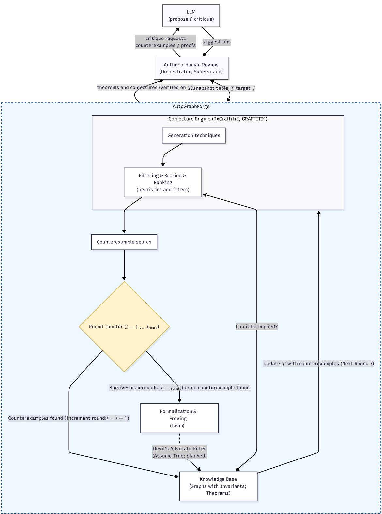

# AutoGraphForge: Towards Automated Graph Theory Discovery

Ján Pastorek<sup>1</sup>

<sup>1</sup>Department of Applied Informatics, Comenius University in Bratislava, Bratislava, Slovakia

## Abstract

We report on our ongoing project to develop a computational pipeline AutoGraphForge for an automated graphtheoretic conjecturing-refuting-formalizing-proving system. Generation of conjectures is counterexample-guided and runs in rounds: a Graffiti3 generator proposes conjectures over a small, evolving snapshot table � (initially a few hundred graphs with their computed invariants) that grows only by counterexamples to its own conjectures. A novelty filter of 559 classical and folklore relations, closed under transitive composition and linear identity substitution, decides via a linear program whether a candidate conjecture is already implied by known results. Then the conjecture is tested against a dataset of ∼ 348,000 graphs unioning the complete House of Graphs invariant export, the exhaustive census of all connected graphs on at most nine vertices, and several extrema graph families (strongly regular, minimal Ramsey, Cayley, cages, barbells, lollipops, spiders, etc.), augmented by graphs generated by random models (random-regular, �(�, �), random trees and random bipartite graphs). Then, counterexample-search algorithms attempt to find counterexamples to surviving conjectures. Run for several rounds on an HPC cluster, the loop yields 6,522 surviving conjectures that no graph in the refutation dataset, which were not flagged as known by the novelty filter, and no active-search run eliminated—among them nontrivial relations between the annihilation number and the edge-cover number for bipartite graphs and regular graphs which we were able to prove by hand. A subsequent formalization and proving stage deterministically translates each surviving conjecture into a Lean 4 statement skeleton; every candidate proof is kernel-verified against a pinned mathlib4 and our custom invariant preamble. The formalization-and-proving stage integrates two state-of-the-art neural provers—DeepSeek-Prover-V2-671B (served with vLLM) and the Lean-specialised OProver-32B—behind this independent kernel check. This stage is implemented end-to-end and passes initial sanity checks—the deterministic export yields type-correct Lean statements and the provers independently kernel-verify trivial inequalities—with the full pipeline currently running on the cluster.

## Keywords

automated conjecturing, automated theorem proving, Computer-assisted graph theory, counterexample search, artificial intelligence, high-performance computing

## 1. Introduction

Computer-assisted discovery of mathematical results and conjectures has a long history which is well documented in [1, 2]. With the advent of artificial intelligence and high-performance computing, it might be expected that the role of computers in mathematical discovery will increase. In fact, T. Tao [3] notes that new methods for computer assistance in mathematical research already include using machine learning to discover new relationships, searching for counterexamples, and using formal proof assistants to verify proofs. Moreover, as the same author notes, large language models such as ChatGPT can be used to assist in mathematical research, for example by searching through the known literature or suggesting proof strategies. A quite thorough entry point into this growing area is the proceedings of the June 2023 National Academies workshop on “AI to Assist Mathematical Reasoning” [4]; as one of its outcomes, Talia Ringer led the compilation of a community resource list on AI for mathematics, available and updated at https://docs.google.com/document/d/1kD7H4E28656ua8jOGZ934nbH2HcBLyxcRgFDduH5iQ0.

For the purpose of this paper, we divide computer-assistance in mathematical discovery based on the research stage computers assist: (i) conjecturing new statements based on a knowledge base, (ii) refuting them by searching for counterexamples or inconsistencies, (iii) formalizing them into a rigorous language, and ultimately (iv) proving them in a formal system.

Automated conjecturing in graph theory has a forty-year history, from Fajtlowicz’s Graffiti [5, 6, 7] and DeLaViña’s Graffiti.pc [8, 2] to the AutoGraphiX/GraPHedron programme of Aouchiche, Caporossi, Hansen, and Mélot [9, 10, 11] and, more recently, Davila’s TxGraffiti [12, 13] and The Optimist [14], Larson’s Dalmatian-based Conjecturing [15, 1] and Graffiti<sup>3</sup> [16], and the polyhedral PHOEG system [17]. These systems propose inequalities between graph invariants—� $\iota ( G ) \leq \nu ( G )$ $\chi ( G ) \leq \Delta ( G ) + 1$ , and so on—by fitting candidate bounds to a finite dataset of graphs and retaining and sorting only those that pass a set of filters and heuristics. Three distinct paradigms have emerged for searching the space of graph-theoretic inequalities. Algebraic expression trees, used by Graffiti and Conjecturing, build candidate conjectures as rooted trees of invariants combined by unary and binary operations (sums, products, square roots), and enumerate candidates by exhaustive or heuristic tree search. Linear and mixed-integer programming, used by TxGraffiti [12, 13], The Optimist [14], and Graffiti<sup>3</sup> [16], instead solves an optimisation model over a precomputed tabular dataset: by minimising the distance between a target invariant and a linear combination of others, the tightest possible bound is found without enumeration. The polyhedral/geometric approach of GraPHedron [11, 10], PHOEG [17, 18] and recently also Graffiti<sup>3</sup> [16] embeds each graph as a point in invariant space and reads of conjectures as facets of the resulting convex hull; this produces the complete set of optimal linear inequalities for those invariants and makes optimality a geometric certificate. Many resulting conjectures have become theorems; some have been refuted by hand or by machine search, see for instance [19, 1, 20].

Anyone who uses such a system quickly encounters five possible failure modes. First, a candidate can hold on every graph in a finite dataset yet be false in general: the dataset simply lacks the structure that breaks it. Second, the system can produce a candidate that is true but known, already recorded in the literature. Third, the system can produce a candidate that is true but trivial, resulting in an “avalanche of triviality”. Fourth is the monster conjecture [16]: a single conjecture that overfits the table by accumulating many terms and constants (producing unnecessarily complex bounds such as $\alpha \leq 0 . 3 1 \Delta + 0 . 4 2 \nu - 0 . 0 7 m + 1 . 8 )$ . Fifth, the system can “discover” a counterexample to a wellestablished conjecture, which almost always signals an error in an invariant routine. The first and the last failure modes are about trust: a generated inequality that “holds” and a verified “counterexample” are each only as reliable as the data and invariant computations behind them. The second and the third failure modes are about novelty: a candidate that is true but known, or true but trivial, is mathematically uninteresting and of little value to the practitioner. All of these failure modes are mitigated—though, as §4.2 shows for triviality, not yet eliminated—in our pipeline by the adversarial counterexample search, the novelty filter, and the selection heuristics.

To address the first and fourth failure modes—false bounds and overfitting—a robust refutation engine is required. Computational methods used for searching for (counter)examples of graphs have been recently summarised in a review article of Jorik Jooken [20]. Among others, the methods include exhaustive search with branch and bound, randomised search, and heuristic search. More recently, deep reinforcement learning has been applied to refute several conjectures [21].

As for the last two stages. A proof assistant such as Lean 4 [22] is a programming language in which mathematical statements and their proofs are written as formal objects; a small, trusted kernel then mechanically checks each proof, so a statement is accepted only if its proof is correct down to the axioms—there is no room for a hand-waved step. Lean is paired with mathlib4 [23], a large community library of already-formalized mathematics (definitions, lemmas, and the standard graphtheory vocabulary) that one builds on rather than re-deriving from scratch. Turning an informal, natural-language statement into such a formal Lean statement is called autoformalization [24]; finding its proof is the job of an automated theorem prover. Recent neural provers are large language models trained on formal proofs whose goal is to output a candidate Lean proof—either in one shot (whole-proof) or by iterating against the compiler’s error messages (an agentic loop)—which is then handed to the kernel for an independent check, so the model only proposes and the kernel disposes. There is a growing body of recent work on autoformalization and automated theorem proving especially in Lean, including for graph theory, see for instance [24, 25, 26, 27, 28, 29].

Although we recently found in [16] certain experiments in this direction, to the best of our knowledge there is no existing system that integrates automated conjecturing, refuting, formalizing, and proving in a closed loop for discovery in graph theory.

In this paper, we describe and report on the development of such a computational system AutoGraph-Forge that aims to combine (i)-(iv) in a pipeline. The first two stages are combined into a generate-refute loop, where conjectures are generated and then tested against a database of known theorems and (extremal) graphs with calculated invariants. Counterexamples to proposed candidate conjectures are being added to the dataset for future refinement of conjectures in rounds. The conjectures which survive this process are translated into a formal language Lean and then attempted to be proved using automated theorem provers.

## Our current contributions are:

1. We build the first version of the computational pipeline AutoGraphForge and run its generate– refute loop at scale on a high-performance computing cluster: a multi-round counterexampleguided loop partitioned into five full-node SLURM jobs, followed by a merge. The formalizationand-proving stage is implemented and integrated into the package (deterministic Lean export plus two state-of-the-art neural provers, DeepSeek-Prover-V2-671B served with vLLM and the Leanspecialised OProver-32B, with independent kernel verification against mathlib4); it passes initial sanity checks—the deterministic Lean export yields type-correct goals, and the prover independently kernel-verifies trivial inequalities —but it has not yet been run as a controlled evaluation over the surviving conjectures (§3.5).

2. We create a novelty filter of 559 classical, folklore, and trivial relations (§3.3)—spanning the chromatic, connectivity, matching/cover, domination, and zero-forcing families—closed under transitive composition of $f \leq g$ relations and under linear identity substitution. The filter also includes a linear-programming novelty test that decides whether a candidate inequality is implied by known relations.

3. We build a refutation dataset of 348,207 graphs (carrying up to 59 exactly-computed invariants), combining the complete House of Graphs (HoG) [30] export and many other extremal graph families, including the strongly-regular, minimal-Ramsey, Cayley, cage, cographs, minimally-rigid graphs, barbells, lollipops, spiders, etc., together with graphs generated from random models of regular, Erdős–Rényi, bipartite, and tree graphs.

4. We implement counterexample-search algorithms (§3.4.2) that include among others recent stateof-the-art methods such as probabilistic search using the cross-entropy method and Monte Carlo methods.

We note that our system is not built from scratch but is built upon existing packages, frameworks and methodologies present in the state-of-the-art literature on each of the three areas of conjecturing, refuting, formalizing and proving. In particular, the conjecture generation is built on top of TxGrafiti2 [12] and Grafiti3 [16]; the counterexample search algorithms are built upon recent state-of-the-art methods described in [20, 21]; and the formalization and proving layer is built upon recent autoformalization methods and automated theorem provers, specifically Lean 4 with mathlib4 as the target language and the DeepSeek-Prover-V2 [29] and OProver-32B [31] automated provers.

We are explicit that the loop is not yet closed: the first three stages run end-to-end at scale, and the proving stage is implemented and sanity-checked but not yet properly evaluated.

## 2. Preliminaries

All graphs in this paper are considered finite and simple. For a graph � we write $V ( G )$ for its vertex set, $E ( G )$ for its edge set, $n = | V ( G ) |$ for its order (number of vertices) and $m = | E ( G ) |$ for its size (number of edges). Our pipeline computes 59 invariants in total for all the graphs, therefore to improve readability, we define only those that appear in our arguments and we refer the reader to the GraphCalc documentation [32] for the exact definition of all 59 invariants. For the ones that do not appear in our main arguments but are mentioned, we use standard invariant symbols throughout the text: maximum and minimum degree $\Delta , \delta ,$ average degree $2 m / n ;$ ; independence number $\alpha ,$ matching number $\nu ,$ vertex-cover number $\tau ,$ clique number $\omega ,$ chromatic number $\chi ,$ domination number $\gamma ,$ and independent-domination number $i ;$ vertex- and edge-connectivity � and $\lambda ;$ radius rad, diameter diam, and triangle count tri; and the largest adjacency eigenvalue, or spectral radius, written $\rho$ (not to be confused with the edge-connectivity $\lambda )$ . On a regular graph $\rho$ equals the common degree, giving the identity $\Delta = \delta = 2 m / n = \rho .$ The clique-cover number—the minimum number of cliques covering $V ( G )$ , equivalently $\chi ( \overline { { G } } ) \mathrm { - i } s$ written $\overline { { \theta } }$ throughout.

Beyond these classical invariants, our runs range over a family of less standard invariants that will matter for the proving stage (§3.5), as they lie outside the provers’ training distribution. The zero-forcing number $Z ( G )$ [33] is the minimum size of a vertex set $S \subseteq V ( G )$ that colours all of $V ( G )$ under the colour-change rule: a coloured vertex with exactly one uncoloured neighbour forces that neighbour to become coloured, applied until no further forcing is possible. Its total analogue restricts the initial set $S$ to induce a subgraph with no isolated vertices, giving the total zero-forcing number.

We also use a handful of less common graph classes in hypothetical conjectures—among them cographs $( P _ { 4 } { \mathrm { - f r e e } } \ \mathrm { g r a p h s } )$ , split graphs (vertices can be partitioned into a clique and an independent set), and well-covered graphs (every maximal independent set has the same size).

## 3. The AutoGraphForge Architecture

## 3.1. System overview

At a high level, AutoGraphForge is a system (Figure 1) that couples generation of conjectures, selection heuristics, refutation search, and a formalization/proving layer, in the spirit of the proposed competing optimist/pessimist “GraphMind” architecture [14]. The knowledge base consists of the current snapshot table $T$ of graphs together with their computed invariants and the library of known theorems used by the novelty filter (§3.3). We treat the example and counterexample graphs as the rows of this table $T _ { : }$ whose numerical columns embed the graphs in $\mathbb { R } ^ { k }$ (where � is the number of invariants).

Candidate conjectures are generated based on �, filtered, scored and ranked, then aggressively tested by the refutation engine while every counterexample is inserted to $T$ for the next round of generation of candidates; only statements that survive multiple rounds advance to autoformalization, proving, and human review. The remaining sections detail each stage in turn: generation, filtering and sorting of conjectures (§3.2), refutation (§3.4), and formalization and proving (§3.5).

Validation of invariant calculation. We use GraphCalc [32] to calculate invariants and every value that is stored is its exact computation, or left empty if timed out. An independent networkx [34] list is registered purely as a cross-check, and a crossvalidate script compares the two on sample graphs — this is implemented as unit test before every run. Further, we verified computation of invariants of GraphCalc against the independently-computed HoG values on 2,500 graphs: for every shared invariant $( \chi , \alpha , \omega , \gamma , \nu , \Delta , \delta , \kappa , \lambda ,$ diam, tri, and the booleans) there were zero mismatches.

## 3.2. Conjecture generation as theory selection

AutoGraphForge takes TxGraffiti2 [12] and Graffiti3 [16] as its foundation. The canonical representation of a conjecture is TxGrafiti2’s own Conjecture object, and every subsequent component described in the next subsections—the implication-deciding novelty filter, the selection heuristics, and the refutation engine—is built to take these native objects directly.

Here we give a concise overview of the conjecture generation and selection process, which is described in detail in [12, 16]. A linear grammar of conjectures consists of halfspaces $\textstyle \sum _ { i } a _ { i } f _ { i } ( G ) \leq c$ (with $a _ { i } , c \in \mathbb { R } )$ that must hold for every row of the current snapshot $T .$ . The convex hull of the cloud makes the core dificulty geometric: there are infinitely many inequalities true on the current snapshot $T$ (any halfspace whose boundary lies above the hull), but only the facets—tight on at least one extremal object—carry information, and no single inequality is “the best.”

  
Figure 1: The complete AutoGraphForge pipeline. The orchestrator loop (LLM and Human) interacts with the AutoGraphForge and conjecture engine. Surviving conjectures enter a refutation loop managed by a round counter $( l = 1 \ldots L _ { \mathrm { m a x } } )$ , eventually proceeding to the formalization-and-proving stage if they survive $L _ { \mathrm { m a x } }$ rounds. Conjectures are generated, immediately filtered and sorted with heuristics, and then aggressively tested by the counterexample searches (datasets with precomputed invariants and counterexample search algorithms). Only conjectures surviving multiple rounds of refutation are passed to the deterministic Lean export and the kernel-checked neural provers (§3.5; found counterexamples are inserted into the knowledge base. The dashed line is the planned Devil’s Advocate filter (future work; see the Conclusion), where surviving conjectures would be assumed true to constrain future generation of candidate conjectures.

We build upon TxGrafiti2’s native generators and its implementation of the Dalmatian dominance filter further specified in [12, 16]. Invariants are supplied by GraphCalc (§3.4.1). In the runs reported here the generator is Graffiti3 [16] (the conjecturing engine of the TxGrafiti package) which additionally can generate ratio, product, square roots and log bounds. Beyond numeric inequalities, the engine operates in a boolean mode using the Sophie heuristic. Formally, let $\mathcal { P } = \{ P _ { 1 } , P _ { 2 } , . . . , P _ { m } \}$ be a dictionary of computable boolean predicates on graphs $( \mathrm { e . g . }$ , regularity, planarity, claw-freeness, chordality, 3-connectivity, vertex transitivity). Given a target property �, Sophie shifts from producing a numeric bound to generating suficient conditions by searching the space of conjunctions $H = \Lambda _ { i \in Q } P _ { i }$ (where $Q \subset \{ 1 , \ldots , m \}$ and $k = | Q | \geq 1 )$ for statements of the form $H \implies I .$ . A candidate is retained if $H ( G ) \implies I ( G )$ holds for all graphs � in the dataset. Moreover, the system can also search for necessary conditions. This is all generated on current snapshot � and its computed 59-invariants.

Generation of conjectures begins from expressive graphs (a curated default set that together with all 59-invariants computed that forms the initial snapshot �) available in TxGrafiti package and grows only by counterexamples.

## 3.3. Sorting candidates and novelty filtering

Without aggressive filtering, conjecture systems sufer a “combinatorial explosion,” generating thousands of trivial or redundant statements. Therefore, it is required that the system assert only the tightest bound for which no counterexample is known; this is the formal basis of the Dalmatian dominance filter and the polyhedral facet approach alike. Graffiti3 [16] filters and sorts candidate bounds by applying three primary sorting heuristics originating from the Graffiti lineage: the Dalmatian, Morgan, and Touch heuristics. The Dalmatian heuristic (dominance), due to Fajtlowicz and revisited by Larson and Van Cleemput [5, 15], discards a candidate whenever some accepted conjecture is never weaker and sometimes strictly tighter. The Morgan heuristic drops a bound that is asserted on a smaller, restricted graph class when the exact same bound also holds on a broader superclass containing it. Finally, the Touch heuristic ranks candidates by the number of times they are sharp (or tight) on the dataset graphs. Conjectures with a higher touch count more closely trace the extremal boundary of the dataset and are highly prioritized. These three classical heuristics act as the primary filters used throughout our pipeline.

Discovering a candidate inequality is only part of the task: the system must also decide whether the inequality is genuinely new or merely a combination of already-known relations. We propose the following for linear candidate inequalities.

Suppose the system generates a candidate inequality

$$
f \leq R ( g ) ,
$$

where � is a target invariant (for example, the independence number) and $\begin{array} { r } { R ( g ) : = \sum _ { i } ^ { n } c _ { i } g _ { i } + c _ { 0 } } \end{array}$ is a linear combination of other invariants $g _ { i } .$ , with $c _ { i } , c _ { 0 } \in \mathbb { R }$ and $g : = ( g _ { 1 } , g _ { 2 } , \dotsc . . . , g _ { n } )$ . Before accepting it, the system tests it against a knowledge base which contains known theorems that bound the same target invariant $( f \leq B _ { 1 } ( g ) , f \leq B _ { 2 } ( g )$ , and so on, where each $B _ { j } ( g )$ is a known linear bound on �). $f )$ Crucially, to preserve soundness, the system only admits a bound $B _ { j } ( g )$ into the aggregate if it is valid over the candidate conjecture’s entire hypothesis class (or a superclass of it).

The candidate is declared known (redundant) if it is implied by a convex combination of these theorems. Assigning a non-negative weight $w _ { j }$ to each $B _ { j } ( g )$ with $\textstyle \sum _ { j } w _ { j } = 1$ yields the aggregate bound $\begin{array} { r } { f \le \sum _ { i } w _ { j } B _ { j } ( g ) } \end{array}$ . If this aggregate is at least as tight as $R ( g )$ , the candidate is redundant; equivalently, the diference between the candidate and the aggregate is non-negative everywhere:

$$
R ( g ) - \sum _ { j } w _ { j } B _ { j } ( g ) \geq 0 .
$$

## The non-negativity certificate

To certify that this diference is non-negative, we express it identically as a sum of terms that are individually non-negative. We seek weights $w _ { j } \geq 0 _ { : }$ , non-negative slack variables $s _ { i } , t \geq 0 _ { : }$ , and free multipliers $\mu _ { k } \in \mathbb { R }$ such that the following identity holds for all $g \colon$

$$
R ( g ) - \sum _ { j } w _ { j } B _ { j } ( g ) = \sum _ { i } s _ { i } ( g _ { i } - L _ { i } ) + \sum _ { k } \mu _ { k } E _ { k } ( g ) + t .
$$

The right-hand side is composed of terms each guaranteed to be non-negative:

• Safe lower bounds $s _ { i } ( g _ { i } - L _ { i } )$ : every invariant $g _ { i }$ has a known lower bound $L _ { i }$ , so $\left( g _ { i } - L _ { i } \right) \geq 0 ;$ multiplying by a non-negative multiplier $s _ { i }$ preserves non-negativity. As with the tabulated theorems, each bound $g _ { i } \geq L _ { i }$ is admitted only if it holds unconditionally over the candidate’s entire hypothesis class (or a superclass of it); global bounds valid on all graphs are admissible for every candidate.

• Class identities $\mu _ { k } E _ { k } ( g )$ : linear structural relations $E _ { k } ( g ) = 0$ that hold identically on a graph class $P _ { k }$ , so multiplying by any free multiplier $\mu _ { k }$ does not afect non-negativity. ${ \mathrm { C r u c i a l l y } } ,$ soundness requires that $E _ { k }$ strictly vanish on the whole domain the candidate is quantified over, so each identity is similarly restricted by graph class: it is admitted only when the candidate’s hypothesis class is $P _ { k }$ or a subclass of it. For candidate conjectures with no hypothesis class restriction, only universal identities (those with $P _ { k } =$ all graphs, e.g. Gallai’s $n = \alpha + \tau )$ are available.

<sup>•</sup> Constant slack �: a non-negative scalar absorbing the residual constant.

Because the invariants $g _ { i }$ are treated as independent symbolic variables, matching the coeficient of each $g _ { i }$ on both sides reduces the problem to a system of linear equations. Verifying redundancy therefore reduces to a linear-programming (LP) feasibility test: if the solver finds weights and slacks satisfying the identity, the candidate is provably a structural consequence of the tabled theorems and is flagged as a known rediscovery—excluded from the set of novel survivors, but stored, so it can serve as a soundness check (the 33 flagged rediscoveries of §4.1).

We inserted into the novelty filter a list of known relations, including classical theorems, folklore, and trivial bounds from standard books and literature in graph theory. Together the list holds 559 entries after closing the simple $f \leq g$ relations under transitivity. For instance the following are captured in the list: Whitney’s connectivity chain $\kappa \leq \lambda \leq \delta [ 3 5 ]$ (all graphs), König’s $\nu = \tau \left[ 3 6 \right]$ (bipartite), and Gallai’s $n = \alpha + \tau \ [ 3 7 ]$ (all graphs)—each applied only on the class where it holds. The LP part correctly hides, for example, $\begin{array} { r } { \kappa \leq \frac { 1 } { 2 } \delta + \frac { 1 } { 2 } \lambda } \end{array}$

The same LP-implication test decides conjectures in both directions of an implication, not only single upper bounds. An equality $f = g$ (under a hypothesis �) is flagged known when both $f \leq g$ and $f \geq g$ are implied by the table—i.e. the bound is simultaneously necessary and suficient (e.g. the Allan–Laskar theorem: claw-free $\Rightarrow \gamma = i [ 3 8 ] )$ . Sophie necessary conditions are handled by contraposition. Such a condition has the form $A \Rightarrow \neg C$ , where � is a numeric predicate and � a graph class. It is flagged known whenever the contrapositive $C \Rightarrow \neg A$ appears in the table. For instance (� > 2) ⇒ ¬bipartite is recognised as the contrapositive of the known bound bipartite $\Rightarrow \chi \leq 2$ . Class inclusions (tree ⊂ bipartite, cubic $\subset \mathrm { r e g u l a r , } . . . \rangle$ are applied throughout, so a subclass inherits every bound proved for its superclasses. In the suficient direction, a Sophie condition $A \Rightarrow C$ with a positive class conclusion is flagged known only against a hand-curated table of textbook characterizations (e.g. $2 m / n = \Delta \Rightarrow$ regular, or $a ( G ) > 0 \Rightarrow$ connected by Fiedler); crucially these cannot be data-mined, since a rare invariant equality can agree with a class on every test graph by coincidence without being a theorem, so only genuine characterizations are admitted and all other $A \Rightarrow C$ candidates are conservatively left novel.

## 3.4. Counterexample search and refutation

Every candidate conjecture that survives novelty and selection advances to this stage. Because there are infinitely many non-isomorphic finite graphs and the current snapshot $T$ is only a partial view, “true on the table” is a statement about present evidence, not a generalisation claim. Therefore, the system that tries to find robust conjectures must actively search for counterexamples. There are several approaches to automated refutation. For a review see [20]. Recently, deep reinforcement learning [21] has been applied for counterexample search, building counterexample graphs edge by edge guided by the conjecture’s violation margin.

In our pipeline, we first check the candidate against the static dataset of 348,207 graphs (§3.4.1). Then, if no counterexample is found there, the conjecture is tested on some parametric families and graphs generated from random graph models. If the candidate survives, counterexamples are sought by specialised search algorithms (§3.4.2). When at any point counterexample is found, the counterexample is inserted into the snapshot �, changing the feasible space of all subsequent conjectures in the next round. If no counterexample is found, the conjecture gets to the formalization and proving layer (§3.5).

## 3.4.1. Datasets of potential counterexamples

The conjecture engine generates candidates over a small snapshot $T$ (a few hundred graphs initially; §4.1), but the refutation engine tests them against a much larger dataset. We combine several sources. The HoG export [39, 30] provides 28,859 graphs with ∼28 pre-computed invariants each (treewidth, feedback-vertex-set number, spectral data, vertex cover, girth, . . . ), parsed directly so that nothing is recomputed; values marked undefined, infinity, or Computation time out are treated as missing. The dataset also contains every connected graph on $2 \leq n \leq 9$ vertices (273,192 graphs) through an exact invariant list and a set of computed graph-class flags (triangle-free, cubic, claw-free, cograph, split, outerplanar, self-complementary, Hamiltonian, well-covered). We also used the HoG meta-directory to collect cograph, minimal-Cayley, cage, minimal-Ramsey, strongly-regular (Spence), and minimally-rigid graph families. The union contains 348,207 graphs (28,859 from HoG, 273,192 from the connected census on $2 \leq n \leq 9$ , and 46,156 from the special families obtained from HoG meta-directory).

The dataset contains 59 computed invariant columns. These 59 split into 45 numeric invariants $( \alpha , \nu , \chi , \gamma , \dots )$ and 14 boolean graph-class predicates (triangle-free, claw-free, cubic, cograph, split, Hamiltonian, . . . ). Only the 45 numeric invariants serve as the left-hand-side targets of generated inequalities (hence the $^ { 6 } 4 5$ numeric targets” of §4.1), while the 14 booleans—together with two derived order thresholds $( n \geq 3$ and $n \geq 4 )$ that the battery adds precisely so that bounds failing only on the smallest graphs become true class-restricted statements—give the 16 predicates available to Sophie as hypotheses and class conditions, not as numeric targets. This static dataset is one refutation resource. Then, there are two further datasets on which the conjecture is tested computed from parametric families (barbells, lollipops, spiders, �-trees, line graphs, Delaunay graphs, $\alpha = 2$ complements, . . . ). A finite dataset usually does not certify a universally-quantified statement. Thus if it makes sense to do so, the pipeline tests candidates on random graph models (random-regular, Erdős–Rényi $G ( n , p )$ random trees, and random bipartite graphs, several per (class, order)), so that refutation probes the average behavior corresponding to these graph classes. We note that these datasets of graphs are used exclusively for refutation and note that conjecture generation never runs over the full dataset. Instead generation of conjectures always operates on a small initial snapshot �—the 337 TxGrafiti expressive graphs, a few hundred—that grows only by counterexamples and persists across runs: by the time the experiments of §4.1 begin, $T$ has already grown, over earlier development runs predating this report, to 2,860 graphs (§4.1 makes this pre-run growth explicit before reporting the experiments proper), described in §3.2. Generating over the whole dataset would be computationally prohibitive and, more importantly, a small counterexample-hardened core sufices to drive generation.

## 3.4.2. Counterexample-search algorithms

For conjectures whose counterexamples lie outside our fixed datasets, constructions and graphs generated by random models, the system provides counterexample-search algorithms, all sharing a single margin interface. The margin of a graph � against a candidate measures how badly � violates it: for an inequality conjecture $f ( G ) \leq R ( g ) ( G )$ it is the amount of violation

$$
\mathrm { m a r g i n } ( G ) = f ( G ) - R ( g ) ( G ) ,
$$

and for a Sophie suficient-condition $H \Rightarrow I$ it is positive exactly on a graph that satisfies the hypothesis � but fails the consequent �. Thus $\operatorname* { m a r g i n } ( G ) > 0 \iff G$ refutes the candidate, and a larger margin means a more decisive counterexample, so every backend below is simply a diferent way of maximising the margin over graphs. The backends are:

• SMT (satisfiability-modulo-theories) encoding (z3): This method translates the search for a counterexample into a logical formula for specialized solver. Graph structure is encoded as Boolean edge variables; invariant constraints (�-colorability, independence set size, etc.) are expressed as pseudo-Boolean formulae and dispatched to a Z3 [40] solver.

<sup>•</sup> Linear cross-entropy (cross\_entropy): Intuitively, this algorithm maintains a probabilistic generative model of a graph, samples candidate graphs, and updates the model parameters to maximize the likelihood of the highest-performing candidates. It is a gradient-free distribution search [21]: a per-edge inclusion probability matrix is sampled in batches, the elite fraction of graphs with the largest margin is retained, and the edge probabilities are nudged towards the elite frequencies.

<sup>•</sup> Variable-neighbourhood search (vns): This procedure attempts to improve the objective via local edge modifications, applying increasingly larger stochastic perturbations to escape local optima when the ascent stagnates. It alternates between a �-edge flip “shake” move and a greedy 1-edge local ascent; if the resulting graph improves the conjecture’s margin, the neighbourhood size resets to $k = 1$ , otherwise � increments.

<sup>•</sup> Monte-Carlo tree search (mcts): The technique builds a decision tree of possible edge modifications, carefully balancing the exploration of untested graph structures against the exploitation of known promising pathways. We use an Upper-Confidence-Bound bandit search over edge addition and deletion actions, with leaf values estimated by random edge-flip rollouts that return the maximum margin observed.

<sup>•</sup> Simulated annealing (sa): Inspired by metallurgical annealing, the search frequently accepts non-improving edge modifications in the early stages to broadly explore the search space, but becomes increasingly strict over time to hone in on a solution. It performs classical simulated annealing over local edge modifications under a linear cooling.

• Deep reinforcement learning (rlgt-RL): This method models the search as a Markov decision process where an artificial neural network policy is trained to maximize a reward signal based on the conjecture’s violation margin. Implemented via the RLGT framework [41] (building on [21]), it trains a neural edge-selection policy (using Deep Cross-Entropy) guided by the reward which is higher if the graph is closer to refuting the conjecture and lower otherwise.

More comprehensive reviews of these methods are in [20, 21]. In our pipeline, the backends above can be initialised randomly from scratch or seeded from another graph.

## 3.5. Formalization and proving

Surviving conjectures that pass refutation are handed to the formalization and proving layer. This stage is implemented and wired into the package, but—unlike the generate–refute loop—it has not yet been fully run over the surviving conjectures; so far it has only undergone initial sanity checks on trivial conjectures, which it passed (below). We describe our progress and the planned evaluation.

```scala
theorem CEGIS_1 {V : Type*} [Fintype V] [DecidableEq V]
(G : SimpleGraph V) [DecidableRel G.Adj] (_h0 : G.IsNontrivialClass)
: (G.zeroForcingNumber : R) ≤ (G.totalZeroForcingNumber : R) := sorry
```

Because a TxGrafiti conjecture is already a formalized object—a relation between named invariants under a conjunction of graph-class predicates—translating it to Lean 4 [22] is a deterministic translation (pipeline/lean\_export.py). Each invariant column maps to its Lean name (e.g. zero\_forcing\_number ↦→ G.zeroForcingNumber), each class predicate to a preamble hypothesis (nontrivial ↦→ G.IsNontrivialClass), and the relation symbol to itself; binders are injected and both sides are cast to R. The resulting statement is faithful by construction—the only trust assumption is that the preamble definitions match the intended invariants—and any conjecture using an invariant or class outside the formalized tables is skipped. For example, (nontrivial) ⇒ zero\_forcing\_number ≤ total\_zero\_forcing\_number is translated mechanically as

The output is a sorry-terminated skeleton that the Lean kernel elaborates to a type-correct goal, not a certified proof. For proving we integrate two state-of-the-art open-weight neural provers: DeepSeek-Prover-V2-671B, served with vLLM [42] in tensor-parallel across eight H200 GPUs, and the Leanspecialised OProver-32B [31] (a Qwen3-based whole-proof prover, state-of-the-art on MiniF2F among open-weight provers), each usable in single-shot whole-proof mode and in a multi-round agentic mode which has feedback from compiler. Soundness is enforced independently of the models: every candidate proof is kernel-checked against the mathlib4 [23] library and our GraphInvariants preamble and each proof that passes is persisted as a self-contained .lean file and re-verified by a standalone kernel pass, so any count we eventually report will be reproducible from these files.

Two preliminary checks confirm that the stage’s components function end-to-end, short of a full evaluation. First, the deterministic export is faithful and type-correct: the supported survivors translate to Lean 4 goals that the kernel accepts modulo a sorry placeholder, so the obstacle to closing the loop is proof search, not statement elaboration. Faithfulness here is by construction (above), but it rests on the preamble definitions being correct; the author therefore manually checked the formalized invariant definitions and a sample of the rendered goals, confirming they encode the intended conjecture.

The proof stage is also ready. OProver-32B model produced proofs of two trivial inequalities over standard mathlib invariants— $\cdot \delta \leq \Delta$ (minimum degree at most maximum degree) and $\omega \leq n$ (clique number at most order)—that pass the independent kernel check and were persisted and re-verified as self-contained .lean files. These are deliberately trivial and they establish that the deterministic export, the prover interface, and the verification can be integrated together.

We expect proving to be the hardest stage. One likely reason is that many surviving conjectures rely on graph invariants such as zero-forcing are defined only in our preamble and absent from the datasets these provers were trained on.

## 4. Discovery in graph theory

We now report on the iterative process of the pipeline and its preliminary outcomes.

## 4.1. Iterative run dynamics on the cluster

The snapshot � persists across all development and reported runs, so it is not the bootstrap 337 TxGrafiti expressive graphs by the time we report numbers below—it already carries witnesses accumulated over earlier runs. To establish a baseline, we first ran a single-pass generation (one generate–refute round) from an intermediate snapshot of 1,554 graphs (337 expressive plus 1,225 witnesses accumulated by that point, unioned and deduplicated); it yielded 3,959 candidates, of which 1,249 were refuted. The datasets dominated the rejections (865 by the extremal families, 217 by graphs generated from the random models, and 161 by the House of Graphs dataset). The rest were refuted by counterexample search algorithms. This validates the strategy of testing against fast, parametrised datasets before resorting to expensive counterexample search.

Building on this baseline, we ran AutoGraphForge as five independent partitions, each on a full 256- core CPU node, that together partition the 45 numeric target invariants; the partitioning scheme, cluster hardware, and the 1.22 CPU-year budget are detailed in Appendix A. By this point further development runs had grown the persisted witness set further, so each partition started from a common snapshot � of 2,860 graphs (the same 337 TxGrafiti expressive graphs plus 2,531 accumulated witnesses, unioned and deduplicated) and ran the generate–refute loop until no new counterexamples were found. In short, � grew $3 3 7  1 , 5 5 4  2 , 8 6 0$ across these successive runs, before the round-by-round growth reported in Table 1 below, which summarises all five partitions, labelling each by the span of its nine invariant targets.

## Table 1

Per-partition iterative dynamics (all five partitions). The snapshot � is the small evolving set of graphs that conjecture generation runs over (not the full 348,207-graph refutation dataset); all partitions start from a common snapshot � of 2,860 graphs and grow it only by witnesses. Columns R1–R4 and $\stackrel { \scriptscriptstyle 6 6 } { \geq } 5 \stackrel { \scriptscriptstyle 7 3 } { \geq }$ give the new counterexamples added back into the snapshot � in each round (only partition 1 ran past round 4); “Total” is their sum, so the final size of � is 2,860 + Total. A round adding zero witnesses is a fixed point. “Surv.” is the partition’s final survivor count; the five sum to the 8,281 raw survivors. The merge step (§4.1) reduces these to 6,522 in two stages: 1,413 are refuted by witnesses found in another partition—each partition grows its own hard seed and never sees the others’, so a graph that kills a candidate may sit in the wrong shard—and a further 346 are cross-partition duplicates.
<table><tr><td>Partition (each consisting of 9 targets)</td><td>Rds</td><td>R1</td><td>R2</td><td>R3</td><td>R4</td><td>≥5</td><td>Total</td><td>Surv.</td></tr><tr><td>0 (algebraic connectivity – diameter)</td><td>5</td><td>793</td><td>164</td><td>21</td><td>12</td><td>0</td><td>990</td><td>1,762</td></tr><tr><td>1 (domination number – maximum degree)</td><td>9</td><td>499</td><td>56</td><td>11</td><td>24</td><td>25</td><td>615</td><td>1,438</td></tr><tr><td>2 (min. maximal matching – residue)</td><td>5</td><td>494</td><td>39</td><td>9</td><td>1</td><td>0</td><td>543</td><td>1,815</td></tr><tr><td>3 (Roman domination - total domination)</td><td>5</td><td>562</td><td>66</td><td>11</td><td>6</td><td>0</td><td>645</td><td>1,345</td></tr><tr><td>4 (total zero forcing – zero forcing)</td><td>5</td><td>580</td><td>48</td><td>3</td><td>1</td><td>0</td><td>632</td><td>1,921</td></tr></table>

Three patterns are robust across partitions. (i) The first round alone contributes ∼ 500–790 new witnesses (a ∼ 20–28% expansion of �), after which the per-round yield falls sharply and trends toward zero—∼ 40–160 in round 2 and ∼ 3–20 in round 3 (Table 1). The decline is not strictly monotone, however: partition 1 rebounds in its later rounds (11 witnesses in round 3, then 24 in round 4 and 25 in later rounds) as a delayed cluster of counterexamples surfaces for its domination/degree targets, before it too reaches a fixed point—a round that adds zero witnesses, at which the snapshot � stops growing and the loop terminates—at round 9; the other four partitions terminate at round 5. (ii) In this run, counterexample witnesses are dominated by the dataset; the counterexample search algorithms are surprisingly a minor contributor. The entire set of algorithms (z3 / cross-entropy / VNS / SA / MCTS / RL) accounts for only 1–22 counterexamples per round. We note this is a single-run observation over stochastic searchers run at default hyperparameters (configurations are in the public repository), so it should not be read as a general verdict on the methods; a possible reason is precisely that we did not optimize their hyperparameters, and we plan to investigate this further.

Merging the five partitions’ output conjectures (8,281 in total) and removing duplicate statements yields 6,522 survivors. The class-conditioned inequalities are disjoint across partitions (each partition owns distinct target invariants on the left-hand side), but the Sophie suficient-conditions are not: their consequent or antecedent is a target-independent boolean property, so diferent partitions might re-derive the same condition, and removing duplicates eliminates 346 such cross-partition repeats. The survivors split into 2,677 class-conditioned inequalities and 3,845 Sophie conditions. Essentially none of the surviving novel candidates is an unconditioned inequality: the unconditioned bounds our generator proposed were either eliminated by disconnected graphs in the refutation dataset (which break bounds that tacitly assume connectivity) or recognised as known, leaving the survivors in their class-conditioned forms. This is not a claim that unconditioned inequalities cannot hold in general— $- \Delta \ge \delta _ { \pm }$ for instance, holds for every graph—only that, in this run, the surviving novel candidates were class-conditioned. The novelty filter flags 33 survivors as rediscoveries of classical results—among them Gallai’s identity $\tau = n - \alpha$ , the bound rad $\leq \alpha$ (conjectured by Graffiti and proved by Erdős, Saks, and Sós [43]), the König–Egerváry theorem $\nu = \tau _ { \mathrm { { ; } } }$ , the perfect-graph identity $\alpha = { \overline { { \theta } } } _ { : }$ , and fundamental inequalities such as $\nu \leq \tau \leq 2 \nu , \nu \leq n / 2 .$ , and $\gamma \leq i ( G )$ —each recovered independently on the chordal, cograph, and bipartite classes. We read these rediscoveries as a soundness check: the pipeline recovers known theorems and correctly does not flag them as novel. We note that they are expected—the generator recombines invariants, so producing known relations is the design working, not a discovery—and therefore evidence correctness, not discovery capability; the genuine test is whether the novel survivors are meaningful, which we begin to examine in §4.2.

## 4.2. Exemplary machine-generated discoveries

To probe whether the surviving conjectures are tractable and meaningful rather than syntactic noise, we hand-examined the simplest “novel”-flagged inequalities with the highest touch numbers. We manually checked the top 100 survivors by touch number. Many “novel”-flagged survivors that we checked are, despite the heuristics and novelty filter, dominated by true-but-trivial bounds and by definitional artefacts—such as the Sophie condition (radius $\leq k ) \Rightarrow$ connected for $k \geq 1$ , whose hypothesis is only defined on connected graphs—that our novelty filter does not yet recognise.

To replace that impression with a count, we classified all 100 inspected survivors automatically (tools/audit\_sample.py); the categories are computed from the pipeline’s own novelty table, subsumption lattice and support statistics rather than assigned by hand, so the classification is reproducible from the released artefacts (Table 2). Just over half are triage successes in the pessimistic sense: 49 are rediscoveries the novelty filter recognises, 2 are logically implied by a stronger survivor already in the list, and 1 is decorative—its class hypothesis is satisfied frame-wide and so does no work. The remaining 48 are not known to us to be either trivial or false. We deliberately do not report a “probably false” category: every item here survived refutation against the full 348,207-graph refutation dataset, so the pipeline has no evidence of falsity for any of them, and asserting one would be an unsupported guess.

## Table 2

Automatic classification of the 100 highest-touch survivors.

<table><tr><td>Category</td><td>Count</td></tr><tr><td>Rediscovery recognised by the novelty filter</td><td>49</td></tr><tr><td rowspan="4">Subsumed by a stronger survivor Decorative hypothesis (class does no work) Promising, universal (no class hypothesis)</td><td>2</td></tr><tr><td>1</td></tr><tr><td>28</td></tr><tr><td>20</td></tr><tr><td>Total</td><td>100</td></tr></table>

However, we also found some conjectures that are nontrivial, true, and provable by a short argument relating the annihilation number $a ( G )$ (the largest � such that the � smallest degrees sum to at most �) and the edge-cover number, the minimum number of edges covering $V ( G )$ , which we write ec(�) to avoid clashing with the spectral radius $\rho .$ Two class-conditioned survivors form a complementary pair— the bound flips direction between the bipartite class (rank 91 by touch, touch 922) and the regular class (rank 177, touch 589). Ranks are among the 2,677 survivors that carry a recomputed, hypothesis-aware touch count; the cubic specialisation (rank 453, touch 233) is now flagged as subsumed by the regular form, since cubic⊂regular:

$$
G { \mathrm { i s ~ b i p a r t i t e } } \Rightarrow \operatorname { e c } ( G ) \leq a ( G ) ,
$$

$$
G { \mathrm { ~ i s ~ c u b i c ~ ( m o r e ~ g e n e r a l l y ~ r e g u l a r ) } } \Rightarrow a ( G ) \leq \operatorname { e c } ( G ) .\tag{1}
$$

(2)

Neither is in our novelty table, yet both are provable by combining classical results. Neither of these is a deep new theorem. Nevertheless, they show the pipeline works—it can produce true, refutationhardened statements that reduce to a short, human-checkable argument rather than to noise.

Proofof (1). Assume � has no isolated vertices. Gallai’s identities give $\alpha + \tau = n$ and $\nu + \mathrm { e c } = n$ , so $\operatorname { e c } = n - \nu ;$ Kőnig’s theorem on bipartite graphs gives $\nu = \tau _ { \mathrm { { ; } } }$ , whence $\operatorname { e c } = n - \tau = \alpha$ . Pepper’s bound $\alpha ( G ) \leq a ( G )$ (introduced in his 2004 dissertation [44]; see also [45]) then yields e $\gimel ( G ) = \alpha ( G ) \leq a ( G )$ (For a general graph $\nu \leq \tau$ gives only $\operatorname { e c } \geq \alpha .$ , so bipartiteness is essential to the equality $\operatorname { e c } = \alpha$ and hence to the bound.) □

Proofof (2). Let � be �-regular on � vertices, so $m = r n / 2$ . The � smallest degrees sum to ��, and $r k \leq r n / 2 \iff k \leq n / 2$ , so $a ( G ) = \lfloor n / 2 \rfloor$ . Since a matching covers two vertices per edge, $\nu ( G ) \leq n / 2$ , and Gallai gives ec $( G ) = n - \nu ( G ) \geq n / 2 \geq a ( G )$ . Equality $a ( G ) = \operatorname { e c } ( G )$ holds exactly when $\nu ( G ) = n / 2$ , i.e. when � has a perfect matching—so for bridgeless cubic graphs the bound is tight (by Petersen’s theorem), while a cubic graph without a perfect matching satisfies it strictly. <sup>□</sup>

## 5. Discussion and future work

Further analysis of the 6,522 surviving conjectures is left as a future work. We want to include more known results in the novelty filter to get this number of conjectures to an even more manageable number.

The main open task—and our current work—is closing the loop. The decisive gap is proving: the formalization-and-proving stage is implemented and integrated (§3.5) but has not yet been run on the candidate conjectures. Our immediate next step is to run proof search over the surviving conjectures translated to Lean—together with a preamble-specific lemma library to ground the provers on the custom invariants, which we anticipate to be the main obstacle to closing the conjecture-proof loop because the provers we use were not trained on these invariants but on other parts of mathematics.

Mathematicians frequently also engage in hypothetical reasoning, they assume a conjecture is true and explore its consequences. For this reason, we also want to experiment with a Devil’s Advocate filter that would assume true the conjectures that survived the generate–refute and autoformalization and proving loops, and attempt to add them to knowledge base. We have portrayed this with semi-colon arrow in the pipeline diagram in Figure 1 but have not yet implemented it.

Additionally, we want to explore the use of large language models as a conjecture critic that would evaluate the plausibility of a candidate conjecture and provide feedback to the generator. This could help in prioritizing which conjectures to pursue further, especially when dealing with a large number of candidates. In fact, LLMs might be beneficial in the whole pipeline, not only as a critic but also as a generators and provers. [16] has recently explored the use of LLMs in proposing new invariants. We want to keep exploring the use of LLMs in all stages of the pipeline.

## Acknowledgments

I thank Samuel Varchol and Vladimír Jančár for valuable discussions on techniques of counterexample search whose theses inspired that part of the work. I also thank anonymous reviewers for helpful suggestions and comments.

This work was supported by the use of computational resources of the supercomputer PERUN, operated by the Supercomputing Centre at the Technical University of Košice (TUKE), Slovakia with the support of the European Union from the funds of the Recovery and Resilience Plan of the Slovak Republic within the framework of project No. 17I03-04-P03-00001, Development and design of a supercomputer for the National Supercomputing Center.

## Declaration on Generative AI

During the preparation of this work, the author used a large language model as a coding and experimentation assistant to implement the pipeline, run the experiments, and help with the draft of the manuscript. All computational results were verified against authoritative data sources – House of

Graphs and exact recomputation of GraphCalc; the author reviewed and edited all content and takes full responsibility for the publication’s content.

## Code availability

All code and its documentation, data, logs, and databases are available and being developed at https: //github.com/JanPastorek/AutoGraphForge.

## References

[1] C. E. Larson, N. V. Cleemput, Automated conjecturing I: Fajtlowicz’s Dalmatian heuristic revisited (extended abstract), in: Proceedings of the Twenty-Sixth International Joint Conference on Artificial Intelligence (IJCAI-17), 2017.

[2] E. DeLaVina, Some history of the development of Grafiti, in: Graphs and Discovery, volume 69 of DIMACS: Series in Discrete Mathematics and Theoretical Computer Science, American Mathematical Society, 2005, pp. 81–118.

[3] T. Tao, Machine-assisted proof, Notices of the American Mathematical Society 72 (2025) 6–13.

[4] S. Koretsky (Ed.), Artificial Intelligence to Assist Mathematical Reasoning: Proceedings of a Workshop, National Academies Press, Washington, DC, 2023. doi:10.17226/27241.

[5] S. Fajtlowicz, On conjectures of Grafiti, Discrete Mathematics 72 (1988) 113–118.

[6] Wikipedia contributors, Grafiti (program) — Wikipedia, the free encyclopedia, https://en.wikipedia. org/wiki/Grafiti\_(program), 2026.

[7] C. E. Larson, Intelligent machinery and mathematical discovery, Graph Theory Notes of New York XLII (2002) 8–17.

[8] E. DeLaVina, Grafiti.pc: A variant of Grafiti, Graph Theory Notes of New York XLII (2002) 26–30.

[9] M. Aouchiche, P. Hansen, D. Stevanović, Variable neighborhood search for extremal graphs. 17. further conjectures and results about the index, Discussiones Mathematicae Graph Theory 29 (2009) 15–37.

[10] G. Caporossi, P. Hansen, Variable neighborhood search for extremal graphs. V. three ways to automate finding conjectures, Discrete Mathematics 276 (2004) 81–94.

[11] H. Mélot, Facet defining inequalities among graph invariants: The system GraPHedron, Discrete Applied Mathematics 156 (2008) 1875–1891.

[12] R. Davila, Automated conjecturing in mathematics with TxGrafiti, 2024. arXiv:2409.19379.

[13] Y. Caro, R. Davila, M. A. Henning, R. Pepper, Conjectures of TxGrafiti: Independence, domination, and matchings, Australasian Journal of Combinatorics 84 (2022) 258–274.

[14] R. Davila, The Optimist: Towards fully automated graph theory research, 2024. arXiv:2411.09158.

[15] C. E. Larson, N. V. Cleemput, Automated conjecturing I: Fajtlowicz’s Dalmatian heuristic revisited, Artificial Intelligence 231 (2016) 17–38.

[16] R. Davila, Grafiti<sup>3</sup>: Compact theory libraries for automated mathematical discovery, Preprint, 2026. doi:10.13140/RG.2.2.20757.18402.

[17] S. Bonte, G. Devillez, V. Dusollier, H. Mélot, PHOEG: an online tool for discovery and education in extremal graph theory, 2026. arXiv:2603.27242.

[18] J. Christophe, S. Dewez, J.-P. Doignon, G. Fasbender, P. Grégoire, D. Huygens, M. Labbé, S. Elloumi, H. Mélot, H. Yaman, Linear inequalities among graph invariants: Using GraPHedron to uncover optimal relationships, Networks 52 (2008) 287–298.

[19] T. L. Brewster, M. J. Dinneen, V. Faber, A computational attack on the conjectures of Grafiti: New counterexamples and proofs, Discrete Mathematics 147 (1995) 35–55.

[20] J. Jooken, Computer-assisted graph theory: a survey, 2025. arXiv:2508.20825.

[21] A. Z. Wagner, Constructions in combinatorics via neural networks, 2021. arXiv:2104.14516.

[22] L. de Moura, S. Kong, J. Avigad, F. Van Doorn, J. von Raumer, The Lean theorem prover (system description), in: International Conference on Automated Deduction, Springer, 2015, pp. 378–388.

[23] F. van Doorn, G. Ebner, R. Y. Lewis, Maintaining a library of formal mathematics, in: Intelligent Computer Mathematics (CICM 2020), 2020. arXiv:2004.03673.

[24] Y. Wu, A. Q. Jiang, W. Li, M. N. Rabe, C. Staats, M. Jamnik, C. Szegedy, Autoformalization with large language models, in: Advances in Neural Information Processing Systems (NeurIPS), 2022. URL: https://arxiv.org/abs/2205.12615.

[25] D. D. Mavani, N. Pflueger, Formalizing chip-firing and Riemann-Roch for graphs in Lean 4, 2026. arXiv:2606.16679.

[26] N. Nader, I. Aljabea, P. Diehl, D. Gupta, GTBench: A curriculum-grounded benchmark for evaluating LLMs as mathematical research assistants in graph theory, 2026. arXiv:2606.03144.

[27] J. Kalfus, B. Lidický, An automated proof that $R ( B _ { 8 } , B _ { 1 0 } ) = 3 7 .$ , 2026. arXiv:2606.05629.

[28] Y. Zhang, Y. Sun, T. Suzuki, J. D. Lee, F. Liu, LeanMarathon: Toward reliable AI co-mathematicians through long-horizon Lean autoformalization, 2026. arXiv:2606.05400.

[29] DeepSeek-AI, DeepSeek-Prover-V2: Scalable MoE transformer for formal theorem proving, DeepSeek Technical Report (2025).

[30] K. Coolsaet, S. D’hondt, J. Goedgebeur, House of graphs 2.0: a database of interesting graphs and more, Discrete Applied Mathematics 325 (2023) 97–107. doi:10.1016/j.dam.2022.10.013.

[31] M-A-P, OProver: A unified framework for agentic formal theorem proving, 2026. arXiv:2605.17283, model: https://huggingface.co/m-a-p/OProver-32B.

[32] R. Davila, GraphCalc: A Python package for computing graph invariants in automated conjecturing systems, Journal of Open Source Software 10 (2025) 8383. doi:10.21105/joss.08383.

[33] AIM Minimum Rank – Special Graphs Work Group, Zero forcing sets and the minimum rank of graphs, Linear Algebra and its Applications 428 (2008) 1628–1648.

[34] A. A. Hagberg, D. A. Schult, P. J. Swart, Exploring network structure, dynamics, and function using NetworkX, in: Proceedings of the 7th Python in Science Conference (SciPy 2008), 2008, pp. 11–15.

[35] H. Whitney, Congruent graphs and the connectivity of graphs, American Journal of Mathematics 54 (1932) 150–168.

[36] D. Kőnig, Gráfok és mátrixok, Matematikai és Fizikai Lapok 38 (1931) 116–119.

[37] T. Gallai, über extreme punkt- und kantenmengen, Ann. Univ. Sci. Budapest, Eötvös Sect. Math. 2 (1959) 133–138.

[38] R. B. Allan, R. Laskar, On domination and independent domination numbers of a graph, Discrete Mathematics 23 (1978) 73–76.

[39] J. Goedgebeur, An introduction to computational graph theory and generation algorithms, in: CEUR Workshop Proceedings (ITAT’22), 2022.

[40] L. de Moura, N. Bjørner, Z3: An eficient SMT solver, in: Tools and Algorithms for the Construction and Analysis of Systems (TACAS 2008), volume 4963 of Lecture Notes in Computer Science, 2008, pp. 337–340. doi:10.1007/978-3-540-78800-3\_24.

[41] I. Damnjanović, U. Milivojević, I. Ðorđević, D. Stevanović, RLGT: A reinforcement learning framework for extremal graph theory, 2026. arXiv:2602.17276.

[42] W. Kwon, Z. Li, S. Zhuang, Y. Sheng, L. Zheng, C. H. Yu, J. Gonzalez, H. Zhang, I. Stoica, Eficient memory management for large language model serving with PagedAttention, in: Proceedings of the 29th ACM Symposium on Operating Systems Principles (SOSP 2023), 2023, pp. 611–626. doi:10.1145/3600006.3613165.

[43] P. Erdős, M. Saks, V. T. Sós, Maximum induced trees in graphs, Journal of Combinatorial Theory, Series B 41 (1986) 61–79.

[44] R. Pepper, Binding Independence, Ph.D. thesis, University of Houston, 2004.

[45] R. Pepper, On the annihilation number of a graph, Recent Advances in Electrical Engineering: Proc. 15th American Conf. on Applied Mathematics (2009) 217–220.

## A. Computational setup

Cluster hardware and budget. CPU workloads were deployed on HPE Cray XD2000 nodes (2× AMD EPYC 9745, 256 cores, 1,536 GB RAM, 200 Gb/s NDR200 InfiniBand). The generate–refute experiment was a SLURM array of five independent partitions, each on a full 256-core node, run to a fixed point or a 29 h wall-clock cap; no partition hit the cap—all five terminated at a fixed point. Per-round wall-time in generate-refute loop was ∼ 20–40 min, so a five-round partition finished in ≈ 2 h and the nine-round partition in ≈ 4.5 h. The generate–refute loop itself therefore accounts for only 256 × (4 × 2 + 4.5) ≈ 3,200 core-hours (≈ 0.37 CPU-years). The remaining ≈ 0.85 of the 1.22 CPU-year total is a one-time cost dominated by the precomputation of 59 invariants with GraphCalc package over the 348,207-graph refutation dataset—in particular the exact-recompute (bigdb) tier, whose NP-hard ILP invariants (the independence, domination, and zero-forcing families) dominate the per-graph cost—together with the single-pass baseline run of §4.1. The total computational cost was thus 1.22 CPU-years (≈0.37 generate–refute, ≈0.85 battery precomputation and baseline).

Since the precomputation dominates, and within it the NP-hard invariants dominate, replacing the ILP formulations with a SAT or CP-SAT encoding is the single most promising engineering change available to us. Independence, domination and zero-forcing all admit natural propositional encodings, and modern conflict-driven and local-search solvers are frequently far faster than ILP on instances of this size. A cheaper battery is not merely a saving: it would let us extend the refutation tiers to larger orders, and so reach invariants that are uninformative on the small graphs the present pool is concentrated on. We are grateful to a reviewer for this suggestion.

Target-invariant partitioning. The 45 numeric target invariants were sorted alphabetically by their GraphCalc identifier and sliced into five contiguous blocks of nine; partition � (Table 1) generated bounds with the invariants of block � on the left-hand side. This split is a deterministic load-balancing device, not a semantic grouping—alphabetical ordering deliberately scatters related families (the domination variants, for instance, fall across partitions 1–3)—so that the five full-node jobs carry comparable work and the assignment is reproducible from the public target list. The complete assignment is listed below.

Partition 0 algebraic connectivity, annihilation number, average degree, average shortest path length, burning number, chromatic number (�), clique number (�), connected zero-forcing number, diameter.

Partition 1 domination number (�), double Roman domination number, edge-cover number, harmonic index, independence number (�), independent domination number (�), largest Laplacian eigenvalue, matching number (�), maximum degree (Δ).

Partition 2 minimum maximal matching number, minimum degree (�), order (�), outer-connected domination number, positive-semidefinite zero-forcing number, power domination number, radius, residue, restrained domination number.

Partition 3 Roman domination number, second-largest adjacency eigenvalue, size (�), Slater number, smallest adjacency eigenvalue, spectral radius (�), sub-total domination number, three-rainbow domination number, total domination number.

Partition 4 total zero-forcing number, triameter, two-forcing number, two-rainbow domination number, vertex clique-cover number, vertex-cover number (� ), well-splitting number, zero-adjacencyeigenvalue count, zero-forcing number.

## B. Counterexample-search backend settings

The hyperparameters of the active-search backends (§3.4.2) were not optimised and were used unchanged across all conjectures. All backends are seeded from the structured base library (§3.4.1) and run under a

Table 3  
Backend hyperparameters (standard defaults, not tuned per conjecture).
<table><tr><td>Backend</td><td>Settings</td></tr><tr><td>cross_entropy</td><td>per-edge probability matrix, batch sampling; elite momentum 0.3</td></tr><tr><td>vns</td><td>k-edge shake + greedy 1-edge ascent up to 6 steps; reset k=1 on improvement</td></tr><tr><td>mcts</td><td>UCT bandit,  $c = { \sqrt { 2 } } \approx 1 . 4 1 ;$  random 1-edge rollouts to depth 6</td></tr><tr><td>sa</td><td>80% 1-edge / 20% 2-edge flips; linear cooling  $T _ { 0 } = 1 . 0  T _ { \mathrm { m i n } } = 1 0 ^ { - 3 }$ </td></tr><tr><td>rlgt-RL</td><td>Deep Cross-Entropy policy; reward = violation margin</td></tr></table>

In the HPC run the search was swept over a wide order set from � = 10 to � = 100, with the per-order number of trials scaled down as the order grows but floored so that even the largest orders receive a meaningful number of attempts, and with a per-candidate wall-clock budget that bounds round time regardless of how expensive the exact invariants become at large �; this lets the engine search for counterexamples on bigger orders while keeping each round time-bounded.