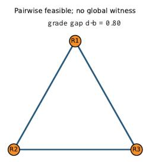
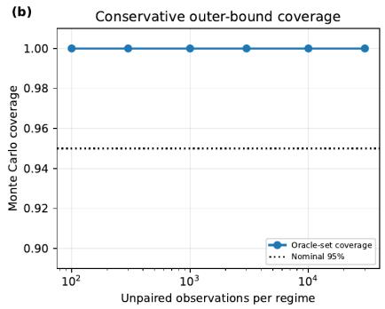
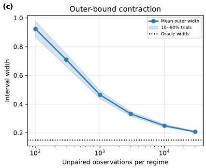

# Common-Witness Certificates and Sharp Feature Bounds for Counterfactual Image Auditing

Usef Faghihi∗ and Amir Saki∗

## Abstract.

Structured image editors may satisfy every regional plausibility constraint separately although no single latent explanation is compatible with the complete output. We formulate this local-to-global failure through a common-witness grade and its witness nerve. The framework separates auditing from causal identification: shared exogeneity alone permits every coupling of the regime marginals, whereas a scientifically justified witness relation yields exactly the relation-supported couplings and hence sharp feature-level partial-identification bounds. For quasiconvex regional losses, classical Helly theory gives finite incompatibility certificates. For the labeled witness structures generated by the audit, we derive a heterogeneous action-stratified certificate, a sharp tolerant certificate for finite witness atlases, and a blocker-hypergraph repair formula. Fractional Helly theory converts dense local compatibility into a large jointly coherent subset. Simultaneous confidence regions for regime marginals provide finite-sample outer confidence bounds for the complete identified interval; Bonferroni–Clopper–Pearson bands give a nonasymptotic multinomial construction. In controlled MNIST rotations and finite paired studies on Morpho-MNIST and smallNORB, archived summaries report coherent-pair acceptance of 0.9593–0.9778, while regional-action patchworks retain local acceptance of 0.9702–0.9804 but have global acceptance of 0–0.1138. Synthetic studies exercise sharp bounds, certificate recovery, and structured computation up to 104 feature states and 105 regional constraints. The method audits a prespecified feature relation; it does not identify unrestricted pixel-level counterfactuals.

Key words. counterfactual images, partial identification, Helly theorem, optimal transport, finite-sample inference, infeasibility certificates

MSC codes. 52A35, 62G15, 62P30, 68T45, 90C05

1. Introduction. Counterfactual image editing asks what the image of the same unit would have been under another intervention. In an augmented structural causal model (ASCM), both potential images are evaluated at the same exogenous state. That semantic convention does not reveal their joint distribution. Pan and Bareinboim show that unrestricted pixel-level counterfactuals are generally not identified from image–label samples, even when a latent causal diagram is supplied [21]. Their feature-based relaxation is therefore a bound on declared care-set quantities, not recovery of the true pixel coupling.

We study a complementary auditing failure. An edited image can satisfy each protectedregion constraint with a diferent latent explanation while no one explanation satisfies all regions simultaneously. Formally, a witness for each region need not be one witness for every region. This global-witness gap is invisible to an audit that aggregates independent local passes.

The gap becomes scientifically informative only when the witness family is anchored outside the candidate pair. Examples include a validated renderer, paired interventions, or a design guarantee. A similarity score fitted only to unpaired images is not, by itself, cross-world information. We encode an externally justified witness family by regional costs, use their common sublevel intersections to audit an image pair, and project the resulting admissibility rule to a prespecified finite feature. The projection is then an explicit assumption in a support-only partial-identification model; it is not inferred from the causal graph.

The contribution is a certificate-to-inference pipeline:

1. We turn regional costs into a graded feasibility complex. For the labeled witness structures produced by this audit, we derive exact certificate-size and repair formulas: a sharp q(s + 1) certificate for a finite atlas with q witnesses and s exceptional roles, a blocker-hypergraph description of minimal explanations, and a heterogeneous action-stratified certificate with size $\textstyle \sum _ { a } ( d _ { a } + 1 )$ . Classical Helly, union-of-convex-set, fractional-Helly, and tolerance results supply the underlying intersection principles [6, 2, 9, 20, 15].

2. We separate this audit from identification. A boundary proposition records that shared exogeneity alone admits every coupling. Once an external relation is declared, its relationsupported couplings give the exact identified set in a stated support-only two-regime feature model. No coupling inside that set is silently selected.

3. We propagate simultaneous marginal confidence regions through the coupling program to obtain finite-sample outer confidence bounds for the complete oracle interval. Controlled and finite paired studies illustrate the local-to-global separation, while synthetic programs check the predicted interval and computational behavior. We report the empirical information boundary explicitly. The accompanying public repository contains the implementation, tests, configurations, and retained outputs; external datasets must be obtained from their original sources.

The main line is

regional costs −→ common-witness certificate −→ declared feature relation

−→ sharp coupling bounds −→ outer confidence bounds.

Technical extensions, full protocols, and secondary analyses are indexed in the Supplementary Material.

2. Related work and positioning. Pan and Bareinboim establish the nonidentification boundary for counterfactual image editing and propose feature-level causal bounds [21]; later work develops a disentangled causal latent editor [22]. Our object is diferent: an externally anchored same-witness audit followed by a support-only partial-identification analysis. It neither replaces their construction nor weakens their impossibility theorem.

Partial identification of joint potential-outcome functionals has a long history [18, 3, 26, 11, 10, 27]. Coupling and transport methods make the remaining cross-world ambiguity explicit [25, 23, 7]. The linear program and its transport dual are established tools. The contribution here is their placement after an auditable, externally sourced relation, together with a precise support-only sharpness statement.

Helly’s theorem and fractional Helly theory control intersections of convex families [6, 14, 13]. Amenta and Eckhof–Nischke treat unions of convex components and the generalized pigeonhole mechanism [2, 9]; tolerance variants are also established [20, 15]. Our certificate theorems are exact labeled specializations for the witness structures arising in the audit, with sharpness and blocker-based repair. We do not claim that finite-feature bounding, transport duality, or Helly

theory is new.

Finally, Theorem 6.1 is confidence-set propagation. Its importance here is the estimand: it covers the entire identified interval. Clopper–Pearson bands are conservative but nonasymptotic [5]; more eficient simultaneous multinomial regions can be substituted if their joint coverage is proved [12, 24, 19].

## 3. Setting and the common-witness audit.

3.1. Feature target and identification boundary. Let $X \in \{ 0 , 1 \}$ denote an intervention and $I _ { x } \in \mathcal { Z }$ the corresponding potential image, where I is a standard Borel space. We prespecify a measurable finite feature

$$
\Psi : \mathcal { T } \to \mathcal { V } , \qquad \mathcal { V } = \{ 1 , \ldots , K \} , \qquad Y _ { x } = \Psi ( I _ { x } ) ,
$$

and assume that the single-world laws $\mu _ { x } ( y ) = \mathbb { P } ( Y _ { x } = y )$ are identified from randomized intervention data or another valid causal argument. Image samples alone do not generally provide this identification.

Write $\pi _ { y y ^ { \prime } } = \mathbb { P } ( Y _ { 0 } = y , Y _ { 1 } = y ^ { \prime } )$ . Our targets are bounded linear functionals

$$
H _ { h } ( \pi ) = \sum _ { y , y ^ { \prime } } h ( y , y ^ { \prime } ) \pi _ { y y ^ { \prime } } .\tag{3.1}
$$

Transition probabilities, average feature changes, and numerators of conditional feature queries have this form. A conditional query with a positive identified denominator $\mu _ { 0 } ( B )$ is obtained by dividing the corresponding numerator by that fixed quantity.

Proposition 3.1 (Shared-exogeneity saturation). Let $\mu _ { 0 } , \mu _ { 1 }$ be probability laws on a common standard Borel space. Every coupling $\pi \in \Pi ( \mu _ { 0 } , \mu _ { 1 } )$ is the joint potential-outcome law of a two-regime structural model with one exogenous variable shared across interventions.

Proof. On the probability space with law π, let $U = ( U _ { 0 } , U _ { 1 } )$ be the coordinate map and set $f ( x , u _ { 0 } , u _ { 1 } ) = u _ { x }$ . Then $Y = f ( X , U )$ satisfies $Y _ { x } = U _ { x }$ and $\mathcal { L } ( Y _ { 0 } , Y _ { 1 } ) = \pi$ . Both worlds use the same realization of $U$ ■

Proposition 3.1 is a boundary lemma, not a novelty claim. It shows that using the same witness twice cannot by itself overcome the causal hierarchy. Information enters only through restrictions on admissible exogenous states, response functions, or cross-world pairs.

3.2. Regional losses, grade, and nerve. Let $\mathcal { W }$ be a declared witness space and let $c _ { r } ( w ; i , j ) \geq 0 , r \in [ m ] = \{ 1 , \dots , m \}$ , measure the violation of role $r$ by witness w for the factual–candidate pair $( i , j )$ . When $( i , j )$ is fixed or clear from context, we suppress it from the notation. Thus, for example, $c _ { r } ( w )$ denotes $c _ { r } ( w ; i , j )$ ; the same convention applies to all witness sets, grades, and tolerant quantities defined below.

The ASCM response type U and the auditing witness w are distinct objects unless an external scientific argument identifies them. At tolerance ε, put

$$
A _ { r } ^ { \varepsilon } ( i , j ) = \{ w \in \mathcal { W } : c _ { r } ( w ; i , j ) \leq \varepsilon \} .\tag{3.2}
$$

Compactness and lower semicontinuity are imposed whenever an attained minimizer is used;   
the measurable version is given in Supplement S1.

Definition 3.2 (Common-witness grade and nerve). For nonempty $S \subseteq [ m ]$ , define

$$
F ( S ; i , j ) = \operatorname* { i n f } _ { w \in \mathscr { W } } \operatorname* { m a x } _ { r \in S } c _ { r } ( w ; i , j ) , \qquad \rho ( i , j ) = F ( [ m ] ; i , j ) .\tag{3.3}
$$

The witness nerve at scale $\varepsilon$ is

$$
K _ { \varepsilon } ( i , j ) = \{ \emptyset \} \cup \left\{ \emptyset \neq S \subseteq [ m ] : \bigcap _ { r \in S } A _ { r } ^ { \varepsilon } ( i , j ) \neq \emptyset \right\} .\tag{3.4}
$$

If $T \subseteq S ,$ , then $F ( T ; i , j ) \leq F ( S ; i , j )$ . Consequently $K _ { \varepsilon }$ is a simplicial complex, maximal faces are maximal jointly explainable role sets, and minimal nonfaces are minimal incompatibility explanations. Under attainment, $( i , j )$ has one global witness exactly when $\rho ( i , j ) \leq \varepsilon$

To permit a prespecified number of regional exceptions, define

$$
F ^ { [ s ] } ( S ; i , j ) = \operatorname* { i n f } _ { w \in \mathcal { W } } \operatorname* { m i n } _ { { D \subseteq S } \atop { | D | \leq s } } \operatorname* { m a x } _ { r \in S \backslash D } c _ { r } ( w ; i , j ) , \qquad \operatorname* { m a x } _ { } \varnothing : = 0 ,\tag{3.5}
$$

and $\rho _ { s } = F ^ { [ s ] } ( [ m ] )$ . The integer s is a within-pair role budget; it is not a probability mass of inadmissible feature pairs.

3.3. From image witnesses to a feature relation. The audit induces the existential feature projection

$$
\mathcal { R } _ { \varepsilon } = \left\{ ( y , y ^ { \prime } ) : \begin{array} { l } { \mathrm { t h e r e ~ i s ~ a ~ l i f t } ~ ( { i } , { j } ) ~ \mathrm { w i t h } ~ \Psi ( { i } ) = y , ~ \Psi ( { j } ) = y ^ { \prime } , } \\ { \mathrm { a n d } ~ \rho ( { i } , { j } ) \le \varepsilon } \end{array} \right\} .\tag{3.6}
$$

The causal model must separately assume $\mathbb { P } \{ ( Y _ { 0 } , Y _ { 1 } ) \in \mathcal { R } _ { \varepsilon } \} = 1$ . The relation is therefore an externally declared Layer-3 restriction, not a consequence of its definition. An existential feature projection can also be an outer relaxation of the image-level problem; it is lossless only under a feature-saturation or conditional-fiber condition (Supplement S3). Without an external anchor, the honest default is $\mathcal { R } _ { \varepsilon } = \mathcal { V } ^ { 2 }$

4. Combinatorial certificates and repair. We first give the finite-atlas result used directly by the experiments, then place its convex analogue in the classical Helly context.

## 4.1. Finite atlases.

Theorem 4.1 (Exact finite-atlas tolerant certificate). Suppose W is finite with $q = | \mathcal { W } |$ and $0 \leq s < m$ . Then

$$
\rho _ { s } ( i , j ) = \operatorname* { m a x } _ { \substack { | S | \leq \operatorname* { m i n } \{ q ( s + 1 ) , m \} } } F ^ { [ s ] } ( S ; i , j ) .\tag{4.1}
$$

Thus tolerant incompatibility has a certificate using at most $q ( s + 1 )$ roles. The bound is best possible.

Proof. For fixed w, arrange its m costs in nonincreasing order, $c _ { [ 1 ] } ( w ) \ge \cdots \ge c _ { [ m ] } ( w )$ Deleting at most s roles leaves the smallest possible maximum $c _ { [ s + 1 ] } ( w )$ , hence

$$
\rho _ { s } = \operatorname* { m i n } _ { w \in \mathcal { W } } c _ { [ s + 1 ] } ( w ) .
$$

For every w, choose $T _ { w }$ containing $s + 1$ roles with its largest costs and put $\begin{array} { r } { S _ { \star } = \bigcup _ { w } T _ { w } } \end{array}$ . Then $| S _ { \star } | \leq q ( s + 1 )$ . The $( s + 1 )$ st largest cost of each w on $S _ { \star }$ equals its $( s + 1 )$ )st largest cost on [m], so $F ^ { [ s ] } ( S _ { \star } ) = \rho _ { s }$ . Monotonicity gives the reverse inequality for every subfamily.

For sharpness, take $m = q ( s + 1 )$ and partition the roles into disjoint blocks $B _ { w }$ of size $s + 1$ . Fix $0 \leq b < d$ and set $c _ { r } ( w ) = d$ for $r \in B _ { w }$ and $c _ { r } ( w ) = b$ otherwise. The complete family has tolerant grade d. Every proper role set omits a role from some $B _ { w } ;$ for that witness, at most s retained roles have cost $d ,$ so its tolerant grade is at most b. Thus all $q ( s + 1 )$ roles can be necessary. ■

The proof is an exact consequence of the labeled finite-atlas structure. We do not claim that tolerant Helly theory is new; generic tolerance transfers and modern tolerance complexes are studied in [20, 15]. The audit-specific value of Theorem 4.1 is its sharp certificate and the explicit repair formula below.

Proposition 4.2 (Blocker duality and exact repair). For fixed ε, let

$$
B _ { w } ^ { \varepsilon } = \{ r : c _ { r } ( w ; i , j ) > \varepsilon \} , \qquad G _ { w } ^ { \varepsilon } = [ m ] \setminus B _ { w } ^ { \varepsilon } .
$$

Then

$$
F ^ { [ s ] } ( S ; i , j ) \le \varepsilon \quad \Longleftrightarrow \quad \exists w \in { \mathcal W } : | S \cap B _ { w } ^ { \varepsilon } | \le s .\tag{4.2}
$$

Minimal s-tolerant incompatibility explanations are the inclusion-minimal $( s + 1 ) \AA \ – f o l d$ transversals of the bad-role hypergraph. Each has at most $q ( s + 1 )$ roles. For $s = 0$ ，

$$
K _ { \varepsilon } = \bigcup _ { w \in { \cal W } } 2 ^ { G _ { w } ^ { \varepsilon } } , \qquad s _ { \varepsilon } ^ { \star } : = \operatorname* { m i n } \{ s : \rho _ { s } \leq \varepsilon \} = \operatorname* { m i n } _ { w \in { \cal W } } | B _ { w } ^ { \varepsilon } | .\tag{4.3}
$$

Proof. For fixed $w ,$ all retained costs are at most ε after at most s deletions exactly when at most s members of $S$ belong to $B _ { w } ^ { \varepsilon }$ . This proves (4.2); negating it yields the multipletransversal description. Choosing s + 1 bad roles for every witness gives the size bound. Finally, $| B _ { w } ^ { \varepsilon } |$ is exactly the number of deletions required for witness $w ,$ and minimizing over w proves (4.3). ■

Rowwise order selection computes $\rho _ { s } ,$ one valid certificate, and the exact repair number in $O ( q m )$ selection time (or O(qm log m) by sorting). Enumeration of all minimal transversals can still be exponential [1].

4.2. Convex and action-stratified atlases. For a compact convex witness set of afine dimension $d ,$ continuous quasiconvex role losses have convex closed sublevel sets. The classical Helly theorem then gives

$$
\rho ( i , j ) = \operatorname* { m a x } _ { \emptyset \neq S \subseteq [ m ] } F ( S ; i , j ) .\tag{4.4}
$$

Indeed, at the maximum local grade every $d + 1$ sublevel sets intersect, so the complete family intersects. Equation (4.4) is a direct application of Helly’s theorem, not a new intersection theorem.

Many audits have a discrete requested action and continuous nuisance parameters. The resulting witness space is a labeled disjoint union rather than one convex set.

Theorem 4.3 (Heterogeneous action-stratified certificate). Suppose $\begin{array} { r } { \mathcal { W } = \bigcup _ { a = 1 } ^ { q } \mathcal { W } _ { a } } \end{array}$ , where $\mathcal { W } _ { a }$ is nonempty, compact, convex, and has afine dimension $d _ { a }$ . Assume every role loss is continuous and quasiconvex on each stratum. Define

$$
F _ { a } ( S ) = \operatorname* { m i n } _ { w \in \mathcal { W } _ { a } } \operatorname* { m a x } _ { r \in S } c _ { r } ( w ) , \qquad F ( S ) = \operatorname* { m i n } _ { a } F _ { a } ( S ) ,
$$

and H = min $\begin{array} { r } { \{ m , \sum _ { a = 1 } ^ { q } ( d _ { a } + 1 ) \} } \end{array}$ . Then

$$
F ( [ m ] ) = \operatorname* { m a x } _ { \varnothing \neq S \subseteq [ m ] } F ( S ) .\tag{4.5}
$$

The bound is sharp for every dimension list when $\begin{array} { r } { m = \sum _ { a } ( d _ { a } + 1 ) } \end{array}$

Proof. Let $\rho _ { a } = F _ { a } ( [ m ] )$ . Applying (4.4) within stratum a gives $S _ { a } \subseteq [ m ] , | S _ { a } | \leq d _ { a } + 1$ 2 with $F _ { a } ( S _ { a } ) = \rho _ { a }$ . Put $\textstyle S _ { \star } = \bigcup _ { a } S _ { a }$ . Monotonicity gives

$$
\rho _ { a } = F _ { a } ( S _ { a } ) \leq F _ { a } ( S _ { \star } ) \leq F _ { a } ( [ m ] ) = \rho _ { a }
$$

for every a. Hence $\begin{array} { r } { F ( S _ { \star } ) = \operatorname* { m i n } _ { a } \rho _ { a } = F ( [ m ] ) } \end{array}$ and $| S _ { \star } | \leq H$

For sharpness, create one block of $d _ { a } + 1$ roles $( a , j )$ per stratum and take ${ \mathcal W } _ { a } = \Delta ^ { d _ { a } }$ . For $x \in \Delta ^ { d _ { b } }$ set

$$
c _ { ( a , j ) } ( b , x ) = { \left\{ \begin{array} { l l } { ( d _ { a } + 1 ) x _ { j } , } & { a = b , } \\ { 0 , } & { a \neq b . } \end{array} \right. }
$$

The complete block has grade one in its stratum, so the full-family grade is one. If $( a , j )$ is removed, choose stratum a and vertex $\boldsymbol { e } _ { j } ;$ every remaining cost is zero. Thus every proper subfamily has grade zero. ■

Classical results for unions of convex sets already imply closely related $q ( d + 1 )$ Helly numbers [2, 9]. The content of Theorem 4.3 is the audit-specialized exact grade equality, heterogeneous dimension sum, and sharp labeled construction, not a claim of a fundamentally new general Helly theorem.

The witness nerve also quantifies approximate coherence. Let $h = d + 1$ and let $N _ { h } ( \varepsilon )$ count its feasible h-faces. If $D _ { \varepsilon }$ is the largest number of roles explained by one witness and $t _ { \varepsilon } = m - D _ { \varepsilon }$ , Kalai’s exact fractional-Helly bound gives

$$
N _ { h } ( \varepsilon ) \leq { \binom { m } { h } } - { \binom { d + t _ { \varepsilon } } { h } } .\tag{4.6}
$$

In particular, if at least an α fraction of the h-subsets are feasible, one witness explains at least

$$
\Big \lceil \big [ 1 - ( 1 - \alpha ) ^ { 1 / ( d + 1 ) } \big ] m \Big \rceil\tag{4.7}
$$

roles [14, 13, 8]. The complete proof and exact integer inversion are in Supplement S4. Dense local compatibility yields a large coherent core, not global compatibility.

If estimated losses obey maxr su $\begin{array} { r } { \operatorname { \rho } _ { w } | \widehat { c } _ { r } ( w ; i , j ) - c _ { r } ( w ; i , j ) | \leq \delta } \end{array}$ , then every tolerant grade changes by at most δ and

$$
K _ { \varepsilon - \delta } ^ { [ s ] } \subseteq \widehat { K } _ { \varepsilon } ^ { [ s ] } \subseteq K _ { \varepsilon + \delta } ^ { [ s ] } .\tag{4.8}
$$

This is a deterministic robustness statement; statistical use requires an independently justified uniform error bound. Finite-net outer approximation and exact nerve recovery away from critical grades are in Supplement S4.

5. Sharp feature bounds. For a declared relation $\mathcal R \subseteq \mathcal y ^ { 2 }$ , let

$$
\Pi _ { \mathcal { R } } ( \mu _ { 0 } , \mu _ { 1 } ) = \left\{ \boldsymbol { \pi } \in \mathbb { R } _ { + } ^ { K \times K } : \sum _ { y ^ { \prime } } \pi _ { y y ^ { \prime } } = \mu _ { 0 } ( y ) , \quad \sum _ { y } \pi _ { y y ^ { \prime } } = \mu _ { 1 } ( y ^ { \prime } ) , \quad \pi _ { y y ^ { \prime } } = 0 \mathrm { ~ o u t s i d e ~ } \mathcal { R } \right\} .\tag{5.1}
$$

Equivalently, $\pi \mathbf { 1 } = \mu _ { 0 }$ fixes row sums and $\pi ^ { \top } { \bf 1 } = \mu _ { 1 }$ fixes column sums. The transpose is needed because left multiplication by $\pi ^ { \top }$ sums the original matrix down its rows, producing one total for each column.

The support-only feature model contains every two-regime feature SCM with these marginals and $\mathbb { P } \{ ( Y _ { 0 } , Y _ { 1 } ) \in \mathcal { R } \} = 1$ , with no other response function, latent-DAG, or full-image restriction.

Theorem 5.1 (Sharp support-only identified interval). If $\Pi _ { \mathcal { R } } ( \mu _ { 0 } , \mu _ { 1 } )$ is nonempty, then the sharp identified set for (3.1) in the support-only feature model is

$$
\left[ \operatorname* { m i n } _ { \pi \in \Pi _ { \mathcal { R } } ( \mu _ { 0 } , \mu _ { 1 } ) } H _ { h } ( \pi ) , \operatorname* { m a x } _ { \pi \in \Pi _ { \mathcal { R } } ( \mu _ { 0 } , \mu _ { 1 } ) } H _ { h } ( \pi ) \right] .\tag{5.2}
$$

Both endpoints and every intermediate value are attainable.

Proof. The feasible set is a nonempty compact convex polytope and $H _ { h }$ is linear, so its image is a closed interval with attained endpoints. Every model in the declared class induces a feasible coupling. Conversely, Proposition 3.1 realizes every feasible coupling as a shared-exogenous feature SCM, and mixtures realize all intermediate values.

Sharpness is relative to the displayed model. If a fixed full-image law, latent DAG, or nonsaturated image relation imposes further restrictions, the feature program can be only outer. This qualification prevents an audit relation from being mistaken for identification of the Pan–Bareinboim pixel counterfactual.

If the external science supports only a violation-mass budget $\tau ,$ replace hard support by

$$
\Pi _ { \mathcal { R } } ^ { ( \tau ) } ( \mu _ { 0 } , \mu _ { 1 } ) = \{ \pi \in \Pi ( \mu _ { 0 } , \mu _ { 1 } ) : \pi ( \mathcal { R } ^ { c } ) \leq \tau \} .\tag{5.3}
$$

The same compactness argument makes its optimized interval sharp in the corresponding budget model and nested in $\tau$ . The smallest feasible budget is the Hall deficiency

$$
\delta _ { \mathcal { R } } ( \mu _ { 0 } , \mu _ { 1 } ) = \operatorname* { m a x } _ { A \subseteq \mathcal { V } } \{ \mu _ { 0 } ( A ) - \mu _ { 1 } ( \mathcal { R } ( A ) ) \} ,
$$

by max-flow/min-cut and the finite Hall–Strassen criterion [25]. These established transport results, their duals, and the Polish-space extension are collected in Supplements S2–S3. The parameter $\tau$ is sensitivity input, not a probability learned from unpaired images.

For sparse $\mathcal { R }$ , the two endpoint programs use one variable per allowed edge and $2 | \mathcal { R } |$ nonzeros in the marginal equality matrix. The relation is first checked for feasibility; infeasibility is reported rather than hidden by renormalization.

6. Finite-sample outer inference. Let $\mathcal { C } _ { \alpha }$ be any random simultaneous confidence region for the two regime marginals satisfying

$$
\mathbb { P } \{ ( \mu _ { 0 } , \mu _ { 1 } ) \in \mathcal { C } _ { \alpha } \} \geq 1 - \alpha .\tag{6.1}
$$

For a fixed known relation define the union of compatible couplings

$$
{ \widehat { \mathcal { P } } } _ { \alpha } ( \mathcal { R } ) = \bigcup _ { ( \nu _ { 0 } , \nu _ { 1 } ) \in { \mathscr { C } } _ { \alpha } } \Pi _ { \mathcal { R } } ( \nu _ { 0 } , \nu _ { 1 } ) .\tag{6.2}
$$

Theorem 6.1 (Outer coverage of the complete oracle interval). Let $[ L ^ { \star } , U ^ { \star } ]$ be the sharp interval over $\Pi _ { \mathcal { R } } ( \mu _ { 0 } , \mu _ { 1 } )$ . If the random endpoints are measurable, then

$$
\mathbb { P } \left\{ [ L ^ { \star } , U ^ { \star } ] \subseteq \left[ \operatorname* { i n f } _ { \pi \in \hat { \mathcal { P } } _ { \alpha } ( \mathcal { R } ) } H _ { h } ( \pi ) , \operatorname* { s u p } _ { \pi \in \hat { \mathcal { P } } _ { \alpha } ( \mathcal { R } ) } H _ { h } ( \pi ) \right] \right\} \geq 1 - \alpha .\tag{6.3}
$$

If the random feasible set is empty, reporting the vacuous payof range preserves the guarantee.

Proof. On the event in (6.1), every oracle-feasible coupling belongs to (6.2). Minimizing over the larger set cannot increase the lower endpoint, and maximizing cannot decrease the upper endpoint. ■

A distribution-free concrete choice uses independent within-regime samples. If $N _ { x } ( y )$ is the count in cell y among $n _ { x }$ observations, construct a two-sided Clopper–Pearson interval for each of the $M = 2 K$ marginal cells at cellwise noncoverage $\alpha / M$ . In beta-quantile notation its endpoints are

(6.4)

$$
\ell _ { x } ( y ) = \left\{ \begin{array} { l l } { 0 , } & { N _ { x } ( y ) = 0 , } \\ { \mathrm { B e t a } ^ { - 1 } \big ( \frac { \alpha } { 2 M } ; N _ { x } ( y ) , n _ { x } - N _ { x } ( y ) + 1 \big ) , } & { N _ { x } ( y ) > 0 , } \end{array} \right.\tag{6.5}
$$

$$
u _ { x } ( y ) = \left\{ { 1 , \begin{array} { l l } { \qquad } & { N _ { x } ( y ) = n _ { x } , } \\ { \mathrm { B e t a } ^ { - 1 } \bigl ( 1 - \frac { \alpha } { 2 M } ; N _ { x } ( y ) + 1 , n _ { x } - N _ { x } ( y ) \bigr ) , } & { N _ { x } ( y ) < n _ { x } . } \end{array} } \right.
$$

Each count is marginally binomial, so Bonferroni gives simultaneous coverage despite dependence among cells within a multinomial sample [5]. Here, exact means finite-sample coverage of at least the nominal level, not equality or shortest possible width. Hoefding bands provide a simpler alternative. The inference target is the complete oracle interval, not one selected coupling.

If a random outer relation satisfies $\mathbb { P } ( \mathcal { R } _ { \star } \subseteq \widehat { \mathcal { R } } ^ { + } ) \geq 1 - \beta$ , the same containment argument and a union bound give coverage at least $1 - \alpha - \beta$ when the program uses $\widehat { \mathcal { R } } ^ { + }$ . Sample splitting alone does not establish this outer-relation property. Compatibility tests and independent finite-panel variants, with their required sampling assumptions, are in Supplement S4.

7. Audit and optimization pipeline. The operational procedure keeps its information sources separate:

1. Prespecify Ψ, protected roles, allowed descendants, the witness atlas, tolerance, and any role or relation-violation budget.

2. For a candidate pair compute $\rho$ or $\rho _ { s }$ and return a short blocking-role certificate and exact repair count when the audit fails.

3. Project the externally justified audit to a feature relation and state explicitly whether that projection is exact or outer.

4. Estimate the two single-world marginals and solve the lower and upper support or budget transport programs, using simultaneous marginal bands when finite-sample coverage is required.

5. Return the identified interval, outer confidence interval, and incompatibility explanation. Selecting a point inside the interval requires a separate declared decision rule.

For nonconvex neural witness spaces not represented by a verified finite atlas, a verified global optimizer would be needed; the certificates above do not validate an arbitrary local neural search.

8. Numerical studies. The numerical studies address three questions that correspond directly to the theory: whether regional plausibility can coexist with global incompatibility, whether a declared relation can sharpen feature-level bounds without concealing infeasibility or misspecification, and whether the resulting optimization and certificate computations remain tractable in structured large instances. The studies are not presented as evidence that an unrestricted pixel-level counterfactual is identified.

Status of the numerical evidence. The accompanying public repository contains the implementation, tests, configurations, retained outputs, and integrity manifests supporting the numerical studies. External datasets are not redistributed and must be obtained from their original sources. The repository documents the scope of the retained evidence and the limitations of exact historical and cross-platform replay.

## 8.1. Common-witness audits.

Controlled rotation audit.. We first use the oficial MNIST training and test partitions [16] in a controlled renderer experiment. For a source image $S _ { i }$ one angle

$$
A \in \{ - 2 0 , - 1 0 , 0 , 1 0 , 2 0 \} ~ \mathrm { d e g r e e s }
$$

is applied to the whole image, followed by clipped independent Gaussian measurement noise with standard deviation 0.02. The witness atlas is the same declared set of five renderer responses. For rectangular region $P _ { r } ,$ the discrepancy of angle a is

$$
c _ { r } ( a ) = \left[ | P _ { r } | ^ { - 1 } \sum _ { p \in P _ { r } } \{ I _ { 1 } ( p ) - \mathrm { R o t a t e } ( I _ { 0 } , a ) ( p ) \} ^ { 2 } \right] ^ { 1 / 2 } .
$$

The local and common-witness scores are

$$
L = \operatorname* { m a x } _ { r } \operatorname* { m i n } _ { a } c _ { r } ( a ) , \qquad \rho = \operatorname* { m i n } _ { a } \operatorname* { m a x } _ { r } c _ { r } ( a ) .
$$

Thus L permits a diferent angle in each region, whereas $\rho$ requires one angle to explain every region. A split of 3,000 training images sets the 0.975 order-statistic threshold and a disjoint 3,000-image split assesses relation violations. The archived protocol evaluates the oficial 10,000 test images at three seeds and four fixed partitions (4, 9, 16, and 64 regions). These are twelve configurations, not 120,000 independent test units: the same 10,000 images recur. The principal negative control selects angles separately by region, so it is constructed to satisfy the local quantifier while violating the common-angle quantifier. Because every split uses the same specified renderer, this is held-out validation within a controlled mechanism, not independent scientific validation of a causal relation.

Separately fitted editor and witness.. The second study uses paired responses supplied by Morpho-MNIST [4] and smallNORB [17]. Morpho-MNIST provides index-matched plain, thin, and thick digits; these are benchmark-generated transformations rather than physical interventions. smallNORB provides physical toy objects photographed under factorially varied pose and illumination. Lighting 0 is paired with lightings 1, 3, and 5, holding object, pose, and camera fixed. These are matched photographs, not observations of the same stochastic unit in two counterfactual worlds.

An action-conditional latent-residual editor is fitted on units disjoint from a separate PCA–ridge witness. The editor is an experimental vehicle rather than a claimed architectural contribution. The witness divides each image into a fixed $4 \times 4$ grid and normalizes each regional discrepancy by an action-specific held-out threshold $q _ { a }$ . For normalized costs $\widetilde { c } _ { r } ( a ) = c _ { r } ( a ) / q _ { a }$ the relevant scores are

$$
L = \operatorname* { m a x } _ { r } \operatorname* { m i n } _ { a } \widetilde { c } _ { r } ( a ) , \qquad \rho _ { \mathrm { f r e e } } = \operatorname* { m i n } _ { a } \operatorname* { m a x } _ { r } \widetilde { c } _ { r } ( a ) , \qquad \rho _ { \mathrm { r e q } } = \operatorname* { m a x } _ { r } \widetilde { c } _ { r } ( a _ { \mathrm { r e q } } ) .
$$

A strictly positive $q _ { a }$ is required; the protocol uses a positive calibration quantile, and any zero quantile would require a positive floor fixed before evaluation. A score at most one is accepted. The free score asks whether some declared action explains the complete image; only the requested-action score tests compliance with the requested edit. The negative control alternates paired actions across the sixteen regions. It can therefore be locally plausible even though no single action explains the image.

The relation panel contains 4,000 Morpho-MNIST base digits and ten smallNORB physical objects. The editor evaluation uses a disjoint 6,000 Morpho-MNIST base digits and fifteen smallNORB physical objects, with three prespecified editor seeds. Repeated actions and views are dependent measurements of the same base digit or object and are not counted as new independent units. In particular, the smallNORB threshold was calibrated from only five physical objects and is an empirical rule, not a distribution-free conformal guarantee.

Table 1 shows the intended local-to-global separation in all three studies. In the controlled renderer, patchworks retain approximately the same local acceptance as coherent pairs but almost never admit one global angle. The learned-witness study shows the same qualitative separation, although the Morpho-MNIST free-action global acceptance of 0.113750 is materially above zero. On the disjoint editor sets, the conditional editor’s archived mean whole-image SSIM is 0.903131 versus 0.870558 for conditional ridge on Morpho-MNIST, and 0.986064 versus 0.985821 on smallNORB. We report the corresponding improvements only to appropriate precision, 0.0326 and 0.00024: the latter is practically very small.

<table><tr><td>Study</td><td>Evaluation unit</td><td>Coherent</td><td>Patch local</td><td>Patch global</td><td>AUROC</td></tr><tr><td>MNIST rotations</td><td>10,000/setting</td><td>0.9709-0.9777</td><td>0.9702–0.9804</td><td>0-0.0018</td><td>0.9988-1.0000</td></tr><tr><td>Morpho-MNIST</td><td>4,000 digits</td><td>0.977750</td><td>0.976750</td><td>0.113750</td><td>0.987213</td></tr><tr><td>smallNORB</td><td>10 objects</td><td>0.959259</td><td>0.972840</td><td>0</td><td>1.000000</td></tr></table>

Archived aggregate common-witness results. Coherent is the free-angle global acceptance for controlled MNIST and requested-action acceptance for the paired studies; patch global uses the free common-action score. MNIST entries are ranges over twelve seed–partition configurations that reuse the same test images. The smallNORB AUROC of 1 is complete separation on a fixed ten-object panel, not a population-perfect guarantee.

The smallNORB aggregate also conceals important object-level uncertainty. Requestedaction acceptance ranges from 0.779835 to 1 across ten objects. Zero global patchwork acceptances among ten objects has one-sided 95% Clopper–Pearson upper limit 0.2589. Consequently, the reported AUROC 1 supports finite-panel separation of the constructed control but does not establish population-perfect detection or a population patchwork acceptance below 0.20.

8.2. Sharp bounds and finite-sample outer inference. A three-state synthetic feature provides a direct numerical check of the support-constrained coupling program. With only the two regime marginals, the sharp target interval is [0.35, 0.80]. Imposing the declared one-step relation narrows it to [0.55, 0.70]. A misspecification control places 0.20 of the true coupling mass outside that relation, and the constrained interval then fails to cover the true target. The negative control is essential: narrowing is created by the added relation, not by the observed marginals alone.

For finite-sample inference, independent samples from each regime are drawn at

$$
n \in \{ 1 0 0 , 3 0 0 , 1 0 0 0 , 3 0 0 0 , 1 0 0 0 0 , 3 0 0 0 0 \} ,
$$

with 300 repetitions per sample size. The archived Hoefding outer intervals cover the complete oracle identified interval in all 1,800 repetitions, with mean width decreasing from 0.9237 to 0.2075. A later analysis applies the exact Bonferroni–Clopper–Pearson construction in (6.4)–(6.5) to the same archived cell counts. Its reported mean widths decrease from 0.7413 to 0.1861, reductions of 10.3%–27.8% relative to Hoefding, and all 1,800 intervals again cover. These successes are an implementation check under the stated simulation law, not evidence of exact nominal calibration; the coverage guarantee follows from the theorem. The exact-band comparison is post-confirmatory and descriptive because it was specified after the Hoefding outcomes had been inspected.

The controlled audit-to-bound panel also records a necessary negative result. It fixes ten images per digit, for N = 100 units, and the raw witness relation contains 0.0097 of the $N ^ { 2 }$ candidate pairs. The hard-support transport program is infeasible and is reported as such; no renormalization or silent relaxation is used. With the predeclared empirical violation budget $\tau = 0 . 0 8$ , the archived interval is [0.1517, 0.2600], compared with [0.0600, 0.8200] without the image relation, and contains the hidden paired target 0.2100. However, balancing the panel by digit violates the i.i.d. premise of the intended pooled binomial guarantee. A post-hoc stratified sensitivity calculation uses $\tau = 0 . 1 2$ and gives [0.1183, 0.2975], also containing 0.2100.

(a)  

Figure 1. Archived synthetic summaries. Left: all pairs can be compatible while the complete witness intersection is empty. Middle and right: observed coverage of the complete oracle interval and contraction of the Hoefding outer interval as the regime sample sizes increase.
<table><tr><td>Structured problem</td><td>Largest instance</td><td>Representation</td><td>Time (s)</td></tr><tr><td>Sparse coupling</td><td>10,000 states</td><td>109,970 edges</td><td>18.521</td></tr><tr><td>Affine minimax,  $d = 4$ </td><td>100,000 roles</td><td>5-role certificate</td><td>0.251</td></tr><tr><td>Affine minimax,  $d = 8$ </td><td>100,000 roles</td><td>9-role certificate</td><td>0.385</td></tr><tr><td>Affine minimax,  $d = 1 6$ </td><td>100,000 roles</td><td>17-role certificate</td><td>0.786</td></tr><tr><td>Helly-tight</td><td>1,024 roles</td><td>dimension 1,023</td><td>9.704</td></tr><tr><td>Finite-atlas sharpness</td><td>12 roles</td><td>4,094 proper faces</td><td>0.192</td></tr></table>

Table 2  
Largest successful cases in the archived hardware-specific scaling summary. Relations and afine certificate families are supplied rather than learned. Times are descriptive and hardware-specific.

Neither relaxed result is a confirmatory 95% confidence statement; a new independent panel with the stratified procedure fixed in advance would be required.

8.3. Structured computational checks. The archived computations use sparse edge variables for banded transport and short dual certificates for repeated-simplex minimax instances. These tests check the implementations against known optima and residual conditions; they do not claim comparable scaling for dense arbitrary relations, face enumeration, or nonconvex neural witness optimization.

All 35 archived scaling cases are reported as successful in 34.85 seconds total with peak resident memory 0.483 GiB. At 10,000 states, sparse transport replaces $1 0 ^ { 8 }$ dense state pairs by 109,970 edge variables; the reported marginal residuals are below $1 . 4 \times 1 0 ^ { - 1 8 }$ . Across the afine cases, the largest reported primal, stationarity, or duality error is $3 . 3 4 \times 1 0 ^ { - 1 6 }$ . Constructed leave-one-out atlases with $m = 4 , \ldots , 1 2$ accept every nonempty proper role set and reject the full set, attaining the finite-atlas certificate bound. These are numerical verification and structured-scaling results, not an empirical claim about naturally occurring high-order image obstructions.

8.4. Empirical scope. The experiments validate the declared computations and local-toglobal failure mode on controlled or finite paired response families. They do not establish the scientific correctness of an arbitrary relation, identify an unrestricted counterfactual image, or infer a joint multi-regime image law. Morpho-MNIST is synthetic, and smallNORB has only ten physical objects in the relation panel. The reported large-state computations rely on supplied sparse or repeated structure.

9. Scope, information boundary, and limitations. We first clarify the scope of the results. Unrestricted pixel-level counterfactuals are generally not identified from unpaired regime marginals. Accordingly, the framework targets sharp bounds for prespecified finite-dimensional image features under a declared support restriction. This is the identified object of the analysis rather than an approximation to an otherwise identified pixel-level counterfactual.

The witness atlas and the cross-world relation are additional scientific inputs, not consequences of the observed regime marginals. The witness atlas determines the coherence question being audited, whereas the relation determines the admissible feature couplings used for partial identification. If either is misspecified, the audit may reject coherent pairs or the identified interval may exclude the true target. Sample splitting can assess empirical performance but cannot by itself establish the causal validity of these inputs. Likewise, violation budgets are sensitivity parameters unless they are independently calibrated.

A further information boundary arises from feature projection. Projecting an image-level relation onto a coarse feature space can discard image-level restrictions. The feature-level and image-level analyses coincide only under the feature-saturation or conditional-fiber conditions stated in the Supplementary Material.

The current experiments provide controlled evaluations on MNIST, Morpho-MNIST, and smallNORB, together with synthetic and computational studies. They validate the predicted local–global separation, sharp-bound calculations, finite-sample coverage, and structured computational scaling in these settings. Evaluation on broader natural-image domains and empirical validation of the multi-regime extension are left for future work.

10. Conclusion. Local regional plausibility need not imply one globally coherent counterfactual explanation. The common-witness grade records this distinction as a feasibility complex. Finite and action-stratified witness structures yield short exact certificates and repair counts; an externally justified feature relation then narrows, but does not select within, the coupling of the regime marginals. Optimizing over all compatible couplings gives sharp feature bounds in the stated support-only model, and simultaneous marginal confidence regions give finite-sample outer coverage of the complete oracle interval. The resulting pipeline is mathematically explicit about where information enters and where ambiguity remains. Its validity in a new application rests on prespecification, external validation of the witness relation, and reproducible evidence at the correct independent unit.

Code and data availability. The implementation code, experiment runners, tests, protocols, retained aggregate outputs, and reproduction instructions are available here. External datasets are not redistributed and must be obtained from the original sources cited in the Supplementary Material. Documented reproduction limitations are provided in the repository.

## REFERENCES

[1] E. Amaldi, M. E. Pfetsch, and J. Trotter, Leslie E., On the maximum feasible subsystem problem, IISs and IIS-hypergraphs, Mathematical Programming, 95 (2003), pp. 533–554, https://doi.org/10. 1007/s10107-002-0363-5.

[2] N. Amenta, A short proof of an interesting helly-type theorem, Discrete & Computational Geometry, 15 (1996), pp. 423–427, https://doi.org/10.1007/BF02711517.

[3] A. Balke and J. Pearl, Bounds on treatment efects from studies with imperfect compliance, Journal of the American Statistical Association, 92 (1997), pp. 1171–1176, https://doi.org/10.1080/01621459. 1997.10474074.

[4] D. C. Castro, J. Tan, B. Kainz, E. Konukoglu, and B. Glocker, Morpho-MNIST: Quantitative assessment and diagnostics for representation learning, Journal of Machine Learning Research, 20 (2019), pp. 1–29, https://www.jmlr.org/papers/v20/19-033.html.

[5] C. J. Clopper and E. S. Pearson, The use of confidence or fiducial limits illustrated in the case of the binomial, Biometrika, 26 (1934), pp. 404–413, https://doi.org/10.1093/biomet/26.4.404.

[6] L. Danzer, B. Grunbaum, and V. Klee ¨ , Helly’s theorem and its relatives, in Convexity, vol. 7 of Proceedings of Symposia in Pure Mathematics, American Mathematical Society, 1963, pp. 101–180.

[7] L. De Lara, A. Gonzalez-Sanz, N. Asher, L. Risser, and J.-M. Loubes ´ , Transport-based counterfactual models, Journal of Machine Learning Research, 25 (2024), pp. 1–59, https://www.jmlr.org/ papers/v25/21-1440.html.

[8] J. Eckhoff, An upper-bound theorem for families of convex sets, Geometriae Dedicata, 19 (1985), pp. 217–227, https://doi.org/10.1007/BF00181472.

[9] J. Eckhoff and K.-P. Nischke, Morris’s pigeonhole principle and the helly theorem for unions of convex sets, Bulletin of the London Mathematical Society, 41 (2009), pp. 577–588, https://doi.org/10.1112/ blms/bdp024.

[10] Y. Fan, E. Guerre, and D. Zhu, Partial identification of functionals of the joint distribution of potential outcomes, Journal of Econometrics, 197 (2017), pp. 42–59, https://doi.org/10.1016/j.jeconom.2016.10. 005.

[11] Y. Fan and S. S. Park, Sharp bounds on the distribution of treatment efects and their statistical inference, Econometric Theory, 26 (2010), pp. 931–951, https://doi.org/10.1017/S0266466609990168.

[12] L. A. Goodman, On simultaneous confidence intervals for multinomial proportions, Technometrics, 7 (1965), pp. 247–254, https://doi.org/10.1080/00401706.1965.10490252.

[13] G. Kalai, Intersection patterns of convex sets, Israel Journal of Mathematics, 48 (1984), pp. 161–174, https://doi.org/10.1007/BF02761162.

[14] M. Katchalski and A. Liu, A problem of geometry in Rn, Proceedings of the American Mathematical Society, 75 (1979), pp. 284–288, https://doi.org/10.1090/S0002-9939-1979-0532152-6.

[15] M. Kim and A. Lew, Leray numbers of tolerance complexes, Combinatorica, 43 (2023), pp. 985–1006, https://doi.org/10.1007/s00493-023-00044-5.

[16] Y. LeCun, L. Bottou, Y. Bengio, and P. Haffner, Gradient-based learning applied to document recognition, Proceedings of the IEEE, 86 (1998), pp. 2278–2324, https://doi.org/10.1109/5.726791.

[17] Y. LeCun, F. J. Huang, and L. Bottou, Learning methods for generic object recognition with invariance to pose and lighting, in Proceedings of the 2004 IEEE Computer Society Conference on Computer Vision and Pattern Recognition, vol. 2, 2004, pp. 97–104, https://doi.org/10.1109/CVPR.2004.1315150.

[18] C. F. Manski, Nonparametric bounds on treatment efects, American Economic Review, 80 (1990), pp. 319–323.

[19] W. L. May and W. D. Johnson, Constructing two-sided simultaneous confidence intervals for multinomial proportions for small counts in a large number of cells, Journal of Statistical Software, 5 (2000), pp. 1–24, https://doi.org/10.18637/jss.v005.i06.

[20] L. Montejano and D. Oliveros, Tolerance in helly-type theorems, Discrete & Computational Geometry, 45 (2011), pp. 348–357, https://doi.org/10.1007/s00454-010-9296-6.

[21] Y. Pan and E. Bareinboim, Counterfactual image editing, in Proceedings of the 41st International Conference on Machine Learning, vol. 235 of Proceedings of Machine Learning Research, 2024, pp. 39087–39101, https://proceedings.mlr.press/v235/pan24a.html.

[22] Y. Pan and E. Bareinboim, Counterfactual image editing with disentangled causal latent space, in Advances in Neural Information Processing Systems, vol. 38, 2025, https://proceedings.neurips.cc/ paper files/paper/2025/hash/54e1419b1cbca8ada96a87c96567e954-Abstract-Conference.html.

[23] S. T. Rachev and L. Ruschendorf¨ , Mass Transportation Problems, Volume I: Theory, Springer, New York, 1998, https://doi.org/10.1007/b98893.

[24] C. P. Sison and J. Glaz, Simultaneous confidence intervals and sample size determination for multinomial proportions, Journal of the American Statistical Association, 90 (1995), pp. 366–369, https://doi.org/ 10.1080/01621459.1995.10476521.

[25] V. Strassen, The existence of probability measures with given marginals, Annals of Mathematical Statistics, 36 (1965), pp. 423–439, https://doi.org/10.1214/aoms/1177700153.

[26] J. Tian and J. Pearl, Probabilities of causation: Bounds and identification, Annals of Mathematics and Artificial Intelligence, 28 (2000), pp. 287–313, https://doi.org/10.1023/A:1018912507879.

[27] J. Zhang, J. Tian, and E. Bareinboim, Partial counterfactual identification from observational and experimental data, in Proceedings of the 39th International Conference on Machine Learning, vol. 162 of Proceedings of Machine Learning Research, 2022, pp. 26548–26558, https://proceedings.mlr.press/ v162/zhang22ab.html.