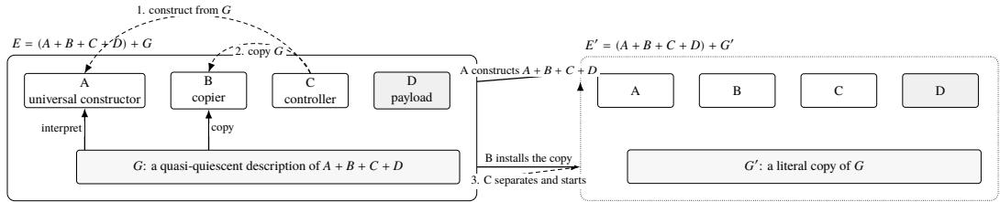
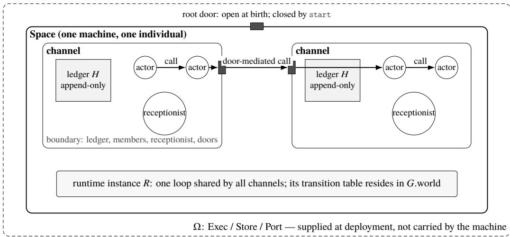
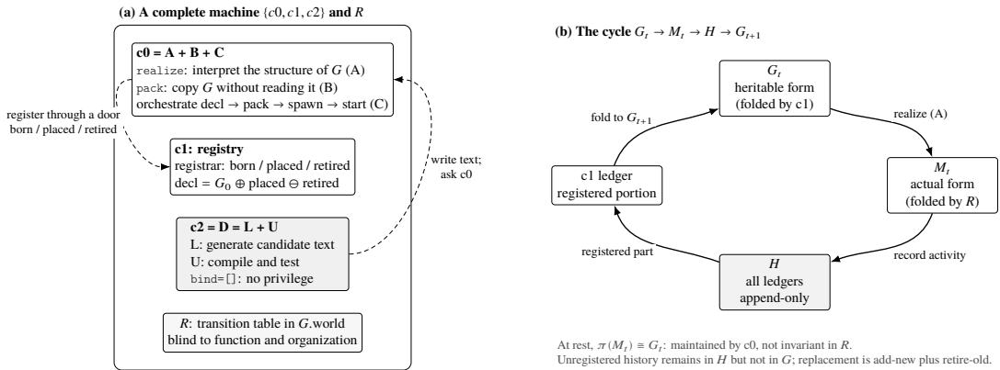
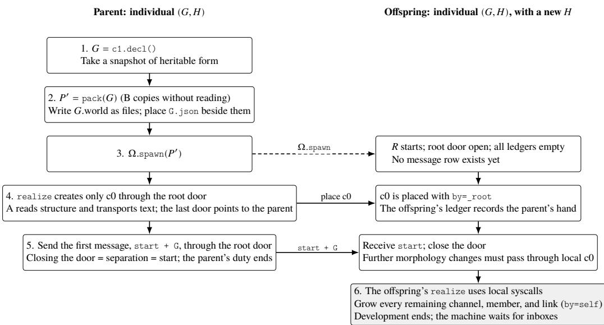
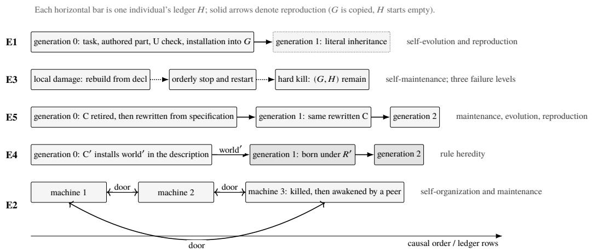

# Dalek: A Constructive Agent Machine Self-Maintenance, Self-Evolution, Self-Reproduction, and Self-Organization by Construction

Wanpeng Xie wanpeng.xie@gmail.com

## Abstract

We present Dalek, a closed machine designed for agents that realizes selfmaintenance, self-evolution, self-reproduction, and self-organization on any substrate satisfying a general host contract. The machine is built from three primitives—actors, messages, and channels. Four obligations—a host boundary, a construction language, admissible transitions, and rule heredity—give its boundary, identity, and closure a structural basis.

Von Neumann’s 1948 self-reproducing automaton supplies a hereditary constructional core: a self-description together with a constructor, a copier, and a controller. Dalek combines this core with the four obligations and rederives its medium for a text-and-message agent substrate, adding explicit structures for boundary, identity, history, and growth. A large language model and a compiler occupy the payload position and form a general capability producer. New capabilities are authored, compiled, installed into the description, and inherited by descendants. The same path produces the machine’s own organs and even its runtime, closing heredity and evolution within the machine.

Keywords: agent systems; self-reproducing automata; self-modifying systems; constructive definition; software architecture

1 Introduction 2   
2 Constructional Model and Substrate 4   
3 The Machine 6   
4 The Machine in Operation: From One Task to a Third Generation 19   
5 Discussion 30   
6 Related Work 33   
7 Conclusion and Future Work 36   
Notation 37   
A Transition Table and ABI 39   
B Evidence Index 41

## 1.1 From an Inventory to a Machine

Agents are commonly implemented as collections of components around a large language model. The model generates; memory, tools, workflows, subagents, gateways, and validators do the rest. One response to a harder task is to lengthen this inventory, assigning a new kind of component to each new kind of demand. As the inventory grows, so do the costs of assembly, configuration, and maintenance. Capability is purchased with system complexity.

A second response is to let the model generate and assemble components at runtime. Dynamic plugins and code mode are representative examples [Shi et al., 2026, DeepSeek-AI, 2026]. Generation replaces preinstallation, so new capabilities no longer have to be enumerated in advance. The deeper problem begins after generation. Code written by an agent may be callable immediately, yet whether that code has become part of the agent, survives a restart, is inherited by a copy, or is authorized for installation remains a decision of the file system, loader, image builder, deployment script, or operator. Whether the same code is merely the product of a task or a modification of the system itself depends on arrangements outside the agent. The ability to generate new structure has entered the agent; the authority to decide what constitutes the agent has not.

Uncontrolled complexity and displaced constitutive authority have the same source: the absence of a constructive definition of the agent machine.

This absence is immaterial when an agent serves a predetermined task and remains under continuous human maintenance: a tool need not define itself. The requirement changes in kind when tasks cannot be enumerated in advance, operation does not presuppose a human in attendance, and the object of improvement eventually includes the system’s own structure. The old claim was existential: the system completed a task, ran unattended for several hours, or once rewrote its own scafold. A single demonstration could establish it. The new claim is invariant: however long the system runs, whatever tasks arrive, and however often its structure changes, the properties in §1.2 continue to hold. A demonstration can establish that something happened once. To say that it remains true requires a structural guarantee; before such a guarantee can be stated, the machine that bears it must be defined.

## 1.2 Criteria for a Constructive Definition

We study a particular class of objects: agent machines that can incorporate capabilities produced by open-ended tasks while supporting claims about long-running operation and structural change. Relative to a host contract Ω, such a machine has four definitional obligations:

1. Host boundary. Every mechanism that can afect a claimed property either belongs to the machine or is explicitly assigned to Ω as an input or host assumption. There is no undeclared third location. The boundary determines both the scope of a claim and the locus to which a property is attributed.

2. Construction language. Legal machine forms are generated from finite primitives by finite composition rules. New capabilities may be produced without a predetermined bound; the same language determines when they become part of the machine and in what form they persist.

3. Admissible transitions. The initial machine and the operations that alter its constitution are specified explicitly. Every admissible transition maps a legal machine back into the same machine class. Legal states and admissible transitions together form the machine’s operational semantics.

4. Rule heredity. If self-improvement is to be attributed to the machine, the rules that produce a legal successor must themselves be representable, constructible, and heritable. The current rules remain fixed during one construction; revised rules are written into the successor. This temporal separation avoids the vicious circle of constructing oneself at the same instant.

The first three obligations define the machine’s carrier and dynamics. The fourth places the rules that generate those dynamics inside the generational relation. A system whose loader or construction service is explicitly assigned to Ω remains well-defined under the first three obligations; its construction capability then belongs to the host, and the fourth obligation does not hold.

These obligations define a machine class rather than a unique architecture. Any system that satisfies them is a member of that class. This paper establishes existence: Dalek is one complete running witness.

## 1.3 Necessity and the Governance Surface

All four obligations arise from the proof form required by an unbounded claim. Let � mean either “this is still a legal machine” or “this machine still carries the mechanisms required to construct a successor.” To establish � over an arbitrarily long legal history, a finite argument supplies a base case and proves that each admissible operation maps a legal machine back into the same class. The object of induction needs a definite domain: the host boundary and construction language. The induction step must compose indefinitely: admissible transitions. When the rules that form the induction step enter the domain of change, rule heredity is required as well.

Open-ended tasks alone require only generative finite means: a fixed universal interpreter can already process programs that were not enumerated in advance. Construction language and admissible transitions become obligations of the machine when generated capabilities must also be installed, persisted, restarted, and inherited—when the task axis meets the self-modification axis. A system whose rules remain external can likewise be well-defined by declaring those rules part of Ω. Rule heredity becomes necessary only when improvement is attributed to the machine itself. The result is a set of obligations on a machine class, not a unique implementation.

A constitutive boundary also yields a two-sided benefit. If all organizational efects between machine and environment pass through a finite interface, monitoring and intervention need cover only a finite governance surface. The environment cannot rewrite the machine outside its admissible transitions, while the machine’s organizational efects acquire definite points of authorization, audit, revocation, and termination. Structural change either preserves these mediation points or records their alteration as an explicit transition, allowing governance to persist across generations.

Our claims concern organizational efects: members, messages, doors, and changes in constitution belong to the machine. Direct file or network access performed by an actor during one invocation is not part of the machine’s history (§3.2.3). Extending the same criteria to every physical efect would require a stronger Ω.

## 1.4 Dalek: Construction and Witness

Dalek is constructed from three sources. Von Neumann’s 1948 self-reproducing automaton supplies a hereditary constructional core [von Neumann, 1951]. The four obligations require an explicit boundary, a finite construction language, admissible constitutive transitions, and rules that enter heredity. The properties of an agent substrate make a uniform actor/message interface and channel boundaries the natural medium. Their combination yields a new agent machine rather than a new implementation of von Neumann’s machine. Ω supplies only execution, storage, and networking. Actors collaborate through messages; channels provide organizational boundaries. � describes what the machine ought to be, while � records what it has undergone. A runtime � that is blind to function and organization defines the constitutive transitions. The constructor �, copier �, controller �, and capability producer � are themselves contained in �, so the present generation can construct a successor carrying revised organs and even a revised runtime.

This construction moves the organizing center of an agent system from a task loop to the lifecycle of an individual. Installation, restart, reproduction, and upgrade cease to be maintenance operations performed around the agent and become transitions of the machine itself. Task capabilities become members that can grow, combine, and reproduce within that lifecycle. The four selves name four directions of the same lifecycle: maintenance, change, continuation, and association.

The paper makes three contributions. First, it states the constructive obligations of an agent machine (§§1.2–1.3). Second, it constructs Dalek, in which all four obligations are jointly realized (§§2–3). Third, it provides ledger evidence that the same structure delivers self-maintenance, self-evolution, self-reproduction, and self-organization (§4).

The rest of the paper proceeds as follows. Section 2 states the inherited construction and its assumptions, then selects a substrate. Section 3 builds the machine. Section 4 lets its ledgers provide line-by-line evidence and defines the semantics of failed paths and the boundary of liveness. Section 5 discusses the consequences and scope of the definition. Section 6 reviews related work. Section 7 concludes and identifies conservative extensions.

## 2 Constructional Model and Substrate

Of the four definitional obligations in §1.2, rule heredity already has a constructional core: von Neumann’s 1948 self-reproducing automaton [von Neumann, 1951].1 We retain this core (§2.1), combine it with the remaining obligations, and derive a machine on an agent-specific substrate (§2.2). This section defines the notation �, �, �, �, and �, together with quasi-quiescence and the host contract.

## 2.1 The Inherited Construction

The construction consists of four components and one description [von Neumann, 1951]. � is a universal constructor: given a description �, it constructs the automaton described by �. � remains fixed; complexity resides in �, which grows with the complexity of the object to be built. � is a copier: it copies � without interpreting it. � is a controller: it first directs � to construct from �, then directs � to copy � and insert the copy into the new construction, after which it detaches and starts the ofspring. � is a payload: an arbitrary automaton carried by the machine but unused by the logic of construction and copying. The complete machine is

$$
E = ( A + B + C + D ) + G ,
$$

where � describes the entire assembly $A + B + C + D$ . One cycle of � produces a verbatim copy of $E . ^ { 2 }$ The same � is used twice: � interprets it and � copies it. � does not contain a description of itself; copying regenerates it, so the body and its description are formed in a definite temporal order [von Neumann, 1951].

The construction relies on two assumptions. First, the description is quasi-quiescent: it remains unchanged during copying. A live original reacts and changes as it is examined and therefore cannot be copied piece by piece; a linear chain that remains fixed for the duration of copying can [von Neumann, 1966]. Second, physics is supplied by the environment. The construction is kinematic: the machine is immersed in a sea of parts; components are axiomatized as black boxes by specifying only stimulus and response; energy and motion belong to the environment [von Neumann, 1951]. Section 2.2 gives an implementation of this environment contract. The substrate chosen here satisfies both assumptions.

  
Figure 1: Von Neumann’s 1948 construction: $E = ( A + B + C + D ) + G .$ The same � is used twice—interpreted by � and copied by �. Under the direction of �, � constructs $A + B + C + D ,$ � inserts a copy of �, and the resulting machine is detached and started. � is a payload unused by construction and copying.

Constructional model and substrate are distinct. The 1948 construction is stated in terms of blackbox components and an environment contract and does not depend on a particular component physics. The 29-state cellular automaton devised in 1952–53 is one later realization [von Neumann, 1966], not the construction itself. At the level of the hereditary core, Dalek preserves the 1948 construction while replacing its substrate. The complete Dalek architecture also adds the structures required for boundary, identity, history, and growth.

Measured against the four obligations, the 1948 model supplies the core of rule heredity and the skeleton of a construction language. Three things are absent. Identity: the model cannot answer “which individual am I?” [McMullin, 2000]; §3.4.6 supplies an answer. History and growth: it produces copies but retains no history, and actual growth of complexity remained an open problem in the subsequent literature [McMullin, 2000]. Dalek records history in a ledger (§3.2.3), while an internal loop between author and validator admits growth into the description (§3.4.3). A live author: the model’s payload is inactive in construction and copying, and mutations confined to that payload are nonlethal [von Neumann, 1951]. Dalek places a component that can write in the same position and retains the notation �. The medium, laws, and identity around that component are developed in §3.

## 2.2 From a Constructional Model to an Agent Machine

The 1948 model specifies causal roles and relations, not a software implementation. Its construction requires five things: assemblable parts, a quiescent and copyable description, organs formed from groups of parts, a detachable entity, and an environment that supplies the physics. It also leaves a payload position outside the logic of reproduction.

Dalek combines this hereditary core with the four obligations of §1.2 and with the properties of an agent-specific substrate. The obligations require a declared host boundary, a finite language of construction and change, and rules that enter heredity. The substrate presents heterogeneous participants through text and message exchange. Together they yield the following organization. These correspondences are results of constructing an agent machine, not a one-to-one implementation of von Neumann’s machine.

1. Part = actor. An actor is a behavioral component that interacts only through messages [Hewitt et al., 1973]. Every constitutive member is presented through the same message interface; programs, models, tools, humans, and external systems are adapted as actors. The constructional benefit is uniformity: there is one representation of a part, so � needs only one construction path.

2. Description = �. In this medium, � is text: static, manipulable, and packageable constitutive data. Once written, a blueprint is itself a part of the medium. Interpretation by � and copying by � require no translation across physical kinds, and quasi-quiescence follows directly.

3. Organ boundary = channel. A channel encloses a group of actors in a local boundary and maintains a ledger for them. A channel does not itself execute.3

4. Detachable entity = Space. A message medium has no intrinsic space, so the entity denoted by “detach and start” must be supplied by the construction. A Space comprises a set of channels and one runtime. It is the complete machine that Ω can start; detachment and startup operate on a Space (§3).

5. Environment = Ω + �. Dalek factors the undiferentiated physics of the 1948 model into two layers. The external host contract Ω contains three primitive capabilities—execution, storage, and networking—while the internal runtime � enforces the laws of the medium and is inherited with the machine. Together, Ω + � instantiate the environment contract.

6. Payload position (Dalek’s additional requirement) = �, a general capability producer. � consists of a large language model � and a compiler �. � produces candidate capabilities. It receives and emits text, its output is probabilistic, it retains no trustworthy state across invocations, and its interior remains a black box. Its native operational form is therefore one incoming message followed by zero or more outgoing messages. � is separate from the author: it compiles candidates and admits those that pass into the machine.

The resulting architecture therefore has three distinct inputs. The 1948 model contributes the two uses of �, the division into constructor, copier, controller, and payload, their temporal order, and construction-time quasi-quiescence. The definitional obligations, derived from the agent problem, require the explicit boundary, construction language, constitutive semantics, and rules of succession. Preserving a changing individual over time further requires identity and history, while openended tasks require a path for actual growth. The physics of the available components selects the medium. Computer organization follows component physics [von Neumann, 1945]; so does this machine. Everything � can perceive or do appears as text flowing in and out. Humans, environments, tools, and other agents therefore meet � under one identity—actor—and their interactions take one form—message. The adaptation layer is localized inside an ordinary actor program: �’s loop assembles a ledger view, calls a remote model, parses its output, and emits individual calls. The medium assigns no special semantics to �.

The resulting fit can be stated directly:

<table><tr><td>Dalek component or property</td><td>Why it fits L</td></tr><tr><td>message / call: one constitutive action</td><td>Text is the native input and output form of both L and a human participant.</td></tr><tr><td>G (description): dual use of description and rule L can read and write static text directly. heredity</td><td></td></tr><tr><td>H (ledger): identity, recovery, and factual witness</td><td>The probabilistic output of L cannot be recovered by recomputation; history preserves</td></tr><tr><td>U (compiler): separation of variation and</td><td>it. L should not be both author and judge.</td></tr><tr><td>selection no privileged actor</td><td>L can be replaced or coexist with another L.</td></tr></table>

## 3 The Machine

This section constructs Dalek from the three sources established in §2.2: the hereditary core of the 1948 model, the definitional obligations of §1.2, and the properties of an agent-specific substrate. Sections 3.1 and 3.3 define Ω and �; §3.2 defines actors, messages, channels, Spaces, and ledgers; §3.4 defines the interpretation, copying, and heredity of �. Once the machine has been assembled, §3.5 checks it against the four obligations.

## 3.1 The Host Contract Ω

Ω is the external half of the environment contract (§2.2): a fixed, finite capability list containing none of the vocabulary introduced by this paper. A machine is software running on Ω; Ω knows nothing of ledgers, organs, Spaces, or reproduction. The internal half is the runtime � (§3.3).

## 3.1.1 Three Capabilities

<table><tr><td>Capability</td><td>Contract</td><td>Experimental realization</td></tr><tr><td>Execution (Exec)</td><td>load(source, environment) → callable object; spawn(source, arguments)</td><td>Python 3: in-process exec and child processes</td></tr><tr><td>Storage (Store)</td><td>→ process read / write / append(path, bytes); append is atomic and durable</td><td>File system</td></tr><tr><td>Network (Port)</td><td>send(endpoint, bytes); recv(endpoint) → sequence of received bytes</td><td>File inboxes</td></tr></table>

These are three semantic roles. Together they form a small suficient contract; in the first implementation, the receiving side of Port is implemented by appending to files in Store. Execution includes processes, not merely evaluation. Source must become an independently living process that can be stopped. Without a separate process, an ofspring cannot outlive its parent and self-reproduction degenerates into a function call. Networking includes reception, not merely transmission. A conversation with a human, a description sent by another machine, and a line written by a parent through an ofspring’s root door all require a receiving endpoint on the machine side. In the single-host experiments, that endpoint is a file inbox; across hosts it is a network endpoint. Storage includes atomic append. The first law of the medium—append only (§3.2.3)—rests on this operation.

## 3.1.2 Boundary

Ω supplies no permissions, scheduling or message semantics, replay or validation, or isolation. These belong, respectively, to the machine laws (§3.3.4), the medium (§3.2), the ledger (§3.2.3), and directory conventions. The host boundary of §1.2 now has a concrete form: none of this paper’s terms appears in the interface table of Ω. Every mechanism afecting a claimed property is either inside the machine or on that table. Any underlying system satisfying the three capabilities in §3.1.1 is a legal Ω, and machine identity does not depend on a particular host. The first Ω used in the experiments is Linux, Python 3, and a file system. Section 3.3.5 identifies the layer that changes inside a machine when the host is changed.

## 3.1.3 Exogenous Input and Time

The interface table contains neither a clock nor a random-number source. Any value that crosses the machine’s organizational boundary into the medium and cannot be recomputed from existing state and a deterministic program is exogenous input and must enter a ledger (§3.2.3). Human messages, bytes arriving through a door, member replies, time, failures, and concurrent order all cross the same point: the call boundary. Values obtained directly from the host during an actor invocation—a remote response received by � or a file read—become machine facts only when the actor emits them as a call, a reply, or an incoming message. Every step can therefore either be recomputed and compared or copied from the ledger.

Time follows the same rule. Quiescence in a running machine is the operational counterpart of quasiquiescence (§2.1): when there is no message, nothing moves. A clock inside the body manufactures events and turns quiescence from a property into an accident. The machine does not produce time; it organizes time. A machine that requires ticks subscribes to an external tick source. Each tick enters through a door as an ordinary stamped message. Physical time thereby leaves the machine, whose interior retains only the causal order of events [Lamport, 1978]. Runtime invocations are run to completion, one event per invocation (§3.3.1), and need not know the time.

## 3.2 The Medium: The Machine as Seen by Its Members

This section specifies the semantics of the medium—the shape the machine presents to its members.   
Section 3.3 specifies the runtime that drives it.

## 3.2.1 Three Membranes: Actor → Channel → Space

The machine is nested in three membranes.

Actor: behavior. An actor has a kind, a text, and a set of bound handles. Actors are the only things in the machine that act: an actor receives one message and produces zero or more actions and a reply (§3.3). Its text is its entire endowment. For a program actor, text is source code; for a door, it is an address.

Channel: boundary. A channel contains an append-only ledger, a table of registered actors, one receptionist, and zero or more doors. A channel has no code. It is pure structure; only the text of its actors supplies behavior. In a machine description, a channel is one structural node.

Space: individual. A Space comprises channels, the topology of their doors, and one runtime instance. It is the smallest unit that Ω can spawn. Everything owned by a channel—ledger, member table, and configuration—is quiescent data. The loop that moves it is shared by all channels at Space level and belongs to none of them; Ω.spawn(channel) has no entry point. A machine is a Space together with its runtime. Throughout this paper, “one machine” means one Space.

Membranes do not skip levels. An actor does not know what lies beyond its channel; a channel does not know what else lies in its Space; a Space does not know what else inhabits Ω. Everything a level knows about its exterior enters as a message through its boundary (Figure 2).

  
Membranes do not skip levels: an actor cannot see beyond its channel; a channel cannot see its peers in Space; Space cannot see other occupants of Ω. Every efect takes the form of a call.

Figure 2: Three membranes. Actors reside in channels, channels reside in a Space, and Ω lies outside the Space. Each channel contains an append-only ledger, a member table, a receptionist, and doors. One runtime instance � is shared by all channels at Space level. Every efect is a call; calls across channels pass through doors. The root door is open at birth and closes after start.

## 3.2.2 Call Is the Only Action

A member can do exactly one thing to the machine:

$$
{ \mathrm { c a l l } } ( { \mathrm { a d d r e s s , ~ b o d y } } ) \to { \mathrm { r e t u r n ~ v a l u e } } .
$$

There is no shared memory, no global variable, and no bypass around the ledger. The address space is:
<table><tr><td>Address</td><td>Meaning</td><td>Return value</td></tr><tr><td>a tag such as file or U</td><td>a member of the current channel</td><td>the member&#x27;s reply</td></tr><tr><td>0</td><td>the read address of the medium</td><td>ledger rows or the member table</td></tr><tr><td>the tag of a door</td><td>an outgoing path (§3.2.4) a bound request that changes</td><td>empty</td></tr><tr><td>syscall plus a verb</td><td>form or acts on the world (§3.3.1)</td><td>receipt or rejection</td></tr></table>

A message addressed to nothing is discarded. A message addressed to a member invokes that member synchronously, and the member’s return value becomes the return value of call. Nested calls form a call stack, the machine’s only control flow.

Reading address 0 does not change form, is open to every member, and requires no binding. It recognizes two words. show returns ledger rows: what have I experienced? who returns the current member table: what am I now? A third question—what ought I to be?—is answered by an organ (§3.4.2). Together, the three questions locate in this substrate the problem left unanswered by the 1948 model (§2.1): history, actual form, and prescribed form each acquire a callable address.

Consider a member used repeatedly in §4. file is a program actor whose body protocol is read <path> or write <path>\n<content>. When a member X, during one invocation, performs call("file", "read notes.txt"), three rows appear in its ledger:

msg { seq k, from X, to file, body "read notes.txt", run j }   
step { seq k+1, actor file, ..., run j }   
msg { seq k+2, from file, to X, body "<file content>", run j }

X receives the return value and continues. It does not know who wrote file or when it was installed; the address is resolved at the instant of the call. file is a part produced by the machine itself (§4), and its caller cannot tell.

## 3.2.3 The Ledger �: To Be Entered Is to Become History

Each channel has one append-only ledger; the collection of all ledgers in one machine is �. Rows fall into four classes. Morphology rows (place and retire) record the installation of a member at an address—including its complete text—or the retirement of a member. Folding these rows yields the channel’s current form, implements who, and supplies the basis for restart (§3.3.2). Message rows (msg) record requests crossing a call boundary, nonempty replies, and receipts, according to the address class (§3.3.1, transition 3). The up message written by � to the receptionist of the first channel when a machine wakes is also a msg row. Step rows (step) close an invocation by recording the triggering sequence number, every call it issued, and any error. Boundary rows (down) record the completion of a legal shutdown and occur only in the first channel’s ledger (§3.3.1).

The first two laws of the medium are stated here; §3.3.4 establishes their status.

First, the medium stamps from. No member can sign as another. A message entering from outside is signed by the medium with the corresponding door. In a ledger, who spoke is as trustworthy as what was said.

Second, entry is history. A row appended to a ledger records an event that has occurred. It is neither withdrawn nor rewritten. Every recoverable “current state” is a fold over history, not a parallel record. What has not entered a ledger has not happened to the machine. Local variables, intermediate values, and remote exchanges inside one actor invocation are absent from the ledger and do not belong to machine history; only crossings of the call boundary do. The exogenous inputs of §3.1.3 now have a location. Every nondeterministic value crossing the boundary is preserved verbatim: history records not “what was computed then,” but “what was said then.”

The same boundary separates another class of efects. A member may touch the host world during an invocation by reading a file or accessing a network. Such actions are not actions on the machine: they are neither recorded nor inherited. The machine’s membrane is a membrane of organization and ledger, not a computational sandbox (§1.3). An efect becomes an efect of the machine only by becoming a ledger row.

## 3.2.4 Doors: The Only Kind That Points Outward

A door is an actor whose text is not behavior but an address. It is the only kind in the machine whose text points outside its channel. A message sent to a door is delivered unchanged to the endpoint named by its text, with provenance stamped by the medium. A door emits no output and interprets no content; it only transports. The topology of a machine is the set of text values of all its doors. Two channels are connected when their ledgers contain reciprocal doors. The far side may be another channel in the same machine, a human, or another machine; the door obeys the same rule. The plus sign in � = � + � + � + � (§2.1) now has a definition: two organs are joined when their ledgers contain doors to one another.

The distinction between a door and a member survives identical implementations. A member is function: it receives a message and produces actions within its channel; removing it removes a component. A door is connection: it produces nothing and only transports; removing it removes an edge. The same remote object installed as a member is answering here; installed as a door, it is answering next door.

## 3.2.5 The Way In

The outside world has one way to act on a machine: inbox → receptionist. Every channel has an inbox, the receiving side of Ω. The medium turns each arrival into a msg row, signs it with the door corresponding to its origin, and addresses it to the channel’s receptionist—the member marked as such in the morphology table. The statement “every action on a channel is in its ledger” therefore holds for external actions as well.

There is one special door: the root door, which belongs to the Space rather than to any channel. The root door is open if and only if no ledger contains a message row. While open, it accepts two kinds of input: syscalls that create form, and the first message. That first message is both the machine’s first heartbeat and the act that closes the door. All subsequent input through the root door is ignored, leaving the inbox as the machine’s only interface to the world. Birth (§3.4.4) determines who acted while the root door was open and what the first message contained. The root door is open only before birth.

## 3.3 The Runtime �

In the 1948 model, the mechanism that moves �, �, and � belongs to the substrate physics, not to the machine or its description (§2.1). On the new substrate, that physics is carried by a runtime �: message delivery, member invocation, and ledger append.

� is not Ω. The host knows nothing of channels, while the entire purpose of � is to drive them; it arrives with the machine on a blank host. Nor is � a member of the machine: it drives every member, including the organs of construction (§3.4). It resides in a root field of the machine description called world (§3.3.5). It is inherited by every machine but contains no information about any one machine. To the machine, � is physics: no operation in a member’s medium interface reads or modifies the current �, and every member is born immersed in it. To Ω, � is software. This is the internal half of the environment contract (§2.2).

The definition of � is a small state space and a transition table invariant under renaming of content. It has operational semantics—what moves where—but no intentional semantics. It does not know whether a step is construction or conversation.

## 3.3.1 Description Language, State, and Transitions

A legal � belongs to the input domain of � (§3.4.1): it is a description that realize can construct completely. Its syntax is:

<table><tr><td>Field</td><td>Contents</td><td>Constraint</td></tr><tr><td>world</td><td>three texts: ω-bind, loader, and R</td><td>contains no information about this machine (§3.3.5)</td></tr><tr><td>channels</td><td>ordered list; each item contains a name, member table, and receptionist</td><td>names are unique within the machine; the first channel has a receptionist</td></tr><tr><td>member</td><td>kind ∈ {program, door}, text, bind ⊆ {syscall, spawn, stop}, and tag</td><td>program text is source; door text is an endpoint; instantiability and conformance are not syntactic</td></tr><tr><td>peers</td><td>pairs of channel names</td><td>conditions (§§3.3.4, 3.4.3) each pair creates one door at each endpoint</td></tr></table>

Legal � denotes the description language. The $G _ { t }$ present in a machine state (§3.4.2) is one datum written in that language; whether it remains in the language is itself a property of the state (§3.5).

The recoverable state of � consists of one append-only ledger per channel, one cursor per actor indicating the last processed event, and one ofset per inbox indicating the last consumed line. All three are reconstructed by folding the ledgers. Volatile member state Σ is not included (§3.3.2). An event is a msg row in a ledger, addressed to some address and not yet marked by a run.

The complete transition relation of � is:

1. When a line arrives in an inbox, append a msg for the channel’s receptionist; from is the door pointing back to the sender’s endpoint.

2. While the root door is open—that is, while no ledger contains a msg row—accept morphology-writing syscalls and the first message. Appending that first message closes the door (§3.2.5).

3. For an event, invoke the member at its address once. The invocation finishes before the next event is processed (run to completion). On completion, append a step row and advance the cursor; record an exception in the step. The machine has no other source of concurrency. Calls within the invocation are recorded by address class: a member address produces one request row and, for a nonempty reply, a second row; address 0, a syscall, or a verb produces one fact or receipt row; a door returns empty; a nonexistent address produces no msg row and appears only in the call frame of the step.

4. A morphology syscall appends a morphology row; a world verb performs a host action, as listed below.

5. stop appends one down row after the current invocation completes, then exits �.

6. When � wakes through Ω. spawn and the ledgers already contain a msg, fold every ledger and append a msg up to the receptionist of the first channel. Redeliver any event whose cursor was not advanced.

7. Killing the process produces no down. On the next wake, an unmatched start or up after the last down records an abnormal termination.

An actor is a resident function. It is instantiated once when its place row is folded, mounted at its address, and remains there until retirement. Each subsequent message invokes run(m) on the same object; the return value is the reply. call is injected once at instantiation and is constant for that member. There are two kinds:

<table><tr><td>kind</td><td>Instantiation, once at placement</td><td>For each message</td></tr><tr><td>program</td><td>Exec.load(text, {call, me, channel}): execute source once to define run</td><td>run (m); return value becomes the reply</td></tr><tr><td>door</td><td>none (text is an endpoint address)</td><td>deliver unchanged through Port . send, stamp provenance, and return empty</td></tr></table>

Requests that change morphology or act on the world are answered directly by � and must be granted through the member’s bind field in �. A request from an unbound member is discarded:
<table><tr><td>Group</td><td>Request</td><td>Action by R</td><td>Receipt</td></tr><tr><td>morphology (syscall)</td><td>channel.create name</td><td>create ledger and inbox</td><td>name</td></tr><tr><td></td><td>channel.add.actor name kind text</td><td>allocate a unique tag and append a place row containing the</td><td>channel/tag</td></tr><tr><td></td><td>channel.retire.</td><td>complete text</td><td></td></tr><tr><td></td><td></td><td>append a retire row</td><td>channel/tag</td></tr><tr><td></td><td></td><td></td><td></td></tr><tr><td></td><td>actor name/tag</td><td></td><td></td></tr><tr><td>world verbs</td><td>spawn package</td><td>Ω.spawn(package):</td><td>process handle</td></tr><tr><td></td><td>stop</td><td>append down after the</td><td>none</td></tr><tr><td></td><td></td><td>current invocation, then exit this Space</td><td></td></tr></table>

There is no third kind. � is also a program. Its text is its entire loop: endpoint, prompt, ledger-view assembly, framing of its output into calls, and continuation from returned values. The medium sees only a sequence of calls and one reply. � knows neither Python nor models; Ω contains nothing specific to �.

## 3.3.2 Folding and Restart: Recovering Form, Not State

The current form of a channel is not a second record. It is obtained by folding its ledger: replay every place and retire row to obtain the member table. This is the implementation of who (§3.2.2). Restart therefore requires nothing beyond the ledgers:

$$
{ \mathrm { r e s t a r t } } = { \mathrm { f o l d ~ a g a i n } } = { \mathrm { i n s t a n t i a t e ~ e v e r y t h i n g ~ a g a i n } } .
$$

On wake, � sends up to the receptionist of the first channel. Events whose cursors were not advanced are redelivered; members use their ledgers to suppress repeated efects.

A resident function may retain internal state Σ between invocations—variables, caches, unfinished thoughts. Σ is not in the ledger, which records crossings of the call boundary rather than the inside of an invocation (§3.2.3), and it is reset by restart. A living machine is (�, �, Σ); the individual is (�, �). It remains the same machine without preserving the same volatile scene. The guarantee is recovery of form, not recovery of state: folding � reconstructs actual morphology and reinstantiates every member still present in it. It does not restore the instant before failure. Whether the machine remains runnable, constructible, or reproductive is a separate property (§3.5). A member that must survive restart reconstructs itself by calling call("0", "show"); that policy belongs to its text, not to �.

## 3.3.3 � Is Blind to Function and Organization

� processes form, not meaning. It reads exactly three things: addresses, kind, and text as a parameter to that kind.
<table><tr><td>Vocabulary known to R</td><td>Vocabulary unknown to R</td></tr><tr><td>addresses, tags, doors</td><td>constructor, registry, author</td></tr><tr><td>kind: program or door</td><td>who may install a member, or whether an installation counts</td></tr><tr><td>messages, ledgers, append, delivery, steps, receipts</td><td>realize, pack, decl</td></tr><tr><td>text as a parameter</td><td>the meaning of text</td></tr></table>

The condition is executable. Rename every organizational term in �—rename c0 to x7, for example— and rewrite source equivalently. The behavior of � is unchanged, and the two histories are isomorphic under the renaming. Violations are easy to recognize: R contains if name == "c0"; � recognizes a “construction request” and performs it for a member; � validates whether an object is a legal machine; or the scheduler favors one member. Each places the proposition to be established—that construction is performed by the machine—inside its physics. The privilege of the construction and registry members (§3.4) is therefore organizational. Their syscall bindings are written in �, and � binds them accordingly. Physically, they are equal to every other member.

## 3.3.4 The Laws and Their Status

The medium has three laws, the first two already stated in §3.2.3:

1. Append only, with from stamped by the medium. History cannot be rewritten and provenance cannot be forged.

2. Every action passes through a message. No member can reach another around the ledger.

3. Step fairness. If � continues to run, the target has not retired, every invocation terminates, and no stop occurs, then every recorded message is eventually delivered. � neither favors, discards, nor reorders it.

They are laws because they reside in �, which is physics relative to an individual. Every member— including the author—acts only through call, and call is itself defined by these laws. Within this medium, a violation is inexpressible. This is the finite governance surface of §1.3: every organizational efect passes through call, so authorization, audit, revocation, and termination each have a definite location.

The boundary of the laws must be equally explicit. Anything interrupted midway is discarded. If an invocation crashes halfway through, everything not yet recorded—Σ, local variables, an unfinished row—does not belong to the machine. Efects already recorded are history. The machine may therefore be left with a half-modified morphology; this is damage, not contradiction, and repair belongs to its organs (§3.4; §4.6). Undefinedness begins outside the medium: when � is no longer a ledger that � can fold, or when the host violates Ω, the physics required to describe the machine no longer exists. � needs neither transactions nor two-phase commit; it guarantees only that the ledger is truthful history. Redelivery is not replay. Folding reconstructs morphology; an event whose cursor was not advanced is delivered again. Whether a previously recorded partial efect should be suppressed is decided by the member from the ledger. Full replay of the machine’s history is not part of the model; §4.7 describes its cost.

## 3.3.5 world: Fixed for an Individual, Variable Across a Lineage

The description � has a root field named world containing three texts: �-bind, which implements the Ω contract on a host; the loader, which defines directory layout and startup; and �, the transition table itself. Its status is captured by two questions:

<table><tr><td></td><td>Travels with the machine?</td><td>Contains information about this machine?</td></tr><tr><td>Ω</td><td>no—supplied at the destination</td><td>no</td></tr><tr><td>world</td><td>yes</td><td>no—identical for every machine in one world version</td></tr><tr><td>the rest of G</td><td>yes</td><td>yes</td></tr></table>

The medium has no transition that changes the current world. Members copy it without reading it; Ω executes it; � does not read �. world is therefore fixed for an individual. It remains variable across a lineage: an author may write world' into the description of an ofspring, which is then born under new physics and accepted by a fixed-point test (§4.4). Organs follow a diferent cadence. Members in c0 and c1 may be added and retired within a generation, and a completed replacement can be used immediately in the next reproduction. One construction nevertheless uses already installed organs and one fixed snapshot of � (§3.4.4).

The 1948 model’s � does not contain transition rules; they belong to its substrate (§2.1). Dalek’s substrate is text. world travels with every machine and evolves across a lineage, bringing physics itself into heredity. This realizes the rule-heredity obligation of §1.2.

## 3.4 Organs, Heredity, and Birth

Dalek distributes the four inherited roles of §2.1 across its organs and adds a registry for heritable morphology (see note 3 in §2). c0 carries �, �, and �: realize interprets � (�), pack copies � (�), and a controller sequences the process (�). c1 is the registry, where � resides. In the 1948 model, the description is a quiescent tape. Here c1 folds its own ledger to produce the description (§3.4.2). It is an additional organ—the place where growth enters the description, as anticipated in §2.1. The registry is separate from the constructor because prescribed and actual morphology must remain independently comparable (§3.4.2). The granularity is consistent: �, �, and � share c0 because they jointly perform one construction, while the object being compared occupies a ledger of its own, so $G _ { t }$ is exactly the fold of one ledger. Quasi-quiescence belongs to the snapshot returned by decl, which remains fixed throughout pack, spawn, and start (§3.4.4). c2 carries �. Organs are organization rather than physics. � does not recognize c0, c1, or c2; all their privilege consists

of bind fields in �. c0 is the constructor only because members implementing realize reside there.   
Rename it or move those members to another channel and the machine still runs.

The minimal machine $\{ \mathsf { c } 0 , \mathsf { c } 1 \}$ already closes reproduction. Its description can be copied but not extended, because it has no author. Adding c2 yields the complete machine: it can maintain itself, inherit, and vary into new capabilities. The following sections assemble the three organs, then define birth, reproduction, and identity.

## 3.4.1 $\mathsf { c } 0 \ = \ \mathsf { A } { \pm } \mathsf { B } { + } \mathsf { C } { \vdots }$ The Only Interpreter of �

Construction has a dead half and a live half. pack(G) → P is dead: it writes G.world into files and places G.json beside them. It neither interprets � nor generates anything, and the same description always produces the same package. This is �. realize is live: the running c0 reads the structure of � and issues syscalls item by item, either through the root door to form an ofspring or locally to grow the present machine. This is �. No other component interprets $G ;$ every other hand that touches it merely copies.

The central operation of realize constructs one organ from one channel description. Constructing a machine means constructing its organs in order and then installing doors according to the topology. A channel is never copied in isolation. To “copy a channel” is to construct another organ from the same description; it remains construction.

The separation of � and � is visible at field level. A description contains two classes of fields. realize interprets structure—which channels exist, each member’s kind, the receptionist, and door destinations—but only transports text, which says what each member does and is later interpreted by �. When c0 moves a piece of source, it does not know its meaning. � reads organization, not content.

Universality lies in the accepted domain of realize: it works for every legal �, not merely its own.   
A mechanism that only copies itself is not �.

� is another ordinary member of $_ { \mathtt { C O } }$ . Bound to the world verbs, it sequences decl → pack → spawn → build → start. Section 3.4.4 gives the complete path.

## 3.4.2 c1: The Registry and the Split of Morphology

Reproduction requires a quasi-quiescent description (§2.1), yet the machine is alive and its running form is continuously afected by messages. The resolution is to split actual morphology from heritable morphology. Actual morphology $M _ { t }$ is the current living structure obtained by � from all ledgers. Heritable morphology $G _ { t }$ is the fold of c1’s ledger: the structure the machine declares should be inherited and regenerated.

c1 is a channel containing a registrar. It folds only its own ledger, which receives through a door from c0 three declarations: born for items installed through the root door, placed, and retired for actions performed by c0. Thus

$$
\operatorname * { d e c l } = G _ { 0 } \oplus \mathrm { p l a c e d } \ominus \mathrm { r e t i r e d } .
$$

c1 stores the commitments of $\mathsf { c o } ,$ not the facts of �. � records “what I am now”; c1 records “what I ought to be.”

They are related by a requirement: at rest,

$$
\pi ( M _ { t } ) \cong G _ { t } .
$$

The projection $\pi$ is defined by provenance. It retains everything installed by the constructor together with c0 members installed through the root door, and removes birth certificates, temporary doors, and retired members. This relation is not an invariant of � but a property maintained by c0. An organ holding syscall can construct truth and register a lie; a corrupted declaration is a mutation to be eliminated by descendant viability. The membrane separates machine from world, not machine from its own organs. That exposure is the substance of self-modification. During a morphology change or after damage, $M _ { t }$ and $G _ { t }$ may temporarily diverge.

Self-maintenance has the following operational definition. Relative to a target $Q$ fixed before repair begins, the machine uses its own construction path to eliminate a deviation or restore $Q .$ . For mor phology, $Q = G _ { t }$ and repair brings $\pi ( M _ { t } )$ back to $G _ { t } ;$ for a function, $Q$ is a member specification; for a capability, � may be runnability or reproductive capacity. � is supplied by $G ,$ prior history, or a specification entering through the membrane. Autonomous generation and internal storage of the target are outside this paper.4 Loss of completeness, loss of reproductive capacity, and a $G _ { t }$ outside the description language are all states reachable by legal transitions. The machine still has $G _ { t } , H _ { \cdot }$ , and a foldable morphology in such states. A return path need not exist. If repair depends on an organ that is itself damaged, the machine stops in a well-defined but irrecoverable state and retains its identity and history (§4.7).

This yields the cycle

$$
G _ { t } \longrightarrow M _ { t } \longrightarrow H \longrightarrow G _ { t + 1 } .
$$

realize unfolds a description into live morphology. Activity enters �. The subset registered through c0 enters the ledger of $\mathtt { c 1 }$ , which folds it into the next description. Unregistered history remains in � and does not enter �. Description and morphology define one another around this cycle, every edge of which can be inspected in the ledgers (Figure 3).

  
Figure 3: (a) A complete machine: c0 carries �, �, and $C ; \mathsf { c 1 }$ is the registry; $\mathsf { c } 2 \ = \ \mathrm { ~ D ~ } \ = \ \mathrm { ~ L } \mathsf { + } \mathrm { [ J }$ has no bindings; and the transition table of � resides in G.world. To change morphology, c2 follows the same route as an external party: write text and ask ${ \mathsf { c } } 0 .$ . (b) The cycle $G _ { t }  M _ { t }  H  G _ { t + 1 }$ . realize unfolds the description into actual morphology; activity is written to $H ;$ the portion registered through c0 enters the ledger of c1; and c1 folds it into the next description. At rest, c0 maintains $\pi ( M _ { t } ) \cong G _ { t }$

The syntax of change follows. There is no replace. A place row cannot be rewritten because entry is history. Modifying a member therefore means adding a new one and retiring the old one. The new member receives a new physical address and may inherit the old logical tag. Retirement appends a row and erases no history: the member remains forever in history and disappears only from current morphology.

## 3.4.3 c2 = D = L+U: The Author Is Not a Privileged Part

The minimal machine cannot create a new member because it has no author. c2 supplies one. � generates: its text is the entire agent loop, including ledger-view assembly, the remote model call, and framing model output as individual calls. � compiles: it turns candidate text into a part that can be installed. In the first implementation, it receives candidate source plus tests, instantiates the candidate in-process using the same Exec as �, runs the tests, and returns a result. Universality belongs to � and Exec: what can be computed is determined by Exec, and what can be written by �; � adds neither. What � manufactures is membership. It takes something � and Exec can already do and constitutes it as a machine member: named and addressable, present in � and �, callable by any member, reinstantiated after restart, copied verbatim during reproduction, and changed between versions by adding one member and retiring another. Capability growth is the accumulation of members, not an increase in underlying computational power.

Neither component closes the loop alone. � alone produces descriptions but supplies no internal criterion for distinguishing a runnable part from one that merely resembles one; reliability would remain an assumption about the author rather than a property of the machine. � alone is an inter preter, which the machine already possesses, and creates nothing new. Together they close the loop proposal → test → revision → installation. The inner loop of variation and selection enters the membrane: the machine decides whether a candidate runs; whether it is worth retaining remains external. Self-evolution has the following operational definition: a selected change enters � and is inherited along the lineage. It is orthogonal to self-maintenance. If a repair of � enters � as a new implementation, the same run instantiates both properties (§4.1). The source of novelty remains outside the machine—the remote endpoint of � or a human—while the organization that produces descriptions lies within it. The machine does not generate randomness; it organizes randomness, just as it organizes time (§3.1.3).

� is necessary but insuficient. A candidate is tested inside the c2 process with the author’s call and capabilities. Once installed in its target channel, it meets diferent neighbors and bindings. The inner loop rejects candidates that cannot run at all; it cannot reject every candidate that fails only after relocation, as §4.3 demonstrates. External selection remains unavoidable. � and � share one Exec: the compiler inside the machine is an instance of the machine’s physics (§6).

The author is not privileged. Both � and � have empty bindings (bind = [], inspectable in �). To alter machine morphology, c2 follows the same path as an external requester: write text and ask c0. � can therefore be replaced; two instances may coexist; an ofspring may carry a diferent �. � can write a new �, which c0 installs and � transmits. The agent loop itself is heritable, mutable morphology. Only run(m) and call are fixed by the medium. The payload position contains an author, and the seat itself is part of �.

## 3.4.4 Birth: Closure Becomes an Event

How does a machine begin? There is no boot image preinstalled from �. Ω. spawn starts � with the root door open and every ledger empty; the machine waits.

The lineage begins with a human. A human constructs the first machine through the root door using the same syscalls, temporarily performing �, �, and �; sending start and closing the door is the act of �. Every subsequent generation is produced by organs inside the machine. Birth has six steps, with each side recording one half:

1. The parent obtains $\textsf { G } = \mathsf { c 1 . d e c 1 } ( \lambda )$

2. � packages it: $P ^ { \prime } = \mathrm { p a c k } ( G ) \left( B \right.$ copies without reading).

3. � starts a process: Ω. spawn(�′). The ofspring’s � starts with an open root door and waits.

4. Through the root door, the parent’s realize constructs only c0: it creates the channel, installs every c0 member by moving text verbatim, and finally installs a door back to the parent. This birth certificate is absent from �. The corresponding rows in the ofspring are signed by=\_root.

5. Through the root door, � sends the first message: start\n<G>. The door closes and the ofspring detaches. The parent’s obligation ends.

6. Receiving start, the ofspring’s realize uses local syscalls to grow every remaining channel, member, and connection, with rows signed by itself. Development completes; the machine becomes quiescent and waits for an inbox.

Three statements hold simultaneously in this path. First, the parent never enters the ofspring process; it only writes through the ofspring’s root door. The ofspring ledger exposes two hands: the root and itself. The only organ not constructed by c0 is c0 itself. Second, detachment, door closure, and start are one event. While the door is open, external action determines morphology and the machine is an object under construction. Once it closes, morphology can change only through the machine’s own c0; the machine becomes a subject. Closure changes from an invariant to be guarded into a

  
Each ledger records one half: the parent’s records every syscall sent; the ofspring’s records every placement. B copies all of �; A reads its structure and transports its text. The ofspring inherits � (including world), but neither the parent’s � nor host-side files.

Figure 4: Six steps of birth, half recorded in each ledger. Parent: decl, pack, Ω. spawn, construct only c0 through the root door, then send start + G and close the door. Ofspring: � starts and waits; c0 arrives with by=\_root; after start closes the door, its own realize grows everything else with by=self. The ofspring inherits � and begins with an empty �.

single event: birth. Third, two quiescence conditions hold separately. Before start, the ofspring has no message row (§3.2.5), so nothing moves. The snapshot of � obtained by pack remains fixed during copying. This realizes quasi-quiescence (§2.1).

## 3.4.5 Reproduction: The Two Uses of � Become Field Operations

The three reproductive operations decl → pack → spawn all appear in the birth path. The two uses of � (§2.1) become two treatments of two field classes. pack copies all of � (� reads nothing), while realize reads structure and transports text (� interprets organization but not content). � gives the constructor no back door: the source of c0 and c1 is copied from their two text fields in the description, not from the code currently executing. The two uses of the description apply to the constructor itself, and an observer can compare package and description to check that nothing was omitted.

The output of pack is dead—source, not a process. � constructs a quiescent machine, which � then starts (§2.1). Only dead material can cross hosts: bytes travel over a network, processes do not. Only dead material can be compared: the fixed-point test compares two descriptions (§4.4). Reproduction is replayable from both sides. The parent’s ledger contains every syscall sent; the ofspring’s ledger contains every syscall received.

## 3.4.6 Identity: Individual = (�, �)

The first addition beyond the 1948 model (§2.1) now has a definition:

$$
\mathrm { i n d i v i d u a l } = ( G , H )
$$

� answers “what am $\Gamma ? ^ { \prime \prime }$ and � answers “which one am $\mathrm { I } ? ? \ : G$ is copyable because copying is the purpose of a quasi-quiescent description. � is not inherited: an ofspring starts with an empty history. Two machines with byte-identical � are indistinguishable in morphology and diverge from the first row of their histories. Section 3.3.2 supplies the dynamical half of the definition: restart clears Σ while preserving (�, �), so the machine remains the same individual.

The third question of §3.2.2 is also discharged. Introspection now has three addresses. show returns the history of the current channel—what have I experienced? who returns its actual morphology— what am I now? decl returns the heritable morphology $G _ { t }$ of the whole machine—what ought I to be? The whole machine’s actual morphology $M _ { t }$ is �’s fold over every ledger, not the answer of one address. On this substrate, the question unanswered by the 1948 model becomes three calls. No new axiom is required beyond the existence of the ledger.

Names follow from identity rather than registering it. An external naming authority is unnecessary: an ofspring is the reproductive event in its parent’s ledger. Its package path lies beneath spawn/<name> in the parent package, and a grandchild nests beneath it. This is a lineage-local name, unique within a lineage; ofspring of two founders may share a name. Identity remains (�, �), and names are derived from ledgers. A host-global counter instead causes collisions as soon as two machines merge, allowing identity to leak in from the host rather than reside in description and history.

## 3.4.7 From the 1948 Model to Dalek

The following table accounts for what Dalek inherits from the constructional model, what the new substrate rederives, and what the agent-machine obligations add.

<table><tr><td>Relation</td><td>1948 constructional model (§2.1)</td><td>Dalek</td><td>Consequence</td></tr><tr><td>retained</td><td>four-way division into A/B/C/payload; two uses of a description; startup and detachment by C;</td><td>retained item by item</td><td>the hereditary constructional core is inherited from §2.1</td></tr><tr><td>replaced</td><td>A constructs cell by cell with a construction arm</td><td>realize issues syscalls from G</td><td>the blueprint is already a part; the arm collapses into a fold</td></tr><tr><td>replaced</td><td>universality means every automaton in the cellular medium</td><td>universality means every legal G</td><td>rule universality is relative to the legai description space of the medium</td></tr><tr><td>replaced</td><td>substrate is a 29-state cellular automaton</td><td>environment contract is Ω + R: Ω explicit, R inherited</td><td>the substrate is replaceable and identity independent of host (§3.1.2)</td></tr><tr><td>replaced</td><td>the parent&#x27;s A constructs the complete offspring</td><td>the parent constructs only cO, copies G, and sends start; the offspring grows the</td><td>the parent&#x27;s obligation is minimized and the offspring&#x27;s constructor is tested at birth</td></tr><tr><td>added</td><td>the description is a quiescent tape</td><td>c1: a registry whose description is folded from a ledger</td><td>growth enters the description (§3.4.2)</td></tr><tr><td>added</td><td>no history</td><td>H: append-only, stamped ledgers</td><td>identity, introspection, and recovery</td></tr><tr><td>added</td><td>payload is inactive</td><td>D = L + U, the author</td><td>(§§3.2-3.3) mutation becomes an organ rather than</td></tr><tr><td>added</td><td>transition rules are absent from the</td><td>world is inherited inside G</td><td>external noise physics enters the lineage (§3.3.5)</td></tr></table>

The hereditary constructional core comes from the 1948 model (§2.1). Dalek’s machine architecture results from combining that core with the definitional obligations (§1.2) and the properties of an

agent-specific substrate; the registry and � then close the cycles of growth and variation on the completed medium. Dalek is therefore a new agent machine containing the 1948 construction as one core, not a new implementation of von Neumann’s machine. Section 4 supplies a running witness for each row.

## 3.5 The Machine Against the Criteria

The four obligations of §1.2 now have the following concrete forms.

Host boundary. The account has four locations. Mechanisms reside in � and Ω: � contains world and the $\mathtt { t e x t }$ , bindings, and receptionist marks of every member; � resides in G.world; the privilege of an organ is encoded in the bind fields of its members. The Ω table contains three capabilities and none of this paper’s vocabulary. Facts reside in $H \colon$ ledger rows witness every claimed property. Volatile execution state resides in Σ: it afects current behavior—a member’s counter may return to one after restart—but claims about identity, morphology recovery, and cross-generational heredity do not require it to persist (§3.3.2). Every mechanism afecting the properties at issue is either text in � or a capability in Ω; there is no third location.

Construction language. Two kinds and three morphology syscalls generate every actual form. � accepts no other kind, so none appears in $M _ { t } . \mathrm { A }$ legal � in the description language (§3.3.1) uses the same primitives. New capability production is unbounded because the output of � has no inventory. Entry into the machine has two moments. A place row enters actual morphology $M _ { t } ; \mathrm { a p } ]$ aced declaration registered in c1 enters heritable morphology $G _ { t }$ . Failure may occur between them, splitting $M _ { t }$ from $G _ { t } \ ( \ S 3 . 4 . 2 )$ . In both places, the persistent form is text. Generation is open-ended; installation has a finite language.

Admissible transitions. Legal state is delimited by the medium laws (§3.3.4): ledgers append only; from is stamped by the medium; rows have five kinds; morphology-row kinds are either program or door; and the current receptionist has not retired. � can fold any set of ledgers satisfying these conditions. The initial machine is the first legal state produced by genesis (§3.4.4), and the seven rules of §3.3.1 are its admissible transitions. Preservation follows from the position of \$R: \$R\$ is the sole ledger writer, and every row written by a transition satisfies the laws. A member can change constitution only throughcall. A morphology request from an unbound member never becomes an action of \$R; an invalid request from a bound member becomes a rejection receipt, not a morphology row. No action by a member can therefore produce an illegal state. By induction, every state reachable from the initial machine through admissible transitions is legal. The class is defined by medium law, not completeness. Completeness, runnability, constructibility, reproductive capacity, and membership of $G _ { t }$ in the description language are properties of legal states and can be lost through legal transitions (§3.4.2). Maintaining and restoring them belongs to the organs (§4).

Rule heredity. The rules that produce a legal successor have three layers, all contained in �. world contains the transition rules of the medium; the text of c0 and c1 contains the rules of construction, copying, control, and registration; the text of � contains the policy for generating variations and selecting candidates. The first two define structural legality, while � determines which changes to search. Every layer is representable as text, constructible because realize transports it, and heritable because pack copies it verbatim. Replacement follows two cadences. world is fixed within an individual and takes efect in a successor; organ members can be replaced within a generation (§3.3.5). A particular construction uses already installed organs and one fixed snapshot of �, so event order eliminates the circle of constructing oneself at the same instant (§2.1).

## 4 The Machine in Operation: From One Task to a Third Generation

Section 3.5 separates two layers of machine property. � preserves legality of the medium; the organs maintain completeness, runnability, constructibility, and reproductive capacity. This section supplies organ-level witnesses in five classes: constitution and heredity of a capability (§4.2), organization and repair of a population (§4.3), replacement of rules across generations (§4.4), loss and recovery of a member (§4.5), and crash, shutdown, and damage (§4.6). Each trace changes a diferent property. The four selves overlap on one machine, and each has identifiable ledger rows; one run may instantiate several at once (§4.1). The occupant of payload � is an external general-purpose model, identified for each experiment. Tasks, diagnoses, ticks, and spawn requests enter through doors. A human never bypasses a door to rewrite machine organization. Fault injection—killing a process or deleting a ledger—occurs on the host side as an event in Ω, not as a machine transition (§3.3.1). A statement that “the machine did” something refers to ledger rows, not to an author’s report.5

## 4.1 Four Forms of Self

Each form has an operational definition and an acceptance statement.

<table><tr><td>Property</td><td>Operational definition Relative to a target Q</td><td>Acceptance statement</td><td>Witness</td></tr><tr><td>self-maintenance</td><td>fixed before repair and supplied by G, prior history, or an external specification (§3.4.2), the machine uses its own construction path to remove a deviation or restore Q. Morphology:  $\pi ( M _ { t } ) \neq G _ { t } $  π  $( M _ { t } ) \cong G _ { t } .$  Function: a member again satisfies its specification. Capability: properties such as reproduction are restored. Neither</td><td>A channel whose ledger was deleted is reconstructed from decl (morphology, E3); a nonconforming member is replaced through the machine's own syscall path (function, E2-c); an erroneously retired reproductive member is rewritten from its specification and reinstalled (capability, E5).</td><td>§§4.3, 4.5, 4.6</td></tr><tr><td>self-evolution</td><td>R nor Ω changes. A selected variation enters G and is inherited along the lineage (§3.4.3); the inner loop of variation and selection lies within the membrane.</td><td>Faced with a missing part, the author writes, compiles, and installs it; it enters G and is inherited verbatim (E1, live model). A retired member is reimplemented from its specification, installed, and inherited by two generations (E5, live model). A change to world is rule heredity rather than this</td><td>§§4.2, 4.5</td></tr><tr><td>self-reproduction</td><td>decl → pack → spawn closes; decl(offspring) = decl(parent) and the offspring can reproduce again. G, including world, is inherited; host-side files and effects are not.</td><td>property (E4, §4.4). The offspring inherits the new part verbatim but not the file it operated on. Three generations carry the same rewritten member, and the parent and child each use it to produce the next generation.</td><td>§§4.2, 4.5</td></tr><tr><td>Property</td><td>Operational definition</td><td>Acceptance statement</td><td>Witness</td></tr><tr><td>self-organization</td><td>Through inherited protocols and messages, multiple machines grow and maintain their own local topology. No external party writes the topology, and there is no shared morphology or ledger. The coordinator is an</td><td>Three machines each grow doors to the other two. An early message is lost and the next heartbeat repairs the relation. After one machine is killed, a neighbor wakes it from its own ledger.</td><td>§4.3</td></tr></table>

The rows are not exclusive: E5 is simultaneously self-maintenance, self-evolution, and selfreproduction. Figure 5 places the five experiments on ledgers and generations.

  
Figure 5: Five experiments. Each horizontal bar is the ledger � of one individual; ledger rows advance to the right, and solid arrows denote reproduction. E1 traces one task and inheritance by an ofspring. E3 exercises three failure levels in one machine. E5 carries a rewritten � across two generations. In E4, an ofspring carrying world' is born under new physics and reproduces. In E2, three machines grow doors from an inherited protocol and a neighbor wakes one after it is killed.

All four are mechanism claims. In every experiment, what to change, what to repair, and whether the result is wanted are supplied from outside the membrane as tasks, specifications, or diagnoses. The machine provides the path by which change and repair occur and by which their results are inherited. Autonomous choice of what to change remains external (§5.3).

## 4.2 One Task, End to End (E1)

The apparatus is the smallest complete machine that can write: {c0,c1,c2}, with ${ \mathsf { c } } 2 \ = \ { \mathrm { \{ L } }  , { \mathrm { U } }$ ,two doors}. The remote endpoint of � is deepseek-chat. The machine is born and becomes quiescent. The experimenter sends one input through a door:

task write hello into notes.txt, then read it back

The machine has no member named file. Its ledger records:

<table><tr><td>seq</td><td>Ledger event</td></tr><tr><td>5</td><td>task enters from a door to  $L ;$  the first invocation begins.</td></tr><tr><td>6-7</td><td>L calls call(&quot;O&quot; , &quot;show&quot;) and call(&quot;0&quot;, &quot;who&quot;), reading history and morphology—the introspection of §3.4.6,</td></tr><tr><td>8→10</td><td>recorded as fact rows. L sends candidate source to U: U test v1 → result 1 because the first line is parsed</td></tr><tr><td>11→13</td><td>incorrectly. v2 → result 1 because the test delimiter is</td></tr><tr><td>14→16</td><td>missing and the tests do not run. v3 → result 0.</td></tr><tr><td>17</td><td>Through a door, L asks c0: add c2 program tag=file iface=...; fourteen lines of source enter the row.</td></tr><tr><td>19</td><td>The first invocation closes with step frame [0, 0, U, U, U, cO] and no return value.</td></tr><tr><td>20-21</td><td>R installs and instantiates c2/5; the placed receipt returns through the door and begins a second invocation.</td></tr><tr><td>24-29</td><td>L call(&quot;file&quot;,&quot;write notes.txt\nhello&quot;) → written; then call(&quot;file&quot;, &quot;read notes. txt &quot;) → hello. The invoked object is</td></tr><tr><td>30</td><td>the newly installed machine part, not U. done returns through the door to the requester.</td></tr></table>

The path takes approximately ninety seconds and six HTTP rounds across two invocations. Every mechanism participates once. The task enters through a door (§3.2.5). The author assembles introspection (§3.2.2). Two failed candidates and one successful candidate pass through � (§3.4.3), leaving two rounds of debugging in the ledger. A new capability has one way into the machine: door → c0 → syscall → installation by � → registration → receipt as the next invocation (§3.4.1). The machine then invokes the part it has just grown to complete the task.

The experiment had a failed predecessor, E1-a. Its prompt used the wording of a mechanism test, and the model followed it literally: it wrote a one-of part with the task hard-coded in the function body, installed but never invoked it, and reported done directly. The correction touched neither �, Ω, nor the construction organs c0 and c1. Only a passage in the text of � changed: when a capability is missing, add a general part, use it after placed, and resolve paths relative to the current working directory. Repeating the run produced the table above. The two runs difered only in text inside � and behaved entirely diferently: the behavior of the author is text in � (§3.4.3).

� could already write the file because it can execute arbitrary Python; E1-a wrote it inside �, and the machine gained nothing. E1-b performs the same operation but produces a member. file has a name and address; its place row carries all source into �; placed registers it in �; any member may call it; restart reinstantiates it; and reproduction copies it verbatim. E1 does not increase the computational expressiveness of � or Exec. It constitutes a capability as part of the machine: a latent operation of a universal executor becomes named, addressable, persistent, reusable, and heritable (§3.4.3). The diference is irrelevant to a one-of script and decisive for a system of many parts that must be maintained, copied, and moved over time (§1.1).

After spawn, c2/5 in the ofspring is the same file, byte for byte, and decl(offspring) = decl(parent). The ofspring directory contains no notes.txt. Calling read notes.txt on its file returns FileNotFoundError; after write, a file appears in the ofspring and the parent’s remains unchanged. The part is in � and the file is on the host. Description, including world, is inherited; host-side efects are not. This is the hereditary counterpart of the membrane in §3.2.3.

E1 satisfies the acceptance statements for self-evolution—the selected change enters � and is inherited verbatim—and the first half of self-reproduction—verbatim inheritance without inheritance of host efects. Its limits are explicit. The prompt names file, guiding what to build but not how to build or install it. The experiment is a single run. E1-a and E1-b compare “text as policy”; they are not controlled repetitions.

## 4.3 A Population (E2): Self-Organization and Self-Maintenance

The apparatus is the same machine with � replaced by deepseek-v4-pro. The task specifies the behavior of two members: a hub, which acknowledges registrations and broadcasts its member table, and a reporter, which pings peers on each heartbeat and invokes spawn when one disappears. Four protocol words are supplied; implementation is left to the author. Time arrives from outside the membrane as specified in §3.1.3, with the experimenter writing tick into an inbox.

Installation, from specification to running members, takes eight minutes in the author ledger of d0:

<table><tr><td>seq</td><td>Ledger event</td></tr><tr><td>9</td><td>A 1,160-character task specifying the two members enters from door me to L.</td></tr><tr><td>10-11 12→14</td><td>L reads show and who.</td></tr><tr><td></td><td>L asks U to run os. path. abspath(&#x27;. &#x27;) → result 0: /tmp/t1-real,obtaining the allowed working directory.</td></tr><tr><td>15→20</td><td>Source for each member passes once through U (result 0, result 0); both external iterations finish without err.</td></tr><tr><td>21</td><td>Through a door to cO: add c3 program in tag=hub; the complete hub source enters the row.</td></tr><tr><td>23</td><td>add c4 program in bind=spawn tag=reporter; approximately 3,000 characters</td></tr><tr><td>25,27</td><td>of reporter source enter the row. peer cO c3; peer cO c4, creating the connections.</td></tr><tr><td>29</td><td>add c4 door tag=hub → file:/tmp/t1-real#c3, the reporter&#x27;s door to</td></tr><tr><td>31</td><td>the hub. done returns through door me.</td></tr><tr><td>33</td><td>The invocation closes with step frame [0, 0 , U, U, U, cO, cO, cO, cO, cO, me].</td></tr><tr><td>34-50</td><td>placed receipts return in turn (c3/1, c4/1, c0/6, c3/2, c0/7, c4/2, c4/3), each becoming a new invocation.</td></tr></table>

The experimenter then sends tick to an inbox, completing the hub loop. Through doors, the experimenter asks c0 to produce d1 and d2. Both ofspring inherit the hub and reporter. The number of births is externally chosen; topology thereafter is grown by the machines themselves. The reporter ledger of d1 gives the clearest view. Every member in it is inherited, and the original task was never sent to it:

<table><tr><td>seq</td><td>Ledger event</td></tr><tr><td>1-3</td><td>Morphology present at birth and inherited from G: reporter (in, bind=spawn), a door to c0, and a door to hub.</td></tr><tr><td>4 7</td><td>start, beginning the first invocation. Through its hub door, the reporter registers:</td></tr><tr><td></td><td>hello file:.…./spawn/d1#c4.</td></tr><tr><td>10</td><td>The hub broadcasts peers &lt;three endpoints&gt;.</td></tr><tr><td>13,15</td><td>For each unfamiliar endpoint, the reporter asks co through a door to add c4 door.</td></tr><tr><td>19,22</td><td>Two new doors enter the ledger. Topology has grown (§3.2.4: topology is the set of doors).</td></tr><tr><td>25,28</td><td>The reporter sends ping through each new door.</td></tr><tr><td>31-32</td><td>pong returns. All three machines communicate six seconds after the birth of d1.</td></tr><tr><td>11,18</td><td>Interleaved earlier: a ping from d2 arrives before the return door exists and is signed door; the reporter's pong at 20 and 23 is addressed to door and discarded by the medium (§3.2.2). The next heartbeat repairs the relation; recovery</td></tr></table>

The three machines share neither ledger nor morphology. They are an ecology, not one individual (§5). Coordination passes through the hub: it collects registrations and broadcasts the member table, from which each reporter grows local doors. The hub is an ordinary member installed by the same path as file (§4.2), and it can be replaced or retired. No external party writes topology; each machine grows its own from an inherited protocol.

The experiment then introduces damage. After the experimenter sends SIGKILL to d0, repeated ticks on d1 fail to invoke spawn. The defect is visible directly in the ledger:

<table><tr><td>seq (d1/c4)</td><td>Ledger event</td></tr><tr><td>94</td><td>Before repair, the tick step frame contains bare spawn. The author had written call(&quot;spawn&quot;, d) with two arguments, while this medium requires the verb and argument on the same first line (Appendix A). The parser therefore sees only spawn, cannot identify a member, and</td></tr></table>

One spelling error disables remote maintenance for the whole machine: the ABI is a real surface of variation. Repair follows the machine’s own path (E2-c). Diagnosis occurs outside and enters the c2 of d1 through a door, together with the old source and the fault location. Approximately seventy seconds later, repair is recorded across two ledgers:

<table><tr><td>seq</td><td>Ledger event</td></tr><tr><td>c2:25</td><td>The repair task enters, carrying the old source and diagnosis.</td></tr><tr><td>c2:28</td><td>L writes a new reporter and requests through a door: add c4 program in bind=spawn tag=reporter. Its source visibly contains</td></tr><tr><td>c2:31</td><td>call("spawn " + d). Receipt: placed c4/6.</td></tr><tr><td>c2:34→37</td><td>retire c4/1 → retired. The rule"no replace; add new, retire old"(§3.4.2) is applied to a live</td></tr><tr><td>c4:111-112</td><td>member. The new reporter is installed with in, taking</td></tr><tr><td>c4:133 c4:138</td><td>over reception; the old one retires. tick, the first heartbeat of the new reporter.</td></tr><tr><td></td><td>Spawn receipt: /tmp/t1-real pid=2705088. d0 wakes by folding its own ledger (§3.3.2); its neighbor has pressed the switch.</td></tr><tr><td>c4:146</td><td>The step frame now contains spawn /tmp/t1-real, a one-word difference from</td></tr><tr><td>c4:147</td><td>sequence 94. pong returns and the loop is restored.</td></tr></table>

E2 satisfies the acceptance statements for self-organization: machines grow mutual doors, heartbeats repair lost contact, and a neighbor wakes a killed machine from its own ledger, so population-level organization participates in maintenance. It also satisfies the statement for functional self-maintenance: the machine replaces a nonconforming member through its own syscall path. The task asks for an implementation of a given specification; invention is not tested. Diagnosis and evaluation occur outside and enter through a door. This is a single run. One driver race was initially confused with a failure of the subject and separated by the ledgers.6

## 4.4 The World (E4): An Ofspring with a New � Reproduces

E4 is a deterministic mechanism experiment using a stub author. It witnesses the claim of §3.3.5 that world is fixed for an individual and variable across a lineage. The variation enters through the member responsible for packaging. C' is the original � plus one idempotent patch: before pack, modify the ledger writer in G.world to stamp every row with the constant field "w": 2. The following messages are literal. �, Ω, syscall, and � remain unchanged.

<table><tr><td>Step</td><td>Event in the medium</td><td>Assertion over ledger and disk</td></tr><tr><td>1</td><td>Through a door: retire cO/C. C is not a receptionist and may retire.</td><td>A retire row appears.</td></tr><tr><td>2</td><td>Through a door: add cO program tag=C bind=syscall,spawn plus source for C'. The same role takes over the same logical address.</td><td>The old member is retired; the new member has tag=C.</td></tr><tr><td>3</td><td>Through a door: spawn w2. Birth follows the ordinary six steps of §3.4.4, now performed</td><td>The receipt contains a process identifier.</td></tr><tr><td>4</td><td>by C'.</td><td>No parent ledger row contains w; an individual is unchanged. The offspring's runtime. py</td></tr><tr><td>5</td><td></td><td>contains "w": 2, so world contains R'. Every row of the offspring's cO and c1 ledgers carries "w" : 2, because R'</td></tr><tr><td>6</td><td></td><td>wrote them. The offspring's C is byte-identical to C'modulo address allocation; decl(offspring).world contains the mark. The variation entered the registry</td></tr><tr><td>7</td><td>Send spawn w2g to the offspring, testing the fixed point: reproduction still works under R'’.</td><td>A grandchild is born and develops; the receipt contains a process identifier.</td></tr><tr><td>8</td><td></td><td>The grandchild's runtime.py contains the mark, every ledger row carries "w" : 2, and its C is still byte-identical to C'. The patch is idempotent and does not accumulate.</td></tr></table>

One ledger witnesses the two cadences of rule heredity described in §3.5. The member C' is installed within the parent’s lifetime at step 2 and used immediately for reproduction at step 3. world' is written by C' into the ofspring’s description and takes efect only in the ofspring at steps 4–5.

The ledger writer is selected for three reasons. It maximizes observability: any row identifies which � wrote it and whether the parent was afected. It maximizes harmlessness: no transition rule changes, and machines under � and �′ can reproduce one another, so the experiment tests reachability rather than the quality of a new runtime. It also makes idempotence decidable at step 8.

E4 satisfies the fourth obligation, rule heredity. Variation of world is reachable through the ordinary member-installation path; the individual remains fixed; the change takes efect in the next generation; and hereditary closure holds. The self-evolution loop does not participate. The variation is specified and written by the experimenter, then installed through a door without � or �. The mark changes no transition rule. The path for rule heredity is established; an end-to-end run in which � author world' has not been performed.

## 4.5 A Member (E5): A Lost � Is Rewritten and Used by Two Generations

Section 3.5 assigns completeness to the properties maintained by organs. Losing a member does not kill the machine; it leaves the machine temporarily incomplete. E5 removes �, the member in c0 that carries the reproductive role and the only one of the three original roles that can be removed by a legal transition. � is the receptionist of c0, and � refuses to retire a current receptionist; � is pack inside the process controlled by �.

During this run, the author did not retrieve the old source. The task omitted it, and the ledger of c2 exposed only show and who for that channel. The old text of � remained in the ledger � of c0, but retrieving it would have required the receptionist of c0 to send it through a door, an interface the current � does not provide. The restored � difers structurally from the original, satisfies the same protocol, and supports reproduction in two generations. Re-creation is therefore a behavioral conclusion rather than a claim about hidden access.

The live-model run E5-b uses deepseek-v4-pro. The task supplies only the two-response protocol that � must implement and no old source. The complete run takes four minutes and leaves one segment in each of three ledgers.

Loss and rewriting, in the c0 and c2 ledgers of the parent:

<table><tr><td>seq</td><td>Ledger event</td></tr><tr><td>c0:47-48</td><td>Through a door, the experimenter sends retire c0/C. The member carrying reproduction retires, and a retire row is appended.</td></tr><tr><td>c0:54-55</td><td>spawn kid: A forwards the request to C, visible as step frame [C], but C has retired. There is no receipt and no directory. Reproductive capacity</td></tr><tr><td>c2:9</td><td>is gone. A 1,451-character repair task containing only</td></tr><tr><td>c2:10-11</td><td>the protocol specification enters. L reads show and who.</td></tr><tr><td>c2:12→14</td><td>A 2,084-character candidate goes to U: run → result 0.</td></tr><tr><td>c2:15</td><td>Through a door: add cO program bind=syscall,spawn,stop tag=C. All 2,112</td></tr><tr><td>c2:17</td><td>characters of the new C enter the row. The invocation closes with step frame [0, 0, U, c0].</td></tr><tr><td>c0:58</td><td>place tag=C, textlen=2112, by=1. The machine's own hand reinstalls the member.</td></tr><tr><td>c2:18-21</td><td>Receipt placed c0/C arrives as a new invocation; done returns through a door.</td></tr></table>

Restored reproduction, still in the parent’s c0 ledger:
<table><tr><td>seq</td><td>Ledger event</td></tr><tr><td>66-67</td><td>spawn kid is sent again. A forwards it to C, which now responds.</td></tr><tr><td>69→77</td><td>C requests decl; c1 folds its ledger and returns a 48,147-character G.</td></tr><tr><td>79</td><td>Spawn receipt: spawn/kid pid=2873033. The offspring process starts with an open root door.</td></tr><tr><td>85→99</td><td>C asks A to build. Six syscalls enter the offspring&#x27;s root door: create cO, add A, add doors to c1 and c2, add C including its own 2,218-character text, and add the</td></tr><tr><td>100</td><td>birth-certificate door (§3.4.4, step 4). Through the root door, C sends msg cO start + G, 74,815 characters. This first message</td></tr><tr><td>102</td><td>closes the door and detaches the offspring. spawned /tmp/restore-real/spawn/kid door=kid.</td></tr></table>

Heredity, in the c0 ledgers of ofspring and grandchild:

<table><tr><td>seq</td><td>Ledger event</td></tr><tr><td>kid:1-5</td><td>Five rows installed through the root door with by=_root: A, doors to c1 and c2, C with textlen=2112, inherited verbatim, and the</td></tr><tr><td>kid:6→35</td><td>birth-certificate door. start arrives with G. The offspring&#x27;s own hand (by=1) grows c1, c2, and every connection,</td></tr><tr><td>kid:38,43</td><td>completing development (§3.4.4, step 6). spawn grand enters; A forwards it to the inherited C.</td></tr><tr><td>kid:70,93</td><td>Receipts spawn/grand pid=2877373 and spawned .../kid/spawn/grand; the lineage is written in the path (§3.4.6).</td></tr><tr><td>grand:4</td><td>place tag=C, textlen=2112, by=_root: the third generation carries the same</td></tr><tr><td>grand:6→35</td><td>2,112-character member. The same developmental sequence repeats.</td></tr></table>

Three generations carry the � written by the author. Parent and ofspring each use it to produce the next generation, and the grandchild inherits it and completes development. This is the same acceptance shape as the fixed point in §4.4: a new component is not restored until it supports the next reproduction itself.

Three observations follow. First, an unprivileged author creates a privileged member. � and � both have bind = [] (§3.4.3). Their add request asks for bind=syscall,spawn,stop, and c0 grants it. Privilege is conferred by c0; whether such a request should be approved is policy in �, not physics in �. Second, the restored � is diferent from but equivalent to the original. It locates the receptionist through who, whereas the original used a heuristic; computes unhandled requests as a set diference over receipts rather than by counting; and handles nested paths omitted by the original. The protocol is preserved and the implementation is new, supporting re-creation rather than backup restoration. Third, the structural rule “do not retire the current receptionist” preserves receptionist positions in all three channels. �, the registrar, and � are receptionists and cannot be retired directly. � and � are the core members that can be lost directly. � prevents the receptionist position from becoming empty in one step but does not guarantee that a successor is usable. Capability completeness remains an organ-level property (§3.5).

E5 satisfies the acceptance statements for the second half of self-reproduction—three generations carry the member and two use it to reproduce—self-evolution—the rewritten � enters � through the inner loop and is inherited by two generations—and capability-level self-maintenance—a retired reproductive member is re-created from a specification and reproductive capacity returns. The specification is supplied externally. Discovery of what is missing and selection of what to restore remain outside. This is a single run.

## 4.6 Crash, Shutdown, and Damage (E3)

Failure of one member is the lightest level. If an invocation raises an exception, � records err in its step, returns empty, and advances the cursor. An unreachable remote endpoint of � likewise becomes one err row while the machine remains alive. The two result 1 values for candidate source in §4.2 belong to a diferent category: � catches those failures inside its test and returns them as normal replies. Its step contains no err; failure exists only as a selection result in the inner loop (§3.4.3).

A crash midway through an event is more severe. Section 3.3.4 defines anything unrecorded as outside the machine and any recorded partial efect as history. A syscall executes and appends its row immediately within an invocation, while the enclosing step is appended only when the invocation returns. A crash in between leaves a half-modified morphology. This is a damaged state in the sense of §3.5. The ledger remains truthful, and self-maintenance means bringing $\pi ( M _ { t } )$ back to $G _ { t }$ . � needs neither transactions nor two-phase commit.

Replay cannot replace redelivery. channel.add.actor is not idempotent: replaying one add creates a second member under a newly allocated tag. Actual morphology then contains two while � records one, and $\pi ( M _ { t } ) \cong G _ { t }$ no longer holds. The extra member is damage to be repaired by an organ. This is half the reason for “redeliver, do not replay” in §3.3.4; §4.7 supplies the other half.

The following traces come from E3, a deterministic mechanism experiment with a stub author. Assertions are over ledgers and disk.

Local damage and reconstruction. The apparatus is the minimal machine plus an echo member x;   
damage is introduced at the host.

<table><tr><td>Step</td><td>Event in the medium</td><td>Assertion</td></tr><tr><td>1</td><td>Through a door: add c8 program in tag=e; peer c0</td><td>The c8 ledger contains a place row; c1 contains a placed c8</td></tr><tr><td>2</td><td>c8. Stop the machine; delete the ledger file of c8 on the host.</td><td>declaration; record decl.</td></tr><tr><td>3</td><td>Start the same package P with Ω. spawn; R folds.</td><td>M, has no c8, because a channel exists iff its ledger contains a place row. The first channel gains one up.</td></tr><tr><td>4</td><td>A receives up, sends reconcile to c1, and issues syscalls channel by channel against decl.</td><td>Undamaged channels return exists and are skipped. c8 is reconstructed with the same text, tag, receptionist position, and door to cO.</td></tr><tr><td>5</td><td></td><td>The ledger of c8 begins empty: the channel is reconstructed from its description, not replayed. c1 does not register a duplicate placed c8; its ledger has no up or down, because physical lifecycle events</td></tr><tr><td>6</td><td></td><td>appear only in the first channel. decl is unchanged from step 1; π  $( M _ { t } ) \cong G _ { t }$  is restored.</td></tr></table>

Repair is performed by the text of �. Translating up into reconcile, comparing the records, and rebuilding are policy in �; � only folds and emits up. This witnesses morphological self-maintenance with $Q = \overline { { G } } _ { t } \left( \bar { \ S } 3 . 4 . \bar { 2 } \right)$ .

Legal shutdown and wake. The same apparatus runs as an independent process.
<table><tr><td>Step</td><td>Event in the medium</td><td>Assertion</td></tr><tr><td>1</td><td>Birth and development; send hi to x.</td><td>The ledger of x contains hi and its step.</td></tr><tr><td>2</td><td>Through a door to cO: stop; A → C → the stop verb.</td><td>The co ledger records stopping; the first channel records down as its final row; the process exits; the ledger of</td></tr><tr><td>3 4</td><td>While stopped, send late to x. Start the same P with</td><td>x has no down. It remains in the inbox. Lifecycle rows in the first</td></tr><tr><td></td><td>Ω. spawn.</td><td>channel are down, up; late enters the ledger and is processed.</td></tr><tr><td>5</td><td>Send stop through a door again.</td><td>Lifecycle rows are down, up, down; the place rows and decl of x are unchanged; cursors persist across processes.</td></tr></table>

Hard kill. The apparatus is unchanged.
<table><tr><td>Step</td><td>Event in the medium</td><td>Assertion</td></tr><tr><td>1</td><td>Send late to x and kill R after the message is recorded but before it runs.</td><td></td></tr><tr><td>2</td><td>Start again.</td><td>There is up without a matching down, identifying the previous abnormal termination. The cursor is recovered by folding; late remains pending and runs again under at-least-once delivery; decl is unchanged.</td></tr><tr><td>3</td><td>With pending messages a and b, send stop through a door.</td><td>They are abandoned immediately; down is the final row.</td></tr><tr><td>4</td><td>Start again.</td><td>a and b run, producing echo : a and echo:b.</td></tr></table>

External SIGTERM and SIGKILL belong to the same category: neither writes down. A stopped machine cannot wake itself. Wake comes from Ω. spawn, invoked by an experimenter, a human, or the spawn verb of another machine (§4.3). The E2 machine wakes with an unmatched lifecycle boundary and reprocesses pending requests under the at-least-once semantics of transitions 6–7 in §3.3.1.

## 4.7 Liveness Boundary

Section 3.5 permits a damaged machine to lack a path back to completeness when the repair organ is also damaged. The minimal conditions for organ-level maintenance are: (i) the machine can run; (ii) the receptionist of c0 is alive or a successor has already been prepared under the replacement discipline; (iii) an author is available, either internal c2 or one entering through a door; and (iv) a description, protocol specification, or equivalent selection criterion for the target member remains available. When all four hold, a lost member can be rebuilt through the construction path. Section 4.5 directly witnesses this for � using a protocol specification supplied by the experimenter. Without the fourth, an author may be present but cannot know what to write. The first two conditions each admit a liveness failure.

The hand cannot reach. Every morphology change passes through the receptionist of c0. If it dies, requests cannot enter and a new receptionist cannot be installed, because installing it would itself require that receptionist. While alive, it can replace itself by adding a successor, redirecting reception, and then retiring the old member, as the transfer in E2-c demonstrates. Irrecoverability begins only when it dies without a successor.

The body cannot wake. Suppose a message can kill � during processing, whether by exhausting host resources or triggering a flaw in a binding. The machine crashes and restarts by folding its ledger. The message remains recorded and unfinished; it is redelivered and kills the runtime again. Any recovery mechanism that redelivers an unfinished event without isolating it enters the same loop: one bad point freezes the machine, and the poison in history persists with history. This is the other reason §3.3.4 rejects full replay. � guarantees only truthful ledgers and foldable morphology (§3.3.2); identifying, skipping, isolating, or backing of a poison message is engineering policy. A poison message lies deeper than member failure because it kills the physics rather than a member. Nor can a neighbor rescue this case: detection → spawn → redelivery → crash repeats, defeating the recovery path of §4.3.

Both boundaries kill the individual. It stops in a well-defined but irrecoverable state (§3.4.2), retaining identity and history. In the poison-message case transitions continue—the machine alternates between wake and crash—but no path returns it to completeness. � does not die with the individual. It remains in its registry, in the package of every descendant, and in decl on related machines. If a lineage has survivors, reconstructing a machine is an ordinary birth (§3.4.4). Section 4.5 establishes a stronger result: even when a piece of � is missing, an author can re-create it from a specification. The death of an individual is nevertheless real; once � ends, it is not continued. Section 5.3 separates the accounting of individual and lineage.

## 5 Discussion

Sections 2–4 describe one machine: the constructional core it inherits, the substrate and obligations from which its architecture is derived, and its behavior in operation. For an agent, the machine is not the end. Three questions matter: what relation holds between agent and machine (§5.1), what placing an agent inside a machine adds (§5.2), and what this construction costs and does not promise (§5.3). The answers follow from definitions in §3 and records in §4.

## 5.1 The Relation Between Agent and Machine

The prevalent agent configuration is a model plus a periphery. The model generates, while memory, tools, workflows, subagents, gateways, and validators surround it (§1.1). Its lifecycle lies entirely in that periphery: a loader installs it, a process manager restarts it, an image copies it, a deployment script upgrades it, and a deployment location supplies its identity. Whether the same model and prompt deployed twice constitute one agent or two is decided by the deployer. The same exterior decides whether a component written by the model at runtime becomes part of the agent. In this configuration, the referent of agent is unspecified. Whether the model loop, tools, skills, configuration, and deployment environment belong to the agent depends on framework and deployment. The statement “the agent manages and modifies itself” is therefore undecidable without first drawing the boundary that determines whether the managed and modified objects count as the agent.

Dalek instead has the configuration machine plus members. Constitutive mechanisms dispersed through the periphery enter the machine; remaining dependencies are listed in Ω or enter as inputs. Every lifecycle step is a machine transition. Its trigger and material may come from outside, but whether a change counts as installation, upgrade, reproduction, or continuation; what the machine becomes afterward; how history continues; and what enters heredity are all defined, relative to Ω, by �, �, and �. The model is one member �: a program actor in c2, with an empty binding, replaceable and able to coexist with another �, whose loop is text in � (§3.4.3).

<table><tr><td>Operation</td><td>Model plus periphery</td><td>Machine plus members</td></tr><tr><td>install a component</td><td>loader reads a file</td><td>add enters the ledger and placed registers it in G (§§3.4.1–3.4.2)</td></tr><tr><td>restart</td><td>process manager restarts; state depends on peripheral persistence</td><td>Ω. spawn starts R; R folds H and reconstructs morphology; Σ resets (§3.3.2)</td></tr><tr><td>copy upgrade</td><td>image plus deployment script replace image or edit</td><td>decl → pack → spawn (§3.4.5) add a new member and retire</td></tr><tr><td></td><td>configuration</td><td>the old one; to change physics, produce an offspring (§§3.4.2, 3.3.5)</td></tr><tr><td>identity ownership of a model-written</td><td>deployment location or external name file system, loader, and</td><td>(G, H) (§3.4.6) it becomes a member through</td></tr><tr><td>component position of the model</td><td>operator decide generative center, commonly</td><td>cO and is inherited in G (§4.2) one member: the author</td></tr><tr><td>maintainer</td><td>called the agent people and scripts in the</td><td>repair paths and authority</td></tr><tr><td></td><td>periphery</td><td>belong to organs; targets, diagnoses, and triggers may</td></tr></table>

Each cell in the left column follows a separate peripheral convention. Each in the right is a transition defined in §3; an external event may trigger it, but the machine defines its meaning. This is what §1.4 means by moving the organizing center from task loop to lifecycle. The task loop remains—it is the loop of �—but becomes an ordinary member rather than the center of organization.

The subject of each self is now fixed and appears at one of three scales. At individual scale, selfmaintenance preserves or restores the relation between one machine’s morphology, function, and capability and its target �. At generational scale, self-reproduction relates parent and ofspring by copying �, while self-evolution is change along a lineage: candidate production, runnability testing, and installation occur within one individual, but evolution completes only when the change enters � and is inherited (§3.4.3). At population scale, self-organization constructs the topology of doors among machines (§§4.1, 4.3). The subject at no scale is �. Its role is author: it writes candidates and asks c0 to install them through the same route as an external requester (§3.4.3).

The model-plus-periphery configuration cannot state “the agent manages and modifies itself” with a stable subject. The modifier is the model, the modified objects surround the model, and maintenance and adjudication remain external. Dalek’s central contribution can be read as constructing the subject of that sentence. Once constructed, the sentence has an operational meaning: a member invokes c0 through call to alter $M _ { t }$ and $G _ { t }$ of this machine; � of this machine witnesses the alteration; the portion entering � is inherited by the lineage while � remains with the individual; and organs of the same machine maintain it (§§4.3, 4.5).

“Unit of intelligence” is a unit of individuation rather than a claim about how intelligent the machine is. � supplies intelligence; the machine supplies the unit in which intelligence is individualized, maintained, and inherited. The medium is blind to the interior of �, which appears only through the ordinary actor and message interface. The machine is fitted to the native properties of � (§2.2): built for it, not centered on it.

## 5.2 What the Machine Adds

The diference made by the machine has two axes: computational capability and constitution.

The capability axis concerns computational expressiveness. Exec determines what can be computed and � what can be written; � increases neither. With Ω and � fixed, installing a new member does not move the machine on this axis (§3.4.3). In E1, � could write a file from the outset, and E1-a did so inside � without adding anything to the machine (§4.2). No organ computes something unavailable to $U .$

The constitutive axis contains the entire diference. E1 adds a member with a name and address (§3.2.2), complete text in � and registration in $G _ { t }$ (§3.4.2), availability to every member, reinstantiation after restart (§3.3.2), verbatim heredity during reproduction (§3.4.5), and replacement by add plus retire (§3.4.2). Machine capability grows by accumulation on this axis.

Constitution is not mere wiring. Inventory-based systems connect parts, and dynamically generated components may be called. The distinction is the four obligations of §1.2. When a capability becomes a member of a constructively defined machine, its construction language and admissible transitions determine when it belongs to the machine, how it persists, and who can admit it; the rules for producing legal successors are inherited with them. For a one-of script, the distinction between the two axes is nil. For a system of many parts that must be maintained, copied, migrated, and upgraded, it is the distinction between having and not having a system. “It happened once” is an event on the capability axis. $^ { 6 6 } \mathrm { I t }$ remains defined”—membership, persistence, legal transitions, and hereditary consequence always have a meaning—is a property on the constitutive axis (§1.1).

Machine complexity grows in �, not in �. � recognizes only addresses, kind, and text as a parameter (§3.3.3). A machine may grow from three channels to arbitrarily many members and organs without a dedicated branch in �. This is the structure of a universal constructor (§2.1): a more complex object lengthens its description rather than its constructor. Three further facts about � are independent. Renaming all of � leaves its behavior invariant, so � is blind to organizational names (§3.3.3). � is text in G.world, representable and replaceable across generations (§3.3.5). The reproductive fixed point still holds after replacement (§4.4).

The terms genotype and phenotype have precise referents here. $G _ { t }$ is the heritable morphology folded by the registry, and $M _ { t }$ the actual morphology folded by the medium (§3.4.2). A synchronic comparison of $\bar { \pi } ( M _ { t } )$ and $G _ { t }$ identifies health when they are isomorphic and damage when they diverge. A diachronic comparison of $G _ { t + 1 }$ and $G _ { t }$ identifies mutation whenever they difer, whether the change comes from registering a new member or from a false registration. A mutation has passed selection when descendants inherit it and still meet the acceptance condition. Once registration completes, the new $M _ { t }$ and new $G _ { t }$ are again isomorphic.

## 5.3 Costs and Limits

A constructive definition makes both the cost and the capability boundary precise. The costs follow from one set of medium choices: ledgers append only, morphology is reconstructed from descriptions, and history does not travel with descriptions.

1. No overwrite. A place row cannot be rewritten and physical addresses are not reused. Modifying a member means adding a new one and retiring the old one. The new member receives a new physical address and may take over the same logical tag (§§3.4.2, 4.4). Receptionists change by adding a new receptionist and retiring the old one (§4.3). world is fixed for an individual, so changing physics requires an ofspring (§3.3.5). The model rejects overwriting an old member or old history, not online succession at one logical address.

2. Σ does not survive restart. A living machine is (�, �, Σ); an individual is (�, �). Restart reconstructs morphology rather than the volatile scene. A member that must survive reconstructs itself from � (§3.3.2).

3. � is not inherited. An ofspring begins with an empty �. Parental experience passes on only in forms admitted to �, never as history (§3.4.6).

4. Individuals die. A receptionist may die without a successor, or a poison message may lock wake and crash into a loop, leaving an individual in a well-defined but irrecoverable state (§4.7). Survival of a lineage is not survival of an individual: when � ends, that individual ends. A lineage can produce another machine through ordinary birth; it does not recover this one.

The capability boundary follows the same line. The machine supplies a constitutive path and the semantics of persistence, recovery, and heredity. It does not require intention itself to be internal. In the experiments, what to change, what to want, and what counts as good are supplied from outside the membrane.

1. The four selves are mechanism claims. Tasks, specifications, and diagnoses determine what to change or repair and whether the result is wanted. The machine supplies how change and repair occur and how their products are inherited (§4.1). Self attributes constitutive mechanisms and transition semantics to the machine; it does not imply autonomous intent or physical independence from Ω.

2. Specifications are implicit in this machine. � carries descriptions. The capabilities the machine ought to possess and their acceptance conditions reside in tasks and experimenter judgments and enter through doors (note 1 in §3.5). Self-maintenance is therefore stated relative to a fixed target �; autonomous production of that target is outside the paper (§3.4.2).

3. Every live-model experiment is a single run. The claim is that the path exists and that each step appears in a ledger, not a claim about success probability (§4).

4. The membrane is a membrane oforganization and ledger. Direct file and network efects inside an invocation are neither recorded nor inherited. The claims concern constitutive actions (§§1.3, 3.2.3).

The ledger is an instrument suited to these claims. By definition, every constitutive action passes through call and enters a ledger (§3.3.4). The statement “the machine did �” therefore refers to a constitutive action that occurred if and only if its row exists. Whether a property is witnessed is decided by applying the acceptance statement of §4.1 to a ledger segment. What the instrument cannot observe—invocation internals, host-side efects, and intention—is precisely what the claims exclude. The scope of the instrument matches the scope of the claims; this is why the paper uses ledgers rather than self-report or demonstration as evidence.

## 6 Related Work

The object constructed here intersects several bodies of work that usually select diferent units: an agent as a task loop, a managed process, an improvement procedure, a running configuration, a computer with � as processor, or a model that simulates itself. This paper instead studies a lifecycle subject capable of bearing action, constitutive change, history, and succession at once. We review those bodies of work in turn and then state their relation to Dalek.

## 6.1 Agent Harnesses

A harness is a system around a foundation model. It orchestrates execution and determines how the model reasons and plans, invokes tools and acts, observes and manages context, stores artifacts, and evaluates results [Weng, 2026]. OpenAI describes a harness as an environment designed for a model: repository documentation, linters, and structural tests enforced mechanically by continuous integration [Lopopolo, 2026]. Anthropic organizes a planner, generator, and evaluator as three agents; the evaluator operates a page through Playwright, and one autonomous run may last hours [Rajasekaran, 2026]. DeepSeek Harness makes every component, including the agent loop, a plugin. Its sessions are append-only event logs from which everything visible to the model is derived. A dynamic package defined by the model at runtime exists only in process memory and disappears on restart; persistence across restarts follows a configuration path [DeepSeek-AI, 2026].

The harness itself has also become an object of modification. Meta-Harness defines a harness as code that decides what to store, retrieve, and expose to the model, then asks an outer coding agent to search that code; each candidate is a file-system directory containing source, score, and trace [Lee et al., 2026]. AHE gives each component a file representation and attaches a falsifiable prediction to every edit, while making the run directory, validator, and model configuration read-only [Lin et al., 2026b]. Weng argues that evaluators and permission controls should remain outside the evolutionary loop [Weng, 2026]. Section 6.3 considers the improvement loop itself.

## 6.2 Systems

The account of machine state and admissible transition in §3 takes the form of an operational semantics: configurations plus an inductively defined transition relation [Plotkin, 1981]. THE arranges a system in six layers and makes cooperation among sequential processes explicit through synchronization statements, allowing logical correctness to be established in advance and implementations to be tested exhaustively [Dijkstra, 1968]. The Nucleus leaves policy outside the kernel, which supplies only process creation, communication, and control; operating systems and ordinary programs difer only in jurisdiction [Brinch Hansen, 1970]. The authors of UNIX observed that their system had almost from the beginning been able to maintain itself [Ritchie and Thompson, 1978]. The actor model presents members and efects uniformly as actors and messages [Hewitt et al., 1973]. Agha specifies an actor’s response to one message as a finite set of outgoing messages, a finite set of newly created actors, and a next behavior [Agha, 1985]. Lamport defines a causal partial order through the happened-before relation without relying on physical clocks [Lamport, 1978].

Recent agent runtimes bring the same concerns to agents. Agent libOS gives an agent a process identity, process-local object memory, message queue, tool table, syscall-mediated just-in-time tools, child processes, capabilities, checkpoints, and durable recovery. Its central invariant allows the action surface visible to the model to evolve without implicitly expanding resource authority or permitted information flows [Zhang, 2026]. Shepherd makes execution traces first-class: every action is a structured event, and a trace can be inspected, forked, replayed, and rolled back [Yu et al., 2026]. Cordis uses a calculus of dynamic composition for component loading and unloading: each efect is handed to the runtime together with its inverse, and declared dependencies drive activation and deactivation; the implementation performs in-process replacement through hot module replacement without restarting [Shi et al., 2026]. Agent operating systems place lifecycle mechanisms in a runtime that manages agents. Dalek places the medium � and the organizing organs in �, making them heritable parts of the machine itself.

## 6.3 Recursive Self-Improvement

Work on recursive self-improvement revolves around one loop: what is changed, who evaluates it, and how a result is retained. STOP supplies a minimal form. An improver optimizes an input program against a utility function, then receives itself as input; model weights remain unchanged. Mean performance rises across iterations under GPT-4 and falls under weaker models [Zelikman et al., 2024]. The optimized object has progressed from prompts through structured context, workflows, and harness code to optimizer code [Weng, 2026]. DGM lets an agent modify its own repository to produce descendants, selects parents from an archive by performance and descendant count, and validates each change on coding benchmarks [Zhang et al., 2025]. Hyperagents combine a metaagent and task agent into one editable program, making the modification procedure itself modifiable [Zhang et al., 2026a]. At each level, the referent of “who changes whom” shifts. Meta� instead fixes a meta-operation, applies recursion only to its input, and lets convergence determine depth [Kim et al., 2026]. Empirically, under matched feedback and inference budgets, automatic harness evolution does not consistently outperform simple test-time scaling and shows limited held-out generalization [Wang et al., 2026]. Dalek proposes no new improvement policy. It supplies constitutive semantics for installing a candidate, witnessing what happened, forming a successor, and carrying the result across generations.

## 6.4 Agents and von Neumann

Agent research has borrowed two ideas from von Neumann. The first is the 1945 stored-program computer: arithmetic, control, memory, input, and output are separated, while instructions and numerical data reside together in memory � and are selected and executed by the control unit [von Neumann, 1945]. This analogy casts � as a processor. The second is the 1948 self-reproducing automaton: a description is separated from the constructor that interprets it and the copier that duplicates it [von Neumann, 1951]. Recent work uses this construction to ask whether � can simulate itself and treats such simulation as a threshold for recursive improvement.

The first line begins with a correspondence of nouns and increasingly imports mechanisms from computer architecture. L2MAC presents itself as a stored-program computer: an instruction registry is program storage, a file store is data storage, a control unit sequences instructions and manages context, and � is the processor [Holt et al., 2024]. Mi et al. map a five-tuple of perception, cognition, memory, tools, and action onto computer organs and transfer memory hierarchy, direct memory access, and pipelining to agents [Mi et al., 2025]. Lin et al. extend the mapping: � corresponds to a processor, KV cache to cache, the context window to main memory, and an agent framework to an operating system. Their architecture separates a probabilistic execution plane that answers what can be computed from a deterministic control plane that answers what should be computed [Lin et al., 2026a].

In the second line, Zhang et al. connect recursive self-improvement to the 1948 automaton. Constructor, copier, controller, and description correspond to a universal simulator, replicator, supervisory program, and joint description. A recursion theorem yields a program capable of simulating itself and defines an introspection threshold [Zhang et al., 2026b]. The object is � itself. The paper treats an LLM as a symbolic machine without a physical architecture, making material self-reproduction irrelevant and replacing structural self-description with simulation of functional dynamics. A complete description of an LLM would contain all of its weights, yet a model cannot access those weights during forward propagation; one proposed alternative is an external approximate self-model. Scafold code is one of four levels of modification used to classify systems such as STOP and DGM.

Earlier work on reflection asked how a description connects to a running machine. RLL requires every system component to be represented in the same formalism as ordinary knowledge so that modifying the description modifies the system [Greiner and Lenat, 1980]. Smith requires an embedded account of the system and a causal connection between that account and what it describes [Smith, 1984]. AERA begins from a seed and grows during operation, using addition and deletion instead of whole-system replacement [Nivel et al., 2013]. The Gödel Machine encodes all initial code in an axiomatic system and permits a rewrite only after proving that the rewrite increases utility; it asks when modification is justified [Schmidhuber, 2003].

On the side of individuality, autopoiesis defines a system whose own operations produce its components and boundary [Maturana and Varela, 1980]. Among the open problems McMullin identifies for the lineage of self-reproducing automata are identity, bootstrapping, and actual growth of complexity [McMullin, 2000].

## 6.5 Relation to Dalek

The relation between Dalek and these works has three forms. Dalek directly inherits two constructions from von Neumann: the 1945 treatment of instructions as manipulable machine data [von Neumann, 1945] and the 1948 separation of description, constructor, and copier [von Neumann, 1951]. It also inherits members and messages from the actor model [Hewitt et al., 1973, Agha, 1985], the systems principle of leaving policy outside the kernel [Brinch Hansen, 1970], and the state-transition form of operational semantics [Plotkin, 1981]. The two von Neumann constructions meet in one statement: � is a stored program in the 1945 sense whose subject is the machine itself in the 1948 sense—organs, author, and runtime—interpreted by � and copied by �.

Other mechanisms converge independently. Meta-Harness records candidate source, scores, and traces in file-system directories, while AHE represents editable components as files and makes the run directory, validator, and model configuration read-only [Lee et al., 2026, Lin et al., 2026b]. Agent libOS and Shepherd make capabilities, checkpoints, and manipulable execution traces runtime objects [Zhang, 2026, Yu et al., 2026]. These mechanisms address the same kinds of problems as ledger �, separation of author and validator, bindings, and the medium boundary—facts that cannot be recomputed, separation of authorship from judgment, and separation of action surface from resource authority—but they are not the sources of Dalek’s construction.

The objects difer. Prior work respectively defines a task loop, a managed process, an improvement procedure, a running configuration, a computer with � as processor, or a model that simulates itself. Dalek defines a lifecycle subject: an individual identified by description and history, bounded relative to a host contract, whose runtime specifies admissible constitutive transitions and whose rules for producing a successor are inherited by that successor. Section 3 establishes that the four obligations of §1.2 hold jointly for this object. The ledgers in §4 provide one constitutive path for each of self-maintenance, self-evolution, self-reproduction, and self-organization. Dalek does not separately invent messages, ledgers, self-description, dynamic loading, compilation, or self-reproduction. Its language model is an ordinary member, replaced, maintained, and inherited through the same path as every other member.

## 7 Conclusion and Future Work

This paper gives a constructive definition of a class of agent machines and supplies a running witness. Its purpose is not to strengthen one task loop but to give continuously changing capabilities a subject that can persist. Relative to an explicit host contract Ω, this subject defines its members, boundary, history, and admissible constitutive transitions through a finite medium. It describes itself with � and distinguishes itself with �. Its identity remains decidable through installation, restart, and change, while an ofspring produced by reproduction is unambiguously distinct from its parent. A large language model is no longer the organizing center surrounded by peripheral structure; it is an author inside the machine that can itself be replaced, maintained, and inherited.

The running records provide a constitutive path for maintenance, evolution, reproduction, and organization by the machine itself. These are not four capabilities attached to the machine but four directions of one lifecycle across individual, generation, and population. The paper establishes existence at the level of mechanism. Tasks, specifications, and value judgments may still come from outside; whether and how a change becomes part of the machine, persists, recovers, and is inherited is now defined by the machine. Dalek is not a stronger agent loop. It is a machine in which such loops can grow, change, and continue.

## 7.1 Future Work: Conservative Extensions

The machine constructed here satisfies the four criteria of §1.2. Its strict structure does not constrain future development; it gives each development a defined path. New capabilities, organs, and protocols enter the self-description as members through the same installation path, are recorded in ledgers, and are inherited with the description. The runtime need not grow with them; complexity grows in �. Four conservative extensions can enlarge this space while preserving the architecture and criteria. They bring specification and selection into the machine, bring � and � themselves into the construction path, allow machines to form larger machines, and permit organized capabilities to move and recombine across lineages.

## 7.1.1 Specifications in the Description

The present machine can repair or modify itself against a given target �, but � comes from �, prior history, or a specification sent through the membrane (§§3.4.2 and note 1 in §3.5). A future � could contain a specification distinct from its implementation description, together with organs that hold, interpret, and compare specifications. Implementation and specification would then be related by an explicit satisfaction relation. A member holding a selection criterion is structurally no diferent from one holding a specification; whether a variation is worth retaining becomes internally decidable when the specification carries an executable criterion. A specification would remain quasi-quiescent text, copied and inherited with �, while ordinary members propose, modify, test, and adopt it through messages, leaving evidence in �.

This layer would allow self-maintenance to be stated against more than a transient external target. A machine could preserve a specification while changing implementations, recognize textually different members as equivalent when both satisfy it, and allow contracts, acceptance conditions, and governance rules to persist and be inherited with the organization. “Able to change itself” would become “able to change itself under an explicit norm,” giving long-term maintenance, substitutable implementation, and auditable governance a common object.

## 7.1.2 Making � and � Machines

� and � are already ordinary members of the medium, but their interiors are supplied as black boxes. Each could be replaced by a channel or Space preserving the same message protocol. � could unfold into a seed compiler, compiler source, builder, tester, and validator. � could unfold into a data pipeline, trainer, inference engine, and evaluation loop, with training data and process as its description and weights as the product of construction, just as an executable process is produced from source. Once unfolded, exchanges across channels would be requests and replies through doors, in the same pattern by which c0 obtains decl from c1 (§4.5). A facade member in the local channel would retain the session and preserve the synchronous call boundary. Seed compilers, accelerators, and foundation models could remain in Ω or external services; each machine could choose how far to unfold. The exterior would still send text to � and candidates plus tests to �. This extension therefore connects directly to the scale protocol in §7.1.3.

The resulting direction is maintenance and progressive internalization of capability production. Compiler upgrades, model training, evaluation, and rollback could be constructed, checked, replaced, recovered, and inherited like other organs. A machine could gradually take responsibility not only for existing capabilities but also for the infrastructure that produces and judges them. Self-suficiency would cease to be a binary choice between perpetual dependence on an external service and rebuilding an entire technical stack at birth.

## 7.1.3 Machine as Actor

A pair of dual organizational protocols could connect scales. An encapsulation protocol would present a channel driven by its Space, or an entire Space carrying its own � and �, as one member of an outer machine through a bridge and receptionist. A refinement protocol would replace one member with a channel or Space implementing the same message protocol. Each protocol must state which observations replacement preserves—replies, asynchronous messages, faults, lifecycle behavior, and resource efects—but need not require identical structures at both levels, nor require refinement after encapsulation to reconstruct the original. A bridge remains an ordinary member or door; every cross-boundary efect remains a message; the inner machine retains its own boundary, identity, and history. The central research problem is observational equivalence and asynchronous control flow across scale. A call returns synchronously while a door returns empty; how a machine presented as a member replies to a call is the first question the protocol must answer.

The value is organizational growth without a new meta-framework at every scale. A complex organ may acquire an independent maintenance and fault boundary, while a complete machine may become an organ of a larger machine. Every level uses the same organizational primitives. Because humans and agents alike enter through actors and messages, role assignment, supervision, decision, and succession can become ordinary organs in channels; governance itself can recursively enter the organization it governs. Complexity grows in � without forcing � to grow with organizational depth

## 7.1.4 Sharing and Propagating Fragments of Capability

Alongside a complete �, the system could define a portable � fragment describing one actor, one channel, or a set of channels with internal topology, together with explicit imports, exports, interface versions, and world requirements. Export and import organs would extract, inspect, rename, bind dependencies, and reauthorize the fragment. Once accepted, c0 would construct it through the existing path, � would record it, and c1 would register it. The protocol would transmit a quasi-quiescent construction description rather than the original instance’s �, volatile state, live endpoints, bindings, or host-side efects. The receiver would revalidate and reauthorize the fragment inside its own boundary.

This is more than another form of code distribution. The unit of reuse could be a compiler and test organ, a research or production pipeline, or a group of channels carrying internal governance. An organization developed by one lineage could be accepted by another and recombined with a fragment from a third. A capability would move from a trick inside one session to an inspectable, maintainable, composable, and heritable organization.

## Notation

Individual = (�, �). � answers “what am I?” and � answers “which one am I?” (§3.4.6). A running machine is (�, �, Σ); Σ does not enter the ledger and resets on restart (§3.3.2). “One machine” means one Space, driven by the � it carries and runnable on any host satisfying Ω (§3.2.1). The letter � is used only for the 1948 constructional model $E = ( A + \dot { B } + C + D ) \dot { + } G$ in §2; E1–E5 in §4 are experiment identifiers and denote no machine.

Roles, organs, and medium:

<table><tr><td>Symbol</td><td>Name</td><td>Definition</td></tr><tr><td>Ω</td><td>host contract</td><td>execution, storage, and</td></tr><tr><td></td><td></td><td>networking; supplied at the</td></tr><tr><td></td><td></td><td>destination and does not travel</td></tr><tr><td></td><td></td><td>with the machine (§3.1)</td></tr><tr><td>R</td><td>runtime</td><td>the structural fixed point: instantiates actors, delivers messages, folds ledgers, and executes syscalls; blind to function and organization; inherited across a lineage in</td></tr><tr><td>G</td><td>self-description</td><td>G.world (§3.3) the complete inventory of machine morphology, including world, construction organs, and the agent loop; answers“what am  $\Gamma ? { \ ' } :$  modifiable at runtime and inherited through reproduction</td></tr><tr><td>H</td><td>ledger</td><td>(§§3.4.2, 3.4.6) complete append-only, medium-stamped operational history; answers “which one am  $\Gamma ? { } ^ { \flat } :$  not inherited (§§3.2.3,</td></tr><tr><td>A</td><td>constructor</td><td>3.4.6) the sole interpreter of G: realize (§3.4.1)</td></tr><tr><td>B</td><td>copier</td><td>copies without reading: pack (§§3.4.1, 3.4.5)</td></tr><tr><td>C</td><td>controller</td><td>sequences decl → pack → spawn → build → start (§3.4.4)</td></tr><tr><td>D</td><td>general capability producer</td><td>L + U; can produce members, loops, and the runtime of an offspring (§3.4.3)</td></tr><tr><td>L</td><td>large language model, the author</td><td>generates capability candidates; an ordinary unprivileged, replaceable member (§§2.2, 3.4.3)</td></tr><tr><td>U</td><td>compiler</td><td>turns candidate text into an installable part, separate from the author (§3.4.3)</td></tr><tr><td>cO</td><td>construction organ</td><td>carries A, B, and C; the only channel that interprets G (§3.4.1)</td></tr><tr><td>C1</td><td>registry</td><td>residence of  $G ;$  decl = G0⊕placedΘretired (§3.4.2)</td></tr><tr><td>c2</td><td>author organ</td><td>carries  $D = L + U ;$  bind=[]; changes morphology by the same route as an external requester (§3.4.3)</td></tr></table>

Morphology, targets, and derived quantities:
<table><tr><td>Symbol</td><td>Name</td><td>Definition</td></tr><tr><td> $G _ { t }$ </td><td>heritable morphology</td><td>fold by c1 over its ledger: the structure the machine declares should be inherited and</td></tr><tr><td> $M _ { t }$ </td><td>actual morphology</td><td>fold by R over every ledger: the structure currently alive</td></tr><tr><td>π</td><td>provenance projection</td><td>(§3.4.2) retains everything installed by the constructor and cO members installed through the root door; removes birth certificates, temporary doors,</td></tr><tr><td>Q</td><td>maintenance target</td><td>(§3.4.2) fixed before repair:  $G _ { t }$  for morphology, a member specification for function, or runnability and reproduction for capability; supplied by G,</td></tr><tr><td>world</td><td>physics</td><td>specification (§§3.4.2, 4.1) root field of G containing ω-bind, loader, and R; fixed for an individual and variable</td></tr><tr><td>∑</td><td>volatile state</td><td>across a lineage (§3.3.5) internal member state; absent from the ledger and reset by restart (§3.3.2)</td></tr><tr><td>P</td><td>packaged form</td><td>P = pack(G): three world files plus G. json; dead, portable across hosts, and comparable (§§3.4.1, 3.4.5, Appendix A.6)</td></tr><tr><td>decl</td><td>obtain description</td><td>operation by which c1 returns a snapshot of  $G _ { t } ;$  fixed throughout pack, spawn, and start (§§3.4.2, 3.4.4)</td></tr><tr><td>realize / pack</td><td>construct / copy</td><td>realize reads structure and transports text (A); pack copies all of G without reading it (B)</td></tr></table>

Vocabulary: actor, message, channel, and Space are the basic construction units and three membranes (§3.2.1). A member is an actor registered in a channel. Doors and the root door are defined in §§3.2.4 and 3.4.4. Syscalls are the three morphology-writing calls channel.create, channel.add.actor, and channel.retire.actor; spawn and stop are world verbs (§3.2.2 and Appendix A.2). Outside the membrane means anything beyond the machine boundary.

## A Transition Table and ABI

## A.1 State and Event

State consists of one append-only ledger per channel and one cursor per actor. An event is a msg row addressed to some address and carrying no run marker. One event invokes that member once, run to completion. Nested calls form the call stack; only events advance a cursor.

## A.2 Complete Transition Table

<table><tr><td>kind</td><td>Instantiation, once when place is folded</td><td>For each message</td></tr><tr><td>program</td><td>Exec.load(text, {call, me, channel}): execute source once; it must define run(m), where m = {seq, from, to, body, channel}</td><td>run (m); the return value is the reply; None or empty means no reply</td></tr><tr><td>door</td><td>none; text is an endpoint address</td><td>deliver unchanged through Port . send, stamp the current channel endpoint, return empty</td></tr><tr><td>install actor (syscall</td><td>R allocates a unique tag in the live routing table, adding a</td><td>receipt channel/tag</td></tr><tr><td>channel.add.actor)</td><td>numeric suffix on collision, and writes a place row containing the complete text</td><td></td></tr></table>

The other two syscalls are channel.create, which creates a channel, and channel.retire.actor, which appends a retire row. Addresses are never reused and the current receptionist cannot retire. The world verbs are spawn, which starts an ofspring process, and stop, which performs legal shutdown.

## A.3 Address Space of call

<table><tr><td>Address</td><td>Semantics</td><td>Required binding</td></tr><tr><td>tag</td><td>member in the current channel; resolved at call time</td><td>none</td></tr><tr><td>0</td><td>read medium: show [a] [b] returns ledger rows; who returns the current member table. Read is open to every member and records only a fact row.</td><td>none</td></tr><tr><td>door tag</td><td>send outside the membrane and return empty</td><td>none</td></tr><tr><td>channel.create, channel.add.actor,</td><td>write morphology</td><td>syscall</td></tr><tr><td>channel.retire.actor spawn, stop</td><td>act on the world</td><td>binding of the same name</td></tr></table>

A call to a nonexistent address is discarded. A call to a member invokes it synchronously, and the member’s reply is the return value.

## A.4 Ledger Rows

Each channel has one JSON Lines file written by one writer, the local �:

<table><tr><td>k</td><td>Principal fields</td><td>Writer</td></tr><tr><td>place</td><td>seq, addr, kind, text, bind, in, by, tag, iface?</td><td>R executing add; contains complete text</td></tr><tr><td>retire</td><td>seq, addr</td><td>R executing retire</td></tr><tr><td>msg</td><td>seq, from, to, body, run?, at?, by?</td><td>requests and replies, messages copied from doors, syscall receipts, and fact rows from 0; run is the containing event's</td></tr><tr><td>step</td><td>seq, actor, upto, out, err?, run?</td><td>closes an invocation with its cause, every emitted frame, and any exception</td></tr></table>

The medium stamps from. An external arrival is signed by its corresponding door, or door if no corresponding door exists. A numeric physical address addr is a position in �: it only increases, is never reused, and is not inherited. The logical address channel/tag is written into � and inherited.

## A.5 Root Door and Inboxes

• Every channel has an inbox, the receiving side of Port. An arrival becomes a msg for the member whose place row carries the in mark.

• The root door belongs to � at Space level, exists before every channel, and is absent from �. It is open if no ledger contains a msg row, a property derived from ledgers rather than hidden state. While open, it accepts channel.create, channel.add.actor—recorded with by=\_root—and the first message, start with � in its body. That message also closes the door. Every later root-door arrival is ignored.

• Lifecycle boundaries appear only in the root channel. Birth is start; each subsequent wake and legal shutdown is an up or down row from \_root to the receptionist. Reinstantiation of members is derived from that machine-level event and each member’s place/retire history.

## A.6 Packaged Form � and Startup

P/omega.py runtime.py init.py P/G.json   
P/h/<channel>.jsonl, h/\_order P/in/<box>.jsonl   
P/spawn/<name>/   
python init.py 
 [--serve]

three world files, byte-identical to G.world description unchanged, produced by B ledgers and medium boot index, created at runtime inboxes for \_root and every channel, created at runtime offspring P, created during reproduction; lineage is path start R, fold existing ledgers, drive; do not read G

## B Evidence Index

The following files contain the original rows cited by the tables in §4. The ledgers are released with the source, and snapshots are included under evidence/runs/; file names in the table are relative to that directory unless another location is shown. Credentials have been redacted (KEY in the source of � is sk-\*\*\*). Original records are not rewritten. E1 and E2 predate tag addressing, so external receipts use numeric addresses such as c2/5. E2 predates tightened lifecycle semantics, so restart events were injected into each channel.

<table><tr><td>Experiment</td><td>Author</td><td>Evidence file</td><td>Section</td></tr><tr><td>E1-b parent</td><td>deepseek-chat</td><td>task0-deepseek- c2.jsonl</td><td>§4.2</td></tr><tr><td>E1-b offspring</td><td></td><td>task0-deepseek- child-c2.jsonl</td><td>§4.2</td></tr><tr><td>E2-b d0 installation</td><td>deepseek-v4-pro</td><td>task1-d0-c2.jsonl; c3 and c4: task1-d0-c3.jsonl,</td><td>§4.3</td></tr><tr><td>E2-b/E2-c d1</td><td>same</td><td>task1-d0-c4.jsonl task1-d1-c4.jsonl for self-organization, defect, and wake; task1-d1-c2.jsonl</td><td>§4.3</td></tr><tr><td>E2-b d2</td><td></td><td>for repair task1-d2-c4.jsonl</td><td>§4.3</td></tr><tr><td>E3</td><td>stub, mechanism layer</td><td>t/test_cO.py,E3 driver: local damage, shutdown/wake, hard</td><td>§4.6</td></tr><tr><td>E4</td><td>stub, mechanism layer</td><td>kill t/test_c0.py,E4 driver</td><td>§4.4</td></tr><tr><td>E5-b parent</td><td>deepseek-v4-pro</td><td>restore-deepseek- c0.jsonl,-c1.jsonl, -c2.jsonl</td><td>§4.5</td></tr><tr><td>E5-b offspring</td><td></td><td>restore-deepseek- kid-cO.jsonl, -kid-c1.jsonl</td><td>§4.5</td></tr><tr><td>E5-b grandchild</td><td></td><td>restore-deepseek- grand-c0.jsonl</td><td>§4.5</td></tr></table>

## References

Gul Agha. Actors: A model of concurrent computation in distributed systems. Technical Report AI-TR-844, Massachusetts Institute of Technology, Artificial Intelligence Laboratory, June 1985. Actor behaviour triple in §2.1.3, p. 12; revised book edition published by MIT Press in 1986.

Per Brinch Hansen. The nucleus of a multiprogramming system. Communications of the ACM, 13 (4):238–241, 1970. URL https://doi.org/10.1145/362258.362278.

DeepSeek-AI. Deepseek harness: Everything is a plugin (developer preview). GitHub repository, 2026. URL https://github.com/deepseek-ai/deepseek-harness. MIT license; documentation at master commit 49a606bc5b59, retrieved 2026-09-02; earliest release tag 2026-08-17.

Edsger W. Dijkstra. The structure of the “THE”-multiprogramming system. Communications of the ACM, 11(5):341–346, 1968. URL https://doi.org/10.1145/363095.363143.

Russell Greiner and Douglas B. Lenat. A representation language language. In Proceedings of the First Annual National Conference on Artificial Intelligence (AAAI-80), pages 165–169, Stanford, CA, August 1980. AAAI. URL https://cdn.aaai.org/AAAI/1980/AAAI80-047.pdf. The system is named RLL in this version; RLL-1 is the name used in Stanford HPP-80-9.

Carl Hewitt, Peter Bishop, and Richard Steiger. A universal modular ACTOR formalism for artificial intelligence. In Proceedings of the 3rd International Joint Conference on Artificial Intelligence, pages 235–245. Morgan Kaufmann Publishers Inc., 1973. URL https://doi.org/10.5555/1624775. 1624804.

Samuel Holt, Max Ruiz Luyten, and Mihaela van der Schaar. L2MAC: Large language model automatic computer for extensive code generation. In Proceedings of the Twelfth International Conference on Learning Representations (ICLR 2024), 2024. URL https://arxiv.org/abs/2310.02003. v6 2025-06-27.

Zae Myung Kim, Young-Jun Lee, Seungyeon Jwa, and Dongyeop Kang. Meta�: Recursive selfimprovement through emergent depth, 2026. URL https://arxiv.org/abs/2608.24735. v1 2026-08- 25.

Leslie Lamport. Time, clocks, and the ordering of events in a distributed system. Communications of the ACM, 21(7):558–565, 1978. URL https://doi.org/10.1145/359545.359563.

Yoonho Lee, Roshen Nair, Qizheng Zhang, Kangwook Lee, Omar Khattab, and Chelsea Finn. Metaharness: End-to-end optimization of model harnesses, 2026. URL https://arxiv.org/abs/2603.280 52.

Hai Lin, Hoilam Pao, Shaoxiong Zhan, and Hai-Tao Zheng. Model-native computing architecture: Envisioning future system architecture through the lens of computer architecture, 2026a. URL https://arxiv.org/abs/2606.00288. v1 2026-05-29, v3 2026-06-24.

Jiahang Lin, Shichun Liu, Chengjun Pan, Lizhi Lin, Shihan Dou, Zhiheng Xi, Xuanjing Huang, Hang Yan, Zhenhua Han, Tao Gui, and Yu-Gang Jiang. Agentic harness engineering: Observabilitydriven automatic evolution of coding-agent harnesses, 2026b. URL https://arxiv.org/abs/2604.2 5850.

Ryan Lopopolo. Harness engineering: Leveraging Codex in an agent-first world. OpenAI, February 2026. URL https://openai.com/index/harness-engineering/. Byline Ryan Lopopolo, Member of the Technical Staf, dated February 11, 2026; verified via Wayback Machine snapshot 20260830095239 (direct access returned 403).

Humberto R. Maturana and Francisco J. Varela. Autopoiesis and Cognition: The Realization of the Living, volume 42 of Boston Studies in the Philosophy ofScience. D. Reidel, Dordrecht, 1980. ISBN 90-277-1015-5. URL https://doi.org/10.1007/978-94-009-8947-4. Definition of autopoietic organization, pp. 78–79; wording verified against the scanned book.

Barry McMullin. John von neumann and the evolutionary growth of complexity: Looking backward, looking forward. Artificial Life, 6(4):347–361, October 2000. URL https://doi.org/10.1162/1064 54600300103674.

Yapeng Mi, Zhi Gao, Xiaojian Ma, and Qing Li. Building LLM agents by incorporating insights from computer systems, 2025. URL https://arxiv.org/abs/2504.04485. v1 2025-04-06.

Eric Nivel, Kristinn R. Thórisson, Bas R. Steunebrink, Haris Dindo, Giovanni Pezzulo, Manuel Rodriguez, Carlos Hernandez, Dimitri Ognibene, Jürgen Schmidhuber, Ricardo Sanz, Helgi P. Helgason, Antonio Chella, and Gudberg K. Jonsson. Bounded recursive self-improvement. Technical Report RUTR-SCS13006, Reykjavik University, 2013. URL https://arxiv.org/abs/1312.6764. v1 2013-12-24.

Gordon D. Plotkin. A structural approach to operational semantics. Technical Report DAIMI FN-19, Computer Science Department, Aarhus University, 1981. URL https://doi.org/10.1016/j.jlap.200 4.05.001. Reprinted in Journal of Logic and Algebraic Programming 60–61 (2004), 17–139.

Prithvi Rajasekaran. Harness design for long-running application development. Anthropic Engineering, March 2026. URL https://www.anthropic.com/engineering/harness-design-long-runningapps.

Dennis M. Ritchie and Ken Thompson. The UNIX time-sharing system. The Bell System Technical Journal, 57(6, part 2):1905–1929, 1978. URL https://doi.org/10.1002/j.1538-7305.1978.tb0213 6.x. Revised version of the CACM 17(7), 1974 paper; quotations follow this version.

Jürgen Schmidhuber. Gödel machines: Self-referential universal problem solvers making provably optimal self-improvements. Technical Report IDSIA-19-03, IDSIA, 2003. URL https://arxiv.org/ abs/cs/0309048. v5 2006-12-17.

Yifan Shi, Wei Zhang, and Tianyi Cui. A programming paradigm for spatiotemporal composability, 2026. URL https://arxiv.org/abs/2608.25512.

Brian Cantwell Smith. Reflection and semantics in LISP. In Proceedings of the 11th ACM SIGACT-SIGPLAN Symposium on Principles of Programming Languages (POPL ’84), pages 23–35, Salt Lake City, Utah, January 1984. ACM. URL https://doi.org/10.1145/800017.800513.

John von Neumann. First draft of a report on the EDVAC. Technical report, Moore School of Electrical Engineering, University of Pennsylvania, June 1945. URL https://doi.org/10.5479/sil. 538961.39088011475779. Dated June 30, 1945; reprinted by M. D. Godfrey in IEEE Annals of the History of Computing 15(4): 27–75, 1993.

John von Neumann. The general and logical theory of automata. In Lloyd A. Jefress, editor, Cerebral Mechanisms in Behavior: The Hixon Symposium, pages 1–41. John Wiley & Sons, New York, 1951. Lecture delivered September 20, 1948.

John von Neumann. Theory of Self-Reproducing Automata. University of Illinois Press, Urbana, 1966. Edited and completed by Arthur W. Burks.

Yike Wang, Huaisheng Zhu, Zhengyu Hu, Yige Yuan, Zhengyu Chen, Shakti Senthil, Hannaneh Hajishirzi, Yulia Tsvetkov, Pradeep Dasigi, and Teng Xiao. Rethinking the evaluation of harness evolution for agents, 2026. URL https://arxiv.org/abs/2607.12227.

Lilian Weng. Harness engineering for self-improvement. Lil’Log, July 2026. URL https://lilianwe ng.github.io/posts/2026-07-04-harness/.

Simon Yu, Derek Chong, Ananjan Nandi, Dilara Soylu, Jiuding Sun, Christopher D. Manning, and Weiyan Shi. Shepherd: Enabling programmable meta-agents via reversible agentic execution traces, 2026. URL https://arxiv.org/abs/2605.10913.

Eric Zelikman, Eliana Lorch, Lester Mackey, and Adam Tauman Kalai. Self-taught optimizer (STOP): Recursively self-improving code generation. In First Conference on Language Modeling (COLM 2024), 2024. URL https://arxiv.org/abs/2310.02304.

Jenny Zhang, Shengran Hu, Cong Lu, Robert Lange, and Jef Clune. Darwin gödel machine: Openended evolution of self-improving agents, 2025. URL https://arxiv.org/abs/2505.22954.

Jenny Zhang, Bingchen Zhao, Wannan Yang, Jakob Foerster, Jef Clune, Minqi Jiang, Sam Devlin, and Tatiana Shavrina. Hyperagents, 2026a. URL https://arxiv.org/abs/2603.19461.

Jiang Zhang, Bing Yuan, and Qian Zhang. Self-reference in large language models: The introspection threshold for recursive self-improvement, 2026b. URL https://arxiv.org/abs/2607.04277. v1 2026- 07-05, 21 pages.

Yingqi Zhang. Agent libos: A runtime substrate for capability-controlled self-evolving llm agents, 2026. URL https://arxiv.org/abs/2606.03895.