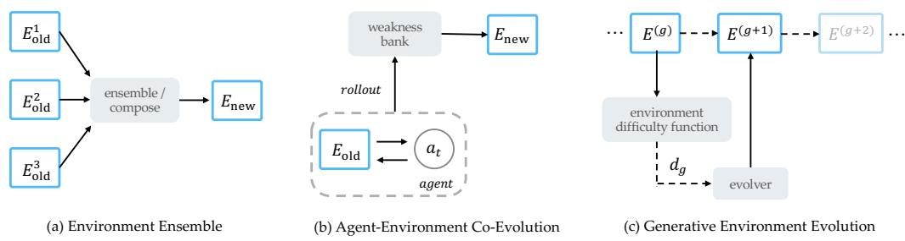
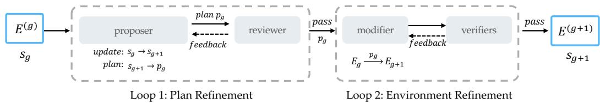
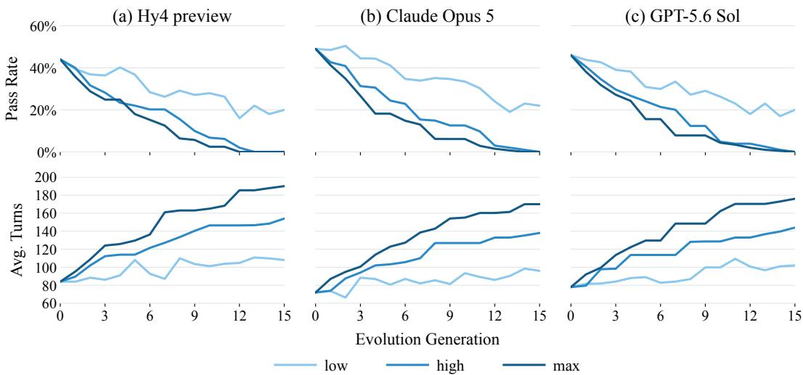
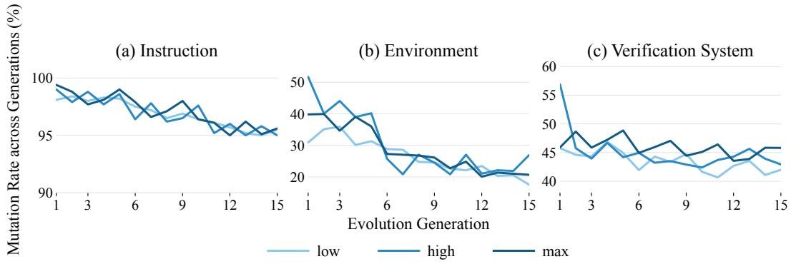
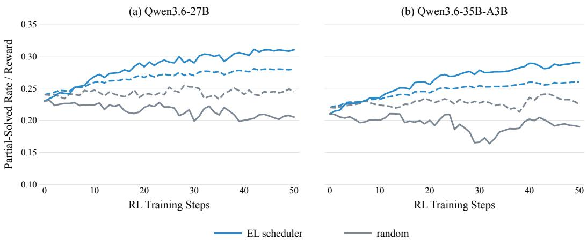
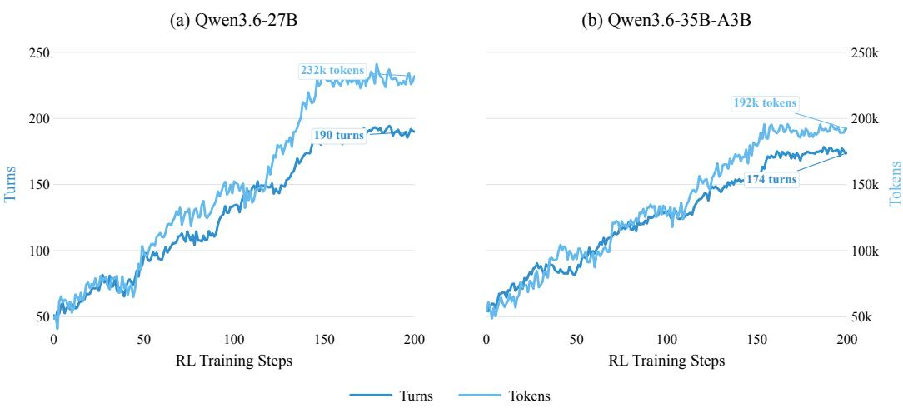
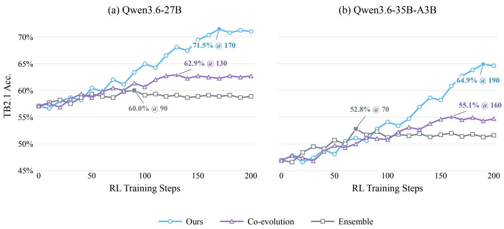

# Environment Evolution for Terminal Agents

Zhiyuan Fan Tinghao Yu Yuanjun Cai Jiang Zhou Jiangtao Guan Jincheng Liu

Yun Yang Dingxin Hu Zhuo Han Xing Wu Feng Zhang Lilin Wang

Hunyuan Team, Tencent B zhiyuan.fan@connect.ust.hk, {maxwellyu, lilinwang}@tencent.com

## ABSTRACT

Scaling interactive and verifiable environments is critical for training terminal agents. As frontier models become more capable, environments synthesized from scratch become less challenging and thus provide limited learning signals. Recent co-evolution methods iteratively synthesize environments near the model’s learnable frontier based on weaknesses exposed during rollouts. However, their dependence on on-policy rollouts limits generalization and the continuous provision of learning signals as the model becomes stronger. In this paper, we propose environment evolution, which incrementally increases environment difficulty off-policy and schedules the evolved environments generation by generation during training to provide continuous learning signals. We derive three evolution directions that influence environment difficulty from the multi-turn learning objective and then implement evolution along these directions through a loop-engineered multi-agent harness. Quantitative rollout experiments with Hy4 preview, Claude Opus 5, and GPT-5.6 Sol show that environment evolution consistently produces more difficult environments. We validate its effectiveness on Qwen3.6-27B and Qwen3.6-35B-A3B through simple long-horizon RL training, improving their performance by 14.4 and 18.0 percentage points on Terminal-Bench 2.1, respectively.

## 1 INTRODUCTION

Reinforcement learning environments are emerging as the next scalable direction for training capable agents (Bellemare et al., 2013; Brockman et al., 2016). With industrial-scale agentic RL algorithms stabilizing and asynchronous infrastructure maturing (Fu et al., 2026; Cao et al., 2025; Tan et al., 2025), the focus of further scaling is shifting toward the environments. For general-purpose terminal agents, the difficulty and diversity of environments are therefore the central levers that determine what agents can learn through verifiable feedback: adaptive difficulty preserves continual learning potential, while diversity supports generality (Dennis et al., 2021; Jiang et al., 2021; Parker-Holder et al., 2023; Garcin et al., 2024; Cobbe et al., 2020; Team et al., 2021; Merrill et al., 2026).

Recent work has focused on synthesizing large-scale terminal environments from scratch through human-designed pipelines that transform diverse resources (e.g., GitHub repositories, skills, and webpages) into executable terminal environments, each with a corresponding instruction (what to do) and a verification system (how completion is assessed) (Gandhi et al., 2026; Wu et al., 2026; Fan et al., 2026; Pi et al., 2026; Hua et al., 2026; Zhao et al., 2026; Yao et al., 2026). However, these environments are often insufficiently challenging for current frontier models, which consistently solve them across repeated rollouts. When used for RL training, such environments are discarded because they fail to provide effective learning signals that distinguish between better and worse trajectories, wasting environment construction costs and reducing diversity in the retained training distribution.

To provide useful learning signals, existing co-evolution methods couple model training with environment synthesis by using on-policy rollouts on seed environments to expose weaknesses that guide the synthesis of new environments that remain challenging yet learnable (Zala et al., 2024; Hu et al., 2025; Guo et al., 2025; Sygkounas et al., 2026). However, the resulting environments are constrained by the rollout model and initial environment distribution, limiting generalization and their ability to continuously provide learning signals as training saturates and model failures become sparse.

  
Figure 1: Comparison of paradigms for environment scaling. (a) Environment ensemble obtains a new environment by composing several difficult primitive environments. (b) Agent–environment co-evolution rolls out the target agent on primitive environments to populate a weakness bank, which guides the construction of new environments. (c) Environment evolution, our proposed paradigm, evolves the environment itself: an evolver uses a derived difficulty signal to produce successive environments along the lineage.

In this paper, we propose environment evolution, which increases environment difficulty generation by generation without relying on rollout models, as shown in Figure 1.

From the multi-turn learning objective, we derive an off-policy formulation of environment difficulty, which identifies scenario novelty, skill rarity, and execution length as three factors that influence difficulty. We then implement environment evolution with a loop-engineered multi-agent harness that incrementally modifies an existing environment along one selected from these three directions, which constructs lineages of increasing difficulty while introducing diverse variations around the original environment distribution. Rollout-based difficulty estimates with Hy4 preview, Claude Opus 5, and GPT-5.6 Sol show that the evolved environments are challenging across different models despite being synthesised off-policy. During model development, we find evolved environments continue to provide challenging RL signals even when their seed environments have already been used for SFT.

Experiments on Qwen3.6-27B and Qwen3.6-35B-A3B demonstrate that environment evolution improves Terminal-Bench 2.1 performance by 14.4 and 18.0 percentage points, respectively. Compared with agent environment co-evolution, off-policy environment evolution provides longer-lasting learning signals and achieves better performance. In summary, our contributions are as follows:

1. We derive a model-agnostic formulation of environment difficulty from the multi-turn learning objective, showing that environment evolution provides a more general approach to increasing environment difficulty.

2. We propose environment evolution and implement it as a loop-engineered multi-agent harness that incrementally evolves existing environments to construct verified lineages of increasing difficulty.

3. We validate the approach through 200-step long-horizon RL experiments on Qwen3.6-27B and Qwen3.6-35B-A3B, demonstrating longer-lasting learning signals than co-evolution and ensemble baselines and improvements of 14.4 and 18.0 percentage points on Terminal-Bench 2.1, respectively.

## 2 RELATED WORK

Terminal agents. Terminal agents interact with computing systems through command-line tools (Chen et al., 2021; Yang et al., 2024; Merrill et al., 2026), granting them open-ended access to explore and exploit computational resources and iteratively use environment feedback to complete long-horizon tasks (Yao et al., 2023). A line of work on harness design aims to strengthen agents’ planning, navigation, and exploration while constraining undesirable behaviors, with a focus on observation-space design, context compression, and tool routing (Lee et al., 2026; Wang et al., 2025; Bui, 2026). The community has recently turned to synthesizing large-scale terminal environments from scratch for agent training (Gandhi et al., 2026; Wu et al., 2026; Fan et al., 2026; Pi et al., 2026; Hua et al., 2026; Zhao et al., 2026; Yao et al., 2026). Despite their abundance and broad domain coverage, our large-scale rollout and quality assessment experiments reveal that these open-source environments suffer from low-quality reward signals (e.g., misalignment between task instructions and verification systems, corrupted environments) (Bercovich, 2026) and are insufficiently challenging to provide meaningful learning signals for frontier models.

Environment Scaling. Open-ended reinforcement learning requires a continual stream of solvable yet challenging environments that retain learning potential (Wang et al., 2019; Dennis et al., 2021; Jiang et al., 2021; Parker-Holder et al., 2023). Paired Open-Ended Trailblazer (POET) co-evolves a population of environment–agent pairs, generating new challenges through environment mutation and transferring agents across environments to exploit stepping stones (Wang et al., 2019; 2020). Unsupervised Environment Design (UED) formalizes the automatic construction and curation of valid and solvable environments from underspecified environment parameters, encompassing regret-based generation, prioritized replay, and incremental level editing (Dennis et al., 2021; Jiang et al., 2021; 2022; Parker-Holder et al., 2023). Recent work has begun to bring these ideas to LLM agents: through feedback-conditioned generation (Chen et al., 2026; Yang et al., 2026), online curricula (Qi et al., 2025), and agent–environment co-evolution (Guo et al., 2025; Liu et al., 2026), these methods adapt the environment distribution as the agent improves, keeping environments near its capability frontier. However, they require a designated agent to estimate environment difficulty through onpolicy rollouts, and the resulting environments are related to both the rollout agent and the initial environment distribution. Instead, environment evolution constructs increasingly difficult lineages independently of the target policy and schedules successive generations during training to provide continual learning signals.

## 3 PRELIMINARIES

Instead of estimating difficulty on-policy, e.g., by rolling out a model and using its pass rate as the difficulty metrics, we need an off-policy metric that measures the difficulty of the environment itself, derived from the multi-turn learning objective. Since models are trained on different data distributions, a difficulty estimate tied to one model θ is model-specific weakness rather than environment difficulty.

We first view agent-environment interaction as a Markov process (Kaelbling et al., 1998) with interleaved observations and actions. Let $h _ { t } = ( o _ { \leq t } , a _ { < t } )$ . Then $o _ { t } \sim O \varepsilon ( \cdot \mid s _ { t } ) , a _ { t } \sim \pi _ { \theta } ( \cdot \mid h _ { t } , g )$ , and $s _ { t + 1 } \sim P \varepsilon ( \cdot \mid s _ { t } , a _ { t } )$ , which induces a low-level execution trajectory $\zeta = ( o _ { 0 } , a _ { 0 } , o _ { 1 } , a _ { 1 } , \dots , o _ { T } )$

Following prior definitions from hierarchical agent execution (Sutton et al., 1999), we treat agent execution trajectory at a higher level as an interleaving of scenarios and skill executions:

$$
\xi = ( \sigma _ { 0 } , \kappa _ { 1 } , \sigma _ { 1 } , \ldots , \kappa _ { L } , \sigma _ { L } ) ,
$$

where $\sigma _ { t }$ is the high-level scenario at step $t ,$ and $\kappa _ { t }$ is the skill applied under that scenario.

Under model $\theta ,$ the likelihood of a high-level trajectory decomposes over the scenarios it reaches and the skills it applies. Taking the negative log-likelihood gives the model-specific difficulty:

$$
\begin{array} { l } { { \displaystyle D _ { \theta } ( \xi ) = - \log p _ { \theta } ( \xi \mid g ) } } \\ { { \displaystyle \quad = \sum _ { t = 1 } ^ { L } \Bigl ( - \log p _ { \theta } ( \sigma _ { t - 1 } \mid g ) - \log p _ { \theta } ( \kappa _ { t } \mid \sigma _ { t - 1 } , g ) \Bigr ) . } } \end{array}
$$

This quantity has three contributors. First, L is the number of meaningful solver turns required by the trajectory. Second, $- \log p _ { \theta } ( \sigma _ { t - 1 } \mid g )$ measures scenario novelty under the model. Third, $- \log p _ { \theta } ( \kappa _ { t } \mid \sigma _ { t - 1 } , g )$ measures the rarity of applying the required skill in that scenario. The last two terms are policy-dependent: they depend on the model’s training-data distribution and learned policy.

To obtain a policy-independent difficulty measure, we replace the model-dependent probabilities with those under a reference distribution T grounded in broad world knowledge:

$$
D _ { \mathcal { T } } ( \boldsymbol { \xi } ) = \sum _ { t = 1 } ^ { L } \Bigl ( - \log p _ { \mathcal { T } } ( \sigma _ { t - 1 } \mid g ) - \log p _ { \mathcal { T } } ( \kappa _ { t } \mid \sigma _ { t - 1 } , g ) \Bigr ) .
$$

Here $p \tau ( \sigma \mid g )$ measures how common a scenario is within the environment family, and $p _ { \mathcal { T } } ( \kappa \mid \sigma , g )$ measures how common the required skill is under that scenario. This converts the estimate from

model-specific weakness into model-agnostic environment difficulty. In particular, a deep-research agent can estimate both distributions through broad web search, grounding them in world knowledge, by providing the relative context of $\mathbf { \chi } _ { g }$ and $\xi .$

This also gives a direct way to relate environment difficulty to agent weakness. Let ${ \boldsymbol { z } } _ { t } = ( \sigma _ { t - 1 } , \kappa _ { t } )$ denote the scenario-skill requirement at step t, and define the per-step difficulties

$$
d _ { \theta } ( z _ { t } \mid g ) = - \log p _ { \theta } ( \sigma _ { t - 1 } \mid g ) - \log p _ { \theta } ( \kappa _ { t } \mid \sigma _ { t - 1 } , g ) ,
$$

and $d _ { T } ( z _ { t } \mid g )$ analogously under $p _ { T }$ . Agent weakness is the excess difficulty that remains after subtracting the environment-family difficulty:

$$
\delta _ { \theta } ( z _ { t } \mid g ) = [ d _ { \theta } ( z _ { t } \mid g ) - d _ { \mathcal { T } } ( z _ { t } \mid g ) ] _ { + } .
$$

where $[ x ] _ { + } = \operatorname* { m a x } ( x , 0 )$ . Equivalently,

$$
\delta _ { \theta } ( z _ { t } \mid g ) = \Bigl [ \log \frac { p _ { \mathcal { T } } ( \sigma _ { t - 1 } \mid g ) } { p _ { \theta } ( \sigma _ { t - 1 } \mid g ) } + \log \frac { p _ { \mathcal { T } } ( \kappa _ { t } \mid \sigma _ { t - 1 } , g ) } { p _ { \theta } ( \kappa _ { t } \mid \sigma _ { t - 1 } , g ) } \Bigr ] _ { + } .
$$

For the full high-level trajectory,

$$
\Delta _ { \theta } ( \xi ) = \sum _ { t = 1 } ^ { L } [ d _ { \theta } ( z _ { t } \mid g ) - d _ { { \mathcal T } } ( z _ { t } \mid g ) ] _ { + } .
$$

Thus, weakness is not the difficulty of the environment itself; it is the portion of that trajectory that is unusually difficult for a particular model relative to the environment family.

This distinction clarifies the scope of on-policy co-evolution of agent and environment. Such methods collect rollouts from a model $\theta ,$ identify the model’s failure modes, and generate new environments around those failures. If $e _ { t } ^ { \theta }$ indicates a failure at step $t ,$ the induced signal is mainly $\begin{array} { r } { \sum _ { t = 1 } ^ { L } e _ { t } ^ { \theta } [ - \log p _ { \theta } ( \kappa _ { t } \mid \sigma _ { t - 1 } , g ) ] } \end{array}$ . That is, on-policy co-evolution of agent and environment primarily targets skill-selection errors under scenarios contained in the seed environments and reached by the current model during rollouts. It does not explicitly control the number of required solver steps $L ,$ nor does it systematically increase scenario novelty under $p \tau ( \sigma \mid g )$ . In contrast, the environment evolution directly operates on the full difficulty space:

$$
( L , \mathbin { - } \log p _ { \mathcal { T } } ( \sigma \mathbin { \mid } g ) , \mathbin { - } \log p _ { \mathcal { T } } ( \kappa \mathbin { \mid } \sigma , g ) )
$$

which shows that environment evolution offers a more general paradigm for providing continuous learning signals.

## 4 APPROACH

4.1 SEQUENCE-GUIDED ENVIRONMENT EVOLUTION.

  
Figure 2: Loop-engineered multi-agent harness for environment evolution. It decomposes each generation into two gated feedback loops: (1) sequence-guided plan refinement, which generates and revises an evolution plan until it passes rubric-based review; and (2) plan-conditioned environment refinement, which evolves and repairs the candidate until strict solvability and quality checks pass.

Environment evolution is implemented as a loop-engineered multi-agent harness, as illustrated in Figure 2. It takes the latest accepted environment as input and produces the next-generation environment through an incremental modification guided by the expected execution trajectory at the scenario and skill levels.

Loop 1: Plan Refinement The Proposer first extracts an execution sequence of interleaved scenarios and skills from E:

$$
\xi _ { E } = ( \sigma _ { 1 } , \kappa _ { 1 } ) , \ldots , ( \sigma _ { L } , \kappa _ { L } ) .\tag{1}
$$

It then updates the sequence according to the evolution direction selected at the current generation. For length, it inserts scenario–skill pairs into the sequence to introduce additional dependencies along the expected execution trajectory. For scenario, it replaces one scenario while preserving its paired skill; for skill, it replaces one skill. A plan is generated from the difference between the updated and original sequences, and a rubric-based reviewer iteratively reviews it until it is accepted or the current evolution direction fails.

Loop 2: Environment Refinement The reviewed plan is then passed to the Modifier, which creates a residual ∆E and applies it to the current environment. Each candidate must pass three verifiers run in parallel: (i) an Oracle verifier checks that the reference solution succeeds in the sandbox; (ii) an Invalid-test verifier confirms that an empty or no-op solution fails, ensuring that the verification system is reliable; and (iii) an adaptive general-rubrics verifier checks environment quality. During development, accepted environments undergo human-in-the-loop review. Issues that bypass the rubric-based checks are converted into new rubrics for the plan reviewer and environment verifier until the loop reliably produces environments with no issues identified by human reviewers.

Evolution effort. To control the mutation between adjacent generations, we introduce a promptcontrolled mutation parameter called evolution effort, analogous in spirit to thinking effort, with three levels: low, high, and max. While the evolution direction determines what type of sequence-level edit is performed, evolution effort controls its scope. The three effort levels restrict the edit to one pair $( \sigma _ { \ell } , \kappa _ { \ell } )$ , one contiguous span, or an unrestricted portion of the sequence, respectively. Section 5 quantitatively validates the effectiveness of this design.

At each generation, we randomly order the three evolution directions. If the Plan Reviewer rejects a plan or the repair budget for the current direction is exhausted, we fall back to the next direction, construct a new target sequence from the same environment, and repeat the process. The branch terminates only when all three directions fail.

## 4.2 EVOLUTION-LINEAGE SCHEDULER.

As evolution proceeds, later generations become increasingly difficult. Sampling randomly from the full lineage can therefore expose the policy to environments it cannot yet solve, yielding all-failure rollout groups that provide no effective learning signal. We therefore propose the Evolution-Lineage (EL) Scheduler, which starts from the earliest generation and schedules its environments in order. Let $E _ { i , g , k }$ be the k-th environment in generation g of lineage i, with $N _ { i , g }$ environments in that generation. At update u, the scheduler updates the active indices as follows:

$$
( g _ { u + 1 } , k _ { u + 1 } ) = \left\{ \begin{array} { l l } { ( g _ { u } , k _ { u } ) , } & { \widehat { p _ { u } } ( E _ { i , g _ { u } , k _ { u } } ) \leq \tau , } \\ { ( g _ { u } , k _ { u } + 1 ) , } & { \widehat { p _ { u } } ( E _ { i , g _ { u } , k _ { u } } ) > \tau \land k _ { u } < N _ { i , g _ { u } } , } \\ { ( g _ { u } + 1 , 1 ) , } & { \widehat { p _ { u } } ( E _ { i , g _ { u } , k _ { u } } ) > \tau \land k _ { u } = N _ { i , g _ { u } } , } \end{array} \right. \quad \widehat { p _ { u } } ( E ) = \frac { 1 } { B } \sum _ { b = 1 } ^ { B } r _ { u , b } .\tag{2}
$$

We use $B = 8$ and $\tau = 6 / 8$ . Once the current environment exceeds this threshold, the scheduler moves to the next environment in the same generation. It advances to the next generation only when no environments remain in the current one.

## 5 EXPERIMENTS

## 5.1 EXPERIMENTAL SETUP

Harness. In this paper, evaluation and RL training use the Claude Code harness (Anthropic, 2025). It fixes the tool protocol across models while improving execution efficiency by running multiple tool calls in parallel within a single assistant turn. For RL training, the harness operates with a 256K context window and automatically compacts the trajectory when the remaining usable context reaches 16K, providing stable context management for long-horizon execution.

Benchmark. Terminal-Bench 2.1 Verified (Merrill et al., 2026) is the primary held-out benchmark for terminal agent capability. It fixes instabilities in Terminal-Bench 2.0 that hinder reproducible evaluation and incorrectly underestimate benchmark performance. Each task is configured with 32 CPU cores and 48 GB of memory, with a timeout of 4 hours. Sampling uses temperature 1.0, top-p 0.95, and top-k 20, with a dynamic output budget, 256K $- \ L _ { \mathrm { u s e d } }$ , at each assistant turn, to avoid truncation errors caused by an overly long turn. We report the average over five runs.

Training Algorithm. We use GRPO (Shao et al., 2024) for agentic RL training with partial rollouts, fully asynchronous GPU location, and a staleness bound of 5 to reduce GPU bubble time. When auto compact of Claude Code harness is triggered, its summary is retained in the complete trajectory and treated as a regular action turn for multi-turn credit assignment. We train Qwen3.6-27B, a 27B-parameter dense model, and Qwen3.6-35B-A3B, a mixture-of-experts model with 35B total and 3B activated parameters. Both checkpoints provide a native context length of 262,144 tokens. For the MoE model, we additionally use R3 (Ma et al., 2025) to stabilize training process.

Monitoring Metrics. Environment Difficulty is estimated by the pass rate over 8 independent rollouts. We also record the average number of assistant turns as a measure of long-horizon execution; assistant turns typically account for nearly half of the total turns. Rollouts use Claude Opus 5 and GPT-5.6 Sol with xhigh effort and Hy4 preview (Tencent Hunyuan, 2026) with high effort, all with a 1M context window. Environment Mutation. For each generation, structural change relative to the seed is measured across instruction, environment, and verification system, with their mutations measured at the token, file, and test-unit levels, respectively.

Seed Environment Selection. We collect 47,678 non-benchmark terminal environments from Hugging Face and GitHub and retain 127 through strict rubric-based filtering for environment quality and solvability. Each candidate must include an executable Oracle solution that passes the verifier, satisfy rubric-based quality checks (we find environment quality critical to successful RL training), and meet the difficulty threshold under Claude Opus 5: a pass rate of at most $4 / 8$ and average turns of at least 30. SkillSynth (Fan et al., 2026) is then used to supplement the pool with newly synthesized environments, which are subject to the same quality and difficulty filters. Finally, uniform sampling across domains yields a balanced and diverse seed pool of 500 environments.

## 5.2 EVOLUTION EFFORT

  
Figure 3: Environment difficulty across 15 evolution generations under low, high, and max evolution effort, evaluated independently by Hy4 preview, Claude Opus 5, and GPT-5.6 Sol.

Starting from the same seed environments, the randomized cross-mode strategy independently constructs 15-generation lineages under low, high, and max evolution effort. We use a common cap of 15 generations because pass rate provides no further resolution once a lineage enters the zero-pass regime; beyond that point, the effectiveness of additional evolution cannot be assessed reliably from rollout outcomes.

As shown in Figure 3, low effort progressively extends long horizon execution, as avg turns increase across generations, but its pass rate fluctuates and remains above zero. Because low modifies only one local pair $( \sigma _ { \ell } , \kappa _ { \ell } )$ , successive generations may repeatedly edit the same pair and partially return to an earlier configuration. In contrast, high and max monotonically reduce pass rate to zero and increase avg turns, with max reaching zero earlier and producing the larger change in difficulty.

  
Figure 4: Instruction, environment, and verification system mutation rates across generations G1–G15 under low, high, and max evolution effort.

Figure 4 separates generation-level mutation rates into instruction, environment, and verification system components. Instruction mutation remains high under high and max, with both fluctuating between 95% and 100% while trending downward, whereas environment and verification system changes remain more selective. Balancing effective and stable evolution against the controllability of each generation, high is used as the default evolution effort.

## 5.3 EVOLUTION DIRECTION

<table><tr><td rowspan="2">Direction</td><td colspan="2">Difficulty Change</td><td colspan="4">Component Mutation (%)</td></tr><tr><td>∆ Pass Rate</td><td>∆ Avg Turns</td><td>Instruction</td><td>Environment</td><td>Verification</td><td>Total</td></tr><tr><td colspan="7">1-step effect</td></tr><tr><td>scenario</td><td>-4.7pp</td><td>+13.5</td><td>99.8%</td><td>59.6%</td><td>53.8%</td><td>71.1%</td></tr><tr><td>skill</td><td>-4.0pp</td><td>+12.5</td><td>99.1%</td><td>50.3%</td><td>58.4%</td><td>69.3%</td></tr><tr><td>length</td><td>-7.1 pp</td><td>+9.4</td><td>87.5%</td><td>45.2%</td><td>58.6%</td><td>63.8%</td></tr><tr><td colspan="7">15-step mean effect</td></tr><tr><td>scenario</td><td>-2.9pp</td><td>+9.5</td><td>97.1%</td><td>34.6%</td><td>43.7%</td><td>58.5%</td></tr><tr><td>skill</td><td>−2.7pp</td><td>+10.6</td><td>96.5%</td><td>27.8%</td><td>45.8%</td><td>56.7%</td></tr><tr><td>length</td><td>-4.8pp</td><td>+7.4</td><td>85.5%</td><td>34.3%</td><td>48.9%</td><td>56.2%</td></tr></table>

Table 1: Single-step consistency of evolution-direction effects under high evolution effort. The two difficulty-change columns are measured by Claude Opus 5 with xhigh thinking effort. The first block applies each direction once to the same seed environments. The second evolves each direction for 15 consecutive steps and averages the metrics over the 15 generation transitions. Agreement between the two blocks tests whether each direction preserves a stable, direction-specific change profile along longer lineages. Difficulty changes are computed as the later generation minus the previous generation, component columns report generation-level mutation rates, and Total is their unweighted mean.

To isolate the effect of evolution direction, we fix high evolution effort and apply scenario, skill, and length to the same seed environments. At each generation, we measure changes in pass rate and avg turns together with instruction, environment, and verification system mutation. The 1-step effect captures the immediate change induced by each direction, while the 15-step mean averages the same metrics over adjacent transitions in a direction-specific lineage to test whether that effect persists.

All three directions consistently reduce pass rate and increase avg turns. length produces the largest pass-rate decrease, whereas scenario and skill produce larger increases in avg turns. scenario yields the largest total mutation, while length achieves the strongest pass-rate reduction with the smallest total mutation. The agreement between the 1-step and 15-step results indicates that these direction-specific profiles persist beyond a single edit. In the full evolution procedure, the directions are therefore randomly ordered at each generation to diversify the resulting lineages, with cross-mode fallback whenever the current direction fails.

## 5.4 RL TRAINING DYNAMICS

Before RL training, each base model generates trajectories for rejection sampling fine-tuning (RFT) (Touvron et al., 2023). Only trajectories that pass the verification system and conform to the Claude Code protocol are retained. The filtered set is rebalanced for trajectory diversity in order to increase policy entropy for better RL training. Starting from the resulting RFT checkpoint, denoted step 0, we train each model with GRPO for 200 steps.

EL Scheduler. The EL Scheduler advances through each environment lineage in order, exposing generation g + 1 only after generation g reaches the pass-rate threshold in Equation 2. Figure 5 compares it with random scheduling under matched rollout budgets during the first 50 RL steps. By avoiding premature exposure to generations that the policy cannot yet solve, the scheduler uses the rollout budget more efficiently and provides GRPO with more informative learning signals, as more rollout groups remain partially solved and retain non-zero within-group advantage. The EL Scheduler is used by default throughout the full 200-step RL training run.

  
Figure 5: Early training dynamics over the first 50 training steps. Solid curves show the fraction of rollout groups that are partially solved, with one to seven successful trajectories among eight rollouts; dashed curves show mean training reward.

Turns and Tokens. During training, the scheduler progressively admits harder environments, which tend to require longer interaction horizons. As shown in Figure 6, this progression is accompanied by increases in both turns and tokens per trajectory. Tokens per turn also increase, suggesting that the policy allocates greater thinking effort to each interaction.

  
Figure 6: Trajectory length over 200 RL training steps for Qwen3.6-27B (left) and Qwen3.6-35B-A3B (right); the left and right y-axes report average turns and tokens per trajectory, respectively, with annotations at step 200. Tokens per turn increase from approximately 951 to 1,221 for Qwen3.6-27B and from 947 to 1,103 for Qwen3.6-35B-A3B.

## 5.5 COMPARISON

To ensure a fair comparison across environment-scaling paradigms, Claude Opus 5 is fixed as the environment synthesis model, and the total number of training environments is held constant.

  
Figure 7: Checkpoint performance for Qwen3.6-27B (left) and Qwen3.6-35B-A3B (right) over 200 RL training steps, with offline evaluation every 10 steps; annotations mark each method’s peak accuracy and corresponding training step. Step 0 denotes the shared checkpoint after RFT used to increase policy entropy before RL training.

Environment Ensemble. The target agent is first evaluated on the seed environments, and the environments it fails to solve are selected. All two- and three-environment combinations are then enumerated, with each combination merged into one harder environment. This procedure is applied recursively as a tree, with the outputs of one level becoming the inputs to the next.

Agent–Environment Co-Evolution. The target agent first rolls out on the seed environments to generate trajectories. Its failed trajectories are analyzed to construct a weakness bank, from which combinations are sampled to synthesize new, harder environments. After the agent trains for 50 RL steps, the procedure is repeated.

Environment Evolution. Environment Evolution randomly orders the three modes at each generation and follows the cross-mode fallback, producing a verified 15-generation lineage from each seed without target-agent rollouts.

Figure 7 reports offline Terminal-Bench 2.1 evaluation every 10 RL steps. Environment evolution reaches peak accuracies of 71.5% and 64.9% on Qwen3.6-27B and Qwen3.6-35B-A3B, compared with 62.9% and 55.1% for Co-evolution and 60.0% and 52.8% for Ensemble.

## 6 CONCLUSION

In this paper, we propose environment evolution, which incrementally synthesizes environments of increasing difficulty for RL training. It serves as a more general paradigm for scaling environments for terminal agents, built on the derived off-policy formulation of environment difficulty. Across different models, evolved environments show a consistent increase in difficulty generation by generation despite being synthesized off-policy. By scheduling these environments along lineages, long-horizon RL training on Qwen3.6-27B and Qwen3.6-35B-A3B receives continuously effective learning signals and achieves higher performance than co-evolution and ensemble baselines. Future work will explore the potential of environment evolution for SWE agents and Computer-Use Agents.

## REFERENCES

Anthropic. Claude Code. https://code.claude.com/docs/en/overview, 2025.

Marc G. Bellemare, Yavar Naddaf, Joel Veness, and Michael Bowling. The arcade learning environment: An evaluation platform for general agents, 2013. URL https://arxiv.org/abs/1207. 4708.

Ivan Bercovich. What makes a good terminal-agent benchmark task: A guideline for adversarial, difficult, and legible evaluation design, 2026. URL https://arxiv.org/abs/2604.28093.

Greg Brockman, Vicki Cheung, Ludwig Pettersson, Jonas Schneider, John Schulman, Jie Tang, and Wojciech Zaremba. Openai gym, 2016. URL https://arxiv.org/abs/1606.01540.

Nghi D. Q. Bui. Building effective ai coding agents for the terminal: Scaffolding, harness, context engineering, and lessons learned, 2026. URL https://arxiv.org/abs/2603.05344.

Shiyi Cao, Dacheng Li, Fangzhou Zhao, Shuo Yuan, Sumanth R. Hegde, Connor Chen, Charlie Ruan, Tyler Griggs, Shu Liu, Eric Tang, Richard Liaw, Philipp Moritz, Matei Zaharia, Joseph E. Gonzalez, and Ion Stoica. Skyrl-agent: Efficient rl training for multi-turn llm agent, 2025. URL https://arxiv.org/abs/2511.16108.

Mark Chen, Jerry Tworek, Heewoo Jun, Qiming Yuan, Henrique Ponde de Oliveira Pinto, Jared Kaplan, Harri Edwards, Yuri Burda, Nicholas Joseph, Greg Brockman, Alex Ray, Raul Puri, Gretchen Krueger, Michael Petrov, Heidy Khlaaf, Girish Sastry, Pamela Mishkin, Brooke Chan, Scott Gray, Nick Ryder, Mikhail Pavlov, Alethea Power, Lukasz Kaiser, Mohammad Bavarian, Clemens Winter, Philippe Tillet, Felipe Petroski Such, Dave Cummings, Matthias Plappert, Fotios Chantzis, Elizabeth Barnes, Ariel Herbert-Voss, William Hebgen Guss, Alex Nichol, Alex Paino, Nikolas Tezak, Jie Tang, Igor Babuschkin, Suchir Balaji, Shantanu Jain, William Saunders, Christopher Hesse, Andrew N. Carr, Jan Leike, Josh Achiam, Vedant Misra, Evan Morikawa, Alec Radford, Matthew Knight, Miles Brundage, Mira Murati, Katie Mayer, Peter Welinder, Bob McGrew, Dario Amodei, Sam McCandlish, Ilya Sutskever, and Wojciech Zaremba. Evaluating large language models trained on code, 2021. URL https://arxiv.org/abs/2107.03374.

Zhaorun Chen, Zhuokai Zhao, Kai Zhang, Bo Liu, Qi Qi, Yifan Wu, Tarun Kalluri, Sara Cao, Yuanhao Xiong, Haibo Tong, Huaxiu Yao, Hengduo Li, Jiacheng Zhu, Xian Li, Dawn Song, Bo Li, Jason

Weston, and Dat Huynh. Scaling agent learning via experience synthesis. In The Fourteenth International Conference on Learning Representations, 2026. URL https://openreview.net/ forum?id=cf7qpBwttr.

Karl Cobbe, Christopher Hesse, Jacob Hilton, and John Schulman. Leveraging procedural generation to benchmark reinforcement learning, 2020. URL https://arxiv.org/abs/1912.01588.

Michael Dennis, Natasha Jaques, Eugene Vinitsky, Alexandre Bayen, Stuart Russell, Andrew Critch, and Sergey Levine. Emergent complexity and zero-shot transfer via unsupervised environment design, 2021. URL https://arxiv.org/abs/2012.02096.

Zhiyuan Fan, Tinghao Yu, Yuanjun Cai, Jiangtao Guan, Yun Yang, Dingxin Hu, Jiang Zhou, Xing Wu, Zhuo Han, Feng Zhang, and Lilin Wang. Toward scalable terminal task synthesis via skill graphs, 2026. URL https://arxiv.org/abs/2604.25727.

Wei Fu, Jiaxuan Gao, Xujie Shen, Chen Zhu, Zhiyu Mei, Chuyi He, Shusheng Xu, Guo Wei, Jun Mei, Jiashu Wang, Tongkai Yang, Binhang Yuan, and Yi Wu. Areal: A large-scale asynchronous reinforcement learning system for language reasoning, 2026. URL https://arxiv.org/abs/ 2505.24298.

Kanishk Gandhi, Shivam Garg, Noah D. Goodman, and Dimitris Papailiopoulos. Endless terminals: Scaling rl environments for terminal agents, 2026. URL https://arxiv.org/abs/2601.16443.

Samuel Garcin, James Doran, Shangmin Guo, Christopher G. Lucas, and Stefano V. Albrecht. Dred: Zero-shot transfer in reinforcement learning via data-regularised environment design, 2024. URL https://arxiv.org/abs/2402.03479.

Jiacheng Guo, Ling Yang, Peter Chen, Qixin Xiao, Yinjie Wang, Xinzhe Juan, Jiahao Qiu, Ke Shen, and Mengdi Wang. Genenv: Difficulty-aligned co-evolution between llm agents and environment simulators, 2025. URL https://arxiv.org/abs/2512.19682.

Mengkang Hu, Pu Zhao, Can Xu, Qingfeng Sun, Jianguang Lou, Qingwei Lin, Ping Luo, and Saravan Rajmohan. Agentgen: Enhancing planning abilities for large language model based agent via environment and task generation, 2025. URL https://arxiv.org/abs/2408.00764.

Zhanbo Hua, Yifan Yao, Weihao Xie, Yongchi Zhao, Minghao Liu, Ruizhi Qiu, Zhewei Huang, Zun Wang, Yiyan Ji, Yunhai Ye, Letian Zhu, Xinping Lei, Han Li, Zhiyuan Ma, Zili Wang, Zhaoxiang Zhang, and Jiaheng Liu. CLI-Universe: Towards verifiable task synthesis engine for terminal agents, 2026. URL https://arxiv.org/abs/2606.22883.

Minqi Jiang, Edward Grefenstette, and Tim Rocktaschel. Prioritized level replay, 2021. URL¨ https://arxiv.org/abs/2010.03934.

Minqi Jiang, Michael Dennis, Jack Parker-Holder, Jakob Foerster, Edward Grefenstette, and Tim Rocktaschel. Replay-guided adversarial environment design, 2022. URL¨ https://arxiv.org/ abs/2110.02439.

Leslie Pack Kaelbling, Michael L Littman, and Anthony R Cassandra. Planning and acting in partially observable stochastic domains. Artificial Intelligence, 101(1-2):99–134, 1998.

Yoonho Lee, Roshen Nair, Qizheng Zhang, Kangwook Lee, Omar Khattab, and Chelsea Finn. Metaharness: End-to-end optimization of model harnesses, 2026. URL https://arxiv.org/abs/ 2603.28052.

Bo Liu, Simon Yu, Yiding Jiang, Ao Qu, Andrew Zhao, Zichen Liu, Junsu Kim, Zijian Zhou, Seungone Kim, Tongzheng Ren, Mickel Liu, Hanfei Yu, Zhaorun Chen, Weiyan Shi, Paul Pu Liang, Luke Zettlemoyer, Yejin Choi, and Natasha Jaques. SPADE: Self-play in adaptive synthetic executable environments, 2026. URL https://arxiv.org/abs/2608.19197.

Wenhan Ma, Hailin Zhang, Liang Zhao, Yifan Song, Yudong Wang, Zhifang Sui, and Fuli Luo. Stabilizing MoE reinforcement learning by aligning training and inference routers, 2025. URL https://arxiv.org/abs/2510.11370.

Mike A. Merrill, Alexander G. Shaw, Nicholas Carlini, Boxuan Li, Harsh Raj, Ivan Bercovich, Lin Shi, Jeong Yeon Shin, Thomas Walshe, E. Kelly Buchanan, Junhong Shen, Guanghao Ye, Haowei Lin, Jason Poulos, Maoyu Wang, Marianna Nezhurina, Jenia Jitsev, Di Lu, Orfeas Menis Mastromichalakis, Zhiwei Xu, Zizhao Chen, Yue Liu, Robert Zhang, Leon Liangyu Chen, Anurag Kashyap, Jan-Lucas Uslu, Jeffrey Li, Jianbo Wu, Minghao Yan, Song Bian, Vedang Sharma, Ke Sun, Steven Dillmann, Akshay Anand, Andrew Lanpouthakoun, Bardia Koopah, Changran Hu, Etash Guha, Gabriel H. S. Dreiman, Jiacheng Zhu, Karl Krauth, Li Zhong, Niklas Muennighoff, Robert Amanfu, Shangyin Tan, Shreyas Pimpalgaonkar, Tushar Aggarwal, Xiangning Lin, Xin Lan, Xuandong Zhao, Yiqing Liang, Yuanli Wang, Zilong Wang, Changzhi Zhou, David Heineman, Hange Liu, Harsh Trivedi, John Yang, Junhong Lin, Manish Shetty, Michael Yang, Nabil Omi, Negin Raoof, Shanda Li, Terry Yue Zhuo, Wuwei Lin, Yiwei Dai, Yuxin Wang, Wenhao Chai, Shang Zhou, Dariush Wahdany, Ziyu She, Jiaming Hu, Zhikang Dong, Yuxuan Zhu, Sasha Cui, Ahson Saiyed, Arinbjorn Kolbeinsson, Jesse Hu, Christopher Michael Rytting, Ryan Marten, Yixin¨ Wang, Alex Dimakis, Andy Konwinski, and Ludwig Schmidt. Terminal-bench: Benchmarking agents on hard, realistic tasks in command line interfaces, 2026. URL https://arxiv.org/abs/ 2601.11868.

Jack Parker-Holder, Minqi Jiang, Michael Dennis, Mikayel Samvelyan, Jakob Foerster, Edward Grefenstette, and Tim Rocktaschel. Evolving curricula with regret-based environment design,¨ 2023. URL https://arxiv.org/abs/2203.01302.

Renjie Pi, Grace Lam, Mohammad Shoeybi, Pooya Jannaty, Bryan Catanzaro, and Wei Ping. On data engineering for scaling llm terminal capabilities, 2026. URL https://arxiv.org/abs/2602. 21193.

Zehan Qi, Xiao Liu, Iat Long Iong, Hanyu Lai, Xueqiao Sun, Jiadai Sun, Xinyue Yang, Yu Yang, Shuntian Yao, Wei Xu, Jie Tang, and Yuxiao Dong. Webrl: Training llm web agents via selfevolving online curriculum reinforcement learning. In The Thirteenth International Conference on Learning Representations, 2025. URL https://proceedings.iclr.cc/paper files/paper/ 2025/hash/c66e1fcc9691aae706250638f36f681b-Abstract-Conference.html.

Zhihong Shao, Peiyi Wang, Qihao Zhu, Runxin Xu, Junxiao Song, Xiao Bi, Haowei Zhang, Mingchuan Zhang, Y. K. Li, Y. Wu, and Daya Guo. Deepseekmath: Pushing the limits of mathematical reasoning in open language models, 2024. URL https://arxiv.org/abs/2402.03300.

Richard S. Sutton, Doina Precup, and Satinder Singh. Between mdps and semi-mdps: A framework for temporal abstraction in reinforcement learning. Artificial Intelligence, 112(1–2):181–211, 1999. doi: 10.1016/S0004-3702(99)00052-1.

Alkis Sygkounas, Rishi Hazra, Andreas Persson, Pedro Zuidberg Dos Martires, and Amy Loutfi. Covolve: Adversarial co-evolution of large-language-model-generated policies and environments via two-player zero-sum game, 2026. URL https://arxiv.org/abs/2603.28386.

Zheyue Tan, Mustapha Abdullahi, Tuo Shi, Huining Yuan, Zelai Xu, Chao Yu, Boxun Li, and Bo Zhao. Earl: Efficient agentic reinforcement learning systems for large language models, 2025. URL https://arxiv.org/abs/2510.05943.

Open Ended Learning Team, Adam Stooke, Anuj Mahajan, Catarina Barros, Charlie Deck, Jakob Bauer, Jakub Sygnowski, Maja Trebacz, Max Jaderberg, Michael Mathieu, Nat McAleese, Nathalie Bradley-Schmieg, Nathaniel Wong, Nicolas Porcel, Roberta Raileanu, Steph Hughes-Fitt, Valentin Dalibard, and Wojciech Marian Czarnecki. Open-ended learning leads to generally capable agents, 2021. URL https://arxiv.org/abs/2107.12808.

Tencent Hunyuan. Hy4 preview. https://hy.tencent.com/research/hy4-preview, August 2026.

Hugo Touvron et al. Llama 2: Open foundation and fine-tuned chat models, 2023. URL https: //arxiv.org/abs/2307.09288.

Rui Wang, Joel Lehman, Jeff Clune, and Kenneth O. Stanley. Paired open-ended trailblazer (poet): Endlessly generating increasingly complex and diverse learning environments and their solutions, 2019. URL https://arxiv.org/abs/1901.01753.

Rui Wang, Joel Lehman, Aditya Rawal, Jiale Zhi, Yulun Li, Jeff Clune, and Kenneth O. Stanley. Enhanced poet: Open-ended reinforcement learning through unbounded invention of learning challenges and their solutions, 2020. URL https://arxiv.org/abs/2003.08536.

Xingyao Wang, Boxuan Li, Yufan Song, Frank F. Xu, Xiangru Tang, Mingchen Zhuge, Jiayi Pan, Yueqi Song, Bowen Li, Jaskirat Singh, Hoang H. Tran, Fuqiang Li, Ren Ma, Mingzhang Zheng, Bill Qian, Yanjun Shao, Niklas Muennighoff, Yizhe Zhang, Binyuan Hui, Junyang Lin, Robert Brennan, Hao Peng, Heng Ji, and Graham Neubig. Openhands: An open platform for ai software developers as generalist agents, 2025. URL https://arxiv.org/abs/2407.16741.

Siwei Wu, Yizhi Li, Yuyang Song, Wei Zhang, Yang Wang, Riza Batista-Navarro, Xian Yang, Mingjie Tang, Bryan Dai, Jian Yang, and Chenghua Lin. Large-scale terminal agentic trajectory generation from dockerized environments, 2026. URL https://arxiv.org/abs/2602.01244.

John Yang, Carlos E. Jimenez, Alexander Wettig, Kilian Lieret, Shunyu Yao, Karthik Narasimhan, and Ofir Press. Swe-agent: Agent-computer interfaces enable automated software engineering, 2024. URL https://arxiv.org/abs/2405.15793.

Shidong Yang, Ziyu Ma, Tongwen Huang, Yiming Hu, Yong Wang, and Xiangxiang Chu. CoEvolve: Training LLM agents via agent-data mutual evolution. In Proceedings ofthe 64th Annual Meeting ofthe Associationfor Computational Linguistics, pp. 23015–23036, 2026. doi: 10.18653/v1/2026. acl-long.1055. URL https://aclanthology.org/2026.acl-long.1055/.

Shunyu Yao, Jeffrey Zhao, Dian Yu, Nan Du, Izhak Shafran, Karthik Narasimhan, and Yuan Cao. React: Synergizing reasoning and acting in language models, 2023. URL https://arxiv.org/ abs/2210.03629.

Yihang Yao, Bo Pang, Xuan Phi Nguyen, Ding Zhao, Shafiq Joty, and Semih Yavuz. Learning generalizable behaviors for terminal agents, 2026. URL https://arxiv.org/abs/2608.22631.

Abhay Zala, Jaemin Cho, Han Lin, Jaehong Yoon, and Mohit Bansal. Envgen: Generating and adapting environments via llms for training embodied agents, 2024. URL https://arxiv.org/ abs/2403.12014.

Jiarong Zhao, Zhikai Lei, Zhiheng Xi, Rui Zheng, Hang Yan, Jie Zhou, Qin Chen, and Liang He. NexForge: Scaling agent capabilities through requirement-driven task synthesis for LLMs, 2026. URL https://arxiv.org/abs/2607.14186.

## A VERSION NOTE

We will provide more details in future versions. Future versions will also report RSI results in which the same model both constructs and learns from the environments.