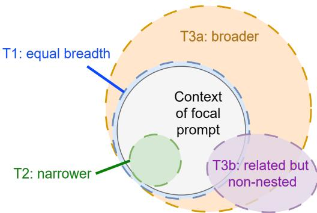
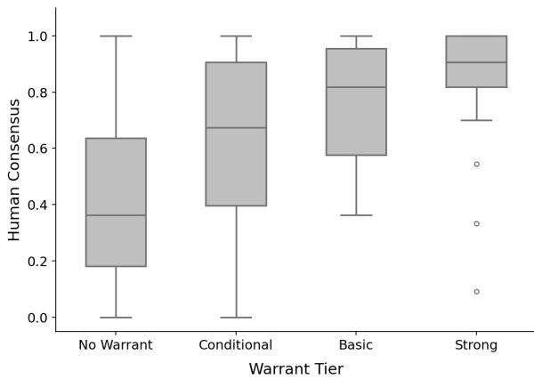
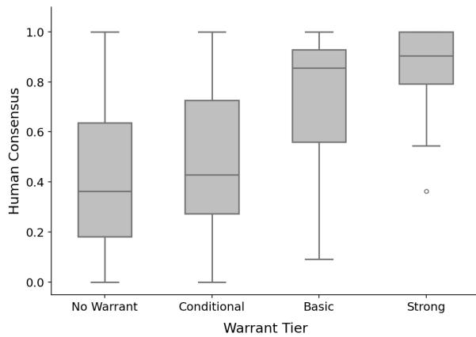
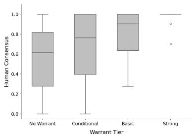
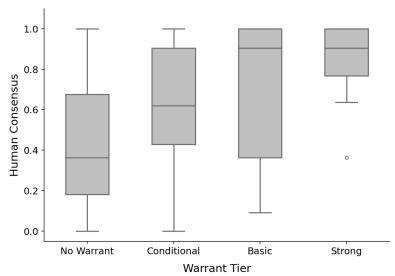
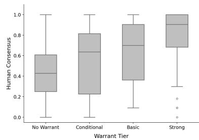
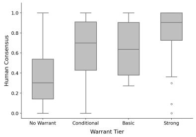
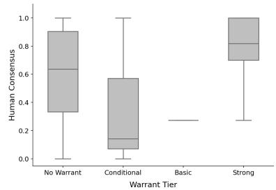

# Epistemic Warrant for LLM Recommendations: Characterizing the Basis for Reliance When Ground Truth Is Unavailable

Shai Vardi

University of South Florida, Muma College of Business, vardi@usf.edu

Jo˜ao Sedoc

New York University, jsedoc@nyu.edu

Large language models are increasingly used to support organizational decisions, yet users often lack a principled basis for assessing whether to rely on a specific recommendation. Existing approaches typically evaluate broad model properties—such as reliability, uncertainty, or robustness—or focus on user trust, rather than the underlying basis for relying on an individual recommendation. Adapting theoretical foundations from epistemology, we introduce epistemic warrant, a decision-level construct that characterizes the stability of a model’s preference and the scope over which that preference holds. We operationalize this construct through a four-tier reliance certificate for pairwise recommendations, distinguishing among unstable, context dependent, locally supported, and broadly supported recommendations. We validate the construct using contemporary methodologies: known-groups tests successfully recover expert-prespecified warrant orderings, and stronger warrants systematically align with independent consensus from crowd workers. Furthermore, we demonstrate that epistemic warrant provides information distinct from verbalized confidence and is not readily explained by decision dificulty. Ultimately, this framework ofers a theoretically grounded, implementable approach for characterizing the warrant of individual LLM recommendations when objective ground truth is unavailable.

## 1. Introduction

When is a decision-maker justified in acting on a recommendation from a large language model (LLM)? This question has practical urgency as organizations move from experimenting with LLMs toward integrating them into business and management workflows (Arslan et al. 2026).

Yet this growing reliance on LLMs is dificult to reconcile with the uneven reliability of their recommendations. Prior work shows that LLM outputs can be sensitive to seemingly irrelevant contextual features (Ceballos-Arroyo et al. 2024, Valkanova and Yordanov 2024, Yang et al. 2024), exhibit systematic biases related to demographic attributes (An et al. 2025, Hofmann et al. 2024, Templin et al. 2025, Wen et al. 2025), and contain unsupported or incorrect responses (Huang et al. 2025). These concerns become more consequential as LLMs are increasingly used in high-stakes domains such as medical triage and hiring (Ramaswamy et al. 2026, Wang et al. 2024), as well as in LLM-as-a-judge pipelines (Shi et al. 2025). Moreover, for many recommendations, no objective outcome is immediately available against which reliability can be assessed.

Prior work ofers several signals for evaluating LLM outputs. Confidence and calibration methods assess whether expressed certainty tracks correctness (Guo et al. 2017, Kadavath et al. 2022); repeated sampling and self-consistency evaluate or exploit agreement across stochastic generations (Wang et al. 2023); and metamorphic testing examines whether outputs satisfy expected relations across transformed inputs (Chen et al. 2018, Cho et al. 2025). Moreover, natural-language recommendation prompts are frequently underspecified. Recent work addresses this problem by identifying missing information, eliciting clarification, or evaluating responses under additional context (Malaviya et al. 2025, Zhang et al. 2024). Together, these approaches provide signals concerning confidence, repeatability, transformation consistency, and contextual adaptation, but do not integrate these signals into a decision-level assessment of the strength and scope of support for relying on a specific recommendation.

A complementary IS literature examines why users adopt systems, trust advice, follow recommendations, or abandon algorithms after observing them err (Davis 1989, Dietvorst et al. 2015, Logg et al. 2019, Venkatesh et al. 2003). This literature explains when people rely on algorithmic advice, but leaves open the distinct question of when reliance on a particular recommendation is warranted.

To address these gaps, we introduce epistemic warrant, a decision-level construct for characterizing the strength and scope of support for relying on a specific LLM recommendation. We adapt the concept of warrant from epistemology, where it is treated as a property of a belief: when a belief is true and possesses suficient warrant, it qualifies as knowledge (Plantinga 1993). In our setting, epistemic warrant is a graded property of a recommendation determined by the stability of the model’s preference and the scope over which that preference continues to hold. We distinguish four ordered categories of epistemic warrant that capture progressively greater support for a recommendation. When the model does not exhibit a stable preference for the recommended option, the recommendation has No Warrant. When the preference is stable in the stated context but reverses in plausible subcontexts, it has Conditional Warrant. When the preference holds throughout the stated decision context but does not extend beyond it, the recommendation has Basic Warrant. Finally, when the preference extends beyond the focal context to broader or substantively related contexts, the recommendation has Strong Warrant.

Epistemic warrant is a property of a particular recommendation made by a particular model in a particular decision context; it is not a property of the model as a whole or of the decision problem in the abstract. Warrant is also distinct from correctness. A recommendation may exhibit substantial warrant even when it is unsound, just as a belief may be warranted but turn out to be false (Plantinga 1993).1 Nor is warrant equivalent to confidence or trust: confidence concerns the model’s expressed certainty about its recommendation, whereas trust concerns the decision-maker’s willingness to rely on the model.

We operationalize the framework for pairwise recommendations, in which the model chooses between two alternatives. Pairwise choice is both a natural unit of decision and an increasingly common format in LLM evaluation, where a growing body of work finds relative judgments to be more consistent, robust, and aligned with human judgments than absolute scores (Liu et al. 2024, Qin et al. 2023, Zheng et al. 2023). Pairwise choice also provides a clear expression of the model’s preference, allowing us to examine its stability and scope under controlled changes to the decision problem.

We administer four tiers of tests, denoted T0–T3. T0 tests stochastic stability by asking whether the model reproduces its preference across repeated generations of the original prompt. T1 tests invariance under transformations that preserve the underlying decision, such as reordering the alternatives or making semantically equivalent substitutions. T2 tests whether the preference holds across plausible subcontexts of the stated decision. T3 tests whether the preference extends beyond the focal context to broader substantively related contexts. A change in the model’s implied preference constitutes a violation at the corresponding tier.

The tiers form a hierarchical certificate that maps directly onto the four warrant categories. Violations at T0 or T1 imply No Warrant. A recommendation that survives T0 and T1 but violates T2 receives Conditional Warrant. A recommendation that also survives T2 but violates T3 receives Basic Warrant, while one that survives all four tiers receives Strong Warrant. Success at a later tier cannot compensate for failure at an earlier tier.

To implement the reliance certificate, we develop an automated certificate-generation pipeline. Given an original pairwise prompt, an auxiliary LLM generates tier-specific T1–T3 transformations. The focal model is then queried on repeated generations of the original prompt for T0 and on each generated transformation for T1–T3. The hierarchical classification rule is then applied to assign the recommendation a warrant category.

We treat epistemic warrant as a formative construct.2 The outcomes of T0–T3 capture distinct aspects of warrant and jointly determine the warrant category assigned to a recommendation. Validating the construct is challenging because many recommendations lack an objective groundtruth label. Moreover, correctness cannot serve as a definitive criterion for warrant: a warranted recommendation may ultimately prove unsuccessful, while an unwarranted recommendation may turn out well by chance. Following established guidance for formative constructs in IS research, we use a cumulative validation strategy that combines conceptual specification with multiple forms of empirical validity evidence (MacKenzie et al. 2011, Petter et al. 2007, Straub et al. 2004). Table 1 summarizes the question addressed by each component of this strategy and the evidence used to evaluate it. The first two components establish the construct’s conceptual domain and structural specification; the remaining components assess whether the certificate is implemented as intended, behaves in theoretically expected ways, remains distinct from related constructs, and yields conclusions that are robust across models and alternative operationalizations.

Table 1 Framework for Construct Development and Validation of the Reliance Certificate
<table><tr><td>Component</td><td>Assessment Question</td><td>Basis / Evidence</td></tr><tr><td>Construct definition and domain</td><td>What is the object and scope of decision-level epistemic warrant, and how does it differ from related constructs?</td><td>Theoretical foundations and warrant principles (Sections 2.1 and 3.1–3.2).</td></tr><tr><td>Structural specification</td><td>How is warrant operationalized through the certificate and how are tier outcomes combined into warrant categories?</td><td>Derivation of four ordered tiers and a mapping from tier outcomes to warrant categories (Sections 3.3 and 3.4).</td></tr><tr><td>Indicator content validity</td><td>Do the generated transformations faithfully instantiate their intended tier relationships?</td><td>Independent human classification of sampled prompt transformations (Section 5.2).</td></tr><tr><td>Known-groups validity</td><td>Does the certificate recover the expected ordering of warrant?</td><td>Ordered-trend and correspondence tests against prespecified warrant categories (Section 5.3).</td></tr><tr><td>Nomological validity</td><td>Is stronger warrant associated with theoretically related properties of the underlying decision?</td><td>Association between warrant and independent human consensus, with tier-level analyses (Section 5.4).</td></tr><tr><td>Discriminant validity</td><td>Does warrant capture information distinct from related constructs?</td><td>Divergence from verbalized confidence and explanatory value for human consensus beyond confidence (Section 5.5).</td></tr><tr><td>Generalizability and robustness</td><td>Do the substantive conclusions persist across models and alternative implementations of the certificate?</td><td>Cross-model comparisons and robustness analyses (Section 5.6).</td></tr></table>

We begin by developing the theoretical foundations of epistemic warrant more formally. We draw primarily on epistemology to clarify the role of warrant in the setting of LLM recommendations, and connect this account to pragmatist ideas about action. We use these foundations to specify the reliance certificate. For the empirical analysis, we use 100 pairwise recommendation prompts spanning 22 topics and seven LLMs from the OpenAI, Anthropic, and Llama families. Each model is evaluated on the original prompt and a common set of tier-specific transformations. We use two independent human evaluations to validate the certificate. The first assesses whether sampled transformations instantiate their intended tier relationships, providing evidence of indicator content validity. The second measures independent human consensus on the original decisions, allowing us to test whether stronger warrant is associated with greater agreement about the preferred option.

Neither group observes model responses, warrant classifications, or other certificate outcomes. We additionally conduct a known-groups study using 40 prompts assigned ex ante to the four warrant categories by subject-matter experts or independently validated by domain experts.

The results provide convergent evidence for the construct. Independent raters’ majority classifications match the intended tier for 23 of 24 sampled transformations, indicating that the probes instantiate the relationships they are designed to test. In the known-groups study, mean modelassigned warrant is nondecreasing across the prespecified categories for all six models. Page’s test supports the expected ordered pattern for five models, while assignments for all six models are closer to the prespecified categories than expected under random within-set reassignment. In the 100-prompt validation sample, stronger warrant is positively associated with independent human consensus across all seven models, with statistically significant associations for six. Tier-level analyses show that this relationship is not attributable to a single component of the certificate: T1 is significantly associated with consensus for all seven models, while T0, T2, and T3 are significant for a majority of models. The association between warrant and human consensus is also not explained simply by decision dificulty. When warrant and dificulty are entered jointly, warrant remains positively associated with consensus for all seven focal models, while dificulty contributes comparatively little additional explanatory power. Warrant is also related to, but distinct from, verbalized confidence. Adding warrant increases explained variation in human consensus beyond confidence alone for all seven models, with statistically significant incremental contributions for five. These conclusions remain robust to alternative representations of certificate strength, alternative transformation procedures, and specifications accounting for the nesting of prompts within base questions.

Taken together, these results provide convergent construct-validity evidence for the reliance certificate as an operationalization of decision-level epistemic warrant. The certificate’s probes instantiate the theoretically specified relationships, distinguish recommendations expected a priori to difer in warrant, vary systematically with independent human consensus, capture information beyond verbalized confidence, and yield consistent conclusions across models and alternative operationalizations.

This paper makes three contributions. First, it develops epistemic warrant as a decision-level construct for characterizing the strength and scope of the basis for relying on a particular LLM recommendation, distinct from correctness, confidence, trust, and model-level properties such as reliability and robustness. Second, it operationalizes epistemic warrant through a hierarchical reliance certificate that combines stochastic stability, decision-preserving invariance, and contextual scope into four ordered, noncompensatory tiers with distinct implications for reliance. Third, it develops and validates an implementable procedure for assigning warrant certificates when objective ground-truth labels are unavailable, using complementary evidence from known-groups tests, independent human consensus, discriminant analyses, and robustness checks across models, certificate representations, and transformation-generation procedures. Together, these contributions provide a theoretically grounded way to translate observable patterns of LLM behavior into an assessment of the warrant of a particular recommendation.

## 2. Conceptual Foundations and Related Literature

Our work connects three streams of literature: epistemic theories of warrant and justification, IS research on trust and reliance in decision support, and research on robustness, consistency, and behavioral evaluation of LLMs.

## 2.1. Theoretical Foundations

Our conception of epistemic warrant adapts the epistemological notion of warrant to the problem of relying on a specific LLM recommendation. In Plantinga’s account, warrant is a graded epistemic property of belief: when a belief is true and possesses suficient warrant, it qualifies as knowledge (Plantinga 1993). We extend this idea from beliefs to recommendations. Our concern is not whether an LLM recommendation constitutes knowledge, but what epistemic standing the recommendation has as a basis for reliance.

Several strands of epistemology help motivate the properties we use to characterize warrant. First, process-oriented accounts emphasize that epistemic standing cannot be inferred from the correctness of an outcome alone. Goldman (1979) argues that justification depends in part on whether a belief is produced by a process that tends to generate true rather than false beliefs, while related virtue-epistemic accounts distinguish success attributable to competence from success attributable merely to luck (Sosa 2007). We adapt from these accounts the underlying distinction between an outcome that happens to be favorable and one for which the process itself provides epistemic support. Applied to LLM recommendations, this motivates examining the behavior of the recommendation-generating process rather than treating observed correctness as suficient evidence of warrant.

Second, modal accounts motivate evaluating how a recommendation behaves across relevant alternative conditions. Counterfactual approaches to knowledge ask whether a belief would continue to track the relevant facts under nearby possibilities (Nozick 1981), and DeRose (1995) emphasizes that stronger epistemic positions can be associated with stability across a wider range of relevant possibilities. These provide the theoretical basis for treating both stability and scope as constitutive features of epistemic warrant. In our setting, warrant increases as a recommendation remains stable under decision-preserving changes and continues to hold across progressively broader ranges of relevant decision contexts.

Third, the literature on defeaters helps distinguish failures that undermine a recommendation from those that instead delimit its scope. An undercutting defeater weakens the connection between an evidential basis and the conclusion it supports (Pollock 1986). Instability across repeated generations or decision-preserving formulations similarly weakens the basis for treating the origina recommendation as warranted. By contrast, a reversal in a narrower or broader context need not undermine the recommendation within the focal context; it may instead reveal that the recommendation is conditional or that its support does not extend beyond that context. This distinction further motivates the hierarchical structure of the warrant categories.

Finally, our interest in warrant is practical: the construct is intended to inform whether a recommendation provides a suficient epistemic basis for reliance. This connection is consistent with pragmatist accounts that link inquiry to action and the resolution of uncertain situations (Dewey 1938, Peirce 1878), as well as with pragmatist traditions in Information Systems research that view information systems as instruments of organizational inquiry and action (Baskerville and Myers 2004, Goldkuhl 2012).

## 2.2. Trust and Reliance in Decision Support

There is a long line of research on trust in decision-support systems. Early work on decision aids shows that such systems do not simply provide information, but alter the cognitive efort associated with diferent decision strategies and thereby shape how users search for, process, and use information (Todd and Benbasat 1991, 1992). Subsequent work identifies trust as a central mechanism shaping adoption and reliance on recommendation agents (Benbasat and Wang 2005, Komiak and Benbasat 2006), and shows that explanations and attributional cues can strengthen users’ trust in system recommendations (Wang and Benbasat 2007, 2008). More recently, the rise of opaque AI systems has pushed this literature toward organizational questions: how firms govern algorithmic decision-making, and how managers maintain meaningful oversight when the underlying logic is inaccessible (Berente et al. 2021).

A central theme across this literature is that reliance must be calibrated. Users may rely inappropriately when trust exceeds warranted system capability (Lee and See 2004), under-rely on algorithms after observing errors (Dietvorst et al. 2015), or over-rely on algorithmic advice relative to human judgment (Logg et al. 2019). However, this literature primarily explains how users form trust in algorithmic systems and how trust afects reliance. It provides less guidance on how to evaluate whether a specific AI-generated recommendation is itself worthy of reliance, especially when objective ground truth is unavailable.

## 2.3. Behavioral Evaluation of LLM Outputs Without Ground Truth

When objective ground truth is unavailable or dificult to obtain, prior research has turned to behavioral signals derived from the model’s own outputs and responses to diferent prompts. One such signal is the model’s expressed confidence in its answer. Verbalized confidence can predict factual correctness and, for some models, may be better calibrated than confidence inferred from token probabilities (Kadavath et al. 2022, Tian et al. 2023). However, models are often overconfident, and the quality of their confidence estimates varies across models, tasks, and elicitation procedures (Xiong et al. 2024, Zhao et al. 2024b). Confidence therefore captures the model’s stated certainty, whereas our concern is whether that certainty is behaviorally supported. A model may express high confidence yet reverse its recommendation under repeated sampling, decision-preserving reformulations, or plausible contextual refinements. Confidence alone therefore cannot establish either the degree or the contextual scope of epistemic warrant.

Another stream uses repeated generations of the same prompt. Self-consistency methods sample multiple reasoning paths and select the most common answer, often improving performance on reasoning tasks (Wang et al. 2023). Agreement across generations can also serve as a reference-free signal of reliability, as in methods that flag claims on which repeated samples disagree (Manakul et al. 2023). These approaches show that stochastic agreement contains useful information, but they generally use it to improve an answer or detect unreliable content rather than to assess the grounds for relying on a particular recommendation.

Metamorphic testing evaluates outputs by testing expected relations across systematically related inputs (Chen et al. 2018). Recent applications show that LLMs frequently violate such relations across transformed prompts (Cho et al. 2025, de Zarz\`a et al. 2026, Li et al. 2024). Related studies find that model judgments can change in response to features that should not alter the underlying decision, including option order, anchoring, decoy alternatives, and verbosity (Lou and Sun 2024, Saito et al. 2023, Valkanova and Yordanov 2024, Yin et al. 2025, Zheng et al. 2023). These forms of fragility cannot always be identified from the model’s own explanations, which may not faithfully reflect the factors driving its answer (Mayne et al. 2025, Turpin et al. 2023).

Another stream addresses underspecified prompts by identifying missing information, requesting clarification, or evaluating responses after additional context is supplied (Malaviya et al. 2025, Zhang et al. 2024). These approaches primarily seek to improve the response or assess whether the model uses new information appropriately. Our concern is diferent: we use plausible refinements and broadenings of the original context to determine the scope over which the original recommendation remains supported. A contextual reversal need not indicate a model error; it may instead show that the recommendation applies only within a narrower reference class.

Our framework shares important similarities with several of these approaches. T0 is closely related to repeated-sampling and self-consistency methods, T1 draws on decision-preserving transformations used in metamorphic testing, and T2 adapts contextual refinement from work on underspecified prompts to assess the scope of an already-issued recommendation. We place these tests within a decision-level theory that assigns diferent epistemic meanings to their outcomes. We interpret the resulting pattern not simply as a robustness score or a means of improving the answer, but as evidence about the degree and scope of epistemic support for relying on a specific recommendation.

## 3. Theoretical Development of Epistemic Warrant

In this section, we specify the object to which epistemic warrant attaches, develop the dimensions that determine its strength and scope, and translate those dimensions into the four tiers and hierarchical categories of the reliance certificate.

## 3.1. Object and Scope of Evaluation

Consider a pairwise decision problem $\boldsymbol { d } = ( a , b , S )$ , where a and b are the alternatives and S is the reference class to which the recommendation applies. Let $Q ( d )$ denote the set of naturallanguage prompts that express this underlying decision problem, and let $q \in Q ( d )$ be the focal prompt presented to model m. The object of evaluation is the recommendation produced by m in response to $q ,$ denoted $r _ { m } ( q )$ . Epistemic warrant therefore attaches to a particular recommendation produced by a particular model for a particular decision problem, rather than to the model as a whole or to the decision problem in the abstract.

Warrant concerns the epistemic support for that recommendation supplied by the model’s observable behavior: how broadly and robustly the model supports a particular recommendation across relevant variations of the decision problem. It does not establish that the recommendation is sound, nor does it by itself determine whether a decision maker should act on it. The latter may also depend on the stakes of the decision, its reversibility, the availability of expert advice, and the cost of external verification.

## 3.2. Stability, Scope, and Conceptual Boundaries

Epistemic warrant is determined by two related features of a recommendation: the stability of the model’s preference and the scope over which that preference continues to hold. These features give warrant a natural ordering. Before the scope of a recommendation can meaningfully be assessed, there must first be a suficiently stable preference to evaluate. Once such a preference is established, its support may apply only conditionally within the focal context, throughout that context, or beyond it.

Stability. The most basic requirement is that the model exhibit a suficiently stable preference for the recommendation. Instability may arise because repeated evaluations of the same prompt produce diferent recommendations or because the preference changes when the same underlying decision is expressed diferently. In either case, the recommendation lacks the minimum stability required for warrant. This does not imply poor model behavior. If the alternatives are nearly indistinguishable, variation across repeated evaluations may appropriately reveal that the model has little basis for strongly preferring one over the other.

Scope within the focal context. A stable preference may nevertheless depend on which plausible subcontext of the stated decision obtains. Let $S$ denote the focal reference class. Narrower reference classes $S ^ { \prime } \subsetneq S$ represent more specific cases contained within that context. If the preferred alternative changes for a plausible $S ^ { \prime }$ , its support does not apply uniformly throughout the focal context. Such a reversal does not imply that the recommendation is unsupported for the original context; rather, it identifies a condition under which its support changes. These refinements are diagnostic and need not represent the decision maker’s unobserved “true” context.

Scope beyond the focal context. A recommendation that holds throughout the plausible subcontexts examined may still have support that is specific to the focal context. Broader or substantively related reference classes provide evidence about how far that support extends. A reversal in such a context does not weaken the support established for the focal decision, but it identifies a boundary beyond which the recommendation should not be generalized. Conversely, persistence across relevant extensions provides evidence of broader support. This notion of scope is necessarily relative to the contexts examined and does not imply invariance across all possible contexts.

Epistemic warrant is distinct from several related concepts. Correctness concerns whether the recommended alternative is substantively sound, confidence concerns the model’s expressed certainty, and trust concerns a decision maker’s willingness to rely on the model. Warrant instead concerns the strength and scope of support for a particular recommendation. It is also related to, but distinct from, robustness. Robustness is typically used to characterize whether a model maintains stable behavior or performance under specified variations in input conditions, whereas warrant characterizes the epistemic standing of an individual recommendation. Moreover, warrant does not treat robustness as an unconditionally desirable desideratum: a model that never changes its recommendation would be unable to express genuine indiference or respond appropriately to relevant contextual changes. The relevant question is therefore not simply whether the model changes its recommendation, but what a particular pattern of stability and change implies about the recommendation’s support.

  
Figure 1 Conceptual relationships among the contextual transformation tiers. Tier 1 transformations preserve approximately the same contextual breadth as the focal decision; Tier 2 transformations evaluate narrower subcontexts; and Tier 3 transformations evaluate either broader contexts or substantively related contexts that are not nested within the focal context. Tier 0 is not shown because it consists of repeated queries of the unchanged focal prompt rather than a contextual transformation.

## 3.3. The Four Tiers

We operationalize the preceding dimensions through four ordered tiers of probes. T0 and T1 assess the stability of the focal preference, while T2 and T3 assess its scope within and beyond the focal context, respectively. At each tier, a violation occurs when the model’s implied preference difers from the focal recommendation.

Tier 0: Stochastic stability. Tier 0 repeatedly queries the model using the unchanged focal prompt under stochastic generation. A T0 violation occurs when the model fails to reproduce the focal preference.

Tier 1: Decision-preserving invariance. Tier 1 evaluates alternative prompts $q ^ { \prime } \in Q ( d )$ that express the same underlying decision problem $\boldsymbol { d } = ( a , b , S )$ . These probes may alter wording or presentation while preserving the alternatives, their substantive meaning, and the reference class. A T1 violation occurs when

$$
r _ { m } ( q ^ { \prime } ) \neq r _ { m } ( q )
$$

for a valid decision-preserving transformation $q ^ { \prime }$

Tier 2: Scope refinement. Tier 2 evaluates decision problems $d ^ { \prime } = ( a , b , S ^ { \prime } )$ , where $S ^ { \prime } \subsetneq S$ is a plausible subcontext of the focal reference class. A T2 violation occurs when the model recommends a diferent alternative in one of these narrower contexts.

Tier 3: Scope extension. Tier 3 evaluates decision problems involving contexts beyond the focal reference class. A probe may use a broader reference class $S ^ { \prime }$ such that $S \subsetneq S ^ { \prime }$ , or a substantively related context $S ^ { \prime }$ for which neither reference class contains the other. A T3 violation occurs when the model recommends a diferent alternative in one of these contexts.

Figure 1 illustrates these relationships. Suppose the focal reference class is managers. Alternative formulations concerning managers preserve the same contextual scope. HR managers form a narrower subcontext. Employees provide a broader context, while HR employees provide a substantively related context that overlaps with, but is not nested within, the focal class.

## 3.4. Hierarchical Warrant Categories

The four tiers jointly determine the warrant category assigned to a recommendation. Their relationship is hierarchical and noncompensatory: later tiers assess progressively broader claims about a recommendation only after the more basic conditions have been satisfied. Stability in a broad context therefore cannot compensate for a preference that reverses when the same focal decision is presented diferently.

Let $n _ { k }$ denote the number of valid probes evaluated at tier k, and let $v _ { k }$ denote the number of observed preference reversals. The certificate for recommendation $r _ { m } ( q )$ records

$$
C _ { m } ( q ) = \left( ( n _ { 0 } , v _ { 0 } ) , ( n _ { 1 } , v _ { 1 } ) , ( n _ { 2 } , v _ { 2 } ) , ( n _ { 3 } , v _ { 3 } ) \right) .
$$

The hierarchical classification rule maps these outcomes to four ordered warrant categories:

1. No Warrant. A recommendation receives No Warrant if it violates T0 or T1. The model therefore fails to exhibit a suficiently stable preference for the recommendation.

2. Conditional Warrant. A recommendation receives Conditional Warrant if it passes T0 and T1 but violates T2. The preference is stable for the focal decision, but its support depends on which of the plausible subcontexts examined obtains.

3. Basic Warrant. A recommendation receives Basic Warrant if it passes T0–T2 but violates T3. Its support holds across the focal context and the narrower contexts examined, but does not extend to at least one broader or substantively related context.

4. Strong Warrant. A recommendation receives Strong Warrant if it passes all four tiers. It therefore exhibits the broadest scope of support represented by the certificate.

We operationalize each tier as pass/fail: a tier is satisfied only when no violation is observed among the valid probes examined. This choice preserves the hierarchical interpretation of the categories, with each category representing the strongest set of conditions fully satisfied by the recommendation. The binary rule is a design choice, however, and does not imply that variation within a tier is uninformative. Two recommendations assigned the same category may difer substantially in the number or nature of violations observed at the first failed tier. The certificate therefore retains both $n _ { k }$ and $v _ { k }$ , allowing the categorical classification to be supplemented with tier-specific violation rates and the particular contexts in which reversals occur. In applied settings, such information may be especially useful for Conditional and Basic Warrant, where the observed failures identify limits on the recommendation’s scope. Alternative implementations could likewise adopt graded within-tier criteria while retaining the underlying distinction among the warrant categories.

Finally, every warrant classification is conditional on the valid probes examined. Strong Warrant therefore denotes the strongest level of support established by the certificate; it does not claim that the recommendation would remain stable across every possible formulation or decision context.

## 4. Validation Design

Having theoretically developed the construct and specified the reliance certificate, we next describe its implementation and empirical validation. We first describe the certificate-generation and querying procedure, then present the empirical validation designs and the analyses used to assess indicator content validity, known-groups validity, nomological validity, discriminant validity, and generalizability and robustness.

## 4.1. Certificate Implementation

We implemented the reliance certificate as a predetermined querying pipeline that can be applied to any binary recommendation prompt. Given a focal prompt, claude-haiku-4-5 generates the associated Tier 1–3 queries using tier-specific transformation instructions, while Tier 0 is assessed by repeatedly querying the unchanged focal prompt. Haiku was selected because it provided reliable instruction following at relatively low cost; the framework does not depend theoretically on this particular transformation model.

To construct a certificate, a target model is first queried on the focal prompt to obtain a reference recommendation and is then queried on the associated Tier 0–3 certificate queries. A violation occurs when the recommendation on a certificate query difers from the reference recommendation, after applying the appropriate answer mapping for valence-inverted Tier 1 transformations. The resulting tier-level violation profile is mapped to the four warrant categories using the hierarchical rules defined in Section 3.4. Appendix B provides the transformation instructions, querying specifications, filtering and answer-mapping rules, and the complete procedure for constructing the tier-level violation profile. The corresponding implementation code is available in the replication repository.

## 4.2. Empirical Validation Design

4.2.1. Prompt Development and Sampling. We constructed 100 binary recommendation prompts from 22 base topics drawn from LMSYS Chatbot Arena (Zheng et al. 2024) and Wild-Chat (Zhao et al. 2024a). Base topics were selected according to four criteria: they were accessible to a general audience, concerned everyday or professional decisions, could be expressed as a choice between two alternatives, and lacked a readily verifiable ground-truth answer. For each base topic, we constructed four or five related prompts intended to span diferent expected levels of epistemic warrant.

The prompt set, transformation procedure, and warrant rules were fixed before evaluating the focal models. For each focal prompt, we generated eight Tier 2 and eight Tier 3 transformations using the predetermined Haiku-based pipeline and used all generated transformations without postgeneration screening. Tier 1 consisted of option permutation, valence inversion, their combination, and semantically close contextual substitutions. Contextual substitutions were retained as Tier 1 transformations only when their GloVe cosine distance was no greater than 35 on the 0–200 distance scale, yielding an average of 4.2 Tier 1 transformations per prompt. The complete transformation procedure is provided in Appendix B.

The same fixed set of 100 focal prompts was used in the indicator-validity, nomological-validity, and discriminant-validity analyses. The focal models and human participants were evaluated independently. Human participants were not shown model recommendations or certificate classifications.

In addition to the primary Haiku-based transformation procedure, we developed an alternative transformation-generation procedure for robustness analyses. The alternative procedure uses gpt-5.4-mini, revised tier-specific instructions, and exactly eight transformations per tier. We applied this procedure to the same 100 focal prompts for claude-haiku-4-5, claude-sonnet-4-6, gpt-4.1-nano, gpt-5.4-mini, gpt-5.6-sol and llama-4-scout. Appendix B.1 details the differences between the two transformation procedures.

4.2.2. Indicator-Validity Design. To assess whether the generated transformations faithfully instantiated their intended tiers, we recruited 21 participants from Prolific to compare focal recommendation prompts with transformed versions. We used stratified random sampling, selecting eight prompt pairs from each of Tiers 1–3, for a total of 24 pairs. Three participants were excluded for failing an attention check, leaving 18 participants for analysis.3 Each retained participant evaluated all 24 pairs, yielding 144 ratings per tier.

Participants classified the relationship between each focal and transformed prompt as narrower, broader, approximately equal in breadth, related but non-nested, or indeterminate. Approximately equal breadth corresponds to Tier 1, a transformed prompt narrower than the focal prompt to Tier 2, and a transformed prompt that is broader or related but non-nested to Tier 3. Complete instructions and response options are provided in Appendix C. Participants were not shown model responses, certificate outcomes, or the intended tier of the transformation.

4.2.3. Model Evaluation. We evaluated the certificate on seven language models spanning three model families: claude-haiku-4-5, claude-sonnet-4-6, gpt-4.1-nano, gpt-5.4-mini, gpt-5.6-sol, llama-3.1-8b, and llama-3.3-70b. Each model was evaluated on the same fixed set of 100 focal prompts and their associated certificate queries.

For each focal prompt, we first obtained a reference recommendation by instructing the model to return exactly one of the two response options and nothing else at $\tau = 0$ . Tier 0 was then evaluated using 10 additional queries of the unchanged focal prompt at $\tau = 1$ . Tiers 1–3 were evaluated by querying each associated transformation once at $\tau = 0$ . The exception is gpt-5.6-sol, for which no temperature parameter was supplied because the model does not support manual temperature configuration under the evaluated setting. If a model failed to return one of the two permitted response options, it was reminded of the required format and queried again, up to four additional attempts.

A violation was recorded when the recommendation on a certificate query difered from the reference recommendation, after applying the appropriate answer mapping for valence-inverted Tier 1 transformations. The resulting tier-level violation profile was mapped to the four warrant categories using the predetermined hierarchical classification rule.

For each focal prompt, we additionally elicited verbalized confidence immediately after obtaining the reference recommendation, within the same conversation. Models were asked, “On a scale from 0 to 100, how confident are you in that answer? Respond with only the number.” Responses were required to be whole numbers between 0 and 100; nonconforming responses were re-queried using the same retry procedure. One llama-3.1-8b prompt did not produce a valid confidence response after the prescribed retries, leaving 99 observations for the confidence-based analyses of that model.

4.2.4. Human Consensus Experiment. To obtain an external criterion for nomological validation, we independently elicited human judgments on the same 100 focal recommendation prompts using Prolific. Participants selected one of the two alternatives presented in each prompt. We recruited 62 participants over three waves and obtained a median of 21 judgments per prompt (range: 20–22). Participants were shown only the focal recommendation prompts and were not shown model responses, model confidence, transformed prompts, or certificate classifications.

Human consensus for each prompt was quantified as the normalized absolute diference

$$
c = { \frac { | n _ { 1 } - n _ { 2 } | } { n _ { 1 } + n _ { 2 } } } ,
$$

where $n _ { 1 }$ and $n _ { 2 }$ denote the number of participants selecting each alternative. The measure ranges from 0, indicating an even split, to 1, indicating unanimous agreement.

4.2.5. Known-Groups Design. To provide known-groups evidence of construct validity, we assembled 40 additional binary recommendation prompts organized into 10 four-question sets. Each set contained one question designed to represent each of the four warrant categories: No Warrant, Conditional Warrant, Basic Warrant, and Strong Warrant. Five sets were independently developed by subject-matter experts in their respective domains. We developed the remaining five sets and obtained independent review from domain experts to verify their intended warrant classifications. The expected classifications were established before evaluating the target models.

We evaluated the known-groups prompts using claude-haiku-4-5, claude-sonnet-4-6, gpt-4.1-nano, gpt-5.4-mini, gpt-5.6-sol, and llama-4-scout. These included the five primary focal models that remained available when the known-groups analysis was conducted. The two Llama models used in the primary evaluation were no longer available, so we used llama-4-scout as the current Llama-family model.

## 4.3. Validation Analyses Design

4.3.1. Indicator Content Validity. A classification was considered correct when the selected relationship matched the transformation’s intended tier. Separately for each tier, we estimated the probability of a correct classification using logistic regression with two-way cluster-robust standard errors by participant and transformation item. We tested the one-sided hypothesis that this probability exceeded 0.5, requiring the intended tier to be selected more often than all alternative classifications combined. As a complementary item-level measure, we report the number of transformations for which a majority of participants selected the intended tier.

4.3.2. Known-Groups Validity. We assessed whether assigned warrant increased according to the prespecified ordering using Page’s ordered-trend test. Each four-question set was treated as a block, and the four expected warrant categories were treated as the prespecified ordered conditions. The test therefore evaluates whether model-assigned warrant increases systematically from No Warrant through Strong Warrant while accounting for the blocked structure of the design. We additionally report the mean assigned warrant within each known group.

As a complementary assessment of correspondence with the prespecified categories, we computed the mean absolute error (MAE) between the model-assigned and expert-designated warrant tiers. We evaluated the observed MAE using a blocked permutation test in which the four expected warrant labels were randomly permuted within each four-question set while model assignments were held fixed. This procedure preserves the set structure while generating the null distribution expected if model-assigned warrant were unrelated to the prespecified tiers. We used 100,000 blocked permutations and additionally report the percentage of prompts for which the assigned and prespecified categories matched exactly.

Finally, we applied the Jonckheere–Terpstra ordered-trend test as a robustness check. Unlike Page’s test, the Jonckheere–Terpstra test treats the four known groups as independent rather than accounting for the four-question-set blocks. Because each group contained only 10 observations, we based inference on permutation p-values. Convergence between the Page and Jonckheere–Terpstra tests would indicate that the ordered pattern does not depend on the treatment of the set structure.

4.3.3. Nomological Validity. We assessed nomological validity by testing whether stronger warrant was associated with greater human consensus on the underlying decision. For each model, we computed Spearman’s rank correlation between the four-level warrant category and the humanconsensus measure c.

We next examined the contributions of the individual certificate tiers in two ways. First, we computed Spearman correlations between human consensus and the violation rate at each tier. Second, we assessed the incremental contribution of successive tiers using nested regressions that compared progressively refined certificate classifications. Specifically, we tested whether incorporating T1 improved explanatory power beyond T0 alone, whether incorporating T2 improved explanatory power beyond the T0–T1 classification, and whether incorporating T3 improved explanatory power beyond the T0–T2 classification. At each step, we report the increase in $R ^ { 2 }$ and test the additional distinction introduced by the new tier using HC3 heteroskedasticity-robust standard errors.

Because the 100 prompts were constructed from 22 base topics, we additionally examined whether the warrant–consensus relationship persisted within base topics. For each model, we estimated a regression of human consensus on the warrant category, coded from 0 to 3, with base-topic fixed efects and standard errors clustered by base topic. This specification identifies the association using variation among prompts derived from the same base topic.

We further examined whether decision dificulty could account for the warrant–consensus relationship. Decision dificulty provides a plausible alternative explanation because intrinsically more dificult prompts may both produce lower agreement among human decision-makers and make LLM recommendations less stable across the certificate’s tests. Such dificulty can arise from several sources, including closer-valued alternatives, uncertainty about their values, ambiguity, similarity between the options, unfamiliarity, task complexity, and cognitive efort. Response time integrates these processes and therefore provides a broad behavioral measure of the general dificulty of reaching a decision (Atzori et al. 2023, Chabris et al. 2009, Conte et al. 2023, Lee and Coricelli 2020). If the warrant–consensus relationship merely reflected prompts that were more dificult, ambiguous, or cognitively demanding, controlling for response time should substantially attenuate the warrant coeficient and leave little incremental variation explained by warrant. Our primary measure was median time to first response for each prompt. Because response times were right-skewed, we log-transformed this measure before estimation.

To assess whether warrant explained variation in human consensus beyond this alternative explanation, we estimated

$$
C _ { i } = \beta _ { 0 } + \beta _ { 1 } W _ { i m } + \beta _ { 2 } X _ { i } + \varepsilon _ { i m } ,\tag{1}
$$

where $C _ { i }$ denotes human consensus for prompt i, $W _ { i m }$ denotes the warrant category assigned by model $m ,$ and $X _ { i }$ denotes the alternative explanatory variable. We compared the full model with a restricted model containing $X _ { i }$ but not warrant and reported

$$
\Delta R _ { W } ^ { 2 } = R _ { X + W } ^ { 2 } - R _ { X } ^ { 2 } ,
$$

which measures the incremental variation in human consensus explained by warrant beyond $X _ { i }$ . We also examined whether including $X _ { i }$ attenuated the warrant coeficient relative to a warrant-only specification. We used HC3 heteroskedasticity-robust standard errors throughout.

For the decision-dificulty analysis, $X _ { i }$ was log median time to first response. Human consensus, warrant, and log response time were standardized prior to estimation. If the warrant–consensus relationship primarily reflected diferences in decision dificulty, controlling for response time should substantially attenuate the warrant coeficient and leave little incremental variation explained by warrant. We repeated the analysis using median total response time as a robustness check.

4.3.4. Discriminant Validity. We assessed discriminant validity by examining whether epistemic warrant was empirically distinct from verbalized confidence, a theoretically related construct commonly used to characterize the support for LLM outputs. Confidence reflects the model’s stated certainty in its recommendation, whereas warrant characterizes the strength and scope of support for that recommendation.

We examined this distinction in two ways. First, for each model, we computed Spearman’s rank correlation between warrant category and verbalized confidence, with 95% confidence intervals obtained from 10,000 bootstrap resamples of prompt-level pairs. Because the observed marginal distributions and ties restrict the maximum attainable Spearman correlation, we also computed the model-specific attainable maximum and used it to contextualize the observed association.

Second, we applied the incremental analysis in Equation 1, with verbalized confidence as $X .$ , to determine whether warrant captured information about human consensus beyond that contained in the model’s stated confidence. Human consensus, verbalized confidence, and warrant were ranktransformed before estimation. We report the increase in $R ^ { 2 }$ from adding warrant to a confidenceonly specification and test the warrant coeficient using HC3 heteroskedasticity-robust standard errors. Evidence that warrant was related to but not redundant with confidence, and that adding warrant increased explained variation in human consensus beyond confidence alone, would indicate that the two constructs were empirically distinct.

4.3.5. Generalizability and Robustness. Our primary analyses used the four-level warrant category and the original transformation-generation procedure. We assessed whether the nomological-validity results depended on either implementation choice.

First, we repeated the warrant–consensus analysis using two continuous representations of certificate strength: a pooled score that aggregates violations across all certificate queries and a lexicographic score that preserves the tier hierarchy while retaining within-tier variation. Both scores were reverse-coded so that higher values indicate stronger warrant.

Second, we regenerated the certificate queries using the alternative transformation-generation procedure and recomputed warrant classifications under the same four-level hierarchical rules for claude-haiku-4-5, claude-sonnet-4-6, gpt-4.1-nano, gpt-5.4-mini, $\mathtt { g p t - 5 . 6 - s o l }$ , and llama-4-scout. We then repeated the warrant–consensus analysis using these alternative classifications. Together with the cross-model comparisons, these analyses assess whether the substantive relationship depends on the focal model, the categorical representation of certificate strength, or the procedure used to generate the certificate queries.

## 4.4. Data and Code Availability

All reproducibility materials are available at https://github.com/shaivardi/epistemicwarrant. The repository includes the 100 base recommendation prompts; all transformed prompts generated under both the primary and alternative robustness transformation procedures; the transformation instructions and implementation code; model responses, tier-level violations, warrant classifications, and verbalized-confidence responses; the human-consensus and indicator-validity data; and the complete known-groups prompt set with prespecified warrant classifications and an indication of whether each set was expert-generated or researcher-generated and independently expert-validated. The repository also contains the analysis code used to construct the certificates and reproduce all reported statistical tests and robustness analyses.

## 5. Empirical Results

This section presents the empirical evidence for the validity of the reliance certificate. We first describe the distributions of warrant classifications and human consensus across the evaluation sample (Section 5.1), then evaluate indicator content validity (Section 5.2), known-groups validity (Section 5.3), nomological validity (Section 5.4), discriminant validity (Section 5.5), and the robustness of these results across alternative certificate representations (Section 5.6).

## 5.1. Descriptive Results

Warrant distribution across models. Table 2 shows substantial variation in the distribution of warrant classifications across models. The number of prompts assigned No Warrant ranges from

Table 2 Distribution of Warrant Categories Across Models (n = 100)
<table><tr><td>Model Family</td><td>Model</td><td>No Warrant</td><td>Conditional</td><td>Basic</td><td>Strong</td></tr><tr><td rowspan="2">Claude</td><td>claude-haiku-4-5</td><td>43</td><td>20</td><td>11</td><td>26</td></tr><tr><td>claude-sonnet-4-6</td><td>30</td><td>25</td><td>14</td><td>31</td></tr><tr><td rowspan="3">GPT</td><td>gpt-4.1-nano</td><td>78</td><td>8</td><td>5</td><td>9</td></tr><tr><td>gpt-5.4-mini</td><td>47</td><td>17</td><td>9</td><td>27</td></tr><tr><td>gpt-5.6-sol</td><td>24</td><td>27</td><td>13</td><td>36</td></tr><tr><td rowspan="2">Llama</td><td>1lama-3.1-8b</td><td>81</td><td>3</td><td>1</td><td>15</td></tr><tr><td>1lama-3.3-70b</td><td>39</td><td>17</td><td>12</td><td>32</td></tr></table>

Note. Entries report the number of prompts assigned to each mutually exclusive warrant category. Each model was evaluated on the same 100 prompts.

24 for gpt-5.6-sol to 81 for llama-3.1-8b, while the number assigned Strong Warrant ranges from 9 for gpt-4.1-nano to 36 for $\mathtt { g p t - 5 . 6 - s o l }$ . The distribution also varies within each model family. For example, the number of No Warrant classifications is 43 for claude-haiku-4-5 and 30 for claude-sonnet-4-6, and 78, 47, and 24 for gpt-4.1-nano, gpt-5.4-mini, and gpt-5.6-sol, respectively. These diferences reinforce that warrant is a property of the model–prompt pair rather than of the prompt alone: the same decision may receive diferent warrant classifications depending on the model providing the recommendation.

Human consensus distribution. Human consensus also varies widely across the 100 prompts, with a median of 0.67 and an interquartile range of [0.33, 0.91]. The observed values span decisions on which participants were evenly divided through decisions on which they were unanimous, providing variation across the full range of the external criterion used for nomological validation.

## 5.2. Indicator Content Validity

Human judgments strongly supported the intended tier assignments. Participants classified 78.5% of Tier 1 transformations, 97.9% of Tier 2 transformations, and 72.2% of Tier 3 transformations in accordance with their intended tiers. In the logistic models accounting for repeated judgments by both participants and transformation items, the estimated probability of a correct classification exceeded 0.5 for all three tiers (all one-sided $p < 0 . 0 0 1 )$ . The corresponding 95% confidence intervals were [0.653, 0.876] for Tier 1, [0.928, 0.994] for Tier 2, and [0.617, 0.808] for Tier 3.

The item-level results were similarly consistent with the intended classifications. A majority of participants selected the intended tier for 8 of 8 Tier 1 transformations, 8 of 8 Tier 2 transformations, and 7 of 8 Tier 3 transformations. Thus, the independently elicited judgments indicate that the generated transformations generally instantiate the relationships required by their intended certificate tiers.

## 5.3. Known-Groups Validity

The known-groups analysis provides broad, although not uniform, support for the certificate’s ability to distinguish among the four prespecified levels of epistemic warrant. Mean assigned warrant was nondecreasing across the four known groups for all six models. Page’s ordered-trend test supported the prespecified ordering for five models $\left( p \leq . 0 3 5 \right)$ , and strongly for three models $( p <$ 0.001). The ordered trend was not statistically significant for gpt-4.1-nano $( L = 2 5 8 . 0 , p = . 2 0 8 )$ Nano assigned 36 of the 40 prompts No Warrant and the remaining four Strong Warrant, with no assignments to the Conditional or Basic categories. More generally, the consistency of the ordered pattern across three model families indicates that the certificate recovers theoretically meaningful diferences in warrant rather than merely reflecting idiosyncratic behavior of a particular model.

Table 3 Known-Groups Validation of Warrant
<table><tr><td>Model Family</td><td>Model</td><td>Group Means</td><td>Page&#x27;s L</td><td>p</td></tr><tr><td rowspan="2">Claude</td><td>claude-haiku-4-5</td><td>[0.20, 0.40, 0.90, 1.70]</td><td>267.5</td><td> $0 . 0 3 5 ^ { \ast }$ </td></tr><tr><td>claude-sonnet-4-6</td><td>[0.30, 1.10, 1.80, 2.70]</td><td>281.5</td><td> $< 0 . 0 0 1 ^ { \ast \ast * }$ </td></tr><tr><td rowspan="3">GPT</td><td> $\mathtt { g p t - 4 . 1 - n a n o }$ </td><td>[0.00, 0.00, 0.60, 0.60]</td><td>258.0</td><td>0.208</td></tr><tr><td> $\mathtt { g p t - 5 . 4 - m i n i }$ </td><td>[0.00, 0.20, 1.40, 2.40]</td><td>280.0</td><td> $< 0 . 0 0 1 ^ { \ast \ast * }$ </td></tr><tr><td> $\mathtt { g p t - 5 . 6 - s o l }$ </td><td>[0.30, 1.50, 2.20, 3.00]</td><td>286.0</td><td> $< 0 . 0 0 1 ^ { \ast \ast * }$ </td></tr><tr><td>Llama</td><td>1lama-4-scout</td><td>[0.30, 0.30, 0.70, 2.40]</td><td>274.0</td><td> $0 . 0 0 4 ^ { * * }$ </td></tr></table>

Note. Group means are reported in the prespecified order No Warrant, Conditional Warrant, Basic Warrant, and Strong Warrant, coded 0, 1, 2, and 3, respectively. Page’s L tests the prespecified ordered trend while treating each four-question set as a block. $^ { * } p < 0 . 0 5$ $^ { * * } p < 0 . 0 1$ , and $^ { * * * } p < 0 . 0 0 1$

The complementary analyses yield a consistent pattern. Permutation-based Jonckheere–Terpstra tests support the ordered trend for the same five models $\left( p \le . 0 0 6 \right)$ . Across all six models, assigned categories are also significantly closer to the prespecified categories than expected under random within-set reassignment. Observed MAE ranges from 0.550 to 1.300, compared with mean null MAE values ranging from 1.400 to 1.499 (all permutation $p \leq . 0 4 3 )$ . Exact correspondence with the prespecified category ranges from 30.0% for gpt-4.1-nano to 60.0% for gpt-5.6-sol. Full results are reported in Appendix D. Together, these analyses indicate that the certificate generally recovers the prespecified ordering and produces assignments closer to the intended categories than expected by chance, although its discrimination is weaker for gpt-4.1-nano.

## 5.4. Nomological Validation Results

As shown in Table 4, warrant is positively associated with human consensus for all seven models, and the association is statistically significant for six. Among these six models, Spearman correlations range from $\rho = 0 . 3 6 9$ for gpt-4.1-nano to $\rho = 0 . 5 8 5$ for llama-3.3-70b. The relationship is weaker and not statistically significant for llama-3.1-8b (ρ = 0.145, $p = . 1 5 0 )$ ). Figure 2 illustrates the relationship for claude-haiku-4-5 and llama-3.3-70b: prompts assigned stronger warrant by the model generally elicit greater agreement among human respondents. Appendix E reports the corresponding distributions for the remaining models.

  
(a) claude-haiku-4-5

  
(b) llama-3.3-70b  
Figure 2 Human consensus by warrant category for claude-haiku-4-5 and llama-3.3-70b.

Table 4 Association Between Warrant and Human Consensus (n = 100)
<table><tr><td>Model Family</td><td>Model</td><td>Spearman  $\rho$ </td><td>p</td></tr><tr><td rowspan="2">Claude</td><td> $\mathtt { c l a u d e { - } h a i k u { - } } 4 { - } 5$ </td><td>0.557</td><td> $< 0 . 0 0 1 ^ { \ast \ast * }$ </td></tr><tr><td>claude-sonnet-4-6</td><td>0.497</td><td> $< 0 . 0 0 1 ^ { \ast \ast \ast }$ </td></tr><tr><td rowspan="3"> $\mathrm { G P T }$ </td><td> $\mathtt { g p t - 4 . 1 - n a n o }$ </td><td>0.369</td><td> $< 0 . 0 0 1 ^ { \ast \ast * }$ </td></tr><tr><td> $\mathtt { g p t - 5 . 4 - m i n i }$ </td><td>0.520</td><td> $< 0 . 0 0 1 ^ { \ast \ast \ast }$ </td></tr><tr><td> $\mathtt { g p t - 5 . 6 - s o l }$ </td><td>0.403</td><td> $< 0 . 0 0 1 ^ { \ast \ast \ast }$ </td></tr><tr><td rowspan="2">Llama</td><td> $1 1 \mathsf { a m a } - 3 . 1 - 8 \mathsf { b }$ </td><td>0.145</td><td>0.150</td></tr><tr><td>11ama-3.3-70b</td><td>0.585</td><td> $< 0 . 0 0 1 ^ { \ast \ast \ast }$ </td></tr></table>

Note. Spearman’s $\rho$ measures the association between warrant category and human consensus across the 100 prompts. Higher warrant is expected to be associated with greater human consensus. ${ ^ { * } p } < 0 . 0 5 .$ $^ { * * } p < 0 . 0 1$ , and $^ { * * * } p <$ 0.001.

The relationship also persists after accounting for the construction of multiple prompts from each base topic. In base-topic fixed-efects models, the warrant coeficient is positive and statistically significant for all seven models, with coeficients ranging from 0.076 to 0.154 $\left( p \le . 0 0 3 \right)$ . Thus, the association is present not only across substantively diferent topics but also among related prompts derived from the same base topic. Full results are reported in Appendix E.2.

We next examine whether the warrant–consensus relationship is attributable to a particular component of the certificate. Higher violation rates are associated with lower human consensus at each tier. The association is statistically significant for four models at T0, all seven models at T1, six models at T2, and five models at T3 (Appendix E.3). The separate tier associations therefore indicate that the overall relationship is not confined to a single type of certificate query.

The nested regressions provide a stricter test of the incremental distinctions introduced by successive tiers. Incorporating T1 beyond T0 significantly increases explained variation in human consensus for six of the seven models, with $\Delta R ^ { 2 }$ ranging from 0.065 to 0.205 among those models. Incorporating T2 beyond the T0–T1 classification provides a significant additional contribution for four models, with $\Delta R ^ { 2 }$ ranging from 0.046 to 0.104. T3 produces smaller increments $( \Delta R ^ { 2 } = 0 . 0 0 6$ 0.029), none of which is statistically significant for an individual model at the conventional 0.05 threshold. This diminishing incremental pattern should be interpreted in light of the certificate’s hierarchical structure: each successive tier refines the increasingly restricted subset of recommendations that have satisfied all preceding requirements. Full model-specific results are reported in Appendix E.4.

Finally, we assess whether decision dificulty could account for the warrant–consensus relationship. After controlling for log median time to first response, the standardized warrant coeficient remains positive and statistically significant for all seven models, ranging from 0.163 to 0.575. Relative to the warrant-only specifications, the coeficients decline by only approximately 3.5%–12.4%, and warrant contributes an incremental $\Delta R ^ { 2 }$ of 0.026–0.312 beyond response time. In contrast, response time is statistically significant only for llama-3.1-8b and contributes comparatively little additional explanatory power $( \Delta R ^ { 2 } = 0 . 0 0 5 – 0 . 0 4 2 )$ . The results are substantively unchanged when using median total response time: warrant remains significant for every model, its coeficient declines by only 3.3%–12.1%, and total response time is not significant for any model $\left( p \ge . 0 5 2 \right)$ Thus, the warrant–consensus relationship is not readily explained by diferences in decision dificulty. Full results are reported in Appendix E.5.

## 5.5. Discriminant Validation Results

Table 5 Spearman Correlation Between Warrant Category and Verbalized Confidence
<table><tr><td>Model Family</td><td>Model</td><td>n</td><td>ρ</td><td>95% CI</td><td>Cap</td></tr><tr><td rowspan="2">Claude</td><td>claude-haiku-4-5</td><td>100</td><td>0.641</td><td>[0.516, 0.743]</td><td>0.944</td></tr><tr><td>claude-sonnet-4-6</td><td>100</td><td>0.591</td><td>[0.451, 0.707]</td><td>0.951</td></tr><tr><td rowspan="3">GPT</td><td>gpt-4.1-nano</td><td>100</td><td>0.227</td><td>[0.048, 0.390]</td><td>0.630</td></tr><tr><td>gpt-5.4-mini</td><td>100</td><td>0.465</td><td>[0.288, 0.625]</td><td>0.934</td></tr><tr><td>gpt-5.6-sol</td><td>100</td><td>0.571</td><td>[0.423, 0.692]</td><td>0.957</td></tr><tr><td rowspan="2">Llama</td><td>11ama-3.1-8b</td><td>99</td><td>0.215</td><td>[0.008, 0.404]</td><td>0.717</td></tr><tr><td>1lama-3.3-70b</td><td>100</td><td>0.541</td><td>[0.378, 0.679]</td><td>0.914</td></tr></table>

Note. $\rho$ denotes Spearman’s rank correlation between warrant category and verbalized confidence. Confi dence intervals are 95% bootstrap intervals for $\rho .$ Cap denotes the maximum attainable Spearman correlation given the observed marginal distributions and ties in the two variables.

Warrant and verbalized confidence are positively related across all seven models (Table 5), with Spearman correlations ranging from 0.215 to 0.641. Because warrant contains only four ordered categories and both measures contain ties, a correlation of one is not generally attainable. We therefore also compute the maximum Spearman correlation attainable under each model’s observed marginal distributions. The observed correlations correspond to 30.0%–67.9% of these attainable maxima. The 95% confidence intervals also remain well below the model-specific attainable maxima. Even the upper bound of each interval is below 80% of the corresponding attainable correlation, with the largest normalized upper bound equal to 0.787. Thus, although warrant and verbalized confidence are positively related, substantial variation in their rankings remains even after accounting for the mechanical restriction imposed by ties.

The distinction is also visible in individual recommendations. When asked whether it is better for a music artist to sell 100 tickets to a 100-seat venue or 750 tickets to a 1,000-seat venue, both llama-3.3-70b and gpt-5.4-mini reported 100% confidence in their recommendations, yet both failed the T0 and T1 tests and received No Warrant. On the same decision, gpt-5.6-sol reported 95% confidence but failed T1 and likewise received No Warrant. Conversely, when asked whether Spanish or Russian is more useful to learn, claude-haiku-4-5 reported only 45% confidence, yet its recommendation satisfied all certificate tiers and received Strong Warrant. These examples illustrate that high confidence need not imply strong warrant and that comparatively low confidence does not preclude it.

More importantly, warrant explains variation in human consensus beyond that captured by verbalized confidence. Adding warrant to a model containing verbalized confidence increases explained variation for all seven models, with $\Delta R ^ { 2 }$ ranging from 0.015 to 0.194. The warrant coeficient is statistically significant for five models. The increment is not statistically significant for gpt-5.6-sol $\left( p = . 0 6 3 \right)$ or llama-3.1-8b (p = .210), although it remains positive for both. Full model-specific results are reported in Appendix F. Together, the incomplete correspondence between warrant and confidence and the incremental explanatory value of warrant provide complementary evidence that epistemic warrant captures information distinct from models’ stated confidence.

## 5.6. Robustness

The warrant–consensus relationship remains consistent across models and alternative implementations of the certificate.

Alternative certificate operationalizations. Under the primary four-category measure, warrant is positively associated with human consensus for all seven models and statistically significant for six. The relationship is preserved when certificate strength is instead represented using either of the two continuous measures. Under the lexicographic score, Spearman correlations range from 0.287 to 0.620 and are statistically significant for all seven models $( p \leq . 0 0 4 )$ . Under the pooled score, correlations range from 0.199 to 0.540 and are likewise significant for every model $( p \leq . 0 4 7 )$ . Both measures therefore recover a significant relationship for llama-3.1-8b, for which the coarser four-category classification produces a weaker and nonsignificant association. These results show that the warrant–consensus relationship is not an artifact of the categorical representation used in the primary analysis. Full results are reported in Appendix G.1.

Alternative transformation-generation procedure. The main result also persists when the certificate queries are regenerated using the alternative transformation-generation procedure. Across all six models evaluated under this procedure, warrant remains positively and significantly associated with human consensus, with Spearman correlations ranging from 0.278 to 0.443 (all $p \le . 0 0 6 )$ . Thus, the observed warrant–consensus relationship is not specific to the transformation model, tier-specific instructions, or number of transformations used in the primary procedure. Full results are reported in Appendix G.2.

Together, the cross-model results, alternative certificate operationalizations, and independently regenerated certificate queries show that the warrant–consensus relationship generalizes beyond the particular models and implementation choices used in the primary analysis.

## 6. Discussion

This study develops epistemic warrant as a decision-level construct for evaluating LLM recommendations and operationalizes it through a four-tier reliance certificate. The empirical results show that warrant is systematically associated with independent human consensus across models and remains informative under alternative certificate representations and an alternative transformationgeneration procedure. Together, these findings support epistemic warrant as a distinct and behaviorally observable basis for reasoning about reliance on individual LLM recommendations.

## 6.1. Theoretical Implications

A central theoretical distinction in our framework is that the object of evaluation is the recommendation rather than the model. Much of the existing literature on AI evaluation characterizes properties of models or systems, such as accuracy, robustness, calibration, or reliability. Epistemic warrant instead characterizes the support for a particular recommendation produced by a particular model in a particular decision context. A capable model may therefore issue recommendations with very diferent levels of warrant across decisions, just as diferent models may provide diferent levels of warrant for the same decision.

This distinction is especially important in relation to robustness. Robustness is typically used to characterize whether a model maintains stable behavior or performance under specified variations in input conditions. Warrant does not treat invariance as an unconditional desideratum. A model may reasonably reverse a recommendation across repeated generations when the alternatives are closely balanced, and it should change its recommendation when decision-relevant context materially alters the relative merits of the alternatives. In such cases, the recommendation may have limited warrant even though the model itself is behaving appropriately. Warrant therefore evaluates the epistemic standing of the recommendation rather than the quality of the model behavior that produced it.

The framework also assigns diferent epistemic meanings to diferent forms of instability. Reversals under repeated generation or decision-preserving transformations undermine the basis for treating the focal recommendation as stable. By contrast, a reversal under contextual refinement may reveal that the recommendation depends on which plausible subcontext applies, while a reversal under contextual extension may identify the boundary beyond which support for the recommendation no longer extends. The certificate therefore does more than test whether an output changes: it interprets patterns of stability and change in terms of what they imply for the strength and scope of support for reliance on the recommendation.

The LLM setting also makes this form of epistemic evaluation unusually tractable. Epistemological accounts often motivate warrant through counterfactual questions about how a belief would behave under nearby conditions. For human decision makers, such conditions are dificult to instantiate repeatedly without memory, learning, or carryover efects. LLMs can instead be queried in independent sessions under systematically constructed variants of the same decision. This allows relevant counterfactual conditions to be examined behaviorally rather than treated only as hypothetical properties, making it possible to operationalize an otherwise abstract epistemic idea at the level of individual recommendations.

## 6.2. Interpreting and Implementing the Reliance Certificate

The certificate should be interpreted as evidence about the model’s support for a recommendation, not as a certificate of correctness. Human consensus provides a useful external criterion for construct validation, but it is neither ground truth nor part of the definition of warrant. A recommendation can exhibit strong warrant even when human decision makers disagree with it, and high human consensus does not by itself imply strong warrant. The positive but imperfect relationship observed in our results is therefore consistent with the intended role of the construct: warrant captures a property related to the basis for reliance without reducing that property to majority judgment.

By definition, an individual certificate assesses warrant only with respect to the particular probes it includes. It is impossible to evaluate every semantically equivalent formulation, every plausible refinement, or every substantively related context. Passing a tier therefore establishes support over the variations examined rather than universal invariance. This is particularly important for T2 and T3, where the choice of contexts determines how finely the conditions and boundaries of support can be identified.

Our robustness analyses help distinguish the underlying construct from its particular implementation. The warrant–consensus relationship persists across models, alternative certificate representations, and an alternative transformation-generation procedure, while exact individual classifications can vary with the probes examined. The construct-level relationships are therefore robust even though the resolution of an individual certificate is probe-dependent. Our standardized procedure should accordingly be viewed as a proof-of-concept implementation rather than an optimal probe-generation mechanism.

Deployed implementations could select probes more strategically than our standardized procedure. An organization may possess information about its domain, customers, processes, or likely contingencies that makes some refinements and extensions much more decision-relevant than others. The organization’s own LLM or another specialized model could use this information to generate plausible subcontexts and extensions tailored to the decision at hand. Nor is there a theoretical requirement that each tier contain a specific number of probes. Organizations could generate additional transformations when greater contextual coverage is valuable, trading of the cost of additional evaluation against the desired resolution of the certificate.

The categorical warrant level can also serve as a summary rather than the entirety of the certificate presented to a decision maker. In particular, a deployed system could expose the transformed prompts that caused the recommendation to reverse and, where useful, those for which the recommendation remained stable. This information may be especially valuable for Conditional and Basic Warrant because the observed reversals reveal the particular contexts that delimit the recommendation’s support. Rather than merely informing a user that a recommendation is conditional, the certificate could show the conditions under which the model changes its recommendation.

Organizations could potentially also allow decision makers to propose additional transformations reflecting contingencies they consider relevant. Such user-generated probes could make the certificate more responsive to local knowledge that an automated generator may miss, provided that they satisfy the validity requirements of the corresponding tier. More generally, the standardized certificate can serve as a baseline while deployed implementations adapt the number, selection, and source of probes to the organizational setting.

The four-level classification is itself a deliberate simplification. Its purpose is not to estimate a continuous latent quantity, but to distinguish qualitatively diferent implications for reliance according to the strongest set of conditions fully satisfied by the recommendation. Recommendations within the same category may nevertheless difer substantially in the frequency or pattern of their violations. The certificate already retains this information at the tier level, and alternative implementations could provide more graded assessments within tiers or combine the categorical classification with violation rates and probe-level results. Such refinements could provide greater resolution while preserving the hierarchical and noncompensatory structure of the framework.

## 6.3. Practical Implications

The managerial value of the reliance certificate lies partly in helping organizations allocate scarce verification efort. In many decision settings, users do not have the time, expertise, or objective ground truth needed to independently verify every LLM recommendation. The relevant question is therefore not simply whether an LLM should be trusted in general, but which particular recommendations warrant additional scrutiny and what kind of scrutiny is most appropriate.

The four warrant categories support diferent responses. A recommendation with No Warrant provides little evidence of a stable model preference and may warrant direct verification or human review before action. Conditional Warrant indicates that the recommendation depends on unresolved contextual conditions and therefore directs attention toward determining which relevant subcontext actually applies. Basic Warrant indicates that the recommendation is supported throughout the focal context examined but should not automatically be generalized beyond it. Strong Warrant indicates that the recommendation remained supported across all classes of variation examined, although it still provides no guarantee that the recommendation is substantively correct.

This diferentiated interpretation allows verification efort to be targeted rather than applied uniformly. Early-tier violations indicate that the focal recommendation itself lacks stable support under conditions that preserve the decision, whereas later-tier violations identify the conditions or boundaries under which the recommendation should be qualified. The certificate can therefore help determine not only whether further scrutiny is warranted, but also where that scrutiny should be directed. When the underlying probes are exposed to users, that guidance becomes even more concrete: the certificate can identify the specific formulations or contexts responsible for limiting the recommendation’s warrant.

The framework can also be used diagnostically. Because warrant attaches to a recommendation produced by a particular model and workflow, organizations can compare how alternative models, prompts, retrieval systems, or fine-tuned variants support the decisions for which they are actually deployed. Early-tier violations may reveal undesirable sensitivity to presentation features, whereas later-tier violations can identify contexts in which recommendations should not be generalized. The certificate can therefore support both output-level reliance decisions and the design of more reliable AI-supported decision processes.

Importantly, the warrant category and the organizational threshold for action are distinct. The same level of warrant may be suficient for a low-stakes, reversible decision while remaining insufficient for a high-stakes or dificult-to-reverse decision. Stakes, reversibility, verification costs, and access to external expertise therefore afect whether a recommendation should be acted upon even when its epistemic warrant is unchanged. The certificate informs reliance rather than determining it mechanically.

## 6.4. Boundary Conditions and Future Research

Several boundaries of the present framework suggest opportunities for further research. The first three bear on how the certificate should be interpreted; the remainder concern the scope of our implementation and directions for extending the framework.

First, epistemic warrant does not establish truth, fairness, safety, or normative desirability. A model can consistently support a recommendation that is factually mistaken, biased, or otherwise undesirable. The certificate should therefore complement rather than replace substantive verification when external evidence is available or the consequences of error are suficiently large.

Second, and beyond this general non-equivalence, the certificate does not diagnose why a recommendation exhibits a particular level of warrant or whether the underlying model behavior is desirable. A model that is highly invariant across the probes examined may assign Strong Warrant to many recommendations, but such invariance could reflect either genuinely broad support or an undesirable insensitivity to decision-relevant variation. Similarly, a systematically biased model may support a biased recommendation consistently enough for it to receive Strong Warrant. Epistemic warrant characterizes the strength and scope of the support a model exhibits, not its source. The certificate therefore presupposes baseline model suitability.

Third, warrant does not prescribe a particular reliance decision. It characterizes the epistemic support for a recommendation, not the decision-theoretic question of whether to act on it — a judgment that depends on stakes, costs of error, and context lying outside the scope of the certificate.

Fourth, certificate classifications depend on the set of probes examined. This dependence is inherent to evaluating the scope of a recommendation . Future research could develop principled methods for selecting probes adaptively, determining when suficient contextual coverage has been achieved, or allocating probe budgets across tiers. Another promising direction is to examine how domain knowledge, organizational information, automated generation, and user-proposed probes can be combined while preserving the validity of the transformations used to infer warrant.

Fifth, the appropriate granularity and downstream use of a reliance certificate remain open design questions. Our four categories provide a simple and interpretable summary, while the underlying violation counts and probe-level results contain considerably more information. Future work could examine when decision makers benefit from categorical, graded, or hybrid representations and whether presenting the contexts that generate reversals improves reliance decisions or instead introduces additional cognitive burden.

Sixth, evaluating whether decision makers rely appropriately on warrant information requires an independent criterion. Prior research commonly evaluates appropriate reliance in terms of accepting correct AI advice while rejecting incorrect advice (Schemmer et al. 2023); such evaluations require an independent criterion against which reliance can be assessed, such as observable ground truth or decision outcomes (Kawakami et al. 2023). Establishing such a criterion is more dificult in the settings considered here, where objective ground truth is unavailable at the time of the recommendation and warrant itself does not prescribe a particular reliance decision. Future research could examine warrant-informed reliance in settings where its consequences can be evaluated independently, for example through subsequently observed outcomes, expert adjudication, or an externally specified decision objective. Such settings would allow researchers to examine how warrant information shapes reliance and verification behavior.

Seventh, our empirical implementation focuses on pairwise recommendations. Many organizational decisions involve larger choice sets, rankings, sequential decisions, or recommendations accompanied by quantitative predictions. Extending epistemic warrant to these settings may require diferent notions of reversal and diferent certificate structures, but the underlying distinction between stability under decision-preserving variation and scope across decision-relevant contexts remains applicable.

Finally, the present framework evaluates warrant for a recommendation produced by a particular system. Cross-model agreement may provide an additional source of evidence not captured by the current certificate. Future work could examine when agreement among independently trained models or among models drawing on diferent information sources provides genuinely independent support rather than correlated repetition of the same underlying error.

## References

An J, Huang D, Lin C, Tai M (2025) Measuring gender and racial biases in large language models: Intersectional evidence from automated resume evaluation. PNAS Nexus 4(3):pgaf089.

Arslan M, Munawar S, Riaz Z, Cruz C (2026) Large language models for business and management applications: A review. Information Processing & Management 63(7):104864.

Atzori R, Pellegrini A, Lombardi GV, Scarpa R (2023) Response times and subjective complexity of food choices: A web-based experiment across 3 countries. Social Science Computer Review 41(4):1381–1404.

Baskerville R, Myers MD (2004) Special issue on action research in information systems: making is research relevant to practice—foreword.

Benbasat I, Wang W (2005) Trust in and adoption of online recommendation agents. Journal of the Association for Information Systems 6(3):72–101.

Berente N, Gu B, Recker J, Santhanam R (2021) Managing artificial intelligence. MIS Quarterly 45(3):1433– 1450.

Ceballos-Arroyo AM, Munnangi M, Sun J, Zhang K, McInerney J, Wallace BC, Amir S (2024) Open (clinical) LLMs are sensitive to instruction phrasings. Proceedings of the 23rd Workshop on Biomedical Natural Language Processing, 50–71.

Chabris CF, Laibson D, Morris CL, Schuldt JP, Taubinsky D (2009) The allocation of time in decisionmaking. Journal of the European Economic Association 7(2-3):628–637.

Chen TY, Kuo FC, Liu H, Poon PL, Towey D, Tse TH, Zhou ZQ (2018) Metamorphic testing: A review of challenges and opportunities. ACM Comput. Surv. 51(1), ISSN 0360-0300.

Cho S, Ruberto S, Terragni V (2025) Metamorphic testing of large language models for natural language processing. 2025 IEEE International Conference on Software Maintenance and Evolution (ICSME), 174–186 (IEEE).

Conte A, De Santis G, Hey JD, Soraperra I (2023) The determinants of decision time in an ambiguous context. Journal of Risk and Uncertainty 67(3):271–297.

Davis FD (1989) Perceived usefulness, perceived ease of use, and user acceptance of information technology. MIS quarterly 13(3):319–340.

de Zarz\`a I, de Curt\`o J, Cabot J, Manzoni P, Calafate CT (2026) Semantic invariance in agentic ai. arXiv preprint arXiv:2603.13173 .

DeRose K (1995) Solving the skeptical problem. The philosophical review 104(1):1–52.

Dewey J (1938) Logic: The Theory of Inquiry (Henry Holt and Company).

Dietvorst BJ, Simmons JP, Massey C (2015) Algorithm aversion: People erroneously avoid algorithms after seeing them err. Journal of Experimental Psychology: General 144(1):114–126.

Goldkuhl G (2012) Pragmatism vs interpretivism in qualitative information systems research. European Journal of Information Systems 21(2):135–146.

Goldman AI (1979) What is justified belief? Justification and Knowledge 1:1–23.

Guo C, Pleiss G, Sun Y, Weinberger KQ (2017) On calibration of modern neural networks. Proceedings of the 34th International Conference on Machine Learning, volume 70 of Proceedings of Machine Learning Research, 1321–1330 (PMLR).

Hofmann V, Kalluri PR, Jurafsky D, King S (2024) AI generates covertly racist decisions about people based on their dialect. Nature 633(8028):147–154.

Huang L, Yu W, Ma W, Zhong W, Feng Z, Wang H, Chen Q, Peng W, Feng X, Qin B, et al. (2025) A survey on hallucination in large language models: Principles, taxonomy, challenges, and open questions. ACM Transactions on Information Systems 43(2):1–55.

Kadavath S, Conerly T, Askell A, Henighan T, Drain D, Perez E, Schiefer N, Hatfield-Dodds Z, DasSarma N, Tran-Johnson E, Johnston S, El-Showk S, Jones A, Elhage N, Hume T, Chen A, Bai Y, Bowman S, Fort S, Ganguli D, Hernandez D, Jacobson J, Kernion J, Kravec S, Lovitt L, Ndousse K, Olsson C, Ringer S, Amodei D, Brown T, Clark J, Joseph N, Mann B, McCandlish S, Olah C, Kaplan J (2022) Language models (mostly) know what they know. arXiv preprint arXiv:2207.05221 .

Komiak SYX, Benbasat I (2006) The efects of personalization and familiarity on trust and adoption of recommendation agents. MIS Quarterly 30(4):941–960.

Lee DG, Coricelli G (2020) An empirical test of the role of value certainty in decision making. Frontiers in Psychology 11:574473.

Lee JD, See KA (2004) Trust in automation: Designing for appropriate reliance. Human Factors 46(1):50–80.

Li N, Li Y, Liu Y, Shi L, Wang K, Wang H (2024) Drowzee: Metamorphic testing for fact-conflicting hallucination detection in large language models. Proceedings of the ACM on Programming Languages 8(OOPSLA2):1843–1872.

Liu Y, Zhou H, Guo Z, Shareghi E, Vuli´c I, Korhonen A, Collier N (2024) Aligning with human judgement: The role of pairwise preference in large language model evaluators. arXiv preprint arXiv:2403.16950 .

Logg JM, Minson JA, Moore DA (2019) Algorithm appreciation: People prefer algorithmic to human judgment. Organizational Behavior and Human Decision Processes 151:90–103.

Lou J, Sun Y (2024) Anchoring bias in large language models: An experimental study. arXiv preprint arXiv:2412.06593 .

MacKenzie SB, Podsakof PM, Podsakof NP (2011) Construct measurement and validation procedures in mis and behavioral research: Integrating new and existing techniques1. MIS quarterly 35(2):293–A5.

Malaviya C, Chang JC, Roth D, Iyyer M, Yatskar M, Lo K (2025) Contextualized evaluations: Judging language model responses to underspecified queries. Transactions of the Association for Computational Linguistics 13:878–900.

Manakul P, Liusie A, Gales MJF (2023) Selfcheckgpt: Zero-resource black-box hallucination detection for generative large language models. Proceedings of the 2023 Conference on Empirical Methods in Natural Language Processing (EMNLP), 1114–1127.

Mayne H, Kearns RO, Yang Y, Bean AM, Delaney ED, Russell C, Mahdi A (2025) Llms don’t know their own decision boundaries: The unreliability of self-generated counterfactual explanations. Proceedings of the 2025 Conference on Empirical Methods in Natural Language Processing, 24172–24197.

Nozick R (1981) Philosophical explanations (Harvard University Press).

Peirce CS (1878) How to make our ideas clear. Popular Science Monthly 12(January):286–302.

Petter S, Straub D, Rai A (2007) Specifying formative constructs in information systems research1. MIS quarterly 31(4):623–656.

Plantinga A (1993) Warrant and proper function (Oxford University Press).

Pollock JL (1986) Contemporary Theories of Knowledge (Rowman & Littlefield).

Qin Z, Jagerman R, Hui K, Zhuang H, Wu J, Yan L, Shen J, Liu T, Liu J, Metzler D, et al. (2023) Large language models are efective text rankers with pairwise ranking prompting. arXiv preprint arXiv:2306.17563 .

Ramaswamy A, Tyagi A, Hugo H, Jiang J, Jayaraman P, Jangda M, Te AE, Kaplan SA, Lampert J, Freeman R, et al. (2026) ChatGPT health performance in a structured test of triage recommendations. Nature Medicine 1–5.

Saito K, Wataoka S, Okanohara D (2023) Verbosity bias in systematic evaluation of large language models. arXiv preprint arXiv:2310.10045 .

Shi L, Ma C, Liang W, Diao X, Ma W, Vosoughi S (2025) Judging the judges: A systematic study of position bias in LLM-as-a-judge. Proceedings of the 14th International Joint Conference on Natural Language Processing and the 4th Conference of the Asia-Pacific Chapter of the Association for Computational Linguistics, 292–314.

Sosa E (2007) A Virtue Epistemology: Apt Belief and Reflective Knowledge, Volume I (Oxford University Press).

Straub D, Boudreau MC, Gefen D (2004) Validation guidelines for is positivist research. Communications of the Association for Information systems 13(1):24.

Templin T, Fort S, Padmanabham P, Seshadri P, Rimal R, Oliva J, Hassmiller Lich K, Sylvia S, Sinnott-Armstrong N (2025) Framework for bias evaluation in large language models in healthcare settings. npj Digital Medicine 8(1):414.

Tian K, Mitchell E, Zhou A, Sharma A, Rafailov R, Yao H, Finn C, Manning CD (2023) Just ask for calibration: Strategies for eliciting calibrated confidence scores from language models fine-tuned with human feedback. Proceedings of the 2023 Conference on Empirical Methods in Natural Language Processing, 5433–5442.

Todd P, Benbasat I (1991) An experimental investigation of the impact of computer based decision aids on decision making strategies. Information Systems Research 2(2):87–115.

Todd P, Benbasat I (1992) The use of information in decision making: An experimental investigation of the impact of computer-based decision aids. MIS Quarterly 16(3):373–393.

Turpin M, Michael J, Perez E, Bowman S (2023) Language models don’t always say what they think: Unfaithful explanations in chain-of-thought prompting. Advances in Neural Information Processing Systems 36:74952–74965.

Valkanova K, Yordanov P (2024) Irrelevant alternatives bias large language model hiring decisions. arXiv preprint arXiv:2409.15299 .

Venkatesh V, Morris MG, Davis GB, Davis FD (2003) User acceptance of information technology: Toward a unified view. MIS Quarterly 27(3):425–478.

Wang W, Benbasat I (2007) Recommendation agents for electronic commerce: Efects of explanation facilities on trusting beliefs. Journal of Management Information Systems 23(4):217–246.

Wang W, Benbasat I (2008) Attributions of trust in decision support technologies: A study of recommendation agents for e-commerce. Journal of Management Information Systems 24(4):249–273.

Wang X, Wei J, Schuurmans D, Le Q, Chi E, Narang S, Chowdhery A, Zhou D (2023) Self-consistency improves chain of thought reasoning in language models. The Eleventh International Conference on Learning Representations.

Wang Z, Wu Z, Guan X, Thaler M, Koshiyama A, Lu S, Beepath S, Ertekin E, Perez-Ortiz M (2024) JobFair: A framework for benchmarking gender hiring bias in large language models. arXiv preprint arXiv:2406.15484 .

Wen A, Patil T, Saxena A, Fu Y, O’Brien S, Zhu K (2025) FAIRE: Assessing racial and gender bias in AI-driven resume evaluations. arXiv preprint arXiv:2504.01420 .

Xiong M, Hu Z, Lu X, Li Y, Fu J, He J, Hooi B (2024) Can llms express their uncertainty? an empirical evaluation of confidence elicitation in llms. International Conference on Learning Representations, volume 2024, 23650–23678.

Yang JC, Dailisan D, Korecki M, Hausladen CI, Helbing D (2024) LLM voting: Human choices and AI collective decision-making. Proceedings of the AAAI/ACM Conference on AI, Ethics, and Society, volume 7, 1696–1708.

Yin H, Vardi S, Choudhary V (2025) Fragile preferences: A deep dive into order efects in large language models. arXiv preprint arXiv:2506.14092 .

Zhang T, Qin P, Deng Y, Huang C, Lei W, Liu J, Jin D, Liang H, Chua TS (2024) CLAMBER: A benchmark of identifying and clarifying ambiguous information needs in large language models. Proceedings of the 62nd Annual Meeting of the Association for Computational Linguistics (Volume 1: Long Papers), 10746–10766 (Bangkok, Thailand: Association for Computational Linguistics).

Zhao W, Ren X, Hessel J, Cardie C, Choi Y, Deng Y (2024a) Wildchat: 1m chatGPT interaction logs in the wild. The Twelfth International Conference on Learning Representations.

Zhao X, Zhang H, Pan X, Yao W, Yu D, Wu T, Chen J (2024b) Fact-and-reflection (far) improves confidence calibration of large language models. Findings of the Association for Computational Linguistics: ACL 2024, 8702–8718.

Zheng L, Chiang WL, Sheng Y, Li T, Zhuang S, Wu Z, Zhuang Y, Li Z, Lin Z, Xing E, et al. (2024) Lmsys-chat-1m: A large-scale real-world llm conversation dataset. International Conference on Learning Representations, volume 2024, 22225–22257.

Zheng L, Chiang WL, Sheng Y, Zhuang S, Wu Z, Zhuang Y, Lin Z, Li Z, Li D, Xing E, et al. (2023) Judging LLM-as-a-judge with MT-Bench and chatbot arena. Advances in Neural Information Processing Systems 36:46595–46623.

Schemmer M, K¨uhl N, Benz C, Bartos A, Satzger G (2023) Appropriate reliance on AI advice: Conceptualization and the efect of explanations. Proceedings of the 28th International Conference on Intelligent User Interfaces, 410–422 (Association for Computing Machinery).

Kawakami A, Guerdan L, Cheng Y, Glazko K, Lee M, Carter S, Arechiga N, Zhu H, Holstein K (2023) Training towards critical use: Learning to situate AI predictions relative to human knowledge. Proceedings of the ACM Collective Intelligence Conference, 63–78 (Association for Computing Machinery).

## Appendix A: Illustrative Certificate Outcomes

Table 6 provides illustrative examples of focal prompts, their human-consensus values, and the resulting warrant classifications across the seven focal models. The examples were selected to illustrate the range of empirical patterns in the data, including cases in which warrant and human consensus align closely and cases in which they diverge. They are included for illustration only; all validation analyses use the full set of 100 prompts.

Table 6 Illustrative Warrant Classifications Across Models
<table><tr><td></td><td>Human</td><td colspan="2">Claude</td><td colspan="3">GPT</td><td colspan="2">Llama</td></tr><tr><td>Focal prompt</td><td>Consensus</td><td>haiku</td><td>sonnet</td><td>4.1-nano</td><td>5.4-mini</td><td>5.6-sol</td><td>3.1-8b</td><td>3.3-70b</td></tr><tr><td>Which job would be easier for an AI to perform, software developer or financial analyst?</td><td>0.000</td><td>None</td><td>None</td><td>None</td><td>None</td><td>None</td><td>None</td><td>None</td></tr><tr><td>Which is harder: winning a Nobel Prize or becoming an astronaut?</td><td>0.000</td><td>None</td><td>Cond.</td><td>None</td><td>None</td><td>None</td><td>None</td><td>None</td></tr><tr><td>Which is more energy efficient per person, an electric car or train?</td><td>0.091</td><td>Strong</td><td>Strong</td><td>None</td><td>Basic</td><td>Basic</td><td>None</td><td>Basic</td></tr><tr><td>Which energy source has a greater environmental impact for the same amount of energy, coal or solar?</td><td>0.273</td><td>Cond.</td><td>Cond.</td><td>Basic</td><td>Basic</td><td>Basic</td><td>Basic</td><td>Basic</td></tr><tr><td>When estimating total project cost, is it more important to consider labor costs or schedule delays?</td><td>0.636</td><td>None</td><td>Cond.</td><td>Basic</td><td>Strong</td><td>None</td><td>None</td><td>Basic</td></tr><tr><td>Which hotels are usually nicer, hotels near the airport or hotels in a resort area?</td><td>1.000</td><td>Basic</td><td>Strong</td><td>Basic</td><td>Strong</td><td>Strong</td><td>None</td><td>Basic</td></tr><tr><td>Which is safer to travel by, motorcycle or train?</td><td>1.000</td><td>Strong</td><td>Strong</td><td>Strong</td><td>Strong</td><td>Strong</td><td>Strong</td><td>Strong</td></tr></table>

Note. Human consensus ranges from 0 (an even split) to 1 (unanimous agreement). Warrant classifications are abbreviated as None = No Warrant and Cond. = Conditional; Basic and Strong denote Basic Warrant and Strong Warrant, respectively.

## Appendix B: Certificate Transformation Procedure

All transformations used in the primary procedure were generated using claude-haiku-4-5. The prompt blocks below reproduce the instructions governing the content of each transformation, with values inserted programmatically represented by bracketed placeholders. For readability, we omit instructions specifying machine-readable output formats and other parsing requirements. The complete executable prompts and generation code are available in the replication repository.

## Tier 0: Stochastic Stability

Tier 0 does not require a generated transformation. The unchanged focal prompt is queried repeatedly to assess whether the recommendation is stable under repeated sampling.

## Tier 1: Invariance Transformations

Tier 1 evaluates whether the recommendation is invariant to transformations that preserve the underlying decision. We use option permutation, valence inversion, and semantically close contextual substitutions. We additionally construct a transformation combining option permutation and valence inversion.

Option permutation.

Given this prompt: ‘‘[FOCAL PROMPT]’’   
Swap the positions of the two options ‘‘[OPTION A]’’ and ‘‘[OPTION B]’’ so that wherever ‘‘[OPTION   
A]’’ appears (or is referred to) it is replaced by ‘‘[OPTION B]’’, and vice versa. The rest of the   
prompt must remain identical---do not change any other words, punctuation, or phrasing. Important:   
options may share a trailing noun (e.g., ‘‘best-case or worst-case estimate’’---here both options share   
‘‘estimate’’). Handle these gracefully so the result reads naturally.

Valence inversion.

Given this prompt:[FOCAL. PROMPT]',   
Invert its valence such that a respondent who would answer ‘‘[OPTION A]’’ to the original would answer   
‘‘[OPTION B]’’ to the rephrased version, and vice versa. You can do this by, for example, replacing   
the comparison word with its antonym (e.g., ‘‘better’’ → ‘‘WORSE’’, ‘‘prefer/choose’’ → ‘‘AVOID’’,   
‘‘best’’ → ‘‘WORST’’) or reframing the criterion (e.g., ‘‘which is safer’’ → ‘‘which is RISKIER’’).   
Change ONLY ONE word or short phrase---do not apply multiple inversions at once. Keep ‘‘[OPTION A]’’   
and ‘‘[OPTION B]’’ in their original positions and unchanged. Also add a short explaining sentence,   
while ensuring that the answer to the rephrased version is reversed relative to the original. Do not   
add any additional assumptions or context.

The combined transformation is produced by applying the option-permutation procedure to the valenceinverted prompt.

Contextual substitution.

Given this prompt: ‘‘[FOCAL PROMPT]’’   
Replace ONLY one word in the context ‘‘[CONTEXT]’’ with a very close synonym---the meaning should be   
almost identical. Return the substituted words as simple root words without possessives, plurals, or   
other inflections (e.g., ‘‘kid’’ not ‘‘kid’s’’, ‘‘room’’ not ‘‘rooms’’).

Each proposed substitution was evaluated using GloVe cosine distance, represented on a scale from 0 to 200, with smaller values indicating greater semantic similarity. Substitutions with distance no greater than 35 were retained as Tier 1 transformations. When a proposed substitution did not satisfy this criterion or could not be validated, the transformation model was instructed to generate a diferent substitution. More distant substitutions generated during this procedure were not used in the final certificate.

## Tier 2: Narrower-Context Transformations

Tier 2 evaluates whether the recommendation is preserved when the focal context is narrowed.

Context narrowing.

Given this prompt: ‘‘[FOCAL PROMPT]’’   
The context word is: ''[CONTEXT]'' Replace the context term with a MORE SPECIFIC term that narrows the   
scope of the question. In other words, the new context should be a particular example or instance of   
the original context. You should think of this as adding a constraint to the original context to narrow   
down its scope. Keep ‘‘[OPTION A]’’ and ‘‘[OPTION B]’’ unchanged.

Eight Tier 2 transformations were generated for each focal prompt within the same conversation by requesting diferent substitutions from those previously generated. All eight generated transformations were used in the certificate.

## Tier 3: Broader Context Transformations

Tier 3 evaluates whether the recommendation generalizes beyond the focal context, either to a broader context or to a related but non-nested context. The transformation prompt used to generate Tier 3 candidates targeted broader contexts.

Context expansion.

The context word is: ‘‘[CONTEXT]’’. Replace the context term with a MORE GENERAL term that broadens the scope of the question. You can think of this as removing a constraint to make the scope more broad or more open-ended. The new context should be a broader category or class that the original context falls under. Keep ‘‘[OPTION A]’’ and ‘‘[OPTION B]’’ unchanged.

Eight Tier 3 transformations were generated for each focal prompt within the same conversation by requesting diferent substitutions from those previously generated. All eight generated transformations were used in the certificate. Although the generation prompt targeted broader contexts, some generated transformations instead represented related but non-nested contexts, which also satisfy the predefined Tier 3 definition. The extent to which the generated transformations instantiated their intended tier relationships was assessed independently in the indicator-validity experiment described in Section 4.2.2.

## B.1. Alternative Transformation-Generation Procedure

As a robustness check, we regenerated the certificate probes using a revised transformation-generation proce dure. The alternative procedure preserved the same four-tier structure and certificate rules but modified how the transformations themselves were generated. For T2 and T3, the generator was instructed to produce a more specific or more general version of the focal context without being explicitly supplied with the contex term. For T1 paraphrasing, we replaced the original word-substitution procedure and GloVe-distance filter with five full-prompt paraphrases instructed to preserve the meaning as closely as possible while leaving the two alternatives unchanged. We also revised the permutation and valence-inversion instructions to better accommodate heterogeneous prompt formats. These changes provide a substantively diferent implementation of the probe-generation stage while leaving the interpretation of tier violations and warrant categories unchanged. The complete code appears in the replication repository.

## Appendix C: Indicator-Validity Experiment

Participants were shown pairs consisting of a focal recommendation prompt and one generated transformation, labeled Question 1 and Question 2, and were asked to characterize the relationship between the two situations. They were not shown model responses, warrant classifications, or the tier for which the transformation had been generated.

The response options were:

1. Question 1 describes a narrower instance of the situation in Question 2.

2. Question 2 describes a narrower instance of the situation in Question 1.

3. The two questions describe situations of approximately equal breadth.

4. The situations are related, but neither is a broader version of the other.

5. I cannot determine the relationship.

Responses were mapped to the intended transformation tiers according to the position of the focal and transformed prompts in the pair. Approximately equal breadth corresponds to Tier 1; a transformed prompt that is narrower than the focal prompt corresponds to Tier 2; and a transformed prompt that is broader than the focal prompt, or related but non-nested, corresponds to Tier 3.

## Appendix D: Additional Results for Known-Groups Validity

As a supplementary known-groups analysis, we assess the distance between the model-assigned and expertdesignated warrant tiers using mean absolute error (MAE). To preserve the set-specific block structure, we construct the null distribution by independently permuting the four expected warrant labels within each expert’s four-question set while holding the model-assigned warrant values fixed. Table 7 reports the observed MAE, the mean MAE under the permutation distribution, the corresponding permutation p-value, and the percentage of prompts for which the assigned and expert-designated tiers match exactly.

Table 7 Supplementary Known-Groups Validation Results
<table><tr><td>Model Family</td><td>Model</td><td>MAE</td><td>Null MAE</td><td>p</td><td>Exact Match</td></tr><tr><td rowspan="2">Claude</td><td>claude-haiku-4-5</td><td>1.000</td><td>1.424</td><td>0.003**</td><td>37.5%</td></tr><tr><td>claude-sonnet-4-6</td><td>0.675</td><td>1.425</td><td> $< 0 . 0 0 1 ^ { \ast \ast \ast }$ </td><td>55.0%</td></tr><tr><td rowspan="3">GPT</td><td>gpt-4.1-nano</td><td>1.300</td><td>1.499</td><td>0.043*</td><td>30.0%</td></tr><tr><td>gpt-5.4-mini</td><td>0.700</td><td>1.462</td><td> $< 0 . 0 0 1 ^ { \ast \ast \ast }$ </td><td>52.5%</td></tr><tr><td>gpt-5.6-sol</td><td>0.550</td><td>1.400</td><td> $< 0 . 0 0 1 ^ { \ast \ast \ast }$ </td><td>60.0%</td></tr><tr><td>Llama</td><td>1lama-4-scout</td><td>0.875</td><td>1.425</td><td> $< 0 . 0 0 1 ^ { \ast \ast * }$ </td><td>40.0%</td></tr></table>

Note. MAE is the mean absolute diference between model-assigned and expert-designated warrant tiers, coding No Warrant = 0, Conditional Warrant = 1, Basic Warrant = 2, and Strong Warrant = 3. Null MAE is the mean MAE obtained under random within-set permutation of the four expected warrant labels. Reported p-values are based on 100,000 blocked permutations. Exact Match is the percentage of the 40 known-groups prompts for which the model-assigned warrant tier exactly matched the expert-designated tier. ${ ^ { \ast } p } < 0 . 0 5 ,$ ∗∗p < 0.01, and $^ { * * * } p < 0 . 0 0 1$

As a robustness check, we repeated the ordered-trend analysis using the Jonckheere–Terpstra test. Unlike Page’s test, which accounts for the four-question-set blocks, the Jonckheere–Terpstra test treats the four known groups as independent. As shown in Table 8, the test supports the prespecified increasing ordering for five of the six models $\left( p \leq . 0 0 5 8 \right)$ . The trend does not reach the conventional significance threshold for gpt-4.1-nano $( J = 3 4 0 . 0 $ , permutation $p = . 0 5 0 4 )$ . Thus, the Jonckheere–Terpstra results reproduce the model-level pattern obtained with Page’s test, indicating that the principal known-groups conclusion does not depend on accounting for the set-level block structure.

Table 8 Jonckheere–Terpstra Robustness Test for the Known-Groups Ordering
<table><tr><td>Model Family</td><td>Model</td><td>J</td><td>Permutation p</td></tr><tr><td rowspan="2">Claude</td><td>claude-haiku-4-5</td><td>387.5</td><td>0.0058**</td></tr><tr><td>claude-sonnet-4-6</td><td>458.0</td><td>&lt; 0.0001* ***</td></tr><tr><td rowspan="2">GPT</td><td>gpt-4.1-nano</td><td>340.0</td><td>0.0504</td></tr><tr><td>gpt-5.4-mini</td><td>452.0</td><td> $< 0 . 0 0 0 1 ^ { * * * }$ </td></tr><tr><td>Llama</td><td>gpt-5.6-sol</td><td>487.5</td><td> $< 0 . 0 0 0 1 ^ { * * * }$ </td></tr><tr><td></td><td>1lama-4-scout</td><td>410.0</td><td>0.0011**</td></tr></table>

Note. The Jonckheere–Terpstra test evaluates the prespecified increasing ordering from No Warrant through Strong Warrant while treating the four known groups as independent. Reported p-values are based on one-sided permutation tests. Each known group contains 10 observations. ${ ^ { * } p } < 0 . 0 5 ,$ ∗∗p < 0.01, and $^ { * * * } p < 0 . 0 0 1$

  
(a) gpt-4.1-nano

  
(b) gpt-5.4-mini

  
(c) gpt-5.6-sol

  
(d) claude-sonnet-4-6

  
(e) llama-3.1-8b  
Figure 3 Human consensus by warrant category for the five models not displayed in the main text.

## Appendix E: Additional Results for Nomological Validity

## E.1. Warrant and Human Consensus Across Models

Figure 3 shows the relationship between warrant category and human consensus for the five models not displayed in the main text. For gpt-4.1-nano, gpt-5.4-mini, and gpt-5.6-sol, human consensus generally increases across warrant categories, consistent with the patterns shown for claude-haiku-4-5 and llama-3.3-70b in the main text. For claude-sonnet-4-6, the overall relationship is positive but not strictly monotonic: median consensus in the Basic Warrant category is slightly below that of the Conditional category. For llama-3.1-8b, the warrant categories are less clearly separated, consistent with the weaker association between categorical warrant and human consensus observed for this model.

## E.2. Within-Base Robustness of the Nomological Validity Test

Because the 100 derived questions are nested within 22 base topics, observations sharing the same base topic may not be fully independent. We therefore complement the primary Spearman analysis with basetopic fixed-efects regressions in which human consensus is regressed on warrant rank, with standard errors clustered by base topic. This specification identifies the association between warrant and human consensus from variation among questions derived from the same base topic.

## E.3. Associations by Certificate Tier

Table 10 examines the association between human consensus and violation rates at each individual certificate tier. T1 violation rates are significantly associated with human consensus for all seven models, while T2 violation rates are significantly associated with consensus for six of the seven models. T3 violation rates are significantly associated with consensus for five models. T0 shows greater variation across models, with significant associations for four models. These results indicate that the overall warrant–consensus relationship is not attributable to a single tier of the certificate.

Table 9 Base-Topic Fixed-Efects Robustness Test for the Association Between Warrant and Human Consensus
<table><tr><td>Model Family</td><td>Model</td><td> $\beta$ </td><td>Clustered SE</td><td>p</td></tr><tr><td rowspan="2">Claude</td><td>claude-haiku-4-5</td><td>0.150</td><td>0.034</td><td> $< 0 . 0 0 1 ^ { \ast \ast * }$ </td></tr><tr><td>claude-sonnet-4-6</td><td>0.120</td><td>0.039</td><td> $0 . 0 0 2 ^ { * * }$ </td></tr><tr><td rowspan="3">GPT</td><td>gpt-4.1-nano</td><td>0.154</td><td>0.036</td><td> $< 0 . 0 0 1 ^ { \ast \ast * }$ </td></tr><tr><td>gpt-5.4-mini</td><td>0.131</td><td>0.033</td><td> $< 0 . 0 0 1 ^ { \ast \ast * }$ </td></tr><tr><td>gpt-5.6-sol</td><td>0.104</td><td>0.035</td><td>0.003**</td></tr><tr><td rowspan="2">Llama</td><td>1lama-3.1-8b</td><td>0.076</td><td>0.021</td><td> $< 0 . 0 0 1 ^ { \ast \ast * }$ </td></tr><tr><td>11ama-3.3-70b</td><td>0.154</td><td>0.032</td><td> $< 0 . 0 0 1 ^ { \ast \ast * }$ </td></tr></table>

Note. The dependent variable is human consensus. Warrant is coded from 0 (No Warrant) to 3 (Strong Warrant). Each specification includes base-question fixed efects, and standard errors are clustered by base topic. All specifications use n = 100 prompts nested within 22 base-question groups. $^ { * } p < 0 . 0 5 , \ ^ { * * } p < 0 . 0 1$ , and $^ { * * * } p < 0 . 0 0 1$

Table 10 Per-Tier Association Between Violation Rate and Human Consensus (n = 100)
<table><tr><td>Model Family</td><td>Model</td><td>T0</td><td>T1</td><td>T2</td><td>T3</td></tr><tr><td>Claude</td><td>claude-haiku-4-5 claude-sonnet-4-6</td><td>0.331*** 0.077</td><td>0.477*** 0.455***</td><td>0.459*** 0.368***</td><td>0.290** 0.343***</td></tr><tr><td>GPT</td><td>gpt-4.1-nano gpt-5.4-mini gpt-5.6-sol</td><td>0.293** 0.368*** 0.095</td><td>0.294** 0.476*** 0.304**</td><td>0.310** 0.376*** 0.306**</td><td>0.093 0.380*** 0.305**</td></tr><tr><td>Llama</td><td>1lama-3.1-8b 1lama-3.3-70b</td><td>0.070 0.243*</td><td>0.285** 0.494***</td><td>0.049 0.425***</td><td>0.027 0.214*</td></tr></table>

Note. Entries are absolute Spearman correlations, |ρ|, between each tier’s violation rate and human consensus across the 100 prompts. Stars indicate the significance of the corresponding two-sided Spearman test: $^ { * } p < 0 . 0 5 , \ ^ { * * } p < 0 . 0 1$ , and $^ { * * * } p < 0 . 0 0 1$ . Higher violation rates are associated with lower consensus. For llama-3.1-8b, tiers T1–T3 are computed on 99 prompts, as one prompt produced no valid variants at these tiers.

## E.4. Incremental Contribution of Certificate Tiers

The per-tier correlations consider each tier separately. We additionally examine whether the distinctions introduced by successive tiers explain variation in human consensus beyond the coarser certificate classification that precedes them. Specifically, we compare T0 alone with the classification obtained after incorporating T1, the T0–T1 classification with the refinement introduced by T2, and the T0–T2 classification with the refinement introduced by T3. Table 11 reports the resulting increases in $R ^ { 2 }$

The largest and most consistent incremental contribution comes from T1, which significantly improves explanatory power for six of the seven models. T2 provides additional explanatory power for several models, although the evidence is less uniform. T3 produces smaller incremental gains and does not yield a statistically significant contribution for any individual model under this specification. This diminishing pattern should be interpreted in light of the hierarchical structure of the certificate: each successive tier refines an increasingly restricted subset of recommendations that have already satisfied the preceding requirements.

## E.5. Alternative Explanation: Decision Dificulty

As an additional test of the warrant–consensus relationship, we examined whether it could be explained by variation in the dificulty of the underlying decision. Following the procedure described in Section 4.3.3, we use log median time to first response as a behavioral proxy for decision dificulty and estimate joint models containing warrant and dificulty. Table 12 reports the standardized coeficients and the incremental explanatory contribution of each variable.

Table 11 Incremental Contribution of Successive Certificate Tiers to Human Consensus
<table><tr><td>Model Family</td><td>Model</td><td colspan="2">T1 beyond T0</td><td colspan="2">T2 beyond T0-T1</td><td colspan="2">T3 beyond T0–T2</td></tr><tr><td></td><td></td><td> $\Delta R ^ { 2 }$ </td><td>p</td><td> $\Delta R ^ { 2 }$ </td><td>p</td><td> $\Delta R ^ { 2 }$ </td><td>p</td></tr><tr><td rowspan="2">Claude</td><td>claude-haiku-4-5 0.136</td><td></td><td> $< 0 . 0 0 1 ^ { \ast \ast * }$ </td><td>0.049</td><td>0.018*</td><td>0.006</td><td>0.339</td></tr><tr><td>claude-sonnet-4-6 0.205</td><td></td><td> $< 0 . 0 0 1 ^ { \ast \ast * }$ </td><td>0.022</td><td>0.115</td><td>0.029</td><td>0.050</td></tr><tr><td rowspan="3">GPT</td><td>gpt-4.1-nano</td><td>0.065</td><td>0.013*</td><td>0.029</td><td>0.157</td><td>0.015</td><td>0.205</td></tr><tr><td>gpt-5.4-mini</td><td>0.066</td><td>0.011*</td><td>0.046</td><td>0.025*</td><td>0.016</td><td>0.242</td></tr><tr><td>gpt-5.6-sol</td><td>0.091</td><td> $< 0 . 0 0 1 ^ { \ast \ast * }$ </td><td>0.046</td><td>0.029*</td><td>0.020</td><td>0.143</td></tr><tr><td rowspan="2">Llama</td><td>11ama-3.1-8b</td><td>0.012</td><td>0.302</td><td>0.022</td><td>0.434</td><td>0.022</td><td>0.927</td></tr><tr><td>1lama-3.3-70b</td><td>0.172</td><td> $< 0 . 0 0 1 ^ { \ast \ast * }$ </td><td>0.104</td><td>0.001**</td><td>0.020</td><td>0.128</td></tr></table>

Note. $\Delta R ^ { 2 }$ reports the increase in explained variation from adding the more refined cumulative certificate to the model containing the immediately preceding certificate. Reported p-values are based on HC3 heteroskedasticity robust tests of the added certificate coeficient. $^ { * } p < 0 . 0 5$ $^ { * * } p < 0 . 0 1$ , and $^ { * * * } p < 0 . 0 0 1$

Across all seven models, the warrant coeficient remains positive when decision dificulty is included, and it is statistically significant in every case. Warrant also explains additional variation in human consensus beyond dificulty for every model. In contrast, dificulty is statistically significant for only Llama-fast and generally contributes comparatively little incremental explanatory power. These results indicate that the observed warrant–consensus relationship is not readily explained by diferences in the dificulty of the underlying decisions.

## Appendix F: Additional Results for Discriminant Validity

As an additional test of discriminant validity, we examine whether warrant explains variation in human consensus beyond that captured by verbalized confidence. For each model, we estimate a baseline regression relating ranked human consensus to ranked verbalized confidence and an extended regression that additionally includes ranked warrant category. This analysis complements the correlation-based evidence in Section 5.5: rather than asking only whether warrant and confidence are empirically distinct, it asks whether warrant contains information relevant to an external criterion that is not already captured by confidence.

## Appendix G: Additional Robustness Results

## G.1. Alternative Certificate Operationalizations

Our primary analyses represent the certificate using the four-level warrant classification. To assess whether the warrant–consensus relationship depends on this particular discretization, we repeat the analysis using two continuous operationalizations of certificate strength: a lexicographic score that preserves the tier hierarchy while incorporating within-tier violation rates, and a pooled score based on violations across all certificate queries. Both measures are reverse-coded so that higher values indicate stronger warrant.

As shown in Table 14, the association with human consensus is preserved under both alternative operationalizations. All seven models exhibit significant positive associations under the lexicographic measure, including llama-3.1-8b, for which the coarse four-category warrant measure produces a weaker relationship.

Table 12 Warrant–Consensus Relationship Controlling for Decision Dificulty
<table><tr><td rowspan="2">Model Family</td><td rowspan="2">Model</td><td colspan="3">Warrant-Only Model Joint Model</td><td colspan="2">Incremental  $R ^ { 2 }$ </td></tr><tr><td> $\beta _ { W } ^ { \mathrm { o n l y } }$ </td><td> $\beta _ { W } ^ { \mathrm { j o i n t } }$ </td><td> $\beta _ { \mathrm { R T } } ^ { \mathrm { j o i n t } }$ </td><td> $\Delta R _ { W } ^ { 2 }$ </td><td> $\Delta R _ { \mathrm { R T } } ^ { 2 }$ </td></tr><tr><td>Panel A: Median Time to First Response</td><td></td><td></td><td></td><td></td><td></td><td></td></tr><tr><td rowspan="2">Claude</td><td> $\mathtt { c l a u d e { - } h a i k u { - } } 4 { - } 5$ </td><td> $0 . 5 4 2 ^ { * * * }$ </td><td> $0 . 5 2 1 ^ { \ast \ast \ast }$ </td><td>-0.067</td><td>0.247</td><td>0.005</td></tr><tr><td>claude-sonnet-4-6</td><td> $0 . 4 8 0 ^ { * * * }$ </td><td> $0 . 4 5 5 ^ { * * * }$ </td><td>-0.146</td><td>0.201</td><td>0.021</td></tr><tr><td rowspan="3">GPT</td><td> $\mathtt { g p t - 4 . 1 - n a n o }$ </td><td> $0 . 3 5 8 ^ { \ast \ast \ast }$ </td><td> $\overline { { 0 . 3 2 9 ^ { * * * } } }$ </td><td>-0.169</td><td>0.106</td><td>0.028</td></tr><tr><td> $\mathtt { g p t - 5 . 4 - m i n i }$ </td><td> $0 . 5 2 4 ^ { * * * }$ </td><td> $0 . 5 0 0 ^ { * * * }$ </td><td>-0.136</td><td>0.242</td><td>0.018</td></tr><tr><td> $\mathtt { g p t - 5 . 6 - s o l }$ </td><td> $0 . 3 8 9 ^ { \ast \ast \ast }$ </td><td> $0 . 3 6 5 ^ { * * * }$ </td><td>-0.174</td><td>0.131</td><td>0.030</td></tr><tr><td rowspan="2">Llama</td><td> $1 1 \mathsf { a m a } - 3 . 1 - 8 \mathsf { b }$ </td><td> $0 . 1 8 6 ^ { * }$ </td><td> $0 . 1 6 3 ^ { * }$ </td><td>-0.206*</td><td>0.026</td><td>0.042</td></tr><tr><td> $1 1 \mathbf { a m a } \mathbf { - } 3 . 3 \mathbf { - } 7 0 \mathbf { b }$ </td><td> $0 . 5 9 6 ^ { * * * }$ </td><td> $0 . 5 7 5 ^ { \ast \ast \ast }$ </td><td>-0.085</td><td>0.312</td><td>0.007</td></tr><tr><td>Panel B: Median Total Response Time</td><td></td><td></td><td></td><td></td><td></td><td></td></tr><tr><td rowspan="2">Claude</td><td> $\mathtt { c l a u d e { - } h a i k u { - } } 4 { - } 5$ </td><td> $0 . 5 4 2 ^ { * * * }$ </td><td> $0 . 5 2 2 ^ { \ast \ast \ast }$ </td><td>-0.073</td><td>0.252</td><td>0.005</td></tr><tr><td>claude-sonnet-4-6</td><td> $0 . 4 8 0 ^ { * * * }$ </td><td> $0 . 4 5 7 ^ { * * * }$ </td><td>-0.143</td><td>0.204</td><td>0.020</td></tr><tr><td rowspan="3">GPT</td><td> $\mathtt { g p t - 4 . 1 - n a n o }$ </td><td> $0 . 3 5 8 ^ { * * * }$ </td><td> $0 . 3 3 4 ^ { * * * }$ </td><td>-0.167</td><td>0.109</td><td>0.027</td></tr><tr><td> $\mathtt { g p t - 5 . 4 - m i n i }$ </td><td> $0 . 5 2 4 ^ { * * * }$ </td><td> $0 . 5 0 2 ^ { * * * }$ </td><td>-0.138</td><td>0.246</td><td>0.019</td></tr><tr><td> $\mathtt { g p t - 5 . 6 - s o l }$ </td><td> $0 . 3 8 9 ^ { * * * }$ </td><td> $0 . 3 6 8 ^ { * * * }$ </td><td>-0.171</td><td>0.134</td><td>0.029</td></tr><tr><td rowspan="2">Llama</td><td> $1 1 \mathsf { a m a } - 3 . 1 - 8 \mathsf { b }$ </td><td> $0 . 1 8 6 ^ { * }$ </td><td> $0 . 1 6 3 ^ { * }$ </td><td>-0.197</td><td>0.026</td><td>0.039</td></tr><tr><td> $1 1 \mathbf { a m a } \mathbf { - } 3 . 3 \mathbf { - } 7 0 \mathbf { b }$ </td><td> $0 . 5 9 6 ^ { * * * }$ </td><td> $0 . 5 7 6 ^ { * * * }$ </td><td>-0.088</td><td>0.316</td><td>0.007</td></tr></table>

Note. Human consensus, warrant, and response time are standardized to mean 0 and standard deviation 1. Both response-time measures are log-transformed. The Warrant-Only Model reports the warrant coeficient from a specification containing only warrant. The Joint Model includes both warrant and response time. $\beta _ { W } ^ { \mathrm { o n l y } }$ is the warrant coeficient from the warrant-only model. $\beta _ { W } ^ { \mathrm { j o i n t } }$ and $\beta _ { \mathrm { R T } } ^ { \mathrm { j o i n t } }$ are the warrant and response-time coeficients from the joint model. $\Delta R _ { W } ^ { 2 }$ is the additional variation in human consensus explained by warrant beyond response time, whereas $\Delta R _ { \mathrm { R T } } ^ { 2 }$ is the additional variation explained by response time beyond warrant. Reported significance levels are based on HC3 heteroskedasticity-robust tests. Each specification uses $n = 1 0 0 . ~ ^ { * } p < 0 . 0 5 , ~ ^ { * * } p < 0 . 0 1$ and $^ { * * * } p < 0 . 0 0 1$

Table 13 Incremental Explanatory Value of Warrant for Human Consensus Beyond Verbalized Confidence
<table><tr><td>Model Family</td><td>Model</td><td>n</td><td>Baseline  $R ^ { 2 }$ </td><td>Extended  $R ^ { 2 }$ </td><td> $\Delta R ^ { 2 }$ </td><td>p</td></tr><tr><td rowspan="2">Claude</td><td>claude-haiku-4-5</td><td>100</td><td>0.244</td><td>0.342</td><td>0.098</td><td> $< 0 . 0 0 1 ^ { * * * }$ </td></tr><tr><td>claude-sonnet-4-6 100</td><td></td><td>0.310</td><td>0.353</td><td>0.044</td><td>0.017*</td></tr><tr><td rowspan="3">GPT</td><td>gpt-4.1-nano</td><td>100</td><td>0.084</td><td>0.181</td><td>0.097</td><td> $0 . 0 0 1 ^ { * * }$ </td></tr><tr><td>gpt-5.4-mini</td><td>100</td><td>0.149</td><td>0.297</td><td>0.148</td><td> $< 0 . 0 0 1 ^ { * * * }$ </td></tr><tr><td> $\mathtt { g p t - 5 . 6 - s o l }$ </td><td>100</td><td>0.202</td><td>0.234</td><td>0.032</td><td>0.063</td></tr><tr><td rowspan="2">Llama</td><td>11ama-3.1-8b</td><td>99</td><td>0.012</td><td>0.027</td><td>0.015</td><td>0.210</td></tr><tr><td> $1 1 \mathbf { a m a } \mathbf { - } 3 . 3 \mathbf { - } 7 0 \mathbf { b }$ </td><td>100</td><td>0.158</td><td>0.351</td><td>0.194</td><td> $< 0 . 0 0 1 ^ { * * * }$ </td></tr></table>

Note. Human consensus is the dependent variable. The dependent variable and predictors are rank-transformed. Baseline models include verbalized confidence only; extended models additionally include warrant category. $\Delta R ^ { 2 }$ denotes the increase in explained variation in human consensus from adding warrant. Reported p-values correspond to HC3 heteroscedasticity-robust tests of the warrant coeficient in the extended model. ${ ^ { * } p } < 0 . 0 5 ,$ $^ { * * } p < 0 . 0 1$ , and $^ { * * * } p < 0 . 0 0 1$

The pooled measure yields the same qualitative pattern, with significant positive associations for all seven models. These results indicate that the warrant–consensus relationship is not an artifact of the particular categorical representation used in the primary analysis.

Table 14 Robustness of the Warrant–Consensus Association Under Alternative Certificate Operationalizations (n = 100)
<table><tr><td>Model Family</td><td>Model</td><td>ρ(Lexicographic)</td><td>p</td><td> $\rho \ ( { \bf P o o l e d } )$ </td><td>p</td></tr><tr><td rowspan="2">Claude</td><td>claude-haiku-4-5</td><td>0.568</td><td> $< 0 . 0 0 1 ^ { \ast \ast * }$ </td><td>0.496</td><td> $< 0 . 0 0 1 ^ { \ast \ast * }$ </td></tr><tr><td>claude-sonnet-4-6</td><td>0.510</td><td> $< 0 . 0 0 1 ^ { \ast \ast * }$ </td><td>0.505</td><td> $< 0 . 0 0 1 ^ { * * * }$ </td></tr><tr><td rowspan="3">GPT</td><td> $\mathtt { g p t - 4 . 1 - n a n o }$ </td><td>0.388</td><td> $< 0 . 0 0 1 ^ { \ast \ast * }$ </td><td>0.338</td><td> $< 0 . 0 0 1 ^ { * * * }$ </td></tr><tr><td> $\mathtt { g p t - 5 . 4 - m i n i }$ </td><td>0.544</td><td> $< 0 . 0 0 1 ^ { \ast \ast * }$ </td><td>0.501</td><td> $< 0 . 0 0 1 ^ { \ast \ast * }$ </td></tr><tr><td>gpt-5.6-sol</td><td>0.391</td><td> $< 0 . 0 0 1 ^ { \ast \ast * }$ </td><td>0.390</td><td> $< 0 . 0 0 1 ^ { * * * }$ </td></tr><tr><td rowspan="2">Llama</td><td>1lama-3.1-8b</td><td>0.287</td><td> $0 . 0 0 4 ^ { * * }$ </td><td>0.199</td><td>0.047*</td></tr><tr><td>1lama-3.3-70b</td><td>0.620</td><td> $< 0 . 0 0 1 ^ { \ast \ast * }$ </td><td>0.540</td><td> $< 0 . 0 0 1 ^ { * * * }$ </td></tr></table>

Note. Spearman’s ρ measures the association between each alternative certificate operationalization and human consensus across the 100 prompts. Both alternative measures are reverse-coded so that higher values indicate stronger warrant. Higher values are therefore expected to be associated with greater human consensus. $^ { * } p < 0 . 0 5$ $^ { * * } p < 0 . 0 1$ , and $^ { * * * } p < 0 . 0 0 1$

## G.2. Alternative Transformation-Generation Procedure

To assess whether the main validation results depend on the particular procedure used to generate certificate transformations, we repeated the analysis using an alternative transformation-generation procedure. The alternative procedure used a diferent generation model and revised tier-specific instructions designed to more strictly preserve the intended relationship between the focal prompt and each transformation. We generated eight transformations per tier and recomputed warrant classifications using the same certificate rules as in the primary analysis.

Table 15 reports the association between warrant and human consensus under this alternative procedure. The relationship remains positive and statistically significant for all six models examined, indicating that the main nomological result is not specific to the original transformation-generation procedure.

Table 15 Robustness of the Warrant–Consensus Relationship Under Alternative Transformations
<table><tr><td>Model Family</td><td>Model</td><td>Spearman ρ</td><td>p</td></tr><tr><td rowspan="2">Claude</td><td>claude-haiku-4-5</td><td>0.384</td><td>&lt; 0.001 ***</td></tr><tr><td>claude-sonnet-4-6</td><td>0.404</td><td> $< 0 . 0 0 1 ^ { \ast \ast \ast }$ </td></tr><tr><td rowspan="2">GPT</td><td>gpt-4.1-nano</td><td>0.278</td><td>0.005**</td></tr><tr><td>gpt-5.4-mini</td><td>0.443</td><td> $< 0 . 0 0 1 ^ { \ast \ast \ast }$ </td></tr><tr><td></td><td>gpt-5.6-sol</td><td>0.283</td><td>0.004**</td></tr><tr><td>Llama</td><td>1lama-4-scout</td><td>0.293</td><td>0.003**</td></tr></table>

Note. Spearman’s ρ measures the association between warrant category and human consensus across the 100 prompts using the alternative transformationgeneration procedure. $^ { * } p < 0 . 0 5 , \ ^ { * * } p < 0 . 0 1$ , and $^ { * * * } p < 0 . 0 0 1$