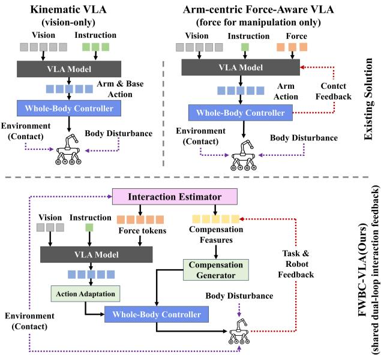
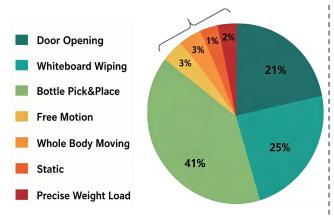
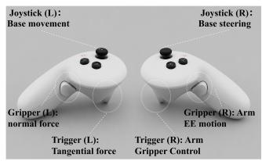
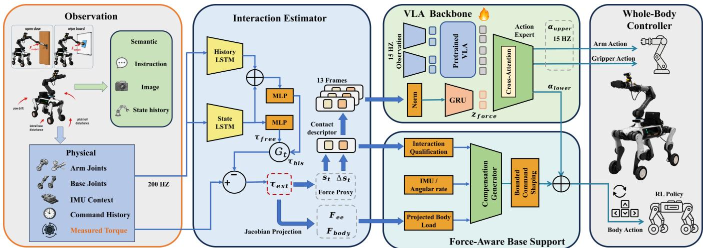
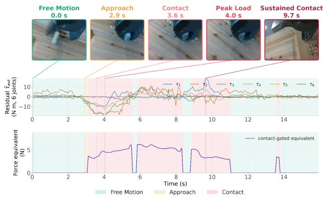
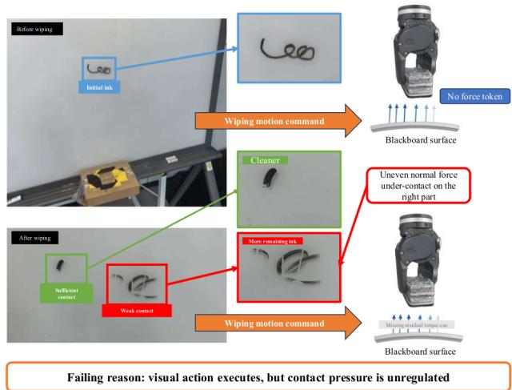
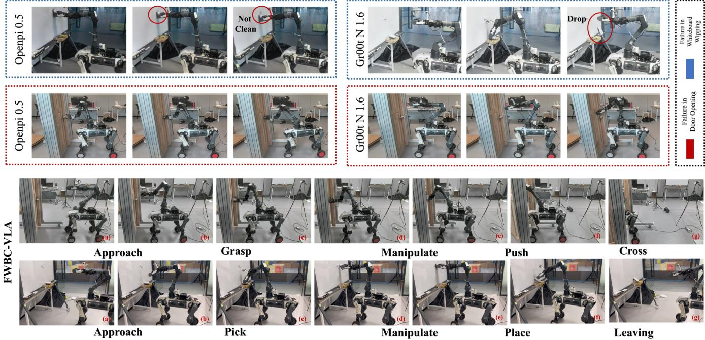

# FWBC-VLA: Force-Aware Whole-Body Compensation for Contact-Rich Loco-Manipulation

Yutian Zhang1\*\*, Siyuan Ma3\*\*, Liwen Yang1, Yang Li2, Ce Hao4, Haozhen Chi6, Dong Wei5\*, Qiaojun Yu2\*, Dibo Hou1\*

1Zhejiang University, 2Shanghai Artificial Intelligence Laboratory, 3Tsinghua University, 4Zhongguancun Academy 5Deep Robotics, 6Zhejiang University of Science and Technology \*\*Equal contribution. \*Corresponding authors.

## Abstract

Contact-rich loco-manipulation requires a bridge between semantic action generation and physical interaction control. Existing Vision-language-action (VLA) models generate tasklevel actions from visual and linguistic observations, but cannot interpret the physical interactions induced by those actions. While the whole-body control (WBC) policy can stabilize the robot, it cannot distinguish task-relevant interaction forces from forces induced by external disturbances during manipulation. Although force/torque sensors provide direct measurements of physical interactions, retrofitting them entails additional hardware costs and substantial integration efort, particularly for platforms not designed with sensor integration in mind. To address this problem, we propose FWBC-VLA, a force-aware framework that bridges task-level VLA action generation and low-level whole-body compensation control for wheeled-legged robots. First, we introduce HSR-Force, a sensorless residual-torque estimator for inferring contact strength and its temporal variation. These contact estimates are then encoded as tokens and injected into the VLA action expert during action decoding, enabling the policy to perceive contact onset, sustained loading, and release. For loco-manipulation tasks, all parameters of the pretrained VLA backbone are fine-tuned on our WL&Arm Dataset, which comprises more than 5,000 episodes. Moreover, the robot’s proprioceptive state, the Jacobian-derived body-frame force estimate, and the estimated contact state are jointly fed into a compensation generator to produce corrective actions. The manipulation-centric actions are subsequently combined with the corrective actions and passed to the WBC policy for execution. Real-world experiments on whiteboard wiping and door opening with a door closer demonstrate the efectiveness of our FWBC-VLA in contact-rich loco-manipulation.

## 1 Introduction

Recent Vision-Language-Action (VLA) models have demonstrated significant potential to unify perception, language understanding, and action generation within an end-to-end policy (Zitkovich et al. 2023; Kim et al. 2025). As shown in Figure 1, current VLA paradigms have been extended from fixed-base manipulation to whole-body loco-manipulation. Contact-rich loco-manipulation, however, requires explicit awareness of physical interactions(Bjorck et al. 2025; Jiang et al. 2025; Hu et al. 2026). Contact-rich loco-manipulation, however, requires explicit awareness of physical interactions. Arm-equipped wheeled-legged quadrupeds are especially appealing for this challenging task, ofering greater stability than humanoids through their lower center of mass and four-legged support, while possessing enhanced terrain traversability relative to traditional wheeled robots. Force applied on the end-efector (EE) can propagate through along the arm and perturb the body, Accordingly, task-oriented actions must be coordinated with whole-body stabilization. This raises a central question: how can causal contact feedback be extracted and jointly utilized by the VLA policy and whole-body control (WBC)?

  
Figure 1: Comparison ofVLA loco-manipulation paradigms. Kinematic whole-body VLA uses no explicit interaction feedback. Arm-centric force-aware VLA uses force for task adaptation but ignores body-level efects. We leverage a sensorless interaction estimator to construct dual feedback loops for both task actions and body compensation.

A common solution is to maintain a modular separation between task-level action generation and body stabilization. While this design ofers practical advantages, the manipulation policy and controller merely exchange kinematic commands, resulting in insuficient closed-loop feedback about contact onset, sustained loading, and release. End-to-end whole-body VLAs avoid such explicit handofs, but they require substantial whole-body demonstration data and typically capture physical interactions only implicitly through vision and proprioception (Jiang et al. 2025). In both cases, the robot may execute the intended motion while remaining unaware of how task related contact forces evolve and perturb the mobile base. Contact-aware VLA methods (Hou et al. 2025b; Yu et al. 2025; Li et al. 2026) demonstrate that explicit force/torque (F/T) feedback improves performance in contact-rich manipulation. Nevertheless, most of these approaches are arm-centric and rely on dedicated F/T sensors. Unfortunately, many existing robotic platforms lack integrated F/T sensors, and retrofitting introduces mechanical, electrical, and calibration challenges. This call for a sensorless contact-feedback interface to estimate physical interactions from the robot’s proprioceptive signals, provides contact information to the VLA policy, and converts estimated arm loads and body posture deviations into corrective commands for the WBC.

To realize this interface, we propose FWBC-VLA, a sensorless, force-aware VLA framework for arm-equipped wheeled-legged quadrupeds. Our History-State Residual Force Estimator (HSR-Force) employs dual LSTM networks to improve force estimation accuracy under both dynamic and static conditions by synchronizing arm, leg, and base proprioception. It preserves directional six-dimensional residual joint torques and summarizes its magnitudes and tempora trend into contact descriptor. Short interaction histories are further encoded into force tokens and late-fused into the action expert, enabling the VLA policy to perceive force evolution and modulate loco-manipulation action generation according to varying physical contacts. Furthermore, estimated external joint torques are transformed through respective Jacobians into Cartesian wrench estimates at the EE and base. Combined with base proprioception, these wrenches are adopted to assess base deviations and contact evidence, triggering a compensation action generator to keep the robot stable during the force-interaction task. Our contributions are summarized as follows:

• We propose FWBC-VLA, a framework with force-aware interface that converts proprioceptive signals into shared interaction for VLA action and whole-body compensation.

• We present HSR-Force for contact detection and force estimation, establishing a causal physical feedback channel without requiring dedicated physical sensors.

• We develop a hierarchical execution strategy, in which interaction representations simultaneously adapt manipulation actions and mitigate body-level disturbances.

## 2 Related Work

Contact-aware Vision-language-action Models. Recently, VLA systems (Zitkovich et al. 2023; Kim et al. 2025; Black et al. 2024, 2025) have attracted significant attention because of their strong generalization and manipulation capabilities. Representative works that incorporate force sensing (Zhang et al. 2025; Li et al. 2026; Zhao et al. 2026)

enhance manipulation stability and precision, yet they typically treat force as an additional feedback signal for arm control and overlook its efects on the robot body. Tactilebased methods (Zheng et al. 2026; Hao et al. 2025; Zhao et al. 2025) and modality-fusion approaches (Huang et al. 2025; Ling et al. 2025; Zhu et al. 2025b) improve robustness under occlusion, but they cannot fully replace direct force sensing because force estimates derived from tactile signals remain indirect and susceptible to noise. Nevertheless, existing approaches remain limited in their ability to incorporate force feedback into WBC.

Sensorless force and contact estimation. External forces are typically estimated by modeling robot dynamics, with discrepancies between predicted and measured signals serving as indicators of external interactions. Traditional methods (Buamanee et al. 2024; Yamane et al. 2026; Shi et al. 2026) require extensive system modeling and engineering efort but often struggle with actuator imperfections such as dead zones (Inami, Yamane, and Sakaino 2024) and torque ripple (Zhu et al. 2025a). Learning-based approaches reduce the dependence on explicit dynamics modeling but introduce new limitations. Supervised methods require paired real-world or simulated contact data (Park et al. 2021; Liang and Kroemer 2021), while unsupervised methods such as autoencoderbased anomaly detection are mainly designed for contact detection rather than continuous force estimation (Park et al. 2022). Meanwhile, inverse-dynamics learning remains dependent on robot-specific models or high-end robotic platforms (Zhu et al. 2025a; Yilmaz et al. 2020). Despite these advances, accurate force estimation remains challenging during dynamic whole-body motions with complex interactions.

Whole-body Loco-manipulation Controllers. To move beyond isolated manipulation or base motion, VLA-based whole-body policies have been proposed (Wu et al. 2025; Tu et al. 2026; Jiang et al. 2025). To merge perception, planning, and decision-making, QUAR-VLA (Ding et al. 2023) integrates visual information and instructions to generate actions. ODYSSEY (Wang et al. 2025) combines VLM for task planning with WBC to control quadruped robots equipped with manipulators. Prior work (Portela et al. 2024) has proposed a learned WBC policy that commands the manipulator, while automatically adjusting the robot’s body to achieve desired position and force targets. (Hou et al. 2025a) incorporates an explicit manipulator kinematic model into the RL framework, providing feedback on how body postures map to the manipulator’s workspace to guide exploration and mitigate the local optimum problem. Although these methods improve WBC through perception, planning, kinematic modeling, or learned control, they lack an explicit mechanism to incorporate force feedback for contact-rich loco-manipulation tasks.

## 3 WL&Arm Dataset

## 3.1 Force-Intent WBC Teleoperation

Although VR teleoperation has become a mainstream approach for data collection, contact-aware datasets for wheeled-legged quadruped loco-manipulation remain absent. We aim to address this limitation with a feasible solution.

We identify two core challenges. First, conventional teleoperation records only motion without capturing the operator’s force intent, which complicates force-aware supervision. Second, wheeled-legged robots difer from embodiments adopted to pretrain most VLA models, creating mismatches in both the base and manipulator action spaces.

To address these challenges, we develop a Pico-based hybrid position-force teleoperation system. As shown in Figure 2, the controller specifies tangential and normal EE force commands, which are applied as contact feedforward terms and logged as force-intent annotations. To avoid commandintent leakage, these annotations are used only as dataset metadata and inspection references, never as inputs to the estimator, VLA policy, or compensation module. This improves the quality of contact-rich data collected from tasks including whiteboard wiping and door opening with a door closer. To reduce embodiment mismatch, we adopt base velocity and steering angle as action outputs rather than jointspecific commands, which decouples VLA action prediction from the wheel-leg controller while preserving execution by the joint-level controller.

## 3.2 Statistics of the WL&Arm Dataset

Our Wheel-Legged (WL) &Arm Dataset, consisting of more than 5,000 teleoperation episodes, will be released publicly. Figure 2 summarizes the composition of WL&Arm. Our dataset provides 200-Hz joint data supporting for contact estimation, alongside 15-Hz loco-manipulation demonstrations. The three principal task subsets are bottle pick-andplace (41%), whiteboard wiping (25%), and door opening (21%). Force calibration data includes applied loads of 0.36 kilograms and 0.72 kilograms, prodeced by a force gauge, These measurements are adopted to train and evaluate the performance under standard conditions.

  
Figure 2: Illustrations of dataset and data collecting. Left: Composition of the WL&Arm dataset. Right: Pico-based teleoperation method with force commands.

## 4 Method

Figure 3 summarizes FWBC-VLA with three components: sensorless interaction estimation, interaction-conditioned VLA action generation, and whole-body compensation. The estimated interaction representation is used by two complementary pathways: it conditions task-level action generation in the VLA and provides physical feedback for base correction. The downstream WBC remains responsible for balance regulation and low-level command tracking.

## 4.1 Sensorless Interaction Estimation

Let $\tau _ { t } ^ { \mathrm { m e a s } } \in \mathbb { R } ^ { n _ { a } }$ denote the measured arm-joint torque. Rather than directly estimating a calibrated external wrench, we estimate a joint-space interaction residual by decomposing the measured torque as:

$$
\tau _ { t } ^ { \mathrm { m e a s } } = \tau _ { \mathrm { f r e e } , t } + \tau _ { \mathrm { e x t } , t } + \epsilon _ { t } ,\tag{1}
$$

where $\tau _ { \mathrm { f r e e } , t }$ represents torque caused by robot motion and internal dynamics, $\tau _ { \mathrm { e x t } , t }$ captures environment-induced interaction residuals, and $\epsilon _ { t }$ accounts for unmodeled efects. Note that $\tau _ { \mathrm { e x t } , t }$ is treated as a latent interaction variable rather than a directly calibrated force measurement.

The estimator contains two compact experts that operate synchronously at 200 Hz and predict the free-motion torque. The history expert uses a causal torque-and-motion history to suppress free-motion prediction noise. The state expert instead uses the current arm, base, leg, and IMU state but does not read torque history, reducing the risk that sustained contact is absorbed into the free-motion prediction. We denote their outputs by $\widehat { \tau } _ { \mathrm { f r e e } , \mathrm { h i s t } , t }$ and $\hat { \tau } _ { \mathrm { f r e e } , \mathrm { s t a t e } , t }$ . The state residual and fixed gate are

$$
\mathbf { r } _ { \mathrm { s t a t e } , t } = \pmb { \tau } _ { t } ^ { \mathrm { m e a s } } - \hat { \pmb { \tau } } _ { \mathrm { f r e e , s t a t e } , t } ,\tag{2}
$$

$$
\alpha _ { t } = G _ { \mathrm { f i x e d } } ( \| \mathbf { r } _ { \mathrm { s t a t e } , t } \| _ { 2 } ) , \qquad \alpha _ { t } \in [ 0 , 1 ] .\tag{3}
$$

The fixed gate combines the two free-motion estimates:

$$
\begin{array} { r } { \hat { \tau } _ { \mathrm { f r e e } , t } = ( 1 - \alpha _ { t } ) \hat { \tau } _ { \mathrm { f r e e } , \mathrm { h i s t } , t } + \alpha _ { t } \hat { \tau } _ { \mathrm { f r e e } , \mathrm { s t a t e } , t } , } \end{array}\tag{4}
$$

$$
\begin{array} { r } { \hat { \tau } _ { \mathrm { e x t , r a w } , t } = \tau _ { t } ^ { \mathrm { m e a s } } - \hat { \tau } _ { \mathrm { f r e e } , t } . } \end{array}\tag{5}
$$

Thus, $\alpha _ { t } \ \approx \ 0$ favors the low-noise history expert during free motion, whereas $\alpha _ { t } \approx 1$ favors the state expert during interaction. Both experts and the gate belong to one 200-Hz estimation chain; no slower estimator or outer mixing gate is used.

We fit the free-torque experts on free-motion windows, for which $\pmb { \tau } _ { \mathrm { e x t } , t } \approx \mathbf { 0 }$ . Reviewed contact-hold and transition frames are masked whenever phase annotations are available so that sustained interaction is not learned as ordinary dynamics. All six residual channels are retained to preserve directional information for downstream Jacobian projection.

## 4.2 Causal Physical Interaction Representation

We summarize the raw six-joint residual using a compact two-channel contact descriptor:

$$
s _ { t } = \lVert \hat { \tau } _ { \mathrm { e x t , r a w } , t } \rVert _ { 2 } ,\tag{6}
$$

$$
\Delta s _ { t } = s _ { t } - s _ { t - 1 } ,\tag{7}
$$

$$
\mathbf { d } _ { t } ^ { \mathrm { i n t } } = \left[ s _ { t } \quad \Delta s _ { t } \right] ^ { \top } \in \mathbb { R } ^ { 2 } .\tag{8}
$$

Here, $s _ { t }$ represents the estimated interaction strength proxy, whereas $\Delta { } s _ { t }$ captures its local temporal trend, distinguishing increasing loading from unloading or release. We interpret $\mathbf { d } _ { t } ^ { \mathrm { { i n t } } }$ as a proxy-valued physical interaction state rather than a calibrated wrench. Its scale therefore remains dependent on the residual estimator and the sampling configuration.

  
Figure 3: FWBC-VLA framework introduces a sensorless, force-aware interface between the VLA and WBC policies. The esti mator transforms proprioceptive states into causal interaction representations, which are shared across two branches: interactionconditioned action generation for VLA, and task-relevant body compensation for WBC.

For directional compensation, damped least-squares Jacobian inversion maps the joint-torque residual to an equivalent six-dimensional interaction wrench $\varepsilon _ { \hat { \mathbf { w } } _ { \mathcal { E } , : } }$ (Haddadin, De Luca, and Albu-Schäfer 2017). Here, E is the EE control frame used for Jacobian computation, and B is the robotbody frame at the body origin. The same physical interaction is re-expressed about the body origin as $\mathbf { \check { \mathbf { \phi } } } _ { \hat { \mathbf { w } } _ { B , t } } ^ { s }$ , including the lever-arm moment. Both representations serve as directional and relative-load features. Details are provided in Appendix.

## 4.3 Interaction-Conditioned Action Generation

To provide the VLA with causal physical feedback, we encode a short history of the interaction representation:

$$
\mathbf { D } _ { t } ^ { \mathrm { i n t } } = \left[ \mathbf { d } _ { t - K + 1 } ^ { \mathrm { i n t } } , \ldots , \mathbf { d } _ { t } ^ { \mathrm { i n t } } \right] \in \mathbb { R } ^ { K \times 2 } ,\tag{9}
$$

whered $\mathsf { l } _ { i } ^ { \mathrm { i n t } } ~ = ~ [ s _ { i } , \Delta s _ { i } ] ^ { \top }$ . The implemented configuration uses $K = 1 3$ at 200 Hz. The 13 samples span 60 ms between the first and last timestamp and capture the most recent interaction trend without using future measurements. At the action-expert width, a normalization layer followed by a GRU temporal encoder produces the force tokens as:

$$
\mathbf { Z } _ { t } ^ { \mathrm { i n t } } = E _ { \mathrm { i n t } } \left( \mathbf { D } _ { t } ^ { \mathrm { i n t } } \right) \in \mathbb { R } ^ { N _ { \mathrm { i n t } } \times 1 0 2 4 } .\tag{10}
$$

The GRU only encodes interaction history and does not serve as an additional action decoder.

We instantiate the VLA policy using the pretrained $\pi _ { 0 . 5 }$ backbone (Black et al. 2025). The policy operates at 15 Hz, whereas HSR-Force produces residual-torque estimates at 200 Hz. For each VLA query timestamp t, we retrieve the $K = 1 3$ most recent contact descriptors whose timestamps are not later than t. At 200 Hz, the 13 samples cover 60 ms between the earliest and latest timestamps. We adopt a latest-before-query synchronization rule and never use interaction measurements later than the current policy timestamp, thereby preserving causal deployment. The pretrained VLA backbone is fully fine-tuned on the target embodiment data.

Within its Gemma action expert, visual-language prefix tokens $T _ { p r e f i x }$ and noisy action tokens $T _ { a c t i o n }$ are processed jointly. Force is fused into the action hidden states rather than propagated through the visual backbone. Specifically, action hidden states provide the cross-attention queries and force tokens provide keys and values:

$$
\begin{array} { r } { \widetilde { \mathbf { Z } } _ { t } ^ { a c t i o n } = \mathbf { Z } _ { t } ^ { a c t i o n } + \alpha _ { f } g _ { t } \mathrm { C A } ( \mathbf { Z } _ { t } ^ { a c t i o n } , \mathbf { Z } _ { t } ^ { f o r c e } ) , } \end{array}\tag{11}
$$

where CA is cross-attention, $g _ { t }$ is a learned force-presence gate, and $\alpha _ { f }$ scales the force residual. $Z _ { t } ^ { \mathrm { f o r c e } }$ in Equation (11) refers to the force tokens defined in Equation (10). This fusion is applied to the action expert’s final hidden states before the single output projection, which predicts the flow velocity:

$$
( \mathbf { Z } ^ { p r e f i x } , \mathbf { Z } ^ { a c t i o n } ) = \mathrm { V L A } _ { \theta } ( T _ { p r e f i x } , T _ { a c t i o n } ) ,\tag{12}
$$

$$
\begin{array} { r } { \mathbf { v } _ { t } = \arctan \_ { 0 } \mathrm { { o u t } } \_ { \mathrm { p r o j } } ( \widetilde { \mathbf { Z } } _ { t } ^ { a c t i o n } ) . } \end{array}\tag{13}
$$

There is therefore one Action Expert (Action Decoder), not a serial Action Expert–Action Decoder pair. The conditioned policy predicts an action chunk

$$
\pi _ { \boldsymbol { \theta } } ( \mathbf { I } _ { t } , \boldsymbol { \ell } , \mathbf { x } _ { t } , \mathbf { F } _ { t } ) \to \mathbf { A } _ { t : t + H - 1 } .\tag{14}
$$

Here $\mathbf { A } _ { t : t + H - 1 }$ contains arm, gripper, and nominal base actions. The image-language context remains unchanged. The interaction interface is introduced only as a physical feedback pathway and does not require auxiliary contact classification or phase prediction objectives.

## 4.4 Whole-Body Compensation Generation

The second output pathway of the physical interaction interface provides whole-body compensation outside the VLA action expert. This branch uses the gripper state and interaction descriptor as gating cues to qualify whether a disturbance is task-relevant, and maps the current load estimate and posture deviation to a bounded base-velocity residual. The downstream WBC remains responsible for balance and low-level tracking.

The compensation generator receives the projected bodyframe load proxy $\hat { F } _ { \mathrm { b o d y } , t }$ , the IMU orientation and angular rate, and the nominal base action $u _ { t } ^ { \mathrm { b a s e , n o m } }$ . These inputs respectively describe the transmitted interaction load, the resulting body deviation, and the original task-level motion intent. $\hat { F } _ { \mathrm { b o d y } , t }$ is derived from the manipulator residual and does not represent an independent force measurement on the chassis. The posture deviation is defined as follows:

$$
\Delta \pmb { \eta } _ { t } ^ { i m u } = \left[ \pmb { \eta } _ { t } ^ { i m u } - \pmb { \eta } _ { t } ^ { i m u , r e f } , \omega _ { t } ^ { i m u } \right] ,\tag{15}
$$

where $\eta _ { t } ^ { i m u , r e f }$ is the recent free-motion body orientation reference. A compact multilayer perceptron predicts an unconstrained residual proposal:

$$
\bar { \mathbf { r } } _ { t } ^ { b a s e } = C _ { \psi } \left( \hat { \mathbf { F } } _ { b o d y , t } , \Delta \eta _ { t } ^ { i m u } , \mathbf { u } _ { t } ^ { b a s e , n o m } \right) ,\tag{16}
$$

where $\bar { \mathbf { r } } _ { t } ^ { b a s e } \in \mathbb { R } ^ { 3 }$ corresponds to residual planar velocity and yaw rate $( \Delta v _ { x } , \Delta v _ { y } , \Delta \omega _ { z } )$

During training, the compensation target is defined as the diference between the task-level nominal base command and the executed force-supported base command:

$$
\mathbf { r } _ { t } ^ { b a s e , * } = \mathbf { u } _ { t } ^ { b a s e , e x e c } - \mathbf { u } _ { t } ^ { b a s e , n o m } .\tag{17}
$$

The compensation generator is trained with an $\ell _ { 1 }$ regression objective on this residual target. The final residual is bounded before execution:

$$
\mathbf { r } _ { t } ^ { b a s e } = \mathbf { r } _ { \mathrm { m a x } } \odot \mathrm { t a n h } \left( \bar { \mathbf { r } } _ { t } ^ { b a s e } \right) .\tag{18}
$$

The executed base command is

$$
\mathbf { u } _ { t } ^ { b a s e } = \mathbf { u } _ { t } ^ { b a s e , n o m } + \mathbf { r } _ { t } ^ { b a s e } .\tag{19}
$$

Bounded command shaping applies a deadband, low-pass filtering, slew-rate limits, and final command-headroom clipping before the residual is sent to the WBC. Stale force estimates or invalid IMU/load signals set the residual to zero, preserving a bounded interface to the robot controller.

## 5 Experiments

In this section, We evaluate the estimation, compensation, and loco-manipulation performance of FWBC-VLA on diverse contact-rich tasks in the real world. The experiments address the following research questions:

• Q1: How accurately can HSR-Force estimate external interaction without an F/T sensor?

• Q2: How do the state and history heads and their fixedgate fusion afect estimation performance?

• Q3: How does FWBC-VLA perform in real-world contact-rich loco-manipulation tasks, and what advantages does force-aware control ofer?

• Q4: Which components contribute most significantly to the performance improvements of FWBC-VLA?

## 5.1 Force-Estimator Evaluation

Sensorless Estimation Baselines. We compare HSR-Force with NEXT, a learned external-force estimator (Oh et al. 2026); GMO-SI, an identified generalized momentum observer (Haddadin, De Luca, and Albu-Schäfer 2017); and DF-MLP, a direct proprioception-to-force multilayer perceptron (Shan and Pham 2023). NEXT, GMO-SI, and HSR-Force use the same residual-to-force adapter, whereas DF-MLP uses its direct scalar-force output. DF-MLP does not output external joint torque and is therefore omitted from the torque-residual metrics. All trainable estimators are trained on our 200-Hz data using five diferent seeds. We additionally evaluate scalar-force accuracy on held-out static and dynamic recordings with known payloads of 0.36 and 0.72 kg. Their ground-truth loads are computed as $F ^ { \mathrm { G T } } = m g$ , corresponding to 3.53 and 7.06 N, respectively.

Estimation Metrics. We evaluate force estimation using N-MAE, torque residual errors, and the AUC for contact detection. N-MAE reports the scalar force MAE in newtons. S/M denotes static/moving. Free and Dynamic τ MAE average $| \hat { \tau } _ { t , j } ^ { \mathrm { e x t } } |$ over all free-motion frames or only dynamic freemotion frames, respectively. τ R90 is the median episodewise 90th percentile of $\| \hat { \tau } _ { t } ^ { \mathrm { e x t } } \| _ { 2 }$ for static/dynamic (S/D) motion. AUC denotes the area under the receiver operating characteristic curve, computed by sweeping the contact-score threshold. Touch AUC measures contact-versus-free discrimination around touch events, whereas Door-phase AUC measures the same discrimination across door-manipulation phases. Each metric is evaluated on 25 manually reviewed episodes.

Overall performance on estimation (Q1). As summarized in Table 1, HSR-Force achieves the lowest zero-load force error and the highest Touch AUC, while also reducing the static and dynamic tail residuals.

The video-aligned result further shows that HSR-Force responds near contact onset and remains active during sustained door loading (Fig. 4).

  
Figure 4: Video-aligned contact estimation of door opening.

Shared Dual-Head Ablation (Q2). We ablate the state head, history head, and fixed-gate dual-head fusion using the same causal context. Torque history reduces freemotion residual error, particularly during motion, whereas the history-free state head is more sensitive to contact onset. Their fixed-gate fusion yields the best Touch and Door-phase AUCs (Table 1).

<table><tr><td rowspan="2">Method</td><td colspan="3">Zero-load evaluation</td><td colspan="2">Contact discrimination</td><td colspan="2">Known-load force evaluation</td></tr><tr><td>Force MAE All-free τ MAE (N) ↓</td><td>(Nm) ↓</td><td>τ R90 S/D (Nm)↓</td><td>Touch AUC↑</td><td>Door-phase AUC↑</td><td>Frame MAE S/D (N) ↓</td><td>Episode MAE S/D (N) ↓</td></tr><tr><td colspan="8">Related-method baselines</td></tr><tr><td>NEXT</td><td>0.28</td><td>0.66</td><td>1.26/3.37</td><td>0.95</td><td>0.82</td><td>2.52/1.43</td><td>2.57/1.53</td></tr><tr><td>GMO-SI</td><td>0.43</td><td>0.56</td><td>1.14/2.97</td><td>0.94</td><td>0.83</td><td>1.72/1.59</td><td>0.78/1.18</td></tr><tr><td>DF-MLP</td><td>0.21</td><td></td><td></td><td>0.47</td><td>0.50</td><td>2.01/1.87</td><td>1.98/1.26</td></tr><tr><td>HSR-Force</td><td>0.15</td><td>0.37</td><td>0.64/2.79</td><td>0.97</td><td>0.85</td><td>1.09/1.21</td><td>0.28/1.06</td></tr><tr><td colspan="8">Shared dual-head ablation (mean with s.d. in parentheses; three seeds)</td></tr><tr><td>State only</td><td>1.13(.35)</td><td>0.82(.04)</td><td>1.47(.16)/3.46(.32)</td><td>0.92(.02)</td><td>0.80(.01)</td><td>1.99(.67)/2.25(.80)</td><td>1.08(.45)/1.70(.45)</td></tr><tr><td>History only</td><td>0.93(.24)</td><td>0.60(.03)</td><td>1.23(.59)/2.94(.15)</td><td>0.87(.03)</td><td>0.78(.01)</td><td>2.33(1.03)/2.09(.62)</td><td>1.93(.99)/1.98(.66)</td></tr><tr><td>Ours (Dual&amp;gate)</td><td>0.25(.13)</td><td>0.52(.24)</td><td>1.23(.59)/2.96(.17)</td><td>0.94(.03)</td><td>0.83(.02)</td><td>1.51(.42)/2.02(.81)</td><td>0.81(.53)/1.84(.78)</td></tr></table>

Table 1: Unified force-estimator results. S/D denotes static/dynamic; ablation entries are mean (s.d.) over three seeds. Boldface marks the best result within each method group; dashes denote unavailable metrics.

<table><tr><td>Whiteboard Wiping Method S1 S2 S3 S4 S5 Without force</td></tr><tr><td>OpenVLA 60 48 4 0 0 StarVLA 64 56 12 00 OpenPI 0.5 80 28 20 12 12 GR00T N1.6 76 36 8 0 0</td></tr><tr><td>With force ACP 7264442020 ForceVLA 84683624 24 FWBC-GT 84 8476 60 60 FWBC-VLA 88 84 76 64 64</td></tr></table>

<table><tr><td>Door Opening Method S1 S2 S3 S4 S5 Without force</td></tr><tr><td>OpenVLA 16 8 0 0 0 StarVLA 20 12 0 0 0 OpenPI 0.5 80 40 12 0 0 GR00T N1.6 76 32 8 0 0</td></tr><tr><td>With force ACP 72 44 12 44 ForceVLA 76 56 2412 12 FWBC-GT 88 84 64 48 48 FWBC-VLA 92 84 64 52 52</td></tr></table>

Table 2: Stage success rates (%; 25 trials/task). S1–S5 follow setup in Sec. 5.2; rows are grouped by force input.
<table><tr><td>Method</td><td>FI BC Press w/o closer w closer Cleaned Avg.</td><td>Handle </td><td>Push</td><td>Push</td><td>Board</td></tr><tr><td>w/o Force</td><td></td><td>28</td><td>12</td><td>0</td><td>8 12.0</td></tr><tr><td>FI only</td><td>一  $\checkmark ~ -$ </td><td>52</td><td>56</td><td>0</td><td>32 35.0</td></tr><tr><td>FWBĆ-VLA √ √</td><td></td><td>60</td><td>72</td><td>52</td><td>76 65</td></tr></table>

Table 3: Component ablation. Entries are contact-stage success rates (%); Avg. is the unweighted mean.

On the non-zero known-load experiments, HSR-Force achieves the lowest baseline frame Force MAE under both static and dynamic recordings and the lowest dynamic error, whereas GMO-SI gives the lowest static error. Within the three-seed ablation, fixed-gate fusion provides the best known-load errors overall while retaining competitive zeroload residual errors and the best contact-discrimination AUCs. Together, the zero-load and known-load experiments provide complementary physical references.

## 5.2 Experiments in the Real World

Setup and evaluation metrics. Experiments are conducted on a DeepRobotics M20S wheeled-legged quadruped equipped with a CM1 6-DoF robotic arm and a 1-DoF gripper. Three RealSense D435i cameras provide visual observations from base, hand, and third-person viewpoints. The benchmark includes whiteboard wiping and door opening, evaluated with and without a door closer ( 50 N of force to push at the handle). The primary metric is success rate (%), where each rollout is evaluated over sequential phases: Approach, Pick/Grasp, Manipulate, Place/Push, and Leave/Cross.

Baselines. To evaluate the efectiveness of our approach in loco-manipulation tasks, we compare FWBC-VLA with representative baselines: OpenVLA (Kim et al. 2025), StarVLA (StarVLA Community 2026), $\pi _ { 0 . 5 }$ (Black et al. 2025), Gr00t N1.6 (Bjorck et al. 2025), ACP (Hou et al. 2025b), ForceVLA (Yu et al. 2025) and FWBC-GT (Using real force data as ground truth). We use publicly released pretrained models and fully fine-tune them for 50K steps on the WL&Arm dataset for each task, using the same robotstate observations, camera views, and 16-dimensional output action space. OpenVLA, StarVLA, $\pi _ { 0 . 5 }$ and Gr00t N1.6 are foundation models trained on diverse robot data. We use force from real F/T sensor for ACP, ForceVLA and FWBC-GT, which incorporate force modality into their control policies.

  
Figure 5: Efect of removing force conditioning during whiteboard wiping.

  
Figure 6: Representative real-world rollouts. Baseline failures on both tasks (top). FWBC-VLA succeeds in whiteboard wiping and door opening (bottom).

Tasks. To evaluate contact-rich loco-manipulation ability, We evaluate two long-horizon tasks: (i) mobile door opening, with and without a door closer. (ii) Whiteboard wiping. The ratio of in-domain to out-of-domain stain patterns is 1:2. Whiteboard wiping is evaluated at the Approach, Pick, Wiping, Place, and Leave stages; door opening is evaluated at the Approach, Grasp, Manipulate, Push, and Cross stages.

Result on contact-rich loco-manipulation (Q3). As summarized in Table 2, FWBC-VLA achieves the highest success rate at every reported stage on both tasks. For whiteboard wiping, it reaches 76% at Wiping and 64% final success, exceeding the strongest stage-specific baselines, ACP and ForceVLA, by 32 and 40 percentage points, respectively. For door opening, FWBC-VLA obtains 56% at Manipulate and 52% at both Push and Cross, outperforming ForceVLA by 28 and 40 points. Final-stage margins reach 40 points on both tasks, showing that the advantage grows during contactintensive execution. Furthermore, comparing FWBC-VLA to FWBC-GT using ground-truth force sensing, the close success rates demonstrate that our estimation is efective and can be used for contact-rich tasks.

Fig. 5 illustrates baseline failures: contact with the board becomes uneven, and visible ink remains after five minutes of wiping. The representative rollouts in Fig. 6 further show baseline failures following body drift. In contrast, FWBC-VLA maintains task progression. Together, the results support explicit interaction feedback for sustained contact in loco-manipulation.

## 5.3 Ablation of Force-Conditioned Compensation

Ablation setup. We progressively introduce the additional components built on top of π0.5, including the force-aware interface (FI) and bounded body compensation (BC), and compare their efects across four contact-critical stages. FI comprises the HSR-Force interaction estimate and force-token conditioning in the action expert, whereas BC converts the projected body-load proxy into bounded base corrections. Since BC relies on the interaction estimate produced by FI, a BC-only configuration without FI is undefined. We therefore evaluate three valid hierarchical variants. All variants use the same task data, training budget, initial-condition distribution, and evaluation protocol.

Component-wise ablations on FI and BC (Q4). As shown in Table 3, adding FI increases the average success rate from 12.0% to 35.0%, with clear gains in handle pressing, door pushing without a closer, and board cleaning. Adding BC further improves the average success rate to 59.5%, providing the largest incremental gain of 24.5 percentage points. Its benefit is concentrated in sustained high-load stages: success increases by 52 percentage points when pushing a door with a closer and by 44 percentage points in board cleaning. In contrast, handle pressing and door pushing without a closer remain nearly unchanged. These results demonstrate that FI provides contact awareness for manipulation, while BC is essential for maintaining stable whole-body behavior under sustained external forces.

## 6 Conclusion and Future Work

We present FWBC-VLA, a sensorless force-aware feedback framework for contact-rich loco-manipulation. HSR-Force combines historical and current states through a fixed residual gate, summarizes the residual torque as a contact descriptor, and projects the directional residual into EE- and bodyframe load proxies. These signals condition the VLA action expert and compensation sidecar, coupling task-level action with whole-body stabilization. Real-world experiments show that explicit interaction feedback and whole-body compensation improve performance relative to the baselines.

Limitations and future work. Current frameworks demonstrate the benefits of estimated force, but the impact of force estimation accuracy on task performance warrants further investigation. Future work will investigate broader contact-aware perception and further develop the tightly integrated whole-body VLA control paradigm for complex locomanipulation tasks on humanoid and wheeled-base robots.

## References

Bjorck, J.; Castaneda, F.; Cherniadev, N.; Da, X.; Ding, R.; Fan, L.; Fang, Y.; Fox, D.; Hu, F.; Huang, S.; Jang, J.; et al. 2025. GR00T N1: An Open Foundation Model for Generalist Humanoid Robots. arXiv:2503.14734.

Black, K.; Brown, N.; Darpinian, J.; Dhabalia, K.; Driess, D.; Esmail, A.; Equi, M.; Finn, C.; Fusai, N.; Galliker, M. Y.; Ghosh, D.; Groom, L.; Hausman, K.; Ichter, B.; Jakubczak, S.; Jones, T.; Ke, L.; LeBlanc, D.; Levine, S.; Li-Bell, A.; Mothukuri, M.; Nair, S.; Pertsch, K.; Ren, A. Z.; Shi, L. X.; Smith, L.; Springenberg, J. T.; Stachowicz, K.; Tanner, J.; Vuong, Q.; Walke, H.; Walling, A.; Wang, H.; Yu, L.; and Zhilinsky, U. 2025. π : A Vision-Language-Action Model with Open-World Generalization. arXiv:2504.16054.

Black, K.; Brown, N.; Driess, D.; Esmail, A.; Equi, M.; Finn, C.; Fusai, N.; Groom, L.; Hausman, K.; Ichter, B.; Jakubczak,

S.; Jones, T.; Ke, L.; Levine, S.; Li-Bell, A.; Mothukuri, M.; Nair, S.; Pertsch, K.; Shi, L. X.; Tanner, J.; Vuong, Q.; Walling, A.; Wang, H.; and Zhilinsky, U. 2024. π : A Vision-Language-Action Flow Model for General Robot Control. arXiv:2410.24164.

Buamanee, T.; Kobayashi, M.; Uranishi, Y.; and Takemura, H. 2024. Bi-ACT: Bilateral Control-Based Imitation Learning via Action Chunking with Transformer. In 2024 IEEE International Conference on Advanced Intelligent Mechatronics (AIM), 410–415.

Ding, P.; Zhao, H.; Zhang, W.; Song, W.; Zhang, M.; Huang, S.; Yang, N.; and Wang, D. 2023. QUAR-VLA: Vision-Language-Action Model for Quadruped Robots. arXiv:2312.14457.

Haddadin, S.; De Luca, A.; and Albu-Schäfer, A. 2017. Robot Collisions: A Survey on Detection, Isolation, and Identification. IEEE Transactions on Robotics, 33(6): 1292–1312.

Hao, P.; Zhang, C.; Li, D.; Cao, X.; Hao, X.; Cui, S.; and Wang, S. 2025. TLA: Tactile-Language-Action Model for Contact-Rich Manipulation. arXiv:2503.08548.

Hou, D.; Zhu, C.; Zhang, Z.; Li, Z.; Guo, C.; and Liu, Y. 2025a. Eficient Learning of a Unified Policy for Whole-Body Manipulation and Locomotion Skills. arXiv:2507.04229.

Hou, Y.; Liu, Z.; Chi, C.; Cousineau, E.; Kuppuswamy, N.; Feng, S.; Burchfiel, B.; and Song, S. 2025b. Adaptive Compliance Policy: Learning Approximate Compliance for Difusion Guided Control. In 2025 IEEE International Conference on Robotics and Automation (ICRA), 4829–4836.

Hu, Y.; Zhu, H.; Zheng, B.; Hu, Y.; Zhang, T.; Chen, Z.; Zhao, J.; Nai, R.; and Gao, Y. 2026. OpenHLM: An Empirical Recipe for Whole-Body Humanoid Loco-Manipulation. arXiv:2606.22174.

Huang, J.; Wang, S.; Lin, F.; Hu, Y.; Wen, C.; and Gao, Y. 2025. Tactile-VLA: Unlocking Vision-Language-Action Model’s Physical Knowledge for Tactile Generalization. arXiv:2507.09160.

Inami, K.; Yamane, K.; and Sakaino, S. 2024. Loss Function Considering Dead Zone for Neural Networks. arXiv:2402.00393.

Jiang, H.; Chen, J.; Bu, Q.; Chen, L.; Shi, M.; Zhang, Y.; Li, D.; Suo, C.; Wang, C.; Peng, Z.; and Li, H. 2025. Whole-BodyVLA: Towards Unified Latent VLA for Whole-Body Loco-Manipulation Control. arXiv:2512.11047.

Kim, M. J.; Pertsch, K.; Karamcheti, S.; Xiao, T.; Balakrishna, A.; Nair, S.; Rafailov, R.; Foster, E. P.; Sanketi, P. R.; Vuong, Q.; Kollar, T.; Burchfiel, B.; Tedrake, R.; Sadigh, D.; Levine, S.; Liang, P.; and Finn, C. 2025. OpenVLA: An Open-Source Vision-Language-Action Model. In Agrawal, P.; Kroemer, O.; and Burgard, W., eds., Proceedings ofthe 8th Conference on Robot Learning, volume 270 of Proceedings ofMachine Learning Research, 2679–2713. PMLR.

Li, Y.; Zhaxizhuoma; Jiang, H.; Xia, J.; Zhang, H.; Du, J.; Zhou, Y.; Zeng, J.; Hao, C.; Ren, J.; Yu, Q.; Lu, C.; Qiao, Y.; and Pang, J. 2026. ForceVLA2: Unleashing Hybrid Force-Position Control with Force Awareness for Contact-Rich Manipulation. arXiv:2603.15169.

Liang, J.; and Kroemer, O. 2021. Contact Localization for Robot Arms in Motion without Torque Sensing. In 2021 IEEE International Conference on Robotics and Automation (ICRA), 6322–6328.

Ling, Y.; Owalekar, K.; Adesanya, O.; Bıyık, E.; and Seita, D. 2025. IMPACT: Intelligent Motion Planning with Acceptable Contact Trajectories via Vision-Language Models. arXiv:2503.10110.

Oh, S.; Liu, J. J.; Tao, T.; Han, P.; Shaw, K.; Funabashi, S.; Salakhutdinov, R.; and Pathak, D. 2026. FACTR 2: Learning External Force Sensing for Commodity Robot Arms Improves Policy Learning. arXiv:2606.12406.

Park, K. M.; Kim, J.; Park, J.; and Park, F. C. 2021. Learning-Based Real-Time Detection of Robot Collisions without Joint Torque Sensors. IEEE Robotics and Automation Letters, 6(1): 103–110.

Park, K. M.; Park, Y.; Yoon, S.; and Park, F. C. 2022. Collision Detection for Robot Manipulators Using Unsupervised Anomaly Detection Algorithms. IEEE/ASME Transactions on Mechatronics, 27(5): 2841–2851.

Portela, T.; Margolis, G. B.; Ji, Y.; and Agrawal, P. 2024. Learning Force Control for Legged Manipulation. arXiv:2405.01402.

Shan, S.; and Pham, Q.-C. 2023. Fine Robotic Manipulation without Force/Torque Sensor. arXiv:2301.13413.

Shi, H.; Hu, S.; Hou, Y.; Wang, W.; Liu, K.; and Song, S. 2026. Minimalist Compliance Control. arXiv:2603.00913.

StarVLA Community. 2026. StarVLA: A Lego-like Codebase for Vision-Language-Action Model Developing. arXiv:2604.05014.

Tu, R.; Shukla, A.; Yoo, S.; Li, X.; Li, J.; Xie, J.; Su, H.; and Tu, Z. 2026. SG-VLA: Learning Spatially-Grounded Vision-Language-Action Models for Mobile Manipulation. arXiv:2603.22760.

Wang, K.; Lu, L.; Liu, M.; Jiang, J.; Li, Z.; Zhang, B.; Zheng, W.; Yu, X.; Chen, H.; and Shen, C. 2025. ODYSSEY: Open-World Quadrupeds Exploration and Manipulation for Long-Horizon Tasks. arXiv:2508.08240.

Wu, Z.; Zhou, Y.; Xu, X.; Wang, Z.; and Yan, H. 2025. Mo-ManipVLA: Transferring Vision-Language-Action Models for General Mobile Manipulation. arXiv:2503.13446.

Yamane, K.; Li, Y.; Konosu, M.; Inami, K.; Oaki, J.; Tsuji, T.; and Sakaino, S. 2026. Design and Experimental Validation of Sensorless 4-Channel Bilateral Teleoperation for Low-Cost Manipulators. arXiv:2507.06174.

Yilmaz, N.; Wu, J. Y.; Kazanzides, P.; and Tumerdem, U. 2020. Neural Network Based Inverse Dynamics Identification and External Force Estimation on the da Vinci Research Kit. In 2020 IEEE International Conference on Robotics and Automation (ICRA), 1387–1393.

Yu, J.; Liu, H.; Yu, Q.; Ren, J.; Hao, C.; Ding, H.; Huang, G.; Huang, G.; Song, Y.; Cai, P.; Lu, C.; and Zhang, W. 2025. ForceVLA: Enhancing VLA Models with a Force-Aware MoE for Contact-Rich Manipulation. arXiv:2505.22159.

Zhang, Z.; Xu, H.; Yang, Z.; Yue, C.; Lin, Z.; Gao, H.; Wang, Z.; and Zhao, H. 2025. TA-VLA: Elucidating the Design Space of Torque-Aware Vision-Language-Action Models. arXiv:2509.07962.

Zhao, R.; Wang, W.; Ma, Y.; Li, X.; Tay, F. E. H.; Ang, M. H.; and Zhu, H. 2026. FD-VLA: Force-Distilled Vision-Language-Action Model for Contact-Rich Manipulation. arXiv:2602.02142.

Zhao, Z.; Li, Y.; Li, W.; Qi, Z.; Ruan, L.; Zhu, Y.; and Althoefer, K. 2025. Tac-Man: Tactile-Informed Prior-Free Manipulation of Articulated Objects. IEEE Transactions on Robotics, 41: 538–557.

Zheng, H.; Yang, Y.; Ma, K.; Xu, S.; Xie, T.; Li, G.; Wang, X.; Ma, Y.; Liu, S.; Mao, Y.; and Liu, B. 2026. TORL-VLA: Tactile-Guided Online Reinforcement Learning for Contact-Rich Manipulation. arXiv:2606.09337.

Zhu, A.; Tanaka, Y.; Rafeedi, F.; and Hong, D. 2025a. Cycloidal Quasi-Direct Drive Actuator Designs with Learning-Based Torque Estimation for Legged Robotics. In 2025 IEEE International Conference on Robotics and Automation (ICRA), 1–8.

Zhu, H.; Zhao, T.; Ni, X.; Wang, J.; Fang, K.; Righetti, L.; and Pang, T. 2025b. Should We Learn Contact-Rich Manipulation Policies from Sampling-Based Planners? IEEE Robotics and Automation Letters, 10(6): 6248–6255.

Zitkovich, B.; Yu, T.; Xu, S.; Xu, P.; Xiao, T.; Xia, F.; Wu, J.; Wohlhart, P.; Welker, S.; Wahid, A.; Vuong, Q.; Vanhoucke, V.; Tran, H.; Soricut, R.; Singh, A.; Singh, J.; Sermanet, P.; Sanketi, P. R.; Salazar, G.; Ryoo, M. S.; Reymann, K.; Rao, K.; Pertsch, K.; Mordatch, I.; Michalewski, H.; Lu, Y.; Levine, S.; Lee, L.; Lee, T.-W. E.; Leal, I.; Kuang, Y.; Kalashnikov, D.; Julian, R.; Joshi, N. J.; Irpan, A.; Ichter, B.; Hsu, J.; Herzog, A.; Hausman, K.; Gopalakrishnan, K.; Fu, C.; Florence, P.; Finn, C.; Dubey, K. A.; Driess, D.; Ding, T.; Choromanski, K. M.; Chen, X.; Chebotar, Y.; Carbajal, J.; Brown, N.; Brohan, A.; Arenas, M. G.; and Han, K. 2023. RT-2: Vision-Language-Action Models Transfer Web Knowledge to Robotic Control. In Tan, J.; Toussaint, M.; and Darvish, K., eds., Proceedings ofthe 7th Conference on Robot Learning, volume 229 of Proceedings of Machine Learning Research, 2165–2183. PMLR.