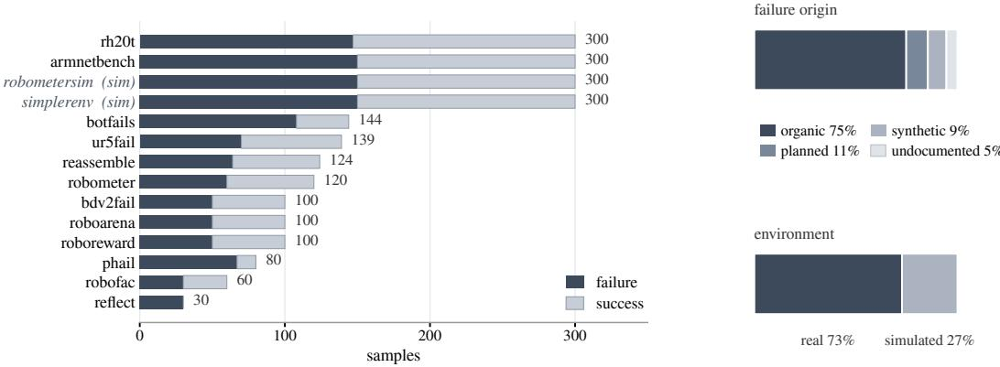
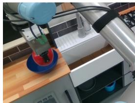
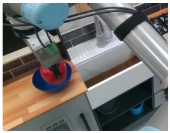
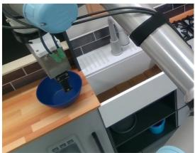
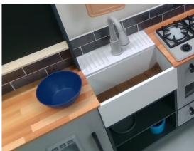
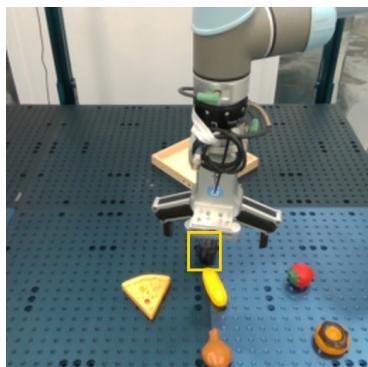
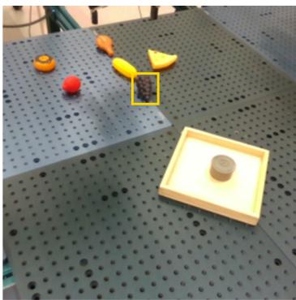
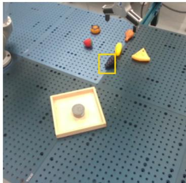

# FailBench: How Reliable are VLMs at Judging Robot Task Success?

Zaruhi Navasardyan Tatul Danielyan Hrant Davtyan

Metric AI Lab {zaruhi,tatul,hrant}@metricailab.com

Vision-language models (VLMs) are increasingly used to determine whether a robot manipulation attempt has succeeded. These judgments can serve as reinforcementlearning rewards, training-data filters, policy-ranking signals, or triggers for retry, making reliable failure detection critical for robot learning and evaluation. However, existing benchmarks provide limited evidence of cross-domain generalization. We introduce FailBench, a benchmark for robot failure detection comprising 2,197 manipulation attempts from 14 public sources, including 12 real-world and 2 simulated datasets, using the original outcome labels provided by their respective sources. Six of the real-world sources were originally collected for policy evaluation, reward modeling, or general data collection rather than failure detection, and 75% of failures occur naturally rather than being deliberately constructed. Evaluating 13 VLM-based detectors, we find that the best model achieves only 0.77 mean balanced accuracy, indicating substantial room for improvement. Models fine-tuned specifically for robot failure detection consistently underperform general-purpose VLMs, with the exception of the smallest general-purpose model, and also underperform their corresponding pretrained models. We further find that performance depends more strongly on the visual evidence required to determine the outcome than on the robot or task domain: detection approaches saturation when success is determined by observable object motion, but approaches chance when success depends on establishing contact, with no model exceeding 0.60 balanced accuracy on contact-intensive assembly tasks. Analysis of model reasoning reveals a systematic bias toward predicting success under ambiguous evidence. Increasing reasoning effort does not alleviate this bias, as incorrect predictions tend to receive longer reasoning traces. Model-level interventions provide little improvement, while an input-level intervention is effective: spatially localizing the outcome-relevant region and cropping the input improves the strongest detector by 2.4 percentage points without additional training. We release FailBench and the accompanying evaluation harness to facilitate reproducible evaluation of robot failure detection.

Project Home: https://metric-ai-lab.github.io/failbench/

## 1 INTRODUCTION

A single robot-learning experiment can produce hundreds or thousands of rollouts. To evaluate a policy, filter the resulting data, or learn from it, the system must determine which attempts succeeded. Reviewing every rollout manually is costly, so recent systems increasingly assign this decision to a vision-language model given the task instruction and a recording. The model’s answer is then used as an evaluation label, a data filter, a reward, or a recovery signal—typically as though it were ground truth (Lu et al., 2025a; Zhou et al., 2024; 2025b; Liu et al., 2023). What remains unclear is whether these judgments are reliable beyond the data on which the detector was developed.

Failure detectors take two broad forms. Policy-dependent monitors infer failure from a policy’s internal representations, action statistics, or predicted trajectories, but are therefore tied to that policy and its architecture (Agia et al., 2024; Römer et al., 2025; Zhang et al., 2026a; Seligmann et al., 2026). Policy-agnostic detectors instead judge a completed attempt from its recording and instruction. Unlike a policy-dependent monitor, the same detector can in principle be applied across policies and robot platforms. This generality is useful, but it also makes transfer central: an incorrect verdict can become a noisy reward, a misleading evaluation, or a failed trajectory retained as training data.

Recent work increasingly asks VLMs for more than a binary verdict: an explanation (Liu et al., 2023; Duan et al., 2025; Qi et al., 2026), a failure category and a corrective action (Pacaud et al., 2025; Lu et al., 2025b; Zeng et al., 2025; Lin et al., 2026; Li et al., 2026; Chen et al., 2024), a subgoal-level or dense progress signal (ElMallah et al., 2025; Ji et al., 2026; Liu et al., 2026b; Liang et al., 2026; Zhang et al., 2026b), or a graded score rather than a pass/fail label (Liu et al., 2026a; Wang et al., 2025; Selvaraj et al., 2026; Lee et al., 2026). These richer outputs all rely on the same basic capability: determining whether the attempted task succeeded. That capability has not been evaluated systematically across data sources; where it has been measured, evaluation has largely remained within the source used to develop the detector.

Existing failure benchmarks do not resolve this gap. Although several are larger than FailBench (Pacaud et al., 2025; Lu et al., 2025b; Zeng et al., 2025; Duan et al., 2025), each is drawn from a single collection effort. Most also create failures deliberately, for example by perturbing a successful trajectory or pairing an unchanged recording with a different instruction. Such constructions are useful for controlled evaluation, but they can make failure detection partly a matter of recognizing one data-generation procedure. The failures encountered in ordinary robot operation are often less conspicuous: a peg that stops just short of insertion, a gripper that appears closed but never establishes contact, or a part released slightly too early.

We introduce FailBench, a benchmark of 2,197 robot manipulation attempts collected from fourteen public sources, including twelve real-world and two simulated sources. Each attempt is represented by an instruction, a visual observation, and a binary outcome. Six of the real-world subsets come from existing failure benchmarks. The remaining six come from datasets originally collected for policy evaluation, reward-model evaluation, or general-purpose robot learning rather than failure detection (Fang et al., 2024; Sliwowski et al., 2025; Atreya et al., 2025; Selvaraj et al., 2026; Liang et al., 2026; Lee et al., 2026). We use the labels assigned by the original data providers. The simulated subsets contain rollouts of real-robot policies and are included because simulation remains a primary setting for training and evaluating failure detectors.

FailBench focuses on execution failures: cases in which an attempted action does not produce the intended outcome and the result can be judged from the recording. It does not cover planning failures, in which the intended action is already inappropriate before execution, nor does it evaluate intermediate task progress (Zhang et al., 2026b). This narrow scope gives us a common and directly comparable question: given the instruction and the visual recorded attempt, did the task succeed?

The results show that current detectors remain unreliable outside their original evaluation settings. The best of the thirteen models reaches only 0.77 mean balanced accuracy. Every detector fine-tuned specifically for robot failure detection scores below every general-purpose model except the smallest, and all 5 specialists that allow a direct comparison perform worse than their own base models. Performance depends strongly on the evidence required to determine the outcome. Detectors are reliable when failure can be inferred from which object moved, but approach chance when success depends on whether physical contact was established; no model exceeds 0.60 balanced accuracy on contact-rich assembly. Guided by this diagnosis, we test an evidence-localization pipeline that crops the visual input to the region that determines the outcome. This raises the strongest detector’s mean balanced accuracy by +2.3 points without retraining it.

## Contributions.

• FailBench: 2,197 robot execution attempts from fourteen public sources in a common schema, spanning policy rollouts, human teleoperation, and constructed failures with both single and multi-view observations.

• A cross-source evaluation of thirteen failure detectors, using each model’s intended prompt and inference settings.

• An analysis of where and why these detectors fail, connecting their errors to the visual evidence required to distinguish coarse object motion from physical contact.

• An evidence-localization pipeline that improves failure detection by directing the model to the region of the recording that determines the outcome.

## 2 RELATED WORK

Current research already uses vision-language models as judges of whether a robot succeeded. It is used as the reward that trains a policy (Lu et al., 2025a; Zhang et al., 2024), the training data filter (Zhou et al., 2024), the evaluator that ranks policies (Zhou et al., 2025b; ElMallah et al., 2025; Quevedo et al., 2025), and the monitor that decides whether to retry (Liu et al., 2023; Zhou et al., 2025a; Chen et al., 2024). In every one of those jobs, the answer is used as ground truth, and the quality of the judge itself is rarely evaluated extensively before it is integrated into the pipeline. Nonetheless, AutoEval correlates its whole pipeline against human evaluation without isolating the classifier (Zhou et al., 2025b); WorldGym reports 0.89 balanced accuracy for GPT-4o on RT-1 labels, then applies that judge to generated rollouts (Quevedo et al., 2025). Text judges have the same gap, used widely and checked rarely (Li et al., 2024a; Feng et al., 2025), but their biases are position, verbosity and self-preference, while ours are about physical state.

Failure benchmarks are the natural place to measure this. However, many of the existing failure benchmarks fix a distribution instead of sampling across one. Episodes are collected in a single campaign, which holds constant the robot and gripper, the camera placement, the scene, the task family, and the procedure that assigned the labels. The three benchmarks shipped by Guardian— RLBench-Fail, BridgeDataV2-Fail, and UR5-Fail (Pacaud et al., 2025)—as well as the individual benchmarks of REFLECT, RoboFAC, ViFailback, AHA, I-FailSense and RoboReward (Liu et al., 2023; Lu et al., 2025b; Zeng et al., 2025; Duan et al., 2025; Grislain et al., 2025; Lee et al., 2026) are each built this way. ARMOR reports on warehouse rollouts that are not publicly available (Qi et al., 2026). Therefore, a detector scored on one of those benchmarks is scored on one robot performing one family of tasks under one definition of failure. Section 4.2 reports how far apart a single detector’s per-source scores fall once those variables are allowed to move.

Most of these benchmarks also construct their failures: a perturbed demonstration (Duan et al., 2025), an automatically generated error (Pacaud et al., 2025), a staged mistake (Rolland et al., 2026), or an untouched success relabelled against a different instruction. The label then follows from the construction procedure, so the failure is visible wherever that procedure leaves a trace, and a detector can score well by recognizing the trace. These benchmarks also mix execution errors with planning errors. Guardian and RoboBench keep the two apart (Pacaud et al., 2025; Luo et al., 2026), and reported numbers usually pool them, which averages a nearly solved task with an unsolved one.

Episodes of unstaged failures exist and are available, yet nobody has used them for benchmarking. RH20T rates the quality of roughly 110k teleoperated trajectories (Fang et al., 2024), and RE-ASSEMBLE labels every segment of contact-rich assembly, 516 of them real failures (Sliwowsk et al., 2025). Neither was built to test failure detection, which is why we draw on them, and both turn out to be among the hardest slices we measure.

The field, meanwhile, builds past the binary label rather than under it: an explanation of the failure (Liu et al., 2023; Duan et al., 2025; Qi et al., 2026), a category and a correction (Pacaud et al., 2025; Lu et al., 2025b; Zeng et al., 2025; Lin et al., 2026; Li et al., 2026), a subgoal or dense progress score (ElMallah et al., 2025; Ji et al., 2026; Zhang et al., 2026b), a grade on more than two levels (Liu et al., 2026a; Wang et al., 2025; Selvaraj et al., 2026). These are the right ambitions, but every one of those outputs contains the binary label, and none is validated across sources. PRIMO R1 is the one cross-source result we are aware of, transferring zero-shot to RoboFail at 67% after training for process reasoning (Liu et al., 2026b).

A second family of detectors works from the policy rather than from a finished recording. SAFE reads a VLA’s hidden states and predicts one failure score that transfers across tasks (Gu et al., 2025), and VLA-FAIL adds a last-layer Mahalanobis distance to a consistency check over successive action chunks (Seligmann et al., 2026). FIPER scores out-of-distribution behaviour in the policy’s embedding space together with an action-chunk entropy (Römer et al., 2025), and FAIL-Detect distils the policy’s inputs and outputs into scalar signals and treats the problem as sequential outof-distribution detection (Xu et al., 2025). Foresight monitors the latents of an action-conditioned world model (Zhang et al., 2026a), and GUARD ablates vision-language KV-cache entries to score how far an action is grounded in what the model attended to (Hegde & Katta, 2026). Sentinel is the hybrid: a statistical consistency check on the policy’s actions for erratic failures, and a VLM reading the observations for failures of progress (Agia et al., 2024).

Most calibrate on successful rollouts alone and set the threshold by conformal prediction, so they need no failure data (Xu et al., 2025; Römer et al., 2025; Gu et al., 2025). And accuracy is traded against detection time, because the aim is to stop or retry a rollout while it is still running. The open problem is calibration under shift: hidden-state probes lose accuracy under clutter, lighting, novel objects and reworded instructions, and SAFECAST recovers part of it by training the probe on contrast-set perturbations (Rajaprakash et al., 2026), while Foresight makes the threshold itself adaptive (Zhang et al., 2026a).

The alternative to an automated judge is a human one, and the recent real-robot evaluations show what that costs. RoboArena runs double-blind pairwise comparisons over 600 episodes and seven policies across seven institutions (Atreya et al., 2025), ManipulationNet has a central committee verify every submitted performance (Chen et al., 2026), and ArmnetBench has an on-site operator score each rollout as successful, suboptimal or failure (Selvaraj et al., 2026). Human evaluation is also underpowered as usually practised, with policies typically compared on 20 to 30 real-world trials, too few to separate them with statistical confidence (Badithela et al., 2025).

Evaluations of these detectors exist, and each one is confined to a single source. Guardian, RoboFAC and ViFailback each score a panel of models on the benchmark released in the same paper (Pacaud et al., 2025; Lu et al., 2025b; Zeng et al., 2025), and PRIMO R1 reports one transfer pair (Liu et al., 2026b). No published evaluation scores a detector across independently collected sources under one protocol, so no published number distinguishes a detector’s accuracy from the source it was measured on. FailBench scores 13 detectors on 14 independently collected sources under one protocol.

## 3 FAILBENCH

FailBench is a collection of curated samples from validated public sources. Some are established failure detection benchmarks. Others were built for a different purpose entirely and were never meant to test failure detection: armnetbench and roboarena evaluate policies, robometer and roboreward score reward models, and rh20t and reassemble are ordinary data collections. We use each of these under the labels its own recorders assigned. Every sample in FailBench is one robot attempt, carrying the instruction the robot was given, the visual input the model is shown, and one binary label stating whether the attempt succeeded.

We screened roughly 30 candidate corpora against three rules and kept fourteen, twelve real and two simulated. A source had to record a robot carrying a manipulation task to completion. It had to supply an outcome label, so that no label in FailBench is our own judgment of a video. And it had to cover a task family, a robot or a failure type the set did not already have.

How a failure came about changes what it looks like on video, so we group the sources by three routes. Organic, where the failure happened on its own during the attempt: real policy rollouts in ur5fail (3D-LOTUS++ on a UR5), phail (openpi on a Franka), roboarena (various policies on DROID) and armnetbench $( \pi _ { 0 . 5 }$ on SO-101 cells), the same thing in simulation in simplerenv (Li et al., 2024b) and robometersim (Liang et al., 2026) where the simulator judged the outcome, and ordinary human teleoperation in rh20t and reassemble. Planned, where a person drove the arm and made the mistake deliberately: botfails and robofac, and reflect, whose episodes run on a real arm but follow a script that fixes the outcome in advance. Synthetic, where the failure was made after the recording: bdv2fail starts from successful BridgeData V2 teleoperation and edits the trajectory, perturbing or reversing it so the arm ends up acting on the wrong object or leaving it in the wrong place, and roboreward derives its negatives from quality scores on real clips. One source stays outside the three: robometer documents no verification of how its labels were assigned, so its origin is marked undocumented.

The fourteen sources span single-arm tabletop pick, place and push; kitchen and household chores; contact-rich assembly on a task board; insertions, cable clipping and tool handling on low-cost arms; and bin-to-bin picking. Two are multi-robot collections in their own right, over seven rigs and over five rigs at three universities, and armnetbench contributes bimanual cells alongside its single-arm ones, so no single robot or laboratory dominates. Most slices are episode video from one fixed outside camera; two ship three synchronized views including a wrist camera, two ship an outside

  
Figure 1: FailBench structure. Three quarters of the benchmark are organic failures. Table 6 gives what each source had available before sampling.

and a wrist view, and two release only a start and an end frame, which is all their authors published.   
Table 5 in the Appendix A lists every source with its origin and its media.

Some of these sources were collected for purposes other than detector benchmarking. They therefore contain information that is redundant for a binary outcome question. We subsample every source rather than taking it whole, while keeping the diversity of scenes, tasks, robots, and failure types in mind. We draw failures and successes to roughly 50/50, though several subsets keep their native imbalance because there is not enough data to recover it, and within a source we draw per failure type so a subset covers the ways that source breaks rather than over-representing the most common one. Weighted by samples, 54% of the benchmark is failures. Real failures are the ones a deployed judge will meet and the expensive ones to obtain, so the benchmark is built to be majority-organic while keeping enough planned and synthetic ones to measure whether failures somebody arranged behave differently at all. The result is 2,197 samples, 1,176 failures and 1,021 successes, spread over the fourteen sources as Figure 1 shows. Appendix A describes each source individually and gives the ledger of what each one had available against what we drew, in Table 6.

We randomly select around 25% of the benchmark for manual inspection. Whenever we observe a sample with a wrong or ambiguous label, we replace it with a different sample from the same source and distribution.

## 4 EXPERIMENTS

## 4.1 EXPERIMENTAL SETUP

We evaluate thirteen detectors in three groups. Six are general-purpose vision-language models of different sizes with no robotics training; they include open- and closed-weight models, most of which are reasoning models. Two are trained for embodied robot work but not for failure detection, which separates robotics training from detection training. Five are purpose-built failure detectors.

Whenever available, we use the official prompt provided by the authors and their recommended settings for the decoding strategy and thinking budget. All experiments where the same model performance with different pipelines is compared are run with the most possible deterministic setting. Models that support video input are supplied directly with the video clip; otherwise, 32 still frames spaced evenly across the clip are used.

We report balanced accuracy. The slices are not equally balanced, and plain accuracy would reward a model for guessing whichever answer is more common in a given slice.

## 4.2 RESULTS

Each detector answers one binary question per sample: shown the record of a completed attempt and the instruction, did it succeed? Every cell of Table 1 is balanced accuracy, which puts chance at 0.50 regardless of the split. We report two aggregate scores per model. The macro average is the arithmetic mean of the subset scores, so every subset is weighted equally, independently of its sample size. We also report the micro average, which pools every sample the model answered into a single balanced accuracy. Unless specified otherwise, we compare the models using the macro average. reflect contains only failures and therefore has no balanced accuracy of its own; its samples enter the micro average, and it is excluded from the macro average. The panel is six general-purpose models, Gemini 3 Flash (Google DeepMind, 2025), Gemma-4-31B-it (Gemma Team, 2026), GPT-4o (OpenAI, 2024) and three sizes of Qwen3-VL-Thinking (Bai et al., 2025); two models trained for embodied work, Hy-Embodied-VLM-1.0 and HY-Embodied-0.5 (Wang et al., 2026); and five purpose-built detectors, Guardian (Pacaud et al., 2025), RoboReward-8B (Lee et al., 2026), ViFailback-8B (Zeng et al., 2025), RoboFAC-7B (Lu et al., 2025b) and FailSense-Calvin-3B (Grislain et al., 2025).

Table 1: Micro overall pools all answered samples into one balanced accuracy and therefore includes the failure-only reflect subset, whereas macro overall averages the 13 two-class subset scores. Real and Sim are macro averages over the eleven real and two simulated two-class subsets, respectively.
<table><tr><td>Model</td><td>Micro overall</td><td>Macro overall</td><td>Macro Real</td><td>Macro Sim</td></tr><tr><td>Gemini 3 Flash</td><td>0.74</td><td>0.77</td><td>0.76</td><td>0.77</td></tr><tr><td>Gemma-4-31B-it</td><td>0.76</td><td>0.75</td><td>0.75</td><td>0.76</td></tr><tr><td>Qwen3-VL-8B-Thinking</td><td>0.69</td><td>0.69</td><td>0.68</td><td>0.75</td></tr><tr><td>GPT-40</td><td>0.67</td><td>0.69</td><td>0.69</td><td>0.68</td></tr><tr><td>Qwen3-VL-4B-Thinking</td><td>0.65</td><td>0.65</td><td>0.64</td><td>0.71</td></tr><tr><td>Guardian (thinking)</td><td>0.61</td><td>0.63</td><td>0.62</td><td>0.64</td></tr><tr><td>RoboReward-8B</td><td>0.59</td><td>0.62</td><td>0.62</td><td>0.61</td></tr><tr><td>Hy-Embodied-VLM-1.0</td><td>0.62</td><td>0.61</td><td>0.61</td><td>0.64</td></tr><tr><td>ViFailback-8B</td><td>0.56</td><td>0.59</td><td>0.60</td><td>0.54</td></tr><tr><td>HY-Embodied-0.5</td><td>0.53</td><td>0.54</td><td>0.54</td><td>0.54</td></tr><tr><td>Qwen3-VL-2B-Thinking</td><td>0.53</td><td>0.53</td><td>0.52</td><td>0.55</td></tr><tr><td>RoboFAC-7B</td><td>0.52</td><td>0.51</td><td>0.51</td><td>0.51</td></tr><tr><td>FailSense-Calvin-3B</td><td>0.50</td><td>0.50</td><td>0.50</td><td>0.53</td></tr></table>

Table 1 shows that the best detector among the tested models is Gemini 3 Flash, whose performance reaches 0.77, corresponding to roughly one incorrect judgment in four. The second-best detector is Gemma-4-31B-it, which scores within a point of the leader (and outperforms it on the micro average). Every purpose-built detector scores below every general-purpose model except the smallest, showing that robotics-specific training does not account for the gap. The two models trained fo embodied robot work sit in the same band. Two of the specialists answer failure almost regardless of what they are shown, which earns one of them a perfect score on the failure-only slice and leaves both at chance wherever the classes are balanced; Section B.1 compares these models with the base models from which they were fine-tuned.

Among all real subsets, the worst average performance is observed on reassemble (0.52), where even the best detector scores only 0.60. The dataset behind this subset covers teleoperated episodes of contact-rich assembly tasks using the NIST Task Board. We hypothesize that accurate failure/success detection may be difficult either because of the board-specific knowledge required or because of the high-precision manipulation of small objects. Among the simulated subsets, simplerenv has a significantly different distribution of scores from the other subsets. For example, it is the only subset where Qwen3-VL-8B-Thinking outperforms the top two models.

Table 2: Every cell is balanced accuracy, except reflect (†), which contains only failures and is therefore scored by failure recall.
<table><tr><td></td><td colspan="10">FailBench-real</td><td colspan="3">FailBench-sim</td></tr><tr><td>Model</td><td>rh20t</td><td>armnetbench</td><td>botfails</td><td>ur5fail reassemble</td><td>robometer</td><td>bdv2fail</td><td>roboarena</td><td></td><td>roboreward</td><td>phail</td><td>robofac</td><td> reflect†</td><td>| robometersim simplerenv</td></tr><tr><td>Gemini 3 Flash</td><td>0.60</td><td>0.71</td><td>0.67</td><td>0.84</td><td>0.60 0.58</td><td>0.83 0.78</td><td>0.79</td><td>0.72</td><td>0.86 0.89 0.82</td><td></td><td>0.90</td><td>0.40</td><td>0.82 0.72 0.83</td></tr><tr><td>Gemma-4-31B-it</td><td>0.71</td><td>0.78</td><td>0.75</td><td>0.79</td><td></td><td>0.71</td><td>0.70</td><td></td><td>0.67</td><td>0.95</td><td>0.73</td><td></td><td>0.69</td></tr><tr><td>Qwen3-VL-8B-Thinking</td><td>0.62</td><td>0.68</td><td>0.61 0.62</td><td>0.49</td><td>0.73</td><td>0.63</td><td>0.71</td><td>0.72</td><td>0.77</td><td>0.90</td><td>0.57</td><td>0.71</td><td>0.79</td></tr><tr><td>GPT-40</td><td>0.63</td><td>0.69</td><td>0.63 0.76</td><td>0.54 0.53</td><td>0.75</td><td>0.57</td><td>0.73</td><td>0.74</td><td>0.67</td><td>0.85</td><td>0.53</td><td>0.72</td><td>0.63</td></tr><tr><td>Qwen3-VL-4B-Thinking</td><td>0.61</td><td>0.56</td><td>0.68 0.66</td><td></td><td>0.63</td><td>0.55</td><td>0.72</td><td>0.67</td><td>0.63</td><td>0.83</td><td>0.33</td><td>0.70</td><td>0.72</td></tr><tr><td>Guardian (thinking)</td><td>0.51</td><td>0.57</td><td>0.59 0.74</td><td></td><td>0.53 0.70</td><td>0.85</td><td>0.57</td><td>0.61</td><td>0.50</td><td>0.70</td><td>0.30</td><td>0.69</td><td>0.59</td></tr><tr><td>RoboReward-8B</td><td>0.63</td><td>0.66</td><td>0.56 0.51</td><td></td><td>0.53</td><td>0.52</td><td>0.69</td><td>0.71</td><td>0.70</td><td>0.82</td><td>0.00</td><td>0.48</td><td>0.73</td></tr><tr><td>Hy-Embodied-VLM-1.0</td><td>0.55</td><td>0.54</td><td>0.67 0.75</td><td>0.50 0.49</td><td>0.61</td><td>0.70</td><td>0.55</td><td>0.71</td><td>0.58</td><td>0.58</td><td>0.20</td><td>0.68</td><td>0.59</td></tr><tr><td>ViFailback-8B</td><td>0.58</td><td>0.62</td><td>0.56 0.55</td><td>0.50</td><td>0.53</td><td>0.50</td><td>0.53</td><td>0.67</td><td>0.69</td><td>0.83</td><td>0.67</td><td>0.50</td><td>0.57</td></tr><tr><td>HY-Embodied-0.5</td><td>0.50</td><td>0.50</td><td>0.54 0.70</td><td>0.50</td><td>0.59</td><td>0.52</td><td>0.51</td><td>0.56</td><td>0.43</td><td>0.57</td><td>0.07</td><td>0.53</td><td>0.55</td></tr><tr><td>Qwen3-VL-2B-Thinking</td><td>0.51</td><td>0.52</td><td>0.58 0.56</td><td>0.51</td><td>0.53</td><td>0.46</td><td>0.54</td><td>0.55</td><td>0.50</td><td>0.50</td><td>0.23</td><td>0.53</td><td>0.58</td></tr><tr><td>RoboFAC-7B</td><td>0.50</td><td>0.55</td><td>0.50 0.51</td><td>0.50</td><td>0.52</td><td>0.51</td><td>0.50</td><td>0.54</td><td>0.50</td><td>0.53</td><td>1.00</td><td>0.52</td><td>0.50</td></tr><tr><td>FailSense-Calvin-3B</td><td>0.44</td><td>0.46</td><td>0.57 0.50</td><td>0.49</td><td>0.47</td><td>0.64</td><td>0.54</td><td>0.48</td><td>0.46</td><td>0.43</td><td>0.73</td><td>0.54</td><td>0.52</td></tr><tr><td>Slice mean</td><td>0.57</td><td>0.60</td><td>0.61</td><td>0.66</td><td>0.52</td><td>0.63 0.61</td><td>0.62</td><td></td><td>0.66 0.61</td><td>0.72</td><td>0.44 |</td><td>0.63</td><td>0.63</td></tr></table>

Simulation is worth separating out, because it is where many detectors are trained and the panel reports it on its own. The real and the simulated halves rank the detectors almost identically, at Spearman $\rho = 0 . 9 5$ , so the simulated slices are not asking a different question; they ask the same one about 1.3 points more easily on average. Furthermore, the real environment exhibits larger performance dispersion (var ≈ 0.0135) compared to the simulation (≈ 0.0089). This suggests that simulated environments mask the performance gaps and a judge chosen on them may not perform equally when deployed in a real environment.

We dive deeper into diagnosing the benchmark scores and report insights from both qualitative analysis as well as quantitative insights about detector agreement, score validity and fine-tuning impact on specialized detectors in Appendix B.

## 4.3 MODEL AGREEMENT

The detectors mostly do not fail on the same samples. We measure overlap as intersection over union (IoU) of error sets, so 1 means identical errors and 0 disjoint ones. The average IoU across all 78 pairs is 0.28 (Table 3). The strongest overlap, between RoboFAC-7B and ViFailback-8B at 0.82, comes from the two detectors that answer failure almost regardless of input, so they are wrong on nearly the same successes. That is shared bias, not shared perception. Excluding these two detectors, there are 59 samples that are incorrectly classified by the rest of the eleven.

Table 3: Intersection over union of error sets for every pair of detectors. The number in each row label is that model’s column index. The mean over all 78 pairs is 0.28; the maximum, in bold, is the pair that answers failure almost regardless of input.
<table><tr><td>Model</td><td></td><td>1</td><td>2</td><td>3</td><td>4</td><td>5</td><td>6</td><td>7</td><td>8</td><td>9</td><td>10</td><td>11</td><td>12</td><td>13</td></tr><tr><td>1</td><td>Gemini 3 Flash</td><td></td><td>0.26</td><td>0.27</td><td>0.30</td><td>0.31</td><td>0.33</td><td>0.35</td><td>0.11</td><td>0.11</td><td>0.14</td><td>0.23</td><td>0.33</td><td>0.36</td></tr><tr><td>2</td><td>GPT-40</td><td>0.26</td><td></td><td>0.29</td><td>0.34</td><td>0.32</td><td>0.25</td><td>0.27</td><td>0.25</td><td>0.28</td><td>0.25</td><td>0.31</td><td>0.25</td><td>0.27</td></tr><tr><td>3</td><td>Gemma-4-31B-it</td><td>0.27</td><td>0.29</td><td></td><td>0.24</td><td>0.22</td><td>0.14</td><td>0.18</td><td>0.28</td><td>0.30</td><td>0.23</td><td>0.24</td><td>0.14</td><td>0.18</td></tr><tr><td>4</td><td>Qwen3-VL-8B</td><td>0.30</td><td>0.34</td><td>0.24</td><td></td><td>0.40</td><td>0.36</td><td>0.33</td><td>0.15</td><td>0.16</td><td>0.19</td><td>0.26</td><td>0.30</td><td>0.35</td></tr><tr><td>5</td><td>Qwen3-VL-4B</td><td>0.31</td><td>0.32</td><td>0.22</td><td>0.40</td><td></td><td>0.46</td><td>0.43</td><td>0.13</td><td>0.14</td><td>0.22</td><td>0.29</td><td>0.42</td><td>0.42</td></tr><tr><td>6</td><td>Qwen3-VL-2B</td><td>0.33</td><td>0.25</td><td>0.14</td><td>0.36</td><td>0.46</td><td></td><td>0.58</td><td>0.04</td><td>0.05</td><td>0.14</td><td>0.27</td><td>0.68</td><td>0.59</td></tr><tr><td>7</td><td>Guardian</td><td>0.35</td><td>0.27</td><td>0.18</td><td>0.33</td><td>0.43</td><td>0.58</td><td></td><td>0.06</td><td>0.06</td><td>0.15</td><td>0.25</td><td>0.58</td><td>0.52</td></tr><tr><td>8</td><td>RoboFAC-7B</td><td>0.11</td><td>0.25</td><td>0.28</td><td>0.15</td><td>0.13</td><td>0.04</td><td>0.06</td><td></td><td>0.82</td><td>0.54</td><td>0.40</td><td>0.07</td><td>0.06</td></tr><tr><td>9</td><td>ViFailback-8B</td><td>0.11</td><td>0.28</td><td>0.30</td><td>0.16</td><td>0.14</td><td>0.05</td><td>0.06</td><td>0.82</td><td></td><td>0.59</td><td>0.37</td><td>0.08</td><td>0.07</td></tr><tr><td>10</td><td>RoboReward-8B</td><td>0.14</td><td>0.25</td><td>0.23</td><td>0.19</td><td>0.22</td><td>0.14</td><td>0.15</td><td>0.54</td><td>0.59</td><td></td><td>0.30</td><td>0.16</td><td>0.14</td></tr><tr><td>11</td><td>FailSense-3B</td><td>0.23</td><td>0.31</td><td>0.24</td><td>0.26</td><td>0.29</td><td>0.27</td><td>0.25</td><td>0.40</td><td>0.37</td><td>0.30</td><td></td><td>0.27</td><td>0.25</td></tr><tr><td>12</td><td>HY-Embodied-0.5</td><td>0.33</td><td>0.25</td><td>0.14</td><td>0.30</td><td>0.42</td><td>0.68</td><td>0.58</td><td>0.07</td><td>0.08</td><td>0.16</td><td>0.27</td><td></td><td>0.59</td></tr><tr><td>13</td><td>Hy-Embodied-VLM-1.0</td><td>0.36</td><td>0.27</td><td>0.18</td><td>0.35</td><td>0.42</td><td>0.59</td><td>0.52</td><td>0.06</td><td>0.07</td><td>0.14</td><td>0.25</td><td>0.59</td><td></td></tr></table>

An overlap of 0.28 suggests that the models treat episodes differently, potentially signaling differences in knowledge or perception and an opportunity to improve performance by combining them. Moreover, only 134 samples are misclassified by any of the top three detectors, which motivates us to test whether an ensemble of them improves performance. We construct a majority vote of the three strongest detectors; however, it scores 0.78 against 0.76 for the best model alone, and it reaches only 0.55 on contact-rich assembly. The improvement is therefore marginal compared with the evaluation cost, which approximately triples, all else being equal.

## 4.4 BOOSTING FAILURE DETECTION PERFORMANCE

Our diagnosis establishes that the detectors do not read physical state off the pixels they are given, and that whether a peg is seated or the jaws are closed occupies a few dozen pixels of a shot framed to capture the whole workspace. We therefore act on the evidence and build a pipeline out of the same models already being evaluated.

The pipeline consists of two steps: localization and detection. First, a localizer sees four frames spanning the episode and the task sentence, and returns one rectangle around the region that settles whether the attempt worked. It is never given the outcome, so the rectangle cannot encode the answer. Fixed cameras are cropped to that box; wrist and other moving cameras are sent whole. The detector then runs exactly as it does everywhere else in this paper, on the same prompt, frame budget and decoding settings. Only the field of view changes.

Table 4: Pipeline performance with Gemini 3 Flash as both localizer and detector.
<table><tr><td>Source</td><td>n</td><td>original</td><td>crop</td><td>∆</td><td>fixes</td><td>breaks</td></tr><tr><td>armnetbench</td><td>300</td><td>0.723</td><td>0.743</td><td>+2.0</td><td>29</td><td>23</td></tr><tr><td>rh20t</td><td>300</td><td>0.655</td><td>0.701</td><td>+4.6</td><td>41</td><td>27</td></tr><tr><td>robometersim</td><td>300</td><td>0.857</td><td>0.837</td><td>-2.0</td><td>25</td><td>31</td></tr><tr><td>simplerenv</td><td>300</td><td>0.693</td><td>0.800</td><td>+10.7</td><td>58</td><td>26</td></tr><tr><td>botfails</td><td>144</td><td>0.667</td><td>0.694</td><td>+2.8</td><td>13</td><td>9</td></tr><tr><td>ur5fail</td><td>139</td><td>0.828</td><td>0.857</td><td>+2.9</td><td>8</td><td>4</td></tr><tr><td>reassemble</td><td>124</td><td>0.567</td><td>0.591</td><td>+2.3</td><td>12</td><td>9</td></tr><tr><td>robometer</td><td>120</td><td>0.850</td><td>0.900</td><td>+5.0</td><td>11</td><td>5</td></tr><tr><td>bdv2fail</td><td>100</td><td>0.780</td><td>0.740</td><td>-4.0</td><td>5</td><td>9</td></tr><tr><td>roboarena</td><td>100</td><td>0.740</td><td>0.810</td><td>+7.0</td><td>12</td><td>5</td></tr><tr><td>roboreward</td><td>69</td><td>0.840</td><td>0.860</td><td>+2.0</td><td>4</td><td>2</td></tr><tr><td>phail</td><td>80</td><td>0.918</td><td>0.873</td><td>-4.5</td><td>3</td><td>9</td></tr><tr><td>robofac</td><td>60</td><td>0.933</td><td>0.950</td><td>+1.7</td><td>2</td><td>1</td></tr><tr><td>reflect†</td><td>30</td><td>0.567</td><td>0.500</td><td>-6.7</td><td>2</td><td>4</td></tr><tr><td>Macro overall</td><td></td><td>0.773</td><td>0.797</td><td>+2.3</td><td>223</td><td>160</td></tr><tr><td>Micro overall</td><td>21661</td><td>0.757</td><td>0.783</td><td>+2.6</td><td>223</td><td>160</td></tr></table>

We first test the pipeline using Gemini 3 Flash, the highest-scoring detector on the benchmark, as both the localizer and the detector. Table 4 gives the comparison against the same model judging full frames. The mean over the thirteen scored subsets rises +2.3 points, from 0.773 to 0.797, fixing 223 samples and breaking 160 (exact McNemar $p = 0 . 0 0 1 5 )$ . The gain is largest where the workspace is wide and the decisive object is small: simplerenv gains 11 points, roboarena 7 and robometer 5. Appendix C shows that this improvement is not attributable to either component alone: both localization and detection contribute, and the full-resolution crop performs best among the tested input transformations.

## 5 LIMITATIONS

The insights gained from this research are subject to a few limitations that simultaneously point toward compelling directions for future study.

The diagnostics are narrow. The failure-type counts and every reasoning trace we read come from one model, the strongest we can inspect. The mechanism is established on Gemma-4-31B-it and assumed rather than shown for the rest of the panel.

Scope. FailBench scores execution-time failures only, and it scores them as one binary outcome per attempt. It says nothing about whether a detector can spot a bad plan, anticipate a failure before it happens, name which failure occurred, or estimate progress during execution (Zhang et al., 2026b). The label is the thinnest one a recording can carry, which is what makes it comparable across fourteen sources and also what caps what a score on it can tell you.

Non-visual streams are not used. Every number comes from visual input and the instruction, although four sources record force-torque or audio. Vision-only matches how these detectors are deployed, but it means the benchmark does not measure whether a detector could do better with the contact signal that the hardest slices already record.

Embodiment. Every source is a parallel-jaw arm working on a tabletop: UR5, WidowX, Franka, SO-100 and SO-101, the DROID Frankas of roboarena, and the rigs of rh20t and robometer. Bimanual manipulation appears only in the 98 two-arm armnetbench rollouts; there is no humanoid, no mobile manipulation and no dexterous hand. Whether the contact-level gap we measure looks the same on those platforms is untested.

## 6 FUTURE WORK

Extending beyond tabletop arms to corpora with humanoid and dexterous-hand data is the next step in expanding the benchmark.

The benchmark can also be extended to richer labels than a binary outcome. Some of our sources already annotate what went wrong, however we only use them for sampling and error analysis. Evaluating failure-type classification directly would test whether a detector knows why an attempt failed rather than only whether it failed. Incorporating additional modalities, particularly forcetorque and audio signals already available in several of the source datasets, would also allow us to measure how much of the remaining difficulty comes from the visual observation itself.

Progress estimation is another promising extension, yet requires dense annotations throughout an attempt rather than a single label at the end (Zhang et al., 2026b). These directions can be incorporated into the existing benchmark. Extending the scope to planning time failures assumes evaluation against the action plan rather than the recording and executed trajectories. It requires a separate benchmark and hence we consider it to be a fundamentally different yet related research direction.

The contact-level failures also suggest a more direct direction for model development. The localization pipeline improves performance by removing irrelevant visual context, but it does not teach the detector to infer physical state. Future work should therefore investigate models and training objectives explicitly designed to reason about fine-grained spatial and contact relationships, and evaluate whether such models can close the gap on contact-rich assembly rather than only improve performance on failures whose outcome is already visually obvious.

## 7 CONCLUSION

We introduced FailBench, a cross-source benchmark for evaluating whether VLMs can reliably judge the success of robot manipulation attempts. Across 2,197 attempts from fourteen public sources, the strongest of thirteen tested detectors reaches only 0.77 mean balanced accuracy. Purpose-built failure detectors consistently underperform general-purpose VLMs, and fine-tuning for failure detection can make a model worse outside the data on which it was trained.

We find that detectors perform substantially better when success can be established from coarse object motion and approach chance when it depends on fine-grained physical contact. Our results show that part of the problem lies in the evidence presented to the model. Localizing the outcome-relevant region and cropping the input improves the strongest detector by 2.3 points without retraining, although the improvement varies substantially across sources and does not solve contact-level failures.

These results suggest that robot failure detection remains an open problem even for current generalpurpose VLMs. More importantly, they show that evaluating a detector on the source on which it was developed can substantially overstate its reliability. FailBench provides a common cross-source evaluation for this setting and a basis for measuring progress toward failure detectors that can be trusted when their judgments become rewards, evaluation labels, or decisions about what a robot should do next.

## REFERENCES

Christopher Agia, Rohan Sinha, Jingyun Yang, Zi-ang Cao, Rika Antonova, Marco Pavone, and Jeannette Bohg. Unpacking failure modes of generative policies: Runtime monitoring of consistency and progress. In Conference on Robot Learning (CoRL), 2024. arXiv:2410.04640.

Sergey Arkhangelskiy. PhAIL: A real-robot VLA benchmark and distributional methodology. arXiv preprint arXiv:2605.29710, 2026.

Pranav Atreya, Karl Pertsch, Tony Lee, Moo Jin Kim, Arhan Jain, Artur Kuramshin, Clemens Eppner, Cyrus Neary, Edward Hu, Fabio Ramos, et al. RoboArena: Distributed real-world evaluation of generalist robot policies. In Conference on Robot Learning (CoRL), volume 305, pp. 336–364, 2025. arXiv:2506.18123.

Apurva Badithela, David Snyder, Lihan Zha, Joseph Mikhail, Matthew O’Kelly, Anushri Dixit, and Anirudha Majumdar. Reliable and scalable robot policy evaluation with imperfect simulators. arXiv preprint arXiv:2510.04354, 2025.

Shuai Bai, Yuxuan Cai, Ruizhe Chen, Keqin Chen, Xionghui Chen, Zesen Cheng, Junyang Lin, An Yang, Bowen Yu, Jingren Zhou, et al. Qwen3-VL technical report. arXiv preprint arXiv:2511.21631, 2025.

Hongyi Chen, Yunchao Yao, Ruixuan Liu, Changliu Liu, and Jeffrey Ichnowski. Automating robot failure recovery using vision-language models with optimized prompts. arXiv preprint arXiv:2409.03966, 2024.

Yiting Chen, Kenneth Kimble, Edward H. Adelson, Tamim Asfour, Podshara Chanrungmaneekul, Sachin Chitta, Yash Chitambar, Ziyang Chen, Ken Goldberg, Danica Kragic, et al. ManipulationNet: An infrastructure for benchmarking real-world robot manipulation with physical skill challenges and embodied multimodal reasoning. arXiv preprint arXiv:2603.04363, 2026.

Jiafei Duan, Wilbert Pumacay, Nishanth Kumar, Yi Ru Wang, Shulin Tian, Wentao Yuan, Ranjay Krishna, Dieter Fox, Ajay Mandlekar, and Yijie Guo. AHA: A vision-language-model for detecting and reasoning over failures in robotic manipulation. In International Conference on Learning Representations (ICLR), 2025. arXiv:2410.00371.

Ramy ElMallah, Krish Chhajer, and Chi-Guhn Lee. Score the steps, not just the goal: VLM-based subgoal evaluation for robotic manipulation. In CoRL Workshop on Evaluation and Deployment of Generalist Robot Policies, 2025. arXiv:2509.19524; workshop paper.

Hao-Shu Fang, Hongjie Fang, Zhenyu Tang, Jirong Liu, Chenxi Wang, Junbo Wang, Haoyi Zhu, and Cewu Lu. RH20T: A comprehensive robotic dataset for learning diverse skills in oneshot. In IEEE International Conference on Robotics and Automation (ICRA), pp. 653–660, 2024. arXiv:2307.00595.

Yuanning Feng, Sinan Wang, Zhengxiang Cheng, Yao Wan, and Dongping Chen. Are we on the right way to assessing LLM-as-a-judge? arXiv preprint arXiv:2512.16041, 2025.

Gemma Team. Gemma 4 technical report. arXiv preprint arXiv:2607.02770, 2026.

Google DeepMind. Gemini 3 flash model card. https://deepmind.google/models/ model-cards/gemini-3-flash/, 2025.

Clemence Grislain, Hamed Rahimi, Olivier Sigaud, and Mohamed Chetouani. I-FailSense: Towards general robotic failure detection with vision-language models. arXiv preprint arXiv:2509.16072, 2025.

Qiao Gu, Yuanliang Ju, Shengxiang Sun, Igor Gilitschenski, Haruki Nishimura, Masha Itkina, and Florian Shkurti. SAFE: Multitask failure detection for vision-language-action models. In Advances in Neural Information Processing Systems (NeurIPS), 2025. arXiv:2506.09937.

Suhas Hegde and Jitendra Yasaswi Bharadwaj Katta. GUARD: Grounding uncertainty and ablationbased risk detection for diffusion-based VLAs. arXiv preprint arXiv:2608.04510, 2026.

Yuheng Ji, Yuyang Liu, Huajie Tan, Xuchuan Huang, Fanding Huang, Yijie Xu, Cheng Chi, Yuting Zhao, et al. PRM-as-a-judge: A dense evaluation paradigm for fine-grained robotic auditing. arXiv preprint arXiv:2603.21669, 2026. Contains the RoboPulse diagnostic benchmark.

Tony Lee, Andrew Wagenmaker, Karl Pertsch, Percy Liang, Sergey Levine, and Chelsea Finn. RoboReward: General-purpose vision-language reward models for robotics. arXiv preprint arXiv:2601.00675, 2026.

Dayou Li, Jiuzhou Lei, Hao Wang, Lulin Liu, Yunhao Yang, Zihan Wang, Bangya Liu, and Minghui Zheng. Learning actionable manipulation recovery via counterfactual failure synthesis. arXiv preprint arXiv:2603.13528, 2026.

Haitao Li, Qian Dong, Junjie Chen, Huixue Su, Yujia Zhou, Qingyao Ai, Ziyi Ye, and Yiqun Liu. LLMs-as-judges: A comprehensive survey on LLM-based evaluation methods. arXiv preprint arXiv:2412.05579, 2024a.

Xuanlin Li, Kyle Hsu, Jiayuan Gu, Karl Pertsch, Oier Mees, Homer Rich Walke, Chuyuan Fu, Ishikaa Lunawat, Isabel Sieh, Sean Kirmani, Sergey Levine, Jiajun Wu, Chelsea Finn, Hao Su, Quan Vuong, and Ted Xiao. Evaluating real-world robot manipulation policies in simulation. arXiv preprint arXiv:2405.05941, 2024b.

Anthony Liang, Yigit Korkmaz, Jiahui Zhang, Minyoung Hwang, Abrar Anwar, Sidhant Kaushik, Aditya Shah, Alex S. Huang, Luke Zettlemoyer, Dieter Fox, Yu Xiang, Anqi Li, Andreea Bobu, Abhishek Gupta, Stephen Tu, Erdem Biyik, and Jesse Zhang. Robometer: Scaling generalpurpose robotic reward models via trajectory comparisons. In Robotics: Science and Systems (RSS), 2026. arXiv:2603.02115.

Zijun Lin, Jiafei Duan, Haoquan Fang, Dieter Fox, Ranjay Krishna, Cheston Tan, and Bihan Wen. FailSafe: Reasoning and recovery from failures in vision-language-action models. In IEEE/RSJ International Conference on Intelligent Robots and Systems (IROS), 2026. arXiv:2510.01642.

Mengyuan Liu, Juyi Sheng, Peiming Li, Ziyi Wang, Tianming Xu, Tiantian Xu, and Hong Liu. Eval-actions: Fine-grained execution quality evaluation for robotic manipulation. arXiv preprint arXiv:2601.18723, 2026a.

Yibin Liu, Yaxing Lyu, Daqi Gao, Zhixuan Liang, Weiliang Tang, Shilong Mu, Xiaokang Yang, Yao Mu, et al. From passive observer to active critic: Reinforcement learning elicits process reasoning for robotic manipulation. In European Conference on Computer Vision (ECCV), 2026b. arXiv:2603.15600; PRIMO R1.

Zeyi Liu, Arpit Bahety, and Shuran Song. REFLECT: Summarizing robot experiences for failure explanation and correction. In Conference on Robot Learning (CoRL), 2023. arXiv:2306.15724.

Guanxing Lu, Wenkai Guo, Chubin Zhang, Yuheng Zhou, Haonan Jiang, Zifeng Gao, Yansong Tang, and Ziwei Wang. VLA-RL: Towards masterful and general robotic manipulation with scalable reinforcement learning. arXiv preprint arXiv:2505.18719, 2025a.

Weifeng Lu, Minghao Ye, Zewei Ye, Ruihan Tao, Shuo Yang, and Bo Zhao. RoboFAC: A comprehensive framework for robotic failure analysis and correction. arXiv preprint arXiv:2505.12224, 2025b.

Yulin Luo, Chun-Kai Fan, Menghang Dong, Jiayu Shi, Xiangju Mi, Mengdi Zhao, Bo-Wen Zhang, Cheng Chi, Jiaming Liu, Gaole Dai, Rongyu Zhang, Ruichuan An, Kun Wu, Zhengping Che, Shaoxuan Xie, Guocai Yao, Zhongxia Zhao, Pengwei Wang, Guang Liu, Zhongyuan Wang, Tiejun Huang, and Shanghang Zhang. RoboBench: A comprehensive evaluation benchmark for multimodal large language models as embodied brain. In European Conference on Computer Vision (ECCV), 2026. arXiv:2510.17801.

OpenAI. GPT-4o system card. arXiv preprint arXiv:2410.21276, 2024.

Paul Pacaud, Ricardo Garcia, Shizhe Chen, and Cordelia Schmid. Guardian: Detecting robotic planning and execution errors with vision-language models. arXiv preprint arXiv:2512.01946, 2025.

Carl Qi, Xiaojie Wang, Silong Yong, Stephen Sheng, Huitan Mao, Sriram Srinivasan, Manikantan Nambi, Amy Zhang, and Yesh Dattatreya. Self-refining vision language model for robotic failure detection and reasoning. In International Conference on Learning Representations (ICLR), 2026. arXiv:2602.12405.

Julian Quevedo, Ansh Kumar Sharma, Yixiang Sun, Varad Suryavanshi, Percy Liang, and Sherry Yang. WorldGym: World model as An environment for policy evaluation. arXiv preprint arXiv:2506.00613, 2025.

Harshitha Rajaprakash, Aditeya Prajapati, Rong Xue, Abrar Anwar, and Jesse Thomason. SAFE-CAST: Robust failure detection for VLA policies with contrast-set training and calibration. arXiv preprint arXiv:2608.04246, 2026.

Quentin Rolland, Fabrice Mayran de Chamisso, and Jean-Baptiste Mouret. Failure identification in imitation learning via statistical and semantic filtering. arXiv preprint arXiv:2604.13788, 2026.

Ralf Römer, Adrian Kobras, Luca Worbis, and Angela P. Schoellig. Failure prediction at runtime for generative robot policies. In Advances in Neural Information Processing Systems (NeurIPS), 2025. arXiv:2510.09459.

Florian Seligmann, Emiliyan Gospodinov, Enes Ulas Dincer, and Gerhard Neumann. VLA-FAIL: Efficient task failure detection for finetuned vision-language-action models. arXiv preprint arXiv:2606.21386, 2026.

Praveen Selvaraj, Lorenzo Uttini, and Ville Kuosmanen. ArmnetBench v0.1: Parallel real-world evaluation of manipulation policies on a low-cost arm farm. arXiv preprint arXiv:2607.24481, 2026.

Daniel Sliwowski, Shail Jadav, Sergej Stanovcic, J˛edrzej Orbik, Johannes Heidersberger, and Dongheui Lee. Demonstrating REASSEMBLE: A multimodal dataset for contact-rich robotic assembly and disassembly. In Robotics: Science and Systems (RSS), 2025. arXiv:2502.05086.

Yi Ru Wang, Carter Ung, Christopher Tan, Grant Tannert, Jiafei Duan, Josephine Li, Anh Le, Rishabh Oswal, Markus Grotz, Wilbert Pumacay, Yuquan Deng, Ranjay Krishna, et al. RoboEval: Where robotic manipulation meets structured and scalable evaluation. arXiv preprint arXiv:2507.00435, 2025.

Ziyi Wang, Xumin Yu, Yongming Rao, Yonggen Ling, Yunheng Li, Oran Wang, Mingqi Gao, Yuchen Zhou, Han Hu, Zhengyou Zhang, et al. Hy-Embodied-VLM-1.0: Efficient physicalworld agents. arXiv preprint arXiv:2607.12894, 2026. The 2B model of the same family, HY-Embodied-0.5, is released alongside it.

Chen Xu, Tony Khuong Nguyen, Emma Dixon, Christopher Rodriguez, Patrick Miller, Robert Lee, Paarth Shah, Rares Ambrus, Haruki Nishimura, and Masha Itkina. Can we detect failures without failure data? uncertainty-aware runtime failure detection for imitation learning policies. arXiv preprint arXiv:2503.08558, 2025.

Xianchao Zeng, Xinyu Zhou, Youcheng Li, Jiayou Shi, Tianle Li, Liangming Chen, Lei Ren, and Yong-Lu Li. Diagnose, correct, and learn from manipulation failures via visual symbols. arXiv preprint arXiv:2512.02787, 2025.

Haoran Zhang, Yifu Lu, Boyang Wang, Xuhui Kang, Yen-Ling Kuo, Zezhou Cheng, Mengdi Wang, and Odest Chadwicke Jenkins. Foresight: Failure detection for long-horizon robotic manipulation with action-conditioned world model latents. arXiv preprint arXiv:2606.23085, 2026a.

Jianshu Zhang, Keliang Wu, Haoran Lu, Anbang Liu, Ce Zhang, Weijie Yin, Chengxuan Qian, Xiyuan Yang, Zhenyu Pan, Guo Ye, and Han Liu. Progress reward modeling for robotic learning: A comprehensive survey. arXiv preprint arXiv:2607.21655, 2026b.

Zijian Zhang, Kaiyuan Zheng, Zhaorun Chen, Joel Jang, Yi Li, Siwei Han, Chaoqi Wang, Mingyu Ding, Dieter Fox, and Huaxiu Yao. GRAPE: Generalizing robot policy via preference alignment. arXiv preprint arXiv:2411.19309, 2024.

Enshen Zhou, Qi Su, Cheng Chi, Zhizheng Zhang, Zhongyuan Wang, Tiejun Huang, Lu Sheng, and He Wang. Code-as-monitor: Constraint-aware visual programming for reactive and proactive robotic failure detection. In IEEE/CVF Conference on Computer Vision and Pattern Recognition (CVPR), 2025a. arXiv:2412.04455.

Zhiyuan Zhou, Pranav Atreya, Abraham Lee, Homer Walke, Oier Mees, and Sergey Levine. Autonomous improvement of instruction following skills via foundation models. In Conference on Robot Learning (CoRL), 2024. arXiv:2407.20635.

Zhiyuan Zhou, Pranav Atreya, You Liang Tan, Karl Pertsch, and Sergey Levine. AutoEval: Autonomous evaluation of generalist robot manipulation policies in the real world. In Conference on Robot Learning (CoRL), 2025b. arXiv:2503.24278.

## A DESCRIPTION OF BENCHMARK SUBSET

This section describes each source, how its labels are mapped to success and failure, and the sampling criterion used to construct its FailBench subset. Table 5 summarizes each source’s origin and media. Table 6 summarizes the eligible pools and selected class counts; the paragraphs that follow give the source-specific splits, filters, and sampling rules.

rh20t (Fang et al., 2024). RH20T is a ∼110k-trajectory teleoperation corpus spanning 147 tasks and seven collection rigs with different robots, grippers, and camera configurations. The recording operator assigns each trajectory a quality rating: 0 denotes a robot fault, 1 a completed execution that missed the task goal, and 2–9 a success. We map ratings 0 and 1 to failure and 2–9 to success. Because RH20T provides no task taxonomy, we group the curated tasks into 15 manipulation-skill categories and sample 20 scenes per category, targeting 5 robot failures, 5 task failures, and 10 successes where the available labels permit. The evaluation uses an external-camera video and a wrist-camera video.

armnetbench (Selvaraj et al., 2026). ArmNetBench evaluates seven policies on single-arm and bimanual SO-101 systems across 12 tabletop tasks, including stacking, insertion, removal, clipping, and folding. An on-site operator labels each rollout as successful, suboptimal, or failed; the release also contains 600 demonstrations without outcome labels. We retain only π0.5 policy rollouts because this policy has the highest success rate among those evaluated. We exclude the demonstrations and the ambiguous suboptimal tier, then sample 150 failures and 150 successes while balancing labels within each task. Each sample is shown through three synchronized views: overhead, front, and wrist.

robometersim (Liang et al., 2026). RoboMeterSim is the simulated counterpart of RoboMeter. It contains Meta-World and LIBERO-90 policy rollouts labelled by the environment’s success predicate. We sample 150 failures and 150 successes from the released RBM-EVAL split, with no overlap with any training configuration. Each sample is a single-view third-person video.

simplerenv (Li et al., 2024b). SimplerEnv evaluates two RT-1 checkpoints and RT-2-X in simulated Google-robot scenes. Outcomes are defined by the environment’s goal predicate. We sample 100 rollouts per policy and balance success and failure within policy and task. Each sample is a single-view third-person video.

botfails (Rolland et al., 2026). BotFails contains teleoperated SO-100 episodes of kitchen-style tasks with deliberately introduced anomalies. The source provides per-frame anomaly labels; we label an episode as failed if any frame is annotated as anomalous. We retain all 144 labelled test episodes, yielding 108 failures and 36 successes. Although the source records elevated and neartable cameras, the evaluation uses the high external view only.

ur5fail (Pacaud et al., 2025). UR5FAIL contains real rollouts of a 3D-LOTUS++ policy performing tabletop pick, place, and push tasks, with human-written labels for the observed failure mode. We use the execution subset. The resulting subset contains 70 failures and 69 successes. Each sample is represented by start and end frames from three external views, for six images in total.

Table 5: The FailBench sources and the visual evidence shown to each detector. Failure origin describes how the negative outcome arose; rollout generation describes how the robot motion was produced. View counts refer to the inputs used in our evaluation, not every camera released by the source.
<table><tr><td>Source</td><td>Failure origin</td><td>Rollout generation</td><td>Visual input</td><td>Views shown</td></tr><tr><td>rh20t</td><td>organic</td><td>teleoperation</td><td>video</td><td>2 (external + wrist)</td></tr><tr><td>armnetbench</td><td>organic</td><td>policy</td><td>video</td><td>3 (overhead + front + wrist)</td></tr><tr><td>robometersim</td><td>organic</td><td>policy (simulation)</td><td>video</td><td>1 (third-person)</td></tr><tr><td>simplerenv</td><td>organic</td><td>policy (simulation)</td><td>video</td><td>1 (third-person)</td></tr><tr><td>botfails</td><td>planned</td><td>teleoperation</td><td>video</td><td>1 (high external)</td></tr><tr><td>ur5fail</td><td>organic</td><td>policy</td><td>start/end frames</td><td>3 external (6 frames)</td></tr><tr><td>reassemble</td><td>organic</td><td>teleoperation</td><td>video</td><td>3 (2 external + wrist)</td></tr><tr><td>robometer</td><td>undocumented</td><td>policy</td><td>video</td><td>1 (fixed external)</td></tr><tr><td>bdv2fail</td><td>synthetic</td><td>teleoperation</td><td>start/end frames</td><td>1 external (2 frames)</td></tr><tr><td>roboarena</td><td>organic</td><td>policy</td><td>video</td><td>2 (external + wrist)</td></tr><tr><td>roboreward</td><td>synthetic</td><td>mixed</td><td>video</td><td>1 (source-dependent)</td></tr><tr><td>phail</td><td>organic</td><td>policy</td><td>video</td><td>2 (external + wrist)</td></tr><tr><td>robofac</td><td>planned</td><td>teleoperation</td><td>video</td><td>1 (external)</td></tr><tr><td>reflect</td><td>planned</td><td>scripted execution</td><td>video</td><td>1 (external)</td></tr></table>

Table 6: What each source offered and what FailBench draws from it. Available is the eligible pool after the source’s own splits and our loader’s filters; FailBench is the frozen subset. On the available side fail and success need not sum to n: 154 rh20t scenes and one botfails episode carry no usable binary label, and roboarena’s pool is counted before the scene matching its rule requires, so its split is not stated. armnetbench’s pool is the $\pi _ { 0 . 5 }$ rollouts after its suboptimal tier is dropped. robometersim’s eligible pool is not stated by its source, so the available total covers the other thirteen. Sources are ordered by the size of the slice they contribute.
<table><tr><td rowspan="2">Source</td><td colspan="3">Available</td><td colspan="3">FailBench</td></tr><tr><td></td><td>n fail</td><td>succ</td><td>n</td><td>fail</td><td>succ</td></tr><tr><td>rh20t</td><td>12,625</td><td>838</td><td>11,633</td><td>300</td><td>147</td><td>153</td></tr><tr><td>armnetbench</td><td>345</td><td>174</td><td>171</td><td>300</td><td>150</td><td>150</td></tr><tr><td>robometersim</td><td></td><td></td><td></td><td>300</td><td>150</td><td>150</td></tr><tr><td>simplerenv</td><td>2,710</td><td>1,041</td><td>1,669</td><td>300</td><td>150</td><td>150</td></tr><tr><td>botfails</td><td>145</td><td>108</td><td>36</td><td>144</td><td>108</td><td>36</td></tr><tr><td>ur5fail</td><td>140</td><td>71</td><td>69</td><td>139</td><td>70</td><td>69</td></tr><tr><td>reassemble</td><td>4,551</td><td>516</td><td>4,035</td><td>124</td><td>64</td><td>60</td></tr><tr><td>robometer</td><td>257</td><td>111</td><td>146</td><td>120</td><td>60</td><td>60</td></tr><tr><td>bdv2fail</td><td>1,000</td><td>500</td><td>500</td><td>100</td><td>50</td><td>50</td></tr><tr><td>roboarena</td><td>10,783</td><td></td><td></td><td>100</td><td>50</td><td>50</td></tr><tr><td>roboreward</td><td>2,831</td><td>689</td><td>2,142</td><td>100</td><td>50</td><td>50</td></tr><tr><td>phail</td><td>524</td><td>493</td><td>31</td><td>80</td><td>67</td><td>13</td></tr><tr><td>robofac</td><td>1,204</td><td>960</td><td>244</td><td>60</td><td>30</td><td>30</td></tr><tr><td>reflect</td><td>30</td><td>30</td><td>0</td><td>30</td><td>30</td><td>0</td></tr><tr><td colspan="3">total 37,145 一</td><td>一</td><td>2,197</td><td>1,176</td><td>1,021</td></tr></table>

reassemble (Sliwowski et al., 2025). REASSEMBLE records teleoperated assembly and disassembly on the NIST Assembly Task Board 1 using a Franka FR3. Its 153 long-horizon recordings are segmented into approximately 4,551 actions with binary outcome labels. We use action segments from the official test split and sample toward eight failures from each of 8 annotated types: Align, Pull, Grasp, Twist, Approach, Lift, Release, Push. The frozen subset contains 64 failures and 60 successes from the same split. Each segment is shown through 2 external and 1 wrist cameras.

robometer (Liang et al., 2026). RoboMeter contributes its held-out out-of-distribution split, which covers five robot rigs at three universities and assigns a label of success, partial progress, or failure to each clip. We exclude the ambiguous partial-progress tier, undocumented duplicate wrist-camera copies, and the one rig with a moving camera. From the resulting 257 binary-labelled clips, we sample 60 matched failure–success pairs within rig and task. The source does not document human verification of its labels, so we manually review the eligible pool before freezing the subset. The evaluation uses one fixed external-camera video.

bdv2fail (Pacaud et al., 2025). BDV2FAIL provides episode-level outcome labels for Bridge-Data V2 WidowX teleoperation in household scenes. Its failures are constructed by perturbing or reversing successful trajectories. We sample 25 failures labelled “wrong object manipulated,” 25 labelled “wrong object state or placement,” and 50 successes. Each sample contains start and end frames from one external camera.

roboarena (Atreya et al., 2025). RoboArena is a distributed evaluation on the DROID platform in which participating laboratories run their policies on a shared robot and the evaluator records success or failure. To avoid cross-source overlap, we exclude videos that also appear in any other dataset represented in FailBench. From the remaining pool, we retain sessions containing both outcomes and sample one failure and one success from each of 50 scene-matched sessions. The failures are split evenly between attempts that reached approximately one quarter and one half of the task. Each sample is evaluated using synchronized external- and wrist-camera videos.

roboreward (Lee et al., 2026). RoboRewardBench assigns quality scores from 1 to 5 to real-robot OXE and RoboArena rollout clips. We map score 5 to success, scores 2 and 3 to failure, and exclude score 4 because it represents ambiguous near-completion. The frozen subset contains 50 clips scored 5, 25 scored 3, and 25 scored 2. Each sample uses one source-dependent camera view.

phail (Arkhangelskiy, 2026). PhAIL contains openpi policy rollouts on a real Franka performing bin-to-bin pick and place across four item categories, with labels derived from the recorded outcome. The inference split contains only 13 successes, all of which are included; failures are then sampled up to 20 per item category, yielding 67. Of these failures, 61 are timeouts. Each sample is evaluated using external- and wrist-camera videos.

robofac (Lu et al., 2025b). RoboFAC is a failure-oriented video-question answering dataset with simulated and real manipulation splits. We use only the real-robot split and derive the binary label from its failure-detection answer. The subset contains 10 failures from each of three annotated types—grasping error, orientation deviation, and position deviation—and 30 successes distributed across all six tasks. Each sample is a single-view external-camera video.

reflect (Liu et al., 2023). REFLECT uses the complete public real-robot portion of RoboFail: 30 scripted household-kitchen episodes, all failures, each accompanied by a written explanation. We include all 30 episodes. Because the subset contains no successes, we report failure recall and exclude it from balanced-accuracy means. Each sample is a single-view external-camera video.

## B FAILBENCH DIAGNOSIS

In this section we dive deeper into the benchmark results and analyze them from three perspectives: whether the scores are valid, how the errors are distributed across the panel, and what the models report in their own reasoning traces. For the latter, we use Gemma-4-31B-it, the strongest open weight model in the panel for which we have access to its reasoning traces.

## B.1 SCORE VALIDITY

The purpose-built detectors score below their published numbers, so we first check that the difference comes from the models rather than from our harness. Those papers report plain accuracy on their own splits and we report balanced accuracy on a balanced subset, so the two should agree once normalized. Guardian agrees: 0.741 on UR5FAIL against a published 0.77, and 0.850 on BDV2FAIL against 0.85.

Table 7: Each purpose-built detector against the general-purpose model it was fine-tuned from, scored under the same prompt, decoding and input recipe. Means are over all thirteen two-class subsets; reflect is excluded because it contains no successes. ∆ is specialist minus base, computed before rounding.
<table><tr><td>Specialist</td><td>Base model</td><td>Specialist</td><td>Base</td><td>∆</td></tr><tr><td>Guardian (thinking)</td><td>InternVL3-8B</td><td>0.627</td><td>0.629</td><td>-0.002</td></tr><tr><td>RoboReward-8B</td><td>Qwen3-VL-8B-Instruct</td><td>0.619</td><td>0.675</td><td>-0.057</td></tr><tr><td>ViFailback-8B</td><td>Qwen3-VL-8B-Instruct</td><td>0.587</td><td>0.675</td><td>-0.088</td></tr><tr><td>RoboFAC-7B</td><td>Qwen2.5-VL-7B-Instruct</td><td>0.514</td><td>0.555</td><td>-0.040</td></tr><tr><td>FailSense-Calvin-3B</td><td>PaliGemma2-3B</td><td>0.503</td><td>0.506</td><td>-0.003</td></tr></table>

  
t = 61.0 s

  
t = 62.4 s

  
t = 64.8 s

  
final frame  
Figure 2: Confabulation on REFLECT putAppleBowl2. The apple is dropped from the gripper at about t = 63 s and never reaches the bowl. The bowl is empty in every later frame, including the last one shown. Gemma-4-31B-it answered success.

RoboFAC-7B is where the metrics come apart. Its 0.53 here against a published 80.6% looks like a 27-point shortfall but is not one: its split is 79.7% failures and ours is balanced. On our balanced set, RoboFAC-7B labels all 30 failures and 28 of the 30 successes as failures. Its failure and success recalls are therefore 1.000 and 0.067. Reweighting these recalls to the published split—960 failures and 244 successes—gives 0.811 plain accuracy, within half a percentage point of the reported 0.806 (Lu et al., 2025b). Its published score is close to what answering failure to everything already earns, and balancing the classes turns it into chance. The published ViFailback split has a similar imbalance: 445 failures and 55 successes, so an all-failure answer scores 0.890, only one point below the 0.900 reported for its Qwen3-VL-8B base model (Zeng et al., 2025). This is a prior check rather than a reproduction: FailBench contains no subset from ViFailback. Section D gives the reproduction arithmetic and the accompanying text gives the ViFailback calculation.

We also ran the base models behind the specialized ones under the same prompt, decoding, and input recipe and report them in Table 7. The subset-level values behind Table 7 are reported in Table 10. All fine-tuned specialists score below the base model they were fine-tuned from. Guardian is the closest to a tie, at 0.627 against 0.629. That near tie is driven by its two home subsets, both of which it wins. Drop those two and score both models on the remaining eleven: Guardian reaches 0.596 against 0.639 for InternVL3-8B.

Base and specialist differ only in the fine-tuning, so the harness, the prompt and the model family do not explain these scores. Fine-tuning for failure detection made these models worse at it outside the data they were tuned on.

## B.2 MANUAL ERROR ANALYSIS

We inspected the samples the detectors get wrong by hand: the recordings, the instructions, the labels the sources assign, and, where a model emits them, its reasoning traces. Most of the inspection used Gemma-4-31B-it, the strongest open model in the panel, because its traces can be read. The inspection followed no fixed protocol and covered a small share of the errors. Nothing in thi subsection is a statistically supported claim.

Our inspections provide no evidence that a model’s accuracy is associated with the robot or the embodiment: the same detector does well and badly on slices recorded on the same class of arm.

Nor could we associate it with the task itself, in the sense of pick, place, push, insert, or fold. Where the failure is semantic, the detectors mostly catch it: the robot acts on the wrong object or on an item of the wrong colour, and the outcome is readable from object identity. Where the failures are more physical, the detectors mostly miss them: an object is released in the wrong place, the jaws close on nothing, or a grasp slips. We did not annotate the benchmark according to this distinction, and the sources do not share a failure-type taxonomy that would let us count it, so we state it as a reading of the samples we examined rather than as a measurement. Annotating every sample under one taxonomy and scoring the panel against that split is the extension of the benchmark we intend to make next (Section 6).

  
camera 1

  
camera 2

  
camera 3  
Figure 3: A viewpoint failure on ur5fail put\_food\_in\_box. The jaws never closed. Yellow boxes mark the grapes: from camera 1 they read as held, from cameras 2 and 3 they are still on the table. All three views go to the model, which answered success.

The traces and the episodes suggest a shared disposition behind the misses. The model frequently performs the perceptual work, names the thing it is unsure about, and then scores success anyway. On a failed stack a trace closes with “Is there any reason to believe it failed? No.”, and on a toy left at the mouth of a drawer it asks “Is it in the drawer or just at the drawer?” and never answers. Failure is treated as what must be proven. It also hallucinates, sometimes reporting observations that the frames do not support. In one REFLECT episode, the apple is dropped on the way to the bowl and appears in no later frame (Figure 2), while the model’s own verification step states that the apple is clearly visible inside the bowl.

The detector seems to score the approach rather than the outcome, calling a bolt inserted after it has been carried to the hole and turned halfway. It checks the commanded motion without checking whether the scene permits the goal at all, passing episodes in which a bowl sits upside down for the whole recording or a knife lies across the opening. And it does not reconcile one view against another: grapes that sit between the jaws from one camera become “black grapes are now inside the gripper jaws” (Figure 3) while two other views in the same input show them still on the table. Across these cases the ambiguity comes from the viewing geometry or from an underspecified success criterion, and the model resolves it toward success.

One property of the traces we did count. Gemma-4-31B-it’s wrong answers carry longer reasoning than its right ones, 1,868 characters against 1,464 on average, with the medians moving the same way. Spending too little reasoning on the harder samples therefore does not account for these errors.

## C BOOSTING ABLATIONS

We run additional experiments to understand whether the improvement from Section 4.4 should be attributed to the localizer or the detector. The results show that the effect belongs to both halves of the pipeline. Keeping Gemini as the localizer and swapping the detector to Gemma-4-31B decreases overall performance by 0.01 point. However, on simplerenv those same boxes are worth +10.7 with a Gemini detector and nothing at all with Gemma. Holding the detector fixed to Gemma and swapping the localizer to Gemma decreases the performance by 0.013 more (compared to Gemini localizer and Gemma judge) while still perforing 0.07 better than no localizer Gemma version. Thus, we conclude that neither half carries the result alone: a well-drawn box only pays if the detector can read it, and a strong detector cannot rescue a badly drawn one.

Table 8: Subset-level attribution across the tested localizer–detector pipelines. Entries are balanced accuracy. Mean is the macro average over the thirteen two-class subsets. reflect† contains only failures, so its entry is failure recall and is excluded from the mean. None denotes the original full-frame detector without localization.
<table><tr><td>Pipeline</td><td>Localizer</td><td> Detector</td><td>Mean</td><td>armnet</td><td>rh20t</td><td>rbmsim</td><td>simpler</td><td>botfail</td><td>ur5</td><td>reasm.</td><td>rbmtr</td><td>bdv2</td><td>arena</td><td>reward</td><td>phail robofac</td><td>reflect†</td></tr><tr><td>Baseline Gemini</td><td>None</td><td>Gemini</td><td>0.773</td><td>0.723</td><td>0.655</td><td>0.857</td><td>0.693</td><td>0.667</td><td>0.828</td><td>0.567</td><td>0.850 0.780</td><td>0.740</td><td></td><td>0.840 0.918</td><td>0.933</td><td>0.567</td></tr><tr><td>Gemini-Gemini</td><td>Gemini</td><td>Gemini</td><td>0.797</td><td>0.743</td><td>0.701</td><td>0.837</td><td>0.800</td><td>0.694 0.857</td><td>0.591</td><td>0.900</td><td>0.740</td><td>0.810</td><td>0.860</td><td>0.873</td><td>0.950</td><td>0.500</td></tr><tr><td>Baseline Gemma</td><td>None</td><td>Gemma</td><td>0.768</td><td>0.800</td><td>0.669</td><td>0.860</td><td>0.727</td><td>0.736 0.842</td><td>0.608</td><td>0.792</td><td>0.740</td><td>0.800</td><td></td><td>0.8100.677</td><td>0.917</td><td>0.633</td></tr><tr><td>Gemma-Gemma</td><td>Gemma</td><td>Gemma</td><td>0.775</td><td>0.803</td><td>0.752</td><td>0.880</td><td>0.733</td><td>0.718 0.727</td><td>0.625</td><td>0.858</td><td>0.650</td><td>0.790</td><td>0.850</td><td>0.754</td><td>0.933</td><td>0.800</td></tr><tr><td>Gemini-Gemma</td><td>Gemini</td><td>Gemma</td><td>0.787</td><td>0.807 0.709</td><td></td><td>0.857</td><td>0.727</td><td>0.764 0.849</td><td>0.634</td><td>0.867</td><td>0.740</td><td>0.780</td><td>0.830</td><td>0.754</td><td>0.917</td><td>0.800</td></tr></table>

Table 9: Crop-rendering ablation with Gemini 3 Flash as the localizer and Gemma-4-31B-it as the detector. Masked blackout retains the full frame but blacks out everything outside the predicted box; crop cuts to the box; and upscaled crop resizes that cut to the original frame size. Bold marks the best score in each row. reflect contains only failures, so its row reports failure recall and is excluded from the subset mean.
<table><tr><td>Subset</td><td>n</td><td>Original</td><td>Masked blackout</td><td>Crop</td><td>Upscaled crop</td></tr><tr><td>armnetbench</td><td>300</td><td>0.800</td><td>0.830</td><td>0.807</td><td>0.823</td></tr><tr><td>rh20t</td><td>300</td><td>0.669</td><td>0.702</td><td>0.709</td><td>0.742</td></tr><tr><td>robometersim</td><td>300</td><td>0.860</td><td>0.847</td><td>0.857</td><td>0.870</td></tr><tr><td>simplerenv</td><td>300</td><td>0.727</td><td>0.740</td><td>0.727</td><td>0.700</td></tr><tr><td>botfails</td><td>144</td><td>0.736</td><td>0.759</td><td>0.764</td><td>0.736</td></tr><tr><td>ur5fail</td><td>139</td><td>0.842</td><td>0.849</td><td>0.849</td><td>0.850</td></tr><tr><td>reassemble</td><td>124</td><td>0.608</td><td>0.652</td><td>0.634</td><td>0.617</td></tr><tr><td>robometer</td><td>120</td><td>0.792</td><td>0.842</td><td>0.867</td><td>0.842</td></tr><tr><td>bdv2fail</td><td>100</td><td>0.740</td><td>0.710</td><td>0.740</td><td>0.710</td></tr><tr><td>roboarena</td><td>100</td><td>0.800</td><td>0.800</td><td>0.780</td><td>0.760</td></tr><tr><td>roboreward</td><td>100</td><td>0.810</td><td>0.840</td><td>0.830</td><td>0.840</td></tr><tr><td>phail</td><td>80</td><td>0.677</td><td>0.716</td><td>0.754</td><td>0.677</td></tr><tr><td>robofac</td><td>60</td><td>0.917</td><td>0.900</td><td>0.917</td><td>0.900</td></tr><tr><td>reflect†</td><td>30</td><td>0.633</td><td>0.700</td><td>0.800</td><td>0.767</td></tr><tr><td>Macro average</td><td></td><td>0.768</td><td>0.784</td><td>0.787</td><td>0.774</td></tr></table>

That raises the question of whether we could utilize localizer information better by resizing the crop or masking the rest of the frame, which is what we ablated next. We run the ablation using Gemini-Gemma pipeline. Table 9 gives the full subset-level comparison for 4 runs: original (full frame), cropped, cropped and resized, blackout masked (localized part is visible, the rest is blacked out). The original localization pipeline (cutting to the box and leaving it at its own size) reaches 0.787, while keeping the whole frame but darkening everything outside the box reaches 0.784. Cutting to the box and enlarging it back to the original frame size reaches 0.774. Thus, we stick to the native cut, the best of the three as the main configuration.

None of this teaches the model to read contact state. What it does is take away everything the model does not need to look at, which is why darkening the background works almost as well as cutting to it and why enlarging the cut afterwards adds nothing. The gain is concentrated where the deciding region was smallest against its surroundings, and it still depends on whether the judge can use the narrowed view once it is given one.

## D REPRODUCING THE PUBLISHED-SCORE CHECKS

Table 10 expands the averages in Table 7. It uses the same thirteen two-class subsets; reflect is omitted because it has no successes. In this section, we aim to reproduce published scores on available benchmark subsets. For RoboFAC-7B, the balanced FailBench subset contains 30 failures and 30 successes. The model catches all 30 failures but clears only 2 of the 30 successes, hence

$$
\begin{array} { r } { \mathrm { B A } = \frac { 1 } { 2 } \left( \frac { 3 0 } { 3 0 } + \frac { 2 } { 3 0 } \right) = 0 . 5 3 3 . } \end{array}
$$

The published real-world split instead contains 960 failures and 244 successes. Holding the two measured recalls fixed and changing only that class prior gives

$$
\begin{array} { r } { \mathrm { A c c } _ { \mathrm { p u b l i s h e d ~ p r i o r } } = \frac { 9 6 0 } { 1 2 0 4 } \frac { 3 0 } { 3 0 } + \frac { 2 4 4 } { 1 2 0 4 } \frac { 2 } { 3 0 } = 0 . 8 1 1 , } \end{array}
$$

against the reported 0.806 (Lu et al., 2025b). An all-failure answer already obtains 960/1204 = 0.797 on that split.

ViFailback provides the same warning about unbalanced published evaluations, but not an in-domain reproduction. Its test split has 445 failures and 55 successes, so the constant all-failure rule scores $4 \bar { 4 } 5 / 5 0 0 = 0 . 8 9 0$ . The paper reports 0.900 for the Qwen3-VL-8B base (Zeng et al., 2025), only one point above that constant. Because FailBench contains no ViFailback home subset, we do not project our ViFailback recalls onto this split or claim to reproduce that result.

Table 10: Balanced accuracy for each specialist and its base model from which it was fine-tuned. Bold marks a fine-tuned detector whose unrounded score exceeds its base for that row.
<table><tr><td rowspan="2">Subset</td><td colspan="2">InternVL3 family</td><td colspan="3">Qwen3-VL family</td><td colspan="2">Qwen2.5-VL family</td><td colspan="2">PaliGemma2-3B family</td></tr><tr><td>Guardian</td><td>Base</td><td>RoboReward</td><td>ViFailback</td><td>Base</td><td>RoboFAC</td><td>Base</td><td>FailSense</td><td>Base</td></tr><tr><td>rh20t</td><td>0.506</td><td>0.596</td><td>0.632</td><td>0.582</td><td>0.592</td><td>0.500</td><td>0.500</td><td>0.441</td><td>0.468</td></tr><tr><td>armnetbench</td><td>0.573</td><td>0.673</td><td>0.663</td><td>0.620</td><td>0.697</td><td>0.550</td><td>0.507</td><td>0.460</td><td>0.468</td></tr><tr><td>botfails</td><td>0.588</td><td>0.676</td><td>0.556</td><td>0.560</td><td>0.551</td><td>0.500</td><td>0.602</td><td>0.569</td><td>0.437</td></tr><tr><td>ur5fail</td><td>0.742</td><td>0.578</td><td>0.514</td><td>0.551</td><td>0.609</td><td>0.515</td><td>0.669</td><td>0.502</td><td>0.493</td></tr><tr><td>reassemble</td><td>0.526</td><td>0.500</td><td>0.501</td><td>0.500</td><td>0.552</td><td>0.500</td><td>0.500</td><td>0.492</td><td>0.500</td></tr><tr><td>robometer</td><td>0.700</td><td>0.717</td><td>0.525</td><td>0.525</td><td>0.683</td><td>0.517</td><td>0.525</td><td>0.467</td><td>0.508</td></tr><tr><td>bdv2fail</td><td>0.850</td><td>0.560</td><td>0.520</td><td>0.500</td><td>0.588</td><td>0.510</td><td>0.520</td><td>0.640</td><td>0.580</td></tr><tr><td>roboarena</td><td>0.570</td><td>0.660</td><td>0.690</td><td>0.530</td><td>0.680</td><td>0.500</td><td>0.510</td><td>0.540</td><td>0.510</td></tr><tr><td>roboreward</td><td>0.610</td><td>0.580</td><td>0.710</td><td>0.670</td><td>0.710</td><td>0.540</td><td>0.560</td><td>0.480</td><td>0.571</td></tr><tr><td>phail</td><td>0.500</td><td>0.732</td><td>0.699</td><td>0.692</td><td>0.710</td><td>0.500</td><td>0.500</td><td>0.463</td><td>0.500</td></tr><tr><td>robofac</td><td>0.700</td><td>0.500</td><td>0.817</td><td>0.833</td><td>0.917</td><td>0.533</td><td>0.683</td><td>0.433</td><td>0.517</td></tr><tr><td>robometersim</td><td>0.687</td><td>0.653</td><td>0.483</td><td>0.500</td><td>0.673</td><td>0.523</td><td>0.523</td><td>0.537</td><td>0.500</td></tr><tr><td>simplerenv</td><td>0.593</td><td>0.747</td><td>0.733</td><td>0.573</td><td>0.820</td><td>0.500</td><td>0.613</td><td>0.517</td><td>0.530</td></tr><tr><td>Mean</td><td>0.627</td><td>0.629</td><td>0.619</td><td>0.587</td><td>0.675</td><td>0.514</td><td>0.555</td><td>0.503</td><td>0.506</td></tr></table>