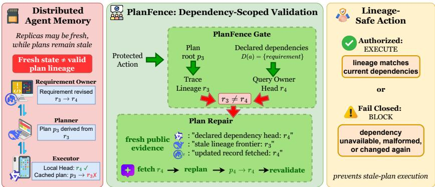
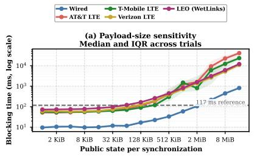
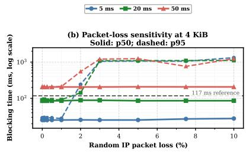
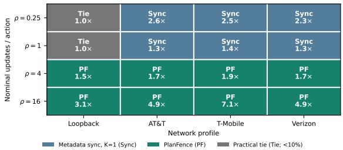
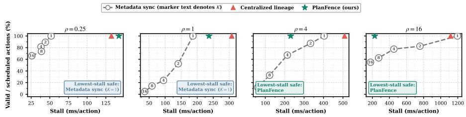
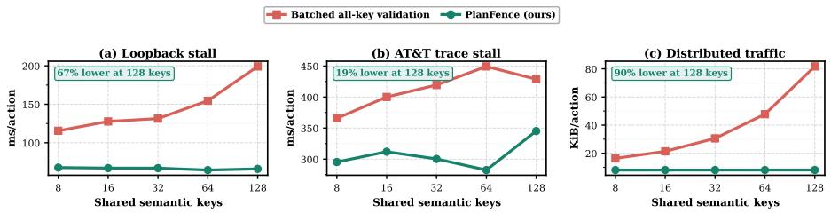
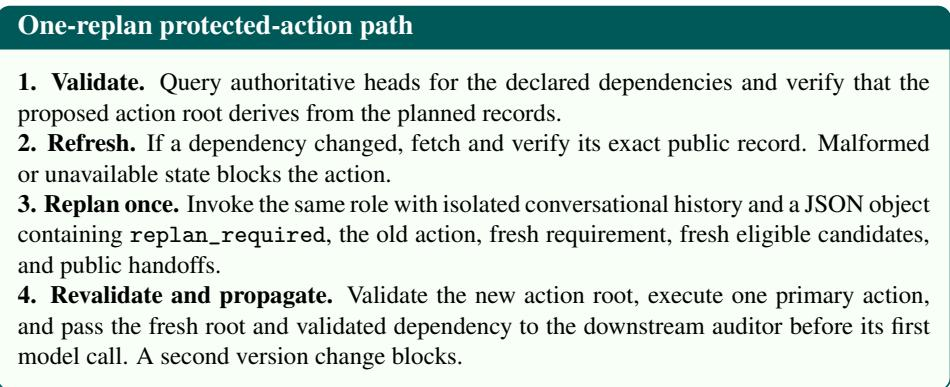
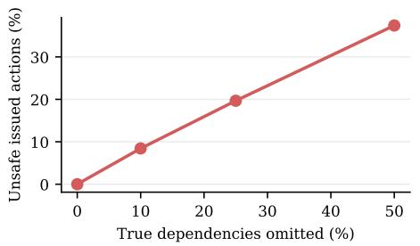
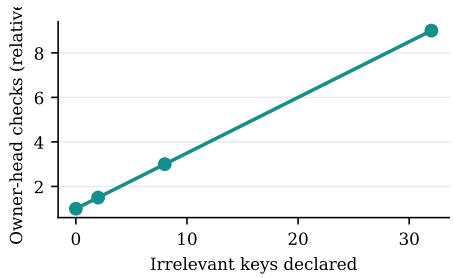

# Fresh Memory, Stale Plans: Dependency-Scoped Validation for Distributed LLM-Agent Memory

Evan Chen1, Shiqiang Wang2, Christopher G. Brinton1

1Purdue University 2University of Exeter

## Abstract

Distributed LLM-agent teams can read the latest shared facts and still act on an obsolete plan. A planner may derive an action from requirement r3, another agent may commit r , and an executor may receive r without replacing the plan derived from r . We call this stale-plan execution: state freshness does not establish that the plan authorizing an action remains valid. We introduce PLANFENCE, a dependency-scoped action-validation protocol. Plans cite the exact public records they used, and an executor validates only the records that can affect the pending external action, replanning once or blocking when validation is incomplete. In 30 controlled live workflows with a post-plan revision, a freshness-only executor acts on the obsolete plan in every task, whereas PLANFENCE completes all tasks without an invalid action. Controlled replay reveals two conditional boundaries: proactive synchronization yields lower coordination stall at low churn, while PLANFENCE avoids repeated update-path coordination as churn grows and avoids validating unrelated state as the shared keyspace grows. These are controlled safety and systems-cost results, not general task-accuracy gains.

## 1 Introduction

Distributed large language model (LLM) agent systems increasingly divide a task among specialized roles that plan, retrieve information, and invoke external tools. Frameworks such as AutoGen, MetaGPT, CAMEL, and ChatDev organize these roles across separate processes or devices [1, 2, 3, 4]. Agents may retain private context and local tools while replicating the public task state needed for coordination, making shared memory a first-class systems concern [5, 6, 7]. This separation lets each role operate independently, but it can also separate an external action from the state and plan that authorized it.

Recent persistent-world studies show that agent-authored artifacts and executable programs can outlive their creators and be reused by later agents through a shared environment [8], making the temporal separation between plan derivation and eventual execution concrete.

Consider a planner that reads requirement $r _ { 3 }$ and derives plan $p ( r _ { 3 } )$ . Before execution, another agent commits a revised requirement $r _ { 4 }$ . Background propagation may deliver $r _ { 4 }$ to the executor without replacing $p ( r _ { 3 } )$ , so the executor can call a tool with arguments derived from the old requirement while already holding the new one. A reservation may use a superseded destination, a fulfillment action may ship a cancelled order, or a deployment may release an obsolete build. We call this failure stale-plan execution. The failure is not stale memory at the executor; what remains stale is the derivation that supplied the action’s arguments. Installing $r _ { 4 }$ does not change the fact that $p ( r _ { 3 } )$ was produced from $r _ { 3 } .$ , so state freshness alone cannot establish that a pending plan is still authorized. The executor must instead verify that the plan descends from the current public records on which its action depends. We call this property lineage validity.

One direct solution is to coordinate public state strongly. Every owner can broadcast its current record ID and invalidate plans whose exact parents no longer match, or executors can compare those parents through one strong service [9, 10, 11]. When this coordination is cheap, it is the simplest safe choice. Section 3 measures when one synchronous public-state transfer enters the critical path. The required check, however, is narrower than globally fresh memory: a reservation action depends on its requirement, not on an unrelated catalog record or another workflow’s state. This creates a systems tradeoff between coordinating early over broad shared state and validating only the records relevant to an action when it is about to execute.

We evaluate this distinction through three questions:

RQ1: Can an agent read the latest state and still act on an outdated plan?

RQ2: As public state changes more often, which causes less waiting: synchronizing every update or validating only before an action?

RQ3: As shared state grows, when does checking only action-relevant state reduce coordination cost compared with checking all shared state?

Our Approach. We separate the safety invariant from the mechanism used to establish it. The invariant is exact lineage validity at a protected action; the systems choice is when and over what scope to check it. This separation leads to PLANFENCE, a dependency-scoped protocol placed at the action boundary. Each plan cites the exact public records used to derive it, and a tool wrapper declares which records can affect the pending action. Before an external call, the executor validates those dependencies with their owners. A changed input triggers one replan and a second check; an incomplete parent chain, dependency declaration, or owner response blocks the action. PLAN-FENCE coordinates public records, not private prompts or hidden reasoning. Figure 1 summarizes this action-boundary gate, from detecting a changed dependency through replanning to the final authorize-or-block decision.

Our main contributions are summarized as follows:

• We identify stale-plan execution and formalize lineage validity, distinguishing current executor state from current plan authorization. In 30 controlled live workflows, the freshness-only owner-head check issues an obsolete action in every task, while PLANFENCE completes all tasks without an invalid action.

• We design and implement PLANFENCE for distributed agent memory. Its actionboundary gate binds plans to exact public inputs, validates only tool-declared dependencies with their owners, and permits one replan before failing closed.

  
Figure 1: Fresh facts do not guarantee a fresh plan. A freshness-only check can observe requirement $r _ { 4 }$ while the action still uses plan $p _ { 3 }$ . PLANFENCE validates the plan’s declared dependency, detects the mismatch, fetches $r _ { 4 } .$ , and permits one replan before it authorizes or blocks the action.

• We compare safe coordination policies under identical schedules and map their coordinationstall boundary. Proactive synchronization has lower stall at low update rates; PLAN-FENCE avoids repeated unrelated-state coordination as updates grow. Against an equally safe batched all-key check, it lowers both stall and traffic across the tested 8–128 key loopback and AT&T settings.

## 2 Related Work

Provenance and validation. Data provenance records which inputs produced a derived object [12], while optimistic concurrency control validates whether a recorded read set remains current before commit [13]. PLANFENCE uses the same underlying ideas for a different boundary: a generated plan records its public inputs, and an executor validates them before an external action rather than before a database transaction commits. Unlike a database transaction, an LLM-generated plan may persist across role calls, replicas, and state refreshes long after the read that produced it; unless the runtime records exact parents, the executor has no read set to validate at the tool boundary.

Distributed consistency. Strong registers, proactive replication, epidemic propagation, and CRDTs offer different ways to expose current replica state [11, 9, 10, 14, 15]. Other systems ration consistency or provide application-level choices between latency and freshness [16, 17, 18, 19]. PLANFENCE does not introduce another consistency model. It specifies which record versions must still authorize the pending action, and it can use either proactive propagation or action-time owner queries to establish that fact.

LLM-agent coordination and memory. LLM multi-agent systems organize role collaboration and communication through fixed or learned interaction structures [1, 2, 3, 4, 20, 21, 22, 23]; MCP and A2A provide interfaces for tools and agent interaction [24, 25]. Agent memory research instead emphasizes retrieval, experience, and shared memory [26, 27, 28, 29, 30, 5, 6, 7]. Most of this work asks what agents should communicate, retrieve, or retain; persistent-world systems also study artifacts that survive their creators and acquire executable descent. SwarmWorld records contentaddressed parent-child program lineages, lets later agents inherit and modify persistent programs, and commits model-generated plans as bounded action queues while the shared world continues to evolve [8]. Its runtime checks determine whether each attempted action is currently legal under spatial, material, energetic, ownership, and permission constraints. This technological lineage supports inheritance and attribution; PLANFENCE instead uses exact derivation lineage to determine whether a pending action remains authorized by the current versions of its action-relevant public inputs, as reported by their owners.

## 3 Motivation and Problem Formulation

Strong coordination can keep public state current, but its placement determines whether communication enters the action’s critical path. Figure 2 measures one authenticated TCP synchronization as payload size, delay, and loss change. The operation is inexpensive on favorable paths, yet paying it after every dirty update can accumulate substantial delay as content grows or network conditions deteriorate. Carrier names denote fixed historical traces, not current provider performance.

An executor does not need to reproduce an entire memory system at action time. It needs enough evidence to answer three questions: which public versions produced this plan, which public items can affect this action, and which versions their owners currently authorize. We introduce the corresponding objects in that order and then state the action-validity condition.

## 3.1 Public state has versions

Let $\mathcal { A } = \{ a _ { 1 } , \ldots , a _ { N } \}$ be the agents. In distributed agent memory, each agent may hold a local copy of the team’s public state. Private scratchpads, prompts, and hidden reasoning are not public records and lie outside the lineage model.

A semantic $k e y \boldsymbol { x } \in \mathcal { X }$ identifies one logical public item across revisions, while a record ID identifies one immutable version of that item. The application assigns x an authoritative owner $o ( x ) \in \mathcal { A }$ , whose currently authorized record ID is the head $H ( x )$ Derived public records retain the exact IDs of the versions used to produce them.

Figure 1 instantiates these objects. The semantic key $x _ { \mathrm { r e q } }$ denotes the requirement, and records $r _ { 3 }$ and $r _ { 4 }$ are immutable versions with IDs ${ \mathrm { i d } } _ { 3 }$ and $\mathrm { i d } _ { 4 }$ . After the revision, the owner reports $H ( x _ { \mathrm { r e q } } ) = \mathrm { i d } _ { 4 }$ , while plan $p _ { 3 } = p ( r _ { 3 } )$ still cites $\mathrm { i d } _ { 3 }$ as its exact parent. Installing $r _ { 4 }$ changes the executor’s local state, but it does not rewrite the derivation recorded by $p _ { 3 }$

  
Figure 2: One synchronization is inexpensive on favorable paths but can become material as state or link adversity grows. The blocking time of one fresh authenticated TCP transfer grows with public-state size under replayed link traces (a), while packet loss inflates the $\mathsf { p } 9 5$ for a 4 KiB transfer even when the median remains stable (b). The 117 ms reference is 10% of the median audited Qwen3.5 role-call duration, not an end-to-end deadline. Per-update synchronization may pay this unit cost after every dirty update; the figure does not compare complete memory policies.

## 3.2 What evidence must authorize an action?

Exact derivation. For a protected action $^ { a , }$ let $L ( a )$ be the plan root or roots authorizing its arguments. Immutable parent links record the exact public versions from which those roots were derived.

Declared scope. The tool wrapper declares $D ( a ) \subseteq { \mathcal { X } }$ , the public keys whose values can affect the action. This declaration belongs to application code rather than generated prose.

Authoritative currency. For every $x \in D ( a )$ , the executor asks owner $o ( x )$ for its currently authorized version $H ( x )$ . Starting from $L ( a )$ , it also follows exact parents until it reaches the version of x used by the plan; denote that record ID by $F _ { a } ( x )$ . The map $F _ { a }$ is the plan’s dependencyfrontier. An action is lineage-valid at the logged validation point exactly when

$$
\mathrm { V a l i d } ( a ) \quad \Longleftrightarrow \quad F _ { a } ( x ) = H ( x ) , \qquad \forall x \in D ( a ) .\tag{1}
$$

## 3.3 Why each condition is necessary

Equation (1) separates the evidence needed to authorize an action. RQ1 asks whether reading the latest state is enough to authorize a pending plan. It is not: a fresh local requirement cannot show which requirement produced a cached plan, whereas the plan’s exact parent does. For the stale plan, $F _ { a } ( x _ { \mathrm { r e q } } ) = \mathrm { i d } _ { 3 }$ while $H ( x _ { \mathrm { r e q } } ) = \mathrm { i d } _ { 4 }$ . Replanning over r changes the frontier to $\mathrm { i d } _ { 4 }$ and makes the same check pass.

RQ2 asks when to pay for owner-head coordination: after every update or only when an action is about to execute. A system may distribute authoritative heads proactively or query them at the action boundary, but it cannot infer current authorization from an arbitrary local copy. RQ3 asks how much state to check. The declared set $D ( a )$ contains the action-relevant state, so a change outside $D ( a )$ does not invalidate the action; choosing $D ( a ) = { \mathcal { X } }$ instead recovers all-key validation.

The guarantee consequently requires exact binding, action-time validation, benign authoritative owners, authenticated transport, immutable parent links, and a complete tool-declared $D ( a )$ . A missing parent, unavailable or malformed owner response, or incomplete declaration makes validation inconclusive and blocks the action. The check is not an atomic multi-owner snapshot or a transaction spanning the later external service call; Section 6 discusses those boundaries.

## 4 Dependency-Scoped PLANFENCE

The three requirements above map directly to PLANFENCE. Writers first record exact derivation, tool wrappers declare the action’s dependency scope, and the executor compares the resulting frontier with owner heads immediately before execution. A mismatch causes one refresh and replan before the action is revalidated or blocked.

## 4.1 Recording action-relevant lineage

Application code attaches exact parent IDs whenever it writes a derived public record. Thus a requirement revision cites its previous version, and a role decision cites the requirement visible when the decision was produced. Tool wrappers separately declare $D ( a )$ . This dependency contract is part of the trusted computing base: a wrapper must capture dynamic public reads or conservatively declare a broader set.

At validation, owner $o ( x )$ returns the current immutable record ID $H ( x )$ for each declared key. Exact message and conflict checks are implementation details given in Appendix A. Metadata normally moves without record content; the executor fetches and verifies changed content only after it observes a mismatch.

## 4.2 Dependency-scoped action gate

Algorithm 1 implements the gate. The executor first traverses local exact parents and rejects an incomplete lineage. It then queries $o ( x )$ for every $x \in D ( a )$ concurrently. Matching frontiers authorize the action; a mismatch returns verified current records for one fresh plan. The caller invokes the gate once more with replanned set, so a second change or any incomplete response blocks instead of creating an unbounded replan loop.

## 4.3 Coordination cost and policy boundary

Let R be dirty owner updates between protected actions and $d = | D ( a ) |$ |. Per-update metadata sync distributes $O ( R N )$ owner heads early and compares the plan’s parents with the installed heads. Centralized lineage serializes $O ( R )$ commits and later reads. At action time, batched all-key validation checks and serializes $| \mathcal { X } |$ heads, whereas PLANFENCE checks only the d keys in $D ( a )$

These are head-item counts rather than TCP request counts: either action-time policy can batch multiple heads into one request per contacted owner. PLANFENCE fetches content only for dependencies whose IDs changed. The comparison does not make PLANFENCE universally cheaper. When R is small and links are fast, proactive synchronization removes action-time owner round trips; as churn or irrelevant shared state grows, its broader coordination becomes more costly. The experiments measure this crossover rather than inferring it from the asymptotic terms.

Algorithm 1: Dependency-scoped validation at a protected action.   
Input: action a, roots L(a), dependencies D(a), flag replanned   
1 Traverse exact parents from L(a) to the semantic-key boundaries in D(a)   
2 if a derived parent, dependency boundary, or owner mapping is missing then   
3 return blocked   
4 F ← boundary record IDs observed in the local lineage   
5 H(x) ← concurrently query o(x) for each x ∈ D(a)   
6 if an owner response is unavailable, malformed, conflicting, or identifies the wrong key   
then   
7 return blocked   
8 Fetch and verify exact records for keys with $H ( x ) \neq F ( x )$   
if F ̸= H or the roots do not derivefrom F then   
10 if replanned then   
11 return blocked   
12 return replan-required with H   
13 return authorized at the logged validation point

## 5 Experiments

## 5.1 Experimental Design

Together with the transport microbenchmark in Figure 2, we use live five-agent workflows and controlled replay. The live workflows test stale-plan execution and repair; controlled replay compares safety, stall, and traffic under identical schedules.

Live and controlled workflows. Five Qwen3.5 agents solve reservation, fulfillment, and deployment workflows through separate processes and agent-local public state. These runs test whether a model-generated plan can remain stale after the executor reads a revised requirement. A separate post-hoc audit found the defining pattern in 15/30 exploratory workflows: the executor read the revision but acted from a plan tied to the initial requirement. Those plans did not yet attach immutable memory records as exact parents, and we do not use this exploratory count to estimate natural failure incidence. Appendix A.4 reports the full exploratory audit. The matched intervention below supplies the causal comparison.

For policy comparison, controlled replay deliberately fixes the decisions in 30 public workflow templates while executing the same memory, transport, and validation paths through 3-8 agent-local copies. This design attributes invalid actions, waiting time, and traffic to the memory policy rather than model-output variation. The live workflows ground the basic five-agent, one-revision case. Higher update rates, wider dependency sets, larger keyspaces, and deeper parent chains are controlled stress tests.

Baselines. We use the same policy names in every table and figure. Local replica acts from installed state, while Owner-head freshness reads the current dependency without proving that the plan descends from it. Both deliberately omit lineage. The safe policies bind a plan to exact input IDs and replan once after a mismatch. Centralized lineage uses one shared service; Metadata sync, $K = 1$ announces every dirty owner head; Per-key all-key validation queries each shared key separately; Batched all-key validation returns all shared-key heads in one request per owner; and PLANFENCE queries only $D ( a )$ . We additionally test Majority-replica validation and All-replica dependency validation as strong distributed controls. Metadata sync with $K > 1$ is a safety-cost sensitivity, not a safe headline competitor, because it may compare against an obsolete announced head. In conceptual terms, eager invalidation after every owner update is Metadata sync $( K = 1 )$ , one strong shared memory service is Centralized lineage, a global epoch is a broad all-key check, and quorum-style reads are represented by the replica controls.

Workloads and comparisons. Each episode forms a plan, changes public requirements, and attempts a protected action under every policy. The primary setting uses eight semantic keys, five agents, 64 work units, one action dependency, and nominal update targets $\rho \in \{ 0 . 2 5 , 1 , 4 , 1 6 \}$ . At $H = 6 4$ , the schedules realize 0.25, 1.0, $4 2 / 1 1 \approx 3 . 8 2$ , and 14 updates per protected action. We test loopback and fixed AT&T, T-Mobile, and Verizon LTE traces.

The keyspace study varies 8-128 shared keys at five agents, one dependency, $H =$ 64, and $\rho = 4$ . Its primary reactive baseline batches all-key heads into one request per owner; per-key requests expose an implementation sensitivity. Team size, dependency count, episode length, and quorum provide additional cost checks. Symmetric artifact consumption is retained only as a safety and payload-path control. Appendix B reports the complete grids and secondary sensitivity controls.

Metrics and analysis. The safety endpoint counts issued actions whose plan does not reach every current declared input. We report raw safety, availability, and taskcompletion counts. Coordination stall is time waiting for synchronization or validation, and distributed traffic includes inter-replica and central-service bytes. Cost comparisons pair identical schedules and bootstrap over workflow families; differences below 10% are treated as practical ties. Appendix A.1 gives the zero-event bounds, resampling procedure, completion criterion, and timeout treatment.

Table 1 provides the safety and cost overview. Its first invalid-action and availability columns establish the safety boundary: a current record is insufficient unless the pending plan is bound to that exact record. Among policies with zero invalid actions and full availability, the cost columns then expose the systems choice. Figures 3 through 5 show why no policy minimizes both coordination stall and traffic in every measured regime.

## 5.2 RQ1: Can Latest State Still Lead to an Outdated Plan?

Fresh owner state does not invalidate an obsolete derivation; exact lineage does. Table 1 stages the race from Figure 1. Local replicas and owner-head checks without lineage both issue 330/330 actions from obsolete plans. Every strong policy that binds the plan to its inputs instead issues 330/330 lineage-valid actions. Appendix A.6 extends this check across the aligned policy audit: among 32,700 scheduled actions, it finds no invalid action for any method that enforces exact lineage. The sharp counts are protocol outcomes rather than model-accuracy estimates because every staged schedule deliberately places a revision between planning and action.

<table><tr><td>Category</td><td>Method / variant</td><td>Invalid / issued</td><td>Available / scheduled</td><td>Stall (ms/action)</td><td>Traffic (KiB/action)</td></tr><tr><td>Unsafe freshness</td><td>Local replica</td><td>330/330</td><td>330/330</td><td>0.0</td><td>3.8</td></tr><tr><td rowspan="4">Delayed sync</td><td>Owner-head freshness</td><td>330/330</td><td>330/330</td><td>151.8</td><td>7.1</td></tr><tr><td>Metadata sync, K = 2</td><td>42/330</td><td>330/330</td><td>333.1</td><td>23.1</td></tr><tr><td> $\hookrightarrow K = 4$ </td><td>108/330</td><td>330/330</td><td>213.7</td><td>21.2</td></tr><tr><td> $\hookrightarrow K = 8$ </td><td>222/330</td><td>330/330</td><td>122.4</td><td>17.5</td></tr><tr><td rowspan="6">Exact lineage (safe)</td><td> $\hookrightarrow K = 1 6$ </td><td>291/330</td><td>330/330</td><td>60.7</td><td>13.2</td></tr><tr><td>Centralized lineage</td><td>0/330</td><td>330/330</td><td>508.6</td><td>15.6</td></tr><tr><td>Metadata sync,  $\bar { K = 1 }$  Majority-replica validation</td><td>0/330 0/330</td><td>330/330 330/330</td><td>403.4</td><td>23.5</td></tr><tr><td>Per-key all-key validation</td><td>0/330</td><td>330/330</td><td>1075.3 282.8</td><td>223.7</td></tr><tr><td>Batched all-key validation</td><td>0/330</td><td>330/330</td><td>258.4</td><td>19.2</td></tr><tr><td>All-replica dependency validation</td><td>0/330</td><td>330/330</td><td>342.2</td><td>16.4 56.0</td></tr><tr><td></td><td>PLANFENCE (ours)</td><td>0/330</td><td>330/330</td><td>230.8</td><td>8.1</td></tr></table>

Table 1: Exact plan binding prevents stale-plan actions; at high churn, PLAN-FENCE has the lowest stall and traffic among safe policies. Results use eight-key compact state, the pinned AT&T trace, and the high-update workload (42 updates and 11 protected actions per episode). Every row opens a new TCP connection per RPC. Bold and underlined costs mark the best and second-best values among zero-invalid, fully available policies; delayed synchronization is shown only as a safety-cost sensitivity.

<table><tr><td colspan="6">Live system. Five Qwen3.5 agents run in separate role processes across reservation, fulfillment, and deployment workflows, with ten seeds per family. Stale-plan intervention. Role-local state → model plan p(r3) → owner revision r4 → protected tool action.</td></tr><tr><td></td><td>Memory</td><td> $\mathrm { T a s k }$  success</td><td>Invalid primary / scheduled</td><td>Successful</td><td>Redundant</td></tr><tr><td>Method Owner-head freshness Replicated</td><td></td><td>0/30</td><td>30/30</td><td>replans</td><td>auditor actions 0</td></tr><tr><td>Centralized lineage</td><td>Shared</td><td>30/30</td><td>0/30</td><td>30/30</td><td>4</td></tr><tr><td>PLANFENCE (ours)</td><td>Replicated</td><td>30/30</td><td>0/30</td><td>30/30</td><td>10</td></tr></table>

Table 2: Exact-lineage validation repairs model-generated stale plans before the protected action. Centralized lineage and PLANFENCE each replan successfully in all 30 interactive five-agent workflows. Redundant auditor actions are retained as modelside variation and are not synchronization-cost measurements.

The stale-plan failure persists when model-generated plans drive tool use. Table 2 follows five Qwen3.5 agents through reservation, fulfillment, and deployment workflows from role-local public state, inserting one requirement revision after planning but before the protected action. Reading the newest owner record without checking the plan issues an obsolete primary action in all 30 tasks. Centralized lineage and PLAN-FENCE instead detect the changed input, invoke one fresh planner call, and complete all 30 tasks without an invalid primary action. Their auditors unnecessarily repeat 4 and 10 already-valid actions, respectively; we retain these model-side false positives and do not use the study for synchronization-cost comparison. PLANFENCE therefore matches centralized-lineage safety and completion in an interactive five-agent system while preserving distributed, owner-managed memory.

## 5.3 RQ2: Synchronize Every Update or Validate Before Action?

Per-update synchronization has lower stall in the measured low-churn regime, while PLANFENCE has lower stall than the safe proactive alternatives at $\rho \geq 4 .$ Figure 3 maps this boundary across loopback and three cellular traces. Each cell compares PLANFENCE with the faster of per-update metadata sync and centralized lineage. The proactive choice has a lower point estimate in seven of the eight cells with $\rho \leq 1$ while both loopback comparisons are practical ties under our 10% threshold. PLAN-FENCE leads in all eight cells with $\rho \geq 4 ,$ by 1.5× to 7.1× relative to the next-lowest safe policy.

Delaying metadata synchronization trades safety for lower stall. Figure 4 makes this tradeoff explicit on the AT&T trace: increasing K reduces proactive coordination but leaves the announced head obsolete between barriers and admits more lineage violations. Table 4 reports the underlying counts and costs. Tables 5 and 7 vary team size and episode length. Across these $\rho = 4$ sensitivity checks, PLANFENCE has lower stall than centralized lineage and metadata sync $( K = 1 )$ for $N = 3 , 5 , 8$ and $H = 1 6 , 6 4 , 2 5 6$ with 8.0-8.2 KiB/action of traffic. The secondary endpoints use three templates and serve as sensitivity checks rather than standalone population estimates. The measured crossover marks a shiftfrom paying coordination after every update to paying it when

Figure 3: Metadata sync has lower stall at low churn; PLANFENCE has lower stall at high churn. Each cell compares PLANFENCE with the lower-stall safe choice between metadata sync $( K = 1 )$ and centralized lineage. The in-cell value is the runnerup/winner stall ratio. Gray marks differences below the declared 10% practical threshold; teal denotes PLANFENCE and blue denotes metadata sync. The legend defines the in-cell abbreviations. Centralized lineage is included in every cell but never has the lowest stall.  
  
Figure 4: On the AT&T trace, the safe-policy boundary lies between the measured nominal targets $\rho = 1$ and $\rho = 4 .$ . Metadata sync $( K = 1 )$ has lower stall at $\rho = 0 . 2 5$ and $\rho = 1 ;$ PLANFENCE has lower stall at $\rho = 4$ and $\rho = 1 6$ . Numbers inside the metadata-sync markers denote $K ;$ values with $K > 1$ reduce stall only by issuing invalid actions. All measurements use compact state.

an action validates its dependencies.

## 5.4 RQ3: Check Action-Relevant State or All Shared State?

With equal post-replan validation, dependency scope lowers both stall and traffic across the measured keyspaces. Table 1 first compares centralized lineage, metadata sync $( K = 1 )$ , and PLANFENCE in the primary eight-key compact-state setting on the AT&T trace at nominal $\rho = 4 .$ . All three complete 330/330 valid actions, while PLAN-FENCE uses 230.8 ms and 8.1 KiB per action, compared with 508.6 ms/15.6 KiB for centralized lineage and 403.4 ms/23.5 KiB for metadata sync; the ordering also holds on the other traces. Figure 5 next compares PLANFENCE with batched all-key validation under the same one-replan, two-validation path as the shared keyspace grows from 8 to 128 keys.

The action depends on one key. Batched all-key validation checks every shared key in one request per owner, whereas PLANFENCE queries only the dependency owner. Under these matched semantics, PLANFENCE lowers median stall from 115.5 to 67.8 ms/action at eight loopback keys and from 199.2 to 66.0 ms/action at 128 keys. Across three AT&T trace offsets, the corresponding medians are 365.7 versus 295.3 ms/action at eight keys and 428.7 versus 345.2 ms/action at 128 keys. Its traffic remains near 8.1 KiB/action while the all-key check grows from 16.4 to 81.7 KiB/action.

  
Figure 5: Dependency scope avoids serializing irrelevant shared-key heads. Relative to batched all-key validation, PLANFENCE lowers stall and traffic at every measured key count under the same one-replan, two-validation rule. Loopback points aggregate 30 templates. AT&T points are medians over three independent trace-offset aggregates; Appendix Table 9 reports each offset.

The benefit also depends on how much of the keyspace the action actually uses. Appendix Table 6 holds $| { \mathcal { X } } | = 8$ fixed and widens the dependency set. PLANFENCE lowers stall by 14.9% and traffic by 50.6% at d = 1. $\displaystyle \mathrm { A t } \ d = 2 ,$ stall is a practical tie while traffic remains 32.0% lower. $\mathrm { A t } d = 8 = | \mathcal { X } |$ , the two validation scopes coincide and both stall and traffic are practical ties. This convergence is the expected boundary of dependency scoping rather than a regime in which PLANFENCE should dominate.

Independent trace phases support the same aggregate pattern. At 128 keys, the paired PLANFENCE-minus-batched-all-key stall interval excludes zero at every AT&T trace offset, and the traffic interval excludes zero in every measured network/keyspace stratum. At eight keys, one of the three stall intervals crosses zero, so the latency ordering is not pointwise uniform. Table 8 in Appendix B reports every aggregate, and Table 9 reports the independent AT&T trace offsets. When both methods enforce the same safety rule, PLANFENCE preserves valid completion while avoiding all-key work that is irrelevant to the pending action.

## 6 Limitations

Our evaluation is designed to isolate the behavior of the memory policy rather than measure general agent capability. Controlled replay lets every policy face the same decisions and update schedules, while the live workflows show that a model-generated plan can become stale and be repaired before execution. The evidence nevertheless covers only three workflow families, 3-8 agents, constructed keyspaces, and a small set of historical network traces. We therefore treat the stress-test intervals as descriptive and do not infer a general improvement in task quality from them.

PLANFENCE’s safety guarantee also depends on a clear systems boundary. Owners must be benign, parent links exact, and each tool wrapper responsible for a complete dependency declaration. The present design does not address Byzantine owners, owner migration, inferred dependencies, semantic merging, or private reasoning that never enters the public lineage. Moreover, validation is atomic neither across multiple owners nor with the external action itself; applications that require either property need a transaction mechanism that spans the corresponding boundary. These assumptions determine when the action fence is safe, while engineering choices such as connection reuse, metadata placement, and artifact access can still shift the measured coordinationcost crossover.

## 7 Conclusion

Stale-plan execution is a lineage failure: current state can coexist with an obsolete derivation. PLANFENCE records exact parents, validates declared dependencies, replans once, and fails closed. Per-update synchronization has lower stall at low churn; PLANFENCE avoids repeated coordination as churn grows. Against batched all-key validation, it lowers measured stall and traffic when actions depend on a sparse subset of shared state, and the advantage vanishes as the dependency set reaches the full keyspace. We claim neither universal dominance nor general task-quality gains.

## References

[1] Q. Wu, G. Bansal, J. Zhang, Y. Wu, S. Zhang, E. Zhu, B. Li, L. Jiang, X. Zhang, and C. Wang, “AutoGen: Enabling next-gen LLM applications via multi-agent conversation framework,” arXiv preprint arXiv:2308.08155, 2023.

[2] S. Hong, X. Zheng, J. Chen, Y. Cheng, J. Wang, C. Zhang, Z. Wang, S. K. S. Yau, Z. Lin, L. Zhou et al., “MetaGPT: Meta programming for a multi-agent collaborative framework,” in International Conference on Learning Representations (ICLR), 2024.

[3] G. Li, H. A. A. K. Hammoud, H. Itani, D. Khizbullin, and B. Ghanem, “CAMEL: Communicative agents for “mind” exploration of large language model society,” in Advances in Neural Information Processing Systems (NeurIPS), 2023.

[4] C. Qian, W. Liu, H. Liu, N. Chen, Y. Dang, J. Li, C. Yang, W. Chen, Y. Su, X. Cong et al., “Communicative agents for software development,” in Annual Meeting ofthe Associationfor Computational Linguistics (ACL), 2024.

[5] Z. Yu, N. Yu, H. Zhang, W. Ni, M. Yin, J. Yang, Y. Zhao, and J. Zhao, “Multiagent memory from a computer architecture perspective: Visions and challenges ahead,” arXiv:2603.10062, 2026.

[6] A. Rezazadeh, Z. Li, A. Lou, Y. Zhao, W. Wei, and Y. Bao, “Collaborative memory: Multi-user memory sharing in LLM agents with dynamic access control,” arXiv:2505.18279, 2025.

[7] Y. Wang and X. Chen, “MIRIX: Multi-agent memory system for LLM-based agents,” arXiv:2507.07957, 2025.

[8] S. Pal, F. Y. Wang, and M. J. Buehler, “Swarmworld: Stigmergic technological evolution in societies of language-model agents,” arXiv preprint arXiv:2608.26081, 2026.

[9] S. Gilbert and N. Lynch, “Brewer’s conjecture and the feasibility of consistent, available, partition-tolerant web services,” ACM SIGACT News, vol. 33, no. 2, pp. 51–59, 2002.

[10] D. Abadi, “Consistency tradeoffs in modern distributed database system design: Cap is only part of the story,” Computer, vol. 45, no. 2, pp. 37–42, 2012.

[11] H. Attiya, A. Bar-Noy, and D. Dolev, “Sharing memory robustly in messagepassing systems,” Journal of the ACM, vol. 42, no. 1, pp. 124–142, 1995.

[12] P. Buneman, S. Khanna, and T. Wang-Chiew, “Why and where: A characterization of data provenance,” in International conference on database theory. Springer, 2001, pp. 316–330.

[13] H.-T. Kung and J. T. Robinson, “On optimistic methods for concurrency control,” ACM Transactions on Database Systems (TODS), vol. 6, no. 2, pp. 213–226, 1981.

[14] A. Demers, D. Greene, C. Hauser, W. Irish, J. Larson, S. Shenker, H. Sturgis, D. Swinehart, and D. Terry, “Epidemic algorithms for replicated database maintenance,” in Proceedings of the sixth annual ACM Symposium on Principles of distributed computing, 1987, pp. 1–12.

[15] M. Shapiro, N. Preguiça, C. Baquero, and M. Zawirski, “Conflict-free replicated data types,” in Symposium on Self-Stabilizing Systems (SSS), 2011, pp. 386–400.

[16] T. Kraska, M. Hentschel, G. Alonso, and D. Kossmann, “Consistency rationing in the cloud: Pay only when it matters,” in Proceedings of the VLDB Endowment (VLDB), vol. 2, 2009, pp. 253–264.

[17] C. Li, D. Porto, A. Clement, J. Gehrke, N. Preguiça, and R. Rodrigues, “Making {Geo-Replicated} systems fast as possible, consistent when necessary,” in 10th USENIX Symposium on Operating Systems Design and Implementation (OSDI 12), 2012, pp. 265–278.

[18] D. B. Terry, V. Prabhakaran, R. Kotla, M. Balakrishnan, M. K. Aguilera, and H. Abu-Libdeh, “Consistency-based service level agreements for cloud storage,” in Proceedings of the twenty-fourth ACM symposium on operating systems principles, 2013, pp. 309–324.

[19] P. Bailis, S. Venkataraman, M. J. Franklin, J. M. Hellerstein, and I. Stoica, “Probabilistically bounded staleness for practical partial quorums,” 2012.

[20] Y. Du, S. Li, A. Torralba, J. B. Tenenbaum, and I. Mordatch, “Improving factuality and reasoning in language models through multiagent debate,” in International Conference on Machine Learning (ICML), 2024.

[21] M. Zhuge et al., “GPTSwarm: Language agents as optimizable graphs,” ICML (arXiv:2402.16823), 2024.

[22] G. Zhang et al., “Cut the crap: An economical communication pipeline for LLMbased multi-agent systems,” ICLR (arXiv:2410.02506), 2025.

[23] ——, “Multi-agent architecture search via agentic supernet,” ICML (arXiv:2502.04180), 2025.

[24] Anthropic, “Model context protocol,” 2024, modelcontextprotocol.io.

[25] Google, “Agent2agent (A2A) protocol,” 2025, github.com/a2aproject/A2A.

[26] C. Packer, S. Wooders, K. Lin, V. Fang, S. G. Patil, I. Stoica, and J. E. Gonzalez, “MemGPT: Towards LLMs as operating systems,” arXiv preprint arXiv:2310.08561, 2023.

[27] W. Xu, Z. Liang, K. Mei, H. Gao, J. Tan, and Y. Zhang, “A-MEM: Agentic memory for LLM agents,” arXiv preprint arXiv:2502.12110, 2025.

[28] P. Chhikara, D. Khant, S. Aryan, T. Singh, and D. Yadav, “Mem0: Building production-ready ai agents with scalable long-term memory,” arXiv preprint arXiv:2504.19413, 2025.

[29] N. Shinn, F. Cassano, A. Gopinath, K. Narasimhan, and S. Yao, “Reflexion: Language agents with verbal reinforcement learning,” in Advances in neural information processing systems, vol. 36, 2023, pp. 8634–8652.

[30] G. Wang, Y. Xie, Y. Jiang, A. Mandlekar, C. Xiao, Y. Zhu, L. Fan, and A. Anandkumar, “Voyager: An open-ended embodied agent with large language models,” arXiv preprint arXiv:2305.16291, 2023.

## A Implementation Details

Table 3 lists the settings needed to reproduce the runtime behavior. Five agent processes participate. Replicated methods use one SQLite memory process per agent, while central lineage uses one shared SQLite memory process. All communication uses authenticated TCP. Public records are immutable JSON objects in durable SQLite stores. Paired policies receive the same initial records and schedules, and network impairments begin only after setup. We rerun only trials that terminate before any policy decision because of infrastructure failure. Policy-induced blocks, failures, and timeouts remain in all reported denominators.

Each stored public version carries its semantic key, immutable record ID, authoritative owner, monotone owner sequence, exact parent IDs, record type, content size, and public content or content address. An owner accepts a head update only when the writer identity matches the declared owner and the sequence increases; duplicate owner sequences are conflicts. Head announcements send the metadata envelope, while consumers fetch content only after discovering that their local version is obsolete.

<table><tr><td>Component</td><td>Setting</td></tr><tr><td>Live model</td><td>Qwen3.5-35B-A3B; temperature 0.2; top-p 0.95; 1,024 output-token cap; thinking disabled; no response cache</td></tr><tr><td>Live team</td><td>Five agent processes; replicated methods use five local-memory pro- cesses, while central lineage uses one shared memory process; eight role units, with one additional planner call when protected replanning is re-</td></tr><tr><td>Storage and transport</td><td>quired Durable SQLite; authenticated TCP; 10 s replay request timeout; 30 s controlled-live memory-operation timeout; fail closed on malformed,</td></tr><tr><td>Replay workload</td><td>conflicting, or unavailable owner state 30 workflow templates; N ∈ {3, 5, 8}; H ∈ {16, 64, 256}; nominal update targets ρ ∈ {0.25, 1,4, 16}; dependency counts {1,2,8}</td></tr><tr><td>State and network</td><td>Compact records up to 4 KiB; verified artifacts of 256-320 KiB; loop- back and pinned historical AT&amp;T, T-Mobile, and Verizon LTE traces</td></tr><tr><td>Scaling controls</td><td>Semantic key counts {8, 16, 32, 64, 128}; trace offsets 0, 5, and 15 s; compact per-owner change digests</td></tr><tr><td>Execution</td><td>Live inference uses four H100 GPUs; replay runs use isolated CPU pro-</td></tr><tr><td>Metrics</td><td>cesses; all paired policies receive identical schedules Invalid issued actions, available and completed actions, coordination stall, distributed wire bytes, replans, and remedial actions</td></tr></table>

Table 3: Implementation and harness configuration.

## A.1 Metrics and statistical analysis

Binary endpoints are reported as raw counts. For zero observed invalid actions, the one-sided 95% exact-binomial upper bounds are 0.90% for 0/330, 9.5% for 0/30, and 0.023% for 0/13,200. These bounds describe empirical implementation coverage; the protocol invariant remains conditional on the assumptions in Section 4. Cost comparisons pair identical schedules and use 2,000 bootstrap draws that resample the three workflow families as clusters. We regard a 10% reduction in median stall or traffic as practically meaningful when safety does not weaken and availability falls by no more than five percentage points. With three families, the intervals describe stability across those families rather than population-wide uncertainty. In Figure 2, the 117.42 ms line is an analytical reference rather than an end-to-end target; elapsed durations from 2 s transport timeouts remain in the latency summaries.

## A.2 Controlled live prompting and tool grounding

Each role receives the same short system instruction with its role and workflow family substituted. The user content is a stable JSON object assembled from only the role’s local public state and prior public handoffs. The tool schema then enumerates every permitted identifier, action name, and argument object.

Controlled live-agent prompt   
System. You are <WORK\_UNIT> in a controlled <FAMILY> workflow. Use only supplied   
evidence. Call exactly one supplied tool. Do not invent IDs or hidden state. The tool schema   
enumerates the complete allowed IDs and actionsfor this decision.   
User object. Local requirement and its application-level request ID; an opaque digest of   
the local requirement revision; up to five locally eligible catalog candidates; prior public   
handoffs; and, for the auditor, the externally visible action outcome.   
Grounded tool. Exactly one function call is required. Candidate IDs, requirement revision,   
action name, and complete action arguments are finite enumerations constructed from the   
local query. Additional fields are rejected.

One public correction is allowed after a schema violation. The correction contains the rejection reason and required tool name but no hidden answer. A second violation fails the attempt. Model-facing handoffs contain role content only; raw memory-record IDs, owner IDs, and evaluator fields remain inside the workflow adapter.

## A.3 Protected-action and replan harness

The replay uses the same validation code but replaces the model replan with a

recorded fresh public decision. It therefore measures the memory mechanism and network path without attributing fixed decisions to new model calls.

## A.4 Exploratory live-workflow audit

Before examining stale plans, we verified that the model and tools could solve the workflow with centralized state. All 30 paired tasks completed, and all 480 role decisions satisfied their public tool schemas.

The prespecified audit then asked whether the executor itself read an obsolete requirement. Only 3/30 runs did, below its prespecified threshold of 15. A separate post-hoc analysis revealed a different failure: 28/30 generated plans cited the initial application requirement, and in 15 cases the executor read the revision but still issued the invalid action from that stale plan. These cases span deployment, fulfillment, and reservation with counts 6, 2, and 7. The model produced 240 accepted role decisions from 241 responses, with no unrecovered schema, workflow-contract, or infrastructure failure.

Those plan records stored the application requirement ID in their public payload but did not yet attach the immutable memory record as a parent. The audit therefore shows that generated plans can remain stale; the replay and the matched live study provide the exact-lineage comparison.

## A.5 Matched controlled-live check

The matched study crosses three workflow families, ten evaluation seeds, and three memory methods, for 90 attempts. Each task forms a plan over the initial requirement and then receives one owner revision before execution. Owner-head freshness exposes the new record without checking whether the plan used it. Centralized lineage and PLANFENCE instead validate the plan, fetch the revised input, invoke one isolated planner call, and validate again before acting.

Owner-head freshness issues the stale action and fails all 30 tasks. Centralized lineage and PLANFENCE each complete 30/30 tasks with no invalid action and one successful replan per task. Their auditors unnecessarily repeat 4 and 10 valid actions, respectively. This model-side variation prevents a live cost comparison, but it does not alter the safety outcome because every protected primary action was already valid.

All 90 attempts complete, and the model produces 780 accepted role decisions from 784 responses. Four initial schema errors are corrected by the one allowed public retry; none remains unrecovered. Each paired centralized-lineage and PLANFENCE run follows the same workflow steps, and no infrastructure or tool-contract failure occurs.

## A.6 Evaluation coverage

The 30-template corpus includes 241 retained live latency samples, while the aligned policy grid schedules 32,700 actions: every exact-lineage method remains safe and available, and stale or delayed-sync controls account for all 4,143 invalid actions. The matched keyspace study completes 13,200/13,200 actions and supplies the scope-cost comparison. The artifact control completes 15,360/15,360 actions with zero lineage violations and two verified fetches per policy and action; because it uses a different action path, it supports payload-path safety but not comparative stall.

## B Controlled-replay ablations

The following studies ask whether the main boundary survives changes in synchronization cadence, team size, dependency count, and episode length. “Valid” means an issued action whose plan reaches every current declared input; a blocked action never enters that numerator. Unless noted otherwise, the tables use compact records, the AT&T trace, and $\rho = 4$

<table><tr><td>Setting</td><td>Method</td><td>Valid / scheduled</td><td>Stall (ms/action)</td><td>Traffic (KiB/action)</td></tr><tr><td>ρ = 0.25</td><td>Metadata sync, K = 1</td><td>840/840</td><td>51.8</td><td>5.8</td></tr><tr><td>ρ = 0.25</td><td>↔K = 2</td><td>750/840</td><td>44.1</td><td>5.5</td></tr><tr><td>ρ = 0.25</td><td>→ K = 4</td><td>684/840</td><td>38.2</td><td>5.4</td></tr><tr><td>ρ = 0.25</td><td>→ K = 8</td><td>618/840</td><td>38.8</td><td>5.3</td></tr><tr><td>ρ = 0.25</td><td>→ K = 16</td><td>555/840</td><td>26.0</td><td>5.1</td></tr><tr><td>ρ= 0.25</td><td>PLANFENCE (ours)</td><td>840/840</td><td>142.5</td><td>5.8</td></tr><tr><td>ρ= 1</td><td>Metadata sync, K = 1</td><td>630/630</td><td>186.8</td><td>11.6</td></tr><tr><td>ρ = 1</td><td>↔K = 2</td><td>330/630</td><td>140.7</td><td>10.6</td></tr><tr><td>ρ = 1</td><td>↔ K = 4</td><td>150/630</td><td>94.9</td><td>9.7</td></tr><tr><td>ρ= 1</td><td>↔ K = 8</td><td>90/630</td><td>59.1</td><td>9.0</td></tr><tr><td>ρ=1</td><td>↔ K = 16</td><td>30/630</td><td>36.5</td><td>7.6</td></tr><tr><td>ρ = 1</td><td>PLANFENCE (ours)</td><td>630/630</td><td>236.7</td><td>8.1</td></tr><tr><td>ρ= 4</td><td>Metadata sync, K = 1</td><td>330/330</td><td>403.4</td><td>23.5</td></tr><tr><td>ρ=4</td><td>↔ K = 2</td><td>288/330</td><td>333.1</td><td>23.1</td></tr><tr><td>ρ=4</td><td>→ K = 4</td><td>222/330</td><td>213.7</td><td>21.2</td></tr><tr><td>ρ=4</td><td>→ K = 8</td><td>108/330</td><td>122.4</td><td>17.5</td></tr><tr><td>ρ=4</td><td>↔ K = 16</td><td>39/330</td><td>60.7</td><td>13.2</td></tr><tr><td>ρ= 4</td><td>PLANFENCE (ours)</td><td>330/330</td><td>230.8</td><td>8.1</td></tr><tr><td>ρ = 16</td><td>Metadata sync, K = 1</td><td>120/120</td><td>1196.3</td><td>65.8</td></tr><tr><td>ρ = 16</td><td>↔ K = 2</td><td>99/120</td><td>757.2</td><td>61.5</td></tr><tr><td>ρ = 16</td><td>↔ K = 4</td><td>93/120</td><td>451.9</td><td>53.7</td></tr><tr><td>ρ = 16</td><td>↔ K = 8</td><td>75/120</td><td>273.9</td><td>42.6</td></tr><tr><td>ρ = 16</td><td>↔ K = 16</td><td>66/120</td><td>178.4</td><td>29.6</td></tr><tr><td>ρ = 16</td><td>PLANFENCE (ours)</td><td>120/120</td><td>227.3</td><td>8.1</td></tr></table>

Table 4: Synchronization cadence across nominal update targets. Waiting more than one work unit reduces proactive cost by allowing invalid stale-plan actions.

Large-artifact safety control. Across 960 runs and 15,360 protected actions, every policy fetches and verifies the same changed public artifact twice per action, and every exact-lineage action remains valid. Because this control uses a different action path, we use it to verify payload-path safety but not comparative stall.

## B.1 Independent AT&T trace phases

Changing the start point within the AT&T trace changes absolute latency but preserves the pointwise ordering. Table 9 reports the independently replayed 0, 5, and 15 second offsets at both keyspace endpoints. Both exact-lineage methods complete every action. PLANFENCE has lower median stall and traffic in all six paired aggregates. The paired

<table><tr><td>Setting</td><td>Method</td><td>Valid / scheduled</td><td>Stall (ms/action)</td><td>Traffic (KiB/action)</td></tr><tr><td>N = 3</td><td>Centralized lineage</td><td>33/33</td><td>530.2</td><td>15.9</td></tr><tr><td>N=3</td><td>Metadata sync,  $\bar { K = 1 }$ </td><td>33/33</td><td>381.1</td><td>15.7</td></tr><tr><td>N=3</td><td>Per-key all-key validation</td><td>33/33</td><td>290.4</td><td>16.8</td></tr><tr><td> $N = 3$ </td><td>Batched all-key validation</td><td>33/33</td><td>237.0</td><td>12.8</td></tr><tr><td>N=3</td><td>All-replica dependency validation</td><td>33/33</td><td>300.5</td><td>36.7</td></tr><tr><td> $N = 3$ </td><td>Majority-replica validation</td><td>33/33</td><td>953.4</td><td>138.8</td></tr><tr><td>N = 3</td><td>PLANFENČE (ours)</td><td>33/33</td><td>223.5</td><td>8.0</td></tr><tr><td>N = 5</td><td>Centralized lineage</td><td>330/330</td><td>508.6</td><td>15.6</td></tr><tr><td>N=5</td><td>Metadata sync,  $K = 1$ </td><td>330/330</td><td>403.4</td><td>23.5</td></tr><tr><td> $N = 5$ </td><td>Per-key all-key validation</td><td>330/330</td><td>282.8</td><td>19.2</td></tr><tr><td> $N = 5$ </td><td>Batched all-key validation</td><td>330/330</td><td>258.4</td><td>16.4</td></tr><tr><td> $N = 5$ </td><td>All-replica dependency validation</td><td>330/330</td><td>342.2</td><td>56.0</td></tr><tr><td>N = 5</td><td>Majority-replica validation</td><td>330/330</td><td>1075.3</td><td>223.7</td></tr><tr><td>N = 5</td><td>PLANFENCE (ours)</td><td>330/330</td><td>230.8</td><td>8.1</td></tr><tr><td>N = 8</td><td>Centralized lineage</td><td>33/33</td><td>596.3</td><td>16.1</td></tr><tr><td>N = 8</td><td>Metadata sync,  $\bar { K = 1 }$ </td><td>33/33</td><td>489.1</td><td>36.8</td></tr><tr><td>N = 8</td><td>Per-key all-key validation</td><td>33/33</td><td>292.9</td><td>20.6</td></tr><tr><td>N = 8</td><td>Batched all-key validation</td><td>33/33</td><td>301.9</td><td>21.0</td></tr><tr><td>N = 8</td><td>All-replica dependency validation</td><td>33/33</td><td>383.6</td><td>95.5</td></tr><tr><td>N = 8</td><td>Majority-replica validation</td><td>33/33</td><td>1195.3</td><td>501.1</td></tr><tr><td>N = 8</td><td>PLANFENCE (ours)</td><td>33/33</td><td>235.1</td><td>8.2</td></tr></table>

Table 5: Team-size sensitivity with one dependency per action. The high-update policy ordering remains stable from three to eight agents.  
stall interval excludes zero in five of the six 30-template strata; the eight-key, fivesecond interval crosses zero and remains a descriptive comparison.

<table><tr><td>Setting</td><td>Method</td><td>Valid / scheduled</td><td>Stall (ms/action)</td><td>Traffic (KiB/action)</td></tr><tr><td> $d = 1$ </td><td>Batched all-key validation</td><td>330/330</td><td>262.8</td><td>16.4</td></tr><tr><td> $d = 1$ </td><td>PLANFENCE (ours)</td><td>330/330</td><td>223.6</td><td>8.1</td></tr><tr><td> $d = 2$ </td><td>Batched all-key validation</td><td>330/330</td><td>270.7</td><td>19.5</td></tr><tr><td> $d = 2$ </td><td>PLANFENCE (ours)</td><td>330/330</td><td>245.2</td><td>13.2</td></tr><tr><td> $d = 8 = | \mathcal { X } |$ </td><td>Batched all-key validation</td><td>330/330</td><td>400.1</td><td>34.1</td></tr><tr><td> $d = 8 = \vert \mathcal { X } \vert$ </td><td>PLANFENCE (ours)</td><td>330/330</td><td>421.7</td><td>36.8</td></tr></table>

Table 6: Dependency-scope benefits narrow as the action approaches the full keyspace. Both methods fetch only changed dependency records concurrently and use the same one-replan, twovalidation rule over 30 templates. $\mathrm { A t } ~ d = 1$ , PLANFENCE lowers stall and traffic; at $d = 2 ,$ , stall is a practical tie while traffic remains lower; at $d = 8 = | \mathcal { X } |$ , both endpoints are practical ties under the 10% threshold.

<table><tr><td>Setting</td><td>Method</td><td>Valid / scheduled</td><td>Stall (ms/action)</td><td>Traffic (KiB/action)</td></tr><tr><td> $H = 1 6$ </td><td>Centralized lineage</td><td>9/9</td><td>452.4</td><td>15.0</td></tr><tr><td> $H = 1 6$ </td><td> $\mathbf { M e t a d a t a s y n c } , \bar { K } = 1$ </td><td>919</td><td>347.6</td><td>21.4</td></tr><tr><td>_  $H = 1 6$ </td><td> $\mathbf { P L A N F E N C E } \mathbf { ( o u r s ) }$ </td><td>9/9</td><td>210.6</td><td>8.1</td></tr><tr><td> $H = 6 4$ </td><td>Centralized lineage</td><td>330/330</td><td>508.6</td><td>15.6</td></tr><tr><td> $H = 6 4$ </td><td>Metadata sync,  $\bar { K = 1 }$ </td><td>330/330</td><td>403.4</td><td>23.5</td></tr><tr><td>_  $H = 6 4$ </td><td> $\mathbf { P L A N F E N C E } \ ( \mathbf { o u r s } )$ </td><td>330/330</td><td>230.8</td><td>8.1</td></tr><tr><td> $H = 2 5 6$ </td><td>Centralized lineage</td><td>129/129</td><td>593.4</td><td>16.3</td></tr><tr><td> $H = 2 5 6$ </td><td>Metadata sync,  $\bar { K = 1 }$ </td><td>129/129</td><td>523.0</td><td>24.7</td></tr><tr><td>–  $H = 2 5 6$ </td><td> $\mathbf { P L A N F E N C E } \ ( \mathbf { o u r s } )$ </td><td>129/129</td><td>286.0</td><td>8.1</td></tr></table>

Table 7: Episode-length sensitivity for the three primary policies. The high-update ordering persists from 16 to 256 work units.

<table><tr><td>Network</td><td>Method</td><td> $\mathrm { K e y s }$ </td><td>Valid / scheduled</td><td>Stall (ms/action)</td><td>Traffic (KiB/action)</td></tr><tr><td>Loopback</td><td>Batched all-key validation</td><td>8</td><td>330/330</td><td>115.5</td><td>16.4</td></tr><tr><td>Loopback</td><td>PLANFENCE (ours)</td><td>8</td><td>330/330</td><td>67.8</td><td>8.1</td></tr><tr><td>Loopback</td><td>Batched all-key validation</td><td>16</td><td>330/330</td><td>127.7</td><td>21.4</td></tr><tr><td>Loopback</td><td>PLANFENCE (ours)</td><td>16</td><td>330/330</td><td>67.1</td><td>8.1</td></tr><tr><td>Loopback</td><td>Batched all-key validation</td><td>32</td><td>330/330</td><td>131.4</td><td>30.6</td></tr><tr><td>Loopback</td><td>PLANFENCE (ours)</td><td>32</td><td>330/330</td><td>67.0</td><td>8.1</td></tr><tr><td>Loopback</td><td>Batched all-key validation</td><td>64</td><td>330/330</td><td>154.6</td><td>47.8</td></tr><tr><td>Loopback</td><td>PLANFENCE (ours)</td><td>64</td><td>330/330</td><td>64.5</td><td>8.1</td></tr><tr><td>Loopback</td><td>Batched all-key validation</td><td>128</td><td>330/330</td><td>199.2</td><td>81.7</td></tr><tr><td>Loopback</td><td>PLANFENCE (ours)</td><td>128</td><td>330/330</td><td>66.0</td><td>8.1</td></tr><tr><td>AT&amp;T trace</td><td>Batched all-key validation</td><td>8</td><td>990/990</td><td>365.7</td><td>16.4</td></tr><tr><td>AT&amp;T trace</td><td>PLANFENCE (ours)</td><td>8</td><td>990/990</td><td>295.3</td><td>8.1</td></tr><tr><td>AT&amp;T trace</td><td>Batched all-key validation</td><td>16</td><td>990/990</td><td>400.1</td><td>21.4</td></tr><tr><td>AT&amp;T trace</td><td>PLANFENCE (ours)</td><td>16</td><td>990/990</td><td>312.0</td><td>8.1</td></tr><tr><td>AT&amp;T trace</td><td>Batched all-key validation</td><td>32</td><td>990/990</td><td>419.4</td><td>30.6</td></tr><tr><td>AT&amp;T trace</td><td>PLANFENCE (ours)</td><td>32</td><td>990/990</td><td>300.3</td><td>8.1</td></tr><tr><td>AT&amp;T trace</td><td>Batched all-key validation</td><td>64</td><td>990/990</td><td>449.3</td><td>47.8</td></tr><tr><td>AT&amp;T trace</td><td>PLANFENCE (ours)</td><td>64</td><td>990/990</td><td>282.4</td><td>8.1</td></tr><tr><td>AT&amp;T trace</td><td>Batched all-key validation</td><td>128</td><td>990/990</td><td>428.7</td><td>81.7</td></tr><tr><td>AT&amp;T trace</td><td>PLANFENCE (ours)</td><td>128</td><td>990/990</td><td>345.2</td><td>8.1</td></tr></table>

Table 8: Complete aligned semantic-keyspace comparison. Loopback rows aggregate 30 templates; AT&T rows aggregate the same templates at three independent trace offsets. Both methods use exact lineage, one post-replan validation, and a new TCP connection per RPC. All 13,200 scheduled actions complete with valid lineage.

<table><tr><td>Keys</td><td>Trace offset</td><td>Method</td><td>Valid / scheduled</td><td>Stall (ms/action)</td><td>Traffic (KiB/action)</td></tr><tr><td>8</td><td>0s</td><td>Batched all-key validation</td><td>330/330</td><td>264.5</td><td>16.4</td></tr><tr><td>8</td><td>0 s</td><td>PLANFENCE (ours)</td><td>330/330</td><td>223.9</td><td>8.1</td></tr><tr><td>8</td><td>5s</td><td>Batched all-key validation</td><td>330/330</td><td>365.7</td><td>16.4</td></tr><tr><td>8</td><td>5 s</td><td>PLANFENCE (ours)</td><td>330/330</td><td>348.4</td><td>8.1</td></tr><tr><td>8</td><td>15 s</td><td>Batched all-key validation</td><td>330/330</td><td>390.3</td><td>16.4</td></tr><tr><td>8</td><td>15 s</td><td>PLANFENCE (ours)</td><td>330/330</td><td>295.3</td><td>8.1</td></tr><tr><td>128</td><td>0 s</td><td>Batched all-key validation</td><td>330/330</td><td>350.0</td><td>81.7</td></tr><tr><td>128</td><td>0 s</td><td>PLANFENCE (ours)</td><td>330/330</td><td>239.4</td><td>8.1</td></tr><tr><td>128</td><td>5 s</td><td>Batched all-key validation</td><td>330/330</td><td>428.7</td><td>81.7</td></tr><tr><td>128</td><td>5 s</td><td>PLANFENCE (ours)</td><td>330/330</td><td>345.2</td><td>8.1</td></tr><tr><td>128</td><td>15 s</td><td>Batched all-key validation</td><td>330/330</td><td>643.3</td><td>81.7</td></tr><tr><td>128</td><td>15 s</td><td>PLANFENCE (ours)</td><td>330/330</td><td>390.8</td><td>8.1</td></tr></table>

Table 9: Independent AT&T trace phases under the aligned comparison. Both methods fetch a changed record once, replan once, and validate again. Bold marks the lower cost within each exact offset and keyspace pair.

## B.2 Learned policy selection does not dominate a transparent rule under OOD shift

Could a learned selector reduce coordination cost without weakening the safety path? We allow it to choose among centralized lineage, metadata sync $( K = 1 )$ , and PLAN-FENCE, all of which retain deterministic exact-lineage validation. Malformed or unavailable selector output falls back to PLANFENCE. The transparent reference uses metadata sync when $\rho \le 1$ and PLANFENCE otherwise; learned selectors may also choose centralized lineage.

We derive 1,332 examples from the complete controlled-replay campaign, each aggregating six workflows from three families. A policy is eligible if it issues no invalid action and completes every scheduled action. Among eligible policies within 10% of the lowest stall, the target is the policy with the least wire traffic; we call this a safe near-optimal choice. The split contains 648 training, 144 development, and 180 indistribution (ID) examples. Four disjoint 90-example out-of-distribution (OOD) blocks hold out, respectively, the Verizon trace, interpolated update rates {0.5,2,8}, endpoint key counts {8,128}, and their compound shift. Selectors see only pre-action workload dimensions and static trace calibration, never profile identity, workflow text, outcomes, or future trace events. Neural results use three-seed ensembles.

Learned selectors improve ID selection but do not consistently dominate the transparent rule under shift. Table 10 reports 95.0-96.7% safe near-optimal selection for the learned models on ID examples, compared with 89.4% for the transparent rule. Under shift, the tree and tabular networks fall to 84.4-94.2%. DeBERTa-v3-base reaches 96.1%, but its conservative three-model batch-one inference costs 34.08 ms. We consider a selector robust only if it is no worse in completion, safe near-optimal choice, Pareto domination, traffic regret, and $\mathsf { p } 9 5$ stall regret after inference, with at least one strict improvement in every OOD block. None passes all four blocks: the tabular models pass only the keyspace block, and neither DeBERTa model passes any block after inference cost. Exact-lineage safety nevertheless remains deterministic under every selector.

<table><tr><td rowspan="2">Selector</td><td colspan="2">Safe near-optimal ↑ (%)</td><td colspan="2">p95 stall regret ↓ (ms/action)</td><td rowspan="2">p95 inference ↓ (ms/query)</td><td rowspan="2">All-shift</td></tr><tr><td>ID</td><td>OOD</td><td>ID</td><td>OOD</td></tr><tr><td>Transparent rate rule</td><td>89.4</td><td>95.0</td><td>24.7</td><td>26.5</td><td>一</td><td>gate reference</td></tr><tr><td>Fixed PLANFENCE</td><td>72.2</td><td>68.6</td><td>134.8</td><td>98.9</td><td>一</td><td>一</td></tr><tr><td>Depth-3 decision tree</td><td>95.0</td><td>84.4</td><td>17.6</td><td>75.7</td><td>0.08</td><td>no</td></tr><tr><td>Two-layer MLP</td><td>96.7</td><td>94.2</td><td>7.5</td><td>35.4</td><td>0.21</td><td>no</td></tr><tr><td>Residual MLP</td><td>96.1</td><td>91.4</td><td>11.3</td><td>46.6</td><td>0.52</td><td>no</td></tr><tr><td>DeBERTa-v3-base</td><td>95.0</td><td>96.1</td><td>17.6</td><td>21.7</td><td>34.08</td><td>no</td></tr><tr><td>DeBERTa-v3-large</td><td>95.0</td><td>94.7</td><td>17.6</td><td>31.4</td><td>64.06</td><td>no</td></tr></table>

Table 10: Appendix-only selection among policies that retain deterministic lineage safety. OOD pools four disjoint 90-example shifts. Stall regret is measured against the fastest eligible policy; inference is reported separately and included in the blockwise dominance gate. Ensemble inference is the conservative sum of the three batch-one p95 measurements. “No” means the learned selector does not dominate the transparent rule in every OOD block.

## C Validation assumptions and component sensitivities

These studies ask which components the guarantee requires: following the full parent chain, replanning after a detected change, declaring every dependency, and blocking when validation cannot finish. They isolate mechanism behavior rather than network cost or natural error frequency.

The same lineage traversal used by PLANFENCE authorizes intact chains through depth eight and blocks whenever an intermediate record is missing. Checking only a direct parent works at depth one but cannot prove deeper chains. Replanning turns all 3,000 detected races into valid actions; validation without replanning blocks all 3,000. Reading a fresh requirement without checking its plan, or trusting an arbitrary replica’s head, issues an invalid action in every race. Table 11 reports the raw outcomes.

<table><tr><td>Lineage proof</td><td>l=1</td><td>l=2</td><td>l=4</td><td>l=8</td></tr><tr><td>Full transitive closure</td><td>authorize</td><td>authorize</td><td>authorize</td><td>authorize</td></tr><tr><td>Direct parent only</td><td>authorize</td><td>block</td><td>block</td><td>block</td></tr><tr><td>Missing intermediate</td><td>block</td><td>block</td><td>block</td><td>block</td></tr><tr><td>Component</td><td>Valid</td><td>Blocked</td><td>Unsafe</td><td>Trials</td></tr><tr><td>Validate + one replan</td><td>3,000</td><td>0</td><td>0</td><td>3,000</td></tr><tr><td>Validate + block</td><td>0</td><td>3,000</td><td>0</td><td>3,000</td></tr><tr><td>Freshness, no lineage</td><td>0</td><td>0</td><td>3,000</td><td>3,000</td></tr><tr><td>Any-replica head</td><td>0</td><td>0</td><td>3,000</td><td>3,000</td></tr></table>

Table 11: Full lineage traversal is necessary beyond one parent, and replanning converts detected races from blocked to available. “Block” is safe but unavailable; it is never counted as a valid issued action.

Figure 6 tests the static dependency-contract assumption over 30 templates and 100 race seeds. Of four truedependencies, one remains declared while the other three are independentlyomitted. Unsafe issuance rises from 0% to 37.4% as the omission probability reaches 50%. Overdeclaration remains safe but grows owner-head checks from four to 36 per action. Under owner outage, missing lineage, malformed owner heads, and a second version change, fail-closed validation blocks all four cases with no issued action; the corresponding fail-open ablation issues an invalid action in all four. These results justify complete contracts and fail-closed behavior; they do not establish how often either failure occurs in deployed multi-agent systems.

  
Figure 6: Missing dependencies break safety; extra dependencies cost checks. Left: invalid issued actions under contract omission. Right: owner-head checks under safe overdeclaration.