# From Prior-Guided Heuristics to Deployable Agents: Accelerating Demonstration-Driven Reinforcement Learning for Deadline-Constrained Network Control

Vincenzo Norman Vitalea,∗, Mohammad Solkia, Antonia Maria Tulinoa,e, Andreas F. Molischb, Jaime Llorcac,d,e

aDIETI, University of Naples Federico II, Via Claudio 21, Naples, 80125, Italy,

bUniversity of Southern California, 3740 McClintock Ave., Los Angeles, 90089, California, USA

cUniversity of Trento, Via Sommarive, 9, Trento, 38123, Italy,

dCentre Tecnològic de Telecomunicacions de Catalunya (CTTC), Avinguda Carl Friedrich Gauss, 7, Castelldefels,Barcelona, 08860, Spain, eNew York University, 6 MetroTech Center, Brooklyn, New York, 11201, USA,

## Abstract6

Timely delivery of delay-sensitive information over dynamic, heterogeneous networks is essential for NextG interactive applications,0 yet providing strict End-to-End (E2E) peak latency guarantees remains an open challenge. Two obstacles limit the adoption of2 learning-based network control in this setting: traditional volume-based routing metrics, while highly efective for general trafic management, are not designed to capture trafic urgency; and Deep Reinforcement Learning (DRL) controllers trained from scratche sufer from sample ineficiency, long training times, and early-stage exploration volatility. This paper introduces a deployment-S focused network control framework that addresses both obstacles. First, we present Efective Congestion (EC), a deadline-aware3 metric family that quantifies interface congestion by packet urgency and proactively filters non-viable trafic, coupled with a Uniform Path Grouping (UPG) distribution heuristic promoting robust load-balancing; the resulting policies are embedded into Multi-Agent Deep Reinforcement Learning Efective Congestion (p∗) (MADRL EC (p∗)), a hybrid architecture combining a distributed scheduler with a centralized RL-based router. Second, we introduce a unified training objective that generalizes existing policy-learning. paradigms—behavioral cloning, ofline Reinforcement Learning (RL), online RL, and ofline-to-online schemes—as special cases,c combining a live-reward term, a pre-collected-reward term, and a policy-imitation term. From this objective, we derive the Model-[ Guided Annealed Reinforcement Learning (MGA-RL) protocol, instantiated on a Deep Deterministic Policy Gradient (DDPG) backbone: a deployment-oriented, demonstration-driven training approach that generalizes conventional Ofline-to-Online (O2O) schemes, in which trajectories from a lightweight prior-guided heuristic drive the ofline pre-training of the RL-based router before online fine-tuning. Because the reference policy is analytical and queryable at any state, its imitation signal extends beyond the states seen ofline to those visited online, while a pre-collected reward term keeps the Critic aligned with the Actor throughout; together, these jointly prevent the extrapolation error and Actor–Critic misalignment that otherwise arise across the ofline-to-online transition, with the imitation weight decaying automatically as a function of the efective amount of live experience collected, rather. than on a fixed or manually tuned schedule. Simulations across three structurally diverse topologies show that EC-based policies improve delivery reliability by up to 40% over traditional volume-based routing, and that the proposed MGA-RL protocol preserves early-stage stability while reducing online interaction cost by a factor of seven relative to from-scratch training, with the Vectorial congestion state representation striking the most favorable reliability-to-online-cost balance among the learning-based controllers.

Keywords: Deadline-Aware Congestion Metrics, Trafic Engineering, Reinforcement Learning from Demonstrations, Ofline-to-Online Reinforcement Learning, Quality of Service, Latency-Critical Services

## 1. Introduction

The rapid rise of Real-Time Interactive (RTI) applications— such as connected autonomous vehicles, smart factories, and remote robotic control—has imposed unprecedented requirements on modern communication networks. Consequently, 5G and emerging 6G systems have evolved to meet not only high throughput but, especially, strict E2E latency guarantees (Cai et al., 2022a). In these environments, information loses its value if it is not delivered within application-imposed deadlines: the traditional paradigm of throughput maximization is no longer suficient, and managing urgent trafic becomes a paramount objective for modern networked applications.

To satisfy these strict requirements, NextG networks rely on E2E service orchestration, jointly optimizing service placement, flow routing, and resource provisioning under applicationspecific Quality of Service (QoS) constraints—a process prominently abstracted by the Cloud Network Flow (CNF) framework (Barcelo et al., 2016), for which several polynomial-time centralized strategies have been proposed (Poularakis et al., 2020; Mauro et al., 2024). Actualizing E2E service delivery, however, requires pairing these macroscopic, long-term strategies with responsive dynamic control policies that fine-tune routing and scheduling at a faster timescale to cope with instantaneous network variations (Pagliuca et al., 2024).

In the context of dynamic network control, the literature has progressively moved from throughput-optimal but loopprone control (BP, LDP), to acyclic, delay-aware routing (UMW, UCNC), and finally to explicit per-packet deadline guarantees (RCNC). Foundational algorithms like Backpressure (BP) (Tassiulas and Ephremides, 1990) and Lyapunov Drift-Plus-Penalty (LDP) (Neely, 2022) provide fully distributed, throughputoptimal routing and scheduling, with dynamic cloud network control (DCNC) (Feng et al., 2018) extending the LDP approach to jointly optimize flow processing and routing across distributed cloud networks. However, their purely queue-driven nature often leads to routing loops and high average delays. Hybrid architectures combining centralized routing with distributed scheduling, such as Universal Max-Weight (UMW) (Sinha and Modiano, 2017) and Universal Cloud Network Control (UCNC) (Zhang et al., 2021), enforce acyclic path selection, eliminating routing loops and reducing the expected E2E delay—yet they optimize only for average metrics (e.g., delay, throughput). As a pivotal attempt to move beyond average performance, Reliable Cloud Network Control (RCNC) (Cai et al., 2022b) integrated packet lifetime constraints into the LDP framework, tracking deadlines on a per-packet basis to improve reliability. Nevertheless, perpacket deadline constraints do not admit the time-average structure that LDP optimization relies upon, rendering LDP-based solutions computationally expensive and endowed with weaker performance guarantees in this setting.

On the other hand, the Delay-Constrained Maximum-Throughput (DCMT) problem (Vitale et al., 2025) provides a mathematical representation of the RTI application requirements, that can be formulated as a Markov Decision Process (MDP), making reinforcement learning approaches a highly viable alternative. In (Vitale et al., 2025), a Multi-Agent Deep Reinforcement Learning (MADRL) framework combining a distributed scheduler with a centralized routing agent—the same hybrid architectural principle adopted throughout this work— demonstrated the strong potential of this paradigm, outperforming baselines like UMW in deadline-constrained scenarios. Their results, achieved with the introduction of a new family of deadline-aware scheduling agents, combined with computationally eficient routing agents relying on traditional queueoccupancy metrics, paved the way for the definition of novel deadline-aware occupancy metrics aimed at improving performance with the lowest impact on computational eficiency.

Despite the potentially high performances, MADRL algorithms that learn entirelyfrom scratch via online trial-and-error exploration (whether simulated or real) usually exhibit high computational complexity and low sample eficiency (Levine et al., 2020): the potentially massive volume of interactions required to discover an efective policy, which depends on the specific problem instance, translates into unacceptable training times and poor initial decisions that hinder practical deployment (Prudencio et al., 2024), calling for a reshaping of standard training pipelines (Ball et al., 2023). Leveraging stable priorguided policies to pre-train and accelerate the convergence of MADRL agents reduces the initial exploration phase and favors reliable performance from the very first interaction (Nair et al., 2020). This approach falls under the broader paradigm of Reinforcement Learning from Demonstrations $( R L f D )$ (Schaal, 1997), where the policy search of the learning agent is guided by externally generated trajectories. Deep Q-Learning from Demonstrations (DQfD) (Hester et al., 2018) provides an influential instantiation of RLfD, pre-training a deep Q-learning agent on demonstrations that remain in the replay bufer throughout online learning. While the application of RL to Trafic Engineering has been extensively surveyed (Ríos-Guiral et al., 2025), the use of RLfD principles in deadline-constrained network control remains, to the best of our knowledge, largely unexplored.

This work contributes in both directions by introducing novel deadline-aware congestion metrics and extending the MADRL framework of (Vitale et al., 2025) with a deployment-focused training methodology. Concretely, the proposed system results from the composition of three largely independent design choices—a congestion metric, a control architecture, and a training protocol—whose contributions are summarized as follows:

1. Congestion metric. We introduce Efective Congestion (EC), a family of deadline-aware congestion metrics tailored for RTI services. Unlike volume-based congestion, which counts all queued packets indiscriminately, EC restricts an interface’s congestion to only those packets that will actually compete with a given packet under Lower Efective Lifetime First (LELF) scheduling—filtering out packets that would have already expired by the time of arrival, as well as packets with lower priority—yielding a congestion estimate that is both path- and urgency-aware. To control the acquisition cost of this path-dependent metric, we further introduce an approximate $p ^ { * }$ -model, which anchors the evaluation of each interface to a single reference path rather than to every path traversing it, reducing the observation dimensionality from one value per (interface, path) pair to one value per interface, with a negligible loss in accuracy. We leverage both the exact and approximate EC formulations, in scalar and vectorial form, to design new urgency-grounded, prior-guided routing strategies.

2. Prior-guided routing policies. Building on the proposed EC metrics, we design a family of five model-based routing policies obtained by combining two orthogonal design choices: the congestion type (regular, EC $p ,$ or EC $( p ^ { * } ) )$ and the path-assignment strategy (greedy, or Uniform Path Grouping (UPG), which balances trafic across paths of comparable weight rather than funnelling it onto a single least-congested path). We show that UPG consistently prevents the localized hotspot formation that affects greedy assignment under tight deadlines or near saturation, and that its combination with the computationally lightweight EC $( p ^ { * } )$ metric, Uniform Path Grouping EC $( p ^ { * } )$ (UPG EC $( p ^ { * } ) )$ , achieves near-optimal reliability at a fraction of the state-space complexity of the exact formulation—making it, in turn, the natural reference policy for MGA-RL.

3. Control architecture. We extend the MADRL framework of Vitale et al. (2025) into Multi-Agent Deep Reinforcement Learning Efective Congestion $( p ^ { * } )$ (MADRL EC $( p ^ { * } ) ) \colon$ a hybrid architecture combining a distributed LELF scheduler—which forwards packets at each interface in strict order of increasing Efective Lifetime (EL)—with a centralized routing agent, whose observation space incorporates the proposed EC metrics, turning the urgency awareness that Vitale et al. (2025) encode in the queueing dynamics into an explicit, spatio-temporally filtered congestion observation for the routing agent. The agent returns, for each commodity, a continuous split of trafic across its feasible paths, enforced to satisfy percommodity flow conservation by construction; its observation space can be instantiated in either a compact scalar form or a higher-dimensional vectorial form that retains the full per-lifetime urgency profile at each interface, allowing us to trade observation expressiveness for policy complexity.

4. Training protocol. We introduce the General Policy Reward (GPR), a single training objective that unifies existing policy-learning paradigms—behavioral cloning, ofline RL, online RL, and ofline-to-online schemes—as special cases governed by three coeficients weighting live reward, precollected reward, and policy imitation, respectively. From the GPR, we derive Model-Guided Annealed Reinforcement Learning (MGA-RL), a deployment-oriented protocol that pre-trains the routing agent of MADRL EC $( p ^ { * } )$ on an initially sub-optimal, computationally light priorguided policy before transitioning to online fine-tuning. Unlike prior ofline-to-online methods, which fix the imitation weight or release it on a manually tuned schedule, MGA-RL decays it automatically as a function of the effective amount of live experience collected, avoiding both an abrupt phase boundary and the need for manual tuning of a training-time schedule. Because the reference policy is analytical and therefore queryable at any state, the imitation signal is not confined to the states seen ofline, but extends to those the agent visits online as well; combined with the pre-collected reward term, which keeps the Critic aligned with the Actor before and throughout online interaction, this jointly prevents the extrapolation error and Actor–Critic misalignment that otherwise arise when transitioning from ofline pre-training to online fine-tuning.

5. Empirical validation. Through simulations spanning three complementary structural regimes—hierarchical concentration, backbone asymmetry, and symmetric path diversity— we show that the proposed EC metrics yield reliability gains of up to 40% over traditional volume-based routing, and that MGA-RL preserves competitive reliability while reducing online interaction cost by a factor of seven with respect to from-scratch training. Among the two congestionstate representations enabled by EC, the Vectorial form— which retains the full per-lifetime urgency profile at each interface—consistently matches or exceeds the reliability of fully online training, whereas the more compact Scalar form trades a modest reliability margin for faster convergence and lower state-space complexity; MGA-RL narrows this gap further, achieving comparable reliability under both representations while cutting the online interaction budget by the same factor of seven.

The remainder of the paper is organized as follows: Section 2 reviews the fundamentals of Reinforcement Learning, and Section 3 develops the actor–critic backbone and the empirical reward estimators used throughout this work. Section 4 introduces the system model and the deadline-aware queueing dynamics. Section 5 presents the key concepts and the novel EC metrics, and Section 6 details the proposed prior-guided routing policies. Section 7 introduces the GPR and the MGA-RL framework, which Section 8 instantiates for deadline-constrained routing as MADRL EC $( p ^ { * } )$ . The experimental setting and numerical results are discussed in Sections 9 and $^ { 1 0 , }$ respectively. Finally, Section 11 concludes the paper and outlines future directions. To preserve the narrative, an extended analysis of the simulation results is reported in Appendix A, while a table of notations is provided in Appendix B.

## 2. Reinforcement Learning: Background

Since the DCMT problem is formulated as a Markov Decision Process (MDP), we begin by reviewing the fundamental concepts of RL that underlie the multi-agent extension developed in Section 8. Specifically, we first outline the core elements of RL, including value functions and policy optimization, and then introduce the actor–critic backbone adopted in this work.

## 2.1. Reinforcement Learning and Value Functions

RL provides a powerful framework for modelling sequential decision-making problems in complex and uncertain environments. The interaction between a learning agent and its environment is commonly formalised as an MDP (Bellman, 1957). An agent observes the current state $s ( t ) \in S$ and selects an action $a ( t ) \in \mathcal { A }$ according to a stochastic policy $\pi ( a ( t ) \mid s ( t ) )$ . Upon executing the action, the agent receives a scalar reward $r ( t )$ which is a function of the current state and action, reflecting the immediate utility of the decision. Concurrently, the environment transitions to a new state $s ( t + 1 )$ , according to the probability distribution $P ( s ( t + 1 ) \mid s ( t ) , a ( t ) )$ . Under a stationary MDP, the probability of each possible pair of next state and reward, $s ^ { \prime }$ and $r ,$ is denoted as

$$
p ( s ^ { \prime } , r \mid s , a ) = \operatorname* { P r } \{ s ( t + 1 ) = s ^ { \prime } , r ( t ) = r \mid s ( t ) = s , a ( t ) = a \} .
$$

The overarching objective in RL is to discover a policy $\pi ^ { * }$ that maximises the expected cumulative reward, formalised as the expected discounted return

(1)

$$
J = \mathbb { E } [ R ( \xi ) ] ,\tag{2}
$$

with

$$
R ( \xi ) = \sum _ { t = 0 } ^ { T } \gamma ^ { t } r ( t ) ,\tag{3}
$$

γ denoting the discount factor and $\xi = \{ s ( t ) , a ( t ) \} _ { t = 0 } ^ { T }$ the state– action trajectory sampled under π.

The state-value and action-value (Q) functions under policy π are:

$$
V ^ { \pi } ( s ) = \mathbb { E } [ R ( \xi ) \mid s _ { 0 } = s ] ,\tag{4}
$$

$$
Q ^ { \pi } ( s , a ) = \mathbb { E } [ R ( \xi ) \mid s _ { 0 } = s , \ a _ { 0 } = a ] .\tag{5}
$$

Given an optimal policy $\pi ^ { * }$ , the associated optimal action-value function $Q ^ { * } ( s , a )$ satisfies the Bellman optimality equation:

$$
Q ^ { * } ( s , a ) = \mathbb { E } \bigg [ r + \gamma \operatorname* { m a x } _ { a ^ { \prime } } { Q ^ { * } ( s ^ { \prime } , a ^ { \prime } ) } \bigg ] .\tag{6}
$$

For finite stationary MDPs, an optimal policy always exists in deterministic form and is obtained as:

$$
\pi ^ { * } ( s ) = \arg \operatorname* { m a x } _ { a \in \mathcal { A } } \mathcal { Q } ^ { * } ( s , a ) .\tag{7}
$$

Therefore, the optimal policy can be derived directly from $Q ^ { * }$ without requiring an explicit policy representation.

## 2.2. Practical Limitations and the Actor–Critic Backbone

Two obstacles prevent the direct application of Eq. (6) in real-world network control. First, the transition dynamics $P ( s ( t + 1 ) \mid s ( t ) , a ( t ) )$ are unknown in general: the Bellman backup cannot be evaluated in closed form, and the agent must learn from sampled tuples $( s ( t ) , a ( t ) , r ( t ) , s ( t + 1 ) )$ collected by interacting with the environment. This is the model-free setting adopted throughout this work. Second, for the continuous, high-dimensional state–action spaces of routing and scheduling tasks, tabular representations of $Q ^ { * } ( s , a )$ are infeasible, and solving $\pi ^ { * } ( s ) = \arg \operatorname* { m a x } _ { a \in { \mathcal { A } } } Q ^ { * } ( s , a )$ at each step is computationally intractable for continuous A.

These obstacles motivate actor–critic architectures (Sutton et al., 1999; Silver et al., 2014): a parametric actor $\mu _ { \theta }$ directly outputs actions and a parametric critic $Q _ { \phi }$ estimates their value, bypassing the explicit maximization over A. This work adopts Deep Deterministic Policy Gradient (DDPG) (Lillicrap et al., 2015) as the backbone; the full actor–critic derivation, the DDPG policy gradient, and the empirical estimation of all reward signals used in training are developed in Section 3. While the formulation above considers a single decision-making agent, Section 8 extends this actor–critic backbone to the multi-agent setting, coordinating a centralized routing agent with distributed per-interface scheduling agents within the MADRL architecture of (Vitale et al., 2025).

## 3. Reward Estimation and the Actor–Critic Framework

Section 2.2 identified two obstacles to a direct application of Eq. (6): the transition kernel $P ( s ( t + 1 ) \mid s ( t ) , a ( t ) )$ is unknown, and the state–action space is continuous and high-dimensional. The first obstacle is not specific to Eq. (6): since P is unknown, it equally prevents the closed-form evaluation of the individual expected reward terms in Eq. (3). This section addresses both obstacles in turn, following the approach usually taken in the literature (Sutton et al., 1998). Specifically, Section 3.1 shows how every such expectation — whether the reward terms of Eq. (3) or the Bellman backup of Eq. (6) — is replaced by a sample average computed over a finite ensemble of observed transitions, a single estimation principle applied consistently throughout this work, independently of any specific learning architecture. Section 3.2 then introduces the actor–critic architecture that resolves the second obstacle.

## 3.1. Reward Estimation

As previously noted, $P ( s ( t + 1 ) \mid s ( t ) , a ( t ) )$ is unknown in general — as is the case in this work — and consequently the expectations required by Eq. (6) cannot be evaluated in closed form. The standard approach in the literature is to approximate any such expectation by a sample average (a Monte Carlo estimate) computed over a finite ensemble of transition tuples $( s , a , r , s ^ { \prime } )$ , collected either through direct interaction with the environment or gathered ofline (Sutton et al., 1998; Mnih et al., 2015). This subsection reviews the data structures that supply these ensembles and defines the resulting empirical estimators used throughout this work.

## 3.1.1. Replay Bufer and Pre-collected Dataset

Following (Lillicrap et al., 2015; Mnih et al., 2015), transitions are stored in a circular replay bufer of fixed capacity $N _ { \mathrm { b u f } } { \mathrm { : } }$ each new tuple $( s , a , r , s ^ { \prime } )$ is appended and, once full, the oldest entry is overwritten. Let $t \in \mathbb { N }$ count the total number of transitions collected. The bufer at step t contains:

$$
\mathcal { D } ( t ) = \{ ( s ( \tau ) , a ( \tau ) , r ( \tau ) , s ( \tau + 1 ) ) : \operatorname* { m a x } ( 0 , t - N _ { \mathrm { b u f } } ) \leq \tau < t \} .\tag{8}
$$

For $t < N _ { \mathrm { b u f } }$ the bufer is partially filled; for $t \geq N _ { \mathrm { b u f } }$ it holds the $N _ { \mathrm { b u f } }$ most recent transitions. At each gradient step, a minibatch $\mathcal { B } ( t ) \subset \mathcal { D } ( t )$ of size N is drawn uniformly at random (Mnih et al., 2015).

Independently, a pre-collected dataset $\mathcal { D } _ { \mathrm { o f f } }$ of $N _ { \mathrm { o f f } }$ fixed transitions may be available, gathered prior to any live environment interaction by executing a reference policy $\mu ^ { \mathrm { M B } } -$ sometimes referred to in the literature as a demonstrator.

At each gradient step, a mini-batch $\mathcal { B } _ { \mathrm { o f f } } \subset \mathcal { D } _ { \mathrm { o f f } }$ of size M is drawn uniformly. Since $\mathcal { D } _ { \mathrm { o f f } }$ is fixed, its sampling distribution is stationary, in contrast to the non-stationary, policy-dependent distribution underlying D(t). Throughout this work, N and M denote the sizes of B(t) and ${ \mathcal { B } } _ { \mathrm { o f f } }$ , respectively; unlike the replay bufer capacity $N _ { \mathrm { b u f } }$ and the fixed dataset size $N _ { \mathrm { o f f } } .$ , these minibatch sizes are training hyperparameters (see Section 8).

## 3.1.2. Empirical Reward and Policy-Deviation Estimates

Recalling Eq. (3), the expected discounted return can be written, by linearity of expectation, as a sum of individual expected reward terms:

$$
J = \mathbb { E } [ R ( \xi ) ] = \mathbb { E } \left[ \sum _ { t = 0 } ^ { T } \gamma ^ { t } r ( t ) \right] = \sum _ { t = 0 } ^ { T } \gamma ^ { t } \mathbb { E } [ r ( t ) ] .\tag{9}
$$

Since $P ( s ( t + 1 ) \mid s ( t ) , a ( t ) )$ is unknown, each term $\mathbb { E } [ r ( t ) ]$ in Eq. (9) cannot be evaluated in closed form, and is instead approximated by a sample average computed over a mini-batch of

observed transitions. Substituting the sample-average estimator for $\mathbb { E } [ r ( t ) ]$ at each t yields the empirical estimate of J:

$$
\hat { J } = \sum _ { t = 0 } ^ { T } \gamma ^ { t } \hat { r } ( t ) ,\tag{10}
$$

where $\hat { \boldsymbol { r } } ( t )$ denotes the sample-average estimator of $\mathbb { E } [ r ( t ) ]$ at step t, computed over the mini-batch available at that step. Depending on the provenance of that mini-batch, rˆ(t) takes one of two forms: $\hat { r } _ { \mathrm { o n } } ( t )$ , when the mini-batch is drawn from the live replay bufer $\mathcal { D } ( t )$ , and $\hat { r } _ { \mathrm { o f f } } ( t )$ , when it is drawn from the stationary pre-collected dataset $\mathcal { D } _ { \mathrm { o f f } }$ . We define each in turn.

• Reward from Interaction. When the mini-batch is drawn from D(t), the estimator of E[r(t)] takes the form

$$
\hat { r } _ { \mathrm { o n } } ( t ) = \frac { 1 } { N } \sum _ { ( s , a , r , s ^ { \prime } ) \in \mathcal { B } ( t ) } r .\tag{11}
$$

As t grows, D(t) (Eq. (8)) covers a broader and more recent distribution of states under the current $\mu _ { \theta } ,$ , so $\hat { r } _ { \mathrm { o n } } ( t )$ tracks reward performance of the evolving policy.

• Reward from Pre-collected Data. When the mini-batch is instead drawn from the stationary dataset $\mathcal { D } _ { \mathrm { o f f } }$ , the estimator of $\mathbb { E } [ r ( t ) ]$ takes the form

$$
\hat { r } _ { \mathrm { o f f } } ( t ) = \frac { 1 } { M } \sum _ { ( s , a , r , s ^ { \prime } ) \in \mathcal { B } _ { \mathrm { o f f } } } r .\tag{12}
$$

Although $\mathcal { D } _ { \mathrm { o f f } }$ is fixed and its sampling distribution stationary, $\hat { r } _ { \mathrm { o f f } } ( t )$ retains the index t for notational consistency with $\hat { r } _ { \mathrm { o n } } ( t )$ , since both are combined at each training step t in the unified objective of Section 8.

The two estimators above both target $\mathbb { E } [ r ( t ) ]$ , and therefore both serve reward maximisation. Rather than relying solely on a reward signal to define the optimal policy, an alternative and widely adopted paradigm in the literature instead trains the agent to imitate a given prior-guided policy, minimising the discrepancy between the learned policy $\mu _ { \theta }$ and a reference policy $\mu ^ { \mathrm { { \scriptscriptstyle M B } } }$ rather than maximising an accumulated reward. This second paradigm requires an estimator of a fundamentally diferent quantity: not a reward term, but a policy discrepancy.

Policy Deviation. Given the reference policy $\mu ^ { \mathrm { M B } }$ , the sampleaverage discrepancy between $\mu _ { \theta }$ and $\mu ^ { \mathrm { M B } }$ over the pre-collected dataset is

$$
\hat { M } _ { \mathrm { M S E } } = \frac { 1 } { N _ { \mathrm { o f f } } } \sum _ { ( s , a , r , s ^ { \prime } ) \in \mathcal { D } _ { \mathrm { o f f } } } \left. \mu _ { \theta } ( s ) - \mu ^ { \mathrm { M B } } ( s ) \right. ^ { 2 } ,\tag{13}
$$

where $\mu ^ { \mathrm { M B } }$ is an analytical reference policy queryable at any $s \in S$ without additional environment interaction. Unlike $\hat { r } _ { \mathrm { o n } } ( t )$ and $\hat { r } _ { \mathrm { o f f } } ( t )$ , which estimate a reward term of Eq. (9), $\hat { M } _ { \mathrm { M S E } }$ measures a discrepancy between $\mu _ { \theta }$ and $\mu ^ { \mathrm { M B } }$ , evaluated over the entirety of the fixed, fully available dataset $\mathcal { D } _ { \mathrm { o f f } }$ rather than a resampled mini-batch. consistently with its role as a stable anchor to the reference policy.

Having introduced both paradigms — reward maximisation, driven by the sample-average estimators $\hat { r } _ { \mathrm { o n } } ( t )$ and $\hat { r } _ { \mathrm { o f f } } ( t ) .$ and policy imitation, driven by the sample-average estimator Mˆ MSE — Sections 7 and 8 unify them into a single training objective (the MGA-RL training objective), in which all three sample-average quantities are combined.

## 3.2. Actor–Critic Framework

Section 3.1 addressed the first obstacle of Section $2 . 2 -$ $P ( s ( t + 1 ) \mid s ( t ) , a ( t ) )$ unknown — which prevents $Q ^ { \mu _ { \theta } } ( s , a )$ from being evaluated in closed form and necessitates estimating it from sampled transitions instead. The second obstacle — the continuous, high-dimensional state–action space of routing and scheduling tasks — further rules out tabular representations of $Q ^ { * } ( s , a )$ and makes arg maxa∈A Q∗(s, a) intractable at every step.

The actor $\mu _ { \theta } : S \to { \mathcal { A } }$ and critic $\mathcal { Q } _ { \phi } : \mathcal { S } \times \mathcal { A }  \mathbb { R }$ are parametric functions, implemented as deep neural networks, that jointly resolve both obstacles: $Q _ { \phi }$ is a learned estimate of $Q ^ { \mu _ { \theta } } ( s , a )$ , updated via temporal-diference bootstrapping from sampled tuples rather than computed exactly, addressing the first obstacle; its parametrisation as a neural network, rather than a lookup table, together with the actor $\mu _ { \theta }$ directly outputting actions and bypassing the explicit maximisation over ${ \mathcal { A } } ,$ addresses the second. Both networks are updated from a mini-batch of transition tuples, without requiring knowledge of $P ( s ^ { \prime } \mid s , a )$ Depending on data availability, this mini-batch is drawn from $\mathcal { B } ( t )$ , from ${ \mathcal { B } } _ { \mathrm { o f f } }$ — both defined in Section $3 . 1 - \mathrm { o r } ,$ as in this work, from a mixture of both, whose composition is specified in Section 8. In what follows, we denote the mini-batch used at a given update generically as B, leaving its specific instantiation — drawn from ${ \mathcal { B } } ( t ) ,$ , from ${ \mathcal { B } } _ { \mathrm { o f f } }$ , or from both — to context.

We stress that the Actor and Critic updates presented in this subsection belong entirely to the reward-maximisation paradigm of Section 3.1: both rely on the reward r observed in each sampled tuple, and neither makes use of the reference policy $\mu ^ { \mathrm { M B } }$ or the policy-deviation estimator $\hat { \mathcal { M } } _ { \mathrm { M S E } }$ How the two paradigms are combined into a single set of parameter updates is deferred to Section 8.

Actor Update. Recalling the objective $J = \mathbb { E } [ R ( \xi ) ]$ of Eq. (3), the actor-parameterised form is $J ( \theta ) = \mathbb { E } _ { \mathcal { B } } [ Q _ { \phi } ( s , \mu _ { \theta } ( s ) ) ]$ , where the expectation is taken with respect to the empirical distribution of states induced by the sampled mini-batch B. By the Deterministic Policy Gradient (DPG) theorem (Silver et al., 2014), its gradient with respect to θ is:

$$
\nabla _ { \theta } J ( \theta ) = \mathbb { E } _ { \mathcal { B } } \Big [ \nabla _ { \theta } \mu _ { \theta } ( s ) \cdot \nabla _ { a } \mathcal { Q } _ { \phi } ( s , a ) \Big | _ { a = \mu _ { \theta } ( s ) } \Big ] .\tag{14}
$$

In practice, Eq. (14) is estimated via stochastic gradient ascent over the mini-batch B (Lillicrap et al., 2015):

$$
\nabla _ { \theta } J ( \theta ) \approx \frac { 1 } { | \mathcal { B } | } \sum _ { s \in \mathcal { B } } \nabla _ { \theta } \mu _ { \theta } ( s ) \cdot \nabla _ { a } Q _ { \phi } ( s , a ) \big | _ { a = \mu _ { \theta } ( s ) } ,\tag{15}
$$

with the actor parameters updated by gradient ascent, i.e.

$$
\theta  \theta + \eta _ { \theta } \nabla _ { \theta } J ( \theta ) ,\tag{16}
$$

where $\eta _ { \theta }$ is the actor learning rate.

Critic Update. The critic is updated by minimising the mean squared temporal-diference (TD) error (Sutton et al., 1998) over the mini-batch B. For each sampled tuple $( s , a , r , s ^ { \prime } ) \in \mathcal { B } ,$ , define the TD target

$$
y ( r , s ^ { \prime } ) = r + \gamma Q _ { \phi ^ { \prime } } ( s ^ { \prime } , \mu _ { \theta ^ { \prime } } ( s ^ { \prime } ) ) ,\tag{17}
$$

where $Q _ { \phi ^ { \prime } } , \mu _ { \theta ^ { \prime } }$ are target networks — exponentially smoothed copies of the critic and actor that stabilise the bootstrap target (Lillicrap et al., 2015). The critic loss is

$$
L ( \phi ) = \frac { 1 } { | \mathcal { B } | } \sum _ { ( s , a , r , s ^ { \prime } ) \in \mathcal { B } } ( y ( r , s ^ { \prime } ) - Q _ { \phi } ( s , a ) ) ^ { 2 } ,\tag{18}
$$

with the critic parameters updated by gradient descent,

$$
\phi  \phi - \eta _ { \phi } \nabla _ { \phi } L ( \phi ) ,\tag{19}
$$

where $\eta _ { \phi }$ is the critic learning rate. The TD target of Eq. (17) depends only on the observed tuple $( s , a , r , s ^ { \prime } )$ : no model of P is required.

Remark. The Actor and Critic updates of Eqs. (14)–(19) address only reward maximisation. Neither update makes use of the policy-deviation estimator $\hat { \mathcal { M } } _ { \mathrm { M S E } }$ of Section 3.1, which is unrelated to reward maximisation. How all three estimators of Section 3.1 are instead combined into a unified training objective is the subject of Section 8.1 and Section 8.

## 4. System Model

Given the nature of modern time-critical applications, it is necessary to define network, service, and queuing models capable of expressing their stringent requirements. Grounded in a network control architecture that combines centralized routing with distributed scheduling (Vitale et al., 2025), we describe (i) the network and service models, and associated parameters, (ii) the network control variables, and (iii) the queuing model that captures the dynamics of deadline-aware queues at each communication interface. Finally, we introduce two concepts that are crucial to the design of efective deadline-aware control policies: EL and $L E L F$ scheduling.

## 4.1. Network and service parameters

We consider a communications network described by a directed graph $\mathcal { G } = ( \mathcal { V } , \mathcal { E } )$ , where V and E denote the set of nodes and links, respectively. We use $\rho _ { i } ^ { + } \subset \mathcal { V }$ and $\rho _ { i } ^ { - } \subset \mathcal { V }$ to denote the sets of outgoing and incoming neighbors of node $i \in \mathcal { V } .$ respectively.

The system operates in time-slotted fashion, with equallysized slots, indexed by $t \in \{ 0 , 1 , \ldots \}$ . For each link $( i , j ) \in \mathcal { E } ,$ , the link capacity $C _ { i j } ( t )$ specifies the maximum number of packets that can be transmitted over link $( i , j )$ during time slot t.

The network supports latency-sensitive services that require the timely delivery of packets across multiple source–destination pairs. QoS requirements are imposed by associating a maximum lifetime, or Time to Live (TTL), with each service packet. A packet with a positive lifetime is considered efective and continues to flow through the network. Conversely, a packet is considered outdated once its lifetime reaches zero, and is immediately dropped from the network.

We identify latency-sensitive services as a set of commodities, where each commodity $c \in C$ is associated with:

• a source node $s ^ { c } \in \mathcal { V } ,$

• a destination node $d ^ { c } \in \mathcal { V } .$ and

• an initial lifetime $L ^ { c } \in \mathcal { L } = \{ 1 , . . . , L _ { m a x } \} .$

Note that a lower initial lifetime $L ^ { c }$ indicates a more latencysensitive service. The stochastic number of commodity-c packets arriving at source node $s ^ { c }$ at time t is denoted by $b ^ { c } ( t )$ with $\bar { b } ^ { c } ~ = ~ \mathbb { E } [ b ^ { c } ( t ) ]$ denoting its mean arrival rate. We use $\pmb { b } ( t ) \triangleq \{ b ^ { c } ( t ) , \forall c \in C \}$ to denote the packet arrival vector at time t.

## 4.2. Network control variables

We adopt a network control architecture characterized by a hybrid centralized routing and distributed scheduling paradigm (Vitale et al., 2025). In this architecture, a centralized routing agent dynamically assigns feasible paths to newly arrived packets based on global congestion state information. Simultaneously, distributed scheduling agents located at each network interface independently prioritize packet transmissions based on local congestion states and packet lifetimes.

Consistent with the centralized routing nature of the architecture, we define the set of candidate paths for each commodity $c \in C$ as $\mathcal { P } ^ { c }$ . This set consists of all feasible1 paths from the source to the destination of commodity c. The set of all commodity paths is denoted by $\textstyle { \mathcal { P } } = \bigcup _ { c \in C } { \mathcal { P } } ^ { c }$ . Furthermore, we define $\mathcal { P } _ { i j } = \{ p \in \mathcal { P } \mid ( i , j ) \in p \}$ as the subset of commodity paths that traverse link $( i , j ) .$ and $\mathcal { P } _ { i j } ^ { c } = \{ p \in \mathcal { P } ^ { c } \mid ( i , j ) \in p \}$ as the subset of paths for commodity c that traverse link $( i , j )$ . We then denote by $b _ { i j } ^ { c } ( t )$ the number of commodity-c packets that exogenously arrive at node i and are assigned to a path in $\mathcal { P } _ { i j } ^ { c }$ at time t.

The routing and scheduling decisions are encoded into flow variables $f _ { i j } ^ { ( c , l ) } ( t )$ . Here, $f _ { i j } ^ { ( c , l ) } ( t )$ denotes the number of packets of commodity $c \in C$ with lifetime l transmitted over link $( i , j ) \in \mathcal { E }$ at time t. Furthermore, $\mathbf { f } ( t ) \triangleq \{ f _ { i j } ^ { ( c , l ) } ( t ) , \forall ( i , j ) \in \mathcal { E } , \forall c \in C , l \in$ L	 denotes the network-wide set of flow variables at time t.

To account for scheduling policies that actively drop packets from the network before their lifetime expires, we introduce the packet-dropping variables $g _ { i j } ^ { ( c , l ) } ( t )$ . These variables represent the number of commodity-c packets with lifetime l that are intentionally dropped at interface $( i , j )$ during time slot t. The complete set of packet-dropping variables across the network at time t is defined as:

$$
\begin{array} { r } { \mathbf { g } ( t ) \triangleq \{ g _ { i j } ^ { ( c , l ) } ( t ) \ | \ ( i , j ) \in \mathcal { E } , c \in C , l \in \mathcal { L } \} . } \end{array}
$$

## 4.3. Deadline-Aware Queueing Model

Note that given the centralized routing and distributed scheduling architecture, when a packet arrives at a network node, it immediately gets queued at the outgoing interface corresponding to the assigned path. Accordingly, we denote with $q _ { i j } ^ { ( c , l ) } ( t )$ the number of packets of commodity c with lifetime l queued at interface $( i , j )$ (the outgoing interface of node i to communicate with node $j ) ,$ and with $\mathbf { q } _ { i j } ( t ) \triangleq \{ q _ { i j } ^ { ( c , l ) } ( t ) , c \in C , l \in 1 \dots L ^ { c } \}$ the queuing state of interface $( i , j ) \in \dot { \mathcal { E } } .$

We can then characterize the deadline-aware queue dynamics as:

$$
\begin{array} { r l } & { q _ { i j } ^ { ( c , l ) } ( t ) = q _ { i j } ^ { ( c , l + 1 ) } ( t - 1 ) - f _ { i j } ^ { ( c , l + 1 ) } ( t - 1 ) - g _ { i j } ^ { ( c , l + 1 ) } ( t - 1 ) } \\ & { + f _ {  i j } ^ { ( c , l + 1 ) } ( t - 1 ) + b _ { i j } ^ { ( c , l ) } ( t ) , \quad \forall ( i , j ) \in \mathcal { E } , \forall l \in \mathcal { L } , \forall c \in C , \forall t } \end{array}\tag{20}
$$

with $b _ { i j } ^ { ( c , l ) } ( t )$ denoting the total number of packets exogenously arriving at node i that are assigned a path in $\mathcal { P } _ { i j } ^ { c } ,$ , and $f _ {  i j } ^ { ( c , l ) } ( t )$ denoting the total number of packets arriving at node i from the set of incoming neighbors ${ \rho } _ { i } ^ { - }$ that are assigned a path in $\mathcal { P } _ { i j } ^ { c }$

We assume that packets with zero lifetime, namely expired packets, are immediately dropped from the queue backlog:

$$
\begin{array} { r } { q _ { i j } ^ { ( c , 0 ) } ( t ) = 0 , \qquad \forall ( i , j ) \in \mathcal { E } , \forall c \in C , \forall t } \end{array}\tag{21}
$$

while packets reaching the destination are immediately consumed:

$$
\begin{array} { r } { q _ { i d _ { c } } ^ { ( c , l ) } ( t ) = 0 , \ \quad d _ { c } \in \mathcal { V } , \forall i \in \rho _ { d _ { c } } ^ { - } , \forall l \in \mathcal { L } , \forall c \in C , \forall t } \end{array}\tag{22}
$$

## 4.4. Efective Lifetime

In deadline-aware systems, the lifetime of a packet, i.e., its TTL, plays a crucial role in determining its urgency for transmission. To efectively capture such urgency, (Vitale et al., 2025) introduced the concept of EL. The EL denotes the maximum number of time slots a packet can wait in a network queue before having no chance to reach its destination over its assigned path. It is computed as the diference between the packet’s lifetime and the minimum time required to reach its destination over its assigned path. Mathematically, the EL of a packet assigned to path $p ,$ currently at node i, with absolute lifetime l, denoted as $E L ( p , l , i )$ , is computed as:

$$
E L ( p , l , i ) = l - d i s t ( i , p ) + 1 \ \forall p \in \mathcal { P } , \forall i \in p ,\tag{23}
$$

where $d i s t ( i , p )$ denotes the distance between node i and the destination of path $p ,$ which, under the assumption of one time slot per network hop, corresponds to the minimum time required to reach the destination following the assigned path.

Compared to the absolute lifetime l, which decreases every time slot irrespective of network actions, the efective lifetime ℓ:

• Decreases only when packets wait in a network queue, and remains unchanged when packets traverse a network link.

• Is always smaller or equal than the absolute lifetime, $\ell \leq l .$

In Figure 1, we illustrate the concept of efective lifetime through the example network reported in Figure 1a. In particular, we follow the evolution of the absolute lifetime l and efective lifetime ℓ for a packet flowing over path $p _ { 2 }$ (Figure 1b) according to the sequence of actions reported in Table 1c.

Given the strict advantage of using the EL instead of the absolute lifetime to track packets’ urgency and relevance, from now on we will assume an EL-driven network. That is, a network that tracks and queues packets according to EL, and naturally drops packets when their EL reaches zero. An EL-driven deadlineaware network hence avoids keeping packets congesting network queues and competingfor network resources when they have no chance to reach their destination.

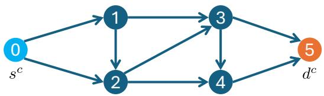

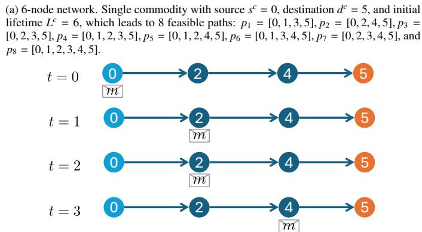

(b) Evolution of packet m traveling along path $p _ { 2 } = [ 0 , 2 , 4 , 5 ]$ over time slots $t = 0 , \ldots , 3 .$
<table><tr><td>t</td><td>(i, j)</td><td>l</td><td>l</td><td>ascheduler(i,j)</td></tr><tr><td>t = 0</td><td>(0,2)</td><td>6</td><td>4</td><td>Send</td></tr><tr><td>t = 1</td><td>(2,4)</td><td>5</td><td>4</td><td>Keep</td></tr><tr><td>t = 2</td><td>(2,4)</td><td>4</td><td>3</td><td>Send</td></tr><tr><td>t = 3</td><td>(4,5)</td><td>3</td><td>3</td><td>Send</td></tr></table>

(c) Evolution of absolute lifetime l, efective lifetime ℓ, and scheduler action ascheduler(i j) along path p . While absolute lifetime decreases by 1 every time slot, efective lifetime ℓ remains unchanged during time slots $t = 0 ,$ 1 and t = 2 3 because the packet keeps moving through the network.  
Figure 1: Illustrative running example. (a) network topology. (b) packet trajectory over chosen path $p _ { 2 }$ under scheduling actions shown in (c).

## 4.5. Lower Efective Lifetime First (LELF) Scheduler

A key related concept introduced in (Vitale et al., 2025) is the LELF scheduling policy. The LELF scheduling policy leverages the EL metric to maximize the total number of packets successfully delivered on time. Specifically, LELF gives priority to forwarding packets with the lowest EL. Recall that a packet’s EL represents the number of time slots it can wait in a network queue before having no chance to reach the destination, and that a packet’s EL does not decrease as long as the packet is in transit through the network. Therefore, the underlying goal of the LELF policy is to ensure that packets with low EL keep moving through the network. By keeping them moving, their EL values are preserved, which increases the probability of successful timely delivery. In practical terms, the LELF policy operates by selecting packets for transmission in strict ascending order of their current EL.

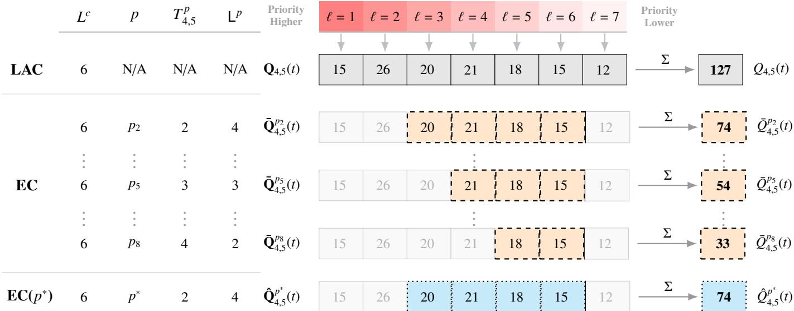  
Figure 2: Visual breakdown of the congestion metrics introduced in Section 5, applied to communication interface (4 5) consistent with the toy network topology reported in Figure 1a. While regular congestion accounts for the entire queue occupancy without considering any path information, EC explicitly diferentiates the congestion perceived by each path, resulting in a more precise metric that varies based on both the path’s efective lifetime Lp and transit time $T _ { 4 , 5 } ^ { p } \mathrm { . }$ The colored cells indicate packets satisfying the filtering condition $T _ { 4 , 5 } ^ { p } < \ell \leq \mathsf { L } ^ { p } + T _ { 4 , 5 } ^ { p } \mathrm { : }$ : for $p _ { 2 } ( \mathsf { L } ^ { p } = 4 , T = 2 )$ packets with $\ell \in \{ 3 , 4 , 5 , 6 \}$ are included (orange); for $p _ { 5 } \left( \mathsf { L } ^ { p } = 3 , \right.$ $T = 3 )$ packets with $\ell \in \{ 4 , 5 , 6 \}$ ; for $p _ { 8 } ( \mathsf { L } ^ { p } = 2 , T = 4 )$ packets with $\ell \in \{ 5 , 6 \}$ . The excluded cells (grayed out) illustrate the boundary-filtering efect. Finally, the $E C ( p ^ { * } )$ ) metric (cyan cells) constitutes a strategic trade-of, reducing complexity by providing a single congestion value for the interface based on a representative path $p ^ { * }$ . In this example, $p ^ { * } = p _ { 2 }$ is selected as it satisfies Eq. (30) by minimizing the distance between the interface and the path source, resulting in the same filtering range $\ell \in \{ 3 , 4 , 5 , 6 \}$

From an agentic point of view, the states and actions of the LELF Scheduler at a given interface $( i , j )$ are characterized as:

• The State at time t is the vector whose entries specify the queue state of interface $( i , j )$ at time t, for each commodity and efective lifetime, i.e., $s _ { \mathrm { s c h e d u l e r } , i j } ( t ) = [ q _ { i j } ^ { ( c , \ell ) } ( t ) : \forall c \in$ $C , \forall \ell \in \mathcal { L } ]$ , with dimension $| C | \cdot | { \mathcal { L } } |$

• The Action at time t is the vector indexed by commodity and residual EL, whose entries specify the number of packets to forward over interface $( i , j ) \colon a _ { \mathrm { s c h e d u l e r } , i j } ( t ) = [ F ^ { ( c , \ell ) } ( t )$ $\forall c \in C , \forall \ell \in L ]$ , where $F ^ { ( c , \ell ) } ( t )$ is the number of packets of commodity c and residual lifetime ℓ forwarded over interface $( i , j )$ at time t. Recall that packets are forwarded in order of increasing residual lifetime, subject to interface capacity constraints.

As shown in (Vitale et al., 2025), the LELF scheduling policy is very efective in terms of timely throughput performance when compared with RL-based alternatives. Furthermore, it significantly reduces overall computational complexity by eliminating the training phase inherent to RL approaches.

## 5. Key Concepts for Efective Routing in Deadline-Constrained Systems

Routing decisions heavily rely on congestion metrics that indicate the extent to which the load on network interfaces causes

packets to wait before transmission.

## 5.1. Regular Congestion

The standard way to compute congestion is to count the number of packets enqueued in the given interface, which in our system would result in a scalar given by:

$$
Q _ { i j } ( t ) = \sum _ { c \in C } \sum _ { \ell = 1 } ^ { L ^ { c } } q _ { i j } ^ { ( c , \ell ) } ( t )\tag{24}
$$

## 5.2. Lifetime Aware Congestion (LAC)

In the considered deadline-constrained system, where packets have a finite time to reach their destination, standard volumebased metrics are unable to fully capture deadline-related aspects. Purely volume-based metrics do not account for packet expiration and therefore overlook the impact of deadline-aware policies (e.g., LELF), whose forwarding decisions are intrinsically linked to packet lifetime. In particular, under LELF scheduling, packets with low EL create stronger competition for network resources than packets with high EL.

Consequently, we define the Lifetime Aware Congestion (LAC) of an interface as a vector containing the number of packets for each EL:

$$
\mathbf { Q } _ { i j } ( t ) = \left[ \nu _ { 1 } ( t ) , \ldots , \nu _ { \ell } ( t ) , \ldots , \nu _ { L _ { m a x } } ( t ) \right]\tag{25}
$$

where each component $\nu _ { \ell } ( t )$ represents the aggregate occupancy of packets with efective lifetime $\ell : ^ { 2 }$

$$
\nu _ { \ell } ( t ) = \sum _ { c \in C } q _ { i j } ^ { ( c , \ell ) } ( t )\tag{26}
$$

## 5.3. Efective congestion: a path-dependent metric

Furthermore, under centralized routing, where packets are assigned to paths upon arrival at their respective sources, routing decisions can benefit from inferring the congestion a packet may encounter along a given path. However, existing metrics often overestimate this congestion by including trafic that will not actually compete with the considered packet.

To this end, we introduce the $E C$ metric, a refined measure that characterizes the congestion of an interface with respect to a path, by considering only those packets expected to coexist with the traveling packet (the packet to be routed) at the time of arrival to the interface. In particular, it filters out packets that will have already expired, as well as packets with higher EL (i.e., lower priority under LELF scheduling).

Specifically, the EC of an interface $( i , j )$ with respect to a path $p$ is designed to quantify the congestion that a packet currently at the source of $p$ will encounter when reaching interface $( i , j )$ traveling over path $p .$ Let $T _ { i j } ^ { p }$ denote the minimum time required for a $\mathrm { p a c k e t } ^ { 3 }$ , currently at the source of $p ,$ to reach interface $( i , j )$ along path $p .$ The EC of interface $( i , j )$ with respect to path $p$ restricts its focus to packets that satisfy the following two conditions simultaneously:

• They can survive the minimum transit time of the considered packet, i.e., their EL satisfies $\ell > T _ { i j } ^ { p } .$

• They can maintain an equal or higher priority under LELF scheduling (i.e., equal or lower EL) than the considered packet. That is, their EL satisfies $\ell \leq \mathsf { L } ^ { c , p } + T _ { i i } ^ { p } ,$ where ${ \mathsf { L } } ^ { c , p }$ denotes the initial EL of the considered packet, of commodity $^ { c , }$ when it gets assigned to path p, i.e., $\mathsf { L } ^ { p } =$ $E L ( p , L ^ { c } , s ^ { c } )$ . For ease of notation, in the following we focus on settings where a path belongs only to a single commodity, which allows dropping the dependence on $^ { c , }$ and use ${ \mathsf { L } } ^ { p }$ in place of ${ \mathsf { L } } ^ { c , p }$

We will refer to this metric as EC p-model. We first define the vectorialform for the EC p-model, denoted as $\bar { \mathbf { Q } } _ { i j } ^ { ( p ) } ( t )$ . The length of $\bar { \mathbf { Q } } _ { i j } ^ { ( p ) } ( t )$ is determined by the range of lifetimes that can actually compete with the considered packet at the time of arrival at interface $( i , j )$ , namely $\ell \in [ T _ { i j } ^ { p } + \bar { 1 } , \mathsf { L } ^ { p } + T _ { i j } ^ { p } ]$

$$
\bar { \mathbf { Q } } _ { i j } ^ { ( p ) } ( t ) = \left[ \nu _ { T _ { i j } ^ { p } + 1 } ( t ) , \ldots , \nu _ { \ell } ( t ) , \ldots , \nu _ { \lfloor { r ^ { p } + T _ { i j } ^ { p } } \rfloor } ( t ) \right]\tag{27}
$$

Each component $\nu _ { \ell } ( t )$ represents the aggregate occupancy of packets with efective lifetime $\ell ,$ provided they satisfy the filtering conditions. Then, the scalarform of the Efective Congestion $( p ) \ : ( \mathrm { E C } \ : p )$ metric is obtained by simply summing the entries of the vectorial EC $p$ metric.

$$
\bar { Q } _ { i j } ^ { ( p ) } ( t ) = \sum _ { \ell = T _ { i j } ^ { p } + 1 } ^ { \lfloor ^ { p } + T _ { i j } ^ { p } } \nu _ { \ell } ( t )\tag{28}
$$

An example of this metric is shown in Figure 2, where the orange-filled (dash bordered) cells represent the packets considered by the EC p-model congestion metric at interface (4 5) of the considered example network reported in Figure 1a. For instance, for path $p _ { 2 }$ with $L ^ { c } = 6$ and $\bar { T } _ { 4 . 5 } ^ { p _ { 2 } } = 2$ , the EC $p$ metric includes packets with $\ell \in \{ 3 , 4 , 5 , 6 \}$ , reflecting those that will survive transit and maintain competitive priority upon arrival.

As it will be clear from later sections, the scalar version of the EC metric will be used by prior-guided routing agents to characterize and compare the congestion of the diferent paths that a packet of a given commodity can take upon arrival to the network. To that end, the EC $p$ metric of path $p$ is computed as:

$$
\bar { Q } ^ { ( p ) } ( t ) = \sum _ { ( i , j ) \in p } \bar { Q } _ { i j } ^ { ( p ) } ( t )\tag{29}
$$

## 5.4. Efective Congestion: $p ^ { * }$ -model

As remarked throughout Sec. 5.3, the $E C p$ defined in Eqs. (27)–(28) is a path-dependent metric, i.e., it characterizes the congestion of an interface with respect to a packet expected to travel over a given path p. This per-path evaluation provides a fine-grained congestion picture, enabling precise routing decisions; its price lies in the acquisition of the network observation: since the filtering range depends on the reference path, one evaluation is required for every (interface, path) pair, and the acquisition time grows accordingly. To reduce this acquisition cost, we introduce the Efective Congestion $p ^ { * }$ -model: rather than computing the metric for every candidate path, this formulation anchors the evaluation of each interface to a single reference path $p ^ { * }$ , selected from $\mathcal { P } _ { i j } ,$ , the subset of all-commodity paths traversing interface $( i , j )$ , so that each interface is evaluated once and all paths crossing it share the same congestion measure. For learning-based controllers, using a reference path brings an additional benefit: with one congestion value per interface, the resulting observation has dimensionality |E|, i.e., one component per network interface.

Specifically, we define $p ^ { * }$ as the path minimizing the traversal distance to the interface among the considered subset:

$$
p ^ { * } = \arg \operatorname* { m i n } _ { p \in \mathcal { P } _ { i j } } D ( s ^ { p } , ( i , j ) )\tag{30}
$$

where $D ( s ^ { p } , ( i , j ) )$ represents the distance (or minimum travel time) between the source node of path $p$ and the interface $( i , j )$

Consequently, letting $T _ { i j } ^ { p ^ { * } }$ denote the minimum time required for a packet to reach interface $( i , j )$ when traveling over path $p ^ { * }$ the packet filtering conditions change as: they can (i) survive the transit time $( \ell > \breve { T } _ { i j } ^ { p ^ { * } } .$ ), and (ii) maintain a priority level higher than or equal to that of the considered packet $( \ell \leq \mathsf { L } ^ { p ^ { * } } + T _ { i j } ^ { p ^ { * } } )$

Based on equations (27) and (30), we define the EC $p ^ { * }$ -model of interface $( i , j )$ as the congestion metric computed with respect to the reference path $p ^ { * }$ . In its vectorial form, denoted as $\hat { \mathbf { Q } } _ { i j } ^ { ( \mathcal { P } _ { i j } ^ { - } ) } ( t )$ it is expressed as:

$$
\hat { \mathbf { Q } } _ { i j } ^ { ( \mathcal { P } _ { i j } ) } ( t ) = \left[ \nu _ { { T } _ { i j } ^ { p ^ { * } } + 1 } ( t ) , \ldots , \nu _ { \ell } ( t ) , \ldots , \nu _ { { \lfloor { p ^ { * } } \rfloor } } _ { + { T } _ { i j } ^ { p ^ { * } } } ( t ) \right]\tag{31}
$$

Accordingly, the Efective Congestion $p ^ { * }$ for interface $( i , j )$ in its scalar form is defined as:

$$
\hat { Q } _ { i j } ^ { ( \mathcal P _ { i j } ) } ( t ) = \sum _ { \ell = { T _ { i j } ^ { p } } ^ { * } + 1 } ^ { \lfloor p ^ { * } + T _ { i j } ^ { p ^ { * } } } \nu _ { \ell } ( t )\tag{32}
$$

An example of the EC $p ^ { * } - m o d e l$ metric is shown in Figure $^ { 2 , }$ where the cyan-filled (dot-bordered) cells highlight the packets satisfying the filtering conditions. Since $p ^ { * } = p _ { 2 }$ in this example (with $T _ { 4 . 5 } ^ { \bar { p ^ { * } } } ~ = ~ 2 )$ , the EC $p ^ { * }$ -model includes the same set of packets as $\mathrm { E C } ( p _ { 2 } ) $ : those with $\ell \in \{ 3 , 4 , 5 , 6 \}$

## 5.5. Scalar vs. Vectorial representation tradeof

The ability to accurately observe network congestion states is fundamental for routing decisions in deadline-constrained systems. This holds true for both model-driven and RL approaches, as the dimensionality and expressiveness of the available observations dictate the control policy’s complexity and performance. While Model-driven approaches directly rely on state representation to evaluate the network via predefined rules or heuristics, RL agents leverage them to learn latent feature representations and derive optimal decision-making strategies. A trade-of between observation complexity and expressiveness becomes more evident with the introduction of lifetime-aware metrics which are represented (as shown in Fig. 2) in scalar or vectorial forms:

• The Vectorial Representation –see Eqs.25,27,31– preserves the full distributional information of the queue state, mapping packets to their specific lifetimes, allowing the system to distinguish high-urgency congestion. However, employing such a high-dimensional representation increases the state space size and, therefore, the policy complexity. Vectorial congestion metrics are denoted with Q.

• The Scalar Representation –see Eqs.24,28, 32– aggregates the queue state to a single scalar, reducing complexity. This state compression masks granular details, preventing policies from distinguishing between a queue filled with urgent packets and non-urgent ones. Scalar congestion metrics are denoted with Q.

To clarify this impact, consider the $\operatorname { E C } ( p ^ { * } )$ row in Fig. 2, where the maximum packet lifetime is $L _ { m a x } = 7$ . The Vectorial form is given by [20 21 18 15], which explicitly reveals the urgency distribution. Conversely, the Scalar form (the sum of the vectorial form) yields a total of 74 packets, shown at the bottom, hides the internal queue composition, making it impossible to infer the nature of the congestion.

As will become clear in the following sections, our proposed prior-guided policies utilize the scalar representation. Clearly, alternative heuristic policies could leverage the more expressive vectorial form, albeit at the cost of increased computational complexity. Conversely, the RL-based policies we propose exploit both representations, enabling us to study the resulting expressiveness–complexity trade-of, as described in Section 8.4.

## 6. Prior-guided Policies

This section presents our prior-guided policies. From an agent-oriented perspective, each policy is characterized by three design dimensions: (i) the congestion type, which governs how the observed load is filtered and evaluated with respect to packet urgency (RC, EC $p ,$ or $\operatorname { E C } p ^ { * } ) ;$ (ii) the assignment strategy, which indicates how trafic is distributed across paths (greedy or grouped); and (iii) the resulting state space dimension, which determines the amount of information the agent observes. All policies share a common action space of dimension $| { \mathcal { P } } | ,$ , where each element $A ^ { p }$ specifies the number of newly arrived packets allocated to path $p \in \mathcal { P }$

The five policies summarized in Table 1 arise from combining these dimensions with increasing deadline-awareness. The baseline Minimum Weight Path Regular Congestion (RC) (MWP RC) (Sec. 6.1), introduced in (Vitale et al., 2025), pairs the volume-based RC metric (Eq. (24)) with a greedy assignment. The Minimum Weight Path EC $( p )$ (MWP EC (p)) (Sec. 6.2) replaces the RC with the EC $p$ (Eq. (28)), and the Uniform Path Grouping EC $( p )$ (UPG EC (p)) (Sec. 6.3) further extends it with a uniform packet assignment strategy. Finally, the Minimum Weight Path EC $( p ^ { * } )$ (MWP EC $( p ^ { * } ) )$ and $U P G E C \left( p ^ { * } \right)$ (Secs. 6.4 and 6.5) employ the Efective Congestion $\left( p ^ { * } \right) ( E C p ^ { * } )$ metric (Eq. (32)) in place of the EC $p ,$ reducing the state space size—and therefore complexity—and facilitating a smoother transition to our proposed RL-based strategies (see Section 8). The individual algorithms underlying the policies described above are detailed in the following subsections.

Table 1: Summary of the proposed prior-guided routing policies. The action space has dimension |P| for all policies, where each element $A ^ { p }$ ∈ A specifies the number of newly arrived packets allocated to path p.
<table><tr><td>Policy</td><td>|State|</td><td>Congestion</td><td>Assignment</td></tr><tr><td>MWP RC</td><td>|P|</td><td>RC</td><td>Greedy</td></tr><tr><td>MWP EC  $( p )$ </td><td>|P|</td><td>EC  $p$ </td><td>Greedy</td></tr><tr><td>UPG EC (p)</td><td>|P|</td><td>EC  $p$ </td><td>Grouped</td></tr><tr><td>MWP EC  $( p ^ { * } )$ </td><td>|ε|</td><td>EC  $p ^ { * }$ </td><td>Greedy</td></tr><tr><td>UPG EC  $( p ^ { * } )$ </td><td>|ε|</td><td>EC  $p ^ { * }$ </td><td>Grouped</td></tr></table>

The choice between the two EC formulations has direct implications for computational cost, as already reflected in the state space dimensions reported in Table 1. The EC $p ^ { * }$ formulation assigns a single weight to each interface $( i , j ) -$ computed once and shared by all paths traversing it (Algorithms 4–5)—reducing the total number of EC evaluations per routing step from $O ( | \mathcal { P } | )$ to O(|E|). The exact EC $p$ formulation requires a separate evaluation for each (interface, path) pair, since the filter range depends on the specific reference path. This distinction extends to the RL setting introduced in Sec. 8.4: $\operatorname { E C } p$ would yield an observation of dimension |P| (Scalar) or $| \mathcal { P } | \cdot L _ { \operatorname* { m a x } }$ (Vectorial), while EC $( ( p ^ { * } )$ ))reduces this to |E| or $| \mathcal { E } | \cdot L _ { \mathrm { m a x } } ,$ , respectively. This makes the EC $p ^ { * }$ formulation more advantageous, both in terms of computational eficiency and policy scalability, when $| \mathcal { E } | \ll | \mathcal { P } |$

## 6.1. Minimum Weight Path RC (MWP RC)

The MWP RC strategy prioritizes paths with lower congestion, distributing trafic away from heavily utilized network segments as follows:

(I) – Determine the total weight of each path $p \in \mathcal { P }$ by summing the Regular Congestion (Eq. (24)) over all links $( i , j )$ traversed by that path, normalized by their respective capacities:

$$
W P ^ { p } ( t ) = \sum _ { ( i , j ) \in p } \frac { 1 } { C _ { i j } ( t ) } Q _ { i j } ( t )\tag{33}
$$

(II) – Assign newly arriving packets of each commodity to the path with the minimum total weight. If the capacity of the best path is reached, the algorithm proceeds to the next-lowest-weight path.

Algorithm 1 describes the MWP RC algorithm in detail.

Algorithm 1 Minimum Weight Path (MWP)   
1: $W P = [ W P ^ { p } = 0 , \forall p \in \mathcal { P } ]$   
2: $A = [ A ^ { p } = 0 , \forall p \in \mathcal { P } ]$   
3: for $p \in \mathcal { P }$ do ▷ Compute Weight for each Path   
4: for $( i , j ) \in p$ do   
5: $\begin{array} { r } { W P ^ { p } + = \frac { 1 } { C _ { i j } } Q _ { i j } } \end{array}$   
6: end for   
7: end for   
8: for $c \in C$ do ▷ Packets Routing   
9: res\_ $p k t s \gets b ^ { c } ( t )$   
10: $P _ { s o r t } ^ { c } \gets S o r t ( \mathcal { P } ^ { c } , W P )$   
11: while $r e s _ { - } p k t s > 0$ do   
12: for $p \in P _ { s o r t } ^ { c }$ do   
13: $A ^ { p } =$ min(res\_pkts Cap(p))   
14: res $\ L _ { p c k t s - } = A _ { } ^ { p }$   
15: end for   
16: end while   
17: end for   
18: return A

In Algorithm 1, $P _ { s o r t } ^ { c }$ denotes the set of paths $p \in { \mathcal { P } } ^ { c }$ sorted by weight (from lowest to highest), while $\begin{array} { r } { C a p ( p ) = \operatorname* { m i n } _ { ( i , j ) \in p } C _ { i j } ( t ) } \end{array}$ represents the bottleneck capacity of path p defined by the minimum link capacity along its route.

## 6.2. Minimum Weight Path EC (p) (MWP EC (p))

The MWP EC (p) enhances the MWP RC approach by replacing the volume-based RC with the EC p metric (Section 5.3). Path weights are thus computed only over the packets expected to compete for network resources along each candidate path— filtered by remaining lifetime and transit time—rather than over the entire queue occupancy. Based on Eq. (28), the weight of each path is then calculated as:

$$
W P ^ { p } ( t ) = \sum _ { ( i , j ) \in p } \frac { 1 } { C _ { i j } ( t ) } \bar { Q } _ { i j } ^ { ( p ) } ( t )\tag{34}
$$

In Algorithm 2, we detail the MWP EC (p) procedure, which replaces the RC-based weights used by MWP RC with EC $p$ ones.

Algorithm 2 Minimum Weight Path EC (p) (MWP EC (p))   
1: $W P = [ W P ^ { p } = 0 , \forall p \in \mathcal { P } ]$   
2: $A = [ A ^ { p } = 0 , \forall p \in \mathcal { P } ]$   
3: for $p \in \mathcal { P }$ do ▷ Compute Weight for each Path   
4: for $( i , j ) \in p$ do   
5: $\begin{array} { r } { W P ^ { p } + = \frac { 1 } { C _ { i j } } \bar { Q } _ { i j } ^ { ( p ) } } \end{array}$   
6: end for   
7: end for   
8: Same as Algorithm 1 ▷ Packets Routing   
9: return A

## 6.3. Uniform Path Grouping EC (p) (UPG EC (p))

While MWP EC (p) (Section 6.2) efectively identifies the least congested path, it may lead to over-utilization of a single path, potentially causing rapid congestion shifts. The Uniform Path Grouping (UPG) strategy mitigates this issue by balancing trafic among paths of comparable weight, operating as follows:

1. Weighting: compute the weights $W P ^ { p }$ for all available paths using the EC p metric (Eq. (34));

2. Grouping: partition the paths into equivalence groups of equal weight, ordered by ascending weight;

3. Routing: assigns packets uniformly across the paths of the lowest-weight group, capping each path’s allocation at the group’s minimum bottleneck capacity;

4. Iterating: if newly arrived packets remain unassigned, repeat the process with the next lowest-weight group, until all packets are allocated.

In Algorithm 3, we detail the UPG EC (p) procedure, which extends the MWP EC (p) by integrating the grouping and distribution mechanisms to achieve a more balanced load distribution.

Algorithm 3 Uniform Path Grouping EC (p) (UPG EC (p))   
1: WP = [WPp = 0 ∀p ∈ P]   
$2 \colon A = [ A ^ { p } = 0 , \forall p \in { \mathcal { P } } ]$   
3: Same as Algorithm 2 ▷ Compute Weight for each Path   
4: for $c \in C$ do ▷ Packets Routing   
5: res $\_ p k t s = b ^ { c } ( t )$   
6: $G _ { s o r t } ^ { c }  G$ rouping(Pc WP)   
7: while res\_pkts > 0 do   
8: for $g \in G _ { s o r t } ^ { c }$ do   
9: pkts\_per\_path ← ⌊res\_pkts/|g|⌋   
10: for $p \in g$ do   
11: assign = min(pkts\_per\_path Cap(g))   
12: $A ^ { p } + =$ assign   
13: res\_pkts− = assign   
14: if res\_pkts = 0 then break   
15: end if   
16: end for   
17: end for   
18: end while   
19: end for   
20: return A

In Algorithm 3, $G _ { s o r t } ^ { c }$ denotes the collection of path groups for commodity c ordered by ascending weight, |g| represents the number of paths in group g, and $\begin{array} { r l } { C a p ( g ) } & { { } = } \end{array}$ mi $\begin{array} { r } { \mathbf { 1 } _ { p \in g } \left( \operatorname* { m i n } _ { i j \in p } C _ { i j } ( t ) \right) } \end{array}$ indicates the minimum bottleneck capacity of group $g . \mathrm { B y }$ spreading trafic across paths of comparable weight, UPG prevents the over-utilization of a single optimal path and mitigates the onset of new congestion hotspots.

## 6.4. Minimum Weight Path EC (p∗) (MWP EC (p∗))

The MWP EC $( p ^ { * } )$ combines the greedy assignment of MWP RC with the EC $p ^ { * }$ metric of Section 5.4: the policy first computes the EC $p ^ { * }$ weight $\hat { Q } _ { i j } ^ { ( \mathcal { P } _ { i j } ) } ( t )$ of each interface $( i , j ) \in \mathcal { E } ,$ and then obtains the total weight $W P ^ { p }$ of each path by summing the weights of the interfaces it traverses, so that all paths crossing an interface share the same contribution from it. Algorithm 4 illustrates the procedure in detail.

Algorithm 4 Minimum Weight Path EC (p∗) (MWP EC $( p ^ { * } ) )$   
1: $W P = [ W P ^ { p } = 0 , \forall p \in \mathcal { P } ]$   
2: $W = [ W _ { i j } = 0 , \forall ( i , j ) \in \mathcal { E } ]$   
3: $A = [ A ^ { p } = 0 , \forall p \in \mathcal { P } ]$   
4: for (i j) ∈ E do ▷ Compute Weight for each Interface   
5: $\begin{array} { r } { W _ { i j } ( t ) = \frac { 1 } { C _ { i j } ( t ) } \hat { Q } _ { i j } ^ { ( \mathcal { P } _ { i j } ) } ( t ) } \end{array}$   
6: end for   
7: for $p \in \mathcal { P }$ do ▷ Compute Weight for each Path   
8: for $( i , j ) \in p$ do   
9: $W P ^ { p } ( t ) + = W _ { i j } ( t )$   
10: end for   
11: end for   
12: Same as Algorithm 1 ▷ Packets Routing   
13: return A

## 6.5. Uniform Path Grouping EC (p∗) (UPG EC $( p ^ { * } ) )$

The UPG EC (p∗) combines the load-balancing benefits of UPG (see Sec. 6.3) and the computational scalability of the EC ((p∗))metric. Algorithm 5 details how these aspects are combined based on previously introduced algorithms.

Algorithm 5 Uniform Path Grouping EC (p∗) (UPG EC $( p ^ { * } ) )$   
1: $W P = [ W P ^ { p } = 0 , \forall p \in \mathcal { P } ]$   
2: $W = [ W _ { i j } = 0 , \forall ( i , j ) \in \mathcal { E } ]$   
3: $A = [ A ^ { p } = 0 , \forall p \in \mathcal { P } ]$   
4: Same as Algorithm 4 ▷ Compute Weight for each Interface   
5: Same as Algorithm 4 ▷ Compute Weight for each Path   
6: Same as Algorithm 3 ▷ Packets Routing   
7: return A

Among the proposed policies, UPG EC $( p ^ { * } )$ thus pairs the lowest state-space complexity with the balanced UPG assignment. As the numerical results of Section 10.2 will show, while the exact EC $p$ formulation retains an edge under the most adverse conditions — tight deadlines in symmetric grids and structurally asymmetric backbones — the decoupled $p ^ { * }$ approximation recovers as deadlines relax, and on the Grid topology under overload it even surpasses the exact model. This combination of near-optimal reliability and substantially lower state-space complexity is what makes UPG EC $( p ^ { * } )$ central when selecting the reference-policy/demonstrator for the MGA-RL training objective (Section 8).

## 7. Policy Learning Paradigms and MGA-RL Framework

Section 6 proposed a family of lightweight, computationally eficient model-based policies, characterised by a favourable trade-of between reliability and state-space complexity. Any one of these $- \mathrm { { \bf ~ o r , } }$ more generally, any policy sharing similar properties — is well suited to serve as a reference policy, or demonstrator, for a learning agent. The question then becomes how to transfer such a policy’s behaviour to an agent that can then improve upon it. Several established training recipes address this question in diferent ways — Behavioral Cloning (BC), ofline RL, online RL, and hybrid O2O schemes among them — each exploiting a diferent subset of the available data and demonstrator signals. Rather than treating these as separate techniques, this section frames them all as special cases of a single objective, the General Policy Reward (GPR) (Sec. 7.1–7.2), revisiting each recipe in Section 7.2 as a specific instantiation of this unified framework, and derives from it the proposed Model-Guided Annealed Reinforcement Learning (MGA-RL) protocol (Sec. 7.3): a two-stage scheme in which the anchor to the demonstrator is released as live experience accumulates. The MGA-RL instantiation on the specific reference policy and backbone chosen for this work is then presented in Section 8.

## 7.1. General Policy Reward (GPR) and MGA-RL Objective

We formalise this unifying objective below. We propose the following GPR, which unifies all reward-based policy learning objectives considered in Section 3:

$$
\begin{array} { r } { r _ { \mathrm { G P R } } ( \alpha , \beta , t ) = \alpha ( t ) \cdot \hat { r } _ { \mathrm { o n } } ( t ) + \beta ( t ) \cdot \hat { r } _ { \mathrm { o f f } } ( t ) , } \end{array}\tag{35}
$$

where $\hat { r } _ { \mathrm { o n } } ( t )$ and $\hat { r } _ { \mathrm { o f f } } ( t )$ are defined in Eqs. (11)–(12), and $\alpha ( t ) , \beta ( t ) \geq 0$ weight the live and pre-collected reward contributions, respectively, with their time dependence allowing the relative weight of live versus pre-collected experience to be adjusted as training progresses. In (35), for notational economy, the argument list on the left-hand side omits the explicit time dependence of α and $\beta ;$ the time-varying nature of both coeficients remains explicit on the right-hand side of the equation.

The policy-imitation paradigm introduced in Section 3.1, driven by $\hat { \mathcal { M } } _ { \mathrm { M S E } }$ (Eq. (13)), is incorporated separately, alongside rGPR, into the unified training objective introduced next (Eq. (36)), weighted by a regularisation coeficient $\lambda ( | \mathcal { D } | ) \ge 0$ This coeficient depends on the efective size of the live replay bufer, |D| (Eq. (8)): while the live bufer remains small, $\hat { r } _ { \mathrm { o n } }$ is estimated from few samples and is therefore unreliable, so λ keeps the policy anchored to $\mu ^ { \mathrm { M B } }$ ; as the bufer grows towards its capacity $N _ { \mathrm { b u f } } ,$ live experience becomes suficiently representative on its own, and the anchor is correspondingly relaxed. The specific choice of $\alpha ( t ) , \beta ( t )$ and of the function λ|D| adopted in this work, together with the practical implications of |D| growing over time as live transitions are collected, is detailed in Section 8.

Table 2: Instantiations of the unified MGA-RL training objective as a function of available signals and engineering constraints. Each row represents a distinct combination of data availability and environment access constraints, leading naturally to a specific coeficient choice and a known method in the literature.
<table><tr><td>Available signals</td><td></td><td>Coefficients</td><td>Regime</td><td>Method</td></tr><tr><td>(a)</td><td> $\mathcal { D } _ { \mathrm { o f f } } \ \mathrm { o n l y } \ ( \mathrm { n o \ r e w a r d } , \mathrm { n o } \ \mathcal { D } ( t ) )$ </td><td> $\alpha = 0 , \beta = 0 , \lambda > 0 \mathrm { ~ f i x e d }$ </td><td>Offline</td><td>BC (Pomerleau, 1991)</td></tr><tr><td>(b)</td><td> $\mathcal { D } _ { \mathrm { o f f } } \mathrm { ~ w i t h ~ r e w a r d } ; \mathrm { n o } \mathcal { D } ( t )$ </td><td> $\alpha = 0 , \beta > 0 , \lambda = 0$ </td><td>Offline</td><td>Offline RL (Levine et al., 2020; Fujimoto et al., 2019)</td></tr><tr><td>(c)</td><td> $\mathcal { D } ( t ) \mathrm { o n l y } ; \mathrm { n o } \mathcal { D } _ { \mathrm { o f f } }$ </td><td> $\alpha > 0 , \beta = 0 , \lambda = 0$ </td><td>Online</td><td>Online RL (Sutton et al., 1998)</td></tr><tr><td>(d)</td><td> $\mathcal { D } _ { \mathrm { o f f } } + \mathcal { D } ( t ) ; \mathrm { s t a t i c } \alpha , \beta , \lambda$ </td><td> $\alpha > 0 , \beta > 0 , \lambda > 0 \mathrm { ~ f i x e d }$ </td><td>O2O/hybrid</td><td>AWAC (Nair et al., 2020); DQfD (Hester et al., 2018)</td></tr><tr><td>(e)</td><td> $\mathcal { D } _ { \mathrm { o f f } } + \mathcal { D } ( t ) + \mu ^ { \mathrm { M B } }$  ; adaptive  $\alpha , \beta ;$   $\mathrm { d e c a y i n g } \lambda ( t )$ </td><td> $\alpha , \beta \mathrm { a d a p t i v e } ; \lambda ( t ) \downarrow$ </td><td>O2O+Online</td><td>MGA-RL (This paper)</td></tr></table>

The MGA-RL training objective is:

$$
\hat { J } ^ { \mathrm { M G A - R L } } ( \theta ) = \sum _ { t } \gamma ^ { t } r _ { \mathrm { G P R } } ( \alpha , \beta , t ) \ - \ \lambda ( | \mathcal { D } | ) \cdot \hat { \mathcal { M } } _ { \mathrm { M S E } } .\tag{36}
$$

progressively relaxing the anchor to the reference policy $\mu ^ { \mathrm { M B } }$ as live experience accumulates.

## 7.2. Existing Methods as Special Cases of the MGA-RL Training Objective

As specified in Section 7.1, the GPR is fully general when all its coeficients are simultaneously active and, in principle, adaptive, i.e., allowed to vary with t. In practice, three engineering constraints determine which of the reward and policy-deviation terms in Eqs. (35) and (36) are available, and therefore which of $\alpha , \beta ,$ λ are strictly positive:

(i) availability of the pre-collected dataset $\mathcal { D } _ { \mathrm { o f f } }$ ;

(ii) feasibility of collecting live transitions into D(t);

(iii) availability of an analytical $\mu ^ { \mathrm { M B } }$ queryable at any $s \in S .$

Their interplay naturally recovers established methods as shown in Table 2. We now discuss each case in turn, highlighting the limitation that motivates the next step towards MGA-RL. In the MGA-RL case, the adaptivity of $\alpha , \beta$ is realised as a piecewise-constant schedule across training stages via batch composition, as detailed in Section 8.

(a) Behavioral Cloning $( B C ) - \alpha = 0 , \beta = 0 , \lambda > 0$ fixed. With neither live transitions $( \alpha = 0 )$ nor the reward recorded in the ofline data ${ \mathcal { D } } _ { \mathrm { o f f } } \left( \beta = 0 \right)$ , Eq. (36) reduces to ${ \hat { J } } ^ { \mathrm { M G A - R L } } ( \theta ) =$ $- \lambda \cdot \hat { M } _ { \mathrm { M S E } } .$ coinciding with the Behavioral Cloning (BC) training objective ${ \hat { J } } ^ { \mathrm { B C } } ( \theta ) ;$ : supervised regression to replicate $\mu ^ { \mathrm { M B } }$ on the states in $\mathcal { D } _ { \mathrm { o f f } }$ (Pomerleau, 1991). BC sufers from covariate shift (Ross et al., 2011): deviations at deployment compound into unseen states, and performance is fundamentally bounded by the quality of $\mu ^ { \mathrm { M B } }$

(b) Ofline $R L - \alpha \ = \ 0 , \ \beta \ > \ 0 , \ \lambda \ = \ 0 .$ . With no live transitions $( \alpha ~ = ~ 0 )$ and no policy-deviation term $( \lambda = 0 )$ $r _ { \mathrm { G P R } } ( 0 , \beta , t ) = \beta \cdot \hat { r } _ { \mathrm { o f f } } ( t ) ( \mathrm { E q . } ( 3 5 ) )$ , and Eq. (36) reduces to $\begin{array} { r } { \hat { J } ^ { \mathrm { M G A - R L } } ( \theta ) = \sum _ { t } \gamma ^ { t } \hat { r } _ { \mathrm { o f f } } ( t ) ; } \end{array}$ : the Critic $Q _ { \phi }$ is trained on the reward observed in $\mathcal { D } _ { \mathrm { o f f } }$ alone, with no interaction with the environment. This corresponds to Ofline RL (Levine et al., 2020; Fujimoto et al., 2019), which is appropriate when collecting live transitions is unsafe or infeasible. Its fundamental limitation is that $Q _ { \phi }$ is prone to overestimation for Out-of-Distribution (OOD) actions (Fujimoto et al., 2019), since the Bellman backup may query states absent from ${ \mathcal { D } } _ { \mathrm { o f f } } .$ Conservative methods such as CQL (Kumar et al., 2020) and IQL (Kostrikov et al., 2022) mitigate this via pessimistic regularisation, yet cannot discover behaviours absent from $\mathcal { D } _ { \mathrm { o f f } }$

(c) Online $R L - \alpha ~ > ~ 0 , ~ \beta ~ = ~ 0 , ~ \lambda ~ = ~ 0 .$ With no precollected data $( \beta = 0 )$ and no policy-deviation term $( \lambda = 0 )$ $r _ { \mathrm { G P R } } ( \alpha , 0 , t ) = \alpha \cdot \hat { r } _ { \mathrm { o n } } ( t ) ( \mathrm { E q . ~ } ( 3 5 ) )$ , and Eq. (36) reduces to $\begin{array} { r } { \hat { J } ^ { \mathrm { M G A - R L } } ( \theta ) = \sum _ { t } \gamma ^ { t } \hat { r } _ { \mathrm { o n } } ( t ) : } \end{array}$ only D(t) grows, through live interaction alone. This corresponds to standard Online RL (Sutton et al., 1998). It is asymptotically optimal but severely sampleineficient: all prior knowledge encoded in $\mu ^ { \mathrm { M B } }$ is discarded, resulting in unacceptable training times in real-world deployments (Levine et al., 2020; Prudencio et al., 2024).

(d) O2O RL and $R L f D - \alpha > 0 , \beta > 0 , \lambda > 0$ fixed. With all three GPR terms active but held at fixed, static coeficients, Eq. (36) combines live and ofline reward with a constant policydeviation penalty: $\begin{array} { r } { \hat { J } ^ { \mathrm { M G A - R L } } ( \theta ) = \sum _ { t } \gamma ^ { t } \big [ \boldsymbol { \alpha } \cdot \hat { \boldsymbol { r } } _ { \mathrm { o n } } ( t ) + \boldsymbol { \beta } \cdot \hat { \boldsymbol { r } } _ { \mathrm { o f f } } ( t ) \big ] \cdot } \end{array}$ $\boldsymbol { \lambda } \cdot \hat { M } _ { \mathrm { M S E } }$ . This corresponds to O2O RL and RLfD methods such as AWAC (Nair et al., 2020), which pre-trains $\mu _ { \theta }$ on $\mathcal { D } _ { \mathrm { o f f } }$ then fine-tunes with $\mathcal { D } ( t ) .$ , and DQfD (Hester et al., 2018), which permanently replays $\mathcal { D } _ { \mathrm { o f f } }$ alongside D(t). Both improve over cases $\mathrm { ( a ) - ( c ) }$ , but the fixed λ never adapts: as t grows and $\mu ^ { \mathrm { M B } }$ becomes redundant, the Mean Squared Error (MSE) penalty still penalises divergence from it. O2O methods also require a manual phase boundary, with no principled transition mechanism.

## 7.3. Model-Guided Annealed Reinforcement Learning (MGA-RL): Design Rationale and Training Protocol

MGA-RL closes all limitations of Section 7.2 simultaneously by adopting three coupled design choices. First, $\alpha , \beta$ are realised as a piecewise-constant schedule across two training stages, via batch composition (Section 8): Stage 1, corresponding to $t \leq T _ { 1 }$ , uses pre-collected data only, since $\mathcal { D } ( t ) = \emptyset ; S t a g e \ 2 .$

corresponding to $t > T _ { 1 }$ , begins once live transitions accumulate. Second, λ|D| decays as the efective size of the live replay bufer grows, from $\lambda _ { 0 }$ down to a strictly positive floor $\lambda _ { \mathrm { { r e s } } } > 0$ rather than to zero. Third, the policy-deviation estimator is evaluated not on a fixed support, but progressively over $\mathcal { D } _ { \mathrm { o f f } }$ ∪ $\mathcal { D } ( t )$ . We motivate each choice in turn, and then show how they jointly complement one another to prevent the failure modes of Distribution Shift; we conclude with the resulting two-stage training protocol, formalising Stage 1 and Stage 2 in detail.

Piecewise-constant schedule for $\alpha , \beta .$ In full generality, α(t) and $\beta ( t )$ could be treated as optimisable parameters, autonomously balancing live and pre-collected reward signals throughout training. In this work, their adaptivity is instead realised as a piecewise-constant schedule across training stages, via the composition of the training batches (Section 8): a batch drawn entirely from $\mathcal { D } _ { \mathrm { o f f } }$ yields $( \alpha , \beta ) = ( 0 , 1 )$ , while a batch mixing live and pre-collected transitions yields intermediate values determined by their relative proportion. This choice requires no additional tuning beyond the batch composition itself, at the cost of foregoing continuous, gradient-based adaptation of $\alpha , \beta ,$ which we leave to future work.

Persistence of the floor $\lambda _ { \mathrm { r e s } } .$ . Under an idealised, unbounded interaction budget and full coverage of the state–action space, λ would asymptotically vanish, since live experience alone would eventually sufice to characterise the optimal policy. In practice, both the interaction budget and the exploration horizon are finite, and coverage of $\boldsymbol { s } \times \mathcal { A }$ remains necessarily partial; $\lambda _ { \mathrm { r e s } }$ therefore acts as insurance against residual out-of-distribution (OOD) states that the available budget does not permit the agent to visit. Unlike prior ofline-to-online formulations (Fujimoto and Gu, 2021; Zhao et al., 2022), which treat the imitation weight as a fixed constant or remove it via a hard switch between stages, MGA-RL lets λ decay gradually within the training objective itself; this is crucial to avoid the destabilising efects of Distribution Shift at the stage boundary (Zhao et al., 2022; Ball et al., 2023).

Extended support of $\hat { \mathcal { M } } _ { \mathrm { M S E } }$ . Unlike classical BC, where Mˆ (Eq. (13)) is necessarily evaluated on $\mathcal { D } _ { \mathrm { o f f } }$ alone — the only data available to that paradigm, which involves no environment interaction $- \mathbf { M G A - R I }$ also collects live transitions into D(t). Since $\mu ^ { \mathrm { M B } }$ is an analytical policy queryable at any $s \in S .$ , rather than a policy learned only over $\mathcal { D } _ { \mathrm { o f f } }$ , the imitation signal can be extended beyond the fixed support of $\mathcal { D } _ { \mathrm { o f f } }$ to states encountered during live interaction as well. Accordingly, the policy-deviation estimator is evaluated as

$$
\hat { \mathcal { M } } _ { \mathrm { M S E } } ^ { \mathrm { M G A - R L } } ( \theta ) = \frac { 1 } { \left| \mathcal { D } _ { \mathrm { o f f } } \cup \mathcal { D } ( t ) \right| } \sum _ { ( s , a , r , s ^ { \prime } ) \in \mathcal { D } _ { \mathrm { o f f } } \cup \mathcal { D } ( t ) } \left\| \mu _ { \theta } ( s ) - \mu ^ { \mathrm { M B } } ( s ) \right\| ^ { 2 } ,\tag{37}
$$

which coincides with Eq. (13) while ${ \mathcal { D } } ( t ) = \emptyset \left( { \mathrm { S t a g e ~ 1 } } \right)$ , and progressively incorporates the states the agent actually visits as live transitions accumulate (Stage 2), rather than remaining confined to the states demonstrated ofline.

Complementarity of $\hat { r } _ { \mathrm { o f f } }$ and $\hat { M } _ { \mathrm { M S E } }$ . Under a limited computational and interaction budget, training is exposed to the two failure modes of Distribution Shift discussed in Section 8.2:

Extrapolation Error, whereby a Critic trained solely on $\mathcal { D } _ { \mathrm { o f f } }$ overestimates OOD actions that an unconstrained Actor inevitably queries; and Actor-Critic Misalignment, whereby a Critic trained without live feedback produces uninformative gradients upon transitioning online, degrading both Actor and Critic. $\hat { r } _ { \mathrm { o f f } }$ and $\hat { \mathcal { M } } _ { \mathrm { M S E } }$ jointly prevent both. $\hat { r } _ { \mathrm { o f f } }$ provides the Critic with an initial value estimate from $\mathcal { D } _ { \mathrm { o f f } }$ , but an Actor trained to maximise it without constraint would query actions outside the ofline support, with no guarantee of converging within budget — precisely the Extrapolation Error above; $\hat { \cal M } _ { \mathrm { M S E } }$ prevents it by driving Actor convergence towards $\mu ^ { \mathrm { M B } }$ during pre-training and anchoring the Actor against divergent, out-of-support behaviour during fine-tuning, confining optimisation to the region where $Q _ { \phi }$ is grounded in data. Conversely, $\hat { \mathcal { M } } _ { \mathrm { M S E } }$ alone lets the Actor imitate $\mu ^ { \mathrm { M B } }$ from Stage 1 onward, but provides no mechanism for the Critic to remain aligned with the Actor it must evaluate — precisely the Actor-Critic Misalignment above; $\hat { r } _ { \mathrm { o f f } }$ prevents it by keeping the Critic aligned with the Actor in Stage 1, and by preventing the Critic — and, by extension, the Actor — from forgetting the reference policy’s actions in Stage 2, which represent the minimum acceptable behaviour. In this sense, $\hat { \cal M } _ { \mathrm { M S E } }$ and $\hat { r } _ { \mathrm { o f f } }$ each protect the other against the failure mode it would otherwise induce in isolation.

Beyond these three design choices, MGA-RL advances the state of the art along two further dimensions. Smooth two-stage training: Stages 1 and 2 are connected by the continuous decay of λ|D(t)|, avoiding the abrupt phase boundary of O2O methods (Nair et al., 2020). General formulation with adaptive coeficients: framing α and $\beta$ as optimisable parameters subsumes all prior methods as fixed-coeficient special cases of the GPR (Table 2) and opens a concrete research direction for future work.

We now detail the resulting two-stage training protocol.

## 7.3.1. Stage 1 — Pre-collected Data Only

Before any live transitions are collected, D(t) is empty, so $\alpha = 0$ and $| \mathscr { D } ( t ) | = 0$ , giving $\lambda ( | \mathcal { D } ( t ) | ) = \lambda _ { 0 }$ at its maximum value. The objective of Eq. (36) accordingly reduces to:

$$
\hat { J } _ { \mathrm { S 1 } } ^ { \mathrm { M G A - R L } } ( \theta ) = \sum _ { t } \gamma ^ { t } \beta \cdot \hat { r } _ { \mathrm { o f f } } ( t ) - \lambda _ { 0 } \cdot \hat { \mathcal { M } } _ { \mathrm { M S E } } .\tag{38}
$$

$\hat { r } _ { \mathrm { o f f } } ( t )$ trains $Q _ { \phi }$ on the value of behavior in $\mathcal { D } _ { \mathrm { o f f } } ; \hat { \mathcal { M } } _ { \mathrm { M S E } }$ anchors $\mu _ { \theta }$ to $\mu ^ { \mathrm { M B } }$ , so the actor entering Stage 2 already approximates a structured, domain-consistent behavior rather than a random initialization. This implements an $R L f D$ -style pretraining (Hester et al., 2018) with $\mu ^ { \mathrm { { \bar { M B } } } }$ as a universally queryable demonstrator.

## 7.3.2. Stage 2 — Live Transitions with Decaying Regularisation

Once live transitions begin to fill D(t), both terms of rGPR activate, and the objective becomes:

$$
\hat { J } _ { \mathrm { S 2 } } ^ { \mathrm { M G A - R L } } ( \theta ) = \sum _ { t } \gamma ^ { t } \alpha \cdot \hat { r } _ { \mathrm { o n } } ( t ) + \beta \cdot \hat { r } _ { \mathrm { o f f } } ( t ) - \lambda ( \vert \mathcal { D } ( t ) \vert ) \cdot \hat { M } _ { \mathrm { M S E } } ^ { \mathrm { M G A - R L } } .\tag{39}
$$

As live transitions accumulate, |D(t)| rises monotonically towards the bufer capacity $N _ { \mathrm { b u f } }$ (Eq. (8)), and λ|D(t)| decays from $\lambda _ { 0 }$ towards the floor $\lambda _ { \mathrm { r e s } }$ discussed above. Since |D(t)| is a deterministic count driven solely by the data-collection process, this release is commensurate with the live experience the agent has efectively gathered, rather than with elapsed training steps alone.

Section 8 instantiates each of these mechanisms concretely: the piecewise-constant schedule for $\alpha ( t ) , \beta ( t )$ , the specific functional form of $\lambda ( | \mathcal { D } ( t ) | )$ and its practical implications as |D(t)| grows over time, and the union $\mathcal { D } _ { \mathrm { o f f } } \cup \mathcal { D } ( t )$ underlying $\hat { \mathcal { M } } _ { \mathrm { M S E } } ^ { \mathrm { M G A - R L } }$

## 8. MGA-RL for Deadline-Constrained Routing

In this section, we instantiate MGA-RL for deadlineconstrained network routing, identifying each component of the GPR with a concrete network-control quantity and specifying the algorithmic mechanisms required to stabilise the oflineto-online transition. The analytical reference policy is set to $\mu ^ { \mathrm { M B } } = \mathrm { U P G } \mathrm { E C } \left( p ^ { * } \right)$ , the prior-guided policy proposed in Section $6 . 5 ;$ the quantitative justification for this choice, based on its reliability–complexity trade-of relative to the other model-based policies, is deferred to the numerical results of Section 10.2. The adaptive coeficients of case (e) in Table 2 are realised concretely as follows: $\alpha , \beta$ are piecewise-constant per stage via batch composition, and $\lambda ( | \mathcal { D } ( t ) | )$ decays as the efective size of the live replay bufer grows, as detailed in Sections 8.1-8.2.

The scalar reward r of Section 3.1 is likewise instantiated throughout this section, following the DCMT problem (Vitale et al., 2025), as the aggregated timely throughput, i.e. the total number of packets delivered on time at each time slot:

$$
r ( t ) = \sum _ { c \in C } \sum _ { \ell \in \mathcal { L } } f _ {  d ^ { c } } ^ { ( c , \ell ) } ( t ) ,\tag{40}
$$

where $f _ {  d ^ { c } } ^ { ( c , \ell ) } ( t )$ is the aggregate number of commodity-c packets with lifetime ℓ reaching destination $d ^ { c }$ at time t via paths in $\mathcal { P } ^ { c }$ from the incoming neighbour set $\rho _ { d ^ { c } } ^ { - }$

Section 8.1 derives the Actor and Critic updates for the unified objective $\hat { J } ^ { \mathrm { M G A - R L } } ( \theta )$ , architecture-agnostically. Section 8.2 specialises these updates to a DDPG (Lillicrap et al., 2015) backbone augmented with Delayed Policy Update and Target Policy Smoothing (Fujimoto et al., 2018), which serves as our reference Actor-Critic substrate; the proposed methodology, however, remains agnostic to the underlying Actor-Critic architecture. While DDPG-BC combinations have been previously explored in robotics and continuous control (Vecerik et al., 2017; Nair et al., 2018; Rajeswaran et al., 2018; Fujimoto and Gu, 2021), their integration within an MGA-RL protocol tailored to the deadline-constrained dynamics of RTI applications represents, to our knowledge, the first application of RLfD principles to network trafic engineering. Section 8.3 formalises the procedural transition through the Two-Stage Training Protocol. Section 8.4 introduces the Multi-Agent Reinforcement Learning EC p∗ strategy, which integrates RL-based routing with Efective Congestion metrics and serves as the target policy in our experimental phase. Finally, Section 8.5 positions MGA-RL within the unified framework of Section 7.

## 8.1. From GPR to Actor–Critic Updates

Section 3.2 derived the Actor and Critic updates (Eqs. (14)– (19)) from the single-objective return $J = \mathbb { E } [ R ( \xi ) ]$ of Eq. (3). We now derive the analogous updates for the unified objective $\hat { J } ^ { \mathrm { M G A - R L } } ( \theta )$ of Eq. (36), which combines rGPR (Eq. (35)) with the policy-deviation term $- \lambda ( | \mathcal { D } ( t ) | ) \cdot \hat { \mathcal { M } } _ { \mathrm { M S E } } ^ { \mathrm { M G A - R L } } \left( \mathrm { E q . } \left( 3 7 \right) \right)$

By linearity, the gradient of $\hat { J } ^ { \mathrm { M G A - R L } } ( \theta )$ splits additively into two structurally distinct terms:

$$
\nabla _ { \theta } \hat { J } ^ { \mathrm { M G A - R L } } ( \theta ) = \nabla _ { \theta } \sum _ { t } \gamma ^ { t } r _ { \mathrm { G P R } } ( \alpha , \beta , t ) - \nabla _ { \theta } \Big [ \lambda ( | \mathcal { D } ( t ) | ) \cdot \hat { \mathcal { M } } _ { \mathrm { M S E } } ^ { \mathrm { M G A - R L } } \Big ] .\tag{41}
$$

The first term has exactly the form of $J = \mathbb { E } [ R ( \xi ) ] ( \mathrm { E q . } ( 3 ) ) \mathrm { : }$ : it depends on the trajectory generated by future interaction with the environment, and is therefore subject to the first obstacle of Section 2.2 — the transition kernel $P ( s ^ { \prime } \mid s , a )$ is unknown — which is precisely what necessitates estimating $Q ^ { \mu _ { \theta } } ( s , a )$ via the Critic and invoking the DPG theorem. The second term, by contrast, is directly diferentiable in closed form:

$$
\nabla _ { \theta } \hat { \mathcal { M } } _ { \mathrm { M S E } } ^ { \mathrm { M G A . R L } } = \frac { 2 } { | \mathcal { D } _ { \mathrm { o f f } } \cup \mathcal { D } ( t ) | } \sum _ { ( s , a , r , s ^ { \prime } ) \in } ( \mu _ { \theta } ( s ) - \mu ^ { \mathrm { M B } } ( s ) ) \cdot \nabla _ { \theta } \mu _ { \theta } ( s ) ,\tag{42}
$$

requiring neither knowledge of P nor any estimate of future consequences: $\mu ^ { \mathrm { M B } }$ is queryable at any $s \in S$ by assumption (Section 3.1), so Eq. (42) is computed exactly, not approximated. The first obstacle therefore does not apply to the second term of Eq. (41), which consequently bypasses $Q _ { \phi }$ entirely and enters the Actor update directly.

Critic Update. Following Eq. (41), the Critic is updated using the first term of the gradient split alone, i.e., using rGPR. Generalising Eqs. (17)–(19) to the mini-batch B introduced in Section 3.2,

$$
\begin{array} { r } { \mathcal { B } = \mathcal { B } ( t ) \cup \mathcal { B } _ { \mathrm { o f f } } , \qquad | \mathcal { B } ( t ) | = N , | \mathcal { B } _ { \mathrm { o f f } } | = M , } \end{array}\tag{43}
$$

where N and M are the mini-batch sizes already introduced as training hyperparameters in Section 3.1, and whose values are set as design parameters of the system, as detailed in Section 8.2.

The TD target of Eq. (17) uses the raw reward r(t) of Eq. (40), observed in each sampled tuple $( s , a , r , s ^ { \prime } ) \in \mathcal { B } .$ It is only at the level of the aggregated Critic loss (Eq. (19)) that $r _ { \mathrm { G P R } } ( \alpha , \beta , t )$ emerges. Among the possible ways of realising $r _ { \mathrm { G P R } } ( \alpha , \beta , t )$ (Eq. (35)) on this mixed batch, we choose to set α(t) and β(t) as

$$
\begin{array} { r } { ( \alpha ( t ) , \beta ( t ) ) = \left\{ \begin{array} { l l } { ( 0 , 1 ) , } & { t \leq T _ { 1 } , } \\ { \left( \displaystyle \frac { 1 } { 1 + \rho } , \ \frac { \rho } { 1 + \rho } \right) , } & { t > T _ { 1 } , } \end{array} \right. \qquad \rho : = \frac { | \mathcal { B } _ { \mathrm { o f f } } | } { | \mathcal { B } ( t ) | } . } \end{array}\tag{44}
$$

This choice avoids introducing α(t) and $\beta ( t )$ as independently tuned hyperparameters: once N and M are fixed as the design parameters specified in Section 8.2, α(t) and β(t) follow automatically.

Actor Update. Following Eqs. (41) and (42), the policydeviation term enters the Actor update as an additive regularisation term, alongside the DPG gradient of Eq. (14):

$$
\begin{array} { r l } & { \nabla _ { \theta } \hat { J } ^ { \mathrm { M G A - R L } } ( \theta ) = \mathbb { E } _ { \mathcal { B } } \Big [ \nabla _ { \theta } \mu _ { \theta } ( s ) \cdot \nabla _ { a } \underline { { Q } } _ { \phi } ( s , a ) \Big | _ { a = \mu _ { \theta } ( s ) } \Big ] } \\ & { \qquad - \lambda ( | \mathcal { D } ( t ) | ) \nabla _ { \theta } \hat { M } _ { \mathrm { M S E } } ^ { \mathrm { M G A - R L } } . } \end{array}\tag{45}
$$

The first term is identical in form to Eq. (14), evaluated on the mini-batch B; the second term directly penalises deviation of $\mu _ { \theta }$ from $\mu ^ { \mathrm { M B } }$ , with the coeficient λ|D(t)| — decaying as the efective size of the live replay bufer grows (Section $7 . 3 ) -$ governing the strength of this anchor.

Remark. When $\lambda ( | \mathcal { D } ( t ) | ) = 0$ , Eq. (45) reduces to Eq. (14), and the Critic update is unafected regardless of λ, since $\hat { \mathcal { M } } _ { \mathrm { M S E } } ^ { \mathrm { M G A - R L } }$ never enters the TD target. Section 8.2 instantiates both updates concretely on the DDPG backbone.

## 8.2. DDPG Instantiation ofMGA-RL

We now specialise the Actor and Critic updates of Section 8.1 to the DDPG backbone, putting into practice the complementary roles of $\hat { r } _ { \mathrm { o f f } }$ and $\hat { \mathcal { M } } _ { \mathrm { M S E } } ^ { \mathrm { M G A - R L } }$ established in Section 7.3. The resulting design combines four mechanisms, illustrated in detail in what follows: a Q-value normalisation that decouples the imitation weight λ from the reward’s absolute scale; a Symmetric Logarithmic (SymLog) transformation that compresses the sharp reward discontinuities typical of deadline-thresholded trafic; a bufer-size-dependent schedule that governs how λ decays in practice; and a set of frozen input statistics that prevent distribution shift across the ofline-to-online transition.

Q-Normalised Actor Update. The RL and BC terms of Eq. 45 difer substantially in scale: the RL term inherits the magnitude of $Q _ { \phi } ( s , a )$ , which varies with the reward’s absolute scale (Eq. (40) can range from a handful to several dozen packets per slot, depending on topology and load), whereas the BC term is a bounded distance between actions. Without correction, a large $Q _ { \phi }$ would dominate the gradient regardless of λ, silencing the imitation anchor irrespective of its intended weight. To decouple λ from this scale, we normalise the RL term by the batch-wise mean magnitude of $\begin{array} { r } { Q _ { \phi } , \omega = \frac { 1 } { N + M } \sum \left| Q _ { \phi } ( s , a ) \right| + \epsilon } \end{array}$ (Fujimoto and Gu, 2021). The resulting gradient is evaluated over the mixed mini-batch $\mathcal { B } = \mathcal { B } ( t ) \cup \mathcal { B } _ { \mathrm { o f f } }$ , instantiating the generic mini-batch of Eq. (45); we repeat the resulting expression below for clarity, with the normalisation factor made explicit:

$$
\begin{array} { r } { \nabla _ { \theta } \hat { J } ^ { \mathrm { M G A - R L } } ( \theta ) \approx \displaystyle \frac { 1 } { \omega } \mathbb { E } _ { s \sim \mathcal { B } ( t ) \cup \mathcal { B } _ { \mathrm { o f } } } \Big [ \nabla _ { \theta } \mu _ { \theta } ( s ) \cdot \nabla _ { a } { Q } _ { \phi } ( s , a ) \Big | _ { a = \mu _ { \theta } ( s ) } \Big ] } \\ { - \lambda ( | \mathcal { D } ( t ) | ) \nabla _ { \theta } \hat { M } _ { \mathrm { M S E } } ^ { \mathrm { M G A - R L } } ( 4 \pi ^ { 2 } / 2 ) \quad } \end{array}\tag{6}
$$

With the RL term rendered scale-free, λ acts as an interpretable relative weight between reward maximisation and imitation, regardless of the reward’s absolute magnitude. The ascent step of Eq. (16) applies unchanged. Unlike prior formulations (Fujimoto and Gu, 2021; Zhao et al., 2022), which treat the imitation weight as a hard switch, integrating λ directly into the BC term preserves the gradual, stage-boundary-free transition motivated in Section 7.3.

Critic Update with SymLog-Stabilised Targets. Since r(t) (Eq. (40)) is an integer-valued, deadline-thresholded quantity, clusters of packets can expire within the same slot near saturation, producing sharp step-to-step jumps and high-variance value targets. To compress these discontinuities and prevent Gradient Shock, we apply a Symmetric Logarithmic (SymLog) (Hafner et al., 2023) transformation to the TD target of Eq. (17):

$$
y ( r , s ^ { \prime } ) = \mathrm { S y m L o g } ( r ) + \gamma Q _ { \phi ^ { \prime } } ( s ^ { \prime } , \mu _ { \theta ^ { \prime } } ( s ^ { \prime } ) ) ,\tag{47}
$$

where $\operatorname { S y m L o g } ( x ) \ = \ \operatorname { s i g n } ( x ) \ln ( | x | + 1 )$ is treated as a fixed regression label through which no gradient is propagated; the Critic thus estimates the discounted return of SymLog(r(t)), and we interpret Eq. (47) as a stabilised surrogate objective. Generalising Eq. (18) to the mixed mini-batch, the resulting Critic loss is:

$$
L ( \phi ) = \alpha ( t ) \underbrace { \frac { 1 } { | \mathcal { B } ( t ) | } \sum _ { ( s , a , r , s ^ { \prime } ) \in \mathcal { B } ( t ) } \left( y ( r , s ^ { \prime } ) - \mathcal { Q } _ { \phi } ( s , a ) \right) ^ { 2 } } _ { \mathrm { m e a n ~ s q u a r e d ~ T D ~ e r r o r ~ o n ~ } \mathcal { B } ( t ) } +  \\  \beta ( t ) \underbrace { \frac { 1 } { | \mathcal { B } _ { \mathrm { o f f } } | } \sum _ { ( s , a , r , s ^ { \prime } ) \in \mathcal { B } _ { \mathrm { o f f } } } \left( y ( r , s ^ { \prime } ) - \mathcal { Q } _ { \phi } ( s , a ) \right) ^ { 2 } } _ { \mathrm { m e a n ~ s q u a r e d ~ T D ~ e r r o r ~ o n ~ } \mathcal { B } _ { \mathrm { o f f } } } .\tag{48}
$$

The descent step of Eq. (19) applies unchanged.

Bufer-Dependent Anchor Release. We realise the dependence of λ on $| \mathcal { D } ( t ) |$ established in Section 7.3 as

$$
\lambda ( | \mathcal { D } ( t ) | ) = \lambda _ { 0 } \left( \frac { \lambda _ { \mathrm { r e s } } } { \lambda _ { 0 } } \right) ^ { \operatorname* { m i n } ( 1 , | \mathcal { D } ( t ) | / D _ { \mathrm { d e c } } ) } ,\tag{49}
$$

where $D _ { \mathrm { d e c } } \leq N _ { \mathrm { b u f } }$ sets the bufer size at which λ reaches its floor $\lambda _ { \mathrm { r e s } }$

Anchored Transfer Stabilisation Protocol. Z-score normalisation is applied to state inputs using fixed statistics (mean µD, standard deviation $\sigma _ { \mathcal { D } } )$ extracted exclusively from ${ \mathcal { D } } _ { \mathrm { o f f } }$ , avoiding the input distribution shift that adaptive updates would introduce during Stage 2. We refer to the combination of the residual floor $\lambda _ { \mathrm { { r e s } } } > 0$ (Fujimoto and Gu, 2021), the SymLog surrogate of Eq. (47), and the frozen normalisation as the Anchored Transfer Stabilisation Protocol.

## 8.3. Two-Stage Training Protocol

The specialised Actor and Critic updates of Section 8.2 are executed through the two-stage procedure formalised in Algorithm 6, which implements the MGA-RL training protocol of Section 7.3: Stage 1 corresponds to Eq. (38), Stage 2 to Eq. (39), and the transition between the two follows the bufer-dependent schedule of Eq. (49) and Eq. (44).

Stage 1: Pre-collected Data Only. The agent is pre-trained exclusively on $\mathcal { D } _ { \mathrm { o f f } }$ . Periodic validation is performed every $V _ { \mathrm { f r e q } }$ epochs with exploration noise disabled; Early Stopping halts training if no improvement in validation reward is observed over a patience window $P ,$ determining the transition point $T _ { 1 }$ in practice (Section 7.3).

Algorithm 6 MGA-RL: BC, Warm-up & Accelerated Decay   
1: Params: K ofline Epochs, E online Episodes, W warm-up.   
2: Init: $\mathcal { D } _ { \mathrm { o f f } }$   
3: Stage 1: Pre-collected data only $( \lambda  \lambda _ { 0 } )$   
4: for $\operatorname { e p o c h } = 1 \ldots K$ do   
5: Sample batch $\begin{array} { r } { \mathcal { B } _ { \mathrm { o f f } } \sim \mathcal { D } _ { \mathrm { o f f } } . } \end{array}$   
6: Compute ω on ${ \mathcal { B } } _ { \mathrm { o f f } } .$   
7: Update Actor, Critic (Eqs. (46), (48)) and Targets.   
8: Validate & Save Best Model (raw reward).   
9: Evaluate Early Stopping Criterion. ▷ Early Stopping   
10: end for   
11: Stage 2: Live transitions + decaying regularisation   
12: while $e p < E$ do   
13: D(t) ← Online Data.   
14: if ep % learn\_eps == 0 then   
15: Sample Batches $\mathcal { B } ( t ) \sim \mathcal { D } ( t )$ and $\mathcal { B } _ { \mathrm { o f f } } \sim \mathcal { D } _ { \mathrm { o f f } }$   
16: Compute ω on ${ \mathcal { B } } _ { \mathrm { o f f } }$ and B(t).   
17: Update Critic (Eq. (48)).   
18: i $: e p > W$ then ▷ End of Warm-up   
19: Update Actor (Eq. (46)).   
20: Update λ (Eq. (49)).   
21: Validate & Update Best Online Model.   
22: end if   
23: Update Targets.   
24: end if   
25: end while

Stage 2: Live Transitions with Decaying Regularisation. The agent is initialised with the best Stage-1 checkpoint and finetuned with live environment interactions. To prevent Catastrophic Forgetting, a Seeded Experience Replay bufer (Vecerik et al., 2017) is preloaded with $\mathcal { D } _ { \mathrm { o f f } }$ and continuously updated with new online transitions. A Critic Warm-up of W episodes temporarily freezes the Actor, allowing the Critic to align rapidly with the true online rewards before Actor updates resume.

## 8.4. MADRL EC (p∗) Trained via MGA-RL

Having specialised how MGA-RL trains an Actor-Critic pair (Sections 8.2–8.3), we now define the strategy in which this trained Actor-Critic pair operates: a hybrid approach that combines a distributed LELF scheduler with a centralized RL-based router, following the architectural principles of MADRL EL LELF (Vitale et al., 2025). While the distributed schedulers operate using the fixed LELF policy (Section 4.5), the centralized routing agent relies entirely on Reinforcement Learning to dynamically route newly arrived packets, leveraging the EC $p ^ { * }$ congestion metric. We refer to this combination of LELF scheduling and centralized RL-based routing as MADRL $\mathrm { E C } \left( p ^ { * } \right)$ — omitting the LELF scheduling component from the name for brevity, though it remains an integral part of the architecture.

The routing agent’s interaction with the environment is defined by the following spaces:

• Observation Space: The routing agent receives a global view of the network status, built by concatenating the exogenous arrival vector b(t) with the network congestion state in one of two forms:

– Vectorial: Concatenation of EC $p ^ { * }$ vectors $\hat { \mathbf { Q } } _ { i j } ^ { ( \mathcal { P } _ { i j } ) } ( t )$ for all interfaces, yielding a space of size $| C | +$ $\begin{array} { r } { \sum _ { ( i , j ) \in \mathcal { E } } \operatorname* { m a x } \Bigl ( 0 , L _ { \operatorname* { m a x } } - 2 T _ { i j } ^ { p ^ { * } } \Bigr ) } \end{array}$

– Scalar: Concatenation of scalar EC $p ^ { * }$ values $\hat { Q } _ { i j } ^ { ( \mathcal { P } _ { i j } ) } ( t )$ reducing the size to $\left| C \right| + \left| \mathcal { E } \right|$

• Action Space: The routing agent returns a route assignment for all commodities. For each commodity c, sub-action $a ^ { c }$ ∈ $\mathbb { R } ^ { | \mathcal { P } ^ { c } | }$ represents trafic split ratios with $\begin{array} { r } { \sum _ { k \in \mathcal { P } ^ { c } } a _ { k } ^ { c } = 1 } \end{array}$ . The global action a is the concatenation of these sub-vectors, of total size $| { \mathcal { P } } | .$

The Vectorial form retains complete urgency profiles at the cost of a high-dimensional state space $O ( | C | + | \mathcal { E } | \cdot L _ { \operatorname* { m a x } } )$ ; the Scalar form compresses congestion to a single value per interface, reducing dimensionality to $O ( | C | + | \mathcal { E } | )$ and facilitating faster convergence, at the expense of fine-grained queue visibility. Regardless of the chosen granularity, MADRL EC $( p ^ { * } )$ is strictly agnostic to the training paradigm: it can be trained either fully online or through MGA-RL, leveraging $\mu ^ { \mathrm { M B } } = \mathrm { U P G } \mathrm { E C } \left( p ^ { * } \right)$ as the bootstrap heuristic.

The complete system proposed in this work results from the composition of three independent design choices: the EC $p ^ { * }$ congestion metric (Section 5.4), in its Vectorial or Scalar form, as observation feature; MADRL EC $( p ^ { * } )$ (this section) — centralized RL router with distributed LELF scheduling — as control structure; and MGA-RL (Sections 7.1–8.2) as training protocol. Recall that the centralized RL router is the sole component trained via MGA-RL. Precisely because MADRL EC $( p ^ { * } )$ is agnostic to the training paradigm, we refer to this specific composition as MADRL $E C \left( p ^ { * } \right)$ Vectorial, trained via MGA-RL or MADRL $E C \left( p ^ { * } \right)$ Scalar, trained via MGA-RL, depending on the observation form, to distinguish it from the same architecture trained fully online

## 8.5. Relation to the GPR Taxonomy and RLfD Literature

Table 2 summarises how MGA-RL — case (e) — relates to the fixed-coeficient special cases (a)–(d) discussed in Section 7.2. Beyond this positioning within the GPR framework, three further aspects distinguish MGA-RL from existing RLfD work (Hester et al., 2018; Vecerik et al., 2017; Nair et al., 2018; Rajeswaran et al., 2018), which is largely concentrated in robotics. $F i r s t .$ , the demonstrator is a deterministic, computationally light prior-guided heuristic (UPG EC $( p ^ { * } ) )$ , programmatically generated, removing the data-acquisition cost typical of robotic settings and aligning with the RLfD-from-imperfectdemonstrations line (Gao et al., 2018; Wu et al., 2020). Second, the BC regulariser is integrated into a DDPG backbone subject to per-commodity flow-conservation constraints, enforced architecturally through a grouped-Softmax output layer (Section 9.2.1) rather than via soft penalties. Third, the entire pipeline is tailored to deadline-constrained trafic engineering, a domain in which, despite extensive RL surveys (Ríos-Guiral et al., 2025), RLfD has not been previously applied.

Table 3: Structural characteristics comparison of the three network topologies.
<table><tr><td>Characteristic</td><td>Hierarchical</td><td>Abilene</td><td>Grid</td></tr><tr><td>Topology Type</td><td>Tree-like</td><td>Real-world backbone</td><td>Regular mesh</td></tr><tr><td>Number of Nodes</td><td>7</td><td>11</td><td>9</td></tr><tr><td>Number of Edges/Interfaces</td><td>22</td><td>28</td><td>24</td></tr><tr><td>Graph Diameter</td><td>3</td><td>5</td><td>4</td></tr><tr><td>Avg. Node Degree</td><td>6.29</td><td>5.09</td><td>5.33</td></tr><tr><td>Average Clustering Coefficient</td><td>0.3333</td><td>0.1515</td><td>0.0000</td></tr></table>

## 9. Experimental Setting

## 9.1. Considered Network Topologies

To comprehensively assess our proposed methodologies, we selected three network topologies that progressively increase in complexity: Hierarchical, Abilene, and Grid 3 × 3 (Figures 3, 4, and 5). This selection enables a systematic evaluation across increasing levels of complexity, naturally illustrating the evolution of routing algorithms.

Table 3 provides a detailed structural comparison of these topologies, highlighting their key diferences in connectivity patterns, node degrees, and clustering properties. In these bidirectional networks, the number of edges and interfaces are identical. The graph diameter represents the longest shortest path between any two nodes, while the average node degree indicates the average number of connections per node. All three topologies exhibit strong connectivity, ensuring reachability between all node pairs.

Hierarchical Topology: Foundationfor Edge Computing. The Hierarchical topology (Fig. 3) represents a paradigmatic edgecomputing infrastructure that mirrors real-world deployment scenarios. It features a clear hierarchy with a Core Cloud data center serving as the destination, connected to Edge Cloud and Far Edge nodes. At the network periphery, two source nodes represent IoT devices generating trafic requiring timely processing at the core.

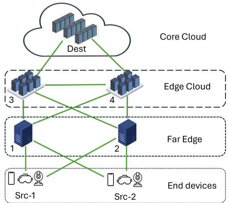  
Figure 3: The Hierarchical network topology.

This topology exhibits a tree-like structure with high node centrality and strong hierarchical organization, making it less prone to routing conflicts. The clear routing preferences inherent to the hierarchy reduce decision complexity while maintaining strong connectivity via eficient paths (diameter of 3 hops). This makes the topology well-suited for evaluating prior-guided routing strategies, as the structured paths yield intuitive decisions efectively captured by our baseline MWP RC and UPG algorithms.

Abilene Topology: Real-World Complexity and Asymmetry. The Abilene topology (Fig. 4), based on the real-world Internet2 Abilene backbone, introduces asymmetric characteristics that reflect the complexity of practical network deployments. Trafic originates from two source nodes on the left and must reach a shared destination on the right, creating an inherently unbalanced distribution that challenges the eficiency of flow management.

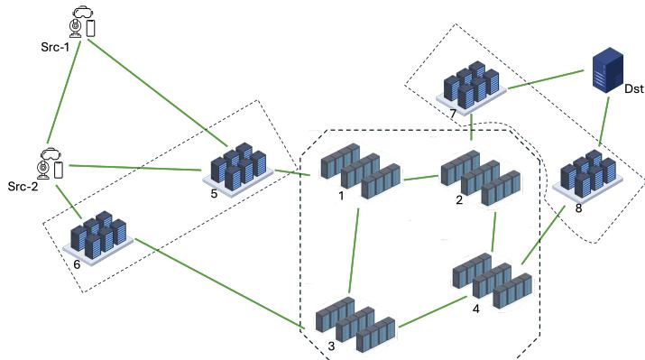  
Figure 4: The Abilene network topology.

This topology presents a challenging environment with heterogeneous node-centrality levels, asymmetric path distributions (16 paths for one commodity versus 12 for the other), and the largest graph diameter (5 hops). The moderate clustering coefficient (0.15) indicates local patterns typical of real networks, creating bottlenecks and congestion points that are dificult to anticipate with simple prior-guided approaches. Consequently, Abilene serves as a good test case for adaptive learning algorithms, which can exploit the network’s asymmetric structure to improve overall performance.

Grid Topology: Symmetric Complexity and Path Diversity. The Grid 3 × 3 topology (Fig. 5) represents a regular mesh structure that can model distributed sensor networks, vehicular communication grids, or urban IoT deployments. It features a crossdiagonal trafic pattern that maximizes spatial separation while forcing flows to traverse the grid’s overlapping central regions. Despite its symmetric structure, the Grid topology presents significant challenges due to high path diversity (12 paths per commodity) and multiple equivalent alternatives. The zero clustering coeficient indicates a pure grid structure without local clustering, yielding a homogeneous yet complex environment in which no single path is obviously superior. This makes the Grid topology the ultimate proving ground for our RL approach, where eficient exploration of the equivalent routing options during ofline pre-training demonstrates the potential of hybrid methodologies.

Table 4: Experimental parameters comparison for the three test network topologies. The Link Capacity is 10 packets per time slot for each link. The suggested commodities are reported in each topology image and are indicated with [Src-1,Dst-1], [Src-2,Dst-2].
<table><tr><td>Parameter</td><td>Hierarchical</td><td>Abilene</td><td>Grid</td></tr><tr><td>Interface Subset</td><td>11</td><td>18</td><td>20</td></tr><tr><td>Scale (Node/Interface Subset)</td><td> $0 . 6 3$ </td><td> $_ { 0 . 6 1 }$ </td><td>0.45</td></tr><tr><td># of paths per commodity</td><td> $| \mathcal { P } ^ { 1 } | = 6 , | \mathcal { P } ^ { 2 } | = 6$ </td><td> $| \mathcal { P } ^ { 1 } | = 1 6 , | \mathcal { P } ^ { 2 } | = 1 2$ </td><td> $| \mathcal { P } ^ { 1 } | = 1 2 , | \mathcal { P } ^ { 2 } | = 1 2$ </td></tr><tr><td>Paths with length 3</td><td>8</td><td>一</td><td>一 12</td></tr><tr><td>Paths with length 4</td><td>4</td><td></td><td></td></tr><tr><td>Paths with length 5</td><td></td><td>3</td><td>1 8</td></tr><tr><td>Paths with length 6</td><td></td><td>9</td><td></td></tr><tr><td>Paths with length 7</td><td></td><td>10</td><td>一 4</td></tr><tr><td>Paths with length 8</td><td>一</td><td>5</td><td></td></tr><tr><td>Paths with length 9</td><td>一</td><td>1</td><td>一 30</td></tr><tr><td>Min-Cut Capacity</td><td>20</td><td>20</td><td>9, 18, 27, 30, 36</td></tr><tr><td>Suggested Arrival Rates</td><td>6, 12, 18, 20, 24</td><td>6, 12, 18, 20, 24</td><td></td></tr><tr><td>Suggested Lifetimes</td><td>3,5,7</td><td>5,8,11</td><td>4,7, 10</td></tr></table>

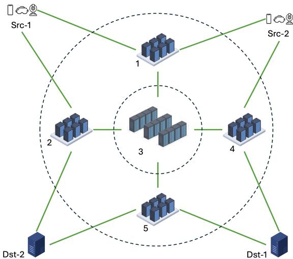  
Figure 5: The Grid 3×3 network topology.

Experimental Configuration. The experimental parameters detailed in Table 4 are calibrated to stress-test our approaches under varying load conditions (30%–120% of the Min-Cut Capacity). In the table, “Interface Subset” denotes the number of directed network interfaces considered, while “Scale” shows the ratio of nodes to interfaces. The “# of paths per commodity” specifies the number of routing paths $( | \mathcal { P } ^ { 1 } |$ and $| \mathcal { P } ^ { 2 } | )$ , and “Paths with length $X ^ { \dag }$ represents the total count of paths across all commodities. The “Min-Cut Capacity” denotes the maximum aggregate throughput the network can sustain under the considered commodities arrangment. Suggested arrival rates specify the parameter ranges used in performance evaluation, where packets arrive according to Poisson distributions. Finally, “Suggested Lifetimes” indicates the initial packet lifetime values tested for each topology.

## 9.2. RL Approaches Settings

This section describes the parameters used for RL-based approaches. Note that, all training runs presented in this work were executed on identical hardware, and wall-clock measurements are normalized against the longest run per topology. This relative formulation isolates the impact of the training paradigm from absolute hardware performance, ensuring that the reported reductions reflect the methodological contribution rather than implementation-specific factors.

## 9.2.1. Routing Agent’s Neural Network Architecture

The Actor network is implemented as a Multi-Layer Perceptron (MLP) designed to map the high-dimensional observation state s to the continuous action space of routing probabilities. The architecture consists of an input layer matched to the observation dimension, followed by two hidden layers with $n _ { 1 } = 1 2 8$ and $n _ { 2 } = 6 4$ neurons, respectively. A distinguishing feature

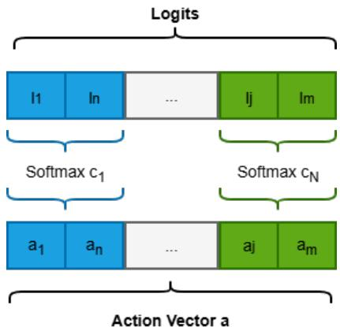  
Figure 6: Visual representation of the Grouped Softmax activation mechanism. The raw logits are logically partitioned into sub-vectors corresponding to individual commodities $( c _ { 1 } , \ldots , c _ { N } ) .$ . A Softmax function is then applied independently to each partition. This ensures local flow conservation, meaning the routing probabilities sum to 1 exclusively within each commodity group. The normalized segments are finally concatenated to form the global Action Vector a.

of our architecture is the structure of the output layer, which must satisfy the flow conservation constraints for multiple commodities simultaneously. The raw output of the final linear layer (logits) is partitioned into logical groups, where each group corresponds to the set of feasible paths $\mathcal { P } ^ { c }$ associated with a specific commodity $c .$ To ensure valid routing configurations, we apply a grouped Softmax (Bridle, 1990) activation: the Softmax function is applied independently to each sub-vector of logits belonging to a commodity $c .$ Formally, for every commodity $c \in C$ and path $p \in { \mathcal { P } } ^ { c }$ , the corresponding action $a _ { p } ^ { c }$ is computed as:

$$
a _ { p } ^ { c } = \frac { \exp ( z _ { p } ) } { \sum _ { k \in \mathcal { P } ^ { c } } \exp ( z _ { k } ) }
$$

where z represents the raw logits. This mechanism guarantees that $\begin{array} { r } { \sum _ { p \in \mathcal { P } ^ { c } } a _ { p } ^ { c } = 1 } \end{array}$ for all $^ { c , }$ ensuring that 100% of the trafic for each commodity is distributed among its feasible paths. The final action vector a is the concatenation of these sub-vectors.

## 9.2.2. Choice of the Actor-Critic Backbone

We instantiate the proposed MGA-RL methodology on DDPG, the rationale is twofold: First, the routing agent action must satisfy per-commodity flow conservation $\begin{array} { r } { ( \sum _ { p \in { \mathcal P } ^ { c } } a _ { p } ^ { c } = 1 } \end{array}$ $a _ { p } ^ { c } ~ \in ~ [ 0 , 1 ] )$ , which we enforce architecturally through the grouped-Softmax layer at the actor’s Neural Network output (Sec . 9.2.1), where the network directly outputs the exact continuous action. In contrast, employing stochastic policy algorithms (e.g., PPO or SAC) would require the network to output distribution parameters, introducing significant computational overhead to sample actions that strictly adhere to the flow conservation constraint. Second, the stabilization mechanisms employed operate at the training-objective level: the BC term regularizes the Actor, while the SymLog transformation defines the compressed reward surrogate used in the Critic target. Since these modifications are structurally agnostic to the underlying architecture, the DDPG acts as the minimal substrate to support the deterministic, constrained trafic splitting required by our network model. On this substrate, we further adopt target policy smoothing and delayed policy and target updates (Fujimoto et al., 2018) to temper the target-value variance induced by stochastic trafic.

## 9.2.3. Online Training Hyperparameters

For the fully online training setting, the learning process comprises 14 000 episodes of 50 time steps each, organized in two phases: an initial training phase of 10,000 episodes, followed by an improvement phase of 4 000 episodes in which the replay bufer is flushed of all previously collected transitions and training restarts from the best-performing policy of the first phase, discarding the low-quality experience accumulated during early exploration. Both Actor and Critic networks are optimized using the Adam optimizer (Kingma and Ba, 2014) with a learning rate of $1 \cdot 1 0 ^ { - 3 } ~ $ , following the update rules of Eqs. (15)–(19), with a batch size of 4096 transitions. To balance exploration and exploitation, with probability ϵ the Actor output is perturbed with additive Gaussian noise and each per-commodity sub-vector is re-normalized to preserve the flow-conservation constraint $\begin{array} { r } { \sum _ { p \in { \mathcal { P } } ^ { c } } a _ { p } ^ { c } = 1 ; } \end{array}$ ϵ is initialized to 1 0 and has a decay rate of 0 95 after each episode.

## 9.2.4. MGA-RL Training Hyperparameters

With respect to the fully online training setting, the MGA-RL introduces additional parameters governing the transfer from the deterministic demonstrator. Their values depend on both the network topology and the demonstrator’s standalone performance. The rationales behind the choices of the most critical choices are detailed below.

Training Durations. The MGA-RL ofline pre-training phase runs for up to 200 epochs. Subsequently, the online fine-tuning phase is strictly limited to 2 000 episodes4, with a final test phase of 500 episodes. The seeded replay augments each live batch with pre-collected samples amounting to a fraction $\rho = 0 . 2 5$ of the live batch size.

Learning Rates & Regularization. To promote stable behavior cloning during pre-training, we use a conservative learning rate for both Actor and Critic $\overline { { ( \eta _ { a c t } ^ { o f f } } } = \eta _ { c r i t } ^ { o f f } = 1 \cdot 1 0 ^ { - 4 } )$ . Upon online deployment, the Critic’s learning rate increases to $\eta _ { c r i t } ^ { o n } = 1 \cdot 1 0 ^ { - 3 }$ for rapid adaptation to the dynamic reward landscape, while the Actor’s remains at $1 \cdot 1 0 ^ { - 4 } $ to mitigate the risk of policy collapse. To mitigate the risk of overfitting on the static dataset, we apply $L _ { 2 }$ regularization (weight decay $1 0 ^ { - 5 } )$ exclusively to the Critic, leaving the Actor unregularized to preserve its structural logit magnitude.

Target Update (τ) & Warm-up (W). We utilize a conservative soft update parameter $\tau = 0 . 0 0 5$ across all phases (see Algorithm 6, lines 7 and 23). This acts as a low-pass filter against the high-frequency variance of Poisson trafic arrivals, mitigating gradient shock. To smooth the initial transition to live-interaction dynamics, we enforce a Critic Warm-up period of $W = 5 0$ episodes (line 18).

BC Factor (λ). The initial imitation factor is set to $\lambda _ { 0 } = 1 . 6 .$ . In the normalized-Q form of Eq. (46), the balance recommended by Fujimoto and Gu (2021) (α = 2 5, equivalent to a relative BC weight of $1 / \alpha = 0 . 4 )$ refers to actions bounded in [−1 1]; since the grouped Softmax confines our actions to [0 1], the per-component BC deviation shrinks by up to a factor of 4, and $\lambda _ { 0 } = 4 \cdot 0 . 4 = 1 . 6$ restores the recommended imitation– reinforcement balance. During the transition to online finetuning, λ decays according to Eq. (49), reaching the residual floor $\lambda _ { \mathrm { r e s } }$ once the live replay bufer accumulates $D _ { \mathrm { d e c } }$ transitions. We set $D _ { \mathrm { d e c } }$ so that this occurs after a fraction $E _ { \mathrm { d e c a y } }$ of the 2 000- episode online fine-tuning budget (50 time steps per episode): $D _ { \mathrm { d e c } } = E _ { \mathrm { d e c a y } } \times 2 { , } 0 0 0 \times 5 0$ . For near-optimal demonstrators (e.g., the Hierarchical topology Sec. 10.2), we enforce a strong, persistent constraint $( \lambda _ { r e s } = 0 . 8 , E _ { d e c a y } = 4 0 \% )$ . Conversely, for sub-optimal prior-guided policies (e.g., Abilene, Grid), we employ a rapid decay to a loose constraint $( \lambda _ { r e s } = 0 . 2 , E _ { d e c a y } =$ 15%). The floor $\lambda _ { r e s }$ is kept strictly positive since abruptly removing the BC constraint could drive the Critic to diverge as soon as the agent explores OOD states(Ball et al., 2023).

Ofline Validation and the Stage-1/Stage-2 Transition. Ofline validation is performed every $V _ { \mathrm { f r e q } } = 1$ epoch, with exploration noise disabled, and determines the Stage-1/Stage-2 transition $T _ { 1 }$ (Section 7.3): pre-training halts, and Stage 2 begins, as soon as validation reward shows no improvement over a patience window P. $T _ { 1 }$ is therefore not a fixed epoch count, but adapts to how quickly the Actor and Critic converge on $\mathcal { D } _ { \mathrm { o f f } }$ for each topology and demonstrator quality. The patience parameter P is architecture-dependent: $P = 4 0$ for Vectorial architectures, which tend to oscillate more during learning, and $P = 2 0$ for Scalar architectures, which exhibit more compact convergence.

Online Validation and Model Selection. Once in Stage 2, validation is relaxed to $V _ { \mathrm { f r e q } } = 2 0$ episodes to properly assimilate the dynamic environmental variance. Validation begins only once the Critic Warm-up of $W = 5 0$ episodes has elapsed and Actor updates resume, consistently with Algorithm $\begin{array} { r } { 6 ; } \end{array}$ unlike its ofline counterpart, it triggers no further stage transition, and only selects the best checkpoint over the fixed 2 000-episode fine-tuning budget. In both stages, model selection is based on validation reward rather than training loss: losses measure adherence to the static dataset $\mathcal { D } _ { \mathrm { o f f } }$ rather than sequential control performance (Ross et al., 2011), rewarding overfitting if used for selection, whereas evaluation rollouts probe the policy on the states it actually induces, sidestepping the ofline model-selection problem (Paine et al., 2020) and favouring generalisation to unseen conditions.

Dimensionality-Aware Tuning. To stabilize gradients under nearsaturation trafic regimes, the Batch Size N is selectively scaled. Specifically, Hierarchical topologies maintain standard batches $( N = 4 0 9 6 )$ , while Abilene and Grid topologies scale to macrobatches of $N = 8 1 9 2$ when the arrival rate approaches their respective Min-Cut capacities 20 0 and 30 0 (Table 4). Furthermore, the number of gradient updates (U) per step is modulated based on observation granularity. Compressed Scalar architectures, prone to State Aliasing, are strictly limited to $U = 2$ (Hierarchical), U = 4 (Abilene), and U = 6 (Grid) to mitigate overfitting to stochastic drops that aggregate states cannot represent. Conversely, high-dimensional Vectorial architectures require more updates, so the parameter U is scaled proportionally to the initial lifetime, which enlarges the observation space. We assign $U = 5 , 8$ 10 for $L = 3 , 5 , 7$ on Hierarchical, U = 8 12 15 for $L = 5 , 8 , 1 1$ on Abilene, and U = 7 10 13 for $L = 4 , 7$ 10 on Grid, respectively.

## 9.3. Evaluation Metrics

To assess the routing strategies presented in this work, we adopt two complementary metrics: reliability, which captures the network-wide efectiveness in meeting packet deadlines, and spatial drop rate, which localises where and how severely this efectiveness breaks down across individual interfaces. Together, they support both the aggregate performance comparisons and the interface-level analyses reported in Section 10.

Reliability. The primary evaluation metric for our routing strategies is reliability, defined as the time-average ratio of timely throughput to the aggregate arrival rate, namely the number of packets successfully delivered within their deadline to the total number of generated packets. This metric captures the core objective of deadline-constrained routing, reflecting the algorithm’s efectiveness in meeting temporal requirements under varying network conditions.

$$
R e l i a b i l i t y = \mathbb { E } \left[ \frac { \mathrm { T i m e l y \_ T h r o u g h p u t } ( t ) } { \mathrm { A r r i v a l \_ R a t e } ( t ) } \right] \in [ 0 , 1 ]\tag{50}
$$

Spatial Drop Rate. To gain deeper insights into network congestion dynamics and the spatial footprint of diferent routing policies, we evaluate the spatial drop rate. This metric quantifies the time-averaged number of packets dropped—either due to deadline expiration or active queue management—at each individual network interface $( i , j ) \in \mathcal { E }$ By analyzing this metric, we can efectively identify localized congestion hotspots and evaluate the load-balancing capabilities of the routing algorithms.

$$
D _ { i j } = \mathbb { E } \Big [ \mathrm { D r o p p e d \_ P a c k e t s } _ { i j } ( t ) \Big ] , \quad \forall ( i , j ) \in \mathcal { E }\tag{51}
$$

## 10. Numerical Results

This section presents the numerical evaluation of the proposed framework. Section 10.1 introduces the compared routing strategies and the experimental baselines; Section 10.2 evaluates the prior-guided heuristics of Section 6; Section 10.3 assesses the RL-based approaches trained via MGA-RL; and Section 10.4 summarises the best-performing policy for each operational objective.

## 10.1. Considered Approaches

To evaluate the performance of our latency-aware routing framework, we compare a diverse set of network control strategies, broadly categorized into prior-guided heuristics and datadriven RL approaches. In the following, we outline the full set of compared strategies—starting from the prior-guided heuristics, then the data-driven RL approaches—followed by the theoretical performance ceiling against which their reliability is measured; a closing remark then clarifies the rationale guiding our choice of baselines relative to classical network controllers. All reported metrics (reliability and spatial drop rate) are computed over a 500-episode test phase per approach.

Prior-guided Heuristic Approaches. All five policies of Section 6 are included in the comparison: MWP RC, MWP EC $( p )$ MWP EC $( p ^ { * } )$ , UPG EC (p), and UPG EC $( p ^ { * } )$ ).

RL-Based Approaches. For the data-driven strategies based on EC, we focus on MADRL EC $( p ^ { * } )$ , presented in Section 8.4 in its Vectorial and Scalar forms. Combining each form with either training paradigm — MGA-RL or fully Online from scratch. — yields four configurations, denoted, as shorthand, MADRL EC (p∗) Vectorial MGA-RL, MADRL $E C \left( p ^ { * } \right)$ Scalar MGA-RL, MADRL EC $( p ^ { * } )$ Vectorial

Online, and MADRL EC $( p ^ { * } )$ Scalar Online. Comparing MGA-RL against Online isolates the specific contribution of the MGA-RL training protocol, since the two variants difer only in how the Actor-Critic pair is trained. Two further agents share the same MADRL EC $( p ^ { * } )$ architecture but observe the network through the baseline congestion metrics of Secs. 5.1–5.2 instead of EC: MADRL Regular Congestion (MADRL RC) Scalar Online, a variant of the routing agent originally proposed in Vitale et al. (2025) using the volume-based Regular Congestion metric, and MADRL Lifetime Aware Congestion (MADRL LAC) Vectorial Online, using the deadline-agnostic Lifetime-Aware Congestion metric. Together with the four MADRL EC $( p ^ { * } )$ configurations, these complete the set of six RL-based approaches, isolating the contribution of the EC congestion metric from that of the training protocol. Throughout the experimental analysis, we abbreviate these last two schemes as MADRL RC Scalar Online and MADRL LAC Vectorial Online.

Theoretical Upper Bound. As a reference ceiling for the reliability of all compared strategies, we consider an optimistic upper bound, defined as the ratio of the network’s Min-Cut Capacity to the aggregate arrival rate:

$$
\operatorname* { m i n } \left( 1 , { \frac { \mathrm { { \mathrm { { M i n } } } { \cdot } { \mathrm { { C u t } } } \mathrm { { C a p a c i t y } } } } { \mathrm { { A g g r e g a t e } \ A r r i v a l \ R a t e } } } \right)\tag{52}
$$

It remains at 1 0 until the injected trafic exceeds the absolute physical limits of the network, providing a fundamental ceiling for concurrent flow throughput.

Remark (Baseline Scope). We restrict our baselines to methods operating under the same EL-driven queueing and LELF scheduling studied here, rather than to classical cloud-network controllers, for which a head-to-head comparison would be methodologically misleading rather than informative. UMW (Sinha and Modiano, 2017) and UCNC (Zhang et al., 2021) optimize loop-free average delay or throughput, while RCNC (Cai et al., 2022b) enforces lifetimes through an LDP formulation; none yields deadline-aware routing weights compatible with the EL/LELF setting studied here, and re-deriving them into comparable deadline-constrained routers is itself a non-trivial research efort — undertaken in Vitale et al. (2025) — and beyond our present scope. We therefore benchmark against the matched, published MWP RC router of Vitale et al. (2025) and against from-scratch online agents, all operating under identical EL-driven queueing and LELF scheduling, so that observed diferences are attributable to the routing metric and training paradigm rather than to mismatched objectives.

## 10.2. Prior-guided Approaches Results

This section evaluates the five prior-guided policies of Section 6 across the three network topologies. We first examine reliability and spatial drop patterns topology by topology, then draw cross-topology observations, and conclude by identifying the best-performing prior-guided policy overall.

Figure 7 reports the reliability of the five prior-guided policies across the three network topologies, as trafic load and packet lifetime vary.

Hierarchical Topology. Figure 7a reports the reliability performance for the Hierarchical topology across three packet lifetimes (L ∈ {3 5 7}) and varying trafic loads (up to $b = 2 4$ packets/slot). Three distinct regimes emerge as the lifetime increases (i.e., the deadline relaxes). Under the tight deadline $( L = 3 )$ , only shortest paths are feasible, the congestion metric becomes irrelevant under greedy assignment, and all MWP variants collapse at peak load while UPG-based policies sustain above 80% reliability by spreading trafic across equivalent shortest paths. Under the intermediate deadline $( L = 5 )$ , additional paths become viable and the limitation of volume-based metrics surfaces: MWP RC drops by over 40% relative to EC-based policies at $b = 2 4$ , while UPG EC $( p ^ { * } )$ remains the most robust by combining urgency-aware filtering with balanced distribution. Under the relaxed deadline (L = 7), queuing slack absorbs sub-optimal routing and the gap between greedy and UPG narrows, although MWP RC remains consistently penalized by its inability to filter expiring trafic. The spatial drop distribution of Figure 8 (L = 5 b = 18) visually confirms the mechanism: MWP RC concentrates expirations on links 4-5 and 3-4, whereas EC-based policies, particularly UPG variants, eliminate these hotspots.

Abilene Topology. This topology introduces real-world asymmetries, heterogeneous node centralities, and distinct bottleneck links, making load distribution critical. In Figure 7b, we report the reliability performance for this topology across lifetimes $L \in \{ 5 , 8 , 1 1 \}$ , with the theoretical Min-Cut Capacity at $b = 2 0$ Under the tight deadline (L = 5), the absence of queuing margin exposes a ∼15% reliability gap between greedy and balanced assignments at the Min-Cut Capacity. Under the intermediate deadline (L = 8), MWP RC remains heavily penalized, underperforming by over 30% compared to EC-based routing at $b = 1 8$ Under the relaxed deadline (L = 11), MWP RC still plummets to over 35% below the best configuration at b = 20; yet, Abilene’s structural asymmetry highlights a performance gap for the decoupled approximation, where UPG EC $( p ^ { * } )$ sacrifices over 5-6% reliability compared to the exact path-dependent evaluation of UPG EC $( p )$ . The spatial drop analysis of Figure A.1 (L = 11 b = 18) visually confirms these trends: MWP RC concentrates expirations at specific bottleneck interfaces, whereas EC-based policies, particularly when coupled with UPG, reduce hotspot intensity by proactively routing trafic away from saturated paths.

Grid $3 \times 3$ Topology. This topology represents a regular mesh structure with high symmetry and multiple equivalent paths, making it highly susceptible to central bottlenecks. In Figure 7c, we analyze this topology across lifetimes $L \in \{ 4 , 7 , 1 0 \}$ , with the theoretical Min-Cut Capacity at $b = 3 0$ . Under the tight deadline $( L = 4 )$ , the decoupled interface-level evaluation of $p ^ { * }$ oversimplifies the congestion state, exposing a massive ∼36% reliability gap compared to the exact path-dependent evaluation of UPG EC (p), which is strictly necessary to navigate the central bottleneck. Under the intermediate deadline $( L = 7 )$ MWP RC collapses under heavy load, underperforming by over 20% compared to EC-based routing; however, the performance gap between exact and approximated metrics narrows significantly, as the increased lifetime provides suficient margin for the $p ^ { * }$ approximation to correct sub-optimal local routing decisions. Under the relaxed deadline $( L = 1 0 ) , \mathrm { E C } \ p ^ { * }$ and $\operatorname { E C } p$ policies cluster around 85% and 65% reliability, respectively, at $b = 2 7$ whereas MWP RC falls below 80% at the saturation threshold $( b = 3 0 )$ , revealing a sizable performance gap compared to the $p ^ { * }$ approximation, which eficiently distributes diagonal flows.

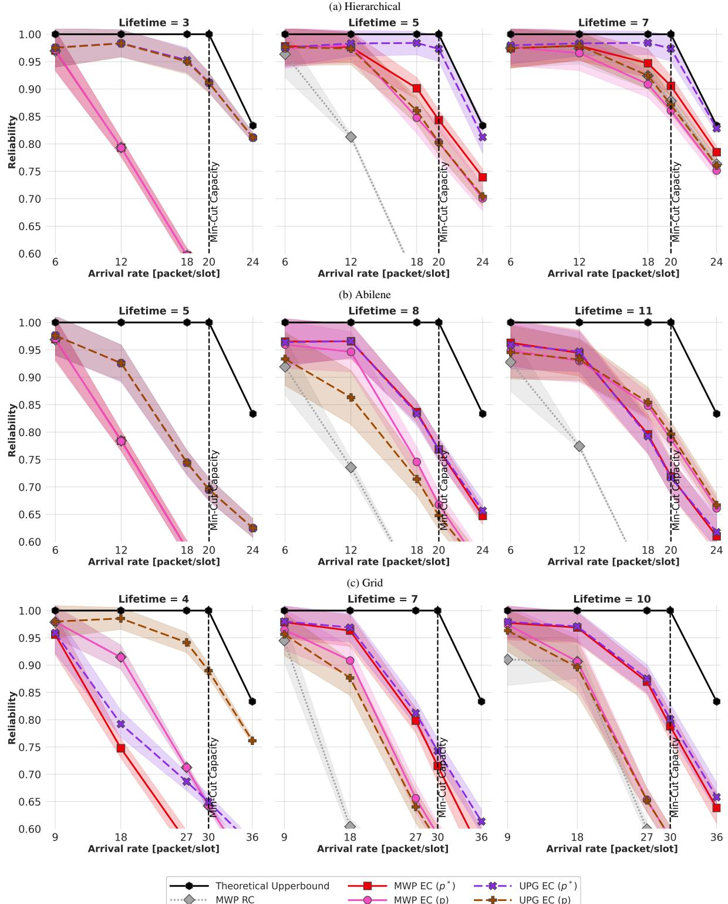  
Figure 7: Reliability performance comparison of prior-guided approaches on the considered network topologies. The line’s shading indicates the standard deviation (SD).

The spatial drop analysis of Figure $A . 2 \ : ( L = 1 0 , b = 2 7 )$ visually confirms these mechanics: MWP RC forces cross-diagonal trafic directly through the grid’s center, generating severe core congestion, whereas EC-based approaches dynamically bypass the central region, improving load uniformity and mitigating cascading congestion.

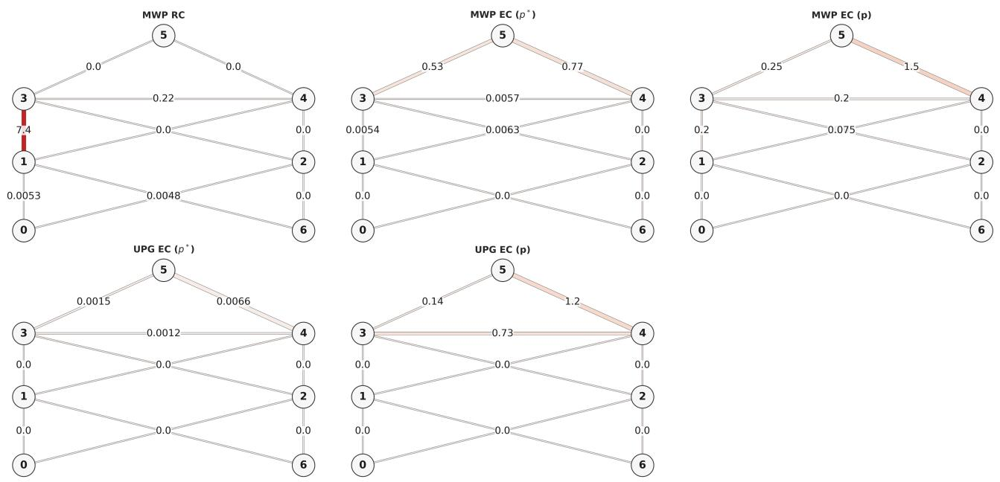  
MWP EC (p\*) 0 0 0.0054 0 0.0063 0 0.0057 0.53 0.77 0 0 10 MWP EC () 0.0053 00 0.4 00 0.075 00 0.22 0.25 1.5 0.0048 00 -5 UPG EC (p\*) 0 0 0 0 0 0 0.0012 0.0015 0.0066 0 0 UPG EC (p) 0 0 0 0 0 0 0.73 0.14 1.2 0 0 -0 0-1 0-2 1-3 1-4 2-3 2-4 3-4 3-5 4-5 6-1 6-2 Interface (Link)  
Figure 8: Spatial distribution of expired packets for prior-guided approaches on Hierarchical topology with $L = 5 , b = 1 8 .$ The top figure reports the dropped packet counts on each edge of the network topology. The bottom figure reports the same information at the interface level in the form of a heatmap. While MWP RC heavily concentrates drops at a few bottleneck interfaces (e.g., 4-5 and 3-4), EC-based approaches distribute the load, with UPG variants efectively eliminating localized hotspots.

Cross-Topology Observations. A joint analysis of the results across all three topologies reveals the following insights:

• Superiority of EC metrics across varying loads. Regardless of the network structure, as the arrival rate increases and the lifetime tightens, metrics based on EC systematically outperform traditional congestion routing. By filtering queued trafic that cannot compete with the routed packets upon its arrival, EC prevents expiring packets from inflating the congestion estimates, securing relative reliability gains ranging from 20% to over 40% when the network approaches saturation. This proactive filtering directly reduces peak interface congestion, efectively preventing the localized packet drops that afect the MWP RC baseline.

• UPG vs. greedy assignment. The benefit of UPG over greedy assignment scales with the regime rather than with the topology itself. Under tight deadlines or near saturation, greedy variants funnel trafic into a single low-weight path, triggering rapid hotspot formation and a sharp reliability drop regardless of topology. The UPG mechanism mitigates this funnelling efect by spreading trafic across paths of comparable weight, with gains that grow with network symmetry and path diversity (most pronounced in Grid, where multiple equivalent routes coexist).

• Robustness ofthe p∗ approximation. The lightweight EC $p ^ { * }$ model performs consistently across most of the considered settings. It relies on a single reference path to compute interface congestion, thereby reducing computational complexity with respect to EC p. The exact model (EC p) maintains an edge in highly asymmetric environments (Abilene) or under strict deadlines in symmetric grids; the $p ^ { * }$ approximation sacrifices only a few percentage points of reliability across the remaining operational regimes.

Best Prior-guided Policy. Across the considered topologies, the UPG EC policies—both in their exact (p) and approximated (p∗) formulations—consistently deliver the highest reliability under stress, with peak gains of up to 40% over the MWP RC baseline. The spatial drop maps (Figs. 8, A.1, A.2) confirm the underlying mechanism: UPG EC (p∗) preserves the urgencyaware filtering of the exact metric while mitigating the localized hotspots that can afect greedy variants under heavy load. This is precisely why UPG EC $( p ^ { * } )$ was anticipated in Section 8 as the reference-policy/demonstrator for MGA-RL.

## 10.3. RL-based Approaches

For each network topology—Hierarchical, Abilene, and Grid— we compare the six RL-based approaches defined in Section 10.1 against the theoretical upper bound and against the best priorguided policy, UPG EC $( p ^ { * } )$ (Section 10.2). Figure 9 reports their reliability, while Figure 10 shows the corresponding training time reductions. We discuss each topology in turn, before drawing cross-topology conclusions.

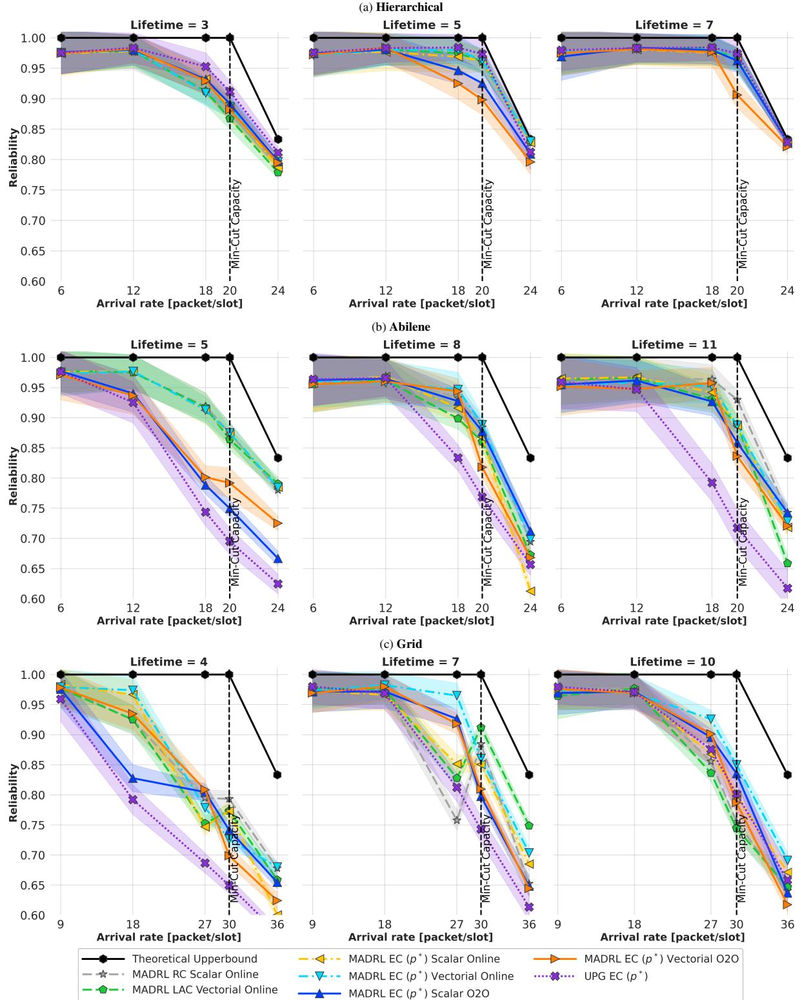  
Figure 9: Reliability performance comparison of DDPG-based approaches on the considered topologies. The line’s shading indicates the Standard Deviation (SD).

Hierarchical Topology. In this highly structured environment, UPG EC $( p ^ { * } )$ provides an excellent baseline. By utilizing it as a bootstrap, both the Vectorial and Scalar MGA-RL agents smoothly inherit this behavior. The structure of the network topology allows even the compressed Scalar representation to avoid severe aliasing penalties. Consequently, both MGA-RL configurations reach performance comparable to their fully Online counterparts, but in a fraction of the training time (as evidenced by the boxplots in Figure 10a). This efectively bypasses the costly and unstable exploration phase that heavily penalizes from-scratch learning. Notably, the deliberately high residual floor $( \lambda _ { \mathrm { r e s } } = 0 . 8 , \mathrm { S e c . } 9 . 2 . 4 )$ constrains the agent to primarily refine the pre-trained policy rather than substantially deviate from it. Given the baseline’s near-optimal performance in this topology, RL exploration would yield only marginal gains at the cost of increased stability risks. Thus, the RL agent operates largely as a policy fine-tuner providing incremental stability rather than high performance improvements, while UPG EC $( p ^ { * } )$ remains an eficient, self-suficient control strategy for the Hierarchical topology.

(a) Hierarchical  
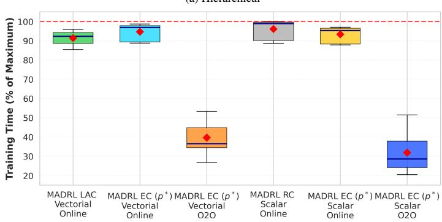

(b) Abilene  
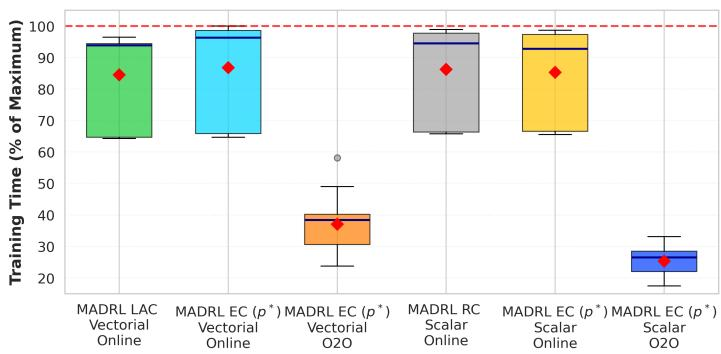

(c) Grid  
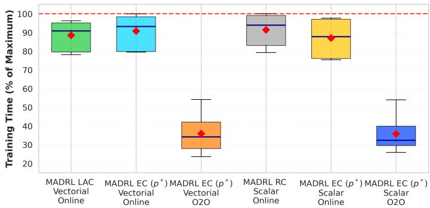  
Figure 10: Training time reduction for considered network topologies; Hierarchical 10a, Abilene 10b and Grid 10c. The red diamond denotes the mean training time, while the blue line denotes the median. Reductions are computed as a percentage of the longest wall-clock run on the same topology (dashed red line) and identical hardware. The MGA-RL policies include the full pre-training and online fine-tuning phases.

Abilene Topology. The asymmetric nature of the Abilene backbone highlights the adaptability of MGA-RL pre-training across diferent temporal constraints. Under the minimum lifetime configuration $( L = 5 )$ , the strictness of the deadlines combined with the network’s structural asymmetry creates a unique dynamic that inverts the usual benefits of the demonstrator. While the pre-trained MGA-RL policies improve upon the UPG EC $( p ^ { * } )$ baseline, they fall short of the reliability levels achieved by their fully Online counterparts. This indicates that although the priorguided heuristic provides a solid starting point for the learning agents, in such highly constrained environments, it acts as an overly restrictive anchor. It hinders the exploration needed to discover the better routing strategies that from-scratch learning eventually finds (albeit at a higher computational training cost). Additionally, as deadlines relax, the true value of MGA-RL pretraining emerges. UPG EC $( p ^ { * } )$ serves as an efective bootstrap, yielding a favorable trade-of between performance and training time. When comparing state representations, the compressed Scalar MGA-RL variant provides fast convergence, at the cost of state aliasing, which empirically leads to sub-optimal performance. Conversely, the Vectorial MGA-RL agent leverages its full state expressiveness to match the reliability of the fully Online counterpart, while reducing the required training time.

Grid $3 \times 3$ Topology. The Grid topology, characterized by high path diversity and multiple equivalent routes, presents the hardest exploration challenge. Here, UPG EC $( p ^ { * } )$ acts as a suitable bootstrap. Both Vectorial and Scalar MGA-RL agents achieve strong reliability with significantly higher stability and lower training times compared to the fully Online agents, which frequently collapse or exhibit high variance under heavy load. UPG EC $( p ^ { * } )$ relies on a simplified EC $p ^ { * }$ approximation that performs on average better than the exact counterpart EC $p$ (see Figure 7), making it efective for bootstrapping RL agents. Notably, under intermediate and relaxed deadlines $( L \ : = \ : 7$ and $L = 1 0 )$ , MGA-RL performance is comparable to or even better than that of the alternatives, showing stability across saturation regimes and underscoring the benefits of pre-training in complex, symmetric environments.

Cross-Topology Observations & RL Implications. A joint analysis of the MADRL experiments highlights three fundamental dynamics governing the accelerated deployment of RL in latency-critical networks:

• The power of sub-optimal bootstrapping. Across all configurations, using a computationally light, albeit imperfect, prior-guided heuristic like UPG EC $( p ^ { * } )$ emerges as a beneficial starting point for RL. It mitigates the catastrophic performance drops typical of early-stage exploration, promoting a safer initialization and allowing the agent to reach operationally acceptable reliability from the very first online interactions, rather than after thousands of trial-anderror episodes.

• MGA-RL sample eficiency over online learning. By leveraging a limited ofline pre-training phase of 200 epochs (drawn from a static dataset collected over 500 episodes, i.e., $N _ { \mathrm { o f f } } = | \mathcal { D } _ { \mathrm { o f f } } | \approx 2 5 , 0 0 0$ transitions) followed by 2 000 online fine-tuning episodes, MGA-RL agents reach reliability levels comparable to—and on the Grid topology even exceeding—the fully Online. This is achieved while consuming only 1/7 of the online interaction budget (2 000 vs. 14 000 episodes). Once the ofline phase is included in the total cost, the resulting wall-clock reduction reaches 55%–65% (Fig. 10), supporting the practical viability of the paradigm under tight deployment budgets.

• Vectorial expressiveness vs. Scalar compression. While MGA-RL supports rapid deployment regardless of the observation granularity, the choice of state representation governs the final policy ceiling. The Scalar form converges faster thanks to its compressed state but is structurally penalized by state aliasing, which hides diferences between high-urgency and low-urgency queue compositions. The Vectorial form, by preserving the full urgency distribution, enables the agent to fine-tune the bootstrapped policy more accurately, consistently delivering the highest reliability among the RL-based configurations; its larger state space is efectively absorbed by the MGA-RL warm-start.

## 10.4. Best Approach by Operational Objective

No single policy dominates across all objectives: which one to adopt depends on the specific goal at hand. Based on the simulation results presented above, Table 5 summarizes our recommendation for six representative objectives, spanning both prior-guided and RL-based approaches. Among the prior-guided policies, the exact EC p formulation is preferable when the objective is to maximize raw reliability under the most adverse conditions (tight lifetimes and structurally asymmetric topologies), whereas its approximation, EC $p ^ { * }$ , ofers the most attractive reliability-complexity trade-of, and is therefore both our recommended prior-guided policy overall and the natural choice as MGA-RL demonstrator. Among the RL-based configurations, the two design axes serve distinct objectives: the choice of state representation (Vectorial vs. Scalar) governs the reliability ceiling the agent can reach, while the choice of training paradigm (MGA-RL vs. fully Online) governs the online interaction cost required to reach it. Consequently, Scalar MGA-RL is preferable when fast convergence with a compact state is the priority; Vectorial MGA-RL ofers the best balance of reliability and deployment cost; and Vectorial Online remains the reference choice when training cost is not a constraint and maximal reliability is sought.

Table 5: Best policy depending on the operational objective.
<table><tr><td>Objective</td><td>Best Policy</td></tr><tr><td>Peak reliability under tight deadlines and saturation</td><td>UPG EC (p)</td></tr><tr><td>Best reliability-complexity trade-off across regimes</td><td>UPG EC (p*)</td></tr><tr><td>Lightweight, stable demonstrator to bootstrap MGA-RL</td><td>UPG EC  $( p ^ { * } )$ </td></tr><tr><td>Fastest convergence with a compact state representation</td><td>MADRL EC  $( p ^ { * } )$  Scalar MGA-RL</td></tr><tr><td>Deployment-oriented RL: high reliability at low online cost</td><td>MADRL EC (p*) Vectorial MGA-RL</td></tr><tr><td>Highest RL reliability when training cost is unconstrained</td><td>MADRL EC (p*) Vectorial Online</td></tr></table>

## 11. Conclusions and Future Directions

In this work, we presented a comprehensive methodology designed to reduce the complexities of network control for latencysensitive applications, with a specific focus on meeting strict delivery deadlines. Relying on the DCMT (Vitale et al., 2025) problem formulation, the introduction of spatially-aware Effective Congestion (EC) metrics and the Uniform Path Grouping (UPG) strategy provides a computationally eficient basis for deriving routing policies aimed at timely packet delivery. Specifically, by proactively filtering out non-viable packets, the EC-based policies achieved reliability gains ranging from 20% to over 40% compared to traditional volume-based routing. Furthermore, the UPG strategy efectively balanced spatial loads, mitigating localized congestion hotspots across structurally diverse environments.

A critical insight derived from our evaluation is the robustness of the decoupled interface-level approximation $( p ^ { * } )$ across structurally diverse regimes. Analytically anchoring the congestion evaluation to a single reference path reduces the per-step evaluation cost from O(|P|) to O(|E|) while preserving the filtering benefits of the exact EC $p$ model; empirically, as deadlines relax it matches or exceeds the exact model’s reliability on the Hierarchical and Grid topologies, while trailing it by a few percentage points on the structurally asymmetric Abilene backbone. Validating this complexity advantage on substantially larger instances remains an open direction.

Building upon this prior-guided foundation, the baseline MADRL framework was extended by incorporating these predictive metrics into the agents’ observation space. To bridge the gap between theoretical learning and practical deployment, we unified the considered policy-learning objectives under the General Policy Reward (GPR) and embedded the training pipeline within the resulting Model-Guided Annealed Reinforcement Learning (MGA-RL) protocol, grounded in the RLfD paradigm: the computationally light UPG EC $( p ^ { * } )$ acts as a programmatic demonstrator whose trajectories drive both the ofline pre-training and the online fine-tuning phases through a residual BC regulariser. To ensure that this demonstration-driven warm-start survives the ofline-to-online transition, we introduce the Anchored Transfer Stabilization Protocol. Together, these mechanisms allow the framework to bypass the performance collapse and sample inefficiency typical of from-scratch online learning, matching—and on the Grid topology exceeding—the reliability of fully Online agents while reducing by a factor of seven the online interaction budget.

Within the MGA-RL framework, our analysis revealed a fundamental expressiveness-complexity trade-of governed by the state-space representation. The compressed Scalar observation space enables faster training. However, due to severe state aliasing, the Scalar MGA-RL agent struggles to accurately evaluate complex congestion patterns, occasionally degrading its routing performance below the prior-guided heuristic baseline it was bootstrapped from. Conversely, the Vectorial representation preserves the full urgency distribution. This expressiveness allows the Vectorial MGA-RL agent to safely navigate the online finetuning phase, matching or exceeding the baseline’s performance and achieving the highest reliability among the scalable RL configurations, with sporadic degradations due to the combination of a large state space with limited training budget.

Ultimately, this work contributes an extensible architecture for deadline-aware routing in NextG environments. While this architecture provides a robust foundation, several promising directions for future research remain open. To further assess the framework’s scalability and adaptability, future studies will evaluate its performance on significantly larger network instances operating under highly dynamic conditions, such as fluctuating link capacities. Additionally, exploring alternative neural architectures presents a compelling avenue; for instance, integrating Graph Neural Networks (GNNs) into the MGA-RL protocol could enable the agents to natively capture and exploit the topological properties of evolving networks. A systematic ablation isolating the individual contributions of the Anchored Transfer components—the residual BC floor $\lambda _ { \mathrm { r e s } } .$ , the SymLog reward transform, and the frozen Z-score normalization—is left to future work. A further open question concerns the sensitivity of MGA-RL to the Stage-1/Stage-2 transition point $T _ { 1 }$ : a premature transition may leave the Actor and Critic insuficiently converged on ${ \mathcal { D } } _ { \mathrm { o f f } } ,$ exacerbating the Actor-Critic Misalignment discussed in Section 7.3, whereas an excessively long pre-training phase may over-anchor the Actor to $\mu ^ { \mathrm { M B } }$ , compounding the restrictiveanchor efect empirically observed under the Abilene $L = 5$ configuration (Section 10.3). A systematic study of T1—jointly with the residual floor $\lambda _ { \mathrm { r e s } }$ and the Early Stopping criterion that determines it in practice—is left to future work. Finally, a critical next step involves validation beyond simulation. Deploying the trained MADRL policies on programmable data plane hardware, such as P4-enabled equipment, would allow measuring true inference latencies and assessing the practical viability of the EC metric under operational constraints.

## Declaration of competing interest

The authors declare that they have no known competing financial interests or personal relationships that could have appeared to influence the work reported in this paper.

## Acknowledgements

This work was partially supported by the European Union under the Italian National Recovery and Resilience Plan (NRRP) of NextGenerationEU, partnership on "Telecommunications of the Future" (PE00000001 - program "RESTART"), by the PRIN project "Resilient delivery of real-time interactive services over NextG computedense mobile networks" (E53D2300055000), and by funds from the US National Science Foundation as specified in the RINGS program (CNS-2148315).

## References

Ball, P.J., Smith, L., Kostrikov, I., Levine, S., 2023. Eficient online reinforcement learning with ofline data, in: International Conference on Machine Learning, PMLR. pp. 1577–1594.

Barcelo, M., Correa, A., Llorca, J., Tulino, A.M., Vicario, J.L., Morell, A., 2016. Iot-cloud service optimization in next generation smart environments. IEEE Journal on Selected Areas in Communications 34, 4077–4090.

Bellman, R., 1957. A markovian decision process. Journal of mathematics and mechanics , 679–684.

Bridle, J.S., 1990. Probabilistic interpretation of feedforward classification network outputs, with relationships to statistical pattern recognition, in: Neurocomputing: Algorithms, architectures and applications. Springer, pp. 227–236.

Cai, Y., Llorca, J., Tulino, A.M., Molisch, A.F., 2022a. Compute-and data-intensive networks: The key to the metaverse, in: 2022 1st international conference on 6G networking (6GNet), IEEE. pp. 1–8.

Cai, Y., Llorca, J., Tulino, A.M., Molisch, A.F., 2022b. Ultra-reliable distributed cloud network control with end-to-end latency constraints. IEEE/ACM Transactions on Networking 30, 2505–2520.

Feng, H., Llorca, J., Tulino, A.M., Molisch, A.F., 2018. Optimal dynamic cloud network control. IEEE/ACM Transactions on Networking 26, 2118–2131.

Fujimoto, S., Gu, S.S., 2021. A minimalist approach to ofline reinforcement learning. Advances in neural information processing systems 34, 20132–20145.

Fujimoto, S., Hoof, H., Meger, D., 2018. Addressing function approximation error in actor-critic methods, in: International conference on machine learning, PMLR. pp. 1587–1596.

Fujimoto, S., Meger, D., Precup, D., 2019. Of-policy deep reinforcement learning without exploration, in: International conference on machine learning, PMLR. pp. 2052–2062.

Gao, Y., Xu, H., Lin, J., Yu, F., Levine, S., Darrell, T., 2018. Reinforcement learning from imperfect demonstrations, in: International Conference on Machine Learning Workshop. ArXiv:1802.05313.

Hafner, D., Pasukonis, J., Ba, J., Lillicrap, T., 2023. Mastering diverse domains through world models. arXiv preprint arXiv:2301.04104 .

Hester, T., Vecerik, M., Pietquin, O., Lanctot, M., Schaul, T., Piot, B., Horgan, D., Quan, J., Sendonaris, A., Osband, I., et al., 2018. Deep q-learning from demonstrations, in: Proceedings of the AAAI Conference on Artificial Intelligence, pp. 3223–3230.

Kingma, D.P., Ba, J., 2014. Adam: A method for stochastic optimization. arXiv preprint arXiv:1412.6980 .

Kostrikov, I., Nair, A., Levine, S., 2022. Ofline reinforcement learning with implicit Q-learning, in: International Conference on Learning Representations.

Kumar, A., Zhou, A., Tucker, G., Levine, S., 2020. Conservative Q-learning for ofline reinforcement learning. Advances in neural information processing systems 33, 1179–1191.

Levine, S., Kumar, A., Tucker, G., Fu, J., 2020. Ofline reinforcement learning: Tutorial, review, and perspectives on open problems. arXiv preprint arXiv:2005.01643 .

Lillicrap, T.P., Hunt, J.J., Pritzel, A., Heess, N., Erez, T., Tassa, Y., Silver, D., Wierstra, D., 2015. Continuous control with deep reinforcement learning. arXiv preprint arXiv:1509.02971 .

Mauro, A., Tulino, A.M., Llorca, J., 2024. End-to-end orchestration of nextg media services over the distributed compute continuum. arXiv preprint arXiv:2407.08710 .

Mnih, V., Kavukcuoglu, K., Silver, D., Rusu, A.A., Veness, J., Bellemare, M.G., Graves, A., Riedmiller, M., Fidjeland, A.K., Ostrovski, G., et al., 2015. Human-level control through deep reinforcement learning. nature 518, 529–533.

Nair, A., Gupta, A., Dalal, M., Levine, S., 2020. Awac: Accelerating online reinforcement learning with ofline datasets. arXiv preprint arXiv:2006.09359 .

Nair, A., McGrew, B., Andrychowicz, M., Zaremba, W., Abbeel, P., 2018. Overcoming exploration in reinforcement learning with demonstrations, in: 2018 IEEE international conference on robotics and automation (ICRA), IEEE. pp. 6292–6299.

Neely, M., 2022. Stochastic network optimization with application to communication and queueing systems. Springer Nature.

Pagliuca, Q., Chaves, L.J., Imputato, P., Tulino, A., Llorca, J., 2024. Dual timescale orchestration system for elastic control of nextg cloud-integrated networks, in: 2024 27th Conference on Innovation in Clouds, Internet and Networks (ICIN), IEEE. pp. 234–241.

Paine, T.L., Paduraru, C., Michi, A., Gulcehre, C., Zolna, K., Novikov, A., Wang, Z., de Freitas, N., 2020. Hyperparameter selection for ofline reinforcement learning. arXiv preprint arXiv:2007.09055 .

Pomerleau, D.A., 1991. Eficient training of artificial neural networks for autonomous navigation. Neural Computation 3, 88–97. doi:10.1162/neco.1991.3.1.88.

Poularakis, K., Llorca, J., Tulino, A.M., Tassiulas, L., 2020. Approximation algorithms for data-intensive service chain embedding, in: ACM Mobihoc, ACM. pp. 131–140.

Prudencio, R.F., Maximo, M.R.O.A., Colombini, E.L., 2024. A survey on ofline reinforcement learning: Taxonomy, review, and open problems. IEEE Transactions on Neural Networks and Learning Systems 35, 10237–10258.

Rajeswaran, A., Kumar, V., Gupta, A., Vezzani, G., Schulman, J., Todorov, E., Levine, S., 2018. Learning complex dexterous manipulation with deep reinforcement learning and demonstrations, in: Robotics: Science and Systems (RSS).

Ríos-Guiral, S., Lahmadi, A., Botero, J.F., Gutiérrez, S.A., 2025. Leveraging reinforcement learning for trafic engineering in programmable networks: A survey. IEEE Communications Surveys & Tutorials .

Ross, S., Gordon, G., Bagnell, J.A., 2011. A reduction of imitation learning and structured prediction to no-regret online learning. Journal of Machine Learning Research 15, 771–826.

Schaal, S., 1997. Learning from demonstration, in: Advances in Neural Information Processing Systems, pp. 1040–1046.

Silver, D., Lever, G., Heess, N., Degris, T., Wierstra, D., Riedmiller, M., 2014. Deterministic policy gradient algorithms, in: International conference on machine learning, Pmlr. pp. 387–395.

Sinha, A., Modiano, E., 2017. Optimal control for generalized networkflow problems. IEEE/ACM Transactions on Networking 26, 506– 519.

Sutton, R.S., Barto, A.G., et al., 1998. Reinforcement learning: An introduction. volume 1. MIT press Cambridge.

Sutton, R.S., McAllester, D., Singh, S., Mansour, Y., 1999. Policy gradient methods for reinforcement learning with function approximation. Advances in neural information processing systems 12.

Tassiulas, L., Ephremides, A., 1990. Stability properties of constrained queueing systems and scheduling policies for maximum throughput in multihop radio networks, in: 29th IEEE Conference on Decision and Control, IEEE. pp. 2130–2132.

Vecerik, M., Hester, T., Scholz, J., Wang, F., Pietquin, O., Piot, B., Heess, N., Rothörl, T., Lampe, T., Riedmiller, M., 2017. Leveraging demonstrations for deep reinforcement learning on robotics problems with sparse rewards. arXiv preprint arXiv:1707.08817 .

Vitale, V.N., Tulino, A.M., Molisch, A.F., Llorca, J., 2025. A flexible multi-agent deep reinforcement learning framework for dynamic routing and scheduling of latency-critical services. IEEE Transactions on Networking 34, 2653–2668.

Wu, M., Yu, G., Wei, P., Zhou, D., Dai, B., Pinto, L., 2020. Reinforcement learning from imperfect demonstrations under soft expert guidance, in: Proceedings of the AAAI Conference on Artificial Intelligence.

Zhang, J., Sinha, A., Llorca, J., Tulino, A.M., Modiano, E., 2021. Optimal control of distributed computing networks with mixed-cast trafic flows. IEEE/ACM Transactions on Networking 29, 1760– 1773.

Zhao, Y., Boney, R., Ilin, A., Kannala, J., Pajarinen, J., 2022. Adaptive behavior cloning regularization for stable ofline-to-online reinforcement learning. arXiv preprint arXiv:2210.13846 .

## Appendix A. Spatial Drop Rate Distribution

This appendix complements the macroscopic reliability analysis of Section 10 with a microscopic view of where packet expirations concentrate across network interfaces. For each topology, we focus on settings with an arrival rate equal to 90% of the Min-Cut capacity and a lifetime suficient to activate all candidate paths, so that diferences across policies stem from routing decisions rather than infeasibility. Two complementary representations are used throughout: a network topology overlay showing per-edge (undirected) drop counts, and a heatmap aggregating drops at the interface level.

## Appendix A.1. Prior-guided Policies

Figures 8, A.1, and A.2 report the spatial drop distributions for the Hierarchical, Abilene, and Grid topologies, respectively. Three recurrent patterns emerge across topologies. First, the traditional MWP RC baseline systematically concentrates expirations on the topological bottlenecks dictated by shortest-path routing (link 4-5 in Hierarchical, link 2-5 in Abilene, the central crossbar in Grid), since its volume-based metric cannot discriminate between viable and expiring trafic. Second, EC-based policies redistribute the load proactively by filtering out nonviable packets, lowering peak per-interface drops by more than an order of magnitude in the most stressed scenarios. Third, the UPG assignment compounds this benefit by avoiding the single-path saturation that afects greedy variants, leading to a near-uniform residual drop profile. These observations directly motivate the choice of UPG EC (p∗) as the bootstrap demonstrator for the MGA-RL framework: it provides the stable, well-distributed initial behavior that prevents the early-stage value-overestimation cascade typical of from-scratch RL.

## Appendix A.2. RL-based Policies

Figures A.3, A.4, and A.5 extend the spatial analysis to the MADRL variants. Two design dimensions become visually apparent. The choice of the congestion metric (RC/LAC vs. EC p∗) governs whether the agent learns to discriminate urgency: RC- and LAC-based agents leave residual hotspots on the structural bottlenecks (e.g., interfaces 1-3 in Hierarchical, 6-10 in Abilene, the central crossbar in Grid), whereas EC-guided agents flatten the drop profile across the network. The choice of training paradigm (Online vs. MGA-RL) then determines whether the agent reaches this optimum reliably: fully Online agents

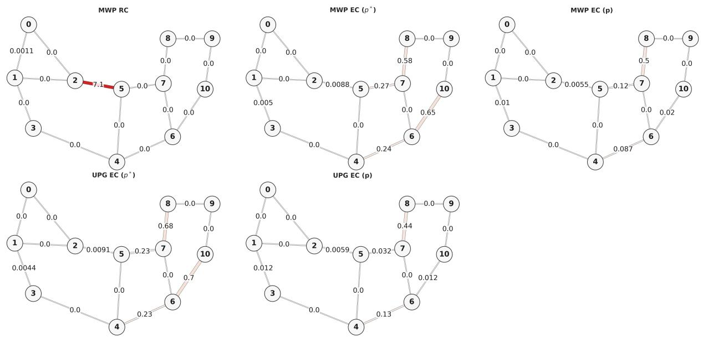

<table><tr><td>MWP EC (p*)</td><td>0</td><td>0</td><td>0</td><td>0</td><td>0.005</td><td>0</td><td>0.0088</td><td>0</td><td>0</td><td>0.24</td><td>0</td><td>0.27</td><td>0</td><td>0.65</td><td></td><td>0</td><td>0.58</td><td>0 0</td><td colspan="2">10</td></tr><tr><td colspan="2">MWP EC (p)</td><td>0</td><td>0</td><td>0</td><td>0</td><td>0.01</td><td>0</td><td>0.0055</td><td>0</td><td>0</td><td>0.087</td><td>0</td><td>0.12</td><td>0</td><td>0.02</td><td>0</td><td>0.5</td><td>0</td><td>0</td><td></td></tr><tr><td>MWP RC</td><td>0</td><td>0</td><td>0</td><td>0</td><td>0</td><td></td><td>0</td><td>7.1 0</td><td>0</td><td></td><td>0</td><td>0</td><td>0</td><td>0</td><td>0</td><td>0</td><td>0</td><td>0</td><td>0</td><td>p Rate -5 Oo 1</td></tr><tr><td>UPG EC (p*)</td><td></td><td>0</td><td>0</td><td></td><td>0</td><td>0.0044</td><td>0</td><td>0.0091</td><td>0</td><td>0</td><td>0.23</td><td>0</td><td>0.23</td><td>0</td><td>0.7</td><td>0</td><td>0.68</td><td>0</td><td>0</td><td></td></tr><tr><td>UPG EC (p)</td><td>0</td><td>0 0</td><td>0</td><td>0</td><td>0.012</td><td></td><td>0</td><td>0.0059 0</td><td></td><td>0</td><td>0.13</td><td>0</td><td>0.032</td><td>0</td><td>0.012</td><td>0</td><td>0.44</td><td>0</td><td>0</td><td></td></tr><tr><td></td><td></td><td>0-2</td><td></td><td></td><td></td><td></td><td>2-5</td><td>3-4</td><td>4-5</td><td></td><td></td><td></td><td></td><td></td><td></td><td></td><td></td><td></td><td></td><td>0</td></tr><tr><td></td><td>0-1</td><td></td><td>1-0</td><td>1-2</td><td>1-3</td><td>2-1</td><td></td><td>Interface</td><td></td><td>4-6</td><td>1 ink)</td><td>5-4</td><td>5-7</td><td>6-7</td><td>6-10</td><td>7-6</td><td>7-8</td><td>8-9</td><td>10-9</td><td></td></tr></table>

Figure A.1: Spatial distribution of expired packets for prior-guided approaches on Abilene topology with L = 11 b = 18.

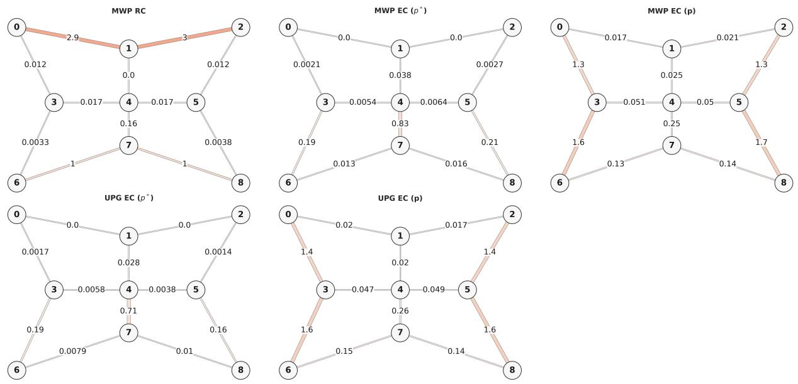

<table><tr><td>MWP EC (p*)</td><td>0</td><td>0.0021</td><td>0</td><td>0</td><td>0.038</td><td></td><td>0.0027</td><td></td><td>0</td><td>0.19</td><td>0</td><td>0.0054</td><td>0.0064</td><td>0.83</td><td>0</td><td>0.21</td><td></td><td>0</td><td>0</td><td>0.013</td><td>0.016</td><td>0</td><td rowspan="3">10 dro Rate</td></tr><tr><td>MWP EC (p)</td><td>0</td><td>1.3</td><td>0.017</td><td>0.021</td><td></td><td>0.0027</td><td>0 0</td><td>1.3</td><td>0</td><td>1.6</td><td>0.022</td><td>0.051</td><td>0.05</td><td>0.029</td><td>0</td><td></td><td>1.7</td><td>0</td><td>0.22</td><td>0.13</td><td>0.14</td><td>0</td></tr><tr><td>MWP RC</td><td>2.9</td><td>0.012</td><td>0.0052</td><td>0.0032</td><td></td><td>0</td><td>3</td><td>0.012</td><td>0</td><td>0.0033</td><td>0</td><td>0.017</td><td>0.017</td><td>0.16</td><td>0</td><td>0.0038</td><td></td><td>0 0</td><td>1</td><td></td><td>1 0</td><td>-5</td></tr><tr><td rowspan="3">UPG EC (p*) UPG EC (p)</td><td>0</td><td>0.0017</td><td>0</td><td>0</td><td>0.028</td><td></td><td>0</td><td>0.0014</td><td>0</td><td>0.19</td><td>0</td><td>0.0058</td><td>0.0038</td><td>0.71</td><td>0</td><td>0.16</td><td>0</td><td>0</td><td>0.0079</td><td>0.01</td><td></td><td></td></tr><tr><td>0</td><td>1.4</td><td>0.02</td><td>0.017</td><td></td><td>0.0042</td><td>0</td><td>1.4</td><td>0</td><td>1.6</td><td>0.016</td><td>0.047</td><td>0.049</td><td>0.025</td><td>0</td><td></td><td></td><td></td><td></td><td></td><td>0 0</td><td></td></tr><tr><td>0-1</td><td>0-3</td><td>1-0</td><td>1-2</td><td>1-4</td><td>2-1</td><td>2-5</td><td>3-4</td><td>3-6</td><td></td><td>4-1</td><td>4-3</td><td>4-5</td><td>4-7</td><td>5-4</td><td>1.6 5-8</td><td>0 6-7</td><td>0.23 7-4</td><td>0.15 7-6</td><td>0.14 7-8</td><td>8-7</td><td>-0</td></tr></table>

Figure A.2: Spatial distribution of expired packets for prior-guided approaches on Grid 3 × 3 network with $L = 1 0 , b = 2 7 .$

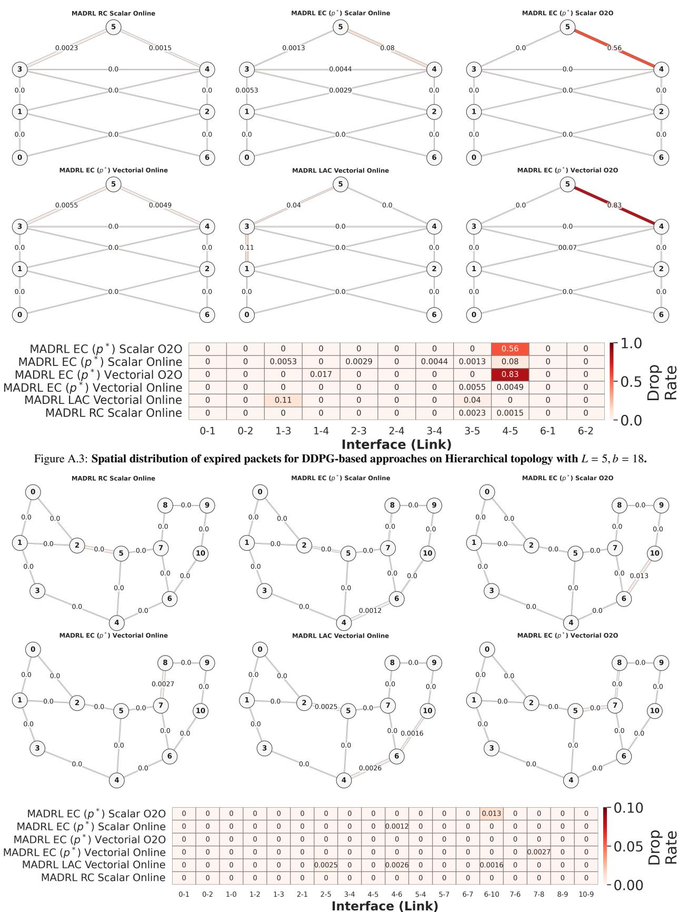  
Figure A.4: Spatial distribution of expired packets for DDPG-based approaches on Abilene topology with $L = 1 1 , b = 1 8 .$

exhibit residual scattered drops attributable to exploration noise, while MGA-RL Vectorial agents consistently achieve the cleanest profile by inheriting the spatially balanced behavior of the UPG EC (p∗) bootstrap and refining it under the expressive Vectorial observation. The combination EC p∗ + Vectorial + MGA-RL emerges as the configuration that simultaneously minimizes the peak drop rate and the spatial variance, empirically supporting its selection as the recommended framework instantiation.

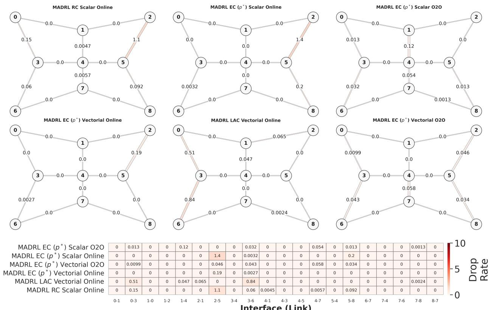  
Figure A.5: Spatial distribution of expired packets for DDPG-based approaches on Grid 3 × 3 topology with L = 10 b = 27.

Appendix B. Notation Table  
Table B.1: Table of Notations
<table><tr><td>Symbol</td><td>Description</td></tr><tr><td colspan="2">Network Topology and Service Model</td></tr><tr><td> $\mathcal { G } ( \mathcal { V } , \mathcal { E } )$ </td><td>Directed graph representing the network topology (nodes  $\mathcal { V } ,$  links  $\varepsilon )$ </td></tr><tr><td> $\rho _ { i } ^ { + } , \rho _ { i } ^ { - }$ </td><td>Sets of outgoing and incoming neighbors of node  $i \in \mathcal { N } .$ </td></tr><tr><td> $C _ { i j } ( t )$ </td><td>Capacity of link  $( i , j )$  at time t (maximum packets per time slot).</td></tr><tr><td> $c$ </td><td>Set of commodities (latency-sensitive services)</td></tr><tr><td> $s ^ { c } , d ^ { c } , L ^ { c }$ </td><td>Source node, destination node, and initial lifetime (TTL) for commodity  $c .$ </td></tr><tr><td> $b ^ { c } ( t ) , \bar { b } ^ { c }$ </td><td>Instantaneous and mean packet arrival rate for commodity c at the source node.</td></tr><tr><td> $\mathcal { P } ^ { c } , \mathcal { P }$ </td><td>Set of feasible candidate paths for commodity c and the union of all paths in the network.  $( i , j ) .$ </td></tr><tr><td> ${ \mathcal { P } } _ { i j } { \mathrm { , } } { \mathcal { P } } _ { i j } ^ { c }$ </td><td>Subset of paths (global or specific to commodity c) traversing link</td></tr><tr><td colspan="2">Queueing and Deadline-Aware Model</td></tr><tr><td> $l \mathbf { v } \mathbf { s } . \mathbf { \nabla } \ell $ </td><td>Absolute lifetime (time-to-live) l vs. Effective Lifetime (EL) l.</td></tr><tr><td> $E L ( p , l , i )$ </td><td>Function determining the effective lifetime based on remaining hops to destination.</td></tr><tr><td> $q _ { i j } ^ { ( c , l ) } ( t )$ </td><td>Number of packets of commodity c with lifetime l currently in the queue at interface</td></tr><tr><td> $\mathbf { q } _ { i j } ( t )$ </td><td> $( i , j ) .$  Aggregate queuing state vector of interface  $( i , j )$  for all commodities and lifetimes.</td></tr><tr><td> $f _ { i j } ^ { ( c , l ) } ( t )$ </td><td>Flow variables: number of packets of commodity c with lifetime l transmitted over link</td></tr><tr><td> $g _ { i j } ^ { ( c , l ) } ( t )$ </td><td>Intentional dropping variables for packets with lifetime l at interface  $( i , j ) .$ </td></tr><tr><td> $b _ { i j } ^ { ( \tilde { c } , l ) } ( t )$ </td><td>Packets exogenously arriving at node i assigned to path  $p \in \mathcal { S } _ { i j } ^ { c }$ </td></tr><tr><td> $f _ {  i j } ^ { ( c , l ) } ( t )$ </td><td>Packets arriving at node i from neighbors  ${ \rho } _ { i } ^ { - }$  assigned to paths  $p \in \mathcal { P } _ { i j } ^ { c } .$ </td></tr><tr><td> $f _ {  d ^ { c } } ^ { ( c , \tilde { l } ) } ( t )$ </td><td>Packets arriving at destination node  $d ^ { c }$  from neighbors  $\rho _ { d ^ { c } } ^ { - }$  assigned to paths</td></tr><tr><td colspan="2">Congestion Metrics and Effective Congestion</td></tr><tr><td></td><td> $( E C )$ </td></tr><tr><td> $T _ { : i } ^ { p }$ </td><td>Number of hops from the source of path p to reach interface  $( i , j ) .$ </td></tr><tr><td> $\mathsf { L } ^ { \dot { p } }$ </td><td>Initial effective lifetime of a packet assigned to path  $p$  at its source.</td></tr><tr><td> $p ^ { * }$ </td><td>Reference path  $( p ^ { * } )$  for the shared EC  $( \boldsymbol { p } ^ { * }$  )-model.</td></tr><tr><td> $Q _ { i j } ( t )$   $\mathbf { Q } _ { i j } ( t )$ </td><td>Total scalar packet count at interface  $( i , j ) .$ </td></tr><tr><td> $\bar { \mathbf { Q } } _ { i j } ^ { ( p ) } ( t ) , \bar { Q } _ { i j } ^ { ( p ) } ( t )$ </td><td>Vector of packets enqueued at interface  $( i , j )$  indexed by their residual effective lifetime  $\ell .$  Vector and Scalar filtered competing traffic for path at interface according to EC</td></tr><tr><td> $\hat { \mathbf { Q } } _ { i j } ^ { ( \mathcal { P } _ { i j } ) } ( t ) , \mathcal { \bar { Q } } _ { i j } ^ { ( \mathcal { P } _ { i j } ) } ( t )$ </td><td> $p$   $( i , j )$   $p$  metric. Vector and Scalar filtered competing traffic at interface  $( i , j )$  according to  $\mathrm { E C } \ p ^ { * }$  metric.</td></tr><tr><td colspan="2">GPR and MGA-RL Framework</td></tr><tr><td> $\mu ^ { \mathrm { M B } }$ </td><td>Analytical prior-guided reference policy (demonstrator), queryable at any  $s \in S .$ </td></tr><tr><td> $\hat { r } _ { o n } ( t ) , \hat { r } _ { \mathrm { o f f } } ( t )$ </td><td>Empirical reward estimates from the live  $( \mathcal { B } ( t ) )$  and pre-collected  $( \mathcal { B } _ { \mathrm { o f f } } )$  mini-batches.</td></tr><tr><td> $\ddot { \cal M } _ { M S E }$ </td><td>Empirical policy deviation between  $\mu _ { \theta }$  and  $\mu ^ { \mathrm { M B } }$ </td></tr><tr><td> $\alpha , \beta$ </td><td>GPR weights of the live and pre-collected reward contributions.</td></tr><tr><td> $\mathcal { D } ( t )$ </td><td>Live replay buffer containing interaction tuples up to time t.</td></tr><tr><td> $\mathcal { B } ( t )$ </td><td>Mini-batch drawn from the live replay buffer  $\mathcal { D } ( t )$  at time t.</td></tr><tr><td> $\mathcal { D } _ { \mathrm { o f f } }$ </td><td>Static dataset of transitions  $( s , a , r , s ^ { \prime } )$  collected while executing the expert prior-guided heuristic policy.</td></tr><tr><td> ${ \mathcal { B } } _ { \mathrm { o f f } }$ </td><td>Mini-batch drawn from the static dataset of transitions  ${ \mathcal { D } } _ { \mathrm { o f f } } .$ </td></tr><tr><td> $N _ { b u f } , N , M$ </td><td>Live replay buffer capacity; live and pre-collected mini-batch sizes.</td></tr><tr><td> $\theta , \phi$ </td><td>Trainable parameters for the Actor (θ) and Critic (φ) neural networks.</td></tr><tr><td> $\lambda , \lambda _ { 0 } , \lambda _ { r e s }$ </td><td>Imitation Factor: Weight of the Behavior Cloning (BC) loss (with decay parameters).</td></tr><tr><td> $\omega$ </td><td>Q-Normalization Factor: Batch-wise mean absolute Q-value to scale the RL loss component.</td></tr><tr><td> $\mathrm { S y m L o g } ( x )$ </td><td>Symmetric Logarithmic transformation used to compress reward spikes.</td></tr><tr><td> $\mu _ { \mathcal { D } } , \sigma _ { \mathcal { D } }$ </td><td>Frozen Z-score statistics (mean and std dev) extracted from the offline dataset.</td></tr><tr><td> $K , E , W$ </td><td>Number of offline Epochs (K), online Episodes (E), and Warm-up episodes</td></tr><tr><td> $D _ { \mathrm { d e c } }$ </td><td>buffer size at which λ reaches its floor  $\lambda _ { \mathrm { r e s } }$ </td></tr><tr><td> $\rho$ </td><td>Fraction of offline samples mixed into online training batches (Seeded Experience Replay).</td></tr></table>