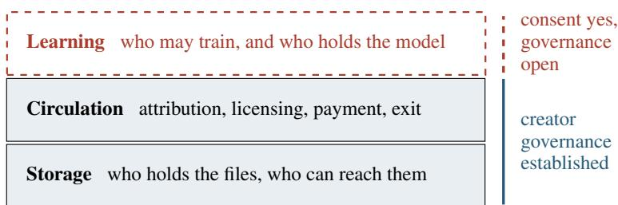

# GOVERN THE MODEL, NOT ONLY THE DATA: STORAGE, CIRCULATION, AND LEARNING IN CREATIVE AI

## A PREPRINT

Phoenix Perry University of the Arts London phoenix.perry@arts.ac.uk

Yasmine Boudiaf University of the Arts London y.boudiaf@arts.ac.uk

R. Luke DuBois New York University dubois@nyu.edu

Kelani Nichole New York University kelaniatwork@gmail.com

George Simms University of the Arts London g.simms@arts.ac.uk

Nick Bryan-Kinns University of the Arts London n.bryankinns@arts.ac.uk

Alix Rule New York University aer342@nyu.edu

Atharva Pravin Pawar New York University app7633@nyu.edu

Elizabeth Wilson University of the Arts London e.j.wilson@arts.ac.uk

Tega Brain New York University brain@nyu.edu

Rachel Meade Smith New York University smithmeade@gmail.com

Rebecca Fiebrink University of the Arts London r.fiebrink@arts.ac.uk

September 4, 2026

## ABSTRACT

Federated learning is increasingly presented as a privacy-preserving advance: personal data remain on the device, and only model updates are shared. It borrows the vocabulary of the federated social web, yet inverts its logic, distributing computation while the resulting model stays with whoever convened the training. We argue that federation is not in itself a remedy for extractive AI, because outcomes depend on who governs the data and the model and who has agency over the practices that shape them. We describe three layers at which a creative community can hold its work: storage, circulation, and learning. Examining artist-governed trusts, cooperatives, and consent infrastructures, we show that creator governance is established at storage and circulation but stops at learning: contributors can consent to training, yet have little say over the resulting model or its federation. We map the research space this opens, pairing technical open problems with the human questions from which they unfold. We propose four design principles for a creative data commons that governs models and their federation, not only datasets: govern the model, not only the corpus; make the terms legible at the moment of contribution; design for refusal as a first-class state; and decide stewardship in the open and account for it.

## 1 Introduction: Two Federations

Generative AI sits inside the everyday tools of creative practice, in text editors, drawing applications, and digital audio workstations through which artists, musicians, and writers make their work [1]. Alongside large models trained on scraped web corpora, a yet to be negotiated architecture exists: federated learning, presented as a privacy-preserving advance because protected personal data never leave the device, and only the computed model updates are shared and federated [2].

Federation is a protocol that can take on a number of forms; in this paper, we share two quite different architectures, which are routinely, if not intentionally, confused. The better-known FLOSS federated web3 technology lets communities run their own servers and interoperate as peers, through standards such as ActivityPub [3]. What is distributed is publication, and the community that runs a server decides what it hosts, who it federates with, and who it refuses [4, 5].

However, the federation of AI training embodies a second and distinct approach to federation. In this approach, devices compute model updates locally and send only those updates to a central server, which aggregates them into a single model [2, 6]. What is distributed and federated here is computation, often involving computation on personal data. This architecture, in which local data remain on individual devices, while model aggregation and ownership are typically retained by a central coordinating organisation, in many ways inverses the logic of a FLOSS federated web. Google’s Gboard, the longest-running deployment on the consumer scale, works exactly this way [7, 8]. Similarly, Apple’s co-option of differential privacy [9] illustrates how concepts of privacy and federation have been absorbed into corporate AI infrastructure [10]. Rather than enabling communities to govern their own data resources, such approaches optimise the extraction of aggregate insights. These real-world applications of federated learning present challenges, including high communication costs, statistical and system heterogeneity, persistent privacy vulnerabilities [11], as well as a lack of clarity of how on-device learning handles and maintains users’ data [12].

These two federation practices share an aim of decentralisation, but distribute different things: the first distributes data and offers governance over it; the second distributes model computation to extract personal data and retains ownership over the model. Using the same term for both makes their differences harder to make sense of. Consequently, federated learning often inherits the political standing of the federated web earned through community governance. The processing of the device is now both a market position and a technical method [10]. The privacy claim is somewhat accurate in the scope of already individualising data rights such as GDPR [13], since personal data stay only on the local device. However, data privacy is distinct from agency control over the practices that produce it. This broader question of agency has been raised in the creative sector, in evidence submitted to the UK copyright and AI consultation, and in sector assessments of revenue at risk[14, 15].

Our argument is that federation is a protocol, not a politics: whether it increases or erodes a creative community’s agency depends entirely on who governs the data and the resulting model. Federated architectures are compatible with both building up governance practices and extracting from them. For the case of this paper, we define creative communities as “a group of people who come together around a shared challenge or theme to create, act, and share" [16]. Our argument is informed by the practices of artists working with AI and data to propose some design principle that can build up the agency of creative communities and their capacities for collective governance. As such, our contributions are as follows.

1. Distinguishing the two main conflated federated paradigms, so that design decisions currently prescribed to people and communities can be made through deliberation (Section 2).

2. Differentiating storage, circulation, and learning as governance layers for federated AI systems relevant to creative communities, where creator governance is established in the first two and currently absent in the third, drawn out through creator-governed federations such as the TRANSFER Data Trust and Serpentine’s Choral Data Trust (Section 4).

3. Mapping the research space, this opens, pairing technical frictions with artistic practice-based inquiries to formulate design principles for a creative data commons that can begin to govern models and their federation, not just datasets. (Sections 6–7).

## 2 What creators already do

Artists often relate to machine learning in ways that deviate from and are counter to how AI systems are imagined and built. A recognisable practice has formed around small, self-curated datasets used to steer a model towards a particular aesthetic instead of general performance [17]. Anna Ridler photographed and hand-labelled ten thousand tulips for Myriad (Tulips), exhibiting the data set itself as work before training a GAN on it for the Mosaic Virus [18, 19]. Jonathan Reus and the sound poet Jaap Blonk make the dataset live: in Bla Blavatar vs Jaap Blonk, Blonk performs generated “dataset poems” on stage while his recorded voice is added to the training set to emerge a synthetic double[20]. Similar commitments run through the work of Sofia Crespo [21], Eddie Wong [22, 23], Magdalena Tyzlik-Carver [˙ 24], Jhave Johnston[25], and Gabriel Vigliensoni [26], and through Holly Herndon and Mat Dryhurst’s The Call [27], which made a choral dataset assembled in collaboration with fifteen choirs[28]. We do not present these as case studies, but draw from these practices to argue that a creative data commons can and already do operate at the artwork, gallery, and exhibition scale: artists curate, label, refuse, withdraw, and govern their data, which shapes outcomes both materially and conceptually. What remains underdeveloped are practices for governing and sharing the resulting AI models across creative communities.

## 3 When the model is the material

A growing body of research [29] considers how the objects of machine learning practice including the models themselves can be understood as materials. Our point is not that a model is a material; it is what changes once a community, rather than a single maker, works it as one. Artistic practice makes especially visible a more general feature of human activity long recognised by philosophical pragmatists: people develop perception, judgement, and action capacities through sustained engagement with the materials and tools of their practice [30]. In the context of the projects described above, the artists’ data practices reveal how this dynamic operates. When models themselves become materials: interacting with models is not merely using a finished technical object; it is participation in a practice that forms both the system and the people working with it. Through data labelling, model training, and model sharing, artists actively reshape the creative and technical practices in which they are engaged, while also shaping the AI and data practices through which models are produced. By a community here, we mean a group that holds a shared body of work and could design, train, and govern a model together.

Creative practice already treats trained models this way. Ridler describes a model surfacing patterns in her own drawing hand that she had not noticed [31]. Dadabots deliberately overfit short timescales and underfit long ones, so that a model trained on a single album generates within the grain of that album rather than escaping it [17]. Terrance Broad re-connects, bends and inverts the architectures and values of models [32, 33] . In each case, the models are handled as material with grain, resistances, and capacity to be shaped, not as a determined pipeline optimised for accuracy or similarity. What these artists value is often what these systems background and remove and how they can negotiate these delineations through their situated practices.

We propose that when the model is cared for collectively, this makes room for its governance and matters to be shaped from many positions and desires. A community that curates a shared corpus together can make sense of how a model can be trained and designed, feeling how it responds, resists, prunes, re-weights, and refuses together. This offers a way of accessing and shaping AI and data’s matters at the scale of collective practice and governance. This is a form of creative agency made known through artistic experimentation, but which is inaccessible today for predominantly infrastructural reasons: there is nowhere to manifest models on such collective and configurable terms. Governance of the learning layer is therefore not only a question of rights over training data, it orients how a model is intended to be shared, if at all, and under what conditions.

## 4 Three layers, and where governance stops

We argue that the discourse of ownership and sovereignty within a federation misplaces the capacity of creative communities to access and shape their data and AI models from the bottom up. To help understand the possible interventions that creative communities can and have made here, we offer three layers in which data and models can be governed: storage, circulation, and learning (Figure 1).

Storage is where the data or artefacts physically sit and who can access it. Circulation is the terms on which it moves: attribution, licencing, payment, and the right to withdraw. Learning is not only the technical act of training a model; it is the layer at which that act, and the model it produces, become open to collective governance: who may train a model, on which data and hardware and under what conditions, and who holds, adapts, and governs the model that results. The model and how it is trained can then enter the same loop of conversation and governance that storage and circulation already carry, rather than sitting outside it as a purely technical step. Existing approaches to governance within creative communities tend to focus on the first two layers of a system and not on the third. Importantly, within the learning layer, we distinguish consent to training from both the technical design and governance of the resulting model. Consent answers whether a contributor permits their work to enter a training process; model governance concerns what happens after that process: who may access, modify, adapt, deploy, redistribute, or withdraw the resulting model and under what conditions. For example, under GDPR a community could consent to training without having meaningful agency over the trained model or how it is subsequently used or modified, as long as any personal data is not identifiable from its interpolation.

## 4.1 Storage and circulation: governance already established

The TRANSFER Data Trust, a member-owned cooperative formed when a gallery dissolved in 2023 and returned its assets to its artists, federates storage rather than pooling it: each studio keeps its own archive, linked across peers for redundancy, so no contributor’s work is absorbed into a single proprietary store [34, 35]. In the circulation layer, it redistributes a commission on sales annually and settles stewardship by quarterly vote of members. Stephanie Dinkins takes a critical approach to the storage layer in Data Trust, encoding oral histories gathered with Black communities in

  
Figure 1: Three layers at which a creative community can hold its work. Creator-governed federations, such as the TRANSFER Data Trust and Serpentine’s Choral Data Trust, have established governance at storage and circulation (Section 4.1). At the learning layer, consent to training has been established in several cases, while governance of the resulting model remains under negotiation (Section 4.2).

San José into soil and tree DNA, which makes durability and access material questions rather than contractual ones [36]. In cultural heritage, federated linked-data infrastructures have carried both layers for years [37].

## 4.2 Learning: consent established, model governance open

Serpentine’s Choral Data Trust built a dataset with 15 UK choirs purpose-built for training, appointed a data steward, developed governance frameworks with legal advisors, and had external partners who are then able to train their models on it for Herndon and Dryhurst’s exhibition The Call [28]. Fairly Trained assembles a consented public-domain corpus and trains a model only on it [38]. Fairly Trained certifies models whose training data were licenced [39]. Creative Commons’ CC Signals proposes preference signals that can require a model trained on your work to be released openly [40]. Moreover, traditional knowledge and biocultural labels developed by local contexts attach community authority and permissions as metadata that travel with the data and restrict its downstream use, prioritising collective rather than individual consent as defined by the CARE principles [41, 42].

While consent to training has been established, what remains under negotiated is governance of model and how they are trained. In the example of the Serpentine’s Choral dataset, choirs consented to training; but do not decide who may adapt or adopt the model, on what terms it circulates, or what becomes of it once the exhibition closes. A certification audits a training set after the fact. A preference signal is a request that binds only those who choose to honour it, but little dialogue or resulting governance follows it. This is the open gap: consent to training has been established in several places, but governance of the trained model has not been well established.

## 5 Why this is a design problem and not only a technical one

The absence of governance at the learning layer is not an oversight waiting for better aggregation. As Birhane argues [43], algorithmic harms are often framed as technical faults requiring technical remedies, while affected communities are excluded from making sense of their frictions or how they want to care for them. A relational understanding of personhood , data, and AI instead implies that harm and repair are distributed across contexts and into emergent scales. For example, an artist can hold their files, be paid for their sales, but still have no agency over a model trained on their brushstrokes or practices, because each of those sits in a different system, governed by different terms, and exercised by different institutional actors.

Federating a data commons does not automatically erase power asymmetry, and in some ways it can accelerate it. Instead, we propose that the federation has the capacity to redistribute power. The capacity to run a node, steward a repository, read a licence, or maintain a model is unevenly distributed, and open source or shared data is open only to those with the education, time, compute, and social access to act on it [44]. This is a labour question as much as a technical one: unpaid stewardship falls to whoever has capacity to give it, and the people an infrastructure is meant to sustain are frequently the people with the least capacity to maintain it. A commons designed without attention to existing power relations will reproduce inequalities in who can access and shape them.

## 6 The research space this offers

Extending governance to the learning layer raises open problems.

• Aggregation at small client counts. Federated learning is currently engineered for thousands or millions of clients. A creative community may consist of varying numbers of artists, studios, and galleries. What does aggregation look like when the client count is small, contributions are highly heterogeneous, and each contributor is identifiable and agential rather than anonymous in a crowd? How do creators think about models in the first place, what imaginaries and which practices do they bring to a system they desire to contribute to?

• Model merging and provenance. If a model is adapted from another model trained on several others, whose work does it rest on and how is that traced? What dialogues and practices around data are desired by creators for them to participate meaningfully in the decision making around that model, rather than nominally or passively?

• Withdrawal after training. Contribution protocols are straightforward; withdrawal is not, since a model does not forget on request. What are contingent options and what could be promised? If withdrawal is a meaningful component of data governance, what would its equivalent at the model layer look like? What should an interface for data sharing, governance, and agency be like to be accessible, legible, and shaped by these communities?

• Feasibility without institutional computation. Federated training is currently distributed across devices and orchestrated on a cloud scale. What is achievable at the scale of a small network and their computational capacities, and what does that rule in or out? How do the resulting approaches bridge a better understanding of creator’s desires in technical, legal, and infrastructural design?

We offer these research directions not as discrete problems to be solved, but as areas where the technical, social, and practical frictions of federating AI learning must be worked through.

Federation also makes some things easier. Because contributions stay disaggregated, consent can be asked per contributor rather than per corpus, which is a granularity at which artists often already approach their work. Provenance becomes possibly tractable for the same reason: when a corpus contains data that documents who originated it at the level of the metadata, the question of whose work a model rests on remains answerable in principle, which is not possible for a model trained on a scraped web dump. Refusal begins to become a state a system can represent rather than an absence it cannot negotiate. However, for creative communities, the heterogeneity that makes small federations difficult to train is precisely the point. A centralised architecture treats the difference between twenty studios as variance to be averaged away and backgrounded, whereas a creative community treats these frictions as the generative reason to federate at all. Whether current aggregation methods can preserve that difference rather than smooth it is, to our knowledge, an open question. It cannot be settled from the technical side alone and will require close work with the creative communities whose practices define what that difference is worth preserving.

## 7 Design principles

We offer four principles to guide the design and governance of creative data commons. Our principles are situated because one that is useful to a systems builder is not necessarily relevant to a creator or regulator, each is addressed to specific constituencies.

1. Govern the model, not only the corpus (systems builders), Contribution, attribution, adaptation, and withdrawal should be expressible for a trained model, not only for the data it trains on. TRANSFER’s members can withdraw work from the archive; no equivalent operation exists for a model trained on it. CC Signals is an existing instrument, since it can ask that a model trained on your work be released openly [40], but it binds only those who choose to honour it. A system that governs only the data stops at the circulation layer.

2. Make the terms legible at the moment of contribution (systems builders, interface designers). What a contributor is agreeing to should be acknowledged when they contribute, rendered in their own vocabulary. An artist adding to these systems should be able to shape these relations, forming their own terms of licence.

3. Design for refusal as a first-class state (system builders, creators); Not contributing to, and acknowledging the backgrounds of practices, should be central to governance [45]. Ridler exhibited her tulip dataset as an artwork; approaches that read it as a training input have already misclassified it. Indigenous data governance has precedent here, in labels that carry community permissions with the data rather than recording them elsewhere [41].

4. Decide stewardship in the open, and account for it (communities, funders, policy), Who maintains the commons, on what terms, and with what compensation should be an explicit, revisable decision. TRANSFER settles this with a quarterly member vote and a commission redistributed annually. Other collectives should consider multiple approaches, such as grant funding, grassroots organising, or a subscription-style model. Where it is left implicit, unaccounted stewardship falls to whoever can afford to give it, which reproduces the exclusions a commons is meant to escape.

For practitioners, the immediate implications are fairly relatable. An artist who trains a model on their own corpus today has few ways to share that model with peers on terms they set, and no vocabulary in which to state those terms. What is missing is not only the infrastructure through which such technical relations can be actioned, but also the vocabulary and legal instruments through which they can be expressed.

## 8 Conclusion

Federation is a site where creative agencies and practices can be deliberately extracted or embedded. The difference lies in whether communities can access the governance and shaping of their data and models and the collective agency they make sense of in action. These practices are creative and technical. Analysing storage, circulation, and learning shows that the creative sector has embedded approaches for two of the three layers, built through cooperatives and trusts organised by artists. The third area of learning remains to be negotiated. In future work, we aim to develop this layer through interviews, participatory co-design with UK and US creative communities, and a public database of open-source generative models documenting licences, training data, attribution, and governance frameworks. We are also prototyping and exploring community-governed approaches to model training and sharing.

Recent artistic practice makes the possibility of federation worth considering. The projects explored here open broader questions about how people whose data, judgments, and practices shape AI systems might claim collective agency over what those systems do and become. This paper raises the question of what it would mean for communities to govern and federate the learning process and resulting models. The challenges that surface are both technical and social: making provenance, refusal, modification, withdrawal, and stewardship actionable in learning making while acknowledging the situated practices and unequal capacities through which such governance operates.

## Acknowledgments

This work is part of Federated Data Commonsfor Creative Communities, funded by the AHRC BRAID programme (grant number UKRI3355). We thank the artists and communities whose practice this paper cites for beginning the process of imagining and actioning a future where AI and creative practice can co-exist equitably.

## References

[1] Xiang Yafei, Yichao Wu, Jintong Song, Yulu Gong, and Penghao Lianga. Generative AI in Industrial Revolution: A Comprehensive Research on Transformations, Challenges, and Future Directions. Journal of Knowledge Learning and Science Technology, 3(2):11–20, 2024. ISSN 2959-6386.

[2] Brendan McMahan, Eider Moore, Daniel Ramage, Seth Hampson, and Blaise Aguera y Arcas. Communication-Efficient Learning of Deep Networks from Decentralized Data. In Proceedings of the 20th International Conference on Artificial Intelligence and Statistics, pages 1273–1282. PMLR, April 2017. URL https://proceedings. mlr.press/v54/mcmahan17a.html.

[3] Christine Lemmer-Webber, Jessica Tallon, Erin Shepherd, Amy Guy, and Evan Prodromou. ActivityPub, January 2018. URL https://www.w3.org/TR/activitypub/. tex.howpublished: W3C Recommendation.

[4] Robert W. Gehl. The Case for Alternative Social Media. Social Media + Society, 1(2):2056305115604338, July 2015. ISSN 2056-3051, 2056-3051. doi: 10.1177/2056305115604338. URL https://journals.sagepub. com/doi/10.1177/2056305115604338.

[5] Aymeric Mansoux and Roel Roscam Abbing. Seven Theses on the Fediverse and the Becoming of FLOSS. In Kristoffer Gansing and Inga Luchs, editors, The Eternal Network: The Ends and Becomings of Network Culture, pages 124–140. Institute of Network Cultures and transmediale e.V., Amsterdam and Berlin, 2020. ISBN 978-94-92302-46-5. URL https://networkcultures.org/blog/publication/the-eternal-network/.

[6] Peter Kairouz, H. Brendan McMahan, Brendan Avent, Aurélien Bellet, and Mehdi Bennis. Advances and Open Problems in Federated Learning. Foundations and Trends in Machine Learning, 14(1–2):1–210, 2021. doi: 10.1561/2200000083.

[7] Andrew Hard, Kanishka Rao, Rajiv Mathews, Swaroop Ramaswamy, Françoise Beaufays, Sean Augenstein, Hubert Eichner, Chloé Kiddon, and Daniel Ramage. Federated Learning for Mobile Keyboard Prediction, 2018.

[8] Zheng Xu, Yanxiang Zhang, Galen Andrew, Christopher A. Choquette-Choo, Peter Kairouz, H. Brendan McMahan, Jesse Rosenstock, and Yuanbo Zhang. Federated Learning of Gboard Language Models with Differential Privacy, 2023.

[9] Cynthia Dwork. Differential privacy. In International colloquium on automata, languages, and programming, pages 1–12. Springer, 2006.

[10] Apple. Understanding Aggregate Trends for Apple Intelligence Using Differential Privacy, 2025. URL https://machinelearning.apple.com/research/differential-privacy-aggregate-trends. tex.howpublished: Apple Machine Learning Research.

[11] Anya Rossi. Federated learning under fire: Why your data still leaks. https://smarterarticles.co.uk/ federated-learning-under-fire-why-your-data-still-leaks, February 2026. SmarterArticles.

[12] Lakshan Cooray, Janaka Sendanayake, Pramuditha Vithanaarachchi, and YHPP Priyadarshana. Deep federated learning: A systematic review of methods, applications, and challenges. Frontiers in Computer Science, 7: 1617597, 2025.

[13] van Maanen (Gijs), Ducuing (Charlotte), and Fia (Tommaso). Data commons, April 2024. URL https: //policyreview.info/glossary/data-commons.

[14] Crown. Copyright and Artificial Intelligence, December 2024. URL https:// www.gov.uk/government/consultations/copyright-and-artificial-intelligence/ copyright-and-artificial-intelligence.

[15] CISAC. Study on the Economic Impact of Generative AI in the Music and Audiovisual Industries. Technical report, International Confederation of Societies of Authors and Composers, December 2024. URL https: //www.cisac.org/services/reports-and-research/cisacpmp-strategy-ai-study.

[16] UK Research and Innovation. Creative Communities: Create, Act, Share, July 2026. URL https://www.ukri. org/blog/creative-communities-create-act-share/. tex.howpublished: UKRI.

[17] Gabriel Vigliensoni, Phoenix Perry, and Rebecca Fiebrink. A Small-Data Mindset for Generative AI Creative Work. In Generative AI and HCI, CHI 2022 Workshop, 2022. doi: 10.5281/zenodo.7086327.

[18] Anna Ridler. Myriad (Tulips), 2018. URL https://annaridler.com/myriad.

[19] Anna Ridler. Mosaic Virus, 2018. URL https://annaridler.com/mosaic-virus.

[20] Jonathan Chaim Reus and Jaap Blonk. Bla Blavatar vs. Jaap Blonk, 2025. URL https://jonathanreus.com/ portfolio/bla-blavatar-vs-jaap-blonk/.

[21] Sofia Crespo. Neural Zoo. Artwork, 2019. URL https://sofiacrespo.com/ artificial-natural-history/.

[22] Eddie Wong. the Unknown Person: Post-Colonial Fictioning, Personal Stories and Surveillance. Leonardo, 53(4): 442–445, 2020. ISSN 0024-094X. doi: 10.1162/leon\_a\_01934.

[23] Eddie Wong. Spectres of May 13, 1969. ArtsEquator, 2022. URL https://artsequator.com/ spectres-of-may-13-1969/.

[24] Magdalena Tyzlik-Carver, Lozana Rossenova, and Lukas Fuchsgruber. Curating/Fermenting Data: Data Workflows˙ for Semantic Web Applications. In Adjunct Proceedings of the 2022 Nordic Human-Computer Interaction Conference (NordiCHI ’22 Adjunct), pages 1–5. Association for Computing Machinery, 2022. ISBN 978-1-4503- 9448-2. doi: 10.1145/3547522.3547701.

[25] Allison Parrish, Johanna Drucker, Kyle Booten, John Cayley, Lai-Tze Fan, Nick Montfort, Mairéad Byrne, Chris Funkhouser, and David Jhave Johnston. ReRites: Human + A.I. Poetry; Raw Output: A.I. Trained on Custom Poetry Corpus; Responses: 8 Essays about Poetry and A.I. Anteism Books, Montreal, 2019. ISBN 978-1-926968-50-6.

[26] Gabriel Vigliensoni, Louis McCallum, Esteban Maestre, and Rebecca Fiebrink. R-VAE: Live Latent Space Drum Rhythm Generation from Minimal-Size Datasets. Journal of Creative Music Systems, 1(1), 2022. doi: 10.5920/jcms.902. URL https://ualresearchonline.arts.ac.uk/id/eprint/18816/1/ JCMS2021-V3-CAMERA-READY.pdf.

[27] Holly Herndon and Mat Dryhurst. The Call. Serpentine Galleries, London, 2024. URL https://www. serpentinegalleries.org/. Exhibition built on a choral dataset assembled with fifteen UK choirs through the Choral Data Trust experiment.

[28] Victoria Ivanova and Jennifer Ding. Choral Data ’Trust’ Experiment White Paper: Prototyping a GLAM Trusted Data Intermediary for Public Interest AI. Technical report, Serpentine Arts Technologies, February 2025. URL https://zenodo.org/doi/10.5281/zenodo.14859320.

[29] Baptiste Caramiaux and Sarah Fdili Alaoui. " explorers of unknown planets" practices and politics of artificia intelligence in visual arts. Proceedings ofthe ACM on Human-Computer Interaction, 6(CSCW2):1–24, 2022.

[30] Lambros Malafouris. How Things Shape the Mind. MIT Press, July 2013. ISBN 978-0-262-01919-4. Google-Books-ID: Wb0XAAAAQBAJ.

[31] Anna Ridler. Guest Blog Post: Fall of the House of Usher. Datasets and Decay. Victoria and Albert Museum Blog, September 2018. URL https://www.vam.ac.uk/blog/museum-life/ guest-blog-post-fall-of-the-house-of-usher-datasets-and-decay.

[32] Terence Broad, Frederic Fol Leymarie, and Mick Grierson. Network Bending: Expressive Manipulation of Deep Generative Models. In Juan Romero, Tiago Martins, and Nereida Rodríguez-Fernández, editors, Artificial Intelligence in Music, Sound, Art and Design: 10th International Conference, EvoMUSART 2021, Held as Part of EvoStar 2021, volume 12693 of Lecture Notes in Computer Science, pages 20–36. Springer International Publishing, 2021. ISBN 978-3-030-72913-4. doi: 10.1007/978-3-030-72914-1\_2.

[33] Terence Broad, Frederic Fol Leymarie, and Mick Grierson. Amplifying The Uncanny. In xCoAx 2020: Proceedings of the 8th Conference on Computation, Communication, Aesthetics & X, Graz, Austria, 2020. URL http: //arxiv.org/abs/2002.06890.

[34] Sarah Nicole, Samuel Vance-Law, Connor Spelliscy, and Jeb Bell. How Can Data Cooperatives Help Build a Fair Data Economy? Laying the Groundwork for a Scalable Alternative to the Centralized Digital Economy. Technical report, Project Liberty Institute and Decentralization Research Center, July 2025. URL https://www.projectliberty.io/wp-content/uploads/2025/07/How\_can\_data\_coops\_help\_ build\_a\_fair\_data\_economy.pdf.

[35] TRANSFER. TRANSFER Data Trust, 2025. URL https://transfer.art/trust. tex.howpublished: transfer.art.

[36] Stephanie Dinkins. Data Trust. Institute of Contemporary Art San José, August 2025. URL https://www. icasanjose.org/archive/data\_trust/. Curated by Elizabeth Thomas, with Future Histories Studio, San José State University, Antioch Baptist Church and the African American Service Association. Oral histories encoded into soil and tree DNA with generative AI projections. Opened 4 August 2025.

[37] Lozana Rossenova, Paul Duchesne, and Ina Blümel. Wikidata and Wikibase as complementary research data management services for cultural heritage data. In Wikidata 2022: Wikidata Workshop 2022, Proceedings ofthe 3rd Wikidata Workshop 2022 co-located with the 21st International Semantic Web Conference (ISWC2022), 2022. URL https://serwiss.bib.hs-hannover.de/files/2573/rossenova\_etal2022-wikidata\_ research\_data\_mgmt.pdf.

[38] Spawning. Source.Plus and Public Diffusion. URL https://source.plus/. Curated public-domain image dataset and a diffusion model trained only on it, built alongside the Have I Been Trained? opt-out registry and Do Not Train consent API. Founded by Jordan Meyer with Holly Herndon and Mat Dryhurst.

[39] Fairly Trained. Fairly Trained. URL https://www.fairlytrained.org/. Non-profit certification for generative models trained without using copyrighted work absent a licence. Founded by Ed Newton-Rex, launched January 2024 with nine certified companies.

[40] Creative Commons. CC Signals: A New Social Contract for the Age of AI, June 2025. URL https:// creativecommons.org/ai-and-the-commons/cc-signals/. Preference-signal framework governed by social contract rather than copyright. Options include requiring attribution back to the source, or that a model trained on the data be released openly. Alpha release November 2025.

[41] Local Contexts. Traditional Knowledge and Biocultural Labels. URL https://localcontexts.org/labels/ about-the-labels/. Labels and Notices attaching Indigenous community authority, provenance, protocols and permissions as metadata that travels with the data and governs access, use and circulation.

[42] Stephanie Russo Carroll, Ibrahim Garba, Oscar L. Figueroa-Rodríguez, Jarita Holbrook, Raymond Lovett, Simeon Materechera, Mark Parsons, Kay Raseroka, Desi Rodriguez-Lonebear, Robyn Rowe, Rodrigo Sara, Jennifer D. Walker, Jane Anderson, and Maui Hudson. The CARE Principles for Indigenous Data Governance. Data Science Journal, 19(1):43, 2020. doi: 10.5334/dsj-2020-043. Collective Benefit, Authority to Control, Responsibility, Ethics. Developed by the International Indigenous Data Sovereignty Interest Group; complements FAIR with collective rather than individual consent.

[43] Abeba Birhane. Algorithmic injustice: a relational ethics approach. Patterns, 2(2), February 2021. ISSN 2666-3899. doi: 10.1016/j.patter.2021.100205. URL https://www.cell.com/patterns/abstract/S2666-3899(21) 00015-5.

[44] Andrea Liu. Open: A Pan-ideological Panacea, a Free Floating Signifier, 2023. URL https://classof23. xcoax.org/paper05.html. tex.howpublished: School of X, Class of 2023 (xCoAx).

[45] Marika Cifor, Patricia Garcia, T. L. Cowan, Jasmine Rault, Tonia Sutherland, Anita Say Chan, Jennifer Rode, Anna Lauren Hoffmann, Niloufar Salehi, and Lisa Nakamura. Feminist Data Manifest-No, 2019. URL https: //www.manifestno.com/.